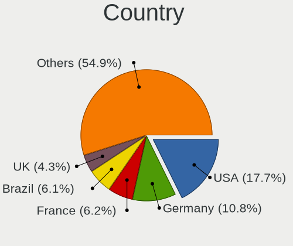
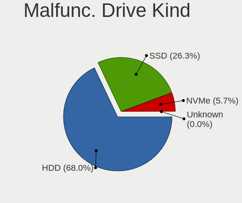
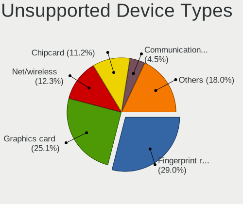

Ubuntu - Tested Hardware & Statistics
-------------------------------------

A project to collect tested hardware configurations for Ubuntu.

Anyone can contribute to this report by the [hw-probe](https://github.com/linuxhw/hw-probe) tool:

    sudo -E hw-probe -all -upload

Please contribute! Especially if your hardware is rare.

This is a report for all computer types. See also reports for [desktops](/Dist/Ubuntu/Desktop/README.md) and [notebooks](/Dist/Ubuntu/Notebook/README.md).

Contents
--------

* [ Test Cases ](#test-cases)

* [ System ](#system)
  - [ OS                       ](#os)
  - [ OS Family                ](#os-family)
  - [ Kernel                   ](#kernel)
  - [ Kernel Family            ](#kernel-family)
  - [ Kernel Major Ver.        ](#kernel-major-ver)
  - [ Arch                     ](#arch)
  - [ DE                       ](#de)
  - [ Display Server           ](#display-server)
  - [ Display Manager          ](#display-manager)
  - [ OS Lang                  ](#os-lang)
  - [ Boot Mode                ](#boot-mode)
  - [ Filesystem               ](#filesystem)
  - [ Part. scheme             ](#part-scheme)
  - [ Dual Boot with Linux/BSD ](#dual-boot-with-linuxbsd)
  - [ Dual Boot (Win)          ](#dual-boot-win)

* [ Board ](#board)
  - [ Vendor                   ](#vendor)
  - [ Model                    ](#model)
  - [ Model Family             ](#model-family)
  - [ MFG Year                 ](#mfg-year)
  - [ Form Factor              ](#form-factor)
  - [ Secure Boot              ](#secure-boot)
  - [ Coreboot                 ](#coreboot)
  - [ RAM Size                 ](#ram-size)
  - [ RAM Used                 ](#ram-used)
  - [ Total Drives             ](#total-drives)
  - [ Has CD-ROM               ](#has-cd-rom)
  - [ Has Ethernet             ](#has-ethernet)
  - [ Has WiFi                 ](#has-wifi)
  - [ Has Bluetooth            ](#has-bluetooth)

* [ Location ](#location)
  - [ Country                  ](#country)
  - [ City                     ](#city)

* [ Drives ](#drives)
  - [ Drive Vendor             ](#drive-vendor)
  - [ Drive Model              ](#drive-model)
  - [ HDD Vendor               ](#hdd-vendor)
  - [ SSD Vendor               ](#ssd-vendor)
  - [ Drive Kind               ](#drive-kind)
  - [ Drive Connector          ](#drive-connector)
  - [ Drive Size               ](#drive-size)
  - [ Space Total              ](#space-total)
  - [ Space Used               ](#space-used)
  - [ Malfunc. Drives          ](#malfunc-drives)
  - [ Malfunc. Drive Vendor    ](#malfunc-drive-vendor)
  - [ Malfunc. HDD Vendor      ](#malfunc-hdd-vendor)
  - [ Malfunc. Drive Kind      ](#malfunc-drive-kind)
  - [ Failed Drives            ](#failed-drives)
  - [ Failed Drive Vendor      ](#failed-drive-vendor)
  - [ Drive Status             ](#drive-status)

* [ Storage controller ](#storage-controller)
  - [ Storage Vendor           ](#storage-vendor)
  - [ Storage Model            ](#storage-model)
  - [ Storage Kind             ](#storage-kind)

* [ Processor ](#processor)
  - [ CPU Vendor               ](#cpu-vendor)
  - [ CPU Model                ](#cpu-model)
  - [ CPU Model Family         ](#cpu-model-family)
  - [ CPU Cores                ](#cpu-cores)
  - [ CPU Sockets              ](#cpu-sockets)
  - [ CPU Threads              ](#cpu-threads)
  - [ CPU Op-Modes             ](#cpu-op-modes)
  - [ CPU Microcode            ](#cpu-microcode)
  - [ CPU Microarch            ](#cpu-microarch)

* [ Graphics ](#graphics)
  - [ GPU Vendor               ](#gpu-vendor)
  - [ GPU Model                ](#gpu-model)
  - [ GPU Combo                ](#gpu-combo)
  - [ GPU Driver               ](#gpu-driver)
  - [ GPU Memory               ](#gpu-memory)

* [ Monitor ](#monitor)
  - [ Monitor Vendor           ](#monitor-vendor)
  - [ Monitor Model            ](#monitor-model)
  - [ Monitor Resolution       ](#monitor-resolution)
  - [ Monitor Diagonal         ](#monitor-diagonal)
  - [ Monitor Width            ](#monitor-width)
  - [ Aspect Ratio             ](#aspect-ratio)
  - [ Monitor Area             ](#monitor-area)
  - [ Pixel Density            ](#pixel-density)
  - [ Multiple Monitors        ](#multiple-monitors)

* [ Network ](#network)
  - [ Net Controller Vendor    ](#net-controller-vendor)
  - [ Net Controller Model     ](#net-controller-model)
  - [ Wireless Vendor          ](#wireless-vendor)
  - [ Wireless Model           ](#wireless-model)
  - [ Ethernet Vendor          ](#ethernet-vendor)
  - [ Ethernet Model           ](#ethernet-model)
  - [ Net Controller Kind      ](#net-controller-kind)
  - [ Used Controller          ](#used-controller)
  - [ NICs                     ](#nics)
  - [ IPv6                     ](#ipv6)

* [ Bluetooth ](#bluetooth)
  - [ Bluetooth Vendor         ](#bluetooth-vendor)
  - [ Bluetooth Model          ](#bluetooth-model)

* [ Sound ](#sound)
  - [ Sound Vendor             ](#sound-vendor)
  - [ Sound Model              ](#sound-model)

* [ Memory ](#memory)
  - [ Memory Vendor            ](#memory-vendor)
  - [ Memory Model             ](#memory-model)
  - [ Memory Kind              ](#memory-kind)
  - [ Memory Form Factor       ](#memory-form-factor)
  - [ Memory Size              ](#memory-size)
  - [ Memory Speed             ](#memory-speed)

* [ Printers & scanners ](#printers--scanners)
  - [ Printer Vendor           ](#printer-vendor)
  - [ Printer Model            ](#printer-model)
  - [ Scanner Vendor           ](#scanner-vendor)
  - [ Scanner Model            ](#scanner-model)

* [ Camera ](#camera)
  - [ Camera Vendor            ](#camera-vendor)
  - [ Camera Model             ](#camera-model)

* [ Security ](#security)
  - [ Fingerprint Vendor       ](#fingerprint-vendor)
  - [ Fingerprint Model        ](#fingerprint-model)
  - [ Chipcard Vendor          ](#chipcard-vendor)
  - [ Chipcard Model           ](#chipcard-model)

* [ Unsupported ](#unsupported)
  - [ Unsupported Devices      ](#unsupported-devices)
  - [ Unsupported Device Types ](#unsupported-device-types)

Test Cases
----------

Total: 77191

| Vendor        | Model                       | Form-Factor | Probe                                                      | Date         |
|---------------|-----------------------------|-------------|------------------------------------------------------------|--------------|
| Lenovo        | G50-45 80E3                 | Notebook    | [d4f08c71a6](https://linux-hardware.org/?probe=d4f08c71a6) | Nov 02, 2022 |
| HP            | Pavilion Gaming Laptop      | Notebook    | [695b3d82a7](https://linux-hardware.org/?probe=695b3d82a7) | Nov 02, 2022 |
| MSI           | H81M-E35 V2                 | Desktop     | [db83c146a6](https://linux-hardware.org/?probe=db83c146a6) | Nov 02, 2022 |
| ASUSTek       | PRIME H410M-A               | Desktop     | [b3cac9f8b8](https://linux-hardware.org/?probe=b3cac9f8b8) | Nov 02, 2022 |
| HP            | 18E7                        | Desktop     | [c0d5c58895](https://linux-hardware.org/?probe=c0d5c58895) | Nov 02, 2022 |
| HP            | Pavilion Gaming Laptop      | Notebook    | [9b9e55c471](https://linux-hardware.org/?probe=9b9e55c471) | Nov 02, 2022 |
| HP            | EliteBook 8460p             | Notebook    | [565ad502cc](https://linux-hardware.org/?probe=565ad502cc) | Nov 02, 2022 |
| ASUSTek       | M5A78L-M LX3 PLUS           | Desktop     | [23a62c3509](https://linux-hardware.org/?probe=23a62c3509) | Nov 02, 2022 |
| Lenovo        | E41-25 81FS                 | Notebook    | [5d9743e91d](https://linux-hardware.org/?probe=5d9743e91d) | Nov 02, 2022 |
| Toshiba       | Satellite C70D-A            | Notebook    | [7a421ed810](https://linux-hardware.org/?probe=7a421ed810) | Nov 02, 2022 |
| Gigabyte      | B450 I AORUS PRO WIFI-CF    | Desktop     | [895a345eb9](https://linux-hardware.org/?probe=895a345eb9) | Nov 02, 2022 |
| Toshiba       | Satellite C70D-A            | Notebook    | [d82227846b](https://linux-hardware.org/?probe=d82227846b) | Nov 02, 2022 |
| Gigabyte      | B450 I AORUS PRO WIFI-CF    | Desktop     | [9d9d3a4967](https://linux-hardware.org/?probe=9d9d3a4967) | Nov 02, 2022 |
| Fujitsu       | D2628-C1 S26361-D2628-C1    | Desktop     | [a2af2980ad](https://linux-hardware.org/?probe=a2af2980ad) | Nov 02, 2022 |
| ASUSTek       | M5A78L-M LX3 PLUS           | Desktop     | [d34ccf5e7a](https://linux-hardware.org/?probe=d34ccf5e7a) | Nov 02, 2022 |
| ASUSTek       | M5A78L-M LX3 PLUS           | Desktop     | [eb06593b9e](https://linux-hardware.org/?probe=eb06593b9e) | Nov 02, 2022 |
| ASRock        | B450 Pro4                   | Desktop     | [5da1d76cd5](https://linux-hardware.org/?probe=5da1d76cd5) | Nov 02, 2022 |
| ASUSTek       | B85-PLUS                    | Desktop     | [dd24c26ffa](https://linux-hardware.org/?probe=dd24c26ffa) | Nov 02, 2022 |
| HP            | 18E5                        | Desktop     | [3df38ade7e](https://linux-hardware.org/?probe=3df38ade7e) | Nov 02, 2022 |
| Acer          | Aspire E5-522               | Notebook    | [32f73c64a6](https://linux-hardware.org/?probe=32f73c64a6) | Nov 02, 2022 |
| Acer          | Aspire E5-522               | Notebook    | [412b8c701e](https://linux-hardware.org/?probe=412b8c701e) | Nov 02, 2022 |
| Daten Tecn... | DT02-M4                     | Notebook    | [cdd5c3cca0](https://linux-hardware.org/?probe=cdd5c3cca0) | Nov 02, 2022 |
| Dell          | Latitude E5450              | Notebook    | [b39c12a9a4](https://linux-hardware.org/?probe=b39c12a9a4) | Nov 02, 2022 |
| Daten Tecn... | DT02-M4                     | Notebook    | [7d43f3c00b](https://linux-hardware.org/?probe=7d43f3c00b) | Nov 02, 2022 |
| Shanghai Z... | ZXE CRB                     | Notebook    | [a0029fb797](https://linux-hardware.org/?probe=a0029fb797) | Nov 02, 2022 |
| Dell          | 0GWHMW A01                  | Desktop     | [732eaeede7](https://linux-hardware.org/?probe=732eaeede7) | Nov 02, 2022 |
| HP            | EliteBook 845 G7 Noteboo... | Notebook    | [c693004e08](https://linux-hardware.org/?probe=c693004e08) | Nov 02, 2022 |
| Lenovo        | 361A SDK0K17763 WIN         | Desktop     | [5d34d86be3](https://linux-hardware.org/?probe=5d34d86be3) | Nov 02, 2022 |
| ReachingTe... | Dream Quest Office 2021     | Mini pc     | [fde67e1423](https://linux-hardware.org/?probe=fde67e1423) | Nov 02, 2022 |
| Dell          | Inspiron 7506 2n1           | Convertible | [0666d8a154](https://linux-hardware.org/?probe=0666d8a154) | Nov 02, 2022 |
| Gigabyte      | B450M GAMING-CF             | Desktop     | [95e2a1e7d9](https://linux-hardware.org/?probe=95e2a1e7d9) | Nov 02, 2022 |
| ASUSTek       | VivoBook_ASUSLaptop X705... | Notebook    | [4a158afdfd](https://linux-hardware.org/?probe=4a158afdfd) | Nov 02, 2022 |
| ASRock        | Q1900B-ITX                  | Desktop     | [6305a98777](https://linux-hardware.org/?probe=6305a98777) | Nov 02, 2022 |
| Dell          | Latitude 5420               | Notebook    | [679fbcb14f](https://linux-hardware.org/?probe=679fbcb14f) | Nov 02, 2022 |
| Apple         | Mac-35C5E08120C7EEAF Mac... | Mini pc     | [452ec1a1ee](https://linux-hardware.org/?probe=452ec1a1ee) | Nov 02, 2022 |
| HP            | 18E5                        | Desktop     | [8204df7795](https://linux-hardware.org/?probe=8204df7795) | Nov 02, 2022 |
| Lenovo        | Yoga 7 14ACN6 82N7          | Convertible | [2c7d7e2c8a](https://linux-hardware.org/?probe=2c7d7e2c8a) | Nov 02, 2022 |
| Dell          | 0TWFTR A02                  | All in one  | [21b78069dd](https://linux-hardware.org/?probe=21b78069dd) | Nov 02, 2022 |
| HP            | ProBook 450 G8 Notebook ... | Notebook    | [44e281e52c](https://linux-hardware.org/?probe=44e281e52c) | Nov 02, 2022 |
| Acer          | Aspire A514-55              | Notebook    | [391048b46f](https://linux-hardware.org/?probe=391048b46f) | Nov 02, 2022 |
| Dell          | Latitude E6420              | Notebook    | [032920f109](https://linux-hardware.org/?probe=032920f109) | Nov 02, 2022 |
| Jumper        | EZbook                      | Notebook    | [08ec434199](https://linux-hardware.org/?probe=08ec434199) | Nov 02, 2022 |
| Dell          | Inspiron 7506 2n1           | Convertible | [93884d7e71](https://linux-hardware.org/?probe=93884d7e71) | Nov 02, 2022 |
| Gigabyte      | Q270M-D3H                   | Desktop     | [46874cc0a1](https://linux-hardware.org/?probe=46874cc0a1) | Nov 02, 2022 |
| HP            | Pavilion dv8                | Notebook    | [21af5313f0](https://linux-hardware.org/?probe=21af5313f0) | Nov 02, 2022 |
| Cube          | i18-BL                      | Notebook    | [725100a829](https://linux-hardware.org/?probe=725100a829) | Nov 02, 2022 |
| Lenovo        | Legion 5 Pro 16ITH6 82JF    | Notebook    | [09c2704bb0](https://linux-hardware.org/?probe=09c2704bb0) | Nov 02, 2022 |
| HP            | 625                         | Notebook    | [830c5c0d14](https://linux-hardware.org/?probe=830c5c0d14) | Nov 02, 2022 |
| HP            | 625                         | Notebook    | [4c627cab51](https://linux-hardware.org/?probe=4c627cab51) | Nov 02, 2022 |
| Lenovo        | 312A SDK0J40697 WIN 3305... | Desktop     | [fe91c11062](https://linux-hardware.org/?probe=fe91c11062) | Nov 02, 2022 |
| HP            | Pavilion x2 Detachable P... | Notebook    | [b4d63f4835](https://linux-hardware.org/?probe=b4d63f4835) | Nov 02, 2022 |
| Acer          | Aspire A315-54              | Notebook    | [1421a5a4e9](https://linux-hardware.org/?probe=1421a5a4e9) | Nov 02, 2022 |
| HUAWEI        | HVY-WXX9                    | Notebook    | [87ab6daba5](https://linux-hardware.org/?probe=87ab6daba5) | Nov 02, 2022 |
| Dell          | Vostro 15 3515              | Notebook    | [59c101934c](https://linux-hardware.org/?probe=59c101934c) | Nov 02, 2022 |
| HP            | Pavilion x360 Convertibl... | Convertible | [fd4d484f61](https://linux-hardware.org/?probe=fd4d484f61) | Nov 02, 2022 |
| Microsoft     | Surface Go                  | Tablet      | [961f664871](https://linux-hardware.org/?probe=961f664871) | Nov 02, 2022 |
| Apple         | MacBookPro11,5              | Notebook    | [f22ebdf694](https://linux-hardware.org/?probe=f22ebdf694) | Nov 01, 2022 |
| HP            | 1905                        | Desktop     | [df0d192970](https://linux-hardware.org/?probe=df0d192970) | Nov 01, 2022 |
| Apple         | MacBookPro11,5              | Notebook    | [a27142d25c](https://linux-hardware.org/?probe=a27142d25c) | Nov 01, 2022 |
| ASRock        | AB350 Gaming K4             | Desktop     | [36387e4f11](https://linux-hardware.org/?probe=36387e4f11) | Nov 01, 2022 |
| HP            | Tablet 11m-be0xxx           | Tablet      | [fda7b35626](https://linux-hardware.org/?probe=fda7b35626) | Nov 01, 2022 |
| HP            | Tablet 11m-be0xxx           | Tablet      | [812c1bc398](https://linux-hardware.org/?probe=812c1bc398) | Nov 01, 2022 |
| HP            | ProLiant DL380p Gen8        | Server      | [9d0e85aed7](https://linux-hardware.org/?probe=9d0e85aed7) | Nov 01, 2022 |
| HP            | Pavilion Notebook           | Notebook    | [95d825cd94](https://linux-hardware.org/?probe=95d825cd94) | Nov 01, 2022 |
| Intel         | H61                         | Desktop     | [326fa40958](https://linux-hardware.org/?probe=326fa40958) | Nov 01, 2022 |
| ASUSTek       | H97I-PLUS                   | Desktop     | [13bf376807](https://linux-hardware.org/?probe=13bf376807) | Nov 01, 2022 |
| Dell          | Precision 5520              | Notebook    | [e1a819ec3e](https://linux-hardware.org/?probe=e1a819ec3e) | Nov 01, 2022 |
| HP            | 3646h                       | Desktop     | [f88c9632b4](https://linux-hardware.org/?probe=f88c9632b4) | Nov 01, 2022 |
| Acer          | Swift SF314-42              | Notebook    | [6a0d7d5f39](https://linux-hardware.org/?probe=6a0d7d5f39) | Nov 01, 2022 |
| Dell          | 06D7TR A02                  | Desktop     | [a27d97c026](https://linux-hardware.org/?probe=a27d97c026) | Nov 01, 2022 |
| Lenovo        | ThinkPad L590 20Q7001KIX    | Notebook    | [c8e545615f](https://linux-hardware.org/?probe=c8e545615f) | Nov 01, 2022 |
| Dell          | 06D7TR A02                  | Desktop     | [f8a4053db1](https://linux-hardware.org/?probe=f8a4053db1) | Nov 01, 2022 |
| ASUSTek       | Z97-PRO GAMER               | Desktop     | [4b9071c932](https://linux-hardware.org/?probe=4b9071c932) | Nov 01, 2022 |
| Apple         | Mac-00BE6ED71E35EB86 iMa... | All in one  | [9704a12e23](https://linux-hardware.org/?probe=9704a12e23) | Nov 01, 2022 |
| ASUSTek       | BM2AD_D510MT_D310MT         | Desktop     | [8f2b0bc926](https://linux-hardware.org/?probe=8f2b0bc926) | Nov 01, 2022 |
| Acer          | Swift SF314-41              | Notebook    | [921b1a7ebf](https://linux-hardware.org/?probe=921b1a7ebf) | Nov 01, 2022 |
| ASUSTek       | Z170 PRO GAMING/AURA        | Desktop     | [f0db98f6bb](https://linux-hardware.org/?probe=f0db98f6bb) | Nov 01, 2022 |
| ASUSTek       | CROSSBLADE RANGER           | Desktop     | [5f92247b16](https://linux-hardware.org/?probe=5f92247b16) | Nov 01, 2022 |
| ASUSTek       | Z170 PRO GAMING/AURA        | Desktop     | [fc832e8881](https://linux-hardware.org/?probe=fc832e8881) | Nov 01, 2022 |
| Gigabyte      | H310M H                     | Desktop     | [115025ee59](https://linux-hardware.org/?probe=115025ee59) | Nov 01, 2022 |
| Gigabyte      | H310M H                     | Desktop     | [74af46599e](https://linux-hardware.org/?probe=74af46599e) | Nov 01, 2022 |
| Dell          | 07C0H8 A00                  | Desktop     | [1b2cb018d0](https://linux-hardware.org/?probe=1b2cb018d0) | Nov 01, 2022 |
| Fujitsu       | D2628-C1 S26361-D2628-C1    | Desktop     | [245ec71478](https://linux-hardware.org/?probe=245ec71478) | Nov 01, 2022 |
| ASUSTek       | VivoBook_ASUSLaptop M760... | Notebook    | [49d6eb853f](https://linux-hardware.org/?probe=49d6eb853f) | Nov 01, 2022 |
| ASUSTek       | VivoBook_ASUSLaptop M760... | Notebook    | [5de7efb403](https://linux-hardware.org/?probe=5de7efb403) | Nov 01, 2022 |
| Gigabyte      | Z170-HD3P-CF                | Desktop     | [5fd845ca54](https://linux-hardware.org/?probe=5fd845ca54) | Nov 01, 2022 |
| Acer          | Aspire V3-571G              | Notebook    | [990a38ea87](https://linux-hardware.org/?probe=990a38ea87) | Nov 01, 2022 |
| ASUSTek       | PRIME A320M-K               | Desktop     | [a14fa00a56](https://linux-hardware.org/?probe=a14fa00a56) | Nov 01, 2022 |
| ASUSTek       | PRIME A320M-K               | Desktop     | [bfa1db2eb1](https://linux-hardware.org/?probe=bfa1db2eb1) | Nov 01, 2022 |
| OEM           | H310MD4                     | Desktop     | [947bf0d86f](https://linux-hardware.org/?probe=947bf0d86f) | Nov 01, 2022 |
| ASUSTek       | X501A                       | Notebook    | [d5a34df414](https://linux-hardware.org/?probe=d5a34df414) | Nov 01, 2022 |
| ASUSTek       | VivoBook 15_ASUS Laptop ... | Notebook    | [6323d7e1b3](https://linux-hardware.org/?probe=6323d7e1b3) | Nov 01, 2022 |
| ASUSTek       | H61M-K                      | Desktop     | [ca5a47c66a](https://linux-hardware.org/?probe=ca5a47c66a) | Nov 01, 2022 |
| Dell          | Inspiron 15 3511            | Notebook    | [85c215eebf](https://linux-hardware.org/?probe=85c215eebf) | Nov 01, 2022 |
| ASRock        | AB350 Gaming K4             | Desktop     | [560d84828c](https://linux-hardware.org/?probe=560d84828c) | Nov 01, 2022 |
| MSI           | MAG B550 TOMAHAWK           | Desktop     | [24203a87c9](https://linux-hardware.org/?probe=24203a87c9) | Nov 01, 2022 |
| ASUSTek       | ProArt StudioBook H7600H... | Notebook    | [3db734a533](https://linux-hardware.org/?probe=3db734a533) | Nov 01, 2022 |
| ASUSTek       | PRIME B360M-A               | Desktop     | [c46dd8d9b6](https://linux-hardware.org/?probe=c46dd8d9b6) | Nov 01, 2022 |
| Samsung       | 950QED                      | Convertible | [3fa8caa72f](https://linux-hardware.org/?probe=3fa8caa72f) | Nov 01, 2022 |
| ASUSTek       | SABERTOOTH Z87              | Desktop     | [d39c952932](https://linux-hardware.org/?probe=d39c952932) | Nov 01, 2022 |
| Apple         | MacBookAir7,2               | Notebook    | [2532d13f74](https://linux-hardware.org/?probe=2532d13f74) | Nov 01, 2022 |
| Dell          | 082WXT A03                  | Desktop     | [ab3dad5a31](https://linux-hardware.org/?probe=ab3dad5a31) | Nov 01, 2022 |
| Timi          | TM1701                      | Notebook    | [84a5a6ce39](https://linux-hardware.org/?probe=84a5a6ce39) | Nov 01, 2022 |
| ASUSTek       | TUF Gaming X570-PLUS        | Desktop     | [d729001115](https://linux-hardware.org/?probe=d729001115) | Nov 01, 2022 |
| Lenovo        | ThinkPad L14 Gen 2 20X2S... | Notebook    | [36d7199821](https://linux-hardware.org/?probe=36d7199821) | Nov 01, 2022 |
| AOpen         | aVKx-DE R1.03 55DEL10001... | Desktop     | [b487a7aee3](https://linux-hardware.org/?probe=b487a7aee3) | Oct 31, 2022 |
| Lenovo        | G710 20252                  | Notebook    | [834e3f17aa](https://linux-hardware.org/?probe=834e3f17aa) | Oct 31, 2022 |
| Lenovo        | G710 20252                  | Notebook    | [acc007bae4](https://linux-hardware.org/?probe=acc007bae4) | Oct 31, 2022 |
| HP            | 1850                        | Desktop     | [b39eac8f74](https://linux-hardware.org/?probe=b39eac8f74) | Oct 31, 2022 |
| Packard Be... | EasyNote TK85               | Notebook    | [a233571587](https://linux-hardware.org/?probe=a233571587) | Oct 31, 2022 |
| Acer          | Aspire TC-280               | Desktop     | [68679c6495](https://linux-hardware.org/?probe=68679c6495) | Oct 31, 2022 |
| MSI           | B450 TOMAHAWK MAX           | Desktop     | [183545ed4e](https://linux-hardware.org/?probe=183545ed4e) | Oct 31, 2022 |
| ASUSTek       | Z97-P                       | Desktop     | [72467c5d61](https://linux-hardware.org/?probe=72467c5d61) | Oct 31, 2022 |
| MSI           | A320M-A PRO                 | Desktop     | [8769289ea5](https://linux-hardware.org/?probe=8769289ea5) | Oct 31, 2022 |
| Sony          | VPCZ12C5E                   | Notebook    | [b1e6524541](https://linux-hardware.org/?probe=b1e6524541) | Oct 31, 2022 |
| Dell          | 03NVJ6 A03                  | Desktop     | [adebd09dc4](https://linux-hardware.org/?probe=adebd09dc4) | Oct 31, 2022 |
| Lenovo        | IdeaPad S145-15API 81V7     | Notebook    | [973fc77891](https://linux-hardware.org/?probe=973fc77891) | Oct 31, 2022 |
| ASUSTek       | VM60                        | Desktop     | [2cb5cc2932](https://linux-hardware.org/?probe=2cb5cc2932) | Oct 31, 2022 |
| Dell          | Latitude E6330              | Notebook    | [51ded2feb1](https://linux-hardware.org/?probe=51ded2feb1) | Oct 31, 2022 |
| ASUSTek       | M4A78                       | Desktop     | [8eb1316a14](https://linux-hardware.org/?probe=8eb1316a14) | Oct 31, 2022 |
| ASUSTek       | CG8480                      | Desktop     | [0f7c1dc1cf](https://linux-hardware.org/?probe=0f7c1dc1cf) | Oct 31, 2022 |
| Microsoft     | Surface 3                   | Tablet      | [71eeeaef9e](https://linux-hardware.org/?probe=71eeeaef9e) | Oct 31, 2022 |
| Dell          | Inspiron 3542               | Notebook    | [dcccad24af](https://linux-hardware.org/?probe=dcccad24af) | Oct 31, 2022 |
| Unknown       | Unknown                     | Desktop     | [7cce0a2867](https://linux-hardware.org/?probe=7cce0a2867) | Oct 31, 2022 |
| Dell          | Vostro 7620                 | Notebook    | [2ccd56ee29](https://linux-hardware.org/?probe=2ccd56ee29) | Oct 31, 2022 |
| HP            | EliteBook 745 G2            | Notebook    | [0786ded6c8](https://linux-hardware.org/?probe=0786ded6c8) | Oct 31, 2022 |
| Unknown       | Unknown                     | Notebook    | [77bdbb310f](https://linux-hardware.org/?probe=77bdbb310f) | Oct 31, 2022 |
| TUXEDO        | InfinityBook S 15 Gen6      | Notebook    | [92e9764aa0](https://linux-hardware.org/?probe=92e9764aa0) | Oct 31, 2022 |
| Acer          | Swift SF314-512             | Notebook    | [d6bf187cc9](https://linux-hardware.org/?probe=d6bf187cc9) | Oct 31, 2022 |
| ASUSTek       | M4A78                       | Desktop     | [81374a561c](https://linux-hardware.org/?probe=81374a561c) | Oct 31, 2022 |
| Intel         | NUC6i3SYB H81132-503        | Mini pc     | [91aef8cd0f](https://linux-hardware.org/?probe=91aef8cd0f) | Oct 31, 2022 |
| HP            | Compaq 8000 Elite CMT PC    | Desktop     | [fbe835b8ef](https://linux-hardware.org/?probe=fbe835b8ef) | Oct 31, 2022 |
| Sony          | VPCZ12C5E                   | Notebook    | [85803f499a](https://linux-hardware.org/?probe=85803f499a) | Oct 31, 2022 |
| Lenovo        | ThinkPad T16 Gen 1 21BVC... | Notebook    | [ce59648f62](https://linux-hardware.org/?probe=ce59648f62) | Oct 31, 2022 |
| ASUSTek       | ProArt StudioBook W700GV... | Notebook    | [bf22c22bb4](https://linux-hardware.org/?probe=bf22c22bb4) | Oct 31, 2022 |
| Adlinktech    | SB-MLC                      | Notebook    | [203d95e012](https://linux-hardware.org/?probe=203d95e012) | Oct 31, 2022 |
| Acer          | Aspire A514-55              | Notebook    | [142e1c0695](https://linux-hardware.org/?probe=142e1c0695) | Oct 31, 2022 |
| Lenovo        | ThinkBook 15 G2 ITL 20VE    | Notebook    | [451acdb910](https://linux-hardware.org/?probe=451acdb910) | Oct 31, 2022 |
| Valve         | Jupiter                     | Notebook    | [38d0d0e32a](https://linux-hardware.org/?probe=38d0d0e32a) | Oct 31, 2022 |
| Samsung       | DeskTop System              | Desktop     | [56b4bb00b0](https://linux-hardware.org/?probe=56b4bb00b0) | Oct 31, 2022 |
| Acer          | Aspire A514-55              | Notebook    | [87f4a137dc](https://linux-hardware.org/?probe=87f4a137dc) | Oct 31, 2022 |
| MSI           | 990FXA-GD80                 | Desktop     | [baaa1111ec](https://linux-hardware.org/?probe=baaa1111ec) | Oct 31, 2022 |
| Sony          | SVT13118FXS                 | Notebook    | [13b4af9ec3](https://linux-hardware.org/?probe=13b4af9ec3) | Oct 31, 2022 |
| MSI           | AM1I                        | Desktop     | [30014de18a](https://linux-hardware.org/?probe=30014de18a) | Oct 31, 2022 |
| WTM           | W-N95 B0                    | Desktop     | [56611d3c8f](https://linux-hardware.org/?probe=56611d3c8f) | Oct 31, 2022 |
| Intel         | D33217GKE G76540-201        | Desktop     | [b3403874f4](https://linux-hardware.org/?probe=b3403874f4) | Oct 31, 2022 |
| ReachingTe... | Dream Quest Office 2021     | Mini pc     | [dfdf6532b6](https://linux-hardware.org/?probe=dfdf6532b6) | Oct 31, 2022 |
| Dell          | Vostro 7620                 | Notebook    | [7f41a14301](https://linux-hardware.org/?probe=7f41a14301) | Oct 31, 2022 |
| ASUSTek       | VivoBook_ASUSLaptop X515... | Notebook    | [deac1b706f](https://linux-hardware.org/?probe=deac1b706f) | Oct 31, 2022 |
| Dell          | Vostro 7620                 | Notebook    | [00dae3fbc5](https://linux-hardware.org/?probe=00dae3fbc5) | Oct 31, 2022 |
| ASUSTek       | VivoBook_ASUSLaptop M340... | Notebook    | [dea1724953](https://linux-hardware.org/?probe=dea1724953) | Oct 31, 2022 |
| ASUSTek       | P5Q-E                       | Desktop     | [0ef6be44d0](https://linux-hardware.org/?probe=0ef6be44d0) | Oct 31, 2022 |
| Lenovo        | ThinkPad Edge E530 3259M... | Notebook    | [aa1f78db58](https://linux-hardware.org/?probe=aa1f78db58) | Oct 31, 2022 |
| Lenovo        | ThinkPad Edge E530 3259M... | Notebook    | [26b5f59993](https://linux-hardware.org/?probe=26b5f59993) | Oct 31, 2022 |
| HP            | 14                          | Notebook    | [7611c14813](https://linux-hardware.org/?probe=7611c14813) | Oct 31, 2022 |
| Toshiba       | Satellite A200              | Notebook    | [296d9a0f38](https://linux-hardware.org/?probe=296d9a0f38) | Oct 31, 2022 |
| Toshiba       | Satellite A200              | Notebook    | [07a165b373](https://linux-hardware.org/?probe=07a165b373) | Oct 31, 2022 |
| Lenovo        | IdeaPad S145-15IWL 81S9     | Notebook    | [c8970ae94a](https://linux-hardware.org/?probe=c8970ae94a) | Oct 31, 2022 |
| Acer          | Nitro AN517-55              | Notebook    | [9653f093e1](https://linux-hardware.org/?probe=9653f093e1) | Oct 31, 2022 |
| Gigabyte      | Z170-Gaming K3              | Desktop     | [d84f634b59](https://linux-hardware.org/?probe=d84f634b59) | Oct 31, 2022 |
| Panasonic     | CF-19RDRCHH7                | Notebook    | [99e94a7708](https://linux-hardware.org/?probe=99e94a7708) | Oct 31, 2022 |
| Lenovo        | IdeaPad 720S-13IKB 81A8     | Notebook    | [85efda7536](https://linux-hardware.org/?probe=85efda7536) | Oct 31, 2022 |
| MSI           | MS-7309                     | Desktop     | [a6b1a7d329](https://linux-hardware.org/?probe=a6b1a7d329) | Oct 31, 2022 |
| ASUSTek       | K73SV                       | Notebook    | [d505f0c0d0](https://linux-hardware.org/?probe=d505f0c0d0) | Oct 30, 2022 |
| Lenovo        | ThinkPad X270 20HN0014FR    | Notebook    | [d6fc7c48a1](https://linux-hardware.org/?probe=d6fc7c48a1) | Oct 30, 2022 |
| MSI           | MS-7309                     | Desktop     | [3c519589ad](https://linux-hardware.org/?probe=3c519589ad) | Oct 30, 2022 |
| ASUSTek       | PHOENIX                     | Desktop     | [d4f8ae717d](https://linux-hardware.org/?probe=d4f8ae717d) | Oct 30, 2022 |
| Lenovo        | ThinkPad T440 20B7S18Y0Y    | Notebook    | [9cf3beb13f](https://linux-hardware.org/?probe=9cf3beb13f) | Oct 30, 2022 |
| Lenovo        | ThinkPad T440 20B7S18Y0Y    | Notebook    | [36b3303b35](https://linux-hardware.org/?probe=36b3303b35) | Oct 30, 2022 |
| ASUSTek       | A8N32-SLI-Deluxe            | Desktop     | [85389b6454](https://linux-hardware.org/?probe=85389b6454) | Oct 30, 2022 |
| ASRock        | FM2A88X-ITX+                | Desktop     | [08cf9e2ccd](https://linux-hardware.org/?probe=08cf9e2ccd) | Oct 30, 2022 |
| Acer          | Swift SFX14-51G             | Notebook    | [6812d7cf22](https://linux-hardware.org/?probe=6812d7cf22) | Oct 30, 2022 |
| Gigabyte      | B550 AORUS ELITE V2         | Desktop     | [738569f811](https://linux-hardware.org/?probe=738569f811) | Oct 30, 2022 |
| HP            | Laptop 15-da0xxx            | Notebook    | [b903c0e375](https://linux-hardware.org/?probe=b903c0e375) | Oct 30, 2022 |
| ASRock        | B550M Pro4                  | Desktop     | [078fd46e0a](https://linux-hardware.org/?probe=078fd46e0a) | Oct 30, 2022 |
| Lenovo        | IdeaPad 100S-14IBR 80R9     | Notebook    | [91d1732515](https://linux-hardware.org/?probe=91d1732515) | Oct 30, 2022 |
| Lenovo        | 0B98401 WIN                 | Desktop     | [25805a13b0](https://linux-hardware.org/?probe=25805a13b0) | Oct 30, 2022 |
| Biostar       | PE24                        | Desktop     | [57ad96c14e](https://linux-hardware.org/?probe=57ad96c14e) | Oct 30, 2022 |
| AZW           | GTR V01                     | Mini pc     | [03b291b957](https://linux-hardware.org/?probe=03b291b957) | Oct 30, 2022 |
| HP            | Pavilion 15                 | Notebook    | [f1eac2c0c3](https://linux-hardware.org/?probe=f1eac2c0c3) | Oct 30, 2022 |
| Dell          | XPS 15 9575                 | Convertible | [21aa0f31b3](https://linux-hardware.org/?probe=21aa0f31b3) | Oct 30, 2022 |
| ASRock        | FM2A88X-ITX+                | Desktop     | [e28a25b18a](https://linux-hardware.org/?probe=e28a25b18a) | Oct 30, 2022 |
| ASRock        | 960GM-VGS3 FX               | Desktop     | [ac82c6bda9](https://linux-hardware.org/?probe=ac82c6bda9) | Oct 30, 2022 |
| Samsung       | RV410/RV510/S3510/E3510     | Notebook    | [d4552d84d5](https://linux-hardware.org/?probe=d4552d84d5) | Oct 30, 2022 |
| Lenovo        | ThinkPad T510 4384WKU       | Notebook    | [86fee6e260](https://linux-hardware.org/?probe=86fee6e260) | Oct 30, 2022 |
| Lenovo        | Yoga Slim 7 14ITL05 82A3    | Notebook    | [150c8ac0ac](https://linux-hardware.org/?probe=150c8ac0ac) | Oct 30, 2022 |
| HP            | Pavilion x360 Convertibl... | Convertible | [1b3c0e501b](https://linux-hardware.org/?probe=1b3c0e501b) | Oct 30, 2022 |
| ASUSTek       | PRIME X470-PRO              | Desktop     | [a8b08a47aa](https://linux-hardware.org/?probe=a8b08a47aa) | Oct 30, 2022 |
| ASUSTek       | A8N32-SLI-Deluxe            | Desktop     | [55be6f23ce](https://linux-hardware.org/?probe=55be6f23ce) | Oct 30, 2022 |
| Lenovo        | ThinkPad P1 Gen 5 21DC00... | Notebook    | [910b452558](https://linux-hardware.org/?probe=910b452558) | Oct 30, 2022 |
| ASUSTek       | VivoBook_ASUS Laptop E40... | Notebook    | [cbdfd56f05](https://linux-hardware.org/?probe=cbdfd56f05) | Oct 30, 2022 |
| HP            | Laptop 15s-gr0xxx           | Notebook    | [02d23cb1b9](https://linux-hardware.org/?probe=02d23cb1b9) | Oct 30, 2022 |
| HP            | ProBook 650 G1              | Notebook    | [54c64976ee](https://linux-hardware.org/?probe=54c64976ee) | Oct 30, 2022 |
| MSI           | Stealth GS77 12UHS          | Notebook    | [8a1d96274e](https://linux-hardware.org/?probe=8a1d96274e) | Oct 30, 2022 |
| Intel         | D33217GKE G76540-203        | Desktop     | [51a91ba41f](https://linux-hardware.org/?probe=51a91ba41f) | Oct 30, 2022 |
| Acer          | Swift SF314-42              | Notebook    | [6873e5b579](https://linux-hardware.org/?probe=6873e5b579) | Oct 30, 2022 |
| LG Electro... | 15Z980-HA76K                | Notebook    | [914156672d](https://linux-hardware.org/?probe=914156672d) | Oct 30, 2022 |
| Lenovo        | ThinkBook 15p 20V3          | Notebook    | [8dfb7265a9](https://linux-hardware.org/?probe=8dfb7265a9) | Oct 30, 2022 |
| Huanan        | H510-D4 V4.0                | Desktop     | [89b298973c](https://linux-hardware.org/?probe=89b298973c) | Oct 30, 2022 |
| Gigabyte      | X570S AORUS PRO AX          | Desktop     | [03d14141e4](https://linux-hardware.org/?probe=03d14141e4) | Oct 30, 2022 |
| MSI           | A320M-A PRO MAX             | Desktop     | [80d6d99bcf](https://linux-hardware.org/?probe=80d6d99bcf) | Oct 30, 2022 |
| Intel         | NUC7i7BNB J31145-314        | Mini pc     | [9fd1f28183](https://linux-hardware.org/?probe=9fd1f28183) | Oct 30, 2022 |
| Medion        | MS-7707                     | Desktop     | [4f018e8577](https://linux-hardware.org/?probe=4f018e8577) | Oct 30, 2022 |
| ASUSTek       | VivoBook_ASUS Laptop E40... | Notebook    | [031a5998a5](https://linux-hardware.org/?probe=031a5998a5) | Oct 30, 2022 |
| Dell          | 0WMJ54 A01                  | Desktop     | [3760efa49c](https://linux-hardware.org/?probe=3760efa49c) | Oct 30, 2022 |
| Dell          | 0WMJ54 A01                  | Desktop     | [1b614b2744](https://linux-hardware.org/?probe=1b614b2744) | Oct 30, 2022 |
| Raspberry ... | Raspberry Pi 4 Model B R... | Soc         | [c11b330691](https://linux-hardware.org/?probe=c11b330691) | Oct 30, 2022 |
| Acer          | Swift SF314-42              | Notebook    | [da1b668449](https://linux-hardware.org/?probe=da1b668449) | Oct 30, 2022 |
| Dell          | Latitude E6510              | Notebook    | [84a61bf436](https://linux-hardware.org/?probe=84a61bf436) | Oct 30, 2022 |
| HUAWEI        | KLVL-WXX9                   | Notebook    | [4e4e0ac802](https://linux-hardware.org/?probe=4e4e0ac802) | Oct 30, 2022 |
| HUAWEI        | KLVL-WXX9                   | Notebook    | [8887bce606](https://linux-hardware.org/?probe=8887bce606) | Oct 30, 2022 |
| Dell          | 0G214D A00                  | Desktop     | [43b30d9a84](https://linux-hardware.org/?probe=43b30d9a84) | Oct 30, 2022 |
| Dell          | 0G214D A00                  | Desktop     | [2ee26099ae](https://linux-hardware.org/?probe=2ee26099ae) | Oct 30, 2022 |
| MSI           | MS-7358                     | Desktop     | [3ddf4b8fff](https://linux-hardware.org/?probe=3ddf4b8fff) | Oct 30, 2022 |
| ASUSTek       | H97-PLUS                    | Desktop     | [f22f67754e](https://linux-hardware.org/?probe=f22f67754e) | Oct 29, 2022 |
| ASRock        | 960GM-VGS3 FX               | Desktop     | [5769997d2a](https://linux-hardware.org/?probe=5769997d2a) | Oct 29, 2022 |
| MSI           | A320M-A PRO                 | Desktop     | [23ad30db1a](https://linux-hardware.org/?probe=23ad30db1a) | Oct 29, 2022 |
| GEO           | GeoBook3                    | Notebook    | [133a4460f6](https://linux-hardware.org/?probe=133a4460f6) | Oct 29, 2022 |
| ASUSTek       | M4A78                       | Desktop     | [d88d101a3c](https://linux-hardware.org/?probe=d88d101a3c) | Oct 29, 2022 |
| Lenovo        | ThinkPad E14 Gen 3 20Y70... | Notebook    | [97425e2f52](https://linux-hardware.org/?probe=97425e2f52) | Oct 29, 2022 |
| ASUSTek       | ZenBook UX325EA_UX325EA     | Notebook    | [69198e503e](https://linux-hardware.org/?probe=69198e503e) | Oct 29, 2022 |
| HP            | ProLiant ML310e Gen8 v2     | Desktop     | [768d0e85c9](https://linux-hardware.org/?probe=768d0e85c9) | Oct 29, 2022 |
| Lenovo        | G710 20252                  | Notebook    | [f700e495ba](https://linux-hardware.org/?probe=f700e495ba) | Oct 29, 2022 |
| HP            | Laptop 15-dw0xxx            | Notebook    | [f6b00cb10f](https://linux-hardware.org/?probe=f6b00cb10f) | Oct 29, 2022 |
| Dell          | Vostro 3500                 | Notebook    | [53754d84e7](https://linux-hardware.org/?probe=53754d84e7) | Oct 29, 2022 |
| Toshiba       | Satellite L50-A-1D6         | Notebook    | [77f308d89c](https://linux-hardware.org/?probe=77f308d89c) | Oct 29, 2022 |
| Lenovo        | ThinkPad T510 43145GG       | Notebook    | [d1e2bf7f33](https://linux-hardware.org/?probe=d1e2bf7f33) | Oct 29, 2022 |
| Gigabyte      | Z390 AORUS PRO-CF           | Desktop     | [05b5af2e63](https://linux-hardware.org/?probe=05b5af2e63) | Oct 29, 2022 |
| Dell          | Latitude E6510              | Notebook    | [b346d71347](https://linux-hardware.org/?probe=b346d71347) | Oct 29, 2022 |
| ASUSTek       | ASUS TUF Gaming F15 FX50... | Notebook    | [b8cfddfcbf](https://linux-hardware.org/?probe=b8cfddfcbf) | Oct 29, 2022 |
| Dell          | 0NW6H5 A00                  | Desktop     | [d768cd4c66](https://linux-hardware.org/?probe=d768cd4c66) | Oct 29, 2022 |
| MSI           | B450M PRO-M2 MAX            | Desktop     | [6549416d9d](https://linux-hardware.org/?probe=6549416d9d) | Oct 29, 2022 |
| HP            | Victus by Laptop 16-d1xx... | Notebook    | [c2d1799732](https://linux-hardware.org/?probe=c2d1799732) | Oct 29, 2022 |
| Dell          | Precision 3570              | Notebook    | [fb016d8d01](https://linux-hardware.org/?probe=fb016d8d01) | Oct 29, 2022 |
| HP            | EliteBook 830 G7 Noteboo... | Notebook    | [063675c104](https://linux-hardware.org/?probe=063675c104) | Oct 29, 2022 |
| HP            | OMEN by Laptop 15-dc1xxx    | Notebook    | [20d95ce78c](https://linux-hardware.org/?probe=20d95ce78c) | Oct 29, 2022 |
| HP            | EliteBook 820 G4            | Notebook    | [c41402e832](https://linux-hardware.org/?probe=c41402e832) | Oct 29, 2022 |
| Lenovo        | ThinkPad T480s 20L8S4PR1... | Notebook    | [d99f500b00](https://linux-hardware.org/?probe=d99f500b00) | Oct 29, 2022 |
| ASRock        | 890GX Extreme3              | Desktop     | [ff1af2eaf0](https://linux-hardware.org/?probe=ff1af2eaf0) | Oct 29, 2022 |
| HP            | 8653 A                      | Desktop     | [9c19089f51](https://linux-hardware.org/?probe=9c19089f51) | Oct 29, 2022 |
| Dell          | Inspiron 5570               | Notebook    | [6555e01443](https://linux-hardware.org/?probe=6555e01443) | Oct 29, 2022 |
| HP            | Laptop 15s-eq2xxx           | Notebook    | [dbd930e552](https://linux-hardware.org/?probe=dbd930e552) | Oct 29, 2022 |
| Lenovo        | IdeaPad 3 15IIL05 81WE      | Notebook    | [d152b0a56c](https://linux-hardware.org/?probe=d152b0a56c) | Oct 29, 2022 |
| ASUSTek       | P5KPL-AM SE                 | Desktop     | [95af9b0439](https://linux-hardware.org/?probe=95af9b0439) | Oct 29, 2022 |
| Dell          | Inspiron 7506 2n1           | Convertible | [a44dec1b17](https://linux-hardware.org/?probe=a44dec1b17) | Oct 29, 2022 |
| Lenovo        | Legion Y740-17ICHg 81HH     | Notebook    | [ea1c9e069e](https://linux-hardware.org/?probe=ea1c9e069e) | Oct 29, 2022 |
| Dell          | Inspiron 7506 2n1           | Convertible | [e1a94d7ce4](https://linux-hardware.org/?probe=e1a94d7ce4) | Oct 29, 2022 |
| HUAWEI        | VLT-WX0                     | Notebook    | [e3662dc3bd](https://linux-hardware.org/?probe=e3662dc3bd) | Oct 29, 2022 |
| Dell          | 0WN7Y6 A01                  | Desktop     | [4a5527f98a](https://linux-hardware.org/?probe=4a5527f98a) | Oct 29, 2022 |
| Lenovo        | IdeaPad 3 15ITL6 82H8       | Notebook    | [27dfa8687b](https://linux-hardware.org/?probe=27dfa8687b) | Oct 29, 2022 |
| AXIOO         | Mybook 14H                  | Notebook    | [f8a7c19640](https://linux-hardware.org/?probe=f8a7c19640) | Oct 29, 2022 |
| ASUSTek       | PRIME Q270M-C               | Desktop     | [4440c6ed51](https://linux-hardware.org/?probe=4440c6ed51) | Oct 29, 2022 |
| HP            | Pavilion dv6                | Notebook    | [6406b8b769](https://linux-hardware.org/?probe=6406b8b769) | Oct 29, 2022 |
| HP            | Pavilion dv6                | Notebook    | [7873dfb4cf](https://linux-hardware.org/?probe=7873dfb4cf) | Oct 29, 2022 |
| HP            | OMEN Laptop 15-en0xxx       | Notebook    | [c3ea4065c4](https://linux-hardware.org/?probe=c3ea4065c4) | Oct 29, 2022 |
| Medion        | X682X                       | Notebook    | [f05dd25a08](https://linux-hardware.org/?probe=f05dd25a08) | Oct 29, 2022 |
| HP            | ProBook 450 G6              | Notebook    | [1b3bb91776](https://linux-hardware.org/?probe=1b3bb91776) | Oct 29, 2022 |
| Dell          | Precision 5750              | Notebook    | [9b9addd3b7](https://linux-hardware.org/?probe=9b9addd3b7) | Oct 29, 2022 |
| Lenovo        | ThinkPad X1 Carbon 7th 2... | Notebook    | [2ceb11d7b3](https://linux-hardware.org/?probe=2ceb11d7b3) | Oct 29, 2022 |
| Lenovo        | ThinkPad X1 Carbon 7th 2... | Notebook    | [5c3d640129](https://linux-hardware.org/?probe=5c3d640129) | Oct 29, 2022 |
| HP            | Laptop 15-dw3xxx            | Notebook    | [99ac55823d](https://linux-hardware.org/?probe=99ac55823d) | Oct 29, 2022 |
| HUAWEI        | BOD-WXX9                    | Notebook    | [880d3ba9c9](https://linux-hardware.org/?probe=880d3ba9c9) | Oct 29, 2022 |
| Dell          | Latitude 5531               | Notebook    | [cdea65fd5c](https://linux-hardware.org/?probe=cdea65fd5c) | Oct 29, 2022 |
| ASUSTek       | K53SV                       | Notebook    | [4ead64f80f](https://linux-hardware.org/?probe=4ead64f80f) | Oct 28, 2022 |
| ASUSTek       | K53SV                       | Notebook    | [d3043c50ae](https://linux-hardware.org/?probe=d3043c50ae) | Oct 28, 2022 |
| HP            | 255 G8 Notebook PC          | Notebook    | [7e9c19c994](https://linux-hardware.org/?probe=7e9c19c994) | Oct 28, 2022 |
| Gigabyte      | B550M DS3H                  | Desktop     | [8a918b4739](https://linux-hardware.org/?probe=8a918b4739) | Oct 28, 2022 |
| ASUSTek       | PRIME X570-PRO              | Desktop     | [e51ca052ec](https://linux-hardware.org/?probe=e51ca052ec) | Oct 28, 2022 |
| MSI           | MS-AE3111 10                | Other       | [b21e69db4d](https://linux-hardware.org/?probe=b21e69db4d) | Oct 28, 2022 |
| Dell          | Latitude 3590               | Notebook    | [d1b6c7cd85](https://linux-hardware.org/?probe=d1b6c7cd85) | Oct 28, 2022 |
| IP3 Tech      | AP1                         | Notebook    | [0562a6a46d](https://linux-hardware.org/?probe=0562a6a46d) | Oct 28, 2022 |
| Lenovo        | IdeaPad 500-15ACZ 80K4      | Notebook    | [c079764998](https://linux-hardware.org/?probe=c079764998) | Oct 28, 2022 |
| Lenovo        | IdeaPad 500-15ACZ 80K4      | Notebook    | [5ef9b4213f](https://linux-hardware.org/?probe=5ef9b4213f) | Oct 28, 2022 |
| Apple         | MacBookPro16,1              | Notebook    | [eba036175b](https://linux-hardware.org/?probe=eba036175b) | Oct 28, 2022 |
| HP            | Laptop 15s-gr0xxx           | Notebook    | [f7155fd671](https://linux-hardware.org/?probe=f7155fd671) | Oct 28, 2022 |
| ASUSTek       | CM1730,CM1830               | Desktop     | [0915c0bf5a](https://linux-hardware.org/?probe=0915c0bf5a) | Oct 28, 2022 |
| Dell          | XPS 13 9310                 | Notebook    | [7205cfe7b4](https://linux-hardware.org/?probe=7205cfe7b4) | Oct 28, 2022 |
| Toshiba       | Satellite C75D-B            | Notebook    | [4f644b7d3b](https://linux-hardware.org/?probe=4f644b7d3b) | Oct 28, 2022 |
| ASUSTek       | TUF H370-PRO GAMING WIFI    | Desktop     | [48cbfa7a78](https://linux-hardware.org/?probe=48cbfa7a78) | Oct 28, 2022 |
| HP            | Pavilion Laptop 15-eh2xx... | Notebook    | [f9238c2035](https://linux-hardware.org/?probe=f9238c2035) | Oct 28, 2022 |
| Lenovo        | ThinkPad T420 4236NUG       | Notebook    | [d0e3fa9699](https://linux-hardware.org/?probe=d0e3fa9699) | Oct 28, 2022 |
| MSI           | MS-AE3111 10                | Other       | [ad5c043471](https://linux-hardware.org/?probe=ad5c043471) | Oct 28, 2022 |
| MSI           | MAG B550 TOMAHAWK           | Desktop     | [f45ab957da](https://linux-hardware.org/?probe=f45ab957da) | Oct 28, 2022 |
| IP3 Tech      | AP1                         | Notebook    | [2a9c0ff1c5](https://linux-hardware.org/?probe=2a9c0ff1c5) | Oct 28, 2022 |
| Dell          | Latitude E6440              | Notebook    | [73072d8574](https://linux-hardware.org/?probe=73072d8574) | Oct 28, 2022 |
| Dell          | 02M8NY A01                  | Desktop     | [47c0e65f02](https://linux-hardware.org/?probe=47c0e65f02) | Oct 28, 2022 |
| Tactus        | GeoBook 110                 | Notebook    | [aad56b27f0](https://linux-hardware.org/?probe=aad56b27f0) | Oct 28, 2022 |
| Intel         | D33217GKE G76540-203        | Desktop     | [9827bdf3f6](https://linux-hardware.org/?probe=9827bdf3f6) | Oct 28, 2022 |
| MSI           | H81M-P33                    | Desktop     | [16a78334cd](https://linux-hardware.org/?probe=16a78334cd) | Oct 28, 2022 |
| HP            | EliteBook 840 G6            | Notebook    | [89cc00ef58](https://linux-hardware.org/?probe=89cc00ef58) | Oct 28, 2022 |
| Lenovo        | ThinkPad T560 20FHCTO1WW    | Notebook    | [05ff2d32fa](https://linux-hardware.org/?probe=05ff2d32fa) | Oct 28, 2022 |
| Microsoft     | Surface Go 2                | Tablet      | [b720c57302](https://linux-hardware.org/?probe=b720c57302) | Oct 28, 2022 |
| MSI           | Z370 KRAIT GAMING           | Desktop     | [cbf597cec1](https://linux-hardware.org/?probe=cbf597cec1) | Oct 28, 2022 |
| Lenovo        | ThinkPad T560 20FHCTO1WW    | Notebook    | [403a99d8b2](https://linux-hardware.org/?probe=403a99d8b2) | Oct 28, 2022 |
| Acer          | Aspire A315-58              | Notebook    | [7870d9b047](https://linux-hardware.org/?probe=7870d9b047) | Oct 28, 2022 |
| ASUSTek       | P8B75-V                     | Desktop     | [4783ed1083](https://linux-hardware.org/?probe=4783ed1083) | Oct 28, 2022 |
| HUAWEI        | BOM-WXX9                    | Notebook    | [203ac0880d](https://linux-hardware.org/?probe=203ac0880d) | Oct 28, 2022 |
| ASUSTek       | ET2700I                     | Desktop     | [ce0d0e61eb](https://linux-hardware.org/?probe=ce0d0e61eb) | Oct 28, 2022 |
| MSI           | GF63 Thin 11UD              | Notebook    | [e2a6e0f610](https://linux-hardware.org/?probe=e2a6e0f610) | Oct 28, 2022 |
| MSI           | Stealth GS66 12UGS          | Notebook    | [98b47019d1](https://linux-hardware.org/?probe=98b47019d1) | Oct 28, 2022 |
| MSI           | GF63 Thin 11UD              | Notebook    | [0084d271e4](https://linux-hardware.org/?probe=0084d271e4) | Oct 28, 2022 |
| Gigabyte      | Z97M-DS3H                   | Desktop     | [9914e4d771](https://linux-hardware.org/?probe=9914e4d771) | Oct 28, 2022 |
| MSI           | X470 GAMING PLUS            | Desktop     | [f296db20db](https://linux-hardware.org/?probe=f296db20db) | Oct 28, 2022 |
| Lenovo        | IdeaPadFlex 5 14ITL05 82... | Convertible | [ac6f0daea9](https://linux-hardware.org/?probe=ac6f0daea9) | Oct 28, 2022 |
| ASUSTek       | X99-A/USB                   | Desktop     | [ca0810aab5](https://linux-hardware.org/?probe=ca0810aab5) | Oct 28, 2022 |
| ASUSTek       | ROG Zephyrus M16 GU603HM... | Notebook    | [3b67700f14](https://linux-hardware.org/?probe=3b67700f14) | Oct 28, 2022 |
| Acer          | Aspire TC-710 V:1.1         | Desktop     | [b9c0f59afa](https://linux-hardware.org/?probe=b9c0f59afa) | Oct 28, 2022 |
| MSI           | Modern 14 B10RBSW           | Notebook    | [9c3c17a82e](https://linux-hardware.org/?probe=9c3c17a82e) | Oct 28, 2022 |
| Dell          | 06D7TR A02                  | Desktop     | [42e2c69893](https://linux-hardware.org/?probe=42e2c69893) | Oct 28, 2022 |
| MSI           | Z97 GAMING 3                | Desktop     | [4488ff5b26](https://linux-hardware.org/?probe=4488ff5b26) | Oct 28, 2022 |
| Lenovo        | IdeaPad 3 15IIL05 81WE      | Notebook    | [4bf648c91f](https://linux-hardware.org/?probe=4bf648c91f) | Oct 28, 2022 |
| ASUSTek       | ROG CROSSHAIR VII HERO      | Desktop     | [1759cbebe1](https://linux-hardware.org/?probe=1759cbebe1) | Oct 28, 2022 |
| Compaq        | Presario 21 VerX            | Notebook    | [97ee92b9d1](https://linux-hardware.org/?probe=97ee92b9d1) | Oct 28, 2022 |
| Apple         | Mac-63001698E7A34814 iMa... | All in one  | [a6264d5664](https://linux-hardware.org/?probe=a6264d5664) | Oct 28, 2022 |
| Gigabyte      | H110M-A-CF                  | Desktop     | [54b0296df7](https://linux-hardware.org/?probe=54b0296df7) | Oct 28, 2022 |
| Lenovo        | Yoga 7 15ITL5 82BJ          | Convertible | [70b5d97a3a](https://linux-hardware.org/?probe=70b5d97a3a) | Oct 28, 2022 |
| Dell          | Inspiron 15 3511            | Notebook    | [7cc13c49e2](https://linux-hardware.org/?probe=7cc13c49e2) | Oct 28, 2022 |
| HP            | 81C6 MVB 0C                 | Server      | [c60ce01c1e](https://linux-hardware.org/?probe=c60ce01c1e) | Oct 28, 2022 |
| Alienware     | 07W25T A01                  | Desktop     | [107ec47dd5](https://linux-hardware.org/?probe=107ec47dd5) | Oct 28, 2022 |
| Alienware     | 07W25T A01                  | Desktop     | [0338285f54](https://linux-hardware.org/?probe=0338285f54) | Oct 28, 2022 |
| HP            | 250 G5 Notebook PC          | Notebook    | [da6915a49b](https://linux-hardware.org/?probe=da6915a49b) | Oct 28, 2022 |
| ASUSTek       | PHOENIX                     | Desktop     | [827dd1396b](https://linux-hardware.org/?probe=827dd1396b) | Oct 28, 2022 |
| Alienware     | 07W25T A01                  | Desktop     | [e320ad09bc](https://linux-hardware.org/?probe=e320ad09bc) | Oct 28, 2022 |
| Lenovo        | ThinkCentre M71e 3134C2U    | Desktop     | [a1cec3edba](https://linux-hardware.org/?probe=a1cec3edba) | Oct 28, 2022 |
| Dell          | XPS 13 9305                 | Notebook    | [20bf043d6f](https://linux-hardware.org/?probe=20bf043d6f) | Oct 28, 2022 |
| HP            | ProLiant MicroServer Gen... | Desktop     | [6cfd4bdb14](https://linux-hardware.org/?probe=6cfd4bdb14) | Oct 28, 2022 |
| MSI           | Summit E13FlipEvo A12MT     | Notebook    | [8575548418](https://linux-hardware.org/?probe=8575548418) | Oct 28, 2022 |
| Gigabyte      | X58A-UD3R                   | Desktop     | [560f96a33a](https://linux-hardware.org/?probe=560f96a33a) | Oct 28, 2022 |
| Apple         | MacBookPro11,5              | Notebook    | [fc35e765fd](https://linux-hardware.org/?probe=fc35e765fd) | Oct 28, 2022 |
| MSI           | Katana GF66 11UC            | Notebook    | [83088617d3](https://linux-hardware.org/?probe=83088617d3) | Oct 28, 2022 |
| Gateway       | P-7805u                     | Notebook    | [7597071801](https://linux-hardware.org/?probe=7597071801) | Oct 28, 2022 |
| HUAWEI        | KLVL-WXX9                   | Notebook    | [176fa68922](https://linux-hardware.org/?probe=176fa68922) | Oct 28, 2022 |
| Alienware     | 046MHW A00                  | Desktop     | [5a5511a68b](https://linux-hardware.org/?probe=5a5511a68b) | Oct 27, 2022 |
| ASUSTek       | P9X79 DELUXE                | Desktop     | [210e6b1755](https://linux-hardware.org/?probe=210e6b1755) | Oct 27, 2022 |
| ASUSTek       | S551LN                      | Notebook    | [30d97ad99e](https://linux-hardware.org/?probe=30d97ad99e) | Oct 27, 2022 |
| Dell          | Inspiron 3542               | Notebook    | [6c979bdf58](https://linux-hardware.org/?probe=6c979bdf58) | Oct 27, 2022 |
| HP            | 255 G7 Notebook PC          | Notebook    | [8cf00ceef5](https://linux-hardware.org/?probe=8cf00ceef5) | Oct 27, 2022 |
| Dell          | Inspiron 3558               | Notebook    | [3eeb2624bf](https://linux-hardware.org/?probe=3eeb2624bf) | Oct 27, 2022 |
| HP            | ENVY Laptop 13-ba0xxx       | Notebook    | [920b0eaa44](https://linux-hardware.org/?probe=920b0eaa44) | Oct 27, 2022 |
| Dell          | Latitude E6530              | Notebook    | [71b2df6eff](https://linux-hardware.org/?probe=71b2df6eff) | Oct 27, 2022 |
| Toshiba       | Satellite L300              | Notebook    | [60618ba137](https://linux-hardware.org/?probe=60618ba137) | Oct 27, 2022 |
| PC Special... | Recoil II                   | Notebook    | [9ec5a6ef20](https://linux-hardware.org/?probe=9ec5a6ef20) | Oct 27, 2022 |
| Lenovo        | G710 20252                  | Notebook    | [d15bee47c4](https://linux-hardware.org/?probe=d15bee47c4) | Oct 27, 2022 |
| PC Special... | Recoil II                   | Notebook    | [38ec5a7708](https://linux-hardware.org/?probe=38ec5a7708) | Oct 27, 2022 |
| Lenovo        | IdeaPad 320-14IKB 80YF      | Notebook    | [fe1166a134](https://linux-hardware.org/?probe=fe1166a134) | Oct 27, 2022 |
| Packard Be... | IMEDIA S3810                | Desktop     | [f492fb9369](https://linux-hardware.org/?probe=f492fb9369) | Oct 27, 2022 |
| MSI           | B450M GAMING PLUS           | Desktop     | [b31400d1d1](https://linux-hardware.org/?probe=b31400d1d1) | Oct 27, 2022 |
| Lenovo        | ThinkPad P14s Gen 2a 21A... | Notebook    | [75c2ee69ac](https://linux-hardware.org/?probe=75c2ee69ac) | Oct 27, 2022 |
| Lenovo        | IdeaPad 320-14IKB 80YF      | Notebook    | [b35b1298a8](https://linux-hardware.org/?probe=b35b1298a8) | Oct 27, 2022 |
| HP            | Laptop 15-da0xxx            | Notebook    | [efdb76f667](https://linux-hardware.org/?probe=efdb76f667) | Oct 27, 2022 |
| HUAWEI        | DRC-WXX                     | Tablet      | [5d0f250345](https://linux-hardware.org/?probe=5d0f250345) | Oct 27, 2022 |
| LG Electro... | 16T90P-G.AA78G              | Convertible | [017014433e](https://linux-hardware.org/?probe=017014433e) | Oct 27, 2022 |
| ASUSTek       | UL50VT                      | Notebook    | [e156a74255](https://linux-hardware.org/?probe=e156a74255) | Oct 27, 2022 |
| ASUSTek       | TUF Gaming X570-PLUS        | Desktop     | [0325c2200c](https://linux-hardware.org/?probe=0325c2200c) | Oct 27, 2022 |
| Dell          | Inspiron 5585               | Notebook    | [9f487c505e](https://linux-hardware.org/?probe=9f487c505e) | Oct 27, 2022 |
| Lenovo        | 3102 NOK                    | Desktop     | [973ebfcf3e](https://linux-hardware.org/?probe=973ebfcf3e) | Oct 27, 2022 |
| K.A.Techno... | TM1                         | Notebook    | [5054686900](https://linux-hardware.org/?probe=5054686900) | Oct 27, 2022 |
| ASUSTek       | VivoBook_ASUSLaptop M140... | Notebook    | [0a0922ed82](https://linux-hardware.org/?probe=0a0922ed82) | Oct 27, 2022 |
| HP            | Pavilion dv6                | Notebook    | [1e14922876](https://linux-hardware.org/?probe=1e14922876) | Oct 27, 2022 |
| HUAWEI        | BOHK-WAX9X                  | Notebook    | [0c037323d9](https://linux-hardware.org/?probe=0c037323d9) | Oct 27, 2022 |
| MSI           | GE66 Raider 10UE            | Notebook    | [334d883dd3](https://linux-hardware.org/?probe=334d883dd3) | Oct 27, 2022 |
| Lenovo        | ThinkPad L13 Yoga 20R6S0... | Convertible | [2a0a8d6127](https://linux-hardware.org/?probe=2a0a8d6127) | Oct 27, 2022 |
| Gigabyte      | H61N-USB3                   | Desktop     | [ff94581714](https://linux-hardware.org/?probe=ff94581714) | Oct 27, 2022 |
| Intel         | ArcherCity                  | Server      | [625da68153](https://linux-hardware.org/?probe=625da68153) | Oct 27, 2022 |
| Gigabyte      | F2A88X-D3H                  | Desktop     | [7290b40608](https://linux-hardware.org/?probe=7290b40608) | Oct 27, 2022 |
| ASUSTek       | TUF Gaming B550-PLUS        | Desktop     | [8948294711](https://linux-hardware.org/?probe=8948294711) | Oct 27, 2022 |
| Alienware     | m17 R4                      | Notebook    | [14770101cf](https://linux-hardware.org/?probe=14770101cf) | Oct 27, 2022 |
| Lenovo        | 3190 SDK0J40697 WIN 3305... | Mini pc     | [8a9839e050](https://linux-hardware.org/?probe=8a9839e050) | Oct 27, 2022 |
| Acer          | Aspire A114-32              | Notebook    | [4261d8dd66](https://linux-hardware.org/?probe=4261d8dd66) | Oct 27, 2022 |
| HP            | 894B 10                     | Desktop     | [56afe0f581](https://linux-hardware.org/?probe=56afe0f581) | Oct 27, 2022 |
| Acer          | Aspire A114-32              | Notebook    | [216730dba7](https://linux-hardware.org/?probe=216730dba7) | Oct 27, 2022 |
| CTRONIQ       | N14B                        | Notebook    | [ec7142092f](https://linux-hardware.org/?probe=ec7142092f) | Oct 27, 2022 |
| CTRONIQ       | N14B                        | Notebook    | [c8f874642f](https://linux-hardware.org/?probe=c8f874642f) | Oct 27, 2022 |
| Acer          | Swift SF314-42              | Notebook    | [8c9d6eb128](https://linux-hardware.org/?probe=8c9d6eb128) | Oct 27, 2022 |
| Dell          | Latitude 5310               | Notebook    | [10b8371dbd](https://linux-hardware.org/?probe=10b8371dbd) | Oct 27, 2022 |
| Acer          | Swift SF314-42              | Notebook    | [6aaeaf667c](https://linux-hardware.org/?probe=6aaeaf667c) | Oct 27, 2022 |
| Fujitsu       | LIFEBOOK AH530              | Notebook    | [a3f55b1301](https://linux-hardware.org/?probe=a3f55b1301) | Oct 27, 2022 |
| HP            | ZBook Fury 15.6 inch G8 ... | Notebook    | [f95081e76e](https://linux-hardware.org/?probe=f95081e76e) | Oct 27, 2022 |
| Fujitsu       | LIFEBOOK AH530              | Notebook    | [285a7d17e3](https://linux-hardware.org/?probe=285a7d17e3) | Oct 27, 2022 |
| MSI           | MS-B1061                    | All in one  | [6a736e8849](https://linux-hardware.org/?probe=6a736e8849) | Oct 27, 2022 |
| HP            | EliteBook 830 G7 Noteboo... | Notebook    | [0fcfd33f95](https://linux-hardware.org/?probe=0fcfd33f95) | Oct 27, 2022 |
| ZOTAC         | ZBOX-EN72080V/EN72070V/E... | Mini pc     | [9a540d96f5](https://linux-hardware.org/?probe=9a540d96f5) | Oct 27, 2022 |
| Lenovo        | ThinkPad L590 20Q7001HGE    | Notebook    | [187544b911](https://linux-hardware.org/?probe=187544b911) | Oct 27, 2022 |
| Intel         | H410M-E                     | Desktop     | [854c3ec5b1](https://linux-hardware.org/?probe=854c3ec5b1) | Oct 27, 2022 |
| ASUSTek       | ASUS EXPERTBOOK B1400CEP... | Notebook    | [9564d50ef8](https://linux-hardware.org/?probe=9564d50ef8) | Oct 27, 2022 |
| HP            | 8653 A                      | Desktop     | [92b68870ca](https://linux-hardware.org/?probe=92b68870ca) | Oct 27, 2022 |
| ASUSTek       | PRIME B660-PLUS D4          | Desktop     | [5b6d2d2922](https://linux-hardware.org/?probe=5b6d2d2922) | Oct 27, 2022 |
| Acer          | Aspire 5750G                | Notebook    | [b51a20d480](https://linux-hardware.org/?probe=b51a20d480) | Oct 27, 2022 |
| HP            | EliteBook 840 G3            | Notebook    | [fdfd74a1ac](https://linux-hardware.org/?probe=fdfd74a1ac) | Oct 27, 2022 |
| HP            | 8425                        | Desktop     | [6d26af6597](https://linux-hardware.org/?probe=6d26af6597) | Oct 27, 2022 |
| MSI           | GL75 Leopard 10SFK          | Notebook    | [c05a05a275](https://linux-hardware.org/?probe=c05a05a275) | Oct 27, 2022 |
| ASUSTek       | V-P7H55E                    | Desktop     | [8e25520b70](https://linux-hardware.org/?probe=8e25520b70) | Oct 27, 2022 |
| Intel         | H55                         | Desktop     | [fb3cf518ac](https://linux-hardware.org/?probe=fb3cf518ac) | Oct 27, 2022 |
| HP            | ProBook 450 G6              | Notebook    | [ced3daa1b6](https://linux-hardware.org/?probe=ced3daa1b6) | Oct 27, 2022 |
| Sun Micros... | ASSY,MOTHERBOARD,X4170 5... | Server      | [ddfefe06a3](https://linux-hardware.org/?probe=ddfefe06a3) | Oct 27, 2022 |
| Oracle        | ASSY,MOTHERBOARD,1U         | Server      | [fec3d1a36e](https://linux-hardware.org/?probe=fec3d1a36e) | Oct 27, 2022 |
| Lenovo        | B590 20206                  | Notebook    | [8a8967999b](https://linux-hardware.org/?probe=8a8967999b) | Oct 27, 2022 |
| Lenovo        | ThinkPad E15 Gen 2 20TD0... | Notebook    | [4386ec3fb8](https://linux-hardware.org/?probe=4386ec3fb8) | Oct 27, 2022 |
| Dell          | 0KWVT8 A02                  | Desktop     | [01613e9e80](https://linux-hardware.org/?probe=01613e9e80) | Oct 27, 2022 |
| HP            | Tablet 11m-be0xxx           | Tablet      | [2c3e7738c1](https://linux-hardware.org/?probe=2c3e7738c1) | Oct 27, 2022 |
| HP            | Pavilion Laptop 15-eh1xx... | Notebook    | [0d705b0971](https://linux-hardware.org/?probe=0d705b0971) | Oct 26, 2022 |
| Avell High... | A60 MUV                     | Notebook    | [ccdf105523](https://linux-hardware.org/?probe=ccdf105523) | Oct 26, 2022 |
| Dell          | Latitude E6530              | Notebook    | [c271a351aa](https://linux-hardware.org/?probe=c271a351aa) | Oct 26, 2022 |
| HP            | 1494                        | Desktop     | [ce43cdfac1](https://linux-hardware.org/?probe=ce43cdfac1) | Oct 26, 2022 |
| Oracle        | ASSY,MB,X4-2, 1U            | Server      | [4622ac730a](https://linux-hardware.org/?probe=4622ac730a) | Oct 26, 2022 |
| HP            | 1494                        | Desktop     | [a23d74a9b3](https://linux-hardware.org/?probe=a23d74a9b3) | Oct 26, 2022 |
| Dell          | Inspiron 7506 2n1           | Convertible | [fec324d723](https://linux-hardware.org/?probe=fec324d723) | Oct 26, 2022 |
| ASUSTek       | X555LAB                     | Notebook    | [44d47f5024](https://linux-hardware.org/?probe=44d47f5024) | Oct 26, 2022 |
| Gigabyte      | GA-990FXA-UD5               | Desktop     | [6faf6b40b1](https://linux-hardware.org/?probe=6faf6b40b1) | Oct 26, 2022 |
| Dell          | Inspiron 7773               | Notebook    | [34d97b7ea2](https://linux-hardware.org/?probe=34d97b7ea2) | Oct 26, 2022 |
| Lenovo        | Legion S7 15IMH5 82BC       | Notebook    | [7654e5f9c4](https://linux-hardware.org/?probe=7654e5f9c4) | Oct 26, 2022 |
| Dell          | Inspiron 7773               | Notebook    | [c2cff54e7c](https://linux-hardware.org/?probe=c2cff54e7c) | Oct 26, 2022 |
| HP            | 240 G8 Notebook PC          | Notebook    | [25765f4a76](https://linux-hardware.org/?probe=25765f4a76) | Oct 26, 2022 |
| ASUSTek       | P9X79 DELUXE                | Desktop     | [a1125bf007](https://linux-hardware.org/?probe=a1125bf007) | Oct 26, 2022 |
| Dell          | Vostro 7620                 | Notebook    | [90f96ae099](https://linux-hardware.org/?probe=90f96ae099) | Oct 26, 2022 |
| Gigabyte      | B450M DS3H V2               | Desktop     | [c2c9c1bb9b](https://linux-hardware.org/?probe=c2c9c1bb9b) | Oct 26, 2022 |
| ASUSTek       | X510UQ                      | Notebook    | [8907b3e019](https://linux-hardware.org/?probe=8907b3e019) | Oct 26, 2022 |
| Fujitsu       | D3498-A2 S26361-D3498-A2    | Desktop     | [d34926f87f](https://linux-hardware.org/?probe=d34926f87f) | Oct 26, 2022 |
| HUAWEI        | HKD-WXX                     | Notebook    | [2ff7652d3a](https://linux-hardware.org/?probe=2ff7652d3a) | Oct 26, 2022 |
| AMI           | Cherry Trail CR             | Desktop     | [8cf0d29214](https://linux-hardware.org/?probe=8cf0d29214) | Oct 26, 2022 |
| Dell          | Latitude E6440              | Notebook    | [81a4c0f5d5](https://linux-hardware.org/?probe=81a4c0f5d5) | Oct 26, 2022 |
| AMI           | Cherry Trail CR             | Desktop     | [e8f64c2c8c](https://linux-hardware.org/?probe=e8f64c2c8c) | Oct 26, 2022 |
| HP            | Laptop 15-da0xxx            | Notebook    | [ed1b801fcd](https://linux-hardware.org/?probe=ed1b801fcd) | Oct 26, 2022 |
| ASRock        | H470M-STX                   | Desktop     | [02f3177542](https://linux-hardware.org/?probe=02f3177542) | Oct 26, 2022 |
| Dell          | Latitude 7320               | Notebook    | [f249267def](https://linux-hardware.org/?probe=f249267def) | Oct 26, 2022 |
| Dell          | XPS 13 9360                 | Notebook    | [e0c3407d30](https://linux-hardware.org/?probe=e0c3407d30) | Oct 26, 2022 |
| Fujitsu       | D3161-A1 S26361-D3161-A1    | Desktop     | [06f33f301b](https://linux-hardware.org/?probe=06f33f301b) | Oct 26, 2022 |
| Dell          | Precision 5570              | Notebook    | [3d5a222867](https://linux-hardware.org/?probe=3d5a222867) | Oct 26, 2022 |
| ASRock        | H77 Pro4/MVP                | Desktop     | [94d8bc13bb](https://linux-hardware.org/?probe=94d8bc13bb) | Oct 26, 2022 |
| HP            | Laptop 17-cp0xxx            | Notebook    | [60d57edbfb](https://linux-hardware.org/?probe=60d57edbfb) | Oct 26, 2022 |
| Microsoft     | Surface Pro                 | Tablet      | [df069d17c5](https://linux-hardware.org/?probe=df069d17c5) | Oct 26, 2022 |
| HUAWEI        | CREM-WXX9                   | Notebook    | [1c1356d6d5](https://linux-hardware.org/?probe=1c1356d6d5) | Oct 26, 2022 |
| Gigabyte      | EP43-DS3L                   | Desktop     | [f9e114a7e9](https://linux-hardware.org/?probe=f9e114a7e9) | Oct 26, 2022 |
| HP            | 3029h                       | Desktop     | [46c9e39101](https://linux-hardware.org/?probe=46c9e39101) | Oct 26, 2022 |
| ASRock        | B450 Pro4                   | Desktop     | [666aba57b3](https://linux-hardware.org/?probe=666aba57b3) | Oct 26, 2022 |
| Lenovo        | ThinkPad T450 20BUS0S902    | Notebook    | [1115da2433](https://linux-hardware.org/?probe=1115da2433) | Oct 26, 2022 |
| K.A.Techno... | TM1                         | Notebook    | [33a34aceaf](https://linux-hardware.org/?probe=33a34aceaf) | Oct 26, 2022 |
| MSI           | MPG Z490 GAMING EDGE WIF... | Desktop     | [ed68d3c49d](https://linux-hardware.org/?probe=ed68d3c49d) | Oct 26, 2022 |
| MSI           | MPG Z490 GAMING EDGE WIF... | Desktop     | [8248930fb7](https://linux-hardware.org/?probe=8248930fb7) | Oct 26, 2022 |
| MSI           | Stealth GS66 12UH           | Notebook    | [3c985bb814](https://linux-hardware.org/?probe=3c985bb814) | Oct 26, 2022 |
| MSI           | Stealth GS66 12UH           | Notebook    | [336132b016](https://linux-hardware.org/?probe=336132b016) | Oct 26, 2022 |
| ASRock        | FM2A78M-HD+                 | Desktop     | [2d0d5ac22b](https://linux-hardware.org/?probe=2d0d5ac22b) | Oct 26, 2022 |
| Intel         | H410M-E                     | Desktop     | [69d7d07e13](https://linux-hardware.org/?probe=69d7d07e13) | Oct 26, 2022 |
| Dell          | Latitude 7480               | Notebook    | [ec106dc62b](https://linux-hardware.org/?probe=ec106dc62b) | Oct 26, 2022 |
| Lenovo        | ThinkPad E15 Gen 4 21E60... | Notebook    | [81231e9517](https://linux-hardware.org/?probe=81231e9517) | Oct 26, 2022 |
| Lenovo        | 100w Gen 3 82J0             | Notebook    | [2554c81cce](https://linux-hardware.org/?probe=2554c81cce) | Oct 26, 2022 |
| Dell          | XPS 13 9305                 | Notebook    | [6062baa35c](https://linux-hardware.org/?probe=6062baa35c) | Oct 26, 2022 |
| HP            | ProBook 650 G2              | Notebook    | [7848c6d520](https://linux-hardware.org/?probe=7848c6d520) | Oct 26, 2022 |
| HP            | 8509                        | Desktop     | [81bfb5a782](https://linux-hardware.org/?probe=81bfb5a782) | Oct 26, 2022 |
| HP            | 250 G5 Notebook PC          | Notebook    | [3f112eb783](https://linux-hardware.org/?probe=3f112eb783) | Oct 26, 2022 |
| Lenovo        | IdeaPad 3 15ADA05 81W1      | Notebook    | [34be38a48b](https://linux-hardware.org/?probe=34be38a48b) | Oct 26, 2022 |
| Dell          | XPS 15 7590                 | Notebook    | [5265f4d89f](https://linux-hardware.org/?probe=5265f4d89f) | Oct 26, 2022 |
| Dell          | 05WNJ2 A02                  | Server      | [97d42fd93a](https://linux-hardware.org/?probe=97d42fd93a) | Oct 26, 2022 |
| Lenovo        | Legion S7 15ACH6 82K8       | Notebook    | [082e572642](https://linux-hardware.org/?probe=082e572642) | Oct 26, 2022 |
| HP            | 250 G5 Notebook PC          | Notebook    | [282a978812](https://linux-hardware.org/?probe=282a978812) | Oct 26, 2022 |
| Lenovo        | ThinkPad T490s 20NX002QU... | Notebook    | [6ba1aaf015](https://linux-hardware.org/?probe=6ba1aaf015) | Oct 26, 2022 |
| Lenovo        | ThinkPad T490s 20NX002QU... | Notebook    | [062d1d3b82](https://linux-hardware.org/?probe=062d1d3b82) | Oct 26, 2022 |
| MSI           | MEG X570 GODLIKE            | Desktop     | [6659cbf83d](https://linux-hardware.org/?probe=6659cbf83d) | Oct 26, 2022 |
| HP            | Pavilion Laptop 15-cc1xx    | Notebook    | [a977f9c3e9](https://linux-hardware.org/?probe=a977f9c3e9) | Oct 26, 2022 |
| Intel         | D945GCNL AAD97184-102       | Desktop     | [a057daae25](https://linux-hardware.org/?probe=a057daae25) | Oct 26, 2022 |
| HP            | 1495                        | Desktop     | [64e8d1cff2](https://linux-hardware.org/?probe=64e8d1cff2) | Oct 26, 2022 |
| ASUSTek       | T100TA                      | Notebook    | [947259d1f6](https://linux-hardware.org/?probe=947259d1f6) | Oct 26, 2022 |
| HP            | Laptop 17t-cn200            | Notebook    | [179c1e53a9](https://linux-hardware.org/?probe=179c1e53a9) | Oct 26, 2022 |
| Alienware     | 0PGRP5 A02                  | Desktop     | [126f440ca7](https://linux-hardware.org/?probe=126f440ca7) | Oct 26, 2022 |
| Lenovo        | ThinkPad E15 20RD001QFE     | Notebook    | [cc9f8c3aad](https://linux-hardware.org/?probe=cc9f8c3aad) | Oct 26, 2022 |
| HP            | Spectre x360 Convertible... | Convertible | [401b775a13](https://linux-hardware.org/?probe=401b775a13) | Oct 26, 2022 |
| Samsung       | 870Z5E/880Z5E/680Z5E        | Notebook    | [8ebb941ac6](https://linux-hardware.org/?probe=8ebb941ac6) | Oct 26, 2022 |
| MSI           | MS-7309                     | Desktop     | [fe0fae3528](https://linux-hardware.org/?probe=fe0fae3528) | Oct 26, 2022 |
| HP            | Setzer                      | Notebook    | [a1039409cd](https://linux-hardware.org/?probe=a1039409cd) | Oct 26, 2022 |
| HP            | Setzer                      | Notebook    | [3945fea013](https://linux-hardware.org/?probe=3945fea013) | Oct 25, 2022 |
| ASUSTek       | GL753VD                     | Notebook    | [08b067d2cf](https://linux-hardware.org/?probe=08b067d2cf) | Oct 25, 2022 |
| Dell          | Inspiron 7586               | Convertible | [1cc713f6d8](https://linux-hardware.org/?probe=1cc713f6d8) | Oct 25, 2022 |
| Dell          | XPS 13 9310 2-in-1          | Convertible | [6cb48a4d86](https://linux-hardware.org/?probe=6cb48a4d86) | Oct 25, 2022 |
| Apple         | MacBook5,1                  | Notebook    | [a7fa475b56](https://linux-hardware.org/?probe=a7fa475b56) | Oct 25, 2022 |
| HUAWEI        | BOM-WXX9                    | Notebook    | [bd0f4d864e](https://linux-hardware.org/?probe=bd0f4d864e) | Oct 25, 2022 |
| ASUSTek       | M4A87TD EVO                 | Desktop     | [c304ae4e48](https://linux-hardware.org/?probe=c304ae4e48) | Oct 25, 2022 |
| ASUSTek       | M4A87TD EVO                 | Desktop     | [1f62025135](https://linux-hardware.org/?probe=1f62025135) | Oct 25, 2022 |
| MSI           | MS-7309                     | Desktop     | [2db582d6dd](https://linux-hardware.org/?probe=2db582d6dd) | Oct 25, 2022 |
| HP            | Laptop 14s-dq2xxx           | Notebook    | [6af4891e58](https://linux-hardware.org/?probe=6af4891e58) | Oct 25, 2022 |
| Samsung       | 340XAA/350XAA/550XAA        | Notebook    | [562c9438d1](https://linux-hardware.org/?probe=562c9438d1) | Oct 25, 2022 |
| ASUSTek       | ROG Zephyrus G14 GA401QC... | Notebook    | [ae3d3abdf0](https://linux-hardware.org/?probe=ae3d3abdf0) | Oct 25, 2022 |
| ASUSTek       | ZenBook UX333FN_UX333FN     | Notebook    | [a128f79c0a](https://linux-hardware.org/?probe=a128f79c0a) | Oct 25, 2022 |
| ASUSTek       | K55VJ                       | Notebook    | [eac363d110](https://linux-hardware.org/?probe=eac363d110) | Oct 25, 2022 |
| HP            | 2AA2                        | Desktop     | [36f40353c8](https://linux-hardware.org/?probe=36f40353c8) | Oct 25, 2022 |
| Gigabyte      | GA-MA770-UD3                | Desktop     | [ef555f6161](https://linux-hardware.org/?probe=ef555f6161) | Oct 25, 2022 |
| Lenovo        | ThinkPad 10 20C3S0X000      | Tablet      | [f17ef87aca](https://linux-hardware.org/?probe=f17ef87aca) | Oct 25, 2022 |
| ASUSTek       | VivoBook E14 E402WAS        | Notebook    | [eadb224c05](https://linux-hardware.org/?probe=eadb224c05) | Oct 25, 2022 |
| Apple         | MacBook5,1                  | Notebook    | [da04330684](https://linux-hardware.org/?probe=da04330684) | Oct 25, 2022 |
| Lenovo        | V15-IGL 82C3                | Notebook    | [264fcfd9f1](https://linux-hardware.org/?probe=264fcfd9f1) | Oct 25, 2022 |
| Dell          | Precision M6800             | Notebook    | [6c15780d7a](https://linux-hardware.org/?probe=6c15780d7a) | Oct 25, 2022 |
| K.A.Techno... | TM1                         | Notebook    | [3962bdc51d](https://linux-hardware.org/?probe=3962bdc51d) | Oct 25, 2022 |
| HP            | ENVY 15                     | Notebook    | [faf3ff2256](https://linux-hardware.org/?probe=faf3ff2256) | Oct 25, 2022 |
| Gigabyte      | P35-DS3L                    | Desktop     | [2f5cb804c0](https://linux-hardware.org/?probe=2f5cb804c0) | Oct 25, 2022 |
| Gigabyte      | 990FXA-UD3                  | Desktop     | [332886e612](https://linux-hardware.org/?probe=332886e612) | Oct 25, 2022 |
| Dell          | XPS 15 9500                 | Notebook    | [8260478f31](https://linux-hardware.org/?probe=8260478f31) | Oct 25, 2022 |
| ASUSTek       | P5K-VM                      | Desktop     | [cc1ae5c7f4](https://linux-hardware.org/?probe=cc1ae5c7f4) | Oct 25, 2022 |
| ASUSTek       | H110M-K                     | Desktop     | [06c00dc8d5](https://linux-hardware.org/?probe=06c00dc8d5) | Oct 25, 2022 |
| Techvision    | TVI7309X B0                 | Desktop     | [cf2d75ffa9](https://linux-hardware.org/?probe=cf2d75ffa9) | Oct 25, 2022 |
| Biostar       | H61MLV2                     | Desktop     | [5b6f2b76da](https://linux-hardware.org/?probe=5b6f2b76da) | Oct 25, 2022 |
| ALLDOCUBE     | i1402A                      | Notebook    | [22c255e8cd](https://linux-hardware.org/?probe=22c255e8cd) | Oct 25, 2022 |
| HP            | ZBook 15 G5                 | Notebook    | [0cb3fb3efc](https://linux-hardware.org/?probe=0cb3fb3efc) | Oct 25, 2022 |
| Lenovo        | ThinkPad T490 20N2001YUS    | Notebook    | [61b5a3092b](https://linux-hardware.org/?probe=61b5a3092b) | Oct 25, 2022 |
| sunxi         | LeMaker Banana Pi           | Soc         | [f119d203e0](https://linux-hardware.org/?probe=f119d203e0) | Oct 25, 2022 |
| Lenovo        | ThinkBook 15 G3 ACL 21A4    | Notebook    | [8f246bccb1](https://linux-hardware.org/?probe=8f246bccb1) | Oct 25, 2022 |
| ASUSTek       | ASUS TUF Gaming A15 FA50... | Notebook    | [09d3217ce4](https://linux-hardware.org/?probe=09d3217ce4) | Oct 25, 2022 |
| HP            | Laptop 15s-fq1xxx           | Notebook    | [badb0d5aee](https://linux-hardware.org/?probe=badb0d5aee) | Oct 25, 2022 |
| HP            | Laptop 15s-fq1xxx           | Notebook    | [f4174b55a2](https://linux-hardware.org/?probe=f4174b55a2) | Oct 25, 2022 |
| Lenovo        | IdeaPadFlex 5 14ARE05 81... | Convertible | [485025af1a](https://linux-hardware.org/?probe=485025af1a) | Oct 25, 2022 |
| LG Electro... | 17Z90N-V.AA55D              | Notebook    | [bf40de3f5a](https://linux-hardware.org/?probe=bf40de3f5a) | Oct 25, 2022 |
| ASUSTek       | UX430UAR                    | Notebook    | [07d56a833e](https://linux-hardware.org/?probe=07d56a833e) | Oct 25, 2022 |
| Lenovo        | ThinkBook 15 G3 ACL 21A4    | Notebook    | [bc5adf7f4b](https://linux-hardware.org/?probe=bc5adf7f4b) | Oct 25, 2022 |
| Gigabyte      | X58A-UD7                    | Desktop     | [6d3bf37ff3](https://linux-hardware.org/?probe=6d3bf37ff3) | Oct 25, 2022 |
| Acer          | Enduro EUN314-51W           | Notebook    | [2655b43e2b](https://linux-hardware.org/?probe=2655b43e2b) | Oct 25, 2022 |
| MSI           | Creator Z17 A12UHST         | Notebook    | [18df556ca1](https://linux-hardware.org/?probe=18df556ca1) | Oct 25, 2022 |
| Lenovo        | ThinkPad X1 Nano Gen 1 2... | Notebook    | [491477817a](https://linux-hardware.org/?probe=491477817a) | Oct 25, 2022 |
| Lenovo        | IdeaPadFlex 5 14ARE05 81... | Convertible | [ca207e0798](https://linux-hardware.org/?probe=ca207e0798) | Oct 25, 2022 |
| Dell          | Precision 3530              | Notebook    | [8d806f9e53](https://linux-hardware.org/?probe=8d806f9e53) | Oct 25, 2022 |
| Lenovo        | IdeaPad S340-15API 81NC     | Notebook    | [f8aa3a7277](https://linux-hardware.org/?probe=f8aa3a7277) | Oct 25, 2022 |
| ASUSTek       | PRO H410M-C                 | Desktop     | [00e64f6075](https://linux-hardware.org/?probe=00e64f6075) | Oct 25, 2022 |
| Microsoft     | Surface Pro 3               | Tablet      | [47e35aa51f](https://linux-hardware.org/?probe=47e35aa51f) | Oct 25, 2022 |
| ASUSTek       | PRIME B450-PLUS             | Desktop     | [3a10949e83](https://linux-hardware.org/?probe=3a10949e83) | Oct 25, 2022 |
| Lenovo        | ThinkPad P1 20MD000NGE      | Notebook    | [561f09ba0f](https://linux-hardware.org/?probe=561f09ba0f) | Oct 25, 2022 |
| Supermicro    | A2SDi-4C-HLN4F              | Server      | [c3008c5d9a](https://linux-hardware.org/?probe=c3008c5d9a) | Oct 25, 2022 |
| Lenovo        | IdeaPad S340-15API 81NC     | Notebook    | [86b8ce83b2](https://linux-hardware.org/?probe=86b8ce83b2) | Oct 25, 2022 |
| ASUSTek       | ZenBook UX333FN_UX333FN     | Notebook    | [ec7f3834d1](https://linux-hardware.org/?probe=ec7f3834d1) | Oct 25, 2022 |
| Dell          | 0HN7XN A01                  | Desktop     | [c512f7e4c8](https://linux-hardware.org/?probe=c512f7e4c8) | Oct 25, 2022 |
| Gigabyte      | B450 I AORUS PRO WIFI-CF    | Desktop     | [4e2d4383c0](https://linux-hardware.org/?probe=4e2d4383c0) | Oct 25, 2022 |
| Dell          | XPS 15 7590                 | Notebook    | [811985183a](https://linux-hardware.org/?probe=811985183a) | Oct 25, 2022 |
| Unknown       | Unknown                     | Notebook    | [6702cb2ca7](https://linux-hardware.org/?probe=6702cb2ca7) | Oct 25, 2022 |
| Lenovo        | ThinkPad X1 Extreme 2nd ... | Notebook    | [28c38a498d](https://linux-hardware.org/?probe=28c38a498d) | Oct 25, 2022 |
| Lenovo        | ThinkPad T490s 20NYS6FL0... | Notebook    | [ef0cad4118](https://linux-hardware.org/?probe=ef0cad4118) | Oct 25, 2022 |
| HP            | Laptop 15-dw0xxx            | Notebook    | [4e87fd9438](https://linux-hardware.org/?probe=4e87fd9438) | Oct 25, 2022 |
| Google        | Relm                        | Notebook    | [837a90164b](https://linux-hardware.org/?probe=837a90164b) | Oct 25, 2022 |
| MSI           | Z97-G55 SLI                 | Desktop     | [25ddd5274f](https://linux-hardware.org/?probe=25ddd5274f) | Oct 25, 2022 |
| ASUSTek       | TUF Gaming B550-PLUS        | Desktop     | [74ca211759](https://linux-hardware.org/?probe=74ca211759) | Oct 25, 2022 |
| HP            | Spectre x360 Convertible... | Convertible | [65060e7656](https://linux-hardware.org/?probe=65060e7656) | Oct 25, 2022 |
| HUAWEI        | KLVD-WXX9                   | Notebook    | [e9ce57f1c1](https://linux-hardware.org/?probe=e9ce57f1c1) | Oct 25, 2022 |
| Dell          | 0MWYPT A02                  | Desktop     | [cf186994cc](https://linux-hardware.org/?probe=cf186994cc) | Oct 25, 2022 |
| MSI           | MAG X570S TOMAHAWK MAX W... | Desktop     | [c05a08e1af](https://linux-hardware.org/?probe=c05a08e1af) | Oct 25, 2022 |
| ASUSTek       | ROG ZENITH EXTREME          | Desktop     | [13830bd661](https://linux-hardware.org/?probe=13830bd661) | Oct 25, 2022 |
| ASUSTek       | ROG ZENITH EXTREME          | Desktop     | [6c8e8f4707](https://linux-hardware.org/?probe=6c8e8f4707) | Oct 25, 2022 |
| ASUSTek       | ROG ZENITH EXTREME          | Desktop     | [5fa6c73455](https://linux-hardware.org/?probe=5fa6c73455) | Oct 25, 2022 |
| ASRock        | B450 Gaming K4              | Desktop     | [122a54b0c2](https://linux-hardware.org/?probe=122a54b0c2) | Oct 25, 2022 |
| Microsoft     | Surface Pro 3               | Tablet      | [e3a6983caf](https://linux-hardware.org/?probe=e3a6983caf) | Oct 25, 2022 |
| ASRock        | N68-S                       | Desktop     | [f1f502f834](https://linux-hardware.org/?probe=f1f502f834) | Oct 25, 2022 |
| HP            | Laptop 17-ak0xx             | Notebook    | [09e77bbc9a](https://linux-hardware.org/?probe=09e77bbc9a) | Oct 25, 2022 |
| Lenovo        | ThinkPad T60 1952F75        | Notebook    | [a6f536ca3d](https://linux-hardware.org/?probe=a6f536ca3d) | Oct 25, 2022 |
| Lenovo        | ThinkPad T60 1952F75        | Notebook    | [813bd112f8](https://linux-hardware.org/?probe=813bd112f8) | Oct 25, 2022 |
| ASUSTek       | ROG STRIX B450-E GAMING     | Desktop     | [51cf8b4f9d](https://linux-hardware.org/?probe=51cf8b4f9d) | Oct 25, 2022 |
| BESSTAR Te... | GB7                         | Mini pc     | [d761710495](https://linux-hardware.org/?probe=d761710495) | Oct 25, 2022 |
| Dell          | XPS 15 9500                 | Notebook    | [f827f47265](https://linux-hardware.org/?probe=f827f47265) | Oct 25, 2022 |
| HP            | OMEN by Laptop 15-ce0xx     | Notebook    | [0c60239460](https://linux-hardware.org/?probe=0c60239460) | Oct 25, 2022 |
| Dell          | XPS 9315                    | Notebook    | [c18dd688a1](https://linux-hardware.org/?probe=c18dd688a1) | Oct 25, 2022 |
| Dell          | 0HY9JP A00                  | Desktop     | [ecbfb1ca5c](https://linux-hardware.org/?probe=ecbfb1ca5c) | Oct 25, 2022 |
| Lenovo        | G50-45 80MQ                 | Notebook    | [1c6d041ce2](https://linux-hardware.org/?probe=1c6d041ce2) | Oct 25, 2022 |
| ASUSTek       | X555LI                      | Notebook    | [fe6b4aa2a6](https://linux-hardware.org/?probe=fe6b4aa2a6) | Oct 25, 2022 |
| Dell          | Latitude 5480               | Notebook    | [0b8576ce3b](https://linux-hardware.org/?probe=0b8576ce3b) | Oct 25, 2022 |
| HUAWEI        | HVY-WXX9                    | Notebook    | [60c3fde90a](https://linux-hardware.org/?probe=60c3fde90a) | Oct 25, 2022 |
| ASUSTek       | VivoBook_ASUSLaptop X515... | Notebook    | [dc70e52da3](https://linux-hardware.org/?probe=dc70e52da3) | Oct 25, 2022 |
| ASUSTek       | TUF Z390-PRO GAMING         | Desktop     | [2c4d63c9b2](https://linux-hardware.org/?probe=2c4d63c9b2) | Oct 24, 2022 |
| Lenovo        | ThinkPad X1 Carbon Gen 9... | Notebook    | [c3bbb31b04](https://linux-hardware.org/?probe=c3bbb31b04) | Oct 24, 2022 |
| HP            | G60                         | Notebook    | [ec1164f001](https://linux-hardware.org/?probe=ec1164f001) | Oct 24, 2022 |
| HUAWEI        | KLVD-WXX9                   | Notebook    | [1bbbcd4843](https://linux-hardware.org/?probe=1bbbcd4843) | Oct 24, 2022 |
| Dell          | Inspiron 16 7610            | Notebook    | [96ae3c2941](https://linux-hardware.org/?probe=96ae3c2941) | Oct 24, 2022 |
| MSI           | H510M-A PRO                 | Desktop     | [02e8dbe21d](https://linux-hardware.org/?probe=02e8dbe21d) | Oct 24, 2022 |
| Lenovo        | ThinkPad P14s Gen 1 20Y1... | Notebook    | [c6134bcca2](https://linux-hardware.org/?probe=c6134bcca2) | Oct 24, 2022 |
| ASUSTek       | GL553VD                     | Notebook    | [a9235eda91](https://linux-hardware.org/?probe=a9235eda91) | Oct 24, 2022 |
| ASUSTek       | PRIME B350-PLUS             | Desktop     | [544988df6e](https://linux-hardware.org/?probe=544988df6e) | Oct 24, 2022 |
| MSI           | GE63 Raider RGB 8RE         | Notebook    | [0b3580c5fe](https://linux-hardware.org/?probe=0b3580c5fe) | Oct 24, 2022 |
| Dell          | Inspiron 5570               | Notebook    | [aeae483e35](https://linux-hardware.org/?probe=aeae483e35) | Oct 24, 2022 |
| MSI           | MAG X570S TOMAHAWK MAX W... | Desktop     | [936e43f0bc](https://linux-hardware.org/?probe=936e43f0bc) | Oct 24, 2022 |
| Notebook      | PCX0DX                      | Notebook    | [e29790dc3c](https://linux-hardware.org/?probe=e29790dc3c) | Oct 24, 2022 |
| ASUSTek       | N750JK                      | Notebook    | [849800f3f3](https://linux-hardware.org/?probe=849800f3f3) | Oct 24, 2022 |
| Supermicro    | X11DPH-T                    | Server      | [d9b96bce95](https://linux-hardware.org/?probe=d9b96bce95) | Oct 24, 2022 |
| ASUSTek       | VivoBook_ASUS Laptop E21... | Notebook    | [9b7ac9b23e](https://linux-hardware.org/?probe=9b7ac9b23e) | Oct 24, 2022 |
| ASUSTek       | Maximus VI EXTREME          | Desktop     | [e5264df501](https://linux-hardware.org/?probe=e5264df501) | Oct 24, 2022 |
| Dell          | Latitude 9420               | Notebook    | [ab37e0d841](https://linux-hardware.org/?probe=ab37e0d841) | Oct 24, 2022 |
| HP            | Pavilion Notebook           | Notebook    | [d953ededc3](https://linux-hardware.org/?probe=d953ededc3) | Oct 24, 2022 |
| HP            | Laptop 17-ak0xx             | Notebook    | [88796bbb2b](https://linux-hardware.org/?probe=88796bbb2b) | Oct 24, 2022 |
| ASUSTek       | H170 PRO GAMING             | Desktop     | [905f41afd6](https://linux-hardware.org/?probe=905f41afd6) | Oct 24, 2022 |
| Dell          | Vostro 3501                 | Notebook    | [df16ec68c3](https://linux-hardware.org/?probe=df16ec68c3) | Oct 24, 2022 |
| AZW           | SER V1.0                    | Mini pc     | [ef17a33848](https://linux-hardware.org/?probe=ef17a33848) | Oct 24, 2022 |
| ASUSTek       | TUF B450-PLUS GAMING        | Desktop     | [1dea808353](https://linux-hardware.org/?probe=1dea808353) | Oct 24, 2022 |
| Gigabyte      | B85M-D3H                    | Desktop     | [f4182ec2e9](https://linux-hardware.org/?probe=f4182ec2e9) | Oct 24, 2022 |
| ASUSTek       | X555LAB                     | Notebook    | [506468af47](https://linux-hardware.org/?probe=506468af47) | Oct 24, 2022 |
| ASUSTek       | H170M-PLUS/BR               | Desktop     | [31cae2266e](https://linux-hardware.org/?probe=31cae2266e) | Oct 24, 2022 |
| ASUSTek       | PRIME B450M-A               | Desktop     | [fb3feaef06](https://linux-hardware.org/?probe=fb3feaef06) | Oct 24, 2022 |
| ASUSTek       | X555LAB                     | Notebook    | [a1e654c422](https://linux-hardware.org/?probe=a1e654c422) | Oct 24, 2022 |
| ASUSTek       | M5A97 LE R2.0               | Desktop     | [93fdeacbba](https://linux-hardware.org/?probe=93fdeacbba) | Oct 24, 2022 |
| HP            | EliteBook 8440p             | Notebook    | [0ffbef18a5](https://linux-hardware.org/?probe=0ffbef18a5) | Oct 24, 2022 |
| MSI           | Stealth 15M B12UE           | Notebook    | [a6190e6271](https://linux-hardware.org/?probe=a6190e6271) | Oct 24, 2022 |
| HUAWEI        | NBLK-WAX9X                  | Notebook    | [22a138a507](https://linux-hardware.org/?probe=22a138a507) | Oct 24, 2022 |
| HUAWEI        | MateBook D                  | Notebook    | [b219f88756](https://linux-hardware.org/?probe=b219f88756) | Oct 24, 2022 |
| Dell          | Latitude 7490               | Notebook    | [96759bdb49](https://linux-hardware.org/?probe=96759bdb49) | Oct 24, 2022 |
| Monster       | TULPAR T7                   | Notebook    | [5d01101cee](https://linux-hardware.org/?probe=5d01101cee) | Oct 24, 2022 |
| Dell          | Vostro 3501                 | Notebook    | [996a5a3b8d](https://linux-hardware.org/?probe=996a5a3b8d) | Oct 24, 2022 |
| Acer          | Nitro AN515-43              | Notebook    | [9a9880cc6a](https://linux-hardware.org/?probe=9a9880cc6a) | Oct 24, 2022 |
| Acer          | Aspire XC-830               | Desktop     | [2692d8c0cd](https://linux-hardware.org/?probe=2692d8c0cd) | Oct 24, 2022 |
| Biostar       | PE24                        | Desktop     | [b8be82bb66](https://linux-hardware.org/?probe=b8be82bb66) | Oct 24, 2022 |
| ASUSTek       | PRIME H510M-K               | Desktop     | [af2163c4dd](https://linux-hardware.org/?probe=af2163c4dd) | Oct 24, 2022 |
| Gigabyte      | EP45-DS3L                   | Desktop     | [ee6005f3e7](https://linux-hardware.org/?probe=ee6005f3e7) | Oct 24, 2022 |
| Gigabyte      | EP45-DS3L                   | Desktop     | [b2a8d40905](https://linux-hardware.org/?probe=b2a8d40905) | Oct 24, 2022 |
| Dell          | 07N90W A00                  | Desktop     | [bde1361eae](https://linux-hardware.org/?probe=bde1361eae) | Oct 24, 2022 |
| Lenovo        | ThinkPad X1 Carbon 7th 2... | Notebook    | [5eeed3a9f0](https://linux-hardware.org/?probe=5eeed3a9f0) | Oct 24, 2022 |
| TUXEDO        | Pulse 14 Gen1               | Notebook    | [0e12d15b78](https://linux-hardware.org/?probe=0e12d15b78) | Oct 24, 2022 |
| Acer          | Aspire C24-865              | All in one  | [31b61c3ce9](https://linux-hardware.org/?probe=31b61c3ce9) | Oct 24, 2022 |
| HP            | 8055                        | Desktop     | [624dddbaec](https://linux-hardware.org/?probe=624dddbaec) | Oct 24, 2022 |
| Acer          | Aspire XC-830               | Desktop     | [8b6263dc68](https://linux-hardware.org/?probe=8b6263dc68) | Oct 24, 2022 |
| Dell          | 0GXH08 A01                  | Server      | [f3c7a026b6](https://linux-hardware.org/?probe=f3c7a026b6) | Oct 24, 2022 |
| Dell          | XPS 15 9500                 | Notebook    | [ebe6337ddc](https://linux-hardware.org/?probe=ebe6337ddc) | Oct 24, 2022 |
| Intel         | NUC5CPYB H61145-408         | Mini pc     | [0d42e2c113](https://linux-hardware.org/?probe=0d42e2c113) | Oct 24, 2022 |
| Intel         | NUC5CPYB H61145-408         | Mini pc     | [7c3c3f8b72](https://linux-hardware.org/?probe=7c3c3f8b72) | Oct 24, 2022 |
| ASUSTek       | PRIME X570-PRO              | Desktop     | [8b0377a420](https://linux-hardware.org/?probe=8b0377a420) | Oct 24, 2022 |
| Gigabyte      | Z690 UD DDR4                | Desktop     | [8cc3ca1253](https://linux-hardware.org/?probe=8cc3ca1253) | Oct 24, 2022 |
| LG Electro... | 15Z90N-HA76K                | Notebook    | [7805c272fb](https://linux-hardware.org/?probe=7805c272fb) | Oct 24, 2022 |
| Dell          | Inspiron 3505               | Notebook    | [891f846aac](https://linux-hardware.org/?probe=891f846aac) | Oct 24, 2022 |
| Acer          | Veriton Z4660G              | All in one  | [9949f21f98](https://linux-hardware.org/?probe=9949f21f98) | Oct 24, 2022 |
| Samsung       | 300E4A/300E5A/300E7A        | Notebook    | [ade038c388](https://linux-hardware.org/?probe=ade038c388) | Oct 24, 2022 |
| Supermicro    | X11SPL-F                    | Server      | [f1841f9564](https://linux-hardware.org/?probe=f1841f9564) | Oct 24, 2022 |
| CAKE          | POS V3                      | Tablet      | [a018825b67](https://linux-hardware.org/?probe=a018825b67) | Oct 24, 2022 |
| HP            | 225E                        | Desktop     | [7e246d254b](https://linux-hardware.org/?probe=7e246d254b) | Oct 24, 2022 |
| MSI           | MPG B550 GAMING EDGE WIF... | Desktop     | [ce143b473f](https://linux-hardware.org/?probe=ce143b473f) | Oct 24, 2022 |
| HP            | 3048h                       | Desktop     | [3d3f080f50](https://linux-hardware.org/?probe=3d3f080f50) | Oct 24, 2022 |
| Dell          | Latitude 7490               | Notebook    | [63d27972e4](https://linux-hardware.org/?probe=63d27972e4) | Oct 24, 2022 |
| Monster       | ABRA A5 V15.2               | Notebook    | [cb1a5559dc](https://linux-hardware.org/?probe=cb1a5559dc) | Oct 24, 2022 |
| Soyo          | SY-B250 BTC                 | Desktop     | [2be8fe0c55](https://linux-hardware.org/?probe=2be8fe0c55) | Oct 23, 2022 |
| Acer          | Aspire C24-865              | All in one  | [257d3a9124](https://linux-hardware.org/?probe=257d3a9124) | Oct 23, 2022 |
| Toshiba       | Satellite C875              | Notebook    | [cf74a87a61](https://linux-hardware.org/?probe=cf74a87a61) | Oct 23, 2022 |
| Dell          | XPS 15 9500                 | Notebook    | [5fc8ebf31f](https://linux-hardware.org/?probe=5fc8ebf31f) | Oct 23, 2022 |
| K.A.Techno... | TM1                         | Notebook    | [48166b8360](https://linux-hardware.org/?probe=48166b8360) | Oct 23, 2022 |
| Medion        | MS-7707                     | Desktop     | [e6d2f4c633](https://linux-hardware.org/?probe=e6d2f4c633) | Oct 23, 2022 |
| ASRock        | FM2A88X-ITX+                | Desktop     | [4865089bf5](https://linux-hardware.org/?probe=4865089bf5) | Oct 23, 2022 |
| Toshiba       | Satellite C50-B             | Notebook    | [a9041efc75](https://linux-hardware.org/?probe=a9041efc75) | Oct 23, 2022 |
| ASUSTek       | Z97I-PLUS                   | Desktop     | [d7c07287bd](https://linux-hardware.org/?probe=d7c07287bd) | Oct 23, 2022 |
| Sony          | VGN-SZ3XP_C                 | Notebook    | [72f83141a0](https://linux-hardware.org/?probe=72f83141a0) | Oct 23, 2022 |
| Raspberry ... | Raspberry Pi                | Soc         | [50e747dd27](https://linux-hardware.org/?probe=50e747dd27) | Oct 23, 2022 |
| Apple         | Mac-27ADBB7B4CEE8E61 iMa... | All in one  | [f38198e874](https://linux-hardware.org/?probe=f38198e874) | Oct 23, 2022 |
| HP            | 3648h                       | Desktop     | [ca842c5896](https://linux-hardware.org/?probe=ca842c5896) | Oct 23, 2022 |
| Dell          | Latitude 7390               | Notebook    | [f282e79ccb](https://linux-hardware.org/?probe=f282e79ccb) | Oct 23, 2022 |
| Dell          | Latitude 7390               | Notebook    | [ec27a5efb5](https://linux-hardware.org/?probe=ec27a5efb5) | Oct 23, 2022 |
| Gigabyte      | G31M-S2L                    | Desktop     | [0c7ba9c00c](https://linux-hardware.org/?probe=0c7ba9c00c) | Oct 23, 2022 |
| Lenovo        | ThinkPad E15 Gen 4 21EES... | Notebook    | [7f98afbe41](https://linux-hardware.org/?probe=7f98afbe41) | Oct 23, 2022 |
| Lenovo        | ThinkPad L15 Gen 1 20U70... | Notebook    | [b5315c133f](https://linux-hardware.org/?probe=b5315c133f) | Oct 23, 2022 |
| HP            | 8055                        | Desktop     | [27793140bf](https://linux-hardware.org/?probe=27793140bf) | Oct 23, 2022 |
| ASUSTek       | P9X79 WS                    | Desktop     | [86f91e4898](https://linux-hardware.org/?probe=86f91e4898) | Oct 23, 2022 |
| HP            | 0B40h                       | Desktop     | [981b4e9553](https://linux-hardware.org/?probe=981b4e9553) | Oct 23, 2022 |
| Biostar       | PE24                        | Desktop     | [fdff26d0b5](https://linux-hardware.org/?probe=fdff26d0b5) | Oct 23, 2022 |
| Mustek        | Z140C                       | Notebook    | [9188dbd3a5](https://linux-hardware.org/?probe=9188dbd3a5) | Oct 23, 2022 |
| HP            | 3647h                       | Desktop     | [b65d5d4bff](https://linux-hardware.org/?probe=b65d5d4bff) | Oct 23, 2022 |
| Dell          | 0JP3NX A00                  | Desktop     | [8b457c11e8](https://linux-hardware.org/?probe=8b457c11e8) | Oct 23, 2022 |
| Dell          | 0HN7XN A01                  | Desktop     | [02ae77c047](https://linux-hardware.org/?probe=02ae77c047) | Oct 23, 2022 |
| Samsung       | R59P/R60P/R61P              | Notebook    | [0465cb7dee](https://linux-hardware.org/?probe=0465cb7dee) | Oct 23, 2022 |
| Chuwi         | CoreBook X                  | Notebook    | [bc31018b26](https://linux-hardware.org/?probe=bc31018b26) | Oct 23, 2022 |
| Lenovo        | IdeaPad 110-15ACL 80TJ      | Notebook    | [e2e9f1a6e7](https://linux-hardware.org/?probe=e2e9f1a6e7) | Oct 23, 2022 |
| ASUSTek       | VivoBook_ASUSLaptop X513... | Notebook    | [9a104497e3](https://linux-hardware.org/?probe=9a104497e3) | Oct 23, 2022 |
| ASUSTek       | VivoBook_ASUSLaptop X513... | Notebook    | [bea9c6b47b](https://linux-hardware.org/?probe=bea9c6b47b) | Oct 23, 2022 |
| Dell          | 08HPGT A01                  | Desktop     | [6f5cd6be2e](https://linux-hardware.org/?probe=6f5cd6be2e) | Oct 23, 2022 |
| ASUSTek       | PRIME B450M-A               | Desktop     | [19c3c8e1f6](https://linux-hardware.org/?probe=19c3c8e1f6) | Oct 23, 2022 |
| HP            | Laptop 15-da0xxx            | Notebook    | [4e299308f5](https://linux-hardware.org/?probe=4e299308f5) | Oct 23, 2022 |
| Lenovo        | G505s 20255                 | Notebook    | [cff2326042](https://linux-hardware.org/?probe=cff2326042) | Oct 23, 2022 |
| Dell          | XPS 13 9350                 | Notebook    | [140dd1070e](https://linux-hardware.org/?probe=140dd1070e) | Oct 23, 2022 |
| Dell          | XPS 9320                    | Notebook    | [a70940af34](https://linux-hardware.org/?probe=a70940af34) | Oct 23, 2022 |
| HP            | Laptop 15s-fr2xxx           | Notebook    | [e4b4b41d04](https://linux-hardware.org/?probe=e4b4b41d04) | Oct 23, 2022 |
| Unknown       | Unknown                     | Desktop     | [cd2e9dd7af](https://linux-hardware.org/?probe=cd2e9dd7af) | Oct 23, 2022 |
| Unknown       | Unknown                     | Desktop     | [5962a98f24](https://linux-hardware.org/?probe=5962a98f24) | Oct 23, 2022 |
| Notebook      | W650EH                      | Notebook    | [6bb1a8b1f1](https://linux-hardware.org/?probe=6bb1a8b1f1) | Oct 23, 2022 |
| ASUSTek       | TUF Gaming B550M-PLUS       | Desktop     | [4adb8fc7ec](https://linux-hardware.org/?probe=4adb8fc7ec) | Oct 23, 2022 |
| LattePanda    | 3 Delta LP-BS-7-S70JR120... | Desktop     | [7b9901d0d3](https://linux-hardware.org/?probe=7b9901d0d3) | Oct 23, 2022 |
| Unknown       | Unknown                     | Notebook    | [05da6717ed](https://linux-hardware.org/?probe=05da6717ed) | Oct 23, 2022 |
| ASUSTek       | TUF Gaming B550M-PLUS       | Desktop     | [9be4a6cba7](https://linux-hardware.org/?probe=9be4a6cba7) | Oct 23, 2022 |
| HP            | OMEN by Laptop 17-ck0xxx    | Notebook    | [34f4204ae8](https://linux-hardware.org/?probe=34f4204ae8) | Oct 23, 2022 |
| Dell          | Latitude E6320              | Notebook    | [d1d5d25693](https://linux-hardware.org/?probe=d1d5d25693) | Oct 23, 2022 |
| GEO           | GeoBook 140                 | Notebook    | [e97f8024f4](https://linux-hardware.org/?probe=e97f8024f4) | Oct 22, 2022 |
| ASUSTek       | M32CD_A_F_K20CD_K31CD       | Desktop     | [9698cc927f](https://linux-hardware.org/?probe=9698cc927f) | Oct 22, 2022 |
| Acer          | Aspire A315-58              | Notebook    | [e5b07599e3](https://linux-hardware.org/?probe=e5b07599e3) | Oct 22, 2022 |
| HP            | 2B2C                        | Desktop     | [7fc73befc9](https://linux-hardware.org/?probe=7fc73befc9) | Oct 22, 2022 |
| Acer          | Aspire V3-772G              | Notebook    | [7361aed7f9](https://linux-hardware.org/?probe=7361aed7f9) | Oct 22, 2022 |
| HP            | Laptop 14-dk1xxx            | Notebook    | [65efc061c0](https://linux-hardware.org/?probe=65efc061c0) | Oct 22, 2022 |
| Acer          | Aspire 5733                 | Notebook    | [ef561df926](https://linux-hardware.org/?probe=ef561df926) | Oct 22, 2022 |
| Samsung       | 305E4A/305E5A/305E7A        | Notebook    | [77bbf74390](https://linux-hardware.org/?probe=77bbf74390) | Oct 22, 2022 |
| Samsung       | 305E4A/305E5A/305E7A        | Notebook    | [acbf2e94c1](https://linux-hardware.org/?probe=acbf2e94c1) | Oct 22, 2022 |
| Acer          | Aspire VN7-792G             | Notebook    | [2c1e50d1a2](https://linux-hardware.org/?probe=2c1e50d1a2) | Oct 22, 2022 |
| Apple         | MacBookPro3,1               | Notebook    | [64087e63a2](https://linux-hardware.org/?probe=64087e63a2) | Oct 22, 2022 |
| Dell          | Latitude E6440              | Notebook    | [030896045a](https://linux-hardware.org/?probe=030896045a) | Oct 22, 2022 |
| Gigabyte      | B560M H                     | Desktop     | [cce3979970](https://linux-hardware.org/?probe=cce3979970) | Oct 22, 2022 |
| Dell          | 0WR7PY A02                  | Desktop     | [07fb028e18](https://linux-hardware.org/?probe=07fb028e18) | Oct 22, 2022 |
| HP            | Pavilion g6                 | Notebook    | [55a5d78e1c](https://linux-hardware.org/?probe=55a5d78e1c) | Oct 22, 2022 |
| Gigabyte      | G31M-S2L                    | Desktop     | [8a9c9435e3](https://linux-hardware.org/?probe=8a9c9435e3) | Oct 22, 2022 |
| Lenovo        | ThinkPad E14 20RAS1RA00     | Notebook    | [d37b700ffb](https://linux-hardware.org/?probe=d37b700ffb) | Oct 22, 2022 |
| HP            | EliteBook 8540w             | Notebook    | [093b0de584](https://linux-hardware.org/?probe=093b0de584) | Oct 22, 2022 |
| Dell          | Latitude E6510              | Notebook    | [73cd1082f8](https://linux-hardware.org/?probe=73cd1082f8) | Oct 22, 2022 |
| Lenovo        | ThinkPad L470 W10DG 20JV... | Notebook    | [f460f8dc4e](https://linux-hardware.org/?probe=f460f8dc4e) | Oct 22, 2022 |
| GEO           | GeoBook 140                 | Notebook    | [bbbe5e0fca](https://linux-hardware.org/?probe=bbbe5e0fca) | Oct 22, 2022 |
| Dell          | Latitude 5420               | Notebook    | [dd9b95a216](https://linux-hardware.org/?probe=dd9b95a216) | Oct 22, 2022 |
| Dell          | Precision 3561              | Notebook    | [dcf74e5715](https://linux-hardware.org/?probe=dcf74e5715) | Oct 22, 2022 |
| Acer          | Aspire E5-521               | Notebook    | [a7bffc7d13](https://linux-hardware.org/?probe=a7bffc7d13) | Oct 22, 2022 |
| Dell          | 07PR60 A00                  | Desktop     | [a1cb6d4862](https://linux-hardware.org/?probe=a1cb6d4862) | Oct 22, 2022 |
| Lenovo        | ThinkPad X200 7459J74       | Notebook    | [7ca95da1a5](https://linux-hardware.org/?probe=7ca95da1a5) | Oct 22, 2022 |
| ASUSTek       | X705UAP                     | Notebook    | [97de42a1ec](https://linux-hardware.org/?probe=97de42a1ec) | Oct 22, 2022 |
| HP            | Laptop 17-cp0xxx            | Notebook    | [d0a1d2c4f5](https://linux-hardware.org/?probe=d0a1d2c4f5) | Oct 22, 2022 |
| ASUSTek       | ZenBook UX534FAC_UX534FA    | Notebook    | [928997f65c](https://linux-hardware.org/?probe=928997f65c) | Oct 22, 2022 |
| Dell          | 0773VG A01                  | Desktop     | [32d7c24c6d](https://linux-hardware.org/?probe=32d7c24c6d) | Oct 22, 2022 |
| Samsung       | R519/R719                   | Notebook    | [da6668197e](https://linux-hardware.org/?probe=da6668197e) | Oct 22, 2022 |
| HP            | 81C3                        | Desktop     | [8c2524a9ba](https://linux-hardware.org/?probe=8c2524a9ba) | Oct 22, 2022 |
| Lenovo        | ThinkPad L580 20LW0010GE    | Notebook    | [99da3e6f09](https://linux-hardware.org/?probe=99da3e6f09) | Oct 22, 2022 |
| Lenovo        | IdeaPad 3 15ALC6 82KU       | Notebook    | [57bfd1e0e9](https://linux-hardware.org/?probe=57bfd1e0e9) | Oct 22, 2022 |
| ASRock        | B450M Pro4-F                | Desktop     | [eb651764eb](https://linux-hardware.org/?probe=eb651764eb) | Oct 22, 2022 |
| Lenovo        | ThinkPad P52 20M90017MX     | Notebook    | [8f3fdb4d9c](https://linux-hardware.org/?probe=8f3fdb4d9c) | Oct 22, 2022 |
| Lenovo        | IdeaPad 5 15ALC05 82LN      | Notebook    | [66fae864f2](https://linux-hardware.org/?probe=66fae864f2) | Oct 22, 2022 |
| Apple         | MacBookPro14,1              | Notebook    | [2a02bdc30d](https://linux-hardware.org/?probe=2a02bdc30d) | Oct 22, 2022 |
| HP            | ENVY m6                     | Notebook    | [815a490c76](https://linux-hardware.org/?probe=815a490c76) | Oct 22, 2022 |
| Lenovo        | ThinkPad X270 W10DG 20K6... | Notebook    | [c097316857](https://linux-hardware.org/?probe=c097316857) | Oct 22, 2022 |
| Lenovo        | IdeaPad 5 15ALC05 82LN      | Notebook    | [eaff8befe8](https://linux-hardware.org/?probe=eaff8befe8) | Oct 22, 2022 |
| Lenovo        | ThinkPad SL500 27463ZG      | Notebook    | [88a93e44f9](https://linux-hardware.org/?probe=88a93e44f9) | Oct 22, 2022 |
| Unknown       | Unknown                     | Notebook    | [51af31314f](https://linux-hardware.org/?probe=51af31314f) | Oct 22, 2022 |
| HP            | 1850                        | Desktop     | [2b7d881086](https://linux-hardware.org/?probe=2b7d881086) | Oct 22, 2022 |
| Lenovo        | ThinkPad P1 20MES03F00      | Notebook    | [73a14e1079](https://linux-hardware.org/?probe=73a14e1079) | Oct 22, 2022 |
| Lenovo        | ThinkPad T430 2347BT4       | Notebook    | [c3576df0c7](https://linux-hardware.org/?probe=c3576df0c7) | Oct 22, 2022 |
| Gigabyte      | X470 AORUS ULTRA GAMING-... | Desktop     | [9042357a86](https://linux-hardware.org/?probe=9042357a86) | Oct 22, 2022 |
| Lenovo        | ThinkPad T480s 20L7CTO1W... | Notebook    | [df42ee1916](https://linux-hardware.org/?probe=df42ee1916) | Oct 22, 2022 |
| Lenovo        | ThinkPad E14 Gen 2 20T7S... | Notebook    | [4a17b0a89d](https://linux-hardware.org/?probe=4a17b0a89d) | Oct 22, 2022 |
| HP            | 2000                        | Notebook    | [0aa2a7b078](https://linux-hardware.org/?probe=0aa2a7b078) | Oct 22, 2022 |
| Dell          | 06D7TR A02                  | Desktop     | [cc9f0fae0e](https://linux-hardware.org/?probe=cc9f0fae0e) | Oct 22, 2022 |
| Dell          | 06D7TR A02                  | Desktop     | [8c5b1117a9](https://linux-hardware.org/?probe=8c5b1117a9) | Oct 22, 2022 |
| HP            | 304Bh                       | Desktop     | [c73d7e712d](https://linux-hardware.org/?probe=c73d7e712d) | Oct 22, 2022 |
| MSI           | PRO Z690-A                  | Desktop     | [9ea661d3b9](https://linux-hardware.org/?probe=9ea661d3b9) | Oct 22, 2022 |
| Avell High... | C62 MOB                     | Notebook    | [3baeb7ee26](https://linux-hardware.org/?probe=3baeb7ee26) | Oct 22, 2022 |
| HP            | EliteBook x360 1030 G4      | Convertible | [c853f4446a](https://linux-hardware.org/?probe=c853f4446a) | Oct 22, 2022 |
| Dell          | Precision 3561              | Notebook    | [f514228295](https://linux-hardware.org/?probe=f514228295) | Oct 22, 2022 |
| Lenovo        | 3190 SDK0J40697 WIN 3305... | Mini pc     | [b9bff6bcb3](https://linux-hardware.org/?probe=b9bff6bcb3) | Oct 21, 2022 |
| ASUSTek       | PRIME X470-PRO              | Desktop     | [c830caee45](https://linux-hardware.org/?probe=c830caee45) | Oct 21, 2022 |
| Sony          | VPCEH3QFX                   | Notebook    | [def39e1ddd](https://linux-hardware.org/?probe=def39e1ddd) | Oct 21, 2022 |
| Lenovo        | ThinkPad E15 Gen 3 20YG0... | Notebook    | [8eebebb58f](https://linux-hardware.org/?probe=8eebebb58f) | Oct 21, 2022 |
| Acer          | Aspire A715-41G             | Notebook    | [afb2836a23](https://linux-hardware.org/?probe=afb2836a23) | Oct 21, 2022 |
| Lenovo        | Yoga 7 15ITL5 82BJ          | Convertible | [a623ace599](https://linux-hardware.org/?probe=a623ace599) | Oct 21, 2022 |
| ASUSTek       | ROG STRIX B450-F GAMING     | Desktop     | [77463ad1d7](https://linux-hardware.org/?probe=77463ad1d7) | Oct 21, 2022 |
| MSI           | H310M PRO-M2 PLUS           | Desktop     | [85bbd08363](https://linux-hardware.org/?probe=85bbd08363) | Oct 21, 2022 |
| HP            | 15                          | Notebook    | [937cf874b0](https://linux-hardware.org/?probe=937cf874b0) | Oct 21, 2022 |
| HP            | Pavilion Notebook           | Notebook    | [2900a3fd5d](https://linux-hardware.org/?probe=2900a3fd5d) | Oct 21, 2022 |
| ASUSTek       | P8Z68-V GEN3                | Desktop     | [24a7381e8b](https://linux-hardware.org/?probe=24a7381e8b) | Oct 21, 2022 |
| Raspberry ... | Raspberry Pi 4 Model B R... | Soc         | [21d541f98a](https://linux-hardware.org/?probe=21d541f98a) | Oct 21, 2022 |
| Lenovo        | Legion 5 15ACH6 82JW        | Notebook    | [f5af95bb9a](https://linux-hardware.org/?probe=f5af95bb9a) | Oct 21, 2022 |
| Lenovo        | Legion 5 15ACH6 82JW        | Notebook    | [5def3f5324](https://linux-hardware.org/?probe=5def3f5324) | Oct 21, 2022 |
| Radxa         | ROCK Pi X v1.4              | Notebook    | [133d713246](https://linux-hardware.org/?probe=133d713246) | Oct 21, 2022 |
| Dell          | 0FGCC7 A01                  | Server      | [5959883085](https://linux-hardware.org/?probe=5959883085) | Oct 21, 2022 |
| Lenovo        | Legion 5 Pro 16IAH7H 82R... | Notebook    | [1ab0245c57](https://linux-hardware.org/?probe=1ab0245c57) | Oct 21, 2022 |
| Gigabyte      | B150M-D3H-CF                | Desktop     | [3d5bfd2ba5](https://linux-hardware.org/?probe=3d5bfd2ba5) | Oct 21, 2022 |
| Lenovo        | Legion 5 Pro 16IAH7H 82R... | Notebook    | [1c9e2ec0c2](https://linux-hardware.org/?probe=1c9e2ec0c2) | Oct 21, 2022 |
| Zvezda        | Elizium X3216OCP-002        | Server      | [622dbdce79](https://linux-hardware.org/?probe=622dbdce79) | Oct 21, 2022 |
| Lenovo        | IdeaPad 5 15ALC05 82LN      | Notebook    | [bfdfd5d11e](https://linux-hardware.org/?probe=bfdfd5d11e) | Oct 21, 2022 |
| Lenovo        | ThinkPad X1 Carbon 6th 2... | Notebook    | [98928036d5](https://linux-hardware.org/?probe=98928036d5) | Oct 21, 2022 |
| HP            | EliteBook 830 G8 Noteboo... | Notebook    | [47ca27793e](https://linux-hardware.org/?probe=47ca27793e) | Oct 21, 2022 |
| Lenovo        | 310B SDK0J40705 WIN 3425... | Desktop     | [8a5ccf8170](https://linux-hardware.org/?probe=8a5ccf8170) | Oct 21, 2022 |
| ASUSTek       | M32CD4-K                    | Desktop     | [0b5131c630](https://linux-hardware.org/?probe=0b5131c630) | Oct 21, 2022 |
| Unknown       | CZ-17                       | Notebook    | [37035fb17f](https://linux-hardware.org/?probe=37035fb17f) | Oct 21, 2022 |
| HP            | 87D6 SMVB                   | Desktop     | [86740d9460](https://linux-hardware.org/?probe=86740d9460) | Oct 21, 2022 |
| Microsoft     | Surface Pro 3               | Tablet      | [a9f7d04fbd](https://linux-hardware.org/?probe=a9f7d04fbd) | Oct 21, 2022 |
| Avell High... | B.ON                        | Notebook    | [17ce0979b3](https://linux-hardware.org/?probe=17ce0979b3) | Oct 21, 2022 |
| HP            | EliteBook 845 G7 Noteboo... | Notebook    | [7406489511](https://linux-hardware.org/?probe=7406489511) | Oct 21, 2022 |
| Microsoft     | Surface Laptop              | Tablet      | [812626150e](https://linux-hardware.org/?probe=812626150e) | Oct 21, 2022 |
| Acer          | Extensa 215-52              | Notebook    | [aaf7209d03](https://linux-hardware.org/?probe=aaf7209d03) | Oct 21, 2022 |
| HP            | ENVY m6                     | Notebook    | [d11f002c16](https://linux-hardware.org/?probe=d11f002c16) | Oct 21, 2022 |
| ASUSTek       | H97I-PLUS                   | Desktop     | [b403dcc362](https://linux-hardware.org/?probe=b403dcc362) | Oct 21, 2022 |
| Dell          | Latitude 7480               | Notebook    | [2b377dce0a](https://linux-hardware.org/?probe=2b377dce0a) | Oct 21, 2022 |
| Raspberry ... | Raspberry Pi 4 Model B R... | Soc         | [ccc97b1211](https://linux-hardware.org/?probe=ccc97b1211) | Oct 21, 2022 |
| HP            | Laptop 15-da0xxx            | Notebook    | [f4510d3faa](https://linux-hardware.org/?probe=f4510d3faa) | Oct 21, 2022 |
| Intel         | NUC11PABi5 K90634-304       | Mini pc     | [a9c49ccd5d](https://linux-hardware.org/?probe=a9c49ccd5d) | Oct 21, 2022 |
| Gigabyte      | X570S AORUS ELITE           | Desktop     | [bc75d3cc30](https://linux-hardware.org/?probe=bc75d3cc30) | Oct 21, 2022 |
| HP            | Elite x2 1012 G2            | Tablet      | [5a8fcd3ffd](https://linux-hardware.org/?probe=5a8fcd3ffd) | Oct 21, 2022 |
| HP            | ProBook 450 15.6 inch G9... | Notebook    | [d5b2d74cd8](https://linux-hardware.org/?probe=d5b2d74cd8) | Oct 21, 2022 |
| Dell          | Studio 1558                 | Notebook    | [b31ff30942](https://linux-hardware.org/?probe=b31ff30942) | Oct 21, 2022 |
| System76      | Galago Pro                  | Notebook    | [459c28f149](https://linux-hardware.org/?probe=459c28f149) | Oct 21, 2022 |
| Gigabyte      | Z370 HD3-CF                 | Desktop     | [a8b8079081](https://linux-hardware.org/?probe=a8b8079081) | Oct 21, 2022 |
| ASUSTek       | M5A78L LE                   | Desktop     | [88b0f5d5c3](https://linux-hardware.org/?probe=88b0f5d5c3) | Oct 21, 2022 |
| Dell          | Inspiron 7306 2n1           | Convertible | [7576e89847](https://linux-hardware.org/?probe=7576e89847) | Oct 21, 2022 |
| Dell          | XPS 15 9570                 | Notebook    | [85dd4861a0](https://linux-hardware.org/?probe=85dd4861a0) | Oct 21, 2022 |
| HP            | OMEN by Laptop 17-ck0xxx    | Notebook    | [0ed2f15c34](https://linux-hardware.org/?probe=0ed2f15c34) | Oct 21, 2022 |
| HP            | 2000                        | Notebook    | [6bb35d5fe9](https://linux-hardware.org/?probe=6bb35d5fe9) | Oct 21, 2022 |
| Dell          | Latitude E5470              | Notebook    | [11ad7cd084](https://linux-hardware.org/?probe=11ad7cd084) | Oct 20, 2022 |
| ASUSTek       | N750JK                      | Notebook    | [341d4b53b1](https://linux-hardware.org/?probe=341d4b53b1) | Oct 20, 2022 |
| HP            | 304Bh                       | Desktop     | [b8b2e16db8](https://linux-hardware.org/?probe=b8b2e16db8) | Oct 20, 2022 |
| Fujitsu       | D3062-A1 S26361-D3062-A1    | Desktop     | [59f7d0820f](https://linux-hardware.org/?probe=59f7d0820f) | Oct 20, 2022 |
| Gigabyte      | H170N-WIFI-CF               | Desktop     | [b864fd7ffa](https://linux-hardware.org/?probe=b864fd7ffa) | Oct 20, 2022 |
| HP            | EliteBook 850 G7 Noteboo... | Notebook    | [accf56cedc](https://linux-hardware.org/?probe=accf56cedc) | Oct 20, 2022 |
| MSI           | MPG Z390 GAMING PLUS        | Desktop     | [d2fa2b9b63](https://linux-hardware.org/?probe=d2fa2b9b63) | Oct 20, 2022 |
| Acer          | Aspire XC-705               | Desktop     | [535cc5230e](https://linux-hardware.org/?probe=535cc5230e) | Oct 20, 2022 |
| Lenovo        | V110-15IAP 80TG             | Notebook    | [68a04f2544](https://linux-hardware.org/?probe=68a04f2544) | Oct 20, 2022 |
| AZW           | GTR V01                     | Mini pc     | [2c105ba46b](https://linux-hardware.org/?probe=2c105ba46b) | Oct 20, 2022 |
| HP            | Pavilion Gaming Laptop 1... | Notebook    | [f07691d6b1](https://linux-hardware.org/?probe=f07691d6b1) | Oct 20, 2022 |
| Dell          | Latitude 5520               | Notebook    | [0455df4135](https://linux-hardware.org/?probe=0455df4135) | Oct 20, 2022 |
| HP            | 1850                        | Desktop     | [786fd367d5](https://linux-hardware.org/?probe=786fd367d5) | Oct 20, 2022 |
| Dell          | XPS 13 9343                 | Notebook    | [1ce3fc664e](https://linux-hardware.org/?probe=1ce3fc664e) | Oct 20, 2022 |
| ASUSTek       | VivoBook_ASUSLaptop X509... | Notebook    | [7c284b1dfd](https://linux-hardware.org/?probe=7c284b1dfd) | Oct 20, 2022 |
| Dell          | 0JP3NX A01                  | Desktop     | [db876946e0](https://linux-hardware.org/?probe=db876946e0) | Oct 20, 2022 |
| Dell          | Latitude E6500              | Notebook    | [1f99367f55](https://linux-hardware.org/?probe=1f99367f55) | Oct 20, 2022 |
| Apple         | Mac-F42C88C8 Proto1         | Desktop     | [7cd35141b3](https://linux-hardware.org/?probe=7cd35141b3) | Oct 20, 2022 |
| HP            | Laptop 15-db0xxx            | Notebook    | [c9962923a9](https://linux-hardware.org/?probe=c9962923a9) | Oct 20, 2022 |
| HP            | Elite x2 1012 G2            | Tablet      | [a06bb81a2a](https://linux-hardware.org/?probe=a06bb81a2a) | Oct 20, 2022 |
| ASRock        | B550M-ITX/ac                | Desktop     | [6d5c1da4b7](https://linux-hardware.org/?probe=6d5c1da4b7) | Oct 20, 2022 |
| HPE           | ML10Gen9                    | Server      | [bbd0be963a](https://linux-hardware.org/?probe=bbd0be963a) | Oct 20, 2022 |
| HP            | 2B1E                        | Desktop     | [1a79dbe66a](https://linux-hardware.org/?probe=1a79dbe66a) | Oct 20, 2022 |
| Dell          | 0K83V0 A00                  | Desktop     | [dde4cfd592](https://linux-hardware.org/?probe=dde4cfd592) | Oct 20, 2022 |
| Alienware     | x15 R2                      | Notebook    | [39d9f7988a](https://linux-hardware.org/?probe=39d9f7988a) | Oct 20, 2022 |
| Gigabyte      | X570 I AORUS PRO WIFI       | Desktop     | [e455bef105](https://linux-hardware.org/?probe=e455bef105) | Oct 20, 2022 |
| HP            | ENVY x360 Convertible 15... | Convertible | [c8bb32147f](https://linux-hardware.org/?probe=c8bb32147f) | Oct 20, 2022 |
| HP            | ENVY TS 15                  | Notebook    | [b27ee147cf](https://linux-hardware.org/?probe=b27ee147cf) | Oct 20, 2022 |
| HP            | Laptop 15-dw2xxx            | Notebook    | [66b04ff6f8](https://linux-hardware.org/?probe=66b04ff6f8) | Oct 20, 2022 |
| Apple         | MacBookPro15,2              | Notebook    | [dac94a562a](https://linux-hardware.org/?probe=dac94a562a) | Oct 20, 2022 |
| HP            | ENVY Notebook               | Notebook    | [162bd58a21](https://linux-hardware.org/?probe=162bd58a21) | Oct 20, 2022 |
| Dell          | Inspiron 14 5410 2-in-1     | Convertible | [e39bc1af0b](https://linux-hardware.org/?probe=e39bc1af0b) | Oct 20, 2022 |
| HP            | 8956 010                    | Mini pc     | [d959cdb332](https://linux-hardware.org/?probe=d959cdb332) | Oct 20, 2022 |
| ASUSTek       | ROG STRIX B450-F GAMING     | Desktop     | [ac0380e724](https://linux-hardware.org/?probe=ac0380e724) | Oct 20, 2022 |
| HP            | Unknown                     | Notebook    | [3b5effbcc5](https://linux-hardware.org/?probe=3b5effbcc5) | Oct 20, 2022 |
| Positivo      | C4120F                      | Notebook    | [92338290da](https://linux-hardware.org/?probe=92338290da) | Oct 20, 2022 |
| HP            | Laptop 14-dk1xxx            | Notebook    | [cac272451b](https://linux-hardware.org/?probe=cac272451b) | Oct 20, 2022 |
| Lenovo        | MAHOBAY 0B98401 PRO         | Desktop     | [a753c7bd58](https://linux-hardware.org/?probe=a753c7bd58) | Oct 20, 2022 |
| A-DATA Tec... | XENIA 14                    | Notebook    | [c8a0b8e94f](https://linux-hardware.org/?probe=c8a0b8e94f) | Oct 20, 2022 |
| Dell          | Precision 7520              | Notebook    | [366eed3b66](https://linux-hardware.org/?probe=366eed3b66) | Oct 20, 2022 |
| ASUSTek       | V-P7H55E                    | Desktop     | [51f4793383](https://linux-hardware.org/?probe=51f4793383) | Oct 20, 2022 |
| Dell          | Latitude 5420               | Notebook    | [a6ef44d08a](https://linux-hardware.org/?probe=a6ef44d08a) | Oct 20, 2022 |
| Lenovo        | ThinkPad E590 20NB002BMB    | Notebook    | [4b272ef951](https://linux-hardware.org/?probe=4b272ef951) | Oct 20, 2022 |
| HP            | 829A                        | Mini pc     | [c5e5b3ca8f](https://linux-hardware.org/?probe=c5e5b3ca8f) | Oct 20, 2022 |
| Dell          | 0YXT71 A03                  | Desktop     | [c37d6f2369](https://linux-hardware.org/?probe=c37d6f2369) | Oct 20, 2022 |
| ASUSTek       | PRIME Z390-P                | Desktop     | [f3ac5bf3df](https://linux-hardware.org/?probe=f3ac5bf3df) | Oct 20, 2022 |
| ASUSTek       | K54C                        | Notebook    | [124cad3faf](https://linux-hardware.org/?probe=124cad3faf) | Oct 20, 2022 |
| Razer x La... | TensorBook (late 2021)      | Notebook    | [fef9e26716](https://linux-hardware.org/?probe=fef9e26716) | Oct 20, 2022 |
| Gigabyte      | 970A-UD3P                   | Desktop     | [9dffa26de0](https://linux-hardware.org/?probe=9dffa26de0) | Oct 20, 2022 |
| Lenovo        | ThinkCentre M71e 3134C2U    | Desktop     | [e7fa8a9822](https://linux-hardware.org/?probe=e7fa8a9822) | Oct 19, 2022 |
| MSI           | MPG Z390 GAMING PLUS        | Desktop     | [18c1a4a04d](https://linux-hardware.org/?probe=18c1a4a04d) | Oct 19, 2022 |
| ASRock        | H110M-DVS R3.0              | Desktop     | [86b7c01699](https://linux-hardware.org/?probe=86b7c01699) | Oct 19, 2022 |
| Lenovo        | ThinkPad E14 Gen 2 20TA0... | Notebook    | [238c40d2e4](https://linux-hardware.org/?probe=238c40d2e4) | Oct 19, 2022 |
| Microsoft     | Surface Pro 3               | Tablet      | [fed2714893](https://linux-hardware.org/?probe=fed2714893) | Oct 19, 2022 |
| MSI           | H81M-E33                    | Desktop     | [ff6334ee8f](https://linux-hardware.org/?probe=ff6334ee8f) | Oct 19, 2022 |
| DTRI          | DT313TT                     | Notebook    | [e4089d89b4](https://linux-hardware.org/?probe=e4089d89b4) | Oct 19, 2022 |
| Dell          | 0YXT71 A02                  | Desktop     | [137e154b2d](https://linux-hardware.org/?probe=137e154b2d) | Oct 19, 2022 |
| Lenovo        | 3102 NOK                    | Desktop     | [d46ae4e597](https://linux-hardware.org/?probe=d46ae4e597) | Oct 19, 2022 |
| Acer          | Veriton X2631G V:1.0        | Desktop     | [4becf50dac](https://linux-hardware.org/?probe=4becf50dac) | Oct 19, 2022 |
| Lenovo        | 3102 NOK                    | Desktop     | [e57ed46372](https://linux-hardware.org/?probe=e57ed46372) | Oct 19, 2022 |
| ASUSTek       | PRIME B360-PLUS             | Desktop     | [cd36bb86da](https://linux-hardware.org/?probe=cd36bb86da) | Oct 19, 2022 |
| Acer          | Swift SFX14-41G             | Notebook    | [7c689396eb](https://linux-hardware.org/?probe=7c689396eb) | Oct 19, 2022 |
| Dell          | 0XJ8C4 A00                  | Desktop     | [83da6e6509](https://linux-hardware.org/?probe=83da6e6509) | Oct 19, 2022 |
| Acer          | Swift SFX14-41G             | Notebook    | [357ad9257d](https://linux-hardware.org/?probe=357ad9257d) | Oct 19, 2022 |
| ASUSTek       | X555LF                      | Notebook    | [76a0525b50](https://linux-hardware.org/?probe=76a0525b50) | Oct 19, 2022 |
| Dell          | Latitude 7300               | Notebook    | [5674456b5d](https://linux-hardware.org/?probe=5674456b5d) | Oct 19, 2022 |
| ASUSTek       | H81I-PLUS                   | Desktop     | [c30eaa0009](https://linux-hardware.org/?probe=c30eaa0009) | Oct 19, 2022 |
| Dell          | 0CRH6C A00                  | Desktop     | [457122aa94](https://linux-hardware.org/?probe=457122aa94) | Oct 19, 2022 |
| Dell          | Precision 7520              | Notebook    | [8c2829bbb2](https://linux-hardware.org/?probe=8c2829bbb2) | Oct 19, 2022 |
| ASUSTek       | P8B75-M LX                  | Desktop     | [b97b4b3d9a](https://linux-hardware.org/?probe=b97b4b3d9a) | Oct 19, 2022 |
| ASUSTek       | P8B75-M LX                  | Desktop     | [827927ddce](https://linux-hardware.org/?probe=827927ddce) | Oct 19, 2022 |
| HP            | 339A                        | Desktop     | [bea86a9671](https://linux-hardware.org/?probe=bea86a9671) | Oct 19, 2022 |
| Fujitsu       | D3062-A1 S26361-D3062-A1    | Desktop     | [48d48d4c8e](https://linux-hardware.org/?probe=48d48d4c8e) | Oct 19, 2022 |
| HUAWEI        | NDZ-WXX9                    | Notebook    | [85574757af](https://linux-hardware.org/?probe=85574757af) | Oct 19, 2022 |
| Toshiba       | Satellite L300              | Notebook    | [ccd5c1a1d7](https://linux-hardware.org/?probe=ccd5c1a1d7) | Oct 19, 2022 |
| Lenovo        | ThinkPad E15 Gen 2 20TD0... | Notebook    | [9aea214116](https://linux-hardware.org/?probe=9aea214116) | Oct 19, 2022 |
| Dell          | 0Y7WYT A00                  | Desktop     | [285952dd76](https://linux-hardware.org/?probe=285952dd76) | Oct 19, 2022 |
| Microsoft     | Surface Laptop              | Tablet      | [e62cb4bee5](https://linux-hardware.org/?probe=e62cb4bee5) | Oct 19, 2022 |
| Dell          | Inspiron 7506 2n1           | Convertible | [d6e2247c19](https://linux-hardware.org/?probe=d6e2247c19) | Oct 19, 2022 |
| HP            | 1905                        | Desktop     | [34b81558fc](https://linux-hardware.org/?probe=34b81558fc) | Oct 19, 2022 |
| HP            | 620                         | Notebook    | [263e2a0ba9](https://linux-hardware.org/?probe=263e2a0ba9) | Oct 19, 2022 |
| Dell          | Latitude 5520               | Notebook    | [fc014585a8](https://linux-hardware.org/?probe=fc014585a8) | Oct 19, 2022 |
| Dell          | Latitude 5520               | Notebook    | [3589f77c74](https://linux-hardware.org/?probe=3589f77c74) | Oct 19, 2022 |
| MSI           | Creator Z17 A12UHST         | Notebook    | [5d65b94f2b](https://linux-hardware.org/?probe=5d65b94f2b) | Oct 19, 2022 |
| ASUSTek       | VivoBook_ASUSLaptop X421... | Notebook    | [3b87b259c8](https://linux-hardware.org/?probe=3b87b259c8) | Oct 19, 2022 |
| ASUSTek       | VivoBook_ASUSLaptop X421... | Notebook    | [e438393dca](https://linux-hardware.org/?probe=e438393dca) | Oct 19, 2022 |
| HP            | ENVY Notebook               | Notebook    | [5f45a29925](https://linux-hardware.org/?probe=5f45a29925) | Oct 19, 2022 |
| Lenovo        | MAHOBAY 0B98401 PRO         | Desktop     | [f275b2167f](https://linux-hardware.org/?probe=f275b2167f) | Oct 19, 2022 |
| HP            | ProBook 440 G2              | Notebook    | [9f40520008](https://linux-hardware.org/?probe=9f40520008) | Oct 19, 2022 |
| Toshiba       | Satellite C55-B             | Notebook    | [22d1900d19](https://linux-hardware.org/?probe=22d1900d19) | Oct 19, 2022 |
| Intel         | NUC11PABi5 K90634-302       | Mini pc     | [4c9eafcd7f](https://linux-hardware.org/?probe=4c9eafcd7f) | Oct 19, 2022 |
| Acer          | Aspire V3-772G              | Notebook    | [b901145ed0](https://linux-hardware.org/?probe=b901145ed0) | Oct 19, 2022 |
| HP            | Tablet 11m-be0xxx           | Tablet      | [0a2a5069af](https://linux-hardware.org/?probe=0a2a5069af) | Oct 19, 2022 |
| AZW           | GTR V01                     | Mini pc     | [0405074aab](https://linux-hardware.org/?probe=0405074aab) | Oct 19, 2022 |
| Notebook      | NS50_70MU                   | Notebook    | [2df95e6892](https://linux-hardware.org/?probe=2df95e6892) | Oct 19, 2022 |
| Lenovo        | G450 2949                   | Notebook    | [13c0232085](https://linux-hardware.org/?probe=13c0232085) | Oct 19, 2022 |
| Acer          | Aspire A315-21              | Notebook    | [3b8ac4e243](https://linux-hardware.org/?probe=3b8ac4e243) | Oct 19, 2022 |
| Acer          | Aspire V5-132P              | Notebook    | [420ad7ac8c](https://linux-hardware.org/?probe=420ad7ac8c) | Oct 19, 2022 |
| Gigabyte      | A320M-S2H-CF                | Desktop     | [a52d0f3c58](https://linux-hardware.org/?probe=a52d0f3c58) | Oct 19, 2022 |
| Lenovo        | G450 2949                   | Notebook    | [1e5a91a31d](https://linux-hardware.org/?probe=1e5a91a31d) | Oct 18, 2022 |
| HP            | Pavilion Laptop 15-eh2xx... | Notebook    | [127f1add13](https://linux-hardware.org/?probe=127f1add13) | Oct 18, 2022 |
| HP            | 620                         | Notebook    | [ad17206515](https://linux-hardware.org/?probe=ad17206515) | Oct 18, 2022 |
| Gigabyte      | A320M-S2H-CF                | Desktop     | [62b055a110](https://linux-hardware.org/?probe=62b055a110) | Oct 18, 2022 |
| MSI           | MAG B550 TOMAHAWK           | Desktop     | [aa8a459961](https://linux-hardware.org/?probe=aa8a459961) | Oct 18, 2022 |
| ASRock        | 980DE3/U3S3                 | Desktop     | [d86abdf5b9](https://linux-hardware.org/?probe=d86abdf5b9) | Oct 18, 2022 |
| Dell          | Inspiron 3520               | Notebook    | [a6631e1118](https://linux-hardware.org/?probe=a6631e1118) | Oct 18, 2022 |
| MSI           | H61M-E33                    | Desktop     | [7591f8fa5f](https://linux-hardware.org/?probe=7591f8fa5f) | Oct 18, 2022 |
| HUAWEI        | NBM-WXX9                    | Notebook    | [fec0dd03d5](https://linux-hardware.org/?probe=fec0dd03d5) | Oct 18, 2022 |
| MSI           | Katana GF66 11UE            | Notebook    | [0e2d9432e1](https://linux-hardware.org/?probe=0e2d9432e1) | Oct 18, 2022 |
| HP            | 1905                        | Desktop     | [37cd2f3dc2](https://linux-hardware.org/?probe=37cd2f3dc2) | Oct 18, 2022 |
| Dell          | 0C522T A03                  | Desktop     | [20703ba8b3](https://linux-hardware.org/?probe=20703ba8b3) | Oct 18, 2022 |
| Dell          | Precision 7750              | Notebook    | [93dcf0527b](https://linux-hardware.org/?probe=93dcf0527b) | Oct 18, 2022 |
| Dell          | Precision 7750              | Notebook    | [d32782f149](https://linux-hardware.org/?probe=d32782f149) | Oct 18, 2022 |
| HP            | 3397                        | Desktop     | [549104078d](https://linux-hardware.org/?probe=549104078d) | Oct 18, 2022 |
| Dell          | 0DPRKF A03                  | Server      | [2fd6d40d40](https://linux-hardware.org/?probe=2fd6d40d40) | Oct 18, 2022 |
| Lenovo        | ThinkPad E14 20RAS1RA00     | Notebook    | [96a36651bf](https://linux-hardware.org/?probe=96a36651bf) | Oct 18, 2022 |
| HP            | EliteBook 850 G2            | Notebook    | [79a8b3d707](https://linux-hardware.org/?probe=79a8b3d707) | Oct 18, 2022 |
| MSI           | B450 GAMING PLUS MAX        | Desktop     | [aa5b8fb98e](https://linux-hardware.org/?probe=aa5b8fb98e) | Oct 18, 2022 |
| Toshiba       | Satellite L300              | Notebook    | [5c7a54a7ad](https://linux-hardware.org/?probe=5c7a54a7ad) | Oct 18, 2022 |
| Insyde        | WindTab89                   | Notebook    | [8eb81874bb](https://linux-hardware.org/?probe=8eb81874bb) | Oct 18, 2022 |
| AZW           | GTR V01                     | Mini pc     | [800d8cceac](https://linux-hardware.org/?probe=800d8cceac) | Oct 18, 2022 |
| Dell          | Precision 5530              | Notebook    | [9b344fe820](https://linux-hardware.org/?probe=9b344fe820) | Oct 18, 2022 |
| Dell          | Latitude 7300               | Notebook    | [c9bc03da26](https://linux-hardware.org/?probe=c9bc03da26) | Oct 18, 2022 |
| HP            | ZBook 14 G2                 | Notebook    | [fde830d956](https://linux-hardware.org/?probe=fde830d956) | Oct 18, 2022 |
| Acer          | Aspire V3-772G              | Notebook    | [8231c6e6ef](https://linux-hardware.org/?probe=8231c6e6ef) | Oct 18, 2022 |
| Lenovo        | ThinkPad T490 20N2S29E00    | Notebook    | [dd61a6ea26](https://linux-hardware.org/?probe=dd61a6ea26) | Oct 18, 2022 |
| HP            | Pavilion Notebook           | Notebook    | [462a0f1d13](https://linux-hardware.org/?probe=462a0f1d13) | Oct 18, 2022 |
| HP            | Pavilion Laptop 15-eg0xx... | Notebook    | [2c47736da1](https://linux-hardware.org/?probe=2c47736da1) | Oct 18, 2022 |
| Dell          | Latitude 7480               | Notebook    | [7919e68317](https://linux-hardware.org/?probe=7919e68317) | Oct 18, 2022 |
| ASUSTek       | PRIME B365M-K               | Desktop     | [5fb0a15135](https://linux-hardware.org/?probe=5fb0a15135) | Oct 18, 2022 |
| Toshiba       | Satellite L775-125          | Notebook    | [fbe4f1922c](https://linux-hardware.org/?probe=fbe4f1922c) | Oct 18, 2022 |
| Tactus        | GeoFlex 110                 | Convertible | [42fb435775](https://linux-hardware.org/?probe=42fb435775) | Oct 18, 2022 |
| Dell          | Inspiron 7506 2n1           | Convertible | [f497a2d72a](https://linux-hardware.org/?probe=f497a2d72a) | Oct 18, 2022 |
| Dell          | Latitude E6540              | Notebook    | [8ba8f257d2](https://linux-hardware.org/?probe=8ba8f257d2) | Oct 18, 2022 |
| Lenovo        | ThinkPad T14 Gen 2a 20XK... | Notebook    | [f5eec71426](https://linux-hardware.org/?probe=f5eec71426) | Oct 18, 2022 |
| EVOO          | EV-C-116-7                  | Notebook    | [ff4216edcd](https://linux-hardware.org/?probe=ff4216edcd) | Oct 18, 2022 |
| HP            | Pavilion dv7                | Notebook    | [bb650e8400](https://linux-hardware.org/?probe=bb650e8400) | Oct 18, 2022 |
| HP            | Pavilion dv7                | Notebook    | [4c6edfec3e](https://linux-hardware.org/?probe=4c6edfec3e) | Oct 18, 2022 |
| HP            | Pavilion dv7                | Notebook    | [22031176a8](https://linux-hardware.org/?probe=22031176a8) | Oct 18, 2022 |
| ASRock        | B450M Steel Legend          | Desktop     | [6718ea22a9](https://linux-hardware.org/?probe=6718ea22a9) | Oct 18, 2022 |
| Dell          | Latitude 5421               | Notebook    | [77cbc2b788](https://linux-hardware.org/?probe=77cbc2b788) | Oct 18, 2022 |
| Lenovo        | ThinkPad T480s 20L7CTO1W... | Notebook    | [9f41760316](https://linux-hardware.org/?probe=9f41760316) | Oct 18, 2022 |
| Dell          | Latitude 7430               | Notebook    | [d4d6f89390](https://linux-hardware.org/?probe=d4d6f89390) | Oct 18, 2022 |
| Fujitsu Si... | D1561 S26361-D1561          | Desktop     | [ac60151848](https://linux-hardware.org/?probe=ac60151848) | Oct 18, 2022 |
| HP            | Pavilion g7                 | Notebook    | [fd7f103176](https://linux-hardware.org/?probe=fd7f103176) | Oct 17, 2022 |
| HP            | 250 G5 Notebook PC          | Notebook    | [e8e0acd06e](https://linux-hardware.org/?probe=e8e0acd06e) | Oct 17, 2022 |
| Dell          | Vostro 14-3468              | Notebook    | [c0958ba47f](https://linux-hardware.org/?probe=c0958ba47f) | Oct 17, 2022 |
| Dell          | Inspiron 1545               | Notebook    | [2f82a1bbaa](https://linux-hardware.org/?probe=2f82a1bbaa) | Oct 17, 2022 |
| Apple         | Mac-F22C86C8                | Mini pc     | [f62a50602b](https://linux-hardware.org/?probe=f62a50602b) | Oct 17, 2022 |
| Apple         | Mac-F22C86C8                | Mini pc     | [b364048b01](https://linux-hardware.org/?probe=b364048b01) | Oct 17, 2022 |
| HP            | 829A                        | Mini pc     | [3470bd9a76](https://linux-hardware.org/?probe=3470bd9a76) | Oct 17, 2022 |
| HP            | 829A                        | Mini pc     | [3ab01040ef](https://linux-hardware.org/?probe=3ab01040ef) | Oct 17, 2022 |
| Medion        | B250H4-EM                   | Desktop     | [f6c1e8e061](https://linux-hardware.org/?probe=f6c1e8e061) | Oct 17, 2022 |
| ASUSTek       | ZenBook 13 UX331FAL_UX33... | Notebook    | [3e8ca06ac6](https://linux-hardware.org/?probe=3e8ca06ac6) | Oct 17, 2022 |
| Dell          | Latitude 7212 Rugged Ext... | Notebook    | [0a38646448](https://linux-hardware.org/?probe=0a38646448) | Oct 17, 2022 |
| Lenovo        | G500 20236                  | Notebook    | [e38bd0cb56](https://linux-hardware.org/?probe=e38bd0cb56) | Oct 17, 2022 |
| Dell          | 0T7D40 A01                  | Desktop     | [ce6f6580be](https://linux-hardware.org/?probe=ce6f6580be) | Oct 17, 2022 |
| Dell          | 0T7D40 A01                  | Desktop     | [6fb3c4740d](https://linux-hardware.org/?probe=6fb3c4740d) | Oct 17, 2022 |
| Lenovo        | ThinkBook 15 G2 ITL 20VE    | Notebook    | [bbff53957f](https://linux-hardware.org/?probe=bbff53957f) | Oct 17, 2022 |
| HP            | 3048h                       | Desktop     | [624ad8a33c](https://linux-hardware.org/?probe=624ad8a33c) | Oct 17, 2022 |
| HP            | 3048h                       | Desktop     | [1b3d31f720](https://linux-hardware.org/?probe=1b3d31f720) | Oct 17, 2022 |
| MSI           | H310M PRO-VD PLUS           | Desktop     | [359822ae5f](https://linux-hardware.org/?probe=359822ae5f) | Oct 17, 2022 |
| Dell          | 0T7D40 A01                  | Desktop     | [38888585db](https://linux-hardware.org/?probe=38888585db) | Oct 17, 2022 |
| Gigabyte      | 970A-D3                     | Desktop     | [9f5d48a7c6](https://linux-hardware.org/?probe=9f5d48a7c6) | Oct 17, 2022 |
| Lenovo        | ThinkPad T480 20L5004HUS    | Notebook    | [0e51f4fd22](https://linux-hardware.org/?probe=0e51f4fd22) | Oct 17, 2022 |
| Gigabyte      | M68MT-S2                    | Desktop     | [282e240d2b](https://linux-hardware.org/?probe=282e240d2b) | Oct 17, 2022 |
| Dell          | Inspiron 7720               | Notebook    | [1117fe6b9e](https://linux-hardware.org/?probe=1117fe6b9e) | Oct 17, 2022 |
| GEO           | GeoBook 120                 | Notebook    | [fe063a61a7](https://linux-hardware.org/?probe=fe063a61a7) | Oct 17, 2022 |
| ASUSTek       | VivoBook_ASUSLaptop X415... | Notebook    | [18893915f3](https://linux-hardware.org/?probe=18893915f3) | Oct 17, 2022 |
| Lenovo        | 310B SDK0J40705 WIN 3425... | Desktop     | [ca239da906](https://linux-hardware.org/?probe=ca239da906) | Oct 17, 2022 |
| ASUSTek       | TUF Gaming B550M-PLUS       | Desktop     | [7afa527ad7](https://linux-hardware.org/?probe=7afa527ad7) | Oct 17, 2022 |
| HP            | EliteBook 845 G7 Noteboo... | Notebook    | [0a8148f3b5](https://linux-hardware.org/?probe=0a8148f3b5) | Oct 17, 2022 |
| ASUSTek       | TUF Gaming B550M-PLUS       | Desktop     | [547c973486](https://linux-hardware.org/?probe=547c973486) | Oct 17, 2022 |
| Shanghai Z... | ZXE CRB                     | Notebook    | [8ce5134a88](https://linux-hardware.org/?probe=8ce5134a88) | Oct 17, 2022 |
| MicroByte     | ezpad                       | Tablet      | [3d0a9049d0](https://linux-hardware.org/?probe=3d0a9049d0) | Oct 17, 2022 |
| Dell          | Latitude 7480               | Notebook    | [8d55df4648](https://linux-hardware.org/?probe=8d55df4648) | Oct 17, 2022 |
| HP            | 255 G3                      | Notebook    | [a6ef9f4649](https://linux-hardware.org/?probe=a6ef9f4649) | Oct 17, 2022 |
| Unknown       | Beelink GT-King Pro         | Soc         | [9d29015602](https://linux-hardware.org/?probe=9d29015602) | Oct 17, 2022 |
| MSI           | IONA                        | Desktop     | [7c164d5733](https://linux-hardware.org/?probe=7c164d5733) | Oct 17, 2022 |
| Dell          | Latitude E7250              | Notebook    | [f7089d8635](https://linux-hardware.org/?probe=f7089d8635) | Oct 17, 2022 |
| Dell          | Latitude 9420               | Convertible | [d1b9bb0a39](https://linux-hardware.org/?probe=d1b9bb0a39) | Oct 17, 2022 |
| HP            | Pavilion g6                 | Notebook    | [c19a6241e1](https://linux-hardware.org/?probe=c19a6241e1) | Oct 17, 2022 |
| HP            | EliteBook 840 G7 Noteboo... | Notebook    | [b8dbd1daf9](https://linux-hardware.org/?probe=b8dbd1daf9) | Oct 17, 2022 |
| HP            | ZBook 15                    | Notebook    | [6926e1a3c0](https://linux-hardware.org/?probe=6926e1a3c0) | Oct 17, 2022 |
| HP            | Pavilion Gaming Laptop 1... | Notebook    | [8ebbbf93e4](https://linux-hardware.org/?probe=8ebbbf93e4) | Oct 17, 2022 |
| ASUSTek       | PRIME B360M-A               | Desktop     | [4138cb5064](https://linux-hardware.org/?probe=4138cb5064) | Oct 17, 2022 |
| Dell          | Inspiron 7506 2n1           | Convertible | [0666c8f351](https://linux-hardware.org/?probe=0666c8f351) | Oct 17, 2022 |
| ASUSTek       | GL552VW                     | Notebook    | [a49ebeea02](https://linux-hardware.org/?probe=a49ebeea02) | Oct 17, 2022 |
| HP            | 3648h                       | Desktop     | [8249e3db9e](https://linux-hardware.org/?probe=8249e3db9e) | Oct 17, 2022 |
| ASRock        | Z87M Pro4                   | Desktop     | [cf5be4f1e6](https://linux-hardware.org/?probe=cf5be4f1e6) | Oct 17, 2022 |
| Dell          | Vostro 2520                 | Notebook    | [16239dbee4](https://linux-hardware.org/?probe=16239dbee4) | Oct 17, 2022 |
| Lenovo        | ThinkPad T14s Gen 1 20UH... | Notebook    | [d49a7e728d](https://linux-hardware.org/?probe=d49a7e728d) | Oct 17, 2022 |
| Lenovo        | ThinkPad X240 20AMS4AW00    | Notebook    | [b3de6f312b](https://linux-hardware.org/?probe=b3de6f312b) | Oct 17, 2022 |
| Pegatron      | 2AD5                        | Desktop     | [9fb7d8bf7f](https://linux-hardware.org/?probe=9fb7d8bf7f) | Oct 17, 2022 |
| Unknown       | Beelink GT-King Pro         | Soc         | [2e5287f2cb](https://linux-hardware.org/?probe=2e5287f2cb) | Oct 17, 2022 |
| Dell          | Inspiron 3541               | Notebook    | [858e5b974b](https://linux-hardware.org/?probe=858e5b974b) | Oct 17, 2022 |
| HP            | ProBook 440 G6              | Notebook    | [def45e1980](https://linux-hardware.org/?probe=def45e1980) | Oct 17, 2022 |
| HP            | 2AE2                        | Desktop     | [a1a8fcfe49](https://linux-hardware.org/?probe=a1a8fcfe49) | Oct 17, 2022 |
| Lenovo        | ThinkPad L15 Gen 2a 20X7... | Notebook    | [98238459e4](https://linux-hardware.org/?probe=98238459e4) | Oct 17, 2022 |
| Lenovo        | ThinkPad L470 20J5S0Y700    | Notebook    | [7b08bd64bd](https://linux-hardware.org/?probe=7b08bd64bd) | Oct 17, 2022 |
| Samsung       | R430/P430/R480              | Notebook    | [c2f91318fe](https://linux-hardware.org/?probe=c2f91318fe) | Oct 17, 2022 |
| Gigabyte      | 970A-UD3P                   | Desktop     | [210d7fdd5d](https://linux-hardware.org/?probe=210d7fdd5d) | Oct 17, 2022 |
| Dell          | 0KJCC5 A00                  | Desktop     | [d6a23d7f6d](https://linux-hardware.org/?probe=d6a23d7f6d) | Oct 17, 2022 |
| Google        | Robo                        | Notebook    | [5f400d272d](https://linux-hardware.org/?probe=5f400d272d) | Oct 16, 2022 |
| HP            | Laptop 15-ef2xxx            | Notebook    | [d8372069b0](https://linux-hardware.org/?probe=d8372069b0) | Oct 16, 2022 |
| Lenovo        | IdeaPad S145-15IGM 81WT     | Notebook    | [81cec7c137](https://linux-hardware.org/?probe=81cec7c137) | Oct 16, 2022 |
| HP            | ENVY dv6                    | Notebook    | [7fdc87c798](https://linux-hardware.org/?probe=7fdc87c798) | Oct 16, 2022 |
| Lenovo        | IdeaPad S145-15IGM 81WT     | Notebook    | [2d843ba905](https://linux-hardware.org/?probe=2d843ba905) | Oct 16, 2022 |
| Dell          | 0HY9JP A01                  | Desktop     | [3d94d514d2](https://linux-hardware.org/?probe=3d94d514d2) | Oct 16, 2022 |
| HP            | ENVY dv6                    | Notebook    | [db457a0ffc](https://linux-hardware.org/?probe=db457a0ffc) | Oct 16, 2022 |
| Positivo      | AT300i                      | Notebook    | [02190f570b](https://linux-hardware.org/?probe=02190f570b) | Oct 16, 2022 |
| Apple         | Mac-F4208EAA PVT            | Mini pc     | [bfbf006040](https://linux-hardware.org/?probe=bfbf006040) | Oct 16, 2022 |
| Sony          | SVE1712C1EW                 | Notebook    | [d4f9a0d03b](https://linux-hardware.org/?probe=d4f9a0d03b) | Oct 16, 2022 |
| Gigabyte      | X570S AORUS PRO AX          | Desktop     | [61aeb93e12](https://linux-hardware.org/?probe=61aeb93e12) | Oct 16, 2022 |
| Dell          | Inspiron 13-7359            | Notebook    | [11b411f3c5](https://linux-hardware.org/?probe=11b411f3c5) | Oct 16, 2022 |
| ASRock        | N68-S                       | Desktop     | [356bdaf8d8](https://linux-hardware.org/?probe=356bdaf8d8) | Oct 16, 2022 |
| HUAWEI        | BOD-WXX9                    | Notebook    | [cf556bb7f7](https://linux-hardware.org/?probe=cf556bb7f7) | Oct 16, 2022 |
| Apple         | MacBookAir6,1               | Notebook    | [2438851671](https://linux-hardware.org/?probe=2438851671) | Oct 16, 2022 |
| HUAWEI        | BOD-WXX9                    | Notebook    | [a8a52af0f4](https://linux-hardware.org/?probe=a8a52af0f4) | Oct 16, 2022 |
| HP            | EliteBook 8460p             | Notebook    | [62291b3c66](https://linux-hardware.org/?probe=62291b3c66) | Oct 16, 2022 |
| Lenovo        | Legion S7 16ARHA7 82UG      | Notebook    | [5c38639fff](https://linux-hardware.org/?probe=5c38639fff) | Oct 16, 2022 |
| ASUSTek       | GD30CI                      | Desktop     | [e002a9ef5c](https://linux-hardware.org/?probe=e002a9ef5c) | Oct 16, 2022 |
| Lenovo        | IdeaPadFlex 3 11IGL05 82... | Convertible | [6e32a194d3](https://linux-hardware.org/?probe=6e32a194d3) | Oct 16, 2022 |

...

See full list of test cases in the file [Test_Cases.md](</Dist/Ubuntu/All/Test_Cases.md>).

System
------

OS
--

Installed operating systems

| Name            | Computers | Percent |
|-----------------|-----------|---------|
| Ubuntu 20.04    | 24196     | 45.33%  |
| Ubuntu 18.04    | 12891     | 24.15%  |
| Ubuntu 22.04    | 4322      | 8.1%    |
| Ubuntu 20.10    | 2215      | 4.15%   |
| Ubuntu 21.10    | 2078      | 3.89%   |
| Ubuntu 19.10    | 2055      | 3.85%   |
| Ubuntu 19.04    | 1903      | 3.57%   |
| Ubuntu 21.04    | 1764      | 3.3%    |
| Ubuntu 18.10    | 856       | 1.6%    |
| Ubuntu 16.04    | 692       | 1.3%    |
| Ubuntu 22.10    | 165       | 0.31%   |
| Ubuntu          | 73        | 0.14%   |
| Ubuntu 17.10    | 54        | 0.1%    |
| Ubuntu Core 16  | 41        | 0.08%   |
| Ubuntu Core 18  | 23        | 0.04%   |
| Ubuntu 14.04    | 17        | 0.03%   |
| Ubuntu 17.04    | 6         | 0.01%   |
| Ubuntu 18.08    | 5         | 0.01%   |
| Ubuntu Core 20  | 3         | 0.01%   |
| Ubuntu 16.10    | 3         | 0.01%   |
| Ubuntu 12.04    | 3         | 0.01%   |
| Ubuntu Core 22  | 1         | 0.002%  |
| Ubuntu 6.1      | 1         | 0.002%  |
| Ubuntu 6.0      | 1         | 0.002%  |
| Ubuntu 6        | 1         | 0.002%  |
| Ubuntu 21.12    | 1         | 0.002%  |
| Ubuntu 20.08.3  | 1         | 0.002%  |
| Ubuntu 20.04.3  | 1         | 0.002%  |
| Ubuntu 19.1     | 1         | 0.002%  |
| Ubuntu 18.08.39 | 1         | 0.002%  |
| Ubuntu 18.08.38 | 1         | 0.002%  |
| Ubuntu 18.08.36 | 1         | 0.002%  |
| Ubuntu 18.08.34 | 1         | 0.002%  |
| Ubuntu 10.04    | 1         | 0.002%  |

OS Family
---------

OS without a version

| Name   | Computers | Percent |
|--------|-----------|---------|
| Ubuntu | 51004     | 100%    |

Kernel
------

Version of the Linux kernel

| Version           | Computers | Percent |
|-------------------|-----------|---------|
| 5.4.0-42-generic  | 2510      | 4.18%   |
| 5.4.0-48-generic  | 1018      | 1.69%   |
| 5.4.0-26-generic  | 1016      | 1.69%   |
| 5.4.0-29-generic  | 992       | 1.65%   |
| 5.4.0-52-generic  | 967       | 1.61%   |
| 5.4.0-40-generic  | 849       | 1.41%   |
| 5.8.0-43-generic  | 834       | 1.39%   |
| 5.4.0-58-generic  | 829       | 1.38%   |
| 5.4.0-37-generic  | 776       | 1.29%   |
| 5.3.0-40-generic  | 686       | 1.14%   |
| 5.4.0-33-generic  | 670       | 1.12%   |
| 5.11.0-27-generic | 663       | 1.1%    |
| 5.8.0-50-generic  | 637       | 1.06%   |
| 5.8.0-44-generic  | 616       | 1.03%   |
| 5.3.0-46-generic  | 614       | 1.02%   |
| 5.4.0-54-generic  | 600       | 1%      |
| 5.11.0-37-generic | 591       | 0.98%   |
| 5.15.0-48-generic | 584       | 0.97%   |
| 5.4.0-31-generic  | 573       | 0.95%   |
| 5.15.0-46-generic | 564       | 0.94%   |
| 5.4.0-47-generic  | 563       | 0.94%   |
| 5.8.0-48-generic  | 557       | 0.93%   |
| 5.11.0-38-generic | 550       | 0.92%   |
| 5.0.0-23-generic  | 536       | 0.89%   |
| 5.0.0-37-generic  | 519       | 0.86%   |
| 4.18.0-15-generic | 511       | 0.85%   |
| 5.11.0-40-generic | 498       | 0.83%   |
| 5.15.0-47-generic | 487       | 0.81%   |
| 5.8.0-59-generic  | 485       | 0.81%   |
| 5.3.0-28-generic  | 485       | 0.81%   |
| 5.13.0-39-generic | 482       | 0.8%    |
| 5.13.0-30-generic | 465       | 0.77%   |
| 5.8.0-53-generic  | 462       | 0.77%   |
| 5.8.0-41-generic  | 457       | 0.76%   |
| 5.0.0-13-generic  | 455       | 0.76%   |
| 5.3.0-42-generic  | 449       | 0.75%   |
| 4.18.0-25-generic | 443       | 0.74%   |
| 5.11.0-25-generic | 440       | 0.73%   |
| 5.4.0-28-generic  | 430       | 0.72%   |
| 5.13.0-28-generic | 427       | 0.71%   |

Kernel Family
-------------

Linux kernel without a distro release

| Version | Computers | Percent |
|---------|-----------|---------|
| 5.4.0   | 15288     | 27.84%  |
| 5.8.0   | 6689      | 12.18%  |
| 4.15.0  | 5893      | 10.73%  |
| 5.11.0  | 5140      | 9.36%   |
| 5.15.0  | 4650      | 8.47%   |
| 5.3.0   | 4353      | 7.93%   |
| 5.13.0  | 4166      | 7.59%   |
| 5.0.0   | 3862      | 7.03%   |
| 4.18.0  | 2699      | 4.91%   |
| 4.4.0   | 280       | 0.51%   |
| 5.19.0  | 147       | 0.27%   |
| 5.14.0  | 132       | 0.24%   |
| 5.10.0  | 124       | 0.23%   |
| 4.13.0  | 98        | 0.18%   |
| 5.6.0   | 79        | 0.14%   |
| 5.17.0  | 61        | 0.11%   |
| 5.9.0   | 33        | 0.06%   |
| 4.10.0  | 28        | 0.05%   |
| 5.7.1   | 26        | 0.05%   |
| 5.18.0  | 19        | 0.03%   |
| 4.9.140 | 19        | 0.03%   |
| 5.7.0   | 18        | 0.03%   |
| 5.12.0  | 18        | 0.03%   |
| 6.0.0   | 17        | 0.03%   |
| 5.2.0   | 17        | 0.03%   |
| 5.16.0  | 17        | 0.03%   |
| 4.19.0  | 17        | 0.03%   |
| 5.10.2  | 13        | 0.02%   |
| 4.8.0   | 13        | 0.02%   |
| 5.1.0   | 12        | 0.02%   |
| 5.15.2  | 11        | 0.02%   |
| 4.16.18 | 11        | 0.02%   |
| 5.8.1   | 10        | 0.02%   |
| 5.17.1  | 10        | 0.02%   |
| 5.10.4  | 10        | 0.02%   |
| 5.1.15  | 10        | 0.02%   |
| 3.13.0  | 10        | 0.02%   |
| 5.9.10  | 9         | 0.02%   |
| 5.9.1   | 9         | 0.02%   |
| 5.8.18  | 9         | 0.02%   |

Kernel Major Ver.
-----------------

Linux kernel major version

| Version | Computers | Percent |
|---------|-----------|---------|
| 5.4     | 15336     | 27.94%  |
| 5.8     | 6753      | 12.31%  |
| 4.15    | 5899      | 10.75%  |
| 5.11    | 5178      | 9.44%   |
| 5.15    | 4718      | 8.6%    |
| 5.3     | 4367      | 7.96%   |
| 5.13    | 4204      | 7.66%   |
| 5.0     | 3901      | 7.11%   |
| 4.18    | 2708      | 4.93%   |
| 4.4     | 286       | 0.52%   |
| 5.10    | 218       | 0.4%    |
| 5.19    | 167       | 0.3%    |
| 5.14    | 167       | 0.3%    |
| 5.6     | 116       | 0.21%   |
| 5.17    | 107       | 0.19%   |
| 4.13    | 101       | 0.18%   |
| 5.9     | 81        | 0.15%   |
| 5.7     | 79        | 0.14%   |
| 4.19    | 49        | 0.09%   |
| 5.18    | 46        | 0.08%   |
| 5.16    | 45        | 0.08%   |
| 5.1     | 44        | 0.08%   |
| 5.12    | 41        | 0.07%   |
| 5.2     | 40        | 0.07%   |
| 4.9     | 39        | 0.07%   |
| 5.5     | 36        | 0.07%   |
| 4.10    | 29        | 0.05%   |
| 6.0     | 27        | 0.05%   |
| 4.16    | 18        | 0.03%   |
| 4.8     | 15        | 0.03%   |
| 4.20    | 14        | 0.03%   |
| 4.17    | 11        | 0.02%   |
| 4.14    | 10        | 0.02%   |
| 3.13    | 10        | 0.02%   |
| 4.12    | 4         | 0.01%   |
| 3.16    | 4         | 0.01%   |
| 4.2     | 2         | 0.004%  |
| 3.2     | 2         | 0.004%  |
| Unknown | 2         | 0.004%  |
| 6.1     | 1         | 0.002%  |

Arch
----

OS architecture (x86_64, i586, etc.)

| Name    | Computers | Percent |
|---------|-----------|---------|
| x86_64  | 49383     | 96.81%  |
| i686    | 1008      | 1.98%   |
| aarch64 | 579       | 1.14%   |
| armv7l  | 34        | 0.07%   |
| Unknown | 2         | 0.004%  |
| s390x   | 1         | 0.002%  |
| riscv64 | 1         | 0.002%  |
| i586    | 1         | 0.002%  |

DE
--

Desktop Environment

| Name              | Computers | Percent |
|-------------------|-----------|---------|
| GNOME             | 38102     | 73.07%  |
| Unknown           | 12904     | 24.75%  |
| X-Cinnamon        | 340       | 0.65%   |
| GNOME Flashback   | 316       | 0.61%   |
| Cinnamon          | 151       | 0.29%   |
| GNUstep           | 118       | 0.23%   |
| i3                | 59        | 0.11%   |
| GNOME Classic     | 38        | 0.07%   |
| enlightenment     | 30        | 0.06%   |
| openbox           | 13        | 0.02%   |
| awesome           | 13        | 0.02%   |
| xubuntu           | 7         | 0.01%   |
| Deepin            | 7         | 0.01%   |
| Pantheon          | 5         | 0.01%   |
| Yaru:ubuntu:GNOME | 4         | 0.01%   |
| sway              | 4         | 0.01%   |
| Lubuntu           | 4         | 0.01%   |
| xmonad            | 3         | 0.01%   |
| Trinity           | 3         | 0.01%   |
| DWM               | 3         | 0.01%   |
| ubuntustudio      | 2         | 0.004%  |
| ubuntu            | 2         | 0.004%  |
| ICEWM             | 2         | 0.004%  |
| fvwm              | 2         | 0.004%  |
| Cutefish          | 2         | 0.004%  |
| Core              | 2         | 0.004%  |
| bspwm             | 2         | 0.004%  |
| wmaker-common     | 1         | 0.002%  |
| kde               | 1         | 0.002%  |
| fluxbox           | 1         | 0.002%  |

Display Server
--------------

X11 or Wayland

| Name        | Computers | Percent |
|-------------|-----------|---------|
| X11         | 38216     | 72.57%  |
| Unknown     | 7445      | 14.14%  |
| Wayland     | 6391      | 12.14%  |
| Tty         | 605       | 1.15%   |
| Web         | 5         | 0.01%   |
| Unspecified | 1         | 0.002%  |

Display Manager
---------------

SDDM, LightDM, etc.

| Name    | Computers | Percent |
|---------|-----------|---------|
| Unknown | 34052     | 64.91%  |
| GDM3    | 9377      | 17.87%  |
| GDM     | 8170      | 15.57%  |
| LightDM | 514       | 0.98%   |
| TDM     | 257       | 0.49%   |
| SDDM    | 69        | 0.13%   |
| SLiM    | 10        | 0.02%   |
| XDM     | 4         | 0.01%   |
| NODM    | 2         | 0.004%  |
| Ly      | 2         | 0.004%  |
| LXDM    | 2         | 0.004%  |

OS Lang
-------

Language

| Lang    | Computers | Percent |
|---------|-----------|---------|
| en_US   | 17260     | 33.24%  |
| Unknown | 9967      | 19.19%  |
| de_DE   | 3856      | 7.43%   |
| fr_FR   | 2353      | 4.53%   |
| en_GB   | 2171      | 4.18%   |
| pt_BR   | 1999      | 3.85%   |
| it_IT   | 1386      | 2.67%   |
| en_IN   | 1319      | 2.54%   |
| ru_RU   | 1171      | 2.26%   |
| es_ES   | 1112      | 2.14%   |
| en_CA   | 1034      | 1.99%   |
| C       | 803       | 1.55%   |
| pl_PL   | 695       | 1.34%   |
| en_AU   | 676       | 1.3%    |
| nl_NL   | 448       | 0.86%   |
| hu_HU   | 320       | 0.62%   |
| cs_CZ   | 307       | 0.59%   |
| es_MX   | 287       | 0.55%   |
| es_AR   | 271       | 0.52%   |
| en_ZA   | 259       | 0.5%    |
| ja_JP   | 256       | 0.49%   |
| zh_CN   | 216       | 0.42%   |
| pt_PT   | 206       | 0.4%    |
| de_AT   | 204       | 0.39%   |
| tr_TR   | 191       | 0.37%   |
| sv_SE   | 178       | 0.34%   |
| de_CH   | 146       | 0.28%   |
| fi_FI   | 139       | 0.27%   |
| ru_UA   | 131       | 0.25%   |
| es_CO   | 125       | 0.24%   |
| es_CL   | 124       | 0.24%   |
| en_IL   | 120       | 0.23%   |
| fr_CA   | 113       | 0.22%   |
| el_GR   | 111       | 0.21%   |
| en_NZ   | 109       | 0.21%   |
| fr_BE   | 108       | 0.21%   |
| da_DK   | 105       | 0.2%    |
| ro_RO   | 101       | 0.19%   |
| ko_KR   | 90        | 0.17%   |
| en_IE   | 82        | 0.16%   |

Boot Mode
---------

EFI or BIOS

| Mode | Computers | Percent |
|------|-----------|---------|
| BIOS | 28491     | 54.85%  |
| EFI  | 23454     | 45.15%  |

Filesystem
----------

Type of filesystem

| Type          | Computers | Percent |
|---------------|-----------|---------|
| Ext4          | 46696     | 91.04%  |
| Overlay       | 1515      | 2.95%   |
| Unknown       | 1365      | 2.66%   |
| Zfs           | 676       | 1.32%   |
| Btrfs         | 394       | 0.77%   |
| Ext2          | 279       | 0.54%   |
| Xfs           | 175       | 0.34%   |
| Ext3          | 153       | 0.3%    |
| Aufs          | 19        | 0.04%   |
| Reiserfs      | 7         | 0.01%   |
| Jfs           | 6         | 0.01%   |
| XXXX          | 1         | 0.002%  |
| XXX4          | 1         | 0.002%  |
| SquXshfs      | 1         | 0.002%  |
| Nfs           | 1         | 0.002%  |
| Lvm           | 1         | 0.002%  |
| Fuse.snapfuse | 1         | 0.002%  |

Part. scheme
------------

Scheme of partitioning

| Type    | Computers | Percent |
|---------|-----------|---------|
| Unknown | 39610     | 76.97%  |
| GPT     | 9668      | 18.79%  |
| MBR     | 2182      | 4.24%   |

Dual Boot with Linux/BSD
------------------------

Hosting more than one Linux/BSD

| Dual boot | Computers | Percent |
|-----------|-----------|---------|
| No        | 45246     | 87.51%  |
| Yes       | 6456      | 12.49%  |

Dual Boot (Win)
---------------

Hosting Linux and Windows

| Dual boot | Computers | Percent |
|-----------|-----------|---------|
| No        | 31855     | 61.55%  |
| Yes       | 19903     | 38.45%  |

Board
-----

Vendor
------

Motherboard manufacturer

| Name                    | Computers | Percent |
|-------------------------|-----------|---------|
| ASUSTek Computer        | 7915      | 15.52%  |
| Dell                    | 7705      | 15.11%  |
| Hewlett-Packard         | 7446      | 14.6%   |
| Lenovo                  | 6572      | 12.89%  |
| Gigabyte Technology     | 3223      | 6.32%   |
| Acer                    | 2829      | 5.55%   |
| MSI                     | 2635      | 5.17%   |
| ASRock                  | 1595      | 3.13%   |
| Apple                   | 1047      | 2.05%   |
| Intel                   | 1030      | 2.02%   |
| Toshiba                 | 967       | 1.9%    |
| Samsung Electronics     | 612       | 1.2%    |
| Raspberry Pi Foundation | 521       | 1.02%   |
| Sony                    | 497       | 0.97%   |
| Unknown                 | 459       | 0.9%    |
| Fujitsu                 | 446       | 0.87%   |
| Medion                  | 302       | 0.59%   |
| HUAWEI                  | 254       | 0.5%    |
| Pegatron                | 249       | 0.49%   |
| Foxconn                 | 233       | 0.46%   |
| Supermicro              | 225       | 0.44%   |
| Packard Bell            | 220       | 0.43%   |
| Positivo                | 210       | 0.41%   |
| Biostar                 | 176       | 0.35%   |
| ECS                     | 172       | 0.34%   |
| Microsoft               | 167       | 0.33%   |
| Fujitsu Siemens         | 147       | 0.29%   |
| Notebook                | 146       | 0.29%   |
| Alienware               | 142       | 0.28%   |
| Gateway                 | 110       | 0.22%   |
| AMI                     | 108       | 0.21%   |
| Timi                    | 103       | 0.2%    |
| Google                  | 103       | 0.2%    |
| LG Electronics          | 93        | 0.18%   |
| eMachines               | 75        | 0.15%   |
| Clevo                   | 68        | 0.13%   |
| TUXEDO                  | 65        | 0.13%   |
| System76                | 63        | 0.12%   |
| Chuwi                   | 59        | 0.12%   |
| Panasonic               | 54        | 0.11%   |

Model
-----

Motherboard model

| Name                               | Computers | Percent |
|------------------------------------|-----------|---------|
| Unknown                            | 637       | 1.25%   |
| ASUS All Series                    | 534       | 1.05%   |
| RPi Raspberry Pi                   | 289       | 0.57%   |
| HP Notebook                        | 226       | 0.44%   |
| HP Pavilion dv6                    | 147       | 0.29%   |
| HP Pavilion g6                     | 130       | 0.25%   |
| Dell OptiPlex 7010                 | 128       | 0.25%   |
| HP Pavilion dv7                    | 104       | 0.2%    |
| HP Pavilion Notebook               | 96        | 0.19%   |
| ASUS PRIME A320M-K                 | 92        | 0.18%   |
| HP Pavilion 15                     | 86        | 0.17%   |
| Dell XPS 15 7590                   | 83        | 0.16%   |
| Dell Latitude E6410                | 83        | 0.16%   |
| MSI MS-7C37                        | 81        | 0.16%   |
| Dell OptiPlex 790                  | 80        | 0.16%   |
| Dell Latitude E6420                | 80        | 0.16%   |
| Dell Inspiron 15-3567              | 78        | 0.15%   |
| RPi Raspberry Pi 4 Model B Rev 1.4 | 76        | 0.15%   |
| Dell XPS 15 9570                   | 76        | 0.15%   |
| Dell OptiPlex 9020                 | 74        | 0.15%   |
| Gigabyte B450M DS3H                | 73        | 0.14%   |
| Dell OptiPlex 780                  | 73        | 0.14%   |
| MSI MS-7C02                        | 72        | 0.14%   |
| Dell Latitude E6430                | 72        | 0.14%   |
| ASUS M5A78L-M/USB3                 | 70        | 0.14%   |
| MSI MS-7721                        | 69        | 0.14%   |
| HP 15                              | 69        | 0.14%   |
| Dell Latitude E6400                | 66        | 0.13%   |
| Dell XPS 13 7390                   | 65        | 0.13%   |
| Dell Inspiron 5570                 | 64        | 0.13%   |
| HP Laptop 15-bs0xx                 | 63        | 0.12%   |
| HP EliteBook 840 G3                | 62        | 0.12%   |
| HP Laptop 15-db0xxx                | 61        | 0.12%   |
| Dell XPS 13 9370                   | 60        | 0.12%   |
| MSI MS-7A38                        | 59        | 0.12%   |
| HP Compaq Elite 8300 SFF           | 59        | 0.12%   |
| Dell Inspiron 1545                 | 59        | 0.12%   |
| RPi Raspberry Pi 4 Model B Rev 1.1 | 58        | 0.11%   |
| MSI MS-7693                        | 58        | 0.11%   |
| HP EliteBook 8460p                 | 58        | 0.11%   |

Model Family
------------

Motherboard model prefix

| Name                  | Computers | Percent |
|-----------------------|-----------|---------|
| Lenovo ThinkPad       | 2810      | 5.51%   |
| Dell Inspiron         | 2077      | 4.07%   |
| Acer Aspire           | 1960      | 3.84%   |
| Dell Latitude         | 1815      | 3.56%   |
| HP Pavilion           | 1373      | 2.69%   |
| Lenovo IdeaPad        | 1275      | 2.5%    |
| Dell OptiPlex         | 1042      | 2.04%   |
| HP EliteBook          | 998       | 1.96%   |
| Dell XPS              | 888       | 1.74%   |
| Toshiba Satellite     | 817       | 1.6%    |
| HP ProBook            | 800       | 1.57%   |
| HP Compaq             | 762       | 1.49%   |
| ASUS PRIME            | 754       | 1.48%   |
| Dell Precision        | 739       | 1.45%   |
| HP Laptop             | 686       | 1.34%   |
| Unknown               | 637       | 1.25%   |
| ASUS All              | 534       | 1.05%   |
| RPi Raspberry         | 520       | 1.02%   |
| ASUS ROG              | 508       | 1%      |
| Dell Vostro           | 491       | 0.96%   |
| Lenovo ThinkCentre    | 464       | 0.91%   |
| ASUS VivoBook         | 409       | 0.8%    |
| ASUS TUF              | 350       | 0.69%   |
| HP ENVY               | 346       | 0.68%   |
| Lenovo Yoga           | 274       | 0.54%   |
| HP Notebook           | 228       | 0.45%   |
| Acer Swift            | 225       | 0.44%   |
| ASUS M5A78L-M         | 196       | 0.38%   |
| HP ZBook              | 194       | 0.38%   |
| Fujitsu LIFEBOOK      | 182       | 0.36%   |
| Dell PowerEdge        | 170       | 0.33%   |
| Microsoft Surface     | 167       | 0.33%   |
| Lenovo ThinkBook      | 165       | 0.32%   |
| Lenovo Legion         | 164       | 0.32%   |
| ASUS ZenBook          | 149       | 0.29%   |
| HP EliteDesk          | 146       | 0.29%   |
| Fujitsu ESPRIMO       | 142       | 0.28%   |
| HP ProLiant           | 137       | 0.27%   |
| Packard Bell EasyNote | 130       | 0.25%   |
| HP Spectre            | 124       | 0.24%   |

MFG Year
--------

Motherboard manufacture year

| Year    | Computers | Percent |
|---------|-----------|---------|
| 2018    | 5157      | 10.11%  |
| 2019    | 4660      | 9.14%   |
| 2012    | 4491      | 8.81%   |
| 2011    | 4210      | 8.25%   |
| 2013    | 3876      | 7.6%    |
| 2020    | 3600      | 7.06%   |
| 2017    | 3570      | 7%      |
| 2010    | 3137      | 6.15%   |
| 2014    | 3128      | 6.13%   |
| 2015    | 2838      | 5.56%   |
| 2016    | 2665      | 5.23%   |
| 2008    | 2341      | 4.59%   |
| 2009    | 2327      | 4.56%   |
| 2021    | 1865      | 3.66%   |
| 2007    | 1434      | 2.81%   |
| 2006    | 585       | 1.15%   |
| Unknown | 538       | 1.05%   |
| 2022    | 310       | 0.61%   |
| 2005    | 206       | 0.4%    |
| 2004    | 48        | 0.09%   |
| 2003    | 7         | 0.01%   |
| 2002    | 6         | 0.01%   |
| 2001    | 4         | 0.01%   |
| 2000    | 1         | 0.002%  |

Form Factor
-----------

Physical design of the computer

| Name           | Computers | Percent |
|----------------|-----------|---------|
| Notebook       | 27532     | 53.98%  |
| Desktop        | 19385     | 38.01%  |
| Convertible    | 1124      | 2.2%    |
| Mini pc        | 661       | 1.3%    |
| All in one     | 656       | 1.29%   |
| System on chip | 607       | 1.19%   |
| Server         | 604       | 1.18%   |
| Tablet         | 429       | 0.84%   |
| Other          | 3         | 0.01%   |
| Stick pc       | 2         | 0.004%  |
| Firewall       | 1         | 0.002%  |

Secure Boot
-----------

Enabled or disabled

| State    | Computers | Percent |
|----------|-----------|---------|
| Disabled | 45852     | 89.2%   |
| Enabled  | 5551      | 10.8%   |

Coreboot
--------

Have coreboot on board

| Used | Computers | Percent |
|------|-----------|---------|
| No   | 50850     | 99.7%   |
| Yes  | 154       | 0.3%    |

RAM Size
--------

Total RAM memory

| Size in GB      | Computers | Percent |
|-----------------|-----------|---------|
| 4.01-8.0        | 11872     | 22.99%  |
| 3.01-4.0        | 11617     | 22.5%   |
| 16.01-24.0      | 9636      | 18.66%  |
| 8.01-16.0       | 9336      | 18.08%  |
| 32.01-64.0      | 3828      | 7.41%   |
| 1.01-2.0        | 2314      | 4.48%   |
| 64.01-256.0     | 1221      | 2.36%   |
| 2.01-3.0        | 784       | 1.52%   |
| 24.01-32.0      | 657       | 1.27%   |
| 0.51-1.0        | 255       | 0.49%   |
| More than 256.0 | 97        | 0.19%   |
| 0.01-0.5        | 21        | 0.04%   |
| Unknown         | 4         | 0.01%   |

RAM Used
--------

Used RAM memory

| Used GB         | Computers | Percent |
|-----------------|-----------|---------|
| 1.01-2.0        | 22444     | 40.4%   |
| 2.01-3.0        | 15484     | 27.87%  |
| 3.01-4.0        | 6672      | 12.01%  |
| 4.01-8.0        | 6533      | 11.76%  |
| 0.51-1.0        | 1916      | 3.45%   |
| 8.01-16.0       | 1760      | 3.17%   |
| 0.01-0.5        | 322       | 0.58%   |
| 16.01-24.0      | 230       | 0.41%   |
| 24.01-32.0      | 88        | 0.16%   |
| 32.01-64.0      | 58        | 0.1%    |
| 64.01-256.0     | 22        | 0.04%   |
| Unknown         | 18        | 0.03%   |
| More than 256.0 | 1         | 0.002%  |
| 0               | 1         | 0.002%  |

Total Drives
------------

Number of drives on board

| Drives  | Computers | Percent |
|---------|-----------|---------|
| 1       | 32641     | 62.43%  |
| 2       | 12487     | 23.88%  |
| 3       | 3444      | 6.59%   |
| 4       | 1478      | 2.83%   |
| 0       | 774       | 1.48%   |
| 5       | 686       | 1.31%   |
| 6       | 335       | 0.64%   |
| 7       | 156       | 0.3%    |
| 8       | 76        | 0.15%   |
| Unknown | 58        | 0.11%   |
| 9       | 50        | 0.1%    |
| 10      | 26        | 0.05%   |
| 11      | 21        | 0.04%   |
| 13      | 16        | 0.03%   |
| 16      | 5         | 0.01%   |
| 20      | 4         | 0.01%   |
| 12      | 4         | 0.01%   |
| 18      | 3         | 0.01%   |
| 17      | 3         | 0.01%   |
| 14      | 3         | 0.01%   |
| 36      | 2         | 0.004%  |
| 25      | 2         | 0.004%  |
| 21      | 2         | 0.004%  |
| 15      | 2         | 0.004%  |
| 87      | 1         | 0.002%  |
| 45      | 1         | 0.002%  |
| 32      | 1         | 0.002%  |
| 24      | 1         | 0.002%  |
| 23      | 1         | 0.002%  |

Has CD-ROM
----------

Has CD-ROM on board

| Presented | Computers | Percent |
|-----------|-----------|---------|
| No        | 28269     | 55%     |
| Yes       | 23128     | 45%     |

Has Ethernet
------------

Has Ethernet on board

| Presented | Computers | Percent |
|-----------|-----------|---------|
| Yes       | 44786     | 87.63%  |
| No        | 6324      | 12.37%  |

Has WiFi
--------

Has WiFi module

| Presented | Computers | Percent |
|-----------|-----------|---------|
| Yes       | 37741     | 73.55%  |
| No        | 13570     | 26.45%  |

Has Bluetooth
-------------

Has Bluetooth module

| Presented | Computers | Percent |
|-----------|-----------|---------|
| Yes       | 27584     | 53.47%  |
| No        | 24006     | 46.53%  |

Location
--------

Country
-------

Geographic location (country)

| Country      | Computers | Percent |
|--------------|-----------|---------|
| USA          | 8833      | 17.25%  |
| Germany      | 5597      | 10.93%  |
| Brazil       | 3416      | 6.67%   |
| France       | 2892      | 5.65%   |
| UK           | 2347      | 4.58%   |
| Italy        | 2215      | 4.32%   |
| Russia       | 1858      | 3.63%   |
| India        | 1693      | 3.31%   |
| Spain        | 1610      | 3.14%   |
| Canada       | 1610      | 3.14%   |
| Netherlands  | 1179      | 2.3%    |
| Poland       | 1153      | 2.25%   |
| Australia    | 857       | 1.67%   |
| Switzerland  | 700       | 1.37%   |
| Ukraine      | 667       | 1.3%    |
| Mexico       | 607       | 1.19%   |
| Belgium      | 581       | 1.13%   |
| Sweden       | 578       | 1.13%   |
| Czechia      | 578       | 1.13%   |
| Argentina    | 550       | 1.07%   |
| Hungary      | 543       | 1.06%   |
| Austria      | 524       | 1.02%   |
| Turkey       | 518       | 1.01%   |
| Portugal     | 448       | 0.87%   |
| Romania      | 431       | 0.84%   |
| Japan        | 416       | 0.81%   |
| China        | 402       | 0.78%   |
| Finland      | 396       | 0.77%   |
| Greece       | 376       | 0.73%   |
| South Africa | 338       | 0.66%   |
| Indonesia    | 319       | 0.62%   |
| Denmark      | 302       | 0.59%   |
| Colombia     | 283       | 0.55%   |
| Norway       | 277       | 0.54%   |
| Chile        | 263       | 0.51%   |
| Iran         | 258       | 0.5%    |
| Bulgaria     | 251       | 0.49%   |
| Israel       | 237       | 0.46%   |
| Taiwan       | 217       | 0.42%   |
| Serbia       | 203       | 0.4%    |

City
----

Geographic location (city)

| City              | Computers | Percent |
|-------------------|-----------|---------|
| Berlin            | 549       | 1.02%   |
| Moscow            | 510       | 0.94%   |
| Paris             | 451       | 0.83%   |
| Sao Paulo         | 447       | 0.83%   |
| Vienna            | 299       | 0.55%   |
| Rome              | 299       | 0.55%   |
| Warsaw            | 290       | 0.54%   |
| Milan             | 276       | 0.51%   |
| Munich            | 273       | 0.5%    |
| Madrid            | 266       | 0.49%   |
| Budapest          | 245       | 0.45%   |
| St Petersburg     | 241       | 0.45%   |
| Kyiv              | 227       | 0.42%   |
| Sydney            | 226       | 0.42%   |
| Hamburg           | 224       | 0.41%   |
| Prague            | 220       | 0.41%   |
| Athens            | 210       | 0.39%   |
| Bengaluru         | 206       | 0.38%   |
| Barcelona         | 206       | 0.38%   |
| Istanbul          | 203       | 0.38%   |
| Zurich            | 200       | 0.37%   |
| Rio de Janeiro    | 191       | 0.35%   |
| Amsterdam         | 186       | 0.34%   |
| Melbourne         | 182       | 0.34%   |
| Helsinki          | 182       | 0.34%   |
| Montreal          | 172       | 0.32%   |
| Toronto           | 170       | 0.31%   |
| Frankfurt am Main | 159       | 0.29%   |
| Bucharest         | 157       | 0.29%   |
| Buenos Aires      | 152       | 0.28%   |
| Sofia             | 146       | 0.27%   |
| Tehran            | 145       | 0.27%   |
| Singapore         | 139       | 0.26%   |
| Stuttgart         | 135       | 0.25%   |
| Mumbai            | 132       | 0.24%   |
| Mexico City       | 128       | 0.24%   |
| Chennai           | 128       | 0.24%   |
| Chicago           | 125       | 0.23%   |
| London            | 123       | 0.23%   |
| Brisbane          | 123       | 0.23%   |

Drives
------

Drive Vendor
------------

Hard drive vendors

| Vendor                    | Computers | Drives | Percent |
|---------------------------|-----------|--------|---------|
| Seagate                   | 11786     | 17542  | 16.89%  |
| WDC                       | 11740     | 17369  | 16.82%  |
| Samsung Electronics       | 10191     | 14399  | 14.6%   |
| Toshiba                   | 5332      | 6903   | 7.64%   |
| Kingston                  | 3651      | 4614   | 5.23%   |
| SanDisk                   | 3319      | 4224   | 4.76%   |
| Unknown                   | 3016      | 3972   | 4.32%   |
| Hitachi                   | 2666      | 3419   | 3.82%   |
| Crucial                   | 2063      | 2764   | 2.96%   |
| Intel                     | 1705      | 2331   | 2.44%   |
| SK hynix                  | 1635      | 1941   | 2.34%   |
| HGST                      | 1507      | 1969   | 2.16%   |
| Micron Technology         | 888       | 1071   | 1.27%   |
| A-DATA Technology         | 879       | 1086   | 1.26%   |
| Phison                    | 503       | 674    | 0.72%   |
| Apple                     | 435       | 535    | 0.62%   |
| China                     | 421       | 497    | 0.6%    |
| Maxtor                    | 386       | 506    | 0.55%   |
| KIOXIA                    | 372       | 452    | 0.53%   |
| Fujitsu                   | 343       | 410    | 0.49%   |
| PNY                       | 336       | 413    | 0.48%   |
| OCZ                       | 328       | 407    | 0.47%   |
| LITEON                    | 315       | 373    | 0.45%   |
| SPCC                      | 303       | 381    | 0.43%   |
| Intenso                   | 290       | 399    | 0.42%   |
| Transcend                 | 275       | 320    | 0.39%   |
| Silicon Motion            | 259       | 327    | 0.37%   |
| Corsair                   | 220       | 277    | 0.32%   |
| Patriot                   | 212       | 265    | 0.3%    |
| JMicron Technology        | 177       | 207    | 0.25%   |
| Micron/Crucial Technology | 172       | 221    | 0.25%   |
| GOODRAM                   | 171       | 228    | 0.25%   |
| LITEONIT                  | 168       | 198    | 0.24%   |
| Hewlett-Packard           | 159       | 247    | 0.23%   |
| ASMT                      | 136       | 197    | 0.19%   |
| Unknown                   | 121       | 138    | 0.17%   |
| Team                      | 120       | 155    | 0.17%   |
| Realtek Semiconductor     | 107       | 133    | 0.15%   |
| Plextor                   | 106       | 137    | 0.15%   |
| KingSpec                  | 103       | 127    | 0.15%   |

Drive Model
-----------

Hard drive models

| Model                                  | Computers | Percent |
|----------------------------------------|-----------|---------|
| Kingston SA400S37240G 240GB SSD        | 766       | 1.01%   |
| Seagate ST1000LM035-1RK172 1TB         | 746       | 0.98%   |
| Seagate ST500DM002-1BD142 500GB        | 650       | 0.85%   |
| Toshiba MQ01ABD100 1TB                 | 626       | 0.82%   |
| Unknown MMC Card  32GB                 | 618       | 0.81%   |
| Seagate ST1000LM024 HN-M101MBB 1TB     | 597       | 0.78%   |
| Samsung SSD 860 EVO 500GB              | 569       | 0.75%   |
| Samsung SSD 850 EVO 250GB              | 542       | 0.71%   |
| Kingston SA400S37120G 120GB SSD        | 527       | 0.69%   |
| Samsung NVMe SSD Drive 512GB           | 506       | 0.66%   |
| Unknown MMC Card  64GB                 | 426       | 0.56%   |
| Samsung SM963 2.5" NVMe PCIe SSD 256GB | 416       | 0.55%   |
| Seagate ST1000DM010-2EP102 1TB         | 411       | 0.54%   |
| Samsung SSD 850 EVO 500GB              | 398       | 0.52%   |
| Toshiba MQ01ABF050 500GB               | 396       | 0.52%   |
| Samsung NVMe SSD Drive 500GB           | 387       | 0.51%   |
| Toshiba MQ04ABF100 1TB                 | 380       | 0.5%    |
| Seagate ST500LT012-1DG142 500GB        | 361       | 0.47%   |
| Toshiba DT01ACA100 1TB                 | 359       | 0.47%   |
| Kingston SV300S37A120G 120GB SSD       | 357       | 0.47%   |
| Kingston SA400S37480G 480GB SSD        | 356       | 0.47%   |
| Seagate ST9500325AS 500GB              | 350       | 0.46%   |
| HGST HTS721010A9E630 1TB               | 346       | 0.45%   |
| SanDisk NVMe SSD Drive 512GB           | 319       | 0.42%   |
| Intel NVMe SSD Drive 512GB             | 314       | 0.41%   |
| Samsung SSD 860 EVO 250GB              | 312       | 0.41%   |
| Samsung SSD 860 EVO 1TB                | 306       | 0.4%    |
| WDC WD10EZEX-08WN4A0 1TB               | 301       | 0.4%    |
| Crucial CT500MX500SSD1 500GB           | 296       | 0.39%   |
| Seagate ST2000DM008-2FR102 2TB         | 293       | 0.38%   |
| Seagate ST3500418AS 500GB              | 287       | 0.38%   |
| Seagate ST1000DM003-1CH162 1TB         | 282       | 0.37%   |
| Unknown SD/MMC/MS PRO 1TB              | 261       | 0.34%   |
| Crucial CT240BX500SSD1 240GB           | 256       | 0.34%   |
| Samsung NVMe SSD Drive 1TB             | 243       | 0.32%   |
| Seagate ST1000DM003-1ER162 1TB         | 240       | 0.31%   |
| WDC WDS240G2G0A-00JH30 240GB SSD       | 234       | 0.31%   |
| Unknown MMC Card  128GB                | 232       | 0.3%    |
| Seagate Expansion 2TB                  | 228       | 0.3%    |
| Samsung NVMe SSD Drive 1024GB          | 227       | 0.3%    |

HDD Vendor
----------

Hard disk drive vendors

| Vendor              | Computers | Drives | Percent |
|---------------------|-----------|--------|---------|
| Seagate             | 11611     | 17193  | 35.1%   |
| WDC                 | 9907      | 14771  | 29.95%  |
| Toshiba             | 4126      | 5300   | 12.47%  |
| Hitachi             | 2665      | 3418   | 8.06%   |
| Samsung Electronics | 1669      | 2268   | 5.05%   |
| HGST                | 1506      | 1967   | 4.55%   |
| Maxtor              | 368       | 475    | 1.11%   |
| Fujitsu             | 337       | 399    | 1.02%   |
| Unknown             | 283       | 365    | 0.86%   |
| Apple               | 153       | 168    | 0.46%   |
| SABRENT             | 75        | 93     | 0.23%   |
| Hewlett-Packard     | 53        | 101    | 0.16%   |
| Intenso             | 43        | 61     | 0.13%   |
| ASMT                | 32        | 79     | 0.1%    |
| JMicron Technology  | 24        | 36     | 0.07%   |
| ExcelStor           | 21        | 23     | 0.06%   |
| USB3.0              | 15        | 18     | 0.05%   |
| LaCie               | 15        | 20     | 0.05%   |
| ASMedia             | 14        | 19     | 0.04%   |
| MARVELL             | 12        | 16     | 0.04%   |
| IBM/Hitachi         | 12        | 13     | 0.04%   |
| USB                 | 10        | 11     | 0.03%   |
| ASMT109x            | 10        | 18     | 0.03%   |
| WD MediaMax         | 9         | 10     | 0.03%   |
| HGST HTS            | 9         | 9      | 0.03%   |
| KESU                | 8         | 12     | 0.02%   |
| HPE                 | 8         | 12     | 0.02%   |
| Quantum             | 6         | 7      | 0.02%   |
| PHD 3.0             | 6         | 6      | 0.02%   |
| StoreJet            | 5         | 5      | 0.02%   |
| Maxone              | 5         | 6      | 0.02%   |
| Inateck             | 5         | 5      | 0.02%   |
| External            | 4         | 4      | 0.01%   |
| Apricorn            | 4         | 4      | 0.01%   |
| MARSHAL             | 3         | 3      | 0.01%   |
| Magnetic Data       | 3         | 3      | 0.01%   |
| Fantom              | 3         | 3      | 0.01%   |
| USB 3.0             | 2         | 2      | 0.01%   |
| Synology            | 2         | 10     | 0.01%   |
| SATAFIRM            | 2         | 3      | 0.01%   |

SSD Vendor
----------

Solid state drive vendors

| Vendor              | Computers | Drives | Percent |
|---------------------|-----------|--------|---------|
| Samsung Electronics | 5183      | 7049   | 23.85%  |
| Kingston            | 3167      | 4004   | 14.57%  |
| SanDisk             | 2186      | 2806   | 10.06%  |
| Crucial             | 1950      | 2626   | 8.97%   |
| WDC                 | 1316      | 1651   | 6.06%   |
| A-DATA Technology   | 742       | 926    | 3.41%   |
| Intel               | 714       | 904    | 3.29%   |
| Micron Technology   | 505       | 640    | 2.32%   |
| SK hynix            | 423       | 513    | 1.95%   |
| China               | 411       | 487    | 1.89%   |
| Toshiba             | 401       | 513    | 1.85%   |
| OCZ                 | 321       | 383    | 1.48%   |
| PNY                 | 317       | 393    | 1.46%   |
| LITEON              | 297       | 355    | 1.37%   |
| SPCC                | 285       | 360    | 1.31%   |
| Transcend           | 263       | 308    | 1.21%   |
| Patriot             | 207       | 259    | 0.95%   |
| Apple               | 201       | 223    | 0.92%   |
| Intenso             | 195       | 262    | 0.9%    |
| Corsair             | 171       | 219    | 0.79%   |
| GOODRAM             | 170       | 226    | 0.78%   |
| LITEONIT            | 168       | 198    | 0.77%   |
| Team                | 113       | 144    | 0.52%   |
| Plextor             | 99        | 130    | 0.46%   |
| ASMT                | 99        | 113    | 0.46%   |
| KingSpec            | 96        | 118    | 0.44%   |
| Apacer              | 96        | 113    | 0.44%   |
| Hewlett-Packard     | 84        | 111    | 0.39%   |
| Lexar               | 74        | 83     | 0.34%   |
| Seagate             | 73        | 90     | 0.34%   |
| Netac               | 71        | 88     | 0.33%   |
| KingDian            | 70        | 82     | 0.32%   |
| Gigabyte Technology | 69        | 90     | 0.32%   |
| Mushkin             | 55        | 89     | 0.25%   |
| Unknown             | 53        | 61     | 0.24%   |
| FORESEE             | 45        | 48     | 0.21%   |
| Unknown             | 42        | 50     | 0.19%   |
| TO Exter            | 37        | 47     | 0.17%   |
| Verbatim            | 28        | 33     | 0.13%   |
| Dogfish             | 27        | 42     | 0.12%   |

Drive Kind
----------

HDD or SSD

| Kind    | Computers | Drives | Percent |
|---------|-----------|--------|---------|
| HDD     | 28488     | 46986  | 44.94%  |
| SSD     | 19585     | 27954  | 30.9%   |
| NVMe    | 11688     | 15601  | 18.44%  |
| MMC     | 2575      | 3351   | 4.06%   |
| Unknown | 1049      | 1470   | 1.65%   |

Drive Connector
---------------

SATA, SAS, NVMe, etc.

| Type | Computers | Drives | Percent |
|------|-----------|--------|---------|
| SATA | 40184     | 72656  | 70.63%  |
| NVMe | 11585     | 15439  | 20.36%  |
| MMC  | 2575      | 3351   | 4.53%   |
| SAS  | 2552      | 3916   | 4.49%   |

Drive Size
----------

Size of hard drive

| Size in TB | Computers | Drives | Percent |
|------------|-----------|--------|---------|
| 0.01-0.5   | 29595     | 44223  | 59.24%  |
| 0.51-1.0   | 14317     | 20135  | 28.66%  |
| 1.01-2.0   | 3561      | 5566   | 7.13%   |
| 3.01-4.0   | 1002      | 1766   | 2.01%   |
| 2.01-3.0   | 757       | 1411   | 1.52%   |
| 4.01-10.0  | 622       | 1437   | 1.24%   |
| 10.01-20.0 | 104       | 394    | 0.21%   |
| 0          | 2         | 2      | 0.004%  |
| 20.01-50.0 | 1         | 6      | 0.002%  |

Space Total
-----------

Amount of disk space available on the file system

| Size in GB     | Computers | Percent |
|----------------|-----------|---------|
| 101-250        | 15573     | 29.31%  |
| 251-500        | 12823     | 24.13%  |
| 501-1000       | 8054      | 15.16%  |
| 51-100         | 4039      | 7.6%    |
| 1001-2000      | 3405      | 6.41%   |
| 21-50          | 2686      | 5.05%   |
| 1-20           | 2677      | 5.04%   |
| More than 3000 | 1898      | 3.57%   |
| 2001-3000      | 1293      | 2.43%   |
| Unknown        | 692       | 1.3%    |

Space Used
----------

Amount of used disk space

| Used GB        | Computers | Percent |
|----------------|-----------|---------|
| 1-20           | 24941     | 45.1%   |
| 21-50          | 9475      | 17.13%  |
| 101-250        | 6150      | 11.12%  |
| 51-100         | 6077      | 10.99%  |
| 251-500        | 3324      | 6.01%   |
| 501-1000       | 2312      | 4.18%   |
| 1001-2000      | 1212      | 2.19%   |
| Unknown        | 692       | 1.25%   |
| More than 3000 | 679       | 1.23%   |
| 2001-3000      | 441       | 0.8%    |
| 0              | 4         | 0.01%   |

Malfunc. Drives
---------------

Drive models with a malfunction

| Model                                | Computers | Drives | Percent |
|--------------------------------------|-----------|--------|---------|
| Seagate ST1000LM024 HN-M101MBB 1TB   | 35        | 38     | 1.69%   |
| Seagate ST1000LM035-1RK172 1TB       | 32        | 33     | 1.54%   |
| Seagate ST500DM002-1BD142 500GB      | 31        | 33     | 1.49%   |
| Toshiba MQ01ABD100 1TB               | 30        | 34     | 1.45%   |
| Seagate ST9500325AS 500GB            | 29        | 29     | 1.4%    |
| HGST HTS721010A9E630 1TB             | 25        | 26     | 1.2%    |
| HGST HTS541010A9E680 1TB             | 24        | 25     | 1.16%   |
| HGST HTS725050A7E630 500GB           | 20        | 20     | 0.96%   |
| Seagate ST3500418AS 500GB            | 18        | 22     | 0.87%   |
| Seagate ST1000DM003-1CH162 1TB       | 18        | 19     | 0.87%   |
| HGST HTS545050A7E680 500GB           | 15        | 15     | 0.72%   |
| Seagate ST9500420AS 500GB            | 14        | 14     | 0.67%   |
| Seagate ST500LM021-1KJ152 500GB      | 14        | 14     | 0.67%   |
| Seagate ST31000528AS 1TB             | 14        | 16     | 0.67%   |
| Seagate ST500LT012-1DG142 500GB      | 13        | 14     | 0.63%   |
| Kingston SV300S37A120G 120GB SSD     | 13        | 16     | 0.63%   |
| HGST HTS545050A7E380 500GB           | 13        | 14     | 0.63%   |
| Toshiba MQ04ABF100 1TB               | 11        | 11     | 0.53%   |
| Seagate ST500LT012-9WS142 500GB      | 11        | 13     | 0.53%   |
| Kingston SA400S37240G 240GB SSD      | 11        | 11     | 0.53%   |
| Toshiba MQ01ABF050 500GB             | 10        | 10     | 0.48%   |
| WDC WDS240G2G0A-00JH30 240GB SSD     | 9         | 9      | 0.43%   |
| Kingston SA400S37120G 120GB SSD      | 9         | 15     | 0.43%   |
| Hitachi HTS543232A7A384 320GB        | 9         | 9      | 0.43%   |
| Hitachi HDS721010CLA332 1TB          | 9         | 11     | 0.43%   |
| Crucial CT525MX300SSD1 528GB         | 9         | 9      | 0.43%   |
| WDC WD5000AAKX-00ERMA0 500GB         | 8         | 9      | 0.39%   |
| WDC WD5000AAKX-001CA0 500GB          | 8         | 10     | 0.39%   |
| WDC WD20EARS-00MVWB0 2TB             | 8         | 8      | 0.39%   |
| WDC WD10EZEX-60ZF5A0 1TB             | 8         | 9      | 0.39%   |
| WDC WD10EARS-00Y5B1 1TB              | 8         | 11     | 0.39%   |
| SK hynix BC711 HFM512GD3JX013N 512GB | 8         | 8      | 0.39%   |
| Seagate ST9320423AS 320GB            | 8         | 8      | 0.39%   |
| Seagate ST2000DM001-1CH164 2TB       | 8         | 8      | 0.39%   |
| Seagate ST1000DM003-9YN162 1TB       | 8         | 8      | 0.39%   |
| Hitachi HTS545050A7E380 500GB        | 8         | 9      | 0.39%   |
| WDC WD40EFRX-68WT0N0 4TB             | 7         | 13     | 0.34%   |
| WDC WD10EADS-00M2B0 1TB              | 7         | 7      | 0.34%   |
| Toshiba DT01ACA100 1TB               | 7         | 9      | 0.34%   |
| Toshiba DT01ACA050 500GB             | 7         | 9      | 0.34%   |

Malfunc. Drive Vendor
---------------------

Vendors of faulty drives

| Vendor              | Computers | Drives | Percent |
|---------------------|-----------|--------|---------|
| Seagate             | 540       | 629    | 26.71%  |
| WDC                 | 418       | 490    | 20.67%  |
| Hitachi             | 170       | 182    | 8.41%   |
| Toshiba             | 150       | 164    | 7.42%   |
| Samsung Electronics | 126       | 142    | 6.23%   |
| HGST                | 118       | 124    | 5.84%   |
| Kingston            | 65        | 79     | 3.21%   |
| SK hynix            | 62        | 65     | 3.07%   |
| SanDisk             | 54        | 60     | 2.67%   |
| Intel               | 54        | 57     | 2.67%   |
| Micron Technology   | 45        | 51     | 2.23%   |
| Crucial             | 38        | 44     | 1.88%   |
| A-DATA Technology   | 36        | 43     | 1.78%   |
| Maxtor              | 21        | 27     | 1.04%   |
| Fujitsu             | 14        | 14     | 0.69%   |
| LITEON              | 10        | 11     | 0.49%   |
| Corsair             | 9         | 10     | 0.45%   |
| OCZ                 | 8         | 9      | 0.4%    |
| Unknown             | 7         | 9      | 0.35%   |
| Hewlett-Packard     | 7         | 7      | 0.35%   |
| Apple               | 7         | 10     | 0.35%   |
| LITEONIT            | 6         | 8      | 0.3%    |
| Intenso             | 4         | 4      | 0.2%    |
| Transcend           | 3         | 3      | 0.15%   |
| SPCC                | 3         | 3      | 0.15%   |
| Mushkin             | 3         | 3      | 0.15%   |
| KingSpec            | 3         | 3      | 0.15%   |
| ASMT                | 3         | 3      | 0.15%   |
| WD MediaMax         | 2         | 2      | 0.1%    |
| Plextor             | 2         | 2      | 0.1%    |
| Patriot             | 2         | 2      | 0.1%    |
| ASMedia             | 2         | 2      | 0.1%    |
| Apacer              | 2         | 2      | 0.1%    |
| 2.5"                | 2         | 2      | 0.1%    |
| Unknown             | 2         | 2      | 0.1%    |
| YS                  | 1         | 1      | 0.05%   |
| XPG                 | 1         | 1      | 0.05%   |
| VISIPRO             | 1         | 1      | 0.05%   |
| tecmiyo             | 1         | 1      | 0.05%   |
| Team                | 1         | 1      | 0.05%   |

Malfunc. HDD Vendor
-------------------

Vendors of faulty HDD drives

| Vendor              | Computers | Drives | Percent |
|---------------------|-----------|--------|---------|
| Seagate             | 540       | 629    | 36.12%  |
| WDC                 | 398       | 469    | 26.62%  |
| Hitachi             | 170       | 182    | 11.37%  |
| Toshiba             | 142       | 155    | 9.5%    |
| HGST                | 118       | 124    | 7.89%   |
| Samsung Electronics | 70        | 80     | 4.68%   |
| Maxtor              | 21        | 27     | 1.4%    |
| Fujitsu             | 14        | 14     | 0.94%   |
| Apple               | 7         | 10     | 0.47%   |
| Unknown             | 6         | 8      | 0.4%    |
| Hewlett-Packard     | 4         | 4      | 0.27%   |
| WD MediaMax         | 2         | 2      | 0.13%   |
| HPE                 | 1         | 1      | 0.07%   |
| ASMT                | 1         | 1      | 0.07%   |
| ASMedia             | 1         | 1      | 0.07%   |

Malfunc. Drive Kind
-------------------

Kinds of faulty drives

| Kind    | Computers | Drives | Percent |
|---------|-----------|--------|---------|
| HDD     | 1413      | 1707   | 73.02%  |
| SSD     | 448       | 505    | 23.15%  |
| NVMe    | 73        | 79     | 3.77%   |
| Unknown | 1         | 1      | 0.05%   |

Failed Drives
-------------

Failed drive models

| Model                                      | Computers | Drives | Percent |
|--------------------------------------------|-----------|--------|---------|
| WDC WD7500BPVT-22HXZT1 752GB               | 2         | 2      | 5.56%   |
| WDC WD10SPZX-21Z10T0 1TB                   | 2         | 2      | 5.56%   |
| Seagate ST500LT012-1DG142 500GB            | 2         | 2      | 5.56%   |
| Samsung Electronics MZVLB1T0HALR-00000 1TB | 2         | 3      | 5.56%   |
| WDC WD40EZRZ-00GXCB0 4TB                   | 1         | 2      | 2.78%   |
| WDC WD3200BEKT-60PVMT0 320GB               | 1         | 1      | 2.78%   |
| WDC PC SN520 SDAPNUW-256G-1006 256GB       | 1         | 1      | 2.78%   |
| Unknown 00000  16GB                        | 1         | 1      | 2.78%   |
| Toshiba MQ02ABF050H 500GB                  | 1         | 1      | 2.78%   |
| Toshiba MK5065GSXN 500GB                   | 1         | 1      | 2.78%   |
| Toshiba MK3265GSX 320GB                    | 1         | 1      | 2.78%   |
| Toshiba DT01ACA200 2TB                     | 1         | 1      | 2.78%   |
| Seagate ST9500420AS 500GB                  | 1         | 3      | 2.78%   |
| Seagate ST3500418AS 500GB                  | 1         | 1      | 2.78%   |
| Seagate ST31000520AS 1TB                   | 1         | 1      | 2.78%   |
| Seagate ST31000340NS 1TB                   | 1         | 1      | 2.78%   |
| Seagate ST2000DM001-1CH164 2TB             | 1         | 1      | 2.78%   |
| Seagate ST1000LM048-2E7172 1TB             | 1         | 1      | 2.78%   |
| Samsung Electronics SSD 980 500GB          | 1         | 1      | 2.78%   |
| Samsung Electronics HD502HJ 500GB          | 1         | 1      | 2.78%   |
| Samsung Electronics HD160JJ 160GB          | 1         | 1      | 2.78%   |
| Samsung Electronics HD103SJ 1TB            | 1         | 1      | 2.78%   |
| Mushkin MKNSSDCR120GB-7                    | 1         | 1      | 2.78%   |
| Maxtor STM380211AS 80GB                    | 1         | 1      | 2.78%   |
| JMicron Technology Tech 250GB              | 1         | 1      | 2.78%   |
| Intel SSDSCKGF256A5 SATA 256GB             | 1         | 1      | 2.78%   |
| Hitachi HTS545050A7E380 500GB              | 1         | 1      | 2.78%   |
| Hitachi HTS541010A9E680 1TB                | 1         | 1      | 2.78%   |
| HGST HUS724040ALA640 4TB                   | 1         | 1      | 2.78%   |
| HGST HTS721010A9E630 1TB                   | 1         | 1      | 2.78%   |
| Hewlett-Packard EF0450FARMV 450GB          | 1         | 4      | 2.78%   |
| Crucial CT500P2SSD8 500GB                  | 1         | 1      | 2.78%   |

Failed Drive Vendor
-------------------

Failed drive vendors

| Vendor              | Computers | Drives | Percent |
|---------------------|-----------|--------|---------|
| Seagate             | 8         | 10     | 22.22%  |
| WDC                 | 7         | 8      | 19.44%  |
| Samsung Electronics | 6         | 7      | 16.67%  |
| Toshiba             | 4         | 4      | 11.11%  |
| Hitachi             | 2         | 2      | 5.56%   |
| HGST                | 2         | 2      | 5.56%   |
| Unknown             | 1         | 1      | 2.78%   |
| Mushkin             | 1         | 1      | 2.78%   |
| Maxtor              | 1         | 1      | 2.78%   |
| JMicron Technology  | 1         | 1      | 2.78%   |
| Intel               | 1         | 1      | 2.78%   |
| Hewlett-Packard     | 1         | 4      | 2.78%   |
| Crucial             | 1         | 1      | 2.78%   |

Drive Status
------------

Number of failed and malfunc. drives

| Status   | Computers | Drives | Percent |
|----------|-----------|--------|---------|
| Detected | 39696     | 75583  | 75.74%  |
| Works    | 10802     | 17443  | 20.61%  |
| Malfunc  | 1876      | 2292   | 3.58%   |
| Failed   | 36        | 43     | 0.07%   |
| Limited  | 1         | 1      | 0.002%  |

Storage controller
------------------

Storage Vendor
--------------

Storage controller vendors

| Vendor                           | Computers | Percent |
|----------------------------------|-----------|---------|
| Intel                            | 35876     | 58.79%  |
| AMD                              | 8653      | 14.18%  |
| Samsung Electronics              | 4262      | 6.98%   |
| SanDisk                          | 1765      | 2.89%   |
| SK hynix                         | 1174      | 1.92%   |
| Nvidia                           | 1099      | 1.8%    |
| ASMedia Technology               | 910       | 1.49%   |
| Marvell Technology Group         | 905       | 1.48%   |
| JMicron Technology               | 904       | 1.48%   |
| Toshiba America Info Systems     | 881       | 1.44%   |
| Phison Electronics               | 630       | 1.03%   |
| Kingston Technology Company      | 517       | 0.85%   |
| KIOXIA                           | 407       | 0.67%   |
| Micron Technology                | 385       | 0.63%   |
| Silicon Motion                   | 319       | 0.52%   |
| Micron/Crucial Technology        | 282       | 0.46%   |
| ADATA Technology                 | 242       | 0.4%    |
| LSI Logic / Symbios Logic        | 241       | 0.39%   |
| VIA Technologies                 | 205       | 0.34%   |
| Broadcom / LSI                   | 186       | 0.3%    |
| Realtek Semiconductor            | 148       | 0.24%   |
| Silicon Integrated Systems [SiS] | 123       | 0.2%    |
| Silicon Image                    | 110       | 0.18%   |
| Union Memory (Shenzhen)          | 106       | 0.17%   |
| Hewlett-Packard                  | 88        | 0.14%   |
| Lite-On Technology               | 86        | 0.14%   |
| Apple                            | 86        | 0.14%   |
| Solid State Storage Technology   | 74        | 0.12%   |
| Adaptec                          | 73        | 0.12%   |
| Seagate Technology               | 43        | 0.07%   |
| Lenovo                           | 41        | 0.07%   |
| Integrated Technology Express    | 29        | 0.05%   |
| Yangtze Memory Technologies      | 20        | 0.03%   |
| Shenzhen Longsys Electronics     | 18        | 0.03%   |
| Areca Technology                 | 18        | 0.03%   |
| HighPoint Technologies           | 13        | 0.02%   |
| MAXIO Technology (Hangzhou)      | 11        | 0.02%   |
| OCZ Technology Group             | 10        | 0.02%   |
| Unknown                          | 9         | 0.01%   |
| Broadcom                         | 7         | 0.01%   |

Storage Model
-------------

Storage controller models

| Model                                                                                   | Computers | Percent |
|-----------------------------------------------------------------------------------------|-----------|---------|
| AMD FCH SATA Controller [AHCI mode]                                                     | 5566      | 7.71%   |
| Intel Sunrise Point-LP SATA Controller [AHCI mode]                                      | 2851      | 3.95%   |
| Intel 7 Series Chipset Family 6-port SATA Controller [AHCI mode]                        | 2426      | 3.36%   |
| Intel 8 Series/C220 Series Chipset Family 6-port SATA Controller 1 [AHCI mode]          | 2328      | 3.23%   |
| Samsung NVMe SSD Controller SM981/PM981/PM983                                           | 2326      | 3.22%   |
| Intel 82801 Mobile SATA Controller [RAID mode]                                          | 2066      | 2.86%   |
| Intel 6 Series/C200 Series Chipset Family 6 port Mobile SATA AHCI Controller            | 1817      | 2.52%   |
| AMD SB7x0/SB8x0/SB9x0 IDE Controller                                                    | 1361      | 1.89%   |
| AMD SB7x0/SB8x0/SB9x0 SATA Controller [AHCI mode]                                       | 1318      | 1.83%   |
| Intel 6 Series/C200 Series Chipset Family 6 port Desktop SATA AHCI Controller           | 1278      | 1.77%   |
| Intel 8 Series SATA Controller 1 [AHCI mode]                                            | 1234      | 1.71%   |
| Intel NM10/ICH7 Family SATA Controller [IDE mode]                                       | 1166      | 1.62%   |
| Intel Q170/Q150/B150/H170/H110/Z170/CM236 Chipset SATA Controller [AHCI Mode]           | 1154      | 1.6%    |
| Intel 82801IBM/IEM (ICH9M/ICH9M-E) 4 port SATA Controller [AHCI mode]                   | 1130      | 1.57%   |
| Intel 82801G (ICH7 Family) IDE Controller                                               | 1045      | 1.45%   |
| AMD 400 Series Chipset SATA Controller                                                  | 1028      | 1.42%   |
| Intel Wildcat Point-LP SATA Controller [AHCI Mode]                                      | 1000      | 1.39%   |
| Intel Cannon Lake Mobile PCH SATA AHCI Controller                                       | 941       | 1.3%    |
| Intel 7 Series/C210 Series Chipset Family 6-port SATA Controller [AHCI mode]            | 939       | 1.3%    |
| Intel SATA Controller [RAID mode]                                                       | 937       | 1.3%    |
| AMD SB7x0/SB8x0/SB9x0 SATA Controller [IDE mode]                                        | 917       | 1.27%   |
| ASMedia ASM1062 Serial ATA Controller                                                   | 847       | 1.17%   |
| Intel 5 Series/3400 Series Chipset 4 port SATA AHCI Controller                          | 845       | 1.17%   |
| Intel 200 Series PCH SATA controller [AHCI mode]                                        | 813       | 1.13%   |
| Intel 5 Series/3400 Series Chipset 6 port SATA AHCI Controller                          | 774       | 1.07%   |
| Intel Volume Management Device NVMe RAID Controller                                     | 759       | 1.05%   |
| Samsung NVMe SSD Controller 980                                                         | 715       | 0.99%   |
| Intel Cannon Lake PCH SATA AHCI Controller                                              | 684       | 0.95%   |
| Samsung NVMe SSD Controller SM961/PM961/SM963                                           | 678       | 0.94%   |
| Intel 82801HM/HEM (ICH8M/ICH8M-E) IDE Controller                                        | 666       | 0.92%   |
| Intel Comet Lake SATA AHCI Controller                                                   | 653       | 0.91%   |
| Intel Cannon Point-LP SATA Controller [AHCI Mode]                                       | 580       | 0.8%    |
| Intel 82801HM/HEM (ICH8M/ICH8M-E) SATA Controller [AHCI mode]                           | 550       | 0.76%   |
| Intel 6 Series/C200 Series Chipset Family Desktop SATA Controller (IDE mode, ports 4-5) | 549       | 0.76%   |
| Intel 6 Series/C200 Series Chipset Family Desktop SATA Controller (IDE mode, ports 0-3) | 549       | 0.76%   |
| Intel Atom Processor E3800 Series SATA AHCI Controller                                  | 541       | 0.75%   |
| Intel HM170/QM170 Chipset SATA Controller [AHCI Mode]                                   | 526       | 0.73%   |
| JMicron JMB363 SATA/IDE Controller                                                      | 488       | 0.68%   |
| Intel Celeron/Pentium Silver Processor SATA Controller                                  | 466       | 0.65%   |
| Intel SSD 660P Series                                                                   | 455       | 0.63%   |

Storage Kind
------------

Kind of storage controller (IDE, SATA, NVMe, SAS, ...)

| Kind | Computers | Percent |
|------|-----------|---------|
| SATA | 36575     | 58.6%   |
| NVMe | 11864     | 19.01%  |
| IDE  | 8949      | 14.34%  |
| RAID | 4617      | 7.4%    |
| SAS  | 255       | 0.41%   |
| SCSI | 154       | 0.25%   |

Processor
---------

CPU Vendor
----------

Processor vendors

| Vendor        | Computers | Percent |
|---------------|-----------|---------|
| Intel         | 40049     | 78.52%  |
| AMD           | 10328     | 20.25%  |
| ARM           | 604       | 1.18%   |
| CentaurHauls  | 11        | 0.02%   |
| Unknown       | 7         | 0.01%   |
| HiSilicon     | 2         | 0.004%  |
| sifive,u74-mc | 1         | 0.002%  |
| QUALCOMM      | 1         | 0.002%  |
| IBM/S390      | 1         | 0.002%  |

CPU Model
---------

Processor models

| Model                                         | Computers | Percent |
|-----------------------------------------------|-----------|---------|
| Intel Core i5-8250U CPU @ 1.60GHz             | 686       | 1.34%   |
| Intel Core i7-8550U CPU @ 1.80GHz             | 602       | 1.18%   |
| ARM Processor                                 | 567       | 1.11%   |
| Intel Core i5-7200U CPU @ 2.50GHz             | 527       | 1.03%   |
| Intel Core i7-8565U CPU @ 1.80GHz             | 519       | 1.02%   |
| Intel Core i5-8265U CPU @ 1.60GHz             | 453       | 0.89%   |
| Intel 11th Gen Core i7-1165G7 @ 2.80GHz       | 427       | 0.84%   |
| Intel Core i7-10510U CPU @ 1.80GHz            | 399       | 0.78%   |
| Intel Core i7-8750H CPU @ 2.20GHz             | 394       | 0.77%   |
| Intel Core i7-9750H CPU @ 2.60GHz             | 363       | 0.71%   |
| Intel Core i7-7500U CPU @ 2.70GHz             | 339       | 0.66%   |
| Intel Core i5-5200U CPU @ 2.20GHz             | 334       | 0.65%   |
| Intel Core i5-6200U CPU @ 2.30GHz             | 332       | 0.65%   |
| Intel Core i5-10210U CPU @ 1.60GHz            | 324       | 0.63%   |
| Intel 11th Gen Core i5-1135G7 @ 2.40GHz       | 324       | 0.63%   |
| Intel Core i5-3210M CPU @ 2.50GHz             | 319       | 0.62%   |
| Intel Core i7-7700HQ CPU @ 2.80GHz            | 308       | 0.6%    |
| Intel Core i5-2520M CPU @ 2.50GHz             | 301       | 0.59%   |
| Intel Atom x5-Z8350 CPU @ 1.44GHz             | 300       | 0.59%   |
| Intel Core i5-3470 CPU @ 3.20GHz              | 278       | 0.54%   |
| AMD Ryzen 5 3500U with Radeon Vega Mobile Gfx | 268       | 0.52%   |
| AMD Ryzen 5 3600 6-Core Processor             | 264       | 0.52%   |
| Intel Core i7-3770 CPU @ 3.40GHz              | 262       | 0.51%   |
| Intel Core i5-2400 CPU @ 3.10GHz              | 261       | 0.51%   |
| Intel Core 2 Duo CPU E8400 @ 3.00GHz          | 260       | 0.51%   |
| Intel Core i5-3320M CPU @ 2.60GHz             | 241       | 0.47%   |
| Intel Core i7-2600 CPU @ 3.40GHz              | 228       | 0.45%   |
| Intel Core i5-2410M CPU @ 2.30GHz             | 222       | 0.43%   |
| Intel Core i7-4790 CPU @ 3.60GHz              | 221       | 0.43%   |
| Intel Core i5-6300U CPU @ 2.40GHz             | 214       | 0.42%   |
| Intel Core i5-4210U CPU @ 1.70GHz             | 211       | 0.41%   |
| Intel Core i5-3230M CPU @ 2.60GHz             | 208       | 0.41%   |
| Intel Core i7-6700HQ CPU @ 2.60GHz            | 205       | 0.4%    |
| AMD Ryzen 7 3700X 8-Core Processor            | 205       | 0.4%    |
| Intel Core i7-6500U CPU @ 2.50GHz             | 204       | 0.4%    |
| Intel Core i5-1035G1 CPU @ 1.00GHz            | 204       | 0.4%    |
| Intel Core i5-4200U CPU @ 1.60GHz             | 202       | 0.4%    |
| AMD FX-8350 Eight-Core Processor              | 201       | 0.39%   |
| Intel Core i3-2120 CPU @ 3.30GHz              | 200       | 0.39%   |
| AMD FX-6300 Six-Core Processor                | 196       | 0.38%   |

CPU Model Family
----------------

Processor model prefix

| Model                   | Computers | Percent |
|-------------------------|-----------|---------|
| Intel Core i5           | 11713     | 22.94%  |
| Intel Core i7           | 10509     | 20.58%  |
| Intel Core i3           | 4316      | 8.45%   |
| Intel Core 2 Duo        | 2570      | 5.03%   |
| Other                   | 2346      | 4.59%   |
| Intel Celeron           | 2189      | 4.29%   |
| AMD Ryzen 5             | 1986      | 3.89%   |
| Intel Xeon              | 1513      | 2.96%   |
| Intel Pentium           | 1351      | 2.65%   |
| AMD Ryzen 7             | 1343      | 2.63%   |
| AMD FX                  | 935       | 1.83%   |
| Intel Atom              | 882       | 1.73%   |
| Intel Pentium Dual-Core | 761       | 1.49%   |
| Intel Core 2 Quad       | 581       | 1.14%   |
| AMD Ryzen 3             | 495       | 0.97%   |
| AMD A6                  | 472       | 0.92%   |
| AMD A8                  | 454       | 0.89%   |
| AMD A10                 | 414       | 0.81%   |
| Intel Core 2            | 378       | 0.74%   |
| AMD Ryzen 9             | 367       | 0.72%   |
| Intel Core i9           | 351       | 0.69%   |
| AMD A4                  | 348       | 0.68%   |
| Intel Pentium Dual      | 345       | 0.68%   |
| AMD Phenom II X4        | 337       | 0.66%   |
| AMD Athlon II X2        | 298       | 0.58%   |
| AMD Athlon 64 X2        | 298       | 0.58%   |
| AMD E                   | 195       | 0.38%   |
| Intel Pentium 4         | 186       | 0.36%   |
| Intel Genuine           | 168       | 0.33%   |
| AMD E1                  | 161       | 0.32%   |
| AMD Athlon              | 153       | 0.3%    |
| AMD Athlon II X4        | 152       | 0.3%    |
| AMD E2                  | 148       | 0.29%   |
| AMD Phenom II X6        | 136       | 0.27%   |
| AMD Ryzen 7 PRO         | 133       | 0.26%   |
| Intel Pentium Silver    | 121       | 0.24%   |
| Intel Pentium D         | 121       | 0.24%   |
| AMD Ryzen Threadripper  | 113       | 0.22%   |
| AMD Phenom              | 93        | 0.18%   |
| AMD Sempron             | 87        | 0.17%   |

CPU Cores
---------

Number of processor cores

| Number  | Computers | Percent |
|---------|-----------|---------|
| 2       | 22376     | 43.81%  |
| 4       | 19237     | 37.67%  |
| 6       | 3979      | 7.79%   |
| 8       | 2511      | 4.92%   |
| 1       | 1252      | 2.45%   |
| 12      | 507       | 0.99%   |
| 3       | 397       | 0.78%   |
| 16      | 257       | 0.5%    |
| 10      | 155       | 0.3%    |
| 14      | 93        | 0.18%   |
| 24      | 67        | 0.13%   |
| 20      | 59        | 0.12%   |
| 32      | 53        | 0.1%    |
| Unknown | 21        | 0.04%   |
| 40      | 20        | 0.04%   |
| 28      | 20        | 0.04%   |
| 18      | 15        | 0.03%   |
| 48      | 10        | 0.02%   |
| 64      | 9         | 0.02%   |
| 5       | 8         | 0.02%   |
| 128     | 6         | 0.01%   |
| 56      | 4         | 0.01%   |
| 36      | 3         | 0.01%   |
| 96      | 2         | 0.004%  |
| 44      | 2         | 0.004%  |
| 22      | 2         | 0.004%  |
| 104     | 1         | 0.002%  |
| 80      | 1         | 0.002%  |
| 68      | 1         | 0.002%  |
| 52      | 1         | 0.002%  |
| 15      | 1         | 0.002%  |

CPU Sockets
-----------

Number of sockets

| Number  | Computers | Percent |
|---------|-----------|---------|
| 1       | 50275     | 98.56%  |
| 2       | 684       | 1.34%   |
| 4       | 27        | 0.05%   |
| Unknown | 19        | 0.04%   |
| 3       | 3         | 0.01%   |
| 6       | 1         | 0.002%  |

CPU Threads
-----------

Threads per core (Hyper-Threading)

| Number  | Computers | Percent |
|---------|-----------|---------|
| 2       | 32353     | 63.37%  |
| 1       | 18680     | 36.59%  |
| Unknown | 21        | 0.04%   |
| 4       | 2         | 0.004%  |
| 112     | 1         | 0.002%  |

CPU Op-Modes
------------

CPU Operation Modes (32-bit, 64-bit)

| Op mode        | Computers | Percent |
|----------------|-----------|---------|
| 32-bit, 64-bit | 49988     | 97.95%  |
| Unknown        | 727       | 1.42%   |
| 32-bit         | 308       | 0.6%    |
| 64-bit         | 12        | 0.02%   |

CPU Microcode
-------------

Microcode number

| Number     | Computers | Percent |
|------------|-----------|---------|
| Unknown    | 10426     | 19.82%  |
| 0x206a7    | 3462      | 6.58%   |
| 0x306a9    | 3363      | 6.39%   |
| 0x306c3    | 2468      | 4.69%   |
| 0x1067a    | 2142      | 4.07%   |
| 0x906ea    | 1506      | 2.86%   |
| 0x806ea    | 1446      | 2.75%   |
| 0x806ec    | 1361      | 2.59%   |
| 0x806e9    | 1170      | 2.22%   |
| 0x40651    | 1166      | 2.22%   |
| 0x20655    | 1057      | 2.01%   |
| 0x506e3    | 1043      | 1.98%   |
| 0x406e3    | 1041      | 1.98%   |
| 0x306d4    | 975       | 1.85%   |
| 0x906e9    | 963       | 1.83%   |
| 0x806c1    | 854       | 1.62%   |
| 0x6fd      | 725       | 1.38%   |
| 0x010000c8 | 604       | 1.15%   |
| 0x10676    | 581       | 1.1%    |
| 0x06000852 | 579       | 1.1%    |
| 0x30678    | 520       | 0.99%   |
| 0x406c4    | 496       | 0.94%   |
| 0x06001119 | 490       | 0.93%   |
| 0x20652    | 470       | 0.89%   |
| 0x6fb      | 442       | 0.84%   |
| 0x08108109 | 437       | 0.83%   |
| 0x706e5    | 426       | 0.81%   |
| 0x806eb    | 422       | 0.8%    |
| 0x106e5    | 393       | 0.75%   |
| 0x906ed    | 354       | 0.67%   |
| 0xa0652    | 347       | 0.66%   |
| 0x08701021 | 335       | 0.64%   |
| 0x08108102 | 322       | 0.61%   |
| 0x0800820d | 318       | 0.6%    |
| 0x08701013 | 297       | 0.56%   |
| 0x706a1    | 282       | 0.54%   |
| 0x506c9    | 276       | 0.52%   |
| 0x406c3    | 271       | 0.52%   |
| 0x0810100b | 271       | 0.52%   |
| 0x6f6      | 248       | 0.47%   |

CPU Microarch
-------------

Microarchitecture

| Name             | Computers | Percent |
|------------------|-----------|---------|
| KabyLake         | 8830      | 17.3%   |
| Haswell          | 4609      | 9.03%   |
| SandyBridge      | 4280      | 8.39%   |
| IvyBridge        | 4099      | 8.03%   |
| Penryn           | 3280      | 6.43%   |
| Skylake          | 2731      | 5.35%   |
| Westmere         | 2009      | 3.94%   |
| Core             | 1896      | 3.71%   |
| Silvermont       | 1645      | 3.22%   |
| Zen 2            | 1508      | 2.95%   |
| K10              | 1425      | 2.79%   |
| Zen+             | 1418      | 2.78%   |
| Piledriver       | 1301      | 2.55%   |
| Broadwell        | 1262      | 2.47%   |
| TigerLake        | 1075      | 2.11%   |
| Unknown          | 1073      | 2.1%    |
| Zen              | 959       | 1.88%   |
| CometLake        | 865       | 1.69%   |
| Nehalem          | 722       | 1.41%   |
| Icelake          | 715       | 1.4%    |
| Excavator        | 687       | 1.35%   |
| K8 Hammer        | 561       | 1.1%    |
| Zen 3            | 558       | 1.09%   |
| Goldmont plus    | 504       | 0.99%   |
| Bobcat           | 368       | 0.72%   |
| NetBurst         | 363       | 0.71%   |
| Puma             | 361       | 0.71%   |
| Goldmont         | 356       | 0.7%    |
| Bonnell          | 304       | 0.6%    |
| Steamroller      | 232       | 0.45%   |
| Jaguar           | 231       | 0.45%   |
| K10 Llano        | 205       | 0.4%    |
| Bulldozer        | 186       | 0.36%   |
| Alderlake Hybrid | 148       | 0.29%   |
| P6               | 147       | 0.29%   |
| K8 & K10 hybrid  | 94        | 0.18%   |
| Tremont          | 23        | 0.05%   |
| K6               | 6         | 0.01%   |
| Sapphire Rapids  | 1         | 0.002%  |
| Geode            | 1         | 0.002%  |

Graphics
--------

GPU Vendor
----------

Vendors of graphics cards

| Vendor                                       | Computers | Percent |
|----------------------------------------------|-----------|---------|
| Intel                                        | 30193     | 50.45%  |
| Nvidia                                       | 16250     | 27.15%  |
| AMD                                          | 12595     | 21.05%  |
| Matrox Electronics Systems                   | 340       | 0.57%   |
| ASPEED Technology                            | 230       | 0.38%   |
| Silicon Integrated Systems [SiS]             | 102       | 0.17%   |
| VIA Technologies                             | 59        | 0.1%    |
| ATI Technologies                             | 38        | 0.06%   |
| XGI Technology (eXtreme Graphics Innovation) | 26        | 0.04%   |
| Silicon Motion                               | 3         | 0.01%   |
| Huawei Technologies                          | 3         | 0.01%   |
| S3 Graphics                                  | 2         | 0.003%  |
| Zhaoxin                                      | 1         | 0.002%  |
| NVidia / SGS Thomson (Joint Venture)         | 1         | 0.002%  |
| Moore Threads Technology                     | 1         | 0.002%  |

GPU Model
---------

Graphics card models

| Model                                                                                    | Computers | Percent |
|------------------------------------------------------------------------------------------|-----------|---------|
| Intel 2nd Generation Core Processor Family Integrated Graphics Controller                | 3098      | 5.03%   |
| Intel 3rd Gen Core processor Graphics Controller                                         | 2272      | 3.69%   |
| Intel UHD Graphics 620                                                                   | 1589      | 2.58%   |
| Intel Haswell-ULT Integrated Graphics Controller                                         | 1344      | 2.18%   |
| Intel WhiskeyLake-U GT2 [UHD Graphics 620]                                               | 1210      | 1.96%   |
| Intel HD Graphics 620                                                                    | 1192      | 1.94%   |
| Intel Core Processor Integrated Graphics Controller                                      | 1181      | 1.92%   |
| Intel CoffeeLake-H GT2 [UHD Graphics 630]                                                | 1138      | 1.85%   |
| Intel Skylake GT2 [HD Graphics 520]                                                      | 1097      | 1.78%   |
| Intel Xeon E3-1200 v3/4th Gen Core Processor Integrated Graphics Controller              | 1056      | 1.71%   |
| Intel TigerLake-LP GT2 [Iris Xe Graphics]                                                | 999       | 1.62%   |
| Intel HD Graphics 5500                                                                   | 988       | 1.6%    |
| Intel Atom/Celeron/Pentium Processor x5-E8000/J3xxx/N3xxx Integrated Graphics Controller | 931       | 1.51%   |
| Intel Mobile 4 Series Chipset Integrated Graphics Controller                             | 898       | 1.46%   |
| AMD Picasso/Raven 2 [Radeon Vega Series / Radeon Vega Mobile Series]                     | 859       | 1.39%   |
| Intel CometLake-U GT2 [UHD Graphics]                                                     | 852       | 1.38%   |
| Intel 4th Gen Core Processor Integrated Graphics Controller                              | 819       | 1.33%   |
| AMD Ellesmere [Radeon RX 470/480/570/570X/580/580X/590]                                  | 749       | 1.22%   |
| Intel HD Graphics 630                                                                    | 709       | 1.15%   |
| Intel HD Graphics 530                                                                    | 706       | 1.15%   |
| Intel Atom Processor Z36xxx/Z37xxx Series Graphics & Display                             | 706       | 1.15%   |
| AMD Renoir                                                                               | 616       | 1%      |
| Intel Xeon E3-1200 v2/3rd Gen Core processor Graphics Controller                         | 611       | 0.99%   |
| Intel 4 Series Chipset Integrated Graphics Controller                                    | 564       | 0.92%   |
| Intel CoffeeLake-S GT2 [UHD Graphics 630]                                                | 523       | 0.85%   |
| Nvidia GK208B [GeForce GT 710]                                                           | 506       | 0.82%   |
| AMD Raven Ridge [Radeon Vega Series / Radeon Vega Mobile Series]                         | 458       | 0.74%   |
| Intel Mobile GM965/GL960 Integrated Graphics Controller (secondary)                      | 422       | 0.69%   |
| Intel Mobile GM965/GL960 Integrated Graphics Controller (primary)                        | 422       | 0.69%   |
| Intel GeminiLake [UHD Graphics 600]                                                      | 396       | 0.64%   |
| AMD Stoney [Radeon R2/R3/R4/R5 Graphics]                                                 | 393       | 0.64%   |
| Intel CometLake-H GT2 [UHD Graphics]                                                     | 390       | 0.63%   |
| Nvidia GP107 [GeForce GTX 1050 Ti]                                                       | 389       | 0.63%   |
| Nvidia GT218 [GeForce 210]                                                               | 384       | 0.62%   |
| AMD Topaz XT [Radeon R7 M260/M265 / M340/M360 / M440/M445 / 530/535 / 620/625 Mobile]    | 377       | 0.61%   |
| Nvidia GP107M [GeForce GTX 1050 Mobile]                                                  | 375       | 0.61%   |
| Nvidia GP108M [GeForce MX150]                                                            | 310       | 0.5%    |
| Nvidia GF117M [GeForce 610M/710M/810M/820M / GT 620M/625M/630M/720M]                     | 309       | 0.5%    |
| AMD Cedar [Radeon HD 5000/6000/7350/8350 Series]                                         | 308       | 0.5%    |
| AMD Sun XT [Radeon HD 8670A/8670M/8690M / R5 M330 / M430 / Radeon 520 Mobile]            | 303       | 0.49%   |

GPU Combo
---------

Combinations of graphics cards

| Name                              | Computers | Percent |
|-----------------------------------|-----------|---------|
| 1 x Intel                         | 21592     | 42.11%  |
| 1 x AMD                           | 9607      | 18.73%  |
| 1 x Nvidia                        | 9200      | 17.94%  |
| Intel + Nvidia                    | 6276      | 12.24%  |
| Intel + AMD                       | 1767      | 3.45%   |
| 2 x AMD                           | 738       | 1.44%   |
| Other                             | 655       | 1.28%   |
| AMD + Nvidia                      | 445       | 0.87%   |
| 1 x Matrox                        | 286       | 0.56%   |
| 2 x Nvidia                        | 157       | 0.31%   |
| 1 x ASPEED                        | 143       | 0.28%   |
| 1 x SiS                           | 101       | 0.2%    |
| Nvidia + ASPEED                   | 77        | 0.15%   |
| 1 x VIA                           | 58        | 0.11%   |
| Nvidia + Matrox                   | 38        | 0.07%   |
| 1 x XGI                           | 22        | 0.04%   |
| AMD + Matrox                      | 15        | 0.03%   |
| Intel + 2 x Nvidia                | 13        | 0.03%   |
| Intel + AMD + 1 x Nvidia          | 10        | 0.02%   |
| AMD + ASPEED                      | 9         | 0.02%   |
| Intel + 2 x AMD                   | 8         | 0.02%   |
| 3 x Nvidia                        | 5         | 0.01%   |
| 3 x AMD                           | 5         | 0.01%   |
| 2 x AMD + 1 x Nvidia              | 5         | 0.01%   |
| 2 x Nvidia + 1 x ASPEED           | 3         | 0.01%   |
| 2 x Intel                         | 3         | 0.01%   |
| 1 x Intel + 3 x Nvidia            | 3         | 0.01%   |
| 1 x Huawei Technologies           | 3         | 0.01%   |
| AMD + 2 x Nvidia                  | 3         | 0.01%   |
| AMD + XGI                         | 3         | 0.01%   |
| 1 x Silicon Motion                | 2         | 0.004%  |
| 1 x Intel + 4 x Nvidia            | 2         | 0.004%  |
| 1 x Intel + 3 x AMD               | 2         | 0.004%  |
| 6 x Nvidia                        | 1         | 0.002%  |
| 5 x AMD                           | 1         | 0.002%  |
| 4 x Nvidia                        | 1         | 0.002%  |
| 3 x AMD + 1 x Nvidia              | 1         | 0.002%  |
| 2 x Nvidia + 1 x Matrox           | 1         | 0.002%  |
| 2 x AMD + 3 x Nvidia              | 1         | 0.002%  |
| 2 x AMD + 2 x Nvidia + 1 x Matrox | 1         | 0.002%  |

GPU Driver
----------

Free vs proprietary

| Driver      | Computers | Percent |
|-------------|-----------|---------|
| Free        | 40620     | 78.58%  |
| Proprietary | 8592      | 16.62%  |
| Unknown     | 2481      | 4.8%    |

GPU Memory
----------

Total video memory

| Size in GB | Computers | Percent |
|------------|-----------|---------|
| Unknown    | 27763     | 52.97%  |
| 1.01-2.0   | 7387      | 14.09%  |
| 0.01-0.5   | 6074      | 11.59%  |
| 0.51-1.0   | 4561      | 8.7%    |
| 3.01-4.0   | 3595      | 6.86%   |
| 7.01-8.0   | 1407      | 2.68%   |
| 5.01-6.0   | 882       | 1.68%   |
| 8.01-16.0  | 355       | 0.68%   |
| 2.01-3.0   | 325       | 0.62%   |
| 16.01-24.0 | 37        | 0.07%   |
| 4.01-5.0   | 18        | 0.03%   |
| 32.01-64.0 | 4         | 0.01%   |
| 24.01-32.0 | 4         | 0.01%   |
| 0          | 2         | 0.004%  |

Monitor
-------

Monitor Vendor
--------------

Monitor vendors

| Vendor                  | Computers | Percent |
|-------------------------|-----------|---------|
| Samsung Electronics     | 7194      | 13.26%  |
| AU Optronics            | 6495      | 11.97%  |
| LG Display              | 5103      | 9.41%   |
| Chimei Innolux          | 4129      | 7.61%   |
| BOE                     | 3919      | 7.22%   |
| Dell                    | 3289      | 6.06%   |
| Goldstar                | 2684      | 4.95%   |
| Hewlett-Packard         | 2071      | 3.82%   |
| Acer                    | 1822      | 3.36%   |
| Ancor Communications    | 1210      | 2.23%   |
| AOC                     | 1179      | 2.17%   |
| BenQ                    | 1163      | 2.14%   |
| Philips                 | 1150      | 2.12%   |
| Sharp                   | 1080      | 1.99%   |
| Lenovo                  | 995       | 1.83%   |
| Chi Mei Optoelectronics | 903       | 1.66%   |
| Apple                   | 901       | 1.66%   |
| ViewSonic               | 557       | 1.03%   |
| Iiyama                  | 525       | 0.97%   |
| Sony                    | 493       | 0.91%   |
| Unknown                 | 488       | 0.9%    |
| LG Electronics          | 472       | 0.87%   |
| PANDA                   | 331       | 0.61%   |
| InfoVision              | 324       | 0.6%    |
| LG Philips              | 306       | 0.56%   |
| ASUSTek Computer        | 275       | 0.51%   |
| HannStar                | 227       | 0.42%   |
| NEC Computers           | 202       | 0.37%   |
| Fujitsu Siemens         | 196       | 0.36%   |
| Vizio                   | 186       | 0.34%   |
| Panasonic               | 183       | 0.34%   |
| Eizo                    | 174       | 0.32%   |
| Toshiba                 | 158       | 0.29%   |
| Medion                  | 137       | 0.25%   |
| Sceptre Tech            | 104       | 0.19%   |
| CPT                     | 95        | 0.18%   |
| LGD                     | 94        | 0.17%   |
| Vestel Elektronik       | 84        | 0.15%   |
| RTK                     | 84        | 0.15%   |
| MSI                     | 78        | 0.14%   |

Monitor Model
-------------

Monitor models

| Model                                                                    | Computers | Percent |
|--------------------------------------------------------------------------|-----------|---------|
| AU Optronics LCD Monitor AUO38ED 1920x1080 344x193mm 15.5-inch           | 280       | 0.5%    |
| Samsung Electronics LCD Monitor SEC5441 1366x768 344x194mm 15.5-inch     | 272       | 0.49%   |
| Chimei Innolux LCD Monitor CMN14D4 1920x1080 309x173mm 13.9-inch         | 259       | 0.46%   |
| LG Display LCD Monitor LGD02DC 1366x768 344x194mm 15.5-inch              | 220       | 0.39%   |
| Chimei Innolux LCD Monitor CMN15DB 1366x768 344x193mm 15.5-inch          | 219       | 0.39%   |
| AU Optronics LCD Monitor AUO21ED 1920x1080 344x193mm 15.5-inch           | 201       | 0.36%   |
| AU Optronics LCD Monitor AUO22EC 1366x768 344x193mm 15.5-inch            | 172       | 0.31%   |
| Chimei Innolux LCD Monitor CMN15F5 1920x1080 344x193mm 15.5-inch         | 150       | 0.27%   |
| Chi Mei Optoelectronics LCD Monitor CMO15A7 1366x768 344x193mm 15.5-inch | 143       | 0.26%   |
| AU Optronics LCD Monitor AUO403D 1920x1080 309x173mm 13.9-inch           | 143       | 0.26%   |
| AU Optronics LCD Monitor AUO26EC 1366x768 344x193mm 15.5-inch            | 132       | 0.24%   |
| Goldstar ULTRAWIDE GSM59F1 2560x1080 798x334mm 34.1-inch                 | 131       | 0.23%   |
| Goldstar FULL HD GSM5B55 1920x1080 480x270mm 21.7-inch                   | 130       | 0.23%   |
| AU Optronics LCD Monitor AUO61ED 1920x1080 344x194mm 15.5-inch           | 130       | 0.23%   |
| BOE LCD Monitor BOE06A4 1366x768 344x194mm 15.5-inch                     | 127       | 0.23%   |
| LG Display LCD Monitor LGD033A 1366x768 344x194mm 15.5-inch              | 123       | 0.22%   |
| Goldstar IPS FULLHD GSM5AB8 1920x1080 480x270mm 21.7-inch                | 118       | 0.21%   |
| AU Optronics LCD Monitor AUO71EC 1366x768 344x193mm 15.5-inch            | 114       | 0.2%    |
| AU Optronics LCD Monitor AUO45EC 1366x768 344x193mm 15.5-inch            | 113       | 0.2%    |
| AU Optronics LCD Monitor AUO10EC 1366x768 344x193mm 15.5-inch            | 109       | 0.19%   |
| Chimei Innolux LCD Monitor CMN15D5 1920x1080 344x193mm 15.5-inch         | 104       | 0.19%   |
| BOE LCD Monitor BOE0687 1920x1080 344x193mm 15.5-inch                    | 101       | 0.18%   |
| Chimei Innolux LCD Monitor CMN15E8 1920x1080 344x193mm 15.5-inch         | 99        | 0.18%   |
| Chimei Innolux LCD Monitor CMN15CA 1366x768 344x193mm 15.5-inch          | 95        | 0.17%   |
| Chimei Innolux LCD Monitor CMN15DC 1366x768 344x193mm 15.5-inch          | 92        | 0.16%   |
| Samsung Electronics C24F390 SAM0D2C 1920x1080 520x290mm 23.4-inch        | 91        | 0.16%   |
| LG Display LCD Monitor LGD0456 1366x768 344x194mm 15.5-inch              | 91        | 0.16%   |
| Dell U2412M DELA07A 1920x1200 518x324mm 24.1-inch                        | 91        | 0.16%   |
| Samsung Electronics C27F390 SAM0D32 1920x1080 598x336mm 27.0-inch        | 90        | 0.16%   |
| BOE LCD Monitor BOE06A5 1366x768 344x194mm 15.5-inch                     | 90        | 0.16%   |
| AU Optronics LCD Monitor AUO70EC 1366x768 344x193mm 15.5-inch            | 89        | 0.16%   |
| LG Display LCD Monitor LGD046F 1920x1080 345x194mm 15.6-inch             | 86        | 0.15%   |
| AU Optronics LCD Monitor AUO313C 1366x768 309x173mm 13.9-inch            | 86        | 0.15%   |
| Samsung Electronics S24F350 SAM0D20 1920x1080 521x293mm 23.5-inch        | 85        | 0.15%   |
| Vestel Elektronik 50UHD_LCD_TV VES3700 3840x2160 1872x1053mm 84.6-inch   | 84        | 0.15%   |
| AU Optronics LCD Monitor AUO2E3C 1366x768 309x173mm 13.9-inch            | 81        | 0.14%   |
| Chimei Innolux LCD Monitor CMN15E6 1366x768 344x193mm 15.5-inch          | 80        | 0.14%   |
| LG Display LCD Monitor LGD039F 1366x768 345x194mm 15.6-inch              | 78        | 0.14%   |
| Chimei Innolux LCD Monitor CMN1735 1920x1080 382x215mm 17.3-inch         | 78        | 0.14%   |
| Chi Mei Optoelectronics LCD Monitor CMO1592 1366x768 344x193mm 15.5-inch | 78        | 0.14%   |

Monitor Resolution
------------------

Monitor screen resolution

| Resolution         | Computers | Percent |
|--------------------|-----------|---------|
| 1920x1080 (FHD)    | 21744     | 41.55%  |
| 1366x768 (WXGA)    | 11064     | 21.14%  |
| 3840x2160 (4K)     | 2675      | 5.11%   |
| 1600x900 (HD+)     | 2580      | 4.93%   |
| 1280x1024 (SXGA)   | 2137      | 4.08%   |
| 1680x1050 (WSXGA+) | 1656      | 3.16%   |
| 2560x1440 (QHD)    | 1526      | 2.92%   |
| 1440x900 (WXGA+)   | 1456      | 2.78%   |
| 1280x800 (WXGA)    | 1307      | 2.5%    |
| 1920x1200 (WUXGA)  | 1100      | 2.1%    |
| Unknown            | 852       | 1.63%   |
| 1360x768           | 527       | 1.01%   |
| 2560x1080          | 396       | 0.76%   |
| 3840x1080          | 323       | 0.62%   |
| 3440x1440          | 304       | 0.58%   |
| 1024x768 (XGA)     | 288       | 0.55%   |
| 1920x540           | 215       | 0.41%   |
| 2560x1600          | 214       | 0.41%   |
| 1024x600           | 162       | 0.31%   |
| 1600x1200          | 144       | 0.28%   |
| 3840x2400          | 127       | 0.24%   |
| 3200x1800 (QHD+)   | 107       | 0.2%    |
| 2160x1440          | 102       | 0.19%   |
| 2880x1800          | 95        | 0.18%   |
| 1280x720 (HD)      | 95        | 0.18%   |
| 2736x1824          | 74        | 0.14%   |
| 1400x1050          | 45        | 0.09%   |
| 3000x2000          | 42        | 0.08%   |
| 2288x1287          | 37        | 0.07%   |
| 4480x1440          | 36        | 0.07%   |
| 2048x1152          | 36        | 0.07%   |
| 3840x1200          | 34        | 0.06%   |
| 3200x1080          | 30        | 0.06%   |
| 5760x1080          | 29        | 0.06%   |
| 3840x1600          | 29        | 0.06%   |
| 3072x1920          | 29        | 0.06%   |
| 1920x1280          | 29        | 0.06%   |
| 5760x2160          | 28        | 0.05%   |
| 1280x960           | 27        | 0.05%   |
| 3600x1080          | 26        | 0.05%   |

Monitor Diagonal
----------------

Diagonal size in inches

| Inches  | Computers | Percent |
|---------|-----------|---------|
| 15      | 14029     | 26%     |
| 13      | 4899      | 9.08%   |
| 14      | 3993      | 7.4%    |
| Unknown | 3846      | 7.13%   |
| 24      | 3373      | 6.25%   |
| 17      | 3295      | 6.11%   |
| 23      | 3280      | 6.08%   |
| 27      | 3098      | 5.74%   |
| 21      | 2889      | 5.35%   |
| 19      | 1886      | 3.5%    |
| 18      | 1229      | 2.28%   |
| 22      | 1008      | 1.87%   |
| 20      | 1002      | 1.86%   |
| 12      | 886       | 1.64%   |
| 31      | 814       | 1.51%   |
| 34      | 548       | 1.02%   |
| 11      | 526       | 0.97%   |
| 84      | 357       | 0.66%   |
| 72      | 316       | 0.59%   |
| 32      | 273       | 0.51%   |
| 10      | 244       | 0.45%   |
| 54      | 243       | 0.45%   |
| 16      | 234       | 0.43%   |
| 40      | 186       | 0.34%   |
| 25      | 177       | 0.33%   |
| 26      | 152       | 0.28%   |
| 46      | 97        | 0.18%   |
| 52      | 88        | 0.16%   |
| 28      | 86        | 0.16%   |
| 37      | 80        | 0.15%   |
| 48      | 79        | 0.15%   |
| 42      | 64        | 0.12%   |
| 65      | 62        | 0.11%   |
| 33      | 57        | 0.11%   |
| 49      | 56        | 0.1%    |
| 29      | 49        | 0.09%   |
| 47      | 45        | 0.08%   |
| 39      | 45        | 0.08%   |
| 43      | 44        | 0.08%   |
| 74      | 24        | 0.04%   |

Monitor Width
-------------

Physical width

| Width in mm    | Computers | Percent |
|----------------|-----------|---------|
| 301-350        | 21122     | 39.64%  |
| 501-600        | 9199      | 17.27%  |
| 401-500        | 6890      | 12.93%  |
| 201-300        | 3989      | 7.49%   |
| 351-400        | 3974      | 7.46%   |
| Unknown        | 3846      | 7.22%   |
| 601-700        | 1330      | 2.5%    |
| 701-800        | 892       | 1.67%   |
| 1001-1500      | 782       | 1.47%   |
| 1501-2000      | 723       | 1.36%   |
| 801-900        | 344       | 0.65%   |
| 901-1000       | 136       | 0.26%   |
| 101-200        | 30        | 0.06%   |
| More than 2000 | 20        | 0.04%   |
| 1-100          | 3         | 0.01%   |

Aspect Ratio
------------

Proportional relationship between the width and the height

| Ratio   | Computers | Percent |
|---------|-----------|---------|
| 16/9    | 36222     | 73.39%  |
| 16/10   | 5774      | 11.7%   |
| Unknown | 3431      | 6.95%   |
| 5/4     | 1915      | 3.88%   |
| 21/9    | 632       | 1.28%   |
| 4/3     | 617       | 1.25%   |
| 3/2     | 483       | 0.98%   |
| 6/5     | 108       | 0.22%   |
| 32/9    | 97        | 0.2%    |
| 1.96    | 26        | 0.05%   |
| 1.00    | 21        | 0.04%   |
| 0.62    | 7         | 0.01%   |
| 3.73    | 4         | 0.01%   |
| 3.40    | 4         | 0.01%   |
| 3.20    | 4         | 0.01%   |
| 11/10   | 2         | 0.004%  |
| 3.76    | 1         | 0.002%  |
| 2.50    | 1         | 0.002%  |
| 2.12    | 1         | 0.002%  |
| 2.01    | 1         | 0.002%  |
| 0.89    | 1         | 0.002%  |
| 0.65    | 1         | 0.002%  |
| 0.56    | 1         | 0.002%  |
| 0.45    | 1         | 0.002%  |
| 0.00    | 1         | 0.002%  |

Monitor Area
------------

Area in inch

| Area in inch | Computers | Percent |
|----------------|-----------|---------|
| 101-110        | 13956     | 26.05%  |
| 201-250        | 8483      | 15.83%  |
| 81-90          | 6914      | 12.9%   |
| 151-200        | 3877      | 7.24%   |
| Unknown        | 3847      | 7.18%   |
| 301-350        | 3211      | 5.99%   |
| 71-80          | 2012      | 3.75%   |
| 121-130        | 1960      | 3.66%   |
| 141-150        | 1900      | 3.55%   |
| 351-500        | 1766      | 3.3%    |
| More than 1000 | 1308      | 2.44%   |
| 251-300        | 1285      | 2.4%    |
| 61-70          | 775       | 1.45%   |
| 501-1000       | 700       | 1.31%   |
| 51-60          | 537       | 1%      |
| 131-140        | 443       | 0.83%   |
| 41-50          | 236       | 0.44%   |
| 111-120        | 220       | 0.41%   |
| 91-100         | 120       | 0.22%   |
| 1-40           | 32        | 0.06%   |

Pixel Density
-------------

Pixels per inch

| Density       | Computers | Percent |
|---------------|-----------|---------|
| 51-100        | 17405     | 33.27%  |
| 101-120       | 14296     | 27.32%  |
| 121-160       | 12052     | 23.03%  |
| Unknown       | 3846      | 7.35%   |
| 161-240       | 2290      | 4.38%   |
| 1-50          | 1358      | 2.6%    |
| More than 240 | 1075      | 2.05%   |

Multiple Monitors
-----------------

Total monitors connected

| Total | Computers | Percent |
|-------|-----------|---------|
| 1     | 41612     | 79.88%  |
| 2     | 7074      | 13.58%  |
| 0     | 2652      | 5.09%   |
| 3     | 698       | 1.34%   |
| 4     | 55        | 0.11%   |
| 5     | 2         | 0.004%  |
| 6     | 1         | 0.002%  |

Network
-------

Net Controller Vendor
---------------------

Controller vendors

| Vendor                            | Computers | Percent |
|-----------------------------------|-----------|---------|
| Realtek Semiconductor             | 27109     | 35.42%  |
| Intel                             | 23311     | 30.45%  |
| Qualcomm Atheros                  | 9539      | 12.46%  |
| Broadcom                          | 4815      | 6.29%   |
| Ralink Technology                 | 1115      | 1.46%   |
| Marvell Technology Group          | 1034      | 1.35%   |
| Broadcom Limited                  | 1015      | 1.33%   |
| Ralink                            | 915       | 1.2%    |
| Nvidia                            | 900       | 1.18%   |
| TP-Link                           | 744       | 0.97%   |
| Samsung Electronics               | 357       | 0.47%   |
| MediaTek                          | 353       | 0.46%   |
| Qualcomm Atheros Communications   | 293       | 0.38%   |
| NetGear                           | 272       | 0.36%   |
| ASIX Electronics                  | 255       | 0.33%   |
| Dell                              | 254       | 0.33%   |
| Huawei Technologies               | 210       | 0.27%   |
| D-Link                            | 204       | 0.27%   |
| Xiaomi                            | 199       | 0.26%   |
| DisplayLink                       | 192       | 0.25%   |
| D-Link System                     | 188       | 0.25%   |
| ASUSTek Computer                  | 180       | 0.24%   |
| Ericsson Business Mobile Networks | 173       | 0.23%   |
| Sierra Wireless                   | 161       | 0.21%   |
| Hewlett-Packard                   | 160       | 0.21%   |
| JMicron Technology                | 156       | 0.2%    |
| Lenovo                            | 135       | 0.18%   |
| Microsoft                         | 131       | 0.17%   |
| Edimax Technology                 | 118       | 0.15%   |
| VIA Technologies                  | 111       | 0.15%   |
| Silicon Integrated Systems [SiS]  | 107       | 0.14%   |
| Aquantia                          | 105       | 0.14%   |
| Linksys                           | 103       | 0.13%   |
| Belkin Components                 | 97        | 0.13%   |
| Qualcomm                          | 79        | 0.1%    |
| Motorola PCS                      | 74        | 0.1%    |
| IMC Networks                      | 61        | 0.08%   |
| Arduino SA                        | 60        | 0.08%   |
| FIBOCOM                           | 47        | 0.06%   |
| Apple                             | 47        | 0.06%   |

Net Controller Model
--------------------

Controller models

| Model                                                             | Computers | Percent |
|-------------------------------------------------------------------|-----------|---------|
| Realtek RTL8111/8168/8411 PCI Express Gigabit Ethernet Controller | 18743     | 20.96%  |
| Realtek RTL810xE PCI Express Fast Ethernet controller             | 3967      | 4.44%   |
| Intel 82579LM Gigabit Network Connection (Lewisville)             | 2084      | 2.33%   |
| Intel Wi-Fi 6 AX200                                               | 1575      | 1.76%   |
| Intel Wireless 8265 / 8275                                        | 1358      | 1.52%   |
| Qualcomm Atheros QCA9377 802.11ac Wireless Network Adapter        | 1356      | 1.52%   |
| Qualcomm Atheros AR9485 Wireless Network Adapter                  | 1265      | 1.41%   |
| Qualcomm Atheros QCA9565 / AR9565 Wireless Network Adapter        | 1252      | 1.4%    |
| Qualcomm Atheros AR9285 Wireless Network Adapter (PCI-Express)    | 1065      | 1.19%   |
| Intel Wireless 7265                                               | 1036      | 1.16%   |
| Realtek RTL8153 Gigabit Ethernet Adapter                          | 1017      | 1.14%   |
| Intel Wireless 7260                                               | 1009      | 1.13%   |
| Qualcomm Atheros QCA6174 802.11ac Wireless Network Adapter        | 923       | 1.03%   |
| Intel I211 Gigabit Network Connection                             | 901       | 1.01%   |
| Realtek RTL8821CE 802.11ac PCIe Wireless Network Adapter          | 867       | 0.97%   |
| Intel Wi-Fi 6 AX201                                               | 846       | 0.95%   |
| Intel Wireless 8260                                               | 797       | 0.89%   |
| Intel Cannon Point-LP CNVi [Wireless-AC]                          | 796       | 0.89%   |
| Intel Centrino Advanced-N 6205 [Taylor Peak]                      | 772       | 0.86%   |
| Intel Ethernet Connection (2) I219-V                              | 760       | 0.85%   |
| Intel Wireless 3165                                               | 750       | 0.84%   |
| Intel Cannon Lake PCH CNVi WiFi                                   | 729       | 0.82%   |
| Intel Comet Lake PCH-LP CNVi WiFi                                 | 717       | 0.8%    |
| Intel Ethernet Connection I217-LM                                 | 704       | 0.79%   |
| Broadcom BCM4313 802.11bgn Wireless Network Adapter               | 670       | 0.75%   |
| Intel 82579V Gigabit Network Connection                           | 576       | 0.64%   |
| Realtek RTL8723BE PCIe Wireless Network Adapter                   | 571       | 0.64%   |
| Realtek RTL8822CE 802.11ac PCIe Wireless Network Adapter          | 554       | 0.62%   |
| Intel Dual Band Wireless-AC 3168NGW [Stone Peak]                  | 516       | 0.58%   |
| Broadcom BCM43142 802.11b/g/n                                     | 492       | 0.55%   |
| Qualcomm Atheros AR8151 v2.0 Gigabit Ethernet                     | 490       | 0.55%   |
| Realtek RTL8125 2.5GbE Controller                                 | 477       | 0.53%   |
| Intel Wireless 3160                                               | 468       | 0.52%   |
| Intel Wireless-AC 9260                                            | 456       | 0.51%   |
| Ralink MT7601U Wireless Adapter                                   | 444       | 0.5%    |
| Intel Comet Lake PCH CNVi WiFi                                    | 444       | 0.5%    |
| Intel 82577LM Gigabit Network Connection                          | 428       | 0.48%   |
| Realtek RTL8822BE 802.11a/b/g/n/ac WiFi adapter                   | 417       | 0.47%   |
| Intel Ethernet Connection (7) I219-V                              | 408       | 0.46%   |
| Realtek RTL8188CE 802.11b/g/n WiFi Adapter                        | 406       | 0.45%   |

Wireless Vendor
---------------

Wireless vendors

| Vendor                                | Computers | Percent |
|---------------------------------------|-----------|---------|
| Intel                                 | 16764     | 42.16%  |
| Qualcomm Atheros                      | 7566      | 19.03%  |
| Realtek Semiconductor                 | 6397      | 16.09%  |
| Broadcom                              | 3035      | 7.63%   |
| Ralink Technology                     | 1115      | 2.8%    |
| Ralink                                | 913       | 2.3%    |
| TP-Link                               | 666       | 1.67%   |
| Broadcom Limited                      | 614       | 1.54%   |
| MediaTek                              | 295       | 0.74%   |
| Qualcomm Atheros Communications       | 293       | 0.74%   |
| NetGear                               | 266       | 0.67%   |
| D-Link                                | 198       | 0.5%    |
| ASUSTek Computer                      | 172       | 0.43%   |
| Sierra Wireless                       | 161       | 0.4%    |
| Dell                                  | 144       | 0.36%   |
| D-Link System                         | 130       | 0.33%   |
| Marvell Technology Group              | 126       | 0.32%   |
| Edimax Technology                     | 118       | 0.3%    |
| Microsoft                             | 103       | 0.26%   |
| Linksys                               | 94        | 0.24%   |
| Belkin Components                     | 94        | 0.24%   |
| IMC Networks                          | 61        | 0.15%   |
| FIBOCOM                               | 47        | 0.12%   |
| AVM                                   | 41        | 0.1%    |
| Qualcomm                              | 39        | 0.1%    |
| Hewlett-Packard                       | 33        | 0.08%   |
| Sitecom Europe                        | 26        | 0.07%   |
| ZyDAS                                 | 24        | 0.06%   |
| BUFFALO                               | 24        | 0.06%   |
| Gemtek                                | 23        | 0.06%   |
| ZyXEL Communications                  | 21        | 0.05%   |
| Micro Star International              | 19        | 0.05%   |
| 802.11g Adapter [Linksys WUSB54GC v3] | 14        | 0.04%   |
| Wilocity                              | 12        | 0.03%   |
| Tenda                                 | 8         | 0.02%   |
| Wacom                                 | 7         | 0.02%   |
| PLANEX                                | 7         | 0.02%   |
| Mercucys                              | 7         | 0.02%   |
| Guillemot                             | 7         | 0.02%   |
| Accton Technology                     | 7         | 0.02%   |

Wireless Model
--------------

Wireless models

| Model                                                                   | Computers | Percent |
|-------------------------------------------------------------------------|-----------|---------|
| Intel Wi-Fi 6 AX200                                                     | 1575      | 3.93%   |
| Intel Wireless 8265 / 8275                                              | 1358      | 3.39%   |
| Qualcomm Atheros QCA9377 802.11ac Wireless Network Adapter              | 1356      | 3.39%   |
| Qualcomm Atheros AR9485 Wireless Network Adapter                        | 1265      | 3.16%   |
| Qualcomm Atheros QCA9565 / AR9565 Wireless Network Adapter              | 1252      | 3.13%   |
| Qualcomm Atheros AR9285 Wireless Network Adapter (PCI-Express)          | 1065      | 2.66%   |
| Intel Wireless 7265                                                     | 1036      | 2.59%   |
| Intel Wireless 7260                                                     | 1009      | 2.52%   |
| Qualcomm Atheros QCA6174 802.11ac Wireless Network Adapter              | 923       | 2.31%   |
| Realtek RTL8821CE 802.11ac PCIe Wireless Network Adapter                | 867       | 2.17%   |
| Intel Wi-Fi 6 AX201                                                     | 846       | 2.11%   |
| Intel Wireless 8260                                                     | 797       | 1.99%   |
| Intel Cannon Point-LP CNVi [Wireless-AC]                                | 796       | 1.99%   |
| Intel Centrino Advanced-N 6205 [Taylor Peak]                            | 772       | 1.93%   |
| Intel Wireless 3165                                                     | 750       | 1.87%   |
| Intel Cannon Lake PCH CNVi WiFi                                         | 729       | 1.82%   |
| Intel Comet Lake PCH-LP CNVi WiFi                                       | 717       | 1.79%   |
| Broadcom BCM4313 802.11bgn Wireless Network Adapter                     | 670       | 1.67%   |
| Realtek RTL8723BE PCIe Wireless Network Adapter                         | 571       | 1.43%   |
| Realtek RTL8822CE 802.11ac PCIe Wireless Network Adapter                | 554       | 1.38%   |
| Intel Dual Band Wireless-AC 3168NGW [Stone Peak]                        | 516       | 1.29%   |
| Broadcom BCM43142 802.11b/g/n                                           | 492       | 1.23%   |
| Intel Wireless 3160                                                     | 468       | 1.17%   |
| Intel Wireless-AC 9260                                                  | 456       | 1.14%   |
| Ralink MT7601U Wireless Adapter                                         | 444       | 1.11%   |
| Intel Comet Lake PCH CNVi WiFi                                          | 444       | 1.11%   |
| Realtek RTL8822BE 802.11a/b/g/n/ac WiFi adapter                         | 417       | 1.04%   |
| Realtek RTL8188CE 802.11b/g/n WiFi Adapter                              | 406       | 1.01%   |
| Realtek RTL8188EUS 802.11n Wireless Network Adapter                     | 405       | 1.01%   |
| Intel Dual Band Wireless-AC 3165 Plus Bluetooth                         | 384       | 0.96%   |
| Intel WiFi Link 5100                                                    | 354       | 0.88%   |
| Intel Centrino Ultimate-N 6300                                          | 351       | 0.88%   |
| Intel Ice Lake-LP PCH CNVi WiFi                                         | 330       | 0.82%   |
| Intel Centrino Advanced-N 6200                                          | 327       | 0.82%   |
| Intel PRO/Wireless 3945ABG [Golan] Network Connection                   | 326       | 0.81%   |
| Qualcomm Atheros AR242x / AR542x Wireless Network Adapter (PCI-Express) | 320       | 0.8%    |
| Qualcomm Atheros AR9462 Wireless Network Adapter                        | 319       | 0.8%    |
| Realtek RTL8723DE Wireless Network Adapter                              | 318       | 0.79%   |
| Realtek RTL8188EE Wireless Network Adapter                              | 313       | 0.78%   |
| Qualcomm Atheros AR9287 Wireless Network Adapter (PCI-Express)          | 313       | 0.78%   |

Ethernet Vendor
---------------

Ethernet vendors

| Vendor                            | Computers | Percent |
|-----------------------------------|-----------|---------|
| Realtek Semiconductor             | 24653     | 52.01%  |
| Intel                             | 12557     | 26.49%  |
| Qualcomm Atheros                  | 2883      | 6.08%   |
| Broadcom                          | 2386      | 5.03%   |
| Marvell Technology Group          | 909       | 1.92%   |
| Nvidia                            | 894       | 1.89%   |
| Broadcom Limited                  | 422       | 0.89%   |
| Samsung Electronics               | 353       | 0.74%   |
| ASIX Electronics                  | 255       | 0.54%   |
| Xiaomi                            | 193       | 0.41%   |
| DisplayLink                       | 192       | 0.41%   |
| Huawei Technologies               | 157       | 0.33%   |
| JMicron Technology                | 156       | 0.33%   |
| Lenovo                            | 131       | 0.28%   |
| VIA Technologies                  | 109       | 0.23%   |
| Silicon Integrated Systems [SiS]  | 106       | 0.22%   |
| Aquantia                          | 105       | 0.22%   |
| TP-Link                           | 77        | 0.16%   |
| D-Link System                     | 58        | 0.12%   |
| Motorola PCS                      | 53        | 0.11%   |
| MediaTek                          | 50        | 0.11%   |
| Apple                             | 45        | 0.09%   |
| ICS Advent                        | 40        | 0.08%   |
| Hewlett-Packard                   | 39        | 0.08%   |
| Qualcomm                          | 37        | 0.08%   |
| OPPO Electronics                  | 36        | 0.08%   |
| Google                            | 35        | 0.07%   |
| Attansic Technology               | 28        | 0.06%   |
| American Megatrends               | 27        | 0.06%   |
| Microsoft                         | 26        | 0.05%   |
| 3Com                              | 26        | 0.05%   |
| Mellanox Technologies             | 25        | 0.05%   |
| OnePlus                           | 23        | 0.05%   |
| Microchip Technology              | 23        | 0.05%   |
| IBM                               | 18        | 0.04%   |
| ZTE WCDMA Technologies MSM        | 17        | 0.04%   |
| Sundance Technology Inc / IC Plus | 17        | 0.04%   |
| HMD Global                        | 17        | 0.04%   |
| LG Electronics                    | 16        | 0.03%   |
| ADMtek                            | 14        | 0.03%   |

Ethernet Model
--------------

Ethernet models

| Model                                                             | Computers | Percent |
|-------------------------------------------------------------------|-----------|---------|
| Realtek RTL8111/8168/8411 PCI Express Gigabit Ethernet Controller | 18743     | 38.68%  |
| Realtek RTL810xE PCI Express Fast Ethernet controller             | 3967      | 8.19%   |
| Intel 82579LM Gigabit Network Connection (Lewisville)             | 2084      | 4.3%    |
| Realtek RTL8153 Gigabit Ethernet Adapter                          | 1017      | 2.1%    |
| Intel I211 Gigabit Network Connection                             | 901       | 1.86%   |
| Intel Ethernet Connection (2) I219-V                              | 760       | 1.57%   |
| Intel Ethernet Connection I217-LM                                 | 704       | 1.45%   |
| Intel 82579V Gigabit Network Connection                           | 576       | 1.19%   |
| Qualcomm Atheros AR8151 v2.0 Gigabit Ethernet                     | 490       | 1.01%   |
| Realtek RTL8125 2.5GbE Controller                                 | 476       | 0.98%   |
| Intel 82577LM Gigabit Network Connection                          | 428       | 0.88%   |
| Intel Ethernet Connection (7) I219-V                              | 408       | 0.84%   |
| Nvidia MCP61 Ethernet                                             | 348       | 0.72%   |
| Intel Ethernet Connection (2) I219-LM                             | 340       | 0.7%    |
| Intel Ethernet Connection I218-LM                                 | 330       | 0.68%   |
| Intel Ethernet Connection (4) I219-LM                             | 330       | 0.68%   |
| Intel I210 Gigabit Network Connection                             | 326       | 0.67%   |
| Intel Ethernet Connection I219-LM                                 | 321       | 0.66%   |
| Intel Ethernet Connection I217-V                                  | 316       | 0.65%   |
| Realtek RTL-8100/8101L/8139 PCI Fast Ethernet Adapter             | 308       | 0.64%   |
| Qualcomm Atheros AR8161 Gigabit Ethernet                          | 305       | 0.63%   |
| Intel 82567LM-3 Gigabit Network Connection                        | 301       | 0.62%   |
| Intel Ethernet Connection (6) I219-V                              | 284       | 0.59%   |
| Intel 82567LM Gigabit Network Connection                          | 278       | 0.57%   |
| Intel 82574L Gigabit Network Connection                           | 275       | 0.57%   |
| Intel Ethernet Connection (4) I219-V                              | 271       | 0.56%   |
| Intel Ethernet Connection (3) I218-LM                             | 270       | 0.56%   |
| Intel Ethernet Connection (7) I219-LM                             | 267       | 0.55%   |
| Qualcomm Atheros AR8131 Gigabit Ethernet                          | 264       | 0.54%   |
| Broadcom NetLink BCM57785 Gigabit Ethernet PCIe                   | 250       | 0.52%   |
| Samsung Galaxy series, misc. (tethering mode)                     | 249       | 0.51%   |
| Intel Ethernet Connection (2) I218-V                              | 246       | 0.51%   |
| Qualcomm Atheros Killer E220x Gigabit Ethernet Controller         | 240       | 0.5%    |
| Broadcom NetXtreme BCM57765 Gigabit Ethernet PCIe                 | 226       | 0.47%   |
| Qualcomm Atheros QCA8171 Gigabit Ethernet                         | 216       | 0.45%   |
| Broadcom NetLink BCM57780 Gigabit Ethernet PCIe                   | 216       | 0.45%   |
| Qualcomm Atheros AR8152 v2.0 Fast Ethernet                        | 197       | 0.41%   |
| Intel Ethernet Controller I225-V                                  | 193       | 0.4%    |
| Broadcom NetXtreme BCM5764M Gigabit Ethernet PCIe                 | 191       | 0.39%   |
| Qualcomm Atheros AR8121/AR8113/AR8114 Gigabit or Fast Ethernet    | 188       | 0.39%   |

Net Controller Kind
-------------------

Ethernet, WiFi or modem

| Kind     | Computers | Percent |
|----------|-----------|---------|
| Ethernet | 44723     | 53.64%  |
| WiFi     | 37740     | 45.27%  |
| Modem    | 775       | 0.93%   |
| Unknown  | 132       | 0.16%   |

Used Controller
---------------

Currently used network controller

| Kind     | Computers | Percent |
|----------|-----------|---------|
| WiFi     | 29818     | 56.82%  |
| Ethernet | 22630     | 43.12%  |
| Unknown  | 24        | 0.05%   |
| Modem    | 6         | 0.01%   |

NICs
----

Total network controllers on board

| Total | Computers | Percent |
|-------|-----------|---------|
| 2     | 28177     | 55.09%  |
| 1     | 20317     | 39.72%  |
| 0     | 1292      | 2.53%   |
| 3     | 923       | 1.8%    |
| 4     | 290       | 0.57%   |
| 5     | 57        | 0.11%   |
| 6     | 51        | 0.1%    |
| 8     | 18        | 0.04%   |
| 7     | 10        | 0.02%   |
| 10    | 7         | 0.01%   |
| 12    | 3         | 0.01%   |
| 18    | 2         | 0.004%  |
| 32    | 1         | 0.002%  |
| 17    | 1         | 0.002%  |
| 13    | 1         | 0.002%  |

IPv6
----

IPv6 vs IPv4

| Used    | Computers | Percent |
|---------|-----------|---------|
| No      | 45550     | 88.02%  |
| Yes     | 6190      | 11.96%  |
| Unknown | 9         | 0.02%   |

Bluetooth
---------

Bluetooth Vendor
----------------

Controller vendors

| Vendor                          | Computers | Percent |
|---------------------------------|-----------|---------|
| Intel                           | 12780     | 45.91%  |
| Qualcomm Atheros Communications | 2840      | 10.2%   |
| Realtek Semiconductor           | 2524      | 9.07%   |
| Cambridge Silicon Radio         | 1657      | 5.95%   |
| Broadcom                        | 1624      | 5.83%   |
| IMC Networks                    | 982       | 3.53%   |
| Apple                           | 946       | 3.4%    |
| Lite-On Technology              | 940       | 3.38%   |
| Foxconn / Hon Hai               | 789       | 2.83%   |
| Dell                            | 493       | 1.77%   |
| ASUSTek Computer                | 439       | 1.58%   |
| Hewlett-Packard                 | 357       | 1.28%   |
| Toshiba                         | 264       | 0.95%   |
| Ralink                          | 260       | 0.93%   |
| Realtek                         | 170       | 0.61%   |
| Marvell Semiconductor           | 122       | 0.44%   |
| Alps Electric                   | 101       | 0.36%   |
| Foxconn International           | 84        | 0.3%    |
| Ralink Technology               | 59        | 0.21%   |
| Integrated System Solution      | 44        | 0.16%   |
| MediaTek                        | 38        | 0.14%   |
| Dynex                           | 33        | 0.12%   |
| Belkin Components               | 33        | 0.12%   |
| Askey Computer                  | 32        | 0.11%   |
| Micro Star International        | 30        | 0.11%   |
| Edimax Technology               | 23        | 0.08%   |
| Unknown                         | 18        | 0.06%   |
| Logitech                        | 17        | 0.06%   |
| Chicony Electronics             | 17        | 0.06%   |
| Taiyo Yuden                     | 16        | 0.06%   |
| Qcom                            | 13        | 0.05%   |
| Conwise Technology              | 12        | 0.04%   |
| TP-Link                         | 11        | 0.04%   |
| HTC (High Tech Computer)        | 10        | 0.04%   |
| D-Link System                   | 9         | 0.03%   |
| USI                             | 6         | 0.02%   |
| Primax Electronics              | 6         | 0.02%   |
| Sitecom Europe                  | 4         | 0.01%   |
| Roper                           | 4         | 0.01%   |
| Mobile Action Technology        | 4         | 0.01%   |

Bluetooth Model
---------------

Controller models

| Model                                               | Computers | Percent |
|-----------------------------------------------------|-----------|---------|
| Intel Bluetooth wireless interface                  | 5304      | 19.05%  |
| Intel Bluetooth 9460/9560 Jefferson Peak (JfP)      | 2031      | 7.29%   |
| Intel AX201 Bluetooth                               | 1990      | 7.15%   |
| Cambridge Silicon Radio Bluetooth Dongle (HCI mode) | 1657      | 5.95%   |
| Intel AX200 Bluetooth                               | 1472      | 5.29%   |
| Qualcomm Atheros  Bluetooth Device                  | 1342      | 4.82%   |
| Realtek Bluetooth Radio                             | 1313      | 4.71%   |
| Realtek  Bluetooth 4.2 Adapter                      | 855       | 3.07%   |
| Intel Centrino Bluetooth Wireless Transceiver       | 539       | 1.94%   |
| Intel Wireless-AC 3168 Bluetooth                    | 503       | 1.81%   |
| Intel Wireless-AC 9260 Bluetooth Adapter            | 419       | 1.5%    |
| Qualcomm Atheros AR3012 Bluetooth 4.0               | 391       | 1.4%    |
| Qualcomm Atheros AR3011 Bluetooth                   | 385       | 1.38%   |
| IMC Networks Bluetooth Device                       | 337       | 1.21%   |
| Apple Bluetooth Host Controller                     | 333       | 1.2%    |
| Foxconn / Hon Hai Bluetooth Device                  | 325       | 1.17%   |
| Qualcomm Atheros QCA61x4 Bluetooth 4.0              | 309       | 1.11%   |
| IMC Networks Bluetooth Radio                        | 309       | 1.11%   |
| Lite-On Qualcomm Atheros QCA9377 Bluetooth          | 297       | 1.07%   |
| Lite-On Bluetooth Device                            | 265       | 0.95%   |
| Apple Bluetooth USB Host Controller                 | 265       | 0.95%   |
| Ralink RT3290 Bluetooth                             | 260       | 0.93%   |
| Intel Centrino Advanced-N 6230 Bluetooth adapter    | 229       | 0.82%   |
| Broadcom BCM2045B (BDC-2.1)                         | 223       | 0.8%    |
| Broadcom BCM20702A0 Bluetooth 4.0                   | 214       | 0.77%   |
| HP Broadcom 2070 Bluetooth Combo                    | 201       | 0.72%   |
| Apple Built-in Bluetooth 2.0+EDR HCI                | 195       | 0.7%    |
| Lite-On Atheros AR3012 Bluetooth                    | 192       | 0.69%   |
| Qualcomm Atheros AR9462 Bluetooth                   | 189       | 0.68%   |
| Intel AX210 Bluetooth                               | 184       | 0.66%   |
| Realtek Bluetooth Radio                             | 170       | 0.61%   |
| Dell DW375 Bluetooth Module                         | 161       | 0.58%   |
| Apple Bluetooth HCI                                 | 153       | 0.55%   |
| Broadcom BCM20702 Bluetooth 4.0 [ThinkPad]          | 149       | 0.54%   |
| HP Bluetooth 2.0 Interface [Broadcom BCM2045]       | 145       | 0.52%   |
| Qualcomm Atheros Bluetooth USB Host Controller      | 130       | 0.47%   |
| Realtek RTL8723B Bluetooth                          | 129       | 0.46%   |
| ASUS Broadcom BCM20702A0 Bluetooth                  | 128       | 0.46%   |
| Intel Bluetooth Device                              | 117       | 0.42%   |
| Broadcom HP Portable SoftSailing                    | 117       | 0.42%   |

Sound
-----

Sound Vendor
------------

Sound card vendors

| Vendor                           | Computers | Percent |
|----------------------------------|-----------|---------|
| Intel                            | 37926     | 56.71%  |
| AMD                              | 12648     | 18.91%  |
| Nvidia                           | 11147     | 16.67%  |
| C-Media Electronics              | 866       | 1.29%   |
| Logitech                         | 427       | 0.64%   |
| Creative Labs                    | 415       | 0.62%   |
| GN Netcom                        | 210       | 0.31%   |
| Realtek Semiconductor            | 201       | 0.3%    |
| Texas Instruments                | 172       | 0.26%   |
| Plantronics                      | 157       | 0.23%   |
| VIA Technologies                 | 152       | 0.23%   |
| JMTek                            | 140       | 0.21%   |
| Generalplus Technology           | 121       | 0.18%   |
| Creative Technology              | 121       | 0.18%   |
| Silicon Integrated Systems [SiS] | 120       | 0.18%   |
| Lenovo                           | 114       | 0.17%   |
| Focusrite-Novation               | 95        | 0.14%   |
| Kingston Technology              | 93        | 0.14%   |
| Corsair                          | 88        | 0.13%   |
| Razer USA                        | 80        | 0.12%   |
| SteelSeries ApS                  | 70        | 0.1%    |
| Apple                            | 69        | 0.1%    |
| ASUSTek Computer                 | 68        | 0.1%    |
| Sennheiser Communications        | 60        | 0.09%   |
| Tenx Technology                  | 58        | 0.09%   |
| Hewlett-Packard                  | 54        | 0.08%   |
| Blue Microphones                 | 47        | 0.07%   |
| Microsoft                        | 45        | 0.07%   |
| Dell                             | 45        | 0.07%   |
| M-Audio                          | 39        | 0.06%   |
| BEHRINGER International          | 30        | 0.04%   |
| GYROCOM C&C                      | 29        | 0.04%   |
| Samson Technologies              | 28        | 0.04%   |
| Cambridge Silicon Radio          | 27        | 0.04%   |
| XMOS                             | 25        | 0.04%   |
| Micro Star International         | 23        | 0.03%   |
| Conexant Systems                 | 23        | 0.03%   |
| ATI Technologies                 | 22        | 0.03%   |
| Yamaha                           | 21        | 0.03%   |
| Sony                             | 21        | 0.03%   |

Sound Model
-----------

Sound card models

| Model                                                                      | Computers | Percent |
|----------------------------------------------------------------------------|-----------|---------|
| Intel Sunrise Point-LP HD Audio                                            | 4241      | 5.4%    |
| Intel 7 Series/C216 Chipset Family High Definition Audio Controller        | 3969      | 5.05%   |
| Intel 6 Series/C200 Series Chipset Family High Definition Audio Controller | 3889      | 4.95%   |
| Intel 8 Series/C220 Series Chipset High Definition Audio Controller        | 2576      | 3.28%   |
| AMD Family 17h/19h HD Audio Controller                                     | 2541      | 3.24%   |
| AMD SBx00 Azalia (Intel HDA)                                               | 2311      | 2.94%   |
| Intel 5 Series/3400 Series Chipset High Definition Audio                   | 2155      | 2.74%   |
| Intel Cannon Lake PCH cAVS                                                 | 2010      | 2.56%   |
| Intel Xeon E3-1200 v3/4th Gen Core Processor HD Audio Controller           | 1980      | 2.52%   |
| Intel 82801I (ICH9 Family) HD Audio Controller                             | 1833      | 2.33%   |
| AMD FCH Azalia Controller                                                  | 1725      | 2.2%    |
| Intel NM10/ICH7 Family High Definition Audio Controller                    | 1611      | 2.05%   |
| Intel 100 Series/C230 Series Chipset Family HD Audio Controller            | 1409      | 1.79%   |
| Intel 8 Series HD Audio Controller                                         | 1366      | 1.74%   |
| Intel Haswell-ULT HD Audio Controller                                      | 1364      | 1.74%   |
| Intel Cannon Point-LP High Definition Audio Controller                     | 1347      | 1.72%   |
| AMD Raven/Raven2/Fenghuang HDMI/DP Audio Controller                        | 1270      | 1.62%   |
| Intel Broadwell-U Audio Controller                                         | 1148      | 1.46%   |
| Intel Wildcat Point-LP High Definition Audio Controller                    | 1123      | 1.43%   |
| Intel Tiger Lake-LP Smart Sound Technology Audio Controller                | 1073      | 1.37%   |
| AMD Starship/Matisse HD Audio Controller                                   | 1059      | 1.35%   |
| AMD Renoir Radeon High Definition Audio Controller                         | 1040      | 1.32%   |
| Intel Comet Lake PCH-LP cAVS                                               | 953       | 1.21%   |
| Nvidia GP107GL High Definition Audio Controller                            | 950       | 1.21%   |
| AMD Family 17h (Models 00h-0fh) HD Audio Controller                        | 941       | 1.2%    |
| Intel 200 Series PCH HD Audio                                              | 914       | 1.16%   |
| Intel 82801H (ICH8 Family) HD Audio Controller                             | 893       | 1.14%   |
| Nvidia GK208 HDMI/DP Audio Controller                                      | 872       | 1.11%   |
| AMD Kabini HDMI/DP Audio                                                   | 810       | 1.03%   |
| Nvidia High Definition Audio Controller                                    | 793       | 1.01%   |
| Nvidia GF108 High Definition Audio Controller                              | 773       | 0.98%   |
| AMD Ellesmere HDMI Audio [Radeon RX 470/480 / 570/580/590]                 | 755       | 0.96%   |
| Intel 82801JI (ICH10 Family) HD Audio Controller                           | 672       | 0.86%   |
| AMD Family 15h (Models 60h-6fh) Audio Controller                           | 667       | 0.85%   |
| AMD Oland/Hainan/Cape Verde/Pitcairn HDMI Audio [Radeon HD 7000 Series]    | 626       | 0.8%    |
| Intel Atom Processor Z36xxx/Z37xxx Series High Definition Audio Controller | 595       | 0.76%   |
| Nvidia GP106 High Definition Audio Controller                              | 593       | 0.76%   |
| Intel Comet Lake PCH cAVS                                                  | 567       | 0.72%   |
| AMD Cedar HDMI Audio [Radeon HD 5400/6300/7300 Series]                     | 521       | 0.66%   |
| Intel Ice Lake-LP Smart Sound Technology Audio Controller                  | 518       | 0.66%   |

Memory
------

Memory Vendor
-------------

Memory module vendors

| Vendor              | Computers | Percent |
|---------------------|-----------|---------|
| Samsung Electronics | 5306      | 23.43%  |
| SK hynix            | 4355      | 19.23%  |
| Kingston            | 2590      | 11.44%  |
| Micron Technology   | 2240      | 9.89%   |
| Unknown             | 2006      | 8.86%   |
| Crucial             | 1275      | 5.63%   |
| Corsair             | 1133      | 5%      |
| G.Skill             | 702       | 3.1%    |
| A-DATA Technology   | 472       | 2.08%   |
| Ramaxel Technology  | 389       | 1.72%   |
| Elpida              | 279       | 1.23%   |
| Nanya Technology    | 246       | 1.09%   |
| Smart               | 156       | 0.69%   |
| Unknown (ABCD)      | 154       | 0.68%   |
| Team                | 138       | 0.61%   |
| Patriot             | 130       | 0.57%   |
| Transcend           | 117       | 0.52%   |
| Unknown             | 68        | 0.3%    |
| GOODRAM             | 61        | 0.27%   |
| Apacer              | 53        | 0.23%   |
| Teikon              | 46        | 0.2%    |
| PNY                 | 40        | 0.18%   |
| ASint Technology    | 32        | 0.14%   |
| Hewlett-Packard     | 29        | 0.13%   |
| Avant               | 29        | 0.13%   |
| Silicon Power       | 28        | 0.12%   |
| Smart Brazil        | 24        | 0.11%   |
| Qimonda             | 23        | 0.1%    |
| Goldkey             | 21        | 0.09%   |
| AMD                 | 21        | 0.09%   |
| Unifosa             | 19        | 0.08%   |
| GeIL                | 19        | 0.08%   |
| CSX                 | 19        | 0.08%   |
| High Bridge         | 17        | 0.08%   |
| Neo Forza           | 16        | 0.07%   |
| Innodisk            | 13        | 0.06%   |
| SHARETRONIC         | 11        | 0.05%   |
| Toshiba             | 10        | 0.04%   |
| Timetec             | 10        | 0.04%   |
| Multilaser          | 10        | 0.04%   |

Memory Model
------------

Memory module models

| Model                                                               | Computers | Percent |
|---------------------------------------------------------------------|-----------|---------|
| SK hynix RAM HMA81GS6AFR8N-UH 8GB SODIMM DDR4 2667MT/s              | 261       | 1.08%   |
| Samsung RAM M471A5244CB0-CTD 4GB SODIMM DDR4 3266MT/s               | 213       | 0.88%   |
| Samsung RAM M471A1G44AB0-CWE 8GB SODIMM DDR4 3200MT/s               | 184       | 0.76%   |
| Samsung RAM M471A5244CB0-CRC 4GB SODIMM DDR4 2667MT/s               | 163       | 0.67%   |
| Samsung RAM M471B5173DB0-YK0 4GB SODIMM DDR3 1600MT/s               | 148       | 0.61%   |
| Samsung RAM M471A1K43CB1-CTD 8GB SODIMM DDR4 2667MT/s               | 147       | 0.61%   |
| Samsung RAM M471B5173QH0-YK0 4GB SODIMM DDR3 1600MT/s               | 141       | 0.58%   |
| Samsung RAM M471B5273DH0-CH9 4GB SODIMM DDR3 1334MT/s               | 135       | 0.56%   |
| SK hynix RAM HMA81GS6CJR8N-VK 8GB SODIMM DDR4 2667MT/s              | 130       | 0.54%   |
| Samsung RAM M471A1K43CB1-CRC 8GB SODIMM DDR4 2667MT/s               | 130       | 0.54%   |
| Samsung RAM M471A1K43DB1-CTD 8GB SODIMM DDR4 2667MT/s               | 127       | 0.52%   |
| SK hynix RAM HMT451S6BFR8A-PB 4GB SODIMM DDR3 1600MT/s              | 125       | 0.52%   |
| Samsung RAM M471A1K43DB1-CWE 8GB SODIMM DDR4 3200MT/s               | 123       | 0.51%   |
| SK hynix RAM HMT351S6CFR8C-PB 4GB SODIMM DDR3 1600MT/s              | 121       | 0.5%    |
| SK hynix RAM HMT41GS6BFR8A-PB 8GB SODIMM DDR3 1600MT/s              | 111       | 0.46%   |
| SK hynix RAM HMA81GS6JJR8N-VK 8GB SODIMM DDR4 2667MT/s              | 109       | 0.45%   |
| Unknown (ABCD) RAM 123456789012345678 2GB SODIMM LPDDR4 2400MT/s    | 107       | 0.44%   |
| SK hynix RAM HMA851S6AFR6N-UH 4GB SODIMM DDR4 2667MT/s              | 106       | 0.44%   |
| Samsung RAM M471B5173EB0-YK0 4GB SODIMM DDR3 1600MT/s               | 105       | 0.43%   |
| Samsung RAM M471B1G73DB0-YK0 8GB SODIMM DDR3 1600MT/s               | 105       | 0.43%   |
| Samsung RAM M471B1G73QH0-YK0 8GB SODIMM DDR3 1600MT/s               | 104       | 0.43%   |
| Micron RAM 4ATF51264HZ-2G6E1 4GB SODIMM DDR4 2667MT/s               | 104       | 0.43%   |
| Samsung RAM M471A1K43BB1-CRC 8GB SODIMM DDR4 2667MT/s               | 101       | 0.42%   |
| SK hynix RAM HMA81GS6DJR8N-XN 8GB SODIMM DDR4 3200MT/s              | 100       | 0.41%   |
| Samsung RAM M471A2K43CB1-CTD 16GB SODIMM DDR4 8400MT/s              | 99        | 0.41%   |
| Samsung RAM M471B5273CH0-CH9 4GB SODIMM DDR3 1334MT/s               | 97        | 0.4%    |
| Samsung RAM M471A2K43DB1-CWE 16GB SODIMM DDR4 3200MT/s              | 95        | 0.39%   |
| SK hynix RAM H9CCNNNCLGALAR-NVD 8192MB Row Of Chips LPDDR3 2133MT/s | 94        | 0.39%   |
| SK hynix RAM HMA851S6CJR6N-VK 4GB SODIMM DDR4 2667MT/s              | 91        | 0.38%   |
| Samsung RAM M471A1G44AB0-CWE 8GB Row Of Chips DDR4 3200MT/s         | 90        | 0.37%   |
| Micron RAM 8ATF1G64HZ-2G6E1 8GB SODIMM DDR4 2667MT/s                | 90        | 0.37%   |
| Samsung RAM M471A2K43CB1-CRC 16GB SODIMM DDR4 2667MT/s              | 81        | 0.33%   |
| SK hynix RAM HMA82GS6JJR8N-VK 16GB SODIMM DDR4 2667MT/s             | 79        | 0.33%   |
| SK hynix RAM HMA41GS6AFR8N-TF 8192MB SODIMM DDR4 2667MT/s           | 79        | 0.33%   |
| Unknown RAM Module 4096MB DIMM 1333MT/s                             | 78        | 0.32%   |
| SK hynix RAM HMT351S6EFR8A-PB 4GB SODIMM DDR3 1600MT/s              | 78        | 0.32%   |
| Micron RAM 8ATF1G64HZ-3G2J1 8GB SODIMM DDR4 3200MT/s                | 76        | 0.31%   |
| Corsair RAM CMK16GX4M2B3200C16 8192MB DIMM DDR4 3600MT/s            | 75        | 0.31%   |
| Micron RAM 4ATF1G64HZ-3G2E1 8GB SODIMM DDR4 3200MT/s                | 74        | 0.31%   |
| Samsung RAM M471B1G73EB0-YK0 8GB SODIMM DDR3 1600MT/s               | 69        | 0.28%   |

Memory Kind
-----------

Memory module kinds

| Kind    | Computers | Percent |
|---------|-----------|---------|
| DDR4    | 9664      | 49.18%  |
| DDR3    | 6485      | 33%     |
| DDR2    | 828       | 4.21%   |
| LPDDR4  | 728       | 3.7%    |
| LPDDR3  | 679       | 3.46%   |
| Unknown | 532       | 2.71%   |
| SDRAM   | 478       | 2.43%   |
| DDR     | 132       | 0.67%   |
| DDR5    | 69        | 0.35%   |
| DRAM    | 37        | 0.19%   |
| LPDDR5  | 17        | 0.09%   |
| EEPROM  | 2         | 0.01%   |

Memory Form Factor
------------------

Physical design of the memory module

| Name            | Computers | Percent |
|-----------------|-----------|---------|
| SODIMM          | 11302     | 57.92%  |
| DIMM            | 6514      | 33.38%  |
| Row Of Chips    | 1487      | 7.62%   |
| Chip            | 97        | 0.5%    |
| Unknown         | 47        | 0.24%   |
| FB-DIMM         | 38        | 0.19%   |
| RIMM            | 26        | 0.13%   |
| Proprietary Car | 1         | 0.01%   |

Memory Size
-----------

Memory module size

| Size    | Computers | Percent |
|---------|-----------|---------|
| 8192    | 7964      | 37.39%  |
| 4096    | 6220      | 29.21%  |
| 16384   | 3304      | 15.51%  |
| 2048    | 2502      | 11.75%  |
| 1024    | 604       | 2.84%   |
| 32768   | 572       | 2.69%   |
| 512     | 80        | 0.38%   |
| 65536   | 25        | 0.12%   |
| 256     | 12        | 0.06%   |
| 1536    | 3         | 0.01%   |
| 129408  | 2         | 0.01%   |
| 6144    | 2         | 0.01%   |
| 1       | 2         | 0.01%   |
| Unknown | 2         | 0.01%   |
| 258496  | 1         | 0.005%  |
| 131072  | 1         | 0.005%  |
| 64      | 1         | 0.005%  |

Memory Speed
------------

Memory module speed

| Speed   | Computers | Percent |
|---------|-----------|---------|
| 1600    | 4183      | 19.74%  |
| 2667    | 3878      | 18.3%   |
| 3200    | 2690      | 12.7%   |
| 2400    | 1738      | 8.2%    |
| 1333    | 1553      | 7.33%   |
| 2133    | 1334      | 6.3%    |
| 1334    | 607       | 2.86%   |
| 667     | 429       | 2.02%   |
| 3600    | 414       | 1.95%   |
| 1867    | 406       | 1.92%   |
| 800     | 400       | 1.89%   |
| Unknown | 354       | 1.67%   |
| 4267    | 331       | 1.56%   |
| 1067    | 247       | 1.17%   |
| 3266    | 236       | 1.11%   |
| 1066    | 204       | 0.96%   |
| 2666    | 156       | 0.74%   |
| 3000    | 154       | 0.73%   |
| 1866    | 130       | 0.61%   |
| 3400    | 124       | 0.59%   |
| 3466    | 118       | 0.56%   |
| 2933    | 115       | 0.54%   |
| 4199    | 111       | 0.52%   |
| 8400    | 108       | 0.51%   |
| 2048    | 87        | 0.41%   |
| 4800    | 86        | 0.41%   |
| 533     | 83        | 0.39%   |
| 3733    | 82        | 0.39%   |
| 1800    | 68        | 0.32%   |
| 3866    | 66        | 0.31%   |
| 2800    | 65        | 0.31%   |
| 400     | 58        | 0.27%   |
| 975     | 55        | 0.26%   |
| 4266    | 41        | 0.19%   |
| 3800    | 35        | 0.17%   |
| 333     | 32        | 0.15%   |
| 2000    | 25        | 0.12%   |
| 6400    | 23        | 0.11%   |
| 2465    | 23        | 0.11%   |
| 3100    | 21        | 0.1%    |

Printers & scanners
-------------------

Printer Vendor
--------------

Printer device vendors

| Vendor                             | Computers | Percent |
|------------------------------------|-----------|---------|
| Hewlett-Packard                    | 542       | 35.54%  |
| Brother Industries                 | 255       | 16.72%  |
| Canon                              | 253       | 16.59%  |
| Samsung Electronics                | 176       | 11.54%  |
| Seiko Epson                        | 129       | 8.46%   |
| Prolific Technology                | 32        | 2.1%    |
| Lexmark International              | 18        | 1.18%   |
| Xerox                              | 14        | 0.92%   |
| QinHeng Electronics                | 14        | 0.92%   |
| Dymo-CoStar                        | 13        | 0.85%   |
| Kyocera                            | 10        | 0.66%   |
| Oki Data                           | 9         | 0.59%   |
| Ricoh                              | 8         | 0.52%   |
| Pantum                             | 8         | 0.52%   |
| Zebra                              | 7         | 0.46%   |
| Dell                               | 7         | 0.46%   |
| STMicroelectronics                 | 5         | 0.33%   |
| Fuji Xerox                         | 3         | 0.2%    |
| Citizen                            | 3         | 0.2%    |
| TSC Auto ID Technology             | 2         | 0.13%   |
| Konica Minolta                     | 2         | 0.13%   |
| ATEN International                 | 2         | 0.13%   |
| Apple                              | 2         | 0.13%   |
| Zhuhai Poskey Technology           | 1         | 0.07%   |
| Star Micronics                     | 1         | 0.07%   |
| SAT                                | 1         | 0.07%   |
| Panasonic (Matsushita)             | 1         | 0.07%   |
| MIIIW                              | 1         | 0.07%   |
| GODEX INTERNATIONAL                | 1         | 0.07%   |
| GCC                                | 1         | 0.07%   |
| Datamax-O'Neil                     | 1         | 0.07%   |
| BIXOLON                            | 1         | 0.07%   |
| BeiJing LanXum Computer Technology | 1         | 0.07%   |
| ARGOX                              | 1         | 0.07%   |

Printer Model
-------------

Printer device models

| Model                                                 | Computers | Percent |
|-------------------------------------------------------|-----------|---------|
| Prolific PL2305 Parallel Port                         | 32        | 2.07%   |
| HP DeskJet 2620 All-in-One Printer                    | 28        | 1.81%   |
| Samsung M2020 Series                                  | 20        | 1.29%   |
| HP LaserJet 1020                                      | 18        | 1.16%   |
| HP Deskjet 2540 series                                | 18        | 1.16%   |
| Canon PIXMA MG2500 Series                             | 18        | 1.16%   |
| Brother Printer                                       | 18        | 1.16%   |
| HP ENVY 4520 series                                   | 17        | 1.1%    |
| Brother HL-2030 Laser Printer                         | 17        | 1.1%    |
| Canon PIXMA MX920 Series                              | 15        | 0.97%   |
| Canon PIXMA MG3600 Series                             | 15        | 0.97%   |
| Samsung M2070 Series                                  | 14        | 0.91%   |
| QinHeng CH340S                                        | 14        | 0.91%   |
| HP LaserJet 3050                                      | 14        | 0.91%   |
| HP LaserJet 1018                                      | 14        | 0.91%   |
| HP DeskJet 3630 series                                | 14        | 0.91%   |
| Samsung ML-216x Series Laser Printer                  | 13        | 0.84%   |
| HP DeskJet 3700 series                                | 13        | 0.84%   |
| HP DeskJet 2130 series                                | 13        | 0.84%   |
| HP LaserJet Professional P1102w                       | 11        | 0.71%   |
| Seiko Epson Printer                                   | 10        | 0.65%   |
| Samsung C48x Series Color Laser Multifunction Printer | 10        | 0.65%   |
| Canon CanoScan LiDE 300                               | 10        | 0.65%   |
| Samsung SCX-3400 Series                               | 9         | 0.58%   |
| Samsung Composite Device                              | 9         | 0.58%   |
| HP Printing Support                                   | 9         | 0.58%   |
| HP ENVY 5000 series                                   | 9         | 0.58%   |
| HP Deskjet 2050 J510                                  | 9         | 0.58%   |
| HP Deskjet 1050 J410                                  | 9         | 0.58%   |
| Canon iP7200 series                                   | 9         | 0.58%   |
| Oki Data USB Device                                   | 8         | 0.52%   |
| HP OfficeJet 3830 series                              | 8         | 0.52%   |
| Samsung M267x 287x Series                             | 7         | 0.45%   |
| HP Officejet 4630 series                              | 7         | 0.45%   |
| HP ENVY 5540 series                                   | 7         | 0.45%   |
| Canon MG5600 series                                   | 7         | 0.45%   |
| Brother MFC-L2710DW series                            | 7         | 0.45%   |
| Brother HL-L2300D series                              | 7         | 0.45%   |
| Brother HL-2130 series                                | 7         | 0.45%   |
| Brother DCP-7030                                      | 7         | 0.45%   |

Scanner Vendor
--------------

Scanner device vendors

| Vendor                                         | Computers | Percent |
|------------------------------------------------|-----------|---------|
| Canon                                          | 205       | 61.75%  |
| Seiko Epson                                    | 67        | 20.18%  |
| Hewlett-Packard                                | 36        | 10.84%  |
| Mustek Systems                                 | 8         | 2.41%   |
| Ultima Electronics                             | 5         | 1.51%   |
| Plustek                                        | 4         | 1.2%    |
| Syscan                                         | 1         | 0.3%    |
| Siemens Information and Communication Products | 1         | 0.3%    |
| Nikon                                          | 1         | 0.3%    |
| Minolta                                        | 1         | 0.3%    |
| Microtek International                         | 1         | 0.3%    |
| AGFA-Gevaert NV                                | 1         | 0.3%    |
| Acer Peripherals (now BenQ)                    | 1         | 0.3%    |

Scanner Model
-------------

Scanner device models

| Model                                                                                 | Computers | Percent |
|---------------------------------------------------------------------------------------|-----------|---------|
| Canon CanoScan LiDE 110                                                               | 31        | 9.28%   |
| Canon CanoScan LiDE 210                                                               | 29        | 8.68%   |
| Canon CanoScan LiDE 220                                                               | 22        | 6.59%   |
| Canon CanoScan N670U/N676U/LiDE 20                                                    | 20        | 5.99%   |
| Canon CanoScan LIDE 25                                                                | 20        | 5.99%   |
| Canon CanoScan N1240U/LiDE 30                                                         | 14        | 4.19%   |
| Canon CanoScan LiDE 120                                                               | 13        | 3.89%   |
| Seiko Epson GT-X770 [Perfection V500]                                                 | 9         | 2.69%   |
| Canon CanoScan LiDE 100                                                               | 9         | 2.69%   |
| Canon CanoScan LiDE 200                                                               | 8         | 2.4%    |
| Seiko Epson GT-X820 [Perfection V600 Photo]                                           | 7         | 2.1%    |
| Seiko Epson GT-F520/GT-F570 [Perfection 3590 PHOTO]                                   | 7         | 2.1%    |
| Canon CanoScan LiDE 50/LiDE 35/LiDE 40                                                | 6         | 1.8%    |
| Seiko Epson Scanner                                                                   | 5         | 1.5%    |
| Seiko Epson GT-F720 [GT-S620/Perfection V30/V300 Photo]                               | 5         | 1.5%    |
| Seiko Epson GT-8400UF [Perfection 1670/1670 PHOTO]                                    | 5         | 1.5%    |
| Ultima Artec Ultima 2000 (GT6801 based)/Lifetec LT9385/ScanMagic 1200 UB Plus Scanner | 4         | 1.2%    |
| Seiko Epson GT-X750 [Perfection 4490 Photo]                                           | 4         | 1.2%    |
| Canon CanoScan LiDE 60                                                                | 4         | 1.2%    |
| Canon CanoScan 9000F Mark II                                                          | 4         | 1.2%    |
| Seiko Epson GT-F730 [GT-S630/Perfection V33/V330 Photo]                               | 3         | 0.9%    |
| Seiko Epson GT-7700U [Perfection 1240U]                                               | 3         | 0.9%    |
| Mustek Systems SNAPSCAN e22                                                           | 3         | 0.9%    |
| Mustek Systems BearPaw 1200 CU Plus                                                   | 3         | 0.9%    |
| HP ScanJet 3300c                                                                      | 3         | 0.9%    |
| Canon CanoScan LiDE 700F                                                              | 3         | 0.9%    |
| Canon CanoScan LiDE 600F                                                              | 3         | 0.9%    |
| Canon CanoScan 4400F                                                                  | 3         | 0.9%    |
| Seiko Epson GT-F500/GT-F550 [Perfection 2480/2580 PHOTO]                              | 2         | 0.6%    |
| Seiko Epson GT-7200U [Perfection 1250/1250 PHOTO]                                     | 2         | 0.6%    |
| HP ScanJet G4050                                                                      | 2         | 0.6%    |
| HP ScanJet 82x0C                                                                      | 2         | 0.6%    |
| HP ScanJet 5470c/5490c                                                                | 2         | 0.6%    |
| HP ScanJet 5300c/5370c                                                                | 2         | 0.6%    |
| HP ScanJet 4850C/4890C                                                                | 2         | 0.6%    |
| HP ScanJet 3970c                                                                      | 2         | 0.6%    |
| HP Scanjet 300                                                                        | 2         | 0.6%    |
| HP ScanJet 2400c                                                                      | 2         | 0.6%    |
| HP HP4470C                                                                            | 2         | 0.6%    |
| Canon CanoScan N650U/N656U                                                            | 2         | 0.6%    |

Camera
------

Camera Vendor
-------------

Camera device vendors

| Vendor                                 | Computers | Percent |
|----------------------------------------|-----------|---------|
| Chicony Electronics                    | 6483      | 21.84%  |
| Microdia                               | 2900      | 9.77%   |
| Realtek Semiconductor                  | 2626      | 8.85%   |
| IMC Networks                           | 2392      | 8.06%   |
| Acer                                   | 2037      | 6.86%   |
| Sunplus Innovation Technology          | 1751      | 5.9%    |
| Logitech                               | 1462      | 4.93%   |
| Cheng Uei Precision Industry (Foxlink) | 1207      | 4.07%   |
| Quanta                                 | 1128      | 3.8%    |
| Suyin                                  | 1065      | 3.59%   |
| Apple                                  | 979       | 3.3%    |
| Lite-On Technology                     | 693       | 2.33%   |
| Syntek                                 | 621       | 2.09%   |
| Silicon Motion                         | 474       | 1.6%    |
| Alcor Micro                            | 409       | 1.38%   |
| Samsung Electronics                    | 342       | 1.15%   |
| Ricoh                                  | 326       | 1.1%    |
| Microsoft                              | 303       | 1.02%   |
| Luxvisions Innotech Limited            | 238       | 0.8%    |
| Z-Star Microelectronics                | 192       | 0.65%   |
| Lenovo                                 | 189       | 0.64%   |
| Importek                               | 115       | 0.39%   |
| Primax Electronics                     | 99        | 0.33%   |
| Generalplus Technology                 | 99        | 0.33%   |
| ALi                                    | 96        | 0.32%   |
| GEMBIRD                                | 83        | 0.28%   |
| Creative Technology                    | 80        | 0.27%   |
| OmniVision Technologies                | 77        | 0.26%   |
| Cubeternet                             | 66        | 0.22%   |
| ARC International                      | 57        | 0.19%   |
| Unknown                                | 55        | 0.19%   |
| KYE Systems (Mouse Systems)            | 47        | 0.16%   |
| Intel                                  | 47        | 0.16%   |
| Jieli Technology                       | 46        | 0.15%   |
| DigiTech                               | 46        | 0.15%   |
| Sunplus Technology                     | 42        | 0.14%   |
| Sonix Technology                       | 41        | 0.14%   |
| LG Electronics                         | 40        | 0.13%   |
| Aveo Technology                        | 39        | 0.13%   |
| MacroSilicon                           | 36        | 0.12%   |

Camera Model
------------

Camera device models

| Model                                   | Computers | Percent |
|-----------------------------------------|-----------|---------|
| Microdia Integrated_Webcam_HD           | 1261      | 4.22%   |
| Chicony Integrated Camera               | 1023      | 3.42%   |
| Realtek Integrated_Webcam_HD            | 1013      | 3.39%   |
| IMC Networks Integrated Camera          | 609       | 2.04%   |
| Chicony HD WebCam                       | 600       | 2.01%   |
| Acer Integrated Camera                  | 517       | 1.73%   |
| Sunplus Integrated_Webcam_HD            | 506       | 1.69%   |
| IMC Networks USB2.0 HD UVC WebCam       | 492       | 1.65%   |
| Samsung Galaxy series, misc. (MTP mode) | 337       | 1.13%   |
| Apple iPhone 5/5C/5S/6/SE               | 325       | 1.09%   |
| Logitech Webcam C270                    | 323       | 1.08%   |
| IMC Networks USB2.0 VGA UVC WebCam      | 296       | 0.99%   |
| Syntek Integrated Camera                | 283       | 0.95%   |
| Acer Lenovo EasyCamera                  | 269       | 0.9%    |
| Apple Built-in iSight                   | 263       | 0.88%   |
| Chicony HP HD Camera                    | 260       | 0.87%   |
| Microdia Integrated Webcam              | 250       | 0.84%   |
| Logitech HD Pro Webcam C920             | 233       | 0.78%   |
| Chicony HP Truevision HD                | 225       | 0.75%   |
| Sunplus HD WebCam                       | 222       | 0.74%   |
| Realtek USB Camera                      | 219       | 0.73%   |
| Chicony USB 2.0 Camera                  | 215       | 0.72%   |
| Chicony TOSHIBA Web Camera - HD         | 215       | 0.72%   |
| Chicony EasyCamera                      | 210       | 0.7%    |
| Lite-On Integrated Camera               | 203       | 0.68%   |
| Apple FaceTime HD Camera (Built-in)     | 203       | 0.68%   |
| Chicony USB2.0 HD UVC WebCam            | 201       | 0.67%   |
| Chicony HP Truevision HD camera         | 196       | 0.66%   |
| Realtek Integrated Webcam               | 187       | 0.63%   |
| Microdia Laptop_Integrated_Webcam_HD    | 179       | 0.6%    |
| Chicony USB2.0 VGA UVC WebCam           | 179       | 0.6%    |
| Chicony Lenovo EasyCamera               | 177       | 0.59%   |
| Quanta HP TrueVision HD Camera          | 176       | 0.59%   |
| Quanta HD User Facing                   | 173       | 0.58%   |
| Acer SunplusIT Integrated Camera        | 165       | 0.55%   |
| Lite-On HP HD Camera                    | 163       | 0.55%   |
| Acer EasyCamera                         | 163       | 0.55%   |
| Chicony HP HD Webcam                    | 158       | 0.53%   |
| Chicony USB2.0 Camera                   | 156       | 0.52%   |
| Chicony Integrated Camera (1280x720@30) | 155       | 0.52%   |

Security
--------

Fingerprint Vendor
------------------

Fingerprint sensor vendors

| Vendor                             | Computers | Percent |
|------------------------------------|-----------|---------|
| Validity Sensors                   | 2170      | 36.19%  |
| Synaptics                          | 1537      | 25.63%  |
| Shenzhen Goodix Technology         | 853       | 14.23%  |
| AuthenTec                          | 402       | 6.7%    |
| Upek                               | 335       | 5.59%   |
| Elan Microelectronics              | 307       | 5.12%   |
| LighTuning Technology              | 276       | 4.6%    |
| STMicroelectronics                 | 71        | 1.18%   |
| Samsung Electronics                | 19        | 0.32%   |
| Focal-systems.Corp                 | 12        | 0.2%    |
| Dell                               | 4         | 0.07%   |
| Microsoft                          | 2         | 0.03%   |
| HOLTEK                             | 2         | 0.03%   |
| Futronic Technology                | 2         | 0.03%   |
| DigitalPersona                     | 2         | 0.03%   |
| Suprema                            | 1         | 0.02%   |
| Realtek USB2.0 Finger Print Bridge | 1         | 0.02%   |

Fingerprint Model
-----------------

Fingerprint sensor models

| Model                                                                      | Computers | Percent |
|----------------------------------------------------------------------------|-----------|---------|
| Validity Sensors VFS495 Fingerprint Reader                                 | 541       | 9.02%   |
| Unknown                                                                    | 432       | 7.2%    |
| Shenzhen Goodix  Fingerprint Device                                        | 415       | 6.92%   |
| Synaptics Prometheus MIS Touch Fingerprint Reader                          | 374       | 6.24%   |
| Upek Biometric Touchchip/Touchstrip Fingerprint Sensor                     | 313       | 5.22%   |
| Shenzhen Goodix Fingerprint Reader                                         | 275       | 4.59%   |
| Synaptics Metallica MIS Touch Fingerprint Reader                           | 217       | 3.62%   |
| Validity Sensors VFS5011 Fingerprint Reader                                | 214       | 3.57%   |
| Validity Sensors VFS 5011 fingerprint sensor                               | 178       | 2.97%   |
| Elan ELAN:Fingerprint                                                      | 178       | 2.97%   |
| Validity Sensors VFS471 Fingerprint Reader                                 | 164       | 2.74%   |
| Validity Sensors VFS491                                                    | 163       | 2.72%   |
| Shenzhen Goodix FingerPrint                                                | 163       | 2.72%   |
| LighTuning EgisTec Touch Fingerprint Sensor                                | 160       | 2.67%   |
| Synaptics  WBDI                                                            | 154       | 2.57%   |
| Validity Sensors Synaptics WBDI                                            | 146       | 2.43%   |
| AuthenTec AES2810                                                          | 137       | 2.28%   |
| Validity Sensors Fingerprint scanner                                       | 119       | 1.98%   |
| Synaptics  VFS7552 Touch Fingerprint Sensor with PurePrint                 | 115       | 1.92%   |
| Validity Sensors VFS451 Fingerprint Reader                                 | 112       | 1.87%   |
| Elan ELAN:ARM-M4                                                           | 111       | 1.85%   |
| Validity Sensors Synaptics VFS7552 Touch Fingerprint Sensor with PurePrint | 109       | 1.82%   |
| Synaptics  FS7604 Touch Fingerprint Sensor with PurePrint                  | 103       | 1.72%   |
| Synaptics Metallica MOH Touch Fingerprint Reader                           | 103       | 1.72%   |
| AuthenTec AES2501 Fingerprint Sensor                                       | 100       | 1.67%   |
| Validity Sensors Swipe Fingerprint Sensor                                  | 91        | 1.52%   |
| Validity Sensors VFS7500 Touch Fingerprint Sensor                          | 87        | 1.45%   |
| LighTuning EgisTec_ES603                                                   | 75        | 1.25%   |
| STMicroelectronics Fingerprint Reader                                      | 71        | 1.18%   |
| AuthenTec Fingerprint Sensor                                               | 64        | 1.07%   |
| Validity Sensors VFS301 Fingerprint Reader                                 | 59        | 0.98%   |
| AuthenTec AES1600                                                          | 57        | 0.95%   |
| Validity Sensors VFS101 Fingerprint Reader                                 | 51        | 0.85%   |
| Validity Sensors VFS7552 Touch Fingerprint Sensor                          | 46        | 0.77%   |
| Validity Sensors Synaptics VFS7552 Touch Fingerprint Sensor                | 39        | 0.65%   |
| Validity Sensors VFS Fingerprint sensor                                    | 36        | 0.6%    |
| LighTuning Fingerprint Reader                                              | 35        | 0.58%   |
| Synaptics WBDI Device                                                      | 27        | 0.45%   |
| AuthenTec AES2550 Fingerprint Sensor                                       | 22        | 0.37%   |
| AuthenTec AES1660 Fingerprint Sensor                                       | 21        | 0.35%   |

Chipcard Vendor
---------------

Chipcard module vendors

| Vendor                            | Computers | Percent |
|-----------------------------------|-----------|---------|
| Broadcom                          | 1245      | 50.36%  |
| Alcor Micro                       | 564       | 22.82%  |
| O2 Micro                          | 182       | 7.36%   |
| Lenovo                            | 130       | 5.26%   |
| Upek                              | 128       | 5.18%   |
| Gemalto (was Gemplus)             | 48        | 1.94%   |
| Advanced Card Systems             | 32        | 1.29%   |
| SCM Microsystems                  | 29        | 1.17%   |
| OmniKey                           | 15        | 0.61%   |
| Realtek Semiconductor             | 10        | 0.4%    |
| VASCO Data Security International | 9         | 0.36%   |
| Reiner SCT Kartensysteme          | 9         | 0.36%   |
| BIT4ID                            | 9         | 0.36%   |
| Yubico.com                        | 7         | 0.28%   |
| Giesecke & Devrient               | 6         | 0.24%   |
| Chicony Electronics               | 6         | 0.24%   |
| Cherry                            | 6         | 0.24%   |
| Aladdin Knowledge Systems         | 6         | 0.24%   |
| Hewlett-Packard                   | 5         | 0.2%    |
| Fujitsu Siemens Computers         | 5         | 0.2%    |
| Watchdata                         | 4         | 0.16%   |
| C3PO                              | 3         | 0.12%   |
| Aladdin R.D.                      | 3         | 0.12%   |
| NXP Semiconductors                | 2         | 0.08%   |
| Clay Logic                        | 2         | 0.08%   |
| Athena Smartcard Solutions        | 2         | 0.08%   |
| Aktiv                             | 2         | 0.08%   |
| SpringCard                        | 1         | 0.04%   |
| Kobil Systems                     | 1         | 0.04%   |
| Integrated Technology Express     | 1         | 0.04%   |

Chipcard Model
--------------

Chipcard module models

| Model                                                                        | Computers | Percent |
|------------------------------------------------------------------------------|-----------|---------|
| Alcor Micro AU9540 Smartcard Reader                                          | 555       | 22.43%  |
| Broadcom BCM5880 Secure Applications Processor                               | 469       | 18.96%  |
| Broadcom 58200                                                               | 292       | 11.8%   |
| Broadcom 5880                                                                | 267       | 10.79%  |
| Broadcom BCM5880 Secure Applications Processor with fingerprint swipe sensor | 210       | 8.49%   |
| O2 Micro OZ776 CCID Smartcard Reader                                         | 163       | 6.59%   |
| Lenovo Integrated Smart Card Reader                                          | 129       | 5.21%   |
| Upek TouchChip Fingerprint Coprocessor (WBF advanced mode)                   | 128       | 5.17%   |
| Gemalto (was Gemplus) GemPC Twin SmartCard Reader                            | 29        | 1.17%   |
| Advanced Card Systems ACR38 SmartCard Reader                                 | 21        | 0.85%   |
| O2 Micro Oz776 SmartCard Reader                                              | 19        | 0.77%   |
| Gemalto (was Gemplus) Compact Smart Card Reader Writer                       | 15        | 0.61%   |
| SCM Microsystems SCR331-LC1 / SCR3310 SmartCard Reader                       | 13        | 0.53%   |
| Realtek Semiconductor Smart Card Reader Interface                            | 10        | 0.4%    |
| BIT4ID miniLector EVO                                                        | 9         | 0.36%   |
| Alcor Micro Watchdata W 1981                                                 | 9         | 0.36%   |
| Broadcom BCM5880 Secure Applications Processor with fingerprint touch sensor | 8         | 0.32%   |
| Yubico.com Yubikey 4/5 U2F+CCID                                              | 7         | 0.28%   |
| Advanced Card Systems ACR122U                                                | 7         | 0.28%   |
| Chicony Electronics HP Skylab USB Smartcard Keyboard                         | 6         | 0.24%   |
| Aladdin Knowledge Systems Token JC                                           | 6         | 0.24%   |
| VASCO Data Security International Digipass 905 SmartCard Reader              | 5         | 0.2%    |
| SCM Microsystems SCR35xx Smart Card Reader                                   | 5         | 0.2%    |
| OmniKey CardMan 3021 / 3121                                                  | 5         | 0.2%    |
| Hewlett-Packard SC Keyboard - Apollo (Liteon)                                | 5         | 0.2%    |
| Watchdata USB Key                                                            | 4         | 0.16%   |
| VASCO Data Security International DIGIPASS 870                               | 4         | 0.16%   |
| SCM Microsystems SCR3340 - ExpressCard54 Smart Card Reader                   | 4         | 0.16%   |
| Reiner SCT Kartensysteme cyberJack RFID basis contactless smartcard reader   | 4         | 0.16%   |
| Reiner SCT Kartensysteme cyberJack one                                       | 4         | 0.16%   |
| Giesecke & Devrient StarSign CUT S                                           | 4         | 0.16%   |
| Gemalto (was Gemplus) GemPC Key SmartCard Reader                             | 4         | 0.16%   |
| Fujitsu Siemens Computers SmartCard Reader 2A                                | 4         | 0.16%   |
| SCM Microsystems SCR335 SmartCard Reader                                     | 3         | 0.12%   |
| OmniKey CardMan 4321                                                         | 3         | 0.12%   |
| Cherry SmartTerminal XX1X                                                    | 3         | 0.12%   |
| Cherry SmartCard Reader Keyboard KC 1000 SC                                  | 3         | 0.12%   |
| C3PO LTC31v2                                                                 | 3         | 0.12%   |
| Aladdin R.D. JaCarta                                                         | 3         | 0.12%   |
| Advanced Card Systems ACR1281 1S Dual Reader                                 | 3         | 0.12%   |

Unsupported
-----------

Unsupported Devices
-------------------

Total unsupported devices on board

| Total | Computers | Percent |
|-------|-----------|---------|
| 0     | 36389     | 70.02%  |
| 1     | 12744     | 24.52%  |
| 2     | 2252      | 4.33%   |
| 3     | 352       | 0.68%   |
| 4     | 123       | 0.24%   |
| 5     | 50        | 0.1%    |
| 6     | 24        | 0.05%   |
| 7     | 18        | 0.03%   |
| 8     | 12        | 0.02%   |
| 9     | 3         | 0.01%   |
| 10    | 1         | 0.002%  |

Unsupported Device Types
------------------------

Types of unsupported devices

| Type                     | Computers | Percent |
|--------------------------|-----------|---------|
| Fingerprint reader       | 5913      | 32.09%  |
| Graphics card            | 3869      | 21%     |
| Net/wireless             | 2524      | 13.7%   |
| Chipcard                 | 2315      | 12.57%  |
| Communication controller | 785       | 4.26%   |
| Multimedia controller    | 580       | 3.15%   |
| Unassigned class         | 492       | 2.67%   |
| Bluetooth                | 411       | 2.23%   |
| Storage                  | 316       | 1.72%   |
| Sound                    | 294       | 1.6%    |
| Camera                   | 273       | 1.48%   |
| Net/ethernet             | 170       | 0.92%   |
| Card reader              | 166       | 0.9%    |
| Modem                    | 80        | 0.43%   |
| Network                  | 55        | 0.3%    |
| Storage/raid             | 51        | 0.28%   |
| Flash memory             | 45        | 0.24%   |
| Dvb card                 | 36        | 0.2%    |
| Tv card                  | 9         | 0.05%   |
| Storage/nvme             | 9         | 0.05%   |
| Firewire controller      | 9         | 0.05%   |
| Storage/ata              | 8         | 0.04%   |
| Video                    | 7         | 0.04%   |
| Storage/ide              | 7         | 0.04%   |

