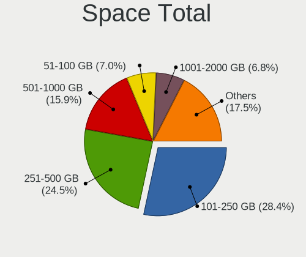
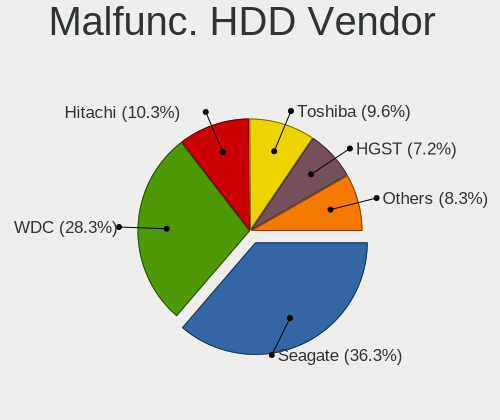
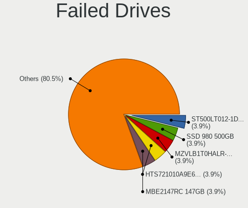
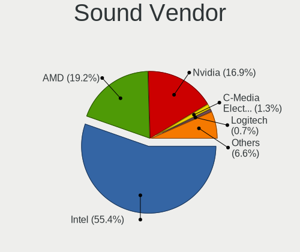

Ubuntu - Tested Hardware & Statistics
-------------------------------------

A project to collect tested hardware configurations for Ubuntu.

Anyone can contribute to this report by the [hw-probe](https://github.com/linuxhw/hw-probe) tool:

    sudo -E hw-probe -all -upload

Please contribute! Especially if your hardware is rare.

This is a report for all computer types. See also reports for [desktops](/Dist/Ubuntu/Desktop/README.md) and [notebooks](/Dist/Ubuntu/Notebook/README.md).

Contents
--------

* [ Test Cases ](#test-cases)

* [ System ](#system)
  - [ OS                       ](#os)
  - [ OS Family                ](#os-family)
  - [ Kernel                   ](#kernel)
  - [ Kernel Family            ](#kernel-family)
  - [ Kernel Major Ver.        ](#kernel-major-ver)
  - [ Arch                     ](#arch)
  - [ DE                       ](#de)
  - [ Display Server           ](#display-server)
  - [ Display Manager          ](#display-manager)
  - [ OS Lang                  ](#os-lang)
  - [ Boot Mode                ](#boot-mode)
  - [ Filesystem               ](#filesystem)
  - [ Part. scheme             ](#part-scheme)
  - [ Dual Boot with Linux/BSD ](#dual-boot-with-linuxbsd)
  - [ Dual Boot (Win)          ](#dual-boot-win)

* [ Board ](#board)
  - [ Vendor                   ](#vendor)
  - [ Model                    ](#model)
  - [ Model Family             ](#model-family)
  - [ MFG Year                 ](#mfg-year)
  - [ Form Factor              ](#form-factor)
  - [ Secure Boot              ](#secure-boot)
  - [ Coreboot                 ](#coreboot)
  - [ RAM Size                 ](#ram-size)
  - [ RAM Used                 ](#ram-used)
  - [ Total Drives             ](#total-drives)
  - [ Has CD-ROM               ](#has-cd-rom)
  - [ Has Ethernet             ](#has-ethernet)
  - [ Has WiFi                 ](#has-wifi)
  - [ Has Bluetooth            ](#has-bluetooth)

* [ Location ](#location)
  - [ Country                  ](#country)
  - [ City                     ](#city)

* [ Drives ](#drives)
  - [ Drive Vendor             ](#drive-vendor)
  - [ Drive Model              ](#drive-model)
  - [ HDD Vendor               ](#hdd-vendor)
  - [ SSD Vendor               ](#ssd-vendor)
  - [ Drive Kind               ](#drive-kind)
  - [ Drive Connector          ](#drive-connector)
  - [ Drive Size               ](#drive-size)
  - [ Space Total              ](#space-total)
  - [ Space Used               ](#space-used)
  - [ Malfunc. Drives          ](#malfunc-drives)
  - [ Malfunc. Drive Vendor    ](#malfunc-drive-vendor)
  - [ Malfunc. HDD Vendor      ](#malfunc-hdd-vendor)
  - [ Malfunc. Drive Kind      ](#malfunc-drive-kind)
  - [ Failed Drives            ](#failed-drives)
  - [ Failed Drive Vendor      ](#failed-drive-vendor)
  - [ Drive Status             ](#drive-status)

* [ Storage controller ](#storage-controller)
  - [ Storage Vendor           ](#storage-vendor)
  - [ Storage Model            ](#storage-model)
  - [ Storage Kind             ](#storage-kind)

* [ Processor ](#processor)
  - [ CPU Vendor               ](#cpu-vendor)
  - [ CPU Model                ](#cpu-model)
  - [ CPU Model Family         ](#cpu-model-family)
  - [ CPU Cores                ](#cpu-cores)
  - [ CPU Sockets              ](#cpu-sockets)
  - [ CPU Threads              ](#cpu-threads)
  - [ CPU Op-Modes             ](#cpu-op-modes)
  - [ CPU Microcode            ](#cpu-microcode)
  - [ CPU Microarch            ](#cpu-microarch)

* [ Graphics ](#graphics)
  - [ GPU Vendor               ](#gpu-vendor)
  - [ GPU Model                ](#gpu-model)
  - [ GPU Combo                ](#gpu-combo)
  - [ GPU Driver               ](#gpu-driver)
  - [ GPU Memory               ](#gpu-memory)

* [ Monitor ](#monitor)
  - [ Monitor Vendor           ](#monitor-vendor)
  - [ Monitor Model            ](#monitor-model)
  - [ Monitor Resolution       ](#monitor-resolution)
  - [ Monitor Diagonal         ](#monitor-diagonal)
  - [ Monitor Width            ](#monitor-width)
  - [ Aspect Ratio             ](#aspect-ratio)
  - [ Monitor Area             ](#monitor-area)
  - [ Pixel Density            ](#pixel-density)
  - [ Multiple Monitors        ](#multiple-monitors)

* [ Network ](#network)
  - [ Net Controller Vendor    ](#net-controller-vendor)
  - [ Net Controller Model     ](#net-controller-model)
  - [ Wireless Vendor          ](#wireless-vendor)
  - [ Wireless Model           ](#wireless-model)
  - [ Ethernet Vendor          ](#ethernet-vendor)
  - [ Ethernet Model           ](#ethernet-model)
  - [ Net Controller Kind      ](#net-controller-kind)
  - [ Used Controller          ](#used-controller)
  - [ NICs                     ](#nics)
  - [ IPv6                     ](#ipv6)

* [ Bluetooth ](#bluetooth)
  - [ Bluetooth Vendor         ](#bluetooth-vendor)
  - [ Bluetooth Model          ](#bluetooth-model)

* [ Sound ](#sound)
  - [ Sound Vendor             ](#sound-vendor)
  - [ Sound Model              ](#sound-model)

* [ Memory ](#memory)
  - [ Memory Vendor            ](#memory-vendor)
  - [ Memory Model             ](#memory-model)
  - [ Memory Kind              ](#memory-kind)
  - [ Memory Form Factor       ](#memory-form-factor)
  - [ Memory Size              ](#memory-size)
  - [ Memory Speed             ](#memory-speed)

* [ Printers & scanners ](#printers--scanners)
  - [ Printer Vendor           ](#printer-vendor)
  - [ Printer Model            ](#printer-model)
  - [ Scanner Vendor           ](#scanner-vendor)
  - [ Scanner Model            ](#scanner-model)

* [ Camera ](#camera)
  - [ Camera Vendor            ](#camera-vendor)
  - [ Camera Model             ](#camera-model)

* [ Security ](#security)
  - [ Fingerprint Vendor       ](#fingerprint-vendor)
  - [ Fingerprint Model        ](#fingerprint-model)
  - [ Chipcard Vendor          ](#chipcard-vendor)
  - [ Chipcard Model           ](#chipcard-model)

* [ Unsupported ](#unsupported)
  - [ Unsupported Devices      ](#unsupported-devices)
  - [ Unsupported Device Types ](#unsupported-device-types)

Test Cases
----------

Total: 75745

| Vendor        | Model                       | Form-Factor | Probe                                                      | Date         |
|---------------|-----------------------------|-------------|------------------------------------------------------------|--------------|
| Lenovo        | ThinkPad L540 20AUA13S00    | Notebook    | [04ffca5382](https://linux-hardware.org/?probe=04ffca5382) | Oct 01, 2022 |
| ASRock        | Z97 Anniversary             | Desktop     | [558ca4b56e](https://linux-hardware.org/?probe=558ca4b56e) | Oct 01, 2022 |
| MSI           | GF65 Thin 9SEXR             | Notebook    | [537828a21f](https://linux-hardware.org/?probe=537828a21f) | Oct 01, 2022 |
| Acer          | Aspire 5920G                | Notebook    | [9bd67cf4f9](https://linux-hardware.org/?probe=9bd67cf4f9) | Oct 01, 2022 |
| Sony          | VPCCA15FX                   | Notebook    | [5063ea411b](https://linux-hardware.org/?probe=5063ea411b) | Oct 01, 2022 |
| ASUSTek       | A78M-A                      | Desktop     | [5ad2e5f2a6](https://linux-hardware.org/?probe=5ad2e5f2a6) | Oct 01, 2022 |
| ASUSTek       | ROG STRIX B550-E GAMING     | Desktop     | [8a75a2c50b](https://linux-hardware.org/?probe=8a75a2c50b) | Oct 01, 2022 |
| Sony          | VPCCA15FX                   | Notebook    | [96eb3d8cf7](https://linux-hardware.org/?probe=96eb3d8cf7) | Oct 01, 2022 |
| MSI           | MAG B550 TOMAHAWK           | Desktop     | [a7268f8fba](https://linux-hardware.org/?probe=a7268f8fba) | Oct 01, 2022 |
| ASUSTek       | ROG Zephyrus M16 GU603ZM... | Notebook    | [403aa5af3e](https://linux-hardware.org/?probe=403aa5af3e) | Oct 01, 2022 |
| Lenovo        | V130-15IKB 81HN             | Notebook    | [44a4ed90e1](https://linux-hardware.org/?probe=44a4ed90e1) | Oct 01, 2022 |
| HUAWEI        | BOHK-WAX9X                  | Notebook    | [6525098252](https://linux-hardware.org/?probe=6525098252) | Oct 01, 2022 |
| Medion        | MS-7366                     | Desktop     | [c8138f4ffe](https://linux-hardware.org/?probe=c8138f4ffe) | Oct 01, 2022 |
| Medion        | MS-7366                     | Desktop     | [c25c10b259](https://linux-hardware.org/?probe=c25c10b259) | Oct 01, 2022 |
| Lenovo        | G400s VILG1                 | Notebook    | [e666344187](https://linux-hardware.org/?probe=e666344187) | Oct 01, 2022 |
| Acer          | Enduro EN314-51W            | Notebook    | [46782cf8f5](https://linux-hardware.org/?probe=46782cf8f5) | Oct 01, 2022 |
| Gigabyte      | 990FXA-UD3                  | Desktop     | [cb25964ddb](https://linux-hardware.org/?probe=cb25964ddb) | Oct 01, 2022 |
| Unknown       | Unknown                     | Desktop     | [0c82fc9806](https://linux-hardware.org/?probe=0c82fc9806) | Oct 01, 2022 |
| Dell          | Latitude E5250              | Notebook    | [aeb221e727](https://linux-hardware.org/?probe=aeb221e727) | Oct 01, 2022 |
| Dell          | Latitude E5250              | Notebook    | [43f7cf1b59](https://linux-hardware.org/?probe=43f7cf1b59) | Oct 01, 2022 |
| MSI           | MAG B550 TOMAHAWK           | Desktop     | [151510a184](https://linux-hardware.org/?probe=151510a184) | Oct 01, 2022 |
| Lenovo        | ThinkPad SL500 27463ZG      | Notebook    | [34006e3b46](https://linux-hardware.org/?probe=34006e3b46) | Oct 01, 2022 |
| HP            | ProBook 430 G7              | Notebook    | [bf25686a1f](https://linux-hardware.org/?probe=bf25686a1f) | Oct 01, 2022 |
| MSI           | X370 GAMING PLUS            | Desktop     | [2aa92cb043](https://linux-hardware.org/?probe=2aa92cb043) | Oct 01, 2022 |
| Dell          | Latitude 5480               | Notebook    | [ec9593f051](https://linux-hardware.org/?probe=ec9593f051) | Oct 01, 2022 |
| Notebook      | W330SU2                     | Notebook    | [a5d5500584](https://linux-hardware.org/?probe=a5d5500584) | Oct 01, 2022 |
| Lenovo        | ThinkPad E14 Gen 3 20YES... | Notebook    | [1a210b9eb5](https://linux-hardware.org/?probe=1a210b9eb5) | Oct 01, 2022 |
| Apple         | MacBookPro16,2              | Notebook    | [8eaded9cb5](https://linux-hardware.org/?probe=8eaded9cb5) | Oct 01, 2022 |
| HP            | Pavilion 17                 | Notebook    | [fa2e48904a](https://linux-hardware.org/?probe=fa2e48904a) | Oct 01, 2022 |
| ASUSTek       | M5A99X EVO                  | Desktop     | [4c5134b8fc](https://linux-hardware.org/?probe=4c5134b8fc) | Oct 01, 2022 |
| Lenovo        | Yoga C640-13IML 81UE        | Convertible | [9d5f38913b](https://linux-hardware.org/?probe=9d5f38913b) | Oct 01, 2022 |
| MSI           | PRO X670-P WIFI             | Desktop     | [64299c7b4a](https://linux-hardware.org/?probe=64299c7b4a) | Oct 01, 2022 |
| ASUSTek       | M4N72-E                     | Desktop     | [c1c308be2a](https://linux-hardware.org/?probe=c1c308be2a) | Oct 01, 2022 |
| Gigabyte      | 990FXA-UD3                  | Desktop     | [36398ba3b9](https://linux-hardware.org/?probe=36398ba3b9) | Oct 01, 2022 |
| HP            | Pavilion x360 Convertibl... | Convertible | [c4688badf5](https://linux-hardware.org/?probe=c4688badf5) | Oct 01, 2022 |
| ASUSTek       | P8Z68-V                     | Desktop     | [c6e67f7643](https://linux-hardware.org/?probe=c6e67f7643) | Oct 01, 2022 |
| ASRock        | Z77 Extreme3                | Desktop     | [c92633e1ee](https://linux-hardware.org/?probe=c92633e1ee) | Oct 01, 2022 |
| Lenovo        | IdeaPadFlex 5 14IIL05 81... | Convertible | [ee185c669a](https://linux-hardware.org/?probe=ee185c669a) | Oct 01, 2022 |
| ASRock        | Z77 Extreme3                | Desktop     | [ada9e56162](https://linux-hardware.org/?probe=ada9e56162) | Oct 01, 2022 |
| MSI           | Modern 14 A10M              | Notebook    | [571271ed93](https://linux-hardware.org/?probe=571271ed93) | Sep 30, 2022 |
| MSI           | A55M-E33                    | Desktop     | [13bd049f55](https://linux-hardware.org/?probe=13bd049f55) | Sep 30, 2022 |
| MSI           | Modern 14 A10M              | Notebook    | [9da1f3fe66](https://linux-hardware.org/?probe=9da1f3fe66) | Sep 30, 2022 |
| OEM           | Unknown                     | Notebook    | [af7df2aea6](https://linux-hardware.org/?probe=af7df2aea6) | Sep 30, 2022 |
| OEM           | Unknown                     | Notebook    | [1d851fe024](https://linux-hardware.org/?probe=1d851fe024) | Sep 30, 2022 |
| OEM           | Unknown                     | Notebook    | [4fd2ca7d03](https://linux-hardware.org/?probe=4fd2ca7d03) | Sep 30, 2022 |
| OEM           | Unknown                     | Desktop     | [e5a425c399](https://linux-hardware.org/?probe=e5a425c399) | Sep 30, 2022 |
| Dell          | Latitude 5530               | Notebook    | [43874dad6d](https://linux-hardware.org/?probe=43874dad6d) | Sep 30, 2022 |
| ASUSTek       | M5A78L LE                   | Desktop     | [1b2683c634](https://linux-hardware.org/?probe=1b2683c634) | Sep 30, 2022 |
| Microsoft     | Surface Pro 2               | Tablet      | [f9cf849f23](https://linux-hardware.org/?probe=f9cf849f23) | Sep 30, 2022 |
| Microsoft     | Surface Pro 2               | Tablet      | [6cf53adb30](https://linux-hardware.org/?probe=6cf53adb30) | Sep 30, 2022 |
| ASUSTek       | PHOENIX                     | Desktop     | [55d76f8846](https://linux-hardware.org/?probe=55d76f8846) | Sep 30, 2022 |
| ASUSTek       | PHOENIX                     | Desktop     | [6c28fed25f](https://linux-hardware.org/?probe=6c28fed25f) | Sep 30, 2022 |
| SANTECH       | NHx0EH_EJ_EK                | Notebook    | [01366bbeb7](https://linux-hardware.org/?probe=01366bbeb7) | Sep 30, 2022 |
| HP            | 3398                        | Desktop     | [8ef4543254](https://linux-hardware.org/?probe=8ef4543254) | Sep 30, 2022 |
| Dell          | Inspiron 7506 2n1           | Convertible | [659beda7e9](https://linux-hardware.org/?probe=659beda7e9) | Sep 30, 2022 |
| ASUSTek       | M5A78L LE                   | Desktop     | [8762386a2b](https://linux-hardware.org/?probe=8762386a2b) | Sep 30, 2022 |
| ASUSTek       | M5A78L-M LX3                | Desktop     | [938523ed34](https://linux-hardware.org/?probe=938523ed34) | Sep 30, 2022 |
| Pegatron      | 2A94                        | Desktop     | [6425f7a434](https://linux-hardware.org/?probe=6425f7a434) | Sep 30, 2022 |
| Dell          | Precision 3551              | Notebook    | [d0341acb53](https://linux-hardware.org/?probe=d0341acb53) | Sep 30, 2022 |
| Gigabyte      | G41M-Combo                  | Desktop     | [aa49a31777](https://linux-hardware.org/?probe=aa49a31777) | Sep 30, 2022 |
| HP            | Compaq CQ58                 | Notebook    | [28048a6d3e](https://linux-hardware.org/?probe=28048a6d3e) | Sep 30, 2022 |
| HP            | Pavilion Laptop 15-eg0xx... | Notebook    | [76dae4e704](https://linux-hardware.org/?probe=76dae4e704) | Sep 30, 2022 |
| Apple         | MacBookPro9,2               | Notebook    | [87c9436154](https://linux-hardware.org/?probe=87c9436154) | Sep 30, 2022 |
| HP            | 83EF                        | Desktop     | [f508131396](https://linux-hardware.org/?probe=f508131396) | Sep 30, 2022 |
| HP            | Notebook                    | Notebook    | [a30c1af9a5](https://linux-hardware.org/?probe=a30c1af9a5) | Sep 30, 2022 |
| Acer          | Aspire E1-531               | Notebook    | [fbe026b995](https://linux-hardware.org/?probe=fbe026b995) | Sep 30, 2022 |
| Lenovo        | IdeaPadFlex 5 14IIL05 81... | Convertible | [bf7151a851](https://linux-hardware.org/?probe=bf7151a851) | Sep 30, 2022 |
| ASUSTek       | PRIME B660M-K D4            | Desktop     | [7efad28576](https://linux-hardware.org/?probe=7efad28576) | Sep 30, 2022 |
| ASUSTek       | Z170-P                      | Desktop     | [996d72bd1e](https://linux-hardware.org/?probe=996d72bd1e) | Sep 30, 2022 |
| ASUSTek       | Z170-P                      | Desktop     | [8394fca38a](https://linux-hardware.org/?probe=8394fca38a) | Sep 30, 2022 |
| ASUSTek       | EX-A320M-GAMING             | Desktop     | [33d5d34654](https://linux-hardware.org/?probe=33d5d34654) | Sep 30, 2022 |
| Pegatron      | IPMSB-GS                    | Desktop     | [5e38213b3b](https://linux-hardware.org/?probe=5e38213b3b) | Sep 30, 2022 |
| HP            | Pavilion dv5                | Notebook    | [9fd2d2169a](https://linux-hardware.org/?probe=9fd2d2169a) | Sep 30, 2022 |
| HP            | Pavilion dv5                | Notebook    | [1c42236e47](https://linux-hardware.org/?probe=1c42236e47) | Sep 30, 2022 |
| SIEMENS       | SIMATIC ITP1000             | Notebook    | [adbd7dbca6](https://linux-hardware.org/?probe=adbd7dbca6) | Sep 30, 2022 |
| Lenovo        | IdeaPad 5 Pro 16ARH7 82S... | Notebook    | [6bcbc9e08c](https://linux-hardware.org/?probe=6bcbc9e08c) | Sep 30, 2022 |
| NEC Comput... | PC-VRL21FB6S3R7             | Notebook    | [2001e2e28e](https://linux-hardware.org/?probe=2001e2e28e) | Sep 30, 2022 |
| Dell          | Inspiron 3501               | Notebook    | [4684b672f6](https://linux-hardware.org/?probe=4684b672f6) | Sep 30, 2022 |
| Dell          | Inspiron 3501               | Notebook    | [ce2d41ee99](https://linux-hardware.org/?probe=ce2d41ee99) | Sep 30, 2022 |
| ECS           | A320AM4-M3D/3.x/5.x         | Desktop     | [570ff509ac](https://linux-hardware.org/?probe=570ff509ac) | Sep 30, 2022 |
| ASUSTek       | ASUS EXPERTBOOK B1400CBA    | Notebook    | [4cad2a770c](https://linux-hardware.org/?probe=4cad2a770c) | Sep 30, 2022 |
| Lenovo        | ThinkPad T480s 20L7001YU... | Notebook    | [929514123f](https://linux-hardware.org/?probe=929514123f) | Sep 30, 2022 |
| ASUSTek       | TUF Gaming Z490-PLUS        | Desktop     | [2c08befa41](https://linux-hardware.org/?probe=2c08befa41) | Sep 30, 2022 |
| Acer          | Aspire E5-521               | Notebook    | [a55d68e93c](https://linux-hardware.org/?probe=a55d68e93c) | Sep 30, 2022 |
| Positivo      | POS-PIQ67CG POSITIVO        | Desktop     | [5cdce489b9](https://linux-hardware.org/?probe=5cdce489b9) | Sep 30, 2022 |
| Gigabyte      | Z97M-DS3H                   | Desktop     | [fcf7e031e3](https://linux-hardware.org/?probe=fcf7e031e3) | Sep 30, 2022 |
| Positivo      | POS-PIQ67CG POSITIVO        | Desktop     | [3bfbb3744e](https://linux-hardware.org/?probe=3bfbb3744e) | Sep 30, 2022 |
| Gigabyte      | AORUS 17 YE5                | Notebook    | [54b271c3fd](https://linux-hardware.org/?probe=54b271c3fd) | Sep 30, 2022 |
| Lenovo        | Yoga 300-11IBY 80M0         | Notebook    | [d5c0e2c5d3](https://linux-hardware.org/?probe=d5c0e2c5d3) | Sep 30, 2022 |
| HP            | 3398                        | Desktop     | [2f7b1d28b4](https://linux-hardware.org/?probe=2f7b1d28b4) | Sep 30, 2022 |
| Google        | Relm                        | Notebook    | [e440e5c1cc](https://linux-hardware.org/?probe=e440e5c1cc) | Sep 30, 2022 |
| HP            | 1496                        | Desktop     | [e89f06542b](https://linux-hardware.org/?probe=e89f06542b) | Sep 30, 2022 |
| Apple         | MacBookPro16,1              | Notebook    | [03f56ec19b](https://linux-hardware.org/?probe=03f56ec19b) | Sep 30, 2022 |
| Dell          | Inspiron 7591 2n1           | Convertible | [b2e6a0c4ee](https://linux-hardware.org/?probe=b2e6a0c4ee) | Sep 30, 2022 |
| Unknown       | 775VM8                      | Desktop     | [114c84d76c](https://linux-hardware.org/?probe=114c84d76c) | Sep 30, 2022 |
| Samsung       | R430/P430/R480              | Notebook    | [09795617ab](https://linux-hardware.org/?probe=09795617ab) | Sep 30, 2022 |
| Unknown       | 775VM8                      | Desktop     | [903649eae9](https://linux-hardware.org/?probe=903649eae9) | Sep 30, 2022 |
| MSI           | H110 PC MATE                | Desktop     | [ac97c636a5](https://linux-hardware.org/?probe=ac97c636a5) | Sep 30, 2022 |
| Gigabyte      | H61M-S2PV                   | Desktop     | [cd06f54882](https://linux-hardware.org/?probe=cd06f54882) | Sep 30, 2022 |
| Gigabyte      | H510M H                     | Desktop     | [51a7f36a69](https://linux-hardware.org/?probe=51a7f36a69) | Sep 29, 2022 |
| OEM           | Unknown                     | Desktop     | [21b3a0929b](https://linux-hardware.org/?probe=21b3a0929b) | Sep 29, 2022 |
| MSI           | A68HM-E33 V2                | Desktop     | [3e8f63475d](https://linux-hardware.org/?probe=3e8f63475d) | Sep 29, 2022 |
| ASRock        | Q1900M                      | Desktop     | [e6804dc6b7](https://linux-hardware.org/?probe=e6804dc6b7) | Sep 29, 2022 |
| Lenovo        | G500s 20245                 | Notebook    | [b9001f7817](https://linux-hardware.org/?probe=b9001f7817) | Sep 29, 2022 |
| Toshiba       | TECRA M10                   | Notebook    | [64ad67c8e9](https://linux-hardware.org/?probe=64ad67c8e9) | Sep 29, 2022 |
| ASUSTek       | Zenbook UM3402YA_UM3402Y... | Notebook    | [36ad3c69ee](https://linux-hardware.org/?probe=36ad3c69ee) | Sep 29, 2022 |
| ASUSTek       | PHOENIX                     | Desktop     | [ea3a9cf5b4](https://linux-hardware.org/?probe=ea3a9cf5b4) | Sep 29, 2022 |
| ASUSTek       | Q534UXK                     | Convertible | [2908b05b92](https://linux-hardware.org/?probe=2908b05b92) | Sep 29, 2022 |
| Acer          | Aspire ES1-311              | Notebook    | [0f40a045a9](https://linux-hardware.org/?probe=0f40a045a9) | Sep 29, 2022 |
| ASUSTek       | TUF Gaming FX505DY_FX505... | Notebook    | [bd2dea6653](https://linux-hardware.org/?probe=bd2dea6653) | Sep 29, 2022 |
| ASUSTek       | M5A97 LE R2.0               | Desktop     | [e35b86c3b7](https://linux-hardware.org/?probe=e35b86c3b7) | Sep 29, 2022 |
| Gigabyte      | B75M-D3H                    | Desktop     | [a7d5bbb754](https://linux-hardware.org/?probe=a7d5bbb754) | Sep 29, 2022 |
| Gigabyte      | B75M-D3H                    | Desktop     | [5f261094bf](https://linux-hardware.org/?probe=5f261094bf) | Sep 29, 2022 |
| HP            | ZBook Firefly 15.6 inch ... | Notebook    | [be74c01cca](https://linux-hardware.org/?probe=be74c01cca) | Sep 29, 2022 |
| OEM           | Unknown                     | Desktop     | [68b7e03b06](https://linux-hardware.org/?probe=68b7e03b06) | Sep 29, 2022 |
| Acer          | Aspire A715-72G             | Notebook    | [8b7e129d4a](https://linux-hardware.org/?probe=8b7e129d4a) | Sep 29, 2022 |
| Lenovo        | ThinkPad P53 MWS 15.6 (Q... | Notebook    | [8990060646](https://linux-hardware.org/?probe=8990060646) | Sep 29, 2022 |
| ASUSTek       | P8Z68-V                     | Desktop     | [f0d1b90e89](https://linux-hardware.org/?probe=f0d1b90e89) | Sep 29, 2022 |
| Apple         | MacBookPro3,1               | Notebook    | [00f2a6e705](https://linux-hardware.org/?probe=00f2a6e705) | Sep 29, 2022 |
| Lenovo        | ThinkPad X1 Carbon 7th 2... | Notebook    | [54bc787611](https://linux-hardware.org/?probe=54bc787611) | Sep 29, 2022 |
| ASUSTek       | TUF Gaming B560M-PLUS WI... | Desktop     | [a686f595ee](https://linux-hardware.org/?probe=a686f595ee) | Sep 29, 2022 |
| Dell          | XPS 13 9370                 | Notebook    | [4e0be93d26](https://linux-hardware.org/?probe=4e0be93d26) | Sep 29, 2022 |
| ASUSTek       | Zenbook UM5401QAB_UM5401... | Notebook    | [3e92ba3812](https://linux-hardware.org/?probe=3e92ba3812) | Sep 29, 2022 |
| Dell          | Latitude E7250              | Notebook    | [bed2e025b0](https://linux-hardware.org/?probe=bed2e025b0) | Sep 29, 2022 |
| Dell          | 0G3HR7 A00                  | Desktop     | [547cffd8dd](https://linux-hardware.org/?probe=547cffd8dd) | Sep 29, 2022 |
| Lenovo        | IdeaPad 320-15IKB 81BG      | Notebook    | [82528435d8](https://linux-hardware.org/?probe=82528435d8) | Sep 29, 2022 |
| MSI           | Creator Z17 A12UHST         | Notebook    | [4b9249b9b0](https://linux-hardware.org/?probe=4b9249b9b0) | Sep 29, 2022 |
| HP            | ProBook 6560b               | Notebook    | [902ef8ef79](https://linux-hardware.org/?probe=902ef8ef79) | Sep 29, 2022 |
| ASUSTek       | PRO H410M-C                 | Desktop     | [2448bfc706](https://linux-hardware.org/?probe=2448bfc706) | Sep 29, 2022 |
| Razer         | Blade                       | Notebook    | [63a4e5f829](https://linux-hardware.org/?probe=63a4e5f829) | Sep 29, 2022 |
| HUAWEI        | HVY-WXX9                    | Notebook    | [4f2655de78](https://linux-hardware.org/?probe=4f2655de78) | Sep 29, 2022 |
| Acer          | Predator G6-710             | Desktop     | [12fd4575f7](https://linux-hardware.org/?probe=12fd4575f7) | Sep 29, 2022 |
| Sony          | VPCEH12FX                   | Notebook    | [037cda52fd](https://linux-hardware.org/?probe=037cda52fd) | Sep 29, 2022 |
| Dell          | 06D7TR A02                  | Desktop     | [7ad0e3e5f4](https://linux-hardware.org/?probe=7ad0e3e5f4) | Sep 29, 2022 |
| MSI           | Modern 14 A10M              | Notebook    | [5c5666fa97](https://linux-hardware.org/?probe=5c5666fa97) | Sep 29, 2022 |
| Lenovo        | 1031 SBB0J05441 WIN 3305... | Desktop     | [75c8af47c2](https://linux-hardware.org/?probe=75c8af47c2) | Sep 29, 2022 |
| Gigabyte      | Z370 HD3-CF                 | Desktop     | [715a83eaa1](https://linux-hardware.org/?probe=715a83eaa1) | Sep 29, 2022 |
| HUAWEI        | BOHK-WAX9X                  | Notebook    | [65f56cc48b](https://linux-hardware.org/?probe=65f56cc48b) | Sep 29, 2022 |
| Biostar       | H410MH S2                   | Desktop     | [b03e32f37d](https://linux-hardware.org/?probe=b03e32f37d) | Sep 29, 2022 |
| ASUSTek       | P8Z68-V                     | Desktop     | [36ff9b8bcb](https://linux-hardware.org/?probe=36ff9b8bcb) | Sep 29, 2022 |
| Lenovo        | ThinkPad X1C 5th W10DG 2... | Notebook    | [0cbacebb95](https://linux-hardware.org/?probe=0cbacebb95) | Sep 29, 2022 |
| Apple         | Mac-8ED6AF5B48C039E1 Mac... | Mini pc     | [4b12c8e9c1](https://linux-hardware.org/?probe=4b12c8e9c1) | Sep 29, 2022 |
| Sun Micros... | S39                         | Server      | [ed02f6a855](https://linux-hardware.org/?probe=ed02f6a855) | Sep 29, 2022 |
| Dell          | XPS 15 9570                 | Notebook    | [eb3798c367](https://linux-hardware.org/?probe=eb3798c367) | Sep 28, 2022 |
| ASUSTek       | VivoBook_ASUSLaptop X515... | Notebook    | [cd08dccca4](https://linux-hardware.org/?probe=cd08dccca4) | Sep 28, 2022 |
| Gigabyte      | F2A55M-DS2                  | Desktop     | [c17c689217](https://linux-hardware.org/?probe=c17c689217) | Sep 28, 2022 |
| Notebook      | PB50_70RF,RD,RC             | Notebook    | [d56e485c88](https://linux-hardware.org/?probe=d56e485c88) | Sep 28, 2022 |
| ASRock        | Z68 Pro3-M                  | Desktop     | [7ba6677453](https://linux-hardware.org/?probe=7ba6677453) | Sep 28, 2022 |
| Supermicro    | X10SRA-F                    | Server      | [a9aa07ef24](https://linux-hardware.org/?probe=a9aa07ef24) | Sep 28, 2022 |
| ASUSTek       | PN52                        | Mini pc     | [11f99758e6](https://linux-hardware.org/?probe=11f99758e6) | Sep 28, 2022 |
| Supermicro    | X10SRA-F                    | Server      | [2f41a520ed](https://linux-hardware.org/?probe=2f41a520ed) | Sep 28, 2022 |
| Medion        | MS-7707                     | Desktop     | [240ac993dc](https://linux-hardware.org/?probe=240ac993dc) | Sep 28, 2022 |
| MSI           | Z87-GD65 GAMING             | Desktop     | [fe6539c021](https://linux-hardware.org/?probe=fe6539c021) | Sep 28, 2022 |
| ASUSTek       | VivoBook 17_ASUS Laptop ... | Notebook    | [a3fc8eb1bc](https://linux-hardware.org/?probe=a3fc8eb1bc) | Sep 28, 2022 |
| Lenovo        | Legion S7 15IMH5 82BC       | Notebook    | [4ecc5d01c1](https://linux-hardware.org/?probe=4ecc5d01c1) | Sep 28, 2022 |
| Dell          | Latitude E7250              | Notebook    | [4bf6378dde](https://linux-hardware.org/?probe=4bf6378dde) | Sep 28, 2022 |
| Lenovo        | ThinkPad L15 Gen 1 20U4S... | Notebook    | [d5a4d2ae41](https://linux-hardware.org/?probe=d5a4d2ae41) | Sep 28, 2022 |
| Gigabyte      | B450 I AORUS PRO WIFI-CF    | Desktop     | [d5185ee60b](https://linux-hardware.org/?probe=d5185ee60b) | Sep 28, 2022 |
| Dell          | Latitude E5430 non-vPro     | Notebook    | [12e886f006](https://linux-hardware.org/?probe=12e886f006) | Sep 28, 2022 |
| ASUSTek       | F2A85-M PRO                 | Desktop     | [571cb4bb05](https://linux-hardware.org/?probe=571cb4bb05) | Sep 28, 2022 |
| Dell          | Vostro 15 3515              | Notebook    | [7e4413a053](https://linux-hardware.org/?probe=7e4413a053) | Sep 28, 2022 |
| Dell          | XPS 13 9350                 | Notebook    | [23142407b0](https://linux-hardware.org/?probe=23142407b0) | Sep 28, 2022 |
| ASUSTek       | M5A97 LE R2.0               | Desktop     | [f9e71e7e05](https://linux-hardware.org/?probe=f9e71e7e05) | Sep 28, 2022 |
| Lenovo        | IdeaPad 3 15ALC6 82MF       | Notebook    | [bbd715eb5a](https://linux-hardware.org/?probe=bbd715eb5a) | Sep 28, 2022 |
| Medion        | E6234                       | Notebook    | [19f1d7841e](https://linux-hardware.org/?probe=19f1d7841e) | Sep 28, 2022 |
| Lenovo        | ThinkPad P15v Gen 1 20TQ... | Notebook    | [a64f339e70](https://linux-hardware.org/?probe=a64f339e70) | Sep 28, 2022 |
| Dell          | Latitude 3410               | Notebook    | [82fe1556b6](https://linux-hardware.org/?probe=82fe1556b6) | Sep 28, 2022 |
| Fujitsu       | D2939-B1 S26361-D2939-B1... | Server      | [efe128ba47](https://linux-hardware.org/?probe=efe128ba47) | Sep 28, 2022 |
| HP            | 18E5                        | Desktop     | [bcc9927d20](https://linux-hardware.org/?probe=bcc9927d20) | Sep 28, 2022 |
| Lenovo        | G570 4334                   | Notebook    | [7b96f1db41](https://linux-hardware.org/?probe=7b96f1db41) | Sep 28, 2022 |
| Lenovo        | IdeaPad Z510 20287          | Notebook    | [78badcba3c](https://linux-hardware.org/?probe=78badcba3c) | Sep 28, 2022 |
| Lenovo        | ThinkBook 14 G3 ACL 21A2    | Notebook    | [9271d6a014](https://linux-hardware.org/?probe=9271d6a014) | Sep 28, 2022 |
| Intel         | DH55TC AAE70932-206         | Desktop     | [ac93c3912d](https://linux-hardware.org/?probe=ac93c3912d) | Sep 28, 2022 |
| Apple         | MacBookPro9,2               | Notebook    | [6ea648bc51](https://linux-hardware.org/?probe=6ea648bc51) | Sep 28, 2022 |
| MSI           | 2A9Ch                       | Desktop     | [16d3df803b](https://linux-hardware.org/?probe=16d3df803b) | Sep 28, 2022 |
| Lenovo        | IdeaPad 500-15ISK 80NT      | Notebook    | [9377d23abd](https://linux-hardware.org/?probe=9377d23abd) | Sep 28, 2022 |
| MSI           | X570-A PRO                  | Desktop     | [345959e0ed](https://linux-hardware.org/?probe=345959e0ed) | Sep 28, 2022 |
| Dell          | Inspiron 7506 2n1           | Convertible | [650ccc1793](https://linux-hardware.org/?probe=650ccc1793) | Sep 28, 2022 |
| ASUSTek       | PRIME Z370-A                | Desktop     | [5d789a1783](https://linux-hardware.org/?probe=5d789a1783) | Sep 28, 2022 |
| Apple         | Mac-27ADBB7B4CEE8E61 iMa... | All in one  | [8086625f5a](https://linux-hardware.org/?probe=8086625f5a) | Sep 28, 2022 |
| HP            | 212B                        | Desktop     | [38aa6e5478](https://linux-hardware.org/?probe=38aa6e5478) | Sep 28, 2022 |
| HP            | ProBook 450 G5              | Notebook    | [c000778875](https://linux-hardware.org/?probe=c000778875) | Sep 28, 2022 |
| Dell          | Inspiron 7591 2n1           | Convertible | [cbe4496000](https://linux-hardware.org/?probe=cbe4496000) | Sep 28, 2022 |
| Acer          | Aspire E5-573               | Notebook    | [f7e628a5a1](https://linux-hardware.org/?probe=f7e628a5a1) | Sep 28, 2022 |
| Positivo      | S14CT01                     | Notebook    | [66e0c53646](https://linux-hardware.org/?probe=66e0c53646) | Sep 28, 2022 |
| Unknown       | Unknown                     | Notebook    | [3e450900da](https://linux-hardware.org/?probe=3e450900da) | Sep 28, 2022 |
| Apple         | MacBookPro15,2              | Notebook    | [2e6164b675](https://linux-hardware.org/?probe=2e6164b675) | Sep 28, 2022 |
| ASRock        | H61M-HVS                    | Desktop     | [660419ed49](https://linux-hardware.org/?probe=660419ed49) | Sep 27, 2022 |
| HP            | Pavilion Laptop 14-ce2xx... | Notebook    | [6eab6db53b](https://linux-hardware.org/?probe=6eab6db53b) | Sep 27, 2022 |
| Dell          | Latitude E6330              | Notebook    | [47b2074732](https://linux-hardware.org/?probe=47b2074732) | Sep 27, 2022 |
| HP            | 2AF7                        | Desktop     | [d6889fef8d](https://linux-hardware.org/?probe=d6889fef8d) | Sep 27, 2022 |
| ASUSTek       | PRIME X470-PRO              | Desktop     | [1bdf72d415](https://linux-hardware.org/?probe=1bdf72d415) | Sep 27, 2022 |
| Acer          | Aspire 5750G                | Notebook    | [f73c1084d0](https://linux-hardware.org/?probe=f73c1084d0) | Sep 27, 2022 |
| HP            | ProBook 450 G2              | Notebook    | [a9c7d575cd](https://linux-hardware.org/?probe=a9c7d575cd) | Sep 27, 2022 |
| ASRock        | B450 Pro4                   | Desktop     | [9053250a2c](https://linux-hardware.org/?probe=9053250a2c) | Sep 27, 2022 |
| HP            | ENVY x360 Convertible 13... | Convertible | [d5a3950c4e](https://linux-hardware.org/?probe=d5a3950c4e) | Sep 27, 2022 |
| ASUSTek       | PHOENIX                     | Desktop     | [3c5f24bbb1](https://linux-hardware.org/?probe=3c5f24bbb1) | Sep 27, 2022 |
| Dell          | 01V648 A06                  | Server      | [209c9b938c](https://linux-hardware.org/?probe=209c9b938c) | Sep 27, 2022 |
| MSI           | B450M GAMING PLUS           | Desktop     | [265d059992](https://linux-hardware.org/?probe=265d059992) | Sep 27, 2022 |
| ASRock        | Z97 Anniversary             | Desktop     | [6132513116](https://linux-hardware.org/?probe=6132513116) | Sep 27, 2022 |
| ASRock        | X470 Gaming-ITX/ac          | Desktop     | [fdafecf7b0](https://linux-hardware.org/?probe=fdafecf7b0) | Sep 27, 2022 |
| Packard Be... | IMEDIA L4875 v1.0           | Desktop     | [bb57b80866](https://linux-hardware.org/?probe=bb57b80866) | Sep 27, 2022 |
| ASUSTek       | P5B-Deluxe                  | Desktop     | [cf179c716e](https://linux-hardware.org/?probe=cf179c716e) | Sep 27, 2022 |
| Gigabyte      | MZBAYAP-00                  | Desktop     | [2fccc9ec66](https://linux-hardware.org/?probe=2fccc9ec66) | Sep 27, 2022 |
| Medion        | MS-7707                     | Desktop     | [a88f6ba4da](https://linux-hardware.org/?probe=a88f6ba4da) | Sep 27, 2022 |
| Raspberry ... | Raspberry Pi                | Soc         | [723ba52c05](https://linux-hardware.org/?probe=723ba52c05) | Sep 27, 2022 |
| ASUSTek       | VivoBook_ASUSLaptop X521... | Notebook    | [47acb38827](https://linux-hardware.org/?probe=47acb38827) | Sep 27, 2022 |
| Dell          | Precision 3561              | Notebook    | [77a4030052](https://linux-hardware.org/?probe=77a4030052) | Sep 27, 2022 |
| Lenovo        | ThinkStation S30 056839G    | Desktop     | [427d10a5ca](https://linux-hardware.org/?probe=427d10a5ca) | Sep 27, 2022 |
| ASUSTek       | G73Jh                       | Notebook    | [e5405dd3d8](https://linux-hardware.org/?probe=e5405dd3d8) | Sep 27, 2022 |
| HUAWEI        | BOHK-WAX9X                  | Notebook    | [d0f8e8a0f6](https://linux-hardware.org/?probe=d0f8e8a0f6) | Sep 27, 2022 |
| Dell          | Latitude E7470              | Notebook    | [5bdc528b5a](https://linux-hardware.org/?probe=5bdc528b5a) | Sep 27, 2022 |
| Acer          | Spin SP314-53               | Convertible | [ce95ade177](https://linux-hardware.org/?probe=ce95ade177) | Sep 27, 2022 |
| Philco        | PNB14.1AC14S128W10          | Notebook    | [ee4bc98535](https://linux-hardware.org/?probe=ee4bc98535) | Sep 27, 2022 |
| Medion        | MS-7713                     | Desktop     | [36ca6b7f38](https://linux-hardware.org/?probe=36ca6b7f38) | Sep 27, 2022 |
| HP            | Pavilion 10 TS              | Notebook    | [28003748e6](https://linux-hardware.org/?probe=28003748e6) | Sep 27, 2022 |
| Gigabyte      | B450 I AORUS PRO WIFI-CF    | Desktop     | [9f85096ed9](https://linux-hardware.org/?probe=9f85096ed9) | Sep 27, 2022 |
| HP            | ENVY m7 Notebook            | Notebook    | [c2739df54b](https://linux-hardware.org/?probe=c2739df54b) | Sep 27, 2022 |
| Dell          | 0M5DCD A00                  | Desktop     | [5168af6134](https://linux-hardware.org/?probe=5168af6134) | Sep 27, 2022 |
| HP            | 635                         | Notebook    | [0509987782](https://linux-hardware.org/?probe=0509987782) | Sep 27, 2022 |
| ASUSTek       | Z170-K                      | Desktop     | [5048b5bef9](https://linux-hardware.org/?probe=5048b5bef9) | Sep 27, 2022 |
| HP            | 3031h                       | Desktop     | [8aa316f69f](https://linux-hardware.org/?probe=8aa316f69f) | Sep 27, 2022 |
| HP            | 3031h                       | Desktop     | [8e4696435d](https://linux-hardware.org/?probe=8e4696435d) | Sep 27, 2022 |
| Lenovo        | ThinkPad T410 2537AT9       | Notebook    | [553490bb4c](https://linux-hardware.org/?probe=553490bb4c) | Sep 27, 2022 |
| MSI           | X570-A PRO                  | Desktop     | [8e872a0556](https://linux-hardware.org/?probe=8e872a0556) | Sep 27, 2022 |
| HP            | ProBook 450 G2              | Notebook    | [2935c5bedd](https://linux-hardware.org/?probe=2935c5bedd) | Sep 27, 2022 |
| ASUSTek       | H97I-PLUS                   | Desktop     | [31036cd828](https://linux-hardware.org/?probe=31036cd828) | Sep 27, 2022 |
| Timi          | TM1701                      | Notebook    | [59153cc5fe](https://linux-hardware.org/?probe=59153cc5fe) | Sep 27, 2022 |
| Apple         | MacBookAir6,2               | Notebook    | [8c4c7f3dc1](https://linux-hardware.org/?probe=8c4c7f3dc1) | Sep 27, 2022 |
| ASUSTek       | H97I-PLUS                   | Desktop     | [fa2a23dff8](https://linux-hardware.org/?probe=fa2a23dff8) | Sep 27, 2022 |
| ASUSTek       | M5A97 PRO                   | Desktop     | [255a0a928a](https://linux-hardware.org/?probe=255a0a928a) | Sep 27, 2022 |
| Lenovo        | ThinkPad X270 W10DG 20K5... | Notebook    | [ae7c83bb37](https://linux-hardware.org/?probe=ae7c83bb37) | Sep 27, 2022 |
| Dell          | Inspiron 5570               | Notebook    | [3735a32f9e](https://linux-hardware.org/?probe=3735a32f9e) | Sep 27, 2022 |
| Medion        | MS-7728                     | Desktop     | [82da4b643b](https://linux-hardware.org/?probe=82da4b643b) | Sep 27, 2022 |
| Intel         | NUC12WSBi7 M46422-302       | Mini pc     | [1b2f7b8972](https://linux-hardware.org/?probe=1b2f7b8972) | Sep 27, 2022 |
| Acer          | TravelMate 5730             | Notebook    | [88b501ffbe](https://linux-hardware.org/?probe=88b501ffbe) | Sep 27, 2022 |
| Samsung       | R425/R525                   | Notebook    | [a5b0ee0a18](https://linux-hardware.org/?probe=a5b0ee0a18) | Sep 27, 2022 |
| Intel         | NUC10i7FNB K61360-303       | Mini pc     | [4a285e2052](https://linux-hardware.org/?probe=4a285e2052) | Sep 27, 2022 |
| Fujitsu       | LIFEBOOK E548               | Notebook    | [bf70c9dd7b](https://linux-hardware.org/?probe=bf70c9dd7b) | Sep 27, 2022 |
| Lenovo        | Legion S7 15ACH6 82K8       | Notebook    | [3aa314d706](https://linux-hardware.org/?probe=3aa314d706) | Sep 27, 2022 |
| Acer          | Aspire XC-830               | Desktop     | [c8ff01ad2e](https://linux-hardware.org/?probe=c8ff01ad2e) | Sep 27, 2022 |
| HP            | Laptop 17-cp0xxx            | Notebook    | [895fae1f2e](https://linux-hardware.org/?probe=895fae1f2e) | Sep 27, 2022 |
| Acer          | Aspire XC-830               | Desktop     | [4175b74d7a](https://linux-hardware.org/?probe=4175b74d7a) | Sep 27, 2022 |
| Lenovo        | ThinkPad L14 Gen 2 20X2A... | Notebook    | [ce132fc63e](https://linux-hardware.org/?probe=ce132fc63e) | Sep 27, 2022 |
| NU591         | 1.0                         | Desktop     | [6be5a78c90](https://linux-hardware.org/?probe=6be5a78c90) | Sep 27, 2022 |
| ASUSTek       | G73Jh                       | Notebook    | [ac96a56edf](https://linux-hardware.org/?probe=ac96a56edf) | Sep 27, 2022 |
| Lenovo        | ThinkPad T480s 20L8S6WP0... | Notebook    | [d0149ee0e2](https://linux-hardware.org/?probe=d0149ee0e2) | Sep 27, 2022 |
| Dell          | XPS 15 9500                 | Notebook    | [d9d87f101a](https://linux-hardware.org/?probe=d9d87f101a) | Sep 27, 2022 |
| Dell          | XPS 13 9310                 | Notebook    | [6f9bc0cdba](https://linux-hardware.org/?probe=6f9bc0cdba) | Sep 26, 2022 |
| Dell          | XPS 13 9310                 | Notebook    | [d65cd8309b](https://linux-hardware.org/?probe=d65cd8309b) | Sep 26, 2022 |
| Tactus        | GeoFlex 110                 | Convertible | [8d3efd7b21](https://linux-hardware.org/?probe=8d3efd7b21) | Sep 26, 2022 |
| Dell          | Latitude 5420               | Notebook    | [bd81c07917](https://linux-hardware.org/?probe=bd81c07917) | Sep 26, 2022 |
| Dell          | Inspiron 1525               | Notebook    | [42ea8221af](https://linux-hardware.org/?probe=42ea8221af) | Sep 26, 2022 |
| Dell          | 03NVJ6 A03                  | Desktop     | [2241dbc067](https://linux-hardware.org/?probe=2241dbc067) | Sep 26, 2022 |
| HUAWEI        | NBLB-WAX9N                  | Notebook    | [3acb168799](https://linux-hardware.org/?probe=3acb168799) | Sep 26, 2022 |
| Dell          | 03NVJ6 A03                  | Desktop     | [2deb1ce174](https://linux-hardware.org/?probe=2deb1ce174) | Sep 26, 2022 |
| HP            | EliteBook 850 G7 Noteboo... | Notebook    | [9a1514cc61](https://linux-hardware.org/?probe=9a1514cc61) | Sep 26, 2022 |
| HUAWEI        | NBLB-WAX9N                  | Notebook    | [fd7e096a4b](https://linux-hardware.org/?probe=fd7e096a4b) | Sep 26, 2022 |
| Dell          | System Inspiron N7110       | Notebook    | [90fffc8800](https://linux-hardware.org/?probe=90fffc8800) | Sep 26, 2022 |
| HP            | Unknown                     | Notebook    | [e8906c977c](https://linux-hardware.org/?probe=e8906c977c) | Sep 26, 2022 |
| Lenovo        | ThinkPad SL500 27463ZG      | Notebook    | [70860ec433](https://linux-hardware.org/?probe=70860ec433) | Sep 26, 2022 |
| ASUSTek       | X580VD                      | Notebook    | [378e1d3133](https://linux-hardware.org/?probe=378e1d3133) | Sep 26, 2022 |
| System76      | Lemur Pro                   | Notebook    | [35340e6221](https://linux-hardware.org/?probe=35340e6221) | Sep 26, 2022 |
| HP            | ProBook 650 G1              | Notebook    | [bdcb5090f0](https://linux-hardware.org/?probe=bdcb5090f0) | Sep 26, 2022 |
| Lenovo        | IdeaPad 3 14ADA05 81W0      | Notebook    | [e39766ed4d](https://linux-hardware.org/?probe=e39766ed4d) | Sep 26, 2022 |
| GIADA         | ChiefRiver Platform         | Notebook    | [d0f71cdc7f](https://linux-hardware.org/?probe=d0f71cdc7f) | Sep 26, 2022 |
| ASUSTek       | H81M-K                      | Desktop     | [badc988393](https://linux-hardware.org/?probe=badc988393) | Sep 26, 2022 |
| ASRock        | 960GM-VGS3 FX               | Desktop     | [45bf4d54bf](https://linux-hardware.org/?probe=45bf4d54bf) | Sep 26, 2022 |
| HP            | 0A9Ch                       | Desktop     | [2bf0c02966](https://linux-hardware.org/?probe=2bf0c02966) | Sep 26, 2022 |
| Foxconn       | Napa HP P/N                 | Desktop     | [15d8037255](https://linux-hardware.org/?probe=15d8037255) | Sep 26, 2022 |
| Foxconn       | Napa HP P/N                 | Desktop     | [ca0edb7c6a](https://linux-hardware.org/?probe=ca0edb7c6a) | Sep 26, 2022 |
| Lenovo        | ThinkPad X1 Carbon 6th 2... | Notebook    | [7c8030e423](https://linux-hardware.org/?probe=7c8030e423) | Sep 26, 2022 |
| Lenovo        | ThinkPad T480s 20L7001PI... | Notebook    | [31235a45b5](https://linux-hardware.org/?probe=31235a45b5) | Sep 26, 2022 |
| ASUSTek       | Z87-A                       | Desktop     | [3cdcc8b18d](https://linux-hardware.org/?probe=3cdcc8b18d) | Sep 26, 2022 |
| Lenovo        | ThinkPad T480 20L6SCWK00    | Notebook    | [60933ed48b](https://linux-hardware.org/?probe=60933ed48b) | Sep 26, 2022 |
| Acer          | Aspire A514-54              | Notebook    | [bab009e0b7](https://linux-hardware.org/?probe=bab009e0b7) | Sep 26, 2022 |
| Insyde        | WindTab89                   | Notebook    | [0073af9597](https://linux-hardware.org/?probe=0073af9597) | Sep 26, 2022 |
| Insyde        | WindTab89                   | Notebook    | [6935ebecaa](https://linux-hardware.org/?probe=6935ebecaa) | Sep 26, 2022 |
| ASUSTek       | M5A78L-M/USB3               | Desktop     | [d166d32749](https://linux-hardware.org/?probe=d166d32749) | Sep 26, 2022 |
| Dell          | Latitude 7420               | Notebook    | [0834411088](https://linux-hardware.org/?probe=0834411088) | Sep 26, 2022 |
| ASRock        | Z68 Pro3-M                  | Desktop     | [48400b0487](https://linux-hardware.org/?probe=48400b0487) | Sep 26, 2022 |
| Dell          | Latitude E7470              | Notebook    | [1dba765507](https://linux-hardware.org/?probe=1dba765507) | Sep 26, 2022 |
| Dell          | XPS 13 7390                 | Notebook    | [cfebe9461d](https://linux-hardware.org/?probe=cfebe9461d) | Sep 26, 2022 |
| Lenovo        | ThinkPad Edge E430 3254A... | Notebook    | [cb5f6f279b](https://linux-hardware.org/?probe=cb5f6f279b) | Sep 26, 2022 |
| Lenovo        | ThinkPad Edge E430 3254A... | Notebook    | [3f11c520e0](https://linux-hardware.org/?probe=3f11c520e0) | Sep 26, 2022 |
| ASUSTek       | K55VJ                       | Notebook    | [8e87d041c3](https://linux-hardware.org/?probe=8e87d041c3) | Sep 26, 2022 |
| Gigabyte      | B75M-D3V                    | Desktop     | [291b07ce5f](https://linux-hardware.org/?probe=291b07ce5f) | Sep 26, 2022 |
| HP            | 8710                        | Mini pc     | [fdd0fee41e](https://linux-hardware.org/?probe=fdd0fee41e) | Sep 26, 2022 |
| AZW           | SER V01                     | Mini pc     | [b6337c3dc4](https://linux-hardware.org/?probe=b6337c3dc4) | Sep 26, 2022 |
| HP            | Spectre Pro x360 G2         | Notebook    | [d9248f7b2e](https://linux-hardware.org/?probe=d9248f7b2e) | Sep 26, 2022 |
| Lenovo        | G570 4334                   | Notebook    | [601591c97e](https://linux-hardware.org/?probe=601591c97e) | Sep 26, 2022 |
| HP            | Pavilion Gaming Laptop 1... | Notebook    | [e02f2ceff4](https://linux-hardware.org/?probe=e02f2ceff4) | Sep 26, 2022 |
| ASUSTek       | M5A78L-M/USB3               | Desktop     | [bce9addcca](https://linux-hardware.org/?probe=bce9addcca) | Sep 26, 2022 |
| Acer          | Aspire A515-55              | Notebook    | [a9ac678198](https://linux-hardware.org/?probe=a9ac678198) | Sep 26, 2022 |
| Acer          | Aspire A515-55              | Notebook    | [8e66a480f3](https://linux-hardware.org/?probe=8e66a480f3) | Sep 26, 2022 |
| MSI           | B560M PRO                   | Desktop     | [5949440926](https://linux-hardware.org/?probe=5949440926) | Sep 26, 2022 |
| Acer          | Aspire XC-603               | Desktop     | [efa89b9ac1](https://linux-hardware.org/?probe=efa89b9ac1) | Sep 26, 2022 |
| Dell          | Inspiron 11-3168            | Notebook    | [6b1d418929](https://linux-hardware.org/?probe=6b1d418929) | Sep 26, 2022 |
| MSI           | MPG Z690 FORCE WIFI         | Desktop     | [95da21d9a8](https://linux-hardware.org/?probe=95da21d9a8) | Sep 26, 2022 |
| Intel         | NUC5i3MYBE H47781-211       | Mini pc     | [ec2541f624](https://linux-hardware.org/?probe=ec2541f624) | Sep 26, 2022 |
| Gigabyte      | Z370 HD3-CF                 | Desktop     | [2a86fee784](https://linux-hardware.org/?probe=2a86fee784) | Sep 26, 2022 |
| Lenovo        | 3000 V100 076346G           | Notebook    | [0575c1ea4f](https://linux-hardware.org/?probe=0575c1ea4f) | Sep 26, 2022 |
| Dell          | 00V62H A01                  | Desktop     | [43a06cb552](https://linux-hardware.org/?probe=43a06cb552) | Sep 26, 2022 |
| Samsung       | 670Z5E                      | Notebook    | [6bce247e38](https://linux-hardware.org/?probe=6bce247e38) | Sep 26, 2022 |
| Dell          | Inspiron 7506 2n1           | Convertible | [b40a3ea95f](https://linux-hardware.org/?probe=b40a3ea95f) | Sep 26, 2022 |
| AZW           | SEi                         | Notebook    | [ca815a2e20](https://linux-hardware.org/?probe=ca815a2e20) | Sep 26, 2022 |
| MSI           | C847IS-P33                  | Desktop     | [9b2205d329](https://linux-hardware.org/?probe=9b2205d329) | Sep 25, 2022 |
| HP            | ProBook 6560b               | Notebook    | [96637a94a6](https://linux-hardware.org/?probe=96637a94a6) | Sep 25, 2022 |
| Jumper        | EZbook                      | Notebook    | [1af58cd7e7](https://linux-hardware.org/?probe=1af58cd7e7) | Sep 25, 2022 |
| ASUSTek       | G750JX                      | Notebook    | [4ce2831fac](https://linux-hardware.org/?probe=4ce2831fac) | Sep 25, 2022 |
| NSX           | Celeron 14                  | Notebook    | [b8fdb14beb](https://linux-hardware.org/?probe=b8fdb14beb) | Sep 25, 2022 |
| Positivo      | S14SL01                     | Notebook    | [a6b3c260f4](https://linux-hardware.org/?probe=a6b3c260f4) | Sep 25, 2022 |
| Protectli     | FW2B                        | Desktop     | [55ead162b2](https://linux-hardware.org/?probe=55ead162b2) | Sep 25, 2022 |
| Dell          | XPS 13 7390 2-in-1          | Convertible | [6ff36a4765](https://linux-hardware.org/?probe=6ff36a4765) | Sep 25, 2022 |
| NSX           | Celeron 14                  | Notebook    | [1d358a2828](https://linux-hardware.org/?probe=1d358a2828) | Sep 25, 2022 |
| Acer          | Aspire 3810T                | Notebook    | [de19c5a7e9](https://linux-hardware.org/?probe=de19c5a7e9) | Sep 25, 2022 |
| HP            | EliteBook 840 G3            | Notebook    | [2ad6238f03](https://linux-hardware.org/?probe=2ad6238f03) | Sep 25, 2022 |
| Acer          | P5WE0                       | Notebook    | [124f7bdd77](https://linux-hardware.org/?probe=124f7bdd77) | Sep 25, 2022 |
| Unknown       | A116C1_1                    | Notebook    | [470cd9917c](https://linux-hardware.org/?probe=470cd9917c) | Sep 25, 2022 |
| ASUSTek       | PRIME B350-PLUS             | Desktop     | [53c469011c](https://linux-hardware.org/?probe=53c469011c) | Sep 25, 2022 |
| HP            | ZHAN 99 Mobile Workstati... | Notebook    | [5cff3798b0](https://linux-hardware.org/?probe=5cff3798b0) | Sep 25, 2022 |
| HONOR         | BMH-WCX9                    | Notebook    | [49b0161bf0](https://linux-hardware.org/?probe=49b0161bf0) | Sep 25, 2022 |
| Lenovo        | IdeaPad3-15ADA05 81W1       | Notebook    | [d2192ee6f0](https://linux-hardware.org/?probe=d2192ee6f0) | Sep 25, 2022 |
| ASRock        | B550 Pro4                   | Desktop     | [d17f3c7447](https://linux-hardware.org/?probe=d17f3c7447) | Sep 25, 2022 |
| Gigabyte      | A520I AC                    | Desktop     | [61bf9d5e84](https://linux-hardware.org/?probe=61bf9d5e84) | Sep 25, 2022 |
| Packard Be... | IMEDIA L4875 v1.0           | Desktop     | [4ed673ff1a](https://linux-hardware.org/?probe=4ed673ff1a) | Sep 25, 2022 |
| Acer          | Swift SF314-71              | Notebook    | [3414420bc7](https://linux-hardware.org/?probe=3414420bc7) | Sep 25, 2022 |
| Apple         | Mac-F22C86C8                | Mini pc     | [675cc67ba8](https://linux-hardware.org/?probe=675cc67ba8) | Sep 25, 2022 |
| Apple         | Mac-F22C86C8                | Mini pc     | [ffedff132b](https://linux-hardware.org/?probe=ffedff132b) | Sep 25, 2022 |
| HP            | Pavilion x360 Convertibl... | Convertible | [3c87156766](https://linux-hardware.org/?probe=3c87156766) | Sep 25, 2022 |
| Positivo      | S14SL01                     | Notebook    | [e09fcd6e38](https://linux-hardware.org/?probe=e09fcd6e38) | Sep 25, 2022 |
| ASUSTek       | VivoBook_ASUSLaptop X515... | Notebook    | [3e5af3e86c](https://linux-hardware.org/?probe=3e5af3e86c) | Sep 25, 2022 |
| AMI           | Intel                       | Notebook    | [56de8f8b8a](https://linux-hardware.org/?probe=56de8f8b8a) | Sep 25, 2022 |
| HP            | 2B35                        | Desktop     | [724e0d61e3](https://linux-hardware.org/?probe=724e0d61e3) | Sep 25, 2022 |
| Dell          | Latitude 13                 | Notebook    | [28d623103e](https://linux-hardware.org/?probe=28d623103e) | Sep 25, 2022 |
| AMI           | Intel                       | Notebook    | [330585dcd8](https://linux-hardware.org/?probe=330585dcd8) | Sep 25, 2022 |
| Dell          | Inspiron 5570               | Notebook    | [6516021810](https://linux-hardware.org/?probe=6516021810) | Sep 25, 2022 |
| ASUSTek       | G10AJ                       | Desktop     | [bf77a2476d](https://linux-hardware.org/?probe=bf77a2476d) | Sep 25, 2022 |
| ASUSTek       | PRIME A320M-K               | Desktop     | [bc6b161dc9](https://linux-hardware.org/?probe=bc6b161dc9) | Sep 25, 2022 |
| Dell          | 0Y2MRG A00                  | Desktop     | [af1ab104ed](https://linux-hardware.org/?probe=af1ab104ed) | Sep 25, 2022 |
| ASRock        | B450M-HDV                   | Desktop     | [a1639d1654](https://linux-hardware.org/?probe=a1639d1654) | Sep 25, 2022 |
| Dell          | XPS 15 9500                 | Notebook    | [1095e2f7f0](https://linux-hardware.org/?probe=1095e2f7f0) | Sep 25, 2022 |
| HP            | ProBook 450 G5              | Notebook    | [262ff53f6a](https://linux-hardware.org/?probe=262ff53f6a) | Sep 25, 2022 |
| ASUSTek       | Pro WS WRX80E-SAGE SE WI... | Desktop     | [72e3bbaa93](https://linux-hardware.org/?probe=72e3bbaa93) | Sep 25, 2022 |
| Gigabyte      | A520M H                     | Desktop     | [acf2f9d381](https://linux-hardware.org/?probe=acf2f9d381) | Sep 25, 2022 |
| Acer          | Swift SF314-511             | Notebook    | [93680a7429](https://linux-hardware.org/?probe=93680a7429) | Sep 25, 2022 |
| Acer          | Swift SF314-511             | Notebook    | [ae5fd894b6](https://linux-hardware.org/?probe=ae5fd894b6) | Sep 25, 2022 |
| Avell High... | A70 MOB                     | Notebook    | [b867406b76](https://linux-hardware.org/?probe=b867406b76) | Sep 25, 2022 |
| Dell          | Inspiron 15 5510            | Notebook    | [cfda1aa63a](https://linux-hardware.org/?probe=cfda1aa63a) | Sep 25, 2022 |
| ASUSTek       | P8H61-M LX                  | Desktop     | [164f5bfea2](https://linux-hardware.org/?probe=164f5bfea2) | Sep 25, 2022 |
| Apple         | Mac-F65AE981FFA204ED Mac... | Mini pc     | [173834876c](https://linux-hardware.org/?probe=173834876c) | Sep 24, 2022 |
| Lenovo        | Yoga S730-13IWL 81J0        | Notebook    | [fee2b2d57e](https://linux-hardware.org/?probe=fee2b2d57e) | Sep 24, 2022 |
| HP            | 843B                        | Desktop     | [b811caca3b](https://linux-hardware.org/?probe=b811caca3b) | Sep 24, 2022 |
| HP            | 843B                        | Desktop     | [85d2c6fe18](https://linux-hardware.org/?probe=85d2c6fe18) | Sep 24, 2022 |
| Apple         | Mac-CFF7D910A743CAAF iMa... | All in one  | [b54c61bea2](https://linux-hardware.org/?probe=b54c61bea2) | Sep 24, 2022 |
| Acer          | Aspire E5-551               | Notebook    | [693dca23b3](https://linux-hardware.org/?probe=693dca23b3) | Sep 24, 2022 |
| HP            | Stream 11 Pro               | Notebook    | [01a4c35ec9](https://linux-hardware.org/?probe=01a4c35ec9) | Sep 24, 2022 |
| HP            | Stream 11 Pro               | Notebook    | [46b9ac9732](https://linux-hardware.org/?probe=46b9ac9732) | Sep 24, 2022 |
| HP            | Stream 11 Pro               | Notebook    | [e562c8160a](https://linux-hardware.org/?probe=e562c8160a) | Sep 24, 2022 |
| Dell          | 0PC5F7 A01                  | Desktop     | [d3735721af](https://linux-hardware.org/?probe=d3735721af) | Sep 24, 2022 |
| Samsung       | RV411/RV511/E3511/S3511/... | Notebook    | [118cf21173](https://linux-hardware.org/?probe=118cf21173) | Sep 24, 2022 |
| Apple         | Mac-F226BEC8 PVT            | All in one  | [08bd4079f4](https://linux-hardware.org/?probe=08bd4079f4) | Sep 24, 2022 |
| ASUSTek       | P8Z77-V DELUXE              | Desktop     | [cd57bfa69c](https://linux-hardware.org/?probe=cd57bfa69c) | Sep 24, 2022 |
| Dell          | Latitude 3410               | Notebook    | [ba10ea9fc5](https://linux-hardware.org/?probe=ba10ea9fc5) | Sep 24, 2022 |
| HP            | ProBook 440 14 inch G9 N... | Notebook    | [84d47822bf](https://linux-hardware.org/?probe=84d47822bf) | Sep 24, 2022 |
| HP            | ProBook 440 14 inch G9 N... | Notebook    | [3afd2e892b](https://linux-hardware.org/?probe=3afd2e892b) | Sep 24, 2022 |
| Lenovo        | ThinkPad E470 20H1004UIG    | Notebook    | [310337a455](https://linux-hardware.org/?probe=310337a455) | Sep 24, 2022 |
| ASUSTek       | P8Z77-V DELUXE              | Desktop     | [bad1de13cc](https://linux-hardware.org/?probe=bad1de13cc) | Sep 24, 2022 |
| Lenovo        | HASWELLREFRESHDT 3190005... | All in one  | [d4a7dbd124](https://linux-hardware.org/?probe=d4a7dbd124) | Sep 24, 2022 |
| Raspberry ... | Raspberry Pi 4 Model B R... | Soc         | [6f492f55c3](https://linux-hardware.org/?probe=6f492f55c3) | Sep 24, 2022 |
| Samsung       | RV411/RV511/E3511/S3511/... | Notebook    | [2322475867](https://linux-hardware.org/?probe=2322475867) | Sep 24, 2022 |
| Gigabyte      | AORUS 5 SE                  | Notebook    | [c188e2c5b5](https://linux-hardware.org/?probe=c188e2c5b5) | Sep 24, 2022 |
| Medion        | MS-7616                     | Desktop     | [72af7b904f](https://linux-hardware.org/?probe=72af7b904f) | Sep 24, 2022 |
| ASUSTek       | TUF Gaming B550-PLUS WIF... | Desktop     | [0daf5c5df5](https://linux-hardware.org/?probe=0daf5c5df5) | Sep 24, 2022 |
| Dell          | Latitude 5285               | Tablet      | [1717754347](https://linux-hardware.org/?probe=1717754347) | Sep 24, 2022 |
| MiTAC         | UltraPoint                  | Desktop     | [d7a35bf89c](https://linux-hardware.org/?probe=d7a35bf89c) | Sep 24, 2022 |
| ASUSTek       | X200MA                      | Notebook    | [753d8c4211](https://linux-hardware.org/?probe=753d8c4211) | Sep 24, 2022 |
| Dell          | G15 5515                    | Notebook    | [ae769dae75](https://linux-hardware.org/?probe=ae769dae75) | Sep 24, 2022 |
| ASRock        | H570M Pro4                  | Desktop     | [8c344be191](https://linux-hardware.org/?probe=8c344be191) | Sep 24, 2022 |
| Dell          | Precision 7510              | Notebook    | [11c98b608a](https://linux-hardware.org/?probe=11c98b608a) | Sep 24, 2022 |
| ASUSTek       | VivoBook_ASUSLaptop X421... | Notebook    | [8f29c3dc10](https://linux-hardware.org/?probe=8f29c3dc10) | Sep 24, 2022 |
| Dell          | Vostro V131                 | Notebook    | [809655978a](https://linux-hardware.org/?probe=809655978a) | Sep 24, 2022 |
| Toshiba       | Satellite A305              | Notebook    | [d1ed6b20cf](https://linux-hardware.org/?probe=d1ed6b20cf) | Sep 24, 2022 |
| Dell          | 0NW73C A00                  | Desktop     | [77cf7277d5](https://linux-hardware.org/?probe=77cf7277d5) | Sep 24, 2022 |
| Toshiba       | Satellite A305              | Notebook    | [9e04fb330b](https://linux-hardware.org/?probe=9e04fb330b) | Sep 24, 2022 |
| HP            | EliteBook 850 G8 Noteboo... | Notebook    | [b01a9ac97f](https://linux-hardware.org/?probe=b01a9ac97f) | Sep 24, 2022 |
| HP            | 843B                        | Desktop     | [c1530c1c99](https://linux-hardware.org/?probe=c1530c1c99) | Sep 24, 2022 |
| Acer          | Swift SF315-52              | Notebook    | [b9e88a43d8](https://linux-hardware.org/?probe=b9e88a43d8) | Sep 24, 2022 |
| Dell          | 0NW73C A00                  | Desktop     | [80835077a4](https://linux-hardware.org/?probe=80835077a4) | Sep 24, 2022 |
| Gigabyte      | B85M-D3H                    | Desktop     | [8de01689b6](https://linux-hardware.org/?probe=8de01689b6) | Sep 24, 2022 |
| Lenovo        | ThinkPad X1 Yoga 1st 20F... | Convertible | [b77f4e7973](https://linux-hardware.org/?probe=b77f4e7973) | Sep 24, 2022 |
| Lenovo        | Yoga 7 16IAP7 82QG          | Convertible | [45f42656c3](https://linux-hardware.org/?probe=45f42656c3) | Sep 24, 2022 |
| Gigabyte      | Z270X-Ultra Gaming-CF       | Desktop     | [e0eae2efbd](https://linux-hardware.org/?probe=e0eae2efbd) | Sep 24, 2022 |
| ASUSTek       | P7H55D-M PRO                | Desktop     | [9ff56b2438](https://linux-hardware.org/?probe=9ff56b2438) | Sep 24, 2022 |
| ASUSTek       | TUF B450-PLUS GAMING        | Desktop     | [d603e07087](https://linux-hardware.org/?probe=d603e07087) | Sep 24, 2022 |
| ASUSTek       | P7H55D-M PRO                | Desktop     | [3ba342d57a](https://linux-hardware.org/?probe=3ba342d57a) | Sep 24, 2022 |
| Acer          | AOD257                      | Notebook    | [35ca1c0b33](https://linux-hardware.org/?probe=35ca1c0b33) | Sep 24, 2022 |
| HP            | ProLiant ML110 G7           | Desktop     | [716b4feed2](https://linux-hardware.org/?probe=716b4feed2) | Sep 24, 2022 |
| HP            | Laptop 15-da0xxx            | Notebook    | [da14d41e78](https://linux-hardware.org/?probe=da14d41e78) | Sep 24, 2022 |
| Gigabyte      | Z270P-D3-CF                 | Desktop     | [bdf21fb597](https://linux-hardware.org/?probe=bdf21fb597) | Sep 24, 2022 |
| Dell          | 0JP3NX A01                  | Desktop     | [03e5ac4a78](https://linux-hardware.org/?probe=03e5ac4a78) | Sep 24, 2022 |
| ASUSTek       | TUF B450-PLUS GAMING        | Desktop     | [a2ebf20cd0](https://linux-hardware.org/?probe=a2ebf20cd0) | Sep 24, 2022 |
| Dell          | G15 5515                    | Notebook    | [893c248dec](https://linux-hardware.org/?probe=893c248dec) | Sep 24, 2022 |
| Dell          | Latitude 5420               | Notebook    | [170a3248f6](https://linux-hardware.org/?probe=170a3248f6) | Sep 24, 2022 |
| Gigabyte      | H81M-H                      | Desktop     | [68c4f74a37](https://linux-hardware.org/?probe=68c4f74a37) | Sep 24, 2022 |
| Lenovo        | IdeaPad 5 14IIL05 81YH      | Notebook    | [9fbedd972e](https://linux-hardware.org/?probe=9fbedd972e) | Sep 24, 2022 |
| Gigabyte      | Z270X-Ultra Gaming-CF       | Desktop     | [165b95bd2c](https://linux-hardware.org/?probe=165b95bd2c) | Sep 24, 2022 |
| Gigabyte      | 970A-DS3P                   | Desktop     | [1e9a7dd793](https://linux-hardware.org/?probe=1e9a7dd793) | Sep 24, 2022 |
| Dell          | Latitude E6500              | Notebook    | [491ad19866](https://linux-hardware.org/?probe=491ad19866) | Sep 24, 2022 |
| MSI           | GF65 Thin 9SEXR             | Notebook    | [b6f7e58295](https://linux-hardware.org/?probe=b6f7e58295) | Sep 24, 2022 |
| Google        | Kip                         | Notebook    | [33cc473591](https://linux-hardware.org/?probe=33cc473591) | Sep 24, 2022 |
| HP            | ProBook 4530s               | Notebook    | [7c6fe43c69](https://linux-hardware.org/?probe=7c6fe43c69) | Sep 24, 2022 |
| Dell          | Latitude E6520              | Notebook    | [81612aa665](https://linux-hardware.org/?probe=81612aa665) | Sep 24, 2022 |
| Google        | Kip                         | Notebook    | [5fb29fbf51](https://linux-hardware.org/?probe=5fb29fbf51) | Sep 23, 2022 |
| HP            | Presario CQ56               | Notebook    | [ed937514cf](https://linux-hardware.org/?probe=ed937514cf) | Sep 23, 2022 |
| MSI           | MPG X570 GAMING PLUS        | Desktop     | [fd43d92335](https://linux-hardware.org/?probe=fd43d92335) | Sep 23, 2022 |
| ASUSTek       | VivoBook_ASUSLaptop X421... | Notebook    | [0d4570c1d6](https://linux-hardware.org/?probe=0d4570c1d6) | Sep 23, 2022 |
| Toshiba       | Satellite C660              | Notebook    | [2ab739cddb](https://linux-hardware.org/?probe=2ab739cddb) | Sep 23, 2022 |
| Dell          | Latitude E6520              | Notebook    | [fc343204c6](https://linux-hardware.org/?probe=fc343204c6) | Sep 23, 2022 |
| Dell          | Inspiron 15 5510            | Notebook    | [02787c733c](https://linux-hardware.org/?probe=02787c733c) | Sep 23, 2022 |
| Lenovo        | Legion R9000K2021H 82N6     | Notebook    | [d739547049](https://linux-hardware.org/?probe=d739547049) | Sep 23, 2022 |
| Acer          | Aspire E5-771G              | Notebook    | [39dc43058e](https://linux-hardware.org/?probe=39dc43058e) | Sep 23, 2022 |
| MSI           | MS-7358                     | Desktop     | [29d88b0c3b](https://linux-hardware.org/?probe=29d88b0c3b) | Sep 23, 2022 |
| ASUSTek       | N750JV                      | Notebook    | [f69fe7dacf](https://linux-hardware.org/?probe=f69fe7dacf) | Sep 23, 2022 |
| Toshiba       | Satellite P205              | Notebook    | [2a1450578e](https://linux-hardware.org/?probe=2a1450578e) | Sep 23, 2022 |
| Dell          | Inspiron 15 5510            | Notebook    | [fe7ae61ecd](https://linux-hardware.org/?probe=fe7ae61ecd) | Sep 23, 2022 |
| Dell          | 0KWVT8 A02                  | Desktop     | [2e6e30cd8b](https://linux-hardware.org/?probe=2e6e30cd8b) | Sep 23, 2022 |
| Apple         | Mac-7BA5B2DFE22DDD8C Mac... | Mini pc     | [9a73e233b3](https://linux-hardware.org/?probe=9a73e233b3) | Sep 23, 2022 |
| Dell          | 0NW73C A00                  | Desktop     | [7d50214415](https://linux-hardware.org/?probe=7d50214415) | Sep 23, 2022 |
| HP            | ProBook 4530s               | Notebook    | [a533c17d9f](https://linux-hardware.org/?probe=a533c17d9f) | Sep 23, 2022 |
| Foxconn       | Q77M                        | Desktop     | [63d0fe0c57](https://linux-hardware.org/?probe=63d0fe0c57) | Sep 23, 2022 |
| Dell          | Inspiron 5566               | Notebook    | [4ed9eae431](https://linux-hardware.org/?probe=4ed9eae431) | Sep 23, 2022 |
| ASRock        | G31M-S                      | Desktop     | [76d9b33c76](https://linux-hardware.org/?probe=76d9b33c76) | Sep 23, 2022 |
| ASUSTek       | WS X299 SAGE/10G            | Desktop     | [b0ed796de0](https://linux-hardware.org/?probe=b0ed796de0) | Sep 23, 2022 |
| HP            | ENVY x360 Convertible 15... | Convertible | [8e7733ef46](https://linux-hardware.org/?probe=8e7733ef46) | Sep 23, 2022 |
| Toshiba       | Satellite P205              | Notebook    | [98e97d946a](https://linux-hardware.org/?probe=98e97d946a) | Sep 23, 2022 |
| ASUSTek       | X556UF                      | Notebook    | [2f1fe986d8](https://linux-hardware.org/?probe=2f1fe986d8) | Sep 23, 2022 |
| NEC Comput... | PC-VK25LCZDM                | Notebook    | [97ab1f723e](https://linux-hardware.org/?probe=97ab1f723e) | Sep 23, 2022 |
| Gigabyte      | X570S AORUS ELITE AX        | Desktop     | [1553f6266c](https://linux-hardware.org/?probe=1553f6266c) | Sep 23, 2022 |
| Dell          | Latitude E6330              | Notebook    | [5f1a272734](https://linux-hardware.org/?probe=5f1a272734) | Sep 23, 2022 |
| Dell          | Latitude E6520              | Notebook    | [79aa87fb47](https://linux-hardware.org/?probe=79aa87fb47) | Sep 23, 2022 |
| Toshiba       | Satellite C850-F21B         | Notebook    | [6d336c1e89](https://linux-hardware.org/?probe=6d336c1e89) | Sep 23, 2022 |
| ASUSTek       | ET2410                      | All in one  | [6e7bdbde11](https://linux-hardware.org/?probe=6e7bdbde11) | Sep 23, 2022 |
| Toshiba       | Satellite C850-F21B         | Notebook    | [dc1e853bbf](https://linux-hardware.org/?probe=dc1e853bbf) | Sep 23, 2022 |
| MECHREVO      | Jiaolong Series GM5ZG0O     | Notebook    | [d0dacface7](https://linux-hardware.org/?probe=d0dacface7) | Sep 23, 2022 |
| Dell          | Precision 3561              | Notebook    | [78b8d776ed](https://linux-hardware.org/?probe=78b8d776ed) | Sep 23, 2022 |
| HP            | EliteBook 2760p             | Notebook    | [7d71278ac4](https://linux-hardware.org/?probe=7d71278ac4) | Sep 23, 2022 |
| ASRock        | Z490 PG Velocita            | Desktop     | [eac045585b](https://linux-hardware.org/?probe=eac045585b) | Sep 23, 2022 |
| Acer          | Veriton N4680G              | Desktop     | [a68d3f20eb](https://linux-hardware.org/?probe=a68d3f20eb) | Sep 23, 2022 |
| ASUSTek       | PN52                        | Mini pc     | [deed57ec88](https://linux-hardware.org/?probe=deed57ec88) | Sep 23, 2022 |
| Shuttle       | DH470                       | Desktop     | [d00d31309a](https://linux-hardware.org/?probe=d00d31309a) | Sep 23, 2022 |
| Shuttle       | DH470                       | Desktop     | [cb519b4bfe](https://linux-hardware.org/?probe=cb519b4bfe) | Sep 23, 2022 |
| HP            | 3032h                       | Desktop     | [efb6671159](https://linux-hardware.org/?probe=efb6671159) | Sep 23, 2022 |
| ASUSTek       | ROG Strix G513QM_G513QM     | Notebook    | [67ec6c656b](https://linux-hardware.org/?probe=67ec6c656b) | Sep 23, 2022 |
| HP            | EliteBook 840 G5            | Notebook    | [872eafe5f7](https://linux-hardware.org/?probe=872eafe5f7) | Sep 23, 2022 |
| ASUSTek       | Pro WS WRX80E-SAGE SE WI... | Desktop     | [45a8669840](https://linux-hardware.org/?probe=45a8669840) | Sep 23, 2022 |
| HP            | EliteBook 840 G5            | Notebook    | [68338b3080](https://linux-hardware.org/?probe=68338b3080) | Sep 23, 2022 |
| Acer          | TMP645-M                    | Notebook    | [83b27c389c](https://linux-hardware.org/?probe=83b27c389c) | Sep 23, 2022 |
| HP            | ENVY Laptop 15-ep1xxx       | Notebook    | [b2768e9e6d](https://linux-hardware.org/?probe=b2768e9e6d) | Sep 23, 2022 |
| Dell          | 0KV62T A01                  | Desktop     | [d8d21241de](https://linux-hardware.org/?probe=d8d21241de) | Sep 23, 2022 |
| Lenovo        | G500 20236                  | Notebook    | [0707ef3cf0](https://linux-hardware.org/?probe=0707ef3cf0) | Sep 23, 2022 |
| ASUSTek       | ET2410                      | All in one  | [6a0f20d0bf](https://linux-hardware.org/?probe=6a0f20d0bf) | Sep 23, 2022 |
| Lenovo        | ThinkPad T580 20L9001YIV    | Notebook    | [bc43cff31b](https://linux-hardware.org/?probe=bc43cff31b) | Sep 23, 2022 |
| Lenovo        | ThinkPad T580 20L9001YIV    | Notebook    | [919804a54f](https://linux-hardware.org/?probe=919804a54f) | Sep 23, 2022 |
| HP            | Pavilion 10 TS              | Notebook    | [1186e5b5d8](https://linux-hardware.org/?probe=1186e5b5d8) | Sep 23, 2022 |
| Alienware     | 0GWM1Y A00                  | Desktop     | [8ea516fe4b](https://linux-hardware.org/?probe=8ea516fe4b) | Sep 23, 2022 |
| Gigabyte      | EX58-UD3R                   | Desktop     | [9b5329758f](https://linux-hardware.org/?probe=9b5329758f) | Sep 23, 2022 |
| HP            | 339A                        | Desktop     | [884e94fb23](https://linux-hardware.org/?probe=884e94fb23) | Sep 23, 2022 |
| HP            | 339A                        | Desktop     | [cd68752844](https://linux-hardware.org/?probe=cd68752844) | Sep 23, 2022 |
| Lenovo        | IdeaPad 330-15AST 81D6      | Notebook    | [3f9e2bb677](https://linux-hardware.org/?probe=3f9e2bb677) | Sep 23, 2022 |
| Lenovo        | IdeaPad 330-15AST 81D6      | Notebook    | [10103bf87f](https://linux-hardware.org/?probe=10103bf87f) | Sep 23, 2022 |
| Dell          | Precision 7760              | Notebook    | [f47fe0314b](https://linux-hardware.org/?probe=f47fe0314b) | Sep 23, 2022 |
| HP            | ENVY Notebook               | Notebook    | [7335c99e6a](https://linux-hardware.org/?probe=7335c99e6a) | Sep 23, 2022 |
| HP            | 15 TS                       | Notebook    | [6577aa9bb8](https://linux-hardware.org/?probe=6577aa9bb8) | Sep 23, 2022 |
| Gigabyte      | B75M-D3H                    | Desktop     | [e7b218bc37](https://linux-hardware.org/?probe=e7b218bc37) | Sep 23, 2022 |
| MSI           | H110 PC MATE                | Desktop     | [006830e521](https://linux-hardware.org/?probe=006830e521) | Sep 23, 2022 |
| Lenovo        | ThinkPad X220 Tablet 429... | Notebook    | [845256127e](https://linux-hardware.org/?probe=845256127e) | Sep 23, 2022 |
| Lenovo        | 3098 SDK0E50510 WIN 2625... | Desktop     | [6458e6c55f](https://linux-hardware.org/?probe=6458e6c55f) | Sep 22, 2022 |
| HP            | Laptop 17-by2xxx            | Notebook    | [3e71e40ba0](https://linux-hardware.org/?probe=3e71e40ba0) | Sep 22, 2022 |
| HP            | Laptop 17-by2xxx            | Notebook    | [4af5f4bacc](https://linux-hardware.org/?probe=4af5f4bacc) | Sep 22, 2022 |
| HP            | 8309                        | Desktop     | [118f235878](https://linux-hardware.org/?probe=118f235878) | Sep 22, 2022 |
| ASRock        | A320M-DVS R4.0              | Desktop     | [0dca3e500c](https://linux-hardware.org/?probe=0dca3e500c) | Sep 22, 2022 |
| MSI           | X570-A PRO                  | Desktop     | [0306edc8ba](https://linux-hardware.org/?probe=0306edc8ba) | Sep 22, 2022 |
| Fujitsu Si... | P5LD2-FM-DH-VP              | Desktop     | [0c6cbcc99d](https://linux-hardware.org/?probe=0c6cbcc99d) | Sep 22, 2022 |
| MSI           | X570-A PRO                  | Desktop     | [56d6df17b5](https://linux-hardware.org/?probe=56d6df17b5) | Sep 22, 2022 |
| Gigabyte      | H110M-S2H DDR3-CF           | Desktop     | [fef79bcff4](https://linux-hardware.org/?probe=fef79bcff4) | Sep 22, 2022 |
| TUXEDO        | Pulse 15 Gen1               | Notebook    | [57ee917c21](https://linux-hardware.org/?probe=57ee917c21) | Sep 22, 2022 |
| ASUSTek       | VM40B                       | Desktop     | [67cc53f766](https://linux-hardware.org/?probe=67cc53f766) | Sep 22, 2022 |
| ASUSTek       | VM40B                       | Desktop     | [229a66ae16](https://linux-hardware.org/?probe=229a66ae16) | Sep 22, 2022 |
| Dell          | 0478VN A00                  | Desktop     | [6a3572966a](https://linux-hardware.org/?probe=6a3572966a) | Sep 22, 2022 |
| Dell          | 0478VN A00                  | Desktop     | [fe270718e7](https://linux-hardware.org/?probe=fe270718e7) | Sep 22, 2022 |
| Lenovo        | Yoga 13sACN 2021 82CY       | Notebook    | [d374a74e0d](https://linux-hardware.org/?probe=d374a74e0d) | Sep 22, 2022 |
| Acer          | Aspire A515-55              | Notebook    | [fb1cce613c](https://linux-hardware.org/?probe=fb1cce613c) | Sep 22, 2022 |
| Acer          | Aspire 5750Z                | Notebook    | [38e1cc9153](https://linux-hardware.org/?probe=38e1cc9153) | Sep 22, 2022 |
| MSI           | X470 GAMING PRO             | Desktop     | [a48daa11cd](https://linux-hardware.org/?probe=a48daa11cd) | Sep 22, 2022 |
| Fusion5       | S14                         | Notebook    | [9b3e06c4e4](https://linux-hardware.org/?probe=9b3e06c4e4) | Sep 22, 2022 |
| Acer          | Aspire 5750Z                | Notebook    | [b673d5cfe9](https://linux-hardware.org/?probe=b673d5cfe9) | Sep 22, 2022 |
| Dell          | Latitude 3120               | Convertible | [524d713bc2](https://linux-hardware.org/?probe=524d713bc2) | Sep 22, 2022 |
| HP            | 255 G4 Notebook PC          | Notebook    | [655e2f4cb5](https://linux-hardware.org/?probe=655e2f4cb5) | Sep 22, 2022 |
| HP            | 8053                        | Desktop     | [d46ac6d7db](https://linux-hardware.org/?probe=d46ac6d7db) | Sep 22, 2022 |
| Dell          | 0YU822 A00                  | Desktop     | [034dbdc359](https://linux-hardware.org/?probe=034dbdc359) | Sep 22, 2022 |
| MSI           | GL63 9SDK                   | Notebook    | [83a78aa62b](https://linux-hardware.org/?probe=83a78aa62b) | Sep 22, 2022 |
| MSI           | GL63 9SDK                   | Notebook    | [a0ba440640](https://linux-hardware.org/?probe=a0ba440640) | Sep 22, 2022 |
| Dell          | XPS 9320                    | Notebook    | [6866f3105c](https://linux-hardware.org/?probe=6866f3105c) | Sep 22, 2022 |
| ASUSTek       | M5A99X EVO                  | Desktop     | [48f4738047](https://linux-hardware.org/?probe=48f4738047) | Sep 22, 2022 |
| HP            | Laptop 15-bw0xx             | Notebook    | [c4915d8dd2](https://linux-hardware.org/?probe=c4915d8dd2) | Sep 22, 2022 |
| HP            | ProBook 6475b               | Notebook    | [fd9242f579](https://linux-hardware.org/?probe=fd9242f579) | Sep 22, 2022 |
| ASUSTek       | G73Jh                       | Notebook    | [58b83fee74](https://linux-hardware.org/?probe=58b83fee74) | Sep 22, 2022 |
| ASUSTek       | M5A99X EVO                  | Desktop     | [a484071017](https://linux-hardware.org/?probe=a484071017) | Sep 22, 2022 |
| Gigabyte      | 990FXA-UD3                  | Desktop     | [5c2eac6d83](https://linux-hardware.org/?probe=5c2eac6d83) | Sep 22, 2022 |
| Dell          | Latitude 5501               | Notebook    | [f40716377a](https://linux-hardware.org/?probe=f40716377a) | Sep 22, 2022 |
| Lenovo        | SHARKBAY SDK0J40700 WIN     | Desktop     | [a4ab03ccc4](https://linux-hardware.org/?probe=a4ab03ccc4) | Sep 22, 2022 |
| Gigabyte      | X99-Ultra Gaming-CF         | Desktop     | [568bffc355](https://linux-hardware.org/?probe=568bffc355) | Sep 22, 2022 |
| AXIOO         | SlimBook 11                 | Notebook    | [c658e4f48c](https://linux-hardware.org/?probe=c658e4f48c) | Sep 22, 2022 |
| MSI           | Creator Z17 A12UHST         | Notebook    | [06c854fd7b](https://linux-hardware.org/?probe=06c854fd7b) | Sep 22, 2022 |
| Lenovo        | ThinkPad E595 20NFA000AU    | Notebook    | [a01352810a](https://linux-hardware.org/?probe=a01352810a) | Sep 22, 2022 |
| Acer          | Aspire E5-571               | Notebook    | [dc6bf82565](https://linux-hardware.org/?probe=dc6bf82565) | Sep 22, 2022 |
| Dell          | Latitude E5550              | Notebook    | [00fc7734f6](https://linux-hardware.org/?probe=00fc7734f6) | Sep 22, 2022 |
| Acer          | Veriton N4680G              | Desktop     | [5ed0ffde54](https://linux-hardware.org/?probe=5ed0ffde54) | Sep 22, 2022 |
| Gigabyte      | EP45-UD3R                   | Desktop     | [920bf9a750](https://linux-hardware.org/?probe=920bf9a750) | Sep 22, 2022 |
| HP            | 3647h                       | Desktop     | [7c54133b32](https://linux-hardware.org/?probe=7c54133b32) | Sep 22, 2022 |
| AMI           | Aptio CRB                   | Mini pc     | [7241638915](https://linux-hardware.org/?probe=7241638915) | Sep 22, 2022 |
| ASUSTek       | TUF Gaming X570-PLUS        | Desktop     | [581e08e365](https://linux-hardware.org/?probe=581e08e365) | Sep 22, 2022 |
| HP            | EliteBook 8560p             | Notebook    | [c018c3287e](https://linux-hardware.org/?probe=c018c3287e) | Sep 22, 2022 |
| ASUSTek       | G73Jh                       | Notebook    | [e40a8996c4](https://linux-hardware.org/?probe=e40a8996c4) | Sep 22, 2022 |
| Microsoft     | Surface Pro 3               | Tablet      | [30922cf93c](https://linux-hardware.org/?probe=30922cf93c) | Sep 22, 2022 |
| HP            | 15 Notebook PC              | Notebook    | [0643e29e9d](https://linux-hardware.org/?probe=0643e29e9d) | Sep 22, 2022 |
| HP            | 8245 001                    | All in one  | [81f625006b](https://linux-hardware.org/?probe=81f625006b) | Sep 22, 2022 |
| MSI           | H81M-P33                    | Desktop     | [05d5a24774](https://linux-hardware.org/?probe=05d5a24774) | Sep 22, 2022 |
| AMI           | Aptio CRB                   | Mini pc     | [b213ff6d2f](https://linux-hardware.org/?probe=b213ff6d2f) | Sep 22, 2022 |
| HP            | Laptop 15-da0xxx            | Notebook    | [d889f0c2ee](https://linux-hardware.org/?probe=d889f0c2ee) | Sep 22, 2022 |
| ASUSTek       | UX510UXK                    | Notebook    | [baa57d8e16](https://linux-hardware.org/?probe=baa57d8e16) | Sep 21, 2022 |
| HONOR         | HLYL-WXX9                   | Notebook    | [1da06fd0ba](https://linux-hardware.org/?probe=1da06fd0ba) | Sep 21, 2022 |
| Lenovo        | Unknown                     | Notebook    | [71e2f1c31b](https://linux-hardware.org/?probe=71e2f1c31b) | Sep 21, 2022 |
| Dell          | Inspiron 5566               | Notebook    | [183f486a54](https://linux-hardware.org/?probe=183f486a54) | Sep 21, 2022 |
| MSI           | 2A9C                        | Desktop     | [0c026ab669](https://linux-hardware.org/?probe=0c026ab669) | Sep 21, 2022 |
| MSI           | MAG B550 TOMAHAWK           | Desktop     | [3fd067abd9](https://linux-hardware.org/?probe=3fd067abd9) | Sep 21, 2022 |
| Acer          | Aspire M3450                | Desktop     | [ff7d0a2394](https://linux-hardware.org/?probe=ff7d0a2394) | Sep 21, 2022 |
| MSI           | 970A-G46                    | Desktop     | [e7f3600d16](https://linux-hardware.org/?probe=e7f3600d16) | Sep 21, 2022 |
| Dell          | Inspiron 7506 2n1           | Convertible | [2e20f8baab](https://linux-hardware.org/?probe=2e20f8baab) | Sep 21, 2022 |
| Dell          | 0D28YY A03                  | Desktop     | [24230f3e30](https://linux-hardware.org/?probe=24230f3e30) | Sep 21, 2022 |
| MSI           | 970A-G46                    | Desktop     | [425eb466e5](https://linux-hardware.org/?probe=425eb466e5) | Sep 21, 2022 |
| Acer          | Aspire E5-575G              | Notebook    | [cbbf373937](https://linux-hardware.org/?probe=cbbf373937) | Sep 21, 2022 |
| Gigabyte      | H310M H                     | Desktop     | [1ec0fcefa2](https://linux-hardware.org/?probe=1ec0fcefa2) | Sep 21, 2022 |
| Acer          | Aspire E1-572               | Notebook    | [ba47323a29](https://linux-hardware.org/?probe=ba47323a29) | Sep 21, 2022 |
| Acer          | Aspire E5-575G              | Notebook    | [4482b2913a](https://linux-hardware.org/?probe=4482b2913a) | Sep 21, 2022 |
| ASUSTek       | M3N78-VM                    | Desktop     | [edaab96cde](https://linux-hardware.org/?probe=edaab96cde) | Sep 21, 2022 |
| HPE           | ProLiant DL385 Gen10 Plu... | Server      | [9a0a9c455a](https://linux-hardware.org/?probe=9a0a9c455a) | Sep 21, 2022 |
| Acer          | Aspire XC-830               | Desktop     | [6fc7e7025c](https://linux-hardware.org/?probe=6fc7e7025c) | Sep 21, 2022 |
| Lenovo        | IdeaPad 320-15IKB 80YH      | Notebook    | [74d69dbd69](https://linux-hardware.org/?probe=74d69dbd69) | Sep 21, 2022 |
| Gigabyte      | A520M H                     | Desktop     | [21407ce4a8](https://linux-hardware.org/?probe=21407ce4a8) | Sep 21, 2022 |
| ASUSTek       | A8N-SLI                     | Desktop     | [95d20defd7](https://linux-hardware.org/?probe=95d20defd7) | Sep 21, 2022 |
| ASUSTek       | M5A97 R2.0                  | Desktop     | [b35ec1a833](https://linux-hardware.org/?probe=b35ec1a833) | Sep 21, 2022 |
| ASUSTek       | PRIME B360-PLUS             | Desktop     | [49b3253936](https://linux-hardware.org/?probe=49b3253936) | Sep 21, 2022 |
| ASUSTek       | VivoBook_ASUSLaptop X350... | Notebook    | [7dc3fbcf76](https://linux-hardware.org/?probe=7dc3fbcf76) | Sep 21, 2022 |
| MSI           | X470 GAMING PRO             | Desktop     | [5c64c61090](https://linux-hardware.org/?probe=5c64c61090) | Sep 21, 2022 |
| Huanan        | X99-TF                      | Desktop     | [657d78e891](https://linux-hardware.org/?probe=657d78e891) | Sep 21, 2022 |
| ASRock        | H81M-GL                     | Desktop     | [fe7e5bbc9c](https://linux-hardware.org/?probe=fe7e5bbc9c) | Sep 21, 2022 |
| HP            | Laptop 15-da0xxx            | Notebook    | [e234a2b52a](https://linux-hardware.org/?probe=e234a2b52a) | Sep 21, 2022 |
| HP            | 250 G8 Notebook PC          | Notebook    | [17945ad430](https://linux-hardware.org/?probe=17945ad430) | Sep 21, 2022 |
| Dell          | Precision 7550              | Notebook    | [347372a20a](https://linux-hardware.org/?probe=347372a20a) | Sep 21, 2022 |
| HUAWEI        | BOHB-WAX9                   | Notebook    | [982931b71f](https://linux-hardware.org/?probe=982931b71f) | Sep 21, 2022 |
| HP            | 250 G8 Notebook PC          | Notebook    | [49c7f8f204](https://linux-hardware.org/?probe=49c7f8f204) | Sep 21, 2022 |
| NU591         | 1.0                         | Desktop     | [6e29ae977f](https://linux-hardware.org/?probe=6e29ae977f) | Sep 21, 2022 |
| Acer          | Aspire E5-571               | Notebook    | [dddf15cbf5](https://linux-hardware.org/?probe=dddf15cbf5) | Sep 21, 2022 |
| Lenovo        | IdeaPad 100-15IBD 80QQ      | Notebook    | [98d21fb774](https://linux-hardware.org/?probe=98d21fb774) | Sep 21, 2022 |
| Acer          | Aspire E5-571               | Notebook    | [21404b14d1](https://linux-hardware.org/?probe=21404b14d1) | Sep 21, 2022 |
| HP            | 3647h                       | Desktop     | [64cc139cac](https://linux-hardware.org/?probe=64cc139cac) | Sep 21, 2022 |
| Gigabyte      | Z77-DS3H                    | Desktop     | [ea8ea96269](https://linux-hardware.org/?probe=ea8ea96269) | Sep 21, 2022 |
| Fujitsu       | D3400-A1 S26361-D3400-A1    | Desktop     | [5cf5ac2512](https://linux-hardware.org/?probe=5cf5ac2512) | Sep 21, 2022 |
| Dell          | 0D883F A06                  | Desktop     | [01c50a7a4c](https://linux-hardware.org/?probe=01c50a7a4c) | Sep 21, 2022 |
| Lenovo        | IdeaPad 520-15IKB 81BF      | Notebook    | [56bff32d34](https://linux-hardware.org/?probe=56bff32d34) | Sep 21, 2022 |
| ASRock        | Z77 Extreme3                | Desktop     | [deb21d492d](https://linux-hardware.org/?probe=deb21d492d) | Sep 21, 2022 |
| AZW           | GTR V01                     | Mini pc     | [f728c5436f](https://linux-hardware.org/?probe=f728c5436f) | Sep 21, 2022 |
| AZW           | GTR V01                     | Mini pc     | [84e12c0cf5](https://linux-hardware.org/?probe=84e12c0cf5) | Sep 21, 2022 |
| Lenovo        | ThinkPad W500 4061BC8       | Notebook    | [f2280ae816](https://linux-hardware.org/?probe=f2280ae816) | Sep 21, 2022 |
| Gigabyte      | X570 UD                     | Desktop     | [85bee019c9](https://linux-hardware.org/?probe=85bee019c9) | Sep 21, 2022 |
| HP            | 339A                        | Desktop     | [bc2a08f514](https://linux-hardware.org/?probe=bc2a08f514) | Sep 21, 2022 |
| Lenovo        | IdeaPad 300-15ISK 80Q7      | Notebook    | [c859bf5e24](https://linux-hardware.org/?probe=c859bf5e24) | Sep 21, 2022 |
| Medion        | E6220                       | Notebook    | [59b39f54d8](https://linux-hardware.org/?probe=59b39f54d8) | Sep 21, 2022 |
| Lenovo        | IdeaPadFlex 5 14ALC05 82... | Convertible | [ea0ab53cac](https://linux-hardware.org/?probe=ea0ab53cac) | Sep 21, 2022 |
| HP            | Pavilion g7                 | Notebook    | [a5f3f12174](https://linux-hardware.org/?probe=a5f3f12174) | Sep 20, 2022 |
| HP            | Laptop 15-da0xxx            | Notebook    | [a454bf3aa7](https://linux-hardware.org/?probe=a454bf3aa7) | Sep 20, 2022 |
| HP            | EliteBook 840 G2            | Notebook    | [030ce84327](https://linux-hardware.org/?probe=030ce84327) | Sep 20, 2022 |
| Lenovo        | ThinkBook 15-IIL 20SM       | Notebook    | [824c786d4b](https://linux-hardware.org/?probe=824c786d4b) | Sep 20, 2022 |
| HP            | Pavilion Aero Laptop 13-... | Notebook    | [c321ff96af](https://linux-hardware.org/?probe=c321ff96af) | Sep 20, 2022 |
| ASUSTek       | ZenBook UX433FN_UX433FN     | Notebook    | [5d42a6abab](https://linux-hardware.org/?probe=5d42a6abab) | Sep 20, 2022 |
| Lenovo        | ThinkPad E15 Gen 2 20TD0... | Notebook    | [849246d9f3](https://linux-hardware.org/?probe=849246d9f3) | Sep 20, 2022 |
| ASUSTek       | PRIME A520M-K               | Desktop     | [6b528465e2](https://linux-hardware.org/?probe=6b528465e2) | Sep 20, 2022 |
| HP            | ProBook 6560b               | Notebook    | [743f401352](https://linux-hardware.org/?probe=743f401352) | Sep 20, 2022 |
| HP            | EliteBook 840 G3            | Notebook    | [233ba928b8](https://linux-hardware.org/?probe=233ba928b8) | Sep 20, 2022 |
| Gigabyte      | GA-78LMT-S2                 | Desktop     | [5175ba7e7c](https://linux-hardware.org/?probe=5175ba7e7c) | Sep 20, 2022 |
| HP            | EliteBook 830 G5            | Notebook    | [5d6c1cd007](https://linux-hardware.org/?probe=5d6c1cd007) | Sep 20, 2022 |
| ASUSTek       | ASUS TUF Gaming A15 FA50... | Notebook    | [21c74278f8](https://linux-hardware.org/?probe=21c74278f8) | Sep 20, 2022 |
| ASUSTek       | M5A99X EVO                  | Desktop     | [c59de2d375](https://linux-hardware.org/?probe=c59de2d375) | Sep 20, 2022 |
| HP            | EliteBook 8760w             | Notebook    | [858fd4f09e](https://linux-hardware.org/?probe=858fd4f09e) | Sep 20, 2022 |
| Dell          | 042P49 A02                  | Desktop     | [180561f253](https://linux-hardware.org/?probe=180561f253) | Sep 20, 2022 |
| ASUSTek       | M5A99X EVO                  | Desktop     | [c93edfa02c](https://linux-hardware.org/?probe=c93edfa02c) | Sep 20, 2022 |
| Lenovo        | SHARKBAY SDK0E50510 WIN     | Desktop     | [88b0561dbc](https://linux-hardware.org/?probe=88b0561dbc) | Sep 20, 2022 |
| Lenovo        | ThinkBook 15 G2 ITL 20VE    | Notebook    | [3e80cdec5b](https://linux-hardware.org/?probe=3e80cdec5b) | Sep 20, 2022 |
| ASRock        | E3V5 Performance Gaming/... | Desktop     | [3653dbd804](https://linux-hardware.org/?probe=3653dbd804) | Sep 20, 2022 |
| Dell          | XPS 13 9380                 | Notebook    | [0c6c042af0](https://linux-hardware.org/?probe=0c6c042af0) | Sep 20, 2022 |
| Dell          | Latitude E4310              | Notebook    | [c77a454d4e](https://linux-hardware.org/?probe=c77a454d4e) | Sep 20, 2022 |
| ASUSTek       | PRIME A320M-K               | Desktop     | [70a7e5cad3](https://linux-hardware.org/?probe=70a7e5cad3) | Sep 20, 2022 |
| Lenovo        | E50-80 80J2                 | Notebook    | [a399d96de2](https://linux-hardware.org/?probe=a399d96de2) | Sep 20, 2022 |
| Lenovo        | ThinkPad X380 Yoga 20LJS... | Convertible | [cd68ab1d7a](https://linux-hardware.org/?probe=cd68ab1d7a) | Sep 20, 2022 |
| Lenovo        | ThinkPad X380 Yoga 20LJS... | Convertible | [3623cbd8f5](https://linux-hardware.org/?probe=3623cbd8f5) | Sep 20, 2022 |
| Lenovo        | IdeaPad 5 15ARE05 81YQ      | Notebook    | [9d85bdedd3](https://linux-hardware.org/?probe=9d85bdedd3) | Sep 20, 2022 |
| Durabook      | R11AH                       | Notebook    | [73847e89cd](https://linux-hardware.org/?probe=73847e89cd) | Sep 20, 2022 |
| Lenovo        | IdeaPad 520-15IKB 81BF      | Notebook    | [e91328a3c2](https://linux-hardware.org/?probe=e91328a3c2) | Sep 20, 2022 |
| Lenovo        | Yoga 7 14ACN6 82N7          | Convertible | [c6320d5d3c](https://linux-hardware.org/?probe=c6320d5d3c) | Sep 20, 2022 |
| MSI           | H410M-A PRO                 | Desktop     | [76c03610be](https://linux-hardware.org/?probe=76c03610be) | Sep 20, 2022 |
| Lenovo        | SBB0J05441 WIN 330500871... | Desktop     | [2e5434cf1f](https://linux-hardware.org/?probe=2e5434cf1f) | Sep 20, 2022 |
| Sony          | VPCEH12FX                   | Notebook    | [1728d15dbf](https://linux-hardware.org/?probe=1728d15dbf) | Sep 20, 2022 |
| ASUSTek       | PRIME B350-PLUS             | Desktop     | [0c7b33b15f](https://linux-hardware.org/?probe=0c7b33b15f) | Sep 20, 2022 |
| Apple         | Mac-77F17D7DA9285301 iMa... | All in one  | [da0b586e04](https://linux-hardware.org/?probe=da0b586e04) | Sep 20, 2022 |
| Dell          | 0D883F A06                  | Desktop     | [55f97310c8](https://linux-hardware.org/?probe=55f97310c8) | Sep 20, 2022 |
| Gigabyte      | B450 AORUS ELITE            | Desktop     | [bb0b1764e0](https://linux-hardware.org/?probe=bb0b1764e0) | Sep 19, 2022 |
| Dell          | Latitude E4310              | Notebook    | [4e8bf046d8](https://linux-hardware.org/?probe=4e8bf046d8) | Sep 19, 2022 |
| LG Electro... | P530-K.AE23B                | Notebook    | [329f95e326](https://linux-hardware.org/?probe=329f95e326) | Sep 19, 2022 |
| LG Electro... | P530-K.AE23B                | Notebook    | [5891712135](https://linux-hardware.org/?probe=5891712135) | Sep 19, 2022 |
| Supermicro    | X10DRi                      | Server      | [d4c1473c33](https://linux-hardware.org/?probe=d4c1473c33) | Sep 19, 2022 |
| ASUSTek       | ROG CROSSHAIR VIII HERO     | Desktop     | [14fe25593d](https://linux-hardware.org/?probe=14fe25593d) | Sep 19, 2022 |
| Acer          | Aspire M3970                | Desktop     | [d135989361](https://linux-hardware.org/?probe=d135989361) | Sep 19, 2022 |
| ASUSTek       | ROG CROSSHAIR VIII HERO     | Desktop     | [952190141c](https://linux-hardware.org/?probe=952190141c) | Sep 19, 2022 |
| HP            | EliteBook 850 G3            | Notebook    | [7cfeb3607a](https://linux-hardware.org/?probe=7cfeb3607a) | Sep 19, 2022 |
| ASUSTek       | TUF Gaming X570-PLUS        | Desktop     | [92d0d41e58](https://linux-hardware.org/?probe=92d0d41e58) | Sep 19, 2022 |
| Samsung       | 300E5K/300E5Q               | Notebook    | [aaedf90f31](https://linux-hardware.org/?probe=aaedf90f31) | Sep 19, 2022 |
| HP            | EliteBook 850 G3            | Notebook    | [1b461187db](https://linux-hardware.org/?probe=1b461187db) | Sep 19, 2022 |
| Dell          | Latitude E6320              | Notebook    | [4995ae034f](https://linux-hardware.org/?probe=4995ae034f) | Sep 19, 2022 |
| Dell          | Latitude E6320              | Notebook    | [4bf59d7938](https://linux-hardware.org/?probe=4bf59d7938) | Sep 19, 2022 |
| Dell          | 0GX297                      | Desktop     | [57e334a0c2](https://linux-hardware.org/?probe=57e334a0c2) | Sep 19, 2022 |
| ASUSTek       | ROG STRIX B450-F GAMING     | Desktop     | [841474a64b](https://linux-hardware.org/?probe=841474a64b) | Sep 19, 2022 |
| HP            | Pavilion Laptop 14-ce3xx... | Notebook    | [89894daeb7](https://linux-hardware.org/?probe=89894daeb7) | Sep 19, 2022 |
| HP            | 82B4                        | Desktop     | [f4b85399b3](https://linux-hardware.org/?probe=f4b85399b3) | Sep 19, 2022 |
| Dell          | Latitude E6540              | Notebook    | [d13fb4e622](https://linux-hardware.org/?probe=d13fb4e622) | Sep 19, 2022 |
| ASUSTek       | UX490UA                     | Notebook    | [e953c29d50](https://linux-hardware.org/?probe=e953c29d50) | Sep 19, 2022 |
| Supermicro    | C7P67                       | Desktop     | [16bff71d62](https://linux-hardware.org/?probe=16bff71d62) | Sep 19, 2022 |
| Razer         | Blade 15 Base Model (Ear... | Notebook    | [6b6ad790c5](https://linux-hardware.org/?probe=6b6ad790c5) | Sep 19, 2022 |
| ASUSTek       | Z97-A                       | Desktop     | [d984474cba](https://linux-hardware.org/?probe=d984474cba) | Sep 19, 2022 |
| Lenovo        | Yoga 3 14 80JH              | Notebook    | [7b17bd93c0](https://linux-hardware.org/?probe=7b17bd93c0) | Sep 19, 2022 |
| Lenovo        | ThinkPad X1 Carbon 4th 2... | Notebook    | [f24f78c803](https://linux-hardware.org/?probe=f24f78c803) | Sep 19, 2022 |
| Acer          | Aspire E5-553               | Notebook    | [5db637f345](https://linux-hardware.org/?probe=5db637f345) | Sep 19, 2022 |
| Acer          | Aspire E5-553               | Notebook    | [f0bbe89fe8](https://linux-hardware.org/?probe=f0bbe89fe8) | Sep 19, 2022 |
| ASUSTek       | P5K-VM                      | Desktop     | [d90ca77597](https://linux-hardware.org/?probe=d90ca77597) | Sep 19, 2022 |
| HONOR         | HLYL-WXX9                   | Notebook    | [1f91c596f5](https://linux-hardware.org/?probe=1f91c596f5) | Sep 19, 2022 |
| Lenovo        | SHARKBAY SDK0J40700 WIN     | Desktop     | [1abf3ddee3](https://linux-hardware.org/?probe=1abf3ddee3) | Sep 19, 2022 |
| Foxconn       | 2ADA                        | Desktop     | [736a1c0eec](https://linux-hardware.org/?probe=736a1c0eec) | Sep 19, 2022 |
| Lenovo        | ThinkPad X1 Yoga Gen 6 2... | Convertible | [41ea04f0b5](https://linux-hardware.org/?probe=41ea04f0b5) | Sep 19, 2022 |
| Apple         | Mac-F22C86C8                | Mini pc     | [3ee25cf1e4](https://linux-hardware.org/?probe=3ee25cf1e4) | Sep 19, 2022 |
| ASRock        | AB350M-HDV                  | Desktop     | [22b753798c](https://linux-hardware.org/?probe=22b753798c) | Sep 19, 2022 |
| ASRock        | Z97 Anniversary             | Desktop     | [8c308a3e22](https://linux-hardware.org/?probe=8c308a3e22) | Sep 19, 2022 |
| ASUSTek       | M5A78L-M PLUS/USB3          | Desktop     | [908ad5ef27](https://linux-hardware.org/?probe=908ad5ef27) | Sep 19, 2022 |
| Lenovo        | ThinkPad L13 Yoga Gen 2 ... | Convertible | [e86bb2a6b9](https://linux-hardware.org/?probe=e86bb2a6b9) | Sep 19, 2022 |
| MSI           | Z370-A PRO                  | Desktop     | [43fbf9fec9](https://linux-hardware.org/?probe=43fbf9fec9) | Sep 19, 2022 |
| Gigabyte      | G41MT-S2P                   | Desktop     | [d8be5e602a](https://linux-hardware.org/?probe=d8be5e602a) | Sep 19, 2022 |
| HP            | 470 G7 Notebook PC          | Notebook    | [a9f6ad0c32](https://linux-hardware.org/?probe=a9f6ad0c32) | Sep 19, 2022 |
| Lenovo        | ThinkPad L13 Yoga Gen 2 ... | Convertible | [ee11b23627](https://linux-hardware.org/?probe=ee11b23627) | Sep 19, 2022 |
| MSI           | Z370-A PRO                  | Desktop     | [850e17ede5](https://linux-hardware.org/?probe=850e17ede5) | Sep 19, 2022 |
| Lenovo        | ThinkPad T14 Gen 3 21CF0... | Notebook    | [8bf0000c61](https://linux-hardware.org/?probe=8bf0000c61) | Sep 19, 2022 |
| Dell          | Latitude E6420              | Notebook    | [44dd859fbb](https://linux-hardware.org/?probe=44dd859fbb) | Sep 19, 2022 |
| ASUSTek       | TUF Gaming B550-PLUS        | Desktop     | [ca1b76cefe](https://linux-hardware.org/?probe=ca1b76cefe) | Sep 19, 2022 |
| Lenovo        | IdeaPad 320-15ISK 80XH      | Notebook    | [44afa82c4a](https://linux-hardware.org/?probe=44afa82c4a) | Sep 19, 2022 |
| Gigabyte      | EP45-UD3                    | Desktop     | [3a6ef7d23b](https://linux-hardware.org/?probe=3a6ef7d23b) | Sep 19, 2022 |
| Lenovo        | ThinkPad P14s Gen 1 20Y1... | Notebook    | [61cbfb879a](https://linux-hardware.org/?probe=61cbfb879a) | Sep 19, 2022 |
| Lenovo        | ThinkPad P14s Gen 1 20Y1... | Notebook    | [d2e3e6c9bb](https://linux-hardware.org/?probe=d2e3e6c9bb) | Sep 19, 2022 |
| Lenovo        | ThinkPad P14s Gen 1 20Y1... | Notebook    | [e404df9b2f](https://linux-hardware.org/?probe=e404df9b2f) | Sep 19, 2022 |
| Dell          | Inspiron 7577               | Notebook    | [fe5d00b2c8](https://linux-hardware.org/?probe=fe5d00b2c8) | Sep 19, 2022 |
| Gigabyte      | X58A-UD7                    | Desktop     | [b7f881a109](https://linux-hardware.org/?probe=b7f881a109) | Sep 19, 2022 |
| Gigabyte      | X58A-UD7                    | Desktop     | [59e7485a11](https://linux-hardware.org/?probe=59e7485a11) | Sep 19, 2022 |
| Intel         | HURONRIVER                  | Desktop     | [e4e09c23e5](https://linux-hardware.org/?probe=e4e09c23e5) | Sep 19, 2022 |
| Lenovo        | ThinkPad E480 20KNA040CD    | Notebook    | [8cd233ffbb](https://linux-hardware.org/?probe=8cd233ffbb) | Sep 19, 2022 |
| HP            | 3647h                       | Desktop     | [63d5e6ee6a](https://linux-hardware.org/?probe=63d5e6ee6a) | Sep 19, 2022 |
| ASUSTek       | F2A85-V PRO                 | Desktop     | [943bb9e023](https://linux-hardware.org/?probe=943bb9e023) | Sep 19, 2022 |
| Acer          | Aspire A515-55              | Notebook    | [c932451f8e](https://linux-hardware.org/?probe=c932451f8e) | Sep 19, 2022 |
| Gigabyte      | H97M-D3H                    | Desktop     | [a63fe17f47](https://linux-hardware.org/?probe=a63fe17f47) | Sep 19, 2022 |
| ASUSTek       | M5A78L-M PLUS/USB3          | Desktop     | [25f87932c7](https://linux-hardware.org/?probe=25f87932c7) | Sep 19, 2022 |
| Lenovo        | IdeaPad 5 15IIL05 81YK      | Notebook    | [514dde2498](https://linux-hardware.org/?probe=514dde2498) | Sep 19, 2022 |
| Lenovo        | IdeaPad S145-15IWL 81S9     | Notebook    | [40629d6fbc](https://linux-hardware.org/?probe=40629d6fbc) | Sep 19, 2022 |
| Acer          | Aspire E1-571               | Notebook    | [b98206a5fb](https://linux-hardware.org/?probe=b98206a5fb) | Sep 19, 2022 |
| ASUSTek       | Rampage II Extreme          | Desktop     | [c996a3c4dd](https://linux-hardware.org/?probe=c996a3c4dd) | Sep 19, 2022 |
| ASUSTek       | ASUS TUF Dash F15 FX516P... | Notebook    | [23f17e2f91](https://linux-hardware.org/?probe=23f17e2f91) | Sep 19, 2022 |
| MSI           | H61M-P23                    | Desktop     | [8719bdc05a](https://linux-hardware.org/?probe=8719bdc05a) | Sep 18, 2022 |
| HP            | ProBook 470 G4              | Notebook    | [c11b354c39](https://linux-hardware.org/?probe=c11b354c39) | Sep 18, 2022 |
| MSI           | A68HM-E33                   | Desktop     | [2905913e7e](https://linux-hardware.org/?probe=2905913e7e) | Sep 18, 2022 |
| ASUSTek       | M5A97 R2.0                  | Desktop     | [a7b0a5d6f3](https://linux-hardware.org/?probe=a7b0a5d6f3) | Sep 18, 2022 |
| Dell          | Precision 5530              | Notebook    | [37520b086e](https://linux-hardware.org/?probe=37520b086e) | Sep 18, 2022 |
| HP            | Spectre x360 Convertible... | Convertible | [5f788d3e9e](https://linux-hardware.org/?probe=5f788d3e9e) | Sep 18, 2022 |
| Dell          | 0Y2MRG A00                  | Desktop     | [f523e394ba](https://linux-hardware.org/?probe=f523e394ba) | Sep 18, 2022 |
| HP            | EliteBook 850 G3            | Notebook    | [6a2f2c9841](https://linux-hardware.org/?probe=6a2f2c9841) | Sep 18, 2022 |
| Lenovo        | E50-80 80J2                 | Notebook    | [1a538a3132](https://linux-hardware.org/?probe=1a538a3132) | Sep 18, 2022 |
| Apple         | Mac-F22C86C8                | Mini pc     | [4eea730197](https://linux-hardware.org/?probe=4eea730197) | Sep 18, 2022 |
| Apple         | Mac-F22C86C8                | Mini pc     | [9e2454a5ab](https://linux-hardware.org/?probe=9e2454a5ab) | Sep 18, 2022 |
| Unknown       | Unknown                     | Notebook    | [fab82ec455](https://linux-hardware.org/?probe=fab82ec455) | Sep 18, 2022 |
| MSI           | Prestige 14Evo A11MO        | Notebook    | [9af5848173](https://linux-hardware.org/?probe=9af5848173) | Sep 18, 2022 |
| Chuwi         | GemiBook                    | Notebook    | [c6ec4f6320](https://linux-hardware.org/?probe=c6ec4f6320) | Sep 18, 2022 |
| Dell          | Studio 1737                 | Notebook    | [7218731367](https://linux-hardware.org/?probe=7218731367) | Sep 18, 2022 |
| ASUSTek       | P7H55-M LX/USB3             | Desktop     | [76eedbf647](https://linux-hardware.org/?probe=76eedbf647) | Sep 18, 2022 |
| ASUSTek       | H110M-D                     | Desktop     | [7ea35cc80a](https://linux-hardware.org/?probe=7ea35cc80a) | Sep 18, 2022 |
| Gigabyte      | 990FXA-UD3                  | Desktop     | [c9e0203e64](https://linux-hardware.org/?probe=c9e0203e64) | Sep 18, 2022 |
| ASUSTek       | P7H55-M LX/USB3             | Desktop     | [95015c9edb](https://linux-hardware.org/?probe=95015c9edb) | Sep 18, 2022 |
| Acer          | Aspire M3970                | Desktop     | [e366f1be3b](https://linux-hardware.org/?probe=e366f1be3b) | Sep 18, 2022 |
| Medion        | MS-7707                     | Desktop     | [df4472374c](https://linux-hardware.org/?probe=df4472374c) | Sep 18, 2022 |
| Medion        | MS-7707                     | Desktop     | [248b893ed4](https://linux-hardware.org/?probe=248b893ed4) | Sep 18, 2022 |
| Lenovo        | ThinkPad X1 Carbon 6th 2... | Notebook    | [465ce269fd](https://linux-hardware.org/?probe=465ce269fd) | Sep 18, 2022 |
| ASUSTek       | M4A785-M                    | Desktop     | [411449bc6d](https://linux-hardware.org/?probe=411449bc6d) | Sep 18, 2022 |
| Gigabyte      | 990FXA-UD3                  | Desktop     | [ea7d5b0424](https://linux-hardware.org/?probe=ea7d5b0424) | Sep 18, 2022 |
| ASUSTek       | X553MA                      | Notebook    | [28839dfd9e](https://linux-hardware.org/?probe=28839dfd9e) | Sep 18, 2022 |
| Lenovo        | ThinkStation D20 4158F76    | Desktop     | [d6b369855e](https://linux-hardware.org/?probe=d6b369855e) | Sep 18, 2022 |
| Gigabyte      | G31M-ES2L                   | Desktop     | [e074efb108](https://linux-hardware.org/?probe=e074efb108) | Sep 18, 2022 |
| ASUSTek       | VivoBook_ASUSLaptop X421... | Notebook    | [4aef09c37a](https://linux-hardware.org/?probe=4aef09c37a) | Sep 18, 2022 |
| ASRock        | 960GC-GS FX                 | Desktop     | [2432fca2f8](https://linux-hardware.org/?probe=2432fca2f8) | Sep 18, 2022 |
| ASUSTek       | PRIME B550M-K               | Desktop     | [b3cb8fc82e](https://linux-hardware.org/?probe=b3cb8fc82e) | Sep 18, 2022 |
| Acer          | Aspire A315-56              | Notebook    | [644bb082f4](https://linux-hardware.org/?probe=644bb082f4) | Sep 18, 2022 |
| Gigabyte      | G31M-ES2L                   | Desktop     | [4b8841b706](https://linux-hardware.org/?probe=4b8841b706) | Sep 18, 2022 |
| Dell          | 0Y2MRG A00                  | Desktop     | [38a87b4cda](https://linux-hardware.org/?probe=38a87b4cda) | Sep 18, 2022 |
| Samsung       | 670Z5E                      | Notebook    | [50758a53dd](https://linux-hardware.org/?probe=50758a53dd) | Sep 18, 2022 |
| Raspberry ... | Raspberry Pi                | Soc         | [9fe2edd08f](https://linux-hardware.org/?probe=9fe2edd08f) | Sep 18, 2022 |
| MSI           | A6000                       | Notebook    | [b4cc9e8ecc](https://linux-hardware.org/?probe=b4cc9e8ecc) | Sep 18, 2022 |
| ASUSTek       | VivoBook_ASUSLaptop X513... | Notebook    | [daa76ef1c9](https://linux-hardware.org/?probe=daa76ef1c9) | Sep 18, 2022 |
| Acer          | Aspire V3-571               | Notebook    | [3f20a5e69d](https://linux-hardware.org/?probe=3f20a5e69d) | Sep 17, 2022 |
| ASUSTek       | VivoBook_ASUSLaptop X513... | Notebook    | [b0a2728114](https://linux-hardware.org/?probe=b0a2728114) | Sep 17, 2022 |
| Lenovo        | 3642 SDK0J40700 WIN 3258... | Desktop     | [ebdbec3427](https://linux-hardware.org/?probe=ebdbec3427) | Sep 17, 2022 |
| Lenovo        | ThinkPad E490 20N8005AEQ    | Notebook    | [1de60a584a](https://linux-hardware.org/?probe=1de60a584a) | Sep 17, 2022 |
| ASUSTek       | M5A99X EVO                  | Desktop     | [5653a39e40](https://linux-hardware.org/?probe=5653a39e40) | Sep 17, 2022 |
| ASUSTek       | GA35DX                      | Desktop     | [c123fdbb81](https://linux-hardware.org/?probe=c123fdbb81) | Sep 17, 2022 |
| HP            | 0AECh D                     | Desktop     | [23adee752f](https://linux-hardware.org/?probe=23adee752f) | Sep 17, 2022 |
| Fujitsu       | D3617-A1 S26361-D3617-A1    | Desktop     | [51d9d832b7](https://linux-hardware.org/?probe=51d9d832b7) | Sep 17, 2022 |
| Dell          | 0DJ7HC A00                  | Server      | [8936754ce4](https://linux-hardware.org/?probe=8936754ce4) | Sep 17, 2022 |
| Lenovo        | IdeaPad 5 14ALC05 82LM      | Notebook    | [8e5e19a8bd](https://linux-hardware.org/?probe=8e5e19a8bd) | Sep 17, 2022 |
| ASUSTek       | M5A78L-M PLUS/USB3          | Desktop     | [0e007748d1](https://linux-hardware.org/?probe=0e007748d1) | Sep 17, 2022 |
| HP            | 3398                        | Desktop     | [9add0a56b5](https://linux-hardware.org/?probe=9add0a56b5) | Sep 17, 2022 |
| HP            | 250 G8 Notebook PC          | Notebook    | [6dd18a5a96](https://linux-hardware.org/?probe=6dd18a5a96) | Sep 17, 2022 |
| ASUSTek       | K30AM-J                     | Desktop     | [c583746579](https://linux-hardware.org/?probe=c583746579) | Sep 17, 2022 |
| HP            | Pavilion Laptop 14-ec0xx... | Notebook    | [dd6d053ae2](https://linux-hardware.org/?probe=dd6d053ae2) | Sep 17, 2022 |
| Dell          | Latitude 5520               | Notebook    | [3e023f86c9](https://linux-hardware.org/?probe=3e023f86c9) | Sep 17, 2022 |
| HP            | EliteBook 850 G3            | Notebook    | [2eee433657](https://linux-hardware.org/?probe=2eee433657) | Sep 17, 2022 |
| Gigabyte      | A320M-S2H-CF                | Desktop     | [90871c217b](https://linux-hardware.org/?probe=90871c217b) | Sep 17, 2022 |
| ASUSTek       | UX32VD                      | Notebook    | [324cafa8d2](https://linux-hardware.org/?probe=324cafa8d2) | Sep 17, 2022 |
| HUAWEI        | BOM-WXX9                    | Notebook    | [0c3d62f1c9](https://linux-hardware.org/?probe=0c3d62f1c9) | Sep 17, 2022 |
| ASUSTek       | P5B-Deluxe                  | Desktop     | [0b32a9e842](https://linux-hardware.org/?probe=0b32a9e842) | Sep 17, 2022 |
| MSI           | Boston                      | Desktop     | [b884bd8c03](https://linux-hardware.org/?probe=b884bd8c03) | Sep 17, 2022 |
| Teclast       | X4                          | Tablet      | [acfc04d7fa](https://linux-hardware.org/?probe=acfc04d7fa) | Sep 17, 2022 |
| Gigabyte      | Z77-DS3H                    | Desktop     | [b5a0c6309d](https://linux-hardware.org/?probe=b5a0c6309d) | Sep 17, 2022 |
| Gigabyte      | H97M-D3H                    | Desktop     | [aca70e9485](https://linux-hardware.org/?probe=aca70e9485) | Sep 17, 2022 |
| HP            | 3647h                       | Desktop     | [0e821515bd](https://linux-hardware.org/?probe=0e821515bd) | Sep 17, 2022 |
| Raspberry ... | Raspberry Pi                | Soc         | [886e00cfb2](https://linux-hardware.org/?probe=886e00cfb2) | Sep 17, 2022 |
| Acer          | Swift SF314-71              | Notebook    | [0c383a03ad](https://linux-hardware.org/?probe=0c383a03ad) | Sep 17, 2022 |
| ASUSTek       | H110M-K                     | Desktop     | [a15d189c98](https://linux-hardware.org/?probe=a15d189c98) | Sep 17, 2022 |
| Acer          | Aspire 5820TG               | Notebook    | [df263f4d0b](https://linux-hardware.org/?probe=df263f4d0b) | Sep 17, 2022 |
| ASUSTek       | ROG STRIX B450-F GAMING     | Desktop     | [1b40e531b5](https://linux-hardware.org/?probe=1b40e531b5) | Sep 17, 2022 |
| Teclast       | X4                          | Tablet      | [2279670078](https://linux-hardware.org/?probe=2279670078) | Sep 17, 2022 |
| HP            | Laptop 15-db0xxx            | Notebook    | [c4a7f1814f](https://linux-hardware.org/?probe=c4a7f1814f) | Sep 16, 2022 |
| Gigabyte      | H270M-DS3H-CF               | Desktop     | [0f8111d187](https://linux-hardware.org/?probe=0f8111d187) | Sep 16, 2022 |
| HP            | 8768 A                      | Desktop     | [dd63bfb225](https://linux-hardware.org/?probe=dd63bfb225) | Sep 16, 2022 |
| Dell          | Vostro 15 3510              | Notebook    | [d70dc7ab47](https://linux-hardware.org/?probe=d70dc7ab47) | Sep 16, 2022 |
| Dell          | Vostro 15 3510              | Notebook    | [0bcb975501](https://linux-hardware.org/?probe=0bcb975501) | Sep 16, 2022 |
| Gigabyte      | Z97-D3H-CF                  | Desktop     | [4d7948b375](https://linux-hardware.org/?probe=4d7948b375) | Sep 16, 2022 |
| ASUSTek       | Zenbook UM5302TA_UM5302T... | Notebook    | [5b94d00557](https://linux-hardware.org/?probe=5b94d00557) | Sep 16, 2022 |
| ASUSTek       | PRIME B560M-A               | Desktop     | [fab04fe2c7](https://linux-hardware.org/?probe=fab04fe2c7) | Sep 16, 2022 |
| Dell          | XPS 17 9720                 | Notebook    | [88a30be903](https://linux-hardware.org/?probe=88a30be903) | Sep 16, 2022 |
| Lenovo        | ThinkPad P17 Gen 1 20SQS... | Notebook    | [e31f54dfa3](https://linux-hardware.org/?probe=e31f54dfa3) | Sep 16, 2022 |
| Gigabyte      | 970A-DS3P                   | Desktop     | [c362a2f06e](https://linux-hardware.org/?probe=c362a2f06e) | Sep 16, 2022 |
| Dell          | Inspiron 15 5510            | Notebook    | [0f698c857c](https://linux-hardware.org/?probe=0f698c857c) | Sep 16, 2022 |
| Lenovo        | MAHOBAY Win8 Pro DPK TPG    | Desktop     | [07d731bb3e](https://linux-hardware.org/?probe=07d731bb3e) | Sep 16, 2022 |
| Dell          | 0X8582                      | Desktop     | [3498499960](https://linux-hardware.org/?probe=3498499960) | Sep 16, 2022 |
| Lenovo        | G50-80 80E5                 | Notebook    | [5023f912e2](https://linux-hardware.org/?probe=5023f912e2) | Sep 16, 2022 |
| HP            | EliteBook 855 G7 Noteboo... | Notebook    | [cf4e574788](https://linux-hardware.org/?probe=cf4e574788) | Sep 16, 2022 |
| ASUSTek       | ZenBook UX481FLY_UX481FL    | Notebook    | [0d2d8ca471](https://linux-hardware.org/?probe=0d2d8ca471) | Sep 16, 2022 |
| Dell          | 0NC2VH A01                  | Desktop     | [cba8ef504c](https://linux-hardware.org/?probe=cba8ef504c) | Sep 16, 2022 |
| Biostar       | A10N-8800E                  | Desktop     | [4a06fb8bfa](https://linux-hardware.org/?probe=4a06fb8bfa) | Sep 16, 2022 |
| HP            | ZBook Firefly 14 inch G9... | Notebook    | [f543e0852f](https://linux-hardware.org/?probe=f543e0852f) | Sep 16, 2022 |
| Lenovo        | ThinkPad T440s 20ARS0CN1... | Notebook    | [2f9eaf5711](https://linux-hardware.org/?probe=2f9eaf5711) | Sep 16, 2022 |
| MSI           | MPG Z690 FORCE WIFI         | Desktop     | [8eab5a5824](https://linux-hardware.org/?probe=8eab5a5824) | Sep 16, 2022 |
| Notebook      | PD5x_7xPNP_PNN_PNT          | Notebook    | [a934e23e1f](https://linux-hardware.org/?probe=a934e23e1f) | Sep 16, 2022 |
| Acer          | Aspire A515-51              | Notebook    | [59811273b4](https://linux-hardware.org/?probe=59811273b4) | Sep 16, 2022 |
| ASUSTek       | CM6330_CM6630_CM6730_CM6... | Desktop     | [dbe024bea9](https://linux-hardware.org/?probe=dbe024bea9) | Sep 16, 2022 |
| ASUSTek       | CM6330_CM6630_CM6730_CM6... | Desktop     | [64f8beea8f](https://linux-hardware.org/?probe=64f8beea8f) | Sep 16, 2022 |
| Lenovo        | ThinkStation D20 4158F76    | Desktop     | [45a3f96ced](https://linux-hardware.org/?probe=45a3f96ced) | Sep 16, 2022 |
| Sony          | VPCF23EFX                   | Notebook    | [a1b5a72e1c](https://linux-hardware.org/?probe=a1b5a72e1c) | Sep 16, 2022 |
| Alienware     | x15 R1                      | Notebook    | [00e6ae566e](https://linux-hardware.org/?probe=00e6ae566e) | Sep 16, 2022 |
| System76      | Galago Pro                  | Notebook    | [8d6c6b18fd](https://linux-hardware.org/?probe=8d6c6b18fd) | Sep 16, 2022 |
| ASUSTek       | ROG STRIX B450-I GAMING     | Desktop     | [31f9854044](https://linux-hardware.org/?probe=31f9854044) | Sep 16, 2022 |
| HP            | ProBook 4340s               | Notebook    | [acca12f9d4](https://linux-hardware.org/?probe=acca12f9d4) | Sep 16, 2022 |
| Unknown       | Unknown                     | Notebook    | [d391ace7f8](https://linux-hardware.org/?probe=d391ace7f8) | Sep 16, 2022 |
| ASUSTek       | Z170-E                      | Desktop     | [80deeff510](https://linux-hardware.org/?probe=80deeff510) | Sep 16, 2022 |
| MSI           | A320M-A PRO MAX             | Desktop     | [eed790913e](https://linux-hardware.org/?probe=eed790913e) | Sep 16, 2022 |
| HP            | ENVY Laptop 13-ba0xxx       | Notebook    | [016a874005](https://linux-hardware.org/?probe=016a874005) | Sep 16, 2022 |
| Lenovo        | 30D2 SDK0J40705 WIN 3425... | Desktop     | [4d4809282a](https://linux-hardware.org/?probe=4d4809282a) | Sep 16, 2022 |
| Lenovo        | 30D2 SDK0J40705 WIN 3425... | Desktop     | [54588ca345](https://linux-hardware.org/?probe=54588ca345) | Sep 16, 2022 |
| ASUSTek       | P5K-VM                      | Desktop     | [b0242689c2](https://linux-hardware.org/?probe=b0242689c2) | Sep 16, 2022 |
| ZMY           | D1500 Ver.A                 | Server      | [a99d672930](https://linux-hardware.org/?probe=a99d672930) | Sep 15, 2022 |
| Dell          | Latitude E6520              | Notebook    | [df5bdafb78](https://linux-hardware.org/?probe=df5bdafb78) | Sep 15, 2022 |
| Getac         | S410G2                      | Notebook    | [01ef66363e](https://linux-hardware.org/?probe=01ef66363e) | Sep 15, 2022 |
| Acer          | Aspire A515-51G             | Notebook    | [bc275a0476](https://linux-hardware.org/?probe=bc275a0476) | Sep 15, 2022 |
| Getac         | S410G2                      | Notebook    | [14c74d0b7e](https://linux-hardware.org/?probe=14c74d0b7e) | Sep 15, 2022 |
| HP            | Laptop 15s-fq1xxx           | Notebook    | [be467d8dfe](https://linux-hardware.org/?probe=be467d8dfe) | Sep 15, 2022 |
| HP            | Pavilion dv6                | Notebook    | [9c9c531c6b](https://linux-hardware.org/?probe=9c9c531c6b) | Sep 15, 2022 |
| Gigabyte      | Z97-D3H-CF                  | Desktop     | [1e4d0a6189](https://linux-hardware.org/?probe=1e4d0a6189) | Sep 15, 2022 |
| ASUSTek       | ROG STRIX B450-I GAMING     | Desktop     | [52fd47ee14](https://linux-hardware.org/?probe=52fd47ee14) | Sep 15, 2022 |
| ASUSTek       | 1005PE                      | Notebook    | [683c42315f](https://linux-hardware.org/?probe=683c42315f) | Sep 15, 2022 |
| ASUSTek       | VivoBook E14 E402WAS        | Notebook    | [84dee7df6c](https://linux-hardware.org/?probe=84dee7df6c) | Sep 15, 2022 |
| ASUSTek       | CROSSHAIR V FORMULA-Z       | Desktop     | [68749016d1](https://linux-hardware.org/?probe=68749016d1) | Sep 15, 2022 |
| ASRock        | X570M Pro4                  | Desktop     | [afe355a3f4](https://linux-hardware.org/?probe=afe355a3f4) | Sep 15, 2022 |
| MSI           | MPG B550I GAMING EDGE WI... | Desktop     | [a803a04b1f](https://linux-hardware.org/?probe=a803a04b1f) | Sep 15, 2022 |
| Chuwi         | Hi10 X                      | Tablet      | [d52ac897f4](https://linux-hardware.org/?probe=d52ac897f4) | Sep 15, 2022 |
| Chuwi         | CoreBook X                  | Notebook    | [e59a625390](https://linux-hardware.org/?probe=e59a625390) | Sep 15, 2022 |
| Dell          | Latitude 7480               | Notebook    | [a9432965f4](https://linux-hardware.org/?probe=a9432965f4) | Sep 15, 2022 |
| Acer          | Nitro AN517-55              | Notebook    | [a05e721ec9](https://linux-hardware.org/?probe=a05e721ec9) | Sep 15, 2022 |
| MSI           | MPG B550I GAMING EDGE WI... | Desktop     | [50f0cfbfad](https://linux-hardware.org/?probe=50f0cfbfad) | Sep 15, 2022 |
| MSI           | Z370-A PRO                  | Desktop     | [d923c9e35f](https://linux-hardware.org/?probe=d923c9e35f) | Sep 15, 2022 |
| Samsung       | 350V5C/351V5C/3540VC/344... | Notebook    | [a49e02ebe7](https://linux-hardware.org/?probe=a49e02ebe7) | Sep 15, 2022 |
| Foxconn       | 2ADA                        | Desktop     | [812586d5e3](https://linux-hardware.org/?probe=812586d5e3) | Sep 15, 2022 |
| Lenovo        | ThinkPad T450s 20BX005GU... | Notebook    | [5c41d03119](https://linux-hardware.org/?probe=5c41d03119) | Sep 15, 2022 |
| ASUSTek       | ROG CROSSHAIR VIII FORMU... | Desktop     | [805d4161a8](https://linux-hardware.org/?probe=805d4161a8) | Sep 15, 2022 |
| Acer          | FMP55                       | Desktop     | [6721345b03](https://linux-hardware.org/?probe=6721345b03) | Sep 15, 2022 |
| Acer          | FMP55                       | Desktop     | [450dc952d1](https://linux-hardware.org/?probe=450dc952d1) | Sep 15, 2022 |
| IP3 Tech      | GB3B                        | Mini pc     | [fc23b3a13b](https://linux-hardware.org/?probe=fc23b3a13b) | Sep 15, 2022 |
| ASUSTek       | ROG Zephyrus G14 GA402RJ... | Notebook    | [8574413795](https://linux-hardware.org/?probe=8574413795) | Sep 15, 2022 |
| Wortmann      | TERRA_PAD_1061              | Tablet      | [98e4f9fa2a](https://linux-hardware.org/?probe=98e4f9fa2a) | Sep 15, 2022 |
| HUAWEI        | HVY-WXX9                    | Notebook    | [000eb38ea7](https://linux-hardware.org/?probe=000eb38ea7) | Sep 15, 2022 |
| HP            | OMEN by Laptop              | Notebook    | [282afe0352](https://linux-hardware.org/?probe=282afe0352) | Sep 15, 2022 |
| Lenovo        | ThinkPad X1 Tablet Gen 2... | Tablet      | [9fcc670422](https://linux-hardware.org/?probe=9fcc670422) | Sep 15, 2022 |
| Medion        | E6234                       | Notebook    | [2ea41cb7ed](https://linux-hardware.org/?probe=2ea41cb7ed) | Sep 15, 2022 |
| ASUSTek       | TUF Gaming B550M-E          | Desktop     | [600ef31484](https://linux-hardware.org/?probe=600ef31484) | Sep 15, 2022 |
| HP            | Laptop 14s-dr2xxx           | Notebook    | [39163aba8a](https://linux-hardware.org/?probe=39163aba8a) | Sep 15, 2022 |
| AMI           | Cherry Trail CR             | Desktop     | [3519121da4](https://linux-hardware.org/?probe=3519121da4) | Sep 15, 2022 |
| Dell          | 0CYTN6 A00                  | All in one  | [e0bddcbf09](https://linux-hardware.org/?probe=e0bddcbf09) | Sep 15, 2022 |
| ASUSTek       | Benicia                     | Desktop     | [f5f4102401](https://linux-hardware.org/?probe=f5f4102401) | Sep 15, 2022 |
| HP            | EliteBook 850 G3            | Notebook    | [f1e4aef2f2](https://linux-hardware.org/?probe=f1e4aef2f2) | Sep 15, 2022 |
| HP            | EliteBook 1040 G4           | Notebook    | [9b4136a781](https://linux-hardware.org/?probe=9b4136a781) | Sep 15, 2022 |
| IBT.ca (IB... | MI836                       | Desktop     | [a180af0292](https://linux-hardware.org/?probe=a180af0292) | Sep 15, 2022 |
| ASUSTek       | VivoBook_ASUSLaptop X513... | Notebook    | [0737d49df2](https://linux-hardware.org/?probe=0737d49df2) | Sep 15, 2022 |
| IBT.ca (IB... | MI836                       | Desktop     | [a6d16593cc](https://linux-hardware.org/?probe=a6d16593cc) | Sep 15, 2022 |
| Toshiba       | Satellite P50-B-11L         | Notebook    | [eba4212008](https://linux-hardware.org/?probe=eba4212008) | Sep 15, 2022 |
| Lenovo        | ThinkPad X1 Carbon 3460A... | Notebook    | [6510ff9e5c](https://linux-hardware.org/?probe=6510ff9e5c) | Sep 14, 2022 |
| ASUSTek       | H97I-PLUS                   | Desktop     | [5269bfb990](https://linux-hardware.org/?probe=5269bfb990) | Sep 14, 2022 |
| HP            | Pavilion Notebook           | Notebook    | [578cb93789](https://linux-hardware.org/?probe=578cb93789) | Sep 14, 2022 |
| Apple         | MacBook9,1                  | Notebook    | [ee115a214b](https://linux-hardware.org/?probe=ee115a214b) | Sep 14, 2022 |
| MSI           | B450-A PRO MAX              | Desktop     | [f1c8ae3891](https://linux-hardware.org/?probe=f1c8ae3891) | Sep 14, 2022 |
| HUAWEI        | CREM-WXX9                   | Notebook    | [3b8f2c7c86](https://linux-hardware.org/?probe=3b8f2c7c86) | Sep 14, 2022 |
| ASUSTek       | X200CA                      | Notebook    | [6e71dffc7b](https://linux-hardware.org/?probe=6e71dffc7b) | Sep 14, 2022 |
| Dell          | Vostro 14-3468              | Notebook    | [fbe4062b6e](https://linux-hardware.org/?probe=fbe4062b6e) | Sep 14, 2022 |
| Dell          | 0WR7PY A02                  | Desktop     | [0a587d6fee](https://linux-hardware.org/?probe=0a587d6fee) | Sep 14, 2022 |
| Apple         | MacBookAir7,2               | Notebook    | [eb169c543e](https://linux-hardware.org/?probe=eb169c543e) | Sep 14, 2022 |
| Exo           | Smart XL4                   | Notebook    | [96f159b86f](https://linux-hardware.org/?probe=96f159b86f) | Sep 14, 2022 |
| Google        | Snappy                      | Notebook    | [e428dec368](https://linux-hardware.org/?probe=e428dec368) | Sep 14, 2022 |
| ASRock        | X470 Gaming-ITX/ac          | Desktop     | [f0a87cc2ef](https://linux-hardware.org/?probe=f0a87cc2ef) | Sep 14, 2022 |
| Acer          | Aspire A515-44              | Notebook    | [ac687f4dcd](https://linux-hardware.org/?probe=ac687f4dcd) | Sep 14, 2022 |
| Dell          | Precision 7550              | Notebook    | [f6a8b38020](https://linux-hardware.org/?probe=f6a8b38020) | Sep 14, 2022 |
| Gigabyte      | Z590 VISION G               | Desktop     | [ec15390099](https://linux-hardware.org/?probe=ec15390099) | Sep 14, 2022 |
| Dell          | Inspiron 15 3520            | Notebook    | [1d74f86789](https://linux-hardware.org/?probe=1d74f86789) | Sep 14, 2022 |
| Fujitsu       | D3162-A1 S26361-D3162-A1    | Desktop     | [e620df9580](https://linux-hardware.org/?probe=e620df9580) | Sep 14, 2022 |
| Dell          | Inspiron N5050              | Notebook    | [db02122f3d](https://linux-hardware.org/?probe=db02122f3d) | Sep 14, 2022 |
| HP            | EliteBook 840 G2            | Notebook    | [ca96e9bf9b](https://linux-hardware.org/?probe=ca96e9bf9b) | Sep 14, 2022 |
| HP            | EliteBook 840 G3            | Notebook    | [be88e72feb](https://linux-hardware.org/?probe=be88e72feb) | Sep 14, 2022 |
| Dell          | Latitude E6400              | Notebook    | [0c6b0c35e6](https://linux-hardware.org/?probe=0c6b0c35e6) | Sep 14, 2022 |
| Dell          | Latitude E6400              | Notebook    | [b4c9fcf4c3](https://linux-hardware.org/?probe=b4c9fcf4c3) | Sep 14, 2022 |
| HP            | EliteBook 840 G3            | Notebook    | [2b1c502b28](https://linux-hardware.org/?probe=2b1c502b28) | Sep 14, 2022 |
| BESSTAR Te... | T3 MRD                      | Notebook    | [0b03396c93](https://linux-hardware.org/?probe=0b03396c93) | Sep 14, 2022 |
| HP            | ProBook 440 G8 Notebook ... | Notebook    | [81d620ed2f](https://linux-hardware.org/?probe=81d620ed2f) | Sep 14, 2022 |
| Lenovo        | 1036 NO DPK                 | Desktop     | [1b7cb7f0d2](https://linux-hardware.org/?probe=1b7cb7f0d2) | Sep 14, 2022 |
| Lenovo        | 1036 NO DPK                 | Desktop     | [0ac056f016](https://linux-hardware.org/?probe=0ac056f016) | Sep 14, 2022 |
| Medion        | MS-7857                     | Desktop     | [98a978898c](https://linux-hardware.org/?probe=98a978898c) | Sep 14, 2022 |
| Medion        | MS-7857                     | Desktop     | [54237e3276](https://linux-hardware.org/?probe=54237e3276) | Sep 14, 2022 |
| ASUSTek       | M5A78L-M PLUS/USB3          | Desktop     | [64d4d4b3bc](https://linux-hardware.org/?probe=64d4d4b3bc) | Sep 14, 2022 |
| Intel         | NUC8BEB J72692-306          | Mini pc     | [140acd2c8a](https://linux-hardware.org/?probe=140acd2c8a) | Sep 14, 2022 |
| HP            | 81C5 MVB                    | Desktop     | [e274dcadcd](https://linux-hardware.org/?probe=e274dcadcd) | Sep 14, 2022 |
| HP            | ENVY 17                     | Notebook    | [f6d2b13466](https://linux-hardware.org/?probe=f6d2b13466) | Sep 14, 2022 |
| HP            | Laptop 15-db0xxx            | Notebook    | [3e082463a9](https://linux-hardware.org/?probe=3e082463a9) | Sep 14, 2022 |
| Dell          | Latitude 7300               | Notebook    | [9802315270](https://linux-hardware.org/?probe=9802315270) | Sep 14, 2022 |
| ASUSTek       | PRIME B250-PRO              | Desktop     | [98422dda65](https://linux-hardware.org/?probe=98422dda65) | Sep 14, 2022 |
| ASRock        | B450M Pro4-F                | Desktop     | [af402f9448](https://linux-hardware.org/?probe=af402f9448) | Sep 14, 2022 |
| Samsung       | 730QED                      | Convertible | [8e6df4946c](https://linux-hardware.org/?probe=8e6df4946c) | Sep 14, 2022 |
| Lanix         | AL V9                       | Notebook    | [03e7c7ece5](https://linux-hardware.org/?probe=03e7c7ece5) | Sep 14, 2022 |
| ASUSTek       | TUF Gaming X570-PLUS        | Desktop     | [039ae21470](https://linux-hardware.org/?probe=039ae21470) | Sep 14, 2022 |
| HP            | ProLiant DL360p Gen8        | Server      | [9809dad93f](https://linux-hardware.org/?probe=9809dad93f) | Sep 14, 2022 |
| Apple         | MacBook9,1                  | Notebook    | [4748d72784](https://linux-hardware.org/?probe=4748d72784) | Sep 14, 2022 |
| Lenovo        | 1031 SBB0J05441 WIN 3305... | Desktop     | [f614aa6ae7](https://linux-hardware.org/?probe=f614aa6ae7) | Sep 14, 2022 |
| Lenovo        | 1031 SBB0J05441 WIN 3305... | Desktop     | [fc1d1cb3bc](https://linux-hardware.org/?probe=fc1d1cb3bc) | Sep 14, 2022 |
| Acer          | Aspire 7551                 | Notebook    | [916aa5cc5d](https://linux-hardware.org/?probe=916aa5cc5d) | Sep 14, 2022 |
| Dell          | 0PC5F7 A03                  | Desktop     | [161958a208](https://linux-hardware.org/?probe=161958a208) | Sep 14, 2022 |
| Acer          | Aspire 7551                 | Notebook    | [3f97043d7a](https://linux-hardware.org/?probe=3f97043d7a) | Sep 14, 2022 |
| Apple         | Mac-F226BEC8 PVT            | All in one  | [bad5b6606e](https://linux-hardware.org/?probe=bad5b6606e) | Sep 14, 2022 |
| HP            | Pavilion dv7                | Notebook    | [f94d6a4e8f](https://linux-hardware.org/?probe=f94d6a4e8f) | Sep 14, 2022 |
| Dell          | Latitude 7300               | Notebook    | [5d82c4da95](https://linux-hardware.org/?probe=5d82c4da95) | Sep 14, 2022 |
| Dell          | Inspiron 5593               | Notebook    | [f7b7c249be](https://linux-hardware.org/?probe=f7b7c249be) | Sep 14, 2022 |
| Dell          | 0HN7XN A01                  | Desktop     | [1bf2e6de0e](https://linux-hardware.org/?probe=1bf2e6de0e) | Sep 14, 2022 |
| ASUSTek       | ROG STRIX B450-F GAMING     | Desktop     | [4155fc10fa](https://linux-hardware.org/?probe=4155fc10fa) | Sep 14, 2022 |
| ASUSTek       | TUF Gaming Z590-PLUS WIF... | Desktop     | [848861f263](https://linux-hardware.org/?probe=848861f263) | Sep 13, 2022 |
| ASUSTek       | P5K-E                       | Desktop     | [ddac4b0175](https://linux-hardware.org/?probe=ddac4b0175) | Sep 13, 2022 |
| Chuwi         | GemiBook Pro                | Notebook    | [5b62dddb37](https://linux-hardware.org/?probe=5b62dddb37) | Sep 13, 2022 |
| HP            | Pavilion 17                 | Notebook    | [5d9be9b086](https://linux-hardware.org/?probe=5d9be9b086) | Sep 13, 2022 |
| Dell          | 0F5C5X A00                  | Desktop     | [e84764db17](https://linux-hardware.org/?probe=e84764db17) | Sep 13, 2022 |
| iOTA          | Flo 360                     | Convertible | [4ec4159519](https://linux-hardware.org/?probe=4ec4159519) | Sep 13, 2022 |
| Dell          | Latitude E5550              | Notebook    | [90674e3069](https://linux-hardware.org/?probe=90674e3069) | Sep 13, 2022 |
| Dell          | 0M5DCD A00                  | Desktop     | [d15e18c17e](https://linux-hardware.org/?probe=d15e18c17e) | Sep 13, 2022 |
| ASUSTek       | X750JB                      | Notebook    | [dd6137189b](https://linux-hardware.org/?probe=dd6137189b) | Sep 13, 2022 |
| ASUSTek       | ROG STRIX X570-E GAMING ... | Desktop     | [72655619f3](https://linux-hardware.org/?probe=72655619f3) | Sep 13, 2022 |
| Dell          | Precision 5550              | Notebook    | [82eebd67fd](https://linux-hardware.org/?probe=82eebd67fd) | Sep 13, 2022 |
| ASRock        | B450M Pro4                  | Desktop     | [9ad0fabe3d](https://linux-hardware.org/?probe=9ad0fabe3d) | Sep 13, 2022 |
| HP            | 3648h                       | Desktop     | [8ed24fd9d4](https://linux-hardware.org/?probe=8ed24fd9d4) | Sep 13, 2022 |
| MSI           | MPG Z390 GAMING PLUS        | Desktop     | [9a3cc70094](https://linux-hardware.org/?probe=9a3cc70094) | Sep 13, 2022 |
| ASUSTek       | M5A99X EVO                  | Desktop     | [a27df20eda](https://linux-hardware.org/?probe=a27df20eda) | Sep 13, 2022 |
| ASUSTek       | M5A99X EVO                  | Desktop     | [ae9712f9b3](https://linux-hardware.org/?probe=ae9712f9b3) | Sep 13, 2022 |
| Lenovo        | IdeaPad S340-14API 81NB     | Notebook    | [423008d102](https://linux-hardware.org/?probe=423008d102) | Sep 13, 2022 |
| HP            | 3647h                       | Desktop     | [e94712a856](https://linux-hardware.org/?probe=e94712a856) | Sep 13, 2022 |
| Dell          | Inspiron N5050              | Notebook    | [c0f9d7bf4a](https://linux-hardware.org/?probe=c0f9d7bf4a) | Sep 13, 2022 |
| Sony          | SVE15127CAW                 | Notebook    | [3f21f2c6af](https://linux-hardware.org/?probe=3f21f2c6af) | Sep 13, 2022 |
| HP            | 3031h                       | Desktop     | [9312c20d49](https://linux-hardware.org/?probe=9312c20d49) | Sep 13, 2022 |
| Dell          | Latitude 7420               | Notebook    | [84f0ebcfea](https://linux-hardware.org/?probe=84f0ebcfea) | Sep 13, 2022 |
| ASUSTek       | Z97-A                       | Desktop     | [9de0254ab0](https://linux-hardware.org/?probe=9de0254ab0) | Sep 13, 2022 |
| Medion        | MS-7707                     | Desktop     | [68428aab84](https://linux-hardware.org/?probe=68428aab84) | Sep 13, 2022 |
| Lenovo        | ThinkBook 14 G2 ITL 20VD    | Notebook    | [c07c5b31f6](https://linux-hardware.org/?probe=c07c5b31f6) | Sep 13, 2022 |
| Positivo      | POS-PQ45AU                  | Desktop     | [0879f8d9ce](https://linux-hardware.org/?probe=0879f8d9ce) | Sep 13, 2022 |
| HUAWEI        | HVY-WXX9                    | Notebook    | [999cbe4e8f](https://linux-hardware.org/?probe=999cbe4e8f) | Sep 13, 2022 |
| HP            | 1497                        | Desktop     | [7d44fed5d5](https://linux-hardware.org/?probe=7d44fed5d5) | Sep 13, 2022 |
| HP            | Elite x2 1013 G3            | Tablet      | [25b64af3e9](https://linux-hardware.org/?probe=25b64af3e9) | Sep 13, 2022 |
| HP            | Laptop 15-db0xxx            | Notebook    | [5240fca99f](https://linux-hardware.org/?probe=5240fca99f) | Sep 13, 2022 |
| HP            | 1497                        | Desktop     | [3afd83b18b](https://linux-hardware.org/?probe=3afd83b18b) | Sep 13, 2022 |
| MSI           | Prestige 14 A11SCX          | Notebook    | [0c0264943f](https://linux-hardware.org/?probe=0c0264943f) | Sep 13, 2022 |
| ASRock        | Z170 Gaming K6+             | Desktop     | [39027cdb44](https://linux-hardware.org/?probe=39027cdb44) | Sep 13, 2022 |
| HP            | 3048h                       | Desktop     | [e25d0d8a10](https://linux-hardware.org/?probe=e25d0d8a10) | Sep 13, 2022 |
| Dell          | XPS 15 9510                 | Notebook    | [44be9b9134](https://linux-hardware.org/?probe=44be9b9134) | Sep 13, 2022 |
| ASUSTek       | ROG STRIX B660-A GAMING ... | Desktop     | [34c1beb103](https://linux-hardware.org/?probe=34c1beb103) | Sep 13, 2022 |
| ASUSTek       | ZenBook UX425EA_UX425EA     | Notebook    | [b6b3f2dce1](https://linux-hardware.org/?probe=b6b3f2dce1) | Sep 13, 2022 |
| ASUSTek       | X200LA                      | Notebook    | [e0947fe5c7](https://linux-hardware.org/?probe=e0947fe5c7) | Sep 13, 2022 |
| HP            | EliteBook 850 G6            | Notebook    | [b284db5ac4](https://linux-hardware.org/?probe=b284db5ac4) | Sep 13, 2022 |
| Gigabyte      | B85M-D3H                    | Desktop     | [19eb66af9e](https://linux-hardware.org/?probe=19eb66af9e) | Sep 13, 2022 |
| HP            | Pavilion Laptop 14-dv0xx... | Notebook    | [3e5c80e004](https://linux-hardware.org/?probe=3e5c80e004) | Sep 13, 2022 |
| MSI           | H110M PRO-VD PLUS           | Desktop     | [e61fe6932b](https://linux-hardware.org/?probe=e61fe6932b) | Sep 13, 2022 |
| Acer          | Aspire ES1-311              | Notebook    | [ee2f9a766c](https://linux-hardware.org/?probe=ee2f9a766c) | Sep 13, 2022 |
| ASUSTek       | Z170-P                      | Desktop     | [bec58f880f](https://linux-hardware.org/?probe=bec58f880f) | Sep 13, 2022 |
| HP            | ProBook 440 G8 Notebook ... | Notebook    | [4aa1954c0c](https://linux-hardware.org/?probe=4aa1954c0c) | Sep 13, 2022 |
| ASUSTek       | Z170-P                      | Desktop     | [182bb36928](https://linux-hardware.org/?probe=182bb36928) | Sep 13, 2022 |
| ASUSTek       | VivoBook_ASUSLaptop X412... | Notebook    | [0e6413e94b](https://linux-hardware.org/?probe=0e6413e94b) | Sep 13, 2022 |
| MSI           | PRESTIGE X570 CREATION      | Desktop     | [5e67e25052](https://linux-hardware.org/?probe=5e67e25052) | Sep 13, 2022 |
| Dell          | Latitude 5521               | Notebook    | [cb134441f2](https://linux-hardware.org/?probe=cb134441f2) | Sep 13, 2022 |
| Timi          | Mi Laptop Air 12.5          | Notebook    | [d666daaeb2](https://linux-hardware.org/?probe=d666daaeb2) | Sep 13, 2022 |
| Apple         | Mac-942B5BF58194151B        | All in one  | [93a5a7089c](https://linux-hardware.org/?probe=93a5a7089c) | Sep 13, 2022 |
| ASRock        | A320M-HDV R4.0              | Desktop     | [dc2c5a0bfb](https://linux-hardware.org/?probe=dc2c5a0bfb) | Sep 13, 2022 |
| HP            | 3647h                       | Desktop     | [c40ded9736](https://linux-hardware.org/?probe=c40ded9736) | Sep 13, 2022 |
| Apple         | MacBookPro15,2              | Notebook    | [5160feeaf2](https://linux-hardware.org/?probe=5160feeaf2) | Sep 13, 2022 |
| Apple         | MacBookPro15,2              | Notebook    | [876e87c7b6](https://linux-hardware.org/?probe=876e87c7b6) | Sep 13, 2022 |
| HP            | 3031h                       | Desktop     | [1bbfd867b0](https://linux-hardware.org/?probe=1bbfd867b0) | Sep 13, 2022 |
| HP            | ProBook 4540s               | Notebook    | [c1bf52b653](https://linux-hardware.org/?probe=c1bf52b653) | Sep 13, 2022 |
| ASRock        | B75M R2.0                   | Desktop     | [d1e62450d4](https://linux-hardware.org/?probe=d1e62450d4) | Sep 13, 2022 |
| HP            | ProBook 4540s               | Notebook    | [320e270f44](https://linux-hardware.org/?probe=320e270f44) | Sep 13, 2022 |
| ASUSTek       | M5A78L-M PLUS/USB3          | Desktop     | [ac722c6dcc](https://linux-hardware.org/?probe=ac722c6dcc) | Sep 13, 2022 |
| Toshiba       | Satellite A500              | Notebook    | [0d96df6375](https://linux-hardware.org/?probe=0d96df6375) | Sep 13, 2022 |
| Acer          | Aspire 7741                 | Notebook    | [a1375d3bb4](https://linux-hardware.org/?probe=a1375d3bb4) | Sep 13, 2022 |
| Dell          | 060K5C A00                  | Desktop     | [a64a44387b](https://linux-hardware.org/?probe=a64a44387b) | Sep 13, 2022 |
| HP            | EliteBook Folio 9470m       | Notebook    | [c03777782c](https://linux-hardware.org/?probe=c03777782c) | Sep 13, 2022 |
| Dell          | Latitude 7420               | Notebook    | [211c7ab44c](https://linux-hardware.org/?probe=211c7ab44c) | Sep 12, 2022 |
| Alienware     | M14xR1                      | Notebook    | [a4064c0342](https://linux-hardware.org/?probe=a4064c0342) | Sep 12, 2022 |
| Alienware     | M14xR1                      | Notebook    | [b8a40ec999](https://linux-hardware.org/?probe=b8a40ec999) | Sep 12, 2022 |
| Dell          | Inspiron 15-3567            | Notebook    | [f062dd3ff8](https://linux-hardware.org/?probe=f062dd3ff8) | Sep 12, 2022 |
| Dell          | Vostro 7620                 | Notebook    | [dc7d444958](https://linux-hardware.org/?probe=dc7d444958) | Sep 12, 2022 |
| ASUSTek       | P5LD2-VM DH                 | Desktop     | [a16bc87810](https://linux-hardware.org/?probe=a16bc87810) | Sep 12, 2022 |
| Gigabyte      | Z97M-DS3H                   | Desktop     | [edbc81cc67](https://linux-hardware.org/?probe=edbc81cc67) | Sep 12, 2022 |
| Unknown       | Unknown                     | Other       | [abccb6d05a](https://linux-hardware.org/?probe=abccb6d05a) | Sep 12, 2022 |
| ASUSTek       | PHOENIX                     | Desktop     | [853cff5648](https://linux-hardware.org/?probe=853cff5648) | Sep 12, 2022 |
| Shanghai Z... | ZXE CRB                     | Notebook    | [9f244f4236](https://linux-hardware.org/?probe=9f244f4236) | Sep 12, 2022 |
| MSI           | Z97M-G43                    | Desktop     | [706804a4e2](https://linux-hardware.org/?probe=706804a4e2) | Sep 12, 2022 |
| DFI           | HD631-Q87CRM                | Desktop     | [b7ed9b1d64](https://linux-hardware.org/?probe=b7ed9b1d64) | Sep 12, 2022 |
| Dell          | XPS 9315                    | Notebook    | [77ecec9e58](https://linux-hardware.org/?probe=77ecec9e58) | Sep 12, 2022 |
| HP            | 470 G7 Notebook PC          | Notebook    | [f1c4e72e54](https://linux-hardware.org/?probe=f1c4e72e54) | Sep 12, 2022 |
| Dell          | XPS 9315                    | Notebook    | [cfaae58ffa](https://linux-hardware.org/?probe=cfaae58ffa) | Sep 12, 2022 |
| HP            | Compaq Presario CQ40        | Notebook    | [3162a68bf5](https://linux-hardware.org/?probe=3162a68bf5) | Sep 12, 2022 |
| ASUSTek       | TUF Gaming X570-PLUS        | Desktop     | [864a5abac7](https://linux-hardware.org/?probe=864a5abac7) | Sep 12, 2022 |
| ASUSTek       | CROSSHAIR V FORMULA-Z       | Desktop     | [717942ca91](https://linux-hardware.org/?probe=717942ca91) | Sep 12, 2022 |
| HP            | Laptop 15-bw0xx             | Notebook    | [644ad9d55f](https://linux-hardware.org/?probe=644ad9d55f) | Sep 12, 2022 |
| System76      | Darter Pro                  | Notebook    | [d93179bdb4](https://linux-hardware.org/?probe=d93179bdb4) | Sep 12, 2022 |
| HP            | Compaq Presario CQ40        | Notebook    | [d764e72d74](https://linux-hardware.org/?probe=d764e72d74) | Sep 12, 2022 |
| Intel         | H61                         | Desktop     | [d805e24841](https://linux-hardware.org/?probe=d805e24841) | Sep 12, 2022 |
| ASUSTek       | UX32VD                      | Notebook    | [6a6e7e4207](https://linux-hardware.org/?probe=6a6e7e4207) | Sep 12, 2022 |
| Acer          | Aspire E5-575G              | Notebook    | [d5a0bdc1a9](https://linux-hardware.org/?probe=d5a0bdc1a9) | Sep 12, 2022 |
| Entroware     | Orion                       | Notebook    | [d96888edf9](https://linux-hardware.org/?probe=d96888edf9) | Sep 12, 2022 |
| Entroware     | Orion                       | Notebook    | [c06e53ad80](https://linux-hardware.org/?probe=c06e53ad80) | Sep 12, 2022 |
| Chuwi         | HeroBook Air                | Notebook    | [f944581a0f](https://linux-hardware.org/?probe=f944581a0f) | Sep 12, 2022 |
| ASUSTek       | TUF B450M-PLUS GAMING       | Desktop     | [743af62b4c](https://linux-hardware.org/?probe=743af62b4c) | Sep 12, 2022 |
| Lenovo        | ThinkPad X1 Carbon 6th 2... | Notebook    | [efc31007ac](https://linux-hardware.org/?probe=efc31007ac) | Sep 12, 2022 |
| HP            | ENVY Laptop 13-ba1xxx       | Notebook    | [326ab7b00a](https://linux-hardware.org/?probe=326ab7b00a) | Sep 12, 2022 |
| Dell          | Vostro 5620                 | Notebook    | [6c88032385](https://linux-hardware.org/?probe=6c88032385) | Sep 12, 2022 |
| ASUSTek       | PRIME B360-PLUS             | Desktop     | [c5b53f9f74](https://linux-hardware.org/?probe=c5b53f9f74) | Sep 12, 2022 |
| ASUSTek       | ROG STRIX Z690-F GAMING ... | Desktop     | [d2ed0e3000](https://linux-hardware.org/?probe=d2ed0e3000) | Sep 12, 2022 |
| Raspberry ... | Raspberry Pi 4 Model B R... | Soc         | [823924f975](https://linux-hardware.org/?probe=823924f975) | Sep 12, 2022 |
| Neousys Te... | NVS-7000 Rev. A2            | Server      | [d52e0ed118](https://linux-hardware.org/?probe=d52e0ed118) | Sep 12, 2022 |
| Dell          | 0DJ7HC A00                  | Server      | [f1f5f678c8](https://linux-hardware.org/?probe=f1f5f678c8) | Sep 12, 2022 |
| Gigabyte      | X570 UD                     | Desktop     | [7e840fc9d0](https://linux-hardware.org/?probe=7e840fc9d0) | Sep 12, 2022 |
| MSI           | AM1I                        | Desktop     | [3278b971fd](https://linux-hardware.org/?probe=3278b971fd) | Sep 12, 2022 |
| ASUSTek       | P5KPL-CM                    | Desktop     | [ebd7ab6202](https://linux-hardware.org/?probe=ebd7ab6202) | Sep 12, 2022 |
| Gigabyte      | GA-78LMT-USB3               | Desktop     | [b389a760a8](https://linux-hardware.org/?probe=b389a760a8) | Sep 12, 2022 |
| Dell          | XPS 17 9710                 | Notebook    | [4b728bc447](https://linux-hardware.org/?probe=4b728bc447) | Sep 12, 2022 |
| ASUSTek       | K56CB                       | Notebook    | [8718c2bb09](https://linux-hardware.org/?probe=8718c2bb09) | Sep 12, 2022 |
| Dell          | Precision 5560              | Notebook    | [3120c2b781](https://linux-hardware.org/?probe=3120c2b781) | Sep 12, 2022 |
| Avell High... | B.ON                        | Notebook    | [f30bca74ab](https://linux-hardware.org/?probe=f30bca74ab) | Sep 12, 2022 |
| Apple         | MacBookPro10,2              | Notebook    | [49a84739a7](https://linux-hardware.org/?probe=49a84739a7) | Sep 12, 2022 |
| Acer          | Aspire A515-55              | Notebook    | [5a114e6867](https://linux-hardware.org/?probe=5a114e6867) | Sep 12, 2022 |
| Apple         | MacBook5,1                  | Notebook    | [be66df4eb9](https://linux-hardware.org/?probe=be66df4eb9) | Sep 12, 2022 |
| Hardkernel    | Odroid XU4                  | Soc         | [cebc8dae8f](https://linux-hardware.org/?probe=cebc8dae8f) | Sep 11, 2022 |

...

See full list of test cases in the file [Test_Cases.md](</Dist/Ubuntu/All/Test_Cases.md>).

System
------

OS
--

Installed operating systems

| Name            | Computers | Percent |
|-----------------|-----------|---------|
| Ubuntu 20.04    | 24035     | 46.05%  |
| Ubuntu 18.04    | 12856     | 24.63%  |
| Ubuntu 22.04    | 3470      | 6.65%   |
| Ubuntu 20.10    | 2214      | 4.24%   |
| Ubuntu 21.10    | 2072      | 3.97%   |
| Ubuntu 19.10    | 2055      | 3.94%   |
| Ubuntu 19.04    | 1902      | 3.64%   |
| Ubuntu 21.04    | 1763      | 3.38%   |
| Ubuntu 18.10    | 856       | 1.64%   |
| Ubuntu 16.04    | 691       | 1.32%   |
| Ubuntu          | 73        | 0.14%   |
| Ubuntu 17.10    | 54        | 0.1%    |
| Ubuntu Core 16  | 41        | 0.08%   |
| Ubuntu 22.10    | 38        | 0.07%   |
| Ubuntu Core 18  | 21        | 0.04%   |
| Ubuntu 14.04    | 17        | 0.03%   |
| Ubuntu 17.04    | 6         | 0.01%   |
| Ubuntu 18.08    | 5         | 0.01%   |
| Ubuntu Core 20  | 3         | 0.01%   |
| Ubuntu 16.10    | 3         | 0.01%   |
| Ubuntu 12.04    | 3         | 0.01%   |
| Ubuntu 6.1      | 1         | 0.002%  |
| Ubuntu 6.0      | 1         | 0.002%  |
| Ubuntu 6        | 1         | 0.002%  |
| Ubuntu 21.12    | 1         | 0.002%  |
| Ubuntu 20.08.3  | 1         | 0.002%  |
| Ubuntu 20.04.3  | 1         | 0.002%  |
| Ubuntu 19.1     | 1         | 0.002%  |
| Ubuntu 18.08.39 | 1         | 0.002%  |
| Ubuntu 18.08.38 | 1         | 0.002%  |
| Ubuntu 18.08.36 | 1         | 0.002%  |
| Ubuntu 18.08.34 | 1         | 0.002%  |
| Ubuntu 10.04    | 1         | 0.002%  |

OS Family
---------

OS without a version

| Name   | Computers | Percent |
|--------|-----------|---------|
| Ubuntu | 49921     | 100%    |

Kernel
------

Version of the Linux kernel

| Version           | Computers | Percent |
|-------------------|-----------|---------|
| 5.4.0-42-generic  | 2508      | 4.27%   |
| 5.4.0-48-generic  | 1018      | 1.73%   |
| 5.4.0-26-generic  | 1015      | 1.73%   |
| 5.4.0-29-generic  | 992       | 1.69%   |
| 5.4.0-52-generic  | 967       | 1.65%   |
| 5.4.0-40-generic  | 849       | 1.44%   |
| 5.8.0-43-generic  | 834       | 1.42%   |
| 5.4.0-58-generic  | 829       | 1.41%   |
| 5.4.0-37-generic  | 776       | 1.32%   |
| 5.3.0-40-generic  | 686       | 1.17%   |
| 5.4.0-33-generic  | 670       | 1.14%   |
| 5.11.0-27-generic | 662       | 1.13%   |
| 5.8.0-50-generic  | 637       | 1.08%   |
| 5.8.0-44-generic  | 616       | 1.05%   |
| 5.3.0-46-generic  | 614       | 1.04%   |
| 5.4.0-54-generic  | 600       | 1.02%   |
| 5.11.0-37-generic | 592       | 1.01%   |
| 5.4.0-31-generic  | 572       | 0.97%   |
| 5.4.0-47-generic  | 562       | 0.96%   |
| 5.8.0-48-generic  | 557       | 0.95%   |
| 5.15.0-46-generic | 553       | 0.94%   |
| 5.11.0-38-generic | 549       | 0.93%   |
| 5.0.0-23-generic  | 536       | 0.91%   |
| 5.0.0-37-generic  | 519       | 0.88%   |
| 4.18.0-15-generic | 511       | 0.87%   |
| 5.11.0-40-generic | 498       | 0.85%   |
| 5.8.0-59-generic  | 485       | 0.83%   |
| 5.3.0-28-generic  | 485       | 0.83%   |
| 5.13.0-39-generic | 480       | 0.82%   |
| 5.15.0-47-generic | 478       | 0.81%   |
| 5.8.0-53-generic  | 462       | 0.79%   |
| 5.13.0-30-generic | 462       | 0.79%   |
| 5.8.0-41-generic  | 457       | 0.78%   |
| 5.0.0-13-generic  | 454       | 0.77%   |
| 5.3.0-42-generic  | 449       | 0.76%   |
| 4.18.0-25-generic | 443       | 0.75%   |
| 5.11.0-25-generic | 439       | 0.75%   |
| 5.4.0-28-generic  | 430       | 0.73%   |
| 5.13.0-28-generic | 425       | 0.72%   |
| 5.0.0-25-generic  | 416       | 0.71%   |

Kernel Family
-------------

Linux kernel without a distro release

| Version | Computers | Percent |
|---------|-----------|---------|
| 5.4.0   | 15240     | 28.37%  |
| 5.8.0   | 6689      | 12.45%  |
| 4.15.0  | 5880      | 10.95%  |
| 5.11.0  | 5135      | 9.56%   |
| 5.3.0   | 4353      | 8.1%    |
| 5.13.0  | 4150      | 7.73%   |
| 5.0.0   | 3861      | 7.19%   |
| 5.15.0  | 3706      | 6.9%    |
| 4.18.0  | 2699      | 5.02%   |
| 4.4.0   | 279       | 0.52%   |
| 5.10.0  | 124       | 0.23%   |
| 5.14.0  | 122       | 0.23%   |
| 4.13.0  | 98        | 0.18%   |
| 5.6.0   | 79        | 0.15%   |
| 5.17.0  | 55        | 0.1%    |
| 5.9.0   | 33        | 0.06%   |
| 5.19.0  | 31        | 0.06%   |
| 4.10.0  | 28        | 0.05%   |
| 5.7.1   | 26        | 0.05%   |
| 4.9.140 | 19        | 0.04%   |
| 5.7.0   | 18        | 0.03%   |
| 5.12.0  | 18        | 0.03%   |
| 5.2.0   | 17        | 0.03%   |
| 4.19.0  | 17        | 0.03%   |
| 5.16.0  | 16        | 0.03%   |
| 5.18.0  | 15        | 0.03%   |
| 5.10.2  | 13        | 0.02%   |
| 4.8.0   | 13        | 0.02%   |
| 5.1.0   | 12        | 0.02%   |
| 5.15.2  | 11        | 0.02%   |
| 4.16.18 | 11        | 0.02%   |
| 5.8.1   | 10        | 0.02%   |
| 5.10.4  | 10        | 0.02%   |
| 5.1.15  | 10        | 0.02%   |
| 3.13.0  | 10        | 0.02%   |
| 5.9.10  | 9         | 0.02%   |
| 5.9.1   | 9         | 0.02%   |
| 5.8.18  | 9         | 0.02%   |
| 5.0.4   | 9         | 0.02%   |
| 5.9.12  | 8         | 0.01%   |

Kernel Major Ver.
-----------------

Linux kernel major version

| Version | Computers | Percent |
|---------|-----------|---------|
| 5.4     | 15286     | 28.48%  |
| 5.8     | 6753      | 12.58%  |
| 4.15    | 5886      | 10.96%  |
| 5.11    | 5173      | 9.64%   |
| 5.3     | 4367      | 8.14%   |
| 5.13    | 4188      | 7.8%    |
| 5.0     | 3900      | 7.27%   |
| 5.15    | 3769      | 7.02%   |
| 4.18    | 2708      | 5.04%   |
| 4.4     | 285       | 0.53%   |
| 5.10    | 217       | 0.4%    |
| 5.14    | 157       | 0.29%   |
| 5.6     | 116       | 0.22%   |
| 4.13    | 101       | 0.19%   |
| 5.17    | 99        | 0.18%   |
| 5.9     | 81        | 0.15%   |
| 5.7     | 79        | 0.15%   |
| 5.19    | 49        | 0.09%   |
| 4.19    | 49        | 0.09%   |
| 5.16    | 44        | 0.08%   |
| 5.1     | 44        | 0.08%   |
| 5.18    | 42        | 0.08%   |
| 5.12    | 41        | 0.08%   |
| 5.2     | 40        | 0.07%   |
| 4.9     | 39        | 0.07%   |
| 5.5     | 36        | 0.07%   |
| 4.10    | 29        | 0.05%   |
| 4.16    | 18        | 0.03%   |
| 4.8     | 15        | 0.03%   |
| 4.20    | 14        | 0.03%   |
| 4.17    | 11        | 0.02%   |
| 4.14    | 10        | 0.02%   |
| 3.13    | 10        | 0.02%   |
| 6.0     | 7         | 0.01%   |
| 4.12    | 4         | 0.01%   |
| 3.16    | 4         | 0.01%   |
| 4.2     | 2         | 0.004%  |
| 3.2     | 2         | 0.004%  |
| Unknown | 2         | 0.004%  |
| 4.7     | 1         | 0.002%  |

Arch
----

OS architecture (x86_64, i586, etc.)

| Name    | Computers | Percent |
|---------|-----------|---------|
| x86_64  | 48307     | 96.76%  |
| i686    | 1007      | 2.02%   |
| aarch64 | 575       | 1.15%   |
| armv7l  | 32        | 0.06%   |
| Unknown | 2         | 0.004%  |
| s390x   | 1         | 0.002%  |
| riscv64 | 1         | 0.002%  |
| i586    | 1         | 0.002%  |

DE
--

Desktop Environment

| Name              | Computers | Percent |
|-------------------|-----------|---------|
| GNOME             | 37104     | 72.69%  |
| Unknown           | 12839     | 25.15%  |
| X-Cinnamon        | 331       | 0.65%   |
| GNOME Flashback   | 303       | 0.59%   |
| Cinnamon          | 150       | 0.29%   |
| GNUstep           | 118       | 0.23%   |
| i3                | 56        | 0.11%   |
| GNOME Classic     | 38        | 0.07%   |
| enlightenment     | 28        | 0.05%   |
| Openbox           | 12        | 0.02%   |
| awesome           | 10        | 0.02%   |
| xubuntu           | 7         | 0.01%   |
| Deepin            | 7         | 0.01%   |
| Pantheon          | 5         | 0.01%   |
| Yaru:ubuntu:GNOME | 4         | 0.01%   |
| sway              | 4         | 0.01%   |
| Lubuntu           | 4         | 0.01%   |
| xmonad            | 3         | 0.01%   |
| Trinity           | 3         | 0.01%   |
| ubuntustudio      | 2         | 0.004%  |
| ICEWM             | 2         | 0.004%  |
| fvwm              | 2         | 0.004%  |
| DWM               | 2         | 0.004%  |
| Cutefish          | 2         | 0.004%  |
| Core              | 2         | 0.004%  |
| bspwm             | 2         | 0.004%  |
| wmaker-common     | 1         | 0.002%  |
| ubuntu            | 1         | 0.002%  |
| kde               | 1         | 0.002%  |
| fluxbox           | 1         | 0.002%  |

Display Server
--------------

X11 or Wayland

| Name        | Computers | Percent |
|-------------|-----------|---------|
| X11         | 37755     | 73.3%   |
| Unknown     | 7414      | 14.39%  |
| Wayland     | 5761      | 11.19%  |
| Tty         | 570       | 1.11%   |
| Web         | 5         | 0.01%   |
| Unspecified | 1         | 0.002%  |

Display Manager
---------------

SDDM, LightDM, etc.

| Name    | Computers | Percent |
|---------|-----------|---------|
| Unknown | 33969     | 66.17%  |
| GDM3    | 8449      | 16.46%  |
| GDM     | 8091      | 15.76%  |
| LightDM | 484       | 0.94%   |
| TDM     | 257       | 0.5%    |
| SDDM    | 66        | 0.13%   |
| SLiM    | 9         | 0.02%   |
| XDM     | 4         | 0.01%   |
| NODM    | 2         | 0.004%  |
| Ly      | 2         | 0.004%  |
| LXDM    | 2         | 0.004%  |

OS Lang
-------

Language

| Lang    | Computers | Percent |
|---------|-----------|---------|
| en_US   | 16777     | 33%     |
| Unknown | 9960      | 19.59%  |
| de_DE   | 3765      | 7.41%   |
| fr_FR   | 2283      | 4.49%   |
| en_GB   | 2122      | 4.17%   |
| pt_BR   | 1977      | 3.89%   |
| it_IT   | 1308      | 2.57%   |
| en_IN   | 1290      | 2.54%   |
| ru_RU   | 1136      | 2.23%   |
| es_ES   | 1085      | 2.13%   |
| en_CA   | 1012      | 1.99%   |
| C       | 795       | 1.56%   |
| pl_PL   | 680       | 1.34%   |
| en_AU   | 661       | 1.3%    |
| nl_NL   | 436       | 0.86%   |
| hu_HU   | 313       | 0.62%   |
| cs_CZ   | 301       | 0.59%   |
| es_MX   | 280       | 0.55%   |
| es_AR   | 262       | 0.52%   |
| ja_JP   | 254       | 0.5%    |
| en_ZA   | 250       | 0.49%   |
| zh_CN   | 208       | 0.41%   |
| pt_PT   | 204       | 0.4%    |
| de_AT   | 199       | 0.39%   |
| tr_TR   | 186       | 0.37%   |
| sv_SE   | 175       | 0.34%   |
| de_CH   | 145       | 0.29%   |
| fi_FI   | 137       | 0.27%   |
| ru_UA   | 131       | 0.26%   |
| es_CL   | 123       | 0.24%   |
| es_CO   | 119       | 0.23%   |
| en_IL   | 118       | 0.23%   |
| fr_CA   | 111       | 0.22%   |
| el_GR   | 108       | 0.21%   |
| en_NZ   | 105       | 0.21%   |
| da_DK   | 104       | 0.2%    |
| fr_BE   | 103       | 0.2%    |
| ro_RO   | 100       | 0.2%    |
| ko_KR   | 87        | 0.17%   |
| en_IE   | 80        | 0.16%   |

Boot Mode
---------

EFI or BIOS

| Mode | Computers | Percent |
|------|-----------|---------|
| BIOS | 27854     | 54.8%   |
| EFI  | 22978     | 45.2%   |

Filesystem
----------

Type of filesystem

| Type     | Computers | Percent |
|----------|-----------|---------|
| Ext4     | 45692     | 91.02%  |
| Overlay  | 1475      | 2.94%   |
| Unknown  | 1365      | 2.72%   |
| Zfs      | 649       | 1.29%   |
| Btrfs    | 383       | 0.76%   |
| Ext2     | 278       | 0.55%   |
| Xfs      | 171       | 0.34%   |
| Ext3     | 153       | 0.3%    |
| Aufs     | 19        | 0.04%   |
| Reiserfs | 7         | 0.01%   |
| Jfs      | 6         | 0.01%   |
| SquXshfs | 1         | 0.002%  |
| Nfs      | 1         | 0.002%  |
| Lvm      | 1         | 0.002%  |

Part. scheme
------------

Scheme of partitioning

| Type    | Computers | Percent |
|---------|-----------|---------|
| Unknown | 39592     | 78.88%  |
| GPT     | 8622      | 17.18%  |
| MBR     | 1980      | 3.94%   |

Dual Boot with Linux/BSD
------------------------

Hosting more than one Linux/BSD

| Dual boot | Computers | Percent |
|-----------|-----------|---------|
| No        | 44266     | 87.48%  |
| Yes       | 6335      | 12.52%  |

Dual Boot (Win)
---------------

Hosting Linux and Windows

| Dual boot | Computers | Percent |
|-----------|-----------|---------|
| No        | 31188     | 61.56%  |
| Yes       | 19475     | 38.44%  |

Board
-----

Vendor
------

Motherboard manufacturer

| Name                    | Computers | Percent |
|-------------------------|-----------|---------|
| ASUSTek Computer        | 7764      | 15.55%  |
| Dell                    | 7539      | 15.1%   |
| Hewlett-Packard         | 7268      | 14.56%  |
| Lenovo                  | 6417      | 12.85%  |
| Gigabyte Technology     | 3168      | 6.35%   |
| Acer                    | 2781      | 5.57%   |
| MSI                     | 2569      | 5.15%   |
| ASRock                  | 1570      | 3.14%   |
| Apple                   | 1021      | 2.05%   |
| Intel                   | 1008      | 2.02%   |
| Toshiba                 | 953       | 1.91%   |
| Samsung Electronics     | 601       | 1.2%    |
| Raspberry Pi Foundation | 518       | 1.04%   |
| Sony                    | 490       | 0.98%   |
| Unknown                 | 448       | 0.9%    |
| Fujitsu                 | 440       | 0.88%   |
| Medion                  | 297       | 0.59%   |
| Pegatron                | 247       | 0.49%   |
| HUAWEI                  | 235       | 0.47%   |
| Foxconn                 | 231       | 0.46%   |
| Supermicro              | 221       | 0.44%   |
| Packard Bell            | 217       | 0.43%   |
| Positivo                | 208       | 0.42%   |
| Biostar                 | 172       | 0.34%   |
| ECS                     | 170       | 0.34%   |
| Microsoft               | 159       | 0.32%   |
| Fujitsu Siemens         | 147       | 0.29%   |
| Notebook                | 141       | 0.28%   |
| Alienware               | 135       | 0.27%   |
| Gateway                 | 109       | 0.22%   |
| AMI                     | 107       | 0.21%   |
| Timi                    | 101       | 0.2%    |
| Google                  | 99        | 0.2%    |
| LG Electronics          | 88        | 0.18%   |
| eMachines               | 73        | 0.15%   |
| Clevo                   | 68        | 0.14%   |
| TUXEDO                  | 62        | 0.12%   |
| System76                | 62        | 0.12%   |
| Chuwi                   | 57        | 0.11%   |
| Panasonic               | 54        | 0.11%   |

Model
-----

Motherboard model

| Name                               | Computers | Percent |
|------------------------------------|-----------|---------|
| Unknown                            | 625       | 1.25%   |
| ASUS All Series                    | 525       | 1.05%   |
| RPi Raspberry Pi                   | 288       | 0.58%   |
| HP Notebook                        | 226       | 0.45%   |
| HP Pavilion dv6                    | 144       | 0.29%   |
| HP Pavilion g6                     | 128       | 0.26%   |
| Dell OptiPlex 7010                 | 123       | 0.25%   |
| HP Pavilion dv7                    | 101       | 0.2%    |
| HP Pavilion Notebook               | 91        | 0.18%   |
| ASUS PRIME A320M-K                 | 91        | 0.18%   |
| HP Pavilion 15                     | 86        | 0.17%   |
| Dell XPS 15 7590                   | 81        | 0.16%   |
| Dell Latitude E6410                | 81        | 0.16%   |
| MSI MS-7C37                        | 80        | 0.16%   |
| Dell OptiPlex 790                  | 79        | 0.16%   |
| Dell Latitude E6420                | 79        | 0.16%   |
| Dell Inspiron 15-3567              | 78        | 0.16%   |
| RPi Raspberry Pi 4 Model B Rev 1.4 | 75        | 0.15%   |
| Dell XPS 15 9570                   | 74        | 0.15%   |
| Gigabyte B450M DS3H                | 73        | 0.15%   |
| Dell OptiPlex 780                  | 72        | 0.14%   |
| Dell OptiPlex 9020                 | 71        | 0.14%   |
| Dell Latitude E6430                | 71        | 0.14%   |
| MSI MS-7C02                        | 70        | 0.14%   |
| ASUS M5A78L-M/USB3                 | 69        | 0.14%   |
| MSI MS-7721                        | 68        | 0.14%   |
| HP 15                              | 68        | 0.14%   |
| Dell Latitude E6400                | 65        | 0.13%   |
| Dell XPS 13 7390                   | 64        | 0.13%   |
| HP Laptop 15-bs0xx                 | 63        | 0.13%   |
| Dell Inspiron 5570                 | 62        | 0.12%   |
| HP Laptop 15-db0xxx                | 60        | 0.12%   |
| HP EliteBook 840 G3                | 60        | 0.12%   |
| Dell XPS 13 9370                   | 60        | 0.12%   |
| MSI MS-7A38                        | 59        | 0.12%   |
| RPi Raspberry Pi 4 Model B Rev 1.1 | 58        | 0.12%   |
| HP Compaq Elite 8300 SFF           | 58        | 0.12%   |
| Dell Inspiron 1545                 | 58        | 0.12%   |
| MSI MS-7693                        | 57        | 0.11%   |
| HP Laptop 15-bw0xx                 | 57        | 0.11%   |

Model Family
------------

Motherboard model prefix

| Name                  | Computers | Percent |
|-----------------------|-----------|---------|
| Lenovo ThinkPad       | 2735      | 5.48%   |
| Dell Inspiron         | 2047      | 4.1%    |
| Acer Aspire           | 1929      | 3.86%   |
| Dell Latitude         | 1762      | 3.53%   |
| HP Pavilion           | 1342      | 2.69%   |
| Lenovo IdeaPad        | 1252      | 2.51%   |
| Dell OptiPlex         | 1017      | 2.04%   |
| HP EliteBook          | 977       | 1.96%   |
| Dell XPS              | 866       | 1.73%   |
| Toshiba Satellite     | 805       | 1.61%   |
| HP ProBook            | 787       | 1.58%   |
| HP Compaq             | 745       | 1.49%   |
| ASUS PRIME            | 738       | 1.48%   |
| Dell Precision        | 716       | 1.43%   |
| HP Laptop             | 666       | 1.33%   |
| Unknown               | 625       | 1.25%   |
| ASUS All              | 525       | 1.05%   |
| RPi Raspberry         | 517       | 1.04%   |
| ASUS ROG              | 498       | 1%      |
| Dell Vostro           | 484       | 0.97%   |
| Lenovo ThinkCentre    | 453       | 0.91%   |
| ASUS VivoBook         | 387       | 0.78%   |
| ASUS TUF              | 337       | 0.68%   |
| HP ENVY               | 332       | 0.67%   |
| Lenovo Yoga           | 268       | 0.54%   |
| HP Notebook           | 228       | 0.46%   |
| Acer Swift            | 219       | 0.44%   |
| ASUS M5A78L-M         | 194       | 0.39%   |
| HP ZBook              | 190       | 0.38%   |
| Fujitsu LIFEBOOK      | 181       | 0.36%   |
| Dell PowerEdge        | 166       | 0.33%   |
| Lenovo ThinkBook      | 161       | 0.32%   |
| Microsoft Surface     | 159       | 0.32%   |
| Lenovo Legion         | 154       | 0.31%   |
| ASUS ZenBook          | 144       | 0.29%   |
| HP EliteDesk          | 140       | 0.28%   |
| Fujitsu ESPRIMO       | 138       | 0.28%   |
| HP ProLiant           | 134       | 0.27%   |
| Packard Bell EasyNote | 128       | 0.26%   |
| ASUS M5A97            | 122       | 0.24%   |

MFG Year
--------

Motherboard manufacture year

| Year    | Computers | Percent |
|---------|-----------|---------|
| 2018    | 5085      | 10.19%  |
| 2019    | 4567      | 9.15%   |
| 2012    | 4434      | 8.88%   |
| 2011    | 4140      | 8.29%   |
| 2013    | 3797      | 7.61%   |
| 2017    | 3507      | 7.03%   |
| 2020    | 3467      | 6.94%   |
| 2010    | 3091      | 6.19%   |
| 2014    | 3075      | 6.16%   |
| 2015    | 2773      | 5.55%   |
| 2016    | 2612      | 5.23%   |
| 2009    | 2309      | 4.63%   |
| 2008    | 2307      | 4.62%   |
| 2021    | 1718      | 3.44%   |
| 2007    | 1432      | 2.87%   |
| 2006    | 570       | 1.14%   |
| Unknown | 531       | 1.06%   |
| 2022    | 235       | 0.47%   |
| 2005    | 205       | 0.41%   |
| 2004    | 48        | 0.1%    |
| 2003    | 7         | 0.01%   |
| 2002    | 6         | 0.01%   |
| 2001    | 4         | 0.01%   |
| 2000    | 1         | 0.002%  |

Form Factor
-----------

Physical design of the computer

| Name           | Computers | Percent |
|----------------|-----------|---------|
| Notebook       | 26910     | 53.91%  |
| Desktop        | 19026     | 38.11%  |
| Convertible    | 1097      | 2.2%    |
| All in one     | 646       | 1.29%   |
| Mini pc        | 637       | 1.28%   |
| System on chip | 601       | 1.2%    |
| Server         | 588       | 1.18%   |
| Tablet         | 412       | 0.83%   |
| Stick pc       | 2         | 0.004%  |
| Other          | 1         | 0.002%  |
| Firewall       | 1         | 0.002%  |

Secure Boot
-----------

Enabled or disabled

| State    | Computers | Percent |
|----------|-----------|---------|
| Disabled | 44874     | 89.19%  |
| Enabled  | 5437      | 10.81%  |

Coreboot
--------

Have coreboot on board

| Used | Computers | Percent |
|------|-----------|---------|
| No   | 49774     | 99.71%  |
| Yes  | 147       | 0.29%   |

RAM Size
--------

Total RAM memory

| Size in GB      | Computers | Percent |
|-----------------|-----------|---------|
| 4.01-8.0        | 11618     | 22.99%  |
| 3.01-4.0        | 11452     | 22.66%  |
| 16.01-24.0      | 9377      | 18.55%  |
| 8.01-16.0       | 9150      | 18.1%   |
| 32.01-64.0      | 3701      | 7.32%   |
| 1.01-2.0        | 2285      | 4.52%   |
| 64.01-256.0     | 1178      | 2.33%   |
| 2.01-3.0        | 776       | 1.54%   |
| 24.01-32.0      | 631       | 1.25%   |
| 0.51-1.0        | 252       | 0.5%    |
| More than 256.0 | 94        | 0.19%   |
| 0.01-0.5        | 21        | 0.04%   |
| Unknown         | 4         | 0.01%   |

RAM Used
--------

Used RAM memory

| Used GB         | Computers | Percent |
|-----------------|-----------|---------|
| 1.01-2.0        | 22140     | 40.72%  |
| 2.01-3.0        | 15106     | 27.78%  |
| 3.01-4.0        | 6489      | 11.93%  |
| 4.01-8.0        | 6327      | 11.64%  |
| 0.51-1.0        | 1896      | 3.49%   |
| 8.01-16.0       | 1693      | 3.11%   |
| 0.01-0.5        | 319       | 0.59%   |
| 16.01-24.0      | 220       | 0.4%    |
| 24.01-32.0      | 85        | 0.16%   |
| 32.01-64.0      | 58        | 0.11%   |
| 64.01-256.0     | 22        | 0.04%   |
| Unknown         | 18        | 0.03%   |
| More than 256.0 | 1         | 0.002%  |
| 0               | 1         | 0.002%  |

Total Drives
------------

Number of drives on board

| Drives  | Computers | Percent |
|---------|-----------|---------|
| 1       | 31928     | 62.39%  |
| 2       | 12235     | 23.91%  |
| 3       | 3367      | 6.58%   |
| 4       | 1456      | 2.85%   |
| 0       | 769       | 1.5%    |
| 5       | 670       | 1.31%   |
| 6       | 325       | 0.64%   |
| 7       | 154       | 0.3%    |
| 8       | 73        | 0.14%   |
| Unknown | 58        | 0.11%   |
| 9       | 47        | 0.09%   |
| 10      | 26        | 0.05%   |
| 11      | 20        | 0.04%   |
| 13      | 16        | 0.03%   |
| 16      | 5         | 0.01%   |
| 20      | 4         | 0.01%   |
| 12      | 4         | 0.01%   |
| 18      | 3         | 0.01%   |
| 14      | 3         | 0.01%   |
| 36      | 2         | 0.004%  |
| 25      | 2         | 0.004%  |
| 21      | 2         | 0.004%  |
| 17      | 2         | 0.004%  |
| 87      | 1         | 0.002%  |
| 45      | 1         | 0.002%  |
| 32      | 1         | 0.002%  |
| 24      | 1         | 0.002%  |
| 23      | 1         | 0.002%  |
| 15      | 1         | 0.002%  |

Has CD-ROM
----------

Has CD-ROM on board

| Presented | Computers | Percent |
|-----------|-----------|---------|
| No        | 27641     | 54.96%  |
| Yes       | 22650     | 45.04%  |

Has Ethernet
------------

Has Ethernet on board

| Presented | Computers | Percent |
|-----------|-----------|---------|
| Yes       | 43911     | 87.78%  |
| No        | 6113      | 12.22%  |

Has WiFi
--------

Has WiFi module

| Presented | Computers | Percent |
|-----------|-----------|---------|
| Yes       | 36881     | 73.44%  |
| No        | 13337     | 26.56%  |

Has Bluetooth
-------------

Has Bluetooth module

| Presented | Computers | Percent |
|-----------|-----------|---------|
| Yes       | 26863     | 53.2%   |
| No        | 23629     | 46.8%   |

Location
--------

Country
-------

Geographic location (country)

| Country      | Computers | Percent |
|--------------|-----------|---------|
| USA          | 8659      | 17.27%  |
| Germany      | 5488      | 10.95%  |
| Brazil       | 3377      | 6.74%   |
| France       | 2811      | 5.61%   |
| UK           | 2306      | 4.6%    |
| Italy        | 2094      | 4.18%   |
| Russia       | 1817      | 3.62%   |
| India        | 1662      | 3.32%   |
| Canada       | 1583      | 3.16%   |
| Spain        | 1579      | 3.15%   |
| Netherlands  | 1149      | 2.29%   |
| Poland       | 1130      | 2.25%   |
| Australia    | 843       | 1.68%   |
| Switzerland  | 688       | 1.37%   |
| Ukraine      | 664       | 1.32%   |
| Mexico       | 595       | 1.19%   |
| Czechia      | 569       | 1.14%   |
| Belgium      | 566       | 1.13%   |
| Sweden       | 564       | 1.13%   |
| Argentina    | 537       | 1.07%   |
| Hungary      | 529       | 1.06%   |
| Austria      | 509       | 1.02%   |
| Turkey       | 506       | 1.01%   |
| Portugal     | 440       | 0.88%   |
| Romania      | 424       | 0.85%   |
| Japan        | 411       | 0.82%   |
| China        | 391       | 0.78%   |
| Finland      | 390       | 0.78%   |
| Greece       | 368       | 0.73%   |
| South Africa | 328       | 0.65%   |
| Indonesia    | 311       | 0.62%   |
| Denmark      | 300       | 0.6%    |
| Colombia     | 274       | 0.55%   |
| Norway       | 272       | 0.54%   |
| Chile        | 259       | 0.52%   |
| Iran         | 256       | 0.51%   |
| Bulgaria     | 245       | 0.49%   |
| Israel       | 235       | 0.47%   |
| Taiwan       | 214       | 0.43%   |
| Serbia       | 197       | 0.39%   |

City
----

Geographic location (city)

| City              | Computers | Percent |
|-------------------|-----------|---------|
| Berlin            | 538       | 1.02%   |
| Moscow            | 498       | 0.94%   |
| Paris             | 446       | 0.84%   |
| Sao Paulo         | 440       | 0.83%   |
| Rome              | 295       | 0.56%   |
| Vienna            | 291       | 0.55%   |
| Warsaw            | 283       | 0.53%   |
| Munich            | 269       | 0.51%   |
| Madrid            | 261       | 0.49%   |
| Milan             | 256       | 0.48%   |
| Budapest          | 236       | 0.45%   |
| St Petersburg     | 234       | 0.44%   |
| Kyiv              | 227       | 0.43%   |
| Sydney            | 220       | 0.42%   |
| Hamburg           | 220       | 0.42%   |
| Prague            | 214       | 0.4%    |
| Athens            | 207       | 0.39%   |
| Barcelona         | 202       | 0.38%   |
| Istanbul          | 200       | 0.38%   |
| Zurich            | 199       | 0.38%   |
| Bengaluru         | 198       | 0.37%   |
| Rio de Janeiro    | 185       | 0.35%   |
| Amsterdam         | 183       | 0.35%   |
| Helsinki          | 180       | 0.34%   |
| Melbourne         | 177       | 0.33%   |
| Montreal          | 171       | 0.32%   |
| Toronto           | 168       | 0.32%   |
| Bucharest         | 157       | 0.3%    |
| Frankfurt am Main | 153       | 0.29%   |
| Buenos Aires      | 147       | 0.28%   |
| Tehran            | 144       | 0.27%   |
| Sofia             | 143       | 0.27%   |
| Singapore         | 136       | 0.26%   |
| Stuttgart         | 134       | 0.25%   |
| Mumbai            | 131       | 0.25%   |
| Chennai           | 125       | 0.24%   |
| Mexico City       | 124       | 0.23%   |
| Chicago           | 124       | 0.23%   |
| Brisbane          | 122       | 0.23%   |
| London            | 120       | 0.23%   |

Drives
------

Drive Vendor
------------

Hard drive vendors

| Vendor                    | Computers | Drives | Percent |
|---------------------------|-----------|--------|---------|
| Seagate                   | 11590     | 17225  | 16.99%  |
| WDC                       | 11541     | 17062  | 16.91%  |
| Samsung Electronics       | 9948      | 14063  | 14.58%  |
| Toshiba                   | 5232      | 6782   | 7.67%   |
| Kingston                  | 3568      | 4512   | 5.23%   |
| SanDisk                   | 3230      | 4108   | 4.73%   |
| Unknown                   | 2937      | 3865   | 4.3%    |
| Hitachi                   | 2625      | 3366   | 3.85%   |
| Crucial                   | 2001      | 2691   | 2.93%   |
| Intel                     | 1669      | 2278   | 2.45%   |
| SK hynix                  | 1580      | 1879   | 2.32%   |
| HGST                      | 1487      | 1940   | 2.18%   |
| A-DATA Technology         | 857       | 1059   | 1.26%   |
| Micron Technology         | 854       | 1030   | 1.25%   |
| Phison                    | 497       | 666    | 0.73%   |
| Apple                     | 420       | 518    | 0.62%   |
| China                     | 410       | 482    | 0.6%    |
| Maxtor                    | 383       | 501    | 0.56%   |
| KIOXIA                    | 352       | 428    | 0.52%   |
| Fujitsu                   | 337       | 401    | 0.49%   |
| PNY                       | 327       | 402    | 0.48%   |
| OCZ                       | 323       | 401    | 0.47%   |
| LITEON                    | 310       | 368    | 0.45%   |
| SPCC                      | 298       | 372    | 0.44%   |
| Intenso                   | 281       | 384    | 0.41%   |
| Transcend                 | 271       | 315    | 0.4%    |
| Silicon Motion            | 249       | 317    | 0.36%   |
| Corsair                   | 218       | 275    | 0.32%   |
| Patriot                   | 201       | 254    | 0.29%   |
| JMicron Technology        | 173       | 202    | 0.25%   |
| GOODRAM                   | 168       | 222    | 0.25%   |
| LITEONIT                  | 164       | 192    | 0.24%   |
| Micron/Crucial Technology | 162       | 210    | 0.24%   |
| Hewlett-Packard           | 156       | 236    | 0.23%   |
| ASMT                      | 133       | 194    | 0.19%   |
| Team                      | 120       | 154    | 0.18%   |
| Unknown                   | 111       | 128    | 0.16%   |
| Realtek Semiconductor     | 105       | 130    | 0.15%   |
| Plextor                   | 105       | 136    | 0.15%   |
| KingSpec                  | 100       | 124    | 0.15%   |

Drive Model
-----------

Hard drive models

| Model                              | Computers | Percent |
|------------------------------------|-----------|---------|
| Kingston SA400S37240G 240GB SSD    | 751       | 1.01%   |
| Seagate ST1000LM035-1RK172 1TB     | 733       | 0.98%   |
| Seagate ST500DM002-1BD142 500GB    | 641       | 0.86%   |
| Toshiba MQ01ABD100 1TB             | 620       | 0.83%   |
| Unknown MMC Card  32GB             | 600       | 0.81%   |
| Seagate ST1000LM024 HN-M101MBB 1TB | 590       | 0.79%   |
| Samsung SSD 860 EVO 500GB          | 558       | 0.75%   |
| Samsung SSD 850 EVO 250GB          | 533       | 0.72%   |
| Kingston SA400S37120G 120GB SSD    | 520       | 0.7%    |
| Samsung NVMe SSD Drive 512GB       | 506       | 0.68%   |
| Samsung NVMe SSD Drive 256GB       | 416       | 0.56%   |
| Unknown MMC Card  64GB             | 415       | 0.56%   |
| Seagate ST1000DM010-2EP102 1TB     | 398       | 0.53%   |
| Samsung SSD 850 EVO 500GB          | 392       | 0.53%   |
| Samsung NVMe SSD Drive 500GB       | 387       | 0.52%   |
| Toshiba MQ01ABF050 500GB           | 385       | 0.52%   |
| Toshiba MQ04ABF100 1TB             | 371       | 0.5%    |
| Seagate ST500LT012-1DG142 500GB    | 359       | 0.48%   |
| Toshiba DT01ACA100 1TB             | 355       | 0.48%   |
| Kingston SV300S37A120G 120GB SSD   | 347       | 0.47%   |
| Seagate ST9500325AS 500GB          | 346       | 0.46%   |
| Kingston SA400S37480G 480GB SSD    | 345       | 0.46%   |
| HGST HTS721010A9E630 1TB           | 342       | 0.46%   |
| SanDisk NVMe SSD Drive 512GB       | 319       | 0.43%   |
| Intel NVMe SSD Drive 512GB         | 314       | 0.42%   |
| Samsung SSD 860 EVO 250GB          | 308       | 0.41%   |
| Samsung SSD 860 EVO 1TB            | 302       | 0.41%   |
| WDC WD10EZEX-08WN4A0 1TB           | 298       | 0.4%    |
| Seagate ST2000DM008-2FR102 2TB     | 290       | 0.39%   |
| Seagate ST3500418AS 500GB          | 285       | 0.38%   |
| Crucial CT500MX500SSD1 500GB       | 280       | 0.38%   |
| Seagate ST1000DM003-1CH162 1TB     | 276       | 0.37%   |
| Unknown SD/MMC/MS PRO 2GB          | 253       | 0.34%   |
| Crucial CT240BX500SSD1 240GB       | 249       | 0.33%   |
| Samsung NVMe SSD Drive 1TB         | 243       | 0.33%   |
| Seagate ST1000DM003-1ER162 1TB     | 237       | 0.32%   |
| WDC WDS240G2G0A-00JH30 240GB SSD   | 228       | 0.31%   |
| Samsung NVMe SSD Drive 1024GB      | 227       | 0.3%    |
| Seagate Expansion 1TB              | 225       | 0.3%    |
| Unknown MMC Card  128GB            | 222       | 0.3%    |

HDD Vendor
----------

Hard disk drive vendors

| Vendor              | Computers | Drives | Percent |
|---------------------|-----------|--------|---------|
| Seagate             | 11419     | 16885  | 35.14%  |
| WDC                 | 9758      | 14533  | 30.02%  |
| Toshiba             | 4063      | 5226   | 12.5%   |
| Hitachi             | 2624      | 3365   | 8.07%   |
| Samsung Electronics | 1648      | 2237   | 5.07%   |
| HGST                | 1486      | 1938   | 4.57%   |
| Maxtor              | 365       | 471    | 1.12%   |
| Fujitsu             | 331       | 390    | 1.02%   |
| Unknown             | 274       | 354    | 0.84%   |
| Apple               | 151       | 166    | 0.46%   |
| Hewlett-Packard     | 52        | 93     | 0.16%   |
| Intenso             | 43        | 62     | 0.13%   |
| ASMT                | 42        | 90     | 0.13%   |
| JMicron Technology  | 24        | 36     | 0.07%   |
| ExcelStor           | 21        | 23     | 0.06%   |
| LaCie               | 15        | 20     | 0.05%   |
| ASMedia             | 14        | 19     | 0.04%   |
| USB3.0              | 12        | 14     | 0.04%   |
| MARVELL             | 12        | 16     | 0.04%   |
| IBM/Hitachi         | 12        | 13     | 0.04%   |
| USB                 | 10        | 11     | 0.03%   |
| ASMT109x            | 10        | 18     | 0.03%   |
| WD MediaMax         | 9         | 10     | 0.03%   |
| KESU                | 8         | 12     | 0.02%   |
| HPE                 | 8         | 12     | 0.02%   |
| HGST HTS            | 8         | 8      | 0.02%   |
| PHD 3.0             | 6         | 6      | 0.02%   |
| StoreJet            | 5         | 5      | 0.02%   |
| Quantum             | 5         | 6      | 0.02%   |
| Maxone              | 5         | 6      | 0.02%   |
| SABRENT             | 4         | 8      | 0.01%   |
| Inateck             | 4         | 4      | 0.01%   |
| External            | 4         | 4      | 0.01%   |
| Apricorn            | 4         | 4      | 0.01%   |
| MARSHAL             | 3         | 3      | 0.01%   |
| Fantom              | 3         | 3      | 0.01%   |
| USB 3.0             | 2         | 2      | 0.01%   |
| Synology            | 2         | 10     | 0.01%   |
| SATAFIRM            | 2         | 3      | 0.01%   |
| RSH-339             | 2         | 2      | 0.01%   |

SSD Vendor
----------

Solid state drive vendors

| Vendor              | Computers | Drives | Percent |
|---------------------|-----------|--------|---------|
| Samsung Electronics | 5078      | 6907   | 23.91%  |
| Kingston            | 3102      | 3922   | 14.6%   |
| SanDisk             | 2147      | 2759   | 10.11%  |
| Crucial             | 1892      | 2558   | 8.91%   |
| WDC                 | 1288      | 1611   | 6.06%   |
| A-DATA Technology   | 728       | 907    | 3.43%   |
| Intel               | 707       | 895    | 3.33%   |
| Micron Technology   | 495       | 625    | 2.33%   |
| SK hynix            | 409       | 497    | 1.93%   |
| China               | 400       | 472    | 1.88%   |
| Toshiba             | 394       | 503    | 1.85%   |
| OCZ                 | 316       | 377    | 1.49%   |
| PNY                 | 309       | 383    | 1.45%   |
| LITEON              | 294       | 352    | 1.38%   |
| SPCC                | 281       | 352    | 1.32%   |
| Transcend           | 259       | 303    | 1.22%   |
| Patriot             | 196       | 248    | 0.92%   |
| Apple               | 193       | 215    | 0.91%   |
| Intenso             | 188       | 251    | 0.89%   |
| Corsair             | 169       | 217    | 0.8%    |
| GOODRAM             | 167       | 220    | 0.79%   |
| LITEONIT            | 164       | 192    | 0.77%   |
| Team                | 113       | 143    | 0.53%   |
| Plextor             | 98        | 129    | 0.46%   |
| Apacer              | 95        | 112    | 0.45%   |
| KingSpec            | 93        | 115    | 0.44%   |
| Hewlett-Packard     | 83        | 109    | 0.39%   |
| ASMT                | 83        | 95     | 0.39%   |
| Seagate             | 72        | 89     | 0.34%   |
| Lexar               | 71        | 79     | 0.33%   |
| KingDian            | 70        | 82     | 0.33%   |
| Netac               | 67        | 84     | 0.32%   |
| Gigabyte Technology | 66        | 87     | 0.31%   |
| Mushkin             | 55        | 89     | 0.26%   |
| Unknown             | 51        | 59     | 0.24%   |
| FORESEE             | 43        | 46     | 0.2%    |
| Unknown             | 38        | 46     | 0.18%   |
| TO Exter            | 37        | 47     | 0.17%   |
| Verbatim            | 27        | 32     | 0.13%   |
| Dogfish             | 27        | 42     | 0.13%   |

Drive Kind
----------

HDD or SSD

| Kind    | Computers | Drives | Percent |
|---------|-----------|--------|---------|
| HDD     | 28021     | 46137  | 45.21%  |
| SSD     | 19147     | 27326  | 30.89%  |
| NVMe    | 11279     | 15089  | 18.2%   |
| MMC     | 2503      | 3254   | 4.04%   |
| Unknown | 1028      | 1444   | 1.66%   |

Drive Connector
---------------

SATA, SAS, NVMe, etc.

| Type | Computers | Drives | Percent |
|------|-----------|--------|---------|
| SATA | 39487     | 71330  | 71.01%  |
| NVMe | 11135     | 14851  | 20.03%  |
| MMC  | 2503      | 3254   | 4.5%    |
| SAS  | 2480      | 3815   | 4.46%   |

Drive Size
----------

Size of hard drive

| Size in TB | Computers | Drives | Percent |
|------------|-----------|--------|---------|
| 0.01-0.5   | 29293     | 43887  | 59.85%  |
| 0.51-1.0   | 13959     | 19551  | 28.52%  |
| 1.01-2.0   | 3395      | 5336   | 6.94%   |
| 3.01-4.0   | 875       | 1581   | 1.79%   |
| 2.01-3.0   | 749       | 1375   | 1.53%   |
| 4.01-10.0  | 573       | 1353   | 1.17%   |
| 10.01-20.0 | 99        | 378    | 0.2%    |
| 0          | 2         | 2      | 0.004%  |

Space Total
-----------

Amount of disk space available on the file system

| Size in GB     | Computers | Percent |
|----------------|-----------|---------|
| 101-250        | 15267     | 29.35%  |
| 251-500        | 12542     | 24.12%  |
| 501-1000       | 7876      | 15.14%  |
| 51-100         | 3962      | 7.62%   |
| 1001-2000      | 3327      | 6.4%    |
| 21-50          | 2640      | 5.08%   |
| 1-20           | 2606      | 5.01%   |
| More than 3000 | 1852      | 3.56%   |
| 2001-3000      | 1255      | 2.41%   |
| Unknown        | 682       | 1.31%   |

Space Used
----------

Amount of used disk space

| Used GB        | Computers | Percent |
|----------------|-----------|---------|
| 1-20           | 24516     | 45.29%  |
| 21-50          | 9262      | 17.11%  |
| 101-250        | 5990      | 11.07%  |
| 51-100         | 5915      | 10.93%  |
| 251-500        | 3226      | 5.96%   |
| 501-1000       | 2258      | 4.17%   |
| 1001-2000      | 1185      | 2.19%   |
| Unknown        | 682       | 1.26%   |
| More than 3000 | 660       | 1.22%   |
| 2001-3000      | 434       | 0.8%    |
| 0              | 4         | 0.01%   |

Malfunc. Drives
---------------

Drive models with a malfunction

| Model                              | Computers | Drives | Percent |
|------------------------------------|-----------|--------|---------|
| Seagate ST1000LM024 HN-M101MBB 1TB | 35        | 38     | 1.75%   |
| Toshiba MQ01ABD100 1TB             | 30        | 34     | 1.5%    |
| Seagate ST500DM002-1BD142 500GB    | 30        | 32     | 1.5%    |
| Seagate ST1000LM035-1RK172 1TB     | 30        | 31     | 1.5%    |
| Seagate ST9500325AS 500GB          | 29        | 29     | 1.45%   |
| HGST HTS721010A9E630 1TB           | 24        | 25     | 1.2%    |
| HGST HTS541010A9E680 1TB           | 23        | 24     | 1.15%   |
| HGST HTS725050A7E630 500GB         | 19        | 19     | 0.95%   |
| Seagate ST3500418AS 500GB          | 18        | 22     | 0.9%    |
| Seagate ST1000DM003-1CH162 1TB     | 17        | 18     | 0.85%   |
| HGST HTS545050A7E680 500GB         | 15        | 15     | 0.75%   |
| Seagate ST500LM021-1KJ152 500GB    | 14        | 14     | 0.7%    |
| Seagate ST9500420AS 500GB          | 13        | 13     | 0.65%   |
| Seagate ST500LT012-1DG142 500GB    | 13        | 14     | 0.65%   |
| Seagate ST31000528AS 1TB           | 13        | 15     | 0.65%   |
| HGST HTS545050A7E380 500GB         | 13        | 14     | 0.65%   |
| Kingston SV300S37A120G 120GB SSD   | 12        | 15     | 0.6%    |
| Seagate ST500LT012-9WS142 500GB    | 11        | 13     | 0.55%   |
| Toshiba MQ04ABF100 1TB             | 10        | 10     | 0.5%    |
| Toshiba MQ01ABF050 500GB           | 9         | 9      | 0.45%   |
| Kingston SA400S37240G 240GB SSD    | 9         | 9      | 0.45%   |
| Kingston SA400S37120G 120GB SSD    | 9         | 14     | 0.45%   |
| Hitachi HTS543232A7A384 320GB      | 9         | 9      | 0.45%   |
| Hitachi HDS721010CLA332 1TB        | 9         | 11     | 0.45%   |
| Crucial CT525MX300SSD1 528GB       | 9         | 9      | 0.45%   |
| WDC WDS240G2G0A-00JH30 240GB SSD   | 8         | 8      | 0.4%    |
| WDC WD5000AAKX-00ERMA0 500GB       | 8         | 9      | 0.4%    |
| WDC WD5000AAKX-001CA0 500GB        | 8         | 10     | 0.4%    |
| WDC WD20EARS-00MVWB0 2TB           | 8         | 8      | 0.4%    |
| WDC WD10EZEX-60ZF5A0 1TB           | 8         | 9      | 0.4%    |
| WDC WD10EARS-00Y5B1 1TB            | 8         | 11     | 0.4%    |
| Seagate ST1000DM003-9YN162 1TB     | 8         | 8      | 0.4%    |
| Seagate ST9320423AS 320GB          | 7         | 7      | 0.35%   |
| Seagate ST500LM000-1EJ162 500GB    | 7         | 7      | 0.35%   |
| Seagate ST31500341AS 1TB           | 7         | 11     | 0.35%   |
| Seagate ST2000DM001-1CH164 2TB     | 7         | 7      | 0.35%   |
| Seagate ST1000DM010-2EP102 1TB     | 7         | 8      | 0.35%   |
| Hitachi HTS545050B9A300 500GB      | 7         | 9      | 0.35%   |
| Hitachi HTS545050A7E380 500GB      | 7         | 8      | 0.35%   |
| HGST HTS541010A7E630 1TB           | 7         | 7      | 0.35%   |

Malfunc. Drive Vendor
---------------------

Vendors of faulty drives

| Vendor              | Computers | Drives | Percent |
|---------------------|-----------|--------|---------|
| Seagate             | 522       | 609    | 26.76%  |
| WDC                 | 406       | 476    | 20.81%  |
| Hitachi             | 164       | 176    | 8.41%   |
| Toshiba             | 144       | 158    | 7.38%   |
| Samsung Electronics | 121       | 137    | 6.2%    |
| HGST                | 115       | 121    | 5.89%   |
| Kingston            | 61        | 74     | 3.13%   |
| SK hynix            | 57        | 60     | 2.92%   |
| SanDisk             | 54        | 60     | 2.77%   |
| Intel               | 53        | 56     | 2.72%   |
| Micron Technology   | 45        | 51     | 2.31%   |
| Crucial             | 36        | 42     | 1.85%   |
| A-DATA Technology   | 35        | 42     | 1.79%   |
| Maxtor              | 21        | 27     | 1.08%   |
| Fujitsu             | 13        | 13     | 0.67%   |
| LITEON              | 10        | 11     | 0.51%   |
| OCZ                 | 8         | 9      | 0.41%   |
| Corsair             | 8         | 9      | 0.41%   |
| Unknown             | 7         | 9      | 0.36%   |
| Hewlett-Packard     | 7         | 7      | 0.36%   |
| Apple               | 7         | 10     | 0.36%   |
| LITEONIT            | 6         | 8      | 0.31%   |
| Transcend           | 3         | 3      | 0.15%   |
| Mushkin             | 3         | 3      | 0.15%   |
| KingSpec            | 3         | 3      | 0.15%   |
| Intenso             | 3         | 3      | 0.15%   |
| ASMT                | 3         | 3      | 0.15%   |
| WD MediaMax         | 2         | 2      | 0.1%    |
| Plextor             | 2         | 2      | 0.1%    |
| Patriot             | 2         | 2      | 0.1%    |
| ASMedia             | 2         | 2      | 0.1%    |
| Apacer              | 2         | 2      | 0.1%    |
| 2.5"                | 2         | 2      | 0.1%    |
| Unknown             | 2         | 2      | 0.1%    |
| YS                  | 1         | 1      | 0.05%   |
| XPG                 | 1         | 1      | 0.05%   |
| VISIPRO             | 1         | 1      | 0.05%   |
| Team                | 1         | 1      | 0.05%   |
| SSD-S400            | 1         | 1      | 0.05%   |
| SPCC                | 1         | 1      | 0.05%   |

Malfunc. HDD Vendor
-------------------

Vendors of faulty HDD drives

| Vendor              | Computers | Drives | Percent |
|---------------------|-----------|--------|---------|
| Seagate             | 522       | 609    | 36.02%  |
| WDC                 | 387       | 456    | 26.71%  |
| Hitachi             | 164       | 176    | 11.32%  |
| Toshiba             | 136       | 149    | 9.39%   |
| HGST                | 115       | 121    | 7.94%   |
| Samsung Electronics | 69        | 79     | 4.76%   |
| Maxtor              | 21        | 27     | 1.45%   |
| Fujitsu             | 13        | 13     | 0.9%    |
| Apple               | 7         | 10     | 0.48%   |
| Unknown             | 6         | 8      | 0.41%   |
| Hewlett-Packard     | 4         | 4      | 0.28%   |
| WD MediaMax         | 2         | 2      | 0.14%   |
| HPE                 | 1         | 1      | 0.07%   |
| ASMT                | 1         | 1      | 0.07%   |
| ASMedia             | 1         | 1      | 0.07%   |

Malfunc. Drive Kind
-------------------

Kinds of faulty drives

| Kind    | Computers | Drives | Percent |
|---------|-----------|--------|---------|
| HDD     | 1369      | 1657   | 73.37%  |
| SSD     | 428       | 484    | 22.94%  |
| NVMe    | 68        | 74     | 3.64%   |
| Unknown | 1         | 1      | 0.05%   |

Failed Drives
-------------

Failed drive models

| Model                                      | Computers | Drives | Percent |
|--------------------------------------------|-----------|--------|---------|
| WDC WD7500BPVT-22HXZT1 752GB               | 2         | 2      | 5.88%   |
| WDC WD10SPZX-21Z10T0 1TB                   | 2         | 2      | 5.88%   |
| Seagate ST500LT012-1DG142 500GB            | 2         | 2      | 5.88%   |
| Samsung Electronics MZVLB1T0HALR-00000 1TB | 2         | 3      | 5.88%   |
| WDC WD40EZRZ-00GXCB0 4TB                   | 1         | 2      | 2.94%   |
| WDC WD3200BEKT-60PVMT0 320GB               | 1         | 1      | 2.94%   |
| WDC PC SN520 SDAPNUW-256G-1006 256GB       | 1         | 1      | 2.94%   |
| Unknown 00000  16GB                        | 1         | 1      | 2.94%   |
| Toshiba MQ02ABF050H 500GB                  | 1         | 1      | 2.94%   |
| Toshiba MK5065GSXN 500GB                   | 1         | 1      | 2.94%   |
| Toshiba MK3265GSX 320GB                    | 1         | 1      | 2.94%   |
| Toshiba DT01ACA200 2TB                     | 1         | 1      | 2.94%   |
| Seagate ST9500420AS 500GB                  | 1         | 3      | 2.94%   |
| Seagate ST3500418AS 500GB                  | 1         | 1      | 2.94%   |
| Seagate ST31000520AS 1TB                   | 1         | 1      | 2.94%   |
| Seagate ST31000340NS 1TB                   | 1         | 1      | 2.94%   |
| Seagate ST2000DM001-1CH164 2TB             | 1         | 1      | 2.94%   |
| Seagate ST1000LM048-2E7172 1TB             | 1         | 1      | 2.94%   |
| Samsung Electronics HD502HJ 500GB          | 1         | 1      | 2.94%   |
| Samsung Electronics HD160JJ 160GB          | 1         | 1      | 2.94%   |
| Samsung Electronics HD103SJ 1TB            | 1         | 1      | 2.94%   |
| Mushkin MKNSSDCR120GB-7                    | 1         | 1      | 2.94%   |
| Maxtor STM380211AS 80GB                    | 1         | 1      | 2.94%   |
| JMicron Technology Tech 250GB              | 1         | 1      | 2.94%   |
| Intel SSDSCKGF256A5 SATA 256GB             | 1         | 1      | 2.94%   |
| Hitachi HTS545050A7E380 500GB              | 1         | 1      | 2.94%   |
| Hitachi HTS541010A9E680 1TB                | 1         | 1      | 2.94%   |
| HGST HUS724040ALA640 4TB                   | 1         | 1      | 2.94%   |
| HGST HTS721010A9E630 1TB                   | 1         | 1      | 2.94%   |
| Crucial CT500P2SSD8 500GB                  | 1         | 1      | 2.94%   |

Failed Drive Vendor
-------------------

Failed drive vendors

| Vendor              | Computers | Drives | Percent |
|---------------------|-----------|--------|---------|
| Seagate             | 8         | 10     | 23.53%  |
| WDC                 | 7         | 8      | 20.59%  |
| Samsung Electronics | 5         | 6      | 14.71%  |
| Toshiba             | 4         | 4      | 11.76%  |
| Hitachi             | 2         | 2      | 5.88%   |
| HGST                | 2         | 2      | 5.88%   |
| Unknown             | 1         | 1      | 2.94%   |
| Mushkin             | 1         | 1      | 2.94%   |
| Maxtor              | 1         | 1      | 2.94%   |
| JMicron Technology  | 1         | 1      | 2.94%   |
| Intel               | 1         | 1      | 2.94%   |
| Crucial             | 1         | 1      | 2.94%   |

Drive Status
------------

Number of failed and malfunc. drives

| Status   | Computers | Drives | Percent |
|----------|-----------|--------|---------|
| Detected | 39025     | 74249  | 76.17%  |
| Works    | 10366     | 16746  | 20.23%  |
| Malfunc  | 1809      | 2216   | 3.53%   |
| Failed   | 34        | 38     | 0.07%   |
| Limited  | 1         | 1      | 0.002%  |

Storage controller
------------------

Storage Vendor
--------------

Storage controller vendors

| Vendor                           | Computers | Percent |
|----------------------------------|-----------|---------|
| Intel                            | 35173     | 58.99%  |
| AMD                              | 8488      | 14.23%  |
| Samsung Electronics              | 4127      | 6.92%   |
| SanDisk                          | 1691      | 2.84%   |
| SK hynix                         | 1133      | 1.9%    |
| Nvidia                           | 1085      | 1.82%   |
| Marvell Technology Group         | 896       | 1.5%    |
| JMicron Technology               | 893       | 1.5%    |
| ASMedia Technology               | 892       | 1.5%    |
| Toshiba America Info Systems     | 850       | 1.43%   |
| Phison Electronics               | 602       | 1.01%   |
| Kingston Technology Company      | 491       | 0.82%   |
| KIOXIA                           | 387       | 0.65%   |
| Micron Technology                | 360       | 0.6%    |
| Silicon Motion                   | 309       | 0.52%   |
| Micron/Crucial Technology        | 268       | 0.45%   |
| LSI Logic / Symbios Logic        | 236       | 0.4%    |
| ADATA Technology                 | 228       | 0.38%   |
| VIA Technologies                 | 204       | 0.34%   |
| Broadcom / LSI                   | 181       | 0.3%    |
| Realtek Semiconductor            | 144       | 0.24%   |
| Silicon Integrated Systems [SiS] | 123       | 0.21%   |
| Silicon Image                    | 108       | 0.18%   |
| Union Memory (Shenzhen)          | 100       | 0.17%   |
| Hewlett-Packard                  | 86        | 0.14%   |
| Lite-On Technology               | 83        | 0.14%   |
| Apple                            | 81        | 0.14%   |
| Adaptec                          | 72        | 0.12%   |
| Solid State Storage Technology   | 69        | 0.12%   |
| Seagate Technology               | 40        | 0.07%   |
| Lenovo                           | 40        | 0.07%   |
| Integrated Technology Express    | 29        | 0.05%   |
| Yangtze Memory Technologies      | 19        | 0.03%   |
| Areca Technology                 | 18        | 0.03%   |
| Shenzhen Longsys Electronics     | 17        | 0.03%   |
| HighPoint Technologies           | 13        | 0.02%   |
| OCZ Technology Group             | 10        | 0.02%   |
| Unknown                          | 9         | 0.02%   |
| MAXIO Technology (Hangzhou)      | 8         | 0.01%   |
| Broadcom                         | 7         | 0.01%   |

Storage Model
-------------

Storage controller models

| Model                                                                                   | Computers | Percent |
|-----------------------------------------------------------------------------------------|-----------|---------|
| AMD FCH SATA Controller [AHCI mode]                                                     | 5459      | 7.73%   |
| Intel Sunrise Point-LP SATA Controller [AHCI mode]                                      | 2799      | 3.96%   |
| Intel 7 Series Chipset Family 6-port SATA Controller [AHCI mode]                        | 2391      | 3.39%   |
| Intel 8 Series/C220 Series Chipset Family 6-port SATA Controller 1 [AHCI mode]          | 2272      | 3.22%   |
| Samsung NVMe SSD Controller SM981/PM981/PM983                                           | 2267      | 3.21%   |
| Intel 82801 Mobile SATA Controller [RAID mode]                                          | 2019      | 2.86%   |
| Intel 6 Series/C200 Series Chipset Family 6 port Mobile SATA AHCI Controller            | 1798      | 2.55%   |
| AMD SB7x0/SB8x0/SB9x0 IDE Controller                                                    | 1347      | 1.91%   |
| AMD SB7x0/SB8x0/SB9x0 SATA Controller [AHCI mode]                                       | 1307      | 1.85%   |
| Intel 6 Series/C200 Series Chipset Family 6 port Desktop SATA AHCI Controller           | 1253      | 1.77%   |
| Intel 8 Series SATA Controller 1 [AHCI mode]                                            | 1212      | 1.72%   |
| Intel NM10/ICH7 Family SATA Controller [IDE mode]                                       | 1159      | 1.64%   |
| Intel Q170/Q150/B150/H170/H110/Z170/CM236 Chipset SATA Controller [AHCI Mode]           | 1130      | 1.6%    |
| Intel 82801IBM/IEM (ICH9M/ICH9M-E) 4 port SATA Controller [AHCI mode]                   | 1117      | 1.58%   |
| Intel 82801G (ICH7 Family) IDE Controller                                               | 1038      | 1.47%   |
| AMD 400 Series Chipset SATA Controller                                                  | 1004      | 1.42%   |
| Intel Wildcat Point-LP SATA Controller [AHCI Mode]                                      | 981       | 1.39%   |
| Intel Cannon Lake Mobile PCH SATA AHCI Controller                                       | 923       | 1.31%   |
| Intel 7 Series/C210 Series Chipset Family 6-port SATA Controller [AHCI mode]            | 917       | 1.3%    |
| Intel SATA Controller [RAID mode]                                                       | 912       | 1.29%   |
| AMD SB7x0/SB8x0/SB9x0 SATA Controller [IDE mode]                                        | 904       | 1.28%   |
| Intel 5 Series/3400 Series Chipset 4 port SATA AHCI Controller                          | 836       | 1.18%   |
| ASMedia ASM1062 Serial ATA Controller                                                   | 831       | 1.18%   |
| Intel 200 Series PCH SATA controller [AHCI mode]                                        | 794       | 1.12%   |
| Intel 5 Series/3400 Series Chipset 6 port SATA AHCI Controller                          | 757       | 1.07%   |
| Intel Volume Management Device NVMe RAID Controller                                     | 701       | 0.99%   |
| Samsung NVMe SSD Controller 980                                                         | 684       | 0.97%   |
| Intel Cannon Lake PCH SATA AHCI Controller                                              | 671       | 0.95%   |
| Samsung NVMe SSD Controller SM961/PM961/SM963                                           | 666       | 0.94%   |
| Intel 82801HM/HEM (ICH8M/ICH8M-E) IDE Controller                                        | 663       | 0.94%   |
| Intel Comet Lake SATA AHCI Controller                                                   | 640       | 0.91%   |
| Intel Cannon Point-LP SATA Controller [AHCI Mode]                                       | 573       | 0.81%   |
| Intel 82801HM/HEM (ICH8M/ICH8M-E) SATA Controller [AHCI mode]                           | 546       | 0.77%   |
| Intel 6 Series/C200 Series Chipset Family Desktop SATA Controller (IDE mode, ports 4-5) | 541       | 0.77%   |
| Intel 6 Series/C200 Series Chipset Family Desktop SATA Controller (IDE mode, ports 0-3) | 541       | 0.77%   |
| Intel Atom Processor E3800 Series SATA AHCI Controller                                  | 538       | 0.76%   |
| Intel HM170/QM170 Chipset SATA Controller [AHCI Mode]                                   | 518       | 0.73%   |
| JMicron JMB363 SATA/IDE Controller                                                      | 485       | 0.69%   |
| Intel SSD 660P Series                                                                   | 445       | 0.63%   |
| Intel Celeron/Pentium Silver Processor SATA Controller                                  | 436       | 0.62%   |

Storage Kind
------------

Kind of storage controller (IDE, SATA, NVMe, SAS, ...)

| Kind | Computers | Percent |
|------|-----------|---------|
| SATA | 35867     | 58.81%  |
| NVMe | 11414     | 18.72%  |
| IDE  | 8847      | 14.51%  |
| RAID | 4454      | 7.3%    |
| SAS  | 247       | 0.41%   |
| SCSI | 154       | 0.25%   |

Processor
---------

CPU Vendor
----------

Processor vendors

| Vendor        | Computers | Percent |
|---------------|-----------|---------|
| Intel         | 39197     | 78.52%  |
| AMD           | 10103     | 20.24%  |
| ARM           | 598       | 1.2%    |
| CentaurHauls  | 11        | 0.02%   |
| Unknown       | 7         | 0.01%   |
| HiSilicon     | 2         | 0.004%  |
| sifive,u74-mc | 1         | 0.002%  |
| QUALCOMM      | 1         | 0.002%  |
| IBM/S390      | 1         | 0.002%  |

CPU Model
---------

Processor models

| Model                                         | Computers | Percent |
|-----------------------------------------------|-----------|---------|
| Intel Core i5-8250U CPU @ 1.60GHz             | 677       | 1.35%   |
| Intel Core i7-8550U CPU @ 1.80GHz             | 589       | 1.18%   |
| ARM Processor                                 | 563       | 1.13%   |
| Intel Core i5-7200U CPU @ 2.50GHz             | 519       | 1.04%   |
| Intel Core i7-8565U CPU @ 1.80GHz             | 507       | 1.01%   |
| Intel Core i5-8265U CPU @ 1.60GHz             | 442       | 0.88%   |
| Intel 11th Gen Core i7-1165G7 @ 2.80GHz       | 408       | 0.82%   |
| Intel Core i7-10510U CPU @ 1.80GHz            | 396       | 0.79%   |
| Intel Core i7-8750H CPU @ 2.20GHz             | 387       | 0.77%   |
| Intel Core i7-9750H CPU @ 2.60GHz             | 359       | 0.72%   |
| Intel Core i7-7500U CPU @ 2.70GHz             | 336       | 0.67%   |
| Intel Core i5-5200U CPU @ 2.20GHz             | 329       | 0.66%   |
| Intel Core i5-6200U CPU @ 2.30GHz             | 326       | 0.65%   |
| Intel Core i5-10210U CPU @ 1.60GHz            | 313       | 0.63%   |
| Intel Core i5-3210M CPU @ 2.50GHz             | 312       | 0.62%   |
| Intel Core i7-7700HQ CPU @ 2.80GHz            | 303       | 0.61%   |
| Intel 11th Gen Core i5-1135G7 @ 2.40GHz       | 302       | 0.6%    |
| Intel Core i5-2520M CPU @ 2.50GHz             | 297       | 0.59%   |
| Intel Atom x5-Z8350 CPU @ 1.44GHz             | 294       | 0.59%   |
| Intel Core i5-3470 CPU @ 3.20GHz              | 272       | 0.54%   |
| AMD Ryzen 5 3500U with Radeon Vega Mobile Gfx | 262       | 0.52%   |
| AMD Ryzen 5 3600 6-Core Processor             | 258       | 0.52%   |
| Intel Core 2 Duo CPU E8400 @ 3.00GHz          | 257       | 0.51%   |
| Intel Core i5-2400 CPU @ 3.10GHz              | 256       | 0.51%   |
| Intel Core i7-3770 CPU @ 3.40GHz              | 252       | 0.5%    |
| Intel Core i5-3320M CPU @ 2.60GHz             | 239       | 0.48%   |
| Intel Core i7-2600 CPU @ 3.40GHz              | 222       | 0.44%   |
| Intel Core i5-2410M CPU @ 2.30GHz             | 217       | 0.43%   |
| Intel Core i7-4790 CPU @ 3.60GHz              | 216       | 0.43%   |
| Intel Core i5-4210U CPU @ 1.70GHz             | 209       | 0.42%   |
| Intel Core i5-6300U CPU @ 2.40GHz             | 208       | 0.42%   |
| Intel Core i5-3230M CPU @ 2.60GHz             | 206       | 0.41%   |
| Intel Core i7-6500U CPU @ 2.50GHz             | 203       | 0.41%   |
| Intel Core i7-6700HQ CPU @ 2.60GHz            | 202       | 0.4%    |
| AMD Ryzen 7 3700X 8-Core Processor            | 202       | 0.4%    |
| Intel Core i5-4200U CPU @ 1.60GHz             | 201       | 0.4%    |
| Intel Core i5-1035G1 CPU @ 1.00GHz            | 201       | 0.4%    |
| AMD FX-8350 Eight-Core Processor              | 199       | 0.4%    |
| Intel Core i3-2120 CPU @ 3.30GHz              | 196       | 0.39%   |
| Intel Core i5-2450M CPU @ 2.50GHz             | 193       | 0.39%   |

CPU Model Family
----------------

Processor model prefix

| Model                   | Computers | Percent |
|-------------------------|-----------|---------|
| Intel Core i5           | 11484     | 22.98%  |
| Intel Core i7           | 10288     | 20.59%  |
| Intel Core i3           | 4247      | 8.5%    |
| Intel Core 2 Duo        | 2544      | 5.09%   |
| Other                   | 2200      | 4.4%    |
| Intel Celeron           | 2128      | 4.26%   |
| AMD Ryzen 5             | 1922      | 3.85%   |
| Intel Xeon              | 1481      | 2.96%   |
| Intel Pentium           | 1336      | 2.67%   |
| AMD Ryzen 7             | 1296      | 2.59%   |
| AMD FX                  | 921       | 1.84%   |
| Intel Atom              | 865       | 1.73%   |
| Intel Pentium Dual-Core | 753       | 1.51%   |
| Intel Core 2 Quad       | 578       | 1.16%   |
| AMD Ryzen 3             | 482       | 0.96%   |
| AMD A6                  | 466       | 0.93%   |
| AMD A8                  | 442       | 0.88%   |
| AMD A10                 | 409       | 0.82%   |
| Intel Core 2            | 374       | 0.75%   |
| AMD Ryzen 9             | 350       | 0.7%    |
| AMD A4                  | 346       | 0.69%   |
| Intel Pentium Dual      | 342       | 0.68%   |
| Intel Core i9           | 340       | 0.68%   |
| AMD Phenom II X4        | 334       | 0.67%   |
| AMD Athlon 64 X2        | 296       | 0.59%   |
| AMD Athlon II X2        | 295       | 0.59%   |
| AMD E                   | 194       | 0.39%   |
| Intel Pentium 4         | 186       | 0.37%   |
| Intel Genuine           | 166       | 0.33%   |
| AMD E1                  | 157       | 0.31%   |
| AMD Athlon              | 152       | 0.3%    |
| AMD Athlon II X4        | 151       | 0.3%    |
| AMD E2                  | 147       | 0.29%   |
| AMD Phenom II X6        | 135       | 0.27%   |
| AMD Ryzen 7 PRO         | 130       | 0.26%   |
| Intel Pentium D         | 120       | 0.24%   |
| Intel Pentium Silver    | 117       | 0.23%   |
| AMD Ryzen Threadripper  | 110       | 0.22%   |
| AMD Phenom              | 93        | 0.19%   |
| AMD Sempron             | 85        | 0.17%   |

CPU Cores
---------

Number of processor cores

| Number  | Computers | Percent |
|---------|-----------|---------|
| 2       | 22012     | 44.04%  |
| 4       | 18810     | 37.63%  |
| 6       | 3877      | 7.76%   |
| 8       | 2413      | 4.83%   |
| 1       | 1243      | 2.49%   |
| 12      | 483       | 0.97%   |
| 3       | 389       | 0.78%   |
| 16      | 240       | 0.48%   |
| 10      | 142       | 0.28%   |
| 14      | 79        | 0.16%   |
| 24      | 66        | 0.13%   |
| 20      | 56        | 0.11%   |
| 32      | 53        | 0.11%   |
| 40      | 20        | 0.04%   |
| 28      | 20        | 0.04%   |
| Unknown | 18        | 0.04%   |
| 18      | 14        | 0.03%   |
| 48      | 10        | 0.02%   |
| 64      | 9         | 0.02%   |
| 5       | 8         | 0.02%   |
| 128     | 6         | 0.01%   |
| 56      | 4         | 0.01%   |
| 36      | 3         | 0.01%   |
| 96      | 2         | 0.004%  |
| 44      | 2         | 0.004%  |
| 22      | 2         | 0.004%  |
| 80      | 1         | 0.002%  |
| 68      | 1         | 0.002%  |
| 52      | 1         | 0.002%  |
| 15      | 1         | 0.002%  |

CPU Sockets
-----------

Number of sockets

| Number  | Computers | Percent |
|---------|-----------|---------|
| 1       | 49209     | 98.57%  |
| 2       | 669       | 1.34%   |
| 4       | 27        | 0.05%   |
| Unknown | 16        | 0.03%   |
| 3       | 3         | 0.01%   |
| 6       | 1         | 0.002%  |

CPU Threads
-----------

Threads per core (Hyper-Threading)

| Number  | Computers | Percent |
|---------|-----------|---------|
| 2       | 31581     | 63.2%   |
| 1       | 18370     | 36.76%  |
| Unknown | 18        | 0.04%   |
| 4       | 2         | 0.004%  |
| 112     | 1         | 0.002%  |

CPU Op-Modes
------------

CPU Operation Modes (32-bit, 64-bit)

| Op mode        | Computers | Percent |
|----------------|-----------|---------|
| 32-bit, 64-bit | 48907     | 97.91%  |
| Unknown        | 725       | 1.45%   |
| 32-bit         | 308       | 0.62%   |
| 64-bit         | 12        | 0.02%   |

CPU Microcode
-------------

Microcode number

| Number     | Computers | Percent |
|------------|-----------|---------|
| Unknown    | 9886      | 19.21%  |
| 0x206a7    | 3444      | 6.69%   |
| 0x306a9    | 3327      | 6.46%   |
| 0x306c3    | 2432      | 4.73%   |
| 0x1067a    | 2131      | 4.14%   |
| 0x906ea    | 1486      | 2.89%   |
| 0x806ea    | 1426      | 2.77%   |
| 0x806ec    | 1333      | 2.59%   |
| 0x806e9    | 1156      | 2.25%   |
| 0x40651    | 1155      | 2.24%   |
| 0x20655    | 1045      | 2.03%   |
| 0x406e3    | 1028      | 2%      |
| 0x506e3    | 1025      | 1.99%   |
| 0x306d4    | 959       | 1.86%   |
| 0x906e9    | 951       | 1.85%   |
| 0x806c1    | 806       | 1.57%   |
| 0x6fd      | 724       | 1.41%   |
| 0x010000c8 | 602       | 1.17%   |
| 0x10676    | 577       | 1.12%   |
| 0x06000852 | 575       | 1.12%   |
| 0x30678    | 518       | 1.01%   |
| 0x406c4    | 491       | 0.95%   |
| 0x06001119 | 489       | 0.95%   |
| 0x20652    | 467       | 0.91%   |
| 0x6fb      | 440       | 0.85%   |
| 0x08108109 | 425       | 0.83%   |
| 0x706e5    | 418       | 0.81%   |
| 0x806eb    | 416       | 0.81%   |
| 0x106e5    | 388       | 0.75%   |
| 0x906ed    | 348       | 0.68%   |
| 0xa0652    | 339       | 0.66%   |
| 0x08701021 | 328       | 0.64%   |
| 0x08108102 | 320       | 0.62%   |
| 0x0800820d | 312       | 0.61%   |
| 0x08701013 | 297       | 0.58%   |
| 0x706a1    | 274       | 0.53%   |
| 0x506c9    | 273       | 0.53%   |
| 0x0810100b | 270       | 0.52%   |
| 0x406c3    | 269       | 0.52%   |
| 0x6f6      | 247       | 0.48%   |

CPU Microarch
-------------

Microarchitecture

| Name             | Computers | Percent |
|------------------|-----------|---------|
| KabyLake         | 8654      | 17.32%  |
| Haswell          | 4506      | 9.02%   |
| SandyBridge      | 4225      | 8.46%   |
| IvyBridge        | 4023      | 8.05%   |
| Penryn           | 3244      | 6.49%   |
| Skylake          | 2663      | 5.33%   |
| Westmere         | 1974      | 3.95%   |
| Core             | 1881      | 3.77%   |
| Silvermont       | 1621      | 3.25%   |
| Zen 2            | 1474      | 2.95%   |
| K10              | 1409      | 2.82%   |
| Zen+             | 1385      | 2.77%   |
| Piledriver       | 1286      | 2.57%   |
| Broadwell        | 1236      | 2.47%   |
| Unknown          | 1018      | 2.04%   |
| TigerLake        | 1006      | 2.01%   |
| Zen              | 951       | 1.9%    |
| CometLake        | 836       | 1.67%   |
| Nehalem          | 712       | 1.43%   |
| IceLake          | 690       | 1.38%   |
| Excavator        | 678       | 1.36%   |
| K8 Hammer        | 555       | 1.11%   |
| Zen 3            | 503       | 1.01%   |
| Goldmont plus    | 473       | 0.95%   |
| Bobcat           | 367       | 0.73%   |
| NetBurst         | 362       | 0.72%   |
| Puma             | 354       | 0.71%   |
| Goldmont         | 351       | 0.7%    |
| Bonnell          | 301       | 0.6%    |
| Jaguar           | 226       | 0.45%   |
| Steamroller      | 223       | 0.45%   |
| K10 Llano        | 204       | 0.41%   |
| Bulldozer        | 182       | 0.36%   |
| P6               | 147       | 0.29%   |
| Alderlake Hybrid | 113       | 0.23%   |
| K8 & K10 hybrid  | 94        | 0.19%   |
| Tremont          | 18        | 0.04%   |
| K6               | 6         | 0.01%   |
| Geode            | 1         | 0.002%  |
| CannonLake       | 1         | 0.002%  |

Graphics
--------

GPU Vendor
----------

Vendors of graphics cards

| Vendor                                       | Computers | Percent |
|----------------------------------------------|-----------|---------|
| Intel                                        | 29517     | 50.41%  |
| Nvidia                                       | 15892     | 27.14%  |
| AMD                                          | 12354     | 21.1%   |
| Matrox Electronics Systems                   | 333       | 0.57%   |
| ASPEED Technology                            | 223       | 0.38%   |
| Silicon Integrated Systems [SiS]             | 102       | 0.17%   |
| VIA Technologies                             | 59        | 0.1%    |
| ATI Technologies                             | 37        | 0.06%   |
| XGI Technology (eXtreme Graphics Innovation) | 26        | 0.04%   |
| Silicon Motion                               | 3         | 0.01%   |
| Huawei Technologies                          | 3         | 0.01%   |
| S3 Graphics                                  | 2         | 0.003%  |
| Zhaoxin                                      | 1         | 0.002%  |
| NVidia / SGS Thomson (Joint Venture)         | 1         | 0.002%  |

GPU Model
---------

Graphics card models

| Model                                                                                    | Computers | Percent |
|------------------------------------------------------------------------------------------|-----------|---------|
| Intel 2nd Generation Core Processor Family Integrated Graphics Controller                | 3059      | 5.08%   |
| Intel 3rd Gen Core processor Graphics Controller                                         | 2236      | 3.71%   |
| Intel UHD Graphics 620                                                                   | 1559      | 2.59%   |
| Intel Haswell-ULT Integrated Graphics Controller                                         | 1320      | 2.19%   |
| Intel WhiskeyLake-U GT2 [UHD Graphics 620]                                               | 1180      | 1.96%   |
| Intel HD Graphics 620                                                                    | 1173      | 1.95%   |
| Intel Core Processor Integrated Graphics Controller                                      | 1163      | 1.93%   |
| Intel CoffeeLake-H GT2 [UHD Graphics 630]                                                | 1118      | 1.86%   |
| Intel Skylake GT2 [HD Graphics 520]                                                      | 1078      | 1.79%   |
| Intel Xeon E3-1200 v3/4th Gen Core Processor Integrated Graphics Controller              | 1032      | 1.71%   |
| Intel HD Graphics 5500                                                                   | 969       | 1.61%   |
| Intel TigerLake-LP GT2 [Iris Xe Graphics]                                                | 941       | 1.56%   |
| Intel Atom/Celeron/Pentium Processor x5-E8000/J3xxx/N3xxx Integrated Graphics Controller | 916       | 1.52%   |
| Intel Mobile 4 Series Chipset Integrated Graphics Controller                             | 886       | 1.47%   |
| AMD Picasso/Raven 2 [Radeon Vega Series / Radeon Vega Mobile Series]                     | 836       | 1.39%   |
| Intel CometLake-U GT2 [UHD Graphics]                                                     | 833       | 1.38%   |
| Intel 4th Gen Core Processor Integrated Graphics Controller                              | 790       | 1.31%   |
| AMD Ellesmere [Radeon RX 470/480/570/570X/580/580X/590]                                  | 737       | 1.22%   |
| Intel HD Graphics 630                                                                    | 697       | 1.16%   |
| Intel Atom Processor Z36xxx/Z37xxx Series Graphics & Display                             | 697       | 1.16%   |
| Intel HD Graphics 530                                                                    | 689       | 1.14%   |
| Intel Xeon E3-1200 v2/3rd Gen Core processor Graphics Controller                         | 602       | 1%      |
| AMD Renoir                                                                               | 598       | 0.99%   |
| Intel 4 Series Chipset Integrated Graphics Controller                                    | 558       | 0.93%   |
| Intel CoffeeLake-S GT2 [UHD Graphics 630]                                                | 516       | 0.86%   |
| Nvidia GK208B [GeForce GT 710]                                                           | 497       | 0.82%   |
| AMD Raven Ridge [Radeon Vega Series / Radeon Vega Mobile Series]                         | 455       | 0.75%   |
| Intel Mobile GM965/GL960 Integrated Graphics Controller (secondary)                      | 420       | 0.7%    |
| Intel Mobile GM965/GL960 Integrated Graphics Controller (primary)                        | 420       | 0.7%    |
| AMD Stoney [Radeon R2/R3/R4/R5 Graphics]                                                 | 386       | 0.64%   |
| Nvidia GP107 [GeForce GTX 1050 Ti]                                                       | 382       | 0.63%   |
| Intel CometLake-H GT2 [UHD Graphics]                                                     | 379       | 0.63%   |
| Nvidia GT218 [GeForce 210]                                                               | 377       | 0.63%   |
| AMD Topaz XT [Radeon R7 M260/M265 / M340/M360 / M440/M445 / 530/535 / 620/625 Mobile]    | 372       | 0.62%   |
| Intel GeminiLake [UHD Graphics 600]                                                      | 368       | 0.61%   |
| Nvidia GP107M [GeForce GTX 1050 Mobile]                                                  | 367       | 0.61%   |
| AMD Cedar [Radeon HD 5000/6000/7350/8350 Series]                                         | 307       | 0.51%   |
| Nvidia GP108M [GeForce MX150]                                                            | 305       | 0.51%   |
| Nvidia GF117M [GeForce 610M/710M/810M/820M / GT 620M/625M/630M/720M]                     | 305       | 0.51%   |
| AMD Sun XT [Radeon HD 8670A/8670M/8690M / R5 M330 / M430 / Radeon 520 Mobile]            | 300       | 0.5%    |

GPU Combo
---------

Combinations of graphics cards

| Name                              | Computers | Percent |
|-----------------------------------|-----------|---------|
| 1 x Intel                         | 21104     | 42.05%  |
| 1 x AMD                           | 9415      | 18.76%  |
| 1 x Nvidia                        | 9010      | 17.95%  |
| Intel + Nvidia                    | 6129      | 12.21%  |
| Intel + AMD                       | 1742      | 3.47%   |
| 2 x AMD                           | 730       | 1.45%   |
| Other                             | 648       | 1.29%   |
| AMD + Nvidia                      | 427       | 0.85%   |
| 1 x Matrox                        | 279       | 0.56%   |
| 2 x Nvidia                        | 156       | 0.31%   |
| 1 x ASPEED                        | 137       | 0.27%   |
| 1 x SiS                           | 101       | 0.2%    |
| Nvidia + ASPEED                   | 76        | 0.15%   |
| 1 x VIA                           | 58        | 0.12%   |
| Nvidia + Matrox                   | 38        | 0.08%   |
| 1 x XGI                           | 22        | 0.04%   |
| AMD + Matrox                      | 15        | 0.03%   |
| Intel + 2 x Nvidia                | 13        | 0.03%   |
| Intel + AMD + 1 x Nvidia          | 10        | 0.02%   |
| AMD + ASPEED                      | 9         | 0.02%   |
| Intel + 2 x AMD                   | 8         | 0.02%   |
| 3 x Nvidia                        | 5         | 0.01%   |
| 3 x AMD                           | 5         | 0.01%   |
| 2 x AMD + 1 x Nvidia              | 5         | 0.01%   |
| 2 x Nvidia + 1 x ASPEED           | 3         | 0.01%   |
| 2 x Intel                         | 3         | 0.01%   |
| 1 x Intel + 3 x Nvidia            | 3         | 0.01%   |
| 1 x Huawei Technologies           | 3         | 0.01%   |
| AMD + 2 x Nvidia                  | 3         | 0.01%   |
| AMD + XGI                         | 3         | 0.01%   |
| 1 x Silicon Motion                | 2         | 0.004%  |
| 1 x Intel + 4 x Nvidia            | 2         | 0.004%  |
| 1 x Intel + 3 x AMD               | 2         | 0.004%  |
| 6 x Nvidia                        | 1         | 0.002%  |
| 5 x AMD                           | 1         | 0.002%  |
| 4 x Nvidia                        | 1         | 0.002%  |
| 3 x AMD + 1 x Nvidia              | 1         | 0.002%  |
| 2 x Nvidia + 1 x Matrox           | 1         | 0.002%  |
| 2 x AMD + 3 x Nvidia              | 1         | 0.002%  |
| 2 x AMD + 2 x Nvidia + 1 x Matrox | 1         | 0.002%  |

GPU Driver
----------

Free vs proprietary

| Driver      | Computers | Percent |
|-------------|-----------|---------|
| Free        | 39747     | 78.57%  |
| Proprietary | 8405      | 16.61%  |
| Unknown     | 2436      | 4.82%   |

GPU Memory
----------

Total video memory

| Size in GB | Computers | Percent |
|------------|-----------|---------|
| Unknown    | 26885     | 52.42%  |
| 1.01-2.0   | 7319      | 14.27%  |
| 0.01-0.5   | 6018      | 11.73%  |
| 0.51-1.0   | 4515      | 8.8%    |
| 3.01-4.0   | 3556      | 6.93%   |
| 7.01-8.0   | 1384      | 2.7%    |
| 5.01-6.0   | 874       | 1.7%    |
| 8.01-16.0  | 347       | 0.68%   |
| 2.01-3.0   | 322       | 0.63%   |
| 16.01-24.0 | 36        | 0.07%   |
| 4.01-5.0   | 18        | 0.04%   |
| 32.01-64.0 | 4         | 0.01%   |
| 24.01-32.0 | 4         | 0.01%   |
| 0          | 2         | 0.004%  |

Monitor
-------

Monitor Vendor
--------------

Monitor vendors

| Vendor                  | Computers | Percent |
|-------------------------|-----------|---------|
| Samsung Electronics     | 7061      | 13.32%  |
| AU Optronics            | 6346      | 11.97%  |
| LG Display              | 5013      | 9.45%   |
| Chimei Innolux          | 4031      | 7.6%    |
| BOE                     | 3780      | 7.13%   |
| Dell                    | 3204      | 6.04%   |
| Goldstar                | 2625      | 4.95%   |
| Hewlett-Packard         | 2027      | 3.82%   |
| Acer                    | 1779      | 3.35%   |
| Ancor Communications    | 1185      | 2.23%   |
| AOC                     | 1154      | 2.18%   |
| BenQ                    | 1137      | 2.14%   |
| Philips                 | 1120      | 2.11%   |
| Sharp                   | 1050      | 1.98%   |
| Lenovo                  | 958       | 1.81%   |
| Chi Mei Optoelectronics | 892       | 1.68%   |
| Apple                   | 878       | 1.66%   |
| ViewSonic               | 544       | 1.03%   |
| Iiyama                  | 515       | 0.97%   |
| Unknown                 | 488       | 0.92%   |
| Sony                    | 487       | 0.92%   |
| LG Electronics          | 470       | 0.89%   |
| PANDA                   | 322       | 0.61%   |
| InfoVision              | 318       | 0.6%    |
| LG Philips              | 303       | 0.57%   |
| ASUSTek Computer        | 261       | 0.49%   |
| HannStar                | 221       | 0.42%   |
| NEC Computers           | 201       | 0.38%   |
| Fujitsu Siemens         | 191       | 0.36%   |
| Vizio                   | 180       | 0.34%   |
| Panasonic               | 179       | 0.34%   |
| Eizo                    | 171       | 0.32%   |
| Toshiba                 | 154       | 0.29%   |
| Medion                  | 134       | 0.25%   |
| Sceptre Tech            | 100       | 0.19%   |
| CPT                     | 95        | 0.18%   |
| LGD                     | 93        | 0.18%   |
| Vestel Elektronik       | 83        | 0.16%   |
| RTK                     | 81        | 0.15%   |
| Hitachi                 | 76        | 0.14%   |

Monitor Model
-------------

Monitor models

| Model                                                                    | Computers | Percent |
|--------------------------------------------------------------------------|-----------|---------|
| AU Optronics LCD Monitor AUO38ED 1920x1080 344x193mm 15.5-inch           | 274       | 0.5%    |
| Samsung Electronics LCD Monitor SEC5441 1366x768 353x198mm 15.9-inch     | 267       | 0.49%   |
| Chimei Innolux LCD Monitor CMN14D4 1920x1080 309x173mm 13.9-inch         | 254       | 0.46%   |
| Chimei Innolux LCD Monitor CMN15DB 1366x768 344x193mm 15.5-inch          | 217       | 0.4%    |
| LG Display LCD Monitor LGD02DC 1366x768 344x194mm 15.5-inch              | 214       | 0.39%   |
| AU Optronics LCD Monitor AUO21ED 1920x1080 344x193mm 15.5-inch           | 197       | 0.36%   |
| AU Optronics LCD Monitor AUO22EC 1366x768 344x193mm 15.5-inch            | 171       | 0.31%   |
| Chimei Innolux LCD Monitor CMN15F5 1920x1080 344x193mm 15.5-inch         | 148       | 0.27%   |
| Chi Mei Optoelectronics LCD Monitor CMO15A7 1366x768 344x193mm 15.5-inch | 140       | 0.26%   |
| AU Optronics LCD Monitor AUO403D 1920x1080 309x174mm 14.0-inch           | 140       | 0.26%   |
| AU Optronics LCD Monitor AUO26EC 1366x768 344x193mm 15.5-inch            | 131       | 0.24%   |
| Goldstar ULTRAWIDE GSM59F1 2560x1080 673x284mm 28.8-inch                 | 130       | 0.24%   |
| AU Optronics LCD Monitor AUO61ED 1920x1080 344x194mm 15.5-inch           | 127       | 0.23%   |
| Goldstar FULL HD GSM5B55 1920x1080 480x270mm 21.7-inch                   | 126       | 0.23%   |
| BOE LCD Monitor BOE06A4 1366x768 344x194mm 15.5-inch                     | 126       | 0.23%   |
| LG Display LCD Monitor LGD033A 1366x768 344x194mm 15.5-inch              | 121       | 0.22%   |
| Goldstar IPS FULLHD GSM5AB8 1920x1080 480x270mm 21.7-inch                | 117       | 0.21%   |
| AU Optronics LCD Monitor AUO71EC 1366x768 344x193mm 15.5-inch            | 113       | 0.21%   |
| AU Optronics LCD Monitor AUO45EC 1366x768 344x193mm 15.5-inch            | 112       | 0.2%    |
| AU Optronics LCD Monitor AUO10EC 1366x768 344x193mm 15.5-inch            | 106       | 0.19%   |
| Chimei Innolux LCD Monitor CMN15D5 1920x1080 344x193mm 15.5-inch         | 104       | 0.19%   |
| BOE LCD Monitor BOE0687 1920x1080 344x193mm 15.5-inch                    | 101       | 0.18%   |
| Chimei Innolux LCD Monitor CMN15E8 1920x1080 344x193mm 15.5-inch         | 98        | 0.18%   |
| Chimei Innolux LCD Monitor CMN15CA 1366x768 344x193mm 15.5-inch          | 94        | 0.17%   |
| Chimei Innolux LCD Monitor CMN15DC 1366x768 344x193mm 15.5-inch          | 92        | 0.17%   |
| LG Display LCD Monitor LGD0456 1366x768 344x194mm 15.5-inch              | 91        | 0.17%   |
| Dell U2412M DELA07A 1920x1200 518x324mm 24.1-inch                        | 90        | 0.16%   |
| Samsung Electronics C24F390 SAM0D2C 1920x1080 521x293mm 23.5-inch        | 88        | 0.16%   |
| BOE LCD Monitor BOE06A5 1366x768 344x194mm 15.5-inch                     | 88        | 0.16%   |
| Samsung Electronics C27F390 SAM0D32 1920x1080 600x340mm 27.2-inch        | 86        | 0.16%   |
| LG Display LCD Monitor LGD046F 1920x1080 345x194mm 15.6-inch             | 86        | 0.16%   |
| AU Optronics LCD Monitor AUO70EC 1366x768 344x193mm 15.5-inch            | 86        | 0.16%   |
| Vestel Elektronik 24W_LCD_TV VES3700 1920x1080 706x398mm 31.9-inch       | 83        | 0.15%   |
| Samsung Electronics S24F350 SAM0D20 1920x1080 521x293mm 23.5-inch        | 81        | 0.15%   |
| AU Optronics LCD Monitor AUO313C 1366x768 309x173mm 13.9-inch            | 81        | 0.15%   |
| AU Optronics LCD Monitor AUO2E3C 1366x768 309x173mm 13.9-inch            | 79        | 0.14%   |
| Chimei Innolux LCD Monitor CMN15E6 1366x768 344x193mm 15.5-inch          | 77        | 0.14%   |
| Chi Mei Optoelectronics LCD Monitor CMO1592 1366x768 344x193mm 15.5-inch | 77        | 0.14%   |
| AU Optronics LCD Monitor AUO23ED 1920x1080 344x194mm 15.5-inch           | 77        | 0.14%   |
| AU Optronics LCD Monitor AUO106C 1366x768 277x156mm 12.5-inch            | 77        | 0.14%   |

Monitor Resolution
------------------

Monitor screen resolution

| Resolution         | Computers | Percent |
|--------------------|-----------|---------|
| 1920x1080 (FHD)    | 21176     | 41.37%  |
| 1366x768 (WXGA)    | 10901     | 21.3%   |
| 3840x2160 (4K)     | 2606      | 5.09%   |
| 1600x900 (HD+)     | 2528      | 4.94%   |
| 1280x1024 (SXGA)   | 2105      | 4.11%   |
| 1680x1050 (WSXGA+) | 1635      | 3.19%   |
| 2560x1440 (QHD)    | 1465      | 2.86%   |
| 1440x900 (WXGA+)   | 1435      | 2.8%    |
| 1280x800 (WXGA)    | 1290      | 2.52%   |
| 1920x1200 (WUXGA)  | 1067      | 2.08%   |
| Unknown            | 850       | 1.66%   |
| 1360x768           | 521       | 1.02%   |
| 2560x1080          | 386       | 0.75%   |
| 3840x1080          | 320       | 0.63%   |
| 3440x1440          | 292       | 0.57%   |
| 1024x768 (XGA)     | 282       | 0.55%   |
| 1920x540           | 209       | 0.41%   |
| 2560x1600          | 195       | 0.38%   |
| 1024x600           | 161       | 0.31%   |
| 1600x1200          | 143       | 0.28%   |
| 3840x2400          | 122       | 0.24%   |
| 3200x1800 (QHD+)   | 107       | 0.21%   |
| 2160x1440          | 94        | 0.18%   |
| 1280x720 (HD)      | 93        | 0.18%   |
| 2880x1800          | 88        | 0.17%   |
| 2736x1824          | 72        | 0.14%   |
| 1400x1050          | 44        | 0.09%   |
| 3000x2000          | 42        | 0.08%   |
| 4480x1440          | 36        | 0.07%   |
| 2288x1287          | 36        | 0.07%   |
| 2048x1152          | 35        | 0.07%   |
| 3840x1200          | 34        | 0.07%   |
| 3200x1080          | 30        | 0.06%   |
| 5760x1080          | 29        | 0.06%   |
| 5760x2160          | 28        | 0.05%   |
| 3840x1600          | 28        | 0.05%   |
| 1920x1280          | 28        | 0.05%   |
| 1280x960           | 27        | 0.05%   |
| 3600x1080          | 26        | 0.05%   |
| 3072x1920          | 26        | 0.05%   |

Monitor Diagonal
----------------

Diagonal size in inches

| Inches  | Computers | Percent |
|---------|-----------|---------|
| 15      | 13715     | 26.01%  |
| 13      | 4788      | 9.08%   |
| 14      | 3897      | 7.39%   |
| Unknown | 3824      | 7.25%   |
| 24      | 3275      | 6.21%   |
| 17      | 3223      | 6.11%   |
| 23      | 3190      | 6.05%   |
| 27      | 2982      | 5.66%   |
| 21      | 2828      | 5.36%   |
| 19      | 1856      | 3.52%   |
| 18      | 1215      | 2.3%    |
| 22      | 992       | 1.88%   |
| 20      | 990       | 1.88%   |
| 12      | 870       | 1.65%   |
| 31      | 783       | 1.48%   |
| 34      | 530       | 1.01%   |
| 11      | 509       | 0.97%   |
| 84      | 352       | 0.67%   |
| 72      | 313       | 0.59%   |
| 32      | 265       | 0.5%    |
| 54      | 241       | 0.46%   |
| 10      | 238       | 0.45%   |
| 16      | 212       | 0.4%    |
| 40      | 181       | 0.34%   |
| 25      | 173       | 0.33%   |
| 26      | 149       | 0.28%   |
| 46      | 95        | 0.18%   |
| 52      | 87        | 0.16%   |
| 28      | 83        | 0.16%   |
| 37      | 79        | 0.15%   |
| 48      | 77        | 0.15%   |
| 42      | 62        | 0.12%   |
| 65      | 59        | 0.11%   |
| 49      | 55        | 0.1%    |
| 33      | 55        | 0.1%    |
| 47      | 45        | 0.09%   |
| 29      | 45        | 0.09%   |
| 39      | 44        | 0.08%   |
| 43      | 43        | 0.08%   |
| 55      | 24        | 0.05%   |

Monitor Width
-------------

Physical width

| Width in mm    | Computers | Percent |
|----------------|-----------|---------|
| 301-350        | 20640     | 39.63%  |
| 501-600        | 8918      | 17.12%  |
| 401-500        | 6777      | 13.01%  |
| 201-300        | 3891      | 7.47%   |
| 351-400        | 3887      | 7.46%   |
| Unknown        | 3824      | 7.34%   |
| 601-700        | 1283      | 2.46%   |
| 701-800        | 865       | 1.66%   |
| 1001-1500      | 770       | 1.48%   |
| 1501-2000      | 711       | 1.37%   |
| 801-900        | 335       | 0.64%   |
| 901-1000       | 131       | 0.25%   |
| 101-200        | 30        | 0.06%   |
| More than 2000 | 20        | 0.04%   |
| 1-100          | 3         | 0.01%   |

Aspect Ratio
------------

Proportional relationship between the width and the height

| Ratio   | Computers | Percent |
|---------|-----------|---------|
| 16/9    | 35385     | 73.29%  |
| 16/10   | 5633      | 11.67%  |
| Unknown | 3414      | 7.07%   |
| 5/4     | 1887      | 3.91%   |
| 21/9    | 608       | 1.26%   |
| 4/3     | 602       | 1.25%   |
| 3/2     | 473       | 0.98%   |
| 6/5     | 107       | 0.22%   |
| 32/9    | 96        | 0.2%    |
| 1.96    | 25        | 0.05%   |
| 1.00    | 21        | 0.04%   |
| 0.62    | 6         | 0.01%   |
| 3.73    | 4         | 0.01%   |
| 3.40    | 4         | 0.01%   |
| 3.20    | 4         | 0.01%   |
| 11/10   | 2         | 0.004%  |
| 3.76    | 1         | 0.002%  |
| 2.50    | 1         | 0.002%  |
| 2.01    | 1         | 0.002%  |
| 0.89    | 1         | 0.002%  |
| 0.65    | 1         | 0.002%  |
| 0.56    | 1         | 0.002%  |
| 0.45    | 1         | 0.002%  |
| 0.00    | 1         | 0.002%  |

Monitor Area
------------

Area in inch

| Area in inch | Computers | Percent |
|----------------|-----------|---------|
| 101-110        | 13641     | 26.05%  |
| 201-250        | 8281      | 15.81%  |
| 81-90          | 6754      | 12.9%   |
| Unknown        | 3825      | 7.3%    |
| 151-200        | 3809      | 7.27%   |
| 301-350        | 3090      | 5.9%    |
| 71-80          | 1964      | 3.75%   |
| 121-130        | 1906      | 3.64%   |
| 141-150        | 1878      | 3.59%   |
| 351-500        | 1702      | 3.25%   |
| More than 1000 | 1288      | 2.46%   |
| 251-300        | 1247      | 2.38%   |
| 61-70          | 763       | 1.46%   |
| 501-1000       | 685       | 1.31%   |
| 51-60          | 519       | 0.99%   |
| 131-140        | 438       | 0.84%   |
| 41-50          | 231       | 0.44%   |
| 111-120        | 200       | 0.38%   |
| 91-100         | 116       | 0.22%   |
| 1-40           | 32        | 0.06%   |

Pixel Density
-------------

Pixels per inch

| Density       | Computers | Percent |
|---------------|-----------|---------|
| 51-100        | 17022     | 33.28%  |
| 101-120       | 14027     | 27.43%  |
| 121-160       | 11695     | 22.87%  |
| Unknown       | 3824      | 7.48%   |
| 161-240       | 2191      | 4.28%   |
| 1-50          | 1332      | 2.6%    |
| More than 240 | 1053      | 2.06%   |

Multiple Monitors
-----------------

Total monitors connected

| Total | Computers | Percent |
|-------|-----------|---------|
| 1     | 40782     | 79.99%  |
| 2     | 6884      | 13.5%   |
| 0     | 2584      | 5.07%   |
| 3     | 677       | 1.33%   |
| 4     | 52        | 0.1%    |
| 5     | 2         | 0.004%  |
| 6     | 1         | 0.002%  |

Network
-------

Net Controller Vendor
---------------------

Controller vendors

| Vendor                            | Computers | Percent |
|-----------------------------------|-----------|---------|
| Realtek Semiconductor             | 26559     | 35.44%  |
| Intel                             | 22718     | 30.31%  |
| Qualcomm Atheros                  | 9399      | 12.54%  |
| Broadcom                          | 4737      | 6.32%   |
| Ralink Technology                 | 1093      | 1.46%   |
| Marvell Technology Group          | 1019      | 1.36%   |
| Broadcom Limited                  | 994       | 1.33%   |
| Ralink                            | 899       | 1.2%    |
| Nvidia                            | 886       | 1.18%   |
| TP-Link                           | 726       | 0.97%   |
| Samsung Electronics               | 350       | 0.47%   |
| MediaTek                          | 329       | 0.44%   |
| Qualcomm Atheros Communications   | 290       | 0.39%   |
| NetGear                           | 267       | 0.36%   |
| Dell                              | 247       | 0.33%   |
| ASIX Electronics                  | 241       | 0.32%   |
| Huawei Technologies               | 208       | 0.28%   |
| D-Link                            | 199       | 0.27%   |
| Xiaomi                            | 198       | 0.26%   |
| D-Link System                     | 184       | 0.25%   |
| DisplayLink                       | 182       | 0.24%   |
| ASUSTek Computer                  | 178       | 0.24%   |
| Ericsson Business Mobile Networks | 171       | 0.23%   |
| Sierra Wireless                   | 158       | 0.21%   |
| Hewlett-Packard                   | 157       | 0.21%   |
| JMicron Technology                | 156       | 0.21%   |
| Lenovo                            | 132       | 0.18%   |
| Microsoft                         | 128       | 0.17%   |
| Edimax Technology                 | 117       | 0.16%   |
| VIA Technologies                  | 110       | 0.15%   |
| Silicon Integrated Systems [SiS]  | 107       | 0.14%   |
| Linksys                           | 101       | 0.13%   |
| Aquantia                          | 99        | 0.13%   |
| Belkin Components                 | 97        | 0.13%   |
| Qualcomm                          | 76        | 0.1%    |
| Motorola PCS                      | 74        | 0.1%    |
| IMC Networks                      | 60        | 0.08%   |
| Arduino SA                        | 58        | 0.08%   |
| Apple                             | 46        | 0.06%   |
| FIBOCOM                           | 45        | 0.06%   |

Net Controller Model
--------------------

Controller models

| Model                                                             | Computers | Percent |
|-------------------------------------------------------------------|-----------|---------|
| Realtek RTL8111/8168/8411 PCI Express Gigabit Ethernet Controller | 18400     | 21.02%  |
| Realtek RTL810xE PCI Express Fast Ethernet controller             | 3918      | 4.48%   |
| Intel 82579LM Gigabit Network Connection (Lewisville)             | 2048      | 2.34%   |
| Intel Wi-Fi 6 AX200                                               | 1516      | 1.73%   |
| Qualcomm Atheros QCA9377 802.11ac Wireless Network Adapter        | 1326      | 1.52%   |
| Intel Wireless 8265 / 8275                                        | 1321      | 1.51%   |
| Qualcomm Atheros AR9485 Wireless Network Adapter                  | 1247      | 1.42%   |
| Qualcomm Atheros QCA9565 / AR9565 Wireless Network Adapter        | 1233      | 1.41%   |
| Qualcomm Atheros AR9285 Wireless Network Adapter (PCI-Express)    | 1053      | 1.2%    |
| Intel Wireless 7265                                               | 1017      | 1.16%   |
| Intel Wireless 7260                                               | 996       | 1.14%   |
| Realtek RTL8153 Gigabit Ethernet Adapter                          | 970       | 1.11%   |
| Qualcomm Atheros QCA6174 802.11ac Wireless Network Adapter        | 907       | 1.04%   |
| Intel I211 Gigabit Network Connection                             | 880       | 1.01%   |
| Realtek RTL8821CE 802.11ac PCIe Wireless Network Adapter          | 836       | 0.96%   |
| Intel Wi-Fi 6 AX201                                               | 795       | 0.91%   |
| Intel Wireless 8260                                               | 783       | 0.89%   |
| Intel Cannon Point-LP CNVi [Wireless-AC]                          | 777       | 0.89%   |
| Intel Centrino Advanced-N 6205 [Taylor Peak]                      | 764       | 0.87%   |
| Intel Ethernet Connection (2) I219-V                              | 746       | 0.85%   |
| Intel Wireless 3165                                               | 732       | 0.84%   |
| Intel Cannon Lake PCH CNVi WiFi                                   | 715       | 0.82%   |
| Intel Comet Lake PCH-LP CNVi WiFi                                 | 699       | 0.8%    |
| Intel Ethernet Connection I217-LM                                 | 679       | 0.78%   |
| Broadcom BCM4313 802.11bgn Wireless Network Adapter               | 662       | 0.76%   |
| Intel 82579V Gigabit Network Connection                           | 566       | 0.65%   |
| Realtek RTL8723BE PCIe Wireless Network Adapter                   | 562       | 0.64%   |
| Realtek RTL8822CE 802.11ac PCIe Wireless Network Adapter          | 528       | 0.6%    |
| Realtek 802.11ac NIC                                              | 518       | 0.59%   |
| Intel Dual Band Wireless-AC 3168NGW [Stone Peak]                  | 506       | 0.58%   |
| Qualcomm Atheros AR8151 v2.0 Gigabit Ethernet                     | 486       | 0.56%   |
| Broadcom BCM43142 802.11b/g/n                                     | 482       | 0.55%   |
| Intel Wireless 3160                                               | 459       | 0.52%   |
| Realtek RTL8125 2.5GbE Controller                                 | 445       | 0.51%   |
| Intel Wireless-AC 9260                                            | 443       | 0.51%   |
| Ralink MT7601U Wireless Adapter                                   | 434       | 0.5%    |
| Intel Comet Lake PCH CNVi WiFi                                    | 430       | 0.49%   |
| Intel 82577LM Gigabit Network Connection                          | 413       | 0.47%   |
| Realtek RTL8822BE 802.11a/b/g/n/ac WiFi adapter                   | 409       | 0.47%   |
| Intel Ethernet Connection (7) I219-V                              | 401       | 0.46%   |

Wireless Vendor
---------------

Wireless vendors

| Vendor                                | Computers | Percent |
|---------------------------------------|-----------|---------|
| Intel                                 | 16319     | 41.96%  |
| Qualcomm Atheros                      | 7445      | 19.14%  |
| Realtek Semiconductor                 | 6246      | 16.06%  |
| Broadcom                              | 2983      | 7.67%   |
| Ralink Technology                     | 1093      | 2.81%   |
| Ralink                                | 897       | 2.31%   |
| TP-Link                               | 648       | 1.67%   |
| Broadcom Limited                      | 599       | 1.54%   |
| Qualcomm Atheros Communications       | 290       | 0.75%   |
| MediaTek                              | 272       | 0.7%    |
| NetGear                               | 261       | 0.67%   |
| D-Link                                | 194       | 0.5%    |
| ASUSTek Computer                      | 170       | 0.44%   |
| Sierra Wireless                       | 158       | 0.41%   |
| Dell                                  | 139       | 0.36%   |
| D-Link System                         | 127       | 0.33%   |
| Marvell Technology Group              | 121       | 0.31%   |
| Edimax Technology                     | 117       | 0.3%    |
| Microsoft                             | 101       | 0.26%   |
| Belkin Components                     | 94        | 0.24%   |
| Linksys                               | 92        | 0.24%   |
| IMC Networks                          | 60        | 0.15%   |
| FIBOCOM                               | 45        | 0.12%   |
| AVM                                   | 41        | 0.11%   |
| Qualcomm                              | 36        | 0.09%   |
| Hewlett-Packard                       | 32        | 0.08%   |
| Ericsson Business Mobile Networks     | 30        | 0.08%   |
| Sitecom Europe                        | 25        | 0.06%   |
| ZyDAS                                 | 24        | 0.06%   |
| BUFFALO                               | 24        | 0.06%   |
| Gemtek                                | 23        | 0.06%   |
| ZyXEL Communications                  | 21        | 0.05%   |
| Micro Star International              | 19        | 0.05%   |
| 802.11g Adapter [Linksys WUSB54GC v3] | 14        | 0.04%   |
| Wilocity                              | 11        | 0.03%   |
| Tenda                                 | 8         | 0.02%   |
| Wacom                                 | 7         | 0.02%   |
| PLANEX                                | 7         | 0.02%   |
| Mercucys                              | 7         | 0.02%   |
| Guillemot                             | 7         | 0.02%   |

Wireless Model
--------------

Wireless models

| Model                                                                   | Computers | Percent |
|-------------------------------------------------------------------------|-----------|---------|
| Intel Wi-Fi 6 AX200                                                     | 1516      | 3.87%   |
| Qualcomm Atheros QCA9377 802.11ac Wireless Network Adapter              | 1326      | 3.39%   |
| Intel Wireless 8265 / 8275                                              | 1321      | 3.37%   |
| Qualcomm Atheros AR9485 Wireless Network Adapter                        | 1247      | 3.19%   |
| Qualcomm Atheros QCA9565 / AR9565 Wireless Network Adapter              | 1233      | 3.15%   |
| Qualcomm Atheros AR9285 Wireless Network Adapter (PCI-Express)          | 1053      | 2.69%   |
| Intel Wireless 7265                                                     | 1017      | 2.6%    |
| Intel Wireless 7260                                                     | 996       | 2.54%   |
| Qualcomm Atheros QCA6174 802.11ac Wireless Network Adapter              | 907       | 2.32%   |
| Realtek RTL8821CE 802.11ac PCIe Wireless Network Adapter                | 836       | 2.14%   |
| Intel Wi-Fi 6 AX201                                                     | 795       | 2.03%   |
| Intel Wireless 8260                                                     | 783       | 2%      |
| Intel Cannon Point-LP CNVi [Wireless-AC]                                | 777       | 1.98%   |
| Intel Centrino Advanced-N 6205 [Taylor Peak]                            | 764       | 1.95%   |
| Intel Wireless 3165                                                     | 732       | 1.87%   |
| Intel Cannon Lake PCH CNVi WiFi                                         | 715       | 1.83%   |
| Intel Comet Lake PCH-LP CNVi WiFi                                       | 699       | 1.79%   |
| Broadcom BCM4313 802.11bgn Wireless Network Adapter                     | 662       | 1.69%   |
| Realtek RTL8723BE PCIe Wireless Network Adapter                         | 562       | 1.44%   |
| Realtek RTL8822CE 802.11ac PCIe Wireless Network Adapter                | 528       | 1.35%   |
| Realtek 802.11ac NIC                                                    | 518       | 1.32%   |
| Intel Dual Band Wireless-AC 3168NGW [Stone Peak]                        | 506       | 1.29%   |
| Broadcom BCM43142 802.11b/g/n                                           | 482       | 1.23%   |
| Intel Wireless 3160                                                     | 459       | 1.17%   |
| Intel Wireless-AC 9260                                                  | 443       | 1.13%   |
| Ralink MT7601U Wireless Adapter                                         | 434       | 1.11%   |
| Intel Comet Lake PCH CNVi WiFi                                          | 430       | 1.1%    |
| Realtek RTL8822BE 802.11a/b/g/n/ac WiFi adapter                         | 409       | 1.04%   |
| Realtek RTL8188CE 802.11b/g/n WiFi Adapter                              | 400       | 1.02%   |
| Realtek RTL8188EUS 802.11n Wireless Network Adapter                     | 398       | 1.02%   |
| Intel Dual Band Wireless-AC 3165 Plus Bluetooth                         | 380       | 0.97%   |
| Intel WiFi Link 5100                                                    | 350       | 0.89%   |
| Intel Centrino Ultimate-N 6300                                          | 343       | 0.88%   |
| Intel Ice Lake-LP PCH CNVi WiFi                                         | 324       | 0.83%   |
| Intel PRO/Wireless 3945ABG [Golan] Network Connection                   | 323       | 0.83%   |
| Intel Centrino Advanced-N 6200                                          | 319       | 0.81%   |
| Realtek RTL8723DE Wireless Network Adapter                              | 316       | 0.81%   |
| Qualcomm Atheros AR242x / AR542x Wireless Network Adapter (PCI-Express) | 315       | 0.8%    |
| Qualcomm Atheros AR9462 Wireless Network Adapter                        | 312       | 0.8%    |
| Realtek RTL8188EE Wireless Network Adapter                              | 311       | 0.79%   |

Ethernet Vendor
---------------

Ethernet vendors

| Vendor                            | Computers | Percent |
|-----------------------------------|-----------|---------|
| Realtek Semiconductor             | 24174     | 52.02%  |
| Intel                             | 12256     | 26.38%  |
| Qualcomm Atheros                  | 2848      | 6.13%   |
| Broadcom                          | 2355      | 5.07%   |
| Marvell Technology Group          | 899       | 1.93%   |
| Nvidia                            | 880       | 1.89%   |
| Broadcom Limited                  | 416       | 0.9%    |
| Samsung Electronics               | 346       | 0.74%   |
| ASIX Electronics                  | 241       | 0.52%   |
| Xiaomi                            | 192       | 0.41%   |
| DisplayLink                       | 182       | 0.39%   |
| JMicron Technology                | 156       | 0.34%   |
| Huawei Technologies               | 156       | 0.34%   |
| Lenovo                            | 128       | 0.28%   |
| VIA Technologies                  | 108       | 0.23%   |
| Silicon Integrated Systems [SiS]  | 106       | 0.23%   |
| Aquantia                          | 99        | 0.21%   |
| TP-Link                           | 77        | 0.17%   |
| D-Link System                     | 57        | 0.12%   |
| Motorola PCS                      | 53        | 0.11%   |
| MediaTek                          | 49        | 0.11%   |
| Apple                             | 44        | 0.09%   |
| ICS Advent                        | 39        | 0.08%   |
| Hewlett-Packard                   | 38        | 0.08%   |
| Qualcomm                          | 37        | 0.08%   |
| Google                            | 34        | 0.07%   |
| OPPO Electronics                  | 32        | 0.07%   |
| Attansic Technology               | 28        | 0.06%   |
| American Megatrends               | 27        | 0.06%   |
| Microsoft                         | 26        | 0.06%   |
| 3Com                              | 26        | 0.06%   |
| Mellanox Technologies             | 25        | 0.05%   |
| Microchip Technology              | 22        | 0.05%   |
| OnePlus Technology (Shenzhen)     | 21        | 0.05%   |
| IBM                               | 18        | 0.04%   |
| Sundance Technology Inc / IC Plus | 17        | 0.04%   |
| HMD Global                        | 17        | 0.04%   |
| ZTE WCDMA Technologies MSM        | 16        | 0.03%   |
| LG Electronics                    | 16        | 0.03%   |
| ADMtek                            | 14        | 0.03%   |

Ethernet Model
--------------

Ethernet models

| Model                                                             | Computers | Percent |
|-------------------------------------------------------------------|-----------|---------|
| Realtek RTL8111/8168/8411 PCI Express Gigabit Ethernet Controller | 18400     | 38.75%  |
| Realtek RTL810xE PCI Express Fast Ethernet controller             | 3918      | 8.25%   |
| Intel 82579LM Gigabit Network Connection (Lewisville)             | 2048      | 4.31%   |
| Realtek RTL8153 Gigabit Ethernet Adapter                          | 970       | 2.04%   |
| Intel I211 Gigabit Network Connection                             | 880       | 1.85%   |
| Intel Ethernet Connection (2) I219-V                              | 746       | 1.57%   |
| Intel Ethernet Connection I217-LM                                 | 679       | 1.43%   |
| Intel 82579V Gigabit Network Connection                           | 566       | 1.19%   |
| Qualcomm Atheros AR8151 v2.0 Gigabit Ethernet                     | 486       | 1.02%   |
| Realtek RTL8125 2.5GbE Controller                                 | 444       | 0.93%   |
| Intel 82577LM Gigabit Network Connection                          | 413       | 0.87%   |
| Intel Ethernet Connection (7) I219-V                              | 401       | 0.84%   |
| Nvidia MCP61 Ethernet                                             | 339       | 0.71%   |
| Intel Ethernet Connection (2) I219-LM                             | 330       | 0.69%   |
| Intel Ethernet Connection I218-LM                                 | 327       | 0.69%   |
| Intel I210 Gigabit Network Connection                             | 318       | 0.67%   |
| Intel Ethernet Connection (4) I219-LM                             | 316       | 0.67%   |
| Intel Ethernet Connection I219-LM                                 | 314       | 0.66%   |
| Realtek RTL-8100/8101L/8139 PCI Fast Ethernet Adapter             | 307       | 0.65%   |
| Intel Ethernet Connection I217-V                                  | 307       | 0.65%   |
| Qualcomm Atheros AR8161 Gigabit Ethernet                          | 302       | 0.64%   |
| Intel 82567LM-3 Gigabit Network Connection                        | 296       | 0.62%   |
| Intel Ethernet Connection (6) I219-V                              | 276       | 0.58%   |
| Intel 82567LM Gigabit Network Connection                          | 276       | 0.58%   |
| Intel 82574L Gigabit Network Connection                           | 271       | 0.57%   |
| Intel Ethernet Connection (3) I218-LM                             | 266       | 0.56%   |
| Intel Ethernet Connection (4) I219-V                              | 264       | 0.56%   |
| Qualcomm Atheros AR8131 Gigabit Ethernet                          | 262       | 0.55%   |
| Intel Ethernet Connection (7) I219-LM                             | 258       | 0.54%   |
| Broadcom NetLink BCM57785 Gigabit Ethernet PCIe                   | 246       | 0.52%   |
| Samsung Galaxy series, misc. (tethering mode)                     | 245       | 0.52%   |
| Intel Ethernet Connection (2) I218-V                              | 242       | 0.51%   |
| Qualcomm Atheros Killer E220x Gigabit Ethernet Controller         | 235       | 0.49%   |
| Broadcom NetXtreme BCM57765 Gigabit Ethernet PCIe                 | 222       | 0.47%   |
| Qualcomm Atheros QCA8171 Gigabit Ethernet                         | 212       | 0.45%   |
| Broadcom NetLink BCM57780 Gigabit Ethernet PCIe                   | 212       | 0.45%   |
| Qualcomm Atheros AR8152 v2.0 Fast Ethernet                        | 195       | 0.41%   |
| Broadcom NetXtreme BCM5764M Gigabit Ethernet PCIe                 | 190       | 0.4%    |
| Qualcomm Atheros AR8121/AR8113/AR8114 Gigabit or Fast Ethernet    | 188       | 0.4%    |
| Qualcomm Atheros Killer E2400 Gigabit Ethernet Controller         | 179       | 0.38%   |

Net Controller Kind
-------------------

Ethernet, WiFi or modem

| Kind     | Computers | Percent |
|----------|-----------|---------|
| Ethernet | 43850     | 53.74%  |
| WiFi     | 36880     | 45.2%   |
| Modem    | 734       | 0.9%    |
| Unknown  | 129       | 0.16%   |

Used Controller
---------------

Currently used network controller

| Kind     | Computers | Percent |
|----------|-----------|---------|
| WiFi     | 29138     | 56.74%  |
| Ethernet | 22185     | 43.2%   |
| Unknown  | 24        | 0.05%   |
| Modem    | 6         | 0.01%   |

NICs
----

Total network controllers on board

| Total | Computers | Percent |
|-------|-----------|---------|
| 2     | 27621     | 55.17%  |
| 1     | 19848     | 39.65%  |
| 0     | 1265      | 2.53%   |
| 3     | 896       | 1.79%   |
| 4     | 283       | 0.57%   |
| 5     | 56        | 0.11%   |
| 6     | 50        | 0.1%    |
| 8     | 18        | 0.04%   |
| 7     | 10        | 0.02%   |
| 10    | 7         | 0.01%   |
| 18    | 2         | 0.004%  |
| 12    | 2         | 0.004%  |
| 32    | 1         | 0.002%  |
| 17    | 1         | 0.002%  |
| 13    | 1         | 0.002%  |

IPv6
----

IPv6 vs IPv4

| Used    | Computers | Percent |
|---------|-----------|---------|
| No      | 44759     | 88.38%  |
| Yes     | 5878      | 11.61%  |
| Unknown | 9         | 0.02%   |

Bluetooth
---------

Bluetooth Vendor
----------------

Controller vendors

| Vendor                          | Computers | Percent |
|---------------------------------|-----------|---------|
| Intel                           | 12391     | 45.71%  |
| Qualcomm Atheros Communications | 2798      | 10.32%  |
| Realtek Semiconductor           | 2446      | 9.02%   |
| Cambridge Silicon Radio         | 1621      | 5.98%   |
| Broadcom                        | 1594      | 5.88%   |
| IMC Networks                    | 953       | 3.52%   |
| Apple                           | 927       | 3.42%   |
| Lite-On Technology              | 920       | 3.39%   |
| Foxconn / Hon Hai               | 769       | 2.84%   |
| Dell                            | 482       | 1.78%   |
| ASUSTek Computer                | 426       | 1.57%   |
| Hewlett-Packard                 | 354       | 1.31%   |
| Toshiba                         | 259       | 0.96%   |
| Ralink                          | 257       | 0.95%   |
| Realtek                         | 159       | 0.59%   |
| Marvell Semiconductor           | 117       | 0.43%   |
| Alps Electric                   | 99        | 0.37%   |
| Foxconn International           | 82        | 0.3%    |
| Ralink Technology               | 58        | 0.21%   |
| Integrated System Solution      | 43        | 0.16%   |
| MediaTek                        | 36        | 0.13%   |
| Dynex                           | 33        | 0.12%   |
| Belkin Components               | 33        | 0.12%   |
| Askey Computer                  | 31        | 0.11%   |
| Micro Star International        | 28        | 0.1%    |
| Edimax Technology               | 22        | 0.08%   |
| Unknown                         | 18        | 0.07%   |
| Logitech                        | 17        | 0.06%   |
| Chicony Electronics             | 17        | 0.06%   |
| Taiyo Yuden                     | 16        | 0.06%   |
| Qcom                            | 13        | 0.05%   |
| Conwise Technology              | 12        | 0.04%   |
| HTC (High Tech Computer)        | 10        | 0.04%   |
| TP-Link                         | 8         | 0.03%   |
| D-Link System                   | 8         | 0.03%   |
| USI                             | 6         | 0.02%   |
| Primax Electronics              | 6         | 0.02%   |
| Sitecom Europe                  | 4         | 0.01%   |
| Roper                           | 4         | 0.01%   |
| Mobile Action Technology        | 4         | 0.01%   |

Bluetooth Model
---------------

Controller models

| Model                                               | Computers | Percent |
|-----------------------------------------------------|-----------|---------|
| Intel Bluetooth wireless interface                  | 5194      | 19.15%  |
| Intel Bluetooth 9460/9560 Jefferson Peak (JfP)      | 1983      | 7.31%   |
| Intel AX201 Bluetooth                               | 1896      | 6.99%   |
| Cambridge Silicon Radio Bluetooth Dongle (HCI mode) | 1621      | 5.98%   |
| Intel AX200 Bluetooth                               | 1415      | 5.22%   |
| Realtek Bluetooth Radio                             | 1358      | 5.01%   |
| Qualcomm Atheros  Bluetooth Device                  | 1318      | 4.86%   |
| Realtek  Bluetooth 4.2 Adapter                      | 839       | 3.09%   |
| Intel Centrino Bluetooth Wireless Transceiver       | 524       | 1.93%   |
| Intel Wireless-AC 3168 Bluetooth                    | 492       | 1.81%   |
| Intel Wireless-AC 9260 Bluetooth Adapter            | 407       | 1.5%    |
| Qualcomm Atheros AR3012 Bluetooth 4.0               | 385       | 1.42%   |
| Qualcomm Atheros AR3011 Bluetooth                   | 384       | 1.42%   |
| IMC Networks Bluetooth Device                       | 328       | 1.21%   |
| Apple Bluetooth Host Controller                     | 326       | 1.2%    |
| Foxconn / Hon Hai Bluetooth Device                  | 319       | 1.18%   |
| Qualcomm Atheros QCA61x4 Bluetooth 4.0              | 304       | 1.12%   |
| IMC Networks Bluetooth Radio                        | 299       | 1.1%    |
| Lite-On Qualcomm Atheros QCA9377 Bluetooth          | 291       | 1.07%   |
| Lite-On Bluetooth Device                            | 260       | 0.96%   |
| Apple Bluetooth USB Host Controller                 | 258       | 0.95%   |
| Ralink RT3290 Bluetooth                             | 257       | 0.95%   |
| Intel Centrino Advanced-N 6230 Bluetooth adapter    | 229       | 0.84%   |
| Broadcom BCM2045B (BDC-2.1)                         | 218       | 0.8%    |
| Broadcom BCM20702A0 Bluetooth 4.0                   | 210       | 0.77%   |
| HP Broadcom 2070 Bluetooth Combo                    | 198       | 0.73%   |
| Apple Built-in Bluetooth 2.0+EDR HCI                | 193       | 0.71%   |
| Lite-On Atheros AR3012 Bluetooth                    | 190       | 0.7%    |
| Qualcomm Atheros AR9462 Bluetooth                   | 185       | 0.68%   |
| Intel AX210 Bluetooth                               | 167       | 0.62%   |
| Realtek Bluetooth Radio                             | 159       | 0.59%   |
| Dell DW375 Bluetooth Module                         | 157       | 0.58%   |
| Apple Bluetooth HCI                                 | 150       | 0.55%   |
| Broadcom BCM20702 Bluetooth 4.0 [ThinkPad]          | 146       | 0.54%   |
| HP Bluetooth 2.0 Interface [Broadcom BCM2045]       | 145       | 0.53%   |
| Qualcomm Atheros Bluetooth USB Host Controller      | 129       | 0.48%   |
| Realtek RTL8723B Bluetooth                          | 125       | 0.46%   |
| ASUS Broadcom BCM20702A0 Bluetooth                  | 125       | 0.46%   |
| Broadcom HP Portable SoftSailing                    | 116       | 0.43%   |
| Dell BCM20702A0 Bluetooth Module                    | 109       | 0.4%    |

Sound
-----

Sound Vendor
------------

Sound card vendors

| Vendor                           | Computers | Percent |
|----------------------------------|-----------|---------|
| Intel                            | 37107     | 56.74%  |
| AMD                              | 12388     | 18.94%  |
| Nvidia                           | 10877     | 16.63%  |
| C-Media Electronics              | 850       | 1.3%    |
| Logitech                         | 413       | 0.63%   |
| Creative Labs                    | 411       | 0.63%   |
| GN Netcom                        | 200       | 0.31%   |
| Realtek Semiconductor            | 190       | 0.29%   |
| Texas Instruments                | 171       | 0.26%   |
| Plantronics                      | 155       | 0.24%   |
| VIA Technologies                 | 151       | 0.23%   |
| JMTek                            | 138       | 0.21%   |
| Silicon Integrated Systems [SiS] | 120       | 0.18%   |
| Creative Technology              | 118       | 0.18%   |
| Generalplus Technology           | 117       | 0.18%   |
| Lenovo                           | 111       | 0.17%   |
| Focusrite-Novation               | 92        | 0.14%   |
| Kingston Technology              | 89        | 0.14%   |
| Corsair                          | 85        | 0.13%   |
| Razer USA                        | 78        | 0.12%   |
| SteelSeries ApS                  | 68        | 0.1%    |
| ASUSTek Computer                 | 67        | 0.1%    |
| Apple                            | 65        | 0.1%    |
| Tenx Technology                  | 56        | 0.09%   |
| Hewlett-Packard                  | 51        | 0.08%   |
| Blue Microphones                 | 46        | 0.07%   |
| Microsoft                        | 45        | 0.07%   |
| Dell                             | 43        | 0.07%   |
| Sennheiser Communications        | 39        | 0.06%   |
| M-Audio                          | 39        | 0.06%   |
| DSEA A/S                         | 31        | 0.05%   |
| BEHRINGER International          | 30        | 0.05%   |
| GYROCOM C&C                      | 28        | 0.04%   |
| Samson Technologies              | 27        | 0.04%   |
| Cambridge Silicon Radio          | 27        | 0.04%   |
| XMOS                             | 24        | 0.04%   |
| ATI Technologies                 | 22        | 0.03%   |
| Yamaha                           | 21        | 0.03%   |
| Micro Star International         | 21        | 0.03%   |
| Conexant Systems                 | 21        | 0.03%   |

Sound Model
-----------

Sound card models

| Model                                                                      | Computers | Percent |
|----------------------------------------------------------------------------|-----------|---------|
| Intel Sunrise Point-LP HD Audio                                            | 4158      | 5.41%   |
| Intel 7 Series/C216 Chipset Family High Definition Audio Controller        | 3902      | 5.08%   |
| Intel 6 Series/C200 Series Chipset Family High Definition Audio Controller | 3836      | 4.99%   |
| Intel 8 Series/C220 Series Chipset High Definition Audio Controller        | 2508      | 3.27%   |
| AMD Family 17h/19h HD Audio Controller                                     | 2447      | 3.19%   |
| AMD SBx00 Azalia (Intel HDA)                                               | 2288      | 2.98%   |
| Intel 5 Series/3400 Series Chipset High Definition Audio                   | 2114      | 2.75%   |
| Intel Cannon Lake PCH cAVS                                                 | 1969      | 2.56%   |
| Intel Xeon E3-1200 v3/4th Gen Core Processor HD Audio Controller           | 1929      | 2.51%   |
| Intel 82801I (ICH9 Family) HD Audio Controller                             | 1814      | 2.36%   |
| AMD FCH Azalia Controller                                                  | 1697      | 2.21%   |
| Intel NM10/ICH7 Family High Definition Audio Controller                    | 1598      | 2.08%   |
| Intel 100 Series/C230 Series Chipset Family HD Audio Controller            | 1380      | 1.8%    |
| Intel 8 Series HD Audio Controller                                         | 1342      | 1.75%   |
| Intel Haswell-ULT HD Audio Controller                                      | 1340      | 1.74%   |
| Intel Cannon Point-LP High Definition Audio Controller                     | 1314      | 1.71%   |
| AMD Raven/Raven2/Fenghuang HDMI/DP Audio Controller                        | 1244      | 1.62%   |
| Intel Broadwell-U Audio Controller                                         | 1123      | 1.46%   |
| Intel Wildcat Point-LP High Definition Audio Controller                    | 1101      | 1.43%   |
| AMD Starship/Matisse HD Audio Controller                                   | 1022      | 1.33%   |
| Intel Tiger Lake-LP Smart Sound Technology Audio Controller                | 1005      | 1.31%   |
| AMD Renoir Radeon High Definition Audio Controller                         | 978       | 1.27%   |
| Intel Comet Lake PCH-LP cAVS                                               | 933       | 1.21%   |
| AMD Family 17h (Models 00h-0fh) HD Audio Controller                        | 927       | 1.21%   |
| Nvidia GP107GL High Definition Audio Controller                            | 925       | 1.2%    |
| Intel 200 Series PCH HD Audio                                              | 892       | 1.16%   |
| Intel 82801H (ICH8 Family) HD Audio Controller                             | 887       | 1.15%   |
| Nvidia GK208 HDMI/DP Audio Controller                                      | 856       | 1.11%   |
| AMD Kabini HDMI/DP Audio                                                   | 796       | 1.04%   |
| Nvidia High Definition Audio Controller                                    | 775       | 1.01%   |
| Nvidia GF108 High Definition Audio Controller                              | 756       | 0.98%   |
| AMD Ellesmere HDMI Audio [Radeon RX 470/480 / 570/580/590]                 | 743       | 0.97%   |
| Intel 82801JI (ICH10 Family) HD Audio Controller                           | 664       | 0.86%   |
| AMD Family 15h (Models 60h-6fh) Audio Controller                           | 658       | 0.86%   |
| AMD Oland/Hainan/Cape Verde/Pitcairn HDMI Audio [Radeon HD 7000 Series]    | 615       | 0.8%    |
| Intel Atom Processor Z36xxx/Z37xxx Series High Definition Audio Controller | 590       | 0.77%   |
| Nvidia GP106 High Definition Audio Controller                              | 581       | 0.76%   |
| Intel Comet Lake PCH cAVS                                                  | 548       | 0.71%   |
| AMD Cedar HDMI Audio [Radeon HD 5400/6300/7300 Series]                     | 517       | 0.67%   |
| Intel Ice Lake-LP Smart Sound Technology Audio Controller                  | 506       | 0.66%   |

Memory
------

Memory Vendor
-------------

Memory module vendors

| Vendor              | Computers | Percent |
|---------------------|-----------|---------|
| Samsung Electronics | 5117      | 23.35%  |
| SK hynix            | 4201      | 19.17%  |
| Kingston            | 2519      | 11.5%   |
| Micron Technology   | 2172      | 9.91%   |
| Unknown             | 1971      | 9%      |
| Crucial             | 1235      | 5.64%   |
| Corsair             | 1102      | 5.03%   |
| G.Skill             | 679       | 3.1%    |
| A-DATA Technology   | 458       | 2.09%   |
| Ramaxel Technology  | 374       | 1.71%   |
| Elpida              | 274       | 1.25%   |
| Nanya Technology    | 234       | 1.07%   |
| Smart               | 150       | 0.68%   |
| Unknown (ABCD)      | 140       | 0.64%   |
| Team                | 133       | 0.61%   |
| Patriot             | 126       | 0.58%   |
| Transcend           | 110       | 0.5%    |
| Unknown             | 61        | 0.28%   |
| Goodram             | 59        | 0.27%   |
| Apacer              | 51        | 0.23%   |
| Teikon              | 45        | 0.21%   |
| PNY                 | 40        | 0.18%   |
| ASint Technology    | 31        | 0.14%   |
| Silicon Power       | 28        | 0.13%   |
| Hewlett-Packard     | 28        | 0.13%   |
| Avant               | 28        | 0.13%   |
| Smart Brazil        | 23        | 0.1%    |
| Qimonda             | 22        | 0.1%    |
| AMD                 | 20        | 0.09%   |
| Unifosa             | 19        | 0.09%   |
| Goldkey             | 19        | 0.09%   |
| CSX                 | 19        | 0.09%   |
| High Bridge         | 17        | 0.08%   |
| Neo Forza           | 16        | 0.07%   |
| GeIL                | 16        | 0.07%   |
| Innodisk            | 13        | 0.06%   |
| Toshiba             | 10        | 0.05%   |
| SHARETRONIC         | 10        | 0.05%   |
| Multilaser          | 10        | 0.05%   |
| Kingmax             | 10        | 0.05%   |

Memory Model
------------

Memory module models

| Model                                                            | Computers | Percent |
|------------------------------------------------------------------|-----------|---------|
| SK hynix RAM HMA81GS6AFR8N-UH 8192MB SODIMM DDR4 2667MT/s        | 249       | 1.06%   |
| Samsung RAM M471A5244CB0-CTD 4GB SODIMM DDR4 3266MT/s            | 209       | 0.89%   |
| Samsung RAM M471A1G44AB0-CWE 8GB SODIMM DDR4 3200MT/s            | 173       | 0.74%   |
| Samsung RAM M471A5244CB0-CRC 4GB SODIMM DDR4 2667MT/s            | 162       | 0.69%   |
| Samsung RAM M471A1K43CB1-CTD 8GB SODIMM DDR4 2667MT/s            | 143       | 0.61%   |
| Samsung RAM M471B5173DB0-YK0 4GB SODIMM DDR3 1600MT/s            | 142       | 0.6%    |
| Samsung RAM M471B5173QH0-YK0 4GB SODIMM DDR3 1600MT/s            | 136       | 0.58%   |
| Samsung RAM M471B5273DH0-CH9 4GB SODIMM DDR3 1334MT/s            | 133       | 0.57%   |
| Samsung RAM M471A1K43CB1-CRC 8GB SODIMM DDR4 2667MT/s            | 124       | 0.53%   |
| Samsung RAM M471A1K43DB1-CTD 8GB SODIMM DDR4 2667MT/s            | 123       | 0.52%   |
| SK hynix RAM HMT351S6CFR8C-PB 4GB SODIMM DDR3 1600MT/s           | 121       | 0.52%   |
| Samsung RAM M471A1K43DB1-CWE 8192MB SODIMM DDR4 3200MT/s         | 118       | 0.5%    |
| SK hynix RAM HMA81GS6CJR8N-VK 8192MB SODIMM DDR4 2667MT/s        | 116       | 0.49%   |
| SK hynix RAM HMA851S6AFR6N-UH 4GB SODIMM DDR4 2667MT/s           | 104       | 0.44%   |
| Micron RAM 4ATF51264HZ-2G6E1 4GB SODIMM DDR4 2667MT/s            | 103       | 0.44%   |
| Samsung RAM M471B1G73DB0-YK0 8GB SODIMM DDR3 1600MT/s            | 102       | 0.43%   |
| Samsung RAM M471B5173EB0-YK0 4GB SODIMM DDR3 1600MT/s            | 101       | 0.43%   |
| Samsung RAM M471B1G73QH0-YK0 8192MB SODIMM DDR3 1600MT/s         | 100       | 0.43%   |
| Unknown (ABCD) RAM 123456789012345678 1GB SODIMM LPDDR4 2400MT/s | 97        | 0.41%   |
| Samsung RAM M471A2K43CB1-CTD 16384MB SODIMM DDR4 8400MT/s        | 96        | 0.41%   |
| Samsung RAM M471A1K43BB1-CRC 8GB SODIMM DDR4 2667MT/s            | 96        | 0.41%   |
| SK hynix RAM HMA81GS6DJR8N-XN 8GB SODIMM DDR4 3200MT/s           | 95        | 0.4%    |
| Samsung RAM M471B5273CH0-CH9 4GB SODIMM DDR3 1334MT/s            | 95        | 0.4%    |
| SK hynix RAM H9CCNNNCLGALAR-NVD 8GB Row Of Chips LPDDR3 2133MT/s | 91        | 0.39%   |
| SK hynix RAM HMT451S6BFR8A-PB 4096MB SODIMM DDR3 1600MT/s        | 90        | 0.38%   |
| SK hynix RAM HMA851S6CJR6N-VK 4GB SODIMM DDR4 2667MT/s           | 90        | 0.38%   |
| SK hynix RAM HMA81GS6JJR8N-VK 8GB SODIMM DDR4 2667MT/s           | 89        | 0.38%   |
| Samsung RAM M471A2K43DB1-CWE 16GB SODIMM DDR4 3200MT/s           | 89        | 0.38%   |
| SK hynix RAM HMT41GS6BFR8A-PB 8GB SODIMM DDR3 1600MT/s           | 88        | 0.37%   |
| Micron RAM 8ATF1G64HZ-2G6E1 8GB SODIMM DDR4 2667MT/s             | 88        | 0.37%   |
| Samsung RAM M471A1G44AB0-CWE 8GB Row Of Chips DDR4 3200MT/s      | 83        | 0.35%   |
| SK hynix RAM HMAA1GS6CJR6N-XN 8GB SODIMM DDR4 3200MT/s           | 82        | 0.35%   |
| SK hynix RAM HMA41GS6AFR8N-TF 8GB SODIMM DDR4 2667MT/s           | 79        | 0.34%   |
| Samsung RAM M471A2K43CB1-CRC 16GB SODIMM DDR4 2667MT/s           | 79        | 0.34%   |
| Unknown RAM Module 4096MB DIMM 1333MT/s                          | 78        | 0.33%   |
| SK hynix RAM HMA82GS6JJR8N-VK 16GB SODIMM DDR4 2667MT/s          | 77        | 0.33%   |
| Micron RAM 8ATF1G64HZ-3G2J1 8GB SODIMM DDR4 3200MT/s             | 76        | 0.32%   |
| SK hynix RAM HMT351S6EFR8A-PB 4GB SODIMM DDR3 1600MT/s           | 75        | 0.32%   |
| Micron RAM 4ATF1G64HZ-3G2E1 8192MB SODIMM DDR4 3200MT/s          | 71        | 0.3%    |
| Corsair RAM CMK16GX4M2B3200C16 8GB DIMM DDR4 3600MT/s            | 71        | 0.3%    |

Memory Kind
-----------

Memory module kinds

| Kind    | Computers | Percent |
|---------|-----------|---------|
| DDR4    | 9325      | 49.03%  |
| DDR3    | 6304      | 33.15%  |
| DDR2    | 818       | 4.3%    |
| LPDDR4  | 687       | 3.61%   |
| LPDDR3  | 657       | 3.45%   |
| Unknown | 531       | 2.79%   |
| SDRAM   | 471       | 2.48%   |
| DDR     | 130       | 0.68%   |
| DDR5    | 45        | 0.24%   |
| DRAM    | 37        | 0.19%   |
| LPDDR5  | 12        | 0.06%   |
| EEPROM  | 2         | 0.01%   |

Memory Form Factor
------------------

Physical design of the memory module

| Name            | Computers | Percent |
|-----------------|-----------|---------|
| SODIMM          | 10936     | 57.91%  |
| DIMM            | 6328      | 33.51%  |
| Row Of Chips    | 1416      | 7.5%    |
| Chip            | 92        | 0.49%   |
| Unknown         | 46        | 0.24%   |
| FB-DIMM         | 38        | 0.2%    |
| RIMM            | 26        | 0.14%   |
| Proprietary Car | 1         | 0.01%   |

Memory Size
-----------

Memory module size

| Size    | Computers | Percent |
|---------|-----------|---------|
| 8192    | 7702      | 37.33%  |
| 4096    | 6044      | 29.3%   |
| 16384   | 3165      | 15.34%  |
| 2048    | 2454      | 11.89%  |
| 1024    | 588       | 2.85%   |
| 32768   | 550       | 2.67%   |
| 512     | 79        | 0.38%   |
| 65536   | 23        | 0.11%   |
| 256     | 12        | 0.06%   |
| 1536    | 3         | 0.01%   |
| 129408  | 2         | 0.01%   |
| 6144    | 2         | 0.01%   |
| 1       | 2         | 0.01%   |
| Unknown | 2         | 0.01%   |
| 258496  | 1         | 0.005%  |
| 131072  | 1         | 0.005%  |
| 64      | 1         | 0.005%  |

Memory Speed
------------

Memory module speed

| Speed   | Computers | Percent |
|---------|-----------|---------|
| 1600    | 4046      | 19.72%  |
| 2667    | 3759      | 18.32%  |
| 3200    | 2559      | 12.47%  |
| 2400    | 1682      | 8.2%    |
| 1333    | 1534      | 7.48%   |
| 2133    | 1302      | 6.35%   |
| 1334    | 592       | 2.89%   |
| 667     | 420       | 2.05%   |
| 3600    | 402       | 1.96%   |
| 800     | 394       | 1.92%   |
| 1867    | 393       | 1.92%   |
| Unknown | 352       | 1.72%   |
| 4267    | 312       | 1.52%   |
| 1067    | 241       | 1.17%   |
| 3266    | 231       | 1.13%   |
| 1066    | 201       | 0.98%   |
| 3466    | 166       | 0.81%   |
| 3000    | 153       | 0.75%   |
| 2666    | 148       | 0.72%   |
| 2933    | 137       | 0.67%   |
| 1866    | 130       | 0.63%   |
| 4199    | 108       | 0.53%   |
| 8400    | 105       | 0.51%   |
| 3400    | 92        | 0.45%   |
| 2048    | 87        | 0.42%   |
| 533     | 81        | 0.39%   |
| 3733    | 79        | 0.39%   |
| 4800    | 70        | 0.34%   |
| 1800    | 65        | 0.32%   |
| 2800    | 64        | 0.31%   |
| 400     | 57        | 0.28%   |
| 975     | 55        | 0.27%   |
| 4266    | 40        | 0.19%   |
| 333     | 30        | 0.15%   |
| 2000    | 25        | 0.12%   |
| 2465    | 21        | 0.1%    |
| 3100    | 20        | 0.1%    |
| 266     | 20        | 0.1%    |
| 2733    | 19        | 0.09%   |
| 6400    | 18        | 0.09%   |

Printers & scanners
-------------------

Printer Vendor
--------------

Printer device vendors

| Vendor                             | Computers | Percent |
|------------------------------------|-----------|---------|
| Hewlett-Packard                    | 534       | 35.65%  |
| Canon                              | 247       | 16.49%  |
| Brother Industries                 | 246       | 16.42%  |
| Samsung Electronics                | 175       | 11.68%  |
| Seiko Epson                        | 128       | 8.54%   |
| Prolific Technology                | 32        | 2.14%   |
| Lexmark International              | 18        | 1.2%    |
| Xerox                              | 14        | 0.93%   |
| QinHeng Electronics                | 14        | 0.93%   |
| Dymo-CoStar                        | 12        | 0.8%    |
| Kyocera                            | 10        | 0.67%   |
| Oki Data                           | 9         | 0.6%    |
| Ricoh                              | 8         | 0.53%   |
| Zebra                              | 7         | 0.47%   |
| Pantum                             | 7         | 0.47%   |
| Dell                               | 7         | 0.47%   |
| STMicroelectronics                 | 5         | 0.33%   |
| Fuji Xerox                         | 3         | 0.2%    |
| Citizen                            | 3         | 0.2%    |
| TSC Auto ID Technology             | 2         | 0.13%   |
| Konica Minolta                     | 2         | 0.13%   |
| ATEN International                 | 2         | 0.13%   |
| Apple                              | 2         | 0.13%   |
| Zhuhai Poskey Technology           | 1         | 0.07%   |
| Star Micronics                     | 1         | 0.07%   |
| SAT                                | 1         | 0.07%   |
| Panasonic (Matsushita)             | 1         | 0.07%   |
| MIIIW                              | 1         | 0.07%   |
| GODEX INTERNATIONAL                | 1         | 0.07%   |
| GCC                                | 1         | 0.07%   |
| Datamax-O'Neil                     | 1         | 0.07%   |
| BIXOLON                            | 1         | 0.07%   |
| BeiJing LanXum Computer Technology | 1         | 0.07%   |
| ARGOX                              | 1         | 0.07%   |

Printer Model
-------------

Printer device models

| Model                                                 | Computers | Percent |
|-------------------------------------------------------|-----------|---------|
| Prolific PL2305 Parallel Port                         | 32        | 2.11%   |
| HP DeskJet 2620 All-in-One Printer                    | 27        | 1.78%   |
| Samsung M2020 Series                                  | 20        | 1.32%   |
| HP LaserJet 1020                                      | 18        | 1.19%   |
| HP Deskjet 2540 series                                | 18        | 1.19%   |
| Canon PIXMA MG2500 Series                             | 18        | 1.19%   |
| Brother Printer                                       | 18        | 1.19%   |
| HP ENVY 4520 series                                   | 17        | 1.12%   |
| Brother HL-2030 Laser Printer                         | 17        | 1.12%   |
| Canon PIXMA MX920 Series                              | 15        | 0.99%   |
| Canon PIXMA MG3600 Series                             | 15        | 0.99%   |
| Samsung M2070 Series                                  | 14        | 0.92%   |
| QinHeng CH340S                                        | 14        | 0.92%   |
| HP LaserJet 3050                                      | 14        | 0.92%   |
| HP LaserJet 1018                                      | 14        | 0.92%   |
| HP DeskJet 3630 series                                | 14        | 0.92%   |
| Samsung ML-216x Series Laser Printer                  | 13        | 0.86%   |
| HP DeskJet 3700 series                                | 13        | 0.86%   |
| HP DeskJet 2130 series                                | 12        | 0.79%   |
| HP LaserJet Professional P1102w                       | 11        | 0.72%   |
| Seiko Epson Printer                                   | 10        | 0.66%   |
| Samsung C48x Series Color Laser Multifunction Printer | 10        | 0.66%   |
| Samsung SCX-3400 Series                               | 9         | 0.59%   |
| Samsung Composite Device                              | 9         | 0.59%   |
| HP Printing Support                                   | 9         | 0.59%   |
| HP Deskjet 2050 J510                                  | 9         | 0.59%   |
| HP Deskjet 1050 J410                                  | 9         | 0.59%   |
| Canon LiDE 300                                        | 9         | 0.59%   |
| Canon iP7200 series                                   | 9         | 0.59%   |
| Oki Data USB Device                                   | 8         | 0.53%   |
| HP OfficeJet 3830 series                              | 8         | 0.53%   |
| HP ENVY 5000 series                                   | 8         | 0.53%   |
| Samsung M267x 287x Series                             | 7         | 0.46%   |
| HP Officejet 4630 series                              | 7         | 0.46%   |
| HP ENVY 5540 series                                   | 7         | 0.46%   |
| Canon MG5600 series                                   | 7         | 0.46%   |
| Brother HL-L2300D series                              | 7         | 0.46%   |
| Brother DCP-7030                                      | 7         | 0.46%   |
| Seiko Epson XP-243 245 247 Series                     | 6         | 0.4%    |
| Seiko Epson WF-2510 Series                            | 6         | 0.4%    |

Scanner Vendor
--------------

Scanner device vendors

| Vendor                                         | Computers | Percent |
|------------------------------------------------|-----------|---------|
| Canon                                          | 202       | 61.59%  |
| Seiko Epson                                    | 67        | 20.43%  |
| Hewlett-Packard                                | 35        | 10.67%  |
| Mustek Systems                                 | 8         | 2.44%   |
| Ultima Electronics                             | 5         | 1.52%   |
| Plustek                                        | 4         | 1.22%   |
| Syscan                                         | 1         | 0.3%    |
| Siemens Information and Communication Products | 1         | 0.3%    |
| Nikon                                          | 1         | 0.3%    |
| Minolta                                        | 1         | 0.3%    |
| Microtek International                         | 1         | 0.3%    |
| AGFA-Gevaert NV                                | 1         | 0.3%    |
| Acer Peripherals (now BenQ)                    | 1         | 0.3%    |

Scanner Model
-------------

Scanner device models

| Model                                                                                 | Computers | Percent |
|---------------------------------------------------------------------------------------|-----------|---------|
| Canon CanoScan LiDE 110                                                               | 31        | 9.39%   |
| Canon CanoScan LiDE 210                                                               | 29        | 8.79%   |
| Canon CanoScan LiDE 220                                                               | 22        | 6.67%   |
| Canon CanoScan N670U/N676U/LiDE 20                                                    | 20        | 6.06%   |
| Canon CanoScan LIDE 25                                                                | 19        | 5.76%   |
| Canon CanoScan N1240U/LiDE 30                                                         | 13        | 3.94%   |
| Canon CanoScan LiDE 120                                                               | 12        | 3.64%   |
| Seiko Epson GT-X770 [Perfection V500]                                                 | 9         | 2.73%   |
| Canon CanoScan LiDE 100                                                               | 9         | 2.73%   |
| Canon CanoScan LiDE 200                                                               | 8         | 2.42%   |
| Seiko Epson GT-X820 [Perfection V600 Photo]                                           | 7         | 2.12%   |
| Seiko Epson GT-F520/GT-F570 [Perfection 3590 PHOTO]                                   | 7         | 2.12%   |
| Canon CanoScan LiDE 50/LiDE 35/LiDE 40                                                | 6         | 1.82%   |
| Seiko Epson Scanner                                                                   | 5         | 1.52%   |
| Seiko Epson GT-F720 [GT-S620/Perfection V30/V300 Photo]                               | 5         | 1.52%   |
| Seiko Epson GT-8400UF [Perfection 1670/1670 PHOTO]                                    | 5         | 1.52%   |
| Ultima Artec Ultima 2000 (GT6801 based)/Lifetec LT9385/ScanMagic 1200 UB Plus Scanner | 4         | 1.21%   |
| Seiko Epson GT-X750 [Perfection 4490 Photo]                                           | 4         | 1.21%   |
| Canon CanoScan LiDE 60                                                                | 4         | 1.21%   |
| Canon CanoScan 9000F Mark II                                                          | 4         | 1.21%   |
| Seiko Epson GT-F730 [GT-S630/Perfection V33/V330 Photo]                               | 3         | 0.91%   |
| Seiko Epson GT-7700U [Perfection 1240U]                                               | 3         | 0.91%   |
| Mustek Systems SNAPSCAN e22                                                           | 3         | 0.91%   |
| Mustek Systems BearPaw 1200 CU Plus                                                   | 3         | 0.91%   |
| HP ScanJet 3300c                                                                      | 3         | 0.91%   |
| Canon CanoScan LiDE 700F                                                              | 3         | 0.91%   |
| Canon CanoScan LiDE 600F                                                              | 3         | 0.91%   |
| Canon CanoScan 4400F                                                                  | 3         | 0.91%   |
| Seiko Epson GT-F500/GT-F550 [Perfection 2480/2580 PHOTO]                              | 2         | 0.61%   |
| Seiko Epson GT-7200U [Perfection 1250/1250 PHOTO]                                     | 2         | 0.61%   |
| HP ScanJet G4050                                                                      | 2         | 0.61%   |
| HP ScanJet 82x0C                                                                      | 2         | 0.61%   |
| HP ScanJet 5470c/5490c                                                                | 2         | 0.61%   |
| HP ScanJet 5300c/5370c                                                                | 2         | 0.61%   |
| HP ScanJet 3970c                                                                      | 2         | 0.61%   |
| HP Scanjet 300                                                                        | 2         | 0.61%   |
| HP ScanJet 2400c                                                                      | 2         | 0.61%   |
| HP HP4470C                                                                            | 2         | 0.61%   |
| Canon CanoScan N650U/N656U                                                            | 2         | 0.61%   |
| Canon CanoScan LiDE 90                                                                | 2         | 0.61%   |

Camera
------

Camera Vendor
-------------

Camera device vendors

| Vendor                                 | Computers | Percent |
|----------------------------------------|-----------|---------|
| Chicony Electronics                    | 6357      | 21.92%  |
| Microdia                               | 2830      | 9.76%   |
| Realtek Semiconductor                  | 2570      | 8.86%   |
| IMC Networks                           | 2331      | 8.04%   |
| Acer                                   | 1979      | 6.83%   |
| Sunplus Innovation Technology          | 1711      | 5.9%    |
| Logitech                               | 1422      | 4.9%    |
| Cheng Uei Precision Industry (Foxlink) | 1179      | 4.07%   |
| Quanta                                 | 1083      | 3.74%   |
| Suyin                                  | 1048      | 3.61%   |
| Apple                                  | 960       | 3.31%   |
| Lite-On Technology                     | 683       | 2.36%   |
| Syntek                                 | 603       | 2.08%   |
| Silicon Motion                         | 468       | 1.61%   |
| Alcor Micro                            | 406       | 1.4%    |
| Samsung Electronics                    | 336       | 1.16%   |
| Ricoh                                  | 317       | 1.09%   |
| Microsoft                              | 295       | 1.02%   |
| Luxvisions Innotech Limited            | 224       | 0.77%   |
| Z-Star Microelectronics                | 188       | 0.65%   |
| Lenovo                                 | 182       | 0.63%   |
| Importek                               | 112       | 0.39%   |
| Primax Electronics                     | 96        | 0.33%   |
| Generalplus Technology                 | 96        | 0.33%   |
| ALi                                    | 94        | 0.32%   |
| GEMBIRD                                | 79        | 0.27%   |
| Creative Technology                    | 79        | 0.27%   |
| OmniVision Technologies                | 77        | 0.27%   |
| Cubeternet                             | 66        | 0.23%   |
| ARC International                      | 57        | 0.2%    |
| Unknown                                | 54        | 0.19%   |
| Intel                                  | 47        | 0.16%   |
| KYE Systems (Mouse Systems)            | 46        | 0.16%   |
| Jieli Technology                       | 46        | 0.16%   |
| DigiTech                               | 45        | 0.16%   |
| Sunplus Technology                     | 41        | 0.14%   |
| Sonix Technology                       | 40        | 0.14%   |
| Aveo Technology                        | 39        | 0.13%   |
| LG Electronics                         | 38        | 0.13%   |
| MacroSilicon                           | 36        | 0.12%   |

Camera Model
------------

Camera device models

| Model                                                   | Computers | Percent |
|---------------------------------------------------------|-----------|---------|
| Microdia Integrated_Webcam_HD                           | 1270      | 4.35%   |
| Chicony Integrated Camera                               | 993       | 3.4%    |
| Realtek Integrated_Webcam_HD                            | 991       | 3.39%   |
| IMC Networks Integrated Camera                          | 595       | 2.04%   |
| Chicony HD WebCam                                       | 589       | 2.02%   |
| Acer Integrated Camera                                  | 499       | 1.71%   |
| Sunplus Integrated_Webcam_HD                            | 493       | 1.69%   |
| IMC Networks USB2.0 HD UVC WebCam                       | 474       | 1.62%   |
| Samsung Galaxy A5 (MTP)                                 | 331       | 1.13%   |
| Apple iPhone5/5C/5S/6                                   | 316       | 1.08%   |
| Logitech Webcam C270                                    | 312       | 1.07%   |
| IMC Networks USB2.0 VGA UVC WebCam                      | 286       | 0.98%   |
| Syntek Integrated Camera                                | 268       | 0.92%   |
| Realtek USB Camera                                      | 264       | 0.9%    |
| Acer Lenovo EasyCamera                                  | 264       | 0.9%    |
| Apple Built-in iSight                                   | 258       | 0.88%   |
| Chicony HP HD Camera                                    | 254       | 0.87%   |
| Microdia Integrated Webcam                              | 247       | 0.85%   |
| Logitech HD Pro Webcam C920                             | 230       | 0.79%   |
| Chicony HP Truevision HD                                | 221       | 0.76%   |
| Sunplus HD WebCam                                       | 217       | 0.74%   |
| Chicony USB 2.0 Camera                                  | 213       | 0.73%   |
| Chicony TOSHIBA Web Camera - HD                         | 212       | 0.73%   |
| Chicony EasyCamera                                      | 206       | 0.71%   |
| Lite-On Integrated Camera                               | 201       | 0.69%   |
| Apple FaceTime HD Camera (Built-in)                     | 198       | 0.68%   |
| Chicony USB2.0 HD UVC WebCam                            | 197       | 0.67%   |
| Chicony HP Truevision HD camera                         | 190       | 0.65%   |
| Realtek Integrated Webcam                               | 184       | 0.63%   |
| Chicony USB2.0 VGA UVC WebCam                           | 178       | 0.61%   |
| Chicony Lenovo EasyCamera                               | 176       | 0.6%    |
| Quanta HP TrueVision HD Camera                          | 171       | 0.59%   |
| Quanta HD User Facing                                   | 164       | 0.56%   |
| Lite-On HP HD Camera                                    | 162       | 0.55%   |
| Acer SunplusIT Integrated Camera                        | 162       | 0.55%   |
| Acer EasyCamera                                         | 161       | 0.55%   |
| Chicony HP HD Webcam                                    | 156       | 0.53%   |
| Chicony USB2.0 Camera                                   | 152       | 0.52%   |
| Microdia Laptop_Integrated_Webcam_HD                    | 151       | 0.52%   |
| Cheng Uei Precision Industry (Foxlink) HP TrueVision HD | 151       | 0.52%   |

Security
--------

Fingerprint Vendor
------------------

Fingerprint sensor vendors

| Vendor                     | Computers | Percent |
|----------------------------|-----------|---------|
| Validity Sensors           | 2133      | 36.42%  |
| Synaptics                  | 1495      | 25.53%  |
| Shenzhen Goodix Technology | 820       | 14%     |
| AuthenTec                  | 399       | 6.81%   |
| Upek                       | 328       | 5.6%    |
| Elan Microelectronics      | 293       | 5%      |
| LighTuning Technology      | 275       | 4.7%    |
| STMicroelectronics         | 70        | 1.2%    |
| Samsung Electronics        | 19        | 0.32%   |
| Focal-systems.Corp         | 12        | 0.2%    |
| Dell                       | 4         | 0.07%   |
| Microsoft                  | 2         | 0.03%   |
| HOLTEK                     | 2         | 0.03%   |
| Futronic Technology        | 2         | 0.03%   |
| DigitalPersona             | 2         | 0.03%   |
| Suprema                    | 1         | 0.02%   |

Fingerprint Model
-----------------

Fingerprint sensor models

| Model                                                                      | Computers | Percent |
|----------------------------------------------------------------------------|-----------|---------|
| Validity Sensors VFS495 Fingerprint Reader                                 | 532       | 9.08%   |
| Unknown                                                                    | 417       | 7.12%   |
| Shenzhen Goodix  Fingerprint Device                                        | 392       | 6.69%   |
| Synaptics Prometheus MIS Touch Fingerprint Reader                          | 362       | 6.18%   |
| Upek Biometric Touchchip/Touchstrip Fingerprint Sensor                     | 307       | 5.24%   |
| Shenzhen Goodix Fingerprint Reader                                         | 270       | 4.61%   |
| Validity Sensors VFS5011 Fingerprint Reader                                | 210       | 3.59%   |
| Synaptics Metallica MIS Touch Fingerprint Reader                           | 209       | 3.57%   |
| Validity Sensors VFS 5011 fingerprint sensor                               | 174       | 2.97%   |
| Elan ELAN:Fingerprint                                                      | 173       | 2.95%   |
| Validity Sensors VFS471 Fingerprint Reader                                 | 162       | 2.77%   |
| Validity Sensors VFS491                                                    | 161       | 2.75%   |
| LighTuning EgisTec Touch Fingerprint Sensor                                | 160       | 2.73%   |
| Shenzhen Goodix FingerPrint                                                | 158       | 2.7%    |
| Synaptics  WBDI                                                            | 153       | 2.61%   |
| Validity Sensors Synaptics WBDI                                            | 144       | 2.46%   |
| AuthenTec AES2810                                                          | 134       | 2.29%   |
| Validity Sensors Fingerprint scanner                                       | 117       | 2%      |
| Synaptics  VFS7552 Touch Fingerprint Sensor with PurePrint                 | 115       | 1.96%   |
| Validity Sensors VFS451 Fingerprint Reader                                 | 111       | 1.9%    |
| Validity Sensors Synaptics VFS7552 Touch Fingerprint Sensor with PurePrint | 109       | 1.86%   |
| Synaptics Metallica MOH Touch Fingerprint Reader                           | 102       | 1.74%   |
| Elan ELAN:ARM-M4                                                           | 102       | 1.74%   |
| AuthenTec AES2501 Fingerprint Sensor                                       | 100       | 1.71%   |
| Synaptics  FS7604 Touch Fingerprint Sensor with PurePrint                  | 98        | 1.67%   |
| Validity Sensors Swipe Fingerprint Sensor                                  | 87        | 1.49%   |
| Validity Sensors VFS7500 Touch Fingerprint Sensor                          | 86        | 1.47%   |
| LighTuning ES603 Swipe Fingerprint Sensor                                  | 75        | 1.28%   |
| STMicroelectronics Fingerprint Reader                                      | 70        | 1.2%    |
| AuthenTec Fingerprint Sensor                                               | 64        | 1.09%   |
| Validity Sensors VFS301 Fingerprint Reader                                 | 57        | 0.97%   |
| AuthenTec AES1600                                                          | 57        | 0.97%   |
| Validity Sensors VFS101 Fingerprint Reader                                 | 51        | 0.87%   |
| Validity Sensors VFS7552 Touch Fingerprint Sensor                          | 46        | 0.79%   |
| Validity Sensors Synaptics VFS7552 Touch Fingerprint Sensor                | 37        | 0.63%   |
| LighTuning Fingerprint Reader                                              | 35        | 0.6%    |
| Validity Sensors VFS Fingerprint sensor                                    | 34        | 0.58%   |
| Synaptics WBDI Device                                                      | 27        | 0.46%   |
| AuthenTec AES2550 Fingerprint Sensor                                       | 22        | 0.38%   |
| AuthenTec AES1660 Fingerprint Sensor                                       | 21        | 0.36%   |

Chipcard Vendor
---------------

Chipcard module vendors

| Vendor                            | Computers | Percent |
|-----------------------------------|-----------|---------|
| Broadcom                          | 1206      | 50.27%  |
| Alcor Micro                       | 543       | 22.63%  |
| O2 Micro                          | 181       | 7.54%   |
| Lenovo                            | 128       | 5.34%   |
| Upek                              | 125       | 5.21%   |
| Gemalto (was Gemplus)             | 46        | 1.92%   |
| Advanced Card Systems             | 32        | 1.33%   |
| SCM Microsystems                  | 28        | 1.17%   |
| OmniKey                           | 15        | 0.63%   |
| Realtek Semiconductor             | 10        | 0.42%   |
| VASCO Data Security International | 9         | 0.38%   |
| Bit4id                            | 9         | 0.38%   |
| Reiner SCT Kartensysteme          | 8         | 0.33%   |
| Yubico.com                        | 7         | 0.29%   |
| Giesecke & Devrient               | 6         | 0.25%   |
| Chicony Electronics               | 6         | 0.25%   |
| Cherry                            | 6         | 0.25%   |
| Hewlett-Packard                   | 5         | 0.21%   |
| Fujitsu Siemens Computers         | 5         | 0.21%   |
| Aladdin Knowledge Systems         | 5         | 0.21%   |
| Watchdata                         | 4         | 0.17%   |
| Aladdin R.D.                      | 3         | 0.13%   |
| NXP Semiconductors                | 2         | 0.08%   |
| Clay Logic                        | 2         | 0.08%   |
| C3PO                              | 2         | 0.08%   |
| Athena Smartcard Solutions        | 2         | 0.08%   |
| SpringCard                        | 1         | 0.04%   |
| Kobil Systems                     | 1         | 0.04%   |
| Integrated Technology Express     | 1         | 0.04%   |
| Aktiv                             | 1         | 0.04%   |

Chipcard Model
--------------

Chipcard module models

| Model                                                                        | Computers | Percent |
|------------------------------------------------------------------------------|-----------|---------|
| Alcor Micro AU9540 Smartcard Reader                                          | 534       | 22.24%  |
| Broadcom BCM5880 Secure Applications Processor                               | 457       | 19.03%  |
| Broadcom 58200                                                               | 277       | 11.54%  |
| Broadcom 5880                                                                | 260       | 10.83%  |
| Broadcom BCM5880 Secure Applications Processor with fingerprint swipe sensor | 205       | 8.54%   |
| O2 Micro OZ776 CCID Smartcard Reader                                         | 162       | 6.75%   |
| Lenovo Integrated Smart Card Reader                                          | 128       | 5.33%   |
| Upek TouchChip Fingerprint Coprocessor (WBF advanced mode)                   | 125       | 5.21%   |
| Gemalto (was Gemplus) GemPC Twin SmartCard Reader                            | 27        | 1.12%   |
| Advanced Card Systems ACR38 SmartCard Reader                                 | 21        | 0.87%   |
| O2 Micro Oz776 SmartCard Reader                                              | 19        | 0.79%   |
| Gemalto (was Gemplus) Compact Smart Card Reader Writer                       | 15        | 0.62%   |
| SCM Microsystems SCR331-LC1 / SCR3310 SmartCard Reader                       | 12        | 0.5%    |
| Realtek Semiconductor Smart Card Reader Interface                            | 10        | 0.42%   |
| Bit4id miniLector EVO                                                        | 9         | 0.37%   |
| Alcor Micro Watchdata W 1981                                                 | 9         | 0.37%   |
| Broadcom BCM5880 Secure Applications Processor with fingerprint touch sensor | 8         | 0.33%   |
| Yubico.com Yubikey 4/5 U2F+CCID                                              | 7         | 0.29%   |
| Advanced Card Systems ACR122U                                                | 7         | 0.29%   |
| Chicony Electronics HP Skylab USB Smartcard Keyboard                         | 6         | 0.25%   |
| VASCO Data Security International Digipass 905 SmartCard Reader              | 5         | 0.21%   |
| SCM Microsystems SCR35xx Smart Card Reader                                   | 5         | 0.21%   |
| OmniKey CardMan 3021 / 3121                                                  | 5         | 0.21%   |
| Hewlett-Packard SC Keyboard - Apollo (Liteon)                                | 5         | 0.21%   |
| Aladdin Knowledge Systems Token JC                                           | 5         | 0.21%   |
| Watchdata USB Key                                                            | 4         | 0.17%   |
| VASCO Data Security International DIGIPASS 870                               | 4         | 0.17%   |
| SCM Microsystems SCR3340 - ExpressCard54 Smart Card Reader                   | 4         | 0.17%   |
| Reiner SCT Kartensysteme cyberJack one                                       | 4         | 0.17%   |
| Giesecke & Devrient StarSign CUT S                                           | 4         | 0.17%   |
| Gemalto (was Gemplus) GemPC Key SmartCard Reader                             | 4         | 0.17%   |
| Fujitsu Siemens Computers SmartCard Reader 2A                                | 4         | 0.17%   |
| SCM Microsystems SCR335 SmartCard Reader                                     | 3         | 0.12%   |
| Reiner SCT Kartensysteme cyberJack RFID basis contactless smartcard reader   | 3         | 0.12%   |
| OmniKey CardMan 4321                                                         | 3         | 0.12%   |
| Cherry SmartTerminal XX1X                                                    | 3         | 0.12%   |
| Cherry SmartCard Reader Keyboard KC 1000 SC                                  | 3         | 0.12%   |
| Aladdin R.D. JaCarta                                                         | 3         | 0.12%   |
| Advanced Card Systems ACR1281 1S Dual Reader                                 | 3         | 0.12%   |
| SCM Microsystems SCR331 SmartCard Reader                                     | 2         | 0.08%   |

Unsupported
-----------

Unsupported Devices
-------------------

Total unsupported devices on board

| Total | Computers | Percent |
|-------|-----------|---------|
| 0     | 35651     | 70.09%  |
| 1     | 12450     | 24.48%  |
| 2     | 2194      | 4.31%   |
| 3     | 343       | 0.67%   |
| 4     | 120       | 0.24%   |
| 5     | 48        | 0.09%   |
| 6     | 23        | 0.05%   |
| 7     | 17        | 0.03%   |
| 8     | 12        | 0.02%   |
| 9     | 3         | 0.01%   |
| 10    | 1         | 0.002%  |

Unsupported Device Types
------------------------

Types of unsupported devices

| Type                     | Computers | Percent |
|--------------------------|-----------|---------|
| Fingerprint reader       | 5778      | 32.13%  |
| Graphics card            | 3773      | 20.98%  |
| Net/wireless             | 2464      | 13.7%   |
| Chipcard                 | 2247      | 12.5%   |
| Communication controller | 770       | 4.28%   |
| Multimedia controller    | 568       | 3.16%   |
| Unassigned class         | 484       | 2.69%   |
| Bluetooth                | 402       | 2.24%   |
| Storage                  | 313       | 1.74%   |
| Sound                    | 288       | 1.6%    |
| Camera                   | 254       | 1.41%   |
| Card reader              | 166       | 0.92%   |
| Net/ethernet             | 161       | 0.9%    |
| Modem                    | 80        | 0.44%   |
| Network                  | 53        | 0.29%   |
| Storage/raid             | 50        | 0.28%   |
| Flash memory             | 45        | 0.25%   |
| Dvb card                 | 35        | 0.19%   |
| Tv card                  | 9         | 0.05%   |
| Storage/nvme             | 9         | 0.05%   |
| Firewire controller      | 9         | 0.05%   |
| Storage/ata              | 8         | 0.04%   |
| Video                    | 7         | 0.04%   |
| Storage/ide              | 7         | 0.04%   |
| Unclassified device      | 1         | 0.01%   |

