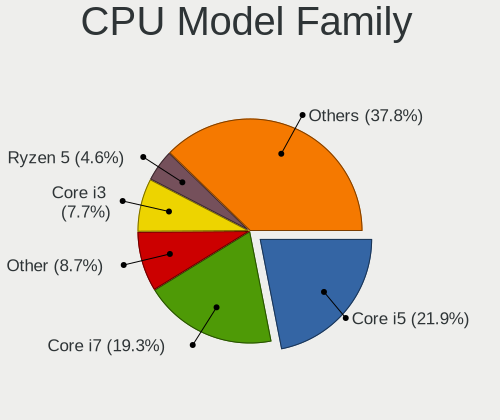
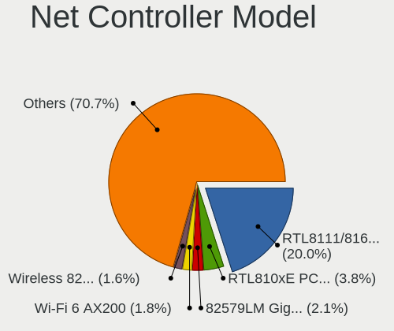
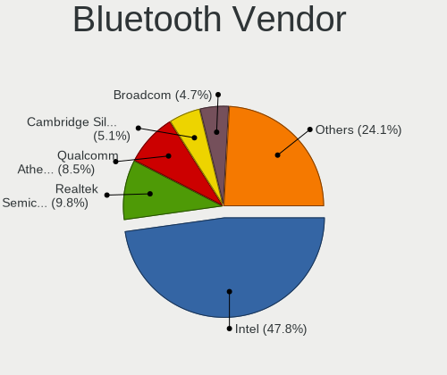

Ubuntu - Tested Hardware & Statistics
-------------------------------------

A project to collect tested hardware configurations for Ubuntu.

Anyone can contribute to this report by the [hw-probe](https://github.com/linuxhw/hw-probe) tool:

    sudo -E hw-probe -all -upload

Please contribute! Especially if your hardware is rare.

This is a report for all computer types. See also reports for [desktops](/Dist/Ubuntu/Desktop/README.md) and [notebooks](/Dist/Ubuntu/Notebook/README.md).

Contents
--------

* [ Test Cases ](#test-cases)

* [ System ](#system)
  - [ OS                       ](#os)
  - [ OS Family                ](#os-family)
  - [ Kernel                   ](#kernel)
  - [ Kernel Family            ](#kernel-family)
  - [ Kernel Major Ver.        ](#kernel-major-ver)
  - [ Arch                     ](#arch)
  - [ DE                       ](#de)
  - [ Display Server           ](#display-server)
  - [ Display Manager          ](#display-manager)
  - [ OS Lang                  ](#os-lang)
  - [ Boot Mode                ](#boot-mode)
  - [ Filesystem               ](#filesystem)
  - [ Part. scheme             ](#part-scheme)
  - [ Dual Boot with Linux/BSD ](#dual-boot-with-linuxbsd)
  - [ Dual Boot (Win)          ](#dual-boot-win)

* [ Board ](#board)
  - [ Vendor                   ](#vendor)
  - [ Model                    ](#model)
  - [ Model Family             ](#model-family)
  - [ MFG Year                 ](#mfg-year)
  - [ Form Factor              ](#form-factor)
  - [ Secure Boot              ](#secure-boot)
  - [ Coreboot                 ](#coreboot)
  - [ RAM Size                 ](#ram-size)
  - [ RAM Used                 ](#ram-used)
  - [ Total Drives             ](#total-drives)
  - [ Has CD-ROM               ](#has-cd-rom)
  - [ Has Ethernet             ](#has-ethernet)
  - [ Has WiFi                 ](#has-wifi)
  - [ Has Bluetooth            ](#has-bluetooth)

* [ Location ](#location)
  - [ Country                  ](#country)
  - [ City                     ](#city)

* [ Drives ](#drives)
  - [ Drive Vendor             ](#drive-vendor)
  - [ Drive Model              ](#drive-model)
  - [ HDD Vendor               ](#hdd-vendor)
  - [ SSD Vendor               ](#ssd-vendor)
  - [ Drive Kind               ](#drive-kind)
  - [ Drive Connector          ](#drive-connector)
  - [ Drive Size               ](#drive-size)
  - [ Space Total              ](#space-total)
  - [ Space Used               ](#space-used)
  - [ Malfunc. Drives          ](#malfunc-drives)
  - [ Malfunc. Drive Vendor    ](#malfunc-drive-vendor)
  - [ Malfunc. HDD Vendor      ](#malfunc-hdd-vendor)
  - [ Malfunc. Drive Kind      ](#malfunc-drive-kind)
  - [ Failed Drives            ](#failed-drives)
  - [ Failed Drive Vendor      ](#failed-drive-vendor)
  - [ Drive Status             ](#drive-status)

* [ Storage controller ](#storage-controller)
  - [ Storage Vendor           ](#storage-vendor)
  - [ Storage Model            ](#storage-model)
  - [ Storage Kind             ](#storage-kind)

* [ Processor ](#processor)
  - [ CPU Vendor               ](#cpu-vendor)
  - [ CPU Model                ](#cpu-model)
  - [ CPU Model Family         ](#cpu-model-family)
  - [ CPU Cores                ](#cpu-cores)
  - [ CPU Sockets              ](#cpu-sockets)
  - [ CPU Threads              ](#cpu-threads)
  - [ CPU Op-Modes             ](#cpu-op-modes)
  - [ CPU Microcode            ](#cpu-microcode)
  - [ CPU Microarch            ](#cpu-microarch)

* [ Graphics ](#graphics)
  - [ GPU Vendor               ](#gpu-vendor)
  - [ GPU Model                ](#gpu-model)
  - [ GPU Combo                ](#gpu-combo)
  - [ GPU Driver               ](#gpu-driver)
  - [ GPU Memory               ](#gpu-memory)

* [ Monitor ](#monitor)
  - [ Monitor Vendor           ](#monitor-vendor)
  - [ Monitor Model            ](#monitor-model)
  - [ Monitor Resolution       ](#monitor-resolution)
  - [ Monitor Diagonal         ](#monitor-diagonal)
  - [ Monitor Width            ](#monitor-width)
  - [ Aspect Ratio             ](#aspect-ratio)
  - [ Monitor Area             ](#monitor-area)
  - [ Pixel Density            ](#pixel-density)
  - [ Multiple Monitors        ](#multiple-monitors)

* [ Network ](#network)
  - [ Net Controller Vendor    ](#net-controller-vendor)
  - [ Net Controller Model     ](#net-controller-model)
  - [ Wireless Vendor          ](#wireless-vendor)
  - [ Wireless Model           ](#wireless-model)
  - [ Ethernet Vendor          ](#ethernet-vendor)
  - [ Ethernet Model           ](#ethernet-model)
  - [ Net Controller Kind      ](#net-controller-kind)
  - [ Used Controller          ](#used-controller)
  - [ NICs                     ](#nics)
  - [ IPv6                     ](#ipv6)

* [ Bluetooth ](#bluetooth)
  - [ Bluetooth Vendor         ](#bluetooth-vendor)
  - [ Bluetooth Model          ](#bluetooth-model)

* [ Sound ](#sound)
  - [ Sound Vendor             ](#sound-vendor)
  - [ Sound Model              ](#sound-model)

* [ Memory ](#memory)
  - [ Memory Vendor            ](#memory-vendor)
  - [ Memory Model             ](#memory-model)
  - [ Memory Kind              ](#memory-kind)
  - [ Memory Form Factor       ](#memory-form-factor)
  - [ Memory Size              ](#memory-size)
  - [ Memory Speed             ](#memory-speed)

* [ Printers & scanners ](#printers--scanners)
  - [ Printer Vendor           ](#printer-vendor)
  - [ Printer Model            ](#printer-model)
  - [ Scanner Vendor           ](#scanner-vendor)
  - [ Scanner Model            ](#scanner-model)

* [ Camera ](#camera)
  - [ Camera Vendor            ](#camera-vendor)
  - [ Camera Model             ](#camera-model)

* [ Security ](#security)
  - [ Fingerprint Vendor       ](#fingerprint-vendor)
  - [ Fingerprint Model        ](#fingerprint-model)
  - [ Chipcard Vendor          ](#chipcard-vendor)
  - [ Chipcard Model           ](#chipcard-model)

* [ Unsupported ](#unsupported)
  - [ Unsupported Devices      ](#unsupported-devices)
  - [ Unsupported Device Types ](#unsupported-device-types)

Test Cases
----------

Total: 82353

| Vendor        | Model                       | Form-Factor | Probe                                                      | Date         |
|---------------|-----------------------------|-------------|------------------------------------------------------------|--------------|
| Dell          | Inspiron 5566               | Notebook    | [b2dd8d93c7](https://linux-hardware.org/?probe=b2dd8d93c7) | Feb 01, 2023 |
| ASUSTek       | A8N-SLI Premium             | Desktop     | [faf81c22ae](https://linux-hardware.org/?probe=faf81c22ae) | Feb 01, 2023 |
| Fujitsu       | D3400-A1 S26361-D3400-A1    | Desktop     | [b792043acd](https://linux-hardware.org/?probe=b792043acd) | Feb 01, 2023 |
| Dell          | Latitude 7420               | Notebook    | [f0b8816283](https://linux-hardware.org/?probe=f0b8816283) | Feb 01, 2023 |
| Biostar       | A68N-5000                   | Desktop     | [96e9f6ff35](https://linux-hardware.org/?probe=96e9f6ff35) | Feb 01, 2023 |
| Lenovo        | ThinkPad T470s 20HF0000U... | Notebook    | [d7a5b537d9](https://linux-hardware.org/?probe=d7a5b537d9) | Feb 01, 2023 |
| Gigabyte      | G31M-ES2C                   | Desktop     | [ec3d16bb4e](https://linux-hardware.org/?probe=ec3d16bb4e) | Feb 01, 2023 |
| Dell          | Latitude 5430               | Notebook    | [2afa57d0fa](https://linux-hardware.org/?probe=2afa57d0fa) | Feb 01, 2023 |
| Lenovo        | ThinkPad X220 4286CTO       | Notebook    | [465114aa14](https://linux-hardware.org/?probe=465114aa14) | Feb 01, 2023 |
| Gigabyte      | B365M DS3H                  | Desktop     | [d515d5d9f7](https://linux-hardware.org/?probe=d515d5d9f7) | Feb 01, 2023 |
| Dell          | Vostro 3500                 | Notebook    | [fa4104f438](https://linux-hardware.org/?probe=fa4104f438) | Feb 01, 2023 |
| HP            | EliteBook 8570p             | Notebook    | [2f7f3a5b93](https://linux-hardware.org/?probe=2f7f3a5b93) | Feb 01, 2023 |
| Lenovo        | ThinkPad T520 4243WRK       | Notebook    | [924a321452](https://linux-hardware.org/?probe=924a321452) | Feb 01, 2023 |
| ASUSTek       | TUF Gaming X570-PRO WIFI... | Desktop     | [48bccd4f38](https://linux-hardware.org/?probe=48bccd4f38) | Feb 01, 2023 |
| Lenovo        | ThinkPad E14 20RAS1RA00     | Notebook    | [8360c9e13f](https://linux-hardware.org/?probe=8360c9e13f) | Feb 01, 2023 |
| Dell          | Vostro 3500                 | Notebook    | [ec80fcb8a5](https://linux-hardware.org/?probe=ec80fcb8a5) | Feb 01, 2023 |
| Pegatron      | 2A94                        | Desktop     | [58961a542f](https://linux-hardware.org/?probe=58961a542f) | Feb 01, 2023 |
| Lenovo        | ThinkPad E520 1143JYG       | Notebook    | [87735dd3b0](https://linux-hardware.org/?probe=87735dd3b0) | Feb 01, 2023 |
| Foxconn       | G41MXE/G41MXE-K             | Desktop     | [50c552026e](https://linux-hardware.org/?probe=50c552026e) | Feb 01, 2023 |
| Dell          | 09KPNV A01                  | Desktop     | [5dcda0d3e5](https://linux-hardware.org/?probe=5dcda0d3e5) | Feb 01, 2023 |
| Lenovo        | SHARKBAY 0B98401 WIN        | Desktop     | [1668f1f69f](https://linux-hardware.org/?probe=1668f1f69f) | Feb 01, 2023 |
| HUAWEI        | BOHK-WAX9X                  | Notebook    | [07b498f669](https://linux-hardware.org/?probe=07b498f669) | Feb 01, 2023 |
| Dell          | 06D7TR A00                  | Desktop     | [d040bfd5cc](https://linux-hardware.org/?probe=d040bfd5cc) | Feb 01, 2023 |
| MSI           | MAG Z790 TOMAHAWK WIFI      | Desktop     | [b9fb1c5111](https://linux-hardware.org/?probe=b9fb1c5111) | Feb 01, 2023 |
| ASUSTek       | PRIME B550M-A               | Desktop     | [2e458676e4](https://linux-hardware.org/?probe=2e458676e4) | Feb 01, 2023 |
| Dell          | Inspiron 15-3567            | Notebook    | [2f6f4bc8c7](https://linux-hardware.org/?probe=2f6f4bc8c7) | Feb 01, 2023 |
| Lenovo        | ThinkPad X270 20HMS0T000    | Notebook    | [e9854b7cf8](https://linux-hardware.org/?probe=e9854b7cf8) | Feb 01, 2023 |
| MSI           | X470 GAMING PLUS MAX        | Desktop     | [f1fecf5447](https://linux-hardware.org/?probe=f1fecf5447) | Feb 01, 2023 |
| Intel         | NUC11PABi5 K90634-305       | Mini pc     | [63143e2bf5](https://linux-hardware.org/?probe=63143e2bf5) | Feb 01, 2023 |
| ASUSTek       | M4A89TD PRO USB3            | Desktop     | [9010e03a18](https://linux-hardware.org/?probe=9010e03a18) | Feb 01, 2023 |
| Dell          | Inspiron One 2320           | All in one  | [f4933208c1](https://linux-hardware.org/?probe=f4933208c1) | Feb 01, 2023 |
| Lenovo        | 3181 NO DPK                 | Mini pc     | [d4c01d094b](https://linux-hardware.org/?probe=d4c01d094b) | Feb 01, 2023 |
| Apple         | MacBookPro11,1              | Notebook    | [44f90bc9ab](https://linux-hardware.org/?probe=44f90bc9ab) | Feb 01, 2023 |
| HP            | 1790                        | Desktop     | [d0d3ca5e7c](https://linux-hardware.org/?probe=d0d3ca5e7c) | Feb 01, 2023 |
| HP            | Presario CQ57               | Notebook    | [0e34caefa3](https://linux-hardware.org/?probe=0e34caefa3) | Feb 01, 2023 |
| Dell          | 02P9X9 A04                  | Server      | [bda0eb6835](https://linux-hardware.org/?probe=bda0eb6835) | Feb 01, 2023 |
| Dell          | 0VHWTR A02                  | Desktop     | [4820c0216f](https://linux-hardware.org/?probe=4820c0216f) | Feb 01, 2023 |
| Huanan        | X99-F8D PLUS V1.1           | Desktop     | [e68a009e8f](https://linux-hardware.org/?probe=e68a009e8f) | Feb 01, 2023 |
| Gigabyte      | GA-MA69VM-S2                | Desktop     | [72dae43046](https://linux-hardware.org/?probe=72dae43046) | Feb 01, 2023 |
| Schenker      | VISION 16 Pro (L22)         | Notebook    | [0979a6ca2a](https://linux-hardware.org/?probe=0979a6ca2a) | Jan 31, 2023 |
| Gigabyte      | H510M H                     | Desktop     | [298b411767](https://linux-hardware.org/?probe=298b411767) | Jan 31, 2023 |
| Lenovo        | Legion 5 17ACH6H 82JY       | Notebook    | [62f941075c](https://linux-hardware.org/?probe=62f941075c) | Jan 31, 2023 |
| Intel         | NUC13SBBi5 M89887-303       | Mini pc     | [5ddc33f69b](https://linux-hardware.org/?probe=5ddc33f69b) | Jan 31, 2023 |
| Acer          | Aspire E1-522               | Notebook    | [af61a3d9c8](https://linux-hardware.org/?probe=af61a3d9c8) | Jan 31, 2023 |
| Dell          | Inspiron 15-7579            | Notebook    | [b5bd231bf3](https://linux-hardware.org/?probe=b5bd231bf3) | Jan 31, 2023 |
| HP            | ENVY x360 2-in-1 Laptop ... | Convertible | [21b6d00ff2](https://linux-hardware.org/?probe=21b6d00ff2) | Jan 31, 2023 |
| Dell          | 0Y7WYT A00                  | Desktop     | [77909a2fa1](https://linux-hardware.org/?probe=77909a2fa1) | Jan 31, 2023 |
| MSI           | B450 TOMAHAWK MAX           | Desktop     | [3f9519f358](https://linux-hardware.org/?probe=3f9519f358) | Jan 31, 2023 |
| Dell          | 0Y7WYT A00                  | Desktop     | [d299b4befd](https://linux-hardware.org/?probe=d299b4befd) | Jan 31, 2023 |
| ASUSTek       | VivoBook_ASUSLaptop X150... | Notebook    | [e2ad5b033f](https://linux-hardware.org/?probe=e2ad5b033f) | Jan 31, 2023 |
| Dell          | G3 3500                     | Notebook    | [4b519ab8a8](https://linux-hardware.org/?probe=4b519ab8a8) | Jan 31, 2023 |
| BESSTAR Te... | GB7                         | Mini pc     | [abe22da26e](https://linux-hardware.org/?probe=abe22da26e) | Jan 31, 2023 |
| NCR           | Pocono                      | Desktop     | [1a1c878e10](https://linux-hardware.org/?probe=1a1c878e10) | Jan 31, 2023 |
| Timi          | TM1701                      | Notebook    | [a474c92380](https://linux-hardware.org/?probe=a474c92380) | Jan 31, 2023 |
| ASUSTek       | ROG STRIX Z590-A GAMING ... | Desktop     | [b54f170a86](https://linux-hardware.org/?probe=b54f170a86) | Jan 31, 2023 |
| Dell          | XPS 13 7390                 | Notebook    | [5479d8c85b](https://linux-hardware.org/?probe=5479d8c85b) | Jan 31, 2023 |
| HP            | Laptop 15-bw0xx             | Notebook    | [b7fce61d74](https://linux-hardware.org/?probe=b7fce61d74) | Jan 31, 2023 |
| Dell          | XPS 13 9370                 | Notebook    | [cd12cbdc16](https://linux-hardware.org/?probe=cd12cbdc16) | Jan 31, 2023 |
| HUAWEI        | KLVL-WXXW                   | Notebook    | [4c8bff0f95](https://linux-hardware.org/?probe=4c8bff0f95) | Jan 31, 2023 |
| Lenovo        | ThinkPad E15 Gen 2 20T9S... | Notebook    | [51d249d102](https://linux-hardware.org/?probe=51d249d102) | Jan 31, 2023 |
| Dell          | 0NKW6Y A02                  | Desktop     | [4a63357651](https://linux-hardware.org/?probe=4a63357651) | Jan 31, 2023 |
| ASUSTek       | VivoBook_ASUSLaptop M340... | Notebook    | [cd9b7d5796](https://linux-hardware.org/?probe=cd9b7d5796) | Jan 31, 2023 |
| Dell          | Latitude 7420               | Notebook    | [55f81648a1](https://linux-hardware.org/?probe=55f81648a1) | Jan 31, 2023 |
| ASUSTek       | ROG STRIX B450-I GAMING     | Desktop     | [d59770af38](https://linux-hardware.org/?probe=d59770af38) | Jan 31, 2023 |
| ASUSTek       | ROG STRIX B450-I GAMING     | Desktop     | [3a5ae3d1e8](https://linux-hardware.org/?probe=3a5ae3d1e8) | Jan 31, 2023 |
| Intel         | DH77DF AAG40293-301         | Desktop     | [1a0f7653e3](https://linux-hardware.org/?probe=1a0f7653e3) | Jan 31, 2023 |
| Dell          | 0XHGV1 A00                  | Desktop     | [05a6fd1857](https://linux-hardware.org/?probe=05a6fd1857) | Jan 31, 2023 |
| Dell          | XPS 15 9570                 | Notebook    | [896d7f2fbd](https://linux-hardware.org/?probe=896d7f2fbd) | Jan 31, 2023 |
| Timi          | A34R                        | Notebook    | [18ab422614](https://linux-hardware.org/?probe=18ab422614) | Jan 31, 2023 |
| HP            | EliteBook 840 G2            | Notebook    | [bf4741c8ad](https://linux-hardware.org/?probe=bf4741c8ad) | Jan 31, 2023 |
| Dell          | 06HR05 A00                  | Desktop     | [b80c55d90d](https://linux-hardware.org/?probe=b80c55d90d) | Jan 31, 2023 |
| Dell          | Latitude 5410               | Notebook    | [717012530d](https://linux-hardware.org/?probe=717012530d) | Jan 31, 2023 |
| Dell          | Latitude 7410               | Notebook    | [fd07971a70](https://linux-hardware.org/?probe=fd07971a70) | Jan 31, 2023 |
| Lenovo        | ThinkPad P15 Gen 2i 20YQ... | Notebook    | [ea48b6870c](https://linux-hardware.org/?probe=ea48b6870c) | Jan 31, 2023 |
| Google        | Casta                       | Notebook    | [db372f6a5f](https://linux-hardware.org/?probe=db372f6a5f) | Jan 31, 2023 |
| Unknown       | Unknown                     | Desktop     | [66b96d9a0f](https://linux-hardware.org/?probe=66b96d9a0f) | Jan 31, 2023 |
| Timi          | Xiaomi Book Air 13 2022     | Convertible | [e5695a72a0](https://linux-hardware.org/?probe=e5695a72a0) | Jan 31, 2023 |
| Lenovo        | 36C8 SDK0J40700 WIN 3258... | Desktop     | [01c7dbecde](https://linux-hardware.org/?probe=01c7dbecde) | Jan 31, 2023 |
| Raspberry ... | Raspberry Pi 4 Model B R... | Soc         | [656bb989e7](https://linux-hardware.org/?probe=656bb989e7) | Jan 31, 2023 |
| Gigabyte      | Z97M-DS3H                   | Desktop     | [360dc83e04](https://linux-hardware.org/?probe=360dc83e04) | Jan 31, 2023 |
| Unknown       | Unknown                     | Desktop     | [4dbe55873b](https://linux-hardware.org/?probe=4dbe55873b) | Jan 31, 2023 |
| Medion        | MS-7728                     | Desktop     | [60cf9e4948](https://linux-hardware.org/?probe=60cf9e4948) | Jan 31, 2023 |
| Lenovo        | ThinkPad T410 2518BPG       | Notebook    | [011f53deaa](https://linux-hardware.org/?probe=011f53deaa) | Jan 31, 2023 |
| Maxtang       | EHL30 V1.0                  | Desktop     | [d104ad1307](https://linux-hardware.org/?probe=d104ad1307) | Jan 31, 2023 |
| Lenovo        | ThinkBook 13s G2 ITL 20V... | Notebook    | [74bf135ed9](https://linux-hardware.org/?probe=74bf135ed9) | Jan 31, 2023 |
| Lenovo        | ThinkBook 13s G2 ITL 20V... | Notebook    | [e0c723e305](https://linux-hardware.org/?probe=e0c723e305) | Jan 31, 2023 |
| System76      | Lemur                       | Notebook    | [6dac0a5b94](https://linux-hardware.org/?probe=6dac0a5b94) | Jan 31, 2023 |
| Dell          | Latitude D630               | Notebook    | [ff0aa8c4ed](https://linux-hardware.org/?probe=ff0aa8c4ed) | Jan 31, 2023 |
| Dell          | XPS 13 9360                 | Notebook    | [3aa64bf1ec](https://linux-hardware.org/?probe=3aa64bf1ec) | Jan 31, 2023 |
| Dell          | 040DDP A01                  | Desktop     | [6094b799d7](https://linux-hardware.org/?probe=6094b799d7) | Jan 31, 2023 |
| Gigabyte      | H270-Gaming 3               | Desktop     | [e64a1e0a5a](https://linux-hardware.org/?probe=e64a1e0a5a) | Jan 31, 2023 |
| Gigabyte      | F2A88XM-D3H                 | Desktop     | [846f831269](https://linux-hardware.org/?probe=846f831269) | Jan 31, 2023 |
| Gigabyte      | Z170-HD3P-CF                | Desktop     | [9e9deedf0d](https://linux-hardware.org/?probe=9e9deedf0d) | Jan 31, 2023 |
| Acer          | Aspire E5-571               | Notebook    | [615ee3d3fd](https://linux-hardware.org/?probe=615ee3d3fd) | Jan 31, 2023 |
| Lenovo        | ThinkPad P51 20HJS0BR00     | Notebook    | [6c05048c9d](https://linux-hardware.org/?probe=6c05048c9d) | Jan 31, 2023 |
| Acer          | Aspire E5-571               | Notebook    | [6498b44bcc](https://linux-hardware.org/?probe=6498b44bcc) | Jan 31, 2023 |
| Dell          | 0NW6H5 A00                  | Desktop     | [6296345ebb](https://linux-hardware.org/?probe=6296345ebb) | Jan 31, 2023 |
| Lenovo        | ThinkPad T430 2349A44       | Notebook    | [9f8528c5da](https://linux-hardware.org/?probe=9f8528c5da) | Jan 31, 2023 |
| Dell          | 0CNCJW A08                  | Server      | [1abe023ed7](https://linux-hardware.org/?probe=1abe023ed7) | Jan 31, 2023 |
| Lenovo        | ThinkPad L540 20AVCTO1WW    | Notebook    | [d08beb0c26](https://linux-hardware.org/?probe=d08beb0c26) | Jan 31, 2023 |
| Lenovo        | 30D0 SDK0J40697 WIN 3305... | Desktop     | [f018b74ad8](https://linux-hardware.org/?probe=f018b74ad8) | Jan 31, 2023 |
| HP            | ENVY dv6                    | Notebook    | [4d8c55a82f](https://linux-hardware.org/?probe=4d8c55a82f) | Jan 31, 2023 |
| Apple         | MacBookPro8,1               | Notebook    | [0eac708be5](https://linux-hardware.org/?probe=0eac708be5) | Jan 31, 2023 |
| Acer          | Swift SF114-32              | Notebook    | [8e8ae85d60](https://linux-hardware.org/?probe=8e8ae85d60) | Jan 31, 2023 |
| Apple         | MacBookPro14,2              | Notebook    | [ff0dfe765e](https://linux-hardware.org/?probe=ff0dfe765e) | Jan 31, 2023 |
| Acer          | Unknown                     | Desktop     | [05de2b4244](https://linux-hardware.org/?probe=05de2b4244) | Jan 30, 2023 |
| Toshiba       | Satellite U845W             | Notebook    | [6735a45763](https://linux-hardware.org/?probe=6735a45763) | Jan 30, 2023 |
| Lenovo        | ThinkPad P50 20EN0013US     | Notebook    | [d3bf9fe9e3](https://linux-hardware.org/?probe=d3bf9fe9e3) | Jan 30, 2023 |
| Gigabyte      | X570 AORUS ELITE            | Desktop     | [034ae066aa](https://linux-hardware.org/?probe=034ae066aa) | Jan 30, 2023 |
| MSI           | MPG X570 GAMING EDGE WIF... | Desktop     | [353272e0d2](https://linux-hardware.org/?probe=353272e0d2) | Jan 30, 2023 |
| Acer          | Predator PH315-52           | Notebook    | [457b7cf5f0](https://linux-hardware.org/?probe=457b7cf5f0) | Jan 30, 2023 |
| ASUSTek       | ROG STRIX X570-E GAMING     | Desktop     | [e3f96394c0](https://linux-hardware.org/?probe=e3f96394c0) | Jan 30, 2023 |
| HP            | Notebook                    | Notebook    | [fc93f8e357](https://linux-hardware.org/?probe=fc93f8e357) | Jan 30, 2023 |
| Dell          | 0GDG8Y A00                  | Desktop     | [8ba7e25b58](https://linux-hardware.org/?probe=8ba7e25b58) | Jan 30, 2023 |
| Acer          | Aspire V3-772G              | Notebook    | [fce1ba6f6b](https://linux-hardware.org/?probe=fce1ba6f6b) | Jan 30, 2023 |
| Dell          | 0GDG8Y A00                  | Desktop     | [759e9a48d1](https://linux-hardware.org/?probe=759e9a48d1) | Jan 30, 2023 |
| Sony          | VPCCB16FG                   | Notebook    | [837588c9eb](https://linux-hardware.org/?probe=837588c9eb) | Jan 30, 2023 |
| MSI           | 970 GAMING                  | Desktop     | [7bc39da7c1](https://linux-hardware.org/?probe=7bc39da7c1) | Jan 30, 2023 |
| Intel         | DH77DF AAG40293-301         | Desktop     | [1c91d911d7](https://linux-hardware.org/?probe=1c91d911d7) | Jan 30, 2023 |
| HP            | ProBook 4720s               | Notebook    | [b6edbaeae1](https://linux-hardware.org/?probe=b6edbaeae1) | Jan 30, 2023 |
| Timi          | Xiaomi Book Air 13 2022     | Convertible | [5d5761529f](https://linux-hardware.org/?probe=5d5761529f) | Jan 30, 2023 |
| Apple         | Mac-27ADBB7B4CEE8E61 iMa... | All in one  | [17a5588d06](https://linux-hardware.org/?probe=17a5588d06) | Jan 30, 2023 |
| Acer          | Aspire M5-581TG             | Notebook    | [970a402846](https://linux-hardware.org/?probe=970a402846) | Jan 30, 2023 |
| Acer          | Aspire M5-581TG             | Notebook    | [c2d425d254](https://linux-hardware.org/?probe=c2d425d254) | Jan 30, 2023 |
| Lenovo        | 36C8 SDK0J40700 WIN 3258... | Desktop     | [529b411b46](https://linux-hardware.org/?probe=529b411b46) | Jan 30, 2023 |
| ASUSTek       | E3 PRO GAMING V5            | Desktop     | [b7917146d8](https://linux-hardware.org/?probe=b7917146d8) | Jan 30, 2023 |
| HP            | ProBook 6465b               | Notebook    | [de7999a824](https://linux-hardware.org/?probe=de7999a824) | Jan 30, 2023 |
| ASUSTek       | ROG STRIX Z390-E GAMING     | Desktop     | [7983249b4c](https://linux-hardware.org/?probe=7983249b4c) | Jan 30, 2023 |
| HP            | Pavilion x360 Convertibl... | Convertible | [14b0a73713](https://linux-hardware.org/?probe=14b0a73713) | Jan 30, 2023 |
| HUAWEI        | BOHB-WAX9                   | Notebook    | [f4916a0bd5](https://linux-hardware.org/?probe=f4916a0bd5) | Jan 30, 2023 |
| Gateway       | IPIMB-ARA                   | Desktop     | [253b58b2a4](https://linux-hardware.org/?probe=253b58b2a4) | Jan 30, 2023 |
| HP            | Pavilion x360 Convertibl... | Convertible | [8fd86a447c](https://linux-hardware.org/?probe=8fd86a447c) | Jan 30, 2023 |
| Intel         | NUC7i5BNB J31144-311        | Mini pc     | [e95329eafd](https://linux-hardware.org/?probe=e95329eafd) | Jan 30, 2023 |
| Dell          | Precision 3560              | Notebook    | [3d5432deef](https://linux-hardware.org/?probe=3d5432deef) | Jan 30, 2023 |
| Dell          | Precision 3560              | Notebook    | [c250c935bd](https://linux-hardware.org/?probe=c250c935bd) | Jan 30, 2023 |
| Dell          | Precision 3571              | Notebook    | [55f371f4ef](https://linux-hardware.org/?probe=55f371f4ef) | Jan 30, 2023 |
| Dell          | Latitude 5480               | Notebook    | [ee87ac218f](https://linux-hardware.org/?probe=ee87ac218f) | Jan 30, 2023 |
| Dell          | Latitude 5480               | Notebook    | [3cbac640e1](https://linux-hardware.org/?probe=3cbac640e1) | Jan 30, 2023 |
| ASUSTek       | Zenbook UM3402YA_UM3402Y... | Notebook    | [9b17a7541e](https://linux-hardware.org/?probe=9b17a7541e) | Jan 30, 2023 |
| HP            | Compaq CQ58                 | Notebook    | [63dfd6ca48](https://linux-hardware.org/?probe=63dfd6ca48) | Jan 30, 2023 |
| Intel         | NUC11PABi7 K90104-302       | Mini pc     | [6d867d07e1](https://linux-hardware.org/?probe=6d867d07e1) | Jan 30, 2023 |
| Fujitsu       | LIFEBOOK A530               | Notebook    | [0698054de0](https://linux-hardware.org/?probe=0698054de0) | Jan 30, 2023 |
| Toshiba       | PORTEGE X30-E               | Notebook    | [01f74415b0](https://linux-hardware.org/?probe=01f74415b0) | Jan 30, 2023 |
| Fujitsu       | LIFEBOOK A530               | Notebook    | [122005ade3](https://linux-hardware.org/?probe=122005ade3) | Jan 30, 2023 |
| HP            | 15                          | Notebook    | [409a15bdf3](https://linux-hardware.org/?probe=409a15bdf3) | Jan 30, 2023 |
| Dell          | Latitude 7390               | Notebook    | [b154892be4](https://linux-hardware.org/?probe=b154892be4) | Jan 30, 2023 |
| HP            | ENVY Laptop 13-ah1xxx       | Notebook    | [360756b46a](https://linux-hardware.org/?probe=360756b46a) | Jan 30, 2023 |
| Lenovo        | IdeaPad 310-15ABR 80ST      | Notebook    | [2469884587](https://linux-hardware.org/?probe=2469884587) | Jan 30, 2023 |
| Dell          | Precision 5560              | Notebook    | [c994bfa3a7](https://linux-hardware.org/?probe=c994bfa3a7) | Jan 30, 2023 |
| HP            | 8054                        | Desktop     | [f2367fdcda](https://linux-hardware.org/?probe=f2367fdcda) | Jan 30, 2023 |
| Dell          | 060K5C A02                  | Server      | [10f46b2d20](https://linux-hardware.org/?probe=10f46b2d20) | Jan 30, 2023 |
| Dell          | 060K5C A02                  | Server      | [cef0697950](https://linux-hardware.org/?probe=cef0697950) | Jan 30, 2023 |
| TUXEDO        | Unknown                     | Notebook    | [81566e6fc9](https://linux-hardware.org/?probe=81566e6fc9) | Jan 30, 2023 |
| Acer          | Swift SF314-71              | Notebook    | [41c052436a](https://linux-hardware.org/?probe=41c052436a) | Jan 30, 2023 |
| Dell          | Latitude E6520              | Notebook    | [81717ed3df](https://linux-hardware.org/?probe=81717ed3df) | Jan 30, 2023 |
| Lenovo        | ThinkPad T480 20L5001KAU    | Notebook    | [4b7046e26c](https://linux-hardware.org/?probe=4b7046e26c) | Jan 30, 2023 |
| MSI           | X370 SLI PLUS               | Desktop     | [bb20465703](https://linux-hardware.org/?probe=bb20465703) | Jan 30, 2023 |
| Lenovo        | Yoga 510-14AST 80S9         | Convertible | [bb0384d993](https://linux-hardware.org/?probe=bb0384d993) | Jan 30, 2023 |
| Dell          | XPS 13 9380                 | Notebook    | [ec00530842](https://linux-hardware.org/?probe=ec00530842) | Jan 30, 2023 |
| Acer          | Aspire A715-75G             | Notebook    | [59a0c6f08f](https://linux-hardware.org/?probe=59a0c6f08f) | Jan 30, 2023 |
| HP            | 18E7                        | Desktop     | [db4ef3e5f4](https://linux-hardware.org/?probe=db4ef3e5f4) | Jan 30, 2023 |
| Lenovo        | ThinkPad T480 20L5000UUS    | Notebook    | [d356c9846a](https://linux-hardware.org/?probe=d356c9846a) | Jan 30, 2023 |
| Gigabyte      | H270-Gaming 3               | Desktop     | [4427845ac1](https://linux-hardware.org/?probe=4427845ac1) | Jan 30, 2023 |
| Lenovo        | 3704 SDK0J40700 WIN 3258... | Desktop     | [aff06e830e](https://linux-hardware.org/?probe=aff06e830e) | Jan 30, 2023 |
| ASUSTek       | PRIME Z690-P WIFI           | Desktop     | [d2f9eb15f5](https://linux-hardware.org/?probe=d2f9eb15f5) | Jan 30, 2023 |
| ASRock        | FM2A68M-DG3+                | Desktop     | [7fb4a85c09](https://linux-hardware.org/?probe=7fb4a85c09) | Jan 30, 2023 |
| Intel         | B75                         | Desktop     | [6597bed6da](https://linux-hardware.org/?probe=6597bed6da) | Jan 29, 2023 |
| ASUSTek       | Z97-PRO                     | Desktop     | [0e241538c1](https://linux-hardware.org/?probe=0e241538c1) | Jan 29, 2023 |
| HP            | G62                         | Notebook    | [166ddbe627](https://linux-hardware.org/?probe=166ddbe627) | Jan 29, 2023 |
| Dell          | Inspiron 14 5410 2-in-1     | Convertible | [36caf406ce](https://linux-hardware.org/?probe=36caf406ce) | Jan 29, 2023 |
| Lenovo        | IdeaPad S145-15IWL 81S9     | Notebook    | [1c62beb905](https://linux-hardware.org/?probe=1c62beb905) | Jan 29, 2023 |
| ASUSTek       | H81M-CS/BR                  | Desktop     | [ca82a3e5a7](https://linux-hardware.org/?probe=ca82a3e5a7) | Jan 29, 2023 |
| Lenovo        | IdeaPad 320-15ISK 80XH      | Notebook    | [7bc88d72f0](https://linux-hardware.org/?probe=7bc88d72f0) | Jan 29, 2023 |
| HP            | Laptop 15-dy2xxx            | Notebook    | [97e6b9cb60](https://linux-hardware.org/?probe=97e6b9cb60) | Jan 29, 2023 |
| HP            | Laptop 15-dy2xxx            | Notebook    | [e5e795e7a2](https://linux-hardware.org/?probe=e5e795e7a2) | Jan 29, 2023 |
| Sony          | VPCCB16FG                   | Notebook    | [7307480466](https://linux-hardware.org/?probe=7307480466) | Jan 29, 2023 |
| Dell          | Latitude 9510               | Convertible | [06dc993730](https://linux-hardware.org/?probe=06dc993730) | Jan 29, 2023 |
| ASUSTek       | ROG STRIX B550-F GAMING     | Desktop     | [4fb612b680](https://linux-hardware.org/?probe=4fb612b680) | Jan 29, 2023 |
| ASUSTek       | P6T SE                      | Desktop     | [04ed0bd8b1](https://linux-hardware.org/?probe=04ed0bd8b1) | Jan 29, 2023 |
| Google        | Lillipup                    | Notebook    | [194cec66f5](https://linux-hardware.org/?probe=194cec66f5) | Jan 29, 2023 |
| MSI           | MPG B550I GAMING EDGE MA... | Desktop     | [ff186606cd](https://linux-hardware.org/?probe=ff186606cd) | Jan 29, 2023 |
| Intel         | NUC6CAYB J23203-410         | Mini pc     | [d4f05f2d34](https://linux-hardware.org/?probe=d4f05f2d34) | Jan 29, 2023 |
| Lenovo        | ThinkPad T420 4236PN3       | Notebook    | [3b5c51e8b8](https://linux-hardware.org/?probe=3b5c51e8b8) | Jan 29, 2023 |
| Lenovo        | IdeaPad 5 15ITL05 82FG      | Notebook    | [4b8206c892](https://linux-hardware.org/?probe=4b8206c892) | Jan 29, 2023 |
| Gigabyte      | Z370 HD3-CF                 | Desktop     | [1721760555](https://linux-hardware.org/?probe=1721760555) | Jan 29, 2023 |
| ASRock        | B460M Pro4                  | Desktop     | [7af163f694](https://linux-hardware.org/?probe=7af163f694) | Jan 29, 2023 |
| HUAWEI        | BOHB-WAX9                   | Notebook    | [ee6b0e54f7](https://linux-hardware.org/?probe=ee6b0e54f7) | Jan 29, 2023 |
| Gigabyte      | B250M-HD3-CF                | Desktop     | [f8630776ca](https://linux-hardware.org/?probe=f8630776ca) | Jan 29, 2023 |
| Dell          | Inspiron 3501               | Notebook    | [7bb7fe1a4f](https://linux-hardware.org/?probe=7bb7fe1a4f) | Jan 29, 2023 |
| MSI           | Z77A-G43                    | Desktop     | [873725bb74](https://linux-hardware.org/?probe=873725bb74) | Jan 29, 2023 |
| MSI           | Z77A-G43                    | Desktop     | [f489fe4f5d](https://linux-hardware.org/?probe=f489fe4f5d) | Jan 29, 2023 |
| MSI           | 760GM-P23                   | Desktop     | [34fab6626e](https://linux-hardware.org/?probe=34fab6626e) | Jan 29, 2023 |
| HP            | ENVY x360 2-in-1 Laptop ... | Convertible | [dab1328d8d](https://linux-hardware.org/?probe=dab1328d8d) | Jan 29, 2023 |
| HP            | ZBook 14 G2                 | Notebook    | [4b1e1bc7e1](https://linux-hardware.org/?probe=4b1e1bc7e1) | Jan 29, 2023 |
| HP            | ENVY x360 2-in-1 Laptop ... | Convertible | [3a7f252d19](https://linux-hardware.org/?probe=3a7f252d19) | Jan 29, 2023 |
| Apple         | MacBookPro5,5               | Notebook    | [678b6fa5f6](https://linux-hardware.org/?probe=678b6fa5f6) | Jan 29, 2023 |
| ASUSTek       | PRIME B450M-K II            | Desktop     | [d4a5012f93](https://linux-hardware.org/?probe=d4a5012f93) | Jan 29, 2023 |
| Lenovo        | IdeaPad 510-15ISK 80SR      | Notebook    | [debdb8208f](https://linux-hardware.org/?probe=debdb8208f) | Jan 29, 2023 |
| Lenovo        | ThinkPad T14 Gen 2i 20W1... | Notebook    | [5122097b1e](https://linux-hardware.org/?probe=5122097b1e) | Jan 29, 2023 |
| Lenovo        | IdeaPad 100-15IBD 80QQ      | Notebook    | [84c2710911](https://linux-hardware.org/?probe=84c2710911) | Jan 29, 2023 |
| HP            | ProBook 4520s               | Notebook    | [6a16110b08](https://linux-hardware.org/?probe=6a16110b08) | Jan 29, 2023 |
| HP            | ProBook 4520s               | Notebook    | [e973aeb114](https://linux-hardware.org/?probe=e973aeb114) | Jan 29, 2023 |
| Dell          | 0VRWRC A01                  | Desktop     | [0e6a170715](https://linux-hardware.org/?probe=0e6a170715) | Jan 29, 2023 |
| HP            | Pavilion Sleekbook 15       | Notebook    | [d17dc00a8a](https://linux-hardware.org/?probe=d17dc00a8a) | Jan 29, 2023 |
| HP            | 81B4                        | Desktop     | [01229ad5ec](https://linux-hardware.org/?probe=01229ad5ec) | Jan 29, 2023 |
| Fujitsu Si... | D2587-A1 S26361-D2587-A1    | Desktop     | [6378111bbd](https://linux-hardware.org/?probe=6378111bbd) | Jan 29, 2023 |
| ASUSTek       | ASUS TUF Gaming F15 FX50... | Notebook    | [90644628b4](https://linux-hardware.org/?probe=90644628b4) | Jan 29, 2023 |
| Gigabyte      | X570 I AORUS PRO WIFI       | Desktop     | [e6fedcdbb0](https://linux-hardware.org/?probe=e6fedcdbb0) | Jan 29, 2023 |
| HP            | Laptop 14-fq0xxx            | Notebook    | [0b7bcda17a](https://linux-hardware.org/?probe=0b7bcda17a) | Jan 29, 2023 |
| Timi          | RedmiBook Pro 15S           | Notebook    | [21cf912e1c](https://linux-hardware.org/?probe=21cf912e1c) | Jan 29, 2023 |
| Dell          | Inspiron 5520               | Notebook    | [c869e74605](https://linux-hardware.org/?probe=c869e74605) | Jan 29, 2023 |
| HP            | EliteBook 8460p             | Notebook    | [caedc4c130](https://linux-hardware.org/?probe=caedc4c130) | Jan 29, 2023 |
| HP            | Pavilion dv6                | Notebook    | [1e739ddc0d](https://linux-hardware.org/?probe=1e739ddc0d) | Jan 29, 2023 |
| ASRock        | Z97E-ITX/ac                 | Desktop     | [80d82e6be6](https://linux-hardware.org/?probe=80d82e6be6) | Jan 29, 2023 |
| ASRock        | 970M Pro3                   | Desktop     | [e0a5d6512f](https://linux-hardware.org/?probe=e0a5d6512f) | Jan 29, 2023 |
| Motion Com... | C5t                         | Notebook    | [200be33adc](https://linux-hardware.org/?probe=200be33adc) | Jan 29, 2023 |
| ASRock        | Z97E-ITX/ac                 | Desktop     | [4d092eb96c](https://linux-hardware.org/?probe=4d092eb96c) | Jan 29, 2023 |
| Apple         | Mac-F226BEC8 PVT            | All in one  | [45e2952704](https://linux-hardware.org/?probe=45e2952704) | Jan 29, 2023 |
| Acer          | Aspire A315-41              | Notebook    | [f8ef554d85](https://linux-hardware.org/?probe=f8ef554d85) | Jan 29, 2023 |
| HP            | Laptop 15-da0xxx            | Notebook    | [959a9a17dd](https://linux-hardware.org/?probe=959a9a17dd) | Jan 29, 2023 |
| System76      | Lemur                       | Notebook    | [a6fc9167f7](https://linux-hardware.org/?probe=a6fc9167f7) | Jan 29, 2023 |
| Acer          | E1-510                      | Notebook    | [659bb96537](https://linux-hardware.org/?probe=659bb96537) | Jan 29, 2023 |
| Apple         | MacBookPro7,1               | Notebook    | [615e9f22e4](https://linux-hardware.org/?probe=615e9f22e4) | Jan 29, 2023 |
| Alienware     | x15 R2                      | Notebook    | [51bb7a8c39](https://linux-hardware.org/?probe=51bb7a8c39) | Jan 29, 2023 |
| System76      | Darter Pro                  | Notebook    | [5d97ec522f](https://linux-hardware.org/?probe=5d97ec522f) | Jan 29, 2023 |
| Dell          | Precision 7510              | Notebook    | [4f56174991](https://linux-hardware.org/?probe=4f56174991) | Jan 29, 2023 |
| Supermicro    | X10DRL-CT                   | Server      | [3dcf1286ab](https://linux-hardware.org/?probe=3dcf1286ab) | Jan 29, 2023 |
| ASRock        | B450M Pro4 R2.0             | Desktop     | [9f2e4066f6](https://linux-hardware.org/?probe=9f2e4066f6) | Jan 29, 2023 |
| Foxconn       | A74MX-S/A74MX-K             | Desktop     | [9daeb7adc3](https://linux-hardware.org/?probe=9daeb7adc3) | Jan 29, 2023 |
| Lenovo        | ThinkPad E14 Gen 3 20Y7C... | Notebook    | [4b4d53bcc1](https://linux-hardware.org/?probe=4b4d53bcc1) | Jan 29, 2023 |
| Gateway       | NV570P                      | Notebook    | [f7d900c26c](https://linux-hardware.org/?probe=f7d900c26c) | Jan 29, 2023 |
| Lenovo        | SHARKBAY SDK0J40700 WIN     | Desktop     | [75027cfa77](https://linux-hardware.org/?probe=75027cfa77) | Jan 29, 2023 |
| AXDIA Inte... | WINPAD V10                  | Notebook    | [c5f4838490](https://linux-hardware.org/?probe=c5f4838490) | Jan 29, 2023 |
| ASRock        | B460M Pro4                  | Desktop     | [37c0fb77f5](https://linux-hardware.org/?probe=37c0fb77f5) | Jan 29, 2023 |
| Timi          | TM1703                      | Notebook    | [6bb85263a7](https://linux-hardware.org/?probe=6bb85263a7) | Jan 29, 2023 |
| Apple         | Mac-F221BEC8                | Desktop     | [d8de82d8c4](https://linux-hardware.org/?probe=d8de82d8c4) | Jan 29, 2023 |
| ASUSTek       | V241DA                      | All in one  | [72df681f16](https://linux-hardware.org/?probe=72df681f16) | Jan 28, 2023 |
| ASRock        | B450M Pro4 R2.0             | Desktop     | [f2bf9c3c82](https://linux-hardware.org/?probe=f2bf9c3c82) | Jan 28, 2023 |
| ASUSTek       | X550LB                      | Notebook    | [9590dd2f30](https://linux-hardware.org/?probe=9590dd2f30) | Jan 28, 2023 |
| ASUSTek       | X555LD                      | Notebook    | [3a3e1fafdf](https://linux-hardware.org/?probe=3a3e1fafdf) | Jan 28, 2023 |
| HP            | 18E7                        | Desktop     | [01cbafc241](https://linux-hardware.org/?probe=01cbafc241) | Jan 28, 2023 |
| ASUSTek       | F2A55-M LK2                 | Desktop     | [8bf2fa8d9b](https://linux-hardware.org/?probe=8bf2fa8d9b) | Jan 28, 2023 |
| Lenovo        | G550 2958                   | Notebook    | [8bee986aca](https://linux-hardware.org/?probe=8bee986aca) | Jan 28, 2023 |
| ASUSTek       | H81M-A/BR                   | Desktop     | [ca72045652](https://linux-hardware.org/?probe=ca72045652) | Jan 28, 2023 |
| Dell          | XPS 13 9380                 | Notebook    | [ed99ed692d](https://linux-hardware.org/?probe=ed99ed692d) | Jan 28, 2023 |
| ASUSTek       | M5A97 R2.0                  | Desktop     | [845b3c6990](https://linux-hardware.org/?probe=845b3c6990) | Jan 28, 2023 |
| Dell          | Latitude 7280               | Notebook    | [358f4c431f](https://linux-hardware.org/?probe=358f4c431f) | Jan 28, 2023 |
| ASUSTek       | ROG Strix G733QS_G733QS     | Notebook    | [e789456756](https://linux-hardware.org/?probe=e789456756) | Jan 28, 2023 |
| Dell          | Latitude 7280               | Notebook    | [903e0489c4](https://linux-hardware.org/?probe=903e0489c4) | Jan 28, 2023 |
| ASUSTek       | M5A97 R2.0                  | Desktop     | [d7469767f6](https://linux-hardware.org/?probe=d7469767f6) | Jan 28, 2023 |
| ASUSTek       | ProArt StudioBook H7600H... | Notebook    | [8e9b78c0e8](https://linux-hardware.org/?probe=8e9b78c0e8) | Jan 28, 2023 |
| Dell          | XPS 13 9315 2-in-1          | Tablet      | [c62fe4b879](https://linux-hardware.org/?probe=c62fe4b879) | Jan 28, 2023 |
| Dell          | 0HD5W2 A00                  | Desktop     | [890cad48c3](https://linux-hardware.org/?probe=890cad48c3) | Jan 28, 2023 |
| ASUSTek       | F2A85-V                     | Desktop     | [d528677cfd](https://linux-hardware.org/?probe=d528677cfd) | Jan 28, 2023 |
| Gigabyte      | B660M GAMING DDR4           | Desktop     | [c7fc79b5f1](https://linux-hardware.org/?probe=c7fc79b5f1) | Jan 28, 2023 |
| BESSTAR Te... | UM350                       | Desktop     | [1ec2f78884](https://linux-hardware.org/?probe=1ec2f78884) | Jan 28, 2023 |
| ASUSTek       | P8H77-V LE                  | Desktop     | [fb0dcf8d7e](https://linux-hardware.org/?probe=fb0dcf8d7e) | Jan 28, 2023 |
| Dell          | Inspiron 14-3452            | Notebook    | [baf61affa2](https://linux-hardware.org/?probe=baf61affa2) | Jan 28, 2023 |
| HP            | 17E2                        | Mini pc     | [41fdb27963](https://linux-hardware.org/?probe=41fdb27963) | Jan 28, 2023 |
| HP            | Pavilion dv6                | Notebook    | [ce950f0a28](https://linux-hardware.org/?probe=ce950f0a28) | Jan 28, 2023 |
| Dell          | Inspiron 5570               | Notebook    | [17a8246044](https://linux-hardware.org/?probe=17a8246044) | Jan 28, 2023 |
| Lenovo        | ThinkPad T480 20L6SF8C00    | Notebook    | [4ab453f835](https://linux-hardware.org/?probe=4ab453f835) | Jan 28, 2023 |
| ASUSTek       | PRIME A320M-K               | Desktop     | [11586188ad](https://linux-hardware.org/?probe=11586188ad) | Jan 28, 2023 |
| Gigabyte      | H510M H                     | Desktop     | [d25a13d2c4](https://linux-hardware.org/?probe=d25a13d2c4) | Jan 28, 2023 |
| Gigabyte      | B450M DS3H-CF               | Desktop     | [8f6ea9ffff](https://linux-hardware.org/?probe=8f6ea9ffff) | Jan 28, 2023 |
| Acer          | Aspire A315-41              | Notebook    | [bbe5b30c42](https://linux-hardware.org/?probe=bbe5b30c42) | Jan 28, 2023 |
| ASUSTek       | X555QA                      | Notebook    | [8eec8468fb](https://linux-hardware.org/?probe=8eec8468fb) | Jan 28, 2023 |
| HP            | EliteBook 845 G7 Noteboo... | Notebook    | [c4877a8bc3](https://linux-hardware.org/?probe=c4877a8bc3) | Jan 28, 2023 |
| HP            | 89E9 0100                   | All in one  | [f5311b2134](https://linux-hardware.org/?probe=f5311b2134) | Jan 28, 2023 |
| HP            | 89E9 0100                   | All in one  | [4afdd5b9fc](https://linux-hardware.org/?probe=4afdd5b9fc) | Jan 28, 2023 |
| Dell          | 0599V5 A12                  | Server      | [14f503ae4a](https://linux-hardware.org/?probe=14f503ae4a) | Jan 28, 2023 |
| Dell          | Inspiron 1521               | Notebook    | [8fcde91462](https://linux-hardware.org/?probe=8fcde91462) | Jan 28, 2023 |
| ASUSTek       | A58M-A/BR                   | Desktop     | [2e6e55e6ea](https://linux-hardware.org/?probe=2e6e55e6ea) | Jan 28, 2023 |
| HP            | Pavilion Laptop 15-eh1xx... | Notebook    | [6f94175d8c](https://linux-hardware.org/?probe=6f94175d8c) | Jan 28, 2023 |
| ASUSTek       | X751LB                      | Notebook    | [54094ae0a7](https://linux-hardware.org/?probe=54094ae0a7) | Jan 28, 2023 |
| Lenovo        | 312D NOK                    | Mini pc     | [854a69817d](https://linux-hardware.org/?probe=854a69817d) | Jan 28, 2023 |
| Dell          | Inspiron 7706 2n1           | Convertible | [4e17616aaf](https://linux-hardware.org/?probe=4e17616aaf) | Jan 28, 2023 |
| Dell          | Precision 5540              | Notebook    | [de6a1c523e](https://linux-hardware.org/?probe=de6a1c523e) | Jan 28, 2023 |
| ASRock        | 970M Pro3                   | Desktop     | [58366ca3d1](https://linux-hardware.org/?probe=58366ca3d1) | Jan 28, 2023 |
| Dell          | 0HY9JP A00                  | Desktop     | [f4aefcd670](https://linux-hardware.org/?probe=f4aefcd670) | Jan 28, 2023 |
| Lenovo        | G550 2958                   | Notebook    | [a50b0e3645](https://linux-hardware.org/?probe=a50b0e3645) | Jan 28, 2023 |
| ASRock        | Z370 Extreme4               | Desktop     | [8c6abbc491](https://linux-hardware.org/?probe=8c6abbc491) | Jan 28, 2023 |
| Lenovo        | 364F SDK0J40700 WIN 3258... | Desktop     | [cad690676c](https://linux-hardware.org/?probe=cad690676c) | Jan 28, 2023 |
| ASUSTek       | H61M-K                      | Desktop     | [312e07a824](https://linux-hardware.org/?probe=312e07a824) | Jan 28, 2023 |
| Acer          | Aspire 5738                 | Notebook    | [2aa7e026c4](https://linux-hardware.org/?probe=2aa7e026c4) | Jan 28, 2023 |
| HP            | EliteBook 840 G3            | Notebook    | [f9446c0c08](https://linux-hardware.org/?probe=f9446c0c08) | Jan 28, 2023 |
| Google        | Celes                       | Notebook    | [c132165ea7](https://linux-hardware.org/?probe=c132165ea7) | Jan 28, 2023 |
| Lenovo        | IdeaPad Flex-14API 81SS     | Notebook    | [d99ff3dbe8](https://linux-hardware.org/?probe=d99ff3dbe8) | Jan 28, 2023 |
| Lenovo        | ThinkBook 14 G2 ITL 20VD    | Notebook    | [b33f2d5606](https://linux-hardware.org/?probe=b33f2d5606) | Jan 28, 2023 |
| ASUSTek       | P8Z77-M                     | Desktop     | [22d53e86e0](https://linux-hardware.org/?probe=22d53e86e0) | Jan 28, 2023 |
| Lenovo        | 310B SDK0J40697 WIN 3305... | Mini pc     | [e5abc7fae4](https://linux-hardware.org/?probe=e5abc7fae4) | Jan 28, 2023 |
| Toshiba       | Satellite C870-17H          | Notebook    | [8fe4718795](https://linux-hardware.org/?probe=8fe4718795) | Jan 28, 2023 |
| ASUSTek       | P8H67-M PRO                 | Desktop     | [97d1ab1b7d](https://linux-hardware.org/?probe=97d1ab1b7d) | Jan 28, 2023 |
| Lenovo        | ThinkPad X1 Carbon 3rd 2... | Notebook    | [f6d7ba9d48](https://linux-hardware.org/?probe=f6d7ba9d48) | Jan 27, 2023 |
| ASUSTek       | M5A78L-M LE                 | Desktop     | [a4c0ee5753](https://linux-hardware.org/?probe=a4c0ee5753) | Jan 27, 2023 |
| Gigabyte      | B75M-D3H                    | Desktop     | [3ee2e6ab56](https://linux-hardware.org/?probe=3ee2e6ab56) | Jan 27, 2023 |
| Apple         | MacBookPro8,2               | Notebook    | [add8440e16](https://linux-hardware.org/?probe=add8440e16) | Jan 27, 2023 |
| MSI           | TRX40 PRO WIFI              | Desktop     | [d9508d5b22](https://linux-hardware.org/?probe=d9508d5b22) | Jan 27, 2023 |
| Notebook      | N13_N140ZU                  | Notebook    | [94396ecebc](https://linux-hardware.org/?probe=94396ecebc) | Jan 27, 2023 |
| Lenovo        | ThinkPad P15 Gen 1 20SUS... | Notebook    | [c74ea31148](https://linux-hardware.org/?probe=c74ea31148) | Jan 27, 2023 |
| Unknown       | Unknown                     | Notebook    | [b4270378b4](https://linux-hardware.org/?probe=b4270378b4) | Jan 27, 2023 |
| Lenovo        | ThinkPad X380 Yoga 20LJS... | Convertible | [df80bde8ad](https://linux-hardware.org/?probe=df80bde8ad) | Jan 27, 2023 |
| ASUSTek       | ROG STRIX B360-I GAMING     | Desktop     | [8f81628b59](https://linux-hardware.org/?probe=8f81628b59) | Jan 27, 2023 |
| Dell          | 057FFP A01                  | Desktop     | [ec0e3da69d](https://linux-hardware.org/?probe=ec0e3da69d) | Jan 27, 2023 |
| Acer          | Predator G3620              | Desktop     | [0fdd7e30ce](https://linux-hardware.org/?probe=0fdd7e30ce) | Jan 27, 2023 |
| Acer          | Aspire 7741                 | Notebook    | [79d4beeb12](https://linux-hardware.org/?probe=79d4beeb12) | Jan 27, 2023 |
| ASUSTek       | P8H61-M LX R2.0             | Desktop     | [6d2e490a23](https://linux-hardware.org/?probe=6d2e490a23) | Jan 27, 2023 |
| HP            | EliteBook 8530w             | Notebook    | [f395c475c9](https://linux-hardware.org/?probe=f395c475c9) | Jan 27, 2023 |
| Dell          | 0CU409                      | Desktop     | [5da09834b4](https://linux-hardware.org/?probe=5da09834b4) | Jan 27, 2023 |
| Dell          | 0CU409                      | Desktop     | [06b8ea0f8e](https://linux-hardware.org/?probe=06b8ea0f8e) | Jan 27, 2023 |
| ASUSTek       | Z170-K                      | Desktop     | [a1f535bfca](https://linux-hardware.org/?probe=a1f535bfca) | Jan 27, 2023 |
| Gigabyte      | G31M-ES2C                   | Desktop     | [8a5dee0d52](https://linux-hardware.org/?probe=8a5dee0d52) | Jan 27, 2023 |
| Sony          | SVE1512H1EB                 | Notebook    | [9f9b853849](https://linux-hardware.org/?probe=9f9b853849) | Jan 27, 2023 |
| Sony          | SVE1512H1EB                 | Notebook    | [a1f75687bc](https://linux-hardware.org/?probe=a1f75687bc) | Jan 27, 2023 |
| Gigabyte      | X670 AORUS ELITE AX         | Desktop     | [06c6af6032](https://linux-hardware.org/?probe=06c6af6032) | Jan 27, 2023 |
| MSI           | Prestige 14Evo A12M         | Notebook    | [17f4098b36](https://linux-hardware.org/?probe=17f4098b36) | Jan 27, 2023 |
| ASUSTek       | P5K                         | Desktop     | [6d496e6965](https://linux-hardware.org/?probe=6d496e6965) | Jan 27, 2023 |
| ASUSTek       | K73E                        | Notebook    | [66e0036452](https://linux-hardware.org/?probe=66e0036452) | Jan 27, 2023 |
| Dell          | 0GM819                      | Desktop     | [f5810a0a61](https://linux-hardware.org/?probe=f5810a0a61) | Jan 27, 2023 |
| ASUSTek       | K73E                        | Notebook    | [91f049a01d](https://linux-hardware.org/?probe=91f049a01d) | Jan 27, 2023 |
| Gigabyte      | GA-890GPA-UD3H              | Desktop     | [e660f922a4](https://linux-hardware.org/?probe=e660f922a4) | Jan 27, 2023 |
| HP            | Pavilion Laptop 15-eh2xx... | Notebook    | [ee769c62bf](https://linux-hardware.org/?probe=ee769c62bf) | Jan 27, 2023 |
| HP            | ProBook 445 G7              | Notebook    | [d0b5bf560a](https://linux-hardware.org/?probe=d0b5bf560a) | Jan 27, 2023 |
| ASUSTek       | ROG Strix G733CX_G733CX     | Notebook    | [a0c1ab03da](https://linux-hardware.org/?probe=a0c1ab03da) | Jan 27, 2023 |
| Gigabyte      | Z390 DESIGNARE-CF           | Desktop     | [74635968fa](https://linux-hardware.org/?probe=74635968fa) | Jan 27, 2023 |
| Dell          | Latitude E6430              | Notebook    | [ac467a864d](https://linux-hardware.org/?probe=ac467a864d) | Jan 27, 2023 |
| HP            | Laptop 14-bp0xx             | Notebook    | [68d8a60823](https://linux-hardware.org/?probe=68d8a60823) | Jan 27, 2023 |
| Acer          | Aspire X1700                | Desktop     | [beab94f1ee](https://linux-hardware.org/?probe=beab94f1ee) | Jan 27, 2023 |
| ASUSTek       | VivoBook_ASUSLaptop K340... | Notebook    | [37059de5b7](https://linux-hardware.org/?probe=37059de5b7) | Jan 27, 2023 |
| Acer          | Aspire ES1-571              | Notebook    | [c35f2771dc](https://linux-hardware.org/?probe=c35f2771dc) | Jan 27, 2023 |
| Lenovo        | ThinkBook 14 G3 ACL 21A2    | Notebook    | [77a6b88d58](https://linux-hardware.org/?probe=77a6b88d58) | Jan 27, 2023 |
| Dell          | Latitude E7470              | Notebook    | [42ace80c0b](https://linux-hardware.org/?probe=42ace80c0b) | Jan 27, 2023 |
| Samsung       | 750XDA                      | Notebook    | [747e2b49d4](https://linux-hardware.org/?probe=747e2b49d4) | Jan 27, 2023 |
| HP            | Pavilion x360 Convertibl... | Convertible | [1b1079b0bf](https://linux-hardware.org/?probe=1b1079b0bf) | Jan 27, 2023 |
| Lenovo        | ThinkPad E590 20NB001AMX    | Notebook    | [4bf7b18ab1](https://linux-hardware.org/?probe=4bf7b18ab1) | Jan 27, 2023 |
| Samsung       | 750XDA                      | Notebook    | [18fe906041](https://linux-hardware.org/?probe=18fe906041) | Jan 27, 2023 |
| Lenovo        | 0B98401 PRO                 | Desktop     | [06086e6112](https://linux-hardware.org/?probe=06086e6112) | Jan 27, 2023 |
| Acer          | Aspire A515-57G             | Notebook    | [f5492fbdaa](https://linux-hardware.org/?probe=f5492fbdaa) | Jan 27, 2023 |
| Dell          | 0RY206                      | Desktop     | [822d0f1c17](https://linux-hardware.org/?probe=822d0f1c17) | Jan 27, 2023 |
| HP            | ProBook 450 G7              | Notebook    | [4582f041bc](https://linux-hardware.org/?probe=4582f041bc) | Jan 27, 2023 |
| HP            | EliteBook 850 G1            | Notebook    | [e457d836c7](https://linux-hardware.org/?probe=e457d836c7) | Jan 27, 2023 |
| Acer          | Aspire E5-571               | Notebook    | [cef03beca8](https://linux-hardware.org/?probe=cef03beca8) | Jan 27, 2023 |
| Gigabyte      | X670 AORUS ELITE AX         | Desktop     | [38e4843e09](https://linux-hardware.org/?probe=38e4843e09) | Jan 27, 2023 |
| Dell          | 042P49 A00                  | Desktop     | [041e30ac67](https://linux-hardware.org/?probe=041e30ac67) | Jan 27, 2023 |
| ASUSTek       | H61M-E                      | Desktop     | [0ebd68a086](https://linux-hardware.org/?probe=0ebd68a086) | Jan 27, 2023 |
| HP            | Laptop 17-cp0xxx            | Notebook    | [55477da159](https://linux-hardware.org/?probe=55477da159) | Jan 27, 2023 |
| HP            | ENVY Laptop 13-ba0xxx       | Notebook    | [e4544fb59a](https://linux-hardware.org/?probe=e4544fb59a) | Jan 27, 2023 |
| Gateway       | T-1620                      | Notebook    | [595ce5493d](https://linux-hardware.org/?probe=595ce5493d) | Jan 27, 2023 |
| Compaq        | 430                         | Notebook    | [069fa715b9](https://linux-hardware.org/?probe=069fa715b9) | Jan 27, 2023 |
| Dell          | XPS 13 9305                 | Notebook    | [c0468fe8fd](https://linux-hardware.org/?probe=c0468fe8fd) | Jan 27, 2023 |
| MSI           | Prestige 14Evo A12M         | Notebook    | [3638a1774c](https://linux-hardware.org/?probe=3638a1774c) | Jan 27, 2023 |
| Dell          | 01CTXG A10                  | Server      | [dfb6580f2a](https://linux-hardware.org/?probe=dfb6580f2a) | Jan 27, 2023 |
| Medion        | MS-7675                     | Desktop     | [1d9d209dbf](https://linux-hardware.org/?probe=1d9d209dbf) | Jan 27, 2023 |
| Gigabyte      | 970A-D3P                    | Desktop     | [f01366b131](https://linux-hardware.org/?probe=f01366b131) | Jan 27, 2023 |
| Gigabyte      | GA-MA770-UD3                | Desktop     | [6766a92ee5](https://linux-hardware.org/?probe=6766a92ee5) | Jan 27, 2023 |
| Lenovo        | IdeaPad S145-15IIL 82DJ     | Notebook    | [0697311f5f](https://linux-hardware.org/?probe=0697311f5f) | Jan 27, 2023 |
| HP            | Compaq 8200 Elite SFF PC    | Desktop     | [73f629ca61](https://linux-hardware.org/?probe=73f629ca61) | Jan 27, 2023 |
| ASUSTek       | ROG STRIX X570-E GAMING     | Desktop     | [edfd032f00](https://linux-hardware.org/?probe=edfd032f00) | Jan 26, 2023 |
| Gigabyte      | X570 UD                     | Desktop     | [75e92725f5](https://linux-hardware.org/?probe=75e92725f5) | Jan 26, 2023 |
| Gigabyte      | H81M-S2PV                   | Desktop     | [4910cfdfcd](https://linux-hardware.org/?probe=4910cfdfcd) | Jan 26, 2023 |
| HP            | ProLiant DL380e Gen8        | Server      | [72b9753b42](https://linux-hardware.org/?probe=72b9753b42) | Jan 26, 2023 |
| HP            | ProLiant DL380e Gen8        | Server      | [2bc6c62201](https://linux-hardware.org/?probe=2bc6c62201) | Jan 26, 2023 |
| ASUSTek       | PRIME A320M-K               | Desktop     | [6f449734a9](https://linux-hardware.org/?probe=6f449734a9) | Jan 26, 2023 |
| Positivo      | POS-PIB150DT                | Desktop     | [5a333d4e71](https://linux-hardware.org/?probe=5a333d4e71) | Jan 26, 2023 |
| ASUSTek       | ZenBook UX425UA_UM425UA     | Notebook    | [af3748a4f0](https://linux-hardware.org/?probe=af3748a4f0) | Jan 26, 2023 |
| Dell          | XPS 17 9700                 | Notebook    | [72161736bf](https://linux-hardware.org/?probe=72161736bf) | Jan 26, 2023 |
| Dell          | Latitude E6420              | Notebook    | [9837928212](https://linux-hardware.org/?probe=9837928212) | Jan 26, 2023 |
| HP            | 255 G8 Notebook PC          | Notebook    | [fdcee64754](https://linux-hardware.org/?probe=fdcee64754) | Jan 26, 2023 |
| Gigabyte      | B450 AORUS M                | Desktop     | [3e65f42529](https://linux-hardware.org/?probe=3e65f42529) | Jan 26, 2023 |
| HP            | 255 G8 Notebook PC          | Notebook    | [814fe54dc5](https://linux-hardware.org/?probe=814fe54dc5) | Jan 26, 2023 |
| Dell          | 0CRH6C A01                  | Desktop     | [d06248a310](https://linux-hardware.org/?probe=d06248a310) | Jan 26, 2023 |
| ASUSTek       | Zenbook UX5401ZAS_UX5401... | Notebook    | [de8222900d](https://linux-hardware.org/?probe=de8222900d) | Jan 26, 2023 |
| ASUSTek       | M4N78 PRO                   | Desktop     | [e547b297b0](https://linux-hardware.org/?probe=e547b297b0) | Jan 26, 2023 |
| Gigabyte      | Sabre 15                    | Notebook    | [3ad57e9198](https://linux-hardware.org/?probe=3ad57e9198) | Jan 26, 2023 |
| Unknown       | 1.0                         | Desktop     | [85d36881c1](https://linux-hardware.org/?probe=85d36881c1) | Jan 26, 2023 |
| Unknown       | 1.0                         | Desktop     | [a25e1d1008](https://linux-hardware.org/?probe=a25e1d1008) | Jan 26, 2023 |
| Fujitsu       | LIFEBOOK E752               | Notebook    | [2fc97553ae](https://linux-hardware.org/?probe=2fc97553ae) | Jan 26, 2023 |
| HP            | 843B                        | Desktop     | [98d0f20b21](https://linux-hardware.org/?probe=98d0f20b21) | Jan 26, 2023 |
| ASUSTek       | PRIME X570-P                | Desktop     | [b2c04ca4b9](https://linux-hardware.org/?probe=b2c04ca4b9) | Jan 26, 2023 |
| Lenovo        | ThinkPad E495 20NEA00ACD    | Notebook    | [70dad952b2](https://linux-hardware.org/?probe=70dad952b2) | Jan 26, 2023 |
| HP            | 8299                        | Desktop     | [d73eaeeb81](https://linux-hardware.org/?probe=d73eaeeb81) | Jan 26, 2023 |
| HP            | 18E4                        | Desktop     | [1f51508eeb](https://linux-hardware.org/?probe=1f51508eeb) | Jan 26, 2023 |
| ASUSTek       | TUF X299 MARK 2             | Desktop     | [fb83192f84](https://linux-hardware.org/?probe=fb83192f84) | Jan 26, 2023 |
| HP            | 8299                        | Desktop     | [47b5f3fdef](https://linux-hardware.org/?probe=47b5f3fdef) | Jan 26, 2023 |
| Lenovo        | ThinkPad L490 20Q5002GPG    | Notebook    | [a9567dc72b](https://linux-hardware.org/?probe=a9567dc72b) | Jan 26, 2023 |
| Packard Be... | EasyNote TS44HR             | Notebook    | [2902a743da](https://linux-hardware.org/?probe=2902a743da) | Jan 26, 2023 |
| MSI           | Z270 GAMING M5              | Desktop     | [218f278cab](https://linux-hardware.org/?probe=218f278cab) | Jan 26, 2023 |
| HP            | ProBook 440 G5              | Notebook    | [af59cf3cd3](https://linux-hardware.org/?probe=af59cf3cd3) | Jan 26, 2023 |
| Intel         | Q3XXG4-P V1.0               | Desktop     | [72a508a4ad](https://linux-hardware.org/?probe=72a508a4ad) | Jan 26, 2023 |
| ASRock        | Z690 Taichi                 | Desktop     | [adba499f59](https://linux-hardware.org/?probe=adba499f59) | Jan 26, 2023 |
| Apple         | Mac-7BA5B2DFE22DDD8C Mac... | Mini pc     | [6423fc6135](https://linux-hardware.org/?probe=6423fc6135) | Jan 26, 2023 |
| ASUSTek       | PRIME Z390-A                | Desktop     | [1c536042d4](https://linux-hardware.org/?probe=1c536042d4) | Jan 26, 2023 |
| ASUSTek       | VivoBook_ASUSLaptop E210... | Notebook    | [c89c0bb61f](https://linux-hardware.org/?probe=c89c0bb61f) | Jan 26, 2023 |
| Dell          | Inspiron 15 5510            | Notebook    | [babedb5bbc](https://linux-hardware.org/?probe=babedb5bbc) | Jan 26, 2023 |
| Apple         | MacBook5,1                  | Notebook    | [b7759508d9](https://linux-hardware.org/?probe=b7759508d9) | Jan 26, 2023 |
| Apple         | MacBook5,1                  | Notebook    | [72f2c3fddc](https://linux-hardware.org/?probe=72f2c3fddc) | Jan 26, 2023 |
| HP            | Laptop 17-by2xxx            | Notebook    | [556e92dc41](https://linux-hardware.org/?probe=556e92dc41) | Jan 26, 2023 |
| Lenovo        | ThinkPad T16 Gen 1 21BVC... | Notebook    | [912583a548](https://linux-hardware.org/?probe=912583a548) | Jan 26, 2023 |
| Gigabyte      | GA-770TA-UD3                | Desktop     | [b5cb34ea4d](https://linux-hardware.org/?probe=b5cb34ea4d) | Jan 26, 2023 |
| Dell          | Precision 7510              | Notebook    | [6323693228](https://linux-hardware.org/?probe=6323693228) | Jan 26, 2023 |
| ASUSTek       | ROG Maximus Z690 FORMULA    | Desktop     | [a9775027ed](https://linux-hardware.org/?probe=a9775027ed) | Jan 26, 2023 |
| ASUSTek       | X550CL                      | Notebook    | [e98a955b1a](https://linux-hardware.org/?probe=e98a955b1a) | Jan 26, 2023 |
| Lenovo        | ThinkPad E15 Gen 2 20TDC... | Notebook    | [5cee302318](https://linux-hardware.org/?probe=5cee302318) | Jan 25, 2023 |
| Sony          | SVJ2022M1EWI                | Notebook    | [c4c9254e6d](https://linux-hardware.org/?probe=c4c9254e6d) | Jan 25, 2023 |
| ASUSTek       | Basswood3G                  | Desktop     | [0728a59863](https://linux-hardware.org/?probe=0728a59863) | Jan 25, 2023 |
| Lenovo        | Yoga 6 13ALC7 82UD          | Convertible | [8ae5c7adec](https://linux-hardware.org/?probe=8ae5c7adec) | Jan 25, 2023 |
| Lenovo        | Yoga 6 13ALC7 82UD          | Convertible | [b87a9b3447](https://linux-hardware.org/?probe=b87a9b3447) | Jan 25, 2023 |
| Dell          | Inspiron 7577               | Notebook    | [4dded574d3](https://linux-hardware.org/?probe=4dded574d3) | Jan 25, 2023 |
| Fujitsu       | D3233-A1 S26361-D3233-A1    | Desktop     | [d30b7c1657](https://linux-hardware.org/?probe=d30b7c1657) | Jan 25, 2023 |
| ASUSTek       | VivoBook_ASUSLaptop X350... | Notebook    | [baae797a05](https://linux-hardware.org/?probe=baae797a05) | Jan 25, 2023 |
| MSI           | MS-7383                     | Desktop     | [d47659fcf8](https://linux-hardware.org/?probe=d47659fcf8) | Jan 25, 2023 |
| MSI           | MS-7383                     | Desktop     | [b848100b0e](https://linux-hardware.org/?probe=b848100b0e) | Jan 25, 2023 |
| ASUSTek       | VivoBook_ASUSLaptop X350... | Notebook    | [427a7fa0cb](https://linux-hardware.org/?probe=427a7fa0cb) | Jan 25, 2023 |
| HP            | 250 15.6 inch G9 Noteboo... | Notebook    | [e030231e2c](https://linux-hardware.org/?probe=e030231e2c) | Jan 25, 2023 |
| HP            | 1495                        | Desktop     | [d600418bf6](https://linux-hardware.org/?probe=d600418bf6) | Jan 25, 2023 |
| Acer          | Switch SW512-52             | Tablet      | [7d44e4c760](https://linux-hardware.org/?probe=7d44e4c760) | Jan 25, 2023 |
| Lenovo        | IdeaPad 320-15AST 80XV      | Notebook    | [7fcc3fb992](https://linux-hardware.org/?probe=7fcc3fb992) | Jan 25, 2023 |
| Apple         | Mac-F221BEC8                | Desktop     | [73b7cfc152](https://linux-hardware.org/?probe=73b7cfc152) | Jan 25, 2023 |
| Gigabyte      | M68MT-S2P                   | Desktop     | [5e044ca68b](https://linux-hardware.org/?probe=5e044ca68b) | Jan 25, 2023 |
| HP            | Laptop 14-dq2xxx            | Notebook    | [f308688189](https://linux-hardware.org/?probe=f308688189) | Jan 25, 2023 |
| Timi          | Redmi Book Pro 15 2022      | Notebook    | [b89ee82de7](https://linux-hardware.org/?probe=b89ee82de7) | Jan 25, 2023 |
| MSI           | H110M GAMING                | Desktop     | [2622dcb32e](https://linux-hardware.org/?probe=2622dcb32e) | Jan 25, 2023 |
| Dell          | 0NK5PH A00                  | Desktop     | [fc7e90e419](https://linux-hardware.org/?probe=fc7e90e419) | Jan 25, 2023 |
| ASUSTek       | VivoBook_ASUSLaptop X540... | Notebook    | [ef947d32a1](https://linux-hardware.org/?probe=ef947d32a1) | Jan 25, 2023 |
| ASUSTek       | VivoBook_ASUSLaptop X540... | Notebook    | [d0a3780add](https://linux-hardware.org/?probe=d0a3780add) | Jan 25, 2023 |
| HP            | G60                         | Notebook    | [8fe616c588](https://linux-hardware.org/?probe=8fe616c588) | Jan 25, 2023 |
| Chuwi         | GemiBook Pro                | Notebook    | [bea1d8a9ce](https://linux-hardware.org/?probe=bea1d8a9ce) | Jan 25, 2023 |
| Lenovo        | IdeaPad 5 15ARE05 81YQ      | Notebook    | [293a308d86](https://linux-hardware.org/?probe=293a308d86) | Jan 25, 2023 |
| MSI           | 2A9C                        | Desktop     | [cea7204c4b](https://linux-hardware.org/?probe=cea7204c4b) | Jan 25, 2023 |
| ASUSTek       | G20AJ                       | Desktop     | [ff9bda6922](https://linux-hardware.org/?probe=ff9bda6922) | Jan 25, 2023 |
| Lenovo        | ThinkPad E14 Gen 2 20TA0... | Notebook    | [1b719bc69c](https://linux-hardware.org/?probe=1b719bc69c) | Jan 25, 2023 |
| HP            | ProBook 6460b               | Notebook    | [81a1748477](https://linux-hardware.org/?probe=81a1748477) | Jan 25, 2023 |
| Gigabyte      | Z490M                       | Desktop     | [a53147a5e7](https://linux-hardware.org/?probe=a53147a5e7) | Jan 25, 2023 |
| ASUSTek       | B85M-G                      | Desktop     | [73bef1464f](https://linux-hardware.org/?probe=73bef1464f) | Jan 25, 2023 |
| Dell          | 0KRC95 A01                  | Desktop     | [9580da1eb5](https://linux-hardware.org/?probe=9580da1eb5) | Jan 25, 2023 |
| ASUSTek       | GL503VM                     | Notebook    | [d1a3ab57bd](https://linux-hardware.org/?probe=d1a3ab57bd) | Jan 25, 2023 |
| Gigabyte      | H310M H x.x                 | Desktop     | [64ccdd32f5](https://linux-hardware.org/?probe=64ccdd32f5) | Jan 25, 2023 |
| Toshiba       | Satellite C55D-B            | Notebook    | [76bb416217](https://linux-hardware.org/?probe=76bb416217) | Jan 25, 2023 |
| HP            | Pavilion Laptop 15-eh1xx... | Notebook    | [f4e06ff0b2](https://linux-hardware.org/?probe=f4e06ff0b2) | Jan 25, 2023 |
| Apple         | Mac-F42386C8 PVT            | All in one  | [c172555349](https://linux-hardware.org/?probe=c172555349) | Jan 25, 2023 |
| Lenovo        | IdeaPad Z500 20202          | Notebook    | [e589b4bd78](https://linux-hardware.org/?probe=e589b4bd78) | Jan 25, 2023 |
| ASUSTek       | M5A78L-M/USB3               | Desktop     | [596316a81c](https://linux-hardware.org/?probe=596316a81c) | Jan 25, 2023 |
| HP            | Stream 7 Tablet             | Tablet      | [d1fc8d3488](https://linux-hardware.org/?probe=d1fc8d3488) | Jan 25, 2023 |
| ASUSTek       | TUF Gaming FX505DY_FX505... | Notebook    | [148b797f1a](https://linux-hardware.org/?probe=148b797f1a) | Jan 25, 2023 |
| ASRock        | H110 Pro BTC+               | Desktop     | [4fab0cb4c4](https://linux-hardware.org/?probe=4fab0cb4c4) | Jan 25, 2023 |
| ASUSTek       | X301A1                      | Notebook    | [f9ea8894f0](https://linux-hardware.org/?probe=f9ea8894f0) | Jan 25, 2023 |
| Apple         | MacBookPro8,1               | Notebook    | [a4bcc57b9e](https://linux-hardware.org/?probe=a4bcc57b9e) | Jan 25, 2023 |
| Gigabyte      | B560M AORUS PRO             | Desktop     | [a145217706](https://linux-hardware.org/?probe=a145217706) | Jan 25, 2023 |
| Lenovo        | IdeaPadFlex 5 15IIL05 81... | Convertible | [36cd8da23f](https://linux-hardware.org/?probe=36cd8da23f) | Jan 25, 2023 |
| ASUSTek       | TUF Gaming FX505DT_FX505... | Notebook    | [bd58d910f7](https://linux-hardware.org/?probe=bd58d910f7) | Jan 25, 2023 |
| Intel         | NUC10i7FNB K61360-305       | Mini pc     | [98d13b182c](https://linux-hardware.org/?probe=98d13b182c) | Jan 25, 2023 |
| Dell          | 01J4WF A05                  | Server      | [e02734e72e](https://linux-hardware.org/?probe=e02734e72e) | Jan 25, 2023 |
| HP            | Pavilion g7                 | Notebook    | [e96f30194b](https://linux-hardware.org/?probe=e96f30194b) | Jan 25, 2023 |
| Gigabyte      | H310M M.2                   | Desktop     | [2fbe64570f](https://linux-hardware.org/?probe=2fbe64570f) | Jan 25, 2023 |
| HP            | Spectre x360 2-in-1 Lapt... | Convertible | [b83c8fb5a1](https://linux-hardware.org/?probe=b83c8fb5a1) | Jan 25, 2023 |
| HP            | Pavilion Gaming Laptop 1... | Notebook    | [30b373aafe](https://linux-hardware.org/?probe=30b373aafe) | Jan 25, 2023 |
| TUXEDO        | Unknown                     | Notebook    | [ebdbb886bc](https://linux-hardware.org/?probe=ebdbb886bc) | Jan 25, 2023 |
| Lenovo        | IdeaPad 3 15ITL6 82H8       | Notebook    | [07d5199d1c](https://linux-hardware.org/?probe=07d5199d1c) | Jan 25, 2023 |
| Acer          | Aspire A515-57G             | Notebook    | [2b83e8779f](https://linux-hardware.org/?probe=2b83e8779f) | Jan 25, 2023 |
| Dell          | Latitude E6520              | Notebook    | [baf618d1a1](https://linux-hardware.org/?probe=baf618d1a1) | Jan 25, 2023 |
| Acer          | Aspire A515-57G             | Notebook    | [cc3599afd2](https://linux-hardware.org/?probe=cc3599afd2) | Jan 24, 2023 |
| Dell          | Latitude 5480               | Notebook    | [0e21cc929a](https://linux-hardware.org/?probe=0e21cc929a) | Jan 24, 2023 |
| Gigabyte      | B550I AORUS PRO AX          | Desktop     | [b6afa43240](https://linux-hardware.org/?probe=b6afa43240) | Jan 24, 2023 |
| Dell          | Latitude E6520              | Notebook    | [615879d5e9](https://linux-hardware.org/?probe=615879d5e9) | Jan 24, 2023 |
| SiS Techno... | 741                         | Desktop     | [b3c09fc029](https://linux-hardware.org/?probe=b3c09fc029) | Jan 24, 2023 |
| MSI           | CX700ND/CX70 0NF/CX70 0N... | Notebook    | [dad68fd07f](https://linux-hardware.org/?probe=dad68fd07f) | Jan 24, 2023 |
| Apple         | MacBookPro5,4               | Notebook    | [4bdccd0680](https://linux-hardware.org/?probe=4bdccd0680) | Jan 24, 2023 |
| MSI           | CX700ND/CX70 0NF/CX70 0N... | Notebook    | [b61b0f981e](https://linux-hardware.org/?probe=b61b0f981e) | Jan 24, 2023 |
| Gigabyte      | B550I AORUS PRO AX          | Desktop     | [141c9ffa73](https://linux-hardware.org/?probe=141c9ffa73) | Jan 24, 2023 |
| HP            | 8597                        | Desktop     | [8cc851783e](https://linux-hardware.org/?probe=8cc851783e) | Jan 24, 2023 |
| ASRock        | X99 Professional Gaming ... | Desktop     | [74054f4cb8](https://linux-hardware.org/?probe=74054f4cb8) | Jan 24, 2023 |
| SiS Techno... | 741                         | Desktop     | [d7084eb5a4](https://linux-hardware.org/?probe=d7084eb5a4) | Jan 24, 2023 |
| ASRock        | X99 Professional Gaming ... | Desktop     | [2a89d751e1](https://linux-hardware.org/?probe=2a89d751e1) | Jan 24, 2023 |
| MSI           | Boston                      | Desktop     | [456d7782ad](https://linux-hardware.org/?probe=456d7782ad) | Jan 24, 2023 |
| MSI           | GP66 Leopard 11UG           | Notebook    | [4e628cc332](https://linux-hardware.org/?probe=4e628cc332) | Jan 24, 2023 |
| Apple         | MacBookAir2,1               | Notebook    | [5be88e4512](https://linux-hardware.org/?probe=5be88e4512) | Jan 24, 2023 |
| Dell          | Precision 5570              | Notebook    | [2bde8abafe](https://linux-hardware.org/?probe=2bde8abafe) | Jan 24, 2023 |
| HP            | ZBook Studio G3             | Notebook    | [5e1a47f01a](https://linux-hardware.org/?probe=5e1a47f01a) | Jan 24, 2023 |
| Gigabyte      | Z390 AORUS ULTRA-CF         | Desktop     | [0300fb4b9a](https://linux-hardware.org/?probe=0300fb4b9a) | Jan 24, 2023 |
| HP            | EliteBook x360 1030 G2      | Convertible | [e2a0d609d4](https://linux-hardware.org/?probe=e2a0d609d4) | Jan 24, 2023 |
| Lenovo        | 30BC SDK0J40705 WIN 3425... | Desktop     | [f11a82871d](https://linux-hardware.org/?probe=f11a82871d) | Jan 24, 2023 |
| ASUSTek       | A9T                         | Notebook    | [3e313bb71a](https://linux-hardware.org/?probe=3e313bb71a) | Jan 24, 2023 |
| ASUSTek       | A9T                         | Notebook    | [8ed103fd24](https://linux-hardware.org/?probe=8ed103fd24) | Jan 24, 2023 |
| Lenovo        | IdeaPad S340-15IWL 81N8     | Notebook    | [5df97c3eb1](https://linux-hardware.org/?probe=5df97c3eb1) | Jan 24, 2023 |
| Gigabyte      | G31M-ES2C                   | Desktop     | [c49f3c0e92](https://linux-hardware.org/?probe=c49f3c0e92) | Jan 24, 2023 |
| Gigabyte      | G31M-ES2C                   | Desktop     | [0cff571f25](https://linux-hardware.org/?probe=0cff571f25) | Jan 24, 2023 |
| HP            | Elite x2 1012 G2            | Tablet      | [e04cbf47d6](https://linux-hardware.org/?probe=e04cbf47d6) | Jan 24, 2023 |
| MSI           | B560M PRO-VDH               | Desktop     | [8cb2b45267](https://linux-hardware.org/?probe=8cb2b45267) | Jan 24, 2023 |
| ASRock        | H110 Pro BTC+               | Desktop     | [f4a90a48ec](https://linux-hardware.org/?probe=f4a90a48ec) | Jan 24, 2023 |
| HP            | ProBook 650 G1              | Notebook    | [f9882955cb](https://linux-hardware.org/?probe=f9882955cb) | Jan 24, 2023 |
| Acer          | Aspire A715-51G             | Notebook    | [75362fb07d](https://linux-hardware.org/?probe=75362fb07d) | Jan 24, 2023 |
| Gigabyte      | G31M-ES2C                   | Desktop     | [eac6804cbb](https://linux-hardware.org/?probe=eac6804cbb) | Jan 24, 2023 |
| ASUSTek       | X555QA                      | Notebook    | [f981af502a](https://linux-hardware.org/?probe=f981af502a) | Jan 24, 2023 |
| Gigabyte      | GA-770TA-UD3                | Desktop     | [7630683952](https://linux-hardware.org/?probe=7630683952) | Jan 24, 2023 |
| HUAWEI        | BDZ-WXX9                    | Notebook    | [21f0949826](https://linux-hardware.org/?probe=21f0949826) | Jan 24, 2023 |
| MSI           | GF63 Thin 9SCXR             | Notebook    | [edbaabb13a](https://linux-hardware.org/?probe=edbaabb13a) | Jan 24, 2023 |
| ASUSTek       | ASUS BR1100CKA BR1100CKA... | Notebook    | [b46dcc4bfe](https://linux-hardware.org/?probe=b46dcc4bfe) | Jan 24, 2023 |
| Lenovo        | Legion 5 Pro 16ACH6H 82J... | Notebook    | [055d033d99](https://linux-hardware.org/?probe=055d033d99) | Jan 24, 2023 |
| Dell          | Latitude 5580               | Notebook    | [34ebeee5d4](https://linux-hardware.org/?probe=34ebeee5d4) | Jan 24, 2023 |
| HP            | Laptop 14-dq2xxx            | Notebook    | [9a930173a0](https://linux-hardware.org/?probe=9a930173a0) | Jan 24, 2023 |
| ASUSTek       | Z170-A                      | Desktop     | [0329b888a8](https://linux-hardware.org/?probe=0329b888a8) | Jan 24, 2023 |
| HP            | ProLiant DL380p Gen8        | Server      | [69bc6621ee](https://linux-hardware.org/?probe=69bc6621ee) | Jan 24, 2023 |
| Unknown       | 1.0                         | Desktop     | [99201dd05a](https://linux-hardware.org/?probe=99201dd05a) | Jan 24, 2023 |
| MSI           | B350M MORTAR                | Desktop     | [1c843535db](https://linux-hardware.org/?probe=1c843535db) | Jan 24, 2023 |
| Dell          | 0PU052                      | Desktop     | [060c016db2](https://linux-hardware.org/?probe=060c016db2) | Jan 24, 2023 |
| ASUSTek       | TUF Gaming FX505DT_FX505... | Notebook    | [65b6391803](https://linux-hardware.org/?probe=65b6391803) | Jan 24, 2023 |
| Acer          | Aspire V5-431               | Notebook    | [abf4a51513](https://linux-hardware.org/?probe=abf4a51513) | Jan 24, 2023 |
| Dell          | Precision 7510              | Notebook    | [bf8b996b99](https://linux-hardware.org/?probe=bf8b996b99) | Jan 24, 2023 |
| ASUSTek       | PRIME X570-P                | Desktop     | [c8c9f53754](https://linux-hardware.org/?probe=c8c9f53754) | Jan 24, 2023 |
| ASUSTek       | T101HA                      | Tablet      | [60962892bc](https://linux-hardware.org/?probe=60962892bc) | Jan 24, 2023 |
| HP            | EliteBook 840 G1            | Notebook    | [08d8bb84c4](https://linux-hardware.org/?probe=08d8bb84c4) | Jan 24, 2023 |
| Gigabyte      | B550 AORUS PRO AC           | Desktop     | [ac08bf34c3](https://linux-hardware.org/?probe=ac08bf34c3) | Jan 24, 2023 |
| Dell          | Inspiron 3541               | Notebook    | [c5c3e94a19](https://linux-hardware.org/?probe=c5c3e94a19) | Jan 24, 2023 |
| ASUSTek       | Z87-WS                      | Desktop     | [da3028df45](https://linux-hardware.org/?probe=da3028df45) | Jan 23, 2023 |
| Acer          | Aspire V5-431               | Notebook    | [3da8ac521c](https://linux-hardware.org/?probe=3da8ac521c) | Jan 23, 2023 |
| Lenovo        | ThinkPad T540p 20BE00AKZ... | Notebook    | [c4a4bd6895](https://linux-hardware.org/?probe=c4a4bd6895) | Jan 23, 2023 |
| Lenovo        | IdeaPad Y510P 20217         | Notebook    | [97ca64cad1](https://linux-hardware.org/?probe=97ca64cad1) | Jan 23, 2023 |
| HP            | ENVY 15                     | Notebook    | [c1b400b6e6](https://linux-hardware.org/?probe=c1b400b6e6) | Jan 23, 2023 |
| Gateway       | IPIMB-ARA                   | Desktop     | [53527537f3](https://linux-hardware.org/?probe=53527537f3) | Jan 23, 2023 |
| Dell          | Inspiron 5558               | Notebook    | [bf87467519](https://linux-hardware.org/?probe=bf87467519) | Jan 23, 2023 |
| ASUSTek       | K46CB                       | Notebook    | [62aa75f57a](https://linux-hardware.org/?probe=62aa75f57a) | Jan 23, 2023 |
| Dell          | 0YC03K A04                  | Desktop     | [aaccd62190](https://linux-hardware.org/?probe=aaccd62190) | Jan 23, 2023 |
| Dell          | Inspiron 3542               | Notebook    | [0eb0b40b2b](https://linux-hardware.org/?probe=0eb0b40b2b) | Jan 23, 2023 |
| Gigabyte      | H310M M.2                   | Desktop     | [30967bc549](https://linux-hardware.org/?probe=30967bc549) | Jan 23, 2023 |
| ASRock        | 960GM-GS3 FX                | Desktop     | [f2894f6970](https://linux-hardware.org/?probe=f2894f6970) | Jan 23, 2023 |
| ASUSTek       | P8Z77-M                     | Desktop     | [06d41872a9](https://linux-hardware.org/?probe=06d41872a9) | Jan 23, 2023 |
| ASUSTek       | ProArt Z690-CREATOR WIFI    | Desktop     | [123c1db6ac](https://linux-hardware.org/?probe=123c1db6ac) | Jan 23, 2023 |
| ASUSTek       | ProArt Z690-CREATOR WIFI    | Desktop     | [48ee4a3eef](https://linux-hardware.org/?probe=48ee4a3eef) | Jan 23, 2023 |
| MSI           | Stealth GS66 12UH           | Notebook    | [9e79dca70b](https://linux-hardware.org/?probe=9e79dca70b) | Jan 23, 2023 |
| ASUSTek       | P8Z77-M                     | Desktop     | [f965d9b5b1](https://linux-hardware.org/?probe=f965d9b5b1) | Jan 23, 2023 |
| Gigabyte      | H81M-S2H                    | Desktop     | [b2aecb083b](https://linux-hardware.org/?probe=b2aecb083b) | Jan 23, 2023 |
| Unknown       | 1.0                         | Desktop     | [678e6d3875](https://linux-hardware.org/?probe=678e6d3875) | Jan 23, 2023 |
| Lenovo        | Legion Y540-15IRH 81SX      | Notebook    | [96a5ca6b92](https://linux-hardware.org/?probe=96a5ca6b92) | Jan 23, 2023 |
| Dell          | Inspiron 7537               | Notebook    | [9181895f24](https://linux-hardware.org/?probe=9181895f24) | Jan 23, 2023 |
| Gigabyte      | M68MT-S2P                   | Desktop     | [09735072af](https://linux-hardware.org/?probe=09735072af) | Jan 23, 2023 |
| HP            | OMEN by Laptop 16-b0xxx     | Notebook    | [e1eeca8eab](https://linux-hardware.org/?probe=e1eeca8eab) | Jan 23, 2023 |
| ASUSTek       | PRIME H310T R2.0            | Desktop     | [4a6f5a78f9](https://linux-hardware.org/?probe=4a6f5a78f9) | Jan 23, 2023 |
| MSI           | Z390-A PRO                  | Desktop     | [68a1d06f54](https://linux-hardware.org/?probe=68a1d06f54) | Jan 23, 2023 |
| Dell          | Latitude E4310              | Notebook    | [c32e006e62](https://linux-hardware.org/?probe=c32e006e62) | Jan 23, 2023 |
| Dell          | 0NNNCT A01                  | Desktop     | [b80dda96de](https://linux-hardware.org/?probe=b80dda96de) | Jan 23, 2023 |
| Dell          | Latitude E4310              | Notebook    | [5045d5e911](https://linux-hardware.org/?probe=5045d5e911) | Jan 23, 2023 |
| HP            | Pavilion Laptop 14-dv1xx... | Notebook    | [2194886c52](https://linux-hardware.org/?probe=2194886c52) | Jan 23, 2023 |
| HP            | EliteBook 840 G4            | Notebook    | [459ab8ae3d](https://linux-hardware.org/?probe=459ab8ae3d) | Jan 23, 2023 |
| Lenovo        | ThinkPad E15 Gen 2 20TD0... | Notebook    | [d6243ec239](https://linux-hardware.org/?probe=d6243ec239) | Jan 23, 2023 |
| Dell          | Latitude 7420               | Notebook    | [dc99eb6c92](https://linux-hardware.org/?probe=dc99eb6c92) | Jan 23, 2023 |
| Neousys Te... | NVS-7000 Rev. A2            | Server      | [196c8eb317](https://linux-hardware.org/?probe=196c8eb317) | Jan 23, 2023 |
| Alienware     | 15 R4                       | Notebook    | [8833335118](https://linux-hardware.org/?probe=8833335118) | Jan 23, 2023 |
| Gigabyte      | H310M H x.x                 | Desktop     | [ac375e0fa7](https://linux-hardware.org/?probe=ac375e0fa7) | Jan 23, 2023 |
| Intel         | NUC6i7KYB H90766-405        | Mini pc     | [064806786c](https://linux-hardware.org/?probe=064806786c) | Jan 23, 2023 |
| Acer          | AO722                       | Notebook    | [85f48171a2](https://linux-hardware.org/?probe=85f48171a2) | Jan 23, 2023 |
| ASUSTek       | A88X-PRO                    | Desktop     | [659f4bf9b1](https://linux-hardware.org/?probe=659f4bf9b1) | Jan 23, 2023 |
| MSI           | A320M-A PRO                 | Desktop     | [4b4420e22f](https://linux-hardware.org/?probe=4b4420e22f) | Jan 23, 2023 |
| Biostar       | H510MHP                     | Desktop     | [be134c4160](https://linux-hardware.org/?probe=be134c4160) | Jan 23, 2023 |
| Biostar       | H510MHP                     | Desktop     | [2df96ea9cf](https://linux-hardware.org/?probe=2df96ea9cf) | Jan 23, 2023 |
| Lenovo        | 3309 SDK0T76530 WIN 3556... | Mini pc     | [dc858e1b6d](https://linux-hardware.org/?probe=dc858e1b6d) | Jan 23, 2023 |
| Acer          | Aspire E5-576               | Notebook    | [df3e660090](https://linux-hardware.org/?probe=df3e660090) | Jan 23, 2023 |
| Gateway       | IPIMB-ARA                   | Desktop     | [86fcc07fe3](https://linux-hardware.org/?probe=86fcc07fe3) | Jan 23, 2023 |
| ASRock        | N68-VGS3 FX                 | Desktop     | [d25d4580a9](https://linux-hardware.org/?probe=d25d4580a9) | Jan 23, 2023 |
| Lenovo        | MAHOBAY NOK                 | Desktop     | [8e5bf9673b](https://linux-hardware.org/?probe=8e5bf9673b) | Jan 23, 2023 |
| HP            | Pavilion Laptop 15-eg2xx... | Notebook    | [adcd91409c](https://linux-hardware.org/?probe=adcd91409c) | Jan 23, 2023 |
| Alienware     | m15 R7                      | Notebook    | [e57302bf60](https://linux-hardware.org/?probe=e57302bf60) | Jan 23, 2023 |
| Dell          | G15 5511                    | Notebook    | [cea8996d31](https://linux-hardware.org/?probe=cea8996d31) | Jan 23, 2023 |
| HP            | Pavilion Laptop 15-eg2xx... | Notebook    | [e2fd85407d](https://linux-hardware.org/?probe=e2fd85407d) | Jan 23, 2023 |
| Apple         | Mac-63001698E7A34814 iMa... | All in one  | [0a3f1269f7](https://linux-hardware.org/?probe=0a3f1269f7) | Jan 23, 2023 |
| Dell          | Latitude 3340               | Notebook    | [cfb81c9c4b](https://linux-hardware.org/?probe=cfb81c9c4b) | Jan 23, 2023 |
| HP            | Laptop 15-dw0xxx            | Notebook    | [8460e3552a](https://linux-hardware.org/?probe=8460e3552a) | Jan 22, 2023 |
| MSI           | MS-7388                     | Desktop     | [4d5146a81f](https://linux-hardware.org/?probe=4d5146a81f) | Jan 22, 2023 |
| ASUSTek       | TUF Gaming X570-PLUS        | Desktop     | [cc2d26e52e](https://linux-hardware.org/?probe=cc2d26e52e) | Jan 22, 2023 |
| HP            | Laptop 14-dk1xxx            | Notebook    | [8761a4096a](https://linux-hardware.org/?probe=8761a4096a) | Jan 22, 2023 |
| Dell          | 0NV0M7 A02                  | Desktop     | [7c562ab921](https://linux-hardware.org/?probe=7c562ab921) | Jan 22, 2023 |
| HP            | Laptop 14-dk1xxx            | Notebook    | [7099ccff2f](https://linux-hardware.org/?probe=7099ccff2f) | Jan 22, 2023 |
| HONOR         | NBR-WAX9                    | Notebook    | [cee0f1ccd5](https://linux-hardware.org/?probe=cee0f1ccd5) | Jan 22, 2023 |
| HP            | EliteBook 840 G5            | Notebook    | [5ad0221a16](https://linux-hardware.org/?probe=5ad0221a16) | Jan 22, 2023 |
| ASRock        | G31M-S                      | Desktop     | [dbf8922f3a](https://linux-hardware.org/?probe=dbf8922f3a) | Jan 22, 2023 |
| MSI           | Boston                      | Desktop     | [34413408ce](https://linux-hardware.org/?probe=34413408ce) | Jan 22, 2023 |
| Acer          | Aspire A515-51              | Notebook    | [5195423178](https://linux-hardware.org/?probe=5195423178) | Jan 22, 2023 |
| MSI           | A320M GRENADE               | Desktop     | [0145195b58](https://linux-hardware.org/?probe=0145195b58) | Jan 22, 2023 |
| HUAWEI        | HVY-WXX9                    | Notebook    | [e0b75953b9](https://linux-hardware.org/?probe=e0b75953b9) | Jan 22, 2023 |
| Acer          | Aspire E1-570               | Notebook    | [30b3f2f346](https://linux-hardware.org/?probe=30b3f2f346) | Jan 22, 2023 |
| Lenovo        | IdeaPad 700-15ISK 80RU      | Notebook    | [b37f2fcaba](https://linux-hardware.org/?probe=b37f2fcaba) | Jan 22, 2023 |
| HP            | 625                         | Notebook    | [33f03142db](https://linux-hardware.org/?probe=33f03142db) | Jan 22, 2023 |
| ASUSTek       | B85M-K PLUS                 | Desktop     | [4dae8d836d](https://linux-hardware.org/?probe=4dae8d836d) | Jan 22, 2023 |
| Lenovo        | IdeaPad 700-15ISK 80RU      | Notebook    | [0e29c1dd04](https://linux-hardware.org/?probe=0e29c1dd04) | Jan 22, 2023 |
| Fujitsu       | D3544-A1 S26361-D3544-A1... | Desktop     | [363fa41965](https://linux-hardware.org/?probe=363fa41965) | Jan 22, 2023 |
| ASUSTek       | P5KPL-AM EPU                | Desktop     | [0aa5260ed0](https://linux-hardware.org/?probe=0aa5260ed0) | Jan 22, 2023 |
| ASUSTek       | P5KPL-AM EPU                | Desktop     | [7389389089](https://linux-hardware.org/?probe=7389389089) | Jan 22, 2023 |
| Gigabyte      | B560M AORUS PRO AX          | Desktop     | [7407dcc533](https://linux-hardware.org/?probe=7407dcc533) | Jan 22, 2023 |
| Medion        | H110H4-EM                   | Desktop     | [02ac31d42d](https://linux-hardware.org/?probe=02ac31d42d) | Jan 22, 2023 |
| Dell          | 0NV0M7 A02                  | Desktop     | [b5bd3e5d33](https://linux-hardware.org/?probe=b5bd3e5d33) | Jan 22, 2023 |
| Biostar       | A320MH                      | Desktop     | [4c75d6c079](https://linux-hardware.org/?probe=4c75d6c079) | Jan 22, 2023 |
| HP            | ProBook 430 G2              | Notebook    | [24a0f33638](https://linux-hardware.org/?probe=24a0f33638) | Jan 22, 2023 |
| AZW           | GTR V01                     | Mini pc     | [1d4c2002d5](https://linux-hardware.org/?probe=1d4c2002d5) | Jan 22, 2023 |
| ASRock        | B365 Pro4                   | Desktop     | [44fa1b3713](https://linux-hardware.org/?probe=44fa1b3713) | Jan 22, 2023 |
| Gigabyte      | X58-USB3                    | Desktop     | [bd526ec29a](https://linux-hardware.org/?probe=bd526ec29a) | Jan 22, 2023 |
| Dell          | Latitude 5520               | Notebook    | [a3541758f7](https://linux-hardware.org/?probe=a3541758f7) | Jan 22, 2023 |
| Medion        | MS-7797                     | Desktop     | [4c2ac2561e](https://linux-hardware.org/?probe=4c2ac2561e) | Jan 22, 2023 |
| ASUSTek       | P5K                         | Desktop     | [dc5b823cb5](https://linux-hardware.org/?probe=dc5b823cb5) | Jan 22, 2023 |
| Lenovo        | ThinkPad E580 20KTS0TF00    | Notebook    | [395d565464](https://linux-hardware.org/?probe=395d565464) | Jan 22, 2023 |
| HP            | Spectre x360 2-in-1 Lapt... | Convertible | [d0fe42d2fd](https://linux-hardware.org/?probe=d0fe42d2fd) | Jan 22, 2023 |
| Dell          | Inspiron 3521               | Notebook    | [2189958490](https://linux-hardware.org/?probe=2189958490) | Jan 22, 2023 |
| Dell          | XPS 15 9520                 | Notebook    | [893ebdd842](https://linux-hardware.org/?probe=893ebdd842) | Jan 22, 2023 |
| Lenovo        | ThinkPad X220 4291CZ6       | Notebook    | [44370bfe99](https://linux-hardware.org/?probe=44370bfe99) | Jan 22, 2023 |
| ASRock        | N68-GE3 UCC                 | Desktop     | [cd23d81f65](https://linux-hardware.org/?probe=cd23d81f65) | Jan 22, 2023 |
| Lenovo        | NOK                         | Desktop     | [78e5b6feb3](https://linux-hardware.org/?probe=78e5b6feb3) | Jan 22, 2023 |
| Acer          | Aspire A515-55G             | Notebook    | [7a4e781669](https://linux-hardware.org/?probe=7a4e781669) | Jan 22, 2023 |
| Gigabyte      | GA-890FXA-UD5               | Desktop     | [27ec85040f](https://linux-hardware.org/?probe=27ec85040f) | Jan 22, 2023 |
| ASUSTek       | X540UA                      | Notebook    | [39f992a141](https://linux-hardware.org/?probe=39f992a141) | Jan 22, 2023 |
| Toshiba       | Satellite Pro C660          | Notebook    | [f1c0237cc0](https://linux-hardware.org/?probe=f1c0237cc0) | Jan 22, 2023 |
| ASUSTek       | P8P67 LE                    | Desktop     | [6afc30df3b](https://linux-hardware.org/?probe=6afc30df3b) | Jan 22, 2023 |
| Gigabyte      | Z97M-DS3H                   | Desktop     | [d251029940](https://linux-hardware.org/?probe=d251029940) | Jan 22, 2023 |
| ASUSTek       | Z87-EXPERT                  | Desktop     | [852add0d4b](https://linux-hardware.org/?probe=852add0d4b) | Jan 22, 2023 |
| Apple         | MacBookPro9,2               | Notebook    | [ffa1f65eeb](https://linux-hardware.org/?probe=ffa1f65eeb) | Jan 22, 2023 |
| Alienware     | 07HV66 A01                  | Desktop     | [4746ea200e](https://linux-hardware.org/?probe=4746ea200e) | Jan 22, 2023 |
| HP            | EliteBook 8470p             | Notebook    | [601dd342aa](https://linux-hardware.org/?probe=601dd342aa) | Jan 22, 2023 |
| HP            | Laptop 17-cp0xxx            | Notebook    | [7e1fa9aaf3](https://linux-hardware.org/?probe=7e1fa9aaf3) | Jan 22, 2023 |
| Dell          | 0GDG8Y A00                  | Desktop     | [0d70923276](https://linux-hardware.org/?probe=0d70923276) | Jan 22, 2023 |
| ASUSTek       | G750JM                      | Notebook    | [8cb76e0d6d](https://linux-hardware.org/?probe=8cb76e0d6d) | Jan 22, 2023 |
| Lenovo        | IdeaPad 3 14IGL05 81WH      | Notebook    | [0667ad7cee](https://linux-hardware.org/?probe=0667ad7cee) | Jan 22, 2023 |
| Dell          | Latitude 5400               | Notebook    | [97ee7b50ee](https://linux-hardware.org/?probe=97ee7b50ee) | Jan 22, 2023 |
| Dell          | G15 5510                    | Notebook    | [7cee6347e3](https://linux-hardware.org/?probe=7cee6347e3) | Jan 22, 2023 |
| Lenovo        | IdeaPad 3 15ALC6 82MF       | Notebook    | [697fbcd8d1](https://linux-hardware.org/?probe=697fbcd8d1) | Jan 22, 2023 |
| HP            | 339A                        | Desktop     | [031e19c496](https://linux-hardware.org/?probe=031e19c496) | Jan 21, 2023 |
| Dell          | G3 3500                     | Notebook    | [941c11250c](https://linux-hardware.org/?probe=941c11250c) | Jan 21, 2023 |
| Gigabyte      | B550M DS3H AC               | Desktop     | [47a418d177](https://linux-hardware.org/?probe=47a418d177) | Jan 21, 2023 |
| ASUSTek       | UX303LN                     | Notebook    | [60f8946cdf](https://linux-hardware.org/?probe=60f8946cdf) | Jan 21, 2023 |
| Acer          | Aspire E1-570               | Notebook    | [9a0a65b69a](https://linux-hardware.org/?probe=9a0a65b69a) | Jan 21, 2023 |
| Lenovo        | Yoga 700-14ISK 80QD         | Notebook    | [4e07ace043](https://linux-hardware.org/?probe=4e07ace043) | Jan 21, 2023 |
| ASUSTek       | UX303LN                     | Notebook    | [846e3df466](https://linux-hardware.org/?probe=846e3df466) | Jan 21, 2023 |
| Gigabyte      | X470 AORUS ULTRA GAMING-... | Desktop     | [4584e904f8](https://linux-hardware.org/?probe=4584e904f8) | Jan 21, 2023 |
| Acer          | TravelMate Spin B118-RN     | Convertible | [de7f588126](https://linux-hardware.org/?probe=de7f588126) | Jan 21, 2023 |
| ASUSTek       | PRIME A320M-K               | Desktop     | [6419184e6e](https://linux-hardware.org/?probe=6419184e6e) | Jan 21, 2023 |
| ASUSTek       | P5B-Deluxe                  | Desktop     | [d61be7d11a](https://linux-hardware.org/?probe=d61be7d11a) | Jan 21, 2023 |
| Dell          | Latitude E5570              | Notebook    | [565e8c64f1](https://linux-hardware.org/?probe=565e8c64f1) | Jan 21, 2023 |
| Chuwi         | LarkBox Pro                 | Mini pc     | [1539b63393](https://linux-hardware.org/?probe=1539b63393) | Jan 21, 2023 |
| FFF SMART ... | MAL-FWTVPCM1                | Convertible | [7393b7b0c8](https://linux-hardware.org/?probe=7393b7b0c8) | Jan 21, 2023 |
| Lenovo        | 30C0 SDK0J40697 WIN 3305... | Desktop     | [f6f1f5e32b](https://linux-hardware.org/?probe=f6f1f5e32b) | Jan 21, 2023 |
| ASUSTek       | M4N78-AM                    | Desktop     | [cf65d9f981](https://linux-hardware.org/?probe=cf65d9f981) | Jan 21, 2023 |
| Lenovo        | IdeaPad 1 14ADA05 82GW      | Notebook    | [d971cd0912](https://linux-hardware.org/?probe=d971cd0912) | Jan 21, 2023 |
| Toshiba       | Satellite Pro C850-10L      | Notebook    | [c1de4d0e2b](https://linux-hardware.org/?probe=c1de4d0e2b) | Jan 21, 2023 |
| Dell          | 0F6X5P A00                  | Desktop     | [6228476153](https://linux-hardware.org/?probe=6228476153) | Jan 21, 2023 |
| Acer          | Swift SF314-57G             | Notebook    | [ae9de10584](https://linux-hardware.org/?probe=ae9de10584) | Jan 21, 2023 |
| ASUSTek       | TUF Gaming B560M-E          | Desktop     | [0bbafaf9fe](https://linux-hardware.org/?probe=0bbafaf9fe) | Jan 21, 2023 |
| Fujitsu       | D3430-A1 S26361-D3430-A1    | Desktop     | [9229e3b2ae](https://linux-hardware.org/?probe=9229e3b2ae) | Jan 21, 2023 |
| ASUSTek       | P5KPL-AM EPU                | Desktop     | [62dc562b9e](https://linux-hardware.org/?probe=62dc562b9e) | Jan 21, 2023 |
| Apple         | MacBookPro8,1               | Notebook    | [fa1f3d8e3b](https://linux-hardware.org/?probe=fa1f3d8e3b) | Jan 21, 2023 |
| Dell          | Inspiron N4050              | Notebook    | [6ddc2793d7](https://linux-hardware.org/?probe=6ddc2793d7) | Jan 21, 2023 |
| Dell          | Inspiron N4050              | Notebook    | [ae4c9eaa9c](https://linux-hardware.org/?probe=ae4c9eaa9c) | Jan 21, 2023 |
| Intel         | NUC11ATBPE M49844-202       | Mini pc     | [74d7964357](https://linux-hardware.org/?probe=74d7964357) | Jan 21, 2023 |
| Acer          | Aspire E5-575G              | Notebook    | [d020dd93e4](https://linux-hardware.org/?probe=d020dd93e4) | Jan 21, 2023 |
| Lenovo        | ThinkPad X1 Tablet Gen 3... | Tablet      | [aba0d29dd8](https://linux-hardware.org/?probe=aba0d29dd8) | Jan 21, 2023 |
| HP            | 8431                        | All in one  | [6ff3e145cc](https://linux-hardware.org/?probe=6ff3e145cc) | Jan 21, 2023 |
| HP            | Laptop 17-cp0xxx            | Notebook    | [1ada8c14a9](https://linux-hardware.org/?probe=1ada8c14a9) | Jan 21, 2023 |
| Samsung       | 3570R/370R/470R/450R/510... | Notebook    | [8c4a855d8e](https://linux-hardware.org/?probe=8c4a855d8e) | Jan 21, 2023 |
| ASUSTek       | Z87M-PLUS                   | Desktop     | [3a1d7fb570](https://linux-hardware.org/?probe=3a1d7fb570) | Jan 21, 2023 |
| Wortmann      | 1220583_1470086             | Notebook    | [10016e75a1](https://linux-hardware.org/?probe=10016e75a1) | Jan 21, 2023 |
| Medion        | MS-7728                     | Desktop     | [93d0aaac10](https://linux-hardware.org/?probe=93d0aaac10) | Jan 21, 2023 |
| Lenovo        | IdeaPad 5 15ARE05 81YQ      | Notebook    | [fe4b24bf26](https://linux-hardware.org/?probe=fe4b24bf26) | Jan 21, 2023 |
| Medion        | MS-7728                     | Desktop     | [eb9cef403c](https://linux-hardware.org/?probe=eb9cef403c) | Jan 21, 2023 |
| Apple         | Mac-F22C86C8                | Mini pc     | [9db2cc3370](https://linux-hardware.org/?probe=9db2cc3370) | Jan 21, 2023 |
| Intel         | DH61BF AAG81311-101         | Desktop     | [d6ea5bde87](https://linux-hardware.org/?probe=d6ea5bde87) | Jan 21, 2023 |
| HP            | Laptop 15s-eq3xxx           | Notebook    | [d2d30c8d6f](https://linux-hardware.org/?probe=d2d30c8d6f) | Jan 21, 2023 |
| MSI           | B450-A PRO MAX              | Desktop     | [9d025602e0](https://linux-hardware.org/?probe=9d025602e0) | Jan 21, 2023 |
| Dell          | XPS 15 9520                 | Notebook    | [330a3844cb](https://linux-hardware.org/?probe=330a3844cb) | Jan 21, 2023 |
| Lenovo        | IdeaPad Z400 20201          | Notebook    | [9e49dc44eb](https://linux-hardware.org/?probe=9e49dc44eb) | Jan 21, 2023 |
| ASUSTek       | PRIME Z790M-PLUS D4         | Desktop     | [36e6df452d](https://linux-hardware.org/?probe=36e6df452d) | Jan 21, 2023 |
| ASUSTek       | Maximus VII HERO            | Desktop     | [3fe12efbb8](https://linux-hardware.org/?probe=3fe12efbb8) | Jan 21, 2023 |
| Dell          | Inspiron 5502               | Notebook    | [aa324e02b1](https://linux-hardware.org/?probe=aa324e02b1) | Jan 21, 2023 |
| Dell          | Inspiron 3442               | Notebook    | [bb63f70764](https://linux-hardware.org/?probe=bb63f70764) | Jan 21, 2023 |
| Dell          | Inspiron 3442               | Notebook    | [5973a7db86](https://linux-hardware.org/?probe=5973a7db86) | Jan 21, 2023 |
| Dell          | Latitude 5501               | Notebook    | [72581be7e7](https://linux-hardware.org/?probe=72581be7e7) | Jan 21, 2023 |
| Lenovo        | ThinkPad P52s 20LBCTO1WW    | Notebook    | [e0b197c0c4](https://linux-hardware.org/?probe=e0b197c0c4) | Jan 21, 2023 |
| ASUSTek       | GL553VD                     | Notebook    | [eeea0542b8](https://linux-hardware.org/?probe=eeea0542b8) | Jan 21, 2023 |
| Acer          | Aspire 1640                 | Notebook    | [5b271fa3eb](https://linux-hardware.org/?probe=5b271fa3eb) | Jan 21, 2023 |
| ASUSTek       | PRIME H510M-A               | Desktop     | [287c632c93](https://linux-hardware.org/?probe=287c632c93) | Jan 21, 2023 |
| Dell          | XPS 13 9310                 | Notebook    | [5d606f2c60](https://linux-hardware.org/?probe=5d606f2c60) | Jan 21, 2023 |
| HP            | ENVY Laptop 13-ba0xxx       | Notebook    | [cb34b6dd34](https://linux-hardware.org/?probe=cb34b6dd34) | Jan 21, 2023 |
| ASUSTek       | Zenbook UM3402YA_UM3402Y... | Notebook    | [1d10977303](https://linux-hardware.org/?probe=1d10977303) | Jan 21, 2023 |
| ASUSTek       | Zenbook UM3402YA_UM3402Y... | Notebook    | [fdbbb4a832](https://linux-hardware.org/?probe=fdbbb4a832) | Jan 21, 2023 |
| Lenovo        | IdeaPad Slim 7 14ITL05 8... | Notebook    | [25f8f9b164](https://linux-hardware.org/?probe=25f8f9b164) | Jan 21, 2023 |
| Lenovo        | IdeaPad 3 14ITL6 82H7       | Notebook    | [940d192ea9](https://linux-hardware.org/?probe=940d192ea9) | Jan 20, 2023 |
| Dell          | XPS 13 7390                 | Notebook    | [97b14c6835](https://linux-hardware.org/?probe=97b14c6835) | Jan 20, 2023 |
| ASUSTek       | P8H61-M LE/CSM R2.0         | Desktop     | [33dfa6188e](https://linux-hardware.org/?probe=33dfa6188e) | Jan 20, 2023 |
| ASUSTek       | Z87-PRO                     | Desktop     | [334bde8bc6](https://linux-hardware.org/?probe=334bde8bc6) | Jan 20, 2023 |
| Dell          | XPS 13 9380                 | Notebook    | [0192877edc](https://linux-hardware.org/?probe=0192877edc) | Jan 20, 2023 |
| Pegatron      | NARRA5                      | Desktop     | [0772fdc2db](https://linux-hardware.org/?probe=0772fdc2db) | Jan 20, 2023 |
| Lenovo        | 312D NOK                    | Mini pc     | [cbbda6f4f5](https://linux-hardware.org/?probe=cbbda6f4f5) | Jan 20, 2023 |
| Dell          | Inspiron 13-5368            | Notebook    | [4e74651840](https://linux-hardware.org/?probe=4e74651840) | Jan 20, 2023 |
| Acer          | Aspire A114-31              | Notebook    | [b341182acd](https://linux-hardware.org/?probe=b341182acd) | Jan 20, 2023 |
| Intel         | S1200BTL E98681-306         | Server      | [290cacacc1](https://linux-hardware.org/?probe=290cacacc1) | Jan 20, 2023 |
| ASUSTek       | PRIME H510M-A               | Desktop     | [83529ed276](https://linux-hardware.org/?probe=83529ed276) | Jan 20, 2023 |
| MSI           | H170 GAMING M3              | Desktop     | [2fe05693b8](https://linux-hardware.org/?probe=2fe05693b8) | Jan 20, 2023 |
| Dell          | Inspiron 5770               | Notebook    | [93932bdc92](https://linux-hardware.org/?probe=93932bdc92) | Jan 20, 2023 |
| ASUSTek       | ROG Zephyrus G14 GA401IV... | Notebook    | [1332c6c11a](https://linux-hardware.org/?probe=1332c6c11a) | Jan 20, 2023 |
| MSI           | MS-7369                     | Desktop     | [7e96534421](https://linux-hardware.org/?probe=7e96534421) | Jan 20, 2023 |
| ASUSTek       | X556UQK                     | Notebook    | [54cf7414fd](https://linux-hardware.org/?probe=54cf7414fd) | Jan 20, 2023 |
| MSI           | CR650                       | Notebook    | [3d3a46f5c6](https://linux-hardware.org/?probe=3d3a46f5c6) | Jan 20, 2023 |
| Lenovo        | ThinkPad T510 43494JG       | Notebook    | [0d71ec1156](https://linux-hardware.org/?probe=0d71ec1156) | Jan 20, 2023 |
| MSI           | CR650                       | Notebook    | [7d3b1f25c4](https://linux-hardware.org/?probe=7d3b1f25c4) | Jan 20, 2023 |
| Acer          | Swift SF314-71              | Notebook    | [9cee6edc8e](https://linux-hardware.org/?probe=9cee6edc8e) | Jan 20, 2023 |
| HONOR         | NBR-WAX9                    | Notebook    | [ca0282295b](https://linux-hardware.org/?probe=ca0282295b) | Jan 20, 2023 |
| Dell          | Latitude 7410               | Notebook    | [488f794ad5](https://linux-hardware.org/?probe=488f794ad5) | Jan 20, 2023 |
| Google        | Pantheon                    | Notebook    | [adc7bcf716](https://linux-hardware.org/?probe=adc7bcf716) | Jan 20, 2023 |
| MSI           | B450 TOMAHAWK MAX II        | Desktop     | [1b41330a7e](https://linux-hardware.org/?probe=1b41330a7e) | Jan 20, 2023 |
| Dell          | Vostro 3400                 | Notebook    | [c158cd6095](https://linux-hardware.org/?probe=c158cd6095) | Jan 20, 2023 |
| MSI           | MAG B650 TOMAHAWK WIFI      | Desktop     | [ce99cb312d](https://linux-hardware.org/?probe=ce99cb312d) | Jan 20, 2023 |
| Dell          | Latitude 5320               | Notebook    | [35074b5a19](https://linux-hardware.org/?probe=35074b5a19) | Jan 20, 2023 |
| Dell          | Inspiron 14 5410            | Notebook    | [beaa2fdddb](https://linux-hardware.org/?probe=beaa2fdddb) | Jan 20, 2023 |
| HUAWEI        | BOM-WXX9                    | Notebook    | [77ac7a6fc3](https://linux-hardware.org/?probe=77ac7a6fc3) | Jan 20, 2023 |
| Samsung       | 350V5C/351V5C/3540VC/344... | Notebook    | [9cb7b18b35](https://linux-hardware.org/?probe=9cb7b18b35) | Jan 20, 2023 |
| Samsung       | 350V5C/351V5C/3540VC/344... | Notebook    | [95e7b7d833](https://linux-hardware.org/?probe=95e7b7d833) | Jan 20, 2023 |
| Samsung       | 3570R/370R/470R/450R/510... | Notebook    | [0ea26f4af6](https://linux-hardware.org/?probe=0ea26f4af6) | Jan 20, 2023 |
| ASUSTek       | Z87-EXPERT                  | Desktop     | [ff72c387c7](https://linux-hardware.org/?probe=ff72c387c7) | Jan 20, 2023 |
| HP            | Laptop 15s-eq3xxx           | Notebook    | [07cf342b4f](https://linux-hardware.org/?probe=07cf342b4f) | Jan 20, 2023 |
| Timi          | TM1613                      | Notebook    | [dc9bf9e792](https://linux-hardware.org/?probe=dc9bf9e792) | Jan 20, 2023 |
| Lenovo        | ThinkBook 15 G2 ITL 20VE    | Notebook    | [ccf1934924](https://linux-hardware.org/?probe=ccf1934924) | Jan 20, 2023 |
| ASUSTek       | X555QA                      | Notebook    | [cd42f89819](https://linux-hardware.org/?probe=cd42f89819) | Jan 20, 2023 |
| HP            | Laptop 15s-eq3xxx           | Notebook    | [78791e5b9e](https://linux-hardware.org/?probe=78791e5b9e) | Jan 20, 2023 |
| Acer          | Predator PH315-55           | Notebook    | [b628a46957](https://linux-hardware.org/?probe=b628a46957) | Jan 20, 2023 |
| ASUSTek       | ROG Strix G533QS_G533QS     | Notebook    | [105b2daa8e](https://linux-hardware.org/?probe=105b2daa8e) | Jan 20, 2023 |
| Lenovo        | ThinkPad Edge E530 32597... | Notebook    | [2187c4b76b](https://linux-hardware.org/?probe=2187c4b76b) | Jan 20, 2023 |
| HP            | Pavilion dv7                | Notebook    | [e6f0a4a3a2](https://linux-hardware.org/?probe=e6f0a4a3a2) | Jan 20, 2023 |
| ASUSTek       | ROG Maximus XI HERO         | Desktop     | [55d330d3ea](https://linux-hardware.org/?probe=55d330d3ea) | Jan 20, 2023 |
| Apple         | MacBookAir5,2               | Notebook    | [03e73c44b7](https://linux-hardware.org/?probe=03e73c44b7) | Jan 20, 2023 |
| HP            | Spectre x360 Convertible... | Convertible | [21454452cc](https://linux-hardware.org/?probe=21454452cc) | Jan 20, 2023 |
| Gigabyte      | Z97M-DS3H                   | Desktop     | [6c55213012](https://linux-hardware.org/?probe=6c55213012) | Jan 20, 2023 |
| HP            | Pavilion x360 Convertibl... | Convertible | [863666d76f](https://linux-hardware.org/?probe=863666d76f) | Jan 20, 2023 |
| HP            | Pavilion x360 Convertibl... | Convertible | [019527cd61](https://linux-hardware.org/?probe=019527cd61) | Jan 20, 2023 |
| Lenovo        | ThinkPad T480 20L5000UUS    | Notebook    | [d3e44e2970](https://linux-hardware.org/?probe=d3e44e2970) | Jan 20, 2023 |
| Dell          | Latitude E5570              | Notebook    | [6e05683356](https://linux-hardware.org/?probe=6e05683356) | Jan 20, 2023 |
| Dell          | Latitude E7450              | Notebook    | [c5ae2acc97](https://linux-hardware.org/?probe=c5ae2acc97) | Jan 20, 2023 |
| Acer          | Aspire V3-571               | Notebook    | [d7e7799006](https://linux-hardware.org/?probe=d7e7799006) | Jan 20, 2023 |
| Irbis         | TW100                       | Tablet      | [eb1b68e059](https://linux-hardware.org/?probe=eb1b68e059) | Jan 20, 2023 |
| ASUSTek       | VivoBook_ASUSLaptop X740... | Notebook    | [e04a896c6a](https://linux-hardware.org/?probe=e04a896c6a) | Jan 20, 2023 |
| Apple         | Mac-81E3E92DD6088272 iMa... | All in one  | [e8d037a152](https://linux-hardware.org/?probe=e8d037a152) | Jan 20, 2023 |
| Apple         | MacBookPro5,3               | Notebook    | [630ed17760](https://linux-hardware.org/?probe=630ed17760) | Jan 20, 2023 |
| Lenovo        | V15-IIL 82C5                | Notebook    | [8fc05186e7](https://linux-hardware.org/?probe=8fc05186e7) | Jan 20, 2023 |
| Lenovo        | ThinkPad T420s 41732BU      | Notebook    | [fb42067a32](https://linux-hardware.org/?probe=fb42067a32) | Jan 20, 2023 |
| Dell          | Studio XPS 1647             | Notebook    | [4086a6120a](https://linux-hardware.org/?probe=4086a6120a) | Jan 20, 2023 |
| Acer          | Aspire A515-54              | Notebook    | [db5bd0e34e](https://linux-hardware.org/?probe=db5bd0e34e) | Jan 19, 2023 |
| ASRock        | X99 Taichi                  | Desktop     | [793777c14e](https://linux-hardware.org/?probe=793777c14e) | Jan 19, 2023 |
| HP            | Laptop 15-bs1xx             | Notebook    | [76689345ef](https://linux-hardware.org/?probe=76689345ef) | Jan 19, 2023 |
| HP            | Pavilion Laptop 15-eg0xx... | Notebook    | [2f712e8614](https://linux-hardware.org/?probe=2f712e8614) | Jan 19, 2023 |
| Fujitsu       | LIFEBOOK A3511              | Notebook    | [873a521bf5](https://linux-hardware.org/?probe=873a521bf5) | Jan 19, 2023 |
| Gigabyte      | B75M-D3H                    | Desktop     | [a3def8bf43](https://linux-hardware.org/?probe=a3def8bf43) | Jan 19, 2023 |
| Dell          | Inspiron 3505               | Notebook    | [86defcfb4f](https://linux-hardware.org/?probe=86defcfb4f) | Jan 19, 2023 |
| ASRock        | Z370 Pro4                   | Desktop     | [bf7bab9d7c](https://linux-hardware.org/?probe=bf7bab9d7c) | Jan 19, 2023 |
| Schenker      | XMG PRO (Early 2021)        | Notebook    | [5b7b3243b0](https://linux-hardware.org/?probe=5b7b3243b0) | Jan 19, 2023 |
| ASRock        | Z370 Pro4                   | Desktop     | [e05b7e7729](https://linux-hardware.org/?probe=e05b7e7729) | Jan 19, 2023 |
| ASUSTek       | PRIME B365M-A               | Desktop     | [c08f2e5961](https://linux-hardware.org/?probe=c08f2e5961) | Jan 19, 2023 |
| ASUSTek       | PRIME B350M-A               | Desktop     | [6f50700657](https://linux-hardware.org/?probe=6f50700657) | Jan 19, 2023 |
| Intel         | NUC8i7HNB J68197-503        | Mini pc     | [6e87a23e79](https://linux-hardware.org/?probe=6e87a23e79) | Jan 19, 2023 |
| ASUSTek       | PRIME A320M-K               | Desktop     | [9301fd6936](https://linux-hardware.org/?probe=9301fd6936) | Jan 19, 2023 |
| MSI           | Creator Z17 A12UHST         | Notebook    | [1fd7f0acb7](https://linux-hardware.org/?probe=1fd7f0acb7) | Jan 19, 2023 |
| MSI           | H110M PRO-VD                | Desktop     | [e000402b1c](https://linux-hardware.org/?probe=e000402b1c) | Jan 19, 2023 |
| Acer          | Aspire VN7-591G             | Notebook    | [9476823c0b](https://linux-hardware.org/?probe=9476823c0b) | Jan 19, 2023 |
| Apple         | MacBook5,2                  | Notebook    | [433209f43d](https://linux-hardware.org/?probe=433209f43d) | Jan 19, 2023 |
| ASRock        | H110 Pro BTC+               | Desktop     | [f888822c0d](https://linux-hardware.org/?probe=f888822c0d) | Jan 19, 2023 |
| Lenovo        | Legion 5 Pro 16ACH6H 82J... | Notebook    | [16f5041f1d](https://linux-hardware.org/?probe=16f5041f1d) | Jan 19, 2023 |
| Medion        | X781X                       | Notebook    | [d574c9c53c](https://linux-hardware.org/?probe=d574c9c53c) | Jan 19, 2023 |
| ASUSTek       | PRIME X399-A                | Desktop     | [1a61029965](https://linux-hardware.org/?probe=1a61029965) | Jan 19, 2023 |
| MSI           | H110M PRO-VD                | Desktop     | [79e6461b99](https://linux-hardware.org/?probe=79e6461b99) | Jan 19, 2023 |
| MSI           | MPG Z390 GAMING EDGE AC     | Desktop     | [7e73d8ad74](https://linux-hardware.org/?probe=7e73d8ad74) | Jan 19, 2023 |
| Acidanther... | Mac-CFF7D910A743CAAF iMa... | All in one  | [d16f5ca08a](https://linux-hardware.org/?probe=d16f5ca08a) | Jan 19, 2023 |
| Dell          | Latitude E6510              | Notebook    | [4b10c4532e](https://linux-hardware.org/?probe=4b10c4532e) | Jan 19, 2023 |
| Dell          | Latitude E6510              | Notebook    | [6b8112e4c1](https://linux-hardware.org/?probe=6b8112e4c1) | Jan 19, 2023 |
| Sony          | VPCCA15FX                   | Notebook    | [41138327da](https://linux-hardware.org/?probe=41138327da) | Jan 19, 2023 |
| Lenovo        | IdeaPad 3 15ITL6 82H8       | Notebook    | [f91b43d7d7](https://linux-hardware.org/?probe=f91b43d7d7) | Jan 19, 2023 |
| ASUSTek       | Z87-EXPERT                  | Desktop     | [91a963e420](https://linux-hardware.org/?probe=91a963e420) | Jan 19, 2023 |
| Lenovo        | Yoga 920-13IKB 80Y7         | Convertible | [102cc98ed8](https://linux-hardware.org/?probe=102cc98ed8) | Jan 19, 2023 |
| Lenovo        | Yoga 920-13IKB 80Y7         | Convertible | [8eb5f9e85b](https://linux-hardware.org/?probe=8eb5f9e85b) | Jan 19, 2023 |
| Apple         | MacBookPro5,2               | Notebook    | [8e71a8746d](https://linux-hardware.org/?probe=8e71a8746d) | Jan 19, 2023 |
| Apple         | MacBook8,1                  | Notebook    | [17e254a9ec](https://linux-hardware.org/?probe=17e254a9ec) | Jan 19, 2023 |
| HP            | Stream Laptop 14-ax0XX      | Notebook    | [8825aa1329](https://linux-hardware.org/?probe=8825aa1329) | Jan 19, 2023 |
| Apple         | MacBookPro8,1               | Notebook    | [997cce8284](https://linux-hardware.org/?probe=997cce8284) | Jan 19, 2023 |
| MSI           | X570-A PRO                  | Desktop     | [9c0b3ef63b](https://linux-hardware.org/?probe=9c0b3ef63b) | Jan 19, 2023 |
| Pegatron      | EVANS                       | Desktop     | [798a545fa8](https://linux-hardware.org/?probe=798a545fa8) | Jan 19, 2023 |
| Pegatron      | EVANS                       | Desktop     | [411db3ea66](https://linux-hardware.org/?probe=411db3ea66) | Jan 19, 2023 |
| HP            | 2AF3                        | Desktop     | [ac7c491076](https://linux-hardware.org/?probe=ac7c491076) | Jan 19, 2023 |
| Lenovo        | ThinkPad E550 20DF0081MC    | Notebook    | [1b7e734f36](https://linux-hardware.org/?probe=1b7e734f36) | Jan 19, 2023 |
| Acer          | Aspire A114-31              | Notebook    | [30698dacda](https://linux-hardware.org/?probe=30698dacda) | Jan 19, 2023 |
| Dell          | 0WR7PY A01                  | Desktop     | [4197c5f3d3](https://linux-hardware.org/?probe=4197c5f3d3) | Jan 19, 2023 |
| Microsoft     | Surface Book 3              | Tablet      | [958e372993](https://linux-hardware.org/?probe=958e372993) | Jan 19, 2023 |
| MSI           | GE76 Raider 11UE            | Notebook    | [09464147c8](https://linux-hardware.org/?probe=09464147c8) | Jan 18, 2023 |
| Lenovo        | IdeaPad 700-15ISK 80RU      | Notebook    | [993adedd8e](https://linux-hardware.org/?probe=993adedd8e) | Jan 18, 2023 |
| Samsung       | N102SP/N100SP/N101SP        | Notebook    | [b4d38fb35a](https://linux-hardware.org/?probe=b4d38fb35a) | Jan 18, 2023 |
| Intel         | NUC8BEB J72693-308          | Mini pc     | [26e47819f8](https://linux-hardware.org/?probe=26e47819f8) | Jan 18, 2023 |
| MSI           | H81M-E33                    | Desktop     | [ddb1be1cc6](https://linux-hardware.org/?probe=ddb1be1cc6) | Jan 18, 2023 |
| Dell          | Vostro 1720                 | Notebook    | [1d06cb4ad8](https://linux-hardware.org/?probe=1d06cb4ad8) | Jan 18, 2023 |
| ASUSTek       | UX32VD                      | Notebook    | [7851952137](https://linux-hardware.org/?probe=7851952137) | Jan 18, 2023 |
| Lenovo        | Yoga 710-14IKB 80V4         | Convertible | [f0ce1e8b3f](https://linux-hardware.org/?probe=f0ce1e8b3f) | Jan 18, 2023 |
| Apple         | MacBookPro8,2               | Notebook    | [dcad06d796](https://linux-hardware.org/?probe=dcad06d796) | Jan 18, 2023 |
| Dell          | Latitude E6330              | Notebook    | [0436245c6b](https://linux-hardware.org/?probe=0436245c6b) | Jan 18, 2023 |
| Dell          | Inspiron 3442               | Notebook    | [04fe55a1a1](https://linux-hardware.org/?probe=04fe55a1a1) | Jan 18, 2023 |
| Gigabyte      | P15FV5                      | Notebook    | [5a03ba32c0](https://linux-hardware.org/?probe=5a03ba32c0) | Jan 18, 2023 |
| Notebook      | W65_67SJ                    | Notebook    | [8628d6f752](https://linux-hardware.org/?probe=8628d6f752) | Jan 18, 2023 |
| ASRock        | G31M-S                      | Desktop     | [d3aa4e7eea](https://linux-hardware.org/?probe=d3aa4e7eea) | Jan 18, 2023 |
| Dell          | Latitude 5510               | Notebook    | [c9738f8691](https://linux-hardware.org/?probe=c9738f8691) | Jan 18, 2023 |
| ASUSTek       | PRIME Z270-A                | Desktop     | [8e511beda6](https://linux-hardware.org/?probe=8e511beda6) | Jan 18, 2023 |
| Dell          | Inspiron 7537               | Notebook    | [95cc108754](https://linux-hardware.org/?probe=95cc108754) | Jan 18, 2023 |
| Lenovo        | ThinkPad T470s 20HGS36U0... | Notebook    | [37fd07b937](https://linux-hardware.org/?probe=37fd07b937) | Jan 18, 2023 |
| MSI           | MAG B550 TOMAHAWK           | Desktop     | [4545e31cd2](https://linux-hardware.org/?probe=4545e31cd2) | Jan 18, 2023 |
| HUAWEI        | BOD-WXX9                    | Notebook    | [0d3da58e45](https://linux-hardware.org/?probe=0d3da58e45) | Jan 18, 2023 |
| Dell          | Precision M6800             | Notebook    | [62d01a5b26](https://linux-hardware.org/?probe=62d01a5b26) | Jan 18, 2023 |
| ASUSTek       | PRIME H510M-A               | Desktop     | [0ccab4b1e3](https://linux-hardware.org/?probe=0ccab4b1e3) | Jan 18, 2023 |
| HP            | Pavilion g6                 | Notebook    | [d1d3fadd60](https://linux-hardware.org/?probe=d1d3fadd60) | Jan 18, 2023 |
| ASUSTek       | K53TA                       | Notebook    | [a56a3691e9](https://linux-hardware.org/?probe=a56a3691e9) | Jan 18, 2023 |
| Microsoft     | Surface Pro 7               | Tablet      | [6d6698b316](https://linux-hardware.org/?probe=6d6698b316) | Jan 18, 2023 |
| Lenovo        | 312D NOK                    | Mini pc     | [f65a5c3c9f](https://linux-hardware.org/?probe=f65a5c3c9f) | Jan 18, 2023 |
| Lenovo        | IdeaPad 3 15ALC6 82MF       | Notebook    | [3f0d644eaf](https://linux-hardware.org/?probe=3f0d644eaf) | Jan 18, 2023 |
| Medion        | MS-7728                     | Desktop     | [b5e3ddf859](https://linux-hardware.org/?probe=b5e3ddf859) | Jan 18, 2023 |
| Dell          | Precision M6800             | Notebook    | [09e31ee1c8](https://linux-hardware.org/?probe=09e31ee1c8) | Jan 18, 2023 |
| ASRock        | B550M-ITX/ac                | Desktop     | [a7ac9067b0](https://linux-hardware.org/?probe=a7ac9067b0) | Jan 18, 2023 |
| Lenovo        | 0B98401 WIN                 | Desktop     | [8d4e5b4499](https://linux-hardware.org/?probe=8d4e5b4499) | Jan 18, 2023 |
| Lenovo        | 314F SDK0J40697 WIN 3305... | Desktop     | [f7efc3545d](https://linux-hardware.org/?probe=f7efc3545d) | Jan 18, 2023 |
| HP            | Pavilion Laptop 15-cc5xx    | Notebook    | [c52e64925e](https://linux-hardware.org/?probe=c52e64925e) | Jan 18, 2023 |
| Dell          | 0Y3R3K A00                  | Desktop     | [f2164a9c60](https://linux-hardware.org/?probe=f2164a9c60) | Jan 18, 2023 |
| Acer          | Veriton M2110G              | Desktop     | [7097a3cf90](https://linux-hardware.org/?probe=7097a3cf90) | Jan 18, 2023 |
| ASUSTek       | TUF Gaming B550-PLUS        | Desktop     | [fd99b07929](https://linux-hardware.org/?probe=fd99b07929) | Jan 18, 2023 |
| HP            | 2B35                        | Desktop     | [559109871c](https://linux-hardware.org/?probe=559109871c) | Jan 18, 2023 |
| Intel         | DG41RQ AAE54511-205         | Desktop     | [1125db7cfd](https://linux-hardware.org/?probe=1125db7cfd) | Jan 18, 2023 |
| ASUSTek       | Zenbook UP6502ZD_Q539ZD     | Convertible | [349f47cdf9](https://linux-hardware.org/?probe=349f47cdf9) | Jan 18, 2023 |
| Dell          | 0T7D40 A01                  | Desktop     | [75b71dfa6d](https://linux-hardware.org/?probe=75b71dfa6d) | Jan 18, 2023 |
| ASUSTek       | ROG CROSSHAIR VIII DARK ... | Desktop     | [9a99559833](https://linux-hardware.org/?probe=9a99559833) | Jan 18, 2023 |
| Gigabyte      | Z68M-D2H                    | Desktop     | [c7f31be903](https://linux-hardware.org/?probe=c7f31be903) | Jan 18, 2023 |
| Dell          | Precision 7510              | Notebook    | [112684272b](https://linux-hardware.org/?probe=112684272b) | Jan 18, 2023 |
| Microsoft     | Surface Book 3              | Tablet      | [be9f4d6758](https://linux-hardware.org/?probe=be9f4d6758) | Jan 18, 2023 |
| Dell          | Precision 5750              | Notebook    | [592f9624d3](https://linux-hardware.org/?probe=592f9624d3) | Jan 18, 2023 |
| MSI           | GP65 Leopard 10SFK          | Notebook    | [3c09479564](https://linux-hardware.org/?probe=3c09479564) | Jan 18, 2023 |
| Lenovo        | ThinkPad E560 20EV000UUK    | Notebook    | [2ad3913a19](https://linux-hardware.org/?probe=2ad3913a19) | Jan 18, 2023 |
| Lenovo        | ThinkPad E560 20EV000UUK    | Notebook    | [6f463ee96b](https://linux-hardware.org/?probe=6f463ee96b) | Jan 18, 2023 |
| ASRock        | G31M-S                      | Desktop     | [50bc0b52b3](https://linux-hardware.org/?probe=50bc0b52b3) | Jan 18, 2023 |
| ASUSTek       | S301LA                      | Notebook    | [c45b4758ed](https://linux-hardware.org/?probe=c45b4758ed) | Jan 18, 2023 |
| HP            | ENVY x360 2-in-1 Laptop ... | Convertible | [407f5b7997](https://linux-hardware.org/?probe=407f5b7997) | Jan 17, 2023 |
| Dell          | Latitude 5530               | Notebook    | [f9325236bb](https://linux-hardware.org/?probe=f9325236bb) | Jan 17, 2023 |
| MSI           | H310M PRO-M2                | Desktop     | [6bdc0bc1c7](https://linux-hardware.org/?probe=6bdc0bc1c7) | Jan 17, 2023 |
| Dell          | Latitude 5530               | Notebook    | [fafa35ef88](https://linux-hardware.org/?probe=fafa35ef88) | Jan 17, 2023 |
| Lenovo        | Yoga 920-13IKB 80Y7         | Convertible | [dafb34058f](https://linux-hardware.org/?probe=dafb34058f) | Jan 17, 2023 |
| HP            | ProLiant MicroServer Gen... | Desktop     | [cd6cedc906](https://linux-hardware.org/?probe=cd6cedc906) | Jan 17, 2023 |
| HP            | 255 G8 Notebook PC          | Notebook    | [e96d7dfab6](https://linux-hardware.org/?probe=e96d7dfab6) | Jan 17, 2023 |
| Samsung       | RV415/RV515/E3415           | Notebook    | [8612e64617](https://linux-hardware.org/?probe=8612e64617) | Jan 17, 2023 |
| Dell          | Latitude E6540              | Notebook    | [eaaf255ed2](https://linux-hardware.org/?probe=eaaf255ed2) | Jan 17, 2023 |
| Gigabyte      | A320M-S2H-CF                | Desktop     | [cfaac8c50b](https://linux-hardware.org/?probe=cfaac8c50b) | Jan 17, 2023 |
| Microsoft     | Surface Pro 7               | Tablet      | [8bfae8a964](https://linux-hardware.org/?probe=8bfae8a964) | Jan 17, 2023 |
| Dell          | Inspiron 7560               | Notebook    | [fa1a881ee9](https://linux-hardware.org/?probe=fa1a881ee9) | Jan 17, 2023 |
| Notebook      | PCx0Dx                      | Notebook    | [658ed38b10](https://linux-hardware.org/?probe=658ed38b10) | Jan 17, 2023 |
| Notebook      | PCx0Dx                      | Notebook    | [44f839ccbd](https://linux-hardware.org/?probe=44f839ccbd) | Jan 17, 2023 |
| HP            | Elite x2 1012 G2            | Tablet      | [80f8925010](https://linux-hardware.org/?probe=80f8925010) | Jan 17, 2023 |
| Dell          | 07PXPY A02                  | Server      | [d56ca4a374](https://linux-hardware.org/?probe=d56ca4a374) | Jan 17, 2023 |
| ASUSTek       | P8Q77-M                     | Desktop     | [f883cb7c7b](https://linux-hardware.org/?probe=f883cb7c7b) | Jan 17, 2023 |
| Dell          | Inspiron 7560               | Notebook    | [6941e3520e](https://linux-hardware.org/?probe=6941e3520e) | Jan 17, 2023 |
| ASUSTek       | PRIME Z270-A                | Desktop     | [ad9172f4a9](https://linux-hardware.org/?probe=ad9172f4a9) | Jan 17, 2023 |
| ASRock        | H110 Pro BTC+               | Desktop     | [0b515319d8](https://linux-hardware.org/?probe=0b515319d8) | Jan 17, 2023 |
| Apple         | MacBookPro8,1               | Notebook    | [da481ceeb8](https://linux-hardware.org/?probe=da481ceeb8) | Jan 17, 2023 |
| ASUSTek       | M4A87TD/USB3                | Desktop     | [2cc8923eb1](https://linux-hardware.org/?probe=2cc8923eb1) | Jan 17, 2023 |
| ASRock        | B550M Pro4                  | Desktop     | [e2486858b9](https://linux-hardware.org/?probe=e2486858b9) | Jan 17, 2023 |
| MSI           | X470 GAMING PLUS MAX        | Desktop     | [4589a3ea25](https://linux-hardware.org/?probe=4589a3ea25) | Jan 17, 2023 |
| Lenovo        | ThinkStation C20 4263BA7    | Desktop     | [52c1a6c197](https://linux-hardware.org/?probe=52c1a6c197) | Jan 17, 2023 |
| Lenovo        | V330-14IKB 81B0             | Notebook    | [140f1537e2](https://linux-hardware.org/?probe=140f1537e2) | Jan 17, 2023 |
| HP            | Laptop 15s-eq1xxx           | Notebook    | [62fc20fe3e](https://linux-hardware.org/?probe=62fc20fe3e) | Jan 17, 2023 |
| HP            | Unknown                     | Notebook    | [fedf225852](https://linux-hardware.org/?probe=fedf225852) | Jan 17, 2023 |
| Dell          | Vostro 1720                 | Notebook    | [d02dee9ab2](https://linux-hardware.org/?probe=d02dee9ab2) | Jan 17, 2023 |
| Dell          | Latitude 5521               | Notebook    | [cfe9e36a5e](https://linux-hardware.org/?probe=cfe9e36a5e) | Jan 17, 2023 |
| Digibras      | NH4CU03                     | Notebook    | [cd9cdce064](https://linux-hardware.org/?probe=cd9cdce064) | Jan 17, 2023 |
| Samsung       | 350V5C/351V5C/3540VC/344... | Notebook    | [8026c0d5b2](https://linux-hardware.org/?probe=8026c0d5b2) | Jan 17, 2023 |
| Lenovo        | 364F SDK0J40700 WIN 3258... | Desktop     | [eb30638f2c](https://linux-hardware.org/?probe=eb30638f2c) | Jan 17, 2023 |
| Apple         | MacBookPro7,1               | Notebook    | [6445b08ce9](https://linux-hardware.org/?probe=6445b08ce9) | Jan 17, 2023 |
| HP            | Pavilion Laptop 15-eh1xx... | Notebook    | [44bf2e2ced](https://linux-hardware.org/?probe=44bf2e2ced) | Jan 17, 2023 |
| Acer          | Aspire V3-571G              | Notebook    | [84bce1ebbb](https://linux-hardware.org/?probe=84bce1ebbb) | Jan 17, 2023 |
| Apple         | MacBookPro7,1               | Notebook    | [5ff11074e0](https://linux-hardware.org/?probe=5ff11074e0) | Jan 17, 2023 |
| ASRock        | Z590M-ITX/ax                | Desktop     | [15548bbea4](https://linux-hardware.org/?probe=15548bbea4) | Jan 17, 2023 |
| ASUSTek       | PRIME B450M-A               | Desktop     | [1c05ac2e28](https://linux-hardware.org/?probe=1c05ac2e28) | Jan 17, 2023 |
| Dell          | Latitude 7490               | Notebook    | [390dc07426](https://linux-hardware.org/?probe=390dc07426) | Jan 17, 2023 |
| ASRock        | Z590M-ITX/ax                | Desktop     | [5663d8c22e](https://linux-hardware.org/?probe=5663d8c22e) | Jan 17, 2023 |
| Dell          | XPS 9320                    | Notebook    | [bd7346b7c2](https://linux-hardware.org/?probe=bd7346b7c2) | Jan 17, 2023 |
| Supermicro    | H12SSL-i                    | Server      | [fe2faf205e](https://linux-hardware.org/?probe=fe2faf205e) | Jan 17, 2023 |
| MSI           | GF63 Thin 9SCXR             | Notebook    | [592a29d649](https://linux-hardware.org/?probe=592a29d649) | Jan 17, 2023 |
| HP            | ZBook 14 G2                 | Notebook    | [d501532972](https://linux-hardware.org/?probe=d501532972) | Jan 17, 2023 |
| Google        | Galtic                      | Notebook    | [dc327fcb42](https://linux-hardware.org/?probe=dc327fcb42) | Jan 17, 2023 |
| ASUSTek       | Zenbook UP6502ZD_Q539ZD     | Convertible | [b9ef4b45c5](https://linux-hardware.org/?probe=b9ef4b45c5) | Jan 17, 2023 |
| Gigabyte      | H97N-WIFI                   | Desktop     | [a18f404d39](https://linux-hardware.org/?probe=a18f404d39) | Jan 17, 2023 |
| ASUSTek       | ROG Zephyrus G14 GA401IV... | Notebook    | [a450de43e1](https://linux-hardware.org/?probe=a450de43e1) | Jan 17, 2023 |
| HP            | 3397                        | Desktop     | [03c53827b5](https://linux-hardware.org/?probe=03c53827b5) | Jan 17, 2023 |
| Dell          | Latitude E6420              | Notebook    | [8aba0b46b8](https://linux-hardware.org/?probe=8aba0b46b8) | Jan 17, 2023 |
| HP            | Pavilion Laptop 15-cc5xx    | Notebook    | [1ae3485568](https://linux-hardware.org/?probe=1ae3485568) | Jan 17, 2023 |
| ASUSTek       | Zenbook UP6502ZD_Q539ZD     | Convertible | [1143fac750](https://linux-hardware.org/?probe=1143fac750) | Jan 17, 2023 |
| ASUSTek       | M2N68-AM                    | Desktop     | [e08287f623](https://linux-hardware.org/?probe=e08287f623) | Jan 17, 2023 |
| ASUSTek       | M2N68-AM                    | Desktop     | [c4dbd0f9fe](https://linux-hardware.org/?probe=c4dbd0f9fe) | Jan 17, 2023 |
| HP            | Unknown                     | Notebook    | [8b89da1da5](https://linux-hardware.org/?probe=8b89da1da5) | Jan 17, 2023 |
| Gigabyte      | B560M DS3H V2               | Desktop     | [e29ceaa96c](https://linux-hardware.org/?probe=e29ceaa96c) | Jan 17, 2023 |
| Dell          | Vostro 3405                 | Notebook    | [b769a91b4f](https://linux-hardware.org/?probe=b769a91b4f) | Jan 17, 2023 |
| Lenovo        | 30D0 SDK0J40697 WIN 3305... | Desktop     | [e14bf959d0](https://linux-hardware.org/?probe=e14bf959d0) | Jan 17, 2023 |
| ASRock        | H81M-ITX                    | Desktop     | [036832c7d1](https://linux-hardware.org/?probe=036832c7d1) | Jan 17, 2023 |
| Dell          | Inspiron 3521               | Notebook    | [2d46e86664](https://linux-hardware.org/?probe=2d46e86664) | Jan 17, 2023 |
| Lenovo        | ThinkPad E14 Gen 2 20T60... | Notebook    | [5169fb5013](https://linux-hardware.org/?probe=5169fb5013) | Jan 17, 2023 |
| MSI           | 2AE0                        | Desktop     | [25f46f6bf3](https://linux-hardware.org/?probe=25f46f6bf3) | Jan 17, 2023 |
| HP            | Pavilion Laptop 15-eh2xx... | Notebook    | [856324369f](https://linux-hardware.org/?probe=856324369f) | Jan 17, 2023 |
| Gigabyte      | F2A88XM-D3H                 | Desktop     | [2f40be547f](https://linux-hardware.org/?probe=2f40be547f) | Jan 17, 2023 |
| Fujitsu       | D3233-A1 S26361-D3233-A1    | Desktop     | [8c0e31f290](https://linux-hardware.org/?probe=8c0e31f290) | Jan 17, 2023 |
| ASUSTek       | VivoBook_ASUSLaptop X510... | Notebook    | [a602bcd50a](https://linux-hardware.org/?probe=a602bcd50a) | Jan 17, 2023 |
| Gigabyte      | GA-MA785GMT-UD2H            | Desktop     | [83b98e5580](https://linux-hardware.org/?probe=83b98e5580) | Jan 17, 2023 |
| Dell          | Inspiron 3583               | Notebook    | [69e87b6d65](https://linux-hardware.org/?probe=69e87b6d65) | Jan 17, 2023 |
| HP            | Laptop 15s-eq1xxx           | Notebook    | [9e3506397c](https://linux-hardware.org/?probe=9e3506397c) | Jan 17, 2023 |
| Samsung       | 300E4A/300E5A/300E7A        | Notebook    | [13962de59b](https://linux-hardware.org/?probe=13962de59b) | Jan 16, 2023 |
| Gigabyte      | X58-USB3                    | Desktop     | [479fd7677c](https://linux-hardware.org/?probe=479fd7677c) | Jan 16, 2023 |
| MSI           | MAG B550 TOMAHAWK           | Desktop     | [f3b27e21a7](https://linux-hardware.org/?probe=f3b27e21a7) | Jan 16, 2023 |
| Acer          | Aspire A515-52              | Notebook    | [fdc8429b4f](https://linux-hardware.org/?probe=fdc8429b4f) | Jan 16, 2023 |
| Dell          | Inspiron 3521               | Notebook    | [da7f445f06](https://linux-hardware.org/?probe=da7f445f06) | Jan 16, 2023 |
| Samsung       | 300E4A/300E5A/300E7A        | Notebook    | [4db3b47f5a](https://linux-hardware.org/?probe=4db3b47f5a) | Jan 16, 2023 |
| HP            | 8643 SMVB                   | Desktop     | [c99128e783](https://linux-hardware.org/?probe=c99128e783) | Jan 16, 2023 |
| ASUSTek       | K55VM                       | Notebook    | [5b8deec807](https://linux-hardware.org/?probe=5b8deec807) | Jan 16, 2023 |
| ASUSTek       | X201EP                      | Notebook    | [def6593908](https://linux-hardware.org/?probe=def6593908) | Jan 16, 2023 |
| Dell          | XPS 17 9720                 | Notebook    | [edb39e6e0f](https://linux-hardware.org/?probe=edb39e6e0f) | Jan 16, 2023 |
| System76      | Darter Pro                  | Notebook    | [89adb6d962](https://linux-hardware.org/?probe=89adb6d962) | Jan 16, 2023 |
| HP            | EliteBook 840 G6            | Notebook    | [5a622c4769](https://linux-hardware.org/?probe=5a622c4769) | Jan 16, 2023 |
| HP            | Pavilion Notebook           | Notebook    | [b31a0e1b3e](https://linux-hardware.org/?probe=b31a0e1b3e) | Jan 16, 2023 |
| ASUSTek       | P43E                        | Notebook    | [2685c35f77](https://linux-hardware.org/?probe=2685c35f77) | Jan 16, 2023 |
| Microsoft     | Surface Go                  | Tablet      | [f46773092f](https://linux-hardware.org/?probe=f46773092f) | Jan 16, 2023 |
| Lenovo        | IdeaPadFlex 5 14ARE05 81... | Convertible | [2f8c0fd7e2](https://linux-hardware.org/?probe=2f8c0fd7e2) | Jan 16, 2023 |
| HP            | ProBook 430 G3              | Notebook    | [a320b048f1](https://linux-hardware.org/?probe=a320b048f1) | Jan 16, 2023 |
| Dell          | 00W9X3 A01                  | Server      | [bc1b2f4337](https://linux-hardware.org/?probe=bc1b2f4337) | Jan 16, 2023 |
| HUAWEI        | BOD-WXX9                    | Notebook    | [c854a01151](https://linux-hardware.org/?probe=c854a01151) | Jan 16, 2023 |
| HP            | ProBook 430 G3              | Notebook    | [68edfcd96a](https://linux-hardware.org/?probe=68edfcd96a) | Jan 16, 2023 |
| Framework     | Laptop                      | Notebook    | [cb22e14309](https://linux-hardware.org/?probe=cb22e14309) | Jan 16, 2023 |
| Unknown       | X133                        | Notebook    | [8d28e5a95e](https://linux-hardware.org/?probe=8d28e5a95e) | Jan 16, 2023 |
| Gigabyte      | H310M H x.x                 | Desktop     | [64b395004f](https://linux-hardware.org/?probe=64b395004f) | Jan 16, 2023 |
| Microsoft     | Surface Go 2                | Tablet      | [5928caba96](https://linux-hardware.org/?probe=5928caba96) | Jan 16, 2023 |
| Foxconn       | 2ABF                        | Desktop     | [e39cb5cf6f](https://linux-hardware.org/?probe=e39cb5cf6f) | Jan 16, 2023 |
| ASUSTek       | ROG STRIX B660-F GAMING ... | Desktop     | [cc16045ed3](https://linux-hardware.org/?probe=cc16045ed3) | Jan 16, 2023 |
| Microsoft     | Surface Go 2                | Tablet      | [798a9f2d30](https://linux-hardware.org/?probe=798a9f2d30) | Jan 16, 2023 |
| FFF SMART ... | MAL-FWTVPCM1                | Convertible | [b9d52c9d0a](https://linux-hardware.org/?probe=b9d52c9d0a) | Jan 16, 2023 |
| ASUSTek       | PRIME Z270-A                | Desktop     | [8bdec78777](https://linux-hardware.org/?probe=8bdec78777) | Jan 16, 2023 |
| Google        | Banon                       | Notebook    | [6bb3ed04f9](https://linux-hardware.org/?probe=6bb3ed04f9) | Jan 16, 2023 |
| Dell          | 0T4VP9 A00                  | All in one  | [6f705f4121](https://linux-hardware.org/?probe=6f705f4121) | Jan 16, 2023 |
| Lenovo        | V14-IIL 82C4                | Notebook    | [1b195c04d8](https://linux-hardware.org/?probe=1b195c04d8) | Jan 16, 2023 |
| Apple         | MacBookPro9,2               | Notebook    | [b0abb21613](https://linux-hardware.org/?probe=b0abb21613) | Jan 16, 2023 |
| Medion        | E6226                       | Notebook    | [207705740c](https://linux-hardware.org/?probe=207705740c) | Jan 16, 2023 |
| Apple         | MacBookPro9,2               | Notebook    | [623477fd9e](https://linux-hardware.org/?probe=623477fd9e) | Jan 16, 2023 |
| HP            | Victus by Laptop 16-d0xx... | Notebook    | [a8ab10ee00](https://linux-hardware.org/?probe=a8ab10ee00) | Jan 16, 2023 |
| Lenovo        | ThinkPad T14 Gen 2i 20W0... | Notebook    | [3891575263](https://linux-hardware.org/?probe=3891575263) | Jan 16, 2023 |
| Samsung       | R530/R730/P530              | Notebook    | [e6752958eb](https://linux-hardware.org/?probe=e6752958eb) | Jan 16, 2023 |
| Lenovo        | ThinkPad W510 43892AG       | Notebook    | [b68853abf6](https://linux-hardware.org/?probe=b68853abf6) | Jan 16, 2023 |
| ASUSTek       | P5Q PRO TURBO               | Desktop     | [1dd0101330](https://linux-hardware.org/?probe=1dd0101330) | Jan 16, 2023 |
| PC Special... | P65_P67RGRERA               | Notebook    | [39b18604bf](https://linux-hardware.org/?probe=39b18604bf) | Jan 16, 2023 |
| HP            | 212B                        | Desktop     | [00822b2263](https://linux-hardware.org/?probe=00822b2263) | Jan 16, 2023 |
| HPE           | ProLiant DL380 Gen10        | Server      | [2ddc21d71f](https://linux-hardware.org/?probe=2ddc21d71f) | Jan 16, 2023 |
| Medion        | MS-7728                     | Desktop     | [5168c2f916](https://linux-hardware.org/?probe=5168c2f916) | Jan 16, 2023 |
| Lenovo        | ThinkPad A485 20MVS0X600    | Notebook    | [2c2e9caacc](https://linux-hardware.org/?probe=2c2e9caacc) | Jan 16, 2023 |
| HP            | Pavilion Laptop 15-ck0xx    | Notebook    | [360173820c](https://linux-hardware.org/?probe=360173820c) | Jan 16, 2023 |
| Apple         | MacBookPro15,1              | Notebook    | [8382d0f8eb](https://linux-hardware.org/?probe=8382d0f8eb) | Jan 16, 2023 |
| Apple         | MacBookPro15,1              | Notebook    | [314c5ba951](https://linux-hardware.org/?probe=314c5ba951) | Jan 16, 2023 |
| MSI           | A320M-A PRO                 | Desktop     | [01c0e96288](https://linux-hardware.org/?probe=01c0e96288) | Jan 16, 2023 |
| Fujitsu Si... | MS-7504VP-PV                | Desktop     | [a8325f9743](https://linux-hardware.org/?probe=a8325f9743) | Jan 16, 2023 |
| MSI           | MS-7369                     | Desktop     | [ab65628cf9](https://linux-hardware.org/?probe=ab65628cf9) | Jan 16, 2023 |
| Lenovo        | G50-45 80E3                 | Notebook    | [24639395ef](https://linux-hardware.org/?probe=24639395ef) | Jan 16, 2023 |
| Gigabyte      | EP45-DS4                    | Desktop     | [ef63262326](https://linux-hardware.org/?probe=ef63262326) | Jan 16, 2023 |
| Supermicro    | X10DRi                      | Server      | [d07f57b566](https://linux-hardware.org/?probe=d07f57b566) | Jan 16, 2023 |
| HP            | ProBook 650 G4              | Notebook    | [340bddf38d](https://linux-hardware.org/?probe=340bddf38d) | Jan 16, 2023 |
| Apple         | Mac-35C5E08120C7EEAF Mac... | Mini pc     | [b2a7b875e2](https://linux-hardware.org/?probe=b2a7b875e2) | Jan 16, 2023 |
| Foxconn       | ALOE X3                     | Desktop     | [660a1aef16](https://linux-hardware.org/?probe=660a1aef16) | Jan 16, 2023 |
| Lenovo        | ThinkPad SL500 2746A18      | Notebook    | [5535380e6c](https://linux-hardware.org/?probe=5535380e6c) | Jan 16, 2023 |
| ASRock        | Z77 Professional-M          | Desktop     | [9fa700364f](https://linux-hardware.org/?probe=9fa700364f) | Jan 16, 2023 |
| Gigabyte      | Z97X-Gaming G1              | Desktop     | [58c875e5d5](https://linux-hardware.org/?probe=58c875e5d5) | Jan 15, 2023 |
| HP            | Laptop 17-ak0xx             | Notebook    | [f68cfc34ab](https://linux-hardware.org/?probe=f68cfc34ab) | Jan 15, 2023 |
| Acer          | TravelMate P253             | Notebook    | [8f2246679e](https://linux-hardware.org/?probe=8f2246679e) | Jan 15, 2023 |
| Lenovo        | IdeaPad 5 15ITL05 82FG      | Notebook    | [fb0b3500da](https://linux-hardware.org/?probe=fb0b3500da) | Jan 15, 2023 |
| Gigabyte      | EP45-DS4                    | Desktop     | [9feae23438](https://linux-hardware.org/?probe=9feae23438) | Jan 15, 2023 |
| Apple         | Mac-F22C86C8                | Mini pc     | [c5d6c74b79](https://linux-hardware.org/?probe=c5d6c74b79) | Jan 15, 2023 |
| Apple         | MacBookPro8,1               | Notebook    | [422f31719c](https://linux-hardware.org/?probe=422f31719c) | Jan 15, 2023 |
| Apple         | MacBookPro8,1               | Notebook    | [c16748dc74](https://linux-hardware.org/?probe=c16748dc74) | Jan 15, 2023 |
| HP            | EliteBook 8460p             | Notebook    | [3bc61d7363](https://linux-hardware.org/?probe=3bc61d7363) | Jan 15, 2023 |
| Apple         | Mac-F22C86C8                | Mini pc     | [9738e56558](https://linux-hardware.org/?probe=9738e56558) | Jan 15, 2023 |
| Toshiba       | TECRA A11                   | Notebook    | [3d58fc9423](https://linux-hardware.org/?probe=3d58fc9423) | Jan 15, 2023 |
| HP            | G72                         | Notebook    | [a185a99eee](https://linux-hardware.org/?probe=a185a99eee) | Jan 15, 2023 |
| Dell          | Latitude E5550              | Notebook    | [ccbb0c484f](https://linux-hardware.org/?probe=ccbb0c484f) | Jan 15, 2023 |
| Dell          | Latitude E5550              | Notebook    | [28471496b4](https://linux-hardware.org/?probe=28471496b4) | Jan 15, 2023 |
| Sony          | VGN-NW26M                   | Notebook    | [3660b874bc](https://linux-hardware.org/?probe=3660b874bc) | Jan 15, 2023 |
| Sony          | VGN-NW26M                   | Notebook    | [5b62bf0146](https://linux-hardware.org/?probe=5b62bf0146) | Jan 15, 2023 |
| ASUSTek       | ROG Flow X13 GV301RA_GV3... | Convertible | [05df631dca](https://linux-hardware.org/?probe=05df631dca) | Jan 15, 2023 |
| Dell          | Latitude 5300               | Notebook    | [8149377926](https://linux-hardware.org/?probe=8149377926) | Jan 15, 2023 |
| HP            | Pavilion x2 Detachable      | Notebook    | [aa28cfacc3](https://linux-hardware.org/?probe=aa28cfacc3) | Jan 15, 2023 |
| HP            | Notebook                    | Notebook    | [be5a441ca6](https://linux-hardware.org/?probe=be5a441ca6) | Jan 15, 2023 |
| Lenovo        | ThinkBook 15-IIL 20SM       | Notebook    | [63449ba8a3](https://linux-hardware.org/?probe=63449ba8a3) | Jan 15, 2023 |
| HUAWEI        | BOHK-WAX9X                  | Notebook    | [847fab84ee](https://linux-hardware.org/?probe=847fab84ee) | Jan 15, 2023 |
| MSI           | 2A9C                        | Desktop     | [7a4c26c267](https://linux-hardware.org/?probe=7a4c26c267) | Jan 15, 2023 |
| HP            | Pavilion x2 Detachable      | Notebook    | [5f9aaa4add](https://linux-hardware.org/?probe=5f9aaa4add) | Jan 15, 2023 |
| ASRock        | A520M-ITX/ac                | Desktop     | [ec3d18e6d6](https://linux-hardware.org/?probe=ec3d18e6d6) | Jan 15, 2023 |
| HP            | ZBook 14 G2                 | Notebook    | [239512c0c1](https://linux-hardware.org/?probe=239512c0c1) | Jan 15, 2023 |
| HP            | ProBook 6560b               | Notebook    | [ac20c40cf5](https://linux-hardware.org/?probe=ac20c40cf5) | Jan 15, 2023 |
| MSI           | MS-7369                     | Desktop     | [470e3a3eca](https://linux-hardware.org/?probe=470e3a3eca) | Jan 15, 2023 |
| HP            | ProBook 6560b               | Notebook    | [076db0a934](https://linux-hardware.org/?probe=076db0a934) | Jan 15, 2023 |
| HP            | Laptop 17-bs0xx             | Notebook    | [9836c3d7c3](https://linux-hardware.org/?probe=9836c3d7c3) | Jan 15, 2023 |
| MSI           | MAG B560M MORTAR            | Desktop     | [45da89106d](https://linux-hardware.org/?probe=45da89106d) | Jan 15, 2023 |
| Apple         | MacBookAir5,2               | Notebook    | [8b9ddf331f](https://linux-hardware.org/?probe=8b9ddf331f) | Jan 15, 2023 |
| ASUSTek       | VivoBook_ASUSLaptop M340... | Notebook    | [bb339afa44](https://linux-hardware.org/?probe=bb339afa44) | Jan 15, 2023 |
| HP            | Pavilion dv7                | Notebook    | [b3cbaccd13](https://linux-hardware.org/?probe=b3cbaccd13) | Jan 15, 2023 |
| Dell          | Latitude 14 Rugged (5404... | Notebook    | [74bf687e30](https://linux-hardware.org/?probe=74bf687e30) | Jan 15, 2023 |
| HP            | Pavilion dv7                | Notebook    | [08bbff061e](https://linux-hardware.org/?probe=08bbff061e) | Jan 15, 2023 |
| Framework     | Laptop                      | Notebook    | [d7dd081a85](https://linux-hardware.org/?probe=d7dd081a85) | Jan 15, 2023 |
| Gigabyte      | H310M H x.x                 | Desktop     | [0b80c9ddfb](https://linux-hardware.org/?probe=0b80c9ddfb) | Jan 15, 2023 |
| HP            | ENVY x360 Convertible 13... | Convertible | [ba3e47247a](https://linux-hardware.org/?probe=ba3e47247a) | Jan 15, 2023 |
| Toshiba       | Satellite L70-B             | Notebook    | [8ca911b4fc](https://linux-hardware.org/?probe=8ca911b4fc) | Jan 15, 2023 |

...

See full list of test cases in the file [Test_Cases.md](</Dist/Ubuntu/All/Test_Cases.md>).

System
------

OS
--

Installed operating systems

| Name            | Computers | Percent |
|-----------------|-----------|---------|
| Ubuntu 20.04    | 24627     | 43.31%  |
| Ubuntu 18.04    | 13015     | 22.89%  |
| Ubuntu 22.04    | 6478      | 11.39%  |
| Ubuntu 20.10    | 2217      | 3.9%    |
| Ubuntu 21.10    | 2084      | 3.66%   |
| Ubuntu 19.10    | 2056      | 3.62%   |
| Ubuntu 19.04    | 1903      | 3.35%   |
| Ubuntu 21.04    | 1768      | 3.11%   |
| Ubuntu 22.10    | 857       | 1.51%   |
| Ubuntu 18.10    | 856       | 1.51%   |
| Ubuntu 16.04    | 742       | 1.3%    |
| Ubuntu          | 73        | 0.13%   |
| Ubuntu 17.10    | 55        | 0.1%    |
| Ubuntu Core 16  | 41        | 0.07%   |
| Ubuntu Core 18  | 27        | 0.05%   |
| Ubuntu 14.04    | 19        | 0.03%   |
| Ubuntu 23.04    | 14        | 0.02%   |
| Ubuntu 17.04    | 6         | 0.01%   |
| Ubuntu 18.08    | 5         | 0.01%   |
| Ubuntu Core 20  | 3         | 0.01%   |
| Ubuntu 16.10    | 3         | 0.01%   |
| Ubuntu 12.04    | 3         | 0.01%   |
| Ubuntu Core 22  | 1         | 0.002%  |
| Ubuntu 6.1      | 1         | 0.002%  |
| Ubuntu 6.0      | 1         | 0.002%  |
| Ubuntu 6        | 1         | 0.002%  |
| Ubuntu 21.12    | 1         | 0.002%  |
| Ubuntu 20.08.3  | 1         | 0.002%  |
| Ubuntu 20.04.3  | 1         | 0.002%  |
| Ubuntu 19.1     | 1         | 0.002%  |
| Ubuntu 18.08.39 | 1         | 0.002%  |
| Ubuntu 18.08.38 | 1         | 0.002%  |
| Ubuntu 18.08.36 | 1         | 0.002%  |
| Ubuntu 18.08.34 | 1         | 0.002%  |
| Ubuntu 10.04    | 1         | 0.002%  |

OS Family
---------

OS without a version

| Name   | Computers | Percent |
|--------|-----------|---------|
| Ubuntu | 54212     | 100%    |

Kernel
------

Version of the Linux kernel

| Version           | Computers | Percent |
|-------------------|-----------|---------|
| 5.4.0-42-generic  | 2513      | 3.93%   |
| 5.4.0-48-generic  | 1019      | 1.59%   |
| 5.4.0-26-generic  | 1017      | 1.59%   |
| 5.4.0-29-generic  | 992       | 1.55%   |
| 5.4.0-52-generic  | 969       | 1.52%   |
| 5.15.0-56-generic | 881       | 1.38%   |
| 5.4.0-40-generic  | 849       | 1.33%   |
| 5.8.0-43-generic  | 837       | 1.31%   |
| 5.4.0-58-generic  | 831       | 1.3%    |
| 5.4.0-37-generic  | 776       | 1.21%   |
| 5.15.0-52-generic | 759       | 1.19%   |
| 5.3.0-40-generic  | 686       | 1.07%   |
| 5.4.0-33-generic  | 671       | 1.05%   |
| 5.11.0-27-generic | 669       | 1.05%   |
| 5.8.0-50-generic  | 639       | 1%      |
| 5.8.0-44-generic  | 616       | 0.96%   |
| 5.3.0-46-generic  | 614       | 0.96%   |
| 5.4.0-54-generic  | 600       | 0.94%   |
| 5.15.0-48-generic | 600       | 0.94%   |
| 5.11.0-37-generic | 591       | 0.92%   |
| 5.15.0-46-generic | 582       | 0.91%   |
| 5.4.0-31-generic  | 573       | 0.9%    |
| 5.4.0-47-generic  | 563       | 0.88%   |
| 5.8.0-48-generic  | 558       | 0.87%   |
| 5.11.0-38-generic | 551       | 0.86%   |
| 5.15.0-43-generic | 541       | 0.85%   |
| 5.0.0-23-generic  | 536       | 0.84%   |
| 5.0.0-37-generic  | 519       | 0.81%   |
| 4.18.0-15-generic | 511       | 0.8%    |
| 5.11.0-40-generic | 499       | 0.78%   |
| 5.15.0-47-generic | 490       | 0.77%   |
| 5.8.0-59-generic  | 485       | 0.76%   |
| 5.3.0-28-generic  | 485       | 0.76%   |
| 5.13.0-39-generic | 484       | 0.76%   |
| 5.13.0-30-generic | 471       | 0.74%   |
| 5.8.0-53-generic  | 464       | 0.73%   |
| 5.8.0-41-generic  | 457       | 0.71%   |
| 5.0.0-13-generic  | 455       | 0.71%   |
| 5.15.0-53-generic | 450       | 0.7%    |
| 5.3.0-42-generic  | 449       | 0.7%    |

Kernel Family
-------------

Linux kernel without a distro release

| Version | Computers | Percent |
|---------|-----------|---------|
| 5.4.0   | 15462     | 26.45%  |
| 5.15.0  | 7008      | 11.99%  |
| 5.8.0   | 6701      | 11.46%  |
| 4.15.0  | 5986      | 10.24%  |
| 5.11.0  | 5155      | 8.82%   |
| 5.3.0   | 4355      | 7.45%   |
| 5.13.0  | 4195      | 7.18%   |
| 5.0.0   | 3862      | 6.61%   |
| 4.18.0  | 2700      | 4.62%   |
| 5.19.0  | 811       | 1.39%   |
| 4.4.0   | 283       | 0.48%   |
| 5.14.0  | 161       | 0.28%   |
| 5.10.0  | 125       | 0.21%   |
| 4.13.0  | 100       | 0.17%   |
| 5.17.0  | 84        | 0.14%   |
| 5.6.0   | 79        | 0.14%   |
| 5.9.0   | 33        | 0.06%   |
| 4.10.0  | 29        | 0.05%   |
| 5.7.1   | 27        | 0.05%   |
| 6.0.0   | 26        | 0.04%   |
| 6.0.9   | 23        | 0.04%   |
| 4.9.140 | 20        | 0.03%   |
| 5.18.0  | 19        | 0.03%   |
| 5.12.0  | 19        | 0.03%   |
| 5.7.0   | 18        | 0.03%   |
| 5.2.0   | 17        | 0.03%   |
| 5.16.0  | 17        | 0.03%   |
| 4.19.0  | 17        | 0.03%   |
| 5.10.2  | 13        | 0.02%   |
| 4.8.0   | 13        | 0.02%   |
| 5.1.0   | 12        | 0.02%   |
| 5.19.5  | 11        | 0.02%   |
| 5.17.1  | 11        | 0.02%   |
| 5.15.2  | 11        | 0.02%   |
| 4.16.18 | 11        | 0.02%   |
| 5.9.1   | 10        | 0.02%   |
| 5.8.1   | 10        | 0.02%   |
| 5.10.4  | 10        | 0.02%   |
| 5.1.15  | 10        | 0.02%   |
| 3.13.0  | 10        | 0.02%   |

Kernel Major Ver.
-----------------

Linux kernel major version

| Version | Computers | Percent |
|---------|-----------|---------|
| 5.4     | 15512     | 26.56%  |
| 5.15    | 7079      | 12.12%  |
| 5.8     | 6765      | 11.58%  |
| 4.15    | 5994      | 10.26%  |
| 5.11    | 5193      | 8.89%   |
| 5.3     | 4369      | 7.48%   |
| 5.13    | 4234      | 7.25%   |
| 5.0     | 3901      | 6.68%   |
| 4.18    | 2709      | 4.64%   |
| 5.19    | 839       | 1.44%   |
| 4.4     | 290       | 0.5%    |
| 5.10    | 224       | 0.38%   |
| 5.14    | 196       | 0.34%   |
| 5.17    | 135       | 0.23%   |
| 5.6     | 116       | 0.2%    |
| 4.13    | 103       | 0.18%   |
| 5.9     | 82        | 0.14%   |
| 5.7     | 80        | 0.14%   |
| 6.0     | 79        | 0.14%   |
| 5.18    | 53        | 0.09%   |
| 4.19    | 49        | 0.08%   |
| 5.16    | 45        | 0.08%   |
| 5.1     | 44        | 0.08%   |
| 5.12    | 42        | 0.07%   |
| 4.9     | 42        | 0.07%   |
| 5.2     | 40        | 0.07%   |
| 5.5     | 38        | 0.07%   |
| 4.10    | 30        | 0.05%   |
| 6.1     | 23        | 0.04%   |
| 4.16    | 18        | 0.03%   |
| 4.8     | 15        | 0.03%   |
| 4.20    | 14        | 0.02%   |
| 4.17    | 11        | 0.02%   |
| 4.14    | 10        | 0.02%   |
| 3.13    | 10        | 0.02%   |
| 3.16    | 5         | 0.01%   |
| 4.12    | 4         | 0.01%   |
| 4.2     | 2         | 0.003%  |
| 3.2     | 2         | 0.003%  |
| Unknown | 2         | 0.003%  |

Arch
----

OS architecture (x86_64, i586, etc.)

| Name    | Computers | Percent |
|---------|-----------|---------|
| x86_64  | 52553     | 96.93%  |
| i686    | 1022      | 1.89%   |
| aarch64 | 599       | 1.1%    |
| armv7l  | 37        | 0.07%   |
| riscv64 | 2         | 0.004%  |
| Unknown | 2         | 0.004%  |
| s390x   | 1         | 0.002%  |
| i586    | 1         | 0.002%  |

DE
--

Desktop Environment

| Name              | Computers | Percent |
|-------------------|-----------|---------|
| GNOME             | 41015     | 74.07%  |
| Unknown           | 13146     | 23.74%  |
| X-Cinnamon        | 365       | 0.66%   |
| GNOME Flashback   | 336       | 0.61%   |
| Cinnamon          | 157       | 0.28%   |
| GNUstep           | 118       | 0.21%   |
| i3                | 64        | 0.12%   |
| GNOME Classic     | 43        | 0.08%   |
| enlightenment     | 37        | 0.07%   |
| awesome           | 16        | 0.03%   |
| Openbox           | 13        | 0.02%   |
| xubuntu           | 7         | 0.01%   |
| Deepin            | 7         | 0.01%   |
| Pantheon          | 6         | 0.01%   |
| Yaru:ubuntu:GNOME | 5         | 0.01%   |
| sway              | 5         | 0.01%   |
| Lubuntu           | 5         | 0.01%   |
| DWM               | 4         | 0.01%   |
| xmonad            | 3         | 0.01%   |
| Trinity           | 3         | 0.01%   |
| ubuntustudio      | 2         | 0.004%  |
| ubuntu            | 2         | 0.004%  |
| ICEWM             | 2         | 0.004%  |
| fvwm              | 2         | 0.004%  |
| fluxbox           | 2         | 0.004%  |
| Cutefish          | 2         | 0.004%  |
| Core              | 2         | 0.004%  |
| bspwm             | 2         | 0.004%  |
| wmaker-common     | 1         | 0.002%  |
| ubuntu=GNOME      | 1         | 0.002%  |
| kde               | 1         | 0.002%  |
| i3-with-shmlog    | 1         | 0.002%  |

Display Server
--------------

X11 or Wayland

| Name        | Computers | Percent |
|-------------|-----------|---------|
| X11         | 39520     | 70.53%  |
| Wayland     | 8233      | 14.69%  |
| Unknown     | 7562      | 13.5%   |
| Tty         | 713       | 1.27%   |
| Web         | 6         | 0.01%   |
| Unspecified | 1         | 0.002%  |

Display Manager
---------------

SDDM, LightDM, etc.

| Name    | Computers | Percent |
|---------|-----------|---------|
| Unknown | 34388     | 61.6%   |
| GDM3    | 12144     | 21.75%  |
| GDM     | 8361      | 14.98%  |
| LightDM | 578       | 1.04%   |
| TDM     | 257       | 0.46%   |
| SDDM    | 77        | 0.14%   |
| SLiM    | 13        | 0.02%   |
| XDM     | 4         | 0.01%   |
| NODM    | 2         | 0.004%  |
| Ly      | 2         | 0.004%  |
| LXDM    | 2         | 0.004%  |

OS Lang
-------

Language

| Lang    | Computers | Percent |
|---------|-----------|---------|
| en_US   | 18761     | 34.01%  |
| Unknown | 10072     | 18.26%  |
| de_DE   | 4111      | 7.45%   |
| fr_FR   | 2552      | 4.63%   |
| en_GB   | 2315      | 4.2%    |
| pt_BR   | 2106      | 3.82%   |
| it_IT   | 1510      | 2.74%   |
| en_IN   | 1386      | 2.51%   |
| ru_RU   | 1268      | 2.3%    |
| es_ES   | 1178      | 2.14%   |
| en_CA   | 1108      | 2.01%   |
| C       | 852       | 1.54%   |
| pl_PL   | 739       | 1.34%   |
| en_AU   | 710       | 1.29%   |
| nl_NL   | 485       | 0.88%   |
| hu_HU   | 335       | 0.61%   |
| cs_CZ   | 333       | 0.6%    |
| es_MX   | 302       | 0.55%   |
| en_ZA   | 278       | 0.5%    |
| es_AR   | 277       | 0.5%    |
| ja_JP   | 265       | 0.48%   |
| zh_CN   | 236       | 0.43%   |
| de_AT   | 219       | 0.4%    |
| pt_PT   | 211       | 0.38%   |
| tr_TR   | 196       | 0.36%   |
| sv_SE   | 188       | 0.34%   |
| de_CH   | 161       | 0.29%   |
| fi_FI   | 145       | 0.26%   |
| es_CO   | 136       | 0.25%   |
| ru_UA   | 133       | 0.24%   |
| en_IL   | 128       | 0.23%   |
| es_CL   | 126       | 0.23%   |
| fr_CA   | 122       | 0.22%   |
| en_NZ   | 119       | 0.22%   |
| el_GR   | 119       | 0.22%   |
| fr_BE   | 114       | 0.21%   |
| da_DK   | 107       | 0.19%   |
| ro_RO   | 105       | 0.19%   |
| ko_KR   | 100       | 0.18%   |
| nb_NO   | 87        | 0.16%   |

Boot Mode
---------

EFI or BIOS

| Mode | Computers | Percent |
|------|-----------|---------|
| BIOS | 30338     | 54.91%  |
| EFI  | 24914     | 45.09%  |

Filesystem
----------

Type of filesystem

| Type          | Computers | Percent |
|---------------|-----------|---------|
| Ext4          | 49654     | 91.08%  |
| Overlay       | 1611      | 2.96%   |
| Unknown       | 1365      | 2.5%    |
| Zfs           | 754       | 1.38%   |
| Btrfs         | 464       | 0.85%   |
| Ext2          | 284       | 0.52%   |
| Xfs           | 182       | 0.33%   |
| Ext3          | 159       | 0.29%   |
| Aufs          | 19        | 0.03%   |
| Reiserfs      | 7         | 0.01%   |
| Jfs           | 7         | 0.01%   |
| Tmpfs         | 2         | 0.004%  |
| XXXX          | 1         | 0.002%  |
| XXX4          | 1         | 0.002%  |
| SquXshfs      | 1         | 0.002%  |
| Nfs           | 1         | 0.002%  |
| Lvm           | 1         | 0.002%  |
| Fuse.snapfuse | 1         | 0.002%  |
| F2fs          | 1         | 0.002%  |

Part. scheme
------------

Scheme of partitioning

| Type    | Computers | Percent |
|---------|-----------|---------|
| Unknown | 39760     | 72.29%  |
| GPT     | 12572     | 22.86%  |
| MBR     | 2671      | 4.86%   |

Dual Boot with Linux/BSD
------------------------

Hosting more than one Linux/BSD

| Dual boot | Computers | Percent |
|-----------|-----------|---------|
| No        | 48064     | 87.44%  |
| Yes       | 6902      | 12.56%  |

Dual Boot (Win)
---------------

Hosting Linux and Windows

| Dual boot | Computers | Percent |
|-----------|-----------|---------|
| No        | 33907     | 61.63%  |
| Yes       | 21112     | 38.37%  |

Board
-----

Vendor
------

Motherboard manufacturer

| Name                    | Computers | Percent |
|-------------------------|-----------|---------|
| ASUSTek Computer        | 8423      | 15.54%  |
| Dell                    | 8199      | 15.12%  |
| Hewlett-Packard         | 7895      | 14.56%  |
| Lenovo                  | 7028      | 12.96%  |
| Gigabyte Technology     | 3398      | 6.27%   |
| Acer                    | 2989      | 5.51%   |
| MSI                     | 2822      | 5.21%   |
| ASRock                  | 1676      | 3.09%   |
| Apple                   | 1150      | 2.12%   |
| Intel                   | 1080      | 1.99%   |
| Toshiba                 | 992       | 1.83%   |
| Samsung Electronics     | 645       | 1.19%   |
| Raspberry Pi Foundation | 529       | 0.98%   |
| Sony                    | 513       | 0.95%   |
| Unknown                 | 495       | 0.91%   |
| Fujitsu                 | 475       | 0.88%   |
| Medion                  | 317       | 0.58%   |
| HUAWEI                  | 295       | 0.54%   |
| Pegatron                | 259       | 0.48%   |
| Foxconn                 | 240       | 0.44%   |
| Supermicro              | 234       | 0.43%   |
| Packard Bell            | 226       | 0.42%   |
| Positivo                | 215       | 0.4%    |
| Microsoft               | 186       | 0.34%   |
| Biostar                 | 186       | 0.34%   |
| ECS                     | 173       | 0.32%   |
| Notebook                | 159       | 0.29%   |
| Alienware               | 158       | 0.29%   |
| Fujitsu Siemens         | 149       | 0.27%   |
| Google                  | 121       | 0.22%   |
| Gateway                 | 119       | 0.22%   |
| Timi                    | 116       | 0.21%   |
| AMI                     | 110       | 0.2%    |
| LG Electronics          | 105       | 0.19%   |
| eMachines               | 76        | 0.14%   |
| System76                | 73        | 0.13%   |
| TUXEDO                  | 69        | 0.13%   |
| Clevo                   | 68        | 0.13%   |
| Chuwi                   | 65        | 0.12%   |
| Panasonic               | 56        | 0.1%    |

Model
-----

Motherboard model

| Name                               | Computers | Percent |
|------------------------------------|-----------|---------|
| Unknown                            | 682       | 1.26%   |
| ASUS All Series                    | 568       | 1.05%   |
| RPi Raspberry Pi                   | 289       | 0.53%   |
| HP Notebook                        | 236       | 0.44%   |
| HP Pavilion dv6                    | 153       | 0.28%   |
| Dell OptiPlex 7010                 | 140       | 0.26%   |
| HP Pavilion g6                     | 133       | 0.25%   |
| HP Pavilion dv7                    | 108       | 0.2%    |
| HP Pavilion Notebook               | 100       | 0.18%   |
| ASUS PRIME A320M-K                 | 99        | 0.18%   |
| HP Pavilion 15                     | 89        | 0.16%   |
| Dell XPS 15 7590                   | 89        | 0.16%   |
| Dell Latitude E6420                | 85        | 0.16%   |
| Dell Latitude E6410                | 85        | 0.16%   |
| MSI MS-7C37                        | 84        | 0.15%   |
| Dell OptiPlex 790                  | 84        | 0.15%   |
| Gigabyte B450M DS3H                | 82        | 0.15%   |
| Dell Inspiron 15-3567              | 80        | 0.15%   |
| Dell XPS 15 9570                   | 79        | 0.15%   |
| RPi Raspberry Pi 4 Model B Rev 1.4 | 78        | 0.14%   |
| Dell OptiPlex 9020                 | 76        | 0.14%   |
| Dell Latitude E6430                | 75        | 0.14%   |
| MSI MS-7C02                        | 74        | 0.14%   |
| ASUS M5A78L-M/USB3                 | 74        | 0.14%   |
| Dell OptiPlex 780                  | 73        | 0.13%   |
| HP 15                              | 72        | 0.13%   |
| MSI MS-7721                        | 71        | 0.13%   |
| Dell XPS 13 7390                   | 70        | 0.13%   |
| HP EliteBook 840 G3                | 68        | 0.13%   |
| Dell Latitude E6400                | 66        | 0.12%   |
| Dell Inspiron 5570                 | 66        | 0.12%   |
| Dell XPS 13 9370                   | 65        | 0.12%   |
| HP Laptop 15-bs0xx                 | 64        | 0.12%   |
| Dell OptiPlex 3020                 | 63        | 0.12%   |
| ASUS TUF Gaming X570-PLUS          | 63        | 0.12%   |
| MSI MS-7693                        | 62        | 0.11%   |
| HP Laptop 15-db0xxx                | 62        | 0.11%   |
| HP Compaq Elite 8300 SFF           | 62        | 0.11%   |
| MSI MS-7A38                        | 61        | 0.11%   |
| HP EliteBook 8460p                 | 61        | 0.11%   |

Model Family
------------

Motherboard model prefix

| Name                  | Computers | Percent |
|-----------------------|-----------|---------|
| Lenovo ThinkPad       | 3002      | 5.54%   |
| Dell Inspiron         | 2173      | 4.01%   |
| Acer Aspire           | 2063      | 3.81%   |
| Dell Latitude         | 1933      | 3.57%   |
| HP Pavilion           | 1448      | 2.67%   |
| Lenovo IdeaPad        | 1354      | 2.5%    |
| Dell OptiPlex         | 1116      | 2.06%   |
| HP EliteBook          | 1078      | 1.99%   |
| Dell XPS              | 956       | 1.76%   |
| HP ProBook            | 837       | 1.54%   |
| Toshiba Satellite     | 835       | 1.54%   |
| ASUS PRIME            | 813       | 1.5%    |
| Dell Precision        | 790       | 1.46%   |
| HP Compaq             | 786       | 1.45%   |
| HP Laptop             | 726       | 1.34%   |
| Unknown               | 682       | 1.26%   |
| ASUS ROG              | 591       | 1.09%   |
| ASUS All              | 568       | 1.05%   |
| Dell Vostro           | 529       | 0.98%   |
| RPi Raspberry         | 528       | 0.97%   |
| Lenovo ThinkCentre    | 494       | 0.91%   |
| ASUS VivoBook         | 455       | 0.84%   |
| ASUS TUF              | 382       | 0.7%    |
| HP ENVY               | 372       | 0.69%   |
| Lenovo Yoga           | 294       | 0.54%   |
| Acer Swift            | 242       | 0.45%   |
| HP Notebook           | 238       | 0.44%   |
| HP ZBook              | 208       | 0.38%   |
| ASUS M5A78L-M         | 205       | 0.38%   |
| Fujitsu LIFEBOOK      | 193       | 0.36%   |
| Lenovo ThinkBook      | 188       | 0.35%   |
| Dell PowerEdge        | 188       | 0.35%   |
| Microsoft Surface     | 186       | 0.34%   |
| Lenovo Legion         | 183       | 0.34%   |
| ASUS ZenBook          | 171       | 0.32%   |
| HP EliteDesk          | 158       | 0.29%   |
| Fujitsu ESPRIMO       | 153       | 0.28%   |
| HP ProLiant           | 149       | 0.27%   |
| Packard Bell EasyNote | 135       | 0.25%   |
| HP Spectre            | 133       | 0.25%   |

MFG Year
--------

Motherboard manufacture year

| Year    | Computers | Percent |
|---------|-----------|---------|
| 2018    | 5382      | 9.93%   |
| 2019    | 4926      | 9.09%   |
| 2012    | 4760      | 8.78%   |
| 2011    | 4399      | 8.11%   |
| 2013    | 4056      | 7.48%   |
| 2020    | 3890      | 7.18%   |
| 2017    | 3832      | 7.07%   |
| 2014    | 3292      | 6.07%   |
| 2010    | 3229      | 5.96%   |
| 2015    | 3013      | 5.56%   |
| 2016    | 2790      | 5.15%   |
| 2009    | 2435      | 4.49%   |
| 2008    | 2407      | 4.44%   |
| 2021    | 2264      | 4.18%   |
| 2007    | 1478      | 2.73%   |
| 2022    | 623       | 1.15%   |
| 2006    | 596       | 1.1%    |
| Unknown | 559       | 1.03%   |
| 2005    | 214       | 0.39%   |
| 2004    | 48        | 0.09%   |
| 2003    | 7         | 0.01%   |
| 2002    | 7         | 0.01%   |
| 2001    | 4         | 0.01%   |
| 2000    | 1         | 0.002%  |

Form Factor
-----------

Physical design of the computer

| Name           | Computers | Percent |
|----------------|-----------|---------|
| Notebook       | 29273     | 54%     |
| Desktop        | 20525     | 37.86%  |
| Convertible    | 1227      | 2.26%   |
| Mini pc        | 728       | 1.34%   |
| All in one     | 705       | 1.3%    |
| Server         | 652       | 1.2%    |
| System on chip | 629       | 1.16%   |
| Tablet         | 467       | 0.86%   |
| Other          | 3         | 0.01%   |
| Stick pc       | 2         | 0.004%  |
| Firewall       | 1         | 0.002%  |

Secure Boot
-----------

Enabled or disabled

| State    | Computers | Percent |
|----------|-----------|---------|
| Disabled | 48741     | 89.19%  |
| Enabled  | 5908      | 10.81%  |

Coreboot
--------

Have coreboot on board

| Used | Computers | Percent |
|------|-----------|---------|
| No   | 54035     | 99.67%  |
| Yes  | 177       | 0.33%   |

RAM Size
--------

Total RAM memory

| Size in GB      | Computers | Percent |
|-----------------|-----------|---------|
| 4.01-8.0        | 12652     | 23.05%  |
| 3.01-4.0        | 12129     | 22.09%  |
| 16.01-24.0      | 10357     | 18.87%  |
| 8.01-16.0       | 9832      | 17.91%  |
| 32.01-64.0      | 4257      | 7.75%   |
| 1.01-2.0        | 2360      | 4.3%    |
| 64.01-256.0     | 1384      | 2.52%   |
| 2.01-3.0        | 810       | 1.48%   |
| 24.01-32.0      | 715       | 1.3%    |
| 0.51-1.0        | 260       | 0.47%   |
| More than 256.0 | 118       | 0.21%   |
| 0.01-0.5        | 22        | 0.04%   |
| Unknown         | 4         | 0.01%   |

RAM Used
--------

Used RAM memory

| Used GB         | Computers | Percent |
|-----------------|-----------|---------|
| 1.01-2.0        | 23379     | 39.58%  |
| 2.01-3.0        | 16574     | 28.06%  |
| 3.01-4.0        | 7185      | 12.16%  |
| 4.01-8.0        | 7141      | 12.09%  |
| 0.51-1.0        | 1986      | 3.36%   |
| 8.01-16.0       | 1953      | 3.31%   |
| 0.01-0.5        | 344       | 0.58%   |
| 16.01-24.0      | 260       | 0.44%   |
| 24.01-32.0      | 97        | 0.16%   |
| 32.01-64.0      | 95        | 0.16%   |
| 64.01-256.0     | 33        | 0.06%   |
| Unknown         | 18        | 0.03%   |
| More than 256.0 | 1         | 0.002%  |
| 0               | 1         | 0.002%  |

Total Drives
------------

Number of drives on board

| Drives  | Computers | Percent |
|---------|-----------|---------|
| 1       | 34739     | 62.49%  |
| 2       | 13234     | 23.81%  |
| 3       | 3672      | 6.61%   |
| 4       | 1582      | 2.85%   |
| 0       | 802       | 1.44%   |
| 5       | 728       | 1.31%   |
| 6       | 357       | 0.64%   |
| 7       | 174       | 0.31%   |
| 8       | 80        | 0.14%   |
| Unknown | 58        | 0.1%    |
| 9       | 55        | 0.1%    |
| 10      | 31        | 0.06%   |
| 11      | 23        | 0.04%   |
| 13      | 16        | 0.03%   |
| 12      | 6         | 0.01%   |
| 16      | 5         | 0.01%   |
| 20      | 4         | 0.01%   |
| 18      | 3         | 0.01%   |
| 17      | 3         | 0.01%   |
| 14      | 3         | 0.01%   |
| 36      | 2         | 0.004%  |
| 32      | 2         | 0.004%  |
| 25      | 2         | 0.004%  |
| 21      | 2         | 0.004%  |
| 15      | 2         | 0.004%  |
| 87      | 1         | 0.002%  |
| 45      | 1         | 0.002%  |
| 26      | 1         | 0.002%  |
| 24      | 1         | 0.002%  |
| 23      | 1         | 0.002%  |

Has CD-ROM
----------

Has CD-ROM on board

| Presented | Computers | Percent |
|-----------|-----------|---------|
| No        | 30502     | 55.84%  |
| Yes       | 24122     | 44.16%  |

Has Ethernet
------------

Has Ethernet on board

| Presented | Computers | Percent |
|-----------|-----------|---------|
| Yes       | 47446     | 87.34%  |
| No        | 6878      | 12.66%  |

Has WiFi
--------

Has WiFi module

| Presented | Computers | Percent |
|-----------|-----------|---------|
| Yes       | 40264     | 73.81%  |
| No        | 14284     | 26.19%  |

Has Bluetooth
-------------

Has Bluetooth module

| Presented | Computers | Percent |
|-----------|-----------|---------|
| Yes       | 29610     | 53.99%  |
| No        | 25231     | 46.01%  |

Location
--------

Country
-------

Geographic location (country)

| Country      | Computers | Percent |
|--------------|-----------|---------|
| USA          | 9455      | 17.36%  |
| Germany      | 5942      | 10.91%  |
| Brazil       | 3557      | 6.53%   |
| France       | 3128      | 5.74%   |
| UK           | 2473      | 4.54%   |
| Italy        | 2376      | 4.36%   |
| Russia       | 1983      | 3.64%   |
| India        | 1766      | 3.24%   |
| Canada       | 1721      | 3.16%   |
| Spain        | 1697      | 3.12%   |
| Netherlands  | 1257      | 2.31%   |
| Poland       | 1228      | 2.26%   |
| Australia    | 895       | 1.64%   |
| Switzerland  | 741       | 1.36%   |
| Ukraine      | 676       | 1.24%   |
| Mexico       | 642       | 1.18%   |
| Czechia      | 619       | 1.14%   |
| Sweden       | 612       | 1.12%   |
| Belgium      | 611       | 1.12%   |
| Hungary      | 566       | 1.04%   |
| Argentina    | 563       | 1.03%   |
| Austria      | 562       | 1.03%   |
| Turkey       | 548       | 1.01%   |
| Portugal     | 468       | 0.86%   |
| Romania      | 453       | 0.83%   |
| China        | 441       | 0.81%   |
| Japan        | 436       | 0.8%    |
| Finland      | 413       | 0.76%   |
| Greece       | 404       | 0.74%   |
| South Africa | 361       | 0.66%   |
| Indonesia    | 351       | 0.64%   |
| Denmark      | 324       | 0.6%    |
| Colombia     | 299       | 0.55%   |
| Norway       | 295       | 0.54%   |
| Chile        | 272       | 0.5%    |
| Bulgaria     | 271       | 0.5%    |
| Iran         | 269       | 0.49%   |
| Israel       | 247       | 0.45%   |
| Taiwan       | 230       | 0.42%   |
| Serbia       | 220       | 0.4%    |

City
----

Geographic location (city)

| City              | Computers | Percent |
|-------------------|-----------|---------|
| Berlin            | 576       | 1%      |
| Moscow            | 539       | 0.94%   |
| Paris             | 486       | 0.84%   |
| Sao Paulo         | 458       | 0.8%    |
| Rome              | 322       | 0.56%   |
| Vienna            | 321       | 0.56%   |
| Milan             | 305       | 0.53%   |
| Warsaw            | 303       | 0.53%   |
| Munich            | 287       | 0.5%    |
| Madrid            | 287       | 0.5%    |
| St Petersburg     | 260       | 0.45%   |
| Budapest          | 257       | 0.45%   |
| Hamburg           | 243       | 0.42%   |
| Sydney            | 237       | 0.41%   |
| Prague            | 234       | 0.41%   |
| Kyiv              | 232       | 0.4%    |
| Athens            | 224       | 0.39%   |
| Bengaluru         | 216       | 0.38%   |
| Barcelona         | 216       | 0.38%   |
| Istanbul          | 214       | 0.37%   |
| Zurich            | 209       | 0.36%   |
| Rio de Janeiro    | 201       | 0.35%   |
| Amsterdam         | 195       | 0.34%   |
| Helsinki          | 191       | 0.33%   |
| Melbourne         | 187       | 0.32%   |
| Toronto           | 183       | 0.32%   |
| Montreal          | 180       | 0.31%   |
| Frankfurt am Main | 172       | 0.3%    |
| Bucharest         | 165       | 0.29%   |
| Sofia             | 158       | 0.27%   |
| Buenos Aires      | 157       | 0.27%   |
| Tehran            | 155       | 0.27%   |
| London            | 146       | 0.25%   |
| Singapore         | 145       | 0.25%   |
| Stuttgart         | 143       | 0.25%   |
| Mumbai            | 138       | 0.24%   |
| New York          | 137       | 0.24%   |
| Chicago           | 136       | 0.24%   |
| Mexico City       | 134       | 0.23%   |
| Chennai           | 133       | 0.23%   |

Drives
------

Drive Vendor
------------

Hard drive vendors

| Vendor                    | Computers | Drives | Percent |
|---------------------------|-----------|--------|---------|
| Seagate                   | 12386     | 18575  | 16.66%  |
| WDC                       | 12330     | 18290  | 16.58%  |
| Samsung Electronics       | 10993     | 15553  | 14.78%  |
| Toshiba                   | 5577      | 7257   | 7.5%    |
| Kingston                  | 3911      | 4934   | 5.26%   |
| SanDisk                   | 3542      | 4552   | 4.76%   |
| Unknown                   | 3201      | 4225   | 4.3%    |
| Hitachi                   | 2787      | 3598   | 3.75%   |
| Crucial                   | 2214      | 2992   | 2.98%   |
| Intel                     | 1846      | 2522   | 2.48%   |
| SK hynix                  | 1773      | 2103   | 2.38%   |
| HGST                      | 1574      | 2077   | 2.12%   |
| Micron Technology         | 989       | 1192   | 1.33%   |
| A-DATA Technology         | 950       | 1166   | 1.28%   |
| Phison                    | 526       | 702    | 0.71%   |
| Apple                     | 486       | 602    | 0.65%   |
| China                     | 470       | 561    | 0.63%   |
| KIOXIA                    | 441       | 534    | 0.59%   |
| Maxtor                    | 400       | 530    | 0.54%   |
| PNY                       | 354       | 436    | 0.48%   |
| Fujitsu                   | 347       | 415    | 0.47%   |
| LITEON                    | 340       | 406    | 0.46%   |
| OCZ                       | 335       | 419    | 0.45%   |
| SPCC                      | 332       | 424    | 0.45%   |
| Intenso                   | 318       | 437    | 0.43%   |
| Silicon Motion            | 304       | 383    | 0.41%   |
| Transcend                 | 290       | 336    | 0.39%   |
| Corsair                   | 228       | 287    | 0.31%   |
| Patriot                   | 225       | 283    | 0.3%    |
| Micron/Crucial Technology | 192       | 246    | 0.26%   |
| JMicron Technology        | 187       | 218    | 0.25%   |
| GOODRAM                   | 177       | 243    | 0.24%   |
| LITEONIT                  | 172       | 203    | 0.23%   |
| Hewlett-Packard           | 172       | 262    | 0.23%   |
| ASMT                      | 145       | 209    | 0.19%   |
| Unknown                   | 141       | 161    | 0.19%   |
| Team                      | 133       | 171    | 0.18%   |
| Realtek Semiconductor     | 110       | 137    | 0.15%   |
| KingSpec                  | 110       | 137    | 0.15%   |
| Apacer                    | 110       | 129    | 0.15%   |

Drive Model
-----------

Hard drive models

| Model                                  | Computers | Percent |
|----------------------------------------|-----------|---------|
| Kingston SA400S37240G 240GB SSD        | 825       | 1.02%   |
| Seagate ST1000LM035-1RK172 1TB         | 776       | 0.96%   |
| Seagate ST500DM002-1BD142 500GB        | 679       | 0.84%   |
| Toshiba MQ01ABD100 1TB                 | 652       | 0.8%    |
| Unknown MMC Card  32GB                 | 647       | 0.8%    |
| Samsung SSD 860 EVO 500GB              | 627       | 0.77%   |
| Seagate ST1000LM024 HN-M101MBB 1TB     | 618       | 0.76%   |
| Samsung SSD 850 EVO 250GB              | 570       | 0.7%    |
| Kingston SA400S37120G 120GB SSD        | 543       | 0.67%   |
| Samsung NVMe SSD Drive 512GB           | 506       | 0.62%   |
| Unknown MMC Card  64GB                 | 466       | 0.57%   |
| Seagate ST1000DM010-2EP102 1TB         | 442       | 0.54%   |
| Samsung SSD 850 EVO 500GB              | 432       | 0.53%   |
| Samsung SM963 2.5" NVMe PCIe SSD 256GB | 416       | 0.51%   |
| Toshiba MQ01ABF050 500GB               | 415       | 0.51%   |
| Kingston SA400S37480G 480GB SSD        | 407       | 0.5%    |
| Toshiba MQ04ABF100 1TB                 | 398       | 0.49%   |
| Samsung NVMe SSD Drive 500GB           | 387       | 0.48%   |
| Toshiba DT01ACA100 1TB                 | 377       | 0.46%   |
| Seagate ST500LT012-1DG142 500GB        | 373       | 0.46%   |
| Kingston SV300S37A120G 120GB SSD       | 371       | 0.46%   |
| HGST HTS721010A9E630 1TB               | 363       | 0.45%   |
| Seagate ST9500325AS 500GB              | 360       | 0.44%   |
| WDC WD10EZEX-08WN4A0 1TB               | 329       | 0.4%    |
| Samsung SSD 860 EVO 250GB              | 324       | 0.4%    |
| SanDisk NVMe SSD Drive 512GB           | 321       | 0.4%    |
| Samsung SSD 860 EVO 1TB                | 318       | 0.39%   |
| Intel NVMe SSD Drive 512GB             | 314       | 0.39%   |
| Seagate ST2000DM008-2FR102 2TB         | 312       | 0.38%   |
| Crucial CT500MX500SSD1 500GB           | 310       | 0.38%   |
| Seagate ST1000DM003-1CH162 1TB         | 295       | 0.36%   |
| Seagate ST3500418AS 500GB              | 293       | 0.36%   |
| Unknown SD/MMC/MS PRO 2GB              | 279       | 0.34%   |
| Crucial CT240BX500SSD1 240GB           | 277       | 0.34%   |
| Unknown MMC Card  128GB                | 249       | 0.31%   |
| Seagate ST1000DM003-1ER162 1TB         | 248       | 0.31%   |
| WDC WDS240G2G0A-00JH30 240GB SSD       | 247       | 0.3%    |
| Samsung NVMe SSD Drive 1TB             | 243       | 0.3%    |
| Seagate Expansion 240GB                | 239       | 0.29%   |
| Samsung NVMe SSD Drive 1024GB          | 227       | 0.28%   |

HDD Vendor
----------

Hard disk drive vendors

| Vendor              | Computers | Drives | Percent |
|---------------------|-----------|--------|---------|
| Seagate             | 12195     | 18193  | 35.14%  |
| WDC                 | 10343     | 15491  | 29.81%  |
| Toshiba             | 4307      | 5570   | 12.41%  |
| Hitachi             | 2786      | 3597   | 8.03%   |
| Samsung Electronics | 1736      | 2375   | 5%      |
| HGST                | 1572      | 2069   | 4.53%   |
| Maxtor              | 380       | 493    | 1.1%    |
| Fujitsu             | 341       | 404    | 0.98%   |
| Unknown             | 303       | 392    | 0.87%   |
| Apple               | 170       | 186    | 0.49%   |
| ASMT                | 118       | 175    | 0.34%   |
| SABRENT             | 83        | 101    | 0.24%   |
| Hewlett-Packard     | 57        | 105    | 0.16%   |
| Intenso             | 47        | 66     | 0.14%   |
| JMicron Technology  | 25        | 37     | 0.07%   |
| ASMedia             | 23        | 28     | 0.07%   |
| ExcelStor           | 21        | 23     | 0.06%   |
| USB3.0              | 15        | 18     | 0.04%   |
| LaCie               | 15        | 20     | 0.04%   |
| USB                 | 12        | 13     | 0.03%   |
| MARVELL             | 12        | 16     | 0.03%   |
| IBM/Hitachi         | 12        | 13     | 0.03%   |
| HGST HTS            | 12        | 13     | 0.03%   |
| WD MediaMax         | 10        | 11     | 0.03%   |
| ASMT109x            | 10        | 18     | 0.03%   |
| HPE                 | 9         | 13     | 0.03%   |
| KESU                | 8         | 12     | 0.02%   |
| Quantum             | 6         | 7      | 0.02%   |
| PHD 3.0             | 6         | 6      | 0.02%   |
| StoreJet            | 5         | 5      | 0.01%   |
| Maxone              | 5         | 6      | 0.01%   |
| External            | 5         | 5      | 0.01%   |
| MARSHAL             | 4         | 4      | 0.01%   |
| Apricorn            | 4         | 4      | 0.01%   |
| Pioneer             | 3         | 3      | 0.01%   |
| Magnetic Data       | 3         | 3      | 0.01%   |
| Fantom              | 3         | 3      | 0.01%   |
| Unknown             | 3         | 5      | 0.01%   |
| USB 3.0             | 2         | 2      | 0.01%   |
| Synology            | 2         | 10     | 0.01%   |

SSD Vendor
----------

Solid state drive vendors

| Vendor              | Computers | Drives | Percent |
|---------------------|-----------|--------|---------|
| Samsung Electronics | 5541      | 7537   | 23.87%  |
| Kingston            | 3376      | 4263   | 14.54%  |
| SanDisk             | 2307      | 2985   | 9.94%   |
| Crucial             | 2077      | 2822   | 8.95%   |
| WDC                 | 1412      | 1764   | 6.08%   |
| A-DATA Technology   | 792       | 984    | 3.41%   |
| Intel               | 752       | 954    | 3.24%   |
| Micron Technology   | 532       | 679    | 2.29%   |
| China               | 460       | 550    | 1.98%   |
| SK hynix            | 446       | 543    | 1.92%   |
| Toshiba             | 417       | 536    | 1.8%    |
| PNY                 | 333       | 413    | 1.43%   |
| OCZ                 | 328       | 395    | 1.41%   |
| LITEON              | 320       | 386    | 1.38%   |
| SPCC                | 313       | 402    | 1.35%   |
| Transcend           | 276       | 322    | 1.19%   |
| Apple               | 225       | 250    | 0.97%   |
| Patriot             | 219       | 276    | 0.94%   |
| Intenso             | 210       | 283    | 0.9%    |
| GOODRAM             | 176       | 241    | 0.76%   |
| Corsair             | 175       | 224    | 0.75%   |
| LITEONIT            | 172       | 203    | 0.74%   |
| Team                | 125       | 158    | 0.54%   |
| Apacer              | 106       | 124    | 0.46%   |
| Plextor             | 102       | 134    | 0.44%   |
| KingSpec            | 102       | 127    | 0.44%   |
| JMicron Technology  | 102       | 113    | 0.44%   |
| Hewlett-Packard     | 92        | 121    | 0.4%    |
| Lexar               | 82        | 91     | 0.35%   |
| Netac               | 81        | 98     | 0.35%   |
| Seagate             | 78        | 99     | 0.34%   |
| KingDian            | 74        | 86     | 0.32%   |
| Gigabyte Technology | 73        | 96     | 0.31%   |
| Mushkin             | 57        | 92     | 0.25%   |
| Unknown             | 55        | 63     | 0.24%   |
| Unknown             | 51        | 58     | 0.22%   |
| FORESEE             | 48        | 51     | 0.21%   |
| TO Exter            | 42        | 52     | 0.18%   |
| Verbatim            | 31        | 37     | 0.13%   |
| Emtec               | 29        | 34     | 0.12%   |

Drive Kind
----------

HDD or SSD

| Kind    | Computers | Drives | Percent |
|---------|-----------|--------|---------|
| HDD     | 29831     | 49562  | 44.19%  |
| SSD     | 20895     | 29919  | 30.95%  |
| NVMe    | 12925     | 17256  | 19.14%  |
| MMC     | 2733      | 3560   | 4.05%   |
| Unknown | 1129      | 1579   | 1.67%   |

Drive Connector
---------------

SATA, SAS, NVMe, etc.

| Type | Computers | Drives | Percent |
|------|-----------|--------|---------|
| SATA | 42266     | 76900  | 69.69%  |
| NVMe | 12891     | 17188  | 21.26%  |
| SAS  | 2759      | 4228   | 4.55%   |
| MMC  | 2733      | 3560   | 4.51%   |

Drive Size
----------

Size of hard drive

| Size in TB | Computers | Drives | Percent |
|------------|-----------|--------|---------|
| 0.01-0.5   | 31314     | 47129  | 59.45%  |
| 0.51-1.0   | 15000     | 21099  | 28.48%  |
| 1.01-2.0   | 3491      | 5538   | 6.63%   |
| 3.01-4.0   | 1060      | 1874   | 2.01%   |
| 4.01-10.0  | 848       | 1872   | 1.61%   |
| 2.01-3.0   | 800       | 1483   | 1.52%   |
| 10.01-20.0 | 155       | 477    | 0.29%   |
| 0          | 3         | 3      | 0.01%   |
| 20.01-50.0 | 1         | 6      | 0.002%  |

Space Total
-----------

Amount of disk space available on the file system

| Size in GB     | Computers | Percent |
|----------------|-----------|---------|
| 101-250        | 16514     | 29.23%  |
| 251-500        | 13618     | 24.1%   |
| 501-1000       | 8599      | 15.22%  |
| 51-100         | 4257      | 7.53%   |
| 1001-2000      | 3658      | 6.47%   |
| 1-20           | 2841      | 5.03%   |
| 21-50          | 2797      | 4.95%   |
| More than 3000 | 2036      | 3.6%    |
| 2001-3000      | 1370      | 2.42%   |
| Unknown        | 808       | 1.43%   |

Space Used
----------

Amount of used disk space

| Used GB        | Computers | Percent |
|----------------|-----------|---------|
| 1-20           | 26192     | 44.52%  |
| 21-50          | 10173     | 17.29%  |
| 101-250        | 6606      | 11.23%  |
| 51-100         | 6497      | 11.04%  |
| 251-500        | 3567      | 6.06%   |
| 501-1000       | 2489      | 4.23%   |
| 1001-2000      | 1298      | 2.21%   |
| Unknown        | 808       | 1.37%   |
| More than 3000 | 731       | 1.24%   |
| 2001-3000      | 463       | 0.79%   |
| 0              | 4         | 0.01%   |

Malfunc. Drives
---------------

Drive models with a malfunction

| Model                                | Computers | Drives | Percent |
|--------------------------------------|-----------|--------|---------|
| Seagate ST1000LM024 HN-M101MBB 1TB   | 37        | 40     | 1.63%   |
| Toshiba MQ01ABD100 1TB               | 33        | 37     | 1.46%   |
| Seagate ST1000LM035-1RK172 1TB       | 33        | 34     | 1.46%   |
| Seagate ST500DM002-1BD142 500GB      | 32        | 34     | 1.41%   |
| Seagate ST9500325AS 500GB            | 30        | 30     | 1.32%   |
| HGST HTS541010A9E680 1TB             | 27        | 29     | 1.19%   |
| HGST HTS721010A9E630 1TB             | 25        | 27     | 1.1%    |
| HGST HTS725050A7E630 500GB           | 21        | 21     | 0.93%   |
| Seagate ST3500418AS 500GB            | 20        | 24     | 0.88%   |
| Seagate ST1000DM003-1CH162 1TB       | 18        | 19     | 0.79%   |
| Seagate ST500LT012-1DG142 500GB      | 15        | 16     | 0.66%   |
| HGST HTS545050A7E680 500GB           | 15        | 15     | 0.66%   |
| Seagate ST9500420AS 500GB            | 14        | 14     | 0.62%   |
| Seagate ST500LM021-1KJ152 500GB      | 14        | 14     | 0.62%   |
| Seagate ST31000528AS 1TB             | 14        | 16     | 0.62%   |
| Kingston SV300S37A120G 120GB SSD     | 14        | 17     | 0.62%   |
| Kingston SA400S37240G 240GB SSD      | 14        | 14     | 0.62%   |
| HGST HTS545050A7E380 500GB           | 13        | 14     | 0.57%   |
| Toshiba MQ04ABF100 1TB               | 12        | 12     | 0.53%   |
| Seagate ST500LT012-9WS142 500GB      | 12        | 14     | 0.53%   |
| WDC WDS240G2G0A-00JH30 240GB SSD     | 11        | 11     | 0.49%   |
| SK hynix BC711 HFM512GD3JX013N 512GB | 11        | 13     | 0.49%   |
| Hitachi HTS543232A7A384 320GB        | 11        | 11     | 0.49%   |
| WDC WD10EZEX-60ZF5A0 1TB             | 10        | 11     | 0.44%   |
| WDC WD10EARS-00Y5B1 1TB              | 10        | 14     | 0.44%   |
| Toshiba MQ01ABF050 500GB             | 10        | 10     | 0.44%   |
| Seagate ST1000DM003-9YN162 1TB       | 10        | 10     | 0.44%   |
| Kingston SA400S37480G 480GB SSD      | 10        | 11     | 0.44%   |
| Hitachi HTS545050A7E380 500GB        | 10        | 11     | 0.44%   |
| WDC WD5000AAKX-001CA0 500GB          | 9         | 11     | 0.4%    |
| Seagate ST9320423AS 320GB            | 9         | 9      | 0.4%    |
| Seagate ST2000DM001-1CH164 2TB       | 9         | 9      | 0.4%    |
| Seagate ST1000DM010-2EP102 1TB       | 9         | 10     | 0.4%    |
| SanDisk SSD PLUS 480GB               | 9         | 9      | 0.4%    |
| Kingston SA400S37120G 120GB SSD      | 9         | 15     | 0.4%    |
| Hitachi HDS721010CLA332 1TB          | 9         | 11     | 0.4%    |
| HGST HTS541010A7E630 1TB             | 9         | 10     | 0.4%    |
| Crucial CT525MX300SSD1 528GB         | 9         | 9      | 0.4%    |
| WDC WD5000AAKX-00ERMA0 500GB         | 8         | 9      | 0.35%   |
| WDC WD40EFRX-68WT0N0 4TB             | 8         | 14     | 0.35%   |

Malfunc. Drive Vendor
---------------------

Vendors of faulty drives

| Vendor              | Computers | Drives | Percent |
|---------------------|-----------|--------|---------|
| Seagate             | 579       | 673    | 26.2%   |
| WDC                 | 456       | 534    | 20.63%  |
| Hitachi             | 183       | 195    | 8.28%   |
| Toshiba             | 164       | 184    | 7.42%   |
| Samsung Electronics | 145       | 170    | 6.56%   |
| HGST                | 125       | 134    | 5.66%   |
| Kingston            | 74        | 89     | 3.35%   |
| SK hynix            | 69        | 74     | 3.12%   |
| SanDisk             | 61        | 69     | 2.76%   |
| Intel               | 59        | 62     | 2.67%   |
| Micron Technology   | 46        | 58     | 2.08%   |
| Crucial             | 42        | 48     | 1.9%    |
| A-DATA Technology   | 39        | 46     | 1.76%   |
| Maxtor              | 24        | 30     | 1.09%   |
| Fujitsu             | 14        | 14     | 0.63%   |
| LITEON              | 12        | 13     | 0.54%   |
| Apple               | 10        | 13     | 0.45%   |
| Corsair             | 9         | 10     | 0.41%   |
| OCZ                 | 8         | 9      | 0.36%   |
| Unknown             | 7         | 9      | 0.32%   |
| LITEONIT            | 7         | 9      | 0.32%   |
| Hewlett-Packard     | 7         | 7      | 0.32%   |
| Intenso             | 5         | 6      | 0.23%   |
| Unknown             | 4         | 4      | 0.18%   |
| Transcend           | 3         | 3      | 0.14%   |
| SPCC                | 3         | 3      | 0.14%   |
| Mushkin             | 3         | 3      | 0.14%   |
| KingSpec            | 3         | 3      | 0.14%   |
| ASMT                | 3         | 3      | 0.14%   |
| XPG                 | 2         | 2      | 0.09%   |
| WD MediaMax         | 2         | 2      | 0.09%   |
| Plextor             | 2         | 2      | 0.09%   |
| Patriot             | 2         | 2      | 0.09%   |
| Netac               | 2         | 2      | 0.09%   |
| LDLC                | 2         | 2      | 0.09%   |
| China               | 2         | 2      | 0.09%   |
| ASMedia             | 2         | 2      | 0.09%   |
| Apacer              | 2         | 2      | 0.09%   |
| 2.5"                | 2         | 2      | 0.09%   |
| YS                  | 1         | 1      | 0.05%   |

Malfunc. HDD Vendor
-------------------

Vendors of faulty HDD drives

| Vendor              | Computers | Drives | Percent |
|---------------------|-----------|--------|---------|
| Seagate             | 579       | 673    | 35.94%  |
| WDC                 | 428       | 504    | 26.57%  |
| Hitachi             | 183       | 195    | 11.36%  |
| Toshiba             | 156       | 175    | 9.68%   |
| HGST                | 125       | 134    | 7.76%   |
| Samsung Electronics | 76        | 88     | 4.72%   |
| Maxtor              | 24        | 30     | 1.49%   |
| Fujitsu             | 14        | 14     | 0.87%   |
| Apple               | 10        | 13     | 0.62%   |
| Unknown             | 6         | 8      | 0.37%   |
| Hewlett-Packard     | 4         | 4      | 0.25%   |
| WD MediaMax         | 2         | 2      | 0.12%   |
| ASMT                | 2         | 2      | 0.12%   |
| HPE                 | 1         | 1      | 0.06%   |
| ASMedia             | 1         | 1      | 0.06%   |

Malfunc. Drive Kind
-------------------

Kinds of faulty drives

| Kind    | Computers | Drives | Percent |
|---------|-----------|--------|---------|
| HDD     | 1527      | 1844   | 71.96%  |
| SSD     | 503       | 577    | 23.7%   |
| NVMe    | 91        | 99     | 4.29%   |
| Unknown | 1         | 1      | 0.05%   |

Failed Drives
-------------

Failed drive models

| Model                                                           | Computers | Drives | Percent |
|-----------------------------------------------------------------|-----------|--------|---------|
| WDC WD7500BPVT-22HXZT1 752GB                                    | 2         | 3      | 4.88%   |
| WDC WD10SPZX-21Z10T0 1TB                                        | 2         | 2      | 4.88%   |
| Seagate ST500LT012-1DG142 500GB                                 | 2         | 2      | 4.88%   |
| Samsung Electronics MZVLB1T0HALR-00000 1TB                      | 2         | 3      | 4.88%   |
| HGST HTS721010A9E630 1TB                                        | 2         | 2      | 4.88%   |
| WDC WD5000BEVT-22A0RT0 500GB                                    | 1         | 1      | 2.44%   |
| WDC WD40EZRZ-00GXCB0 4TB                                        | 1         | 2      | 2.44%   |
| WDC WD3200BEKT-60PVMT0 320GB                                    | 1         | 1      | 2.44%   |
| WDC PC SN520 SDAPNUW-256G-1006 256GB                            | 1         | 1      | 2.44%   |
| Unknown 00000  16GB                                             | 1         | 1      | 2.44%   |
| Toshiba MQ02ABF050H 500GB                                       | 1         | 1      | 2.44%   |
| Toshiba MK5065GSXN 500GB                                        | 1         | 1      | 2.44%   |
| Toshiba MK3265GSX 320GB                                         | 1         | 1      | 2.44%   |
| Toshiba DT01ACA200 2TB                                          | 1         | 1      | 2.44%   |
| Seagate ST9500420AS 500GB                                       | 1         | 3      | 2.44%   |
| Seagate ST3500418AS 500GB                                       | 1         | 1      | 2.44%   |
| Seagate ST3300657SS 304GB                                       | 1         | 2      | 2.44%   |
| Seagate ST31000520AS 1TB                                        | 1         | 1      | 2.44%   |
| Seagate ST31000340NS 1TB                                        | 1         | 1      | 2.44%   |
| Seagate ST2000DM001-1CH164 2TB                                  | 1         | 1      | 2.44%   |
| Seagate ST1000LM048-2E7172 1TB                                  | 1         | 1      | 2.44%   |
| Samsung Electronics SSD 980 500GB                               | 1         | 1      | 2.44%   |
| Samsung Electronics NVMe SSD Controller SM961/PM961/SM963 256GB | 1         | 1      | 2.44%   |
| Samsung Electronics HD502HJ 500GB                               | 1         | 1      | 2.44%   |
| Samsung Electronics HD160JJ 160GB                               | 1         | 1      | 2.44%   |
| Samsung Electronics HD103SJ 1TB                                 | 1         | 1      | 2.44%   |
| Mushkin MKNSSDCR120GB-7                                         | 1         | 1      | 2.44%   |
| Maxtor STM380211AS 80GB                                         | 1         | 1      | 2.44%   |
| JMicron Technology Tech 250GB                                   | 1         | 1      | 2.44%   |
| Intel SSDSCKGF256A5 SATA 256GB                                  | 1         | 1      | 2.44%   |
| Intel SSDPEKKW256G7 256GB                                       | 1         | 1      | 2.44%   |
| Hitachi HTS545050A7E380 500GB                                   | 1         | 1      | 2.44%   |
| Hitachi HTS541010A9E680 1TB                                     | 1         | 1      | 2.44%   |
| HGST HUS724040ALA640 4TB                                        | 1         | 1      | 2.44%   |
| Hewlett-Packard EF0450FARMV 450GB                               | 1         | 4      | 2.44%   |
| Crucial CT500P2SSD8 500GB                                       | 1         | 1      | 2.44%   |

Failed Drive Vendor
-------------------

Failed drive vendors

| Vendor              | Computers | Drives | Percent |
|---------------------|-----------|--------|---------|
| Seagate             | 9         | 12     | 21.95%  |
| WDC                 | 8         | 10     | 19.51%  |
| Samsung Electronics | 7         | 8      | 17.07%  |
| Toshiba             | 4         | 4      | 9.76%   |
| HGST                | 3         | 3      | 7.32%   |
| Intel               | 2         | 2      | 4.88%   |
| Hitachi             | 2         | 2      | 4.88%   |
| Unknown             | 1         | 1      | 2.44%   |
| Mushkin             | 1         | 1      | 2.44%   |
| Maxtor              | 1         | 1      | 2.44%   |
| JMicron Technology  | 1         | 1      | 2.44%   |
| Hewlett-Packard     | 1         | 4      | 2.44%   |
| Crucial             | 1         | 1      | 2.44%   |

Drive Status
------------

Number of failed and malfunc. drives

| Status   | Computers | Drives | Percent |
|----------|-----------|--------|---------|
| Detected | 41617     | 79633  | 74.53%  |
| Works    | 12123     | 19670  | 21.71%  |
| Malfunc  | 2056      | 2521   | 3.68%   |
| Failed   | 41        | 50     | 0.07%   |
| Limited  | 2         | 2      | 0.004%  |

Storage controller
------------------

Storage Vendor
--------------

Storage controller vendors

| Vendor                           | Computers | Percent |
|----------------------------------|-----------|---------|
| Intel                            | 37977     | 58.28%  |
| AMD                              | 9178      | 14.08%  |
| Samsung Electronics              | 4692      | 7.2%    |
| SanDisk                          | 1942      | 2.98%   |
| SK hynix                         | 1288      | 1.98%   |
| Nvidia                           | 1144      | 1.76%   |
| ASMedia Technology               | 970       | 1.49%   |
| Marvell Technology Group         | 944       | 1.45%   |
| JMicron Technology               | 936       | 1.44%   |
| Toshiba America Info Systems     | 933       | 1.43%   |
| Phison Electronics               | 695       | 1.07%   |
| Kingston Technology Company      | 595       | 0.91%   |
| KIOXIA                           | 475       | 0.73%   |
| Micron Technology                | 461       | 0.71%   |
| Silicon Motion                   | 372       | 0.57%   |
| Micron/Crucial Technology        | 327       | 0.5%    |
| ADATA Technology                 | 273       | 0.42%   |
| LSI Logic / Symbios Logic        | 262       | 0.4%    |
| VIA Technologies                 | 211       | 0.32%   |
| Broadcom / LSI                   | 203       | 0.31%   |
| Realtek Semiconductor            | 159       | 0.24%   |
| Silicon Integrated Systems [SiS] | 125       | 0.19%   |
| Silicon Image                    | 118       | 0.18%   |
| Union Memory (Shenzhen)          | 116       | 0.18%   |
| Apple                            | 98        | 0.15%   |
| Solid State Storage Technology   | 96        | 0.15%   |
| Hewlett-Packard                  | 93        | 0.14%   |
| Lite-On Technology               | 92        | 0.14%   |
| Adaptec                          | 79        | 0.12%   |
| Seagate Technology               | 49        | 0.08%   |
| Lenovo                           | 42        | 0.06%   |
| Integrated Technology Express    | 30        | 0.05%   |
| Yangtze Memory Technologies      | 21        | 0.03%   |
| Shenzhen Longsys Electronics     | 21        | 0.03%   |
| Areca Technology                 | 18        | 0.03%   |
| MAXIO Technology (Hangzhou)      | 16        | 0.02%   |
| HighPoint Technologies           | 13        | 0.02%   |
| OCZ Technology Group             | 10        | 0.02%   |
| INNOGRIT                         | 7         | 0.01%   |
| Broadcom                         | 7         | 0.01%   |

Storage Model
-------------

Storage controller models

| Model                                                                                   | Computers | Percent |
|-----------------------------------------------------------------------------------------|-----------|---------|
| AMD FCH SATA Controller [AHCI mode]                                                     | 5913      | 7.7%    |
| Intel Sunrise Point-LP SATA Controller [AHCI mode]                                      | 2981      | 3.88%   |
| Intel 7 Series Chipset Family 6-port SATA Controller [AHCI mode]                        | 2547      | 3.32%   |
| Samsung NVMe SSD Controller SM981/PM981/PM983                                           | 2502      | 3.26%   |
| Intel 8 Series/C220 Series Chipset Family 6-port SATA Controller 1 [AHCI mode]          | 2470      | 3.22%   |
| Intel 82801 Mobile SATA Controller [RAID mode]                                          | 2157      | 2.81%   |
| Intel 6 Series/C200 Series Chipset Family 6 port Mobile SATA AHCI Controller            | 1903      | 2.48%   |
| AMD SB7x0/SB8x0/SB9x0 IDE Controller                                                    | 1414      | 1.84%   |
| AMD SB7x0/SB8x0/SB9x0 SATA Controller [AHCI mode]                                       | 1367      | 1.78%   |
| Intel 6 Series/C200 Series Chipset Family 6 port Desktop SATA AHCI Controller           | 1329      | 1.73%   |
| Intel 8 Series SATA Controller 1 [AHCI mode]                                            | 1298      | 1.69%   |
| Intel Q170/Q150/B150/H170/H110/Z170/CM236 Chipset SATA Controller [AHCI Mode]           | 1236      | 1.61%   |
| Intel NM10/ICH7 Family SATA Controller [IDE mode]                                       | 1186      | 1.54%   |
| Intel 82801IBM/IEM (ICH9M/ICH9M-E) 4 port SATA Controller [AHCI mode]                   | 1161      | 1.51%   |
| AMD 400 Series Chipset SATA Controller                                                  | 1084      | 1.41%   |
| Intel 82801G (ICH7 Family) IDE Controller                                               | 1062      | 1.38%   |
| Intel Wildcat Point-LP SATA Controller [AHCI Mode]                                      | 1051      | 1.37%   |
| Intel 7 Series/C210 Series Chipset Family 6-port SATA Controller [AHCI mode]            | 998       | 1.3%    |
| Intel SATA Controller [RAID mode]                                                       | 995       | 1.3%    |
| Intel Cannon Lake Mobile PCH SATA AHCI Controller                                       | 977       | 1.27%   |
| AMD SB7x0/SB8x0/SB9x0 SATA Controller [IDE mode]                                        | 958       | 1.25%   |
| Intel Volume Management Device NVMe RAID Controller                                     | 932       | 1.21%   |
| Intel 200 Series PCH SATA controller [AHCI mode]                                        | 922       | 1.2%    |
| ASMedia ASM1062 Serial ATA Controller                                                   | 904       | 1.18%   |
| Intel 5 Series/3400 Series Chipset 4 port SATA AHCI Controller                          | 876       | 1.14%   |
| Samsung NVMe SSD Controller 980                                                         | 810       | 1.05%   |
| Intel 5 Series/3400 Series Chipset 6 port SATA AHCI Controller                          | 808       | 1.05%   |
| Intel Cannon Lake PCH SATA AHCI Controller                                              | 732       | 0.95%   |
| Samsung NVMe SSD Controller SM961/PM961/SM963                                           | 718       | 0.93%   |
| Intel Comet Lake SATA AHCI Controller                                                   | 699       | 0.91%   |
| Intel 82801HM/HEM (ICH8M/ICH8M-E) IDE Controller                                        | 681       | 0.89%   |
| Intel Cannon Point-LP SATA Controller [AHCI Mode]                                       | 606       | 0.79%   |
| Intel 6 Series/C200 Series Chipset Family Desktop SATA Controller (IDE mode, ports 4-5) | 573       | 0.75%   |
| Intel 6 Series/C200 Series Chipset Family Desktop SATA Controller (IDE mode, ports 0-3) | 573       | 0.75%   |
| Intel Atom Processor E3800 Series SATA AHCI Controller                                  | 566       | 0.74%   |
| Intel 82801HM/HEM (ICH8M/ICH8M-E) SATA Controller [AHCI mode]                           | 564       | 0.73%   |
| Intel HM170/QM170 Chipset SATA Controller [AHCI Mode]                                   | 553       | 0.72%   |
| Intel Celeron/Pentium Silver Processor SATA Controller                                  | 524       | 0.68%   |
| JMicron JMB363 SATA/IDE Controller                                                      | 504       | 0.66%   |
| Intel SSD 660P Series                                                                   | 486       | 0.63%   |

Storage Kind
------------

Kind of storage controller (IDE, SATA, NVMe, SAS, ...)

| Kind | Computers | Percent |
|------|-----------|---------|
| SATA | 38872     | 58.32%  |
| NVMe | 13167     | 19.75%  |
| IDE  | 9184      | 13.78%  |
| RAID | 4984      | 7.48%   |
| SAS  | 285       | 0.43%   |
| SCSI | 162       | 0.24%   |

Processor
---------

CPU Vendor
----------

Processor vendors

| Vendor        | Computers | Percent |
|---------------|-----------|---------|
| Intel         | 42548     | 78.48%  |
| AMD           | 11012     | 20.31%  |
| ARM           | 624       | 1.15%   |
| CentaurHauls  | 13        | 0.02%   |
| Unknown       | 9         | 0.02%   |
| sifive,u74-mc | 2         | 0.004%  |
| HiSilicon     | 2         | 0.004%  |
| QUALCOMM      | 1         | 0.002%  |
| Phytium       | 1         | 0.002%  |
| IBM/S390      | 1         | 0.002%  |

CPU Model
---------

Processor models

| Model                                         | Computers | Percent |
|-----------------------------------------------|-----------|---------|
| Intel Core i5-8250U CPU @ 1.60GHz             | 713       | 1.31%   |
| Intel Core i7-8550U CPU @ 1.80GHz             | 627       | 1.15%   |
| ARM Processor                                 | 584       | 1.08%   |
| Intel Core i5-7200U CPU @ 2.50GHz             | 549       | 1.01%   |
| Intel Core i7-8565U CPU @ 1.80GHz             | 538       | 0.99%   |
| Intel 11th Gen Core i7-1165G7 @ 2.80GHz       | 490       | 0.9%    |
| Intel Core i5-8265U CPU @ 1.60GHz             | 469       | 0.86%   |
| Intel Core i7-10510U CPU @ 1.80GHz            | 420       | 0.77%   |
| Intel Core i7-8750H CPU @ 2.20GHz             | 407       | 0.75%   |
| Intel Core i7-9750H CPU @ 2.60GHz             | 378       | 0.7%    |
| Intel 11th Gen Core i5-1135G7 @ 2.40GHz       | 377       | 0.69%   |
| Intel Core i7-7500U CPU @ 2.70GHz             | 350       | 0.64%   |
| Intel Core i5-6200U CPU @ 2.30GHz             | 347       | 0.64%   |
| Intel Core i5-5200U CPU @ 2.20GHz             | 347       | 0.64%   |
| Intel Core i5-10210U CPU @ 1.60GHz            | 347       | 0.64%   |
| Intel Core i5-3210M CPU @ 2.50GHz             | 336       | 0.62%   |
| Intel Core i7-7700HQ CPU @ 2.80GHz            | 321       | 0.59%   |
| Intel Core i5-2520M CPU @ 2.50GHz             | 318       | 0.59%   |
| Intel Atom x5-Z8350 CPU @ 1.44GHz             | 315       | 0.58%   |
| Intel Core i5-3470 CPU @ 3.20GHz              | 297       | 0.55%   |
| AMD Ryzen 5 3500U with Radeon Vega Mobile Gfx | 283       | 0.52%   |
| AMD Ryzen 5 3600 6-Core Processor             | 281       | 0.52%   |
| Intel Core i7-3770 CPU @ 3.40GHz              | 276       | 0.51%   |
| Intel Core i5-2400 CPU @ 3.10GHz              | 276       | 0.51%   |
| Intel Core 2 Duo CPU E8400 @ 3.00GHz          | 268       | 0.49%   |
| Intel Core i5-3320M CPU @ 2.60GHz             | 255       | 0.47%   |
| Intel Core i7-2600 CPU @ 3.40GHz              | 232       | 0.43%   |
| Intel Core i7-4790 CPU @ 3.60GHz              | 230       | 0.42%   |
| Intel Core i5-6300U CPU @ 2.40GHz             | 230       | 0.42%   |
| Intel Core i5-2410M CPU @ 2.30GHz             | 226       | 0.42%   |
| Intel Core i5-4210U CPU @ 1.70GHz             | 225       | 0.41%   |
| Intel Core i7-6700HQ CPU @ 2.60GHz            | 220       | 0.41%   |
| Intel Core i5-1035G1 CPU @ 1.00GHz            | 218       | 0.4%    |
| AMD Ryzen 7 3700X 8-Core Processor            | 218       | 0.4%    |
| Intel Core i5-3230M CPU @ 2.60GHz             | 216       | 0.4%    |
| Intel Core i7-10750H CPU @ 2.60GHz            | 213       | 0.39%   |
| AMD FX-8350 Eight-Core Processor              | 212       | 0.39%   |
| Intel Core i7-6500U CPU @ 2.50GHz             | 211       | 0.39%   |
| Intel Core i7-1065G7 CPU @ 1.30GHz            | 209       | 0.38%   |
| Intel Core i5-4200U CPU @ 1.60GHz             | 208       | 0.38%   |

CPU Model Family
----------------

Processor model prefix

| Model                   | Computers | Percent |
|-------------------------|-----------|---------|
| Intel Core i5           | 12401     | 22.85%  |
| Intel Core i7           | 11102     | 20.45%  |
| Intel Core i3           | 4524      | 8.34%   |
| Other                   | 2827      | 5.21%   |
| Intel Core 2 Duo        | 2651      | 4.88%   |
| Intel Celeron           | 2346      | 4.32%   |
| AMD Ryzen 5             | 2163      | 3.99%   |
| Intel Xeon              | 1625      | 2.99%   |
| AMD Ryzen 7             | 1474      | 2.72%   |
| Intel Pentium           | 1416      | 2.61%   |
| AMD FX                  | 972       | 1.79%   |
| Intel Atom              | 914       | 1.68%   |
| Intel Pentium Dual-Core | 783       | 1.44%   |
| Intel Core 2 Quad       | 602       | 1.11%   |
| AMD Ryzen 3             | 536       | 0.99%   |
| AMD A6                  | 499       | 0.92%   |
| AMD A8                  | 467       | 0.86%   |
| AMD A10                 | 432       | 0.8%    |
| AMD Ryzen 9             | 417       | 0.77%   |
| Intel Core 2            | 387       | 0.71%   |
| Intel Core i9           | 371       | 0.68%   |
| AMD A4                  | 363       | 0.67%   |
| Intel Pentium Dual      | 350       | 0.64%   |
| AMD Phenom II X4        | 347       | 0.64%   |
| AMD Athlon II X2        | 309       | 0.57%   |
| AMD Athlon 64 X2        | 307       | 0.57%   |
| AMD E                   | 201       | 0.37%   |
| Intel Pentium 4         | 188       | 0.35%   |
| AMD E1                  | 172       | 0.32%   |
| Intel Genuine           | 171       | 0.32%   |
| AMD Athlon              | 161       | 0.3%    |
| AMD E2                  | 157       | 0.29%   |
| AMD Athlon II X4        | 157       | 0.29%   |
| AMD Ryzen 7 PRO         | 148       | 0.27%   |
| AMD Phenom II X6        | 143       | 0.26%   |
| Intel Pentium Silver    | 133       | 0.25%   |
| AMD Ryzen Threadripper  | 131       | 0.24%   |
| Intel Pentium D         | 124       | 0.23%   |
| AMD Phenom              | 97        | 0.18%   |
| AMD Sempron             | 90        | 0.17%   |

CPU Cores
---------

Number of processor cores

| Number  | Computers | Percent |
|---------|-----------|---------|
| 2       | 23440     | 43.18%  |
| 4       | 20394     | 37.57%  |
| 6       | 4347      | 8.01%   |
| 8       | 2796      | 5.15%   |
| 1       | 1285      | 2.37%   |
| 12      | 609       | 1.12%   |
| 3       | 414       | 0.76%   |
| 16      | 299       | 0.55%   |
| 10      | 207       | 0.38%   |
| 14      | 143       | 0.26%   |
| 24      | 87        | 0.16%   |
| 20      | 64        | 0.12%   |
| 32      | 57        | 0.11%   |
| Unknown | 30        | 0.06%   |
| 40      | 22        | 0.04%   |
| 28      | 20        | 0.04%   |
| 18      | 16        | 0.03%   |
| 48      | 13        | 0.02%   |
| 64      | 9         | 0.02%   |
| 5       | 9         | 0.02%   |
| 128     | 6         | 0.01%   |
| 56      | 4         | 0.01%   |
| 36      | 3         | 0.01%   |
| 96      | 2         | 0.004%  |
| 44      | 2         | 0.004%  |
| 22      | 2         | 0.004%  |
| 104     | 1         | 0.002%  |
| 80      | 1         | 0.002%  |
| 68      | 1         | 0.002%  |
| 52      | 1         | 0.002%  |
| 15      | 1         | 0.002%  |

CPU Sockets
-----------

Number of sockets

| Number  | Computers | Percent |
|---------|-----------|---------|
| 1       | 53424     | 98.54%  |
| 2       | 727       | 1.34%   |
| 4       | 30        | 0.06%   |
| Unknown | 28        | 0.05%   |
| 3       | 7         | 0.01%   |
| 6       | 1         | 0.002%  |

CPU Threads
-----------

Threads per core (Hyper-Threading)

| Number  | Computers | Percent |
|---------|-----------|---------|
| 2       | 34579     | 63.72%  |
| 1       | 19655     | 36.22%  |
| Unknown | 30        | 0.06%   |
| 4       | 2         | 0.004%  |
| 112     | 1         | 0.002%  |
| 6       | 1         | 0.002%  |

CPU Op-Modes
------------

CPU Operation Modes (32-bit, 64-bit)

| Op mode        | Computers | Percent |
|----------------|-----------|---------|
| 32-bit, 64-bit | 53186     | 98.05%  |
| Unknown        | 731       | 1.35%   |
| 32-bit         | 313       | 0.58%   |
| 64-bit         | 13        | 0.02%   |

CPU Microcode
-------------

Microcode number

| Number     | Computers | Percent |
|------------|-----------|---------|
| Unknown    | 12068     | 21.55%  |
| 0x206a7    | 3543      | 6.33%   |
| 0x306a9    | 3459      | 6.18%   |
| 0x306c3    | 2541      | 4.54%   |
| 0x1067a    | 2173      | 3.88%   |
| 0x906ea    | 1568      | 2.8%    |
| 0x806ea    | 1492      | 2.66%   |
| 0x806ec    | 1422      | 2.54%   |
| 0x806e9    | 1213      | 2.17%   |
| 0x40651    | 1195      | 2.13%   |
| 0x506e3    | 1099      | 1.96%   |
| 0x20655    | 1077      | 1.92%   |
| 0x406e3    | 1070      | 1.91%   |
| 0x306d4    | 1010      | 1.8%    |
| 0x906e9    | 995       | 1.78%   |
| 0x806c1    | 974       | 1.74%   |
| 0x6fd      | 734       | 1.31%   |
| 0x010000c8 | 616       | 1.1%    |
| 0x06000852 | 592       | 1.06%   |
| 0x10676    | 591       | 1.06%   |
| 0x30678    | 536       | 0.96%   |
| 0x406c4    | 511       | 0.91%   |
| 0x06001119 | 500       | 0.89%   |
| 0x20652    | 475       | 0.85%   |
| 0x08108109 | 459       | 0.82%   |
| 0x706e5    | 450       | 0.8%    |
| 0x6fb      | 447       | 0.8%    |
| 0x806eb    | 432       | 0.77%   |
| 0x106e5    | 402       | 0.72%   |
| 0xa0652    | 381       | 0.68%   |
| 0x906ed    | 372       | 0.66%   |
| 0x08701021 | 354       | 0.63%   |
| 0x0800820d | 330       | 0.59%   |
| 0x08108102 | 328       | 0.59%   |
| 0x08701013 | 303       | 0.54%   |
| 0x706a1    | 291       | 0.52%   |
| 0x506c9    | 291       | 0.52%   |
| 0x0810100b | 287       | 0.51%   |
| 0x406c3    | 281       | 0.5%    |
| 0x0a50000c | 257       | 0.46%   |

CPU Microarch
-------------

Microarchitecture

| Name             | Computers | Percent |
|------------------|-----------|---------|
| KabyLake         | 9307      | 17.15%  |
| Haswell          | 4881      | 9%      |
| SandyBridge      | 4469      | 8.24%   |
| IvyBridge        | 4323      | 7.97%   |
| Penryn           | 3375      | 6.22%   |
| Skylake          | 2968      | 5.47%   |
| Westmere         | 2093      | 3.86%   |
| Core             | 1947      | 3.59%   |
| Silvermont       | 1721      | 3.17%   |
| Zen 2            | 1616      | 2.98%   |
| Zen+             | 1503      | 2.77%   |
| K10              | 1478      | 2.72%   |
| Piledriver       | 1354      | 2.5%    |
| Broadwell        | 1333      | 2.46%   |
| Unknown          | 1304      | 2.4%    |
| TigerLake        | 1254      | 2.31%   |
| Zen              | 1007      | 1.86%   |
| CometLake        | 940       | 1.73%   |
| IceLake          | 800       | 1.47%   |
| Nehalem          | 754       | 1.39%   |
| Excavator        | 724       | 1.33%   |
| Zen 3            | 674       | 1.24%   |
| K8 Hammer        | 578       | 1.07%   |
| Goldmont plus    | 570       | 1.05%   |
| Goldmont         | 385       | 0.71%   |
| Bobcat           | 382       | 0.7%    |
| Puma             | 376       | 0.69%   |
| NetBurst         | 370       | 0.68%   |
| Bonnell          | 310       | 0.57%   |
| Alderlake Hybrid | 272       | 0.5%    |
| Steamroller      | 248       | 0.46%   |
| Jaguar           | 244       | 0.45%   |
| K10 Llano        | 215       | 0.4%    |
| Bulldozer        | 193       | 0.36%   |
| P6               | 149       | 0.27%   |
| K8 & K10 hybrid  | 97        | 0.18%   |
| Tremont          | 32        | 0.06%   |
| K6               | 6         | 0.01%   |
| Sapphire Rapids  | 1         | 0.002%  |
| Geode            | 1         | 0.002%  |

Graphics
--------

GPU Vendor
----------

Vendors of graphics cards

| Vendor                                       | Computers | Percent |
|----------------------------------------------|-----------|---------|
| Intel                                        | 32158     | 50.51%  |
| Nvidia                                       | 17283     | 27.15%  |
| AMD                                          | 13362     | 20.99%  |
| Matrox Electronics Systems                   | 380       | 0.6%    |
| ASPEED Technology                            | 241       | 0.38%   |
| Silicon Integrated Systems [SiS]             | 103       | 0.16%   |
| VIA Technologies                             | 60        | 0.09%   |
| ATI Technologies                             | 39        | 0.06%   |
| XGI Technology (eXtreme Graphics Innovation) | 26        | 0.04%   |
| Silicon Motion                               | 4         | 0.01%   |
| Zhaoxin                                      | 3         | 0.005%  |
| Huawei Technologies                          | 3         | 0.005%  |
| S3 Graphics                                  | 2         | 0.003%  |
| NVidia / SGS Thomson (Joint Venture)         | 1         | 0.002%  |
| Moore Threads Technology                     | 1         | 0.002%  |

GPU Model
---------

Graphics card models

| Model                                                                                    | Computers | Percent |
|------------------------------------------------------------------------------------------|-----------|---------|
| Intel 2nd Generation Core Processor Family Integrated Graphics Controller                | 3258      | 4.98%   |
| Intel 3rd Gen Core processor Graphics Controller                                         | 2383      | 3.64%   |
| Intel UHD Graphics 620                                                                   | 1665      | 2.54%   |
| Intel Haswell-ULT Integrated Graphics Controller                                         | 1416      | 2.16%   |
| Intel HD Graphics 620                                                                    | 1300      | 1.99%   |
| Intel WhiskeyLake-U GT2 [UHD Graphics 620]                                               | 1257      | 1.92%   |
| Intel Core Processor Integrated Graphics Controller                                      | 1227      | 1.87%   |
| Intel CoffeeLake-H GT2 [UHD Graphics 630]                                                | 1186      | 1.81%   |
| Intel TigerLake-LP GT2 [Iris Xe Graphics]                                                | 1160      | 1.77%   |
| Intel Skylake GT2 [HD Graphics 520]                                                      | 1157      | 1.77%   |
| Intel Xeon E3-1200 v3/4th Gen Core Processor Integrated Graphics Controller              | 1130      | 1.73%   |
| Intel HD Graphics 5500                                                                   | 1034      | 1.58%   |
| Intel Atom/Celeron/Pentium Processor x5-E8000/J3xxx/N3xxx Integrated Graphics Controller | 978       | 1.49%   |
| Intel Mobile 4 Series Chipset Integrated Graphics Controller                             | 923       | 1.41%   |
| Intel CometLake-U GT2 [UHD Graphics]                                                     | 918       | 1.4%    |
| AMD Picasso/Raven 2 [Radeon Vega Series / Radeon Vega Mobile Series]                     | 918       | 1.4%    |
| Intel 4th Gen Core Processor Integrated Graphics Controller                              | 870       | 1.33%   |
| AMD Ellesmere [Radeon RX 470/480/570/570X/580/580X/590]                                  | 793       | 1.21%   |
| Intel HD Graphics 530                                                                    | 767       | 1.17%   |
| Intel HD Graphics 630                                                                    | 753       | 1.15%   |
| Intel Atom Processor Z36xxx/Z37xxx Series Graphics & Display                             | 735       | 1.12%   |
| AMD Renoir                                                                               | 661       | 1.01%   |
| Intel Xeon E3-1200 v2/3rd Gen Core processor Graphics Controller                         | 659       | 1.01%   |
| Nvidia GK208B [GeForce GT 710]                                                           | 574       | 0.88%   |
| Intel 4 Series Chipset Integrated Graphics Controller                                    | 570       | 0.87%   |
| Intel CoffeeLake-S GT2 [UHD Graphics 630]                                                | 560       | 0.86%   |
| AMD Raven Ridge [Radeon Vega Series / Radeon Vega Mobile Series]                         | 482       | 0.74%   |
| Intel GeminiLake [UHD Graphics 600]                                                      | 455       | 0.69%   |
| Intel Mobile GM965/GL960 Integrated Graphics Controller (secondary)                      | 430       | 0.66%   |
| Intel Mobile GM965/GL960 Integrated Graphics Controller (primary)                        | 430       | 0.66%   |
| Intel CometLake-H GT2 [UHD Graphics]                                                     | 425       | 0.65%   |
| AMD Stoney [Radeon R2/R3/R4/R5 Graphics]                                                 | 414       | 0.63%   |
| Nvidia GP107 [GeForce GTX 1050 Ti]                                                       | 412       | 0.63%   |
| Nvidia GT218 [GeForce 210]                                                               | 401       | 0.61%   |
| AMD Topaz XT [Radeon R7 M260/M265 / M340/M360 / M440/M445 / 530/535 / 620/625 Mobile]    | 390       | 0.6%    |
| Nvidia GP107M [GeForce GTX 1050 Mobile]                                                  | 387       | 0.59%   |
| AMD Cezanne [Radeon Vega Series / Radeon Vega Mobile Series]                             | 350       | 0.53%   |
| Nvidia GF117M [GeForce 610M/710M/810M/820M / GT 620M/625M/630M/720M]                     | 328       | 0.5%    |
| AMD Cedar [Radeon HD 5000/6000/7350/8350 Series]                                         | 323       | 0.49%   |
| Nvidia GP108M [GeForce MX150]                                                            | 321       | 0.49%   |

GPU Combo
---------

Combinations of graphics cards

| Name                     | Computers | Percent |
|--------------------------|-----------|---------|
| 1 x Intel                | 22997     | 42.19%  |
| 1 x AMD                  | 10208     | 18.73%  |
| 1 x Nvidia               | 9723      | 17.84%  |
| Intel + Nvidia           | 6706      | 12.3%   |
| Intel + AMD              | 1842      | 3.38%   |
| 2 x AMD                  | 774       | 1.42%   |
| Other                    | 683       | 1.25%   |
| AMD + Nvidia             | 498       | 0.91%   |
| 1 x Matrox               | 320       | 0.59%   |
| 2 x Nvidia               | 172       | 0.32%   |
| 1 x ASPEED               | 150       | 0.28%   |
| 1 x SiS                  | 102       | 0.19%   |
| Nvidia + ASPEED          | 80        | 0.15%   |
| 1 x VIA                  | 59        | 0.11%   |
| Nvidia + Matrox          | 43        | 0.08%   |
| 1 x XGI                  | 22        | 0.04%   |
| AMD + Matrox             | 16        | 0.03%   |
| Intel + 2 x Nvidia       | 14        | 0.03%   |
| Intel + AMD + 1 x Nvidia | 11        | 0.02%   |
| AMD + ASPEED             | 10        | 0.02%   |
| Intel + 2 x AMD          | 8         | 0.01%   |
| 2 x Intel                | 7         | 0.01%   |
| 3 x AMD                  | 6         | 0.01%   |
| 3 x Nvidia               | 5         | 0.01%   |
| 2 x AMD + 1 x Nvidia     | 5         | 0.01%   |
| 2 x Nvidia + 1 x ASPEED  | 3         | 0.01%   |
| 1 x Zhaoxin              | 3         | 0.01%   |
| 1 x Silicon Motion       | 3         | 0.01%   |
| 1 x Intel + 3 x Nvidia   | 3         | 0.01%   |
| 1 x Huawei Technologies  | 3         | 0.01%   |
| AMD + 2 x Nvidia         | 3         | 0.01%   |
| AMD + XGI                | 3         | 0.01%   |
| 4 x Nvidia               | 2         | 0.004%  |
| 1 x Intel + 4 x Nvidia   | 2         | 0.004%  |
| 1 x Intel + 3 x AMD      | 2         | 0.004%  |
| 6 x Nvidia               | 1         | 0.002%  |
| 5 x AMD                  | 1         | 0.002%  |
| 3 x AMD + 1 x Nvidia     | 1         | 0.002%  |
| 2 x Nvidia + 1 x Matrox  | 1         | 0.002%  |
| 2 x AMD + 3 x Nvidia     | 1         | 0.002%  |

GPU Driver
----------

Free vs proprietary

| Driver      | Computers | Percent |
|-------------|-----------|---------|
| Free        | 43181     | 78.57%  |
| Proprietary | 9148      | 16.64%  |
| Unknown     | 2633      | 4.79%   |

GPU Memory
----------

Total video memory

| Size in GB | Computers | Percent |
|------------|-----------|---------|
| Unknown    | 30247     | 54.27%  |
| 1.01-2.0   | 7592      | 13.62%  |
| 0.01-0.5   | 6260      | 11.23%  |
| 0.51-1.0   | 4745      | 8.51%   |
| 3.01-4.0   | 3704      | 6.65%   |
| 7.01-8.0   | 1467      | 2.63%   |
| 5.01-6.0   | 918       | 1.65%   |
| 8.01-16.0  | 389       | 0.7%    |
| 2.01-3.0   | 340       | 0.61%   |
| 16.01-24.0 | 48        | 0.09%   |
| 4.01-5.0   | 19        | 0.03%   |
| 32.01-64.0 | 4         | 0.01%   |
| 24.01-32.0 | 4         | 0.01%   |
| 0          | 2         | 0.004%  |

Monitor
-------

Monitor Vendor
--------------

Monitor vendors

| Vendor                  | Computers | Percent |
|-------------------------|-----------|---------|
| Samsung Electronics     | 7598      | 13.16%  |
| AU Optronics            | 6885      | 11.92%  |
| LG Display              | 5392      | 9.34%   |
| Chimei Innolux          | 4433      | 7.68%   |
| BOE                     | 4268      | 7.39%   |
| Dell                    | 3524      | 6.1%    |
| Goldstar                | 2855      | 4.94%   |
| Hewlett-Packard         | 2203      | 3.81%   |
| Acer                    | 1923      | 3.33%   |
| Ancor Communications    | 1277      | 2.21%   |
| AOC                     | 1245      | 2.16%   |
| BenQ                    | 1224      | 2.12%   |
| Philips                 | 1209      | 2.09%   |
| Sharp                   | 1168      | 2.02%   |
| Lenovo                  | 1061      | 1.84%   |
| Apple                   | 987       | 1.71%   |
| Chi Mei Optoelectronics | 938       | 1.62%   |
| ViewSonic               | 594       | 1.03%   |
| Iiyama                  | 574       | 0.99%   |
| Sony                    | 521       | 0.9%    |
| Unknown                 | 496       | 0.86%   |
| LG Electronics          | 476       | 0.82%   |
| PANDA                   | 363       | 0.63%   |
| InfoVision              | 356       | 0.62%   |
| LG Philips              | 314       | 0.54%   |
| ASUSTek Computer        | 312       | 0.54%   |
| HannStar                | 238       | 0.41%   |
| NEC Computers           | 214       | 0.37%   |
| Fujitsu Siemens         | 209       | 0.36%   |
| Vizio                   | 201       | 0.35%   |
| Panasonic               | 197       | 0.34%   |
| Eizo                    | 189       | 0.33%   |
| Toshiba                 | 167       | 0.29%   |
| Medion                  | 142       | 0.25%   |
| Sceptre Tech            | 112       | 0.19%   |
| CPT                     | 99        | 0.17%   |
| LGD                     | 94        | 0.16%   |
| MSI                     | 92        | 0.16%   |
| Vestel Elektronik       | 91        | 0.16%   |
| RTK                     | 91        | 0.16%   |

Monitor Model
-------------

Monitor models

| Model                                                                    | Computers | Percent |
|--------------------------------------------------------------------------|-----------|---------|
| AU Optronics LCD Monitor AUO38ED 1920x1080 344x193mm 15.5-inch           | 295       | 0.49%   |
| Chimei Innolux LCD Monitor CMN14D4 1920x1080 309x173mm 13.9-inch         | 280       | 0.47%   |
| Samsung Electronics LCD Monitor SEC5441 1366x768 344x194mm 15.5-inch     | 277       | 0.46%   |
| LG Display LCD Monitor LGD02DC 1366x768 344x194mm 15.5-inch              | 229       | 0.38%   |
| Chimei Innolux LCD Monitor CMN15DB 1366x768 344x193mm 15.5-inch          | 222       | 0.37%   |
| AU Optronics LCD Monitor AUO21ED 1920x1080 344x194mm 15.5-inch           | 211       | 0.35%   |
| AU Optronics LCD Monitor AUO22EC 1366x768 344x193mm 15.5-inch            | 180       | 0.3%    |
| Chimei Innolux LCD Monitor CMN15F5 1920x1080 344x193mm 15.5-inch         | 162       | 0.27%   |
| AU Optronics LCD Monitor AUO403D 1920x1080 309x173mm 13.9-inch           | 155       | 0.26%   |
| Chi Mei Optoelectronics LCD Monitor CMO15A7 1366x768 344x193mm 15.5-inch | 146       | 0.24%   |
| Goldstar LG ULTRAWIDE GSM59F1 2560x1080 670x280mm 28.6-inch              | 138       | 0.23%   |
| Goldstar FULL HD GSM5B55 1920x1080 480x270mm 21.7-inch                   | 138       | 0.23%   |
| AU Optronics LCD Monitor AUO26EC 1366x768 344x193mm 15.5-inch            | 136       | 0.23%   |
| AU Optronics LCD Monitor AUO61ED 1920x1080 344x194mm 15.5-inch           | 134       | 0.22%   |
| BOE LCD Monitor BOE06A4 1366x768 344x194mm 15.5-inch                     | 128       | 0.21%   |
| LG Display LCD Monitor LGD033A 1366x768 344x194mm 15.5-inch              | 127       | 0.21%   |
| Goldstar IPS FULLHD GSM5AB8 1920x1080 480x270mm 21.7-inch                | 125       | 0.21%   |
| AU Optronics LCD Monitor AUO71EC 1366x768 344x193mm 15.5-inch            | 123       | 0.21%   |
| AU Optronics LCD Monitor AUO45EC 1366x768 344x193mm 15.5-inch            | 115       | 0.19%   |
| AU Optronics LCD Monitor AUO10EC 1366x768 344x193mm 15.5-inch            | 113       | 0.19%   |
| Chimei Innolux LCD Monitor CMN15D5 1920x1080 344x193mm 15.5-inch         | 106       | 0.18%   |
| BOE LCD Monitor BOE0687 1920x1080 344x193mm 15.5-inch                    | 104       | 0.17%   |
| Chimei Innolux LCD Monitor CMN15E8 1920x1080 344x193mm 15.5-inch         | 103       | 0.17%   |
| Dell U2412M DELA07A 1920x1200 518x324mm 24.1-inch                        | 100       | 0.17%   |
| Chimei Innolux LCD Monitor CMN15CA 1366x768 344x193mm 15.5-inch          | 99        | 0.17%   |
| Samsung Electronics C24F390 SAM0D2C 1920x1080 521x293mm 23.5-inch        | 96        | 0.16%   |
| LG Display LCD Monitor LGD0456 1366x768 344x194mm 15.5-inch              | 95        | 0.16%   |
| AU Optronics LCD Monitor AUO70EC 1366x768 344x193mm 15.5-inch            | 94        | 0.16%   |
| Samsung Electronics C27F390 SAM0D32 1920x1080 598x336mm 27.0-inch        | 93        | 0.16%   |
| Chimei Innolux LCD Monitor CMN15DC 1366x768 344x193mm 15.5-inch          | 93        | 0.16%   |
| Samsung Electronics S24F350 SAM0D20 1920x1080 521x293mm 23.5-inch        | 92        | 0.15%   |
| LG Display LCD Monitor LGD046F 1920x1080 344x194mm 15.5-inch             | 92        | 0.15%   |
| Vestel Elektronik 50FHD_LCD_TV VES3700 1920x1080 1280x720mm 57.8-inch    | 91        | 0.15%   |
| BOE LCD Monitor BOE06A5 1366x768 344x194mm 15.5-inch                     | 91        | 0.15%   |
| AU Optronics LCD Monitor AUO313C 1366x768 309x173mm 13.9-inch            | 87        | 0.15%   |
| Chimei Innolux LCD Monitor CMN15E7 1920x1080 344x193mm 15.5-inch         | 86        | 0.14%   |
| Chimei Innolux LCD Monitor CMN15E6 1366x768 344x193mm 15.5-inch          | 86        | 0.14%   |
| LG Display LCD Monitor LGD05E5 1920x1080 344x194mm 15.5-inch             | 85        | 0.14%   |
| Chi Mei Optoelectronics LCD Monitor CMO1592 1366x768 344x193mm 15.5-inch | 83        | 0.14%   |
| AU Optronics LCD Monitor AUO2E3C 1366x768 309x173mm 13.9-inch            | 83        | 0.14%   |

Monitor Resolution
------------------

Monitor screen resolution

| Resolution         | Computers | Percent |
|--------------------|-----------|---------|
| 1920x1080 (FHD)    | 23258     | 41.79%  |
| 1366x768 (WXGA)    | 11579     | 20.81%  |
| 3840x2160 (4K)     | 2899      | 5.21%   |
| 1600x900 (HD+)     | 2720      | 4.89%   |
| 1280x1024 (SXGA)   | 2220      | 3.99%   |
| 1680x1050 (WSXGA+) | 1741      | 3.13%   |
| 2560x1440 (QHD)    | 1705      | 3.06%   |
| 1440x900 (WXGA+)   | 1539      | 2.77%   |
| 1280x800 (WXGA)    | 1359      | 2.44%   |
| 1920x1200 (WUXGA)  | 1208      | 2.17%   |
| Unknown            | 865       | 1.55%   |
| 1360x768           | 551       | 0.99%   |
| 2560x1080          | 424       | 0.76%   |
| 3440x1440          | 344       | 0.62%   |
| 3840x1080          | 331       | 0.59%   |
| 1024x768 (XGA)     | 300       | 0.54%   |
| 2560x1600          | 261       | 0.47%   |
| 1920x540           | 229       | 0.41%   |
| 1024x600           | 164       | 0.29%   |
| 3840x2400          | 152       | 0.27%   |
| 1600x1200          | 150       | 0.27%   |
| 2880x1800          | 120       | 0.22%   |
| 3200x1800 (QHD+)   | 112       | 0.2%    |
| 2160x1440          | 110       | 0.2%    |
| 1280x720 (HD)      | 102       | 0.18%   |
| 2736x1824          | 85        | 0.15%   |
| 3000x2000          | 47        | 0.08%   |
| 1400x1050          | 45        | 0.08%   |
| 2288x1287          | 41        | 0.07%   |
| 4480x1440          | 38        | 0.07%   |
| 2048x1152          | 36        | 0.06%   |
| 3840x1200          | 35        | 0.06%   |
| 1920x1280          | 33        | 0.06%   |
| 3840x1600          | 32        | 0.06%   |
| 5760x1080          | 31        | 0.06%   |
| 3200x1080          | 31        | 0.06%   |
| 3072x1920          | 29        | 0.05%   |
| 5760x2160          | 28        | 0.05%   |
| 2256x1504          | 27        | 0.05%   |
| 1680x945           | 27        | 0.05%   |

Monitor Diagonal
----------------

Diagonal size in inches

| Inches  | Computers | Percent |
|---------|-----------|---------|
| 15      | 14837     | 25.82%  |
| 13      | 5268      | 9.17%   |
| 14      | 4288      | 7.46%   |
| Unknown | 3929      | 6.84%   |
| 24      | 3626      | 6.31%   |
| 17      | 3498      | 6.09%   |
| 23      | 3485      | 6.06%   |
| 27      | 3288      | 5.72%   |
| 21      | 3075      | 5.35%   |
| 19      | 1987      | 3.46%   |
| 18      | 1299      | 2.26%   |
| 22      | 1061      | 1.85%   |
| 20      | 1053      | 1.83%   |
| 12      | 933       | 1.62%   |
| 31      | 904       | 1.57%   |
| 34      | 605       | 1.05%   |
| 11      | 568       | 0.99%   |
| 84      | 394       | 0.69%   |
| 72      | 341       | 0.59%   |
| 16      | 297       | 0.52%   |
| 32      | 290       | 0.5%    |
| 40      | 286       | 0.5%    |
| 10      | 256       | 0.45%   |
| 54      | 255       | 0.44%   |
| 25      | 198       | 0.34%   |
| 26      | 162       | 0.28%   |
| 28      | 94        | 0.16%   |
| 52      | 93        | 0.16%   |
| 46      | 89        | 0.15%   |
| 37      | 86        | 0.15%   |
| 48      | 82        | 0.14%   |
| 42      | 65        | 0.11%   |
| 65      | 64        | 0.11%   |
| 49      | 63        | 0.11%   |
| 33      | 58        | 0.1%    |
| 29      | 56        | 0.1%    |
| 47      | 52        | 0.09%   |
| 39      | 50        | 0.09%   |
| 43      | 48        | 0.08%   |
| 38      | 33        | 0.06%   |

Monitor Width
-------------

Physical width

| Width in mm    | Computers | Percent |
|----------------|-----------|---------|
| 301-350        | 22466     | 39.59%  |
| 501-600        | 9814      | 17.3%   |
| 401-500        | 7298      | 12.86%  |
| 201-300        | 4284      | 7.55%   |
| 351-400        | 4216      | 7.43%   |
| Unknown        | 3929      | 6.92%   |
| 601-700        | 1456      | 2.57%   |
| 701-800        | 979       | 1.73%   |
| 1001-1500      | 837       | 1.48%   |
| 1501-2000      | 787       | 1.39%   |
| 801-900        | 479       | 0.84%   |
| 901-1000       | 140       | 0.25%   |
| 101-200        | 32        | 0.06%   |
| More than 2000 | 22        | 0.04%   |
| 1-100          | 3         | 0.01%   |

Aspect Ratio
------------

Proportional relationship between the width and the height

| Ratio   | Computers | Percent |
|---------|-----------|---------|
| 16/9    | 38619     | 73.56%  |
| 16/10   | 6204      | 11.82%  |
| Unknown | 3490      | 6.65%   |
| 5/4     | 1997      | 3.8%    |
| 21/9    | 702       | 1.34%   |
| 4/3     | 639       | 1.22%   |
| 3/2     | 537       | 1.02%   |
| 6/5     | 112       | 0.21%   |
| 32/9    | 107       | 0.2%    |
| 1.96    | 26        | 0.05%   |
| 1.00    | 23        | 0.04%   |
| 0.62    | 8         | 0.02%   |
| 0.56    | 8         | 0.02%   |
| 3.73    | 5         | 0.01%   |
| 3.40    | 4         | 0.01%   |
| 3.20    | 4         | 0.01%   |
| 11/10   | 2         | 0.004%  |
| 0.89    | 2         | 0.004%  |
| 3.76    | 1         | 0.002%  |
| 2.50    | 1         | 0.002%  |
| 2.12    | 1         | 0.002%  |
| 2.01    | 1         | 0.002%  |
| 2.00    | 1         | 0.002%  |
| 0.65    | 1         | 0.002%  |
| 0.45    | 1         | 0.002%  |
| 0.00    | 1         | 0.002%  |

Monitor Area
------------

Area in inch

| Area in inch | Computers | Percent |
|----------------|-----------|---------|
| 101-110        | 14767     | 25.88%  |
| 201-250        | 9046      | 15.85%  |
| 81-90          | 7429      | 13.02%  |
| 151-200        | 4052      | 7.1%    |
| Unknown        | 3930      | 6.89%   |
| 301-350        | 3410      | 5.98%   |
| 71-80          | 2170      | 3.8%    |
| 121-130        | 2110      | 3.7%    |
| 141-150        | 2002      | 3.51%   |
| 351-500        | 1940      | 3.4%    |
| More than 1000 | 1431      | 2.51%   |
| 251-300        | 1396      | 2.45%   |
| 501-1000       | 848       | 1.49%   |
| 61-70          | 809       | 1.42%   |
| 51-60          | 581       | 1.02%   |
| 131-140        | 462       | 0.81%   |
| 111-120        | 274       | 0.48%   |
| 41-50          | 247       | 0.43%   |
| 91-100         | 127       | 0.22%   |
| 1-40           | 33        | 0.06%   |

Pixel Density
-------------

Pixels per inch

| Density       | Computers | Percent |
|---------------|-----------|---------|
| 51-100        | 18446     | 33.12%  |
| 101-120       | 15108     | 27.13%  |
| 121-160       | 13017     | 23.37%  |
| Unknown       | 3929      | 7.05%   |
| 161-240       | 2547      | 4.57%   |
| 1-50          | 1456      | 2.61%   |
| More than 240 | 1191      | 2.14%   |

Multiple Monitors
-----------------

Total monitors connected

| Total | Computers | Percent |
|-------|-----------|---------|
| 1     | 44061     | 79.54%  |
| 2     | 7591      | 13.7%   |
| 0     | 2912      | 5.26%   |
| 3     | 769       | 1.39%   |
| 4     | 58        | 0.1%    |
| 5     | 3         | 0.01%   |
| 6     | 2         | 0.004%  |

Network
-------

Net Controller Vendor
---------------------

Controller vendors

| Vendor                            | Computers | Percent |
|-----------------------------------|-----------|---------|
| Realtek Semiconductor             | 28792     | 35.38%  |
| Intel                             | 25032     | 30.76%  |
| Qualcomm Atheros                  | 9965      | 12.25%  |
| Broadcom                          | 5098      | 6.26%   |
| Ralink Technology                 | 1150      | 1.41%   |
| Broadcom Limited                  | 1066      | 1.31%   |
| Marvell Technology Group          | 1064      | 1.31%   |
| Ralink                            | 964       | 1.18%   |
| Nvidia                            | 935       | 1.15%   |
| TP-Link                           | 808       | 0.99%   |
| MediaTek                          | 454       | 0.56%   |
| Samsung Electronics               | 384       | 0.47%   |
| Qualcomm Atheros Communications   | 309       | 0.38%   |
| NetGear                           | 295       | 0.36%   |
| ASIX Electronics                  | 288       | 0.35%   |
| Dell                              | 265       | 0.33%   |
| Huawei Technologies               | 217       | 0.27%   |
| Xiaomi                            | 211       | 0.26%   |
| D-Link                            | 210       | 0.26%   |
| DisplayLink                       | 206       | 0.25%   |
| D-Link System                     | 193       | 0.24%   |
| Ericsson Business Mobile Networks | 183       | 0.22%   |
| ASUSTek Computer                  | 182       | 0.22%   |
| Sierra Wireless                   | 171       | 0.21%   |
| Hewlett-Packard                   | 170       | 0.21%   |
| JMicron Technology                | 157       | 0.19%   |
| Lenovo                            | 147       | 0.18%   |
| Microsoft                         | 137       | 0.17%   |
| Edimax Technology                 | 132       | 0.16%   |
| Aquantia                          | 116       | 0.14%   |
| VIA Technologies                  | 113       | 0.14%   |
| Silicon Integrated Systems [SiS]  | 108       | 0.13%   |
| Linksys                           | 108       | 0.13%   |
| Belkin Components                 | 101       | 0.12%   |
| Qualcomm                          | 91        | 0.11%   |
| Motorola PCS                      | 77        | 0.09%   |
| IMC Networks                      | 63        | 0.08%   |
| Arduino SA                        | 62        | 0.08%   |
| Apple                             | 55        | 0.07%   |
| Fibocom                           | 48        | 0.06%   |

Net Controller Model
--------------------

Controller models

| Model                                                             | Computers | Percent |
|-------------------------------------------------------------------|-----------|---------|
| Realtek RTL8111/8168/8411 PCI Express Gigabit Ethernet Controller | 19794     | 20.82%  |
| Realtek RTL810xE PCI Express Fast Ethernet controller             | 4129      | 4.34%   |
| Intel 82579LM Gigabit Network Connection (Lewisville)             | 2201      | 2.31%   |
| Intel Wi-Fi 6 AX200                                               | 1690      | 1.78%   |
| Intel Wireless 8265 / 8275                                        | 1462      | 1.54%   |
| Qualcomm Atheros QCA9377 802.11ac Wireless Network Adapter        | 1432      | 1.51%   |
| Qualcomm Atheros AR9485 Wireless Network Adapter                  | 1319      | 1.39%   |
| Qualcomm Atheros QCA9565 / AR9565 Wireless Network Adapter        | 1314      | 1.38%   |
| Realtek RTL8153 Gigabit Ethernet Adapter                          | 1145      | 1.2%    |
| Intel Wireless 7265                                               | 1107      | 1.16%   |
| Qualcomm Atheros AR9285 Wireless Network Adapter (PCI-Express)    | 1096      | 1.15%   |
| Intel Wireless 7260                                               | 1075      | 1.13%   |
| Intel Wi-Fi 6 AX201                                               | 985       | 1.04%   |
| Qualcomm Atheros QCA6174 802.11ac Wireless Network Adapter        | 983       | 1.03%   |
| Intel I211 Gigabit Network Connection                             | 962       | 1.01%   |
| Realtek RTL8821CE 802.11ac PCIe Wireless Network Adapter          | 925       | 0.97%   |
| Intel Ethernet Connection (2) I219-V                              | 853       | 0.9%    |
| Intel Wireless 8260                                               | 850       | 0.89%   |
| Intel Cannon Point-LP CNVi [Wireless-AC]                          | 823       | 0.87%   |
| Intel Centrino Advanced-N 6205 [Taylor Peak]                      | 807       | 0.85%   |
| Intel Wireless 3165                                               | 789       | 0.83%   |
| Intel Comet Lake PCH-LP CNVi WiFi                                 | 774       | 0.81%   |
| Intel Cannon Lake PCH CNVi WiFi                                   | 769       | 0.81%   |
| Intel Ethernet Connection I217-LM                                 | 755       | 0.79%   |
| Broadcom BCM4313 802.11bgn Wireless Network Adapter               | 699       | 0.74%   |
| Realtek RTL8822CE 802.11ac PCIe Wireless Network Adapter          | 619       | 0.65%   |
| Intel 82579V Gigabit Network Connection                           | 603       | 0.63%   |
| Realtek RTL8723BE PCIe Wireless Network Adapter                   | 592       | 0.62%   |
| Realtek RTL8125 2.5GbE Controller                                 | 557       | 0.59%   |
| Intel Dual Band Wireless-AC 3168NGW [Stone Peak]                  | 546       | 0.57%   |
| Broadcom BCM43142 802.11b/g/n                                     | 518       | 0.54%   |
| Qualcomm Atheros AR8151 v2.0 Gigabit Ethernet                     | 511       | 0.54%   |
| Intel Wireless 3160                                               | 485       | 0.51%   |
| Intel Comet Lake PCH CNVi WiFi                                    | 483       | 0.51%   |
| Intel Wireless-AC 9260                                            | 482       | 0.51%   |
| Realtek RTL8822BE 802.11a/b/g/n/ac WiFi adapter                   | 468       | 0.49%   |
| Ralink MT7601U Wireless Adapter                                   | 462       | 0.49%   |
| Intel 82577LM Gigabit Network Connection                          | 440       | 0.46%   |
| Intel Ethernet Connection (7) I219-V                              | 435       | 0.46%   |
| Realtek RTL8188EUS 802.11n Wireless Network Adapter               | 429       | 0.45%   |

Wireless Vendor
---------------

Wireless vendors

| Vendor                                | Computers | Percent |
|---------------------------------------|-----------|---------|
| Intel                                 | 18025     | 42.48%  |
| Qualcomm Atheros                      | 7910      | 18.64%  |
| Realtek Semiconductor                 | 6831      | 16.1%   |
| Broadcom                              | 3226      | 7.6%    |
| Ralink Technology                     | 1150      | 2.71%   |
| Ralink                                | 962       | 2.27%   |
| TP-Link                               | 718       | 1.69%   |
| Broadcom Limited                      | 645       | 1.52%   |
| MediaTek                              | 392       | 0.92%   |
| Qualcomm Atheros Communications       | 309       | 0.73%   |
| NetGear                               | 289       | 0.68%   |
| D-Link                                | 204       | 0.48%   |
| ASUSTek Computer                      | 174       | 0.41%   |
| Sierra Wireless                       | 171       | 0.4%    |
| Dell                                  | 152       | 0.36%   |
| Marvell Technology Group              | 133       | 0.31%   |
| D-Link System                         | 133       | 0.31%   |
| Edimax Technology                     | 132       | 0.31%   |
| Microsoft                             | 108       | 0.25%   |
| Linksys                               | 99        | 0.23%   |
| Belkin Components                     | 98        | 0.23%   |
| IMC Networks                          | 63        | 0.15%   |
| Qualcomm                              | 48        | 0.11%   |
| Fibocom                               | 48        | 0.11%   |
| AVM                                   | 44        | 0.1%    |
| Hewlett-Packard                       | 35        | 0.08%   |
| Ericsson Business Mobile Networks     | 34        | 0.08%   |
| Sitecom Europe                        | 28        | 0.07%   |
| ZyDAS                                 | 25        | 0.06%   |
| Gemtek                                | 24        | 0.06%   |
| BUFFALO                               | 24        | 0.06%   |
| ZyXEL Communications                  | 21        | 0.05%   |
| Micro Star International              | 20        | 0.05%   |
| 802.11g Adapter [Linksys WUSB54GC v3] | 14        | 0.03%   |
| Wilocity                              | 13        | 0.03%   |
| Tenda                                 | 9         | 0.02%   |
| Mercucys                              | 9         | 0.02%   |
| PLANEX                                | 8         | 0.02%   |
| Wacom                                 | 7         | 0.02%   |
| TRENDnet                              | 7         | 0.02%   |

Wireless Model
--------------

Wireless models

| Model                                                                   | Computers | Percent |
|-------------------------------------------------------------------------|-----------|---------|
| Intel Wi-Fi 6 AX200                                                     | 1690      | 3.96%   |
| Intel Wireless 8265 / 8275                                              | 1462      | 3.42%   |
| Qualcomm Atheros QCA9377 802.11ac Wireless Network Adapter              | 1432      | 3.35%   |
| Qualcomm Atheros AR9485 Wireless Network Adapter                        | 1319      | 3.09%   |
| Qualcomm Atheros QCA9565 / AR9565 Wireless Network Adapter              | 1314      | 3.08%   |
| Intel Wireless 7265                                                     | 1107      | 2.59%   |
| Qualcomm Atheros AR9285 Wireless Network Adapter (PCI-Express)          | 1096      | 2.57%   |
| Intel Wireless 7260                                                     | 1075      | 2.52%   |
| Intel Wi-Fi 6 AX201                                                     | 985       | 2.31%   |
| Qualcomm Atheros QCA6174 802.11ac Wireless Network Adapter              | 983       | 2.3%    |
| Realtek RTL8821CE 802.11ac PCIe Wireless Network Adapter                | 925       | 2.16%   |
| Intel Wireless 8260                                                     | 850       | 1.99%   |
| Intel Cannon Point-LP CNVi [Wireless-AC]                                | 823       | 1.93%   |
| Intel Centrino Advanced-N 6205 [Taylor Peak]                            | 807       | 1.89%   |
| Intel Wireless 3165                                                     | 789       | 1.85%   |
| Intel Comet Lake PCH-LP CNVi WiFi                                       | 774       | 1.81%   |
| Intel Cannon Lake PCH CNVi WiFi                                         | 769       | 1.8%    |
| Broadcom BCM4313 802.11bgn Wireless Network Adapter                     | 699       | 1.64%   |
| Realtek RTL8822CE 802.11ac PCIe Wireless Network Adapter                | 619       | 1.45%   |
| Realtek RTL8723BE PCIe Wireless Network Adapter                         | 592       | 1.39%   |
| Intel Dual Band Wireless-AC 3168NGW [Stone Peak]                        | 546       | 1.28%   |
| Broadcom BCM43142 802.11b/g/n                                           | 518       | 1.21%   |
| Intel Wireless 3160                                                     | 485       | 1.14%   |
| Intel Comet Lake PCH CNVi WiFi                                          | 483       | 1.13%   |
| Intel Wireless-AC 9260                                                  | 482       | 1.13%   |
| Realtek RTL8822BE 802.11a/b/g/n/ac WiFi adapter                         | 468       | 1.1%    |
| Ralink MT7601U Wireless Adapter                                         | 462       | 1.08%   |
| Realtek RTL8188EUS 802.11n Wireless Network Adapter                     | 429       | 1%      |
| Realtek RTL8188CE 802.11b/g/n WiFi Adapter                              | 421       | 0.99%   |
| Intel Dual Band Wireless-AC 3165 Plus Bluetooth                         | 399       | 0.93%   |
| Intel Centrino Ultimate-N 6300                                          | 366       | 0.86%   |
| Intel WiFi Link 5100                                                    | 361       | 0.84%   |
| Intel Ice Lake-LP PCH CNVi WiFi                                         | 358       | 0.84%   |
| Intel PRO/Wireless 3945ABG [Golan] Network Connection                   | 337       | 0.79%   |
| Qualcomm Atheros AR9462 Wireless Network Adapter                        | 336       | 0.79%   |
| Intel Centrino Advanced-N 6200                                          | 336       | 0.79%   |
| Realtek RTL8723DE Wireless Network Adapter                              | 327       | 0.77%   |
| Realtek RTL8188EE Wireless Network Adapter                              | 327       | 0.77%   |
| Qualcomm Atheros AR9287 Wireless Network Adapter (PCI-Express)          | 323       | 0.76%   |
| Qualcomm Atheros AR242x / AR542x Wireless Network Adapter (PCI-Express) | 322       | 0.75%   |

Ethernet Vendor
---------------

Ethernet vendors

| Vendor                            | Computers | Percent |
|-----------------------------------|-----------|---------|
| Realtek Semiconductor             | 26117     | 51.95%  |
| Intel                             | 13423     | 26.7%   |
| Qualcomm Atheros                  | 2995      | 5.96%   |
| Broadcom                          | 2532      | 5.04%   |
| Marvell Technology Group          | 932       | 1.85%   |
| Nvidia                            | 929       | 1.85%   |
| Broadcom Limited                  | 442       | 0.88%   |
| Samsung Electronics               | 379       | 0.75%   |
| ASIX Electronics                  | 288       | 0.57%   |
| DisplayLink                       | 206       | 0.41%   |
| Xiaomi                            | 205       | 0.41%   |
| Huawei Technologies               | 160       | 0.32%   |
| JMicron Technology                | 157       | 0.31%   |
| Lenovo                            | 144       | 0.29%   |
| Aquantia                          | 116       | 0.23%   |
| VIA Technologies                  | 111       | 0.22%   |
| Silicon Integrated Systems [SiS]  | 107       | 0.21%   |
| TP-Link                           | 89        | 0.18%   |
| D-Link System                     | 60        | 0.12%   |
| Motorola PCS                      | 56        | 0.11%   |
| MediaTek                          | 53        | 0.11%   |
| Apple                             | 53        | 0.11%   |
| Hewlett-Packard                   | 44        | 0.09%   |
| OPPO Electronics                  | 43        | 0.09%   |
| ICS Advent                        | 43        | 0.09%   |
| Qualcomm                          | 39        | 0.08%   |
| Google                            | 39        | 0.08%   |
| Attansic Technology               | 29        | 0.06%   |
| American Megatrends               | 29        | 0.06%   |
| Microsoft                         | 27        | 0.05%   |
| 3Com                              | 27        | 0.05%   |
| OnePlus Technology (Shenzhen)     | 26        | 0.05%   |
| Mellanox Technologies             | 25        | 0.05%   |
| IBM                               | 24        | 0.05%   |
| Microchip Technology              | 23        | 0.05%   |
| ZTE WCDMA Technologies MSM        | 18        | 0.04%   |
| Sundance Technology Inc / IC Plus | 18        | 0.04%   |
| LG Electronics                    | 17        | 0.03%   |
| HMD Global                        | 17        | 0.03%   |
| ADMtek                            | 14        | 0.03%   |

Ethernet Model
--------------

Ethernet models

| Model                                                             | Computers | Percent |
|-------------------------------------------------------------------|-----------|---------|
| Realtek RTL8111/8168/8411 PCI Express Gigabit Ethernet Controller | 19794     | 38.49%  |
| Realtek RTL810xE PCI Express Fast Ethernet controller             | 4129      | 8.03%   |
| Intel 82579LM Gigabit Network Connection (Lewisville)             | 2201      | 4.28%   |
| Realtek RTL8153 Gigabit Ethernet Adapter                          | 1145      | 2.23%   |
| Intel I211 Gigabit Network Connection                             | 962       | 1.87%   |
| Intel Ethernet Connection (2) I219-V                              | 853       | 1.66%   |
| Intel Ethernet Connection I217-LM                                 | 755       | 1.47%   |
| Intel 82579V Gigabit Network Connection                           | 603       | 1.17%   |
| Realtek RTL8125 2.5GbE Controller                                 | 556       | 1.08%   |
| Qualcomm Atheros AR8151 v2.0 Gigabit Ethernet                     | 511       | 0.99%   |
| Intel 82577LM Gigabit Network Connection                          | 440       | 0.86%   |
| Intel Ethernet Connection (7) I219-V                              | 435       | 0.85%   |
| Intel Ethernet Connection (4) I219-LM                             | 372       | 0.72%   |
| Intel Ethernet Connection (2) I219-LM                             | 372       | 0.72%   |
| Nvidia MCP61 Ethernet                                             | 355       | 0.69%   |
| Intel Ethernet Connection I218-LM                                 | 349       | 0.68%   |
| Intel Ethernet Connection I219-LM                                 | 348       | 0.68%   |
| Intel I210 Gigabit Network Connection                             | 346       | 0.67%   |
| Intel Ethernet Connection I217-V                                  | 331       | 0.64%   |
| Realtek RTL-8100/8101L/8139 PCI Fast Ethernet Adapter             | 317       | 0.62%   |
| Qualcomm Atheros AR8161 Gigabit Ethernet                          | 317       | 0.62%   |
| Intel 82567LM-3 Gigabit Network Connection                        | 305       | 0.59%   |
| Intel 82574L Gigabit Network Connection                           | 293       | 0.57%   |
| Intel Ethernet Connection (6) I219-V                              | 290       | 0.56%   |
| Intel Ethernet Connection (7) I219-LM                             | 287       | 0.56%   |
| Intel Ethernet Connection (4) I219-V                              | 285       | 0.55%   |
| Intel Ethernet Connection (3) I218-LM                             | 285       | 0.55%   |
| Intel 82567LM Gigabit Network Connection                          | 284       | 0.55%   |
| Samsung Galaxy series, misc. (tethering mode)                     | 270       | 0.53%   |
| Qualcomm Atheros AR8131 Gigabit Ethernet                          | 270       | 0.53%   |
| Intel Ethernet Connection (2) I218-V                              | 263       | 0.51%   |
| Broadcom NetLink BCM57785 Gigabit Ethernet PCIe                   | 255       | 0.5%    |
| Qualcomm Atheros Killer E220x Gigabit Ethernet Controller         | 252       | 0.49%   |
| Broadcom NetXtreme BCM57765 Gigabit Ethernet PCIe                 | 247       | 0.48%   |
| Intel Ethernet Controller I225-V                                  | 243       | 0.47%   |
| Qualcomm Atheros QCA8171 Gigabit Ethernet                         | 228       | 0.44%   |
| Broadcom NetLink BCM57780 Gigabit Ethernet PCIe                   | 225       | 0.44%   |
| Broadcom NetXtreme BCM5764M Gigabit Ethernet PCIe                 | 207       | 0.4%    |
| Qualcomm Atheros AR8152 v2.0 Fast Ethernet                        | 203       | 0.39%   |
| ASIX AX88179 Gigabit Ethernet                                     | 201       | 0.39%   |

Net Controller Kind
-------------------

Ethernet, WiFi or modem

| Kind     | Computers | Percent |
|----------|-----------|---------|
| Ethernet | 47375     | 53.51%  |
| WiFi     | 40249     | 45.46%  |
| Modem    | 781       | 0.88%   |
| Unknown  | 127       | 0.14%   |

Used Controller
---------------

Currently used network controller

| Kind     | Computers | Percent |
|----------|-----------|---------|
| WiFi     | 31731     | 56.81%  |
| Ethernet | 24100     | 43.15%  |
| Unknown  | 20        | 0.04%   |
| Modem    | 3         | 0.01%   |

NICs
----

Total network controllers on board

| Total | Computers | Percent |
|-------|-----------|---------|
| 2     | 29845     | 54.89%  |
| 1     | 21692     | 39.9%   |
| 0     | 1350      | 2.48%   |
| 3     | 1004      | 1.85%   |
| 4     | 317       | 0.58%   |
| 5     | 62        | 0.11%   |
| 6     | 55        | 0.1%    |
| 8     | 19        | 0.03%   |
| 7     | 11        | 0.02%   |
| 10    | 9         | 0.02%   |
| 12    | 3         | 0.01%   |
| 18    | 2         | 0.004%  |
| 32    | 1         | 0.002%  |
| 17    | 1         | 0.002%  |
| 13    | 1         | 0.002%  |

IPv6
----

IPv6 vs IPv4

| Used    | Computers | Percent |
|---------|-----------|---------|
| No      | 47850     | 86.94%  |
| Yes     | 7182      | 13.05%  |
| Unknown | 9         | 0.02%   |

Bluetooth
---------

Bluetooth Vendor
----------------

Controller vendors

| Vendor                          | Computers | Percent |
|---------------------------------|-----------|---------|
| Intel                           | 13867     | 46.39%  |
| Qualcomm Atheros Communications | 2986      | 9.99%   |
| Realtek Semiconductor           | 2725      | 9.12%   |
| Cambridge Silicon Radio         | 1740      | 5.82%   |
| Broadcom                        | 1695      | 5.67%   |
| IMC Networks                    | 1071      | 3.58%   |
| Apple                           | 1035      | 3.46%   |
| Lite-On Technology              | 1000      | 3.35%   |
| Foxconn / Hon Hai               | 852       | 2.85%   |
| Dell                            | 505       | 1.69%   |
| ASUSTek Computer                | 475       | 1.59%   |
| Hewlett-Packard                 | 375       | 1.25%   |
| Ralink                          | 273       | 0.91%   |
| Toshiba                         | 271       | 0.91%   |
| Realtek                         | 188       | 0.63%   |
| Marvell Semiconductor           | 130       | 0.43%   |
| Alps Electric                   | 106       | 0.35%   |
| Foxconn International           | 89        | 0.3%    |
| Ralink Technology               | 62        | 0.21%   |
| MediaTek                        | 51        | 0.17%   |
| Integrated System Solution      | 44        | 0.15%   |
| Dynex                           | 35        | 0.12%   |
| Belkin Components               | 34        | 0.11%   |
| Askey Computer                  | 33        | 0.11%   |
| Micro Star International        | 31        | 0.1%    |
| Edimax Technology               | 25        | 0.08%   |
| Logitech                        | 19        | 0.06%   |
| Unknown                         | 18        | 0.06%   |
| TP-Link                         | 17        | 0.06%   |
| Chicony Electronics             | 17        | 0.06%   |
| Taiyo Yuden                     | 16        | 0.05%   |
| Qcom                            | 13        | 0.04%   |
| Conwise Technology              | 12        | 0.04%   |
| USI                             | 11        | 0.04%   |
| HTC (High Tech Computer)        | 11        | 0.04%   |
| D-Link System                   | 9         | 0.03%   |
| Primax Electronics              | 6         | 0.02%   |
| Opticis                         | 6         | 0.02%   |
| Sitecom Europe                  | 4         | 0.01%   |
| Roper                           | 4         | 0.01%   |

Bluetooth Model
---------------

Controller models

| Model                                               | Computers | Percent |
|-----------------------------------------------------|-----------|---------|
| Intel Bluetooth wireless interface                  | 5636      | 18.85%  |
| Intel Bluetooth Device                              | 2496      | 8.35%   |
| Intel Bluetooth 9460/9560 Jefferson Peak (JfP)      | 2159      | 7.22%   |
| Cambridge Silicon Radio Bluetooth Dongle (HCI mode) | 1740      | 5.82%   |
| Intel AX200 Bluetooth                               | 1578      | 5.28%   |
| Realtek Bluetooth Radio                             | 1462      | 4.89%   |
| Qualcomm Atheros  Bluetooth Device                  | 1420      | 4.75%   |
| Realtek  Bluetooth 4.2 Adapter                      | 889       | 2.97%   |
| Lite-On Bluetooth Device                            | 594       | 1.99%   |
| Intel Centrino Bluetooth Wireless Transceiver       | 572       | 1.91%   |
| Intel Wireless-AC 3168 Bluetooth                    | 531       | 1.78%   |
| Intel Wireless-AC 9260 Bluetooth Adapter            | 445       | 1.49%   |
| Qualcomm Atheros AR3012 Bluetooth 4.0               | 409       | 1.37%   |
| Qualcomm Atheros AR3011 Bluetooth                   | 395       | 1.32%   |
| Apple Bluetooth Host Controller                     | 371       | 1.24%   |
| IMC Networks Bluetooth Device                       | 353       | 1.18%   |
| Foxconn / Hon Hai Bluetooth Device                  | 346       | 1.16%   |
| IMC Networks Bluetooth Radio                        | 333       | 1.11%   |
| Qualcomm Atheros QCA61x4 Bluetooth 4.0              | 332       | 1.11%   |
| Apple Bluetooth USB Host Controller                 | 296       | 0.99%   |
| Ralink RT3290 Bluetooth                             | 273       | 0.91%   |
| Intel Centrino Advanced-N 6230 Bluetooth adapter    | 236       | 0.79%   |
| Broadcom BCM2045B (BDC-2.1)                         | 228       | 0.76%   |
| Intel AX210 Bluetooth                               | 224       | 0.75%   |
| Broadcom BCM20702A0 Bluetooth 4.0                   | 223       | 0.75%   |
| HP Broadcom 2070 Bluetooth Combo                    | 213       | 0.71%   |
| Apple Built-in Bluetooth 2.0+EDR HCI                | 210       | 0.7%    |
| Lite-On Atheros AR3012 Bluetooth                    | 203       | 0.68%   |
| Qualcomm Atheros AR9462 Bluetooth                   | 199       | 0.67%   |
| Realtek Bluetooth Radio                             | 188       | 0.63%   |
| Dell DW375 Bluetooth Module                         | 166       | 0.56%   |
| Apple Bluetooth HCI                                 | 158       | 0.53%   |
| Broadcom BCM20702 Bluetooth 4.0 [ThinkPad]          | 155       | 0.52%   |
| HP Bluetooth 2.0 Interface [Broadcom BCM2045]       | 151       | 0.5%    |
| Realtek RTL8723B Bluetooth                          | 134       | 0.45%   |
| Qualcomm Atheros Bluetooth USB Host Controller      | 134       | 0.45%   |
| ASUS Broadcom BCM20702A0 Bluetooth                  | 134       | 0.45%   |
| IMC Networks Wireless_Device                        | 128       | 0.43%   |
| Broadcom HP Portable SoftSailing                    | 126       | 0.42%   |
| Dell BCM20702A0 Bluetooth Module                    | 116       | 0.39%   |

Sound
-----

Sound Vendor
------------

Sound card vendors

| Vendor                           | Computers | Percent |
|----------------------------------|-----------|---------|
| Intel                            | 40306     | 56.54%  |
| AMD                              | 13480     | 18.91%  |
| Nvidia                           | 11925     | 16.73%  |
| C-Media Electronics              | 919       | 1.29%   |
| Logitech                         | 466       | 0.65%   |
| Creative Labs                    | 433       | 0.61%   |
| GN Netcom                        | 236       | 0.33%   |
| Realtek Semiconductor            | 228       | 0.32%   |
| Texas Instruments                | 182       | 0.26%   |
| Plantronics                      | 172       | 0.24%   |
| JMTek                            | 155       | 0.22%   |
| VIA Technologies                 | 153       | 0.21%   |
| Generalplus Technology           | 137       | 0.19%   |
| Creative Technology              | 128       | 0.18%   |
| Lenovo                           | 125       | 0.18%   |
| Silicon Integrated Systems [SiS] | 122       | 0.17%   |
| Kingston Technology              | 108       | 0.15%   |
| Focusrite-Novation               | 102       | 0.14%   |
| Corsair                          | 92        | 0.13%   |
| ASUSTek Computer                 | 88        | 0.12%   |
| Razer USA                        | 86        | 0.12%   |
| Apple                            | 78        | 0.11%   |
| SteelSeries ApS                  | 72        | 0.1%    |
| Tenx Technology                  | 60        | 0.08%   |
| Hewlett-Packard                  | 60        | 0.08%   |
| Sennheiser Communications        | 57        | 0.08%   |
| Microsoft                        | 48        | 0.07%   |
| Blue Microphones                 | 48        | 0.07%   |
| Dell                             | 46        | 0.06%   |
| M-Audio                          | 41        | 0.06%   |
| Micro Star International         | 33        | 0.05%   |
| BEHRINGER International          | 33        | 0.05%   |
| Samson Technologies              | 30        | 0.04%   |
| GYROCOM C&C                      | 29        | 0.04%   |
| Cambridge Silicon Radio          | 27        | 0.04%   |
| XMOS                             | 26        | 0.04%   |
| Sony                             | 24        | 0.03%   |
| ATI Technologies                 | 24        | 0.03%   |
| RODE Microphones                 | 23        | 0.03%   |
| DSEA A/S                         | 23        | 0.03%   |

Sound Model
-----------

Sound card models

| Model                                                                      | Computers | Percent |
|----------------------------------------------------------------------------|-----------|---------|
| Intel Sunrise Point-LP HD Audio                                            | 4470      | 5.34%   |
| Intel 7 Series/C216 Chipset Family High Definition Audio Controller        | 4179      | 4.99%   |
| Intel 6 Series/C200 Series Chipset Family High Definition Audio Controller | 4060      | 4.85%   |
| AMD Family 17h/19h HD Audio Controller                                     | 2821      | 3.37%   |
| Intel 8 Series/C220 Series Chipset High Definition Audio Controller        | 2732      | 3.26%   |
| AMD SBx00 Azalia (Intel HDA)                                               | 2403      | 2.87%   |
| Intel 5 Series/3400 Series Chipset High Definition Audio                   | 2239      | 2.68%   |
| Intel Cannon Lake PCH cAVS                                                 | 2116      | 2.53%   |
| Intel Xeon E3-1200 v3/4th Gen Core Processor HD Audio Controller           | 2105      | 2.52%   |
| Intel 82801I (ICH9 Family) HD Audio Controller                             | 1892      | 2.26%   |
| AMD FCH Azalia Controller                                                  | 1804      | 2.16%   |
| Intel NM10/ICH7 Family High Definition Audio Controller                    | 1643      | 1.96%   |
| Intel 100 Series/C230 Series Chipset Family HD Audio Controller            | 1507      | 1.8%    |
| Intel 8 Series HD Audio Controller                                         | 1440      | 1.72%   |
| Intel Haswell-ULT HD Audio Controller                                      | 1438      | 1.72%   |
| Intel Cannon Point-LP High Definition Audio Controller                     | 1401      | 1.67%   |
| AMD Raven/Raven2/Fenghuang HDMI/DP Audio Controller                        | 1351      | 1.61%   |
| Intel Tiger Lake-LP Smart Sound Technology Audio Controller                | 1251      | 1.49%   |
| Intel Broadwell-U Audio Controller                                         | 1210      | 1.45%   |
| AMD Renoir Radeon High Definition Audio Controller                         | 1208      | 1.44%   |
| Intel Wildcat Point-LP High Definition Audio Controller                    | 1181      | 1.41%   |
| AMD Starship/Matisse HD Audio Controller                                   | 1157      | 1.38%   |
| Intel 200 Series PCH HD Audio                                              | 1030      | 1.23%   |
| Intel Comet Lake PCH-LP cAVS                                               | 1022      | 1.22%   |
| Nvidia GP107GL High Definition Audio Controller                            | 997       | 1.19%   |
| AMD Family 17h (Models 00h-0fh) HD Audio Controller                        | 985       | 1.18%   |
| Nvidia GK208 HDMI/DP Audio Controller                                      | 956       | 1.14%   |
| Intel 82801H (ICH8 Family) HD Audio Controller                             | 915       | 1.09%   |
| AMD Kabini HDMI/DP Audio                                                   | 850       | 1.02%   |
| Nvidia High Definition Audio Controller                                    | 826       | 0.99%   |
| Nvidia GF108 High Definition Audio Controller                              | 804       | 0.96%   |
| AMD Ellesmere HDMI Audio [Radeon RX 470/480 / 570/580/590]                 | 800       | 0.96%   |
| Intel 82801JI (ICH10 Family) HD Audio Controller                           | 701       | 0.84%   |
| AMD Family 15h (Models 60h-6fh) Audio Controller                           | 701       | 0.84%   |
| AMD Oland/Hainan/Cape Verde/Pitcairn HDMI Audio [Radeon HD 7000 Series]    | 650       | 0.78%   |
| Nvidia GP106 High Definition Audio Controller                              | 624       | 0.75%   |
| Intel Atom Processor Z36xxx/Z37xxx Series High Definition Audio Controller | 621       | 0.74%   |
| Intel Comet Lake PCH cAVS                                                  | 614       | 0.73%   |
| Intel Celeron/Pentium Silver Processor High Definition Audio               | 569       | 0.68%   |
| Intel Ice Lake-LP Smart Sound Technology Audio Controller                  | 559       | 0.67%   |

Memory
------

Memory Vendor
-------------

Memory module vendors

| Vendor              | Computers | Percent |
|---------------------|-----------|---------|
| Samsung Electronics | 5803      | 23.51%  |
| SK hynix            | 4745      | 19.22%  |
| Kingston            | 2806      | 11.37%  |
| Micron Technology   | 2453      | 9.94%   |
| Unknown             | 2138      | 8.66%   |
| Crucial             | 1372      | 5.56%   |
| Corsair             | 1272      | 5.15%   |
| G.Skill             | 752       | 3.05%   |
| A-DATA Technology   | 504       | 2.04%   |
| Ramaxel Technology  | 409       | 1.66%   |
| Elpida              | 300       | 1.22%   |
| Nanya Technology    | 275       | 1.11%   |
| Unknown (ABCD)      | 179       | 0.73%   |
| Smart               | 170       | 0.69%   |
| Team                | 152       | 0.62%   |
| Patriot             | 145       | 0.59%   |
| Transcend           | 125       | 0.51%   |
| Unknown             | 106       | 0.43%   |
| GOODRAM             | 65        | 0.26%   |
| Apacer              | 55        | 0.22%   |
| Teikon              | 48        | 0.19%   |
| PNY                 | 41        | 0.17%   |
| ASint Technology    | 33        | 0.13%   |
| Silicon Power       | 32        | 0.13%   |
| Hewlett-Packard     | 30        | 0.12%   |
| Avant               | 30        | 0.12%   |
| Smart Brazil        | 28        | 0.11%   |
| Qimonda             | 25        | 0.1%    |
| Goldkey             | 25        | 0.1%    |
| AMD                 | 22        | 0.09%   |
| Neo Forza           | 20        | 0.08%   |
| GeIL                | 20        | 0.08%   |
| Unifosa             | 19        | 0.08%   |
| CSX                 | 19        | 0.08%   |
| High Bridge         | 18        | 0.07%   |
| Innodisk            | 14        | 0.06%   |
| Timetec             | 11        | 0.04%   |
| SHARETRONIC         | 11        | 0.04%   |
| Atermiter           | 11        | 0.04%   |
| Toshiba             | 10        | 0.04%   |

Memory Model
------------

Memory module models

| Model                                                            | Computers | Percent |
|------------------------------------------------------------------|-----------|---------|
| SK hynix RAM HMA81GS6AFR8N-UH 8192MB SODIMM DDR4 2667MT/s        | 277       | 1.05%   |
| Samsung RAM M471A5244CB0-CTD 4GB SODIMM DDR4 3266MT/s            | 228       | 0.86%   |
| Samsung RAM M471A1G44AB0-CWE 8GB SODIMM DDR4 3200MT/s            | 211       | 0.8%    |
| Samsung RAM M471A5244CB0-CRC 4GB SODIMM DDR4 2667MT/s            | 169       | 0.64%   |
| Samsung RAM M471B5173QH0-YK0 4GB SODIMM DDR3 1600MT/s            | 157       | 0.59%   |
| Samsung RAM M471B5173DB0-YK0 4GB SODIMM DDR3 1600MT/s            | 157       | 0.59%   |
| Samsung RAM M471A1K43CB1-CTD 8GB SODIMM DDR4 2667MT/s            | 152       | 0.58%   |
| Samsung RAM M471B5273DH0-CH9 4GB SODIMM DDR3 1334MT/s            | 148       | 0.56%   |
| SK hynix RAM HMA81GS6CJR8N-VK 8GB SODIMM DDR4 2667MT/s           | 138       | 0.52%   |
| Samsung RAM M471A1K43DB1-CTD 8GB SODIMM DDR4 2667MT/s            | 135       | 0.51%   |
| Samsung RAM M471A1K43CB1-CRC 8GB SODIMM DDR4 2667MT/s            | 134       | 0.51%   |
| Samsung RAM M471A1K43DB1-CWE 8GB SODIMM DDR4 3200MT/s            | 133       | 0.5%    |
| Unknown (ABCD) RAM 123456789012345678 2GB SODIMM LPDDR4 2400MT/s | 121       | 0.46%   |
| SK hynix RAM HMT351S6CFR8C-PB 4GB SODIMM DDR3 1600MT/s           | 118       | 0.45%   |
| Samsung RAM M471B1G73DB0-YK0 8GB SODIMM DDR3 1600MT/s            | 118       | 0.45%   |
| SK hynix RAM HMT41GS6BFR8A-PB 8GB SODIMM DDR3 1600MT/s           | 117       | 0.44%   |
| Samsung RAM M471B5173EB0-YK0 4GB SODIMM DDR3 1600MT/s            | 117       | 0.44%   |
| SK hynix RAM HMA81GS6JJR8N-VK 8GB SODIMM DDR4 2667MT/s           | 114       | 0.43%   |
| Micron RAM 4ATF51264HZ-2G6E1 4GB SODIMM DDR4 2667MT/s            | 113       | 0.43%   |
| SK hynix RAM HMA81GS6DJR8N-XN 8GB SODIMM DDR4 3200MT/s           | 112       | 0.42%   |
| SK hynix RAM HMA851S6AFR6N-UH 4GB SODIMM DDR4 2667MT/s           | 111       | 0.42%   |
| Samsung RAM M471B1G73QH0-YK0 8GB SODIMM DDR3 1867MT/s            | 110       | 0.42%   |
| Samsung RAM M471A1K43BB1-CRC 8GB SODIMM DDR4 2667MT/s            | 108       | 0.41%   |
| SK hynix RAM HMAA1GS6CJR6N-XN 8GB SODIMM DDR4 3200MT/s           | 106       | 0.4%    |
| Samsung RAM M471B5273CH0-CH9 4GB SODIMM DDR3 1334MT/s            | 106       | 0.4%    |
| Unknown                                                          | 106       | 0.4%    |
| Samsung RAM M471A2K43DB1-CWE 16GB SODIMM DDR4 3200MT/s           | 105       | 0.4%    |
| Samsung RAM M471A2K43CB1-CTD 16384MB SODIMM DDR4 8400MT/s        | 103       | 0.39%   |
| SK hynix RAM H9CCNNNCLGALAR-NVD 8GB Row Of Chips LPDDR3 2133MT/s | 101       | 0.38%   |
| SK hynix RAM HMT451S6BFR8A-PB 4096MB SODIMM DDR3 1600MT/s        | 98        | 0.37%   |
| Samsung RAM M471A1G44AB0-CWE 8GB Row Of Chips DDR4 3200MT/s      | 97        | 0.37%   |
| Micron RAM 8ATF1G64HZ-2G6E1 8GB SODIMM DDR4 2667MT/s             | 92        | 0.35%   |
| Samsung RAM M471A2K43CB1-CRC 16GB SODIMM DDR4 2667MT/s           | 90        | 0.34%   |
| SK hynix RAM HMA41GS6AFR8N-TF 8GB SODIMM DDR4 2667MT/s           | 86        | 0.33%   |
| SK hynix RAM HMA82GS6JJR8N-VK 16GB SODIMM DDR4 2667MT/s          | 81        | 0.31%   |
| Unknown RAM Module 4096MB DIMM 1333MT/s                          | 80        | 0.3%    |
| SK hynix RAM HMT351S6EFR8A-PB 4GB SODIMM DDR3 1600MT/s           | 80        | 0.3%    |
| Micron RAM 8ATF1G64HZ-3G2J1 8GB SODIMM DDR4 3200MT/s             | 80        | 0.3%    |
| Micron RAM 4ATF1G64HZ-3G2E1 8GB SODIMM DDR4 3200MT/s             | 80        | 0.3%    |
| Corsair RAM CMK16GX4M2B3200C16 8GB DIMM DDR4 3600MT/s            | 80        | 0.3%    |

Memory Kind
-----------

Memory module kinds

| Kind    | Computers | Percent |
|---------|-----------|---------|
| DDR4    | 10626     | 49.56%  |
| DDR3    | 6955      | 32.44%  |
| DDR2    | 856       | 3.99%   |
| LPDDR4  | 844       | 3.94%   |
| LPDDR3  | 728       | 3.4%    |
| Unknown | 556       | 2.59%   |
| SDRAM   | 516       | 2.41%   |
| DDR     | 137       | 0.64%   |
| DDR5    | 134       | 0.62%   |
| LPDDR5  | 48        | 0.22%   |
| DRAM    | 39        | 0.18%   |
| EEPROM  | 2         | 0.01%   |

Memory Form Factor
------------------

Physical design of the memory module

| Name            | Computers | Percent |
|-----------------|-----------|---------|
| SODIMM          | 12277     | 57.64%  |
| DIMM            | 7097      | 33.32%  |
| Row Of Chips    | 1701      | 7.99%   |
| Chip            | 101       | 0.47%   |
| Unknown         | 55        | 0.26%   |
| FB-DIMM         | 39        | 0.18%   |
| RIMM            | 30        | 0.14%   |
| Proprietary Car | 1         | 0.005%  |

Memory Size
-----------

Memory module size

| Size    | Computers | Percent |
|---------|-----------|---------|
| 8192    | 8844      | 38.09%  |
| 4096    | 6560      | 28.25%  |
| 16384   | 3717      | 16.01%  |
| 2048    | 2672      | 11.51%  |
| 32768   | 670       | 2.89%   |
| 1024    | 624       | 2.69%   |
| 512     | 81        | 0.35%   |
| 65536   | 26        | 0.11%   |
| 256     | 12        | 0.05%   |
| 1536    | 3         | 0.01%   |
| 129408  | 2         | 0.01%   |
| 6144    | 2         | 0.01%   |
| 1       | 2         | 0.01%   |
| Unknown | 2         | 0.01%   |
| 258496  | 1         | 0.004%  |
| 131072  | 1         | 0.004%  |
| 64      | 1         | 0.004%  |

Memory Speed
------------

Memory module speed

| Speed   | Computers | Percent |
|---------|-----------|---------|
| 1600    | 4498      | 19.48%  |
| 2667    | 4120      | 17.84%  |
| 3200    | 3101      | 13.43%  |
| 2400    | 1865      | 8.07%   |
| 1333    | 1648      | 7.14%   |
| 2133    | 1474      | 6.38%   |
| 1334    | 647       | 2.8%    |
| 3600    | 459       | 1.99%   |
| 1867    | 453       | 1.96%   |
| 667     | 442       | 1.91%   |
| 800     | 421       | 1.82%   |
| 4267    | 384       | 1.66%   |
| Unknown | 368       | 1.59%   |
| 1067    | 258       | 1.12%   |
| 3266    | 253       | 1.1%    |
| 1066    | 210       | 0.91%   |
| 3000    | 164       | 0.71%   |
| 2666    | 150       | 0.65%   |
| 4800    | 145       | 0.63%   |
| 3400    | 142       | 0.61%   |
| 1866    | 142       | 0.61%   |
| 2933    | 139       | 0.6%    |
| 3466    | 132       | 0.57%   |
| 4199    | 118       | 0.51%   |
| 3733    | 115       | 0.5%    |
| 8400    | 112       | 0.48%   |
| 2048    | 94        | 0.41%   |
| 533     | 84        | 0.36%   |
| 1800    | 74        | 0.32%   |
| 2800    | 73        | 0.32%   |
| 3866    | 70        | 0.3%    |
| 400     | 63        | 0.27%   |
| 975     | 58        | 0.25%   |
| 6400    | 55        | 0.24%   |
| 4266    | 52        | 0.23%   |
| 3800    | 40        | 0.17%   |
| 333     | 35        | 0.15%   |
| 2000    | 28        | 0.12%   |
| 2465    | 23        | 0.1%    |
| 3100    | 21        | 0.09%   |

Printers & scanners
-------------------

Printer Vendor
--------------

Printer device vendors

| Vendor                             | Computers | Percent |
|------------------------------------|-----------|---------|
| Hewlett-Packard                    | 570       | 35.47%  |
| Brother Industries                 | 268       | 16.68%  |
| Canon                              | 265       | 16.49%  |
| Samsung Electronics                | 187       | 11.64%  |
| Seiko Epson                        | 136       | 8.46%   |
| Prolific Technology                | 33        | 2.05%   |
| Lexmark International              | 20        | 1.24%   |
| Xerox                              | 15        | 0.93%   |
| QinHeng Electronics                | 15        | 0.93%   |
| Dymo-CoStar                        | 13        | 0.81%   |
| Kyocera                            | 11        | 0.68%   |
| Oki Data                           | 10        | 0.62%   |
| Pantum                             | 9         | 0.56%   |
| Zebra                              | 8         | 0.5%    |
| Ricoh                              | 8         | 0.5%    |
| Dell                               | 7         | 0.44%   |
| STMicroelectronics                 | 5         | 0.31%   |
| Fuji Xerox                         | 3         | 0.19%   |
| Citizen                            | 3         | 0.19%   |
| Apple                              | 3         | 0.19%   |
| TSC Auto ID Technology             | 2         | 0.12%   |
| Konica Minolta                     | 2         | 0.12%   |
| ATEN International                 | 2         | 0.12%   |
| Zhuhai Poskey Technology           | 1         | 0.06%   |
| Star Micronics                     | 1         | 0.06%   |
| SAT                                | 1         | 0.06%   |
| Panasonic (Matsushita)             | 1         | 0.06%   |
| MIIIW                              | 1         | 0.06%   |
| GODEX INTERNATIONAL                | 1         | 0.06%   |
| GCC                                | 1         | 0.06%   |
| Datamax-O'Neil                     | 1         | 0.06%   |
| BIXOLON                            | 1         | 0.06%   |
| BeiJing LanXum Computer Technology | 1         | 0.06%   |
| ARGOX                              | 1         | 0.06%   |
| Unknown                            | 1         | 0.06%   |

Printer Model
-------------

Printer device models

| Model                                | Computers | Percent |
|--------------------------------------|-----------|---------|
| Prolific PL2305 Parallel Port        | 33        | 2.03%   |
| HP DeskJet 2600 series               | 28        | 1.72%   |
| Samsung M2020 Series                 | 20        | 1.23%   |
| Canon PIXMA MG2500 Series            | 20        | 1.23%   |
| HP LaserJet 1020                     | 19        | 1.17%   |
| Brother Printer                      | 19        | 1.17%   |
| HP Deskjet 2540 series               | 18        | 1.11%   |
| HP ENVY 4520 series                  | 17        | 1.04%   |
| Brother HL-2030 Laser Printer        | 17        | 1.04%   |
| Samsung M2070 Series                 | 16        | 0.98%   |
| Canon PIXMA MX920 Series             | 16        | 0.98%   |
| QinHeng CH340S                       | 15        | 0.92%   |
| HP LaserJet 1018                     | 15        | 0.92%   |
| Canon PIXMA MG3600 Series            | 15        | 0.92%   |
| HP LaserJet 3050                     | 14        | 0.86%   |
| HP DeskJet 3700 series               | 14        | 0.86%   |
| HP DeskJet 3630 series               | 14        | 0.86%   |
| HP DeskJet 2130 series               | 14        | 0.86%   |
| Samsung ML-216x Series Laser Printer | 13        | 0.8%    |
| HP LaserJet Professional P1102w      | 11        | 0.68%   |
| Seiko Epson Printer                  | 10        | 0.61%   |
| Samsung SCX-3400 Series              | 10        | 0.61%   |
| Samsung C48x Series                  | 10        | 0.61%   |
| HP OfficeJet 3830 series             | 10        | 0.61%   |
| Canon CanoScan LiDE 300              | 10        | 0.61%   |
| Samsung Composite Device             | 9         | 0.55%   |
| Oki Data USB Device                  | 9         | 0.55%   |
| HP Printing Support                  | 9         | 0.55%   |
| HP ENVY 5000 series                  | 9         | 0.55%   |
| HP Deskjet 2050 J510                 | 9         | 0.55%   |
| HP Deskjet 1050 J410                 | 9         | 0.55%   |
| Canon iP7200 series                  | 9         | 0.55%   |
| HP DeskJet 2700 series               | 8         | 0.49%   |
| Samsung M267x 287x Series            | 7         | 0.43%   |
| HP Officejet 4630 series             | 7         | 0.43%   |
| HP LaserJet P1005                    | 7         | 0.43%   |
| HP LaserJet 1320                     | 7         | 0.43%   |
| HP ENVY 5540 series                  | 7         | 0.43%   |
| HP Deskjet 3520 series               | 7         | 0.43%   |
| Canon PIXMA MP280                    | 7         | 0.43%   |

Scanner Vendor
--------------

Scanner device vendors

| Vendor                                         | Computers | Percent |
|------------------------------------------------|-----------|---------|
| Canon                                          | 209       | 61.11%  |
| Seiko Epson                                    | 71        | 20.76%  |
| Hewlett-Packard                                | 38        | 11.11%  |
| Mustek Systems                                 | 8         | 2.34%   |
| Ultima Electronics                             | 5         | 1.46%   |
| Plustek                                        | 4         | 1.17%   |
| Syscan                                         | 1         | 0.29%   |
| Siemens Information and Communication Products | 1         | 0.29%   |
| Nikon                                          | 1         | 0.29%   |
| Minolta                                        | 1         | 0.29%   |
| Microtek International                         | 1         | 0.29%   |
| AGFA-Gevaert NV                                | 1         | 0.29%   |
| Acer Peripherals (now BenQ)                    | 1         | 0.29%   |

Scanner Model
-------------

Scanner device models

| Model                                                                                 | Computers | Percent |
|---------------------------------------------------------------------------------------|-----------|---------|
| Canon CanoScan LiDE 110                                                               | 32        | 9.3%    |
| Canon CanoScan LiDE 210                                                               | 29        | 8.43%   |
| Canon CanoScan LiDE 220                                                               | 22        | 6.4%    |
| Canon CanoScan LIDE 25                                                                | 21        | 6.1%    |
| Canon CanoScan N670U/N676U/LiDE 20                                                    | 20        | 5.81%   |
| Canon CanoScan N1240U/LiDE 30                                                         | 14        | 4.07%   |
| Canon CanoScan LiDE 120                                                               | 13        | 3.78%   |
| Seiko Epson GT-X770 [Perfection V500]                                                 | 9         | 2.62%   |
| Canon CanoScan LiDE 100                                                               | 9         | 2.62%   |
| Canon CanoScan LiDE 200                                                               | 8         | 2.33%   |
| Seiko Epson GT-X820 [Perfection V600 Photo]                                           | 7         | 2.03%   |
| Seiko Epson GT-F520/GT-F570 [Perfection 3590 PHOTO]                                   | 7         | 2.03%   |
| Canon CanoScan LiDE 50/LiDE 35/LiDE 40                                                | 7         | 2.03%   |
| Seiko Epson Scanner                                                                   | 5         | 1.45%   |
| Seiko Epson GT-F720 [GT-S620/Perfection V30/V300 Photo]                               | 5         | 1.45%   |
| Seiko Epson GT-8400UF [Perfection 1670/1670 PHOTO]                                    | 5         | 1.45%   |
| Canon CanoScan 9000F Mark II                                                          | 5         | 1.45%   |
| Ultima Artec Ultima 2000 (GT6801 based)/Lifetec LT9385/ScanMagic 1200 UB Plus Scanner | 4         | 1.16%   |
| Seiko Epson GT-X750 [Perfection 4490 Photo]                                           | 4         | 1.16%   |
| Seiko Epson GT-7700U [Perfection 1240U]                                               | 4         | 1.16%   |
| Canon CanoScan LiDE 60                                                                | 4         | 1.16%   |
| Seiko Epson GT-F730 [GT-S630/Perfection V33/V330 Photo]                               | 3         | 0.87%   |
| Mustek Systems SNAPSCAN e22                                                           | 3         | 0.87%   |
| Mustek Systems BearPaw 1200 CU Plus                                                   | 3         | 0.87%   |
| HP ScanJet 3300c                                                                      | 3         | 0.87%   |
| Canon CanoScan LiDE 700F                                                              | 3         | 0.87%   |
| Canon CanoScan LiDE 600F                                                              | 3         | 0.87%   |
| Canon CanoScan 4400F                                                                  | 3         | 0.87%   |
| Seiko Epson GT-F500/GT-F550 [Perfection 2480/2580 PHOTO]                              | 2         | 0.58%   |
| Seiko Epson GT-9300UF [Perfection 2400 PHOTO]                                         | 2         | 0.58%   |
| Seiko Epson GT-7300U [Perfection 1260/1260 PHOTO]                                     | 2         | 0.58%   |
| Seiko Epson GT-7200U [Perfection 1250/1250 PHOTO]                                     | 2         | 0.58%   |
| Seiko Epson ES-D200 [GT-S50]                                                          | 2         | 0.58%   |
| HP Scanjet N6010                                                                      | 2         | 0.58%   |
| HP ScanJet G4050                                                                      | 2         | 0.58%   |
| HP ScanJet 82x0C                                                                      | 2         | 0.58%   |
| HP ScanJet 5470c/5490c                                                                | 2         | 0.58%   |
| HP ScanJet 5300c/5370c                                                                | 2         | 0.58%   |
| HP ScanJet 4850C/4890C                                                                | 2         | 0.58%   |
| HP ScanJet 3970c                                                                      | 2         | 0.58%   |

Camera
------

Camera Vendor
-------------

Camera device vendors

| Vendor                                 | Computers | Percent |
|----------------------------------------|-----------|---------|
| Chicony Electronics                    | 6859      | 21.67%  |
| Microdia                               | 3115      | 9.84%   |
| Realtek Semiconductor                  | 2759      | 8.72%   |
| IMC Networks                           | 2586      | 8.17%   |
| Acer                                   | 2159      | 6.82%   |
| Sunplus Innovation Technology          | 1855      | 5.86%   |
| Logitech                               | 1557      | 4.92%   |
| Cheng Uei Precision Industry (Foxlink) | 1284      | 4.06%   |
| Quanta                                 | 1234      | 3.9%    |
| Suyin                                  | 1110      | 3.51%   |
| Apple                                  | 1070      | 3.38%   |
| Lite-On Technology                     | 745       | 2.35%   |
| Syntek                                 | 674       | 2.13%   |
| Silicon Motion                         | 497       | 1.57%   |
| Alcor Micro                            | 426       | 1.35%   |
| Samsung Electronics                    | 362       | 1.14%   |
| Ricoh                                  | 337       | 1.06%   |
| Microsoft                              | 326       | 1.03%   |
| Luxvisions Innotech Limited            | 287       | 0.91%   |
| Z-Star Microelectronics                | 203       | 0.64%   |
| Lenovo                                 | 196       | 0.62%   |
| Importek                               | 117       | 0.37%   |
| Primax Electronics                     | 107       | 0.34%   |
| Generalplus Technology                 | 106       | 0.33%   |
| ALi                                    | 98        | 0.31%   |
| GEMBIRD                                | 83        | 0.26%   |
| Creative Technology                    | 81        | 0.26%   |
| OmniVision Technologies                | 78        | 0.25%   |
| Cubeternet                             | 69        | 0.22%   |
| ARC International                      | 62        | 0.2%    |
| Unknown                                | 59        | 0.19%   |
| Sonix Technology                       | 56        | 0.18%   |
| KYE Systems (Mouse Systems)            | 50        | 0.16%   |
| Jieli Technology                       | 48        | 0.15%   |
| DigiTech                               | 48        | 0.15%   |
| Intel                                  | 47        | 0.15%   |
| Sunplus Technology                     | 44        | 0.14%   |
| LG Electronics                         | 41        | 0.13%   |
| SunplusIT                              | 40        | 0.13%   |
| Aveo Technology                        | 39        | 0.12%   |

Camera Model
------------

Camera device models

| Model                                   | Computers | Percent |
|-----------------------------------------|-----------|---------|
| Microdia Integrated_Webcam_HD           | 1387      | 4.35%   |
| Chicony Integrated Camera               | 1099      | 3.45%   |
| Realtek Integrated_Webcam_HD            | 1061      | 3.33%   |
| IMC Networks Integrated Camera          | 661       | 2.07%   |
| Chicony HD WebCam                       | 653       | 2.05%   |
| Acer Integrated Camera                  | 563       | 1.77%   |
| IMC Networks USB2.0 HD UVC WebCam       | 555       | 1.74%   |
| Sunplus Integrated_Webcam_HD            | 539       | 1.69%   |
| Samsung Galaxy A5 (MTP)                 | 357       | 1.12%   |
| Apple iPhone 5/5C/5S/6/SE               | 348       | 1.09%   |
| Logitech Webcam C270                    | 343       | 1.08%   |
| Acer Lenovo EasyCamera                  | 340       | 1.07%   |
| Syntek Integrated Camera                | 323       | 1.01%   |
| IMC Networks USB2.0 VGA UVC WebCam      | 309       | 0.97%   |
| Apple Built-in iSight                   | 290       | 0.91%   |
| Realtek USB Camera                      | 284       | 0.89%   |
| Chicony HP HD Camera                    | 277       | 0.87%   |
| Microdia Integrated Webcam              | 259       | 0.81%   |
| Logitech HD Pro Webcam C920             | 250       | 0.78%   |
| Chicony HP TrueVision HD                | 237       | 0.74%   |
| Sunplus HD WebCam                       | 231       | 0.72%   |
| Apple FaceTime HD Camera (Built-in)     | 225       | 0.71%   |
| Lite-On Integrated Camera               | 222       | 0.7%    |
| Chicony EasyCamera                      | 219       | 0.69%   |
| Chicony USB 2.0 Camera                  | 213       | 0.67%   |
| Chicony USB2.0 HD UVC WebCam            | 210       | 0.66%   |
| Chicony HP Truevision HD camera         | 208       | 0.65%   |
| Realtek Integrated Webcam               | 193       | 0.61%   |
| Chicony USB2.0 VGA UVC WebCam           | 187       | 0.59%   |
| Quanta HD User Facing                   | 185       | 0.58%   |
| Quanta HP TrueVision HD Camera          | 183       | 0.57%   |
| Chicony Lenovo EasyCamera               | 183       | 0.57%   |
| Lite-On HP HD Camera                    | 179       | 0.56%   |
| Microdia Laptop_Integrated_Webcam_HD    | 173       | 0.54%   |
| Acer SunplusIT Integrated Camera        | 173       | 0.54%   |
| Acer EasyCamera                         | 173       | 0.54%   |
| Chicony USB2.0 Camera                   | 171       | 0.54%   |
| Chicony HP Wide Vision HD Camera        | 169       | 0.53%   |
| Chicony Integrated Camera (1280x720@30) | 166       | 0.52%   |
| Chicony HP HD Webcam                    | 165       | 0.52%   |

Security
--------

Fingerprint Vendor
------------------

Fingerprint sensor vendors

| Vendor                             | Computers | Percent |
|------------------------------------|-----------|---------|
| Validity Sensors                   | 2290      | 35.76%  |
| Synaptics                          | 1655      | 25.84%  |
| Shenzhen Goodix Technology         | 936       | 14.62%  |
| AuthenTec                          | 413       | 6.45%   |
| Upek                               | 348       | 5.43%   |
| Elan Microelectronics              | 346       | 5.4%    |
| LighTuning Technology              | 284       | 4.43%   |
| STMicroelectronics                 | 75        | 1.17%   |
| Samsung Electronics                | 21        | 0.33%   |
| Focal-systems.Corp                 | 16        | 0.25%   |
| Realtek USB2.0 Finger Print Bridge | 6         | 0.09%   |
| Dell                               | 4         | 0.06%   |
| HOLTEK                             | 3         | 0.05%   |
| Microsoft                          | 2         | 0.03%   |
| Futronic Technology                | 2         | 0.03%   |
| DigitalPersona                     | 2         | 0.03%   |
| Suprema                            | 1         | 0.02%   |

Fingerprint Model
-----------------

Fingerprint sensor models

| Model                                                                      | Computers | Percent |
|----------------------------------------------------------------------------|-----------|---------|
| Validity Sensors VFS495 Fingerprint Reader                                 | 574       | 8.96%   |
| Unknown                                                                    | 482       | 7.53%   |
| Shenzhen Goodix  FingerPrint Device                                        | 468       | 7.31%   |
| Synaptics Prometheus MIS Touch Fingerprint Reader                          | 396       | 6.18%   |
| Upek Biometric Touchchip/Touchstrip Fingerprint Sensor                     | 326       | 5.09%   |
| Shenzhen Goodix Fingerprint Reader                                         | 294       | 4.59%   |
| Synaptics Metallica MIS Touch Fingerprint Reader                           | 233       | 3.64%   |
| Validity Sensors VFS5011 Fingerprint Reader                                | 226       | 3.53%   |
| Elan ELAN:Fingerprint                                                      | 189       | 2.95%   |
| Validity Sensors VFS 5011 fingerprint sensor                               | 187       | 2.92%   |
| Shenzhen Goodix FingerPrint                                                | 174       | 2.72%   |
| Validity Sensors VFS471 Fingerprint Reader                                 | 173       | 2.7%    |
| Validity Sensors VFS491                                                    | 170       | 2.65%   |
| LighTuning EgisTec Touch Fingerprint Sensor                                | 166       | 2.59%   |
| Synaptics  WBDI                                                            | 161       | 2.51%   |
| Validity Sensors Synaptics WBDI                                            | 156       | 2.44%   |
| AuthenTec AES2810                                                          | 142       | 2.22%   |
| Elan ELAN:ARM-M4                                                           | 139       | 2.17%   |
| Validity Sensors Fingerprint scanner                                       | 125       | 1.95%   |
| Synaptics  VFS7552 Touch Fingerprint Sensor with PurePrint                 | 122       | 1.91%   |
| Validity Sensors Synaptics VFS7552 Touch Fingerprint Sensor with PurePrint | 119       | 1.86%   |
| Validity Sensors VFS451 Fingerprint Reader                                 | 115       | 1.8%    |
| Synaptics  FS7604 Touch Fingerprint Sensor with PurePrint                  | 110       | 1.72%   |
| Synaptics Metallica MOH Touch Fingerprint Reader                           | 110       | 1.72%   |
| AuthenTec AES2501 Fingerprint Sensor                                       | 100       | 1.56%   |
| Validity Sensors Swipe Fingerprint Sensor                                  | 95        | 1.48%   |
| Validity Sensors VFS7500 Touch Fingerprint Sensor                          | 93        | 1.45%   |
| LighTuning ES603 Swipe Fingerprint Sensor                                  | 76        | 1.19%   |
| STMicroelectronics Fingerprint Reader                                      | 75        | 1.17%   |
| AuthenTec Fingerprint Sensor                                               | 68        | 1.06%   |
| Validity Sensors VFS301 Fingerprint Reader                                 | 60        | 0.94%   |
| AuthenTec AES1600                                                          | 58        | 0.91%   |
| Validity Sensors VFS101 Fingerprint Reader                                 | 51        | 0.8%    |
| Validity Sensors VFS7552 Touch Fingerprint Sensor                          | 49        | 0.77%   |
| Validity Sensors Synaptics VFS7552 Touch Fingerprint Sensor                | 44        | 0.69%   |
| Validity Sensors VFS Fingerprint sensor                                    | 38        | 0.59%   |
| LighTuning Fingerprint Reader                                              | 35        | 0.55%   |
| Synaptics WBDI Device                                                      | 28        | 0.44%   |
| AuthenTec AES2550 Fingerprint Sensor                                       | 23        | 0.36%   |
| AuthenTec AES1660 Fingerprint Sensor                                       | 21        | 0.33%   |

Chipcard Vendor
---------------

Chipcard module vendors

| Vendor                            | Computers | Percent |
|-----------------------------------|-----------|---------|
| Broadcom                          | 1312      | 50.29%  |
| Alcor Micro                       | 601       | 23.04%  |
| O2 Micro                          | 192       | 7.36%   |
| Lenovo                            | 136       | 5.21%   |
| Upek                              | 132       | 5.06%   |
| Gemalto (was Gemplus)             | 51        | 1.95%   |
| Advanced Card Systems             | 33        | 1.26%   |
| SCM Microsystems                  | 31        | 1.19%   |
| OmniKey                           | 15        | 0.57%   |
| Realtek Semiconductor             | 11        | 0.42%   |
| Reiner SCT Kartensysteme          | 10        | 0.38%   |
| VASCO Data Security International | 9         | 0.34%   |
| Chicony Electronics               | 9         | 0.34%   |
| BIT4ID                            | 9         | 0.34%   |
| Yubico.com                        | 7         | 0.27%   |
| Aladdin Knowledge Systems         | 7         | 0.27%   |
| Giesecke & Devrient               | 6         | 0.23%   |
| Fujitsu Siemens Computers         | 6         | 0.23%   |
| Cherry                            | 6         | 0.23%   |
| Hewlett-Packard                   | 5         | 0.19%   |
| Watchdata                         | 4         | 0.15%   |
| C3PO                              | 3         | 0.11%   |
| Aladdin R.D.                      | 3         | 0.11%   |
| NXP Semiconductors                | 2         | 0.08%   |
| Clay Logic                        | 2         | 0.08%   |
| Athena Smartcard Solutions        | 2         | 0.08%   |
| Aktiv                             | 2         | 0.08%   |
| SpringCard                        | 1         | 0.04%   |
| Kobil Systems                     | 1         | 0.04%   |
| Integrated Technology Express     | 1         | 0.04%   |

Chipcard Model
--------------

Chipcard module models

| Model                                                                        | Computers | Percent |
|------------------------------------------------------------------------------|-----------|---------|
| Alcor Micro AU9540 Smartcard Reader                                          | 591       | 22.63%  |
| Broadcom BCM5880 Secure Applications Processor                               | 481       | 18.42%  |
| Broadcom 58200                                                               | 319       | 12.21%  |
| Broadcom 5880                                                                | 284       | 10.87%  |
| Broadcom BCM5880 Secure Applications Processor with fingerprint swipe sensor | 221       | 8.46%   |
| O2 Micro OZ776 CCID Smartcard Reader                                         | 171       | 6.55%   |
| Lenovo Integrated Smart Card Reader                                          | 135       | 5.17%   |
| Upek TouchChip Fingerprint Coprocessor (WBF advanced mode)                   | 132       | 5.05%   |
| Gemalto (was Gemplus) GemPC Twin SmartCard Reader                            | 32        | 1.23%   |
| Advanced Card Systems ACR38 SmartCard Reader                                 | 22        | 0.84%   |
| O2 Micro Oz776 SmartCard Reader                                              | 21        | 0.8%    |
| SCM Microsystems SCR331-LC1 / SCR3310 SmartCard Reader                       | 15        | 0.57%   |
| Gemalto (was Gemplus) Compact Smart Card Reader Writer                       | 15        | 0.57%   |
| Realtek Semiconductor Smart Card Reader Interface                            | 11        | 0.42%   |
| Alcor Micro Watchdata W 1981                                                 | 10        | 0.38%   |
| Chicony Electronics HP Skylab USB Smartcard Keyboard                         | 9         | 0.34%   |
| Broadcom BCM5880 Secure Applications Processor with fingerprint touch sensor | 9         | 0.34%   |
| BIT4ID miniLector EVO                                                        | 9         | 0.34%   |
| Yubico.com Yubikey 4/5 U2F+CCID                                              | 7         | 0.27%   |
| Aladdin Knowledge Systems Token JC                                           | 7         | 0.27%   |
| Advanced Card Systems ACR122U                                                | 7         | 0.27%   |
| VASCO Data Security International Digipass 905 SmartCard Reader              | 5         | 0.19%   |
| SCM Microsystems SCR35xx Smart Card Reader                                   | 5         | 0.19%   |
| Reiner SCT Kartensysteme cyberJack RFID basis contactless smartcard reader   | 5         | 0.19%   |
| OmniKey CardMan 3021 / 3121                                                  | 5         | 0.19%   |
| Hewlett-Packard SC Keyboard - Apollo (Liteon)                                | 5         | 0.19%   |
| Watchdata USB Key                                                            | 4         | 0.15%   |
| VASCO Data Security International DIGIPASS 870                               | 4         | 0.15%   |
| SCM Microsystems SCR3340 - ExpressCard54 Smart Card Reader                   | 4         | 0.15%   |
| Reiner SCT Kartensysteme cyberJack one                                       | 4         | 0.15%   |
| Giesecke & Devrient StarSign CUT S                                           | 4         | 0.15%   |
| Gemalto (was Gemplus) GemPC Key SmartCard Reader                             | 4         | 0.15%   |
| Fujitsu Siemens Computers SmartCard Reader 2A                                | 4         | 0.15%   |
| SCM Microsystems SCR335 SmartCard Reader                                     | 3         | 0.11%   |
| OmniKey CardMan 4321                                                         | 3         | 0.11%   |
| Cherry SmartTerminal XX1X                                                    | 3         | 0.11%   |
| Cherry SmartCard Reader Keyboard KC 1000 SC                                  | 3         | 0.11%   |
| C3PO LTC31v2                                                                 | 3         | 0.11%   |
| Aladdin R.D. JaCarta                                                         | 3         | 0.11%   |
| Advanced Card Systems ACR1281 1S Dual Reader                                 | 3         | 0.11%   |

Unsupported
-----------

Unsupported Devices
-------------------

Total unsupported devices on board

| Total | Computers | Percent |
|-------|-----------|---------|
| 0     | 38380     | 69.45%  |
| 1     | 13645     | 24.69%  |
| 2     | 2579      | 4.67%   |
| 3     | 405       | 0.73%   |
| 4     | 134       | 0.24%   |
| 5     | 58        | 0.1%    |
| 6     | 27        | 0.05%   |
| 7     | 18        | 0.03%   |
| 8     | 13        | 0.02%   |
| 9     | 5         | 0.01%   |
| 10    | 1         | 0.002%  |

Unsupported Device Types
------------------------

Types of unsupported devices

| Type                     | Computers | Percent |
|--------------------------|-----------|---------|
| Fingerprint reader       | 6315      | 31.33%  |
| Graphics card            | 4566      | 22.66%  |
| Net/wireless             | 2670      | 13.25%  |
| Chipcard                 | 2442      | 12.12%  |
| Communication controller | 847       | 4.2%    |
| Multimedia controller    | 634       | 3.15%   |
| Unassigned class         | 537       | 2.66%   |
| Bluetooth                | 446       | 2.21%   |
| Storage                  | 330       | 1.64%   |
| Sound                    | 327       | 1.62%   |
| Camera                   | 326       | 1.62%   |
| Net/ethernet             | 188       | 0.93%   |
| Card reader              | 182       | 0.9%    |
| Modem                    | 83        | 0.41%   |
| Network                  | 64        | 0.32%   |
| Storage/raid             | 58        | 0.29%   |
| Flash memory             | 46        | 0.23%   |
| Dvb card                 | 39        | 0.19%   |
| Tv card                  | 11        | 0.05%   |
| Storage/nvme             | 9         | 0.04%   |
| Storage/ata              | 9         | 0.04%   |
| Firewire controller      | 9         | 0.04%   |
| Video                    | 7         | 0.03%   |
| Storage/ide              | 7         | 0.03%   |
| Wireless                 | 2         | 0.01%   |

