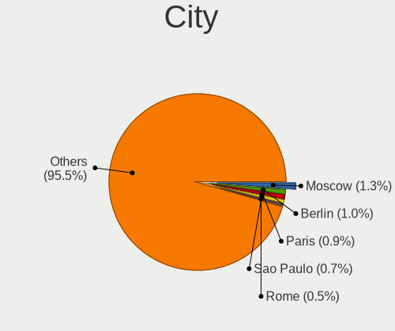
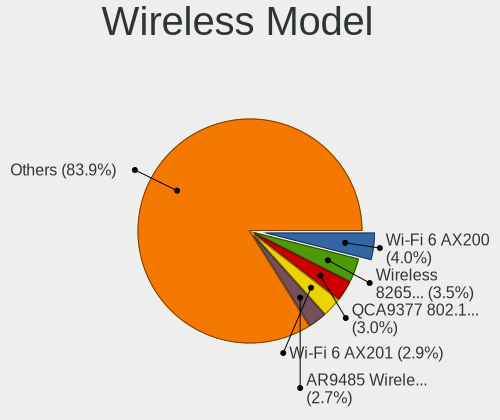
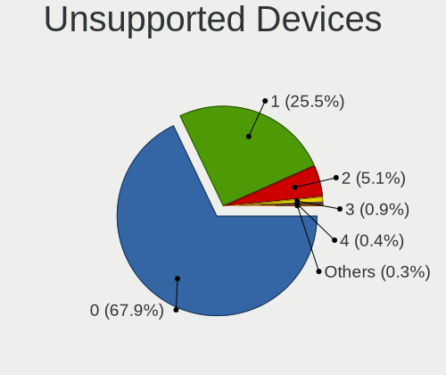

Ubuntu - Tested Hardware & Statistics
-------------------------------------

A project to collect tested hardware configurations for Ubuntu.

Anyone can contribute to this report by the [hw-probe](https://github.com/linuxhw/hw-probe) tool:

    sudo -E hw-probe -all -upload

Please contribute! Especially if your hardware is rare.

This is a report for all computer types. See also reports for [desktops](/Dist/Ubuntu/Desktop/README.md) and [notebooks](/Dist/Ubuntu/Notebook/README.md).

Contents
--------

* [ Test Cases ](#test-cases)

* [ System ](#system)
  - [ OS                       ](#os)
  - [ OS Family                ](#os-family)
  - [ Kernel                   ](#kernel)
  - [ Kernel Family            ](#kernel-family)
  - [ Kernel Major Ver.        ](#kernel-major-ver)
  - [ Arch                     ](#arch)
  - [ DE                       ](#de)
  - [ Display Server           ](#display-server)
  - [ Display Manager          ](#display-manager)
  - [ OS Lang                  ](#os-lang)
  - [ Boot Mode                ](#boot-mode)
  - [ Filesystem               ](#filesystem)
  - [ Part. scheme             ](#part-scheme)
  - [ Dual Boot with Linux/BSD ](#dual-boot-with-linuxbsd)
  - [ Dual Boot (Win)          ](#dual-boot-win)

* [ Board ](#board)
  - [ Vendor                   ](#vendor)
  - [ Model                    ](#model)
  - [ Model Family             ](#model-family)
  - [ MFG Year                 ](#mfg-year)
  - [ Form Factor              ](#form-factor)
  - [ Secure Boot              ](#secure-boot)
  - [ Coreboot                 ](#coreboot)
  - [ RAM Size                 ](#ram-size)
  - [ RAM Used                 ](#ram-used)
  - [ Total Drives             ](#total-drives)
  - [ Has CD-ROM               ](#has-cd-rom)
  - [ Has Ethernet             ](#has-ethernet)
  - [ Has WiFi                 ](#has-wifi)
  - [ Has Bluetooth            ](#has-bluetooth)

* [ Location ](#location)
  - [ Country                  ](#country)
  - [ City                     ](#city)

* [ Drives ](#drives)
  - [ Drive Vendor             ](#drive-vendor)
  - [ Drive Model              ](#drive-model)
  - [ HDD Vendor               ](#hdd-vendor)
  - [ SSD Vendor               ](#ssd-vendor)
  - [ Drive Kind               ](#drive-kind)
  - [ Drive Connector          ](#drive-connector)
  - [ Drive Size               ](#drive-size)
  - [ Space Total              ](#space-total)
  - [ Space Used               ](#space-used)
  - [ Malfunc. Drives          ](#malfunc-drives)
  - [ Malfunc. Drive Vendor    ](#malfunc-drive-vendor)
  - [ Malfunc. HDD Vendor      ](#malfunc-hdd-vendor)
  - [ Malfunc. Drive Kind      ](#malfunc-drive-kind)
  - [ Failed Drives            ](#failed-drives)
  - [ Failed Drive Vendor      ](#failed-drive-vendor)
  - [ Drive Status             ](#drive-status)

* [ Storage controller ](#storage-controller)
  - [ Storage Vendor           ](#storage-vendor)
  - [ Storage Model            ](#storage-model)
  - [ Storage Kind             ](#storage-kind)

* [ Processor ](#processor)
  - [ CPU Vendor               ](#cpu-vendor)
  - [ CPU Model                ](#cpu-model)
  - [ CPU Model Family         ](#cpu-model-family)
  - [ CPU Cores                ](#cpu-cores)
  - [ CPU Sockets              ](#cpu-sockets)
  - [ CPU Threads              ](#cpu-threads)
  - [ CPU Op-Modes             ](#cpu-op-modes)
  - [ CPU Microcode            ](#cpu-microcode)
  - [ CPU Microarch            ](#cpu-microarch)

* [ Graphics ](#graphics)
  - [ GPU Vendor               ](#gpu-vendor)
  - [ GPU Model                ](#gpu-model)
  - [ GPU Combo                ](#gpu-combo)
  - [ GPU Driver               ](#gpu-driver)
  - [ GPU Memory               ](#gpu-memory)

* [ Monitor ](#monitor)
  - [ Monitor Vendor           ](#monitor-vendor)
  - [ Monitor Model            ](#monitor-model)
  - [ Monitor Resolution       ](#monitor-resolution)
  - [ Monitor Diagonal         ](#monitor-diagonal)
  - [ Monitor Width            ](#monitor-width)
  - [ Aspect Ratio             ](#aspect-ratio)
  - [ Monitor Area             ](#monitor-area)
  - [ Pixel Density            ](#pixel-density)
  - [ Multiple Monitors        ](#multiple-monitors)

* [ Network ](#network)
  - [ Net Controller Vendor    ](#net-controller-vendor)
  - [ Net Controller Model     ](#net-controller-model)
  - [ Wireless Vendor          ](#wireless-vendor)
  - [ Wireless Model           ](#wireless-model)
  - [ Ethernet Vendor          ](#ethernet-vendor)
  - [ Ethernet Model           ](#ethernet-model)
  - [ Net Controller Kind      ](#net-controller-kind)
  - [ Used Controller          ](#used-controller)
  - [ NICs                     ](#nics)
  - [ IPv6                     ](#ipv6)

* [ Bluetooth ](#bluetooth)
  - [ Bluetooth Vendor         ](#bluetooth-vendor)
  - [ Bluetooth Model          ](#bluetooth-model)

* [ Sound ](#sound)
  - [ Sound Vendor             ](#sound-vendor)
  - [ Sound Model              ](#sound-model)

* [ Memory ](#memory)
  - [ Memory Vendor            ](#memory-vendor)
  - [ Memory Model             ](#memory-model)
  - [ Memory Kind              ](#memory-kind)
  - [ Memory Form Factor       ](#memory-form-factor)
  - [ Memory Size              ](#memory-size)
  - [ Memory Speed             ](#memory-speed)

* [ Printers & scanners ](#printers--scanners)
  - [ Printer Vendor           ](#printer-vendor)
  - [ Printer Model            ](#printer-model)
  - [ Scanner Vendor           ](#scanner-vendor)
  - [ Scanner Model            ](#scanner-model)

* [ Camera ](#camera)
  - [ Camera Vendor            ](#camera-vendor)
  - [ Camera Model             ](#camera-model)

* [ Security ](#security)
  - [ Fingerprint Vendor       ](#fingerprint-vendor)
  - [ Fingerprint Model        ](#fingerprint-model)
  - [ Chipcard Vendor          ](#chipcard-vendor)
  - [ Chipcard Model           ](#chipcard-model)

* [ Unsupported ](#unsupported)
  - [ Unsupported Devices      ](#unsupported-devices)
  - [ Unsupported Device Types ](#unsupported-device-types)

Test Cases
----------

Total: 93646

| Vendor        | Model                       | Form-Factor | Probe                                                      | Date         |
|---------------|-----------------------------|-------------|------------------------------------------------------------|--------------|
| Shenzhen M... | AHBAA OEM                   | Desktop     | [d4e6f24af3](https://linux-hardware.org/?probe=d4e6f24af3) | Sep 07, 2023 |
| HP            | ProBook 650 G8 Notebook ... | Notebook    | [b11a7b69f0](https://linux-hardware.org/?probe=b11a7b69f0) | Sep 07, 2023 |
| Lenovo        | Legion Y7000P IRH8 82YA     | Notebook    | [9ebc45f613](https://linux-hardware.org/?probe=9ebc45f613) | Sep 07, 2023 |
| Apple         | Mac-8ED6AF5B48C039E1 Mac... | Mini pc     | [adc9ee1464](https://linux-hardware.org/?probe=adc9ee1464) | Sep 07, 2023 |
| Dell          | 0WMJ54 A01                  | Desktop     | [034ff4bc7e](https://linux-hardware.org/?probe=034ff4bc7e) | Sep 07, 2023 |
| Dell          | 0MCD6J A01                  | Server      | [f73ae91625](https://linux-hardware.org/?probe=f73ae91625) | Sep 07, 2023 |
| Dell          | 0MCD6J A01                  | Server      | [051518ebc8](https://linux-hardware.org/?probe=051518ebc8) | Sep 07, 2023 |
| Dell          | 0MCD6J A03                  | Server      | [22cd3a08c6](https://linux-hardware.org/?probe=22cd3a08c6) | Sep 07, 2023 |
| Dell          | 0MCD6J A01                  | Server      | [51344d733f](https://linux-hardware.org/?probe=51344d733f) | Sep 07, 2023 |
| Dell          | 0MCD6J A01                  | Server      | [8d286f93a4](https://linux-hardware.org/?probe=8d286f93a4) | Sep 07, 2023 |
| Dell          | 0MCD6J A01                  | Server      | [2677109010](https://linux-hardware.org/?probe=2677109010) | Sep 07, 2023 |
| Dell          | 0MCD6J A01                  | Server      | [f12a8bcc1b](https://linux-hardware.org/?probe=f12a8bcc1b) | Sep 07, 2023 |
| Apple         | MacBookPro8,1               | Notebook    | [f913de368f](https://linux-hardware.org/?probe=f913de368f) | Sep 07, 2023 |
| ASUSTek       | X453MA                      | Notebook    | [c48759c297](https://linux-hardware.org/?probe=c48759c297) | Sep 07, 2023 |
| Apple         | MacBookPro8,1               | Notebook    | [423b8d7135](https://linux-hardware.org/?probe=423b8d7135) | Sep 07, 2023 |
| Lenovo        | IdeaPad 530S-14IKB 81EU     | Notebook    | [0ca7d43ae9](https://linux-hardware.org/?probe=0ca7d43ae9) | Sep 07, 2023 |
| MSI           | MAG B550 TOMAHAWK           | Desktop     | [f8453df937](https://linux-hardware.org/?probe=f8453df937) | Sep 07, 2023 |
| Dell          | Precision M6800             | Notebook    | [b50e95f460](https://linux-hardware.org/?probe=b50e95f460) | Sep 07, 2023 |
| HP            | ENVY 15                     | Notebook    | [996948fd3c](https://linux-hardware.org/?probe=996948fd3c) | Sep 07, 2023 |
| Lenovo        | G565 20071                  | Notebook    | [786aafb0e9](https://linux-hardware.org/?probe=786aafb0e9) | Sep 07, 2023 |
| Unknown       | Unknown                     | Desktop     | [59544c398a](https://linux-hardware.org/?probe=59544c398a) | Sep 07, 2023 |
| Dell          | Inspiron 1525               | Notebook    | [6b0747dcb4](https://linux-hardware.org/?probe=6b0747dcb4) | Sep 07, 2023 |
| HP            | 0B4Ch D                     | Desktop     | [1a2a0eef04](https://linux-hardware.org/?probe=1a2a0eef04) | Sep 06, 2023 |
| Dell          | Inspiron 1525               | Notebook    | [56a481c501](https://linux-hardware.org/?probe=56a481c501) | Sep 06, 2023 |
| HP            | 0B4Ch D                     | Desktop     | [e6c990ad64](https://linux-hardware.org/?probe=e6c990ad64) | Sep 06, 2023 |
| ASUSTek       | ZenBook Pro Duo UX582LR_... | Notebook    | [b2ba03726a](https://linux-hardware.org/?probe=b2ba03726a) | Sep 06, 2023 |
| realme        | RMNBXXXX                    | Notebook    | [6783f1d181](https://linux-hardware.org/?probe=6783f1d181) | Sep 06, 2023 |
| Apple         | MacBookAir8,2               | Notebook    | [e9e8da1eea](https://linux-hardware.org/?probe=e9e8da1eea) | Sep 06, 2023 |
| Dell          | Latitude E5450              | Notebook    | [1478760d8c](https://linux-hardware.org/?probe=1478760d8c) | Sep 06, 2023 |
| ASUSTek       | P7H55-M PRO                 | Desktop     | [26a5d8b449](https://linux-hardware.org/?probe=26a5d8b449) | Sep 06, 2023 |
| ASUSTek       | PRIME X370-PRO              | Desktop     | [d095848fec](https://linux-hardware.org/?probe=d095848fec) | Sep 06, 2023 |
| HP            | Pavilion Notebook           | Notebook    | [50777cde40](https://linux-hardware.org/?probe=50777cde40) | Sep 06, 2023 |
| realme        | RMNBXXXX                    | Notebook    | [9370483c5f](https://linux-hardware.org/?probe=9370483c5f) | Sep 06, 2023 |
| Sony          | VGN-AW41MF_H                | Notebook    | [d3a3262a6e](https://linux-hardware.org/?probe=d3a3262a6e) | Sep 06, 2023 |
| Dell          | XPS 15 9550                 | Notebook    | [c9f30a2b26](https://linux-hardware.org/?probe=c9f30a2b26) | Sep 06, 2023 |
| ASUSTek       | ROG STRIX B550-A GAMING     | Desktop     | [9d45d79cb0](https://linux-hardware.org/?probe=9d45d79cb0) | Sep 06, 2023 |
| Lenovo        | ThinkPad P1 20MD0014UK      | Notebook    | [428c816118](https://linux-hardware.org/?probe=428c816118) | Sep 06, 2023 |
| Dell          | Latitude 3520               | Notebook    | [0fa236983e](https://linux-hardware.org/?probe=0fa236983e) | Sep 06, 2023 |
| Dell          | 0NK5PH A01                  | Desktop     | [49e0ac3e09](https://linux-hardware.org/?probe=49e0ac3e09) | Sep 06, 2023 |
| Gigabyte      | B650 AORUS ELITE AX         | Desktop     | [97bacd8975](https://linux-hardware.org/?probe=97bacd8975) | Sep 06, 2023 |
| ASUSTek       | P8H77-M                     | Desktop     | [ebc8d3e851](https://linux-hardware.org/?probe=ebc8d3e851) | Sep 06, 2023 |
| ASUSTek       | VivoBook_ASUSLaptop X571... | Notebook    | [2505f514b1](https://linux-hardware.org/?probe=2505f514b1) | Sep 06, 2023 |
| Supermicro    | X8DTU                       | Server      | [ceac91ff5e](https://linux-hardware.org/?probe=ceac91ff5e) | Sep 06, 2023 |
| Lenovo        | ThinkPad X380 Yoga 20LJS... | Convertible | [19d11f7098](https://linux-hardware.org/?probe=19d11f7098) | Sep 06, 2023 |
| HP            | 844C                        | Desktop     | [6f4911cda7](https://linux-hardware.org/?probe=6f4911cda7) | Sep 06, 2023 |
| Unknown       | Unknown                     | Desktop     | [c4829899c3](https://linux-hardware.org/?probe=c4829899c3) | Sep 06, 2023 |
| Intel         | H81                         | Desktop     | [5a16cea30a](https://linux-hardware.org/?probe=5a16cea30a) | Sep 06, 2023 |
| Dell          | Vostro 3580                 | Notebook    | [5c165fd73b](https://linux-hardware.org/?probe=5c165fd73b) | Sep 06, 2023 |
| DFI           | CH960                       | Desktop     | [f0caeeeae0](https://linux-hardware.org/?probe=f0caeeeae0) | Sep 06, 2023 |
| HUAWEI        | BOHB-WAX9                   | Notebook    | [5d575aeb4f](https://linux-hardware.org/?probe=5d575aeb4f) | Sep 06, 2023 |
| Unknown       | TBYF-1014WIN32              | Notebook    | [11ef48e0c0](https://linux-hardware.org/?probe=11ef48e0c0) | Sep 06, 2023 |
| ASUSTek       | B150M-PLUS                  | Desktop     | [a5a6f0acfb](https://linux-hardware.org/?probe=a5a6f0acfb) | Sep 06, 2023 |
| HP            | Elite x2 1012 G2            | Tablet      | [659838923d](https://linux-hardware.org/?probe=659838923d) | Sep 06, 2023 |
| HP            | Elite x2 1012 G2            | Tablet      | [1c4301b1ba](https://linux-hardware.org/?probe=1c4301b1ba) | Sep 06, 2023 |
| HP            | EliteBook x360 1020 G2      | Convertible | [583006d2de](https://linux-hardware.org/?probe=583006d2de) | Sep 06, 2023 |
| Supermicro    | X9DRW                       | Server      | [8108cf6d57](https://linux-hardware.org/?probe=8108cf6d57) | Sep 06, 2023 |
| Lenovo        | ThinkPad T16 Gen 2 21HH0... | Notebook    | [94c99c8274](https://linux-hardware.org/?probe=94c99c8274) | Sep 06, 2023 |
| Supermicro    | X9DRW                       | Desktop     | [01d640708d](https://linux-hardware.org/?probe=01d640708d) | Sep 06, 2023 |
| TUXEDO        | Unknown                     | Notebook    | [1e6c412d84](https://linux-hardware.org/?probe=1e6c412d84) | Sep 06, 2023 |
| Lenovo        | ThinkPad P1 Gen 4i 20Y30... | Notebook    | [b6b2af8418](https://linux-hardware.org/?probe=b6b2af8418) | Sep 06, 2023 |
| Lenovo        | ThinkPad P1 Gen 4i 20Y30... | Notebook    | [89767db9e4](https://linux-hardware.org/?probe=89767db9e4) | Sep 06, 2023 |
| Biostar       | TB360-BTC Expert            | Desktop     | [7bfb24d8e3](https://linux-hardware.org/?probe=7bfb24d8e3) | Sep 06, 2023 |
| HP            | ENVY x360 Convertible 13... | Convertible | [b1f7a8316d](https://linux-hardware.org/?probe=b1f7a8316d) | Sep 06, 2023 |
| ASUSTek       | ROG STRIX B550-F GAMING ... | Desktop     | [586f1d2fa7](https://linux-hardware.org/?probe=586f1d2fa7) | Sep 06, 2023 |
| Lenovo        | ThinkPad X1 Extreme 2nd ... | Notebook    | [3fe52a0e75](https://linux-hardware.org/?probe=3fe52a0e75) | Sep 06, 2023 |
| ASUSTek       | PRIME B550-PLUS             | Desktop     | [7fa390fcc4](https://linux-hardware.org/?probe=7fa390fcc4) | Sep 06, 2023 |
| Dell          | 0VNP2H A00                  | Desktop     | [04e5805a67](https://linux-hardware.org/?probe=04e5805a67) | Sep 06, 2023 |
| VALE          | Notebook Classic C140       | Notebook    | [c2e792fccf](https://linux-hardware.org/?probe=c2e792fccf) | Sep 06, 2023 |
| VALE          | Notebook Classic C140       | Notebook    | [fb00b74b14](https://linux-hardware.org/?probe=fb00b74b14) | Sep 06, 2023 |
| VALE          | Notebook Classic C140       | Notebook    | [675a9e9b79](https://linux-hardware.org/?probe=675a9e9b79) | Sep 06, 2023 |
| Dell          | Vostro 5470                 | Notebook    | [aa37593b87](https://linux-hardware.org/?probe=aa37593b87) | Sep 06, 2023 |
| Acer          | Aspire 5733Z                | Notebook    | [bc3d42d633](https://linux-hardware.org/?probe=bc3d42d633) | Sep 06, 2023 |
| MSI           | MPG X570 GAMING PLUS        | Desktop     | [f04f6fc2a6](https://linux-hardware.org/?probe=f04f6fc2a6) | Sep 06, 2023 |
| Dell          | Vostro 5470                 | Notebook    | [230cd8c32e](https://linux-hardware.org/?probe=230cd8c32e) | Sep 06, 2023 |
| Dell          | G3 3500                     | Notebook    | [5da26d2241](https://linux-hardware.org/?probe=5da26d2241) | Sep 06, 2023 |
| Dell          | Precision 5570              | Notebook    | [9baca62616](https://linux-hardware.org/?probe=9baca62616) | Sep 06, 2023 |
| MSI           | B550M PRO-VDH WIFI          | Desktop     | [17702812ba](https://linux-hardware.org/?probe=17702812ba) | Sep 06, 2023 |
| ASUSTek       | VivoBook_ASUSLaptop K650... | Notebook    | [f50ce96f55](https://linux-hardware.org/?probe=f50ce96f55) | Sep 06, 2023 |
| Framework     | Laptop (12th Gen Intel C... | Notebook    | [8d550b32d9](https://linux-hardware.org/?probe=8d550b32d9) | Sep 06, 2023 |
| MSI           | X79A-GD65                   | Desktop     | [5efb1e3e55](https://linux-hardware.org/?probe=5efb1e3e55) | Sep 06, 2023 |
| Sony          | SVE1712C5E                  | Notebook    | [a5c77b2450](https://linux-hardware.org/?probe=a5c77b2450) | Sep 06, 2023 |
| HP            | ENVY x360 Convertible 13... | Convertible | [79328b47d8](https://linux-hardware.org/?probe=79328b47d8) | Sep 05, 2023 |
| Gigabyte      | H110M-Gaming3-CF            | Desktop     | [8985e6b1d9](https://linux-hardware.org/?probe=8985e6b1d9) | Sep 05, 2023 |
| ASUSTek       | X99-DELUXE                  | Desktop     | [0035cdf446](https://linux-hardware.org/?probe=0035cdf446) | Sep 05, 2023 |
| GMKtec        | NucBox G2                   | Desktop     | [8c03fc694f](https://linux-hardware.org/?probe=8c03fc694f) | Sep 05, 2023 |
| Gigabyte      | B550M S2H                   | Desktop     | [54556adb0b](https://linux-hardware.org/?probe=54556adb0b) | Sep 05, 2023 |
| Sony          | SVE1712C5E                  | Notebook    | [f864c8e44a](https://linux-hardware.org/?probe=f864c8e44a) | Sep 05, 2023 |
| ASUSTek       | ROG Strix G713PV_G713PV     | Notebook    | [cac93ead6f](https://linux-hardware.org/?probe=cac93ead6f) | Sep 05, 2023 |
| HP            | ZBook Studio G3             | Notebook    | [208f21a716](https://linux-hardware.org/?probe=208f21a716) | Sep 05, 2023 |
| Biostar       | A320MH                      | Desktop     | [1907707516](https://linux-hardware.org/?probe=1907707516) | Sep 05, 2023 |
| ASRock        | N68C-S UCC                  | Desktop     | [c2e1fe7134](https://linux-hardware.org/?probe=c2e1fe7134) | Sep 05, 2023 |
| Lenovo        | Legion 5 Pro 16IAH7H 82R... | Notebook    | [9d86c0f6e5](https://linux-hardware.org/?probe=9d86c0f6e5) | Sep 05, 2023 |
| Lenovo        | IdeaPad 310-15ISK 80SM      | Notebook    | [a17f1582d4](https://linux-hardware.org/?probe=a17f1582d4) | Sep 05, 2023 |
| HUAWEI        | BoDE-WXX9                   | Notebook    | [06a65572fe](https://linux-hardware.org/?probe=06a65572fe) | Sep 05, 2023 |
| GMKtec        | NucBox G2                   | Desktop     | [ba313b48f8](https://linux-hardware.org/?probe=ba313b48f8) | Sep 05, 2023 |
| Gateway       | NE56R                       | Notebook    | [be83386f4d](https://linux-hardware.org/?probe=be83386f4d) | Sep 05, 2023 |
| Dell          | Precision 7670              | Notebook    | [42788bf2c7](https://linux-hardware.org/?probe=42788bf2c7) | Sep 05, 2023 |
| Biostar       | A320MH                      | Desktop     | [f13f5f9fe9](https://linux-hardware.org/?probe=f13f5f9fe9) | Sep 05, 2023 |
| DFI           | CH960                       | Desktop     | [29c9bcf1ed](https://linux-hardware.org/?probe=29c9bcf1ed) | Sep 05, 2023 |
| ASUSTek       | SABERTOOTH X58              | Desktop     | [9139773ff9](https://linux-hardware.org/?probe=9139773ff9) | Sep 05, 2023 |
| Dell          | Precision 7740              | Notebook    | [392ca47879](https://linux-hardware.org/?probe=392ca47879) | Sep 05, 2023 |
| Biostar       | TB360-BTC Expert            | Desktop     | [650e71b107](https://linux-hardware.org/?probe=650e71b107) | Sep 05, 2023 |
| HP            | EliteBook 845 14 inch G9... | Notebook    | [30bf3f1f45](https://linux-hardware.org/?probe=30bf3f1f45) | Sep 05, 2023 |
| ASUSTek       | PRIME B450M-GAMING/BR       | Desktop     | [190675e9f1](https://linux-hardware.org/?probe=190675e9f1) | Sep 05, 2023 |
| Lenovo        | IdeaPad 320-15IKB 81BG      | Notebook    | [5728a3a48b](https://linux-hardware.org/?probe=5728a3a48b) | Sep 05, 2023 |
| Lenovo        | IdeaPad 320-15IKB 81BG      | Notebook    | [fdecc11aba](https://linux-hardware.org/?probe=fdecc11aba) | Sep 05, 2023 |
| Gigabyte      | X570 AORUS ELITE WIFI       | Desktop     | [7c5a59da7b](https://linux-hardware.org/?probe=7c5a59da7b) | Sep 05, 2023 |
| Gigabyte      | X570 AORUS ELITE WIFI       | Desktop     | [b595dd4436](https://linux-hardware.org/?probe=b595dd4436) | Sep 05, 2023 |
| ASRock        | FM2A68M-HD+                 | Desktop     | [5971b283b6](https://linux-hardware.org/?probe=5971b283b6) | Sep 05, 2023 |
| Notebook      | NL5xNU                      | Notebook    | [306dab3d42](https://linux-hardware.org/?probe=306dab3d42) | Sep 05, 2023 |
| Dell          | Precision 7670              | Notebook    | [41bb07b203](https://linux-hardware.org/?probe=41bb07b203) | Sep 05, 2023 |
| Dell          | 0PTTT9 A01                  | Desktop     | [2c7accd18e](https://linux-hardware.org/?probe=2c7accd18e) | Sep 05, 2023 |
| Lenovo        | Legion Y7000P IRH8 82YA     | Notebook    | [235e80247e](https://linux-hardware.org/?probe=235e80247e) | Sep 05, 2023 |
| Toshiba       | Satellite L455D             | Notebook    | [1d49ff24ad](https://linux-hardware.org/?probe=1d49ff24ad) | Sep 05, 2023 |
| Apple         | MacBookPro16,3              | Notebook    | [7f61d6c898](https://linux-hardware.org/?probe=7f61d6c898) | Sep 05, 2023 |
| Raspberry ... | Raspberry Pi 4 Model B R... | Soc         | [8a6408f82b](https://linux-hardware.org/?probe=8a6408f82b) | Sep 05, 2023 |
| Dell          | 073MMW A02                  | Desktop     | [5b5728ae8d](https://linux-hardware.org/?probe=5b5728ae8d) | Sep 05, 2023 |
| AZW           | MINI S                      | Desktop     | [a2a1414ea6](https://linux-hardware.org/?probe=a2a1414ea6) | Sep 05, 2023 |
| Dell          | G5 5590                     | Notebook    | [40098c0a79](https://linux-hardware.org/?probe=40098c0a79) | Sep 05, 2023 |
| Dell          | G5 5590                     | Notebook    | [1af9fd689a](https://linux-hardware.org/?probe=1af9fd689a) | Sep 05, 2023 |
| HP            | EliteBook 845 G7 Noteboo... | Notebook    | [0131d0a313](https://linux-hardware.org/?probe=0131d0a313) | Sep 05, 2023 |
| HP            | EliteBook 8470p             | Notebook    | [a658addd87](https://linux-hardware.org/?probe=a658addd87) | Sep 05, 2023 |
| Apple         | MacBookPro16,2              | Notebook    | [b47ac62db2](https://linux-hardware.org/?probe=b47ac62db2) | Sep 05, 2023 |
| Lenovo        | ThinkPad L380 Yoga 20M70... | Convertible | [245441c639](https://linux-hardware.org/?probe=245441c639) | Sep 05, 2023 |
| HP            | ProBook 6550b               | Notebook    | [5881531377](https://linux-hardware.org/?probe=5881531377) | Sep 05, 2023 |
| Supermicro    | X9DRW                       | Server      | [0276a103dd](https://linux-hardware.org/?probe=0276a103dd) | Sep 05, 2023 |
| ASUSTek       | M4A785-M                    | Desktop     | [0e073fb229](https://linux-hardware.org/?probe=0e073fb229) | Sep 05, 2023 |
| HP            | Spectre x360 Convertible... | Convertible | [acdd8a41d9](https://linux-hardware.org/?probe=acdd8a41d9) | Sep 05, 2023 |
| HONOR         | BRN-FXX                     | Notebook    | [381e87228c](https://linux-hardware.org/?probe=381e87228c) | Sep 04, 2023 |
| MSI           | B350 GAMING PRO CARBON      | Desktop     | [c2257ed5b8](https://linux-hardware.org/?probe=c2257ed5b8) | Sep 04, 2023 |
| ASUSTek       | PRIME B450M-GAMING/BR       | Desktop     | [bcd06888e4](https://linux-hardware.org/?probe=bcd06888e4) | Sep 04, 2023 |
| MSI           | Boston                      | Desktop     | [5e1b8aa70b](https://linux-hardware.org/?probe=5e1b8aa70b) | Sep 04, 2023 |
| Gigabyte      | Z390 AORUS PRO-CF           | Desktop     | [a9321ea88e](https://linux-hardware.org/?probe=a9321ea88e) | Sep 04, 2023 |
| ASUSTek       | TUF Gaming X570-PLUS        | Desktop     | [f1888930f8](https://linux-hardware.org/?probe=f1888930f8) | Sep 04, 2023 |
| ASUSTek       | ProArt X670E-CREATOR WIF... | Desktop     | [cda189c68a](https://linux-hardware.org/?probe=cda189c68a) | Sep 04, 2023 |
| HP            | ENVY x360 2-in-1 Laptop ... | Convertible | [606f54ecca](https://linux-hardware.org/?probe=606f54ecca) | Sep 04, 2023 |
| HP            | ZBook 15 G2                 | Notebook    | [18d9c74d60](https://linux-hardware.org/?probe=18d9c74d60) | Sep 04, 2023 |
| HP            | EliteBook 8470p             | Notebook    | [5cb02e099f](https://linux-hardware.org/?probe=5cb02e099f) | Sep 04, 2023 |
| MSI           | Boston                      | Desktop     | [5ad763345c](https://linux-hardware.org/?probe=5ad763345c) | Sep 04, 2023 |
| HP            | Spectre x360 Convertible... | Convertible | [9f577988e1](https://linux-hardware.org/?probe=9f577988e1) | Sep 04, 2023 |
| Acer          | Aspire A315-24P             | Notebook    | [d082fdd668](https://linux-hardware.org/?probe=d082fdd668) | Sep 04, 2023 |
| Gigabyte      | B450 AORUS PRO WIFI-CF      | Desktop     | [834b31e663](https://linux-hardware.org/?probe=834b31e663) | Sep 04, 2023 |
| HP            | Pavilion dv9500             | Notebook    | [653fbbb509](https://linux-hardware.org/?probe=653fbbb509) | Sep 04, 2023 |
| TUXEDO        | Pulse 15 Gen2               | Notebook    | [3dd77a8c87](https://linux-hardware.org/?probe=3dd77a8c87) | Sep 04, 2023 |
| Samsung       | 950XED                      | Notebook    | [3d8ba5a34c](https://linux-hardware.org/?probe=3d8ba5a34c) | Sep 04, 2023 |
| Supermicro    | X8DTT                       | Server      | [1dbd818a95](https://linux-hardware.org/?probe=1dbd818a95) | Sep 04, 2023 |
| Dell          | Vostro 15 5510              | Notebook    | [7223b751c4](https://linux-hardware.org/?probe=7223b751c4) | Sep 04, 2023 |
| HP            | ProLiant DL360 Gen9         | Server      | [5a772c1cbf](https://linux-hardware.org/?probe=5a772c1cbf) | Sep 04, 2023 |
| HP            | ProLiant DL360 Gen9         | Server      | [bbcfaaaaed](https://linux-hardware.org/?probe=bbcfaaaaed) | Sep 04, 2023 |
| Medion        | H110H4-EM                   | Desktop     | [e4752c330e](https://linux-hardware.org/?probe=e4752c330e) | Sep 04, 2023 |
| ASUSTek       | ASUS TUF Gaming F15 FX50... | Notebook    | [9accfe317a](https://linux-hardware.org/?probe=9accfe317a) | Sep 04, 2023 |
| Apple         | MacBook8,1                  | Notebook    | [88831ad48b](https://linux-hardware.org/?probe=88831ad48b) | Sep 04, 2023 |
| Dell          | 06X1TJ A00                  | Desktop     | [f24368d776](https://linux-hardware.org/?probe=f24368d776) | Sep 04, 2023 |
| Dell          | 06X1TJ A00                  | Desktop     | [f4fbaa8dd1](https://linux-hardware.org/?probe=f4fbaa8dd1) | Sep 04, 2023 |
| Lenovo        | ThinkPad X260 20F5S2WX0R    | Notebook    | [cb338af601](https://linux-hardware.org/?probe=cb338af601) | Sep 04, 2023 |
| Gigabyte      | B360HD3                     | Desktop     | [1242798344](https://linux-hardware.org/?probe=1242798344) | Sep 04, 2023 |
| ASUSTek       | VM42                        | Desktop     | [2869496e53](https://linux-hardware.org/?probe=2869496e53) | Sep 04, 2023 |
| Dell          | 05WNJ2 A02                  | Server      | [7b59f7f1d7](https://linux-hardware.org/?probe=7b59f7f1d7) | Sep 04, 2023 |
| Dell          | Inspiron 7537               | Notebook    | [036c877144](https://linux-hardware.org/?probe=036c877144) | Sep 04, 2023 |
| Dell          | Vostro 14 3435              | Notebook    | [d35ddd8539](https://linux-hardware.org/?probe=d35ddd8539) | Sep 04, 2023 |
| Dell          | Vostro 14 3435              | Notebook    | [34a27b9c29](https://linux-hardware.org/?probe=34a27b9c29) | Sep 04, 2023 |
| HP            | Compaq 6730b (NN204ET#AB... | Notebook    | [7165368bfe](https://linux-hardware.org/?probe=7165368bfe) | Sep 04, 2023 |
| ASUSTek       | K73SV                       | Notebook    | [7d3f9fa0e5](https://linux-hardware.org/?probe=7d3f9fa0e5) | Sep 04, 2023 |
| Dell          | Precision 3581              | Notebook    | [739b270d83](https://linux-hardware.org/?probe=739b270d83) | Sep 04, 2023 |
| HP            | 250 15.6 inch G9 Noteboo... | Notebook    | [5128231fd7](https://linux-hardware.org/?probe=5128231fd7) | Sep 04, 2023 |
| Lenovo        | IdeaPad 5 Pro 16ARH7 82S... | Notebook    | [daeb81e2f6](https://linux-hardware.org/?probe=daeb81e2f6) | Sep 04, 2023 |
| Dynabook      | G83/HS                      | Notebook    | [9db149b715](https://linux-hardware.org/?probe=9db149b715) | Sep 04, 2023 |
| Toshiba       | dynabook VC72/M             | Convertible | [988d354b55](https://linux-hardware.org/?probe=988d354b55) | Sep 04, 2023 |
| Acer          | Veriton S2680G              | Desktop     | [e1fdce5232](https://linux-hardware.org/?probe=e1fdce5232) | Sep 04, 2023 |
| ASUSTek       | VivoBook_ASUSLaptop M160... | Notebook    | [ea096b699b](https://linux-hardware.org/?probe=ea096b699b) | Sep 04, 2023 |
| Acer          | Aspire A314-35              | Notebook    | [6edc4e910d](https://linux-hardware.org/?probe=6edc4e910d) | Sep 04, 2023 |
| Acer          | Aspire E1-572               | Notebook    | [5801580f1f](https://linux-hardware.org/?probe=5801580f1f) | Sep 04, 2023 |
| MSI           | Prestige 14Evo A12M         | Notebook    | [68bea64ed6](https://linux-hardware.org/?probe=68bea64ed6) | Sep 04, 2023 |
| HP            | ENVY 14 SPECTRE             | Notebook    | [1f0a26899c](https://linux-hardware.org/?probe=1f0a26899c) | Sep 04, 2023 |
| HUAWEI        | NBLB-WAX9N                  | Notebook    | [b7d2eae326](https://linux-hardware.org/?probe=b7d2eae326) | Sep 04, 2023 |
| ECS           | Nettle2                     | Desktop     | [8492f01e46](https://linux-hardware.org/?probe=8492f01e46) | Sep 04, 2023 |
| ASUSTek       | A88XM-E                     | Desktop     | [464ff29a95](https://linux-hardware.org/?probe=464ff29a95) | Sep 04, 2023 |
| ASUSTek       | SABERTOOTH X58              | Desktop     | [edc8896f06](https://linux-hardware.org/?probe=edc8896f06) | Sep 04, 2023 |
| MSI           | B450M BAZOOKA MAX WIFI      | Desktop     | [06571c70a0](https://linux-hardware.org/?probe=06571c70a0) | Sep 04, 2023 |
| ASRock        | A520M-HDV                   | Desktop     | [8da6b89260](https://linux-hardware.org/?probe=8da6b89260) | Sep 04, 2023 |
| ASUSTek       | M5A78L-M/USB3               | Desktop     | [15826e3d9e](https://linux-hardware.org/?probe=15826e3d9e) | Sep 04, 2023 |
| Dell          | Inspiron 5770               | Notebook    | [1f2c94fe31](https://linux-hardware.org/?probe=1f2c94fe31) | Sep 03, 2023 |
| Samsung       | RV415                       | Notebook    | [dc6aa3101f](https://linux-hardware.org/?probe=dc6aa3101f) | Sep 03, 2023 |
| ASUSTek       | TUF Gaming X670E-PLUS       | Desktop     | [0eff1074a1](https://linux-hardware.org/?probe=0eff1074a1) | Sep 03, 2023 |
| HP            | 240 G3                      | Notebook    | [24381b91f7](https://linux-hardware.org/?probe=24381b91f7) | Sep 03, 2023 |
| HUAWEI        | BOM-WXX9                    | Notebook    | [6b895a5320](https://linux-hardware.org/?probe=6b895a5320) | Sep 03, 2023 |
| Intel         | S5500BC E25124-456          | Server      | [f7e5a67d41](https://linux-hardware.org/?probe=f7e5a67d41) | Sep 03, 2023 |
| ASUSTek       | ASUSLaptop_Q540VJ           | Notebook    | [39ed316bb6](https://linux-hardware.org/?probe=39ed316bb6) | Sep 03, 2023 |
| Gigabyte      | B550M DS3H                  | Desktop     | [b8a2b22a6c](https://linux-hardware.org/?probe=b8a2b22a6c) | Sep 03, 2023 |
| AMI           | Aptio CRB                   | Mini pc     | [e9512e994e](https://linux-hardware.org/?probe=e9512e994e) | Sep 03, 2023 |
| IP3 Techno... | ARN59P                      | Notebook    | [493a986305](https://linux-hardware.org/?probe=493a986305) | Sep 03, 2023 |
| AMI           | Aptio CRB                   | Mini pc     | [235744f7fa](https://linux-hardware.org/?probe=235744f7fa) | Sep 03, 2023 |
| Dell          | Latitude E6400              | Notebook    | [88a04ab4b8](https://linux-hardware.org/?probe=88a04ab4b8) | Sep 03, 2023 |
| Dell          | Latitude E6400              | Notebook    | [56cc7d7a27](https://linux-hardware.org/?probe=56cc7d7a27) | Sep 03, 2023 |
| ASUSTek       | Zenbook UX3404VA_Q420VA     | Notebook    | [f9ae8ae2db](https://linux-hardware.org/?probe=f9ae8ae2db) | Sep 03, 2023 |
| HP            | OMEN by Laptop              | Notebook    | [a135074689](https://linux-hardware.org/?probe=a135074689) | Sep 03, 2023 |
| Samsung       | R510/P510                   | Notebook    | [fa457144d5](https://linux-hardware.org/?probe=fa457144d5) | Sep 03, 2023 |
| ASUSTek       | X540NA                      | Notebook    | [e335c8210f](https://linux-hardware.org/?probe=e335c8210f) | Sep 03, 2023 |
| ASUSTek       | X55A                        | Notebook    | [da721dec12](https://linux-hardware.org/?probe=da721dec12) | Sep 03, 2023 |
| ASUSTek       | A88XM-PLUS                  | Desktop     | [16eb26e2bc](https://linux-hardware.org/?probe=16eb26e2bc) | Sep 03, 2023 |
| ASUSTek       | M5A97 EVO R2.0              | Desktop     | [493d16ff67](https://linux-hardware.org/?probe=493d16ff67) | Sep 03, 2023 |
| Dell          | Latitude 5490               | Notebook    | [392d7335ed](https://linux-hardware.org/?probe=392d7335ed) | Sep 03, 2023 |
| Acer          | Swift SF314-42              | Notebook    | [89dcb5988f](https://linux-hardware.org/?probe=89dcb5988f) | Sep 03, 2023 |
| ASUSTek       | PRIME X470-PRO              | Desktop     | [35e2cffa7f](https://linux-hardware.org/?probe=35e2cffa7f) | Sep 03, 2023 |
| Apple         | Mac-27ADBB7B4CEE8E61 iMa... | All in one  | [c6a4b0aca9](https://linux-hardware.org/?probe=c6a4b0aca9) | Sep 03, 2023 |
| Lenovo        | Legion Slim 5 16APH8 82Y... | Notebook    | [e27673ed4c](https://linux-hardware.org/?probe=e27673ed4c) | Sep 03, 2023 |
| HP            | EliteBook 850 G3            | Notebook    | [0778936f6b](https://linux-hardware.org/?probe=0778936f6b) | Sep 03, 2023 |
| ASUSTek       | X550CC                      | Notebook    | [1468567e45](https://linux-hardware.org/?probe=1468567e45) | Sep 03, 2023 |
| Acer          | Swift SF314-42              | Notebook    | [8552bc9508](https://linux-hardware.org/?probe=8552bc9508) | Sep 03, 2023 |
| Apple         | MacBookPro8,1               | Notebook    | [6cbaac077e](https://linux-hardware.org/?probe=6cbaac077e) | Sep 03, 2023 |
| Fujitsu       | D3223-C1 S26361-D3223-C1    | Desktop     | [75c1744e6f](https://linux-hardware.org/?probe=75c1744e6f) | Sep 03, 2023 |
| Unknown       | Unknown                     | Notebook    | [8585671bfb](https://linux-hardware.org/?probe=8585671bfb) | Sep 03, 2023 |
| HUAWEI        | FRD-WX9                     | Notebook    | [5831652a84](https://linux-hardware.org/?probe=5831652a84) | Sep 03, 2023 |
| EUROCOM       | RAPTOR X17                  | Notebook    | [93827ff6f1](https://linux-hardware.org/?probe=93827ff6f1) | Sep 03, 2023 |
| ASUSTek       | PRIME H610M-A WIFI D4       | Desktop     | [499d13e212](https://linux-hardware.org/?probe=499d13e212) | Sep 03, 2023 |
| Unknown       | Unknown                     | Notebook    | [8d7616fae8](https://linux-hardware.org/?probe=8d7616fae8) | Sep 03, 2023 |
| Dell          | XPS 15 9570                 | Notebook    | [9607f36921](https://linux-hardware.org/?probe=9607f36921) | Sep 03, 2023 |
| Acer          | Aspire A715-75G             | Notebook    | [69b91f1c46](https://linux-hardware.org/?probe=69b91f1c46) | Sep 03, 2023 |
| HP            | Pavilion dv4                | Notebook    | [8d183fb271](https://linux-hardware.org/?probe=8d183fb271) | Sep 03, 2023 |
| Samsung       | Galaxy Book 12 LTE          | Tablet      | [1e52631ae6](https://linux-hardware.org/?probe=1e52631ae6) | Sep 03, 2023 |
| Dell          | XPS 15 9570                 | Notebook    | [72c5c271b6](https://linux-hardware.org/?probe=72c5c271b6) | Sep 03, 2023 |
| ASUSTek       | ROG STRIX Z690-E GAMING ... | Desktop     | [93b9808859](https://linux-hardware.org/?probe=93b9808859) | Sep 03, 2023 |
| Apple         | MacBookAir5,1               | Notebook    | [57bb5d91ab](https://linux-hardware.org/?probe=57bb5d91ab) | Sep 03, 2023 |
| AZW           | U59                         | Desktop     | [98e1e109a5](https://linux-hardware.org/?probe=98e1e109a5) | Sep 03, 2023 |
| Lenovo        | IdeaPad Gaming 3 16ARH7 ... | Notebook    | [13ea608a94](https://linux-hardware.org/?probe=13ea608a94) | Sep 03, 2023 |
| Intel         | DG31PR AAD97573-301         | Desktop     | [359e7817c3](https://linux-hardware.org/?probe=359e7817c3) | Sep 03, 2023 |
| VENEZOLANA... | VIT P2460-02                | Notebook    | [9c1d875ec4](https://linux-hardware.org/?probe=9c1d875ec4) | Sep 03, 2023 |
| Lenovo        | IdeaPad 300-15ISK 80Q7      | Notebook    | [5f73c55303](https://linux-hardware.org/?probe=5f73c55303) | Sep 03, 2023 |
| Gigabyte      | Z690 AORUS ELITE DDR4       | Desktop     | [7e7d27d9f2](https://linux-hardware.org/?probe=7e7d27d9f2) | Sep 03, 2023 |
| Acer          | Aspire E1-572               | Notebook    | [e91fdf4fbe](https://linux-hardware.org/?probe=e91fdf4fbe) | Sep 03, 2023 |
| Lenovo        | IdeaPad Flex-14API 81SS     | Notebook    | [b9c93a8c15](https://linux-hardware.org/?probe=b9c93a8c15) | Sep 03, 2023 |
| Dell          | Inspiron 5770               | Notebook    | [1bed4ada1e](https://linux-hardware.org/?probe=1bed4ada1e) | Sep 03, 2023 |
| VALE          | Notebook Classic C140       | Notebook    | [05b3dfb69a](https://linux-hardware.org/?probe=05b3dfb69a) | Sep 03, 2023 |
| ASRock        | Z77 Extreme4                | Desktop     | [1115c7ff24](https://linux-hardware.org/?probe=1115c7ff24) | Sep 03, 2023 |
| Dell          | 0G679R A00                  | Desktop     | [30755bff92](https://linux-hardware.org/?probe=30755bff92) | Sep 03, 2023 |
| ASUSTek       | X55A                        | Notebook    | [1ba0e59208](https://linux-hardware.org/?probe=1ba0e59208) | Sep 03, 2023 |
| HP            | ProLiant MicroServer        | Desktop     | [b312bca31d](https://linux-hardware.org/?probe=b312bca31d) | Sep 03, 2023 |
| HP            | Pavilion Laptop 15-eh1xx... | Notebook    | [e04761c470](https://linux-hardware.org/?probe=e04761c470) | Sep 03, 2023 |
| HP            | ProLiant MicroServer        | Desktop     | [734d6a99e7](https://linux-hardware.org/?probe=734d6a99e7) | Sep 03, 2023 |
| ASUSTek       | ZenBook UX325EA_UX325EA     | Notebook    | [c5787921e3](https://linux-hardware.org/?probe=c5787921e3) | Sep 03, 2023 |
| Lenovo        | IdeaPad S540-13IML 81XA     | Notebook    | [246a993eb7](https://linux-hardware.org/?probe=246a993eb7) | Sep 02, 2023 |
| Gigabyte      | P67A-UD3P-B3                | Desktop     | [cf62b3f40c](https://linux-hardware.org/?probe=cf62b3f40c) | Sep 02, 2023 |
| Unknown       | Unknown                     | Notebook    | [c72be678a2](https://linux-hardware.org/?probe=c72be678a2) | Sep 02, 2023 |
| HP            | Laptop 15s-eq3xxx           | Notebook    | [399abaa799](https://linux-hardware.org/?probe=399abaa799) | Sep 02, 2023 |
| ASRock        | Z790 PG SONIC               | Desktop     | [72f1cf1ac0](https://linux-hardware.org/?probe=72f1cf1ac0) | Sep 02, 2023 |
| Acer          | Aspire A517-51G             | Notebook    | [762498a914](https://linux-hardware.org/?probe=762498a914) | Sep 02, 2023 |
| ASUSTek       | PRIME B760M-A WIFI D4       | Desktop     | [f2eccf0aa8](https://linux-hardware.org/?probe=f2eccf0aa8) | Sep 02, 2023 |
| Lenovo        | IdeaPad 3 15ADA05 81W1      | Notebook    | [ddae17d733](https://linux-hardware.org/?probe=ddae17d733) | Sep 02, 2023 |
| ReachingTe... | Dream Quest Office 2021     | Mini pc     | [1283f01588](https://linux-hardware.org/?probe=1283f01588) | Sep 02, 2023 |
| HP            | ProLiant DL380p Gen8        | Server      | [05c90f0109](https://linux-hardware.org/?probe=05c90f0109) | Sep 02, 2023 |
| HP            | EliteBook 8460p             | Notebook    | [b6f6192ef9](https://linux-hardware.org/?probe=b6f6192ef9) | Sep 02, 2023 |
| Lenovo        | IdeaPad Slim 5 16IAH8 83... | Notebook    | [2cfbf5b20c](https://linux-hardware.org/?probe=2cfbf5b20c) | Sep 02, 2023 |
| MSI           | MAG B650M MORTAR WIFI       | Desktop     | [1b5109eb83](https://linux-hardware.org/?probe=1b5109eb83) | Sep 02, 2023 |
| ASUSTek       | Acacia                      | Desktop     | [78b7252269](https://linux-hardware.org/?probe=78b7252269) | Sep 02, 2023 |
| Lenovo        | SDK0E50510 WIN              | Desktop     | [84cd7c1a93](https://linux-hardware.org/?probe=84cd7c1a93) | Sep 02, 2023 |
| ASUSTek       | Z97-A                       | Desktop     | [b9d50bc865](https://linux-hardware.org/?probe=b9d50bc865) | Sep 02, 2023 |
| Lenovo        | IdeaPad 3 15ADA05 81W1      | Notebook    | [60889fc028](https://linux-hardware.org/?probe=60889fc028) | Sep 02, 2023 |
| Dell          | Latitude 5500               | Notebook    | [77e18d6323](https://linux-hardware.org/?probe=77e18d6323) | Sep 02, 2023 |
| HP            | Spectre x360 2-in-1 Lapt... | Convertible | [aab4c37d85](https://linux-hardware.org/?probe=aab4c37d85) | Sep 02, 2023 |
| ASUSTek       | ROG Maximus XII EXTREME     | Desktop     | [7cfd1c36d1](https://linux-hardware.org/?probe=7cfd1c36d1) | Sep 02, 2023 |
| Intel         | NUC11PABi7 M68262-501       | Mini pc     | [59677d7116](https://linux-hardware.org/?probe=59677d7116) | Sep 02, 2023 |
| Lenovo        | ThinkPad T520 42435JG       | Notebook    | [aad827567e](https://linux-hardware.org/?probe=aad827567e) | Sep 02, 2023 |
| ASRock        | Z370M Pro4                  | Desktop     | [b50da6446a](https://linux-hardware.org/?probe=b50da6446a) | Sep 02, 2023 |
| Gigabyte      | GA-970A-D3                  | Desktop     | [193a173166](https://linux-hardware.org/?probe=193a173166) | Sep 02, 2023 |
| Lenovo        | V130-15IGM 81HL             | Notebook    | [aa1ec8baed](https://linux-hardware.org/?probe=aa1ec8baed) | Sep 02, 2023 |
| Lenovo        | V130-15IGM 81HL             | Notebook    | [38371fb896](https://linux-hardware.org/?probe=38371fb896) | Sep 02, 2023 |
| HP            | 245 G7 Notebook PC          | Notebook    | [bb268c3828](https://linux-hardware.org/?probe=bb268c3828) | Sep 02, 2023 |
| Samsung       | 530XBB                      | Notebook    | [30365848c4](https://linux-hardware.org/?probe=30365848c4) | Sep 02, 2023 |
| Dell          | Inspiron 5720               | Notebook    | [9b802cfff6](https://linux-hardware.org/?probe=9b802cfff6) | Sep 02, 2023 |
| ASUSTek       | SABERTOOTH X58              | Desktop     | [0c99b66fde](https://linux-hardware.org/?probe=0c99b66fde) | Sep 02, 2023 |
| Dell          | Latitude 7400               | Notebook    | [c98434cc21](https://linux-hardware.org/?probe=c98434cc21) | Sep 02, 2023 |
| ASUSTek       | H110M-R                     | Desktop     | [ab9746582a](https://linux-hardware.org/?probe=ab9746582a) | Sep 02, 2023 |
| ASUSTek       | H110M-R                     | Desktop     | [091c787432](https://linux-hardware.org/?probe=091c787432) | Sep 02, 2023 |
| Apple         | MacBookPro11,1              | Notebook    | [edca0e0264](https://linux-hardware.org/?probe=edca0e0264) | Sep 02, 2023 |
| Lenovo        | ThinkPad W510 438923U       | Notebook    | [b0648eccac](https://linux-hardware.org/?probe=b0648eccac) | Sep 02, 2023 |
| Lenovo        | SHARKBAY NOK                | Desktop     | [6fb1aaaab8](https://linux-hardware.org/?probe=6fb1aaaab8) | Sep 02, 2023 |
| Sony          | SVE1513I4E                  | Notebook    | [a1009ff0be](https://linux-hardware.org/?probe=a1009ff0be) | Sep 02, 2023 |
| Dell          | 06X1TJ A00                  | Desktop     | [ef4c22cc94](https://linux-hardware.org/?probe=ef4c22cc94) | Sep 01, 2023 |
| Toshiba       | Satellite C660              | Notebook    | [d3c3b72e39](https://linux-hardware.org/?probe=d3c3b72e39) | Sep 01, 2023 |
| Lenovo        | YB1-X91L                    | Convertible | [af7d9b26da](https://linux-hardware.org/?probe=af7d9b26da) | Sep 01, 2023 |
| Pegatron      | 2AD5                        | Desktop     | [644b70347e](https://linux-hardware.org/?probe=644b70347e) | Sep 01, 2023 |
| MSI           | MPG Z390 GAMING PLUS        | Desktop     | [2c9f663c14](https://linux-hardware.org/?probe=2c9f663c14) | Sep 01, 2023 |
| Acer          | Aspire 7740                 | Notebook    | [1ab9e5eddb](https://linux-hardware.org/?probe=1ab9e5eddb) | Sep 01, 2023 |
| Intel         | NUC10i7FNB M38062-307       | Mini pc     | [bfb348ab81](https://linux-hardware.org/?probe=bfb348ab81) | Sep 01, 2023 |
| MSI           | MAG Z790 TOMAHAWK WIFI      | Desktop     | [da16406c15](https://linux-hardware.org/?probe=da16406c15) | Sep 01, 2023 |
| HP            | Compaq Presario C700        | Notebook    | [c0030f3b3b](https://linux-hardware.org/?probe=c0030f3b3b) | Sep 01, 2023 |
| Apple         | Mac-27ADBB7B4CEE8E61 iMa... | All in one  | [bb0b1a142a](https://linux-hardware.org/?probe=bb0b1a142a) | Sep 01, 2023 |
| Dell          | 0G679R A00                  | Desktop     | [cc4b4ad10d](https://linux-hardware.org/?probe=cc4b4ad10d) | Sep 01, 2023 |
| ASRock        | Z490M-ITX/ac                | Desktop     | [681020d244](https://linux-hardware.org/?probe=681020d244) | Sep 01, 2023 |
| MSI           | A320M PRO-M2 V2             | Desktop     | [35a0110255](https://linux-hardware.org/?probe=35a0110255) | Sep 01, 2023 |
| HP            | 82F1                        | Desktop     | [2b601bfc6a](https://linux-hardware.org/?probe=2b601bfc6a) | Sep 01, 2023 |
| HP            | 82F1                        | Desktop     | [fe3e193418](https://linux-hardware.org/?probe=fe3e193418) | Sep 01, 2023 |
| ASUSTek       | PRIME B350-PLUS             | Desktop     | [238b7ca83d](https://linux-hardware.org/?probe=238b7ca83d) | Sep 01, 2023 |
| libre-comp... | aml-s905x-cc                | Soc         | [a4356f45fe](https://linux-hardware.org/?probe=a4356f45fe) | Sep 01, 2023 |
| Huanan        | X99-QD4 V1.0                | Desktop     | [45c37720b0](https://linux-hardware.org/?probe=45c37720b0) | Sep 01, 2023 |
| Gigabyte      | B450M DS3H-CF               | Desktop     | [7940f23184](https://linux-hardware.org/?probe=7940f23184) | Sep 01, 2023 |
| ASUSTek       | VivoBook_ASUSLaptop X160... | Notebook    | [4e753f77c7](https://linux-hardware.org/?probe=4e753f77c7) | Sep 01, 2023 |
| Dell          | Inspiron 1545               | Notebook    | [cb4847f435](https://linux-hardware.org/?probe=cb4847f435) | Sep 01, 2023 |
| Dell          | Inspiron 15 3511            | Notebook    | [d2f04fdc9e](https://linux-hardware.org/?probe=d2f04fdc9e) | Sep 01, 2023 |
| ASRock        | B450M-HDV                   | Desktop     | [3b02e0db71](https://linux-hardware.org/?probe=3b02e0db71) | Sep 01, 2023 |
| Lenovo        | ThinkPad P14s Gen 2i 20V... | Notebook    | [aefedc3b34](https://linux-hardware.org/?probe=aefedc3b34) | Sep 01, 2023 |
| HP            | EliteBook 840 G3            | Notebook    | [929ae155ea](https://linux-hardware.org/?probe=929ae155ea) | Sep 01, 2023 |
| ASUSTek       | P5Q SE                      | Desktop     | [288078e39e](https://linux-hardware.org/?probe=288078e39e) | Sep 01, 2023 |
| Acer          | Veriton S2680G              | Desktop     | [17206d19f9](https://linux-hardware.org/?probe=17206d19f9) | Sep 01, 2023 |
| Dell          | 0GDG8Y A00                  | Desktop     | [19bf85f553](https://linux-hardware.org/?probe=19bf85f553) | Sep 01, 2023 |
| HP            | ENVY x360 Convertible 13... | Convertible | [ba837274bd](https://linux-hardware.org/?probe=ba837274bd) | Sep 01, 2023 |
| Dell          | Latitude 7480               | Notebook    | [41fb46fed8](https://linux-hardware.org/?probe=41fb46fed8) | Sep 01, 2023 |
| Razer         | Blade                       | Notebook    | [8daaeab270](https://linux-hardware.org/?probe=8daaeab270) | Sep 01, 2023 |
| HP            | EliteBook 840 G8 Noteboo... | Notebook    | [d4335c9520](https://linux-hardware.org/?probe=d4335c9520) | Sep 01, 2023 |
| Sony          | SVE1513I4E                  | Notebook    | [404c008e41](https://linux-hardware.org/?probe=404c008e41) | Sep 01, 2023 |
| Lenovo        | Legion R9000P2021H 82JQ     | Notebook    | [1e7179e4f0](https://linux-hardware.org/?probe=1e7179e4f0) | Sep 01, 2023 |
| Dell          | 00V62H A01                  | Desktop     | [f3c99a0cc5](https://linux-hardware.org/?probe=f3c99a0cc5) | Sep 01, 2023 |
| Intel         | NUC11PABi7 K90104-302       | Mini pc     | [4cb96ee770](https://linux-hardware.org/?probe=4cb96ee770) | Sep 01, 2023 |
| Dell          | 09KPNV A01                  | Desktop     | [2d7e76e864](https://linux-hardware.org/?probe=2d7e76e864) | Sep 01, 2023 |
| Dell          | Vostro 3550                 | Notebook    | [c9431922ba](https://linux-hardware.org/?probe=c9431922ba) | Sep 01, 2023 |
| HP            | EliteBook Folio 1040 G1     | Notebook    | [1c496aba4a](https://linux-hardware.org/?probe=1c496aba4a) | Sep 01, 2023 |
| Toshiba       | Satellite P55t-C            | Notebook    | [3dd1896d54](https://linux-hardware.org/?probe=3dd1896d54) | Sep 01, 2023 |
| Dell          | Inspiron 5579               | Notebook    | [14fa68270f](https://linux-hardware.org/?probe=14fa68270f) | Sep 01, 2023 |
| Lenovo        | ThinkPad T440p 20AWS1BL0... | Notebook    | [f1e1512fc9](https://linux-hardware.org/?probe=f1e1512fc9) | Sep 01, 2023 |
| Unknown       | Orange Pi 5 Plus            | Soc         | [d675d2e459](https://linux-hardware.org/?probe=d675d2e459) | Sep 01, 2023 |
| ASUSTek       | PRIME B550M-A AC            | Desktop     | [da19202792](https://linux-hardware.org/?probe=da19202792) | Sep 01, 2023 |
| HP            | ZBook 15                    | Notebook    | [8a20670725](https://linux-hardware.org/?probe=8a20670725) | Sep 01, 2023 |
| ASUSTek       | PRIME B550M-A AC            | Desktop     | [e65f42e0d6](https://linux-hardware.org/?probe=e65f42e0d6) | Sep 01, 2023 |
| Lenovo        | ThinkPad T580 20L9001YIV    | Notebook    | [dc7b90d27f](https://linux-hardware.org/?probe=dc7b90d27f) | Sep 01, 2023 |
| Gigabyte      | B150M-D3H-CF                | Desktop     | [b37d00fb4d](https://linux-hardware.org/?probe=b37d00fb4d) | Sep 01, 2023 |
| ASUSTek       | M2N68-AM SE2                | Desktop     | [78cb25f581](https://linux-hardware.org/?probe=78cb25f581) | Aug 31, 2023 |
| Maxtang       | BYT30                       | Desktop     | [6f7fa1fde6](https://linux-hardware.org/?probe=6f7fa1fde6) | Aug 31, 2023 |
| ASUSTek       | ROG STRIX B660-F GAMING ... | Desktop     | [d0a3fefd23](https://linux-hardware.org/?probe=d0a3fefd23) | Aug 31, 2023 |
| Lenovo        | NOK                         | Desktop     | [3b2d750004](https://linux-hardware.org/?probe=3b2d750004) | Aug 31, 2023 |
| HUAWEI        | MACH-WX9                    | Notebook    | [6f761aa23b](https://linux-hardware.org/?probe=6f761aa23b) | Aug 31, 2023 |
| HP            | EliteBook 840 G2            | Notebook    | [53bcd4ec72](https://linux-hardware.org/?probe=53bcd4ec72) | Aug 31, 2023 |
| Lenovo        | NOK                         | Desktop     | [0e10fff36a](https://linux-hardware.org/?probe=0e10fff36a) | Aug 31, 2023 |
| Acer          | Swift SF114-34              | Notebook    | [987f4bab43](https://linux-hardware.org/?probe=987f4bab43) | Aug 31, 2023 |
| ASUSTek       | ROG STRIX B660-F GAMING ... | Desktop     | [710315c4f1](https://linux-hardware.org/?probe=710315c4f1) | Aug 31, 2023 |
| Lenovo        | ThinkPad X390 Yoga 20NQS... | Convertible | [b2b8a6ed8b](https://linux-hardware.org/?probe=b2b8a6ed8b) | Aug 31, 2023 |
| Lenovo        | ThinkPad X390 Yoga 20NQS... | Convertible | [aeb2ecfe12](https://linux-hardware.org/?probe=aeb2ecfe12) | Aug 31, 2023 |
| Toshiba       | Satellite S75-B             | Notebook    | [2ffc319636](https://linux-hardware.org/?probe=2ffc319636) | Aug 31, 2023 |
| HP            | EliteBook 840 G3            | Notebook    | [3411b788bc](https://linux-hardware.org/?probe=3411b788bc) | Aug 31, 2023 |
| Dell          | Inspiron N4050              | Notebook    | [311af8113f](https://linux-hardware.org/?probe=311af8113f) | Aug 31, 2023 |
| Lenovo        | IdeaPad 300-15ISK 80Q7      | Notebook    | [b900fd0bc7](https://linux-hardware.org/?probe=b900fd0bc7) | Aug 31, 2023 |
| HP            | ProBook 4530s               | Notebook    | [09fddaab4d](https://linux-hardware.org/?probe=09fddaab4d) | Aug 31, 2023 |
| ASUSTek       | TUF Z390-PRO GAMING         | Desktop     | [b1571fcf3b](https://linux-hardware.org/?probe=b1571fcf3b) | Aug 31, 2023 |
| Dell          | Latitude 7390               | Notebook    | [a9c1ad1756](https://linux-hardware.org/?probe=a9c1ad1756) | Aug 31, 2023 |
| Dell          | Latitude E6410              | Notebook    | [c2337bbe75](https://linux-hardware.org/?probe=c2337bbe75) | Aug 31, 2023 |
| Dell          | Latitude 7340               | Notebook    | [d6d1df94f5](https://linux-hardware.org/?probe=d6d1df94f5) | Aug 31, 2023 |
| TYAN Compu... | S8030GM2NE                  | Server      | [f20796c492](https://linux-hardware.org/?probe=f20796c492) | Aug 31, 2023 |
| HUAWEI        | MACHD-WXX9                  | Notebook    | [2e74e88e2f](https://linux-hardware.org/?probe=2e74e88e2f) | Aug 31, 2023 |
| Lenovo        | ThinkPad X220 4290EC5       | Notebook    | [d75bd4dfbd](https://linux-hardware.org/?probe=d75bd4dfbd) | Aug 31, 2023 |
| MACHINIST     | E5-D8-MAX V1.0              | Desktop     | [339734178a](https://linux-hardware.org/?probe=339734178a) | Aug 31, 2023 |
| TYAN Compu... | S8030GM2NE                  | Server      | [434c880abf](https://linux-hardware.org/?probe=434c880abf) | Aug 31, 2023 |
| Dell          | 0M5DCD A00                  | Desktop     | [dbc3edd473](https://linux-hardware.org/?probe=dbc3edd473) | Aug 31, 2023 |
| HP            | 3115m                       | Notebook    | [85325be2ba](https://linux-hardware.org/?probe=85325be2ba) | Aug 31, 2023 |
| HP            | 339A                        | Desktop     | [6c323fe4d4](https://linux-hardware.org/?probe=6c323fe4d4) | Aug 31, 2023 |
| Dell          | 0D6H9T A00                  | Desktop     | [9830dce088](https://linux-hardware.org/?probe=9830dce088) | Aug 31, 2023 |
| Lenovo        | ThinkPad T470s 20HGS0PA0... | Notebook    | [89caf6d252](https://linux-hardware.org/?probe=89caf6d252) | Aug 31, 2023 |
| Lenovo        | V15 G4 AMN 82YU             | Notebook    | [23242fe856](https://linux-hardware.org/?probe=23242fe856) | Aug 31, 2023 |
| MSI           | Thin GF63 12VE              | Notebook    | [0615d252af](https://linux-hardware.org/?probe=0615d252af) | Aug 31, 2023 |
| HP            | ProBook 455 15.6 inch G9... | Notebook    | [ae4d140b96](https://linux-hardware.org/?probe=ae4d140b96) | Aug 31, 2023 |
| Lenovo        | G50-80 80E5                 | Notebook    | [8adf70b56e](https://linux-hardware.org/?probe=8adf70b56e) | Aug 31, 2023 |
| ASRock        | NUC-8265U                   | Desktop     | [6f9f173920](https://linux-hardware.org/?probe=6f9f173920) | Aug 31, 2023 |
| Apple         | MacBookPro10,1              | Notebook    | [7741e9850b](https://linux-hardware.org/?probe=7741e9850b) | Aug 31, 2023 |
| ASUSTek       | PRIME A320M-K               | Desktop     | [8c1eeceddd](https://linux-hardware.org/?probe=8c1eeceddd) | Aug 31, 2023 |
| ASUSTek       | ROG Strix G733PZ_G733PZ     | Notebook    | [33b5107930](https://linux-hardware.org/?probe=33b5107930) | Aug 31, 2023 |
| ASUSTek       | P5N-E SLI                   | Desktop     | [04688c03ea](https://linux-hardware.org/?probe=04688c03ea) | Aug 31, 2023 |
| ASUSTek       | P8B75-M                     | Desktop     | [4f8c86072b](https://linux-hardware.org/?probe=4f8c86072b) | Aug 31, 2023 |
| Lenovo        | ThinkPad P53 MFG_IN_GO     | Notebook    | [5cfa9a748f](https://linux-hardware.org/?probe=5cfa9a748f) | Aug 31, 2023 |
| HP            | 89B5 A                      | Desktop     | [1364f50166](https://linux-hardware.org/?probe=1364f50166) | Aug 31, 2023 |
| Lenovo        | ThinkBook 15 G2 ITL 20VE    | Notebook    | [f01ca37e4c](https://linux-hardware.org/?probe=f01ca37e4c) | Aug 31, 2023 |
| Dell          | XPS 15 7590                 | Notebook    | [b423b914f7](https://linux-hardware.org/?probe=b423b914f7) | Aug 30, 2023 |
| Dell          | G15 5530                    | Notebook    | [1027c8fe19](https://linux-hardware.org/?probe=1027c8fe19) | Aug 30, 2023 |
| HP            | 82B4                        | Desktop     | [28155e6336](https://linux-hardware.org/?probe=28155e6336) | Aug 30, 2023 |
| HP            | ProLiant DL360 Gen9         | Server      | [10444e1cd3](https://linux-hardware.org/?probe=10444e1cd3) | Aug 30, 2023 |
| Supermicro    | X9DRW                       | Server      | [6b931a0ef2](https://linux-hardware.org/?probe=6b931a0ef2) | Aug 30, 2023 |
| Supermicro    | X9DRW                       | Desktop     | [a71700e059](https://linux-hardware.org/?probe=a71700e059) | Aug 30, 2023 |
| ASUSTek       | PRIME B660M-A D4            | Desktop     | [d4f09e50b2](https://linux-hardware.org/?probe=d4f09e50b2) | Aug 30, 2023 |
| Alienware     | 0PGRP5 A02                  | Desktop     | [9a95d4ab16](https://linux-hardware.org/?probe=9a95d4ab16) | Aug 30, 2023 |
| HUAWEI        | BOM-WXX9                    | Notebook    | [ea587f2b2e](https://linux-hardware.org/?probe=ea587f2b2e) | Aug 30, 2023 |
| Lenovo        | ThinkPad T440s 20AQ007SM... | Notebook    | [0a55847393](https://linux-hardware.org/?probe=0a55847393) | Aug 30, 2023 |
| ASUSTek       | Zenbook UX6404VV_UX6404V... | Notebook    | [b7be264a8d](https://linux-hardware.org/?probe=b7be264a8d) | Aug 30, 2023 |
| ASUSTek       | TUF Z270 MARK 2             | Desktop     | [2d74d46701](https://linux-hardware.org/?probe=2d74d46701) | Aug 30, 2023 |
| Fujitsu       | D3061-B1 S26361-D3061-B1    | Desktop     | [5de56db01e](https://linux-hardware.org/?probe=5de56db01e) | Aug 30, 2023 |
| Supermicro    | X8DTT                       | Server      | [d1c898358d](https://linux-hardware.org/?probe=d1c898358d) | Aug 30, 2023 |
| ASUSTek       | M5A78L-M LE                 | Desktop     | [58446213e2](https://linux-hardware.org/?probe=58446213e2) | Aug 30, 2023 |
| Supermicro    | X9DRW                       | Desktop     | [1ff3234fa5](https://linux-hardware.org/?probe=1ff3234fa5) | Aug 30, 2023 |
| Pegatron      | 2AB6                        | Desktop     | [272508eb60](https://linux-hardware.org/?probe=272508eb60) | Aug 30, 2023 |
| Apple         | Mac-031AEE4D24BFF0B1 Mac... | Mini pc     | [c051ef93ac](https://linux-hardware.org/?probe=c051ef93ac) | Aug 30, 2023 |
| ASUSTek       | P8P67 PRO                   | Desktop     | [3740c90267](https://linux-hardware.org/?probe=3740c90267) | Aug 30, 2023 |
| ASRock        | B450M-HDV                   | Desktop     | [047f752404](https://linux-hardware.org/?probe=047f752404) | Aug 30, 2023 |
| Dell          | Precision 7680              | Notebook    | [90240d0ffd](https://linux-hardware.org/?probe=90240d0ffd) | Aug 30, 2023 |
| Gigabyte      | EP35-DS3                    | Desktop     | [c317e9aa3a](https://linux-hardware.org/?probe=c317e9aa3a) | Aug 30, 2023 |
| HP            | EliteBook x360 1020 G2      | Convertible | [2a5e5f7d35](https://linux-hardware.org/?probe=2a5e5f7d35) | Aug 30, 2023 |
| Toshiba       | Satellite P50-B-113         | Notebook    | [a9f21477c8](https://linux-hardware.org/?probe=a9f21477c8) | Aug 30, 2023 |
| HP            | 250 G7 Notebook PC          | Notebook    | [1964cb4738](https://linux-hardware.org/?probe=1964cb4738) | Aug 30, 2023 |
| HP            | 250 G7 Notebook PC          | Notebook    | [7176f2933c](https://linux-hardware.org/?probe=7176f2933c) | Aug 30, 2023 |
| Dell          | Precision 7680              | Notebook    | [065ed91451](https://linux-hardware.org/?probe=065ed91451) | Aug 30, 2023 |
| HP            | ZBook 15 G3                 | Notebook    | [d88312e34b](https://linux-hardware.org/?probe=d88312e34b) | Aug 30, 2023 |
| HP            | ZBook 15 G3                 | Notebook    | [7943c070cc](https://linux-hardware.org/?probe=7943c070cc) | Aug 30, 2023 |
| ASUSTek       | D540MA-C                    | Desktop     | [67eb1455a6](https://linux-hardware.org/?probe=67eb1455a6) | Aug 30, 2023 |
| Dell          | Vostro 3550                 | Notebook    | [f120556c56](https://linux-hardware.org/?probe=f120556c56) | Aug 30, 2023 |
| ASUSTek       | ROG Strix G731GT_GL731GT    | Notebook    | [aac7eeec4e](https://linux-hardware.org/?probe=aac7eeec4e) | Aug 30, 2023 |
| HP            | EliteBook 840 G2            | Notebook    | [4f3d3f12a4](https://linux-hardware.org/?probe=4f3d3f12a4) | Aug 30, 2023 |
| Lenovo        | ThinkPad X1 Extreme Gen ... | Notebook    | [15c048cb00](https://linux-hardware.org/?probe=15c048cb00) | Aug 30, 2023 |
| HP            | Dragonfly Pro Laptop PC     | Notebook    | [2b08121ea1](https://linux-hardware.org/?probe=2b08121ea1) | Aug 30, 2023 |
| Sony          | VGN-C15TP_W                 | Notebook    | [591d0b778e](https://linux-hardware.org/?probe=591d0b778e) | Aug 30, 2023 |
| Apple         | MacBookPro9,2               | Notebook    | [76805c8b77](https://linux-hardware.org/?probe=76805c8b77) | Aug 30, 2023 |
| ASUSTek       | M5A97 R2.0                  | Desktop     | [c1514e209a](https://linux-hardware.org/?probe=c1514e209a) | Aug 30, 2023 |
| Intel         | DH67CL AAG10212-206         | Desktop     | [e3f4b109ff](https://linux-hardware.org/?probe=e3f4b109ff) | Aug 30, 2023 |
| Apple         | MacBookPro9,2               | Notebook    | [cc6b5178f0](https://linux-hardware.org/?probe=cc6b5178f0) | Aug 30, 2023 |
| HUAWEI        | KLVD-WXX9                   | Notebook    | [98262b8471](https://linux-hardware.org/?probe=98262b8471) | Aug 30, 2023 |
| Dell          | 0RW203 A00                  | Desktop     | [0c76c5a1a7](https://linux-hardware.org/?probe=0c76c5a1a7) | Aug 30, 2023 |
| Pegatron      | 2AB6                        | Desktop     | [ed71da8f69](https://linux-hardware.org/?probe=ed71da8f69) | Aug 29, 2023 |
| HP            | Compaq Presario C700        | Notebook    | [bc78db6077](https://linux-hardware.org/?probe=bc78db6077) | Aug 29, 2023 |
| Dell          | 0XHGV1 A01                  | Desktop     | [a5f30ecf01](https://linux-hardware.org/?probe=a5f30ecf01) | Aug 29, 2023 |
| Intel         | NUC11PABi7 K90104-302       | Mini pc     | [92492caa13](https://linux-hardware.org/?probe=92492caa13) | Aug 29, 2023 |
| HP            | 83EE                        | Desktop     | [d558afff67](https://linux-hardware.org/?probe=d558afff67) | Aug 29, 2023 |
| Lenovo        | ThinkPad W541 20EGS0N00H    | Notebook    | [ed94f8b9b9](https://linux-hardware.org/?probe=ed94f8b9b9) | Aug 29, 2023 |
| HP            | Stream Laptop 11-ak0xxx     | Notebook    | [64686e9027](https://linux-hardware.org/?probe=64686e9027) | Aug 29, 2023 |
| Supermicro    | X11DPG-QTA                  | Server      | [f2f86694d8](https://linux-hardware.org/?probe=f2f86694d8) | Aug 29, 2023 |
| Notebook      | W230ST                      | Notebook    | [0061b93424](https://linux-hardware.org/?probe=0061b93424) | Aug 29, 2023 |
| HP            | Pavilion g6                 | Notebook    | [b1836fb080](https://linux-hardware.org/?probe=b1836fb080) | Aug 29, 2023 |
| HONOR         | NMH-WCX9                    | Notebook    | [6e4b12a41e](https://linux-hardware.org/?probe=6e4b12a41e) | Aug 29, 2023 |
| Infinix       | INBOOK X2 SLIM              | Notebook    | [93fd8245ab](https://linux-hardware.org/?probe=93fd8245ab) | Aug 29, 2023 |
| Lenovo        | ThinkPad E14 Gen 3 20Y70... | Notebook    | [8c492a4b3d](https://linux-hardware.org/?probe=8c492a4b3d) | Aug 29, 2023 |
| Infinix       | INBOOK X2 SLIM              | Notebook    | [fafc374d46](https://linux-hardware.org/?probe=fafc374d46) | Aug 29, 2023 |
| ASUSTek       | Zenbook UP5401ZA_UP5401Z... | Convertible | [63414c002c](https://linux-hardware.org/?probe=63414c002c) | Aug 29, 2023 |
| Dell          | 0X75JG A01                  | Desktop     | [bdf9baca2f](https://linux-hardware.org/?probe=bdf9baca2f) | Aug 29, 2023 |
| Huanan        | X99-4MT V1.0                | Desktop     | [b1ebbd0661](https://linux-hardware.org/?probe=b1ebbd0661) | Aug 29, 2023 |
| Dell          | 0GDG8Y A00                  | Desktop     | [577d9d5dc1](https://linux-hardware.org/?probe=577d9d5dc1) | Aug 29, 2023 |
| HP            | Laptop 14s-dy2xxx           | Notebook    | [8a7f22304b](https://linux-hardware.org/?probe=8a7f22304b) | Aug 29, 2023 |
| Colorful T... | CVN X570M GAMING PRO V14    | Desktop     | [187d930341](https://linux-hardware.org/?probe=187d930341) | Aug 29, 2023 |
| ASUSTek       | X550LD                      | Notebook    | [b866599fbc](https://linux-hardware.org/?probe=b866599fbc) | Aug 29, 2023 |
| HP            | Dragonfly 13.5 inch G4 N... | Notebook    | [9450749b35](https://linux-hardware.org/?probe=9450749b35) | Aug 29, 2023 |
| Gigabyte      | Z390 AORUS PRO WIFI-CF      | Desktop     | [2b9741ce87](https://linux-hardware.org/?probe=2b9741ce87) | Aug 29, 2023 |
| Dell          | 0KWVT8 A03                  | Desktop     | [04ee67e1ad](https://linux-hardware.org/?probe=04ee67e1ad) | Aug 29, 2023 |
| ASUSTek       | ROG Zephyrus G14 GA401IH... | Notebook    | [bf8f795045](https://linux-hardware.org/?probe=bf8f795045) | Aug 29, 2023 |
| Lenovo        | IdeaPad Gaming 3 15IAH7 ... | Notebook    | [d6bca74de6](https://linux-hardware.org/?probe=d6bca74de6) | Aug 29, 2023 |
| Clevo         | W150HRM                     | Notebook    | [142e1026a1](https://linux-hardware.org/?probe=142e1026a1) | Aug 29, 2023 |
| Apple         | MacBookPro11,3              | Notebook    | [561b652278](https://linux-hardware.org/?probe=561b652278) | Aug 29, 2023 |
| HP            | 255 G2                      | Notebook    | [23bf2dd515](https://linux-hardware.org/?probe=23bf2dd515) | Aug 29, 2023 |
| HP            | Pavilion x360 m3 Convert... | Convertible | [072a35b927](https://linux-hardware.org/?probe=072a35b927) | Aug 29, 2023 |
| Dell          | 0GXM1W A01                  | Desktop     | [00207aee12](https://linux-hardware.org/?probe=00207aee12) | Aug 29, 2023 |
| Dell          | Inspiron 16 7635 2-in-1     | Convertible | [3ebe1769c0](https://linux-hardware.org/?probe=3ebe1769c0) | Aug 29, 2023 |
| HP            | ZBook Studio G3             | Notebook    | [bdaea6156d](https://linux-hardware.org/?probe=bdaea6156d) | Aug 29, 2023 |
| Dell          | Inspiron 16 7635 2-in-1     | Convertible | [2e6f42e754](https://linux-hardware.org/?probe=2e6f42e754) | Aug 29, 2023 |
| HP            | Pavilion x360 m3 Convert... | Convertible | [f52ec15364](https://linux-hardware.org/?probe=f52ec15364) | Aug 29, 2023 |
| MSI           | MAG B460M BAZOOKA           | Desktop     | [dcd9ab0f79](https://linux-hardware.org/?probe=dcd9ab0f79) | Aug 29, 2023 |
| HP            | 8448 1000                   | All in one  | [a2aff5eaa7](https://linux-hardware.org/?probe=a2aff5eaa7) | Aug 29, 2023 |
| Acer          | Aspire 5742                 | Notebook    | [9bbb56c640](https://linux-hardware.org/?probe=9bbb56c640) | Aug 29, 2023 |
| HP            | EliteBook x360 1040 G6      | Convertible | [e4b73c6be1](https://linux-hardware.org/?probe=e4b73c6be1) | Aug 29, 2023 |
| ASUSTek       | ASUS TUF Gaming F15 FX50... | Notebook    | [863b7d7901](https://linux-hardware.org/?probe=863b7d7901) | Aug 29, 2023 |
| Sony          | VPCEA36FX                   | Notebook    | [174aefbf35](https://linux-hardware.org/?probe=174aefbf35) | Aug 29, 2023 |
| HP            | Pavilion Laptop 15t-eg30... | Notebook    | [aa2e067c2d](https://linux-hardware.org/?probe=aa2e067c2d) | Aug 29, 2023 |
| ASUSTek       | PRIME H310M-A R2.0          | Desktop     | [c3065668c8](https://linux-hardware.org/?probe=c3065668c8) | Aug 29, 2023 |
| ASUSTek       | X580VD                      | Notebook    | [c8bed4c7e6](https://linux-hardware.org/?probe=c8bed4c7e6) | Aug 29, 2023 |
| Lenovo        | IdeaPad Slim 3 14ABR8 82... | Notebook    | [4fa3f56511](https://linux-hardware.org/?probe=4fa3f56511) | Aug 29, 2023 |
| Lenovo        | IdeaPad Slim 3 14ABR8 82... | Notebook    | [9bf240bf4d](https://linux-hardware.org/?probe=9bf240bf4d) | Aug 29, 2023 |
| Gigabyte      | X470 AORUS ULTRA GAMING-... | Desktop     | [d97cedcf3c](https://linux-hardware.org/?probe=d97cedcf3c) | Aug 28, 2023 |
| ASUSTek       | PRIME H310M-A R2.0          | Desktop     | [3c4c019ee5](https://linux-hardware.org/?probe=3c4c019ee5) | Aug 28, 2023 |
| Huanan        | H97-ZD3 V2.1                | Desktop     | [0587a85214](https://linux-hardware.org/?probe=0587a85214) | Aug 28, 2023 |
| HP            | ZBook 14 G2                 | Notebook    | [e56fcd0532](https://linux-hardware.org/?probe=e56fcd0532) | Aug 28, 2023 |
| Gigabyte      | B550 AORUS ELITE AX V2      | Desktop     | [fe9f235c26](https://linux-hardware.org/?probe=fe9f235c26) | Aug 28, 2023 |
| Packard Be... | EasyNote ENTF71BM           | Notebook    | [e5923577ad](https://linux-hardware.org/?probe=e5923577ad) | Aug 28, 2023 |
| Dell          | Latitude E4310              | Notebook    | [03b37a1c55](https://linux-hardware.org/?probe=03b37a1c55) | Aug 28, 2023 |
| Lenovo        | Legion 5 Pro 16ACH6H 82J... | Notebook    | [87b94b4ea0](https://linux-hardware.org/?probe=87b94b4ea0) | Aug 28, 2023 |
| Intel         | DX79SR AAG57199-200         | Desktop     | [418a709636](https://linux-hardware.org/?probe=418a709636) | Aug 28, 2023 |
| Dell          | Latitude 5530               | Notebook    | [151de667a5](https://linux-hardware.org/?probe=151de667a5) | Aug 28, 2023 |
| ASUSTek       | ROG CROSSHAIR VIII IMPAC... | Desktop     | [b70096c6f9](https://linux-hardware.org/?probe=b70096c6f9) | Aug 28, 2023 |
| MSI           | Katana GF66 12UGS           | Notebook    | [ca352a81f4](https://linux-hardware.org/?probe=ca352a81f4) | Aug 28, 2023 |
| HP            | Pavilion g6                 | Notebook    | [8d874b796c](https://linux-hardware.org/?probe=8d874b796c) | Aug 28, 2023 |
| HP            | Pavilion g6                 | Notebook    | [42bade556f](https://linux-hardware.org/?probe=42bade556f) | Aug 28, 2023 |
| ASUSTek       | K401UB                      | Notebook    | [14a7bf0f59](https://linux-hardware.org/?probe=14a7bf0f59) | Aug 28, 2023 |
| Gigabyte      | H81M-S2H                    | Desktop     | [c04be07d75](https://linux-hardware.org/?probe=c04be07d75) | Aug 28, 2023 |
| AZW           | GK mini                     | Mini pc     | [64b25422b0](https://linux-hardware.org/?probe=64b25422b0) | Aug 28, 2023 |
| Dell          | Latitude E7240              | Notebook    | [1eab9b5f8d](https://linux-hardware.org/?probe=1eab9b5f8d) | Aug 28, 2023 |
| Lenovo        | Legion 5 15ACH6H 82JU       | Notebook    | [dfb8d0f76b](https://linux-hardware.org/?probe=dfb8d0f76b) | Aug 28, 2023 |
| Dell          | 0D24M8 A00                  | Desktop     | [08229cf960](https://linux-hardware.org/?probe=08229cf960) | Aug 28, 2023 |
| HP            | 630                         | Notebook    | [4a94779668](https://linux-hardware.org/?probe=4a94779668) | Aug 28, 2023 |
| Supermicro    | X8DAH                       | Server      | [212e13684b](https://linux-hardware.org/?probe=212e13684b) | Aug 28, 2023 |
| Supermicro    | X8DTU                       | Server      | [cd21e7a0c4](https://linux-hardware.org/?probe=cd21e7a0c4) | Aug 28, 2023 |
| Supermicro    | X8DTU                       | Server      | [92730a1996](https://linux-hardware.org/?probe=92730a1996) | Aug 28, 2023 |
| Supermicro    | X10DRU-i+                   | Server      | [3883cc4a8a](https://linux-hardware.org/?probe=3883cc4a8a) | Aug 28, 2023 |
| Supermicro    | X10DRU-i+                   | Server      | [d79a840057](https://linux-hardware.org/?probe=d79a840057) | Aug 28, 2023 |
| Supermicro    | X8DTL                       | Server      | [7b9e15fe6a](https://linux-hardware.org/?probe=7b9e15fe6a) | Aug 28, 2023 |
| Supermicro    | X8DTU                       | Server      | [6d0fc7c8d2](https://linux-hardware.org/?probe=6d0fc7c8d2) | Aug 28, 2023 |
| Supermicro    | X8DTT                       | Server      | [d16e11aed8](https://linux-hardware.org/?probe=d16e11aed8) | Aug 28, 2023 |
| Acer          | Aspire TC-330               | Desktop     | [d8182593c2](https://linux-hardware.org/?probe=d8182593c2) | Aug 28, 2023 |
| Dell          | XPS 15 7590                 | Notebook    | [9abe07288a](https://linux-hardware.org/?probe=9abe07288a) | Aug 28, 2023 |
| ASUSTek       | PRIME B360-PLUS             | Desktop     | [f54073855c](https://linux-hardware.org/?probe=f54073855c) | Aug 28, 2023 |
| ASUSTek       | PRIME B360-PLUS             | Desktop     | [4bcfe8de49](https://linux-hardware.org/?probe=4bcfe8de49) | Aug 28, 2023 |
| HP            | 83EF                        | Desktop     | [05c3bcb04f](https://linux-hardware.org/?probe=05c3bcb04f) | Aug 28, 2023 |
| Dell          | XPS 15 9510                 | Notebook    | [63305912c4](https://linux-hardware.org/?probe=63305912c4) | Aug 28, 2023 |
| Dell EMC      | Edge Gateway 3200           | Mini pc     | [71d8873664](https://linux-hardware.org/?probe=71d8873664) | Aug 28, 2023 |
| ASUSTek       | Maximus VII RANGER          | Desktop     | [79803f8898](https://linux-hardware.org/?probe=79803f8898) | Aug 28, 2023 |
| Raspberry ... | Raspberry Pi 4 Model B R... | Soc         | [8b3456ba84](https://linux-hardware.org/?probe=8b3456ba84) | Aug 28, 2023 |
| ASRock        | AM1B-M                      | Desktop     | [d35e6acf9a](https://linux-hardware.org/?probe=d35e6acf9a) | Aug 28, 2023 |
| Gigabyte      | B560 DS3H AC-Y1             | Desktop     | [1838cb8b9f](https://linux-hardware.org/?probe=1838cb8b9f) | Aug 28, 2023 |
| Toshiba       | Satellite Pro C70-C         | Notebook    | [eb9fbb104c](https://linux-hardware.org/?probe=eb9fbb104c) | Aug 28, 2023 |
| Fanless Mi... | Rev JSL1                    | Mini pc     | [ed544a4405](https://linux-hardware.org/?probe=ed544a4405) | Aug 28, 2023 |
| HP            | Spectre x360 Convertible    | Convertible | [b483fa27b9](https://linux-hardware.org/?probe=b483fa27b9) | Aug 28, 2023 |
| Apple         | Mac-F4238CC8 PVT            | All in one  | [89044ad89b](https://linux-hardware.org/?probe=89044ad89b) | Aug 28, 2023 |
| Apple         | MacBookPro16,2              | Notebook    | [65408b783f](https://linux-hardware.org/?probe=65408b783f) | Aug 28, 2023 |
| Dell          | 00V62H A01                  | Desktop     | [714c46e2fd](https://linux-hardware.org/?probe=714c46e2fd) | Aug 28, 2023 |
| HP            | 15 Notebook PC              | Notebook    | [bb75fbb42b](https://linux-hardware.org/?probe=bb75fbb42b) | Aug 28, 2023 |
| HP            | Laptop 15-ef0xxx            | Notebook    | [b948af0216](https://linux-hardware.org/?probe=b948af0216) | Aug 27, 2023 |
| Lenovo        | V15 G3 IAP 82TT             | Notebook    | [c6e30be0e9](https://linux-hardware.org/?probe=c6e30be0e9) | Aug 27, 2023 |
| Dell          | Latitude E5470              | Notebook    | [582c495a92](https://linux-hardware.org/?probe=582c495a92) | Aug 27, 2023 |
| Dell          | Latitude E5470              | Notebook    | [63816a7b5f](https://linux-hardware.org/?probe=63816a7b5f) | Aug 27, 2023 |
| Dell          | Inspiron 5590               | Notebook    | [5036ce79f9](https://linux-hardware.org/?probe=5036ce79f9) | Aug 27, 2023 |
| HP            | EliteBook 840 G5            | Notebook    | [cd64a75511](https://linux-hardware.org/?probe=cd64a75511) | Aug 27, 2023 |
| Lenovo        | ThinkPad X270 W10DG 20K6... | Notebook    | [9fcb646019](https://linux-hardware.org/?probe=9fcb646019) | Aug 27, 2023 |
| HP            | Compaq nx6325 (EN188UT#A... | Notebook    | [4324feffa1](https://linux-hardware.org/?probe=4324feffa1) | Aug 27, 2023 |
| Lenovo        | ThinkPad X270 W10DG 20K6... | Notebook    | [9ce11e1efa](https://linux-hardware.org/?probe=9ce11e1efa) | Aug 27, 2023 |
| Intel         | X79 (INTEL Xeon E5/Corei... | Desktop     | [c9935dab6b](https://linux-hardware.org/?probe=c9935dab6b) | Aug 27, 2023 |
| Dell          | Precision M4700             | Notebook    | [c65acacce9](https://linux-hardware.org/?probe=c65acacce9) | Aug 27, 2023 |
| Dell          | 0XHGV1 A01                  | Desktop     | [d03180d370](https://linux-hardware.org/?probe=d03180d370) | Aug 27, 2023 |
| Dell          | XPS 13 9310                 | Notebook    | [9dddd0c80b](https://linux-hardware.org/?probe=9dddd0c80b) | Aug 27, 2023 |
| LG Electro... | White Tip Mountain FAB3     | All in one  | [91204c1c19](https://linux-hardware.org/?probe=91204c1c19) | Aug 27, 2023 |
| Microsoft     | Surface Pro 7               | Tablet      | [0f05e92358](https://linux-hardware.org/?probe=0f05e92358) | Aug 27, 2023 |
| ASUSTek       | VivoBook_ASUSLaptop M350... | Notebook    | [67a80738c9](https://linux-hardware.org/?probe=67a80738c9) | Aug 27, 2023 |
| Lenovo        | IdeaPad Slim 1-11AST-05 ... | Notebook    | [5b334ec725](https://linux-hardware.org/?probe=5b334ec725) | Aug 27, 2023 |
| Dell          | 0FGCC7 A02                  | Server      | [dc59cd86a0](https://linux-hardware.org/?probe=dc59cd86a0) | Aug 27, 2023 |
| Packard Be... | IMEDIA S3730                | Desktop     | [88e192b5f0](https://linux-hardware.org/?probe=88e192b5f0) | Aug 27, 2023 |
| HP            | Pavilion Laptop 14-ec0xx... | Notebook    | [be9aaf7726](https://linux-hardware.org/?probe=be9aaf7726) | Aug 27, 2023 |
| Lenovo        | ThinkPad L14 Gen 4 21H5C... | Notebook    | [96b559d5d6](https://linux-hardware.org/?probe=96b559d5d6) | Aug 27, 2023 |
| HP            | ProBook 440 G8 Notebook ... | Notebook    | [0fd39b7eb6](https://linux-hardware.org/?probe=0fd39b7eb6) | Aug 27, 2023 |
| Notebook      | NHx0EH_EJ_EK                | Notebook    | [a37b52dfbe](https://linux-hardware.org/?probe=a37b52dfbe) | Aug 27, 2023 |
| Lenovo        | ThinkPad X200 7459ED2       | Notebook    | [4885ef4597](https://linux-hardware.org/?probe=4885ef4597) | Aug 27, 2023 |
| Gigabyte      | H110M-S2-CF                 | Desktop     | [08f577f854](https://linux-hardware.org/?probe=08f577f854) | Aug 27, 2023 |
| HP            | 843C                        | Desktop     | [6ad21e7d94](https://linux-hardware.org/?probe=6ad21e7d94) | Aug 27, 2023 |
| ASUSTek       | Zenbook UM3402YAR_UM3402... | Notebook    | [3f7455be45](https://linux-hardware.org/?probe=3f7455be45) | Aug 27, 2023 |
| ASRock        | X399 Taichi                 | Desktop     | [3d8f7e9e00](https://linux-hardware.org/?probe=3d8f7e9e00) | Aug 27, 2023 |
| MSI           | B450 TOMAHAWK MAX           | Desktop     | [d76b06bfd3](https://linux-hardware.org/?probe=d76b06bfd3) | Aug 27, 2023 |
| MSI           | MPG Z490 GAMING EDGE WIF... | Desktop     | [d03d50ea3c](https://linux-hardware.org/?probe=d03d50ea3c) | Aug 27, 2023 |
| Lenovo        | 36D5 SDK0J40700 WIN 3258... | Desktop     | [595afb8cf0](https://linux-hardware.org/?probe=595afb8cf0) | Aug 27, 2023 |
| HUAWEI        | HN-WX9X                     | Notebook    | [d526f12390](https://linux-hardware.org/?probe=d526f12390) | Aug 27, 2023 |
| ASUSTek       | TUF Gaming X670E-PLUS       | Desktop     | [f108558763](https://linux-hardware.org/?probe=f108558763) | Aug 27, 2023 |
| Dell          | Studio 1737                 | Notebook    | [8e668fe167](https://linux-hardware.org/?probe=8e668fe167) | Aug 27, 2023 |
| ASUSTek       | PRIME A320M-K               | Desktop     | [9a571d0670](https://linux-hardware.org/?probe=9a571d0670) | Aug 27, 2023 |
| Apple         | MacBookPro16,2              | Notebook    | [f153f48649](https://linux-hardware.org/?probe=f153f48649) | Aug 27, 2023 |
| Dell          | Latitude 14 Rugged (5404... | Notebook    | [c96c172d03](https://linux-hardware.org/?probe=c96c172d03) | Aug 27, 2023 |
| ASUSTek       | VivoBook_ASUSLaptop X513... | Notebook    | [cb258d3cc3](https://linux-hardware.org/?probe=cb258d3cc3) | Aug 27, 2023 |
| ASUSTek       | Zenbook UX3402VA_UX3402V... | Notebook    | [173b99bf55](https://linux-hardware.org/?probe=173b99bf55) | Aug 27, 2023 |
| Lenovo        | IdeaPad 320-15IKB 81BG      | Notebook    | [e165507af8](https://linux-hardware.org/?probe=e165507af8) | Aug 27, 2023 |
| Lenovo        | IdeaPad 320-15IKB 81BG      | Notebook    | [329d960437](https://linux-hardware.org/?probe=329d960437) | Aug 27, 2023 |
| Dell          | Precision M4700             | Notebook    | [8f4eef8a36](https://linux-hardware.org/?probe=8f4eef8a36) | Aug 27, 2023 |
| Dell          | Latitude 7390               | Notebook    | [8b97344f0a](https://linux-hardware.org/?probe=8b97344f0a) | Aug 27, 2023 |
| ASUSTek       | ROG CROSSHAIR VIII IMPAC... | Desktop     | [7a67556942](https://linux-hardware.org/?probe=7a67556942) | Aug 27, 2023 |
| ATOPNUC       | MA90                        | Mini pc     | [3d024df7cc](https://linux-hardware.org/?probe=3d024df7cc) | Aug 27, 2023 |
| HP            | ENVY x360 2-in-1 Laptop ... | Convertible | [623f136c0f](https://linux-hardware.org/?probe=623f136c0f) | Aug 27, 2023 |
| HP            | Pavilion x360 Convertibl... | Convertible | [93df8f4352](https://linux-hardware.org/?probe=93df8f4352) | Aug 27, 2023 |
| Dell          | Inspiron 16 Plus 7620       | Notebook    | [4a3a5eb408](https://linux-hardware.org/?probe=4a3a5eb408) | Aug 27, 2023 |
| Google        | Nautilus                    | Notebook    | [3f96b35cae](https://linux-hardware.org/?probe=3f96b35cae) | Aug 26, 2023 |
| HP            | Laptop 14-em0xxx            | Notebook    | [b59ee89595](https://linux-hardware.org/?probe=b59ee89595) | Aug 26, 2023 |
| Lenovo        | IdeaPad Y700-15ISK 80NV     | Notebook    | [14605463c1](https://linux-hardware.org/?probe=14605463c1) | Aug 26, 2023 |
| Microsoft     | Surface Pro 3               | Tablet      | [dfc08f880c](https://linux-hardware.org/?probe=dfc08f880c) | Aug 26, 2023 |
| Panasonic     | CF53-4                      | Notebook    | [6228d53ef2](https://linux-hardware.org/?probe=6228d53ef2) | Aug 26, 2023 |
| HP            | 2000                        | Notebook    | [a63dd6e0f1](https://linux-hardware.org/?probe=a63dd6e0f1) | Aug 26, 2023 |
| Dell          | Latitude 7380               | Notebook    | [396738805e](https://linux-hardware.org/?probe=396738805e) | Aug 26, 2023 |
| MSI           | H110I PRO                   | Desktop     | [49da08efbd](https://linux-hardware.org/?probe=49da08efbd) | Aug 26, 2023 |
| Dell          | Latitude 7380               | Notebook    | [4a0db5ad8a](https://linux-hardware.org/?probe=4a0db5ad8a) | Aug 26, 2023 |
| Positivo      | CHT14B                      | Notebook    | [81a8519b9e](https://linux-hardware.org/?probe=81a8519b9e) | Aug 26, 2023 |
| Acer          | Aspire V5-571               | Notebook    | [033994cebf](https://linux-hardware.org/?probe=033994cebf) | Aug 26, 2023 |
| Gigabyte      | A320M-S2H-CF                | Desktop     | [4ea7c3580b](https://linux-hardware.org/?probe=4ea7c3580b) | Aug 26, 2023 |
| Acer          | Aspire V5-471P              | Notebook    | [fcbacf6769](https://linux-hardware.org/?probe=fcbacf6769) | Aug 26, 2023 |
| MSI           | MAG B550 TOMAHAWK           | Desktop     | [036ad179d7](https://linux-hardware.org/?probe=036ad179d7) | Aug 26, 2023 |
| Packard Be... | IMEDIA S3730                | Desktop     | [fc3a889045](https://linux-hardware.org/?probe=fc3a889045) | Aug 26, 2023 |
| ASUSTek       | Z10PE-D8 WS                 | Desktop     | [206043f3a7](https://linux-hardware.org/?probe=206043f3a7) | Aug 26, 2023 |
| ASUSTek       | M3N WS                      | Desktop     | [da41c8a755](https://linux-hardware.org/?probe=da41c8a755) | Aug 26, 2023 |
| Lenovo        | IdeaPad Y700-15ISK 80NV     | Notebook    | [738c091241](https://linux-hardware.org/?probe=738c091241) | Aug 26, 2023 |
| Dell          | 088DT1 A01                  | Desktop     | [b69a80ea82](https://linux-hardware.org/?probe=b69a80ea82) | Aug 26, 2023 |
| Dell          | 07PR60 A00                  | Desktop     | [6f26d24018](https://linux-hardware.org/?probe=6f26d24018) | Aug 26, 2023 |
| HP            | 1905                        | Desktop     | [c1758c3a05](https://linux-hardware.org/?probe=c1758c3a05) | Aug 26, 2023 |
| ASUSTek       | PRIME B650M-A WIFI          | Desktop     | [6a55471f69](https://linux-hardware.org/?probe=6a55471f69) | Aug 26, 2023 |
| ASUSTek       | T100HAN                     | Notebook    | [73c5eff054](https://linux-hardware.org/?probe=73c5eff054) | Aug 26, 2023 |
| HP            | EliteBook 850 G1            | Notebook    | [4f74cc24e0](https://linux-hardware.org/?probe=4f74cc24e0) | Aug 26, 2023 |
| Acer          | Aspire E1-570               | Notebook    | [6c8db1b4dd](https://linux-hardware.org/?probe=6c8db1b4dd) | Aug 26, 2023 |
| Lenovo        | IdeaPad 100-15IBD 80QQ      | Notebook    | [f790775637](https://linux-hardware.org/?probe=f790775637) | Aug 26, 2023 |
| HUAWEI        | KLVL-WXXW                   | Notebook    | [5e7257145a](https://linux-hardware.org/?probe=5e7257145a) | Aug 26, 2023 |
| HP            | Compaq 6710b (GE822PA#AB... | Notebook    | [134d0685ff](https://linux-hardware.org/?probe=134d0685ff) | Aug 26, 2023 |
| Apple         | MacBookPro7,1               | Notebook    | [a8d794f4bb](https://linux-hardware.org/?probe=a8d794f4bb) | Aug 26, 2023 |
| HUAWEI        | BOD-WXX9                    | Notebook    | [8f033793a9](https://linux-hardware.org/?probe=8f033793a9) | Aug 26, 2023 |
| HUAWEI        | BOD-WXX9                    | Notebook    | [0e107ac9bb](https://linux-hardware.org/?probe=0e107ac9bb) | Aug 26, 2023 |
| Lenovo        | SHARKBAY SDK0E50510 PRO     | Desktop     | [6a38c0266f](https://linux-hardware.org/?probe=6a38c0266f) | Aug 26, 2023 |
| Acer          | Aspire E1-531               | Notebook    | [1a1924897a](https://linux-hardware.org/?probe=1a1924897a) | Aug 26, 2023 |
| Acer          | Aspire A515-56              | Notebook    | [53b787dc90](https://linux-hardware.org/?probe=53b787dc90) | Aug 26, 2023 |
| ASUSTek       | VivoBook_ASUSLaptop M140... | Notebook    | [a305956d47](https://linux-hardware.org/?probe=a305956d47) | Aug 26, 2023 |
| Lenovo        | IdeaPad 3 15ITL6 82H8       | Notebook    | [0140ea0642](https://linux-hardware.org/?probe=0140ea0642) | Aug 26, 2023 |
| HP            | ProBook x360 435 G7         | Convertible | [127d78aea0](https://linux-hardware.org/?probe=127d78aea0) | Aug 26, 2023 |
| Lenovo        | IdeaPad L340-15IRH Gamin... | Notebook    | [6496a666d7](https://linux-hardware.org/?probe=6496a666d7) | Aug 26, 2023 |
| HP            | ProLiant ML10 v2            | Desktop     | [86cb962a7d](https://linux-hardware.org/?probe=86cb962a7d) | Aug 26, 2023 |
| Acer          | Aspire TC-780               | Desktop     | [70d914b85a](https://linux-hardware.org/?probe=70d914b85a) | Aug 26, 2023 |
| Dell          | XPS 13 9300                 | Notebook    | [ca90d2134f](https://linux-hardware.org/?probe=ca90d2134f) | Aug 26, 2023 |
| Unknown       | Unknown                     | Desktop     | [e78b6b1077](https://linux-hardware.org/?probe=e78b6b1077) | Aug 26, 2023 |
| ASUSTek       | X550CL                      | Notebook    | [88ab580175](https://linux-hardware.org/?probe=88ab580175) | Aug 26, 2023 |
| ASUSTek       | X550CL                      | Notebook    | [c957b259a2](https://linux-hardware.org/?probe=c957b259a2) | Aug 26, 2023 |
| Dell          | 03NVJ6 A01                  | Desktop     | [6bbb1d2e62](https://linux-hardware.org/?probe=6bbb1d2e62) | Aug 26, 2023 |
| Dell          | 03NVJ6 A01                  | Desktop     | [ccfb67648a](https://linux-hardware.org/?probe=ccfb67648a) | Aug 26, 2023 |
| Lenovo        | 36D5 SDK0J40700 WIN 3258... | Desktop     | [7a89f9b5a7](https://linux-hardware.org/?probe=7a89f9b5a7) | Aug 26, 2023 |
| Samsung       | 300E5K/300E5Q               | Notebook    | [f0f9f25268](https://linux-hardware.org/?probe=f0f9f25268) | Aug 26, 2023 |
| Samsung       | 300E5K/300E5Q               | Notebook    | [95aa33fc09](https://linux-hardware.org/?probe=95aa33fc09) | Aug 26, 2023 |
| ASUSTek       | P8Z77-V LK                  | Desktop     | [ddc22c204d](https://linux-hardware.org/?probe=ddc22c204d) | Aug 25, 2023 |
| Notebook      | NL4x_NL5xLU                 | Notebook    | [22c5b125e0](https://linux-hardware.org/?probe=22c5b125e0) | Aug 25, 2023 |
| ASUSTek       | K53SD                       | Notebook    | [a8bb2fa11d](https://linux-hardware.org/?probe=a8bb2fa11d) | Aug 25, 2023 |
| ASUSTek       | PRIME B450M-A II            | Desktop     | [607925cb89](https://linux-hardware.org/?probe=607925cb89) | Aug 25, 2023 |
| HP            | Laptop 15-bs0xx             | Notebook    | [7a522c6b71](https://linux-hardware.org/?probe=7a522c6b71) | Aug 25, 2023 |
| ASUSTek       | ROG STRIX B550-F GAMING ... | Desktop     | [04426b4b83](https://linux-hardware.org/?probe=04426b4b83) | Aug 25, 2023 |
| MSI           | B150 GAMING M3              | Desktop     | [5a1ef4b710](https://linux-hardware.org/?probe=5a1ef4b710) | Aug 25, 2023 |
| ASUSTek       | PRIME X370-PRO              | Desktop     | [fd03f60906](https://linux-hardware.org/?probe=fd03f60906) | Aug 25, 2023 |
| ASUSTek       | X99-DELUXE                  | Desktop     | [d4d9345d6f](https://linux-hardware.org/?probe=d4d9345d6f) | Aug 25, 2023 |
| Lenovo        | ThinkPad E560 20EV000UUK    | Notebook    | [01ae0852df](https://linux-hardware.org/?probe=01ae0852df) | Aug 25, 2023 |
| Acer          | Aspire V3-571               | Notebook    | [376d5e8a22](https://linux-hardware.org/?probe=376d5e8a22) | Aug 25, 2023 |
| HUAWEI        | HN-WX9X                     | Notebook    | [95ff13464e](https://linux-hardware.org/?probe=95ff13464e) | Aug 25, 2023 |
| Lenovo        | G50-70 20351                | Notebook    | [25c5011587](https://linux-hardware.org/?probe=25c5011587) | Aug 25, 2023 |
| Lenovo        | ThinkPad L580 20LXS1D100    | Notebook    | [f30a161506](https://linux-hardware.org/?probe=f30a161506) | Aug 25, 2023 |
| Casper        | NIRVANA NB X400             | Notebook    | [e8aa46ffbc](https://linux-hardware.org/?probe=e8aa46ffbc) | Aug 25, 2023 |
| Lenovo        | ThinkPad T460 20FN003LFR    | Notebook    | [b6a67bea6a](https://linux-hardware.org/?probe=b6a67bea6a) | Aug 25, 2023 |
| ASUSTek       | M32CD4-K                    | Desktop     | [2a4c3a0031](https://linux-hardware.org/?probe=2a4c3a0031) | Aug 25, 2023 |
| ASUSTek       | H97I-PLUS                   | Desktop     | [2c9e75e34a](https://linux-hardware.org/?probe=2c9e75e34a) | Aug 25, 2023 |
| Dell          | G3 3579                     | Notebook    | [843084a77c](https://linux-hardware.org/?probe=843084a77c) | Aug 25, 2023 |
| Dell          | Latitude 5590               | Notebook    | [57e6618c1f](https://linux-hardware.org/?probe=57e6618c1f) | Aug 25, 2023 |
| Dell          | Latitude 5590               | Notebook    | [7e84349262](https://linux-hardware.org/?probe=7e84349262) | Aug 25, 2023 |
| HP            | Notebook                    | Notebook    | [6404f1dc3a](https://linux-hardware.org/?probe=6404f1dc3a) | Aug 25, 2023 |
| ASUSTek       | VivoBook_ASUSLaptop M140... | Notebook    | [aa3de32445](https://linux-hardware.org/?probe=aa3de32445) | Aug 25, 2023 |
| Dell          | Precision 5480              | Notebook    | [c4f1e9b39b](https://linux-hardware.org/?probe=c4f1e9b39b) | Aug 25, 2023 |
| Lenovo        | V15-IIL 82C5                | Notebook    | [cee65701f2](https://linux-hardware.org/?probe=cee65701f2) | Aug 25, 2023 |
| Timi          | A34R                        | Notebook    | [f2998bab84](https://linux-hardware.org/?probe=f2998bab84) | Aug 25, 2023 |
| Raspberry ... | Raspberry Pi 4 Model B R... | Soc         | [ae2d6ab9fd](https://linux-hardware.org/?probe=ae2d6ab9fd) | Aug 25, 2023 |
| Acer          | Nitro AN515-45              | Notebook    | [de7752b138](https://linux-hardware.org/?probe=de7752b138) | Aug 25, 2023 |
| Dell          | 02C2CP A06                  | Server      | [dad6e7b74c](https://linux-hardware.org/?probe=dad6e7b74c) | Aug 25, 2023 |
| HP            | Notebook                    | Notebook    | [c3ae6b2ed1](https://linux-hardware.org/?probe=c3ae6b2ed1) | Aug 25, 2023 |
| Gigabyte      | GA-770TA-UD3                | Desktop     | [6bd78c519f](https://linux-hardware.org/?probe=6bd78c519f) | Aug 25, 2023 |
| HP            | Laptop 15s-fq4xxx           | Notebook    | [e2c530b9fd](https://linux-hardware.org/?probe=e2c530b9fd) | Aug 25, 2023 |
| Dell          | XPS 17 9700                 | Notebook    | [93fec269da](https://linux-hardware.org/?probe=93fec269da) | Aug 25, 2023 |
| Notebook      | NL5xNU                      | Notebook    | [116561b889](https://linux-hardware.org/?probe=116561b889) | Aug 25, 2023 |
| HP            | ENVY x360 Convertible 13... | Convertible | [282429187d](https://linux-hardware.org/?probe=282429187d) | Aug 25, 2023 |
| ASUSTek       | VivoBook_ASUSLaptop M140... | Notebook    | [3ce0d3817d](https://linux-hardware.org/?probe=3ce0d3817d) | Aug 25, 2023 |
| HP            | Pavilion Laptop 15-cc5xx    | Notebook    | [1bdd23422a](https://linux-hardware.org/?probe=1bdd23422a) | Aug 25, 2023 |
| Lenovo        | ThinkPad L15 Gen 1 20U8S... | Notebook    | [bb854d7896](https://linux-hardware.org/?probe=bb854d7896) | Aug 25, 2023 |
| Gigabyte      | Z170X-Gaming 7              | Desktop     | [3ddae42f27](https://linux-hardware.org/?probe=3ddae42f27) | Aug 25, 2023 |
| Microsoft     | Surface Pro 3               | Tablet      | [3b3b6c16a0](https://linux-hardware.org/?probe=3b3b6c16a0) | Aug 25, 2023 |
| Sony          | VPCCW23FX                   | Notebook    | [e58afa3312](https://linux-hardware.org/?probe=e58afa3312) | Aug 25, 2023 |
| Microsoft     | Surface Pro 3               | Tablet      | [34a73b6b37](https://linux-hardware.org/?probe=34a73b6b37) | Aug 25, 2023 |
| Unknown       | Unknown                     | Desktop     | [1ebb1de535](https://linux-hardware.org/?probe=1ebb1de535) | Aug 25, 2023 |
| Dell          | 0C4Y3R A00                  | Server      | [565f6e8dcc](https://linux-hardware.org/?probe=565f6e8dcc) | Aug 25, 2023 |
| Lenovo        | ThinkPad T460s 20F90039U... | Notebook    | [e632335144](https://linux-hardware.org/?probe=e632335144) | Aug 25, 2023 |
| Dell          | 0CRWCR A01                  | All in one  | [a3d8a29e32](https://linux-hardware.org/?probe=a3d8a29e32) | Aug 25, 2023 |
| Dell          | XPS 15 9520                 | Notebook    | [16aa1ac3af](https://linux-hardware.org/?probe=16aa1ac3af) | Aug 25, 2023 |
| Dell          | Vostro 5470                 | Notebook    | [2e62ce7973](https://linux-hardware.org/?probe=2e62ce7973) | Aug 25, 2023 |
| ASRock        | A320M-HDV R4.0              | Desktop     | [ccc34d5a51](https://linux-hardware.org/?probe=ccc34d5a51) | Aug 25, 2023 |
| Sony          | VGN-C15TP_W                 | Notebook    | [a63433e04d](https://linux-hardware.org/?probe=a63433e04d) | Aug 25, 2023 |
| ASUSTek       | P5G41T-M LX                 | Desktop     | [a45010b5bb](https://linux-hardware.org/?probe=a45010b5bb) | Aug 25, 2023 |
| ASRock        | AM1B-M                      | Desktop     | [fe8df93529](https://linux-hardware.org/?probe=fe8df93529) | Aug 25, 2023 |
| Lenovo        | ThinkPad W530 2447GW3       | Notebook    | [3438523e90](https://linux-hardware.org/?probe=3438523e90) | Aug 25, 2023 |
| Acer          | Aspire 5742                 | Notebook    | [7d896ad750](https://linux-hardware.org/?probe=7d896ad750) | Aug 24, 2023 |
| Dell          | Latitude E5570              | Notebook    | [2694b6c409](https://linux-hardware.org/?probe=2694b6c409) | Aug 24, 2023 |
| Dell          | 0P096C A01                  | Desktop     | [3efa99668a](https://linux-hardware.org/?probe=3efa99668a) | Aug 24, 2023 |
| Lenovo        | ThinkPad W530 2447GW3       | Notebook    | [72d1d1be0b](https://linux-hardware.org/?probe=72d1d1be0b) | Aug 24, 2023 |
| Dell          | 0P096C A01                  | Desktop     | [1f67d435b7](https://linux-hardware.org/?probe=1f67d435b7) | Aug 24, 2023 |
| Gigabyte      | H61M-S1                     | Desktop     | [09db81cde4](https://linux-hardware.org/?probe=09db81cde4) | Aug 24, 2023 |
| Gigabyte      | P35-DS3R                    | Desktop     | [798717deb6](https://linux-hardware.org/?probe=798717deb6) | Aug 24, 2023 |
| Acer          | Aspire XC-705               | Desktop     | [abb2a529c7](https://linux-hardware.org/?probe=abb2a529c7) | Aug 24, 2023 |
| ASRock        | B550M Pro4                  | Desktop     | [6554eecc36](https://linux-hardware.org/?probe=6554eecc36) | Aug 24, 2023 |
| Acer          | Aspire XC-705               | Desktop     | [1e42c10a2f](https://linux-hardware.org/?probe=1e42c10a2f) | Aug 24, 2023 |
| ASUSTek       | TUF Gaming FX505DY_FX505... | Notebook    | [0b3afd5dce](https://linux-hardware.org/?probe=0b3afd5dce) | Aug 24, 2023 |
| HP            | 0A9Ch                       | Desktop     | [f5d07e235d](https://linux-hardware.org/?probe=f5d07e235d) | Aug 24, 2023 |
| ASUSTek       | ZenBook Pro Duo UX582HM_... | Notebook    | [2281d96afb](https://linux-hardware.org/?probe=2281d96afb) | Aug 24, 2023 |
| Dell          | Inspiron 5770               | Notebook    | [caecc0c140](https://linux-hardware.org/?probe=caecc0c140) | Aug 24, 2023 |
| Dell          | Inspiron 5770               | Notebook    | [0aaf8b7985](https://linux-hardware.org/?probe=0aaf8b7985) | Aug 24, 2023 |
| Lenovo        | IdeaPad C340-14IML 81TK     | Convertible | [5f24139652](https://linux-hardware.org/?probe=5f24139652) | Aug 24, 2023 |
| Dell          | Inspiron 7572               | Notebook    | [84f4498af0](https://linux-hardware.org/?probe=84f4498af0) | Aug 24, 2023 |
| HP            | Spectre x360 Convertible    | Convertible | [18a531aaaf](https://linux-hardware.org/?probe=18a531aaaf) | Aug 24, 2023 |
| HP            | ENVY 15                     | Notebook    | [6367186102](https://linux-hardware.org/?probe=6367186102) | Aug 24, 2023 |
| Acer          | Iconia Tab W500             | Tablet      | [ac15cca834](https://linux-hardware.org/?probe=ac15cca834) | Aug 24, 2023 |
| HP            | 1497                        | Desktop     | [8bb03862e2](https://linux-hardware.org/?probe=8bb03862e2) | Aug 24, 2023 |
| Mediacom      | GTZS                        | Notebook    | [8b40b2b9fc](https://linux-hardware.org/?probe=8b40b2b9fc) | Aug 24, 2023 |
| HP            | ZBook Fury 15 G7 Mobile ... | Notebook    | [a2b21f0903](https://linux-hardware.org/?probe=a2b21f0903) | Aug 24, 2023 |
| Apple         | MacBookAir8,1               | Notebook    | [a1a9178606](https://linux-hardware.org/?probe=a1a9178606) | Aug 24, 2023 |
| HP            | 1589                        | Desktop     | [cd1492c33d](https://linux-hardware.org/?probe=cd1492c33d) | Aug 24, 2023 |
| HP            | ZBook 14 G2                 | Notebook    | [d3efd68f2f](https://linux-hardware.org/?probe=d3efd68f2f) | Aug 24, 2023 |
| Lenovo        | ThinkPad T16 Gen 1 21BV0... | Notebook    | [3d7ba31c2a](https://linux-hardware.org/?probe=3d7ba31c2a) | Aug 24, 2023 |
| Dell          | Latitude 3520               | Notebook    | [92ef936c86](https://linux-hardware.org/?probe=92ef936c86) | Aug 24, 2023 |
| Gigabyte      | Z390 AORUS PRO WIFI-CF      | Desktop     | [8b76616574](https://linux-hardware.org/?probe=8b76616574) | Aug 24, 2023 |
| Lenovo        | ThinkPad T430 2347DS4       | Notebook    | [cbaaad3882](https://linux-hardware.org/?probe=cbaaad3882) | Aug 24, 2023 |
| Lenovo        | 103D SDK0J40697 WIN 3305... | Desktop     | [18fdc0c2a2](https://linux-hardware.org/?probe=18fdc0c2a2) | Aug 24, 2023 |
| Acer          | Aspire 5750G                | Notebook    | [b7ab89701b](https://linux-hardware.org/?probe=b7ab89701b) | Aug 24, 2023 |
| Supermicro    | X10DRU-i+                   | Server      | [ca7dfec56f](https://linux-hardware.org/?probe=ca7dfec56f) | Aug 24, 2023 |
| Dell          | 0T7D40 A00                  | Desktop     | [85e74676ed](https://linux-hardware.org/?probe=85e74676ed) | Aug 24, 2023 |
| Supermicro    | X10DRU-i+                   | Server      | [14a41c3719](https://linux-hardware.org/?probe=14a41c3719) | Aug 24, 2023 |
| Supermicro    | X10DRU-i+                   | Server      | [a60dcbf314](https://linux-hardware.org/?probe=a60dcbf314) | Aug 24, 2023 |
| Supermicro    | X10DRU-i+                   | Server      | [a8b60e35a5](https://linux-hardware.org/?probe=a8b60e35a5) | Aug 24, 2023 |
| Supermicro    | X10DRU-i+                   | Server      | [1e1f8d3969](https://linux-hardware.org/?probe=1e1f8d3969) | Aug 24, 2023 |
| Supermicro    | X10DRU-i+                   | Server      | [bcd724308d](https://linux-hardware.org/?probe=bcd724308d) | Aug 24, 2023 |
| Supermicro    | X10DRU-i+                   | Server      | [28cc19809a](https://linux-hardware.org/?probe=28cc19809a) | Aug 24, 2023 |
| ASUSTek       | TUF Gaming B550M-PLUS       | Desktop     | [9a98c147d4](https://linux-hardware.org/?probe=9a98c147d4) | Aug 24, 2023 |
| ASUSTek       | TUF Gaming B550M-PLUS       | Desktop     | [3723979edb](https://linux-hardware.org/?probe=3723979edb) | Aug 24, 2023 |
| ASUSTek       | M5A78L-M LX3                | Desktop     | [b96cc7270e](https://linux-hardware.org/?probe=b96cc7270e) | Aug 24, 2023 |
| ASUSTek       | K73SV                       | Notebook    | [d366a928cc](https://linux-hardware.org/?probe=d366a928cc) | Aug 24, 2023 |
| ASUSTek       | ROG STRIX B550-F GAMING ... | Desktop     | [c63d6cfab0](https://linux-hardware.org/?probe=c63d6cfab0) | Aug 24, 2023 |
| Lenovo        | Legion Y7000P IRH8 82YA     | Notebook    | [4b21c7c00f](https://linux-hardware.org/?probe=4b21c7c00f) | Aug 24, 2023 |
| HP            | EliteBook 840 G1            | Notebook    | [1bae9647d1](https://linux-hardware.org/?probe=1bae9647d1) | Aug 24, 2023 |
| Dell          | Inspiron 5748               | Notebook    | [ea2d298b05](https://linux-hardware.org/?probe=ea2d298b05) | Aug 24, 2023 |
| AZW           | SER V1.0                    | Mini pc     | [967160a534](https://linux-hardware.org/?probe=967160a534) | Aug 24, 2023 |
| ASUSTek       | ROG Maximus XII FORMULA     | Desktop     | [69df93b6b4](https://linux-hardware.org/?probe=69df93b6b4) | Aug 24, 2023 |
| ASUSTek       | ROG Maximus XII FORMULA     | Desktop     | [8cd328af00](https://linux-hardware.org/?probe=8cd328af00) | Aug 24, 2023 |
| Dell          | Precision 5680              | Notebook    | [3ef7298733](https://linux-hardware.org/?probe=3ef7298733) | Aug 24, 2023 |
| MSI           | H110I PRO                   | Desktop     | [12891f2138](https://linux-hardware.org/?probe=12891f2138) | Aug 24, 2023 |
| HP            | Notebook                    | Notebook    | [1d3025a033](https://linux-hardware.org/?probe=1d3025a033) | Aug 24, 2023 |
| Dell          | Precision 3561              | Notebook    | [610fa14d3a](https://linux-hardware.org/?probe=610fa14d3a) | Aug 24, 2023 |
| Gigabyte      | AB350M-DS3H V2-CF           | Desktop     | [083700ba74](https://linux-hardware.org/?probe=083700ba74) | Aug 23, 2023 |
| ASUSTek       | PN52                        | Mini pc     | [97d1d3f664](https://linux-hardware.org/?probe=97d1d3f664) | Aug 23, 2023 |
| Lenovo        | ThinkPad Yoga 11e 3rd Ge... | Convertible | [c2e1396370](https://linux-hardware.org/?probe=c2e1396370) | Aug 23, 2023 |
| ASUSTek       | P7H55-USB3                  | Desktop     | [86ca529583](https://linux-hardware.org/?probe=86ca529583) | Aug 23, 2023 |
| Gigabyte      | A520M DS3H                  | Desktop     | [f8990a10d8](https://linux-hardware.org/?probe=f8990a10d8) | Aug 23, 2023 |
| Gigabyte      | A520M DS3H                  | Desktop     | [a09e28d1d6](https://linux-hardware.org/?probe=a09e28d1d6) | Aug 23, 2023 |
| Pegatron      | 2AC2                        | Desktop     | [7b0af9060e](https://linux-hardware.org/?probe=7b0af9060e) | Aug 23, 2023 |
| Dell          | System XPS L502X            | Notebook    | [a5357a41b4](https://linux-hardware.org/?probe=a5357a41b4) | Aug 23, 2023 |
| Positivo      | POS-PIH110DV                | Desktop     | [75f0f78d6c](https://linux-hardware.org/?probe=75f0f78d6c) | Aug 23, 2023 |
| Lenovo        | IdeaPad 320-15ISK 80XH      | Notebook    | [5bddf6d37d](https://linux-hardware.org/?probe=5bddf6d37d) | Aug 23, 2023 |
| ASRock        | B450 Pro4                   | Desktop     | [5057058532](https://linux-hardware.org/?probe=5057058532) | Aug 23, 2023 |
| HUAWEI        | BOM-WXX9                    | Notebook    | [061ecf9479](https://linux-hardware.org/?probe=061ecf9479) | Aug 23, 2023 |
| ASUSTek       | EX-A320M-GAMING             | Desktop     | [a28ee4ea6b](https://linux-hardware.org/?probe=a28ee4ea6b) | Aug 23, 2023 |
| MSI           | GP72 6QF                    | Notebook    | [3afc91a639](https://linux-hardware.org/?probe=3afc91a639) | Aug 23, 2023 |
| HP            | 870C                        | Desktop     | [e0f1f3de1f](https://linux-hardware.org/?probe=e0f1f3de1f) | Aug 23, 2023 |
| TUXEDO        | Pulse 15 Gen2               | Notebook    | [da78ac9e8e](https://linux-hardware.org/?probe=da78ac9e8e) | Aug 23, 2023 |
| MiTAC         | PD10EHI                     | Desktop     | [972fe64be0](https://linux-hardware.org/?probe=972fe64be0) | Aug 23, 2023 |
| HP            | EliteBook 8440p             | Notebook    | [89e74082d8](https://linux-hardware.org/?probe=89e74082d8) | Aug 23, 2023 |
| HP            | Laptop 17-cp2xxx            | Notebook    | [e2a5a3b1d0](https://linux-hardware.org/?probe=e2a5a3b1d0) | Aug 23, 2023 |
| Lenovo        | ThinkPad Yoga 14 20FY000... | Convertible | [f2285e1033](https://linux-hardware.org/?probe=f2285e1033) | Aug 23, 2023 |
| Dell          | 0NK5PH A01                  | Desktop     | [3a15964324](https://linux-hardware.org/?probe=3a15964324) | Aug 23, 2023 |
| AMI           | Aptio CRB                   | Mini pc     | [4f0b15f8e2](https://linux-hardware.org/?probe=4f0b15f8e2) | Aug 23, 2023 |
| Dell          | 0NK5PH A00                  | Desktop     | [e0770fc916](https://linux-hardware.org/?probe=e0770fc916) | Aug 23, 2023 |
| Dell          | 0NK5PH A00                  | Desktop     | [7ab825e697](https://linux-hardware.org/?probe=7ab825e697) | Aug 23, 2023 |
| ASRock        | 990FX Killer                | Desktop     | [20a65c4f0d](https://linux-hardware.org/?probe=20a65c4f0d) | Aug 23, 2023 |
| Lenovo        | 313C SDK0J40697 WIN 3305... | Desktop     | [536f3c29b6](https://linux-hardware.org/?probe=536f3c29b6) | Aug 23, 2023 |
| HP            | ENVY x360 Convertible 15... | Convertible | [1483ef8b53](https://linux-hardware.org/?probe=1483ef8b53) | Aug 23, 2023 |
| Lenovo        | IdeaPadFlex 5 14ARE05 81... | Convertible | [c58a917e49](https://linux-hardware.org/?probe=c58a917e49) | Aug 23, 2023 |
| Acer          | Aspire A314-35              | Notebook    | [c9896d5610](https://linux-hardware.org/?probe=c9896d5610) | Aug 23, 2023 |
| ASUSTek       | PRIME A320M-K               | Desktop     | [824c7b257e](https://linux-hardware.org/?probe=824c7b257e) | Aug 23, 2023 |
| ASRock        | TRX40 Creator               | Desktop     | [6c3b3d9727](https://linux-hardware.org/?probe=6c3b3d9727) | Aug 23, 2023 |
| MSI           | PRO Z690-A WIFI DDR4        | Desktop     | [3a0ddb0171](https://linux-hardware.org/?probe=3a0ddb0171) | Aug 23, 2023 |
| Dell          | 0M858N A01                  | Desktop     | [f8f62c1afb](https://linux-hardware.org/?probe=f8f62c1afb) | Aug 23, 2023 |
| ASUSTek       | Pro WS WRX80E-SAGE SE WI... | Desktop     | [2bb217b4df](https://linux-hardware.org/?probe=2bb217b4df) | Aug 23, 2023 |
| Dell          | Inspiron 1525               | Notebook    | [6c4e1108c1](https://linux-hardware.org/?probe=6c4e1108c1) | Aug 23, 2023 |
| ASUSTek       | ROG Strix G814JV_G814JV     | Notebook    | [3c811f59ba](https://linux-hardware.org/?probe=3c811f59ba) | Aug 23, 2023 |
| HP            | Pavilion x2 Detachable      | Notebook    | [a8fb075a9a](https://linux-hardware.org/?probe=a8fb075a9a) | Aug 23, 2023 |
| Acer          | TravelMate 7730G            | Notebook    | [e286f4c997](https://linux-hardware.org/?probe=e286f4c997) | Aug 23, 2023 |
| ASUSTek       | ROG Zephyrus G14 GA401IH... | Notebook    | [df9818b791](https://linux-hardware.org/?probe=df9818b791) | Aug 23, 2023 |
| Dell          | 0C4Y3R A00                  | Server      | [7756b185b7](https://linux-hardware.org/?probe=7756b185b7) | Aug 23, 2023 |
| ASUSTek       | GL502VMZ                    | Notebook    | [65952bbced](https://linux-hardware.org/?probe=65952bbced) | Aug 23, 2023 |
| Supermicro    | X10DRG-Q                    | Desktop     | [45ef204e3e](https://linux-hardware.org/?probe=45ef204e3e) | Aug 23, 2023 |
| ASUSTek       | PRIME X570-PRO              | Desktop     | [bbae205fe2](https://linux-hardware.org/?probe=bbae205fe2) | Aug 23, 2023 |
| HP            | Pavilion Gaming Laptop 1... | Notebook    | [1d0505af7f](https://linux-hardware.org/?probe=1d0505af7f) | Aug 23, 2023 |
| Dell          | 0215PR A02                  | Desktop     | [dd5966ce9b](https://linux-hardware.org/?probe=dd5966ce9b) | Aug 23, 2023 |
| ASUSTek       | Z10PG-D24 Series            | Desktop     | [127be55832](https://linux-hardware.org/?probe=127be55832) | Aug 23, 2023 |
| LG Electro... | 15Z990-VA5WK                | Notebook    | [51c419c795](https://linux-hardware.org/?probe=51c419c795) | Aug 23, 2023 |
| FriendlyEl... | NanoPi R2S                  | Soc         | [9777892665](https://linux-hardware.org/?probe=9777892665) | Aug 23, 2023 |
| ASUSTek       | ROG Strix G814JV_G814JV     | Notebook    | [df8b84163a](https://linux-hardware.org/?probe=df8b84163a) | Aug 23, 2023 |
| Lenovo        | 300e 2nd Gen 82GK           | Convertible | [b0df126062](https://linux-hardware.org/?probe=b0df126062) | Aug 23, 2023 |
| HP            | Pro x2 612 G2               | Tablet      | [09820a2ab9](https://linux-hardware.org/?probe=09820a2ab9) | Aug 23, 2023 |
| Biostar       | B450MH                      | Desktop     | [21f8924d2c](https://linux-hardware.org/?probe=21f8924d2c) | Aug 23, 2023 |
| Yadro Clie... | KVADRA LE15T                | Notebook    | [985b61f2b2](https://linux-hardware.org/?probe=985b61f2b2) | Aug 23, 2023 |
| HP            | EliteBook 2540p             | Notebook    | [62f32fc664](https://linux-hardware.org/?probe=62f32fc664) | Aug 22, 2023 |
| ASRock        | H310CM-ITX/ac               | Desktop     | [5725adebf5](https://linux-hardware.org/?probe=5725adebf5) | Aug 22, 2023 |
| Medion        | E6417 MD99252               | Notebook    | [029d764eeb](https://linux-hardware.org/?probe=029d764eeb) | Aug 22, 2023 |
| ASRock        | Z490M-ITX/ac                | Desktop     | [a554b5fcd4](https://linux-hardware.org/?probe=a554b5fcd4) | Aug 22, 2023 |
| HP            | Pavilion dm4                | Notebook    | [36ad86af35](https://linux-hardware.org/?probe=36ad86af35) | Aug 22, 2023 |
| Dell          | Inspiron N4050              | Notebook    | [7d5c45785c](https://linux-hardware.org/?probe=7d5c45785c) | Aug 22, 2023 |
| HP            | Laptop 17-cp3xxx            | Notebook    | [d5c63b82fb](https://linux-hardware.org/?probe=d5c63b82fb) | Aug 22, 2023 |
| Gigabyte      | 990FXA-UD5                  | Desktop     | [5e141011cd](https://linux-hardware.org/?probe=5e141011cd) | Aug 22, 2023 |
| Dell          | XPS 15 9500                 | Notebook    | [23474c1faa](https://linux-hardware.org/?probe=23474c1faa) | Aug 22, 2023 |
| Infinix       | INBOOK X2                   | Notebook    | [297d07a2e3](https://linux-hardware.org/?probe=297d07a2e3) | Aug 22, 2023 |
| COLORFUL      | X15 XS 22                   | Notebook    | [2e8aa13f76](https://linux-hardware.org/?probe=2e8aa13f76) | Aug 22, 2023 |
| Lenovo        | ThinkPad E15 Gen 2 20TD0... | Notebook    | [f56ee94116](https://linux-hardware.org/?probe=f56ee94116) | Aug 22, 2023 |
| Apple         | MacBookAir6,2               | Notebook    | [ec3c1320fd](https://linux-hardware.org/?probe=ec3c1320fd) | Aug 22, 2023 |
| Acer          | Swift SF314-512             | Notebook    | [fce52ede18](https://linux-hardware.org/?probe=fce52ede18) | Aug 22, 2023 |
| ASUSTek       | ROG STRIX X670E-E GAMING... | Desktop     | [80c67a4432](https://linux-hardware.org/?probe=80c67a4432) | Aug 22, 2023 |
| Fujitsu       | D3162-A1 S26361-D3162-A1    | Desktop     | [888f62077c](https://linux-hardware.org/?probe=888f62077c) | Aug 22, 2023 |
| Dell          | 06D7TR A00                  | Desktop     | [6e44011ff7](https://linux-hardware.org/?probe=6e44011ff7) | Aug 22, 2023 |
| HUAWEI        | BoDE-WXX9                   | Notebook    | [d23fefd908](https://linux-hardware.org/?probe=d23fefd908) | Aug 22, 2023 |
| Dell          | 06D7TR A00                  | Desktop     | [f80faa8301](https://linux-hardware.org/?probe=f80faa8301) | Aug 22, 2023 |
| Dell          | Latitude E6430              | Notebook    | [8125ef4bf1](https://linux-hardware.org/?probe=8125ef4bf1) | Aug 22, 2023 |
| HUAWEI        | BOD-WXX9                    | Notebook    | [a1d2ccf421](https://linux-hardware.org/?probe=a1d2ccf421) | Aug 22, 2023 |
| ASUSTek       | Pro WS X570-ACE             | Desktop     | [236b200fd8](https://linux-hardware.org/?probe=236b200fd8) | Aug 22, 2023 |
| ASUSTek       | Pro WS X570-ACE             | Desktop     | [16d770ddb1](https://linux-hardware.org/?probe=16d770ddb1) | Aug 22, 2023 |
| Lenovo        | ThinkPad T470s 20HGS09L2... | Notebook    | [55974065ac](https://linux-hardware.org/?probe=55974065ac) | Aug 22, 2023 |
| Acer          | Aspire E1-531               | Notebook    | [ca5348bd31](https://linux-hardware.org/?probe=ca5348bd31) | Aug 22, 2023 |
| Dell          | Precision M4800             | Notebook    | [195210825b](https://linux-hardware.org/?probe=195210825b) | Aug 22, 2023 |
| HP            | 8448 1000                   | All in one  | [4b9736d63b](https://linux-hardware.org/?probe=4b9736d63b) | Aug 22, 2023 |
| Lenovo        | Yoga 7 14ITL5 82BH          | Convertible | [dfa9d2ddd8](https://linux-hardware.org/?probe=dfa9d2ddd8) | Aug 22, 2023 |
| Supermicro    | X10DRG-Q                    | Desktop     | [ea3995e7d5](https://linux-hardware.org/?probe=ea3995e7d5) | Aug 22, 2023 |
| GMKtec        | NucBox K2                   | Desktop     | [3cc85b0145](https://linux-hardware.org/?probe=3cc85b0145) | Aug 22, 2023 |
| HP            | 530                         | Notebook    | [2b631777d9](https://linux-hardware.org/?probe=2b631777d9) | Aug 22, 2023 |
| Intel         | X79G V2.x                   | Desktop     | [658431c5b8](https://linux-hardware.org/?probe=658431c5b8) | Aug 22, 2023 |
| HP            | 845A                        | Desktop     | [4a8699daad](https://linux-hardware.org/?probe=4a8699daad) | Aug 22, 2023 |
| Intel         | HuronRiver Platform         | Notebook    | [7cf233eb4d](https://linux-hardware.org/?probe=7cf233eb4d) | Aug 22, 2023 |
| HP            | ZBook Studio G3             | Notebook    | [cc07dc8140](https://linux-hardware.org/?probe=cc07dc8140) | Aug 22, 2023 |
| Dell          | 088DT1 A01                  | Desktop     | [15020bffbb](https://linux-hardware.org/?probe=15020bffbb) | Aug 22, 2023 |
| Lenovo        | ThinkPad E490 20N8001BUS    | Notebook    | [85d80ec89f](https://linux-hardware.org/?probe=85d80ec89f) | Aug 22, 2023 |
| Apple         | MacBookPro11,4              | Notebook    | [11416c14af](https://linux-hardware.org/?probe=11416c14af) | Aug 22, 2023 |
| Dynabook      | Satellite Pro C50-E-11F     | Notebook    | [b8955c7cf1](https://linux-hardware.org/?probe=b8955c7cf1) | Aug 22, 2023 |
| Lenovo        | ThinkPad T460s 20F90036U... | Notebook    | [f30e9be6d0](https://linux-hardware.org/?probe=f30e9be6d0) | Aug 22, 2023 |
| Dell          | Latitude E7270              | Notebook    | [9eaaeb2503](https://linux-hardware.org/?probe=9eaaeb2503) | Aug 22, 2023 |
| HP            | 18E5                        | Desktop     | [c17629e422](https://linux-hardware.org/?probe=c17629e422) | Aug 22, 2023 |
| Touch Dyna... | D93 V1.0                    | All in one  | [bb02f5ba31](https://linux-hardware.org/?probe=bb02f5ba31) | Aug 22, 2023 |
| HP            | Pavilion Gaming Laptop 1... | Notebook    | [c080c15699](https://linux-hardware.org/?probe=c080c15699) | Aug 22, 2023 |
| Touch Dyna... | D93 V1.0                    | All in one  | [33990ece5e](https://linux-hardware.org/?probe=33990ece5e) | Aug 21, 2023 |
| HP            | Pavilion Gaming Laptop 1... | Notebook    | [1b985f59a1](https://linux-hardware.org/?probe=1b985f59a1) | Aug 21, 2023 |
| HP            | Pavilion 15                 | Notebook    | [383fdac352](https://linux-hardware.org/?probe=383fdac352) | Aug 21, 2023 |
| Lenovo        | ThinkPad T580 20L9001YIV    | Notebook    | [3b1c4bacb9](https://linux-hardware.org/?probe=3b1c4bacb9) | Aug 21, 2023 |
| Gigabyte      | B150M-D3H-CF                | Desktop     | [a662b29087](https://linux-hardware.org/?probe=a662b29087) | Aug 21, 2023 |
| HP            | Pavilion dv9500             | Notebook    | [d5cc7639c3](https://linux-hardware.org/?probe=d5cc7639c3) | Aug 21, 2023 |
| Apple         | Mac-F221BEC8                | Desktop     | [907a1d574b](https://linux-hardware.org/?probe=907a1d574b) | Aug 21, 2023 |
| Medion        | Akoya P7818                 | Notebook    | [770447675e](https://linux-hardware.org/?probe=770447675e) | Aug 21, 2023 |
| ASUSTek       | P8H61-I R2.0                | Desktop     | [510cd25b0e](https://linux-hardware.org/?probe=510cd25b0e) | Aug 21, 2023 |
| HP            | 18E7                        | Desktop     | [49957c261d](https://linux-hardware.org/?probe=49957c261d) | Aug 21, 2023 |
| ASUSTek       | ZenBook UX325EA_UX325EA     | Notebook    | [210e9d3b38](https://linux-hardware.org/?probe=210e9d3b38) | Aug 21, 2023 |
| Intel         | X99                         | Desktop     | [785fcd2a1d](https://linux-hardware.org/?probe=785fcd2a1d) | Aug 21, 2023 |
| Intel         | X99                         | Desktop     | [b54ecfbbc3](https://linux-hardware.org/?probe=b54ecfbbc3) | Aug 21, 2023 |
| Acer          | TravelMate P215-52G         | Notebook    | [e8673e8d9c](https://linux-hardware.org/?probe=e8673e8d9c) | Aug 21, 2023 |
| HP            | 158A                        | Desktop     | [4b006f4db6](https://linux-hardware.org/?probe=4b006f4db6) | Aug 21, 2023 |
| HP            | EliteBook 845 14 inch G9... | Notebook    | [75776f43bf](https://linux-hardware.org/?probe=75776f43bf) | Aug 21, 2023 |
| Foxconn       | G31MXP FAB:1.1              | Desktop     | [c16bd959dc](https://linux-hardware.org/?probe=c16bd959dc) | Aug 21, 2023 |
| Shuttle       | FH170                       | Desktop     | [f96106ab4c](https://linux-hardware.org/?probe=f96106ab4c) | Aug 21, 2023 |
| Lenovo        | ThinkBook 15 G3 ACL 21A4    | Notebook    | [7975d95ea8](https://linux-hardware.org/?probe=7975d95ea8) | Aug 21, 2023 |
| Intel         | NUC7i3BNB J22859-314        | Mini pc     | [ce4752c5b7](https://linux-hardware.org/?probe=ce4752c5b7) | Aug 21, 2023 |
| Timi          | TM1703                      | Notebook    | [cf53d04c5f](https://linux-hardware.org/?probe=cf53d04c5f) | Aug 21, 2023 |
| Dell          | Latitude 7310               | Notebook    | [f32da77ac4](https://linux-hardware.org/?probe=f32da77ac4) | Aug 21, 2023 |
| Apple         | Mac-FFE5EF870D7BA81A iMa... | All in one  | [33e8c204b0](https://linux-hardware.org/?probe=33e8c204b0) | Aug 21, 2023 |
| Acer          | Swift SF314-512             | Notebook    | [9cd3fa37a0](https://linux-hardware.org/?probe=9cd3fa37a0) | Aug 21, 2023 |
| Intel         | NUC12WSBi5 M46425-303       | Mini pc     | [6b7db15c2c](https://linux-hardware.org/?probe=6b7db15c2c) | Aug 21, 2023 |
| Acer          | Aspire 5755G                | Notebook    | [e1a9713e26](https://linux-hardware.org/?probe=e1a9713e26) | Aug 21, 2023 |
| Dell          | Latitude E6330              | Notebook    | [cd36022d48](https://linux-hardware.org/?probe=cd36022d48) | Aug 21, 2023 |
| Lenovo        | IdeaPad 510-15ISK 80SR      | Notebook    | [81bc5661ca](https://linux-hardware.org/?probe=81bc5661ca) | Aug 21, 2023 |
| HP            | 822A                        | Desktop     | [1bb168776a](https://linux-hardware.org/?probe=1bb168776a) | Aug 21, 2023 |
| Dell          | Inspiron 16 Plus 7620       | Notebook    | [b15b51b481](https://linux-hardware.org/?probe=b15b51b481) | Aug 21, 2023 |
| HP            | EliteBook 840 G3            | Notebook    | [87c6b8d057](https://linux-hardware.org/?probe=87c6b8d057) | Aug 21, 2023 |
| HP            | 212B                        | Desktop     | [ee20bd40d8](https://linux-hardware.org/?probe=ee20bd40d8) | Aug 21, 2023 |
| Lenovo        | xxxx IdeaCentre A300        | All in one  | [988ed124ee](https://linux-hardware.org/?probe=988ed124ee) | Aug 21, 2023 |
| Fujitsu       | D3233-A1 S26361-D3233-A1    | Desktop     | [a7cd220563](https://linux-hardware.org/?probe=a7cd220563) | Aug 21, 2023 |
| Lenovo        | IdeaPadFlex 5 14ARE05 81... | Convertible | [bed7c98349](https://linux-hardware.org/?probe=bed7c98349) | Aug 21, 2023 |
| Dell          | Inspiron 5720               | Notebook    | [c2ca279bdd](https://linux-hardware.org/?probe=c2ca279bdd) | Aug 21, 2023 |
| Dell          | 0VNM11 A00                  | Desktop     | [e448e177d3](https://linux-hardware.org/?probe=e448e177d3) | Aug 21, 2023 |
| Dell          | 088DT1 A01                  | Desktop     | [762f9cfed0](https://linux-hardware.org/?probe=762f9cfed0) | Aug 21, 2023 |
| HP            | ENVY x360 2-in-1 Laptop ... | Convertible | [63fe7075af](https://linux-hardware.org/?probe=63fe7075af) | Aug 21, 2023 |
| Medion        | Akoya THE TOUCH 10          | Notebook    | [c121ae9a76](https://linux-hardware.org/?probe=c121ae9a76) | Aug 21, 2023 |
| Lenovo        | ThinkPad T430 2349UKM       | Notebook    | [ad27162219](https://linux-hardware.org/?probe=ad27162219) | Aug 21, 2023 |
| Medion        | WIM2210                     | Notebook    | [5ef8675128](https://linux-hardware.org/?probe=5ef8675128) | Aug 21, 2023 |
| HP            | ENVY x360 2-in-1 Laptop ... | Convertible | [82222ddb39](https://linux-hardware.org/?probe=82222ddb39) | Aug 21, 2023 |
| ASUSTek       | ROG STRIX B650E-I GAMING... | Desktop     | [f19c5a2bde](https://linux-hardware.org/?probe=f19c5a2bde) | Aug 21, 2023 |
| Dell          | Latitude E7440              | Notebook    | [edae1bc7d3](https://linux-hardware.org/?probe=edae1bc7d3) | Aug 21, 2023 |
| Google        | Shyvana                     | Notebook    | [eb07bd67db](https://linux-hardware.org/?probe=eb07bd67db) | Aug 21, 2023 |
| Acer          | Aspire A515-56              | Notebook    | [4253b4a27e](https://linux-hardware.org/?probe=4253b4a27e) | Aug 21, 2023 |
| ASUSTek       | X99-DELUXE II               | Desktop     | [d59b79adfe](https://linux-hardware.org/?probe=d59b79adfe) | Aug 21, 2023 |
| Supermicro    | X9DRi-LN4+/X9DR3-LN4+       | Server      | [b944d2f235](https://linux-hardware.org/?probe=b944d2f235) | Aug 21, 2023 |
| HP            | Pavilion Laptop 15-cc5xx    | Notebook    | [d39c6a5d81](https://linux-hardware.org/?probe=d39c6a5d81) | Aug 21, 2023 |
| Lenovo        | ThinkPad X220 42902WU       | Notebook    | [9fd887dc27](https://linux-hardware.org/?probe=9fd887dc27) | Aug 21, 2023 |
| IP3 Tech      | GB3B                        | Mini pc     | [4a31e00b81](https://linux-hardware.org/?probe=4a31e00b81) | Aug 21, 2023 |
| Lenovo        | ThinkPad X230 23243VG       | Notebook    | [be77bad24e](https://linux-hardware.org/?probe=be77bad24e) | Aug 21, 2023 |
| Acer          | Aspire 7750G                | Notebook    | [0bf0d8e338](https://linux-hardware.org/?probe=0bf0d8e338) | Aug 21, 2023 |
| ASUSTek       | ASUSLaptop_Q540VJ           | Notebook    | [3e90075bb2](https://linux-hardware.org/?probe=3e90075bb2) | Aug 20, 2023 |
| Acer          | Aspire E1-570               | Notebook    | [8cdca3eca4](https://linux-hardware.org/?probe=8cdca3eca4) | Aug 20, 2023 |
| Pegatron      | A15                         | Notebook    | [624757036f](https://linux-hardware.org/?probe=624757036f) | Aug 20, 2023 |
| HP            | EliteBook 835 13 inch G9... | Notebook    | [f973c9678d](https://linux-hardware.org/?probe=f973c9678d) | Aug 20, 2023 |
| ASUSTek       | X555YI                      | Notebook    | [76b5b9e85d](https://linux-hardware.org/?probe=76b5b9e85d) | Aug 20, 2023 |
| ASUSTek       | Benicia                     | Desktop     | [29f90f4d18](https://linux-hardware.org/?probe=29f90f4d18) | Aug 20, 2023 |
| Apple         | Mac-AA95B1DDAB278B95 iMa... | All in one  | [2e8e2ad7f5](https://linux-hardware.org/?probe=2e8e2ad7f5) | Aug 20, 2023 |
| Dell          | Inspiron 15 3520            | Notebook    | [bd2639e592](https://linux-hardware.org/?probe=bd2639e592) | Aug 20, 2023 |
| MSI           | MAG B550M MORTAR            | Desktop     | [1c177ea7e4](https://linux-hardware.org/?probe=1c177ea7e4) | Aug 20, 2023 |
| Apple         | MacBookPro13,3              | Notebook    | [7b2cc4a14c](https://linux-hardware.org/?probe=7b2cc4a14c) | Aug 20, 2023 |
| Intel         | D915GAV AAC64134-400        | Desktop     | [c7cad9e093](https://linux-hardware.org/?probe=c7cad9e093) | Aug 20, 2023 |
| FriendlyEl... | NanoPi R2S                  | Soc         | [e8ae8c047f](https://linux-hardware.org/?probe=e8ae8c047f) | Aug 20, 2023 |
| FriendlyEl... | NanoPi R2S                  | Soc         | [992f8472ce](https://linux-hardware.org/?probe=992f8472ce) | Aug 20, 2023 |
| ASUSTek       | ROG CROSSHAIR VIII HERO     | Desktop     | [f8f877ce04](https://linux-hardware.org/?probe=f8f877ce04) | Aug 20, 2023 |
| Fujitsu       | D3223-C1 S26361-D3223-C1    | Desktop     | [bca7b6990c](https://linux-hardware.org/?probe=bca7b6990c) | Aug 20, 2023 |
| Unknown       | Orange Pi 5 Plus            | Soc         | [d2d0a35161](https://linux-hardware.org/?probe=d2d0a35161) | Aug 20, 2023 |
| HP            | 250 G8 Notebook PC          | Notebook    | [41462b9338](https://linux-hardware.org/?probe=41462b9338) | Aug 20, 2023 |
| Fujitsu       | D3430-A1 S26361-D3430-A1    | Desktop     | [9f7605c000](https://linux-hardware.org/?probe=9f7605c000) | Aug 20, 2023 |
| Lenovo        | Legion R9000P2021H 82JQ     | Notebook    | [30f233a018](https://linux-hardware.org/?probe=30f233a018) | Aug 20, 2023 |
| Unknown       | Orange Pi 5 Plus            | Soc         | [09b4672dc1](https://linux-hardware.org/?probe=09b4672dc1) | Aug 20, 2023 |
| ASUSTek       | ROG STRIX B650E-E GAMING... | Desktop     | [b9701cd43c](https://linux-hardware.org/?probe=b9701cd43c) | Aug 20, 2023 |
| ASUSTek       | P8H61-M LE/USB3             | Desktop     | [49289df595](https://linux-hardware.org/?probe=49289df595) | Aug 20, 2023 |
| Samsung       | DP500A2D-A01UK SEC_SW_RE... | All in one  | [e3f7de5c66](https://linux-hardware.org/?probe=e3f7de5c66) | Aug 20, 2023 |
| ASUSTek       | B85M-E                      | Desktop     | [158cc5fe6f](https://linux-hardware.org/?probe=158cc5fe6f) | Aug 20, 2023 |
| HP            | Pavilion g6                 | Notebook    | [45830a7769](https://linux-hardware.org/?probe=45830a7769) | Aug 20, 2023 |
| Acer          | Aspire V3-771               | Notebook    | [ccbacb7123](https://linux-hardware.org/?probe=ccbacb7123) | Aug 20, 2023 |
| Medion        | D3F3-EM                     | Desktop     | [3a91d248b9](https://linux-hardware.org/?probe=3a91d248b9) | Aug 20, 2023 |
| HP            | Victus by Gaming Laptop ... | Notebook    | [872053c50b](https://linux-hardware.org/?probe=872053c50b) | Aug 20, 2023 |
| Fujitsu       | D3233-A1 S26361-D3233-A1    | Desktop     | [fee22676ae](https://linux-hardware.org/?probe=fee22676ae) | Aug 20, 2023 |
| Dell          | Vostro 15 5510              | Notebook    | [10dca460fd](https://linux-hardware.org/?probe=10dca460fd) | Aug 20, 2023 |
| HP            | Pavilion g6                 | Notebook    | [d4ba2c046d](https://linux-hardware.org/?probe=d4ba2c046d) | Aug 20, 2023 |
| Apple         | Mac-AA95B1DDAB278B95 iMa... | All in one  | [e182ba305d](https://linux-hardware.org/?probe=e182ba305d) | Aug 20, 2023 |
| Intel         | H81                         | Desktop     | [70d2da2312](https://linux-hardware.org/?probe=70d2da2312) | Aug 20, 2023 |
| ASUSTek       | ROG Strix G712LU            | Notebook    | [7fd51c6d4d](https://linux-hardware.org/?probe=7fd51c6d4d) | Aug 20, 2023 |
| Gigabyte      | B550M DS3H                  | Desktop     | [b50e7eb542](https://linux-hardware.org/?probe=b50e7eb542) | Aug 20, 2023 |
| HUAWEI        | BOD-WXX9                    | Notebook    | [a3dc3ffc3b](https://linux-hardware.org/?probe=a3dc3ffc3b) | Aug 20, 2023 |
| Lenovo        | IdeaPadFlex 5 14IAU7 82R... | Convertible | [5ca28d9b12](https://linux-hardware.org/?probe=5ca28d9b12) | Aug 20, 2023 |
| HP            | 339A                        | Desktop     | [fe5a02e559](https://linux-hardware.org/?probe=fe5a02e559) | Aug 20, 2023 |
| Dell          | XPS 13 9365                 | Convertible | [3e81047335](https://linux-hardware.org/?probe=3e81047335) | Aug 20, 2023 |
| Lenovo        | IdeaPad 3 15ABA7 82RN       | Notebook    | [8838204e5f](https://linux-hardware.org/?probe=8838204e5f) | Aug 20, 2023 |
| ASUSTek       | PRIME H370M-PLUS            | Desktop     | [73ae467f5d](https://linux-hardware.org/?probe=73ae467f5d) | Aug 20, 2023 |
| HP            | ProBook x360 435 G7         | Convertible | [c10d5b11d1](https://linux-hardware.org/?probe=c10d5b11d1) | Aug 19, 2023 |
| ASUSTek       | ZenBook UX425UAZ_UM425UA... | Notebook    | [681310709d](https://linux-hardware.org/?probe=681310709d) | Aug 19, 2023 |
| HP            | 158A                        | Desktop     | [ba0211611f](https://linux-hardware.org/?probe=ba0211611f) | Aug 19, 2023 |
| HP            | 158A                        | Desktop     | [25e8725a35](https://linux-hardware.org/?probe=25e8725a35) | Aug 19, 2023 |
| ASUSTek       | 1015PX                      | Notebook    | [9917375ef0](https://linux-hardware.org/?probe=9917375ef0) | Aug 19, 2023 |
| Lenovo        | xxxx IdeaCentre A300        | All in one  | [402e225e25](https://linux-hardware.org/?probe=402e225e25) | Aug 19, 2023 |
| HUAWEI        | BOD-WXX9                    | Notebook    | [dc1060bc0d](https://linux-hardware.org/?probe=dc1060bc0d) | Aug 19, 2023 |
| HUAWEI        | BOD-WXX9                    | Notebook    | [74c4c66eba](https://linux-hardware.org/?probe=74c4c66eba) | Aug 19, 2023 |
| Lenovo        | ThinkPad P16s Gen 1 21CK... | Notebook    | [a11383f5b3](https://linux-hardware.org/?probe=a11383f5b3) | Aug 19, 2023 |
| Medion        | D3F3-EM                     | Desktop     | [ccd1591521](https://linux-hardware.org/?probe=ccd1591521) | Aug 19, 2023 |
| ASRock        | Q1900M                      | Desktop     | [1e1e781c93](https://linux-hardware.org/?probe=1e1e781c93) | Aug 19, 2023 |
| ASUSTek       | X510UQ                      | Notebook    | [169472a4fa](https://linux-hardware.org/?probe=169472a4fa) | Aug 19, 2023 |
| ASUSTek       | X450CC                      | Notebook    | [21750fb927](https://linux-hardware.org/?probe=21750fb927) | Aug 19, 2023 |
| Unknown       | Unknown                     | Desktop     | [c642878288](https://linux-hardware.org/?probe=c642878288) | Aug 19, 2023 |
| HP            | 8446                        | All in one  | [9d508328d5](https://linux-hardware.org/?probe=9d508328d5) | Aug 19, 2023 |
| Intel         | D53427RKE G87971-406        | Desktop     | [f3510370a9](https://linux-hardware.org/?probe=f3510370a9) | Aug 19, 2023 |
| Foxconn       | A74MX-S/A74MX-K             | Desktop     | [1cd8a1d54a](https://linux-hardware.org/?probe=1cd8a1d54a) | Aug 19, 2023 |
| Toshiba       | Satellite Pro A50-C         | Notebook    | [ed71bba366](https://linux-hardware.org/?probe=ed71bba366) | Aug 19, 2023 |
| Samsung       | DP500A2D-A01UK SEC_SW_RE... | All in one  | [f56bdd302b](https://linux-hardware.org/?probe=f56bdd302b) | Aug 19, 2023 |
| ASUSTek       | ROG STRIX X570-F GAMING     | Desktop     | [b52dbe962f](https://linux-hardware.org/?probe=b52dbe962f) | Aug 19, 2023 |
| Lenovo        | ThinkPad E470 20H2S0XB00    | Notebook    | [517d8c57d2](https://linux-hardware.org/?probe=517d8c57d2) | Aug 19, 2023 |
| HP            | Pavilion Gaming Laptop 1... | Notebook    | [a665e45380](https://linux-hardware.org/?probe=a665e45380) | Aug 19, 2023 |
| Dell          | Precision 7740              | Notebook    | [e386da5d08](https://linux-hardware.org/?probe=e386da5d08) | Aug 19, 2023 |
| Lenovo        | Legion Y7000P IRH8 82YA     | Notebook    | [70062471e2](https://linux-hardware.org/?probe=70062471e2) | Aug 19, 2023 |
| Dell          | Inspiron 5447               | Notebook    | [07a24f8880](https://linux-hardware.org/?probe=07a24f8880) | Aug 19, 2023 |
| ASRock        | B450M Pro4                  | Desktop     | [12ec49f019](https://linux-hardware.org/?probe=12ec49f019) | Aug 19, 2023 |
| HP            | ENVY x360 Convertible 15... | Convertible | [816ff5d908](https://linux-hardware.org/?probe=816ff5d908) | Aug 19, 2023 |
| HUAWEI        | BoDE-WXX9                   | Notebook    | [0a747fe196](https://linux-hardware.org/?probe=0a747fe196) | Aug 19, 2023 |
| Acer          | Aspire A715-51G             | Notebook    | [19ecc69fc4](https://linux-hardware.org/?probe=19ecc69fc4) | Aug 19, 2023 |
| HP            | 255 G8 Notebook PC          | Notebook    | [79af5911ee](https://linux-hardware.org/?probe=79af5911ee) | Aug 19, 2023 |
| ECS           | 7AT-3LB                     | Desktop     | [fe545a2a23](https://linux-hardware.org/?probe=fe545a2a23) | Aug 19, 2023 |
| ASUSTek       | VivoBook_ASUSLaptop M160... | Notebook    | [1f1ce97787](https://linux-hardware.org/?probe=1f1ce97787) | Aug 19, 2023 |
| Apple         | MacBookAir6,2               | Notebook    | [d172fc10d8](https://linux-hardware.org/?probe=d172fc10d8) | Aug 19, 2023 |
| Lenovo        | IdeaPad Z500 20202          | Notebook    | [d93165e8a9](https://linux-hardware.org/?probe=d93165e8a9) | Aug 19, 2023 |
| Lenovo        | ThinkPad T420 4177Q5U       | Notebook    | [28a17aaa12](https://linux-hardware.org/?probe=28a17aaa12) | Aug 19, 2023 |
| Acer          | Aspire A515-56              | Notebook    | [97a87f1178](https://linux-hardware.org/?probe=97a87f1178) | Aug 19, 2023 |
| HP            | Spectre x360 2-in-1 Lapt... | Convertible | [a75b18f36c](https://linux-hardware.org/?probe=a75b18f36c) | Aug 19, 2023 |
| Lenovo        | V320-17ISK 81B6             | Notebook    | [cc96bcc8d9](https://linux-hardware.org/?probe=cc96bcc8d9) | Aug 19, 2023 |
| Dell          | Latitude E6330              | Notebook    | [7e196f2365](https://linux-hardware.org/?probe=7e196f2365) | Aug 19, 2023 |
| ASRock        | B550M-ITX/ac                | Desktop     | [53a81617e7](https://linux-hardware.org/?probe=53a81617e7) | Aug 19, 2023 |
| HP            | 2000                        | Notebook    | [650a9a885c](https://linux-hardware.org/?probe=650a9a885c) | Aug 19, 2023 |
| Samsung       | 300E5M/300E5L               | Notebook    | [e625280525](https://linux-hardware.org/?probe=e625280525) | Aug 19, 2023 |
| HUAWEI        | FRD-WX9                     | Notebook    | [678a3a9328](https://linux-hardware.org/?probe=678a3a9328) | Aug 19, 2023 |
| Lenovo        | ThinkPad T450 20BUS5W000    | Notebook    | [cb1eebf517](https://linux-hardware.org/?probe=cb1eebf517) | Aug 19, 2023 |
| Lenovo        | ThinkPad T450 20BUS5W000    | Notebook    | [87d16e9431](https://linux-hardware.org/?probe=87d16e9431) | Aug 19, 2023 |
| HP            | EliteBook Folio 1040 G3     | Notebook    | [9e646b0d93](https://linux-hardware.org/?probe=9e646b0d93) | Aug 19, 2023 |
| Acer          | Predator G3610              | Desktop     | [008082be63](https://linux-hardware.org/?probe=008082be63) | Aug 19, 2023 |
| HP            | 255 G4 Notebook PC          | Notebook    | [fddebe6ccb](https://linux-hardware.org/?probe=fddebe6ccb) | Aug 19, 2023 |
| Acer          | Predator G3610              | Desktop     | [d362c81682](https://linux-hardware.org/?probe=d362c81682) | Aug 19, 2023 |
| Acer          | Veriton M2611G v1.0         | Desktop     | [1527c20b46](https://linux-hardware.org/?probe=1527c20b46) | Aug 19, 2023 |
| HPE           | ProLiant MicroServer Gen... | Desktop     | [467b1475ec](https://linux-hardware.org/?probe=467b1475ec) | Aug 19, 2023 |
| Lenovo        | Legion Y530-15ICH 81FV      | Notebook    | [f5751cb101](https://linux-hardware.org/?probe=f5751cb101) | Aug 19, 2023 |
| Lenovo        | Legion Y530-15ICH 81FV      | Notebook    | [800ad97443](https://linux-hardware.org/?probe=800ad97443) | Aug 19, 2023 |
| Dell          | XPS 15 7590                 | Notebook    | [b7347b4f7c](https://linux-hardware.org/?probe=b7347b4f7c) | Aug 19, 2023 |
| Toshiba       | Satellite C870-19R          | Notebook    | [f351a7a707](https://linux-hardware.org/?probe=f351a7a707) | Aug 19, 2023 |
| Dell          | 0VNP2H A00                  | Desktop     | [3f5b46c0f1](https://linux-hardware.org/?probe=3f5b46c0f1) | Aug 19, 2023 |
| Intel         | DH67CL AAG10212-205         | Desktop     | [329cfbcae1](https://linux-hardware.org/?probe=329cfbcae1) | Aug 18, 2023 |
| HP            | EliteBook Folio 1040 G3     | Notebook    | [095285718d](https://linux-hardware.org/?probe=095285718d) | Aug 18, 2023 |
| Supermicro    | X8DTU                       | Server      | [e29948351c](https://linux-hardware.org/?probe=e29948351c) | Aug 18, 2023 |
| Dell          | 0CT017                      | Desktop     | [3bb33d455c](https://linux-hardware.org/?probe=3bb33d455c) | Aug 18, 2023 |
| HP            | Laptop 14-fq0xxx            | Notebook    | [950ffc31ff](https://linux-hardware.org/?probe=950ffc31ff) | Aug 18, 2023 |
| Dell          | 0X8582                      | Desktop     | [c9661782e6](https://linux-hardware.org/?probe=c9661782e6) | Aug 18, 2023 |
| Timi          | RedmiBook Pro 14S           | Notebook    | [323664ecb8](https://linux-hardware.org/?probe=323664ecb8) | Aug 18, 2023 |
| Dell          | 0P03DX A04                  | Desktop     | [be211c5305](https://linux-hardware.org/?probe=be211c5305) | Aug 18, 2023 |
| HP            | 8245 001                    | All in one  | [f95bcca474](https://linux-hardware.org/?probe=f95bcca474) | Aug 18, 2023 |
| Samsung       | 350V5C/351V5C/3540VC/344... | Notebook    | [fdc761a52c](https://linux-hardware.org/?probe=fdc761a52c) | Aug 18, 2023 |
| Lenovo        | ThinkPad P1 Gen 2 20QTCT... | Notebook    | [0c47627604](https://linux-hardware.org/?probe=0c47627604) | Aug 18, 2023 |
| Dell          | Precision M4700             | Notebook    | [50cb31f3c0](https://linux-hardware.org/?probe=50cb31f3c0) | Aug 18, 2023 |
| Dell          | Inspiron 5570               | Notebook    | [ba1391d85a](https://linux-hardware.org/?probe=ba1391d85a) | Aug 18, 2023 |
| Dell          | Latitude 5420               | Notebook    | [6a758f4880](https://linux-hardware.org/?probe=6a758f4880) | Aug 18, 2023 |
| Dell          | 06X1TJ A00                  | Desktop     | [e0a9b4c86f](https://linux-hardware.org/?probe=e0a9b4c86f) | Aug 18, 2023 |
| Gigabyte      | H77N-WIFI                   | Desktop     | [687a84cc8b](https://linux-hardware.org/?probe=687a84cc8b) | Aug 18, 2023 |
| Dell          | Latitude 7300               | Notebook    | [607cb8c677](https://linux-hardware.org/?probe=607cb8c677) | Aug 18, 2023 |
| ASUSTek       | PRIME Z270-A                | Desktop     | [c6918bacbd](https://linux-hardware.org/?probe=c6918bacbd) | Aug 18, 2023 |
| Infinix       | INBOOK X1 NEO               | Notebook    | [bb08f7158b](https://linux-hardware.org/?probe=bb08f7158b) | Aug 18, 2023 |
| Gigabyte      | Z77-D3H                     | Desktop     | [49d0f197aa](https://linux-hardware.org/?probe=49d0f197aa) | Aug 18, 2023 |
| Apple         | MacBookAir7,2               | Notebook    | [e37325dbc2](https://linux-hardware.org/?probe=e37325dbc2) | Aug 18, 2023 |
| Supermicro    | X10DRi-T4+                  | Desktop     | [2d10353983](https://linux-hardware.org/?probe=2d10353983) | Aug 18, 2023 |
| Toshiba       | Satellite C870-19R          | Notebook    | [f906e0ccdb](https://linux-hardware.org/?probe=f906e0ccdb) | Aug 18, 2023 |
| HP            | 255 G7 Notebook PC          | Notebook    | [79d5cb1a00](https://linux-hardware.org/?probe=79d5cb1a00) | Aug 18, 2023 |
| HP            | EliteBook 2540p             | Notebook    | [dc150253e5](https://linux-hardware.org/?probe=dc150253e5) | Aug 18, 2023 |
| ASUSTek       | M5A78L-M PLUS/USB3          | Desktop     | [024d9028bb](https://linux-hardware.org/?probe=024d9028bb) | Aug 18, 2023 |
| Apple         | Mac-F2218FA9                | All in one  | [74c9a0d8cd](https://linux-hardware.org/?probe=74c9a0d8cd) | Aug 18, 2023 |
| ASUSTek       | ROG STRIX Z390-E GAMING     | Desktop     | [92ae579bec](https://linux-hardware.org/?probe=92ae579bec) | Aug 18, 2023 |
| HUAWEI        | NBLB-WAX9N                  | Notebook    | [6fb9870620](https://linux-hardware.org/?probe=6fb9870620) | Aug 18, 2023 |
| MSI           | Katana GF76 11UD            | Notebook    | [17bc04111e](https://linux-hardware.org/?probe=17bc04111e) | Aug 17, 2023 |
| HP            | 255 15.6 inch G9 Noteboo... | Notebook    | [fb2095ddea](https://linux-hardware.org/?probe=fb2095ddea) | Aug 17, 2023 |
| Dell          | Inspiron 5402               | Notebook    | [ee0c7892ba](https://linux-hardware.org/?probe=ee0c7892ba) | Aug 17, 2023 |
| Lenovo        | IdeaPadFlex 5 14ABR8 82X... | Convertible | [0edbb9bdf1](https://linux-hardware.org/?probe=0edbb9bdf1) | Aug 17, 2023 |
| HP            | EliteBook 8540p             | Notebook    | [ab0d47228c](https://linux-hardware.org/?probe=ab0d47228c) | Aug 17, 2023 |
| ASUSTek       | X75VD                       | Notebook    | [b07665aa45](https://linux-hardware.org/?probe=b07665aa45) | Aug 17, 2023 |
| Apple         | Mac-35C5E08120C7EEAF Mac... | Mini pc     | [a5a12b8086](https://linux-hardware.org/?probe=a5a12b8086) | Aug 17, 2023 |
| Apple         | Mac-35C5E08120C7EEAF Mac... | Mini pc     | [18c9f279a1](https://linux-hardware.org/?probe=18c9f279a1) | Aug 17, 2023 |
| Apple         | MacBookAir6,1               | Notebook    | [ed669d11d8](https://linux-hardware.org/?probe=ed669d11d8) | Aug 17, 2023 |
| Dell          | Latitude 5420               | Notebook    | [4656cc9656](https://linux-hardware.org/?probe=4656cc9656) | Aug 17, 2023 |
| Lenovo        | IdeaPadFlex 5 14ABR8 82X... | Convertible | [645171b203](https://linux-hardware.org/?probe=645171b203) | Aug 17, 2023 |
| ASUSTek       | ROG Zephyrus M16 GU603HM... | Notebook    | [d3eadf71c1](https://linux-hardware.org/?probe=d3eadf71c1) | Aug 17, 2023 |
| Acer          | Aspire Z5710                | All in one  | [10e9ce60c2](https://linux-hardware.org/?probe=10e9ce60c2) | Aug 17, 2023 |
| Supermicro    | X8DTU                       | Server      | [2633eb78a6](https://linux-hardware.org/?probe=2633eb78a6) | Aug 17, 2023 |
| Supermicro    | X9DRW                       | Desktop     | [eb0dd75419](https://linux-hardware.org/?probe=eb0dd75419) | Aug 17, 2023 |
| Gateway       | FX6840                      | Desktop     | [b0b3962785](https://linux-hardware.org/?probe=b0b3962785) | Aug 17, 2023 |

...

See full list of test cases in the file [Test_Cases.md](</Dist/Ubuntu/All/Test_Cases.md>).

System
------

OS
--

Installed operating systems

| Name            | Computers | Percent |
|-----------------|-----------|---------|
| Ubuntu 20.04    | 25335     | 39.41%  |
| Ubuntu 18.04    | 13134     | 20.43%  |
| Ubuntu 22.04    | 11103     | 17.27%  |
| Ubuntu 20.10    | 2224      | 3.46%   |
| Ubuntu 21.10    | 2090      | 3.25%   |
| Ubuntu 19.10    | 2056      | 3.2%    |
| Ubuntu 19.04    | 1903      | 2.96%   |
| Ubuntu 21.04    | 1775      | 2.76%   |
| Ubuntu 22.10    | 1597      | 2.48%   |
| Ubuntu 23.04    | 1180      | 1.84%   |
| Ubuntu 18.10    | 856       | 1.33%   |
| Ubuntu 16.04    | 750       | 1.17%   |
| Ubuntu          | 73        | 0.11%   |
| Ubuntu 17.10    | 55        | 0.09%   |
| Ubuntu Core 16  | 41        | 0.06%   |
| Ubuntu Core 18  | 34        | 0.05%   |
| Ubuntu 14.04    | 19        | 0.03%   |
| Ubuntu 23.10    | 12        | 0.02%   |
| Ubuntu Core 22  | 8         | 0.01%   |
| Ubuntu 17.04    | 6         | 0.01%   |
| Ubuntu 18.08    | 5         | 0.01%   |
| Ubuntu Core 20  | 3         | 0.005%  |
| Ubuntu 16.10    | 3         | 0.005%  |
| Ubuntu 12.04    | 3         | 0.005%  |
| Ubuntu 9.5      | 1         | 0.002%  |
| Ubuntu 6.1      | 1         | 0.002%  |
| Ubuntu 6.0      | 1         | 0.002%  |
| Ubuntu 6        | 1         | 0.002%  |
| Ubuntu 21.12    | 1         | 0.002%  |
| Ubuntu 20.08.3  | 1         | 0.002%  |
| Ubuntu 20.04.3  | 1         | 0.002%  |
| Ubuntu 19.1     | 1         | 0.002%  |
| Ubuntu 18.08.39 | 1         | 0.002%  |
| Ubuntu 18.08.38 | 1         | 0.002%  |
| Ubuntu 18.08.36 | 1         | 0.002%  |
| Ubuntu 18.08.34 | 1         | 0.002%  |
| Ubuntu 10.04    | 1         | 0.002%  |

OS Family
---------

OS without a version

| Name   | Computers | Percent |
|--------|-----------|---------|
| Ubuntu | 61102     | 100%    |

Kernel
------

Version of the Linux kernel

| Version           | Computers | Percent |
|-------------------|-----------|---------|
| 5.4.0-42-generic  | 2519      | 3.48%   |
| 5.4.0-26-generic  | 1021      | 1.41%   |
| 5.4.0-48-generic  | 1020      | 1.41%   |
| 5.4.0-29-generic  | 992       | 1.37%   |
| 5.4.0-52-generic  | 969       | 1.34%   |
| 5.15.0-56-generic | 904       | 1.25%   |
| 5.4.0-40-generic  | 849       | 1.17%   |
| 5.8.0-43-generic  | 844       | 1.17%   |
| 5.4.0-58-generic  | 831       | 1.15%   |
| 5.4.0-37-generic  | 777       | 1.07%   |
| 5.15.0-52-generic | 768       | 1.06%   |
| 5.15.0-58-generic | 714       | 0.99%   |
| 5.19.0-35-generic | 707       | 0.98%   |
| 5.3.0-40-generic  | 686       | 0.95%   |
| 5.11.0-27-generic | 675       | 0.93%   |
| 5.4.0-33-generic  | 671       | 0.93%   |
| 5.8.0-50-generic  | 641       | 0.89%   |
| 5.15.0-43-generic | 630       | 0.87%   |
| 5.8.0-44-generic  | 617       | 0.85%   |
| 5.3.0-46-generic  | 614       | 0.85%   |
| 5.15.0-48-generic | 605       | 0.84%   |
| 5.15.0-46-generic | 605       | 0.84%   |
| 5.4.0-54-generic  | 602       | 0.83%   |
| 5.11.0-37-generic | 592       | 0.82%   |
| 6.2.0-26-generic  | 590       | 0.81%   |
| 5.4.0-31-generic  | 573       | 0.79%   |
| 5.4.0-47-generic  | 565       | 0.78%   |
| 5.8.0-48-generic  | 558       | 0.77%   |
| 5.11.0-38-generic | 552       | 0.76%   |
| 5.19.0-32-generic | 543       | 0.75%   |
| 5.0.0-23-generic  | 538       | 0.74%   |
| 6.2.0-20-generic  | 530       | 0.73%   |
| 5.19.0-38-generic | 519       | 0.72%   |
| 5.0.0-37-generic  | 519       | 0.72%   |
| 4.18.0-15-generic | 511       | 0.71%   |
| 5.11.0-40-generic | 500       | 0.69%   |
| 5.15.0-47-generic | 492       | 0.68%   |
| 5.13.0-39-generic | 487       | 0.67%   |
| 5.3.0-28-generic  | 486       | 0.67%   |
| 5.8.0-59-generic  | 485       | 0.67%   |

Kernel Family
-------------

Linux kernel without a distro release

| Version | Computers | Percent |
|---------|-----------|---------|
| 5.4.0   | 15694     | 23.68%  |
| 5.15.0  | 8594      | 12.97%  |
| 5.8.0   | 6719      | 10.14%  |
| 4.15.0  | 6030      | 9.1%    |
| 5.11.0  | 5175      | 7.81%   |
| 5.19.0  | 4588      | 6.92%   |
| 5.3.0   | 4357      | 6.57%   |
| 5.13.0  | 4223      | 6.37%   |
| 5.0.0   | 3865      | 5.83%   |
| 4.18.0  | 2700      | 4.07%   |
| 6.2.0   | 1712      | 2.58%   |
| 4.4.0   | 285       | 0.43%   |
| 5.14.0  | 197       | 0.3%    |
| 5.10.0  | 126       | 0.19%   |
| 4.13.0  | 100       | 0.15%   |
| 5.17.0  | 99        | 0.15%   |
| 5.6.0   | 80        | 0.12%   |
| 6.0.0   | 41        | 0.06%   |
| 6.1.0   | 36        | 0.05%   |
| 5.9.0   | 33        | 0.05%   |
| 4.10.0  | 29        | 0.04%   |
| 5.7.1   | 27        | 0.04%   |
| 6.0.9   | 23        | 0.03%   |
| 5.18.0  | 22        | 0.03%   |
| 4.9.140 | 20        | 0.03%   |
| 5.12.0  | 19        | 0.03%   |
| 5.7.0   | 18        | 0.03%   |
| 6.4.0   | 17        | 0.03%   |
| 6.3.0   | 17        | 0.03%   |
| 5.2.0   | 17        | 0.03%   |
| 5.16.0  | 17        | 0.03%   |
| 4.19.0  | 17        | 0.03%   |
| 6.2.11  | 14        | 0.02%   |
| 5.19.5  | 14        | 0.02%   |
| 5.10.2  | 13        | 0.02%   |
| 4.8.0   | 13        | 0.02%   |
| 5.17.1  | 12        | 0.02%   |
| 5.15.2  | 12        | 0.02%   |
| 5.1.0   | 12        | 0.02%   |
| 6.2.8   | 11        | 0.02%   |

Kernel Major Ver.
-----------------

Linux kernel major version

| Version | Computers | Percent |
|---------|-----------|---------|
| 5.4     | 15746     | 23.78%  |
| 5.15    | 8673      | 13.1%   |
| 5.8     | 6784      | 10.25%  |
| 4.15    | 6038      | 9.12%   |
| 5.11    | 5213      | 7.87%   |
| 5.19    | 4624      | 6.98%   |
| 5.3     | 4371      | 6.6%    |
| 5.13    | 4263      | 6.44%   |
| 5.0     | 3904      | 5.9%    |
| 4.18    | 2709      | 4.09%   |
| 6.2     | 1788      | 2.7%    |
| 4.4     | 293       | 0.44%   |
| 5.10    | 244       | 0.37%   |
| 5.14    | 232       | 0.35%   |
| 5.17    | 153       | 0.23%   |
| 5.6     | 117       | 0.18%   |
| 4.13    | 103       | 0.16%   |
| 6.0     | 102       | 0.15%   |
| 6.1     | 92        | 0.14%   |
| 5.9     | 82        | 0.12%   |
| 5.7     | 80        | 0.12%   |
| 6.3     | 58        | 0.09%   |
| 5.18    | 57        | 0.09%   |
| 4.19    | 49        | 0.07%   |
| 6.4     | 47        | 0.07%   |
| 5.16    | 46        | 0.07%   |
| 4.9     | 45        | 0.07%   |
| 5.1     | 44        | 0.07%   |
| 5.12    | 42        | 0.06%   |
| 5.2     | 40        | 0.06%   |
| 5.5     | 38        | 0.06%   |
| 4.10    | 30        | 0.05%   |
| 4.16    | 18        | 0.03%   |
| 4.8     | 15        | 0.02%   |
| 4.20    | 14        | 0.02%   |
| 4.17    | 11        | 0.02%   |
| 4.14    | 11        | 0.02%   |
| 6.5     | 10        | 0.02%   |
| 3.13    | 10        | 0.02%   |
| 3.16    | 5         | 0.01%   |

Arch
----

OS architecture (x86_64, i586, etc.)

| Name    | Computers | Percent |
|---------|-----------|---------|
| x86_64  | 59373     | 97.16%  |
| i686    | 1041      | 1.7%    |
| aarch64 | 645       | 1.06%   |
| armv7l  | 43        | 0.07%   |
| Unknown | 3         | 0.005%  |
| riscv64 | 2         | 0.003%  |
| s390x   | 1         | 0.002%  |
| i586    | 1         | 0.002%  |

DE
--

Desktop Environment

| Name              | Computers | Percent |
|-------------------|-----------|---------|
| GNOME             | 47383     | 76.03%  |
| Unknown           | 13522     | 21.7%   |
| X-Cinnamon        | 438       | 0.7%    |
| GNOME Flashback   | 375       | 0.6%    |
| Cinnamon          | 163       | 0.26%   |
| GNUstep           | 156       | 0.25%   |
| i3                | 76        | 0.12%   |
| GNOME Classic     | 54        | 0.09%   |
| Enlightenment     | 44        | 0.07%   |
| awesome           | 16        | 0.03%   |
| openbox           | 13        | 0.02%   |
| sway              | 12        | 0.02%   |
| xubuntu           | 7         | 0.01%   |
| Pantheon          | 7         | 0.01%   |
| Deepin            | 7         | 0.01%   |
| Lubuntu           | 6         | 0.01%   |
| Yaru:ubuntu:GNOME | 5         | 0.01%   |
| dwm               | 5         | 0.01%   |
| xmonad            | 3         | 0.005%  |
| Trinity           | 3         | 0.005%  |
| ubuntustudio      | 2         | 0.003%  |
| ubuntu            | 2         | 0.003%  |
| mwm               | 2         | 0.003%  |
| ICEWM             | 2         | 0.003%  |
| fvwm              | 2         | 0.003%  |
| fluxbox           | 2         | 0.003%  |
| Cutefish          | 2         | 0.003%  |
| Core              | 2         | 0.003%  |
| bspwm             | 2         | 0.003%  |
| xsession          | 1         | 0.002%  |
| wmaker-common     | 1         | 0.002%  |
| ubuntu=GNOME      | 1         | 0.002%  |
| ratflow           | 1         | 0.002%  |
| kde               | 1         | 0.002%  |
| INPT              | 1         | 0.002%  |
| i3-with-shmlog    | 1         | 0.002%  |

Display Server
--------------

X11 or Wayland

| Name        | Computers | Percent |
|-------------|-----------|---------|
| X11         | 42211     | 66.67%  |
| Wayland     | 12293     | 19.42%  |
| Unknown     | 7818      | 12.35%  |
| Tty         | 984       | 1.55%   |
| Web         | 6         | 0.01%   |
| Unspecified | 1         | 0.002%  |

Display Manager
---------------

SDDM, LightDM, etc.

| Name    | Computers | Percent |
|---------|-----------|---------|
| Unknown | 35200     | 55.9%   |
| GDM3    | 17896     | 28.42%  |
| GDM     | 8727      | 13.86%  |
| LightDM | 766       | 1.22%   |
| TDM     | 257       | 0.41%   |
| SDDM    | 90        | 0.14%   |
| SLiM    | 18        | 0.03%   |
| XDM     | 4         | 0.01%   |
| LXDM    | 3         | 0.005%  |
| NODM    | 2         | 0.003%  |
| Ly      | 2         | 0.003%  |
| GREETD  | 1         | 0.002%  |

OS Lang
-------

Language

| Lang    | Computers | Percent |
|---------|-----------|---------|
| en_US   | 22041     | 35.45%  |
| Unknown | 10179     | 16.37%  |
| de_DE   | 4701      | 7.56%   |
| fr_FR   | 2971      | 4.78%   |
| en_GB   | 2615      | 4.21%   |
| pt_BR   | 2353      | 3.78%   |
| it_IT   | 1690      | 2.72%   |
| en_IN   | 1576      | 2.54%   |
| ru_RU   | 1450      | 2.33%   |
| es_ES   | 1346      | 2.17%   |
| en_CA   | 1261      | 2.03%   |
| C       | 1037      | 1.67%   |
| pl_PL   | 815       | 1.31%   |
| en_AU   | 811       | 1.3%    |
| nl_NL   | 546       | 0.88%   |
| hu_HU   | 369       | 0.59%   |
| cs_CZ   | 365       | 0.59%   |
| es_MX   | 356       | 0.57%   |
| es_AR   | 313       | 0.5%    |
| en_ZA   | 303       | 0.49%   |
| ja_JP   | 291       | 0.47%   |
| zh_CN   | 288       | 0.46%   |
| de_AT   | 257       | 0.41%   |
| pt_PT   | 235       | 0.38%   |
| sv_SE   | 218       | 0.35%   |
| tr_TR   | 217       | 0.35%   |
| de_CH   | 178       | 0.29%   |
| fi_FI   | 167       | 0.27%   |
| es_CO   | 151       | 0.24%   |
| es_CL   | 144       | 0.23%   |
| en_NZ   | 142       | 0.23%   |
| en_IL   | 142       | 0.23%   |
| fr_CA   | 138       | 0.22%   |
| el_GR   | 136       | 0.22%   |
| ru_UA   | 135       | 0.22%   |
| fr_BE   | 122       | 0.2%    |
| da_DK   | 115       | 0.18%   |
| ko_KR   | 114       | 0.18%   |
| ro_RO   | 113       | 0.18%   |
| en_IE   | 101       | 0.16%   |

Boot Mode
---------

EFI or BIOS

| Mode | Computers | Percent |
|------|-----------|---------|
| BIOS | 34301     | 55.02%  |
| EFI  | 28043     | 44.98%  |

Filesystem
----------

Type of filesystem

| Type          | Computers | Percent |
|---------------|-----------|---------|
| Ext4          | 54131     | 87.44%  |
| Tmpfs         | 2319      | 3.75%   |
| Overlay       | 1845      | 2.98%   |
| Unknown       | 1369      | 2.21%   |
| Zfs           | 865       | 1.4%    |
| Btrfs         | 667       | 1.08%   |
| Ext2          | 290       | 0.47%   |
| Xfs           | 210       | 0.34%   |
| Ext3          | 165       | 0.27%   |
| Aufs          | 19        | 0.03%   |
| Jfs           | 8         | 0.01%   |
| Reiserfs      | 7         | 0.01%   |
| XXX4          | 3         | 0.005%  |
| XXXX          | 1         | 0.002%  |
| SquXshfs      | 1         | 0.002%  |
| Nfs           | 1         | 0.002%  |
| Lvm           | 1         | 0.002%  |
| Fuse.snapfuse | 1         | 0.002%  |
| F2fs          | 1         | 0.002%  |

Part. scheme
------------

Scheme of partitioning

| Type    | Computers | Percent |
|---------|-----------|---------|
| Unknown | 40324     | 64.7%   |
| GPT     | 18520     | 29.72%  |
| MBR     | 3477      | 5.58%   |

Dual Boot with Linux/BSD
------------------------

Hosting more than one Linux/BSD

| Dual boot | Computers | Percent |
|-----------|-----------|---------|
| No        | 54209     | 87.44%  |
| Yes       | 7784      | 12.56%  |

Dual Boot (Win)
---------------

Hosting Linux and Windows

| Dual boot | Computers | Percent |
|-----------|-----------|---------|
| No        | 38440     | 61.97%  |
| Yes       | 23588     | 38.03%  |

Board
-----

Vendor
------

Motherboard manufacturer

| Name                    | Computers | Percent |
|-------------------------|-----------|---------|
| ASUSTek Computer        | 9470      | 15.5%   |
| Dell                    | 9163      | 15%     |
| Hewlett-Packard         | 8887      | 14.54%  |
| Lenovo                  | 8027      | 13.14%  |
| Gigabyte Technology     | 3733      | 6.11%   |
| Acer                    | 3311      | 5.42%   |
| MSI                     | 3188      | 5.22%   |
| ASRock                  | 1867      | 3.06%   |
| Apple                   | 1379      | 2.26%   |
| Intel                   | 1230      | 2.01%   |
| Toshiba                 | 1062      | 1.74%   |
| Samsung Electronics     | 720       | 1.18%   |
| Unknown                 | 576       | 0.94%   |
| Sony                    | 556       | 0.91%   |
| Raspberry Pi Foundation | 550       | 0.9%    |
| Fujitsu                 | 540       | 0.88%   |
| HUAWEI                  | 396       | 0.65%   |
| Medion                  | 345       | 0.56%   |
| Supermicro              | 310       | 0.51%   |
| Pegatron                | 283       | 0.46%   |
| Foxconn                 | 253       | 0.41%   |
| Packard Bell            | 243       | 0.4%    |
| Positivo                | 231       | 0.38%   |
| Microsoft               | 218       | 0.36%   |
| Biostar                 | 209       | 0.34%   |
| Notebook                | 194       | 0.32%   |
| ECS                     | 186       | 0.3%    |
| Alienware               | 181       | 0.3%    |
| Google                  | 155       | 0.25%   |
| Fujitsu Siemens         | 153       | 0.25%   |
| Timi                    | 144       | 0.24%   |
| Gateway                 | 133       | 0.22%   |
| AMI                     | 120       | 0.2%    |
| LG Electronics          | 112       | 0.18%   |
| TUXEDO                  | 85        | 0.14%   |
| eMachines               | 83        | 0.14%   |
| System76                | 80        | 0.13%   |
| Chuwi                   | 79        | 0.13%   |
| Clevo                   | 73        | 0.12%   |
| Panasonic               | 63        | 0.1%    |

Model
-----

Motherboard model

| Name                               | Computers | Percent |
|------------------------------------|-----------|---------|
| Unknown                            | 775       | 1.27%   |
| ASUS All Series                    | 611       | 1%      |
| RPi Raspberry Pi                   | 295       | 0.48%   |
| HP Notebook                        | 259       | 0.42%   |
| HP Pavilion dv6                    | 163       | 0.27%   |
| Dell OptiPlex 7010                 | 152       | 0.25%   |
| HP Pavilion g6                     | 146       | 0.24%   |
| HP Pavilion dv7                    | 118       | 0.19%   |
| ASUS PRIME A320M-K                 | 111       | 0.18%   |
| HP Pavilion Notebook               | 109       | 0.18%   |
| HP Pavilion 15                     | 97        | 0.16%   |
| Dell OptiPlex 9020                 | 97        | 0.16%   |
| Dell XPS 15 7590                   | 94        | 0.15%   |
| Dell Latitude E6410                | 93        | 0.15%   |
| MSI MS-7C37                        | 92        | 0.15%   |
| Dell OptiPlex 790                  | 92        | 0.15%   |
| Dell Latitude E6420                | 90        | 0.15%   |
| Gigabyte B450M DS3H                | 87        | 0.14%   |
| Dell XPS 15 9570                   | 87        | 0.14%   |
| Dell Inspiron 15-3567              | 83        | 0.14%   |
| Dell OptiPlex 780                  | 82        | 0.13%   |
| MSI MS-7C02                        | 81        | 0.13%   |
| RPi Raspberry Pi 4 Model B Rev 1.4 | 80        | 0.13%   |
| HP 15                              | 80        | 0.13%   |
| HP EliteBook 840 G3                | 78        | 0.13%   |
| Dell Latitude E6430                | 78        | 0.13%   |
| MSI MS-7721                        | 77        | 0.13%   |
| Supermicro Super Server            | 76        | 0.12%   |
| ASUS TUF Gaming X570-PLUS          | 76        | 0.12%   |
| ASUS M5A78L-M/USB3                 | 76        | 0.12%   |
| Apple MacBookPro9,2                | 73        | 0.12%   |
| Dell XPS 13 7390                   | 72        | 0.12%   |
| Dell OptiPlex 3020                 | 71        | 0.12%   |
| Dell Latitude E6400                | 71        | 0.12%   |
| HP Laptop 15-bs0xx                 | 69        | 0.11%   |
| HP Compaq Elite 8300 SFF           | 69        | 0.11%   |
| Dell XPS 13 9370                   | 69        | 0.11%   |
| Dell Inspiron 5570                 | 68        | 0.11%   |
| MSI MS-7693                        | 67        | 0.11%   |
| HP Laptop 15-db0xxx                | 67        | 0.11%   |

Model Family
------------

Motherboard model prefix

| Name               | Computers | Percent |
|--------------------|-----------|---------|
| Lenovo ThinkPad    | 3454      | 5.65%   |
| Dell Inspiron      | 2359      | 3.86%   |
| Acer Aspire        | 2271      | 3.72%   |
| Dell Latitude      | 2166      | 3.54%   |
| HP Pavilion        | 1600      | 2.62%   |
| Lenovo IdeaPad     | 1536      | 2.51%   |
| Dell OptiPlex      | 1282      | 2.1%    |
| HP EliteBook       | 1209      | 1.98%   |
| Dell XPS           | 1061      | 1.74%   |
| ASUS PRIME         | 986       | 1.61%   |
| HP ProBook         | 922       | 1.51%   |
| Dell Precision     | 912       | 1.49%   |
| Toshiba Satellite  | 888       | 1.45%   |
| HP Compaq          | 861       | 1.41%   |
| HP Laptop          | 828       | 1.36%   |
| Unknown            | 775       | 1.27%   |
| ASUS ROG           | 740       | 1.21%   |
| ASUS All           | 611       | 1%      |
| Dell Vostro        | 587       | 0.96%   |
| ASUS VivoBook      | 580       | 0.95%   |
| Lenovo ThinkCentre | 558       | 0.91%   |
| RPi Raspberry      | 549       | 0.9%    |
| ASUS TUF           | 450       | 0.74%   |
| HP ENVY            | 437       | 0.72%   |
| Lenovo Yoga        | 343       | 0.56%   |
| Acer Swift         | 269       | 0.44%   |
| HP Notebook        | 261       | 0.43%   |
| HP ZBook           | 240       | 0.39%   |
| ASUS ZenBook       | 229       | 0.37%   |
| Lenovo Legion      | 226       | 0.37%   |
| Dell PowerEdge     | 225       | 0.37%   |
| Lenovo ThinkBook   | 219       | 0.36%   |
| Microsoft Surface  | 218       | 0.36%   |
| ASUS M5A78L-M      | 217       | 0.36%   |
| Fujitsu LIFEBOOK   | 214       | 0.35%   |
| HP EliteDesk       | 193       | 0.32%   |
| Fujitsu ESPRIMO    | 182       | 0.3%    |
| HP ProLiant        | 175       | 0.29%   |
| Acer Nitro         | 163       | 0.27%   |
| HP ProDesk         | 159       | 0.26%   |

MFG Year
--------

Motherboard manufacture year

| Year    | Computers | Percent |
|---------|-----------|---------|
| 2018    | 5886      | 9.63%   |
| 2019    | 5424      | 8.88%   |
| 2012    | 5218      | 8.54%   |
| 2011    | 4780      | 7.82%   |
| 2020    | 4587      | 7.51%   |
| 2013    | 4461      | 7.3%    |
| 2017    | 4178      | 6.84%   |
| 2014    | 3651      | 5.98%   |
| 2010    | 3503      | 5.73%   |
| 2015    | 3345      | 5.47%   |
| 2016    | 3128      | 5.12%   |
| 2021    | 3085      | 5.05%   |
| 2009    | 2624      | 4.29%   |
| 2008    | 2568      | 4.2%    |
| 2007    | 1543      | 2.53%   |
| 2022    | 1374      | 2.25%   |
| 2006    | 621       | 1.02%   |
| Unknown | 610       | 1%      |
| 2023    | 230       | 0.38%   |
| 2005    | 216       | 0.35%   |
| 2004    | 50        | 0.08%   |
| 2003    | 8         | 0.01%   |
| 2002    | 7         | 0.01%   |
| 2001    | 4         | 0.01%   |
| 2000    | 1         | 0.002%  |

Form Factor
-----------

Physical design of the computer

| Name           | Computers | Percent |
|----------------|-----------|---------|
| Notebook       | 32949     | 53.92%  |
| Desktop        | 22915     | 37.5%   |
| Convertible    | 1490      | 2.44%   |
| Mini pc        | 874       | 1.43%   |
| All in one     | 830       | 1.36%   |
| Server         | 817       | 1.34%   |
| System on chip | 680       | 1.11%   |
| Tablet         | 544       | 0.89%   |
| Stick pc       | 2         | 0.003%  |
| Firewall       | 1         | 0.002%  |

Secure Boot
-----------

Enabled or disabled

| State    | Computers | Percent |
|----------|-----------|---------|
| Disabled | 54997     | 89.26%  |
| Enabled  | 6614      | 10.74%  |

Coreboot
--------

Have coreboot on board

| Used | Computers | Percent |
|------|-----------|---------|
| No   | 60884     | 99.64%  |
| Yes  | 218       | 0.36%   |

RAM Size
--------

Total RAM memory

| Size in GB      | Computers | Percent |
|-----------------|-----------|---------|
| 4.01-8.0        | 14346     | 23.17%  |
| 3.01-4.0        | 13039     | 21.06%  |
| 16.01-24.0      | 11927     | 19.26%  |
| 8.01-16.0       | 11012     | 17.78%  |
| 32.01-64.0      | 5143      | 8.31%   |
| 1.01-2.0        | 2462      | 3.98%   |
| 64.01-256.0     | 1759      | 2.84%   |
| 24.01-32.0      | 889       | 1.44%   |
| 2.01-3.0        | 879       | 1.42%   |
| 0.51-1.0        | 267       | 0.43%   |
| More than 256.0 | 172       | 0.28%   |
| 0.01-0.5        | 26        | 0.04%   |
| Unknown         | 5         | 0.01%   |

RAM Used
--------

Used RAM memory

| Used GB         | Computers | Percent |
|-----------------|-----------|---------|
| 1.01-2.0        | 25300     | 37.9%   |
| 2.01-3.0        | 18909     | 28.33%  |
| 4.01-8.0        | 8618      | 12.91%  |
| 3.01-4.0        | 8418      | 12.61%  |
| 8.01-16.0       | 2371      | 3.55%   |
| 0.51-1.0        | 2108      | 3.16%   |
| 0.01-0.5        | 380       | 0.57%   |
| 16.01-24.0      | 325       | 0.49%   |
| 24.01-32.0      | 126       | 0.19%   |
| 32.01-64.0      | 119       | 0.18%   |
| 64.01-256.0     | 47        | 0.07%   |
| Unknown         | 19        | 0.03%   |
| More than 256.0 | 4         | 0.01%   |
| 0               | 2         | 0.003%  |

Total Drives
------------

Number of drives on board

| Drives  | Computers | Percent |
|---------|-----------|---------|
| 1       | 39277     | 62.62%  |
| 2       | 14864     | 23.7%   |
| 3       | 4132      | 6.59%   |
| 4       | 1802      | 2.87%   |
| 0       | 863       | 1.38%   |
| 5       | 821       | 1.31%   |
| 6       | 408       | 0.65%   |
| 7       | 204       | 0.33%   |
| 8       | 89        | 0.14%   |
| 9       | 65        | 0.1%    |
| Unknown | 58        | 0.09%   |
| 10      | 38        | 0.06%   |
| 11      | 31        | 0.05%   |
| 13      | 17        | 0.03%   |
| 12      | 10        | 0.02%   |
| 17      | 7         | 0.01%   |
| 16      | 6         | 0.01%   |
| 20      | 5         | 0.01%   |
| 25      | 4         | 0.01%   |
| 18      | 4         | 0.01%   |
| 14      | 4         | 0.01%   |
| 36      | 3         | 0.005%  |
| 21      | 3         | 0.005%  |
| 32      | 2         | 0.003%  |
| 15      | 2         | 0.003%  |
| 87      | 1         | 0.002%  |
| 45      | 1         | 0.002%  |
| 40      | 1         | 0.002%  |
| 38      | 1         | 0.002%  |
| 27      | 1         | 0.002%  |
| 26      | 1         | 0.002%  |
| 24      | 1         | 0.002%  |
| 23      | 1         | 0.002%  |

Has CD-ROM
----------

Has CD-ROM on board

| Presented | Computers | Percent |
|-----------|-----------|---------|
| No        | 35471     | 57.6%   |
| Yes       | 26111     | 42.4%   |

Has Ethernet
------------

Has Ethernet on board

| Presented | Computers | Percent |
|-----------|-----------|---------|
| Yes       | 53119     | 86.74%  |
| No        | 8119      | 13.26%  |

Has WiFi
--------

Has WiFi module

| Presented | Computers | Percent |
|-----------|-----------|---------|
| Yes       | 45621     | 74.2%   |
| No        | 15861     | 25.8%   |

Has Bluetooth
-------------

Has Bluetooth module

| Presented | Computers | Percent |
|-----------|-----------|---------|
| Yes       | 34162     | 55.23%  |
| No        | 27690     | 44.77%  |

Location
--------

Country
-------

Geographic location (country)

| Country      | Computers | Percent |
|--------------|-----------|---------|
| USA          | 10729     | 17.48%  |
| Germany      | 6691      | 10.9%   |
| Brazil       | 3916      | 6.38%   |
| France       | 3635      | 5.92%   |
| UK           | 2749      | 4.48%   |
| Italy        | 2622      | 4.27%   |
| Russia       | 2310      | 3.76%   |
| India        | 1996      | 3.25%   |
| Canada       | 1940      | 3.16%   |
| Spain        | 1887      | 3.07%   |
| Netherlands  | 1412      | 2.3%    |
| Poland       | 1372      | 2.24%   |
| Australia    | 1016      | 1.66%   |
| Switzerland  | 878       | 1.43%   |
| Mexico       | 745       | 1.21%   |
| Ukraine      | 696       | 1.13%   |
| Sweden       | 694       | 1.13%   |
| Czechia      | 678       | 1.1%    |
| Belgium      | 678       | 1.1%    |
| Austria      | 633       | 1.03%   |
| Argentina    | 628       | 1.02%   |
| Hungary      | 622       | 1.01%   |
| Turkey       | 617       | 1.01%   |
| Portugal     | 521       | 0.85%   |
| China        | 516       | 0.84%   |
| Romania      | 502       | 0.82%   |
| Japan        | 481       | 0.78%   |
| Finland      | 459       | 0.75%   |
| Greece       | 448       | 0.73%   |
| Indonesia    | 398       | 0.65%   |
| South Africa | 394       | 0.64%   |
| Denmark      | 362       | 0.59%   |
| Colombia     | 336       | 0.55%   |
| Norway       | 331       | 0.54%   |
| Chile        | 309       | 0.5%    |
| Bulgaria     | 309       | 0.5%    |
| Iran         | 295       | 0.48%   |
| Israel       | 278       | 0.45%   |
| Taiwan       | 255       | 0.42%   |
| Serbia       | 248       | 0.4%    |

City
----

Geographic location (city)

| City              | Computers | Percent |
|-------------------|-----------|---------|
| Moscow            | 659       | 1.01%   |
| Berlin            | 651       | 1%      |
| Paris             | 567       | 0.87%   |
| Sao Paulo         | 505       | 0.78%   |
| Vienna            | 360       | 0.55%   |
| Rome              | 355       | 0.55%   |
| Milan             | 346       | 0.53%   |
| Warsaw            | 341       | 0.52%   |
| Madrid            | 334       | 0.51%   |
| St Petersburg     | 320       | 0.49%   |
| Munich            | 319       | 0.49%   |
| Budapest          | 282       | 0.43%   |
| Hamburg           | 274       | 0.42%   |
| Zurich            | 272       | 0.42%   |
| Sydney            | 269       | 0.41%   |
| Prague            | 259       | 0.4%    |
| Bengaluru         | 249       | 0.38%   |
| Barcelona         | 248       | 0.38%   |
| Athens            | 244       | 0.38%   |
| Kyiv              | 242       | 0.37%   |
| Istanbul          | 241       | 0.37%   |
| Rio de Janeiro    | 230       | 0.35%   |
| Amsterdam         | 227       | 0.35%   |
| Melbourne         | 226       | 0.35%   |
| Helsinki          | 213       | 0.33%   |
| Toronto           | 210       | 0.32%   |
| Montreal          | 202       | 0.31%   |
| Frankfurt am Main | 195       | 0.3%    |
| Sofia             | 178       | 0.27%   |
| Tehran            | 175       | 0.27%   |
| Bucharest         | 175       | 0.27%   |
| Buenos Aires      | 172       | 0.26%   |
| Singapore         | 167       | 0.26%   |
| New York          | 166       | 0.26%   |
| London            | 162       | 0.25%   |
| Stuttgart         | 156       | 0.24%   |
| Mumbai            | 154       | 0.24%   |
| Mexico City       | 153       | 0.24%   |
| Brisbane          | 149       | 0.23%   |
| Chicago           | 148       | 0.23%   |

Drives
------

Drive Vendor
------------

Hard drive vendors

| Vendor                    | Computers | Drives | Percent |
|---------------------------|-----------|--------|---------|
| Seagate                   | 13562     | 20659  | 16.13%  |
| WDC                       | 13533     | 20319  | 16.09%  |
| Samsung Electronics       | 12636     | 18080  | 15.03%  |
| Toshiba                   | 6061      | 7918   | 7.21%   |
| Kingston                  | 4440      | 5630   | 5.28%   |
| SanDisk                   | 4111      | 5331   | 4.89%   |
| Unknown                   | 3548      | 4671   | 4.22%   |
| Hitachi                   | 3006      | 3922   | 3.57%   |
| Crucial                   | 2564      | 3521   | 3.05%   |
| Intel                     | 2145      | 2942   | 2.55%   |
| SK hynix                  | 2106      | 2572   | 2.5%    |
| HGST                      | 1702      | 2261   | 2.02%   |
| Micron Technology         | 1252      | 1512   | 1.49%   |
| A-DATA Technology         | 1061      | 1316   | 1.26%   |
| Apple                     | 600       | 743    | 0.71%   |
| KIOXIA                    | 597       | 724    | 0.71%   |
| China                     | 586       | 709    | 0.7%    |
| Phison                    | 575       | 758    | 0.68%   |
| Maxtor                    | 415       | 558    | 0.49%   |
| PNY                       | 410       | 503    | 0.49%   |
| Fujitsu                   | 396       | 513    | 0.47%   |
| SPCC                      | 383       | 507    | 0.46%   |
| Intenso                   | 374       | 516    | 0.44%   |
| LITEON                    | 373       | 450    | 0.44%   |
| Silicon Motion            | 372       | 481    | 0.44%   |
| OCZ                       | 356       | 446    | 0.42%   |
| Transcend                 | 319       | 372    | 0.38%   |
| Micron/Crucial Technology | 270       | 343    | 0.32%   |
| Patriot                   | 250       | 312    | 0.3%    |
| Corsair                   | 247       | 312    | 0.29%   |
| JMicron Technology        | 213       | 246    | 0.25%   |
| Unknown                   | 208       | 241    | 0.25%   |
| GOODRAM                   | 200       | 271    | 0.24%   |
| Hewlett-Packard           | 195       | 355    | 0.23%   |
| LITEONIT                  | 192       | 233    | 0.23%   |
| Phison Electronics        | 184       | 238    | 0.22%   |
| ASMT                      | 170       | 256    | 0.2%    |
| Team                      | 159       | 204    | 0.19%   |
| Apacer                    | 131       | 151    | 0.16%   |
| KingSpec                  | 129       | 160    | 0.15%   |

Drive Model
-----------

Hard drive models

| Model                                               | Computers | Percent |
|-----------------------------------------------------|-----------|---------|
| Kingston SA400S37240G 240GB SSD                     | 934       | 1.02%   |
| Seagate ST1000LM035-1RK172 1TB                      | 843       | 0.92%   |
| Seagate ST500DM002-1BD142 500GB                     | 733       | 0.8%    |
| Unknown MMC Card  32GB                              | 700       | 0.76%   |
| Toshiba MQ01ABD100 1TB                              | 697       | 0.76%   |
| Samsung SSD 860 EVO 500GB                           | 694       | 0.76%   |
| Seagate ST1000LM024 HN-M101MBB 1TB                  | 665       | 0.72%   |
| Samsung SSD 850 EVO 250GB                           | 626       | 0.68%   |
| Kingston SA400S37120G 120GB SSD                     | 580       | 0.63%   |
| Unknown MMC Card  64GB                              | 538       | 0.59%   |
| Samsung NVMe SSD Drive 512GB                        | 507       | 0.55%   |
| Seagate ST1000DM010-2EP102 1TB                      | 497       | 0.54%   |
| Kingston SA400S37480G 480GB SSD                     | 482       | 0.52%   |
| Samsung SSD 850 EVO 500GB                           | 481       | 0.52%   |
| Toshiba MQ01ABF050 500GB                            | 445       | 0.48%   |
| Toshiba MQ04ABF100 1TB                              | 433       | 0.47%   |
| Samsung PM963 2.5" NVMe PCIe SSD 256GB              | 417       | 0.45%   |
| Toshiba DT01ACA100 1TB                              | 405       | 0.44%   |
| Seagate ST500LT012-1DG142 500GB                     | 405       | 0.44%   |
| Kingston SV300S37A120G 120GB SSD                    | 396       | 0.43%   |
| HGST HTS721010A9E630 1TB                            | 392       | 0.43%   |
| Samsung NVMe SSD Drive 500GB                        | 388       | 0.42%   |
| Seagate ST9500325AS 500GB                           | 377       | 0.41%   |
| Seagate ST2000DM008-2FR102 2TB                      | 372       | 0.4%    |
| WDC WD10EZEX-08WN4A0 1TB                            | 363       | 0.39%   |
| Crucial CT500MX500SSD1 500GB                        | 357       | 0.39%   |
| SanDisk NVMe SSD Drive 512GB                        | 349       | 0.38%   |
| Samsung SSD 860 EVO 250GB                           | 348       | 0.38%   |
| Samsung SSD 860 EVO 1TB                             | 342       | 0.37%   |
| Samsung NVMe SSD Controller SM981/PM981/PM983 500GB | 331       | 0.36%   |
| Seagate ST1000DM003-1CH162 1TB                      | 326       | 0.35%   |
| Seagate ST3500418AS 500GB                           | 320       | 0.35%   |
| Unknown SD/MMC/MS PRO 1GB                           | 315       | 0.34%   |
| Intel NVMe SSD Drive 512GB                          | 315       | 0.34%   |
| Crucial CT240BX500SSD1 240GB                        | 312       | 0.34%   |
| Unknown MMC Card  128GB                             | 290       | 0.32%   |
| Seagate ST1000DM003-1ER162 1TB                      | 270       | 0.29%   |
| WDC WDS240G2G0A-00JH30 240GB SSD                    | 268       | 0.29%   |
| Seagate Expansion 2TB                               | 268       | 0.29%   |
| Samsung NVMe SSD Drive 1TB                          | 255       | 0.28%   |

HDD Vendor
----------

Hard disk drive vendors

| Vendor              | Computers | Drives | Percent |
|---------------------|-----------|--------|---------|
| Seagate             | 13335     | 20223  | 35.31%  |
| WDC                 | 11266     | 17126  | 29.84%  |
| Toshiba             | 4648      | 6048   | 12.31%  |
| Hitachi             | 3002      | 3917   | 7.95%   |
| Samsung Electronics | 1851      | 2562   | 4.9%    |
| HGST                | 1700      | 2253   | 4.5%    |
| Maxtor              | 393       | 517    | 1.04%   |
| Fujitsu             | 390       | 502    | 1.03%   |
| Unknown             | 342       | 438    | 0.91%   |
| Apple               | 198       | 218    | 0.52%   |
| SABRENT             | 97        | 126    | 0.26%   |
| Hewlett-Packard     | 65        | 134    | 0.17%   |
| Intenso             | 58        | 78     | 0.15%   |
| ASMT                | 55        | 112    | 0.15%   |
| External            | 41        | 54     | 0.11%   |
| JMicron Technology  | 26        | 40     | 0.07%   |
| LaCie               | 22        | 29     | 0.06%   |
| ExcelStor           | 22        | 24     | 0.06%   |
| USB3.0              | 21        | 24     | 0.06%   |
| ASMedia             | 19        | 24     | 0.05%   |
| USB                 | 15        | 16     | 0.04%   |
| MARVELL             | 13        | 17     | 0.03%   |
| HGST HTS            | 13        | 15     | 0.03%   |
| WD MediaMax         | 12        | 13     | 0.03%   |
| SSK                 | 12        | 13     | 0.03%   |
| IBM/Hitachi         | 12        | 13     | 0.03%   |
| HPE                 | 11        | 20     | 0.03%   |
| ASMT109x            | 10        | 18     | 0.03%   |
| PHD 3.0             | 9         | 9      | 0.02%   |
| Inateck             | 9         | 9      | 0.02%   |
| KESU                | 8         | 12     | 0.02%   |
| Quantum             | 7         | 8      | 0.02%   |
| StoreJet            | 6         | 6      | 0.02%   |
| Maxone              | 5         | 6      | 0.01%   |
| SAGE                | 4         | 4      | 0.01%   |
| MARSHAL             | 4         | 4      | 0.01%   |
| DELLBOSS            | 4         | 4      | 0.01%   |
| Apricorn            | 4         | 4      | 0.01%   |
| Unknown             | 4         | 6      | 0.01%   |
| RSH-339             | 3         | 3      | 0.01%   |

SSD Vendor
----------

Solid state drive vendors

| Vendor              | Computers | Drives | Percent |
|---------------------|-----------|--------|---------|
| Samsung Electronics | 6196      | 8548   | 23.58%  |
| Kingston            | 3762      | 4788   | 14.32%  |
| SanDisk             | 2544      | 3329   | 9.68%   |
| Crucial             | 2374      | 3272   | 9.03%   |
| WDC                 | 1563      | 1969   | 5.95%   |
| A-DATA Technology   | 868       | 1088   | 3.3%    |
| Intel               | 860       | 1109   | 3.27%   |
| Micron Technology   | 587       | 757    | 2.23%   |
| China               | 575       | 693    | 2.19%   |
| SK hynix            | 504       | 681    | 1.92%   |
| Toshiba             | 455       | 590    | 1.73%   |
| PNY                 | 384       | 473    | 1.46%   |
| SPCC                | 356       | 476    | 1.35%   |
| LITEON              | 351       | 428    | 1.34%   |
| OCZ                 | 349       | 422    | 1.33%   |
| Transcend           | 301       | 354    | 1.15%   |
| Apple               | 265       | 297    | 1.01%   |
| Intenso             | 245       | 338    | 0.93%   |
| Patriot             | 242       | 303    | 0.92%   |
| GOODRAM             | 196       | 266    | 0.75%   |
| LITEONIT            | 192       | 233    | 0.73%   |
| Corsair             | 185       | 235    | 0.7%    |
| Team                | 149       | 189    | 0.57%   |
| Apacer              | 124       | 143    | 0.47%   |
| KingSpec            | 122       | 151    | 0.46%   |
| JMicron Technology  | 121       | 133    | 0.46%   |
| Plextor             | 109       | 142    | 0.41%   |
| ASMT                | 108       | 136    | 0.41%   |
| Netac               | 103       | 129    | 0.39%   |
| Hewlett-Packard     | 103       | 150    | 0.39%   |
| Lexar               | 95        | 108    | 0.36%   |
| Seagate             | 93        | 117    | 0.35%   |
| Gigabyte Technology | 90        | 123    | 0.34%   |
| KingDian            | 75        | 89     | 0.29%   |
| Unknown             | 72        | 79     | 0.27%   |
| Mushkin             | 61        | 100    | 0.23%   |
| FORESEE             | 57        | 60     | 0.22%   |
| Unknown             | 56        | 64     | 0.21%   |
| TO Exter            | 45        | 55     | 0.17%   |
| Emtec               | 39        | 45     | 0.15%   |

Drive Kind
----------

HDD or SSD

| Kind    | Computers | Drives | Percent |
|---------|-----------|--------|---------|
| HDD     | 32428     | 54733  | 42.51%  |
| SSD     | 23585     | 34274  | 30.92%  |
| NVMe    | 15984     | 21518  | 20.95%  |
| MMC     | 3049      | 3967   | 4%      |
| Unknown | 1243      | 1772   | 1.63%   |

Drive Connector
---------------

SATA, SAS, NVMe, etc.

| Type | Computers | Drives | Percent |
|------|-----------|--------|---------|
| SATA | 46536     | 85898  | 67.7%   |
| NVMe | 15973     | 21471  | 23.24%  |
| SAS  | 3185      | 4928   | 4.63%   |
| MMC  | 3049      | 3967   | 4.44%   |

Drive Size
----------

Size of hard drive

| Size in TB      | Computers | Drives | Percent |
|-----------------|-----------|--------|---------|
| 0.01-0.5        | 34248     | 51804  | 58.7%   |
| 0.51-1.0        | 16692     | 23750  | 28.61%  |
| 1.01-2.0        | 4339      | 6933   | 7.44%   |
| 3.01-4.0        | 1180      | 2212   | 2.02%   |
| 2.01-3.0        | 878       | 1613   | 1.5%    |
| 4.01-10.0       | 817       | 2053   | 1.4%    |
| 10.01-20.0      | 186       | 636    | 0.32%   |
| 0               | 4         | 4      | 0.01%   |
| More than 100.0 | 2         | 2      | 0.003%  |

Space Total
-----------

Amount of disk space available on the file system

| Size in GB     | Computers | Percent |
|----------------|-----------|---------|
| 101-250        | 18464     | 28.95%  |
| 251-500        | 15539     | 24.36%  |
| 501-1000       | 9805      | 15.37%  |
| 51-100         | 4683      | 7.34%   |
| 1001-2000      | 4175      | 6.55%   |
| 1-20           | 3161      | 4.96%   |
| 21-50          | 3016      | 4.73%   |
| More than 3000 | 2385      | 3.74%   |
| 2001-3000      | 1550      | 2.43%   |
| Unknown        | 1011      | 1.58%   |

Space Used
----------

Amount of used disk space

| Used GB        | Computers | Percent |
|----------------|-----------|---------|
| 1-20           | 28628     | 43.07%  |
| 21-50          | 11828     | 17.79%  |
| 101-250        | 7630      | 11.48%  |
| 51-100         | 7500      | 11.28%  |
| 251-500        | 4142      | 6.23%   |
| 501-1000       | 2846      | 4.28%   |
| 1001-2000      | 1482      | 2.23%   |
| Unknown        | 1011      | 1.52%   |
| More than 3000 | 858       | 1.29%   |
| 2001-3000      | 541       | 0.81%   |
| 0              | 4         | 0.01%   |

Malfunc. Drives
---------------

Drive models with a malfunction

| Model                                 | Computers | Drives | Percent |
|---------------------------------------|-----------|--------|---------|
| Seagate ST1000LM024 HN-M101MBB 1TB    | 43        | 48     | 1.58%   |
| Seagate ST1000LM035-1RK172 1TB        | 40        | 41     | 1.47%   |
| Toshiba MQ01ABD100 1TB                | 39        | 43     | 1.43%   |
| Seagate ST500DM002-1BD142 500GB       | 37        | 40     | 1.36%   |
| Seagate ST9500325AS 500GB             | 33        | 34     | 1.21%   |
| HGST HTS541010A9E680 1TB              | 30        | 32     | 1.1%    |
| HGST HTS721010A9E630 1TB              | 28        | 31     | 1.03%   |
| Seagate ST3500418AS 500GB             | 25        | 30     | 0.92%   |
| HGST HTS725050A7E630 500GB            | 22        | 22     | 0.81%   |
| Seagate ST1000DM003-1CH162 1TB        | 21        | 23     | 0.77%   |
| Seagate ST500LM021-1KJ152 500GB       | 18        | 18     | 0.66%   |
| Kingston SV300S37A120G 120GB SSD      | 18        | 21     | 0.66%   |
| Seagate ST500LT012-1DG142 500GB       | 17        | 18     | 0.62%   |
| Toshiba MQ04ABF100 1TB                | 16        | 16     | 0.59%   |
| Kingston SA400S37240G 240GB SSD       | 15        | 18     | 0.55%   |
| HGST HTS545050A7E680 500GB            | 15        | 15     | 0.55%   |
| Seagate ST9500420AS 500GB             | 14        | 14     | 0.51%   |
| Seagate ST31000528AS 1TB              | 14        | 16     | 0.51%   |
| HGST HTS545050A7E380 500GB            | 14        | 15     | 0.51%   |
| Seagate ST500LT012-9WS142 500GB       | 13        | 15     | 0.48%   |
| WDC WDS240G2G0A-00JH30 240GB SSD      | 12        | 12     | 0.44%   |
| WDC WD40EFRX-68WT0N0 4TB              | 12        | 19     | 0.44%   |
| WDC WD10EARS-00Y5B1 1TB               | 12        | 16     | 0.44%   |
| Samsung Electronics SSD 870 EVO 500GB | 12        | 12     | 0.44%   |
| Hitachi HTS543232A7A384 320GB         | 12        | 12     | 0.44%   |
| Toshiba MQ01ABF050 500GB              | 11        | 11     | 0.4%    |
| SK hynix HFS256G39TND-N210A 256GB SSD | 11        | 11     | 0.4%    |
| SK hynix BC711 HFM512GD3JX013N 512GB  | 11        | 15     | 0.4%    |
| Seagate ST2000DM001-1CH164 2TB        | 11        | 11     | 0.4%    |
| Seagate ST1000LX015-1U7172 1TB        | 11        | 11     | 0.4%    |
| Kingston SA400S37480G 480GB SSD       | 11        | 14     | 0.4%    |
| Kingston SA400S37120G 120GB SSD       | 11        | 17     | 0.4%    |
| Hitachi HTS545050A7E380 500GB         | 11        | 12     | 0.4%    |
| WDC WD5000AAKX-001CA0 500GB           | 10        | 12     | 0.37%   |
| WDC WD10EZEX-60ZF5A0 1TB              | 10        | 11     | 0.37%   |
| Seagate ST9320423AS 320GB             | 10        | 10     | 0.37%   |
| Seagate ST1000DM003-9YN162 1TB        | 10        | 10     | 0.37%   |
| Hitachi HDS721010CLA332 1TB           | 10        | 12     | 0.37%   |
| WDC WD5000AAKX-00ERMA0 500GB          | 9         | 11     | 0.33%   |
| WDC WD20EARS-00MVWB0 2TB              | 9         | 9      | 0.33%   |

Malfunc. Drive Vendor
---------------------

Vendors of faulty drives

| Vendor              | Computers | Drives | Percent |
|---------------------|-----------|--------|---------|
| Seagate             | 677       | 798    | 25.45%  |
| WDC                 | 567       | 664    | 21.32%  |
| Hitachi             | 207       | 222    | 7.78%   |
| Toshiba             | 199       | 221    | 7.48%   |
| Samsung Electronics | 187       | 225    | 7.03%   |
| HGST                | 133       | 144    | 5%      |
| SK hynix            | 88        | 95     | 3.31%   |
| Kingston            | 87        | 109    | 3.27%   |
| Intel               | 85        | 94     | 3.2%    |
| SanDisk             | 75        | 87     | 2.82%   |
| Crucial             | 52        | 60     | 1.95%   |
| Micron Technology   | 51        | 64     | 1.92%   |
| A-DATA Technology   | 44        | 54     | 1.65%   |
| Maxtor              | 24        | 33     | 0.9%    |
| Fujitsu             | 16        | 16     | 0.6%    |
| LITEON              | 14        | 15     | 0.53%   |
| Apple               | 11        | 14     | 0.41%   |
| OCZ                 | 10        | 11     | 0.38%   |
| Corsair             | 10        | 11     | 0.38%   |
| LITEONIT            | 9         | 11     | 0.34%   |
| China               | 8         | 8      | 0.3%    |
| Unknown             | 7         | 9      | 0.26%   |
| Hewlett-Packard     | 7         | 7      | 0.26%   |
| KingSpec            | 5         | 5      | 0.19%   |
| Intenso             | 5         | 6      | 0.19%   |
| ASMT                | 5         | 5      | 0.19%   |
| Unknown             | 5         | 5      | 0.19%   |
| Mushkin             | 4         | 4      | 0.15%   |
| LDLC                | 4         | 4      | 0.15%   |
| XPG                 | 3         | 3      | 0.11%   |
| Transcend           | 3         | 3      | 0.11%   |
| SPCC                | 3         | 3      | 0.11%   |
| Patriot             | 3         | 3      | 0.11%   |
| Netac               | 3         | 4      | 0.11%   |
| ASMedia             | 3         | 3      | 0.11%   |
| 2.5"                | 3         | 3      | 0.11%   |
| WD MediaMax         | 2         | 2      | 0.08%   |
| SSSTC               | 2         | 2      | 0.08%   |
| Plextor             | 2         | 2      | 0.08%   |
| Neo                 | 2         | 4      | 0.08%   |

Malfunc. HDD Vendor
-------------------

Vendors of faulty HDD drives

| Vendor              | Computers | Drives | Percent |
|---------------------|-----------|--------|---------|
| Seagate             | 677       | 798    | 35.74%  |
| WDC                 | 532       | 627    | 28.09%  |
| Hitachi             | 207       | 222    | 10.93%  |
| Toshiba             | 189       | 210    | 9.98%   |
| HGST                | 133       | 144    | 7.02%   |
| Samsung Electronics | 91        | 106    | 4.8%    |
| Maxtor              | 24        | 33     | 1.27%   |
| Fujitsu             | 16        | 16     | 0.84%   |
| Apple               | 10        | 13     | 0.53%   |
| Unknown             | 6         | 8      | 0.32%   |
| Hewlett-Packard     | 4         | 4      | 0.21%   |
| WD MediaMax         | 2         | 2      | 0.11%   |
| ASMT                | 2         | 2      | 0.11%   |
| HPE                 | 1         | 1      | 0.05%   |

Malfunc. Drive Kind
-------------------

Kinds of faulty drives

| Kind    | Computers | Drives | Percent |
|---------|-----------|--------|---------|
| HDD     | 1791      | 2186   | 70.18%  |
| SSD     | 636       | 743    | 24.92%  |
| NVMe    | 124       | 138    | 4.86%   |
| Unknown | 1         | 1      | 0.04%   |

Failed Drives
-------------

Failed drive models

| Model                                                            | Computers | Drives | Percent |
|------------------------------------------------------------------|-----------|--------|---------|
| WDC WD7500BPVT-22HXZT1 752GB                                     | 2         | 3      | 3.92%   |
| WDC WD10SPZX-21Z10T0 1TB                                         | 2         | 2      | 3.92%   |
| Seagate ST500LT012-1DG142 500GB                                  | 2         | 2      | 3.92%   |
| Samsung Electronics SSD 980 500GB                                | 2         | 2      | 3.92%   |
| Samsung Electronics MZVLB1T0HALR-00000 1TB                       | 2         | 3      | 3.92%   |
| HGST HTS721010A9E630 1TB                                         | 2         | 2      | 3.92%   |
| WDC WD800BB-00FJA0 80GB                                          | 1         | 1      | 1.96%   |
| WDC WD5000BEVT-22A0RT0 500GB                                     | 1         | 1      | 1.96%   |
| WDC WD40EZRZ-00GXCB0 4TB                                         | 1         | 2      | 1.96%   |
| WDC WD3200BEKT-60PVMT0 320GB                                     | 1         | 1      | 1.96%   |
| WDC WD3200AAJS-22VWA0 320GB                                      | 1         | 1      | 1.96%   |
| WDC PC SN520 SDAPNUW-256G-1006 256GB                             | 1         | 1      | 1.96%   |
| Unknown 00000  16GB                                              | 1         | 1      | 1.96%   |
| Toshiba MQ02ABF050H 500GB                                        | 1         | 1      | 1.96%   |
| Toshiba MK5065GSXN 500GB                                         | 1         | 1      | 1.96%   |
| Toshiba MK3265GSX 320GB                                          | 1         | 1      | 1.96%   |
| Toshiba KBG30ZMS128G 128GB NVMe SSD                              | 1         | 1      | 1.96%   |
| Toshiba DT01ACA200 2TB                                           | 1         | 1      | 1.96%   |
| Seagate ST9500420AS 500GB                                        | 1         | 3      | 1.96%   |
| Seagate ST3500630AS 500GB                                        | 1         | 1      | 1.96%   |
| Seagate ST3500418AS 500GB                                        | 1         | 1      | 1.96%   |
| Seagate ST3300657SS 304GB                                        | 1         | 2      | 1.96%   |
| Seagate ST31000520AS 1TB                                         | 1         | 1      | 1.96%   |
| Seagate ST31000340NS 1TB                                         | 1         | 1      | 1.96%   |
| Seagate ST2000DM001-1CH164 2TB                                   | 1         | 1      | 1.96%   |
| Seagate ST1000LM048-2E7172 1TB                                   | 1         | 1      | 1.96%   |
| Samsung Electronics SSD 960 EVO 250GB                            | 1         | 1      | 1.96%   |
| Samsung Electronics NVMe SSD Controller SM961/PM961/SM963 1024GB | 1         | 1      | 1.96%   |
| Samsung Electronics HD502HJ 500GB                                | 1         | 1      | 1.96%   |
| Samsung Electronics HD161GJ 160GB                                | 1         | 1      | 1.96%   |
| Samsung Electronics HD160JJ 160GB                                | 1         | 1      | 1.96%   |
| Samsung Electronics HD103SJ 1TB                                  | 1         | 1      | 1.96%   |
| Mushkin MKNSSDCR120GB-7                                          | 1         | 1      | 1.96%   |
| Maxtor STM380211AS 80GB                                          | 1         | 1      | 1.96%   |
| KingDian S400 120GB                                              | 1         | 1      | 1.96%   |
| JMicron Technology Tech 250GB                                    | 1         | 1      | 1.96%   |
| Intel SSDSCKGF256A5 SATA 256GB                                   | 1         | 1      | 1.96%   |
| Intel SSDPEKKW256G7 256GB                                        | 1         | 1      | 1.96%   |
| Hitachi HTS545050A7E380 500GB                                    | 1         | 1      | 1.96%   |
| Hitachi HTS541010A9E680 1TB                                      | 1         | 1      | 1.96%   |

Failed Drive Vendor
-------------------

Failed drive vendors

| Vendor              | Computers | Drives | Percent |
|---------------------|-----------|--------|---------|
| WDC                 | 10        | 12     | 19.61%  |
| Seagate             | 10        | 13     | 19.61%  |
| Samsung Electronics | 10        | 11     | 19.61%  |
| Toshiba             | 5         | 5      | 9.8%    |
| HGST                | 3         | 3      | 5.88%   |
| Intel               | 2         | 2      | 3.92%   |
| Hitachi             | 2         | 2      | 3.92%   |
| Crucial             | 2         | 2      | 3.92%   |
| Unknown             | 1         | 1      | 1.96%   |
| Mushkin             | 1         | 1      | 1.96%   |
| Maxtor              | 1         | 1      | 1.96%   |
| KingDian            | 1         | 1      | 1.96%   |
| JMicron Technology  | 1         | 1      | 1.96%   |
| Hewlett-Packard     | 1         | 4      | 1.96%   |
| Apple               | 1         | 1      | 1.96%   |

Drive Status
------------

Number of failed and malfunc. drives

| Status   | Computers | Drives | Percent |
|----------|-----------|--------|---------|
| Detected | 45770     | 88428  | 72.34%  |
| Works    | 14977     | 24705  | 23.67%  |
| Malfunc  | 2467      | 3068   | 3.9%    |
| Failed   | 51        | 60     | 0.08%   |
| Limited  | 2         | 2      | 0.003%  |
| Fixed    | 1         | 1      | 0.002%  |

Storage controller
------------------

Storage Vendor
--------------

Storage controller vendors

| Vendor                           | Computers | Percent |
|----------------------------------|-----------|---------|
| Intel                            | 42405     | 56.97%  |
| AMD                              | 10336     | 13.89%  |
| Samsung Electronics              | 5685      | 7.64%   |
| SanDisk                          | 2433      | 3.27%   |
| SK hynix                         | 1557      | 2.09%   |
| Nvidia                           | 1212      | 1.63%   |
| ASMedia Technology               | 1113      | 1.5%    |
| Toshiba America Info Systems     | 1054      | 1.42%   |
| Marvell Technology Group         | 1020      | 1.37%   |
| JMicron Technology               | 993       | 1.33%   |
| Phison Electronics               | 852       | 1.14%   |
| Kingston Technology Company      | 820       | 1.1%    |
| Micron Technology                | 671       | 0.9%    |
| KIOXIA                           | 625       | 0.84%   |
| Silicon Motion                   | 462       | 0.62%   |
| Micron/Crucial Technology        | 462       | 0.62%   |
| ADATA Technology                 | 343       | 0.46%   |
| LSI Logic / Symbios Logic        | 313       | 0.42%   |
| Broadcom / LSI                   | 257       | 0.35%   |
| VIA Technologies                 | 220       | 0.3%    |
| Realtek Semiconductor            | 184       | 0.25%   |
| Union Memory (Shenzhen)          | 142       | 0.19%   |
| Apple                            | 142       | 0.19%   |
| Solid State Storage Technology   | 130       | 0.17%   |
| Silicon Integrated Systems [SiS] | 126       | 0.17%   |
| Silicon Image                    | 125       | 0.17%   |
| Hewlett-Packard                  | 116       | 0.16%   |
| Lite-On Technology               | 97        | 0.13%   |
| Adaptec                          | 95        | 0.13%   |
| Seagate Technology               | 62        | 0.08%   |
| MAXIO Technology (Hangzhou)      | 50        | 0.07%   |
| Lenovo                           | 47        | 0.06%   |
| Shenzhen Longsys Electronics     | 44        | 0.06%   |
| Yangtze Memory Technologies      | 33        | 0.04%   |
| Integrated Technology Express    | 31        | 0.04%   |
| Areca Technology                 | 18        | 0.02%   |
| INNOGRIT                         | 15        | 0.02%   |
| HighPoint Technologies           | 14        | 0.02%   |
| OCZ Technology Group             | 11        | 0.01%   |
| Transcend                        | 10        | 0.01%   |

Storage Model
-------------

Storage controller models

| Model                                                                                   | Computers | Percent |
|-----------------------------------------------------------------------------------------|-----------|---------|
| AMD FCH SATA Controller [AHCI mode]                                                     | 6723      | 7.71%   |
| Intel Sunrise Point-LP SATA Controller [AHCI mode]                                      | 3314      | 3.8%    |
| Samsung NVMe SSD Controller SM981/PM981/PM983                                           | 2860      | 3.28%   |
| Intel 7 Series Chipset Family 6-port SATA Controller [AHCI mode]                        | 2773      | 3.18%   |
| Intel 8 Series/C220 Series Chipset Family 6-port SATA Controller 1 [AHCI mode]          | 2724      | 3.12%   |
| Intel 82801 Mobile SATA Controller [RAID mode]                                          | 2363      | 2.71%   |
| Intel 6 Series/C200 Series Chipset Family 6 port Mobile SATA AHCI Controller            | 2063      | 2.37%   |
| AMD SB7x0/SB8x0/SB9x0 IDE Controller                                                    | 1497      | 1.72%   |
| Intel 6 Series/C200 Series Chipset Family 6 port Desktop SATA AHCI Controller           | 1462      | 1.68%   |
| AMD SB7x0/SB8x0/SB9x0 SATA Controller [AHCI mode]                                       | 1461      | 1.68%   |
| Intel 8 Series SATA Controller 1 [AHCI mode]                                            | 1431      | 1.64%   |
| Intel Q170/Q150/B150/H170/H110/Z170/CM236 Chipset SATA Controller [AHCI Mode]           | 1402      | 1.61%   |
| Intel Volume Management Device NVMe RAID Controller                                     | 1266      | 1.45%   |
| Intel NM10/ICH7 Family SATA Controller [IDE mode]                                       | 1244      | 1.43%   |
| Intel 82801IBM/IEM (ICH9M/ICH9M-E) 4 port SATA Controller [AHCI mode]                   | 1226      | 1.41%   |
| AMD 400 Series Chipset SATA Controller                                                  | 1197      | 1.37%   |
| Intel Wildcat Point-LP SATA Controller [AHCI Mode]                                      | 1150      | 1.32%   |
| Intel SATA Controller [RAID mode]                                                       | 1131      | 1.3%    |
| Intel 82801G (ICH7 Family) IDE Controller                                               | 1107      | 1.27%   |
| Intel 7 Series/C210 Series Chipset Family 6-port SATA Controller [AHCI mode]            | 1095      | 1.26%   |
| Intel Cannon Lake Mobile PCH SATA AHCI Controller                                       | 1073      | 1.23%   |
| Intel 200 Series PCH SATA controller [AHCI mode]                                        | 1050      | 1.2%    |
| Samsung NVMe SSD Controller 980                                                         | 1044      | 1.2%    |
| ASMedia ASM1062 Serial ATA Controller                                                   | 1023      | 1.17%   |
| AMD SB7x0/SB8x0/SB9x0 SATA Controller [IDE mode]                                        | 1018      | 1.17%   |
| Intel 5 Series/3400 Series Chipset 4 port SATA AHCI Controller                          | 942       | 1.08%   |
| Intel 5 Series/3400 Series Chipset 6 port SATA AHCI Controller                          | 882       | 1.01%   |
| Intel Comet Lake SATA AHCI Controller                                                   | 826       | 0.95%   |
| Intel Cannon Lake PCH SATA AHCI Controller                                              | 826       | 0.95%   |
| Samsung NVMe SSD Controller SM961/PM961/SM963                                           | 801       | 0.92%   |
| Intel 82801HM/HEM (ICH8M/ICH8M-E) IDE Controller                                        | 732       | 0.84%   |
| Intel Cannon Point-LP SATA Controller [AHCI Mode]                                       | 666       | 0.76%   |
| Samsung NVMe SSD Controller PM9A1/PM9A3/980PRO                                          | 657       | 0.75%   |
| Intel Celeron/Pentium Silver Processor SATA Controller                                  | 634       | 0.73%   |
| Intel 6 Series/C200 Series Chipset Family Desktop SATA Controller (IDE mode, ports 4-5) | 625       | 0.72%   |
| Intel 6 Series/C200 Series Chipset Family Desktop SATA Controller (IDE mode, ports 0-3) | 624       | 0.72%   |
| Intel Atom Processor E3800 Series SATA AHCI Controller                                  | 610       | 0.7%    |
| Intel 82801HM/HEM (ICH8M/ICH8M-E) SATA Controller [AHCI mode]                           | 607       | 0.7%    |
| Intel HM170/QM170 Chipset SATA Controller [AHCI Mode]                                   | 590       | 0.68%   |
| SanDisk WD Black SN750 / PC SN730 NVMe SSD                                              | 568       | 0.65%   |

Storage Kind
------------

Kind of storage controller (IDE, SATA, NVMe, SAS, ...)

| Kind | Computers | Percent |
|------|-----------|---------|
| SATA | 43475     | 57.26%  |
| NVMe | 16248     | 21.4%   |
| IDE  | 9820      | 12.93%  |
| RAID | 5835      | 7.69%   |
| SAS  | 358       | 0.47%   |
| SCSI | 185       | 0.24%   |

Processor
---------

CPU Vendor
----------

Processor vendors

| Vendor        | Computers | Percent |
|---------------|-----------|---------|
| Intel         | 47822     | 78.26%  |
| AMD           | 12577     | 20.58%  |
| ARM           | 674       | 1.1%    |
| CentaurHauls  | 14        | 0.02%   |
| Unknown       | 11        | 0.02%   |
| sifive,u74-mc | 2         | 0.003%  |
| HiSilicon     | 2         | 0.003%  |
| QUALCOMM      | 1         | 0.002%  |
| Phytium       | 1         | 0.002%  |
| IBM/S390      | 1         | 0.002%  |

CPU Model
---------

Processor models

| Model                                         | Computers | Percent |
|-----------------------------------------------|-----------|---------|
| Intel Core i5-8250U CPU @ 1.60GHz             | 758       | 1.24%   |
| Intel Core i7-8550U CPU @ 1.80GHz             | 686       | 1.12%   |
| ARM Processor                                 | 628       | 1.03%   |
| Intel Core i5-7200U CPU @ 2.50GHz             | 601       | 0.98%   |
| Intel Core i7-8565U CPU @ 1.80GHz             | 591       | 0.97%   |
| Intel 11th Gen Core i7-1165G7 @ 2.80GHz       | 587       | 0.96%   |
| Intel Core i5-8265U CPU @ 1.60GHz             | 516       | 0.84%   |
| Intel 11th Gen Core i5-1135G7 @ 2.40GHz       | 490       | 0.8%    |
| Intel Core i7-10510U CPU @ 1.80GHz            | 464       | 0.76%   |
| Intel Core i7-8750H CPU @ 2.20GHz             | 439       | 0.72%   |
| Intel Core i7-9750H CPU @ 2.60GHz             | 413       | 0.67%   |
| Intel Core i5-10210U CPU @ 1.60GHz            | 400       | 0.65%   |
| Intel Core i5-6200U CPU @ 2.30GHz             | 382       | 0.62%   |
| Intel Core i5-5200U CPU @ 2.20GHz             | 380       | 0.62%   |
| Intel Core i7-7500U CPU @ 2.70GHz             | 375       | 0.61%   |
| Intel Core i5-3210M CPU @ 2.50GHz             | 374       | 0.61%   |
| Intel Atom x5-Z8350 CPU @ 1.44GHz             | 346       | 0.57%   |
| Intel Core i7-7700HQ CPU @ 2.80GHz            | 343       | 0.56%   |
| Intel Core i5-2520M CPU @ 2.50GHz             | 339       | 0.55%   |
| Intel Core i5-3470 CPU @ 3.20GHz              | 324       | 0.53%   |
| AMD Ryzen 5 3500U with Radeon Vega Mobile Gfx | 318       | 0.52%   |
| AMD Ryzen 5 3600 6-Core Processor             | 316       | 0.52%   |
| Intel Core i7-3770 CPU @ 3.40GHz              | 312       | 0.51%   |
| Intel Core i5-2400 CPU @ 3.10GHz              | 302       | 0.49%   |
| Intel Core i5-6300U CPU @ 2.40GHz             | 283       | 0.46%   |
| Intel Core 2 Duo CPU E8400 @ 3.00GHz          | 282       | 0.46%   |
| Intel Core i5-3320M CPU @ 2.60GHz             | 273       | 0.45%   |
| Intel Core i7-10750H CPU @ 2.60GHz            | 255       | 0.42%   |
| Intel Core i7-4790 CPU @ 3.60GHz              | 253       | 0.41%   |
| Intel Core i7-2600 CPU @ 3.40GHz              | 252       | 0.41%   |
| Intel Core i5-1035G1 CPU @ 1.00GHz            | 252       | 0.41%   |
| Intel Core i5-4210U CPU @ 1.70GHz             | 248       | 0.41%   |
| Intel Core i5-2410M CPU @ 2.30GHz             | 243       | 0.4%    |
| Intel Core i7-6700HQ CPU @ 2.60GHz            | 241       | 0.39%   |
| AMD Ryzen 7 3700X 8-Core Processor            | 238       | 0.39%   |
| Intel Core i7-6500U CPU @ 2.50GHz             | 235       | 0.38%   |
| Intel Core i5-3230M CPU @ 2.60GHz             | 235       | 0.38%   |
| Intel Core i7-1065G7 CPU @ 1.30GHz            | 232       | 0.38%   |
| Intel Core i5-4200U CPU @ 1.60GHz             | 225       | 0.37%   |
| Intel Core i3-2120 CPU @ 3.30GHz              | 223       | 0.36%   |

CPU Model Family
----------------

Processor model prefix

| Model                   | Computers | Percent |
|-------------------------|-----------|---------|
| Intel Core i5           | 13793     | 22.54%  |
| Intel Core i7           | 12293     | 20.09%  |
| Intel Core i3           | 4975      | 8.13%   |
| Other                   | 3931      | 6.42%   |
| Intel Core 2 Duo        | 2830      | 4.63%   |
| Intel Celeron           | 2661      | 4.35%   |
| AMD Ryzen 5             | 2589      | 4.23%   |
| Intel Xeon              | 1916      | 3.13%   |
| AMD Ryzen 7             | 1859      | 3.04%   |
| Intel Pentium           | 1548      | 2.53%   |
| AMD FX                  | 1026      | 1.68%   |
| Intel Atom              | 977       | 1.6%    |
| Intel Pentium Dual-Core | 818       | 1.34%   |
| Intel Core 2 Quad       | 658       | 1.08%   |
| AMD Ryzen 3             | 595       | 0.97%   |
| AMD Ryzen 9             | 579       | 0.95%   |
| AMD A6                  | 542       | 0.89%   |
| AMD A8                  | 506       | 0.83%   |
| AMD A10                 | 469       | 0.77%   |
| Intel Core i9           | 408       | 0.67%   |
| Intel Core 2            | 403       | 0.66%   |
| AMD A4                  | 393       | 0.64%   |
| Intel Pentium Dual      | 367       | 0.6%    |
| AMD Phenom II X4        | 362       | 0.59%   |
| AMD Athlon II X2        | 332       | 0.54%   |
| AMD Athlon 64 X2        | 315       | 0.51%   |
| AMD E                   | 218       | 0.36%   |
| Intel Pentium 4         | 193       | 0.32%   |
| AMD E1                  | 189       | 0.31%   |
| AMD Athlon              | 182       | 0.3%    |
| AMD Ryzen 7 PRO         | 180       | 0.29%   |
| Intel Genuine           | 177       | 0.29%   |
| AMD E2                  | 171       | 0.28%   |
| AMD Athlon II X4        | 165       | 0.27%   |
| AMD Ryzen Threadripper  | 154       | 0.25%   |
| Intel Pentium Silver    | 152       | 0.25%   |
| AMD Phenom II X6        | 149       | 0.24%   |
| Intel Pentium D         | 125       | 0.2%    |
| AMD Ryzen 5 PRO         | 111       | 0.18%   |
| AMD Phenom              | 100       | 0.16%   |

CPU Cores
---------

Number of processor cores

| Number  | Computers | Percent |
|---------|-----------|---------|
| 2       | 25579     | 41.8%   |
| 4       | 22791     | 37.24%  |
| 6       | 5118      | 8.36%   |
| 8       | 3489      | 5.7%    |
| 1       | 1339      | 2.19%   |
| 12      | 866       | 1.42%   |
| 3       | 447       | 0.73%   |
| 16      | 412       | 0.67%   |
| 10      | 365       | 0.6%    |
| 14      | 283       | 0.46%   |
| 24      | 137       | 0.22%   |
| 20      | 75        | 0.12%   |
| 32      | 67        | 0.11%   |
| Unknown | 51        | 0.08%   |
| 28      | 42        | 0.07%   |
| 40      | 27        | 0.04%   |
| 18      | 22        | 0.04%   |
| 48      | 16        | 0.03%   |
| 128     | 14        | 0.02%   |
| 64      | 13        | 0.02%   |
| 5       | 10        | 0.02%   |
| 44      | 7         | 0.01%   |
| 36      | 6         | 0.01%   |
| 56      | 4         | 0.01%   |
| 104     | 2         | 0.003%  |
| 96      | 2         | 0.003%  |
| 80      | 2         | 0.003%  |
| 52      | 2         | 0.003%  |
| 22      | 2         | 0.003%  |
| 68      | 1         | 0.002%  |
| 26      | 1         | 0.002%  |
| 15      | 1         | 0.002%  |
| 7       | 1         | 0.002%  |

CPU Sockets
-----------

Number of sockets

| Number  | Computers | Percent |
|---------|-----------|---------|
| 1       | 60108     | 98.36%  |
| 2       | 908       | 1.49%   |
| Unknown | 49        | 0.08%   |
| 4       | 34        | 0.06%   |
| 3       | 9         | 0.01%   |
| 6       | 1         | 0.002%  |

CPU Threads
-----------

Threads per core (Hyper-Threading)

| Number  | Computers | Percent |
|---------|-----------|---------|
| 2       | 39465     | 64.51%  |
| 1       | 21654     | 35.4%   |
| Unknown | 51        | 0.08%   |
| 4       | 3         | 0.005%  |
| 112     | 1         | 0.002%  |
| 6       | 1         | 0.002%  |

CPU Op-Modes
------------

CPU Operation Modes (32-bit, 64-bit)

| Op mode        | Computers | Percent |
|----------------|-----------|---------|
| 32-bit, 64-bit | 60059     | 98.24%  |
| Unknown        | 740       | 1.21%   |
| 32-bit         | 316       | 0.52%   |
| 64-bit         | 19        | 0.03%   |

CPU Microcode
-------------

Microcode number

| Number     | Computers | Percent |
|------------|-----------|---------|
| Unknown    | 16242     | 25.66%  |
| 0x206a7    | 3671      | 5.8%    |
| 0x306a9    | 3598      | 5.68%   |
| 0x306c3    | 2672      | 4.22%   |
| 0x1067a    | 2243      | 3.54%   |
| 0x906ea    | 1656      | 2.62%   |
| 0x806ea    | 1572      | 2.48%   |
| 0x806ec    | 1552      | 2.45%   |
| 0x806e9    | 1258      | 1.99%   |
| 0x40651    | 1252      | 1.98%   |
| 0x506e3    | 1186      | 1.87%   |
| 0x806c1    | 1158      | 1.83%   |
| 0x406e3    | 1135      | 1.79%   |
| 0x20655    | 1115      | 1.76%   |
| 0x906e9    | 1053      | 1.66%   |
| 0x306d4    | 1050      | 1.66%   |
| 0x6fd      | 746       | 1.18%   |
| 0x010000c8 | 633       | 1%      |
| 0x06000852 | 607       | 0.96%   |
| 0x10676    | 605       | 0.96%   |
| 0x30678    | 552       | 0.87%   |
| 0x406c4    | 528       | 0.83%   |
| 0x06001119 | 514       | 0.81%   |
| 0x08108109 | 512       | 0.81%   |
| 0x706e5    | 491       | 0.78%   |
| 0x20652    | 487       | 0.77%   |
| 0x806eb    | 455       | 0.72%   |
| 0x6fb      | 453       | 0.72%   |
| 0xa0652    | 422       | 0.67%   |
| 0x106e5    | 414       | 0.65%   |
| 0x906ed    | 403       | 0.64%   |
| 0x08701021 | 393       | 0.62%   |
| 0x0800820d | 349       | 0.55%   |
| 0x08108102 | 344       | 0.54%   |
| 0x0a50000c | 343       | 0.54%   |
| 0x08701013 | 316       | 0.5%    |
| 0x506c9    | 308       | 0.49%   |
| 0x706a1    | 307       | 0.48%   |
| 0x0810100b | 299       | 0.47%   |
| 0x406c3    | 292       | 0.46%   |

CPU Microarch
-------------

Microarchitecture

| Name             | Computers | Percent |
|------------------|-----------|---------|
| KabyLake         | 10348     | 16.91%  |
| Haswell          | 5426      | 8.87%   |
| SandyBridge      | 4864      | 7.95%   |
| IvyBridge        | 4749      | 7.76%   |
| Penryn           | 3614      | 5.91%   |
| Skylake          | 3400      | 5.56%   |
| Westmere         | 2281      | 3.73%   |
| Core             | 2048      | 3.35%   |
| Unknown          | 1980      | 3.24%   |
| Silvermont       | 1856      | 3.03%   |
| Zen 2            | 1853      | 3.03%   |
| Zen+             | 1662      | 2.72%   |
| TigerLake        | 1619      | 2.65%   |
| K10              | 1563      | 2.55%   |
| Broadwell        | 1503      | 2.46%   |
| Piledriver       | 1449      | 2.37%   |
| CometLake        | 1120      | 1.83%   |
| Zen              | 1093      | 1.79%   |
| Zen 3            | 1054      | 1.72%   |
| IceLake          | 965       | 1.58%   |
| Nehalem          | 821       | 1.34%   |
| Excavator        | 791       | 1.29%   |
| Goldmont plus    | 696       | 1.14%   |
| K8 Hammer        | 600       | 0.98%   |
| Alderlake Hybrid | 578       | 0.94%   |
| Goldmont         | 437       | 0.71%   |
| Puma             | 413       | 0.68%   |
| Bobcat           | 413       | 0.68%   |
| NetBurst         | 378       | 0.62%   |
| Bonnell          | 319       | 0.52%   |
| Steamroller      | 268       | 0.44%   |
| Jaguar           | 265       | 0.43%   |
| K10 Llano        | 227       | 0.37%   |
| Bulldozer        | 207       | 0.34%   |
| P6               | 150       | 0.25%   |
| K8 & K10 hybrid  | 106       | 0.17%   |
| Tremont          | 51        | 0.08%   |
| K6               | 6         | 0.01%   |
| Gracemont        | 3         | 0.005%  |
| Sapphire Rapids  | 1         | 0.002%  |

Graphics
--------

GPU Vendor
----------

Vendors of graphics cards

| Vendor                                       | Computers | Percent |
|----------------------------------------------|-----------|---------|
| Intel                                        | 36241     | 50.39%  |
| Nvidia                                       | 19521     | 27.14%  |
| AMD                                          | 15111     | 21.01%  |
| Matrox Electronics Systems                   | 480       | 0.67%   |
| ASPEED Technology                            | 309       | 0.43%   |
| Silicon Integrated Systems [SiS]             | 103       | 0.14%   |
| VIA Technologies                             | 63        | 0.09%   |
| ATI Technologies                             | 42        | 0.06%   |
| XGI Technology (eXtreme Graphics Innovation) | 26        | 0.04%   |
| Silicon Motion                               | 6         | 0.01%   |
| Zhaoxin                                      | 4         | 0.01%   |
| Huawei Technologies                          | 4         | 0.01%   |
| S3 Graphics                                  | 2         | 0.003%  |
| NVidia / SGS Thomson (Joint Venture)         | 1         | 0.001%  |
| Moore Threads Technology                     | 1         | 0.001%  |

GPU Model
---------

Graphics card models

| Model                                                                                    | Computers | Percent |
|------------------------------------------------------------------------------------------|-----------|---------|
| Intel 2nd Generation Core Processor Family Integrated Graphics Controller                | 3545      | 4.8%    |
| Intel 3rd Gen Core processor Graphics Controller                                         | 2589      | 3.5%    |
| Intel UHD Graphics 620                                                                   | 1820      | 2.46%   |
| Intel Haswell-ULT Integrated Graphics Controller                                         | 1568      | 2.12%   |
| Intel TigerLake-LP GT2 [Iris Xe Graphics]                                                | 1466      | 1.98%   |
| Intel HD Graphics 620                                                                    | 1430      | 1.93%   |
| Intel WhiskeyLake-U GT2 [UHD Graphics 620]                                               | 1387      | 1.88%   |
| Intel Core Processor Integrated Graphics Controller                                      | 1319      | 1.78%   |
| Intel Skylake GT2 [HD Graphics 520]                                                      | 1317      | 1.78%   |
| Intel CoffeeLake-H GT2 [UHD Graphics 630]                                                | 1303      | 1.76%   |
| Intel Xeon E3-1200 v3/4th Gen Core Processor Integrated Graphics Controller              | 1247      | 1.69%   |
| Intel HD Graphics 5500                                                                   | 1124      | 1.52%   |
| Intel CometLake-U GT2 [UHD Graphics]                                                     | 1055      | 1.43%   |
| Intel Atom/Celeron/Pentium Processor x5-E8000/J3xxx/N3xxx Integrated Graphics Controller | 1054      | 1.43%   |
| AMD Picasso/Raven 2 [Radeon Vega Series / Radeon Vega Mobile Series]                     | 1036      | 1.4%    |
| Intel Mobile 4 Series Chipset Integrated Graphics Controller                             | 975       | 1.32%   |
| Intel 4th Gen Core Processor Integrated Graphics Controller                              | 939       | 1.27%   |
| Intel HD Graphics 530                                                                    | 901       | 1.22%   |
| AMD Ellesmere [Radeon RX 470/480/570/570X/580/580X/590]                                  | 862       | 1.17%   |
| Intel HD Graphics 630                                                                    | 837       | 1.13%   |
| Intel Atom Processor Z36xxx/Z37xxx Series Graphics & Display                             | 794       | 1.07%   |
| AMD Renoir                                                                               | 771       | 1.04%   |
| Intel Xeon E3-1200 v2/3rd Gen Core processor Graphics Controller                         | 733       | 0.99%   |
| Intel CoffeeLake-S GT2 [UHD Graphics 630]                                                | 636       | 0.86%   |
| Nvidia GK208B [GeForce GT 710]                                                           | 625       | 0.85%   |
| Intel 4 Series Chipset Integrated Graphics Controller                                    | 616       | 0.83%   |
| Intel GeminiLake [UHD Graphics 600]                                                      | 567       | 0.77%   |
| AMD Raven Ridge [Radeon Vega Series / Radeon Vega Mobile Series]                         | 520       | 0.7%    |
| AMD Cezanne [Radeon Vega Series / Radeon Vega Mobile Series]                             | 513       | 0.69%   |
| Intel CometLake-H GT2 [UHD Graphics]                                                     | 508       | 0.69%   |
| Nvidia GP107 [GeForce GTX 1050 Ti]                                                       | 458       | 0.62%   |
| AMD Stoney [Radeon R2/R3/R4/R5 Graphics]                                                 | 458       | 0.62%   |
| Intel Mobile GM965/GL960 Integrated Graphics Controller (secondary)                      | 454       | 0.61%   |
| Intel Mobile GM965/GL960 Integrated Graphics Controller (primary)                        | 454       | 0.61%   |
| Nvidia GT218 [GeForce 210]                                                               | 428       | 0.58%   |
| Nvidia GP107M [GeForce GTX 1050 Mobile]                                                  | 420       | 0.57%   |
| AMD Topaz XT [Radeon R7 M260/M265 / M340/M360 / M440/M445 / 530/535 / 620/625 Mobile]    | 413       | 0.56%   |
| Intel Alder Lake-P Integrated Graphics Controller                                        | 399       | 0.54%   |
| AMD Lucienne                                                                             | 391       | 0.53%   |
| Nvidia TU117M [GeForce GTX 1650 Mobile / Max-Q]                                          | 369       | 0.5%    |

GPU Combo
---------

Combinations of graphics cards

| Name                     | Computers | Percent |
|--------------------------|-----------|---------|
| 1 x Intel                | 25925     | 42.19%  |
| 1 x AMD                  | 11547     | 18.79%  |
| 1 x Nvidia               | 10813     | 17.6%   |
| Intel + Nvidia           | 7618      | 12.4%   |
| Intel + AMD              | 1990      | 3.24%   |
| 2 x AMD                  | 847       | 1.38%   |
| Other                    | 740       | 1.2%    |
| AMD + Nvidia             | 682       | 1.11%   |
| 1 x Matrox               | 407       | 0.66%   |
| 1 x ASPEED               | 197       | 0.32%   |
| 2 x Nvidia               | 189       | 0.31%   |
| 1 x SiS                  | 102       | 0.17%   |
| Nvidia + ASPEED          | 97        | 0.16%   |
| 1 x VIA                  | 62        | 0.1%    |
| Nvidia + Matrox          | 53        | 0.09%   |
| 1 x XGI                  | 22        | 0.04%   |
| AMD + Matrox             | 18        | 0.03%   |
| Intel + 2 x Nvidia       | 17        | 0.03%   |
| 2 x Intel                | 16        | 0.03%   |
| Intel + AMD + 1 x Nvidia | 12        | 0.02%   |
| AMD + ASPEED             | 11        | 0.02%   |
| Intel + 2 x AMD          | 9         | 0.01%   |
| 3 x AMD                  | 6         | 0.01%   |
| 3 x Nvidia               | 5         | 0.01%   |
| 2 x AMD + 1 x Nvidia     | 5         | 0.01%   |
| 1 x Silicon Motion       | 5         | 0.01%   |
| 2 x Nvidia + 1 x ASPEED  | 4         | 0.01%   |
| 1 x Zhaoxin              | 4         | 0.01%   |
| 1 x Intel + 3 x Nvidia   | 4         | 0.01%   |
| 1 x Huawei Technologies  | 4         | 0.01%   |
| AMD + 2 x Nvidia         | 4         | 0.01%   |
| AMD + XGI                | 3         | 0.005%  |
| 4 x Nvidia               | 2         | 0.003%  |
| 1 x Intel + 4 x Nvidia   | 2         | 0.003%  |
| 1 x Intel + 3 x AMD      | 2         | 0.003%  |
| 6 x Nvidia               | 1         | 0.002%  |
| 5 x AMD                  | 1         | 0.002%  |
| 3 x Nvidia + 1 x ASPEED  | 1         | 0.002%  |
| 3 x AMD + 1 x Nvidia     | 1         | 0.002%  |
| 2 x Nvidia + 1 x Matrox  | 1         | 0.002%  |

GPU Driver
----------

Free vs proprietary

| Driver      | Computers | Percent |
|-------------|-----------|---------|
| Free        | 48525     | 78.29%  |
| Proprietary | 10463     | 16.88%  |
| Unknown     | 2992      | 4.83%   |

GPU Memory
----------

Total video memory

| Size in GB | Computers | Percent |
|------------|-----------|---------|
| Unknown    | 35736     | 56.87%  |
| 1.01-2.0   | 7954      | 12.66%  |
| 0.01-0.5   | 6706      | 10.67%  |
| 0.51-1.0   | 4977      | 7.92%   |
| 3.01-4.0   | 3932      | 6.26%   |
| 7.01-8.0   | 1613      | 2.57%   |
| 5.01-6.0   | 986       | 1.57%   |
| 8.01-16.0  | 461       | 0.73%   |
| 2.01-3.0   | 364       | 0.58%   |
| 16.01-24.0 | 79        | 0.13%   |
| 4.01-5.0   | 23        | 0.04%   |
| 24.01-32.0 | 5         | 0.01%   |
| 32.01-64.0 | 4         | 0.01%   |
| 0          | 2         | 0.003%  |
| 6.01-7.0   | 1         | 0.002%  |

Monitor
-------

Monitor Vendor
--------------

Monitor vendors

| Vendor                  | Computers | Percent |
|-------------------------|-----------|---------|
| Samsung Electronics     | 8471      | 13.07%  |
| AU Optronics            | 7590      | 11.71%  |
| LG Display              | 5936      | 9.16%   |
| Chimei Innolux          | 5062      | 7.81%   |
| BOE                     | 5018      | 7.74%   |
| Dell                    | 3992      | 6.16%   |
| Goldstar                | 3126      | 4.82%   |
| Hewlett-Packard         | 2458      | 3.79%   |
| Acer                    | 2149      | 3.31%   |
| AOC                     | 1433      | 2.21%   |
| Ancor Communications    | 1391      | 2.15%   |
| BenQ                    | 1347      | 2.08%   |
| Philips                 | 1344      | 2.07%   |
| Sharp                   | 1308      | 2.02%   |
| Lenovo                  | 1187      | 1.83%   |
| Apple                   | 1178      | 1.82%   |
| Chi Mei Optoelectronics | 1006      | 1.55%   |
| Iiyama                  | 665       | 1.03%   |
| ViewSonic               | 652       | 1.01%   |
| Sony                    | 581       | 0.9%    |
| Unknown                 | 513       | 0.79%   |
| LG Electronics          | 493       | 0.76%   |
| PANDA                   | 449       | 0.69%   |
| InfoVision              | 423       | 0.65%   |
| ASUSTek Computer        | 384       | 0.59%   |
| LG Philips              | 332       | 0.51%   |
| HannStar                | 249       | 0.38%   |
| NEC Computers           | 240       | 0.37%   |
| Vizio                   | 227       | 0.35%   |
| Panasonic               | 227       | 0.35%   |
| Fujitsu Siemens         | 226       | 0.35%   |
| Eizo                    | 212       | 0.33%   |
| Toshiba                 | 184       | 0.28%   |
| Medion                  | 155       | 0.24%   |
| CSO                     | 148       | 0.23%   |
| Sceptre Tech            | 136       | 0.21%   |
| MSI                     | 123       | 0.19%   |
| Vestel Elektronik       | 107       | 0.17%   |
| CPT                     | 107       | 0.17%   |
| RTK                     | 105       | 0.16%   |

Monitor Model
-------------

Monitor models

| Model                                                                    | Computers | Percent |
|--------------------------------------------------------------------------|-----------|---------|
| Chimei Innolux LCD Monitor CMN14D4 1920x1080 309x173mm 13.9-inch         | 316       | 0.47%   |
| AU Optronics LCD Monitor AUO38ED 1920x1080 344x193mm 15.5-inch           | 311       | 0.46%   |
| Samsung Electronics LCD Monitor SEC5441 1280x800 331x207mm 15.4-inch     | 294       | 0.44%   |
| LG Display LCD Monitor LGD02DC 1366x768 344x194mm 15.5-inch              | 249       | 0.37%   |
| Chimei Innolux LCD Monitor CMN15DB 1366x768 344x193mm 15.5-inch          | 243       | 0.36%   |
| AU Optronics LCD Monitor AUO21ED 1920x1080 344x193mm 15.5-inch           | 235       | 0.35%   |
| Chimei Innolux LCD Monitor CMN15F5 1920x1080 344x193mm 15.5-inch         | 193       | 0.29%   |
| AU Optronics LCD Monitor AUO22EC 1366x768 344x193mm 15.5-inch            | 193       | 0.29%   |
| AU Optronics LCD Monitor AUO403D 1920x1080 309x173mm 13.9-inch           | 176       | 0.26%   |
| Chi Mei Optoelectronics LCD Monitor CMO15A7 1366x768 344x193mm 15.5-inch | 160       | 0.24%   |
| Goldstar FULL HD GSM5B55 1920x1080 480x270mm 21.7-inch                   | 155       | 0.23%   |
| AU Optronics LCD Monitor AUO26EC 1366x768 344x193mm 15.5-inch            | 151       | 0.23%   |
| Goldstar ULTRAWIDE GSM59F1 2560x1080 673x284mm 28.8-inch                 | 150       | 0.22%   |
| LG Display LCD Monitor LGD033A 1366x768 344x194mm 15.5-inch              | 137       | 0.2%    |
| Goldstar IPS FULLHD GSM5AB8 1920x1080 480x270mm 21.7-inch                | 135       | 0.2%    |
| BOE LCD Monitor BOE06A4 1366x768 344x194mm 15.5-inch                     | 135       | 0.2%    |
| AU Optronics LCD Monitor AUO71EC 1366x768 344x193mm 15.5-inch            | 131       | 0.2%    |
| AU Optronics LCD Monitor AUO45EC 1366x768 344x193mm 15.5-inch            | 126       | 0.19%   |
| AU Optronics LCD Monitor AUO10EC 1366x768 344x193mm 15.5-inch            | 122       | 0.18%   |
| Chimei Innolux LCD Monitor CMN15E7 1920x1080 344x193mm 15.5-inch         | 119       | 0.18%   |
| Dell U2412M DELA07A 1920x1200 518x324mm 24.1-inch                        | 113       | 0.17%   |
| Samsung Electronics C24F390 SAM0D2C 1920x1080 521x293mm 23.5-inch        | 112       | 0.17%   |
| Samsung Electronics C27F390 SAM0D32 1920x1080 598x336mm 27.0-inch        | 111       | 0.17%   |
| Chimei Innolux LCD Monitor CMN15E8 1920x1080 344x193mm 15.5-inch         | 111       | 0.17%   |
| Samsung Electronics S24F350 SAM0D20 1920x1080 521x293mm 23.5-inch        | 109       | 0.16%   |
| Chimei Innolux LCD Monitor CMN15D5 1920x1080 344x193mm 15.5-inch         | 109       | 0.16%   |
| BOE LCD Monitor BOE0687 1920x1080 344x193mm 15.5-inch                    | 108       | 0.16%   |
| Vestel Elektronik 40W_LCD_TV VES3700 1920x540                            | 107       | 0.16%   |
| Chimei Innolux LCD Monitor CMN15CA 1366x768 344x193mm 15.5-inch          | 104       | 0.16%   |
| LG Display LCD Monitor LGD0456 1366x768 344x194mm 15.5-inch              | 102       | 0.15%   |
| Chimei Innolux LCD Monitor CMN15E6 1366x768 344x193mm 15.5-inch          | 102       | 0.15%   |
| BOE LCD Monitor BOE06A5 1366x768 344x194mm 15.5-inch                     | 99        | 0.15%   |
| LG Display LCD Monitor LGD046F 1920x1080 345x194mm 15.6-inch             | 97        | 0.14%   |
| Chimei Innolux LCD Monitor CMN15DC 1366x768 344x193mm 15.5-inch          | 97        | 0.14%   |
| AU Optronics LCD Monitor AUO70EC 1366x768 344x193mm 15.5-inch            | 97        | 0.14%   |
| AU Optronics LCD Monitor AUO2E3C 1366x768 309x173mm 13.9-inch            | 96        | 0.14%   |
| Chimei Innolux LCD Monitor CMN1735 1920x1080 382x215mm 17.3-inch         | 92        | 0.14%   |
| AU Optronics LCD Monitor AUO313C 1366x768 309x173mm 13.9-inch            | 92        | 0.14%   |
| LG Display LCD Monitor LGD05E5 1920x1080 344x194mm 15.5-inch             | 91        | 0.14%   |
| AU Optronics LCD Monitor AUO106C 1366x768 276x155mm 12.5-inch            | 90        | 0.13%   |

Monitor Resolution
------------------

Monitor screen resolution

| Resolution         | Computers | Percent |
|--------------------|-----------|---------|
| 1920x1080 (FHD)    | 26335     | 42.18%  |
| 1366x768 (WXGA)    | 12632     | 20.23%  |
| 3840x2160 (4K)     | 3415      | 5.47%   |
| 1600x900 (HD+)     | 2972      | 4.76%   |
| 1280x1024 (SXGA)   | 2341      | 3.75%   |
| 2560x1440 (QHD)    | 2074      | 3.32%   |
| 1680x1050 (WSXGA+) | 1882      | 3.01%   |
| 1440x900 (WXGA+)   | 1666      | 2.67%   |
| 1280x800 (WXGA)    | 1459      | 2.34%   |
| 1920x1200 (WUXGA)  | 1436      | 2.3%    |
| Unknown            | 919       | 1.47%   |
| 1360x768           | 585       | 0.94%   |
| 2560x1080          | 492       | 0.79%   |
| 3440x1440          | 437       | 0.7%    |
| 2560x1600          | 380       | 0.61%   |
| 3840x1080          | 360       | 0.58%   |
| 1024x768 (XGA)     | 321       | 0.51%   |
| 1920x540           | 254       | 0.41%   |
| 2880x1800          | 199       | 0.32%   |
| 3840x2400          | 194       | 0.31%   |
| 1024x600           | 167       | 0.27%   |
| 1600x1200          | 162       | 0.26%   |
| 2160x1440          | 141       | 0.23%   |
| 3200x1800 (QHD+)   | 121       | 0.19%   |
| 1280x720 (HD)      | 111       | 0.18%   |
| 2736x1824          | 99        | 0.16%   |
| 3000x2000          | 55        | 0.09%   |
| 3840x1600          | 49        | 0.08%   |
| 1400x1050          | 48        | 0.08%   |
| 1920x1280          | 47        | 0.08%   |
| 2288x1287          | 42        | 0.07%   |
| 3840x1200          | 41        | 0.07%   |
| 4480x1440          | 40        | 0.06%   |
| 2048x1152          | 37        | 0.06%   |
| 3072x1920          | 36        | 0.06%   |
| 2256x1504          | 35        | 0.06%   |
| 5760x1080          | 33        | 0.05%   |
| 3200x1080          | 31        | 0.05%   |
| 1680x945           | 31        | 0.05%   |
| 1280x960           | 31        | 0.05%   |

Monitor Diagonal
----------------

Diagonal size in inches

| Inches  | Computers | Percent |
|---------|-----------|---------|
| 15      | 16514     | 25.57%  |
| 13      | 5965      | 9.24%   |
| 14      | 4891      | 7.57%   |
| 24      | 4165      | 6.45%   |
| Unknown | 4150      | 6.43%   |
| 23      | 3926      | 6.08%   |
| 17      | 3871      | 5.99%   |
| 27      | 3794      | 5.87%   |
| 21      | 3492      | 5.41%   |
| 19      | 2147      | 3.32%   |
| 18      | 1397      | 2.16%   |
| 20      | 1157      | 1.79%   |
| 22      | 1148      | 1.78%   |
| 31      | 1070      | 1.66%   |
| 12      | 1051      | 1.63%   |
| 34      | 734       | 1.14%   |
| 11      | 652       | 1.01%   |
| 84      | 467       | 0.72%   |
| 16      | 440       | 0.68%   |
| 72      | 385       | 0.6%    |
| 32      | 336       | 0.52%   |
| 40      | 324       | 0.5%    |
| 54      | 307       | 0.48%   |
| 10      | 273       | 0.42%   |
| 25      | 221       | 0.34%   |
| 26      | 201       | 0.31%   |
| 28      | 123       | 0.19%   |
| 46      | 113       | 0.17%   |
| 52      | 111       | 0.17%   |
| 37      | 101       | 0.16%   |
| 48      | 92        | 0.14%   |
| 65      | 83        | 0.13%   |
| 42      | 83        | 0.13%   |
| 49      | 68        | 0.11%   |
| 29      | 66        | 0.1%    |
| 33      | 63        | 0.1%    |
| 43      | 57        | 0.09%   |
| 39      | 56        | 0.09%   |
| 36      | 49        | 0.08%   |
| 35      | 39        | 0.06%   |

Monitor Width
-------------

Physical width

| Width in mm    | Computers | Percent |
|----------------|-----------|---------|
| 301-350        | 25184     | 39.49%  |
| 501-600        | 11235     | 17.62%  |
| 401-500        | 8089      | 12.68%  |
| 201-300        | 4910      | 7.7%    |
| 351-400        | 4654      | 7.3%    |
| Unknown        | 4150      | 6.51%   |
| 601-700        | 1713      | 2.69%   |
| 701-800        | 1181      | 1.85%   |
| 1001-1500      | 952       | 1.49%   |
| 1501-2000      | 912       | 1.43%   |
| 801-900        | 559       | 0.88%   |
| 901-1000       | 167       | 0.26%   |
| 101-200        | 37        | 0.06%   |
| More than 2000 | 22        | 0.03%   |
| 1-100          | 4         | 0.01%   |

Aspect Ratio
------------

Proportional relationship between the width and the height

| Ratio   | Computers | Percent |
|---------|-----------|---------|
| 16/9    | 43401     | 73.71%  |
| 16/10   | 7096      | 12.05%  |
| Unknown | 3668      | 6.23%   |
| 5/4     | 2139      | 3.63%   |
| 21/9    | 875       | 1.49%   |
| 4/3     | 695       | 1.18%   |
| 3/2     | 648       | 1.1%    |
| 32/9    | 128       | 0.22%   |
| 6/5     | 119       | 0.2%    |
| 1.96    | 27        | 0.05%   |
| 1.00    | 25        | 0.04%   |
| 0.56    | 10        | 0.02%   |
| 0.62    | 9         | 0.02%   |
| 3.40    | 6         | 0.01%   |
| 3.20    | 6         | 0.01%   |
| 3.73    | 5         | 0.01%   |
| 2.00    | 4         | 0.01%   |
| 2.12    | 3         | 0.01%   |
| 0.89    | 3         | 0.01%   |
| 11/10   | 2         | 0.003%  |
| 3.76    | 1         | 0.002%  |
| 3.33    | 1         | 0.002%  |
| 2.50    | 1         | 0.002%  |
| 2.01    | 1         | 0.002%  |
| 0.75    | 1         | 0.002%  |
| 0.65    | 1         | 0.002%  |
| 0.45    | 1         | 0.002%  |
| 0.00    | 1         | 0.002%  |

Monitor Area
------------

Area in inch

| Area in inch | Computers | Percent |
|----------------|-----------|---------|
| 101-110        | 16395     | 25.57%  |
| 201-250        | 10264     | 16.01%  |
| 81-90          | 8428      | 13.14%  |
| 151-200        | 4414      | 6.88%   |
| Unknown        | 4151      | 6.47%   |
| 301-350        | 3952      | 6.16%   |
| 71-80          | 2472      | 3.86%   |
| 121-130        | 2354      | 3.67%   |
| 351-500        | 2329      | 3.63%   |
| 141-150        | 2157      | 3.36%   |
| More than 1000 | 1665      | 2.6%    |
| 251-300        | 1573      | 2.45%   |
| 501-1000       | 959       | 1.5%    |
| 61-70          | 907       | 1.41%   |
| 51-60          | 671       | 1.05%   |
| 131-140        | 521       | 0.81%   |
| 111-120        | 460       | 0.72%   |
| 41-50          | 261       | 0.41%   |
| 91-100         | 153       | 0.24%   |
| 1-40           | 38        | 0.06%   |

Pixel Density
-------------

Pixels per inch

| Density       | Computers | Percent |
|---------------|-----------|---------|
| 51-100        | 20615     | 32.95%  |
| 101-120       | 16717     | 26.72%  |
| 121-160       | 14927     | 23.86%  |
| Unknown       | 4150      | 6.63%   |
| 161-240       | 3131      | 5%      |
| 1-50          | 1609      | 2.57%   |
| More than 240 | 1411      | 2.26%   |

Multiple Monitors
-----------------

Total monitors connected

| Total | Computers | Percent |
|-------|-----------|---------|
| 1     | 49304     | 78.89%  |
| 2     | 8746      | 13.99%  |
| 0     | 3453      | 5.52%   |
| 3     | 918       | 1.47%   |
| 4     | 71        | 0.11%   |
| 5     | 6         | 0.01%   |
| 6     | 2         | 0.003%  |

Network
-------

Net Controller Vendor
---------------------

Controller vendors

| Vendor                            | Computers | Percent |
|-----------------------------------|-----------|---------|
| Realtek Semiconductor             | 32317     | 35.27%  |
| Intel                             | 28673     | 31.29%  |
| Qualcomm Atheros                  | 10815     | 11.8%   |
| Broadcom                          | 5675      | 6.19%   |
| Ralink Technology                 | 1234      | 1.35%   |
| Broadcom Limited                  | 1173      | 1.28%   |
| Marvell Technology Group          | 1154      | 1.26%   |
| Ralink                            | 1025      | 1.12%   |
| Nvidia                            | 988       | 1.08%   |
| TP-Link                           | 925       | 1.01%   |
| MediaTek                          | 758       | 0.83%   |
| Samsung Electronics               | 444       | 0.48%   |
| ASIX Electronics                  | 385       | 0.42%   |
| Qualcomm Atheros Communications   | 329       | 0.36%   |
| NetGear                           | 322       | 0.35%   |
| Dell                              | 296       | 0.32%   |
| DisplayLink                       | 253       | 0.28%   |
| Xiaomi                            | 249       | 0.27%   |
| Huawei Technologies               | 235       | 0.26%   |
| D-Link                            | 233       | 0.25%   |
| D-Link System                     | 210       | 0.23%   |
| Sierra Wireless                   | 205       | 0.22%   |
| Ericsson Business Mobile Networks | 201       | 0.22%   |
| ASUSTek Computer                  | 198       | 0.22%   |
| Hewlett-Packard                   | 182       | 0.2%    |
| Lenovo                            | 174       | 0.19%   |
| JMicron Technology                | 169       | 0.18%   |
| Microsoft                         | 163       | 0.18%   |
| Aquantia                          | 149       | 0.16%   |
| Edimax Technology                 | 144       | 0.16%   |
| Qualcomm                          | 124       | 0.14%   |
| VIA Technologies                  | 117       | 0.13%   |
| Silicon Integrated Systems [SiS]  | 109       | 0.12%   |
| Linksys                           | 109       | 0.12%   |
| Belkin Components                 | 107       | 0.12%   |
| Motorola PCS                      | 83        | 0.09%   |
| Apple                             | 71        | 0.08%   |
| Arduino SA                        | 65        | 0.07%   |
| IMC Networks                      | 64        | 0.07%   |
| OPPO Electronics                  | 62        | 0.07%   |

Net Controller Model
--------------------

Controller models

| Model                                                             | Computers | Percent |
|-------------------------------------------------------------------|-----------|---------|
| Realtek RTL8111/8168/8411 PCI Express Gigabit Ethernet Controller | 22016     | 20.53%  |
| Realtek RTL810xE PCI Express Fast Ethernet controller             | 4427      | 4.13%   |
| Intel 82579LM Gigabit Network Connection (Lewisville)             | 2396      | 2.23%   |
| Intel Wi-Fi 6 AX200                                               | 1926      | 1.8%    |
| Intel Wireless 8265 / 8275                                        | 1671      | 1.56%   |
| Qualcomm Atheros QCA9377 802.11ac Wireless Network Adapter        | 1550      | 1.45%   |
| Qualcomm Atheros AR9485 Wireless Network Adapter                  | 1433      | 1.34%   |
| Qualcomm Atheros QCA9565 / AR9565 Wireless Network Adapter        | 1432      | 1.34%   |
| Realtek RTL8153 Gigabit Ethernet Adapter                          | 1384      | 1.29%   |
| Intel Wi-Fi 6 AX201                                               | 1269      | 1.18%   |
| Intel Wireless 7265                                               | 1233      | 1.15%   |
| Qualcomm Atheros AR9285 Wireless Network Adapter (PCI-Express)    | 1171      | 1.09%   |
| Intel Wireless 7260                                               | 1160      | 1.08%   |
| Qualcomm Atheros QCA6174 802.11ac Wireless Network Adapter        | 1091      | 1.02%   |
| Intel I211 Gigabit Network Connection                             | 1080      | 1.01%   |
| Realtek RTL8821CE 802.11ac PCIe Wireless Network Adapter          | 1079      | 1.01%   |
| Intel Wireless 8260                                               | 969       | 0.9%    |
| Intel Ethernet Connection (2) I219-V                              | 949       | 0.89%   |
| Intel Cannon Point-LP CNVi [Wireless-AC]                          | 910       | 0.85%   |
| Intel Comet Lake PCH-LP CNVi WiFi                                 | 898       | 0.84%   |
| Intel Centrino Advanced-N 6205 [Taylor Peak]                      | 883       | 0.82%   |
| Intel Wireless 3165                                               | 875       | 0.82%   |
| Intel Ethernet Connection I217-LM                                 | 872       | 0.81%   |
| Intel Cannon Lake PCH CNVi WiFi                                   | 849       | 0.79%   |
| Realtek RTL8125 2.5GbE Controller                                 | 805       | 0.75%   |
| Realtek RTL8822CE 802.11ac PCIe Wireless Network Adapter          | 799       | 0.75%   |
| Broadcom BCM4313 802.11bgn Wireless Network Adapter               | 748       | 0.7%    |
| Intel 82579V Gigabit Network Connection                           | 660       | 0.62%   |
| Realtek RTL8723BE PCIe Wireless Network Adapter                   | 643       | 0.6%    |
| Intel Dual Band Wireless-AC 3168NGW [Stone Peak]                  | 620       | 0.58%   |
| Intel Comet Lake PCH CNVi WiFi                                    | 578       | 0.54%   |
| Broadcom BCM43142 802.11b/g/n                                     | 567       | 0.53%   |
| Qualcomm Atheros AR8151 v2.0 Gigabit Ethernet                     | 553       | 0.52%   |
| Intel Wireless-AC 9260                                            | 540       | 0.5%    |
| Intel Wireless 3160                                               | 524       | 0.49%   |
| Realtek RTL8822BE 802.11a/b/g/n/ac WiFi adapter                   | 505       | 0.47%   |
| Ralink MT7601U Wireless Adapter                                   | 493       | 0.46%   |
| Intel Alder Lake-P PCH CNVi WiFi                                  | 492       | 0.46%   |
| Intel Ethernet Connection (7) I219-V                              | 480       | 0.45%   |
| Intel 82577LM Gigabit Network Connection                          | 476       | 0.44%   |

Wireless Vendor
---------------

Wireless vendors

| Vendor                                | Computers | Percent |
|---------------------------------------|-----------|---------|
| Intel                                 | 20714     | 43.08%  |
| Qualcomm Atheros                      | 8590      | 17.87%  |
| Realtek Semiconductor                 | 7854      | 16.34%  |
| Broadcom                              | 3579      | 7.44%   |
| Ralink Technology                     | 1234      | 2.57%   |
| Ralink                                | 1023      | 2.13%   |
| TP-Link                               | 828       | 1.72%   |
| Broadcom Limited                      | 718       | 1.49%   |
| MediaTek                              | 685       | 1.42%   |
| Qualcomm Atheros Communications       | 329       | 0.68%   |
| NetGear                               | 316       | 0.66%   |
| D-Link                                | 225       | 0.47%   |
| Sierra Wireless                       | 205       | 0.43%   |
| ASUSTek Computer                      | 188       | 0.39%   |
| Dell                                  | 167       | 0.35%   |
| Marvell Technology Group              | 150       | 0.31%   |
| Edimax Technology                     | 144       | 0.3%    |
| D-Link System                         | 143       | 0.3%    |
| Microsoft                             | 131       | 0.27%   |
| Belkin Components                     | 104       | 0.22%   |
| Linksys                               | 98        | 0.2%    |
| Qualcomm                              | 70        | 0.15%   |
| IMC Networks                          | 64        | 0.13%   |
| Fibocom                               | 55        | 0.11%   |
| AVM                                   | 49        | 0.1%    |
| Hewlett-Packard                       | 37        | 0.08%   |
| Ericsson Business Mobile Networks     | 37        | 0.08%   |
| Sitecom Europe                        | 29        | 0.06%   |
| ZyDAS                                 | 28        | 0.06%   |
| 802.11g Adapter [Linksys WUSB54GC v3] | 28        | 0.06%   |
| Gemtek                                | 25        | 0.05%   |
| BUFFALO                               | 25        | 0.05%   |
| ZyXEL Communications                  | 22        | 0.05%   |
| Micro Star International              | 21        | 0.04%   |
| Wilocity                              | 14        | 0.03%   |
| Mercucys                              | 11        | 0.02%   |
| Wacom                                 | 10        | 0.02%   |
| TRENDnet                              | 10        | 0.02%   |
| Tenda                                 | 10        | 0.02%   |
| Guillemot                             | 10        | 0.02%   |

Wireless Model
--------------

Wireless models

| Model                                                          | Computers | Percent |
|----------------------------------------------------------------|-----------|---------|
| Intel Wi-Fi 6 AX200                                            | 1926      | 3.98%   |
| Intel Wireless 8265 / 8275                                     | 1671      | 3.45%   |
| Qualcomm Atheros QCA9377 802.11ac Wireless Network Adapter     | 1550      | 3.2%    |
| Qualcomm Atheros AR9485 Wireless Network Adapter               | 1433      | 2.96%   |
| Qualcomm Atheros QCA9565 / AR9565 Wireless Network Adapter     | 1432      | 2.96%   |
| Intel Wi-Fi 6 AX201                                            | 1269      | 2.62%   |
| Intel Wireless 7265                                            | 1233      | 2.55%   |
| Qualcomm Atheros AR9285 Wireless Network Adapter (PCI-Express) | 1171      | 2.42%   |
| Intel Wireless 7260                                            | 1160      | 2.4%    |
| Qualcomm Atheros QCA6174 802.11ac Wireless Network Adapter     | 1091      | 2.25%   |
| Realtek RTL8821CE 802.11ac PCIe Wireless Network Adapter       | 1079      | 2.23%   |
| Intel Wireless 8260                                            | 969       | 2%      |
| Intel Cannon Point-LP CNVi [Wireless-AC]                       | 910       | 1.88%   |
| Intel Comet Lake PCH-LP CNVi WiFi                              | 898       | 1.85%   |
| Intel Centrino Advanced-N 6205 [Taylor Peak]                   | 883       | 1.82%   |
| Intel Wireless 3165                                            | 875       | 1.81%   |
| Intel Cannon Lake PCH CNVi WiFi                                | 849       | 1.75%   |
| Realtek RTL8822CE 802.11ac PCIe Wireless Network Adapter       | 799       | 1.65%   |
| Broadcom BCM4313 802.11bgn Wireless Network Adapter            | 748       | 1.54%   |
| Realtek RTL8723BE PCIe Wireless Network Adapter                | 643       | 1.33%   |
| Intel Dual Band Wireless-AC 3168NGW [Stone Peak]               | 620       | 1.28%   |
| Intel Comet Lake PCH CNVi WiFi                                 | 578       | 1.19%   |
| Broadcom BCM43142 802.11b/g/n                                  | 567       | 1.17%   |
| Intel Wireless-AC 9260                                         | 540       | 1.12%   |
| Intel Wireless 3160                                            | 524       | 1.08%   |
| Realtek RTL8822BE 802.11a/b/g/n/ac WiFi adapter                | 505       | 1.04%   |
| Ralink MT7601U Wireless Adapter                                | 493       | 1.02%   |
| Intel Alder Lake-P PCH CNVi WiFi                               | 492       | 1.02%   |
| Realtek RTL8188EUS 802.11n Wireless Network Adapter            | 473       | 0.98%   |
| Realtek RTL8188CE 802.11b/g/n WiFi Adapter                     | 452       | 0.93%   |
| Intel Dual Band Wireless-AC 3165 Plus Bluetooth                | 438       | 0.9%    |
| Intel Ice Lake-LP PCH CNVi WiFi                                | 404       | 0.83%   |
| Intel Centrino Ultimate-N 6300                                 | 384       | 0.79%   |
| Intel WiFi Link 5100                                           | 378       | 0.78%   |
| Qualcomm Atheros AR9462 Wireless Network Adapter               | 377       | 0.78%   |
| Realtek RTL88x2bu [AC1200 Techkey]                             | 374       | 0.77%   |
| Intel Centrino Advanced-N 6200                                 | 367       | 0.76%   |
| Realtek 802.11ac NIC                                           | 353       | 0.73%   |
| Intel Wi-Fi 6 AX210/AX211/AX411 160MHz                         | 348       | 0.72%   |
| Intel PRO/Wireless 3945ABG [Golan] Network Connection          | 348       | 0.72%   |

Ethernet Vendor
---------------

Ethernet vendors

| Vendor                            | Computers | Percent |
|-----------------------------------|-----------|---------|
| Realtek Semiconductor             | 29171     | 51.71%  |
| Intel                             | 15285     | 27.09%  |
| Qualcomm Atheros                  | 3243      | 5.75%   |
| Broadcom                          | 2844      | 5.04%   |
| Marvell Technology Group          | 1005      | 1.78%   |
| Nvidia                            | 982       | 1.74%   |
| Broadcom Limited                  | 479       | 0.85%   |
| Samsung Electronics               | 439       | 0.78%   |
| ASIX Electronics                  | 385       | 0.68%   |
| DisplayLink                       | 253       | 0.45%   |
| Xiaomi                            | 243       | 0.43%   |
| Lenovo                            | 171       | 0.3%    |
| Huawei Technologies               | 171       | 0.3%    |
| JMicron Technology                | 169       | 0.3%    |
| Aquantia                          | 149       | 0.26%   |
| VIA Technologies                  | 114       | 0.2%    |
| Silicon Integrated Systems [SiS]  | 108       | 0.19%   |
| TP-Link                           | 97        | 0.17%   |
| D-Link System                     | 67        | 0.12%   |
| Apple                             | 67        | 0.12%   |
| MediaTek                          | 64        | 0.11%   |
| OPPO Electronics                  | 61        | 0.11%   |
| Motorola PCS                      | 61        | 0.11%   |
| Google                            | 53        | 0.09%   |
| Qualcomm                          | 50        | 0.09%   |
| ICS Advent                        | 49        | 0.09%   |
| Hewlett-Packard                   | 49        | 0.09%   |
| Mellanox Technologies             | 34        | 0.06%   |
| American Megatrends               | 33        | 0.06%   |
| Microsoft                         | 30        | 0.05%   |
| Attansic Technology               | 30        | 0.05%   |
| 3Com                              | 29        | 0.05%   |
| OnePlus Technology (Shenzhen)     | 27        | 0.05%   |
| Microchip Technology              | 26        | 0.05%   |
| IBM                               | 26        | 0.05%   |
| ZTE WCDMA Technologies MSM        | 23        | 0.04%   |
| Dell                              | 20        | 0.04%   |
| HMD Global                        | 19        | 0.03%   |
| Sundance Technology Inc / IC Plus | 18        | 0.03%   |
| LG Electronics                    | 17        | 0.03%   |

Ethernet Model
--------------

Ethernet models

| Model                                                             | Computers | Percent |
|-------------------------------------------------------------------|-----------|---------|
| Realtek RTL8111/8168/8411 PCI Express Gigabit Ethernet Controller | 22016     | 38.12%  |
| Realtek RTL810xE PCI Express Fast Ethernet controller             | 4427      | 7.67%   |
| Intel 82579LM Gigabit Network Connection (Lewisville)             | 2396      | 4.15%   |
| Realtek RTL8153 Gigabit Ethernet Adapter                          | 1384      | 2.4%    |
| Intel I211 Gigabit Network Connection                             | 1080      | 1.87%   |
| Intel Ethernet Connection (2) I219-V                              | 949       | 1.64%   |
| Intel Ethernet Connection I217-LM                                 | 872       | 1.51%   |
| Realtek RTL8125 2.5GbE Controller                                 | 805       | 1.39%   |
| Intel 82579V Gigabit Network Connection                           | 660       | 1.14%   |
| Qualcomm Atheros AR8151 v2.0 Gigabit Ethernet                     | 553       | 0.96%   |
| Intel Ethernet Connection (7) I219-V                              | 480       | 0.83%   |
| Intel 82577LM Gigabit Network Connection                          | 476       | 0.82%   |
| Intel Ethernet Connection (4) I219-LM                             | 449       | 0.78%   |
| Intel Ethernet Connection (2) I219-LM                             | 437       | 0.76%   |
| Intel Ethernet Connection I219-LM                                 | 419       | 0.73%   |
| Intel I210 Gigabit Network Connection                             | 400       | 0.69%   |
| Intel Ethernet Connection I218-LM                                 | 380       | 0.66%   |
| Intel Ethernet Controller I225-V                                  | 371       | 0.64%   |
| Nvidia MCP61 Ethernet                                             | 367       | 0.64%   |
| Intel Ethernet Connection I217-V                                  | 359       | 0.62%   |
| Qualcomm Atheros AR8161 Gigabit Ethernet                          | 346       | 0.6%    |
| Intel Ethernet Connection (7) I219-LM                             | 333       | 0.58%   |
| Intel Ethernet Connection (6) I219-V                              | 329       | 0.57%   |
| Realtek RTL-8100/8101L/8139 PCI Fast Ethernet Adapter             | 328       | 0.57%   |
| Intel 82567LM-3 Gigabit Network Connection                        | 328       | 0.57%   |
| Intel 82574L Gigabit Network Connection                           | 317       | 0.55%   |
| Samsung Galaxy series, misc. (tethering mode)                     | 316       | 0.55%   |
| Intel Ethernet Connection (4) I219-V                              | 315       | 0.55%   |
| Intel Ethernet Connection (3) I218-LM                             | 310       | 0.54%   |
| Intel 82567LM Gigabit Network Connection                          | 301       | 0.52%   |
| Broadcom NetXtreme BCM57765 Gigabit Ethernet PCIe                 | 294       | 0.51%   |
| Qualcomm Atheros Killer E220x Gigabit Ethernet Controller         | 292       | 0.51%   |
| Intel Ethernet Connection (2) I218-V                              | 291       | 0.5%    |
| ASIX AX88179 Gigabit Ethernet                                     | 289       | 0.5%    |
| Qualcomm Atheros AR8131 Gigabit Ethernet                          | 285       | 0.49%   |
| Broadcom NetLink BCM57785 Gigabit Ethernet PCIe                   | 282       | 0.49%   |
| Qualcomm Atheros QCA8171 Gigabit Ethernet                         | 249       | 0.43%   |
| Broadcom NetLink BCM57780 Gigabit Ethernet PCIe                   | 240       | 0.42%   |
| Broadcom NetXtreme BCM5764M Gigabit Ethernet PCIe                 | 238       | 0.41%   |
| Qualcomm Atheros AR8152 v2.0 Fast Ethernet                        | 220       | 0.38%   |

Net Controller Kind
-------------------

Ethernet, WiFi or modem

| Kind     | Computers | Percent |
|----------|-----------|---------|
| Ethernet | 53033     | 53.23%  |
| WiFi     | 45593     | 45.76%  |
| Modem    | 863       | 0.87%   |
| Unknown  | 149       | 0.15%   |

Used Controller
---------------

Currently used network controller

| Kind     | Computers | Percent |
|----------|-----------|---------|
| WiFi     | 35868     | 56.9%   |
| Ethernet | 27141     | 43.06%  |
| Unknown  | 22        | 0.03%   |
| Modem    | 4         | 0.01%   |

NICs
----

Total network controllers on board

| Total | Computers | Percent |
|-------|-----------|---------|
| 2     | 33427     | 54.53%  |
| 1     | 24632     | 40.18%  |
| 0     | 1475      | 2.41%   |
| 3     | 1173      | 1.91%   |
| 4     | 392       | 0.64%   |
| 5     | 73        | 0.12%   |
| 6     | 66        | 0.11%   |
| 8     | 28        | 0.05%   |
| 7     | 13        | 0.02%   |
| 10    | 11        | 0.02%   |
| 12    | 3         | 0.005%  |
| 18    | 2         | 0.003%  |
| 13    | 2         | 0.003%  |
| 32    | 1         | 0.002%  |
| 17    | 1         | 0.002%  |
| 9     | 1         | 0.002%  |

IPv6
----

IPv6 vs IPv4

| Used    | Computers | Percent |
|---------|-----------|---------|
| No      | 52630     | 84.75%  |
| Yes     | 9464      | 15.24%  |
| Unknown | 9         | 0.01%   |

Bluetooth
---------

Bluetooth Vendor
----------------

Controller vendors

| Vendor                          | Computers | Percent |
|---------------------------------|-----------|---------|
| Intel                           | 16227     | 47.03%  |
| Qualcomm Atheros Communications | 3256      | 9.44%   |
| Realtek Semiconductor           | 3237      | 9.38%   |
| Cambridge Silicon Radio         | 1936      | 5.61%   |
| Broadcom                        | 1843      | 5.34%   |
| IMC Networks                    | 1275      | 3.7%    |
| Apple                           | 1218      | 3.53%   |
| Lite-On Technology              | 1122      | 3.25%   |
| Foxconn / Hon Hai               | 1048      | 3.04%   |
| ASUSTek Computer                | 564       | 1.63%   |
| Dell                            | 551       | 1.6%    |
| Hewlett-Packard                 | 408       | 1.18%   |
| Ralink                          | 289       | 0.84%   |
| Toshiba                         | 288       | 0.83%   |
| Realtek                         | 230       | 0.67%   |
| Marvell Semiconductor           | 147       | 0.43%   |
| Alps Electric                   | 118       | 0.34%   |
| MediaTek                        | 100       | 0.29%   |
| Foxconn International           | 94        | 0.27%   |
| Ralink Technology               | 68        | 0.2%    |
| Integrated System Solution      | 48        | 0.14%   |
| TP-Link                         | 42        | 0.12%   |
| Belkin Components               | 42        | 0.12%   |
| Dynex                           | 38        | 0.11%   |
| Askey Computer                  | 36        | 0.1%    |
| Micro Star International        | 32        | 0.09%   |
| Edimax Technology               | 28        | 0.08%   |
| USI                             | 20        | 0.06%   |
| Logitech                        | 20        | 0.06%   |
| Chicony Electronics             | 19        | 0.06%   |
| Taiyo Yuden                     | 17        | 0.05%   |
| Smart Modular Technologies      | 16        | 0.05%   |
| Qcom                            | 14        | 0.04%   |
| Conwise Technology              | 13        | 0.04%   |
| Opticis                         | 12        | 0.03%   |
| HTC (High Tech Computer)        | 12        | 0.03%   |
| D-Link System                   | 9         | 0.03%   |
| ISSC                            | 8         | 0.02%   |
| Primax Electronics              | 7         | 0.02%   |
| Fujitsu                         | 6         | 0.02%   |

Bluetooth Model
---------------

Controller models

| Model                                               | Computers | Percent |
|-----------------------------------------------------|-----------|---------|
| Intel Bluetooth wireless interface                  | 6288      | 18.21%  |
| Intel AX201 Bluetooth                               | 2867      | 8.3%    |
| Intel Bluetooth 9460/9560 Jefferson Peak (JfP)      | 2479      | 7.18%   |
| Realtek Bluetooth Radio                             | 1993      | 5.77%   |
| Cambridge Silicon Radio Bluetooth Dongle (HCI mode) | 1936      | 5.61%   |
| Intel AX200 Bluetooth                               | 1802      | 5.22%   |
| Qualcomm Atheros  Bluetooth Device                  | 1556      | 4.51%   |
| Intel Bluetooth Device                              | 1097      | 3.18%   |
| Realtek  Bluetooth 4.2 Adapter                      | 964       | 2.79%   |
| Intel Centrino Bluetooth Wireless Transceiver       | 624       | 1.81%   |
| Apple Bluetooth Host Controller                     | 517       | 1.5%    |
| Intel Wireless-AC 9260 Bluetooth Adapter            | 501       | 1.45%   |
| Qualcomm Atheros AR3012 Bluetooth 4.0               | 440       | 1.27%   |
| Qualcomm Atheros AR3011 Bluetooth                   | 423       | 1.23%   |
| IMC Networks Bluetooth Radio                        | 396       | 1.15%   |
| Foxconn / Hon Hai Bluetooth Device                  | 392       | 1.14%   |
| IMC Networks Bluetooth Device                       | 380       | 1.1%    |
| Qualcomm Atheros QCA61x4 Bluetooth 4.0              | 372       | 1.08%   |
| Lite-On Qualcomm Atheros QCA9377 Bluetooth          | 346       | 1%      |
| Intel AX210 Bluetooth                               | 331       | 0.96%   |
| Lite-On Bluetooth Device                            | 303       | 0.88%   |
| Ralink RT3290 Bluetooth                             | 289       | 0.84%   |
| Apple Bluetooth USB Host Controller                 | 280       | 0.81%   |
| Broadcom BCM2045B (BDC-2.1)                         | 255       | 0.74%   |
| Intel Centrino Advanced-N 6230 Bluetooth adapter    | 251       | 0.73%   |
| Apple Built-in Bluetooth 2.0+EDR HCI                | 248       | 0.72%   |
| Broadcom BCM20702A0 Bluetooth 4.0                   | 243       | 0.7%    |
| HP Broadcom 2070 Bluetooth Combo                    | 234       | 0.68%   |
| Lite-On Atheros AR3012 Bluetooth                    | 228       | 0.66%   |
| IMC Networks Wireless_Device                        | 223       | 0.65%   |
| Qualcomm Atheros AR9462 Bluetooth                   | 219       | 0.63%   |
| Realtek 802.11ac WLAN Adapter                       | 191       | 0.55%   |
| Dell DW375 Bluetooth Module                         | 181       | 0.52%   |
| Apple Bluetooth HCI                                 | 173       | 0.5%    |
| Broadcom BCM20702 Bluetooth 4.0 [ThinkPad]          | 169       | 0.49%   |
| HP Bluetooth 2.0 Interface [Broadcom BCM2045]       | 161       | 0.47%   |
| ASUS Broadcom BCM20702A0 Bluetooth                  | 146       | 0.42%   |
| Qualcomm Atheros Bluetooth USB Host Controller      | 142       | 0.41%   |
| Broadcom HP Portable SoftSailing                    | 136       | 0.39%   |
| Realtek RTL8822BE Bluetooth 4.2 Adapter             | 125       | 0.36%   |

Sound
-----

Sound Vendor
------------

Sound card vendors

| Vendor                           | Computers | Percent |
|----------------------------------|-----------|---------|
| Intel                            | 45296     | 56.04%  |
| AMD                              | 15343     | 18.98%  |
| Nvidia                           | 13576     | 16.8%   |
| C-Media Electronics              | 1053      | 1.3%    |
| Logitech                         | 546       | 0.68%   |
| Creative Labs                    | 462       | 0.57%   |
| GN Netcom                        | 287       | 0.36%   |
| Realtek Semiconductor            | 273       | 0.34%   |
| Texas Instruments                | 213       | 0.26%   |
| Plantronics                      | 198       | 0.24%   |
| JMTek                            | 183       | 0.23%   |
| Generalplus Technology           | 177       | 0.22%   |
| VIA Technologies                 | 163       | 0.2%    |
| Lenovo                           | 155       | 0.19%   |
| Creative Technology              | 145       | 0.18%   |
| ASUSTek Computer                 | 140       | 0.17%   |
| Kingston Technology              | 129       | 0.16%   |
| Silicon Integrated Systems [SiS] | 123       | 0.15%   |
| Focusrite-Novation               | 123       | 0.15%   |
| Apple                            | 117       | 0.14%   |
| Corsair                          | 113       | 0.14%   |
| Razer USA                        | 105       | 0.13%   |
| Hewlett-Packard                  | 91        | 0.11%   |
| SteelSeries ApS                  | 89        | 0.11%   |
| Tenx Technology                  | 68        | 0.08%   |
| Sennheiser Communications        | 64        | 0.08%   |
| Micro Star International         | 57        | 0.07%   |
| Blue Microphones                 | 55        | 0.07%   |
| Microsoft                        | 54        | 0.07%   |
| Dell                             | 54        | 0.07%   |
| M-Audio                          | 45        | 0.06%   |
| BEHRINGER International          | 37        | 0.05%   |
| Samson Technologies              | 35        | 0.04%   |
| Sony                             | 33        | 0.04%   |
| GYROCOM C&C                      | 33        | 0.04%   |
| XMOS                             | 32        | 0.04%   |
| DSEA A/S                         | 30        | 0.04%   |
| Conexant Systems                 | 29        | 0.04%   |
| Cambridge Silicon Radio          | 28        | 0.03%   |
| Giga-Byte Technology             | 27        | 0.03%   |

Sound Model
-----------

Sound card models

| Model                                                                      | Computers | Percent |
|----------------------------------------------------------------------------|-----------|---------|
| Intel Sunrise Point-LP HD Audio                                            | 4978      | 5.24%   |
| Intel 7 Series/C216 Chipset Family High Definition Audio Controller        | 4556      | 4.8%    |
| Intel 6 Series/C200 Series Chipset Family High Definition Audio Controller | 4422      | 4.66%   |
| AMD Family 17h/19h HD Audio Controller                                     | 3586      | 3.78%   |
| Intel 8 Series/C220 Series Chipset High Definition Audio Controller        | 3028      | 3.19%   |
| AMD SBx00 Azalia (Intel HDA)                                               | 2555      | 2.69%   |
| Intel 5 Series/3400 Series Chipset High Definition Audio                   | 2420      | 2.55%   |
| Intel Cannon Lake PCH cAVS                                                 | 2345      | 2.47%   |
| Intel Xeon E3-1200 v3/4th Gen Core Processor HD Audio Controller           | 2308      | 2.43%   |
| Intel 82801I (ICH9 Family) HD Audio Controller                             | 1999      | 2.11%   |
| AMD FCH Azalia Controller                                                  | 1962      | 2.07%   |
| Intel NM10/ICH7 Family High Definition Audio Controller                    | 1714      | 1.81%   |
| Intel 100 Series/C230 Series Chipset Family HD Audio Controller            | 1698      | 1.79%   |
| AMD Renoir Radeon High Definition Audio Controller                         | 1651      | 1.74%   |
| Intel Tiger Lake-LP Smart Sound Technology Audio Controller                | 1616      | 1.7%    |
| Intel 8 Series HD Audio Controller                                         | 1594      | 1.68%   |
| Intel Haswell-ULT HD Audio Controller                                      | 1592      | 1.68%   |
| Intel Cannon Point-LP High Definition Audio Controller                     | 1559      | 1.64%   |
| AMD Raven/Raven2/Fenghuang HDMI/DP Audio Controller                        | 1498      | 1.58%   |
| AMD Starship/Matisse HD Audio Controller                                   | 1399      | 1.47%   |
| Intel Broadwell-U Audio Controller                                         | 1331      | 1.4%    |
| Intel Wildcat Point-LP High Definition Audio Controller                    | 1289      | 1.36%   |
| Intel 200 Series PCH HD Audio                                              | 1181      | 1.24%   |
| Intel Comet Lake PCH-LP cAVS                                               | 1165      | 1.23%   |
| Nvidia GP107GL High Definition Audio Controller                            | 1116      | 1.18%   |
| AMD Family 17h (Models 00h-0fh) HD Audio Controller                        | 1064      | 1.12%   |
| Nvidia GK208 HDMI/DP Audio Controller                                      | 1050      | 1.11%   |
| Intel 82801H (ICH8 Family) HD Audio Controller                             | 976       | 1.03%   |
| AMD Kabini HDMI/DP Audio                                                   | 925       | 0.97%   |
| Nvidia High Definition Audio Controller                                    | 887       | 0.93%   |
| AMD Ellesmere HDMI Audio [Radeon RX 470/480 / 570/580/590]                 | 878       | 0.92%   |
| Nvidia GF108 High Definition Audio Controller                              | 855       | 0.9%    |
| Intel 82801JI (ICH10 Family) HD Audio Controller                           | 763       | 0.8%    |
| AMD Family 15h (Models 60h-6fh) Audio Controller                           | 761       | 0.8%    |
| Intel Comet Lake PCH cAVS                                                  | 735       | 0.77%   |
| AMD Oland/Hainan/Cape Verde/Pitcairn HDMI Audio [Radeon HD 7000 Series]    | 732       | 0.77%   |
| Intel Celeron/Pentium Silver Processor High Definition Audio               | 695       | 0.73%   |
| Nvidia GP106 High Definition Audio Controller                              | 683       | 0.72%   |
| Intel Atom Processor Z36xxx/Z37xxx Series High Definition Audio Controller | 672       | 0.71%   |
| Intel Ice Lake-LP Smart Sound Technology Audio Controller                  | 632       | 0.67%   |

Memory
------

Memory Vendor
-------------

Memory module vendors

| Vendor              | Computers | Percent |
|---------------------|-----------|---------|
| Samsung Electronics | 6866      | 23.61%  |
| SK hynix            | 5534      | 19.03%  |
| Kingston            | 3298      | 11.34%  |
| Micron Technology   | 3014      | 10.37%  |
| Unknown             | 2344      | 8.06%   |
| Crucial             | 1644      | 5.65%   |
| Corsair             | 1503      | 5.17%   |
| G.Skill             | 889       | 3.06%   |
| A-DATA Technology   | 615       | 2.12%   |
| Ramaxel Technology  | 474       | 1.63%   |
| Elpida              | 340       | 1.17%   |
| Nanya Technology    | 300       | 1.03%   |
| Unknown (ABCD)      | 238       | 0.82%   |
| Smart               | 187       | 0.64%   |
| Team                | 185       | 0.64%   |
| Patriot             | 164       | 0.56%   |
| Unknown             | 148       | 0.51%   |
| Transcend           | 145       | 0.5%    |
| GOODRAM             | 84        | 0.29%   |
| Apacer              | 66        | 0.23%   |
| Teikon              | 53        | 0.18%   |
| PNY                 | 49        | 0.17%   |
| Hewlett-Packard     | 42        | 0.14%   |
| ASint Technology    | 38        | 0.13%   |
| Avant               | 37        | 0.13%   |
| Silicon Power       | 36        | 0.12%   |
| Smart Brazil        | 32        | 0.11%   |
| AMD                 | 30        | 0.1%    |
| Goldkey             | 28        | 0.1%    |
| Qimonda             | 25        | 0.09%   |
| Neo Forza           | 23        | 0.08%   |
| Unifosa             | 21        | 0.07%   |
| GeIL                | 21        | 0.07%   |
| CSX                 | 20        | 0.07%   |
| High Bridge         | 18        | 0.06%   |
| Timetec             | 17        | 0.06%   |
| Innodisk            | 17        | 0.06%   |
| ChangXin Memory     | 16        | 0.06%   |
| SHARETRONIC         | 13        | 0.04%   |
| Lexar               | 13        | 0.04%   |

Memory Model
------------

Memory module models

| Model                                                            | Computers | Percent |
|------------------------------------------------------------------|-----------|---------|
| SK hynix RAM HMA81GS6AFR8N-UH 8GB SODIMM DDR4 2667MT/s           | 307       | 0.99%   |
| Samsung RAM M471A1G44AB0-CWE 8GB SODIMM DDR4 3200MT/s            | 252       | 0.81%   |
| Samsung RAM M471A5244CB0-CTD 4GB SODIMM DDR4 3266MT/s            | 251       | 0.81%   |
| SK hynix RAM HMT451S6BFR8A-PB 4GB SODIMM DDR3 1600MT/s           | 186       | 0.6%    |
| Samsung RAM M471B5173DB0-YK0 4GB SODIMM DDR3 1600MT/s            | 181       | 0.58%   |
| Samsung RAM M471A5244CB0-CRC 4GB SODIMM DDR4 2667MT/s            | 179       | 0.58%   |
| Samsung RAM M471B5173QH0-YK0 4GB SODIMM DDR3 1600MT/s            | 169       | 0.54%   |
| Samsung RAM M471A1K43CB1-CTD 8GB SODIMM DDR4 2667MT/s            | 169       | 0.54%   |
| Unknown (ABCD) RAM 123456789012345678 4GB SODIMM LPDDR4 2400MT/s | 161       | 0.52%   |
| Samsung RAM M471A1K43DB1-CTD 8GB SODIMM DDR4 2667MT/s            | 159       | 0.51%   |
| Samsung RAM M471B5273DH0-CH9 4GB SODIMM DDR3 1334MT/s            | 158       | 0.51%   |
| Samsung RAM M471A1K43DB1-CWE 8GB SODIMM DDR4 3200MT/s            | 157       | 0.5%    |
| Samsung RAM M471A1K43CB1-CRC 8GB SODIMM DDR4 2667MT/s            | 153       | 0.49%   |
| SK hynix RAM HMAA1GS6CJR6N-XN 8GB SODIMM DDR4 3200MT/s           | 148       | 0.48%   |
| Unknown                                                          | 148       | 0.48%   |
| SK hynix RAM HMA81GS6CJR8N-VK 8GB SODIMM DDR4 2667MT/s           | 147       | 0.47%   |
| SK hynix RAM HMT351S6CFR8C-PB 4GB SODIMM DDR3 1600MT/s           | 145       | 0.47%   |
| SK hynix RAM HMA81GS6DJR8N-XN 8GB SODIMM DDR4 3200MT/s           | 143       | 0.46%   |
| Samsung RAM M471B5173EB0-YK0 4GB SODIMM DDR3 1600MT/s            | 128       | 0.41%   |
| Samsung RAM M471B1G73DB0-YK0 8GB SODIMM DDR3 1600MT/s            | 128       | 0.41%   |
| SK hynix RAM HMA81GS6JJR8N-VK 8GB SODIMM DDR4 2667MT/s           | 127       | 0.41%   |
| Samsung RAM M471B1G73QH0-YK0 8GB SODIMM DDR3 1867MT/s            | 127       | 0.41%   |
| Samsung RAM M471A1K43BB1-CRC 8GB SODIMM DDR4 2667MT/s            | 126       | 0.41%   |
| Samsung RAM M471B5273CH0-CH9 4GB SODIMM DDR3 1334MT/s            | 122       | 0.39%   |
| Micron RAM 4ATF51264HZ-2G6E1 4GB SODIMM DDR4 2667MT/s            | 120       | 0.39%   |
| SK hynix RAM HMA851S6AFR6N-UH 4GB SODIMM DDR4 2667MT/s           | 119       | 0.38%   |
| Samsung RAM M471A2K43DB1-CWE 16GB SODIMM DDR4 3200MT/s           | 116       | 0.37%   |
| Samsung RAM M471A1G44AB0-CWE 8GB Row Of Chips DDR4 3200MT/s      | 116       | 0.37%   |
| Samsung RAM M471A2K43CB1-CTD 16GB SODIMM DDR4 8400MT/s           | 113       | 0.36%   |
| SK hynix RAM H9CCNNNCLGALAR-NVD 8GB Row Of Chips LPDDR3 2133MT/s | 111       | 0.36%   |
| Samsung RAM M471A5244CB0-CWE 4GB SODIMM DDR4 3200MT/s            | 110       | 0.35%   |
| SK hynix RAM HMA851S6CJR6N-VK 4GB SODIMM DDR4 2667MT/s           | 105       | 0.34%   |
| Micron RAM 8ATF1G64HZ-2G6E1 8GB SODIMM DDR4 2667MT/s             | 104       | 0.33%   |
| Samsung RAM M471A1K43EB1-CWE 8GB SODIMM DDR4 3200MT/s            | 103       | 0.33%   |
| Micron RAM 4ATF1G64HZ-3G2E1 8GB SODIMM DDR4 3200MT/s             | 100       | 0.32%   |
| SK hynix RAM HMA41GS6AFR8N-TF 8GB SODIMM DDR4 2667MT/s           | 97        | 0.31%   |
| Samsung RAM M471A2K43CB1-CRC 16GB SODIMM DDR4 2667MT/s           | 95        | 0.31%   |
| Micron RAM 8ATF1G64HZ-3G2J1 8GB SODIMM DDR4 3200MT/s             | 93        | 0.3%    |
| SK hynix RAM HMT451S6AFR8A-PB 4GB SODIMM DDR3 1600MT/s           | 92        | 0.3%    |
| SK hynix RAM HMT41GS6BFR8A-PB 8192MB SODIMM DDR3 1600MT/s        | 92        | 0.3%    |

Memory Kind
-----------

Memory module kinds

| Kind            | Computers | Percent |
|-----------------|-----------|---------|
| DDR4            | 12705     | 50.23%  |
| DDR3            | 7841      | 31%     |
| LPDDR4          | 1076      | 4.25%   |
| DDR2            | 925       | 3.66%   |
| LPDDR3          | 830       | 3.28%   |
| Unknown         | 613       | 2.42%   |
| SDRAM           | 589       | 2.33%   |
| DDR5            | 356       | 1.41%   |
| LPDDR5          | 161       | 0.64%   |
| DDR             | 142       | 0.56%   |
| DRAM            | 52        | 0.21%   |
| EEPROM          | 2         | 0.01%   |
| Logical non-vol | 1         | 0.004%  |
| DDR2 FB-DIMM    | 1         | 0.004%  |

Memory Form Factor
------------------

Physical design of the memory module

| Name            | Computers | Percent |
|-----------------|-----------|---------|
| SODIMM          | 14368     | 57.13%  |
| DIMM            | 8345      | 33.18%  |
| Row Of Chips    | 2152      | 8.56%   |
| Chip            | 127       | 0.5%    |
| Unknown         | 75        | 0.3%    |
| FB-DIMM         | 42        | 0.17%   |
| RIMM            | 37        | 0.15%   |
| Proprietary Car | 4         | 0.02%   |

Memory Size
-----------

Memory module size

| Size    | Computers | Percent |
|---------|-----------|---------|
| 8192    | 10705     | 39.01%  |
| 4096    | 7269      | 26.49%  |
| 16384   | 4684      | 17.07%  |
| 2048    | 2948      | 10.74%  |
| 32768   | 994       | 3.62%   |
| 1024    | 684       | 2.49%   |
| 512     | 83        | 0.3%    |
| 65536   | 44        | 0.16%   |
| 256     | 12        | 0.04%   |
| 1536    | 5         | 0.02%   |
| 6144    | 3         | 0.01%   |
| 131072  | 2         | 0.01%   |
| 129408  | 2         | 0.01%   |
| 1       | 2         | 0.01%   |
| Unknown | 2         | 0.01%   |
| 258496  | 1         | 0.004%  |
| 12288   | 1         | 0.004%  |
| 64      | 1         | 0.004%  |

Memory Speed
------------

Memory module speed

| Speed   | Computers | Percent |
|---------|-----------|---------|
| 1600    | 5031      | 18.47%  |
| 2667    | 4680      | 17.18%  |
| 3200    | 4123      | 15.14%  |
| 2400    | 2116      | 7.77%   |
| 1333    | 1830      | 6.72%   |
| 2133    | 1665      | 6.11%   |
| 1334    | 725       | 2.66%   |
| 3600    | 546       | 2%      |
| 1867    | 519       | 1.91%   |
| 4267    | 486       | 1.78%   |
| 667     | 477       | 1.75%   |
| 800     | 460       | 1.69%   |
| Unknown | 399       | 1.47%   |
| 3266    | 300       | 1.1%    |
| 4800    | 292       | 1.07%   |
| 1067    | 292       | 1.07%   |
| 1066    | 234       | 0.86%   |
| 3000    | 188       | 0.69%   |
| 6400    | 177       | 0.65%   |
| 2666    | 176       | 0.65%   |
| 2933    | 162       | 0.59%   |
| 1866    | 162       | 0.59%   |
| 3733    | 157       | 0.58%   |
| 1800    | 151       | 0.55%   |
| 3400    | 143       | 0.53%   |
| 4199    | 132       | 0.48%   |
| 8400    | 124       | 0.46%   |
| 2048    | 100       | 0.37%   |
| 533     | 85        | 0.31%   |
| 2800    | 82        | 0.3%    |
| 3866    | 79        | 0.29%   |
| 3533    | 77        | 0.28%   |
| 3800    | 75        | 0.28%   |
| 3466    | 71        | 0.26%   |
| 4266    | 68        | 0.25%   |
| 400     | 68        | 0.25%   |
| 975     | 63        | 0.23%   |
| 333     | 38        | 0.14%   |
| 3666    | 36        | 0.13%   |
| 2000    | 33        | 0.12%   |

Printers & scanners
-------------------

Printer Vendor
--------------

Printer device vendors

| Vendor                             | Computers | Percent |
|------------------------------------|-----------|---------|
| Hewlett-Packard                    | 625       | 35.33%  |
| Brother Industries                 | 298       | 16.85%  |
| Canon                              | 286       | 16.17%  |
| Samsung Electronics                | 203       | 11.48%  |
| Seiko Epson                        | 150       | 8.48%   |
| Prolific Technology                | 34        | 1.92%   |
| Lexmark International              | 22        | 1.24%   |
| QinHeng Electronics                | 18        | 1.02%   |
| Dymo-CoStar                        | 18        | 1.02%   |
| Xerox                              | 16        | 0.9%    |
| Kyocera                            | 13        | 0.73%   |
| Pantum                             | 11        | 0.62%   |
| Oki Data                           | 10        | 0.57%   |
| Zebra                              | 9         | 0.51%   |
| STMicroelectronics                 | 8         | 0.45%   |
| Ricoh                              | 8         | 0.45%   |
| Dell                               | 8         | 0.45%   |
| Fuji Xerox                         | 4         | 0.23%   |
| Citizen                            | 4         | 0.23%   |
| Apple                              | 3         | 0.17%   |
| TSC Auto ID Technology             | 2         | 0.11%   |
| Konica Minolta                     | 2         | 0.11%   |
| BESTEASY                           | 2         | 0.11%   |
| ATEN International                 | 2         | 0.11%   |
| Zhuhai Poskey Technology           | 1         | 0.06%   |
| Xiaomi                             | 1         | 0.06%   |
| Star Micronics                     | 1         | 0.06%   |
| Panasonic (Matsushita)             | 1         | 0.06%   |
| MIIIW                              | 1         | 0.06%   |
| GODEX INTERNATIONAL                | 1         | 0.06%   |
| GCC                                | 1         | 0.06%   |
| Datamax-O'Neil                     | 1         | 0.06%   |
| Custom Engineering SPA             | 1         | 0.06%   |
| BIXOLON                            | 1         | 0.06%   |
| BeiJing LanXum Computer Technology | 1         | 0.06%   |
| ARGOX                              | 1         | 0.06%   |
| Unknown                            | 1         | 0.06%   |

Printer Model
-------------

Printer device models

| Model                                                 | Computers | Percent |
|-------------------------------------------------------|-----------|---------|
| Prolific PL2305 Parallel Port                         | 34        | 1.9%    |
| HP DeskJet 2600 series                                | 30        | 1.67%   |
| Samsung M2020 Series                                  | 22        | 1.23%   |
| Canon PIXMA MG2500 Series                             | 21        | 1.17%   |
| Brother Printer                                       | 21        | 1.17%   |
| HP LaserJet 1020                                      | 20        | 1.12%   |
| HP Deskjet 2540 series                                | 19        | 1.06%   |
| QinHeng CH340S                                        | 18        | 1%      |
| HP ENVY 4520 series                                   | 18        | 1%      |
| Brother HL-2030 Laser Printer                         | 18        | 1%      |
| HP DeskJet 2130 series                                | 17        | 0.95%   |
| Samsung M2070 Series                                  | 16        | 0.89%   |
| HP DeskJet 3700 series                                | 16        | 0.89%   |
| Canon PIXMA MX920 Series                              | 16        | 0.89%   |
| Canon PIXMA MG3600 Series                             | 16        | 0.89%   |
| Samsung ML-216x Series Laser Printer                  | 15        | 0.84%   |
| HP LaserJet 1018                                      | 15        | 0.84%   |
| HP DeskJet 3630 series                                | 15        | 0.84%   |
| HP LaserJet 3050                                      | 14        | 0.78%   |
| HP LaserJet Professional P1102w                       | 11        | 0.61%   |
| HP ENVY 5000 series                                   | 11        | 0.61%   |
| Seiko Epson Printer                                   | 10        | 0.56%   |
| Samsung SCX-3400 Series                               | 10        | 0.56%   |
| Samsung C48x Series Color Laser Multifunction Printer | 10        | 0.56%   |
| HP Printing Support                                   | 10        | 0.56%   |
| HP OfficeJet 3830 series                              | 10        | 0.56%   |
| HP DeskJet 2700 series                                | 10        | 0.56%   |
| HP Deskjet 1050 J410                                  | 10        | 0.56%   |
| Canon CanoScan LiDE 300                               | 10        | 0.56%   |
| Samsung Composite Device                              | 9         | 0.5%    |
| Oki Data USB Device                                   | 9         | 0.5%    |
| HP Deskjet 2050 J510                                  | 9         | 0.5%    |
| Canon iP7200 series                                   | 9         | 0.5%    |
| Seiko Epson L360 Series                               | 8         | 0.45%   |
| Samsung M267x 287x Series                             | 8         | 0.45%   |
| HP LaserJet P1005                                     | 8         | 0.45%   |
| HP ENVY 5540 series                                   | 8         | 0.45%   |
| Brother HL-2270DW Laser Printer                       | 8         | 0.45%   |
| Samsung SCX-4623 Series                               | 7         | 0.39%   |
| Samsung SCX-4200 series                               | 7         | 0.39%   |

Scanner Vendor
--------------

Scanner device vendors

| Vendor                                         | Computers | Percent |
|------------------------------------------------|-----------|---------|
| Canon                                          | 226       | 60.92%  |
| Seiko Epson                                    | 76        | 20.49%  |
| Hewlett-Packard                                | 40        | 10.78%  |
| Mustek Systems                                 | 9         | 2.43%   |
| Ultima Electronics                             | 6         | 1.62%   |
| Plustek                                        | 5         | 1.35%   |
| AGFA-Gevaert NV                                | 2         | 0.54%   |
| Syscan                                         | 1         | 0.27%   |
| Siemens Information and Communication Products | 1         | 0.27%   |
| Nikon                                          | 1         | 0.27%   |
| Minolta                                        | 1         | 0.27%   |
| Microtek International                         | 1         | 0.27%   |
| KYE Systems (Mouse Systems)                    | 1         | 0.27%   |
| Acer Peripherals (now BenQ)                    | 1         | 0.27%   |

Scanner Model
-------------

Scanner device models

| Model                                                                                 | Computers | Percent |
|---------------------------------------------------------------------------------------|-----------|---------|
| Canon CanoScan LiDE 110                                                               | 35        | 9.38%   |
| Canon CanoScan LiDE 210                                                               | 29        | 7.77%   |
| Canon CanoScan LiDE 220                                                               | 23        | 6.17%   |
| Canon CanoScan N670U/N676U/LiDE 20                                                    | 22        | 5.9%    |
| Canon CanoScan LIDE 25                                                                | 21        | 5.63%   |
| Canon CanoScan LiDE 120                                                               | 15        | 4.02%   |
| Canon CanoScan N1240U/LiDE 30                                                         | 14        | 3.75%   |
| Canon CanoScan LiDE 100                                                               | 13        | 3.49%   |
| Seiko Epson GT-X770 [Perfection V500]                                                 | 9         | 2.41%   |
| Canon CanoScan LiDE 200                                                               | 9         | 2.41%   |
| Seiko Epson GT-F520/GT-F570 [Perfection 3590 PHOTO]                                   | 8         | 2.14%   |
| Seiko Epson GT-X820 [Perfection V600 Photo]                                           | 7         | 1.88%   |
| Canon CanoScan LiDE 50/LiDE 35/LiDE 40                                                | 7         | 1.88%   |
| Ultima Artec Ultima 2000 (GT6801 based)/Lifetec LT9385/ScanMagic 1200 UB Plus Scanner | 5         | 1.34%   |
| Seiko Epson Scanner                                                                   | 5         | 1.34%   |
| Seiko Epson GT-F720 [GT-S620/Perfection V30/V300 Photo]                               | 5         | 1.34%   |
| Seiko Epson GT-8400UF [Perfection 1670/1670 PHOTO]                                    | 5         | 1.34%   |
| Canon CanoScan 9000F Mark II                                                          | 5         | 1.34%   |
| Seiko Epson GT-X750 [Perfection 4490 Photo]                                           | 4         | 1.07%   |
| Seiko Epson GT-7700U [Perfection 1240U]                                               | 4         | 1.07%   |
| Canon CanoScan LiDE 60                                                                | 4         | 1.07%   |
| Seiko Epson GT-F730 [GT-S630/Perfection V33/V330 Photo]                               | 3         | 0.8%    |
| Seiko Epson GT-F500/GT-F550 [Perfection 2480/2580 PHOTO]                              | 3         | 0.8%    |
| Mustek Systems SNAPSCAN e22                                                           | 3         | 0.8%    |
| Mustek Systems BearPaw 1200 CU Plus                                                   | 3         | 0.8%    |
| HP ScanJet 3970c                                                                      | 3         | 0.8%    |
| HP ScanJet 3300c                                                                      | 3         | 0.8%    |
| Canon CanoScan LiDE 700F                                                              | 3         | 0.8%    |
| Canon CanoScan LiDE 600F                                                              | 3         | 0.8%    |
| Canon CanoScan 8800F                                                                  | 3         | 0.8%    |
| Canon CanoScan 4400F                                                                  | 3         | 0.8%    |
| Canon CanoScan 4200F                                                                  | 3         | 0.8%    |
| Seiko Epson GT-F700 [Perfection V350]                                                 | 2         | 0.54%   |
| Seiko Epson GT-9300UF [Perfection 2400 PHOTO]                                         | 2         | 0.54%   |
| Seiko Epson GT-7300U [Perfection 1260/1260 PHOTO]                                     | 2         | 0.54%   |
| Seiko Epson GT-7200U [Perfection 1250/1250 PHOTO]                                     | 2         | 0.54%   |
| Seiko Epson ES-D200 [GT-S50]                                                          | 2         | 0.54%   |
| Plustek 600dpi USB Scanner                                                            | 2         | 0.54%   |
| Mustek Systems BearPaw 2448 CU Pro                                                    | 2         | 0.54%   |
| HP Scanjet N6010                                                                      | 2         | 0.54%   |

Camera
------

Camera Vendor
-------------

Camera device vendors

| Vendor                                 | Computers | Percent |
|----------------------------------------|-----------|---------|
| Chicony Electronics                    | 7638      | 21.26%  |
| Microdia                               | 3496      | 9.73%   |
| Realtek Semiconductor                  | 3050      | 8.49%   |
| IMC Networks                           | 3007      | 8.37%   |
| Sunplus Innovation Technology          | 2098      | 5.84%   |
| Bison Electronics                      | 1940      | 5.4%    |
| Logitech                               | 1786      | 4.97%   |
| Quanta                                 | 1516      | 4.22%   |
| Cheng Uei Precision Industry (Foxlink) | 1426      | 3.97%   |
| Apple                                  | 1249      | 3.48%   |
| Suyin                                  | 1203      | 3.35%   |
| Lite-On Technology                     | 816       | 2.27%   |
| Syntek                                 | 771       | 2.15%   |
| Silicon Motion                         | 542       | 1.51%   |
| Acer                                   | 531       | 1.48%   |
| Alcor Micro                            | 466       | 1.3%    |
| Luxvisions Innotech Limited            | 425       | 1.18%   |
| Samsung Electronics                    | 414       | 1.15%   |
| Microsoft                              | 371       | 1.03%   |
| Ricoh                                  | 362       | 1.01%   |
| Z-Star Microelectronics                | 219       | 0.61%   |
| Lenovo                                 | 214       | 0.6%    |
| Importek                               | 130       | 0.36%   |
| Generalplus Technology                 | 120       | 0.33%   |
| Sonix Technology                       | 117       | 0.33%   |
| Primax Electronics                     | 115       | 0.32%   |
| ALi                                    | 102       | 0.28%   |
| Creative Technology                    | 86        | 0.24%   |
| OmniVision Technologies                | 85        | 0.24%   |
| GEMBIRD                                | 85        | 0.24%   |
| ARC International                      | 79        | 0.22%   |
| SunplusIT                              | 76        | 0.21%   |
| Cubeternet                             | 73        | 0.2%    |
| Jieli Technology                       | 55        | 0.15%   |
| KYE Systems (Mouse Systems)            | 54        | 0.15%   |
| DigiTech                               | 54        | 0.15%   |
| Sunplus Technology                     | 53        | 0.15%   |
| Intel                                  | 50        | 0.14%   |
| MacroSilicon                           | 45        | 0.13%   |
| icSpring                               | 43        | 0.12%   |

Camera Model
------------

Camera device models

| Model                                   | Computers | Percent |
|-----------------------------------------|-----------|---------|
| Microdia Integrated_Webcam_HD           | 1564      | 4.32%   |
| Chicony Integrated Camera               | 1281      | 3.54%   |
| Realtek Integrated_Webcam_HD            | 1167      | 3.23%   |
| IMC Networks Integrated Camera          | 782       | 2.16%   |
| IMC Networks USB2.0 HD UVC WebCam       | 691       | 1.91%   |
| Chicony HD WebCam                       | 611       | 1.69%   |
| Sunplus Integrated_Webcam_HD            | 591       | 1.63%   |
| Bison Integrated Camera                 | 587       | 1.62%   |
| Logitech Webcam C270                    | 411       | 1.14%   |
| Samsung Galaxy series, misc. (MTP mode) | 407       | 1.12%   |
| Syntek Integrated Camera                | 400       | 1.11%   |
| Apple iPhone 5/5C/5S/6/SE/7/8/X         | 400       | 1.11%   |
| IMC Networks USB2.0 VGA UVC WebCam      | 340       | 0.94%   |
| Chicony HP HD Camera                    | 338       | 0.93%   |
| Apple Built-in iSight                   | 336       | 0.93%   |
| Logitech HD Pro Webcam C920             | 315       | 0.87%   |
| Sunplus HD WebCam                       | 293       | 0.81%   |
| Microdia Integrated Webcam              | 282       | 0.78%   |
| Apple FaceTime HD Camera (Built-in)     | 275       | 0.76%   |
| Chicony HP Truevision HD                | 262       | 0.72%   |
| Lite-On Integrated Camera               | 250       | 0.69%   |
| Chicony TOSHIBA Web Camera - HD         | 246       | 0.68%   |
| Realtek USB Camera                      | 245       | 0.68%   |
| Chicony EasyCamera                      | 238       | 0.66%   |
| Chicony HP TrueVision HD Camera         | 237       | 0.65%   |
| Chicony USB2.0 HD UVC WebCam            | 228       | 0.63%   |
| Quanta HD User Facing                   | 222       | 0.61%   |
| Quanta HP TrueVision HD Camera          | 221       | 0.61%   |
| Chicony USB 2.0 Camera                  | 219       | 0.61%   |
| Realtek Integrated Webcam               | 208       | 0.57%   |
| Chicony USB2.0 VGA UVC WebCam           | 203       | 0.56%   |
| Chicony HP Wide Vision HD Camera        | 201       | 0.56%   |
| Chicony USB2.0 Camera                   | 200       | 0.55%   |
| Bison SunplusIT Integrated Camera       | 196       | 0.54%   |
| Lite-On HP HD Camera                    | 191       | 0.53%   |
| Chicony Lenovo EasyCamera               | 191       | 0.53%   |
| Quanta HP HD Camera                     | 190       | 0.53%   |
| Apple FaceTime HD Camera                | 180       | 0.5%    |
| Chicony Integrated Camera (1280x720@30) | 179       | 0.49%   |
| Chicony HP HD Webcam                    | 177       | 0.49%   |

Security
--------

Fingerprint Vendor
------------------

Fingerprint sensor vendors

| Vendor                             | Computers | Percent |
|------------------------------------|-----------|---------|
| Validity Sensors                   | 2539      | 35%     |
| Synaptics                          | 1913      | 26.37%  |
| Shenzhen Goodix Technology         | 1106      | 15.25%  |
| AuthenTec                          | 437       | 6.02%   |
| Elan Microelectronics              | 405       | 5.58%   |
| Upek                               | 381       | 5.25%   |
| LighTuning Technology              | 299       | 4.12%   |
| STMicroelectronics                 | 80        | 1.1%    |
| Realtek USB2.0 Finger Print Bridge | 29        | 0.4%    |
| Samsung Electronics                | 26        | 0.36%   |
| Focal-systems.Corp                 | 19        | 0.26%   |
| HOLTEK                             | 5         | 0.07%   |
| Dell                               | 4         | 0.06%   |
| Microsoft                          | 3         | 0.04%   |
| DigitalPersona                     | 3         | 0.04%   |
| GDMicroelectronics                 | 2         | 0.03%   |
| Futronic Technology                | 2         | 0.03%   |
| Suprema                            | 1         | 0.01%   |

Fingerprint Model
-----------------

Fingerprint sensor models

| Model                                                                      | Computers | Percent |
|----------------------------------------------------------------------------|-----------|---------|
| Validity Sensors VFS495 Fingerprint Reader                                 | 633       | 8.73%   |
| Shenzhen Goodix  Fingerprint Device                                        | 583       | 8.04%   |
| Synaptics Prometheus MIS Touch Fingerprint Reader                          | 468       | 6.45%   |
| Upek Biometric Touchchip/Touchstrip Fingerprint Sensor                     | 355       | 4.89%   |
| Shenzhen Goodix Fingerprint Reader                                         | 330       | 4.55%   |
| Synaptics Metallica MIS Touch Fingerprint Reader                           | 260       | 3.58%   |
| Validity Sensors VFS5011 Fingerprint Reader                                | 247       | 3.41%   |
| Validity Sensors VFS 5011 fingerprint sensor                               | 207       | 2.85%   |
| Shenzhen Goodix FingerPrint                                                | 193       | 2.66%   |
| Validity Sensors VFS471 Fingerprint Reader                                 | 184       | 2.54%   |
| Validity Sensors Synaptics WBDI                                            | 181       | 2.5%    |
| Validity Sensors VFS491                                                    | 180       | 2.48%   |
| Elan ELAN:ARM-M4                                                           | 174       | 2.4%    |
| Synaptics  WBDI                                                            | 173       | 2.38%   |
| LighTuning EgisTec Touch Fingerprint Sensor                                | 172       | 2.37%   |
| Elan ELAN:Fingerprint                                                      | 170       | 2.34%   |
| Synaptics WBDI                                                             | 149       | 2.05%   |
| AuthenTec AES2810                                                          | 149       | 2.05%   |
| Synaptics UWP WBDI                                                         | 144       | 1.99%   |
| Validity Sensors Synaptics VFS7552 Touch Fingerprint Sensor with PurePrint | 139       | 1.92%   |
| Validity Sensors Fingerprint scanner                                       | 135       | 1.86%   |
| Synaptics Fingerprint reader [HP G6]                                       | 133       | 1.83%   |
| Validity Sensors VFS451 Fingerprint Reader                                 | 129       | 1.78%   |
| Synaptics  FS7604 Touch Fingerprint Sensor with PurePrint                  | 126       | 1.74%   |
| Synaptics Metallica MOH Touch Fingerprint Reader                           | 123       | 1.7%    |
| Validity Sensors VFS7500 Touch Fingerprint Sensor                          | 114       | 1.57%   |
| Validity Sensors Swipe Fingerprint Sensor                                  | 109       | 1.5%    |
| AuthenTec AES2501 Fingerprint Sensor                                       | 106       | 1.46%   |
| Synaptics FS7604 Touch Fingerprint Sensor with PurePrint                   | 90        | 1.24%   |
| Synaptics WBDI Fingerprint Reader USB 086                                  | 88        | 1.21%   |
| STMicroelectronics Fingerprint Reader                                      | 80        | 1.1%    |
| LighTuning ES603 Swipe Fingerprint Sensor                                  | 79        | 1.09%   |
| AuthenTec Fingerprint Sensor                                               | 73        | 1.01%   |
| Validity Sensors VFS301 Fingerprint Reader                                 | 66        | 0.91%   |
| AuthenTec AES1600                                                          | 60        | 0.83%   |
| Validity Sensors VFS101 Fingerprint Reader                                 | 54        | 0.74%   |
| Validity Sensors VFS7552 Touch Fingerprint Sensor                          | 51        | 0.7%    |
| Validity Sensors Synaptics VFS7552 Touch Fingerprint Sensor                | 51        | 0.7%    |
| Elan WBF Fingerprint Sensor                                                | 43        | 0.59%   |
| Validity Sensors VFS Fingerprint sensor                                    | 42        | 0.58%   |

Chipcard Vendor
---------------

Chipcard module vendors

| Vendor                            | Computers | Percent |
|-----------------------------------|-----------|---------|
| Broadcom                          | 1480      | 50.39%  |
| Alcor Micro                       | 691       | 23.53%  |
| O2 Micro                          | 209       | 7.12%   |
| Upek                              | 145       | 4.94%   |
| Lenovo                            | 145       | 4.94%   |
| Gemalto (was Gemplus)             | 54        | 1.84%   |
| Advanced Card Systems             | 38        | 1.29%   |
| SCM Microsystems                  | 35        | 1.19%   |
| OmniKey                           | 16        | 0.54%   |
| Realtek Semiconductor             | 13        | 0.44%   |
| Chicony Electronics               | 11        | 0.37%   |
| Reiner SCT Kartensysteme          | 10        | 0.34%   |
| Cherry                            | 10        | 0.34%   |
| BIT4ID                            | 10        | 0.34%   |
| Aladdin Knowledge Systems         | 10        | 0.34%   |
| Yubico.com                        | 9         | 0.31%   |
| VASCO Data Security International | 9         | 0.31%   |
| Giesecke & Devrient               | 8         | 0.27%   |
| Hewlett-Packard                   | 6         | 0.2%    |
| Fujitsu Siemens Computers         | 6         | 0.2%    |
| Watchdata                         | 5         | 0.17%   |
| C3PO                              | 3         | 0.1%    |
| Aladdin R.D.                      | 3         | 0.1%    |
| NXP Semiconductors                | 2         | 0.07%   |
| Clay Logic                        | 2         | 0.07%   |
| Athena Smartcard Solutions        | 2         | 0.07%   |
| Aktiv                             | 2         | 0.07%   |
| SpringCard                        | 1         | 0.03%   |
| Kobil Systems                     | 1         | 0.03%   |
| Integrated Technology Express     | 1         | 0.03%   |

Chipcard Model
--------------

Chipcard module models

| Model                                                                        | Computers | Percent |
|------------------------------------------------------------------------------|-----------|---------|
| Alcor Micro AU9540 Smartcard Reader                                          | 681       | 23.16%  |
| Broadcom BCM5880 Secure Applications Processor                               | 525       | 17.86%  |
| Broadcom 58200                                                               | 380       | 12.93%  |
| Broadcom 5880                                                                | 329       | 11.19%  |
| Broadcom BCM5880 Secure Applications Processor with fingerprint swipe sensor | 239       | 8.13%   |
| O2 Micro OZ776 CCID Smartcard Reader                                         | 185       | 6.29%   |
| Upek TouchChip Fingerprint Coprocessor (WBF advanced mode)                   | 145       | 4.93%   |
| Lenovo Integrated Smart Card Reader                                          | 144       | 4.9%    |
| Gemalto (was Gemplus) GemPC Twin SmartCard Reader                            | 35        | 1.19%   |
| Advanced Card Systems ACR38 SmartCard Reader                                 | 25        | 0.85%   |
| O2 Micro Oz776 SmartCard Reader                                              | 24        | 0.82%   |
| SCM Microsystems SCR331-LC1 / SCR3310 SmartCard Reader                       | 18        | 0.61%   |
| Gemalto (was Gemplus) Compact Smart Card Reader Writer                       | 15        | 0.51%   |
| Realtek Semiconductor Smart Card Reader Interface                            | 13        | 0.44%   |
| Chicony Electronics HP Skylab USB Smartcard Keyboard                         | 11        | 0.37%   |
| BIT4ID miniLector EVO                                                        | 10        | 0.34%   |
| Alcor Micro Watchdata W 1981                                                 | 10        | 0.34%   |
| Aladdin Knowledge Systems Token JC                                           | 10        | 0.34%   |
| Yubico.com Yubikey 4/5 U2F+CCID                                              | 9         | 0.31%   |
| Broadcom BCM5880 Secure Applications Processor with fingerprint touch sensor | 9         | 0.31%   |
| Advanced Card Systems ACR122U                                                | 9         | 0.31%   |
| Cherry SmartCard Reader Keyboard KC 1000 SC                                  | 7         | 0.24%   |
| Hewlett-Packard SC Keyboard - Apollo (Liteon)                                | 6         | 0.2%    |
| Watchdata USB Key                                                            | 5         | 0.17%   |
| VASCO Data Security International Digipass 905 SmartCard Reader              | 5         | 0.17%   |
| SCM Microsystems SCR35xx Smart Card Reader                                   | 5         | 0.17%   |
| SCM Microsystems SCR3340 - ExpressCard54 Smart Card Reader                   | 5         | 0.17%   |
| Reiner SCT Kartensysteme cyberJack RFID basis contactless smartcard reader   | 5         | 0.17%   |
| OmniKey CardMan 3021 / 3121                                                  | 5         | 0.17%   |
| Giesecke & Devrient StarSign CUT S                                           | 5         | 0.17%   |
| VASCO Data Security International DIGIPASS 870                               | 4         | 0.14%   |
| Reiner SCT Kartensysteme cyberJack one                                       | 4         | 0.14%   |
| Gemalto (was Gemplus) GemPC Key SmartCard Reader                             | 4         | 0.14%   |
| Fujitsu Siemens Computers SmartCard Reader 2A                                | 4         | 0.14%   |
| SCM Microsystems SCR335 SmartCard Reader                                     | 3         | 0.1%    |
| OmniKey CardMan 4321                                                         | 3         | 0.1%    |
| Giesecke & Devrient StarSign CUT                                             | 3         | 0.1%    |
| Cherry SmartTerminal XX1X                                                    | 3         | 0.1%    |
| C3PO LTC31v2                                                                 | 3         | 0.1%    |
| Aladdin R.D. JaCarta                                                         | 3         | 0.1%    |

Unsupported
-----------

Unsupported Devices
-------------------

Total unsupported devices on board

| Total | Computers | Percent |
|-------|-----------|---------|
| 0     | 42898     | 68.8%   |
| 1     | 15601     | 25.02%  |
| 2     | 3016      | 4.84%   |
| 3     | 512       | 0.82%   |
| 4     | 178       | 0.29%   |
| 5     | 70        | 0.11%   |
| 6     | 37        | 0.06%   |
| 8     | 18        | 0.03%   |
| 7     | 18        | 0.03%   |
| 9     | 5         | 0.01%   |
| 10    | 3         | 0.005%  |

Unsupported Device Types
------------------------

Types of unsupported devices

| Type                     | Computers | Percent |
|--------------------------|-----------|---------|
| Fingerprint reader       | 7156      | 30.57%  |
| Graphics card            | 5445      | 23.26%  |
| Net/wireless             | 3014      | 12.87%  |
| Chipcard                 | 2744      | 11.72%  |
| Communication controller | 1008      | 4.31%   |
| Multimedia controller    | 776       | 3.31%   |
| Unassigned class         | 663       | 2.83%   |
| Bluetooth                | 497       | 2.12%   |
| Camera                   | 496       | 2.12%   |
| Sound                    | 411       | 1.76%   |
| Storage                  | 362       | 1.55%   |
| Net/ethernet             | 218       | 0.93%   |
| Card reader              | 209       | 0.89%   |
| Network                  | 92        | 0.39%   |
| Modem                    | 88        | 0.38%   |
| Storage/raid             | 74        | 0.32%   |
| Flash memory             | 48        | 0.21%   |
| Dvb card                 | 42        | 0.18%   |
| Storage/ata              | 13        | 0.06%   |
| Storage/nvme             | 12        | 0.05%   |
| Tv card                  | 11        | 0.05%   |
| Firewire controller      | 11        | 0.05%   |
| Storage/ide              | 10        | 0.04%   |
| Video                    | 7         | 0.03%   |
| Wireless                 | 4         | 0.02%   |
| Unclassified device      | 1         | 0.004%  |

