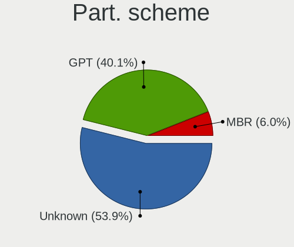
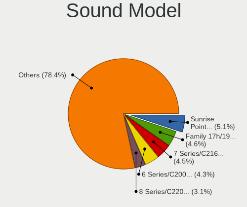

Ubuntu - Tested Hardware & Statistics
-------------------------------------

A project to collect tested hardware configurations for Ubuntu.

Anyone can contribute to this report by the [hw-probe](https://github.com/linuxhw/hw-probe) tool:

    sudo -E hw-probe -all -upload

Please contribute! Especially if your hardware is rare.

This is a report for all computer types. See also reports for [desktops](/Dist/Ubuntu/Desktop/README.md) and [notebooks](/Dist/Ubuntu/Notebook/README.md).

Contents
--------

* [ Test Cases ](#test-cases)

* [ System ](#system)
  - [ OS                       ](#os)
  - [ OS Family                ](#os-family)
  - [ Kernel                   ](#kernel)
  - [ Kernel Family            ](#kernel-family)
  - [ Kernel Major Ver.        ](#kernel-major-ver)
  - [ Arch                     ](#arch)
  - [ DE                       ](#de)
  - [ Display Server           ](#display-server)
  - [ Display Manager          ](#display-manager)
  - [ OS Lang                  ](#os-lang)
  - [ Boot Mode                ](#boot-mode)
  - [ Filesystem               ](#filesystem)
  - [ Part. scheme             ](#part-scheme)
  - [ Dual Boot with Linux/BSD ](#dual-boot-with-linuxbsd)
  - [ Dual Boot (Win)          ](#dual-boot-win)

* [ Board ](#board)
  - [ Vendor                   ](#vendor)
  - [ Model                    ](#model)
  - [ Model Family             ](#model-family)
  - [ MFG Year                 ](#mfg-year)
  - [ Form Factor              ](#form-factor)
  - [ Secure Boot              ](#secure-boot)
  - [ Coreboot                 ](#coreboot)
  - [ RAM Size                 ](#ram-size)
  - [ RAM Used                 ](#ram-used)
  - [ Total Drives             ](#total-drives)
  - [ Has CD-ROM               ](#has-cd-rom)
  - [ Has Ethernet             ](#has-ethernet)
  - [ Has WiFi                 ](#has-wifi)
  - [ Has Bluetooth            ](#has-bluetooth)

* [ Location ](#location)
  - [ Country                  ](#country)
  - [ City                     ](#city)

* [ Drives ](#drives)
  - [ Drive Vendor             ](#drive-vendor)
  - [ Drive Model              ](#drive-model)
  - [ HDD Vendor               ](#hdd-vendor)
  - [ SSD Vendor               ](#ssd-vendor)
  - [ Drive Kind               ](#drive-kind)
  - [ Drive Connector          ](#drive-connector)
  - [ Drive Size               ](#drive-size)
  - [ Space Total              ](#space-total)
  - [ Space Used               ](#space-used)
  - [ Malfunc. Drives          ](#malfunc-drives)
  - [ Malfunc. Drive Vendor    ](#malfunc-drive-vendor)
  - [ Malfunc. HDD Vendor      ](#malfunc-hdd-vendor)
  - [ Malfunc. Drive Kind      ](#malfunc-drive-kind)
  - [ Failed Drives            ](#failed-drives)
  - [ Failed Drive Vendor      ](#failed-drive-vendor)
  - [ Drive Status             ](#drive-status)

* [ Storage controller ](#storage-controller)
  - [ Storage Vendor           ](#storage-vendor)
  - [ Storage Model            ](#storage-model)
  - [ Storage Kind             ](#storage-kind)

* [ Processor ](#processor)
  - [ CPU Vendor               ](#cpu-vendor)
  - [ CPU Model                ](#cpu-model)
  - [ CPU Model Family         ](#cpu-model-family)
  - [ CPU Cores                ](#cpu-cores)
  - [ CPU Sockets              ](#cpu-sockets)
  - [ CPU Threads              ](#cpu-threads)
  - [ CPU Op-Modes             ](#cpu-op-modes)
  - [ CPU Microcode            ](#cpu-microcode)
  - [ CPU Microarch            ](#cpu-microarch)

* [ Graphics ](#graphics)
  - [ GPU Vendor               ](#gpu-vendor)
  - [ GPU Model                ](#gpu-model)
  - [ GPU Combo                ](#gpu-combo)
  - [ GPU Driver               ](#gpu-driver)
  - [ GPU Memory               ](#gpu-memory)

* [ Monitor ](#monitor)
  - [ Monitor Vendor           ](#monitor-vendor)
  - [ Monitor Model            ](#monitor-model)
  - [ Monitor Resolution       ](#monitor-resolution)
  - [ Monitor Diagonal         ](#monitor-diagonal)
  - [ Monitor Width            ](#monitor-width)
  - [ Aspect Ratio             ](#aspect-ratio)
  - [ Monitor Area             ](#monitor-area)
  - [ Pixel Density            ](#pixel-density)
  - [ Multiple Monitors        ](#multiple-monitors)

* [ Network ](#network)
  - [ Net Controller Vendor    ](#net-controller-vendor)
  - [ Net Controller Model     ](#net-controller-model)
  - [ Wireless Vendor          ](#wireless-vendor)
  - [ Wireless Model           ](#wireless-model)
  - [ Ethernet Vendor          ](#ethernet-vendor)
  - [ Ethernet Model           ](#ethernet-model)
  - [ Net Controller Kind      ](#net-controller-kind)
  - [ Used Controller          ](#used-controller)
  - [ NICs                     ](#nics)
  - [ IPv6                     ](#ipv6)

* [ Bluetooth ](#bluetooth)
  - [ Bluetooth Vendor         ](#bluetooth-vendor)
  - [ Bluetooth Model          ](#bluetooth-model)

* [ Sound ](#sound)
  - [ Sound Vendor             ](#sound-vendor)
  - [ Sound Model              ](#sound-model)

* [ Memory ](#memory)
  - [ Memory Vendor            ](#memory-vendor)
  - [ Memory Model             ](#memory-model)
  - [ Memory Kind              ](#memory-kind)
  - [ Memory Form Factor       ](#memory-form-factor)
  - [ Memory Size              ](#memory-size)
  - [ Memory Speed             ](#memory-speed)

* [ Printers & scanners ](#printers--scanners)
  - [ Printer Vendor           ](#printer-vendor)
  - [ Printer Model            ](#printer-model)
  - [ Scanner Vendor           ](#scanner-vendor)
  - [ Scanner Model            ](#scanner-model)

* [ Camera ](#camera)
  - [ Camera Vendor            ](#camera-vendor)
  - [ Camera Model             ](#camera-model)

* [ Security ](#security)
  - [ Fingerprint Vendor       ](#fingerprint-vendor)
  - [ Fingerprint Model        ](#fingerprint-model)
  - [ Chipcard Vendor          ](#chipcard-vendor)
  - [ Chipcard Model           ](#chipcard-model)

* [ Unsupported ](#unsupported)
  - [ Unsupported Devices      ](#unsupported-devices)
  - [ Unsupported Device Types ](#unsupported-device-types)

Test Cases
----------

Total: 97010

| Vendor        | Model                       | Form-Factor | Probe                                                      | Date         |
|---------------|-----------------------------|-------------|------------------------------------------------------------|--------------|
| GMKtec        | NucBox K2                   | Desktop     | [a88d491579](https://linux-hardware.org/?probe=a88d491579) | Nov 06, 2023 |
| ASUSTek       | TUF Gaming B550M-PLUS       | Desktop     | [df52b675c8](https://linux-hardware.org/?probe=df52b675c8) | Nov 06, 2023 |
| Lenovo        | Yoga 7 14ITL5 82BH          | Convertible | [27b2ce4d8c](https://linux-hardware.org/?probe=27b2ce4d8c) | Nov 06, 2023 |
| Acer          | TMP645-M                    | Notebook    | [a062c55357](https://linux-hardware.org/?probe=a062c55357) | Nov 06, 2023 |
| Dell          | Latitude E6420              | Notebook    | [9fd076e986](https://linux-hardware.org/?probe=9fd076e986) | Nov 06, 2023 |
| Lenovo        | ThinkPad E14 20RA002UHV     | Notebook    | [79a037e80b](https://linux-hardware.org/?probe=79a037e80b) | Nov 06, 2023 |
| HP            | EliteBook 840 G5            | Notebook    | [279ac4ed92](https://linux-hardware.org/?probe=279ac4ed92) | Nov 06, 2023 |
| HP            | 8594                        | Desktop     | [d51c507511](https://linux-hardware.org/?probe=d51c507511) | Nov 06, 2023 |
| Gigabyte      | Z390 AORUS PRO WIFI-CF      | Desktop     | [cee650aa5a](https://linux-hardware.org/?probe=cee650aa5a) | Nov 06, 2023 |
| ASUSTek       | PRIME X299-A                | Desktop     | [8d9bbb07dd](https://linux-hardware.org/?probe=8d9bbb07dd) | Nov 06, 2023 |
| Lenovo        | IdeaPad 1 15ADA7 82R1       | Notebook    | [b88b3757af](https://linux-hardware.org/?probe=b88b3757af) | Nov 06, 2023 |
| HP            | Spectre Pro x360 G2         | Convertible | [de099b29d0](https://linux-hardware.org/?probe=de099b29d0) | Nov 06, 2023 |
| MSI           | GL65 9SD                    | Notebook    | [d831c2e78e](https://linux-hardware.org/?probe=d831c2e78e) | Nov 06, 2023 |
| Dell          | OptiPlex 5050               | Desktop     | [6c4a08354b](https://linux-hardware.org/?probe=6c4a08354b) | Nov 06, 2023 |
| Gigabyte      | B450M GAMING                | Desktop     | [7974075b64](https://linux-hardware.org/?probe=7974075b64) | Nov 06, 2023 |
| Lenovo        | IdeaPad 320-15ABR 80XS      | Notebook    | [b3e37dd334](https://linux-hardware.org/?probe=b3e37dd334) | Nov 06, 2023 |
| Lenovo        | IdeaPad 320-15ABR 80XS      | Notebook    | [f5a032555f](https://linux-hardware.org/?probe=f5a032555f) | Nov 06, 2023 |
| HP            | OMEN by Laptop 15-dc1xxx    | Notebook    | [6aaef57f51](https://linux-hardware.org/?probe=6aaef57f51) | Nov 06, 2023 |
| MSI           | MPG B650 CARBON WIFI        | Desktop     | [fcd42a2056](https://linux-hardware.org/?probe=fcd42a2056) | Nov 06, 2023 |
| TUXEDO        | Pulse 15 Gen2               | Notebook    | [10f2785958](https://linux-hardware.org/?probe=10f2785958) | Nov 06, 2023 |
| Lenovo        | ThinkPad T440s 20ARS0HB0... | Notebook    | [95376bfed1](https://linux-hardware.org/?probe=95376bfed1) | Nov 06, 2023 |
| MSI           | B560M PRO-E                 | Desktop     | [89a24ae9fa](https://linux-hardware.org/?probe=89a24ae9fa) | Nov 06, 2023 |
| ASUSTek       | SABERTOOTH X79              | Desktop     | [c46040087a](https://linux-hardware.org/?probe=c46040087a) | Nov 06, 2023 |
| Shuttle       | XS35V3                      | Desktop     | [0c51d541de](https://linux-hardware.org/?probe=0c51d541de) | Nov 06, 2023 |
| Apple         | Mac-942B59F58194171B iMa... | All in one  | [17dda27251](https://linux-hardware.org/?probe=17dda27251) | Nov 06, 2023 |
| ASUSTek       | TUF Gaming B560M-PLUS       | Desktop     | [9655bf2db1](https://linux-hardware.org/?probe=9655bf2db1) | Nov 06, 2023 |
| Apple         | Mac-7BA5B2DFE22DDD8C Mac... | Mini pc     | [ce6a053669](https://linux-hardware.org/?probe=ce6a053669) | Nov 06, 2023 |
| HP            | 83D0                        | Mini pc     | [4f947ffed7](https://linux-hardware.org/?probe=4f947ffed7) | Nov 05, 2023 |
| Lenovo        | ThinkPad T460s 20FAS2430... | Notebook    | [658d6f150e](https://linux-hardware.org/?probe=658d6f150e) | Nov 05, 2023 |
| Dell          | Latitude 5590               | Notebook    | [913308d97b](https://linux-hardware.org/?probe=913308d97b) | Nov 05, 2023 |
| Biostar       | A10N-8800E                  | Desktop     | [35b7407efb](https://linux-hardware.org/?probe=35b7407efb) | Nov 05, 2023 |
| ASUSTek       | P30AD                       | Desktop     | [63322c386f](https://linux-hardware.org/?probe=63322c386f) | Nov 05, 2023 |
| Apple         | MacBookPro11,4              | Notebook    | [45dfbee68a](https://linux-hardware.org/?probe=45dfbee68a) | Nov 05, 2023 |
| Toshiba       | PORTEGE Z10t-A              | Notebook    | [600445b726](https://linux-hardware.org/?probe=600445b726) | Nov 05, 2023 |
| HP            | 2B05                        | Desktop     | [eb343bd373](https://linux-hardware.org/?probe=eb343bd373) | Nov 05, 2023 |
| HP            | Laptop 15-db1xxx            | Notebook    | [3a69031984](https://linux-hardware.org/?probe=3a69031984) | Nov 05, 2023 |
| Lenovo        | IdeaPad 1 11IGL05 81VT      | Notebook    | [27923cd021](https://linux-hardware.org/?probe=27923cd021) | Nov 05, 2023 |
| Gigabyte      | B250M-DS3H-CF               | Desktop     | [25b39b698c](https://linux-hardware.org/?probe=25b39b698c) | Nov 05, 2023 |
| Dell          | 0JCTF8 A00                  | Desktop     | [b3669f73a8](https://linux-hardware.org/?probe=b3669f73a8) | Nov 05, 2023 |
| Dell          | Inspiron 3521               | Notebook    | [00f864bd9e](https://linux-hardware.org/?probe=00f864bd9e) | Nov 05, 2023 |
| Acer          | Swift SF113-31              | Notebook    | [a6fbe4af41](https://linux-hardware.org/?probe=a6fbe4af41) | Nov 05, 2023 |
| Dell          | 0J1C3P A01                  | Desktop     | [8aefbb37f5](https://linux-hardware.org/?probe=8aefbb37f5) | Nov 05, 2023 |
| MSI           | MAG X670E TOMAHAWK WIFI     | Desktop     | [d95f04dd2c](https://linux-hardware.org/?probe=d95f04dd2c) | Nov 05, 2023 |
| HP            | 1495                        | Desktop     | [fe18b89530](https://linux-hardware.org/?probe=fe18b89530) | Nov 05, 2023 |
| ASUSTek       | K401UB                      | Notebook    | [3bc894aa34](https://linux-hardware.org/?probe=3bc894aa34) | Nov 05, 2023 |
| ASUSTek       | PRIME X470-PRO              | Desktop     | [692601dd3b](https://linux-hardware.org/?probe=692601dd3b) | Nov 05, 2023 |
| Acer          | Aspire A515-51              | Notebook    | [a0450fee29](https://linux-hardware.org/?probe=a0450fee29) | Nov 05, 2023 |
| MSI           | MEG Z590 UNIFY              | Desktop     | [1f84fe45f8](https://linux-hardware.org/?probe=1f84fe45f8) | Nov 05, 2023 |
| ASUSTek       | ZenBook UX363EA_UX363EA     | Convertible | [a00f71e5d3](https://linux-hardware.org/?probe=a00f71e5d3) | Nov 05, 2023 |
| Dell          | 0WMJ54 A01                  | Desktop     | [5cff6ffdfc](https://linux-hardware.org/?probe=5cff6ffdfc) | Nov 05, 2023 |
| HP            | Pavilion 17                 | Notebook    | [50a9cf65b3](https://linux-hardware.org/?probe=50a9cf65b3) | Nov 05, 2023 |
| Lenovo        | ThinkPad T580 20LAS62M07    | Notebook    | [56d9dc4a36](https://linux-hardware.org/?probe=56d9dc4a36) | Nov 05, 2023 |
| Dell          | Latitude E6400              | Notebook    | [c5f0762ae5](https://linux-hardware.org/?probe=c5f0762ae5) | Nov 05, 2023 |
| HP            | HPPavilionLaptop15-eh0xx... | Notebook    | [436064bfba](https://linux-hardware.org/?probe=436064bfba) | Nov 05, 2023 |
| MSI           | NIGHTBLADE Z97              | Desktop     | [3da62b47b3](https://linux-hardware.org/?probe=3da62b47b3) | Nov 05, 2023 |
| Gigabyte      | B450M GAMING-CF             | Desktop     | [247cc16161](https://linux-hardware.org/?probe=247cc16161) | Nov 05, 2023 |
| HP            | ProBook 4740s               | Notebook    | [2efc1092dd](https://linux-hardware.org/?probe=2efc1092dd) | Nov 05, 2023 |
| HP            | ProBook 4740s               | Notebook    | [0351f35099](https://linux-hardware.org/?probe=0351f35099) | Nov 05, 2023 |
| ASUSTek       | P5G41T-M LX2/GB             | Desktop     | [5196f9303d](https://linux-hardware.org/?probe=5196f9303d) | Nov 05, 2023 |
| HP            | Pavilion dm4                | Notebook    | [ed4309477f](https://linux-hardware.org/?probe=ed4309477f) | Nov 05, 2023 |
| ASUSTek       | P5Q-PRO                     | Desktop     | [a1500e2e9c](https://linux-hardware.org/?probe=a1500e2e9c) | Nov 05, 2023 |
| Acer          | Aspire ES1-311              | Notebook    | [d06185f74c](https://linux-hardware.org/?probe=d06185f74c) | Nov 05, 2023 |
| HP            | 250 G5 Notebook PC          | Notebook    | [7b281cb925](https://linux-hardware.org/?probe=7b281cb925) | Nov 05, 2023 |
| Dell          | 062TCH A00                  | Desktop     | [b82fbd03d5](https://linux-hardware.org/?probe=b82fbd03d5) | Nov 05, 2023 |
| Lenovo        | ThinkPad T470s W10DG 20J... | Notebook    | [ae9fcece31](https://linux-hardware.org/?probe=ae9fcece31) | Nov 05, 2023 |
| HP            | ENVY x360 Convertible 13... | Convertible | [ea37beb412](https://linux-hardware.org/?probe=ea37beb412) | Nov 05, 2023 |
| ASUSTek       | K55VJ                       | Notebook    | [47851a05e9](https://linux-hardware.org/?probe=47851a05e9) | Nov 05, 2023 |
| MSI           | Alpha 17 C7VG               | Notebook    | [fd9594de89](https://linux-hardware.org/?probe=fd9594de89) | Nov 05, 2023 |
| Google        | Pyro                        | Notebook    | [2fd8f11a53](https://linux-hardware.org/?probe=2fd8f11a53) | Nov 05, 2023 |
| ASUSTek       | X756UVK                     | Notebook    | [3ba2cc1e0c](https://linux-hardware.org/?probe=3ba2cc1e0c) | Nov 05, 2023 |
| Apple         | MacBookAir7,1               | Notebook    | [23e52fc4f5](https://linux-hardware.org/?probe=23e52fc4f5) | Nov 05, 2023 |
| Dell          | 03X6X0 A06                  | Server      | [90b61e75ba](https://linux-hardware.org/?probe=90b61e75ba) | Nov 05, 2023 |
| ASUSTek       | VivoBook_ASUSLaptop X521... | Notebook    | [a3a6205085](https://linux-hardware.org/?probe=a3a6205085) | Nov 05, 2023 |
| Lenovo        | ThinkPad E580 20KS003QUS    | Notebook    | [6bccd355f7](https://linux-hardware.org/?probe=6bccd355f7) | Nov 05, 2023 |
| Medion        | E6417 MD99252               | Notebook    | [8660ae1c16](https://linux-hardware.org/?probe=8660ae1c16) | Nov 05, 2023 |
| Toshiba       | Satellite L750              | Notebook    | [f4cbcd5ba1](https://linux-hardware.org/?probe=f4cbcd5ba1) | Nov 05, 2023 |
| Toshiba       | Satellite L750              | Notebook    | [34a347877f](https://linux-hardware.org/?probe=34a347877f) | Nov 05, 2023 |
| Samsung       | 305E4A/305E5A/305E7A        | Notebook    | [257e40f6bd](https://linux-hardware.org/?probe=257e40f6bd) | Nov 05, 2023 |
| Acer          | Aspire E1-571G              | Notebook    | [fac63c4d5c](https://linux-hardware.org/?probe=fac63c4d5c) | Nov 05, 2023 |
| MSI           | Alpha 17 C7VG               | Notebook    | [a5a8cf5c09](https://linux-hardware.org/?probe=a5a8cf5c09) | Nov 05, 2023 |
| Dell          | 09T7VV A05                  | Server      | [ed330c4205](https://linux-hardware.org/?probe=ed330c4205) | Nov 05, 2023 |
| MSI           | Alpha 17 C7VG               | Notebook    | [74099b3a6e](https://linux-hardware.org/?probe=74099b3a6e) | Nov 05, 2023 |
| Gigabyte      | Z97M-DS3H                   | Desktop     | [2cbd472a6e](https://linux-hardware.org/?probe=2cbd472a6e) | Nov 05, 2023 |
| MSI           | Alpha 17 C7VG               | Notebook    | [bdad71bf99](https://linux-hardware.org/?probe=bdad71bf99) | Nov 05, 2023 |
| Trigkey       | S5 V2.0                     | Mini pc     | [dc066ab76b](https://linux-hardware.org/?probe=dc066ab76b) | Nov 05, 2023 |
| HUAWEI        | RLEF-XX                     | Notebook    | [21b415bccc](https://linux-hardware.org/?probe=21b415bccc) | Nov 05, 2023 |
| GEEKOM        | A5                          | Desktop     | [d3dd0e1aca](https://linux-hardware.org/?probe=d3dd0e1aca) | Nov 05, 2023 |
| MSI           | B560M PRO-E                 | Desktop     | [1488a8a70f](https://linux-hardware.org/?probe=1488a8a70f) | Nov 05, 2023 |
| HP            | ENVY x360 2-in-1 Laptop ... | Convertible | [c3b2667bbf](https://linux-hardware.org/?probe=c3b2667bbf) | Nov 05, 2023 |
| ASRockRack    | EPC602D8A                   | Desktop     | [c1b6c06dc5](https://linux-hardware.org/?probe=c1b6c06dc5) | Nov 05, 2023 |
| HP            | 829A                        | Mini pc     | [34b672080f](https://linux-hardware.org/?probe=34b672080f) | Nov 05, 2023 |
| HP            | 829A                        | Mini pc     | [03af1f506e](https://linux-hardware.org/?probe=03af1f506e) | Nov 05, 2023 |
| HP            | Pavilion Laptop 15-eh0xx... | Notebook    | [7a8597dd50](https://linux-hardware.org/?probe=7a8597dd50) | Nov 05, 2023 |
| Dell          | Inspiron 14 5401            | Notebook    | [124c666940](https://linux-hardware.org/?probe=124c666940) | Nov 05, 2023 |
| Lenovo        | SKYBAY NOK                  | Desktop     | [534fcded19](https://linux-hardware.org/?probe=534fcded19) | Nov 05, 2023 |
| Dell          | Inspiron 14 5401            | Notebook    | [9eeeda059e](https://linux-hardware.org/?probe=9eeeda059e) | Nov 05, 2023 |
| Microsoft     | Surface Go 3                | Tablet      | [d20af6bf95](https://linux-hardware.org/?probe=d20af6bf95) | Nov 05, 2023 |
| Lenovo        | ThinkPad W541 20EGS0QG1Z    | Notebook    | [ae8881b2b2](https://linux-hardware.org/?probe=ae8881b2b2) | Nov 04, 2023 |
| Lenovo        | ThinkPad W541 20EGS0QG1Z    | Notebook    | [a3d91609e9](https://linux-hardware.org/?probe=a3d91609e9) | Nov 04, 2023 |
| MSI           | X470 GAMING PLUS MAX        | Desktop     | [4e3cd50b3f](https://linux-hardware.org/?probe=4e3cd50b3f) | Nov 04, 2023 |
| Acer          | Aspire A517-51G             | Notebook    | [11f85eb258](https://linux-hardware.org/?probe=11f85eb258) | Nov 04, 2023 |
| Lenovo        | IdeaPadFlex 5 14ABR8 82X... | Convertible | [a9f0b015d5](https://linux-hardware.org/?probe=a9f0b015d5) | Nov 04, 2023 |
| Acer          | Aspire 7750G                | Notebook    | [ddf88ff37c](https://linux-hardware.org/?probe=ddf88ff37c) | Nov 04, 2023 |
| Medion        | H110H4-EM                   | Desktop     | [9fe03aa296](https://linux-hardware.org/?probe=9fe03aa296) | Nov 04, 2023 |
| Dell          | XPS 13 9315 2-in-1          | Tablet      | [79016d8b5e](https://linux-hardware.org/?probe=79016d8b5e) | Nov 04, 2023 |
| Lenovo        | IdeaPadFlex 5 14ABR8 82X... | Convertible | [d11250217c](https://linux-hardware.org/?probe=d11250217c) | Nov 04, 2023 |
| Apple         | Mac-B809C3757DA9BB8D iMa... | All in one  | [64b26f1390](https://linux-hardware.org/?probe=64b26f1390) | Nov 04, 2023 |
| HP            | ProBook 430 G1              | Notebook    | [14dc35a1b9](https://linux-hardware.org/?probe=14dc35a1b9) | Nov 04, 2023 |
| Lenovo        | ThinkPad E15 20RD0011UK     | Notebook    | [dc13d6012b](https://linux-hardware.org/?probe=dc13d6012b) | Nov 04, 2023 |
| ASUSTek       | ROG Strix G733QR_G733QR     | Notebook    | [5b7dc65a39](https://linux-hardware.org/?probe=5b7dc65a39) | Nov 04, 2023 |
| Acer          | TravelMate B118-M           | Notebook    | [051346666e](https://linux-hardware.org/?probe=051346666e) | Nov 04, 2023 |
| Timi          | Redmi Book Pro 15 2022      | Notebook    | [2084300c18](https://linux-hardware.org/?probe=2084300c18) | Nov 04, 2023 |
| ASUSTek       | UX31A                       | Notebook    | [013a7815c3](https://linux-hardware.org/?probe=013a7815c3) | Nov 04, 2023 |
| ASUSTek       | PRIME X470-PRO              | Desktop     | [c1523fb6a1](https://linux-hardware.org/?probe=c1523fb6a1) | Nov 04, 2023 |
| Acer          | Aspire 5750                 | Notebook    | [3ba4126936](https://linux-hardware.org/?probe=3ba4126936) | Nov 04, 2023 |
| HUAWEI        | BOD-WXX9                    | Notebook    | [30a0e0602f](https://linux-hardware.org/?probe=30a0e0602f) | Nov 04, 2023 |
| Acer          | TravelMate P215-54          | Notebook    | [5688b7940d](https://linux-hardware.org/?probe=5688b7940d) | Nov 04, 2023 |
| Dell          | Inspiron 15 3511            | Notebook    | [4c97723997](https://linux-hardware.org/?probe=4c97723997) | Nov 04, 2023 |
| ASRock        | H470M-STX                   | Desktop     | [5a50d371b8](https://linux-hardware.org/?probe=5a50d371b8) | Nov 04, 2023 |
| Lenovo        | ThinkPad T550 20CJS07P01    | Notebook    | [52157a4ee8](https://linux-hardware.org/?probe=52157a4ee8) | Nov 04, 2023 |
| Acer          | TravelMate P215-54          | Notebook    | [f051dc617c](https://linux-hardware.org/?probe=f051dc617c) | Nov 04, 2023 |
| Lenovo        | IdeaPad 320-15IKB 80XL      | Notebook    | [812ceefef6](https://linux-hardware.org/?probe=812ceefef6) | Nov 04, 2023 |
| ASUSTek       | VivoBook_ASUSLaptop M650... | Notebook    | [5e5e97717a](https://linux-hardware.org/?probe=5e5e97717a) | Nov 04, 2023 |
| Lenovo        | ThinkPad T480s 20L8S2N80... | Notebook    | [87abd90a63](https://linux-hardware.org/?probe=87abd90a63) | Nov 04, 2023 |
| Lenovo        | IdeaPad 3 14ABA7 82RM       | Notebook    | [a8bb556bfe](https://linux-hardware.org/?probe=a8bb556bfe) | Nov 04, 2023 |
| ASUSTek       | VivoBook_ASUSLaptop X415... | Notebook    | [aba7da7a37](https://linux-hardware.org/?probe=aba7da7a37) | Nov 04, 2023 |
| Lenovo        | Yoga 9 14IAP7 82LU          | Convertible | [e1c8a14f2a](https://linux-hardware.org/?probe=e1c8a14f2a) | Nov 04, 2023 |
| HP            | 15                          | Notebook    | [5d5fb36764](https://linux-hardware.org/?probe=5d5fb36764) | Nov 04, 2023 |
| FriendlyEl... | NanoPC-T6                   | Soc         | [7a75d5ed73](https://linux-hardware.org/?probe=7a75d5ed73) | Nov 04, 2023 |
| Gigabyte      | GA-MA78LMT-S2               | Desktop     | [1636a231b2](https://linux-hardware.org/?probe=1636a231b2) | Nov 04, 2023 |
| Dell          | Latitude E6420              | Notebook    | [6bd73f2b0e](https://linux-hardware.org/?probe=6bd73f2b0e) | Nov 04, 2023 |
| HP            | EliteBook 840 G6            | Notebook    | [d4b22ac16a](https://linux-hardware.org/?probe=d4b22ac16a) | Nov 04, 2023 |
| ASUSTek       | M4N68T-M                    | Desktop     | [582304a8c5](https://linux-hardware.org/?probe=582304a8c5) | Nov 04, 2023 |
| HP            | Pavilion Gaming Laptop 1... | Notebook    | [669430e32e](https://linux-hardware.org/?probe=669430e32e) | Nov 04, 2023 |
| HP            | ZBook Studio G3             | Notebook    | [1fcf1ef0b5](https://linux-hardware.org/?probe=1fcf1ef0b5) | Nov 04, 2023 |
| Sony          | SVE15137CGW                 | Notebook    | [5d2a4746af](https://linux-hardware.org/?probe=5d2a4746af) | Nov 04, 2023 |
| AVITA         | NS14A2                      | Notebook    | [738e0008ce](https://linux-hardware.org/?probe=738e0008ce) | Nov 04, 2023 |
| Lenovo        | ThinkPad T61 6460D6G        | Notebook    | [1d51aba71e](https://linux-hardware.org/?probe=1d51aba71e) | Nov 04, 2023 |
| Lenovo        | Legion 5 15ARH05H 82B1      | Notebook    | [3d8056e30e](https://linux-hardware.org/?probe=3d8056e30e) | Nov 04, 2023 |
| HP            | ZBook Studio G3             | Notebook    | [eb90a23afa](https://linux-hardware.org/?probe=eb90a23afa) | Nov 04, 2023 |
| Lenovo        | ThinkPad T61 6460D6G        | Notebook    | [585906fa27](https://linux-hardware.org/?probe=585906fa27) | Nov 04, 2023 |
| HP            | 0A9Ch                       | Desktop     | [95415dec13](https://linux-hardware.org/?probe=95415dec13) | Nov 04, 2023 |
| American M... | A6                          | Notebook    | [4ff43d7d31](https://linux-hardware.org/?probe=4ff43d7d31) | Nov 04, 2023 |
| HP            | Pavilion Laptop 15-eh1xx... | Notebook    | [d0f3cf43b7](https://linux-hardware.org/?probe=d0f3cf43b7) | Nov 04, 2023 |
| ASUSTek       | M5A97 R2.0                  | Desktop     | [905d699d4d](https://linux-hardware.org/?probe=905d699d4d) | Nov 04, 2023 |
| Lenovo        | Legion 5 15ARH05H 82B1      | Notebook    | [546178d07d](https://linux-hardware.org/?probe=546178d07d) | Nov 04, 2023 |
| Acer          | Aspire A314-23P             | Notebook    | [1e3cdf0bf2](https://linux-hardware.org/?probe=1e3cdf0bf2) | Nov 04, 2023 |
| Dell          | 062TCH A00                  | Desktop     | [b964b2c6be](https://linux-hardware.org/?probe=b964b2c6be) | Nov 04, 2023 |
| Dell          | 0VWT90 A10                  | Server      | [2a20b2817d](https://linux-hardware.org/?probe=2a20b2817d) | Nov 04, 2023 |
| ASUSTek       | PRIME H510M-E               | Desktop     | [cd2b005e61](https://linux-hardware.org/?probe=cd2b005e61) | Nov 04, 2023 |
| ASUSTek       | UX32VD                      | Notebook    | [7c4eefbe35](https://linux-hardware.org/?probe=7c4eefbe35) | Nov 04, 2023 |
| Dell          | 018D1Y A00                  | Desktop     | [2135015e09](https://linux-hardware.org/?probe=2135015e09) | Nov 04, 2023 |
| Dell          | XPS 15 7590                 | Notebook    | [8685e384af](https://linux-hardware.org/?probe=8685e384af) | Nov 04, 2023 |
| Raspberry ... | Raspberry Pi 5 Model B R... | Soc         | [6d47b63d51](https://linux-hardware.org/?probe=6d47b63d51) | Nov 03, 2023 |
| MSI           | A68HM-E33 V2                | Desktop     | [f029848e7d](https://linux-hardware.org/?probe=f029848e7d) | Nov 03, 2023 |
| Dell          | Inspiron N4010              | Notebook    | [f8aed4abab](https://linux-hardware.org/?probe=f8aed4abab) | Nov 03, 2023 |
| Lenovo        | IdeaPad 100-15IBY 80MJ      | Notebook    | [abe3da8a30](https://linux-hardware.org/?probe=abe3da8a30) | Nov 03, 2023 |
| ASUSTek       | ROG Flow X13 GV301QH_GV3... | Notebook    | [de4c3bfe46](https://linux-hardware.org/?probe=de4c3bfe46) | Nov 03, 2023 |
| Dell          | Latitude E6420              | Notebook    | [1f2c5ea57b](https://linux-hardware.org/?probe=1f2c5ea57b) | Nov 03, 2023 |
| Lenovo        | IdeaPad 100-15IBY 80MJ      | Notebook    | [e7ccaf83d7](https://linux-hardware.org/?probe=e7ccaf83d7) | Nov 03, 2023 |
| Intel         | DG41RQ AAE54511-203         | Desktop     | [dff06d88c5](https://linux-hardware.org/?probe=dff06d88c5) | Nov 03, 2023 |
| Supermicro    | X9DRW                       | Desktop     | [d9bb198389](https://linux-hardware.org/?probe=d9bb198389) | Nov 03, 2023 |
| Lenovo        | ThinkPad T460p 20FXS0960... | Notebook    | [10407542ab](https://linux-hardware.org/?probe=10407542ab) | Nov 03, 2023 |
| ASUSTek       | PRIME X570-PRO              | Desktop     | [62a859fb72](https://linux-hardware.org/?probe=62a859fb72) | Nov 03, 2023 |
| Lenovo        | ThinkPad E15 Gen 4 21EDC... | Notebook    | [b4d28df125](https://linux-hardware.org/?probe=b4d28df125) | Nov 03, 2023 |
| ASRock        | TRX40 Creator               | Desktop     | [05304710e4](https://linux-hardware.org/?probe=05304710e4) | Nov 03, 2023 |
| Lenovo        | B560 433028U                | Notebook    | [37a6693c3d](https://linux-hardware.org/?probe=37a6693c3d) | Nov 03, 2023 |
| VALE          | Notebook Classic C140       | Notebook    | [fd52185cf0](https://linux-hardware.org/?probe=fd52185cf0) | Nov 03, 2023 |
| ASRock        | TRX40 Creator               | Desktop     | [62f85af4b5](https://linux-hardware.org/?probe=62f85af4b5) | Nov 03, 2023 |
| HUAWEI        | MRGFG-XX                    | Notebook    | [5117a849b3](https://linux-hardware.org/?probe=5117a849b3) | Nov 03, 2023 |
| Lenovo        | IdeaPadFlex 5 14ALC05 82... | Convertible | [7a6f17c843](https://linux-hardware.org/?probe=7a6f17c843) | Nov 03, 2023 |
| HUAWEI        | HLYL-WXX9                   | Notebook    | [993a2b9f3e](https://linux-hardware.org/?probe=993a2b9f3e) | Nov 03, 2023 |
| Supermicro    | X8DTU                       | Server      | [17ea09c2b2](https://linux-hardware.org/?probe=17ea09c2b2) | Nov 03, 2023 |
| Supermicro    | X10DRL-i                    | Desktop     | [cada5224ab](https://linux-hardware.org/?probe=cada5224ab) | Nov 03, 2023 |
| Medion        | ERAZER X7855 MD60892        | Notebook    | [b34c69b29d](https://linux-hardware.org/?probe=b34c69b29d) | Nov 03, 2023 |
| HP            | Spectre Folio Convertibl... | Convertible | [aa5a6d3348](https://linux-hardware.org/?probe=aa5a6d3348) | Nov 03, 2023 |
| Lenovo        | ThinkPad X1 Fold Gen 1 2... | Tablet      | [a06677f6ea](https://linux-hardware.org/?probe=a06677f6ea) | Nov 03, 2023 |
| Lenovo        | ThinkPad X1 Fold Gen 1 2... | Tablet      | [d8c90f446f](https://linux-hardware.org/?probe=d8c90f446f) | Nov 03, 2023 |
| Lenovo        | 310C SDK0J40697 WIN 3305... | Mini pc     | [f69b9b159a](https://linux-hardware.org/?probe=f69b9b159a) | Nov 03, 2023 |
| Gigabyte      | B550M DS3H                  | Desktop     | [49ec48adb9](https://linux-hardware.org/?probe=49ec48adb9) | Nov 03, 2023 |
| MSI           | B550M PRO-VDH WIFI          | Desktop     | [baf30122ca](https://linux-hardware.org/?probe=baf30122ca) | Nov 03, 2023 |
| ETegro Tec... | ETRS125G4 31S2MMB0040       | Server      | [5085991741](https://linux-hardware.org/?probe=5085991741) | Nov 03, 2023 |
| Dell          | XPS 13 9380                 | Notebook    | [ee12470303](https://linux-hardware.org/?probe=ee12470303) | Nov 03, 2023 |
| Acer          | Nitro AN515-54              | Notebook    | [ce98faee85](https://linux-hardware.org/?probe=ce98faee85) | Nov 03, 2023 |
| Gigabyte      | B550M DS3H                  | Desktop     | [3c4533c5a9](https://linux-hardware.org/?probe=3c4533c5a9) | Nov 03, 2023 |
| Supermicro    | X8DTU                       | Server      | [1e45f05458](https://linux-hardware.org/?probe=1e45f05458) | Nov 03, 2023 |
| Biostar       | A10N-8800E                  | Desktop     | [76374cbbfe](https://linux-hardware.org/?probe=76374cbbfe) | Nov 03, 2023 |
| Supermicro    | X8DTU                       | Server      | [330f475535](https://linux-hardware.org/?probe=330f475535) | Nov 03, 2023 |
| Colorful T... | CVN X570M GAMING PRO V14    | Desktop     | [65b9bad459](https://linux-hardware.org/?probe=65b9bad459) | Nov 03, 2023 |
| Dell          | 0427JK A00                  | Desktop     | [ac631c05bc](https://linux-hardware.org/?probe=ac631c05bc) | Nov 03, 2023 |
| Dell          | Latitude E5570              | Notebook    | [a4617a2ea3](https://linux-hardware.org/?probe=a4617a2ea3) | Nov 03, 2023 |
| ASUSTek       | ROG STRIX X570-F GAMING     | Desktop     | [d8ceb3854c](https://linux-hardware.org/?probe=d8ceb3854c) | Nov 03, 2023 |
| Lenovo        | Yoga 530-14IKB 81EK         | Convertible | [5339cc53ed](https://linux-hardware.org/?probe=5339cc53ed) | Nov 03, 2023 |
| ASUSTek       | PRIME X299-A                | Desktop     | [387194bdf6](https://linux-hardware.org/?probe=387194bdf6) | Nov 03, 2023 |
| Dell          | Precision 5750              | Notebook    | [00e8468779](https://linux-hardware.org/?probe=00e8468779) | Nov 03, 2023 |
| Dell          | Latitude E5570              | Notebook    | [82d66aaaf1](https://linux-hardware.org/?probe=82d66aaaf1) | Nov 03, 2023 |
| Intel         | X99                         | Desktop     | [cb3515efba](https://linux-hardware.org/?probe=cb3515efba) | Nov 03, 2023 |
| Dell          | Inspiron 16 5625            | Notebook    | [157f3bd86a](https://linux-hardware.org/?probe=157f3bd86a) | Nov 03, 2023 |
| Lenovo        | ThinkPad 11e 5th Gen 20L... | Notebook    | [fca8401d97](https://linux-hardware.org/?probe=fca8401d97) | Nov 03, 2023 |
| HP            | EliteBook 845 14 inch G9... | Notebook    | [5ff77430fa](https://linux-hardware.org/?probe=5ff77430fa) | Nov 03, 2023 |
| Dell          | 0TDG4V A01                  | Desktop     | [9d9b09db51](https://linux-hardware.org/?probe=9d9b09db51) | Nov 03, 2023 |
| Apple         | Mac-F65AE981FFA204ED Mac... | Mini pc     | [4933bbb7ac](https://linux-hardware.org/?probe=4933bbb7ac) | Nov 03, 2023 |
| MSI           | B350 PC MATE                | Desktop     | [9c089ed10c](https://linux-hardware.org/?probe=9c089ed10c) | Nov 03, 2023 |
| Supermicro    | X10DRU-i+B                  | Desktop     | [305ce5bbcc](https://linux-hardware.org/?probe=305ce5bbcc) | Nov 03, 2023 |
| Supermicro    | X10DDW-i                    | Desktop     | [8a0ff875f1](https://linux-hardware.org/?probe=8a0ff875f1) | Nov 03, 2023 |
| Supermicro    | X10DDW-i                    | Desktop     | [3138fbde8e](https://linux-hardware.org/?probe=3138fbde8e) | Nov 03, 2023 |
| Supermicro    | X10DDW-i                    | Desktop     | [f3023a2a6f](https://linux-hardware.org/?probe=f3023a2a6f) | Nov 03, 2023 |
| Supermicro    | X10DDW-i                    | Desktop     | [d9dcb6003e](https://linux-hardware.org/?probe=d9dcb6003e) | Nov 03, 2023 |
| Dell          | Vostro 3525                 | Notebook    | [48103e7e91](https://linux-hardware.org/?probe=48103e7e91) | Nov 03, 2023 |
| HP            | ProBook 445 G7              | Notebook    | [400a0e689f](https://linux-hardware.org/?probe=400a0e689f) | Nov 03, 2023 |
| HP            | ProBook 4330s               | Notebook    | [046f30b044](https://linux-hardware.org/?probe=046f30b044) | Nov 03, 2023 |
| Dell          | Inspiron 15-7568            | Notebook    | [70b564a0db](https://linux-hardware.org/?probe=70b564a0db) | Nov 03, 2023 |
| Dell          | 05KX61 A02                  | Server      | [e74ef17929](https://linux-hardware.org/?probe=e74ef17929) | Nov 03, 2023 |
| Dell          | 05KX61 A02                  | Server      | [3ccea24165](https://linux-hardware.org/?probe=3ccea24165) | Nov 03, 2023 |
| HP            | OMEN by Laptop 15-dc1xxx    | Notebook    | [0be20c3fe3](https://linux-hardware.org/?probe=0be20c3fe3) | Nov 03, 2023 |
| ASUSTek       | PRIME H370M-PLUS            | Desktop     | [328a40f6fe](https://linux-hardware.org/?probe=328a40f6fe) | Nov 03, 2023 |
| NEC Comput... | MS-7770MH                   | Desktop     | [9d2ab645d4](https://linux-hardware.org/?probe=9d2ab645d4) | Nov 03, 2023 |
| Lenovo        | ThinkPad E14 Gen 2 20TB0... | Notebook    | [6987861086](https://linux-hardware.org/?probe=6987861086) | Nov 03, 2023 |
| HP            | 0AECh D                     | Desktop     | [2ddad2bbf2](https://linux-hardware.org/?probe=2ddad2bbf2) | Nov 03, 2023 |
| HP            | ZBook Power G7 Mobile Wo... | Notebook    | [044aa1f9b5](https://linux-hardware.org/?probe=044aa1f9b5) | Nov 03, 2023 |
| Dell          | 09T7VV A05                  | Server      | [8d5ae6e4de](https://linux-hardware.org/?probe=8d5ae6e4de) | Nov 03, 2023 |
| Alienware     | 0GWM1Y A00                  | Desktop     | [01d536cc44](https://linux-hardware.org/?probe=01d536cc44) | Nov 03, 2023 |
| ASUSTek       | VivoBook_ASUSLaptop N740... | Notebook    | [7fd71a723a](https://linux-hardware.org/?probe=7fd71a723a) | Nov 03, 2023 |
| Acer          | Swift SF114-32              | Notebook    | [2314e30b70](https://linux-hardware.org/?probe=2314e30b70) | Nov 03, 2023 |
| Acer          | Swift SF114-32              | Notebook    | [ad12644dff](https://linux-hardware.org/?probe=ad12644dff) | Nov 03, 2023 |
| Lenovo        | IdeaPad 330-15IGM 81FN      | Notebook    | [5d06dbbe5f](https://linux-hardware.org/?probe=5d06dbbe5f) | Nov 03, 2023 |
| Fujitsu Si... | G31T-M2 V3.02               | Desktop     | [d069c6012d](https://linux-hardware.org/?probe=d069c6012d) | Nov 03, 2023 |
| MACHINIST     | H81M-PRO S1 V2.0            | Desktop     | [98b382243b](https://linux-hardware.org/?probe=98b382243b) | Nov 03, 2023 |
| Dell          | 0X8DXD A00                  | Desktop     | [e972336105](https://linux-hardware.org/?probe=e972336105) | Nov 03, 2023 |
| Apple         | MacBookAir7,1               | Notebook    | [50cb167f37](https://linux-hardware.org/?probe=50cb167f37) | Nov 03, 2023 |
| ASUSTek       | Z97M-PLUS                   | Desktop     | [b0d77e36b1](https://linux-hardware.org/?probe=b0d77e36b1) | Nov 03, 2023 |
| Dell          | 0R6PCT A01                  | Desktop     | [c561f87237](https://linux-hardware.org/?probe=c561f87237) | Nov 02, 2023 |
| Star Labs     | StarBook                    | Notebook    | [288fdf6f55](https://linux-hardware.org/?probe=288fdf6f55) | Nov 02, 2023 |
| ASRock        | B450M Steel Legend          | Desktop     | [dafce26ef5](https://linux-hardware.org/?probe=dafce26ef5) | Nov 02, 2023 |
| HP            | Pavilion x360 Convertibl... | Convertible | [62579a601d](https://linux-hardware.org/?probe=62579a601d) | Nov 02, 2023 |
| ASUSTek       | VivoBook_ASUSLaptop M150... | Notebook    | [4b04b9ef25](https://linux-hardware.org/?probe=4b04b9ef25) | Nov 02, 2023 |
| Lenovo        | IdeaPad 330-15IGM 81FN      | Notebook    | [9552d5f729](https://linux-hardware.org/?probe=9552d5f729) | Nov 02, 2023 |
| Dell          | 0VHWTR A01                  | Desktop     | [7d589af687](https://linux-hardware.org/?probe=7d589af687) | Nov 02, 2023 |
| Dell          | Vostro 5590                 | Notebook    | [aa355fcc89](https://linux-hardware.org/?probe=aa355fcc89) | Nov 02, 2023 |
| Dell          | 0VHWTR A01                  | Desktop     | [b5c8e35523](https://linux-hardware.org/?probe=b5c8e35523) | Nov 02, 2023 |
| Lenovo        | 314D SDK0J40697 WIN 3305... | Mini pc     | [e74d5a77e4](https://linux-hardware.org/?probe=e74d5a77e4) | Nov 02, 2023 |
| ASUSTek       | P5KPL-AM SE                 | Desktop     | [ea92d94742](https://linux-hardware.org/?probe=ea92d94742) | Nov 02, 2023 |
| HP            | ProBook 4330s               | Notebook    | [0d3ba579b4](https://linux-hardware.org/?probe=0d3ba579b4) | Nov 02, 2023 |
| ASUSTek       | TUF Gaming Z690-PLUS        | Desktop     | [99b1ce4372](https://linux-hardware.org/?probe=99b1ce4372) | Nov 02, 2023 |
| Lenovo        | 31A7 SDK0K17763 WIN 1801... | Mini pc     | [4291eb9ffb](https://linux-hardware.org/?probe=4291eb9ffb) | Nov 02, 2023 |
| Lenovo        | 31A7 SDK0K17763 WIN 1801... | Mini pc     | [b616f22a15](https://linux-hardware.org/?probe=b616f22a15) | Nov 02, 2023 |
| Lenovo        | IdeaPad 3 15ITL6 82H8       | Notebook    | [b724ede64d](https://linux-hardware.org/?probe=b724ede64d) | Nov 02, 2023 |
| Lenovo        | ThinkPad L540 20AUS0YU00    | Notebook    | [16b302d74a](https://linux-hardware.org/?probe=16b302d74a) | Nov 02, 2023 |
| HP            | EliteBook 830 G5            | Notebook    | [8ab22982cc](https://linux-hardware.org/?probe=8ab22982cc) | Nov 02, 2023 |
| Acer          | Nitro N50-600 V:1.1         | Desktop     | [b2c5bb3ed9](https://linux-hardware.org/?probe=b2c5bb3ed9) | Nov 02, 2023 |
| Dell          | Inspiron 1750               | Notebook    | [0250d0fe82](https://linux-hardware.org/?probe=0250d0fe82) | Nov 02, 2023 |
| Dell          | Inspiron 1750               | Notebook    | [39bb893e18](https://linux-hardware.org/?probe=39bb893e18) | Nov 02, 2023 |
| Dell          | Latitude E6530              | Notebook    | [878bc8ec66](https://linux-hardware.org/?probe=878bc8ec66) | Nov 02, 2023 |
| HP            | EliteBook 840 G5            | Notebook    | [a42017f05d](https://linux-hardware.org/?probe=a42017f05d) | Nov 02, 2023 |
| Gigabyte      | X570 AORUS PRO WIFI         | Desktop     | [bf075c47d2](https://linux-hardware.org/?probe=bf075c47d2) | Nov 02, 2023 |
| HP            | Laptop 15-bw0xx             | Notebook    | [589f0a0dfb](https://linux-hardware.org/?probe=589f0a0dfb) | Nov 02, 2023 |
| ASUSTek       | VivoBook_ASUSLaptop M140... | Notebook    | [f1b74562ae](https://linux-hardware.org/?probe=f1b74562ae) | Nov 02, 2023 |
| HP            | 250 G6 Notebook PC          | Notebook    | [7184f1aadf](https://linux-hardware.org/?probe=7184f1aadf) | Nov 02, 2023 |
| Trigkey       | S5 V2.0                     | Mini pc     | [060ab6de51](https://linux-hardware.org/?probe=060ab6de51) | Nov 02, 2023 |
| Intel         | X99                         | Desktop     | [b740510fc0](https://linux-hardware.org/?probe=b740510fc0) | Nov 02, 2023 |
| ASUSTek       | ProArt Z690-CREATOR WIFI    | Desktop     | [41d5ec4633](https://linux-hardware.org/?probe=41d5ec4633) | Nov 02, 2023 |
| Supermicro    | X10DRU-i+A                  | Desktop     | [2eee634512](https://linux-hardware.org/?probe=2eee634512) | Nov 02, 2023 |
| Dell          | 08GXHX A06                  | Server      | [ab921499fa](https://linux-hardware.org/?probe=ab921499fa) | Nov 02, 2023 |
| Supermicro    | X8DTL                       | Server      | [c5807873e9](https://linux-hardware.org/?probe=c5807873e9) | Nov 02, 2023 |
| Supermicro    | X9DRW                       | Server      | [0671c88229](https://linux-hardware.org/?probe=0671c88229) | Nov 02, 2023 |
| Supermicro    | X9DRW                       | Desktop     | [406a1425ae](https://linux-hardware.org/?probe=406a1425ae) | Nov 02, 2023 |
| Supermicro    | X9DRW                       | Server      | [0af6a802be](https://linux-hardware.org/?probe=0af6a802be) | Nov 02, 2023 |
| Supermicro    | X9DRW                       | Server      | [953f9bfc89](https://linux-hardware.org/?probe=953f9bfc89) | Nov 02, 2023 |
| Supermicro    | X9DRW                       | Server      | [99fa7a1e00](https://linux-hardware.org/?probe=99fa7a1e00) | Nov 02, 2023 |
| HP            | ProLiant DL360 Gen9         | Server      | [dfb50aae8c](https://linux-hardware.org/?probe=dfb50aae8c) | Nov 02, 2023 |
| HP            | ProLiant DL360 Gen9         | Server      | [8b8de4d7d0](https://linux-hardware.org/?probe=8b8de4d7d0) | Nov 02, 2023 |
| HP            | ProLiant DL360 Gen9         | Server      | [66e431538c](https://linux-hardware.org/?probe=66e431538c) | Nov 02, 2023 |
| Supermicro    | X10DRL-i                    | Desktop     | [7d77c86bc5](https://linux-hardware.org/?probe=7d77c86bc5) | Nov 02, 2023 |
| Supermicro    | X10DRU-i+                   | Server      | [3a754d74f3](https://linux-hardware.org/?probe=3a754d74f3) | Nov 02, 2023 |
| HP            | ProLiant DL360 Gen9         | Server      | [220bd2a6e2](https://linux-hardware.org/?probe=220bd2a6e2) | Nov 02, 2023 |
| HP            | ProLiant DL360 Gen9         | Server      | [6d4d2cc667](https://linux-hardware.org/?probe=6d4d2cc667) | Nov 02, 2023 |
| Supermicro    | X9DRW                       | Server      | [c99b1358ee](https://linux-hardware.org/?probe=c99b1358ee) | Nov 02, 2023 |
| Supermicro    | X10DRU-i+                   | Server      | [a5260e3398](https://linux-hardware.org/?probe=a5260e3398) | Nov 02, 2023 |
| Supermicro    | X10DRiB                     | Server      | [d164bb48fa](https://linux-hardware.org/?probe=d164bb48fa) | Nov 02, 2023 |
| Supermicro    | X10DRiB                     | Server      | [788451e4cd](https://linux-hardware.org/?probe=788451e4cd) | Nov 02, 2023 |
| Supermicro    | X10DRiB                     | Server      | [758d368461](https://linux-hardware.org/?probe=758d368461) | Nov 02, 2023 |
| Lenovo        | IdeaPadFlex 5 16ABR8 82X... | Convertible | [6c6e5b80b5](https://linux-hardware.org/?probe=6c6e5b80b5) | Nov 02, 2023 |
| Dell          | 0FXD80 A00                  | Desktop     | [d9b51a3a36](https://linux-hardware.org/?probe=d9b51a3a36) | Nov 02, 2023 |
| Trigkey       | S5 V2.0                     | Mini pc     | [79a0a0542b](https://linux-hardware.org/?probe=79a0a0542b) | Nov 02, 2023 |
| AOpen         | D2644 S26361-D2644          | Desktop     | [db682d636c](https://linux-hardware.org/?probe=db682d636c) | Nov 02, 2023 |
| Lenovo        | 318D                        | All in one  | [9936941c90](https://linux-hardware.org/?probe=9936941c90) | Nov 02, 2023 |
| HP            | Laptop 15-dw3xxx            | Notebook    | [d371b7299d](https://linux-hardware.org/?probe=d371b7299d) | Nov 02, 2023 |
| Lenovo        | Legion 5 Pro 16ACH6H 82J... | Notebook    | [2d1120d99a](https://linux-hardware.org/?probe=2d1120d99a) | Nov 02, 2023 |
| Lenovo        | 318D                        | All in one  | [2774838df7](https://linux-hardware.org/?probe=2774838df7) | Nov 02, 2023 |
| Dell          | 0WPG9H A00                  | All in one  | [30565eabec](https://linux-hardware.org/?probe=30565eabec) | Nov 02, 2023 |
| Lenovo        | ThinkPad E14 20RAS13J00     | Notebook    | [ebfdc934b7](https://linux-hardware.org/?probe=ebfdc934b7) | Nov 02, 2023 |
| Dell          | XPS 13 9300                 | Notebook    | [9690e7a65f](https://linux-hardware.org/?probe=9690e7a65f) | Nov 02, 2023 |
| Lenovo        | ThinkPad X250 20CLS45J00    | Notebook    | [c03ae6e6b0](https://linux-hardware.org/?probe=c03ae6e6b0) | Nov 02, 2023 |
| Lenovo        | ThinkPad T15 Gen 2i 20W4... | Notebook    | [37dc32cd03](https://linux-hardware.org/?probe=37dc32cd03) | Nov 02, 2023 |
| Dell          | 013M88 A01                  | Server      | [0edb8a953e](https://linux-hardware.org/?probe=0edb8a953e) | Nov 02, 2023 |
| Dell          | 0VC7DK A01                  | Server      | [5339dd25e2](https://linux-hardware.org/?probe=5339dd25e2) | Nov 02, 2023 |
| ASUSTek       | ZenBook UX325EA_UX325EA     | Notebook    | [027a0a96da](https://linux-hardware.org/?probe=027a0a96da) | Nov 02, 2023 |
| BESSTAR Te... | TH50                        | Desktop     | [fc3a35871e](https://linux-hardware.org/?probe=fc3a35871e) | Nov 02, 2023 |
| ASUSTek       | ROG Strix G634JZ            | Notebook    | [62ed235c2f](https://linux-hardware.org/?probe=62ed235c2f) | Nov 02, 2023 |
| Apple         | MacBookPro16,1              | Notebook    | [9cdf3db89d](https://linux-hardware.org/?probe=9cdf3db89d) | Nov 02, 2023 |
| ASUSTek       | X555LAB                     | Notebook    | [b9532c1f86](https://linux-hardware.org/?probe=b9532c1f86) | Nov 02, 2023 |
| HP            | ENVY x360 Convertible 13... | Convertible | [ca1b93a5ca](https://linux-hardware.org/?probe=ca1b93a5ca) | Nov 02, 2023 |
| MSI           | H110M PRO-VH PLUS           | Desktop     | [128a0a94c7](https://linux-hardware.org/?probe=128a0a94c7) | Nov 02, 2023 |
| HUAWEI        | RLEF-XX                     | Notebook    | [e87403e608](https://linux-hardware.org/?probe=e87403e608) | Nov 02, 2023 |
| Google        | Nightfury                   | Notebook    | [ccee94a0ec](https://linux-hardware.org/?probe=ccee94a0ec) | Nov 02, 2023 |
| ASUSTek       | ROG STRIX X570-F GAMING     | Desktop     | [aec8690672](https://linux-hardware.org/?probe=aec8690672) | Nov 02, 2023 |
| Gigabyte      | B560M AORUS ELITE           | Desktop     | [3de1d3a50f](https://linux-hardware.org/?probe=3de1d3a50f) | Nov 02, 2023 |
| Gigabyte      | B560M AORUS ELITE           | Desktop     | [64a57926cf](https://linux-hardware.org/?probe=64a57926cf) | Nov 02, 2023 |
| ASUSTek       | P8B75-M LX                  | Desktop     | [77d328e8b9](https://linux-hardware.org/?probe=77d328e8b9) | Nov 02, 2023 |
| MSI           | Z170A GAMING M7             | Desktop     | [9ba4f50201](https://linux-hardware.org/?probe=9ba4f50201) | Nov 02, 2023 |
| ASUSTek       | ASUS TUF Gaming A15 FA50... | Notebook    | [0c83d1e765](https://linux-hardware.org/?probe=0c83d1e765) | Nov 02, 2023 |
| Acer          | One S1002                   | Notebook    | [a00e6d78a6](https://linux-hardware.org/?probe=a00e6d78a6) | Nov 02, 2023 |
| Dell          | 0CNCJW A08                  | Server      | [c166457131](https://linux-hardware.org/?probe=c166457131) | Nov 02, 2023 |
| Lenovo        | Yoga Slim 9 14IAP7 82T0     | Notebook    | [11e373f762](https://linux-hardware.org/?probe=11e373f762) | Nov 02, 2023 |
| MSI           | B450M-A PRO MAX             | Desktop     | [97ef2a8173](https://linux-hardware.org/?probe=97ef2a8173) | Nov 02, 2023 |
| Apple         | MacBookPro16,1              | Notebook    | [3c2964c23f](https://linux-hardware.org/?probe=3c2964c23f) | Nov 02, 2023 |
| Chuwi         | CoreBook Pro                | Notebook    | [ac0f4a1ea9](https://linux-hardware.org/?probe=ac0f4a1ea9) | Nov 01, 2023 |
| Lenovo        | Yoga Duet 7 13ITL6 82MA     | Tablet      | [d3d4d3dea3](https://linux-hardware.org/?probe=d3d4d3dea3) | Nov 01, 2023 |
| ASUSTek       | PRIME A320M-K               | Desktop     | [1b1df273f9](https://linux-hardware.org/?probe=1b1df273f9) | Nov 01, 2023 |
| Lenovo        | IdeaPad 320-15IKB 81BG      | Notebook    | [99992393e4](https://linux-hardware.org/?probe=99992393e4) | Nov 01, 2023 |
| MSI           | A320M-A PRO MAX             | Desktop     | [f1e35faa1a](https://linux-hardware.org/?probe=f1e35faa1a) | Nov 01, 2023 |
| Novatech      | C141EK5-CI5TX               | Notebook    | [ee65041e06](https://linux-hardware.org/?probe=ee65041e06) | Nov 01, 2023 |
| HP            | Pavilion Gaming Laptop 1... | Notebook    | [54516fba78](https://linux-hardware.org/?probe=54516fba78) | Nov 01, 2023 |
| MSI           | Z170A GAMING M7             | Desktop     | [a613aa5a0f](https://linux-hardware.org/?probe=a613aa5a0f) | Nov 01, 2023 |
| MSI           | GT73VR 6RF                  | Notebook    | [3930a59e72](https://linux-hardware.org/?probe=3930a59e72) | Nov 01, 2023 |
| HP            | Notebook                    | Notebook    | [3e766ed947](https://linux-hardware.org/?probe=3e766ed947) | Nov 01, 2023 |
| Sony          | VGN-CS21S_R                 | Notebook    | [a7eb8de9f5](https://linux-hardware.org/?probe=a7eb8de9f5) | Nov 01, 2023 |
| ASRock        | Z690 Taichi                 | Desktop     | [b736058f88](https://linux-hardware.org/?probe=b736058f88) | Nov 01, 2023 |
| HP            | ZBook 15u G6                | Notebook    | [b74e35da2b](https://linux-hardware.org/?probe=b74e35da2b) | Nov 01, 2023 |
| ASUSTek       | VivoBook_ASUSLaptop M650... | Notebook    | [0c8b2cd660](https://linux-hardware.org/?probe=0c8b2cd660) | Nov 01, 2023 |
| HP            | Notebook                    | Notebook    | [47c0e83dcc](https://linux-hardware.org/?probe=47c0e83dcc) | Nov 01, 2023 |
| HP            | 0A58h                       | Desktop     | [9dd3c3fdfb](https://linux-hardware.org/?probe=9dd3c3fdfb) | Nov 01, 2023 |
| ASUSTek       | TUF Z370-PLUS GAMING        | Desktop     | [70365949d8](https://linux-hardware.org/?probe=70365949d8) | Nov 01, 2023 |
| Dell          | Latitude 3410               | Notebook    | [4ffdc962bf](https://linux-hardware.org/?probe=4ffdc962bf) | Nov 01, 2023 |
| HP            | Pavilion dv6                | Notebook    | [e57ba14bc9](https://linux-hardware.org/?probe=e57ba14bc9) | Nov 01, 2023 |
| Apple         | MacBookPro8,1               | Notebook    | [f1387b3bd9](https://linux-hardware.org/?probe=f1387b3bd9) | Nov 01, 2023 |
| Lenovo        | IdeaPad S340-15API 81NC     | Notebook    | [af59fd3af9](https://linux-hardware.org/?probe=af59fd3af9) | Nov 01, 2023 |
| Google        | Akemi                       | Notebook    | [75082d5cf9](https://linux-hardware.org/?probe=75082d5cf9) | Nov 01, 2023 |
| MSI           | Titan GT77HX 13VI           | Notebook    | [1fb8b0ccb3](https://linux-hardware.org/?probe=1fb8b0ccb3) | Nov 01, 2023 |
| ASUSTek       | ASUS EXPERTBOOK B9450FA_... | Notebook    | [ed95443390](https://linux-hardware.org/?probe=ed95443390) | Nov 01, 2023 |
| ASUSTek       | G53JW                       | Notebook    | [fcc18f3b68](https://linux-hardware.org/?probe=fcc18f3b68) | Nov 01, 2023 |
| VALE          | Notebook Classic C140       | Notebook    | [5be309c18b](https://linux-hardware.org/?probe=5be309c18b) | Nov 01, 2023 |
| Pegatron      | Benicia                     | Desktop     | [b253f40dc7](https://linux-hardware.org/?probe=b253f40dc7) | Nov 01, 2023 |
| Samsung       | 960XFH                      | Notebook    | [6076e144ac](https://linux-hardware.org/?probe=6076e144ac) | Nov 01, 2023 |
| Pegatron      | Benicia                     | Desktop     | [a3378fce47](https://linux-hardware.org/?probe=a3378fce47) | Nov 01, 2023 |
| Gigabyte      | Z370N WIFI-CF               | Desktop     | [1ab426a7ed](https://linux-hardware.org/?probe=1ab426a7ed) | Nov 01, 2023 |
| ASUSTek       | H81I-PLUS                   | Desktop     | [28c1330071](https://linux-hardware.org/?probe=28c1330071) | Nov 01, 2023 |
| HP            | EliteBook 8470w             | Notebook    | [d4b6365e3f](https://linux-hardware.org/?probe=d4b6365e3f) | Nov 01, 2023 |
| Lenovo        | 3704 SDK0J40700 WIN 3258... | Desktop     | [3987d09af3](https://linux-hardware.org/?probe=3987d09af3) | Nov 01, 2023 |
| HP            | ProBook 4530s               | Notebook    | [eac8e65d32](https://linux-hardware.org/?probe=eac8e65d32) | Nov 01, 2023 |
| Dell          | Latitude 5480               | Notebook    | [567a2774f8](https://linux-hardware.org/?probe=567a2774f8) | Nov 01, 2023 |
| Lenovo        | ThinkPad T14s Gen 3 21BR... | Notebook    | [9422d2efb5](https://linux-hardware.org/?probe=9422d2efb5) | Nov 01, 2023 |
| ASUSTek       | Z97-AR                      | Desktop     | [39741158bc](https://linux-hardware.org/?probe=39741158bc) | Nov 01, 2023 |
| HP            | Spectre Folio Convertibl... | Convertible | [a795221369](https://linux-hardware.org/?probe=a795221369) | Nov 01, 2023 |
| Lenovo        | V15-ADA 82C7                | Notebook    | [0c38487bcf](https://linux-hardware.org/?probe=0c38487bcf) | Nov 01, 2023 |
| Gateway       | FX6840                      | Desktop     | [3c391c7868](https://linux-hardware.org/?probe=3c391c7868) | Nov 01, 2023 |
| Lenovo        | ThinkPad P16s Gen 1 21BT... | Notebook    | [5d58dd522f](https://linux-hardware.org/?probe=5d58dd522f) | Nov 01, 2023 |
| ASUSTek       | PRIME A320M-K               | Desktop     | [4881df8aec](https://linux-hardware.org/?probe=4881df8aec) | Nov 01, 2023 |
| Dell          | Latitude 5421               | Notebook    | [670d635ddc](https://linux-hardware.org/?probe=670d635ddc) | Nov 01, 2023 |
| ASUSTek       | VivoBook_ASUSLaptop X150... | Notebook    | [8c2a216d7b](https://linux-hardware.org/?probe=8c2a216d7b) | Nov 01, 2023 |
| Teclast       | F6 Pro                      | Notebook    | [27dd740e4c](https://linux-hardware.org/?probe=27dd740e4c) | Nov 01, 2023 |
| ASUSTek       | Z170M-PLUS                  | Desktop     | [92b5f4172e](https://linux-hardware.org/?probe=92b5f4172e) | Nov 01, 2023 |
| Gigabyte      | AX370M-Gaming 3-CF          | Desktop     | [3e5415671f](https://linux-hardware.org/?probe=3e5415671f) | Nov 01, 2023 |
| HUAWEI        | MACH-WX9                    | Notebook    | [f557533925](https://linux-hardware.org/?probe=f557533925) | Nov 01, 2023 |
| Gigabyte      | A520M K V2                  | Desktop     | [10670f1068](https://linux-hardware.org/?probe=10670f1068) | Nov 01, 2023 |
| Microtech     | CoreBookLite                | Notebook    | [1833fd5f0c](https://linux-hardware.org/?probe=1833fd5f0c) | Nov 01, 2023 |
| HUAWEI        | MACH-WX9                    | Notebook    | [50880de513](https://linux-hardware.org/?probe=50880de513) | Nov 01, 2023 |
| HP            | Laptop 15-dw3xxx            | Notebook    | [3479b99099](https://linux-hardware.org/?probe=3479b99099) | Nov 01, 2023 |
| Medion        | E6417 MD99252               | Notebook    | [56fcf238a1](https://linux-hardware.org/?probe=56fcf238a1) | Nov 01, 2023 |
| Lenovo        | 3647 SDK0J40709 WIN 3259... | All in one  | [4f99b79f9e](https://linux-hardware.org/?probe=4f99b79f9e) | Nov 01, 2023 |
| Dell          | 09KPNV A01                  | Desktop     | [2477bc3b6a](https://linux-hardware.org/?probe=2477bc3b6a) | Nov 01, 2023 |
| HP            | Pavilion dv6                | Notebook    | [031a3670bd](https://linux-hardware.org/?probe=031a3670bd) | Nov 01, 2023 |
| ASUSTek       | ROG Flow X13 GV301QH_GV3... | Notebook    | [6efacfa5c8](https://linux-hardware.org/?probe=6efacfa5c8) | Nov 01, 2023 |
| ASUSTek       | PRIME B450M-A               | Desktop     | [8f885b5a65](https://linux-hardware.org/?probe=8f885b5a65) | Nov 01, 2023 |
| Dell          | G15 5510                    | Notebook    | [60ea93226d](https://linux-hardware.org/?probe=60ea93226d) | Nov 01, 2023 |
| Dell          | Inspiron 5502               | Notebook    | [a1d2f7988e](https://linux-hardware.org/?probe=a1d2f7988e) | Nov 01, 2023 |
| ASUSTek       | VivoBook_ASUSLaptop X512... | Notebook    | [3d00034c4e](https://linux-hardware.org/?probe=3d00034c4e) | Nov 01, 2023 |
| HP            | EliteBook x360 1030 G4      | Convertible | [69d243d2db](https://linux-hardware.org/?probe=69d243d2db) | Nov 01, 2023 |
| ASUSTek       | X550LD                      | Notebook    | [2d0fae2241](https://linux-hardware.org/?probe=2d0fae2241) | Nov 01, 2023 |
| ASUSTek       | P8Z77-I DELUXE              | Desktop     | [ea285340e0](https://linux-hardware.org/?probe=ea285340e0) | Nov 01, 2023 |
| HP            | 15                          | Notebook    | [9bafa55125](https://linux-hardware.org/?probe=9bafa55125) | Nov 01, 2023 |
| HP            | Pavilion Laptop 15-cw0xx... | Notebook    | [d7b08bbbab](https://linux-hardware.org/?probe=d7b08bbbab) | Nov 01, 2023 |
| HP            | 8054                        | Desktop     | [b667e30b0e](https://linux-hardware.org/?probe=b667e30b0e) | Nov 01, 2023 |
| IBM           | 00KF656                     | Server      | [babec64e24](https://linux-hardware.org/?probe=babec64e24) | Nov 01, 2023 |
| Apple         | MacBook9,1                  | Notebook    | [44cec57d44](https://linux-hardware.org/?probe=44cec57d44) | Nov 01, 2023 |
| Gigabyte      | GA-MA770-DS3                | Desktop     | [968cf90d9a](https://linux-hardware.org/?probe=968cf90d9a) | Nov 01, 2023 |
| HP            | Pavilion Notebook           | Notebook    | [c0617fe23d](https://linux-hardware.org/?probe=c0617fe23d) | Nov 01, 2023 |
| HP            | 250 G5 Notebook PC          | Notebook    | [803bc8d1ed](https://linux-hardware.org/?probe=803bc8d1ed) | Oct 31, 2023 |
| Apple         | MacBookAir5,1               | Notebook    | [d7b563a839](https://linux-hardware.org/?probe=d7b563a839) | Oct 31, 2023 |
| Apple         | Mac-942B59F58194171B iMa... | All in one  | [9eed6b298a](https://linux-hardware.org/?probe=9eed6b298a) | Oct 31, 2023 |
| Lenovo        | Unknown                     | Notebook    | [70268d88a4](https://linux-hardware.org/?probe=70268d88a4) | Oct 31, 2023 |
| ASRock        | Z790 Taichi                 | Desktop     | [01ba7dff2f](https://linux-hardware.org/?probe=01ba7dff2f) | Oct 31, 2023 |
| ASUSTek       | M5A97 R2.0                  | Desktop     | [8c9a8c3bcc](https://linux-hardware.org/?probe=8c9a8c3bcc) | Oct 31, 2023 |
| ASRock        | H310CM-HDV                  | Desktop     | [b24b974555](https://linux-hardware.org/?probe=b24b974555) | Oct 31, 2023 |
| Lenovo        | 31A7 SDK0K17763 WIN 1801... | Mini pc     | [cba0718bc1](https://linux-hardware.org/?probe=cba0718bc1) | Oct 31, 2023 |
| HP            | Laptop 15s-fq5xxx           | Notebook    | [18398fe53c](https://linux-hardware.org/?probe=18398fe53c) | Oct 31, 2023 |
| ASUSTek       | TUF Gaming Z690-PLUS WIF... | Desktop     | [f1d5844389](https://linux-hardware.org/?probe=f1d5844389) | Oct 31, 2023 |
| Unknown       | Unknown                     | Desktop     | [4aa5e757eb](https://linux-hardware.org/?probe=4aa5e757eb) | Oct 31, 2023 |
| HP            | 0A58h                       | Desktop     | [f7c62b9410](https://linux-hardware.org/?probe=f7c62b9410) | Oct 31, 2023 |
| Lenovo        | ThinkPad T530 24296JG       | Notebook    | [b443eebcad](https://linux-hardware.org/?probe=b443eebcad) | Oct 31, 2023 |
| ASUSTek       | VivoBook_ASUSLaptop X430... | Notebook    | [2e35f866e3](https://linux-hardware.org/?probe=2e35f866e3) | Oct 31, 2023 |
| HP            | ProBook 4530s               | Notebook    | [44160e2dc0](https://linux-hardware.org/?probe=44160e2dc0) | Oct 31, 2023 |
| ASUSTek       | G53JW                       | Notebook    | [6795430efa](https://linux-hardware.org/?probe=6795430efa) | Oct 31, 2023 |
| MSI           | H81M-E34                    | Desktop     | [0babe23a9d](https://linux-hardware.org/?probe=0babe23a9d) | Oct 31, 2023 |
| Intel         | NUC12WSBi5 M46425-303       | Mini pc     | [0c6a7cb928](https://linux-hardware.org/?probe=0c6a7cb928) | Oct 31, 2023 |
| ASUSTek       | ROG STRIX B660-I GAMING ... | Desktop     | [5787618dae](https://linux-hardware.org/?probe=5787618dae) | Oct 31, 2023 |
| MSI           | B85-G43 GAMING              | Desktop     | [5d218dd764](https://linux-hardware.org/?probe=5d218dd764) | Oct 31, 2023 |
| Unknown       | Unknown                     | Desktop     | [4e9f4aa1ab](https://linux-hardware.org/?probe=4e9f4aa1ab) | Oct 31, 2023 |
| Lenovo        | ThinkPad T490 20N3000FRT    | Notebook    | [14710d3709](https://linux-hardware.org/?probe=14710d3709) | Oct 31, 2023 |
| Apple         | Mac-77EB7D7DAF985301 iMa... | All in one  | [e5a9bbe278](https://linux-hardware.org/?probe=e5a9bbe278) | Oct 31, 2023 |
| ASRock        | Z370 Pro4                   | Desktop     | [55f20f6750](https://linux-hardware.org/?probe=55f20f6750) | Oct 31, 2023 |
| Samsung       | 930XDB/931XDB/930XDY        | Notebook    | [421368e431](https://linux-hardware.org/?probe=421368e431) | Oct 31, 2023 |
| MSI           | MPG B650 CARBON WIFI        | Desktop     | [fdc23b8b95](https://linux-hardware.org/?probe=fdc23b8b95) | Oct 31, 2023 |
| Fujitsu       | LIFEBOOK U7510              | Notebook    | [e25f9a6add](https://linux-hardware.org/?probe=e25f9a6add) | Oct 31, 2023 |
| ASRock        | Z170 Extreme4               | Desktop     | [90fc87e07a](https://linux-hardware.org/?probe=90fc87e07a) | Oct 31, 2023 |
| Lenovo        | ThinkPad T480 20L6SH3L2D    | Notebook    | [db3f0ac717](https://linux-hardware.org/?probe=db3f0ac717) | Oct 31, 2023 |
| Dell          | Precision 5570              | Notebook    | [fb83199260](https://linux-hardware.org/?probe=fb83199260) | Oct 31, 2023 |
| ASRock        | Z170 Extreme4               | Desktop     | [5d99367248](https://linux-hardware.org/?probe=5d99367248) | Oct 31, 2023 |
| Lenovo        | ThinkPad E14 20RAS13J00     | Notebook    | [91a0aacae9](https://linux-hardware.org/?probe=91a0aacae9) | Oct 31, 2023 |
| ASUSTek       | ROG CROSSHAIR VI HERO       | Desktop     | [dd9715f35d](https://linux-hardware.org/?probe=dd9715f35d) | Oct 31, 2023 |
| Dell          | Latitude 7430               | Notebook    | [3e9717ffe0](https://linux-hardware.org/?probe=3e9717ffe0) | Oct 31, 2023 |
| Google        | Candy                       | Notebook    | [800a001d89](https://linux-hardware.org/?probe=800a001d89) | Oct 31, 2023 |
| HP            | Laptop 15-db0xxx            | Notebook    | [cf7f0c142e](https://linux-hardware.org/?probe=cf7f0c142e) | Oct 31, 2023 |
| HP            | EliteBook 820 G3            | Notebook    | [e131dccf11](https://linux-hardware.org/?probe=e131dccf11) | Oct 31, 2023 |
| ASUSTek       | H81T                        | Desktop     | [7986b7269f](https://linux-hardware.org/?probe=7986b7269f) | Oct 31, 2023 |
| Khadas        | VIM3                        | Soc         | [701bf2eba1](https://linux-hardware.org/?probe=701bf2eba1) | Oct 31, 2023 |
| Dell          | 0P01GV A03                  | Desktop     | [c77bed1e18](https://linux-hardware.org/?probe=c77bed1e18) | Oct 31, 2023 |
| Lenovo        | ThinkBook 15p Gen 2 21B1    | Notebook    | [a0da22e928](https://linux-hardware.org/?probe=a0da22e928) | Oct 31, 2023 |
| Alienware     | 13 R3                       | Notebook    | [726415f251](https://linux-hardware.org/?probe=726415f251) | Oct 31, 2023 |
| Dell          | XPS 15 9530                 | Notebook    | [683545565a](https://linux-hardware.org/?probe=683545565a) | Oct 31, 2023 |
| Lenovo        | V145-15AST 81MT             | Notebook    | [6bd7131347](https://linux-hardware.org/?probe=6bd7131347) | Oct 31, 2023 |
| Acer          | One 14 Z8-415               | Notebook    | [e3b7fce5f3](https://linux-hardware.org/?probe=e3b7fce5f3) | Oct 31, 2023 |
| ASUSTek       | PRIME B360M-C               | Desktop     | [874efda598](https://linux-hardware.org/?probe=874efda598) | Oct 31, 2023 |
| Gigabyte      | B450M GAMING                | Desktop     | [ac709dc975](https://linux-hardware.org/?probe=ac709dc975) | Oct 31, 2023 |
| Dell          | XPS 13 9315 2-in-1          | Tablet      | [15c9f804ad](https://linux-hardware.org/?probe=15c9f804ad) | Oct 31, 2023 |
| ASUSTek       | PRIME B360M-C               | Desktop     | [16da68741a](https://linux-hardware.org/?probe=16da68741a) | Oct 31, 2023 |
| Gigabyte      | GA-970A-UD3                 | Desktop     | [98b1bd5970](https://linux-hardware.org/?probe=98b1bd5970) | Oct 31, 2023 |
| Intel         | NUC11PABi7 K90104-302       | Mini pc     | [1472813490](https://linux-hardware.org/?probe=1472813490) | Oct 31, 2023 |
| Win elemen... | M600                        | Desktop     | [205389ccc2](https://linux-hardware.org/?probe=205389ccc2) | Oct 31, 2023 |
| Win elemen... | M600                        | Desktop     | [f1a08307c8](https://linux-hardware.org/?probe=f1a08307c8) | Oct 31, 2023 |
| HP            | 1589                        | Desktop     | [2161dc3754](https://linux-hardware.org/?probe=2161dc3754) | Oct 31, 2023 |
| HP            | Pavilion Laptop 15-eh2xx... | Notebook    | [2a589a5505](https://linux-hardware.org/?probe=2a589a5505) | Oct 31, 2023 |
| HP            | Pavilion Laptop 15-eh2xx... | Notebook    | [daa299c314](https://linux-hardware.org/?probe=daa299c314) | Oct 31, 2023 |
| Dell          | Inspiron 7580               | Notebook    | [fc223b91ed](https://linux-hardware.org/?probe=fc223b91ed) | Oct 31, 2023 |
| Lenovo        | V15-ADA 82C7                | Notebook    | [e8ea93da6d](https://linux-hardware.org/?probe=e8ea93da6d) | Oct 31, 2023 |
| HP            | Pavilion x360 Convertibl... | Convertible | [afffd7aeab](https://linux-hardware.org/?probe=afffd7aeab) | Oct 31, 2023 |
| Dell          | Inspiron 5590               | Notebook    | [7634c564d0](https://linux-hardware.org/?probe=7634c564d0) | Oct 31, 2023 |
| Dell          | Precision M6800             | Notebook    | [72c51649f1](https://linux-hardware.org/?probe=72c51649f1) | Oct 31, 2023 |
| Dell          | Latitude E5520              | Notebook    | [445903fc05](https://linux-hardware.org/?probe=445903fc05) | Oct 31, 2023 |
| Dell          | Latitude 5420               | Notebook    | [c2f4052fb4](https://linux-hardware.org/?probe=c2f4052fb4) | Oct 31, 2023 |
| ASRock        | B450 Steel Legend           | Desktop     | [5e090f5c32](https://linux-hardware.org/?probe=5e090f5c32) | Oct 31, 2023 |
| Lenovo        | Z50-70 20354                | Notebook    | [8d764a9632](https://linux-hardware.org/?probe=8d764a9632) | Oct 31, 2023 |
| Chuwi         | LarkBox X                   | Mini pc     | [d9518c52b4](https://linux-hardware.org/?probe=d9518c52b4) | Oct 30, 2023 |
| Lenovo        | ThinkPad T16 Gen 1 21CHC... | Notebook    | [924f7f81ce](https://linux-hardware.org/?probe=924f7f81ce) | Oct 30, 2023 |
| Dell          | Inspiron 5590               | Notebook    | [d339ee4dbc](https://linux-hardware.org/?probe=d339ee4dbc) | Oct 30, 2023 |
| OFF GLOBAL    | Nokia PureBook Pro 17       | Notebook    | [5bc799ab5a](https://linux-hardware.org/?probe=5bc799ab5a) | Oct 30, 2023 |
| HP            | Pavilion Gaming Laptop 1... | Notebook    | [43772c58a4](https://linux-hardware.org/?probe=43772c58a4) | Oct 30, 2023 |
| Lenovo        | IdeaPad 5 14ALC05 82LM      | Notebook    | [32d642cc3b](https://linux-hardware.org/?probe=32d642cc3b) | Oct 30, 2023 |
| Lenovo        | ThinkPad L540 20AV005GIX    | Notebook    | [ca59c544ef](https://linux-hardware.org/?probe=ca59c544ef) | Oct 30, 2023 |
| HP            | Victus by Laptop 16-e0xx... | Notebook    | [309695dc7e](https://linux-hardware.org/?probe=309695dc7e) | Oct 30, 2023 |
| ASUSTek       | PRIME X399-A                | Desktop     | [69f596f456](https://linux-hardware.org/?probe=69f596f456) | Oct 30, 2023 |
| HP            | ZBook Studio G3             | Notebook    | [173639f83c](https://linux-hardware.org/?probe=173639f83c) | Oct 30, 2023 |
| Dell          | Inspiron 5559               | Notebook    | [5a8a67bb6b](https://linux-hardware.org/?probe=5a8a67bb6b) | Oct 30, 2023 |
| Apple         | MacBookAir6,2               | Notebook    | [b1a709477b](https://linux-hardware.org/?probe=b1a709477b) | Oct 30, 2023 |
| Lenovo        | ThinkPad T530 23924FJ       | Notebook    | [c8b87fb249](https://linux-hardware.org/?probe=c8b87fb249) | Oct 30, 2023 |
| MSI           | H97 GAMING 3                | Desktop     | [f59457f708](https://linux-hardware.org/?probe=f59457f708) | Oct 30, 2023 |
| ASUSTek       | ZenBook UX325EA_UX325EA     | Notebook    | [dd2e706549](https://linux-hardware.org/?probe=dd2e706549) | Oct 30, 2023 |
| Lenovo        | ThinkPad T530 23924FJ       | Notebook    | [b64508402a](https://linux-hardware.org/?probe=b64508402a) | Oct 30, 2023 |
| Dell          | Precision 3541              | Notebook    | [6857b35adc](https://linux-hardware.org/?probe=6857b35adc) | Oct 30, 2023 |
| ASUSTek       | Zenbook UX5401ZAS_UX5401... | Notebook    | [0e14e6c7dc](https://linux-hardware.org/?probe=0e14e6c7dc) | Oct 30, 2023 |
| HP            | EliteBook 8460p             | Notebook    | [7d6972297f](https://linux-hardware.org/?probe=7d6972297f) | Oct 30, 2023 |
| Biostar       | H61MHV2                     | Desktop     | [e8472e117d](https://linux-hardware.org/?probe=e8472e117d) | Oct 30, 2023 |
| ASUSTek       | TUF Gaming B550M-PLUS       | Desktop     | [daffd3cd06](https://linux-hardware.org/?probe=daffd3cd06) | Oct 30, 2023 |
| HP            | EliteBook x360 1040 G7 N... | Convertible | [49eeb546b4](https://linux-hardware.org/?probe=49eeb546b4) | Oct 30, 2023 |
| AZW           | MINI S 10                   | Desktop     | [9695f9bec4](https://linux-hardware.org/?probe=9695f9bec4) | Oct 30, 2023 |
| HP            | ProBook 450 G8 Notebook ... | Notebook    | [09b312b58c](https://linux-hardware.org/?probe=09b312b58c) | Oct 30, 2023 |
| Pegatron      | 2AB6                        | Desktop     | [7bcf41bb9f](https://linux-hardware.org/?probe=7bcf41bb9f) | Oct 30, 2023 |
| Lenovo        | IdeaPad 510-15ISK 80SR      | Notebook    | [15573e8d54](https://linux-hardware.org/?probe=15573e8d54) | Oct 30, 2023 |
| HP            | EliteBook x360 1040 G7 N... | Convertible | [eae33c1683](https://linux-hardware.org/?probe=eae33c1683) | Oct 30, 2023 |
| Gigabyte      | GA-970A-D3                  | Desktop     | [38ae588910](https://linux-hardware.org/?probe=38ae588910) | Oct 30, 2023 |
| MSI           | MAG Z490 TOMAHAWK           | Desktop     | [771ada77a7](https://linux-hardware.org/?probe=771ada77a7) | Oct 30, 2023 |
| ASUSTek       | STRIX H270F GAMING          | Desktop     | [b4f34c54ae](https://linux-hardware.org/?probe=b4f34c54ae) | Oct 30, 2023 |
| HP            | EliteBook x360 1040 G7 N... | Convertible | [9b470b594c](https://linux-hardware.org/?probe=9b470b594c) | Oct 30, 2023 |
| ASUSTek       | GA35DX                      | Desktop     | [c1e204e6b1](https://linux-hardware.org/?probe=c1e204e6b1) | Oct 30, 2023 |
| ASUSTek       | STRIX H270F GAMING          | Desktop     | [1c1290e065](https://linux-hardware.org/?probe=1c1290e065) | Oct 30, 2023 |
| Wortmann      | 1220766_1470449             | Notebook    | [a8eecd22f4](https://linux-hardware.org/?probe=a8eecd22f4) | Oct 30, 2023 |
| HP            | EliteBook x360 1040 G7 N... | Convertible | [649a6d3513](https://linux-hardware.org/?probe=649a6d3513) | Oct 30, 2023 |
| MSI           | GF75 Thin 10UEK             | Notebook    | [c9cb087088](https://linux-hardware.org/?probe=c9cb087088) | Oct 30, 2023 |
| HP            | EliteBook 830 G8 Noteboo... | Notebook    | [0e7bb14862](https://linux-hardware.org/?probe=0e7bb14862) | Oct 30, 2023 |
| ASRock        | FM2A88X+ Killer             | Desktop     | [2310075f2d](https://linux-hardware.org/?probe=2310075f2d) | Oct 30, 2023 |
| HP            | ProBook 640 G1              | Notebook    | [cf78ef09d2](https://linux-hardware.org/?probe=cf78ef09d2) | Oct 30, 2023 |
| Apple         | MacBookAir6,2               | Notebook    | [afd23e164c](https://linux-hardware.org/?probe=afd23e164c) | Oct 30, 2023 |
| ASUSTek       | VivoBook_ASUSLaptop X521... | Notebook    | [6e619afdba](https://linux-hardware.org/?probe=6e619afdba) | Oct 30, 2023 |
| Dell          | Latitude 5400               | Notebook    | [e7f91d1c69](https://linux-hardware.org/?probe=e7f91d1c69) | Oct 30, 2023 |
| MSI           | B85-G43 GAMING              | Desktop     | [fa91d8044f](https://linux-hardware.org/?probe=fa91d8044f) | Oct 30, 2023 |
| ASUSTek       | VivoBook 15_ASUS Laptop ... | Notebook    | [ed3aee0fd5](https://linux-hardware.org/?probe=ed3aee0fd5) | Oct 30, 2023 |
| HP            | 8436                        | Desktop     | [4fe5c2e03c](https://linux-hardware.org/?probe=4fe5c2e03c) | Oct 30, 2023 |
| MSI           | GF75 Thin 10UEK             | Notebook    | [a58fbe3576](https://linux-hardware.org/?probe=a58fbe3576) | Oct 30, 2023 |
| Supermicro    | X8DTU                       | Server      | [b3198f87dc](https://linux-hardware.org/?probe=b3198f87dc) | Oct 30, 2023 |
| Supermicro    | X8DTU                       | Server      | [9059ae93c8](https://linux-hardware.org/?probe=9059ae93c8) | Oct 30, 2023 |
| Supermicro    | X8DAH                       | Server      | [2da70990c6](https://linux-hardware.org/?probe=2da70990c6) | Oct 30, 2023 |
| HP            | ProLiant DL360 Gen9         | Server      | [26a402ed6d](https://linux-hardware.org/?probe=26a402ed6d) | Oct 30, 2023 |
| Supermicro    | X8DTU                       | Server      | [1d48e8c039](https://linux-hardware.org/?probe=1d48e8c039) | Oct 30, 2023 |
| Supermicro    | X8DTU                       | Server      | [4631401674](https://linux-hardware.org/?probe=4631401674) | Oct 30, 2023 |
| Supermicro    | X8DT6                       | Server      | [45fb3b1fdb](https://linux-hardware.org/?probe=45fb3b1fdb) | Oct 30, 2023 |
| Supermicro    | X8DTU                       | Server      | [21522dd1f4](https://linux-hardware.org/?probe=21522dd1f4) | Oct 30, 2023 |
| Supermicro    | X10DRU-i+B                  | Desktop     | [516d10eb4d](https://linux-hardware.org/?probe=516d10eb4d) | Oct 30, 2023 |
| Supermicro    | X10DRU-i+A                  | Desktop     | [87881094e7](https://linux-hardware.org/?probe=87881094e7) | Oct 30, 2023 |
| Supermicro    | X10DRU-i+                   | Server      | [765e090f58](https://linux-hardware.org/?probe=765e090f58) | Oct 30, 2023 |
| ETegro Tec... | ETRS125G4 31S2MMB0040       | Server      | [bd8a2d432f](https://linux-hardware.org/?probe=bd8a2d432f) | Oct 30, 2023 |
| Supermicro    | X10DRiB                     | Server      | [7a218f5463](https://linux-hardware.org/?probe=7a218f5463) | Oct 30, 2023 |
| Supermicro    | X10DDW-i                    | Desktop     | [175f00718f](https://linux-hardware.org/?probe=175f00718f) | Oct 30, 2023 |
| Supermicro    | X10DDW-i                    | Desktop     | [a3b51e3697](https://linux-hardware.org/?probe=a3b51e3697) | Oct 30, 2023 |
| Supermicro    | X8DTU                       | Server      | [651275ba74](https://linux-hardware.org/?probe=651275ba74) | Oct 30, 2023 |
| ASUSTek       | N53SV                       | Notebook    | [8d853d0cb4](https://linux-hardware.org/?probe=8d853d0cb4) | Oct 30, 2023 |
| ETegro Tec... | ETRS125G4 31S2MMB0040       | Server      | [d40a2e7c54](https://linux-hardware.org/?probe=d40a2e7c54) | Oct 30, 2023 |
| HP            | ProLiant DL380 Gen9         | Server      | [bd41e0499e](https://linux-hardware.org/?probe=bd41e0499e) | Oct 30, 2023 |
| Gigabyte      | X299 AORUS Gaming 3 Pro-... | Desktop     | [ed34df5e34](https://linux-hardware.org/?probe=ed34df5e34) | Oct 30, 2023 |
| Dell          | 018D1Y A00                  | Desktop     | [ce361a7112](https://linux-hardware.org/?probe=ce361a7112) | Oct 30, 2023 |
| ASUSTek       | Zenbook UM3402YA_UM3402Y... | Notebook    | [794edd04ea](https://linux-hardware.org/?probe=794edd04ea) | Oct 30, 2023 |
| Intel         | NUC11PABi7 K90104-302       | Mini pc     | [75cde64adb](https://linux-hardware.org/?probe=75cde64adb) | Oct 30, 2023 |
| Lenovo        | IdeaPad Gaming 3 15ARH05... | Notebook    | [ecab2bb9fe](https://linux-hardware.org/?probe=ecab2bb9fe) | Oct 30, 2023 |
| HP            | Laptop 15-bw0xx             | Notebook    | [b61ad8059a](https://linux-hardware.org/?probe=b61ad8059a) | Oct 30, 2023 |
| Dell          | XPS 13 9315 2-in-1          | Tablet      | [97582d2c21](https://linux-hardware.org/?probe=97582d2c21) | Oct 30, 2023 |
| Dell          | XPS 15 9510                 | Notebook    | [ab707308db](https://linux-hardware.org/?probe=ab707308db) | Oct 30, 2023 |
| ASRock        | Z690 Taichi                 | Desktop     | [a9e193be90](https://linux-hardware.org/?probe=a9e193be90) | Oct 30, 2023 |
| Fujitsu       | LIFEBOOK P771               | Notebook    | [d92d1fa97d](https://linux-hardware.org/?probe=d92d1fa97d) | Oct 30, 2023 |
| Apple         | Mac-77EB7D7DAF985301 iMa... | All in one  | [d8590bb026](https://linux-hardware.org/?probe=d8590bb026) | Oct 30, 2023 |
| ASUSTek       | PRIME X370-PRO              | Desktop     | [394ab5dbff](https://linux-hardware.org/?probe=394ab5dbff) | Oct 30, 2023 |
| Toshiba       | Satellite A300              | Notebook    | [e4c2011e59](https://linux-hardware.org/?probe=e4c2011e59) | Oct 30, 2023 |
| LG Electro... | 14Z980-G.BH51P1             | Notebook    | [879ba00b91](https://linux-hardware.org/?probe=879ba00b91) | Oct 30, 2023 |
| ASUSTek       | ROG STRIX Z390-E GAMING     | Desktop     | [102224106e](https://linux-hardware.org/?probe=102224106e) | Oct 30, 2023 |
| Intel         | H61                         | Desktop     | [0f282da58e](https://linux-hardware.org/?probe=0f282da58e) | Oct 30, 2023 |
| Chuwi         | CoreBook                    | Notebook    | [71b0d03991](https://linux-hardware.org/?probe=71b0d03991) | Oct 30, 2023 |
| Gigabyte      | X299 AORUS Gaming 3 Pro-... | Desktop     | [6e367fa914](https://linux-hardware.org/?probe=6e367fa914) | Oct 30, 2023 |
| AZW           | SEi                         | Desktop     | [aa8ba45b77](https://linux-hardware.org/?probe=aa8ba45b77) | Oct 30, 2023 |
| Lenovo        | IdeaPad 3 14ALC6 82KT       | Notebook    | [17f4f01635](https://linux-hardware.org/?probe=17f4f01635) | Oct 30, 2023 |
| ASUSTek       | ROG STRIX Z590-A GAMING ... | Desktop     | [af90750bac](https://linux-hardware.org/?probe=af90750bac) | Oct 30, 2023 |
| HP            | ProBook 6570b               | Notebook    | [5b574791fa](https://linux-hardware.org/?probe=5b574791fa) | Oct 30, 2023 |
| HP            | G60                         | Notebook    | [ad911271b1](https://linux-hardware.org/?probe=ad911271b1) | Oct 30, 2023 |
| Samsung       | 730QED                      | Convertible | [c62a2f62e4](https://linux-hardware.org/?probe=c62a2f62e4) | Oct 30, 2023 |
| HP            | Elite x360 1040 14 inch ... | Convertible | [ed124d68bb](https://linux-hardware.org/?probe=ed124d68bb) | Oct 30, 2023 |
| Apple         | MacBookPro14,1              | Notebook    | [12e8c83970](https://linux-hardware.org/?probe=12e8c83970) | Oct 30, 2023 |
| HUAWEI        | BOHB-WAX9                   | Notebook    | [5da6238372](https://linux-hardware.org/?probe=5da6238372) | Oct 30, 2023 |
| Acer          | Veriton X2631G V:1.0        | Desktop     | [c2c4828db8](https://linux-hardware.org/?probe=c2c4828db8) | Oct 30, 2023 |
| HUAWEI        | WRTD-WXX9                   | Notebook    | [ec6be29d3e](https://linux-hardware.org/?probe=ec6be29d3e) | Oct 29, 2023 |
| Sony          | VPCEH1L0E                   | Notebook    | [2a5fa0340e](https://linux-hardware.org/?probe=2a5fa0340e) | Oct 29, 2023 |
| Sony          | VPCEH1L0E                   | Notebook    | [103e485a0f](https://linux-hardware.org/?probe=103e485a0f) | Oct 29, 2023 |
| Lenovo        | ThinkPad T460s 20F90039U... | Notebook    | [8df2c91111](https://linux-hardware.org/?probe=8df2c91111) | Oct 29, 2023 |
| Chuwi         | LarkBox X                   | Mini pc     | [9fc3537861](https://linux-hardware.org/?probe=9fc3537861) | Oct 29, 2023 |
| Dell          | Latitude 9430               | Convertible | [4032b160f8](https://linux-hardware.org/?probe=4032b160f8) | Oct 29, 2023 |
| ASUSTek       | TUF Gaming Z490-PLUS        | Desktop     | [186a763d8a](https://linux-hardware.org/?probe=186a763d8a) | Oct 29, 2023 |
| Dell          | XPS 13 9300                 | Notebook    | [f8df9730e1](https://linux-hardware.org/?probe=f8df9730e1) | Oct 29, 2023 |
| Lenovo        | 300w Gen 3 82J1             | Convertible | [316bc9f204](https://linux-hardware.org/?probe=316bc9f204) | Oct 29, 2023 |
| HUAWEI        | KLVL-WXXW                   | Notebook    | [672304cacd](https://linux-hardware.org/?probe=672304cacd) | Oct 29, 2023 |
| GITSTAR       | GDC-1461                    | Notebook    | [ece71c7e63](https://linux-hardware.org/?probe=ece71c7e63) | Oct 29, 2023 |
| HP            | ProBook x360 440 G1         | Convertible | [0c4a5a4137](https://linux-hardware.org/?probe=0c4a5a4137) | Oct 29, 2023 |
| Dell          | 02YYK5 A00                  | Desktop     | [bda6b9ff10](https://linux-hardware.org/?probe=bda6b9ff10) | Oct 29, 2023 |
| Dell          | Precision 3550              | Notebook    | [f07af59705](https://linux-hardware.org/?probe=f07af59705) | Oct 29, 2023 |
| Acer          | Aspire 4820TG               | Notebook    | [a72ac510df](https://linux-hardware.org/?probe=a72ac510df) | Oct 29, 2023 |
| HP            | Pavilion 17                 | Notebook    | [2ef396fb9c](https://linux-hardware.org/?probe=2ef396fb9c) | Oct 29, 2023 |
| Sony          | VPCCW13FB                   | Notebook    | [96516448b2](https://linux-hardware.org/?probe=96516448b2) | Oct 29, 2023 |
| HP            | G62                         | Notebook    | [bd714e9671](https://linux-hardware.org/?probe=bd714e9671) | Oct 29, 2023 |
| Sony          | VPCCW13FB                   | Notebook    | [7092dfafd9](https://linux-hardware.org/?probe=7092dfafd9) | Oct 29, 2023 |
| Gigabyte      | GA-770TA-UD3                | Desktop     | [f1a5d466cd](https://linux-hardware.org/?probe=f1a5d466cd) | Oct 29, 2023 |
| Medion        | H110H4-EM                   | Desktop     | [1a2d0e5ed4](https://linux-hardware.org/?probe=1a2d0e5ed4) | Oct 29, 2023 |
| Acer          | Extensa 5220                | Notebook    | [d9fbe1bc8a](https://linux-hardware.org/?probe=d9fbe1bc8a) | Oct 29, 2023 |
| ASUSTek       | VivoBook 12_ASUS Laptop ... | Notebook    | [7bdcd09429](https://linux-hardware.org/?probe=7bdcd09429) | Oct 29, 2023 |
| MSI           | X299 TOMAHAWK AC            | Desktop     | [b878ce40e7](https://linux-hardware.org/?probe=b878ce40e7) | Oct 29, 2023 |
| HUAWEI        | HKD-WXX                     | Notebook    | [101c8c676c](https://linux-hardware.org/?probe=101c8c676c) | Oct 29, 2023 |
| Lenovo        | ThinkPad T590 20N5S56P00    | Notebook    | [c410852108](https://linux-hardware.org/?probe=c410852108) | Oct 29, 2023 |
| Allview       | Allbook H                   | Notebook    | [e56046d262](https://linux-hardware.org/?probe=e56046d262) | Oct 29, 2023 |
| Allview       | Allbook H                   | Notebook    | [3f2fc29d49](https://linux-hardware.org/?probe=3f2fc29d49) | Oct 29, 2023 |
| Lenovo        | IdeaPad Slim 3 14AMN8 82... | Notebook    | [3fe09c27c2](https://linux-hardware.org/?probe=3fe09c27c2) | Oct 29, 2023 |
| Dell          | Vostro 15 3515              | Notebook    | [3d2fe89bc1](https://linux-hardware.org/?probe=3d2fe89bc1) | Oct 29, 2023 |
| Dell          | Latitude E5450              | Notebook    | [64e3601d4c](https://linux-hardware.org/?probe=64e3601d4c) | Oct 29, 2023 |
| Lenovo        | ThinkPad T450s 20BWS58K0... | Notebook    | [11b2f76301](https://linux-hardware.org/?probe=11b2f76301) | Oct 29, 2023 |
| Panasonic     | CF-195DCUBML                | Notebook    | [e9e34a8b3b](https://linux-hardware.org/?probe=e9e34a8b3b) | Oct 29, 2023 |
| Panasonic     | CF-191HA23DE                | Notebook    | [3ccc424983](https://linux-hardware.org/?probe=3ccc424983) | Oct 29, 2023 |
| Dell          | Latitude E5450              | Notebook    | [aebf2cd9fb](https://linux-hardware.org/?probe=aebf2cd9fb) | Oct 29, 2023 |
| ASUSTek       | TUF Gaming Z790-PLUS WIF... | Desktop     | [4e093f6544](https://linux-hardware.org/?probe=4e093f6544) | Oct 29, 2023 |
| Gigabyte      | B550M AORUS ELITE           | Desktop     | [3ea0191175](https://linux-hardware.org/?probe=3ea0191175) | Oct 29, 2023 |
| HP            | 2000                        | Notebook    | [440350f9df](https://linux-hardware.org/?probe=440350f9df) | Oct 29, 2023 |
| Samsung       | 905S3G/906S3G/915S3G/930... | Notebook    | [bc2ed6322b](https://linux-hardware.org/?probe=bc2ed6322b) | Oct 29, 2023 |
| ASUSTek       | G56JR                       | Notebook    | [8e871997f7](https://linux-hardware.org/?probe=8e871997f7) | Oct 29, 2023 |
| Lenovo        | G50-70 20351                | Notebook    | [5d83a07987](https://linux-hardware.org/?probe=5d83a07987) | Oct 29, 2023 |
| ASUSTek       | G56JR                       | Notebook    | [f8e77bd53a](https://linux-hardware.org/?probe=f8e77bd53a) | Oct 28, 2023 |
| ASUSTek       | ZenBook UX431FA_UX431FA     | Notebook    | [8f56c1076b](https://linux-hardware.org/?probe=8f56c1076b) | Oct 28, 2023 |
| Lenovo        | ThinkPad T440s 20ARS32P0... | Notebook    | [58234989c1](https://linux-hardware.org/?probe=58234989c1) | Oct 28, 2023 |
| ASUSTek       | ASUS TUF Gaming F15 FX50... | Notebook    | [22380583c4](https://linux-hardware.org/?probe=22380583c4) | Oct 28, 2023 |
| Lenovo        | G770 20089                  | Notebook    | [8428ba05f5](https://linux-hardware.org/?probe=8428ba05f5) | Oct 28, 2023 |
| ASUSTek       | ASUS TUF Gaming F15 FX50... | Notebook    | [b83a355a39](https://linux-hardware.org/?probe=b83a355a39) | Oct 28, 2023 |
| Biostar       | G31D-M7                     | Desktop     | [192416033b](https://linux-hardware.org/?probe=192416033b) | Oct 28, 2023 |
| Lenovo        | ThinkPad X1 Titanium Gen... | Convertible | [7f556dd124](https://linux-hardware.org/?probe=7f556dd124) | Oct 28, 2023 |
| HP            | 15                          | Notebook    | [cda635d432](https://linux-hardware.org/?probe=cda635d432) | Oct 28, 2023 |
| HP            | EliteBook x360 1030 G2      | Convertible | [a6c9011224](https://linux-hardware.org/?probe=a6c9011224) | Oct 28, 2023 |
| MSI           | B360 GAMING PLUS            | Desktop     | [bb17f05c7f](https://linux-hardware.org/?probe=bb17f05c7f) | Oct 28, 2023 |
| Acer          | Nitro AN515-58              | Notebook    | [9a879f3fbe](https://linux-hardware.org/?probe=9a879f3fbe) | Oct 28, 2023 |
| Microsoft     | Surface Pro 3               | Tablet      | [53cddb0f34](https://linux-hardware.org/?probe=53cddb0f34) | Oct 28, 2023 |
| Microsoft     | Surface Pro 3               | Tablet      | [effde383d8](https://linux-hardware.org/?probe=effde383d8) | Oct 28, 2023 |
| HUAWEI        | NBLB-WAX9N                  | Notebook    | [67a82dac1b](https://linux-hardware.org/?probe=67a82dac1b) | Oct 28, 2023 |
| ASUSTek       | P5Q-PRO                     | Desktop     | [2722dd43f2](https://linux-hardware.org/?probe=2722dd43f2) | Oct 28, 2023 |
| Intel         | NUC12WSBi3 M36953-304       | Mini pc     | [c976a3e607](https://linux-hardware.org/?probe=c976a3e607) | Oct 28, 2023 |
| Radxa         | ROCK 5B (DT)                | Soc         | [b1c2a699a9](https://linux-hardware.org/?probe=b1c2a699a9) | Oct 28, 2023 |
| Dell          | 076VHM A02                  | Desktop     | [456e31167b](https://linux-hardware.org/?probe=456e31167b) | Oct 28, 2023 |
| Acer          | Extensa 215-55              | Notebook    | [d1d57049ab](https://linux-hardware.org/?probe=d1d57049ab) | Oct 28, 2023 |
| MSI           | Modern 15 A5M               | Notebook    | [903418110a](https://linux-hardware.org/?probe=903418110a) | Oct 28, 2023 |
| Lenovo        | ThinkPad P14s Gen 1 20Y1... | Notebook    | [42a94f2f97](https://linux-hardware.org/?probe=42a94f2f97) | Oct 28, 2023 |
| MSI           | B450M-A PRO MAX             | Desktop     | [84c2a8040c](https://linux-hardware.org/?probe=84c2a8040c) | Oct 28, 2023 |
| HP            | Pavilion dv6                | Notebook    | [cb8ef15ece](https://linux-hardware.org/?probe=cb8ef15ece) | Oct 28, 2023 |
| HP            | Pavilion dv6                | Notebook    | [88a3365d2c](https://linux-hardware.org/?probe=88a3365d2c) | Oct 28, 2023 |
| Lenovo        | IdeaPad Slim 3 14AMN8 82... | Notebook    | [0277411276](https://linux-hardware.org/?probe=0277411276) | Oct 28, 2023 |
| Packard Be... | EasyNote MH36               | Notebook    | [6d73774152](https://linux-hardware.org/?probe=6d73774152) | Oct 28, 2023 |
| HP            | 1589                        | Desktop     | [fe31fa1d5e](https://linux-hardware.org/?probe=fe31fa1d5e) | Oct 28, 2023 |
| HP            | 1589                        | Desktop     | [5d14d38ded](https://linux-hardware.org/?probe=5d14d38ded) | Oct 28, 2023 |
| Google        | Taniks                      | Notebook    | [c864f19e03](https://linux-hardware.org/?probe=c864f19e03) | Oct 28, 2023 |
| SLIMBOOK      | PROX14-10                   | Notebook    | [4ffcd3ced8](https://linux-hardware.org/?probe=4ffcd3ced8) | Oct 28, 2023 |
| ASUSTek       | TUF Gaming Z790-PLUS WIF... | Desktop     | [8157e9bd12](https://linux-hardware.org/?probe=8157e9bd12) | Oct 28, 2023 |
| HP            | 6360t                       | Notebook    | [d0f94e770b](https://linux-hardware.org/?probe=d0f94e770b) | Oct 28, 2023 |
| Gateway       | WG43M                       | Desktop     | [8f0cb70746](https://linux-hardware.org/?probe=8f0cb70746) | Oct 28, 2023 |
| Gigabyte      | B75M-D3H                    | Desktop     | [97d8cfe6f0](https://linux-hardware.org/?probe=97d8cfe6f0) | Oct 28, 2023 |
| Lenovo        | IdeaPad S340-15IIL 81VW     | Notebook    | [4468cb093d](https://linux-hardware.org/?probe=4468cb093d) | Oct 28, 2023 |
| Acer          | Aspire E5-571               | Notebook    | [681e404df8](https://linux-hardware.org/?probe=681e404df8) | Oct 28, 2023 |
| Gigabyte      | X58A-UD3R                   | Desktop     | [7c4b363241](https://linux-hardware.org/?probe=7c4b363241) | Oct 28, 2023 |
| Gigabyte      | Z97X-Gaming 7               | Desktop     | [c5c758e202](https://linux-hardware.org/?probe=c5c758e202) | Oct 28, 2023 |
| HP            | Elite x2 1012 G2            | Tablet      | [eebc7d0d72](https://linux-hardware.org/?probe=eebc7d0d72) | Oct 28, 2023 |
| HP            | 2B05                        | Desktop     | [a32b598fb9](https://linux-hardware.org/?probe=a32b598fb9) | Oct 28, 2023 |
| HP            | 158A                        | Desktop     | [f8fe5be681](https://linux-hardware.org/?probe=f8fe5be681) | Oct 28, 2023 |
| Lenovo        | IdeaPad S340-15IIL 81VW     | Notebook    | [c0aef363fa](https://linux-hardware.org/?probe=c0aef363fa) | Oct 28, 2023 |
| Lenovo        | Yoga 6 13ABR8 83B2          | Convertible | [87972a81cc](https://linux-hardware.org/?probe=87972a81cc) | Oct 28, 2023 |
| HP            | 2AF3                        | Desktop     | [f7c7d92cea](https://linux-hardware.org/?probe=f7c7d92cea) | Oct 28, 2023 |
| Clevo         | W240EL/W250ELQ/W270ELQ      | Notebook    | [cb44c39574](https://linux-hardware.org/?probe=cb44c39574) | Oct 27, 2023 |
| Biostar       | A960D+V2                    | Desktop     | [8631ec3b22](https://linux-hardware.org/?probe=8631ec3b22) | Oct 27, 2023 |
| Lenovo        | ThinkPad E14 Gen 4 21ECS... | Notebook    | [6fe7d8e13b](https://linux-hardware.org/?probe=6fe7d8e13b) | Oct 27, 2023 |
| Intel         | H61                         | Desktop     | [1496665abb](https://linux-hardware.org/?probe=1496665abb) | Oct 27, 2023 |
| Lenovo        | HASWELLREFRESHDT 3190005... | All in one  | [fbaa37f3ad](https://linux-hardware.org/?probe=fbaa37f3ad) | Oct 27, 2023 |
| HP            | Laptop 15s-fq3xxx           | Notebook    | [b718818efa](https://linux-hardware.org/?probe=b718818efa) | Oct 27, 2023 |
| Raspberry ... | Raspberry Pi 3 Model B R... | Soc         | [a70008d8f3](https://linux-hardware.org/?probe=a70008d8f3) | Oct 27, 2023 |
| HP            | ZBook Studio G3             | Notebook    | [9659254017](https://linux-hardware.org/?probe=9659254017) | Oct 27, 2023 |
| Lenovo        | SDK0J40700 WIN              | Desktop     | [09f4736f4f](https://linux-hardware.org/?probe=09f4736f4f) | Oct 27, 2023 |
| ASUSTek       | H81M-PLUS                   | Desktop     | [509c70e6c1](https://linux-hardware.org/?probe=509c70e6c1) | Oct 27, 2023 |
| ASUSTek       | ASUS TUF Gaming A15 FA50... | Notebook    | [9aa7655975](https://linux-hardware.org/?probe=9aa7655975) | Oct 27, 2023 |
| Dell          | Latitude 5480               | Notebook    | [2d87cfcbb4](https://linux-hardware.org/?probe=2d87cfcbb4) | Oct 27, 2023 |
| HP            | Laptop 15s-fq5xxx           | Notebook    | [773814f03f](https://linux-hardware.org/?probe=773814f03f) | Oct 27, 2023 |
| Lenovo        | IdeaPad 3 17ITL6 82H9       | Notebook    | [20d212f3d4](https://linux-hardware.org/?probe=20d212f3d4) | Oct 27, 2023 |
| ASRock        | Z790 PG SONIC               | Desktop     | [3d8af896cc](https://linux-hardware.org/?probe=3d8af896cc) | Oct 27, 2023 |
| Lenovo        | ThinkPad E15 Gen 2 20TD0... | Notebook    | [181d68d988](https://linux-hardware.org/?probe=181d68d988) | Oct 27, 2023 |
| Gigabyte      | H97-D3H-CF                  | Desktop     | [e248fcb770](https://linux-hardware.org/?probe=e248fcb770) | Oct 27, 2023 |
| Apple         | MacBookPro7,1               | Notebook    | [fe15ca03f2](https://linux-hardware.org/?probe=fe15ca03f2) | Oct 27, 2023 |
| Supermicro    | X8DAH                       | Server      | [c0ec340dc7](https://linux-hardware.org/?probe=c0ec340dc7) | Oct 27, 2023 |
| Supermicro    | X10DDW-i                    | Desktop     | [4ae7cd098c](https://linux-hardware.org/?probe=4ae7cd098c) | Oct 27, 2023 |
| Dell          | 08GXHX A06                  | Server      | [a49619ecb8](https://linux-hardware.org/?probe=a49619ecb8) | Oct 27, 2023 |
| Supermicro    | X8DTL                       | Server      | [0db5158fce](https://linux-hardware.org/?probe=0db5158fce) | Oct 27, 2023 |
| Supermicro    | X10DDW-i                    | Desktop     | [27eeb454c8](https://linux-hardware.org/?probe=27eeb454c8) | Oct 27, 2023 |
| HP            | Laptop 15s-fq5xxx           | Notebook    | [72d2f9d210](https://linux-hardware.org/?probe=72d2f9d210) | Oct 27, 2023 |
| Notebook      | V1x0PNPx                    | Notebook    | [f1e27c662a](https://linux-hardware.org/?probe=f1e27c662a) | Oct 27, 2023 |
| Supermicro    | X10DDW-i                    | Desktop     | [a822fb4575](https://linux-hardware.org/?probe=a822fb4575) | Oct 27, 2023 |
| Fujitsu       | D3233-A1 S26361-D3233-A1    | Desktop     | [05961f3f8d](https://linux-hardware.org/?probe=05961f3f8d) | Oct 27, 2023 |
| Supermicro    | X10DDW-i                    | Desktop     | [7b1a0dde51](https://linux-hardware.org/?probe=7b1a0dde51) | Oct 27, 2023 |
| Samsung       | 950QDB                      | Convertible | [c8257beb43](https://linux-hardware.org/?probe=c8257beb43) | Oct 27, 2023 |
| Dell          | Inspiron MM061              | Notebook    | [d4b3f62ecb](https://linux-hardware.org/?probe=d4b3f62ecb) | Oct 27, 2023 |
| Dell          | 0JCTF8 A00                  | Desktop     | [3cc39678ff](https://linux-hardware.org/?probe=3cc39678ff) | Oct 27, 2023 |
| Gateway       | FX6840                      | Desktop     | [7acd4709ef](https://linux-hardware.org/?probe=7acd4709ef) | Oct 27, 2023 |
| MSI           | Modern 15 A10M              | Notebook    | [79b0d0252f](https://linux-hardware.org/?probe=79b0d0252f) | Oct 27, 2023 |
| Lenovo        | ThinkBook 14-IIL 20SL       | Notebook    | [a3355c6898](https://linux-hardware.org/?probe=a3355c6898) | Oct 27, 2023 |
| Dell          | XPS 15 9530                 | Notebook    | [dbc8a87975](https://linux-hardware.org/?probe=dbc8a87975) | Oct 27, 2023 |
| Gigabyte      | Z790 GAMING X AX            | Desktop     | [8555f763b4](https://linux-hardware.org/?probe=8555f763b4) | Oct 27, 2023 |
| Gigabyte      | Z390 DESIGNARE-CF           | Desktop     | [2aaa180afa](https://linux-hardware.org/?probe=2aaa180afa) | Oct 27, 2023 |
| Lenovo        | ThinkPad T440p 20AWS2SY0... | Notebook    | [ac167b7da7](https://linux-hardware.org/?probe=ac167b7da7) | Oct 27, 2023 |
| HP            | Laptop 14-ma0xxx            | Notebook    | [8482e4e6c2](https://linux-hardware.org/?probe=8482e4e6c2) | Oct 27, 2023 |
| Intel         | DB85FL AAG89861-201         | Desktop     | [44b772393d](https://linux-hardware.org/?probe=44b772393d) | Oct 27, 2023 |
| MSI           | 2A9Ch                       | Desktop     | [3e7da65a41](https://linux-hardware.org/?probe=3e7da65a41) | Oct 27, 2023 |
| Dell          | Vostro 15 5510              | Notebook    | [b01f7c48f6](https://linux-hardware.org/?probe=b01f7c48f6) | Oct 27, 2023 |
| MSI           | 2A9Ch                       | Desktop     | [6b9e5b921c](https://linux-hardware.org/?probe=6b9e5b921c) | Oct 27, 2023 |
| ASUSTek       | Pro WS X570-ACE             | Desktop     | [2021aa6173](https://linux-hardware.org/?probe=2021aa6173) | Oct 27, 2023 |
| Dell          | G7 7590                     | Notebook    | [90cbef58c2](https://linux-hardware.org/?probe=90cbef58c2) | Oct 27, 2023 |
| Supermicro    | X10DDW-i                    | Desktop     | [6afb6d264d](https://linux-hardware.org/?probe=6afb6d264d) | Oct 27, 2023 |
| Supermicro    | X10DDW-i                    | Desktop     | [36fadbfb7a](https://linux-hardware.org/?probe=36fadbfb7a) | Oct 27, 2023 |
| HP            | 8433 11                     | Desktop     | [f4b0e9190f](https://linux-hardware.org/?probe=f4b0e9190f) | Oct 27, 2023 |
| Dell          | 0D24M8 A01                  | Desktop     | [5e52949030](https://linux-hardware.org/?probe=5e52949030) | Oct 27, 2023 |
| ASUSTek       | ROG CROSSHAIR VIII HERO     | Desktop     | [f7c6d6e17e](https://linux-hardware.org/?probe=f7c6d6e17e) | Oct 27, 2023 |
| Dell          | Inspiron 3451               | Notebook    | [2c1267e536](https://linux-hardware.org/?probe=2c1267e536) | Oct 27, 2023 |
| HP            | 2AF7                        | Desktop     | [3143f79dcd](https://linux-hardware.org/?probe=3143f79dcd) | Oct 27, 2023 |
| HP            | 0A9Ch                       | Desktop     | [f24350a95c](https://linux-hardware.org/?probe=f24350a95c) | Oct 27, 2023 |
| HP            | Laptop 17-cp2xxx            | Notebook    | [788d8538b6](https://linux-hardware.org/?probe=788d8538b6) | Oct 27, 2023 |
| HP            | 1998                        | Desktop     | [4701148920](https://linux-hardware.org/?probe=4701148920) | Oct 26, 2023 |
| Gigabyte      | 965P-S3                     | Desktop     | [ae3a4e206c](https://linux-hardware.org/?probe=ae3a4e206c) | Oct 26, 2023 |
| ASUSTek       | X550CL                      | Notebook    | [a95ddd6798](https://linux-hardware.org/?probe=a95ddd6798) | Oct 26, 2023 |
| HP            | OMEN by Laptop 16-c0xxx     | Notebook    | [311f057665](https://linux-hardware.org/?probe=311f057665) | Oct 26, 2023 |
| Fujitsu       | LIFEBOOK E752               | Notebook    | [c1078c11fb](https://linux-hardware.org/?probe=c1078c11fb) | Oct 26, 2023 |
| ASUSTek       | PRIME Z370-A                | Desktop     | [75fcf950c2](https://linux-hardware.org/?probe=75fcf950c2) | Oct 26, 2023 |
| Lenovo        | MIIX 310-10ICR 80SG         | Tablet      | [e9415cd88b](https://linux-hardware.org/?probe=e9415cd88b) | Oct 26, 2023 |
| Dell          | Inspiron 1545               | Notebook    | [bb1c07781b](https://linux-hardware.org/?probe=bb1c07781b) | Oct 26, 2023 |
| Lenovo        | MIIX 310-10ICR 80SG         | Tablet      | [8fb11a836e](https://linux-hardware.org/?probe=8fb11a836e) | Oct 26, 2023 |
| MSI           | MS-1688                     | Notebook    | [c3689c0452](https://linux-hardware.org/?probe=c3689c0452) | Oct 26, 2023 |
| Lenovo        | SHARKBAY SDK0E50510 WIN     | Desktop     | [bcbce33659](https://linux-hardware.org/?probe=bcbce33659) | Oct 26, 2023 |
| Gigabyte      | H110M-H-CF                  | Desktop     | [b64c6bb72a](https://linux-hardware.org/?probe=b64c6bb72a) | Oct 26, 2023 |
| Lenovo        | IdeaPad 320-15IKB 80XL      | Notebook    | [acc4051b9c](https://linux-hardware.org/?probe=acc4051b9c) | Oct 26, 2023 |
| Intel         | Unknown                     | Notebook    | [89725d512d](https://linux-hardware.org/?probe=89725d512d) | Oct 26, 2023 |
| Gigabyte      | GA-MA78GM-S2H               | Desktop     | [6c7a32d339](https://linux-hardware.org/?probe=6c7a32d339) | Oct 26, 2023 |
| Unknown       | Unknown                     | Notebook    | [d246d98312](https://linux-hardware.org/?probe=d246d98312) | Oct 26, 2023 |
| MSI           | MAG Z490 TOMAHAWK           | Desktop     | [f3802ecf63](https://linux-hardware.org/?probe=f3802ecf63) | Oct 26, 2023 |
| HP            | ProBook 650 G1              | Notebook    | [b05283573c](https://linux-hardware.org/?probe=b05283573c) | Oct 26, 2023 |
| HUAWEI        | NBM-WXX9                    | Notebook    | [9444fd16a7](https://linux-hardware.org/?probe=9444fd16a7) | Oct 26, 2023 |
| Acer          | TravelMate P259-M           | Notebook    | [7c1c04b9b2](https://linux-hardware.org/?probe=7c1c04b9b2) | Oct 26, 2023 |
| Lenovo        | IdeaPad Gaming 3 15ACH6 ... | Notebook    | [2bee900f03](https://linux-hardware.org/?probe=2bee900f03) | Oct 26, 2023 |
| Acer          | TravelMate P259-M           | Notebook    | [670cd56ea3](https://linux-hardware.org/?probe=670cd56ea3) | Oct 26, 2023 |
| ASUSTek       | ROG STRIX B650E-E GAMING... | Desktop     | [f43adee740](https://linux-hardware.org/?probe=f43adee740) | Oct 26, 2023 |
| Dell          | Latitude 7430               | Notebook    | [8acfccfbef](https://linux-hardware.org/?probe=8acfccfbef) | Oct 26, 2023 |
| Samsung       | 900X3C/900X3D/900X3E/900... | Notebook    | [d7ffb73521](https://linux-hardware.org/?probe=d7ffb73521) | Oct 26, 2023 |
| Lenovo        | ThinkPad E14 Gen 4 21ECS... | Notebook    | [b6925d5638](https://linux-hardware.org/?probe=b6925d5638) | Oct 26, 2023 |
| HP            | ProBook 650 G1              | Notebook    | [5b2aac75a9](https://linux-hardware.org/?probe=5b2aac75a9) | Oct 26, 2023 |
| Acer          | Extensa 215-55              | Notebook    | [410da8fbb8](https://linux-hardware.org/?probe=410da8fbb8) | Oct 26, 2023 |
| Unknown       | X133                        | Notebook    | [c653721c37](https://linux-hardware.org/?probe=c653721c37) | Oct 26, 2023 |
| Gigabyte      | GA-770TA-UD3                | Desktop     | [6944656466](https://linux-hardware.org/?probe=6944656466) | Oct 26, 2023 |
| ASUSTek       | Z170-A                      | Desktop     | [7d69a76c23](https://linux-hardware.org/?probe=7d69a76c23) | Oct 26, 2023 |
| MSI           | MS-6657                     | All in one  | [289100db90](https://linux-hardware.org/?probe=289100db90) | Oct 26, 2023 |
| Dell          | Inspiron 5406 2n1           | Convertible | [829d7d5108](https://linux-hardware.org/?probe=829d7d5108) | Oct 26, 2023 |
| HP            | ProBook 440 G6              | Notebook    | [f3407cd11d](https://linux-hardware.org/?probe=f3407cd11d) | Oct 26, 2023 |
| Foxconn       | 2AA9h                       | Desktop     | [dade54701d](https://linux-hardware.org/?probe=dade54701d) | Oct 26, 2023 |
| Dell          | 06D7TR A00                  | Desktop     | [a7097bd7f1](https://linux-hardware.org/?probe=a7097bd7f1) | Oct 26, 2023 |
| Acer          | Swift SFG14-71              | Notebook    | [bba9f221f9](https://linux-hardware.org/?probe=bba9f221f9) | Oct 26, 2023 |
| HP            | ENVY x360 Convertible 15... | Convertible | [84b01165cd](https://linux-hardware.org/?probe=84b01165cd) | Oct 26, 2023 |
| ASUSTek       | CROSSHAIR V FORMULA-Z       | Desktop     | [da8b82a004](https://linux-hardware.org/?probe=da8b82a004) | Oct 26, 2023 |
| Lenovo        | G570 20079                  | Notebook    | [37b9c54cea](https://linux-hardware.org/?probe=37b9c54cea) | Oct 26, 2023 |
| ASUSTek       | GL553VD                     | Notebook    | [d1e94fb70b](https://linux-hardware.org/?probe=d1e94fb70b) | Oct 26, 2023 |
| Dell          | 03KWTV A00                  | Desktop     | [46ddef2a0f](https://linux-hardware.org/?probe=46ddef2a0f) | Oct 26, 2023 |
| ASUSTek       | ROG STRIX Z790-A GAMING ... | Desktop     | [534c2c528c](https://linux-hardware.org/?probe=534c2c528c) | Oct 26, 2023 |
| ASUSTek       | TUF Gaming B550M-PLUS       | Desktop     | [bb6c63a5b3](https://linux-hardware.org/?probe=bb6c63a5b3) | Oct 26, 2023 |
| ASUSTek       | Maximus VII HERO            | Desktop     | [87c313ac06](https://linux-hardware.org/?probe=87c313ac06) | Oct 26, 2023 |
| MSI           | MAG Z490 TOMAHAWK           | Desktop     | [1ad6c144a3](https://linux-hardware.org/?probe=1ad6c144a3) | Oct 26, 2023 |
| Razer         | Blade Stealth               | Notebook    | [0ebbfdba6a](https://linux-hardware.org/?probe=0ebbfdba6a) | Oct 26, 2023 |
| ASUSTek       | Maximus VII HERO            | Desktop     | [a0e6502d94](https://linux-hardware.org/?probe=a0e6502d94) | Oct 26, 2023 |
| HP            | 158A                        | Desktop     | [86f988197b](https://linux-hardware.org/?probe=86f988197b) | Oct 26, 2023 |
| ASUSTek       | TUF Gaming X670E-PLUS WI... | Desktop     | [6709fab81c](https://linux-hardware.org/?probe=6709fab81c) | Oct 26, 2023 |
| ASUSTek       | TUF Gaming X670E-PLUS WI... | Desktop     | [c041582324](https://linux-hardware.org/?probe=c041582324) | Oct 26, 2023 |
| Lenovo        | 30FD NOK                    | Mini pc     | [b0175e5f47](https://linux-hardware.org/?probe=b0175e5f47) | Oct 26, 2023 |
| HP            | 8265                        | Desktop     | [25dfe4d311](https://linux-hardware.org/?probe=25dfe4d311) | Oct 26, 2023 |
| Chuwi         | GemiBook Pro                | Notebook    | [e2900eda68](https://linux-hardware.org/?probe=e2900eda68) | Oct 26, 2023 |
| Lenovo        | 30FD NOK                    | Mini pc     | [cf4098d73b](https://linux-hardware.org/?probe=cf4098d73b) | Oct 26, 2023 |
| Lenovo        | IdeaPad 3 15IAU7 82RK       | Notebook    | [3d4390ca08](https://linux-hardware.org/?probe=3d4390ca08) | Oct 26, 2023 |
| Dell          | XPS 13 9370                 | Notebook    | [0c1002fb74](https://linux-hardware.org/?probe=0c1002fb74) | Oct 26, 2023 |
| Apple         | Mac-F226BEC8 PVT            | All in one  | [4b51bd3321](https://linux-hardware.org/?probe=4b51bd3321) | Oct 25, 2023 |
| HP            | EliteBook 8560p             | Notebook    | [101037a3e1](https://linux-hardware.org/?probe=101037a3e1) | Oct 25, 2023 |
| Microsoft     | Surface Laptop 2            | Tablet      | [2f6d317dc5](https://linux-hardware.org/?probe=2f6d317dc5) | Oct 25, 2023 |
| ASUSTek       | P6X58-E-WS                  | Desktop     | [abb9f306b8](https://linux-hardware.org/?probe=abb9f306b8) | Oct 25, 2023 |
| Lenovo        | ThinkPad T460 20FMS3YG01    | Notebook    | [b23f4c86cb](https://linux-hardware.org/?probe=b23f4c86cb) | Oct 25, 2023 |
| Supermicro    | X11DPG-OT-CPU               | Server      | [4888d617cc](https://linux-hardware.org/?probe=4888d617cc) | Oct 25, 2023 |
| HP            | 822A                        | Desktop     | [4d1e3ee1f2](https://linux-hardware.org/?probe=4d1e3ee1f2) | Oct 25, 2023 |
| Lenovo        | Yoga Slim 7 ProX 14ARH7 ... | Notebook    | [2473987add](https://linux-hardware.org/?probe=2473987add) | Oct 25, 2023 |
| Lenovo        | IdeaPad 5 15ITL05 82FG      | Notebook    | [c09c90cd1f](https://linux-hardware.org/?probe=c09c90cd1f) | Oct 25, 2023 |
| Acer          | Aspire 5739G                | Notebook    | [21f871b008](https://linux-hardware.org/?probe=21f871b008) | Oct 25, 2023 |
| Samsung       | R780                        | Notebook    | [c54b18ab4a](https://linux-hardware.org/?probe=c54b18ab4a) | Oct 25, 2023 |
| Sony          | SVE1712V1EB                 | Notebook    | [3b8803286b](https://linux-hardware.org/?probe=3b8803286b) | Oct 25, 2023 |
| XIAOMI        | Redmi Book Pro 15 2023      | Notebook    | [556cd62b51](https://linux-hardware.org/?probe=556cd62b51) | Oct 25, 2023 |
| HP            | 250 G4 Notebook PC          | Notebook    | [1f7bb1fb21](https://linux-hardware.org/?probe=1f7bb1fb21) | Oct 25, 2023 |
| Sony          | SVE1712V1EB                 | Notebook    | [63963cbe04](https://linux-hardware.org/?probe=63963cbe04) | Oct 25, 2023 |
| XIAOMI        | Redmi Book Pro 15 2023      | Notebook    | [c764389042](https://linux-hardware.org/?probe=c764389042) | Oct 25, 2023 |
| HP            | 250 G4 Notebook PC          | Notebook    | [8e0cdb93fe](https://linux-hardware.org/?probe=8e0cdb93fe) | Oct 25, 2023 |
| Acer          | Aspire A514-55              | Notebook    | [4d1e460056](https://linux-hardware.org/?probe=4d1e460056) | Oct 25, 2023 |
| ASUSTek       | Zenbook UX3402ZA            | Notebook    | [f321493adb](https://linux-hardware.org/?probe=f321493adb) | Oct 25, 2023 |
| GEEKOM        | A5                          | Desktop     | [2a6fe744c1](https://linux-hardware.org/?probe=2a6fe744c1) | Oct 25, 2023 |
| Acer          | Aspire A514-55              | Notebook    | [3a1de9e1d1](https://linux-hardware.org/?probe=3a1de9e1d1) | Oct 25, 2023 |
| ASRock        | A520M-ITX/ac                | Desktop     | [8a5e0bd9d6](https://linux-hardware.org/?probe=8a5e0bd9d6) | Oct 25, 2023 |
| Lenovo        | Y720-15IKB 81CQ             | Notebook    | [7aec151a1c](https://linux-hardware.org/?probe=7aec151a1c) | Oct 25, 2023 |
| HP            | 255 15.6 inch G10 Notebo... | Notebook    | [6b46392321](https://linux-hardware.org/?probe=6b46392321) | Oct 25, 2023 |
| ASUSTek       | X550LD                      | Notebook    | [cb2e25f26f](https://linux-hardware.org/?probe=cb2e25f26f) | Oct 25, 2023 |
| Gigabyte      | F2A88X-D3H                  | Desktop     | [e0591a946d](https://linux-hardware.org/?probe=e0591a946d) | Oct 25, 2023 |
| Acer          | Aspire GX-281               | Desktop     | [63c928a75f](https://linux-hardware.org/?probe=63c928a75f) | Oct 25, 2023 |
| ASRock        | X570 Phantom Gaming 4       | Desktop     | [25c0172035](https://linux-hardware.org/?probe=25c0172035) | Oct 25, 2023 |
| Dell          | Vostro 3500                 | Notebook    | [d105da96dd](https://linux-hardware.org/?probe=d105da96dd) | Oct 25, 2023 |
| Dell          | Precision 7550              | Notebook    | [b6f0ce0285](https://linux-hardware.org/?probe=b6f0ce0285) | Oct 25, 2023 |
| Infinix       | INBOOK X2 SLIM              | Notebook    | [03333fbe23](https://linux-hardware.org/?probe=03333fbe23) | Oct 25, 2023 |
| GITSTAR       | GDC-1461                    | Notebook    | [dbde4628a1](https://linux-hardware.org/?probe=dbde4628a1) | Oct 25, 2023 |
| MSI           | MPG B550 GAMING PLUS        | Desktop     | [fc849b0e23](https://linux-hardware.org/?probe=fc849b0e23) | Oct 25, 2023 |
| MSI           | MPG B550 GAMING PLUS        | Desktop     | [3a0c166a2f](https://linux-hardware.org/?probe=3a0c166a2f) | Oct 25, 2023 |
| ASUSTek       | GL752VW                     | Notebook    | [a11cf1d28d](https://linux-hardware.org/?probe=a11cf1d28d) | Oct 25, 2023 |
| Dell          | 0D24M8 A01                  | Desktop     | [74e623d263](https://linux-hardware.org/?probe=74e623d263) | Oct 25, 2023 |
| HP            | Spectre x360 2-in-1 Lapt... | Convertible | [e2f4e41023](https://linux-hardware.org/?probe=e2f4e41023) | Oct 25, 2023 |
| Lenovo        | SHARKBAY 0B98401 WIN        | Desktop     | [b38766677c](https://linux-hardware.org/?probe=b38766677c) | Oct 25, 2023 |
| ASUSTek       | N53SN                       | Notebook    | [f3f325941b](https://linux-hardware.org/?probe=f3f325941b) | Oct 25, 2023 |
| Acer          | Aspire VN7-572G             | Notebook    | [979741d1d0](https://linux-hardware.org/?probe=979741d1d0) | Oct 25, 2023 |
| Acer          | Aspire A315-58              | Notebook    | [0d52b12158](https://linux-hardware.org/?probe=0d52b12158) | Oct 25, 2023 |
| ASUSTek       | ROG STRIX B550-F GAMING     | Desktop     | [e090fa6279](https://linux-hardware.org/?probe=e090fa6279) | Oct 25, 2023 |
| Dell          | Inspiron One 2310           | Notebook    | [1a8d313e86](https://linux-hardware.org/?probe=1a8d313e86) | Oct 25, 2023 |
| Acer          | Veriton S2680G              | Desktop     | [da9a811b04](https://linux-hardware.org/?probe=da9a811b04) | Oct 25, 2023 |
| Samsung       | 305E4A/305E5A/305E7A        | Notebook    | [3ce0f8310d](https://linux-hardware.org/?probe=3ce0f8310d) | Oct 25, 2023 |
| HP            | ProBook 450 G8 Notebook ... | Notebook    | [e0a819cb8d](https://linux-hardware.org/?probe=e0a819cb8d) | Oct 25, 2023 |
| Dell          | Latitude E6420              | Notebook    | [54c82901c0](https://linux-hardware.org/?probe=54c82901c0) | Oct 25, 2023 |
| Microsoft     | Surface Pro 6               | Tablet      | [1b88e8b489](https://linux-hardware.org/?probe=1b88e8b489) | Oct 25, 2023 |
| ASUSTek       | PRIME B450M-A               | Desktop     | [deac292d7d](https://linux-hardware.org/?probe=deac292d7d) | Oct 25, 2023 |
| Unknown       | Unknown                     | Desktop     | [49baeb0911](https://linux-hardware.org/?probe=49baeb0911) | Oct 25, 2023 |
| ASUSTek       | N53SN                       | Notebook    | [1cc18d5c46](https://linux-hardware.org/?probe=1cc18d5c46) | Oct 25, 2023 |
| Lenovo        | ThinkPad E580 20KS003WUS    | Notebook    | [88bfa32381](https://linux-hardware.org/?probe=88bfa32381) | Oct 25, 2023 |
| ASUSTek       | Q87M-E                      | Desktop     | [69e78c6a85](https://linux-hardware.org/?probe=69e78c6a85) | Oct 25, 2023 |
| HP            | ProBook 440 G3              | Notebook    | [370e86e9f6](https://linux-hardware.org/?probe=370e86e9f6) | Oct 25, 2023 |
| Acer          | Aspire ES1-311              | Notebook    | [c505d21099](https://linux-hardware.org/?probe=c505d21099) | Oct 25, 2023 |
| Toshiba       | Satellite E45t-A            | Notebook    | [b375f48ebb](https://linux-hardware.org/?probe=b375f48ebb) | Oct 25, 2023 |
| Toshiba       | Satellite E45t-A            | Notebook    | [a4e0c01450](https://linux-hardware.org/?probe=a4e0c01450) | Oct 25, 2023 |
| Toshiba       | Satellite E45t-A            | Notebook    | [34bf61c6ae](https://linux-hardware.org/?probe=34bf61c6ae) | Oct 25, 2023 |
| System76      | Thelio Mira                 | Desktop     | [3bb1924402](https://linux-hardware.org/?probe=3bb1924402) | Oct 25, 2023 |
| HP            | Pavilion Laptop 15-eh1xx... | Notebook    | [bd850cfed3](https://linux-hardware.org/?probe=bd850cfed3) | Oct 24, 2023 |
| MSI           | 2A9C                        | Desktop     | [d87ee22b95](https://linux-hardware.org/?probe=d87ee22b95) | Oct 24, 2023 |
| Lenovo        | SHARKBAY 31900058 STD       | Desktop     | [b8ac729343](https://linux-hardware.org/?probe=b8ac729343) | Oct 24, 2023 |
| Notebook      | NS5x_NS7xAU                 | Notebook    | [ad7033d138](https://linux-hardware.org/?probe=ad7033d138) | Oct 24, 2023 |
| HP            | Pavilion dv7                | Notebook    | [6c8a64fc73](https://linux-hardware.org/?probe=6c8a64fc73) | Oct 24, 2023 |
| Lenovo        | SHARKBAY SDK0E50510 WIN     | Desktop     | [e622e81e16](https://linux-hardware.org/?probe=e622e81e16) | Oct 24, 2023 |
| Dell          | Vostro 3550                 | Notebook    | [2fb1e4bb71](https://linux-hardware.org/?probe=2fb1e4bb71) | Oct 24, 2023 |
| HP            | Victus by Gaming Laptop ... | Notebook    | [11f5a7aff4](https://linux-hardware.org/?probe=11f5a7aff4) | Oct 24, 2023 |
| Dell          | 06FW8P A02                  | Desktop     | [4efc493619](https://linux-hardware.org/?probe=4efc493619) | Oct 24, 2023 |
| ASUSTek       | P8P67 EVO                   | Desktop     | [3baa020480](https://linux-hardware.org/?probe=3baa020480) | Oct 24, 2023 |
| Dell          | Latitude E7270              | Notebook    | [07d72d2a9d](https://linux-hardware.org/?probe=07d72d2a9d) | Oct 24, 2023 |
| MSI           | X470 GAMING PLUS MAX        | Desktop     | [61ec26bc75](https://linux-hardware.org/?probe=61ec26bc75) | Oct 24, 2023 |
| HP            | Pavilion Laptop 14-ec0xx... | Notebook    | [2b1387ee7c](https://linux-hardware.org/?probe=2b1387ee7c) | Oct 24, 2023 |
| Acer          | Aspire XC-1760              | Desktop     | [8a5c420847](https://linux-hardware.org/?probe=8a5c420847) | Oct 24, 2023 |
| Lenovo        | SHARKBAY 0B98401 PRO        | Desktop     | [54a6d9d5d0](https://linux-hardware.org/?probe=54a6d9d5d0) | Oct 24, 2023 |
| Lenovo        | IdeaPad MIIX 700-12ISK 8... | Notebook    | [0206625e43](https://linux-hardware.org/?probe=0206625e43) | Oct 24, 2023 |
| Unknown       | 1.1                         | Desktop     | [c006e77646](https://linux-hardware.org/?probe=c006e77646) | Oct 24, 2023 |
| HP            | 829A                        | Mini pc     | [97abff4e6f](https://linux-hardware.org/?probe=97abff4e6f) | Oct 24, 2023 |
| Samsung       | 670Z5E                      | Notebook    | [101b5bda5b](https://linux-hardware.org/?probe=101b5bda5b) | Oct 24, 2023 |
| HP            | 829A                        | Mini pc     | [b373f53a20](https://linux-hardware.org/?probe=b373f53a20) | Oct 24, 2023 |
| Dell          | Inspiron 15-3567            | Notebook    | [879198d56a](https://linux-hardware.org/?probe=879198d56a) | Oct 24, 2023 |
| HP            | 1589                        | Desktop     | [1a61614ad2](https://linux-hardware.org/?probe=1a61614ad2) | Oct 24, 2023 |
| ASUSTek       | PRIME A320M-K               | Desktop     | [d09253d43a](https://linux-hardware.org/?probe=d09253d43a) | Oct 24, 2023 |
| HP            | 250 G8 Notebook PC          | Notebook    | [410e22edf0](https://linux-hardware.org/?probe=410e22edf0) | Oct 24, 2023 |
| Dell          | Latitude 5520               | Notebook    | [0c8da2f95a](https://linux-hardware.org/?probe=0c8da2f95a) | Oct 24, 2023 |
| Lenovo        | ThinkPad T16 Gen 1 21BWS... | Notebook    | [8f20a345e3](https://linux-hardware.org/?probe=8f20a345e3) | Oct 24, 2023 |
| Gigabyte      | B450M DS3H-CF               | Desktop     | [9b0be83ecc](https://linux-hardware.org/?probe=9b0be83ecc) | Oct 24, 2023 |
| Dell          | Vostro 3420                 | Notebook    | [e51b3ff063](https://linux-hardware.org/?probe=e51b3ff063) | Oct 24, 2023 |
| Dell          | Inspiron 15-3567            | Notebook    | [0e451d6616](https://linux-hardware.org/?probe=0e451d6616) | Oct 24, 2023 |
| Supermicro    | X10DRiB                     | Server      | [e842886d12](https://linux-hardware.org/?probe=e842886d12) | Oct 24, 2023 |
| Supermicro    | X10DRiB                     | Server      | [55c6f1bfba](https://linux-hardware.org/?probe=55c6f1bfba) | Oct 24, 2023 |
| HP            | Pavilion Laptop 15-eh3xx... | Notebook    | [d2a1f0ba6e](https://linux-hardware.org/?probe=d2a1f0ba6e) | Oct 24, 2023 |
| Lenovo        | Y720-15IKB 81CQ             | Notebook    | [c0601dc338](https://linux-hardware.org/?probe=c0601dc338) | Oct 24, 2023 |
| Dell          | Latitude E6420              | Notebook    | [6f26cdd42a](https://linux-hardware.org/?probe=6f26cdd42a) | Oct 24, 2023 |
| ASUSTek       | X555LN                      | Notebook    | [783a3b6555](https://linux-hardware.org/?probe=783a3b6555) | Oct 24, 2023 |
| HP            | ZBook Fury 15.6 inch G8 ... | Notebook    | [05a3492143](https://linux-hardware.org/?probe=05a3492143) | Oct 24, 2023 |
| ASUSTek       | Crosshair IV Formula        | Desktop     | [9664d44f1e](https://linux-hardware.org/?probe=9664d44f1e) | Oct 24, 2023 |
| Toshiba       | Satellite Pro L770-12Q      | Notebook    | [3ca47e347a](https://linux-hardware.org/?probe=3ca47e347a) | Oct 24, 2023 |
| Dell          | Latitude 7420               | Convertible | [59b27ea39d](https://linux-hardware.org/?probe=59b27ea39d) | Oct 24, 2023 |
| Dell          | Latitude 7420               | Convertible | [0f2b7f6eab](https://linux-hardware.org/?probe=0f2b7f6eab) | Oct 24, 2023 |
| Unknown       | Unknown                     | Desktop     | [03fbe0b1a4](https://linux-hardware.org/?probe=03fbe0b1a4) | Oct 24, 2023 |
| Lenovo        | ThinkPad X1 Yoga Gen 6 2... | Convertible | [a5c5c4cd3d](https://linux-hardware.org/?probe=a5c5c4cd3d) | Oct 24, 2023 |
| HP            | ZBook Fury 15.6 inch G8 ... | Notebook    | [274089a92c](https://linux-hardware.org/?probe=274089a92c) | Oct 24, 2023 |
| MSI           | MAG B550 TOMAHAWK           | Desktop     | [2d6bcd74d8](https://linux-hardware.org/?probe=2d6bcd74d8) | Oct 24, 2023 |
| Samsung       | R530/R730                   | Notebook    | [27caa8fdbe](https://linux-hardware.org/?probe=27caa8fdbe) | Oct 24, 2023 |
| HP            | 255 15.6 inch G10 Notebo... | Notebook    | [bde83ce236](https://linux-hardware.org/?probe=bde83ce236) | Oct 24, 2023 |
| Dell          | Latitude E6400              | Notebook    | [528ac03073](https://linux-hardware.org/?probe=528ac03073) | Oct 24, 2023 |
| Dell          | Vostro 3500                 | Notebook    | [5a0abfcf6f](https://linux-hardware.org/?probe=5a0abfcf6f) | Oct 24, 2023 |
| HP            | 339A                        | Desktop     | [2e0eb78de2](https://linux-hardware.org/?probe=2e0eb78de2) | Oct 24, 2023 |
| HP            | ProLiant DL360 Gen9         | Server      | [58ea2be07e](https://linux-hardware.org/?probe=58ea2be07e) | Oct 24, 2023 |
| HUAWEI        | CREM-WXX9                   | Notebook    | [ae8ca7bea2](https://linux-hardware.org/?probe=ae8ca7bea2) | Oct 24, 2023 |
| ETegro Tec... | ETRS125G4 31S2MMB0040       | Server      | [12ccd0e1fa](https://linux-hardware.org/?probe=12ccd0e1fa) | Oct 24, 2023 |
| Supermicro    | X10DRU-i+                   | Server      | [f4b4702d3a](https://linux-hardware.org/?probe=f4b4702d3a) | Oct 24, 2023 |
| Acer          | Extensa 5220                | Notebook    | [eda0099ab4](https://linux-hardware.org/?probe=eda0099ab4) | Oct 24, 2023 |
| Google        | Teemo                       | Desktop     | [ae5140ac26](https://linux-hardware.org/?probe=ae5140ac26) | Oct 24, 2023 |
| Lenovo        | 0B98409 STD                 | Desktop     | [b89f42b23f](https://linux-hardware.org/?probe=b89f42b23f) | Oct 24, 2023 |
| Dell          | Inspiron 14-3467            | Notebook    | [ea07cbb7c4](https://linux-hardware.org/?probe=ea07cbb7c4) | Oct 24, 2023 |
| Dell          | Latitude 5285               | Notebook    | [9af5195620](https://linux-hardware.org/?probe=9af5195620) | Oct 24, 2023 |
| Dell          | 097YXY A00                  | Desktop     | [31dc22d5af](https://linux-hardware.org/?probe=31dc22d5af) | Oct 24, 2023 |
| ASUSTek       | TUF Z370-PLUS GAMING        | Desktop     | [6c35175e9c](https://linux-hardware.org/?probe=6c35175e9c) | Oct 24, 2023 |
| HUAWEI        | NBLB-WAX9N                  | Notebook    | [7d30ed4803](https://linux-hardware.org/?probe=7d30ed4803) | Oct 24, 2023 |
| HP            | 15 Notebook PC              | Notebook    | [655051029a](https://linux-hardware.org/?probe=655051029a) | Oct 24, 2023 |
| Dell          | G5 5587                     | Notebook    | [57c5525fd7](https://linux-hardware.org/?probe=57c5525fd7) | Oct 24, 2023 |
| Supermicro    | X10DRiB                     | Server      | [5d54c74ac8](https://linux-hardware.org/?probe=5d54c74ac8) | Oct 24, 2023 |
| Lenovo        | IdeaPad S145-15IWL 81S9     | Notebook    | [744dddac21](https://linux-hardware.org/?probe=744dddac21) | Oct 24, 2023 |
| MSI           | PRO Z690-A WIFI DDR4        | Desktop     | [cb6b644cdf](https://linux-hardware.org/?probe=cb6b644cdf) | Oct 24, 2023 |
| ASRock        | 880GMH/USB3                 | Desktop     | [4d3fcc56ec](https://linux-hardware.org/?probe=4d3fcc56ec) | Oct 24, 2023 |
| Lenovo        | ThinkPad T480 20L6S5FF0S    | Notebook    | [4a4fe99b2d](https://linux-hardware.org/?probe=4a4fe99b2d) | Oct 23, 2023 |
| Dell          | XPS 13 9370                 | Notebook    | [f45a5143fc](https://linux-hardware.org/?probe=f45a5143fc) | Oct 23, 2023 |
| MSI           | PRO Z690-A WIFI DDR4        | Desktop     | [c228949ab3](https://linux-hardware.org/?probe=c228949ab3) | Oct 23, 2023 |
| Dell          | Inspiron 3542               | Notebook    | [1f7f9b7a99](https://linux-hardware.org/?probe=1f7f9b7a99) | Oct 23, 2023 |
| Lenovo        | MAHOBAY NOK                 | Desktop     | [5936f87a0e](https://linux-hardware.org/?probe=5936f87a0e) | Oct 23, 2023 |
| rocky         | ASUS EXPERTBOOK B1402CBA... | Notebook    | [e7dc573b01](https://linux-hardware.org/?probe=e7dc573b01) | Oct 23, 2023 |
| ASUSTek       | ASUS EXPERTBOOK B2502CBA... | Notebook    | [823dcebef0](https://linux-hardware.org/?probe=823dcebef0) | Oct 23, 2023 |
| Lenovo        | Yoga 9 14IAP7 82LU          | Convertible | [d0b6352e7f](https://linux-hardware.org/?probe=d0b6352e7f) | Oct 23, 2023 |
| MSI           | Z270-A PRO                  | Desktop     | [a7f2b637ca](https://linux-hardware.org/?probe=a7f2b637ca) | Oct 23, 2023 |
| Lenovo        | IdeaPad Gaming 3 15IHU6 ... | Notebook    | [da2cda923f](https://linux-hardware.org/?probe=da2cda923f) | Oct 23, 2023 |
| Lenovo        | G50-45 80E3                 | Notebook    | [51ad727f97](https://linux-hardware.org/?probe=51ad727f97) | Oct 23, 2023 |
| ASUSTek       | ASUS EXPERTBOOK B2502CBA... | Notebook    | [b7e1e895b9](https://linux-hardware.org/?probe=b7e1e895b9) | Oct 23, 2023 |
| Inventec      | D CLASS A02                 | Desktop     | [41bf70ff0b](https://linux-hardware.org/?probe=41bf70ff0b) | Oct 23, 2023 |
| ASUSTek       | TP510UA                     | Convertible | [fb22e2600b](https://linux-hardware.org/?probe=fb22e2600b) | Oct 23, 2023 |
| HP            | ProBook 450 G8 Notebook ... | Notebook    | [b003720f21](https://linux-hardware.org/?probe=b003720f21) | Oct 23, 2023 |
| Microsoft     | Surface Laptop              | Tablet      | [44d6b5366e](https://linux-hardware.org/?probe=44d6b5366e) | Oct 23, 2023 |
| HP            | Laptop 15-da2xxx            | Notebook    | [6f746b3af3](https://linux-hardware.org/?probe=6f746b3af3) | Oct 23, 2023 |
| HP            | 83EF                        | Desktop     | [9a8026df67](https://linux-hardware.org/?probe=9a8026df67) | Oct 23, 2023 |
| Acer          | Aspire GX-281               | Desktop     | [0d96eb845d](https://linux-hardware.org/?probe=0d96eb845d) | Oct 23, 2023 |
| Intel Clie... | LAPAC71H                    | Notebook    | [257d890bfb](https://linux-hardware.org/?probe=257d890bfb) | Oct 23, 2023 |
| Fujitsu       | LIFEBOOK E754               | Notebook    | [17e7fcc400](https://linux-hardware.org/?probe=17e7fcc400) | Oct 23, 2023 |
| Lenovo        | Legion 5 Pro 16IAH7H 82R... | Notebook    | [f1e5521102](https://linux-hardware.org/?probe=f1e5521102) | Oct 23, 2023 |
| ASUSTek       | UX310UAK                    | Notebook    | [96f3614a9c](https://linux-hardware.org/?probe=96f3614a9c) | Oct 23, 2023 |
| Dell          | 0VD5HY A07                  | Desktop     | [5e68194dd0](https://linux-hardware.org/?probe=5e68194dd0) | Oct 23, 2023 |
| HP            | Pavilion 17                 | Notebook    | [7e822923ca](https://linux-hardware.org/?probe=7e822923ca) | Oct 23, 2023 |
| Google        | Bobba                       | Notebook    | [3a660aaaef](https://linux-hardware.org/?probe=3a660aaaef) | Oct 23, 2023 |
| ASUSTek       | Z97-A                       | Desktop     | [c715f1ecb0](https://linux-hardware.org/?probe=c715f1ecb0) | Oct 23, 2023 |
| Lenovo        | IdeaPad 3 14ITL05 81X7      | Notebook    | [5b608b97fc](https://linux-hardware.org/?probe=5b608b97fc) | Oct 23, 2023 |
| ASRock        | 970 Extreme4                | Desktop     | [e1786f278d](https://linux-hardware.org/?probe=e1786f278d) | Oct 23, 2023 |
| ASUSTek       | H110M-A                     | Desktop     | [a721fea460](https://linux-hardware.org/?probe=a721fea460) | Oct 23, 2023 |
| Dell          | Latitude 5530               | Notebook    | [70ffc0b609](https://linux-hardware.org/?probe=70ffc0b609) | Oct 23, 2023 |
| Acer          | Aspire E1-572G              | Notebook    | [ebfb310a2d](https://linux-hardware.org/?probe=ebfb310a2d) | Oct 23, 2023 |
| AWOW          | AL34                        | Notebook    | [d349e3c132](https://linux-hardware.org/?probe=d349e3c132) | Oct 23, 2023 |
| HP            | Pavilion Aero Laptop 13-... | Notebook    | [62d0c94205](https://linux-hardware.org/?probe=62d0c94205) | Oct 23, 2023 |
| HP            | Pavilion Aero Laptop 13-... | Notebook    | [3de8a2af66](https://linux-hardware.org/?probe=3de8a2af66) | Oct 23, 2023 |
| HP            | Pavilion Aero Laptop 13-... | Notebook    | [3036944fc9](https://linux-hardware.org/?probe=3036944fc9) | Oct 23, 2023 |
| Gigabyte      | H310M H x.x                 | Desktop     | [d8c12e782e](https://linux-hardware.org/?probe=d8c12e782e) | Oct 23, 2023 |
| Lenovo        | ThinkBook 15 G2 ITL 20VE    | Notebook    | [6259de67f2](https://linux-hardware.org/?probe=6259de67f2) | Oct 23, 2023 |
| Dell          | 0TDG4V A01                  | Desktop     | [932adc1d60](https://linux-hardware.org/?probe=932adc1d60) | Oct 23, 2023 |
| Lenovo        | 1037 SDK0Q40104 WIN 3305... | Server      | [efeaf74905](https://linux-hardware.org/?probe=efeaf74905) | Oct 23, 2023 |
| Acer          | WG43M                       | Desktop     | [0580e7ab1b](https://linux-hardware.org/?probe=0580e7ab1b) | Oct 23, 2023 |
| Gigabyte      | Z390 AORUS PRO WIFI-CF      | Desktop     | [9ab95fedc6](https://linux-hardware.org/?probe=9ab95fedc6) | Oct 23, 2023 |
| ASRock        | H81M-DG4                    | Desktop     | [3c73dc5daa](https://linux-hardware.org/?probe=3c73dc5daa) | Oct 23, 2023 |
| Dell          | Latitude 5285               | Notebook    | [9552613f54](https://linux-hardware.org/?probe=9552613f54) | Oct 23, 2023 |
| Intel         | DB65AL AAG12530-307         | Desktop     | [09cf560035](https://linux-hardware.org/?probe=09cf560035) | Oct 23, 2023 |
| HP            | EliteBook 840 G2            | Notebook    | [63107ac52c](https://linux-hardware.org/?probe=63107ac52c) | Oct 23, 2023 |
| Gigabyte      | B450 AORUS M                | Desktop     | [e756845de4](https://linux-hardware.org/?probe=e756845de4) | Oct 23, 2023 |
| HP            | 18E7                        | Desktop     | [eec2c6a2fd](https://linux-hardware.org/?probe=eec2c6a2fd) | Oct 23, 2023 |
| Medion        | P6613                       | Notebook    | [c36f8ad846](https://linux-hardware.org/?probe=c36f8ad846) | Oct 23, 2023 |
| HP            | EliteBook 850 G3            | Notebook    | [e3df7c7494](https://linux-hardware.org/?probe=e3df7c7494) | Oct 23, 2023 |
| Lenovo        | 3716 SDK0J40709 WIN 3259... | Desktop     | [4887277f57](https://linux-hardware.org/?probe=4887277f57) | Oct 23, 2023 |
| MSI           | X58 Pro SLI                 | Desktop     | [e127c69a3f](https://linux-hardware.org/?probe=e127c69a3f) | Oct 23, 2023 |
| Dell          | Latitude E5570              | Notebook    | [3c4a0eb291](https://linux-hardware.org/?probe=3c4a0eb291) | Oct 23, 2023 |
| MSI           | 970 GAMING                  | Desktop     | [dfcfacf8d5](https://linux-hardware.org/?probe=dfcfacf8d5) | Oct 23, 2023 |
| Acer          | Aspire A317-33              | Notebook    | [f48b2b4e3c](https://linux-hardware.org/?probe=f48b2b4e3c) | Oct 23, 2023 |
| HP            | EliteBook 850 G3            | Notebook    | [0b37842809](https://linux-hardware.org/?probe=0b37842809) | Oct 23, 2023 |
| Medion        | P6613                       | Notebook    | [18975f3ee4](https://linux-hardware.org/?probe=18975f3ee4) | Oct 23, 2023 |
| Shenzhen M... | F6BFC                       | Desktop     | [04dd8d9baf](https://linux-hardware.org/?probe=04dd8d9baf) | Oct 23, 2023 |
| Lenovo        | Legion Pro 7 16IRX8 82WR    | Notebook    | [205d62042e](https://linux-hardware.org/?probe=205d62042e) | Oct 22, 2023 |
| ASRock        | Z490M-ITX/ac                | Desktop     | [98a9374798](https://linux-hardware.org/?probe=98a9374798) | Oct 22, 2023 |
| HP            | 3399                        | Desktop     | [3dca1c2950](https://linux-hardware.org/?probe=3dca1c2950) | Oct 22, 2023 |
| Lenovo        | IdeaPad Pro 5 14APH8 83A... | Notebook    | [081a9eb0fe](https://linux-hardware.org/?probe=081a9eb0fe) | Oct 22, 2023 |
| Fujitsu       | D3313-B1 S26361-D3313-B1    | Desktop     | [fb66b6579d](https://linux-hardware.org/?probe=fb66b6579d) | Oct 22, 2023 |
| GPU Compan... | GWTC116-2                   | Convertible | [8daced51b5](https://linux-hardware.org/?probe=8daced51b5) | Oct 22, 2023 |
| Dell          | 0MF24N A03                  | Desktop     | [97aaded00d](https://linux-hardware.org/?probe=97aaded00d) | Oct 22, 2023 |
| Lenovo        | LOQ 15IRH8 82XV             | Notebook    | [a368ef3766](https://linux-hardware.org/?probe=a368ef3766) | Oct 22, 2023 |
| ASUSTek       | X551CA                      | Notebook    | [43c37fb1fe](https://linux-hardware.org/?probe=43c37fb1fe) | Oct 22, 2023 |
| Dell          | Inspiron 3443               | Notebook    | [bbe3093cb4](https://linux-hardware.org/?probe=bbe3093cb4) | Oct 22, 2023 |
| ASUSTek       | GL553VE                     | Notebook    | [9cb6cb4f5b](https://linux-hardware.org/?probe=9cb6cb4f5b) | Oct 22, 2023 |
| HP            | 18E7                        | Desktop     | [18f7dbf492](https://linux-hardware.org/?probe=18f7dbf492) | Oct 22, 2023 |
| ASUSTek       | X551CA                      | Notebook    | [e9a381c722](https://linux-hardware.org/?probe=e9a381c722) | Oct 22, 2023 |
| Lenovo        | ThinkPad L14 Gen 1 20U10... | Notebook    | [816fae3275](https://linux-hardware.org/?probe=816fae3275) | Oct 22, 2023 |
| Fujitsu       | D3601-A1 S26361-D3601-A1    | Desktop     | [dba9cc7689](https://linux-hardware.org/?probe=dba9cc7689) | Oct 22, 2023 |
| Lenovo        | IdeaPad 120S-14IAP 81A5     | Notebook    | [9b8176e7ac](https://linux-hardware.org/?probe=9b8176e7ac) | Oct 22, 2023 |
| Trigkey       | Green G5                    | Desktop     | [a0cb634fc5](https://linux-hardware.org/?probe=a0cb634fc5) | Oct 22, 2023 |
| Apple         | Mac-F226BEC8 PVT            | All in one  | [60926fccde](https://linux-hardware.org/?probe=60926fccde) | Oct 22, 2023 |
| ASUSTek       | ZenBook UX534FTC            | Notebook    | [a268a7a10e](https://linux-hardware.org/?probe=a268a7a10e) | Oct 22, 2023 |
| Acer          | Swift SF314-512             | Notebook    | [f6831bde3b](https://linux-hardware.org/?probe=f6831bde3b) | Oct 22, 2023 |
| HP            | Compaq 6520s                | Notebook    | [d010b05039](https://linux-hardware.org/?probe=d010b05039) | Oct 22, 2023 |
| Packard Be... | FIH57                       | Desktop     | [322f0cceaa](https://linux-hardware.org/?probe=322f0cceaa) | Oct 22, 2023 |
| HP            | Spectre x360 2-in-1 Lapt... | Convertible | [6ef86fc1b9](https://linux-hardware.org/?probe=6ef86fc1b9) | Oct 22, 2023 |
| Gigabyte      | B450M DS3H-CF               | Desktop     | [b6df3ae720](https://linux-hardware.org/?probe=b6df3ae720) | Oct 22, 2023 |
| Lenovo        | Legion Pro 7 16IRX8 82WR    | Notebook    | [329228b5c7](https://linux-hardware.org/?probe=329228b5c7) | Oct 22, 2023 |
| Intel         | HURONRIVER                  | Desktop     | [81a0160338](https://linux-hardware.org/?probe=81a0160338) | Oct 22, 2023 |
| Lenovo        | IdeaPad 5 15ITL05 Ua 82F... | Notebook    | [735bb309a1](https://linux-hardware.org/?probe=735bb309a1) | Oct 22, 2023 |
| ASUSTek       | ROG STRIX Z790-A GAMING ... | Desktop     | [b3397c9aa2](https://linux-hardware.org/?probe=b3397c9aa2) | Oct 22, 2023 |
| Dell          | Latitude E7440              | Notebook    | [2bfd9a80b6](https://linux-hardware.org/?probe=2bfd9a80b6) | Oct 22, 2023 |
| ASUSTek       | P8H67                       | Desktop     | [5e8558b08d](https://linux-hardware.org/?probe=5e8558b08d) | Oct 22, 2023 |
| Dell          | Latitude E5450              | Notebook    | [0f5e45f8e4](https://linux-hardware.org/?probe=0f5e45f8e4) | Oct 22, 2023 |
| Lenovo        | IdeaPad 1 15AMN7 82VG       | Notebook    | [9dae3fabcb](https://linux-hardware.org/?probe=9dae3fabcb) | Oct 22, 2023 |
| MSI           | X470 GAMING PLUS MAX        | Desktop     | [918cd67301](https://linux-hardware.org/?probe=918cd67301) | Oct 22, 2023 |
| Dell          | Vostro 3560                 | Notebook    | [8f65236e52](https://linux-hardware.org/?probe=8f65236e52) | Oct 22, 2023 |
| Acer          | Aspire V3-111P              | Notebook    | [3c17975c8c](https://linux-hardware.org/?probe=3c17975c8c) | Oct 22, 2023 |
| Acer          | Aspire A715-76G             | Notebook    | [448723995f](https://linux-hardware.org/?probe=448723995f) | Oct 22, 2023 |
| Gigabyte      | GA-78LMT-USB3 SEx           | Desktop     | [d38a6fb326](https://linux-hardware.org/?probe=d38a6fb326) | Oct 22, 2023 |
| Dell          | 03X6X0 A06                  | Server      | [8bd08e152c](https://linux-hardware.org/?probe=8bd08e152c) | Oct 22, 2023 |
| Lenovo        | ThinkPad E560 20EV002FUS    | Notebook    | [c7c2f25977](https://linux-hardware.org/?probe=c7c2f25977) | Oct 22, 2023 |
| Lenovo        | Legion 5 17ACH6H 82JY       | Notebook    | [b351fc8c21](https://linux-hardware.org/?probe=b351fc8c21) | Oct 22, 2023 |
| Lenovo        | Legion 5 17ACH6H 82JY       | Notebook    | [a5adecbc05](https://linux-hardware.org/?probe=a5adecbc05) | Oct 22, 2023 |
| ASUSTek       | P8Z77-V PREMIUM             | Desktop     | [81aa6d13b3](https://linux-hardware.org/?probe=81aa6d13b3) | Oct 22, 2023 |
| MSI           | MS-7309                     | Desktop     | [b747d8e3a3](https://linux-hardware.org/?probe=b747d8e3a3) | Oct 22, 2023 |
| HP            | EliteBook 840 G8 Noteboo... | Notebook    | [b7b860ac67](https://linux-hardware.org/?probe=b7b860ac67) | Oct 22, 2023 |
| Dell          | 0YXT71 A00                  | Desktop     | [5f04088965](https://linux-hardware.org/?probe=5f04088965) | Oct 22, 2023 |
| Lenovo        | IdeaPad 3 15ITL6 82H8       | Notebook    | [c5027da111](https://linux-hardware.org/?probe=c5027da111) | Oct 22, 2023 |
| HP            | 18E5                        | Desktop     | [95cc2c3a9c](https://linux-hardware.org/?probe=95cc2c3a9c) | Oct 22, 2023 |
| Toshiba       | Satellite L635              | Notebook    | [6bc7726e0e](https://linux-hardware.org/?probe=6bc7726e0e) | Oct 22, 2023 |
| ASUSTek       | K53SV                       | Notebook    | [66d1164d86](https://linux-hardware.org/?probe=66d1164d86) | Oct 21, 2023 |
| HP            | Pavilion 17                 | Notebook    | [f72b1f8c83](https://linux-hardware.org/?probe=f72b1f8c83) | Oct 21, 2023 |
| Lenovo        | IdeaPad 1 15AMN7 82VG       | Notebook    | [38fcbd8bc7](https://linux-hardware.org/?probe=38fcbd8bc7) | Oct 21, 2023 |
| Intel         | H81                         | Desktop     | [f9351663fb](https://linux-hardware.org/?probe=f9351663fb) | Oct 21, 2023 |
| Gigabyte      | B450M DS3H-CF               | Desktop     | [428cf5b8dc](https://linux-hardware.org/?probe=428cf5b8dc) | Oct 21, 2023 |
| Dell          | Vostro 3560                 | Notebook    | [a523689a60](https://linux-hardware.org/?probe=a523689a60) | Oct 21, 2023 |
| Gigabyte      | GA-MA790XT-UD4P             | Desktop     | [ad17620d9f](https://linux-hardware.org/?probe=ad17620d9f) | Oct 21, 2023 |
| Unknown       | X133                        | Notebook    | [a9f1936d1e](https://linux-hardware.org/?probe=a9f1936d1e) | Oct 21, 2023 |
| Lenovo        | ThinkPad Yoga 370 20JJS2... | Convertible | [04a6b532f4](https://linux-hardware.org/?probe=04a6b532f4) | Oct 21, 2023 |
| ASRock        | H61M-HVS                    | Desktop     | [cd365d2e35](https://linux-hardware.org/?probe=cd365d2e35) | Oct 21, 2023 |
| Acer          | Veriton X2631G V:1.0        | Desktop     | [22402b17d1](https://linux-hardware.org/?probe=22402b17d1) | Oct 21, 2023 |
| Dell          | OptiPlex 5050               | Desktop     | [e9f94566ba](https://linux-hardware.org/?probe=e9f94566ba) | Oct 21, 2023 |
| Dell          | Inspiron 3501               | Notebook    | [084dd63188](https://linux-hardware.org/?probe=084dd63188) | Oct 21, 2023 |
| HP            | 250 G6 Notebook PC          | Notebook    | [0ddb261c8c](https://linux-hardware.org/?probe=0ddb261c8c) | Oct 21, 2023 |
| Lenovo        | IdeaPad 5 14ALC05 82LM      | Notebook    | [8ceed23497](https://linux-hardware.org/?probe=8ceed23497) | Oct 21, 2023 |
| Acer          | Aspire R3-131T              | Notebook    | [f8d2d274e1](https://linux-hardware.org/?probe=f8d2d274e1) | Oct 21, 2023 |
| HP            | Dragonfly 13.5 inch G4 N... | Notebook    | [eb4d59cc70](https://linux-hardware.org/?probe=eb4d59cc70) | Oct 21, 2023 |
| LG Electro... | 17Z90R-G.AP78D              | Notebook    | [8d320eb314](https://linux-hardware.org/?probe=8d320eb314) | Oct 21, 2023 |
| HP            | Laptop 15s-fq5xxx           | Notebook    | [9610ec84cb](https://linux-hardware.org/?probe=9610ec84cb) | Oct 21, 2023 |
| Lenovo        | ThinkPad T470 20HES06G00    | Notebook    | [334419d1b5](https://linux-hardware.org/?probe=334419d1b5) | Oct 21, 2023 |
| Lenovo        | ThinkServer TS140           | Desktop     | [b52eba9a1b](https://linux-hardware.org/?probe=b52eba9a1b) | Oct 21, 2023 |
| Lenovo        | ThinkBook 16p Gen 3 21EK    | Notebook    | [f96d0ccdef](https://linux-hardware.org/?probe=f96d0ccdef) | Oct 21, 2023 |
| Panasonic     | CF-33-1                     | Tablet      | [948c3429ee](https://linux-hardware.org/?probe=948c3429ee) | Oct 21, 2023 |
| Getac         | S410                        | Notebook    | [7bfd9704f3](https://linux-hardware.org/?probe=7bfd9704f3) | Oct 21, 2023 |
| Lenovo        | ThinkBook 15 G4 IAP 21DJ    | Notebook    | [59d8c7186d](https://linux-hardware.org/?probe=59d8c7186d) | Oct 21, 2023 |
| Dell          | Latitude 7420               | Notebook    | [33e4aebc37](https://linux-hardware.org/?probe=33e4aebc37) | Oct 21, 2023 |
| Gigabyte      | B450M DS3H-CF               | Desktop     | [30d9002099](https://linux-hardware.org/?probe=30d9002099) | Oct 21, 2023 |

...

See full list of test cases in the file [Test_Cases.md](</Dist/Ubuntu/All/Test_Cases.md>).

System
------

OS
--

Installed operating systems

| Name            | Computers | Percent |
|-----------------|-----------|---------|
| Ubuntu 20.04    | 25493     | 38.33%  |
| Ubuntu 18.04    | 13161     | 19.79%  |
| Ubuntu 22.04    | 12544     | 18.86%  |
| Ubuntu 20.10    | 2227      | 3.35%   |
| Ubuntu 21.10    | 2091      | 3.14%   |
| Ubuntu 19.10    | 2056      | 3.09%   |
| Ubuntu 19.04    | 1903      | 2.86%   |
| Ubuntu 21.04    | 1778      | 2.67%   |
| Ubuntu 22.10    | 1619      | 2.43%   |
| Ubuntu 23.04    | 1545      | 2.32%   |
| Ubuntu 18.10    | 856       | 1.29%   |
| Ubuntu 16.04    | 752       | 1.13%   |
| Ubuntu 23.10    | 214       | 0.32%   |
| Ubuntu          | 73        | 0.11%   |
| Ubuntu 17.10    | 55        | 0.08%   |
| Ubuntu Core 16  | 41        | 0.06%   |
| Ubuntu Core 18  | 34        | 0.05%   |
| Ubuntu 14.04    | 19        | 0.03%   |
| Ubuntu Core 22  | 11        | 0.02%   |
| Ubuntu 17.04    | 6         | 0.01%   |
| Ubuntu 18.08    | 5         | 0.01%   |
| Ubuntu Core 20  | 3         | 0.005%  |
| Ubuntu 16.10    | 3         | 0.005%  |
| Ubuntu 12.04    | 3         | 0.005%  |
| Ubuntu 9.5      | 1         | 0.002%  |
| Ubuntu 6.1      | 1         | 0.002%  |
| Ubuntu 6.0      | 1         | 0.002%  |
| Ubuntu 6        | 1         | 0.002%  |
| Ubuntu 21.12    | 1         | 0.002%  |
| Ubuntu 2023.3   | 1         | 0.002%  |
| Ubuntu 20.08.3  | 1         | 0.002%  |
| Ubuntu 20.04.3  | 1         | 0.002%  |
| Ubuntu 19.1     | 1         | 0.002%  |
| Ubuntu 18.08.39 | 1         | 0.002%  |
| Ubuntu 18.08.38 | 1         | 0.002%  |
| Ubuntu 18.08.36 | 1         | 0.002%  |
| Ubuntu 18.08.34 | 1         | 0.002%  |
| Ubuntu 10.04    | 1         | 0.002%  |

OS Family
---------

OS without a version

| Name   | Computers | Percent |
|--------|-----------|---------|
| Ubuntu | 63153     | 100%    |

Kernel
------

Version of the Linux kernel

| Version           | Computers | Percent |
|-------------------|-----------|---------|
| 5.4.0-42-generic  | 2519      | 3.36%   |
| 5.4.0-26-generic  | 1022      | 1.36%   |
| 5.4.0-48-generic  | 1020      | 1.36%   |
| 5.4.0-29-generic  | 992       | 1.32%   |
| 5.4.0-52-generic  | 971       | 1.29%   |
| 5.15.0-56-generic | 906       | 1.21%   |
| 5.4.0-40-generic  | 849       | 1.13%   |
| 5.8.0-43-generic  | 845       | 1.13%   |
| 5.4.0-58-generic  | 831       | 1.11%   |
| 5.4.0-37-generic  | 777       | 1.04%   |
| 5.15.0-52-generic | 769       | 1.03%   |
| 5.15.0-58-generic | 718       | 0.96%   |
| 5.19.0-35-generic | 707       | 0.94%   |
| 5.3.0-40-generic  | 686       | 0.91%   |
| 6.2.0-26-generic  | 680       | 0.91%   |
| 5.11.0-27-generic | 677       | 0.9%    |
| 5.4.0-33-generic  | 671       | 0.89%   |
| 5.8.0-50-generic  | 642       | 0.86%   |
| 5.15.0-43-generic | 637       | 0.85%   |
| 5.8.0-44-generic  | 617       | 0.82%   |
| 5.3.0-46-generic  | 614       | 0.82%   |
| 5.15.0-46-generic | 606       | 0.81%   |
| 5.15.0-48-generic | 605       | 0.81%   |
| 5.4.0-54-generic  | 603       | 0.8%    |
| 5.11.0-37-generic | 592       | 0.79%   |
| 5.19.0-38-generic | 590       | 0.79%   |
| 5.4.0-31-generic  | 573       | 0.76%   |
| 5.4.0-47-generic  | 565       | 0.75%   |
| 6.2.0-20-generic  | 558       | 0.74%   |
| 5.8.0-48-generic  | 558       | 0.74%   |
| 5.19.0-32-generic | 556       | 0.74%   |
| 5.11.0-38-generic | 552       | 0.74%   |
| 5.0.0-23-generic  | 538       | 0.72%   |
| 5.0.0-37-generic  | 519       | 0.69%   |
| 4.18.0-15-generic | 511       | 0.68%   |
| 5.19.0-46-generic | 505       | 0.67%   |
| 5.11.0-40-generic | 500       | 0.67%   |
| 5.15.0-47-generic | 492       | 0.66%   |
| 5.13.0-39-generic | 487       | 0.65%   |
| 5.3.0-28-generic  | 486       | 0.65%   |

Kernel Family
-------------

Linux kernel without a distro release

| Version | Computers | Percent |
|---------|-----------|---------|
| 5.4.0   | 15749     | 22.94%  |
| 5.15.0  | 8877      | 12.93%  |
| 5.8.0   | 6724      | 9.79%   |
| 4.15.0  | 6043      | 8.8%    |
| 5.11.0  | 5181      | 7.55%   |
| 5.19.0  | 4713      | 6.86%   |
| 5.3.0   | 4357      | 6.35%   |
| 5.13.0  | 4225      | 6.15%   |
| 5.0.0   | 3865      | 5.63%   |
| 6.2.0   | 3337      | 4.86%   |
| 4.18.0  | 2700      | 3.93%   |
| 4.4.0   | 286       | 0.42%   |
| 6.5.0   | 204       | 0.3%    |
| 5.14.0  | 202       | 0.29%   |
| 5.10.0  | 126       | 0.18%   |
| 5.17.0  | 104       | 0.15%   |
| 4.13.0  | 100       | 0.15%   |
| 5.6.0   | 80        | 0.12%   |
| 6.1.0   | 41        | 0.06%   |
| 6.0.0   | 41        | 0.06%   |
| 5.9.0   | 33        | 0.05%   |
| 4.10.0  | 29        | 0.04%   |
| 5.7.1   | 27        | 0.04%   |
| 6.0.9   | 23        | 0.03%   |
| 5.18.0  | 22        | 0.03%   |
| 4.9.140 | 20        | 0.03%   |
| 5.12.0  | 19        | 0.03%   |
| 6.3.0   | 18        | 0.03%   |
| 5.7.0   | 18        | 0.03%   |
| 6.4.0   | 17        | 0.02%   |
| 5.2.0   | 17        | 0.02%   |
| 5.16.0  | 17        | 0.02%   |
| 4.19.0  | 17        | 0.02%   |
| 6.2.11  | 14        | 0.02%   |
| 5.19.5  | 14        | 0.02%   |
| 5.10.2  | 13        | 0.02%   |
| 4.8.0   | 13        | 0.02%   |
| 5.17.1  | 12        | 0.02%   |
| 5.15.2  | 12        | 0.02%   |
| 5.1.0   | 12        | 0.02%   |

Kernel Major Ver.
-----------------

Linux kernel major version

| Version | Computers | Percent |
|---------|-----------|---------|
| 5.4     | 15801     | 23.03%  |
| 5.15    | 8957      | 13.06%  |
| 5.8     | 6789      | 9.9%    |
| 4.15    | 6051      | 8.82%   |
| 5.11    | 5219      | 7.61%   |
| 5.19    | 4750      | 6.92%   |
| 5.3     | 4371      | 6.37%   |
| 5.13    | 4265      | 6.22%   |
| 5.0     | 3904      | 5.69%   |
| 6.2     | 3418      | 4.98%   |
| 4.18    | 2709      | 3.95%   |
| 4.4     | 294       | 0.43%   |
| 5.10    | 247       | 0.36%   |
| 5.14    | 237       | 0.35%   |
| 6.5     | 235       | 0.34%   |
| 5.17    | 158       | 0.23%   |
| 5.6     | 117       | 0.17%   |
| 4.13    | 103       | 0.15%   |
| 6.0     | 102       | 0.15%   |
| 6.1     | 101       | 0.15%   |
| 5.9     | 82        | 0.12%   |
| 5.7     | 80        | 0.12%   |
| 6.3     | 61        | 0.09%   |
| 6.4     | 58        | 0.08%   |
| 5.18    | 57        | 0.08%   |
| 4.19    | 49        | 0.07%   |
| 5.16    | 46        | 0.07%   |
| 4.9     | 46        | 0.07%   |
| 5.1     | 44        | 0.06%   |
| 5.12    | 42        | 0.06%   |
| 5.2     | 40        | 0.06%   |
| 5.5     | 38        | 0.06%   |
| 4.10    | 30        | 0.04%   |
| 4.16    | 18        | 0.03%   |
| 4.8     | 15        | 0.02%   |
| 4.20    | 14        | 0.02%   |
| 4.17    | 11        | 0.02%   |
| 4.14    | 11        | 0.02%   |
| 3.13    | 10        | 0.01%   |
| 6.6     | 6         | 0.01%   |

Arch
----

OS architecture (x86_64, i586, etc.)

| Name    | Computers | Percent |
|---------|-----------|---------|
| x86_64  | 61409     | 97.23%  |
| i686    | 1044      | 1.65%   |
| aarch64 | 657       | 1.04%   |
| armv7l  | 43        | 0.07%   |
| Unknown | 3         | 0.005%  |
| riscv64 | 2         | 0.003%  |
| s390x   | 1         | 0.002%  |
| i586    | 1         | 0.002%  |

DE
--

Desktop Environment

| Name              | Computers | Percent |
|-------------------|-----------|---------|
| GNOME             | 49260     | 76.5%   |
| Unknown           | 13661     | 21.22%  |
| X-Cinnamon        | 461       | 0.72%   |
| GNOME Flashback   | 387       | 0.6%    |
| Cinnamon          | 164       | 0.25%   |
| GNUstep           | 156       | 0.24%   |
| i3                | 82        | 0.13%   |
| GNOME Classic     | 58        | 0.09%   |
| Enlightenment     | 49        | 0.08%   |
| awesome           | 17        | 0.03%   |
| openbox           | 13        | 0.02%   |
| sway              | 12        | 0.02%   |
| xubuntu           | 7         | 0.01%   |
| Pantheon          | 7         | 0.01%   |
| Deepin            | 7         | 0.01%   |
| Lubuntu           | 6         | 0.01%   |
| Yaru:ubuntu:GNOME | 5         | 0.01%   |
| dwm               | 5         | 0.01%   |
| xmonad            | 3         | 0.005%  |
| Trinity           | 3         | 0.005%  |
| ubuntustudio      | 2         | 0.003%  |
| ubuntu            | 2         | 0.003%  |
| mwm               | 2         | 0.003%  |
| ICEWM             | 2         | 0.003%  |
| fvwm              | 2         | 0.003%  |
| fluxbox           | 2         | 0.003%  |
| Cutefish          | 2         | 0.003%  |
| Core              | 2         | 0.003%  |
| bspwm             | 2         | 0.003%  |
| xsession          | 1         | 0.002%  |
| wmaker-common     | 1         | 0.002%  |
| ubuntu=GNOME      | 1         | 0.002%  |
| ratflow           | 1         | 0.002%  |
| kde               | 1         | 0.002%  |
| INPT              | 1         | 0.002%  |
| i3-with-shmlog    | 1         | 0.002%  |
| DDE               | 1         | 0.002%  |

Display Server
--------------

X11 or Wayland

| Name        | Computers | Percent |
|-------------|-----------|---------|
| X11         | 42952     | 65.62%  |
| Wayland     | 13519     | 20.65%  |
| Unknown     | 7932      | 12.12%  |
| Tty         | 1048      | 1.6%    |
| Web         | 6         | 0.01%   |
| Unspecified | 1         | 0.002%  |

Display Manager
---------------

SDDM, LightDM, etc.

| Name    | Computers | Percent |
|---------|-----------|---------|
| Unknown | 35417     | 54.41%  |
| GDM3    | 19674     | 30.23%  |
| GDM     | 8801      | 13.52%  |
| LightDM | 805       | 1.24%   |
| TDM     | 257       | 0.39%   |
| SDDM    | 101       | 0.16%   |
| SLiM    | 20        | 0.03%   |
| XDM     | 5         | 0.01%   |
| LXDM    | 3         | 0.005%  |
| NODM    | 2         | 0.003%  |
| Ly      | 2         | 0.003%  |
| GREETD  | 1         | 0.002%  |

OS Lang
-------

Language

| Lang    | Computers | Percent |
|---------|-----------|---------|
| en_US   | 22982     | 35.77%  |
| Unknown | 10203     | 15.88%  |
| de_DE   | 4865      | 7.57%   |
| fr_FR   | 3109      | 4.84%   |
| en_GB   | 2695      | 4.19%   |
| pt_BR   | 2408      | 3.75%   |
| it_IT   | 1762      | 2.74%   |
| en_IN   | 1620      | 2.52%   |
| ru_RU   | 1510      | 2.35%   |
| es_ES   | 1402      | 2.18%   |
| en_CA   | 1296      | 2.02%   |
| C       | 1148      | 1.79%   |
| pl_PL   | 842       | 1.31%   |
| en_AU   | 836       | 1.3%    |
| nl_NL   | 562       | 0.87%   |
| hu_HU   | 380       | 0.59%   |
| cs_CZ   | 374       | 0.58%   |
| es_MX   | 367       | 0.57%   |
| es_AR   | 321       | 0.5%    |
| en_ZA   | 313       | 0.49%   |
| zh_CN   | 305       | 0.47%   |
| ja_JP   | 305       | 0.47%   |
| de_AT   | 262       | 0.41%   |
| pt_PT   | 246       | 0.38%   |
| tr_TR   | 230       | 0.36%   |
| sv_SE   | 225       | 0.35%   |
| de_CH   | 180       | 0.28%   |
| fi_FI   | 174       | 0.27%   |
| es_CO   | 156       | 0.24%   |
| en_NZ   | 147       | 0.23%   |
| es_CL   | 145       | 0.23%   |
| en_IL   | 143       | 0.22%   |
| fr_CA   | 142       | 0.22%   |
| el_GR   | 139       | 0.22%   |
| ru_UA   | 136       | 0.21%   |
| fr_BE   | 125       | 0.19%   |
| ko_KR   | 120       | 0.19%   |
| da_DK   | 119       | 0.19%   |
| ro_RO   | 116       | 0.18%   |
| en_IE   | 105       | 0.16%   |

Boot Mode
---------

EFI or BIOS

| Mode | Computers | Percent |
|------|-----------|---------|
| BIOS | 35472     | 55.03%  |
| EFI  | 28992     | 44.97%  |

Filesystem
----------

Type of filesystem

| Type          | Computers | Percent |
|---------------|-----------|---------|
| Ext4          | 55070     | 85.87%  |
| Tmpfs         | 3459      | 5.39%   |
| Overlay       | 1953      | 3.05%   |
| Unknown       | 1370      | 2.14%   |
| Zfs           | 884       | 1.38%   |
| Btrfs         | 684       | 1.07%   |
| Ext2          | 291       | 0.45%   |
| Xfs           | 214       | 0.33%   |
| Ext3          | 166       | 0.26%   |
| Aufs          | 19        | 0.03%   |
| Jfs           | 8         | 0.01%   |
| Reiserfs      | 7         | 0.01%   |
| XXX4          | 3         | 0.005%  |
| XXXXXXX       | 1         | 0.002%  |
| XXXX          | 1         | 0.002%  |
| SquXshfs      | 1         | 0.002%  |
| Nfs           | 1         | 0.002%  |
| Lvm           | 1         | 0.002%  |
| Fuse.snapfuse | 1         | 0.002%  |
| F2fs          | 1         | 0.002%  |

Part. scheme
------------

Scheme of partitioning

| Type    | Computers | Percent |
|---------|-----------|---------|
| Unknown | 40488     | 62.8%   |
| GPT     | 20336     | 31.54%  |
| MBR     | 3649      | 5.66%   |

Dual Boot with Linux/BSD
------------------------

Hosting more than one Linux/BSD

| Dual boot | Computers | Percent |
|-----------|-----------|---------|
| No        | 56042     | 87.44%  |
| Yes       | 8051      | 12.56%  |

Dual Boot (Win)
---------------

Hosting Linux and Windows

| Dual boot | Computers | Percent |
|-----------|-----------|---------|
| No        | 39765     | 62.03%  |
| Yes       | 24344     | 37.97%  |

Board
-----

Vendor
------

Motherboard manufacturer

| Name                    | Computers | Percent |
|-------------------------|-----------|---------|
| ASUSTek Computer        | 9762      | 15.46%  |
| Dell                    | 9458      | 14.98%  |
| Hewlett-Packard         | 9198      | 14.56%  |
| Lenovo                  | 8312      | 13.16%  |
| Gigabyte Technology     | 3823      | 6.05%   |
| Acer                    | 3419      | 5.41%   |
| MSI                     | 3281      | 5.2%    |
| ASRock                  | 1918      | 3.04%   |
| Apple                   | 1455      | 2.3%    |
| Intel                   | 1272      | 2.01%   |
| Toshiba                 | 1078      | 1.71%   |
| Samsung Electronics     | 739       | 1.17%   |
| Unknown                 | 594       | 0.94%   |
| Sony                    | 565       | 0.89%   |
| Raspberry Pi Foundation | 557       | 0.88%   |
| Fujitsu                 | 554       | 0.88%   |
| HUAWEI                  | 435       | 0.69%   |
| Medion                  | 351       | 0.56%   |
| Supermicro              | 345       | 0.55%   |
| Pegatron                | 285       | 0.45%   |
| Foxconn                 | 257       | 0.41%   |
| Packard Bell            | 244       | 0.39%   |
| Positivo                | 236       | 0.37%   |
| Microsoft               | 227       | 0.36%   |
| Biostar                 | 215       | 0.34%   |
| Notebook                | 202       | 0.32%   |
| ECS                     | 188       | 0.3%    |
| Alienware               | 186       | 0.29%   |
| Google                  | 169       | 0.27%   |
| Fujitsu Siemens         | 154       | 0.24%   |
| Timi                    | 148       | 0.23%   |
| Gateway                 | 138       | 0.22%   |
| AMI                     | 123       | 0.19%   |
| LG Electronics          | 115       | 0.18%   |
| TUXEDO                  | 88        | 0.14%   |
| Chuwi                   | 86        | 0.14%   |
| System76                | 83        | 0.13%   |
| eMachines               | 83        | 0.13%   |
| Clevo                   | 75        | 0.12%   |
| AZW                     | 74        | 0.12%   |

Model
-----

Motherboard model

| Name                               | Computers | Percent |
|------------------------------------|-----------|---------|
| Unknown                            | 795       | 1.26%   |
| ASUS All Series                    | 626       | 0.99%   |
| RPi Raspberry Pi                   | 295       | 0.47%   |
| HP Notebook                        | 268       | 0.42%   |
| HP Pavilion dv6                    | 168       | 0.27%   |
| Dell OptiPlex 7010                 | 158       | 0.25%   |
| HP Pavilion g6                     | 147       | 0.23%   |
| HP Pavilion dv7                    | 119       | 0.19%   |
| ASUS PRIME A320M-K                 | 113       | 0.18%   |
| HP Pavilion Notebook               | 112       | 0.18%   |
| Dell OptiPlex 9020                 | 100       | 0.16%   |
| HP Pavilion 15                     | 98        | 0.16%   |
| Dell XPS 15 7590                   | 98        | 0.16%   |
| Dell OptiPlex 790                  | 97        | 0.15%   |
| Dell Latitude E6420                | 95        | 0.15%   |
| Dell Latitude E6410                | 95        | 0.15%   |
| MSI MS-7C37                        | 93        | 0.15%   |
| Gigabyte B450M DS3H                | 89        | 0.14%   |
| Dell XPS 15 9570                   | 88        | 0.14%   |
| Dell Inspiron 15-3567              | 84        | 0.13%   |
| MSI MS-7C02                        | 83        | 0.13%   |
| HP 15                              | 83        | 0.13%   |
| Dell OptiPlex 780                  | 83        | 0.13%   |
| RPi Raspberry Pi 4 Model B Rev 1.4 | 81        | 0.13%   |
| HP EliteBook 840 G3                | 81        | 0.13%   |
| Dell Latitude E6430                | 80        | 0.13%   |
| MSI MS-7721                        | 78        | 0.12%   |
| Supermicro Super Server            | 76        | 0.12%   |
| ASUS TUF Gaming X570-PLUS          | 76        | 0.12%   |
| ASUS M5A78L-M/USB3                 | 76        | 0.12%   |
| Apple MacBookPro9,2                | 75        | 0.12%   |
| Dell OptiPlex 3020                 | 73        | 0.12%   |
| HP Compaq Elite 8300 SFF           | 72        | 0.11%   |
| Dell XPS 13 7390                   | 72        | 0.11%   |
| Dell Latitude E6400                | 72        | 0.11%   |
| Dell Inspiron 5570                 | 72        | 0.11%   |
| Dell XPS 13 9370                   | 70        | 0.11%   |
| HP Laptop 15-db0xxx                | 69        | 0.11%   |
| HP Laptop 15-bs0xx                 | 69        | 0.11%   |
| Dell XPS 15 9500                   | 69        | 0.11%   |

Model Family
------------

Motherboard model prefix

| Name               | Computers | Percent |
|--------------------|-----------|---------|
| Lenovo ThinkPad    | 3567      | 5.65%   |
| Dell Inspiron      | 2421      | 3.83%   |
| Acer Aspire        | 2338      | 3.7%    |
| Dell Latitude      | 2238      | 3.54%   |
| HP Pavilion        | 1649      | 2.61%   |
| Lenovo IdeaPad     | 1600      | 2.53%   |
| Dell OptiPlex      | 1324      | 2.1%    |
| HP EliteBook       | 1259      | 1.99%   |
| Dell XPS           | 1093      | 1.73%   |
| ASUS PRIME         | 1015      | 1.61%   |
| HP ProBook         | 953       | 1.51%   |
| Dell Precision     | 952       | 1.51%   |
| Toshiba Satellite  | 900       | 1.43%   |
| HP Compaq          | 879       | 1.39%   |
| HP Laptop          | 852       | 1.35%   |
| Unknown            | 795       | 1.26%   |
| ASUS ROG           | 782       | 1.24%   |
| ASUS All           | 626       | 0.99%   |
| ASUS VivoBook      | 621       | 0.98%   |
| Dell Vostro        | 604       | 0.96%   |
| Lenovo ThinkCentre | 579       | 0.92%   |
| RPi Raspberry      | 556       | 0.88%   |
| ASUS TUF           | 469       | 0.74%   |
| HP ENVY            | 458       | 0.73%   |
| Lenovo Yoga        | 363       | 0.57%   |
| Acer Swift         | 284       | 0.45%   |
| HP Notebook        | 270       | 0.43%   |
| HP ZBook           | 250       | 0.4%    |
| ASUS Zenbook       | 247       | 0.39%   |
| Dell PowerEdge     | 245       | 0.39%   |
| Lenovo Legion      | 235       | 0.37%   |
| Lenovo ThinkBook   | 233       | 0.37%   |
| Microsoft Surface  | 227       | 0.36%   |
| Fujitsu LIFEBOOK   | 222       | 0.35%   |
| ASUS M5A78L-M      | 217       | 0.34%   |
| HP EliteDesk       | 206       | 0.33%   |
| Fujitsu ESPRIMO    | 186       | 0.29%   |
| HP ProLiant        | 183       | 0.29%   |
| Acer Nitro         | 175       | 0.28%   |
| HP ProDesk         | 168       | 0.27%   |

MFG Year
--------

Motherboard manufacture year

| Year    | Computers | Percent |
|---------|-----------|---------|
| 2018    | 6028      | 9.55%   |
| 2019    | 5563      | 8.81%   |
| 2012    | 5340      | 8.46%   |
| 2011    | 4878      | 7.72%   |
| 2020    | 4785      | 7.58%   |
| 2013    | 4615      | 7.31%   |
| 2017    | 4320      | 6.84%   |
| 2014    | 3802      | 6.02%   |
| 2010    | 3554      | 5.63%   |
| 2015    | 3424      | 5.42%   |
| 2021    | 3264      | 5.17%   |
| 2016    | 3195      | 5.06%   |
| 2009    | 2684      | 4.25%   |
| 2008    | 2616      | 4.14%   |
| 2022    | 1596      | 2.53%   |
| 2007    | 1559      | 2.47%   |
| 2006    | 623       | 0.99%   |
| Unknown | 622       | 0.98%   |
| 2023    | 396       | 0.63%   |
| 2005    | 218       | 0.35%   |
| 2004    | 51        | 0.08%   |
| 2003    | 8         | 0.01%   |
| 2002    | 7         | 0.01%   |
| 2001    | 4         | 0.01%   |
| 2000    | 1         | 0.002%  |

Form Factor
-----------

Physical design of the computer

| Name           | Computers | Percent |
|----------------|-----------|---------|
| Notebook       | 34103     | 54%     |
| Desktop        | 23560     | 37.31%  |
| Convertible    | 1564      | 2.48%   |
| Mini pc        | 917       | 1.45%   |
| Server         | 886       | 1.4%    |
| All in one     | 864       | 1.37%   |
| System on chip | 692       | 1.1%    |
| Tablet         | 564       | 0.89%   |
| Stick pc       | 2         | 0.003%  |
| Firewall       | 1         | 0.002%  |

Secure Boot
-----------

Enabled or disabled

| State    | Computers | Percent |
|----------|-----------|---------|
| Disabled | 56858     | 89.27%  |
| Enabled  | 6832      | 10.73%  |

Coreboot
--------

Have coreboot on board

| Used | Computers | Percent |
|------|-----------|---------|
| No   | 62919     | 99.63%  |
| Yes  | 234       | 0.37%   |

RAM Size
--------

Total RAM memory

| Size in GB      | Computers | Percent |
|-----------------|-----------|---------|
| 4.01-8.0        | 14851     | 23.19%  |
| 3.01-4.0        | 13293     | 20.76%  |
| 16.01-24.0      | 12434     | 19.42%  |
| 8.01-16.0       | 11373     | 17.76%  |
| 32.01-64.0      | 5396      | 8.43%   |
| 1.01-2.0        | 2483      | 3.88%   |
| 64.01-256.0     | 1865      | 2.91%   |
| 24.01-32.0      | 956       | 1.49%   |
| 2.01-3.0        | 897       | 1.4%    |
| 0.51-1.0        | 269       | 0.42%   |
| More than 256.0 | 186       | 0.29%   |
| 0.01-0.5        | 26        | 0.04%   |
| Unknown         | 5         | 0.01%   |

RAM Used
--------

Used RAM memory

| Used GB         | Computers | Percent |
|-----------------|-----------|---------|
| 1.01-2.0        | 25870     | 37.47%  |
| 2.01-3.0        | 19616     | 28.41%  |
| 4.01-8.0        | 9039      | 13.09%  |
| 3.01-4.0        | 8797      | 12.74%  |
| 8.01-16.0       | 2513      | 3.64%   |
| 0.51-1.0        | 2138      | 3.1%    |
| 0.01-0.5        | 390       | 0.56%   |
| 16.01-24.0      | 347       | 0.5%    |
| 24.01-32.0      | 136       | 0.2%    |
| 32.01-64.0      | 122       | 0.18%   |
| 64.01-256.0     | 48        | 0.07%   |
| Unknown         | 19        | 0.03%   |
| More than 256.0 | 5         | 0.01%   |
| 0               | 2         | 0.003%  |

Total Drives
------------

Number of drives on board

| Drives  | Computers | Percent |
|---------|-----------|---------|
| 1       | 40640     | 62.66%  |
| 2       | 15361     | 23.68%  |
| 3       | 4292      | 6.62%   |
| 4       | 1851      | 2.85%   |
| 0       | 873       | 1.35%   |
| 5       | 842       | 1.3%    |
| 6       | 417       | 0.64%   |
| 7       | 211       | 0.33%   |
| 8       | 91        | 0.14%   |
| 9       | 70        | 0.11%   |
| Unknown | 58        | 0.09%   |
| 10      | 40        | 0.06%   |
| 11      | 36        | 0.06%   |
| 13      | 17        | 0.03%   |
| 12      | 10        | 0.02%   |
| 17      | 7         | 0.01%   |
| 16      | 6         | 0.01%   |
| 20      | 5         | 0.01%   |
| 25      | 4         | 0.01%   |
| 18      | 4         | 0.01%   |
| 14      | 4         | 0.01%   |
| 36      | 3         | 0.005%  |
| 21      | 3         | 0.005%  |
| 32      | 2         | 0.003%  |
| 15      | 2         | 0.003%  |
| 87      | 1         | 0.002%  |
| 45      | 1         | 0.002%  |
| 40      | 1         | 0.002%  |
| 38      | 1         | 0.002%  |
| 27      | 1         | 0.002%  |
| 26      | 1         | 0.002%  |
| 24      | 1         | 0.002%  |
| 23      | 1         | 0.002%  |
| 22      | 1         | 0.002%  |

Has CD-ROM
----------

Has CD-ROM on board

| Presented | Computers | Percent |
|-----------|-----------|---------|
| No        | 37043     | 58.21%  |
| Yes       | 26590     | 41.79%  |

Has Ethernet
------------

Has Ethernet on board

| Presented | Computers | Percent |
|-----------|-----------|---------|
| Yes       | 54769     | 86.52%  |
| No        | 8533      | 13.48%  |

Has WiFi
--------

Has WiFi module

| Presented | Computers | Percent |
|-----------|-----------|---------|
| Yes       | 47249     | 74.35%  |
| No        | 16298     | 25.65%  |

Has Bluetooth
-------------

Has Bluetooth module

| Presented | Computers | Percent |
|-----------|-----------|---------|
| Yes       | 35557     | 55.62%  |
| No        | 28371     | 44.38%  |

Location
--------

Country
-------

Geographic location (country)

| Country      | Computers | Percent |
|--------------|-----------|---------|
| USA          | 11097     | 17.49%  |
| Germany      | 6897      | 10.87%  |
| Brazil       | 4002      | 6.31%   |
| France       | 3783      | 5.96%   |
| UK           | 2823      | 4.45%   |
| Italy        | 2734      | 4.31%   |
| Russia       | 2454      | 3.87%   |
| India        | 2053      | 3.24%   |
| Canada       | 2003      | 3.16%   |
| Spain        | 1964      | 3.1%    |
| Netherlands  | 1453      | 2.29%   |
| Poland       | 1418      | 2.24%   |
| Australia    | 1045      | 1.65%   |
| Switzerland  | 904       | 1.42%   |
| Mexico       | 767       | 1.21%   |
| Sweden       | 711       | 1.12%   |
| Ukraine      | 701       | 1.1%    |
| Czechia      | 697       | 1.1%    |
| Belgium      | 694       | 1.09%   |
| Austria      | 651       | 1.03%   |
| Turkey       | 649       | 1.02%   |
| Argentina    | 649       | 1.02%   |
| Hungary      | 644       | 1.02%   |
| China        | 542       | 0.85%   |
| Portugal     | 536       | 0.84%   |
| Romania      | 523       | 0.82%   |
| Japan        | 498       | 0.78%   |
| Finland      | 475       | 0.75%   |
| Greece       | 457       | 0.72%   |
| Indonesia    | 410       | 0.65%   |
| South Africa | 409       | 0.64%   |
| Denmark      | 369       | 0.58%   |
| Norway       | 351       | 0.55%   |
| Colombia     | 343       | 0.54%   |
| Bulgaria     | 321       | 0.51%   |
| Chile        | 313       | 0.49%   |
| Iran         | 302       | 0.48%   |
| Israel       | 286       | 0.45%   |
| Taiwan       | 263       | 0.41%   |
| South Korea  | 252       | 0.4%    |

City
----

Geographic location (city)

| City              | Computers | Percent |
|-------------------|-----------|---------|
| Moscow            | 745       | 1.11%   |
| Berlin            | 680       | 1.01%   |
| Paris             | 584       | 0.87%   |
| Sao Paulo         | 520       | 0.77%   |
| Rome              | 372       | 0.55%   |
| Vienna            | 368       | 0.55%   |
| Warsaw            | 360       | 0.54%   |
| Milan             | 359       | 0.53%   |
| Madrid            | 342       | 0.51%   |
| St Petersburg     | 334       | 0.5%    |
| Munich            | 329       | 0.49%   |
| Budapest          | 291       | 0.43%   |
| Hamburg           | 282       | 0.42%   |
| Zurich            | 280       | 0.42%   |
| Sydney            | 275       | 0.41%   |
| Prague            | 267       | 0.4%    |
| Barcelona         | 262       | 0.39%   |
| Bengaluru         | 257       | 0.38%   |
| Istanbul          | 252       | 0.37%   |
| Athens            | 250       | 0.37%   |
| Kyiv              | 243       | 0.36%   |
| Amsterdam         | 237       | 0.35%   |
| Melbourne         | 236       | 0.35%   |
| Rio de Janeiro    | 235       | 0.35%   |
| Helsinki          | 221       | 0.33%   |
| Toronto           | 219       | 0.33%   |
| Montreal          | 211       | 0.31%   |
| Frankfurt am Main | 197       | 0.29%   |
| Sofia             | 187       | 0.28%   |
| Bucharest         | 181       | 0.27%   |
| Tehran            | 179       | 0.27%   |
| Buenos Aires      | 177       | 0.26%   |
| New York          | 175       | 0.26%   |
| London            | 172       | 0.26%   |
| Singapore         | 171       | 0.25%   |
| Stuttgart         | 161       | 0.24%   |
| Mumbai            | 157       | 0.23%   |
| Mexico City       | 156       | 0.23%   |
| Chicago           | 156       | 0.23%   |
| Chennai           | 152       | 0.23%   |

Drives
------

Drive Vendor
------------

Hard drive vendors

| Vendor                      | Computers | Drives | Percent |
|-----------------------------|-----------|--------|---------|
| Seagate                     | 13872     | 21167  | 15.96%  |
| WDC                         | 13850     | 20824  | 15.93%  |
| Samsung Electronics         | 13085     | 18770  | 15.05%  |
| Toshiba                     | 6205      | 8107   | 7.14%   |
| Kingston                    | 4568      | 5792   | 5.25%   |
| Sandisk                     | 4289      | 5587   | 4.93%   |
| Unknown                     | 3650      | 4808   | 4.2%    |
| Hitachi                     | 3069      | 4005   | 3.53%   |
| Crucial                     | 2663      | 3651   | 3.06%   |
| SK hynix                    | 2238      | 2735   | 2.57%   |
| Intel                       | 2238      | 3117   | 2.57%   |
| HGST                        | 1739      | 2333   | 2%      |
| Micron Technology           | 1338      | 1627   | 1.54%   |
| A-DATA Technology           | 1093      | 1356   | 1.26%   |
| Apple                       | 645       | 798    | 0.74%   |
| KIOXIA                      | 628       | 763    | 0.72%   |
| China                       | 613       | 743    | 0.71%   |
| Phison                      | 594       | 780    | 0.68%   |
| Fujitsu                     | 431       | 647    | 0.5%    |
| PNY                         | 430       | 533    | 0.49%   |
| Maxtor                      | 418       | 563    | 0.48%   |
| SPCC                        | 399       | 535    | 0.46%   |
| Intenso                     | 390       | 537    | 0.45%   |
| LITEON                      | 388       | 469    | 0.45%   |
| Silicon Motion              | 385       | 501    | 0.44%   |
| OCZ                         | 361       | 453    | 0.42%   |
| Transcend                   | 327       | 381    | 0.38%   |
| Micron/Crucial Technology   | 296       | 378    | 0.34%   |
| Patriot                     | 259       | 325    | 0.3%    |
| Corsair                     | 251       | 329    | 0.29%   |
| Unknown                     | 226       | 260    | 0.26%   |
| JMicron Technology          | 221       | 255    | 0.25%   |
| Hewlett-Packard             | 210       | 409    | 0.24%   |
| Phison Electronics          | 209       | 272    | 0.24%   |
| GOODRAM                     | 206       | 282    | 0.24%   |
| LITEONIT                    | 195       | 238    | 0.22%   |
| ASMT                        | 174       | 261    | 0.2%    |
| Team                        | 165       | 211    | 0.19%   |
| Kingston Technology Company | 150       | 185    | 0.17%   |
| KingSpec                    | 135       | 167    | 0.16%   |

Drive Model
-----------

Hard drive models

| Model                                             | Computers | Percent |
|---------------------------------------------------|-----------|---------|
| Kingston SA400S37240G 240GB SSD                   | 952       | 1%      |
| Seagate ST1000LM035-1RK172 1TB                    | 867       | 0.91%   |
| Seagate ST500DM002-1BD142 500GB                   | 741       | 0.78%   |
| Unknown MMC Card  32GB                            | 710       | 0.75%   |
| Samsung SSD 860 EVO 500GB                         | 708       | 0.75%   |
| Toshiba MQ01ABD100 1TB                            | 703       | 0.74%   |
| Seagate ST1000LM024 HN-M101MBB 1TB                | 677       | 0.71%   |
| Samsung SSD 850 EVO 250GB                         | 641       | 0.67%   |
| Kingston SA400S37120G 120GB SSD                   | 592       | 0.62%   |
| Unknown MMC Card  64GB                            | 560       | 0.59%   |
| Samsung NVMe SSD Drive 512GB                      | 507       | 0.53%   |
| Seagate ST1000DM010-2EP102 1TB                    | 506       | 0.53%   |
| Kingston SA400S37480G 480GB SSD                   | 504       | 0.53%   |
| Samsung SSD 850 EVO 500GB                         | 486       | 0.51%   |
| Toshiba MQ01ABF050 500GB                          | 456       | 0.48%   |
| Toshiba MQ04ABF100 1TB                            | 451       | 0.47%   |
| Toshiba DT01ACA100 1TB                            | 417       | 0.44%   |
| Samsung PM963 2.5" NVMe PCIe SSD 256GB            | 417       | 0.44%   |
| Seagate ST500LT012-1DG142 500GB                   | 415       | 0.44%   |
| Kingston SV300S37A120G 120GB SSD                  | 405       | 0.43%   |
| HGST HTS721010A9E630 1TB                          | 397       | 0.42%   |
| Samsung NVMe SSD Drive 500GB                      | 388       | 0.41%   |
| Seagate ST9500325AS 500GB                         | 385       | 0.41%   |
| Seagate ST2000DM008-2FR102 2TB                    | 383       | 0.4%    |
| Samsung NVMe SSD Controller SM981/PM981/PM983 1TB | 380       | 0.4%    |
| WDC WD10EZEX-08WN4A0 1TB                          | 374       | 0.39%   |
| Crucial CT500MX500SSD1 500GB                      | 369       | 0.39%   |
| Samsung SSD 860 EVO 250GB                         | 356       | 0.37%   |
| SanDisk NVMe SSD Drive 512GB                      | 354       | 0.37%   |
| Samsung SSD 860 EVO 1TB                           | 349       | 0.37%   |
| Seagate ST1000DM003-1CH162 1TB                    | 334       | 0.35%   |
| Unknown SD/MMC/MS PRO 16GB                        | 328       | 0.35%   |
| Seagate ST3500418AS 500GB                         | 325       | 0.34%   |
| Crucial CT240BX500SSD1 240GB                      | 323       | 0.34%   |
| Intel NVMe SSD Drive 512GB                        | 315       | 0.33%   |
| Unknown MMC Card  128GB                           | 301       | 0.32%   |
| Seagate Expansion 1TB                             | 276       | 0.29%   |
| WDC WDS240G2G0A-00JH30 240GB SSD                  | 273       | 0.29%   |
| Seagate ST1000DM003-1ER162 1TB                    | 273       | 0.29%   |
| Crucial CT1000MX500SSD1 1TB                       | 263       | 0.28%   |

HDD Vendor
----------

Hard disk drive vendors

| Vendor              | Computers | Drives | Percent |
|---------------------|-----------|--------|---------|
| Seagate             | 13634     | 20717  | 35.44%  |
| WDC                 | 11503     | 17510  | 29.9%   |
| Toshiba             | 4751      | 6189   | 12.35%  |
| Hitachi             | 3065      | 4000   | 7.97%   |
| Samsung Electronics | 1877      | 2602   | 4.88%   |
| HGST                | 1737      | 2325   | 4.51%   |
| Fujitsu             | 425       | 636    | 1.1%    |
| Maxtor              | 396       | 522    | 1.03%   |
| Unknown             | 355       | 459    | 0.92%   |
| Apple               | 208       | 228    | 0.54%   |
| Hewlett-Packard     | 68        | 154    | 0.18%   |
| Intenso             | 58        | 78     | 0.15%   |
| ASMT                | 44        | 100    | 0.11%   |
| External            | 42        | 57     | 0.11%   |
| JMicron Technology  | 26        | 40     | 0.07%   |
| USB3.0              | 23        | 26     | 0.06%   |
| LaCie               | 22        | 29     | 0.06%   |
| ExcelStor           | 22        | 24     | 0.06%   |
| USB                 | 15        | 16     | 0.04%   |
| SSK                 | 15        | 16     | 0.04%   |
| MARVELL             | 13        | 17     | 0.03%   |
| HGST HTS            | 13        | 15     | 0.03%   |
| WD MediaMax         | 12        | 13     | 0.03%   |
| IBM/Hitachi         | 12        | 13     | 0.03%   |
| HPE                 | 12        | 22     | 0.03%   |
| ASMT109x            | 10        | 18     | 0.03%   |
| SABRENT             | 9         | 15     | 0.02%   |
| KESU                | 8         | 12     | 0.02%   |
| ASMedia             | 8         | 8      | 0.02%   |
| Quantum             | 7         | 8      | 0.02%   |
| StoreJet            | 6         | 6      | 0.02%   |
| Maxone              | 5         | 6      | 0.01%   |
| Unknown             | 5         | 7      | 0.01%   |
| SAGE                | 4         | 4      | 0.01%   |
| MARSHAL             | 4         | 4      | 0.01%   |
| DELLBOSS            | 4         | 4      | 0.01%   |
| Apricorn            | 4         | 4      | 0.01%   |
| TDAS                | 3         | 12     | 0.01%   |
| RSH-339             | 3         | 3      | 0.01%   |
| Pioneer             | 3         | 3      | 0.01%   |

SSD Vendor
----------

Solid state drive vendors

| Vendor              | Computers | Drives | Percent |
|---------------------|-----------|--------|---------|
| Samsung Electronics | 6347      | 8774   | 23.39%  |
| Kingston            | 3857      | 4910   | 14.21%  |
| SanDisk             | 2607      | 3433   | 9.61%   |
| Crucial             | 2449      | 3374   | 9.02%   |
| WDC                 | 1615      | 2039   | 5.95%   |
| A-DATA Technology   | 889       | 1117   | 3.28%   |
| Intel               | 883       | 1190   | 3.25%   |
| Micron Technology   | 606       | 792    | 2.23%   |
| China               | 601       | 726    | 2.21%   |
| SK hynix            | 529       | 711    | 1.95%   |
| Toshiba             | 473       | 609    | 1.74%   |
| PNY                 | 403       | 499    | 1.49%   |
| SPCC                | 369       | 500    | 1.36%   |
| LITEON              | 366       | 447    | 1.35%   |
| OCZ                 | 354       | 429    | 1.3%    |
| Transcend           | 308       | 362    | 1.14%   |
| Apple               | 291       | 324    | 1.07%   |
| Intenso             | 258       | 356    | 0.95%   |
| Patriot             | 251       | 316    | 0.92%   |
| GOODRAM             | 201       | 276    | 0.74%   |
| LITEONIT            | 195       | 238    | 0.72%   |
| Corsair             | 187       | 247    | 0.69%   |
| Team                | 155       | 196    | 0.57%   |
| KingSpec            | 128       | 158    | 0.47%   |
| Apacer              | 127       | 146    | 0.47%   |
| ASMT                | 123       | 153    | 0.45%   |
| Hewlett-Packard     | 113       | 182    | 0.42%   |
| Netac               | 111       | 139    | 0.41%   |
| Plextor             | 110       | 143    | 0.41%   |
| SABRENT             | 102       | 127    | 0.38%   |
| Lexar               | 101       | 115    | 0.37%   |
| Gigabyte Technology | 97        | 131    | 0.36%   |
| Seagate             | 95        | 119    | 0.35%   |
| KingDian            | 78        | 92     | 0.29%   |
| Unknown             | 76        | 83     | 0.28%   |
| Mushkin             | 62        | 101    | 0.23%   |
| FORESEE             | 59        | 62     | 0.22%   |
| Unknown             | 56        | 64     | 0.21%   |
| TO Exter            | 45        | 55     | 0.17%   |
| Emtec               | 43        | 50     | 0.16%   |

Drive Kind
----------

HDD or SSD

| Kind    | Computers | Drives | Percent |
|---------|-----------|--------|---------|
| HDD     | 33080     | 56009  | 41.95%  |
| SSD     | 24331     | 35540  | 30.85%  |
| NVMe    | 17022     | 23016  | 21.58%  |
| MMC     | 3139      | 4082   | 3.98%   |
| Unknown | 1292      | 1828   | 1.64%   |

Drive Connector
---------------

SATA, SAS, NVMe, etc.

| Type | Computers | Drives | Percent |
|------|-----------|--------|---------|
| SATA | 47746     | 88378  | 67.13%  |
| NVMe | 16909     | 22806  | 23.77%  |
| SAS  | 3333      | 5209   | 4.69%   |
| MMC  | 3139      | 4082   | 4.41%   |

Drive Size
----------

Size of hard drive

| Size in TB      | Computers | Drives | Percent |
|-----------------|-----------|--------|---------|
| 0.01-0.5        | 35057     | 53281  | 58.62%  |
| 0.51-1.0        | 17185     | 24542  | 28.73%  |
| 1.01-2.0        | 4192      | 6699   | 7.01%   |
| 3.01-4.0        | 1241      | 2315   | 2.08%   |
| 2.01-3.0        | 1090      | 1962   | 1.82%   |
| 4.01-10.0       | 834       | 2072   | 1.39%   |
| 10.01-20.0      | 201       | 672    | 0.34%   |
| 0               | 4         | 4      | 0.01%   |
| More than 100.0 | 2         | 2      | 0.003%  |

Space Total
-----------

Amount of disk space available on the file system

| Size in GB     | Computers | Percent |
|----------------|-----------|---------|
| 101-250        | 19054     | 28.88%  |
| 251-500        | 16092     | 24.39%  |
| 501-1000       | 10175     | 15.42%  |
| 51-100         | 4825      | 7.31%   |
| 1001-2000      | 4317      | 6.54%   |
| 1-20           | 3262      | 4.94%   |
| 21-50          | 3074      | 4.66%   |
| More than 3000 | 2461      | 3.73%   |
| 2001-3000      | 1615      | 2.45%   |
| Unknown        | 1094      | 1.66%   |

Space Used
----------

Amount of used disk space

| Used GB        | Computers | Percent |
|----------------|-----------|---------|
| 1-20           | 29366     | 42.71%  |
| 21-50          | 12317     | 17.92%  |
| 101-250        | 7944      | 11.56%  |
| 51-100         | 7794      | 11.34%  |
| 251-500        | 4310      | 6.27%   |
| 501-1000       | 2948      | 4.29%   |
| 1001-2000      | 1526      | 2.22%   |
| Unknown        | 1094      | 1.59%   |
| More than 3000 | 886       | 1.29%   |
| 2001-3000      | 560       | 0.81%   |
| 0              | 4         | 0.01%   |

Malfunc. Drives
---------------

Drive models with a malfunction

| Model                                 | Computers | Drives | Percent |
|---------------------------------------|-----------|--------|---------|
| Seagate ST1000LM024 HN-M101MBB 1TB    | 44        | 49     | 1.55%   |
| Seagate ST1000LM035-1RK172 1TB        | 41        | 42     | 1.45%   |
| Toshiba MQ01ABD100 1TB                | 39        | 43     | 1.38%   |
| Seagate ST500DM002-1BD142 500GB       | 39        | 42     | 1.38%   |
| Seagate ST9500325AS 500GB             | 34        | 35     | 1.2%    |
| HGST HTS541010A9E680 1TB              | 31        | 33     | 1.09%   |
| HGST HTS721010A9E630 1TB              | 28        | 31     | 0.99%   |
| Seagate ST3500418AS 500GB             | 25        | 30     | 0.88%   |
| HGST HTS725050A7E630 500GB            | 24        | 24     | 0.85%   |
| Seagate ST1000DM003-1CH162 1TB        | 21        | 23     | 0.74%   |
| Seagate ST500LM021-1KJ152 500GB       | 19        | 19     | 0.67%   |
| Toshiba MQ04ABF100 1TB                | 18        | 18     | 0.64%   |
| Seagate ST500LT012-1DG142 500GB       | 18        | 19     | 0.64%   |
| Kingston SV300S37A120G 120GB SSD      | 18        | 21     | 0.64%   |
| Seagate ST500LT012-9WS142 500GB       | 16        | 18     | 0.56%   |
| Seagate ST31000528AS 1TB              | 16        | 18     | 0.56%   |
| HGST HTS545050A7E680 500GB            | 16        | 16     | 0.56%   |
| WDC WDS240G2G0A-00JH30 240GB SSD      | 15        | 15     | 0.53%   |
| Samsung Electronics SSD 870 EVO 500GB | 15        | 15     | 0.53%   |
| Kingston SA400S37240G 240GB SSD       | 15        | 18     | 0.53%   |
| Seagate ST9500420AS 500GB             | 14        | 14     | 0.49%   |
| HGST HTS545050A7E380 500GB            | 14        | 15     | 0.49%   |
| WDC WD40EFRX-68WT0N0 4TB              | 12        | 19     | 0.42%   |
| WDC WD10EARS-00Y5B1 1TB               | 12        | 16     | 0.42%   |
| Toshiba MQ01ABF050 500GB              | 12        | 12     | 0.42%   |
| SK hynix HFS256G39TND-N210A 256GB SSD | 12        | 12     | 0.42%   |
| SK hynix BC711 HFM512GD3JX013N 512GB  | 12        | 16     | 0.42%   |
| Seagate ST1000LX015-1U7172 1TB        | 12        | 12     | 0.42%   |
| Kingston SA400S37120G 120GB SSD       | 12        | 18     | 0.42%   |
| Hitachi HTS543232A7A384 320GB         | 12        | 12     | 0.42%   |
| Seagate ST2000DM001-1CH164 2TB        | 11        | 11     | 0.39%   |
| Kingston SA400S37480G 480GB SSD       | 11        | 14     | 0.39%   |
| Hitachi HTS545050A7E380 500GB         | 11        | 12     | 0.39%   |
| WDC WD5000AAKX-001CA0 500GB           | 10        | 13     | 0.35%   |
| WDC WD10EZEX-60ZF5A0 1TB              | 10        | 11     | 0.35%   |
| Seagate ST9320423AS 320GB             | 10        | 10     | 0.35%   |
| Seagate ST500LM012 HN-M500MBB 500GB   | 10        | 12     | 0.35%   |
| Seagate ST1000DM010-2EP102 1TB        | 10        | 11     | 0.35%   |
| Seagate ST1000DM003-9YN162 1TB        | 10        | 10     | 0.35%   |
| SanDisk SSD PLUS 240GB                | 10        | 12     | 0.35%   |

Malfunc. Drive Vendor
---------------------

Vendors of faulty drives

| Vendor              | Computers | Drives | Percent |
|---------------------|-----------|--------|---------|
| Seagate             | 707       | 836    | 25.58%  |
| WDC                 | 589       | 690    | 21.31%  |
| Hitachi             | 209       | 226    | 7.56%   |
| Toshiba             | 207       | 229    | 7.49%   |
| Samsung Electronics | 194       | 233    | 7.02%   |
| HGST                | 138       | 149    | 4.99%   |
| SK hynix            | 94        | 101    | 3.4%    |
| Intel               | 90        | 108    | 3.26%   |
| Kingston            | 88        | 110    | 3.18%   |
| SanDisk             | 77        | 91     | 2.79%   |
| Crucial             | 55        | 63     | 1.99%   |
| Micron Technology   | 54        | 67     | 1.95%   |
| A-DATA Technology   | 45        | 55     | 1.63%   |
| Maxtor              | 24        | 34     | 0.87%   |
| Fujitsu             | 16        | 16     | 0.58%   |
| LITEON              | 15        | 16     | 0.54%   |
| Apple               | 13        | 16     | 0.47%   |
| Corsair             | 12        | 13     | 0.43%   |
| OCZ                 | 10        | 11     | 0.36%   |
| LITEONIT            | 9         | 11     | 0.33%   |
| China               | 8         | 8      | 0.29%   |
| Unknown             | 7         | 9      | 0.25%   |
| Hewlett-Packard     | 7         | 7      | 0.25%   |
| KingSpec            | 5         | 5      | 0.18%   |
| Intenso             | 5         | 6      | 0.18%   |
| ASMT                | 5         | 5      | 0.18%   |
| Unknown             | 5         | 5      | 0.18%   |
| SPCC                | 4         | 4      | 0.14%   |
| Patriot             | 4         | 4      | 0.14%   |
| Mushkin             | 4         | 4      | 0.14%   |
| LDLC                | 4         | 4      | 0.14%   |
| XPG                 | 3         | 3      | 0.11%   |
| Transcend           | 3         | 3      | 0.11%   |
| Netac               | 3         | 4      | 0.11%   |
| ASMedia             | 3         | 3      | 0.11%   |
| 2.5"                | 3         | 3      | 0.11%   |
| WD MediaMax         | 2         | 2      | 0.07%   |
| SSSTC               | 2         | 2      | 0.07%   |
| Plextor             | 2         | 2      | 0.07%   |
| Neo                 | 2         | 4      | 0.07%   |

Malfunc. HDD Vendor
-------------------

Vendors of faulty HDD drives

| Vendor              | Computers | Drives | Percent |
|---------------------|-----------|--------|---------|
| Seagate             | 707       | 836    | 36.16%  |
| WDC                 | 546       | 644    | 27.93%  |
| Hitachi             | 209       | 226    | 10.69%  |
| Toshiba             | 196       | 217    | 10.03%  |
| HGST                | 138       | 149    | 7.06%   |
| Samsung Electronics | 93        | 108    | 4.76%   |
| Maxtor              | 24        | 34     | 1.23%   |
| Fujitsu             | 16        | 16     | 0.82%   |
| Apple               | 11        | 14     | 0.56%   |
| Unknown             | 6         | 8      | 0.31%   |
| Hewlett-Packard     | 4         | 4      | 0.2%    |
| WD MediaMax         | 2         | 2      | 0.1%    |
| ASMT                | 2         | 2      | 0.1%    |
| HPE                 | 1         | 1      | 0.05%   |

Malfunc. Drive Kind
-------------------

Kinds of faulty drives

| Kind    | Computers | Drives | Percent |
|---------|-----------|--------|---------|
| HDD     | 1850      | 2261   | 69.73%  |
| SSD     | 672       | 792    | 25.33%  |
| NVMe    | 130       | 145    | 4.9%    |
| Unknown | 1         | 1      | 0.04%   |

Failed Drives
-------------

Failed drive models

| Model                                                           | Computers | Drives | Percent |
|-----------------------------------------------------------------|-----------|--------|---------|
| Seagate ST500LT012-1DG142 500GB                                 | 3         | 3      | 5.17%   |
| Samsung Electronics SSD 980 500GB                               | 3         | 3      | 5.17%   |
| WDC WD7500BPVT-22HXZT1 752GB                                    | 2         | 3      | 3.45%   |
| WDC WD10SPZX-21Z10T0 1TB                                        | 2         | 2      | 3.45%   |
| Samsung Electronics MZVLB1T0HALR-00000 1TB                      | 2         | 3      | 3.45%   |
| HGST HTS721010A9E630 1TB                                        | 2         | 2      | 3.45%   |
| WDC WD800BB-00FJA0 80GB                                         | 1         | 1      | 1.72%   |
| WDC WD5000BEVT-22A0RT0 500GB                                    | 1         | 1      | 1.72%   |
| WDC WD40EZRZ-00GXCB0 4TB                                        | 1         | 2      | 1.72%   |
| WDC WD3200BEKT-60PVMT0 320GB                                    | 1         | 1      | 1.72%   |
| WDC WD3200AAJS-22VWA0 320GB                                     | 1         | 1      | 1.72%   |
| WDC PC SN520 SDAPNUW-256G-1006 256GB                            | 1         | 1      | 1.72%   |
| Unknown 00000  16GB                                             | 1         | 1      | 1.72%   |
| Toshiba NVMe SSD Drive 256GB                                    | 1         | 1      | 1.72%   |
| Toshiba MQ02ABF050H 500GB                                       | 1         | 1      | 1.72%   |
| Toshiba MK5065GSXN 500GB                                        | 1         | 1      | 1.72%   |
| Toshiba MK3265GSX 320GB                                         | 1         | 1      | 1.72%   |
| Toshiba DT01ACA200 2TB                                          | 1         | 1      | 1.72%   |
| SK hynix BC501 HFM256GDJTNG-8310A 256GB                         | 1         | 1      | 1.72%   |
| Seagate ST9500420AS 500GB                                       | 1         | 3      | 1.72%   |
| Seagate ST3500630AS 500GB                                       | 1         | 1      | 1.72%   |
| Seagate ST3500418AS 500GB                                       | 1         | 1      | 1.72%   |
| Seagate ST3300657SS 304GB                                       | 1         | 2      | 1.72%   |
| Seagate ST31000520AS 1TB                                        | 1         | 1      | 1.72%   |
| Seagate ST31000340NS 1TB                                        | 1         | 1      | 1.72%   |
| Seagate ST2000DM001-1CH164 2TB                                  | 1         | 1      | 1.72%   |
| Seagate ST1000LM048-2E7172 1TB                                  | 1         | 1      | 1.72%   |
| Samsung Electronics SSD 960 EVO 250GB                           | 1         | 1      | 1.72%   |
| Samsung Electronics NVMe SSD Controller SM961/PM961/SM963 121GB | 1         | 1      | 1.72%   |
| Samsung Electronics HD502HJ 500GB                               | 1         | 1      | 1.72%   |
| Samsung Electronics HD161GJ 160GB                               | 1         | 1      | 1.72%   |
| Samsung Electronics HD160JJ 160GB                               | 1         | 1      | 1.72%   |
| Samsung Electronics HD103SJ 1TB                                 | 1         | 1      | 1.72%   |
| Mushkin MKNSSDCR120GB-7                                         | 1         | 1      | 1.72%   |
| Maxtor STM380211AS 80GB                                         | 1         | 1      | 1.72%   |
| KingDian S400 120GB                                             | 1         | 1      | 1.72%   |
| JMicron Technology Tech 250GB                                   | 1         | 1      | 1.72%   |
| Intel SSDSCKGF256A5 SATA 256GB                                  | 1         | 1      | 1.72%   |
| Intel SSDSC2BB480G7 480GB                                       | 1         | 4      | 1.72%   |
| Intel SSDPEKKW256G7 256GB                                       | 1         | 1      | 1.72%   |

Failed Drive Vendor
-------------------

Failed drive vendors

| Vendor              | Computers | Drives | Percent |
|---------------------|-----------|--------|---------|
| Seagate             | 11        | 14     | 18.97%  |
| Samsung Electronics | 11        | 12     | 18.97%  |
| WDC                 | 10        | 12     | 17.24%  |
| Toshiba             | 5         | 5      | 8.62%   |
| Intel               | 3         | 6      | 5.17%   |
| Hitachi             | 3         | 3      | 5.17%   |
| HGST                | 3         | 3      | 5.17%   |
| Crucial             | 2         | 2      | 3.45%   |
| Apple               | 2         | 2      | 3.45%   |
| Unknown             | 1         | 1      | 1.72%   |
| SK hynix            | 1         | 1      | 1.72%   |
| Mushkin             | 1         | 1      | 1.72%   |
| Maxtor              | 1         | 1      | 1.72%   |
| KingDian            | 1         | 1      | 1.72%   |
| JMicron Technology  | 1         | 1      | 1.72%   |
| Hewlett-Packard     | 1         | 4      | 1.72%   |
| A-DATA Technology   | 1         | 1      | 1.72%   |

Drive Status
------------

Number of failed and malfunc. drives

| Status   | Computers | Drives | Percent |
|----------|-----------|--------|---------|
| Detected | 46979     | 91027  | 71.77%  |
| Works    | 15851     | 26176  | 24.22%  |
| Malfunc  | 2565      | 3199   | 3.92%   |
| Failed   | 58        | 70     | 0.09%   |
| Limited  | 2         | 2      | 0.003%  |
| Fixed    | 1         | 1      | 0.002%  |

Storage controller
------------------

Storage Vendor
--------------

Storage controller vendors

| Vendor                           | Computers | Percent |
|----------------------------------|-----------|---------|
| Intel                            | 43728     | 56.67%  |
| AMD                              | 10638     | 13.79%  |
| Samsung Electronics              | 5968      | 7.73%   |
| SanDisk                          | 2594      | 3.36%   |
| SK hynix                         | 1663      | 2.16%   |
| Nvidia                           | 1234      | 1.6%    |
| ASMedia Technology               | 1142      | 1.48%   |
| Toshiba America Info Systems     | 1080      | 1.4%    |
| Marvell Technology Group         | 1045      | 1.35%   |
| JMicron Technology               | 1005      | 1.3%    |
| Phison Electronics               | 899       | 1.17%   |
| Kingston Technology Company      | 876       | 1.14%   |
| Micron Technology                | 738       | 0.96%   |
| KIOXIA                           | 657       | 0.85%   |
| Micron/Crucial Technology        | 512       | 0.66%   |
| Silicon Motion                   | 480       | 0.62%   |
| ADATA Technology                 | 363       | 0.47%   |
| LSI Logic / Symbios Logic        | 346       | 0.45%   |
| Broadcom / LSI                   | 267       | 0.35%   |
| VIA Technologies                 | 221       | 0.29%   |
| Realtek Semiconductor            | 189       | 0.24%   |
| Union Memory (Shenzhen)          | 155       | 0.2%    |
| Apple                            | 154       | 0.2%    |
| Solid State Storage Technology   | 136       | 0.18%   |
| Silicon Integrated Systems [SiS] | 126       | 0.16%   |
| Silicon Image                    | 126       | 0.16%   |
| Hewlett-Packard                  | 122       | 0.16%   |
| Lite-On Technology               | 98        | 0.13%   |
| Adaptec                          | 97        | 0.13%   |
| MAXIO Technology (Hangzhou)      | 68        | 0.09%   |
| Seagate Technology               | 66        | 0.09%   |
| Shenzhen Longsys Electronics     | 60        | 0.08%   |
| Lenovo                           | 49        | 0.06%   |
| Yangtze Memory Technologies      | 34        | 0.04%   |
| Integrated Technology Express    | 31        | 0.04%   |
| Areca Technology                 | 18        | 0.02%   |
| INNOGRIT                         | 16        | 0.02%   |
| HighPoint Technologies           | 14        | 0.02%   |
| Transcend                        | 11        | 0.01%   |
| OCZ Technology Group             | 11        | 0.01%   |

Storage Model
-------------

Storage controller models

| Model                                                                                   | Computers | Percent |
|-----------------------------------------------------------------------------------------|-----------|---------|
| AMD FCH SATA Controller [AHCI mode]                                                     | 6941      | 7.69%   |
| Intel Sunrise Point-LP SATA Controller [AHCI mode]                                      | 3416      | 3.78%   |
| Samsung NVMe SSD Controller SM981/PM981/PM983                                           | 2952      | 3.27%   |
| Intel 7 Series Chipset Family 6-port SATA Controller [AHCI mode]                        | 2843      | 3.15%   |
| Intel 8 Series/C220 Series Chipset Family 6-port SATA Controller 1 [AHCI mode]          | 2814      | 3.12%   |
| Intel 82801 Mobile SATA Controller [RAID mode]                                          | 2428      | 2.69%   |
| Intel 6 Series/C200 Series Chipset Family 6 port Mobile SATA AHCI Controller            | 2113      | 2.34%   |
| AMD SB7x0/SB8x0/SB9x0 IDE Controller                                                    | 1516      | 1.68%   |
| Intel 6 Series/C200 Series Chipset Family 6 port Desktop SATA AHCI Controller           | 1507      | 1.67%   |
| AMD SB7x0/SB8x0/SB9x0 SATA Controller [AHCI mode]                                       | 1483      | 1.64%   |
| Intel 8 Series SATA Controller 1 [AHCI mode]                                            | 1465      | 1.62%   |
| Intel Q170/Q150/B150/H170/H110/Z170/CM236 Chipset SATA Controller [AHCI Mode]           | 1439      | 1.59%   |
| Intel Volume Management Device NVMe RAID Controller                                     | 1372      | 1.52%   |
| Intel NM10/ICH7 Family SATA Controller [IDE mode]                                       | 1252      | 1.39%   |
| Intel 82801IBM/IEM (ICH9M/ICH9M-E) 4 port SATA Controller [AHCI mode]                   | 1240      | 1.37%   |
| AMD 400 Series Chipset SATA Controller                                                  | 1229      | 1.36%   |
| Intel Wildcat Point-LP SATA Controller [AHCI Mode]                                      | 1180      | 1.31%   |
| Intel SATA Controller [RAID mode]                                                       | 1164      | 1.29%   |
| Intel 7 Series/C210 Series Chipset Family 6-port SATA Controller [AHCI mode]            | 1122      | 1.24%   |
| Intel 82801G (ICH7 Family) IDE Controller                                               | 1115      | 1.24%   |
| Samsung NVMe SSD Controller 980 (DRAM-less)                                             | 1104      | 1.22%   |
| Intel Cannon Lake Mobile PCH SATA AHCI Controller                                       | 1102      | 1.22%   |
| Intel 200 Series PCH SATA controller [AHCI mode]                                        | 1085      | 1.2%    |
| ASMedia ASM1062 Serial ATA Controller                                                   | 1050      | 1.16%   |
| AMD SB7x0/SB8x0/SB9x0 SATA Controller [IDE mode]                                        | 1030      | 1.14%   |
| Intel 5 Series/3400 Series Chipset 4 port SATA AHCI Controller                          | 962       | 1.07%   |
| Intel 5 Series/3400 Series Chipset 6 port SATA AHCI Controller                          | 900       | 1%      |
| Intel Comet Lake SATA AHCI Controller                                                   | 866       | 0.96%   |
| Intel Cannon Lake PCH SATA AHCI Controller                                              | 848       | 0.94%   |
| Samsung NVMe SSD Controller SM961/PM961/SM963                                           | 821       | 0.91%   |
| Intel 82801HM/HEM (ICH8M/ICH8M-E) IDE Controller                                        | 744       | 0.82%   |
| Samsung NVMe SSD Controller PM9A1/PM9A3/980PRO                                          | 743       | 0.82%   |
| Intel Cannon Point-LP SATA Controller [AHCI Mode]                                       | 683       | 0.76%   |
| Intel Celeron/Pentium Silver Processor SATA Controller                                  | 670       | 0.74%   |
| Intel 6 Series/C200 Series Chipset Family Desktop SATA Controller (IDE mode, ports 4-5) | 634       | 0.7%    |
| Intel 6 Series/C200 Series Chipset Family Desktop SATA Controller (IDE mode, ports 0-3) | 633       | 0.7%    |
| Intel Atom Processor E3800 Series SATA AHCI Controller                                  | 622       | 0.69%   |
| Intel 82801HM/HEM (ICH8M/ICH8M-E) SATA Controller [AHCI mode]                           | 617       | 0.68%   |
| Intel HM170/QM170 Chipset SATA Controller [AHCI Mode]                                   | 608       | 0.67%   |
| SanDisk Extreme Pro / WD Black SN750 / PC SN730 / Red SN700 NVMe SSD                    | 595       | 0.66%   |

Storage Kind
------------

Kind of storage controller (IDE, SATA, NVMe, SAS, ...)

| Kind | Computers | Percent |
|------|-----------|---------|
| SATA | 44833     | 57.03%  |
| NVMe | 17154     | 21.82%  |
| IDE  | 9958      | 12.67%  |
| RAID | 6088      | 7.74%   |
| SAS  | 391       | 0.5%    |
| SCSI | 191       | 0.24%   |

Processor
---------

CPU Vendor
----------

Processor vendors

| Vendor        | Computers | Percent |
|---------------|-----------|---------|
| Intel         | 49402     | 78.22%  |
| AMD           | 13034     | 20.64%  |
| ARM           | 686       | 1.09%   |
| CentaurHauls  | 16        | 0.03%   |
| Unknown       | 11        | 0.02%   |
| sifive,u74-mc | 2         | 0.003%  |
| HiSilicon     | 2         | 0.003%  |
| QUALCOMM      | 1         | 0.002%  |
| Phytium       | 1         | 0.002%  |
| IBM/S390      | 1         | 0.002%  |

CPU Model
---------

Processor models

| Model                                         | Computers | Percent |
|-----------------------------------------------|-----------|---------|
| Intel Core i5-8250U CPU @ 1.60GHz             | 780       | 1.23%   |
| Intel Core i7-8550U CPU @ 1.80GHz             | 703       | 1.11%   |
| ARM Processor                                 | 640       | 1.01%   |
| Intel 11th Gen Core i7-1165G7 @ 2.80GHz       | 627       | 0.99%   |
| Intel Core i5-7200U CPU @ 2.50GHz             | 620       | 0.98%   |
| Intel Core i7-8565U CPU @ 1.80GHz             | 602       | 0.95%   |
| Intel 11th Gen Core i5-1135G7 @ 2.40GHz       | 527       | 0.83%   |
| Intel Core i5-8265U CPU @ 1.60GHz             | 525       | 0.83%   |
| Intel Core i7-10510U CPU @ 1.80GHz            | 483       | 0.76%   |
| Intel Core i7-8750H CPU @ 2.20GHz             | 449       | 0.71%   |
| Intel Core i7-9750H CPU @ 2.60GHz             | 429       | 0.68%   |
| Intel Core i5-10210U CPU @ 1.60GHz            | 423       | 0.67%   |
| Intel Core i5-6200U CPU @ 2.30GHz             | 399       | 0.63%   |
| Intel Core i5-5200U CPU @ 2.20GHz             | 387       | 0.61%   |
| Intel Core i5-3210M CPU @ 2.50GHz             | 384       | 0.61%   |
| Intel Core i7-7500U CPU @ 2.70GHz             | 381       | 0.6%    |
| Intel Core i7-7700HQ CPU @ 2.80GHz            | 354       | 0.56%   |
| Intel Atom x5-Z8350 CPU @ 1.44GHz             | 353       | 0.56%   |
| Intel Core i5-2520M CPU @ 2.50GHz             | 348       | 0.55%   |
| Intel Core i5-3470 CPU @ 3.20GHz              | 330       | 0.52%   |
| AMD Ryzen 5 3600 6-Core Processor             | 325       | 0.51%   |
| AMD Ryzen 5 3500U with Radeon Vega Mobile Gfx | 325       | 0.51%   |
| Intel Core i7-3770 CPU @ 3.40GHz              | 321       | 0.51%   |
| Intel Core i5-2400 CPU @ 3.10GHz              | 309       | 0.49%   |
| Intel Core i5-6300U CPU @ 2.40GHz             | 298       | 0.47%   |
| Intel Core 2 Duo CPU E8400 @ 3.00GHz          | 288       | 0.46%   |
| Intel Core i5-3320M CPU @ 2.60GHz             | 279       | 0.44%   |
| Intel Core i7-10750H CPU @ 2.60GHz            | 263       | 0.42%   |
| Intel Core i7-4790 CPU @ 3.60GHz              | 262       | 0.41%   |
| Intel Core i7-2600 CPU @ 3.40GHz              | 262       | 0.41%   |
| Intel Core i5-1035G1 CPU @ 1.00GHz            | 258       | 0.41%   |
| Intel Core i5-4210U CPU @ 1.70GHz             | 254       | 0.4%    |
| Intel Core i7-6700HQ CPU @ 2.60GHz            | 249       | 0.39%   |
| Intel Core i5-2410M CPU @ 2.30GHz             | 247       | 0.39%   |
| AMD Ryzen 7 3700X 8-Core Processor            | 242       | 0.38%   |
| Intel Core i5-3230M CPU @ 2.60GHz             | 241       | 0.38%   |
| Intel Core i7-6500U CPU @ 2.50GHz             | 240       | 0.38%   |
| Intel Core i7-1065G7 CPU @ 1.30GHz            | 240       | 0.38%   |
| Intel Core i5-4200U CPU @ 1.60GHz             | 232       | 0.37%   |
| AMD FX-8350 Eight-Core Processor              | 230       | 0.36%   |

CPU Model Family
----------------

Processor model prefix

| Model                   | Computers | Percent |
|-------------------------|-----------|---------|
| Intel Core i5           | 14216     | 22.48%  |
| Intel Core i7           | 12653     | 20.01%  |
| Intel Core i3           | 5101      | 8.07%   |
| Other                   | 4274      | 6.76%   |
| Intel Core 2 Duo        | 2878      | 4.55%   |
| Intel Celeron           | 2755      | 4.36%   |
| AMD Ryzen 5             | 2726      | 4.31%   |
| Intel Xeon              | 2026      | 3.2%    |
| AMD Ryzen 7             | 1979      | 3.13%   |
| Intel Pentium           | 1572      | 2.49%   |
| AMD FX                  | 1039      | 1.64%   |
| Intel Atom              | 996       | 1.58%   |
| Intel Pentium Dual-Core | 827       | 1.31%   |
| Intel Core 2 Quad       | 665       | 1.05%   |
| AMD Ryzen 9             | 628       | 0.99%   |
| AMD Ryzen 3             | 618       | 0.98%   |
| AMD A6                  | 555       | 0.88%   |
| AMD A8                  | 512       | 0.81%   |
| AMD A10                 | 477       | 0.75%   |
| Intel Core i9           | 418       | 0.66%   |
| Intel Core 2            | 406       | 0.64%   |
| AMD A4                  | 400       | 0.63%   |
| Intel Pentium Dual      | 369       | 0.58%   |
| AMD Phenom II X4        | 364       | 0.58%   |
| AMD Athlon II X2        | 336       | 0.53%   |
| AMD Athlon 64 X2        | 318       | 0.5%    |
| AMD E                   | 220       | 0.35%   |
| Intel Pentium 4         | 194       | 0.31%   |
| AMD E1                  | 192       | 0.3%    |
| AMD Ryzen 7 PRO         | 188       | 0.3%    |
| AMD Athlon              | 188       | 0.3%    |
| Intel Genuine           | 177       | 0.28%   |
| AMD E2                  | 175       | 0.28%   |
| AMD Athlon II X4        | 167       | 0.26%   |
| Intel Pentium Silver    | 159       | 0.25%   |
| AMD Ryzen Threadripper  | 158       | 0.25%   |
| AMD Phenom II X6        | 153       | 0.24%   |
| Intel Pentium D         | 125       | 0.2%    |
| AMD Ryzen 5 PRO         | 115       | 0.18%   |
| AMD Phenom              | 101       | 0.16%   |

CPU Cores
---------

Number of processor cores

| Number  | Computers | Percent |
|---------|-----------|---------|
| 2       | 26193     | 41.41%  |
| 4       | 23491     | 37.14%  |
| 6       | 5347      | 8.45%   |
| 8       | 3685      | 5.83%   |
| 1       | 1351      | 2.14%   |
| 12      | 964       | 1.52%   |
| 16      | 453       | 0.72%   |
| 3       | 451       | 0.71%   |
| 10      | 425       | 0.67%   |
| 14      | 328       | 0.52%   |
| 24      | 160       | 0.25%   |
| 20      | 77        | 0.12%   |
| 32      | 69        | 0.11%   |
| Unknown | 57        | 0.09%   |
| 28      | 49        | 0.08%   |
| 40      | 31        | 0.05%   |
| 18      | 22        | 0.03%   |
| 48      | 17        | 0.03%   |
| 128     | 14        | 0.02%   |
| 64      | 13        | 0.02%   |
| 5       | 11        | 0.02%   |
| 36      | 10        | 0.02%   |
| 44      | 8         | 0.01%   |
| 56      | 4         | 0.01%   |
| 52      | 3         | 0.005%  |
| 104     | 2         | 0.003%  |
| 96      | 2         | 0.003%  |
| 80      | 2         | 0.003%  |
| 22      | 2         | 0.003%  |
| 68      | 1         | 0.002%  |
| 26      | 1         | 0.002%  |
| 15      | 1         | 0.002%  |
| 9       | 1         | 0.002%  |
| 7       | 1         | 0.002%  |

CPU Sockets
-----------

Number of sockets

| Number  | Computers | Percent |
|---------|-----------|---------|
| 1       | 62066     | 98.27%  |
| 2       | 994       | 1.57%   |
| Unknown | 55        | 0.09%   |
| 4       | 35        | 0.06%   |
| 3       | 9         | 0.01%   |
| 6       | 1         | 0.002%  |

CPU Threads
-----------

Threads per core (Hyper-Threading)

| Number  | Computers | Percent |
|---------|-----------|---------|
| 2       | 40958     | 64.78%  |
| 1       | 22210     | 35.13%  |
| Unknown | 57        | 0.09%   |
| 4       | 3         | 0.005%  |
| 112     | 1         | 0.002%  |
| 6       | 1         | 0.002%  |

CPU Op-Modes
------------

CPU Operation Modes (32-bit, 64-bit)

| Op mode        | Computers | Percent |
|----------------|-----------|---------|
| 32-bit, 64-bit | 62107     | 98.29%  |
| Unknown        | 740       | 1.17%   |
| 32-bit         | 318       | 0.5%    |
| 64-bit         | 20        | 0.03%   |

CPU Microcode
-------------

Microcode number

| Number     | Computers | Percent |
|------------|-----------|---------|
| Unknown    | 17881     | 27.31%  |
| 0x206a7    | 3690      | 5.64%   |
| 0x306a9    | 3613      | 5.52%   |
| 0x306c3    | 2687      | 4.1%    |
| 0x1067a    | 2251      | 3.44%   |
| 0x906ea    | 1665      | 2.54%   |
| 0x806ea    | 1578      | 2.41%   |
| 0x806ec    | 1561      | 2.38%   |
| 0x806e9    | 1263      | 1.93%   |
| 0x40651    | 1257      | 1.92%   |
| 0x506e3    | 1189      | 1.82%   |
| 0x806c1    | 1170      | 1.79%   |
| 0x406e3    | 1142      | 1.74%   |
| 0x20655    | 1118      | 1.71%   |
| 0x906e9    | 1056      | 1.61%   |
| 0x306d4    | 1052      | 1.61%   |
| 0x6fd      | 747       | 1.14%   |
| 0x010000c8 | 638       | 0.97%   |
| 0x06000852 | 613       | 0.94%   |
| 0x10676    | 606       | 0.93%   |
| 0x30678    | 554       | 0.85%   |
| 0x406c4    | 533       | 0.81%   |
| 0x08108109 | 526       | 0.8%    |
| 0x06001119 | 516       | 0.79%   |
| 0x706e5    | 495       | 0.76%   |
| 0x20652    | 489       | 0.75%   |
| 0x806eb    | 457       | 0.7%    |
| 0x6fb      | 453       | 0.69%   |
| 0xa0652    | 426       | 0.65%   |
| 0x106e5    | 418       | 0.64%   |
| 0x906ed    | 406       | 0.62%   |
| 0x08701021 | 401       | 0.61%   |
| 0x0a50000c | 370       | 0.57%   |
| 0x0800820d | 353       | 0.54%   |
| 0x08108102 | 348       | 0.53%   |
| 0x08701013 | 318       | 0.49%   |
| 0x506c9    | 310       | 0.47%   |
| 0x706a1    | 309       | 0.47%   |
| 0x0810100b | 302       | 0.46%   |
| 0x406c3    | 292       | 0.45%   |

CPU Microarch
-------------

Microarchitecture

| Name             | Computers | Percent |
|------------------|-----------|---------|
| KabyLake         | 10666     | 16.86%  |
| Haswell          | 5598      | 8.85%   |
| SandyBridge      | 4990      | 7.89%   |
| IvyBridge        | 4891      | 7.73%   |
| Penryn           | 3669      | 5.8%    |
| Skylake          | 3519      | 5.56%   |
| Westmere         | 2331      | 3.69%   |
| Unknown          | 2193      | 3.47%   |
| Core             | 2067      | 3.27%   |
| Zen 2            | 1919      | 3.03%   |
| Silvermont       | 1890      | 2.99%   |
| TigerLake        | 1728      | 2.73%   |
| Zen+             | 1710      | 2.7%    |
| K10              | 1584      | 2.5%    |
| Broadwell        | 1565      | 2.47%   |
| Piledriver       | 1466      | 2.32%   |
| Zen 3            | 1175      | 1.86%   |
| CometLake        | 1159      | 1.83%   |
| Zen              | 1111      | 1.76%   |
| IceLake          | 1014      | 1.6%    |
| Nehalem          | 840       | 1.33%   |
| Excavator        | 816       | 1.29%   |
| Goldmont plus    | 739       | 1.17%   |
| Alderlake Hybrid | 698       | 1.1%    |
| K8 Hammer        | 606       | 0.96%   |
| Goldmont         | 450       | 0.71%   |
| Puma             | 420       | 0.66%   |
| Bobcat           | 417       | 0.66%   |
| NetBurst         | 379       | 0.6%    |
| Bonnell          | 322       | 0.51%   |
| Jaguar           | 274       | 0.43%   |
| Steamroller      | 271       | 0.43%   |
| K10 Llano        | 234       | 0.37%   |
| Bulldozer        | 210       | 0.33%   |
| P6               | 151       | 0.24%   |
| K8 & K10 hybrid  | 108       | 0.17%   |
| Tremont          | 53        | 0.08%   |
| K6               | 6         | 0.01%   |
| Gracemont        | 4         | 0.01%   |
| Sapphire Rapids  | 1         | 0.002%  |

Graphics
--------

GPU Vendor
----------

Vendors of graphics cards

| Vendor                                       | Computers | Percent |
|----------------------------------------------|-----------|---------|
| Intel                                        | 37485     | 50.4%   |
| Nvidia                                       | 20125     | 27.06%  |
| AMD                                          | 15640     | 21.03%  |
| Matrox Electronics Systems                   | 521       | 0.7%    |
| ASPEED Technology                            | 353       | 0.47%   |
| Silicon Integrated Systems [SiS]             | 103       | 0.14%   |
| VIA Technologies                             | 63        | 0.08%   |
| ATI Technologies                             | 42        | 0.06%   |
| XGI Technology (eXtreme Graphics Innovation) | 26        | 0.03%   |
| Zhaoxin                                      | 6         | 0.01%   |
| Silicon Motion                               | 6         | 0.01%   |
| Huawei Technologies                          | 4         | 0.01%   |
| S3 Graphics                                  | 2         | 0.003%  |
| NVidia / SGS Thomson (Joint Venture)         | 1         | 0.001%  |
| Moore Threads Technology                     | 1         | 0.001%  |

GPU Model
---------

Graphics card models

| Model                                                                                    | Computers | Percent |
|------------------------------------------------------------------------------------------|-----------|---------|
| Intel 2nd Generation Core Processor Family Integrated Graphics Controller                | 3628      | 4.75%   |
| Intel 3rd Gen Core processor Graphics Controller                                         | 2653      | 3.47%   |
| Intel UHD Graphics 620                                                                   | 1876      | 2.46%   |
| Intel Haswell-ULT Integrated Graphics Controller                                         | 1609      | 2.11%   |
| Intel TigerLake-LP GT2 [Iris Xe Graphics]                                                | 1560      | 2.04%   |
| Intel HD Graphics 620                                                                    | 1476      | 1.93%   |
| Intel WhiskeyLake-U GT2 [UHD Graphics 620]                                               | 1420      | 1.86%   |
| Intel Skylake GT2 [HD Graphics 520]                                                      | 1362      | 1.78%   |
| Intel Core Processor Integrated Graphics Controller                                      | 1343      | 1.76%   |
| Intel CoffeeLake-H GT2 [UHD Graphics 630]                                                | 1336      | 1.75%   |
| Intel Xeon E3-1200 v3/4th Gen Core Processor Integrated Graphics Controller              | 1293      | 1.69%   |
| Intel HD Graphics 5500                                                                   | 1151      | 1.51%   |
| Intel CometLake-U GT2 [UHD Graphics]                                                     | 1106      | 1.45%   |
| Intel Atom/Celeron/Pentium Processor x5-E8000/J3xxx/N3xxx Integrated Graphics Controller | 1072      | 1.4%    |
| AMD Picasso/Raven 2 [Radeon Vega Series / Radeon Vega Mobile Series]                     | 1072      | 1.4%    |
| Intel Mobile 4 Series Chipset Integrated Graphics Controller                             | 986       | 1.29%   |
| Intel 4th Gen Core Processor Integrated Graphics Controller                              | 966       | 1.26%   |
| Intel HD Graphics 530                                                                    | 943       | 1.23%   |
| AMD Ellesmere [Radeon RX 470/480/570/570X/580/580X/590]                                  | 886       | 1.16%   |
| Intel HD Graphics 630                                                                    | 857       | 1.12%   |
| Intel Atom Processor Z36xxx/Z37xxx Series Graphics & Display                             | 809       | 1.06%   |
| AMD Renoir [Radeon RX Vega 6 (Ryzen 4000/5000 Mobile Series)]                            | 804       | 1.05%   |
| Intel Xeon E3-1200 v2/3rd Gen Core processor Graphics Controller                         | 753       | 0.99%   |
| Intel CoffeeLake-S GT2 [UHD Graphics 630]                                                | 668       | 0.87%   |
| Nvidia GK208B [GeForce GT 710]                                                           | 640       | 0.84%   |
| Intel 4 Series Chipset Integrated Graphics Controller                                    | 625       | 0.82%   |
| Intel GeminiLake [UHD Graphics 600]                                                      | 605       | 0.79%   |
| AMD Cezanne [Radeon Vega Series / Radeon Vega Mobile Series]                             | 564       | 0.74%   |
| AMD Raven Ridge [Radeon Vega Series / Radeon Vega Mobile Series]                         | 528       | 0.69%   |
| Intel CometLake-H GT2 [UHD Graphics]                                                     | 525       | 0.69%   |
| Nvidia TU117M [GeForce GTX 1650 Mobile / Max-Q]                                          | 522       | 0.68%   |
| AMD Stoney [Radeon R2/R3/R4/R5 Graphics]                                                 | 471       | 0.62%   |
| Nvidia GP107 [GeForce GTX 1050 Ti]                                                       | 468       | 0.61%   |
| Intel Mobile GM965/GL960 Integrated Graphics Controller (secondary)                      | 457       | 0.6%    |
| Intel Mobile GM965/GL960 Integrated Graphics Controller (primary)                        | 457       | 0.6%    |
| Nvidia GT218 [GeForce 210]                                                               | 433       | 0.57%   |
| Nvidia GP107M [GeForce GTX 1050 Mobile]                                                  | 431       | 0.56%   |
| AMD Lucienne                                                                             | 427       | 0.56%   |
| AMD Topaz XT [Radeon R7 M260/M265 / M340/M360 / M440/M445 / 530/535 / 620/625 Mobile]    | 424       | 0.55%   |
| Intel Alder Lake-P GT2 [Iris Xe Graphics]                                                | 406       | 0.53%   |

GPU Combo
---------

Combinations of graphics cards

| Name                     | Computers | Percent |
|--------------------------|-----------|---------|
| 1 x Intel                | 26826     | 42.23%  |
| 1 x AMD                  | 11945     | 18.81%  |
| 1 x Nvidia               | 11075     | 17.44%  |
| Intel + Nvidia           | 7888      | 12.42%  |
| Intel + AMD              | 2035      | 3.2%    |
| 2 x AMD                  | 867       | 1.36%   |
| Other                    | 760       | 1.2%    |
| AMD + Nvidia             | 743       | 1.17%   |
| 1 x Matrox               | 441       | 0.69%   |
| 1 x ASPEED               | 236       | 0.37%   |
| 2 x Nvidia               | 191       | 0.3%    |
| 1 x SiS                  | 102       | 0.16%   |
| Nvidia + ASPEED          | 99        | 0.16%   |
| 1 x VIA                  | 62        | 0.1%    |
| Nvidia + Matrox          | 56        | 0.09%   |
| 1 x XGI                  | 22        | 0.03%   |
| AMD + Matrox             | 20        | 0.03%   |
| Intel + 2 x Nvidia       | 18        | 0.03%   |
| 2 x Intel                | 17        | 0.03%   |
| Intel + AMD + 1 x Nvidia | 12        | 0.02%   |
| AMD + ASPEED             | 12        | 0.02%   |
| Intel + 2 x AMD          | 9         | 0.01%   |
| 3 x AMD                  | 6         | 0.01%   |
| 1 x Zhaoxin              | 6         | 0.01%   |
| 3 x Nvidia               | 5         | 0.01%   |
| 2 x Nvidia + 1 x ASPEED  | 5         | 0.01%   |
| 2 x AMD + 1 x Nvidia     | 5         | 0.01%   |
| 1 x Silicon Motion       | 5         | 0.01%   |
| 1 x Intel + 3 x Nvidia   | 4         | 0.01%   |
| 1 x Huawei Technologies  | 4         | 0.01%   |
| AMD + 2 x Nvidia         | 4         | 0.01%   |
| 2 x Nvidia + 1 x Matrox  | 3         | 0.005%  |
| AMD + XGI                | 3         | 0.005%  |
| 4 x Nvidia               | 2         | 0.003%  |
| 1 x Intel + 4 x Nvidia   | 2         | 0.003%  |
| 1 x Intel + 3 x AMD      | 2         | 0.003%  |
| Intel + ASPEED           | 2         | 0.003%  |
| 6 x Nvidia               | 1         | 0.002%  |
| 5 x AMD                  | 1         | 0.002%  |
| 3 x Nvidia + 1 x ASPEED  | 1         | 0.002%  |

GPU Driver
----------

Free vs proprietary

| Driver      | Computers | Percent |
|-------------|-----------|---------|
| Free        | 50088     | 78.18%  |
| Proprietary | 10844     | 16.93%  |
| Unknown     | 3135      | 4.89%   |

GPU Memory
----------

Total video memory

| Size in GB | Computers | Percent |
|------------|-----------|---------|
| Unknown    | 37397     | 57.58%  |
| 1.01-2.0   | 8059      | 12.41%  |
| 0.01-0.5   | 6855      | 10.55%  |
| 0.51-1.0   | 5039      | 7.76%   |
| 3.01-4.0   | 3988      | 6.14%   |
| 7.01-8.0   | 1645      | 2.53%   |
| 5.01-6.0   | 1008      | 1.55%   |
| 8.01-16.0  | 470       | 0.72%   |
| 2.01-3.0   | 369       | 0.57%   |
| 16.01-24.0 | 86        | 0.13%   |
| 4.01-5.0   | 23        | 0.04%   |
| 32.01-64.0 | 5         | 0.01%   |
| 24.01-32.0 | 5         | 0.01%   |
| 0          | 2         | 0.003%  |
| 6.01-7.0   | 1         | 0.002%  |

Monitor
-------

Monitor Vendor
--------------

Monitor vendors

| Vendor                  | Computers | Percent |
|-------------------------|-----------|---------|
| Samsung Electronics     | 8738      | 13.03%  |
| AU Optronics            | 7860      | 11.72%  |
| LG Display              | 6103      | 9.1%    |
| Chimei Innolux          | 5278      | 7.87%   |
| BOE                     | 5250      | 7.83%   |
| Dell                    | 4144      | 6.18%   |
| Goldstar                | 3236      | 4.82%   |
| Hewlett-Packard         | 2541      | 3.79%   |
| Acer                    | 2203      | 3.28%   |
| AOC                     | 1479      | 2.21%   |
| Ancor Communications    | 1427      | 2.13%   |
| BenQ                    | 1384      | 2.06%   |
| Philips                 | 1381      | 2.06%   |
| Sharp                   | 1350      | 2.01%   |
| Apple                   | 1245      | 1.86%   |
| Lenovo                  | 1233      | 1.84%   |
| Chi Mei Optoelectronics | 1029      | 1.53%   |
| Iiyama                  | 692       | 1.03%   |
| ViewSonic               | 678       | 1.01%   |
| Sony                    | 595       | 0.89%   |
| Unknown                 | 521       | 0.78%   |
| LG Electronics          | 496       | 0.74%   |
| PANDA                   | 481       | 0.72%   |
| InfoVision              | 443       | 0.66%   |
| ASUSTek Computer        | 400       | 0.6%    |
| LG Philips              | 334       | 0.5%    |
| HannStar                | 254       | 0.38%   |
| NEC Computers           | 244       | 0.36%   |
| Panasonic               | 236       | 0.35%   |
| Vizio                   | 235       | 0.35%   |
| Fujitsu Siemens         | 235       | 0.35%   |
| Eizo                    | 218       | 0.33%   |
| Toshiba                 | 187       | 0.28%   |
| CSO                     | 165       | 0.25%   |
| Medion                  | 157       | 0.23%   |
| Sceptre Tech            | 143       | 0.21%   |
| MSI                     | 131       | 0.2%    |
| RTK                     | 111       | 0.17%   |
| CPT                     | 108       | 0.16%   |
| Vestel Elektronik       | 107       | 0.16%   |

Monitor Model
-------------

Monitor models

| Model                                                                    | Computers | Percent |
|--------------------------------------------------------------------------|-----------|---------|
| Chimei Innolux LCD Monitor CMN14D4 1920x1080 309x173mm 13.9-inch         | 336       | 0.48%   |
| AU Optronics LCD Monitor AUO38ED 1920x1080 344x193mm 15.5-inch           | 326       | 0.47%   |
| Samsung Electronics LCD Monitor SEC5441 1366x768 309x174mm 14.0-inch     | 298       | 0.43%   |
| LG Display LCD Monitor LGD02DC 1366x768 344x194mm 15.5-inch              | 251       | 0.36%   |
| Chimei Innolux LCD Monitor CMN15DB 1366x768 344x193mm 15.5-inch          | 248       | 0.36%   |
| AU Optronics LCD Monitor AUO21ED 1920x1080 344x194mm 15.5-inch           | 240       | 0.35%   |
| Chimei Innolux LCD Monitor CMN15F5 1920x1080 344x193mm 15.5-inch         | 202       | 0.29%   |
| AU Optronics LCD Monitor AUO22EC 1366x768 344x193mm 15.5-inch            | 201       | 0.29%   |
| AU Optronics LCD Monitor AUO403D 1920x1080 309x173mm 13.9-inch           | 182       | 0.26%   |
| Chi Mei Optoelectronics LCD Monitor CMO15A7 1366x768 344x193mm 15.5-inch | 165       | 0.24%   |
| Goldstar FULL HD GSM5B55 1920x1080 480x270mm 21.7-inch                   | 162       | 0.23%   |
| Goldstar LG ULTRAWIDE GSM59F1 2560x1080 800x340mm 34.2-inch              | 154       | 0.22%   |
| AU Optronics LCD Monitor AUO26EC 1366x768 344x193mm 15.5-inch            | 152       | 0.22%   |
| LG Display LCD Monitor LGD033A 1366x768 344x194mm 15.5-inch              | 138       | 0.2%    |
| Goldstar LG IPS FULLHD GSM5AB8 1920x1080 480x270mm 21.7-inch             | 137       | 0.2%    |
| AU Optronics LCD Monitor AUO71EC 1366x768 344x193mm 15.5-inch            | 137       | 0.2%    |
| BOE LCD Monitor BOE06A4 1366x768 344x194mm 15.5-inch                     | 136       | 0.2%    |
| Chimei Innolux LCD Monitor CMN15E7 1920x1080 344x193mm 15.5-inch         | 132       | 0.19%   |
| AU Optronics LCD Monitor AUO45EC 1366x768 344x193mm 15.5-inch            | 127       | 0.18%   |
| AU Optronics LCD Monitor AUO10EC 1366x768 344x193mm 15.5-inch            | 124       | 0.18%   |
| Dell U2412M DELA07A 1920x1200 518x324mm 24.1-inch                        | 117       | 0.17%   |
| Samsung Electronics C27F390 SAM0D32 1920x1080 598x336mm 27.0-inch        | 116       | 0.17%   |
| Chimei Innolux LCD Monitor CMN15E8 1920x1080 344x193mm 15.5-inch         | 116       | 0.17%   |
| Samsung Electronics C24F390 SAM0D2C 1920x1080 521x293mm 23.5-inch        | 115       | 0.17%   |
| Samsung Electronics S24F350 SAM0D20 1920x1080 521x293mm 23.5-inch        | 113       | 0.16%   |
| Chimei Innolux LCD Monitor CMN15D5 1920x1080 344x193mm 15.5-inch         | 110       | 0.16%   |
| BOE LCD Monitor BOE0687 1920x1080 344x193mm 15.5-inch                    | 110       | 0.16%   |
| Vestel Elektronik 42 FHD_LCD-TV VES3700 1920x540                         | 107       | 0.15%   |
| Chimei Innolux LCD Monitor CMN15E6 1366x768 344x193mm 15.5-inch          | 106       | 0.15%   |
| Chimei Innolux LCD Monitor CMN15CA 1366x768 344x193mm 15.5-inch          | 106       | 0.15%   |
| LG Display LCD Monitor LGD0456 1366x768 344x194mm 15.5-inch              | 103       | 0.15%   |
| LG Display LCD Monitor LGD046F 1920x1080 345x194mm 15.6-inch             | 101       | 0.15%   |
| BOE LCD Monitor BOE06A5 1366x768 344x194mm 15.5-inch                     | 101       | 0.15%   |
| AU Optronics LCD Monitor AUO2E3C 1366x768 309x173mm 13.9-inch            | 101       | 0.15%   |
| Chimei Innolux LCD Monitor CMN15DC 1366x768 344x193mm 15.5-inch          | 100       | 0.14%   |
| BOE LCD Monitor BOE0872 1920x1080 344x194mm 15.5-inch                    | 97        | 0.14%   |
| AU Optronics LCD Monitor AUO70EC 1366x768 344x193mm 15.5-inch            | 97        | 0.14%   |
| LG Display LCD Monitor LGD05E5 1920x1080 344x194mm 15.5-inch             | 94        | 0.14%   |
| AU Optronics LCD Monitor AUO313C 1366x768 309x173mm 13.9-inch            | 94        | 0.14%   |
| Chimei Innolux LCD Monitor CMN1735 1920x1080 381x214mm 17.2-inch         | 93        | 0.13%   |

Monitor Resolution
------------------

Monitor screen resolution

| Resolution         | Computers | Percent |
|--------------------|-----------|---------|
| 1920x1080 (FHD)    | 27360     | 42.39%  |
| 1366x768 (WXGA)    | 12929     | 20.03%  |
| 3840x2160 (4K)     | 3568      | 5.53%   |
| 1600x900 (HD+)     | 3043      | 4.72%   |
| 1280x1024 (SXGA)   | 2387      | 3.7%    |
| 2560x1440 (QHD)    | 2185      | 3.39%   |
| 1680x1050 (WSXGA+) | 1933      | 3%      |
| 1440x900 (WXGA+)   | 1695      | 2.63%   |
| 1920x1200 (WUXGA)  | 1513      | 2.34%   |
| 1280x800 (WXGA)    | 1479      | 2.29%   |
| Unknown            | 927       | 1.44%   |
| 1360x768           | 595       | 0.92%   |
| 2560x1080          | 506       | 0.78%   |
| 3440x1440          | 453       | 0.7%    |
| 2560x1600          | 417       | 0.65%   |
| 3840x1080          | 371       | 0.57%   |
| 1024x768 (XGA)     | 327       | 0.51%   |
| 1920x540           | 258       | 0.4%    |
| 2880x1800          | 226       | 0.35%   |
| 3840x2400          | 209       | 0.32%   |
| 1024x600           | 168       | 0.26%   |
| 1600x1200          | 163       | 0.25%   |
| 2160x1440          | 159       | 0.25%   |
| 3200x1800 (QHD+)   | 123       | 0.19%   |
| 1280x720 (HD)      | 112       | 0.17%   |
| 2736x1824          | 105       | 0.16%   |
| 3000x2000          | 58        | 0.09%   |
| 1920x1280          | 53        | 0.08%   |
| 3840x1600          | 51        | 0.08%   |
| 1400x1050          | 49        | 0.08%   |
| 2288x1287          | 45        | 0.07%   |
| 3072x1920          | 44        | 0.07%   |
| 4480x1440          | 41        | 0.06%   |
| 3840x1200          | 41        | 0.06%   |
| 2256x1504          | 38        | 0.06%   |
| 2048x1152          | 38        | 0.06%   |
| 5760x1080          | 33        | 0.05%   |
| 3200x1080          | 31        | 0.05%   |
| 1680x945           | 31        | 0.05%   |
| 1280x960           | 31        | 0.05%   |

Monitor Diagonal
----------------

Diagonal size in inches

| Inches  | Computers | Percent |
|---------|-----------|---------|
| 15      | 17038     | 25.5%   |
| 13      | 6197      | 9.27%   |
| 14      | 5104      | 7.64%   |
| 24      | 4344      | 6.5%    |
| Unknown | 4199      | 6.28%   |
| 23      | 4065      | 6.08%   |
| 17      | 3984      | 5.96%   |
| 27      | 3976      | 5.95%   |
| 21      | 3610      | 5.4%    |
| 19      | 2191      | 3.28%   |
| 18      | 1416      | 2.12%   |
| 20      | 1186      | 1.77%   |
| 22      | 1181      | 1.77%   |
| 31      | 1132      | 1.69%   |
| 12      | 1080      | 1.62%   |
| 34      | 760       | 1.14%   |
| 11      | 682       | 1.02%   |
| 16      | 518       | 0.78%   |
| 84      | 484       | 0.72%   |
| 72      | 394       | 0.59%   |
| 40      | 350       | 0.52%   |
| 32      | 341       | 0.51%   |
| 54      | 329       | 0.49%   |
| 10      | 278       | 0.42%   |
| 25      | 230       | 0.34%   |
| 26      | 186       | 0.28%   |
| 28      | 128       | 0.19%   |
| 52      | 116       | 0.17%   |
| 46      | 116       | 0.17%   |
| 37      | 104       | 0.16%   |
| 48      | 99        | 0.15%   |
| 65      | 84        | 0.13%   |
| 42      | 83        | 0.12%   |
| 29      | 71        | 0.11%   |
| 33      | 64        | 0.1%    |
| 49      | 62        | 0.09%   |
| 43      | 57        | 0.09%   |
| 39      | 57        | 0.09%   |
| 36      | 51        | 0.08%   |
| 38      | 38        | 0.06%   |

Monitor Width
-------------

Physical width

| Width in mm    | Computers | Percent |
|----------------|-----------|---------|
| 301-350        | 26102     | 39.58%  |
| 501-600        | 11666     | 17.69%  |
| 401-500        | 8302      | 12.59%  |
| 201-300        | 5098      | 7.73%   |
| 351-400        | 4787      | 7.26%   |
| Unknown        | 4199      | 6.37%   |
| 601-700        | 1812      | 2.75%   |
| 701-800        | 1215      | 1.84%   |
| 1001-1500      | 1012      | 1.53%   |
| 1501-2000      | 943       | 1.43%   |
| 801-900        | 585       | 0.89%   |
| 901-1000       | 168       | 0.25%   |
| 101-200        | 38        | 0.06%   |
| More than 2000 | 24        | 0.04%   |
| 1-100          | 4         | 0.01%   |

Aspect Ratio
------------

Proportional relationship between the width and the height

| Ratio   | Computers | Percent |
|---------|-----------|---------|
| 16/9    | 44918     | 73.81%  |
| 16/10   | 7379      | 12.13%  |
| Unknown | 3706      | 6.09%   |
| 5/4     | 2182      | 3.59%   |
| 21/9    | 904       | 1.49%   |
| 3/2     | 690       | 1.13%   |
| 4/3     | 679       | 1.12%   |
| 32/9    | 141       | 0.23%   |
| 6/5     | 120       | 0.2%    |
| 0.56    | 35        | 0.06%   |
| 1.96    | 27        | 0.04%   |
| 1.00    | 27        | 0.04%   |
| 0.62    | 10        | 0.02%   |
| 3.40    | 7         | 0.01%   |
| 3.20    | 6         | 0.01%   |
| 3.73    | 5         | 0.01%   |
| 2.00    | 4         | 0.01%   |
| 2.12    | 3         | 0.005%  |
| 0.89    | 3         | 0.005%  |
| 11/10   | 2         | 0.003%  |
| 3.76    | 1         | 0.002%  |
| 3.33    | 1         | 0.002%  |
| 2.50    | 1         | 0.002%  |
| 2.01    | 1         | 0.002%  |
| 0.75    | 1         | 0.002%  |
| 0.65    | 1         | 0.002%  |
| 0.45    | 1         | 0.002%  |
| 0.00    | 1         | 0.002%  |

Monitor Area
------------

Area in inch

| Area in inch | Computers | Percent |
|----------------|-----------|---------|
| 101-110        | 16913     | 25.5%   |
| 201-250        | 10631     | 16.03%  |
| 81-90          | 8780      | 13.24%  |
| 151-200        | 4511      | 6.8%    |
| Unknown        | 4200      | 6.33%   |
| 301-350        | 4115      | 6.2%    |
| 71-80          | 2562      | 3.86%   |
| 121-130        | 2469      | 3.72%   |
| 351-500        | 2428      | 3.66%   |
| 141-150        | 2198      | 3.31%   |
| More than 1000 | 1742      | 2.63%   |
| 251-300        | 1636      | 2.47%   |
| 501-1000       | 1007      | 1.52%   |
| 61-70          | 931       | 1.4%    |
| 51-60          | 703       | 1.06%   |
| 131-140        | 528       | 0.8%    |
| 111-120        | 508       | 0.77%   |
| 41-50          | 265       | 0.4%    |
| 91-100         | 166       | 0.25%   |
| 1-40           | 39        | 0.06%   |

Pixel Density
-------------

Pixels per inch

| Density       | Computers | Percent |
|---------------|-----------|---------|
| 51-100        | 21245     | 32.83%  |
| 101-120       | 17154     | 26.51%  |
| 121-160       | 15608     | 24.12%  |
| Unknown       | 4199      | 6.49%   |
| 161-240       | 3342      | 5.16%   |
| 1-50          | 1674      | 2.59%   |
| More than 240 | 1483      | 2.29%   |

Multiple Monitors
-----------------

Total monitors connected

| Total | Computers | Percent |
|-------|-----------|---------|
| 1     | 50876     | 78.73%  |
| 2     | 9053      | 14.01%  |
| 0     | 3633      | 5.62%   |
| 3     | 974       | 1.51%   |
| 4     | 77        | 0.12%   |
| 5     | 6         | 0.01%   |
| 6     | 2         | 0.003%  |

Network
-------

Net Controller Vendor
---------------------

Controller vendors

| Vendor                            | Computers | Percent |
|-----------------------------------|-----------|---------|
| Realtek Semiconductor             | 33362     | 35.25%  |
| Intel                             | 29770     | 31.45%  |
| Qualcomm Atheros                  | 11054     | 11.68%  |
| Broadcom                          | 5839      | 6.17%   |
| Ralink Technology                 | 1256      | 1.33%   |
| Broadcom Limited                  | 1205      | 1.27%   |
| Marvell Technology Group          | 1173      | 1.24%   |
| Ralink                            | 1039      | 1.1%    |
| Nvidia                            | 1006      | 1.06%   |
| TP-Link                           | 959       | 1.01%   |
| MediaTek                          | 871       | 0.92%   |
| Samsung Electronics               | 455       | 0.48%   |
| ASIX Electronics                  | 423       | 0.45%   |
| Qualcomm Atheros Communications   | 335       | 0.35%   |
| NetGear                           | 331       | 0.35%   |
| Dell                              | 301       | 0.32%   |
| Xiaomi                            | 262       | 0.28%   |
| DisplayLink                       | 262       | 0.28%   |
| Huawei Technologies               | 241       | 0.25%   |
| D-Link                            | 239       | 0.25%   |
| Sierra Wireless                   | 218       | 0.23%   |
| D-Link System                     | 217       | 0.23%   |
| Ericsson Business Mobile Networks | 204       | 0.22%   |
| ASUSTek Computer                  | 201       | 0.21%   |
| Hewlett-Packard                   | 186       | 0.2%    |
| Lenovo                            | 181       | 0.19%   |
| JMicron Technology                | 170       | 0.18%   |
| Microsoft                         | 164       | 0.17%   |
| Aquantia                          | 157       | 0.17%   |
| Edimax Technology                 | 146       | 0.15%   |
| Qualcomm                          | 133       | 0.14%   |
| VIA Technologies                  | 117       | 0.12%   |
| Linksys                           | 110       | 0.12%   |
| Silicon Integrated Systems [SiS]  | 109       | 0.12%   |
| Belkin Components                 | 108       | 0.11%   |
| Motorola PCS                      | 84        | 0.09%   |
| Apple                             | 74        | 0.08%   |
| Arduino SA                        | 68        | 0.07%   |
| IMC Networks                      | 66        | 0.07%   |
| OPPO Electronics                  | 65        | 0.07%   |

Net Controller Model
--------------------

Controller models

| Model                                                             | Computers | Percent |
|-------------------------------------------------------------------|-----------|---------|
| Realtek RTL8111/8168/8411 PCI Express Gigabit Ethernet Controller | 22653     | 20.44%  |
| Realtek RTL810xE PCI Express Fast Ethernet controller             | 4522      | 4.08%   |
| Intel 82579LM Gigabit Network Connection (Lewisville)             | 2458      | 2.22%   |
| Intel Wi-Fi 6 AX200                                               | 1992      | 1.8%    |
| Intel Wireless 8265 / 8275                                        | 1742      | 1.57%   |
| Qualcomm Atheros QCA9377 802.11ac Wireless Network Adapter        | 1589      | 1.43%   |
| Realtek RTL8153 Gigabit Ethernet Adapter                          | 1475      | 1.33%   |
| Qualcomm Atheros AR9485 Wireless Network Adapter                  | 1473      | 1.33%   |
| Qualcomm Atheros QCA9565 / AR9565 Wireless Network Adapter        | 1461      | 1.32%   |
| Intel Wi-Fi 6 AX201                                               | 1349      | 1.22%   |
| Intel Wireless 7265                                               | 1276      | 1.15%   |
| Qualcomm Atheros AR9285 Wireless Network Adapter (PCI-Express)    | 1200      | 1.08%   |
| Intel Wireless 7260                                               | 1189      | 1.07%   |
| Qualcomm Atheros QCA6174 802.11ac Wireless Network Adapter        | 1126      | 1.02%   |
| Realtek RTL8821CE 802.11ac PCIe Wireless Network Adapter          | 1125      | 1.02%   |
| Intel I211 Gigabit Network Connection                             | 1106      | 1%      |
| Intel Wireless 8260                                               | 1004      | 0.91%   |
| Intel Ethernet Connection (2) I219-V                              | 972       | 0.88%   |
| Intel Comet Lake PCH-LP CNVi WiFi                                 | 945       | 0.85%   |
| Intel Cannon Point-LP CNVi [Wireless-AC]                          | 928       | 0.84%   |
| Intel Ethernet Connection I217-LM                                 | 905       | 0.82%   |
| Intel Wireless 3165                                               | 902       | 0.81%   |
| Intel Centrino Advanced-N 6205 [Taylor Peak]                      | 901       | 0.81%   |
| Intel Cannon Lake PCH CNVi WiFi                                   | 881       | 0.8%    |
| Realtek RTL8125 2.5GbE Controller                                 | 867       | 0.78%   |
| Realtek RTL8822CE 802.11ac PCIe Wireless Network Adapter          | 852       | 0.77%   |
| Broadcom BCM4313 802.11bgn Wireless Network Adapter               | 763       | 0.69%   |
| Intel 82579V Gigabit Network Connection                           | 680       | 0.61%   |
| Realtek RTL8723BE PCIe Wireless Network Adapter                   | 660       | 0.6%    |
| Intel Dual Band Wireless-AC 3168NGW [Stone Peak]                  | 635       | 0.57%   |
| Intel Comet Lake PCH CNVi WiFi                                    | 599       | 0.54%   |
| Broadcom BCM43142 802.11b/g/n                                     | 577       | 0.52%   |
| Intel Alder Lake-P PCH CNVi WiFi                                  | 570       | 0.51%   |
| Qualcomm Atheros AR8151 v2.0 Gigabit Ethernet                     | 563       | 0.51%   |
| Intel Wireless-AC 9260                                            | 556       | 0.5%    |
| Intel Wireless 3160                                               | 532       | 0.48%   |
| Realtek RTL8822BE 802.11a/b/g/n/ac WiFi adapter                   | 519       | 0.47%   |
| Ralink MT7601U Wireless Adapter                                   | 500       | 0.45%   |
| Realtek RTL8188EUS 802.11n Wireless Network Adapter               | 496       | 0.45%   |
| Intel Ethernet Connection (7) I219-V                              | 489       | 0.44%   |

Wireless Vendor
---------------

Wireless vendors

| Vendor                                | Computers | Percent |
|---------------------------------------|-----------|---------|
| Intel                                 | 21516     | 43.21%  |
| Qualcomm Atheros                      | 8795      | 17.66%  |
| Realtek Semiconductor                 | 8172      | 16.41%  |
| Broadcom                              | 3681      | 7.39%   |
| Ralink Technology                     | 1256      | 2.52%   |
| Ralink                                | 1037      | 2.08%   |
| TP-Link                               | 860       | 1.73%   |
| MediaTek                              | 795       | 1.6%    |
| Broadcom Limited                      | 742       | 1.49%   |
| Qualcomm Atheros Communications       | 335       | 0.67%   |
| NetGear                               | 325       | 0.65%   |
| D-Link                                | 231       | 0.46%   |
| Sierra Wireless                       | 218       | 0.44%   |
| ASUSTek Computer                      | 191       | 0.38%   |
| Dell                                  | 173       | 0.35%   |
| Marvell Technology Group              | 154       | 0.31%   |
| D-Link System                         | 148       | 0.3%    |
| Edimax Technology                     | 146       | 0.29%   |
| Microsoft                             | 132       | 0.27%   |
| Belkin Components                     | 105       | 0.21%   |
| Linksys                               | 99        | 0.2%    |
| Qualcomm                              | 77        | 0.15%   |
| IMC Networks                          | 66        | 0.13%   |
| Fibocom                               | 56        | 0.11%   |
| AVM                                   | 51        | 0.1%    |
| Hewlett-Packard                       | 39        | 0.08%   |
| Ericsson Business Mobile Networks     | 38        | 0.08%   |
| Sitecom Europe                        | 30        | 0.06%   |
| ZyDAS                                 | 29        | 0.06%   |
| 802.11g Adapter [Linksys WUSB54GC v3] | 29        | 0.06%   |
| BUFFALO                               | 27        | 0.05%   |
| Gemtek                                | 25        | 0.05%   |
| ZyXEL Communications                  | 24        | 0.05%   |
| Micro Star International              | 21        | 0.04%   |
| Wilocity                              | 14        | 0.03%   |
| Mercucys                              | 12        | 0.02%   |
| Wacom                                 | 11        | 0.02%   |
| TRENDnet                              | 10        | 0.02%   |
| Tenda                                 | 10        | 0.02%   |
| Guillemot                             | 10        | 0.02%   |

Wireless Model
--------------

Wireless models

| Model                                                          | Computers | Percent |
|----------------------------------------------------------------|-----------|---------|
| Intel Wi-Fi 6 AX200                                            | 1992      | 3.97%   |
| Intel Wireless 8265 / 8275                                     | 1742      | 3.47%   |
| Qualcomm Atheros QCA9377 802.11ac Wireless Network Adapter     | 1589      | 3.17%   |
| Qualcomm Atheros AR9485 Wireless Network Adapter               | 1473      | 2.94%   |
| Qualcomm Atheros QCA9565 / AR9565 Wireless Network Adapter     | 1461      | 2.91%   |
| Intel Wi-Fi 6 AX201                                            | 1349      | 2.69%   |
| Intel Wireless 7265                                            | 1276      | 2.54%   |
| Qualcomm Atheros AR9285 Wireless Network Adapter (PCI-Express) | 1200      | 2.39%   |
| Intel Wireless 7260                                            | 1189      | 2.37%   |
| Qualcomm Atheros QCA6174 802.11ac Wireless Network Adapter     | 1126      | 2.25%   |
| Realtek RTL8821CE 802.11ac PCIe Wireless Network Adapter       | 1125      | 2.24%   |
| Intel Wireless 8260                                            | 1004      | 2%      |
| Intel Comet Lake PCH-LP CNVi WiFi                              | 945       | 1.88%   |
| Intel Cannon Point-LP CNVi [Wireless-AC]                       | 928       | 1.85%   |
| Intel Wireless 3165                                            | 902       | 1.8%    |
| Intel Centrino Advanced-N 6205 [Taylor Peak]                   | 901       | 1.8%    |
| Intel Cannon Lake PCH CNVi WiFi                                | 881       | 1.76%   |
| Realtek RTL8822CE 802.11ac PCIe Wireless Network Adapter       | 852       | 1.7%    |
| Broadcom BCM4313 802.11bgn Wireless Network Adapter            | 763       | 1.52%   |
| Realtek RTL8723BE PCIe Wireless Network Adapter                | 660       | 1.32%   |
| Intel Dual Band Wireless-AC 3168NGW [Stone Peak]               | 635       | 1.27%   |
| Intel Comet Lake PCH CNVi WiFi                                 | 599       | 1.19%   |
| Broadcom BCM43142 802.11b/g/n                                  | 577       | 1.15%   |
| Intel Alder Lake-P PCH CNVi WiFi                               | 558       | 1.11%   |
| Intel Wireless-AC 9260                                         | 556       | 1.11%   |
| Intel Wireless 3160                                            | 532       | 1.06%   |
| Realtek RTL8822BE 802.11a/b/g/n/ac WiFi adapter                | 519       | 1.03%   |
| Ralink MT7601U Wireless Adapter                                | 500       | 1%      |
| Realtek RTL8188EUS 802.11n Wireless Network Adapter            | 496       | 0.99%   |
| Realtek RTL8188CE 802.11b/g/n WiFi Adapter                     | 462       | 0.92%   |
| Intel Dual Band Wireless-AC 3165 Plus Bluetooth                | 446       | 0.89%   |
| Intel Ice Lake-LP PCH CNVi WiFi                                | 424       | 0.85%   |
| Intel Centrino Ultimate-N 6300                                 | 393       | 0.78%   |
| Realtek RTL88x2bu [AC1200 Techkey]                             | 386       | 0.77%   |
| Intel WiFi Link 5100                                           | 384       | 0.77%   |
| Qualcomm Atheros AR9462 Wireless Network Adapter               | 382       | 0.76%   |
| MediaTek MT7921 802.11ax PCI Express Wireless Network Adapter  | 382       | 0.76%   |
| Intel Wi-Fi 6 AX210/AX211/AX411 160MHz                         | 380       | 0.76%   |
| Intel Centrino Advanced-N 6200                                 | 370       | 0.74%   |
| Realtek 802.11ac NIC                                           | 369       | 0.74%   |

Ethernet Vendor
---------------

Ethernet vendors

| Vendor                            | Computers | Percent |
|-----------------------------------|-----------|---------|
| Realtek Semiconductor             | 30062     | 51.66%  |
| Intel                             | 15855     | 27.25%  |
| Qualcomm Atheros                  | 3303      | 5.68%   |
| Broadcom                          | 2930      | 5.03%   |
| Marvell Technology Group          | 1020      | 1.75%   |
| Nvidia                            | 1000      | 1.72%   |
| Broadcom Limited                  | 487       | 0.84%   |
| Samsung Electronics               | 450       | 0.77%   |
| ASIX Electronics                  | 423       | 0.73%   |
| DisplayLink                       | 262       | 0.45%   |
| Xiaomi                            | 255       | 0.44%   |
| Lenovo                            | 178       | 0.31%   |
| Huawei Technologies               | 176       | 0.3%    |
| JMicron Technology                | 170       | 0.29%   |
| Aquantia                          | 157       | 0.27%   |
| VIA Technologies                  | 114       | 0.2%    |
| Silicon Integrated Systems [SiS]  | 108       | 0.19%   |
| TP-Link                           | 99        | 0.17%   |
| Apple                             | 70        | 0.12%   |
| D-Link System                     | 69        | 0.12%   |
| MediaTek                          | 67        | 0.12%   |
| OPPO Electronics                  | 64        | 0.11%   |
| Motorola PCS                      | 62        | 0.11%   |
| Google                            | 58        | 0.1%    |
| Qualcomm                          | 51        | 0.09%   |
| ICS Advent                        | 51        | 0.09%   |
| Hewlett-Packard                   | 50        | 0.09%   |
| American Megatrends               | 36        | 0.06%   |
| Mellanox Technologies             | 35        | 0.06%   |
| Microsoft                         | 30        | 0.05%   |
| Attansic Technology               | 30        | 0.05%   |
| Microchip Technology              | 29        | 0.05%   |
| 3Com                              | 29        | 0.05%   |
| OnePlus Technology (Shenzhen)     | 27        | 0.05%   |
| IBM                               | 27        | 0.05%   |
| ZTE WCDMA Technologies MSM        | 24        | 0.04%   |
| Dell                              | 20        | 0.03%   |
| HMD Global                        | 19        | 0.03%   |
| Sundance Technology Inc / IC Plus | 18        | 0.03%   |
| LG Electronics                    | 17        | 0.03%   |

Ethernet Model
--------------

Ethernet models

| Model                                                             | Computers | Percent |
|-------------------------------------------------------------------|-----------|---------|
| Realtek RTL8111/8168/8411 PCI Express Gigabit Ethernet Controller | 22653     | 38.02%  |
| Realtek RTL810xE PCI Express Fast Ethernet controller             | 4522      | 7.59%   |
| Intel 82579LM Gigabit Network Connection (Lewisville)             | 2458      | 4.13%   |
| Realtek RTL8153 Gigabit Ethernet Adapter                          | 1475      | 2.48%   |
| Intel I211 Gigabit Network Connection                             | 1106      | 1.86%   |
| Intel Ethernet Connection (2) I219-V                              | 972       | 1.63%   |
| Intel Ethernet Connection I217-LM                                 | 905       | 1.52%   |
| Realtek RTL8125 2.5GbE Controller                                 | 867       | 1.46%   |
| Intel 82579V Gigabit Network Connection                           | 680       | 1.14%   |
| Qualcomm Atheros AR8151 v2.0 Gigabit Ethernet                     | 563       | 0.94%   |
| Intel Ethernet Connection (7) I219-V                              | 489       | 0.82%   |
| Intel 82577LM Gigabit Network Connection                          | 481       | 0.81%   |
| Intel Ethernet Connection (4) I219-LM                             | 476       | 0.8%    |
| Intel Ethernet Connection (2) I219-LM                             | 453       | 0.76%   |
| Intel Ethernet Connection I219-LM                                 | 438       | 0.74%   |
| Intel I210 Gigabit Network Connection                             | 412       | 0.69%   |
| Intel Ethernet Controller I225-V                                  | 405       | 0.68%   |
| Intel Ethernet Connection I218-LM                                 | 385       | 0.65%   |
| Intel Ethernet Connection I217-V                                  | 375       | 0.63%   |
| Nvidia MCP61 Ethernet                                             | 372       | 0.62%   |
| Qualcomm Atheros AR8161 Gigabit Ethernet                          | 352       | 0.59%   |
| Intel Ethernet Connection (7) I219-LM                             | 349       | 0.59%   |
| Intel Ethernet Connection (6) I219-V                              | 332       | 0.56%   |
| Intel 82567LM-3 Gigabit Network Connection                        | 331       | 0.56%   |
| Realtek RTL-8100/8101L/8139 PCI Fast Ethernet Adapter             | 329       | 0.55%   |
| Intel Ethernet Connection (4) I219-V                              | 326       | 0.55%   |
| Intel 82574L Gigabit Network Connection                           | 326       | 0.55%   |
| Samsung Galaxy series, misc. (tethering mode)                     | 324       | 0.54%   |
| ASIX AX88179 Gigabit Ethernet                                     | 322       | 0.54%   |
| Intel Ethernet Connection (3) I218-LM                             | 319       | 0.54%   |
| Broadcom NetXtreme BCM57765 Gigabit Ethernet PCIe                 | 305       | 0.51%   |
| Intel 82567LM Gigabit Network Connection                          | 304       | 0.51%   |
| Qualcomm Atheros Killer E220x Gigabit Ethernet Controller         | 298       | 0.5%    |
| Intel Ethernet Connection (2) I218-V                              | 297       | 0.5%    |
| Qualcomm Atheros AR8131 Gigabit Ethernet                          | 287       | 0.48%   |
| Broadcom NetLink BCM57785 Gigabit Ethernet PCIe                   | 286       | 0.48%   |
| Qualcomm Atheros QCA8171 Gigabit Ethernet                         | 254       | 0.43%   |
| Broadcom NetLink BCM57780 Gigabit Ethernet PCIe                   | 248       | 0.42%   |
| Broadcom NetXtreme BCM5764M Gigabit Ethernet PCIe                 | 245       | 0.41%   |
| Intel I350 Gigabit Network Connection                             | 243       | 0.41%   |

Net Controller Kind
-------------------

Ethernet, WiFi or modem

| Kind     | Computers | Percent |
|----------|-----------|---------|
| Ethernet | 54673     | 53.12%  |
| WiFi     | 47220     | 45.88%  |
| Modem    | 886       | 0.86%   |
| Unknown  | 152       | 0.15%   |

Used Controller
---------------

Currently used network controller

| Kind     | Computers | Percent |
|----------|-----------|---------|
| WiFi     | 37148     | 57.01%  |
| Ethernet | 27989     | 42.95%  |
| Unknown  | 22        | 0.03%   |
| Modem    | 4         | 0.01%   |

NICs
----

Total network controllers on board

| Total | Computers | Percent |
|-------|-----------|---------|
| 2     | 34496     | 54.44%  |
| 1     | 25516     | 40.27%  |
| 0     | 1506      | 2.38%   |
| 3     | 1218      | 1.92%   |
| 4     | 413       | 0.65%   |
| 5     | 76        | 0.12%   |
| 6     | 69        | 0.11%   |
| 8     | 32        | 0.05%   |
| 7     | 13        | 0.02%   |
| 10    | 11        | 0.02%   |
| 12    | 3         | 0.005%  |
| 18    | 2         | 0.003%  |
| 13    | 2         | 0.003%  |
| 32    | 1         | 0.002%  |
| 17    | 1         | 0.002%  |
| 11    | 1         | 0.002%  |
| 9     | 1         | 0.002%  |

IPv6
----

IPv6 vs IPv4

| Used    | Computers | Percent |
|---------|-----------|---------|
| No      | 54046     | 84.17%  |
| Yes     | 10154     | 15.81%  |
| Unknown | 9         | 0.01%   |

Bluetooth
---------

Bluetooth Vendor
----------------

Controller vendors

| Vendor                          | Computers | Percent |
|---------------------------------|-----------|---------|
| Intel                           | 16950     | 47.19%  |
| Realtek Semiconductor           | 3387      | 9.43%   |
| Qualcomm Atheros Communications | 3350      | 9.33%   |
| Cambridge Silicon Radio         | 1982      | 5.52%   |
| Broadcom                        | 1875      | 5.22%   |
| IMC Networks                    | 1343      | 3.74%   |
| Apple                           | 1285      | 3.58%   |
| Lite-On Technology              | 1160      | 3.23%   |
| Foxconn / Hon Hai               | 1101      | 3.07%   |
| ASUSTek Computer                | 587       | 1.63%   |
| Dell                            | 566       | 1.58%   |
| Hewlett-Packard                 | 416       | 1.16%   |
| Toshiba                         | 295       | 0.82%   |
| Ralink                          | 294       | 0.82%   |
| Realtek                         | 253       | 0.7%    |
| Marvell Semiconductor           | 151       | 0.42%   |
| MediaTek                        | 129       | 0.36%   |
| Alps Electric                   | 123       | 0.34%   |
| Foxconn International           | 94        | 0.26%   |
| Ralink Technology               | 69        | 0.19%   |
| TP-Link                         | 49        | 0.14%   |
| Integrated System Solution      | 49        | 0.14%   |
| Belkin Components               | 43        | 0.12%   |
| Dynex                           | 39        | 0.11%   |
| Askey Computer                  | 38        | 0.11%   |
| Micro Star International        | 33        | 0.09%   |
| Edimax Technology               | 30        | 0.08%   |
| USI                             | 24        | 0.07%   |
| Logitech                        | 20        | 0.06%   |
| Chicony Electronics             | 20        | 0.06%   |
| Taiyo Yuden                     | 17        | 0.05%   |
| Smart Modular Technologies      | 17        | 0.05%   |
| Opticis                         | 15        | 0.04%   |
| Qcom                            | 14        | 0.04%   |
| Conwise Technology              | 13        | 0.04%   |
| HTC (High Tech Computer)        | 12        | 0.03%   |
| D-Link System                   | 9         | 0.03%   |
| ISSC                            | 8         | 0.02%   |
| Primax Electronics              | 7         | 0.02%   |
| Fujitsu                         | 6         | 0.02%   |

Bluetooth Model
---------------

Controller models

| Model                                               | Computers | Percent |
|-----------------------------------------------------|-----------|---------|
| Intel Bluetooth wireless interface                  | 6489      | 18.06%  |
| Intel AX201 Bluetooth                               | 3038      | 8.45%   |
| Intel Bluetooth 9460/9560 Jefferson Peak (JfP)      | 2588      | 7.2%    |
| Cambridge Silicon Radio Bluetooth Dongle (HCI mode) | 1982      | 5.51%   |
| Realtek Bluetooth Radio                             | 1979      | 5.51%   |
| Intel AX200 Bluetooth                               | 1865      | 5.19%   |
| Qualcomm Atheros  Bluetooth Device                  | 1597      | 4.44%   |
| Realtek  Bluetooth 4.2 Adapter                      | 982       | 2.73%   |
| Intel Bluetooth Device                              | 851       | 2.37%   |
| Intel Centrino Bluetooth Wireless Transceiver       | 640       | 1.78%   |
| Intel Wireless-AC 3168 Bluetooth                    | 622       | 1.73%   |
| Apple Bluetooth Host Controller                     | 548       | 1.52%   |
| Intel Wireless-AC 9260 Bluetooth Adapter            | 514       | 1.43%   |
| Qualcomm Atheros AR3012 Bluetooth 4.0               | 449       | 1.25%   |
| Qualcomm Atheros AR3011 Bluetooth                   | 440       | 1.22%   |
| IMC Networks Bluetooth Radio                        | 422       | 1.17%   |
| Foxconn / Hon Hai Bluetooth Device                  | 400       | 1.11%   |
| IMC Networks Bluetooth Device                       | 390       | 1.09%   |
| Qualcomm Atheros QCA61x4 Bluetooth 4.0              | 387       | 1.08%   |
| Intel AX210 Bluetooth                               | 357       | 0.99%   |
| Lite-On Qualcomm Atheros QCA9377 Bluetooth          | 353       | 0.98%   |
| Lite-On Bluetooth Device                            | 313       | 0.87%   |
| Apple Bluetooth USB Host Controller                 | 298       | 0.83%   |
| Ralink RT3290 Bluetooth                             | 294       | 0.82%   |
| Apple Built-in Bluetooth 2.0+EDR HCI                | 261       | 0.73%   |
| Broadcom BCM2045B (BDC-2.1)                         | 257       | 0.72%   |
| Realtek Bluetooth Radio                             | 253       | 0.7%    |
| IMC Networks Wireless_Device                        | 250       | 0.7%    |
| Broadcom BCM20702A0 Bluetooth 4.0                   | 249       | 0.69%   |
| HP Broadcom 2070 Bluetooth Combo                    | 240       | 0.67%   |
| Lite-On Atheros AR3012 Bluetooth                    | 234       | 0.65%   |
| Qualcomm Atheros AR9462 Bluetooth                   | 224       | 0.62%   |
| Foxconn / Hon Hai Wireless_Device                   | 207       | 0.58%   |
| Dell DW375 Bluetooth Module                         | 188       | 0.52%   |
| Apple Bluetooth HCI                                 | 178       | 0.5%    |
| Broadcom BCM20702 Bluetooth 4.0 [ThinkPad]          | 171       | 0.48%   |
| HP Bluetooth 2.0 Interface [Broadcom BCM2045]       | 162       | 0.45%   |
| ASUS Broadcom BCM20702A0 Bluetooth                  | 153       | 0.43%   |
| Qualcomm Atheros Bluetooth USB Host Controller      | 146       | 0.41%   |
| Realtek RTL8723B Bluetooth                          | 144       | 0.4%    |

Sound
-----

Sound Vendor
------------

Sound card vendors

| Vendor                           | Computers | Percent |
|----------------------------------|-----------|---------|
| Intel                            | 46755     | 55.98%  |
| AMD                              | 15891     | 19.03%  |
| Nvidia                           | 14014     | 16.78%  |
| C-Media Electronics              | 1078      | 1.29%   |
| Logitech                         | 567       | 0.68%   |
| Creative Labs                    | 468       | 0.56%   |
| GN Netcom                        | 299       | 0.36%   |
| Realtek Semiconductor            | 286       | 0.34%   |
| Texas Instruments                | 222       | 0.27%   |
| Plantronics                      | 205       | 0.25%   |
| JMTek                            | 188       | 0.23%   |
| Generalplus Technology           | 187       | 0.22%   |
| VIA Technologies                 | 164       | 0.2%    |
| Lenovo                           | 164       | 0.2%    |
| ASUSTek Computer                 | 153       | 0.18%   |
| Creative Technology              | 147       | 0.18%   |
| Kingston Technology              | 138       | 0.17%   |
| Focusrite-Novation               | 128       | 0.15%   |
| Apple                            | 125       | 0.15%   |
| Silicon Integrated Systems [SiS] | 123       | 0.15%   |
| Corsair                          | 118       | 0.14%   |
| Razer USA                        | 111       | 0.13%   |
| Hewlett-Packard                  | 103       | 0.12%   |
| SteelSeries ApS                  | 93        | 0.11%   |
| Tenx Technology                  | 69        | 0.08%   |
| Sennheiser Communications        | 67        | 0.08%   |
| Micro Star International         | 64        | 0.08%   |
| Microsoft                        | 56        | 0.07%   |
| Dell                             | 55        | 0.07%   |
| Blue Microphones                 | 55        | 0.07%   |
| M-Audio                          | 46        | 0.06%   |
| Samson Technologies              | 37        | 0.04%   |
| BEHRINGER International          | 37        | 0.04%   |
| Sony                             | 36        | 0.04%   |
| XMOS                             | 33        | 0.04%   |
| GYROCOM C&C                      | 33        | 0.04%   |
| DSEA A/S                         | 31        | 0.04%   |
| Conexant Systems                 | 30        | 0.04%   |
| Cambridge Silicon Radio          | 28        | 0.03%   |
| Yamaha                           | 27        | 0.03%   |

Sound Model
-----------

Sound card models

| Model                                                                      | Computers | Percent |
|----------------------------------------------------------------------------|-----------|---------|
| Intel Sunrise Point-LP HD Audio                                            | 5141      | 5.24%   |
| Intel 7 Series/C216 Chipset Family High Definition Audio Controller        | 4670      | 4.76%   |
| Intel 6 Series/C200 Series Chipset Family High Definition Audio Controller | 4536      | 4.62%   |
| AMD Family 17h/19h HD Audio Controller                                     | 3844      | 3.92%   |
| Intel 8 Series/C220 Series Chipset High Definition Audio Controller        | 3133      | 3.19%   |
| AMD SBx00 Azalia (Intel HDA)                                               | 2588      | 2.64%   |
| Intel 5 Series/3400 Series Chipset High Definition Audio                   | 2460      | 2.51%   |
| Intel Cannon Lake PCH cAVS                                                 | 2410      | 2.46%   |
| Intel Xeon E3-1200 v3/4th Gen Core Processor HD Audio Controller           | 2381      | 2.43%   |
| Intel 82801I (ICH9 Family) HD Audio Controller                             | 2023      | 2.06%   |
| AMD FCH Azalia Controller                                                  | 1995      | 2.03%   |
| AMD Renoir Radeon High Definition Audio Controller                         | 1809      | 1.84%   |
| Intel 100 Series/C230 Series Chipset Family HD Audio Controller            | 1752      | 1.78%   |
| Intel Tiger Lake-LP Smart Sound Technology Audio Controller                | 1725      | 1.76%   |
| Intel NM10/ICH7 Family High Definition Audio Controller                    | 1724      | 1.76%   |
| Intel 8 Series HD Audio Controller                                         | 1635      | 1.67%   |
| Intel Haswell-ULT HD Audio Controller                                      | 1633      | 1.66%   |
| Intel Cannon Point-LP High Definition Audio Controller                     | 1593      | 1.62%   |
| AMD Raven/Raven2/Fenghuang HDMI/DP Audio Controller                        | 1540      | 1.57%   |
| AMD Starship/Matisse HD Audio Controller                                   | 1452      | 1.48%   |
| Intel Broadwell-U Audio Controller                                         | 1372      | 1.4%    |
| Intel Wildcat Point-LP High Definition Audio Controller                    | 1330      | 1.35%   |
| Intel Comet Lake PCH-LP cAVS                                               | 1221      | 1.24%   |
| Intel 200 Series PCH HD Audio                                              | 1218      | 1.24%   |
| Nvidia GP107GL High Definition Audio Controller                            | 1146      | 1.17%   |
| AMD Family 17h (Models 00h-0fh) HD Audio Controller                        | 1085      | 1.11%   |
| Nvidia GK208 HDMI/DP Audio Controller                                      | 1076      | 1.1%    |
| Intel 82801H (ICH8 Family) HD Audio Controller                             | 993       | 1.01%   |
| AMD Kabini HDMI/DP Audio                                                   | 951       | 0.97%   |
| AMD Ellesmere HDMI Audio [Radeon RX 470/480 / 570/580/590]                 | 907       | 0.92%   |
| Nvidia High Definition Audio Controller                                    | 899       | 0.92%   |
| Nvidia GF108 High Definition Audio Controller                              | 881       | 0.9%    |
| AMD Family 15h (Models 60h-6fh) Audio Controller                           | 786       | 0.8%    |
| Intel 82801JI (ICH10 Family) HD Audio Controller                           | 784       | 0.8%    |
| Intel Comet Lake PCH cAVS                                                  | 759       | 0.77%   |
| AMD Oland/Hainan/Cape Verde/Pitcairn HDMI Audio [Radeon HD 7000 Series]    | 758       | 0.77%   |
| Intel Celeron/Pentium Silver Processor High Definition Audio               | 738       | 0.75%   |
| Nvidia GP106 High Definition Audio Controller                              | 702       | 0.72%   |
| Intel Atom Processor Z36xxx/Z37xxx Series High Definition Audio Controller | 685       | 0.7%    |
| Intel Alder Lake PCH-P High Definition Audio Controller                    | 670       | 0.68%   |

Memory
------

Memory Vendor
-------------

Memory module vendors

| Vendor              | Computers | Percent |
|---------------------|-----------|---------|
| Samsung Electronics | 7215      | 23.69%  |
| SK hynix            | 5805      | 19.06%  |
| Kingston            | 3450      | 11.33%  |
| Micron Technology   | 3209      | 10.54%  |
| Unknown             | 2401      | 7.88%   |
| Crucial             | 1715      | 5.63%   |
| Corsair             | 1554      | 5.1%    |
| G.Skill             | 921       | 3.02%   |
| A-DATA Technology   | 639       | 2.1%    |
| Ramaxel Technology  | 490       | 1.61%   |
| Elpida              | 356       | 1.17%   |
| Nanya Technology    | 313       | 1.03%   |
| Unknown (ABCD)      | 256       | 0.84%   |
| Team                | 197       | 0.65%   |
| Smart               | 188       | 0.62%   |
| Unknown             | 173       | 0.57%   |
| Patriot             | 167       | 0.55%   |
| Transcend           | 156       | 0.51%   |
| GOODRAM             | 85        | 0.28%   |
| Apacer              | 68        | 0.22%   |
| Teikon              | 54        | 0.18%   |
| PNY                 | 49        | 0.16%   |
| Hewlett-Packard     | 48        | 0.16%   |
| ASint Technology    | 40        | 0.13%   |
| Silicon Power       | 38        | 0.12%   |
| Avant               | 38        | 0.12%   |
| Smart Brazil        | 32        | 0.11%   |
| AMD                 | 30        | 0.1%    |
| Goldkey             | 29        | 0.1%    |
| Qimonda             | 25        | 0.08%   |
| Neo Forza           | 24        | 0.08%   |
| Unifosa             | 21        | 0.07%   |
| GeIL                | 21        | 0.07%   |
| CSX                 | 20        | 0.07%   |
| Timetec             | 18        | 0.06%   |
| Innodisk            | 18        | 0.06%   |
| High Bridge         | 18        | 0.06%   |
| ChangXin Memory     | 18        | 0.06%   |
| Lexar               | 14        | 0.05%   |
| SHARETRONIC         | 13        | 0.04%   |

Memory Model
------------

Memory module models

| Model                                                            | Computers | Percent |
|------------------------------------------------------------------|-----------|---------|
| SK hynix RAM HMA81GS6AFR8N-UH 8GB SODIMM DDR4 2667MT/s           | 317       | 0.97%   |
| Samsung RAM M471A1G44AB0-CWE 8GB SODIMM DDR4 3200MT/s            | 267       | 0.82%   |
| Samsung RAM M471A5244CB0-CTD 4GB SODIMM DDR4 3266MT/s            | 259       | 0.79%   |
| Samsung RAM M471B5173DB0-YK0 4GB SODIMM DDR3 1600MT/s            | 190       | 0.58%   |
| Samsung RAM M471A5244CB0-CRC 4GB SODIMM DDR4 2667MT/s            | 183       | 0.56%   |
| Unknown (ABCD) RAM 123456789012345678 2GB SODIMM LPDDR4 2400MT/s | 175       | 0.54%   |
| Unknown                                                          | 173       | 0.53%   |
| Samsung RAM M471B5173QH0-YK0 4GB SODIMM DDR3 1600MT/s            | 172       | 0.53%   |
| Samsung RAM M471A1K43CB1-CTD 8GB SODIMM DDR4 2667MT/s            | 171       | 0.52%   |
| Samsung RAM M471A1K43DB1-CTD 8GB SODIMM DDR4 2667MT/s            | 167       | 0.51%   |
| Samsung RAM M471B5273DH0-CH9 4GB SODIMM DDR3 1334MT/s            | 166       | 0.51%   |
| Samsung RAM M471A1K43DB1-CWE 8GB SODIMM DDR4 3200MT/s            | 164       | 0.5%    |
| Samsung RAM M471A1K43CB1-CRC 8GB SODIMM DDR4 2667MT/s            | 162       | 0.5%    |
| SK hynix RAM HMAA1GS6CJR6N-XN 8GB SODIMM DDR4 3200MT/s           | 161       | 0.49%   |
| SK hynix RAM HMT451S6BFR8A-PB 4GB SODIMM DDR3 1600MT/s           | 159       | 0.49%   |
| SK hynix RAM HMA81GS6CJR8N-VK 8GB SODIMM DDR4 2667MT/s           | 154       | 0.47%   |
| SK hynix RAM HMT351S6CFR8C-PB 4GB SODIMM DDR3 1600MT/s           | 151       | 0.46%   |
| SK hynix RAM HMA81GS6DJR8N-XN 8GB SODIMM DDR4 3200MT/s           | 148       | 0.45%   |
| Samsung RAM M471B1G73QH0-YK0 8GB SODIMM DDR3 1867MT/s            | 133       | 0.41%   |
| Samsung RAM M471B1G73DB0-YK0 8GB SODIMM DDR3 1600MT/s            | 133       | 0.41%   |
| Samsung RAM M471B5173EB0-YK0 4GB SODIMM DDR3 1600MT/s            | 132       | 0.41%   |
| SK hynix RAM HMA81GS6JJR8N-VK 8GB SODIMM DDR4 2667MT/s           | 130       | 0.4%    |
| Samsung RAM M471A1K43BB1-CRC 8GB SODIMM DDR4 2667MT/s            | 127       | 0.39%   |
| SK hynix RAM HMA851S6AFR6N-UH 4GB SODIMM DDR4 2667MT/s           | 126       | 0.39%   |
| Samsung RAM M471B5273CH0-CH9 4GB SODIMM DDR3 1334MT/s            | 126       | 0.39%   |
| Samsung RAM M471A1G44AB0-CWE 8GB Row Of Chips DDR4 3200MT/s      | 125       | 0.38%   |
| Micron RAM 4ATF51264HZ-2G6E1 4GB SODIMM DDR4 2667MT/s            | 124       | 0.38%   |
| Samsung RAM M471A5244CB0-CWE 4GB SODIMM DDR4 3200MT/s            | 118       | 0.36%   |
| Samsung RAM M471A2K43DB1-CWE 16GB SODIMM DDR4 3200MT/s           | 118       | 0.36%   |
| Samsung RAM M471A1K43EB1-CWE 8GB SODIMM DDR4 3200MT/s            | 118       | 0.36%   |
| Samsung RAM M471A2K43CB1-CTD 16GB SODIMM DDR4 8400MT/s           | 117       | 0.36%   |
| SK hynix RAM H9CCNNNCLGALAR-NVD 8GB Row Of Chips LPDDR3 2133MT/s | 113       | 0.35%   |
| SK hynix RAM HMT41GS6BFR8A-PB 8192MB SODIMM DDR3 1600MT/s        | 109       | 0.33%   |
| SK hynix RAM HMA851S6CJR6N-VK 4GB SODIMM DDR4 2667MT/s           | 108       | 0.33%   |
| Micron RAM 8ATF1G64HZ-2G6E1 8GB SODIMM DDR4 2667MT/s             | 105       | 0.32%   |
| Micron RAM 4ATF1G64HZ-3G2E1 8GB SODIMM DDR4 3200MT/s             | 105       | 0.32%   |
| SK hynix RAM HMA41GS6AFR8N-TF 8GB SODIMM DDR4 2667MT/s           | 99        | 0.3%    |
| Micron RAM 8ATF1G64HZ-3G2J1 8GB SODIMM DDR4 3200MT/s             | 99        | 0.3%    |
| Samsung RAM M471A2K43CB1-CRC 16GB SODIMM DDR4 2667MT/s           | 97        | 0.3%    |
| Micron RAM 4ATF1G64HZ-3G2E1 8GB Row Of Chips DDR4 3200MT/s       | 97        | 0.3%    |

Memory Kind
-----------

Memory module kinds

| Kind            | Computers | Percent |
|-----------------|-----------|---------|
| DDR4            | 13299     | 50.23%  |
| DDR3            | 8152      | 30.79%  |
| LPDDR4          | 1166      | 4.4%    |
| DDR2            | 942       | 3.56%   |
| LPDDR3          | 854       | 3.23%   |
| Unknown         | 632       | 2.39%   |
| SDRAM           | 599       | 2.26%   |
| DDR5            | 424       | 1.6%    |
| LPDDR5          | 207       | 0.78%   |
| DDR             | 145       | 0.55%   |
| DRAM            | 53        | 0.2%    |
| EEPROM          | 2         | 0.01%   |
| Logical non-vol | 1         | 0.004%  |
| DDR2 FB-DIMM    | 1         | 0.004%  |

Memory Form Factor
------------------

Physical design of the memory module

| Name            | Computers | Percent |
|-----------------|-----------|---------|
| SODIMM          | 15068     | 57.19%  |
| DIMM            | 8668      | 32.9%   |
| Row Of Chips    | 2312      | 8.77%   |
| Chip            | 131       | 0.5%    |
| Unknown         | 83        | 0.32%   |
| FB-DIMM         | 44        | 0.17%   |
| RIMM            | 37        | 0.14%   |
| Proprietary Car | 5         | 0.02%   |

Memory Size
-----------

Memory module size

| Size    | Computers | Percent |
|---------|-----------|---------|
| 8192    | 11234     | 39.09%  |
| 4096    | 7571      | 26.34%  |
| 16384   | 4936      | 17.18%  |
| 2048    | 3035      | 10.56%  |
| 32768   | 1090      | 3.79%   |
| 1024    | 708       | 2.46%   |
| 512     | 83        | 0.29%   |
| 65536   | 47        | 0.16%   |
| 256     | 12        | 0.04%   |
| 1536    | 5         | 0.02%   |
| 6144    | 3         | 0.01%   |
| 131072  | 2         | 0.01%   |
| 129408  | 2         | 0.01%   |
| 49152   | 2         | 0.01%   |
| 12288   | 2         | 0.01%   |
| 1       | 2         | 0.01%   |
| Unknown | 2         | 0.01%   |
| 258496  | 1         | 0.003%  |
| 64      | 1         | 0.003%  |

Memory Speed
------------

Memory module speed

| Speed   | Computers | Percent |
|---------|-----------|---------|
| 1600    | 5235      | 18.36%  |
| 2667    | 4852      | 17.02%  |
| 3200    | 4445      | 15.59%  |
| 2400    | 2176      | 7.63%   |
| 1333    | 1903      | 6.67%   |
| 2133    | 1724      | 6.05%   |
| 1334    | 751       | 2.63%   |
| 1867    | 550       | 1.93%   |
| 3600    | 531       | 1.86%   |
| 4267    | 527       | 1.85%   |
| 667     | 487       | 1.71%   |
| 800     | 470       | 1.65%   |
| Unknown | 402       | 1.41%   |
| 4800    | 333       | 1.17%   |
| 3266    | 310       | 1.09%   |
| 1067    | 300       | 1.05%   |
| 1066    | 239       | 0.84%   |
| 6400    | 220       | 0.77%   |
| 2666    | 205       | 0.72%   |
| 3733    | 197       | 0.69%   |
| 3000    | 191       | 0.67%   |
| 2933    | 175       | 0.61%   |
| 1866    | 165       | 0.58%   |
| 1800    | 156       | 0.55%   |
| 3400    | 146       | 0.51%   |
| 4199    | 134       | 0.47%   |
| 8400    | 128       | 0.45%   |
| 2048    | 101       | 0.35%   |
| 533     | 85        | 0.3%    |
| 2800    | 82        | 0.29%   |
| 3866    | 80        | 0.28%   |
| 3533    | 78        | 0.27%   |
| 4266    | 77        | 0.27%   |
| 3800    | 77        | 0.27%   |
| 3466    | 76        | 0.27%   |
| 400     | 69        | 0.24%   |
| 975     | 65        | 0.23%   |
| 5600    | 44        | 0.15%   |
| 333     | 39        | 0.14%   |
| 3666    | 38        | 0.13%   |

Printers & scanners
-------------------

Printer Vendor
--------------

Printer device vendors

| Vendor                             | Computers | Percent |
|------------------------------------|-----------|---------|
| Hewlett-Packard                    | 635       | 35.06%  |
| Brother Industries                 | 310       | 17.12%  |
| Canon                              | 291       | 16.07%  |
| Samsung Electronics                | 207       | 11.43%  |
| Seiko Epson                        | 156       | 8.61%   |
| Prolific Technology                | 34        | 1.88%   |
| Lexmark International              | 23        | 1.27%   |
| Dymo-CoStar                        | 21        | 1.16%   |
| QinHeng Electronics                | 18        | 0.99%   |
| Xerox                              | 17        | 0.94%   |
| Kyocera                            | 13        | 0.72%   |
| Pantum                             | 11        | 0.61%   |
| Oki Data                           | 10        | 0.55%   |
| Zebra                              | 9         | 0.5%    |
| STMicroelectronics                 | 8         | 0.44%   |
| Ricoh                              | 8         | 0.44%   |
| Dell                               | 8         | 0.44%   |
| Fuji Xerox                         | 4         | 0.22%   |
| Citizen                            | 4         | 0.22%   |
| Apple                              | 3         | 0.17%   |
| TSC Auto ID Technology             | 2         | 0.11%   |
| Konica Minolta                     | 2         | 0.11%   |
| BESTEASY                           | 2         | 0.11%   |
| ATEN International                 | 2         | 0.11%   |
| Zhuhai Poskey Technology           | 1         | 0.06%   |
| Xiaomi                             | 1         | 0.06%   |
| Star Micronics                     | 1         | 0.06%   |
| Panasonic (Matsushita)             | 1         | 0.06%   |
| MIIIW                              | 1         | 0.06%   |
| GODEX INTERNATIONAL                | 1         | 0.06%   |
| GCC                                | 1         | 0.06%   |
| Datamax-O'Neil                     | 1         | 0.06%   |
| Custom Engineering SPA             | 1         | 0.06%   |
| BIXOLON                            | 1         | 0.06%   |
| BeiJing LanXum Computer Technology | 1         | 0.06%   |
| ARGOX                              | 1         | 0.06%   |
| Unknown                            | 1         | 0.06%   |

Printer Model
-------------

Printer device models

| Model                                | Computers | Percent |
|--------------------------------------|-----------|---------|
| Prolific PL2305 Parallel Port        | 34        | 1.85%   |
| HP DeskJet 2600 series               | 30        | 1.63%   |
| Samsung M2020 Series                 | 22        | 1.2%    |
| Canon PIXMA MG2500 Series            | 22        | 1.2%    |
| Brother Printer                      | 21        | 1.14%   |
| HP LaserJet 1020                     | 20        | 1.09%   |
| HP ENVY 4520 series                  | 19        | 1.03%   |
| HP Deskjet 2540 series               | 19        | 1.03%   |
| QinHeng CH340S                       | 18        | 0.98%   |
| Brother HL-2030 Laser Printer        | 18        | 0.98%   |
| HP DeskJet 2130 series               | 17        | 0.93%   |
| Samsung M2070 Series                 | 16        | 0.87%   |
| HP DeskJet 3700 series               | 16        | 0.87%   |
| Canon PIXMA MX920 Series             | 16        | 0.87%   |
| Canon PIXMA MG3600 Series            | 16        | 0.87%   |
| Samsung ML-216x Series Laser Printer | 15        | 0.82%   |
| HP LaserJet 1018                     | 15        | 0.82%   |
| HP DeskJet 3630 series               | 15        | 0.82%   |
| HP LaserJet 3050                     | 14        | 0.76%   |
| HP OfficeJet 3830 series             | 11        | 0.6%    |
| HP LaserJet Professional P1102w      | 11        | 0.6%    |
| HP ENVY 5000 series                  | 11        | 0.6%    |
| Seiko Epson Printer                  | 10        | 0.54%   |
| Samsung SCX-3400 Series              | 10        | 0.54%   |
| Samsung C48x Series                  | 10        | 0.54%   |
| HP Printing Support                  | 10        | 0.54%   |
| HP DeskJet 2700 series               | 10        | 0.54%   |
| HP Deskjet 2050 J510                 | 10        | 0.54%   |
| HP Deskjet 1050 J410                 | 10        | 0.54%   |
| Canon LiDE 300                       | 10        | 0.54%   |
| Samsung Composite Device             | 9         | 0.49%   |
| Oki Data USB Device                  | 9         | 0.49%   |
| Canon iP7200 series                  | 9         | 0.49%   |
| Seiko Epson L360 Series              | 8         | 0.44%   |
| Samsung M267x 287x Series            | 8         | 0.44%   |
| HP LaserJet P1005                    | 8         | 0.44%   |
| HP ENVY 5540 series                  | 8         | 0.44%   |
| HP Deskjet 3050A                     | 8         | 0.44%   |
| Dymo-CoStar LabelWriter 400          | 8         | 0.44%   |
| Canon TS3100 series                  | 8         | 0.44%   |

Scanner Vendor
--------------

Scanner device vendors

| Vendor                                         | Computers | Percent |
|------------------------------------------------|-----------|---------|
| Canon                                          | 231       | 61.11%  |
| Seiko Epson                                    | 77        | 20.37%  |
| Hewlett-Packard                                | 41        | 10.85%  |
| Mustek Systems                                 | 9         | 2.38%   |
| Ultima Electronics                             | 6         | 1.59%   |
| Plustek                                        | 5         | 1.32%   |
| AGFA-Gevaert NV                                | 2         | 0.53%   |
| Syscan                                         | 1         | 0.26%   |
| Siemens Information and Communication Products | 1         | 0.26%   |
| Nikon                                          | 1         | 0.26%   |
| Minolta                                        | 1         | 0.26%   |
| Microtek International                         | 1         | 0.26%   |
| KYE Systems (Mouse Systems)                    | 1         | 0.26%   |
| Acer Peripherals (now BenQ)                    | 1         | 0.26%   |

Scanner Model
-------------

Scanner device models

| Model                                                                                 | Computers | Percent |
|---------------------------------------------------------------------------------------|-----------|---------|
| Canon CanoScan LiDE 110                                                               | 35        | 9.21%   |
| Canon CanoScan LiDE 210                                                               | 30        | 7.89%   |
| Canon CanoScan LiDE 220                                                               | 24        | 6.32%   |
| Canon CanoScan N670U/N676U/LiDE 20                                                    | 22        | 5.79%   |
| Canon CanoScan LIDE 25                                                                | 22        | 5.79%   |
| Canon CanoScan LiDE 120                                                               | 15        | 3.95%   |
| Canon CanoScan N1240U/LiDE 30                                                         | 14        | 3.68%   |
| Canon CanoScan LiDE 100                                                               | 14        | 3.68%   |
| Seiko Epson GT-X770 [Perfection V500]                                                 | 9         | 2.37%   |
| Canon CanoScan LiDE 200                                                               | 9         | 2.37%   |
| Seiko Epson GT-F520/GT-F570 [Perfection 3590 PHOTO]                                   | 8         | 2.11%   |
| Seiko Epson GT-X820 [Perfection V600 Photo]                                           | 7         | 1.84%   |
| Canon CanoScan LiDE 50/LiDE 35/LiDE 40                                                | 7         | 1.84%   |
| Ultima Artec Ultima 2000 (GT6801 based)/Lifetec LT9385/ScanMagic 1200 UB Plus Scanner | 5         | 1.32%   |
| Seiko Epson Scanner                                                                   | 5         | 1.32%   |
| Seiko Epson GT-F720 [GT-S620/Perfection V30/V300 Photo]                               | 5         | 1.32%   |
| Seiko Epson GT-8400UF [Perfection 1670/1670 PHOTO]                                    | 5         | 1.32%   |
| Canon CanoScan 9000F Mark II                                                          | 5         | 1.32%   |
| Seiko Epson GT-X750 [Perfection 4490 Photo]                                           | 4         | 1.05%   |
| Seiko Epson GT-7700U [Perfection 1240U]                                               | 4         | 1.05%   |
| Canon CanoScan LiDE 60                                                                | 4         | 1.05%   |
| Seiko Epson GT-F730 [GT-S630/Perfection V33/V330 Photo]                               | 3         | 0.79%   |
| Seiko Epson GT-F700 [Perfection V350]                                                 | 3         | 0.79%   |
| Seiko Epson GT-F500/GT-F550 [Perfection 2480/2580 PHOTO]                              | 3         | 0.79%   |
| Mustek Systems SNAPSCAN e22                                                           | 3         | 0.79%   |
| Mustek Systems BearPaw 1200 CU Plus                                                   | 3         | 0.79%   |
| HP ScanJet G4050                                                                      | 3         | 0.79%   |
| HP ScanJet 3970c                                                                      | 3         | 0.79%   |
| HP ScanJet 3300c                                                                      | 3         | 0.79%   |
| Canon CanoScan LiDE 700F                                                              | 3         | 0.79%   |
| Canon CanoScan LiDE 600F                                                              | 3         | 0.79%   |
| Canon CanoScan 8800F                                                                  | 3         | 0.79%   |
| Canon CanoScan 4400F                                                                  | 3         | 0.79%   |
| Canon CanoScan 4200F                                                                  | 3         | 0.79%   |
| Seiko Epson GT-9300UF [Perfection 2400 PHOTO]                                         | 2         | 0.53%   |
| Seiko Epson GT-7300U [Perfection 1260/1260 PHOTO]                                     | 2         | 0.53%   |
| Seiko Epson GT-7200U [Perfection 1250/1250 PHOTO]                                     | 2         | 0.53%   |
| Seiko Epson ES-D200 [GT-S50]                                                          | 2         | 0.53%   |
| Plustek 600dpi USB Scanner                                                            | 2         | 0.53%   |
| Mustek Systems BearPaw 2448 CU Pro                                                    | 2         | 0.53%   |

Camera
------

Camera Vendor
-------------

Camera device vendors

| Vendor                                 | Computers | Percent |
|----------------------------------------|-----------|---------|
| Chicony Electronics                    | 7878      | 21.16%  |
| Microdia                               | 3619      | 9.72%   |
| Realtek Semiconductor                  | 3148      | 8.45%   |
| IMC Networks                           | 3128      | 8.4%    |
| Sunplus Innovation Technology          | 2165      | 5.81%   |
| Bison Electronics                      | 1956      | 5.25%   |
| Logitech                               | 1852      | 4.97%   |
| Quanta                                 | 1596      | 4.29%   |
| Cheng Uei Precision Industry (Foxlink) | 1481      | 3.98%   |
| Apple                                  | 1301      | 3.49%   |
| Suyin                                  | 1223      | 3.28%   |
| Lite-On Technology                     | 846       | 2.27%   |
| Syntek                                 | 806       | 2.16%   |
| Acer                                   | 621       | 1.67%   |
| Silicon Motion                         | 553       | 1.49%   |
| Alcor Micro                            | 474       | 1.27%   |
| Luxvisions Innotech Limited            | 428       | 1.15%   |
| Samsung Electronics                    | 426       | 1.14%   |
| Microsoft                              | 379       | 1.02%   |
| Ricoh                                  | 373       | 1%      |
| Z-Star Microelectronics                | 224       | 0.6%    |
| Lenovo                                 | 215       | 0.58%   |
| Sonix Technology                       | 134       | 0.36%   |
| Importek                               | 134       | 0.36%   |
| Generalplus Technology                 | 126       | 0.34%   |
| Primax Electronics                     | 117       | 0.31%   |
| ALi                                    | 106       | 0.28%   |
| Creative Technology                    | 87        | 0.23%   |
| SunplusIT                              | 86        | 0.23%   |
| GEMBIRD                                | 86        | 0.23%   |
| ARC International                      | 86        | 0.23%   |
| OmniVision Technologies                | 85        | 0.23%   |
| Cubeternet                             | 76        | 0.2%    |
| KYE Systems (Mouse Systems)            | 58        | 0.16%   |
| Jieli Technology                       | 58        | 0.16%   |
| DigiTech                               | 56        | 0.15%   |
| Sunplus Technology                     | 54        | 0.15%   |
| Intel                                  | 52        | 0.14%   |
| icSpring                               | 48        | 0.13%   |
| MacroSilicon                           | 46        | 0.12%   |

Camera Model
------------

Camera device models

| Model                                   | Computers | Percent |
|-----------------------------------------|-----------|---------|
| Microdia Integrated_Webcam_HD           | 1641      | 4.37%   |
| Chicony Integrated Camera               | 1336      | 3.56%   |
| Realtek Integrated_Webcam_HD            | 1208      | 3.22%   |
| IMC Networks Integrated Camera          | 814       | 2.17%   |
| IMC Networks USB2.0 HD UVC WebCam       | 737       | 1.96%   |
| Chicony HD Webcam                       | 652       | 1.74%   |
| Sunplus Integrated_Webcam_HD            | 609       | 1.62%   |
| Bison Integrated Camera                 | 432       | 1.15%   |
| Logitech Webcam C270                    | 425       | 1.13%   |
| Syntek Integrated Camera                | 424       | 1.13%   |
| Samsung Galaxy series, misc. (MTP mode) | 419       | 1.12%   |
| Apple iPhone 5/5C/5S/6/SE/7/8/X         | 414       | 1.1%    |
| Chicony HP HD Camera                    | 355       | 0.95%   |
| IMC Networks USB2.0 VGA UVC WebCam      | 351       | 0.94%   |
| Apple Built-in iSight                   | 349       | 0.93%   |
| Sunplus HD WebCam                       | 295       | 0.79%   |
| Apple FaceTime HD Camera (Built-in)     | 293       | 0.78%   |
| Logitech HD Pro Webcam C920             | 289       | 0.77%   |
| Microdia Integrated Webcam              | 287       | 0.77%   |
| Acer Integrated Camera                  | 275       | 0.73%   |
| Chicony HP Truevision HD                | 267       | 0.71%   |
| Lite-On Integrated Camera               | 262       | 0.7%    |
| Realtek USB Camera                      | 253       | 0.67%   |
| Chicony TOSHIBA Web Camera - HD         | 250       | 0.67%   |
| Chicony HP Truevision HD camera         | 250       | 0.67%   |
| Bison Lenovo EasyCamera                 | 248       | 0.66%   |
| Chicony USB2.0 HD UVC WebCam            | 240       | 0.64%   |
| Chicony EasyCamera                      | 239       | 0.64%   |
| Quanta HD User Facing                   | 231       | 0.62%   |
| Quanta HP TrueVision HD Camera          | 227       | 0.61%   |
| Chicony HP Wide Vision HD Camera        | 215       | 0.57%   |
| Realtek Integrated Webcam               | 211       | 0.56%   |
| Chicony USB2.0 VGA UVC WebCam           | 208       | 0.55%   |
| Chicony USB2.0 Camera                   | 207       | 0.55%   |
| Quanta HP HD Camera                     | 203       | 0.54%   |
| Bison SunplusIT Integrated Camera       | 203       | 0.54%   |
| Bison HD Webcam                         | 197       | 0.53%   |
| Lite-On HP HD Camera                    | 195       | 0.52%   |
| Chicony Lenovo EasyCamera               | 194       | 0.52%   |
| Chicony USB 2.0 Camera                  | 191       | 0.51%   |

Security
--------

Fingerprint Vendor
------------------

Fingerprint sensor vendors

| Vendor                             | Computers | Percent |
|------------------------------------|-----------|---------|
| Validity Sensors                   | 2600      | 34.69%  |
| Synaptics                          | 1983      | 26.46%  |
| Shenzhen Goodix Technology         | 1163      | 15.52%  |
| AuthenTec                          | 440       | 5.87%   |
| Elan Microelectronics              | 424       | 5.66%   |
| Upek                               | 383       | 5.11%   |
| LighTuning Technology              | 312       | 4.16%   |
| STMicroelectronics                 | 82        | 1.09%   |
| Realtek USB2.0 Finger Print Bridge | 36        | 0.48%   |
| Samsung Electronics                | 26        | 0.35%   |
| Focal-systems.Corp                 | 23        | 0.31%   |
| HOLTEK                             | 6         | 0.08%   |
| Dell                               | 4         | 0.05%   |
| Microsoft                          | 3         | 0.04%   |
| DigitalPersona                     | 3         | 0.04%   |
| GDMicroelectronics                 | 2         | 0.03%   |
| Futronic Technology                | 2         | 0.03%   |
| Suprema                            | 1         | 0.01%   |
| FocalTech                          | 1         | 0.01%   |

Fingerprint Model
-----------------

Fingerprint sensor models

| Model                                                                      | Computers | Percent |
|----------------------------------------------------------------------------|-----------|---------|
| Validity Sensors VFS495 Fingerprint Reader                                 | 646       | 8.62%   |
| Shenzhen Goodix  FingerPrint Device                                        | 622       | 8.3%    |
| Synaptics Prometheus MIS Touch Fingerprint Reader                          | 478       | 6.38%   |
| Upek Biometric Touchchip/Touchstrip Fingerprint Sensor                     | 357       | 4.76%   |
| Shenzhen Goodix Fingerprint Reader                                         | 340       | 4.54%   |
| Synaptics Metallica MIS Touch Fingerprint Reader                           | 264       | 3.52%   |
| Validity Sensors VFS5011 Fingerprint Reader                                | 252       | 3.36%   |
| Elan ELAN:Fingerprint                                                      | 218       | 2.91%   |
| Validity Sensors VFS 5011 fingerprint sensor                               | 213       | 2.84%   |
| Shenzhen Goodix FingerPrint                                                | 201       | 2.68%   |
| Validity Sensors VFS471 Fingerprint Reader                                 | 190       | 2.54%   |
| Elan ELAN:ARM-M4                                                           | 188       | 2.51%   |
| Validity Sensors Synaptics WBDI                                            | 186       | 2.48%   |
| Validity Sensors VFS491                                                    | 184       | 2.46%   |
| LighTuning EgisTec Touch Fingerprint Sensor                                | 179       | 2.39%   |
| Synaptics  WBDI                                                            | 178       | 2.38%   |
| Synaptics WBDI                                                             | 155       | 2.07%   |
| AuthenTec AES2810                                                          | 150       | 2%      |
| Validity Sensors Synaptics VFS7552 Touch Fingerprint Sensor with PurePrint | 144       | 1.92%   |
| Validity Sensors Fingerprint scanner                                       | 138       | 1.84%   |
| Synaptics Fingerprint reader [HP G6]                                       | 138       | 1.84%   |
| Synaptics  FS7604 Touch Fingerprint Sensor with PurePrint                  | 131       | 1.75%   |
| Validity Sensors VFS451 Fingerprint Reader                                 | 129       | 1.72%   |
| Synaptics Metallica MOH Touch Fingerprint Reader                           | 129       | 1.72%   |
| Synaptics UWP WBDI                                                         | 128       | 1.71%   |
| Validity Sensors VFS7500 Touch Fingerprint Sensor                          | 117       | 1.56%   |
| Validity Sensors Swipe Fingerprint Sensor                                  | 113       | 1.51%   |
| AuthenTec AES2501 Fingerprint Sensor                                       | 106       | 1.41%   |
| Synaptics FS7604 Touch Fingerprint Sensor with PurePrint                   | 102       | 1.36%   |
| Synaptics WBDI Fingerprint Reader USB 086                                  | 90        | 1.2%    |
| STMicroelectronics Fingerprint Reader                                      | 82        | 1.09%   |
| LighTuning ES603 Swipe Fingerprint Sensor                                  | 81        | 1.08%   |
| AuthenTec Fingerprint Sensor                                               | 74        | 0.99%   |
| Validity Sensors VFS301 Fingerprint Reader                                 | 68        | 0.91%   |
| AuthenTec AES1600                                                          | 60        | 0.8%    |
| Validity Sensors Synaptics VFS7552 Touch Fingerprint Sensor                | 56        | 0.75%   |
| Validity Sensors VFS101 Fingerprint Reader                                 | 54        | 0.72%   |
| Validity Sensors VFS7552 Touch Fingerprint Sensor                          | 51        | 0.68%   |
| Validity Sensors VFS Fingerprint sensor                                    | 42        | 0.56%   |
| Unknown                                                                    | 42        | 0.56%   |

Chipcard Vendor
---------------

Chipcard module vendors

| Vendor                            | Computers | Percent |
|-----------------------------------|-----------|---------|
| Broadcom                          | 1536      | 50.41%  |
| Alcor Micro                       | 726       | 23.83%  |
| O2 Micro                          | 212       | 6.96%   |
| Upek                              | 148       | 4.86%   |
| Lenovo                            | 147       | 4.82%   |
| Gemalto (was Gemplus)             | 55        | 1.81%   |
| Advanced Card Systems             | 39        | 1.28%   |
| SCM Microsystems                  | 38        | 1.25%   |
| OmniKey                           | 17        | 0.56%   |
| Realtek Semiconductor             | 14        | 0.46%   |
| Chicony Electronics               | 11        | 0.36%   |
| Bit4id                            | 11        | 0.36%   |
| Aladdin Knowledge Systems         | 11        | 0.36%   |
| Reiner SCT Kartensysteme          | 10        | 0.33%   |
| Cherry                            | 10        | 0.33%   |
| Yubico.com                        | 9         | 0.3%    |
| VASCO Data Security International | 9         | 0.3%    |
| Giesecke & Devrient               | 8         | 0.26%   |
| Hewlett-Packard                   | 6         | 0.2%    |
| Fujitsu Siemens Computers         | 6         | 0.2%    |
| Watchdata                         | 5         | 0.16%   |
| NXP Semiconductors                | 3         | 0.1%    |
| C3PO                              | 3         | 0.1%    |
| Aladdin R.D.                      | 3         | 0.1%    |
| Clay Logic                        | 2         | 0.07%   |
| Athena Smartcard Solutions        | 2         | 0.07%   |
| Aktiv                             | 2         | 0.07%   |
| SpringCard                        | 1         | 0.03%   |
| Kobil Systems                     | 1         | 0.03%   |
| Integrated Technology Express     | 1         | 0.03%   |
| Feitian Technologies              | 1         | 0.03%   |

Chipcard Model
--------------

Chipcard module models

| Model                                                                        | Computers | Percent |
|------------------------------------------------------------------------------|-----------|---------|
| Alcor Micro AU9540 Smartcard Reader                                          | 716       | 23.48%  |
| Broadcom BCM5880 Secure Applications Processor                               | 540       | 17.7%   |
| Broadcom 58200                                                               | 392       | 12.85%  |
| Broadcom 5880                                                                | 350       | 11.48%  |
| Broadcom BCM5880 Secure Applications Processor with fingerprint swipe sensor | 247       | 8.1%    |
| O2 Micro OZ776 CCID Smartcard Reader                                         | 188       | 6.16%   |
| Upek TouchChip Fingerprint Coprocessor (WBF advanced mode)                   | 148       | 4.85%   |
| Lenovo Integrated Smart Card Reader                                          | 145       | 4.75%   |
| Gemalto (was Gemplus) GemPC Twin SmartCard Reader                            | 35        | 1.15%   |
| Advanced Card Systems ACR38 SmartCard Reader                                 | 25        | 0.82%   |
| O2 Micro Oz776 SmartCard Reader                                              | 24        | 0.79%   |
| SCM Microsystems SCR331-LC1 / SCR3310 SmartCard Reader                       | 20        | 0.66%   |
| Gemalto (was Gemplus) Compact Smart Card Reader Writer                       | 16        | 0.52%   |
| Realtek Semiconductor Smart Card Reader Interface                            | 14        | 0.46%   |
| Chicony Electronics HP Skylab USB Smartcard Keyboard                         | 11        | 0.36%   |
| Aladdin Knowledge Systems Token JC                                           | 11        | 0.36%   |
| Bit4id miniLector EVO                                                        | 10        | 0.33%   |
| Alcor Micro Watchdata W 1981                                                 | 10        | 0.33%   |
| Advanced Card Systems ACR122U                                                | 10        | 0.33%   |
| Yubico.com Yubikey 4/5 U2F+CCID                                              | 9         | 0.3%    |
| Broadcom BCM5880 Secure Applications Processor with fingerprint touch sensor | 9         | 0.3%    |
| Cherry SmartCard Reader Keyboard KC 1000 SC                                  | 7         | 0.23%   |
| Hewlett-Packard SC Keyboard - Apollo (Liteon)                                | 6         | 0.2%    |
| Watchdata USB Key                                                            | 5         | 0.16%   |
| VASCO Data Security International Digipass 905 SmartCard Reader              | 5         | 0.16%   |
| SCM Microsystems SCR35xx Smart Card Reader                                   | 5         | 0.16%   |
| SCM Microsystems SCR3340 - ExpressCard54 Smart Card Reader                   | 5         | 0.16%   |
| Reiner SCT Kartensysteme cyberJack RFID basis contactless smartcard reader   | 5         | 0.16%   |
| OmniKey CardMan 3021 / 3121                                                  | 5         | 0.16%   |
| Giesecke & Devrient StarSign CUT S                                           | 5         | 0.16%   |
| VASCO Data Security International DIGIPASS 870                               | 4         | 0.13%   |
| Reiner SCT Kartensysteme cyberJack one                                       | 4         | 0.13%   |
| Gemalto (was Gemplus) GemPC Key SmartCard Reader                             | 4         | 0.13%   |
| Fujitsu Siemens Computers SmartCard Reader 2A                                | 4         | 0.13%   |
| SCM Microsystems SCR335 SmartCard Reader                                     | 3         | 0.1%    |
| OmniKey CardMan 4321                                                         | 3         | 0.1%    |
| OmniKey CardMan 3121 (HID Technologies)                                      | 3         | 0.1%    |
| NXP Semiconductors PR533                                                     | 3         | 0.1%    |
| Giesecke & Devrient StarSign CUT                                             | 3         | 0.1%    |
| Cherry SmartTerminal XX1X                                                    | 3         | 0.1%    |

Unsupported
-----------

Unsupported Devices
-------------------

Total unsupported devices on board

| Total | Computers | Percent |
|-------|-----------|---------|
| 0     | 44285     | 68.69%  |
| 1     | 16239     | 25.19%  |
| 2     | 3048      | 4.73%   |
| 3     | 533       | 0.83%   |
| 4     | 208       | 0.32%   |
| 5     | 73        | 0.11%   |
| 6     | 42        | 0.07%   |
| 7     | 20        | 0.03%   |
| 8     | 17        | 0.03%   |
| 9     | 6         | 0.01%   |
| 10    | 3         | 0.005%  |

Unsupported Device Types
------------------------

Types of unsupported devices

| Type                     | Computers | Percent |
|--------------------------|-----------|---------|
| Fingerprint reader       | 7391      | 30.45%  |
| Graphics card            | 5601      | 23.08%  |
| Net/wireless             | 3083      | 12.7%   |
| Chipcard                 | 2847      | 11.73%  |
| Communication controller | 1087      | 4.48%   |
| Multimedia controller    | 825       | 3.4%    |
| Unassigned class         | 705       | 2.9%    |
| Camera                   | 537       | 2.21%   |
| Bluetooth                | 513       | 2.11%   |
| Sound                    | 439       | 1.81%   |
| Storage                  | 374       | 1.54%   |
| Net/ethernet             | 225       | 0.93%   |
| Card reader              | 215       | 0.89%   |
| Network                  | 95        | 0.39%   |
| Modem                    | 91        | 0.37%   |
| Storage/raid             | 81        | 0.33%   |
| Flash memory             | 48        | 0.2%    |
| Dvb card                 | 43        | 0.18%   |
| Storage/ata              | 13        | 0.05%   |
| Storage/nvme             | 12        | 0.05%   |
| Tv card                  | 11        | 0.05%   |
| Storage/ide              | 11        | 0.05%   |
| Firewire controller      | 11        | 0.05%   |
| Video                    | 7         | 0.03%   |
| Wireless                 | 4         | 0.02%   |
| Unclassified device      | 1         | 0.004%  |

