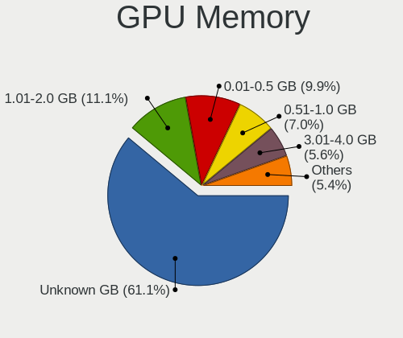

Ubuntu - Tested Hardware & Statistics
-------------------------------------

A project to collect tested hardware configurations for Ubuntu.

Anyone can contribute to this report by the [hw-probe](https://github.com/linuxhw/hw-probe) tool:

    sudo -E hw-probe -all -upload

Please contribute! Especially if your hardware is rare.

This is a report for all computer types. See also reports for [desktops](/Dist/Ubuntu/Desktop/README.md) and [notebooks](/Dist/Ubuntu/Notebook/README.md).

Contents
--------

* [ Test Cases ](#test-cases)

* [ System ](#system)
  - [ OS                       ](#os)
  - [ OS Family                ](#os-family)
  - [ Kernel                   ](#kernel)
  - [ Kernel Family            ](#kernel-family)
  - [ Kernel Major Ver.        ](#kernel-major-ver)
  - [ Arch                     ](#arch)
  - [ DE                       ](#de)
  - [ Display Server           ](#display-server)
  - [ Display Manager          ](#display-manager)
  - [ OS Lang                  ](#os-lang)
  - [ Boot Mode                ](#boot-mode)
  - [ Filesystem               ](#filesystem)
  - [ Part. scheme             ](#part-scheme)
  - [ Dual Boot with Linux/BSD ](#dual-boot-with-linuxbsd)
  - [ Dual Boot (Win)          ](#dual-boot-win)

* [ Board ](#board)
  - [ Vendor                   ](#vendor)
  - [ Model                    ](#model)
  - [ Model Family             ](#model-family)
  - [ MFG Year                 ](#mfg-year)
  - [ Form Factor              ](#form-factor)
  - [ Secure Boot              ](#secure-boot)
  - [ Coreboot                 ](#coreboot)
  - [ RAM Size                 ](#ram-size)
  - [ RAM Used                 ](#ram-used)
  - [ Total Drives             ](#total-drives)
  - [ Has CD-ROM               ](#has-cd-rom)
  - [ Has Ethernet             ](#has-ethernet)
  - [ Has WiFi                 ](#has-wifi)
  - [ Has Bluetooth            ](#has-bluetooth)

* [ Location ](#location)
  - [ Country                  ](#country)
  - [ City                     ](#city)

* [ Drives ](#drives)
  - [ Drive Vendor             ](#drive-vendor)
  - [ Drive Model              ](#drive-model)
  - [ HDD Vendor               ](#hdd-vendor)
  - [ SSD Vendor               ](#ssd-vendor)
  - [ Drive Kind               ](#drive-kind)
  - [ Drive Connector          ](#drive-connector)
  - [ Drive Size               ](#drive-size)
  - [ Space Total              ](#space-total)
  - [ Space Used               ](#space-used)
  - [ Malfunc. Drives          ](#malfunc-drives)
  - [ Malfunc. Drive Vendor    ](#malfunc-drive-vendor)
  - [ Malfunc. HDD Vendor      ](#malfunc-hdd-vendor)
  - [ Malfunc. Drive Kind      ](#malfunc-drive-kind)
  - [ Failed Drives            ](#failed-drives)
  - [ Failed Drive Vendor      ](#failed-drive-vendor)
  - [ Drive Status             ](#drive-status)

* [ Storage controller ](#storage-controller)
  - [ Storage Vendor           ](#storage-vendor)
  - [ Storage Model            ](#storage-model)
  - [ Storage Kind             ](#storage-kind)

* [ Processor ](#processor)
  - [ CPU Vendor               ](#cpu-vendor)
  - [ CPU Model                ](#cpu-model)
  - [ CPU Model Family         ](#cpu-model-family)
  - [ CPU Cores                ](#cpu-cores)
  - [ CPU Sockets              ](#cpu-sockets)
  - [ CPU Threads              ](#cpu-threads)
  - [ CPU Op-Modes             ](#cpu-op-modes)
  - [ CPU Microcode            ](#cpu-microcode)
  - [ CPU Microarch            ](#cpu-microarch)

* [ Graphics ](#graphics)
  - [ GPU Vendor               ](#gpu-vendor)
  - [ GPU Model                ](#gpu-model)
  - [ GPU Combo                ](#gpu-combo)
  - [ GPU Driver               ](#gpu-driver)
  - [ GPU Memory               ](#gpu-memory)

* [ Monitor ](#monitor)
  - [ Monitor Vendor           ](#monitor-vendor)
  - [ Monitor Model            ](#monitor-model)
  - [ Monitor Resolution       ](#monitor-resolution)
  - [ Monitor Diagonal         ](#monitor-diagonal)
  - [ Monitor Width            ](#monitor-width)
  - [ Aspect Ratio             ](#aspect-ratio)
  - [ Monitor Area             ](#monitor-area)
  - [ Pixel Density            ](#pixel-density)
  - [ Multiple Monitors        ](#multiple-monitors)

* [ Network ](#network)
  - [ Net Controller Vendor    ](#net-controller-vendor)
  - [ Net Controller Model     ](#net-controller-model)
  - [ Wireless Vendor          ](#wireless-vendor)
  - [ Wireless Model           ](#wireless-model)
  - [ Ethernet Vendor          ](#ethernet-vendor)
  - [ Ethernet Model           ](#ethernet-model)
  - [ Net Controller Kind      ](#net-controller-kind)
  - [ Used Controller          ](#used-controller)
  - [ NICs                     ](#nics)
  - [ IPv6                     ](#ipv6)

* [ Bluetooth ](#bluetooth)
  - [ Bluetooth Vendor         ](#bluetooth-vendor)
  - [ Bluetooth Model          ](#bluetooth-model)

* [ Sound ](#sound)
  - [ Sound Vendor             ](#sound-vendor)
  - [ Sound Model              ](#sound-model)

* [ Memory ](#memory)
  - [ Memory Vendor            ](#memory-vendor)
  - [ Memory Model             ](#memory-model)
  - [ Memory Kind              ](#memory-kind)
  - [ Memory Form Factor       ](#memory-form-factor)
  - [ Memory Size              ](#memory-size)
  - [ Memory Speed             ](#memory-speed)

* [ Printers & scanners ](#printers--scanners)
  - [ Printer Vendor           ](#printer-vendor)
  - [ Printer Model            ](#printer-model)
  - [ Scanner Vendor           ](#scanner-vendor)
  - [ Scanner Model            ](#scanner-model)

* [ Camera ](#camera)
  - [ Camera Vendor            ](#camera-vendor)
  - [ Camera Model             ](#camera-model)

* [ Security ](#security)
  - [ Fingerprint Vendor       ](#fingerprint-vendor)
  - [ Fingerprint Model        ](#fingerprint-model)
  - [ Chipcard Vendor          ](#chipcard-vendor)
  - [ Chipcard Model           ](#chipcard-model)

* [ Unsupported ](#unsupported)
  - [ Unsupported Devices      ](#unsupported-devices)
  - [ Unsupported Device Types ](#unsupported-device-types)

Test Cases
----------

Total: 78173

| Vendor        | Model                       | Form-Factor | Probe                                                      | Date         |
|---------------|-----------------------------|-------------|------------------------------------------------------------|--------------|
| ASUSTek       | PU551LA                     | Notebook    | [19e1b6041b](https://linux-hardware.org/?probe=19e1b6041b) | May 01, 2022 |
| Gigabyte      | B365M DS3H                  | Desktop     | [247ab2d4f1](https://linux-hardware.org/?probe=247ab2d4f1) | Apr 30, 2022 |
| Fujitsu Si... | AMILO A1650G                | Notebook    | [fbf6d9db93](https://linux-hardware.org/?probe=fbf6d9db93) | Apr 30, 2022 |
| Fujitsu Si... | AMILO A1650G                | Notebook    | [134f0a947b](https://linux-hardware.org/?probe=134f0a947b) | Apr 30, 2022 |
| Positivo      | POS-ECIG41BSA               | Desktop     | [b622f7f43f](https://linux-hardware.org/?probe=b622f7f43f) | Apr 30, 2022 |
| Sony          | SVE1513R1EB                 | Notebook    | [59a46c5857](https://linux-hardware.org/?probe=59a46c5857) | Apr 30, 2022 |
| Medion        | MS-7616                     | Desktop     | [f3572ea9a5](https://linux-hardware.org/?probe=f3572ea9a5) | Apr 30, 2022 |
| Lenovo        | G700 20251                  | Notebook    | [94272db5ec](https://linux-hardware.org/?probe=94272db5ec) | Apr 30, 2022 |
| Alienware     | x17 R2                      | Notebook    | [d78db966bc](https://linux-hardware.org/?probe=d78db966bc) | Apr 30, 2022 |
| MSI           | B550-A PRO                  | Desktop     | [d2903d25c5](https://linux-hardware.org/?probe=d2903d25c5) | Apr 30, 2022 |
| Dell          | Vostro 1720                 | Notebook    | [bc8f50b9fb](https://linux-hardware.org/?probe=bc8f50b9fb) | Apr 30, 2022 |
| Dell          | Vostro 1720                 | Notebook    | [56cc7a9a54](https://linux-hardware.org/?probe=56cc7a9a54) | Apr 30, 2022 |
| Lenovo        | MAHOBAY                     | Desktop     | [5a54ce639c](https://linux-hardware.org/?probe=5a54ce639c) | Apr 30, 2022 |
| Lenovo        | ThinkPad 10 2nd 20E30035... | Tablet      | [f51fab0e09](https://linux-hardware.org/?probe=f51fab0e09) | Apr 30, 2022 |
| ASUSTek       | Z8NA-D6                     | Desktop     | [5f540a16c9](https://linux-hardware.org/?probe=5f540a16c9) | Apr 30, 2022 |
| HP            | ProBook 440 G8 Notebook ... | Notebook    | [a4adaba544](https://linux-hardware.org/?probe=a4adaba544) | Apr 30, 2022 |
| Gigabyte      | H61M-DS2 x.x                | Desktop     | [463e99eb8c](https://linux-hardware.org/?probe=463e99eb8c) | Apr 30, 2022 |
| Lenovo        | 81VS                        | Notebook    | [1ff46f7cdc](https://linux-hardware.org/?probe=1ff46f7cdc) | Apr 30, 2022 |
| Dell          | G3 3500                     | Notebook    | [df72f36c52](https://linux-hardware.org/?probe=df72f36c52) | Apr 30, 2022 |
| Lenovo        | 81VS                        | Notebook    | [ea23b0e852](https://linux-hardware.org/?probe=ea23b0e852) | Apr 30, 2022 |
| MSI           | X570-A PRO                  | Desktop     | [ff568c874c](https://linux-hardware.org/?probe=ff568c874c) | Apr 30, 2022 |
| Gigabyte      | B365M DS3H                  | Desktop     | [0a00cf3e33](https://linux-hardware.org/?probe=0a00cf3e33) | Apr 30, 2022 |
| Gigabyte      | B365M DS3H                  | Desktop     | [f140b54261](https://linux-hardware.org/?probe=f140b54261) | Apr 30, 2022 |
| Gigabyte      | A320M-S2H-CF                | Desktop     | [9e846e3cb1](https://linux-hardware.org/?probe=9e846e3cb1) | Apr 30, 2022 |
| HP            | Pavilion Laptop 14-ec0xx... | Notebook    | [3a7cd290f6](https://linux-hardware.org/?probe=3a7cd290f6) | Apr 30, 2022 |
| Dell          | System XPS L502X            | Notebook    | [77e1846d8d](https://linux-hardware.org/?probe=77e1846d8d) | Apr 30, 2022 |
| IBM           | 00D4062                     | Server      | [d18004b017](https://linux-hardware.org/?probe=d18004b017) | Apr 30, 2022 |
| ASRock        | X470 Gaming-ITX/ac          | Desktop     | [2b03a9568d](https://linux-hardware.org/?probe=2b03a9568d) | Apr 30, 2022 |
| Lenovo        | IdeaPad Flex-14API 81SS     | Notebook    | [f5d70fb9d3](https://linux-hardware.org/?probe=f5d70fb9d3) | Apr 30, 2022 |
| ASUSTek       | Pro WS WRX80E-SAGE SE WI... | Desktop     | [10975a661b](https://linux-hardware.org/?probe=10975a661b) | Apr 30, 2022 |
| Itautec       | Infoway w7535               | Notebook    | [ac87d9e508](https://linux-hardware.org/?probe=ac87d9e508) | Apr 30, 2022 |
| Gigabyte      | A320M-S2H-CF                | Desktop     | [2f94f4673a](https://linux-hardware.org/?probe=2f94f4673a) | Apr 30, 2022 |
| HP            | G42                         | Notebook    | [e23740df6e](https://linux-hardware.org/?probe=e23740df6e) | Apr 30, 2022 |
| HUAWEI        | HVY-WXX9                    | Notebook    | [d7913302d5](https://linux-hardware.org/?probe=d7913302d5) | Apr 30, 2022 |
| Dell          | G7 7700                     | Notebook    | [462862ed56](https://linux-hardware.org/?probe=462862ed56) | Apr 30, 2022 |
| HP            | G42                         | Notebook    | [f6ca4559f5](https://linux-hardware.org/?probe=f6ca4559f5) | Apr 30, 2022 |
| Dell          | Precision 7520              | Notebook    | [2dc98a1a8d](https://linux-hardware.org/?probe=2dc98a1a8d) | Apr 30, 2022 |
| Lenovo        | ThinkBook 15 G2 ITL 20VE    | Notebook    | [31b081b116](https://linux-hardware.org/?probe=31b081b116) | Apr 30, 2022 |
| Toshiba       | Dakar10FW8                  | Notebook    | [fbe2aaac31](https://linux-hardware.org/?probe=fbe2aaac31) | Apr 30, 2022 |
| Dell          | G5 5590                     | Notebook    | [4738729947](https://linux-hardware.org/?probe=4738729947) | Apr 30, 2022 |
| Acer          | Aspire ES1-512              | Notebook    | [642d72d06d](https://linux-hardware.org/?probe=642d72d06d) | Apr 30, 2022 |
| Lenovo        | ThinkBook 14 G2 ARE 20VF    | Notebook    | [b6cbc6e523](https://linux-hardware.org/?probe=b6cbc6e523) | Apr 30, 2022 |
| Lenovo        | ThinkPad T540p 20BFS26E0... | Notebook    | [06738e7bb8](https://linux-hardware.org/?probe=06738e7bb8) | Apr 30, 2022 |
| MSI           | GP65 Leopard 10SFK          | Notebook    | [4523d433d4](https://linux-hardware.org/?probe=4523d433d4) | Apr 30, 2022 |
| MSI           | GP65 Leopard 10SFK          | Notebook    | [a30f4b3e9f](https://linux-hardware.org/?probe=a30f4b3e9f) | Apr 30, 2022 |
| NSX           | SB1402                      | Notebook    | [c9d79a4fe5](https://linux-hardware.org/?probe=c9d79a4fe5) | Apr 30, 2022 |
| Lenovo        | G50-30 80G0                 | Notebook    | [bc333fe437](https://linux-hardware.org/?probe=bc333fe437) | Apr 30, 2022 |
| Dell          | G3 3500                     | Notebook    | [c9ee387b32](https://linux-hardware.org/?probe=c9ee387b32) | Apr 30, 2022 |
| ASUSTek       | X550VC                      | Notebook    | [16223d208e](https://linux-hardware.org/?probe=16223d208e) | Apr 30, 2022 |
| HP            | Laptop 15-dw3xxx            | Notebook    | [889f1cba36](https://linux-hardware.org/?probe=889f1cba36) | Apr 30, 2022 |
| HP            | ProBook 440 G8 Notebook ... | Notebook    | [a7fe3cb0f6](https://linux-hardware.org/?probe=a7fe3cb0f6) | Apr 30, 2022 |
| Gigabyte      | B550M DS3H                  | Desktop     | [f62d8963d7](https://linux-hardware.org/?probe=f62d8963d7) | Apr 30, 2022 |
| Positivo      | S14CT01                     | Notebook    | [7260e4f199](https://linux-hardware.org/?probe=7260e4f199) | Apr 30, 2022 |
| Lenovo        | G40-70 80GA                 | Notebook    | [fcd20cb250](https://linux-hardware.org/?probe=fcd20cb250) | Apr 30, 2022 |
| eMachines     | eME730                      | Notebook    | [ac985950eb](https://linux-hardware.org/?probe=ac985950eb) | Apr 30, 2022 |
| HP            | ProBook 4520s               | Notebook    | [60eab2c6c5](https://linux-hardware.org/?probe=60eab2c6c5) | Apr 30, 2022 |
| Positivo      | S14CT01                     | Notebook    | [dec0b170c2](https://linux-hardware.org/?probe=dec0b170c2) | Apr 30, 2022 |
| ASRock        | B75M-ITX                    | Desktop     | [dbc851e0d3](https://linux-hardware.org/?probe=dbc851e0d3) | Apr 30, 2022 |
| HP            | Pavilion Notebook           | Notebook    | [995ea9538b](https://linux-hardware.org/?probe=995ea9538b) | Apr 30, 2022 |
| Dell          | Latitude 5480               | Notebook    | [ba1ff8183e](https://linux-hardware.org/?probe=ba1ff8183e) | Apr 30, 2022 |
| Dell          | Latitude 9420               | Notebook    | [4ba28afe84](https://linux-hardware.org/?probe=4ba28afe84) | Apr 30, 2022 |
| Pegatron      | Spring Peak                 | Notebook    | [66a1692171](https://linux-hardware.org/?probe=66a1692171) | Apr 30, 2022 |
| Lenovo        | ThinkBook 15 G2 ITL 20VE    | Notebook    | [1abef3591b](https://linux-hardware.org/?probe=1abef3591b) | Apr 30, 2022 |
| Dell          | 09KPNV A00                  | Desktop     | [6ae554c455](https://linux-hardware.org/?probe=6ae554c455) | Apr 30, 2022 |
| HP            | ZBook 15 G6                 | Notebook    | [f948921cba](https://linux-hardware.org/?probe=f948921cba) | Apr 30, 2022 |
| HP            | 3396                        | Desktop     | [468c2975ee](https://linux-hardware.org/?probe=468c2975ee) | Apr 30, 2022 |
| Acer          | Aspire E5-571               | Notebook    | [ebdc8b1380](https://linux-hardware.org/?probe=ebdc8b1380) | Apr 30, 2022 |
| Lenovo        | IdeaPad 5 14ITL05 82FE      | Notebook    | [51625474b7](https://linux-hardware.org/?probe=51625474b7) | Apr 30, 2022 |
| Huanan        | X99-BD4 V/OPCZAO            | Desktop     | [2f215a330a](https://linux-hardware.org/?probe=2f215a330a) | Apr 30, 2022 |
| Pegatron      | 2AC2                        | Desktop     | [a87f5d4c6e](https://linux-hardware.org/?probe=a87f5d4c6e) | Apr 30, 2022 |
| MSI           | B550-A PRO                  | Desktop     | [0b23621ed1](https://linux-hardware.org/?probe=0b23621ed1) | Apr 30, 2022 |
| Acer          | Aspire A315-23              | Notebook    | [865091bbc1](https://linux-hardware.org/?probe=865091bbc1) | Apr 30, 2022 |
| Acer          | Aspire A315-23              | Notebook    | [5ee29c3982](https://linux-hardware.org/?probe=5ee29c3982) | Apr 30, 2022 |
| HP            | Laptop 17-by3xxx            | Notebook    | [087399e252](https://linux-hardware.org/?probe=087399e252) | Apr 30, 2022 |
| ASUSTek       | X556UR                      | Notebook    | [3f920954f7](https://linux-hardware.org/?probe=3f920954f7) | Apr 30, 2022 |
| MSI           | A88XM-E45 V2                | Desktop     | [a50ad068b1](https://linux-hardware.org/?probe=a50ad068b1) | Apr 30, 2022 |
| HP            | Pavilion Sleekbook 15       | Notebook    | [0003f9342e](https://linux-hardware.org/?probe=0003f9342e) | Apr 30, 2022 |
| Gigabyte      | B550M DS3H                  | Desktop     | [7797c23169](https://linux-hardware.org/?probe=7797c23169) | Apr 30, 2022 |
| HP            | Laptop 14-dq1xxx            | Notebook    | [7c9e2f4d8f](https://linux-hardware.org/?probe=7c9e2f4d8f) | Apr 30, 2022 |
| Lenovo        | ThinkPad L15 Gen 1 20U4S... | Notebook    | [55e76f131d](https://linux-hardware.org/?probe=55e76f131d) | Apr 30, 2022 |
| Acer          | TM4750                      | Notebook    | [b515682692](https://linux-hardware.org/?probe=b515682692) | Apr 30, 2022 |
| Gigabyte      | B85M-D3H                    | Desktop     | [aab74c31b9](https://linux-hardware.org/?probe=aab74c31b9) | Apr 30, 2022 |
| HP            | 255 G6 Notebook PC          | Notebook    | [f639c7c8f5](https://linux-hardware.org/?probe=f639c7c8f5) | Apr 29, 2022 |
| HP            | 0B54h D                     | Desktop     | [2023024a05](https://linux-hardware.org/?probe=2023024a05) | Apr 29, 2022 |
| HP            | Spectre x360 Convertible... | Convertible | [58dfeebbb5](https://linux-hardware.org/?probe=58dfeebbb5) | Apr 29, 2022 |
| HP            | ZBook 15 G5                 | Notebook    | [aac5097e2a](https://linux-hardware.org/?probe=aac5097e2a) | Apr 29, 2022 |
| Gigabyte      | H170-HD3 DDR3-CF            | Desktop     | [b23594dfa0](https://linux-hardware.org/?probe=b23594dfa0) | Apr 29, 2022 |
| Gigabyte      | H170-HD3 DDR3-CF            | Desktop     | [d17a3858ad](https://linux-hardware.org/?probe=d17a3858ad) | Apr 29, 2022 |
| HP            | ENVY Laptop 15-ep0xxx       | Notebook    | [96dbfb494e](https://linux-hardware.org/?probe=96dbfb494e) | Apr 29, 2022 |
| Sony          | SVE1513R1EB                 | Notebook    | [d1e0096b2d](https://linux-hardware.org/?probe=d1e0096b2d) | Apr 29, 2022 |
| MSI           | A320M PRO-E                 | Desktop     | [655905bb3b](https://linux-hardware.org/?probe=655905bb3b) | Apr 29, 2022 |
| Dell          | Inspiron N4010              | Notebook    | [e1369b0428](https://linux-hardware.org/?probe=e1369b0428) | Apr 29, 2022 |
| Dell          | Latitude E6330              | Notebook    | [c78066bc19](https://linux-hardware.org/?probe=c78066bc19) | Apr 29, 2022 |
| HP            | EliteBook 8570w             | Notebook    | [e6f47edf47](https://linux-hardware.org/?probe=e6f47edf47) | Apr 29, 2022 |
| Fujitsu       | D3222-A1 S26361-D3222-A1    | Desktop     | [fe522bdf2e](https://linux-hardware.org/?probe=fe522bdf2e) | Apr 29, 2022 |
| HP            | ENVY x360 Convertible 15... | Convertible | [62b044e6e7](https://linux-hardware.org/?probe=62b044e6e7) | Apr 29, 2022 |
| Dell          | Precision 3551              | Notebook    | [b146dc2249](https://linux-hardware.org/?probe=b146dc2249) | Apr 29, 2022 |
| Toshiba       | Satellite P50-B-103         | Notebook    | [6df44e9098](https://linux-hardware.org/?probe=6df44e9098) | Apr 29, 2022 |
| Dell          | Precision 3551              | Notebook    | [d5a3a490f4](https://linux-hardware.org/?probe=d5a3a490f4) | Apr 29, 2022 |
| Dell          | 0VNP2H A00                  | Desktop     | [bb480c7f9c](https://linux-hardware.org/?probe=bb480c7f9c) | Apr 29, 2022 |
| Lenovo        | ThinkPad T450 20BV001YMS    | Notebook    | [f38b762c83](https://linux-hardware.org/?probe=f38b762c83) | Apr 29, 2022 |
| ASUSTek       | M5A97 LE R2.0               | Desktop     | [686f4acac4](https://linux-hardware.org/?probe=686f4acac4) | Apr 29, 2022 |
| Lenovo        | Yoga S740-14IIL 81RS        | Notebook    | [6affdcee0f](https://linux-hardware.org/?probe=6affdcee0f) | Apr 29, 2022 |
| ASUSTek       | Rampage IV EXTREME          | Desktop     | [111d072676](https://linux-hardware.org/?probe=111d072676) | Apr 29, 2022 |
| ASUSTek       | ROG STRIX Z370-E GAMING     | Desktop     | [fafda83c57](https://linux-hardware.org/?probe=fafda83c57) | Apr 29, 2022 |
| Dell          | 07WP95 A02                  | Desktop     | [8dd4d42608](https://linux-hardware.org/?probe=8dd4d42608) | Apr 29, 2022 |
| HP            | Pavilion Gaming Laptop 1... | Notebook    | [f842336794](https://linux-hardware.org/?probe=f842336794) | Apr 29, 2022 |
| Acer          | Aspire XC-830               | Desktop     | [257e472e1a](https://linux-hardware.org/?probe=257e472e1a) | Apr 29, 2022 |
| Lenovo        | Win8 Pro DPK TPG            | Desktop     | [9b78e9af72](https://linux-hardware.org/?probe=9b78e9af72) | Apr 29, 2022 |
| HP            | 158A                        | Desktop     | [11b5037897](https://linux-hardware.org/?probe=11b5037897) | Apr 29, 2022 |
| Huanan        | X99-BD4 V/OPCZAO            | Desktop     | [a5743a1922](https://linux-hardware.org/?probe=a5743a1922) | Apr 29, 2022 |
| Acer          | TravelMate 6592             | Notebook    | [7d4878ff33](https://linux-hardware.org/?probe=7d4878ff33) | Apr 29, 2022 |
| HP            | ENVY dv7                    | Notebook    | [dbd8feaee0](https://linux-hardware.org/?probe=dbd8feaee0) | Apr 29, 2022 |
| ASUSTek       | M5A78L-M PLUS/USB3          | Desktop     | [88c6676e7b](https://linux-hardware.org/?probe=88c6676e7b) | Apr 29, 2022 |
| Lenovo        | ThinkPad T470 W10DG 20JN... | Notebook    | [e7ca44864b](https://linux-hardware.org/?probe=e7ca44864b) | Apr 29, 2022 |
| HP            | ZBook 15 G3                 | Notebook    | [ced6ab1ae8](https://linux-hardware.org/?probe=ced6ab1ae8) | Apr 29, 2022 |
| Dell          | Inspiron 7400               | Notebook    | [0c0af6919d](https://linux-hardware.org/?probe=0c0af6919d) | Apr 29, 2022 |
| HP            | EliteBook x360 1040 G8 N... | Convertible | [8c70bea200](https://linux-hardware.org/?probe=8c70bea200) | Apr 29, 2022 |
| Lenovo        | ThinkPad T450 20BUS1MN00    | Notebook    | [4e2b073a5c](https://linux-hardware.org/?probe=4e2b073a5c) | Apr 29, 2022 |
| MSI           | GE66 Raider 11UH            | Notebook    | [9bdf866ebc](https://linux-hardware.org/?probe=9bdf866ebc) | Apr 29, 2022 |
| Pepper Job... | GLK-UC2X                    | Desktop     | [28495f32bd](https://linux-hardware.org/?probe=28495f32bd) | Apr 29, 2022 |
| Gigabyte      | Z77X-UD3H                   | Desktop     | [b07e1c97aa](https://linux-hardware.org/?probe=b07e1c97aa) | Apr 29, 2022 |
| HP            | EliteBook x360 1040 G8 N... | Convertible | [aa5c3c28bf](https://linux-hardware.org/?probe=aa5c3c28bf) | Apr 29, 2022 |
| Fanless Mi... | Rev GMLR1                   | Mini pc     | [1c8e1b39cb](https://linux-hardware.org/?probe=1c8e1b39cb) | Apr 29, 2022 |
| Alienware     | 07W25T A00                  | Desktop     | [b989838f70](https://linux-hardware.org/?probe=b989838f70) | Apr 29, 2022 |
| Rockchip      | RK3288 Asus Tinker Board... | Soc         | [db72a98d92](https://linux-hardware.org/?probe=db72a98d92) | Apr 29, 2022 |
| Teclast       | F7 Plus                     | Notebook    | [8096cf3295](https://linux-hardware.org/?probe=8096cf3295) | Apr 29, 2022 |
| Dell          | Latitude 3540               | Notebook    | [a97573f3cf](https://linux-hardware.org/?probe=a97573f3cf) | Apr 29, 2022 |
| Dell          | Latitude 3540               | Notebook    | [a6b8509194](https://linux-hardware.org/?probe=a6b8509194) | Apr 29, 2022 |
| Pegatron      | 2AC2                        | Desktop     | [2b0042d784](https://linux-hardware.org/?probe=2b0042d784) | Apr 29, 2022 |
| ASUSTek       | M5A78L-M PLUS/USB3          | Desktop     | [f2bdbd2a4a](https://linux-hardware.org/?probe=f2bdbd2a4a) | Apr 29, 2022 |
| MSI           | MAG Z490 TOMAHAWK           | Desktop     | [27df4d83ea](https://linux-hardware.org/?probe=27df4d83ea) | Apr 29, 2022 |
| ASUSTek       | PRIME B360M-A               | Desktop     | [519ed87066](https://linux-hardware.org/?probe=519ed87066) | Apr 29, 2022 |
| ASUSTek       | PRIME B360M-A               | Desktop     | [c46a1d595b](https://linux-hardware.org/?probe=c46a1d595b) | Apr 29, 2022 |
| MSI           | A78M-E35                    | Desktop     | [8f9bf75a08](https://linux-hardware.org/?probe=8f9bf75a08) | Apr 29, 2022 |
| HP            | EliteBook 840 G1            | Notebook    | [411c79850c](https://linux-hardware.org/?probe=411c79850c) | Apr 29, 2022 |
| ASUSTek       | Z87-WS                      | Desktop     | [1c67952875](https://linux-hardware.org/?probe=1c67952875) | Apr 29, 2022 |
| Medion        | E3215 MD60929               | Convertible | [a84ba0d682](https://linux-hardware.org/?probe=a84ba0d682) | Apr 28, 2022 |
| ASRock        | X470 Gaming-ITX/ac          | Desktop     | [c7eeb7b79d](https://linux-hardware.org/?probe=c7eeb7b79d) | Apr 28, 2022 |
| MSI           | X470 GAMING PLUS MAX        | Desktop     | [d291472a69](https://linux-hardware.org/?probe=d291472a69) | Apr 28, 2022 |
| Acer          | Aspire A515-54              | Notebook    | [4ff968ef61](https://linux-hardware.org/?probe=4ff968ef61) | Apr 28, 2022 |
| Dell          | Precision 7510              | Notebook    | [afaea67857](https://linux-hardware.org/?probe=afaea67857) | Apr 28, 2022 |
| Lenovo        | ThinkCentre M57 6072A5G     | Desktop     | [373677ac37](https://linux-hardware.org/?probe=373677ac37) | Apr 28, 2022 |
| Dell          | Inspiron 7400               | Notebook    | [8e5289a5e7](https://linux-hardware.org/?probe=8e5289a5e7) | Apr 28, 2022 |
| Dell          | Inspiron 3505               | Notebook    | [1f6bbce46b](https://linux-hardware.org/?probe=1f6bbce46b) | Apr 28, 2022 |
| Dell          | Latitude 5411               | Notebook    | [34c470e595](https://linux-hardware.org/?probe=34c470e595) | Apr 28, 2022 |
| ASRock        | H61M-VG4                    | Desktop     | [92f92ef4ee](https://linux-hardware.org/?probe=92f92ef4ee) | Apr 28, 2022 |
| ASRock        | G31M-S                      | Desktop     | [296df4a9d4](https://linux-hardware.org/?probe=296df4a9d4) | Apr 28, 2022 |
| ASUSTek       | M5A78L-M/USB3               | Desktop     | [f45e5abc4a](https://linux-hardware.org/?probe=f45e5abc4a) | Apr 28, 2022 |
| Apple         | MacBook3,1                  | Notebook    | [5c90931c74](https://linux-hardware.org/?probe=5c90931c74) | Apr 28, 2022 |
| ASUSTek       | M5A78L-M/USB3               | Desktop     | [6f3ea2d512](https://linux-hardware.org/?probe=6f3ea2d512) | Apr 28, 2022 |
| LG Electro... | 16T90P-G.AA78G              | Convertible | [42a891a892](https://linux-hardware.org/?probe=42a891a892) | Apr 28, 2022 |
| Lenovo        | ThinkPad Edge E430 3254A... | Notebook    | [00474d7e97](https://linux-hardware.org/?probe=00474d7e97) | Apr 28, 2022 |
| Dell          | Inspiron 3542               | Notebook    | [6e00a18a0f](https://linux-hardware.org/?probe=6e00a18a0f) | Apr 28, 2022 |
| ASRock        | B450M Pro4                  | Desktop     | [773f69d63b](https://linux-hardware.org/?probe=773f69d63b) | Apr 28, 2022 |
| Lenovo        | ThinkPad Edge E430 3254A... | Notebook    | [3c9c9f209d](https://linux-hardware.org/?probe=3c9c9f209d) | Apr 28, 2022 |
| Intel         | H61M-S2PV                   | Desktop     | [caa602b556](https://linux-hardware.org/?probe=caa602b556) | Apr 28, 2022 |
| Lenovo        | ThinkCentre A57 98517HG     | Desktop     | [e8cab6c0fb](https://linux-hardware.org/?probe=e8cab6c0fb) | Apr 28, 2022 |
| Lenovo        | ThinkCentre A57 98517HG     | Desktop     | [f6bfd948e9](https://linux-hardware.org/?probe=f6bfd948e9) | Apr 28, 2022 |
| Acer          | Aspire XC-830               | Desktop     | [4e6d6e311c](https://linux-hardware.org/?probe=4e6d6e311c) | Apr 28, 2022 |
| Lenovo        | IdeaPad 320S-14IKB 80X4     | Notebook    | [06ef070e40](https://linux-hardware.org/?probe=06ef070e40) | Apr 28, 2022 |
| Gigabyte      | H310M H                     | Desktop     | [182e82d90e](https://linux-hardware.org/?probe=182e82d90e) | Apr 28, 2022 |
| Lenovo        | IdeaPad 320S-14IKB 80X4     | Notebook    | [8ef803f8c9](https://linux-hardware.org/?probe=8ef803f8c9) | Apr 28, 2022 |
| Acer          | Predator G3620              | Desktop     | [556a67d50d](https://linux-hardware.org/?probe=556a67d50d) | Apr 28, 2022 |
| Dell          | Latitude 5420               | Notebook    | [26abde11eb](https://linux-hardware.org/?probe=26abde11eb) | Apr 28, 2022 |
| ASUSTek       | H81M-E                      | Desktop     | [b485d8f932](https://linux-hardware.org/?probe=b485d8f932) | Apr 28, 2022 |
| Samsung       | 670Z5E                      | Notebook    | [7867dbccf7](https://linux-hardware.org/?probe=7867dbccf7) | Apr 28, 2022 |
| IBM           | 00D4062                     | Server      | [cd977a86ce](https://linux-hardware.org/?probe=cd977a86ce) | Apr 28, 2022 |
| MSI           | H510I PRO WIFI              | Desktop     | [5e6c23c3b5](https://linux-hardware.org/?probe=5e6c23c3b5) | Apr 28, 2022 |
| Dell          | 08HPGT A01                  | Desktop     | [a12d1b0c47](https://linux-hardware.org/?probe=a12d1b0c47) | Apr 28, 2022 |
| Samsung       | 670Z5E                      | Notebook    | [39efe61675](https://linux-hardware.org/?probe=39efe61675) | Apr 28, 2022 |
| Lenovo        | ThinkPad T440s 20ARS3640... | Notebook    | [13ec979f89](https://linux-hardware.org/?probe=13ec979f89) | Apr 28, 2022 |
| ASUSTek       | M5A78L LE                   | Desktop     | [96739891ab](https://linux-hardware.org/?probe=96739891ab) | Apr 28, 2022 |
| HP            | Pavilion 17                 | Notebook    | [d865ef2ed1](https://linux-hardware.org/?probe=d865ef2ed1) | Apr 28, 2022 |
| ASUSTek       | VivoBook_ASUSLaptop X521... | Notebook    | [e8349bba13](https://linux-hardware.org/?probe=e8349bba13) | Apr 28, 2022 |
| Sony          | VGN-FW56J                   | Notebook    | [45c6c458bc](https://linux-hardware.org/?probe=45c6c458bc) | Apr 28, 2022 |
| Intel         | NUC6CAYB J23203-409         | Mini pc     | [97c0bfb76c](https://linux-hardware.org/?probe=97c0bfb76c) | Apr 28, 2022 |
| HP            | 1495                        | Desktop     | [b6e482940f](https://linux-hardware.org/?probe=b6e482940f) | Apr 28, 2022 |
| HP            | 22F8                        | Desktop     | [34b2b0f23f](https://linux-hardware.org/?probe=34b2b0f23f) | Apr 28, 2022 |
| Dell          | Latitude 7420               | Notebook    | [8e3bcab404](https://linux-hardware.org/?probe=8e3bcab404) | Apr 28, 2022 |
| HP            | 1495                        | Desktop     | [632386ed8d](https://linux-hardware.org/?probe=632386ed8d) | Apr 28, 2022 |
| Dell          | Latitude 7400               | Notebook    | [7f20623ac0](https://linux-hardware.org/?probe=7f20623ac0) | Apr 28, 2022 |
| ASUSTek       | TUF Z390-PLUS GAMING        | Desktop     | [919872f97b](https://linux-hardware.org/?probe=919872f97b) | Apr 28, 2022 |
| Toshiba       | Satellite C855              | Notebook    | [703a704f72](https://linux-hardware.org/?probe=703a704f72) | Apr 28, 2022 |
| Gigabyte      | EX58-UD4P                   | Desktop     | [910da71dd2](https://linux-hardware.org/?probe=910da71dd2) | Apr 28, 2022 |
| Dell          | Vostro 3560                 | Notebook    | [56d52ea265](https://linux-hardware.org/?probe=56d52ea265) | Apr 28, 2022 |
| HP            | ENVY x360 Convertible 15... | Convertible | [e3ea985a9e](https://linux-hardware.org/?probe=e3ea985a9e) | Apr 28, 2022 |
| Lenovo        | Z50-75 80EC                 | Notebook    | [3e88e21f3c](https://linux-hardware.org/?probe=3e88e21f3c) | Apr 28, 2022 |
| Lenovo        | IdeaPad 320-15ABR 80XS      | Notebook    | [94defd50ef](https://linux-hardware.org/?probe=94defd50ef) | Apr 28, 2022 |
| Dell          | Inspiron 5566               | Notebook    | [49396d0706](https://linux-hardware.org/?probe=49396d0706) | Apr 28, 2022 |
| Lenovo        | ThinkPad T470 W10DG 20JN... | Notebook    | [16f0860d82](https://linux-hardware.org/?probe=16f0860d82) | Apr 28, 2022 |
| ASRock        | B450M Pro4                  | Desktop     | [2943b21899](https://linux-hardware.org/?probe=2943b21899) | Apr 28, 2022 |
| HP            | ProBook 4510s               | Notebook    | [d020eac67a](https://linux-hardware.org/?probe=d020eac67a) | Apr 27, 2022 |
| Microsoft     | Surface Pro 7               | Tablet      | [998ef3a4fe](https://linux-hardware.org/?probe=998ef3a4fe) | Apr 27, 2022 |
| MSI           | B450M PRO-VDH PLUS          | Desktop     | [c4f91167bb](https://linux-hardware.org/?probe=c4f91167bb) | Apr 27, 2022 |
| ECS           | GeForce7050M-M              | Desktop     | [7b99513a4a](https://linux-hardware.org/?probe=7b99513a4a) | Apr 27, 2022 |
| Toshiba       | Satellite Pro S500          | Notebook    | [eb4ae51e74](https://linux-hardware.org/?probe=eb4ae51e74) | Apr 27, 2022 |
| ECS           | GeForce7050M-M              | Desktop     | [d957db1716](https://linux-hardware.org/?probe=d957db1716) | Apr 27, 2022 |
| ASUSTek       | PRIME Z490-A                | Desktop     | [2ae652bf21](https://linux-hardware.org/?probe=2ae652bf21) | Apr 27, 2022 |
| ASUSTek       | P5Q-E                       | Desktop     | [f70215ac5e](https://linux-hardware.org/?probe=f70215ac5e) | Apr 27, 2022 |
| Acer          | Aspire E1-570               | Notebook    | [efcd6be006](https://linux-hardware.org/?probe=efcd6be006) | Apr 27, 2022 |
| Dell          | XPS 15 9560                 | Notebook    | [92e903308e](https://linux-hardware.org/?probe=92e903308e) | Apr 27, 2022 |
| Dell          | Inspiron N4010              | Notebook    | [820098c075](https://linux-hardware.org/?probe=820098c075) | Apr 27, 2022 |
| HP            | Pavilion g6                 | Notebook    | [b79730a7af](https://linux-hardware.org/?probe=b79730a7af) | Apr 27, 2022 |
| Dell          | Latitude 5310               | Notebook    | [1bfa3e6f27](https://linux-hardware.org/?probe=1bfa3e6f27) | Apr 27, 2022 |
| ASRock        | X470 Gaming-ITX/ac          | Desktop     | [d5d6cde087](https://linux-hardware.org/?probe=d5d6cde087) | Apr 27, 2022 |
| HP            | 255 G8 Notebook PC          | Notebook    | [782eef0bbe](https://linux-hardware.org/?probe=782eef0bbe) | Apr 27, 2022 |
| Apple         | MacBook3,1                  | Notebook    | [c7da3d4c4f](https://linux-hardware.org/?probe=c7da3d4c4f) | Apr 27, 2022 |
| Lanix         | EQ45M-S2 LNXACT             | Desktop     | [485f464d12](https://linux-hardware.org/?probe=485f464d12) | Apr 27, 2022 |
| Acer          | Aspire XC-830               | Desktop     | [2fa6666d88](https://linux-hardware.org/?probe=2fa6666d88) | Apr 27, 2022 |
| Acer          | Aspire XC-830               | Desktop     | [b45bd0a0a0](https://linux-hardware.org/?probe=b45bd0a0a0) | Apr 27, 2022 |
| Lenovo        | Unknown                     | Notebook    | [869b7e6d8d](https://linux-hardware.org/?probe=869b7e6d8d) | Apr 27, 2022 |
| Lenovo        | Unknown                     | Notebook    | [88f2e3a710](https://linux-hardware.org/?probe=88f2e3a710) | Apr 27, 2022 |
| Acer          | TM4750                      | Notebook    | [8254e2b47d](https://linux-hardware.org/?probe=8254e2b47d) | Apr 27, 2022 |
| MSI           | B550M PRO-VDH WIFI          | Desktop     | [b923126955](https://linux-hardware.org/?probe=b923126955) | Apr 27, 2022 |
| SANTECH       | NHx0EH_EJ_EK                | Notebook    | [f10828c0a8](https://linux-hardware.org/?probe=f10828c0a8) | Apr 27, 2022 |
| Dell          | 0WR7PY A01                  | Desktop     | [0212dc3208](https://linux-hardware.org/?probe=0212dc3208) | Apr 27, 2022 |
| HP            | 1588h                       | Desktop     | [20624367eb](https://linux-hardware.org/?probe=20624367eb) | Apr 27, 2022 |
| Dell          | Inspiron N4010              | Notebook    | [4d84b677ae](https://linux-hardware.org/?probe=4d84b677ae) | Apr 27, 2022 |
| MSI           | H510I PRO WIFI              | Desktop     | [f6df392394](https://linux-hardware.org/?probe=f6df392394) | Apr 27, 2022 |
| NF541         | 1.0                         | Desktop     | [c0999696b6](https://linux-hardware.org/?probe=c0999696b6) | Apr 27, 2022 |
| MSI           | H510I PRO WIFI              | Desktop     | [3599ba9485](https://linux-hardware.org/?probe=3599ba9485) | Apr 27, 2022 |
| Lenovo        | MAHOBAY 0B98401 PRO         | Desktop     | [c6bf48bfb3](https://linux-hardware.org/?probe=c6bf48bfb3) | Apr 27, 2022 |
| Lenovo        | ThinkPad P14s Gen 1 20Y1... | Notebook    | [3314e78ec8](https://linux-hardware.org/?probe=3314e78ec8) | Apr 27, 2022 |
| Lenovo        | IdeaPad Gaming 3 15ARH05... | Notebook    | [8ece944a7b](https://linux-hardware.org/?probe=8ece944a7b) | Apr 27, 2022 |
| HP            | 1588h                       | Desktop     | [831e4e5993](https://linux-hardware.org/?probe=831e4e5993) | Apr 27, 2022 |
| ASUSTek       | Zephyrus S GX531GXR_GX53... | Notebook    | [882dbf87c5](https://linux-hardware.org/?probe=882dbf87c5) | Apr 27, 2022 |
| ASUSTek       | H110M-A/M.2                 | Desktop     | [4c6852d631](https://linux-hardware.org/?probe=4c6852d631) | Apr 27, 2022 |
| ASUSTek       | TUF Gaming B450-PLUS II     | Desktop     | [f06ce3d416](https://linux-hardware.org/?probe=f06ce3d416) | Apr 27, 2022 |
| HP            | ENVY x360 Convertible 15... | Convertible | [f369da2680](https://linux-hardware.org/?probe=f369da2680) | Apr 27, 2022 |
| ASRock        | H61M-VG4                    | Desktop     | [204b1328f2](https://linux-hardware.org/?probe=204b1328f2) | Apr 27, 2022 |
| HP            | EliteBook x360 1040 G8 N... | Convertible | [fde127175d](https://linux-hardware.org/?probe=fde127175d) | Apr 27, 2022 |
| HP            | Laptop 15-bw0xx             | Notebook    | [dc46901a64](https://linux-hardware.org/?probe=dc46901a64) | Apr 27, 2022 |
| Medion        | B460H6-EM                   | Desktop     | [82b4baa4ed](https://linux-hardware.org/?probe=82b4baa4ed) | Apr 27, 2022 |
| Lenovo        | ThinkPad L460 20FVS3X800    | Notebook    | [adbec7ed2e](https://linux-hardware.org/?probe=adbec7ed2e) | Apr 27, 2022 |
| Dell          | Latitude E6510              | Notebook    | [10d60e00c2](https://linux-hardware.org/?probe=10d60e00c2) | Apr 27, 2022 |
| Samsung       | 350V5C/351V5C/3540VC/344... | Notebook    | [6e793edd01](https://linux-hardware.org/?probe=6e793edd01) | Apr 27, 2022 |
| Dell          | Inspiron 5415               | Notebook    | [5edac5d5a6](https://linux-hardware.org/?probe=5edac5d5a6) | Apr 27, 2022 |
| ASUSTek       | Pro WS WRX80E-SAGE SE WI... | Desktop     | [a3f49d1a04](https://linux-hardware.org/?probe=a3f49d1a04) | Apr 27, 2022 |
| ASUSTek       | Pro WS WRX80E-SAGE SE WI... | Desktop     | [b47f678ce9](https://linux-hardware.org/?probe=b47f678ce9) | Apr 27, 2022 |
| ASRock        | H61M-VG4                    | Desktop     | [fff58f97e8](https://linux-hardware.org/?probe=fff58f97e8) | Apr 27, 2022 |
| Dell          | Latitude E6520              | Notebook    | [1ca407a69f](https://linux-hardware.org/?probe=1ca407a69f) | Apr 27, 2022 |
| Gigabyte      | GA-880GM-UD2H               | Desktop     | [3c53a0e59d](https://linux-hardware.org/?probe=3c53a0e59d) | Apr 27, 2022 |
| ASUSTek       | P9X79                       | Desktop     | [ba50a20e23](https://linux-hardware.org/?probe=ba50a20e23) | Apr 27, 2022 |
| ASUSTek       | Zephyrus S GX531GXR_GX53... | Notebook    | [b540bb9d6f](https://linux-hardware.org/?probe=b540bb9d6f) | Apr 27, 2022 |
| Gigabyte      | H61M-S2PV                   | Desktop     | [f09766a481](https://linux-hardware.org/?probe=f09766a481) | Apr 27, 2022 |
| Noblex        | N14WD21                     | Notebook    | [a8a7a4e1d5](https://linux-hardware.org/?probe=a8a7a4e1d5) | Apr 27, 2022 |
| Lenovo        | ThinkPad X250 20CLS52P0F    | Notebook    | [a4d291ccda](https://linux-hardware.org/?probe=a4d291ccda) | Apr 27, 2022 |
| HP            | 22F8                        | Desktop     | [eb4d49a17b](https://linux-hardware.org/?probe=eb4d49a17b) | Apr 27, 2022 |
| Apple         | Mac-F42C88C8 Proto1         | Desktop     | [56da721176](https://linux-hardware.org/?probe=56da721176) | Apr 27, 2022 |
| Apple         | Mac-F42C88C8 Proto1         | Desktop     | [1619af58d4](https://linux-hardware.org/?probe=1619af58d4) | Apr 27, 2022 |
| Lenovo        | IdeaPad Gaming 3 15IMH05... | Notebook    | [a696a35961](https://linux-hardware.org/?probe=a696a35961) | Apr 27, 2022 |
| Foxconn       | 2AB1                        | Desktop     | [2d6ef9c4b6](https://linux-hardware.org/?probe=2d6ef9c4b6) | Apr 27, 2022 |
| Dell          | Inspiron 3583               | Notebook    | [8f10e59515](https://linux-hardware.org/?probe=8f10e59515) | Apr 27, 2022 |
| Gigabyte      | Z370P D3-CF                 | Desktop     | [fd2b7d1fe2](https://linux-hardware.org/?probe=fd2b7d1fe2) | Apr 27, 2022 |
| Lenovo        | ThinkPad T470 W10DG 20JN... | Notebook    | [87cc990d93](https://linux-hardware.org/?probe=87cc990d93) | Apr 27, 2022 |
| Acer          | Aspire 5750G                | Notebook    | [3a96bf8237](https://linux-hardware.org/?probe=3a96bf8237) | Apr 27, 2022 |
| Raspberry ... | Raspberry Pi 4 Model B R... | Soc         | [f3eb691337](https://linux-hardware.org/?probe=f3eb691337) | Apr 27, 2022 |
| Raspberry ... | Raspberry Pi 4 Model B R... | Soc         | [6569d085e4](https://linux-hardware.org/?probe=6569d085e4) | Apr 27, 2022 |
| Gigabyte      | B560M DS3H V2               | Desktop     | [4854a84496](https://linux-hardware.org/?probe=4854a84496) | Apr 27, 2022 |
| Intel         | NUC8BEB J72688-307          | Mini pc     | [e408254cc8](https://linux-hardware.org/?probe=e408254cc8) | Apr 27, 2022 |
| ASUSTek       | P5Q-E                       | Desktop     | [1a2453d50d](https://linux-hardware.org/?probe=1a2453d50d) | Apr 27, 2022 |
| Gigabyte      | GA-78LMT-USB3 SEx           | Desktop     | [5721b7c107](https://linux-hardware.org/?probe=5721b7c107) | Apr 27, 2022 |
| Gigabyte      | B550I AORUS PRO AX          | Desktop     | [3c6aace75c](https://linux-hardware.org/?probe=3c6aace75c) | Apr 27, 2022 |
| Dell          | Latitude 5410               | Notebook    | [1a67b58656](https://linux-hardware.org/?probe=1a67b58656) | Apr 27, 2022 |
| Lenovo        | ThinkPad T460s 20F9001DU... | Notebook    | [5c617c528a](https://linux-hardware.org/?probe=5c617c528a) | Apr 27, 2022 |
| MSI           | 880GMA-E35                  | Desktop     | [6ff68166f7](https://linux-hardware.org/?probe=6ff68166f7) | Apr 26, 2022 |
| Dell          | 06JWJY A01                  | Desktop     | [938679bafe](https://linux-hardware.org/?probe=938679bafe) | Apr 26, 2022 |
| Sony          | SVF1521L1RB                 | Notebook    | [ff5ff260a0](https://linux-hardware.org/?probe=ff5ff260a0) | Apr 26, 2022 |
| Lenovo        | Legion 7 15IMH05 81YT       | Notebook    | [9384c00f6e](https://linux-hardware.org/?probe=9384c00f6e) | Apr 26, 2022 |
| Dell          | 0DR845                      | Desktop     | [5f00785e45](https://linux-hardware.org/?probe=5f00785e45) | Apr 26, 2022 |
| Lenovo        | ThinkPad T430u 335337G      | Notebook    | [31bc958302](https://linux-hardware.org/?probe=31bc958302) | Apr 26, 2022 |
| Sony          | SVF1521L1RB                 | Notebook    | [f20cc07739](https://linux-hardware.org/?probe=f20cc07739) | Apr 26, 2022 |
| Lenovo        | ThinkPad T430u 335337G      | Notebook    | [8446691cb3](https://linux-hardware.org/?probe=8446691cb3) | Apr 26, 2022 |
| Sony          | SVF1521L1RB                 | Notebook    | [c8b61e83d7](https://linux-hardware.org/?probe=c8b61e83d7) | Apr 26, 2022 |
| Lenovo        | Legion 5 15ACH6 82JW        | Notebook    | [3b4a331875](https://linux-hardware.org/?probe=3b4a331875) | Apr 26, 2022 |
| Intel         | NUC11TNBv5 M11900-404       | Mini pc     | [d21f47aef8](https://linux-hardware.org/?probe=d21f47aef8) | Apr 26, 2022 |
| Dell          | XPS 13 9380                 | Notebook    | [c052066ee4](https://linux-hardware.org/?probe=c052066ee4) | Apr 26, 2022 |
| Casper        | NIRVANA NOTEBOOK            | Desktop     | [d74b2d8bb3](https://linux-hardware.org/?probe=d74b2d8bb3) | Apr 26, 2022 |
| HP            | ProBook x360 11 G3 EE       | Convertible | [b55ed2fbd6](https://linux-hardware.org/?probe=b55ed2fbd6) | Apr 26, 2022 |
| Dell          | Inspiron 3583               | Notebook    | [bca722d45d](https://linux-hardware.org/?probe=bca722d45d) | Apr 26, 2022 |
| Raspberry ... | Raspberry Pi                | Soc         | [50c760fc94](https://linux-hardware.org/?probe=50c760fc94) | Apr 26, 2022 |
| Dell          | 0WR7PY A03                  | Desktop     | [4ac0a4dff1](https://linux-hardware.org/?probe=4ac0a4dff1) | Apr 26, 2022 |
| Toshiba       | TECRA R940                  | Notebook    | [d841324245](https://linux-hardware.org/?probe=d841324245) | Apr 26, 2022 |
| Gigabyte      | F2A78M-HD2                  | Desktop     | [454d879501](https://linux-hardware.org/?probe=454d879501) | Apr 26, 2022 |
| Gigabyte      | B660M DS3H AX DDR4          | Desktop     | [0633ac7757](https://linux-hardware.org/?probe=0633ac7757) | Apr 26, 2022 |
| Apple         | Mac-F2238BAE iMac11,3       | All in one  | [9468064cf9](https://linux-hardware.org/?probe=9468064cf9) | Apr 26, 2022 |
| HP            | 255 G8 Notebook PC          | Notebook    | [17ccf19b71](https://linux-hardware.org/?probe=17ccf19b71) | Apr 26, 2022 |
| MSI           | GP66 Leopard 11UH           | Notebook    | [549c216d66](https://linux-hardware.org/?probe=549c216d66) | Apr 26, 2022 |
| Lenovo        | ThinkPad L490 20Q5002GPG    | Notebook    | [9e591226b7](https://linux-hardware.org/?probe=9e591226b7) | Apr 26, 2022 |
| ASUSTek       | Zephyrus S GX531GXR_GX53... | Notebook    | [9dee9219fd](https://linux-hardware.org/?probe=9dee9219fd) | Apr 26, 2022 |
| Gigabyte      | B660M DS3H AX DDR4          | Desktop     | [56902c7998](https://linux-hardware.org/?probe=56902c7998) | Apr 26, 2022 |
| Dell          | Latitude 7520               | Notebook    | [674f3ca531](https://linux-hardware.org/?probe=674f3ca531) | Apr 26, 2022 |
| HP            | ProBook 450 G8 Notebook ... | Notebook    | [4f92840d8c](https://linux-hardware.org/?probe=4f92840d8c) | Apr 26, 2022 |
| Lenovo        | ThinkPad X230 2333BF6       | Notebook    | [f5e57e219b](https://linux-hardware.org/?probe=f5e57e219b) | Apr 26, 2022 |
| ASUSTek       | P55VA                       | Notebook    | [21c5b79768](https://linux-hardware.org/?probe=21c5b79768) | Apr 26, 2022 |
| Lenovo        | ThinkPad T570 W10DG 20JX... | Notebook    | [489a3a5798](https://linux-hardware.org/?probe=489a3a5798) | Apr 26, 2022 |
| Dell          | 0VNM11 A00                  | Desktop     | [6aae7c23ad](https://linux-hardware.org/?probe=6aae7c23ad) | Apr 26, 2022 |
| Lenovo        | ThinkPad E15 20RDS03500     | Notebook    | [6aa4c36808](https://linux-hardware.org/?probe=6aa4c36808) | Apr 26, 2022 |
| MSI           | H170A PC MATE               | Desktop     | [558be4bee8](https://linux-hardware.org/?probe=558be4bee8) | Apr 26, 2022 |
| Acer          | Aspire E1-570               | Notebook    | [b8257c292a](https://linux-hardware.org/?probe=b8257c292a) | Apr 26, 2022 |
| ASUSTek       | Zephyrus S GX531GXR_GX53... | Notebook    | [54b755397c](https://linux-hardware.org/?probe=54b755397c) | Apr 26, 2022 |
| MSI           | A320M-A PRO MAX             | Desktop     | [e06fd46729](https://linux-hardware.org/?probe=e06fd46729) | Apr 26, 2022 |
| Lenovo        | ThinkPad W541 20EFCTO1WW    | Notebook    | [8f61feb9d0](https://linux-hardware.org/?probe=8f61feb9d0) | Apr 26, 2022 |
| Gigabyte      | Z370 HD3P-CF                | Desktop     | [faee56dd80](https://linux-hardware.org/?probe=faee56dd80) | Apr 26, 2022 |
| Biostar       | J3160NH                     | Desktop     | [8ffd3a1aa4](https://linux-hardware.org/?probe=8ffd3a1aa4) | Apr 26, 2022 |
| Lenovo        | ThinkPad E470 20H1A01YAC    | Notebook    | [cd8726de3c](https://linux-hardware.org/?probe=cd8726de3c) | Apr 26, 2022 |
| Lenovo        | ThinkPad P15v Gen 1 20TQ... | Notebook    | [bd827295e5](https://linux-hardware.org/?probe=bd827295e5) | Apr 26, 2022 |
| Dell          | G15 5510                    | Notebook    | [5126d58147](https://linux-hardware.org/?probe=5126d58147) | Apr 26, 2022 |
| Dell          | Inspiron 5447               | Notebook    | [0adfe1cfb9](https://linux-hardware.org/?probe=0adfe1cfb9) | Apr 25, 2022 |
| Lenovo        | ThinkPad T440 20B7S3UD00    | Notebook    | [9c66fd444a](https://linux-hardware.org/?probe=9c66fd444a) | Apr 25, 2022 |
| Lenovo        | ThinkPad T440 20B7S3UD00    | Notebook    | [942267c99b](https://linux-hardware.org/?probe=942267c99b) | Apr 25, 2022 |
| ASRock        | X470 Gaming-ITX/ac          | Desktop     | [28e635a30b](https://linux-hardware.org/?probe=28e635a30b) | Apr 25, 2022 |
| Dell          | XPS 13 9370                 | Notebook    | [08d2d58a95](https://linux-hardware.org/?probe=08d2d58a95) | Apr 25, 2022 |
| HP            | Stream Laptop 14-ax0XX      | Notebook    | [40b23da6dc](https://linux-hardware.org/?probe=40b23da6dc) | Apr 25, 2022 |
| Unknown       | Unknown                     | Desktop     | [f67ff826d9](https://linux-hardware.org/?probe=f67ff826d9) | Apr 25, 2022 |
| HP            | 3397                        | Desktop     | [754e703cc5](https://linux-hardware.org/?probe=754e703cc5) | Apr 25, 2022 |
| Raspberry ... | Raspberry Pi                | Soc         | [ff35a6956d](https://linux-hardware.org/?probe=ff35a6956d) | Apr 25, 2022 |
| MSI           | Z68A-GD80                   | Desktop     | [fedca9082a](https://linux-hardware.org/?probe=fedca9082a) | Apr 25, 2022 |
| Dell          | G15 5510                    | Notebook    | [ef1787abc5](https://linux-hardware.org/?probe=ef1787abc5) | Apr 25, 2022 |
| HP            | Laptop 15s-du3xxx           | Notebook    | [8197ac9c77](https://linux-hardware.org/?probe=8197ac9c77) | Apr 25, 2022 |
| Lenovo        | ThinkPad X230 2324GA7       | Notebook    | [a5138b511d](https://linux-hardware.org/?probe=a5138b511d) | Apr 25, 2022 |
| ASUSTek       | P5GC-MX/MEDION/SI           | Desktop     | [8801f8d20c](https://linux-hardware.org/?probe=8801f8d20c) | Apr 25, 2022 |
| Lenovo        | ThinkPad P15v Gen 1 20TQ... | Notebook    | [9e7c80a9d0](https://linux-hardware.org/?probe=9e7c80a9d0) | Apr 25, 2022 |
| Lenovo        | ThinkPad L15 Gen 2 20X3C... | Notebook    | [3fcb247b21](https://linux-hardware.org/?probe=3fcb247b21) | Apr 25, 2022 |
| Timi          | RedmiBook Pro 15S           | Notebook    | [07ccc93cd4](https://linux-hardware.org/?probe=07ccc93cd4) | Apr 25, 2022 |
| Lenovo        | ThinkCentre M57 6072A5G     | Desktop     | [c56e03f023](https://linux-hardware.org/?probe=c56e03f023) | Apr 25, 2022 |
| Lenovo        | ThinkCentre M57 6072A5G     | Desktop     | [d01598be7b](https://linux-hardware.org/?probe=d01598be7b) | Apr 25, 2022 |
| MSI           | GF65 Thin 10UE              | Notebook    | [b099b2ab43](https://linux-hardware.org/?probe=b099b2ab43) | Apr 25, 2022 |
| MSI           | GF65 Thin 10UE              | Notebook    | [79fc46c6f0](https://linux-hardware.org/?probe=79fc46c6f0) | Apr 25, 2022 |
| HP            | ProBook 4520s               | Notebook    | [1621eddc70](https://linux-hardware.org/?probe=1621eddc70) | Apr 25, 2022 |
| Acer          | Aspire E1-571               | Notebook    | [35824f9b37](https://linux-hardware.org/?probe=35824f9b37) | Apr 25, 2022 |
| Unknown       | Unknown                     | Notebook    | [8f76034215](https://linux-hardware.org/?probe=8f76034215) | Apr 25, 2022 |
| EVGA          | X299 MICRO                  | Desktop     | [924977085d](https://linux-hardware.org/?probe=924977085d) | Apr 25, 2022 |
| HP            | OMEN by Laptop 15-ce0xx     | Notebook    | [8694f28b60](https://linux-hardware.org/?probe=8694f28b60) | Apr 25, 2022 |
| HP            | ProBook 4710s               | Notebook    | [03d5c4c5b2](https://linux-hardware.org/?probe=03d5c4c5b2) | Apr 25, 2022 |
| HP            | 348 G4                      | Notebook    | [54db7eb2da](https://linux-hardware.org/?probe=54db7eb2da) | Apr 25, 2022 |
| Fujitsu       | LIFEBOOK E751               | Notebook    | [ace84bb1e5](https://linux-hardware.org/?probe=ace84bb1e5) | Apr 25, 2022 |
| ASUSTek       | B85-PRO GAMER               | Desktop     | [c76074f5e0](https://linux-hardware.org/?probe=c76074f5e0) | Apr 25, 2022 |
| Toshiba       | Satellite C50t-B            | Notebook    | [d2a6276ca3](https://linux-hardware.org/?probe=d2a6276ca3) | Apr 25, 2022 |
| HP            | EliteBook 845 G7 Noteboo... | Notebook    | [1b1bf8dddf](https://linux-hardware.org/?probe=1b1bf8dddf) | Apr 25, 2022 |
| Dell          | G15 5510                    | Notebook    | [8cf81514fa](https://linux-hardware.org/?probe=8cf81514fa) | Apr 25, 2022 |
| ASUSTek       | VivoBook_ASUSLaptop M350... | Notebook    | [4c3bf947f5](https://linux-hardware.org/?probe=4c3bf947f5) | Apr 25, 2022 |
| HP            | EliteBook 830 G5            | Notebook    | [17f9b4e988](https://linux-hardware.org/?probe=17f9b4e988) | Apr 25, 2022 |
| Dell          | Inspiron 5577               | Notebook    | [0925d92173](https://linux-hardware.org/?probe=0925d92173) | Apr 25, 2022 |
| Dell          | Inspiron N4050              | Notebook    | [7b82407cba](https://linux-hardware.org/?probe=7b82407cba) | Apr 25, 2022 |
| Dell          | Latitude D830               | Notebook    | [1c23417a15](https://linux-hardware.org/?probe=1c23417a15) | Apr 25, 2022 |
| Lenovo        | ThinkPad T530 2359CTO       | Notebook    | [58199da0ee](https://linux-hardware.org/?probe=58199da0ee) | Apr 25, 2022 |
| HP            | ProBook 470 G5              | Notebook    | [e0def5bddc](https://linux-hardware.org/?probe=e0def5bddc) | Apr 25, 2022 |
| HP            | ProBook 470 G5              | Notebook    | [90f3d2dd98](https://linux-hardware.org/?probe=90f3d2dd98) | Apr 25, 2022 |
| Apple         | MacBookAir6,2               | Notebook    | [fe067fc3d4](https://linux-hardware.org/?probe=fe067fc3d4) | Apr 25, 2022 |
| ASUSTek       | H81M-V3                     | Desktop     | [4d87f6f113](https://linux-hardware.org/?probe=4d87f6f113) | Apr 25, 2022 |
| Dell          | Precision 3561              | Notebook    | [251f19b464](https://linux-hardware.org/?probe=251f19b464) | Apr 25, 2022 |
| Apple         | MacBookAir6,2               | Notebook    | [fb26f3ab65](https://linux-hardware.org/?probe=fb26f3ab65) | Apr 25, 2022 |
| ASUSTek       | P8Z68-V LX                  | Desktop     | [5df6c147c0](https://linux-hardware.org/?probe=5df6c147c0) | Apr 25, 2022 |
| Acer          | Aspire VN7-792G             | Notebook    | [77f5ce42de](https://linux-hardware.org/?probe=77f5ce42de) | Apr 24, 2022 |
| TUXEDO        | Pulse 15 Gen1               | Notebook    | [5b54f10afa](https://linux-hardware.org/?probe=5b54f10afa) | Apr 24, 2022 |
| ASUSTek       | PRIME H570-PLUS             | Desktop     | [deb39edb0a](https://linux-hardware.org/?probe=deb39edb0a) | Apr 24, 2022 |
| Sony          | SVE1513R1EB                 | Notebook    | [5275d17d40](https://linux-hardware.org/?probe=5275d17d40) | Apr 24, 2022 |
| AMI           | Intel                       | Notebook    | [87e32073a4](https://linux-hardware.org/?probe=87e32073a4) | Apr 24, 2022 |
| Gigabyte      | P55M-UD2                    | Desktop     | [5f9ffc8d46](https://linux-hardware.org/?probe=5f9ffc8d46) | Apr 24, 2022 |
| Sony          | VPCEH25FM                   | Notebook    | [bceedddb01](https://linux-hardware.org/?probe=bceedddb01) | Apr 24, 2022 |
| ASUSTek       | P8H61-M LX2                 | Desktop     | [a60c0bf48d](https://linux-hardware.org/?probe=a60c0bf48d) | Apr 24, 2022 |
| Acer          | Aspire A515-56G             | Notebook    | [492dd679be](https://linux-hardware.org/?probe=492dd679be) | Apr 24, 2022 |
| Gigabyte      | G41M-Combo                  | Desktop     | [5bfd7adb54](https://linux-hardware.org/?probe=5bfd7adb54) | Apr 24, 2022 |
| MSI           | Z390-A PRO                  | Desktop     | [d4a06d7bbe](https://linux-hardware.org/?probe=d4a06d7bbe) | Apr 24, 2022 |
| Acer          | Aspire E1-570               | Notebook    | [3ed79cff5c](https://linux-hardware.org/?probe=3ed79cff5c) | Apr 24, 2022 |
| Dell          | 0GXM1W A02                  | Desktop     | [6564561a75](https://linux-hardware.org/?probe=6564561a75) | Apr 24, 2022 |
| Lenovo        | IdeaPad L340-15IRH Gamin... | Notebook    | [54aa68a653](https://linux-hardware.org/?probe=54aa68a653) | Apr 24, 2022 |
| Acer          | Aspire A515-56G             | Notebook    | [5fc4dbeaad](https://linux-hardware.org/?probe=5fc4dbeaad) | Apr 24, 2022 |
| Casper        | NIRVANA NOTEBOOK            | Desktop     | [0d4977ae14](https://linux-hardware.org/?probe=0d4977ae14) | Apr 24, 2022 |
| ASRock        | Z170 Gaming K4              | Desktop     | [96b772b4e6](https://linux-hardware.org/?probe=96b772b4e6) | Apr 24, 2022 |
| Lenovo        | ThinkPad W700 275236U       | Notebook    | [b7c7a5216b](https://linux-hardware.org/?probe=b7c7a5216b) | Apr 24, 2022 |
| Lenovo        | ThinkPad W700 275236U       | Notebook    | [4d31fc069f](https://linux-hardware.org/?probe=4d31fc069f) | Apr 24, 2022 |
| Acer          | FX58M                       | Desktop     | [af1d52769d](https://linux-hardware.org/?probe=af1d52769d) | Apr 24, 2022 |
| MSI           | B450 TOMAHAWK MAX           | Desktop     | [182279920b](https://linux-hardware.org/?probe=182279920b) | Apr 24, 2022 |
| ASUSTek       | X540LA                      | Notebook    | [370a60692a](https://linux-hardware.org/?probe=370a60692a) | Apr 24, 2022 |
| Gigabyte      | Z87X-UD5 TH-CF              | Desktop     | [5dc83ea64b](https://linux-hardware.org/?probe=5dc83ea64b) | Apr 24, 2022 |
| Acer          | FX58M                       | Desktop     | [3074ddb372](https://linux-hardware.org/?probe=3074ddb372) | Apr 24, 2022 |
| ASUSTek       | X550CC                      | Notebook    | [4f77777c97](https://linux-hardware.org/?probe=4f77777c97) | Apr 24, 2022 |
| HUAWEI        | MACHC-WAX9                  | Notebook    | [9cda67e701](https://linux-hardware.org/?probe=9cda67e701) | Apr 24, 2022 |
| HP            | ProBook 430 G1              | Notebook    | [52259207bb](https://linux-hardware.org/?probe=52259207bb) | Apr 24, 2022 |
| HP            | 255 G6 Notebook PC          | Notebook    | [ad390bd7b7](https://linux-hardware.org/?probe=ad390bd7b7) | Apr 24, 2022 |
| Gigabyte      | B450M DS3H-CF               | Desktop     | [2b65eeae8d](https://linux-hardware.org/?probe=2b65eeae8d) | Apr 24, 2022 |
| Dell          | 0WMJ54 A01                  | Desktop     | [2e3ae2a664](https://linux-hardware.org/?probe=2e3ae2a664) | Apr 24, 2022 |
| Raspberry ... | Raspberry Pi                | Soc         | [f7e2496340](https://linux-hardware.org/?probe=f7e2496340) | Apr 24, 2022 |
| Dell          | Latitude 7400 2-in-1        | Convertible | [3fff5f40c3](https://linux-hardware.org/?probe=3fff5f40c3) | Apr 24, 2022 |
| Dell          | Latitude 7400 2-in-1        | Convertible | [090b87ad9b](https://linux-hardware.org/?probe=090b87ad9b) | Apr 24, 2022 |
| ASUSTek       | SABERTOOTH 990FX            | Desktop     | [f82141025b](https://linux-hardware.org/?probe=f82141025b) | Apr 24, 2022 |
| Lenovo        | ThinkPad T520 4243WRK       | Notebook    | [3600152c79](https://linux-hardware.org/?probe=3600152c79) | Apr 24, 2022 |
| Lenovo        | ThinkPad T520 4243WRK       | Notebook    | [cf390615ba](https://linux-hardware.org/?probe=cf390615ba) | Apr 24, 2022 |
| ASUSTek       | P5GD1                       | Desktop     | [11b7aa3465](https://linux-hardware.org/?probe=11b7aa3465) | Apr 24, 2022 |
| Dell          | 0GXM1W A02                  | Desktop     | [af6b49b2a5](https://linux-hardware.org/?probe=af6b49b2a5) | Apr 24, 2022 |
| ASUSTek       | SABERTOOTH 990FX            | Desktop     | [6d624aee80](https://linux-hardware.org/?probe=6d624aee80) | Apr 24, 2022 |
| MSI           | MAG Z490 TOMAHAWK           | Desktop     | [88318f48e8](https://linux-hardware.org/?probe=88318f48e8) | Apr 24, 2022 |
| Gigabyte      | Z370P D3-CF                 | Desktop     | [df7e090d9c](https://linux-hardware.org/?probe=df7e090d9c) | Apr 24, 2022 |
| ASUSTek       | M4A89GTD-PRO/USB3           | Desktop     | [dbb48b83bf](https://linux-hardware.org/?probe=dbb48b83bf) | Apr 24, 2022 |
| HP            | EliteBook x360 1030 G3      | Convertible | [30bac0dca3](https://linux-hardware.org/?probe=30bac0dca3) | Apr 24, 2022 |
| Gigabyte      | G1.Sniper B5-CF             | Desktop     | [4f148a3f66](https://linux-hardware.org/?probe=4f148a3f66) | Apr 24, 2022 |
| Gigabyte      | G1.Sniper B5-CF             | Desktop     | [e0e448efcb](https://linux-hardware.org/?probe=e0e448efcb) | Apr 24, 2022 |
| HP            | ENVY x360 Convertible       | Convertible | [34ac6fff67](https://linux-hardware.org/?probe=34ac6fff67) | Apr 24, 2022 |
| Gigabyte      | B450 AORUS M                | Desktop     | [20d9884cb6](https://linux-hardware.org/?probe=20d9884cb6) | Apr 24, 2022 |
| HP            | Pavilion g6                 | Notebook    | [83eab02369](https://linux-hardware.org/?probe=83eab02369) | Apr 24, 2022 |
| Gigabyte      | B450 AORUS M                | Desktop     | [dac092d7bc](https://linux-hardware.org/?probe=dac092d7bc) | Apr 24, 2022 |
| Avell High... | C65 MOB                     | Notebook    | [b8e185c194](https://linux-hardware.org/?probe=b8e185c194) | Apr 24, 2022 |
| ASUSTek       | F2A85-M PRO                 | Desktop     | [e0298dd8f0](https://linux-hardware.org/?probe=e0298dd8f0) | Apr 24, 2022 |
| Lenovo        | ThinkBook 15 G2 ITL 20VE    | Notebook    | [fbb2b97e0f](https://linux-hardware.org/?probe=fbb2b97e0f) | Apr 24, 2022 |
| SANTECH       | NHx0EH_EJ_EK                | Notebook    | [2e51ffc9e7](https://linux-hardware.org/?probe=2e51ffc9e7) | Apr 24, 2022 |
| Dell          | XPS 15 9575                 | Convertible | [380fefab43](https://linux-hardware.org/?probe=380fefab43) | Apr 24, 2022 |
| MSI           | H81M-E33                    | Desktop     | [a56e939c9f](https://linux-hardware.org/?probe=a56e939c9f) | Apr 23, 2022 |
| ASUSTek       | M4A78-E                     | Desktop     | [e4779f4dc8](https://linux-hardware.org/?probe=e4779f4dc8) | Apr 23, 2022 |
| HP            | ProBook 430 G5              | Notebook    | [9c45d7cb78](https://linux-hardware.org/?probe=9c45d7cb78) | Apr 23, 2022 |
| Gigabyte      | X470 AORUS ULTRA GAMING-... | Desktop     | [31ff0c4c22](https://linux-hardware.org/?probe=31ff0c4c22) | Apr 23, 2022 |
| HP            | 21EF                        | Desktop     | [9e37979ea3](https://linux-hardware.org/?probe=9e37979ea3) | Apr 23, 2022 |
| Pegatron      | IPMH61P1                    | Desktop     | [73ac7e5e3e](https://linux-hardware.org/?probe=73ac7e5e3e) | Apr 23, 2022 |
| Lenovo        | ThinkPad E14 Gen 2 20TA0... | Notebook    | [45b9330abf](https://linux-hardware.org/?probe=45b9330abf) | Apr 23, 2022 |
| Lenovo        | Yoga 910-13IKB 80VF         | Convertible | [d0a5573598](https://linux-hardware.org/?probe=d0a5573598) | Apr 23, 2022 |
| Medion        | E7220                       | Notebook    | [c2d7457304](https://linux-hardware.org/?probe=c2d7457304) | Apr 23, 2022 |
| ASUSTek       | ASUS TUF Gaming F17 FX70... | Notebook    | [e63c319457](https://linux-hardware.org/?probe=e63c319457) | Apr 23, 2022 |
| Gigabyte      | Z390 M GAMING-CF            | Desktop     | [929f99800a](https://linux-hardware.org/?probe=929f99800a) | Apr 23, 2022 |
| Dell          | Latitude 5290               | Notebook    | [e373cb6fa1](https://linux-hardware.org/?probe=e373cb6fa1) | Apr 23, 2022 |
| Dell          | Latitude E4300              | Notebook    | [0bc4953a89](https://linux-hardware.org/?probe=0bc4953a89) | Apr 23, 2022 |
| Dell          | Latitude 7390 2-in-1        | Notebook    | [8391ca514e](https://linux-hardware.org/?probe=8391ca514e) | Apr 23, 2022 |
| Gigabyte      | F2A88XN-WIFI                | Desktop     | [347ded3d71](https://linux-hardware.org/?probe=347ded3d71) | Apr 23, 2022 |
| Medion        | E6436 MD61150               | Notebook    | [999d2d1526](https://linux-hardware.org/?probe=999d2d1526) | Apr 23, 2022 |
| Unknown       | Unknown                     | Notebook    | [ff32f84c4e](https://linux-hardware.org/?probe=ff32f84c4e) | Apr 23, 2022 |
| MSI           | P67A-GD65                   | Desktop     | [ff96b12477](https://linux-hardware.org/?probe=ff96b12477) | Apr 23, 2022 |
| Dell          | 00V62H A00                  | Desktop     | [2da43c32a4](https://linux-hardware.org/?probe=2da43c32a4) | Apr 23, 2022 |
| Lenovo        | Yoga Duet 7 13ITL6 82MA     | Tablet      | [ab5986371d](https://linux-hardware.org/?probe=ab5986371d) | Apr 23, 2022 |
| ASUSTek       | VivoBook_ASUS Laptop X50... | Notebook    | [a551ef1ec7](https://linux-hardware.org/?probe=a551ef1ec7) | Apr 23, 2022 |
| HP            | 3646h                       | Desktop     | [131d2ef893](https://linux-hardware.org/?probe=131d2ef893) | Apr 23, 2022 |
| Dell          | 0HD5W2 A00                  | Desktop     | [3b01c4a4a5](https://linux-hardware.org/?probe=3b01c4a4a5) | Apr 23, 2022 |
| Dell          | Inspiron 7506 2n1           | Convertible | [47cbc95032](https://linux-hardware.org/?probe=47cbc95032) | Apr 23, 2022 |
| Dell          | 0NW73C A01                  | Desktop     | [430f7b0e3a](https://linux-hardware.org/?probe=430f7b0e3a) | Apr 23, 2022 |
| Dell          | Latitude 3190 2-in-1        | Convertible | [cba75446b8](https://linux-hardware.org/?probe=cba75446b8) | Apr 23, 2022 |
| Dell          | Latitude 3190 2-in-1        | Convertible | [8ed6b948aa](https://linux-hardware.org/?probe=8ed6b948aa) | Apr 23, 2022 |
| ASUSTek       | P8H61-M LX R2.0             | Desktop     | [e17b0d706a](https://linux-hardware.org/?probe=e17b0d706a) | Apr 23, 2022 |
| Lenovo        | ThinkPad E15 Gen 2 20TDS... | Notebook    | [59a49b2d04](https://linux-hardware.org/?probe=59a49b2d04) | Apr 23, 2022 |
| MSI           | MS-1T11                     | Desktop     | [9c16a631ef](https://linux-hardware.org/?probe=9c16a631ef) | Apr 23, 2022 |
| MSI           | MS-1T11                     | Desktop     | [e263cd80f5](https://linux-hardware.org/?probe=e263cd80f5) | Apr 23, 2022 |
| Dell          | Latitude 7400               | Notebook    | [189ae3d755](https://linux-hardware.org/?probe=189ae3d755) | Apr 23, 2022 |
| Lenovo        | SHARKBAY SDK0E50510 WIN     | Desktop     | [7538f27511](https://linux-hardware.org/?probe=7538f27511) | Apr 23, 2022 |
| ASRock        | P5B-DE                      | Desktop     | [b9b6d17274](https://linux-hardware.org/?probe=b9b6d17274) | Apr 23, 2022 |
| HP            | Elite x2 G8 Tablet          | Tablet      | [d6ba8e665c](https://linux-hardware.org/?probe=d6ba8e665c) | Apr 23, 2022 |
| MSI           | G41M-S01                    | Desktop     | [cd81f73a4d](https://linux-hardware.org/?probe=cd81f73a4d) | Apr 23, 2022 |
| ASUSTek       | K46CA                       | Notebook    | [e762eba391](https://linux-hardware.org/?probe=e762eba391) | Apr 23, 2022 |
| Raspberry ... | Raspberry Pi                | Soc         | [c46c916a16](https://linux-hardware.org/?probe=c46c916a16) | Apr 23, 2022 |
| HP            | 22F8                        | Desktop     | [67dc13d1ad](https://linux-hardware.org/?probe=67dc13d1ad) | Apr 23, 2022 |
| Microsoft     | Surface Pro 7               | Tablet      | [8ff97fd246](https://linux-hardware.org/?probe=8ff97fd246) | Apr 23, 2022 |
| MSI           | Z590-A PRO                  | Desktop     | [5b78ae1e5e](https://linux-hardware.org/?probe=5b78ae1e5e) | Apr 23, 2022 |
| Dell          | Inspiron N5110              | Notebook    | [30209dbcd1](https://linux-hardware.org/?probe=30209dbcd1) | Apr 23, 2022 |
| Hardkernel    | ODROID-M1                   | Soc         | [69b46ca57d](https://linux-hardware.org/?probe=69b46ca57d) | Apr 23, 2022 |
| MSI           | Z77A-GD65                   | Desktop     | [75dc6c44e5](https://linux-hardware.org/?probe=75dc6c44e5) | Apr 23, 2022 |
| ASUSTek       | PRIME B560-PLUS             | Desktop     | [8e31efa5fa](https://linux-hardware.org/?probe=8e31efa5fa) | Apr 23, 2022 |
| Unknown       | Unknown                     | Notebook    | [f45406567e](https://linux-hardware.org/?probe=f45406567e) | Apr 23, 2022 |
| PC Special... | N8xEJEK                     | Notebook    | [344f872508](https://linux-hardware.org/?probe=344f872508) | Apr 23, 2022 |
| Dell          | Latitude 5580               | Notebook    | [cbd7aaec4a](https://linux-hardware.org/?probe=cbd7aaec4a) | Apr 23, 2022 |
| Chuwi         | Unknown                     | Notebook    | [96105ecbb2](https://linux-hardware.org/?probe=96105ecbb2) | Apr 23, 2022 |
| Lenovo        | ThinkPad P50 20EQS64N1N     | Notebook    | [c3d792a237](https://linux-hardware.org/?probe=c3d792a237) | Apr 23, 2022 |
| ASUSTek       | PRIME A320M-C R2.0          | Desktop     | [ba551e9420](https://linux-hardware.org/?probe=ba551e9420) | Apr 23, 2022 |
| ASUSTek       | VivoBook_ASUS Laptop X50... | Notebook    | [fd6718859d](https://linux-hardware.org/?probe=fd6718859d) | Apr 23, 2022 |
| HP            | EliteBook Folio 9470m       | Notebook    | [cd369fb3e3](https://linux-hardware.org/?probe=cd369fb3e3) | Apr 23, 2022 |
| Intel         | NUC11TNBv7 K87766-404       | Mini pc     | [291cbe0513](https://linux-hardware.org/?probe=291cbe0513) | Apr 23, 2022 |
| Pegatron      | IPMH61P1                    | Desktop     | [26a1791ea4](https://linux-hardware.org/?probe=26a1791ea4) | Apr 22, 2022 |
| Seco          | C40 C                       | Desktop     | [3e1fffcda7](https://linux-hardware.org/?probe=3e1fffcda7) | Apr 22, 2022 |
| Dell          | Inspiron 7391 2n1           | Convertible | [0c1628930f](https://linux-hardware.org/?probe=0c1628930f) | Apr 22, 2022 |
| Dell          | 088DT1 A01                  | Desktop     | [9e72ff0940](https://linux-hardware.org/?probe=9e72ff0940) | Apr 22, 2022 |
| Gigabyte      | B450M DS3H-CF               | Desktop     | [413f4ca17d](https://linux-hardware.org/?probe=413f4ca17d) | Apr 22, 2022 |
| MSI           | Boston                      | Desktop     | [2f29911ce8](https://linux-hardware.org/?probe=2f29911ce8) | Apr 22, 2022 |
| Proline       | V146A                       | Notebook    | [30cc5fb7c1](https://linux-hardware.org/?probe=30cc5fb7c1) | Apr 22, 2022 |
| Timi          | RedmiBook 14-APCS           | Notebook    | [32cb202a0e](https://linux-hardware.org/?probe=32cb202a0e) | Apr 22, 2022 |
| ASUSTek       | CROSSHAIR II FORMULA        | Desktop     | [d35c4838f2](https://linux-hardware.org/?probe=d35c4838f2) | Apr 22, 2022 |
| ASUSTek       | CROSSHAIR II FORMULA        | Desktop     | [61e0546ed7](https://linux-hardware.org/?probe=61e0546ed7) | Apr 22, 2022 |
| Lenovo        | ThinkBook 16p Gen 2 20YM    | Notebook    | [a8038d3972](https://linux-hardware.org/?probe=a8038d3972) | Apr 22, 2022 |
| ASUSTek       | P7H55-M BR                  | Desktop     | [e3c7a6ade9](https://linux-hardware.org/?probe=e3c7a6ade9) | Apr 22, 2022 |
| Intel         | NUC8BEB J72692-303          | Mini pc     | [19d81a0ef0](https://linux-hardware.org/?probe=19d81a0ef0) | Apr 22, 2022 |
| Lenovo        | Unknown                     | Notebook    | [f582eb96bb](https://linux-hardware.org/?probe=f582eb96bb) | Apr 22, 2022 |
| Intel         | NUC8BEB J72692-303          | Mini pc     | [cd9c2dd8f9](https://linux-hardware.org/?probe=cd9c2dd8f9) | Apr 22, 2022 |
| MSI           | MPG Z590 GAMING EDGE WIF... | Desktop     | [18f00ab5d9](https://linux-hardware.org/?probe=18f00ab5d9) | Apr 22, 2022 |
| Raspberry ... | Raspberry Pi                | Soc         | [6718ac3459](https://linux-hardware.org/?probe=6718ac3459) | Apr 22, 2022 |
| HP            | ZBook 15 G5                 | Notebook    | [3b1d5e2bb8](https://linux-hardware.org/?probe=3b1d5e2bb8) | Apr 22, 2022 |
| HP            | 3646h                       | Desktop     | [e232464dd6](https://linux-hardware.org/?probe=e232464dd6) | Apr 22, 2022 |
| AWOW          | AL34                        | Notebook    | [cc4a446b9e](https://linux-hardware.org/?probe=cc4a446b9e) | Apr 22, 2022 |
| MSI           | Z77A-G43                    | Desktop     | [e0729e8375](https://linux-hardware.org/?probe=e0729e8375) | Apr 22, 2022 |
| ASUSTek       | PRIME B560M-A AC            | Desktop     | [cf250660ab](https://linux-hardware.org/?probe=cf250660ab) | Apr 22, 2022 |
| ASUSTek       | PRIME B560M-A AC            | Desktop     | [1ca3d685bc](https://linux-hardware.org/?probe=1ca3d685bc) | Apr 22, 2022 |
| Samsung       | 300E4C/300E5C/300E7C        | Notebook    | [f3e50d22aa](https://linux-hardware.org/?probe=f3e50d22aa) | Apr 22, 2022 |
| Acer          | Aspire E1-571               | Notebook    | [6d4294bbf8](https://linux-hardware.org/?probe=6d4294bbf8) | Apr 22, 2022 |
| Positivo      | W942SW_SW1                  | Notebook    | [36b0510bae](https://linux-hardware.org/?probe=36b0510bae) | Apr 22, 2022 |
| HONOR         | NBD-WXX9                    | Notebook    | [135c98b96d](https://linux-hardware.org/?probe=135c98b96d) | Apr 22, 2022 |
| Acer          | Aspire E1-571               | Notebook    | [202353253a](https://linux-hardware.org/?probe=202353253a) | Apr 22, 2022 |
| ASUSTek       | ROG Maximus XIII HERO       | Desktop     | [6ba25a4781](https://linux-hardware.org/?probe=6ba25a4781) | Apr 22, 2022 |
| Samsung       | 300E4C/300E5C/300E7C        | Notebook    | [d90f38b2ad](https://linux-hardware.org/?probe=d90f38b2ad) | Apr 22, 2022 |
| ASUSTek       | H170M-PLUS                  | Desktop     | [86f45617ad](https://linux-hardware.org/?probe=86f45617ad) | Apr 22, 2022 |
| Lenovo        | MIIX 310-10ICR 80SG         | Tablet      | [91fc5d74c6](https://linux-hardware.org/?probe=91fc5d74c6) | Apr 22, 2022 |
| ASUSTek       | P5QC                        | Desktop     | [63f53fd6cb](https://linux-hardware.org/?probe=63f53fd6cb) | Apr 22, 2022 |
| Fujitsu       | CELSIUS H720                | Notebook    | [4c3233cd10](https://linux-hardware.org/?probe=4c3233cd10) | Apr 22, 2022 |
| Dell          | Inspiron 7506 2n1           | Convertible | [8009de24c8](https://linux-hardware.org/?probe=8009de24c8) | Apr 22, 2022 |
| Acer          | Aspire A515-45              | Notebook    | [377315649e](https://linux-hardware.org/?probe=377315649e) | Apr 22, 2022 |
| ASRock        | G31M-VS2                    | Desktop     | [962b281504](https://linux-hardware.org/?probe=962b281504) | Apr 22, 2022 |
| ASRock        | Z370 Pro4-IB                | Desktop     | [c0c51e4d53](https://linux-hardware.org/?probe=c0c51e4d53) | Apr 22, 2022 |
| Lenovo        | E41-25 81FS                 | Notebook    | [4880f7c2d5](https://linux-hardware.org/?probe=4880f7c2d5) | Apr 22, 2022 |
| HP            | Folio 13 - 2000             | Notebook    | [e6bd30864d](https://linux-hardware.org/?probe=e6bd30864d) | Apr 22, 2022 |
| Acer          | Aspire E1-570               | Notebook    | [9b96999445](https://linux-hardware.org/?probe=9b96999445) | Apr 22, 2022 |
| MSI           | Stealth GS77 12UGS          | Notebook    | [cd1bc2095f](https://linux-hardware.org/?probe=cd1bc2095f) | Apr 22, 2022 |
| HP            | EliteBook 2530p             | Notebook    | [bfaeba4483](https://linux-hardware.org/?probe=bfaeba4483) | Apr 22, 2022 |
| ASUSTek       | M5A78L-M LX3                | Desktop     | [2b17dd2971](https://linux-hardware.org/?probe=2b17dd2971) | Apr 22, 2022 |
| Dell          | XPS 15 7590                 | Notebook    | [f2680af572](https://linux-hardware.org/?probe=f2680af572) | Apr 22, 2022 |
| Acer          | Aspire E1-570               | Notebook    | [b8e8a058d2](https://linux-hardware.org/?probe=b8e8a058d2) | Apr 22, 2022 |
| Lenovo        | IdeaPad 330-15IKB 81DE      | Notebook    | [8abbc8a322](https://linux-hardware.org/?probe=8abbc8a322) | Apr 22, 2022 |
| Intel         | DH61SA AAG38870-201         | Desktop     | [d8868878ca](https://linux-hardware.org/?probe=d8868878ca) | Apr 22, 2022 |
| HUAWEI        | HVY-WXX9                    | Notebook    | [3320719d25](https://linux-hardware.org/?probe=3320719d25) | Apr 22, 2022 |
| MSI           | Stealth GS77 12UGS          | Notebook    | [33afc70a54](https://linux-hardware.org/?probe=33afc70a54) | Apr 22, 2022 |
| Lenovo        | IdeaPad 320-15IKB 81BG      | Notebook    | [26b3b0efb2](https://linux-hardware.org/?probe=26b3b0efb2) | Apr 22, 2022 |
| HP            | EliteBook 830 G5            | Notebook    | [6061f1cd1e](https://linux-hardware.org/?probe=6061f1cd1e) | Apr 22, 2022 |
| Lenovo        | ThinkPad T14 Gen 1 20UES... | Notebook    | [5a855c522f](https://linux-hardware.org/?probe=5a855c522f) | Apr 22, 2022 |
| HP            | Folio 13 - 2000             | Notebook    | [801488394d](https://linux-hardware.org/?probe=801488394d) | Apr 22, 2022 |
| Gigabyte      | Z590 VISION G               | Desktop     | [597940fbe8](https://linux-hardware.org/?probe=597940fbe8) | Apr 22, 2022 |
| Acer          | Swift SF314-42              | Notebook    | [b0dc5471af](https://linux-hardware.org/?probe=b0dc5471af) | Apr 22, 2022 |
| Dell          | Latitude 7490               | Notebook    | [2b8d24f8ae](https://linux-hardware.org/?probe=2b8d24f8ae) | Apr 22, 2022 |
| Medion        | Erazer X7843 MD99996        | Notebook    | [02dd167b63](https://linux-hardware.org/?probe=02dd167b63) | Apr 22, 2022 |
| Dell          | 0HD5W2 A00                  | Desktop     | [ddfd89e9dc](https://linux-hardware.org/?probe=ddfd89e9dc) | Apr 22, 2022 |
| Lenovo        | IdeaPad 5 Pro 16ACH6 82L... | Notebook    | [35e11e3e60](https://linux-hardware.org/?probe=35e11e3e60) | Apr 22, 2022 |
| HP            | EliteBook 2530p             | Notebook    | [a68c57ea30](https://linux-hardware.org/?probe=a68c57ea30) | Apr 22, 2022 |
| Lenovo        | IdeaPadFlex 15 20309        | Notebook    | [6dac014a49](https://linux-hardware.org/?probe=6dac014a49) | Apr 22, 2022 |
| MSI           | MPG B550 GAMING EDGE WIF... | Desktop     | [a76e953825](https://linux-hardware.org/?probe=a76e953825) | Apr 22, 2022 |
| Lenovo        | Yoga C740-15IML 81TD        | Convertible | [0dc3df4e7e](https://linux-hardware.org/?probe=0dc3df4e7e) | Apr 22, 2022 |
| Lenovo        | B50-70 20384                | Notebook    | [35cf0f09e4](https://linux-hardware.org/?probe=35cf0f09e4) | Apr 22, 2022 |
| HP            | Stream Laptop 14-ds0xxx     | Notebook    | [288f415604](https://linux-hardware.org/?probe=288f415604) | Apr 22, 2022 |
| Lenovo        | IdeaPad 500S-13ISK 80Q2     | Notebook    | [4548a301f8](https://linux-hardware.org/?probe=4548a301f8) | Apr 22, 2022 |
| Gigabyte      | G31M-ES2L                   | Desktop     | [0150424029](https://linux-hardware.org/?probe=0150424029) | Apr 22, 2022 |
| HUAWEI        | DRC-WXX                     | Tablet      | [d459a4ef7d](https://linux-hardware.org/?probe=d459a4ef7d) | Apr 22, 2022 |
| Supermicro    | X8DTU-6+                    | Server      | [bdb5fddfac](https://linux-hardware.org/?probe=bdb5fddfac) | Apr 21, 2022 |
| Fujitsu       | LIFEBOOK E744               | Notebook    | [ca56dc9824](https://linux-hardware.org/?probe=ca56dc9824) | Apr 21, 2022 |
| Lenovo        | IdeaPad 3 17ITL6 82H9       | Notebook    | [8f132efef2](https://linux-hardware.org/?probe=8f132efef2) | Apr 21, 2022 |
| Acer          | Aspire 7530G                | Notebook    | [710b429d94](https://linux-hardware.org/?probe=710b429d94) | Apr 21, 2022 |
| MSI           | MAG B460 TOMAHAWK           | Desktop     | [8ef18c7ea4](https://linux-hardware.org/?probe=8ef18c7ea4) | Apr 21, 2022 |
| SiS Techno... | 741                         | Desktop     | [46a25ce1d0](https://linux-hardware.org/?probe=46a25ce1d0) | Apr 21, 2022 |
| SiS Techno... | 741                         | Desktop     | [7cf3dd5251](https://linux-hardware.org/?probe=7cf3dd5251) | Apr 21, 2022 |
| AMI           | Cherry Trail CR             | Desktop     | [61d45f784c](https://linux-hardware.org/?probe=61d45f784c) | Apr 21, 2022 |
| Gigabyte      | Z97X-UD5H                   | Desktop     | [15bba912da](https://linux-hardware.org/?probe=15bba912da) | Apr 21, 2022 |
| HP            | EliteBook 840 G5            | Notebook    | [0f748e86d4](https://linux-hardware.org/?probe=0f748e86d4) | Apr 21, 2022 |
| HUAWEI        | CREM-WXX9                   | Notebook    | [2a7742c460](https://linux-hardware.org/?probe=2a7742c460) | Apr 21, 2022 |
| MSI           | B550-A PRO                  | Desktop     | [212c60ebc5](https://linux-hardware.org/?probe=212c60ebc5) | Apr 21, 2022 |
| HP            | EliteBook 840 G5            | Notebook    | [58a8282067](https://linux-hardware.org/?probe=58a8282067) | Apr 21, 2022 |
| Lenovo        | IdeaPad 320-15IKB 80YH      | Notebook    | [05dfaaa5c7](https://linux-hardware.org/?probe=05dfaaa5c7) | Apr 21, 2022 |
| Dell          | Latitude 7320 Detachable    | Tablet      | [6906fd42bc](https://linux-hardware.org/?probe=6906fd42bc) | Apr 21, 2022 |
| ASUSTek       | M5A78L-M LX3                | Desktop     | [caebf74610](https://linux-hardware.org/?probe=caebf74610) | Apr 21, 2022 |
| Chuwi         | CoreBox                     | Mini pc     | [18578239d6](https://linux-hardware.org/?probe=18578239d6) | Apr 21, 2022 |
| ASUSTek       | H170M-PLUS                  | Desktop     | [c021555957](https://linux-hardware.org/?probe=c021555957) | Apr 21, 2022 |
| Acer          | Nitro AN515-51              | Notebook    | [6a3938aa9c](https://linux-hardware.org/?probe=6a3938aa9c) | Apr 21, 2022 |
| Acer          | Nitro AN515-51              | Notebook    | [db446247f1](https://linux-hardware.org/?probe=db446247f1) | Apr 21, 2022 |
| Acer          | Aspire E5-553               | Notebook    | [1c736596fa](https://linux-hardware.org/?probe=1c736596fa) | Apr 21, 2022 |
| MSI           | GS65 Stealth Thin 8RE       | Notebook    | [cbb3f353a5](https://linux-hardware.org/?probe=cbb3f353a5) | Apr 21, 2022 |
| Dell          | XPS 15 7590                 | Notebook    | [5266d4c66b](https://linux-hardware.org/?probe=5266d4c66b) | Apr 21, 2022 |
| Dell          | XPS 15 7590                 | Notebook    | [70d107a754](https://linux-hardware.org/?probe=70d107a754) | Apr 21, 2022 |
| Lenovo        | IdeaPad 500-15ISK 80NT      | Notebook    | [3b670f415f](https://linux-hardware.org/?probe=3b670f415f) | Apr 21, 2022 |
| Dell          | 0590KW A01                  | Server      | [e86a005fd7](https://linux-hardware.org/?probe=e86a005fd7) | Apr 21, 2022 |
| HP            | 8054                        | Desktop     | [f9ec7b0896](https://linux-hardware.org/?probe=f9ec7b0896) | Apr 21, 2022 |
| ASUSTek       | H97-PLUS                    | Desktop     | [6495b55188](https://linux-hardware.org/?probe=6495b55188) | Apr 21, 2022 |
| Unknown       | Unknown                     | Desktop     | [80099b4b7f](https://linux-hardware.org/?probe=80099b4b7f) | Apr 21, 2022 |
| HP            | Laptop 14-ck0xxx            | Notebook    | [02dd52b3b5](https://linux-hardware.org/?probe=02dd52b3b5) | Apr 21, 2022 |
| Lenovo        | ThinkCentre M58 6258D3G     | Desktop     | [b84eab559e](https://linux-hardware.org/?probe=b84eab559e) | Apr 21, 2022 |
| Dell          | Latitude 5400               | Notebook    | [b9d83d936e](https://linux-hardware.org/?probe=b9d83d936e) | Apr 21, 2022 |
| ASUSTek       | G550JK                      | Notebook    | [6d291b9c9c](https://linux-hardware.org/?probe=6d291b9c9c) | Apr 21, 2022 |
| Dell          | 0WMJ54 A01                  | Desktop     | [37ec4fb91d](https://linux-hardware.org/?probe=37ec4fb91d) | Apr 21, 2022 |
| Dell          | 0JP3NX A01                  | Desktop     | [e1c710c88f](https://linux-hardware.org/?probe=e1c710c88f) | Apr 21, 2022 |
| Dell          | 0JP3NX A01                  | Desktop     | [8e6566a555](https://linux-hardware.org/?probe=8e6566a555) | Apr 21, 2022 |
| Dell          | Inspiron 5447               | Notebook    | [b5f1325640](https://linux-hardware.org/?probe=b5f1325640) | Apr 21, 2022 |
| Sony          | SVE1713V1EB                 | Notebook    | [84441dd32d](https://linux-hardware.org/?probe=84441dd32d) | Apr 21, 2022 |
| Dell          | Inspiron 5447               | Notebook    | [f68123a23d](https://linux-hardware.org/?probe=f68123a23d) | Apr 21, 2022 |
| HP            | 15                          | Notebook    | [3253e0fc56](https://linux-hardware.org/?probe=3253e0fc56) | Apr 21, 2022 |
| Gigabyte      | B450M GAMING                | Desktop     | [bf31ebdabe](https://linux-hardware.org/?probe=bf31ebdabe) | Apr 21, 2022 |
| Lenovo        | ThinkPad P43s 20RH0023UK    | Notebook    | [1cabdda156](https://linux-hardware.org/?probe=1cabdda156) | Apr 21, 2022 |
| HP            | ZBook Fury 15 G7 Mobile ... | Notebook    | [1fc4d30b49](https://linux-hardware.org/?probe=1fc4d30b49) | Apr 21, 2022 |
| Lenovo        | ThinkStation XXXX 415852... | Desktop     | [afabe3060d](https://linux-hardware.org/?probe=afabe3060d) | Apr 21, 2022 |
| Lenovo        | IdeaPadFlex 5 14ITL05 82... | Convertible | [a3aa6e30b9](https://linux-hardware.org/?probe=a3aa6e30b9) | Apr 21, 2022 |
| Dell          | Precision M4800             | Notebook    | [ffaec4124a](https://linux-hardware.org/?probe=ffaec4124a) | Apr 21, 2022 |
| MSI           | Z97 GAMING 5                | Desktop     | [180e1b4ab7](https://linux-hardware.org/?probe=180e1b4ab7) | Apr 21, 2022 |
| HP            | 2AF7                        | Desktop     | [0a92bfa831](https://linux-hardware.org/?probe=0a92bfa831) | Apr 21, 2022 |
| ASUSTek       | ROG CROSSHAIR VIII DARK ... | Desktop     | [fc1fd7355c](https://linux-hardware.org/?probe=fc1fd7355c) | Apr 21, 2022 |
| Lenovo        | IdeaPadFlex 5 15ALC05 82... | Convertible | [ffee4690fb](https://linux-hardware.org/?probe=ffee4690fb) | Apr 21, 2022 |
| Sony          | SVT1121B2EW                 | Notebook    | [dd43f45353](https://linux-hardware.org/?probe=dd43f45353) | Apr 21, 2022 |
| ASUSTek       | B85M-E                      | Desktop     | [b59670505a](https://linux-hardware.org/?probe=b59670505a) | Apr 21, 2022 |
| Lenovo        | Legion Y530-15ICH 81FV      | Notebook    | [7f31ce6194](https://linux-hardware.org/?probe=7f31ce6194) | Apr 21, 2022 |
| Raspberry ... | Raspberry Pi 4 Model B R... | Soc         | [91e4368388](https://linux-hardware.org/?probe=91e4368388) | Apr 21, 2022 |
| Dell          | Vostro 3580                 | Notebook    | [c34ed29ab2](https://linux-hardware.org/?probe=c34ed29ab2) | Apr 21, 2022 |
| ASUSTek       | P6T DELUXE V2               | Desktop     | [ef169ddb1d](https://linux-hardware.org/?probe=ef169ddb1d) | Apr 20, 2022 |
| Lenovo        | IdeaPad 5 15ALC05 82LN      | Notebook    | [76bb32f682](https://linux-hardware.org/?probe=76bb32f682) | Apr 20, 2022 |
| ASUSTek       | P6T DELUXE V2               | Desktop     | [c1d8847c06](https://linux-hardware.org/?probe=c1d8847c06) | Apr 20, 2022 |
| Lenovo        | ThinkPad E15 20RD001EMC     | Notebook    | [d98ca42427](https://linux-hardware.org/?probe=d98ca42427) | Apr 20, 2022 |
| Lenovo        | SHARKBAY 0B98401 PRO        | Desktop     | [0ceaadd5e3](https://linux-hardware.org/?probe=0ceaadd5e3) | Apr 20, 2022 |
| ASRock        | X470 Gaming-ITX/ac          | Desktop     | [e71954f2f9](https://linux-hardware.org/?probe=e71954f2f9) | Apr 20, 2022 |
| Gigabyte      | P55M-UD2                    | Desktop     | [bc5f8558f3](https://linux-hardware.org/?probe=bc5f8558f3) | Apr 20, 2022 |
| Dell          | XPS 15 7590                 | Notebook    | [7338b3ccc3](https://linux-hardware.org/?probe=7338b3ccc3) | Apr 20, 2022 |
| ASUSTek       | X450LA                      | Notebook    | [997a83a67c](https://linux-hardware.org/?probe=997a83a67c) | Apr 20, 2022 |
| Dell          | 0200DY A01                  | Desktop     | [5cb77cb68e](https://linux-hardware.org/?probe=5cb77cb68e) | Apr 20, 2022 |
| Dell          | 02KGF7 A00                  | Desktop     | [960e7981ca](https://linux-hardware.org/?probe=960e7981ca) | Apr 20, 2022 |
| Dell          | 0HJ054                      | Desktop     | [8289626c00](https://linux-hardware.org/?probe=8289626c00) | Apr 20, 2022 |
| ASUSTek       | X102BA                      | Notebook    | [00fbb5cbff](https://linux-hardware.org/?probe=00fbb5cbff) | Apr 20, 2022 |
| ASUSTek       | X540LJ                      | Notebook    | [33a74b2070](https://linux-hardware.org/?probe=33a74b2070) | Apr 20, 2022 |
| HP            | 3047h                       | Desktop     | [36a3e2ab98](https://linux-hardware.org/?probe=36a3e2ab98) | Apr 20, 2022 |
| Dell          | 0HD5W2 A01                  | Desktop     | [d493d2cda0](https://linux-hardware.org/?probe=d493d2cda0) | Apr 20, 2022 |
| Dell          | 0FGK1C A00                  | Desktop     | [b8fe9256d0](https://linux-hardware.org/?probe=b8fe9256d0) | Apr 20, 2022 |
| ASUSTek       | FX503VD                     | Notebook    | [218e8b7d2a](https://linux-hardware.org/?probe=218e8b7d2a) | Apr 20, 2022 |
| Dell          | 040DDP A01                  | Desktop     | [0830bf0a35](https://linux-hardware.org/?probe=0830bf0a35) | Apr 20, 2022 |
| Dell          | Inspiron 5570               | Notebook    | [f7102a5d2b](https://linux-hardware.org/?probe=f7102a5d2b) | Apr 20, 2022 |
| HP            | 3048h                       | Desktop     | [b35df4ed74](https://linux-hardware.org/?probe=b35df4ed74) | Apr 20, 2022 |
| HP            | Pavilion g6                 | Notebook    | [ee4c469a07](https://linux-hardware.org/?probe=ee4c469a07) | Apr 20, 2022 |
| MSI           | Z97 GAMING 5                | Desktop     | [a6bd59cad3](https://linux-hardware.org/?probe=a6bd59cad3) | Apr 20, 2022 |
| Lenovo        | Legion 5 15ITH6H 82JH       | Notebook    | [b9f3f2d21f](https://linux-hardware.org/?probe=b9f3f2d21f) | Apr 20, 2022 |
| MSI           | H110M PRO-VD PLUS           | Desktop     | [37d0f0bb74](https://linux-hardware.org/?probe=37d0f0bb74) | Apr 20, 2022 |
| Acer          | Swift SF314-42              | Notebook    | [a8af23856d](https://linux-hardware.org/?probe=a8af23856d) | Apr 20, 2022 |
| Intel         | W7650                       | Notebook    | [edb281c81e](https://linux-hardware.org/?probe=edb281c81e) | Apr 20, 2022 |
| ASRock        | N68-GS4 FX R2.0             | Desktop     | [d126b742fe](https://linux-hardware.org/?probe=d126b742fe) | Apr 20, 2022 |
| ASRock        | N68-GS4 FX R2.0             | Desktop     | [888cf862fc](https://linux-hardware.org/?probe=888cf862fc) | Apr 20, 2022 |
| ASRock        | X470 Taichi Ultimate        | Desktop     | [d10be6941f](https://linux-hardware.org/?probe=d10be6941f) | Apr 20, 2022 |
| ASRock        | X470 Taichi Ultimate        | Desktop     | [a92dda8ded](https://linux-hardware.org/?probe=a92dda8ded) | Apr 20, 2022 |
| HP            | ProBook 440 G5              | Notebook    | [288c8e99b2](https://linux-hardware.org/?probe=288c8e99b2) | Apr 20, 2022 |
| Dell          | Studio 1555                 | Notebook    | [0bb6e11e4f](https://linux-hardware.org/?probe=0bb6e11e4f) | Apr 19, 2022 |
| Lenovo        | ThinkPad T520 4243AP1       | Notebook    | [7723ab4bd9](https://linux-hardware.org/?probe=7723ab4bd9) | Apr 19, 2022 |
| Acer          | Aspire E5-574               | Notebook    | [6f1f7031bb](https://linux-hardware.org/?probe=6f1f7031bb) | Apr 19, 2022 |
| Medion        | Akoya E6416 MD99610         | Notebook    | [5e6e51f206](https://linux-hardware.org/?probe=5e6e51f206) | Apr 19, 2022 |
| ASRock        | X79 Extreme9                | Desktop     | [e483a6e634](https://linux-hardware.org/?probe=e483a6e634) | Apr 19, 2022 |
| HP            | Pavilion Laptop 14-bk0xx    | Notebook    | [61ebff551a](https://linux-hardware.org/?probe=61ebff551a) | Apr 19, 2022 |
| MSI           | B450 TOMAHAWK               | Desktop     | [4c46fa8a5b](https://linux-hardware.org/?probe=4c46fa8a5b) | Apr 19, 2022 |
| Dell          | 0GY6Y8 A02                  | Desktop     | [abf93cff25](https://linux-hardware.org/?probe=abf93cff25) | Apr 19, 2022 |
| GPD           | P2 MAX                      | Notebook    | [ca842dc5fb](https://linux-hardware.org/?probe=ca842dc5fb) | Apr 19, 2022 |
| Dell          | Inspiron 15-3567            | Notebook    | [b87e7c08ab](https://linux-hardware.org/?probe=b87e7c08ab) | Apr 19, 2022 |
| Toshiba       | Satellite Pro S500          | Notebook    | [ab247646c8](https://linux-hardware.org/?probe=ab247646c8) | Apr 19, 2022 |
| Toshiba       | Satellite Pro S500          | Notebook    | [5c95055668](https://linux-hardware.org/?probe=5c95055668) | Apr 19, 2022 |
| Medion        | H110H4-EM                   | Desktop     | [358d943521](https://linux-hardware.org/?probe=358d943521) | Apr 19, 2022 |
| Dell          | Latitude 3410               | Notebook    | [d932874d9c](https://linux-hardware.org/?probe=d932874d9c) | Apr 19, 2022 |
| ASUSTek       | Leonite2                    | Desktop     | [e8813012dd](https://linux-hardware.org/?probe=e8813012dd) | Apr 19, 2022 |
| MSI           | Z97 GAMING 5                | Desktop     | [350979cb0a](https://linux-hardware.org/?probe=350979cb0a) | Apr 19, 2022 |
| Medion        | H81H3-EM2                   | Desktop     | [f9a0473778](https://linux-hardware.org/?probe=f9a0473778) | Apr 19, 2022 |
| Lenovo        | IdeaPad Gaming 3 15ARH05... | Notebook    | [b405ce3a31](https://linux-hardware.org/?probe=b405ce3a31) | Apr 19, 2022 |
| Dell          | Precision 3260              | Desktop     | [70a8481a89](https://linux-hardware.org/?probe=70a8481a89) | Apr 19, 2022 |
| Acer          | Aspire A315-41G             | Notebook    | [a5ca05763e](https://linux-hardware.org/?probe=a5ca05763e) | Apr 19, 2022 |
| ASUSTek       | VivoBook_ASUSLaptop X415... | Notebook    | [f3d940677f](https://linux-hardware.org/?probe=f3d940677f) | Apr 19, 2022 |
| Dell          | 0M5DCD A00                  | Desktop     | [d985c073a1](https://linux-hardware.org/?probe=d985c073a1) | Apr 19, 2022 |
| HP            | EliteBook 840 G2            | Notebook    | [3e0d410668](https://linux-hardware.org/?probe=3e0d410668) | Apr 19, 2022 |
| ASRock        | FM2A88X Pro+                | Desktop     | [fecedeccaf](https://linux-hardware.org/?probe=fecedeccaf) | Apr 19, 2022 |
| ASUSTek       | M5A78L-M PLUS/USB3          | Desktop     | [79eb10a5ef](https://linux-hardware.org/?probe=79eb10a5ef) | Apr 19, 2022 |
| Acer          | Aspire ES1-731              | Notebook    | [451ce5305a](https://linux-hardware.org/?probe=451ce5305a) | Apr 19, 2022 |
| HP            | 3397                        | Desktop     | [feeb7b4a56](https://linux-hardware.org/?probe=feeb7b4a56) | Apr 19, 2022 |
| Acer          | Aspire ES1-731              | Notebook    | [fa843a199c](https://linux-hardware.org/?probe=fa843a199c) | Apr 19, 2022 |
| HP            | EliteBook 840 G2            | Notebook    | [b963507390](https://linux-hardware.org/?probe=b963507390) | Apr 19, 2022 |
| HP            | EliteBook 840 G2            | Notebook    | [fff8ad361e](https://linux-hardware.org/?probe=fff8ad361e) | Apr 19, 2022 |
| Raspberry ... | Raspberry Pi                | Soc         | [fc4ba6c008](https://linux-hardware.org/?probe=fc4ba6c008) | Apr 19, 2022 |
| HP            | 82B4                        | Desktop     | [d15212b522](https://linux-hardware.org/?probe=d15212b522) | Apr 19, 2022 |
| HP            | 2820h                       | Desktop     | [21046a0077](https://linux-hardware.org/?probe=21046a0077) | Apr 19, 2022 |
| HP            | 82B4                        | Desktop     | [c3ed060808](https://linux-hardware.org/?probe=c3ed060808) | Apr 19, 2022 |
| MSI           | GL65 Leopard 10SER          | Notebook    | [2bdfe0279e](https://linux-hardware.org/?probe=2bdfe0279e) | Apr 19, 2022 |
| Biostar       | H55A+                       | Desktop     | [3b18e10f6c](https://linux-hardware.org/?probe=3b18e10f6c) | Apr 19, 2022 |
| Raspberry ... | Raspberry Pi 4 Model B R... | Soc         | [84a778839d](https://linux-hardware.org/?probe=84a778839d) | Apr 18, 2022 |
| HP            | 470 G8                      | Notebook    | [fb6853bfde](https://linux-hardware.org/?probe=fb6853bfde) | Apr 18, 2022 |
| Apple         | Mac-F221BEC8                | Desktop     | [f01fe0dd05](https://linux-hardware.org/?probe=f01fe0dd05) | Apr 18, 2022 |
| Lenovo        | ThinkPad T14 Gen 1 20UES... | Notebook    | [36e5a2229d](https://linux-hardware.org/?probe=36e5a2229d) | Apr 18, 2022 |
| Gigabyte      | X99-UD4-CF                  | Desktop     | [86aeb14193](https://linux-hardware.org/?probe=86aeb14193) | Apr 18, 2022 |
| HP            | ML110 G4                    | Desktop     | [f8ffa1a82a](https://linux-hardware.org/?probe=f8ffa1a82a) | Apr 18, 2022 |
| MSI           | Boston                      | Desktop     | [ee1d487c1e](https://linux-hardware.org/?probe=ee1d487c1e) | Apr 18, 2022 |
| ASUSTek       | X450LA                      | Notebook    | [90ec608bc5](https://linux-hardware.org/?probe=90ec608bc5) | Apr 18, 2022 |
| ASRock        | AB350 Gaming-ITX/ac         | Desktop     | [c8b6437680](https://linux-hardware.org/?probe=c8b6437680) | Apr 18, 2022 |
| ASUSTek       | ASUS TUF Dash F15 FX516P... | Notebook    | [8510a8836c](https://linux-hardware.org/?probe=8510a8836c) | Apr 18, 2022 |
| ASUSTek       | ASUS TUF Dash F15 FX516P... | Notebook    | [6c3ed980a1](https://linux-hardware.org/?probe=6c3ed980a1) | Apr 18, 2022 |
| Dell          | Latitude 7490               | Notebook    | [c1a1427ad0](https://linux-hardware.org/?probe=c1a1427ad0) | Apr 18, 2022 |
| Toshiba       | Satellite Pro C660          | Notebook    | [6af3fd0dea](https://linux-hardware.org/?probe=6af3fd0dea) | Apr 18, 2022 |
| Lenovo        | B575e 36852EG               | Notebook    | [8f5e5f427a](https://linux-hardware.org/?probe=8f5e5f427a) | Apr 18, 2022 |
| Dell          | 0TTDMJ A00                  | Desktop     | [4db6e91115](https://linux-hardware.org/?probe=4db6e91115) | Apr 18, 2022 |
| ASUSTek       | K53SD                       | Notebook    | [0b91570a33](https://linux-hardware.org/?probe=0b91570a33) | Apr 18, 2022 |
| Dell          | Inspiron 5585               | Notebook    | [2c6e96d91f](https://linux-hardware.org/?probe=2c6e96d91f) | Apr 18, 2022 |
| ASUSTek       | G771JW                      | Notebook    | [9b04178e4d](https://linux-hardware.org/?probe=9b04178e4d) | Apr 18, 2022 |
| ASUSTek       | K53SD                       | Notebook    | [169b47991c](https://linux-hardware.org/?probe=169b47991c) | Apr 18, 2022 |
| Lenovo        | ThinkBook 15 G2 ITL 20VE    | Notebook    | [8070a851f2](https://linux-hardware.org/?probe=8070a851f2) | Apr 18, 2022 |
| MSI           | Z170M MORTAR                | Desktop     | [90597097b2](https://linux-hardware.org/?probe=90597097b2) | Apr 18, 2022 |
| Unknown       | Unknown                     | Notebook    | [b903351314](https://linux-hardware.org/?probe=b903351314) | Apr 18, 2022 |
| Gigabyte      | Z490M                       | Desktop     | [2138ce9310](https://linux-hardware.org/?probe=2138ce9310) | Apr 18, 2022 |
| HUAWEI        | HVY-WXX9                    | Notebook    | [9629510a6c](https://linux-hardware.org/?probe=9629510a6c) | Apr 18, 2022 |
| HP            | G42                         | Notebook    | [18486c3d27](https://linux-hardware.org/?probe=18486c3d27) | Apr 18, 2022 |
| Raspberry ... | Raspberry Pi                | Soc         | [a5584e7ec2](https://linux-hardware.org/?probe=a5584e7ec2) | Apr 18, 2022 |
| Acer          | Aspire A315-51              | Notebook    | [a6ae41a1c9](https://linux-hardware.org/?probe=a6ae41a1c9) | Apr 18, 2022 |
| Lenovo        | ThinkPad T440s 20ARS1940... | Notebook    | [a7fbe1af34](https://linux-hardware.org/?probe=a7fbe1af34) | Apr 18, 2022 |
| Panasonic     | CF-S10EYADR                 | Notebook    | [efd3e5ce84](https://linux-hardware.org/?probe=efd3e5ce84) | Apr 18, 2022 |
| Lenovo        | B575e 36852EG               | Notebook    | [4731516b58](https://linux-hardware.org/?probe=4731516b58) | Apr 18, 2022 |
| ASRock        | Z170 Gaming K4              | Desktop     | [81e06a1dcb](https://linux-hardware.org/?probe=81e06a1dcb) | Apr 18, 2022 |
| Medion        | E6215                       | Notebook    | [39eedb46b2](https://linux-hardware.org/?probe=39eedb46b2) | Apr 18, 2022 |
| MSI           | Z87-GD65 GAMING             | Desktop     | [5bfeeef88e](https://linux-hardware.org/?probe=5bfeeef88e) | Apr 18, 2022 |
| BESSTAR Te... | GB1B                        | Mini pc     | [c66ed31515](https://linux-hardware.org/?probe=c66ed31515) | Apr 18, 2022 |
| HP            | ENVY x360 Convertible 15... | Convertible | [4151cdb86a](https://linux-hardware.org/?probe=4151cdb86a) | Apr 18, 2022 |
| ASUSTek       | ASUS TUF Gaming F17 FX70... | Notebook    | [885a3f046f](https://linux-hardware.org/?probe=885a3f046f) | Apr 18, 2022 |
| Gigabyte      | GA-78LMT-USB3               | Desktop     | [70beb92c3b](https://linux-hardware.org/?probe=70beb92c3b) | Apr 18, 2022 |
| MSI           | X470 GAMING PLUS            | Desktop     | [2ddbae278a](https://linux-hardware.org/?probe=2ddbae278a) | Apr 18, 2022 |
| Lenovo        | NOK                         | Desktop     | [bbb26b6822](https://linux-hardware.org/?probe=bbb26b6822) | Apr 18, 2022 |
| ASUSTek       | Rampage V EDITION 10        | Desktop     | [028f7e340b](https://linux-hardware.org/?probe=028f7e340b) | Apr 18, 2022 |
| Lenovo        | IdeaPad 5 15ITL05 82FG      | Notebook    | [1f3827f38e](https://linux-hardware.org/?probe=1f3827f38e) | Apr 18, 2022 |
| Lenovo        | IdeaPadFlex 5 14ITL05 82... | Convertible | [7ea786c89b](https://linux-hardware.org/?probe=7ea786c89b) | Apr 18, 2022 |
| Lenovo        | ThinkBook 14 G3 ACL 21A2    | Notebook    | [3faf048414](https://linux-hardware.org/?probe=3faf048414) | Apr 18, 2022 |
| Lenovo        | ThinkPad L412 0585AV3       | Notebook    | [55186a3c2e](https://linux-hardware.org/?probe=55186a3c2e) | Apr 18, 2022 |
| Gigabyte      | B550 GAMING X V2            | Desktop     | [278c76b54f](https://linux-hardware.org/?probe=278c76b54f) | Apr 18, 2022 |
| Acer          | TMP645-M                    | Notebook    | [9b20e644dd](https://linux-hardware.org/?probe=9b20e644dd) | Apr 18, 2022 |
| Dell          | Inspiron 3521               | Notebook    | [00dc9c3cca](https://linux-hardware.org/?probe=00dc9c3cca) | Apr 18, 2022 |
| Lenovo        | G50-45 80E3                 | Notebook    | [bd331015ea](https://linux-hardware.org/?probe=bd331015ea) | Apr 18, 2022 |
| ASUSTek       | PRIME B460M-A               | Desktop     | [98637b4cf2](https://linux-hardware.org/?probe=98637b4cf2) | Apr 18, 2022 |
| Dell          | XPS 15 9575                 | Convertible | [7bac0abf51](https://linux-hardware.org/?probe=7bac0abf51) | Apr 18, 2022 |
| Lenovo        | Z50-70 20354                | Notebook    | [e693d05883](https://linux-hardware.org/?probe=e693d05883) | Apr 17, 2022 |
| MSI           | B450-A PRO MAX              | Desktop     | [9ce44bf30d](https://linux-hardware.org/?probe=9ce44bf30d) | Apr 17, 2022 |
| ASRock        | N68C-GS UCC                 | Desktop     | [444d0034c0](https://linux-hardware.org/?probe=444d0034c0) | Apr 17, 2022 |
| ASUSTek       | U47A                        | Notebook    | [575ed9230d](https://linux-hardware.org/?probe=575ed9230d) | Apr 17, 2022 |
| Lenovo        | Yoga Duet 7 13ITL6 82MA     | Tablet      | [a2b841241d](https://linux-hardware.org/?probe=a2b841241d) | Apr 17, 2022 |
| Unknown       | Unknown                     | All in one  | [85f7750f62](https://linux-hardware.org/?probe=85f7750f62) | Apr 17, 2022 |
| Intel         | Unknown                     | Desktop     | [b734cf3221](https://linux-hardware.org/?probe=b734cf3221) | Apr 17, 2022 |
| ASUSTek       | X756UVK                     | Notebook    | [cbfe95b65d](https://linux-hardware.org/?probe=cbfe95b65d) | Apr 17, 2022 |
| ASUSTek       | PRIME B660-PLUS D4          | Desktop     | [d921190f7e](https://linux-hardware.org/?probe=d921190f7e) | Apr 17, 2022 |
| HP            | 339A                        | Desktop     | [7949378026](https://linux-hardware.org/?probe=7949378026) | Apr 17, 2022 |
| Gigabyte      | H310M S2H x.x               | Desktop     | [a0325fabb2](https://linux-hardware.org/?probe=a0325fabb2) | Apr 17, 2022 |
| Gigabyte      | H310M S2H x.x               | Desktop     | [d775ab24fe](https://linux-hardware.org/?probe=d775ab24fe) | Apr 17, 2022 |
| Samsung       | Galaxy Book 12 LTE          | Tablet      | [a4d7160eb9](https://linux-hardware.org/?probe=a4d7160eb9) | Apr 17, 2022 |
| HUAWEI        | KLVL-WXX9                   | Notebook    | [9868b4e681](https://linux-hardware.org/?probe=9868b4e681) | Apr 17, 2022 |
| Toshiba       | Satellite P775              | Notebook    | [2c36a8d142](https://linux-hardware.org/?probe=2c36a8d142) | Apr 17, 2022 |
| ASUSTek       | PRIME Z490-A                | Desktop     | [1bf9523120](https://linux-hardware.org/?probe=1bf9523120) | Apr 17, 2022 |
| Samsung       | Galaxy Book 12 LTE          | Tablet      | [71624fff28](https://linux-hardware.org/?probe=71624fff28) | Apr 17, 2022 |
| Acer          | Aspire V3-571               | Notebook    | [5bd64f9988](https://linux-hardware.org/?probe=5bd64f9988) | Apr 17, 2022 |
| ASRock        | N68-GS                      | Desktop     | [b2c1441699](https://linux-hardware.org/?probe=b2c1441699) | Apr 17, 2022 |
| Lenovo        | ThinkPad E15 Gen 3 20YG0... | Notebook    | [84978cfba3](https://linux-hardware.org/?probe=84978cfba3) | Apr 17, 2022 |
| Acer          | Nitro AN515-55              | Notebook    | [6d20f56bba](https://linux-hardware.org/?probe=6d20f56bba) | Apr 17, 2022 |
| HP            | Laptop 15-bw0xx             | Notebook    | [f11c0320c0](https://linux-hardware.org/?probe=f11c0320c0) | Apr 17, 2022 |
| Unknown       | Unknown                     | Notebook    | [170b2f2002](https://linux-hardware.org/?probe=170b2f2002) | Apr 17, 2022 |
| HP            | Pavilion g6                 | Notebook    | [0ca03714c7](https://linux-hardware.org/?probe=0ca03714c7) | Apr 17, 2022 |
| HP            | 18E4                        | Desktop     | [695c520694](https://linux-hardware.org/?probe=695c520694) | Apr 17, 2022 |
| Dell          | 0VNP2H A00                  | Desktop     | [88c090370a](https://linux-hardware.org/?probe=88c090370a) | Apr 17, 2022 |
| Dell          | 0VNP2H A00                  | Desktop     | [acfe3213d0](https://linux-hardware.org/?probe=acfe3213d0) | Apr 17, 2022 |
| MSI           | Modern 14 B10MW             | Notebook    | [b5d0d5b10b](https://linux-hardware.org/?probe=b5d0d5b10b) | Apr 17, 2022 |
| Gigabyte      | 970A-UD3                    | Desktop     | [7128f5f2b4](https://linux-hardware.org/?probe=7128f5f2b4) | Apr 17, 2022 |
| Lenovo        | Unknown                     | Notebook    | [6e1760aed0](https://linux-hardware.org/?probe=6e1760aed0) | Apr 17, 2022 |
| ASRock        | N68-GS4 FX R2.0             | Desktop     | [8f8f3b74e6](https://linux-hardware.org/?probe=8f8f3b74e6) | Apr 16, 2022 |
| ASUSTek       | H110M-A/M.2                 | Desktop     | [1cfc273a11](https://linux-hardware.org/?probe=1cfc273a11) | Apr 16, 2022 |
| HP            | 1497                        | Desktop     | [6d2caeac34](https://linux-hardware.org/?probe=6d2caeac34) | Apr 16, 2022 |
| ASUSTek       | K53Z                        | Notebook    | [2d870acfa1](https://linux-hardware.org/?probe=2d870acfa1) | Apr 16, 2022 |
| Toshiba       | Satellite Pro S500          | Notebook    | [61158a707c](https://linux-hardware.org/?probe=61158a707c) | Apr 16, 2022 |
| Lenovo        | ThinkPad X1 Carbon Gen 9... | Notebook    | [1f7292b20a](https://linux-hardware.org/?probe=1f7292b20a) | Apr 16, 2022 |
| Lenovo        | ThinkBook 14p Gen 2 20YN    | Notebook    | [800aefa57e](https://linux-hardware.org/?probe=800aefa57e) | Apr 16, 2022 |
| Acer          | Aspire 5750                 | Notebook    | [4ce545cc86](https://linux-hardware.org/?probe=4ce545cc86) | Apr 16, 2022 |
| MSI           | 970 GAMING                  | Desktop     | [1ed579d3d1](https://linux-hardware.org/?probe=1ed579d3d1) | Apr 16, 2022 |
| MSI           | 970 GAMING                  | Desktop     | [dae8a4db62](https://linux-hardware.org/?probe=dae8a4db62) | Apr 16, 2022 |
| Gigabyte      | F2A68HM-DS2                 | Desktop     | [a016ec1bce](https://linux-hardware.org/?probe=a016ec1bce) | Apr 16, 2022 |
| HP            | Laptop 15-bw0xx             | Notebook    | [4c505489d5](https://linux-hardware.org/?probe=4c505489d5) | Apr 16, 2022 |
| Dell          | Latitude E6430              | Notebook    | [c9a365bfe3](https://linux-hardware.org/?probe=c9a365bfe3) | Apr 16, 2022 |
| MSI           | 970 GAMING                  | Desktop     | [10ad704b03](https://linux-hardware.org/?probe=10ad704b03) | Apr 16, 2022 |
| ASUSTek       | D540MA-C                    | Desktop     | [f8639b84f5](https://linux-hardware.org/?probe=f8639b84f5) | Apr 16, 2022 |
| Packard Be... | EasyNote TK85               | Notebook    | [c20035dfb3](https://linux-hardware.org/?probe=c20035dfb3) | Apr 16, 2022 |
| Gigabyte      | H61M-S1                     | Desktop     | [dfd89c6a60](https://linux-hardware.org/?probe=dfd89c6a60) | Apr 16, 2022 |
| Teclast       | F6 Plus                     | Notebook    | [a9407bd227](https://linux-hardware.org/?probe=a9407bd227) | Apr 16, 2022 |
| MSI           | GF63 8RD                    | Notebook    | [287e344d0e](https://linux-hardware.org/?probe=287e344d0e) | Apr 16, 2022 |
| Teclast       | F6 Plus                     | Notebook    | [7403ce7189](https://linux-hardware.org/?probe=7403ce7189) | Apr 16, 2022 |
| ASUSTek       | VivoBook_ASUSLaptop X421... | Notebook    | [a0ad75fa4b](https://linux-hardware.org/?probe=a0ad75fa4b) | Apr 16, 2022 |
| Medion        | H110H4-EM                   | Desktop     | [b1fcc5abcf](https://linux-hardware.org/?probe=b1fcc5abcf) | Apr 16, 2022 |
| ASUSTek       | P7H55                       | Desktop     | [d619f35fb8](https://linux-hardware.org/?probe=d619f35fb8) | Apr 16, 2022 |
| Dell          | Inspiron 13-5378            | Notebook    | [3998a17f75](https://linux-hardware.org/?probe=3998a17f75) | Apr 16, 2022 |
| MSI           | MPG B550I GAMING EDGE WI... | Desktop     | [7afe8794c5](https://linux-hardware.org/?probe=7afe8794c5) | Apr 16, 2022 |
| Lenovo        | IdeaPad 3 15ITL6 82H8       | Notebook    | [e3658d7c35](https://linux-hardware.org/?probe=e3658d7c35) | Apr 16, 2022 |
| ASUSTek       | VivoBook_ASUSLaptop TP41... | Convertible | [3afe0a60fc](https://linux-hardware.org/?probe=3afe0a60fc) | Apr 16, 2022 |
| HP            | EliteBook Folio 1040 G2     | Notebook    | [53eb30d6a6](https://linux-hardware.org/?probe=53eb30d6a6) | Apr 16, 2022 |
| HP            | Pavilion g6                 | Notebook    | [a7f800ed49](https://linux-hardware.org/?probe=a7f800ed49) | Apr 16, 2022 |
| Acer          | Aspire E5-471G              | Notebook    | [a7179e1ba3](https://linux-hardware.org/?probe=a7179e1ba3) | Apr 16, 2022 |
| HP            | Pavilion dv7                | Notebook    | [60eee202a1](https://linux-hardware.org/?probe=60eee202a1) | Apr 16, 2022 |
| Acer          | TravelMate P643-M           | Notebook    | [eaec316f95](https://linux-hardware.org/?probe=eaec316f95) | Apr 16, 2022 |
| Lenovo        | Legion Y7000P 2019 81Q5     | Notebook    | [7e346154a5](https://linux-hardware.org/?probe=7e346154a5) | Apr 16, 2022 |
| Lenovo        | IdeaPad 330-15IKB 81DC      | Notebook    | [9f099000d4](https://linux-hardware.org/?probe=9f099000d4) | Apr 16, 2022 |
| Google        | Phaser360                   | Notebook    | [ab97623a21](https://linux-hardware.org/?probe=ab97623a21) | Apr 16, 2022 |
| TUXEDO        | P95_HR                      | Notebook    | [a3996b5033](https://linux-hardware.org/?probe=a3996b5033) | Apr 16, 2022 |
| Acer          | Swift SF315-52              | Notebook    | [90c143abed](https://linux-hardware.org/?probe=90c143abed) | Apr 16, 2022 |
| ASUSTek       | PRIME Z690-P WIFI D4        | Desktop     | [0d1f53febb](https://linux-hardware.org/?probe=0d1f53febb) | Apr 16, 2022 |
| Unknown       | Unknown                     | Soc         | [478b3488e7](https://linux-hardware.org/?probe=478b3488e7) | Apr 16, 2022 |
| Dell          | XPS 15 9520                 | Notebook    | [4cf57abb44](https://linux-hardware.org/?probe=4cf57abb44) | Apr 16, 2022 |
| Acer          | Aspire ES1-512              | Notebook    | [0f19c624fb](https://linux-hardware.org/?probe=0f19c624fb) | Apr 16, 2022 |
| Acer          | Aspire ES1-512              | Notebook    | [6467d63e0d](https://linux-hardware.org/?probe=6467d63e0d) | Apr 16, 2022 |
| HP            | 14                          | Notebook    | [2a8a40d96b](https://linux-hardware.org/?probe=2a8a40d96b) | Apr 16, 2022 |
| MSI           | MPG X570 GAMING EDGE WIF... | Desktop     | [0ad6471ecf](https://linux-hardware.org/?probe=0ad6471ecf) | Apr 16, 2022 |
| Dell          | Inspiron 7300 2n1           | Convertible | [17b7ab1ae3](https://linux-hardware.org/?probe=17b7ab1ae3) | Apr 16, 2022 |
| Toshiba       | BLB                         | Notebook    | [903779c2b2](https://linux-hardware.org/?probe=903779c2b2) | Apr 16, 2022 |
| Toshiba       | BLB                         | Notebook    | [1dffc347dd](https://linux-hardware.org/?probe=1dffc347dd) | Apr 16, 2022 |
| Dell          | XPS 13 9310                 | Notebook    | [2c395ea438](https://linux-hardware.org/?probe=2c395ea438) | Apr 15, 2022 |
| ASUSTek       | U47A                        | Notebook    | [9634258fee](https://linux-hardware.org/?probe=9634258fee) | Apr 15, 2022 |
| Toshiba       | Satellite L300              | Notebook    | [242592fee5](https://linux-hardware.org/?probe=242592fee5) | Apr 15, 2022 |
| Sony          | SVF1521L1RB                 | Notebook    | [ab464ae6a9](https://linux-hardware.org/?probe=ab464ae6a9) | Apr 15, 2022 |
| ASUSTek       | B150-PRO                    | Desktop     | [1ebe5f0e99](https://linux-hardware.org/?probe=1ebe5f0e99) | Apr 15, 2022 |
| MSI           | 990FXA-GD80                 | Desktop     | [391705d3c1](https://linux-hardware.org/?probe=391705d3c1) | Apr 15, 2022 |
| Timi          | A34                         | Notebook    | [ff24fc7e19](https://linux-hardware.org/?probe=ff24fc7e19) | Apr 15, 2022 |
| Lenovo        | Yoga 910-13IKB 80VF         | Convertible | [b95a9bcbf0](https://linux-hardware.org/?probe=b95a9bcbf0) | Apr 15, 2022 |
| Gigabyte      | G41MT-D3V                   | Desktop     | [b1944bf89e](https://linux-hardware.org/?probe=b1944bf89e) | Apr 15, 2022 |
| Lenovo        | SDK0J40700 WIN              | Desktop     | [142a0092f1](https://linux-hardware.org/?probe=142a0092f1) | Apr 15, 2022 |
| HP            | ProBook 450 G8 Notebook ... | Notebook    | [1974bfe63a](https://linux-hardware.org/?probe=1974bfe63a) | Apr 15, 2022 |
| Lenovo        | IdeaPad 320-15AST 80XV      | Notebook    | [61cad5dcd7](https://linux-hardware.org/?probe=61cad5dcd7) | Apr 15, 2022 |
| ASUSTek       | X556UB                      | Notebook    | [7174b543f1](https://linux-hardware.org/?probe=7174b543f1) | Apr 15, 2022 |
| Gigabyte      | G41MT-D3V                   | Desktop     | [19b11d696f](https://linux-hardware.org/?probe=19b11d696f) | Apr 15, 2022 |
| HP            | 255 G7 Notebook PC          | Notebook    | [c9a7153c14](https://linux-hardware.org/?probe=c9a7153c14) | Apr 15, 2022 |
| HP            | Pavilion Gaming Laptop 1... | Notebook    | [7ea86333a0](https://linux-hardware.org/?probe=7ea86333a0) | Apr 15, 2022 |
| MSI           | MAG B550M MORTAR WIFI       | Desktop     | [eae3d7f803](https://linux-hardware.org/?probe=eae3d7f803) | Apr 15, 2022 |
| Toshiba       | Satellite E45t-A            | Notebook    | [3698a21b91](https://linux-hardware.org/?probe=3698a21b91) | Apr 15, 2022 |
| Dell          | 0M5DCD A00                  | Desktop     | [8da74b67c8](https://linux-hardware.org/?probe=8da74b67c8) | Apr 15, 2022 |
| Medion        | MS-7728                     | Desktop     | [443a5ff3dd](https://linux-hardware.org/?probe=443a5ff3dd) | Apr 15, 2022 |
| HP            | EliteBook 840 G5            | Notebook    | [7499dbd303](https://linux-hardware.org/?probe=7499dbd303) | Apr 15, 2022 |
| Dell          | Inspiron 1012               | Notebook    | [4659a757bf](https://linux-hardware.org/?probe=4659a757bf) | Apr 15, 2022 |
| Dell          | Inspiron 1012               | Notebook    | [ebfcf670fc](https://linux-hardware.org/?probe=ebfcf670fc) | Apr 15, 2022 |
| ASUSTek       | PRIME X470-PRO              | Desktop     | [8f490a29f3](https://linux-hardware.org/?probe=8f490a29f3) | Apr 15, 2022 |
| Sony          | VPCY21S1E                   | Notebook    | [48e798a45c](https://linux-hardware.org/?probe=48e798a45c) | Apr 15, 2022 |
| Foxconn       | 2ABF                        | Desktop     | [8994d0ea9f](https://linux-hardware.org/?probe=8994d0ea9f) | Apr 15, 2022 |
| Gigabyte      | EP45-UD3P                   | Desktop     | [973d2cc2f1](https://linux-hardware.org/?probe=973d2cc2f1) | Apr 15, 2022 |
| Acer          | Swift SF314-43              | Notebook    | [ac4a3ad35c](https://linux-hardware.org/?probe=ac4a3ad35c) | Apr 15, 2022 |
| HUAWEI        | NBLB-WAX9N                  | Notebook    | [a89ca51e1b](https://linux-hardware.org/?probe=a89ca51e1b) | Apr 15, 2022 |
| MSI           | Z87-GD65 GAMING             | Desktop     | [8c57fd797b](https://linux-hardware.org/?probe=8c57fd797b) | Apr 15, 2022 |
| Medion        | H110H4-EM                   | Desktop     | [d4c3d27956](https://linux-hardware.org/?probe=d4c3d27956) | Apr 15, 2022 |
| KREZ          | TY1103B                     | Tablet      | [cea21e2ae8](https://linux-hardware.org/?probe=cea21e2ae8) | Apr 15, 2022 |
| Acer          | TravelMate P643-M           | Notebook    | [92c833cf0b](https://linux-hardware.org/?probe=92c833cf0b) | Apr 15, 2022 |
| ASUSTek       | U33Jc                       | Notebook    | [8be18ca4d1](https://linux-hardware.org/?probe=8be18ca4d1) | Apr 15, 2022 |
| Dell          | Latitude E6430              | Notebook    | [fc7e6fce7b](https://linux-hardware.org/?probe=fc7e6fce7b) | Apr 15, 2022 |
| ASUSTek       | P5QL/EPU                    | Desktop     | [d7c378ac40](https://linux-hardware.org/?probe=d7c378ac40) | Apr 15, 2022 |
| Supermicro    | X11SSL-F                    | Server      | [f9b54f42f5](https://linux-hardware.org/?probe=f9b54f42f5) | Apr 15, 2022 |
| Dell          | Latitude 5420               | Notebook    | [7b97392ed4](https://linux-hardware.org/?probe=7b97392ed4) | Apr 15, 2022 |
| Dell          | Latitude 5420               | Notebook    | [7ef3e515d9](https://linux-hardware.org/?probe=7ef3e515d9) | Apr 15, 2022 |
| Dell          | Inspiron 3481               | Notebook    | [69d336ac59](https://linux-hardware.org/?probe=69d336ac59) | Apr 15, 2022 |
| Unknown       | Unknown                     | Desktop     | [3e2989ae49](https://linux-hardware.org/?probe=3e2989ae49) | Apr 15, 2022 |
| MSI           | MAG X570S TOMAHAWK MAX W... | Desktop     | [cf9feaf8ec](https://linux-hardware.org/?probe=cf9feaf8ec) | Apr 15, 2022 |
| ASRock        | N68-GS4 FX R2.0             | Desktop     | [172be13d6d](https://linux-hardware.org/?probe=172be13d6d) | Apr 15, 2022 |
| ASUSTek       | Q302LA                      | Notebook    | [9bcb945cba](https://linux-hardware.org/?probe=9bcb945cba) | Apr 15, 2022 |
| HP            | ENVY x360 Convertible 15... | Convertible | [893e6a634e](https://linux-hardware.org/?probe=893e6a634e) | Apr 15, 2022 |
| HP            | ENVY x360 Convertible 15... | Convertible | [b6a3177491](https://linux-hardware.org/?probe=b6a3177491) | Apr 15, 2022 |
| Unknown       | Unknown                     | Desktop     | [6476542bc7](https://linux-hardware.org/?probe=6476542bc7) | Apr 14, 2022 |
| Lenovo        | ThinkPad T15g Gen 1 20UR... | Notebook    | [c60feffffb](https://linux-hardware.org/?probe=c60feffffb) | Apr 14, 2022 |
| Sony          | VGN-NS38E_S                 | Notebook    | [1b8177c97a](https://linux-hardware.org/?probe=1b8177c97a) | Apr 14, 2022 |
| ASUSTek       | ROG Zephyrus G15 GA502IU... | Notebook    | [1a35138280](https://linux-hardware.org/?probe=1a35138280) | Apr 14, 2022 |
| Huanan        | X99-AD3 V4.0                | Desktop     | [186bccefad](https://linux-hardware.org/?probe=186bccefad) | Apr 14, 2022 |
| Dell          | XPS 13 9300                 | Notebook    | [0f845854f8](https://linux-hardware.org/?probe=0f845854f8) | Apr 14, 2022 |
| Samsung       | RV411/RV511/E3511/S3511/... | Notebook    | [eec6d07447](https://linux-hardware.org/?probe=eec6d07447) | Apr 14, 2022 |
| Samsung       | RV411/RV511/E3511/S3511/... | Notebook    | [5b4d5a6e7a](https://linux-hardware.org/?probe=5b4d5a6e7a) | Apr 14, 2022 |
| Timi          | Mi NoteBook 14              | Notebook    | [88abcd9e70](https://linux-hardware.org/?probe=88abcd9e70) | Apr 14, 2022 |
| Dell          | 0NW6H5 A00                  | Desktop     | [dd5d897f4c](https://linux-hardware.org/?probe=dd5d897f4c) | Apr 14, 2022 |
| MSI           | H81M-P33                    | Desktop     | [af0e50e873](https://linux-hardware.org/?probe=af0e50e873) | Apr 14, 2022 |
| Gigabyte      | H61MS                       | Desktop     | [84e8094305](https://linux-hardware.org/?probe=84e8094305) | Apr 14, 2022 |
| ASUSTek       | TUF Gaming X570-PLUS        | Desktop     | [247cd43da9](https://linux-hardware.org/?probe=247cd43da9) | Apr 14, 2022 |
| Dell          | Inspiron MP061              | Notebook    | [2e9f19b2e7](https://linux-hardware.org/?probe=2e9f19b2e7) | Apr 14, 2022 |
| Dell          | Inspiron 15-3567            | Notebook    | [73be944f6c](https://linux-hardware.org/?probe=73be944f6c) | Apr 14, 2022 |
| Fujitsu Si... | ESPRIMO Mobile V6535        | Notebook    | [5a93c8e68c](https://linux-hardware.org/?probe=5a93c8e68c) | Apr 14, 2022 |
| Unknown       | Unknown                     | Desktop     | [9709ffeb9a](https://linux-hardware.org/?probe=9709ffeb9a) | Apr 14, 2022 |
| Dell          | Inspiron 15-3567            | Notebook    | [4639b09a3e](https://linux-hardware.org/?probe=4639b09a3e) | Apr 14, 2022 |
| HP            | Compaq Presario CQ50        | Notebook    | [bfa1733e6a](https://linux-hardware.org/?probe=bfa1733e6a) | Apr 14, 2022 |
| ASUSTek       | VivoBook_ASUSLaptop X321... | Notebook    | [62c216e798](https://linux-hardware.org/?probe=62c216e798) | Apr 14, 2022 |
| Intel         | NUC10i3FNB M38070-307       | Mini pc     | [740e265aa0](https://linux-hardware.org/?probe=740e265aa0) | Apr 14, 2022 |
| MSI           | Z390-A PRO                  | Desktop     | [a642b9ec3a](https://linux-hardware.org/?probe=a642b9ec3a) | Apr 14, 2022 |
| Acer          | Aspire A514-54              | Notebook    | [8c6aae59db](https://linux-hardware.org/?probe=8c6aae59db) | Apr 14, 2022 |
| HP            | Laptop 15s-fq1xxx           | Notebook    | [48794f7ff0](https://linux-hardware.org/?probe=48794f7ff0) | Apr 14, 2022 |
| SLIMBOOK      | PRO                         | Notebook    | [97f545c3d4](https://linux-hardware.org/?probe=97f545c3d4) | Apr 14, 2022 |
| Acer          | Swift SF314-42              | Notebook    | [85d345a867](https://linux-hardware.org/?probe=85d345a867) | Apr 14, 2022 |
| Lenovo        | Yoga C740-14IML 81TC        | Convertible | [2b32ed7311](https://linux-hardware.org/?probe=2b32ed7311) | Apr 14, 2022 |
| Dell          | Vostro 2520                 | Notebook    | [fd8d5ab56a](https://linux-hardware.org/?probe=fd8d5ab56a) | Apr 14, 2022 |
| Intel         | NUC10i3FNB M38070-307       | Mini pc     | [19982b9d17](https://linux-hardware.org/?probe=19982b9d17) | Apr 14, 2022 |
| Lenovo        | ThinkPad X1 Extreme Gen ... | Notebook    | [960f707d0f](https://linux-hardware.org/?probe=960f707d0f) | Apr 14, 2022 |
| Notebook      | P7xxTM1                     | Notebook    | [b502ccf767](https://linux-hardware.org/?probe=b502ccf767) | Apr 14, 2022 |
| ASRock        | X570 Steel Legend           | Desktop     | [bbd732b5ca](https://linux-hardware.org/?probe=bbd732b5ca) | Apr 14, 2022 |
| Lenovo        | ThinkPad Yoga 370 20JH00... | Convertible | [51ba8cd105](https://linux-hardware.org/?probe=51ba8cd105) | Apr 14, 2022 |
| Chuwi         | MiniBook                    | Notebook    | [3a2e128ecd](https://linux-hardware.org/?probe=3a2e128ecd) | Apr 14, 2022 |
| ASRock        | B250 Pro4                   | Desktop     | [cb77fb75b5](https://linux-hardware.org/?probe=cb77fb75b5) | Apr 14, 2022 |
| Intel         | S5520UR E22554-752          | Server      | [476430304c](https://linux-hardware.org/?probe=476430304c) | Apr 14, 2022 |
| MSI           | Z97 PC Mate                 | Desktop     | [930c18b320](https://linux-hardware.org/?probe=930c18b320) | Apr 14, 2022 |
| Dell          | Precision 5540              | Notebook    | [cc5b5069ae](https://linux-hardware.org/?probe=cc5b5069ae) | Apr 14, 2022 |
| Lenovo        | Legion R7000 2020 82B6      | Notebook    | [260c012f44](https://linux-hardware.org/?probe=260c012f44) | Apr 14, 2022 |
| HP            | 158B                        | Desktop     | [01b455c74a](https://linux-hardware.org/?probe=01b455c74a) | Apr 14, 2022 |
| Dell          | Precision 7550              | Notebook    | [4619da9502](https://linux-hardware.org/?probe=4619da9502) | Apr 14, 2022 |
| Dell          | 01J90F A09                  | Server      | [a42e535407](https://linux-hardware.org/?probe=a42e535407) | Apr 14, 2022 |
| ASUSTek       | PRO H410M-C                 | Desktop     | [6d4e35a28f](https://linux-hardware.org/?probe=6d4e35a28f) | Apr 14, 2022 |
| Gigabyte      | B550 GAMING X V2            | Desktop     | [5f49d4d7d8](https://linux-hardware.org/?probe=5f49d4d7d8) | Apr 14, 2022 |
| Dell          | Latitude E7250              | Notebook    | [2d0ac286da](https://linux-hardware.org/?probe=2d0ac286da) | Apr 14, 2022 |
| MSI           | B450 TOMAHAWK MAX           | Desktop     | [5ec598483e](https://linux-hardware.org/?probe=5ec598483e) | Apr 14, 2022 |
| Dell          | Latitude 5590               | Notebook    | [c306b97fcd](https://linux-hardware.org/?probe=c306b97fcd) | Apr 14, 2022 |
| Lenovo        | ThinkPad T490 20N2CTO1WW    | Notebook    | [6e22aff30c](https://linux-hardware.org/?probe=6e22aff30c) | Apr 14, 2022 |
| MSI           | 970A-G43 PLUS               | Desktop     | [9200891771](https://linux-hardware.org/?probe=9200891771) | Apr 14, 2022 |
| Dell          | 0GN6JF A01                  | Desktop     | [c215aa8e06](https://linux-hardware.org/?probe=c215aa8e06) | Apr 14, 2022 |
| ASUSTek       | X756UVK                     | Notebook    | [d699cf4219](https://linux-hardware.org/?probe=d699cf4219) | Apr 14, 2022 |
| Gigabyte      | B550 AORUS PRO V2           | Desktop     | [2a5f0afcc8](https://linux-hardware.org/?probe=2a5f0afcc8) | Apr 14, 2022 |
| Dell          | Inspiron One 2320           | All in one  | [dfdb90274e](https://linux-hardware.org/?probe=dfdb90274e) | Apr 14, 2022 |
| Dell          | XPS 13 9300                 | Notebook    | [e579135b1d](https://linux-hardware.org/?probe=e579135b1d) | Apr 14, 2022 |
| MSI           | Z370-A PRO                  | Desktop     | [4296dc030e](https://linux-hardware.org/?probe=4296dc030e) | Apr 14, 2022 |
| Lenovo        | ThinkPad X220 429136G       | Notebook    | [92555ffe91](https://linux-hardware.org/?probe=92555ffe91) | Apr 14, 2022 |
| Dell          | Precision 5540              | Notebook    | [6bd831ee00](https://linux-hardware.org/?probe=6bd831ee00) | Apr 14, 2022 |
| System76      | Serval WS                   | Notebook    | [f02bcd64a2](https://linux-hardware.org/?probe=f02bcd64a2) | Apr 14, 2022 |
| ASUSTek       | M4A78T-E                    | Desktop     | [3cbf78454e](https://linux-hardware.org/?probe=3cbf78454e) | Apr 14, 2022 |
| Gigabyte      | B75M-D3P                    | Desktop     | [cfb6502298](https://linux-hardware.org/?probe=cfb6502298) | Apr 14, 2022 |
| MSI           | H110M ECO                   | Desktop     | [398ba68d9f](https://linux-hardware.org/?probe=398ba68d9f) | Apr 14, 2022 |
| MSI           | MAG X570 TOMAHAWK WIFI      | Desktop     | [dba38dc289](https://linux-hardware.org/?probe=dba38dc289) | Apr 13, 2022 |
| Dell          | System XPS L702X            | Notebook    | [9ed530100f](https://linux-hardware.org/?probe=9ed530100f) | Apr 13, 2022 |
| Gigabyte      | B450 AORUS PRO WIFI-CF      | Desktop     | [656e8c50dd](https://linux-hardware.org/?probe=656e8c50dd) | Apr 13, 2022 |
| Lenovo        | ThinkPad P70 20ERCTO1WW     | Notebook    | [d8a70fe32c](https://linux-hardware.org/?probe=d8a70fe32c) | Apr 13, 2022 |
| HP            | EliteBook 8540p             | Notebook    | [f6c79e1461](https://linux-hardware.org/?probe=f6c79e1461) | Apr 13, 2022 |
| Acer          | Aspire A514-54G             | Notebook    | [af418a6f28](https://linux-hardware.org/?probe=af418a6f28) | Apr 13, 2022 |
| ASUSTek       | ROG STRIX B450-F GAMING     | Desktop     | [1a7a8bf92e](https://linux-hardware.org/?probe=1a7a8bf92e) | Apr 13, 2022 |
| MSI           | B150M PRO-VD D3             | Desktop     | [84bd94d672](https://linux-hardware.org/?probe=84bd94d672) | Apr 13, 2022 |
| ASUSTek       | P8H77-M                     | Desktop     | [a5a366f7e7](https://linux-hardware.org/?probe=a5a366f7e7) | Apr 13, 2022 |
| Gigabyte      | B550 AORUS ELITE V2         | Desktop     | [76bb4d06e3](https://linux-hardware.org/?probe=76bb4d06e3) | Apr 13, 2022 |
| Dell          | G7 7700                     | Notebook    | [44407e056c](https://linux-hardware.org/?probe=44407e056c) | Apr 13, 2022 |
| Dell          | Inspiron 7560               | Notebook    | [1bb75ffe05](https://linux-hardware.org/?probe=1bb75ffe05) | Apr 13, 2022 |
| Dell          | XPS 13 9300                 | Notebook    | [1771fcfd14](https://linux-hardware.org/?probe=1771fcfd14) | Apr 13, 2022 |
| Lenovo        | ThinkPad P53s 20N6CTO1WW    | Notebook    | [3b06e810bc](https://linux-hardware.org/?probe=3b06e810bc) | Apr 13, 2022 |
| MSI           | MEG X570 UNIFY              | Desktop     | [bacc580e7a](https://linux-hardware.org/?probe=bacc580e7a) | Apr 13, 2022 |
| MSI           | MPG X570 GAMING PLUS        | Desktop     | [0c0f293e16](https://linux-hardware.org/?probe=0c0f293e16) | Apr 13, 2022 |
| Gigabyte      | Z97X-UD3H-CF                | Desktop     | [a676bf83eb](https://linux-hardware.org/?probe=a676bf83eb) | Apr 13, 2022 |
| Intel         | NUC7i3BNB J22859-312        | Mini pc     | [387a4d15e4](https://linux-hardware.org/?probe=387a4d15e4) | Apr 13, 2022 |
| HP            | Presario C500 (RY512EA#A... | Notebook    | [558d84adac](https://linux-hardware.org/?probe=558d84adac) | Apr 13, 2022 |
| Gigabyte      | Z77-HD4                     | Desktop     | [f6323a1611](https://linux-hardware.org/?probe=f6323a1611) | Apr 13, 2022 |
| Dell          | Inspiron 7570               | Notebook    | [8d68856bad](https://linux-hardware.org/?probe=8d68856bad) | Apr 13, 2022 |
| sunxi         | FriendlyARM NanoPi NEO A... | Soc         | [d9ee5022a4](https://linux-hardware.org/?probe=d9ee5022a4) | Apr 13, 2022 |
| MSI           | GF63 Thin 9SCX              | Notebook    | [db7617dfb0](https://linux-hardware.org/?probe=db7617dfb0) | Apr 13, 2022 |
| ASUSTek       | TUF B450M-PLUS GAMING       | Desktop     | [c28c553d03](https://linux-hardware.org/?probe=c28c553d03) | Apr 13, 2022 |
| HP            | EliteBook 840 G2            | Notebook    | [ec9869d115](https://linux-hardware.org/?probe=ec9869d115) | Apr 13, 2022 |
| ASUSTek       | H81M-E                      | Desktop     | [b26d147ae3](https://linux-hardware.org/?probe=b26d147ae3) | Apr 13, 2022 |
| Gigabyte      | P55M-UD2                    | Desktop     | [f1e49447b0](https://linux-hardware.org/?probe=f1e49447b0) | Apr 13, 2022 |
| Gigabyte      | B85M-D3H-A                  | Desktop     | [46dc99c237](https://linux-hardware.org/?probe=46dc99c237) | Apr 13, 2022 |
| Acer          | Swift SF314-42              | Notebook    | [fe3ebf82b0](https://linux-hardware.org/?probe=fe3ebf82b0) | Apr 13, 2022 |
| HP            | EliteBook 840 G5            | Notebook    | [3cc44dcc8f](https://linux-hardware.org/?probe=3cc44dcc8f) | Apr 13, 2022 |
| HP            | 83E0                        | Desktop     | [6d3109eba8](https://linux-hardware.org/?probe=6d3109eba8) | Apr 13, 2022 |
| HARDKERNEL    | ODROID-H2                   | Desktop     | [63ab4fa5ac](https://linux-hardware.org/?probe=63ab4fa5ac) | Apr 13, 2022 |
| Lenovo        | ThinkPad P14s Gen 2a 21A... | Notebook    | [d42f43dc69](https://linux-hardware.org/?probe=d42f43dc69) | Apr 13, 2022 |
| ECS           | H81H3-I                     | Desktop     | [1bf6cc284c](https://linux-hardware.org/?probe=1bf6cc284c) | Apr 13, 2022 |
| Lenovo        | IdeaPad 5 15ARE05 81YQ      | Notebook    | [01e2f073c1](https://linux-hardware.org/?probe=01e2f073c1) | Apr 13, 2022 |
| Foxconn       | 2AB7                        | Desktop     | [1f974543fc](https://linux-hardware.org/?probe=1f974543fc) | Apr 13, 2022 |
| ASUSTek       | PRIME Z370-P                | Desktop     | [3b91a78742](https://linux-hardware.org/?probe=3b91a78742) | Apr 13, 2022 |
| Acer          | Aspire 4740                 | Notebook    | [d401412daa](https://linux-hardware.org/?probe=d401412daa) | Apr 13, 2022 |
| ASUSTek       | PRIME B550-PLUS             | Desktop     | [bad4b60ec4](https://linux-hardware.org/?probe=bad4b60ec4) | Apr 13, 2022 |
| Dell          | XPS 15 9500                 | Notebook    | [986cb2363c](https://linux-hardware.org/?probe=986cb2363c) | Apr 13, 2022 |
| PC Special... | PCx0Dx                      | Notebook    | [6b0f05bf07](https://linux-hardware.org/?probe=6b0f05bf07) | Apr 13, 2022 |
| Lenovo        | Legion 5P 15ARH05H 82GU     | Notebook    | [a31cc5eb3b](https://linux-hardware.org/?probe=a31cc5eb3b) | Apr 13, 2022 |
| MSI           | H110M ECO                   | Desktop     | [90c061e58f](https://linux-hardware.org/?probe=90c061e58f) | Apr 13, 2022 |
| HP            | Pavilion Notebook           | Notebook    | [2d62a54d55](https://linux-hardware.org/?probe=2d62a54d55) | Apr 13, 2022 |
| HP            | ZBook Power 15.6 inch G8... | Notebook    | [7f83d03bf3](https://linux-hardware.org/?probe=7f83d03bf3) | Apr 13, 2022 |
| MSI           | B450M MORTAR MAX            | Desktop     | [2ae073e712](https://linux-hardware.org/?probe=2ae073e712) | Apr 13, 2022 |
| HP            | ZBook Power 15.6 inch G8... | Notebook    | [bbcb05781f](https://linux-hardware.org/?probe=bbcb05781f) | Apr 13, 2022 |
| Dell          | 0D6H9T A03                  | Desktop     | [964485a193](https://linux-hardware.org/?probe=964485a193) | Apr 13, 2022 |
| Lenovo        | NOK                         | Desktop     | [f99d93fc1e](https://linux-hardware.org/?probe=f99d93fc1e) | Apr 13, 2022 |
| Supermicro    | X9DRi-LN4+/X9DR3-LN4+       | Server      | [bceb7ff5a3](https://linux-hardware.org/?probe=bceb7ff5a3) | Apr 13, 2022 |
| Lenovo        | ThinkPad T14s Gen 2a 20X... | Notebook    | [b2fc1649d1](https://linux-hardware.org/?probe=b2fc1649d1) | Apr 13, 2022 |
| Dell          | Inspiron 5590               | Notebook    | [1605fca16d](https://linux-hardware.org/?probe=1605fca16d) | Apr 13, 2022 |
| Lenovo        | ThinkPad P14s Gen 1 20Y1... | Notebook    | [cfa1e38deb](https://linux-hardware.org/?probe=cfa1e38deb) | Apr 13, 2022 |
| ASRock        | X570 Taichi                 | Desktop     | [e048f91515](https://linux-hardware.org/?probe=e048f91515) | Apr 13, 2022 |
| Lenovo        | BS145-15IIL 82HB            | Notebook    | [e595769424](https://linux-hardware.org/?probe=e595769424) | Apr 13, 2022 |
| Gigabyte      | 990FXA-UD5                  | Desktop     | [79b33f857d](https://linux-hardware.org/?probe=79b33f857d) | Apr 13, 2022 |
| HP            | 3648h                       | Desktop     | [fef6cf4c12](https://linux-hardware.org/?probe=fef6cf4c12) | Apr 13, 2022 |
| Acer          | Swift SF514-51              | Notebook    | [147a0161aa](https://linux-hardware.org/?probe=147a0161aa) | Apr 13, 2022 |
| ASUSTek       | ROG CROSSHAIR VIII HERO     | Desktop     | [5aa4b5ec65](https://linux-hardware.org/?probe=5aa4b5ec65) | Apr 13, 2022 |
| Gigabyte      | B450 AORUS M                | Desktop     | [dba21fb2d0](https://linux-hardware.org/?probe=dba21fb2d0) | Apr 13, 2022 |
| Lenovo        | ThinkCentre M90p 5536A76    | Desktop     | [f594adac1d](https://linux-hardware.org/?probe=f594adac1d) | Apr 13, 2022 |
| HP            | Pavilion Notebook           | Notebook    | [95a47dfd7f](https://linux-hardware.org/?probe=95a47dfd7f) | Apr 13, 2022 |
| Notebook      | NL40_50CU                   | Notebook    | [2220d70361](https://linux-hardware.org/?probe=2220d70361) | Apr 13, 2022 |
| MSI           | X470 GAMING PRO             | Desktop     | [1ba8ee75be](https://linux-hardware.org/?probe=1ba8ee75be) | Apr 13, 2022 |
| MSI           | Indio                       | Desktop     | [ca3a24d84d](https://linux-hardware.org/?probe=ca3a24d84d) | Apr 13, 2022 |
| Lenovo        | IdeaPad 330-15ARR 81D2      | Notebook    | [3f66b1cb5c](https://linux-hardware.org/?probe=3f66b1cb5c) | Apr 13, 2022 |
| Multilaser    | M11W                        | Notebook    | [4be432c77a](https://linux-hardware.org/?probe=4be432c77a) | Apr 13, 2022 |
| Dell          | Precision 5550              | Notebook    | [08ecd3525d](https://linux-hardware.org/?probe=08ecd3525d) | Apr 13, 2022 |
| Pegatron      | 2AD5                        | Desktop     | [3a1253ff97](https://linux-hardware.org/?probe=3a1253ff97) | Apr 13, 2022 |
| ASUSTek       | H81M-A                      | Desktop     | [9d42acb7dc](https://linux-hardware.org/?probe=9d42acb7dc) | Apr 13, 2022 |
| Lenovo        | IdeaPad 330-15AST 81D6      | Notebook    | [280c9288d4](https://linux-hardware.org/?probe=280c9288d4) | Apr 13, 2022 |
| Apple         | MacBookAir6,1               | Notebook    | [e2d3867bd4](https://linux-hardware.org/?probe=e2d3867bd4) | Apr 13, 2022 |
| ASUSTek       | K50IJ                       | Notebook    | [1a012021cb](https://linux-hardware.org/?probe=1a012021cb) | Apr 13, 2022 |
| Raspberry ... | Raspberry Pi 4 Model B R... | Soc         | [ac864fd90c](https://linux-hardware.org/?probe=ac864fd90c) | Apr 13, 2022 |
| Lenovo        | ThinkPad X1 Carbon 4th 2... | Notebook    | [c6e4cb5abf](https://linux-hardware.org/?probe=c6e4cb5abf) | Apr 13, 2022 |
| Foxconn       | 2ABF                        | Desktop     | [6267f2f88d](https://linux-hardware.org/?probe=6267f2f88d) | Apr 13, 2022 |
| Gateway       | DS71                        | Desktop     | [3bd1ad84ce](https://linux-hardware.org/?probe=3bd1ad84ce) | Apr 13, 2022 |
| MSI           | PS42 Modern 8RA             | Notebook    | [ed7332a282](https://linux-hardware.org/?probe=ed7332a282) | Apr 13, 2022 |
| Lenovo        | IdeaPadFlex 5 14ALC05 82... | Convertible | [efc9013314](https://linux-hardware.org/?probe=efc9013314) | Apr 13, 2022 |
| Lenovo        | Legion 5 15ARH05 82B5       | Notebook    | [5aafaf0890](https://linux-hardware.org/?probe=5aafaf0890) | Apr 13, 2022 |
| Lenovo        | Legion 5 15ARH05 82B5       | Notebook    | [983dbbf9e8](https://linux-hardware.org/?probe=983dbbf9e8) | Apr 13, 2022 |
| ASUSTek       | PRIME Z690M-HZ              | Desktop     | [4bf977cb4d](https://linux-hardware.org/?probe=4bf977cb4d) | Apr 13, 2022 |
| ASRock        | H97M Anniversary            | Desktop     | [4a73af14bf](https://linux-hardware.org/?probe=4a73af14bf) | Apr 13, 2022 |
| Lenovo        | V130-15IKB 81HN             | Notebook    | [4228ebaeeb](https://linux-hardware.org/?probe=4228ebaeeb) | Apr 13, 2022 |
| Lenovo        | Legion S7 15IMH5 82BC       | Notebook    | [96fc2ced60](https://linux-hardware.org/?probe=96fc2ced60) | Apr 13, 2022 |
| Dell          | 042P49 A02                  | Desktop     | [f7b6132f34](https://linux-hardware.org/?probe=f7b6132f34) | Apr 13, 2022 |
| HP            | Pavilion Notebook           | Notebook    | [a1130d8070](https://linux-hardware.org/?probe=a1130d8070) | Apr 13, 2022 |
| ASRock        | B550 Phantom Gaming 4       | Desktop     | [9a15614b1e](https://linux-hardware.org/?probe=9a15614b1e) | Apr 13, 2022 |
| HP            | Stream Laptop 14-ax0XX      | Notebook    | [4a6bf4ec79](https://linux-hardware.org/?probe=4a6bf4ec79) | Apr 13, 2022 |
| ASUSTek       | ZenBook UX434FL_UX434FL     | Notebook    | [a07d8cec5b](https://linux-hardware.org/?probe=a07d8cec5b) | Apr 13, 2022 |
| Sony          | VGN-NW21EF_S                | Notebook    | [4ade997baf](https://linux-hardware.org/?probe=4ade997baf) | Apr 13, 2022 |
| ASUSTek       | H87-PLUS                    | Desktop     | [8555858306](https://linux-hardware.org/?probe=8555858306) | Apr 13, 2022 |
| Dell          | Latitude E6420              | Notebook    | [db57e5f43d](https://linux-hardware.org/?probe=db57e5f43d) | Apr 13, 2022 |
| MSI           | 970A-G43 PLUS               | Desktop     | [5a0a8374bd](https://linux-hardware.org/?probe=5a0a8374bd) | Apr 12, 2022 |
| Dell          | Latitude D830               | Notebook    | [54233652ca](https://linux-hardware.org/?probe=54233652ca) | Apr 12, 2022 |
| Hardkernel    | ODROID-M1                   | Soc         | [64a66e1b61](https://linux-hardware.org/?probe=64a66e1b61) | Apr 12, 2022 |
| ASUSTek       | PRIME B550-PLUS             | Desktop     | [8c88f1c50a](https://linux-hardware.org/?probe=8c88f1c50a) | Apr 12, 2022 |
| Medion        | X6816                       | Notebook    | [41350ad402](https://linux-hardware.org/?probe=41350ad402) | Apr 12, 2022 |
| Lenovo        | ThinkPad E15 Gen 3 20YG0... | Notebook    | [8570b5ab84](https://linux-hardware.org/?probe=8570b5ab84) | Apr 12, 2022 |
| Dell          | 0WR7PY A03                  | Desktop     | [221b65ebf0](https://linux-hardware.org/?probe=221b65ebf0) | Apr 12, 2022 |
| ASUSTek       | 1000H                       | Notebook    | [ac82d62350](https://linux-hardware.org/?probe=ac82d62350) | Apr 12, 2022 |
| Foxconn       | 2AB7                        | Desktop     | [7a75548677](https://linux-hardware.org/?probe=7a75548677) | Apr 12, 2022 |
| ASUSTek       | 1000H                       | Notebook    | [60a1fc5c39](https://linux-hardware.org/?probe=60a1fc5c39) | Apr 12, 2022 |
| Dell          | 0M5DCD A00                  | Desktop     | [cabbac0657](https://linux-hardware.org/?probe=cabbac0657) | Apr 12, 2022 |
| Sony          | VGN-FZ21M                   | Notebook    | [a075507687](https://linux-hardware.org/?probe=a075507687) | Apr 12, 2022 |
| Gigabyte      | X570 AORUS PRO              | Desktop     | [7819bdfd17](https://linux-hardware.org/?probe=7819bdfd17) | Apr 12, 2022 |
| Lenovo        | V14 G2 ITL Ua 82KA          | Notebook    | [b680349236](https://linux-hardware.org/?probe=b680349236) | Apr 12, 2022 |
| Gigabyte      | B150M-D3H-CF                | Desktop     | [1aee3c0b22](https://linux-hardware.org/?probe=1aee3c0b22) | Apr 12, 2022 |
| Microsoft     | Surface Pro                 | Tablet      | [aa5e10cc7a](https://linux-hardware.org/?probe=aa5e10cc7a) | Apr 12, 2022 |
| Gigabyte      | B85M-D3H                    | Desktop     | [0622e51d45](https://linux-hardware.org/?probe=0622e51d45) | Apr 12, 2022 |
| Gigabyte      | H110M-S2-CF                 | Desktop     | [2ed1b1bd6f](https://linux-hardware.org/?probe=2ed1b1bd6f) | Apr 12, 2022 |
| Lenovo        | IdeaPad 320-15IKB 80YE      | Notebook    | [b888c78ed6](https://linux-hardware.org/?probe=b888c78ed6) | Apr 12, 2022 |
| Lenovo        | IdeaPad L340-15IRH Gamin... | Notebook    | [24545103f4](https://linux-hardware.org/?probe=24545103f4) | Apr 12, 2022 |
| Pegatron      | 2A86E01                     | Desktop     | [605526fdad](https://linux-hardware.org/?probe=605526fdad) | Apr 12, 2022 |
| Lenovo        | IdeaPad 320-15IKB 80YE      | Notebook    | [45dad76f04](https://linux-hardware.org/?probe=45dad76f04) | Apr 12, 2022 |
| Dell          | Vostro 5515                 | Notebook    | [710d07a9bd](https://linux-hardware.org/?probe=710d07a9bd) | Apr 12, 2022 |
| Dell          | Vostro 5515                 | Notebook    | [677234b8b8](https://linux-hardware.org/?probe=677234b8b8) | Apr 12, 2022 |
| Dell          | Latitude E6430              | Notebook    | [88e38083ac](https://linux-hardware.org/?probe=88e38083ac) | Apr 12, 2022 |
| Packard Be... | EasyNote TK85               | Notebook    | [c0eb727f3c](https://linux-hardware.org/?probe=c0eb727f3c) | Apr 12, 2022 |
| TongFang      | GM5TG8W                     | Notebook    | [a37f30bc86](https://linux-hardware.org/?probe=a37f30bc86) | Apr 12, 2022 |
| Dell          | Vostro 5490                 | Notebook    | [0e748100fa](https://linux-hardware.org/?probe=0e748100fa) | Apr 12, 2022 |
| ASUSTek       | ROG Zephyrus G15 GA503QS... | Notebook    | [1e2fd3e919](https://linux-hardware.org/?probe=1e2fd3e919) | Apr 12, 2022 |
| HP            | Pavilion Gaming Laptop 1... | Notebook    | [c7a9564044](https://linux-hardware.org/?probe=c7a9564044) | Apr 12, 2022 |
| Toshiba       | Satellite L50-C             | Notebook    | [2366b7b28d](https://linux-hardware.org/?probe=2366b7b28d) | Apr 12, 2022 |
| ASUSTek       | X580VD                      | Notebook    | [4c5ccfbe60](https://linux-hardware.org/?probe=4c5ccfbe60) | Apr 12, 2022 |
| Sony          | VGN-FZ21M                   | Notebook    | [e8c7c66ae9](https://linux-hardware.org/?probe=e8c7c66ae9) | Apr 12, 2022 |
| Gigabyte      | 970A-DS3P                   | Desktop     | [97bd95a7bb](https://linux-hardware.org/?probe=97bd95a7bb) | Apr 12, 2022 |
| Apple         | MacBookAir6,1               | Notebook    | [9b5a7ca73e](https://linux-hardware.org/?probe=9b5a7ca73e) | Apr 12, 2022 |
| HP            | Pavilion Laptop 14-ec0xx... | Notebook    | [3b6e9158a9](https://linux-hardware.org/?probe=3b6e9158a9) | Apr 12, 2022 |
| Dell          | Inspiron 3537               | Notebook    | [88655213a1](https://linux-hardware.org/?probe=88655213a1) | Apr 12, 2022 |
| Lenovo        | E41-25 81FS                 | Notebook    | [8d0dfa3de3](https://linux-hardware.org/?probe=8d0dfa3de3) | Apr 12, 2022 |
| Acer          | Aspire Z5801                | All in one  | [b1f38ece1e](https://linux-hardware.org/?probe=b1f38ece1e) | Apr 12, 2022 |
| Intel         | NUC8BEB J72692-309          | Mini pc     | [34d5943fac](https://linux-hardware.org/?probe=34d5943fac) | Apr 12, 2022 |
| Intel         | NUC8BEB J72692-309          | Mini pc     | [19177f4fb2](https://linux-hardware.org/?probe=19177f4fb2) | Apr 12, 2022 |
| Dell          | 0N867P A01                  | Desktop     | [749dc04756](https://linux-hardware.org/?probe=749dc04756) | Apr 12, 2022 |
| HP            | Stream Laptop 11-ak0xxx     | Notebook    | [93ec29bb99](https://linux-hardware.org/?probe=93ec29bb99) | Apr 12, 2022 |
| Toshiba       | Satellite A505              | Notebook    | [2c0a8e3ad5](https://linux-hardware.org/?probe=2c0a8e3ad5) | Apr 12, 2022 |
| Lenovo        | ThinkCentre A55 8982A48     | Desktop     | [8de4cd1654](https://linux-hardware.org/?probe=8de4cd1654) | Apr 12, 2022 |
| Intel         | NUC11PABi7 K90104-302       | Mini pc     | [b8c46a667d](https://linux-hardware.org/?probe=b8c46a667d) | Apr 12, 2022 |
| Raspberry ... | Raspberry Pi                | Soc         | [dc635b2efb](https://linux-hardware.org/?probe=dc635b2efb) | Apr 12, 2022 |
| Gigabyte      | Z87X-UD4H-CF                | Desktop     | [ceb55f32d7](https://linux-hardware.org/?probe=ceb55f32d7) | Apr 12, 2022 |
| Gigabyte      | B660M DS3H AX DDR4          | Desktop     | [abed3ae34d](https://linux-hardware.org/?probe=abed3ae34d) | Apr 12, 2022 |
| Supermicro    | X8DTN                       | Server      | [6668785c6e](https://linux-hardware.org/?probe=6668785c6e) | Apr 12, 2022 |
| ASUSTek       | M11BB                       | Desktop     | [6e0e26d007](https://linux-hardware.org/?probe=6e0e26d007) | Apr 12, 2022 |
| HP            | Laptop 17-cp0xxx            | Notebook    | [15cf291bf3](https://linux-hardware.org/?probe=15cf291bf3) | Apr 12, 2022 |
| Packard Be... | EasyNote TK85               | Notebook    | [13d6da4ad9](https://linux-hardware.org/?probe=13d6da4ad9) | Apr 12, 2022 |
| HP            | Laptop 17-cp0xxx            | Notebook    | [b8ca5707e7](https://linux-hardware.org/?probe=b8ca5707e7) | Apr 11, 2022 |
| ASUSTek       | M11BB                       | Desktop     | [caf3596edc](https://linux-hardware.org/?probe=caf3596edc) | Apr 11, 2022 |
| Positivo      | H14BU08                     | Notebook    | [11014257c0](https://linux-hardware.org/?probe=11014257c0) | Apr 11, 2022 |
| Dell          | Vostro 3700                 | Notebook    | [32c9c08613](https://linux-hardware.org/?probe=32c9c08613) | Apr 11, 2022 |
| HP            | Pavilion Laptop 15-eh1xx... | Notebook    | [0507e6395b](https://linux-hardware.org/?probe=0507e6395b) | Apr 11, 2022 |
| ASUSTek       | H81M-CS/BR                  | Desktop     | [e2452fa831](https://linux-hardware.org/?probe=e2452fa831) | Apr 11, 2022 |
| Acer          | Aspire E5-721               | Notebook    | [abdc523e93](https://linux-hardware.org/?probe=abdc523e93) | Apr 11, 2022 |
| Dell          | Latitude E6430              | Notebook    | [14cec557dd](https://linux-hardware.org/?probe=14cec557dd) | Apr 11, 2022 |
| TUXEDO        | P65xHP                      | Notebook    | [a29da5ce79](https://linux-hardware.org/?probe=a29da5ce79) | Apr 11, 2022 |
| Dell          | Latitude E6430              | Notebook    | [fd26a6f906](https://linux-hardware.org/?probe=fd26a6f906) | Apr 11, 2022 |
| MSI           | H510M-A PRO                 | Desktop     | [fdb4e581a9](https://linux-hardware.org/?probe=fdb4e581a9) | Apr 11, 2022 |
| ASUSTek       | PRIME Z270-A                | Desktop     | [c31ef29891](https://linux-hardware.org/?probe=c31ef29891) | Apr 11, 2022 |
| Dell          | Latitude E6430              | Notebook    | [17dd873118](https://linux-hardware.org/?probe=17dd873118) | Apr 11, 2022 |
| Dell          | Latitude 5420               | Notebook    | [8f23343086](https://linux-hardware.org/?probe=8f23343086) | Apr 11, 2022 |
| Apple         | MacBookPro7,1               | Notebook    | [3f5e320c89](https://linux-hardware.org/?probe=3f5e320c89) | Apr 11, 2022 |
| Dell          | Vostro 15 5510              | Notebook    | [62fcced15f](https://linux-hardware.org/?probe=62fcced15f) | Apr 11, 2022 |
| Apple         | MacBookPro7,1               | Notebook    | [af85d08115](https://linux-hardware.org/?probe=af85d08115) | Apr 11, 2022 |
| Clevo         | P770ZM                      | Notebook    | [0bc9b7a8b9](https://linux-hardware.org/?probe=0bc9b7a8b9) | Apr 11, 2022 |
| Dell          | Vostro 15 5510              | Notebook    | [2a88d30c9b](https://linux-hardware.org/?probe=2a88d30c9b) | Apr 11, 2022 |
| ASUSTek       | Q302LA                      | Notebook    | [b93cabbcf4](https://linux-hardware.org/?probe=b93cabbcf4) | Apr 11, 2022 |
| PCWare        | IPMH61R1                    | Desktop     | [4f465b1b2d](https://linux-hardware.org/?probe=4f465b1b2d) | Apr 11, 2022 |
| HP            | Spectre x360 Conv 15-df1... | Convertible | [74cfc23ef9](https://linux-hardware.org/?probe=74cfc23ef9) | Apr 11, 2022 |
| Dell          | Vostro 15 3515              | Notebook    | [355230b16d](https://linux-hardware.org/?probe=355230b16d) | Apr 11, 2022 |
| Lenovo        | IdeaPad 330S-15IKB 81F5     | Notebook    | [fecdd237a4](https://linux-hardware.org/?probe=fecdd237a4) | Apr 11, 2022 |
| MSI           | Boston                      | Desktop     | [4dd70b97f5](https://linux-hardware.org/?probe=4dd70b97f5) | Apr 11, 2022 |
| MSI           | H510M-A PRO                 | Desktop     | [a32957f98c](https://linux-hardware.org/?probe=a32957f98c) | Apr 11, 2022 |
| HP            | ProBook 440 G7              | Notebook    | [f0aa16927c](https://linux-hardware.org/?probe=f0aa16927c) | Apr 11, 2022 |
| Raspberry ... | Raspberry Pi 4 Model B R... | Soc         | [5bce6bbead](https://linux-hardware.org/?probe=5bce6bbead) | Apr 11, 2022 |
| ASUSTek       | P8B75-M                     | Desktop     | [5d36c5b15f](https://linux-hardware.org/?probe=5d36c5b15f) | Apr 11, 2022 |
| Lenovo        | ThinkPad E590 20NB005MUS    | Notebook    | [5711914b1c](https://linux-hardware.org/?probe=5711914b1c) | Apr 11, 2022 |
| Intel         | W7650                       | Notebook    | [7c970783e1](https://linux-hardware.org/?probe=7c970783e1) | Apr 11, 2022 |
| Alienware     | M17xR4                      | Notebook    | [2cfdbdd572](https://linux-hardware.org/?probe=2cfdbdd572) | Apr 11, 2022 |
| Microsoft     | Surface Pro 4               | Tablet      | [f26ffb9177](https://linux-hardware.org/?probe=f26ffb9177) | Apr 11, 2022 |
| ASUSTek       | PRIME X299-A                | Desktop     | [3cfaa62e07](https://linux-hardware.org/?probe=3cfaa62e07) | Apr 11, 2022 |
| Apple         | MacBookPro14,1              | Notebook    | [1d1ff81694](https://linux-hardware.org/?probe=1d1ff81694) | Apr 11, 2022 |
| MSI           | H170A PC MATE               | Desktop     | [404f32fc8a](https://linux-hardware.org/?probe=404f32fc8a) | Apr 11, 2022 |
| HP            | 15                          | Notebook    | [5aeb5a94c1](https://linux-hardware.org/?probe=5aeb5a94c1) | Apr 11, 2022 |
| Gigabyte      | B450M DS3H-CF               | Desktop     | [91037ebcec](https://linux-hardware.org/?probe=91037ebcec) | Apr 10, 2022 |
| Sony          | SVF1521GSTB                 | Notebook    | [5537b2189d](https://linux-hardware.org/?probe=5537b2189d) | Apr 10, 2022 |
| Fujitsu       | D2912-A1 S26361-D2912-A1    | Desktop     | [210b897284](https://linux-hardware.org/?probe=210b897284) | Apr 10, 2022 |
| MSI           | X370 GAMING PRO CARBON A... | Desktop     | [e4ea2782f9](https://linux-hardware.org/?probe=e4ea2782f9) | Apr 10, 2022 |
| Gigabyte      | Q67M-D2H                    | Desktop     | [c95352a142](https://linux-hardware.org/?probe=c95352a142) | Apr 10, 2022 |
| MSI           | A320M-A PRO MAX             | Desktop     | [c522f42e92](https://linux-hardware.org/?probe=c522f42e92) | Apr 10, 2022 |
| Lenovo        | Legion Y540-15IRH 81SX      | Notebook    | [7f5ccf9e6d](https://linux-hardware.org/?probe=7f5ccf9e6d) | Apr 10, 2022 |
| ASUSTek       | Z87-WS                      | Desktop     | [7706049c53](https://linux-hardware.org/?probe=7706049c53) | Apr 10, 2022 |
| ASUSTek       | Pro WS 565-ACE              | Desktop     | [71adeab793](https://linux-hardware.org/?probe=71adeab793) | Apr 10, 2022 |
| Samsung       | Galaxy Book 12 LTE          | Tablet      | [ed880374c4](https://linux-hardware.org/?probe=ed880374c4) | Apr 10, 2022 |
| Acer          | Aspire E5-553               | Notebook    | [ba1054ab28](https://linux-hardware.org/?probe=ba1054ab28) | Apr 10, 2022 |
| Gigabyte      | H55M-S2HP                   | Desktop     | [f394924315](https://linux-hardware.org/?probe=f394924315) | Apr 10, 2022 |
| Gigabyte      | H55M-S2HP                   | Desktop     | [9edb3bbc43](https://linux-hardware.org/?probe=9edb3bbc43) | Apr 10, 2022 |
| Samsung       | 530U3C/530U4C/532U3C        | Notebook    | [50f8111e57](https://linux-hardware.org/?probe=50f8111e57) | Apr 10, 2022 |
| Gigabyte      | W480 VISION D               | Desktop     | [69e85ce80c](https://linux-hardware.org/?probe=69e85ce80c) | Apr 10, 2022 |
| ASUSTek       | STRIX H270F GAMING          | Desktop     | [22502631b3](https://linux-hardware.org/?probe=22502631b3) | Apr 10, 2022 |
| Dell          | 0KC9NP A00                  | Desktop     | [7b3bb36e84](https://linux-hardware.org/?probe=7b3bb36e84) | Apr 10, 2022 |
| Lenovo        | IdeaPad 5 Pro 14ACN6 82L... | Notebook    | [ce0316a106](https://linux-hardware.org/?probe=ce0316a106) | Apr 10, 2022 |
| Acer          | Aspire E1-571               | Notebook    | [d7170319fc](https://linux-hardware.org/?probe=d7170319fc) | Apr 10, 2022 |
| Raspberry ... | Raspberry Pi 4 Model B R... | Soc         | [81f5f2dadb](https://linux-hardware.org/?probe=81f5f2dadb) | Apr 10, 2022 |
| Raspberry ... | Raspberry Pi                | Soc         | [eec4231e44](https://linux-hardware.org/?probe=eec4231e44) | Apr 10, 2022 |
| TongFang      | GM5TG8W                     | Notebook    | [cf24ba8828](https://linux-hardware.org/?probe=cf24ba8828) | Apr 10, 2022 |
| MSI           | B450 GAMING PRO CARBON M... | Desktop     | [63df7871b0](https://linux-hardware.org/?probe=63df7871b0) | Apr 10, 2022 |
| MSI           | B450 GAMING PRO CARBON M... | Desktop     | [6884809c79](https://linux-hardware.org/?probe=6884809c79) | Apr 10, 2022 |
| Raspberry ... | Raspberry Pi                | Soc         | [08ef3b4eb5](https://linux-hardware.org/?probe=08ef3b4eb5) | Apr 10, 2022 |
| ASUSTek       | TUF Gaming B560-PLUS WIF... | Desktop     | [14b70a1c77](https://linux-hardware.org/?probe=14b70a1c77) | Apr 10, 2022 |
| ASUSTek       | ROG STRIX B350-F GAMING     | Desktop     | [1009093226](https://linux-hardware.org/?probe=1009093226) | Apr 10, 2022 |
| ASUSTek       | ROG ZENITH EXTREME          | Desktop     | [1345425e85](https://linux-hardware.org/?probe=1345425e85) | Apr 10, 2022 |
| ASUSTek       | M2N8L                       | Desktop     | [dc78c18c3f](https://linux-hardware.org/?probe=dc78c18c3f) | Apr 10, 2022 |
| TongFang      | GM5TG8W                     | Notebook    | [b4004b859e](https://linux-hardware.org/?probe=b4004b859e) | Apr 10, 2022 |
| Intel         | NUC8BEB J72693-304          | Mini pc     | [ff860c31b8](https://linux-hardware.org/?probe=ff860c31b8) | Apr 09, 2022 |
| ASUSTek       | ROG Zephyrus G15 GA502IV... | Notebook    | [0def0def83](https://linux-hardware.org/?probe=0def0def83) | Apr 09, 2022 |
| HP            | Notebook                    | Notebook    | [85a43844c8](https://linux-hardware.org/?probe=85a43844c8) | Apr 09, 2022 |
| Unknown       | Amlogic Meson GXL (S905X... | Soc         | [65d6ffe591](https://linux-hardware.org/?probe=65d6ffe591) | Apr 09, 2022 |
| HP            | 18E5                        | Desktop     | [5c24443112](https://linux-hardware.org/?probe=5c24443112) | Apr 09, 2022 |
| Dell          | Latitude 5590               | Notebook    | [6ba3c2dc45](https://linux-hardware.org/?probe=6ba3c2dc45) | Apr 09, 2022 |
| ASUSTek       | Z170 PRO GAMING             | Desktop     | [5a09d1fa57](https://linux-hardware.org/?probe=5a09d1fa57) | Apr 09, 2022 |
| MSI           | PRO Z690-A WIFI DDR4        | Desktop     | [2ab0e2bf2d](https://linux-hardware.org/?probe=2ab0e2bf2d) | Apr 09, 2022 |
| Dell          | Latitude 5590               | Notebook    | [4e85ea549a](https://linux-hardware.org/?probe=4e85ea549a) | Apr 09, 2022 |
| Fujitsu       | D3500-A1 S26361-D3500-A1    | Desktop     | [50cfb4d530](https://linux-hardware.org/?probe=50cfb4d530) | Apr 09, 2022 |
| Dell          | XPS 13 9350                 | Notebook    | [f728cf4c2c](https://linux-hardware.org/?probe=f728cf4c2c) | Apr 09, 2022 |
| Google        | Akemi                       | Notebook    | [ef80c1e22e](https://linux-hardware.org/?probe=ef80c1e22e) | Apr 09, 2022 |
| Microtech     | CoreBook                    | Notebook    | [97f07fc56c](https://linux-hardware.org/?probe=97f07fc56c) | Apr 09, 2022 |
| HP            | 840 G6                      | Notebook    | [7f8b25d480](https://linux-hardware.org/?probe=7f8b25d480) | Apr 09, 2022 |
| LG Electro... | 16T90P-G.AA78G              | Convertible | [ce2baa0955](https://linux-hardware.org/?probe=ce2baa0955) | Apr 09, 2022 |
| Unknown       | Unknown                     | Notebook    | [81955f7534](https://linux-hardware.org/?probe=81955f7534) | Apr 09, 2022 |
| Gigabyte      | Z590 VISION G               | Desktop     | [b160291e93](https://linux-hardware.org/?probe=b160291e93) | Apr 09, 2022 |
| Acer          | TravelMate P258-M           | Notebook    | [9f107a3174](https://linux-hardware.org/?probe=9f107a3174) | Apr 09, 2022 |
| Dell          | Latitude D630               | Notebook    | [6c715d7619](https://linux-hardware.org/?probe=6c715d7619) | Apr 09, 2022 |
| Lenovo        | ThinkBook 14s Yoga ITL 2... | Convertible | [bd37b65123](https://linux-hardware.org/?probe=bd37b65123) | Apr 09, 2022 |
| Lenovo        | ThinkBook 14s Yoga ITL 2... | Convertible | [37392321fc](https://linux-hardware.org/?probe=37392321fc) | Apr 09, 2022 |
| Dell          | Vostro 15-3568              | Notebook    | [6f7d1fdcbf](https://linux-hardware.org/?probe=6f7d1fdcbf) | Apr 09, 2022 |
| Toshiba       | Satellite L50-A             | Notebook    | [9a4f7c7381](https://linux-hardware.org/?probe=9a4f7c7381) | Apr 09, 2022 |
| MSI           | GE70 0NC/GE70 0ND           | Notebook    | [369aac0795](https://linux-hardware.org/?probe=369aac0795) | Apr 09, 2022 |
| Toshiba       | Satellite L50-A             | Notebook    | [ce1ec01972](https://linux-hardware.org/?probe=ce1ec01972) | Apr 09, 2022 |
| Lenovo        | 3098 SDK0E50510 WIN 2625... | Desktop     | [62c84ef4b4](https://linux-hardware.org/?probe=62c84ef4b4) | Apr 09, 2022 |
| Lenovo        | 3098 SDK0E50510 WIN 2625... | Desktop     | [07bde861ad](https://linux-hardware.org/?probe=07bde861ad) | Apr 09, 2022 |
| Medion        | MS-7707                     | Desktop     | [fb95ae3a92](https://linux-hardware.org/?probe=fb95ae3a92) | Apr 09, 2022 |
| HP            | Pavilion dv7                | Notebook    | [031ac42e46](https://linux-hardware.org/?probe=031ac42e46) | Apr 09, 2022 |
| Raspberry ... | Raspberry Pi 4 Model B R... | Soc         | [cd14172a62](https://linux-hardware.org/?probe=cd14172a62) | Apr 09, 2022 |
| Lenovo        | ThinkPad L13 Yoga Gen 2 ... | Convertible | [e349262622](https://linux-hardware.org/?probe=e349262622) | Apr 09, 2022 |
| MSI           | 2AE0                        | Desktop     | [57e29c9110](https://linux-hardware.org/?probe=57e29c9110) | Apr 09, 2022 |
| Packard Be... | EasyNote TK85               | Notebook    | [1a0e3a2e7d](https://linux-hardware.org/?probe=1a0e3a2e7d) | Apr 09, 2022 |
| Packard Be... | EasyNote TK85               | Notebook    | [a5123ca9d5](https://linux-hardware.org/?probe=a5123ca9d5) | Apr 09, 2022 |
| Gigabyte      | 970A-DS3P                   | Desktop     | [08f79499bd](https://linux-hardware.org/?probe=08f79499bd) | Apr 09, 2022 |
| ASUSTek       | P7P55-M                     | Desktop     | [dd609f533b](https://linux-hardware.org/?probe=dd609f533b) | Apr 09, 2022 |
| Gigabyte      | B550M AORUS ELITE           | Desktop     | [648d7a9a57](https://linux-hardware.org/?probe=648d7a9a57) | Apr 09, 2022 |
| Lenovo        | ThinkPad T490 20N2CTO1WW    | Notebook    | [0dbb9e7eb0](https://linux-hardware.org/?probe=0dbb9e7eb0) | Apr 09, 2022 |
| Supermicro    | H12SSL-i                    | Server      | [7bdae699e5](https://linux-hardware.org/?probe=7bdae699e5) | Apr 09, 2022 |
| Toshiba       | dynabook B45/A              | Notebook    | [f430a05b2d](https://linux-hardware.org/?probe=f430a05b2d) | Apr 09, 2022 |
| Lenovo        | Legion Y7000P 2019 81Q5     | Notebook    | [e8e6eefea7](https://linux-hardware.org/?probe=e8e6eefea7) | Apr 09, 2022 |
| ASUSTek       | ASUS TUF Gaming A17 FA70... | Notebook    | [cce4df6a0c](https://linux-hardware.org/?probe=cce4df6a0c) | Apr 09, 2022 |
| Lenovo        | ThinkPad S1 Yoga 12 20DK... | Notebook    | [2240b6c593](https://linux-hardware.org/?probe=2240b6c593) | Apr 09, 2022 |
| Lenovo        | ThinkPad L14 Gen 2 20X10... | Notebook    | [1f799cdbef](https://linux-hardware.org/?probe=1f799cdbef) | Apr 09, 2022 |
| ASUSTek       | P8H61-M LX3 R2.0            | Desktop     | [8a07adc0f8](https://linux-hardware.org/?probe=8a07adc0f8) | Apr 09, 2022 |
| Apple         | MacBookPro14,1              | Notebook    | [470a09fc31](https://linux-hardware.org/?probe=470a09fc31) | Apr 09, 2022 |
| Dell          | Latitude E6510              | Notebook    | [5c9b8036fe](https://linux-hardware.org/?probe=5c9b8036fe) | Apr 09, 2022 |
| Gigabyte      | B360HD3PLM-CF               | Desktop     | [1c3d254151](https://linux-hardware.org/?probe=1c3d254151) | Apr 09, 2022 |
| ASUSTek       | P8H61-M LX R2.0             | Desktop     | [525028a40b](https://linux-hardware.org/?probe=525028a40b) | Apr 09, 2022 |
| Lenovo        | IdeaPadFlex 5 14IIL05 81... | Convertible | [f242f094a9](https://linux-hardware.org/?probe=f242f094a9) | Apr 09, 2022 |
| Dell          | 0HN7XN A01                  | Desktop     | [251b8049e2](https://linux-hardware.org/?probe=251b8049e2) | Apr 09, 2022 |
| Acer          | Aspire A317-32              | Notebook    | [208930d29c](https://linux-hardware.org/?probe=208930d29c) | Apr 09, 2022 |
| Dell          | Latitude E6330              | Notebook    | [371edded6f](https://linux-hardware.org/?probe=371edded6f) | Apr 09, 2022 |
| Gigabyte      | B360HD3PLM-CF               | Desktop     | [d966170231](https://linux-hardware.org/?probe=d966170231) | Apr 09, 2022 |
| Acer          | Aspire one 1-431            | Notebook    | [cfba789097](https://linux-hardware.org/?probe=cfba789097) | Apr 09, 2022 |
| Lenovo        | ThinkPad T440p 20AWS3AG0... | Notebook    | [b995f1fe33](https://linux-hardware.org/?probe=b995f1fe33) | Apr 09, 2022 |
| Medion        | TJ4125                      | Desktop     | [4541511f38](https://linux-hardware.org/?probe=4541511f38) | Apr 08, 2022 |
| Lenovo        | ThinkBook 14s Yoga ITL 2... | Convertible | [5dd55bbf65](https://linux-hardware.org/?probe=5dd55bbf65) | Apr 08, 2022 |
| Lenovo        | ThinkBook 14s Yoga ITL 2... | Convertible | [1946a36c0f](https://linux-hardware.org/?probe=1946a36c0f) | Apr 08, 2022 |
| Unknown       | HX90                        | Desktop     | [913b92a244](https://linux-hardware.org/?probe=913b92a244) | Apr 08, 2022 |
| Acer          | Extensa 5620                | Notebook    | [ea3ff1851b](https://linux-hardware.org/?probe=ea3ff1851b) | Apr 08, 2022 |
| Dell          | Vostro 15 3515              | Notebook    | [5fea9b2c3a](https://linux-hardware.org/?probe=5fea9b2c3a) | Apr 08, 2022 |
| HP            | 1495                        | Desktop     | [36ea4763de](https://linux-hardware.org/?probe=36ea4763de) | Apr 08, 2022 |
| Gateway       | NV57H                       | Notebook    | [a9a0b3fb18](https://linux-hardware.org/?probe=a9a0b3fb18) | Apr 08, 2022 |
| Acer          | Veriton X6630G              | Desktop     | [69dfc9b91a](https://linux-hardware.org/?probe=69dfc9b91a) | Apr 08, 2022 |
| Acer          | Aspire one 1-431            | Notebook    | [b075fcae50](https://linux-hardware.org/?probe=b075fcae50) | Apr 08, 2022 |
| ASUSTek       | PRIME B450-PLUS             | Desktop     | [c0d7bcd89b](https://linux-hardware.org/?probe=c0d7bcd89b) | Apr 08, 2022 |
| Dell          | Latitude E5440              | Notebook    | [ef1450a7a6](https://linux-hardware.org/?probe=ef1450a7a6) | Apr 08, 2022 |
| Dell          | Inspiron N7010              | Notebook    | [c0ce083329](https://linux-hardware.org/?probe=c0ce083329) | Apr 08, 2022 |
| Unknown       | Unknown                     | Soc         | [99029e9661](https://linux-hardware.org/?probe=99029e9661) | Apr 08, 2022 |
| Dell          | Latitude E5440              | Notebook    | [db64d0481a](https://linux-hardware.org/?probe=db64d0481a) | Apr 08, 2022 |
| Dell          | Latitude E6430              | Notebook    | [dd09c863c8](https://linux-hardware.org/?probe=dd09c863c8) | Apr 08, 2022 |
| ASUSTek       | GL502VT                     | Notebook    | [bbad575f6a](https://linux-hardware.org/?probe=bbad575f6a) | Apr 08, 2022 |
| Intel         | NUC8BEB J72693-304          | Mini pc     | [f04f8764a1](https://linux-hardware.org/?probe=f04f8764a1) | Apr 08, 2022 |
| Dell          | 0804P1 A05                  | Server      | [24b220fddb](https://linux-hardware.org/?probe=24b220fddb) | Apr 08, 2022 |
| HP            | OMEN by Laptop 17-ck1xxx    | Notebook    | [10654de5c8](https://linux-hardware.org/?probe=10654de5c8) | Apr 08, 2022 |
| Maxtang       | FP30 V1.0                   | Desktop     | [2062d8578e](https://linux-hardware.org/?probe=2062d8578e) | Apr 08, 2022 |
| Dell          | Inspiron 5515               | Notebook    | [de3e7023c4](https://linux-hardware.org/?probe=de3e7023c4) | Apr 08, 2022 |
| ASUSTek       | B150M-C                     | Desktop     | [008522be3f](https://linux-hardware.org/?probe=008522be3f) | Apr 08, 2022 |
| ASUSTek       | B150M-C                     | Desktop     | [5c4348526d](https://linux-hardware.org/?probe=5c4348526d) | Apr 08, 2022 |
| Gigabyte      | B75M-D2V                    | Desktop     | [256fd58a92](https://linux-hardware.org/?probe=256fd58a92) | Apr 08, 2022 |
| HP            | ProBook 650 G1              | Notebook    | [9bd404657b](https://linux-hardware.org/?probe=9bd404657b) | Apr 08, 2022 |
| Intel         | DH61SA AAG38870-201         | Desktop     | [6f45a55332](https://linux-hardware.org/?probe=6f45a55332) | Apr 08, 2022 |
| Intel         | DH61SA AAG38870-201         | Desktop     | [516d1a3e43](https://linux-hardware.org/?probe=516d1a3e43) | Apr 08, 2022 |
| Lenovo        | ThinkPad T470 W10DG 20JN... | Notebook    | [0b5e11625d](https://linux-hardware.org/?probe=0b5e11625d) | Apr 08, 2022 |
| ASUSTek       | ROG STRIX Z490-I GAMING     | Desktop     | [3cfcaa0d11](https://linux-hardware.org/?probe=3cfcaa0d11) | Apr 08, 2022 |
| Supermicro    | H12SSL-i                    | Server      | [4f88fe663e](https://linux-hardware.org/?probe=4f88fe663e) | Apr 08, 2022 |
| Lenovo        | 314F SDK0T08861 WIN 3305... | Desktop     | [fa2e3ae8ee](https://linux-hardware.org/?probe=fa2e3ae8ee) | Apr 08, 2022 |
| HP            | Pavilion Laptop 15-eg0xx... | Notebook    | [8adf631258](https://linux-hardware.org/?probe=8adf631258) | Apr 08, 2022 |
| Lenovo        | ThinkPad T470 W10DG 20JN... | Notebook    | [fed3e90b10](https://linux-hardware.org/?probe=fed3e90b10) | Apr 08, 2022 |
| Dell          | Latitude E7470              | Notebook    | [bf1da3bb88](https://linux-hardware.org/?probe=bf1da3bb88) | Apr 08, 2022 |
| Dell          | Latitude E5440              | Notebook    | [18290ab7b0](https://linux-hardware.org/?probe=18290ab7b0) | Apr 08, 2022 |
| HP            | 82F2 A01                    | Desktop     | [6eb23290be](https://linux-hardware.org/?probe=6eb23290be) | Apr 08, 2022 |
| ASUSTek       | H97M-PLUS                   | Desktop     | [b90df26c2a](https://linux-hardware.org/?probe=b90df26c2a) | Apr 08, 2022 |
| Lenovo        | ThinkStation S20 4157WC1    | Desktop     | [d64502fb70](https://linux-hardware.org/?probe=d64502fb70) | Apr 08, 2022 |
| HP            | Pavilion dv7                | Notebook    | [7dbbd223a6](https://linux-hardware.org/?probe=7dbbd223a6) | Apr 08, 2022 |
| ASRockRack    | ROMED8-2T                   | Server      | [49aedaee61](https://linux-hardware.org/?probe=49aedaee61) | Apr 08, 2022 |
| ASUSTek       | PRIME B450M-A II            | Desktop     | [3d20e0e751](https://linux-hardware.org/?probe=3d20e0e751) | Apr 08, 2022 |
| ASUSTek       | TUF Gaming B560-PLUS WIF... | Desktop     | [21bef916af](https://linux-hardware.org/?probe=21bef916af) | Apr 08, 2022 |
| ASUSTek       | PRIME B450M-A II            | Desktop     | [61d0948083](https://linux-hardware.org/?probe=61d0948083) | Apr 08, 2022 |
| ASUSTek       | H170 PRO GAMING             | Desktop     | [88d231a24a](https://linux-hardware.org/?probe=88d231a24a) | Apr 08, 2022 |
| Lenovo        | ThinkPad T430 2349AK5       | Notebook    | [57e3c5731e](https://linux-hardware.org/?probe=57e3c5731e) | Apr 08, 2022 |
| HP            | 1998                        | Desktop     | [0ed4dbebcb](https://linux-hardware.org/?probe=0ed4dbebcb) | Apr 08, 2022 |
| Microsoft     | Surface Pro 4               | Tablet      | [636817086a](https://linux-hardware.org/?probe=636817086a) | Apr 08, 2022 |
| Intel         | Unknown                     | Desktop     | [28f0edef8f](https://linux-hardware.org/?probe=28f0edef8f) | Apr 08, 2022 |
| ASUSTek       | M5A97 LE R2.0               | Desktop     | [ab08910014](https://linux-hardware.org/?probe=ab08910014) | Apr 08, 2022 |
| Apple         | MacBookPro5,5               | Notebook    | [9ddd1338d3](https://linux-hardware.org/?probe=9ddd1338d3) | Apr 08, 2022 |
| MSI           | 785GT-E63                   | Desktop     | [7e7ad6f032](https://linux-hardware.org/?probe=7e7ad6f032) | Apr 08, 2022 |
| HP            | 15 Notebook PC              | Notebook    | [7c20470181](https://linux-hardware.org/?probe=7c20470181) | Apr 08, 2022 |
| Dell          | Latitude 5420               | Notebook    | [b107483192](https://linux-hardware.org/?probe=b107483192) | Apr 07, 2022 |
| Gigabyte      | Z77-HD4                     | Desktop     | [6162b961f2](https://linux-hardware.org/?probe=6162b961f2) | Apr 07, 2022 |
| Dell          | Inspiron 3793               | Notebook    | [f39ad72be3](https://linux-hardware.org/?probe=f39ad72be3) | Apr 07, 2022 |
| Lenovo        | ThinkPad T520 42404CG       | Notebook    | [cf8cc68083](https://linux-hardware.org/?probe=cf8cc68083) | Apr 07, 2022 |
| Lenovo        | Yoga Slim 7-14ARE05 82A2    | Notebook    | [ae77218dcf](https://linux-hardware.org/?probe=ae77218dcf) | Apr 07, 2022 |
| Unknown       | Unknown                     | Desktop     | [a78f13de9e](https://linux-hardware.org/?probe=a78f13de9e) | Apr 07, 2022 |
| Acer          | Aspire ES1-512              | Notebook    | [92017907c3](https://linux-hardware.org/?probe=92017907c3) | Apr 07, 2022 |
| ASUSTek       | ROG STRIX Z370-G GAMING     | Desktop     | [c5ea221f34](https://linux-hardware.org/?probe=c5ea221f34) | Apr 07, 2022 |
| Intel         | NUC8BEB J72692-309          | Mini pc     | [71fa98ac8d](https://linux-hardware.org/?probe=71fa98ac8d) | Apr 07, 2022 |
| Dell          | Inspiron 5570               | Notebook    | [801e4fdab1](https://linux-hardware.org/?probe=801e4fdab1) | Apr 07, 2022 |
| Acer          | Aspire 5560                 | Notebook    | [0e302a5bc7](https://linux-hardware.org/?probe=0e302a5bc7) | Apr 07, 2022 |
| HP            | Victus by Laptop 16-d0xx... | Notebook    | [3c3e8b3ae2](https://linux-hardware.org/?probe=3c3e8b3ae2) | Apr 07, 2022 |
| MSI           | Z370-A PRO                  | Desktop     | [52f833f67d](https://linux-hardware.org/?probe=52f833f67d) | Apr 07, 2022 |
| Gigabyte      | H310M H                     | Desktop     | [e392bf72e9](https://linux-hardware.org/?probe=e392bf72e9) | Apr 07, 2022 |
| Dell          | Inspiron 5370               | Notebook    | [abc7562fb9](https://linux-hardware.org/?probe=abc7562fb9) | Apr 07, 2022 |
| Intel         | DQ965GF AAD41676-601        | Desktop     | [61fca7acbc](https://linux-hardware.org/?probe=61fca7acbc) | Apr 07, 2022 |
| Sony          | VGN-FZ21M                   | Notebook    | [74b2235e4d](https://linux-hardware.org/?probe=74b2235e4d) | Apr 07, 2022 |
| HP            | Stream Laptop 11-ak0xxx     | Notebook    | [c0a176be72](https://linux-hardware.org/?probe=c0a176be72) | Apr 07, 2022 |
| Lenovo        | ThinkBook 13s G2 ITL 20V... | Notebook    | [00c3a80eb1](https://linux-hardware.org/?probe=00c3a80eb1) | Apr 07, 2022 |
| ASUSTek       | Z97-K                       | Desktop     | [6451bf5197](https://linux-hardware.org/?probe=6451bf5197) | Apr 07, 2022 |
| HP            | OMEN by Laptop 17-ck1xxx    | Notebook    | [60cd34cb85](https://linux-hardware.org/?probe=60cd34cb85) | Apr 07, 2022 |
| HP            | EliteBook 840 G8 Noteboo... | Notebook    | [8ab4c1618d](https://linux-hardware.org/?probe=8ab4c1618d) | Apr 07, 2022 |
| Lenovo        | ThinkPad 10 2nd 20E30035... | Tablet      | [76ddd6a6bc](https://linux-hardware.org/?probe=76ddd6a6bc) | Apr 07, 2022 |
| Gigabyte      | H410M H V3                  | Desktop     | [1a1c86083e](https://linux-hardware.org/?probe=1a1c86083e) | Apr 07, 2022 |
| MSI           | GF75 Thin 8RC               | Notebook    | [e307a9c301](https://linux-hardware.org/?probe=e307a9c301) | Apr 07, 2022 |
| Lenovo        | Yoga 920-13IKB 80Y7         | Convertible | [8e920e4b38](https://linux-hardware.org/?probe=8e920e4b38) | Apr 07, 2022 |
| HP            | Pavilion Laptop 15-eg0xx... | Notebook    | [4288bc6569](https://linux-hardware.org/?probe=4288bc6569) | Apr 07, 2022 |
| Gigabyte      | W480 VISION D               | Desktop     | [da6d84cf89](https://linux-hardware.org/?probe=da6d84cf89) | Apr 07, 2022 |
| HP            | 15                          | Notebook    | [8f4d0a0db7](https://linux-hardware.org/?probe=8f4d0a0db7) | Apr 07, 2022 |
| Lenovo        | B570 HuronRiver Platform    | Notebook    | [cdb5f43cd7](https://linux-hardware.org/?probe=cdb5f43cd7) | Apr 07, 2022 |
| Lenovo        | ThinkPad L14 Gen 2 20X10... | Notebook    | [45548a6fe5](https://linux-hardware.org/?probe=45548a6fe5) | Apr 07, 2022 |
| Lenovo        | Yoga 730-15IWL 81JS         | Convertible | [9c8eb39bf5](https://linux-hardware.org/?probe=9c8eb39bf5) | Apr 07, 2022 |
| Dell          | 0GDG8Y A00                  | Desktop     | [c610098aac](https://linux-hardware.org/?probe=c610098aac) | Apr 07, 2022 |
| Apple         | MacBookPro11,3              | Notebook    | [16fa67b6c1](https://linux-hardware.org/?probe=16fa67b6c1) | Apr 07, 2022 |
| Apple         | MacBookPro11,3              | Notebook    | [fca3b357c3](https://linux-hardware.org/?probe=fca3b357c3) | Apr 07, 2022 |
| HP            | Laptop 14s-dq1xxx           | Notebook    | [72c98b5e79](https://linux-hardware.org/?probe=72c98b5e79) | Apr 07, 2022 |
| Lenovo        | ThinkPad P1 Gen 3 20TJS4... | Notebook    | [28c774c6de](https://linux-hardware.org/?probe=28c774c6de) | Apr 07, 2022 |
| Dell          | 0VD5HY A04                  | Desktop     | [8672ef6c18](https://linux-hardware.org/?probe=8672ef6c18) | Apr 07, 2022 |
| Intel         | NUC8BEB J72692-309          | Mini pc     | [ff1b8b6941](https://linux-hardware.org/?probe=ff1b8b6941) | Apr 07, 2022 |
| Acer          | Aspire 4720Z                | Notebook    | [eb44050489](https://linux-hardware.org/?probe=eb44050489) | Apr 07, 2022 |
| Intel         | NUC8BEB J72692-309          | Mini pc     | [b497764490](https://linux-hardware.org/?probe=b497764490) | Apr 07, 2022 |
| Dell          | 0WG855                      | Desktop     | [17ad6cf614](https://linux-hardware.org/?probe=17ad6cf614) | Apr 07, 2022 |
| Gigabyte      | X570 AORUS ELITE            | Desktop     | [fa9314716d](https://linux-hardware.org/?probe=fa9314716d) | Apr 07, 2022 |
| Unknown       | K8M800-8237                 | Desktop     | [3447b4c67a](https://linux-hardware.org/?probe=3447b4c67a) | Apr 07, 2022 |
| Lenovo        | ThinkPad S2 5th Gen 20R7... | Notebook    | [4e1cbba139](https://linux-hardware.org/?probe=4e1cbba139) | Apr 07, 2022 |
| Dell          | Inspiron 7506 2n1           | Convertible | [7c72e22d2c](https://linux-hardware.org/?probe=7c72e22d2c) | Apr 07, 2022 |
| ASUSTek       | ROG Strix G731GU_G731GU     | Notebook    | [c4ed41947f](https://linux-hardware.org/?probe=c4ed41947f) | Apr 07, 2022 |
| Dell          | 0GDG8Y A00                  | Desktop     | [150570ed10](https://linux-hardware.org/?probe=150570ed10) | Apr 07, 2022 |
| ASUSTek       | PRIME Z390-A                | Desktop     | [8ba327aee7](https://linux-hardware.org/?probe=8ba327aee7) | Apr 07, 2022 |
| ASUSTek       | TUF Gaming X570-PLUS        | Desktop     | [761e954b86](https://linux-hardware.org/?probe=761e954b86) | Apr 07, 2022 |
| Dell          | 0RY007                      | Desktop     | [5ce0e84669](https://linux-hardware.org/?probe=5ce0e84669) | Apr 07, 2022 |
| Toshiba       | Satellite L735              | Notebook    | [b7873249a4](https://linux-hardware.org/?probe=b7873249a4) | Apr 07, 2022 |
| Fujitsu Si... | D2587-A1 S26361-D2587-A1    | Desktop     | [45c9919e96](https://linux-hardware.org/?probe=45c9919e96) | Apr 07, 2022 |
| Dell          | 0GDG8Y A00                  | Desktop     | [4440e8ed7c](https://linux-hardware.org/?probe=4440e8ed7c) | Apr 07, 2022 |
| Intel         | X99                         | Desktop     | [4b1591958f](https://linux-hardware.org/?probe=4b1591958f) | Apr 06, 2022 |
| ASRock        | X470 Gaming-ITX/ac          | Desktop     | [269e88405a](https://linux-hardware.org/?probe=269e88405a) | Apr 06, 2022 |
| ASRock        | H310CM-HDV/M.2              | Desktop     | [e5ab1a3e96](https://linux-hardware.org/?probe=e5ab1a3e96) | Apr 06, 2022 |
| Dell          | Latitude 7490               | Notebook    | [167ce24f1b](https://linux-hardware.org/?probe=167ce24f1b) | Apr 06, 2022 |
| ASUSTek       | ROG STRIX B550-I GAMING     | Desktop     | [c1e66c6b66](https://linux-hardware.org/?probe=c1e66c6b66) | Apr 06, 2022 |
| Lenovo        | Yoga 6 13ALC6 82ND          | Convertible | [f68ed48f1b](https://linux-hardware.org/?probe=f68ed48f1b) | Apr 06, 2022 |
| Dell          | 0JP3NX A01                  | Desktop     | [159b7c81e0](https://linux-hardware.org/?probe=159b7c81e0) | Apr 06, 2022 |
| ASUSTek       | P9X79                       | Desktop     | [e42a83e13e](https://linux-hardware.org/?probe=e42a83e13e) | Apr 06, 2022 |
| Acer          | Nitro AN515-42              | Notebook    | [322440c462](https://linux-hardware.org/?probe=322440c462) | Apr 06, 2022 |
| ASUSTek       | VivoBook_ASUSLaptop X515... | Notebook    | [f6c87488b0](https://linux-hardware.org/?probe=f6c87488b0) | Apr 06, 2022 |
| Dell          | 0WG855                      | Desktop     | [e7d59a199c](https://linux-hardware.org/?probe=e7d59a199c) | Apr 06, 2022 |
| HP            | Pavilion Gaming Laptop 1... | Notebook    | [ec5daa2c06](https://linux-hardware.org/?probe=ec5daa2c06) | Apr 06, 2022 |
| HP            | ENVY x360 Convertible 15... | Convertible | [b55c08dfe9](https://linux-hardware.org/?probe=b55c08dfe9) | Apr 06, 2022 |
| HUAWEI        | CREM-WXX9                   | Notebook    | [6d57ed5e10](https://linux-hardware.org/?probe=6d57ed5e10) | Apr 06, 2022 |
| Lenovo        | ThinkPad E14 20RA000RAD     | Notebook    | [6f4db41ef5](https://linux-hardware.org/?probe=6f4db41ef5) | Apr 06, 2022 |
| ASUSTek       | Z97-K                       | Desktop     | [605aa4f068](https://linux-hardware.org/?probe=605aa4f068) | Apr 06, 2022 |
| Lenovo        | ThinkPad L13 Yoga 20R500... | Convertible | [79304f2f1b](https://linux-hardware.org/?probe=79304f2f1b) | Apr 06, 2022 |
| HP            | 1588h                       | Desktop     | [0729a9b12d](https://linux-hardware.org/?probe=0729a9b12d) | Apr 06, 2022 |
| Dell          | 0TP406                      | Desktop     | [8805b80b73](https://linux-hardware.org/?probe=8805b80b73) | Apr 06, 2022 |
| Lenovo        | ThinkPad T420 4180WAP       | Notebook    | [1e90438c11](https://linux-hardware.org/?probe=1e90438c11) | Apr 06, 2022 |
| Lenovo        | IdeaPad 3 15IIL05 81WE      | Notebook    | [950a436db3](https://linux-hardware.org/?probe=950a436db3) | Apr 06, 2022 |
| MSI           | MS-7358 Fab D               | Desktop     | [1867be94e3](https://linux-hardware.org/?probe=1867be94e3) | Apr 06, 2022 |
| ASRock        | H310CM-HDV/M.2              | Desktop     | [58802c5c79](https://linux-hardware.org/?probe=58802c5c79) | Apr 06, 2022 |
| Dell          | 0Y2MRG A00                  | Desktop     | [d764d51af9](https://linux-hardware.org/?probe=d764d51af9) | Apr 06, 2022 |
| Dell          | Inspiron 16 7610            | Notebook    | [8b2c078f25](https://linux-hardware.org/?probe=8b2c078f25) | Apr 06, 2022 |
| HP            | 840 G6                      | Notebook    | [76665316f7](https://linux-hardware.org/?probe=76665316f7) | Apr 06, 2022 |
| HP            | Laptop 15-dw3xxx            | Notebook    | [e8d16653c2](https://linux-hardware.org/?probe=e8d16653c2) | Apr 06, 2022 |
| Lenovo        | ThinkPad T420 4180WAP       | Notebook    | [f72ea7fb49](https://linux-hardware.org/?probe=f72ea7fb49) | Apr 06, 2022 |
| HP            | 470 G7 Notebook PC          | Notebook    | [34fc91d9ac](https://linux-hardware.org/?probe=34fc91d9ac) | Apr 06, 2022 |
| Dell          | 0M5DCD A00                  | Desktop     | [209a69c333](https://linux-hardware.org/?probe=209a69c333) | Apr 06, 2022 |
| Lenovo        | IdeaPad 510-15ISK 80SR      | Notebook    | [fe1e7bc4e4](https://linux-hardware.org/?probe=fe1e7bc4e4) | Apr 06, 2022 |
| Lenovo        | Yoga 720-13IKB 80X6         | Convertible | [fec8eba815](https://linux-hardware.org/?probe=fec8eba815) | Apr 06, 2022 |
| Dell          | G5 5590                     | Notebook    | [86d53d1c79](https://linux-hardware.org/?probe=86d53d1c79) | Apr 06, 2022 |
| ASUSTek       | Z170M-PLUS                  | Desktop     | [2ab4d273c1](https://linux-hardware.org/?probe=2ab4d273c1) | Apr 06, 2022 |
| TrekStor      | Surfbook W2                 | Notebook    | [52eb1e4ce9](https://linux-hardware.org/?probe=52eb1e4ce9) | Apr 06, 2022 |
| ASRock        | 970 Pro3 R2.0               | Desktop     | [59479b59ec](https://linux-hardware.org/?probe=59479b59ec) | Apr 06, 2022 |
| Dell          | Inspiron 1764               | Notebook    | [7280ff078b](https://linux-hardware.org/?probe=7280ff078b) | Apr 06, 2022 |
| Gigabyte      | Z370 AORUS Gaming 5-CF      | Desktop     | [257046178c](https://linux-hardware.org/?probe=257046178c) | Apr 06, 2022 |
| HP            | Pavilion dv6                | Notebook    | [b69de03677](https://linux-hardware.org/?probe=b69de03677) | Apr 06, 2022 |
| ASUSTek       | A68HM-E                     | Desktop     | [af6b7df94c](https://linux-hardware.org/?probe=af6b7df94c) | Apr 06, 2022 |
| HP            | Pavilion dv6                | Notebook    | [9e8312e9c1](https://linux-hardware.org/?probe=9e8312e9c1) | Apr 06, 2022 |
| Gigabyte      | X570S AORUS PRO AX          | Desktop     | [ef16b5252f](https://linux-hardware.org/?probe=ef16b5252f) | Apr 06, 2022 |
| Timi          | TM1701                      | Notebook    | [e2930f3884](https://linux-hardware.org/?probe=e2930f3884) | Apr 06, 2022 |
| Alienware     | 04VWF2 A02                  | Desktop     | [1637810ad2](https://linux-hardware.org/?probe=1637810ad2) | Apr 06, 2022 |
| HP            | 2129                        | Desktop     | [bb9c98d729](https://linux-hardware.org/?probe=bb9c98d729) | Apr 06, 2022 |
| HP            | Stream Laptop 11-ak0xxx     | Notebook    | [bc09cc4eee](https://linux-hardware.org/?probe=bc09cc4eee) | Apr 06, 2022 |
| Dell          | XPS 15 9500                 | Notebook    | [4cd501da13](https://linux-hardware.org/?probe=4cd501da13) | Apr 05, 2022 |
| HP            | 18E5                        | Desktop     | [b79c804a6a](https://linux-hardware.org/?probe=b79c804a6a) | Apr 05, 2022 |
| Framework     | Laptop                      | Notebook    | [59a51973bb](https://linux-hardware.org/?probe=59a51973bb) | Apr 05, 2022 |
| Dell          | XPS 13 9310                 | Notebook    | [93dd14057b](https://linux-hardware.org/?probe=93dd14057b) | Apr 05, 2022 |
| Lenovo        | ThinkPad E525 120038U       | Notebook    | [03429f5a08](https://linux-hardware.org/?probe=03429f5a08) | Apr 05, 2022 |
| Lenovo        | ThinkPad E15 Gen 2 20TD0... | Notebook    | [48f70d4c5a](https://linux-hardware.org/?probe=48f70d4c5a) | Apr 05, 2022 |
| Acer          | Aspire E5-774G              | Notebook    | [2e61b0b4d5](https://linux-hardware.org/?probe=2e61b0b4d5) | Apr 05, 2022 |
| Biostar       | H110MHC                     | Desktop     | [09715fbaf2](https://linux-hardware.org/?probe=09715fbaf2) | Apr 05, 2022 |
| Lenovo        | ThinkPad E525 120038U       | Notebook    | [7a979a7678](https://linux-hardware.org/?probe=7a979a7678) | Apr 05, 2022 |
| HP            | ENVY x360 Convertible 15... | Convertible | [951f88b858](https://linux-hardware.org/?probe=951f88b858) | Apr 05, 2022 |
| MSI           | Eclipse SLI                 | Desktop     | [e488b9407a](https://linux-hardware.org/?probe=e488b9407a) | Apr 05, 2022 |
| Maibenben     | MaiBook M                   | Notebook    | [0c0daddfa1](https://linux-hardware.org/?probe=0c0daddfa1) | Apr 05, 2022 |
| Medion        | E15303                      | Notebook    | [21bdec99bb](https://linux-hardware.org/?probe=21bdec99bb) | Apr 05, 2022 |
| MSI           | Eclipse SLI                 | Desktop     | [aebfec44b2](https://linux-hardware.org/?probe=aebfec44b2) | Apr 05, 2022 |
| HP            | ProLiant DL380 Gen9         | Server      | [b183986866](https://linux-hardware.org/?probe=b183986866) | Apr 05, 2022 |
| Gigabyte      | B550M AORUS ELITE           | Desktop     | [3c27532090](https://linux-hardware.org/?probe=3c27532090) | Apr 05, 2022 |
| HP            | Stream Laptop 11-ak0xxx     | Notebook    | [8f985de338](https://linux-hardware.org/?probe=8f985de338) | Apr 05, 2022 |
| Chuwi         | HeroBook Pro                | Notebook    | [8fe1e95f48](https://linux-hardware.org/?probe=8fe1e95f48) | Apr 05, 2022 |
| Gigabyte      | H270N-WIFI-CF               | Desktop     | [fe6d2db0dd](https://linux-hardware.org/?probe=fe6d2db0dd) | Apr 05, 2022 |
| LG Electro... | 22V270 2                    | All in one  | [bf55c2198d](https://linux-hardware.org/?probe=bf55c2198d) | Apr 05, 2022 |
| Google        | Treeya                      | Notebook    | [4ccd48fa75](https://linux-hardware.org/?probe=4ccd48fa75) | Apr 05, 2022 |
| Apple         | Mac-F4208EC8 PVT            | Mini pc     | [069a2be036](https://linux-hardware.org/?probe=069a2be036) | Apr 05, 2022 |
| Chuwi         | HeroBook Pro                | Notebook    | [38c91b1b9d](https://linux-hardware.org/?probe=38c91b1b9d) | Apr 05, 2022 |
| ASRock        | Z97X Killer                 | Desktop     | [628d137846](https://linux-hardware.org/?probe=628d137846) | Apr 05, 2022 |
| ASUSTek       | N61Vg                       | Notebook    | [96372fecb5](https://linux-hardware.org/?probe=96372fecb5) | Apr 05, 2022 |
| Dell          | Precision 7730              | Notebook    | [df577a297b](https://linux-hardware.org/?probe=df577a297b) | Apr 05, 2022 |
| Intel         | D945GCF AAD73937-203        | Desktop     | [e9a0b1b355](https://linux-hardware.org/?probe=e9a0b1b355) | Apr 05, 2022 |
| Gigabyte      | X570 AORUS PRO              | Desktop     | [fe22c5530c](https://linux-hardware.org/?probe=fe22c5530c) | Apr 05, 2022 |
| Medion        | E7216                       | Notebook    | [58f12f9e91](https://linux-hardware.org/?probe=58f12f9e91) | Apr 05, 2022 |
| ECS           | CMLU-MINI                   | Desktop     | [742c0da37b](https://linux-hardware.org/?probe=742c0da37b) | Apr 05, 2022 |
| Gigabyte      | H97M-HD3                    | Desktop     | [fc7b16c289](https://linux-hardware.org/?probe=fc7b16c289) | Apr 05, 2022 |
| ASUSTek       | P8B75-M                     | Desktop     | [bc01cf4afc](https://linux-hardware.org/?probe=bc01cf4afc) | Apr 05, 2022 |
| ASUSTek       | H87-PRO                     | Desktop     | [0d18744bdf](https://linux-hardware.org/?probe=0d18744bdf) | Apr 05, 2022 |
| HP            | ProBook 4440s               | Notebook    | [b42402a97e](https://linux-hardware.org/?probe=b42402a97e) | Apr 05, 2022 |
| Lenovo        | ThinkPad P70 20ESS04S00     | Notebook    | [18bcdf72db](https://linux-hardware.org/?probe=18bcdf72db) | Apr 05, 2022 |
| Dell          | Latitude E7440              | Notebook    | [4c136cb9b6](https://linux-hardware.org/?probe=4c136cb9b6) | Apr 05, 2022 |
| Gigabyte      | B75M-D3H                    | Desktop     | [79aee125b7](https://linux-hardware.org/?probe=79aee125b7) | Apr 05, 2022 |
| ASUSTek       | ROG STRIX B550-I GAMING     | Desktop     | [d2f9498bd2](https://linux-hardware.org/?probe=d2f9498bd2) | Apr 05, 2022 |
| Acer          | Extensa 5630                | Notebook    | [7ff131392d](https://linux-hardware.org/?probe=7ff131392d) | Apr 05, 2022 |
| Acer          | Extensa 5630                | Notebook    | [1c814bd54d](https://linux-hardware.org/?probe=1c814bd54d) | Apr 05, 2022 |
| Dell          | Inspiron 15-3567            | Notebook    | [a5e25a491a](https://linux-hardware.org/?probe=a5e25a491a) | Apr 05, 2022 |
| HP            | 245 G7 Notebook PC          | Notebook    | [9d26a79ca6](https://linux-hardware.org/?probe=9d26a79ca6) | Apr 05, 2022 |
| HP            | 245 G7 Notebook PC          | Notebook    | [54db9ac27f](https://linux-hardware.org/?probe=54db9ac27f) | Apr 05, 2022 |
| Sony          | VJZ141C11L                  | Notebook    | [bb26d704f1](https://linux-hardware.org/?probe=bb26d704f1) | Apr 05, 2022 |
| Lenovo        | ThinkPad E14 20RA0016CY     | Notebook    | [96ec6810f7](https://linux-hardware.org/?probe=96ec6810f7) | Apr 05, 2022 |
| Dell          | G15 5510                    | Notebook    | [9577f77159](https://linux-hardware.org/?probe=9577f77159) | Apr 05, 2022 |
| ASUSTek       | UX32VD                      | Notebook    | [31836fcaa9](https://linux-hardware.org/?probe=31836fcaa9) | Apr 05, 2022 |
| Acer          | Aspire XC-603               | Desktop     | [ef344607ad](https://linux-hardware.org/?probe=ef344607ad) | Apr 04, 2022 |
| ASUSTek       | Z87-PRO                     | Desktop     | [ca1d842423](https://linux-hardware.org/?probe=ca1d842423) | Apr 04, 2022 |
| Dell          | XPS 15 9510                 | Notebook    | [1d852a26c6](https://linux-hardware.org/?probe=1d852a26c6) | Apr 04, 2022 |
| Dell          | XPS 15 9510                 | Notebook    | [1df77edf05](https://linux-hardware.org/?probe=1df77edf05) | Apr 04, 2022 |
| ASUSTek       | M4A78LT-M                   | Desktop     | [ea53fbbc2a](https://linux-hardware.org/?probe=ea53fbbc2a) | Apr 04, 2022 |
| ASUSTek       | PRIME Z690-P WIFI D4        | Desktop     | [7e44cf1d2c](https://linux-hardware.org/?probe=7e44cf1d2c) | Apr 04, 2022 |
| Packard Be... | IMEDIA S2110A               | Desktop     | [b8bf871708](https://linux-hardware.org/?probe=b8bf871708) | Apr 04, 2022 |
| Foxconn       | 2A8C                        | Desktop     | [e4d8c4ccf0](https://linux-hardware.org/?probe=e4d8c4ccf0) | Apr 04, 2022 |
| ASUSTek       | U47A                        | Notebook    | [5dd90629ff](https://linux-hardware.org/?probe=5dd90629ff) | Apr 04, 2022 |
| ASUSTek       | N750JK                      | Notebook    | [c17c4c69dd](https://linux-hardware.org/?probe=c17c4c69dd) | Apr 04, 2022 |
| ASUSTek       | N750JK                      | Notebook    | [9c39cbaec6](https://linux-hardware.org/?probe=9c39cbaec6) | Apr 04, 2022 |
| Dell          | 0WR7PY A02                  | Desktop     | [3086c641fb](https://linux-hardware.org/?probe=3086c641fb) | Apr 04, 2022 |
| Dell          | Inspiron 1764               | Notebook    | [9228f355dc](https://linux-hardware.org/?probe=9228f355dc) | Apr 04, 2022 |
| Dell          | Inspiron 1764               | Notebook    | [31d50c441c](https://linux-hardware.org/?probe=31d50c441c) | Apr 04, 2022 |
| HP            | 3048h                       | Desktop     | [2987081733](https://linux-hardware.org/?probe=2987081733) | Apr 04, 2022 |
| HP            | ENVY x360 Convertible 15... | Convertible | [92335fa3ac](https://linux-hardware.org/?probe=92335fa3ac) | Apr 04, 2022 |
| Lenovo        | B50-30 80ES                 | Notebook    | [1f107c9bf8](https://linux-hardware.org/?probe=1f107c9bf8) | Apr 04, 2022 |
| Gigabyte      | B550 AORUS ELITE            | Desktop     | [65a5442605](https://linux-hardware.org/?probe=65a5442605) | Apr 04, 2022 |
| Biostar       | B350GT5                     | Desktop     | [b8aba828d1](https://linux-hardware.org/?probe=b8aba828d1) | Apr 04, 2022 |
| ASUSTek       | ROG Maximus XII HERO        | Desktop     | [1e78710d6e](https://linux-hardware.org/?probe=1e78710d6e) | Apr 04, 2022 |
| ASUSTek       | ROG Maximus XII HERO        | Desktop     | [5712d63047](https://linux-hardware.org/?probe=5712d63047) | Apr 04, 2022 |
| Lenovo        | ThinkPad X250 20CLS2GD00    | Notebook    | [c5fcd04bc5](https://linux-hardware.org/?probe=c5fcd04bc5) | Apr 04, 2022 |
| Dell          | XPS 13 9300                 | Notebook    | [4a47a3bd23](https://linux-hardware.org/?probe=4a47a3bd23) | Apr 04, 2022 |
| Notebook      | NL40_50CU                   | Notebook    | [84ce11e08a](https://linux-hardware.org/?probe=84ce11e08a) | Apr 04, 2022 |
| Lenovo        | G50-45 80E3                 | Notebook    | [5eac45729d](https://linux-hardware.org/?probe=5eac45729d) | Apr 04, 2022 |
| MSI           | H97 PC Mate                 | Desktop     | [8e47753650](https://linux-hardware.org/?probe=8e47753650) | Apr 04, 2022 |
| Acer          | Aspire M3910                | Desktop     | [bb407c8963](https://linux-hardware.org/?probe=bb407c8963) | Apr 04, 2022 |
| MSI           | H97 PC Mate                 | Desktop     | [98788451c4](https://linux-hardware.org/?probe=98788451c4) | Apr 04, 2022 |
| MSI           | GE70 0NC/GE70 0ND           | Notebook    | [46b4d12526](https://linux-hardware.org/?probe=46b4d12526) | Apr 04, 2022 |
| Unknown       | Unknown                     | Notebook    | [9ec92432e1](https://linux-hardware.org/?probe=9ec92432e1) | Apr 04, 2022 |
| BESSTAR Te... | ATB15                       | Server      | [b7c7776f50](https://linux-hardware.org/?probe=b7c7776f50) | Apr 04, 2022 |
| Lenovo        | IdeaPad S12 20021,2959      | Notebook    | [e3fc33ffe1](https://linux-hardware.org/?probe=e3fc33ffe1) | Apr 04, 2022 |
| HP            | ZBook 15                    | Notebook    | [46df6ce915](https://linux-hardware.org/?probe=46df6ce915) | Apr 04, 2022 |
| Lenovo        | ThinkPad T14 Gen 2a 20XK... | Notebook    | [37b0484558](https://linux-hardware.org/?probe=37b0484558) | Apr 04, 2022 |
| ASUSTek       | M5A78L-M/USB3               | Desktop     | [ddc3550f6b](https://linux-hardware.org/?probe=ddc3550f6b) | Apr 04, 2022 |
| HP            | 2AFB                        | Desktop     | [5d4114c272](https://linux-hardware.org/?probe=5d4114c272) | Apr 04, 2022 |
| Toshiba       | Satellite L50-A             | Notebook    | [b51d99ad47](https://linux-hardware.org/?probe=b51d99ad47) | Apr 04, 2022 |
| HP            | 2AFB                        | Desktop     | [6e8e6bb327](https://linux-hardware.org/?probe=6e8e6bb327) | Apr 04, 2022 |
| Dell          | XPS 13 7390                 | Notebook    | [8c4011afa9](https://linux-hardware.org/?probe=8c4011afa9) | Apr 04, 2022 |
| ASUSTek       | VivoBook_ASUSLaptop TP41... | Convertible | [8f4a6e4775](https://linux-hardware.org/?probe=8f4a6e4775) | Apr 04, 2022 |
| PC Special... | Standard                    | Notebook    | [4584680506](https://linux-hardware.org/?probe=4584680506) | Apr 04, 2022 |
| Raspberry ... | Raspberry Pi                | Soc         | [55ad4e2b02](https://linux-hardware.org/?probe=55ad4e2b02) | Apr 04, 2022 |
| Dell          | Latitude 3190 2-in-1        | Convertible | [1834881ac9](https://linux-hardware.org/?probe=1834881ac9) | Apr 04, 2022 |
| Gigabyte      | Z590 UD AC                  | Desktop     | [ddd9e641ee](https://linux-hardware.org/?probe=ddd9e641ee) | Apr 04, 2022 |
| Lenovo        | ThinkPad E14 Gen 2 20TAS... | Notebook    | [1d3cd04256](https://linux-hardware.org/?probe=1d3cd04256) | Apr 04, 2022 |
| MSI           | P45 Neo-F                   | Desktop     | [8f1c621674](https://linux-hardware.org/?probe=8f1c621674) | Apr 04, 2022 |
| Intel         | D945GCF AAD73937-203        | Desktop     | [6409bdc542](https://linux-hardware.org/?probe=6409bdc542) | Apr 04, 2022 |
| Gigabyte      | F2A68HM-H                   | Desktop     | [bd5be9b918](https://linux-hardware.org/?probe=bd5be9b918) | Apr 04, 2022 |
| HP            | 15 TS                       | Notebook    | [4ad3dad048](https://linux-hardware.org/?probe=4ad3dad048) | Apr 04, 2022 |
| ASUSTek       | M5A78L-M LX                 | Desktop     | [2bbc147beb](https://linux-hardware.org/?probe=2bbc147beb) | Apr 04, 2022 |
| Lenovo        | ThinkPad E495 20NEA00QUS    | Notebook    | [d9cbb34331](https://linux-hardware.org/?probe=d9cbb34331) | Apr 04, 2022 |
| HP            | EliteBook 840 G3            | Notebook    | [8c03dcd371](https://linux-hardware.org/?probe=8c03dcd371) | Apr 04, 2022 |
| Lenovo        | ThinkPad E495 20NEA00QUS    | Notebook    | [062e604ef0](https://linux-hardware.org/?probe=062e604ef0) | Apr 04, 2022 |
| Gigabyte      | AX370-Gaming K7             | Desktop     | [2759f18a1f](https://linux-hardware.org/?probe=2759f18a1f) | Apr 04, 2022 |
| Dell          | Latitude E7240              | Notebook    | [242cae44a5](https://linux-hardware.org/?probe=242cae44a5) | Apr 04, 2022 |
| Gigabyte      | B365 M AORUS ELITE-CF       | Desktop     | [7da8a936ea](https://linux-hardware.org/?probe=7da8a936ea) | Apr 04, 2022 |
| Raspberry ... | Raspberry Pi                | Soc         | [a6aea71be3](https://linux-hardware.org/?probe=a6aea71be3) | Apr 04, 2022 |
| Dell          | Precision M4600             | Notebook    | [98d32306ea](https://linux-hardware.org/?probe=98d32306ea) | Apr 04, 2022 |
| rockchip      | evb_rk3399                  | Soc         | [eb6d292832](https://linux-hardware.org/?probe=eb6d292832) | Apr 04, 2022 |
| Dell          | Inspiron 5770               | Notebook    | [6ce105eda2](https://linux-hardware.org/?probe=6ce105eda2) | Apr 04, 2022 |
| ASUSTek       | Maximus V EXTREME           | Desktop     | [01ef29c80a](https://linux-hardware.org/?probe=01ef29c80a) | Apr 04, 2022 |
| ASRock        | X99 Extreme4                | Desktop     | [e29b4c30f1](https://linux-hardware.org/?probe=e29b4c30f1) | Apr 04, 2022 |
| Apple         | Mac-031AEE4D24BFF0B1 Mac... | Mini pc     | [99a152f9c7](https://linux-hardware.org/?probe=99a152f9c7) | Apr 04, 2022 |
| Gigabyte      | H61M-DS2                    | Desktop     | [10ccb633ee](https://linux-hardware.org/?probe=10ccb633ee) | Apr 04, 2022 |
| Medion        | S561X                       | Notebook    | [468655cc72](https://linux-hardware.org/?probe=468655cc72) | Apr 03, 2022 |
| ASUSTek       | Maximus V EXTREME           | Desktop     | [6e91f5c899](https://linux-hardware.org/?probe=6e91f5c899) | Apr 03, 2022 |
| ASUSTek       | PRIME B250M-K               | Desktop     | [cc6c7d17d9](https://linux-hardware.org/?probe=cc6c7d17d9) | Apr 03, 2022 |
| Wortmann      | M7x0S                       | Notebook    | [f25fe54ad4](https://linux-hardware.org/?probe=f25fe54ad4) | Apr 03, 2022 |
| Acer          | Nitro AN515-55              | Notebook    | [731e3d2588](https://linux-hardware.org/?probe=731e3d2588) | Apr 03, 2022 |
| Dell          | Latitude E5470              | Notebook    | [e05f59de23](https://linux-hardware.org/?probe=e05f59de23) | Apr 03, 2022 |
| Gigabyte      | GA-990FX-GAMING             | Desktop     | [46756b95b5](https://linux-hardware.org/?probe=46756b95b5) | Apr 03, 2022 |
| AMI           | Aptio CRB                   | Mini pc     | [53ca8415e0](https://linux-hardware.org/?probe=53ca8415e0) | Apr 03, 2022 |
| Lenovo        | ThinkPad P1 Gen 4i 20Y30... | Notebook    | [43ff476479](https://linux-hardware.org/?probe=43ff476479) | Apr 03, 2022 |
| Lenovo        | 30BC SDK0J40697 WIN 3305... | Desktop     | [d268200bd2](https://linux-hardware.org/?probe=d268200bd2) | Apr 03, 2022 |
| HP            | EliteBook 840 G5            | Notebook    | [5bd412532b](https://linux-hardware.org/?probe=5bd412532b) | Apr 03, 2022 |
| HP            | Pavilion g6                 | Notebook    | [5469395f5c](https://linux-hardware.org/?probe=5469395f5c) | Apr 03, 2022 |
| Gigabyte      | B550 GAMING X V2            | Desktop     | [9493efcabe](https://linux-hardware.org/?probe=9493efcabe) | Apr 03, 2022 |
| Samsung       | R580/R590                   | Notebook    | [0b95325a5e](https://linux-hardware.org/?probe=0b95325a5e) | Apr 03, 2022 |
| Lenovo        | ThinkPad T440p 20AWS3AG0... | Notebook    | [82e674d99b](https://linux-hardware.org/?probe=82e674d99b) | Apr 03, 2022 |
| HP            | 0AA8h                       | Desktop     | [f599c9dc5b](https://linux-hardware.org/?probe=f599c9dc5b) | Apr 03, 2022 |
| Lenovo        | G50-30 80G0                 | Notebook    | [46775a18b0](https://linux-hardware.org/?probe=46775a18b0) | Apr 03, 2022 |
| Dell          | 0427JK A00                  | Desktop     | [9349950b11](https://linux-hardware.org/?probe=9349950b11) | Apr 03, 2022 |
| Chuwi         | CoreBox                     | Mini pc     | [7220cef16c](https://linux-hardware.org/?probe=7220cef16c) | Apr 03, 2022 |
| Dell          | 0427JK A00                  | Desktop     | [47980a5b52](https://linux-hardware.org/?probe=47980a5b52) | Apr 03, 2022 |
| Gigabyte      | Z690 UD AX                  | Desktop     | [a052a5e936](https://linux-hardware.org/?probe=a052a5e936) | Apr 03, 2022 |
| Acer          | Swift SF314-57              | Notebook    | [e43f33eef1](https://linux-hardware.org/?probe=e43f33eef1) | Apr 03, 2022 |
| HP            | ZBook 15 G5                 | Notebook    | [79f27f1c98](https://linux-hardware.org/?probe=79f27f1c98) | Apr 03, 2022 |
| Acer          | TravelMate 7730             | Notebook    | [c0c1bedcec](https://linux-hardware.org/?probe=c0c1bedcec) | Apr 03, 2022 |
| Acer          | Aspire X1700                | Desktop     | [dd39a6a660](https://linux-hardware.org/?probe=dd39a6a660) | Apr 03, 2022 |
| Dell          | Latitude 7490               | Notebook    | [2e43979827](https://linux-hardware.org/?probe=2e43979827) | Apr 03, 2022 |
| ASUSTek       | P9X79                       | Desktop     | [bb18f1eb8f](https://linux-hardware.org/?probe=bb18f1eb8f) | Apr 03, 2022 |
| Dell          | Inspiron 3505               | Notebook    | [982bcd3a5b](https://linux-hardware.org/?probe=982bcd3a5b) | Apr 03, 2022 |
| Razer         | Blade 14 - RZ09-0370        | Notebook    | [f1f8a33de1](https://linux-hardware.org/?probe=f1f8a33de1) | Apr 03, 2022 |
| Acer          | Aspire A315-35              | Notebook    | [fc67b2d51e](https://linux-hardware.org/?probe=fc67b2d51e) | Apr 03, 2022 |
| eMachines     | eM350                       | Notebook    | [0c2afeefb3](https://linux-hardware.org/?probe=0c2afeefb3) | Apr 03, 2022 |
| Acer          | Nitro AN515-55              | Notebook    | [ad42ffd24d](https://linux-hardware.org/?probe=ad42ffd24d) | Apr 03, 2022 |
| Lenovo        | ThinkPad L13 Yoga Gen 2a... | Convertible | [6a09ec0e6a](https://linux-hardware.org/?probe=6a09ec0e6a) | Apr 03, 2022 |
| Apple         | MacBook5,2                  | Notebook    | [03bf711ab6](https://linux-hardware.org/?probe=03bf711ab6) | Apr 03, 2022 |
| MSI           | GS75 Stealth 9SF            | Notebook    | [048bb1c397](https://linux-hardware.org/?probe=048bb1c397) | Apr 03, 2022 |
| Packard Be... | M2N-NM                      | Desktop     | [7231602b33](https://linux-hardware.org/?probe=7231602b33) | Apr 03, 2022 |
| Gigabyte      | H61M-D2-B3                  | Desktop     | [d95c37955a](https://linux-hardware.org/?probe=d95c37955a) | Apr 03, 2022 |
| KOGAN         | KAL11C250SB                 | Notebook    | [ea426eda5e](https://linux-hardware.org/?probe=ea426eda5e) | Apr 03, 2022 |
| ASUSTek       | X555YA                      | Notebook    | [8cfc92a419](https://linux-hardware.org/?probe=8cfc92a419) | Apr 03, 2022 |
| Dell          | 0FPP7F A00                  | Desktop     | [8e8bee474f](https://linux-hardware.org/?probe=8e8bee474f) | Apr 03, 2022 |
| Biostar       | B450MH                      | Desktop     | [13317b700c](https://linux-hardware.org/?probe=13317b700c) | Apr 03, 2022 |
| Gigabyte      | Z590 VISION G               | Desktop     | [3aef96b298](https://linux-hardware.org/?probe=3aef96b298) | Apr 03, 2022 |
| Medion        | E7419 MD60827               | Notebook    | [9b5701db0b](https://linux-hardware.org/?probe=9b5701db0b) | Apr 03, 2022 |
| HP            | EliteBook 8440p             | Notebook    | [4a72f1de5f](https://linux-hardware.org/?probe=4a72f1de5f) | Apr 03, 2022 |
| Lenovo        | Erazer Y50-70               | Notebook    | [36d3d65801](https://linux-hardware.org/?probe=36d3d65801) | Apr 03, 2022 |
| Lenovo        | IdeaPad 5 Pro 14ACN6 82L... | Notebook    | [bdb683ff40](https://linux-hardware.org/?probe=bdb683ff40) | Apr 03, 2022 |
| ASUSTek       | B560M-P                     | Desktop     | [d696143851](https://linux-hardware.org/?probe=d696143851) | Apr 03, 2022 |
| Alienware     | 07W25T A01                  | Desktop     | [e7280e6116](https://linux-hardware.org/?probe=e7280e6116) | Apr 03, 2022 |
| ASUSTek       | Maximus VI HERO             | Desktop     | [bf16aedd75](https://linux-hardware.org/?probe=bf16aedd75) | Apr 03, 2022 |
| HP            | Laptop 15s-dr1xxx           | Notebook    | [86ca12c772](https://linux-hardware.org/?probe=86ca12c772) | Apr 03, 2022 |
| ASUSTek       | H170 PRO GAMING             | Desktop     | [f7bc6dd5a3](https://linux-hardware.org/?probe=f7bc6dd5a3) | Apr 03, 2022 |
| Raspberry ... | Raspberry Pi 4 Model B R... | Soc         | [894d2f4814](https://linux-hardware.org/?probe=894d2f4814) | Apr 03, 2022 |
| Apple         | MacBookPro10,2              | Notebook    | [40a40fe75c](https://linux-hardware.org/?probe=40a40fe75c) | Apr 03, 2022 |
| ASUSTek       | PN51                        | Mini pc     | [bcff3a3aef](https://linux-hardware.org/?probe=bcff3a3aef) | Apr 03, 2022 |
| KOGAN         | KAL11C250SB                 | Notebook    | [913d8a84b2](https://linux-hardware.org/?probe=913d8a84b2) | Apr 03, 2022 |
| ASUSTek       | ROG STRIX Z590-E GAMING ... | Desktop     | [0d5d7d117b](https://linux-hardware.org/?probe=0d5d7d117b) | Apr 03, 2022 |
| TUXEDO        | P95_HR                      | Notebook    | [41cd5e79c8](https://linux-hardware.org/?probe=41cd5e79c8) | Apr 03, 2022 |
| ASUSTek       | M51AC                       | Desktop     | [0b15974e5c](https://linux-hardware.org/?probe=0b15974e5c) | Apr 03, 2022 |
| ASUSTek       | M51AC                       | Desktop     | [1943dbe3b7](https://linux-hardware.org/?probe=1943dbe3b7) | Apr 03, 2022 |
| ASUSTek       | Maximus VIII RANGER         | Desktop     | [53df2c9f1a](https://linux-hardware.org/?probe=53df2c9f1a) | Apr 03, 2022 |
| Lenovo        | Yoga C940-14IIL 81Q9        | Convertible | [08a6a3ec1c](https://linux-hardware.org/?probe=08a6a3ec1c) | Apr 03, 2022 |
| ASUSTek       | PN51                        | Mini pc     | [893945236a](https://linux-hardware.org/?probe=893945236a) | Apr 03, 2022 |
| Apple         | Mac-F221BEC8                | Desktop     | [e72fc44e1d](https://linux-hardware.org/?probe=e72fc44e1d) | Apr 03, 2022 |
| MSI           | MEG X570 ACE                | Desktop     | [62b7931f9b](https://linux-hardware.org/?probe=62b7931f9b) | Apr 03, 2022 |
| Unknown       | Unknown                     | Desktop     | [ec51dcaf0a](https://linux-hardware.org/?probe=ec51dcaf0a) | Apr 03, 2022 |
| HP            | Pavilion g6                 | Notebook    | [6f774cb7a9](https://linux-hardware.org/?probe=6f774cb7a9) | Apr 03, 2022 |
| Gigabyte      | P55M-UD2                    | Desktop     | [e6d82a83c3](https://linux-hardware.org/?probe=e6d82a83c3) | Apr 03, 2022 |
| Lenovo        | ThinkPad L470 W10DG 20JV... | Notebook    | [597f814e58](https://linux-hardware.org/?probe=597f814e58) | Apr 03, 2022 |
| Lenovo        | G50-45 80E3                 | Notebook    | [546be319e6](https://linux-hardware.org/?probe=546be319e6) | Apr 03, 2022 |
| Dell          | XPS 15 9550                 | Notebook    | [487aa8af18](https://linux-hardware.org/?probe=487aa8af18) | Apr 03, 2022 |
| Acer          | Nitro AN515-52              | Notebook    | [51980559c7](https://linux-hardware.org/?probe=51980559c7) | Apr 03, 2022 |
| ASUSTek       | PRIME H310-PLUS R2.0        | Desktop     | [348af6c202](https://linux-hardware.org/?probe=348af6c202) | Apr 02, 2022 |
| HP            | Laptop 17-bs0xx             | Notebook    | [b7b9288166](https://linux-hardware.org/?probe=b7b9288166) | Apr 02, 2022 |
| Minix         | NEO Z83-4 V1.1              | Desktop     | [81925864d4](https://linux-hardware.org/?probe=81925864d4) | Apr 02, 2022 |
| ASUSTek       | ROG Zephyrus G14 GA401IH... | Notebook    | [ad5d38e378](https://linux-hardware.org/?probe=ad5d38e378) | Apr 02, 2022 |
| ASUSTek       | Maximus VI HERO             | Desktop     | [3c0ef3960c](https://linux-hardware.org/?probe=3c0ef3960c) | Apr 02, 2022 |
| HP            | 15                          | Notebook    | [443dd5b9e8](https://linux-hardware.org/?probe=443dd5b9e8) | Apr 02, 2022 |
| HP            | Pavilion Aero Laptop 13-... | Notebook    | [8865aba7b6](https://linux-hardware.org/?probe=8865aba7b6) | Apr 02, 2022 |
| Lenovo        | BRASWELL SDK0J40705 WIN ... | Desktop     | [7901a70a76](https://linux-hardware.org/?probe=7901a70a76) | Apr 02, 2022 |
| ASRock        | B75M-GL                     | Desktop     | [087381b93e](https://linux-hardware.org/?probe=087381b93e) | Apr 02, 2022 |
| Packard Be... | EasyNote LV11HC             | Notebook    | [82fef89dcc](https://linux-hardware.org/?probe=82fef89dcc) | Apr 02, 2022 |
| Dell          | Inspiron N5050              | Notebook    | [273eefb222](https://linux-hardware.org/?probe=273eefb222) | Apr 02, 2022 |
| Lenovo        | IdeaPad 5 Pro 14ACN6 82L... | Notebook    | [e380073189](https://linux-hardware.org/?probe=e380073189) | Apr 02, 2022 |
| Gigabyte      | B450M DS3H-CF               | Desktop     | [63408907f1](https://linux-hardware.org/?probe=63408907f1) | Apr 02, 2022 |
| ASUSTek       | P9X79 DELUXE                | Desktop     | [a8425c2df8](https://linux-hardware.org/?probe=a8425c2df8) | Apr 02, 2022 |
| ASUSTek       | P9X79 DELUXE                | Desktop     | [6655399773](https://linux-hardware.org/?probe=6655399773) | Apr 02, 2022 |
| Gigabyte      | H87-HD3                     | Desktop     | [0a4247912e](https://linux-hardware.org/?probe=0a4247912e) | Apr 02, 2022 |
| Sony          | VGN-AW11XU_Q                | Notebook    | [b3f2270d5f](https://linux-hardware.org/?probe=b3f2270d5f) | Apr 02, 2022 |
| MouseCompu... | MB-J370                     | Notebook    | [2c72ea9b17](https://linux-hardware.org/?probe=2c72ea9b17) | Apr 02, 2022 |
| ASUSTek       | P8Z68-V LX                  | Desktop     | [ece77d7f2f](https://linux-hardware.org/?probe=ece77d7f2f) | Apr 02, 2022 |
| ASUSTek       | PB50                        | Desktop     | [32ab9e7da2](https://linux-hardware.org/?probe=32ab9e7da2) | Apr 02, 2022 |
| Dell          | Inspiron N5050              | Notebook    | [73d3ef24bb](https://linux-hardware.org/?probe=73d3ef24bb) | Apr 02, 2022 |
| ASUSTek       | ROG STRIX B550-E GAMING     | Desktop     | [68483bc13a](https://linux-hardware.org/?probe=68483bc13a) | Apr 02, 2022 |
| Gigabyte      | B450M DS3H-CF               | Desktop     | [37394c9815](https://linux-hardware.org/?probe=37394c9815) | Apr 02, 2022 |
| Lenovo        | 32E9 SDK0T76479 WIN 3423... | Desktop     | [d8dbd14b3e](https://linux-hardware.org/?probe=d8dbd14b3e) | Apr 02, 2022 |
| Jumper        | EZbook                      | Notebook    | [82059d364a](https://linux-hardware.org/?probe=82059d364a) | Apr 02, 2022 |
| HP            | Pavilion Laptop 14-ce2xx... | Notebook    | [d103b2cb25](https://linux-hardware.org/?probe=d103b2cb25) | Apr 02, 2022 |
| Gigabyte      | P65                         | Notebook    | [28a10c32cf](https://linux-hardware.org/?probe=28a10c32cf) | Apr 02, 2022 |
| Jumper        | EZbook                      | Notebook    | [e27bed6542](https://linux-hardware.org/?probe=e27bed6542) | Apr 02, 2022 |
| Lenovo        | V14-ADA 82C6                | Notebook    | [8f74b48f7c](https://linux-hardware.org/?probe=8f74b48f7c) | Apr 02, 2022 |
| Gigabyte      | Z690 UD AX                  | Desktop     | [62982f1e80](https://linux-hardware.org/?probe=62982f1e80) | Apr 02, 2022 |
| Lenovo        | Legion 5 15ARH05H 82B1      | Notebook    | [906de71a65](https://linux-hardware.org/?probe=906de71a65) | Apr 02, 2022 |
| Lenovo        | V14-ADA 82C6                | Notebook    | [c80f6bbe22](https://linux-hardware.org/?probe=c80f6bbe22) | Apr 02, 2022 |
| Lenovo        | G580 2189                   | Notebook    | [da5b37bf9f](https://linux-hardware.org/?probe=da5b37bf9f) | Apr 02, 2022 |
| Lenovo        | ThinkPad X1 Carbon 4th 2... | Notebook    | [db66abcb6a](https://linux-hardware.org/?probe=db66abcb6a) | Apr 02, 2022 |
| Acer          | Extensa 5630                | Notebook    | [4c6f7067bc](https://linux-hardware.org/?probe=4c6f7067bc) | Apr 02, 2022 |
| Acer          | Aspire 5951G                | Notebook    | [845846fc58](https://linux-hardware.org/?probe=845846fc58) | Apr 02, 2022 |
| Raspberry ... | Raspberry Pi                | Soc         | [b0e85c5934](https://linux-hardware.org/?probe=b0e85c5934) | Apr 02, 2022 |
| ASUSTek       | PRIME H310-PLUS R2.0        | Desktop     | [61e5bd5c41](https://linux-hardware.org/?probe=61e5bd5c41) | Apr 02, 2022 |
| MSI           | MAG B660M MORTAR DDR4       | Desktop     | [a9f2820894](https://linux-hardware.org/?probe=a9f2820894) | Apr 02, 2022 |
| ASUSTek       | X555QA                      | Notebook    | [d23dae873a](https://linux-hardware.org/?probe=d23dae873a) | Apr 02, 2022 |
| Dell          | Inspiron 5402               | Notebook    | [039209129c](https://linux-hardware.org/?probe=039209129c) | Apr 02, 2022 |
| Dell          | Inspiron 5402               | Notebook    | [45b26abf42](https://linux-hardware.org/?probe=45b26abf42) | Apr 02, 2022 |
| ASUSTek       | P8H61-M LX3 R2.0            | Desktop     | [a8331ec187](https://linux-hardware.org/?probe=a8331ec187) | Apr 02, 2022 |
| HP            | Laptop 14-dq1xxx            | Notebook    | [7d203f8bc0](https://linux-hardware.org/?probe=7d203f8bc0) | Apr 02, 2022 |
| Raspberry ... | Raspberry Pi                | Soc         | [4a757bd59d](https://linux-hardware.org/?probe=4a757bd59d) | Apr 02, 2022 |
| Unknown       | Unknown                     | Desktop     | [a773d8dfef](https://linux-hardware.org/?probe=a773d8dfef) | Apr 02, 2022 |
| Dell          | Latitude E6410              | Notebook    | [fde59f81d5](https://linux-hardware.org/?probe=fde59f81d5) | Apr 02, 2022 |
| Lenovo        | ThinkPad X1 Extreme 20MF... | Notebook    | [96c05c62d7](https://linux-hardware.org/?probe=96c05c62d7) | Apr 02, 2022 |
| HP            | EliteBook 840 G5            | Notebook    | [30573f4db5](https://linux-hardware.org/?probe=30573f4db5) | Apr 02, 2022 |
| Lenovo        | ThinkPad L470 W10DG 20JV... | Notebook    | [b022cbc8be](https://linux-hardware.org/?probe=b022cbc8be) | Apr 02, 2022 |
| Lenovo        | IdeaPad S540-15IWL GTX 8... | Notebook    | [f1ceaa5222](https://linux-hardware.org/?probe=f1ceaa5222) | Apr 02, 2022 |
| Intel         | NUC11PABi7 K90104-305       | Mini pc     | [805be6bbe7](https://linux-hardware.org/?probe=805be6bbe7) | Apr 01, 2022 |
| Unknown       | HX90                        | Desktop     | [9cb3335bb0](https://linux-hardware.org/?probe=9cb3335bb0) | Apr 01, 2022 |
| ASRock        | B85M-ITX                    | Desktop     | [1a2849588f](https://linux-hardware.org/?probe=1a2849588f) | Apr 01, 2022 |
| Notebook      | W65_67SZ                    | Notebook    | [1b085791cc](https://linux-hardware.org/?probe=1b085791cc) | Apr 01, 2022 |
| Samsung       | 950XCJ/951XCJ/950XCR        | Notebook    | [f22fa67906](https://linux-hardware.org/?probe=f22fa67906) | Apr 01, 2022 |
| Unknown       | HX90                        | Desktop     | [cd18483c45](https://linux-hardware.org/?probe=cd18483c45) | Apr 01, 2022 |
| Lenovo        | ThinkPad X240 20AMS00J00    | Notebook    | [f8d2abf5f9](https://linux-hardware.org/?probe=f8d2abf5f9) | Apr 01, 2022 |
| ASUSTek       | P8H61-M LX3 R2.0            | Desktop     | [c6f1665499](https://linux-hardware.org/?probe=c6f1665499) | Apr 01, 2022 |
| Dell          | 07PR60 A00                  | Desktop     | [40f34fbc8f](https://linux-hardware.org/?probe=40f34fbc8f) | Apr 01, 2022 |
| HP            | 250 G4                      | Notebook    | [cb7cd2ea49](https://linux-hardware.org/?probe=cb7cd2ea49) | Apr 01, 2022 |
| Apple         | Mac-F4228EC8 DVT            | All in one  | [e7d599e001](https://linux-hardware.org/?probe=e7d599e001) | Apr 01, 2022 |
| HP            | Laptop 17-ak0xx             | Notebook    | [27a8653896](https://linux-hardware.org/?probe=27a8653896) | Apr 01, 2022 |
| Lenovo        | IdeaPad L340-15IRH Gamin... | Notebook    | [f93e8f46c2](https://linux-hardware.org/?probe=f93e8f46c2) | Apr 01, 2022 |
| Lenovo        | Yoga 6 13ALC6 82ND          | Convertible | [a3688ae140](https://linux-hardware.org/?probe=a3688ae140) | Apr 01, 2022 |
| Lenovo        | Yoga 6 13ALC6 82ND          | Convertible | [9e33e09c7f](https://linux-hardware.org/?probe=9e33e09c7f) | Apr 01, 2022 |
| Dell          | Latitude 5420               | Notebook    | [75963e8b7d](https://linux-hardware.org/?probe=75963e8b7d) | Apr 01, 2022 |
| HP            | Laptop 17-ak0xx             | Notebook    | [de06c856b6](https://linux-hardware.org/?probe=de06c856b6) | Apr 01, 2022 |
| Intel         | S2600CP G50768-505          | Server      | [cdfba65630](https://linux-hardware.org/?probe=cdfba65630) | Apr 01, 2022 |
| Samsung       | 340XAA/350XAA/550XAA        | Notebook    | [9173259aed](https://linux-hardware.org/?probe=9173259aed) | Apr 01, 2022 |
| Shuttle       | FG41 V20                    | Desktop     | [2db99e0b09](https://linux-hardware.org/?probe=2db99e0b09) | Apr 01, 2022 |
| ASUSTek       | ZenBook UX434DA_UM433DA     | Notebook    | [78ca0e19c4](https://linux-hardware.org/?probe=78ca0e19c4) | Apr 01, 2022 |
| Apple         | Mac-F60DEB81FF30ACF6 Mac... | Desktop     | [d685d62203](https://linux-hardware.org/?probe=d685d62203) | Apr 01, 2022 |
| Dell          | Inspiron N5110              | Notebook    | [eba4514371](https://linux-hardware.org/?probe=eba4514371) | Apr 01, 2022 |
| Dell          | Latitude 3390 2-in-1        | Convertible | [602e9005e7](https://linux-hardware.org/?probe=602e9005e7) | Apr 01, 2022 |
| Dell          | XPS 15 9570                 | Notebook    | [5fdfbe6b61](https://linux-hardware.org/?probe=5fdfbe6b61) | Apr 01, 2022 |
| ASUSTek       | A68HM-K                     | Desktop     | [482d5e9c62](https://linux-hardware.org/?probe=482d5e9c62) | Apr 01, 2022 |
| Apple         | Mac-F4228EC8 DVT            | All in one  | [23c306e2cb](https://linux-hardware.org/?probe=23c306e2cb) | Apr 01, 2022 |
| ASUSTek       | M4A77TD PRO                 | Desktop     | [3049a1dd96](https://linux-hardware.org/?probe=3049a1dd96) | Apr 01, 2022 |
| Dell          | Vostro 3578                 | Notebook    | [50f088d544](https://linux-hardware.org/?probe=50f088d544) | Apr 01, 2022 |
| Dell          | 09M8Y8 A01                  | Desktop     | [d2e5eda16f](https://linux-hardware.org/?probe=d2e5eda16f) | Apr 01, 2022 |
| HP            | ProBook 450 G8 Notebook ... | Notebook    | [712ca55ca9](https://linux-hardware.org/?probe=712ca55ca9) | Apr 01, 2022 |
| ASUSTek       | ZenBook UX434DA_UM433DA     | Notebook    | [1eed2ff87d](https://linux-hardware.org/?probe=1eed2ff87d) | Apr 01, 2022 |
| ASUSTek       | P8Z77-V PRO                 | Desktop     | [3ac2dfc728](https://linux-hardware.org/?probe=3ac2dfc728) | Apr 01, 2022 |
| HUAWEI        | MACH-WX9                    | Notebook    | [a799c6c916](https://linux-hardware.org/?probe=a799c6c916) | Apr 01, 2022 |
| TrekStor      | Primetab S11B               | Tablet      | [c98cdfd7c7](https://linux-hardware.org/?probe=c98cdfd7c7) | Apr 01, 2022 |
| Unknown       | Unknown                     | Desktop     | [ca7ee75e52](https://linux-hardware.org/?probe=ca7ee75e52) | Apr 01, 2022 |
| HP            | EliteBook 850 G8 Noteboo... | Notebook    | [24fe7f7148](https://linux-hardware.org/?probe=24fe7f7148) | Apr 01, 2022 |
| Dell          | 06JWJY A01                  | Desktop     | [afe97da13d](https://linux-hardware.org/?probe=afe97da13d) | Apr 01, 2022 |
| Lenovo        | Yoga Slim 7 14ARE05 82A2    | Notebook    | [96e4eca691](https://linux-hardware.org/?probe=96e4eca691) | Apr 01, 2022 |
| Medion        | E7419 MD60827               | Notebook    | [d4fc165219](https://linux-hardware.org/?probe=d4fc165219) | Apr 01, 2022 |
| Lenovo        | ThinkPad Edge E530 62724... | Notebook    | [d7e0c70bf4](https://linux-hardware.org/?probe=d7e0c70bf4) | Apr 01, 2022 |
| Lenovo        | Legion 7 16ACHg6 82N6       | Notebook    | [ce4341b7b1](https://linux-hardware.org/?probe=ce4341b7b1) | Apr 01, 2022 |
| Toshiba       | Satellite C50t-B            | Notebook    | [bc09e75a32](https://linux-hardware.org/?probe=bc09e75a32) | Apr 01, 2022 |
| Fujitsu       | D3223-C1 S26361-D3223-C1    | Desktop     | [f0fdc95810](https://linux-hardware.org/?probe=f0fdc95810) | Apr 01, 2022 |
| ASUSTek       | ROG Zephyrus G14 GA401QC... | Notebook    | [87dfbaa9e8](https://linux-hardware.org/?probe=87dfbaa9e8) | Apr 01, 2022 |
| ASUSTek       | ROG Zephyrus G14 GA401QC... | Notebook    | [36563f3934](https://linux-hardware.org/?probe=36563f3934) | Apr 01, 2022 |
| Apple         | Mac-F4228EC8 DVT            | All in one  | [52d7f90956](https://linux-hardware.org/?probe=52d7f90956) | Apr 01, 2022 |
| Dell          | Inspiron 15-3567            | Notebook    | [47059c6626](https://linux-hardware.org/?probe=47059c6626) | Apr 01, 2022 |
| Acer          | Aspire 4720Z                | Notebook    | [c3651e4d3d](https://linux-hardware.org/?probe=c3651e4d3d) | Apr 01, 2022 |
| MECHREVO      | X10 Pro Series GM7TG8S      | Notebook    | [eceb9b69ed](https://linux-hardware.org/?probe=eceb9b69ed) | Apr 01, 2022 |
| ASUSTek       | P8H61-M LX3 R2.0            | Desktop     | [b39bf0ec05](https://linux-hardware.org/?probe=b39bf0ec05) | Apr 01, 2022 |
| ASUSTek       | PRIME B450M-GAMING/BR       | Desktop     | [0b849ce682](https://linux-hardware.org/?probe=0b849ce682) | Apr 01, 2022 |
| ASUSTek       | P8H61-M LX3 R2.0            | Desktop     | [c7cd058399](https://linux-hardware.org/?probe=c7cd058399) | Apr 01, 2022 |
| Dell          | Inspiron N5110              | Notebook    | [606eb17f56](https://linux-hardware.org/?probe=606eb17f56) | Apr 01, 2022 |
| Acer          | Aspire Z24-880              | All in one  | [7df055cfac](https://linux-hardware.org/?probe=7df055cfac) | Apr 01, 2022 |
| HP            | ProLiant ML110 G7           | Desktop     | [9e1e2b2ae7](https://linux-hardware.org/?probe=9e1e2b2ae7) | Apr 01, 2022 |
| Dell          | Inspiron N5110              | Notebook    | [6b0cd44dbb](https://linux-hardware.org/?probe=6b0cd44dbb) | Apr 01, 2022 |
| Dell          | Precision 5540              | Notebook    | [d923ae2736](https://linux-hardware.org/?probe=d923ae2736) | Apr 01, 2022 |
| Alienware     | M11x                        | Notebook    | [f83c01bb34](https://linux-hardware.org/?probe=f83c01bb34) | Apr 01, 2022 |
| Dell          | Latitude 7480               | Notebook    | [ccc8107d39](https://linux-hardware.org/?probe=ccc8107d39) | Apr 01, 2022 |
| Avell High... | A70 MOB                     | Notebook    | [9e095642f0](https://linux-hardware.org/?probe=9e095642f0) | Apr 01, 2022 |
| Dell          | Inspiron 3501               | Notebook    | [a14dde61dc](https://linux-hardware.org/?probe=a14dde61dc) | Apr 01, 2022 |
| HUAWEI        | CREM-WXX9                   | Notebook    | [858142c2ab](https://linux-hardware.org/?probe=858142c2ab) | Apr 01, 2022 |
| HP            | ProBook 6550b               | Notebook    | [d337221af6](https://linux-hardware.org/?probe=d337221af6) | Apr 01, 2022 |
| Lenovo        | Legion Y540-15IRH 81SX      | Notebook    | [8b613eb0c8](https://linux-hardware.org/?probe=8b613eb0c8) | Apr 01, 2022 |
| HP            | 2129                        | Desktop     | [a49e4cbced](https://linux-hardware.org/?probe=a49e4cbced) | Apr 01, 2022 |
| ASUSTek       | M3A78-CM                    | Desktop     | [477f340ef4](https://linux-hardware.org/?probe=477f340ef4) | Mar 31, 2022 |
| Dell          | Latitude E6430              | Notebook    | [87e9817856](https://linux-hardware.org/?probe=87e9817856) | Mar 31, 2022 |
| Apple         | MacBookPro6,1               | Notebook    | [c55872162d](https://linux-hardware.org/?probe=c55872162d) | Mar 31, 2022 |
| Raspberry ... | Raspberry Pi                | Soc         | [4db8daba6a](https://linux-hardware.org/?probe=4db8daba6a) | Mar 31, 2022 |
| Dell          | Latitude E5430 non-vPro     | Notebook    | [965f8f58d5](https://linux-hardware.org/?probe=965f8f58d5) | Mar 31, 2022 |
| HP            | Pavilion g6                 | Notebook    | [5dce001675](https://linux-hardware.org/?probe=5dce001675) | Mar 31, 2022 |
| Dell          | Latitude E5250              | Notebook    | [03edbe8be4](https://linux-hardware.org/?probe=03edbe8be4) | Mar 31, 2022 |
| ASRock        | X99 Extreme4                | Desktop     | [112e437f5d](https://linux-hardware.org/?probe=112e437f5d) | Mar 31, 2022 |
| Samsung       | 530U3C/530U4C/532U3C        | Notebook    | [0330b4bb9e](https://linux-hardware.org/?probe=0330b4bb9e) | Mar 31, 2022 |
| ASRock        | X99 Extreme4                | Desktop     | [293958c009](https://linux-hardware.org/?probe=293958c009) | Mar 31, 2022 |
| ASUSTek       | K53SD                       | Notebook    | [391a692100](https://linux-hardware.org/?probe=391a692100) | Mar 31, 2022 |
| ASUSTek       | PRIME Z690-P WIFI D4        | Desktop     | [ec4c49e5b2](https://linux-hardware.org/?probe=ec4c49e5b2) | Mar 31, 2022 |
| System76      | Pangolin                    | Notebook    | [17a9fddb99](https://linux-hardware.org/?probe=17a9fddb99) | Mar 31, 2022 |
| MSI           | X370 GAMING PRO CARBON A... | Desktop     | [ce2e9f743d](https://linux-hardware.org/?probe=ce2e9f743d) | Mar 31, 2022 |
| Fujitsu Si... | AMILO Pi 3525               | Notebook    | [b77907b9b6](https://linux-hardware.org/?probe=b77907b9b6) | Mar 31, 2022 |
| BESSTAR Te... | JB9                         | Desktop     | [ad56d40441](https://linux-hardware.org/?probe=ad56d40441) | Mar 31, 2022 |
| Apple         | Mac-F60DEB81FF30ACF6 Mac... | Desktop     | [09c3268643](https://linux-hardware.org/?probe=09c3268643) | Mar 31, 2022 |
| Gigabyte      | Z390 AORUS ULTRA-CF         | Desktop     | [ff4a7768d2](https://linux-hardware.org/?probe=ff4a7768d2) | Mar 31, 2022 |
| Lenovo        | ThinkPad L15 Gen 2a 20X7... | Notebook    | [6cd967267b](https://linux-hardware.org/?probe=6cd967267b) | Mar 31, 2022 |
| Gigabyte      | H87-HD3                     | Desktop     | [e8f29093f9](https://linux-hardware.org/?probe=e8f29093f9) | Mar 31, 2022 |
| Intel         | DH55TC AAE70932-204         | Desktop     | [5b54f9a1e1](https://linux-hardware.org/?probe=5b54f9a1e1) | Mar 31, 2022 |
| Gigabyte      | H110M-S2-CF                 | Desktop     | [a4d2271eaa](https://linux-hardware.org/?probe=a4d2271eaa) | Mar 31, 2022 |
| Gigabyte      | X570 AORUS ELITE            | Desktop     | [6c25b53900](https://linux-hardware.org/?probe=6c25b53900) | Mar 31, 2022 |
| Apple         | Mac-F60DEB81FF30ACF6 Mac... | Desktop     | [0236d370e9](https://linux-hardware.org/?probe=0236d370e9) | Mar 31, 2022 |
| Positivo      | POS-PIG41BO                 | Desktop     | [865f71148c](https://linux-hardware.org/?probe=865f71148c) | Mar 31, 2022 |
| ASUSTek       | N750JK                      | Notebook    | [3a5ab0c5a6](https://linux-hardware.org/?probe=3a5ab0c5a6) | Mar 31, 2022 |
| Gigabyte      | F2A88XM-DS2                 | Desktop     | [f265f5e3b1](https://linux-hardware.org/?probe=f265f5e3b1) | Mar 31, 2022 |
| Pegatron      | 2AD5                        | Desktop     | [0e27c2feb0](https://linux-hardware.org/?probe=0e27c2feb0) | Mar 31, 2022 |
| Dell          | G15 5510                    | Notebook    | [79f800bf0c](https://linux-hardware.org/?probe=79f800bf0c) | Mar 31, 2022 |
| MSI           | B450M GAMING PLUS           | Desktop     | [bd60416a2f](https://linux-hardware.org/?probe=bd60416a2f) | Mar 31, 2022 |
| Gigabyte      | AX370-Gaming K7             | Desktop     | [20aac26c6d](https://linux-hardware.org/?probe=20aac26c6d) | Mar 31, 2022 |
| Lenovo        | IdeaPad 5 14ITL05 82FE      | Notebook    | [ceee79344c](https://linux-hardware.org/?probe=ceee79344c) | Mar 31, 2022 |
| Dell          | Inspiron 7506 2n1           | Convertible | [600e1be474](https://linux-hardware.org/?probe=600e1be474) | Mar 31, 2022 |
| Sony          | VGN-NS38E_S                 | Notebook    | [e55061b0ab](https://linux-hardware.org/?probe=e55061b0ab) | Mar 31, 2022 |
| Sony          | VGN-NS38E_S                 | Notebook    | [a6fad3260a](https://linux-hardware.org/?probe=a6fad3260a) | Mar 31, 2022 |
| HP            | EliteBook 840 G3            | Notebook    | [95d53f5fc0](https://linux-hardware.org/?probe=95d53f5fc0) | Mar 31, 2022 |
| Dell          | 0YNVJG A01                  | Desktop     | [4ccce61117](https://linux-hardware.org/?probe=4ccce61117) | Mar 30, 2022 |
| ASUSTek       | VivoBook_ASUSLaptop X435... | Notebook    | [0cfca0c3f1](https://linux-hardware.org/?probe=0cfca0c3f1) | Mar 30, 2022 |
| Lenovo        | ThinkPad T460 20FMS03600    | Notebook    | [530a787652](https://linux-hardware.org/?probe=530a787652) | Mar 30, 2022 |
| Dell          | Inspiron 7506 2n1           | Convertible | [b20141ddbb](https://linux-hardware.org/?probe=b20141ddbb) | Mar 30, 2022 |
| Dell          | Inspiron 1545               | Notebook    | [bd6647f441](https://linux-hardware.org/?probe=bd6647f441) | Mar 30, 2022 |
| MSI           | 770-C45                     | Desktop     | [f77be5fea4](https://linux-hardware.org/?probe=f77be5fea4) | Mar 30, 2022 |
| ASUSTek       | ZenBook UX425EA_UX425EA     | Notebook    | [0b247aa185](https://linux-hardware.org/?probe=0b247aa185) | Mar 30, 2022 |
| ASUSTek       | N750JK                      | Notebook    | [64621bf859](https://linux-hardware.org/?probe=64621bf859) | Mar 30, 2022 |
| ASUSTek       | PRIME Z270-A                | Desktop     | [e8bc504167](https://linux-hardware.org/?probe=e8bc504167) | Mar 30, 2022 |
| eMachines     | eM350                       | Notebook    | [bd05ef8690](https://linux-hardware.org/?probe=bd05ef8690) | Mar 30, 2022 |
| Acer          | Aspire 5050                 | Notebook    | [d01eb61b5a](https://linux-hardware.org/?probe=d01eb61b5a) | Mar 30, 2022 |
| Acer          | TravelMate 7730             | Notebook    | [6cabffccbe](https://linux-hardware.org/?probe=6cabffccbe) | Mar 30, 2022 |
| Acer          | TravelMate 5720             | Notebook    | [3ce4630eb3](https://linux-hardware.org/?probe=3ce4630eb3) | Mar 30, 2022 |
| Apple         | MacBookPro12,1              | Notebook    | [40e9b13efb](https://linux-hardware.org/?probe=40e9b13efb) | Mar 30, 2022 |
| Apple         | MacBookPro12,1              | Notebook    | [d6ff25310b](https://linux-hardware.org/?probe=d6ff25310b) | Mar 30, 2022 |
| Dell          | 0F642F A00                  | Desktop     | [b3ae697cd6](https://linux-hardware.org/?probe=b3ae697cd6) | Mar 30, 2022 |
| HP            | ZBook Studio G4             | Notebook    | [d5ec5c3e8e](https://linux-hardware.org/?probe=d5ec5c3e8e) | Mar 30, 2022 |
| ASUSTek       | P5K                         | Desktop     | [c62991184f](https://linux-hardware.org/?probe=c62991184f) | Mar 30, 2022 |
| HP            | Laptop 14-dk1xxx            | Notebook    | [83f5079647](https://linux-hardware.org/?probe=83f5079647) | Mar 30, 2022 |
| LG Electro... | 22V270 2                    | All in one  | [1454b8c602](https://linux-hardware.org/?probe=1454b8c602) | Mar 30, 2022 |
| Dell          | Latitude E7470              | Notebook    | [cf1faecffc](https://linux-hardware.org/?probe=cf1faecffc) | Mar 30, 2022 |
| HP            | Laptop 14-dk1xxx            | Notebook    | [0ba5fd01fa](https://linux-hardware.org/?probe=0ba5fd01fa) | Mar 30, 2022 |
| Lenovo        | G40-80 80JE                 | Notebook    | [47c1543863](https://linux-hardware.org/?probe=47c1543863) | Mar 30, 2022 |
| Dell          | 0KV3RP A00                  | Desktop     | [7b36bbe047](https://linux-hardware.org/?probe=7b36bbe047) | Mar 30, 2022 |
| HUAWEI        | CREM-WXX9                   | Notebook    | [83b60423e1](https://linux-hardware.org/?probe=83b60423e1) | Mar 30, 2022 |
| KOGAN         | KAL11C250SB                 | Notebook    | [1b3eeec697](https://linux-hardware.org/?probe=1b3eeec697) | Mar 30, 2022 |
| Dell          | Latitude E6420              | Notebook    | [2a0c2610ea](https://linux-hardware.org/?probe=2a0c2610ea) | Mar 30, 2022 |
| Gigabyte      | B450M DS3H-CF               | Desktop     | [0f98a36a43](https://linux-hardware.org/?probe=0f98a36a43) | Mar 30, 2022 |
| Lenovo        | 36DF No DPK                 | All in one  | [e6e1182506](https://linux-hardware.org/?probe=e6e1182506) | Mar 30, 2022 |
| ASUSTek       | Z97-K                       | Desktop     | [34c82e4845](https://linux-hardware.org/?probe=34c82e4845) | Mar 30, 2022 |
| Gigabyte      | F2A88XM-DS2                 | Desktop     | [69e5ad3c75](https://linux-hardware.org/?probe=69e5ad3c75) | Mar 30, 2022 |
| HP            | 250 G4                      | Notebook    | [69a3535c1a](https://linux-hardware.org/?probe=69a3535c1a) | Mar 30, 2022 |
| Schenker      | VISION 14                   | Notebook    | [f6c59875a1](https://linux-hardware.org/?probe=f6c59875a1) | Mar 30, 2022 |
| HP            | ProBook 440 G8 Notebook ... | Notebook    | [802940c8ef](https://linux-hardware.org/?probe=802940c8ef) | Mar 30, 2022 |
| HP            | ProBook 440 G8 Notebook ... | Notebook    | [51f7153768](https://linux-hardware.org/?probe=51f7153768) | Mar 30, 2022 |
| ASUSTek       | NCL-DS                      | Desktop     | [e078564242](https://linux-hardware.org/?probe=e078564242) | Mar 30, 2022 |
| Medion        | S4401 MD61533               | Convertible | [0017875c99](https://linux-hardware.org/?probe=0017875c99) | Mar 30, 2022 |
| Lenovo        | G575 4383                   | Notebook    | [e1b18b8402](https://linux-hardware.org/?probe=e1b18b8402) | Mar 30, 2022 |
| Dell          | Latitude E6420              | Notebook    | [551afd78de](https://linux-hardware.org/?probe=551afd78de) | Mar 30, 2022 |
| MSI           | B450M PRO-M2 MAX            | Desktop     | [f21ef43d0f](https://linux-hardware.org/?probe=f21ef43d0f) | Mar 30, 2022 |
| Acer          | Aspire 5920G                | Notebook    | [c2d3fbb93e](https://linux-hardware.org/?probe=c2d3fbb93e) | Mar 30, 2022 |
| Dell          | Latitude 5520               | Notebook    | [19ae38fc11](https://linux-hardware.org/?probe=19ae38fc11) | Mar 30, 2022 |
| LG Electro... | 16T90P-G.AA78G              | Convertible | [0fed75156c](https://linux-hardware.org/?probe=0fed75156c) | Mar 30, 2022 |
| Lenovo        | 36F2 SDK0Q55754 WIN 3273... | All in one  | [64bc773e5b](https://linux-hardware.org/?probe=64bc773e5b) | Mar 30, 2022 |
| HP            | 2129                        | Desktop     | [0a2cac4bdb](https://linux-hardware.org/?probe=0a2cac4bdb) | Mar 30, 2022 |
| HP            | 2129                        | Desktop     | [b6db1efd0c](https://linux-hardware.org/?probe=b6db1efd0c) | Mar 30, 2022 |
| Toshiba       | Satellite C660D             | Notebook    | [ccdf4d5f94](https://linux-hardware.org/?probe=ccdf4d5f94) | Mar 30, 2022 |
| HUAWEI        | HVY-WXX9                    | Notebook    | [5af7df2c2a](https://linux-hardware.org/?probe=5af7df2c2a) | Mar 30, 2022 |
| ASUSTek       | TUF Gaming X570-PLUS        | Desktop     | [066fb2b2b9](https://linux-hardware.org/?probe=066fb2b2b9) | Mar 30, 2022 |
| Dell          | 0KWVT8 A02                  | Desktop     | [2a2e308343](https://linux-hardware.org/?probe=2a2e308343) | Mar 30, 2022 |
| Lenovo        | ThinkPad L13 Yoga Gen 2a... | Convertible | [b78407edfa](https://linux-hardware.org/?probe=b78407edfa) | Mar 30, 2022 |
| Acer          | Aspire VN7-792G             | Notebook    | [31da1eb580](https://linux-hardware.org/?probe=31da1eb580) | Mar 30, 2022 |
| Lenovo        | Yoga C740-15IML 81TD        | Convertible | [a582876e2e](https://linux-hardware.org/?probe=a582876e2e) | Mar 30, 2022 |
| Lenovo        | ThinkPad T470 W10DG 20JN... | Notebook    | [48e596f082](https://linux-hardware.org/?probe=48e596f082) | Mar 30, 2022 |
| Lenovo        | ThinkPad L13 Yoga Gen 2a... | Convertible | [eab41ef6e3](https://linux-hardware.org/?probe=eab41ef6e3) | Mar 30, 2022 |
| Lenovo        | ThinkPad T470 W10DG 20JN... | Notebook    | [fab15ee731](https://linux-hardware.org/?probe=fab15ee731) | Mar 30, 2022 |
| ASUSTek       | ROG CROSSHAIR VIII DARK ... | Desktop     | [412577fc74](https://linux-hardware.org/?probe=412577fc74) | Mar 30, 2022 |
| Gigabyte      | B450 AORUS ELITE            | Desktop     | [759b8d297d](https://linux-hardware.org/?probe=759b8d297d) | Mar 30, 2022 |
| Gigabyte      | B450 AORUS ELITE            | Desktop     | [5cdca2d9b2](https://linux-hardware.org/?probe=5cdca2d9b2) | Mar 30, 2022 |
| HP            | 250 G7 Notebook PC          | Notebook    | [001de10f82](https://linux-hardware.org/?probe=001de10f82) | Mar 30, 2022 |
| HP            | Pavilion dv6                | Notebook    | [2c9a5997cf](https://linux-hardware.org/?probe=2c9a5997cf) | Mar 30, 2022 |
| SiS Techno... | 741                         | Desktop     | [fe2c3a2118](https://linux-hardware.org/?probe=fe2c3a2118) | Mar 29, 2022 |
| HP            | 0AA8h                       | Desktop     | [374efb9d66](https://linux-hardware.org/?probe=374efb9d66) | Mar 29, 2022 |
| ASUSTek       | TUF Gaming FX505DV_FX505... | Notebook    | [afd4df967a](https://linux-hardware.org/?probe=afd4df967a) | Mar 29, 2022 |
| ASRock        | B75M-GL R2.0                | Desktop     | [b951c3cc48](https://linux-hardware.org/?probe=b951c3cc48) | Mar 29, 2022 |
| Dell          | 0X75JG A00                  | Desktop     | [b108b6d817](https://linux-hardware.org/?probe=b108b6d817) | Mar 29, 2022 |
| MSI           | H510M-A PRO                 | Desktop     | [03b7f74d31](https://linux-hardware.org/?probe=03b7f74d31) | Mar 29, 2022 |
| MSI           | H510M-A PRO                 | Desktop     | [42e921877b](https://linux-hardware.org/?probe=42e921877b) | Mar 29, 2022 |
| Dell          | 0VD92X A00                  | Desktop     | [464e58f41f](https://linux-hardware.org/?probe=464e58f41f) | Mar 29, 2022 |
| Apple         | MacBookPro14,3              | Notebook    | [33107e3ea3](https://linux-hardware.org/?probe=33107e3ea3) | Mar 29, 2022 |
| HP            | Laptop 17-ak0xx             | Notebook    | [c38a41d563](https://linux-hardware.org/?probe=c38a41d563) | Mar 29, 2022 |
| Intel         | D33217GKE G76540-203        | Desktop     | [d178add858](https://linux-hardware.org/?probe=d178add858) | Mar 29, 2022 |
| Gigabyte      | H81M-S2PV                   | Desktop     | [79a7adfb69](https://linux-hardware.org/?probe=79a7adfb69) | Mar 29, 2022 |
| Gigabyte      | H81M-S2PV                   | Desktop     | [5a75a3f121](https://linux-hardware.org/?probe=5a75a3f121) | Mar 29, 2022 |
| HP            | Laptop 15-bw0xx             | Notebook    | [b9a21aea35](https://linux-hardware.org/?probe=b9a21aea35) | Mar 29, 2022 |
| HP            | 0A54h                       | Desktop     | [0efed10555](https://linux-hardware.org/?probe=0efed10555) | Mar 29, 2022 |
| ASUSTek       | P5K                         | Desktop     | [0ba62d4144](https://linux-hardware.org/?probe=0ba62d4144) | Mar 29, 2022 |
| IP3 Tech      | GB3                         | Mini pc     | [f271b0ce8b](https://linux-hardware.org/?probe=f271b0ce8b) | Mar 29, 2022 |
| HUAWEI        | CREM-WXX9                   | Notebook    | [4626f2aeab](https://linux-hardware.org/?probe=4626f2aeab) | Mar 29, 2022 |
| Dell          | Latitude 5285               | Notebook    | [162d3bef44](https://linux-hardware.org/?probe=162d3bef44) | Mar 29, 2022 |
| HP            | ENVY x360 Convertible 15... | Convertible | [9acdb9482d](https://linux-hardware.org/?probe=9acdb9482d) | Mar 29, 2022 |
| Gigabyte      | X99-UD4-CF                  | Desktop     | [2a9a30b011](https://linux-hardware.org/?probe=2a9a30b011) | Mar 29, 2022 |
| Gigabyte      | G1.Sniper 5                 | Desktop     | [918167d1e1](https://linux-hardware.org/?probe=918167d1e1) | Mar 29, 2022 |
| HP            | Pavilion Gaming Laptop 1... | Notebook    | [7c0d1ce382](https://linux-hardware.org/?probe=7c0d1ce382) | Mar 29, 2022 |
| Dell          | 0VD92X A00                  | Desktop     | [567627010e](https://linux-hardware.org/?probe=567627010e) | Mar 29, 2022 |
| Dell          | Inspiron 1764               | Notebook    | [118c9a57aa](https://linux-hardware.org/?probe=118c9a57aa) | Mar 29, 2022 |
| MSI           | GP76 Leopard 11UG           | Notebook    | [93a6b587c2](https://linux-hardware.org/?probe=93a6b587c2) | Mar 29, 2022 |
| Lenovo        | 30BC SDK0J40705 WIN 3425... | Desktop     | [85a3c0a47e](https://linux-hardware.org/?probe=85a3c0a47e) | Mar 29, 2022 |
| HP            | EliteBook 850 G8 Noteboo... | Notebook    | [e2dcac3e1a](https://linux-hardware.org/?probe=e2dcac3e1a) | Mar 29, 2022 |
| Supermicro    | X11DPG-QTA                  | Server      | [dcbb3d117a](https://linux-hardware.org/?probe=dcbb3d117a) | Mar 29, 2022 |
| Dell          | Inspiron 7506 2n1           | Convertible | [0039c01471](https://linux-hardware.org/?probe=0039c01471) | Mar 29, 2022 |
| Acer          | Aspire E1-572G              | Notebook    | [3ea1291ab9](https://linux-hardware.org/?probe=3ea1291ab9) | Mar 29, 2022 |
| HUAWEI        | CREM-WXX9                   | Notebook    | [67475db5e9](https://linux-hardware.org/?probe=67475db5e9) | Mar 29, 2022 |
| Toshiba       | Satellite Radius L10W-C     | Notebook    | [fc18e171f3](https://linux-hardware.org/?probe=fc18e171f3) | Mar 29, 2022 |
| Dell          | 0GWHMW A00                  | Desktop     | [3c0907dc45](https://linux-hardware.org/?probe=3c0907dc45) | Mar 29, 2022 |
| HUAWEI        | CREM-WXX9                   | Notebook    | [2c7227662f](https://linux-hardware.org/?probe=2c7227662f) | Mar 29, 2022 |
| Dell          | Inspiron 1764               | Notebook    | [6eb66d942d](https://linux-hardware.org/?probe=6eb66d942d) | Mar 29, 2022 |
| Acer          | Aspire XC-885 V:1.1         | Desktop     | [8696148b4a](https://linux-hardware.org/?probe=8696148b4a) | Mar 29, 2022 |
| Lenovo        | V15-G2-ITL 82KB             | Notebook    | [38700103d3](https://linux-hardware.org/?probe=38700103d3) | Mar 29, 2022 |
| ASUSTek       | B250 MINING EXPERT          | Desktop     | [2da8f96ad8](https://linux-hardware.org/?probe=2da8f96ad8) | Mar 29, 2022 |
| Raspberry ... | Raspberry Pi                | Soc         | [aa3fb80f72](https://linux-hardware.org/?probe=aa3fb80f72) | Mar 29, 2022 |
| ASUSTek       | PRIME Z590M-PLUS            | Desktop     | [5d3604d4cc](https://linux-hardware.org/?probe=5d3604d4cc) | Mar 29, 2022 |
| Lenovo        | 36EB SDK0J40700 WIN 3258... | Desktop     | [d435cef05e](https://linux-hardware.org/?probe=d435cef05e) | Mar 29, 2022 |
| HP            | Pavilion dv6                | Notebook    | [560cb55002](https://linux-hardware.org/?probe=560cb55002) | Mar 29, 2022 |
| HP            | Laptop 15-da2xxx            | Notebook    | [85787802ed](https://linux-hardware.org/?probe=85787802ed) | Mar 29, 2022 |
| SANTECH       | NHx0EH_EJ_EK                | Notebook    | [58ffa7ef4f](https://linux-hardware.org/?probe=58ffa7ef4f) | Mar 29, 2022 |
| ASUSTek       | PRIME B450M-A II            | Desktop     | [2541e3be0e](https://linux-hardware.org/?probe=2541e3be0e) | Mar 29, 2022 |
| HP            | EliteBook 850 G3            | Notebook    | [471e3e8293](https://linux-hardware.org/?probe=471e3e8293) | Mar 28, 2022 |
| Dell          | Precision 7550              | Notebook    | [66605d1c53](https://linux-hardware.org/?probe=66605d1c53) | Mar 28, 2022 |
| HP            | Pavilion Laptop 14-ec0xx... | Notebook    | [41870b3fdb](https://linux-hardware.org/?probe=41870b3fdb) | Mar 28, 2022 |
| Dell          | 0F3KHR A00                  | Desktop     | [edee0670e3](https://linux-hardware.org/?probe=edee0670e3) | Mar 28, 2022 |
| Dell          | 0478VN A00                  | Desktop     | [3907b39fde](https://linux-hardware.org/?probe=3907b39fde) | Mar 28, 2022 |
| Dell          | Latitude 7210 2-in-1        | Tablet      | [9cca062b32](https://linux-hardware.org/?probe=9cca062b32) | Mar 28, 2022 |
| ASRock        | B365M Pro4                  | Desktop     | [6920de7907](https://linux-hardware.org/?probe=6920de7907) | Mar 28, 2022 |
| Unknown       | X133                        | Notebook    | [996dfaa50f](https://linux-hardware.org/?probe=996dfaa50f) | Mar 28, 2022 |
| HP            | Laptop 15-dw1xxx            | Notebook    | [73f272bab9](https://linux-hardware.org/?probe=73f272bab9) | Mar 28, 2022 |
| Samsung       | 950QDB                      | Convertible | [b6e10e0357](https://linux-hardware.org/?probe=b6e10e0357) | Mar 28, 2022 |
| Multilaser    | PC112                       | Convertible | [d272117426](https://linux-hardware.org/?probe=d272117426) | Mar 28, 2022 |
| Lenovo        | ThinkBook 15 G3 ACL 21A4    | Notebook    | [30c09eec3b](https://linux-hardware.org/?probe=30c09eec3b) | Mar 28, 2022 |
| Fujitsu       | LIFEBOOK T734               | Notebook    | [2b36726e65](https://linux-hardware.org/?probe=2b36726e65) | Mar 28, 2022 |
| HP            | ENVY x360 Convertible 15... | Convertible | [70a12c79b6](https://linux-hardware.org/?probe=70a12c79b6) | Mar 28, 2022 |
| Google        | Guado                       | Desktop     | [b9e3791c3d](https://linux-hardware.org/?probe=b9e3791c3d) | Mar 28, 2022 |
| ASUSTek       | ZenBook UX482EAR_UX482EA... | Notebook    | [649bc1b13a](https://linux-hardware.org/?probe=649bc1b13a) | Mar 28, 2022 |
| ASUSTek       | ZenBook UX482EAR_UX482EA... | Notebook    | [d1638977bc](https://linux-hardware.org/?probe=d1638977bc) | Mar 28, 2022 |
| HUAWEI        | CREM-WXX9                   | Notebook    | [dbdd71e8b8](https://linux-hardware.org/?probe=dbdd71e8b8) | Mar 28, 2022 |
| Acer          | Aspire 5951G                | Notebook    | [46d759867e](https://linux-hardware.org/?probe=46d759867e) | Mar 28, 2022 |
| Lenovo        | 30BC SDK0J40705 WIN 3425... | Desktop     | [973087697b](https://linux-hardware.org/?probe=973087697b) | Mar 28, 2022 |
| Acer          | Aspire 5951G                | Notebook    | [b177106df0](https://linux-hardware.org/?probe=b177106df0) | Mar 28, 2022 |
| ASUSTek       | P9X79                       | Desktop     | [7ec3f97491](https://linux-hardware.org/?probe=7ec3f97491) | Mar 28, 2022 |
| Dell          | 084J0R A00                  | Desktop     | [a44c1d3cc6](https://linux-hardware.org/?probe=a44c1d3cc6) | Mar 28, 2022 |
| HP            | 339A                        | Desktop     | [e3c5312cd4](https://linux-hardware.org/?probe=e3c5312cd4) | Mar 28, 2022 |
| MeLE          | Rev GMLR1                   | Mini pc     | [1bf135bca8](https://linux-hardware.org/?probe=1bf135bca8) | Mar 28, 2022 |
| HP            | 250 G7 Notebook PC          | Notebook    | [1c48dd9bf3](https://linux-hardware.org/?probe=1c48dd9bf3) | Mar 28, 2022 |
| Supermicro    | X11DPG-QTA                  | Server      | [ac15801ad7](https://linux-hardware.org/?probe=ac15801ad7) | Mar 28, 2022 |
| Packard Be... | EasyNote TK85               | Notebook    | [bfc20224d0](https://linux-hardware.org/?probe=bfc20224d0) | Mar 28, 2022 |
| HP            | 250 G7 Notebook PC          | Notebook    | [ad4cf68472](https://linux-hardware.org/?probe=ad4cf68472) | Mar 28, 2022 |
| Lenovo        | G575 4383                   | Notebook    | [7ad8a7f864](https://linux-hardware.org/?probe=7ad8a7f864) | Mar 28, 2022 |
| Lenovo        | ThinkBook 15 G2 ITL 20VE    | Notebook    | [59daa69177](https://linux-hardware.org/?probe=59daa69177) | Mar 28, 2022 |
| HP            | ENVY x360 Convertible 15... | Convertible | [d941ebafc6](https://linux-hardware.org/?probe=d941ebafc6) | Mar 28, 2022 |
| Acer          | Aspire 5951G                | Notebook    | [beb50b3ce1](https://linux-hardware.org/?probe=beb50b3ce1) | Mar 28, 2022 |
| HP            | 255 G7 Notebook PC          | Notebook    | [0e63a73617](https://linux-hardware.org/?probe=0e63a73617) | Mar 28, 2022 |
| Lenovo        | ThinkBook 15 G2 ITL 20VE    | Notebook    | [cc14ce52f7](https://linux-hardware.org/?probe=cc14ce52f7) | Mar 28, 2022 |
| Thomson       | NEO14-2.32BS                | Notebook    | [7d8d2dd456](https://linux-hardware.org/?probe=7d8d2dd456) | Mar 28, 2022 |
| HP            | Laptop                      | Notebook    | [5f35bcfa9d](https://linux-hardware.org/?probe=5f35bcfa9d) | Mar 28, 2022 |
| LG Electro... | 14Z90N-V.AR55B              | Notebook    | [4942a692f0](https://linux-hardware.org/?probe=4942a692f0) | Mar 28, 2022 |
| Dell          | XPS 17 9710                 | Notebook    | [ecf7b98552](https://linux-hardware.org/?probe=ecf7b98552) | Mar 28, 2022 |
| Dell          | 0VD92X A00                  | Desktop     | [304f31d5a7](https://linux-hardware.org/?probe=304f31d5a7) | Mar 28, 2022 |
| Dell          | System XPS 15Z              | Notebook    | [3e4b6f7b57](https://linux-hardware.org/?probe=3e4b6f7b57) | Mar 28, 2022 |
| ASUSTek       | PRIME Z590M-PLUS            | Desktop     | [e60363109b](https://linux-hardware.org/?probe=e60363109b) | Mar 28, 2022 |
| HP            | ENVY x360 Convertible 15... | Convertible | [a767a6e123](https://linux-hardware.org/?probe=a767a6e123) | Mar 28, 2022 |
| HP            | 18E7                        | Desktop     | [5dc3eea8b5](https://linux-hardware.org/?probe=5dc3eea8b5) | Mar 28, 2022 |
| HP            | ProBook 6465b               | Notebook    | [a375a0e7f7](https://linux-hardware.org/?probe=a375a0e7f7) | Mar 28, 2022 |
| ASUSTek       | X555UB                      | Notebook    | [e0b9178226](https://linux-hardware.org/?probe=e0b9178226) | Mar 28, 2022 |
| Gigabyte      | Z490 AORUS ELITE            | Desktop     | [f8c03d6697](https://linux-hardware.org/?probe=f8c03d6697) | Mar 28, 2022 |
| Samsung       | 940X5N                      | Convertible | [56e9fb4f71](https://linux-hardware.org/?probe=56e9fb4f71) | Mar 28, 2022 |
| Dell          | Inspiron N5110              | Notebook    | [23eba220fc](https://linux-hardware.org/?probe=23eba220fc) | Mar 28, 2022 |
| IP3 Tech      | GB3                         | Mini pc     | [d1635f1e9e](https://linux-hardware.org/?probe=d1635f1e9e) | Mar 28, 2022 |
| MSI           | MAG B550M MORTAR WIFI       | Desktop     | [6f2a0d378d](https://linux-hardware.org/?probe=6f2a0d378d) | Mar 28, 2022 |
| ASUSTek       | PRIME H410M-E               | Desktop     | [e02f2032f1](https://linux-hardware.org/?probe=e02f2032f1) | Mar 28, 2022 |
| MSI           | 970A-G46                    | Desktop     | [2e74d95856](https://linux-hardware.org/?probe=2e74d95856) | Mar 28, 2022 |
| HP            | Laptop 14-dq1xxx            | Notebook    | [9bf7ed495b](https://linux-hardware.org/?probe=9bf7ed495b) | Mar 28, 2022 |
| Lenovo        | IdeaPadFlex 5 15ALC05 82... | Convertible | [687a268d2f](https://linux-hardware.org/?probe=687a268d2f) | Mar 28, 2022 |
| Gigabyte      | Z370P D3-CF                 | Desktop     | [0ba5c7464c](https://linux-hardware.org/?probe=0ba5c7464c) | Mar 28, 2022 |
| MSI           | MAG B550 TOMAHAWK           | Desktop     | [bc999f46f9](https://linux-hardware.org/?probe=bc999f46f9) | Mar 28, 2022 |
| Lenovo        | IdeaPad 5 15ARE05 81YQ      | Notebook    | [fc92c7a9d2](https://linux-hardware.org/?probe=fc92c7a9d2) | Mar 28, 2022 |
| HP            | Pavilion g6                 | Notebook    | [954723d6f4](https://linux-hardware.org/?probe=954723d6f4) | Mar 27, 2022 |
| ASUSTek       | M2N32-SLI PREMIUM           | Desktop     | [bf03850686](https://linux-hardware.org/?probe=bf03850686) | Mar 27, 2022 |
| Raspberry ... | Raspberry Pi                | Soc         | [53cc2f0e19](https://linux-hardware.org/?probe=53cc2f0e19) | Mar 27, 2022 |
| ASUSTek       | K52Je                       | Notebook    | [647fc6e655](https://linux-hardware.org/?probe=647fc6e655) | Mar 27, 2022 |
| Dell          | Latitude 7420               | Notebook    | [9ef752b49a](https://linux-hardware.org/?probe=9ef752b49a) | Mar 27, 2022 |
| Dell          | 0VD92X A00                  | Desktop     | [1d704a72e1](https://linux-hardware.org/?probe=1d704a72e1) | Mar 27, 2022 |
| Dell          | 0F3KHR A00                  | Desktop     | [17a15d4648](https://linux-hardware.org/?probe=17a15d4648) | Mar 27, 2022 |
| HP            | Laptop 15-db0xxx            | Notebook    | [062232ca4f](https://linux-hardware.org/?probe=062232ca4f) | Mar 27, 2022 |
| Dell          | 084J0R A00                  | Desktop     | [8016c351c8](https://linux-hardware.org/?probe=8016c351c8) | Mar 27, 2022 |
| ASUSTek       | PRIME H410M-E               | Desktop     | [a8ba9467c8](https://linux-hardware.org/?probe=a8ba9467c8) | Mar 27, 2022 |
| Lenovo        | ThinkPad R400 2784A48       | Notebook    | [f760bbcc2f](https://linux-hardware.org/?probe=f760bbcc2f) | Mar 27, 2022 |
| Lenovo        | ThinkPad R400 2784A48       | Notebook    | [b7093f8912](https://linux-hardware.org/?probe=b7093f8912) | Mar 27, 2022 |
| HP            | Spectre x360 Convertible... | Convertible | [1eebe899b0](https://linux-hardware.org/?probe=1eebe899b0) | Mar 27, 2022 |
| HP            | ZBook Studio G7 Mobile W... | Notebook    | [edbd5fd6aa](https://linux-hardware.org/?probe=edbd5fd6aa) | Mar 27, 2022 |
| HP            | 18E7                        | Desktop     | [18decc1420](https://linux-hardware.org/?probe=18decc1420) | Mar 27, 2022 |
| Lenovo        | ThinkPad T14s Gen 2a 20X... | Notebook    | [0e93a8600c](https://linux-hardware.org/?probe=0e93a8600c) | Mar 27, 2022 |
| Acer          | Veriton X490G               | Desktop     | [d8283d82c4](https://linux-hardware.org/?probe=d8283d82c4) | Mar 27, 2022 |
| Dell          | 0VD92X A00                  | Desktop     | [0e1e24ffe0](https://linux-hardware.org/?probe=0e1e24ffe0) | Mar 27, 2022 |
| Microsoft     | Surface Go                  | Tablet      | [526eb02d22](https://linux-hardware.org/?probe=526eb02d22) | Mar 27, 2022 |
| ASUSTek       | P5K                         | Desktop     | [6e11e7348c](https://linux-hardware.org/?probe=6e11e7348c) | Mar 27, 2022 |
| ASRock        | AMCP7AION-HT                | Desktop     | [23f929c975](https://linux-hardware.org/?probe=23f929c975) | Mar 27, 2022 |
| HP            | 339A                        | Desktop     | [8795c4a222](https://linux-hardware.org/?probe=8795c4a222) | Mar 27, 2022 |
| Gigabyte      | Q57M-S2H                    | Desktop     | [6f2b606477](https://linux-hardware.org/?probe=6f2b606477) | Mar 27, 2022 |
| Medion        | MS-7848                     | Desktop     | [8d6108a1a8](https://linux-hardware.org/?probe=8d6108a1a8) | Mar 27, 2022 |
| Lenovo        | IdeaPad 5 Pro 14ACN6 82L... | Notebook    | [e5b0f5c259](https://linux-hardware.org/?probe=e5b0f5c259) | Mar 27, 2022 |
| HP            | ZBook 17 G3                 | Notebook    | [b016648f02](https://linux-hardware.org/?probe=b016648f02) | Mar 27, 2022 |
| Lenovo        | ThinkPad T430s 2355C33      | Notebook    | [a881a875bd](https://linux-hardware.org/?probe=a881a875bd) | Mar 27, 2022 |
| HP            | 1850                        | Desktop     | [297472c5f0](https://linux-hardware.org/?probe=297472c5f0) | Mar 27, 2022 |
| ASUSTek       | Pro WS WRX80E-SAGE SE WI... | Desktop     | [8cdf89a270](https://linux-hardware.org/?probe=8cdf89a270) | Mar 27, 2022 |
| Raspberry ... | Raspberry Pi                | Soc         | [bac5e4b9c2](https://linux-hardware.org/?probe=bac5e4b9c2) | Mar 27, 2022 |
| Raspberry ... | Raspberry Pi                | Soc         | [12b7ee9f76](https://linux-hardware.org/?probe=12b7ee9f76) | Mar 27, 2022 |
| MSI           | GE75 Raider 10SE            | Notebook    | [956099e687](https://linux-hardware.org/?probe=956099e687) | Mar 27, 2022 |
| Dell          | Inspiron 5406 2n1           | Convertible | [1297813d45](https://linux-hardware.org/?probe=1297813d45) | Mar 27, 2022 |
| MSI           | PRO Z690-A WIFI             | Desktop     | [f4e7cba010](https://linux-hardware.org/?probe=f4e7cba010) | Mar 27, 2022 |
| Lenovo        | ThinkStation S20 4157V4A    | Desktop     | [b5b78f62fc](https://linux-hardware.org/?probe=b5b78f62fc) | Mar 27, 2022 |
| AWOW          | TX33                        | Notebook    | [f47f001038](https://linux-hardware.org/?probe=f47f001038) | Mar 26, 2022 |
| Dell          | 0F3KHR A00                  | Desktop     | [5019c3645d](https://linux-hardware.org/?probe=5019c3645d) | Mar 26, 2022 |
| MSI           | GE75 Raider 10SE            | Notebook    | [aa5528c50f](https://linux-hardware.org/?probe=aa5528c50f) | Mar 26, 2022 |
| Dell          | Latitude 5285               | Notebook    | [d5a93ff0d5](https://linux-hardware.org/?probe=d5a93ff0d5) | Mar 26, 2022 |
| Lenovo        | Yoga 6 13ALC6 82ND          | Convertible | [a7fbdd0858](https://linux-hardware.org/?probe=a7fbdd0858) | Mar 26, 2022 |
| ASUSTek       | ZenBook UX333FA_UX333FA     | Notebook    | [5b484e3ef3](https://linux-hardware.org/?probe=5b484e3ef3) | Mar 26, 2022 |
| HP            | EliteBook Revolve 810 G1    | Notebook    | [e18a60f6bf](https://linux-hardware.org/?probe=e18a60f6bf) | Mar 26, 2022 |
| Le Cube 1     | Unknown                     | Desktop     | [a881cc0397](https://linux-hardware.org/?probe=a881cc0397) | Mar 26, 2022 |
| Acer          | Swift SF314-511             | Notebook    | [ffde31bd20](https://linux-hardware.org/?probe=ffde31bd20) | Mar 26, 2022 |
| Dell          | Vostro 1500                 | Notebook    | [dc0e34cb10](https://linux-hardware.org/?probe=dc0e34cb10) | Mar 26, 2022 |
| Acer          | Aspire V3-571               | Notebook    | [27690969e5](https://linux-hardware.org/?probe=27690969e5) | Mar 26, 2022 |
| ASUSTek       | N550JK                      | Notebook    | [145b778642](https://linux-hardware.org/?probe=145b778642) | Mar 26, 2022 |
| HP            | 0A98h                       | Desktop     | [4b9c0556af](https://linux-hardware.org/?probe=4b9c0556af) | Mar 26, 2022 |
| HUAWEI        | MACH-WX9                    | Notebook    | [64e505d8d7](https://linux-hardware.org/?probe=64e505d8d7) | Mar 26, 2022 |
| Multilaser    | PC112                       | Convertible | [2653b74103](https://linux-hardware.org/?probe=2653b74103) | Mar 26, 2022 |
| Intel         | NUC10i3FNB M38070-307       | Mini pc     | [92b85d6fa4](https://linux-hardware.org/?probe=92b85d6fa4) | Mar 26, 2022 |
| ASUSTek       | VivoBook_ASUSLaptop X430... | Notebook    | [2465ab5a58](https://linux-hardware.org/?probe=2465ab5a58) | Mar 26, 2022 |
| Intel         | NUC6i5SYB H81131-502        | Mini pc     | [f625382909](https://linux-hardware.org/?probe=f625382909) | Mar 26, 2022 |
| Unknown       | Unknown                     | Notebook    | [0d58e4449b](https://linux-hardware.org/?probe=0d58e4449b) | Mar 26, 2022 |
| Samsung       | 700Z3A/700Z4A/700Z5A/700... | Notebook    | [081389ed06](https://linux-hardware.org/?probe=081389ed06) | Mar 26, 2022 |
| Fujitsu       | LIFEBOOK LH531              | Notebook    | [2d48cb4419](https://linux-hardware.org/?probe=2d48cb4419) | Mar 26, 2022 |
| Acer          | Predator G3-605             | Desktop     | [9a26fde0c3](https://linux-hardware.org/?probe=9a26fde0c3) | Mar 26, 2022 |
| ASUSTek       | N750JK                      | Notebook    | [127ced7c7f](https://linux-hardware.org/?probe=127ced7c7f) | Mar 26, 2022 |
| ASUSTek       | PRIME Z690-P D4             | Desktop     | [79c9d66395](https://linux-hardware.org/?probe=79c9d66395) | Mar 26, 2022 |
| Gigabyte      | X570 AORUS ELITE            | Desktop     | [8341d3f6f9](https://linux-hardware.org/?probe=8341d3f6f9) | Mar 26, 2022 |
| ASUSTek       | N750JK                      | Notebook    | [aebfecf42d](https://linux-hardware.org/?probe=aebfecf42d) | Mar 26, 2022 |
| ASUSTek       | P8H61-M LX R2.0             | Desktop     | [c53b2decec](https://linux-hardware.org/?probe=c53b2decec) | Mar 26, 2022 |
| Lenovo        | ThinkPad E485 20KUCTO1WW    | Notebook    | [8e439f57c8](https://linux-hardware.org/?probe=8e439f57c8) | Mar 26, 2022 |
| ASUSTek       | VivoBook 15_ASUS Laptop ... | Notebook    | [e09438b057](https://linux-hardware.org/?probe=e09438b057) | Mar 26, 2022 |
| Lenovo        | IdeaPad 5 Pro 14ACN6 82L... | Notebook    | [01e83234d9](https://linux-hardware.org/?probe=01e83234d9) | Mar 26, 2022 |
| Inspur        | NF5270M3                    | Desktop     | [053fcd58fc](https://linux-hardware.org/?probe=053fcd58fc) | Mar 26, 2022 |
| ASUSTek       | ROG STRIX B450-F GAMING ... | Desktop     | [85f4e6ff91](https://linux-hardware.org/?probe=85f4e6ff91) | Mar 26, 2022 |
| Dell          | 03015M A01                  | Server      | [c2cae944b4](https://linux-hardware.org/?probe=c2cae944b4) | Mar 26, 2022 |
| Lenovo        | ThinkPad E15 Gen 2 20TDS... | Notebook    | [433cd3631d](https://linux-hardware.org/?probe=433cd3631d) | Mar 26, 2022 |
| HP            | ENVY m7 Notebook            | Notebook    | [c7b7914b87](https://linux-hardware.org/?probe=c7b7914b87) | Mar 26, 2022 |
| Dell          | 088DT1 A01                  | Desktop     | [abcfa0354f](https://linux-hardware.org/?probe=abcfa0354f) | Mar 26, 2022 |
| Dell          | 0D24M8 A01                  | Desktop     | [60b0ea7dd1](https://linux-hardware.org/?probe=60b0ea7dd1) | Mar 26, 2022 |
| eMachines     | eM350                       | Notebook    | [19b0ed12cc](https://linux-hardware.org/?probe=19b0ed12cc) | Mar 26, 2022 |
| Dell          | 0020HJ A01                  | Server      | [69b0c1e82c](https://linux-hardware.org/?probe=69b0c1e82c) | Mar 26, 2022 |
| Sony          | VPCEG30EL                   | Notebook    | [c19f1a4739](https://linux-hardware.org/?probe=c19f1a4739) | Mar 26, 2022 |
| Apple         | MacBookPro11,3              | Notebook    | [4e534bb83a](https://linux-hardware.org/?probe=4e534bb83a) | Mar 26, 2022 |
| HP            | EliteBook 840 G3            | Notebook    | [698654a73f](https://linux-hardware.org/?probe=698654a73f) | Mar 26, 2022 |
| Lanix         | EQ45M-S2 LNXACT             | Desktop     | [ab78b9c7a6](https://linux-hardware.org/?probe=ab78b9c7a6) | Mar 25, 2022 |
| Apple         | MacBook10,1                 | Notebook    | [62a1f4a38b](https://linux-hardware.org/?probe=62a1f4a38b) | Mar 25, 2022 |
| ASRock        | H110M-HDS                   | Desktop     | [4d571e07cc](https://linux-hardware.org/?probe=4d571e07cc) | Mar 25, 2022 |
| Apple         | MacBook10,1                 | Notebook    | [b58112c801](https://linux-hardware.org/?probe=b58112c801) | Mar 25, 2022 |
| Lenovo        | IdeaPad 3 15ALC6 82KU       | Notebook    | [803a20d0cb](https://linux-hardware.org/?probe=803a20d0cb) | Mar 25, 2022 |
| Lenovo        | IdeaPad 5 Pro 14ACN6 82L... | Notebook    | [4fb374e78b](https://linux-hardware.org/?probe=4fb374e78b) | Mar 25, 2022 |
| MSI           | GL65 Leopard 10SFK          | Notebook    | [96afe8ccf1](https://linux-hardware.org/?probe=96afe8ccf1) | Mar 25, 2022 |
| Acer          | Aspire A315-53              | Notebook    | [c98aa1ccf9](https://linux-hardware.org/?probe=c98aa1ccf9) | Mar 25, 2022 |
| Acer          | Aspire 5750G                | Notebook    | [4a7e22384f](https://linux-hardware.org/?probe=4a7e22384f) | Mar 25, 2022 |
| Lenovo        | Yoga 6 13ALC6 82ND          | Convertible | [18bc4eb505](https://linux-hardware.org/?probe=18bc4eb505) | Mar 25, 2022 |
| Fujitsu       | D3500-A1 S26361-D3500-A1    | Desktop     | [d975f1b581](https://linux-hardware.org/?probe=d975f1b581) | Mar 25, 2022 |
| Gigabyte      | P55M-UD2                    | Desktop     | [4d2f49f47a](https://linux-hardware.org/?probe=4d2f49f47a) | Mar 25, 2022 |
| Supermicro    | X10SDV-4C-TLN2F             | Server      | [c54f820ef2](https://linux-hardware.org/?probe=c54f820ef2) | Mar 25, 2022 |
| Dell          | Latitude E6420              | Notebook    | [299e4392f4](https://linux-hardware.org/?probe=299e4392f4) | Mar 25, 2022 |
| MSI           | B550M PRO-VDH               | Desktop     | [acd7be917a](https://linux-hardware.org/?probe=acd7be917a) | Mar 25, 2022 |
| Dell          | Latitude E5440              | Notebook    | [1aa586207c](https://linux-hardware.org/?probe=1aa586207c) | Mar 25, 2022 |
| Dell          | Inspiron 3558               | Notebook    | [b7b20fc2d5](https://linux-hardware.org/?probe=b7b20fc2d5) | Mar 25, 2022 |
| ASUSTek       | P5G41-M LX2/GB/LPT          | Desktop     | [38f567bb43](https://linux-hardware.org/?probe=38f567bb43) | Mar 25, 2022 |
| HP            | Pavilion dv3500             | Notebook    | [ef7133f14a](https://linux-hardware.org/?probe=ef7133f14a) | Mar 25, 2022 |
| Gigabyte      | G1.Sniper 5                 | Desktop     | [272dabac8d](https://linux-hardware.org/?probe=272dabac8d) | Mar 25, 2022 |
| Lenovo        | ThinkPad X230 2325BN8       | Notebook    | [3ad2d0f3ee](https://linux-hardware.org/?probe=3ad2d0f3ee) | Mar 25, 2022 |
| Sony          | VPCS111FM                   | Notebook    | [3b8480ce30](https://linux-hardware.org/?probe=3b8480ce30) | Mar 25, 2022 |
| Gigabyte      | G1.Sniper 5                 | Desktop     | [701e91dcac](https://linux-hardware.org/?probe=701e91dcac) | Mar 25, 2022 |
| Dell          | XPS 13 9310                 | Notebook    | [47bfb83f06](https://linux-hardware.org/?probe=47bfb83f06) | Mar 25, 2022 |
| Dell          | Latitude 5420               | Notebook    | [fed42f2345](https://linux-hardware.org/?probe=fed42f2345) | Mar 25, 2022 |
| Dell          | XPS 13 9310                 | Notebook    | [9d1c916f94](https://linux-hardware.org/?probe=9d1c916f94) | Mar 25, 2022 |
| Gigabyte      | Z77-DS3H                    | Desktop     | [f758ccfcbe](https://linux-hardware.org/?probe=f758ccfcbe) | Mar 25, 2022 |
| Dell          | XPS 15 9570                 | Notebook    | [43c9e3966a](https://linux-hardware.org/?probe=43c9e3966a) | Mar 25, 2022 |
| HP            | Pavilion dv3500             | Notebook    | [06883f214a](https://linux-hardware.org/?probe=06883f214a) | Mar 25, 2022 |
| Dell          | Inspiron 3505               | Notebook    | [11abcc854d](https://linux-hardware.org/?probe=11abcc854d) | Mar 25, 2022 |
| HP            | EliteBook 8440p             | Notebook    | [8de9332df6](https://linux-hardware.org/?probe=8de9332df6) | Mar 25, 2022 |
| HP            | 3398                        | Desktop     | [b84864ecc4](https://linux-hardware.org/?probe=b84864ecc4) | Mar 25, 2022 |
| Toshiba       | Satellite A305              | Notebook    | [250b8a3542](https://linux-hardware.org/?probe=250b8a3542) | Mar 25, 2022 |
| Lenovo        | ThinkPad T14 Gen 1 20UDS... | Notebook    | [9b194b03b4](https://linux-hardware.org/?probe=9b194b03b4) | Mar 25, 2022 |
| ASUSTek       | G73Jh                       | Notebook    | [7ca811cae5](https://linux-hardware.org/?probe=7ca811cae5) | Mar 25, 2022 |
| ASRock        | X570 Taichi                 | Desktop     | [8163b935aa](https://linux-hardware.org/?probe=8163b935aa) | Mar 25, 2022 |
| ASUSTek       | Z170-AR                     | Desktop     | [f3edf6dd88](https://linux-hardware.org/?probe=f3edf6dd88) | Mar 25, 2022 |
| Dell          | Inspiron 5559               | Notebook    | [47d5193c84](https://linux-hardware.org/?probe=47d5193c84) | Mar 25, 2022 |
| Sony          | VGN-FW56J                   | Notebook    | [79349dfa9f](https://linux-hardware.org/?probe=79349dfa9f) | Mar 25, 2022 |
| Acer          | Aspire 5755G                | Notebook    | [89fc7544dc](https://linux-hardware.org/?probe=89fc7544dc) | Mar 25, 2022 |
| Acer          | Aspire 5755G                | Notebook    | [5cf1cbb4b2](https://linux-hardware.org/?probe=5cf1cbb4b2) | Mar 25, 2022 |
| Panasonic     | CF-19AHUDX1M                | Notebook    | [638470e61d](https://linux-hardware.org/?probe=638470e61d) | Mar 25, 2022 |
| Toshiba       | Satellite C55-B             | Notebook    | [da85b84f18](https://linux-hardware.org/?probe=da85b84f18) | Mar 25, 2022 |
| HP            | EliteBook 845 G8 Noteboo... | Notebook    | [c6ed527183](https://linux-hardware.org/?probe=c6ed527183) | Mar 25, 2022 |
| ASUSTek       | X756UVK                     | Notebook    | [00dc7df6a1](https://linux-hardware.org/?probe=00dc7df6a1) | Mar 25, 2022 |
| Dell          | Inspiron 15-3567            | Notebook    | [2bbea411a6](https://linux-hardware.org/?probe=2bbea411a6) | Mar 24, 2022 |
| Toshiba       | Satellite A305              | Notebook    | [fdf1687d02](https://linux-hardware.org/?probe=fdf1687d02) | Mar 24, 2022 |
| HP            | 212B                        | Desktop     | [b7c0d8bedf](https://linux-hardware.org/?probe=b7c0d8bedf) | Mar 24, 2022 |
| Dell          | Latitude 7380               | Notebook    | [d3302e2138](https://linux-hardware.org/?probe=d3302e2138) | Mar 24, 2022 |
| Unknown       | Unknown                     | Desktop     | [e22336384e](https://linux-hardware.org/?probe=e22336384e) | Mar 24, 2022 |
| HP            | ProBook 455 G8 Notebook ... | Notebook    | [6796eb3981](https://linux-hardware.org/?probe=6796eb3981) | Mar 24, 2022 |
| Raspberry ... | Raspberry Pi                | Soc         | [d59da741c5](https://linux-hardware.org/?probe=d59da741c5) | Mar 24, 2022 |
| HP            | 82FF                        | Desktop     | [cb8d5d95bb](https://linux-hardware.org/?probe=cb8d5d95bb) | Mar 24, 2022 |
| ASUSTek       | ZN240IC                     | All in one  | [c6a770b2b6](https://linux-hardware.org/?probe=c6a770b2b6) | Mar 24, 2022 |
| HP            | Laptop 17-ak0xx             | Notebook    | [cd5daedfc2](https://linux-hardware.org/?probe=cd5daedfc2) | Mar 24, 2022 |
| Dell          | Latitude E6430s             | Notebook    | [8ac18b3ae9](https://linux-hardware.org/?probe=8ac18b3ae9) | Mar 24, 2022 |
| Irbis         | NB656                       | Notebook    | [b151b2e16e](https://linux-hardware.org/?probe=b151b2e16e) | Mar 24, 2022 |
| Lenovo        | ChiefRiver                  | All in one  | [7b9fe75523](https://linux-hardware.org/?probe=7b9fe75523) | Mar 24, 2022 |
| Lenovo        | ThinkPad T480 20L5CTO1WW    | Notebook    | [9fc0486da6](https://linux-hardware.org/?probe=9fc0486da6) | Mar 24, 2022 |
| Dell          | Latitude 9420               | Notebook    | [bee4bccd5f](https://linux-hardware.org/?probe=bee4bccd5f) | Mar 24, 2022 |
| Dell          | Latitude E7450              | Notebook    | [3d59fe35f1](https://linux-hardware.org/?probe=3d59fe35f1) | Mar 24, 2022 |
| Lenovo        | ThinkPad X1 Carbon 3460A... | Notebook    | [0edbcfb4c8](https://linux-hardware.org/?probe=0edbcfb4c8) | Mar 24, 2022 |
| ASRock        | H110M-HDV R3.0              | Desktop     | [5409f0281e](https://linux-hardware.org/?probe=5409f0281e) | Mar 24, 2022 |
| HP            | Laptop 15-da0xxx            | Notebook    | [794139f740](https://linux-hardware.org/?probe=794139f740) | Mar 24, 2022 |
| HP            | EliteBook 840 G3            | Notebook    | [f06216a521](https://linux-hardware.org/?probe=f06216a521) | Mar 24, 2022 |
| MSI           | X99A GAMING PRO CARBON      | Desktop     | [fa4526e9f3](https://linux-hardware.org/?probe=fa4526e9f3) | Mar 24, 2022 |
| Toshiba       | Satellite A305              | Notebook    | [1fa2b1e2ad](https://linux-hardware.org/?probe=1fa2b1e2ad) | Mar 24, 2022 |
| Gigabyte      | H270-Gaming 3               | Desktop     | [90ce7b8310](https://linux-hardware.org/?probe=90ce7b8310) | Mar 24, 2022 |
| ASUSTek       | X540LA                      | Notebook    | [835286b855](https://linux-hardware.org/?probe=835286b855) | Mar 24, 2022 |
| Lenovo        | 3718 SDK0J40700 WIN 3258... | All in one  | [24e2c55031](https://linux-hardware.org/?probe=24e2c55031) | Mar 24, 2022 |
| ASUSTek       | P8H61-M LX3 R2.0            | Desktop     | [cf9c727b0d](https://linux-hardware.org/?probe=cf9c727b0d) | Mar 24, 2022 |
| MSI           | MPG X570 GAMING EDGE WIF... | Desktop     | [4c70e2fa37](https://linux-hardware.org/?probe=4c70e2fa37) | Mar 24, 2022 |
| ASUSTek       | U52F                        | Notebook    | [d311381222](https://linux-hardware.org/?probe=d311381222) | Mar 24, 2022 |
| Dell          | Inspiron 7577               | Notebook    | [ebf14b91f0](https://linux-hardware.org/?probe=ebf14b91f0) | Mar 24, 2022 |
| ASUSTek       | K30AD_M31AD_M51AD_M32AD     | Desktop     | [4bc13fce28](https://linux-hardware.org/?probe=4bc13fce28) | Mar 24, 2022 |
| HP            | Notebook                    | Notebook    | [677fad4aab](https://linux-hardware.org/?probe=677fad4aab) | Mar 24, 2022 |
| HP            | Pavilion Notebook           | Notebook    | [3bf42ed5a6](https://linux-hardware.org/?probe=3bf42ed5a6) | Mar 24, 2022 |
| ASUSTek       | ZN240IC                     | All in one  | [2328076278](https://linux-hardware.org/?probe=2328076278) | Mar 24, 2022 |
| Dell          | Latitude D630               | Notebook    | [d9e3d65314](https://linux-hardware.org/?probe=d9e3d65314) | Mar 24, 2022 |
| Intel         | NUC7i7BNB J31145-309        | Mini pc     | [54cea35939](https://linux-hardware.org/?probe=54cea35939) | Mar 24, 2022 |
| ASUSTek       | M5A78L-M/USB3               | Desktop     | [689868473e](https://linux-hardware.org/?probe=689868473e) | Mar 24, 2022 |
| ASUSTek       | PRIME Z590M-PLUS            | Desktop     | [53c3899d7b](https://linux-hardware.org/?probe=53c3899d7b) | Mar 24, 2022 |
| HP            | 8643 SMVB                   | Desktop     | [3b5e516908](https://linux-hardware.org/?probe=3b5e516908) | Mar 24, 2022 |
| Lenovo        | V145-15AST 81MT             | Notebook    | [10ea2311cc](https://linux-hardware.org/?probe=10ea2311cc) | Mar 24, 2022 |
| HP            | Pavilion g4                 | Notebook    | [bbb464378e](https://linux-hardware.org/?probe=bbb464378e) | Mar 23, 2022 |
| HP            | Laptop 15-db0xxx            | Notebook    | [b0aa487e97](https://linux-hardware.org/?probe=b0aa487e97) | Mar 23, 2022 |
| Intel         | S3210SH FRU Ver             | Server      | [d608f51576](https://linux-hardware.org/?probe=d608f51576) | Mar 23, 2022 |
| HUAWEI        | HVY-WXX9                    | Notebook    | [aa7427e650](https://linux-hardware.org/?probe=aa7427e650) | Mar 23, 2022 |
| ASUSTek       | X99-A                       | Desktop     | [b071309501](https://linux-hardware.org/?probe=b071309501) | Mar 23, 2022 |
| Nvidia        | Tegra                       | Soc         | [8538b8dce2](https://linux-hardware.org/?probe=8538b8dce2) | Mar 23, 2022 |
| Lenovo        | ThinkPad P51 20HHCTO1WW     | Notebook    | [5a64dc1855](https://linux-hardware.org/?probe=5a64dc1855) | Mar 23, 2022 |
| ASUSTek       | ROG CROSSHAIR VIII DARK ... | Desktop     | [58cfc7fbae](https://linux-hardware.org/?probe=58cfc7fbae) | Mar 23, 2022 |
| ASUSTek       | UX310UQ                     | Notebook    | [275534757b](https://linux-hardware.org/?probe=275534757b) | Mar 23, 2022 |
| HP            | Notebook                    | Notebook    | [7c948bb767](https://linux-hardware.org/?probe=7c948bb767) | Mar 23, 2022 |
| ASUSTek       | ROG STRIX B450-F GAMING ... | Desktop     | [bd0e0e448b](https://linux-hardware.org/?probe=bd0e0e448b) | Mar 23, 2022 |
| Acer          | Aspire E1-731               | Notebook    | [404bb5bb48](https://linux-hardware.org/?probe=404bb5bb48) | Mar 23, 2022 |
| Dell          | 0YXT71 A01                  | Desktop     | [447996a0c7](https://linux-hardware.org/?probe=447996a0c7) | Mar 23, 2022 |
| Lenovo        | ThinkPad P51 20HJS0AR2P     | Notebook    | [8c6e8adeb3](https://linux-hardware.org/?probe=8c6e8adeb3) | Mar 23, 2022 |
| Gigabyte      | X79-UD3                     | Desktop     | [6a88c14776](https://linux-hardware.org/?probe=6a88c14776) | Mar 23, 2022 |
| Gigabyte      | H97-HD3                     | Desktop     | [33fa2b3eff](https://linux-hardware.org/?probe=33fa2b3eff) | Mar 23, 2022 |
| Dell          | 0YXT71 A01                  | Desktop     | [c7bfffa6d4](https://linux-hardware.org/?probe=c7bfffa6d4) | Mar 23, 2022 |
| Dell          | Latitude E5450              | Notebook    | [776f0672a0](https://linux-hardware.org/?probe=776f0672a0) | Mar 23, 2022 |
| Dell          | Latitude E5450              | Notebook    | [fb7f18d5a2](https://linux-hardware.org/?probe=fb7f18d5a2) | Mar 23, 2022 |
| ASUSTek       | TUF Gaming B550-PLUS        | Desktop     | [481f4ad619](https://linux-hardware.org/?probe=481f4ad619) | Mar 23, 2022 |
| Lenovo        | ThinkPad L490 20Q5S0M600    | Notebook    | [1f816ed931](https://linux-hardware.org/?probe=1f816ed931) | Mar 23, 2022 |
| ASUSTek       | T103HAF                     | Tablet      | [79ba1b5d1a](https://linux-hardware.org/?probe=79ba1b5d1a) | Mar 23, 2022 |
| HP            | EliteBook 840 G4            | Notebook    | [cc1efbead4](https://linux-hardware.org/?probe=cc1efbead4) | Mar 23, 2022 |
| HP            | 1589                        | Desktop     | [1758805274](https://linux-hardware.org/?probe=1758805274) | Mar 23, 2022 |
| HP            | EliteBook 845 G7 Noteboo... | Notebook    | [57c001c06e](https://linux-hardware.org/?probe=57c001c06e) | Mar 23, 2022 |
| Gigabyte      | GA-73PVM-S2H                | Desktop     | [ac9f20a77c](https://linux-hardware.org/?probe=ac9f20a77c) | Mar 23, 2022 |
| HP            | 1589                        | Desktop     | [8c1f30bb6f](https://linux-hardware.org/?probe=8c1f30bb6f) | Mar 23, 2022 |
| Lenovo        | IdeaPad Gaming 3 15ARH05... | Notebook    | [0ac448a13f](https://linux-hardware.org/?probe=0ac448a13f) | Mar 23, 2022 |
| HP            | Laptop 15-bs0xx             | Notebook    | [e12f0f1eed](https://linux-hardware.org/?probe=e12f0f1eed) | Mar 23, 2022 |
| LG Electro... | 16T90P-G.AA78G              | Convertible | [98e1e7c871](https://linux-hardware.org/?probe=98e1e7c871) | Mar 23, 2022 |
| HP            | 18E4                        | Desktop     | [42cc8215b7](https://linux-hardware.org/?probe=42cc8215b7) | Mar 23, 2022 |
| Lenovo        | IdeaPad 320S-14IKB 81BN     | Notebook    | [19fbf78cc0](https://linux-hardware.org/?probe=19fbf78cc0) | Mar 23, 2022 |
| Unknown       | T3 MRD                      | Desktop     | [81ba20b0d1](https://linux-hardware.org/?probe=81ba20b0d1) | Mar 23, 2022 |
| Lenovo        | ThinkPad L15 Gen 1 20U4A... | Notebook    | [a257719dcf](https://linux-hardware.org/?probe=a257719dcf) | Mar 23, 2022 |
| Matsushita... | CF-19FHGADAM                | Notebook    | [72135c79c9](https://linux-hardware.org/?probe=72135c79c9) | Mar 23, 2022 |
| Acer          | Aspire 4750                 | Notebook    | [1b7f98b34d](https://linux-hardware.org/?probe=1b7f98b34d) | Mar 23, 2022 |
| Dell          | Latitude E6330              | Notebook    | [1911200c56](https://linux-hardware.org/?probe=1911200c56) | Mar 23, 2022 |
| Dell          | 0VNP2H A00                  | Desktop     | [7f8e588fd2](https://linux-hardware.org/?probe=7f8e588fd2) | Mar 23, 2022 |
| Dell          | Inspiron 3442               | Notebook    | [687fcb0605](https://linux-hardware.org/?probe=687fcb0605) | Mar 23, 2022 |
| Acer          | Aspire 4750                 | Notebook    | [b89fa9f260](https://linux-hardware.org/?probe=b89fa9f260) | Mar 23, 2022 |
| ASRock        | X570 Taichi                 | Desktop     | [a889471411](https://linux-hardware.org/?probe=a889471411) | Mar 23, 2022 |
| HP            | 18E9                        | Desktop     | [5a223b8722](https://linux-hardware.org/?probe=5a223b8722) | Mar 23, 2022 |
| Acer          | Aspire 4750                 | Notebook    | [ce61872360](https://linux-hardware.org/?probe=ce61872360) | Mar 23, 2022 |
| Toshiba       | PORTEGE Z15t-A              | Notebook    | [54a157be17](https://linux-hardware.org/?probe=54a157be17) | Mar 23, 2022 |
| ASUSTek       | P8Z68-V LX                  | Desktop     | [cf169cd574](https://linux-hardware.org/?probe=cf169cd574) | Mar 23, 2022 |
| HUAWEI        | FRD-WX9                     | Notebook    | [e027a60ac6](https://linux-hardware.org/?probe=e027a60ac6) | Mar 23, 2022 |
| Matsushita... | CF-52GUNBP2M                | Notebook    | [1a2b03dac6](https://linux-hardware.org/?probe=1a2b03dac6) | Mar 23, 2022 |
| Dell          | G5 5505                     | Notebook    | [74a1eb8027](https://linux-hardware.org/?probe=74a1eb8027) | Mar 23, 2022 |
| ASRock        | X570 Steel Legend           | Desktop     | [b8906f2c35](https://linux-hardware.org/?probe=b8906f2c35) | Mar 23, 2022 |
| HP            | 0B4Ch D                     | Desktop     | [5936c86b5d](https://linux-hardware.org/?probe=5936c86b5d) | Mar 23, 2022 |
| HP            | ProBook 430 G3              | Notebook    | [71a1efb495](https://linux-hardware.org/?probe=71a1efb495) | Mar 23, 2022 |
| ASUSTek       | X456UQK                     | Notebook    | [863693cc0a](https://linux-hardware.org/?probe=863693cc0a) | Mar 23, 2022 |
| Toshiba       | Satellite Pro S500          | Notebook    | [911b18f8d4](https://linux-hardware.org/?probe=911b18f8d4) | Mar 23, 2022 |
| HP            | ProBook 430 G1              | Notebook    | [e62a0f9e56](https://linux-hardware.org/?probe=e62a0f9e56) | Mar 23, 2022 |
| Dell          | 0D883F A06                  | Desktop     | [7966cb4145](https://linux-hardware.org/?probe=7966cb4145) | Mar 23, 2022 |
| Foxconn       | G31MX Series                | Desktop     | [911987151a](https://linux-hardware.org/?probe=911987151a) | Mar 23, 2022 |
| Acer          | Aspire 5930                 | Notebook    | [ac66ce376e](https://linux-hardware.org/?probe=ac66ce376e) | Mar 23, 2022 |
| HP            | Pavilion 10 TS              | Notebook    | [e149d7ed93](https://linux-hardware.org/?probe=e149d7ed93) | Mar 23, 2022 |
| HUAWEI        | DRC-WXX                     | Tablet      | [cbac732b10](https://linux-hardware.org/?probe=cbac732b10) | Mar 22, 2022 |
| HP            | ProLiant ML310e Gen8        | Desktop     | [db93476384](https://linux-hardware.org/?probe=db93476384) | Mar 22, 2022 |
| HP            | Notebook                    | Notebook    | [4cc8a23994](https://linux-hardware.org/?probe=4cc8a23994) | Mar 22, 2022 |
| Lenovo        | ThinkPad X1 Carbon 3460A... | Notebook    | [b53e246436](https://linux-hardware.org/?probe=b53e246436) | Mar 22, 2022 |
| HP            | Notebook                    | Notebook    | [cb2c910f05](https://linux-hardware.org/?probe=cb2c910f05) | Mar 22, 2022 |
| Acer          | Aspire E1-571               | Notebook    | [125e86f141](https://linux-hardware.org/?probe=125e86f141) | Mar 22, 2022 |
| Acer          | Aspire E1-571               | Notebook    | [f349e1ecd3](https://linux-hardware.org/?probe=f349e1ecd3) | Mar 22, 2022 |
| ASRock        | B75M-GL R2.0                | Desktop     | [b80c58b93c](https://linux-hardware.org/?probe=b80c58b93c) | Mar 22, 2022 |
| MSI           | GP62 7RD                    | Notebook    | [edc0dd3639](https://linux-hardware.org/?probe=edc0dd3639) | Mar 22, 2022 |
| Intel         | DG45ID AAE46743-302         | Desktop     | [c185ef78b1](https://linux-hardware.org/?probe=c185ef78b1) | Mar 22, 2022 |
| Raspberry ... | Raspberry Pi                | Soc         | [e28a8e0a3c](https://linux-hardware.org/?probe=e28a8e0a3c) | Mar 22, 2022 |
| ASUSTek       | Strix GL704GV_GL704GV       | Notebook    | [87c17cc6e1](https://linux-hardware.org/?probe=87c17cc6e1) | Mar 22, 2022 |
| HUAWEI        | DRC-WXX                     | Tablet      | [ba87d92608](https://linux-hardware.org/?probe=ba87d92608) | Mar 22, 2022 |
| Foxconn       | G31MX Series                | Desktop     | [7d9cc6ac07](https://linux-hardware.org/?probe=7d9cc6ac07) | Mar 22, 2022 |
| Dell          | Latitude 7400 2-in-1        | Convertible | [076c89e071](https://linux-hardware.org/?probe=076c89e071) | Mar 22, 2022 |
| Dell          | Latitude 7400 2-in-1        | Convertible | [565a9dc93c](https://linux-hardware.org/?probe=565a9dc93c) | Mar 22, 2022 |
| Intel         | E5 M2L-8D                   | Desktop     | [12234d8f86](https://linux-hardware.org/?probe=12234d8f86) | Mar 22, 2022 |
| HP            | EliteBook 8470p             | Notebook    | [6df1ac7011](https://linux-hardware.org/?probe=6df1ac7011) | Mar 22, 2022 |
| Dell          | Inspiron 15-3567            | Notebook    | [c55e29b1e9](https://linux-hardware.org/?probe=c55e29b1e9) | Mar 22, 2022 |
| ASUSTek       | TUF Gaming X570-PLUS        | Desktop     | [9183654349](https://linux-hardware.org/?probe=9183654349) | Mar 22, 2022 |
| HP            | Pavilion x2 Detachable      | Notebook    | [a82a2739a8](https://linux-hardware.org/?probe=a82a2739a8) | Mar 22, 2022 |
| HP            | Stream Laptop 11-ak0xxx     | Notebook    | [e40796fc4e](https://linux-hardware.org/?probe=e40796fc4e) | Mar 22, 2022 |
| HP            | Pavilion dv7                | Notebook    | [64d5f14244](https://linux-hardware.org/?probe=64d5f14244) | Mar 22, 2022 |
| HP            | Pavilion dv7                | Notebook    | [e2bfdae482](https://linux-hardware.org/?probe=e2bfdae482) | Mar 22, 2022 |
| NU591         | 1.0                         | Desktop     | [a2e3eb7d41](https://linux-hardware.org/?probe=a2e3eb7d41) | Mar 22, 2022 |
| ASUSTek       | PRIME X299-A II             | Desktop     | [631ae2fff8](https://linux-hardware.org/?probe=631ae2fff8) | Mar 22, 2022 |
| Lenovo        | Z50-70 20354                | Notebook    | [b03762a80b](https://linux-hardware.org/?probe=b03762a80b) | Mar 22, 2022 |
| Unknown       | Unknown                     | Notebook    | [46344218a6](https://linux-hardware.org/?probe=46344218a6) | Mar 22, 2022 |
| Samsung       | RV410/RV510/S3510/E3510     | Notebook    | [c6af42491f](https://linux-hardware.org/?probe=c6af42491f) | Mar 22, 2022 |
| Intel         | NUC9VXQNB K47179-402        | Mini pc     | [835e767bde](https://linux-hardware.org/?probe=835e767bde) | Mar 22, 2022 |
| ASRock        | X370 Killer SLI             | Desktop     | [8f2239d221](https://linux-hardware.org/?probe=8f2239d221) | Mar 22, 2022 |
| HUAWEI        | HN-WX9X                     | Notebook    | [fbf5a85733](https://linux-hardware.org/?probe=fbf5a85733) | Mar 22, 2022 |
| HP            | EliteBook 840 G5            | Notebook    | [dd13dcfd89](https://linux-hardware.org/?probe=dd13dcfd89) | Mar 22, 2022 |
| Dell          | 040DDP A01                  | Desktop     | [d034ba5d2b](https://linux-hardware.org/?probe=d034ba5d2b) | Mar 22, 2022 |
| ASUSTek       | P8Z68-V LX                  | Desktop     | [e7f8300ff6](https://linux-hardware.org/?probe=e7f8300ff6) | Mar 22, 2022 |
| Gigabyte      | GA-MA785GM-US2H             | Desktop     | [ac271ec90a](https://linux-hardware.org/?probe=ac271ec90a) | Mar 22, 2022 |
| Lenovo        | IdeaPad 3 15ITL6 82H8       | Notebook    | [f0047d02ea](https://linux-hardware.org/?probe=f0047d02ea) | Mar 22, 2022 |
| Unknown       | T3 MRD                      | Desktop     | [1e89cedec2](https://linux-hardware.org/?probe=1e89cedec2) | Mar 22, 2022 |
| ASUSTek       | A88XM-A                     | Desktop     | [052225ab9a](https://linux-hardware.org/?probe=052225ab9a) | Mar 22, 2022 |
| Lenovo        | ThinkPad E15 Gen 2 20TD0... | Notebook    | [1936ee53b3](https://linux-hardware.org/?probe=1936ee53b3) | Mar 22, 2022 |
| Matsushita... | CF-19FHGADAM                | Notebook    | [c5c47f4c5e](https://linux-hardware.org/?probe=c5c47f4c5e) | Mar 22, 2022 |
| HP            | Pavilion g6                 | Notebook    | [3568c4160a](https://linux-hardware.org/?probe=3568c4160a) | Mar 22, 2022 |
| Panasonic     | CF53-4                      | Notebook    | [b5ec65aed6](https://linux-hardware.org/?probe=b5ec65aed6) | Mar 22, 2022 |
| Avell High... | B.ON                        | Notebook    | [28dd4cfea0](https://linux-hardware.org/?probe=28dd4cfea0) | Mar 22, 2022 |
| Lenovo        | Yoga 6 13ALC6 82ND          | Convertible | [6d6865b081](https://linux-hardware.org/?probe=6d6865b081) | Mar 22, 2022 |
| ZOTAC         | Unknown                     | Desktop     | [395ccacda8](https://linux-hardware.org/?probe=395ccacda8) | Mar 22, 2022 |
| Lenovo        | MIIX 310-10ICR 80SG         | Tablet      | [7810210cf5](https://linux-hardware.org/?probe=7810210cf5) | Mar 22, 2022 |
| HP            | 18E4                        | Desktop     | [c4dec6c79b](https://linux-hardware.org/?probe=c4dec6c79b) | Mar 22, 2022 |
| HP            | 18E4                        | Desktop     | [e06e0c412c](https://linux-hardware.org/?probe=e06e0c412c) | Mar 22, 2022 |
| Dell          | 04GJJT A00                  | Desktop     | [0b2a7b240f](https://linux-hardware.org/?probe=0b2a7b240f) | Mar 22, 2022 |
| Gigabyte      | X570S AERO G                | Desktop     | [97cfd592c5](https://linux-hardware.org/?probe=97cfd592c5) | Mar 22, 2022 |
| ASUSTek       | X756UVK                     | Notebook    | [9dade41f33](https://linux-hardware.org/?probe=9dade41f33) | Mar 22, 2022 |
| Dell          | 0WPG9H A00                  | All in one  | [132a6a3ee7](https://linux-hardware.org/?probe=132a6a3ee7) | Mar 22, 2022 |
| ASUSTek       | VivoBook_ASUS Laptop E21... | Notebook    | [f06aa387e9](https://linux-hardware.org/?probe=f06aa387e9) | Mar 22, 2022 |
| ASUSTek       | Q87M-E                      | Desktop     | [42e766a482](https://linux-hardware.org/?probe=42e766a482) | Mar 22, 2022 |
| Dell          | Latitude E5530 non-vPro     | Notebook    | [228a2ce045](https://linux-hardware.org/?probe=228a2ce045) | Mar 22, 2022 |
| Dell          | Latitude E5530 non-vPro     | Notebook    | [ab7183bade](https://linux-hardware.org/?probe=ab7183bade) | Mar 22, 2022 |
| Apple         | MacBookPro16,1              | Notebook    | [61b027d6b1](https://linux-hardware.org/?probe=61b027d6b1) | Mar 22, 2022 |
| HP            | Pavilion Laptop 15-cd0xx    | Notebook    | [8883dc7315](https://linux-hardware.org/?probe=8883dc7315) | Mar 22, 2022 |
| HP            | ProLiant ML310e Gen8        | Desktop     | [c8afce0622](https://linux-hardware.org/?probe=c8afce0622) | Mar 22, 2022 |
| Dell          | XPS 15 9560                 | Notebook    | [86e612cd90](https://linux-hardware.org/?probe=86e612cd90) | Mar 22, 2022 |
| Lenovo        | Legion S7 15IMH5 82BC       | Notebook    | [5a5b9bfbe4](https://linux-hardware.org/?probe=5a5b9bfbe4) | Mar 22, 2022 |
| Dell          | Inspiron 14-3467            | Notebook    | [50131c5da4](https://linux-hardware.org/?probe=50131c5da4) | Mar 21, 2022 |
| ASUSTek       | STRIX H270F GAMING          | Desktop     | [5d6041ffc4](https://linux-hardware.org/?probe=5d6041ffc4) | Mar 21, 2022 |
| ASUSTek       | STRIX H270F GAMING          | Desktop     | [7c5dff1166](https://linux-hardware.org/?probe=7c5dff1166) | Mar 21, 2022 |
| ASRock        | B75M-GL R2.0                | Desktop     | [8b7a65c8e3](https://linux-hardware.org/?probe=8b7a65c8e3) | Mar 21, 2022 |
| Samsung       | 905S3G/906S3G/915S3G/930... | Notebook    | [5cc0fe0f1e](https://linux-hardware.org/?probe=5cc0fe0f1e) | Mar 21, 2022 |
| Timi          | RedmiBook Pro 15            | Notebook    | [78f30b04b6](https://linux-hardware.org/?probe=78f30b04b6) | Mar 21, 2022 |
| Dell          | Inspiron 7506 2n1           | Convertible | [dcd23d9883](https://linux-hardware.org/?probe=dcd23d9883) | Mar 21, 2022 |
| Dell          | Inspiron 7506 2n1           | Convertible | [439c82275d](https://linux-hardware.org/?probe=439c82275d) | Mar 21, 2022 |
| ASUSTek       | N550JK                      | Notebook    | [c759bc20a2](https://linux-hardware.org/?probe=c759bc20a2) | Mar 21, 2022 |
| Dell          | Precision 5560              | Notebook    | [895a6cb7f9](https://linux-hardware.org/?probe=895a6cb7f9) | Mar 21, 2022 |
| ASUSTek       | VivoBook_ASUSLaptop X570... | Notebook    | [4c23faece4](https://linux-hardware.org/?probe=4c23faece4) | Mar 21, 2022 |
| Dell          | Precision 5540              | Notebook    | [38d9bed727](https://linux-hardware.org/?probe=38d9bed727) | Mar 21, 2022 |
| Intel         | NUC9VXQNB K47179-402        | Mini pc     | [2cd178853b](https://linux-hardware.org/?probe=2cd178853b) | Mar 21, 2022 |
| Supermicro    | C2SBC-Q                     | Desktop     | [338275254e](https://linux-hardware.org/?probe=338275254e) | Mar 21, 2022 |
| ASRock        | B75M-GL R2.0                | Desktop     | [f4d30f6c20](https://linux-hardware.org/?probe=f4d30f6c20) | Mar 21, 2022 |
| Lenovo        | IdeaPad S145-15IWL 81S9     | Notebook    | [0626cf6142](https://linux-hardware.org/?probe=0626cf6142) | Mar 21, 2022 |
| Lenovo        | IdeaPad 3 15ARE05 81W4      | Notebook    | [626ee37f9b](https://linux-hardware.org/?probe=626ee37f9b) | Mar 21, 2022 |
| MSI           | A320M-A PRO MAX             | Desktop     | [8ffacf54c4](https://linux-hardware.org/?probe=8ffacf54c4) | Mar 21, 2022 |
| MSI           | MPG X570 GAMING PLUS        | Desktop     | [f3b52d9201](https://linux-hardware.org/?probe=f3b52d9201) | Mar 21, 2022 |
| MSI           | MPG X570 GAMING PLUS        | Desktop     | [5c40bf9192](https://linux-hardware.org/?probe=5c40bf9192) | Mar 21, 2022 |
| Medion        | E14410                      | Notebook    | [800f98d1ef](https://linux-hardware.org/?probe=800f98d1ef) | Mar 21, 2022 |
| Gigabyte      | Z97X-Gaming 3               | Desktop     | [f2fb8fc533](https://linux-hardware.org/?probe=f2fb8fc533) | Mar 21, 2022 |
| Lenovo        | 3190 SDK0J40697 WIN 3305... | Mini pc     | [929c5491f8](https://linux-hardware.org/?probe=929c5491f8) | Mar 21, 2022 |
| Lenovo        | 3190 SDK0J40697 WIN 3305... | Mini pc     | [7491ca0a9a](https://linux-hardware.org/?probe=7491ca0a9a) | Mar 21, 2022 |
| Intel         | NUC6i7KYB H90766-406        | Mini pc     | [db124982e8](https://linux-hardware.org/?probe=db124982e8) | Mar 21, 2022 |
| Dell          | Latitude E6420              | Notebook    | [dd8dd6e0fa](https://linux-hardware.org/?probe=dd8dd6e0fa) | Mar 21, 2022 |
| Dell          | Latitude E6420              | Notebook    | [da97fbe3ee](https://linux-hardware.org/?probe=da97fbe3ee) | Mar 21, 2022 |
| MSI           | H510M PRO-E                 | Desktop     | [111cf21b7f](https://linux-hardware.org/?probe=111cf21b7f) | Mar 21, 2022 |
| MSI           | Z270 GAMING PRO CARBON      | Desktop     | [0fab7594d6](https://linux-hardware.org/?probe=0fab7594d6) | Mar 21, 2022 |
| TUXEDO        | P95_HR                      | Notebook    | [47d54558ad](https://linux-hardware.org/?probe=47d54558ad) | Mar 21, 2022 |
| Dell          | 0VD92X A00                  | Desktop     | [1f00b8ed57](https://linux-hardware.org/?probe=1f00b8ed57) | Mar 21, 2022 |
| HP            | 8054                        | Desktop     | [38288fadf8](https://linux-hardware.org/?probe=38288fadf8) | Mar 21, 2022 |
| Lenovo        | MAHOBAY Win8 Pro DPK TPG    | Desktop     | [3c97963539](https://linux-hardware.org/?probe=3c97963539) | Mar 21, 2022 |
| HP            | Stream Laptop 14-ax0XX      | Notebook    | [9b99145008](https://linux-hardware.org/?probe=9b99145008) | Mar 21, 2022 |
| Dell          | Vostro 3550                 | Notebook    | [fd3185704d](https://linux-hardware.org/?probe=fd3185704d) | Mar 21, 2022 |
| HP            | Pavilion 17                 | Notebook    | [d09f6d15a2](https://linux-hardware.org/?probe=d09f6d15a2) | Mar 21, 2022 |
| Lenovo        | G505s 20255                 | Notebook    | [a0f38f14e0](https://linux-hardware.org/?probe=a0f38f14e0) | Mar 21, 2022 |
| Dell          | 04GJJT A00                  | Desktop     | [b94dc1035d](https://linux-hardware.org/?probe=b94dc1035d) | Mar 21, 2022 |
| Raspberry ... | Raspberry Pi                | Soc         | [feb07b5f78](https://linux-hardware.org/?probe=feb07b5f78) | Mar 21, 2022 |
| ASUSTek       | P5B                         | Desktop     | [0ec5966c98](https://linux-hardware.org/?probe=0ec5966c98) | Mar 21, 2022 |
| Acer          | Aspire VX5-591G             | Notebook    | [2e5fe11634](https://linux-hardware.org/?probe=2e5fe11634) | Mar 21, 2022 |
| ASUSTek       | X756UVK                     | Notebook    | [846d673e0f](https://linux-hardware.org/?probe=846d673e0f) | Mar 21, 2022 |
| HP            | EliteBook 840 G3            | Notebook    | [c9284d222f](https://linux-hardware.org/?probe=c9284d222f) | Mar 20, 2022 |
| Dell          | Latitude 7420               | Notebook    | [00a1f6adfb](https://linux-hardware.org/?probe=00a1f6adfb) | Mar 20, 2022 |
| Acer          | Aspire A515-51G             | Notebook    | [aaf1f9eb09](https://linux-hardware.org/?probe=aaf1f9eb09) | Mar 20, 2022 |
| Acer          | Aspire VX5-591G             | Notebook    | [d221b2c3f6](https://linux-hardware.org/?probe=d221b2c3f6) | Mar 20, 2022 |
| Thomson       | N14C4WH64                   | Notebook    | [9b3b9c113d](https://linux-hardware.org/?probe=9b3b9c113d) | Mar 20, 2022 |
| Dell          | 0XJ8C4 A00                  | Desktop     | [2b010e4e7c](https://linux-hardware.org/?probe=2b010e4e7c) | Mar 20, 2022 |
| ASUSTek       | M4A78-VM                    | Desktop     | [c48ac764a4](https://linux-hardware.org/?probe=c48ac764a4) | Mar 20, 2022 |
| Lenovo        | ThinkPad E15 Gen 2 20TD0... | Notebook    | [8f18a30bbf](https://linux-hardware.org/?probe=8f18a30bbf) | Mar 20, 2022 |
| Lenovo        | G505s 20255                 | Notebook    | [f14f6a101f](https://linux-hardware.org/?probe=f14f6a101f) | Mar 20, 2022 |
| ASUSTek       | X553MA                      | Notebook    | [56d8c8496b](https://linux-hardware.org/?probe=56d8c8496b) | Mar 20, 2022 |
| ASUSTek       | X756UVK                     | Notebook    | [2ef5193e5f](https://linux-hardware.org/?probe=2ef5193e5f) | Mar 20, 2022 |
| Acer          | Nitro AN515-55              | Notebook    | [4354802bd6](https://linux-hardware.org/?probe=4354802bd6) | Mar 20, 2022 |
| Lenovo        | V145-15AST 81MT             | Notebook    | [92126b1954](https://linux-hardware.org/?probe=92126b1954) | Mar 20, 2022 |
| MSI           | A320M-A PRO MAX             | Desktop     | [7504eeaaa1](https://linux-hardware.org/?probe=7504eeaaa1) | Mar 20, 2022 |
| ASUSTek       | M5A97 R2.0                  | Desktop     | [d98f42c86b](https://linux-hardware.org/?probe=d98f42c86b) | Mar 20, 2022 |
| Intel         | DG35EC AAE29266-205         | Desktop     | [0008f2b843](https://linux-hardware.org/?probe=0008f2b843) | Mar 20, 2022 |
| Intel         | DG35EC AAE29266-205         | Desktop     | [34d7600473](https://linux-hardware.org/?probe=34d7600473) | Mar 20, 2022 |
| Lenovo        | Legion S7 15IMH5 82BC       | Notebook    | [afeb6102a1](https://linux-hardware.org/?probe=afeb6102a1) | Mar 20, 2022 |
| Lenovo        | IdeaPad 110-15IBR 80T7      | Notebook    | [5db5bac582](https://linux-hardware.org/?probe=5db5bac582) | Mar 20, 2022 |
| Lenovo        | Legion S7 15IMH5 82BC       | Notebook    | [6f0abc624a](https://linux-hardware.org/?probe=6f0abc624a) | Mar 20, 2022 |
| MSI           | B450M GAMING PLUS           | Desktop     | [9f0ed452aa](https://linux-hardware.org/?probe=9f0ed452aa) | Mar 20, 2022 |
| ASUSTek       | G750JH                      | Notebook    | [18441af78a](https://linux-hardware.org/?probe=18441af78a) | Mar 20, 2022 |
| MSI           | A320M-A PRO MAX             | Desktop     | [f3ed30e261](https://linux-hardware.org/?probe=f3ed30e261) | Mar 20, 2022 |
| Intel         | NUC8BEB J72688-305          | Mini pc     | [2c4122809e](https://linux-hardware.org/?probe=2c4122809e) | Mar 20, 2022 |
| MSI           | GF75 Thin 9SCXR             | Notebook    | [df19241968](https://linux-hardware.org/?probe=df19241968) | Mar 20, 2022 |
| Unknown       | Unknown                     | Desktop     | [4f882f4865](https://linux-hardware.org/?probe=4f882f4865) | Mar 20, 2022 |
| Lenovo        | ThinkStation S30 060618U    | Desktop     | [c448617378](https://linux-hardware.org/?probe=c448617378) | Mar 20, 2022 |
| HUAWEI        | KLVL-WXX9                   | Notebook    | [7ad353e47f](https://linux-hardware.org/?probe=7ad353e47f) | Mar 20, 2022 |
| Biostar       | G41D3+                      | Desktop     | [8d6a4e54b1](https://linux-hardware.org/?probe=8d6a4e54b1) | Mar 20, 2022 |
| Acer          | Swift SF314-57              | Notebook    | [a93c59159d](https://linux-hardware.org/?probe=a93c59159d) | Mar 20, 2022 |
| Acer          | Swift SF514-55GT            | Notebook    | [ae09c5da41](https://linux-hardware.org/?probe=ae09c5da41) | Mar 20, 2022 |
| Acer          | Swift SF114-33              | Notebook    | [7e8098be12](https://linux-hardware.org/?probe=7e8098be12) | Mar 20, 2022 |
| Framework     | Laptop                      | Notebook    | [b8fcafa943](https://linux-hardware.org/?probe=b8fcafa943) | Mar 20, 2022 |
| Acer          | Aspire A315-21              | Notebook    | [f4ddfd1d86](https://linux-hardware.org/?probe=f4ddfd1d86) | Mar 20, 2022 |
| HP            | 2129                        | Desktop     | [9e7ce5ec4f](https://linux-hardware.org/?probe=9e7ce5ec4f) | Mar 20, 2022 |
| Samsung       | 950XDB/951XDB/950XDY        | Notebook    | [18068927e6](https://linux-hardware.org/?probe=18068927e6) | Mar 20, 2022 |
| HUAWEI        | KPL-W0X                     | Notebook    | [bd7accdfd5](https://linux-hardware.org/?probe=bd7accdfd5) | Mar 20, 2022 |
| ASUSTek       | Q302LA                      | Notebook    | [6becfd09c7](https://linux-hardware.org/?probe=6becfd09c7) | Mar 20, 2022 |
| HP            | 2129                        | Desktop     | [0d503098ab](https://linux-hardware.org/?probe=0d503098ab) | Mar 19, 2022 |
| Dell          | XPS 13 7390                 | Notebook    | [e28d2754db](https://linux-hardware.org/?probe=e28d2754db) | Mar 19, 2022 |
| HP            | G61                         | Notebook    | [833491ff37](https://linux-hardware.org/?probe=833491ff37) | Mar 19, 2022 |
| HP            | 255 G8 Notebook PC          | Notebook    | [b3c770fb69](https://linux-hardware.org/?probe=b3c770fb69) | Mar 19, 2022 |
| Toshiba       | Satellite C55-A             | Notebook    | [64205d8db1](https://linux-hardware.org/?probe=64205d8db1) | Mar 19, 2022 |
| Toshiba       | Satellite L755              | Notebook    | [89aee4e055](https://linux-hardware.org/?probe=89aee4e055) | Mar 19, 2022 |
| Gigabyte      | F2A78M-HD2                  | Desktop     | [ae9d2db004](https://linux-hardware.org/?probe=ae9d2db004) | Mar 19, 2022 |
| Gigabyte      | Z77X-UD3H                   | Desktop     | [9ad4cf0954](https://linux-hardware.org/?probe=9ad4cf0954) | Mar 19, 2022 |
| Dell          | 033FF6 A00                  | Desktop     | [8ba917619e](https://linux-hardware.org/?probe=8ba917619e) | Mar 19, 2022 |
| Lenovo        | G550 2958                   | Notebook    | [ada99ba65e](https://linux-hardware.org/?probe=ada99ba65e) | Mar 19, 2022 |
| Dell          | Vostro 5481                 | Notebook    | [0b4c6544c1](https://linux-hardware.org/?probe=0b4c6544c1) | Mar 19, 2022 |
| Dell          | 033FF6 A00                  | Desktop     | [48c7f5e6ae](https://linux-hardware.org/?probe=48c7f5e6ae) | Mar 19, 2022 |
| Gigabyte      | Z170-Gaming K3-CF           | Desktop     | [fb3415d61d](https://linux-hardware.org/?probe=fb3415d61d) | Mar 19, 2022 |
| ECS           | PB02CF                      | Server      | [0600880dba](https://linux-hardware.org/?probe=0600880dba) | Mar 19, 2022 |
| Dell          | Inspiron 5415               | Notebook    | [eab20e919d](https://linux-hardware.org/?probe=eab20e919d) | Mar 19, 2022 |
| Lenovo        | 314F SDK0J40697 WIN 3305... | Desktop     | [9cdf9a4b0b](https://linux-hardware.org/?probe=9cdf9a4b0b) | Mar 19, 2022 |
| Dell          | 0VRWRC A01                  | Desktop     | [48a73bd70f](https://linux-hardware.org/?probe=48a73bd70f) | Mar 19, 2022 |
| Dell          | 0VRWRC A01                  | Desktop     | [bcced0a8f2](https://linux-hardware.org/?probe=bcced0a8f2) | Mar 19, 2022 |
| HP            | Spectre x360 Convertible... | Convertible | [01bd3bd062](https://linux-hardware.org/?probe=01bd3bd062) | Mar 19, 2022 |
| Lenovo        | ThinkPad X1 Extreme 20MF... | Notebook    | [fef247389a](https://linux-hardware.org/?probe=fef247389a) | Mar 19, 2022 |
| Lenovo        | ThinkPad X1 Extreme 20MF... | Notebook    | [7dcf73063d](https://linux-hardware.org/?probe=7dcf73063d) | Mar 19, 2022 |
| Fujitsu       | D3162-A1 S26361-D3162-A1    | Desktop     | [a763963402](https://linux-hardware.org/?probe=a763963402) | Mar 19, 2022 |
| ASUSTek       | P7P55D LE                   | Desktop     | [df99604e73](https://linux-hardware.org/?probe=df99604e73) | Mar 19, 2022 |
| Online Lab... | SR 42                       | Desktop     | [2e13340a50](https://linux-hardware.org/?probe=2e13340a50) | Mar 19, 2022 |
| ECS           | P4M900T-M2                  | Desktop     | [262211610d](https://linux-hardware.org/?probe=262211610d) | Mar 19, 2022 |
| Dell          | 08HPGT A01                  | Desktop     | [30ecdb0b0e](https://linux-hardware.org/?probe=30ecdb0b0e) | Mar 19, 2022 |
| Dell          | XPS 15 9510                 | Notebook    | [bbe016165a](https://linux-hardware.org/?probe=bbe016165a) | Mar 19, 2022 |
| Fujitsu       | D3220-A1 S26361-D3220-A1    | Desktop     | [725c0249b8](https://linux-hardware.org/?probe=725c0249b8) | Mar 19, 2022 |
| Toshiba       | Satellite C55-B             | Notebook    | [9cd261d803](https://linux-hardware.org/?probe=9cd261d803) | Mar 19, 2022 |
| Toshiba       | Satellite C55-B             | Notebook    | [8b3c916bb0](https://linux-hardware.org/?probe=8b3c916bb0) | Mar 19, 2022 |
| HP            | Presario CQ61               | Notebook    | [42e2a0f23c](https://linux-hardware.org/?probe=42e2a0f23c) | Mar 19, 2022 |
| ASUSTek       | P7H55D-M EVO                | Desktop     | [2e70de8c8d](https://linux-hardware.org/?probe=2e70de8c8d) | Mar 19, 2022 |
| Lenovo        | IdeaPadFlex 5 14IIL05 81... | Convertible | [05e0027eda](https://linux-hardware.org/?probe=05e0027eda) | Mar 19, 2022 |
| Dell          | XPS 13 9370                 | Notebook    | [1feeb83fb4](https://linux-hardware.org/?probe=1feeb83fb4) | Mar 19, 2022 |
| Dell          | XPS 15 9560                 | Notebook    | [a7425250b2](https://linux-hardware.org/?probe=a7425250b2) | Mar 19, 2022 |
| Gigabyte      | Z370P D3-CF                 | Desktop     | [7da4dbd801](https://linux-hardware.org/?probe=7da4dbd801) | Mar 19, 2022 |
| Samsung       | 950XDB/951XDB/950XDY        | Notebook    | [61cccd28c6](https://linux-hardware.org/?probe=61cccd28c6) | Mar 18, 2022 |
| Acer          | Aspire VN7-572G             | Notebook    | [8e241919a3](https://linux-hardware.org/?probe=8e241919a3) | Mar 18, 2022 |
| ASRock        | X470 Gaming-ITX/ac          | Desktop     | [e46a5c3db4](https://linux-hardware.org/?probe=e46a5c3db4) | Mar 18, 2022 |
| Gigabyte      | Z170-Gaming K3-CF           | Desktop     | [f7c5c30266](https://linux-hardware.org/?probe=f7c5c30266) | Mar 18, 2022 |
| Clevo         | W240HU/W250HUQ              | Notebook    | [222cbe9b4e](https://linux-hardware.org/?probe=222cbe9b4e) | Mar 18, 2022 |
| ASUSTek       | N53SN                       | Notebook    | [f335baa4a4](https://linux-hardware.org/?probe=f335baa4a4) | Mar 18, 2022 |
| NSX           | SB142G                      | Notebook    | [0a13591ca3](https://linux-hardware.org/?probe=0a13591ca3) | Mar 18, 2022 |
| Acer          | Aspire A717-71G             | Notebook    | [0c30cab21d](https://linux-hardware.org/?probe=0c30cab21d) | Mar 18, 2022 |
| Dell          | 035YY8 A02                  | Server      | [c1c5bd8cc6](https://linux-hardware.org/?probe=c1c5bd8cc6) | Mar 18, 2022 |
| Dell          | 035YY8 A02                  | Server      | [a1c90164b6](https://linux-hardware.org/?probe=a1c90164b6) | Mar 18, 2022 |
| Notebook      | NL4x_NL5xLU                 | Notebook    | [3a2af88613](https://linux-hardware.org/?probe=3a2af88613) | Mar 18, 2022 |
| Timi          | RedmiBook Pro 15S           | Notebook    | [c06992ac2b](https://linux-hardware.org/?probe=c06992ac2b) | Mar 18, 2022 |
| ASUSTek       | N501VW                      | Notebook    | [e3df8d9fc2](https://linux-hardware.org/?probe=e3df8d9fc2) | Mar 18, 2022 |
| Rockchip      | Unknown                     | Soc         | [fcef507e8e](https://linux-hardware.org/?probe=fcef507e8e) | Mar 18, 2022 |
| Gigabyte      | B450M S2H                   | Desktop     | [1602a60580](https://linux-hardware.org/?probe=1602a60580) | Mar 18, 2022 |
| Dell          | 0YNVJG A01                  | Desktop     | [7a52c137cf](https://linux-hardware.org/?probe=7a52c137cf) | Mar 18, 2022 |
| Apple         | MacBookPro8,1               | Notebook    | [3f5738effb](https://linux-hardware.org/?probe=3f5738effb) | Mar 18, 2022 |
| Gigabyte      | MFLP7IP-00                  | Desktop     | [304c5939e7](https://linux-hardware.org/?probe=304c5939e7) | Mar 18, 2022 |
| HP            | EliteBook 2740p             | Notebook    | [b0fbd4018d](https://linux-hardware.org/?probe=b0fbd4018d) | Mar 18, 2022 |
| Lenovo        | IdeaPad S340-15IML 81NA     | Notebook    | [f61d2bef93](https://linux-hardware.org/?probe=f61d2bef93) | Mar 18, 2022 |
| HP            | Laptop 17-cp0xxx            | Notebook    | [a736b9986e](https://linux-hardware.org/?probe=a736b9986e) | Mar 18, 2022 |
| Gigabyte      | H110M-S2H-CF                | Desktop     | [f3b0889850](https://linux-hardware.org/?probe=f3b0889850) | Mar 18, 2022 |
| HP            | EliteBook 830 G6            | Notebook    | [46f513206b](https://linux-hardware.org/?probe=46f513206b) | Mar 18, 2022 |
| Lenovo        | G505s 20255                 | Notebook    | [2b30c1219e](https://linux-hardware.org/?probe=2b30c1219e) | Mar 18, 2022 |
| HP            | 550                         | Notebook    | [91f443bb06](https://linux-hardware.org/?probe=91f443bb06) | Mar 18, 2022 |
| ASUSTek       | H81M-PLUS                   | Desktop     | [191c15c66b](https://linux-hardware.org/?probe=191c15c66b) | Mar 18, 2022 |
| HP            | 550                         | Notebook    | [8acaec9ff1](https://linux-hardware.org/?probe=8acaec9ff1) | Mar 18, 2022 |
| Medion        | Erazer X7843 MD99996        | Notebook    | [5b02a95d5d](https://linux-hardware.org/?probe=5b02a95d5d) | Mar 18, 2022 |
| ASUSTek       | H81M-PLUS                   | Desktop     | [3001c43eca](https://linux-hardware.org/?probe=3001c43eca) | Mar 18, 2022 |
| Dell          | 0VD92X A00                  | Desktop     | [d52410b817](https://linux-hardware.org/?probe=d52410b817) | Mar 18, 2022 |
| ASUSTek       | P5E                         | Desktop     | [ec2b80980d](https://linux-hardware.org/?probe=ec2b80980d) | Mar 18, 2022 |
| HP            | OMEN Laptop 15-en1xxx       | Notebook    | [7664c536f4](https://linux-hardware.org/?probe=7664c536f4) | Mar 18, 2022 |
| MSI           | MS-7309                     | Desktop     | [60978399dd](https://linux-hardware.org/?probe=60978399dd) | Mar 18, 2022 |
| Biostar       | N68S3B                      | Desktop     | [736799fe08](https://linux-hardware.org/?probe=736799fe08) | Mar 18, 2022 |
| Gigabyte      | 970A-DS3P                   | Desktop     | [66f505c139](https://linux-hardware.org/?probe=66f505c139) | Mar 18, 2022 |
| ASUSTek       | GL502VMK                    | Notebook    | [f2fedaa3c3](https://linux-hardware.org/?probe=f2fedaa3c3) | Mar 18, 2022 |
| HP            | Spectre x360 Convertible... | Convertible | [9e98e995e7](https://linux-hardware.org/?probe=9e98e995e7) | Mar 18, 2022 |
| HP            | Pavilion Notebook 15-dp0... | Notebook    | [4824a016cc](https://linux-hardware.org/?probe=4824a016cc) | Mar 18, 2022 |
| Lenovo        | Legion Y530-15ICH 81FV      | Notebook    | [3e5b21240c](https://linux-hardware.org/?probe=3e5b21240c) | Mar 17, 2022 |
| HP            | Pavilion Laptop 14-ec0xx... | Notebook    | [fecfd110f3](https://linux-hardware.org/?probe=fecfd110f3) | Mar 17, 2022 |
| ASUSTek       | X505BP                      | Notebook    | [3dc5b19d13](https://linux-hardware.org/?probe=3dc5b19d13) | Mar 17, 2022 |
| Lenovo        | ThinkPad W510 43192PU       | Notebook    | [39379d5442](https://linux-hardware.org/?probe=39379d5442) | Mar 17, 2022 |
| ASUSTek       | ZenBook UX534FTC_UX534FT    | Notebook    | [ed96937786](https://linux-hardware.org/?probe=ed96937786) | Mar 17, 2022 |
| Gigabyte      | F2A68HM-DS2                 | Desktop     | [554e077e77](https://linux-hardware.org/?probe=554e077e77) | Mar 17, 2022 |
| Lenovo        | Yoga 3 Pro-1370 80HE        | Notebook    | [ebe47e4312](https://linux-hardware.org/?probe=ebe47e4312) | Mar 17, 2022 |
| HP            | 3398                        | Desktop     | [5f018df1dd](https://linux-hardware.org/?probe=5f018df1dd) | Mar 17, 2022 |
| MSI           | H61M-E22                    | Desktop     | [1ce895a81c](https://linux-hardware.org/?probe=1ce895a81c) | Mar 17, 2022 |
| HUAWEI        | HVY-WXX9                    | Notebook    | [e1f3c645b5](https://linux-hardware.org/?probe=e1f3c645b5) | Mar 17, 2022 |
| HP            | Pavilion Notebook 15-dp0... | Notebook    | [847871aa63](https://linux-hardware.org/?probe=847871aa63) | Mar 17, 2022 |
| Medion        | TJ4125                      | Desktop     | [d8535f37cc](https://linux-hardware.org/?probe=d8535f37cc) | Mar 17, 2022 |
| Dell          | 0804P1 A05                  | Server      | [97777b0db4](https://linux-hardware.org/?probe=97777b0db4) | Mar 17, 2022 |
| Dell          | Inspiron 3583               | Notebook    | [a3a8154156](https://linux-hardware.org/?probe=a3a8154156) | Mar 17, 2022 |
| Dell          | Latitude E6520              | Notebook    | [50f5e434e5](https://linux-hardware.org/?probe=50f5e434e5) | Mar 17, 2022 |
| Gigabyte      | GA-78LMT-USB3 SEx           | Desktop     | [b68926de8f](https://linux-hardware.org/?probe=b68926de8f) | Mar 17, 2022 |
| Acer          | TravelMate P214-53          | Notebook    | [a3ad6439b8](https://linux-hardware.org/?probe=a3ad6439b8) | Mar 17, 2022 |
| ASUSTek       | VivoBook_ASUSLaptop X512... | Notebook    | [f3ce1536e5](https://linux-hardware.org/?probe=f3ce1536e5) | Mar 17, 2022 |
| Dell          | 06JWJY A01                  | Desktop     | [55cad08f99](https://linux-hardware.org/?probe=55cad08f99) | Mar 17, 2022 |
| Fujitsu       | LIFEBOOK S751               | Notebook    | [80788c6cd4](https://linux-hardware.org/?probe=80788c6cd4) | Mar 17, 2022 |
| Lenovo        | ThinkPad P51 20HJS0AR2P     | Notebook    | [32c2f39456](https://linux-hardware.org/?probe=32c2f39456) | Mar 17, 2022 |
| Timi          | TM1613                      | Notebook    | [1127e193e2](https://linux-hardware.org/?probe=1127e193e2) | Mar 17, 2022 |
| Dell          | Latitude 5480               | Notebook    | [9ba5463bf9](https://linux-hardware.org/?probe=9ba5463bf9) | Mar 17, 2022 |
| ASUSTek       | M5A78L-M LX3                | Desktop     | [24b9866304](https://linux-hardware.org/?probe=24b9866304) | Mar 17, 2022 |
| Raspberry ... | Raspberry Pi                | Soc         | [f8dc18bdeb](https://linux-hardware.org/?probe=f8dc18bdeb) | Mar 17, 2022 |
| Dell          | Inspiron 17-7778            | Notebook    | [bcc52b2596](https://linux-hardware.org/?probe=bcc52b2596) | Mar 17, 2022 |
| Lenovo        | IdeaPad 320-15IKB 81BG      | Notebook    | [4652b9e771](https://linux-hardware.org/?probe=4652b9e771) | Mar 17, 2022 |
| Lenovo        | IdeaPad 320-15IKB 81BG      | Notebook    | [091eb95750](https://linux-hardware.org/?probe=091eb95750) | Mar 17, 2022 |
| IP3 Tech      | GB3B                        | Mini pc     | [f3e9d39894](https://linux-hardware.org/?probe=f3e9d39894) | Mar 17, 2022 |
| Dell          | Inspiron 16 7610            | Notebook    | [50e24fc89b](https://linux-hardware.org/?probe=50e24fc89b) | Mar 17, 2022 |
| ASUSTek       | ASUS TUF Gaming F15 FX50... | Notebook    | [d63ab08c03](https://linux-hardware.org/?probe=d63ab08c03) | Mar 17, 2022 |
| Lenovo        | IdeaPad 330-15AST 81D6      | Notebook    | [c9c40c34bd](https://linux-hardware.org/?probe=c9c40c34bd) | Mar 17, 2022 |
| Acer          | EM61SM/EM61PM               | Desktop     | [a33e5dfb8e](https://linux-hardware.org/?probe=a33e5dfb8e) | Mar 17, 2022 |
| Acer          | EM61SM/EM61PM               | Desktop     | [6f3290f91a](https://linux-hardware.org/?probe=6f3290f91a) | Mar 17, 2022 |
| Gigabyte      | A520M H                     | Desktop     | [46b8c80485](https://linux-hardware.org/?probe=46b8c80485) | Mar 17, 2022 |
| Supermicro    | X11SDV-4C-TP8F              | Server      | [5e05b6a115](https://linux-hardware.org/?probe=5e05b6a115) | Mar 17, 2022 |
| HP            | Laptop 14s-fq0xxx           | Notebook    | [3ced3829f5](https://linux-hardware.org/?probe=3ced3829f5) | Mar 17, 2022 |
| HP            | 18E4                        | Desktop     | [d7f09dbc7f](https://linux-hardware.org/?probe=d7f09dbc7f) | Mar 17, 2022 |
| Supermicro    | X11SDV-4C-TP8F              | Server      | [f38b55e778](https://linux-hardware.org/?probe=f38b55e778) | Mar 17, 2022 |
| HUAWEI        | HBB-WX9                     | Notebook    | [2bc705b7f0](https://linux-hardware.org/?probe=2bc705b7f0) | Mar 17, 2022 |
| Dell          | 0V8F20 A01                  | Desktop     | [4ebf0529e9](https://linux-hardware.org/?probe=4ebf0529e9) | Mar 17, 2022 |
| ASUSTek       | K53E                        | Notebook    | [3a0af085ae](https://linux-hardware.org/?probe=3a0af085ae) | Mar 17, 2022 |
| Lenovo        | ThinkPad T440 20B7S1PD0M    | Notebook    | [ed01dc4465](https://linux-hardware.org/?probe=ed01dc4465) | Mar 17, 2022 |
| Toshiba       | TECRA M11                   | Notebook    | [34167a6878](https://linux-hardware.org/?probe=34167a6878) | Mar 17, 2022 |
| Lenovo        | ThinkPad T440 20B7S1PD0M    | Notebook    | [dbed1562e8](https://linux-hardware.org/?probe=dbed1562e8) | Mar 17, 2022 |
| Notebook      | NH5xAx                      | Notebook    | [cddad9e5c8](https://linux-hardware.org/?probe=cddad9e5c8) | Mar 17, 2022 |
| Dell          | Inspiron N7010              | Notebook    | [4ce7c47ad3](https://linux-hardware.org/?probe=4ce7c47ad3) | Mar 17, 2022 |
| ASUSTek       | M5A78L/USB3                 | Desktop     | [15a04898a4](https://linux-hardware.org/?probe=15a04898a4) | Mar 17, 2022 |
| Dell          | 0KP561                      | Desktop     | [15e036da0a](https://linux-hardware.org/?probe=15e036da0a) | Mar 17, 2022 |
| ASUSTek       | P6X58D-E                    | Desktop     | [613580cf62](https://linux-hardware.org/?probe=613580cf62) | Mar 17, 2022 |
| ASUSTek       | PRIME A320M-K               | Desktop     | [42ce115c70](https://linux-hardware.org/?probe=42ce115c70) | Mar 17, 2022 |
| Apple         | MacBookPro1,1               | Notebook    | [4add06ac06](https://linux-hardware.org/?probe=4add06ac06) | Mar 17, 2022 |
| Gigabyte      | X570 AORUS ELITE WIFI       | Desktop     | [355c14014e](https://linux-hardware.org/?probe=355c14014e) | Mar 17, 2022 |
| HP            | Pavilion Laptop 14-ec0xx... | Notebook    | [9d31b45a55](https://linux-hardware.org/?probe=9d31b45a55) | Mar 17, 2022 |
| HP            | 2B38                        | Desktop     | [c6683944f3](https://linux-hardware.org/?probe=c6683944f3) | Mar 17, 2022 |
| Gigabyte      | H110M-S2H-CF                | Desktop     | [d62422fe16](https://linux-hardware.org/?probe=d62422fe16) | Mar 17, 2022 |
| Gigabyte      | F2A68HM-DS2                 | Desktop     | [cd72609d99](https://linux-hardware.org/?probe=cd72609d99) | Mar 16, 2022 |
| ASUSTek       | PRIME B550M-A               | Desktop     | [d2cf96d262](https://linux-hardware.org/?probe=d2cf96d262) | Mar 16, 2022 |
| HP            | OMEN by Laptop 16-b1xxx     | Notebook    | [7e92a522e9](https://linux-hardware.org/?probe=7e92a522e9) | Mar 16, 2022 |
| Lenovo        | Larne CRB 31900058 STD      | All in one  | [ce45df58c2](https://linux-hardware.org/?probe=ce45df58c2) | Mar 16, 2022 |
| ECS           | H110I-C4P                   | Desktop     | [de40e2a12d](https://linux-hardware.org/?probe=de40e2a12d) | Mar 16, 2022 |
| ASUSTek       | TUF Gaming B550-PLUS        | Desktop     | [d2b4181439](https://linux-hardware.org/?probe=d2b4181439) | Mar 16, 2022 |
| MSI           | H110M GAMING                | Desktop     | [d15ac7e6d5](https://linux-hardware.org/?probe=d15ac7e6d5) | Mar 16, 2022 |
| Dell          | Latitude E6330              | Notebook    | [860a9593af](https://linux-hardware.org/?probe=860a9593af) | Mar 16, 2022 |
| Positivo      | W942SW_SW1                  | Notebook    | [bd035566a4](https://linux-hardware.org/?probe=bd035566a4) | Mar 16, 2022 |
| Lenovo        | IdeaPad 3 15IIL05 81WE      | Notebook    | [c019034627](https://linux-hardware.org/?probe=c019034627) | Mar 16, 2022 |
| HP            | 15 Notebook PC              | Notebook    | [f89e1abb77](https://linux-hardware.org/?probe=f89e1abb77) | Mar 16, 2022 |
| Lenovo        | IdeaPad 3 15IIL05 81WE      | Notebook    | [e21f056afe](https://linux-hardware.org/?probe=e21f056afe) | Mar 16, 2022 |
| Lenovo        | ThinkPad E15 Gen 2 20TD0... | Notebook    | [67e6e7097c](https://linux-hardware.org/?probe=67e6e7097c) | Mar 16, 2022 |
| Dell          | 0D24M8 A00                  | Desktop     | [24314627ac](https://linux-hardware.org/?probe=24314627ac) | Mar 16, 2022 |
| Dell          | 0D24M8 A00                  | Desktop     | [cb51b4388f](https://linux-hardware.org/?probe=cb51b4388f) | Mar 16, 2022 |
| Alienware     | 0PGRP5 A02                  | Desktop     | [de0e243d72](https://linux-hardware.org/?probe=de0e243d72) | Mar 16, 2022 |
| Dell          | Inspiron MP061              | Notebook    | [2b46add19f](https://linux-hardware.org/?probe=2b46add19f) | Mar 16, 2022 |
| Dell          | XPS 13 9310 2-in-1          | Convertible | [7bdb7d2aeb](https://linux-hardware.org/?probe=7bdb7d2aeb) | Mar 16, 2022 |
| Neousys Te... | NVS-7000 Rev. A2            | Server      | [c807a0d0f2](https://linux-hardware.org/?probe=c807a0d0f2) | Mar 16, 2022 |
| MSI           | H110M PRO-D                 | Desktop     | [f7eac945c2](https://linux-hardware.org/?probe=f7eac945c2) | Mar 16, 2022 |
| MSI           | H110M PRO-D                 | Desktop     | [d31414b37d](https://linux-hardware.org/?probe=d31414b37d) | Mar 16, 2022 |
| MSI           | A88XM-E35 V2                | Desktop     | [4c836d3202](https://linux-hardware.org/?probe=4c836d3202) | Mar 16, 2022 |
| Apple         | Mac-F2238AC8                | All in one  | [d534c1e639](https://linux-hardware.org/?probe=d534c1e639) | Mar 16, 2022 |
| Fujitsu       | D3500-A1 S26361-D3500-A1    | Desktop     | [c553d7cb4c](https://linux-hardware.org/?probe=c553d7cb4c) | Mar 16, 2022 |
| MSI           | A320M-A PRO MAX             | Desktop     | [dceb87e505](https://linux-hardware.org/?probe=dceb87e505) | Mar 16, 2022 |
| Dell          | 0V8WGR A02                  | Desktop     | [be045a4a24](https://linux-hardware.org/?probe=be045a4a24) | Mar 16, 2022 |
| ASUSTek       | X756UQK                     | Notebook    | [f7ba1c3708](https://linux-hardware.org/?probe=f7ba1c3708) | Mar 16, 2022 |
| ASUSTek       | Z97-PRO GAMER               | Desktop     | [0d0e297d92](https://linux-hardware.org/?probe=0d0e297d92) | Mar 16, 2022 |
| ASUSTek       | M5A78L-M LX                 | Desktop     | [33a4b92bf4](https://linux-hardware.org/?probe=33a4b92bf4) | Mar 16, 2022 |
| HP            | EliteBook 2740p             | Notebook    | [8cfadb8983](https://linux-hardware.org/?probe=8cfadb8983) | Mar 16, 2022 |
| Dell          | 0XHYJF A00                  | All in one  | [c792f3478c](https://linux-hardware.org/?probe=c792f3478c) | Mar 16, 2022 |
| MSI           | Prestige 15 A11SCS          | Notebook    | [4dc9f1c79d](https://linux-hardware.org/?probe=4dc9f1c79d) | Mar 16, 2022 |
| Lenovo        | ThinkPad L490 20Q5002GPG    | Notebook    | [fabbaeb1bb](https://linux-hardware.org/?probe=fabbaeb1bb) | Mar 16, 2022 |
| Lenovo        | ThinkPad L490 20Q5002GPG    | Notebook    | [e4021528f4](https://linux-hardware.org/?probe=e4021528f4) | Mar 16, 2022 |
| Gigabyte      | A520M H                     | Desktop     | [483e47645c](https://linux-hardware.org/?probe=483e47645c) | Mar 16, 2022 |
| Dell          | Latitude E7470              | Notebook    | [db5eecff9e](https://linux-hardware.org/?probe=db5eecff9e) | Mar 16, 2022 |
| Lenovo        | ThinkPad T580 20LAS09100    | Notebook    | [4ee1528efc](https://linux-hardware.org/?probe=4ee1528efc) | Mar 15, 2022 |
| ASRock        | Z77 Pro4                    | Desktop     | [da960303b7](https://linux-hardware.org/?probe=da960303b7) | Mar 15, 2022 |
| HP            | Laptop 15-dw3xxx            | Notebook    | [123848699d](https://linux-hardware.org/?probe=123848699d) | Mar 15, 2022 |
| Sony          | VGN-FZ21M                   | Notebook    | [9a1245c454](https://linux-hardware.org/?probe=9a1245c454) | Mar 15, 2022 |
| ASUSTek       | M5A99X EVO                  | Desktop     | [117ebec9fc](https://linux-hardware.org/?probe=117ebec9fc) | Mar 15, 2022 |
| ASUSTek       | KRPG-U8-M Series 60SB08F... | Server      | [fc76dc2d45](https://linux-hardware.org/?probe=fc76dc2d45) | Mar 15, 2022 |
| Dell          | Inspiron 15-3567            | Notebook    | [5da90f10f4](https://linux-hardware.org/?probe=5da90f10f4) | Mar 15, 2022 |
| Khadas        | VIM3                        | Soc         | [6ad73c849b](https://linux-hardware.org/?probe=6ad73c849b) | Mar 15, 2022 |
| ASRock        | B150 Gaming K4              | Desktop     | [a03321659f](https://linux-hardware.org/?probe=a03321659f) | Mar 15, 2022 |
| Dell          | 0XHGV1 A00                  | Desktop     | [605d83cd15](https://linux-hardware.org/?probe=605d83cd15) | Mar 15, 2022 |
| ASRock        | X300M-STX                   | Desktop     | [5b18945822](https://linux-hardware.org/?probe=5b18945822) | Mar 15, 2022 |
| Dell          | Latitude E7450              | Notebook    | [107065a152](https://linux-hardware.org/?probe=107065a152) | Mar 15, 2022 |
| Dell          | Precision 7540              | Notebook    | [0af29774c8](https://linux-hardware.org/?probe=0af29774c8) | Mar 15, 2022 |
| Dell          | 06JWJY A01                  | Desktop     | [562922f633](https://linux-hardware.org/?probe=562922f633) | Mar 15, 2022 |
| HP            | Pavilion g6                 | Notebook    | [378424911d](https://linux-hardware.org/?probe=378424911d) | Mar 15, 2022 |
| HP            | 08B4h                       | Desktop     | [cdbf34fa56](https://linux-hardware.org/?probe=cdbf34fa56) | Mar 15, 2022 |
| HP            | ENVY x360 Convertible 15... | Convertible | [f55b0e5162](https://linux-hardware.org/?probe=f55b0e5162) | Mar 15, 2022 |
| Lenovo        | ThinkBook 15 G2 ITL 20VE    | Notebook    | [b0f276ec2e](https://linux-hardware.org/?probe=b0f276ec2e) | Mar 15, 2022 |
| Lenovo        | ThinkBook 15 G2 ITL 20VE    | Notebook    | [08329ea1a9](https://linux-hardware.org/?probe=08329ea1a9) | Mar 15, 2022 |
| TUXEDO        | Pulse 15 Gen1               | Notebook    | [44175a7ff8](https://linux-hardware.org/?probe=44175a7ff8) | Mar 15, 2022 |
| Acer          | Aspire ES1-512              | Notebook    | [d88c5e255a](https://linux-hardware.org/?probe=d88c5e255a) | Mar 15, 2022 |
| ASUSTek       | VANGUARD B85                | Desktop     | [26090e1618](https://linux-hardware.org/?probe=26090e1618) | Mar 15, 2022 |
| Panasonic     | CF-52PFN820G                | Notebook    | [515d0d5c5b](https://linux-hardware.org/?probe=515d0d5c5b) | Mar 15, 2022 |
| Lenovo        | ThinkPad X1 Carbon 6th 2... | Notebook    | [e80ab61827](https://linux-hardware.org/?probe=e80ab61827) | Mar 15, 2022 |
| ASUSTek       | VivoBook S14 X430UA         | Notebook    | [9a04e16d4a](https://linux-hardware.org/?probe=9a04e16d4a) | Mar 15, 2022 |
| Raspberry ... | Raspberry Pi                | Soc         | [93ebda3a4d](https://linux-hardware.org/?probe=93ebda3a4d) | Mar 15, 2022 |
| Apple         | Mac-F226BEC8 PVT            | All in one  | [f5723ec8b7](https://linux-hardware.org/?probe=f5723ec8b7) | Mar 15, 2022 |
| Gigabyte      | Z690 UD DDR4                | Desktop     | [e2c193b366](https://linux-hardware.org/?probe=e2c193b366) | Mar 15, 2022 |
| Dell          | Latitude E6420              | Notebook    | [87d2a9b938](https://linux-hardware.org/?probe=87d2a9b938) | Mar 15, 2022 |
| Dell          | Latitude E6420              | Notebook    | [9bef261182](https://linux-hardware.org/?probe=9bef261182) | Mar 15, 2022 |
| HP            | Laptop 15-dw3xxx            | Notebook    | [60d84fa526](https://linux-hardware.org/?probe=60d84fa526) | Mar 15, 2022 |
| Gigabyte      | F2A85X-D3H                  | Desktop     | [19bc9a6510](https://linux-hardware.org/?probe=19bc9a6510) | Mar 15, 2022 |
| ASUSTek       | U50F                        | Notebook    | [c141bcbfe2](https://linux-hardware.org/?probe=c141bcbfe2) | Mar 15, 2022 |
| ASRock        | 760GM-HDV                   | Desktop     | [6f3fb1f058](https://linux-hardware.org/?probe=6f3fb1f058) | Mar 15, 2022 |
| Sony          | VPCEB3PGX                   | Notebook    | [a11076558f](https://linux-hardware.org/?probe=a11076558f) | Mar 15, 2022 |
| MSI           | B550-A PRO                  | Desktop     | [623d2ec493](https://linux-hardware.org/?probe=623d2ec493) | Mar 15, 2022 |
| HP            | Spectre x360 Convertible... | Convertible | [10d490dfac](https://linux-hardware.org/?probe=10d490dfac) | Mar 15, 2022 |
| ASUSTek       | ROG Zephyrus G15 GA503QS... | Notebook    | [a9b38043c8](https://linux-hardware.org/?probe=a9b38043c8) | Mar 14, 2022 |
| MSI           | B550-A PRO                  | Desktop     | [44e9c813e9](https://linux-hardware.org/?probe=44e9c813e9) | Mar 14, 2022 |
| MSI           | Boston                      | Desktop     | [418b80d035](https://linux-hardware.org/?probe=418b80d035) | Mar 14, 2022 |
| HP            | 255 G7 Notebook PC          | Notebook    | [4728b42945](https://linux-hardware.org/?probe=4728b42945) | Mar 14, 2022 |
| ASUSTek       | TUF Gaming X570-PRO         | Desktop     | [e284a60544](https://linux-hardware.org/?probe=e284a60544) | Mar 14, 2022 |
| MSI           | H510M PRO-E                 | Desktop     | [ad5840ceb1](https://linux-hardware.org/?probe=ad5840ceb1) | Mar 14, 2022 |
| Lenovo        | Erazer Y50-70               | Notebook    | [ae9a6ee7cb](https://linux-hardware.org/?probe=ae9a6ee7cb) | Mar 14, 2022 |
| HP            | EliteBook 840 G8 Noteboo... | Notebook    | [b51f3eeab9](https://linux-hardware.org/?probe=b51f3eeab9) | Mar 14, 2022 |
| Acer          | TravelMate 5720             | Notebook    | [5c3860eaa0](https://linux-hardware.org/?probe=5c3860eaa0) | Mar 14, 2022 |
| HP            | Pavilion Laptop 15-cs0xx... | Notebook    | [fe194c95e7](https://linux-hardware.org/?probe=fe194c95e7) | Mar 14, 2022 |
| Gigabyte      | Z590 VISION G               | Desktop     | [bf629bc1a5](https://linux-hardware.org/?probe=bf629bc1a5) | Mar 14, 2022 |
| ASUSTek       | M5A78L-M LX                 | Desktop     | [3eb18e0c33](https://linux-hardware.org/?probe=3eb18e0c33) | Mar 14, 2022 |
| Packard Be... | P5N-E SLI                   | Desktop     | [7b991e7fe6](https://linux-hardware.org/?probe=7b991e7fe6) | Mar 14, 2022 |
| ASUSTek       | Z97-PRO GAMER               | Desktop     | [cc0cf690b8](https://linux-hardware.org/?probe=cc0cf690b8) | Mar 14, 2022 |
| Apple         | MacBookPro1,1               | Notebook    | [1f948586ca](https://linux-hardware.org/?probe=1f948586ca) | Mar 14, 2022 |
| HP            | EliteBook 850 G8 Noteboo... | Notebook    | [7649fad366](https://linux-hardware.org/?probe=7649fad366) | Mar 14, 2022 |
| Dell          | 08YDFF A01                  | Desktop     | [322d01a111](https://linux-hardware.org/?probe=322d01a111) | Mar 14, 2022 |
| Dell          | Precision M6800             | Notebook    | [20f9f607f6](https://linux-hardware.org/?probe=20f9f607f6) | Mar 14, 2022 |
| Medion        | E7416T MD99377              | Notebook    | [8ea102c9c4](https://linux-hardware.org/?probe=8ea102c9c4) | Mar 14, 2022 |
| HP            | Laptop 14s-dk0xxx           | Notebook    | [737a2d4c61](https://linux-hardware.org/?probe=737a2d4c61) | Mar 14, 2022 |
| ASUSTek       | VC66                        | Mini pc     | [e89b5b2495](https://linux-hardware.org/?probe=e89b5b2495) | Mar 14, 2022 |
| ASUSTek       | VC66                        | Mini pc     | [52c0b45697](https://linux-hardware.org/?probe=52c0b45697) | Mar 14, 2022 |
| MSI           | P43T-C51                    | Desktop     | [62e6cbd351](https://linux-hardware.org/?probe=62e6cbd351) | Mar 14, 2022 |
| ASUSTek       | P8Z68-V LX                  | Desktop     | [3292ffd09b](https://linux-hardware.org/?probe=3292ffd09b) | Mar 14, 2022 |
| Dell          | G3 3500                     | Notebook    | [9ca3e10f43](https://linux-hardware.org/?probe=9ca3e10f43) | Mar 14, 2022 |
| Lenovo        | Edge 15 80H1                | Notebook    | [bd2b981053](https://linux-hardware.org/?probe=bd2b981053) | Mar 14, 2022 |
| MSI           | GF75 Thin 9SCXR             | Notebook    | [b3458eda8f](https://linux-hardware.org/?probe=b3458eda8f) | Mar 14, 2022 |
| HUAWEI        | HVY-WXX9                    | Notebook    | [7dd9865dc1](https://linux-hardware.org/?probe=7dd9865dc1) | Mar 14, 2022 |
| HP            | Stream Laptop 11-ak0xxx     | Notebook    | [4c6f20c36b](https://linux-hardware.org/?probe=4c6f20c36b) | Mar 14, 2022 |
| Lenovo        | ThinkPad X1 Carbon 3460A... | Notebook    | [a140c71898](https://linux-hardware.org/?probe=a140c71898) | Mar 14, 2022 |
| HP            | EliteBook 2760p             | Notebook    | [3d963b87f1](https://linux-hardware.org/?probe=3d963b87f1) | Mar 14, 2022 |
| HP            | EliteBook Folio 9480m       | Notebook    | [865bf7a50e](https://linux-hardware.org/?probe=865bf7a50e) | Mar 14, 2022 |
| MSI           | MPG X570 GAMING PRO CARB... | Desktop     | [d555e645ce](https://linux-hardware.org/?probe=d555e645ce) | Mar 14, 2022 |
| Lenovo        | G50-45 80E3                 | Notebook    | [3b8e2909e2](https://linux-hardware.org/?probe=3b8e2909e2) | Mar 14, 2022 |
| Dell          | Inspiron 3421               | Notebook    | [9636a8d68a](https://linux-hardware.org/?probe=9636a8d68a) | Mar 14, 2022 |
| Gigabyte      | B450 AORUS ELITE            | Desktop     | [28303b98cc](https://linux-hardware.org/?probe=28303b98cc) | Mar 14, 2022 |
| Intel         | B75                         | Desktop     | [12d9e05170](https://linux-hardware.org/?probe=12d9e05170) | Mar 14, 2022 |
| Dell          | Inspiron 7520               | Notebook    | [b9811a6b86](https://linux-hardware.org/?probe=b9811a6b86) | Mar 13, 2022 |
| Lenovo        | ThinkPad X240 20AM001FUS    | Notebook    | [bb0dd6b2c6](https://linux-hardware.org/?probe=bb0dd6b2c6) | Mar 13, 2022 |
| Lenovo        | IdeaPadFlex 5 14ARE05 81... | Convertible | [d20947cecc](https://linux-hardware.org/?probe=d20947cecc) | Mar 13, 2022 |
| Dell          | Inspiron 7520               | Notebook    | [09dd135092](https://linux-hardware.org/?probe=09dd135092) | Mar 13, 2022 |
| MSI           | X470 GAMING PLUS            | Desktop     | [45b54744d3](https://linux-hardware.org/?probe=45b54744d3) | Mar 13, 2022 |
| Gigabyte      | B450 AORUS ELITE            | Desktop     | [a339fe7a39](https://linux-hardware.org/?probe=a339fe7a39) | Mar 13, 2022 |
| Samsung       | Q210/P210                   | Notebook    | [9c189ebc8d](https://linux-hardware.org/?probe=9c189ebc8d) | Mar 13, 2022 |
| ASUSTek       | P5QC                        | Desktop     | [144a20f079](https://linux-hardware.org/?probe=144a20f079) | Mar 13, 2022 |
| ASRock        | B450 Gaming-ITX/ac          | Desktop     | [b0d2c76aa3](https://linux-hardware.org/?probe=b0d2c76aa3) | Mar 13, 2022 |
| Alienware     | M14xR1                      | Notebook    | [b98eb5e7cc](https://linux-hardware.org/?probe=b98eb5e7cc) | Mar 13, 2022 |
| MSI           | Z87 MPOWER                  | Desktop     | [8010ef8dd6](https://linux-hardware.org/?probe=8010ef8dd6) | Mar 13, 2022 |
| Acer          | Predator PO3-600 V:1.1      | Desktop     | [fc992250ca](https://linux-hardware.org/?probe=fc992250ca) | Mar 13, 2022 |
| MSI           | GP66 Leopard 11UH           | Notebook    | [1e2a1731f7](https://linux-hardware.org/?probe=1e2a1731f7) | Mar 13, 2022 |
| Fujitsu       | LIFEBOOK E782               | Notebook    | [77b3a7f272](https://linux-hardware.org/?probe=77b3a7f272) | Mar 13, 2022 |
| Lenovo        | ThinkCentre M58e 7491B1G    | Desktop     | [4464b6adb3](https://linux-hardware.org/?probe=4464b6adb3) | Mar 13, 2022 |
| Dell          | Inspiron 1545               | Notebook    | [e20996ff36](https://linux-hardware.org/?probe=e20996ff36) | Mar 13, 2022 |
| HP            | 255 G7 Notebook PC          | Notebook    | [b31d818efe](https://linux-hardware.org/?probe=b31d818efe) | Mar 13, 2022 |
| Samsung       | 340XAA/350XAA/550XAA        | Notebook    | [6b62eaea48](https://linux-hardware.org/?probe=6b62eaea48) | Mar 13, 2022 |
| ASUSTek       | GL502VSK                    | Notebook    | [f9f75e4f3d](https://linux-hardware.org/?probe=f9f75e4f3d) | Mar 13, 2022 |
| Lenovo        | V145-15AST 81MT             | Notebook    | [ba2686174e](https://linux-hardware.org/?probe=ba2686174e) | Mar 13, 2022 |
| Lenovo        | ThinkPad X390 Yoga 20NN0... | Convertible | [180f57f283](https://linux-hardware.org/?probe=180f57f283) | Mar 13, 2022 |
| HP            | Pavilion dv7                | Notebook    | [91b8a77019](https://linux-hardware.org/?probe=91b8a77019) | Mar 13, 2022 |
| Gigabyte      | Z590 VISION G               | Desktop     | [f56d8f0fe4](https://linux-hardware.org/?probe=f56d8f0fe4) | Mar 13, 2022 |
| ASUSTek       | TUF Gaming B450M-PRO II     | Desktop     | [9b2f013b90](https://linux-hardware.org/?probe=9b2f013b90) | Mar 13, 2022 |
| Samsung       | SP55S                       | Notebook    | [8f80ddd945](https://linux-hardware.org/?probe=8f80ddd945) | Mar 13, 2022 |
| Hardkernel    | Odroid XU4                  | Soc         | [4d5412852b](https://linux-hardware.org/?probe=4d5412852b) | Mar 13, 2022 |
| Lenovo        | SHARKBAY 0B98401 WIN        | Desktop     | [06b1c7d30a](https://linux-hardware.org/?probe=06b1c7d30a) | Mar 13, 2022 |
| Lenovo        | SHARKBAY 0B98401 WIN        | Desktop     | [41737e64bb](https://linux-hardware.org/?probe=41737e64bb) | Mar 13, 2022 |
| Unknown       | Unknown                     | Notebook    | [472d23c4f4](https://linux-hardware.org/?probe=472d23c4f4) | Mar 13, 2022 |
| Lenovo        | ThinkPad X1 Carbon 6th 2... | Notebook    | [2d92a0b793](https://linux-hardware.org/?probe=2d92a0b793) | Mar 13, 2022 |
| Dell          | 0D28YY A00                  | Desktop     | [065495a18e](https://linux-hardware.org/?probe=065495a18e) | Mar 13, 2022 |
| R.W.C         | RM-A107-SR                  | Notebook    | [ab4bef6a90](https://linux-hardware.org/?probe=ab4bef6a90) | Mar 13, 2022 |
| HP            | ProBook 6570b               | Notebook    | [9f0b342200](https://linux-hardware.org/?probe=9f0b342200) | Mar 13, 2022 |
| ASUSTek       | Maximus VII HERO            | Desktop     | [f21f05d1ab](https://linux-hardware.org/?probe=f21f05d1ab) | Mar 13, 2022 |
| ASUSTek       | P8H61-M LX R2.0             | Desktop     | [a504948f7f](https://linux-hardware.org/?probe=a504948f7f) | Mar 13, 2022 |
| ASRock        | B450 Gaming-ITX/ac          | Desktop     | [668a2b2bdb](https://linux-hardware.org/?probe=668a2b2bdb) | Mar 13, 2022 |
| GPU Compan... | GWTC116-2                   | Notebook    | [3c0450f79e](https://linux-hardware.org/?probe=3c0450f79e) | Mar 12, 2022 |
| HP            | Pavilion g4                 | Notebook    | [97be773922](https://linux-hardware.org/?probe=97be773922) | Mar 12, 2022 |
| HP            | Pavilion g4                 | Notebook    | [4ec085dcd5](https://linux-hardware.org/?probe=4ec085dcd5) | Mar 12, 2022 |
| ASUSTek       | TUF B360M-PLUS GAMING/BR    | Desktop     | [9391de1a74](https://linux-hardware.org/?probe=9391de1a74) | Mar 12, 2022 |
| Acer          | Aspire 5253G                | Notebook    | [a68548c466](https://linux-hardware.org/?probe=a68548c466) | Mar 12, 2022 |
| Dell          | 0G214D A00                  | Desktop     | [e46f86cef3](https://linux-hardware.org/?probe=e46f86cef3) | Mar 12, 2022 |
| Acer          | Aspire 5253G                | Notebook    | [b3c693dcf5](https://linux-hardware.org/?probe=b3c693dcf5) | Mar 12, 2022 |
| HP            | Pavilion dv7                | Notebook    | [5645f0fbec](https://linux-hardware.org/?probe=5645f0fbec) | Mar 12, 2022 |
| System76      | Bonobo Extreme              | Notebook    | [c6e68c91be](https://linux-hardware.org/?probe=c6e68c91be) | Mar 12, 2022 |
| Intel         | DX79SR AAG57199-200         | Desktop     | [1ab5b833d9](https://linux-hardware.org/?probe=1ab5b833d9) | Mar 12, 2022 |
| MSI           | MS-7502 Fab D               | Desktop     | [8c29483032](https://linux-hardware.org/?probe=8c29483032) | Mar 12, 2022 |
| ASRock        | B450M/ac R2.0               | Desktop     | [27ad4e792a](https://linux-hardware.org/?probe=27ad4e792a) | Mar 12, 2022 |
| Lenovo        | ThinkPad R400 7440CL2       | Notebook    | [04ddfc86f6](https://linux-hardware.org/?probe=04ddfc86f6) | Mar 12, 2022 |
| Acer          | Swift SF314-42              | Notebook    | [9bb5bb3bd4](https://linux-hardware.org/?probe=9bb5bb3bd4) | Mar 12, 2022 |
| MSI           | B450 GAMING PLUS            | Desktop     | [f5aebd2929](https://linux-hardware.org/?probe=f5aebd2929) | Mar 12, 2022 |
| Lenovo        | Yoga 6 13ALC6 82ND          | Convertible | [2ce797deb7](https://linux-hardware.org/?probe=2ce797deb7) | Mar 12, 2022 |
| Gigabyte      | H61MA-D3V                   | Desktop     | [d8b0e137ea](https://linux-hardware.org/?probe=d8b0e137ea) | Mar 12, 2022 |
| Alienware     | 13 R3                       | Notebook    | [a8b07f9c17](https://linux-hardware.org/?probe=a8b07f9c17) | Mar 12, 2022 |
| Lenovo        | ThinkPad W530 24472SU       | Notebook    | [caac8b7b3d](https://linux-hardware.org/?probe=caac8b7b3d) | Mar 12, 2022 |
| Lenovo        | V110-15IKB 80TH             | Notebook    | [a3aeef468a](https://linux-hardware.org/?probe=a3aeef468a) | Mar 12, 2022 |
| Apple         | MacBookPro14,3              | Notebook    | [4d955ba9c5](https://linux-hardware.org/?probe=4d955ba9c5) | Mar 12, 2022 |
| Gigabyte      | G1.Sniper 3                 | Desktop     | [718c17782e](https://linux-hardware.org/?probe=718c17782e) | Mar 12, 2022 |
| ASUSTek       | SABERTOOTH P67              | Desktop     | [2ee9a56044](https://linux-hardware.org/?probe=2ee9a56044) | Mar 12, 2022 |
| Dell          | Latitude E5410              | Notebook    | [8015e22264](https://linux-hardware.org/?probe=8015e22264) | Mar 12, 2022 |
| ZYREX COMP... | TACTICAL                    | Desktop     | [73a4735670](https://linux-hardware.org/?probe=73a4735670) | Mar 12, 2022 |
| ASUSTek       | X756UQ                      | Notebook    | [30ec3132c4](https://linux-hardware.org/?probe=30ec3132c4) | Mar 12, 2022 |
| Avell High... | B.ON                        | Notebook    | [3632f15fda](https://linux-hardware.org/?probe=3632f15fda) | Mar 12, 2022 |
| ASUSTek       | ROG Zephyrus G14 GA401IH... | Notebook    | [1c22760a82](https://linux-hardware.org/?probe=1c22760a82) | Mar 12, 2022 |
| Packard Be... | EasyNote TN36               | Notebook    | [0af6d015a3](https://linux-hardware.org/?probe=0af6d015a3) | Mar 12, 2022 |
| Dell          | Inspiron N4030              | Notebook    | [7828723d3d](https://linux-hardware.org/?probe=7828723d3d) | Mar 12, 2022 |
| Dell          | Inspiron N4030              | Notebook    | [22c9e04b22](https://linux-hardware.org/?probe=22c9e04b22) | Mar 12, 2022 |
| MSI           | MAG X570 TOMAHAWK WIFI      | Desktop     | [0b912c2834](https://linux-hardware.org/?probe=0b912c2834) | Mar 12, 2022 |
| ASUSTek       | ROG STRIX Z370-E GAMING     | Desktop     | [c92ad1d825](https://linux-hardware.org/?probe=c92ad1d825) | Mar 12, 2022 |
| ASUSTek       | Crosshair IV Formula        | Desktop     | [f4f7ab1aaf](https://linux-hardware.org/?probe=f4f7ab1aaf) | Mar 12, 2022 |
| Fujitsu       | LIFEBOOK AH544              | Notebook    | [03b27c8ca4](https://linux-hardware.org/?probe=03b27c8ca4) | Mar 12, 2022 |
| MSI           | MPG B550I GAMING EDGE WI... | Desktop     | [29a5d5b8f2](https://linux-hardware.org/?probe=29a5d5b8f2) | Mar 12, 2022 |
| ASUSTek       | X99-A                       | Desktop     | [4c62821984](https://linux-hardware.org/?probe=4c62821984) | Mar 12, 2022 |
| Gigabyte      | G1.Sniper 5                 | Desktop     | [1ee0fc40a2](https://linux-hardware.org/?probe=1ee0fc40a2) | Mar 12, 2022 |
| HP            | EliteBook 840 G3            | Notebook    | [bad1a1b41f](https://linux-hardware.org/?probe=bad1a1b41f) | Mar 12, 2022 |
| Dell          | Inspiron 5590               | Notebook    | [30f82f9c0a](https://linux-hardware.org/?probe=30f82f9c0a) | Mar 12, 2022 |
| Dell          | Latitude 5420 Rugged        | Notebook    | [2b5fbf2b8d](https://linux-hardware.org/?probe=2b5fbf2b8d) | Mar 12, 2022 |
| Gigabyte      | TRX40 AORUS XTREME          | Desktop     | [f631bcb571](https://linux-hardware.org/?probe=f631bcb571) | Mar 12, 2022 |
| Lenovo        | IdeaPad Y470 0855           | Notebook    | [c8147cdb14](https://linux-hardware.org/?probe=c8147cdb14) | Mar 12, 2022 |
| Dell          | Latitude E5450              | Notebook    | [3d2d8b93fe](https://linux-hardware.org/?probe=3d2d8b93fe) | Mar 12, 2022 |
| HP            | 3398                        | Desktop     | [6afe044e03](https://linux-hardware.org/?probe=6afe044e03) | Mar 12, 2022 |
| ASRock        | FM2A55M-VG3+                | Desktop     | [ebf747ad50](https://linux-hardware.org/?probe=ebf747ad50) | Mar 12, 2022 |
| Dell          | Inspiron 3737               | Notebook    | [3774744b28](https://linux-hardware.org/?probe=3774744b28) | Mar 12, 2022 |
| ECS           | H81H3-M4                    | Desktop     | [40de48af24](https://linux-hardware.org/?probe=40de48af24) | Mar 12, 2022 |
| Acer          | Aspire 5742                 | Notebook    | [e840bed876](https://linux-hardware.org/?probe=e840bed876) | Mar 12, 2022 |
| Apple         | Mac-942B59F58194171B iMa... | All in one  | [36aa2f932e](https://linux-hardware.org/?probe=36aa2f932e) | Mar 12, 2022 |
| Shenzhen W... | AERO 2 Pro                  | Mini pc     | [264fcd47ff](https://linux-hardware.org/?probe=264fcd47ff) | Mar 12, 2022 |
| ASUSTek       | PRIME H410M-E               | Desktop     | [671a3fc70b](https://linux-hardware.org/?probe=671a3fc70b) | Mar 12, 2022 |
| Shenzhen W... | AERO 2 Pro                  | Mini pc     | [91a4d09517](https://linux-hardware.org/?probe=91a4d09517) | Mar 12, 2022 |
| ASUSTek       | VivoBook_ASUS Laptop X50... | Notebook    | [0ec42d934b](https://linux-hardware.org/?probe=0ec42d934b) | Mar 12, 2022 |
| HP            | ZBook 15u G4                | Notebook    | [bcc68d38a4](https://linux-hardware.org/?probe=bcc68d38a4) | Mar 11, 2022 |
| Apple         | Mac-F226BEC8 PVT            | All in one  | [27548876c6](https://linux-hardware.org/?probe=27548876c6) | Mar 11, 2022 |
| Microtech     | ebookPro                    | Notebook    | [153f9c3d37](https://linux-hardware.org/?probe=153f9c3d37) | Mar 11, 2022 |
| Lenovo        | IdeaPad Gaming 3 15IMH05... | Notebook    | [a6ec683476](https://linux-hardware.org/?probe=a6ec683476) | Mar 11, 2022 |
| Dell          | 0WMJ54 A01                  | Desktop     | [48767ec6ab](https://linux-hardware.org/?probe=48767ec6ab) | Mar 11, 2022 |
| Raspberry ... | Raspberry Pi                | Soc         | [df1ed73c0f](https://linux-hardware.org/?probe=df1ed73c0f) | Mar 11, 2022 |
| MSI           | MPG B550I GAMING EDGE WI... | Desktop     | [32676b1a27](https://linux-hardware.org/?probe=32676b1a27) | Mar 11, 2022 |
| ASUSTek       | VivoBook_ASUSLaptop X509... | Notebook    | [f0c0038ae3](https://linux-hardware.org/?probe=f0c0038ae3) | Mar 11, 2022 |
| ASUSTek       | ROG STRIX B550-F GAMING     | Desktop     | [110670e1e6](https://linux-hardware.org/?probe=110670e1e6) | Mar 11, 2022 |
| Insignia      | NS-P11W7100                 | Notebook    | [44de443312](https://linux-hardware.org/?probe=44de443312) | Mar 11, 2022 |
| Dell          | Latitude E5440              | Notebook    | [ba08290ab8](https://linux-hardware.org/?probe=ba08290ab8) | Mar 11, 2022 |
| Raspberry ... | Raspberry Pi                | Soc         | [facc8337d2](https://linux-hardware.org/?probe=facc8337d2) | Mar 11, 2022 |
| Dell          | 0KP561                      | Desktop     | [1a7c8bbe84](https://linux-hardware.org/?probe=1a7c8bbe84) | Mar 11, 2022 |
| Lenovo        | Yoga 530-14IKB 81EK         | Convertible | [ffae437989](https://linux-hardware.org/?probe=ffae437989) | Mar 11, 2022 |
| MSI           | Indio                       | Desktop     | [a2b0e5c1e2](https://linux-hardware.org/?probe=a2b0e5c1e2) | Mar 11, 2022 |
| Dell          | Latitude E5440              | Notebook    | [3aed7a6e34](https://linux-hardware.org/?probe=3aed7a6e34) | Mar 11, 2022 |
| Pegatron      | 2A94                        | Desktop     | [a35aacd880](https://linux-hardware.org/?probe=a35aacd880) | Mar 11, 2022 |
| ASUSTek       | N752VX                      | Notebook    | [5e4484efd4](https://linux-hardware.org/?probe=5e4484efd4) | Mar 11, 2022 |
| ASRock        | 970 Extreme3 R2.0           | Desktop     | [f417e6a6ef](https://linux-hardware.org/?probe=f417e6a6ef) | Mar 11, 2022 |
| Toshiba       | PORTEGE R600                | Notebook    | [0ef53cb367](https://linux-hardware.org/?probe=0ef53cb367) | Mar 11, 2022 |
| Acer          | TravelMate 5720             | Notebook    | [2dc6f60b5e](https://linux-hardware.org/?probe=2dc6f60b5e) | Mar 11, 2022 |
| Lenovo        | ThinkPad T14s Gen 2i 20W... | Notebook    | [afa82246d8](https://linux-hardware.org/?probe=afa82246d8) | Mar 11, 2022 |
| HP            | OMEN by Laptop 15-dh0xxx    | Notebook    | [9c61029e1f](https://linux-hardware.org/?probe=9c61029e1f) | Mar 11, 2022 |
| Toshiba       | Satellite P755              | Notebook    | [fb67cfa88f](https://linux-hardware.org/?probe=fb67cfa88f) | Mar 11, 2022 |
| eMachines     | eM350                       | Notebook    | [bfcb30a68a](https://linux-hardware.org/?probe=bfcb30a68a) | Mar 11, 2022 |
| Dell          | 01XK1W A00                  | Desktop     | [036df95c28](https://linux-hardware.org/?probe=036df95c28) | Mar 11, 2022 |
| Dell          | 01CTXG A06                  | Server      | [91ad706a90](https://linux-hardware.org/?probe=91ad706a90) | Mar 11, 2022 |
| ASUSTek       | P5G41-M LX2/GB/LPT          | Desktop     | [4dc5bfdc61](https://linux-hardware.org/?probe=4dc5bfdc61) | Mar 11, 2022 |
| Alienware     | 15 R2                       | Notebook    | [4ffade43e3](https://linux-hardware.org/?probe=4ffade43e3) | Mar 11, 2022 |
| HP            | Victus by Laptop 16-d1xx... | Notebook    | [c68cec2207](https://linux-hardware.org/?probe=c68cec2207) | Mar 11, 2022 |
| Raspberry ... | Raspberry Pi                | Soc         | [43bb230e40](https://linux-hardware.org/?probe=43bb230e40) | Mar 11, 2022 |
| HUAWEI        | BOHK-WAX9X                  | Notebook    | [2b1ac5c4f4](https://linux-hardware.org/?probe=2b1ac5c4f4) | Mar 11, 2022 |
| Gigabyte      | B660M AORUS PRO AX DDR4     | Desktop     | [59405132c9](https://linux-hardware.org/?probe=59405132c9) | Mar 11, 2022 |
| Dell          | Latitude 5500               | Notebook    | [37d1e90c32](https://linux-hardware.org/?probe=37d1e90c32) | Mar 11, 2022 |
| Pegatron      | 2AD5                        | Desktop     | [b4d7d04e65](https://linux-hardware.org/?probe=b4d7d04e65) | Mar 11, 2022 |
| Hardkernel    | ODROID-N2Plus               | Soc         | [016bf7f6ab](https://linux-hardware.org/?probe=016bf7f6ab) | Mar 11, 2022 |
| Unknown       | Intel X79                   | Desktop     | [e947d6af7f](https://linux-hardware.org/?probe=e947d6af7f) | Mar 11, 2022 |
| Dell          | Inspiron 5409               | Notebook    | [e99c4341ca](https://linux-hardware.org/?probe=e99c4341ca) | Mar 11, 2022 |
| Dell          | Inspiron 5409               | Notebook    | [777b585f05](https://linux-hardware.org/?probe=777b585f05) | Mar 11, 2022 |
| Fujitsu       | LIFEBOOK AH544              | Notebook    | [96b36779e0](https://linux-hardware.org/?probe=96b36779e0) | Mar 11, 2022 |
| Dell          | Inspiron 5415               | Notebook    | [7adb5a975b](https://linux-hardware.org/?probe=7adb5a975b) | Mar 11, 2022 |
| Lenovo        | ThinkPad E480 20KN002YPH    | Notebook    | [2f136d5bf5](https://linux-hardware.org/?probe=2f136d5bf5) | Mar 11, 2022 |
| ASUSTek       | PRIME X470-PRO              | Desktop     | [f953ec8b63](https://linux-hardware.org/?probe=f953ec8b63) | Mar 11, 2022 |
| ASUSTek       | PRIME X470-PRO              | Desktop     | [21509b1c8f](https://linux-hardware.org/?probe=21509b1c8f) | Mar 11, 2022 |
| Dell          | Latitude 3410               | Notebook    | [49491fb71a](https://linux-hardware.org/?probe=49491fb71a) | Mar 11, 2022 |
| Dell          | XPS 15 9500                 | Notebook    | [7d27557ebe](https://linux-hardware.org/?probe=7d27557ebe) | Mar 11, 2022 |
| Acer          | TravelMate P253             | Notebook    | [809073b4d7](https://linux-hardware.org/?probe=809073b4d7) | Mar 10, 2022 |
| Lenovo        | IdeaPadFlex 5 15ALC05 82... | Convertible | [3617d41378](https://linux-hardware.org/?probe=3617d41378) | Mar 10, 2022 |
| Lenovo        | IdeaPad 100-15IBY 80MJ      | Notebook    | [93c8bff33b](https://linux-hardware.org/?probe=93c8bff33b) | Mar 10, 2022 |
| HP            | ProBook 450 G5              | Notebook    | [02df6e8b6e](https://linux-hardware.org/?probe=02df6e8b6e) | Mar 10, 2022 |
| Dell          | 0F3KHR A00                  | Desktop     | [f486888101](https://linux-hardware.org/?probe=f486888101) | Mar 10, 2022 |
| Apple         | MacBook5,1                  | Notebook    | [0f0ef0f4a0](https://linux-hardware.org/?probe=0f0ef0f4a0) | Mar 10, 2022 |
| Apple         | MacBookPro8,1               | Notebook    | [304a1f3357](https://linux-hardware.org/?probe=304a1f3357) | Mar 10, 2022 |
| Dell          | Inspiron 15-5578            | Notebook    | [c31b5d363f](https://linux-hardware.org/?probe=c31b5d363f) | Mar 10, 2022 |
| Toshiba       | Satellite C870-1F3          | Notebook    | [14ac6c1f51](https://linux-hardware.org/?probe=14ac6c1f51) | Mar 10, 2022 |
| ASUSTek       | ZenBook UX463FA_UX463FA     | Convertible | [e3aada5dec](https://linux-hardware.org/?probe=e3aada5dec) | Mar 10, 2022 |
| Dell          | 0T32V9 A16                  | Server      | [3021bdc8e0](https://linux-hardware.org/?probe=3021bdc8e0) | Mar 10, 2022 |
| Dell          | Latitude 3120               | Convertible | [8cb0c8f9c9](https://linux-hardware.org/?probe=8cb0c8f9c9) | Mar 10, 2022 |
| HP            | Laptop 15-dw1xxx            | Notebook    | [60a1d94845](https://linux-hardware.org/?probe=60a1d94845) | Mar 10, 2022 |
| ASUSTek       | ROG Zephyrus G14 GA401QM... | Notebook    | [589486d805](https://linux-hardware.org/?probe=589486d805) | Mar 10, 2022 |
| ASUSTek       | ROG Strix G713QE_G713QE     | Notebook    | [4b2b4e7f5a](https://linux-hardware.org/?probe=4b2b4e7f5a) | Mar 10, 2022 |
| Toshiba       | Satellite C870-17H          | Notebook    | [0169bf05d7](https://linux-hardware.org/?probe=0169bf05d7) | Mar 10, 2022 |
| Lenovo        | ThinkBook 16p Gen 2 20YM    | Notebook    | [adf7b6c95e](https://linux-hardware.org/?probe=adf7b6c95e) | Mar 10, 2022 |
| Lenovo        | ThinkPad Edge E330 33544... | Notebook    | [3cb7da8e63](https://linux-hardware.org/?probe=3cb7da8e63) | Mar 10, 2022 |
| Lenovo        | IdeaPadFlex 5 14ARE05 81... | Convertible | [946300c067](https://linux-hardware.org/?probe=946300c067) | Mar 10, 2022 |
| Gigabyte      | H310M H                     | Desktop     | [994d0f847e](https://linux-hardware.org/?probe=994d0f847e) | Mar 10, 2022 |
| Clevo         | P15xEMx                     | Notebook    | [08e970fd6c](https://linux-hardware.org/?probe=08e970fd6c) | Mar 10, 2022 |
| ASUSTek       | PRIME B450M-GAMING/BR       | Desktop     | [ef2e2e6872](https://linux-hardware.org/?probe=ef2e2e6872) | Mar 10, 2022 |
| Intel         | NUC8BEB J72692-310          | Mini pc     | [2068efcd75](https://linux-hardware.org/?probe=2068efcd75) | Mar 10, 2022 |
| ASUSTek       | P10S-I Series               | Desktop     | [80dfcfd4bf](https://linux-hardware.org/?probe=80dfcfd4bf) | Mar 10, 2022 |
| Acer          | Aspire ES1-311              | Notebook    | [fcd769423d](https://linux-hardware.org/?probe=fcd769423d) | Mar 10, 2022 |
| Dell          | Latitude 5520               | Notebook    | [bb234c5fd0](https://linux-hardware.org/?probe=bb234c5fd0) | Mar 10, 2022 |
| Acer          | Aspire ES1-512              | Notebook    | [5879c41cf0](https://linux-hardware.org/?probe=5879c41cf0) | Mar 10, 2022 |
| Dell          | Inspiron 3531               | Notebook    | [5b544e4af7](https://linux-hardware.org/?probe=5b544e4af7) | Mar 10, 2022 |
| ASUSTek       | ROG Zephyrus G14 GA401IH... | Notebook    | [8cf2f55cf8](https://linux-hardware.org/?probe=8cf2f55cf8) | Mar 10, 2022 |
| Intel         | NUC8BEB J72692-309          | Mini pc     | [6536e752dd](https://linux-hardware.org/?probe=6536e752dd) | Mar 10, 2022 |
| Dell          | Inspiron 3543               | Notebook    | [e6d7592af0](https://linux-hardware.org/?probe=e6d7592af0) | Mar 10, 2022 |
| Acer          | Aspire V3-772G              | Notebook    | [1526117b64](https://linux-hardware.org/?probe=1526117b64) | Mar 10, 2022 |
| HP            | ProLiant DL360 Gen9         | Server      | [a4d2e10715](https://linux-hardware.org/?probe=a4d2e10715) | Mar 10, 2022 |
| ASUSTek       | TUF Gaming FX505DD_FX505... | Notebook    | [ed4db5233e](https://linux-hardware.org/?probe=ed4db5233e) | Mar 10, 2022 |
| HP            | Notebook                    | Notebook    | [c7d735dc99](https://linux-hardware.org/?probe=c7d735dc99) | Mar 10, 2022 |
| Dell          | Latitude 3410               | Notebook    | [d21a10beb4](https://linux-hardware.org/?probe=d21a10beb4) | Mar 10, 2022 |
| ASUSTek       | H110M-E/M.2                 | Desktop     | [0a6b13d126](https://linux-hardware.org/?probe=0a6b13d126) | Mar 10, 2022 |
| ASUSTek       | H110M-E/M.2                 | Desktop     | [d998726441](https://linux-hardware.org/?probe=d998726441) | Mar 10, 2022 |
| HP            | EliteBook Folio 9470m       | Notebook    | [bd4f7daadb](https://linux-hardware.org/?probe=bd4f7daadb) | Mar 10, 2022 |
| Lenovo        | G400s VILG1                 | Notebook    | [d20ef03d37](https://linux-hardware.org/?probe=d20ef03d37) | Mar 10, 2022 |
| Toshiba       | Satellite L750D             | Notebook    | [84ccdf8375](https://linux-hardware.org/?probe=84ccdf8375) | Mar 10, 2022 |
| Toshiba       | Satellite A505              | Notebook    | [c2c9c6fab7](https://linux-hardware.org/?probe=c2c9c6fab7) | Mar 10, 2022 |
| Lenovo        | MIIX 320-10ICR 80XF         | Tablet      | [4758b6520c](https://linux-hardware.org/?probe=4758b6520c) | Mar 10, 2022 |
| Apple         | Mac-942B59F58194171B iMa... | All in one  | [17b7d9dd0c](https://linux-hardware.org/?probe=17b7d9dd0c) | Mar 10, 2022 |
| HP            | EliteBook Folio 9480m       | Notebook    | [354c365696](https://linux-hardware.org/?probe=354c365696) | Mar 10, 2022 |
| Dell          | Inspiron 3583               | Notebook    | [7280c9c630](https://linux-hardware.org/?probe=7280c9c630) | Mar 10, 2022 |
| HP            | ProBook 470 G5              | Notebook    | [c98fcbec3c](https://linux-hardware.org/?probe=c98fcbec3c) | Mar 10, 2022 |
| Raspberry ... | Raspberry Pi                | Soc         | [f1562f69c5](https://linux-hardware.org/?probe=f1562f69c5) | Mar 10, 2022 |
| Lenovo        | ThinkPad L390 20NSS1YV0B    | Notebook    | [a48bd2e59b](https://linux-hardware.org/?probe=a48bd2e59b) | Mar 10, 2022 |
| Raspberry ... | Raspberry Pi                | Soc         | [e2dc2da2e8](https://linux-hardware.org/?probe=e2dc2da2e8) | Mar 10, 2022 |
| Microsoft     | Surface Pro 4               | Tablet      | [26a4220432](https://linux-hardware.org/?probe=26a4220432) | Mar 09, 2022 |
| KLLISRE       | X99-B5 V1.1                 | Desktop     | [d6c85ec83f](https://linux-hardware.org/?probe=d6c85ec83f) | Mar 09, 2022 |
| Lenovo        | IdeaPadFlex 15D 20334       | Notebook    | [ad1c61d29f](https://linux-hardware.org/?probe=ad1c61d29f) | Mar 09, 2022 |
| ASUSTek       | K52F                        | Notebook    | [8e1b16c60b](https://linux-hardware.org/?probe=8e1b16c60b) | Mar 09, 2022 |
| Gigabyte      | A520M H                     | Desktop     | [db7727accf](https://linux-hardware.org/?probe=db7727accf) | Mar 09, 2022 |
| Gigabyte      | A520M H                     | Desktop     | [b8038bbdc8](https://linux-hardware.org/?probe=b8038bbdc8) | Mar 09, 2022 |
| Gigabyte      | P55M-UD2                    | Desktop     | [58ea2116d2](https://linux-hardware.org/?probe=58ea2116d2) | Mar 09, 2022 |
| Timi          | TM1703                      | Notebook    | [f9a954eea3](https://linux-hardware.org/?probe=f9a954eea3) | Mar 09, 2022 |
| Medion        | Akoya THE TOUCH 10          | Notebook    | [be2c2c791c](https://linux-hardware.org/?probe=be2c2c791c) | Mar 09, 2022 |
| Lenovo        | IdeaPad 5 Pro 14ACN6 82L... | Notebook    | [e168d8e955](https://linux-hardware.org/?probe=e168d8e955) | Mar 09, 2022 |
| Dell          | Inspiron 15-3567            | Notebook    | [490da26167](https://linux-hardware.org/?probe=490da26167) | Mar 09, 2022 |
| Gigabyte      | Z690 UD DDR4                | Desktop     | [40e96f459b](https://linux-hardware.org/?probe=40e96f459b) | Mar 09, 2022 |
| HP            | 82F2                        | Desktop     | [71511d4306](https://linux-hardware.org/?probe=71511d4306) | Mar 09, 2022 |
| Acer          | Spin SP314-54N              | Convertible | [84bc5f3382](https://linux-hardware.org/?probe=84bc5f3382) | Mar 09, 2022 |
| MSI           | 760GM-P34                   | Desktop     | [c9524dc5a1](https://linux-hardware.org/?probe=c9524dc5a1) | Mar 09, 2022 |
| Biostar       | X370GTN                     | Desktop     | [338dd33ac5](https://linux-hardware.org/?probe=338dd33ac5) | Mar 09, 2022 |
| HP            | OMEN by Laptop              | Notebook    | [3b338f456b](https://linux-hardware.org/?probe=3b338f456b) | Mar 09, 2022 |
| HP            | G62                         | Notebook    | [67bc301ee6](https://linux-hardware.org/?probe=67bc301ee6) | Mar 09, 2022 |
| HP            | Pavilion x360 Convertibl... | Convertible | [89ef99bd01](https://linux-hardware.org/?probe=89ef99bd01) | Mar 09, 2022 |
| MSI           | Creator Z16 A11UET          | Notebook    | [1804e5eb77](https://linux-hardware.org/?probe=1804e5eb77) | Mar 09, 2022 |
| Acer          | Aspire 5750G                | Notebook    | [a308e376c2](https://linux-hardware.org/?probe=a308e376c2) | Mar 09, 2022 |
| Apple         | Mac-F60DEB81FF30ACF6 Mac... | Desktop     | [0bd936f5b1](https://linux-hardware.org/?probe=0bd936f5b1) | Mar 09, 2022 |
| Apple         | Mac-F60DEB81FF30ACF6 Mac... | Desktop     | [67142dc64d](https://linux-hardware.org/?probe=67142dc64d) | Mar 09, 2022 |
| Gigabyte      | GA-MA785GT-UD3H             | Desktop     | [b5a2bf57eb](https://linux-hardware.org/?probe=b5a2bf57eb) | Mar 09, 2022 |
| Lenovo        | ThinkPad X1 Carbon 4th 2... | Notebook    | [d5e5a6fd60](https://linux-hardware.org/?probe=d5e5a6fd60) | Mar 09, 2022 |
| HP            | Laptop 15s-fq1xxx           | Notebook    | [85bfdc09db](https://linux-hardware.org/?probe=85bfdc09db) | Mar 09, 2022 |
| Dell          | Latitude E6410              | Notebook    | [d4fa7879a4](https://linux-hardware.org/?probe=d4fa7879a4) | Mar 09, 2022 |
| Dell          | 0XHGV1 A00                  | Desktop     | [8d3cfb2f81](https://linux-hardware.org/?probe=8d3cfb2f81) | Mar 09, 2022 |
| Dell          | Latitude E6410              | Notebook    | [586eb6fcf4](https://linux-hardware.org/?probe=586eb6fcf4) | Mar 09, 2022 |
| Gigabyte      | Z690 UD DDR4                | Desktop     | [0d20279113](https://linux-hardware.org/?probe=0d20279113) | Mar 09, 2022 |
| Acer          | FX58M                       | Desktop     | [7404e9534e](https://linux-hardware.org/?probe=7404e9534e) | Mar 09, 2022 |
| Dell          | Vostro 3583                 | Notebook    | [3c0c1d1ec2](https://linux-hardware.org/?probe=3c0c1d1ec2) | Mar 09, 2022 |
| HP            | ZBook 15 G6                 | Notebook    | [41ac7effbe](https://linux-hardware.org/?probe=41ac7effbe) | Mar 09, 2022 |
| Lenovo        | MIIX 320-10ICR 80XF         | Tablet      | [1949849d7e](https://linux-hardware.org/?probe=1949849d7e) | Mar 09, 2022 |
| Acer          | Veriton X2610G              | Desktop     | [1f5f3ecca1](https://linux-hardware.org/?probe=1f5f3ecca1) | Mar 09, 2022 |
| Unknown       | T3 MRD                      | Desktop     | [256dc440ec](https://linux-hardware.org/?probe=256dc440ec) | Mar 09, 2022 |
| HP            | Laptop 15-dw3xxx            | Notebook    | [65026cfb9e](https://linux-hardware.org/?probe=65026cfb9e) | Mar 09, 2022 |
| HP            | EliteBook 840 G6            | Notebook    | [a6fa73ec8d](https://linux-hardware.org/?probe=a6fa73ec8d) | Mar 09, 2022 |
| HP            | 82F2                        | Desktop     | [89f622e4b8](https://linux-hardware.org/?probe=89f622e4b8) | Mar 09, 2022 |
| HP            | 82F2                        | Desktop     | [66bdfc76e1](https://linux-hardware.org/?probe=66bdfc76e1) | Mar 09, 2022 |
| Apple         | MacBookPro9,1               | Notebook    | [db53a0fd9b](https://linux-hardware.org/?probe=db53a0fd9b) | Mar 09, 2022 |
| HP            | Laptop 15z-ef2xxx           | Notebook    | [4f0186b9ec](https://linux-hardware.org/?probe=4f0186b9ec) | Mar 09, 2022 |
| MSI           | X79A-GD45                   | Desktop     | [ab71ffe574](https://linux-hardware.org/?probe=ab71ffe574) | Mar 09, 2022 |
| Noblex        | N14WD21                     | Notebook    | [c166ec8175](https://linux-hardware.org/?probe=c166ec8175) | Mar 09, 2022 |
| Apple         | MacBookPro1,1               | Notebook    | [6563e94c95](https://linux-hardware.org/?probe=6563e94c95) | Mar 09, 2022 |
| HP            | EliteBook 8470p             | Notebook    | [76e54baafe](https://linux-hardware.org/?probe=76e54baafe) | Mar 09, 2022 |
| Dell          | Latitude 5420               | Notebook    | [81bcf5ce9c](https://linux-hardware.org/?probe=81bcf5ce9c) | Mar 09, 2022 |
| HP            | Pavilion dv7                | Notebook    | [708bc5f491](https://linux-hardware.org/?probe=708bc5f491) | Mar 09, 2022 |
| HP            | Laptop 15-da2xxx            | Notebook    | [2693582a54](https://linux-hardware.org/?probe=2693582a54) | Mar 09, 2022 |
| Dell          | 0GY6Y8 A02                  | Desktop     | [55c84f7f05](https://linux-hardware.org/?probe=55c84f7f05) | Mar 09, 2022 |
| Gigabyte      | H510M H                     | Desktop     | [78d900b185](https://linux-hardware.org/?probe=78d900b185) | Mar 09, 2022 |
| LG Electro... | 16T90P-G.AA78G              | Convertible | [00d2c1dc0e](https://linux-hardware.org/?probe=00d2c1dc0e) | Mar 09, 2022 |
| ASUSTek       | Z87-C                       | Desktop     | [50bb4c65ab](https://linux-hardware.org/?probe=50bb4c65ab) | Mar 08, 2022 |
| Lenovo        | ThinkPad T430 2347AF3       | Notebook    | [8fa4355200](https://linux-hardware.org/?probe=8fa4355200) | Mar 08, 2022 |
| ASUSTek       | PRIME B460M-A               | Desktop     | [eaa5b0f454](https://linux-hardware.org/?probe=eaa5b0f454) | Mar 08, 2022 |
| Toshiba       | Satellite C50-B             | Notebook    | [6bffc83185](https://linux-hardware.org/?probe=6bffc83185) | Mar 08, 2022 |
| Gigabyte      | A320M-S2H-CF                | Desktop     | [7c7762632c](https://linux-hardware.org/?probe=7c7762632c) | Mar 08, 2022 |
| ASUSTek       | PRIME B460M-A               | Desktop     | [e207d2bf0a](https://linux-hardware.org/?probe=e207d2bf0a) | Mar 08, 2022 |
| Acer          | Predator G3-572             | Notebook    | [56f568ccef](https://linux-hardware.org/?probe=56f568ccef) | Mar 08, 2022 |
| ASUSTek       | VivoBook_ASUS Laptop X50... | Notebook    | [5939b86f71](https://linux-hardware.org/?probe=5939b86f71) | Mar 08, 2022 |
| ASUSTek       | SABERTOOTH P67              | Desktop     | [8e6dca57f5](https://linux-hardware.org/?probe=8e6dca57f5) | Mar 08, 2022 |
| ASUSTek       | PRIME Z690-P D4             | Desktop     | [fb860cb8cc](https://linux-hardware.org/?probe=fb860cb8cc) | Mar 08, 2022 |
| Lenovo        | ThinkPad E480 20KN002YPH    | Notebook    | [4969ce089e](https://linux-hardware.org/?probe=4969ce089e) | Mar 08, 2022 |
| ASUSTek       | N550JV                      | Notebook    | [0d64cbab8e](https://linux-hardware.org/?probe=0d64cbab8e) | Mar 08, 2022 |
| Dell          | Latitude 5520               | Notebook    | [2b53b85cd9](https://linux-hardware.org/?probe=2b53b85cd9) | Mar 08, 2022 |
| ASUSTek       | ROG STRIX X570-E GAMING ... | Desktop     | [316c39133f](https://linux-hardware.org/?probe=316c39133f) | Mar 08, 2022 |
| ASUSTek       | PRIME Z690-P D4             | Desktop     | [d427799541](https://linux-hardware.org/?probe=d427799541) | Mar 08, 2022 |
| Dell          | Latitude E6400              | Notebook    | [cb7be41f15](https://linux-hardware.org/?probe=cb7be41f15) | Mar 08, 2022 |
| Intel         | NUC8BEB J72688-303          | Mini pc     | [8b499a7b72](https://linux-hardware.org/?probe=8b499a7b72) | Mar 08, 2022 |
| MSI           | Prestige 15 A11SCS          | Notebook    | [20757cc7e0](https://linux-hardware.org/?probe=20757cc7e0) | Mar 08, 2022 |
| Dell          | Latitude 3180               | Notebook    | [87f27d2503](https://linux-hardware.org/?probe=87f27d2503) | Mar 08, 2022 |
| HP            | EliteBook 840 G6            | Notebook    | [05bb30084a](https://linux-hardware.org/?probe=05bb30084a) | Mar 08, 2022 |
| Gigabyte      | X58A-UD3R                   | Desktop     | [97bb5e5628](https://linux-hardware.org/?probe=97bb5e5628) | Mar 08, 2022 |
| HP            | Laptop 15-dw3xxx            | Notebook    | [7557102b76](https://linux-hardware.org/?probe=7557102b76) | Mar 08, 2022 |
| Medion        | E7216                       | Notebook    | [728fdb1751](https://linux-hardware.org/?probe=728fdb1751) | Mar 08, 2022 |
| HP            | Pavilion g6                 | Notebook    | [a529d98d69](https://linux-hardware.org/?probe=a529d98d69) | Mar 08, 2022 |
| Lenovo        | ThinkPad E15 20RD0016GE     | Notebook    | [b48a6240bf](https://linux-hardware.org/?probe=b48a6240bf) | Mar 08, 2022 |
| Lenovo        | ThinkBook 16p Gen 2 20YM    | Notebook    | [33ce116b8a](https://linux-hardware.org/?probe=33ce116b8a) | Mar 08, 2022 |
| Dell          | Inspiron 7506 2n1           | Convertible | [f683f10953](https://linux-hardware.org/?probe=f683f10953) | Mar 08, 2022 |
| HP            | ProBook 450 G7              | Notebook    | [5d73b6f2f7](https://linux-hardware.org/?probe=5d73b6f2f7) | Mar 08, 2022 |
| Unknown       | Unknown                     | Notebook    | [3e6993a459](https://linux-hardware.org/?probe=3e6993a459) | Mar 08, 2022 |
| Samsung       | 550XDA                      | Notebook    | [cca05024ce](https://linux-hardware.org/?probe=cca05024ce) | Mar 08, 2022 |
| ASUSTek       | PRIME H510M-K               | Desktop     | [3edcfcdf53](https://linux-hardware.org/?probe=3edcfcdf53) | Mar 08, 2022 |
| Dell          | Precision 7730              | Notebook    | [9e9710e890](https://linux-hardware.org/?probe=9e9710e890) | Mar 08, 2022 |
| Apple         | Mac-F226BEC8 PVT            | All in one  | [ef6b39f974](https://linux-hardware.org/?probe=ef6b39f974) | Mar 08, 2022 |
| Dell          | 0C2XKD A01                  | Desktop     | [72d45d3636](https://linux-hardware.org/?probe=72d45d3636) | Mar 08, 2022 |
| Dell          | System XPS L702X            | Notebook    | [bc9ab1100f](https://linux-hardware.org/?probe=bc9ab1100f) | Mar 08, 2022 |
| Dell          | 06D7TR A00                  | Desktop     | [1784618cfe](https://linux-hardware.org/?probe=1784618cfe) | Mar 08, 2022 |
| Dell          | 06D7TR A00                  | Desktop     | [ccbc1e6d9c](https://linux-hardware.org/?probe=ccbc1e6d9c) | Mar 08, 2022 |
| Dell          | XPS 15 7590                 | Notebook    | [73526f92ac](https://linux-hardware.org/?probe=73526f92ac) | Mar 08, 2022 |
| HP            | Notebook                    | Notebook    | [be0d0cad90](https://linux-hardware.org/?probe=be0d0cad90) | Mar 08, 2022 |
| Apple         | Mac-942B5BF58194151B        | All in one  | [8639c407d7](https://linux-hardware.org/?probe=8639c407d7) | Mar 08, 2022 |
| Toshiba       | Satellite L750D             | Notebook    | [628e312c2a](https://linux-hardware.org/?probe=628e312c2a) | Mar 08, 2022 |
| Dell          | System XPS L702X            | Notebook    | [3ac888a340](https://linux-hardware.org/?probe=3ac888a340) | Mar 08, 2022 |
| Toshiba       | Satellite L750D             | Notebook    | [71d5919c2d](https://linux-hardware.org/?probe=71d5919c2d) | Mar 08, 2022 |
| ASRock        | A785GM-LE                   | Desktop     | [9857313ad9](https://linux-hardware.org/?probe=9857313ad9) | Mar 08, 2022 |
| HP            | Stream Notebook             | Notebook    | [ef7dc93a65](https://linux-hardware.org/?probe=ef7dc93a65) | Mar 08, 2022 |
| ASUSTek       | S301LP                      | Notebook    | [5c29218ebd](https://linux-hardware.org/?probe=5c29218ebd) | Mar 08, 2022 |
| Lenovo        | V15-ADA 82C7                | Notebook    | [ad52f27969](https://linux-hardware.org/?probe=ad52f27969) | Mar 07, 2022 |
| Gigabyte      | Z690 UD DDR4                | Desktop     | [c99d57dabd](https://linux-hardware.org/?probe=c99d57dabd) | Mar 07, 2022 |
| Toshiba       | Satellite Pro S500          | Notebook    | [07c8fb9565](https://linux-hardware.org/?probe=07c8fb9565) | Mar 07, 2022 |
| ASUSTek       | PRIME A320M-K               | Desktop     | [515e875bbd](https://linux-hardware.org/?probe=515e875bbd) | Mar 07, 2022 |
| ASUSTek       | X555LAB                     | Notebook    | [4f9b339dd5](https://linux-hardware.org/?probe=4f9b339dd5) | Mar 07, 2022 |
| ASUSTek       | PRIME Z690-P D4             | Desktop     | [2d1db73ec8](https://linux-hardware.org/?probe=2d1db73ec8) | Mar 07, 2022 |
| ASUSTek       | U43F                        | Notebook    | [d547c2e9d6](https://linux-hardware.org/?probe=d547c2e9d6) | Mar 07, 2022 |
| Dell          | Inspiron 5570               | Notebook    | [db38480b2f](https://linux-hardware.org/?probe=db38480b2f) | Mar 07, 2022 |
| Apple         | Mac-942B5BF58194151B        | All in one  | [b5be57b7d1](https://linux-hardware.org/?probe=b5be57b7d1) | Mar 07, 2022 |
| HP            | 15 Notebook PC              | Notebook    | [d55dd6147a](https://linux-hardware.org/?probe=d55dd6147a) | Mar 07, 2022 |
| EVGA          | X58 SLI FTW3 Tylersburg     | Desktop     | [4946a1c5b0](https://linux-hardware.org/?probe=4946a1c5b0) | Mar 07, 2022 |
| EVGA          | X58 SLI FTW3 Tylersburg     | Desktop     | [f68258a39f](https://linux-hardware.org/?probe=f68258a39f) | Mar 07, 2022 |
| Acer          | Swift SF314-42              | Notebook    | [ebb68892dc](https://linux-hardware.org/?probe=ebb68892dc) | Mar 07, 2022 |
| HUAWEI        | NBLK-WAX9X                  | Notebook    | [6add82ce5c](https://linux-hardware.org/?probe=6add82ce5c) | Mar 07, 2022 |
| MSI           | MPG B550I GAMING EDGE WI... | Desktop     | [da738ed3ca](https://linux-hardware.org/?probe=da738ed3ca) | Mar 07, 2022 |
| Toshiba       | Satellite C850-C008         | Notebook    | [d18b844729](https://linux-hardware.org/?probe=d18b844729) | Mar 07, 2022 |
| Lenovo        | SHARKBAY SDK0E50510 WIN     | Desktop     | [8b6d3c257a](https://linux-hardware.org/?probe=8b6d3c257a) | Mar 07, 2022 |
| ASUSTek       | G752VY                      | Notebook    | [379733b3e7](https://linux-hardware.org/?probe=379733b3e7) | Mar 07, 2022 |
| ASUSTek       | Z97-DELUXE                  | Desktop     | [8b2771b584](https://linux-hardware.org/?probe=8b2771b584) | Mar 07, 2022 |
| ASUSTek       | B85M-G R2.0                 | Desktop     | [673c6bd0db](https://linux-hardware.org/?probe=673c6bd0db) | Mar 07, 2022 |
| HP            | ProLiant MicroServer        | Desktop     | [38c79d4929](https://linux-hardware.org/?probe=38c79d4929) | Mar 07, 2022 |
| Acer          | Predator G3-572             | Notebook    | [156e7734be](https://linux-hardware.org/?probe=156e7734be) | Mar 07, 2022 |
| Intel         | NUC10i7FNB K61360-302       | Mini pc     | [afa3998157](https://linux-hardware.org/?probe=afa3998157) | Mar 07, 2022 |
| Acer          | Aspire 4752                 | Notebook    | [291341394c](https://linux-hardware.org/?probe=291341394c) | Mar 07, 2022 |
| Acer          | Aspire 5349                 | Notebook    | [cd3380a8b4](https://linux-hardware.org/?probe=cd3380a8b4) | Mar 07, 2022 |
| MSI           | A320M-A PRO MAX             | Desktop     | [a658bf2304](https://linux-hardware.org/?probe=a658bf2304) | Mar 07, 2022 |
| Acer          | Swift SF314-43              | Notebook    | [6d16601f06](https://linux-hardware.org/?probe=6d16601f06) | Mar 07, 2022 |
| Dell          | Studio 1749                 | Notebook    | [4d0f69126e](https://linux-hardware.org/?probe=4d0f69126e) | Mar 07, 2022 |
| Intel         | DH55TC AAE70932-302         | Desktop     | [60bdf00035](https://linux-hardware.org/?probe=60bdf00035) | Mar 07, 2022 |
| Intel         | DH55TC AAE70932-205         | Desktop     | [13a7b2300c](https://linux-hardware.org/?probe=13a7b2300c) | Mar 07, 2022 |
| Intel         | DH55TC AAE70932-205         | Desktop     | [245ea26d7f](https://linux-hardware.org/?probe=245ea26d7f) | Mar 07, 2022 |
| Intel         | DH55TC AAE70932-205         | Desktop     | [d681586515](https://linux-hardware.org/?probe=d681586515) | Mar 07, 2022 |
| Intel         | DH55TC AAE70932-205         | Desktop     | [459b5909e6](https://linux-hardware.org/?probe=459b5909e6) | Mar 07, 2022 |
| Dell          | Precision 5520              | Notebook    | [cd1a178797](https://linux-hardware.org/?probe=cd1a178797) | Mar 07, 2022 |
| Gigabyte      | X58A-UD3R                   | Desktop     | [f56996aab6](https://linux-hardware.org/?probe=f56996aab6) | Mar 07, 2022 |
| Lenovo        | ThinkPad X1 Carbon 4th 2... | Notebook    | [6c2cb277bd](https://linux-hardware.org/?probe=6c2cb277bd) | Mar 07, 2022 |
| Dell          | 0773VG A02                  | Desktop     | [ec8ec429fc](https://linux-hardware.org/?probe=ec8ec429fc) | Mar 07, 2022 |
| Microsoft     | Surface Go                  | Tablet      | [fd978b3f7b](https://linux-hardware.org/?probe=fd978b3f7b) | Mar 07, 2022 |
| HP            | ENVY x360 Convertible 13... | Convertible | [8a87e0ca46](https://linux-hardware.org/?probe=8a87e0ca46) | Mar 07, 2022 |
| Chuwi         | GemiBook                    | Notebook    | [60146fd918](https://linux-hardware.org/?probe=60146fd918) | Mar 07, 2022 |
| Dell          | Latitude D630               | Notebook    | [712b22ad9b](https://linux-hardware.org/?probe=712b22ad9b) | Mar 07, 2022 |
| ASUSTek       | P8H67                       | Desktop     | [05cdb119e9](https://linux-hardware.org/?probe=05cdb119e9) | Mar 07, 2022 |
| Lenovo        | ThinkPad X201 3680DQ1       | Notebook    | [b1a7b4593a](https://linux-hardware.org/?probe=b1a7b4593a) | Mar 07, 2022 |
| Toshiba       | Satellite Radius L10W-C     | Notebook    | [cd13b1cd77](https://linux-hardware.org/?probe=cd13b1cd77) | Mar 07, 2022 |
| Toshiba       | Satellite Radius L10W-C     | Notebook    | [db90921ddd](https://linux-hardware.org/?probe=db90921ddd) | Mar 07, 2022 |
| Lenovo        | ThinkPad X201 3680DQ1       | Notebook    | [c5f99cd2b9](https://linux-hardware.org/?probe=c5f99cd2b9) | Mar 07, 2022 |
| Apple         | Mac-F226BEC8 PVT            | All in one  | [0eaf02ff7d](https://linux-hardware.org/?probe=0eaf02ff7d) | Mar 07, 2022 |
| HP            | Compaq nw8440 (RH415EA#A... | Notebook    | [55a6d982b3](https://linux-hardware.org/?probe=55a6d982b3) | Mar 07, 2022 |
| Medion        | E3215 MD60929               | Convertible | [6dc47facf1](https://linux-hardware.org/?probe=6dc47facf1) | Mar 07, 2022 |
| HP            | ENVY x360 Convertible 15... | Convertible | [160615bea7](https://linux-hardware.org/?probe=160615bea7) | Mar 07, 2022 |
| ASUSTek       | ROG STRIX B450-F GAMING     | Desktop     | [9c45f031b3](https://linux-hardware.org/?probe=9c45f031b3) | Mar 07, 2022 |
| Gigabyte      | B75M-D3P                    | Desktop     | [ffa701db86](https://linux-hardware.org/?probe=ffa701db86) | Mar 06, 2022 |
| ASUSTek       | PRIME Z690-P D4             | Desktop     | [2142681934](https://linux-hardware.org/?probe=2142681934) | Mar 06, 2022 |
| Lenovo        | ThinkPad X201 3680DQ1       | Notebook    | [f10cf42ebf](https://linux-hardware.org/?probe=f10cf42ebf) | Mar 06, 2022 |
| ASUSTek       | VivoBook_ASUSLaptop X515... | Notebook    | [07d3e9d934](https://linux-hardware.org/?probe=07d3e9d934) | Mar 06, 2022 |
| Dell          | Inspiron 5547               | Notebook    | [45abb29457](https://linux-hardware.org/?probe=45abb29457) | Mar 06, 2022 |
| ASUSTek       | K52JT                       | Notebook    | [d8a321aae3](https://linux-hardware.org/?probe=d8a321aae3) | Mar 06, 2022 |
| Dell          | System XPS L322X            | Notebook    | [2aa0c05f64](https://linux-hardware.org/?probe=2aa0c05f64) | Mar 06, 2022 |
| ASUSTek       | M4N78-AM                    | Desktop     | [3cd1923a76](https://linux-hardware.org/?probe=3cd1923a76) | Mar 06, 2022 |
| Dell          | Latitude E6540              | Notebook    | [97de37d664](https://linux-hardware.org/?probe=97de37d664) | Mar 06, 2022 |
| Apple         | Mac-F226BEC8 PVT            | All in one  | [c1530a92d0](https://linux-hardware.org/?probe=c1530a92d0) | Mar 06, 2022 |
| MSI           | MAG Z690 TOMAHAWK WIFI D... | Desktop     | [055b6bd058](https://linux-hardware.org/?probe=055b6bd058) | Mar 06, 2022 |
| HP            | ProBook 445 G7              | Notebook    | [dff557f92e](https://linux-hardware.org/?probe=dff557f92e) | Mar 06, 2022 |
| Lenovo        | ThinkPad W541 20EFA013MB    | Notebook    | [b4087fab13](https://linux-hardware.org/?probe=b4087fab13) | Mar 06, 2022 |
| DNS           | MB40IA1                     | Notebook    | [e2df5b5d37](https://linux-hardware.org/?probe=e2df5b5d37) | Mar 06, 2022 |
| Microsoft     | Surface with Windows 8 P... | Tablet      | [f1d0d25b44](https://linux-hardware.org/?probe=f1d0d25b44) | Mar 06, 2022 |
| Toshiba       | Satellite M50D-A            | Notebook    | [97beedb37f](https://linux-hardware.org/?probe=97beedb37f) | Mar 06, 2022 |
| Dell          | Inspiron 7506 2n1           | Convertible | [645c9e1a6c](https://linux-hardware.org/?probe=645c9e1a6c) | Mar 06, 2022 |
| Lenovo        | IdeaPad 3 14ITL6 82H7       | Notebook    | [bad433fa2f](https://linux-hardware.org/?probe=bad433fa2f) | Mar 06, 2022 |
| ASUSTek       | CROSSHAIR V FORMULA-Z       | Desktop     | [d068227c07](https://linux-hardware.org/?probe=d068227c07) | Mar 06, 2022 |
| ASUSTek       | PRIME B250-PRO              | Desktop     | [aa3b366734](https://linux-hardware.org/?probe=aa3b366734) | Mar 06, 2022 |
| ASUSTek       | ROG Zephyrus M16 GU603ZW... | Notebook    | [9fd12bdd29](https://linux-hardware.org/?probe=9fd12bdd29) | Mar 06, 2022 |
| HP            | 2AFB                        | Desktop     | [59ed587f49](https://linux-hardware.org/?probe=59ed587f49) | Mar 06, 2022 |
| HP            | EliteBook 845 G7 Noteboo... | Notebook    | [c987ea2d88](https://linux-hardware.org/?probe=c987ea2d88) | Mar 06, 2022 |
| HP            | ENVY TS 15                  | Notebook    | [c2305ed449](https://linux-hardware.org/?probe=c2305ed449) | Mar 06, 2022 |
| Acer          | H57M01                      | Desktop     | [7519d0fded](https://linux-hardware.org/?probe=7519d0fded) | Mar 06, 2022 |
| HP            | Laptop 15-bs0xx             | Notebook    | [bc59a5a32b](https://linux-hardware.org/?probe=bc59a5a32b) | Mar 06, 2022 |
| HP            | ENVY x360 Convertible 15... | Convertible | [aaee5488dd](https://linux-hardware.org/?probe=aaee5488dd) | Mar 06, 2022 |
| DNS           | MB40IA1                     | Notebook    | [b7e3afe5b7](https://linux-hardware.org/?probe=b7e3afe5b7) | Mar 06, 2022 |
| Acer          | Aspire 8943G                | Notebook    | [b7e82c9025](https://linux-hardware.org/?probe=b7e82c9025) | Mar 06, 2022 |
| Gigabyte      | B550M AORUS ELITE           | Desktop     | [ddc210f8d1](https://linux-hardware.org/?probe=ddc210f8d1) | Mar 06, 2022 |
| HP            | Pavilion x360 Convertibl... | Convertible | [4edc1d31b5](https://linux-hardware.org/?probe=4edc1d31b5) | Mar 06, 2022 |
| Lenovo        | Bantry CRB 31900058 STD     | Desktop     | [2bb4d5ab6d](https://linux-hardware.org/?probe=2bb4d5ab6d) | Mar 06, 2022 |
| Positivo      | C14RV01                     | Notebook    | [2ac19f368f](https://linux-hardware.org/?probe=2ac19f368f) | Mar 06, 2022 |
| Lenovo        | ThinkBook 14p Gen 2 20YN    | Notebook    | [3b3220eeee](https://linux-hardware.org/?probe=3b3220eeee) | Mar 06, 2022 |
| Apple         | MacBookAir3,1               | Notebook    | [b887ed3aa2](https://linux-hardware.org/?probe=b887ed3aa2) | Mar 06, 2022 |
| MSI           | A320M-A PRO MAX             | Desktop     | [f37fbd930e](https://linux-hardware.org/?probe=f37fbd930e) | Mar 06, 2022 |
| Lenovo        | ThinkBook 16p Gen 2 20YM    | Notebook    | [ca93876528](https://linux-hardware.org/?probe=ca93876528) | Mar 06, 2022 |
| Apple         | MacBookAir3,1               | Notebook    | [07cade8a02](https://linux-hardware.org/?probe=07cade8a02) | Mar 06, 2022 |
| ASUSTek       | X541UV                      | Notebook    | [a90d26bc2d](https://linux-hardware.org/?probe=a90d26bc2d) | Mar 06, 2022 |
| Raspberry ... | Raspberry Pi                | Soc         | [c31954f957](https://linux-hardware.org/?probe=c31954f957) | Mar 06, 2022 |
| Samsung       | 300E4A/300E5A/300E7A        | Notebook    | [0456c09970](https://linux-hardware.org/?probe=0456c09970) | Mar 06, 2022 |
| Dell          | 0KWVT8 A02                  | Desktop     | [d10f2fddcf](https://linux-hardware.org/?probe=d10f2fddcf) | Mar 06, 2022 |
| Lenovo        | Yoga C740-15IML 81TD        | Convertible | [95c71b7670](https://linux-hardware.org/?probe=95c71b7670) | Mar 05, 2022 |
| Samsung       | 300E4A/300E5A/300E7A        | Notebook    | [d3b3f1e5d2](https://linux-hardware.org/?probe=d3b3f1e5d2) | Mar 05, 2022 |
| Lenovo        | Yoga C740-15IML 81TD        | Convertible | [886e04118a](https://linux-hardware.org/?probe=886e04118a) | Mar 05, 2022 |
| FIC           | GE2 Series                  | Desktop     | [9bb3496465](https://linux-hardware.org/?probe=9bb3496465) | Mar 05, 2022 |
| Gigabyte      | EP35-DS3                    | Desktop     | [dd1758aaa7](https://linux-hardware.org/?probe=dd1758aaa7) | Mar 05, 2022 |
| HUAWEI        | BOHB-WAX9                   | Notebook    | [915ca09de4](https://linux-hardware.org/?probe=915ca09de4) | Mar 05, 2022 |
| Lenovo        | IdeaPadFlex 5 14IIL05 81... | Convertible | [be661f5a39](https://linux-hardware.org/?probe=be661f5a39) | Mar 05, 2022 |
| HP            | Laptop 15-bs0xx             | Notebook    | [e1ae6c63f7](https://linux-hardware.org/?probe=e1ae6c63f7) | Mar 05, 2022 |
| HP            | Laptop 15-bs0xx             | Notebook    | [d95b517604](https://linux-hardware.org/?probe=d95b517604) | Mar 05, 2022 |
| HP            | 339A                        | Desktop     | [c26acecee2](https://linux-hardware.org/?probe=c26acecee2) | Mar 05, 2022 |
| MSI           | X370 GAMING PRO CARBON A... | Desktop     | [1fb25ad2c3](https://linux-hardware.org/?probe=1fb25ad2c3) | Mar 05, 2022 |
| Lenovo        | SHARKBAY SDK0E50510 WIN     | Desktop     | [a95029db57](https://linux-hardware.org/?probe=a95029db57) | Mar 05, 2022 |
| Lenovo        | IdeaPad 320-15IKB 80YH      | Notebook    | [54a840498f](https://linux-hardware.org/?probe=54a840498f) | Mar 05, 2022 |
| Sony          | SVE1712L1EW                 | Notebook    | [7fbf3864bc](https://linux-hardware.org/?probe=7fbf3864bc) | Mar 05, 2022 |
| Toshiba       | Satellite C70D-A            | Notebook    | [c7dfd52f76](https://linux-hardware.org/?probe=c7dfd52f76) | Mar 05, 2022 |
| Gigabyte      | 970A-DS3P                   | Desktop     | [d14c8653c5](https://linux-hardware.org/?probe=d14c8653c5) | Mar 05, 2022 |
| Lenovo        | Legion Y7000P 2019 81Q5     | Notebook    | [e1da80ec6f](https://linux-hardware.org/?probe=e1da80ec6f) | Mar 05, 2022 |
| HP            | ZBook 15 G5                 | Notebook    | [f86a14c16d](https://linux-hardware.org/?probe=f86a14c16d) | Mar 05, 2022 |
| ASUSTek       | PRIME B350-PLUS             | Desktop     | [072edd2dca](https://linux-hardware.org/?probe=072edd2dca) | Mar 05, 2022 |
| HP            | 255 G7 Notebook PC          | Notebook    | [0171fa003c](https://linux-hardware.org/?probe=0171fa003c) | Mar 05, 2022 |
| Raspberry ... | Raspberry Pi                | Soc         | [0b96f93c52](https://linux-hardware.org/?probe=0b96f93c52) | Mar 05, 2022 |
| Dell          | 07T4MC A06                  | Desktop     | [c303702ac5](https://linux-hardware.org/?probe=c303702ac5) | Mar 05, 2022 |
| Fujitsu Si... | D2598-A1 S26361-D2598-A1    | Desktop     | [b003806a72](https://linux-hardware.org/?probe=b003806a72) | Mar 05, 2022 |
| Gigabyte      | A320M-S2H-CF                | Desktop     | [69b7c755dc](https://linux-hardware.org/?probe=69b7c755dc) | Mar 05, 2022 |
| Dell          | 07T4MC A06                  | Desktop     | [551ff0b485](https://linux-hardware.org/?probe=551ff0b485) | Mar 05, 2022 |
| HP            | ENVY x360 Convertible 15... | Convertible | [efd8c169a2](https://linux-hardware.org/?probe=efd8c169a2) | Mar 05, 2022 |
| FIC           | GE2 Series                  | Desktop     | [0e3eefdbbd](https://linux-hardware.org/?probe=0e3eefdbbd) | Mar 05, 2022 |
| HP            | 843F                        | Desktop     | [c1a4bbe881](https://linux-hardware.org/?probe=c1a4bbe881) | Mar 05, 2022 |
| ASRock        | H81M-ITX                    | Desktop     | [c04f6c7365](https://linux-hardware.org/?probe=c04f6c7365) | Mar 05, 2022 |
| HP            | 3048h                       | Desktop     | [cb9a7b7f4f](https://linux-hardware.org/?probe=cb9a7b7f4f) | Mar 05, 2022 |
| ASUSTek       | P8Z77-V LX                  | Desktop     | [af17a2da6b](https://linux-hardware.org/?probe=af17a2da6b) | Mar 05, 2022 |
| ASUSTek       | PRIME H310-PLUS R2.0        | Desktop     | [7514554127](https://linux-hardware.org/?probe=7514554127) | Mar 05, 2022 |
| Dell          | Inspiron 5720               | Notebook    | [f676c1d4b6](https://linux-hardware.org/?probe=f676c1d4b6) | Mar 05, 2022 |
| Toshiba       | Satellite S50-B             | Notebook    | [96cc83a704](https://linux-hardware.org/?probe=96cc83a704) | Mar 05, 2022 |
| HP            | 1850                        | Desktop     | [c3c194dcb6](https://linux-hardware.org/?probe=c3c194dcb6) | Mar 05, 2022 |
| ASUSTek       | P6T                         | Desktop     | [fec110ebb0](https://linux-hardware.org/?probe=fec110ebb0) | Mar 05, 2022 |
| HUAWEI        | MACH-WX9                    | Notebook    | [17cc3f10df](https://linux-hardware.org/?probe=17cc3f10df) | Mar 05, 2022 |
| ASUSTek       | T100HAN                     | Notebook    | [22e9c0f37c](https://linux-hardware.org/?probe=22e9c0f37c) | Mar 05, 2022 |
| Lenovo        | ThinkPad X1 Carbon 4th 2... | Notebook    | [d8b5a59b27](https://linux-hardware.org/?probe=d8b5a59b27) | Mar 05, 2022 |
| ASUSTek       | PRIME H310-PLUS R2.0        | Desktop     | [eb47ea883e](https://linux-hardware.org/?probe=eb47ea883e) | Mar 05, 2022 |
| ASUSTek       | PRIME H310-PLUS R2.0        | Desktop     | [76da8a616f](https://linux-hardware.org/?probe=76da8a616f) | Mar 05, 2022 |
| HP            | Notebook                    | Notebook    | [d8b2e4567e](https://linux-hardware.org/?probe=d8b2e4567e) | Mar 05, 2022 |
| HP            | Notebook                    | Notebook    | [cafa2c6f1a](https://linux-hardware.org/?probe=cafa2c6f1a) | Mar 05, 2022 |
| HP            | EliteBook 845 G7 Noteboo... | Notebook    | [53d13ef6bc](https://linux-hardware.org/?probe=53d13ef6bc) | Mar 05, 2022 |
| Dell          | 0C2XKD A01                  | Desktop     | [5177de3258](https://linux-hardware.org/?probe=5177de3258) | Mar 05, 2022 |
| Dell          | 0C2XKD A01                  | Desktop     | [8131bd8724](https://linux-hardware.org/?probe=8131bd8724) | Mar 05, 2022 |
| HP            | EliteBook 845 G7 Noteboo... | Notebook    | [034f4d4131](https://linux-hardware.org/?probe=034f4d4131) | Mar 05, 2022 |
| ALLDOCUBE     | i1022d                      | Tablet      | [e35ef99862](https://linux-hardware.org/?probe=e35ef99862) | Mar 05, 2022 |
| HP            | 2187 A01                    | Desktop     | [fa0949ca91](https://linux-hardware.org/?probe=fa0949ca91) | Mar 05, 2022 |
| Acer          | EM61SM/EM61PM               | Desktop     | [d1003b5fce](https://linux-hardware.org/?probe=d1003b5fce) | Mar 05, 2022 |
| Supermicro    | H8DGU                       | Server      | [3051cea326](https://linux-hardware.org/?probe=3051cea326) | Mar 05, 2022 |
| Dell          | Precision WorkStation 53... | Desktop     | [0969471740](https://linux-hardware.org/?probe=0969471740) | Mar 05, 2022 |
| Supermicro    | H8DGU                       | Server      | [0924057da7](https://linux-hardware.org/?probe=0924057da7) | Mar 05, 2022 |
| Acer          | Aspire A515-51G             | Notebook    | [a578472a20](https://linux-hardware.org/?probe=a578472a20) | Mar 05, 2022 |
| Acer          | Aspire 5742                 | Notebook    | [c039f0a68d](https://linux-hardware.org/?probe=c039f0a68d) | Mar 05, 2022 |
| Positivo      | Q232A                       | Notebook    | [0244ef1064](https://linux-hardware.org/?probe=0244ef1064) | Mar 05, 2022 |
| Acer          | Aspire 5742                 | Notebook    | [ec7b25958d](https://linux-hardware.org/?probe=ec7b25958d) | Mar 05, 2022 |
| Lenovo        | Yoga C740-15IML 81TD        | Convertible | [102ee4603a](https://linux-hardware.org/?probe=102ee4603a) | Mar 05, 2022 |
| Positivo      | Q232A                       | Notebook    | [1f2ae579f6](https://linux-hardware.org/?probe=1f2ae579f6) | Mar 05, 2022 |
| ASUSTek       | P8B75-M                     | Desktop     | [277b94df81](https://linux-hardware.org/?probe=277b94df81) | Mar 05, 2022 |
| Dell          | XPS 15 9500                 | Notebook    | [0391ac1ba1](https://linux-hardware.org/?probe=0391ac1ba1) | Mar 05, 2022 |
| Dell          | Latitude E5500              | Notebook    | [0086493104](https://linux-hardware.org/?probe=0086493104) | Mar 04, 2022 |
| Dell          | Precision 3561              | Notebook    | [031274adf6](https://linux-hardware.org/?probe=031274adf6) | Mar 04, 2022 |
| Lenovo        | ThinkPad P14s Gen 1 20Y1... | Notebook    | [3333e54277](https://linux-hardware.org/?probe=3333e54277) | Mar 04, 2022 |
| Lenovo        | ThinkPad E580 20KS001QMX    | Notebook    | [af4563cb12](https://linux-hardware.org/?probe=af4563cb12) | Mar 04, 2022 |
| Dell          | 0427JK A00                  | Desktop     | [11b2bc7970](https://linux-hardware.org/?probe=11b2bc7970) | Mar 04, 2022 |
| Intel         | DG31PR AAE58249-302         | Desktop     | [fb8b615012](https://linux-hardware.org/?probe=fb8b615012) | Mar 04, 2022 |
| Lenovo        | ThinkPad L14 Gen 1 20U1S... | Notebook    | [61ebab5e1f](https://linux-hardware.org/?probe=61ebab5e1f) | Mar 04, 2022 |
| Lenovo        | Yoga Duet 7 13ITL6 82MA     | Tablet      | [047ff4ad80](https://linux-hardware.org/?probe=047ff4ad80) | Mar 04, 2022 |
| Gigabyte      | 970A-DS3P                   | Desktop     | [63c5cafc39](https://linux-hardware.org/?probe=63c5cafc39) | Mar 04, 2022 |
| ASUSTek       | P6T DELUXE V2               | Desktop     | [d37684f01f](https://linux-hardware.org/?probe=d37684f01f) | Mar 04, 2022 |
| ASUSTek       | P6T DELUXE V2               | Desktop     | [30da3f764c](https://linux-hardware.org/?probe=30da3f764c) | Mar 04, 2022 |
| HP            | x360 310 G2 PC              | Notebook    | [699c6bfcf4](https://linux-hardware.org/?probe=699c6bfcf4) | Mar 04, 2022 |
| HP            | Pavilion Notebook           | Notebook    | [8e109e46c5](https://linux-hardware.org/?probe=8e109e46c5) | Mar 04, 2022 |
| Alienware     | 0PGRP5 A02                  | Desktop     | [17087c4abe](https://linux-hardware.org/?probe=17087c4abe) | Mar 04, 2022 |
| ASUSTek       | M4A87TD/USB3                | Desktop     | [aa80ded615](https://linux-hardware.org/?probe=aa80ded615) | Mar 04, 2022 |
| Lenovo        | Yoga C740-15IML 81TD        | Convertible | [20b50225eb](https://linux-hardware.org/?probe=20b50225eb) | Mar 04, 2022 |
| ASUSTek       | P8H61-M LE/USB3             | Desktop     | [3cb51f5689](https://linux-hardware.org/?probe=3cb51f5689) | Mar 04, 2022 |
| HP            | 1850                        | Desktop     | [569e3e1c70](https://linux-hardware.org/?probe=569e3e1c70) | Mar 04, 2022 |
| Sony          | VGN-NS38E_S                 | Notebook    | [a0530a4b7e](https://linux-hardware.org/?probe=a0530a4b7e) | Mar 04, 2022 |
| Lenovo        | IdeaPad 3 15ADA05 81W1      | Notebook    | [37be210ff8](https://linux-hardware.org/?probe=37be210ff8) | Mar 04, 2022 |
| Dell          | Latitude 7520               | Notebook    | [023fba74f0](https://linux-hardware.org/?probe=023fba74f0) | Mar 04, 2022 |
| Lenovo        | IdeaPad 3 15ADA05 81W1      | Notebook    | [77188d21bf](https://linux-hardware.org/?probe=77188d21bf) | Mar 04, 2022 |
| ASUSTek       | Rampage V EDITION 10        | Desktop     | [2b6fd5817c](https://linux-hardware.org/?probe=2b6fd5817c) | Mar 03, 2022 |
| ASUSTek       | PRIME H510M-A               | Desktop     | [472b82d84c](https://linux-hardware.org/?probe=472b82d84c) | Mar 03, 2022 |
| MSI           | H97 PC Mate                 | Desktop     | [4902f63911](https://linux-hardware.org/?probe=4902f63911) | Mar 03, 2022 |
| ASUSTek       | B150M-D                     | Desktop     | [98291d2c13](https://linux-hardware.org/?probe=98291d2c13) | Mar 03, 2022 |
| HP            | Pavilion dv6                | Notebook    | [dad6067f40](https://linux-hardware.org/?probe=dad6067f40) | Mar 03, 2022 |
| HP            | 2AFB                        | Desktop     | [a44da1443a](https://linux-hardware.org/?probe=a44da1443a) | Mar 03, 2022 |
| Lenovo        | ThinkPad X1 Carbon 4th 2... | Notebook    | [0303fe3b8e](https://linux-hardware.org/?probe=0303fe3b8e) | Mar 03, 2022 |
| ASUSTek       | ASUS TUF Gaming F15 FX50... | Notebook    | [29926fb03b](https://linux-hardware.org/?probe=29926fb03b) | Mar 03, 2022 |
| HP            | EliteBook 840 G7 Noteboo... | Notebook    | [30565cb2f9](https://linux-hardware.org/?probe=30565cb2f9) | Mar 03, 2022 |
| Sony          | VPCCW2UFX                   | Notebook    | [47587383d1](https://linux-hardware.org/?probe=47587383d1) | Mar 03, 2022 |
| Dell          | Precision 3561              | Notebook    | [42b439636a](https://linux-hardware.org/?probe=42b439636a) | Mar 03, 2022 |
| HP            | 250 G8 Notebook PC          | Notebook    | [11ca11b21d](https://linux-hardware.org/?probe=11ca11b21d) | Mar 03, 2022 |
| Apple         | Mac-942B59F58194171B iMa... | All in one  | [ef4029185f](https://linux-hardware.org/?probe=ef4029185f) | Mar 03, 2022 |
| Supermicro    | X11DPi-N                    | Server      | [73518731a1](https://linux-hardware.org/?probe=73518731a1) | Mar 03, 2022 |
| HP            | ProBook 450 G2              | Notebook    | [50e3ff9809](https://linux-hardware.org/?probe=50e3ff9809) | Mar 03, 2022 |
| Lenovo        | ThinkPad X1 Carbon 3rd 2... | Notebook    | [73881ad12e](https://linux-hardware.org/?probe=73881ad12e) | Mar 03, 2022 |
| Gigabyte      | B150M-D3H-CF                | Desktop     | [479a3a52de](https://linux-hardware.org/?probe=479a3a52de) | Mar 03, 2022 |
| Supermicro    | X11DPi-N                    | Server      | [2ffd17de74](https://linux-hardware.org/?probe=2ffd17de74) | Mar 03, 2022 |
| HP            | Pavilion dv6700             | Notebook    | [42079a88f3](https://linux-hardware.org/?probe=42079a88f3) | Mar 03, 2022 |
| Lenovo        | ThinkPad L14 Gen 1 20U1S... | Notebook    | [ae88c42f40](https://linux-hardware.org/?probe=ae88c42f40) | Mar 03, 2022 |
| ASUSTek       | M4A87TD/USB3                | Desktop     | [3e997c5618](https://linux-hardware.org/?probe=3e997c5618) | Mar 03, 2022 |
| ASUSTek       | GL553VD                     | Notebook    | [b3c5530f89](https://linux-hardware.org/?probe=b3c5530f89) | Mar 03, 2022 |
| ASUSTek       | Rampage V EDITION 10        | Desktop     | [0f8e19d199](https://linux-hardware.org/?probe=0f8e19d199) | Mar 03, 2022 |
| ASUSTek       | Maximus VIII IMPACT         | Desktop     | [2e19b36624](https://linux-hardware.org/?probe=2e19b36624) | Mar 03, 2022 |
| ASUSTek       | Q524UQK                     | Convertible | [9584c29b0f](https://linux-hardware.org/?probe=9584c29b0f) | Mar 03, 2022 |
| ASUSTek       | Q524UQK                     | Convertible | [479c51669b](https://linux-hardware.org/?probe=479c51669b) | Mar 03, 2022 |
| Dell          | Inspiron 3583               | Notebook    | [f87b97e105](https://linux-hardware.org/?probe=f87b97e105) | Mar 03, 2022 |
| HP            | EliteBook Folio 9480m       | Notebook    | [7683d10ccf](https://linux-hardware.org/?probe=7683d10ccf) | Mar 03, 2022 |
| HP            | 82F1                        | Desktop     | [5d42014d81](https://linux-hardware.org/?probe=5d42014d81) | Mar 03, 2022 |
| Intel         | DG31PR AAE58249-302         | Desktop     | [71344b6640](https://linux-hardware.org/?probe=71344b6640) | Mar 03, 2022 |
| OEM           | I42IL1                      | Notebook    | [0920ee7ed1](https://linux-hardware.org/?probe=0920ee7ed1) | Mar 03, 2022 |
| MSI           | MS-7255 V2.0                | Desktop     | [5874b1887d](https://linux-hardware.org/?probe=5874b1887d) | Mar 03, 2022 |
| Dell          | 0020HJ A01                  | Server      | [7bf19c1cd2](https://linux-hardware.org/?probe=7bf19c1cd2) | Mar 03, 2022 |
| Acer          | AOA150                      | Notebook    | [393d2fa752](https://linux-hardware.org/?probe=393d2fa752) | Mar 03, 2022 |
| ASRock        | 970 Pro3 R2.0               | Desktop     | [50f5b458cf](https://linux-hardware.org/?probe=50f5b458cf) | Mar 03, 2022 |
| HP            | Pavilion g6                 | Notebook    | [e9b1f4c1ec](https://linux-hardware.org/?probe=e9b1f4c1ec) | Mar 03, 2022 |
| HP            | Pavilion g6                 | Notebook    | [f378d8a1df](https://linux-hardware.org/?probe=f378d8a1df) | Mar 03, 2022 |
| Gigabyte      | GA-78LMT-USB3               | Desktop     | [154e9a732e](https://linux-hardware.org/?probe=154e9a732e) | Mar 02, 2022 |
| ASUSTek       | ZenBook UX425EA_UX425EA     | Notebook    | [88a973e27f](https://linux-hardware.org/?probe=88a973e27f) | Mar 02, 2022 |
| Gigabyte      | X58A-UD3R                   | Desktop     | [3cc5bac970](https://linux-hardware.org/?probe=3cc5bac970) | Mar 02, 2022 |
| ASRock        | N68C-S UCC                  | Desktop     | [22b1e02dcd](https://linux-hardware.org/?probe=22b1e02dcd) | Mar 02, 2022 |
| Acer          | Acadia V1.45                | Notebook    | [3ff1cac0c2](https://linux-hardware.org/?probe=3ff1cac0c2) | Mar 02, 2022 |
| GPU Compan... | GWTN156-4                   | Notebook    | [89e7b9fa39](https://linux-hardware.org/?probe=89e7b9fa39) | Mar 02, 2022 |
| ASUSTek       | P5KPL/EPU                   | Desktop     | [26cc94d2d9](https://linux-hardware.org/?probe=26cc94d2d9) | Mar 02, 2022 |
| Otazak        | iPC45                       | Convertible | [9f49730dc3](https://linux-hardware.org/?probe=9f49730dc3) | Mar 02, 2022 |
| ASUSTek       | LITHIUM                     | Desktop     | [94a08d2468](https://linux-hardware.org/?probe=94a08d2468) | Mar 02, 2022 |
| Positivo      | POS-RIQ370ED                | Desktop     | [0fa80fe8c0](https://linux-hardware.org/?probe=0fa80fe8c0) | Mar 02, 2022 |
| Gigabyte      | H410M H                     | Desktop     | [c659219203](https://linux-hardware.org/?probe=c659219203) | Mar 02, 2022 |
| Dell          | Inspiron 16 7610            | Notebook    | [da9f6479f1](https://linux-hardware.org/?probe=da9f6479f1) | Mar 02, 2022 |
| Positivo      | H14BT58                     | Notebook    | [5bcf783e8d](https://linux-hardware.org/?probe=5bcf783e8d) | Mar 02, 2022 |
| Dell          | Inspiron 7520               | Notebook    | [e7723c7a12](https://linux-hardware.org/?probe=e7723c7a12) | Mar 02, 2022 |
| Dell          | 0M5DCD A00                  | Desktop     | [91a666ba20](https://linux-hardware.org/?probe=91a666ba20) | Mar 02, 2022 |
| Otazak        | iPC45                       | Convertible | [5a1d628672](https://linux-hardware.org/?probe=5a1d628672) | Mar 02, 2022 |
| MSI           | Z170A TOMAHAWK              | Desktop     | [e2956753b7](https://linux-hardware.org/?probe=e2956753b7) | Mar 02, 2022 |
| Dell          | XPS 13 9370                 | Notebook    | [75b63c2d2c](https://linux-hardware.org/?probe=75b63c2d2c) | Mar 02, 2022 |
| Lenovo        | ThinkPad X200 7459N40       | Notebook    | [ac28cda346](https://linux-hardware.org/?probe=ac28cda346) | Mar 02, 2022 |
| Apple         | Mac-F226BEC8 PVT            | All in one  | [cbb0be1510](https://linux-hardware.org/?probe=cbb0be1510) | Mar 02, 2022 |
| MSI           | H310M PRO-M2 PLUS           | Desktop     | [61f787045c](https://linux-hardware.org/?probe=61f787045c) | Mar 02, 2022 |
| MSI           | Z170A TOMAHAWK              | Desktop     | [ccf1a5fa76](https://linux-hardware.org/?probe=ccf1a5fa76) | Mar 02, 2022 |
| HP            | kip                         | Notebook    | [4d6e1264c7](https://linux-hardware.org/?probe=4d6e1264c7) | Mar 02, 2022 |
| ASUSTek       | ROG Zephyrus M16 GU603ZW... | Notebook    | [206f3a7c01](https://linux-hardware.org/?probe=206f3a7c01) | Mar 02, 2022 |
| LG Electro... | 16T90P-G.AA78G              | Convertible | [a2e5097f1c](https://linux-hardware.org/?probe=a2e5097f1c) | Mar 02, 2022 |
| Lenovo        | E41-25 81FS                 | Notebook    | [f7cf64afde](https://linux-hardware.org/?probe=f7cf64afde) | Mar 02, 2022 |
| Lenovo        | IdeaPadFlex 15D 20334       | Notebook    | [b33617ac92](https://linux-hardware.org/?probe=b33617ac92) | Mar 02, 2022 |
| ASUSTek       | ROG STRIX B550-F GAMING     | Desktop     | [35d5963329](https://linux-hardware.org/?probe=35d5963329) | Mar 02, 2022 |
| ASUSTek       | K55N                        | Notebook    | [c910632fa8](https://linux-hardware.org/?probe=c910632fa8) | Mar 02, 2022 |
| Samsung       | 305E4A/305E5A/305E7A        | Notebook    | [59b0615e74](https://linux-hardware.org/?probe=59b0615e74) | Mar 02, 2022 |
| HP            | Pavilion 17                 | Notebook    | [345af75d82](https://linux-hardware.org/?probe=345af75d82) | Mar 02, 2022 |
| Samsung       | 950QDB                      | Convertible | [5da9cc9b0d](https://linux-hardware.org/?probe=5da9cc9b0d) | Mar 02, 2022 |
| Chuwi         | GemiBook                    | Notebook    | [af28b0f0d8](https://linux-hardware.org/?probe=af28b0f0d8) | Mar 02, 2022 |
| Dell          | Inspiron 3543               | Notebook    | [f10ea4bbca](https://linux-hardware.org/?probe=f10ea4bbca) | Mar 02, 2022 |
| Acer          | Aspire C24-1650             | All in one  | [32ecaac328](https://linux-hardware.org/?probe=32ecaac328) | Mar 02, 2022 |
| Getac         | B300G5                      | Notebook    | [d782bea38a](https://linux-hardware.org/?probe=d782bea38a) | Mar 02, 2022 |
| ASRock        | N68C-GS4 FX                 | Desktop     | [a6b02e2f3b](https://linux-hardware.org/?probe=a6b02e2f3b) | Mar 02, 2022 |
| Dell          | Latitude 7520               | Notebook    | [d31adbbcad](https://linux-hardware.org/?probe=d31adbbcad) | Mar 02, 2022 |
| HP            | kip                         | Notebook    | [a6ab5d4d8a](https://linux-hardware.org/?probe=a6ab5d4d8a) | Mar 01, 2022 |
| Gigabyte      | 970A-DS3P                   | Desktop     | [54ae8c7668](https://linux-hardware.org/?probe=54ae8c7668) | Mar 01, 2022 |
| Gigabyte      | 970A-DS3P                   | Desktop     | [ad43671e4c](https://linux-hardware.org/?probe=ad43671e4c) | Mar 01, 2022 |
| Gigabyte      | X99-SLI-CF                  | Desktop     | [ebad498e0d](https://linux-hardware.org/?probe=ebad498e0d) | Mar 01, 2022 |
| ASUSTek       | P5N-E SLI                   | Desktop     | [9a2c223f55](https://linux-hardware.org/?probe=9a2c223f55) | Mar 01, 2022 |
| HP            | 8592                        | Desktop     | [a34dbdb173](https://linux-hardware.org/?probe=a34dbdb173) | Mar 01, 2022 |
| ASUSTek       | PRIME H310-PLUS R2.0        | Desktop     | [3f6b2ab46e](https://linux-hardware.org/?probe=3f6b2ab46e) | Mar 01, 2022 |
| Lenovo        | ThinkPad X1 Carbon 2nd 2... | Notebook    | [27797bf55a](https://linux-hardware.org/?probe=27797bf55a) | Mar 01, 2022 |
| Gigabyte      | G1.Sniper                   | Desktop     | [59b1ae56dd](https://linux-hardware.org/?probe=59b1ae56dd) | Mar 01, 2022 |
| Dell          | 0X2MKR A00                  | All in one  | [0dcb1b8c3c](https://linux-hardware.org/?probe=0dcb1b8c3c) | Mar 01, 2022 |
| Lenovo        | IdeaPad Gaming 3 15ARH05... | Notebook    | [6dffde9e7f](https://linux-hardware.org/?probe=6dffde9e7f) | Mar 01, 2022 |
| Apple         | Mac-F226BEC8 PVT            | All in one  | [30aa62dcf6](https://linux-hardware.org/?probe=30aa62dcf6) | Mar 01, 2022 |
| Lenovo        | MAHOBAY NO DPK              | Desktop     | [4f264071dd](https://linux-hardware.org/?probe=4f264071dd) | Mar 01, 2022 |
| Medion        | H81H3-EM2                   | Desktop     | [88c0b3ad37](https://linux-hardware.org/?probe=88c0b3ad37) | Mar 01, 2022 |
| ASUSTek       | H81M-D                      | Desktop     | [4f6714e804](https://linux-hardware.org/?probe=4f6714e804) | Mar 01, 2022 |
| Lenovo        | ThinkPad T490 20N2CTO1WW    | Notebook    | [7b1b6a2873](https://linux-hardware.org/?probe=7b1b6a2873) | Mar 01, 2022 |
| ASUSTek       | PRIME H310-PLUS R2.0        | Desktop     | [d106079db9](https://linux-hardware.org/?probe=d106079db9) | Mar 01, 2022 |
| ASUSTek       | PRIME H310-PLUS R2.0        | Desktop     | [eee862cee1](https://linux-hardware.org/?probe=eee862cee1) | Mar 01, 2022 |
| Apple         | Mac-F226BEC8 PVT            | All in one  | [20162eca98](https://linux-hardware.org/?probe=20162eca98) | Mar 01, 2022 |
| Lenovo        | ThinkBook 15p Gen 2 21B1    | Notebook    | [f2fb3da876](https://linux-hardware.org/?probe=f2fb3da876) | Mar 01, 2022 |
| Lenovo        | IdeaPad S145-15API 81V7     | Notebook    | [ecd28158cc](https://linux-hardware.org/?probe=ecd28158cc) | Mar 01, 2022 |
| Lenovo        | IdeaPad S145-15API 81V7     | Notebook    | [2d76cb0d68](https://linux-hardware.org/?probe=2d76cb0d68) | Mar 01, 2022 |
| Lenovo        | IdeaPadFlex 15D 20334       | Notebook    | [e9d0032e47](https://linux-hardware.org/?probe=e9d0032e47) | Mar 01, 2022 |
| Intel         | DQ965GF AAD41016-600        | Desktop     | [9f338ccbd8](https://linux-hardware.org/?probe=9f338ccbd8) | Mar 01, 2022 |
| Gigabyte      | H370 AORUS GAMING 3-CF      | Desktop     | [4448b7c526](https://linux-hardware.org/?probe=4448b7c526) | Mar 01, 2022 |
| Dell          | 0M9KCM A01                  | Desktop     | [e2ea013c07](https://linux-hardware.org/?probe=e2ea013c07) | Mar 01, 2022 |
| ASUSTek       | UX303UB                     | Notebook    | [f62c829839](https://linux-hardware.org/?probe=f62c829839) | Mar 01, 2022 |
| ASUSTek       | TUF Gaming B560-PLUS WIF... | Desktop     | [e40aac52d8](https://linux-hardware.org/?probe=e40aac52d8) | Feb 28, 2022 |
| Lenovo        | IdeaPad Gaming 3 15IMH05... | Notebook    | [87e1eb605a](https://linux-hardware.org/?probe=87e1eb605a) | Feb 28, 2022 |
| Lenovo        | IdeaPad 100-14IBY 80MH      | Notebook    | [159807ca18](https://linux-hardware.org/?probe=159807ca18) | Feb 28, 2022 |
| ASRock        | B450M/ac R2.0               | Desktop     | [a88394b0f9](https://linux-hardware.org/?probe=a88394b0f9) | Feb 28, 2022 |
| Chuwi         | LarkBook                    | Notebook    | [90fc748492](https://linux-hardware.org/?probe=90fc748492) | Feb 28, 2022 |
| Dell          | Latitude 5289               | Convertible | [937ae2db89](https://linux-hardware.org/?probe=937ae2db89) | Feb 28, 2022 |
| Acer          | Aspire 5050                 | Notebook    | [38a96041fa](https://linux-hardware.org/?probe=38a96041fa) | Feb 28, 2022 |
| Acer          | Aspire 5050                 | Notebook    | [c43798eb21](https://linux-hardware.org/?probe=c43798eb21) | Feb 28, 2022 |
| Chuwi         | LarkBook                    | Notebook    | [4102a66a3e](https://linux-hardware.org/?probe=4102a66a3e) | Feb 28, 2022 |
| Compal        | PBL2021                     | Notebook    | [4e367db737](https://linux-hardware.org/?probe=4e367db737) | Feb 28, 2022 |
| HP            | Pavilion Notebook           | Notebook    | [1c7889cec5](https://linux-hardware.org/?probe=1c7889cec5) | Feb 28, 2022 |
| HP            | Notebook                    | Notebook    | [24f32b44ea](https://linux-hardware.org/?probe=24f32b44ea) | Feb 28, 2022 |
| Fujitsu       | LIFEBOOK E544               | Notebook    | [0b2c8c1077](https://linux-hardware.org/?probe=0b2c8c1077) | Feb 28, 2022 |
| Toshiba       | Satellite C850D-11R         | Notebook    | [b9c2500ba7](https://linux-hardware.org/?probe=b9c2500ba7) | Feb 28, 2022 |
| Lenovo        | ThinkPad X1 Carbon 5th 2... | Notebook    | [0278765ef8](https://linux-hardware.org/?probe=0278765ef8) | Feb 28, 2022 |
| Dell          | 0XG309                      | Desktop     | [535c8e4e2e](https://linux-hardware.org/?probe=535c8e4e2e) | Feb 28, 2022 |
| Lenovo        | ThinkPad X1 Carbon 4th 2... | Notebook    | [b8d4561ffd](https://linux-hardware.org/?probe=b8d4561ffd) | Feb 28, 2022 |
| Dell          | 0XG309                      | Desktop     | [d9f753df89](https://linux-hardware.org/?probe=d9f753df89) | Feb 28, 2022 |
| PC Engines    | APU2                        | Desktop     | [3865ba76a4](https://linux-hardware.org/?probe=3865ba76a4) | Feb 28, 2022 |
| ASUSTek       | N501VW                      | Notebook    | [86c422e545](https://linux-hardware.org/?probe=86c422e545) | Feb 28, 2022 |
| Gigabyte      | G1.Sniper                   | Desktop     | [b6d6a9fe80](https://linux-hardware.org/?probe=b6d6a9fe80) | Feb 28, 2022 |
| Samsung       | RV410/RV510/S3510/E3510     | Notebook    | [ea619bdb65](https://linux-hardware.org/?probe=ea619bdb65) | Feb 28, 2022 |
| ASUSTek       | U50F                        | Notebook    | [6d0c5fdfff](https://linux-hardware.org/?probe=6d0c5fdfff) | Feb 28, 2022 |
| Unknown       | T3 MRD                      | Desktop     | [35ab38818d](https://linux-hardware.org/?probe=35ab38818d) | Feb 28, 2022 |
| Unknown       | T3 MRD                      | Desktop     | [01dd9cefa7](https://linux-hardware.org/?probe=01dd9cefa7) | Feb 28, 2022 |
| Nvidia        | Tegra                       | Soc         | [904f2d4f21](https://linux-hardware.org/?probe=904f2d4f21) | Feb 28, 2022 |
| HP            | EliteBook 840 G4            | Notebook    | [c00d2254e9](https://linux-hardware.org/?probe=c00d2254e9) | Feb 28, 2022 |

...

See full list of test cases in the file [Test_Cases.md](</Dist/Ubuntu/All/Test_Cases.md>).

System
------

OS
--

Installed operating systems

| Name            | Computers | Percent |
|-----------------|-----------|---------|
| Ubuntu 20.04    | 23101     | 47.5%   |
| Ubuntu 18.04    | 12951     | 26.63%  |
| Ubuntu 20.10    | 2219      | 4.56%   |
| Ubuntu 19.10    | 2075      | 4.27%   |
| Ubuntu 21.10    | 1994      | 4.1%    |
| Ubuntu 19.04    | 1902      | 3.91%   |
| Ubuntu 21.04    | 1763      | 3.63%   |
| Ubuntu 16.04    | 1183      | 2.43%   |
| Ubuntu 18.10    | 858       | 1.76%   |
| Ubuntu 22.04    | 344       | 0.71%   |
| Ubuntu          | 74        | 0.15%   |
| Ubuntu 17.10    | 54        | 0.11%   |
| Ubuntu Core 16  | 41        | 0.08%   |
| Ubuntu 14.04    | 19        | 0.04%   |
| Ubuntu Core 18  | 15        | 0.03%   |
| Ubuntu 17.04    | 8         | 0.02%   |
| Ubuntu 18.08    | 5         | 0.01%   |
| Ubuntu 16.10    | 3         | 0.01%   |
| Ubuntu 12.04    | 3         | 0.01%   |
| Ubuntu Core 20  | 2         | 0.004%  |
| Ubuntu 2018.10  | 2         | 0.004%  |
| Ubuntu 6.1      | 1         | 0.002%  |
| Ubuntu 6.0      | 1         | 0.002%  |
| Ubuntu 6        | 1         | 0.002%  |
| Ubuntu 21.12    | 1         | 0.002%  |
| Ubuntu 20.08.3  | 1         | 0.002%  |
| Ubuntu 20.04.3  | 1         | 0.002%  |
| Ubuntu 19.1     | 1         | 0.002%  |
| Ubuntu 18.3     | 1         | 0.002%  |
| Ubuntu 18.08.39 | 1         | 0.002%  |
| Ubuntu 18.08.38 | 1         | 0.002%  |
| Ubuntu 18.08.36 | 1         | 0.002%  |
| Ubuntu 18.08.34 | 1         | 0.002%  |
| Ubuntu 13.04    | 1         | 0.002%  |
| Ubuntu 12.02    | 1         | 0.002%  |

OS Family
---------

OS without a version

| Name   | Computers | Percent |
|--------|-----------|---------|
| Ubuntu | 46718     | 100%    |

Kernel
------

Version of the Linux kernel

| Version           | Computers | Percent |
|-------------------|-----------|---------|
| 5.4.0-42-generic  | 2571      | 4.62%   |
| 5.4.0-48-generic  | 1059      | 1.9%    |
| 5.4.0-29-generic  | 1016      | 1.83%   |
| 5.4.0-26-generic  | 1016      | 1.83%   |
| 5.4.0-52-generic  | 1010      | 1.82%   |
| 5.4.0-40-generic  | 872       | 1.57%   |
| 5.4.0-58-generic  | 855       | 1.54%   |
| 5.8.0-43-generic  | 831       | 1.49%   |
| 5.4.0-37-generic  | 803       | 1.44%   |
| 5.3.0-40-generic  | 699       | 1.26%   |
| 5.4.0-33-generic  | 690       | 1.24%   |
| 5.11.0-27-generic | 653       | 1.17%   |
| 5.8.0-50-generic  | 651       | 1.17%   |
| 5.8.0-44-generic  | 642       | 1.15%   |
| 5.4.0-54-generic  | 612       | 1.1%    |
| 5.3.0-46-generic  | 612       | 1.1%    |
| 5.11.0-37-generic | 603       | 1.08%   |
| 5.4.0-47-generic  | 583       | 1.05%   |
| 5.8.0-48-generic  | 576       | 1.04%   |
| 5.4.0-31-generic  | 572       | 1.03%   |
| 5.11.0-38-generic | 564       | 1.01%   |
| 5.0.0-23-generic  | 546       | 0.98%   |
| 5.0.0-37-generic  | 528       | 0.95%   |
| 4.18.0-15-generic | 513       | 0.92%   |
| 5.8.0-59-generic  | 501       | 0.9%    |
| 5.11.0-40-generic | 500       | 0.9%    |
| 5.3.0-28-generic  | 492       | 0.88%   |
| 5.8.0-41-generic  | 481       | 0.86%   |
| 5.8.0-53-generic  | 474       | 0.85%   |
| 5.13.0-39-generic | 471       | 0.85%   |
| 5.3.0-42-generic  | 456       | 0.82%   |
| 5.0.0-13-generic  | 454       | 0.82%   |
| 5.11.0-25-generic | 448       | 0.81%   |
| 5.13.0-30-generic | 446       | 0.8%    |
| 4.18.0-25-generic | 445       | 0.8%    |
| 5.4.0-28-generic  | 440       | 0.79%   |
| 5.13.0-28-generic | 427       | 0.77%   |
| 5.4.0-56-generic  | 423       | 0.76%   |
| 5.0.0-25-generic  | 422       | 0.76%   |
| 5.11.0-34-generic | 409       | 0.74%   |
| 4.18.0-17-generic | 401       | 0.72%   |
| 5.11.0-43-generic | 381       | 0.68%   |
| 5.11.0-41-generic | 379       | 0.68%   |
| 4.15.0-29-generic | 379       | 0.68%   |
| 5.8.0-55-generic  | 353       | 0.63%   |
| 5.4.0-45-generic  | 352       | 0.63%   |
| 5.13.0-27-generic | 339       | 0.61%   |
| 4.15.0-43-generic | 328       | 0.59%   |
| 5.3.0-26-generic  | 316       | 0.57%   |
| 4.15.0-45-generic | 313       | 0.56%   |
| 5.13.0-22-generic | 308       | 0.55%   |
| 5.4.0-53-generic  | 307       | 0.55%   |
| 5.8.0-63-generic  | 305       | 0.55%   |
| 5.4.0-39-generic  | 302       | 0.54%   |
| 4.15.0-47-generic | 291       | 0.52%   |
| 4.18.0-16-generic | 290       | 0.52%   |
| 5.0.0-32-generic  | 286       | 0.51%   |
| 5.8.0-45-generic  | 282       | 0.51%   |
| 5.13.0-35-generic | 282       | 0.51%   |
| 5.3.0-51-generic  | 281       | 0.51%   |

Kernel Family
-------------

Linux kernel without a distro release

| Version | Computers | Percent |
|---------|-----------|---------|
| 5.4.0   | 15198     | 30.35%  |
| 5.8.0   | 6727      | 13.43%  |
| 4.15.0  | 6302      | 12.58%  |
| 5.11.0  | 5118      | 10.22%  |
| 5.3.0   | 4391      | 8.77%   |
| 5.0.0   | 3879      | 7.75%   |
| 5.13.0  | 3501      | 6.99%   |
| 4.18.0  | 2701      | 5.39%   |
| 4.4.0   | 424       | 0.85%   |
| 5.15.0  | 317       | 0.63%   |
| 5.10.0  | 123       | 0.25%   |
| 4.13.0  | 105       | 0.21%   |
| 5.6.0   | 80        | 0.16%   |
| 5.14.0  | 57        | 0.11%   |
| 4.9.140 | 39        | 0.08%   |
| 5.9.0   | 33        | 0.07%   |
| 4.10.0  | 29        | 0.06%   |
| 5.7.1   | 27        | 0.05%   |
| 5.12.0  | 20        | 0.04%   |
| 5.7.0   | 18        | 0.04%   |
| 5.2.0   | 17        | 0.03%   |
| 4.19.0  | 17        | 0.03%   |
| 5.16.0  | 16        | 0.03%   |
| 4.8.0   | 16        | 0.03%   |
| 5.17.0  | 15        | 0.03%   |
| 4.16.18 | 15        | 0.03%   |
| 5.1.0   | 13        | 0.03%   |
| 5.10.2  | 12        | 0.02%   |
| 4.9.201 | 12        | 0.02%   |
| 3.13.0  | 12        | 0.02%   |
| 5.10.4  | 11        | 0.02%   |
| 5.8.1   | 10        | 0.02%   |
| 5.15.2  | 10        | 0.02%   |
| 5.1.15  | 10        | 0.02%   |
| 5.9.10  | 9         | 0.02%   |
| 5.0.4   | 9         | 0.02%   |
| 5.9.12  | 8         | 0.02%   |
| 5.9.1   | 8         | 0.02%   |
| 5.8.18  | 8         | 0.02%   |
| 5.8.14  | 8         | 0.02%   |
| 5.10.1  | 8         | 0.02%   |
| 4.9.253 | 8         | 0.02%   |
| 5.9.6   | 7         | 0.01%   |
| 5.8.13  | 7         | 0.01%   |
| 5.7.8   | 7         | 0.01%   |
| 5.14.9  | 7         | 0.01%   |
| 5.11.10 | 7         | 0.01%   |
| 5.10.10 | 7         | 0.01%   |
| 4.20.0  | 7         | 0.01%   |
| 5.8.5   | 6         | 0.01%   |
| 5.8.10  | 6         | 0.01%   |
| 5.7.15  | 6         | 0.01%   |
| 5.13.1  | 6         | 0.01%   |
| 5.11.11 | 6         | 0.01%   |
| 5.10.13 | 6         | 0.01%   |
| 5.0.7   | 6         | 0.01%   |
| 4.15.18 | 6         | 0.01%   |
| 5.9.16  | 5         | 0.01%   |
| 5.7.10  | 5         | 0.01%   |
| 5.6.14  | 5         | 0.01%   |

Kernel Major Ver.
-----------------

Linux kernel major version

| Version | Computers | Percent |
|---------|-----------|---------|
| 5.4     | 15244     | 30.46%  |
| 5.8     | 6790      | 13.57%  |
| 4.15    | 6309      | 12.61%  |
| 5.11    | 5155      | 10.3%   |
| 5.3     | 4406      | 8.8%    |
| 5.0     | 3919      | 7.83%   |
| 5.13    | 3535      | 7.06%   |
| 4.18    | 2710      | 5.42%   |
| 4.4     | 428       | 0.86%   |
| 5.15    | 370       | 0.74%   |
| 5.10    | 212       | 0.42%   |
| 5.6     | 116       | 0.23%   |
| 4.13    | 108       | 0.22%   |
| 5.14    | 91        | 0.18%   |
| 5.9     | 82        | 0.16%   |
| 5.7     | 82        | 0.16%   |
| 4.9     | 66        | 0.13%   |
| 4.19    | 47        | 0.09%   |
| 5.1     | 46        | 0.09%   |
| 5.12    | 45        | 0.09%   |
| 5.16    | 42        | 0.08%   |
| 5.2     | 40        | 0.08%   |
| 5.5     | 36        | 0.07%   |
| 5.17    | 30        | 0.06%   |
| 4.10    | 30        | 0.06%   |
| 4.16    | 22        | 0.04%   |
| 4.8     | 18        | 0.04%   |
| 4.20    | 13        | 0.03%   |
| 3.13    | 12        | 0.02%   |
| 4.17    | 11        | 0.02%   |
| 4.14    | 10        | 0.02%   |
| 4.12    | 4         | 0.01%   |
| 3.16    | 4         | 0.01%   |
| 5.18    | 2         | 0.004%  |
| 4.2     | 2         | 0.004%  |
| 3.2     | 2         | 0.004%  |
| Unknown | 2         | 0.004%  |
| 4.7     | 1         | 0.002%  |
| 3.14    | 1         | 0.002%  |
| 3.10    | 1         | 0.002%  |

Arch
----

OS architecture (x86_64, i586, etc.)

| Name    | Computers | Percent |
|---------|-----------|---------|
| x86_64  | 44919     | 96.13%  |
| i686    | 1248      | 2.67%   |
| aarch64 | 526       | 1.13%   |
| armv7l  | 30        | 0.06%   |
| Unknown | 2         | 0.004%  |
| i586    | 1         | 0.002%  |

DE
--

Desktop Environment

| Name                | Computers | Percent |
|---------------------|-----------|---------|
| GNOME               | 33202     | 69.36%  |
| Unknown             | 12574     | 26.27%  |
| Unity               | 997       | 2.08%   |
| X-Cinnamon          | 315       | 0.66%   |
| GNOME Flashback     | 276       | 0.58%   |
| Cinnamon            | 143       | 0.3%    |
| GNUstep             | 118       | 0.25%   |
| Deepin              | 84        | 0.18%   |
| i3                  | 45        | 0.09%   |
| GNOME Classic       | 31        | 0.06%   |
| Enlightenment       | 23        | 0.05%   |
| openbox             | 11        | 0.02%   |
| xubuntu             | 7         | 0.01%   |
| awesome             | 7         | 0.01%   |
| Yaru:ubuntu:GNOME   | 4         | 0.01%   |
| sway                | 4         | 0.01%   |
| Pantheon            | 4         | 0.01%   |
| Lubuntu             | 4         | 0.01%   |
| xmonad              | 3         | 0.01%   |
| ubuntustudio        | 2         | 0.004%  |
| Trinity             | 2         | 0.004%  |
| ICEWM               | 2         | 0.004%  |
| fvwm                | 2         | 0.004%  |
| Core                | 2         | 0.004%  |
| bspwm               | 2         | 0.004%  |
| wmaker-common       | 1         | 0.002%  |
| UKUI                | 1         | 0.002%  |
| ubuntu              | 1         | 0.002%  |
| kde                 | 1         | 0.002%  |
| fluxbox             | 1         | 0.002%  |
| dwm                 | 1         | 0.002%  |
| Cutefish            | 1         | 0.002%  |
| /usr/bin/startxfce4 | 1         | 0.002%  |

Display Server
--------------

X11 or Wayland

| Name        | Computers | Percent |
|-------------|-----------|---------|
| X11         | 36565     | 76.06%  |
| Unknown     | 7309      | 15.2%   |
| Wayland     | 3729      | 7.76%   |
| Tty         | 464       | 0.97%   |
| Web         | 5         | 0.01%   |
| Unspecified | 1         | 0.002%  |

Display Manager
---------------

SDDM, LightDM, etc.

| Name    | Computers | Percent |
|---------|-----------|---------|
| Unknown | 34290     | 71.63%  |
| GDM     | 7700      | 16.09%  |
| GDM3    | 4994      | 10.43%  |
| LightDM | 489       | 1.02%   |
| TDM     | 325       | 0.68%   |
| SDDM    | 53        | 0.11%   |
| SLiM    | 7         | 0.01%   |
| XDM     | 5         | 0.01%   |
| NODM    | 2         | 0.004%  |
| Ly      | 2         | 0.004%  |
| MDM     | 1         | 0.002%  |
| LXDM    | 1         | 0.002%  |

OS Lang
-------

Language

| Lang    | Computers | Percent |
|---------|-----------|---------|
| en_US   | 15212     | 31.95%  |
| Unknown | 9952      | 20.9%   |
| de_DE   | 3538      | 7.43%   |
| fr_FR   | 2082      | 4.37%   |
| en_GB   | 1973      | 4.14%   |
| pt_BR   | 1872      | 3.93%   |
| it_IT   | 1232      | 2.59%   |
| en_IN   | 1209      | 2.54%   |
| ru_RU   | 1051      | 2.21%   |
| es_ES   | 1009      | 2.12%   |
| en_CA   | 938       | 1.97%   |
| C       | 734       | 1.54%   |
| pl_PL   | 630       | 1.32%   |
| en_AU   | 606       | 1.27%   |
| nl_NL   | 405       | 0.85%   |
| hu_HU   | 299       | 0.63%   |
| cs_CZ   | 278       | 0.58%   |
| es_MX   | 255       | 0.54%   |
| es_AR   | 246       | 0.52%   |
| en_ZA   | 239       | 0.5%    |
| ja_JP   | 236       | 0.5%    |
| pt_PT   | 188       | 0.39%   |
| de_AT   | 183       | 0.38%   |
| zh_CN   | 178       | 0.37%   |
| tr_TR   | 175       | 0.37%   |
| sv_SE   | 154       | 0.32%   |
| de_CH   | 140       | 0.29%   |
| fi_FI   | 130       | 0.27%   |
| ru_UA   | 129       | 0.27%   |
| es_CO   | 116       | 0.24%   |
| es_CL   | 113       | 0.24%   |
| en_IL   | 110       | 0.23%   |
| fr_CA   | 105       | 0.22%   |
| el_GR   | 104       | 0.22%   |
| en_NZ   | 97        | 0.2%    |
| ro_RO   | 95        | 0.2%    |
| da_DK   | 93        | 0.2%    |
| fr_BE   | 86        | 0.18%   |
| en_IE   | 78        | 0.16%   |
| ko_KR   | 77        | 0.16%   |
| zh_TW   | 72        | 0.15%   |
| nl_BE   | 71        | 0.15%   |
| nb_NO   | 71        | 0.15%   |
| sk_SK   | 70        | 0.15%   |
| ca_ES   | 67        | 0.14%   |
| uk_UA   | 64        | 0.13%   |
| en_PH   | 57        | 0.12%   |
| en_SG   | 52        | 0.11%   |
| bg_BG   | 52        | 0.11%   |
| es_PE   | 50        | 0.11%   |
| en_HK   | 43        | 0.09%   |
| hr_HR   | 40        | 0.08%   |
| sl_SI   | 38        | 0.08%   |
| es_UY   | 36        | 0.08%   |
| es_EC   | 33        | 0.07%   |
| fr_CH   | 31        | 0.07%   |
| es_VE   | 27        | 0.06%   |
| en_NG   | 26        | 0.05%   |
| id_ID   | 23        | 0.05%   |
| gl_ES   | 22        | 0.05%   |

Boot Mode
---------

EFI or BIOS

| Mode | Computers | Percent |
|------|-----------|---------|
| BIOS | 26214     | 55.16%  |
| EFI  | 21307     | 44.84%  |

Filesystem
----------

Type of filesystem

| Type     | Computers | Percent |
|----------|-----------|---------|
| Ext4     | 42714     | 90.92%  |
| Unknown  | 1369      | 2.91%   |
| Overlay  | 1366      | 2.91%   |
| Zfs      | 571       | 1.22%   |
| Btrfs    | 340       | 0.72%   |
| Ext2     | 278       | 0.59%   |
| Xfs      | 156       | 0.33%   |
| Ext3     | 150       | 0.32%   |
| Aufs     | 22        | 0.05%   |
| Reiserfs | 6         | 0.01%   |
| Jfs      | 6         | 0.01%   |
| SquXshfs | 1         | 0.002%  |
| SquasXfs | 1         | 0.002%  |
| Nfs      | 1         | 0.002%  |
| Lvm      | 1         | 0.002%  |

Part. scheme
------------

Scheme of partitioning

| Type    | Computers | Percent |
|---------|-----------|---------|
| Unknown | 37924     | 80.78%  |
| GPT     | 7132      | 15.19%  |
| MBR     | 1894      | 4.03%   |

Dual Boot with Linux/BSD
------------------------

Hosting more than one Linux/BSD

| Dual boot | Computers | Percent |
|-----------|-----------|---------|
| No        | 41531     | 87.75%  |
| Yes       | 5799      | 12.25%  |

Dual Boot (Win)
---------------

Hosting Linux and Windows

| Dual boot | Computers | Percent |
|-----------|-----------|---------|
| No        | 29157     | 61.52%  |
| Yes       | 18236     | 38.48%  |

Board
-----

Vendor
------

Motherboard manufacturer

| Name                    | Computers | Percent |
|-------------------------|-----------|---------|
| ASUSTek Computer        | 7271      | 15.56%  |
| Dell                    | 7049      | 15.09%  |
| Hewlett-Packard         | 6787      | 14.53%  |
| Lenovo                  | 5936      | 12.71%  |
| Gigabyte Technology     | 3024      | 6.47%   |
| Acer                    | 2622      | 5.61%   |
| MSI                     | 2364      | 5.06%   |
| ASRock                  | 1503      | 3.22%   |
| Intel                   | 959       | 2.05%   |
| Apple                   | 939       | 2.01%   |
| Toshiba                 | 932       | 1.99%   |
| Samsung Electronics     | 566       | 1.21%   |
| Unknown                 | 544       | 1.16%   |
| Sony                    | 477       | 1.02%   |
| Fujitsu                 | 415       | 0.89%   |
| Raspberry Pi Foundation | 343       | 0.73%   |
| Medion                  | 282       | 0.6%    |
| Pegatron                | 239       | 0.51%   |
| Foxconn                 | 217       | 0.46%   |
| Packard Bell            | 209       | 0.45%   |
| Positivo                | 205       | 0.44%   |
| SuperMicro              | 199       | 0.43%   |
| HUAWEI                  | 190       | 0.41%   |
| ECS                     | 162       | 0.35%   |
| Biostar                 | 162       | 0.35%   |
| Fujitsu Siemens         | 154       | 0.33%   |
| Microsoft               | 144       | 0.31%   |
| Notebook                | 127       | 0.27%   |
| Alienware               | 110       | 0.24%   |
| Gateway                 | 106       | 0.23%   |
| AMI                     | 94        | 0.2%    |
| Timi                    | 92        | 0.2%    |
| Google                  | 86        | 0.18%   |
| LG Electronics          | 85        | 0.18%   |
| eMachines               | 73        | 0.16%   |
| Nvidia                  | 64        | 0.14%   |
| Clevo                   | 63        | 0.13%   |
| TUXEDO                  | 59        | 0.13%   |
| System76                | 57        | 0.12%   |
| Panasonic               | 52        | 0.11%   |
| Shuttle                 | 43        | 0.09%   |
| Chuwi                   | 42        | 0.09%   |
| Huanan                  | 41        | 0.09%   |
| ZOTAC                   | 36        | 0.08%   |
| PCWare                  | 36        | 0.08%   |
| IBM                     | 34        | 0.07%   |
| Razer                   | 32        | 0.07%   |
| OEM                     | 31        | 0.07%   |
| Itautec                 | 30        | 0.06%   |
| Semp Toshiba            | 28        | 0.06%   |
| NEC Computers           | 28        | 0.06%   |
| PC Specialist           | 27        | 0.06%   |
| Teclast                 | 26        | 0.06%   |
| EVGA                    | 26        | 0.06%   |
| TrekStor                | 22        | 0.05%   |
| BESSTAR Tech            | 21        | 0.04%   |
| Wortmann AG             | 20        | 0.04%   |
| ABIT                    | 19        | 0.04%   |
| Quanta                  | 18        | 0.04%   |
| ASRockRack              | 18        | 0.04%   |

Model
-----

Motherboard model

| Name                               | Computers | Percent |
|------------------------------------|-----------|---------|
| Unknown                            | 697       | 1.49%   |
| ASUS All Series                    | 493       | 1.06%   |
| HP Notebook                        | 218       | 0.47%   |
| RPi Raspberry Pi                   | 191       | 0.41%   |
| HP Pavilion dv6                    | 147       | 0.31%   |
| HP Pavilion g6                     | 122       | 0.26%   |
| Dell OptiPlex 7010                 | 115       | 0.25%   |
| HP Pavilion dv7                    | 100       | 0.21%   |
| ASUS PRIME A320M-K                 | 83        | 0.18%   |
| HP Pavilion Notebook               | 82        | 0.18%   |
| HP Pavilion 15                     | 78        | 0.17%   |
| Dell XPS 15 7590                   | 78        | 0.17%   |
| Dell Latitude E6410                | 76        | 0.16%   |
| Dell Inspiron 15-3567              | 75        | 0.16%   |
| Dell Latitude E6420                | 73        | 0.16%   |
| Dell OptiPlex 790                  | 72        | 0.15%   |
| MSI MS-7C37                        | 71        | 0.15%   |
| Gigabyte B450M DS3H                | 71        | 0.15%   |
| Dell Latitude E6430                | 71        | 0.15%   |
| Dell XPS 15 9570                   | 69        | 0.15%   |
| Dell OptiPlex 780                  | 69        | 0.15%   |
| Dell OptiPlex 9020                 | 68        | 0.15%   |
| ASUS M5A78L-M/USB3                 | 67        | 0.14%   |
| Dell Latitude E6400                | 64        | 0.14%   |
| MSI MS-7C02                        | 63        | 0.13%   |
| Dell XPS 13 7390                   | 63        | 0.13%   |
| HP 15                              | 62        | 0.13%   |
| HP Laptop 15-bs0xx                 | 61        | 0.13%   |
| Dell Inspiron 5570                 | 60        | 0.13%   |
| Dell Inspiron 1545                 | 58        | 0.12%   |
| Nvidia Tegra                       | 57        | 0.12%   |
| MSI MS-7A38                        | 57        | 0.12%   |
| HP Laptop 15-db0xxx                | 57        | 0.12%   |
| Dell XPS 13 9370                   | 56        | 0.12%   |
| MSI MS-7693                        | 55        | 0.12%   |
| HP EliteBook 8460p                 | 55        | 0.12%   |
| HP EliteBook 840 G3                | 55        | 0.12%   |
| MSI MS-7721                        | 54        | 0.12%   |
| HP Laptop 15-bw0xx                 | 54        | 0.12%   |
| HP Compaq Elite 8300 SFF           | 54        | 0.12%   |
| Dell XPS 13 9360                   | 54        | 0.12%   |
| RPi Raspberry Pi 4 Model B Rev 1.4 | 52        | 0.11%   |
| Dell XPS 13 9380                   | 52        | 0.11%   |
| Dell OptiPlex 3020                 | 52        | 0.11%   |
| HP Laptop 15-da0xxx                | 50        | 0.11%   |
| Apple MacBookPro9,2                | 50        | 0.11%   |
| HP EliteBook 8470p                 | 49        | 0.1%    |
| Gigabyte 970A-DS3P                 | 49        | 0.1%    |
| Dell OptiPlex 990                  | 49        | 0.1%    |
| ASUS TUF GAMING X570-PLUS          | 49        | 0.1%    |
| HP Pavilion g7                     | 48        | 0.1%    |
| Dell XPS 15 9500                   | 48        | 0.1%    |
| MSI MS-7817                        | 47        | 0.1%    |
| MSI MS-7B86                        | 46        | 0.1%    |
| HUAWEI NBLK-WAX9X                  | 46        | 0.1%    |
| RPi Raspberry Pi 4 Model B Rev 1.1 | 45        | 0.1%    |
| Positivo MOBILE                    | 44        | 0.09%   |
| HP EliteBook 840 G1                | 44        | 0.09%   |
| Dell OptiPlex 755                  | 44        | 0.09%   |
| Dell OptiPlex 3010                 | 44        | 0.09%   |

Model Family
------------

Motherboard model prefix

| Name                   | Computers | Percent |
|------------------------|-----------|---------|
| Lenovo ThinkPad        | 2539      | 5.43%   |
| Dell Inspiron          | 1977      | 4.23%   |
| Acer Aspire            | 1820      | 3.9%    |
| Dell Latitude          | 1622      | 3.47%   |
| HP Pavilion            | 1274      | 2.73%   |
| Lenovo IdeaPad         | 1195      | 2.56%   |
| Dell OptiPlex          | 955       | 2.04%   |
| HP EliteBook           | 895       | 1.92%   |
| Dell XPS               | 839       | 1.8%    |
| Toshiba Satellite      | 788       | 1.69%   |
| HP ProBook             | 725       | 1.55%   |
| HP Compaq              | 718       | 1.54%   |
| Unknown                | 697       | 1.49%   |
| ASUS PRIME             | 695       | 1.49%   |
| Dell Precision         | 656       | 1.4%    |
| HP Laptop              | 605       | 1.3%    |
| ASUS All               | 493       | 1.06%   |
| Dell Vostro            | 464       | 0.99%   |
| ASUS ROG               | 430       | 0.92%   |
| Lenovo ThinkCentre     | 423       | 0.91%   |
| RPi Raspberry          | 342       | 0.73%   |
| ASUS VivoBook          | 336       | 0.72%   |
| HP ENVY                | 311       | 0.67%   |
| ASUS TUF               | 299       | 0.64%   |
| Lenovo Yoga            | 242       | 0.52%   |
| HP Notebook            | 219       | 0.47%   |
| Acer Swift             | 201       | 0.43%   |
| ASUS M5A78L-M          | 193       | 0.41%   |
| HP ZBook               | 171       | 0.37%   |
| Fujitsu LIFEBOOK       | 169       | 0.36%   |
| Dell PowerEdge         | 148       | 0.32%   |
| Microsoft Surface      | 144       | 0.31%   |
| Lenovo Legion          | 135       | 0.29%   |
| Fujitsu ESPRIMO        | 132       | 0.28%   |
| Lenovo ThinkBook       | 129       | 0.28%   |
| HP EliteDesk           | 126       | 0.27%   |
| HP ProLiant            | 125       | 0.27%   |
| Packard Bell EasyNote  | 122       | 0.26%   |
| ASUS ZenBook           | 122       | 0.26%   |
| ASUS M5A97             | 114       | 0.24%   |
| Acer TravelMate        | 112       | 0.24%   |
| Dell G3                | 107       | 0.23%   |
| HP ProDesk             | 106       | 0.23%   |
| Gigabyte X570          | 106       | 0.23%   |
| HP Spectre             | 105       | 0.22%   |
| HP 250                 | 105       | 0.22%   |
| Gigabyte B450M         | 104       | 0.22%   |
| Acer Nitro             | 100       | 0.21%   |
| Gigabyte B450          | 98        | 0.21%   |
| ASUS P8H61-M           | 92        | 0.2%    |
| Dell Studio            | 91        | 0.19%   |
| HP 15                  | 90        | 0.19%   |
| Gigabyte GA-78LMT-USB3 | 89        | 0.19%   |
| Lenovo IdeaCentre      | 86        | 0.18%   |
| ASUS SABERTOOTH        | 80        | 0.17%   |
| HP OMEN                | 78        | 0.17%   |
| ASUS P8Z77-V           | 78        | 0.17%   |
| Apple MacBookPro8      | 78        | 0.17%   |
| Acer Veriton           | 78        | 0.17%   |
| Acer Extensa           | 77        | 0.16%   |

MFG Year
--------

Motherboard manufacture year

| Year    | Computers | Percent |
|---------|-----------|---------|
| 2018    | 4823      | 10.32%  |
| 2019    | 4276      | 9.15%   |
| 2012    | 4265      | 9.13%   |
| 2011    | 3945      | 8.44%   |
| 2013    | 3506      | 7.5%    |
| 2017    | 3310      | 7.09%   |
| 2020    | 2988      | 6.4%    |
| 2010    | 2961      | 6.34%   |
| 2014    | 2937      | 6.29%   |
| 2015    | 2630      | 5.63%   |
| 2016    | 2489      | 5.33%   |
| 2009    | 2274      | 4.87%   |
| 2008    | 2271      | 4.86%   |
| 2007    | 1440      | 3.08%   |
| 2021    | 1170      | 2.5%    |
| 2006    | 576       | 1.23%   |
| Unknown | 534       | 1.14%   |
| 2005    | 221       | 0.47%   |
| 2004    | 53        | 0.11%   |
| 2022    | 25        | 0.05%   |
| 2003    | 11        | 0.02%   |
| 2002    | 8         | 0.02%   |
| 2001    | 4         | 0.01%   |
| 2000    | 1         | 0.002%  |

Form Factor
-----------

Physical design of the computer

| Name           | Computers | Percent |
|----------------|-----------|---------|
| Notebook       | 25132     | 53.8%   |
| Desktop        | 17992     | 38.51%  |
| Convertible    | 973       | 2.08%   |
| All in one     | 600       | 1.28%   |
| Mini pc        | 555       | 1.19%   |
| System on chip | 553       | 1.18%   |
| Server         | 533       | 1.14%   |
| Tablet         | 377       | 0.81%   |
| Stick pc       | 2         | 0.004%  |
| Firewall       | 1         | 0.002%  |

Secure Boot
-----------

Enabled or disabled

| State    | Computers | Percent |
|----------|-----------|---------|
| Disabled | 42075     | 89.4%   |
| Enabled  | 4990      | 10.6%   |

Coreboot
--------

Have coreboot on board

| Used | Computers | Percent |
|------|-----------|---------|
| No   | 46591     | 99.73%  |
| Yes  | 127       | 0.27%   |

RAM Size
--------

Total RAM memory

| Size in GB      | Computers | Percent |
|-----------------|-----------|---------|
| 3.01-4.0        | 11019     | 23.3%   |
| 4.01-8.0        | 10762     | 22.76%  |
| 8.01-16.0       | 8577      | 18.14%  |
| 16.01-24.0      | 8540      | 18.06%  |
| 32.01-64.0      | 3284      | 6.95%   |
| 1.01-2.0        | 2315      | 4.9%    |
| 64.01-256.0     | 1038      | 2.2%    |
| 2.01-3.0        | 801       | 1.69%   |
| 24.01-32.0      | 561       | 1.19%   |
| 0.51-1.0        | 278       | 0.59%   |
| More than 256.0 | 83        | 0.18%   |
| 0.01-0.5        | 22        | 0.05%   |
| Unknown         | 4         | 0.01%   |

RAM Used
--------

Used RAM memory

| Used GB         | Computers | Percent |
|-----------------|-----------|---------|
| 1.01-2.0        | 21238     | 41.6%   |
| 2.01-3.0        | 14023     | 27.47%  |
| 3.01-4.0        | 5929      | 11.61%  |
| 4.01-8.0        | 5727      | 11.22%  |
| 0.51-1.0        | 1987      | 3.89%   |
| 8.01-16.0       | 1491      | 2.92%   |
| 0.01-0.5        | 298       | 0.58%   |
| 16.01-24.0      | 190       | 0.37%   |
| 24.01-32.0      | 72        | 0.14%   |
| 32.01-64.0      | 54        | 0.11%   |
| 64.01-256.0     | 19        | 0.04%   |
| Unknown         | 19        | 0.04%   |
| More than 256.0 | 1         | 0.002%  |
| 0               | 1         | 0.002%  |

Total Drives
------------

Number of drives on board

| Drives  | Computers | Percent |
|---------|-----------|---------|
| 1       | 29945     | 62.55%  |
| 2       | 11416     | 23.85%  |
| 3       | 3142      | 6.56%   |
| 4       | 1358      | 2.84%   |
| 0       | 689       | 1.44%   |
| 5       | 621       | 1.3%    |
| 6       | 304       | 0.64%   |
| 7       | 143       | 0.3%    |
| 8       | 67        | 0.14%   |
| Unknown | 59        | 0.12%   |
| 9       | 41        | 0.09%   |
| 10      | 24        | 0.05%   |
| 11      | 18        | 0.04%   |
| 13      | 13        | 0.03%   |
| 16      | 5         | 0.01%   |
| 20      | 4         | 0.01%   |
| 18      | 3         | 0.01%   |
| 12      | 3         | 0.01%   |
| 36      | 2         | 0.004%  |
| 25      | 2         | 0.004%  |
| 21      | 2         | 0.004%  |
| 17      | 2         | 0.004%  |
| 14      | 2         | 0.004%  |
| 87      | 1         | 0.002%  |
| 45      | 1         | 0.002%  |
| 32      | 1         | 0.002%  |
| 24      | 1         | 0.002%  |
| 23      | 1         | 0.002%  |
| 15      | 1         | 0.002%  |

Has CD-ROM
----------

Has CD-ROM on board

| Presented | Computers | Percent |
|-----------|-----------|---------|
| No        | 25306     | 53.78%  |
| Yes       | 21749     | 46.22%  |

Has Ethernet
------------

Has Ethernet on board

| Presented | Computers | Percent |
|-----------|-----------|---------|
| Yes       | 41359     | 88.36%  |
| No        | 5446      | 11.64%  |

Has WiFi
--------

Has WiFi module

| Presented | Computers | Percent |
|-----------|-----------|---------|
| Yes       | 34391     | 73.2%   |
| No        | 12590     | 26.8%   |

Has Bluetooth
-------------

Has Bluetooth module

| Presented | Computers | Percent |
|-----------|-----------|---------|
| Yes       | 24664     | 52.21%  |
| No        | 22573     | 47.79%  |

Location
--------

Country
-------

Geographic location (country)

| Country      | Computers | Percent |
|--------------|-----------|---------|
| USA          | 8016      | 17.09%  |
| Germany      | 5180      | 11.05%  |
| Brazil       | 3241      | 6.91%   |
| France       | 2589      | 5.52%   |
| UK           | 2174      | 4.64%   |
| Italy        | 1974      | 4.21%   |
| Russia       | 1670      | 3.56%   |
| India        | 1574      | 3.36%   |
| Spain        | 1504      | 3.21%   |
| Canada       | 1492      | 3.18%   |
| Netherlands  | 1069      | 2.28%   |
| Poland       | 1038      | 2.21%   |
| Australia    | 787       | 1.68%   |
| Ukraine      | 666       | 1.42%   |
| Switzerland  | 652       | 1.39%   |
| Mexico       | 550       | 1.17%   |
| Czechia      | 537       | 1.15%   |
| Belgium      | 533       | 1.14%   |
| Sweden       | 504       | 1.07%   |
| Argentina    | 503       | 1.07%   |
| Hungary      | 492       | 1.05%   |
| Turkey       | 477       | 1.02%   |
| Austria      | 472       | 1.01%   |
| Romania      | 410       | 0.87%   |
| Portugal     | 406       | 0.87%   |
| Japan        | 383       | 0.82%   |
| Finland      | 364       | 0.78%   |
| China        | 360       | 0.77%   |
| Greece       | 352       | 0.75%   |
| South Africa | 314       | 0.67%   |
| Indonesia    | 295       | 0.63%   |
| Denmark      | 279       | 0.59%   |
| Colombia     | 264       | 0.56%   |
| Norway       | 255       | 0.54%   |
| Chile        | 242       | 0.52%   |
| Iran         | 233       | 0.5%    |
| Bulgaria     | 233       | 0.5%    |
| Israel       | 224       | 0.48%   |
| Taiwan       | 194       | 0.41%   |
| Serbia       | 185       | 0.39%   |
| Slovakia     | 175       | 0.37%   |
| New Zealand  | 171       | 0.36%   |
| South Korea  | 168       | 0.36%   |
| Egypt        | 154       | 0.33%   |
| Ireland      | 153       | 0.33%   |
| Vietnam      | 149       | 0.32%   |
| Croatia      | 130       | 0.28%   |
| Pakistan     | 124       | 0.26%   |
| Singapore    | 117       | 0.25%   |
| Belarus      | 106       | 0.23%   |
| Thailand     | 105       | 0.22%   |
| Malaysia     | 105       | 0.22%   |
| Slovenia     | 100       | 0.21%   |
| Peru         | 98        | 0.21%   |
| Hong Kong    | 92        | 0.2%    |
| Philippines  | 85        | 0.18%   |
| Lithuania    | 80        | 0.17%   |
| Algeria      | 78        | 0.17%   |
| Uruguay      | 77        | 0.16%   |
| Morocco      | 74        | 0.16%   |

City
----

Geographic location (city)

| City              | Computers | Percent |
|-------------------|-----------|---------|
| Berlin            | 506       | 1.02%   |
| Moscow            | 469       | 0.94%   |
| Paris             | 383       | 0.77%   |
| Sao Paulo         | 382       | 0.77%   |
| Rome              | 306       | 0.61%   |
| Vienna            | 275       | 0.55%   |
| Madrid            | 259       | 0.52%   |
| Munich            | 254       | 0.51%   |
| Warsaw            | 248       | 0.5%    |
| Milan             | 245       | 0.49%   |
| Kyiv              | 243       | 0.49%   |
| Hamburg           | 227       | 0.46%   |
| Athens            | 214       | 0.43%   |
| Budapest          | 208       | 0.42%   |
| St Petersburg     | 203       | 0.41%   |
| Bengaluru         | 191       | 0.38%   |
| Prague            | 190       | 0.38%   |
| Barcelona         | 190       | 0.38%   |
| Rio de Janeiro    | 186       | 0.37%   |
| Istanbul          | 185       | 0.37%   |
| Frankfurt am Main | 182       | 0.37%   |
| Zurich            | 179       | 0.36%   |
| Montreal          | 174       | 0.35%   |
| Sydney            | 170       | 0.34%   |
| Toronto           | 158       | 0.32%   |
| London            | 154       | 0.31%   |
| Amsterdam         | 148       | 0.3%    |
| Stuttgart         | 138       | 0.28%   |
| Helsinki          | 138       | 0.28%   |
| Bucharest         | 134       | 0.27%   |
| Sofia             | 132       | 0.27%   |
| Melbourne         | 131       | 0.26%   |
| Chennai           | 130       | 0.26%   |
| Buenos Aires      | 129       | 0.26%   |
| Tehran            | 127       | 0.26%   |
| Mexico City       | 126       | 0.25%   |
| Brisbane          | 126       | 0.25%   |
| Mumbai            | 120       | 0.24%   |
| Curitiba          | 120       | 0.24%   |
| Tel Aviv          | 117       | 0.23%   |
| Chicago           | 117       | 0.23%   |
| Singapore         | 115       | 0.23%   |
| Dublin            | 112       | 0.22%   |
| Belo Horizonte    | 112       | 0.22%   |
| Cologne           | 111       | 0.22%   |
| Belgrade          | 103       | 0.21%   |
| Braslia       | 100       | 0.2%    |
| New York          | 99        | 0.2%    |
| Pune              | 98        | 0.2%    |
| Krakow            | 98        | 0.2%    |
| Houston           | 94        | 0.19%   |
| Delhi             | 94        | 0.19%   |
| Cairo             | 93        | 0.19%   |
| Santiago          | 92        | 0.18%   |
| Portland          | 92        | 0.18%   |
| New Taipei        | 92        | 0.18%   |
| Zagreb            | 91        | 0.18%   |
| Leipzig           | 91        | 0.18%   |
| Hyderabad         | 91        | 0.18%   |
| Cape Town         | 89        | 0.18%   |

Drives
------

Drive Vendor
------------

Hard drive vendors

| Vendor                    | Computers | Drives | Percent |
|---------------------------|-----------|--------|---------|
| Seagate                   | 11124     | 16748  | 17.45%  |
| WDC                       | 10945     | 16396  | 17.17%  |
| Samsung Electronics       | 9202      | 13159  | 14.44%  |
| Toshiba                   | 4982      | 6579   | 7.82%   |
| Kingston                  | 3301      | 4213   | 5.18%   |
| SanDisk                   | 2978      | 3807   | 4.67%   |
| Unknown                   | 2773      | 3687   | 4.35%   |
| Hitachi                   | 2554      | 3313   | 4.01%   |
| Crucial                   | 1847      | 2537   | 2.9%    |
| Intel                     | 1542      | 2084   | 2.42%   |
| HGST                      | 1407      | 1874   | 2.21%   |
| SK Hynix                  | 1373      | 1671   | 2.15%   |
| A-DATA Technology         | 778       | 973    | 1.22%   |
| Micron Technology         | 739       | 913    | 1.16%   |
| Phison                    | 431       | 586    | 0.68%   |
| MAXTOR                    | 381       | 504    | 0.6%    |
| Apple                     | 371       | 463    | 0.58%   |
| China                     | 368       | 437    | 0.58%   |
| Fujitsu                   | 339       | 409    | 0.53%   |
| OCZ                       | 316       | 389    | 0.5%    |
| PNY                       | 297       | 374    | 0.47%   |
| LITEON                    | 292       | 357    | 0.46%   |
| KIOXIA                    | 278       | 337    | 0.44%   |
| SPCC                      | 271       | 341    | 0.43%   |
| Transcend                 | 257       | 304    | 0.4%    |
| Intenso                   | 257       | 357    | 0.4%    |
| Silicon Motion            | 219       | 287    | 0.34%   |
| Corsair                   | 204       | 258    | 0.32%   |
| Patriot                   | 189       | 242    | 0.3%    |
| LITEONIT                  | 164       | 205    | 0.26%   |
| JMicron                   | 159       | 188    | 0.25%   |
| GOODRAM                   | 151       | 204    | 0.24%   |
| Micron/Crucial Technology | 144       | 193    | 0.23%   |
| Hewlett-Packard           | 140       | 202    | 0.22%   |
| ASMT                      | 126       | 196    | 0.2%    |
| Team                      | 107       | 139    | 0.17%   |
| PLEXTOR                   | 96        | 129    | 0.15%   |
| Realtek Semiconductor     | 92        | 119    | 0.14%   |
| KingSpec                  | 92        | 118    | 0.14%   |
| Apacer                    | 90        | 111    | 0.14%   |
| SABRENT                   | 77        | 96     | 0.12%   |
| KingDian                  | 70        | 85     | 0.11%   |
| Gigabyte Technology       | 70        | 98     | 0.11%   |
| Lite-On                   | 62        | 76     | 0.1%    |
| Lexar                     | 61        | 67     | 0.1%    |
| XPG                       | 58        | 75     | 0.09%   |
| Netac                     | 55        | 71     | 0.09%   |
| Mushkin                   | 55        | 91     | 0.09%   |
| Unknown                   | 52        | 58     | 0.08%   |
| Lenovo                    | 48        | 59     | 0.08%   |
| KingFast                  | 43        | 59     | 0.07%   |
| FORESEE                   | 38        | 41     | 0.06%   |
| LaCie                     | 36        | 51     | 0.06%   |
| External                  | 36        | 41     | 0.06%   |
| TO Exter                  | 35        | 45     | 0.05%   |
| DREVO                     | 34        | 45     | 0.05%   |
| Union Memory              | 30        | 32     | 0.05%   |
| TCSUNBOW                  | 28        | 39     | 0.04%   |
| ADATA Technology          | 27        | 32     | 0.04%   |
| Verbatim                  | 25        | 30     | 0.04%   |

Drive Model
-----------

Hard drive models

| Model                               | Computers | Percent |
|-------------------------------------|-----------|---------|
| Seagate ST1000LM035-1RK172 1TB      | 702       | 1.01%   |
| Kingston SA400S37240G 240GB SSD     | 701       | 1.01%   |
| Seagate ST500DM002-1BD142 500GB     | 614       | 0.88%   |
| Unknown MMC Card  32GB              | 595       | 0.86%   |
| Toshiba MQ01ABD100 1TB              | 578       | 0.83%   |
| Seagate ST1000LM024 HN-M101MBB 1TB  | 569       | 0.82%   |
| Samsung SSD 860 EVO 500GB           | 526       | 0.76%   |
| Samsung SSD 850 EVO 250GB           | 512       | 0.74%   |
| Kingston SA400S37120G 120GB SSD     | 499       | 0.72%   |
| Samsung NVMe SSD Drive 512GB        | 463       | 0.67%   |
| Unknown MMC Card  64GB              | 405       | 0.58%   |
| Samsung NVMe SSD Drive 256GB        | 391       | 0.56%   |
| Seagate ST1000DM010-2EP102 1TB      | 380       | 0.55%   |
| Toshiba MQ01ABF050 500GB            | 379       | 0.55%   |
| Samsung NVMe SSD Drive 500GB        | 373       | 0.54%   |
| Samsung SSD 850 EVO 500GB           | 363       | 0.52%   |
| Kingston SV300S37A120G 120GB SSD    | 343       | 0.49%   |
| Toshiba MQ04ABF100 1TB              | 341       | 0.49%   |
| Toshiba DT01ACA100 1TB              | 341       | 0.49%   |
| Seagate ST500LT012-1DG142 500GB     | 341       | 0.49%   |
| Seagate ST9500325AS 500GB           | 330       | 0.48%   |
| HGST HTS721010A9E630 1TB            | 327       | 0.47%   |
| Kingston SA400S37480G 480GB SSD     | 319       | 0.46%   |
| Samsung SSD 860 EVO 250GB           | 304       | 0.44%   |
| Intel NVMe SSD Drive 512GB          | 297       | 0.43%   |
| Sandisk NVMe SSD Drive 512GB        | 295       | 0.42%   |
| Samsung SSD 860 EVO 1TB             | 285       | 0.41%   |
| WDC WD10EZEX-08WN4A0 1TB            | 282       | 0.41%   |
| Seagate ST3500418AS 500GB           | 273       | 0.39%   |
| Seagate ST2000DM008-2FR102 2TB      | 265       | 0.38%   |
| Seagate ST1000DM003-1CH162 1TB      | 261       | 0.38%   |
| Crucial CT500MX500SSD1 500GB        | 253       | 0.36%   |
| Unknown SD/MMC/MS PRO 16GB          | 232       | 0.33%   |
| Crucial CT240BX500SSD1 240GB        | 229       | 0.33%   |
| Seagate ST1000DM003-1ER162 1TB      | 227       | 0.33%   |
| Unknown MMC Card  128GB             | 221       | 0.32%   |
| Toshiba KBG30ZMS128G 128GB NVMe SSD | 217       | 0.31%   |
| WDC WDS240G2G0A-00JH30 240GB SSD    | 214       | 0.31%   |
| Seagate Expansion+ 2TB              | 213       | 0.31%   |
| Samsung NVMe SSD Drive 1TB          | 213       | 0.31%   |
| Samsung NVMe SSD Drive 1024GB       | 208       | 0.3%    |
| SK Hynix NVMe SSD Drive 512GB       | 199       | 0.29%   |
| Seagate ST31000528AS 1TB            | 198       | 0.29%   |
| Toshiba NVMe SSD Drive 512GB        | 196       | 0.28%   |
| HGST HTS545050A7E680 500GB          | 196       | 0.28%   |
| Sandisk NVMe SSD Drive 256GB        | 194       | 0.28%   |
| HGST HTS541010A9E680 1TB            | 194       | 0.28%   |
| Samsung SSD 840 EVO 250GB           | 192       | 0.28%   |
| HGST HTS725050A7E630 500GB          | 192       | 0.28%   |
| Unknown MMC Card  16GB              | 190       | 0.27%   |
| SK Hynix NVMe SSD Drive 256GB       | 186       | 0.27%   |
| Seagate ST2000DM001-1ER164 2TB      | 180       | 0.26%   |
| SanDisk SSD PLUS 240GB              | 179       | 0.26%   |
| Seagate ST500LM012 HN-M500MBB 500GB | 178       | 0.26%   |
| Seagate ST2000DM001-1CH164 2TB      | 175       | 0.25%   |
| Seagate ST2000DM006-2DM164 2TB      | 173       | 0.25%   |
| WDC WD10JPVX-22JC3T0 1TB            | 161       | 0.23%   |
| WDC WD10EZEX-00BN5A0 1TB            | 159       | 0.23%   |
| Crucial CT1000MX500SSD1 1TB         | 157       | 0.23%   |
| WDC WDS500G2B0A-00SM50 500GB SSD    | 155       | 0.22%   |

HDD Vendor
----------

Hard disk drive vendors

| Vendor              | Computers | Drives  | Percent |
|---------------------|-----------|---------|---------|
| Seagate             | 10975     | 16441   | 35.06%  |
| WDC                 | 9328      | 14100   | 29.8%   |
| Toshiba             | 3882      | 5092    | 12.4%   |
| Hitachi             | 2554      | 3313    | 8.16%   |
| Samsung Electronics | 1614      | 2222    | 5.16%   |
| HGST                | 1406      | 1872    | 4.49%   |
| MAXTOR              | 365       | 472     | 1.17%   |
| Fujitsu             | 333       | 398     | 1.06%   |
| Unknown             | 250       | 320     | 0.8%    |
| Apple               | 136       | 150     | 0.43%   |
| ASMT                | 96        | 160     | 0.31%   |
| SABRENT             | 67        | 84      | 0.21%   |
| Hewlett-Packard     | 49        | 74      | 0.16%   |
| Intenso             | 39        | 57      | 0.12%   |
| JMicron             | 23        | 35      | 0.07%   |
| ExcelStor           | 19        | 21      | 0.06%   |
| LaCie               | 15        | 20      | 0.05%   |
| IBM/Hitachi         | 14        | 15      | 0.04%   |
| asmedia             | 14        | 22      | 0.04%   |
| MARVELL             | 12        | 16      | 0.04%   |
| USB                 | 10        | 12      | 0.03%   |
| ASMT109x            | 10        | 24      | 0.03%   |
| KESU                | 8         | 13      | 0.03%   |
| WD MediaMax         | 6         | 7       | 0.02%   |
| PHD 3.0             | 6         | 6       | 0.02%   |
| HPE                 | 6         | 9       | 0.02%   |
| HGST HTS            | 6         | 6       | 0.02%   |
| QUANTUM             | 5         | 6       | 0.02%   |
| Maxone              | 5         | 6       | 0.02%   |
| USB3.0              | 4         | 5       | 0.01%   |
| StoreJet            | 4         | 4       | 0.01%   |
| Apricorn            | 4         | 4       | 0.01%   |
| USB 3.0             | 3         | 4       | 0.01%   |
| MARSHAL             | 3         | 3       | 0.01%   |
| Inateck             | 3         | 3       | 0.01%   |
| Fantom              | 3         | 3       | 0.01%   |
| Synology            | 2         | 10      | 0.01%   |
| RSH-339             | 2         | 2       | 0.01%   |
| Magnetic Data       | 2         | 2       | 0.01%   |
| IET                 | 2         | 5       | 0.01%   |
| ICY BOX             | 2         | 2       | 0.01%   |
| Dell                | 2         | 2       | 0.01%   |
| SINTECHI            | 1         | 1       | 0.003%  |
| SILICONMOTION       | 1         | 1       | 0.003%  |
| RSH-319             | 1         | 1       | 0.003%  |
| QNAP                | 1         | 6       | 0.003%  |
| Maxtor 6            | 1         | 1       | 0.003%  |
| Lenovo              | 1         | 1       | 0.003%  |
| IBM-ESXS            | 1         | 3       | 0.003%  |
| IBM                 | 1         | 3       | 0.003%  |
| Generic-            | 1         | 1       | 0.003%  |
| Ext Hard            | 1         | 1       | 0.003%  |
| DELLBOSS            | 1         | 1       | 0.003%  |
| DAS                 | 1         | 5       | 0.003%  |
| China               | 1         | 1       | 0.003%  |
| ACASIS              | 1         | 1       | 0.003%  |
| AAPL                | 1         | Unknown | 0.003%  |
| 3ware               | 1         | 2       | 0.003%  |
| Unknown             | 1         | 1       | 0.003%  |

SSD Vendor
----------

Solid state drive vendors

| Vendor              | Computers | Drives | Percent |
|---------------------|-----------|--------|---------|
| Samsung Electronics | 4806      | 6633   | 24.16%  |
| Kingston            | 2917      | 3712   | 14.66%  |
| SanDisk             | 2039      | 2619   | 10.25%  |
| Crucial             | 1757      | 2431   | 8.83%   |
| WDC                 | 1199      | 1511   | 6.03%   |
| Intel               | 687       | 880    | 3.45%   |
| A-DATA Technology   | 678       | 860    | 3.41%   |
| Micron Technology   | 461       | 599    | 2.32%   |
| SK Hynix            | 379       | 467    | 1.9%    |
| China               | 358       | 427    | 1.8%    |
| Toshiba             | 356       | 466    | 1.79%   |
| OCZ                 | 309       | 371    | 1.55%   |
| PNY                 | 282       | 358    | 1.42%   |
| LITEON              | 275       | 340    | 1.38%   |
| SPCC                | 257       | 325    | 1.29%   |
| Transcend           | 247       | 294    | 1.24%   |
| Patriot             | 183       | 235    | 0.92%   |
| Apple               | 178       | 199    | 0.89%   |
| Intenso             | 173       | 233    | 0.87%   |
| LITEONIT            | 164       | 205    | 0.82%   |
| Corsair             | 158       | 204    | 0.79%   |
| GOODRAM             | 150       | 202    | 0.75%   |
| Team                | 103       | 132    | 0.52%   |
| PLEXTOR             | 93        | 126    | 0.47%   |
| Apacer              | 88        | 108    | 0.44%   |
| JMicron             | 87        | 97     | 0.44%   |
| KingSpec            | 83        | 107    | 0.42%   |
| Hewlett-Packard     | 75        | 99     | 0.38%   |
| KingDian            | 68        | 83     | 0.34%   |
| Seagate             | 67        | 80     | 0.34%   |
| Lexar               | 60        | 66     | 0.3%    |
| Gigabyte Technology | 58        | 85     | 0.29%   |
| Mushkin             | 51        | 86     | 0.26%   |
| Netac               | 50        | 64     | 0.25%   |
| Unknown             | 48        | 58     | 0.24%   |
| FORESEE             | 36        | 39     | 0.18%   |
| TO Exter            | 35        | 45     | 0.18%   |
| External            | 31        | 36     | 0.16%   |
| Verbatim            | 25        | 30     | 0.13%   |
| DREVO               | 25        | 32     | 0.13%   |
| Dogfish             | 24        | 37     | 0.12%   |
| OWC                 | 23        | 30     | 0.12%   |
| BHT                 | 23        | 27     | 0.12%   |
| TCSUNBOW            | 21        | 31     | 0.11%   |
| Emtec               | 20        | 25     | 0.1%    |
| KIOXIA-EXCERIA      | 19        | 24     | 0.1%    |
| Vaseky              | 18        | 26     | 0.09%   |
| ASMT                | 18        | 21     | 0.09%   |
| Teclast             | 16        | 16     | 0.08%   |
| MAXTOR              | 16        | 32     | 0.08%   |
| Leven               | 16        | 20     | 0.08%   |
| AMD                 | 14        | 20     | 0.07%   |
| Unknown             | 14        | 17     | 0.07%   |
| LDLC                | 13        | 14     | 0.07%   |
| INNOVATION IT       | 13        | 17     | 0.07%   |
| Pioneer             | 12        | 15     | 0.06%   |
| KingFast            | 12        | 12     | 0.06%   |
| BIWIN               | 12        | 14     | 0.06%   |
| PHISON              | 11        | 18     | 0.06%   |
| Argon               | 11        | 12     | 0.06%   |

Drive Kind
----------

HDD or SSD

| Kind    | Computers | Drives | Percent |
|---------|-----------|--------|---------|
| HDD     | 27002     | 45052  | 46.68%  |
| SSD     | 17924     | 25953  | 30.99%  |
| NVMe    | 9644      | 12955  | 16.67%  |
| MMC     | 2319      | 3058   | 4.01%   |
| Unknown | 952       | 1357   | 1.65%   |

Drive Connector
---------------

SATA, SAS, NVMe, etc.

| Type | Computers | Drives | Percent |
|------|-----------|--------|---------|
| SATA | 37636     | 68832  | 72.57%  |
| NVMe | 9641      | 12946  | 18.59%  |
| MMC  | 2319      | 3058   | 4.47%   |
| SAS  | 2266      | 3539   | 4.37%   |

Drive Size
----------

Size of hard drive

| Size in TB | Computers | Drives | Percent |
|------------|-----------|--------|---------|
| 0.01-0.5   | 27961     | 42525  | 59.94%  |
| 0.51-1.0   | 13188     | 18748  | 28.27%  |
| 1.01-2.0   | 3237      | 5085   | 6.94%   |
| 3.01-4.0   | 978       | 1747   | 2.1%    |
| 2.01-3.0   | 756       | 1425   | 1.62%   |
| 4.01-10.0  | 449       | 1150   | 0.96%   |
| 10.01-20.0 | 78        | 323    | 0.17%   |
| 0          | 2         | 2      | 0.004%  |

Space Total
-----------

Amount of disk space available on the file system

| Size in GB     | Computers | Percent |
|----------------|-----------|---------|
| 101-250        | 14383     | 29.56%  |
| 251-500        | 11655     | 23.95%  |
| 501-1000       | 7270      | 14.94%  |
| 51-100         | 3801      | 7.81%   |
| 1001-2000      | 3108      | 6.39%   |
| 21-50          | 2517      | 5.17%   |
| 1-20           | 2421      | 4.98%   |
| More than 3000 | 1693      | 3.48%   |
| 2001-3000      | 1180      | 2.43%   |
| Unknown        | 627       | 1.29%   |

Space Used
----------

Amount of used disk space

| Used GB        | Computers | Percent |
|----------------|-----------|---------|
| 1-20           | 23278     | 45.94%  |
| 21-50          | 8547      | 16.87%  |
| 101-250        | 5527      | 10.91%  |
| 51-100         | 5477      | 10.81%  |
| 251-500        | 2979      | 5.88%   |
| 501-1000       | 2116      | 4.18%   |
| 1001-2000      | 1109      | 2.19%   |
| Unknown        | 627       | 1.24%   |
| More than 3000 | 605       | 1.19%   |
| 2001-3000      | 400       | 0.79%   |
| 0              | 2         | 0.004%  |

Malfunc. Drives
---------------

Drive models with a malfunction

| Model                                          | Computers | Drives | Percent |
|------------------------------------------------|-----------|--------|---------|
| Seagate ST1000LM024 HN-M101MBB 1TB             | 32        | 35     | 1.83%   |
| Seagate ST500DM002-1BD142 500GB                | 28        | 31     | 1.6%    |
| Seagate ST9500325AS 500GB                      | 24        | 24     | 1.37%   |
| Seagate ST1000LM035-1RK172 1TB                 | 24        | 25     | 1.37%   |
| HGST HTS721010A9E630 1TB                       | 23        | 24     | 1.31%   |
| Toshiba MQ01ABD100 1TB                         | 21        | 25     | 1.2%    |
| HGST HTS725050A7E630 500GB                     | 18        | 18     | 1.03%   |
| HGST HTS541010A9E680 1TB                       | 18        | 19     | 1.03%   |
| Seagate ST3500418AS 500GB                      | 16        | 20     | 0.91%   |
| Seagate ST500LT012-1DG142 500GB                | 14        | 15     | 0.8%    |
| Seagate ST9500420AS 500GB                      | 13        | 13     | 0.74%   |
| Seagate ST1000DM003-1CH162 1TB                 | 13        | 14     | 0.74%   |
| Seagate ST500LM021-1KJ152 500GB                | 12        | 12     | 0.69%   |
| Seagate ST31000528AS 1TB                       | 12        | 14     | 0.69%   |
| HGST HTS545050A7E380 500GB                     | 12        | 13     | 0.69%   |
| HGST HTS545050A7E680 500GB                     | 11        | 11     | 0.63%   |
| WDC WD5000AAKX-001CA0 500GB                    | 10        | 12     | 0.57%   |
| Seagate ST500LT012-9WS142 500GB                | 10        | 12     | 0.57%   |
| Kingston SV300S37A120G 120GB SSD               | 10        | 12     | 0.57%   |
| Toshiba MQ01ABF050 500GB                       | 9         | 9      | 0.51%   |
| Hitachi HTS543232A7A384 320GB                  | 9         | 9      | 0.51%   |
| Crucial CT525MX300SSD1 528GB                   | 9         | 9      | 0.51%   |
| WDC WD10EZEX-60ZF5A0 1TB                       | 8         | 9      | 0.46%   |
| WDC WD10EARS-00Y5B1 1TB                        | 8         | 10     | 0.46%   |
| Kingston SA400S37240G 240GB SSD                | 8         | 8      | 0.46%   |
| Kingston SA400S37120G 120GB SSD                | 8         | 13     | 0.46%   |
| Seagate ST500LM000-1EJ162 500GB                | 7         | 7      | 0.4%    |
| Seagate ST1000DM003-9YN162 1TB                 | 7         | 7      | 0.4%    |
| Hitachi HDS721010CLA332 1TB                    | 7         | 9      | 0.4%    |
| WDC WD5000AAKX-00ERMA0 500GB                   | 6         | 7      | 0.34%   |
| WDC WD30EFRX-68EUZN0 3TB                       | 6         | 8      | 0.34%   |
| WDC WD10EADS-00M2B0 1TB                        | 6         | 6      | 0.34%   |
| Toshiba MQ04ABF100 1TB                         | 6         | 6      | 0.34%   |
| Toshiba MQ01ABD075 752GB                       | 6         | 6      | 0.34%   |
| Toshiba DT01ACA050 500GB                       | 6         | 7      | 0.34%   |
| Seagate ST9320423AS 320GB                      | 6         | 6      | 0.34%   |
| Seagate ST9250315AS 250GB                      | 6         | 6      | 0.34%   |
| Seagate ST3500320AS 500GB                      | 6         | 7      | 0.34%   |
| Seagate ST3250318AS 250GB                      | 6         | 6      | 0.34%   |
| Seagate ST320LT007-9ZV142 320GB                | 6         | 6      | 0.34%   |
| Seagate ST31500341AS 1TB                       | 6         | 10     | 0.34%   |
| Seagate ST31000524AS 1TB                       | 6         | 6      | 0.34%   |
| Seagate ST1000LX015-1U7172 1TB                 | 6         | 6      | 0.34%   |
| Seagate ST1000DM010-2EP102 1TB                 | 6         | 7      | 0.34%   |
| Micron Technology 1100_MTFDDAV256TBN 256GB SSD | 6         | 7      | 0.34%   |
| Kingston SUV400S37240G 240GB SSD               | 6         | 7      | 0.34%   |
| Kingston SA400S37480G 480GB SSD                | 6         | 6      | 0.34%   |
| Hitachi HTS547575A9E384 752GB                  | 6         | 6      | 0.34%   |
| Hitachi HTS547550A9E384 500GB                  | 6         | 6      | 0.34%   |
| Hitachi HTS545050B9A300 500GB                  | 6         | 8      | 0.34%   |
| Hitachi HTS545050A7E380 500GB                  | 6         | 7      | 0.34%   |
| Hitachi HTS543216L9A300 160GB                  | 6         | 6      | 0.34%   |
| HGST HTS541010A7E630 1TB                       | 6         | 7      | 0.34%   |
| WDC WDS240G2G0A-00JH30 240GB SSD               | 5         | 5      | 0.29%   |
| WDC WD5000AADS-00S9B0 500GB                    | 5         | 5      | 0.29%   |
| WDC WD10EZEX-00BN5A0 1TB                       | 5         | 5      | 0.29%   |
| WDC WD10EADS-00L5B1 1TB                        | 5         | 5      | 0.29%   |
| Toshiba MQ01ABD050 500GB                       | 5         | 5      | 0.29%   |
| Toshiba DT01ACA100 1TB                         | 5         | 7      | 0.29%   |
| SK Hynix HFS256G39TND-N210A 256GB SSD          | 5         | 5      | 0.29%   |

Malfunc. Drive Vendor
---------------------

Vendors of faulty drives

| Vendor              | Computers | Drives | Percent |
|---------------------|-----------|--------|---------|
| Seagate             | 481       | 570    | 28.31%  |
| WDC                 | 339       | 398    | 19.95%  |
| Hitachi             | 142       | 155    | 8.36%   |
| Toshiba             | 123       | 137    | 7.24%   |
| Samsung Electronics | 102       | 115    | 6%      |
| HGST                | 97        | 103    | 5.71%   |
| Kingston            | 57        | 70     | 3.35%   |
| SK Hynix            | 46        | 49     | 2.71%   |
| SanDisk             | 46        | 52     | 2.71%   |
| Intel               | 44        | 45     | 2.59%   |
| Micron Technology   | 37        | 43     | 2.18%   |
| Crucial             | 34        | 38     | 2%      |
| A-DATA Technology   | 32        | 39     | 1.88%   |
| MAXTOR              | 19        | 23     | 1.12%   |
| Fujitsu             | 12        | 12     | 0.71%   |
| LITEON              | 8         | 9      | 0.47%   |
| Corsair             | 8         | 9      | 0.47%   |
| Unknown             | 7         | 9      | 0.41%   |
| OCZ                 | 7         | 10     | 0.41%   |
| Hewlett-Packard     | 7         | 7      | 0.41%   |
| Apple               | 6         | 7      | 0.35%   |
| LITEONIT            | 5         | 7      | 0.29%   |
| Transcend           | 3         | 3      | 0.18%   |
| KingSpec            | 3         | 3      | 0.18%   |
| ASMT                | 3         | 3      | 0.18%   |
| PLEXTOR             | 2         | 2      | 0.12%   |
| Mushkin             | 2         | 2      | 0.12%   |
| Intenso             | 2         | 2      | 0.12%   |
| Asmedia             | 2         | 2      | 0.12%   |
| Apacer              | 2         | 2      | 0.12%   |
| 2.5"                | 2         | 2      | 0.12%   |
| XPG                 | 1         | 1      | 0.06%   |
| WD MediaMax         | 1         | 1      | 0.06%   |
| Team                | 1         | 1      | 0.06%   |
| SSD-S400            | 1         | 1      | 0.06%   |
| SPCC                | 1         | 1      | 0.06%   |
| Patriot             | 1         | 1      | 0.06%   |
| OWC                 | 1         | 1      | 0.06%   |
| OCZ-VERTEX2         | 1         | 1      | 0.06%   |
| OCZ-VERTEX          | 1         | 1      | 0.06%   |
| OCZ-AGIL            | 1         | 1      | 0.06%   |
| KingFast            | 1         | 1      | 0.06%   |
| INDMEM              | 1         | 1      | 0.06%   |
| HPE                 | 1         | 1      | 0.06%   |
| Drevo               | 1         | 1      | 0.06%   |
| Colorful            | 1         | 1      | 0.06%   |
| China               | 1         | 1      | 0.06%   |
| Anobit              | 1         | 1      | 0.06%   |
| AMD                 | 1         | 1      | 0.06%   |
| Unknown             | 1         | 1      | 0.06%   |

Malfunc. HDD Vendor
-------------------

Vendors of faulty HDD drives

| Vendor              | Computers | Drives | Percent |
|---------------------|-----------|--------|---------|
| Seagate             | 481       | 570    | 37.67%  |
| WDC                 | 326       | 384    | 25.53%  |
| Hitachi             | 142       | 155    | 11.12%  |
| Toshiba             | 116       | 129    | 9.08%   |
| HGST                | 97        | 103    | 7.6%    |
| Samsung Electronics | 63        | 73     | 4.93%   |
| MAXTOR              | 19        | 23     | 1.49%   |
| Fujitsu             | 12        | 12     | 0.94%   |
| Unknown             | 6         | 8      | 0.47%   |
| Apple               | 5         | 6      | 0.39%   |
| Hewlett-Packard     | 4         | 4      | 0.31%   |
| ASMT                | 2         | 2      | 0.16%   |
| Asmedia             | 2         | 2      | 0.16%   |
| WD MediaMax         | 1         | 1      | 0.08%   |
| HPE                 | 1         | 1      | 0.08%   |

Malfunc. Drive Kind
-------------------

Kinds of faulty drives

| Kind | Computers | Drives | Percent |
|------|-----------|--------|---------|
| HDD  | 1202      | 1473   | 74.24%  |
| SSD  | 365       | 419    | 22.54%  |
| NVMe | 52        | 55     | 3.21%   |

Failed Drives
-------------

Failed drive models

| Model                                      | Computers | Drives | Percent |
|--------------------------------------------|-----------|--------|---------|
| WDC WD7500BPVT-22HXZT1 752GB               | 2         | 2      | 6.25%   |
| WDC WD10SPZX-21Z10T0 1TB                   | 2         | 2      | 6.25%   |
| Seagate ST500LT012-1DG142 500GB            | 2         | 2      | 6.25%   |
| Samsung Electronics MZVLB1T0HALR-00000 1TB | 2         | 3      | 6.25%   |
| WDC WD40EZRZ-00GXCB0 4TB                   | 1         | 2      | 3.13%   |
| WDC WD3200BEKT-60PVMT0 320GB               | 1         | 1      | 3.13%   |
| WDC PC SN520 SDAPNUW-256G-1006 256GB       | 1         | 1      | 3.13%   |
| Toshiba MQ02ABF050H 500GB                  | 1         | 1      | 3.13%   |
| Toshiba MK5065GSXN 500GB                   | 1         | 1      | 3.13%   |
| Toshiba MK5065GSX 500GB                    | 1         | 1      | 3.13%   |
| Toshiba MK3265GSX 320GB                    | 1         | 1      | 3.13%   |
| Toshiba DT01ACA200 2TB                     | 1         | 1      | 3.13%   |
| Seagate ST9500420AS 500GB                  | 1         | 3      | 3.13%   |
| Seagate ST3500418AS 500GB                  | 1         | 1      | 3.13%   |
| Seagate ST31000520AS 1TB                   | 1         | 1      | 3.13%   |
| Seagate ST31000340NS 1TB                   | 1         | 1      | 3.13%   |
| Seagate ST1000LM048-2E7172 1TB             | 1         | 1      | 3.13%   |
| Samsung Electronics HD502HJ 500GB          | 1         | 1      | 3.13%   |
| Samsung Electronics HD160JJ 160GB          | 1         | 1      | 3.13%   |
| Samsung Electronics HD103SJ 1TB            | 1         | 1      | 3.13%   |
| Mushkin MKNSSDCR120GB-7                    | 1         | 1      | 3.13%   |
| MAXTOR STM380211AS 80GB                    | 1         | 1      | 3.13%   |
| JMicron Tech 250GB                         | 1         | 1      | 3.13%   |
| Intel SSDSCKGF256A5 SATA 256GB             | 1         | 1      | 3.13%   |
| Hitachi HTS545050A7E380 500GB              | 1         | 1      | 3.13%   |
| Hitachi HTS541010A9E680 1TB                | 1         | 1      | 3.13%   |
| HGST HUS724040ALA640 4TB                   | 1         | 1      | 3.13%   |
| Crucial CT500P2SSD8 500GB                  | 1         | 1      | 3.13%   |

Failed Drive Vendor
-------------------

Failed drive vendors

| Vendor              | Computers | Drives | Percent |
|---------------------|-----------|--------|---------|
| WDC                 | 7         | 8      | 21.88%  |
| Seagate             | 7         | 9      | 21.88%  |
| Toshiba             | 5         | 5      | 15.63%  |
| Samsung Electronics | 5         | 6      | 15.63%  |
| Hitachi             | 2         | 2      | 6.25%   |
| Mushkin             | 1         | 1      | 3.13%   |
| MAXTOR              | 1         | 1      | 3.13%   |
| JMicron             | 1         | 1      | 3.13%   |
| Intel               | 1         | 1      | 3.13%   |
| HGST                | 1         | 1      | 3.13%   |
| Crucial             | 1         | 1      | 3.13%   |

Drive Status
------------

Number of failed and malfunc. drives

| Status   | Computers | Drives | Percent |
|----------|-----------|--------|---------|
| Detected | 37285     | 71952  | 77.98%  |
| Works    | 8920      | 14439  | 18.66%  |
| Malfunc  | 1577      | 1947   | 3.3%    |
| Failed   | 32        | 36     | 0.07%   |
| Limited  | 1         | 1      | 0.002%  |

Storage controller
------------------

Storage Vendor
--------------

Storage controller vendors

| Vendor                           | Computers | Percent |
|----------------------------------|-----------|---------|
| Intel                            | 33138     | 59.84%  |
| AMD                              | 7978      | 14.41%  |
| Samsung Electronics              | 3625      | 6.55%   |
| Sandisk                          | 1467      | 2.65%   |
| Nvidia                           | 1059      | 1.91%   |
| SK Hynix                         | 962       | 1.74%   |
| JMicron Technology               | 859       | 1.55%   |
| Marvell Technology Group         | 854       | 1.54%   |
| ASMedia Technology               | 828       | 1.5%    |
| Toshiba America Info Systems     | 781       | 1.41%   |
| Phison Electronics               | 518       | 0.94%   |
| Kingston Technology Company      | 403       | 0.73%   |
| KIOXIA                           | 326       | 0.59%   |
| Micron Technology                | 279       | 0.5%    |
| Silicon Motion                   | 266       | 0.48%   |
| Micron/Crucial Technology        | 228       | 0.41%   |
| LSI Logic / Symbios Logic        | 210       | 0.38%   |
| VIA Technologies                 | 208       | 0.38%   |
| ADATA Technology                 | 198       | 0.36%   |
| Broadcom / LSI                   | 170       | 0.31%   |
| Silicon Integrated Systems [SiS] | 131       | 0.24%   |
| Realtek Semiconductor            | 123       | 0.22%   |
| Silicon Image                    | 105       | 0.19%   |
| Union Memory (Shenzhen)          | 86        | 0.16%   |
| Hewlett-Packard                  | 80        | 0.14%   |
| Lite-On Technology               | 77        | 0.14%   |
| Adaptec                          | 68        | 0.12%   |
| Apple                            | 65        | 0.12%   |
| Solid State Storage Technology   | 53        | 0.1%    |
| Lenovo                           | 38        | 0.07%   |
| Seagate Technology               | 30        | 0.05%   |
| Integrated Technology Express    | 25        | 0.05%   |
| Areca Technology                 | 17        | 0.03%   |
| Shenzhen Longsys Electronics     | 16        | 0.03%   |
| Yangtze Memory Technologies      | 14        | 0.03%   |
| Unknown                          | 10        | 0.02%   |
| OCZ Technology Group             | 10        | 0.02%   |
| HighPoint Technologies           | 10        | 0.02%   |
| Promise Technology               | 8         | 0.01%   |
| Broadcom                         | 7         | 0.01%   |
| ULi Electronics                  | 6         | 0.01%   |
| MAXIO Technology (Hangzhou)      | 6         | 0.01%   |
| 3ware                            | 5         | 0.01%   |
| Huawei Technologies              | 4         | 0.01%   |
| Dell                             | 4         | 0.01%   |
| Advanced System Products         | 4         | 0.01%   |
| Lite-On IT Corp. / Plextor       | 3         | 0.01%   |
| Initio                           | 3         | 0.01%   |
| Biwin Storage Technology         | 3         | 0.01%   |
| Toshiba                          | 2         | 0.004%  |
| Innodisk                         | 2         | 0.004%  |
| ATTO Technology                  | 2         | 0.004%  |
| Zhaoxin                          | 1         | 0.002%  |
| Western Digital                  | 1         | 0.002%  |
| Tekram Technology                | 1         | 0.002%  |
| ScaleFlux                        | 1         | 0.002%  |
| Beijing Starblaze Technology     | 1         | 0.002%  |
| Unknown                          | 1         | 0.002%  |

Storage Model
-------------

Storage controller models

| Model                                                                                   | Computers | Percent |
|-----------------------------------------------------------------------------------------|-----------|---------|
| AMD FCH SATA Controller [AHCI mode]                                                     | 5097      | 7.73%   |
| Intel Sunrise Point-LP SATA Controller [AHCI mode]                                      | 2611      | 3.96%   |
| Intel 7 Series Chipset Family 6-port SATA Controller [AHCI mode]                        | 2286      | 3.47%   |
| Intel 8 Series/C220 Series Chipset Family 6-port SATA Controller 1 [AHCI mode]          | 2138      | 3.24%   |
| Samsung NVMe SSD Controller SM981/PM981/PM983                                           | 2073      | 3.14%   |
| Intel 82801 Mobile SATA Controller [RAID mode]                                          | 1897      | 2.88%   |
| Intel 6 Series/C200 Series Chipset Family 6 port Mobile SATA AHCI Controller            | 1730      | 2.62%   |
| AMD SB7x0/SB8x0/SB9x0 IDE Controller                                                    | 1320      | 2%      |
| AMD SB7x0/SB8x0/SB9x0 SATA Controller [AHCI mode]                                       | 1248      | 1.89%   |
| Intel 6 Series/C200 Series Chipset Family 6 port Desktop SATA AHCI Controller           | 1174      | 1.78%   |
| Intel NM10/ICH7 Family SATA Controller [IDE mode]                                       | 1164      | 1.76%   |
| Intel 8 Series SATA Controller 1 [AHCI mode]                                            | 1146      | 1.74%   |
| Intel 82801IBM/IEM (ICH9M/ICH9M-E) 4 port SATA Controller [AHCI mode]                   | 1107      | 1.68%   |
| Intel 82801G (ICH7 Family) IDE Controller                                               | 1065      | 1.61%   |
| Intel Q170/Q150/B150/H170/H110/Z170/CM236 Chipset SATA Controller [AHCI Mode]           | 1053      | 1.6%    |
| AMD 400 Series Chipset SATA Controller                                                  | 941       | 1.43%   |
| Intel Wildcat Point-LP SATA Controller [AHCI Mode]                                      | 922       | 1.4%    |
| AMD SB7x0/SB8x0/SB9x0 SATA Controller [IDE mode]                                        | 895       | 1.36%   |
| Intel Cannon Lake Mobile PCH SATA AHCI Controller                                       | 878       | 1.33%   |
| Intel 7 Series/C210 Series Chipset Family 6-port SATA Controller [AHCI mode]            | 870       | 1.32%   |
| Intel SATA Controller [RAID mode]                                                       | 849       | 1.29%   |
| Intel 5 Series/3400 Series Chipset 4 port SATA AHCI Controller                          | 807       | 1.22%   |
| ASMedia ASM1062 Serial ATA Controller                                                   | 771       | 1.17%   |
| Intel 200 Series PCH SATA controller [AHCI mode]                                        | 744       | 1.13%   |
| Intel 5 Series/3400 Series Chipset 6 port SATA AHCI Controller                          | 730       | 1.11%   |
| Intel 82801HM/HEM (ICH8M/ICH8M-E) IDE Controller                                        | 665       | 1.01%   |
| Intel Cannon Lake PCH SATA AHCI Controller                                              | 640       | 0.97%   |
| Samsung NVMe SSD Controller SM961/PM961/SM963                                           | 627       | 0.95%   |
| Intel Comet Lake SATA AHCI Controller                                                   | 581       | 0.88%   |
| Intel 82801HM/HEM (ICH8M/ICH8M-E) SATA Controller [AHCI mode]                           | 548       | 0.83%   |
| Intel Cannon Point-LP SATA Controller [AHCI Mode]                                       | 533       | 0.81%   |
| Samsung NVMe SSD Controller 980                                                         | 523       | 0.79%   |
| Intel 6 Series/C200 Series Chipset Family Desktop SATA Controller (IDE mode, ports 0-3) | 517       | 0.78%   |
| Intel 6 Series/C200 Series Chipset Family Desktop SATA Controller (IDE mode, ports 4-5) | 516       | 0.78%   |
| Intel Atom Processor E3800 Series SATA AHCI Controller                                  | 513       | 0.78%   |
| Intel Volume Management Device NVMe RAID Controller                                     | 502       | 0.76%   |
| Intel HM170/QM170 Chipset SATA Controller [AHCI Mode]                                   | 491       | 0.74%   |
| JMicron JMB363 SATA/IDE Controller                                                      | 465       | 0.7%    |
| Intel SSD 660P Series                                                                   | 407       | 0.62%   |
| Intel 5 Series/3400 Series Chipset 4 port SATA IDE Controller                           | 398       | 0.6%    |
| Nvidia MCP61 SATA Controller                                                            | 394       | 0.6%    |
| Sandisk WD Black SN750 / PC SN730 NVMe SSD                                              | 390       | 0.59%   |
| Intel 5 Series/3400 Series Chipset 2 port SATA IDE Controller                           | 377       | 0.57%   |
| Intel Atom/Celeron/Pentium Processor x5-E8000/J3xxx/N3xxx Series SATA Controller        | 367       | 0.56%   |
| Intel Celeron/Pentium Silver Processor SATA Controller                                  | 365       | 0.55%   |
| Intel 82801I (ICH9 Family) 2 port SATA Controller [IDE mode]                            | 355       | 0.54%   |
| Intel 82801JI (ICH10 Family) 4 port SATA IDE Controller #1                              | 336       | 0.51%   |
| Intel 9 Series Chipset Family SATA Controller [AHCI Mode]                               | 333       | 0.5%    |
| Nvidia MCP61 IDE                                                                        | 323       | 0.49%   |
| KIOXIA Non-Volatile memory controller                                                   | 316       | 0.48%   |
| Intel 82801JI (ICH10 Family) SATA AHCI Controller                                       | 310       | 0.47%   |
| Intel Celeron N3350/Pentium N4200/Atom E3900 Series SATA AHCI Controller                | 306       | 0.46%   |
| AMD FCH SATA Controller D                                                               | 303       | 0.46%   |
| Intel 82801JI (ICH10 Family) 2 port SATA IDE Controller #2                              | 302       | 0.46%   |
| Phison E12 NVMe Controller                                                              | 287       | 0.44%   |
| AMD 300 Series Chipset SATA Controller                                                  | 284       | 0.43%   |
| Intel C600/X79 series chipset 6-Port SATA AHCI Controller                               | 279       | 0.42%   |
| Micron Non-Volatile memory controller                                                   | 276       | 0.42%   |
| Toshiba America Info Systems XG6 NVMe SSD Controller                                    | 272       | 0.41%   |
| SK Hynix BC501 NVMe Solid State Drive                                                   | 263       | 0.4%    |

Storage Kind
------------

Kind of storage controller (IDE, SATA, NVMe, SAS, ...)

| Kind | Computers | Percent |
|------|-----------|---------|
| SATA | 33684     | 59.3%   |
| NVMe | 9915      | 17.46%  |
| IDE  | 8773      | 15.45%  |
| RAID | 4051      | 7.13%   |
| SAS  | 228       | 0.4%    |
| SCSI | 147       | 0.26%   |

Processor
---------

CPU Vendor
----------

Processor vendors

| Vendor       | Computers | Percent |
|--------------|-----------|---------|
| Intel        | 36741     | 78.64%  |
| AMD          | 9407      | 20.14%  |
| ARM          | 537       | 1.15%   |
| Unknown      | 18        | 0.04%   |
| CentaurHauls | 13        | 0.03%   |
| QUALCOMM     | 2         | 0.004%  |

CPU Model
---------

Processor models

| Model                                         | Computers | Percent |
|-----------------------------------------------|-----------|---------|
| Intel Core i5-8250U CPU @ 1.60GHz             | 635       | 1.36%   |
| Intel Core i7-8550U CPU @ 1.80GHz             | 551       | 1.18%   |
| ARM Processor                                 | 504       | 1.08%   |
| Intel Core i5-7200U CPU @ 2.50GHz             | 489       | 1.05%   |
| Intel Core i7-8565U CPU @ 1.80GHz             | 486       | 1.04%   |
| Intel Core i5-8265U CPU @ 1.60GHz             | 408       | 0.87%   |
| Intel Core i7-8750H CPU @ 2.20GHz             | 369       | 0.79%   |
| Intel Core i7-10510U CPU @ 1.80GHz            | 359       | 0.77%   |
| Intel Core i7-9750H CPU @ 2.60GHz             | 338       | 0.72%   |
| Intel Core i7-7500U CPU @ 2.70GHz             | 323       | 0.69%   |
| Intel 11th Gen Core i7-1165G7 @ 2.80GHz       | 320       | 0.68%   |
| Intel Core i5-5200U CPU @ 2.20GHz             | 300       | 0.64%   |
| Intel Core i5-6200U CPU @ 2.30GHz             | 295       | 0.63%   |
| Intel Core i5-3210M CPU @ 2.50GHz             | 295       | 0.63%   |
| Intel Core i7-7700HQ CPU @ 2.80GHz            | 288       | 0.62%   |
| Intel Core i5-2520M CPU @ 2.50GHz             | 287       | 0.61%   |
| Intel Core i5-10210U CPU @ 1.60GHz            | 285       | 0.61%   |
| Intel Atom x5-Z8350 CPU @ 1.44GHz             | 282       | 0.6%    |
| Intel Core i5-3470 CPU @ 3.20GHz              | 255       | 0.54%   |
| Intel Core i7-3770 CPU @ 3.40GHz              | 245       | 0.52%   |
| Intel Core i5-2400 CPU @ 3.10GHz              | 243       | 0.52%   |
| Intel Core 2 Duo CPU E8400 @ 3.00GHz          | 243       | 0.52%   |
| AMD Ryzen 5 3500U with Radeon Vega Mobile Gfx | 241       | 0.52%   |
| AMD Ryzen 5 3600 6-Core Processor             | 238       | 0.51%   |
| Intel 11th Gen Core i5-1135G7 @ 2.40GHz       | 236       | 0.5%    |
| Intel Core i5-3320M CPU @ 2.60GHz             | 230       | 0.49%   |
| Intel Core i7-4790 CPU @ 3.60GHz              | 209       | 0.45%   |
| Intel Core i5-2410M CPU @ 2.30GHz             | 206       | 0.44%   |
| Intel Core i7-2600 CPU @ 3.40GHz              | 204       | 0.44%   |
| Intel Core i5-4210U CPU @ 1.70GHz             | 201       | 0.43%   |
| Intel Core i5-3230M CPU @ 2.60GHz             | 201       | 0.43%   |
| Intel Core i7-6500U CPU @ 2.50GHz             | 198       | 0.42%   |
| Intel Core i7-6700HQ CPU @ 2.60GHz            | 192       | 0.41%   |
| Intel Core i5-6300U CPU @ 2.40GHz             | 192       | 0.41%   |
| AMD FX-8350 Eight-Core Processor              | 192       | 0.41%   |
| AMD FX-6300 Six-Core Processor                | 188       | 0.4%    |
| Intel Core i5-4200U CPU @ 1.60GHz             | 187       | 0.4%    |
| AMD Ryzen 7 3700X 8-Core Processor            | 185       | 0.4%    |
| Intel Core i5-2450M CPU @ 2.50GHz             | 182       | 0.39%   |
| Intel Core i3-2120 CPU @ 3.30GHz              | 182       | 0.39%   |
| Intel Core i7-5500U CPU @ 2.40GHz             | 180       | 0.38%   |
| Intel Core 2 Quad CPU Q6600 @ 2.40GHz         | 174       | 0.37%   |
| Intel Core i7-10750H CPU @ 2.60GHz            | 171       | 0.37%   |
| Intel Core i7-1065G7 CPU @ 1.30GHz            | 169       | 0.36%   |
| Intel Core i5-1035G1 CPU @ 1.00GHz            | 167       | 0.36%   |
| Intel Core i3-3110M CPU @ 2.40GHz             | 166       | 0.35%   |
| Intel Core i3-6006U CPU @ 2.00GHz             | 165       | 0.35%   |
| AMD Ryzen 5 2600 Six-Core Processor           | 165       | 0.35%   |
| Intel Celeron CPU N3060 @ 1.60GHz             | 163       | 0.35%   |
| Intel Core i7-2670QM CPU @ 2.20GHz            | 159       | 0.34%   |
| Intel Core i5-2430M CPU @ 2.40GHz             | 156       | 0.33%   |
| Intel Core i5 CPU M 520 @ 2.40GHz             | 153       | 0.33%   |
| Intel Core i3-5005U CPU @ 2.00GHz             | 149       | 0.32%   |
| Intel Core 2 Duo CPU P8600 @ 2.40GHz          | 149       | 0.32%   |
| Intel Celeron CPU N3350 @ 1.10GHz             | 149       | 0.32%   |
| Intel Core i3 CPU M 370 @ 2.40GHz             | 148       | 0.32%   |
| Intel Core i5-4460 CPU @ 3.20GHz              | 147       | 0.31%   |
| Intel Core 2 Duo CPU E7500 @ 2.93GHz          | 145       | 0.31%   |
| Intel Core i5-4300U CPU @ 1.90GHz             | 143       | 0.31%   |
| Intel Core i5-5300U CPU @ 2.30GHz             | 141       | 0.3%    |

CPU Model Family
----------------

Processor model prefix

| Model                          | Computers | Percent |
|--------------------------------|-----------|---------|
| Intel Core i5                  | 10738     | 22.96%  |
| Intel Core i7                  | 9662      | 20.66%  |
| Intel Core i3                  | 4023      | 8.6%    |
| Intel Core 2 Duo               | 2509      | 5.37%   |
| Intel Celeron                  | 1960      | 4.19%   |
| AMD Ryzen 5                    | 1734      | 3.71%   |
| Other                          | 1668      | 3.57%   |
| Intel Xeon                     | 1364      | 2.92%   |
| Intel Pentium                  | 1283      | 2.74%   |
| AMD Ryzen 7                    | 1130      | 2.42%   |
| AMD FX                         | 880       | 1.88%   |
| Intel Atom                     | 855       | 1.83%   |
| Intel Pentium Dual-Core        | 754       | 1.61%   |
| Intel Core 2 Quad              | 557       | 1.19%   |
| AMD Ryzen 3                    | 443       | 0.95%   |
| AMD A6                         | 442       | 0.95%   |
| AMD A8                         | 421       | 0.9%    |
| AMD A10                        | 384       | 0.82%   |
| Intel Core 2                   | 377       | 0.81%   |
| Intel Pentium Dual             | 341       | 0.73%   |
| AMD A4                         | 330       | 0.71%   |
| AMD Phenom II X4               | 321       | 0.69%   |
| Intel Core i9                  | 316       | 0.68%   |
| AMD Athlon 64 X2               | 296       | 0.63%   |
| AMD Athlon II X2               | 292       | 0.62%   |
| AMD Ryzen 9                    | 290       | 0.62%   |
| Intel Pentium 4                | 202       | 0.43%   |
| AMD E                          | 185       | 0.4%    |
| Intel Genuine                  | 181       | 0.39%   |
| AMD E1                         | 155       | 0.33%   |
| AMD Athlon II X4               | 147       | 0.31%   |
| AMD E2                         | 140       | 0.3%    |
| AMD Athlon                     | 140       | 0.3%    |
| AMD Phenom II X6               | 130       | 0.28%   |
| Intel Pentium D                | 127       | 0.27%   |
| AMD Ryzen 7 PRO                | 117       | 0.25%   |
| Intel Pentium Silver           | 104       | 0.22%   |
| AMD Ryzen Threadripper         | 101       | 0.22%   |
| AMD Phenom                     | 93        | 0.2%    |
| AMD Sempron                    | 86        | 0.18%   |
| AMD Turion 64 X2 Mobile        | 67        | 0.14%   |
| AMD Ryzen 5 PRO                | 62        | 0.13%   |
| Intel Celeron M                | 58        | 0.12%   |
| Intel Core m3                  | 57        | 0.12%   |
| AMD Athlon II                  | 57        | 0.12%   |
| AMD A12                        | 56        | 0.12%   |
| Intel Pentium M                | 49        | 0.1%    |
| AMD Phenom II X2               | 48        | 0.1%    |
| AMD Athlon II X3               | 48        | 0.1%    |
| Intel Xeon Gold                | 46        | 0.1%    |
| AMD Athlon 64                  | 46        | 0.1%    |
| AMD Athlon X2                  | 43        | 0.09%   |
| Intel Celeron Dual-Core        | 40        | 0.09%   |
| Intel Pentium Gold             | 39        | 0.08%   |
| AMD Athlon X4                  | 34        | 0.07%   |
| Intel Xeon Silver              | 33        | 0.07%   |
| AMD C-60                       | 31        | 0.07%   |
| AMD Turion X2 Dual-Core Mobile | 30        | 0.06%   |
| AMD Athlon Dual Core           | 30        | 0.06%   |
| AMD Opteron                    | 29        | 0.06%   |

CPU Cores
---------

Number of processor cores

| Number  | Computers | Percent |
|---------|-----------|---------|
| 2       | 21062     | 45.03%  |
| 4       | 17455     | 37.32%  |
| 6       | 3509      | 7.5%    |
| 8       | 2083      | 4.45%   |
| 1       | 1285      | 2.75%   |
| 12      | 401       | 0.86%   |
| 3       | 377       | 0.81%   |
| 16      | 207       | 0.44%   |
| 10      | 115       | 0.25%   |
| 24      | 63        | 0.13%   |
| 32      | 47        | 0.1%    |
| 20      | 46        | 0.1%    |
| 14      | 23        | 0.05%   |
| 40      | 18        | 0.04%   |
| 28      | 16        | 0.03%   |
| 18      | 13        | 0.03%   |
| 48      | 10        | 0.02%   |
| 5       | 7         | 0.01%   |
| 128     | 6         | 0.01%   |
| 64      | 6         | 0.01%   |
| Unknown | 6         | 0.01%   |
| 56      | 4         | 0.01%   |
| 44      | 3         | 0.01%   |
| 36      | 3         | 0.01%   |
| 96      | 2         | 0.004%  |
| 22      | 2         | 0.004%  |
| 68      | 1         | 0.002%  |
| 52      | 1         | 0.002%  |
| 15      | 1         | 0.002%  |

CPU Sockets
-----------

Number of sockets

| Number  | Computers | Percent |
|---------|-----------|---------|
| 1       | 46065     | 98.6%   |
| 2       | 616       | 1.32%   |
| 4       | 28        | 0.06%   |
| 3       | 7         | 0.01%   |
| Unknown | 4         | 0.01%   |
| 6       | 1         | 0.002%  |

CPU Threads
-----------

Threads per core (Hyper-Threading)

| Number  | Computers | Percent |
|---------|-----------|---------|
| 2       | 29136     | 62.31%  |
| 1       | 17615     | 37.67%  |
| Unknown | 6         | 0.01%   |
| 4       | 2         | 0.004%  |
| 112     | 1         | 0.002%  |

CPU Op-Modes
------------

CPU Operation Modes (32-bit, 64-bit)

| Op mode        | Computers | Percent |
|----------------|-----------|---------|
| 32-bit, 64-bit | 45661     | 97.67%  |
| Unknown        | 697       | 1.49%   |
| 32-bit         | 380       | 0.81%   |
| 64-bit         | 11        | 0.02%   |

CPU Microcode
-------------

Microcode number

| Number     | Computers | Percent |
|------------|-----------|---------|
| Unknown    | 8050      | 16.76%  |
| 0x206a7    | 3364      | 7%      |
| 0x306a9    | 3250      | 6.77%   |
| 0x306c3    | 2361      | 4.92%   |
| 0x1067a    | 2145      | 4.47%   |
| 0x906ea    | 1435      | 2.99%   |
| 0x806ea    | 1352      | 2.81%   |
| 0x806ec    | 1248      | 2.6%    |
| 0x40651    | 1121      | 2.33%   |
| 0x806e9    | 1118      | 2.33%   |
| 0x20655    | 1028      | 2.14%   |
| 0x506e3    | 986       | 2.05%   |
| 0x406e3    | 972       | 2.02%   |
| 0x306d4    | 926       | 1.93%   |
| 0x906e9    | 904       | 1.88%   |
| 0x6fd      | 735       | 1.53%   |
| 0x806c1    | 643       | 1.34%   |
| 0x010000c8 | 598       | 1.24%   |
| 0x10676    | 587       | 1.22%   |
| 0x06000852 | 566       | 1.18%   |
| 0x30678    | 516       | 1.07%   |
| 0x406c4    | 485       | 1.01%   |
| 0x06001119 | 478       | 1%      |
| 0x20652    | 459       | 0.96%   |
| 0x6fb      | 450       | 0.94%   |
| 0x806eb    | 397       | 0.83%   |
| 0x08108109 | 397       | 0.83%   |
| 0x106e5    | 379       | 0.79%   |
| 0x706e5    | 375       | 0.78%   |
| 0x906ed    | 323       | 0.67%   |
| 0xa0652    | 310       | 0.65%   |
| 0x08108102 | 303       | 0.63%   |
| 0x0800820d | 299       | 0.62%   |
| 0x08701021 | 298       | 0.62%   |
| 0x08701013 | 291       | 0.61%   |
| 0x406c3    | 270       | 0.56%   |
| 0x0810100b | 266       | 0.55%   |
| 0x506c9    | 264       | 0.55%   |
| 0x706a1    | 259       | 0.54%   |
| 0x6f6      | 256       | 0.53%   |
| 0x05000119 | 241       | 0.5%    |
| 0x06006705 | 235       | 0.49%   |
| 0x07030105 | 217       | 0.45%   |
| 0x106a5    | 207       | 0.43%   |
| 0x206d7    | 205       | 0.43%   |
| 0x206c2    | 189       | 0.39%   |
| 0x08600106 | 183       | 0.38%   |
| 0x0700010f | 183       | 0.38%   |
| 0x03000027 | 176       | 0.37%   |
| 0x010000db | 172       | 0.36%   |
| 0x306f2    | 168       | 0.35%   |
| 0x0600063e | 161       | 0.34%   |
| 0x06003106 | 155       | 0.32%   |
| 0x106ca    | 148       | 0.31%   |
| 0x306e4    | 140       | 0.29%   |
| 0x0a50000c | 135       | 0.28%   |
| 0xa0655    | 134       | 0.28%   |
| 0x08001137 | 131       | 0.27%   |
| 0x010000dc | 128       | 0.27%   |
| 0x08600104 | 125       | 0.26%   |

CPU Microarch
-------------

Microarchitecture

| Name             | Computers | Percent |
|------------------|-----------|---------|
| KabyLake         | 8081      | 17.29%  |
| Haswell          | 4225      | 9.04%   |
| SandyBridge      | 4019      | 8.6%    |
| IvyBridge        | 3840      | 8.21%   |
| Penryn           | 3180      | 6.8%    |
| Skylake          | 2472      | 5.29%   |
| Core             | 1885      | 4.03%   |
| Westmere         | 1878      | 4.02%   |
| Silvermont       | 1554      | 3.32%   |
| K10              | 1374      | 2.94%   |
| Zen 2            | 1328      | 2.84%   |
| Zen+             | 1289      | 2.76%   |
| Piledriver       | 1229      | 2.63%   |
| Broadwell        | 1148      | 2.46%   |
| Zen              | 923       | 1.97%   |
| Unknown          | 789       | 1.69%   |
| TigerLake        | 759       | 1.62%   |
| CometLake        | 741       | 1.59%   |
| Nehalem          | 683       | 1.46%   |
| Excavator        | 640       | 1.37%   |
| IceLake          | 558       | 1.19%   |
| K8 Hammer        | 557       | 1.19%   |
| Goldmont plus    | 395       | 0.85%   |
| NetBurst         | 386       | 0.83%   |
| Bobcat           | 356       | 0.76%   |
| Zen 3            | 348       | 0.74%   |
| Puma             | 337       | 0.72%   |
| Bonnell          | 322       | 0.69%   |
| Goldmont         | 318       | 0.68%   |
| Jaguar           | 224       | 0.48%   |
| Steamroller      | 202       | 0.43%   |
| K10 Llano        | 197       | 0.42%   |
| P6               | 186       | 0.4%    |
| Bulldozer        | 176       | 0.38%   |
| K8 & K10 hybrid  | 95        | 0.2%    |
| Alderlake Hybrid | 29        | 0.06%   |
| Tremont          | 11        | 0.02%   |
| K6               | 9         | 0.02%   |
| Geode            | 1         | 0.002%  |
| CannonLake       | 1         | 0.002%  |

Graphics
--------

GPU Vendor
----------

Vendors of graphics cards

| Vendor                                       | Computers | Percent |
|----------------------------------------------|-----------|---------|
| Intel                                        | 27550     | 50.33%  |
| Nvidia                                       | 14841     | 27.11%  |
| AMD                                          | 11601     | 21.19%  |
| Matrox Electronics Systems                   | 297       | 0.54%   |
| ASPEED Technology                            | 203       | 0.37%   |
| Silicon Integrated Systems [SiS]             | 110       | 0.2%    |
| VIA Technologies                             | 65        | 0.12%   |
| ATI Technologies                             | 34        | 0.06%   |
| XGI Technology (eXtreme Graphics Innovation) | 25        | 0.05%   |
| Silicon Motion                               | 5         | 0.01%   |
| Huawei Technologies                          | 3         | 0.01%   |
| Zhaoxin                                      | 1         | 0.002%  |
| S3 Graphics                                  | 1         | 0.002%  |
| NVidia / SGS Thomson (Joint Venture)         | 1         | 0.002%  |

GPU Model
---------

Graphics card models

| Model                                                                                    | Computers | Percent |
|------------------------------------------------------------------------------------------|-----------|---------|
| Intel 2nd Generation Core Processor Family Integrated Graphics Controller                | 2917      | 5.17%   |
| Intel 3rd Gen Core processor Graphics Controller                                         | 2140      | 3.79%   |
| Intel UHD Graphics 620                                                                   | 1448      | 2.57%   |
| Intel Haswell-ULT Integrated Graphics Controller                                         | 1244      | 2.2%    |
| Intel Core Processor Integrated Graphics Controller                                      | 1123      | 1.99%   |
| Intel WhiskeyLake-U GT2 [UHD Graphics 620]                                               | 1108      | 1.96%   |
| Intel HD Graphics 620                                                                    | 1103      | 1.95%   |
| Intel CoffeeLake-H GT2 [UHD Graphics 630]                                                | 1055      | 1.87%   |
| Intel Skylake GT2 [HD Graphics 520]                                                      | 999       | 1.77%   |
| Intel Xeon E3-1200 v3/4th Gen Core Processor Integrated Graphics Controller              | 954       | 1.69%   |
| Intel HD Graphics 5500                                                                   | 903       | 1.6%    |
| Intel Atom/Celeron/Pentium Processor x5-E8000/J3xxx/N3xxx Integrated Graphics Controller | 882       | 1.56%   |
| Intel Mobile 4 Series Chipset Integrated Graphics Controller                             | 880       | 1.56%   |
| AMD Picasso/Raven 2 [Radeon Vega Series / Radeon Vega Mobile Series]                     | 764       | 1.35%   |
| Intel CometLake-U GT2 [UHD Graphics]                                                     | 753       | 1.33%   |
| Intel 4th Gen Core Processor Integrated Graphics Controller                              | 746       | 1.32%   |
| Intel TigerLake-LP GT2 [Iris Xe Graphics]                                                | 716       | 1.27%   |
| AMD Ellesmere [Radeon RX 470/480/570/570X/580/580X/590]                                  | 694       | 1.23%   |
| Intel Atom Processor Z36xxx/Z37xxx Series Graphics & Display                             | 664       | 1.18%   |
| Intel HD Graphics 630                                                                    | 650       | 1.15%   |
| Intel HD Graphics 530                                                                    | 644       | 1.14%   |
| Intel Xeon E3-1200 v2/3rd Gen Core processor Graphics Controller                         | 572       | 1.01%   |
| Intel 4 Series Chipset Integrated Graphics Controller                                    | 536       | 0.95%   |
| AMD Renoir                                                                               | 533       | 0.94%   |
| Intel CoffeeLake-S GT2 [UHD Graphics 630]                                                | 494       | 0.88%   |
| Nvidia GK208B [GeForce GT 710]                                                           | 481       | 0.85%   |
| AMD Raven Ridge [Radeon Vega Series / Radeon Vega Mobile Series]                         | 443       | 0.78%   |
| Intel Mobile GM965/GL960 Integrated Graphics Controller (secondary)                      | 424       | 0.75%   |
| Intel Mobile GM965/GL960 Integrated Graphics Controller (primary)                        | 424       | 0.75%   |
| Nvidia GT218 [GeForce 210]                                                               | 367       | 0.65%   |
| Nvidia GP107 [GeForce GTX 1050 Ti]                                                       | 367       | 0.65%   |
| AMD Stoney [Radeon R2/R3/R4/R5 Graphics]                                                 | 362       | 0.64%   |
| AMD Topaz XT [Radeon R7 M260/M265 / M340/M360 / M440/M445 / 530/535 / 620/625 Mobile]    | 360       | 0.64%   |
| Nvidia GP107M [GeForce GTX 1050 Mobile]                                                  | 349       | 0.62%   |
| Intel CometLake-H GT2 [UHD Graphics]                                                     | 338       | 0.6%    |
| Intel GeminiLake [UHD Graphics 600]                                                      | 301       | 0.53%   |
| Nvidia GF117M [GeForce 610M/710M/810M/820M / GT 620M/625M/630M/720M]                     | 293       | 0.52%   |
| AMD Cedar [Radeon HD 5000/6000/7350/8350 Series]                                         | 289       | 0.51%   |
| Nvidia GP108M [GeForce MX150]                                                            | 288       | 0.51%   |
| AMD Sun XT [Radeon HD 8670A/8670M/8690M / R5 M330 / M430 / Radeon 520 Mobile]            | 280       | 0.5%    |
| Nvidia GP107M [GeForce GTX 1050 Ti Mobile]                                               | 276       | 0.49%   |
| Nvidia TU117M [GeForce GTX 1650 Mobile / Max-Q]                                          | 262       | 0.46%   |
| Intel Mobile 945GM/GMS/GME, 943/940GML Express Integrated Graphics Controller            | 262       | 0.46%   |
| Intel 82G33/G31 Express Integrated Graphics Controller                                   | 257       | 0.46%   |
| Nvidia GP106 [GeForce GTX 1060 6GB]                                                      | 254       | 0.45%   |
| Intel HD Graphics 500                                                                    | 247       | 0.44%   |
| Intel IvyBridge GT2 [HD Graphics 4000]                                                   | 246       | 0.44%   |
| Intel Iris Plus Graphics G1 (Ice Lake)                                                   | 242       | 0.43%   |
| Intel 4th Generation Core Processor Family Integrated Graphics Controller                | 239       | 0.42%   |
| AMD Wani [Radeon R5/R6/R7 Graphics]                                                      | 239       | 0.42%   |
| AMD Seymour [Radeon HD 6400M/7400M Series]                                               | 233       | 0.41%   |
| AMD Mullins [Radeon R4/R5 Graphics]                                                      | 224       | 0.4%    |
| ASPEED Technology ASPEED Graphics Family                                                 | 203       | 0.36%   |
| Nvidia GP108 [GeForce GT 1030]                                                           | 202       | 0.36%   |
| AMD RS780L [Radeon 3000]                                                                 | 200       | 0.35%   |
| AMD Caicos [Radeon HD 6450/7450/8450 / R5 230 OEM]                                       | 192       | 0.34%   |
| Intel Mobile 945GM/GMS, 943/940GML Express Integrated Graphics Controller                | 186       | 0.33%   |
| Nvidia GM108M [GeForce 940MX]                                                            | 185       | 0.33%   |
| AMD Cezanne                                                                              | 182       | 0.32%   |
| Nvidia GF119 [GeForce GT 610]                                                            | 181       | 0.32%   |

GPU Combo
---------

Combinations of graphics cards

| Name                                     | Computers | Percent |
|------------------------------------------|-----------|---------|
| 1 x Intel                                | 19707     | 41.97%  |
| 1 x AMD                                  | 8839      | 18.82%  |
| 1 x Nvidia                               | 8503      | 18.11%  |
| Intel + Nvidia                           | 5666      | 12.07%  |
| Intel + AMD                              | 1663      | 3.54%   |
| 2 x AMD                                  | 698       | 1.49%   |
| Other                                    | 590       | 1.26%   |
| AMD + Nvidia                             | 360       | 0.77%   |
| 1 x Matrox                               | 249       | 0.53%   |
| 2 x Nvidia                               | 149       | 0.32%   |
| 1 x ASPEED                               | 121       | 0.26%   |
| 1 x SiS                                  | 109       | 0.23%   |
| Nvidia + ASPEED                          | 72        | 0.15%   |
| 1 x VIA                                  | 64        | 0.14%   |
| Nvidia + Matrox                          | 34        | 0.07%   |
| 1 x XGI                                  | 21        | 0.04%   |
| Intel + 2 x Nvidia                       | 13        | 0.03%   |
| AMD + Matrox                             | 13        | 0.03%   |
| AMD + ASPEED                             | 9         | 0.02%   |
| Intel + AMD + 1 x Nvidia                 | 8         | 0.02%   |
| Intel + 2 x AMD                          | 7         | 0.01%   |
| 3 x Nvidia                               | 5         | 0.01%   |
| 2 x AMD + 1 x Nvidia                     | 5         | 0.01%   |
| 3 x AMD                                  | 4         | 0.01%   |
| 1 x Silicon Motion                       | 4         | 0.01%   |
| 2 x Nvidia + 1 x ASPEED                  | 3         | 0.01%   |
| 2 x Intel                                | 3         | 0.01%   |
| 1 x Intel + 3 x Nvidia                   | 3         | 0.01%   |
| 1 x Huawei Technologies                  | 3         | 0.01%   |
| AMD + 2 x Nvidia                         | 3         | 0.01%   |
| AMD + XGI                                | 3         | 0.01%   |
| 1 x Intel + 4 x Nvidia                   | 2         | 0.004%  |
| 1 x Intel + 3 x AMD                      | 2         | 0.004%  |
| 6 x Nvidia                               | 1         | 0.002%  |
| 5 x AMD                                  | 1         | 0.002%  |
| 4 x Nvidia                               | 1         | 0.002%  |
| 3 x AMD + 1 x Nvidia                     | 1         | 0.002%  |
| 2 x Nvidia + 1 x Matrox                  | 1         | 0.002%  |
| 2 x AMD + 2 x Nvidia + 1 x Matrox        | 1         | 0.002%  |
| 2 x AMD + 1 x Nvidia + 1 x ASPEED        | 1         | 0.002%  |
| 1 x Zhaoxin                              | 1         | 0.002%  |
| 1 x NVidia / SGS Thomson (Joint Venture) | 1         | 0.002%  |
| Nvidia + XGI                             | 1         | 0.002%  |
| Nvidia + VIA                             | 1         | 0.002%  |
| 1 x Intel + 7 x Nvidia                   | 1         | 0.002%  |
| Intel + 5 x AMD + Nvidia                 | 1         | 0.002%  |
| 1 x Intel + 4 x AMD                      | 1         | 0.002%  |
| Intel + Silicon Motion                   | 1         | 0.002%  |
| Intel + ASPEED                           | 1         | 0.002%  |
| Intel + AMD + 4 x Nvidia                 | 1         | 0.002%  |
| Intel + AMD + 2 x Nvidia                 | 1         | 0.002%  |
| AMD + SiS                                | 1         | 0.002%  |
| AMD + S3 Graphics                        | 1         | 0.002%  |

GPU Driver
----------

Free vs proprietary

| Driver      | Computers | Percent |
|-------------|-----------|---------|
| Free        | 37291     | 78.83%  |
| Proprietary | 7770      | 16.43%  |
| Unknown     | 2244      | 4.74%   |

GPU Memory
----------

Total video memory

| Size in GB | Computers | Percent |
|------------|-----------|---------|
| Unknown    | 23961     | 49.95%  |
| 1.01-2.0   | 7246      | 15.11%  |
| 0.01-0.5   | 5989      | 12.49%  |
| 0.51-1.0   | 4408      | 9.19%   |
| 3.01-4.0   | 3529      | 7.36%   |
| 7.01-8.0   | 1327      | 2.77%   |
| 5.01-6.0   | 828       | 1.73%   |
| 8.01-16.0  | 316       | 0.66%   |
| 2.01-3.0   | 309       | 0.64%   |
| 16.01-24.0 | 33        | 0.07%   |
| 4.01-5.0   | 13        | 0.03%   |
| 32.01-64.0 | 3         | 0.01%   |
| 24.01-32.0 | 3         | 0.01%   |
| 0          | 2         | 0.004%  |

Monitor
-------

Monitor Vendor
--------------

Monitor vendors

| Vendor                  | Computers | Percent |
|-------------------------|-----------|---------|
| Samsung Electronics     | 6660      | 13.48%  |
| AU Optronics            | 5917      | 11.98%  |
| LG Display              | 4728      | 9.57%   |
| Chimei Innolux          | 3690      | 7.47%   |
| BOE                     | 3386      | 6.86%   |
| Dell                    | 2987      | 6.05%   |
| Goldstar                | 2426      | 4.91%   |
| Hewlett-Packard         | 1887      | 3.82%   |
| Acer                    | 1694      | 3.43%   |
| Ancor Communications    | 1133      | 2.29%   |
| AOC                     | 1088      | 2.2%    |
| BenQ                    | 1050      | 2.13%   |
| Philips                 | 1039      | 2.1%    |
| Sharp                   | 960       | 1.94%   |
| Lenovo                  | 880       | 1.78%   |
| Chi Mei Optoelectronics | 866       | 1.75%   |
| Apple                   | 819       | 1.66%   |
| ViewSonic               | 502       | 1.02%   |
| Unknown                 | 484       | 0.98%   |
| Iiyama                  | 479       | 0.97%   |
| LG Electronics          | 467       | 0.95%   |
| Sony                    | 450       | 0.91%   |
| LG Philips              | 308       | 0.62%   |
| InfoVision              | 284       | 0.57%   |
| PANDA                   | 281       | 0.57%   |
| ASUSTek Computer        | 221       | 0.45%   |
| HannStar                | 219       | 0.44%   |
| NEC Computers           | 187       | 0.38%   |
| Fujitsu Siemens         | 180       | 0.36%   |
| Panasonic               | 169       | 0.34%   |
| Vizio                   | 166       | 0.34%   |
| Eizo                    | 159       | 0.32%   |
| Toshiba                 | 140       | 0.28%   |
| Medion                  | 131       | 0.27%   |
| LGD                     | 91        | 0.18%   |
| CPT                     | 91        | 0.18%   |
| Sceptre Tech            | 90        | 0.18%   |
| Vestel Elektronik       | 83        | 0.17%   |
| Seiko/Epson             | 74        | 0.15%   |
| Hitachi                 | 69        | 0.14%   |
| RTK                     | 68        | 0.14%   |
| Idek Iiyama             | 68        | 0.14%   |
| InnoLux Display         | 66        | 0.13%   |
| Lenovo Group Limited    | 62        | 0.13%   |
| Insignia                | 59        | 0.12%   |
| MSI                     | 58        | 0.12%   |
| Belinea                 | 57        | 0.12%   |
| Packard Bell            | 53        | 0.11%   |
| MStar                   | 52        | 0.11%   |
| ___                     | 48        | 0.1%    |
| Gateway                 | 48        | 0.1%    |
| HPN                     | 45        | 0.09%   |
| CSO                     | 42        | 0.09%   |
| Quanta Display          | 40        | 0.08%   |
| Plain Tree Systems      | 40        | 0.08%   |
| AUS                     | 39        | 0.08%   |
| HKC                     | 38        | 0.08%   |
| Westinghouse            | 36        | 0.07%   |
| CVT                     | 35        | 0.07%   |
| IBM                     | 34        | 0.07%   |

Monitor Model
-------------

Monitor models

| Model                                                                    | Computers | Percent |
|--------------------------------------------------------------------------|-----------|---------|
| AU Optronics LCD Monitor AUO38ED 1920x1080 344x193mm 15.5-inch           | 258       | 0.51%   |
| Samsung Electronics LCD Monitor SEC5441 1366x768 309x174mm 14.0-inch     | 247       | 0.48%   |
| Chimei Innolux LCD Monitor CMN14D4 1920x1080 309x173mm 13.9-inch         | 235       | 0.46%   |
| Chimei Innolux LCD Monitor CMN15DB 1366x768 344x193mm 15.5-inch          | 205       | 0.4%    |
| LG Display LCD Monitor LGD02DC 1366x768 344x194mm 15.5-inch              | 202       | 0.4%    |
| AU Optronics LCD Monitor AUO21ED 1920x1080 344x194mm 15.5-inch           | 179       | 0.35%   |
| AU Optronics LCD Monitor AUO22EC 1366x768 344x193mm 15.5-inch            | 170       | 0.33%   |
| Chi Mei Optoelectronics LCD Monitor CMO15A7 1366x768 344x193mm 15.5-inch | 133       | 0.26%   |
| AU Optronics LCD Monitor AUO403D 1920x1080 309x174mm 14.0-inch           | 132       | 0.26%   |
| Chimei Innolux LCD Monitor CMN15F5 1920x1080 344x193mm 15.5-inch         | 124       | 0.24%   |
| Goldstar ULTRAWIDE GSM59F1 2560x1080 677x290mm 29.0-inch                 | 121       | 0.24%   |
| LG Display LCD Monitor LGD033A 1366x768 344x194mm 15.5-inch              | 118       | 0.23%   |
| BOE LCD Monitor BOE06A4 1366x768 344x194mm 15.5-inch                     | 118       | 0.23%   |
| AU Optronics LCD Monitor AUO61ED 1920x1080 344x194mm 15.5-inch           | 118       | 0.23%   |
| AU Optronics LCD Monitor AUO26EC 1366x768 344x193mm 15.5-inch            | 114       | 0.22%   |
| AU Optronics LCD Monitor AUO45EC 1366x768 344x193mm 15.5-inch            | 107       | 0.21%   |
| AU Optronics LCD Monitor AUO71EC 1366x768 344x193mm 15.5-inch            | 106       | 0.21%   |
| Goldstar FULL HD GSM5B55 1920x1080 480x270mm 21.7-inch                   | 105       | 0.21%   |
| Goldstar LCD Monitor GSM5AB8 1920x1080 480x270mm 21.7-inch               | 104       | 0.2%    |
| AU Optronics LCD Monitor AUO10EC 1366x768 344x193mm 15.5-inch            | 103       | 0.2%    |
| Chimei Innolux LCD Monitor CMN15D5 1920x1080 344x193mm 15.5-inch         | 96        | 0.19%   |
| BOE LCD Monitor BOE0687 1920x1080 344x193mm 15.5-inch                    | 95        | 0.19%   |
| Chimei Innolux LCD Monitor CMN15E8 1920x1080 344x193mm 15.5-inch         | 94        | 0.18%   |
| Chimei Innolux LCD Monitor CMN15CA 1366x768 344x193mm 15.5-inch          | 89        | 0.17%   |
| LG Display LCD Monitor LGD0456 1366x768 344x194mm 15.5-inch              | 87        | 0.17%   |
| Chimei Innolux LCD Monitor CMN15DC 1366x768 344x193mm 15.5-inch          | 84        | 0.16%   |
| BOE LCD Monitor BOE06A5 1366x768 344x194mm 15.5-inch                     | 84        | 0.16%   |
| Vestel Elektronik 40UHD_LCD_TV VES3700 3840x2160 890x500mm 40.2-inch     | 83        | 0.16%   |
| Dell U2412M DELA07A 1920x1200 518x324mm 24.1-inch                        | 82        | 0.16%   |
| AU Optronics LCD Monitor AUO70EC 1366x768 344x193mm 15.5-inch            | 82        | 0.16%   |
| AU Optronics LCD Monitor AUO313C 1366x768 310x170mm 13.9-inch            | 82        | 0.16%   |
| Samsung Electronics C27F390 SAM0D32 1920x1080 598x336mm 27.0-inch        | 79        | 0.15%   |
| LG Display LCD Monitor LGD046F 1920x1080 344x194mm 15.5-inch             | 79        | 0.15%   |
| Samsung Electronics C24F390 SAM0D2C 1920x1080 521x293mm 23.5-inch        | 77        | 0.15%   |
| Samsung Electronics S24F350 SAM0D20 1920x1080 520x290mm 23.4-inch        | 76        | 0.15%   |
| LG Display LCD Monitor LGD039F 1366x768 345x194mm 15.6-inch              | 75        | 0.15%   |
| AU Optronics LCD Monitor AUO106C 1366x768 277x156mm 12.5-inch            | 75        | 0.15%   |
| AU Optronics LCD Monitor AUO2E3C 1366x768 309x173mm 13.9-inch            | 74        | 0.14%   |
| Chimei Innolux LCD Monitor CMN1735 1920x1080 382x215mm 17.3-inch         | 73        | 0.14%   |
| Chi Mei Optoelectronics LCD Monitor CMO1592 1366x768 344x193mm 15.5-inch | 73        | 0.14%   |
| AU Optronics LCD Monitor AUO21EC 1366x768 344x193mm 15.5-inch            | 73        | 0.14%   |
| AU Optronics LCD Monitor AUO23ED 1920x1080 344x194mm 15.5-inch           | 72        | 0.14%   |
| Chimei Innolux LCD Monitor CMN15E7 1920x1080 344x193mm 15.5-inch         | 71        | 0.14%   |
| Samsung Electronics LCD Monitor SEC544B 1600x900 382x214mm 17.2-inch     | 70        | 0.14%   |
| Chimei Innolux LCD Monitor CMN15C4 1920x1080 344x193mm 15.5-inch         | 70        | 0.14%   |
| AU Optronics LCD Monitor AUO183C 1366x768 309x173mm 13.9-inch            | 70        | 0.14%   |
| AU Optronics LCD Monitor AUO139E 1600x900 382x214mm 17.2-inch            | 70        | 0.14%   |
| Chimei Innolux LCD Monitor CMN15E6 1366x768 344x193mm 15.5-inch          | 69        | 0.14%   |
| Chimei Innolux LCD Monitor CMN14C3 1366x768 309x173mm 13.9-inch          | 69        | 0.14%   |
| LG Display LCD Monitor LGD05E5 1920x1080 344x194mm 15.5-inch             | 68        | 0.13%   |
| Chimei Innolux LCD Monitor CMN15AB 1366x768 344x194mm 15.5-inch          | 68        | 0.13%   |
| AU Optronics LCD Monitor AUO5B2D 1920x1080 293x162mm 13.2-inch           | 67        | 0.13%   |
| Chimei Innolux LCD Monitor CMN14D6 1366x768 309x173mm 13.9-inch          | 66        | 0.13%   |
| AU Optronics LCD Monitor AUO20EC 1366x768 344x193mm 15.5-inch            | 66        | 0.13%   |
| Chimei Innolux LCD Monitor CMN14C9 1920x1080 309x173mm 13.9-inch         | 65        | 0.13%   |
| Unknown LCD Monitor SAMSUNG 1920x1080                                    | 62        | 0.12%   |
| LG Display LCD Monitor LGD053F 1920x1080 344x194mm 15.5-inch             | 62        | 0.12%   |
| LG Display LCD Monitor LGD02E9 1366x768 309x174mm 14.0-inch              | 62        | 0.12%   |
| AU Optronics LCD Monitor AUO46EC 1366x768 344x193mm 15.5-inch            | 62        | 0.12%   |
| AU Optronics LCD Monitor AUO23EC 1366x768 344x193mm 15.5-inch            | 62        | 0.12%   |

Monitor Resolution
------------------

Monitor screen resolution

| Resolution         | Computers | Percent |
|--------------------|-----------|---------|
| 1920x1080 (FHD)    | 19364     | 40.51%  |
| 1366x768 (WXGA)    | 10400     | 21.76%  |
| 1600x900 (HD+)     | 2448      | 5.12%   |
| 3840x2160 (4K)     | 2284      | 4.78%   |
| 1280x1024 (SXGA)   | 2036      | 4.26%   |
| 1680x1050 (WSXGA+) | 1568      | 3.28%   |
| 1440x900 (WXGA+)   | 1389      | 2.91%   |
| 2560x1440 (QHD)    | 1331      | 2.78%   |
| 1280x800 (WXGA)    | 1286      | 2.69%   |
| 1920x1200 (WUXGA)  | 975       | 2.04%   |
| Unknown            | 867       | 1.81%   |
| 1360x768           | 507       | 1.06%   |
| 2560x1080          | 347       | 0.73%   |
| 3840x1080          | 306       | 0.64%   |
| 1024x768 (XGA)     | 284       | 0.59%   |
| 3440x1440          | 245       | 0.51%   |
| 1920x540           | 193       | 0.4%    |
| 1024x600           | 180       | 0.38%   |
| 2560x1600          | 152       | 0.32%   |
| 1600x1200          | 139       | 0.29%   |
| 3200x1800 (QHD+)   | 110       | 0.23%   |
| 3840x2400          | 97        | 0.2%    |
| 1280x720 (HD)      | 93        | 0.19%   |
| 2160x1440          | 77        | 0.16%   |
| 2736x1824          | 70        | 0.15%   |
| 2880x1800          | 68        | 0.14%   |
| 1400x1050          | 42        | 0.09%   |
| 3000x2000          | 39        | 0.08%   |
| 4480x1440          | 35        | 0.07%   |
| 3840x1200          | 33        | 0.07%   |
| 2288x1287          | 31        | 0.06%   |
| 2048x1152          | 31        | 0.06%   |
| 3200x1080          | 30        | 0.06%   |
| 5760x1080          | 29        | 0.06%   |
| 1680x945           | 27        | 0.06%   |
| 5760x2160          | 26        | 0.05%   |
| 1280x960           | 26        | 0.05%   |
| 3840x1600          | 25        | 0.05%   |
| 1920x1280          | 25        | 0.05%   |
| 5120x1440          | 24        | 0.05%   |
| 3600x1080          | 24        | 0.05%   |
| 3072x1920          | 19        | 0.04%   |
| 2256x1504          | 18        | 0.04%   |
| 7680x2160          | 17        | 0.04%   |
| 4480x1080          | 16        | 0.03%   |
| 3286x1080          | 16        | 0.03%   |
| 1280x768           | 16        | 0.03%   |
| 3520x1080          | 15        | 0.03%   |
| 3360x1080          | 15        | 0.03%   |
| 2560x1024          | 13        | 0.03%   |
| 3456x2160          | 12        | 0.03%   |
| 3200x2000          | 11        | 0.02%   |
| 2960x1050          | 11        | 0.02%   |
| 6400x2160          | 10        | 0.02%   |
| 1152x864           | 9         | 0.02%   |
| 2880x1920          | 8         | 0.02%   |
| 2304x1440          | 8         | 0.02%   |
| 800x480            | 7         | 0.01%   |
| 3280x1080          | 7         | 0.01%   |
| 3200x1200          | 7         | 0.01%   |

Monitor Diagonal
----------------

Diagonal size in inches

| Inches  | Computers | Percent |
|---------|-----------|---------|
| 15      | 12736     | 25.95%  |
| 13      | 4418      | 9%      |
| Unknown | 3783      | 7.71%   |
| 14      | 3579      | 7.29%   |
| 17      | 3063      | 6.24%   |
| 24      | 2972      | 6.06%   |
| 23      | 2934      | 5.98%   |
| 27      | 2694      | 5.49%   |
| 21      | 2636      | 5.37%   |
| 19      | 1776      | 3.62%   |
| 18      | 1173      | 2.39%   |
| 20      | 955       | 1.95%   |
| 22      | 945       | 1.93%   |
| 12      | 824       | 1.68%   |
| 31      | 696       | 1.42%   |
| 11      | 477       | 0.97%   |
| 34      | 465       | 0.95%   |
| 84      | 319       | 0.65%   |
| 72      | 292       | 0.59%   |
| 10      | 274       | 0.56%   |
| 32      | 246       | 0.5%    |
| 54      | 212       | 0.43%   |
| 40      | 193       | 0.39%   |
| 25      | 160       | 0.33%   |
| 16      | 159       | 0.32%   |
| 26      | 125       | 0.25%   |
| 48      | 70        | 0.14%   |
| 28      | 69        | 0.14%   |
| 52      | 68        | 0.14%   |
| 37      | 67        | 0.14%   |
| 46      | 64        | 0.13%   |
| 42      | 56        | 0.11%   |
| 33      | 55        | 0.11%   |
| 49      | 52        | 0.11%   |
| 65      | 49        | 0.1%    |
| 39      | 42        | 0.09%   |
| 47      | 41        | 0.08%   |
| 43      | 38        | 0.08%   |
| 29      | 35        | 0.07%   |
| 55      | 24        | 0.05%   |
| 8       | 22        | 0.04%   |
| 41      | 20        | 0.04%   |
| 36      | 20        | 0.04%   |
| 74      | 18        | 0.04%   |
| 60      | 18        | 0.04%   |
| 50      | 17        | 0.03%   |
| 35      | 15        | 0.03%   |
| 142     | 14        | 0.03%   |
| 30      | 14        | 0.03%   |
| 44      | 11        | 0.02%   |
| 38      | 11        | 0.02%   |
| 57      | 10        | 0.02%   |
| 64      | 9         | 0.02%   |
| 69      | 8         | 0.02%   |
| 75      | 7         | 0.01%   |
| 59      | 5         | 0.01%   |
| 7       | 5         | 0.01%   |
| 63      | 4         | 0.01%   |
| 86      | 3         | 0.01%   |
| 95      | 2         | 0.004%  |

Monitor Width
-------------

Physical width

| Width in mm    | Computers | Percent |
|----------------|-----------|---------|
| 301-350        | 19125     | 39.44%  |
| 501-600        | 8118      | 16.74%  |
| 401-500        | 6427      | 13.25%  |
| Unknown        | 3783      | 7.8%    |
| 351-400        | 3670      | 7.57%   |
| 201-300        | 3666      | 7.56%   |
| 601-700        | 1136      | 2.34%   |
| 701-800        | 779       | 1.61%   |
| 1001-1500      | 648       | 1.34%   |
| 1501-2000      | 646       | 1.33%   |
| 801-900        | 330       | 0.68%   |
| 901-1000       | 120       | 0.25%   |
| 101-200        | 29        | 0.06%   |
| More than 2000 | 16        | 0.03%   |
| 1-100          | 3         | 0.01%   |

Aspect Ratio
------------

Proportional relationship between the width and the height

| Ratio   | Computers | Percent |
|---------|-----------|---------|
| 16/9    | 32789     | 72.69%  |
| 16/10   | 5297      | 11.74%  |
| Unknown | 3391      | 7.52%   |
| 5/4     | 1835      | 4.07%   |
| 4/3     | 589       | 1.31%   |
| 21/9    | 527       | 1.17%   |
| 3/2     | 431       | 0.96%   |
| 6/5     | 96        | 0.21%   |
| 32/9    | 85        | 0.19%   |
| 1.96    | 26        | 0.06%   |
| 1.00    | 18        | 0.04%   |
| 0.62    | 5         | 0.01%   |
| 3.40    | 4         | 0.01%   |
| 3.20    | 3         | 0.01%   |
| 3.73    | 2         | 0.004%  |
| 11/10   | 2         | 0.004%  |
| 3.76    | 1         | 0.002%  |
| 2.50    | 1         | 0.002%  |
| 2.01    | 1         | 0.002%  |
| 0.89    | 1         | 0.002%  |
| 0.65    | 1         | 0.002%  |
| 0.56    | 1         | 0.002%  |
| 0.45    | 1         | 0.002%  |
| 0.00    | 1         | 0.002%  |

Monitor Area
------------

Area in inch

| Area in inch | Computers | Percent |
|----------------|-----------|---------|
| 101-110        | 12675     | 25.99%  |
| 201-250        | 7638      | 15.66%  |
| 81-90          | 6213      | 12.74%  |
| Unknown        | 3784      | 7.76%   |
| 151-200        | 3655      | 7.49%   |
| 301-350        | 2782      | 5.7%    |
| 141-150        | 1823      | 3.74%   |
| 71-80          | 1813      | 3.72%   |
| 121-130        | 1788      | 3.67%   |
| 351-500        | 1520      | 3.12%   |
| More than 1000 | 1144      | 2.35%   |
| 251-300        | 1132      | 2.32%   |
| 61-70          | 725       | 1.49%   |
| 501-1000       | 623       | 1.28%   |
| 51-60          | 487       | 1%      |
| 131-140        | 418       | 0.86%   |
| 41-50          | 267       | 0.55%   |
| 111-120        | 142       | 0.29%   |
| 91-100         | 109       | 0.22%   |
| 1-40           | 31        | 0.06%   |

Pixel Density
-------------

Pixels per inch

| Density       | Computers | Percent |
|---------------|-----------|---------|
| 51-100        | 15946     | 33.47%  |
| 101-120       | 13290     | 27.89%  |
| 121-160       | 10574     | 22.19%  |
| Unknown       | 3783      | 7.94%   |
| 161-240       | 1926      | 4.04%   |
| 1-50          | 1191      | 2.5%    |
| More than 240 | 936       | 1.96%   |

Multiple Monitors
-----------------

Total monitors connected

| Total | Computers | Percent |
|-------|-----------|---------|
| 1     | 38373     | 80.49%  |
| 2     | 6279      | 13.17%  |
| 0     | 2362      | 4.95%   |
| 3     | 609       | 1.28%   |
| 4     | 47        | 0.1%    |
| 5     | 2         | 0.004%  |
| 6     | 1         | 0.002%  |

Network
-------

Net Controller Vendor
---------------------

Controller vendors

| Vendor                                | Computers | Percent |
|---------------------------------------|-----------|---------|
| Realtek Semiconductor                 | 24800     | 35.29%  |
| Intel                                 | 20954     | 29.81%  |
| Qualcomm Atheros                      | 9053      | 12.88%  |
| Broadcom                              | 4542      | 6.46%   |
| Ralink Technology                     | 1050      | 1.49%   |
| Marvell Technology Group              | 1016      | 1.45%   |
| Broadcom Limited                      | 960       | 1.37%   |
| Ralink                                | 873       | 1.24%   |
| Nvidia                                | 866       | 1.23%   |
| TP-Link                               | 675       | 0.96%   |
| Samsung Electronics                   | 328       | 0.47%   |
| Qualcomm Atheros Communications       | 286       | 0.41%   |
| NetGear                               | 252       | 0.36%   |
| MEDIATEK                              | 238       | 0.34%   |
| Dell                                  | 232       | 0.33%   |
| ASIX Electronics                      | 204       | 0.29%   |
| Huawei Technologies                   | 201       | 0.29%   |
| D-Link                                | 191       | 0.27%   |
| Xiaomi                                | 187       | 0.27%   |
| D-Link System                         | 178       | 0.25%   |
| Ericsson Business Mobile Networks     | 171       | 0.24%   |
| ASUSTek Computer                      | 171       | 0.24%   |
| DisplayLink                           | 160       | 0.23%   |
| JMicron Technology                    | 152       | 0.22%   |
| Hewlett-Packard                       | 149       | 0.21%   |
| Sierra Wireless                       | 148       | 0.21%   |
| VIA Technologies                      | 118       | 0.17%   |
| Lenovo                                | 116       | 0.17%   |
| Silicon Integrated Systems [SiS]      | 115       | 0.16%   |
| Edimax Technology                     | 113       | 0.16%   |
| Microsoft                             | 112       | 0.16%   |
| Belkin Components                     | 94        | 0.13%   |
| Linksys                               | 92        | 0.13%   |
| Aquantia                              | 84        | 0.12%   |
| Motorola PCS                          | 70        | 0.1%    |
| Qualcomm                              | 68        | 0.1%    |
| Arduino SA                            | 55        | 0.08%   |
| IMC Networks                          | 50        | 0.07%   |
| Fibocom                               | 45        | 0.06%   |
| AVM                                   | 41        | 0.06%   |
| Apple                                 | 35        | 0.05%   |
| Microchip Technology                  | 34        | 0.05%   |
| Mellanox Technologies                 | 32        | 0.05%   |
| ICS Advent                            | 32        | 0.05%   |
| 3Com                                  | 32        | 0.05%   |
| Google                                | 29        | 0.04%   |
| Attansic Technology                   | 28        | 0.04%   |
| U-Blox                                | 26        | 0.04%   |
| Sitecom Europe                        | 25        | 0.04%   |
| OPPO Electronics                      | 25        | 0.04%   |
| American Megatrends                   | 25        | 0.04%   |
| ZyDAS                                 | 24        | 0.03%   |
| Gemtek                                | 24        | 0.03%   |
| BUFFALO                               | 23        | 0.03%   |
| ZyXEL Communications                  | 22        | 0.03%   |
| 802.11g Adapter [Linksys WUSB54GC v3] | 22        | 0.03%   |
| ZTE WCDMA Technologies MSM            | 21        | 0.03%   |
| Foxconn / Hon Hai                     | 20        | 0.03%   |
| Micro Star International              | 18        | 0.03%   |
| OnePlus Technology (Shenzhen)         | 17        | 0.02%   |

Net Controller Model
--------------------

Controller models

| Model                                                                   | Computers | Percent |
|-------------------------------------------------------------------------|-----------|---------|
| Realtek RTL8111/8168/8411 PCI Express Gigabit Ethernet Controller       | 17288     | 21.08%  |
| Realtek RTL810xE PCI Express Fast Ethernet controller                   | 3775      | 4.6%    |
| Intel 82579LM Gigabit Network Connection (Lewisville)                   | 1945      | 2.37%   |
| Intel Wi-Fi 6 AX200                                                     | 1349      | 1.65%   |
| Qualcomm Atheros QCA9377 802.11ac Wireless Network Adapter              | 1243      | 1.52%   |
| Intel Wireless 8265 / 8275                                              | 1229      | 1.5%    |
| Qualcomm Atheros AR9485 Wireless Network Adapter                        | 1203      | 1.47%   |
| Qualcomm Atheros QCA9565 / AR9565 Wireless Network Adapter              | 1172      | 1.43%   |
| Qualcomm Atheros AR9285 Wireless Network Adapter (PCI-Express)          | 1029      | 1.25%   |
| Intel Wireless 7260                                                     | 941       | 1.15%   |
| Intel Wireless 7265                                                     | 939       | 1.15%   |
| Qualcomm Atheros QCA6174 802.11ac Wireless Network Adapter              | 853       | 1.04%   |
| Realtek RTL8153 Gigabit Ethernet Adapter                                | 845       | 1.03%   |
| Intel I211 Gigabit Network Connection                                   | 820       | 1%      |
| Intel Centrino Advanced-N 6205 [Taylor Peak]                            | 742       | 0.9%    |
| Intel Cannon Point-LP CNVi [Wireless-AC]                                | 740       | 0.9%    |
| Realtek RTL8821CE 802.11ac PCIe Wireless Network Adapter                | 738       | 0.9%    |
| Intel Wireless 8260                                                     | 723       | 0.88%   |
| Intel Ethernet Connection (2) I219-V                                    | 713       | 0.87%   |
| Intel Wireless 3165                                                     | 694       | 0.85%   |
| Intel Cannon Lake PCH CNVi WiFi                                         | 674       | 0.82%   |
| Broadcom BCM4313 802.11bgn Wireless Network Adapter                     | 642       | 0.78%   |
| Intel Ethernet Connection I217-LM                                       | 636       | 0.78%   |
| Intel Comet Lake PCH-LP CNVi WiFi                                       | 632       | 0.77%   |
| Intel Wi-Fi 6 AX201                                                     | 599       | 0.73%   |
| Intel 82579V Gigabit Network Connection                                 | 541       | 0.66%   |
| Realtek RTL8723BE PCIe Wireless Network Adapter                         | 533       | 0.65%   |
| Intel Dual Band Wireless-AC 3168NGW [Stone Peak]                        | 485       | 0.59%   |
| Qualcomm Atheros AR8151 v2.0 Gigabit Ethernet                           | 473       | 0.58%   |
| Broadcom BCM43142 802.11b/g/n                                           | 469       | 0.57%   |
| Intel Wireless 3160                                                     | 441       | 0.54%   |
| Realtek RTL8822CE 802.11ac PCIe Wireless Network Adapter                | 436       | 0.53%   |
| Ralink MT7601U Wireless Adapter                                         | 417       | 0.51%   |
| Intel Wireless-AC 9260                                                  | 412       | 0.5%    |
| Intel 82577LM Gigabit Network Connection                                | 397       | 0.48%   |
| Realtek RTL8188CE 802.11b/g/n WiFi Adapter                              | 385       | 0.47%   |
| Realtek RTL8822BE 802.11a/b/g/n/ac WiFi adapter                         | 383       | 0.47%   |
| Intel Ethernet Connection (7) I219-V                                    | 381       | 0.46%   |
| Intel Comet Lake PCH CNVi WiFi                                          | 379       | 0.46%   |
| Realtek RTL8188EUS 802.11n Wireless Network Adapter                     | 371       | 0.45%   |
| Intel Dual Band Wireless-AC 3165 Plus Bluetooth                         | 354       | 0.43%   |
| Nvidia MCP61 Ethernet                                                   | 342       | 0.42%   |
| Intel WiFi Link 5100                                                    | 341       | 0.42%   |
| Realtek RTL8125 2.5GbE Controller                                       | 338       | 0.41%   |
| Intel PRO/Wireless 3945ABG [Golan] Network Connection                   | 334       | 0.41%   |
| Qualcomm Atheros AR242x / AR542x Wireless Network Adapter (PCI-Express) | 331       | 0.4%    |
| Intel Centrino Ultimate-N 6300                                          | 326       | 0.4%    |
| Realtek RTL-8100/8101L/8139 PCI Fast Ethernet Adapter                   | 319       | 0.39%   |
| Intel Centrino Advanced-N 6200                                          | 315       | 0.38%   |
| Intel Ethernet Connection I218-LM                                       | 306       | 0.37%   |
| Intel Ethernet Connection (2) I219-LM                                   | 300       | 0.37%   |
| Qualcomm Atheros AR8161 Gigabit Ethernet                                | 298       | 0.36%   |
| Realtek RTL8723DE Wireless Network Adapter                              | 297       | 0.36%   |
| Qualcomm Atheros AR9287 Wireless Network Adapter (PCI-Express)          | 297       | 0.36%   |
| Qualcomm Atheros AR9462 Wireless Network Adapter                        | 294       | 0.36%   |
| Realtek RTL8188EE Wireless Network Adapter                              | 293       | 0.36%   |
| Intel Ethernet Connection I217-V                                        | 284       | 0.35%   |
| Intel I210 Gigabit Network Connection                                   | 283       | 0.35%   |
| Intel Ethernet Connection I219-LM                                       | 282       | 0.34%   |
| Intel Ethernet Connection (4) I219-LM                                   | 280       | 0.34%   |

Wireless Vendor
---------------

Wireless vendors

| Vendor                                | Computers | Percent |
|---------------------------------------|-----------|---------|
| Intel                                 | 14962     | 41.3%   |
| Qualcomm Atheros                      | 7152      | 19.74%  |
| Realtek Semiconductor                 | 5734      | 15.83%  |
| Broadcom                              | 2854      | 7.88%   |
| Ralink Technology                     | 1050      | 2.9%    |
| Ralink                                | 871       | 2.4%    |
| TP-Link                               | 603       | 1.66%   |
| Broadcom Limited                      | 570       | 1.57%   |
| Qualcomm Atheros Communications       | 286       | 0.79%   |
| NetGear                               | 247       | 0.68%   |
| MEDIATEK                              | 189       | 0.52%   |
| D-Link                                | 186       | 0.51%   |
| ASUSTek Computer                      | 163       | 0.45%   |
| Sierra Wireless                       | 148       | 0.41%   |
| Dell                                  | 131       | 0.36%   |
| D-Link System                         | 120       | 0.33%   |
| Marvell Technology Group              | 115       | 0.32%   |
| Edimax Technology                     | 113       | 0.31%   |
| Belkin Components                     | 91        | 0.25%   |
| Microsoft                             | 89        | 0.25%   |
| Linksys                               | 83        | 0.23%   |
| IMC Networks                          | 50        | 0.14%   |
| Fibocom                               | 41        | 0.11%   |
| AVM                                   | 41        | 0.11%   |
| Qualcomm                              | 30        | 0.08%   |
| Hewlett-Packard                       | 30        | 0.08%   |
| Sitecom Europe                        | 25        | 0.07%   |
| ZyDAS                                 | 24        | 0.07%   |
| BUFFALO                               | 23        | 0.06%   |
| Gemtek                                | 22        | 0.06%   |
| 802.11g Adapter [Linksys WUSB54GC v3] | 22        | 0.06%   |
| ZyXEL Communications                  | 20        | 0.06%   |
| Micro Star International              | 18        | 0.05%   |
| Wilocity                              | 9         | 0.02%   |
| PLANEX                                | 8         | 0.02%   |
| Wacom                                 | 7         | 0.02%   |
| Tenda                                 | 7         | 0.02%   |
| Mercucys                              | 7         | 0.02%   |
| Guillemot                             | 7         | 0.02%   |
| Accton Technology                     | 7         | 0.02%   |
| Xiaomi                                | 6         | 0.02%   |
| Texas Instruments                     | 6         | 0.02%   |
| Elecom                                | 5         | 0.01%   |
| TRENDnet                              | 4         | 0.01%   |
| Realtek                               | 4         | 0.01%   |
| Fujitsu Siemens Computers             | 4         | 0.01%   |
| Belkin                                | 4         | 0.01%   |
| Samsung Electronics                   | 3         | 0.01%   |
| Qcom                                  | 3         | 0.01%   |
| Panasonic (Matsushita)                | 3         | 0.01%   |
| Encore Electronics                    | 3         | 0.01%   |
| AboCom Systems                        | 3         | 0.01%   |
| Toshiba                               | 2         | 0.01%   |
| Sagem                                 | 2         | 0.01%   |
| InProComm                             | 2         | 0.01%   |
| Hawking Technologies                  | 2         | 0.01%   |
| Apple                                 | 2         | 0.01%   |
| ZyDAS Technology                      | 1         | 0.003%  |
| Z-Com                                 | 1         | 0.003%  |
| Wistron NeWeb                         | 1         | 0.003%  |

Wireless Model
--------------

Wireless models

| Model                                                                   | Computers | Percent |
|-------------------------------------------------------------------------|-----------|---------|
| Intel Wi-Fi 6 AX200                                                     | 1349      | 3.7%    |
| Qualcomm Atheros QCA9377 802.11ac Wireless Network Adapter              | 1243      | 3.41%   |
| Intel Wireless 8265 / 8275                                              | 1229      | 3.37%   |
| Qualcomm Atheros AR9485 Wireless Network Adapter                        | 1203      | 3.3%    |
| Qualcomm Atheros QCA9565 / AR9565 Wireless Network Adapter              | 1172      | 3.21%   |
| Qualcomm Atheros AR9285 Wireless Network Adapter (PCI-Express)          | 1029      | 2.82%   |
| Intel Wireless 7260                                                     | 941       | 2.58%   |
| Intel Wireless 7265                                                     | 939       | 2.57%   |
| Qualcomm Atheros QCA6174 802.11ac Wireless Network Adapter              | 853       | 2.34%   |
| Intel Centrino Advanced-N 6205 [Taylor Peak]                            | 742       | 2.03%   |
| Intel Cannon Point-LP CNVi [Wireless-AC]                                | 740       | 2.03%   |
| Realtek RTL8821CE 802.11ac PCIe Wireless Network Adapter                | 738       | 2.02%   |
| Intel Wireless 8260                                                     | 723       | 1.98%   |
| Intel Wireless 3165                                                     | 694       | 1.9%    |
| Intel Cannon Lake PCH CNVi WiFi                                         | 674       | 1.85%   |
| Broadcom BCM4313 802.11bgn Wireless Network Adapter                     | 642       | 1.76%   |
| Intel Comet Lake PCH-LP CNVi WiFi                                       | 632       | 1.73%   |
| Intel Wi-Fi 6 AX201                                                     | 599       | 1.64%   |
| Realtek RTL8723BE PCIe Wireless Network Adapter                         | 533       | 1.46%   |
| Intel Dual Band Wireless-AC 3168NGW [Stone Peak]                        | 485       | 1.33%   |
| Broadcom BCM43142 802.11b/g/n                                           | 469       | 1.29%   |
| Intel Wireless 3160                                                     | 441       | 1.21%   |
| Realtek RTL8822CE 802.11ac PCIe Wireless Network Adapter                | 436       | 1.2%    |
| Ralink MT7601U Wireless Adapter                                         | 417       | 1.14%   |
| Intel Wireless-AC 9260                                                  | 412       | 1.13%   |
| Realtek RTL8188CE 802.11b/g/n WiFi Adapter                              | 385       | 1.06%   |
| Realtek RTL8822BE 802.11a/b/g/n/ac WiFi adapter                         | 383       | 1.05%   |
| Intel Comet Lake PCH CNVi WiFi                                          | 379       | 1.04%   |
| Realtek RTL8188EUS 802.11n Wireless Network Adapter                     | 371       | 1.02%   |
| Intel Dual Band Wireless-AC 3165 Plus Bluetooth                         | 354       | 0.97%   |
| Intel WiFi Link 5100                                                    | 341       | 0.94%   |
| Intel PRO/Wireless 3945ABG [Golan] Network Connection                   | 334       | 0.92%   |
| Qualcomm Atheros AR242x / AR542x Wireless Network Adapter (PCI-Express) | 331       | 0.91%   |
| Intel Centrino Ultimate-N 6300                                          | 326       | 0.89%   |
| Intel Centrino Advanced-N 6200                                          | 315       | 0.86%   |
| Realtek RTL8723DE Wireless Network Adapter                              | 297       | 0.81%   |
| Qualcomm Atheros AR9287 Wireless Network Adapter (PCI-Express)          | 297       | 0.81%   |
| Qualcomm Atheros AR9462 Wireless Network Adapter                        | 294       | 0.81%   |
| Realtek RTL8188EE Wireless Network Adapter                              | 293       | 0.8%    |
| Intel Ice Lake-LP PCH CNVi WiFi                                         | 279       | 0.77%   |
| Qualcomm Atheros AR928X Wireless Network Adapter (PCI-Express)          | 270       | 0.74%   |
| Intel Centrino Wireless-N 2230                                          | 270       | 0.74%   |
| Realtek RTL88x2bu [AC1200 Techkey]                                      | 263       | 0.72%   |
| Intel Centrino Advanced-N 6235                                          | 262       | 0.72%   |
| Ralink RT3290 Wireless 802.11n 1T/1R PCIe                               | 245       | 0.67%   |
| Qualcomm Atheros AR9271 802.11n                                         | 241       | 0.66%   |
| Intel PRO/Wireless 4965 AG or AGN [Kedron] Network Connection           | 205       | 0.56%   |
| Realtek 802.11ac NIC                                                    | 202       | 0.55%   |
| Broadcom BCM43228 802.11a/b/g/n                                         | 191       | 0.52%   |
| Broadcom BCM4322 802.11a/b/g/n Wireless LAN Controller                  | 187       | 0.51%   |
| Ralink RT5370 Wireless Adapter                                          | 183       | 0.5%    |
| Broadcom BCM4360 802.11ac Wireless Network Adapter                      | 183       | 0.5%    |
| Realtek RTL8821AE 802.11ac PCIe Wireless Network Adapter                | 178       | 0.49%   |
| Ralink RT2870/RT3070 Wireless Adapter                                   | 177       | 0.49%   |
| Intel Centrino Wireless-N 1000 [Condor Peak]                            | 175       | 0.48%   |
| Intel PRO/Wireless 5100 AGN [Shiloh] Network Connection                 | 173       | 0.47%   |
| Broadcom BCM4312 802.11b/g LP-PHY                                       | 167       | 0.46%   |
| Ralink RT3090 Wireless 802.11n 1T/1R PCIe                               | 164       | 0.45%   |
| Broadcom BCM4331 802.11a/b/g/n                                          | 161       | 0.44%   |
| Qualcomm Atheros AR93xx Wireless Network Adapter                        | 160       | 0.44%   |

Ethernet Vendor
---------------

Ethernet vendors

| Vendor                                 | Computers | Percent |
|----------------------------------------|-----------|---------|
| Realtek Semiconductor                  | 22669     | 51.84%  |
| Intel                                  | 11407     | 26.09%  |
| Qualcomm Atheros                       | 2778      | 6.35%   |
| Broadcom                               | 2249      | 5.14%   |
| Marvell Technology Group               | 902       | 2.06%   |
| Nvidia                                 | 864       | 1.98%   |
| Broadcom Limited                       | 410       | 0.94%   |
| Samsung Electronics                    | 320       | 0.73%   |
| ASIX Electronics                       | 204       | 0.47%   |
| Xiaomi                                 | 181       | 0.41%   |
| DisplayLink                            | 160       | 0.37%   |
| JMicron Technology                     | 152       | 0.35%   |
| Huawei Technologies                    | 151       | 0.35%   |
| VIA Technologies                       | 116       | 0.27%   |
| Silicon Integrated Systems [SiS]       | 114       | 0.26%   |
| Lenovo                                 | 112       | 0.26%   |
| Aquantia                               | 84        | 0.19%   |
| TP-Link                                | 71        | 0.16%   |
| D-Link System                          | 58        | 0.13%   |
| Motorola PCS                           | 50        | 0.11%   |
| MediaTek                               | 44        | 0.1%    |
| Hewlett-Packard                        | 35        | 0.08%   |
| Qualcomm                               | 34        | 0.08%   |
| Apple                                  | 33        | 0.08%   |
| ICS Advent                             | 32        | 0.07%   |
| 3Com                                   | 31        | 0.07%   |
| Attansic Technology                    | 28        | 0.06%   |
| American Megatrends                    | 25        | 0.06%   |
| OPPO Electronics                       | 24        | 0.05%   |
| Mellanox Technologies                  | 23        | 0.05%   |
| Microsoft                              | 22        | 0.05%   |
| Google                                 | 22        | 0.05%   |
| Microchip Technology                   | 20        | 0.05%   |
| ZTE WCDMA Technologies MSM             | 17        | 0.04%   |
| OnePlus Technology (Shenzhen)          | 17        | 0.04%   |
| HMD Global                             | 17        | 0.04%   |
| Sundance Technology Inc / IC Plus      | 16        | 0.04%   |
| IBM                                    | 16        | 0.04%   |
| LG Electronics                         | 15        | 0.03%   |
| ADMtek                                 | 14        | 0.03%   |
| HTC (High Tech Computer)               | 11        | 0.03%   |
| T & A Mobile Phones                    | 9         | 0.02%   |
| Standard Microsystems                  | 9         | 0.02%   |
| Sony Ericsson Mobile Communications AB | 9         | 0.02%   |
| Linksys                                | 9         | 0.02%   |
| Foxconn / Hon Hai                      | 9         | 0.02%   |
| Tehuti Networks                        | 7         | 0.02%   |
| Emulex                                 | 7         | 0.02%   |
| ASUSTek Computer                       | 7         | 0.02%   |
| Davicom Semiconductor                  | 6         | 0.01%   |
| Accton Technology                      | 6         | 0.01%   |
| Spreadtrum Communications              | 5         | 0.01%   |
| QLogic                                 | 5         | 0.01%   |
| NetGear                                | 5         | 0.01%   |
| Netchip Technology                     | 5         | 0.01%   |
| D-Link                                 | 5         | 0.01%   |
| ULi Electronics                        | 4         | 0.01%   |
| Solarflare Communications              | 4         | 0.01%   |
| NetXen Incorporated                    | 4         | 0.01%   |
| FIBOCOM                                | 4         | 0.01%   |

Ethernet Model
--------------

Ethernet models

| Model                                                             | Computers | Percent |
|-------------------------------------------------------------------|-----------|---------|
| Realtek RTL8111/8168/8411 PCI Express Gigabit Ethernet Controller | 17288     | 38.72%  |
| Realtek RTL810xE PCI Express Fast Ethernet controller             | 3775      | 8.46%   |
| Intel 82579LM Gigabit Network Connection (Lewisville)             | 1945      | 4.36%   |
| Realtek RTL8153 Gigabit Ethernet Adapter                          | 845       | 1.89%   |
| Intel I211 Gigabit Network Connection                             | 820       | 1.84%   |
| Intel Ethernet Connection (2) I219-V                              | 713       | 1.6%    |
| Intel Ethernet Connection I217-LM                                 | 636       | 1.42%   |
| Intel 82579V Gigabit Network Connection                           | 536       | 1.2%    |
| Qualcomm Atheros AR8151 v2.0 Gigabit Ethernet                     | 473       | 1.06%   |
| Intel 82577LM Gigabit Network Connection                          | 397       | 0.89%   |
| Intel Ethernet Connection (7) I219-V                              | 381       | 0.85%   |
| Nvidia MCP61 Ethernet                                             | 342       | 0.77%   |
| Realtek RTL8125 2.5GbE Controller                                 | 335       | 0.75%   |
| Realtek RTL-8100/8101L/8139 PCI Fast Ethernet Adapter             | 319       | 0.71%   |
| Intel Ethernet Connection I218-LM                                 | 306       | 0.69%   |
| Intel Ethernet Connection (2) I219-LM                             | 300       | 0.67%   |
| Qualcomm Atheros AR8161 Gigabit Ethernet                          | 298       | 0.67%   |
| Intel Ethernet Connection I217-V                                  | 284       | 0.64%   |
| Intel I210 Gigabit Network Connection                             | 283       | 0.63%   |
| Intel Ethernet Connection I219-LM                                 | 282       | 0.63%   |
| Intel Ethernet Connection (4) I219-LM                             | 280       | 0.63%   |
| Intel 82567LM-3 Gigabit Network Connection                        | 276       | 0.62%   |
| Intel 82567LM Gigabit Network Connection                          | 271       | 0.61%   |
| Intel Ethernet Connection (6) I219-V                              | 258       | 0.58%   |
| Qualcomm Atheros AR8131 Gigabit Ethernet                          | 256       | 0.57%   |
| Intel 82574L Gigabit Network Connection                           | 250       | 0.56%   |
| Intel Ethernet Connection (4) I219-V                              | 249       | 0.56%   |
| Intel Ethernet Connection (3) I218-LM                             | 245       | 0.55%   |
| Intel Ethernet Connection (7) I219-LM                             | 234       | 0.52%   |
| Samsung Galaxy series, misc. (tethering mode)                     | 228       | 0.51%   |
| Broadcom NetLink BCM57785 Gigabit Ethernet PCIe                   | 227       | 0.51%   |
| Qualcomm Atheros Killer E220x Gigabit Ethernet Controller         | 225       | 0.5%    |
| Intel Ethernet Connection (2) I218-V                              | 221       | 0.49%   |
| Broadcom NetXtreme BCM57765 Gigabit Ethernet PCIe                 | 208       | 0.47%   |
| Broadcom NetLink BCM57780 Gigabit Ethernet PCIe                   | 206       | 0.46%   |
| Qualcomm Atheros QCA8171 Gigabit Ethernet                         | 205       | 0.46%   |
| Qualcomm Atheros AR8152 v2.0 Fast Ethernet                        | 185       | 0.41%   |
| Qualcomm Atheros AR8121/AR8113/AR8114 Gigabit or Fast Ethernet    | 183       | 0.41%   |
| Broadcom NetXtreme BCM5764M Gigabit Ethernet PCIe                 | 183       | 0.41%   |
| Qualcomm Atheros Killer E2400 Gigabit Ethernet Controller         | 170       | 0.38%   |
| Marvell Group 88E8040 PCI-E Fast Ethernet Controller              | 165       | 0.37%   |
| Broadcom NetXtreme BCM5761 Gigabit Ethernet PCIe                  | 156       | 0.35%   |
| Qualcomm Atheros Killer E2500 Gigabit Ethernet Controller         | 150       | 0.34%   |
| Nvidia MCP79 Ethernet                                             | 149       | 0.33%   |
| Xiaomi Mi/Redmi series (RNDIS)                                    | 142       | 0.32%   |
| Qualcomm Atheros AR8162 Fast Ethernet                             | 140       | 0.31%   |
| Intel 82566DM-2 Gigabit Network Connection                        | 140       | 0.31%   |
| Marvell Group 88E8056 PCI-E Gigabit Ethernet Controller           | 139       | 0.31%   |
| Intel Ethernet Controller I225-V                                  | 135       | 0.3%    |
| ASIX AX88179 Gigabit Ethernet                                     | 132       | 0.3%    |
| Realtek RTL8169 PCI Gigabit Ethernet Controller                   | 130       | 0.29%   |
| Intel I350 Gigabit Network Connection                             | 129       | 0.29%   |
| Qualcomm Atheros QCA8172 Fast Ethernet                            | 128       | 0.29%   |
| Intel Ethernet Connection I219-V                                  | 125       | 0.28%   |
| Intel Ethernet Connection (10) I219-V                             | 123       | 0.28%   |
| JMicron JMC250 PCI Express Gigabit Ethernet Controller            | 122       | 0.27%   |
| Qualcomm Atheros AR8132 Fast Ethernet                             | 114       | 0.26%   |
| Broadcom NetLink BCM5784M Gigabit Ethernet PCIe                   | 114       | 0.26%   |
| Intel Ethernet Connection (6) I219-LM                             | 111       | 0.25%   |
| Intel 82578DM Gigabit Network Connection                          | 105       | 0.24%   |

Net Controller Kind
-------------------

Ethernet, WiFi or modem

| Kind     | Computers | Percent |
|----------|-----------|---------|
| Ethernet | 41310     | 53.96%  |
| WiFi     | 34389     | 44.92%  |
| Modem    | 738       | 0.96%   |
| Unknown  | 126       | 0.16%   |

Used Controller
---------------

Currently used network controller

| Kind     | Computers | Percent |
|----------|-----------|---------|
| WiFi     | 28155     | 53.8%   |
| Ethernet | 24122     | 46.1%   |
| Unknown  | 31        | 0.06%   |
| Modem    | 20        | 0.04%   |

NICs
----

Total network controllers on board

| Total | Computers | Percent |
|-------|-----------|---------|
| 2     | 25993     | 55.49%  |
| 1     | 18505     | 39.5%   |
| 0     | 1142      | 2.44%   |
| 3     | 823       | 1.76%   |
| 4     | 249       | 0.53%   |
| 5     | 51        | 0.11%   |
| 6     | 46        | 0.1%    |
| 8     | 16        | 0.03%   |
| 7     | 8         | 0.02%   |
| 10    | 6         | 0.01%   |
| 18    | 2         | 0.004%  |
| 12    | 2         | 0.004%  |
| 32    | 1         | 0.002%  |
| 17    | 1         | 0.002%  |
| 13    | 1         | 0.002%  |

IPv6
----

IPv6 vs IPv4

| Used    | Computers | Percent |
|---------|-----------|---------|
| No      | 42709     | 90.19%  |
| Yes     | 4636      | 9.79%   |
| Unknown | 9         | 0.02%   |

Bluetooth
---------

Bluetooth Vendor
----------------

Controller vendors

| Vendor                          | Computers | Percent |
|---------------------------------|-----------|---------|
| Intel                           | 11150     | 44.81%  |
| Qualcomm Atheros Communications | 2674      | 10.75%  |
| Realtek Semiconductor           | 2193      | 8.81%   |
| Broadcom                        | 1542      | 6.2%    |
| Cambridge Silicon Radio         | 1522      | 6.12%   |
| Apple                           | 868       | 3.49%   |
| IMC Networks                    | 851       | 3.42%   |
| Lite-On Technology              | 843       | 3.39%   |
| Foxconn / Hon Hai               | 716       | 2.88%   |
| Dell                            | 450       | 1.81%   |
| ASUSTek Computer                | 397       | 1.6%    |
| Hewlett-Packard                 | 348       | 1.4%    |
| Toshiba                         | 247       | 0.99%   |
| Ralink                          | 245       | 0.98%   |
| Realtek                         | 130       | 0.52%   |
| Marvell Semiconductor           | 108       | 0.43%   |
| Alps Electric                   | 99        | 0.4%    |
| Foxconn International           | 81        | 0.33%   |
| Ralink Technology               | 56        | 0.23%   |
| Integrated System Solution      | 40        | 0.16%   |
| Dynex                           | 31        | 0.12%   |
| Belkin Components               | 30        | 0.12%   |
| Askey Computer                  | 30        | 0.12%   |
| Micro Star International        | 27        | 0.11%   |
| MediaTek                        | 25        | 0.1%    |
| Edimax Technology               | 19        | 0.08%   |
| Unknown                         | 18        | 0.07%   |
| Chicony Electronics             | 18        | 0.07%   |
| Taiyo Yuden                     | 17        | 0.07%   |
| Logitech                        | 15        | 0.06%   |
| Qcom                            | 14        | 0.06%   |
| Conwise Technology              | 13        | 0.05%   |
| HTC (High Tech Computer)        | 10        | 0.04%   |
| D-Link System                   | 8         | 0.03%   |
| Primax Electronics              | 6         | 0.02%   |
| USI                             | 5         | 0.02%   |
| Sitecom Europe                  | 4         | 0.02%   |
| Roper                           | 4         | 0.02%   |
| Opticis                         | 3         | 0.01%   |
| Mobile Action Technology        | 3         | 0.01%   |
| Kensington                      | 3         | 0.01%   |
| TP-Link                         | 2         | 0.01%   |
| Syntek                          | 2         | 0.01%   |
| Motorola PCS                    | 2         | 0.01%   |
| Fujitsu                         | 2         | 0.01%   |
| D-Link                          | 2         | 0.01%   |
| Zeevo                           | 1         | 0.004%  |
| TRENDnet                        | 1         | 0.004%  |
| SINO WEALTH                     | 1         | 0.004%  |
| i.Tech Dynamic Limited          | 1         | 0.004%  |
| Fujitsu Siemens Computers       | 1         | 0.004%  |
| Cypress Semiconductor           | 1         | 0.004%  |
| Creative Technology             | 1         | 0.004%  |
| AVM                             | 1         | 0.004%  |

Bluetooth Model
---------------

Controller models

| Model                                                                               | Computers | Percent |
|-------------------------------------------------------------------------------------|-----------|---------|
| Intel Bluetooth wireless interface                                                  | 4848      | 19.48%  |
| Intel Bluetooth 9460/9560 Jefferson Peak (JfP)                                      | 1835      | 7.37%   |
| Intel Bluetooth Device                                                              | 1545      | 6.21%   |
| Cambridge Silicon Radio Bluetooth Dongle (HCI mode)                                 | 1522      | 6.11%   |
| Qualcomm Atheros  Bluetooth Device                                                  | 1264      | 5.08%   |
| Intel AX200 Bluetooth                                                               | 1259      | 5.06%   |
| Realtek Bluetooth Radio                                                             | 1065      | 4.28%   |
| Realtek  Bluetooth 4.2 Adapter                                                      | 790       | 3.17%   |
| Lite-On Bluetooth Device                                                            | 501       | 2.01%   |
| Intel Centrino Bluetooth Wireless Transceiver                                       | 494       | 1.98%   |
| Intel Wireless-AC 3168 Bluetooth                                                    | 472       | 1.9%    |
| Intel Wireless-AC 9260 Bluetooth Adapter                                            | 378       | 1.52%   |
| Qualcomm Atheros AR3012 Bluetooth 4.0                                               | 367       | 1.47%   |
| Qualcomm Atheros AR3011 Bluetooth                                                   | 367       | 1.47%   |
| IMC Networks Bluetooth Device                                                       | 303       | 1.22%   |
| Foxconn / Hon Hai Bluetooth Device                                                  | 296       | 1.19%   |
| Qualcomm Atheros QCA61x4 Bluetooth 4.0                                              | 282       | 1.13%   |
| IMC Networks Bluetooth Radio                                                        | 267       | 1.07%   |
| Apple Bluetooth USB Host Controller                                                 | 267       | 1.07%   |
| Apple Bluetooth Host Controller                                                     | 266       | 1.07%   |
| Ralink RT3290 Bluetooth                                                             | 245       | 0.98%   |
| Intel Centrino Advanced-N 6230 Bluetooth adapter                                    | 225       | 0.9%    |
| Broadcom BCM2045B (BDC-2.1)                                                         | 212       | 0.85%   |
| Broadcom BCM20702A0 Bluetooth 4.0                                                   | 200       | 0.8%    |
| HP Broadcom 2070 Bluetooth Combo                                                    | 191       | 0.77%   |
| Qualcomm Atheros AR9462 Bluetooth                                                   | 183       | 0.74%   |
| Lite-On Atheros AR3012 Bluetooth                                                    | 181       | 0.73%   |
| Qualcomm Atheros Bluetooth USB Host Controller                                      | 180       | 0.72%   |
| Apple Built-in Bluetooth 2.0+EDR HCI                                                | 178       | 0.72%   |
| Apple Bluetooth HCI                                                                 | 157       | 0.63%   |
| HP Bluetooth 2.0 Interface [Broadcom BCM2045]                                       | 145       | 0.58%   |
| Dell DW375 Bluetooth Module                                                         | 145       | 0.58%   |
| Broadcom BCM20702 Bluetooth 4.0 [ThinkPad]                                          | 145       | 0.58%   |
| Realtek Bluetooth Radio                                                             | 130       | 0.52%   |
| Realtek RTL8723B Bluetooth                                                          | 118       | 0.47%   |
| ASUS Broadcom BCM20702A0 Bluetooth                                                  | 116       | 0.47%   |
| Broadcom HP Portable SoftSailing                                                    | 112       | 0.45%   |
| Realtek RTL8822BE Bluetooth 4.2 Adapter                                             | 102       | 0.41%   |
| IMC Networks Atheros AR3012 Bluetooth 4.0 Adapter                                   | 101       | 0.41%   |
| Dell BCM20702A0 Bluetooth Module                                                    | 101       | 0.41%   |
| Intel AX210 Bluetooth                                                               | 100       | 0.4%    |
| Realtek RTL8821A Bluetooth                                                          | 99        | 0.4%    |
| Broadcom BCM43142A0 Bluetooth 4.0                                                   | 97        | 0.39%   |
| Broadcom BCM2045 Bluetooth                                                          | 94        | 0.38%   |
| Broadcom BCM2070 Bluetooth 2.1 + EDR                                                | 91        | 0.37%   |
| Foxconn / Hon Hai BCM20702A0                                                        | 85        | 0.34%   |
| Foxconn International BCM43142A0 Bluetooth module                                   | 81        | 0.33%   |
| Marvell Bluetooth and Wireless LAN Composite                                        | 78        | 0.31%   |
| Dell Wireless 365 Bluetooth                                                         | 74        | 0.3%    |
| Toshiba Bluetooth Device                                                            | 70        | 0.28%   |
| Broadcom BCM43142 Bluetooth 4.0                                                     | 70        | 0.28%   |
| Foxconn / Hon Hai Foxconn T77H114 BCM2070 [Single-Chip Bluetooth 2.1 + EDR Adapter] | 69        | 0.28%   |
| Broadcom BCM2045B (BDC-2.1) [Bluetooth Controller]                                  | 65        | 0.26%   |
| Broadcom HP Portable Bumble Bee                                                     | 59        | 0.24%   |
| Foxconn / Hon Hai Bluetooth USB Host Controller                                     | 57        | 0.23%   |
| Broadcom BCM43142A0 Bluetooth Device                                                | 54        | 0.22%   |
| Broadcom BCM2070 Bluetooth Device                                                   | 53        | 0.21%   |
| IMC Networks Wireless_Device                                                        | 49        | 0.2%    |
| Broadcom BCM20702A0                                                                 | 49        | 0.2%    |
| ASUS Bluetooth Radio                                                                | 47        | 0.19%   |

Sound
-----

Sound Vendor
------------

Sound card vendors

| Vendor                                          | Computers | Percent |
|-------------------------------------------------|-----------|---------|
| Intel                                           | 34775     | 56.98%  |
| AMD                                             | 11544     | 18.92%  |
| Nvidia                                          | 10082     | 16.52%  |
| C-Media Electronics                             | 785       | 1.29%   |
| Creative Labs                                   | 392       | 0.64%   |
| Logitech                                        | 379       | 0.62%   |
| GN Netcom                                       | 176       | 0.29%   |
| Realtek Semiconductor                           | 172       | 0.28%   |
| VIA Technologies                                | 162       | 0.27%   |
| Texas Instruments                               | 160       | 0.26%   |
| Plantronics                                     | 143       | 0.23%   |
| Silicon Integrated Systems [SiS]                | 128       | 0.21%   |
| JMTek                                           | 126       | 0.21%   |
| Creative Technology                             | 111       | 0.18%   |
| Generalplus Technology                          | 107       | 0.18%   |
| Lenovo                                          | 96        | 0.16%   |
| Focusrite-Novation                              | 86        | 0.14%   |
| Corsair                                         | 77        | 0.13%   |
| Kingston Technology                             | 75        | 0.12%   |
| Sennheiser Communications                       | 66        | 0.11%   |
| Razer USA                                       | 64        | 0.1%    |
| Tenx Technology                                 | 56        | 0.09%   |
| ASUSTek Computer                                | 56        | 0.09%   |
| SteelSeries ApS                                 | 55        | 0.09%   |
| Apple                                           | 52        | 0.09%   |
| Blue Microphones                                | 45        | 0.07%   |
| Microsoft                                       | 41        | 0.07%   |
| Hewlett-Packard                                 | 40        | 0.07%   |
| Dell                                            | 37        | 0.06%   |
| M-Audio                                         | 36        | 0.06%   |
| GYROCOM C&C                                     | 28        | 0.05%   |
| BEHRINGER International                         | 28        | 0.05%   |
| Samson Technologies                             | 27        | 0.04%   |
| XMOS                                            | 24        | 0.04%   |
| Cambridge Silicon Radio                         | 22        | 0.04%   |
| Yamaha                                          | 21        | 0.03%   |
| ATI Technologies                                | 21        | 0.03%   |
| Licensed by Sony Computer Entertainment America | 19        | 0.03%   |
| Ensoniq                                         | 19        | 0.03%   |
| Sony                                            | 18        | 0.03%   |
| Conexant Systems                                | 17        | 0.03%   |
| Astro Gaming                                    | 17        | 0.03%   |
| AKAI Professional M.I.                          | 17        | 0.03%   |
| RODE Microphones                                | 16        | 0.03%   |
| No brand                                        | 16        | 0.03%   |
| Unknown                                         | 14        | 0.02%   |
| Turtle Beach                                    | 14        | 0.02%   |
| Micro Star International                        | 14        | 0.02%   |
| Guillemot                                       | 13        | 0.02%   |
| Asahi Kasei Microsystems                        | 13        | 0.02%   |
| Syntek                                          | 12        | 0.02%   |
| Bose                                            | 12        | 0.02%   |
| Audio-Technica                                  | 12        | 0.02%   |
| TerraTec Electronic                             | 11        | 0.02%   |
| Native Instruments                              | 11        | 0.02%   |
| Giga-Byte Technology                            | 11        | 0.02%   |
| Alesis                                          | 11        | 0.02%   |
| SAVITECH                                        | 10        | 0.02%   |
| Samsung Electronics                             | 10        | 0.02%   |
| Harman                                          | 10        | 0.02%   |

Sound Model
-----------

Sound card models

| Model                                                                                             | Computers | Percent |
|---------------------------------------------------------------------------------------------------|-----------|---------|
| Intel Sunrise Point-LP HD Audio                                                                   | 3872      | 5.4%    |
| Intel 7 Series/C216 Chipset Family High Definition Audio Controller                               | 3726      | 5.2%    |
| Intel 6 Series/C200 Series Chipset Family High Definition Audio Controller                        | 3654      | 5.1%    |
| Intel 8 Series/C220 Series Chipset High Definition Audio Controller                               | 2357      | 3.29%   |
| AMD SBx00 Azalia (Intel HDA)                                                                      | 2213      | 3.09%   |
| AMD Family 17h/19h HD Audio Controller                                                            | 2131      | 2.97%   |
| Intel 5 Series/3400 Series Chipset High Definition Audio                                          | 2030      | 2.83%   |
| Intel Cannon Lake PCH cAVS                                                                        | 1860      | 2.6%    |
| Intel Xeon E3-1200 v3/4th Gen Core Processor HD Audio Controller                                  | 1810      | 2.53%   |
| Intel 82801I (ICH9 Family) HD Audio Controller                                                    | 1808      | 2.52%   |
| Intel NM10/ICH7 Family High Definition Audio Controller                                           | 1659      | 2.32%   |
| AMD FCH Azalia Controller                                                                         | 1623      | 2.27%   |
| Intel 100 Series/C230 Series Chipset Family HD Audio Controller                                   | 1290      | 1.8%    |
| Intel 8 Series HD Audio Controller                                                                | 1267      | 1.77%   |
| Intel Haswell-ULT HD Audio Controller                                                             | 1264      | 1.76%   |
| Intel Cannon Point-LP High Definition Audio Controller                                            | 1229      | 1.72%   |
| AMD Raven/Raven2/Fenghuang HDMI/DP Audio Controller                                               | 1164      | 1.62%   |
| Intel Broadwell-U Audio Controller                                                                | 1045      | 1.46%   |
| Intel Wildcat Point-LP High Definition Audio Controller                                           | 1025      | 1.43%   |
| AMD Starship/Matisse HD Audio Controller                                                          | 898       | 1.25%   |
| AMD Family 17h (Models 00h-0fh) HD Audio Controller                                               | 892       | 1.25%   |
| Nvidia GP107GL High Definition Audio Controller                                                   | 885       | 1.24%   |
| Intel 82801H (ICH8 Family) HD Audio Controller                                                    | 880       | 1.23%   |
| Intel Comet Lake PCH-LP cAVS                                                                      | 845       | 1.18%   |
| Intel 200 Series PCH HD Audio                                                                     | 828       | 1.16%   |
| Nvidia GK208 HDMI/DP Audio Controller                                                             | 810       | 1.13%   |
| AMD Kabini HDMI/DP Audio                                                                          | 766       | 1.07%   |
| AMD Renoir Radeon High Definition Audio Controller                                                | 762       | 1.06%   |
| Intel Tiger Lake-LP Smart Sound Technology Audio Controller                                       | 759       | 1.06%   |
| Nvidia High Definition Audio Controller                                                           | 744       | 1.04%   |
| Nvidia GF108 High Definition Audio Controller                                                     | 721       | 1.01%   |
| AMD Ellesmere HDMI Audio [Radeon RX 470/480 / 570/580/590]                                        | 700       | 0.98%   |
| Intel 82801JI (ICH10 Family) HD Audio Controller                                                  | 631       | 0.88%   |
| AMD Family 15h (Models 60h-6fh) Audio Controller                                                  | 620       | 0.87%   |
| AMD Oland/Hainan/Cape Verde/Pitcairn HDMI Audio [Radeon HD 7000 Series]                           | 587       | 0.82%   |
| Intel Atom Processor Z36xxx/Z37xxx Series High Definition Audio Controller                        | 562       | 0.78%   |
| Nvidia GP106 High Definition Audio Controller                                                     | 550       | 0.77%   |
| AMD Cedar HDMI Audio [Radeon HD 5400/6300/7300 Series]                                            | 497       | 0.69%   |
| Intel Comet Lake PCH cAVS                                                                         | 486       | 0.68%   |
| Intel Atom/Celeron/Pentium Processor x5-E8000/J3xxx/N3xxx Series High Definition Audio Controller | 472       | 0.66%   |
| Intel CM238 HD Audio Controller                                                                   | 462       | 0.64%   |
| Nvidia GP104 High Definition Audio Controller                                                     | 453       | 0.63%   |
| Nvidia GK107 HDMI Audio Controller                                                                | 443       | 0.62%   |
| Nvidia GM107 High Definition Audio Controller [GeForce 940MX]                                     | 439       | 0.61%   |
| Intel Ice Lake-LP Smart Sound Technology Audio Controller                                         | 437       | 0.61%   |
| Nvidia GF119 HDMI Audio Controller                                                                | 436       | 0.61%   |
| AMD RV710/730 HDMI Audio [Radeon HD 4000 series]                                                  | 405       | 0.57%   |
| AMD Trinity HDMI Audio Controller                                                                 | 401       | 0.56%   |
| Nvidia TU106 High Definition Audio Controller                                                     | 396       | 0.55%   |
| Intel Celeron/Pentium Silver Processor High Definition Audio                                      | 394       | 0.55%   |
| Nvidia TU107 GeForce GTX 1650 High Definition Audio Controller                                    | 387       | 0.54%   |
| Nvidia MCP61 High Definition Audio                                                                | 380       | 0.53%   |
| AMD Caicos HDMI Audio [Radeon HD 6450 / 7450/8450/8490 OEM / R5 230/235/235X OEM]                 | 375       | 0.52%   |
| Nvidia TU116 High Definition Audio Controller                                                     | 365       | 0.51%   |
| AMD High Definition Audio Controller                                                              | 360       | 0.5%    |
| Intel 9 Series Chipset Family HD Audio Controller                                                 | 353       | 0.49%   |
| AMD Turks HDMI Audio [Radeon HD 6500/6600 / 6700M Series]                                         | 343       | 0.48%   |
| AMD Baffin HDMI/DP Audio [Radeon RX 550 640SP / RX 560/560X]                                      | 328       | 0.46%   |
| Intel Celeron N3350/Pentium N4200/Atom E3900 Series Audio Cluster                                 | 310       | 0.43%   |
| Intel 82801JD/DO (ICH10 Family) HD Audio Controller                                               | 293       | 0.41%   |

Memory
------

Memory Vendor
-------------

Memory module vendors

| Vendor              | Computers | Percent |
|---------------------|-----------|---------|
| Samsung Electronics | 4526      | 23.04%  |
| SK Hynix            | 3726      | 18.97%  |
| Kingston            | 2309      | 11.76%  |
| Micron Technology   | 1930      | 9.83%   |
| Unknown             | 1896      | 9.65%   |
| Crucial             | 1083      | 5.51%   |
| Corsair             | 1000      | 5.09%   |
| G.Skill             | 604       | 3.08%   |
| A-DATA Technology   | 401       | 2.04%   |
| Ramaxel Technology  | 350       | 1.78%   |
| Elpida              | 261       | 1.33%   |
| Nanya Technology    | 221       | 1.13%   |
| Smart               | 136       | 0.69%   |
| Patriot             | 114       | 0.58%   |
| Transcend           | 107       | 0.54%   |
| Team                | 105       | 0.53%   |
| Unknown (ABCD)      | 103       | 0.52%   |
| GOODRAM             | 48        | 0.24%   |
| Apacer              | 46        | 0.23%   |
| Teikon              | 44        | 0.22%   |
| PNY                 | 31        | 0.16%   |
| Unknown             | 29        | 0.15%   |
| ASint Technology    | 28        | 0.14%   |
| Silicon Power       | 27        | 0.14%   |
| Hewlett-Packard     | 24        | 0.12%   |
| Avant               | 24        | 0.12%   |
| Smart Brazil        | 21        | 0.11%   |
| Qimonda             | 20        | 0.1%    |
| High Bridge         | 17        | 0.09%   |
| CSX                 | 17        | 0.09%   |
| Unifosa             | 16        | 0.08%   |
| Goldkey             | 16        | 0.08%   |
| AMD                 | 16        | 0.08%   |
| Neo Forza           | 13        | 0.07%   |
| GeIL                | 13        | 0.07%   |
| SHARETRONIC         | 11        | 0.06%   |
| Multilaser          | 10        | 0.05%   |
| Toshiba             | 9         | 0.05%   |
| Innodisk            | 9         | 0.05%   |
| Kingmax             | 8         | 0.04%   |
| Golden Empire       | 8         | 0.04%   |
| TIMETEC             | 7         | 0.04%   |
| atermiter           | 7         | 0.04%   |
| Sesame              | 6         | 0.03%   |
| Lexar               | 6         | 0.03%   |
| Kreton              | 6         | 0.03%   |
| V-GeN               | 5         | 0.03%   |
| Super Talent        | 5         | 0.03%   |
| Mushkin             | 5         | 0.03%   |
| Klevv               | 5         | 0.03%   |
| Infineon            | 5         | 0.03%   |
| 48spaces            | 5         | 0.03%   |
| V-Color             | 4         | 0.02%   |
| Unknown (09D5)      | 4         | 0.02%   |
| pqi                 | 4         | 0.02%   |
| OCZ                 | 4         | 0.02%   |
| Kllisre             | 4         | 0.02%   |
| HT Micron           | 4         | 0.02%   |
| HPE                 | 4         | 0.02%   |
| Unknown (768A)      | 3         | 0.02%   |

Memory Model
------------

Memory module models

| Model                                                            | Computers | Percent |
|------------------------------------------------------------------|-----------|---------|
| SK Hynix RAM HMA81GS6AFR8N-UH 8GB SODIMM DDR4 2667MT/s           | 234       | 1.11%   |
| Samsung RAM M471A5244CB0-CTD 4096MB SODIMM DDR4 3266MT/s         | 188       | 0.89%   |
| Samsung RAM M471A5244CB0-CRC 4GB SODIMM DDR4 2667MT/s            | 151       | 0.72%   |
| Samsung RAM M471B5173DB0-YK0 4096MB SODIMM DDR3 1600MT/s         | 132       | 0.63%   |
| Samsung RAM M471A1G44AB0-CWE 8192MB SODIMM DDR4 3200MT/s         | 132       | 0.63%   |
| Samsung RAM M471A1K43CB1-CTD 8192MB SODIMM DDR4 2667MT/s         | 128       | 0.61%   |
| Samsung RAM M471B5173QH0-YK0 4GB SODIMM DDR3 1600MT/s            | 127       | 0.6%    |
| Samsung RAM M471B5273DH0-CH9 4096MB SODIMM DDR3 1334MT/s         | 125       | 0.59%   |
| Samsung RAM M471A1K43DB1-CTD 8GB SODIMM DDR4 2667MT/s            | 116       | 0.55%   |
| SK Hynix RAM HMA81GS6CJR8N-VK 8192MB SODIMM DDR4 2667MT/s        | 114       | 0.54%   |
| Samsung RAM M471A1K43CB1-CRC 8GB SODIMM DDR4 2667MT/s            | 113       | 0.54%   |
| SK Hynix RAM HMT451S6BFR8A-PB 4096MB SODIMM DDR3 1600MT/s        | 106       | 0.5%    |
| SK Hynix RAM HMT351S6CFR8C-PB 4GB SODIMM DDR3 1600MT/s           | 100       | 0.47%   |
| SK Hynix RAM HMA81GS6JJR8N-VK 8GB SODIMM DDR4 2667MT/s           | 100       | 0.47%   |
| Samsung RAM M471B1G73DB0-YK0 8GB SODIMM DDR3 1600MT/s            | 97        | 0.46%   |
| Samsung RAM M471A1K43DB1-CWE 8192MB SODIMM DDR4 3200MT/s         | 97        | 0.46%   |
| Samsung RAM M471B5273CH0-CH9 4GB SODIMM DDR3 1334MT/s            | 94        | 0.45%   |
| Samsung RAM M471B5173EB0-YK0 4GB SODIMM DDR3 1600MT/s            | 94        | 0.45%   |
| Micron RAM 4ATF51264HZ-2G6E1 4GB SODIMM DDR4 2667MT/s            | 94        | 0.45%   |
| Samsung RAM M471B1G73QH0-YK0 8GB SODIMM DDR3 1600MT/s            | 93        | 0.44%   |
| Samsung RAM M471A2K43CB1-CTD 16GB SODIMM DDR4 2667MT/s           | 91        | 0.43%   |
| SK Hynix RAM HMA851S6AFR6N-UH 4096MB SODIMM DDR4 2667MT/s        | 88        | 0.42%   |
| SK Hynix RAM H9CCNNNCLGALAR-NVD 8GB Row Of Chips LPDDR3 2133MT/s | 88        | 0.42%   |
| Samsung RAM M471A1K43BB1-CRC 8192MB SODIMM DDR4 2667MT/s         | 85        | 0.4%    |
| Micron RAM 8ATF1G64HZ-2G6E1 8GB SODIMM DDR4 2667MT/s             | 83        | 0.39%   |
| SK Hynix RAM HMA81GS6DJR8N-XN 8GB SODIMM DDR4 3200MT/s           | 82        | 0.39%   |
| Unknown RAM Module 4096MB DIMM 1333MT/s                          | 81        | 0.38%   |
| SK Hynix RAM HMA851S6CJR6N-VK 4GB SODIMM DDR4 2667MT/s           | 81        | 0.38%   |
| Samsung RAM M471A2K43DB1-CWE 16GB SODIMM DDR4 3200MT/s           | 80        | 0.38%   |
| SK Hynix RAM HMA82GS6JJR8N-VK 16GB SODIMM DDR4 2667MT/s          | 77        | 0.37%   |
| SK Hynix RAM HMA41GS6AFR8N-TF 8GB SODIMM DDR4 2667MT/s           | 76        | 0.36%   |
| Samsung RAM M471A2K43CB1-CRC 16GB SODIMM DDR4 2667MT/s           | 74        | 0.35%   |
| Samsung RAM M471A1G44AB0-CWE 8GB Row Of Chips DDR4 3200MT/s      | 74        | 0.35%   |
| SK Hynix RAM HMT41GS6BFR8A-PB 8192MB SODIMM DDR3 1600MT/s        | 70        | 0.33%   |
| Unknown (ABCD) RAM 123456789012345678 3GB SODIMM LPDDR4 2400MT/s | 66        | 0.31%   |
| Samsung RAM M471B1G73EB0-YK0 8192MB SODIMM DDR3 1600MT/s         | 65        | 0.31%   |
| SK Hynix RAM HMA851S6JJR6N-VK 4GB SODIMM DDR4 2667MT/s           | 63        | 0.3%    |
| Micron RAM 8ATF1G64HZ-3G2J1 8192MB SODIMM DDR4 3200MT/s          | 63        | 0.3%    |
| Corsair RAM CMK16GX4M2B3200C16 8GB DIMM DDR4 3600MT/s            | 63        | 0.3%    |
| SK Hynix RAM HMA82GS6AFR8N-UH 16384MB SODIMM DDR4 2667MT/s       | 60        | 0.28%   |
| Unknown RAM Module 2048MB DIMM 1333MT/s                          | 59        | 0.28%   |
| SK Hynix RAM HMT451S6AFR8A-PB 4GB SODIMM DDR3 1600MT/s           | 57        | 0.27%   |
| Samsung RAM M471A2K43DB1-CTD 16GB SODIMM DDR4 2667MT/s           | 56        | 0.27%   |
| SK Hynix RAM HMAA1GS6CJR6N-XN 8GB SODIMM DDR4 3200MT/s           | 54        | 0.26%   |
| SK Hynix RAM HMT351S6EFR8A-PB 4GB SODIMM DDR3 1600MT/s           | 53        | 0.25%   |
| Micron RAM 4ATF1G64HZ-3G2E1 8GB SODIMM DDR4 3200MT/s             | 53        | 0.25%   |
| Samsung RAM M471B5773CHS-CH9 2GB SODIMM DDR3 4199MT/s            | 52        | 0.25%   |
| Samsung RAM M471B5273DH0-CK0 4GB SODIMM DDR3 1600MT/s            | 51        | 0.24%   |
| G.Skill RAM F4-3200C16-8GVKB 8192MB DIMM DDR4 3200MT/s           | 51        | 0.24%   |
| Samsung RAM Module 16384MB SODIMM DDR4 2667MT/s                  | 50        | 0.24%   |
| SK Hynix RAM HMA82GS6CJR8N-VK 16GB SODIMM DDR4 2667MT/s          | 49        | 0.23%   |
| Corsair RAM CMK16GX4M2B3000C15 8GB DIMM DDR4 3000MT/s            | 49        | 0.23%   |
| Micron RAM MT52L1G32D4PG-093 8GB Row Of Chips LPDDR3 2133MT/s    | 46        | 0.22%   |
| Unknown RAM Module 4096MB SODIMM DDR3                            | 45        | 0.21%   |
| SK Hynix RAM HMA82GS6DJR8N-XN 16384MB SODIMM DDR4 3200MT/s       | 44        | 0.21%   |
| Micron RAM 4ATF51264HZ-3G2J1 4GB SODIMM DDR4 3200MT/s            | 44        | 0.21%   |
| Unknown RAM Module 4096MB DIMM DDR3 1333MT/s                     | 42        | 0.2%    |
| Unknown RAM Module 2048MB SODIMM DDR2 667MT/s                    | 41        | 0.19%   |
| Samsung RAM M471B5773DH0-CH9 2GB SODIMM DDR3 1600MT/s            | 41        | 0.19%   |
| Samsung RAM M471A5244CB0-CWE 4GB SODIMM DDR4 3200MT/s            | 41        | 0.19%   |

Memory Kind
-----------

Memory module kinds

| Kind    | Computers | Percent |
|---------|-----------|---------|
| DDR4    | 8178      | 47.91%  |
| DDR3    | 5835      | 34.18%  |
| DDR2    | 804       | 4.71%   |
| LPDDR3  | 599       | 3.51%   |
| LPDDR4  | 553       | 3.24%   |
| Unknown | 497       | 2.91%   |
| SDRAM   | 440       | 2.58%   |
| DDR     | 126       | 0.74%   |
| DRAM    | 36        | 0.21%   |
| EEPROM  | 1         | 0.01%   |

Memory Form Factor
------------------

Physical design of the memory module

| Name            | Computers | Percent |
|-----------------|-----------|---------|
| SODIMM          | 9789      | 57.78%  |
| DIMM            | 5767      | 34.04%  |
| Row Of Chips    | 1202      | 7.09%   |
| Chip            | 84        | 0.5%    |
| Unknown         | 38        | 0.22%   |
| FB-DIMM         | 36        | 0.21%   |
| RIMM            | 25        | 0.15%   |
| Proprietary Car | 1         | 0.01%   |

Memory Size
-----------

Memory module size

| Size    | Computers | Percent |
|---------|-----------|---------|
| 8192    | 6836      | 36.94%  |
| 4096    | 5530      | 29.88%  |
| 16384   | 2650      | 14.32%  |
| 2048    | 2358      | 12.74%  |
| 1024    | 575       | 3.11%   |
| 32768   | 438       | 2.37%   |
| 512     | 80        | 0.43%   |
| 65536   | 16        | 0.09%   |
| 256     | 12        | 0.06%   |
| 1536    | 3         | 0.02%   |
| 129408  | 2         | 0.01%   |
| Unknown | 2         | 0.01%   |
| 258496  | 1         | 0.01%   |
| 131072  | 1         | 0.01%   |
| 6144    | 1         | 0.01%   |
| 64      | 1         | 0.01%   |
| 1       | 1         | 0.01%   |

Memory Speed
------------

Memory module speed

| Speed   | Computers | Percent |
|---------|-----------|---------|
| 1600    | 3733      | 20.31%  |
| 2667    | 3484      | 18.96%  |
| 3200    | 2052      | 11.16%  |
| 2400    | 1502      | 8.17%   |
| 1333    | 1452      | 7.9%    |
| 2133    | 1182      | 6.43%   |
| 1334    | 548       | 2.98%   |
| 667     | 411       | 2.24%   |
| 800     | 380       | 2.07%   |
| 1867    | 349       | 1.9%    |
| Unknown | 344       | 1.87%   |
| 3600    | 321       | 1.75%   |
| 4267    | 263       | 1.43%   |
| 1067    | 215       | 1.17%   |
| 3266    | 203       | 1.1%    |
| 1066    | 190       | 1.03%   |
| 3466    | 154       | 0.84%   |
| 2666    | 141       | 0.77%   |
| 2933    | 130       | 0.71%   |
| 3000    | 124       | 0.67%   |
| 1866    | 117       | 0.64%   |
| 4199    | 104       | 0.57%   |
| 2048    | 88        | 0.48%   |
| 533     | 78        | 0.42%   |
| 3733    | 70        | 0.38%   |
| 400     | 58        | 0.32%   |
| 975     | 56        | 0.3%    |
| 1800    | 55        | 0.3%    |
| 2800    | 53        | 0.29%   |
| 3400    | 46        | 0.25%   |
| 4266    | 31        | 0.17%   |
| 333     | 27        | 0.15%   |
| 3533    | 26        | 0.14%   |
| 2000    | 23        | 0.13%   |
| 3100    | 20        | 0.11%   |
| 2465    | 19        | 0.1%    |
| 266     | 18        | 0.1%    |
| 3800    | 17        | 0.09%   |
| 2733    | 17        | 0.09%   |
| 49926   | 16        | 0.09%   |
| 2200    | 16        | 0.09%   |
| 3333    | 15        | 0.08%   |
| 1639    | 14        | 0.08%   |
| 3334    | 13        | 0.07%   |
| 3151    | 13        | 0.07%   |
| 4800    | 12        | 0.07%   |
| 3866    | 12        | 0.07%   |
| 3500    | 12        | 0.07%   |
| 2134    | 12        | 0.07%   |
| 1400    | 12        | 0.07%   |
| 3066    | 10        | 0.05%   |
| 8400    | 9         | 0.05%   |
| 3007    | 8         | 0.04%   |
| 2934    | 7         | 0.04%   |
| 4000    | 6         | 0.03%   |
| 3467    | 6         | 0.03%   |
| 4133    | 5         | 0.03%   |
| 4333    | 4         | 0.02%   |
| 3666    | 4         | 0.02%   |
| 3067    | 4         | 0.02%   |

Printers & scanners
-------------------

Printer Vendor
--------------

Printer device vendors

| Vendor                             | Computers | Percent |
|------------------------------------|-----------|---------|
| Hewlett-Packard                    | 516       | 35.78%  |
| Canon                              | 240       | 16.64%  |
| Brother Industries                 | 233       | 16.16%  |
| Samsung Electronics                | 166       | 11.51%  |
| Seiko Epson                        | 121       | 8.39%   |
| Prolific Technology                | 30        | 2.08%   |
| Lexmark International              | 17        | 1.18%   |
| Xerox                              | 15        | 1.04%   |
| QinHeng Electronics                | 13        | 0.9%    |
| Dymo-CoStar                        | 12        | 0.83%   |
| Kyocera                            | 11        | 0.76%   |
| Ricoh                              | 9         | 0.62%   |
| Oki Data                           | 9         | 0.62%   |
| Zebra                              | 7         | 0.49%   |
| Dell                               | 7         | 0.49%   |
| Pantum                             | 6         | 0.42%   |
| STMicroelectronics                 | 4         | 0.28%   |
| Fuji Xerox                         | 4         | 0.28%   |
| Citizen                            | 3         | 0.21%   |
| Zhuhai Poskey Technology           | 2         | 0.14%   |
| TSC Auto ID Technology             | 2         | 0.14%   |
| Star Micronics                     | 2         | 0.14%   |
| Konica Minolta                     | 2         | 0.14%   |
| ATEN International                 | 2         | 0.14%   |
| Apple                              | 2         | 0.14%   |
| Panasonic (Matsushita)             | 1         | 0.07%   |
| MIIIW                              | 1         | 0.07%   |
| GODEX INTERNATIONAL                | 1         | 0.07%   |
| Coopaty                            | 1         | 0.07%   |
| BIXOLON                            | 1         | 0.07%   |
| BeiJing LanXum Computer Technology | 1         | 0.07%   |
| ARGOX                              | 1         | 0.07%   |

Printer Model
-------------

Printer device models

| Model                                                 | Computers | Percent |
|-------------------------------------------------------|-----------|---------|
| Prolific PL2305 Parallel Port                         | 30        | 2.06%   |
| HP DeskJet 2620 All-in-One Printer                    | 26        | 1.78%   |
| HP Deskjet 2540 series                                | 19        | 1.3%    |
| Samsung M2020 Series                                  | 18        | 1.23%   |
| Brother Printer                                       | 18        | 1.23%   |
| HP LaserJet 1020                                      | 17        | 1.17%   |
| Canon PIXMA MG2500 Series                             | 17        | 1.17%   |
| HP ENVY 4520 series                                   | 16        | 1.1%    |
| Brother HL-2030 Laser Printer                         | 16        | 1.1%    |
| HP LaserJet 1018                                      | 15        | 1.03%   |
| HP LaserJet 3050                                      | 14        | 0.96%   |
| Canon PIXMA MG3600 Series                             | 14        | 0.96%   |
| Samsung M2070 Series                                  | 13        | 0.89%   |
| QinHeng CH340S                                        | 13        | 0.89%   |
| Canon PIXMA MX920 Series                              | 13        | 0.89%   |
| Samsung ML-216x Series Laser Printer                  | 12        | 0.82%   |
| HP DeskJet 3700 series                                | 12        | 0.82%   |
| HP DeskJet 3630 series                                | 12        | 0.82%   |
| HP DeskJet 2130 series                                | 12        | 0.82%   |
| Seiko Epson Printer                                   | 10        | 0.69%   |
| HP LaserJet Professional P1102w                       | 10        | 0.69%   |
| Canon iP7200 series                                   | 10        | 0.69%   |
| Samsung C48x Series Color Laser Multifunction Printer | 9         | 0.62%   |
| HP Printing Support                                   | 9         | 0.62%   |
| HP OfficeJet 3830 series                              | 9         | 0.62%   |
| HP Deskjet 1050 J410                                  | 9         | 0.62%   |
| Canon CanoScan LiDE 300                               | 9         | 0.62%   |
| Samsung SCX-3400 Series                               | 8         | 0.55%   |
| Oki Data USB Device                                   | 8         | 0.55%   |
| HP ENVY 5000 series                                   | 8         | 0.55%   |
| HP Deskjet 2050 J510                                  | 8         | 0.55%   |
| Samsung Composite Device                              | 7         | 0.48%   |
| HP Officejet 4500 G510g-m                             | 7         | 0.48%   |
| HP ENVY 5540 series                                   | 7         | 0.48%   |
| Canon PIXMA MG5600 Series                             | 7         | 0.48%   |
| Brother HL-L2300D series                              | 7         | 0.48%   |
| Brother DCP-7030                                      | 7         | 0.48%   |
| Seiko Epson XP-243 245 247 Series                     | 6         | 0.41%   |
| Seiko Epson WF-2510 Series                            | 6         | 0.41%   |
| Samsung SCX-4623 Series                               | 6         | 0.41%   |
| Samsung SCX-3200 Series                               | 6         | 0.41%   |
| Samsung M267x 287x Series                             | 6         | 0.41%   |
| Lexmark International InkJet Color Printer            | 6         | 0.41%   |
| HP OfficeJet 6950                                     | 6         | 0.41%   |
| HP LaserJet Professional P 1102w                      | 6         | 0.41%   |
| HP LaserJet P2055 series                              | 6         | 0.41%   |
| HP LaserJet P1005                                     | 6         | 0.41%   |
| HP LaserJet 1022                                      | 6         | 0.41%   |
| HP Deskjet F4500 series                               | 6         | 0.41%   |
| HP DeskJet F2100 Printer series                       | 6         | 0.41%   |
| HP Deskjet 3520 series                                | 6         | 0.41%   |
| HP Deskjet 3050 J610 series                           | 6         | 0.41%   |
| HP DeskJet 2700 series                                | 6         | 0.41%   |
| Canon TR8500 series                                   | 6         | 0.41%   |
| Canon PIXMA MX490 Series                              | 6         | 0.41%   |
| Canon PIXMA MP495                                     | 6         | 0.41%   |
| Canon PIXMA MP280                                     | 6         | 0.41%   |
| Brother HL-L2340D series                              | 6         | 0.41%   |
| Brother HL-2270DW Laser Printer                       | 6         | 0.41%   |
| Brother HL-1200 series                                | 6         | 0.41%   |

Scanner Vendor
--------------

Scanner device vendors

| Vendor                                         | Computers | Percent |
|------------------------------------------------|-----------|---------|
| Canon                                          | 190       | 60.51%  |
| Seiko Epson                                    | 64        | 20.38%  |
| Hewlett-Packard                                | 36        | 11.46%  |
| Mustek Systems                                 | 9         | 2.87%   |
| Ultima Electronics                             | 4         | 1.27%   |
| Plustek                                        | 4         | 1.27%   |
| AGFA-Gevaert NV                                | 2         | 0.64%   |
| Syscan                                         | 1         | 0.32%   |
| Siemens Information and Communication Products | 1         | 0.32%   |
| Nikon                                          | 1         | 0.32%   |
| Minolta                                        | 1         | 0.32%   |
| Microtek International                         | 1         | 0.32%   |

Scanner Model
-------------

Scanner device models

| Model                                                                                 | Computers | Percent |
|---------------------------------------------------------------------------------------|-----------|---------|
| Canon CanoScan LiDE 110                                                               | 31        | 9.81%   |
| Canon CanoScan LiDE 210                                                               | 29        | 9.18%   |
| Canon CanoScan N670U/N676U/LiDE 20                                                    | 20        | 6.33%   |
| Canon CanoScan LiDE 220                                                               | 19        | 6.01%   |
| Canon CanoScan LIDE 25                                                                | 18        | 5.7%    |
| Canon CanoScan N1240U/LiDE 30                                                         | 12        | 3.8%    |
| Canon CanoScan LiDE 120                                                               | 9         | 2.85%   |
| Seiko Epson GT-X770 [Perfection V500]                                                 | 8         | 2.53%   |
| Canon CanoScan LiDE 100                                                               | 8         | 2.53%   |
| Seiko Epson GT-X820 [Perfection V600 Photo]                                           | 7         | 2.22%   |
| Canon CanoScan LiDE 200                                                               | 7         | 2.22%   |
| Seiko Epson GT-F520/GT-F570 [Perfection 3590 PHOTO]                                   | 6         | 1.9%    |
| Canon CanoScan LiDE 50/LiDE 35/LiDE 40                                                | 6         | 1.9%    |
| Seiko Epson Scanner                                                                   | 5         | 1.58%   |
| Seiko Epson GT-F720 [GT-S620/Perfection V30/V300 Photo]                               | 5         | 1.58%   |
| Seiko Epson GT-8400UF [Perfection 1670/1670 PHOTO]                                    | 5         | 1.58%   |
| Seiko Epson GT-X750 [Perfection 4490 Photo]                                           | 4         | 1.27%   |
| Canon CanoScan LiDE 60                                                                | 4         | 1.27%   |
| Canon CanoScan 9000F Mark II                                                          | 4         | 1.27%   |
| Ultima Artec Ultima 2000 (GT6801 based)/Lifetec LT9385/ScanMagic 1200 UB Plus Scanner | 3         | 0.95%   |
| Seiko Epson GT-F730 [GT-S630/Perfection V33/V330 Photo]                               | 3         | 0.95%   |
| Mustek Systems SNAPSCAN e22                                                           | 3         | 0.95%   |
| Mustek Systems BearPaw 1200 CU Plus                                                   | 3         | 0.95%   |
| HP ScanJet 3300c                                                                      | 3         | 0.95%   |
| Canon CanoScan LiDE 700F                                                              | 3         | 0.95%   |
| Canon CanoScan LiDE 600F                                                              | 3         | 0.95%   |
| Canon CanoScan 4400F                                                                  | 3         | 0.95%   |
| Seiko Epson GT-F500/GT-F550 [Perfection 2480/2580 PHOTO]                              | 2         | 0.63%   |
| Seiko Epson GT-9300UF [Perfection 2400 PHOTO]                                         | 2         | 0.63%   |
| Seiko Epson GT-7700U [Perfection 1240U]                                               | 2         | 0.63%   |
| Seiko Epson GT-7200U [Perfection 1250/1250 PHOTO]                                     | 2         | 0.63%   |
| HP ScanJet G4050                                                                      | 2         | 0.63%   |
| HP ScanJet 82x0C                                                                      | 2         | 0.63%   |
| HP ScanJet 5470c/5490c                                                                | 2         | 0.63%   |
| HP ScanJet 5300c/5370c                                                                | 2         | 0.63%   |
| HP ScanJet 3970c                                                                      | 2         | 0.63%   |
| HP ScanJet 3570c                                                                      | 2         | 0.63%   |
| HP Scanjet 300                                                                        | 2         | 0.63%   |
| HP ScanJet 2400c                                                                      | 2         | 0.63%   |
| HP HP4470C                                                                            | 2         | 0.63%   |
| Canon CanoScan N650U/N656U                                                            | 2         | 0.63%   |
| Canon CanoScan LiDE 90                                                                | 2         | 0.63%   |
| Canon CanoScan 8800F                                                                  | 2         | 0.63%   |
| Ultima Artec Ultima 2000                                                              | 1         | 0.32%   |
| Syscan TravelScan 460/464                                                             | 1         | 0.32%   |
| Siemens Information and Communication Products ID-Mouse with Fingerprint Reader       | 1         | 0.32%   |
| Seiko Epson Stylus Photo RX500/510                                                    | 1         | 0.32%   |
| Seiko Epson GT-X900 [Perfection V700/V750 Photo]                                      | 1         | 0.32%   |
| Seiko Epson GT-X800 [Perfection 4990 PHOTO]                                           | 1         | 0.32%   |
| Seiko Epson GT-F700 [Perfection V350]                                                 | 1         | 0.32%   |
| Seiko Epson GT-9800F [Perfection 3200]                                                | 1         | 0.32%   |
| Seiko Epson GT-9700F [Perfection 2450 PHOTO]                                          | 1         | 0.32%   |
| Seiko Epson GT-9400UF [Perfection 3170]                                               | 1         | 0.32%   |
| Seiko Epson GT-8700/GT-8700F [Perfection 1640SU/1640SU PHOTO]                         | 1         | 0.32%   |
| Seiko Epson GT-8200U/GT-8200UF [Perfection 1650/1650 PHOTO]                           | 1         | 0.32%   |
| Seiko Epson GT-7400U [Perfection 1270]                                                | 1         | 0.32%   |
| Seiko Epson GT-7300U [Perfection 1260/1260 PHOTO]                                     | 1         | 0.32%   |
| Seiko Epson GT-6600U [Perfection 610]                                                 | 1         | 0.32%   |
| Seiko Epson ES-D400 [GT-S80]                                                          | 1         | 0.32%   |
| Seiko Epson ES-D200 [GT-S50]                                                          | 1         | 0.32%   |

Camera
------

Camera Vendor
-------------

Camera device vendors

| Vendor                                 | Computers | Percent |
|----------------------------------------|-----------|---------|
| Chicony Electronics                    | 5965      | 22.21%  |
| Microdia                               | 2613      | 9.73%   |
| Realtek Semiconductor                  | 2406      | 8.96%   |
| IMC Networks                           | 2098      | 7.81%   |
| Acer                                   | 1846      | 6.87%   |
| Sunplus Innovation Technology          | 1561      | 5.81%   |
| Logitech                               | 1302      | 4.85%   |
| Cheng Uei Precision Industry (Foxlink) | 1103      | 4.11%   |
| Suyin                                  | 1024      | 3.81%   |
| Quanta                                 | 955       | 3.56%   |
| Apple                                  | 903       | 3.36%   |
| Lite-On Technology                     | 644       | 2.4%    |
| Syntek                                 | 544       | 2.03%   |
| Silicon Motion                         | 448       | 1.67%   |
| Alcor Micro                            | 386       | 1.44%   |
| Samsung Electronics                    | 316       | 1.18%   |
| Ricoh                                  | 302       | 1.12%   |
| Microsoft                              | 266       | 0.99%   |
| Z-Star Microelectronics                | 180       | 0.67%   |
| Lenovo                                 | 180       | 0.67%   |
| Luxvisions Innotech Limited            | 153       | 0.57%   |
| Importek                               | 110       | 0.41%   |
| Primax Electronics                     | 92        | 0.34%   |
| Generalplus Technology                 | 91        | 0.34%   |
| ALi                                    | 85        | 0.32%   |
| GEMBIRD                                | 78        | 0.29%   |
| OmniVision Technologies                | 74        | 0.28%   |
| Creative Technology                    | 72        | 0.27%   |
| Cubeternet                             | 65        | 0.24%   |
| Intel                                  | 47        | 0.17%   |
| ARC International                      | 47        | 0.17%   |
| Unknown                                | 45        | 0.17%   |
| DigiTech                               | 44        | 0.16%   |
| KYE Systems (Mouse Systems)            | 43        | 0.16%   |
| Jieli Technology                       | 40        | 0.15%   |
| Sunplus Technology                     | 38        | 0.14%   |
| Aveo Technology                        | 38        | 0.14%   |
| LG Electronics                         | 37        | 0.14%   |
| Genesys Logic                          | 35        | 0.13%   |
| Hewlett-Packard                        | 33        | 0.12%   |
| Pixart Imaging                         | 32        | 0.12%   |
| MacroSilicon                           | 31        | 0.12%   |
| Arkmicro Technologies                  | 30        | 0.11%   |
| Sonix Technology                       | 27        | 0.1%    |
| Huawei Technologies                    | 25        | 0.09%   |
| webcam                                 | 24        | 0.09%   |
| Trust                                  | 24        | 0.09%   |
| Guillemot                              | 17        | 0.06%   |
| Razer USA                              | 13        | 0.05%   |
| Philips (or NXP)                       | 12        | 0.04%   |
| eMPIA Technology                       | 12        | 0.04%   |
| Alpha Imaging Technology               | 11        | 0.04%   |
| USB Camera                             | 9         | 0.03%   |
| Sony                                   | 9         | 0.03%   |
| Novatek Microelectronics               | 8         | 0.03%   |
| Google                                 | 8         | 0.03%   |
| GenesysLogic Technology                | 8         | 0.03%   |
| Foxconn / Hon Hai                      | 8         | 0.03%   |
| AVerMedia Technologies                 | 8         | 0.03%   |
| WaveRider Communications               | 7         | 0.03%   |

Camera Model
------------

Camera device models

| Model                                                          | Computers | Percent |
|----------------------------------------------------------------|-----------|---------|
| Microdia Integrated_Webcam_HD                                  | 1107      | 4.09%   |
| Realtek Integrated_Webcam_HD                                   | 915       | 3.38%   |
| Chicony Integrated Camera                                      | 875       | 3.24%   |
| Chicony HD WebCam                                              | 553       | 2.05%   |
| IMC Networks Integrated Camera                                 | 536       | 1.98%   |
| Sunplus Integrated_Webcam_HD                                   | 527       | 1.95%   |
| Acer Integrated Camera                                         | 475       | 1.76%   |
| IMC Networks USB2.0 HD UVC WebCam                              | 418       | 1.55%   |
| Samsung Galaxy A5 (MTP)                                        | 310       | 1.15%   |
| Logitech Webcam C270                                           | 296       | 1.09%   |
| Apple iPhone 5/5C/5S/6/SE                                      | 294       | 1.09%   |
| IMC Networks USB2.0 VGA UVC WebCam                             | 260       | 0.96%   |
| Apple Built-in iSight                                          | 250       | 0.92%   |
| Acer Lenovo EasyCamera                                         | 249       | 0.92%   |
| Realtek USB Camera                                             | 241       | 0.89%   |
| Microdia Integrated Webcam                                     | 234       | 0.87%   |
| Syntek Integrated Camera                                       | 231       | 0.85%   |
| Chicony HP HD Camera                                           | 225       | 0.83%   |
| Chicony HP Truevision HD                                       | 213       | 0.79%   |
| Sunplus HD WebCam                                              | 203       | 0.75%   |
| Chicony EasyCamera                                             | 201       | 0.74%   |
| Logitech HD Pro Webcam C920                                    | 200       | 0.74%   |
| Chicony TOSHIBA Web Camera - HD                                | 198       | 0.73%   |
| Chicony USB 2.0 Camera                                         | 196       | 0.73%   |
| Lite-On Integrated Camera                                      | 194       | 0.72%   |
| Chicony USB2.0 HD UVC WebCam                                   | 186       | 0.69%   |
| Apple FaceTime HD Camera (Built-in)                            | 175       | 0.65%   |
| Chicony HP Truevision HD camera                                | 174       | 0.64%   |
| Chicony USB2.0 VGA UVC WebCam                                  | 173       | 0.64%   |
| Realtek Integrated Webcam                                      | 169       | 0.63%   |
| Chicony Lenovo EasyCamera                                      | 169       | 0.63%   |
| Microdia Laptop_Integrated_Webcam_HD                           | 165       | 0.61%   |
| Acer EasyCamera                                                | 156       | 0.58%   |
| Lite-On HP HD Camera                                           | 155       | 0.57%   |
| Acer SunplusIT Integrated Camera                               | 154       | 0.57%   |
| Quanta HP TrueVision HD Camera                                 | 152       | 0.56%   |
| Cheng Uei Precision Industry (Foxlink) HP Truevision HD        | 148       | 0.55%   |
| Chicony HP HD Webcam                                           | 145       | 0.54%   |
| Chicony USB2.0 Camera                                          | 144       | 0.53%   |
| Chicony Integrated Camera (1280x720@30)                        | 144       | 0.53%   |
| Acer BisonCam, NB Pro                                          | 143       | 0.53%   |
| Chicony HP Wide Vision HD Camera                               | 141       | 0.52%   |
| Quanta HD User Facing                                          | 140       | 0.52%   |
| Chicony HP Webcam                                              | 137       | 0.51%   |
| Cheng Uei Precision Industry (Foxlink) HP HD Camera            | 133       | 0.49%   |
| Chicony VGA Webcam                                             | 132       | 0.49%   |
| Syntek Lenovo EasyCamera                                       | 127       | 0.47%   |
| Apple FaceTime HD Camera                                       | 127       | 0.47%   |
| Suyin HP Truevision HD                                         | 124       | 0.46%   |
| Quanta HP Webcam                                               | 119       | 0.44%   |
| Alcor Micro USB 2.0 Web Camera                                 | 119       | 0.44%   |
| Realtek Lenovo EasyCamera                                      | 118       | 0.44%   |
| Cheng Uei Precision Industry (Foxlink) HP Webcam               | 118       | 0.44%   |
| Acer Lenovo Integrated Webcam                                  | 117       | 0.43%   |
| Cheng Uei Precision Industry (Foxlink) Webcam                  | 112       | 0.41%   |
| Acer HD Webcam                                                 | 112       | 0.41%   |
| Syntek EasyCamera                                              | 111       | 0.41%   |
| Suyin Acer/HP Integrated Webcam [CN0314]                       | 110       | 0.41%   |
| Quanta HP HD Camera                                            | 110       | 0.41%   |
| Cheng Uei Precision Industry (Foxlink) HP TrueVision HD Camera | 110       | 0.41%   |

Security
--------

Fingerprint Vendor
------------------

Fingerprint sensor vendors

| Vendor                     | Computers | Percent |
|----------------------------|-----------|---------|
| Validity Sensors           | 2007      | 37.21%  |
| Synaptics                  | 1333      | 24.71%  |
| Shenzhen Goodix Technology | 703       | 13.03%  |
| AuthenTec                  | 394       | 7.3%    |
| Upek                       | 321       | 5.95%   |
| LighTuning Technology      | 263       | 4.88%   |
| Elan Microelectronics      | 260       | 4.82%   |
| STMicroelectronics         | 74        | 1.37%   |
| Samsung Electronics        | 18        | 0.33%   |
| Focal-systems.Corp         | 11        | 0.2%    |
| Microsoft                  | 2         | 0.04%   |
| Futronic Technology        | 2         | 0.04%   |
| DigitalPersona             | 2         | 0.04%   |
| Dell                       | 2         | 0.04%   |
| Suprema                    | 1         | 0.02%   |
| HOLTEK                     | 1         | 0.02%   |

Fingerprint Model
-----------------

Fingerprint sensor models

| Model                                                                      | Computers | Percent |
|----------------------------------------------------------------------------|-----------|---------|
| Validity Sensors VFS495 Fingerprint Reader                                 | 488       | 9.05%   |
| Unknown                                                                    | 353       | 6.54%   |
| Synaptics Prometheus MIS Touch Fingerprint Reader                          | 318       | 5.9%    |
| Shenzhen Goodix  Fingerprint Device                                        | 308       | 5.71%   |
| Upek Biometric Touchchip/Touchstrip Fingerprint Sensor                     | 301       | 5.58%   |
| Shenzhen Goodix Fingerprint Reader                                         | 247       | 4.58%   |
| Validity Sensors VFS5011 Fingerprint Reader                                | 204       | 3.78%   |
| Synaptics Metallica MIS Touch Fingerprint Reader                           | 192       | 3.56%   |
| Elan ELAN:Fingerprint                                                      | 179       | 3.32%   |
| Validity Sensors VFS 5011 fingerprint sensor                               | 162       | 3%      |
| LighTuning EgisTec Touch Fingerprint Sensor                                | 155       | 2.87%   |
| Validity Sensors VFS491                                                    | 154       | 2.86%   |
| Validity Sensors VFS471 Fingerprint Reader                                 | 150       | 2.78%   |
| Shenzhen Goodix FingerPrint                                                | 148       | 2.74%   |
| Synaptics  WBDI                                                            | 147       | 2.73%   |
| AuthenTec AES2810                                                          | 135       | 2.5%    |
| Validity Sensors Synaptics WBDI                                            | 128       | 2.37%   |
| Validity Sensors Fingerprint scanner                                       | 115       | 2.13%   |
| Validity Sensors VFS451 Fingerprint Reader                                 | 106       | 1.97%   |
| Validity Sensors Synaptics VFS7552 Touch Fingerprint Sensor with PurePrint | 101       | 1.87%   |
| Synaptics  VFS7552 Touch Fingerprint Sensor with PurePrint                 | 101       | 1.87%   |
| AuthenTec AES2501 Fingerprint Sensor                                       | 100       | 1.85%   |
| Synaptics Metallica MOH Touch Fingerprint Reader                           | 96        | 1.78%   |
| Validity Sensors Swipe Fingerprint Sensor                                  | 88        | 1.63%   |
| Synaptics  FS7604 Touch Fingerprint Sensor with PurePrint                  | 87        | 1.61%   |
| Validity Sensors VFS7500 Touch Fingerprint Sensor                          | 82        | 1.52%   |
| Elan ELAN:ARM-M4                                                           | 81        | 1.5%    |
| STMicroelectronics Fingerprint Reader                                      | 74        | 1.37%   |
| LighTuning ES603 Swipe Fingerprint Sensor                                  | 73        | 1.35%   |
| AuthenTec Fingerprint Sensor                                               | 58        | 1.08%   |
| AuthenTec AES1600                                                          | 57        | 1.06%   |
| Validity Sensors VFS101 Fingerprint Reader                                 | 55        | 1.02%   |
| Validity Sensors VFS301 Fingerprint Reader                                 | 54        | 1%      |
| Validity Sensors VFS7552 Touch Fingerprint Sensor                          | 42        | 0.78%   |
| Validity Sensors VFS Fingerprint sensor                                    | 34        | 0.63%   |
| LighTuning Fingerprint Reader                                              | 32        | 0.59%   |
| Validity Sensors Synaptics VFS7552 Touch Fingerprint Sensor                | 31        | 0.57%   |
| Synaptics WBDI Device                                                      | 27        | 0.5%    |
| AuthenTec AES2550 Fingerprint Sensor                                       | 22        | 0.41%   |
| AuthenTec AES1660 Fingerprint Sensor                                       | 21        | 0.39%   |
| Upek TCS5B Fingerprint sensor                                              | 18        | 0.33%   |
| Validity Sensors VFS300 Fingerprint Reader                                 | 13        | 0.24%   |
| Synaptics  WBDI Fingerprint Reader - USB 052                               | 12        | 0.22%   |
| Samsung Fingerprint Device                                                 | 11        | 0.2%    |
| Focal-systems.Corp FT9201Fingerprint.                                      | 11        | 0.2%    |
| Samsung Fingerprint Sensor Device - 730B                                   | 7         | 0.13%   |
| LighTuning Fingerprint Sensor                                              | 3         | 0.06%   |
| Microsoft Fingerprint Reader                                               | 2         | 0.04%   |
| DigitalPersona Fingerprint Reader                                          | 2         | 0.04%   |
| Dell MS819 Wired Mouse With Fingerprint Reader                             | 2         | 0.04%   |
| Upek TouchStrip Fingerprint Sensor                                         | 1         | 0.02%   |
| Upek TCS1C EIM/STM32 Fingerprint sensor                                    | 1         | 0.02%   |
| Suprema SUP-SFR400(A) BioMini Fingerprint Reader                           | 1         | 0.02%   |
| HOLTEK FocalTech Fingerprint Device                                        | 1         | 0.02%   |
| Futronic FS81 Fingerprint Scanner Module                                   | 1         | 0.02%   |
| Futronic Fingerprint Scanner Model FS88                                    | 1         | 0.02%   |
| AuthenTec AES2660 Fingerprint Sensor                                       | 1         | 0.02%   |

Chipcard Vendor
---------------

Chipcard module vendors

| Vendor                            | Computers | Percent |
|-----------------------------------|-----------|---------|
| Broadcom                          | 1105      | 49.55%  |
| Alcor Micro                       | 500       | 22.42%  |
| O2 Micro                          | 181       | 8.12%   |
| Lenovo                            | 129       | 5.78%   |
| Upek                              | 121       | 5.43%   |
| Gemalto (was Gemplus)             | 40        | 1.79%   |
| Advanced Card Systems             | 29        | 1.3%    |
| SCM Microsystems                  | 26        | 1.17%   |
| OmniKey                           | 13        | 0.58%   |
| VASCO Data Security International | 9         | 0.4%    |
| BIT4ID                            | 9         | 0.4%    |
| Reiner SCT Kartensysteme          | 8         | 0.36%   |
| Realtek Semiconductor             | 7         | 0.31%   |
| Yubico.com                        | 6         | 0.27%   |
| Giesecke & Devrient               | 6         | 0.27%   |
| Cherry                            | 6         | 0.27%   |
| Hewlett-Packard                   | 5         | 0.22%   |
| Chicony Electronics               | 5         | 0.22%   |
| Fujitsu Siemens Computers         | 4         | 0.18%   |
| Aladdin Knowledge Systems         | 4         | 0.18%   |
| Watchdata                         | 3         | 0.13%   |
| NXP Semiconductors                | 2         | 0.09%   |
| C3PO                              | 2         | 0.09%   |
| Athena Smartcard Solutions        | 2         | 0.09%   |
| ARDS                              | 2         | 0.09%   |
| SpringCard                        | 1         | 0.04%   |
| Mako Technologies                 | 1         | 0.04%   |
| Kobil Systems                     | 1         | 0.04%   |
| Integrated Technology Express     | 1         | 0.04%   |
| Clay Logic                        | 1         | 0.04%   |
| Aktiv                             | 1         | 0.04%   |

Chipcard Model
--------------

Chipcard module models

| Model                                                                        | Computers | Percent |
|------------------------------------------------------------------------------|-----------|---------|
| Alcor Micro AU9540 Smartcard Reader                                          | 491       | 22%     |
| Broadcom BCM5880 Secure Applications Processor                               | 431       | 19.31%  |
| Broadcom 5880                                                                | 244       | 10.93%  |
| Broadcom 58200                                                               | 230       | 10.3%   |
| Broadcom BCM5880 Secure Applications Processor with fingerprint swipe sensor | 194       | 8.69%   |
| O2 Micro OZ776 CCID Smartcard Reader                                         | 159       | 7.12%   |
| Lenovo Integrated Smart Card Reader                                          | 129       | 5.78%   |
| Upek TouchChip Fingerprint Coprocessor (WBF advanced mode)                   | 121       | 5.42%   |
| Gemalto (was Gemplus) GemPC Twin SmartCard Reader                            | 23        | 1.03%   |
| O2 Micro Oz776 SmartCard Reader                                              | 22        | 0.99%   |
| Advanced Card Systems ACR38 SmartCard Reader                                 | 21        | 0.94%   |
| Gemalto (was Gemplus) Compact Smart Card Reader Writer                       | 14        | 0.63%   |
| SCM Microsystems SCR331-LC1 / SCR3310 SmartCard Reader                       | 9         | 0.4%    |
| BIT4ID miniLector EVO                                                        | 9         | 0.4%    |
| Alcor Micro Watchdata W 1981                                                 | 9         | 0.4%    |
| Realtek Semiconductor Smart Card Reader Interface                            | 7         | 0.31%   |
| Broadcom BCM5880 Secure Applications Processor with fingerprint touch sensor | 7         | 0.31%   |
| Yubico.com Yubikey 4/5 U2F+CCID                                              | 6         | 0.27%   |
| Advanced Card Systems ACR122U                                                | 6         | 0.27%   |
| VASCO Data Security International Digipass 905 SmartCard Reader              | 5         | 0.22%   |
| SCM Microsystems SCR35xx Smart Card Reader                                   | 5         | 0.22%   |
| SCM Microsystems SCR3340 - ExpressCard54 Smart Card Reader                   | 5         | 0.22%   |
| Hewlett-Packard SC Keyboard - Apollo (Liteon)                                | 5         | 0.22%   |
| Chicony Electronics HP Skylab USB Smartcard Keyboard                         | 5         | 0.22%   |
| VASCO Data Security International DIGIPASS 870                               | 4         | 0.18%   |
| Reiner SCT Kartensysteme cyberJack one                                       | 4         | 0.18%   |
| OmniKey CardMan 3021 / 3121                                                  | 4         | 0.18%   |
| Giesecke & Devrient StarSign CUT S                                           | 4         | 0.18%   |
| Aladdin Knowledge Systems Token JC                                           | 4         | 0.18%   |
| Watchdata USB Key                                                            | 3         | 0.13%   |
| SCM Microsystems SCR335 SmartCard Reader                                     | 3         | 0.13%   |
| Reiner SCT Kartensysteme cyberJack RFID basis contactless smartcard reader   | 3         | 0.13%   |
| Gemalto (was Gemplus) GemPC Key SmartCard Reader                             | 3         | 0.13%   |
| Fujitsu Siemens Computers SmartCard Reader 2A                                | 3         | 0.13%   |
| Cherry SmartTerminal XX1X                                                    | 3         | 0.13%   |
| Cherry SmartCard Reader Keyboard KC 1000 SC                                  | 3         | 0.13%   |
| SCM Microsystems SCR331 SmartCard Reader                                     | 2         | 0.09%   |
| OmniKey CardMan 4321                                                         | 2         | 0.09%   |
| OmniKey CardMan 1021                                                         | 2         | 0.09%   |
| OmniKey 3x21 Smart Card Reader                                               | 2         | 0.09%   |
| NXP Semiconductors PR533                                                     | 2         | 0.09%   |
| Giesecke & Devrient StarSign CUT                                             | 2         | 0.09%   |
| C3PO LTC31v2                                                                 | 2         | 0.09%   |
| Athena Smartcard Solutions ASEDrive CCID                                     | 2         | 0.09%   |
| ARDS JaCarta                                                                 | 2         | 0.09%   |
| Advanced Card Systems ACR1281 1S Dual Reader                                 | 2         | 0.09%   |
| SpringCard Two                                                               | 1         | 0.04%   |
| SCM Microsystems SCR333 SmartCard Reader                                     | 1         | 0.04%   |
| SCM Microsystems SCR3311 Smart Card Reader                                   | 1         | 0.04%   |
| Reiner SCT Kartensysteme cyberJack e-com/pinpad                              | 1         | 0.04%   |
| OmniKey Smart Card Reader USB                                                | 1         | 0.04%   |
| OmniKey CardMan Smart@Link                                                   | 1         | 0.04%   |
| OmniKey CardMan 3121 (HID Technologies)                                      | 1         | 0.04%   |
| Mako Technologies SZZCS-ZCS80                                                | 1         | 0.04%   |
| Kobil Systems Smart Token                                                    | 1         | 0.04%   |
| Integrated Technology Express SmartCard Reader                               | 1         | 0.04%   |
| Fujitsu Siemens Computers Keyboard KB SCR                                    | 1         | 0.04%   |
| Clay Logic Nitrokey Pro                                                      | 1         | 0.04%   |
| Aktiv Rutoken lite                                                           | 1         | 0.04%   |
| Advanced Card Systems ACR39U                                                 | 1         | 0.04%   |

Unsupported
-----------

Unsupported Devices
-------------------

Total unsupported devices on board

| Total | Computers | Percent |
|-------|-----------|---------|
| 0     | 33620     | 70.65%  |
| 1     | 11445     | 24.05%  |
| 2     | 2010      | 4.22%   |
| 3     | 301       | 0.63%   |
| 4     | 118       | 0.25%   |
| 5     | 41        | 0.09%   |
| 6     | 21        | 0.04%   |
| 7     | 17        | 0.04%   |
| 8     | 10        | 0.02%   |
| 9     | 4         | 0.01%   |
| 10    | 1         | 0.002%  |

Unsupported Device Types
------------------------

Types of unsupported devices

| Type                     | Computers | Percent |
|--------------------------|-----------|---------|
| Fingerprint reader       | 5325      | 32.32%  |
| Graphics card            | 3326      | 20.19%  |
| Net/wireless             | 2331      | 14.15%  |
| Chipcard                 | 2088      | 12.67%  |
| Communication controller | 722       | 4.38%   |
| Multimedia controller    | 540       | 3.28%   |
| Unassigned class         | 440       | 2.67%   |
| Bluetooth                | 361       | 2.19%   |
| Storage                  | 304       | 1.85%   |
| Sound                    | 249       | 1.51%   |
| Camera                   | 189       | 1.15%   |
| Card reader              | 150       | 0.91%   |
| Net/ethernet             | 136       | 0.83%   |
| Modem                    | 90        | 0.55%   |
| Network                  | 52        | 0.32%   |
| Flash memory             | 45        | 0.27%   |
| Storage/raid             | 44        | 0.27%   |
| Dvb card                 | 33        | 0.2%    |
| Storage/nvme             | 10        | 0.06%   |
| Tv card                  | 9         | 0.05%   |
| Firewire controller      | 9         | 0.05%   |
| Storage/ata              | 8         | 0.05%   |
| Video                    | 7         | 0.04%   |
| Storage/ide              | 6         | 0.04%   |
| Unclassified device      | 1         | 0.01%   |

