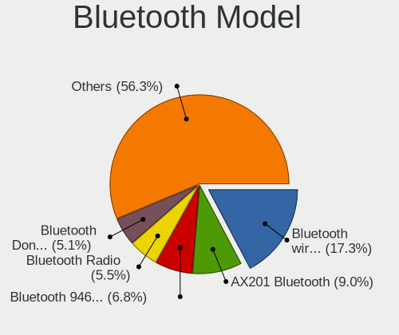

Ubuntu - Tested Hardware & Statistics
-------------------------------------

A project to collect tested hardware configurations for Ubuntu.

Anyone can contribute to this report by the [hw-probe](https://github.com/linuxhw/hw-probe) tool:

    sudo -E hw-probe -all -upload

Please contribute! Especially if your hardware is rare.

This is a report for all computer types. See also reports for [desktops](/Dist/Ubuntu/Desktop/README.md) and [notebooks](/Dist/Ubuntu/Notebook/README.md).

Contents
--------

* [ Test Cases ](#test-cases)

* [ System ](#system)
  - [ OS                       ](#os)
  - [ OS Family                ](#os-family)
  - [ Kernel                   ](#kernel)
  - [ Kernel Family            ](#kernel-family)
  - [ Kernel Major Ver.        ](#kernel-major-ver)
  - [ Arch                     ](#arch)
  - [ DE                       ](#de)
  - [ Display Server           ](#display-server)
  - [ Display Manager          ](#display-manager)
  - [ OS Lang                  ](#os-lang)
  - [ Boot Mode                ](#boot-mode)
  - [ Filesystem               ](#filesystem)
  - [ Part. scheme             ](#part-scheme)
  - [ Dual Boot with Linux/BSD ](#dual-boot-with-linuxbsd)
  - [ Dual Boot (Win)          ](#dual-boot-win)

* [ Board ](#board)
  - [ Vendor                   ](#vendor)
  - [ Model                    ](#model)
  - [ Model Family             ](#model-family)
  - [ MFG Year                 ](#mfg-year)
  - [ Form Factor              ](#form-factor)
  - [ Secure Boot              ](#secure-boot)
  - [ Coreboot                 ](#coreboot)
  - [ RAM Size                 ](#ram-size)
  - [ RAM Used                 ](#ram-used)
  - [ Total Drives             ](#total-drives)
  - [ Has CD-ROM               ](#has-cd-rom)
  - [ Has Ethernet             ](#has-ethernet)
  - [ Has WiFi                 ](#has-wifi)
  - [ Has Bluetooth            ](#has-bluetooth)

* [ Location ](#location)
  - [ Country                  ](#country)
  - [ City                     ](#city)

* [ Drives ](#drives)
  - [ Drive Vendor             ](#drive-vendor)
  - [ Drive Model              ](#drive-model)
  - [ HDD Vendor               ](#hdd-vendor)
  - [ SSD Vendor               ](#ssd-vendor)
  - [ Drive Kind               ](#drive-kind)
  - [ Drive Connector          ](#drive-connector)
  - [ Drive Size               ](#drive-size)
  - [ Space Total              ](#space-total)
  - [ Space Used               ](#space-used)
  - [ Malfunc. Drives          ](#malfunc-drives)
  - [ Malfunc. Drive Vendor    ](#malfunc-drive-vendor)
  - [ Malfunc. HDD Vendor      ](#malfunc-hdd-vendor)
  - [ Malfunc. Drive Kind      ](#malfunc-drive-kind)
  - [ Failed Drives            ](#failed-drives)
  - [ Failed Drive Vendor      ](#failed-drive-vendor)
  - [ Drive Status             ](#drive-status)

* [ Storage controller ](#storage-controller)
  - [ Storage Vendor           ](#storage-vendor)
  - [ Storage Model            ](#storage-model)
  - [ Storage Kind             ](#storage-kind)

* [ Processor ](#processor)
  - [ CPU Vendor               ](#cpu-vendor)
  - [ CPU Model                ](#cpu-model)
  - [ CPU Model Family         ](#cpu-model-family)
  - [ CPU Cores                ](#cpu-cores)
  - [ CPU Sockets              ](#cpu-sockets)
  - [ CPU Threads              ](#cpu-threads)
  - [ CPU Op-Modes             ](#cpu-op-modes)
  - [ CPU Microcode            ](#cpu-microcode)
  - [ CPU Microarch            ](#cpu-microarch)

* [ Graphics ](#graphics)
  - [ GPU Vendor               ](#gpu-vendor)
  - [ GPU Model                ](#gpu-model)
  - [ GPU Combo                ](#gpu-combo)
  - [ GPU Driver               ](#gpu-driver)
  - [ GPU Memory               ](#gpu-memory)

* [ Monitor ](#monitor)
  - [ Monitor Vendor           ](#monitor-vendor)
  - [ Monitor Model            ](#monitor-model)
  - [ Monitor Resolution       ](#monitor-resolution)
  - [ Monitor Diagonal         ](#monitor-diagonal)
  - [ Monitor Width            ](#monitor-width)
  - [ Aspect Ratio             ](#aspect-ratio)
  - [ Monitor Area             ](#monitor-area)
  - [ Pixel Density            ](#pixel-density)
  - [ Multiple Monitors        ](#multiple-monitors)

* [ Network ](#network)
  - [ Net Controller Vendor    ](#net-controller-vendor)
  - [ Net Controller Model     ](#net-controller-model)
  - [ Wireless Vendor          ](#wireless-vendor)
  - [ Wireless Model           ](#wireless-model)
  - [ Ethernet Vendor          ](#ethernet-vendor)
  - [ Ethernet Model           ](#ethernet-model)
  - [ Net Controller Kind      ](#net-controller-kind)
  - [ Used Controller          ](#used-controller)
  - [ NICs                     ](#nics)
  - [ IPv6                     ](#ipv6)

* [ Bluetooth ](#bluetooth)
  - [ Bluetooth Vendor         ](#bluetooth-vendor)
  - [ Bluetooth Model          ](#bluetooth-model)

* [ Sound ](#sound)
  - [ Sound Vendor             ](#sound-vendor)
  - [ Sound Model              ](#sound-model)

* [ Memory ](#memory)
  - [ Memory Vendor            ](#memory-vendor)
  - [ Memory Model             ](#memory-model)
  - [ Memory Kind              ](#memory-kind)
  - [ Memory Form Factor       ](#memory-form-factor)
  - [ Memory Size              ](#memory-size)
  - [ Memory Speed             ](#memory-speed)

* [ Printers & scanners ](#printers--scanners)
  - [ Printer Vendor           ](#printer-vendor)
  - [ Printer Model            ](#printer-model)
  - [ Scanner Vendor           ](#scanner-vendor)
  - [ Scanner Model            ](#scanner-model)

* [ Camera ](#camera)
  - [ Camera Vendor            ](#camera-vendor)
  - [ Camera Model             ](#camera-model)

* [ Security ](#security)
  - [ Fingerprint Vendor       ](#fingerprint-vendor)
  - [ Fingerprint Model        ](#fingerprint-model)
  - [ Chipcard Vendor          ](#chipcard-vendor)
  - [ Chipcard Model           ](#chipcard-model)

* [ Unsupported ](#unsupported)
  - [ Unsupported Devices      ](#unsupported-devices)
  - [ Unsupported Device Types ](#unsupported-device-types)

Test Cases
----------

Total: 78917

| Vendor        | Model                       | Form-Factor | Probe                                                      | Date         |
|---------------|-----------------------------|-------------|------------------------------------------------------------|--------------|
| HP            | Laptop 15-dw1xxx            | Notebook    | [d8d5459ad6](https://linux-hardware.org/?probe=d8d5459ad6) | Dec 01, 2022 |
| AZW           | SEi                         | Notebook    | [3cd2f7f657](https://linux-hardware.org/?probe=3cd2f7f657) | Dec 01, 2022 |
| HP            | Laptop 15-dw1xxx            | Notebook    | [1dddd99280](https://linux-hardware.org/?probe=1dddd99280) | Dec 01, 2022 |
| Acer          | Aspire XC-705               | Desktop     | [86a503df2a](https://linux-hardware.org/?probe=86a503df2a) | Dec 01, 2022 |
| Lenovo        | IdeaPad Gaming 3 15IAH7 ... | Notebook    | [fe9e8854c5](https://linux-hardware.org/?probe=fe9e8854c5) | Dec 01, 2022 |
| Gigabyte      | B450M DS3H-CF               | Desktop     | [5e7bc65683](https://linux-hardware.org/?probe=5e7bc65683) | Dec 01, 2022 |
| Samsung       | R540/R538/SA41/E452         | Notebook    | [afad3c8828](https://linux-hardware.org/?probe=afad3c8828) | Dec 01, 2022 |
| Gigabyte      | B450M DS3H-CF               | Desktop     | [660b9b7529](https://linux-hardware.org/?probe=660b9b7529) | Dec 01, 2022 |
| Positivo B... | VJFE53F11X-B0511H           | Notebook    | [24b1be97d6](https://linux-hardware.org/?probe=24b1be97d6) | Dec 01, 2022 |
| Medion        | H81H3-EM2 H81EM2W08.309     | Desktop     | [9aa4880856](https://linux-hardware.org/?probe=9aa4880856) | Dec 01, 2022 |
| Positivo B... | VJFE53F11X-B0511H           | Notebook    | [a2e91cba31](https://linux-hardware.org/?probe=a2e91cba31) | Dec 01, 2022 |
| Gigabyte      | B450M DS3H-CF               | Desktop     | [9d7fdf83b6](https://linux-hardware.org/?probe=9d7fdf83b6) | Dec 01, 2022 |
| Dell          | XPS 13 9300                 | Notebook    | [d6c50b1786](https://linux-hardware.org/?probe=d6c50b1786) | Dec 01, 2022 |
| Dell          | 0G254H A00                  | Desktop     | [473fb8a09a](https://linux-hardware.org/?probe=473fb8a09a) | Dec 01, 2022 |
| HP            | Notebook                    | Notebook    | [7c22b96a9a](https://linux-hardware.org/?probe=7c22b96a9a) | Dec 01, 2022 |
| Gigabyte      | GA-MA790FXT-UD5P            | Desktop     | [010349b87b](https://linux-hardware.org/?probe=010349b87b) | Dec 01, 2022 |
| Dell          | Latitude E5570              | Notebook    | [4db5cd2ef4](https://linux-hardware.org/?probe=4db5cd2ef4) | Dec 01, 2022 |
| Lenovo        | SHARKBAY SDK0E50510 WIN     | Desktop     | [2f59960e11](https://linux-hardware.org/?probe=2f59960e11) | Dec 01, 2022 |
| Dell          | XPS 13 9343                 | Notebook    | [125fcd77b9](https://linux-hardware.org/?probe=125fcd77b9) | Dec 01, 2022 |
| Fujitsu       | D3128-A1 S26361-D3128-A1    | Desktop     | [ad24dc05a0](https://linux-hardware.org/?probe=ad24dc05a0) | Dec 01, 2022 |
| Lenovo        | SHARKBAY SDK0E50510 WIN     | Desktop     | [c155b94a47](https://linux-hardware.org/?probe=c155b94a47) | Dec 01, 2022 |
| Fujitsu       | D3128-A1 S26361-D3128-A1    | Desktop     | [0e38c9a3be](https://linux-hardware.org/?probe=0e38c9a3be) | Dec 01, 2022 |
| HP            | EliteBook 8730w             | Notebook    | [fa27703043](https://linux-hardware.org/?probe=fa27703043) | Dec 01, 2022 |
| Medion        | H81H3-EM2 H81EM2W08.309     | Desktop     | [c1f5a1f413](https://linux-hardware.org/?probe=c1f5a1f413) | Dec 01, 2022 |
| MSI           | MEG X570 UNIFY              | Desktop     | [df74bf8e13](https://linux-hardware.org/?probe=df74bf8e13) | Dec 01, 2022 |
| ASRock        | Z68 Extreme4 Gen3           | Desktop     | [c14e2149eb](https://linux-hardware.org/?probe=c14e2149eb) | Dec 01, 2022 |
| Lenovo        | MIIX 310-10ICR 80SG         | Tablet      | [64e68bf245](https://linux-hardware.org/?probe=64e68bf245) | Dec 01, 2022 |
| ASUSTek       | H97-PLUS                    | Desktop     | [e8d75cbeed](https://linux-hardware.org/?probe=e8d75cbeed) | Dec 01, 2022 |
| HP            | 1495                        | Desktop     | [138b5bb823](https://linux-hardware.org/?probe=138b5bb823) | Dec 01, 2022 |
| HP            | ENVY dv7                    | Notebook    | [1cef09f19a](https://linux-hardware.org/?probe=1cef09f19a) | Dec 01, 2022 |
| ASUSTek       | P7H55-M                     | Desktop     | [b461d54421](https://linux-hardware.org/?probe=b461d54421) | Dec 01, 2022 |
| ASUSTek       | GL503VM                     | Notebook    | [dbd4aba670](https://linux-hardware.org/?probe=dbd4aba670) | Dec 01, 2022 |
| ASUSTek       | TUF Gaming X570-PLUS        | Desktop     | [f7b40a75f6](https://linux-hardware.org/?probe=f7b40a75f6) | Dec 01, 2022 |
| ASUSTek       | GL503VM                     | Notebook    | [3db38d22b3](https://linux-hardware.org/?probe=3db38d22b3) | Dec 01, 2022 |
| HP            | Spectre x360 Convertible... | Convertible | [443bd561a5](https://linux-hardware.org/?probe=443bd561a5) | Dec 01, 2022 |
| Lenovo        | ThinkPad T480S 20L8SBTD0... | Notebook    | [2d4a014ef1](https://linux-hardware.org/?probe=2d4a014ef1) | Dec 01, 2022 |
| Dell          | 0R6PCT A01                  | Desktop     | [c8ef04b4b2](https://linux-hardware.org/?probe=c8ef04b4b2) | Dec 01, 2022 |
| Acer          | Aspire xxxx                 | Notebook    | [320d58f6f1](https://linux-hardware.org/?probe=320d58f6f1) | Dec 01, 2022 |
| Lenovo        | ThinkPad T480S 20L8SBTD0... | Notebook    | [e1cec664eb](https://linux-hardware.org/?probe=e1cec664eb) | Dec 01, 2022 |
| ASUSTek       | K52F                        | Notebook    | [63c08600c3](https://linux-hardware.org/?probe=63c08600c3) | Dec 01, 2022 |
| ASUSTek       | K52F                        | Notebook    | [4276cc2cb9](https://linux-hardware.org/?probe=4276cc2cb9) | Dec 01, 2022 |
| Dell          | Vostro 3480                 | Notebook    | [bf353a87c5](https://linux-hardware.org/?probe=bf353a87c5) | Dec 01, 2022 |
| ASUSTek       | PRIME A320M-K               | Desktop     | [e1a4335a71](https://linux-hardware.org/?probe=e1a4335a71) | Dec 01, 2022 |
| W271ELQ       | Unknown                     | Notebook    | [ae170d1e81](https://linux-hardware.org/?probe=ae170d1e81) | Dec 01, 2022 |
| Lenovo        | ThinkPad L560 20F2S2UR02    | Notebook    | [29c5e0f7b1](https://linux-hardware.org/?probe=29c5e0f7b1) | Dec 01, 2022 |
| Dell          | Vostro 3578                 | Notebook    | [89161c2dee](https://linux-hardware.org/?probe=89161c2dee) | Dec 01, 2022 |
| Fujitsu       | D2917-A1 S26361-D2917-A1    | Desktop     | [dd124e3579](https://linux-hardware.org/?probe=dd124e3579) | Nov 30, 2022 |
| Gigabyte      | H170-HD3-CF                 | Desktop     | [1d293c6d72](https://linux-hardware.org/?probe=1d293c6d72) | Nov 30, 2022 |
| Acer          | Aspire A315-21              | Notebook    | [7c3a371165](https://linux-hardware.org/?probe=7c3a371165) | Nov 30, 2022 |
| Acer          | Aspire A315-21              | Notebook    | [5f14327a56](https://linux-hardware.org/?probe=5f14327a56) | Nov 30, 2022 |
| HP            | 1825                        | Desktop     | [5f8bff315d](https://linux-hardware.org/?probe=5f8bff315d) | Nov 30, 2022 |
| ASUSTek       | ROG STRIX X570-I GAMING     | Desktop     | [ac84964c19](https://linux-hardware.org/?probe=ac84964c19) | Nov 30, 2022 |
| Samsung       | 300E4A/300E5A/300E7A/343... | Notebook    | [5f53eff4a6](https://linux-hardware.org/?probe=5f53eff4a6) | Nov 30, 2022 |
| Lenovo        | SHARKBAY SDK0E50510 WIN     | Desktop     | [475ad82d2b](https://linux-hardware.org/?probe=475ad82d2b) | Nov 30, 2022 |
| Dell          | 0NDYHG A01                  | Desktop     | [5dd9f4dea9](https://linux-hardware.org/?probe=5dd9f4dea9) | Nov 30, 2022 |
| ASUSTek       | PRIME B450M-A II            | Desktop     | [a5b34b67f2](https://linux-hardware.org/?probe=a5b34b67f2) | Nov 30, 2022 |
| Lenovo        | ThinkPad P14s Gen 2a 21A... | Notebook    | [258c074e40](https://linux-hardware.org/?probe=258c074e40) | Nov 30, 2022 |
| MSI           | Boston                      | Desktop     | [0564f7ed2d](https://linux-hardware.org/?probe=0564f7ed2d) | Nov 30, 2022 |
| Sony          | VPCEB4L9E                   | Notebook    | [cad7ef5059](https://linux-hardware.org/?probe=cad7ef5059) | Nov 30, 2022 |
| Apple         | Mac-F2238BAE iMac11,3       | All in one  | [473821d177](https://linux-hardware.org/?probe=473821d177) | Nov 30, 2022 |
| MSI           | Z170A GAMING M3             | Desktop     | [dfe92c80c1](https://linux-hardware.org/?probe=dfe92c80c1) | Nov 30, 2022 |
| HP            | EliteBook 840 G3            | Notebook    | [e17d8c1694](https://linux-hardware.org/?probe=e17d8c1694) | Nov 30, 2022 |
| Dell          | 0WR7PY A03                  | Desktop     | [ba1e414d62](https://linux-hardware.org/?probe=ba1e414d62) | Nov 30, 2022 |
| ASUSTek       | H81M-PLUS                   | Desktop     | [8d98938198](https://linux-hardware.org/?probe=8d98938198) | Nov 30, 2022 |
| Lenovo        | ThinkPad P14s Gen 2a 21A... | Notebook    | [29ec19d38e](https://linux-hardware.org/?probe=29ec19d38e) | Nov 30, 2022 |
| Dell          | Inspiron N5010              | Notebook    | [687aa83749](https://linux-hardware.org/?probe=687aa83749) | Nov 30, 2022 |
| ASUSTek       | TUF Gaming X670E-PLUS WI... | Desktop     | [9282404406](https://linux-hardware.org/?probe=9282404406) | Nov 30, 2022 |
| Gigabyte      | GB-BRR7H-4700               | Desktop     | [8398d00a16](https://linux-hardware.org/?probe=8398d00a16) | Nov 30, 2022 |
| Standard      | Unknown                     | Notebook    | [723d9c3551](https://linux-hardware.org/?probe=723d9c3551) | Nov 30, 2022 |
| Apple         | Mac-F2268CC8                | All in one  | [6e2f0af1b5](https://linux-hardware.org/?probe=6e2f0af1b5) | Nov 30, 2022 |
| HUAWEI        | CREM-WXX9                   | Notebook    | [33f7ac03f4](https://linux-hardware.org/?probe=33f7ac03f4) | Nov 30, 2022 |
| Dell          | Inspiron 15-3567            | Notebook    | [ee99c81e47](https://linux-hardware.org/?probe=ee99c81e47) | Nov 30, 2022 |
| Lenovo        | ThinkPad T470s W10DG 20J... | Notebook    | [645418a0dd](https://linux-hardware.org/?probe=645418a0dd) | Nov 30, 2022 |
| HP            | EliteBook x360 1040 G8 N... | Convertible | [4b635dd9ef](https://linux-hardware.org/?probe=4b635dd9ef) | Nov 30, 2022 |
| ASUSTek       | UX550VD                     | Notebook    | [a3f2aafbf1](https://linux-hardware.org/?probe=a3f2aafbf1) | Nov 30, 2022 |
| Packard Be... | EasyNote TE69CXP            | Notebook    | [919275eb73](https://linux-hardware.org/?probe=919275eb73) | Nov 30, 2022 |
| HP            | OMEN Laptop 15-en0xxx       | Notebook    | [c3d55f501c](https://linux-hardware.org/?probe=c3d55f501c) | Nov 30, 2022 |
| HP            | EliteBook 860 16 inch G9... | Notebook    | [dda393ca54](https://linux-hardware.org/?probe=dda393ca54) | Nov 30, 2022 |
| Dell          | XPS 15 9500                 | Notebook    | [42971a8394](https://linux-hardware.org/?probe=42971a8394) | Nov 30, 2022 |
| ASUSTek       | M5A78L-M LE/USB3            | Desktop     | [dd3801095f](https://linux-hardware.org/?probe=dd3801095f) | Nov 30, 2022 |
| ASUSTek       | P7H55-M                     | Desktop     | [729bb4ef87](https://linux-hardware.org/?probe=729bb4ef87) | Nov 30, 2022 |
| Dell          | Latitude 7390               | Notebook    | [7214cac96d](https://linux-hardware.org/?probe=7214cac96d) | Nov 30, 2022 |
| Dell          | XPS 15 9500                 | Notebook    | [f9215967d3](https://linux-hardware.org/?probe=f9215967d3) | Nov 30, 2022 |
| Lenovo        | ThinkPad T470p 20J7S1FR0... | Notebook    | [517347d2cf](https://linux-hardware.org/?probe=517347d2cf) | Nov 30, 2022 |
| Dell          | 0XJ5V0 A03                  | Desktop     | [b954e4c174](https://linux-hardware.org/?probe=b954e4c174) | Nov 30, 2022 |
| Lenovo        | 3190 SDK0J40697 WIN 3305... | Mini pc     | [1c03d54694](https://linux-hardware.org/?probe=1c03d54694) | Nov 30, 2022 |
| Dell          | 0C3YXR A01                  | Desktop     | [95fbd0e6b4](https://linux-hardware.org/?probe=95fbd0e6b4) | Nov 30, 2022 |
| Samsung       | 300E4A/300E5A/300E7A/343... | Notebook    | [aadb9ff1d4](https://linux-hardware.org/?probe=aadb9ff1d4) | Nov 30, 2022 |
| Lenovo        | 3190 SDK0J40697 WIN 3305... | Mini pc     | [cafd86ffda](https://linux-hardware.org/?probe=cafd86ffda) | Nov 30, 2022 |
| ZOTAC         | ZBOX-MI522NANO/MI542NANO    | Mini pc     | [26a5aa815f](https://linux-hardware.org/?probe=26a5aa815f) | Nov 30, 2022 |
| Acer          | E1-510                      | Notebook    | [8aadf699f9](https://linux-hardware.org/?probe=8aadf699f9) | Nov 30, 2022 |
| HP            | Laptop 14-dk1xxx            | Notebook    | [9dbd54884d](https://linux-hardware.org/?probe=9dbd54884d) | Nov 30, 2022 |
| HP            | 1825                        | Desktop     | [a3f8ec5423](https://linux-hardware.org/?probe=a3f8ec5423) | Nov 30, 2022 |
| Dell          | Inspiron N4050              | Notebook    | [7b0cf2fa20](https://linux-hardware.org/?probe=7b0cf2fa20) | Nov 30, 2022 |
| ASUSTek       | VivoBook_ASUSLaptop X140... | Notebook    | [55d95654c4](https://linux-hardware.org/?probe=55d95654c4) | Nov 30, 2022 |
| ASUSTek       | ROG STRIX B450-E GAMING     | Desktop     | [abcc431f9f](https://linux-hardware.org/?probe=abcc431f9f) | Nov 30, 2022 |
| Dell          | Inspiron 15-3552            | Notebook    | [e740b148c1](https://linux-hardware.org/?probe=e740b148c1) | Nov 30, 2022 |
| Apple         | MacBook4,1                  | Notebook    | [0866a64897](https://linux-hardware.org/?probe=0866a64897) | Nov 30, 2022 |
| Gigabyte      | 970A-DS3P                   | Desktop     | [22c7db0e68](https://linux-hardware.org/?probe=22c7db0e68) | Nov 30, 2022 |
| HP            | Pavilion 14                 | Notebook    | [dedd30adc4](https://linux-hardware.org/?probe=dedd30adc4) | Nov 30, 2022 |
| Gigabyte      | 970A-DS3P                   | Desktop     | [65493a981c](https://linux-hardware.org/?probe=65493a981c) | Nov 30, 2022 |
| Dell          | 0NDYHG A01                  | Desktop     | [a3191b9bfe](https://linux-hardware.org/?probe=a3191b9bfe) | Nov 30, 2022 |
| Medion        | D3F3-EM                     | Desktop     | [ae428a6a6a](https://linux-hardware.org/?probe=ae428a6a6a) | Nov 29, 2022 |
| HP            | Compaq CQ58                 | Notebook    | [009ac41742](https://linux-hardware.org/?probe=009ac41742) | Nov 29, 2022 |
| ASUSTek       | PRIME B450M-A II            | Desktop     | [f0dfa48048](https://linux-hardware.org/?probe=f0dfa48048) | Nov 29, 2022 |
| HP            | Stream Laptop 14-cb1xxx     | Notebook    | [6f96ec5e1d](https://linux-hardware.org/?probe=6f96ec5e1d) | Nov 29, 2022 |
| Apple         | Mac-27ADBB7B4CEE8E61 iMa... | All in one  | [b7a1fc62d1](https://linux-hardware.org/?probe=b7a1fc62d1) | Nov 29, 2022 |
| ASUSTek       | TUF Gaming X570-PLUS        | Desktop     | [2e35df903f](https://linux-hardware.org/?probe=2e35df903f) | Nov 29, 2022 |
| MSI           | MPG X570 GAMING EDGE WIF... | Desktop     | [c01a10b89d](https://linux-hardware.org/?probe=c01a10b89d) | Nov 29, 2022 |
| Acer          | Nitro AN515-58              | Notebook    | [02f4319195](https://linux-hardware.org/?probe=02f4319195) | Nov 29, 2022 |
| Intel         | H81U                        | Notebook    | [87a1cceaae](https://linux-hardware.org/?probe=87a1cceaae) | Nov 29, 2022 |
| Acer          | AO756                       | Notebook    | [c1ff6fe10c](https://linux-hardware.org/?probe=c1ff6fe10c) | Nov 29, 2022 |
| Acer          | Nitro AN515-58              | Notebook    | [77ad02b5bd](https://linux-hardware.org/?probe=77ad02b5bd) | Nov 29, 2022 |
| Lenovo        | IdeaPad Y700-17ISK 80Q0     | Notebook    | [802af80043](https://linux-hardware.org/?probe=802af80043) | Nov 29, 2022 |
| Dell          | Vostro 5470                 | Notebook    | [15c504a6ef](https://linux-hardware.org/?probe=15c504a6ef) | Nov 29, 2022 |
| Chuwi         | LarkBox Pro                 | Mini pc     | [9b78bb4bbf](https://linux-hardware.org/?probe=9b78bb4bbf) | Nov 29, 2022 |
| Lenovo        | Legion 5 15IMH05H 82CF      | Notebook    | [adb0404576](https://linux-hardware.org/?probe=adb0404576) | Nov 29, 2022 |
| Chuwi         | LarkBox Pro                 | Mini pc     | [65a673d91a](https://linux-hardware.org/?probe=65a673d91a) | Nov 29, 2022 |
| Dell          | Inspiron 5570               | Notebook    | [9e4bdbc81d](https://linux-hardware.org/?probe=9e4bdbc81d) | Nov 29, 2022 |
| Dell          | Inspiron 5570               | Notebook    | [399346217e](https://linux-hardware.org/?probe=399346217e) | Nov 29, 2022 |
| Dell          | Latitude E6410              | Notebook    | [d7abefea4b](https://linux-hardware.org/?probe=d7abefea4b) | Nov 29, 2022 |
| Dell          | Latitude E6410              | Notebook    | [bac3e8c250](https://linux-hardware.org/?probe=bac3e8c250) | Nov 29, 2022 |
| UMAX          | U-Box N42                   | Mini pc     | [44170ddf90](https://linux-hardware.org/?probe=44170ddf90) | Nov 29, 2022 |
| Lenovo        | ThinkPad T580 20L9001YIV    | Notebook    | [dc13dde66a](https://linux-hardware.org/?probe=dc13dde66a) | Nov 29, 2022 |
| Apple         | Mac-F2268CC8                | All in one  | [0cb6dd7966](https://linux-hardware.org/?probe=0cb6dd7966) | Nov 29, 2022 |
| Gigabyte      | B250M-DS3H-CF               | Desktop     | [efacbf6215](https://linux-hardware.org/?probe=efacbf6215) | Nov 29, 2022 |
| Dell          | Inspiron 16 7620 2-in-1     | Convertible | [3e34521c45](https://linux-hardware.org/?probe=3e34521c45) | Nov 29, 2022 |
| Gigabyte      | B250M-DS3H-CF               | Desktop     | [85ac938c0c](https://linux-hardware.org/?probe=85ac938c0c) | Nov 29, 2022 |
| Dell          | Inspiron 16 7620 2-in-1     | Convertible | [e43c4c3053](https://linux-hardware.org/?probe=e43c4c3053) | Nov 29, 2022 |
| Foxconn       | G41MXE/G41MXE-K             | Desktop     | [4f13d9a2cc](https://linux-hardware.org/?probe=4f13d9a2cc) | Nov 29, 2022 |
| ASUSTek       | X756UVK                     | Notebook    | [93b549fb81](https://linux-hardware.org/?probe=93b549fb81) | Nov 29, 2022 |
| UMAX          | U-Box N42                   | Mini pc     | [5953c13736](https://linux-hardware.org/?probe=5953c13736) | Nov 29, 2022 |
| Lenovo        | 364F SDK0J40700 WIN 3258... | Desktop     | [481a664e0a](https://linux-hardware.org/?probe=481a664e0a) | Nov 29, 2022 |
| Lenovo        | ThinkPad X1 Carbon Gen 9... | Notebook    | [1f904e68af](https://linux-hardware.org/?probe=1f904e68af) | Nov 29, 2022 |
| ASUSTek       | P5KPL-AM SE                 | Desktop     | [719921de81](https://linux-hardware.org/?probe=719921de81) | Nov 29, 2022 |
| HP            | 339A                        | Desktop     | [ea5cacd50e](https://linux-hardware.org/?probe=ea5cacd50e) | Nov 29, 2022 |
| Apple         | Mac-F2268DAE                | All in one  | [8d37e3e327](https://linux-hardware.org/?probe=8d37e3e327) | Nov 29, 2022 |
| Dell          | Latitude 5330               | Notebook    | [b8d907f2e8](https://linux-hardware.org/?probe=b8d907f2e8) | Nov 29, 2022 |
| ASUSTek       | P5KPL-AM SE                 | Desktop     | [f998b6a0d9](https://linux-hardware.org/?probe=f998b6a0d9) | Nov 29, 2022 |
| Apple         | Mac-F2268DAE                | All in one  | [e41751f26a](https://linux-hardware.org/?probe=e41751f26a) | Nov 29, 2022 |
| Gigabyte      | TRX40 AORUS PRO WIFI        | Desktop     | [d5702f8b2d](https://linux-hardware.org/?probe=d5702f8b2d) | Nov 29, 2022 |
| Gigabyte      | TRX40 AORUS PRO WIFI        | Desktop     | [640a031786](https://linux-hardware.org/?probe=640a031786) | Nov 29, 2022 |
| Lenovo        | B590 20206                  | Notebook    | [5bec8860f3](https://linux-hardware.org/?probe=5bec8860f3) | Nov 29, 2022 |
| ASRock        | 960GM-GS3 FX                | Desktop     | [1474b9ee78](https://linux-hardware.org/?probe=1474b9ee78) | Nov 29, 2022 |
| Lenovo        | IdeaPad 5 Pro 16ACH6 82L... | Notebook    | [8e6e8471a7](https://linux-hardware.org/?probe=8e6e8471a7) | Nov 29, 2022 |
| Dell          | 0J8G6F A03                  | Desktop     | [1424a94eb0](https://linux-hardware.org/?probe=1424a94eb0) | Nov 29, 2022 |
| Gigabyte      | Z490 AORUS XTREME WF        | Desktop     | [6d4f229020](https://linux-hardware.org/?probe=6d4f229020) | Nov 29, 2022 |
| Dell          | System Vostro 3750          | Notebook    | [ed88e2ae0c](https://linux-hardware.org/?probe=ed88e2ae0c) | Nov 29, 2022 |
| Medion        | H110H4-EM2                  | Desktop     | [38b9e166f2](https://linux-hardware.org/?probe=38b9e166f2) | Nov 29, 2022 |
| ASRock        | Z77 Extreme3                | Desktop     | [e473c1c45c](https://linux-hardware.org/?probe=e473c1c45c) | Nov 29, 2022 |
| Dell          | 0FDY5C A00                  | Desktop     | [3cba0b32b1](https://linux-hardware.org/?probe=3cba0b32b1) | Nov 29, 2022 |
| Dell          | Latitude 3500               | Notebook    | [de0731ac74](https://linux-hardware.org/?probe=de0731ac74) | Nov 29, 2022 |
| HP            | ProBook 450 G8 Notebook ... | Notebook    | [34f43d3808](https://linux-hardware.org/?probe=34f43d3808) | Nov 29, 2022 |
| Lenovo        | 1031 SBB0J05441 WIN 3305... | Desktop     | [cc75562371](https://linux-hardware.org/?probe=cc75562371) | Nov 29, 2022 |
| Lenovo        | IdeaPad S340-14IIL 81VV     | Notebook    | [2a4bb490d0](https://linux-hardware.org/?probe=2a4bb490d0) | Nov 29, 2022 |
| Lenovo        | IdeaPad S340-14IIL 81VV     | Notebook    | [a05b99b00e](https://linux-hardware.org/?probe=a05b99b00e) | Nov 29, 2022 |
| Chuwi         | CoreBook X                  | Notebook    | [f6745ce587](https://linux-hardware.org/?probe=f6745ce587) | Nov 29, 2022 |
| Supermicro    | X10DRU-i+B                  | Desktop     | [e55edce907](https://linux-hardware.org/?probe=e55edce907) | Nov 29, 2022 |
| HP            | ENVY x360 2-in-1 Laptop ... | Convertible | [bdf6aee6f5](https://linux-hardware.org/?probe=bdf6aee6f5) | Nov 29, 2022 |
| ASRock        | FM2A78 Pro4+                | Desktop     | [7eae5fad47](https://linux-hardware.org/?probe=7eae5fad47) | Nov 29, 2022 |
| HP            | 1850                        | Desktop     | [1d0a3a4461](https://linux-hardware.org/?probe=1d0a3a4461) | Nov 29, 2022 |
| Lenovo        | 1031 SBB0J05441 WIN 3305... | Desktop     | [a6ea0d5259](https://linux-hardware.org/?probe=a6ea0d5259) | Nov 29, 2022 |
| MSI           | Z370 GAMING PRO CARBON      | Desktop     | [96b383097b](https://linux-hardware.org/?probe=96b383097b) | Nov 29, 2022 |
| ASRock        | B550 Phantom Gaming 4/ac    | Desktop     | [66525e5501](https://linux-hardware.org/?probe=66525e5501) | Nov 29, 2022 |
| HP            | ZBook 15                    | Notebook    | [452a6f86d5](https://linux-hardware.org/?probe=452a6f86d5) | Nov 29, 2022 |
| Lenovo        | V17 G2 ITL 82NX             | Notebook    | [6dcdb4d9ea](https://linux-hardware.org/?probe=6dcdb4d9ea) | Nov 29, 2022 |
| MSI           | MAG X570S TOMAHAWK MAX W... | Desktop     | [04d2eea487](https://linux-hardware.org/?probe=04d2eea487) | Nov 28, 2022 |
| Microsoft     | Surface Pro                 | Tablet      | [2fcba8743c](https://linux-hardware.org/?probe=2fcba8743c) | Nov 28, 2022 |
| Dell          | G7 7790                     | Notebook    | [a85c1cd70e](https://linux-hardware.org/?probe=a85c1cd70e) | Nov 28, 2022 |
| Lenovo        | ThinkCentre M57 6072AZ3     | Desktop     | [9d794b4d38](https://linux-hardware.org/?probe=9d794b4d38) | Nov 28, 2022 |
| Lenovo        | ThinkBook 15 G3 ACL 21A4    | Notebook    | [ef6247e6fd](https://linux-hardware.org/?probe=ef6247e6fd) | Nov 28, 2022 |
| ASUSTek       | ASUS TUF Dash F15 FX517Z... | Notebook    | [972f6f4355](https://linux-hardware.org/?probe=972f6f4355) | Nov 28, 2022 |
| Acer          | Aspire 5820TG               | Notebook    | [61cab6d996](https://linux-hardware.org/?probe=61cab6d996) | Nov 28, 2022 |
| Acer          | Aspire 5820TG               | Notebook    | [1e64d9426d](https://linux-hardware.org/?probe=1e64d9426d) | Nov 28, 2022 |
| Intel         | DH67BL AAG10189-213         | Desktop     | [11252af398](https://linux-hardware.org/?probe=11252af398) | Nov 28, 2022 |
| Acer          | Swift SF314-43              | Notebook    | [1a6c47ad0e](https://linux-hardware.org/?probe=1a6c47ad0e) | Nov 28, 2022 |
| Apple         | MacBookPro8,1               | Notebook    | [7ba1690c68](https://linux-hardware.org/?probe=7ba1690c68) | Nov 28, 2022 |
| HP            | 250 G6 Notebook PC          | Notebook    | [95b1694080](https://linux-hardware.org/?probe=95b1694080) | Nov 28, 2022 |
| Apple         | Mac-F2238BAE iMac11,3       | All in one  | [6d711e74c3](https://linux-hardware.org/?probe=6d711e74c3) | Nov 28, 2022 |
| Dell          | Precision 5760              | Notebook    | [0e19ec2f3d](https://linux-hardware.org/?probe=0e19ec2f3d) | Nov 28, 2022 |
| HP            | ProBook 450 G8 Notebook ... | Notebook    | [2de79b83d5](https://linux-hardware.org/?probe=2de79b83d5) | Nov 28, 2022 |
| HP            | Laptop 14s-dq5xxx           | Notebook    | [9bb72cb3e8](https://linux-hardware.org/?probe=9bb72cb3e8) | Nov 28, 2022 |
| Dell          | G3 3500                     | Notebook    | [291b53ea79](https://linux-hardware.org/?probe=291b53ea79) | Nov 28, 2022 |
| HP            | ProBook 640 G2              | Notebook    | [56ceffe338](https://linux-hardware.org/?probe=56ceffe338) | Nov 28, 2022 |
| ASRock        | B450M Pro4                  | Desktop     | [219a616346](https://linux-hardware.org/?probe=219a616346) | Nov 28, 2022 |
| Gigabyte      | H410M H                     | Desktop     | [09129dad50](https://linux-hardware.org/?probe=09129dad50) | Nov 28, 2022 |
| Apple         | Mac-B809C3757DA9BB8D iMa... | All in one  | [916343aa23](https://linux-hardware.org/?probe=916343aa23) | Nov 28, 2022 |
| ASUSTek       | X756UVK                     | Notebook    | [4745940cf9](https://linux-hardware.org/?probe=4745940cf9) | Nov 28, 2022 |
| Chuwi         | CoreBook X                  | Notebook    | [810ed5914a](https://linux-hardware.org/?probe=810ed5914a) | Nov 28, 2022 |
| Dell          | 0NK5PH A00                  | Desktop     | [d889c3c50a](https://linux-hardware.org/?probe=d889c3c50a) | Nov 28, 2022 |
| Intel         | H61                         | Desktop     | [42f943bc9c](https://linux-hardware.org/?probe=42f943bc9c) | Nov 28, 2022 |
| Notebook      | L140PU                      | Notebook    | [8893420e06](https://linux-hardware.org/?probe=8893420e06) | Nov 28, 2022 |
| ASRock        | Q1900M                      | Desktop     | [0a90a5d3a5](https://linux-hardware.org/?probe=0a90a5d3a5) | Nov 28, 2022 |
| Gigabyte      | Z97X-SLI-CF                 | Desktop     | [ae01075720](https://linux-hardware.org/?probe=ae01075720) | Nov 28, 2022 |
| HP            | 18E5                        | Desktop     | [e336f0ac13](https://linux-hardware.org/?probe=e336f0ac13) | Nov 28, 2022 |
| MSI           | MPG B550 GAMING PLUS        | Desktop     | [341bca1753](https://linux-hardware.org/?probe=341bca1753) | Nov 28, 2022 |
| HP            | 843B                        | Desktop     | [19bd35484c](https://linux-hardware.org/?probe=19bd35484c) | Nov 28, 2022 |
| Gigabyte      | H410M H                     | Desktop     | [88ca303518](https://linux-hardware.org/?probe=88ca303518) | Nov 28, 2022 |
| HP            | ProBook 650 G1              | Notebook    | [f038c3cc67](https://linux-hardware.org/?probe=f038c3cc67) | Nov 28, 2022 |
| Gigabyte      | H81M-S                      | Desktop     | [fab21fa561](https://linux-hardware.org/?probe=fab21fa561) | Nov 28, 2022 |
| Dell          | Inspiron N5050              | Notebook    | [e4c533a89b](https://linux-hardware.org/?probe=e4c533a89b) | Nov 28, 2022 |
| ASUSTek       | PN41                        | Mini pc     | [4f937eabac](https://linux-hardware.org/?probe=4f937eabac) | Nov 28, 2022 |
| Acer          | Aspire 5742G                | Notebook    | [d5f03d47ba](https://linux-hardware.org/?probe=d5f03d47ba) | Nov 28, 2022 |
| HUAWEI        | MRC-WX0                     | Notebook    | [98f550465b](https://linux-hardware.org/?probe=98f550465b) | Nov 28, 2022 |
| Acer          | Aspire 5742G                | Notebook    | [e0701bc81d](https://linux-hardware.org/?probe=e0701bc81d) | Nov 28, 2022 |
| Dell          | 0773VG A00                  | Desktop     | [a21b1834c2](https://linux-hardware.org/?probe=a21b1834c2) | Nov 28, 2022 |
| HP            | Pavilion Laptop 15-cw1xx... | Notebook    | [1f4c5bfc57](https://linux-hardware.org/?probe=1f4c5bfc57) | Nov 28, 2022 |
| Dell          | XPS 13 9370                 | Notebook    | [d353a1624b](https://linux-hardware.org/?probe=d353a1624b) | Nov 28, 2022 |
| Pegatron      | VIOLET                      | Desktop     | [f0f25e6854](https://linux-hardware.org/?probe=f0f25e6854) | Nov 28, 2022 |
| PCWare        | IPMH61R1                    | Desktop     | [7872d8f10f](https://linux-hardware.org/?probe=7872d8f10f) | Nov 28, 2022 |
| Dell          | 0773VG A00                  | Desktop     | [04125afb72](https://linux-hardware.org/?probe=04125afb72) | Nov 28, 2022 |
| Dell          | 0WMJ54 A01                  | Desktop     | [778a84af28](https://linux-hardware.org/?probe=778a84af28) | Nov 28, 2022 |
| PC Special... | NH5xAx                      | Notebook    | [8bd9aae635](https://linux-hardware.org/?probe=8bd9aae635) | Nov 28, 2022 |
| ASRock        | H87M Pro4                   | Desktop     | [c0511f2d46](https://linux-hardware.org/?probe=c0511f2d46) | Nov 28, 2022 |
| ASUSTek       | ZenBook UX325UA_UM325UA     | Notebook    | [c95bbb16de](https://linux-hardware.org/?probe=c95bbb16de) | Nov 28, 2022 |
| ASRock        | FM2A78 Pro4+                | Desktop     | [908283c378](https://linux-hardware.org/?probe=908283c378) | Nov 28, 2022 |
| Dell          | XPS 15 7590                 | Notebook    | [8072eb50aa](https://linux-hardware.org/?probe=8072eb50aa) | Nov 28, 2022 |
| HP            | Stream Laptop 14-cb1xxx     | Notebook    | [1bf2bd6761](https://linux-hardware.org/?probe=1bf2bd6761) | Nov 28, 2022 |
| PC Special... | NH5xAx                      | Notebook    | [3be194cb8a](https://linux-hardware.org/?probe=3be194cb8a) | Nov 28, 2022 |
| Framework     | Laptop (12th Gen Intel C... | Notebook    | [7578d56f26](https://linux-hardware.org/?probe=7578d56f26) | Nov 28, 2022 |
| Shuttle       | FS35V4                      | Desktop     | [46923496a3](https://linux-hardware.org/?probe=46923496a3) | Nov 28, 2022 |
| Dell          | 0T10XW A02                  | Desktop     | [e97a065fa8](https://linux-hardware.org/?probe=e97a065fa8) | Nov 28, 2022 |
| Dell          | Precision M4700             | Notebook    | [17f1344975](https://linux-hardware.org/?probe=17f1344975) | Nov 28, 2022 |
| HP            | EliteBook 8470w             | Notebook    | [7008753054](https://linux-hardware.org/?probe=7008753054) | Nov 28, 2022 |
| Lenovo        | ThinkPad E580 20KS001QMX    | Notebook    | [97fda88c7b](https://linux-hardware.org/?probe=97fda88c7b) | Nov 28, 2022 |
| ASUSTek       | S551LB                      | Notebook    | [d74127627f](https://linux-hardware.org/?probe=d74127627f) | Nov 28, 2022 |
| HP            | EliteBook 8560w             | Notebook    | [61e60261ef](https://linux-hardware.org/?probe=61e60261ef) | Nov 28, 2022 |
| Microsoft     | Surface Pro 8               | Tablet      | [c0f32e47f1](https://linux-hardware.org/?probe=c0f32e47f1) | Nov 28, 2022 |
| Lenovo        | ThinkPad E490 20N8000RUK    | Notebook    | [6816e8f5ca](https://linux-hardware.org/?probe=6816e8f5ca) | Nov 27, 2022 |
| Lenovo        | ThinkPad E490 20N8000RUK    | Notebook    | [06c690a0e1](https://linux-hardware.org/?probe=06c690a0e1) | Nov 27, 2022 |
| HP            | Laptop 14s-dq5xxx           | Notebook    | [e5164649e1](https://linux-hardware.org/?probe=e5164649e1) | Nov 27, 2022 |
| Fujitsu       | LIFEBOOK S751               | Notebook    | [20cb13ada3](https://linux-hardware.org/?probe=20cb13ada3) | Nov 27, 2022 |
| Fujitsu       | LIFEBOOK S751               | Notebook    | [9062066523](https://linux-hardware.org/?probe=9062066523) | Nov 27, 2022 |
| ASUSTek       | SABERTOOTH 990FX R2.0       | Desktop     | [bc515374ae](https://linux-hardware.org/?probe=bc515374ae) | Nov 27, 2022 |
| ASUSTek       | PRIME X570-PRO              | Desktop     | [8f8f53c15b](https://linux-hardware.org/?probe=8f8f53c15b) | Nov 27, 2022 |
| Dell          | XPS 13 9305                 | Notebook    | [c306dcfa4f](https://linux-hardware.org/?probe=c306dcfa4f) | Nov 27, 2022 |
| ASUSTek       | P8Z68 DELUXE/GEN3           | Desktop     | [cbd36eefe1](https://linux-hardware.org/?probe=cbd36eefe1) | Nov 27, 2022 |
| Samsung       | 300E4A/300E5A/300E7A/343... | Notebook    | [44a305db4d](https://linux-hardware.org/?probe=44a305db4d) | Nov 27, 2022 |
| HP            | EliteBook 8560w             | Notebook    | [3145d17bb7](https://linux-hardware.org/?probe=3145d17bb7) | Nov 27, 2022 |
| Gateway       | G33M05G1 MP                 | Desktop     | [193a69e5ee](https://linux-hardware.org/?probe=193a69e5ee) | Nov 27, 2022 |
| Acer          | Veriton X4620G V1.0         | Desktop     | [37be4a2bf8](https://linux-hardware.org/?probe=37be4a2bf8) | Nov 27, 2022 |
| Lenovo        | ThinkPad E15 Gen 4 21EES... | Notebook    | [7db4db6cc7](https://linux-hardware.org/?probe=7db4db6cc7) | Nov 27, 2022 |
| HP            | ProBook 5330m               | Notebook    | [3763f505a0](https://linux-hardware.org/?probe=3763f505a0) | Nov 27, 2022 |
| Lenovo        | V15-IIL 82C5                | Notebook    | [ceda4dbb46](https://linux-hardware.org/?probe=ceda4dbb46) | Nov 27, 2022 |
| Gigabyte      | B450M DS3H-CF               | Desktop     | [54d005e599](https://linux-hardware.org/?probe=54d005e599) | Nov 27, 2022 |
| ASUSTek       | PRIME A320M-K               | Desktop     | [37b51f19ef](https://linux-hardware.org/?probe=37b51f19ef) | Nov 27, 2022 |
| ASUSTek       | VivoBook_ASUSLaptop X412... | Notebook    | [2aba12235d](https://linux-hardware.org/?probe=2aba12235d) | Nov 27, 2022 |
| Gateway       | G33M05G1 MP                 | Desktop     | [291e32a741](https://linux-hardware.org/?probe=291e32a741) | Nov 27, 2022 |
| ASUSTek       | ROG Zephyrus M16 GU603HE... | Notebook    | [8d63931ff6](https://linux-hardware.org/?probe=8d63931ff6) | Nov 27, 2022 |
| Acer          | AO756                       | Notebook    | [fa5c9df13a](https://linux-hardware.org/?probe=fa5c9df13a) | Nov 27, 2022 |
| Acer          | AO756                       | Notebook    | [d390d588fe](https://linux-hardware.org/?probe=d390d588fe) | Nov 27, 2022 |
| Dell          | Precision M4700             | Notebook    | [7f5ebe66b6](https://linux-hardware.org/?probe=7f5ebe66b6) | Nov 27, 2022 |
| Dell          | Inspiron 5566               | Notebook    | [99e1d10484](https://linux-hardware.org/?probe=99e1d10484) | Nov 27, 2022 |
| Dell          | Inspiron 5566               | Notebook    | [7d3bf460f7](https://linux-hardware.org/?probe=7d3bf460f7) | Nov 27, 2022 |
| HUAWEI        | RLEF-XX                     | Notebook    | [bb5c736032](https://linux-hardware.org/?probe=bb5c736032) | Nov 27, 2022 |
| Lenovo        | ThinkBook 14 G2 ITL 20VD    | Notebook    | [2d1a576ee6](https://linux-hardware.org/?probe=2d1a576ee6) | Nov 27, 2022 |
| Dell          | 042P49 A01                  | Desktop     | [8f510e55e2](https://linux-hardware.org/?probe=8f510e55e2) | Nov 27, 2022 |
| ASRock        | H87M Pro4                   | Desktop     | [8d15aa84d6](https://linux-hardware.org/?probe=8d15aa84d6) | Nov 27, 2022 |
| HP            | Spectre x360 2-in-1 Lapt... | Convertible | [ac8f0475f1](https://linux-hardware.org/?probe=ac8f0475f1) | Nov 27, 2022 |
| ASUSTek       | ROG STRIX B450-F GAMING ... | Desktop     | [a60076a8c2](https://linux-hardware.org/?probe=a60076a8c2) | Nov 27, 2022 |
| Dell          | G5 5587                     | Notebook    | [689db41249](https://linux-hardware.org/?probe=689db41249) | Nov 27, 2022 |
| Dell          | XPS 15 7590                 | Notebook    | [18b1ecf4fd](https://linux-hardware.org/?probe=18b1ecf4fd) | Nov 27, 2022 |
| HP            | 1589                        | Desktop     | [4e67735055](https://linux-hardware.org/?probe=4e67735055) | Nov 27, 2022 |
| Koloe         | X58                         | Desktop     | [8b80e1a74c](https://linux-hardware.org/?probe=8b80e1a74c) | Nov 27, 2022 |
| ASUSTek       | PRIME B365M-A               | Desktop     | [4f3216dfdc](https://linux-hardware.org/?probe=4f3216dfdc) | Nov 27, 2022 |
| ASUSTek       | PRIME B365M-A               | Desktop     | [498f0a31dc](https://linux-hardware.org/?probe=498f0a31dc) | Nov 27, 2022 |
| Lenovo        | IdeaPad Z410 20292          | Notebook    | [af31550cae](https://linux-hardware.org/?probe=af31550cae) | Nov 27, 2022 |
| ASRock        | H110M-DGS                   | Desktop     | [6667ba2bc2](https://linux-hardware.org/?probe=6667ba2bc2) | Nov 27, 2022 |
| Dell          | G7 7700                     | Notebook    | [16407c6485](https://linux-hardware.org/?probe=16407c6485) | Nov 27, 2022 |
| Apple         | MacBookAir6,2               | Notebook    | [8e266a1137](https://linux-hardware.org/?probe=8e266a1137) | Nov 27, 2022 |
| SmbiosType... | SmbiosType1_SystemProduc... | Notebook    | [fc54a7e10e](https://linux-hardware.org/?probe=fc54a7e10e) | Nov 27, 2022 |
| MSI           | B450M PRO-VDH PLUS          | Desktop     | [f168cc5b93](https://linux-hardware.org/?probe=f168cc5b93) | Nov 27, 2022 |
| HP            | 843B                        | Desktop     | [50065e4a79](https://linux-hardware.org/?probe=50065e4a79) | Nov 27, 2022 |
| Apple         | MacBookPro9,2               | Notebook    | [e87a096d85](https://linux-hardware.org/?probe=e87a096d85) | Nov 27, 2022 |
| Google        | Lick                        | Notebook    | [44ac0c9573](https://linux-hardware.org/?probe=44ac0c9573) | Nov 27, 2022 |
| Dell          | 0GXM1W A02                  | Desktop     | [3a801841e6](https://linux-hardware.org/?probe=3a801841e6) | Nov 27, 2022 |
| Gigabyte      | H81M-DS2                    | Desktop     | [f278eb7e59](https://linux-hardware.org/?probe=f278eb7e59) | Nov 27, 2022 |
| Lenovo        | IdeaPad 330S-14IKB 81F4     | Notebook    | [f397d89e9b](https://linux-hardware.org/?probe=f397d89e9b) | Nov 27, 2022 |
| Dell          | 0C2XKD A01                  | Desktop     | [b17b635fcb](https://linux-hardware.org/?probe=b17b635fcb) | Nov 27, 2022 |
| ASUSTek       | P8Z68 DELUXE/GEN3           | Desktop     | [508e04de6e](https://linux-hardware.org/?probe=508e04de6e) | Nov 27, 2022 |
| HP            | Laptop 15-db0xxx            | Notebook    | [fada18bff7](https://linux-hardware.org/?probe=fada18bff7) | Nov 27, 2022 |
| ASUSTek       | G75VX                       | Notebook    | [87ef485975](https://linux-hardware.org/?probe=87ef485975) | Nov 27, 2022 |
| Lenovo        | ThinkPad X280 20KES2DD0D    | Notebook    | [394b24459c](https://linux-hardware.org/?probe=394b24459c) | Nov 27, 2022 |
| Gigabyte      | B450 AORUS ELITE            | Desktop     | [b72ddeccb4](https://linux-hardware.org/?probe=b72ddeccb4) | Nov 27, 2022 |
| Dell          | Vostro 3580                 | Notebook    | [350202deed](https://linux-hardware.org/?probe=350202deed) | Nov 27, 2022 |
| Foxconn       | A74ML-K                     | Desktop     | [438e3ff761](https://linux-hardware.org/?probe=438e3ff761) | Nov 27, 2022 |
| HP            | Elite x2 1012 G2            | Tablet      | [669f6eaf1c](https://linux-hardware.org/?probe=669f6eaf1c) | Nov 26, 2022 |
| HP            | Stream Laptop 14-cb1xxx     | Notebook    | [74573171b1](https://linux-hardware.org/?probe=74573171b1) | Nov 26, 2022 |
| HP            | ProBook 440 G7              | Notebook    | [d923cda32c](https://linux-hardware.org/?probe=d923cda32c) | Nov 26, 2022 |
| Dell          | G5 5587                     | Notebook    | [07d47da161](https://linux-hardware.org/?probe=07d47da161) | Nov 26, 2022 |
| HP            | ProBook 6470b               | Notebook    | [c8da54315e](https://linux-hardware.org/?probe=c8da54315e) | Nov 26, 2022 |
| MSI           | MPG X570 GAMING EDGE WIF... | Desktop     | [2813bdf250](https://linux-hardware.org/?probe=2813bdf250) | Nov 26, 2022 |
| ASUSTek       | H81M-K                      | Desktop     | [4de72d3d12](https://linux-hardware.org/?probe=4de72d3d12) | Nov 26, 2022 |
| ASUSTek       | U56E                        | Notebook    | [4222387904](https://linux-hardware.org/?probe=4222387904) | Nov 26, 2022 |
| Dell          | XPS 15 7590                 | Notebook    | [071f2be55e](https://linux-hardware.org/?probe=071f2be55e) | Nov 26, 2022 |
| ASUSTek       | P7P55D-E LX                 | Desktop     | [8b913d5510](https://linux-hardware.org/?probe=8b913d5510) | Nov 26, 2022 |
| Chuwi         | LarkBox Pro                 | Mini pc     | [2509c3dc5c](https://linux-hardware.org/?probe=2509c3dc5c) | Nov 26, 2022 |
| Dell          | 0DJ7HC A00                  | Server      | [fe865becbb](https://linux-hardware.org/?probe=fe865becbb) | Nov 26, 2022 |
| Lenovo        | ThinkPad L13 Yoga Gen 2 ... | Convertible | [27e7464a68](https://linux-hardware.org/?probe=27e7464a68) | Nov 26, 2022 |
| ASUSTek       | Rampage IV EXTREME          | Desktop     | [e70ff25b31](https://linux-hardware.org/?probe=e70ff25b31) | Nov 26, 2022 |
| Dell          | Latitude 7310               | Notebook    | [46ed677d40](https://linux-hardware.org/?probe=46ed677d40) | Nov 26, 2022 |
| Toshiba       | Satellite C50D-B            | Notebook    | [c9feb7eed2](https://linux-hardware.org/?probe=c9feb7eed2) | Nov 26, 2022 |
| Lenovo        | IdeaPad Gaming 3 15ACH6 ... | Notebook    | [419b7f448b](https://linux-hardware.org/?probe=419b7f448b) | Nov 26, 2022 |
| LattePanda    | 3 Delta CDJQ-BS-7-S70JR1... | Desktop     | [da7904dda2](https://linux-hardware.org/?probe=da7904dda2) | Nov 26, 2022 |
| Lenovo        | Y50-70 20378                | Notebook    | [57e4892065](https://linux-hardware.org/?probe=57e4892065) | Nov 26, 2022 |
| HP            | 0AA8h                       | Desktop     | [dba59690d7](https://linux-hardware.org/?probe=dba59690d7) | Nov 26, 2022 |
| Acer          | Swift SFX14-41G             | Notebook    | [521cb4d847](https://linux-hardware.org/?probe=521cb4d847) | Nov 26, 2022 |
| Dell          | Inspiron 1440               | Notebook    | [fe31844ca3](https://linux-hardware.org/?probe=fe31844ca3) | Nov 26, 2022 |
| Acer          | Aspire A315-58              | Notebook    | [df3e0f4b6c](https://linux-hardware.org/?probe=df3e0f4b6c) | Nov 26, 2022 |
| Acer          | Aspire A315-58              | Notebook    | [82ee1f1740](https://linux-hardware.org/?probe=82ee1f1740) | Nov 26, 2022 |
| MSI           | GE70 2OC\2OE                | Notebook    | [842781ccfc](https://linux-hardware.org/?probe=842781ccfc) | Nov 26, 2022 |
| Lenovo        | BRASWELL SDK0J40705 WIN ... | Desktop     | [fd73688b5c](https://linux-hardware.org/?probe=fd73688b5c) | Nov 26, 2022 |
| HUAWEI        | KLVL-WXX9                   | Notebook    | [ce7815f106](https://linux-hardware.org/?probe=ce7815f106) | Nov 26, 2022 |
| ASUSTek       | PRIME A320M-K               | Desktop     | [be12141830](https://linux-hardware.org/?probe=be12141830) | Nov 26, 2022 |
| MSI           | GL62M 7RDX                  | Notebook    | [1aa67b30d4](https://linux-hardware.org/?probe=1aa67b30d4) | Nov 26, 2022 |
| ASUSTek       | PRIME A320M-K               | Desktop     | [f34d75bde0](https://linux-hardware.org/?probe=f34d75bde0) | Nov 26, 2022 |
| ASUSTek       | B150M-C                     | Desktop     | [bbbdc2b291](https://linux-hardware.org/?probe=bbbdc2b291) | Nov 26, 2022 |
| Apple         | Mac-FC02E91DDD3FA6A4 iMa... | All in one  | [949860da0f](https://linux-hardware.org/?probe=949860da0f) | Nov 26, 2022 |
| Lenovo        | V145-15AST 81MT             | Notebook    | [759ad3eb43](https://linux-hardware.org/?probe=759ad3eb43) | Nov 26, 2022 |
| Lenovo        | ThinkCentre M58 6258AP4     | Desktop     | [54d4e3a0ae](https://linux-hardware.org/?probe=54d4e3a0ae) | Nov 26, 2022 |
| Acer          | Spin SP314-54N              | Convertible | [0569fa8cc9](https://linux-hardware.org/?probe=0569fa8cc9) | Nov 26, 2022 |
| HP            | G61                         | Notebook    | [314cbc992f](https://linux-hardware.org/?probe=314cbc992f) | Nov 26, 2022 |
| Apple         | Mac-27ADBB7B4CEE8E61 iMa... | All in one  | [c1d5a26691](https://linux-hardware.org/?probe=c1d5a26691) | Nov 26, 2022 |
| HP            | Stream Laptop 14-cb1xxx     | Notebook    | [07eb92cc07](https://linux-hardware.org/?probe=07eb92cc07) | Nov 26, 2022 |
| Lenovo        | BRASWELL SDK0J40705 WIN ... | Desktop     | [cdc1c32b09](https://linux-hardware.org/?probe=cdc1c32b09) | Nov 26, 2022 |
| Raspberry ... | Raspberry Pi 4 Model B R... | Soc         | [594eee927c](https://linux-hardware.org/?probe=594eee927c) | Nov 26, 2022 |
| Apple         | MacBookPro9,2               | Notebook    | [9e465f741d](https://linux-hardware.org/?probe=9e465f741d) | Nov 26, 2022 |
| Lenovo        | ThinkPad X1 Carbon 5th 2... | Notebook    | [5a6ef91469](https://linux-hardware.org/?probe=5a6ef91469) | Nov 26, 2022 |
| ASUSTek       | U56E                        | Notebook    | [8b783ab1ac](https://linux-hardware.org/?probe=8b783ab1ac) | Nov 26, 2022 |
| Dell          | G3 3779                     | Notebook    | [1cf1d8aa20](https://linux-hardware.org/?probe=1cf1d8aa20) | Nov 26, 2022 |
| Dell          | G3 3779                     | Notebook    | [4bc02c1721](https://linux-hardware.org/?probe=4bc02c1721) | Nov 26, 2022 |
| MSI           | A78M-E35                    | Desktop     | [cf80d76e53](https://linux-hardware.org/?probe=cf80d76e53) | Nov 26, 2022 |
| System76      | Gazelle                     | Notebook    | [dd481baf69](https://linux-hardware.org/?probe=dd481baf69) | Nov 26, 2022 |
| Dell          | 0FDY5C A00                  | Desktop     | [05216bc44f](https://linux-hardware.org/?probe=05216bc44f) | Nov 26, 2022 |
| Lenovo        | ThinkPad X1 Carbon 4th 2... | Convertible | [b128e800ec](https://linux-hardware.org/?probe=b128e800ec) | Nov 26, 2022 |
| Lenovo        | IdeaPad S145-15API 81V7     | Notebook    | [3e969e8aa0](https://linux-hardware.org/?probe=3e969e8aa0) | Nov 26, 2022 |
| Dell          | Latitude E7240              | Notebook    | [831ec54e18](https://linux-hardware.org/?probe=831ec54e18) | Nov 26, 2022 |
| Lenovo        | ThinkPad L13 20R3000FUK     | Notebook    | [c3ff5b014d](https://linux-hardware.org/?probe=c3ff5b014d) | Nov 26, 2022 |
| Sony          | SVP1121X9EB                 | Notebook    | [78df785a47](https://linux-hardware.org/?probe=78df785a47) | Nov 26, 2022 |
| Dell          | XPS 13 7390                 | Notebook    | [57f43b148c](https://linux-hardware.org/?probe=57f43b148c) | Nov 26, 2022 |
| HUAWEI        | HKD-WXX                     | Notebook    | [5271fa9ef9](https://linux-hardware.org/?probe=5271fa9ef9) | Nov 26, 2022 |
| HP            | Pavilion Power Laptop 15... | Notebook    | [913b35d3f0](https://linux-hardware.org/?probe=913b35d3f0) | Nov 25, 2022 |
| Lenovo        | ThinkPad T430 2349I62       | Notebook    | [ab0d49b5cd](https://linux-hardware.org/?probe=ab0d49b5cd) | Nov 25, 2022 |
| HUAWEI        | HVY-WXX9                    | Notebook    | [00d2cc22aa](https://linux-hardware.org/?probe=00d2cc22aa) | Nov 25, 2022 |
| Fujitsu       | D3221-A1 S26361-D3221-A1    | Desktop     | [a787a49407](https://linux-hardware.org/?probe=a787a49407) | Nov 25, 2022 |
| HP            | EliteBook 745 G3            | Notebook    | [6c7a9e7fe5](https://linux-hardware.org/?probe=6c7a9e7fe5) | Nov 25, 2022 |
| Intel         | Unknown                     | Desktop     | [bcf46201bc](https://linux-hardware.org/?probe=bcf46201bc) | Nov 25, 2022 |
| ASUSTek       | F7SR                        | Notebook    | [ecdba533ea](https://linux-hardware.org/?probe=ecdba533ea) | Nov 25, 2022 |
| Dell          | Latitude 3520               | Notebook    | [896180c55d](https://linux-hardware.org/?probe=896180c55d) | Nov 25, 2022 |
| ASUSTek       | F7SR                        | Notebook    | [8102d8b361](https://linux-hardware.org/?probe=8102d8b361) | Nov 25, 2022 |
| Lenovo        | IdeaPad 3 15ALC6 82KU       | Notebook    | [86735d895f](https://linux-hardware.org/?probe=86735d895f) | Nov 25, 2022 |
| Lenovo        | IdeaPad S145-15API 81V7     | Notebook    | [2965050f1a](https://linux-hardware.org/?probe=2965050f1a) | Nov 25, 2022 |
| HP            | Presario CQ56               | Notebook    | [919fad0653](https://linux-hardware.org/?probe=919fad0653) | Nov 25, 2022 |
| MSI           | Z170A GAMING M3             | Desktop     | [982d7f7d0b](https://linux-hardware.org/?probe=982d7f7d0b) | Nov 25, 2022 |
| ASRock        | Z77 Extreme4                | Desktop     | [40b3f85de8](https://linux-hardware.org/?probe=40b3f85de8) | Nov 25, 2022 |
| ASUSTek       | X751MA                      | Notebook    | [15ea4b4462](https://linux-hardware.org/?probe=15ea4b4462) | Nov 25, 2022 |
| Gigabyte      | 970A-DS3P                   | Desktop     | [2787600567](https://linux-hardware.org/?probe=2787600567) | Nov 25, 2022 |
| Samsung       | 300E4C/300E5C/300E7C        | Notebook    | [024b4da647](https://linux-hardware.org/?probe=024b4da647) | Nov 25, 2022 |
| Dell          | OptiPlex 3020               | Desktop     | [2adcd09348](https://linux-hardware.org/?probe=2adcd09348) | Nov 25, 2022 |
| HP            | Compaq CQ58                 | Notebook    | [e6d1387823](https://linux-hardware.org/?probe=e6d1387823) | Nov 25, 2022 |
| HP            | EliteBook 840 G6            | Notebook    | [a401adc095](https://linux-hardware.org/?probe=a401adc095) | Nov 25, 2022 |
| ASUSTek       | P5WD2-Premium               | Desktop     | [aad7343998](https://linux-hardware.org/?probe=aad7343998) | Nov 25, 2022 |
| Apple         | MacBookPro15,1              | Notebook    | [e7a9d49cf6](https://linux-hardware.org/?probe=e7a9d49cf6) | Nov 25, 2022 |
| Apple         | MacBookPro15,1              | Notebook    | [07bf4fe381](https://linux-hardware.org/?probe=07bf4fe381) | Nov 25, 2022 |
| Acer          | Aspire A315-42G             | Notebook    | [e18fd972e5](https://linux-hardware.org/?probe=e18fd972e5) | Nov 25, 2022 |
| HP            | Pavilion 15                 | Notebook    | [b294971fc6](https://linux-hardware.org/?probe=b294971fc6) | Nov 25, 2022 |
| ASUSTek       | PRIME A320M-K               | Desktop     | [906ad9a3c1](https://linux-hardware.org/?probe=906ad9a3c1) | Nov 25, 2022 |
| Sony          | VAIO                        | All in one  | [132081ff74](https://linux-hardware.org/?probe=132081ff74) | Nov 25, 2022 |
| Samsung       | R59P/R60P/R61P              | Notebook    | [62510109f9](https://linux-hardware.org/?probe=62510109f9) | Nov 25, 2022 |
| ASUSTek       | P8B75-M LX                  | Desktop     | [8522486d64](https://linux-hardware.org/?probe=8522486d64) | Nov 25, 2022 |
| Dell          | Latitude 7310               | Notebook    | [0f9c2a5623](https://linux-hardware.org/?probe=0f9c2a5623) | Nov 25, 2022 |
| MSI           | 970 GAMING                  | Desktop     | [de56ed9d3f](https://linux-hardware.org/?probe=de56ed9d3f) | Nov 25, 2022 |
| HP            | 198E                        | Desktop     | [9d22530b3c](https://linux-hardware.org/?probe=9d22530b3c) | Nov 25, 2022 |
| Lenovo        | ThinkPad T16 Gen 1 21CHC... | Notebook    | [8de1db7f12](https://linux-hardware.org/?probe=8de1db7f12) | Nov 25, 2022 |
| HP            | ZBook 15                    | Notebook    | [dc8f215893](https://linux-hardware.org/?probe=dc8f215893) | Nov 25, 2022 |
| HP            | OMEN Laptop 15-en1xxx       | Notebook    | [53b311f78c](https://linux-hardware.org/?probe=53b311f78c) | Nov 25, 2022 |
| Gigabyte      | Z97M-DS3H                   | Desktop     | [a17a108297](https://linux-hardware.org/?probe=a17a108297) | Nov 25, 2022 |
| MSI           | B350 GAMING PLUS            | Desktop     | [2b7bb89689](https://linux-hardware.org/?probe=2b7bb89689) | Nov 25, 2022 |
| Positivo      | P5VD2-MX                    | Desktop     | [c9d4c5ea2b](https://linux-hardware.org/?probe=c9d4c5ea2b) | Nov 25, 2022 |
| Acer          | Aspire A315-42G             | Notebook    | [a6444653b3](https://linux-hardware.org/?probe=a6444653b3) | Nov 25, 2022 |
| Dell          | Latitude 5410               | Notebook    | [1eeb98c3b0](https://linux-hardware.org/?probe=1eeb98c3b0) | Nov 25, 2022 |
| Lenovo        | ThinkPad Z61t 9441MY4       | Notebook    | [e24f9d12e5](https://linux-hardware.org/?probe=e24f9d12e5) | Nov 25, 2022 |
| Sony          | VGN-NS110E                  | Notebook    | [5ccfd5f230](https://linux-hardware.org/?probe=5ccfd5f230) | Nov 25, 2022 |
| ASUSTek       | X99-PRO                     | Desktop     | [6906303697](https://linux-hardware.org/?probe=6906303697) | Nov 25, 2022 |
| HP            | 18E9                        | Desktop     | [dab5e242fd](https://linux-hardware.org/?probe=dab5e242fd) | Nov 25, 2022 |
| ASUSTek       | PRIME Z590-P                | Desktop     | [a301b498bb](https://linux-hardware.org/?probe=a301b498bb) | Nov 25, 2022 |
| Acer          | Aspire VN7-791G             | Notebook    | [7664866053](https://linux-hardware.org/?probe=7664866053) | Nov 25, 2022 |
| Sony          | VGN-FE770G                  | Notebook    | [c59f41adb7](https://linux-hardware.org/?probe=c59f41adb7) | Nov 25, 2022 |
| ASUSTek       | J1800I-C/BR                 | Desktop     | [9cfe40fa0b](https://linux-hardware.org/?probe=9cfe40fa0b) | Nov 25, 2022 |
| Gigabyte      | X299 UD4 Pro-CF             | Desktop     | [4ef7a46399](https://linux-hardware.org/?probe=4ef7a46399) | Nov 25, 2022 |
| Dell          | Latitude 3450               | Notebook    | [d7af694917](https://linux-hardware.org/?probe=d7af694917) | Nov 25, 2022 |
| Sony          | VGN-NS110E                  | Notebook    | [999e5f4ed6](https://linux-hardware.org/?probe=999e5f4ed6) | Nov 25, 2022 |
| HUAWEI        | KLVD-WXX9                   | Notebook    | [04b855bde5](https://linux-hardware.org/?probe=04b855bde5) | Nov 25, 2022 |
| Dell          | 088DT1 A01                  | Desktop     | [eb243079e8](https://linux-hardware.org/?probe=eb243079e8) | Nov 25, 2022 |
| Samsung       | 350V5C/351V5C/3540VC/344... | Notebook    | [0a9d327f59](https://linux-hardware.org/?probe=0a9d327f59) | Nov 25, 2022 |
| ASUSTek       | ROG STRIX Z790-E GAMING ... | Desktop     | [1817579f89](https://linux-hardware.org/?probe=1817579f89) | Nov 25, 2022 |
| Samsung       | 350V5C/351V5C/3540VC/344... | Notebook    | [869a5a808f](https://linux-hardware.org/?probe=869a5a808f) | Nov 25, 2022 |
| Unknown       | T3 MRD                      | Desktop     | [bec511830c](https://linux-hardware.org/?probe=bec511830c) | Nov 24, 2022 |
| ASUSTek       | PRIME B560M-A AC            | Desktop     | [51a24ed190](https://linux-hardware.org/?probe=51a24ed190) | Nov 24, 2022 |
| ASRock        | X570 Pro4                   | Desktop     | [dad186aa07](https://linux-hardware.org/?probe=dad186aa07) | Nov 24, 2022 |
| Lenovo        | ThinkPad T560 20FJS3YN00    | Notebook    | [636921b46c](https://linux-hardware.org/?probe=636921b46c) | Nov 24, 2022 |
| Lenovo        | G40-70 20369                | Notebook    | [aafdfb20ff](https://linux-hardware.org/?probe=aafdfb20ff) | Nov 24, 2022 |
| Lenovo        | ThinkPad P17 Gen 2i 20YU... | Notebook    | [cd660d3210](https://linux-hardware.org/?probe=cd660d3210) | Nov 24, 2022 |
| Dell          | Inspiron 3585               | Notebook    | [33485dee6d](https://linux-hardware.org/?probe=33485dee6d) | Nov 24, 2022 |
| HP            | 0AE8h                       | Desktop     | [c49d643fae](https://linux-hardware.org/?probe=c49d643fae) | Nov 24, 2022 |
| HP            | 213D A01                    | Desktop     | [b0c45fb200](https://linux-hardware.org/?probe=b0c45fb200) | Nov 24, 2022 |
| PCWare        | APM-A320G                   | Desktop     | [a56cdcbd3b](https://linux-hardware.org/?probe=a56cdcbd3b) | Nov 24, 2022 |
| Gigabyte      | B75M-D3H                    | Desktop     | [d70a6e41ba](https://linux-hardware.org/?probe=d70a6e41ba) | Nov 24, 2022 |
| ASRock        | 960GM-GS3 FX                | Desktop     | [1af92d9936](https://linux-hardware.org/?probe=1af92d9936) | Nov 24, 2022 |
| Dell          | 0R230R A00                  | Desktop     | [157e450aa2](https://linux-hardware.org/?probe=157e450aa2) | Nov 24, 2022 |
| Apple         | MacBookPro9,2               | Notebook    | [44b8a68c63](https://linux-hardware.org/?probe=44b8a68c63) | Nov 24, 2022 |
| Acer          | Aspire E5-573               | Notebook    | [c0ccedd707](https://linux-hardware.org/?probe=c0ccedd707) | Nov 24, 2022 |
| Biostar       | H61MGV3                     | Desktop     | [b252a902f4](https://linux-hardware.org/?probe=b252a902f4) | Nov 24, 2022 |
| Acer          | Aspire E5-573               | Notebook    | [f2b9fd554b](https://linux-hardware.org/?probe=f2b9fd554b) | Nov 24, 2022 |
| Dell          | Latitude 7310               | Notebook    | [d7448aaff8](https://linux-hardware.org/?probe=d7448aaff8) | Nov 24, 2022 |
| Avell High... | STORM TWO                   | Notebook    | [d8a406b26c](https://linux-hardware.org/?probe=d8a406b26c) | Nov 24, 2022 |
| Dell          | Latitude 3120               | Convertible | [bb40e36093](https://linux-hardware.org/?probe=bb40e36093) | Nov 24, 2022 |
| Acer          | Aspire ES1-711              | Notebook    | [b3260faedb](https://linux-hardware.org/?probe=b3260faedb) | Nov 24, 2022 |
| ASUSTek       | Zenbook UX5401ZA_UX5401Z... | Notebook    | [aaa0e3394f](https://linux-hardware.org/?probe=aaa0e3394f) | Nov 24, 2022 |
| Lenovo        | IdeaPad 320-15AST 80XV      | Notebook    | [b73b2c4c07](https://linux-hardware.org/?probe=b73b2c4c07) | Nov 24, 2022 |
| Lenovo        | ThinkPad X1 Nano Gen 2 2... | Notebook    | [4b6212908f](https://linux-hardware.org/?probe=4b6212908f) | Nov 24, 2022 |
| Dell          | Latitude 5410               | Notebook    | [a9b8b4208d](https://linux-hardware.org/?probe=a9b8b4208d) | Nov 24, 2022 |
| Lenovo        | ThinkPad X1 Nano Gen 2 2... | Notebook    | [69c89370b7](https://linux-hardware.org/?probe=69c89370b7) | Nov 24, 2022 |
| ASRock        | 960GC-GS FX                 | Desktop     | [30081f61ca](https://linux-hardware.org/?probe=30081f61ca) | Nov 24, 2022 |
| ASRock        | 960GC-GS FX                 | Desktop     | [9e33d3b8f1](https://linux-hardware.org/?probe=9e33d3b8f1) | Nov 24, 2022 |
| Apple         | MacBookPro7,1               | Notebook    | [ef46869de3](https://linux-hardware.org/?probe=ef46869de3) | Nov 24, 2022 |
| Dell          | 06D7TR A00                  | Desktop     | [4f4bd45786](https://linux-hardware.org/?probe=4f4bd45786) | Nov 24, 2022 |
| Lenovo        | ThinkPad T420s 41732BU      | Notebook    | [ac7791c167](https://linux-hardware.org/?probe=ac7791c167) | Nov 24, 2022 |
| ASUSTek       | G73Jh                       | Notebook    | [575f0a8c5a](https://linux-hardware.org/?probe=575f0a8c5a) | Nov 24, 2022 |
| ASUSTek       | PRIME H610M-A WIFI D4       | Desktop     | [7917cbbd8c](https://linux-hardware.org/?probe=7917cbbd8c) | Nov 24, 2022 |
| Nvidia        | Tegra                       | Soc         | [b565b4082e](https://linux-hardware.org/?probe=b565b4082e) | Nov 24, 2022 |
| Lenovo        | ThinkPad T580 20LAS01H00    | Notebook    | [3714ee0985](https://linux-hardware.org/?probe=3714ee0985) | Nov 24, 2022 |
| MSI           | MPG X570 GAMING EDGE WIF... | Desktop     | [b70689b098](https://linux-hardware.org/?probe=b70689b098) | Nov 24, 2022 |
| Fujitsu       | D3222-A1 S26361-D3222-A1    | Desktop     | [00f8658ee8](https://linux-hardware.org/?probe=00f8658ee8) | Nov 24, 2022 |
| MSI           | MPG X570 GAMING EDGE WIF... | Desktop     | [62c027aa0e](https://linux-hardware.org/?probe=62c027aa0e) | Nov 24, 2022 |
| Dell          | Latitude 7310               | Notebook    | [836fbd119c](https://linux-hardware.org/?probe=836fbd119c) | Nov 24, 2022 |
| ASUSTek       | PRIME A320M-K               | Desktop     | [5ea9d52f04](https://linux-hardware.org/?probe=5ea9d52f04) | Nov 24, 2022 |
| Shanghai Z... | ZXE CRB                     | Notebook    | [8a27b5d8b3](https://linux-hardware.org/?probe=8a27b5d8b3) | Nov 24, 2022 |
| Supermicro    | X11SCA-FA                   | Server      | [5c1a9bfc40](https://linux-hardware.org/?probe=5c1a9bfc40) | Nov 24, 2022 |
| Supermicro    | X11SCA-FA                   | Server      | [89eb0756b2](https://linux-hardware.org/?probe=89eb0756b2) | Nov 24, 2022 |
| Acer          | Aspire A315-41              | Notebook    | [4408f2ceff](https://linux-hardware.org/?probe=4408f2ceff) | Nov 24, 2022 |
| HPE           | ProLiant DL380 Gen10        | Server      | [4cdcad1148](https://linux-hardware.org/?probe=4cdcad1148) | Nov 24, 2022 |
| ASUSTek       | ASUS TUF Gaming A17 FA70... | Notebook    | [9e1f0c4898](https://linux-hardware.org/?probe=9e1f0c4898) | Nov 24, 2022 |
| Lenovo        | ThinkPad X250 20CLS3AX05    | Notebook    | [c4a2ce46ca](https://linux-hardware.org/?probe=c4a2ce46ca) | Nov 24, 2022 |
| ASRock        | B560M-ITX/ac                | Desktop     | [3e1bbe410c](https://linux-hardware.org/?probe=3e1bbe410c) | Nov 24, 2022 |
| Dell          | 0GXM1W A02                  | Desktop     | [8bb6ca52d6](https://linux-hardware.org/?probe=8bb6ca52d6) | Nov 24, 2022 |
| Lenovo        | ThinkCentre M58e 7514A2U    | Desktop     | [ba4f47be1a](https://linux-hardware.org/?probe=ba4f47be1a) | Nov 24, 2022 |
| Packard Be... | EasyNote TM98               | Notebook    | [468831c306](https://linux-hardware.org/?probe=468831c306) | Nov 24, 2022 |
| ASUSTek       | K51AC                       | Notebook    | [0b2413e13c](https://linux-hardware.org/?probe=0b2413e13c) | Nov 24, 2022 |
| Dell          | 0WPMFG A00                  | Desktop     | [606cc8badf](https://linux-hardware.org/?probe=606cc8badf) | Nov 24, 2022 |
| Dell          | 0Y2MRG A00                  | Desktop     | [581cd43952](https://linux-hardware.org/?probe=581cd43952) | Nov 24, 2022 |
| MSI           | B560M-A PRO                 | Desktop     | [e2a8d64086](https://linux-hardware.org/?probe=e2a8d64086) | Nov 24, 2022 |
| ASRock        | B550 Extreme4               | Desktop     | [b59180988d](https://linux-hardware.org/?probe=b59180988d) | Nov 24, 2022 |
| MSI           | X99S SLI PLUS               | Desktop     | [6d9f5c0e18](https://linux-hardware.org/?probe=6d9f5c0e18) | Nov 24, 2022 |
| Razer         | Blade 15 Advanced Model ... | Notebook    | [60732590be](https://linux-hardware.org/?probe=60732590be) | Nov 24, 2022 |
| ASUSTek       | Z87-PRO                     | Desktop     | [95ebdc23ea](https://linux-hardware.org/?probe=95ebdc23ea) | Nov 24, 2022 |
| Microsoft     | Surface Laptop 3            | Tablet      | [b94bce7cb2](https://linux-hardware.org/?probe=b94bce7cb2) | Nov 24, 2022 |
| Dell          | 02C2CP A00                  | Server      | [698093bbc6](https://linux-hardware.org/?probe=698093bbc6) | Nov 24, 2022 |
| AZW           | Green G1                    | Desktop     | [762182d13c](https://linux-hardware.org/?probe=762182d13c) | Nov 24, 2022 |
| Dell          | Latitude E6320              | Notebook    | [81f633b550](https://linux-hardware.org/?probe=81f633b550) | Nov 24, 2022 |
| Toshiba       | IS 1442                     | Notebook    | [8a2d7b5a48](https://linux-hardware.org/?probe=8a2d7b5a48) | Nov 23, 2022 |
| Unknown       | Unknown                     | Notebook    | [d96c2be612](https://linux-hardware.org/?probe=d96c2be612) | Nov 23, 2022 |
| HUAWEI        | KLVD-WXX9                   | Notebook    | [97b1b927ba](https://linux-hardware.org/?probe=97b1b927ba) | Nov 23, 2022 |
| Dell          | XPS 9320                    | Notebook    | [d63a585507](https://linux-hardware.org/?probe=d63a585507) | Nov 23, 2022 |
| HP            | EliteBook 850 G8 Noteboo... | Notebook    | [e7717a62cb](https://linux-hardware.org/?probe=e7717a62cb) | Nov 23, 2022 |
| Lenovo        | IdeaPad 3 15ADA05 81W1      | Notebook    | [66fca8e108](https://linux-hardware.org/?probe=66fca8e108) | Nov 23, 2022 |
| HP            | EliteBook 850 G8 Noteboo... | Notebook    | [ac72570183](https://linux-hardware.org/?probe=ac72570183) | Nov 23, 2022 |
| Lenovo        | 310B SDK0J40705 WIN 3425... | Desktop     | [7265ce493e](https://linux-hardware.org/?probe=7265ce493e) | Nov 23, 2022 |
| ASUSTek       | ROG STRIX B450-F GAMING     | Desktop     | [d1d85cefdb](https://linux-hardware.org/?probe=d1d85cefdb) | Nov 23, 2022 |
| Gigabyte      | M61PME-S2                   | Desktop     | [4768ab429e](https://linux-hardware.org/?probe=4768ab429e) | Nov 23, 2022 |
| Dell          | XPS 15 9520                 | Notebook    | [344721473a](https://linux-hardware.org/?probe=344721473a) | Nov 23, 2022 |
| Acer          | ConceptD CN315-71P          | Notebook    | [db3ccac179](https://linux-hardware.org/?probe=db3ccac179) | Nov 23, 2022 |
| ASUSTek       | A9T                         | Notebook    | [9ce7b8b3e1](https://linux-hardware.org/?probe=9ce7b8b3e1) | Nov 23, 2022 |
| Dell          | XPS 9320                    | Notebook    | [2208b7b7e8](https://linux-hardware.org/?probe=2208b7b7e8) | Nov 23, 2022 |
| Lenovo        | IdeaPad 5 15ITL05 82FG      | Notebook    | [a7f0189359](https://linux-hardware.org/?probe=a7f0189359) | Nov 23, 2022 |
| Dell          | Precision 5550              | Notebook    | [c4c95dec1e](https://linux-hardware.org/?probe=c4c95dec1e) | Nov 23, 2022 |
| Dell          | Latitude D530               | Notebook    | [1403a8c938](https://linux-hardware.org/?probe=1403a8c938) | Nov 23, 2022 |
| ASUSTek       | P8Z77-V LX                  | Desktop     | [62e12083b5](https://linux-hardware.org/?probe=62e12083b5) | Nov 23, 2022 |
| Acer          | Aspire A315-57G             | Notebook    | [93dc021b03](https://linux-hardware.org/?probe=93dc021b03) | Nov 23, 2022 |
| Dell          | Inspiron 5584               | Notebook    | [0a26a75b62](https://linux-hardware.org/?probe=0a26a75b62) | Nov 23, 2022 |
| HP            | 0AACh                       | Desktop     | [9e37ad4151](https://linux-hardware.org/?probe=9e37ad4151) | Nov 23, 2022 |
| Acer          | Aspire V3-772G              | Notebook    | [7ce85c6de5](https://linux-hardware.org/?probe=7ce85c6de5) | Nov 23, 2022 |
| Biostar       | X470GTA                     | Desktop     | [83dcb407ba](https://linux-hardware.org/?probe=83dcb407ba) | Nov 23, 2022 |
| ASUSTek       | ROG STRIX X299-E GAMING     | Desktop     | [aea7b4c016](https://linux-hardware.org/?probe=aea7b4c016) | Nov 23, 2022 |
| Dell          | Latitude E6230              | Notebook    | [28b93e0f7c](https://linux-hardware.org/?probe=28b93e0f7c) | Nov 23, 2022 |
| Lenovo        | ThinkPad X250 20CLS21F00    | Notebook    | [dee6d2a740](https://linux-hardware.org/?probe=dee6d2a740) | Nov 23, 2022 |
| Gateway       | DX4840                      | Desktop     | [e2a4cbcd27](https://linux-hardware.org/?probe=e2a4cbcd27) | Nov 23, 2022 |
| Lenovo        | ThinkPad L13 Yoga Gen 2 ... | Convertible | [90f931841d](https://linux-hardware.org/?probe=90f931841d) | Nov 23, 2022 |
| Lenovo        | IdeaPadFlex 5 14ALC05 82... | Convertible | [4dbcde603b](https://linux-hardware.org/?probe=4dbcde603b) | Nov 23, 2022 |
| Lenovo        | ThinkPad L13 Yoga Gen 2 ... | Convertible | [111f6a1fc2](https://linux-hardware.org/?probe=111f6a1fc2) | Nov 23, 2022 |
| Lenovo        | IdeaPadFlex 5 14ALC05 82... | Convertible | [b52fed6965](https://linux-hardware.org/?probe=b52fed6965) | Nov 23, 2022 |
| Lenovo        | ThinkBook 15 G3 ACL 21A4    | Notebook    | [0483728614](https://linux-hardware.org/?probe=0483728614) | Nov 23, 2022 |
| HUAWEI        | BOD-WXX9                    | Notebook    | [2de63dfd54](https://linux-hardware.org/?probe=2de63dfd54) | Nov 23, 2022 |
| Dell          | 0NDYHG A01                  | Desktop     | [0e693ae457](https://linux-hardware.org/?probe=0e693ae457) | Nov 23, 2022 |
| HP            | 0266                        | Desktop     | [13e2e10478](https://linux-hardware.org/?probe=13e2e10478) | Nov 23, 2022 |
| ASUSTek       | M5A97 R2.0                  | Desktop     | [495d972ae3](https://linux-hardware.org/?probe=495d972ae3) | Nov 23, 2022 |
| Apple         | MacBookPro5,1               | Notebook    | [62c77a0e63](https://linux-hardware.org/?probe=62c77a0e63) | Nov 23, 2022 |
| ASUSTek       | VivoBook_ASUSLaptop X760... | Notebook    | [028a796420](https://linux-hardware.org/?probe=028a796420) | Nov 23, 2022 |
| ASUSTek       | VivoBook_ASUSLaptop X760... | Notebook    | [c48ab2a2d5](https://linux-hardware.org/?probe=c48ab2a2d5) | Nov 23, 2022 |
| ASUSTek       | X551MA                      | Notebook    | [4adc436e33](https://linux-hardware.org/?probe=4adc436e33) | Nov 23, 2022 |
| Lenovo        | ThinkBook 14 G2 ITL 20VD    | Notebook    | [2c077b8cde](https://linux-hardware.org/?probe=2c077b8cde) | Nov 23, 2022 |
| Gigabyte      | X299 AORUS Gaming 7         | Desktop     | [e2fab75aab](https://linux-hardware.org/?probe=e2fab75aab) | Nov 23, 2022 |
| ASUSTek       | ROG STRIX X299-E GAMING     | Desktop     | [d1964dc9fe](https://linux-hardware.org/?probe=d1964dc9fe) | Nov 23, 2022 |
| ASUSTek       | ROG STRIX X299-E GAMING     | Desktop     | [51c74fea62](https://linux-hardware.org/?probe=51c74fea62) | Nov 23, 2022 |
| Gigabyte      | X299 UD4 Pro-CF             | Desktop     | [debc899d1c](https://linux-hardware.org/?probe=debc899d1c) | Nov 23, 2022 |
| ASUSTek       | TUF X299 MARK 2             | Desktop     | [78464e70fd](https://linux-hardware.org/?probe=78464e70fd) | Nov 23, 2022 |
| ASUSTek       | TUF X299 MARK 2             | Desktop     | [5f09b5dd61](https://linux-hardware.org/?probe=5f09b5dd61) | Nov 23, 2022 |
| ASUSTek       | TUF X299 MARK 2             | Desktop     | [1243da63d2](https://linux-hardware.org/?probe=1243da63d2) | Nov 23, 2022 |
| MSI           | X99S SLI PLUS               | Desktop     | [2d963fa11c](https://linux-hardware.org/?probe=2d963fa11c) | Nov 23, 2022 |
| ASUSTek       | ROG STRIX X299-E GAMING     | Desktop     | [1d63610a6e](https://linux-hardware.org/?probe=1d63610a6e) | Nov 23, 2022 |
| ASUSTek       | TUF X299 MARK 2             | Desktop     | [e8320a209e](https://linux-hardware.org/?probe=e8320a209e) | Nov 23, 2022 |
| ASUSTek       | TUF X299 MARK 2             | Desktop     | [5d076782dd](https://linux-hardware.org/?probe=5d076782dd) | Nov 23, 2022 |
| ASUSTek       | ROG STRIX X299-E GAMING     | Desktop     | [3d3bcc098f](https://linux-hardware.org/?probe=3d3bcc098f) | Nov 23, 2022 |
| ASUSTek       | ROG STRIX X299-E GAMING     | Desktop     | [fdda0626c6](https://linux-hardware.org/?probe=fdda0626c6) | Nov 23, 2022 |
| ASUSTek       | ROG STRIX X299-E GAMING     | Desktop     | [024cc2358b](https://linux-hardware.org/?probe=024cc2358b) | Nov 23, 2022 |
| ASUSTek       | ROG STRIX X299-E GAMING     | Desktop     | [3ba7a6c4fb](https://linux-hardware.org/?probe=3ba7a6c4fb) | Nov 23, 2022 |
| ASUSTek       | ROG STRIX X299-E GAMING     | Desktop     | [53f5e0cbab](https://linux-hardware.org/?probe=53f5e0cbab) | Nov 23, 2022 |
| ASUSTek       | ROG STRIX X299-E GAMING     | Desktop     | [be9451323c](https://linux-hardware.org/?probe=be9451323c) | Nov 23, 2022 |
| ASUSTek       | ROG STRIX X299-E GAMING     | Desktop     | [92749e81a5](https://linux-hardware.org/?probe=92749e81a5) | Nov 23, 2022 |
| ASUSTek       | PRIME TRX40-PRO             | Desktop     | [381a68d120](https://linux-hardware.org/?probe=381a68d120) | Nov 23, 2022 |
| ASUSTek       | PRIME TRX40-PRO             | Desktop     | [3be504a047](https://linux-hardware.org/?probe=3be504a047) | Nov 23, 2022 |
| ASUSTek       | ROG STRIX X299-E GAMING     | Desktop     | [4454e583d5](https://linux-hardware.org/?probe=4454e583d5) | Nov 23, 2022 |
| ASUSTek       | ROG STRIX X299-E GAMING     | Desktop     | [94d163a5e3](https://linux-hardware.org/?probe=94d163a5e3) | Nov 23, 2022 |
| ASUSTek       | ROG STRIX X299-E GAMING     | Desktop     | [c5556663da](https://linux-hardware.org/?probe=c5556663da) | Nov 23, 2022 |
| ASUSTek       | ROG STRIX X299-E GAMING     | Desktop     | [5d243ef557](https://linux-hardware.org/?probe=5d243ef557) | Nov 23, 2022 |
| ASUSTek       | ROG STRIX X299-E GAMING     | Desktop     | [bf3b52bfe6](https://linux-hardware.org/?probe=bf3b52bfe6) | Nov 23, 2022 |
| ASUSTek       | PRIME TRX40-PRO             | Desktop     | [b19ba11402](https://linux-hardware.org/?probe=b19ba11402) | Nov 23, 2022 |
| ASUSTek       | PRIME TRX40-PRO             | Desktop     | [6f5deb0299](https://linux-hardware.org/?probe=6f5deb0299) | Nov 23, 2022 |
| ASUSTek       | PRIME TRX40-PRO             | Desktop     | [9e8c153e90](https://linux-hardware.org/?probe=9e8c153e90) | Nov 23, 2022 |
| ASUSTek       | PRIME TRX40-PRO             | Desktop     | [6c783906c1](https://linux-hardware.org/?probe=6c783906c1) | Nov 23, 2022 |
| ASUSTek       | ROG STRIX X299-E GAMING     | Desktop     | [c402fa3c44](https://linux-hardware.org/?probe=c402fa3c44) | Nov 23, 2022 |
| ASUSTek       | PRIME TRX40-PRO             | Desktop     | [3259ef0e33](https://linux-hardware.org/?probe=3259ef0e33) | Nov 23, 2022 |
| ASUSTek       | PRIME TRX40-PRO             | Desktop     | [c4dc771020](https://linux-hardware.org/?probe=c4dc771020) | Nov 23, 2022 |
| ASUSTek       | ROG STRIX X299-E GAMING     | Desktop     | [df21e0adc4](https://linux-hardware.org/?probe=df21e0adc4) | Nov 23, 2022 |
| ASUSTek       | ROG STRIX X299-E GAMING     | Desktop     | [3b5ce9af70](https://linux-hardware.org/?probe=3b5ce9af70) | Nov 23, 2022 |
| ASUSTek       | ROG STRIX X299-E GAMING     | Desktop     | [f4fec03d9c](https://linux-hardware.org/?probe=f4fec03d9c) | Nov 23, 2022 |
| Gigabyte      | X299 AORUS Gaming 3-CF      | Desktop     | [a1f9ebba9a](https://linux-hardware.org/?probe=a1f9ebba9a) | Nov 23, 2022 |
| Gigabyte      | TRX40 AORUS PRO WIFI        | Desktop     | [02d368333c](https://linux-hardware.org/?probe=02d368333c) | Nov 23, 2022 |
| ASUSTek       | ROG STRIX X299-E GAMING     | Desktop     | [00ac46707a](https://linux-hardware.org/?probe=00ac46707a) | Nov 23, 2022 |
| ASUSTek       | ROG STRIX X299-E GAMING     | Desktop     | [7ad21c7e06](https://linux-hardware.org/?probe=7ad21c7e06) | Nov 23, 2022 |
| Gigabyte      | X299 AORUS Gaming 3-CF      | Desktop     | [a774e894f9](https://linux-hardware.org/?probe=a774e894f9) | Nov 23, 2022 |
| ASUSTek       | PRIME TRX40-PRO             | Desktop     | [730d937b9f](https://linux-hardware.org/?probe=730d937b9f) | Nov 23, 2022 |
| Gigabyte      | X299 AORUS Gaming 7         | Desktop     | [d65cb5d9ce](https://linux-hardware.org/?probe=d65cb5d9ce) | Nov 23, 2022 |
| Gigabyte      | X299 AORUS Gaming 3-CF      | Desktop     | [04808e6de2](https://linux-hardware.org/?probe=04808e6de2) | Nov 23, 2022 |
| ASUSTek       | ROG STRIX X299-E GAMING     | Desktop     | [72d4e9d9bc](https://linux-hardware.org/?probe=72d4e9d9bc) | Nov 23, 2022 |
| ASUSTek       | ROG STRIX X299-E GAMING     | Desktop     | [23d3b880b6](https://linux-hardware.org/?probe=23d3b880b6) | Nov 23, 2022 |
| ASUSTek       | ROG STRIX X299-E GAMING     | Desktop     | [99e0dd17d1](https://linux-hardware.org/?probe=99e0dd17d1) | Nov 23, 2022 |
| ASUSTek       | ROG STRIX X299-E GAMING     | Desktop     | [65eabfee0b](https://linux-hardware.org/?probe=65eabfee0b) | Nov 23, 2022 |
| ASUSTek       | ROG STRIX X299-E GAMING     | Desktop     | [74de10fddd](https://linux-hardware.org/?probe=74de10fddd) | Nov 23, 2022 |
| Gigabyte      | X299 AORUS Gaming 3 Pro-... | Desktop     | [12de405786](https://linux-hardware.org/?probe=12de405786) | Nov 23, 2022 |
| ASUSTek       | ROG STRIX X299-E GAMING     | Desktop     | [9e93a52eda](https://linux-hardware.org/?probe=9e93a52eda) | Nov 23, 2022 |
| ASUSTek       | ROG STRIX X299-E GAMING     | Desktop     | [2abc1244ad](https://linux-hardware.org/?probe=2abc1244ad) | Nov 23, 2022 |
| ASUSTek       | ROG STRIX X299-E GAMING     | Desktop     | [76ffa1f693](https://linux-hardware.org/?probe=76ffa1f693) | Nov 23, 2022 |
| Gigabyte      | X299 AORUS Gaming 7         | Desktop     | [7b34fa4192](https://linux-hardware.org/?probe=7b34fa4192) | Nov 23, 2022 |
| ASUSTek       | ROG STRIX X299-E GAMING     | Desktop     | [66ce12d0d2](https://linux-hardware.org/?probe=66ce12d0d2) | Nov 23, 2022 |
| Gigabyte      | X299 UD4 Pro-CF             | Desktop     | [5891e5cde4](https://linux-hardware.org/?probe=5891e5cde4) | Nov 23, 2022 |
| Gigabyte      | X299 UD4 Pro-CF             | Desktop     | [258249ab1c](https://linux-hardware.org/?probe=258249ab1c) | Nov 23, 2022 |
| ASUSTek       | ROG STRIX X299-E GAMING     | Desktop     | [0ab20e04f2](https://linux-hardware.org/?probe=0ab20e04f2) | Nov 23, 2022 |
| ASUSTek       | ROG STRIX X299-E GAMING     | Desktop     | [9c02c58912](https://linux-hardware.org/?probe=9c02c58912) | Nov 23, 2022 |
| ASUSTek       | ROG STRIX X299-E GAMING     | Desktop     | [ef443c849d](https://linux-hardware.org/?probe=ef443c849d) | Nov 23, 2022 |
| ASUSTek       | ROG STRIX X299-E GAMING     | Desktop     | [f4548fa173](https://linux-hardware.org/?probe=f4548fa173) | Nov 23, 2022 |
| Gigabyte      | X299 UD4 Pro-CF             | Desktop     | [5ca4ee91e6](https://linux-hardware.org/?probe=5ca4ee91e6) | Nov 23, 2022 |
| ASUSTek       | ROG STRIX X299-E GAMING     | Desktop     | [76d286b795](https://linux-hardware.org/?probe=76d286b795) | Nov 23, 2022 |
| ASUSTek       | ROG STRIX X299-E GAMING     | Desktop     | [2dfad1d7c9](https://linux-hardware.org/?probe=2dfad1d7c9) | Nov 23, 2022 |
| ASUSTek       | ROG STRIX X299-E GAMING     | Desktop     | [c2c9781b34](https://linux-hardware.org/?probe=c2c9781b34) | Nov 23, 2022 |
| ASUSTek       | TUF X299 MARK 2             | Desktop     | [54441a8f2e](https://linux-hardware.org/?probe=54441a8f2e) | Nov 23, 2022 |
| ASUSTek       | TUF X299 MARK 2             | Desktop     | [d742abf044](https://linux-hardware.org/?probe=d742abf044) | Nov 23, 2022 |
| Lenovo        | IdeaPad 320-15AST 80XV      | Notebook    | [0168e30f4f](https://linux-hardware.org/?probe=0168e30f4f) | Nov 23, 2022 |
| MSI           | 2A9C                        | Desktop     | [57c14b82bd](https://linux-hardware.org/?probe=57c14b82bd) | Nov 23, 2022 |
| Dell          | System Vostro 3460          | Notebook    | [4f9fb6602d](https://linux-hardware.org/?probe=4f9fb6602d) | Nov 23, 2022 |
| Dell          | Precision 5560              | Notebook    | [f20218fb35](https://linux-hardware.org/?probe=f20218fb35) | Nov 23, 2022 |
| HUAWEI        | CREM-WXX9                   | Notebook    | [240694e932](https://linux-hardware.org/?probe=240694e932) | Nov 23, 2022 |
| Acer          | FIH57                       | Desktop     | [008bcadcd9](https://linux-hardware.org/?probe=008bcadcd9) | Nov 23, 2022 |
| ASUSTek       | X551MA                      | Notebook    | [84a0005ad3](https://linux-hardware.org/?probe=84a0005ad3) | Nov 23, 2022 |
| MSI           | H61M-E33                    | Desktop     | [d0277334cf](https://linux-hardware.org/?probe=d0277334cf) | Nov 23, 2022 |
| HP            | EliteBook 845 G8 Noteboo... | Notebook    | [6d217fbd52](https://linux-hardware.org/?probe=6d217fbd52) | Nov 23, 2022 |
| Lenovo        | ThinkPad X1 Carbon 4th 2... | Notebook    | [f1d8974d71](https://linux-hardware.org/?probe=f1d8974d71) | Nov 23, 2022 |
| Dell          | 0F9N89 A00                  | Server      | [3a917876ba](https://linux-hardware.org/?probe=3a917876ba) | Nov 23, 2022 |
| Sony          | SVD1321L2EW                 | Notebook    | [2fcc5aa10a](https://linux-hardware.org/?probe=2fcc5aa10a) | Nov 23, 2022 |
| MSI           | B85-G43                     | Desktop     | [a8f28d3f69](https://linux-hardware.org/?probe=a8f28d3f69) | Nov 23, 2022 |
| Sony          | SVT13126CYS                 | Notebook    | [4ac3d95e3a](https://linux-hardware.org/?probe=4ac3d95e3a) | Nov 23, 2022 |
| Gigabyte      | B365M DS3H                  | Desktop     | [d3bf10a8f0](https://linux-hardware.org/?probe=d3bf10a8f0) | Nov 23, 2022 |
| HUAWEI        | BOD-WXX9                    | Notebook    | [814f45a510](https://linux-hardware.org/?probe=814f45a510) | Nov 23, 2022 |
| ASUSTek       | ROG STRIX X299-E GAMING     | Desktop     | [f6f45cbcb1](https://linux-hardware.org/?probe=f6f45cbcb1) | Nov 23, 2022 |
| ASUSTek       | ROG STRIX X299-E GAMING     | Desktop     | [9f94810ecf](https://linux-hardware.org/?probe=9f94810ecf) | Nov 23, 2022 |
| ASUSTek       | ROG STRIX X299-E GAMING     | Desktop     | [c6f0b4425b](https://linux-hardware.org/?probe=c6f0b4425b) | Nov 23, 2022 |
| HP            | EliteBook x360 1030 G3      | Convertible | [50c2b71615](https://linux-hardware.org/?probe=50c2b71615) | Nov 23, 2022 |
| HP            | 339A                        | Desktop     | [13c1a4b520](https://linux-hardware.org/?probe=13c1a4b520) | Nov 23, 2022 |
| Samsung       | 270E5K                      | Notebook    | [871e23c67c](https://linux-hardware.org/?probe=871e23c67c) | Nov 23, 2022 |
| HP            | Laptop 14-fq0xxx            | Notebook    | [21e8e154d5](https://linux-hardware.org/?probe=21e8e154d5) | Nov 23, 2022 |
| Samsung       | 270E5K                      | Notebook    | [398893bbd1](https://linux-hardware.org/?probe=398893bbd1) | Nov 23, 2022 |
| Toshiba       | PORTEGE R930                | Notebook    | [9e5d02ab88](https://linux-hardware.org/?probe=9e5d02ab88) | Nov 23, 2022 |
| Acer          | Nitro AN517-55              | Notebook    | [c36c99c55a](https://linux-hardware.org/?probe=c36c99c55a) | Nov 23, 2022 |
| Samsung       | RF511/RF411/RF711           | Notebook    | [db9c9330b7](https://linux-hardware.org/?probe=db9c9330b7) | Nov 23, 2022 |
| ASUSTek       | S300CA                      | Notebook    | [3efc297b44](https://linux-hardware.org/?probe=3efc297b44) | Nov 23, 2022 |
| HP            | Pavilion Laptop 15-cs0xx... | Notebook    | [1f12ee6869](https://linux-hardware.org/?probe=1f12ee6869) | Nov 23, 2022 |
| ASUSTek       | PRIME X570-PRO              | Desktop     | [30482f42d7](https://linux-hardware.org/?probe=30482f42d7) | Nov 22, 2022 |
| HUAWEI        | NBLK-WAX9X                  | Notebook    | [fd8121fecd](https://linux-hardware.org/?probe=fd8121fecd) | Nov 22, 2022 |
| ASUSTek       | B85M-E                      | Desktop     | [ce01aee504](https://linux-hardware.org/?probe=ce01aee504) | Nov 22, 2022 |
| Acer          | Aspire A515-43              | Notebook    | [9c91ce23b5](https://linux-hardware.org/?probe=9c91ce23b5) | Nov 22, 2022 |
| Acer          | Aspire A515-57              | Notebook    | [374b408342](https://linux-hardware.org/?probe=374b408342) | Nov 22, 2022 |
| Lenovo        | Bantry CRB SDK0E50510 WI... | Desktop     | [14c0f082d8](https://linux-hardware.org/?probe=14c0f082d8) | Nov 22, 2022 |
| Lenovo        | IdeaPad 3 15ITL6 82MD       | Notebook    | [0fd3b230e0](https://linux-hardware.org/?probe=0fd3b230e0) | Nov 22, 2022 |
| Lenovo        | ThinkPad X1 Carbon Gen 9... | Notebook    | [7121172cc6](https://linux-hardware.org/?probe=7121172cc6) | Nov 22, 2022 |
| Gigabyte      | A320M-S2H-CF                | Desktop     | [5d3424245f](https://linux-hardware.org/?probe=5d3424245f) | Nov 22, 2022 |
| ASRock        | 960GC-GS FX                 | Desktop     | [d0bd92a5e0](https://linux-hardware.org/?probe=d0bd92a5e0) | Nov 22, 2022 |
| Timi          | TM1701                      | Notebook    | [3d9c04ccd6](https://linux-hardware.org/?probe=3d9c04ccd6) | Nov 22, 2022 |
| ASRock        | 960GC-GS FX                 | Desktop     | [b4cc2dc00b](https://linux-hardware.org/?probe=b4cc2dc00b) | Nov 22, 2022 |
| HP            | 1495                        | Desktop     | [f8a70f9386](https://linux-hardware.org/?probe=f8a70f9386) | Nov 22, 2022 |
| Gigabyte      | B550 AORUS ELITE V2         | Desktop     | [76ac354e17](https://linux-hardware.org/?probe=76ac354e17) | Nov 22, 2022 |
| Lenovo        | ThinkPad T490 20N3S89D02    | Notebook    | [1d3c5d652a](https://linux-hardware.org/?probe=1d3c5d652a) | Nov 22, 2022 |
| ASUSTek       | B85M-E                      | Desktop     | [12aac56052](https://linux-hardware.org/?probe=12aac56052) | Nov 22, 2022 |
| Dell          | 0HJ054                      | Desktop     | [0e3d082d5a](https://linux-hardware.org/?probe=0e3d082d5a) | Nov 22, 2022 |
| Gigabyte      | 970A-DS3P FX                | Desktop     | [d4d9cadf9f](https://linux-hardware.org/?probe=d4d9cadf9f) | Nov 22, 2022 |
| ASUSTek       | VivoBook_ASUSLaptop X160... | Notebook    | [c345afe01a](https://linux-hardware.org/?probe=c345afe01a) | Nov 22, 2022 |
| HP            | ZBook 15 G2                 | Notebook    | [5f040880ce](https://linux-hardware.org/?probe=5f040880ce) | Nov 22, 2022 |
| ASUSTek       | H81M2                       | Desktop     | [f06b4252d7](https://linux-hardware.org/?probe=f06b4252d7) | Nov 22, 2022 |
| ASUSTek       | H81M-V3                     | Desktop     | [f6be8306c7](https://linux-hardware.org/?probe=f6be8306c7) | Nov 22, 2022 |
| Gigabyte      | B360 AORUS GAMING 3 WIFI... | Desktop     | [b8379d261b](https://linux-hardware.org/?probe=b8379d261b) | Nov 22, 2022 |
| Apple         | MacBookAir5,1               | Notebook    | [2ded48104d](https://linux-hardware.org/?probe=2ded48104d) | Nov 22, 2022 |
| HP            | ENVY dv6                    | Notebook    | [0d28d09c70](https://linux-hardware.org/?probe=0d28d09c70) | Nov 22, 2022 |
| HP            | EliteBook 8530w             | Notebook    | [0c1d6d2201](https://linux-hardware.org/?probe=0c1d6d2201) | Nov 22, 2022 |
| Microtech     | etabPro4+                   | Tablet      | [4fe8061ebd](https://linux-hardware.org/?probe=4fe8061ebd) | Nov 22, 2022 |
| ASUSTek       | Pro WS C246-ACE             | Desktop     | [1a38780da8](https://linux-hardware.org/?probe=1a38780da8) | Nov 22, 2022 |
| Lenovo        | ThinkBook 15 G3 ACL 21A4    | Notebook    | [2eec6b4f39](https://linux-hardware.org/?probe=2eec6b4f39) | Nov 22, 2022 |
| MSI           | Creator Z17 A12UHST         | Notebook    | [e36ab20d8c](https://linux-hardware.org/?probe=e36ab20d8c) | Nov 22, 2022 |
| MSI           | Creator Z17 A12UHST         | Notebook    | [014cf9f78d](https://linux-hardware.org/?probe=014cf9f78d) | Nov 22, 2022 |
| Acer          | Aspire A315-57G             | Notebook    | [fd41589a1a](https://linux-hardware.org/?probe=fd41589a1a) | Nov 22, 2022 |
| Lenovo        | IdeaPad Gaming 3 15ARH05... | Notebook    | [a90e09948e](https://linux-hardware.org/?probe=a90e09948e) | Nov 22, 2022 |
| Apple         | MacBook5,1                  | Notebook    | [f2ecb3f4a8](https://linux-hardware.org/?probe=f2ecb3f4a8) | Nov 22, 2022 |
| AAEON         | MF-001 V1.0                 | Desktop     | [ccc82b748a](https://linux-hardware.org/?probe=ccc82b748a) | Nov 22, 2022 |
| Acer          | Swift SF314-512             | Notebook    | [c47110d9a5](https://linux-hardware.org/?probe=c47110d9a5) | Nov 22, 2022 |
| ASUSTek       | TUF Gaming B450-PLUS II     | Desktop     | [b66300c607](https://linux-hardware.org/?probe=b66300c607) | Nov 22, 2022 |
| ASUSTek       | P5GC-MX/1333                | Desktop     | [dd85fb5c80](https://linux-hardware.org/?probe=dd85fb5c80) | Nov 22, 2022 |
| Panasonic     | CF-193H101FW                | Notebook    | [ea4c2233bf](https://linux-hardware.org/?probe=ea4c2233bf) | Nov 22, 2022 |
| HP            | 2B3B                        | All in one  | [06799f4c58](https://linux-hardware.org/?probe=06799f4c58) | Nov 22, 2022 |
| Acer          | Aspire E5-574G              | Notebook    | [703b6ee54d](https://linux-hardware.org/?probe=703b6ee54d) | Nov 22, 2022 |
| Apple         | MacBookPro11,5              | Notebook    | [52bcd3f8b9](https://linux-hardware.org/?probe=52bcd3f8b9) | Nov 22, 2022 |
| Alienware     | 15 R3                       | Notebook    | [7ea992fb7a](https://linux-hardware.org/?probe=7ea992fb7a) | Nov 22, 2022 |
| Dell          | 0GXM1W A02                  | Desktop     | [50ed928fa5](https://linux-hardware.org/?probe=50ed928fa5) | Nov 22, 2022 |
| Lenovo        | SKYBAY NOK                  | Desktop     | [24d16fa5df](https://linux-hardware.org/?probe=24d16fa5df) | Nov 22, 2022 |
| AZW           | BT3 PRO                     | Notebook    | [ee8fc8db42](https://linux-hardware.org/?probe=ee8fc8db42) | Nov 22, 2022 |
| HP            | EliteBook Folio 1040 G1     | Notebook    | [26ac531682](https://linux-hardware.org/?probe=26ac531682) | Nov 22, 2022 |
| Intel         | NUC6i5SYB H81131-504        | Mini pc     | [cb41ac9bc9](https://linux-hardware.org/?probe=cb41ac9bc9) | Nov 22, 2022 |
| Acer          | Aspire 4736                 | Notebook    | [5f72d40c0e](https://linux-hardware.org/?probe=5f72d40c0e) | Nov 22, 2022 |
| HP            | ProBook 450 G1              | Notebook    | [c8d71bb807](https://linux-hardware.org/?probe=c8d71bb807) | Nov 22, 2022 |
| Acer          | Veriton X2631G V:1.0        | Desktop     | [af2a85dd3c](https://linux-hardware.org/?probe=af2a85dd3c) | Nov 22, 2022 |
| ASUSTek       | X99-DELUXE                  | Desktop     | [224156b7ea](https://linux-hardware.org/?probe=224156b7ea) | Nov 22, 2022 |
| AZW           | BT3 PRO                     | Notebook    | [48047be395](https://linux-hardware.org/?probe=48047be395) | Nov 21, 2022 |
| ASUSTek       | X99-DELUXE                  | Desktop     | [1a67a40a2f](https://linux-hardware.org/?probe=1a67a40a2f) | Nov 21, 2022 |
| Dell          | 0PU052                      | Desktop     | [b54afc7e1a](https://linux-hardware.org/?probe=b54afc7e1a) | Nov 21, 2022 |
| Dell          | XPS 15 7590                 | Notebook    | [5360c65b7a](https://linux-hardware.org/?probe=5360c65b7a) | Nov 21, 2022 |
| Acer          | Aspire 4736                 | Notebook    | [e6acabebb2](https://linux-hardware.org/?probe=e6acabebb2) | Nov 21, 2022 |
| Dell          | Inspiron 5548               | Notebook    | [8d8a193e7b](https://linux-hardware.org/?probe=8d8a193e7b) | Nov 21, 2022 |
| Biostar       | A320MH                      | Desktop     | [79eeacd665](https://linux-hardware.org/?probe=79eeacd665) | Nov 21, 2022 |
| Dell          | 0F3KHR A00                  | Desktop     | [72406b1647](https://linux-hardware.org/?probe=72406b1647) | Nov 21, 2022 |
| Dell          | Inspiron 3442               | Notebook    | [d9678fb5a7](https://linux-hardware.org/?probe=d9678fb5a7) | Nov 21, 2022 |
| Acer          | MCP73VE NVIDIA MCP73        | Desktop     | [c6b206401a](https://linux-hardware.org/?probe=c6b206401a) | Nov 21, 2022 |
| Gigabyte      | Z590 UD AC                  | Desktop     | [4fc70b9ddc](https://linux-hardware.org/?probe=4fc70b9ddc) | Nov 21, 2022 |
| MSI           | B350 TOMAHAWK               | Desktop     | [d300e0c9cf](https://linux-hardware.org/?probe=d300e0c9cf) | Nov 21, 2022 |
| HP            | Pavilion g7                 | Notebook    | [cecc9627ef](https://linux-hardware.org/?probe=cecc9627ef) | Nov 21, 2022 |
| Lenovo        | ThinkPad P1 Gen 4i 20Y30... | Notebook    | [16859cf0ca](https://linux-hardware.org/?probe=16859cf0ca) | Nov 21, 2022 |
| Dell          | Latitude 6430U              | Notebook    | [19b72ef7ba](https://linux-hardware.org/?probe=19b72ef7ba) | Nov 21, 2022 |
| MSI           | MAG B560M MORTAR            | Desktop     | [18a3c1f2bf](https://linux-hardware.org/?probe=18a3c1f2bf) | Nov 21, 2022 |
| HP            | EliteBook 820 G4            | Notebook    | [d4ed3112e5](https://linux-hardware.org/?probe=d4ed3112e5) | Nov 21, 2022 |
| Radxa         | ROCK 5B                     | Soc         | [769a23d6d3](https://linux-hardware.org/?probe=769a23d6d3) | Nov 21, 2022 |
| Dell          | Latitude 9420               | Notebook    | [ddf8c8749c](https://linux-hardware.org/?probe=ddf8c8749c) | Nov 21, 2022 |
| Lenovo        | Gardenia CRB SDK0J40709 ... | All in one  | [489592e334](https://linux-hardware.org/?probe=489592e334) | Nov 21, 2022 |
| Dell          | Latitude 5490               | Notebook    | [295073cd07](https://linux-hardware.org/?probe=295073cd07) | Nov 21, 2022 |
| Gigabyte      | Z690 GAMING X DDR4          | Desktop     | [89e6ad23e9](https://linux-hardware.org/?probe=89e6ad23e9) | Nov 21, 2022 |
| HP            | Laptop 14s-fq0xxx           | Notebook    | [a94bd1fd5a](https://linux-hardware.org/?probe=a94bd1fd5a) | Nov 21, 2022 |
| Dell          | XPS 13 7390                 | Notebook    | [d5ff0e96dd](https://linux-hardware.org/?probe=d5ff0e96dd) | Nov 21, 2022 |
| Apple         | Mac-F2268DAE                | All in one  | [b2f3b998a2](https://linux-hardware.org/?probe=b2f3b998a2) | Nov 21, 2022 |
| Intel         | SKYBAY                      | Desktop     | [7c0566f0ba](https://linux-hardware.org/?probe=7c0566f0ba) | Nov 21, 2022 |
| IBM           | 00D4062                     | Server      | [3dc8dc7ac1](https://linux-hardware.org/?probe=3dc8dc7ac1) | Nov 21, 2022 |
| ASUSTek       | PRIME A320M-E               | Desktop     | [5f50e13ad0](https://linux-hardware.org/?probe=5f50e13ad0) | Nov 21, 2022 |
| Lenovo        | IdeaPad 330-15IKB 81DE      | Notebook    | [2da86d4e21](https://linux-hardware.org/?probe=2da86d4e21) | Nov 21, 2022 |
| Lenovo        | Legion 5 17IMH05H 81Y8      | Notebook    | [b74040cd21](https://linux-hardware.org/?probe=b74040cd21) | Nov 21, 2022 |
| Dell          | XPS 9320                    | Notebook    | [52b55ea024](https://linux-hardware.org/?probe=52b55ea024) | Nov 21, 2022 |
| Dell          | XPS 9320                    | Notebook    | [7ea2296eaf](https://linux-hardware.org/?probe=7ea2296eaf) | Nov 21, 2022 |
| AZW           | GTR V01                     | Mini pc     | [2042d4c2c0](https://linux-hardware.org/?probe=2042d4c2c0) | Nov 21, 2022 |
| Lenovo        | ThinkPad L15 Gen 2a 20X7... | Notebook    | [dc848e747b](https://linux-hardware.org/?probe=dc848e747b) | Nov 21, 2022 |
| Acer          | FIH57                       | Desktop     | [70bcc47286](https://linux-hardware.org/?probe=70bcc47286) | Nov 21, 2022 |
| Shuttle       | FX79R                       | Desktop     | [76651bc71c](https://linux-hardware.org/?probe=76651bc71c) | Nov 21, 2022 |
| HP            | 15 Notebook PC              | Notebook    | [d7e79c0477](https://linux-hardware.org/?probe=d7e79c0477) | Nov 21, 2022 |
| Gigabyte      | X299 AORUS Gaming 7         | Desktop     | [c68cd0e0ed](https://linux-hardware.org/?probe=c68cd0e0ed) | Nov 21, 2022 |
| ASUSTek       | ROG STRIX X299-E GAMING     | Desktop     | [be0e656975](https://linux-hardware.org/?probe=be0e656975) | Nov 21, 2022 |
| ASUSTek       | ROG STRIX X299-E GAMING     | Desktop     | [f8a1bd0bc1](https://linux-hardware.org/?probe=f8a1bd0bc1) | Nov 21, 2022 |
| ASUSTek       | TUF X299 MARK 2             | Desktop     | [dc7f196efa](https://linux-hardware.org/?probe=dc7f196efa) | Nov 21, 2022 |
| Gigabyte      | X299 UD4 Pro-CF             | Desktop     | [6faf0e06b0](https://linux-hardware.org/?probe=6faf0e06b0) | Nov 21, 2022 |
| ASUSTek       | TUF X299 MARK 2             | Desktop     | [042724a34a](https://linux-hardware.org/?probe=042724a34a) | Nov 21, 2022 |
| MSI           | X99S SLI PLUS               | Desktop     | [f687da406c](https://linux-hardware.org/?probe=f687da406c) | Nov 21, 2022 |
| ASUSTek       | ROG STRIX X299-E GAMING     | Desktop     | [0b17362c54](https://linux-hardware.org/?probe=0b17362c54) | Nov 21, 2022 |
| ASUSTek       | TUF X299 MARK 2             | Desktop     | [5d1f9ebb62](https://linux-hardware.org/?probe=5d1f9ebb62) | Nov 21, 2022 |
| MSI           | X99S SLI PLUS               | Desktop     | [9ea2ef9176](https://linux-hardware.org/?probe=9ea2ef9176) | Nov 21, 2022 |
| ASUSTek       | TUF X299 MARK 2             | Desktop     | [fb11b1ddfa](https://linux-hardware.org/?probe=fb11b1ddfa) | Nov 21, 2022 |
| ASUSTek       | ROG STRIX X299-E GAMING     | Desktop     | [6926de1256](https://linux-hardware.org/?probe=6926de1256) | Nov 21, 2022 |
| ASUSTek       | ROG STRIX X299-E GAMING     | Desktop     | [a326d7e371](https://linux-hardware.org/?probe=a326d7e371) | Nov 21, 2022 |
| ASUSTek       | ROG STRIX X299-E GAMING     | Desktop     | [f46d8f75e3](https://linux-hardware.org/?probe=f46d8f75e3) | Nov 21, 2022 |
| ASUSTek       | ROG STRIX X299-E GAMING     | Desktop     | [87745b9d00](https://linux-hardware.org/?probe=87745b9d00) | Nov 21, 2022 |
| ASUSTek       | ROG STRIX X299-E GAMING     | Desktop     | [d11706d48d](https://linux-hardware.org/?probe=d11706d48d) | Nov 21, 2022 |
| ASUSTek       | PRIME TRX40-PRO             | Desktop     | [3628139500](https://linux-hardware.org/?probe=3628139500) | Nov 21, 2022 |
| ASUSTek       | PRIME TRX40-PRO             | Desktop     | [611cf6b7da](https://linux-hardware.org/?probe=611cf6b7da) | Nov 21, 2022 |
| ASUSTek       | ROG STRIX X299-E GAMING     | Desktop     | [9f4d07f720](https://linux-hardware.org/?probe=9f4d07f720) | Nov 21, 2022 |
| ASUSTek       | ROG STRIX X299-E GAMING     | Desktop     | [21b7e771ac](https://linux-hardware.org/?probe=21b7e771ac) | Nov 21, 2022 |
| ASUSTek       | ROG STRIX X299-E GAMING     | Desktop     | [0590cf9bc1](https://linux-hardware.org/?probe=0590cf9bc1) | Nov 21, 2022 |
| ASUSTek       | ROG STRIX X299-E GAMING     | Desktop     | [6a916bbcd8](https://linux-hardware.org/?probe=6a916bbcd8) | Nov 21, 2022 |
| ASUSTek       | ROG STRIX X299-E GAMING     | Desktop     | [c28e70aa46](https://linux-hardware.org/?probe=c28e70aa46) | Nov 21, 2022 |
| ASUSTek       | PRIME TRX40-PRO             | Desktop     | [086fdf9712](https://linux-hardware.org/?probe=086fdf9712) | Nov 21, 2022 |
| ASUSTek       | PRIME TRX40-PRO             | Desktop     | [e1ed8485f0](https://linux-hardware.org/?probe=e1ed8485f0) | Nov 21, 2022 |
| ASUSTek       | PRIME TRX40-PRO             | Desktop     | [a499473102](https://linux-hardware.org/?probe=a499473102) | Nov 21, 2022 |
| ASUSTek       | ROG STRIX X299-E GAMING     | Desktop     | [c0746b74d1](https://linux-hardware.org/?probe=c0746b74d1) | Nov 21, 2022 |
| ASUSTek       | PRIME TRX40-PRO             | Desktop     | [9bdc5c8110](https://linux-hardware.org/?probe=9bdc5c8110) | Nov 21, 2022 |
| ASUSTek       | PRIME TRX40-PRO             | Desktop     | [8dd9cd733f](https://linux-hardware.org/?probe=8dd9cd733f) | Nov 21, 2022 |
| ASUSTek       | PRIME TRX40-PRO             | Desktop     | [85403d43db](https://linux-hardware.org/?probe=85403d43db) | Nov 21, 2022 |
| ASUSTek       | ROG STRIX X299-E GAMING     | Desktop     | [bfd63f5386](https://linux-hardware.org/?probe=bfd63f5386) | Nov 21, 2022 |
| ASUSTek       | ROG STRIX X299-E GAMING     | Desktop     | [9dcdb774b6](https://linux-hardware.org/?probe=9dcdb774b6) | Nov 21, 2022 |
| ASUSTek       | ROG STRIX X299-E GAMING     | Desktop     | [19068d4fef](https://linux-hardware.org/?probe=19068d4fef) | Nov 21, 2022 |
| Gigabyte      | X299 AORUS Gaming 3-CF      | Desktop     | [afc64b311e](https://linux-hardware.org/?probe=afc64b311e) | Nov 21, 2022 |
| Gigabyte      | TRX40 AORUS PRO WIFI        | Desktop     | [a285e3777c](https://linux-hardware.org/?probe=a285e3777c) | Nov 21, 2022 |
| Gigabyte      | X299 AORUS Gaming 3-CF      | Desktop     | [a49d85e35f](https://linux-hardware.org/?probe=a49d85e35f) | Nov 21, 2022 |
| ASUSTek       | ROG STRIX X299-E GAMING     | Desktop     | [b9b4713b36](https://linux-hardware.org/?probe=b9b4713b36) | Nov 21, 2022 |
| ASUSTek       | ROG STRIX X299-E GAMING     | Desktop     | [b2926d4f6c](https://linux-hardware.org/?probe=b2926d4f6c) | Nov 21, 2022 |
| Gigabyte      | X299 AORUS Gaming 3-CF      | Desktop     | [3a559cb238](https://linux-hardware.org/?probe=3a559cb238) | Nov 21, 2022 |
| ASUSTek       | PRIME TRX40-PRO             | Desktop     | [0338e2fba1](https://linux-hardware.org/?probe=0338e2fba1) | Nov 21, 2022 |
| ASUSTek       | ROG STRIX X299-E GAMING     | Desktop     | [a0280fe47a](https://linux-hardware.org/?probe=a0280fe47a) | Nov 21, 2022 |
| ASUSTek       | ROG STRIX X299-E GAMING     | Desktop     | [68f8b71ee7](https://linux-hardware.org/?probe=68f8b71ee7) | Nov 21, 2022 |
| Gigabyte      | X299 AORUS Gaming 7         | Desktop     | [a1626313a4](https://linux-hardware.org/?probe=a1626313a4) | Nov 21, 2022 |
| ASUSTek       | ROG STRIX X299-E GAMING     | Desktop     | [e7cfb38f44](https://linux-hardware.org/?probe=e7cfb38f44) | Nov 21, 2022 |
| Gigabyte      | X299 AORUS Gaming 3 Pro-... | Desktop     | [06900ad09f](https://linux-hardware.org/?probe=06900ad09f) | Nov 21, 2022 |
| ASUSTek       | ROG STRIX X299-E GAMING     | Desktop     | [efd81601cc](https://linux-hardware.org/?probe=efd81601cc) | Nov 21, 2022 |
| ASUSTek       | ROG STRIX X299-E GAMING     | Desktop     | [84aedc03ee](https://linux-hardware.org/?probe=84aedc03ee) | Nov 21, 2022 |
| ASUSTek       | ROG STRIX X299-E GAMING     | Desktop     | [d17f85a1e1](https://linux-hardware.org/?probe=d17f85a1e1) | Nov 21, 2022 |
| ASUSTek       | ROG STRIX X299-E GAMING     | Desktop     | [cf5b795bea](https://linux-hardware.org/?probe=cf5b795bea) | Nov 21, 2022 |
| ASUSTek       | ROG STRIX X299-E GAMING     | Desktop     | [22eb9a87e2](https://linux-hardware.org/?probe=22eb9a87e2) | Nov 21, 2022 |
| ASUSTek       | TUF X299 MARK 2             | Desktop     | [cac488b207](https://linux-hardware.org/?probe=cac488b207) | Nov 21, 2022 |
| ASUSTek       | ROG STRIX X299-E GAMING     | Desktop     | [1cfead4c7e](https://linux-hardware.org/?probe=1cfead4c7e) | Nov 21, 2022 |
| Gigabyte      | X299 UD4 Pro-CF             | Desktop     | [64320fba35](https://linux-hardware.org/?probe=64320fba35) | Nov 21, 2022 |
| Gigabyte      | X299 UD4 Pro-CF             | Desktop     | [9af85b8bf7](https://linux-hardware.org/?probe=9af85b8bf7) | Nov 21, 2022 |
| Gigabyte      | X299 AORUS Gaming 7         | Desktop     | [2c15e84741](https://linux-hardware.org/?probe=2c15e84741) | Nov 21, 2022 |
| ASUSTek       | ROG STRIX X299-E GAMING     | Desktop     | [0dbc148c51](https://linux-hardware.org/?probe=0dbc148c51) | Nov 21, 2022 |
| ASUSTek       | ROG STRIX X299-E GAMING     | Desktop     | [01c4e76bc0](https://linux-hardware.org/?probe=01c4e76bc0) | Nov 21, 2022 |
| ASUSTek       | ROG STRIX X299-E GAMING     | Desktop     | [0e593ef104](https://linux-hardware.org/?probe=0e593ef104) | Nov 21, 2022 |
| Gigabyte      | X299 UD4 Pro-CF             | Desktop     | [5cbb00cbb9](https://linux-hardware.org/?probe=5cbb00cbb9) | Nov 21, 2022 |
| ASUSTek       | ROG STRIX X299-E GAMING     | Desktop     | [7d096ec764](https://linux-hardware.org/?probe=7d096ec764) | Nov 21, 2022 |
| ASUSTek       | ROG STRIX X299-E GAMING     | Desktop     | [2fc979ce73](https://linux-hardware.org/?probe=2fc979ce73) | Nov 21, 2022 |
| ASUSTek       | ROG STRIX X299-E GAMING     | Desktop     | [e5dd2c288c](https://linux-hardware.org/?probe=e5dd2c288c) | Nov 21, 2022 |
| ASUSTek       | TUF X299 MARK 2             | Desktop     | [adcdabe7eb](https://linux-hardware.org/?probe=adcdabe7eb) | Nov 21, 2022 |
| ASUSTek       | P8H67-M PRO                 | Desktop     | [d7f34b8543](https://linux-hardware.org/?probe=d7f34b8543) | Nov 21, 2022 |
| ASRock        | X570 Phantom Gaming 4       | Desktop     | [148271ed6d](https://linux-hardware.org/?probe=148271ed6d) | Nov 21, 2022 |
| HP            | 1998                        | Desktop     | [7290e58261](https://linux-hardware.org/?probe=7290e58261) | Nov 21, 2022 |
| Apple         | MacBookPro11,5              | Notebook    | [e80e97466d](https://linux-hardware.org/?probe=e80e97466d) | Nov 21, 2022 |
| Apple         | MacBookPro11,5              | Notebook    | [12799c9216](https://linux-hardware.org/?probe=12799c9216) | Nov 21, 2022 |
| TUXEDO        | Pulse 15 Gen1               | Notebook    | [b65ee83a19](https://linux-hardware.org/?probe=b65ee83a19) | Nov 21, 2022 |
| TUXEDO        | Pulse 15 Gen1               | Notebook    | [c8d395cdcc](https://linux-hardware.org/?probe=c8d395cdcc) | Nov 21, 2022 |
| ASUSTek       | TUF X299 MARK 2             | Desktop     | [bd378d1fae](https://linux-hardware.org/?probe=bd378d1fae) | Nov 21, 2022 |
| ASUSTek       | VivoBook_ASUSLaptop X515... | Notebook    | [7ffd8149f4](https://linux-hardware.org/?probe=7ffd8149f4) | Nov 21, 2022 |
| Gigabyte      | H110M-S2-CF                 | Desktop     | [a5af222fa3](https://linux-hardware.org/?probe=a5af222fa3) | Nov 21, 2022 |
| Dell          | 06WXJT A01                  | Server      | [d6726fca7e](https://linux-hardware.org/?probe=d6726fca7e) | Nov 21, 2022 |
| HP            | EliteBook 820 G4            | Notebook    | [c565a2d0fc](https://linux-hardware.org/?probe=c565a2d0fc) | Nov 21, 2022 |
| Dell          | Latitude E6320              | Notebook    | [91ebf30a5c](https://linux-hardware.org/?probe=91ebf30a5c) | Nov 21, 2022 |
| Dell          | 06WXJT A01                  | Server      | [d4fee9fdf4](https://linux-hardware.org/?probe=d4fee9fdf4) | Nov 21, 2022 |
| ASUSTek       | PRIME A320M-E               | Desktop     | [81c02af38c](https://linux-hardware.org/?probe=81c02af38c) | Nov 21, 2022 |
| ASUSTek       | H81M-C                      | Desktop     | [8b44a7deaa](https://linux-hardware.org/?probe=8b44a7deaa) | Nov 21, 2022 |
| ASRock        | 960GM-VGS3 FX               | Desktop     | [c5ecd06a6f](https://linux-hardware.org/?probe=c5ecd06a6f) | Nov 21, 2022 |
| MSI           | Stealth GS77 12UHS          | Notebook    | [462cb0ce56](https://linux-hardware.org/?probe=462cb0ce56) | Nov 21, 2022 |
| Apple         | MacBookPro5,1               | Notebook    | [06c02ff303](https://linux-hardware.org/?probe=06c02ff303) | Nov 21, 2022 |
| Apple         | Mac-7BA5B2D9E42DDD94 iMa... | Desktop     | [fcf670d981](https://linux-hardware.org/?probe=fcf670d981) | Nov 21, 2022 |
| Acer          | Veriton X2631G V:1.0        | Desktop     | [df71eef5cb](https://linux-hardware.org/?probe=df71eef5cb) | Nov 21, 2022 |
| Microsoft     | Surface Laptop              | Tablet      | [b6697363ea](https://linux-hardware.org/?probe=b6697363ea) | Nov 20, 2022 |
| Lenovo        | IdeaPad 3 15ADA05 81W1      | Notebook    | [50c70cb811](https://linux-hardware.org/?probe=50c70cb811) | Nov 20, 2022 |
| Google        | Sasuke                      | Notebook    | [35330e59ad](https://linux-hardware.org/?probe=35330e59ad) | Nov 20, 2022 |
| Lenovo        | ThinkPad X1 Extreme Gen ... | Notebook    | [aaa2d66240](https://linux-hardware.org/?probe=aaa2d66240) | Nov 20, 2022 |
| Samsung       | 270E5J/2570EJ               | Notebook    | [f5b73b34c6](https://linux-hardware.org/?probe=f5b73b34c6) | Nov 20, 2022 |
| HUAWEI        | CREM-WXX9                   | Notebook    | [9630927dc1](https://linux-hardware.org/?probe=9630927dc1) | Nov 20, 2022 |
| HUAWEI        | NBLK-WAX9X                  | Notebook    | [3ecbc7acb4](https://linux-hardware.org/?probe=3ecbc7acb4) | Nov 20, 2022 |
| Lenovo        | ThinkPad P52 20M90017MX     | Notebook    | [65c874adbd](https://linux-hardware.org/?probe=65c874adbd) | Nov 20, 2022 |
| Lenovo        | Legion Y540-15IRH 81SX      | Notebook    | [740b4f9f03](https://linux-hardware.org/?probe=740b4f9f03) | Nov 20, 2022 |
| Gigabyte      | B450M DS3H-CF               | Desktop     | [ba7b519890](https://linux-hardware.org/?probe=ba7b519890) | Nov 20, 2022 |
| Lenovo        | Bantry CRB SDK0E50510 WI... | Desktop     | [07ca09898f](https://linux-hardware.org/?probe=07ca09898f) | Nov 20, 2022 |
| Gigabyte      | B150M-D3H-CF                | Desktop     | [504222de34](https://linux-hardware.org/?probe=504222de34) | Nov 20, 2022 |
| Samsung       | 950XCJ/951XCJ/950XCR        | Notebook    | [2bc3a22052](https://linux-hardware.org/?probe=2bc3a22052) | Nov 20, 2022 |
| ASUSTek       | PRIME Z590-P                | Desktop     | [ac1533973e](https://linux-hardware.org/?probe=ac1533973e) | Nov 20, 2022 |
| Dell          | Inspiron N7010              | Notebook    | [210dd0f9f5](https://linux-hardware.org/?probe=210dd0f9f5) | Nov 20, 2022 |
| ASUSTek       | ZenBook UX325EA_UX325EA     | Notebook    | [eb43c3d5c0](https://linux-hardware.org/?probe=eb43c3d5c0) | Nov 20, 2022 |
| Dell          | Latitude E6510              | Notebook    | [c8b9fa9d0a](https://linux-hardware.org/?probe=c8b9fa9d0a) | Nov 20, 2022 |
| Microsoft     | Surface Laptop Go           | Tablet      | [1502b216b8](https://linux-hardware.org/?probe=1502b216b8) | Nov 20, 2022 |
| Gigabyte      | B150M-D3H-CF                | Desktop     | [f685fd9050](https://linux-hardware.org/?probe=f685fd9050) | Nov 20, 2022 |
| Lenovo        | ThinkPad E14 Gen 2 20T60... | Notebook    | [f933e8f3e7](https://linux-hardware.org/?probe=f933e8f3e7) | Nov 20, 2022 |
| ASUSTek       | VivoBook_ASUSLaptop TP42... | Convertible | [07d9dc965a](https://linux-hardware.org/?probe=07d9dc965a) | Nov 20, 2022 |
| ASUSTek       | SABERTOOTH 990FX R2.0       | Desktop     | [8e65fdc84b](https://linux-hardware.org/?probe=8e65fdc84b) | Nov 20, 2022 |
| Dell          | 08WKV3 A00                  | Desktop     | [0f19755f25](https://linux-hardware.org/?probe=0f19755f25) | Nov 20, 2022 |
| HP            | 339A                        | Desktop     | [f5f01373e9](https://linux-hardware.org/?probe=f5f01373e9) | Nov 20, 2022 |
| ASUSTek       | PRIME B360-PLUS             | Desktop     | [faa15c49ae](https://linux-hardware.org/?probe=faa15c49ae) | Nov 20, 2022 |
| Irbis         | NB254                       | Notebook    | [ffa6638fe9](https://linux-hardware.org/?probe=ffa6638fe9) | Nov 20, 2022 |
| Acer          | Swift SF314-58G             | Notebook    | [9e729e43a7](https://linux-hardware.org/?probe=9e729e43a7) | Nov 20, 2022 |
| ASRock        | B450M Steel Legend          | Desktop     | [93bb909388](https://linux-hardware.org/?probe=93bb909388) | Nov 20, 2022 |
| ASUSTek       | H81M-C                      | Desktop     | [e60a1f8fc4](https://linux-hardware.org/?probe=e60a1f8fc4) | Nov 20, 2022 |
| HUAWEI        | HVY-WXX9                    | Notebook    | [2030d33f00](https://linux-hardware.org/?probe=2030d33f00) | Nov 20, 2022 |
| ASUSTek       | SABERTOOTH 990FX R2.0       | Desktop     | [74187a44ae](https://linux-hardware.org/?probe=74187a44ae) | Nov 20, 2022 |
| Gigabyte      | X570 AORUS ELITE WIFI       | Desktop     | [363b962909](https://linux-hardware.org/?probe=363b962909) | Nov 20, 2022 |
| Gigabyte      | X570 AORUS ELITE WIFI       | Desktop     | [08d670b40b](https://linux-hardware.org/?probe=08d670b40b) | Nov 20, 2022 |
| Dell          | XPS 13 7390                 | Notebook    | [52810e28da](https://linux-hardware.org/?probe=52810e28da) | Nov 20, 2022 |
| Dell          | Latitude E6520              | Notebook    | [855dc4dadd](https://linux-hardware.org/?probe=855dc4dadd) | Nov 20, 2022 |
| Acer          | Aspire XC-780               | Desktop     | [bfc11805d9](https://linux-hardware.org/?probe=bfc11805d9) | Nov 20, 2022 |
| Dell          | Inspiron 7306 2n1           | Convertible | [9f7a4537bf](https://linux-hardware.org/?probe=9f7a4537bf) | Nov 20, 2022 |
| HP            | EliteBook 850 G4            | Notebook    | [30c7f00ee5](https://linux-hardware.org/?probe=30c7f00ee5) | Nov 20, 2022 |
| Acer          | Aspire XC-780               | Desktop     | [a992606b70](https://linux-hardware.org/?probe=a992606b70) | Nov 20, 2022 |
| ASUSTek       | P7H55-M PRO                 | Desktop     | [b25dd25478](https://linux-hardware.org/?probe=b25dd25478) | Nov 20, 2022 |
| Unknown       | V00                         | Mini pc     | [7ead9004a9](https://linux-hardware.org/?probe=7ead9004a9) | Nov 20, 2022 |
| Acer          | Aspire 5742G                | Notebook    | [9c9af5a79e](https://linux-hardware.org/?probe=9c9af5a79e) | Nov 20, 2022 |
| ASUSTek       | N73SV                       | Notebook    | [10840bac50](https://linux-hardware.org/?probe=10840bac50) | Nov 20, 2022 |
| Unknown       | V00                         | Mini pc     | [9b89fe3034](https://linux-hardware.org/?probe=9b89fe3034) | Nov 20, 2022 |
| Gigabyte      | GA-MA770T-UD3P              | Desktop     | [237b1cf2af](https://linux-hardware.org/?probe=237b1cf2af) | Nov 20, 2022 |
| ASRock        | 970 Extreme4                | Desktop     | [27756e9ad7](https://linux-hardware.org/?probe=27756e9ad7) | Nov 20, 2022 |
| Acer          | FX58M                       | Desktop     | [5e7abd5852](https://linux-hardware.org/?probe=5e7abd5852) | Nov 20, 2022 |
| ASUSTek       | P5QL-EM                     | Desktop     | [59925a7510](https://linux-hardware.org/?probe=59925a7510) | Nov 20, 2022 |
| MECER         | YA13Q20-DP_PRO              | Notebook    | [81cdfb4100](https://linux-hardware.org/?probe=81cdfb4100) | Nov 20, 2022 |
| Gigabyte      | Z68AP-D3                    | Desktop     | [f079712363](https://linux-hardware.org/?probe=f079712363) | Nov 20, 2022 |
| Acer          | Aspire E1-571               | Notebook    | [35fc3411ec](https://linux-hardware.org/?probe=35fc3411ec) | Nov 20, 2022 |
| Toshiba       | TECRA R940                  | Notebook    | [0f231b600d](https://linux-hardware.org/?probe=0f231b600d) | Nov 20, 2022 |
| HP            | ProBook 445 G8 Notebook ... | Notebook    | [dfd1c98a18](https://linux-hardware.org/?probe=dfd1c98a18) | Nov 20, 2022 |
| MSI           | H510M PRO                   | Desktop     | [182b91241d](https://linux-hardware.org/?probe=182b91241d) | Nov 20, 2022 |
| Dell          | Latitude 5285               | Notebook    | [145341899a](https://linux-hardware.org/?probe=145341899a) | Nov 20, 2022 |
| Samsung       | RV411/RV511/E3511/S3511/... | Notebook    | [1253590f60](https://linux-hardware.org/?probe=1253590f60) | Nov 20, 2022 |
| Unknown       | X99H                        | Desktop     | [1c931e307d](https://linux-hardware.org/?probe=1c931e307d) | Nov 20, 2022 |
| Samsung       | 767XCL                      | Notebook    | [729f4f303e](https://linux-hardware.org/?probe=729f4f303e) | Nov 20, 2022 |
| ASUSTek       | TUF Gaming X570-PLUS        | Desktop     | [835c000337](https://linux-hardware.org/?probe=835c000337) | Nov 20, 2022 |
| Unknown       | X99H                        | Desktop     | [06c69ccbcb](https://linux-hardware.org/?probe=06c69ccbcb) | Nov 20, 2022 |
| ASUSTek       | X756UVK                     | Notebook    | [d95739c475](https://linux-hardware.org/?probe=d95739c475) | Nov 20, 2022 |
| Acer          | Aspire VN7-572G             | Notebook    | [314902c0f1](https://linux-hardware.org/?probe=314902c0f1) | Nov 20, 2022 |
| Lenovo        | 312D SDK0J40697 WIN 3305... | Mini pc     | [cb18ed6ab1](https://linux-hardware.org/?probe=cb18ed6ab1) | Nov 20, 2022 |
| ASUSTek       | VivoBook_ASUSLaptop X415... | Notebook    | [c5ec7b9dcc](https://linux-hardware.org/?probe=c5ec7b9dcc) | Nov 20, 2022 |
| HP            | ZBook 15 G2                 | Notebook    | [5df677d667](https://linux-hardware.org/?probe=5df677d667) | Nov 20, 2022 |
| HP            | Pavilion dv6                | Notebook    | [012b257351](https://linux-hardware.org/?probe=012b257351) | Nov 20, 2022 |
| Lenovo        | IdeaPad 3 15IAU7 82RK       | Notebook    | [3c721e9203](https://linux-hardware.org/?probe=3c721e9203) | Nov 20, 2022 |
| HP            | Spectre x360 2-in-1 Lapt... | Convertible | [554267b04d](https://linux-hardware.org/?probe=554267b04d) | Nov 20, 2022 |
| Sony          | VPCF126FM                   | Notebook    | [a6d886ea4c](https://linux-hardware.org/?probe=a6d886ea4c) | Nov 20, 2022 |
| Sony          | VPCF126FM                   | Notebook    | [2e0ff74a64](https://linux-hardware.org/?probe=2e0ff74a64) | Nov 20, 2022 |
| Lenovo        | IdeaPad 3 15ITL6 82H8       | Notebook    | [8bd0cdff15](https://linux-hardware.org/?probe=8bd0cdff15) | Nov 19, 2022 |
| Acer          | TravelMate 5360             | Notebook    | [c2dfb8625b](https://linux-hardware.org/?probe=c2dfb8625b) | Nov 19, 2022 |
| HP            | ENVY x360 Convertible 15... | Convertible | [13f1a98b2c](https://linux-hardware.org/?probe=13f1a98b2c) | Nov 19, 2022 |
| Gigabyte      | Z690 AORUS ELITE AX DDR4    | Desktop     | [97d20263a0](https://linux-hardware.org/?probe=97d20263a0) | Nov 19, 2022 |
| Dell          | 0C522T A01                  | Desktop     | [7a475c6f79](https://linux-hardware.org/?probe=7a475c6f79) | Nov 19, 2022 |
| Gigabyte      | Z690 AORUS ELITE AX DDR4    | Desktop     | [77dcbbbc76](https://linux-hardware.org/?probe=77dcbbbc76) | Nov 19, 2022 |
| HP            | EliteBook 850 G2            | Notebook    | [dd13c1df3f](https://linux-hardware.org/?probe=dd13c1df3f) | Nov 19, 2022 |
| Google        | Gandof                      | Notebook    | [807d0e548c](https://linux-hardware.org/?probe=807d0e548c) | Nov 19, 2022 |
| Gigabyte      | B75M-D3H                    | Desktop     | [e5db58baec](https://linux-hardware.org/?probe=e5db58baec) | Nov 19, 2022 |
| MSI           | X299 RAIDER                 | Desktop     | [544b8ae2b7](https://linux-hardware.org/?probe=544b8ae2b7) | Nov 19, 2022 |
| HP            | 829A                        | Mini pc     | [0861dc9da2](https://linux-hardware.org/?probe=0861dc9da2) | Nov 19, 2022 |
| ASUSTek       | ZenBook UX325EA_UX325EA     | Notebook    | [6a51b20cd4](https://linux-hardware.org/?probe=6a51b20cd4) | Nov 19, 2022 |
| ASUSTek       | Zenbook UM6702RA_RM6702R... | Notebook    | [4ea8f7dbb0](https://linux-hardware.org/?probe=4ea8f7dbb0) | Nov 19, 2022 |
| ASUSTek       | ROG STRIX B550-F GAMING     | Desktop     | [ae7e261a01](https://linux-hardware.org/?probe=ae7e261a01) | Nov 19, 2022 |
| HP            | 1495                        | Desktop     | [3ac774a6d6](https://linux-hardware.org/?probe=3ac774a6d6) | Nov 19, 2022 |
| HP            | 1495                        | Desktop     | [659062ad1d](https://linux-hardware.org/?probe=659062ad1d) | Nov 19, 2022 |
| HP            | Pavilion dv6                | Notebook    | [a7ca712256](https://linux-hardware.org/?probe=a7ca712256) | Nov 19, 2022 |
| Dell          | Precision 7740              | Notebook    | [4f8e2a6c24](https://linux-hardware.org/?probe=4f8e2a6c24) | Nov 19, 2022 |
| HP            | Pavilion dv6                | Notebook    | [571dc553f9](https://linux-hardware.org/?probe=571dc553f9) | Nov 19, 2022 |
| Apple         | MacBook5,1                  | Notebook    | [9311687e42](https://linux-hardware.org/?probe=9311687e42) | Nov 19, 2022 |
| ASUSTek       | X99-S                       | Desktop     | [b0bb31d7d9](https://linux-hardware.org/?probe=b0bb31d7d9) | Nov 19, 2022 |
| Gigabyte      | EP45T-UD3R                  | Desktop     | [79119cca36](https://linux-hardware.org/?probe=79119cca36) | Nov 19, 2022 |
| Gigabyte      | EP45T-UD3R                  | Desktop     | [1b30c252bb](https://linux-hardware.org/?probe=1b30c252bb) | Nov 19, 2022 |
| HP            | Notebook                    | Notebook    | [2721a90e68](https://linux-hardware.org/?probe=2721a90e68) | Nov 19, 2022 |
| Apple         | MacBook4,1                  | Notebook    | [c2d79be90d](https://linux-hardware.org/?probe=c2d79be90d) | Nov 19, 2022 |
| Dell          | Latitude E6220              | Notebook    | [c92cd25690](https://linux-hardware.org/?probe=c92cd25690) | Nov 19, 2022 |
| Dell          | Inspiron 3537               | Notebook    | [b8d74d8e6f](https://linux-hardware.org/?probe=b8d74d8e6f) | Nov 19, 2022 |
| Microsoft     | Surface Pro                 | Tablet      | [5c51c13f84](https://linux-hardware.org/?probe=5c51c13f84) | Nov 19, 2022 |
| Google        | Rammus                      | Notebook    | [23ed7badd5](https://linux-hardware.org/?probe=23ed7badd5) | Nov 19, 2022 |
| Dell          | 00V16R A00                  | All in one  | [627aab1df0](https://linux-hardware.org/?probe=627aab1df0) | Nov 19, 2022 |
| HP            | Presario CQ58               | Notebook    | [fc1d1892ef](https://linux-hardware.org/?probe=fc1d1892ef) | Nov 19, 2022 |
| Apple         | MacBookAir4,2               | Notebook    | [c11ad764af](https://linux-hardware.org/?probe=c11ad764af) | Nov 19, 2022 |
| Lenovo        | SHARKBAY 0B98401 WIN        | Desktop     | [4e04b1a51f](https://linux-hardware.org/?probe=4e04b1a51f) | Nov 19, 2022 |
| Lenovo        | SHARKBAY 0B98401 WIN        | Desktop     | [c7fe31050b](https://linux-hardware.org/?probe=c7fe31050b) | Nov 19, 2022 |
| ASUSTek       | V-P7H55E                    | Desktop     | [3b08108f59](https://linux-hardware.org/?probe=3b08108f59) | Nov 19, 2022 |
| HP            | 212B                        | Desktop     | [d5cc313fba](https://linux-hardware.org/?probe=d5cc313fba) | Nov 19, 2022 |
| Lenovo        | ThinkPad T480 20L6S09E00    | Notebook    | [cd7fb0289f](https://linux-hardware.org/?probe=cd7fb0289f) | Nov 19, 2022 |
| GPU Compan... | GWTC116-2                   | Notebook    | [2832277aea](https://linux-hardware.org/?probe=2832277aea) | Nov 19, 2022 |
| GPU Compan... | GWTC116-2                   | Notebook    | [1093c84975](https://linux-hardware.org/?probe=1093c84975) | Nov 19, 2022 |
| Lenovo        | ThinkPad E15 Gen 4 21EES... | Notebook    | [1572414802](https://linux-hardware.org/?probe=1572414802) | Nov 19, 2022 |
| MSI           | MEG Z490I UNIFY             | Desktop     | [89b7e22011](https://linux-hardware.org/?probe=89b7e22011) | Nov 19, 2022 |
| Dell          | Inspiron 3593               | Notebook    | [f5c9f5e8e1](https://linux-hardware.org/?probe=f5c9f5e8e1) | Nov 19, 2022 |
| Acer          | Extensa 5220                | Notebook    | [0bf5f727ac](https://linux-hardware.org/?probe=0bf5f727ac) | Nov 19, 2022 |
| Microsoft     | Surface Laptop Go           | Tablet      | [73c9daf454](https://linux-hardware.org/?probe=73c9daf454) | Nov 19, 2022 |
| Apple         | MacBookPro8,2               | Notebook    | [6fb901efa3](https://linux-hardware.org/?probe=6fb901efa3) | Nov 19, 2022 |
| Lenovo        | ThinkPad T14 Gen 3 21AHC... | Notebook    | [3534f07f4a](https://linux-hardware.org/?probe=3534f07f4a) | Nov 18, 2022 |
| Acer          | Aspire A514-55              | Notebook    | [7bf0186e00](https://linux-hardware.org/?probe=7bf0186e00) | Nov 18, 2022 |
| Lenovo        | IdeaPad 3 15ALC6 82MF       | Notebook    | [1d527a6849](https://linux-hardware.org/?probe=1d527a6849) | Nov 18, 2022 |
| ASUSTek       | CROSSHAIR VI HERO           | Desktop     | [8babb97c89](https://linux-hardware.org/?probe=8babb97c89) | Nov 18, 2022 |
| Sony          | VPCYA1C5E                   | Notebook    | [416067b991](https://linux-hardware.org/?probe=416067b991) | Nov 18, 2022 |
| Dell          | 0VD5HY A07                  | Desktop     | [0c30b1a1e9](https://linux-hardware.org/?probe=0c30b1a1e9) | Nov 18, 2022 |
| HP            | 0AECh D                     | Desktop     | [9e2ddc5dbd](https://linux-hardware.org/?probe=9e2ddc5dbd) | Nov 18, 2022 |
| HP            | 0AECh D                     | Desktop     | [95b36ddda4](https://linux-hardware.org/?probe=95b36ddda4) | Nov 18, 2022 |
| Gigabyte      | G31M-S2L                    | Desktop     | [bc588177c4](https://linux-hardware.org/?probe=bc588177c4) | Nov 18, 2022 |
| HP            | EliteBook 840 G6            | Notebook    | [1faf8e38b4](https://linux-hardware.org/?probe=1faf8e38b4) | Nov 18, 2022 |
| Acer          | Aspire 5810T                | Notebook    | [2c671f2494](https://linux-hardware.org/?probe=2c671f2494) | Nov 18, 2022 |
| ASUSTek       | 1000                        | Notebook    | [773943bcb2](https://linux-hardware.org/?probe=773943bcb2) | Nov 18, 2022 |
| HP            | 8643 SMVB                   | Desktop     | [3556ffb814](https://linux-hardware.org/?probe=3556ffb814) | Nov 18, 2022 |
| HP            | EliteBook 840 G3            | Notebook    | [a5151a0db4](https://linux-hardware.org/?probe=a5151a0db4) | Nov 18, 2022 |
| Dell          | Latitude 7300               | Notebook    | [5ff7502b3e](https://linux-hardware.org/?probe=5ff7502b3e) | Nov 18, 2022 |
| Dell          | 0Y7WYT A00                  | Desktop     | [d5306443e9](https://linux-hardware.org/?probe=d5306443e9) | Nov 18, 2022 |
| Dell          | 0773VG A00                  | Desktop     | [754a16b847](https://linux-hardware.org/?probe=754a16b847) | Nov 18, 2022 |
| Dell          | Latitude 7310               | Notebook    | [525543a3dc](https://linux-hardware.org/?probe=525543a3dc) | Nov 18, 2022 |
| Dell          | Latitude 7300               | Notebook    | [5c7f8f6d8c](https://linux-hardware.org/?probe=5c7f8f6d8c) | Nov 18, 2022 |
| Dell          | 0Y7WYT A00                  | Desktop     | [516b201857](https://linux-hardware.org/?probe=516b201857) | Nov 18, 2022 |
| HP            | Pavilion 17                 | Notebook    | [ab34ec642d](https://linux-hardware.org/?probe=ab34ec642d) | Nov 18, 2022 |
| Acer          | Aspire A515-45              | Notebook    | [482709f151](https://linux-hardware.org/?probe=482709f151) | Nov 18, 2022 |
| Dell          | 00NH4P A03                  | Server      | [e1e4ecfe50](https://linux-hardware.org/?probe=e1e4ecfe50) | Nov 18, 2022 |
| ECS           | SF20PA2                     | Notebook    | [2e0892ec48](https://linux-hardware.org/?probe=2e0892ec48) | Nov 18, 2022 |
| ASUSTek       | Zenbook UM5302TA_UM5302T... | Notebook    | [94bd888b25](https://linux-hardware.org/?probe=94bd888b25) | Nov 18, 2022 |
| Dell          | 0CRH6C A02                  | Desktop     | [4966822105](https://linux-hardware.org/?probe=4966822105) | Nov 18, 2022 |
| Shanghai Z... | ZEB20 TBD                   | Mini pc     | [fcce3d8a66](https://linux-hardware.org/?probe=fcce3d8a66) | Nov 18, 2022 |
| Timi          | TM1607                      | Notebook    | [a93d1611bb](https://linux-hardware.org/?probe=a93d1611bb) | Nov 18, 2022 |
| ASUSTek       | PRIME B365-PLUS             | Desktop     | [14318910c1](https://linux-hardware.org/?probe=14318910c1) | Nov 18, 2022 |
| ASUSTek       | PRIME B365-PLUS             | Desktop     | [c4bf12a3e5](https://linux-hardware.org/?probe=c4bf12a3e5) | Nov 18, 2022 |
| AMD           | A88                         | Desktop     | [4f23ffbfe2](https://linux-hardware.org/?probe=4f23ffbfe2) | Nov 18, 2022 |
| Gigabyte      | 990FXA-UD3                  | Desktop     | [d5c76baafa](https://linux-hardware.org/?probe=d5c76baafa) | Nov 18, 2022 |
| Lenovo        | IdeaPad S145-15AST 81N3     | Notebook    | [d22a7fff30](https://linux-hardware.org/?probe=d22a7fff30) | Nov 18, 2022 |
| Lenovo        | ThinkCentre M58 7373AJ5     | Desktop     | [ac213d4e52](https://linux-hardware.org/?probe=ac213d4e52) | Nov 18, 2022 |
| Apple         | MacBookPro15,1              | Notebook    | [c5f8626928](https://linux-hardware.org/?probe=c5f8626928) | Nov 18, 2022 |
| Dell          | Precision 5510              | Notebook    | [a9467ec69d](https://linux-hardware.org/?probe=a9467ec69d) | Nov 18, 2022 |
| Acer          | Aspire S5-371               | Notebook    | [6274604555](https://linux-hardware.org/?probe=6274604555) | Nov 18, 2022 |
| MSI           | GS75 Stealth 8SF            | Notebook    | [cac9097f80](https://linux-hardware.org/?probe=cac9097f80) | Nov 18, 2022 |
| Acer          | Swift SF314-42              | Notebook    | [12e2119f1c](https://linux-hardware.org/?probe=12e2119f1c) | Nov 18, 2022 |
| Dell          | Latitude 5520               | Notebook    | [72bcc12409](https://linux-hardware.org/?probe=72bcc12409) | Nov 18, 2022 |
| HUAWEI        | BOD-WXX9                    | Notebook    | [9984093912](https://linux-hardware.org/?probe=9984093912) | Nov 18, 2022 |
| ASUSTek       | PRIME A320M-K               | Desktop     | [e6c324007b](https://linux-hardware.org/?probe=e6c324007b) | Nov 18, 2022 |
| ASUSTek       | PRIME Z690-P WIFI           | Desktop     | [763f309094](https://linux-hardware.org/?probe=763f309094) | Nov 18, 2022 |
| Lenovo        | ThinkCentre M58e 7514A2U    | Desktop     | [96ca5e0c1f](https://linux-hardware.org/?probe=96ca5e0c1f) | Nov 18, 2022 |
| HP            | 212B                        | Desktop     | [574a94ad86](https://linux-hardware.org/?probe=574a94ad86) | Nov 18, 2022 |
| HP            | 212B                        | Desktop     | [3995268826](https://linux-hardware.org/?probe=3995268826) | Nov 18, 2022 |
| Dell          | Inspiron 3541               | Notebook    | [2a6e669ccd](https://linux-hardware.org/?probe=2a6e669ccd) | Nov 18, 2022 |
| HP            | 2B3B                        | All in one  | [ae8821c392](https://linux-hardware.org/?probe=ae8821c392) | Nov 18, 2022 |
| HP            | 2B3B                        | All in one  | [84028321b8](https://linux-hardware.org/?probe=84028321b8) | Nov 18, 2022 |
| ASUSTek       | P8H77-M LE                  | Desktop     | [42f0e4b33e](https://linux-hardware.org/?probe=42f0e4b33e) | Nov 18, 2022 |
| Lenovo        | ThinkPad T450 20BUS05B08    | Notebook    | [c73ccd5e36](https://linux-hardware.org/?probe=c73ccd5e36) | Nov 18, 2022 |
| Dell          | 0VD5HY A07                  | Desktop     | [c0cd31b87f](https://linux-hardware.org/?probe=c0cd31b87f) | Nov 18, 2022 |
| MSI           | GE62 6QD                    | Notebook    | [3d2dd5419a](https://linux-hardware.org/?probe=3d2dd5419a) | Nov 18, 2022 |
| ASUSTek       | X756UVK                     | Notebook    | [dfdd6c3ee2](https://linux-hardware.org/?probe=dfdd6c3ee2) | Nov 18, 2022 |
| HP            | 1850                        | Desktop     | [25c6e64b61](https://linux-hardware.org/?probe=25c6e64b61) | Nov 18, 2022 |
| Dell          | 0PC5F7 A01                  | Desktop     | [e30d0b204b](https://linux-hardware.org/?probe=e30d0b204b) | Nov 18, 2022 |
| Lenovo        | IdeaPad 320-15IKB 80YE      | Notebook    | [02c6e2e360](https://linux-hardware.org/?probe=02c6e2e360) | Nov 18, 2022 |
| MSI           | X570-A PRO                  | Desktop     | [891ed6f2dc](https://linux-hardware.org/?probe=891ed6f2dc) | Nov 18, 2022 |
| Acer          | Aspire V5-573G              | Notebook    | [f58db71272](https://linux-hardware.org/?probe=f58db71272) | Nov 18, 2022 |
| Lenovo        | IdeaPad 320-15IKB 80YE      | Notebook    | [d4c27f1388](https://linux-hardware.org/?probe=d4c27f1388) | Nov 18, 2022 |
| ASUSTek       | ZenBook UX482EA_UX482EA     | Notebook    | [0627894c6b](https://linux-hardware.org/?probe=0627894c6b) | Nov 18, 2022 |
| Lenovo        | ThinkPad L13 Yoga 20R5CT... | Convertible | [ae3bdad86d](https://linux-hardware.org/?probe=ae3bdad86d) | Nov 18, 2022 |
| Dell          | Inspiron N5110              | Notebook    | [1688df8c29](https://linux-hardware.org/?probe=1688df8c29) | Nov 18, 2022 |
| ASUSTek       | VivoBook_ASUSLaptop M760... | Notebook    | [c08218542c](https://linux-hardware.org/?probe=c08218542c) | Nov 18, 2022 |
| Dell          | Inspiron N5110              | Notebook    | [5bfb8e97b6](https://linux-hardware.org/?probe=5bfb8e97b6) | Nov 17, 2022 |
| ASUSTek       | ZenBook UX333FN_UX333FN     | Notebook    | [88336d65e7](https://linux-hardware.org/?probe=88336d65e7) | Nov 17, 2022 |
| Allview       | Allbook H                   | Notebook    | [4de72c8cba](https://linux-hardware.org/?probe=4de72c8cba) | Nov 17, 2022 |
| Radxa         | ROCK 5B                     | Soc         | [45b734f4f8](https://linux-hardware.org/?probe=45b734f4f8) | Nov 17, 2022 |
| Samsung       | 270E5K/270E5Q/271E5K/257... | Notebook    | [f796cfccaa](https://linux-hardware.org/?probe=f796cfccaa) | Nov 17, 2022 |
| Lenovo        | IdeaPad S145-15IWL 81S9     | Notebook    | [873552cfae](https://linux-hardware.org/?probe=873552cfae) | Nov 17, 2022 |
| ASUSTek       | X442UA                      | Notebook    | [781e1c13ac](https://linux-hardware.org/?probe=781e1c13ac) | Nov 17, 2022 |
| System76      | Gazelle                     | Notebook    | [eaca9ddf02](https://linux-hardware.org/?probe=eaca9ddf02) | Nov 17, 2022 |
| HP            | Laptop 17-cp0xxx            | Notebook    | [e18aef24ac](https://linux-hardware.org/?probe=e18aef24ac) | Nov 17, 2022 |
| Dell          | XPS 13 9310                 | Notebook    | [f65712c862](https://linux-hardware.org/?probe=f65712c862) | Nov 17, 2022 |
| Lenovo        | ThinkPad SL500 27464DG      | Notebook    | [13bd11ffd4](https://linux-hardware.org/?probe=13bd11ffd4) | Nov 17, 2022 |
| HP            | Pavilion Laptop 14-ec0xx... | Notebook    | [0401b9e939](https://linux-hardware.org/?probe=0401b9e939) | Nov 17, 2022 |
| MSI           | A75MA-P35                   | Desktop     | [10016f0246](https://linux-hardware.org/?probe=10016f0246) | Nov 17, 2022 |
| MSI           | H310M PRO-M2 PLUS           | Desktop     | [c5a1b3e5ae](https://linux-hardware.org/?probe=c5a1b3e5ae) | Nov 17, 2022 |
| Dynabook E... | PORTABLECD2021              | Notebook    | [17a064a3c3](https://linux-hardware.org/?probe=17a064a3c3) | Nov 17, 2022 |
| MSI           | Prestige 14 A12SC           | Notebook    | [008c444627](https://linux-hardware.org/?probe=008c444627) | Nov 17, 2022 |
| Lenovo        | IdeaPad 500-15ISK 80NT      | Notebook    | [d3d2afd2c3](https://linux-hardware.org/?probe=d3d2afd2c3) | Nov 17, 2022 |
| Lenovo        | ThinkPad L560 20F2S2UR02    | Notebook    | [5170b27e5c](https://linux-hardware.org/?probe=5170b27e5c) | Nov 17, 2022 |
| MSI           | H410M-A PRO                 | Desktop     | [36716fb1f4](https://linux-hardware.org/?probe=36716fb1f4) | Nov 17, 2022 |
| KOUZIRO       | KOUZIRONB                   | Notebook    | [5802e3e5d6](https://linux-hardware.org/?probe=5802e3e5d6) | Nov 17, 2022 |
| HP            | EliteBook 840 G3            | Notebook    | [cd753ace10](https://linux-hardware.org/?probe=cd753ace10) | Nov 17, 2022 |
| HP            | EliteBook 840 G4            | Notebook    | [943027284b](https://linux-hardware.org/?probe=943027284b) | Nov 17, 2022 |
| HP            | EliteBook 840 G7 Noteboo... | Notebook    | [3964f95a8c](https://linux-hardware.org/?probe=3964f95a8c) | Nov 17, 2022 |
| Mediacom      | FlexBook_edge13-M-FBE13     | Notebook    | [aa7f8583b6](https://linux-hardware.org/?probe=aa7f8583b6) | Nov 17, 2022 |
| TUXEDO        | Pulse 15 Gen1               | Notebook    | [7352c1f1ed](https://linux-hardware.org/?probe=7352c1f1ed) | Nov 17, 2022 |
| Dell          | Latitude 5420               | Notebook    | [72c303488d](https://linux-hardware.org/?probe=72c303488d) | Nov 17, 2022 |
| Lenovo        | ThinkPad X1 Yoga 3rd 20A... | Convertible | [341287988f](https://linux-hardware.org/?probe=341287988f) | Nov 17, 2022 |
| Dell          | Latitude 7300               | Notebook    | [462f090e8c](https://linux-hardware.org/?probe=462f090e8c) | Nov 17, 2022 |
| Mediacom      | FlexBook_edge13-M-FBE13     | Notebook    | [c15d4ee015](https://linux-hardware.org/?probe=c15d4ee015) | Nov 17, 2022 |
| Mediacom      | FlexBook_edge13-M-FBE13     | Notebook    | [b5106cb728](https://linux-hardware.org/?probe=b5106cb728) | Nov 17, 2022 |
| Dell          | Latitude 7380               | Notebook    | [c34f569e5a](https://linux-hardware.org/?probe=c34f569e5a) | Nov 17, 2022 |
| Dell          | Latitude 7380               | Notebook    | [ff8bc9f174](https://linux-hardware.org/?probe=ff8bc9f174) | Nov 17, 2022 |
| HP            | ZBook 14 G2                 | Notebook    | [c084bd4b99](https://linux-hardware.org/?probe=c084bd4b99) | Nov 17, 2022 |
| HP            | ZBook 14 G2                 | Notebook    | [e687234452](https://linux-hardware.org/?probe=e687234452) | Nov 17, 2022 |
| Lenovo        | IdeaPad 530S-15IKB 81EV     | Notebook    | [ca1def3570](https://linux-hardware.org/?probe=ca1def3570) | Nov 17, 2022 |
| Lenovo        | 3102 SDK0J40697 WIN 3305... | Desktop     | [07b8a83017](https://linux-hardware.org/?probe=07b8a83017) | Nov 17, 2022 |
| ASUSTek       | Zenbook UX3402ZA_UX3402Z... | Convertible | [e4401c7591](https://linux-hardware.org/?probe=e4401c7591) | Nov 17, 2022 |
| Dell          | Inspiron 7506 2n1           | Convertible | [68c53d1f0a](https://linux-hardware.org/?probe=68c53d1f0a) | Nov 17, 2022 |
| Apple         | MacBookPro14,1              | Notebook    | [248fcb5f13](https://linux-hardware.org/?probe=248fcb5f13) | Nov 17, 2022 |
| HP            | ProBook 445 G8 Notebook ... | Notebook    | [7c8d905b3d](https://linux-hardware.org/?probe=7c8d905b3d) | Nov 17, 2022 |
| ASUSTek       | Pro WS WRX80E-SAGE SE WI... | Desktop     | [58397aed9d](https://linux-hardware.org/?probe=58397aed9d) | Nov 17, 2022 |
| Acer          | Extensa 5220                | Notebook    | [8e9441be64](https://linux-hardware.org/?probe=8e9441be64) | Nov 17, 2022 |
| Dell          | Latitude 5520               | Notebook    | [91cab639f0](https://linux-hardware.org/?probe=91cab639f0) | Nov 17, 2022 |
| Intel         | Burnside                    | Desktop     | [5db283bd1f](https://linux-hardware.org/?probe=5db283bd1f) | Nov 17, 2022 |
| Toshiba       | IS 1413G                    | Notebook    | [7d7f4061fa](https://linux-hardware.org/?probe=7d7f4061fa) | Nov 17, 2022 |
| Toshiba       | IS 1413G                    | Notebook    | [d36317c3be](https://linux-hardware.org/?probe=d36317c3be) | Nov 17, 2022 |
| ASUSTek       | VivoBook_ASUSLaptop M760... | Notebook    | [4830cb0a27](https://linux-hardware.org/?probe=4830cb0a27) | Nov 17, 2022 |
| Lenovo        | ThinkPad T480s 20L8S34C0... | Notebook    | [87cbc6b719](https://linux-hardware.org/?probe=87cbc6b719) | Nov 17, 2022 |
| HP            | Laptop 17-by1xxx            | Notebook    | [a74914048e](https://linux-hardware.org/?probe=a74914048e) | Nov 17, 2022 |
| Login Info... | LOG-H61H2-M2                | Desktop     | [aff41de38e](https://linux-hardware.org/?probe=aff41de38e) | Nov 17, 2022 |
| ASUSTek       | B150M-A/M.2                 | Desktop     | [3e906bb29a](https://linux-hardware.org/?probe=3e906bb29a) | Nov 17, 2022 |
| Dell          | Inspiron MM061              | Notebook    | [ff50122fcf](https://linux-hardware.org/?probe=ff50122fcf) | Nov 17, 2022 |
| Toshiba       | Satellite A200              | Notebook    | [5648565f20](https://linux-hardware.org/?probe=5648565f20) | Nov 17, 2022 |

...

See full list of test cases in the file [Test_Cases.md](</Dist/Ubuntu/All/Test_Cases.md>).

System
------

OS
--

Installed operating systems

| Name            | Computers | Percent |
|-----------------|-----------|---------|
| Ubuntu 20.04    | 24354     | 44.63%  |
| Ubuntu 18.04    | 12943     | 23.72%  |
| Ubuntu 22.04    | 5022      | 9.2%    |
| Ubuntu 20.10    | 2215      | 4.06%   |
| Ubuntu 21.10    | 2083      | 3.82%   |
| Ubuntu 19.10    | 2055      | 3.77%   |
| Ubuntu 19.04    | 1903      | 3.49%   |
| Ubuntu 21.04    | 1767      | 3.24%   |
| Ubuntu 18.10    | 856       | 1.57%   |
| Ubuntu 16.04    | 741       | 1.36%   |
| Ubuntu 22.10    | 380       | 0.7%    |
| Ubuntu          | 73        | 0.13%   |
| Ubuntu 17.10    | 55        | 0.1%    |
| Ubuntu Core 16  | 41        | 0.08%   |
| Ubuntu Core 18  | 25        | 0.05%   |
| Ubuntu 14.04    | 18        | 0.03%   |
| Ubuntu 17.04    | 6         | 0.01%   |
| Ubuntu 18.08    | 5         | 0.01%   |
| Ubuntu Core 20  | 3         | 0.01%   |
| Ubuntu 23.04    | 3         | 0.01%   |
| Ubuntu 16.10    | 3         | 0.01%   |
| Ubuntu 12.04    | 3         | 0.01%   |
| Ubuntu Core 22  | 1         | 0.002%  |
| Ubuntu 6.1      | 1         | 0.002%  |
| Ubuntu 6.0      | 1         | 0.002%  |
| Ubuntu 6        | 1         | 0.002%  |
| Ubuntu 21.12    | 1         | 0.002%  |
| Ubuntu 20.08.3  | 1         | 0.002%  |
| Ubuntu 20.04.3  | 1         | 0.002%  |
| Ubuntu 19.1     | 1         | 0.002%  |
| Ubuntu 18.08.39 | 1         | 0.002%  |
| Ubuntu 18.08.38 | 1         | 0.002%  |
| Ubuntu 18.08.36 | 1         | 0.002%  |
| Ubuntu 18.08.34 | 1         | 0.002%  |
| Ubuntu 10.04    | 1         | 0.002%  |

OS Family
---------

OS without a version

| Name   | Computers | Percent |
|--------|-----------|---------|
| Ubuntu | 52082     | 100%    |

Kernel
------

Version of the Linux kernel

| Version           | Computers | Percent |
|-------------------|-----------|---------|
| 5.4.0-42-generic  | 2511      | 4.09%   |
| 5.4.0-48-generic  | 1019      | 1.66%   |
| 5.4.0-26-generic  | 1016      | 1.66%   |
| 5.4.0-29-generic  | 992       | 1.62%   |
| 5.4.0-52-generic  | 967       | 1.58%   |
| 5.4.0-40-generic  | 849       | 1.38%   |
| 5.8.0-43-generic  | 835       | 1.36%   |
| 5.4.0-58-generic  | 830       | 1.35%   |
| 5.4.0-37-generic  | 776       | 1.26%   |
| 5.15.0-52-generic | 741       | 1.21%   |
| 5.3.0-40-generic  | 686       | 1.12%   |
| 5.4.0-33-generic  | 670       | 1.09%   |
| 5.11.0-27-generic | 666       | 1.09%   |
| 5.8.0-50-generic  | 638       | 1.04%   |
| 5.8.0-44-generic  | 616       | 1%      |
| 5.3.0-46-generic  | 614       | 1%      |
| 5.4.0-54-generic  | 600       | 0.98%   |
| 5.15.0-48-generic | 595       | 0.97%   |
| 5.11.0-37-generic | 591       | 0.96%   |
| 5.4.0-31-generic  | 573       | 0.93%   |
| 5.15.0-46-generic | 573       | 0.93%   |
| 5.4.0-47-generic  | 563       | 0.92%   |
| 5.8.0-48-generic  | 557       | 0.91%   |
| 5.11.0-38-generic | 550       | 0.9%    |
| 5.0.0-23-generic  | 536       | 0.87%   |
| 5.0.0-37-generic  | 519       | 0.85%   |
| 4.18.0-15-generic | 511       | 0.83%   |
| 5.11.0-40-generic | 498       | 0.81%   |
| 5.15.0-47-generic | 488       | 0.8%    |
| 5.8.0-59-generic  | 485       | 0.79%   |
| 5.3.0-28-generic  | 485       | 0.79%   |
| 5.13.0-39-generic | 484       | 0.79%   |
| 5.13.0-30-generic | 468       | 0.76%   |
| 5.8.0-53-generic  | 463       | 0.75%   |
| 5.8.0-41-generic  | 457       | 0.74%   |
| 5.0.0-13-generic  | 455       | 0.74%   |
| 5.3.0-42-generic  | 449       | 0.73%   |
| 5.15.0-43-generic | 446       | 0.73%   |
| 4.18.0-25-generic | 443       | 0.72%   |
| 5.11.0-25-generic | 440       | 0.72%   |

Kernel Family
-------------

Linux kernel without a distro release

| Version | Computers | Percent |
|---------|-----------|---------|
| 5.4.0   | 15351     | 27.35%  |
| 5.8.0   | 6693      | 11.93%  |
| 4.15.0  | 5961      | 10.62%  |
| 5.15.0  | 5424      | 9.67%   |
| 5.11.0  | 5148      | 9.17%   |
| 5.3.0   | 4354      | 7.76%   |
| 5.13.0  | 4177      | 7.44%   |
| 5.0.0   | 3862      | 6.88%   |
| 4.18.0  | 2699      | 4.81%   |
| 5.19.0  | 356       | 0.63%   |
| 4.4.0   | 282       | 0.5%    |
| 5.14.0  | 142       | 0.25%   |
| 5.10.0  | 124       | 0.22%   |
| 4.13.0  | 100       | 0.18%   |
| 5.6.0   | 79        | 0.14%   |
| 5.17.0  | 72        | 0.13%   |
| 5.9.0   | 33        | 0.06%   |
| 4.10.0  | 28        | 0.05%   |
| 5.7.1   | 27        | 0.05%   |
| 5.18.0  | 19        | 0.03%   |
| 4.9.140 | 19        | 0.03%   |
| 6.0.0   | 18        | 0.03%   |
| 5.7.0   | 18        | 0.03%   |
| 5.12.0  | 18        | 0.03%   |
| 5.2.0   | 17        | 0.03%   |
| 5.16.0  | 17        | 0.03%   |
| 4.19.0  | 17        | 0.03%   |
| 5.10.2  | 13        | 0.02%   |
| 4.8.0   | 13        | 0.02%   |
| 5.1.0   | 12        | 0.02%   |
| 5.15.2  | 11        | 0.02%   |
| 4.16.18 | 11        | 0.02%   |
| 5.9.1   | 10        | 0.02%   |
| 5.8.1   | 10        | 0.02%   |
| 5.17.1  | 10        | 0.02%   |
| 5.10.4  | 10        | 0.02%   |
| 5.1.15  | 10        | 0.02%   |
| 3.13.0  | 10        | 0.02%   |
| 5.9.10  | 9         | 0.02%   |
| 5.8.18  | 9         | 0.02%   |

Kernel Major Ver.
-----------------

Linux kernel major version

| Version | Computers | Percent |
|---------|-----------|---------|
| 5.4     | 15399     | 27.46%  |
| 5.8     | 6757      | 12.05%  |
| 4.15    | 5969      | 10.64%  |
| 5.15    | 5492      | 9.79%   |
| 5.11    | 5186      | 9.25%   |
| 5.3     | 4368      | 7.79%   |
| 5.13    | 4215      | 7.52%   |
| 5.0     | 3901      | 6.96%   |
| 4.18    | 2708      | 4.83%   |
| 5.19    | 377       | 0.67%   |
| 4.4     | 288       | 0.51%   |
| 5.10    | 221       | 0.39%   |
| 5.14    | 177       | 0.32%   |
| 5.17    | 120       | 0.21%   |
| 5.6     | 116       | 0.21%   |
| 4.13    | 103       | 0.18%   |
| 5.9     | 82        | 0.15%   |
| 5.7     | 80        | 0.14%   |
| 4.19    | 49        | 0.09%   |
| 5.18    | 48        | 0.09%   |
| 5.16    | 45        | 0.08%   |
| 5.1     | 44        | 0.08%   |
| 6.0     | 43        | 0.08%   |
| 5.12    | 41        | 0.07%   |
| 4.9     | 41        | 0.07%   |
| 5.2     | 40        | 0.07%   |
| 5.5     | 38        | 0.07%   |
| 4.10    | 29        | 0.05%   |
| 4.16    | 18        | 0.03%   |
| 4.8     | 15        | 0.03%   |
| 4.20    | 14        | 0.02%   |
| 4.17    | 11        | 0.02%   |
| 4.14    | 10        | 0.02%   |
| 3.13    | 10        | 0.02%   |
| 4.12    | 4         | 0.01%   |
| 3.16    | 4         | 0.01%   |
| 6.1     | 3         | 0.01%   |
| 4.2     | 2         | 0.004%  |
| 3.2     | 2         | 0.004%  |
| Unknown | 2         | 0.004%  |

Arch
----

OS architecture (x86_64, i586, etc.)

| Name    | Computers | Percent |
|---------|-----------|---------|
| x86_64  | 50451     | 96.86%  |
| i686    | 1012      | 1.94%   |
| aarch64 | 585       | 1.12%   |
| armv7l  | 34        | 0.07%   |
| Unknown | 2         | 0.004%  |
| s390x   | 1         | 0.002%  |
| riscv64 | 1         | 0.002%  |
| i586    | 1         | 0.002%  |

DE
--

Desktop Environment

| Name              | Computers | Percent |
|-------------------|-----------|---------|
| GNOME             | 39028     | 73.32%  |
| Unknown           | 13038     | 24.49%  |
| X-Cinnamon        | 349       | 0.66%   |
| GNOME Flashback   | 323       | 0.61%   |
| Cinnamon          | 153       | 0.29%   |
| GNUstep           | 118       | 0.22%   |
| i3                | 62        | 0.12%   |
| GNOME Classic     | 41        | 0.08%   |
| enlightenment     | 32        | 0.06%   |
| awesome           | 15        | 0.03%   |
| openbox           | 13        | 0.02%   |
| xubuntu           | 7         | 0.01%   |
| Deepin            | 7         | 0.01%   |
| Yaru:ubuntu:GNOME | 5         | 0.01%   |
| Pantheon          | 5         | 0.01%   |
| sway              | 4         | 0.01%   |
| Lubuntu           | 4         | 0.01%   |
| xmonad            | 3         | 0.01%   |
| Trinity           | 3         | 0.01%   |
| dwm               | 3         | 0.01%   |
| ubuntustudio      | 2         | 0.004%  |
| ubuntu            | 2         | 0.004%  |
| ICEWM             | 2         | 0.004%  |
| fvwm              | 2         | 0.004%  |
| Cutefish          | 2         | 0.004%  |
| Core              | 2         | 0.004%  |
| bspwm             | 2         | 0.004%  |
| wmaker-common     | 1         | 0.002%  |
| ubuntu=GNOME      | 1         | 0.002%  |
| kde               | 1         | 0.002%  |
| i3-with-shmlog    | 1         | 0.002%  |
| fluxbox           | 1         | 0.002%  |

Display Server
--------------

X11 or Wayland

| Name        | Computers | Percent |
|-------------|-----------|---------|
| X11         | 38690     | 71.92%  |
| Unknown     | 7503      | 13.95%  |
| Wayland     | 6962      | 12.94%  |
| Tty         | 637       | 1.18%   |
| Web         | 6         | 0.01%   |
| Unspecified | 1         | 0.002%  |

Display Manager
---------------

SDDM, LightDM, etc.

| Name    | Computers | Percent |
|---------|-----------|---------|
| Unknown | 34207     | 63.83%  |
| GDM3    | 10248     | 19.12%  |
| GDM     | 8246      | 15.39%  |
| LightDM | 540       | 1.01%   |
| TDM     | 257       | 0.48%   |
| SDDM    | 72        | 0.13%   |
| SLiM    | 10        | 0.02%   |
| XDM     | 4         | 0.01%   |
| NODM    | 2         | 0.004%  |
| Ly      | 2         | 0.004%  |
| LXDM    | 2         | 0.004%  |

OS Lang
-------

Language

| Lang    | Computers | Percent |
|---------|-----------|---------|
| en_US   | 17743     | 33.47%  |
| Unknown | 10048     | 18.95%  |
| de_DE   | 3935      | 7.42%   |
| fr_FR   | 2423      | 4.57%   |
| en_GB   | 2224      | 4.19%   |
| pt_BR   | 2030      | 3.83%   |
| it_IT   | 1434      | 2.7%    |
| en_IN   | 1336      | 2.52%   |
| ru_RU   | 1191      | 2.25%   |
| es_ES   | 1134      | 2.14%   |
| en_CA   | 1055      | 1.99%   |
| C       | 819       | 1.54%   |
| pl_PL   | 708       | 1.34%   |
| en_AU   | 687       | 1.3%    |
| nl_NL   | 459       | 0.87%   |
| hu_HU   | 324       | 0.61%   |
| cs_CZ   | 314       | 0.59%   |
| es_MX   | 292       | 0.55%   |
| es_AR   | 275       | 0.52%   |
| en_ZA   | 264       | 0.5%    |
| ja_JP   | 260       | 0.49%   |
| zh_CN   | 224       | 0.42%   |
| de_AT   | 208       | 0.39%   |
| pt_PT   | 207       | 0.39%   |
| tr_TR   | 191       | 0.36%   |
| sv_SE   | 182       | 0.34%   |
| de_CH   | 149       | 0.28%   |
| fi_FI   | 141       | 0.27%   |
| ru_UA   | 131       | 0.25%   |
| es_CO   | 128       | 0.24%   |
| es_CL   | 124       | 0.23%   |
| en_IL   | 123       | 0.23%   |
| fr_CA   | 117       | 0.22%   |
| el_GR   | 115       | 0.22%   |
| en_NZ   | 114       | 0.22%   |
| fr_BE   | 109       | 0.21%   |
| da_DK   | 105       | 0.2%    |
| ro_RO   | 102       | 0.19%   |
| ko_KR   | 93        | 0.18%   |
| nb_NO   | 82        | 0.15%   |

Boot Mode
---------

EFI or BIOS

| Mode | Computers | Percent |
|------|-----------|---------|
| BIOS | 29068     | 54.78%  |
| EFI  | 23991     | 45.22%  |

Filesystem
----------

Type of filesystem

| Type          | Computers | Percent |
|---------------|-----------|---------|
| Ext4          | 47693     | 91.06%  |
| Overlay       | 1550      | 2.96%   |
| Unknown       | 1365      | 2.61%   |
| Zfs           | 707       | 1.35%   |
| Btrfs         | 409       | 0.78%   |
| Ext2          | 281       | 0.54%   |
| Xfs           | 177       | 0.34%   |
| Ext3          | 155       | 0.3%    |
| Aufs          | 19        | 0.04%   |
| Reiserfs      | 7         | 0.01%   |
| Jfs           | 7         | 0.01%   |
| XXXX          | 1         | 0.002%  |
| XXX4          | 1         | 0.002%  |
| SquXshfs      | 1         | 0.002%  |
| Nfs           | 1         | 0.002%  |
| Lvm           | 1         | 0.002%  |
| Fuse.snapfuse | 1         | 0.002%  |

Part. scheme
------------

Scheme of partitioning

| Type    | Computers | Percent |
|---------|-----------|---------|
| Unknown | 39660     | 75.3%   |
| GPT     | 10669     | 20.26%  |
| MBR     | 2337      | 4.44%   |

Dual Boot with Linux/BSD
------------------------

Hosting more than one Linux/BSD

| Dual boot | Computers | Percent |
|-----------|-----------|---------|
| No        | 46151     | 87.4%   |
| Yes       | 6652      | 12.6%   |

Dual Boot (Win)
---------------

Hosting Linux and Windows

| Dual boot | Computers | Percent |
|-----------|-----------|---------|
| No        | 32554     | 61.6%   |
| Yes       | 20293     | 38.4%   |

Board
-----

Vendor
------

Motherboard manufacturer

| Name                    | Computers | Percent |
|-------------------------|-----------|---------|
| ASUSTek Computer        | 8097      | 15.55%  |
| Dell                    | 7871      | 15.11%  |
| Hewlett-Packard         | 7591      | 14.58%  |
| Lenovo                  | 6717      | 12.9%   |
| Gigabyte Technology     | 3286      | 6.31%   |
| Acer                    | 2882      | 5.53%   |
| MSI                     | 2685      | 5.16%   |
| ASRock                  | 1617      | 3.1%    |
| Apple                   | 1084      | 2.08%   |
| Intel                   | 1041      | 2%      |
| Toshiba                 | 972       | 1.87%   |
| Samsung Electronics     | 625       | 1.2%    |
| Raspberry Pi Foundation | 522       | 1%      |
| Sony                    | 506       | 0.97%   |
| Unknown                 | 471       | 0.9%    |
| Fujitsu                 | 459       | 0.88%   |
| Medion                  | 307       | 0.59%   |
| HUAWEI                  | 274       | 0.53%   |
| Pegatron                | 253       | 0.49%   |
| Foxconn                 | 235       | 0.45%   |
| Supermicro              | 227       | 0.44%   |
| Packard Bell            | 223       | 0.43%   |
| Positivo                | 213       | 0.41%   |
| Biostar                 | 181       | 0.35%   |
| Microsoft               | 174       | 0.33%   |
| ECS                     | 173       | 0.33%   |
| Notebook                | 150       | 0.29%   |
| Fujitsu Siemens         | 148       | 0.28%   |
| Alienware               | 146       | 0.28%   |
| Gateway                 | 113       | 0.22%   |
| Google                  | 109       | 0.21%   |
| AMI                     | 108       | 0.21%   |
| Timi                    | 104       | 0.2%    |
| LG Electronics          | 96        | 0.18%   |
| eMachines               | 75        | 0.14%   |
| Clevo                   | 68        | 0.13%   |
| TUXEDO                  | 67        | 0.13%   |
| System76                | 66        | 0.13%   |
| Chuwi                   | 64        | 0.12%   |
| Panasonic               | 55        | 0.11%   |

Model
-----

Motherboard model

| Name                               | Computers | Percent |
|------------------------------------|-----------|---------|
| Unknown                            | 653       | 1.25%   |
| ASUS All Series                    | 547       | 1.05%   |
| RPi Raspberry Pi                   | 289       | 0.55%   |
| HP Notebook                        | 230       | 0.44%   |
| HP Pavilion dv6                    | 150       | 0.29%   |
| Dell OptiPlex 7010                 | 133       | 0.26%   |
| HP Pavilion g6                     | 130       | 0.25%   |
| HP Pavilion dv7                    | 104       | 0.2%    |
| HP Pavilion Notebook               | 97        | 0.19%   |
| ASUS PRIME A320M-K                 | 95        | 0.18%   |
| Dell XPS 15 7590                   | 88        | 0.17%   |
| HP Pavilion 15                     | 87        | 0.17%   |
| Dell Latitude E6410                | 83        | 0.16%   |
| MSI MS-7C37                        | 82        | 0.16%   |
| Dell OptiPlex 790                  | 80        | 0.15%   |
| Dell Latitude E6420                | 80        | 0.15%   |
| Dell Inspiron 15-3567              | 79        | 0.15%   |
| Gigabyte B450M DS3H                | 78        | 0.15%   |
| Dell XPS 15 9570                   | 77        | 0.15%   |
| RPi Raspberry Pi 4 Model B Rev 1.4 | 76        | 0.15%   |
| Dell OptiPlex 9020                 | 74        | 0.14%   |
| Dell OptiPlex 780                  | 73        | 0.14%   |
| MSI MS-7C02                        | 72        | 0.14%   |
| Dell Latitude E6430                | 72        | 0.14%   |
| MSI MS-7721                        | 71        | 0.14%   |
| ASUS M5A78L-M/USB3                 | 71        | 0.14%   |
| HP 15                              | 69        | 0.13%   |
| Dell XPS 13 7390                   | 67        | 0.13%   |
| Dell Latitude E6400                | 66        | 0.13%   |
| Dell Inspiron 5570                 | 65        | 0.12%   |
| HP EliteBook 840 G3                | 64        | 0.12%   |
| HP Laptop 15-bs0xx                 | 63        | 0.12%   |
| HP Laptop 15-db0xxx                | 62        | 0.12%   |
| HP Compaq Elite 8300 SFF           | 61        | 0.12%   |
| Dell XPS 13 9370                   | 61        | 0.12%   |
| MSI MS-7A38                        | 60        | 0.12%   |
| MSI MS-7693                        | 60        | 0.12%   |
| Dell OptiPlex 3020                 | 59        | 0.11%   |
| Dell Inspiron 1545                 | 59        | 0.11%   |
| ASUS TUF Gaming X570-PLUS          | 59        | 0.11%   |

Model Family
------------

Motherboard model prefix

| Name                  | Computers | Percent |
|-----------------------|-----------|---------|
| Lenovo ThinkPad       | 2868      | 5.51%   |
| Dell Inspiron         | 2106      | 4.04%   |
| Acer Aspire           | 1998      | 3.84%   |
| Dell Latitude         | 1851      | 3.55%   |
| HP Pavilion           | 1396      | 2.68%   |
| Lenovo IdeaPad        | 1308      | 2.51%   |
| Dell OptiPlex         | 1069      | 2.05%   |
| HP EliteBook          | 1027      | 1.97%   |
| Dell XPS              | 911       | 1.75%   |
| Toshiba Satellite     | 820       | 1.57%   |
| HP ProBook            | 811       | 1.56%   |
| ASUS PRIME            | 777       | 1.49%   |
| HP Compaq             | 774       | 1.49%   |
| Dell Precision        | 758       | 1.46%   |
| HP Laptop             | 695       | 1.33%   |
| Unknown               | 653       | 1.25%   |
| ASUS ROG              | 559       | 1.07%   |
| ASUS All              | 547       | 1.05%   |
| RPi Raspberry         | 521       | 1%      |
| Dell Vostro           | 502       | 0.96%   |
| Lenovo ThinkCentre    | 475       | 0.91%   |
| ASUS VivoBook         | 424       | 0.81%   |
| ASUS TUF              | 362       | 0.7%    |
| HP ENVY               | 353       | 0.68%   |
| Lenovo Yoga           | 278       | 0.53%   |
| HP Notebook           | 232       | 0.45%   |
| Acer Swift            | 230       | 0.44%   |
| HP ZBook              | 199       | 0.38%   |
| ASUS M5A78L-M         | 199       | 0.38%   |
| Fujitsu LIFEBOOK      | 187       | 0.36%   |
| Dell PowerEdge        | 175       | 0.34%   |
| Microsoft Surface     | 174       | 0.33%   |
| Lenovo ThinkBook      | 171       | 0.33%   |
| Lenovo Legion         | 169       | 0.32%   |
| ASUS ZenBook          | 157       | 0.3%    |
| HP EliteDesk          | 152       | 0.29%   |
| Fujitsu ESPRIMO       | 146       | 0.28%   |
| HP ProLiant           | 138       | 0.26%   |
| Packard Bell EasyNote | 133       | 0.26%   |
| HP Spectre            | 126       | 0.24%   |

MFG Year
--------

Motherboard manufacture year

| Year    | Computers | Percent |
|---------|-----------|---------|
| 2018    | 5234      | 10.05%  |
| 2019    | 4760      | 9.14%   |
| 2012    | 4573      | 8.78%   |
| 2011    | 4269      | 8.2%    |
| 2013    | 3926      | 7.54%   |
| 2020    | 3694      | 7.09%   |
| 2017    | 3690      | 7.08%   |
| 2014    | 3187      | 6.12%   |
| 2010    | 3169      | 6.08%   |
| 2015    | 2905      | 5.58%   |
| 2016    | 2701      | 5.19%   |
| 2008    | 2365      | 4.54%   |
| 2009    | 2358      | 4.53%   |
| 2021    | 1991      | 3.82%   |
| 2007    | 1449      | 2.78%   |
| 2006    | 588       | 1.13%   |
| Unknown | 543       | 1.04%   |
| 2022    | 405       | 0.78%   |
| 2005    | 209       | 0.4%    |
| 2004    | 48        | 0.09%   |
| 2003    | 7         | 0.01%   |
| 2002    | 6         | 0.01%   |
| 2001    | 4         | 0.01%   |
| 2000    | 1         | 0.002%  |

Form Factor
-----------

Physical design of the computer

| Name           | Computers | Percent |
|----------------|-----------|---------|
| Notebook       | 28117     | 53.99%  |
| Desktop        | 19785     | 37.99%  |
| Convertible    | 1151      | 2.21%   |
| Mini pc        | 678       | 1.3%    |
| All in one     | 671       | 1.29%   |
| Server         | 620       | 1.19%   |
| System on chip | 612       | 1.18%   |
| Tablet         | 442       | 0.85%   |
| Other          | 3         | 0.01%   |
| Stick pc       | 2         | 0.004%  |
| Firewall       | 1         | 0.002%  |

Secure Boot
-----------

Enabled or disabled

| State    | Computers | Percent |
|----------|-----------|---------|
| Disabled | 46819     | 89.18%  |
| Enabled  | 5678      | 10.82%  |

Coreboot
--------

Have coreboot on board

| Used | Computers | Percent |
|------|-----------|---------|
| No   | 51920     | 99.69%  |
| Yes  | 162       | 0.31%   |

RAM Size
--------

Total RAM memory

| Size in GB      | Computers | Percent |
|-----------------|-----------|---------|
| 4.01-8.0        | 12123     | 22.99%  |
| 3.01-4.0        | 11791     | 22.36%  |
| 16.01-24.0      | 9877      | 18.73%  |
| 8.01-16.0       | 9489      | 17.99%  |
| 32.01-64.0      | 3961      | 7.51%   |
| 1.01-2.0        | 2324      | 4.41%   |
| 64.01-256.0     | 1305      | 2.47%   |
| 2.01-3.0        | 796       | 1.51%   |
| 24.01-32.0      | 677       | 1.28%   |
| 0.51-1.0        | 255       | 0.48%   |
| More than 256.0 | 111       | 0.21%   |
| 0.01-0.5        | 21        | 0.04%   |
| Unknown         | 4         | 0.01%   |

RAM Used
--------

Used RAM memory

| Used GB         | Computers | Percent |
|-----------------|-----------|---------|
| 1.01-2.0        | 22768     | 40.14%  |
| 2.01-3.0        | 15815     | 27.88%  |
| 3.01-4.0        | 6857      | 12.09%  |
| 4.01-8.0        | 6726      | 11.86%  |
| 0.51-1.0        | 1934      | 3.41%   |
| 8.01-16.0       | 1822      | 3.21%   |
| 0.01-0.5        | 331       | 0.58%   |
| 16.01-24.0      | 240       | 0.42%   |
| 24.01-32.0      | 92        | 0.16%   |
| 32.01-64.0      | 90        | 0.16%   |
| 64.01-256.0     | 31        | 0.05%   |
| Unknown         | 18        | 0.03%   |
| More than 256.0 | 1         | 0.002%  |
| 0               | 1         | 0.002%  |

Total Drives
------------

Number of drives on board

| Drives  | Computers | Percent |
|---------|-----------|---------|
| 1       | 33332     | 62.43%  |
| 2       | 12728     | 23.84%  |
| 3       | 3543      | 6.64%   |
| 4       | 1519      | 2.84%   |
| 0       | 784       | 1.47%   |
| 5       | 700       | 1.31%   |
| 6       | 339       | 0.63%   |
| 7       | 160       | 0.3%    |
| 8       | 77        | 0.14%   |
| Unknown | 58        | 0.11%   |
| 9       | 51        | 0.1%    |
| 10      | 27        | 0.05%   |
| 11      | 21        | 0.04%   |
| 13      | 16        | 0.03%   |
| 12      | 6         | 0.01%   |
| 16      | 5         | 0.01%   |
| 20      | 4         | 0.01%   |
| 18      | 3         | 0.01%   |
| 17      | 3         | 0.01%   |
| 14      | 3         | 0.01%   |
| 36      | 2         | 0.004%  |
| 32      | 2         | 0.004%  |
| 25      | 2         | 0.004%  |
| 21      | 2         | 0.004%  |
| 15      | 2         | 0.004%  |
| 87      | 1         | 0.002%  |
| 45      | 1         | 0.002%  |
| 24      | 1         | 0.002%  |
| 23      | 1         | 0.002%  |

Has CD-ROM
----------

Has CD-ROM on board

| Presented | Computers | Percent |
|-----------|-----------|---------|
| No        | 29061     | 55.39%  |
| Yes       | 23408     | 44.61%  |

Has Ethernet
------------

Has Ethernet on board

| Presented | Computers | Percent |
|-----------|-----------|---------|
| Yes       | 45672     | 87.51%  |
| No        | 6517      | 12.49%  |

Has WiFi
--------

Has WiFi module

| Presented | Computers | Percent |
|-----------|-----------|---------|
| Yes       | 38569     | 73.61%  |
| No        | 13828     | 26.39%  |

Has Bluetooth
-------------

Has Bluetooth module

| Presented | Computers | Percent |
|-----------|-----------|---------|
| Yes       | 28234     | 53.59%  |
| No        | 24449     | 46.41%  |

Location
--------

Country
-------

Geographic location (country)

| Country      | Computers | Percent |
|--------------|-----------|---------|
| USA          | 9008      | 17.22%  |
| Germany      | 5704      | 10.91%  |
| Brazil       | 3462      | 6.62%   |
| France       | 2973      | 5.68%   |
| UK           | 2396      | 4.58%   |
| Italy        | 2277      | 4.35%   |
| Russia       | 1889      | 3.61%   |
| India        | 1713      | 3.28%   |
| Canada       | 1639      | 3.13%   |
| Spain        | 1636      | 3.13%   |
| Netherlands  | 1203      | 2.3%    |
| Poland       | 1176      | 2.25%   |
| Australia    | 868       | 1.66%   |
| Switzerland  | 714       | 1.37%   |
| Ukraine      | 671       | 1.28%   |
| Mexico       | 620       | 1.19%   |
| Sweden       | 592       | 1.13%   |
| Czechia      | 591       | 1.13%   |
| Belgium      | 589       | 1.13%   |
| Argentina    | 554       | 1.06%   |
| Hungary      | 549       | 1.05%   |
| Austria      | 536       | 1.02%   |
| Turkey       | 528       | 1.01%   |
| Portugal     | 455       | 0.87%   |
| Romania      | 437       | 0.84%   |
| Japan        | 423       | 0.81%   |
| China        | 421       | 0.8%    |
| Finland      | 402       | 0.77%   |
| Greece       | 387       | 0.74%   |
| South Africa | 345       | 0.66%   |
| Indonesia    | 333       | 0.64%   |
| Denmark      | 310       | 0.59%   |
| Colombia     | 288       | 0.55%   |
| Norway       | 280       | 0.54%   |
| Chile        | 265       | 0.51%   |
| Iran         | 261       | 0.5%    |
| Bulgaria     | 259       | 0.5%    |
| Israel       | 241       | 0.46%   |
| Taiwan       | 224       | 0.43%   |
| Serbia       | 209       | 0.4%    |

City
----

Geographic location (city)

| City              | Computers | Percent |
|-------------------|-----------|---------|
| Berlin            | 560       | 1.01%   |
| Moscow            | 515       | 0.93%   |
| Paris             | 463       | 0.84%   |
| Sao Paulo         | 450       | 0.82%   |
| Rome              | 307       | 0.56%   |
| Vienna            | 303       | 0.55%   |
| Warsaw            | 291       | 0.53%   |
| Milan             | 287       | 0.52%   |
| Munich            | 277       | 0.5%    |
| Madrid            | 272       | 0.49%   |
| St Petersburg     | 249       | 0.45%   |
| Budapest          | 248       | 0.45%   |
| Kyiv              | 229       | 0.41%   |
| Hamburg           | 229       | 0.41%   |
| Sydney            | 228       | 0.41%   |
| Prague            | 225       | 0.41%   |
| Athens            | 216       | 0.39%   |
| Istanbul          | 209       | 0.38%   |
| Barcelona         | 208       | 0.38%   |
| Bengaluru         | 207       | 0.37%   |
| Zurich            | 205       | 0.37%   |
| Rio de Janeiro    | 198       | 0.36%   |
| Amsterdam         | 189       | 0.34%   |
| Helsinki          | 185       | 0.34%   |
| Melbourne         | 184       | 0.33%   |
| Montreal          | 175       | 0.32%   |
| Toronto           | 172       | 0.31%   |
| Frankfurt am Main | 165       | 0.3%    |
| Bucharest         | 160       | 0.29%   |
| Buenos Aires      | 154       | 0.28%   |
| Sofia             | 150       | 0.27%   |
| Tehran            | 148       | 0.27%   |
| Singapore         | 139       | 0.25%   |
| Stuttgart         | 138       | 0.25%   |
| Mumbai            | 135       | 0.24%   |
| London            | 131       | 0.24%   |
| Mexico City       | 130       | 0.24%   |
| Chennai           | 130       | 0.24%   |
| Chicago           | 128       | 0.23%   |
| Brisbane          | 126       | 0.23%   |

Drives
------

Drive Vendor
------------

Hard drive vendors

| Vendor                    | Computers | Drives | Percent |
|---------------------------|-----------|--------|---------|
| Seagate                   | 12022     | 17940  | 16.85%  |
| WDC                       | 11922     | 17644  | 16.71%  |
| Samsung Electronics       | 10474     | 14782  | 14.68%  |
| Toshiba                   | 5419      | 7022   | 7.6%    |
| Kingston                  | 3757      | 4732   | 5.27%   |
| SanDisk                   | 3395      | 4336   | 4.76%   |
| Unknown                   | 3070      | 4042   | 4.3%    |
| Hitachi                   | 2702      | 3466   | 3.79%   |
| Crucial                   | 2107      | 2834   | 2.95%   |
| Intel                     | 1743      | 2383   | 2.44%   |
| SK hynix                  | 1683      | 1996   | 2.36%   |
| HGST                      | 1536      | 2011   | 2.15%   |
| Micron Technology         | 922       | 1108   | 1.29%   |
| A-DATA Technology         | 893       | 1103   | 1.25%   |
| Phison                    | 511       | 685    | 0.72%   |
| Apple                     | 455       | 562    | 0.64%   |
| China                     | 437       | 518    | 0.61%   |
| KIOXIA                    | 396       | 479    | 0.56%   |
| Maxtor                    | 388       | 510    | 0.54%   |
| Fujitsu                   | 344       | 412    | 0.48%   |
| PNY                       | 342       | 420    | 0.48%   |
| OCZ                       | 331       | 411    | 0.46%   |
| LITEON                    | 327       | 387    | 0.46%   |
| SPCC                      | 309       | 390    | 0.43%   |
| Intenso                   | 297       | 408    | 0.42%   |
| Transcend                 | 283       | 328    | 0.4%    |
| Silicon Motion            | 283       | 353    | 0.4%    |
| Corsair                   | 224       | 282    | 0.31%   |
| Patriot                   | 217       | 272    | 0.3%    |
| JMicron Technology        | 180       | 211    | 0.25%   |
| Micron/Crucial Technology | 179       | 229    | 0.25%   |
| GOODRAM                   | 173       | 233    | 0.24%   |
| LITEONIT                  | 171       | 202    | 0.24%   |
| Hewlett-Packard           | 163       | 251    | 0.23%   |
| ASMT                      | 138       | 200    | 0.19%   |
| Unknown                   | 128       | 147    | 0.18%   |
| Team                      | 122       | 158    | 0.17%   |
| Realtek Semiconductor     | 109       | 135    | 0.15%   |
| Plextor                   | 107       | 138    | 0.15%   |
| KingSpec                  | 107       | 132    | 0.15%   |

Drive Model
-----------

Hard drive models

| Model                                  | Computers | Percent |
|----------------------------------------|-----------|---------|
| Kingston SA400S37240G 240GB SSD        | 791       | 1.02%   |
| Seagate ST1000LM035-1RK172 1TB         | 758       | 0.97%   |
| Seagate ST500DM002-1BD142 500GB        | 659       | 0.85%   |
| Toshiba MQ01ABD100 1TB                 | 636       | 0.82%   |
| Unknown MMC Card  32GB                 | 629       | 0.81%   |
| Samsung SSD 860 EVO 500GB              | 612       | 0.79%   |
| Seagate ST1000LM024 HN-M101MBB 1TB     | 604       | 0.78%   |
| Samsung SSD 850 EVO 250GB              | 551       | 0.71%   |
| Kingston SA400S37120G 120GB SSD        | 534       | 0.69%   |
| Samsung NVMe SSD Drive 512GB           | 506       | 0.65%   |
| Unknown MMC Card  64GB                 | 441       | 0.57%   |
| Samsung SM963 2.5" NVMe PCIe SSD 256GB | 416       | 0.53%   |
| Seagate ST1000DM010-2EP102 1TB         | 415       | 0.53%   |
| Samsung SSD 850 EVO 500GB              | 407       | 0.52%   |
| Toshiba MQ01ABF050 500GB               | 403       | 0.52%   |
| Samsung NVMe SSD Drive 500GB           | 387       | 0.5%    |
| Kingston SA400S37480G 480GB SSD        | 386       | 0.5%    |
| Toshiba MQ04ABF100 1TB                 | 384       | 0.49%   |
| Toshiba DT01ACA100 1TB                 | 368       | 0.47%   |
| Seagate ST500LT012-1DG142 500GB        | 367       | 0.47%   |
| Kingston SV300S37A120G 120GB SSD       | 359       | 0.46%   |
| HGST HTS721010A9E630 1TB               | 355       | 0.46%   |
| Seagate ST9500325AS 500GB              | 353       | 0.45%   |
| SanDisk NVMe SSD Drive 512GB           | 319       | 0.41%   |
| Samsung SSD 860 EVO 250GB              | 317       | 0.41%   |
| WDC WD10EZEX-08WN4A0 1TB               | 316       | 0.41%   |
| Intel NVMe SSD Drive 512GB             | 314       | 0.4%    |
| Samsung SSD 860 EVO 1TB                | 312       | 0.4%    |
| Crucial CT500MX500SSD1 500GB           | 303       | 0.39%   |
| Seagate ST2000DM008-2FR102 2TB         | 300       | 0.38%   |
| Seagate ST3500418AS 500GB              | 290       | 0.37%   |
| Seagate ST1000DM003-1CH162 1TB         | 286       | 0.37%   |
| Unknown SD/MMC/MS PRO 8GB              | 264       | 0.34%   |
| Crucial CT240BX500SSD1 240GB           | 256       | 0.33%   |
| Samsung NVMe SSD Drive 1TB             | 243       | 0.31%   |
| Seagate ST1000DM003-1ER162 1TB         | 242       | 0.31%   |
| WDC WDS240G2G0A-00JH30 240GB SSD       | 236       | 0.3%    |
| Unknown MMC Card  128GB                | 236       | 0.3%    |
| Seagate Expansion 1TB                  | 231       | 0.3%    |
| Samsung NVMe SSD Drive 1024GB          | 227       | 0.29%   |

HDD Vendor
----------

Hard disk drive vendors

| Vendor              | Computers | Drives | Percent |
|---------------------|-----------|--------|---------|
| Seagate             | 11838     | 17580  | 35.22%  |
| WDC                 | 10053     | 14999  | 29.91%  |
| Toshiba             | 4191      | 5388   | 12.47%  |
| Hitachi             | 2701      | 3465   | 8.03%   |
| Samsung Electronics | 1692      | 2306   | 5.03%   |
| HGST                | 1535      | 2009   | 4.57%   |
| Maxtor              | 370       | 477    | 1.1%    |
| Fujitsu             | 338       | 401    | 1.01%   |
| Unknown             | 286       | 370    | 0.85%   |
| Apple               | 158       | 174    | 0.47%   |
| ASMT                | 110       | 167    | 0.33%   |
| Hewlett-Packard     | 54        | 102    | 0.16%   |
| Intenso             | 43        | 62     | 0.13%   |
| JMicron Technology  | 24        | 36     | 0.07%   |
| ExcelStor           | 21        | 23     | 0.06%   |
| ASMedia             | 16        | 21     | 0.05%   |
| LaCie               | 15        | 20     | 0.04%   |
| MARVELL             | 12        | 16     | 0.04%   |
| IBM/Hitachi         | 12        | 13     | 0.04%   |
| USB                 | 11        | 12     | 0.03%   |
| ASMT109x            | 10        | 18     | 0.03%   |
| WD MediaMax         | 9         | 10     | 0.03%   |
| HGST HTS            | 9         | 9      | 0.03%   |
| KESU                | 8         | 12     | 0.02%   |
| HPE                 | 8         | 12     | 0.02%   |
| USB3.0              | 6         | 8      | 0.02%   |
| Quantum             | 6         | 7      | 0.02%   |
| PHD 3.0             | 6         | 6      | 0.02%   |
| StoreJet            | 5         | 5      | 0.01%   |
| SABRENT             | 5         | 10     | 0.01%   |
| Maxone              | 5         | 6      | 0.01%   |
| Inateck             | 5         | 5      | 0.01%   |
| External            | 5         | 5      | 0.01%   |
| Apricorn            | 4         | 4      | 0.01%   |
| MARSHAL             | 3         | 3      | 0.01%   |
| Magnetic Data       | 3         | 3      | 0.01%   |
| Fantom              | 3         | 3      | 0.01%   |
| Unknown             | 3         | 5      | 0.01%   |
| USB 3.0             | 2         | 2      | 0.01%   |
| Synology            | 2         | 10     | 0.01%   |

SSD Vendor
----------

Solid state drive vendors

| Vendor              | Computers | Drives | Percent |
|---------------------|-----------|--------|---------|
| Samsung Electronics | 5321      | 7231   | 23.9%   |
| Kingston            | 3258      | 4105   | 14.63%  |
| SanDisk             | 2229      | 2867   | 10.01%  |
| Crucial             | 1987      | 2686   | 8.92%   |
| WDC                 | 1335      | 1674   | 6%      |
| A-DATA Technology   | 752       | 938    | 3.38%   |
| Intel               | 727       | 920    | 3.27%   |
| Micron Technology   | 513       | 650    | 2.3%    |
| SK hynix            | 431       | 524    | 1.94%   |
| China               | 427       | 507    | 1.92%   |
| Toshiba             | 405       | 520    | 1.82%   |
| OCZ                 | 324       | 387    | 1.46%   |
| PNY                 | 323       | 400    | 1.45%   |
| LITEON              | 307       | 367    | 1.38%   |
| SPCC                | 291       | 369    | 1.31%   |
| Transcend           | 269       | 314    | 1.21%   |
| Apple               | 213       | 237    | 0.96%   |
| Patriot             | 212       | 266    | 0.95%   |
| Intenso             | 199       | 266    | 0.89%   |
| GOODRAM             | 172       | 231    | 0.77%   |
| Corsair             | 172       | 220    | 0.77%   |
| LITEONIT            | 171       | 202    | 0.77%   |
| Team                | 115       | 147    | 0.52%   |
| Plextor             | 100       | 131    | 0.45%   |
| KingSpec            | 100       | 123    | 0.45%   |
| JMicron Technology  | 97        | 108    | 0.44%   |
| Apacer              | 97        | 114    | 0.44%   |
| Hewlett-Packard     | 86        | 113    | 0.39%   |
| Lexar               | 78        | 87     | 0.35%   |
| Seagate             | 75        | 92     | 0.34%   |
| Netac               | 74        | 91     | 0.33%   |
| Gigabyte Technology | 71        | 93     | 0.32%   |
| KingDian            | 70        | 82     | 0.31%   |
| Mushkin             | 55        | 90     | 0.25%   |
| Unknown             | 53        | 61     | 0.24%   |
| FORESEE             | 46        | 49     | 0.21%   |
| Unknown             | 44        | 52     | 0.2%    |
| TO Exter            | 37        | 47     | 0.17%   |
| Verbatim            | 28        | 33     | 0.13%   |
| Emtec               | 27        | 32     | 0.12%   |

Drive Kind
----------

HDD or SSD

| Kind    | Computers | Drives | Percent |
|---------|-----------|--------|---------|
| HDD     | 28951     | 47831  | 44.7%   |
| SSD     | 20043     | 28634  | 30.95%  |
| NVMe    | 12076     | 16138  | 18.65%  |
| MMC     | 2626      | 3415   | 4.05%   |
| Unknown | 1070      | 1498   | 1.65%   |

Drive Connector
---------------

SATA, SAS, NVMe, etc.

| Type | Computers | Drives | Percent |
|------|-----------|--------|---------|
| SATA | 40898     | 74132  | 70.37%  |
| NVMe | 11990     | 15970  | 20.63%  |
| MMC  | 2626      | 3415   | 4.52%   |
| SAS  | 2606      | 3999   | 4.48%   |

Drive Size
----------

Size of hard drive

| Size in TB | Computers | Drives | Percent |
|------------|-----------|--------|---------|
| 0.01-0.5   | 30299     | 45340  | 59.5%   |
| 0.51-1.0   | 14565     | 20468  | 28.6%   |
| 1.01-2.0   | 3370      | 5321   | 6.62%   |
| 3.01-4.0   | 941       | 1689   | 1.85%   |
| 2.01-3.0   | 819       | 1494   | 1.61%   |
| 4.01-10.0  | 763       | 1677   | 1.5%    |
| 10.01-20.0 | 163       | 468    | 0.32%   |
| 0          | 2         | 2      | 0.004%  |
| 20.01-50.0 | 1         | 6      | 0.002%  |

Space Total
-----------

Amount of disk space available on the file system

| Size in GB     | Computers | Percent |
|----------------|-----------|---------|
| 101-250        | 15875     | 29.25%  |
| 251-500        | 13068     | 24.08%  |
| 501-1000       | 8236      | 15.17%  |
| 51-100         | 4109      | 7.57%   |
| 1001-2000      | 3484      | 6.42%   |
| 1-20           | 2737      | 5.04%   |
| 21-50          | 2724      | 5.02%   |
| More than 3000 | 1944      | 3.58%   |
| 2001-3000      | 1324      | 2.44%   |
| Unknown        | 775       | 1.43%   |

Space Used
----------

Amount of used disk space

| Used GB        | Computers | Percent |
|----------------|-----------|---------|
| 1-20           | 25346     | 44.87%  |
| 21-50          | 9701      | 17.18%  |
| 101-250        | 6291      | 11.14%  |
| 51-100         | 6205      | 10.99%  |
| 251-500        | 3404      | 6.03%   |
| 501-1000       | 2370      | 4.2%    |
| 1001-2000      | 1241      | 2.2%    |
| Unknown        | 775       | 1.37%   |
| More than 3000 | 697       | 1.23%   |
| 2001-3000      | 448       | 0.79%   |
| 0              | 4         | 0.01%   |

Malfunc. Drives
---------------

Drive models with a malfunction

| Model                                | Computers | Drives | Percent |
|--------------------------------------|-----------|--------|---------|
| Seagate ST1000LM024 HN-M101MBB 1TB   | 36        | 39     | 1.68%   |
| Seagate ST1000LM035-1RK172 1TB       | 33        | 34     | 1.54%   |
| Toshiba MQ01ABD100 1TB               | 31        | 35     | 1.44%   |
| Seagate ST500DM002-1BD142 500GB      | 31        | 33     | 1.44%   |
| Seagate ST9500325AS 500GB            | 29        | 29     | 1.35%   |
| HGST HTS541010A9E680 1TB             | 26        | 28     | 1.21%   |
| HGST HTS721010A9E630 1TB             | 25        | 27     | 1.16%   |
| HGST HTS725050A7E630 500GB           | 20        | 20     | 0.93%   |
| Seagate ST3500418AS 500GB            | 19        | 23     | 0.88%   |
| Seagate ST1000DM003-1CH162 1TB       | 18        | 19     | 0.84%   |
| HGST HTS545050A7E680 500GB           | 15        | 15     | 0.7%    |
| Seagate ST9500420AS 500GB            | 14        | 14     | 0.65%   |
| Seagate ST500LT012-1DG142 500GB      | 14        | 15     | 0.65%   |
| Seagate ST500LM021-1KJ152 500GB      | 14        | 14     | 0.65%   |
| Seagate ST31000528AS 1TB             | 14        | 16     | 0.65%   |
| Kingston SV300S37A120G 120GB SSD     | 13        | 16     | 0.61%   |
| HGST HTS545050A7E380 500GB           | 13        | 14     | 0.61%   |
| Seagate ST500LT012-9WS142 500GB      | 12        | 14     | 0.56%   |
| Kingston SA400S37240G 240GB SSD      | 12        | 12     | 0.56%   |
| Toshiba MQ04ABF100 1TB               | 11        | 11     | 0.51%   |
| Toshiba MQ01ABF050 500GB             | 10        | 10     | 0.47%   |
| Kingston SA400S37480G 480GB SSD      | 10        | 10     | 0.47%   |
| WDC WDS240G2G0A-00JH30 240GB SSD     | 9         | 9      | 0.42%   |
| SK hynix BC711 HFM512GD3JX013N 512GB | 9         | 10     | 0.42%   |
| Seagate ST9320423AS 320GB            | 9         | 9      | 0.42%   |
| Seagate ST2000DM001-1CH164 2TB       | 9         | 9      | 0.42%   |
| Seagate ST1000DM003-9YN162 1TB       | 9         | 9      | 0.42%   |
| Kingston SA400S37120G 120GB SSD      | 9         | 15     | 0.42%   |
| Hitachi HTS545050A7E380 500GB        | 9         | 10     | 0.42%   |
| Hitachi HTS543232A7A384 320GB        | 9         | 9      | 0.42%   |
| Hitachi HDS721010CLA332 1TB          | 9         | 11     | 0.42%   |
| HGST HTS541010A7E630 1TB             | 9         | 10     | 0.42%   |
| Crucial CT525MX300SSD1 528GB         | 9         | 9      | 0.42%   |
| WDC WD5000AAKX-00ERMA0 500GB         | 8         | 9      | 0.37%   |
| WDC WD5000AAKX-001CA0 500GB          | 8         | 10     | 0.37%   |
| WDC WD40EFRX-68WT0N0 4TB             | 8         | 14     | 0.37%   |
| WDC WD20EARS-00MVWB0 2TB             | 8         | 8      | 0.37%   |
| WDC WD10EZEX-60ZF5A0 1TB             | 8         | 9      | 0.37%   |
| WDC WD10EARS-00Y5B1 1TB              | 8         | 11     | 0.37%   |
| SanDisk SSD PLUS 480GB               | 8         | 8      | 0.37%   |

Malfunc. Drive Vendor
---------------------

Vendors of faulty drives

| Vendor              | Computers | Drives | Percent |
|---------------------|-----------|--------|---------|
| Seagate             | 554       | 644    | 26.48%  |
| WDC                 | 430       | 504    | 20.55%  |
| Hitachi             | 173       | 185    | 8.27%   |
| Toshiba             | 155       | 169    | 7.41%   |
| Samsung Electronics | 132       | 151    | 6.31%   |
| HGST                | 123       | 132    | 5.88%   |
| Kingston            | 70        | 84     | 3.35%   |
| SK hynix            | 65        | 69     | 3.11%   |
| SanDisk             | 59        | 66     | 2.82%   |
| Intel               | 56        | 59     | 2.68%   |
| Micron Technology   | 45        | 51     | 2.15%   |
| Crucial             | 38        | 44     | 1.82%   |
| A-DATA Technology   | 37        | 44     | 1.77%   |
| Maxtor              | 21        | 27     | 1%      |
| Fujitsu             | 14        | 14     | 0.67%   |
| LITEON              | 12        | 13     | 0.57%   |
| Corsair             | 9         | 10     | 0.43%   |
| OCZ                 | 8         | 9      | 0.38%   |
| Apple               | 8         | 11     | 0.38%   |
| Unknown             | 7         | 9      | 0.33%   |
| LITEONIT            | 7         | 9      | 0.33%   |
| Hewlett-Packard     | 7         | 7      | 0.33%   |
| Intenso             | 4         | 4      | 0.19%   |
| Transcend           | 3         | 3      | 0.14%   |
| SPCC                | 3         | 3      | 0.14%   |
| Mushkin             | 3         | 3      | 0.14%   |
| KingSpec            | 3         | 3      | 0.14%   |
| ASMT                | 3         | 3      | 0.14%   |
| Unknown             | 3         | 3      | 0.14%   |
| WD MediaMax         | 2         | 2      | 0.1%    |
| Plextor             | 2         | 2      | 0.1%    |
| Patriot             | 2         | 2      | 0.1%    |
| China               | 2         | 2      | 0.1%    |
| ASMedia             | 2         | 2      | 0.1%    |
| Apacer              | 2         | 2      | 0.1%    |
| 2.5"                | 2         | 2      | 0.1%    |
| YS                  | 1         | 1      | 0.05%   |
| XPG                 | 1         | 1      | 0.05%   |
| WALRAM              | 1         | 1      | 0.05%   |
| VISIPRO             | 1         | 1      | 0.05%   |

Malfunc. HDD Vendor
-------------------

Vendors of faulty HDD drives

| Vendor              | Computers | Drives | Percent |
|---------------------|-----------|--------|---------|
| Seagate             | 554       | 644    | 36.02%  |
| WDC                 | 410       | 483    | 26.66%  |
| Hitachi             | 173       | 185    | 11.25%  |
| Toshiba             | 147       | 160    | 9.56%   |
| HGST                | 123       | 132    | 8%      |
| Samsung Electronics | 72        | 82     | 4.68%   |
| Maxtor              | 21        | 27     | 1.37%   |
| Fujitsu             | 14        | 14     | 0.91%   |
| Apple               | 8         | 11     | 0.52%   |
| Unknown             | 6         | 8      | 0.39%   |
| Hewlett-Packard     | 4         | 4      | 0.26%   |
| WD MediaMax         | 2         | 2      | 0.13%   |
| ASMT                | 2         | 2      | 0.13%   |
| HPE                 | 1         | 1      | 0.07%   |
| ASMedia             | 1         | 1      | 0.07%   |

Malfunc. Drive Kind
-------------------

Kinds of faulty drives

| Kind    | Computers | Drives | Percent |
|---------|-----------|--------|---------|
| HDD     | 1456      | 1756   | 72.62%  |
| SSD     | 469       | 530    | 23.39%  |
| NVMe    | 79        | 86     | 3.94%   |
| Unknown | 1         | 1      | 0.05%   |

Failed Drives
-------------

Failed drive models

| Model                                                           | Computers | Drives | Percent |
|-----------------------------------------------------------------|-----------|--------|---------|
| WDC WD7500BPVT-22HXZT1 752GB                                    | 2         | 2      | 5.13%   |
| WDC WD10SPZX-21Z10T0 1TB                                        | 2         | 2      | 5.13%   |
| Seagate ST500LT012-1DG142 500GB                                 | 2         | 2      | 5.13%   |
| Samsung Electronics MZVLB1T0HALR-00000 1TB                      | 2         | 3      | 5.13%   |
| HGST HTS721010A9E630 1TB                                        | 2         | 2      | 5.13%   |
| WDC WD5000BEVT-22A0RT0 500GB                                    | 1         | 1      | 2.56%   |
| WDC WD40EZRZ-00GXCB0 4TB                                        | 1         | 2      | 2.56%   |
| WDC WD3200BEKT-60PVMT0 320GB                                    | 1         | 1      | 2.56%   |
| WDC PC SN520 SDAPNUW-256G-1006 256GB                            | 1         | 1      | 2.56%   |
| Unknown 00000  16GB                                             | 1         | 1      | 2.56%   |
| Toshiba MQ02ABF050H 500GB                                       | 1         | 1      | 2.56%   |
| Toshiba MK5065GSXN 500GB                                        | 1         | 1      | 2.56%   |
| Toshiba MK3265GSX 320GB                                         | 1         | 1      | 2.56%   |
| Toshiba DT01ACA200 2TB                                          | 1         | 1      | 2.56%   |
| Seagate ST9500420AS 500GB                                       | 1         | 3      | 2.56%   |
| Seagate ST3500418AS 500GB                                       | 1         | 1      | 2.56%   |
| Seagate ST31000520AS 1TB                                        | 1         | 1      | 2.56%   |
| Seagate ST31000340NS 1TB                                        | 1         | 1      | 2.56%   |
| Seagate ST2000DM001-1CH164 2TB                                  | 1         | 1      | 2.56%   |
| Seagate ST1000LM048-2E7172 1TB                                  | 1         | 1      | 2.56%   |
| Samsung Electronics SSD 980 500GB                               | 1         | 1      | 2.56%   |
| Samsung Electronics NVMe SSD Controller SM961/PM961/SM963 250GB | 1         | 1      | 2.56%   |
| Samsung Electronics HD502HJ 500GB                               | 1         | 1      | 2.56%   |
| Samsung Electronics HD160JJ 160GB                               | 1         | 1      | 2.56%   |
| Samsung Electronics HD103SJ 1TB                                 | 1         | 1      | 2.56%   |
| Mushkin MKNSSDCR120GB-7                                         | 1         | 1      | 2.56%   |
| Maxtor STM380211AS 80GB                                         | 1         | 1      | 2.56%   |
| JMicron Technology Tech 250GB                                   | 1         | 1      | 2.56%   |
| Intel SSDSCKGF256A5 SATA 256GB                                  | 1         | 1      | 2.56%   |
| Hitachi HTS545050A7E380 500GB                                   | 1         | 1      | 2.56%   |
| Hitachi HTS541010A9E680 1TB                                     | 1         | 1      | 2.56%   |
| HGST HUS724040ALA640 4TB                                        | 1         | 1      | 2.56%   |
| Hewlett-Packard EF0450FARMV 450GB                               | 1         | 4      | 2.56%   |
| Crucial CT500P2SSD8 500GB                                       | 1         | 1      | 2.56%   |

Failed Drive Vendor
-------------------

Failed drive vendors

| Vendor              | Computers | Drives | Percent |
|---------------------|-----------|--------|---------|
| WDC                 | 8         | 9      | 20.51%  |
| Seagate             | 8         | 10     | 20.51%  |
| Samsung Electronics | 7         | 8      | 17.95%  |
| Toshiba             | 4         | 4      | 10.26%  |
| HGST                | 3         | 3      | 7.69%   |
| Hitachi             | 2         | 2      | 5.13%   |
| Unknown             | 1         | 1      | 2.56%   |
| Mushkin             | 1         | 1      | 2.56%   |
| Maxtor              | 1         | 1      | 2.56%   |
| JMicron Technology  | 1         | 1      | 2.56%   |
| Intel               | 1         | 1      | 2.56%   |
| Hewlett-Packard     | 1         | 4      | 2.56%   |
| Crucial             | 1         | 1      | 2.56%   |

Drive Status
------------

Number of failed and malfunc. drives

| Status   | Computers | Drives | Percent |
|----------|-----------|--------|---------|
| Detected | 40281     | 76797  | 75.21%  |
| Works    | 11291     | 18299  | 21.08%  |
| Malfunc  | 1943      | 2373   | 3.63%   |
| Failed   | 39        | 46     | 0.07%   |
| Limited  | 1         | 1      | 0.002%  |

Storage controller
------------------

Storage Vendor
--------------

Storage controller vendors

| Vendor                           | Computers | Percent |
|----------------------------------|-----------|---------|
| Intel                            | 36585     | 58.64%  |
| AMD                              | 8825      | 14.15%  |
| Samsung Electronics              | 4384      | 7.03%   |
| SanDisk                          | 1818      | 2.91%   |
| SK hynix                         | 1214      | 1.95%   |
| Nvidia                           | 1111      | 1.78%   |
| ASMedia Technology               | 927       | 1.49%   |
| Marvell Technology Group         | 919       | 1.47%   |
| JMicron Technology               | 913       | 1.46%   |
| Toshiba America Info Systems     | 903       | 1.45%   |
| Phison Electronics               | 649       | 1.04%   |
| Kingston Technology Company      | 540       | 0.87%   |
| KIOXIA                           | 429       | 0.69%   |
| Micron Technology                | 412       | 0.66%   |
| Silicon Motion                   | 347       | 0.56%   |
| Micron/Crucial Technology        | 297       | 0.48%   |
| ADATA Technology                 | 249       | 0.4%    |
| LSI Logic / Symbios Logic        | 247       | 0.4%    |
| VIA Technologies                 | 208       | 0.33%   |
| Broadcom / LSI                   | 193       | 0.31%   |
| Realtek Semiconductor            | 153       | 0.25%   |
| Silicon Integrated Systems [SiS] | 124       | 0.2%    |
| Union Memory (Shenzhen)          | 111       | 0.18%   |
| Silicon Image                    | 111       | 0.18%   |
| Apple                            | 90        | 0.14%   |
| Lite-On Technology               | 89        | 0.14%   |
| Hewlett-Packard                  | 88        | 0.14%   |
| Solid State Storage Technology   | 83        | 0.13%   |
| Adaptec                          | 75        | 0.12%   |
| Seagate Technology               | 45        | 0.07%   |
| Lenovo                           | 41        | 0.07%   |
| Integrated Technology Express    | 29        | 0.05%   |
| Yangtze Memory Technologies      | 20        | 0.03%   |
| Shenzhen Longsys Electronics     | 18        | 0.03%   |
| Areca Technology                 | 18        | 0.03%   |
| HighPoint Technologies           | 13        | 0.02%   |
| MAXIO Technology (Hangzhou)      | 12        | 0.02%   |
| OCZ Technology Group             | 10        | 0.02%   |
| INNOGRIT                         | 7         | 0.01%   |
| Broadcom                         | 7         | 0.01%   |

Storage Model
-------------

Storage controller models

| Model                                                                                   | Computers | Percent |
|-----------------------------------------------------------------------------------------|-----------|---------|
| AMD FCH SATA Controller [AHCI mode]                                                     | 5691      | 7.72%   |
| Intel Sunrise Point-LP SATA Controller [AHCI mode]                                      | 2895      | 3.93%   |
| Intel 7 Series Chipset Family 6-port SATA Controller [AHCI mode]                        | 2461      | 3.34%   |
| Samsung NVMe SSD Controller SM981/PM981/PM983                                           | 2379      | 3.23%   |
| Intel 8 Series/C220 Series Chipset Family 6-port SATA Controller 1 [AHCI mode]          | 2379      | 3.23%   |
| Intel 82801 Mobile SATA Controller [RAID mode]                                          | 2087      | 2.83%   |
| Intel 6 Series/C200 Series Chipset Family 6 port Mobile SATA AHCI Controller            | 1844      | 2.5%    |
| AMD SB7x0/SB8x0/SB9x0 IDE Controller                                                    | 1373      | 1.86%   |
| AMD SB7x0/SB8x0/SB9x0 SATA Controller [AHCI mode]                                       | 1332      | 1.81%   |
| Intel 6 Series/C200 Series Chipset Family 6 port Desktop SATA AHCI Controller           | 1292      | 1.75%   |
| Intel 8 Series SATA Controller 1 [AHCI mode]                                            | 1262      | 1.71%   |
| Intel Q170/Q150/B150/H170/H110/Z170/CM236 Chipset SATA Controller [AHCI Mode]           | 1181      | 1.6%    |
| Intel NM10/ICH7 Family SATA Controller [IDE mode]                                       | 1174      | 1.59%   |
| Intel 82801IBM/IEM (ICH9M/ICH9M-E) 4 port SATA Controller [AHCI mode]                   | 1137      | 1.54%   |
| Intel 82801G (ICH7 Family) IDE Controller                                               | 1052      | 1.43%   |
| AMD 400 Series Chipset SATA Controller                                                  | 1048      | 1.42%   |
| Intel Wildcat Point-LP SATA Controller [AHCI Mode]                                      | 1022      | 1.39%   |
| Intel SATA Controller [RAID mode]                                                       | 958       | 1.3%    |
| Intel 7 Series/C210 Series Chipset Family 6-port SATA Controller [AHCI mode]            | 958       | 1.3%    |
| Intel Cannon Lake Mobile PCH SATA AHCI Controller                                       | 956       | 1.3%    |
| AMD SB7x0/SB8x0/SB9x0 SATA Controller [IDE mode]                                        | 925       | 1.26%   |
| Intel 200 Series PCH SATA controller [AHCI mode]                                        | 879       | 1.19%   |
| ASMedia ASM1062 Serial ATA Controller                                                   | 863       | 1.17%   |
| Intel 5 Series/3400 Series Chipset 4 port SATA AHCI Controller                          | 856       | 1.16%   |
| Intel Volume Management Device NVMe RAID Controller                                     | 812       | 1.1%    |
| Intel 5 Series/3400 Series Chipset 6 port SATA AHCI Controller                          | 789       | 1.07%   |
| Samsung NVMe SSD Controller 980                                                         | 733       | 0.99%   |
| Intel Cannon Lake PCH SATA AHCI Controller                                              | 692       | 0.94%   |
| Samsung NVMe SSD Controller SM961/PM961/SM963                                           | 688       | 0.93%   |
| Intel 82801HM/HEM (ICH8M/ICH8M-E) IDE Controller                                        | 673       | 0.91%   |
| Intel Comet Lake SATA AHCI Controller                                                   | 667       | 0.91%   |
| Intel Cannon Point-LP SATA Controller [AHCI Mode]                                       | 588       | 0.8%    |
| Intel 82801HM/HEM (ICH8M/ICH8M-E) SATA Controller [AHCI mode]                           | 557       | 0.76%   |
| Intel 6 Series/C200 Series Chipset Family Desktop SATA Controller (IDE mode, ports 4-5) | 556       | 0.75%   |
| Intel 6 Series/C200 Series Chipset Family Desktop SATA Controller (IDE mode, ports 0-3) | 556       | 0.75%   |
| Intel Atom Processor E3800 Series SATA AHCI Controller                                  | 552       | 0.75%   |
| Intel HM170/QM170 Chipset SATA Controller [AHCI Mode]                                   | 533       | 0.72%   |
| JMicron JMB363 SATA/IDE Controller                                                      | 490       | 0.67%   |
| Intel Celeron/Pentium Silver Processor SATA Controller                                  | 487       | 0.66%   |
| Intel SSD 660P Series                                                                   | 459       | 0.62%   |

Storage Kind
------------

Kind of storage controller (IDE, SATA, NVMe, SAS, ...)

| Kind | Computers | Percent |
|------|-----------|---------|
| SATA | 37322     | 58.51%  |
| NVMe | 12270     | 19.23%  |
| IDE  | 9046      | 14.18%  |
| RAID | 4739      | 7.43%   |
| SAS  | 259       | 0.41%   |
| SCSI | 156       | 0.24%   |

Processor
---------

CPU Vendor
----------

Processor vendors

| Vendor        | Computers | Percent |
|---------------|-----------|---------|
| Intel         | 40893     | 78.52%  |
| AMD           | 10554     | 20.26%  |
| ARM           | 608       | 1.17%   |
| CentaurHauls  | 13        | 0.02%   |
| Unknown       | 8         | 0.02%   |
| HiSilicon     | 2         | 0.004%  |
| sifive,u74-mc | 1         | 0.002%  |
| QUALCOMM      | 1         | 0.002%  |
| Phytium       | 1         | 0.002%  |
| IBM/S390      | 1         | 0.002%  |

CPU Model
---------

Processor models

| Model                                         | Computers | Percent |
|-----------------------------------------------|-----------|---------|
| Intel Core i5-8250U CPU @ 1.60GHz             | 694       | 1.33%   |
| Intel Core i7-8550U CPU @ 1.80GHz             | 609       | 1.17%   |
| ARM Processor                                 | 571       | 1.09%   |
| Intel Core i5-7200U CPU @ 2.50GHz             | 530       | 1.02%   |
| Intel Core i7-8565U CPU @ 1.80GHz             | 526       | 1.01%   |
| Intel Core i5-8265U CPU @ 1.60GHz             | 457       | 0.88%   |
| Intel 11th Gen Core i7-1165G7 @ 2.80GHz       | 445       | 0.85%   |
| Intel Core i7-10510U CPU @ 1.80GHz            | 405       | 0.78%   |
| Intel Core i7-8750H CPU @ 2.20GHz             | 400       | 0.77%   |
| Intel Core i7-9750H CPU @ 2.60GHz             | 369       | 0.71%   |
| Intel Core i7-7500U CPU @ 2.70GHz             | 341       | 0.65%   |
| Intel Core i5-5200U CPU @ 2.20GHz             | 341       | 0.65%   |
| Intel 11th Gen Core i5-1135G7 @ 2.40GHz       | 339       | 0.65%   |
| Intel Core i5-6200U CPU @ 2.30GHz             | 335       | 0.64%   |
| Intel Core i5-10210U CPU @ 1.60GHz            | 334       | 0.64%   |
| Intel Core i5-3210M CPU @ 2.50GHz             | 325       | 0.62%   |
| Intel Core i7-7700HQ CPU @ 2.80GHz            | 312       | 0.6%    |
| Intel Atom x5-Z8350 CPU @ 1.44GHz             | 309       | 0.59%   |
| Intel Core i5-2520M CPU @ 2.50GHz             | 306       | 0.59%   |
| Intel Core i5-3470 CPU @ 3.20GHz              | 285       | 0.55%   |
| AMD Ryzen 5 3500U with Radeon Vega Mobile Gfx | 277       | 0.53%   |
| AMD Ryzen 5 3600 6-Core Processor             | 269       | 0.52%   |
| Intel Core i5-2400 CPU @ 3.10GHz              | 266       | 0.51%   |
| Intel Core i7-3770 CPU @ 3.40GHz              | 265       | 0.51%   |
| Intel Core 2 Duo CPU E8400 @ 3.00GHz          | 263       | 0.5%    |
| Intel Core i5-3320M CPU @ 2.60GHz             | 244       | 0.47%   |
| Intel Core i7-2600 CPU @ 3.40GHz              | 229       | 0.44%   |
| Intel Core i7-4790 CPU @ 3.60GHz              | 223       | 0.43%   |
| Intel Core i5-2410M CPU @ 2.30GHz             | 223       | 0.43%   |
| Intel Core i5-6300U CPU @ 2.40GHz             | 220       | 0.42%   |
| Intel Core i5-4210U CPU @ 1.70GHz             | 218       | 0.42%   |
| Intel Core i5-3230M CPU @ 2.60GHz             | 210       | 0.4%    |
| AMD Ryzen 7 3700X 8-Core Processor            | 210       | 0.4%    |
| Intel Core i7-6700HQ CPU @ 2.60GHz            | 208       | 0.4%    |
| Intel Core i5-1035G1 CPU @ 1.00GHz            | 208       | 0.4%    |
| Intel Core i7-6500U CPU @ 2.50GHz             | 207       | 0.4%    |
| Intel Core i5-4200U CPU @ 1.60GHz             | 207       | 0.4%    |
| AMD FX-8350 Eight-Core Processor              | 205       | 0.39%   |
| Intel Core i3-2120 CPU @ 3.30GHz              | 202       | 0.39%   |
| Intel Core i7-10750H CPU @ 2.60GHz            | 201       | 0.39%   |

CPU Model Family
----------------

Processor model prefix

| Model                   | Computers | Percent |
|-------------------------|-----------|---------|
| Intel Core i5           | 11938     | 22.9%   |
| Intel Core i7           | 10741     | 20.6%   |
| Intel Core i3           | 4373      | 8.39%   |
| Intel Core 2 Duo        | 2600      | 4.99%   |
| Other                   | 2483      | 4.76%   |
| Intel Celeron           | 2243      | 4.3%    |
| AMD Ryzen 5             | 2042      | 3.92%   |
| Intel Xeon              | 1551      | 2.97%   |
| AMD Ryzen 7             | 1387      | 2.66%   |
| Intel Pentium           | 1372      | 2.63%   |
| AMD FX                  | 945       | 1.81%   |
| Intel Atom              | 894       | 1.71%   |
| Intel Pentium Dual-Core | 766       | 1.47%   |
| Intel Core 2 Quad       | 592       | 1.14%   |
| AMD Ryzen 3             | 515       | 0.99%   |
| AMD A6                  | 488       | 0.94%   |
| AMD A8                  | 458       | 0.88%   |
| AMD A10                 | 419       | 0.8%    |
| AMD Ryzen 9             | 385       | 0.74%   |
| Intel Core 2            | 382       | 0.73%   |
| Intel Core i9           | 359       | 0.69%   |
| AMD A4                  | 353       | 0.68%   |
| Intel Pentium Dual      | 347       | 0.67%   |
| AMD Phenom II X4        | 339       | 0.65%   |
| AMD Athlon II X2        | 301       | 0.58%   |
| AMD Athlon 64 X2        | 298       | 0.57%   |
| AMD E                   | 197       | 0.38%   |
| Intel Pentium 4         | 187       | 0.36%   |
| Intel Genuine           | 169       | 0.32%   |
| AMD E1                  | 163       | 0.31%   |
| AMD Athlon              | 156       | 0.3%    |
| AMD E2                  | 152       | 0.29%   |
| AMD Athlon II X4        | 152       | 0.29%   |
| AMD Ryzen 7 PRO         | 138       | 0.26%   |
| AMD Phenom II X6        | 136       | 0.26%   |
| Intel Pentium Silver    | 124       | 0.24%   |
| AMD Ryzen Threadripper  | 124       | 0.24%   |
| Intel Pentium D         | 123       | 0.24%   |
| AMD Phenom              | 94        | 0.18%   |
| AMD Sempron             | 87        | 0.17%   |

CPU Cores
---------

Number of processor cores

| Number  | Computers | Percent |
|---------|-----------|---------|
| 2       | 22720     | 43.57%  |
| 4       | 19613     | 37.61%  |
| 6       | 4123      | 7.91%   |
| 8       | 2615      | 5.01%   |
| 1       | 1267      | 2.43%   |
| 12      | 540       | 1.04%   |
| 3       | 402       | 0.77%   |
| 16      | 266       | 0.51%   |
| 10      | 174       | 0.33%   |
| 14      | 106       | 0.2%    |
| 24      | 79        | 0.15%   |
| 20      | 61        | 0.12%   |
| 32      | 54        | 0.1%    |
| Unknown | 22        | 0.04%   |
| 40      | 21        | 0.04%   |
| 28      | 20        | 0.04%   |
| 18      | 15        | 0.03%   |
| 48      | 10        | 0.02%   |
| 64      | 9         | 0.02%   |
| 5       | 9         | 0.02%   |
| 128     | 6         | 0.01%   |
| 56      | 4         | 0.01%   |
| 36      | 3         | 0.01%   |
| 96      | 2         | 0.004%  |
| 44      | 2         | 0.004%  |
| 22      | 2         | 0.004%  |
| 104     | 1         | 0.002%  |
| 80      | 1         | 0.002%  |
| 68      | 1         | 0.002%  |
| 52      | 1         | 0.002%  |
| 15      | 1         | 0.002%  |

CPU Sockets
-----------

Number of sockets

| Number  | Computers | Percent |
|---------|-----------|---------|
| 1       | 51336     | 98.56%  |
| 2       | 696       | 1.34%   |
| 4       | 28        | 0.05%   |
| Unknown | 20        | 0.04%   |
| 3       | 6         | 0.01%   |
| 6       | 1         | 0.002%  |

CPU Threads
-----------

Threads per core (Hyper-Threading)

| Number  | Computers | Percent |
|---------|-----------|---------|
| 2       | 33110     | 63.51%  |
| 1       | 19001     | 36.45%  |
| Unknown | 22        | 0.04%   |
| 4       | 2         | 0.004%  |
| 112     | 1         | 0.002%  |

CPU Op-Modes
------------

CPU Operation Modes (32-bit, 64-bit)

| Op mode        | Computers | Percent |
|----------------|-----------|---------|
| 32-bit, 64-bit | 51064     | 97.99%  |
| Unknown        | 727       | 1.4%    |
| 32-bit         | 310       | 0.59%   |
| 64-bit         | 12        | 0.02%   |

CPU Microcode
-------------

Microcode number

| Number     | Computers | Percent |
|------------|-----------|---------|
| Unknown    | 10945     | 20.36%  |
| 0x206a7    | 3495      | 6.5%    |
| 0x306a9    | 3389      | 6.3%    |
| 0x306c3    | 2499      | 4.65%   |
| 0x1067a    | 2152      | 4%      |
| 0x906ea    | 1524      | 2.83%   |
| 0x806ea    | 1461      | 2.72%   |
| 0x806ec    | 1388      | 2.58%   |
| 0x806e9    | 1184      | 2.2%    |
| 0x40651    | 1175      | 2.19%   |
| 0x506e3    | 1063      | 1.98%   |
| 0x20655    | 1063      | 1.98%   |
| 0x406e3    | 1048      | 1.95%   |
| 0x306d4    | 990       | 1.84%   |
| 0x906e9    | 967       | 1.8%    |
| 0x806c1    | 889       | 1.65%   |
| 0x6fd      | 728       | 1.35%   |
| 0x010000c8 | 607       | 1.13%   |
| 0x10676    | 584       | 1.09%   |
| 0x06000852 | 581       | 1.08%   |
| 0x30678    | 524       | 0.97%   |
| 0x406c4    | 503       | 0.94%   |
| 0x06001119 | 494       | 0.92%   |
| 0x20652    | 473       | 0.88%   |
| 0x08108109 | 446       | 0.83%   |
| 0x6fb      | 445       | 0.83%   |
| 0x706e5    | 432       | 0.8%    |
| 0x806eb    | 422       | 0.79%   |
| 0x106e5    | 397       | 0.74%   |
| 0xa0652    | 359       | 0.67%   |
| 0x906ed    | 359       | 0.67%   |
| 0x08701021 | 342       | 0.64%   |
| 0x08108102 | 326       | 0.61%   |
| 0x0800820d | 320       | 0.6%    |
| 0x08701013 | 299       | 0.56%   |
| 0x706a1    | 286       | 0.53%   |
| 0x506c9    | 280       | 0.52%   |
| 0x0810100b | 276       | 0.51%   |
| 0x406c3    | 272       | 0.51%   |
| 0x06006705 | 251       | 0.47%   |

CPU Microarch
-------------

Microarchitecture

| Name             | Computers | Percent |
|------------------|-----------|---------|
| KabyLake         | 8973      | 17.22%  |
| Haswell          | 4709      | 9.04%   |
| SandyBridge      | 4339      | 8.33%   |
| IvyBridge        | 4165      | 7.99%   |
| Penryn           | 3314      | 6.36%   |
| Skylake          | 2847      | 5.46%   |
| Westmere         | 2039      | 3.91%   |
| Core             | 1919      | 3.68%   |
| Silvermont       | 1672      | 3.21%   |
| Zen 2            | 1550      | 2.97%   |
| Zen+             | 1452      | 2.79%   |
| K10              | 1439      | 2.76%   |
| Piledriver       | 1316      | 2.53%   |
| Broadwell        | 1292      | 2.48%   |
| Unknown          | 1143      | 2.19%   |
| TigerLake        | 1123      | 2.15%   |
| Zen              | 971       | 1.86%   |
| CometLake        | 890       | 1.71%   |
| IceLake          | 740       | 1.42%   |
| Nehalem          | 734       | 1.41%   |
| Excavator        | 704       | 1.35%   |
| Zen 3            | 596       | 1.14%   |
| K8 Hammer        | 562       | 1.08%   |
| Goldmont plus    | 530       | 1.02%   |
| Bobcat           | 372       | 0.71%   |
| Puma             | 367       | 0.7%    |
| NetBurst         | 366       | 0.7%    |
| Goldmont         | 362       | 0.69%   |
| Bonnell          | 305       | 0.59%   |
| Steamroller      | 237       | 0.45%   |
| Jaguar           | 233       | 0.45%   |
| K10 Llano        | 209       | 0.4%    |
| Bulldozer        | 187       | 0.36%   |
| Alderlake Hybrid | 184       | 0.35%   |
| P6               | 147       | 0.28%   |
| K8 & K10 hybrid  | 95        | 0.18%   |
| Tremont          | 26        | 0.05%   |
| K6               | 6         | 0.01%   |
| Sapphire Rapids  | 1         | 0.002%  |
| Geode            | 1         | 0.002%  |

Graphics
--------

GPU Vendor
----------

Vendors of graphics cards

| Vendor                                       | Computers | Percent |
|----------------------------------------------|-----------|---------|
| Intel                                        | 30813     | 50.42%  |
| Nvidia                                       | 16610     | 27.18%  |
| AMD                                          | 12861     | 21.04%  |
| Matrox Electronics Systems                   | 354       | 0.58%   |
| ASPEED Technology                            | 234       | 0.38%   |
| Silicon Integrated Systems [SiS]             | 103       | 0.17%   |
| VIA Technologies                             | 60        | 0.1%    |
| ATI Technologies                             | 38        | 0.06%   |
| XGI Technology (eXtreme Graphics Innovation) | 26        | 0.04%   |
| Silicon Motion                               | 4         | 0.01%   |
| Zhaoxin                                      | 3         | 0.005%  |
| Huawei Technologies                          | 3         | 0.005%  |
| S3 Graphics                                  | 2         | 0.003%  |
| NVidia / SGS Thomson (Joint Venture)         | 1         | 0.002%  |
| Moore Threads Technology                     | 1         | 0.002%  |

GPU Model
---------

Graphics card models

| Model                                                                                    | Computers | Percent |
|------------------------------------------------------------------------------------------|-----------|---------|
| Intel 2nd Generation Core Processor Family Integrated Graphics Controller                | 3150      | 5.01%   |
| Intel 3rd Gen Core processor Graphics Controller                                         | 2303      | 3.66%   |
| Intel UHD Graphics 620                                                                   | 1613      | 2.57%   |
| Intel Haswell-ULT Integrated Graphics Controller                                         | 1372      | 2.18%   |
| Intel HD Graphics 620                                                                    | 1249      | 1.99%   |
| Intel WhiskeyLake-U GT2 [UHD Graphics 620]                                               | 1227      | 1.95%   |
| Intel Core Processor Integrated Graphics Controller                                      | 1197      | 1.9%    |
| Intel CoffeeLake-H GT2 [UHD Graphics 630]                                                | 1158      | 1.84%   |
| Intel Skylake GT2 [HD Graphics 520]                                                      | 1115      | 1.77%   |
| Intel Xeon E3-1200 v3/4th Gen Core Processor Integrated Graphics Controller              | 1076      | 1.71%   |
| Intel TigerLake-LP GT2 [Iris Xe Graphics]                                                | 1043      | 1.66%   |
| Intel HD Graphics 5500                                                                   | 1008      | 1.6%    |
| Intel Atom/Celeron/Pentium Processor x5-E8000/J3xxx/N3xxx Integrated Graphics Controller | 947       | 1.51%   |
| Intel Mobile 4 Series Chipset Integrated Graphics Controller                             | 904       | 1.44%   |
| AMD Picasso/Raven 2 [Radeon Vega Series / Radeon Vega Mobile Series]                     | 885       | 1.41%   |
| Intel CometLake-U GT2 [UHD Graphics]                                                     | 875       | 1.39%   |
| Intel 4th Gen Core Processor Integrated Graphics Controller                              | 838       | 1.33%   |
| AMD Ellesmere [Radeon RX 470/480/570/570X/580/580X/590]                                  | 758       | 1.21%   |
| Intel HD Graphics 630                                                                    | 723       | 1.15%   |
| Intel HD Graphics 530                                                                    | 720       | 1.15%   |
| Intel Atom Processor Z36xxx/Z37xxx Series Graphics & Display                             | 717       | 1.14%   |
| AMD Renoir                                                                               | 631       | 1%      |
| Intel Xeon E3-1200 v2/3rd Gen Core processor Graphics Controller                         | 628       | 1%      |
| Intel 4 Series Chipset Integrated Graphics Controller                                    | 567       | 0.9%    |
| Nvidia GK208B [GeForce GT 710]                                                           | 560       | 0.89%   |
| Intel CoffeeLake-S GT2 [UHD Graphics 630]                                                | 527       | 0.84%   |
| AMD Raven Ridge [Radeon Vega Series / Radeon Vega Mobile Series]                         | 465       | 0.74%   |
| Intel Mobile GM965/GL960 Integrated Graphics Controller (secondary)                      | 426       | 0.68%   |
| Intel Mobile GM965/GL960 Integrated Graphics Controller (primary)                        | 426       | 0.68%   |
| Intel GeminiLake [UHD Graphics 600]                                                      | 421       | 0.67%   |
| AMD Stoney [Radeon R2/R3/R4/R5 Graphics]                                                 | 404       | 0.64%   |
| Intel CometLake-H GT2 [UHD Graphics]                                                     | 400       | 0.64%   |
| Nvidia GP107 [GeForce GTX 1050 Ti]                                                       | 395       | 0.63%   |
| Nvidia GT218 [GeForce 210]                                                               | 390       | 0.62%   |
| AMD Topaz XT [Radeon R7 M260/M265 / M340/M360 / M440/M445 / 530/535 / 620/625 Mobile]    | 381       | 0.61%   |
| Nvidia GP107M [GeForce GTX 1050 Mobile]                                                  | 379       | 0.6%    |
| Nvidia GP108M [GeForce MX150]                                                            | 314       | 0.5%    |
| AMD Cezanne [Radeon Vega Series / Radeon Vega Mobile Series]                             | 313       | 0.5%    |
| Nvidia GF117M [GeForce 610M/710M/810M/820M / GT 620M/625M/630M/720M]                     | 312       | 0.5%    |
| AMD Cedar [Radeon HD 5000/6000/7350/8350 Series]                                         | 312       | 0.5%    |

GPU Combo
---------

Combinations of graphics cards

| Name                     | Computers | Percent |
|--------------------------|-----------|---------|
| 1 x Intel                | 22040     | 42.09%  |
| 1 x AMD                  | 9822      | 18.76%  |
| 1 x Nvidia               | 9400      | 17.95%  |
| Intel + Nvidia           | 6410      | 12.24%  |
| Intel + AMD              | 1789      | 3.42%   |
| 2 x AMD                  | 747       | 1.43%   |
| Other                    | 662       | 1.26%   |
| AMD + Nvidia             | 463       | 0.88%   |
| 1 x Matrox               | 298       | 0.57%   |
| 2 x Nvidia               | 161       | 0.31%   |
| 1 x ASPEED               | 146       | 0.28%   |
| 1 x SiS                  | 102       | 0.19%   |
| Nvidia + ASPEED          | 78        | 0.15%   |
| 1 x VIA                  | 59        | 0.11%   |
| Nvidia + Matrox          | 39        | 0.07%   |
| 1 x XGI                  | 22        | 0.04%   |
| AMD + Matrox             | 16        | 0.03%   |
| Intel + 2 x Nvidia       | 14        | 0.03%   |
| Intel + AMD + 1 x Nvidia | 10        | 0.02%   |
| AMD + ASPEED             | 9         | 0.02%   |
| Intel + 2 x AMD          | 8         | 0.02%   |
| 3 x AMD                  | 6         | 0.01%   |
| 3 x Nvidia               | 5         | 0.01%   |
| 2 x Intel                | 5         | 0.01%   |
| 2 x AMD + 1 x Nvidia     | 5         | 0.01%   |
| 2 x Nvidia + 1 x ASPEED  | 3         | 0.01%   |
| 1 x Zhaoxin              | 3         | 0.01%   |
| 1 x Silicon Motion       | 3         | 0.01%   |
| 1 x Intel + 3 x Nvidia   | 3         | 0.01%   |
| 1 x Huawei Technologies  | 3         | 0.01%   |
| AMD + 2 x Nvidia         | 3         | 0.01%   |
| AMD + XGI                | 3         | 0.01%   |
| 1 x Intel + 4 x Nvidia   | 2         | 0.004%  |
| 1 x Intel + 3 x AMD      | 2         | 0.004%  |
| 6 x Nvidia               | 1         | 0.002%  |
| 5 x AMD                  | 1         | 0.002%  |
| 4 x Nvidia               | 1         | 0.002%  |
| 3 x AMD + 1 x Nvidia     | 1         | 0.002%  |
| 2 x Nvidia + 1 x Matrox  | 1         | 0.002%  |
| 2 x AMD + 3 x Nvidia     | 1         | 0.002%  |

GPU Driver
----------

Free vs proprietary

| Driver      | Computers | Percent |
|-------------|-----------|---------|
| Free        | 41459     | 78.55%  |
| Proprietary | 8780      | 16.63%  |
| Unknown     | 2544      | 4.82%   |

GPU Memory
----------

Total video memory

| Size in GB | Computers | Percent |
|------------|-----------|---------|
| Unknown    | 28551     | 53.34%  |
| 1.01-2.0   | 7460      | 13.94%  |
| 0.01-0.5   | 6141      | 11.47%  |
| 0.51-1.0   | 4659      | 8.7%    |
| 3.01-4.0   | 3636      | 6.79%   |
| 7.01-8.0   | 1425      | 2.66%   |
| 5.01-6.0   | 897       | 1.68%   |
| 8.01-16.0  | 364       | 0.68%   |
| 2.01-3.0   | 330       | 0.62%   |
| 16.01-24.0 | 39        | 0.07%   |
| 4.01-5.0   | 18        | 0.03%   |
| 32.01-64.0 | 4         | 0.01%   |
| 24.01-32.0 | 4         | 0.01%   |
| 0          | 2         | 0.004%  |

Monitor
-------

Monitor Vendor
--------------

Monitor vendors

| Vendor                  | Computers | Percent |
|-------------------------|-----------|---------|
| Samsung Electronics     | 7310      | 13.2%   |
| AU Optronics            | 6618      | 11.95%  |
| LG Display              | 5189      | 9.37%   |
| Chimei Innolux          | 4239      | 7.65%   |
| BOE                     | 4026      | 7.27%   |
| Dell                    | 3366      | 6.08%   |
| Goldstar                | 2742      | 4.95%   |
| Hewlett-Packard         | 2115      | 3.82%   |
| Acer                    | 1856      | 3.35%   |
| Ancor Communications    | 1233      | 2.23%   |
| AOC                     | 1205      | 2.18%   |
| BenQ                    | 1182      | 2.13%   |
| Philips                 | 1165      | 2.1%    |
| Sharp                   | 1115      | 2.01%   |
| Lenovo                  | 1014      | 1.83%   |
| Apple                   | 932       | 1.68%   |
| Chi Mei Optoelectronics | 918       | 1.66%   |
| ViewSonic               | 570       | 1.03%   |
| Iiyama                  | 546       | 0.99%   |
| Sony                    | 504       | 0.91%   |
| Unknown                 | 491       | 0.89%   |
| LG Electronics          | 474       | 0.86%   |
| PANDA                   | 337       | 0.61%   |
| InfoVision              | 334       | 0.6%    |
| LG Philips              | 309       | 0.56%   |
| ASUSTek Computer        | 287       | 0.52%   |
| HannStar                | 230       | 0.42%   |
| NEC Computers           | 205       | 0.37%   |
| Fujitsu Siemens         | 202       | 0.36%   |
| Panasonic               | 191       | 0.34%   |
| Vizio                   | 188       | 0.34%   |
| Eizo                    | 178       | 0.32%   |
| Toshiba                 | 161       | 0.29%   |
| Medion                  | 141       | 0.25%   |
| Sceptre Tech            | 107       | 0.19%   |
| CPT                     | 96        | 0.17%   |
| LGD                     | 94        | 0.17%   |
| Vestel Elektronik       | 85        | 0.15%   |
| RTK                     | 85        | 0.15%   |
| MSI                     | 81        | 0.15%   |

Monitor Model
-------------

Monitor models

| Model                                                                    | Computers | Percent |
|--------------------------------------------------------------------------|-----------|---------|
| AU Optronics LCD Monitor AUO38ED 1920x1080 344x193mm 15.5-inch           | 284       | 0.5%    |
| Samsung Electronics LCD Monitor SEC5441 1366x768 344x194mm 15.5-inch     | 274       | 0.48%   |
| Chimei Innolux LCD Monitor CMN14D4 1920x1080 309x173mm 13.9-inch         | 267       | 0.47%   |
| LG Display LCD Monitor LGD02DC 1366x768 344x194mm 15.5-inch              | 223       | 0.39%   |
| Chimei Innolux LCD Monitor CMN15DB 1366x768 344x193mm 15.5-inch          | 222       | 0.39%   |
| AU Optronics LCD Monitor AUO21ED 1920x1080 344x193mm 15.5-inch           | 204       | 0.36%   |
| AU Optronics LCD Monitor AUO22EC 1366x768 344x193mm 15.5-inch            | 175       | 0.31%   |
| Chimei Innolux LCD Monitor CMN15F5 1920x1080 344x193mm 15.5-inch         | 156       | 0.27%   |
| AU Optronics LCD Monitor AUO403D 1920x1080 309x173mm 13.9-inch           | 147       | 0.26%   |
| Chi Mei Optoelectronics LCD Monitor CMO15A7 1366x768 344x193mm 15.5-inch | 143       | 0.25%   |
| Goldstar LG ULTRAWIDE GSM59F1 2560x1080 670x280mm 28.6-inch              | 135       | 0.24%   |
| Goldstar FULL HD GSM5B55 1920x1080 480x270mm 21.7-inch                   | 134       | 0.23%   |
| AU Optronics LCD Monitor AUO26EC 1366x768 344x193mm 15.5-inch            | 134       | 0.23%   |
| AU Optronics LCD Monitor AUO61ED 1920x1080 344x193mm 15.5-inch           | 131       | 0.23%   |
| BOE LCD Monitor BOE06A4 1366x768 344x194mm 15.5-inch                     | 127       | 0.22%   |
| LG Display LCD Monitor LGD033A 1366x768 344x194mm 15.5-inch              | 124       | 0.22%   |
| Goldstar IPS FULLHD GSM5AB8 1920x1080 480x270mm 21.7-inch                | 121       | 0.21%   |
| AU Optronics LCD Monitor AUO71EC 1366x768 344x193mm 15.5-inch            | 117       | 0.2%    |
| AU Optronics LCD Monitor AUO45EC 1366x768 344x193mm 15.5-inch            | 113       | 0.2%    |
| AU Optronics LCD Monitor AUO10EC 1366x768 344x193mm 15.5-inch            | 110       | 0.19%   |
| Chimei Innolux LCD Monitor CMN15D5 1920x1080 344x193mm 15.5-inch         | 104       | 0.18%   |
| BOE LCD Monitor BOE0687 1920x1080 344x193mm 15.5-inch                    | 101       | 0.18%   |
| Chimei Innolux LCD Monitor CMN15E8 1920x1080 344x193mm 15.5-inch         | 100       | 0.17%   |
| Chimei Innolux LCD Monitor CMN15CA 1366x768 344x193mm 15.5-inch          | 98        | 0.17%   |
| Samsung Electronics C24F390 SAM0D2C 1920x1080 520x290mm 23.4-inch        | 95        | 0.17%   |
| Dell U2412M DELA07A 1920x1200 518x324mm 24.1-inch                        | 95        | 0.17%   |
| LG Display LCD Monitor LGD0456 1366x768 344x194mm 15.5-inch              | 92        | 0.16%   |
| Chimei Innolux LCD Monitor CMN15DC 1366x768 344x193mm 15.5-inch          | 92        | 0.16%   |
| BOE LCD Monitor BOE06A5 1366x768 344x194mm 15.5-inch                     | 91        | 0.16%   |
| Samsung Electronics C27F390 SAM0D32 1920x1080 598x336mm 27.0-inch        | 90        | 0.16%   |
| AU Optronics LCD Monitor AUO70EC 1366x768 344x193mm 15.5-inch            | 90        | 0.16%   |
| LG Display LCD Monitor LGD046F 1920x1080 345x194mm 15.6-inch             | 89        | 0.16%   |
| Samsung Electronics S24F350 SAM0D20 1920x1080 521x293mm 23.5-inch        | 87        | 0.15%   |
| AU Optronics LCD Monitor AUO313C 1366x768 309x173mm 13.9-inch            | 87        | 0.15%   |
| Vestel Elektronik 55UHD_LCD_TV VES3700 3840x2160 1872x1053mm 84.6-inch   | 85        | 0.15%   |
| Chimei Innolux LCD Monitor CMN15E6 1366x768 344x193mm 15.5-inch          | 85        | 0.15%   |
| AU Optronics LCD Monitor AUO2E3C 1366x768 309x173mm 13.9-inch            | 81        | 0.14%   |
| Chi Mei Optoelectronics LCD Monitor CMO1592 1366x768 344x193mm 15.5-inch | 80        | 0.14%   |
| AU Optronics LCD Monitor AUO23ED 1920x1080 344x194mm 15.5-inch           | 80        | 0.14%   |
| LG Display LCD Monitor LGD05E5 1920x1080 344x194mm 15.5-inch             | 79        | 0.14%   |

Monitor Resolution
------------------

Monitor screen resolution

| Resolution         | Computers | Percent |
|--------------------|-----------|---------|
| 1920x1080 (FHD)    | 22217     | 41.6%   |
| 1366x768 (WXGA)    | 11235     | 21.04%  |
| 3840x2160 (4K)     | 2740      | 5.13%   |
| 1600x900 (HD+)     | 2622      | 4.91%   |
| 1280x1024 (SXGA)   | 2163      | 4.05%   |
| 1680x1050 (WSXGA+) | 1686      | 3.16%   |
| 2560x1440 (QHD)    | 1586      | 2.97%   |
| 1440x900 (WXGA+)   | 1484      | 2.78%   |
| 1280x800 (WXGA)    | 1323      | 2.48%   |
| 1920x1200 (WUXGA)  | 1139      | 2.13%   |
| Unknown            | 855       | 1.6%    |
| 1360x768           | 534       | 1%      |
| 2560x1080          | 407       | 0.76%   |
| 3840x1080          | 325       | 0.61%   |
| 3440x1440          | 322       | 0.6%    |
| 1024x768 (XGA)     | 292       | 0.55%   |
| 2560x1600          | 227       | 0.43%   |
| 1920x540           | 221       | 0.41%   |
| 1024x600           | 162       | 0.3%    |
| 1600x1200          | 146       | 0.27%   |
| 3840x2400          | 139       | 0.26%   |
| 3200x1800 (QHD+)   | 110       | 0.21%   |
| 2880x1800          | 106       | 0.2%    |
| 2160x1440          | 106       | 0.2%    |
| 1280x720 (HD)      | 99        | 0.19%   |
| 2736x1824          | 78        | 0.15%   |
| 3000x2000          | 45        | 0.08%   |
| 1400x1050          | 45        | 0.08%   |
| 2288x1287          | 38        | 0.07%   |
| 4480x1440          | 37        | 0.07%   |
| 2048x1152          | 36        | 0.07%   |
| 3840x1200          | 34        | 0.06%   |
| 3200x1080          | 30        | 0.06%   |
| 1920x1280          | 30        | 0.06%   |
| 5760x1080          | 29        | 0.05%   |
| 3840x1600          | 29        | 0.05%   |
| 3072x1920          | 29        | 0.05%   |
| 5760x2160          | 28        | 0.05%   |
| 1280x960           | 27        | 0.05%   |
| 3600x1080          | 26        | 0.05%   |

Monitor Diagonal
----------------

Diagonal size in inches

| Inches  | Computers | Percent |
|---------|-----------|---------|
| 15      | 14294     | 25.95%  |
| 13      | 5020      | 9.11%   |
| 14      | 4082      | 7.41%   |
| Unknown | 3879      | 7.04%   |
| 24      | 3464      | 6.29%   |
| 17      | 3367      | 6.11%   |
| 23      | 3345      | 6.07%   |
| 27      | 3176      | 5.77%   |
| 21      | 2943      | 5.34%   |
| 19      | 1917      | 3.48%   |
| 18      | 1256      | 2.28%   |
| 22      | 1027      | 1.86%   |
| 20      | 1017      | 1.85%   |
| 12      | 903       | 1.64%   |
| 31      | 843       | 1.53%   |
| 34      | 573       | 1.04%   |
| 11      | 541       | 0.98%   |
| 84      | 369       | 0.67%   |
| 72      | 323       | 0.59%   |
| 32      | 279       | 0.51%   |
| 16      | 256       | 0.46%   |
| 54      | 246       | 0.45%   |
| 10      | 244       | 0.44%   |
| 25      | 180       | 0.33%   |
| 40      | 179       | 0.32%   |
| 26      | 153       | 0.28%   |
| 46      | 94        | 0.17%   |
| 52      | 90        | 0.16%   |
| 28      | 90        | 0.16%   |
| 48      | 81        | 0.15%   |
| 37      | 81        | 0.15%   |
| 42      | 64        | 0.12%   |
| 65      | 63        | 0.11%   |
| 33      | 58        | 0.11%   |
| 49      | 57        | 0.1%    |
| 29      | 49        | 0.09%   |
| 43      | 46        | 0.08%   |
| 39      | 46        | 0.08%   |
| 47      | 45        | 0.08%   |
| 55      | 27        | 0.05%   |

Monitor Width
-------------

Physical width

| Width in mm    | Computers | Percent |
|----------------|-----------|---------|
| 301-350        | 21548     | 39.61%  |
| 501-600        | 9423      | 17.32%  |
| 401-500        | 7018      | 12.9%   |
| 201-300        | 4094      | 7.53%   |
| 351-400        | 4058      | 7.46%   |
| Unknown        | 3879      | 7.13%   |
| 601-700        | 1362      | 2.5%    |
| 701-800        | 927       | 1.7%    |
| 1001-1500      | 805       | 1.48%   |
| 1501-2000      | 742       | 1.36%   |
| 801-900        | 349       | 0.64%   |
| 901-1000       | 139       | 0.26%   |
| 101-200        | 30        | 0.06%   |
| More than 2000 | 21        | 0.04%   |
| 1-100          | 3         | 0.01%   |

Aspect Ratio
------------

Proportional relationship between the width and the height

| Ratio   | Computers | Percent |
|---------|-----------|---------|
| 16/9    | 36973     | 73.41%  |
| 16/10   | 5920      | 11.75%  |
| Unknown | 3455      | 6.86%   |
| 5/4     | 1940      | 3.85%   |
| 21/9    | 659       | 1.31%   |
| 4/3     | 623       | 1.24%   |
| 3/2     | 505       | 1%      |
| 6/5     | 110       | 0.22%   |
| 32/9    | 101       | 0.2%    |
| 1.96    | 26        | 0.05%   |
| 1.00    | 22        | 0.04%   |
| 0.62    | 7         | 0.01%   |
| 3.73    | 5         | 0.01%   |
| 3.40    | 4         | 0.01%   |
| 3.20    | 4         | 0.01%   |
| 11/10   | 2         | 0.004%  |
| 3.76    | 1         | 0.002%  |
| 2.50    | 1         | 0.002%  |
| 2.12    | 1         | 0.002%  |
| 2.01    | 1         | 0.002%  |
| 0.89    | 1         | 0.002%  |
| 0.65    | 1         | 0.002%  |
| 0.56    | 1         | 0.002%  |
| 0.45    | 1         | 0.002%  |
| 0.00    | 1         | 0.002%  |

Monitor Area
------------

Area in inch

| Area in inch | Computers | Percent |
|----------------|-----------|---------|
| 101-110        | 14219     | 25.99%  |
| 201-250        | 8663      | 15.83%  |
| 81-90          | 7066      | 12.92%  |
| 151-200        | 3937      | 7.2%    |
| Unknown        | 3880      | 7.09%   |
| 301-350        | 3291      | 6.02%   |
| 71-80          | 2072      | 3.79%   |
| 121-130        | 2014      | 3.68%   |
| 141-150        | 1934      | 3.54%   |
| 351-500        | 1829      | 3.34%   |
| More than 1000 | 1352      | 2.47%   |
| 251-300        | 1319      | 2.41%   |
| 61-70          | 787       | 1.44%   |
| 501-1000       | 710       | 1.3%    |
| 51-60          | 552       | 1.01%   |
| 131-140        | 450       | 0.82%   |
| 111-120        | 242       | 0.44%   |
| 41-50          | 236       | 0.43%   |
| 91-100         | 124       | 0.23%   |
| 1-40           | 32        | 0.06%   |

Pixel Density
-------------

Pixels per inch

| Density       | Computers | Percent |
|---------------|-----------|---------|
| 51-100        | 17735     | 33.21%  |
| 101-120       | 14552     | 27.25%  |
| 121-160       | 12352     | 23.13%  |
| Unknown       | 3879      | 7.26%   |
| 161-240       | 2375      | 4.45%   |
| 1-50          | 1393      | 2.61%   |
| More than 240 | 1118      | 2.09%   |

Multiple Monitors
-----------------

Total monitors connected

| Total | Computers | Percent |
|-------|-----------|---------|
| 1     | 42383     | 79.67%  |
| 2     | 7248      | 13.62%  |
| 0     | 2784      | 5.23%   |
| 3     | 722       | 1.36%   |
| 4     | 58        | 0.11%   |
| 6     | 2         | 0.004%  |
| 5     | 2         | 0.004%  |

Network
-------

Net Controller Vendor
---------------------

Controller vendors

| Vendor                            | Computers | Percent |
|-----------------------------------|-----------|---------|
| Realtek Semiconductor             | 27664     | 35.39%  |
| Intel                             | 23898     | 30.57%  |
| Qualcomm Atheros                  | 9696      | 12.4%   |
| Broadcom                          | 4908      | 6.28%   |
| Ralink Technology                 | 1128      | 1.44%   |
| Marvell Technology Group          | 1045      | 1.34%   |
| Broadcom Limited                  | 1036      | 1.33%   |
| Ralink                            | 924       | 1.18%   |
| Nvidia                            | 908       | 1.16%   |
| TP-Link                           | 769       | 0.98%   |
| MediaTek                          | 387       | 0.5%    |
| Samsung Electronics               | 364       | 0.47%   |
| Qualcomm Atheros Communications   | 298       | 0.38%   |
| NetGear                           | 281       | 0.36%   |
| ASIX Electronics                  | 270       | 0.35%   |
| Dell                              | 257       | 0.33%   |
| Huawei Technologies               | 212       | 0.27%   |
| D-Link                            | 205       | 0.26%   |
| Xiaomi                            | 202       | 0.26%   |
| DisplayLink                       | 196       | 0.25%   |
| D-Link System                     | 191       | 0.24%   |
| ASUSTek Computer                  | 180       | 0.23%   |
| Ericsson Business Mobile Networks | 177       | 0.23%   |
| Sierra Wireless                   | 164       | 0.21%   |
| Hewlett-Packard                   | 163       | 0.21%   |
| JMicron Technology                | 156       | 0.2%    |
| Lenovo                            | 138       | 0.18%   |
| Microsoft                         | 134       | 0.17%   |
| Edimax Technology                 | 121       | 0.15%   |
| VIA Technologies                  | 112       | 0.14%   |
| Aquantia                          | 110       | 0.14%   |
| Silicon Integrated Systems [SiS]  | 108       | 0.14%   |
| Linksys                           | 105       | 0.13%   |
| Belkin Components                 | 99        | 0.13%   |
| Qualcomm                          | 84        | 0.11%   |
| Motorola PCS                      | 75        | 0.1%    |
| IMC Networks                      | 61        | 0.08%   |
| Arduino SA                        | 61        | 0.08%   |
| Apple                             | 49        | 0.06%   |
| Fibocom                           | 48        | 0.06%   |

Net Controller Model
--------------------

Controller models

| Model                                                             | Computers | Percent |
|-------------------------------------------------------------------|-----------|---------|
| Realtek RTL8111/8168/8411 PCI Express Gigabit Ethernet Controller | 19059     | 20.87%  |
| Realtek RTL810xE PCI Express Fast Ethernet controller             | 4016      | 4.4%    |
| Intel 82579LM Gigabit Network Connection (Lewisville)             | 2126      | 2.33%   |
| Intel Wi-Fi 6 AX200                                               | 1619      | 1.77%   |
| Intel Wireless 8265 / 8275                                        | 1389      | 1.52%   |
| Qualcomm Atheros QCA9377 802.11ac Wireless Network Adapter        | 1388      | 1.52%   |
| Qualcomm Atheros AR9485 Wireless Network Adapter                  | 1282      | 1.4%    |
| Qualcomm Atheros QCA9565 / AR9565 Wireless Network Adapter        | 1274      | 1.4%    |
| Qualcomm Atheros AR9285 Wireless Network Adapter (PCI-Express)    | 1072      | 1.17%   |
| Realtek RTL8153 Gigabit Ethernet Adapter                          | 1061      | 1.16%   |
| Intel Wireless 7265                                               | 1059      | 1.16%   |
| Intel Wireless 7260                                               | 1032      | 1.13%   |
| Qualcomm Atheros QCA6174 802.11ac Wireless Network Adapter        | 943       | 1.03%   |
| Intel I211 Gigabit Network Connection                             | 929       | 1.02%   |
| Realtek RTL8821CE 802.11ac PCIe Wireless Network Adapter          | 888       | 0.97%   |
| Intel Wi-Fi 6 AX201                                               | 878       | 0.96%   |
| Intel Ethernet Connection (2) I219-V                              | 824       | 0.9%    |
| Intel Wireless 8260                                               | 819       | 0.9%    |
| Intel Cannon Point-LP CNVi [Wireless-AC]                          | 803       | 0.88%   |
| Intel Centrino Advanced-N 6205 [Taylor Peak]                      | 784       | 0.86%   |
| Intel Wireless 3165                                               | 760       | 0.83%   |
| Intel Cannon Lake PCH CNVi WiFi                                   | 740       | 0.81%   |
| Intel Comet Lake PCH-LP CNVi WiFi                                 | 735       | 0.8%    |
| Intel Ethernet Connection I217-LM                                 | 723       | 0.79%   |
| Broadcom BCM4313 802.11bgn Wireless Network Adapter               | 677       | 0.74%   |
| Intel 82579V Gigabit Network Connection                           | 586       | 0.64%   |
| Realtek RTL8822CE 802.11ac PCIe Wireless Network Adapter          | 578       | 0.63%   |
| Realtek RTL8723BE PCIe Wireless Network Adapter                   | 574       | 0.63%   |
| Intel Dual Band Wireless-AC 3168NGW [Stone Peak]                  | 524       | 0.57%   |
| Realtek RTL8125 2.5GbE Controller                                 | 509       | 0.56%   |
| Broadcom BCM43142 802.11b/g/n                                     | 500       | 0.55%   |
| Qualcomm Atheros AR8151 v2.0 Gigabit Ethernet                     | 498       | 0.55%   |
| Intel Wireless 3160                                               | 473       | 0.52%   |
| Intel Wireless-AC 9260                                            | 464       | 0.51%   |
| Realtek RTL8822BE 802.11a/b/g/n/ac WiFi adapter                   | 461       | 0.5%    |
| Intel Comet Lake PCH CNVi WiFi                                    | 458       | 0.5%    |
| Ralink MT7601U Wireless Adapter                                   | 450       | 0.49%   |
| Intel 82577LM Gigabit Network Connection                          | 429       | 0.47%   |
| Realtek RTL8188CE 802.11b/g/n WiFi Adapter                        | 411       | 0.45%   |
| Intel Ethernet Connection (7) I219-V                              | 411       | 0.45%   |

Wireless Vendor
---------------

Wireless vendors

| Vendor                                | Computers | Percent |
|---------------------------------------|-----------|---------|
| Intel                                 | 17151     | 42.17%  |
| Qualcomm Atheros                      | 7690      | 18.91%  |
| Realtek Semiconductor                 | 6561      | 16.13%  |
| Broadcom                              | 3100      | 7.62%   |
| Ralink Technology                     | 1128      | 2.77%   |
| Ralink                                | 922       | 2.27%   |
| TP-Link                               | 686       | 1.69%   |
| Broadcom Limited                      | 625       | 1.54%   |
| MediaTek                              | 328       | 0.81%   |
| Qualcomm Atheros Communications       | 298       | 0.73%   |
| NetGear                               | 275       | 0.68%   |
| D-Link                                | 195       | 0.48%   |
| ASUSTek Computer                      | 172       | 0.42%   |
| Sierra Wireless                       | 164       | 0.4%    |
| Dell                                  | 147       | 0.36%   |
| D-Link System                         | 132       | 0.32%   |
| Marvell Technology Group              | 130       | 0.32%   |
| Edimax Technology                     | 121       | 0.3%    |
| Microsoft                             | 106       | 0.26%   |
| Linksys                               | 96        | 0.24%   |
| Belkin Components                     | 96        | 0.24%   |
| Hewlett-Packard                       | 67        | 0.16%   |
| IMC Networks                          | 61        | 0.15%   |
| Fibocom                               | 48        | 0.12%   |
| Qualcomm                              | 42        | 0.1%    |
| AVM                                   | 42        | 0.1%    |
| Sitecom Europe                        | 27        | 0.07%   |
| ZyDAS                                 | 24        | 0.06%   |
| BUFFALO                               | 24        | 0.06%   |
| Gemtek                                | 23        | 0.06%   |
| ZyXEL Communications                  | 21        | 0.05%   |
| Micro Star International              | 20        | 0.05%   |
| 802.11g Adapter [Linksys WUSB54GC v3] | 14        | 0.03%   |
| Wilocity                              | 13        | 0.03%   |
| Tenda                                 | 8         | 0.02%   |
| PLANEX                                | 8         | 0.02%   |
| Wacom                                 | 7         | 0.02%   |
| Mercucys                              | 7         | 0.02%   |
| Guillemot                             | 7         | 0.02%   |
| Accton Technology                     | 7         | 0.02%   |

Wireless Model
--------------

Wireless models

| Model                                                                   | Computers | Percent |
|-------------------------------------------------------------------------|-----------|---------|
| Intel Wi-Fi 6 AX200                                                     | 1619      | 3.95%   |
| Intel Wireless 8265 / 8275                                              | 1389      | 3.39%   |
| Qualcomm Atheros QCA9377 802.11ac Wireless Network Adapter              | 1388      | 3.39%   |
| Qualcomm Atheros AR9485 Wireless Network Adapter                        | 1282      | 3.13%   |
| Qualcomm Atheros QCA9565 / AR9565 Wireless Network Adapter              | 1274      | 3.11%   |
| Qualcomm Atheros AR9285 Wireless Network Adapter (PCI-Express)          | 1072      | 2.62%   |
| Intel Wireless 7265                                                     | 1059      | 2.59%   |
| Intel Wireless 7260                                                     | 1032      | 2.52%   |
| Qualcomm Atheros QCA6174 802.11ac Wireless Network Adapter              | 943       | 2.3%    |
| Realtek RTL8821CE 802.11ac PCIe Wireless Network Adapter                | 888       | 2.17%   |
| Intel Wi-Fi 6 AX201                                                     | 878       | 2.14%   |
| Intel Wireless 8260                                                     | 819       | 2%      |
| Intel Cannon Point-LP CNVi [Wireless-AC]                                | 803       | 1.96%   |
| Intel Centrino Advanced-N 6205 [Taylor Peak]                            | 784       | 1.91%   |
| Intel Wireless 3165                                                     | 760       | 1.86%   |
| Intel Cannon Lake PCH CNVi WiFi                                         | 740       | 1.81%   |
| Intel Comet Lake PCH-LP CNVi WiFi                                       | 735       | 1.79%   |
| Broadcom BCM4313 802.11bgn Wireless Network Adapter                     | 677       | 1.65%   |
| Realtek RTL8822CE 802.11ac PCIe Wireless Network Adapter                | 578       | 1.41%   |
| Realtek RTL8723BE PCIe Wireless Network Adapter                         | 574       | 1.4%    |
| Intel Dual Band Wireless-AC 3168NGW [Stone Peak]                        | 524       | 1.28%   |
| Broadcom BCM43142 802.11b/g/n                                           | 500       | 1.22%   |
| Intel Wireless 3160                                                     | 473       | 1.16%   |
| Intel Wireless-AC 9260                                                  | 464       | 1.13%   |
| Realtek RTL8822BE 802.11a/b/g/n/ac WiFi adapter                         | 461       | 1.13%   |
| Intel Comet Lake PCH CNVi WiFi                                          | 458       | 1.12%   |
| Ralink MT7601U Wireless Adapter                                         | 450       | 1.1%    |
| Realtek RTL8188CE 802.11b/g/n WiFi Adapter                              | 411       | 1%      |
| Realtek RTL8188EUS 802.11n Wireless Network Adapter                     | 410       | 1%      |
| Intel Dual Band Wireless-AC 3165 Plus Bluetooth                         | 389       | 0.95%   |
| Intel Centrino Ultimate-N 6300                                          | 357       | 0.87%   |
| Intel WiFi Link 5100                                                    | 355       | 0.87%   |
| Intel Ice Lake-LP PCH CNVi WiFi                                         | 335       | 0.82%   |
| Intel PRO/Wireless 3945ABG [Golan] Network Connection                   | 331       | 0.81%   |
| Intel Centrino Advanced-N 6200                                          | 327       | 0.8%    |
| Qualcomm Atheros AR9462 Wireless Network Adapter                        | 323       | 0.79%   |
| Qualcomm Atheros AR242x / AR542x Wireless Network Adapter (PCI-Express) | 320       | 0.78%   |
| Realtek RTL8723DE Wireless Network Adapter                              | 318       | 0.78%   |
| Realtek RTL8188EE Wireless Network Adapter                              | 318       | 0.78%   |
| Qualcomm Atheros AR9287 Wireless Network Adapter (PCI-Express)          | 316       | 0.77%   |

Ethernet Vendor
---------------

Ethernet vendors

| Vendor                                 | Computers | Percent |
|----------------------------------------|-----------|---------|
| Realtek Semiconductor                  | 25108     | 51.95%  |
| Intel                                  | 12880     | 26.65%  |
| Qualcomm Atheros                       | 2925      | 6.05%   |
| Broadcom                               | 2430      | 5.03%   |
| Marvell Technology Group               | 916       | 1.9%    |
| Nvidia                                 | 902       | 1.87%   |
| Broadcom Limited                       | 432       | 0.89%   |
| Samsung Electronics                    | 360       | 0.74%   |
| ASIX Electronics                       | 270       | 0.56%   |
| Xiaomi                                 | 196       | 0.41%   |
| DisplayLink                            | 196       | 0.41%   |
| Huawei Technologies                    | 157       | 0.32%   |
| JMicron Technology                     | 156       | 0.32%   |
| Lenovo                                 | 134       | 0.28%   |
| VIA Technologies                       | 110       | 0.23%   |
| Aquantia                               | 110       | 0.23%   |
| Silicon Integrated Systems [SiS]       | 107       | 0.22%   |
| TP-Link                                | 82        | 0.17%   |
| D-Link System                          | 59        | 0.12%   |
| Motorola PCS                           | 54        | 0.11%   |
| MediaTek                               | 51        | 0.11%   |
| Apple                                  | 47        | 0.1%    |
| ICS Advent                             | 40        | 0.08%   |
| Qualcomm                               | 38        | 0.08%   |
| OPPO Electronics                       | 38        | 0.08%   |
| Google                                 | 35        | 0.07%   |
| Attansic Technology                    | 28        | 0.06%   |
| American Megatrends                    | 27        | 0.06%   |
| Microsoft                              | 26        | 0.05%   |
| 3Com                                   | 26        | 0.05%   |
| OnePlus Technology (Shenzhen)          | 25        | 0.05%   |
| Mellanox Technologies                  | 25        | 0.05%   |
| IBM                                    | 24        | 0.05%   |
| Microchip Technology                   | 23        | 0.05%   |
| ZTE WCDMA Technologies MSM             | 18        | 0.04%   |
| Sundance Technology Inc / IC Plus      | 18        | 0.04%   |
| HMD Global                             | 17        | 0.04%   |
| LG Electronics                         | 16        | 0.03%   |
| ADMtek                                 | 14        | 0.03%   |
| Sony Ericsson Mobile Communications AB | 12        | 0.02%   |

Ethernet Model
--------------

Ethernet models

| Model                                                             | Computers | Percent |
|-------------------------------------------------------------------|-----------|---------|
| Realtek RTL8111/8168/8411 PCI Express Gigabit Ethernet Controller | 19059     | 38.57%  |
| Realtek RTL810xE PCI Express Fast Ethernet controller             | 4016      | 8.13%   |
| Intel 82579LM Gigabit Network Connection (Lewisville)             | 2126      | 4.3%    |
| Realtek RTL8153 Gigabit Ethernet Adapter                          | 1061      | 2.15%   |
| Intel I211 Gigabit Network Connection                             | 929       | 1.88%   |
| Intel Ethernet Connection (2) I219-V                              | 824       | 1.67%   |
| Intel Ethernet Connection I217-LM                                 | 723       | 1.46%   |
| Intel 82579V Gigabit Network Connection                           | 586       | 1.19%   |
| Realtek RTL8125 2.5GbE Controller                                 | 508       | 1.03%   |
| Qualcomm Atheros AR8151 v2.0 Gigabit Ethernet                     | 498       | 1.01%   |
| Intel 82577LM Gigabit Network Connection                          | 429       | 0.87%   |
| Intel Ethernet Connection (7) I219-V                              | 411       | 0.83%   |
| Nvidia MCP61 Ethernet                                             | 348       | 0.7%    |
| Intel Ethernet Connection (2) I219-LM                             | 348       | 0.7%    |
| Intel Ethernet Connection (4) I219-LM                             | 346       | 0.7%    |
| Intel Ethernet Connection I218-LM                                 | 337       | 0.68%   |
| Intel I210 Gigabit Network Connection                             | 331       | 0.67%   |
| Intel Ethernet Connection I219-LM                                 | 331       | 0.67%   |
| Intel Ethernet Connection I217-V                                  | 320       | 0.65%   |
| Realtek RTL-8100/8101L/8139 PCI Fast Ethernet Adapter             | 308       | 0.62%   |
| Qualcomm Atheros AR8161 Gigabit Ethernet                          | 308       | 0.62%   |
| Intel 82567LM-3 Gigabit Network Connection                        | 303       | 0.61%   |
| Intel Ethernet Connection (6) I219-V                              | 285       | 0.58%   |
| Intel 82567LM Gigabit Network Connection                          | 280       | 0.57%   |
| Intel 82574L Gigabit Network Connection                           | 279       | 0.56%   |
| Intel Ethernet Connection (3) I218-LM                             | 277       | 0.56%   |
| Intel Ethernet Connection (4) I219-V                              | 275       | 0.56%   |
| Intel Ethernet Connection (7) I219-LM                             | 273       | 0.55%   |
| Qualcomm Atheros AR8131 Gigabit Ethernet                          | 266       | 0.54%   |
| Samsung Galaxy series, misc. (tethering mode)                     | 256       | 0.52%   |
| Intel Ethernet Connection (2) I218-V                              | 253       | 0.51%   |
| Broadcom NetLink BCM57785 Gigabit Ethernet PCIe                   | 251       | 0.51%   |
| Qualcomm Atheros Killer E220x Gigabit Ethernet Controller         | 245       | 0.5%    |
| Broadcom NetXtreme BCM57765 Gigabit Ethernet PCIe                 | 233       | 0.47%   |
| Broadcom NetLink BCM57780 Gigabit Ethernet PCIe                   | 222       | 0.45%   |
| Qualcomm Atheros QCA8171 Gigabit Ethernet                         | 221       | 0.45%   |
| Intel Ethernet Controller I225-V                                  | 204       | 0.41%   |
| Broadcom NetXtreme BCM5764M Gigabit Ethernet PCIe                 | 198       | 0.4%    |
| Qualcomm Atheros AR8152 v2.0 Fast Ethernet                        | 197       | 0.4%    |
| Qualcomm Atheros AR8121/AR8113/AR8114 Gigabit or Fast Ethernet    | 191       | 0.39%   |

Net Controller Kind
-------------------

Ethernet, WiFi or modem

| Kind     | Computers | Percent |
|----------|-----------|---------|
| Ethernet | 45605     | 53.59%  |
| WiFi     | 38569     | 45.32%  |
| Modem    | 791       | 0.93%   |
| Unknown  | 135       | 0.16%   |

Used Controller
---------------

Currently used network controller

| Kind     | Computers | Percent |
|----------|-----------|---------|
| WiFi     | 30446     | 56.79%  |
| Ethernet | 23136     | 43.15%  |
| Unknown  | 24        | 0.04%   |
| Modem    | 6         | 0.01%   |

NICs
----

Total network controllers on board

| Total | Computers | Percent |
|-------|-----------|---------|
| 2     | 28723     | 54.99%  |
| 1     | 20796     | 39.82%  |
| 0     | 1313      | 2.51%   |
| 3     | 947       | 1.81%   |
| 4     | 295       | 0.56%   |
| 5     | 59        | 0.11%   |
| 6     | 52        | 0.1%    |
| 8     | 19        | 0.04%   |
| 7     | 10        | 0.02%   |
| 10    | 8         | 0.02%   |
| 12    | 3         | 0.01%   |
| 18    | 2         | 0.004%  |
| 32    | 1         | 0.002%  |
| 17    | 1         | 0.002%  |
| 13    | 1         | 0.002%  |

IPv6
----

IPv6 vs IPv4

| Used    | Computers | Percent |
|---------|-----------|---------|
| No      | 46335     | 87.66%  |
| Yes     | 6511      | 12.32%  |
| Unknown | 9         | 0.02%   |

Bluetooth
---------

Bluetooth Vendor
----------------

Controller vendors

| Vendor                          | Computers | Percent |
|---------------------------------|-----------|---------|
| Intel                           | 13110     | 46%     |
| Qualcomm Atheros Communications | 2896      | 10.16%  |
| Realtek Semiconductor           | 2585      | 9.07%   |
| Cambridge Silicon Radio         | 1679      | 5.89%   |
| Broadcom                        | 1652      | 5.8%    |
| IMC Networks                    | 1010      | 3.54%   |
| Apple                           | 977       | 3.43%   |
| Lite-On Technology              | 960       | 3.37%   |
| Foxconn / Hon Hai               | 815       | 2.86%   |
| Dell                            | 498       | 1.75%   |
| ASUSTek Computer                | 458       | 1.61%   |
| Hewlett-Packard                 | 360       | 1.26%   |
| Toshiba                         | 265       | 0.93%   |
| Ralink                          | 264       | 0.93%   |
| Realtek                         | 183       | 0.64%   |
| Marvell Semiconductor           | 126       | 0.44%   |
| Alps Electric                   | 104       | 0.36%   |
| Foxconn International           | 85        | 0.3%    |
| Ralink Technology               | 60        | 0.21%   |
| Integrated System Solution      | 44        | 0.15%   |
| MediaTek                        | 42        | 0.15%   |
| Dynex                           | 33        | 0.12%   |
| Belkin Components               | 33        | 0.12%   |
| Askey Computer                  | 32        | 0.11%   |
| Micro Star International        | 31        | 0.11%   |
| Edimax Technology               | 23        | 0.08%   |
| Unknown                         | 18        | 0.06%   |
| Logitech                        | 17        | 0.06%   |
| Chicony Electronics             | 17        | 0.06%   |
| Taiyo Yuden                     | 16        | 0.06%   |
| TP-Link                         | 13        | 0.05%   |
| Qcom                            | 13        | 0.05%   |
| Conwise Technology              | 12        | 0.04%   |
| HTC (High Tech Computer)        | 10        | 0.04%   |
| D-Link System                   | 9         | 0.03%   |
| USI                             | 7         | 0.02%   |
| Primax Electronics              | 6         | 0.02%   |
| Sitecom Europe                  | 4         | 0.01%   |
| Roper                           | 4         | 0.01%   |
| Mobile Action Technology        | 4         | 0.01%   |

Bluetooth Model
---------------

Controller models

| Model                                               | Computers | Percent |
|-----------------------------------------------------|-----------|---------|
| Intel Bluetooth wireless interface                  | 5410      | 18.97%  |
| Intel AX201 Bluetooth                               | 2076      | 7.28%   |
| Intel Bluetooth 9460/9560 Jefferson Peak (JfP)      | 2070      | 7.26%   |
| Cambridge Silicon Radio Bluetooth Dongle (HCI mode) | 1679      | 5.89%   |
| Intel AX200 Bluetooth                               | 1511      | 5.3%    |
| Realtek Bluetooth Radio                             | 1461      | 5.12%   |
| Qualcomm Atheros  Bluetooth Device                  | 1372      | 4.81%   |
| Realtek  Bluetooth 4.2 Adapter                      | 867       | 3.04%   |
| Intel Centrino Bluetooth Wireless Transceiver       | 547       | 1.92%   |
| Intel Wireless-AC 3168 Bluetooth                    | 511       | 1.79%   |
| Intel Wireless-AC 9260 Bluetooth Adapter            | 427       | 1.5%    |
| Qualcomm Atheros AR3012 Bluetooth 4.0               | 400       | 1.4%    |
| Qualcomm Atheros AR3011 Bluetooth                   | 387       | 1.36%   |
| Apple Bluetooth Host Controller                     | 346       | 1.21%   |
| IMC Networks Bluetooth Device                       | 339       | 1.19%   |
| Foxconn / Hon Hai Bluetooth Device                  | 334       | 1.17%   |
| Qualcomm Atheros QCA61x4 Bluetooth 4.0              | 317       | 1.11%   |
| IMC Networks Bluetooth Radio                        | 317       | 1.11%   |
| Lite-On Qualcomm Atheros QCA9377 Bluetooth          | 304       | 1.07%   |
| Apple Bluetooth USB Host Controller                 | 275       | 0.96%   |
| Lite-On Bluetooth Device                            | 268       | 0.94%   |
| Ralink RT3290 Bluetooth                             | 264       | 0.93%   |
| Intel Centrino Advanced-N 6230 Bluetooth adapter    | 231       | 0.81%   |
| Broadcom BCM2045B (BDC-2.1)                         | 223       | 0.78%   |
| Broadcom BCM20702A0 Bluetooth 4.0                   | 217       | 0.76%   |
| HP Broadcom 2070 Bluetooth Combo                    | 203       | 0.71%   |
| Apple Built-in Bluetooth 2.0+EDR HCI                | 202       | 0.71%   |
| Lite-On Atheros AR3012 Bluetooth                    | 195       | 0.68%   |
| Qualcomm Atheros AR9462 Bluetooth                   | 194       | 0.68%   |
| Intel AX210 Bluetooth                               | 194       | 0.68%   |
| Realtek Bluetooth Radio                             | 183       | 0.64%   |
| Dell DW375 Bluetooth Module                         | 162       | 0.57%   |
| Apple Bluetooth HCI                                 | 154       | 0.54%   |
| Broadcom BCM20702 Bluetooth 4.0 [ThinkPad]          | 152       | 0.53%   |
| HP Bluetooth 2.0 Interface [Broadcom BCM2045]       | 146       | 0.51%   |
| Intel Bluetooth Device                              | 141       | 0.49%   |
| Realtek RTL8723B Bluetooth                          | 130       | 0.46%   |
| Qualcomm Atheros Bluetooth USB Host Controller      | 130       | 0.46%   |
| ASUS Broadcom BCM20702A0 Bluetooth                  | 128       | 0.45%   |
| Broadcom HP Portable SoftSailing                    | 120       | 0.42%   |

Sound
-----

Sound Vendor
------------

Sound card vendors

| Vendor                           | Computers | Percent |
|----------------------------------|-----------|---------|
| Intel                            | 38727     | 56.63%  |
| AMD                              | 12940     | 18.92%  |
| Nvidia                           | 11422     | 16.7%   |
| C-Media Electronics              | 880       | 1.29%   |
| Logitech                         | 443       | 0.65%   |
| Creative Labs                    | 420       | 0.61%   |
| Realtek Semiconductor            | 215       | 0.31%   |
| GN Netcom                        | 213       | 0.31%   |
| Texas Instruments                | 173       | 0.25%   |
| Plantronics                      | 161       | 0.24%   |
| VIA Technologies                 | 153       | 0.22%   |
| JMTek                            | 145       | 0.21%   |
| Generalplus Technology           | 126       | 0.18%   |
| Creative Technology              | 124       | 0.18%   |
| Silicon Integrated Systems [SiS] | 121       | 0.18%   |
| Lenovo                           | 115       | 0.17%   |
| Focusrite-Novation               | 98        | 0.14%   |
| Kingston Technology              | 95        | 0.14%   |
| Corsair                          | 93        | 0.14%   |
| Razer USA                        | 81        | 0.12%   |
| ASUSTek Computer                 | 79        | 0.12%   |
| SteelSeries ApS                  | 72        | 0.11%   |
| Apple                            | 72        | 0.11%   |
| Sennheiser Communications        | 67        | 0.1%    |
| Tenx Technology                  | 58        | 0.08%   |
| Hewlett-Packard                  | 54        | 0.08%   |
| Blue Microphones                 | 48        | 0.07%   |
| Microsoft                        | 46        | 0.07%   |
| Dell                             | 45        | 0.07%   |
| M-Audio                          | 39        | 0.06%   |
| BEHRINGER International          | 31        | 0.05%   |
| Samson Technologies              | 29        | 0.04%   |
| GYROCOM C&C                      | 29        | 0.04%   |
| Cambridge Silicon Radio          | 27        | 0.04%   |
| XMOS                             | 26        | 0.04%   |
| Micro Star International         | 26        | 0.04%   |
| Conexant Systems                 | 23        | 0.03%   |
| ATI Technologies                 | 22        | 0.03%   |
| Yamaha                           | 21        | 0.03%   |
| Sony                             | 21        | 0.03%   |

Sound Model
-----------

Sound card models

| Model                                                                      | Computers | Percent |
|----------------------------------------------------------------------------|-----------|---------|
| Intel Sunrise Point-LP HD Audio                                            | 4310      | 5.37%   |
| Intel 7 Series/C216 Chipset Family High Definition Audio Controller        | 4035      | 5.03%   |
| Intel 6 Series/C200 Series Chipset Family High Definition Audio Controller | 3942      | 4.91%   |
| AMD Family 17h/19h HD Audio Controller                                     | 2640      | 3.29%   |
| Intel 8 Series/C220 Series Chipset High Definition Audio Controller        | 2632      | 3.28%   |
| AMD SBx00 Azalia (Intel HDA)                                               | 2333      | 2.91%   |
| Intel 5 Series/3400 Series Chipset High Definition Audio                   | 2188      | 2.72%   |
| Intel Cannon Lake PCH cAVS                                                 | 2040      | 2.54%   |
| Intel Xeon E3-1200 v3/4th Gen Core Processor HD Audio Controller           | 2020      | 2.52%   |
| Intel 82801I (ICH9 Family) HD Audio Controller                             | 1853      | 2.31%   |
| AMD FCH Azalia Controller                                                  | 1752      | 2.18%   |
| Intel NM10/ICH7 Family High Definition Audio Controller                    | 1623      | 2.02%   |
| Intel 100 Series/C230 Series Chipset Family HD Audio Controller            | 1436      | 1.79%   |
| Intel 8 Series HD Audio Controller                                         | 1396      | 1.74%   |
| Intel Haswell-ULT HD Audio Controller                                      | 1394      | 1.74%   |
| Intel Cannon Point-LP High Definition Audio Controller                     | 1366      | 1.7%    |
| AMD Raven/Raven2/Fenghuang HDMI/DP Audio Controller                        | 1303      | 1.62%   |
| Intel Broadwell-U Audio Controller                                         | 1173      | 1.46%   |
| Intel Wildcat Point-LP High Definition Audio Controller                    | 1147      | 1.43%   |
| Intel Tiger Lake-LP Smart Sound Technology Audio Controller                | 1121      | 1.4%    |
| AMD Renoir Radeon High Definition Audio Controller                         | 1097      | 1.37%   |
| AMD Starship/Matisse HD Audio Controller                                   | 1096      | 1.36%   |
| Intel 200 Series PCH HD Audio                                              | 982       | 1.22%   |
| Intel Comet Lake PCH-LP cAVS                                               | 976       | 1.22%   |
| Nvidia GP107GL High Definition Audio Controller                            | 964       | 1.2%    |
| AMD Family 17h (Models 00h-0fh) HD Audio Controller                        | 951       | 1.18%   |
| Nvidia GK208 HDMI/DP Audio Controller                                      | 933       | 1.16%   |
| Intel 82801H (ICH8 Family) HD Audio Controller                             | 903       | 1.12%   |
| AMD Kabini HDMI/DP Audio                                                   | 822       | 1.02%   |
| Nvidia High Definition Audio Controller                                    | 802       | 1%      |
| Nvidia GF108 High Definition Audio Controller                              | 784       | 0.98%   |
| AMD Ellesmere HDMI Audio [Radeon RX 470/480 / 570/580/590]                 | 764       | 0.95%   |
| Intel 82801JI (ICH10 Family) HD Audio Controller                           | 684       | 0.85%   |
| AMD Family 15h (Models 60h-6fh) Audio Controller                           | 682       | 0.85%   |
| AMD Oland/Hainan/Cape Verde/Pitcairn HDMI Audio [Radeon HD 7000 Series]    | 635       | 0.79%   |
| Intel Atom Processor Z36xxx/Z37xxx Series High Definition Audio Controller | 606       | 0.75%   |
| Nvidia GP106 High Definition Audio Controller                              | 605       | 0.75%   |
| Intel Comet Lake PCH cAVS                                                  | 584       | 0.73%   |
| Intel Celeron/Pentium Silver Processor High Definition Audio               | 529       | 0.66%   |
| AMD Cedar HDMI Audio [Radeon HD 5400/6300/7300 Series]                     | 529       | 0.66%   |

Memory
------

Memory Vendor
-------------

Memory module vendors

| Vendor              | Computers | Percent |
|---------------------|-----------|---------|
| Samsung Electronics | 5480      | 23.45%  |
| SK hynix            | 4498      | 19.25%  |
| Kingston            | 2670      | 11.43%  |
| Micron Technology   | 2305      | 9.87%   |
| Unknown             | 2049      | 8.77%   |
| Crucial             | 1303      | 5.58%   |
| Corsair             | 1199      | 5.13%   |
| G.Skill             | 716       | 3.06%   |
| A-DATA Technology   | 483       | 2.07%   |
| Ramaxel Technology  | 396       | 1.69%   |
| Elpida              | 286       | 1.22%   |
| Nanya Technology    | 255       | 1.09%   |
| Unknown (ABCD)      | 163       | 0.7%    |
| Smart               | 160       | 0.68%   |
| Team                | 142       | 0.61%   |
| Patriot             | 134       | 0.57%   |
| Transcend           | 120       | 0.51%   |
| Unknown             | 85        | 0.36%   |
| GOODRAM             | 64        | 0.27%   |
| Apacer              | 53        | 0.23%   |
| Teikon              | 47        | 0.2%    |
| PNY                 | 40        | 0.17%   |
| ASint Technology    | 33        | 0.14%   |
| Silicon Power       | 29        | 0.12%   |
| Hewlett-Packard     | 29        | 0.12%   |
| Avant               | 29        | 0.12%   |
| Smart Brazil        | 26        | 0.11%   |
| Qimonda             | 25        | 0.11%   |
| Goldkey             | 22        | 0.09%   |
| AMD                 | 21        | 0.09%   |
| Unifosa             | 19        | 0.08%   |
| GeIL                | 19        | 0.08%   |
| CSX                 | 19        | 0.08%   |
| Neo Forza           | 18        | 0.08%   |
| High Bridge         | 18        | 0.08%   |
| Innodisk            | 13        | 0.06%   |
| SHARETRONIC         | 11        | 0.05%   |
| Toshiba             | 10        | 0.04%   |
| Timetec             | 10        | 0.04%   |
| Multilaser          | 10        | 0.04%   |

Memory Model
------------

Memory module models

| Model                                                            | Computers | Percent |
|------------------------------------------------------------------|-----------|---------|
| SK hynix RAM HMA81GS6AFR8N-UH 8GB SODIMM DDR4 2667MT/s           | 265       | 1.06%   |
| Samsung RAM M471A5244CB0-CTD 4GB SODIMM DDR4 3266MT/s            | 219       | 0.88%   |
| Samsung RAM M471A1G44AB0-CWE 8GB SODIMM DDR4 3200MT/s            | 196       | 0.78%   |
| Samsung RAM M471A5244CB0-CRC 4GB SODIMM DDR4 2667MT/s            | 165       | 0.66%   |
| SK hynix RAM HMT451S6BFR8A-PB 4GB SODIMM DDR3 1600MT/s           | 157       | 0.63%   |
| Samsung RAM M471B5173DB0-YK0 4096MB SODIMM DDR3 1600MT/s         | 153       | 0.61%   |
| Samsung RAM M471A1K43CB1-CTD 8GB SODIMM DDR4 2667MT/s            | 148       | 0.59%   |
| Samsung RAM M471B5173QH0-YK0 4GB SODIMM DDR3 1600MT/s            | 146       | 0.58%   |
| Samsung RAM M471B5273DH0-CH9 4GB SODIMM DDR3 1334MT/s            | 137       | 0.55%   |
| SK hynix RAM HMA81GS6CJR8N-VK 8GB SODIMM DDR4 2667MT/s           | 133       | 0.53%   |
| Samsung RAM M471A1K43DB1-CTD 8GB SODIMM DDR4 2667MT/s            | 130       | 0.52%   |
| Samsung RAM M471A1K43CB1-CRC 8GB SODIMM DDR4 2667MT/s            | 130       | 0.52%   |
| Samsung RAM M471A1K43DB1-CWE 8192MB SODIMM DDR4 3200MT/s         | 126       | 0.5%    |
| SK hynix RAM HMT351S6CFR8C-PB 4GB SODIMM DDR3 1600MT/s           | 124       | 0.5%    |
| SK hynix RAM HMA81GS6JJR8N-VK 8GB SODIMM DDR4 2667MT/s           | 112       | 0.45%   |
| Unknown (ABCD) RAM 123456789012345678 2GB SODIMM LPDDR4 2400MT/s | 111       | 0.44%   |
| Samsung RAM M471B1G73DB0-YK0 8GB SODIMM DDR3 1600MT/s            | 111       | 0.44%   |
| Samsung RAM M471B5173EB0-YK0 4GB SODIMM DDR3 1600MT/s            | 109       | 0.44%   |
| SK hynix RAM HMA851S6AFR6N-UH 4GB SODIMM DDR4 2667MT/s           | 107       | 0.43%   |
| Samsung RAM M471B1G73QH0-YK0 8GB SODIMM DDR3 1600MT/s            | 105       | 0.42%   |
| Micron RAM 4ATF51264HZ-2G6E1 4GB SODIMM DDR4 2667MT/s            | 105       | 0.42%   |
| SK hynix RAM HMT41GS6BFR8A-PB 8GB SODIMM DDR3 1600MT/s           | 103       | 0.41%   |
| SK hynix RAM HMA81GS6DJR8N-XN 8GB SODIMM DDR4 3200MT/s           | 103       | 0.41%   |
| Samsung RAM M471A1K43BB1-CRC 8GB SODIMM DDR4 2667MT/s            | 103       | 0.41%   |
| Samsung RAM M471B5273CH0-CH9 4GB SODIMM DDR3 1334MT/s            | 101       | 0.4%    |
| Samsung RAM M471A2K43CB1-CTD 16GB SODIMM DDR4 8400MT/s           | 100       | 0.4%    |
| SK hynix RAM HMAA1GS6CJR6N-XN 8GB SODIMM DDR4 3200MT/s           | 98        | 0.39%   |
| Samsung RAM M471A2K43DB1-CWE 16GB SODIMM DDR4 3200MT/s           | 96        | 0.38%   |
| SK hynix RAM H9CCNNNCLGALAR-NVD 8GB Row Of Chips LPDDR3 2133MT/s | 95        | 0.38%   |
| SK hynix RAM HMA851S6CJR6N-VK 4GB SODIMM DDR4 2667MT/s           | 93        | 0.37%   |
| Samsung RAM M471A1G44AB0-CWE 8GB Row Of Chips DDR4 3200MT/s      | 91        | 0.36%   |
| Micron RAM 8ATF1G64HZ-2G6E1 8GB SODIMM DDR4 2667MT/s             | 90        | 0.36%   |
| Unknown                                                          | 85        | 0.34%   |
| Samsung RAM M471A2K43CB1-CRC 16GB SODIMM DDR4 2667MT/s           | 84        | 0.34%   |
| SK hynix RAM HMA41GS6AFR8N-TF 8GB SODIMM DDR4 2667MT/s           | 81        | 0.32%   |
| SK hynix RAM HMA82GS6JJR8N-VK 16GB SODIMM DDR4 2667MT/s          | 80        | 0.32%   |
| SK hynix RAM HMT451S6AFR8A-PB 4GB SODIMM DDR3 1600MT/s           | 79        | 0.32%   |
| Unknown RAM Module 4096MB DIMM 1333MT/s                          | 78        | 0.31%   |
| Micron RAM 8ATF1G64HZ-3G2J1 8GB SODIMM DDR4 3200MT/s             | 76        | 0.3%    |
| Corsair RAM CMK16GX4M2B3200C16 8GB DIMM DDR4 3600MT/s            | 76        | 0.3%    |

Memory Kind
-----------

Memory module kinds

| Kind    | Computers | Percent |
|---------|-----------|---------|
| DDR4    | 10019     | 49.41%  |
| DDR3    | 6639      | 32.74%  |
| DDR2    | 840       | 4.14%   |
| LPDDR4  | 769       | 3.79%   |
| LPDDR3  | 697       | 3.44%   |
| Unknown | 536       | 2.64%   |
| SDRAM   | 490       | 2.42%   |
| DDR     | 133       | 0.66%   |
| DDR5    | 84        | 0.41%   |
| DRAM    | 38        | 0.19%   |
| LPDDR5  | 29        | 0.14%   |
| EEPROM  | 2         | 0.01%   |

Memory Form Factor
------------------

Physical design of the memory module

| Name            | Computers | Percent |
|-----------------|-----------|---------|
| SODIMM          | 11616     | 57.68%  |
| DIMM            | 6740      | 33.47%  |
| Row Of Chips    | 1568      | 7.79%   |
| Chip            | 97        | 0.48%   |
| Unknown         | 51        | 0.25%   |
| FB-DIMM         | 38        | 0.19%   |
| RIMM            | 28        | 0.14%   |
| Proprietary Car | 1         | 0.005%  |

Memory Size
-----------

Memory module size

| Size    | Computers | Percent |
|---------|-----------|---------|
| 8192    | 8309      | 37.83%  |
| 4096    | 6265      | 28.53%  |
| 16384   | 3472      | 15.81%  |
| 2048    | 2568      | 11.69%  |
| 1024    | 610       | 2.78%   |
| 32768   | 607       | 2.76%   |
| 512     | 80        | 0.36%   |
| 65536   | 26        | 0.12%   |
| 256     | 12        | 0.05%   |
| 1536    | 3         | 0.01%   |
| 129408  | 2         | 0.01%   |
| 6144    | 2         | 0.01%   |
| 1       | 2         | 0.01%   |
| Unknown | 2         | 0.01%   |
| 258496  | 1         | 0.005%  |
| 131072  | 1         | 0.005%  |
| 64      | 1         | 0.005%  |

Memory Speed
------------

Memory module speed

| Speed   | Computers | Percent |
|---------|-----------|---------|
| 1600    | 4278      | 19.57%  |
| 2667    | 3952      | 18.08%  |
| 3200    | 2834      | 12.96%  |
| 2400    | 1788      | 8.18%   |
| 1333    | 1574      | 7.2%    |
| 2133    | 1424      | 6.51%   |
| 1334    | 624       | 2.85%   |
| 667     | 437       | 2%      |
| 1867    | 429       | 1.96%   |
| 3600    | 422       | 1.93%   |
| 800     | 407       | 1.86%   |
| Unknown | 358       | 1.64%   |
| 4267    | 350       | 1.6%    |
| 1067    | 249       | 1.14%   |
| 3266    | 226       | 1.03%   |
| 1066    | 211       | 0.97%   |
| 2666    | 157       | 0.72%   |
| 3000    | 154       | 0.7%    |
| 1866    | 134       | 0.61%   |
| 3400    | 125       | 0.57%   |
| 2933    | 123       | 0.56%   |
| 3466    | 120       | 0.55%   |
| 4199    | 115       | 0.53%   |
| 8400    | 109       | 0.5%    |
| 3733    | 109       | 0.5%    |
| 4800    | 103       | 0.47%   |
| 2048    | 90        | 0.41%   |
| 533     | 83        | 0.38%   |
| 1800    | 70        | 0.32%   |
| 2800    | 69        | 0.32%   |
| 3866    | 67        | 0.31%   |
| 400     | 58        | 0.27%   |
| 975     | 55        | 0.25%   |
| 4266    | 44        | 0.2%    |
| 3800    | 35        | 0.16%   |
| 6400    | 34        | 0.16%   |
| 333     | 33        | 0.15%   |
| 2000    | 25        | 0.11%   |
| 2465    | 23        | 0.11%   |
| 3100    | 21        | 0.1%    |

Printers & scanners
-------------------

Printer Vendor
--------------

Printer device vendors

| Vendor                             | Computers | Percent |
|------------------------------------|-----------|---------|
| Hewlett-Packard                    | 552       | 35.5%   |
| Brother Industries                 | 262       | 16.85%  |
| Canon                              | 254       | 16.33%  |
| Samsung Electronics                | 181       | 11.64%  |
| Seiko Epson                        | 131       | 8.42%   |
| Prolific Technology                | 32        | 2.06%   |
| Lexmark International              | 20        | 1.29%   |
| Xerox                              | 14        | 0.9%    |
| QinHeng Electronics                | 14        | 0.9%    |
| Dymo-CoStar                        | 13        | 0.84%   |
| Kyocera                            | 10        | 0.64%   |
| Pantum                             | 9         | 0.58%   |
| Oki Data                           | 9         | 0.58%   |
| Ricoh                              | 8         | 0.51%   |
| Zebra                              | 7         | 0.45%   |
| Dell                               | 7         | 0.45%   |
| STMicroelectronics                 | 5         | 0.32%   |
| Fuji Xerox                         | 3         | 0.19%   |
| Citizen                            | 3         | 0.19%   |
| Apple                              | 3         | 0.19%   |
| TSC Auto ID Technology             | 2         | 0.13%   |
| Konica Minolta                     | 2         | 0.13%   |
| ATEN International                 | 2         | 0.13%   |
| Zhuhai Poskey Technology           | 1         | 0.06%   |
| Star Micronics                     | 1         | 0.06%   |
| SAT                                | 1         | 0.06%   |
| Panasonic (Matsushita)             | 1         | 0.06%   |
| MIIIW                              | 1         | 0.06%   |
| GODEX INTERNATIONAL                | 1         | 0.06%   |
| GCC                                | 1         | 0.06%   |
| Datamax-O'Neil                     | 1         | 0.06%   |
| BIXOLON                            | 1         | 0.06%   |
| BeiJing LanXum Computer Technology | 1         | 0.06%   |
| ARGOX                              | 1         | 0.06%   |
| Unknown                            | 1         | 0.06%   |

Printer Model
-------------

Printer device models

| Model                                | Computers | Percent |
|--------------------------------------|-----------|---------|
| Prolific PL2305 Parallel Port        | 32        | 2.03%   |
| HP DeskJet 2620 All-in-One Printer   | 28        | 1.78%   |
| Samsung M2020 Series                 | 20        | 1.27%   |
| Brother Printer                      | 19        | 1.21%   |
| HP LaserJet 1020                     | 18        | 1.14%   |
| HP Deskjet 2540 series               | 18        | 1.14%   |
| Canon PIXMA MG2500 Series            | 18        | 1.14%   |
| HP ENVY 4520 series                  | 17        | 1.08%   |
| Brother HL-2030 Laser Printer        | 17        | 1.08%   |
| Samsung M2070 Series                 | 16        | 1.02%   |
| Canon PIXMA MX920 Series             | 15        | 0.95%   |
| Canon PIXMA MG3600 Series            | 15        | 0.95%   |
| QinHeng CH340S                       | 14        | 0.89%   |
| HP LaserJet 3050                     | 14        | 0.89%   |
| HP LaserJet 1018                     | 14        | 0.89%   |
| HP DeskJet 3630 series               | 14        | 0.89%   |
| HP DeskJet 2130 series               | 14        | 0.89%   |
| Samsung ML-216x Series Laser Printer | 13        | 0.82%   |
| HP DeskJet 3700 series               | 13        | 0.82%   |
| HP LaserJet Professional P1102w      | 11        | 0.7%    |
| Seiko Epson Printer                  | 10        | 0.63%   |
| Samsung C48x Series                  | 10        | 0.63%   |
| HP OfficeJet 3830 series             | 10        | 0.63%   |
| Canon CanoScan LiDE 300              | 10        | 0.63%   |
| Samsung SCX-3400 Series              | 9         | 0.57%   |
| Samsung Composite Device             | 9         | 0.57%   |
| HP Printing Support                  | 9         | 0.57%   |
| HP ENVY 5000 series                  | 9         | 0.57%   |
| HP Deskjet 2050 J510                 | 9         | 0.57%   |
| HP Deskjet 1050 J410                 | 9         | 0.57%   |
| Canon iP7200 series                  | 9         | 0.57%   |
| Oki Data USB Device                  | 8         | 0.51%   |
| Samsung M267x 287x Series            | 7         | 0.44%   |
| HP Officejet 4630 series             | 7         | 0.44%   |
| HP LaserJet 1320                     | 7         | 0.44%   |
| HP ENVY 5540 series                  | 7         | 0.44%   |
| HP DeskJet 2700 series               | 7         | 0.44%   |
| Canon MG5600 series                  | 7         | 0.44%   |
| Brother MFC-L2710DW series           | 7         | 0.44%   |
| Brother HL-L2300D series             | 7         | 0.44%   |

Scanner Vendor
--------------

Scanner device vendors

| Vendor                                         | Computers | Percent |
|------------------------------------------------|-----------|---------|
| Canon                                          | 206       | 61.49%  |
| Seiko Epson                                    | 69        | 20.6%   |
| Hewlett-Packard                                | 36        | 10.75%  |
| Mustek Systems                                 | 8         | 2.39%   |
| Ultima Electronics                             | 5         | 1.49%   |
| Plustek                                        | 4         | 1.19%   |
| Syscan                                         | 1         | 0.3%    |
| Siemens Information and Communication Products | 1         | 0.3%    |
| Nikon                                          | 1         | 0.3%    |
| Minolta                                        | 1         | 0.3%    |
| Microtek International                         | 1         | 0.3%    |
| AGFA-Gevaert NV                                | 1         | 0.3%    |
| Acer Peripherals (now BenQ)                    | 1         | 0.3%    |

Scanner Model
-------------

Scanner device models

| Model                                                                                 | Computers | Percent |
|---------------------------------------------------------------------------------------|-----------|---------|
| Canon CanoScan LiDE 110                                                               | 31        | 9.2%    |
| Canon CanoScan LiDE 210                                                               | 29        | 8.61%   |
| Canon CanoScan LiDE 220                                                               | 22        | 6.53%   |
| Canon CanoScan LIDE 25                                                                | 21        | 6.23%   |
| Canon CanoScan N670U/N676U/LiDE 20                                                    | 20        | 5.93%   |
| Canon CanoScan N1240U/LiDE 30                                                         | 14        | 4.15%   |
| Canon CanoScan LiDE 120                                                               | 13        | 3.86%   |
| Seiko Epson GT-X770 [Perfection V500]                                                 | 9         | 2.67%   |
| Canon CanoScan LiDE 100                                                               | 9         | 2.67%   |
| Canon CanoScan LiDE 200                                                               | 8         | 2.37%   |
| Seiko Epson GT-X820 [Perfection V600 Photo]                                           | 7         | 2.08%   |
| Seiko Epson GT-F520/GT-F570 [Perfection 3590 PHOTO]                                   | 7         | 2.08%   |
| Canon CanoScan LiDE 50/LiDE 35/LiDE 40                                                | 6         | 1.78%   |
| Seiko Epson Scanner                                                                   | 5         | 1.48%   |
| Seiko Epson GT-F720 [GT-S620/Perfection V30/V300 Photo]                               | 5         | 1.48%   |
| Seiko Epson GT-8400UF [Perfection 1670/1670 PHOTO]                                    | 5         | 1.48%   |
| Ultima Artec Ultima 2000 (GT6801 based)/Lifetec LT9385/ScanMagic 1200 UB Plus Scanner | 4         | 1.19%   |
| Seiko Epson GT-X750 [Perfection 4490 Photo]                                           | 4         | 1.19%   |
| Seiko Epson GT-7700U [Perfection 1240U]                                               | 4         | 1.19%   |
| Canon CanoScan LiDE 60                                                                | 4         | 1.19%   |
| Canon CanoScan 9000F Mark II                                                          | 4         | 1.19%   |
| Seiko Epson GT-F730 [GT-S630/Perfection V33/V330 Photo]                               | 3         | 0.89%   |
| Mustek Systems SNAPSCAN e22                                                           | 3         | 0.89%   |
| Mustek Systems BearPaw 1200 CU Plus                                                   | 3         | 0.89%   |
| HP ScanJet 3300c                                                                      | 3         | 0.89%   |
| Canon CanoScan LiDE 700F                                                              | 3         | 0.89%   |
| Canon CanoScan LiDE 600F                                                              | 3         | 0.89%   |
| Canon CanoScan 4400F                                                                  | 3         | 0.89%   |
| Seiko Epson GT-F500/GT-F550 [Perfection 2480/2580 PHOTO]                              | 2         | 0.59%   |
| Seiko Epson GT-7200U [Perfection 1250/1250 PHOTO]                                     | 2         | 0.59%   |
| Seiko Epson ES-D200 [GT-S50]                                                          | 2         | 0.59%   |
| HP ScanJet G4050                                                                      | 2         | 0.59%   |
| HP ScanJet 82x0C                                                                      | 2         | 0.59%   |
| HP ScanJet 5470c/5490c                                                                | 2         | 0.59%   |
| HP ScanJet 5300c/5370c                                                                | 2         | 0.59%   |
| HP ScanJet 4850C/4890C                                                                | 2         | 0.59%   |
| HP ScanJet 3970c                                                                      | 2         | 0.59%   |
| HP Scanjet 300                                                                        | 2         | 0.59%   |
| HP ScanJet 2400c                                                                      | 2         | 0.59%   |
| HP HP4470C                                                                            | 2         | 0.59%   |

Camera
------

Camera Vendor
-------------

Camera device vendors

| Vendor                                 | Computers | Percent |
|----------------------------------------|-----------|---------|
| Chicony Electronics                    | 6597      | 21.76%  |
| Microdia                               | 2969      | 9.79%   |
| Realtek Semiconductor                  | 2671      | 8.81%   |
| IMC Networks                           | 2457      | 8.1%    |
| Acer                                   | 2084      | 6.87%   |
| Sunplus Innovation Technology          | 1790      | 5.9%    |
| Logitech                               | 1497      | 4.94%   |
| Cheng Uei Precision Industry (Foxlink) | 1233      | 4.07%   |
| Quanta                                 | 1158      | 3.82%   |
| Suyin                                  | 1085      | 3.58%   |
| Apple                                  | 1006      | 3.32%   |
| Lite-On Technology                     | 708       | 2.34%   |
| Syntek                                 | 635       | 2.09%   |
| Silicon Motion                         | 480       | 1.58%   |
| Alcor Micro                            | 412       | 1.36%   |
| Samsung Electronics                    | 351       | 1.16%   |
| Ricoh                                  | 331       | 1.09%   |
| Microsoft                              | 310       | 1.02%   |
| Luxvisions Innotech Limited            | 221       | 0.73%   |
| Z-Star Microelectronics                | 199       | 0.66%   |
| Lenovo                                 | 191       | 0.63%   |
| Importek                               | 115       | 0.38%   |
| Primax Electronics                     | 100       | 0.33%   |
| Generalplus Technology                 | 99        | 0.33%   |
| ALi                                    | 97        | 0.32%   |
| GEMBIRD                                | 83        | 0.27%   |
| Creative Technology                    | 81        | 0.27%   |
| OmniVision Technologies                | 77        | 0.25%   |
| Cubeternet                             | 67        | 0.22%   |
| Unknown                                | 58        | 0.19%   |
| ARC International                      | 57        | 0.19%   |
| KYE Systems (Mouse Systems)            | 47        | 0.16%   |
| Jieli Technology                       | 47        | 0.16%   |
| Intel                                  | 47        | 0.16%   |
| DigiTech                               | 47        | 0.16%   |
| Sonix Technology                       | 46        | 0.15%   |
| Sunplus Technology                     | 43        | 0.14%   |
| LG Electronics                         | 40        | 0.13%   |
| Aveo Technology                        | 39        | 0.13%   |
| MacroSilicon                           | 36        | 0.12%   |

Camera Model
------------

Camera device models

| Model                                   | Computers | Percent |
|-----------------------------------------|-----------|---------|
| Microdia Integrated_Webcam_HD           | 1299      | 4.25%   |
| Chicony Integrated Camera               | 1043      | 3.42%   |
| Realtek Integrated_Webcam_HD            | 1035      | 3.39%   |
| IMC Networks Integrated Camera          | 626       | 2.05%   |
| Chicony HD Webcam                       | 615       | 2.01%   |
| Acer Integrated Camera                  | 538       | 1.76%   |
| Sunplus Integrated_Webcam_HD            | 520       | 1.7%    |
| IMC Networks USB2.0 HD UVC WebCam       | 514       | 1.68%   |
| Samsung Galaxy series, misc. (MTP mode) | 346       | 1.13%   |
| Apple iPhone 5/5C/5S/6/SE               | 331       | 1.08%   |
| Logitech Webcam C270                    | 330       | 1.08%   |
| Realtek USB Camera                      | 307       | 1.01%   |
| IMC Networks USB2.0 VGA UVC WebCam      | 299       | 0.98%   |
| Syntek Integrated Camera                | 292       | 0.96%   |
| Acer Lenovo EasyCamera                  | 274       | 0.9%    |
| Apple Built-in iSight                   | 273       | 0.89%   |
| Chicony HP HD Camera                    | 266       | 0.87%   |
| Microdia Integrated Webcam              | 253       | 0.83%   |
| Logitech HD Pro Webcam C920             | 239       | 0.78%   |
| Sunplus HD WebCam                       | 228       | 0.75%   |
| Chicony HP Truevision HD                | 228       | 0.75%   |
| Chicony USB 2.0 Camera                  | 218       | 0.71%   |
| Chicony TOSHIBA Web Camera - HD         | 217       | 0.71%   |
| Chicony EasyCamera                      | 212       | 0.69%   |
| Lite-On Integrated Camera               | 210       | 0.69%   |
| Apple FaceTime HD Camera (Built-in)     | 208       | 0.68%   |
| Chicony USB2.0 HD UVC WebCam            | 201       | 0.66%   |
| Chicony HP Truevision HD camera         | 201       | 0.66%   |
| Realtek Integrated Webcam               | 188       | 0.62%   |
| Microdia Laptop_Integrated_Webcam_HD    | 182       | 0.6%    |
| Chicony USB2.0 VGA UVC WebCam           | 181       | 0.59%   |
| Quanta HP TrueVision HD Camera          | 177       | 0.58%   |
| Chicony Lenovo EasyCamera               | 177       | 0.58%   |
| Quanta HD User Facing                   | 175       | 0.57%   |
| Acer SunplusIT Integrated Camera        | 167       | 0.55%   |
| Lite-On HP HD Camera                    | 166       | 0.54%   |
| Acer EasyCamera                         | 166       | 0.54%   |
| Chicony USB2.0 Camera                   | 162       | 0.53%   |
| Chicony HP HD Webcam                    | 161       | 0.53%   |
| Chicony Integrated Camera (1280x720@30) | 157       | 0.51%   |

Security
--------

Fingerprint Vendor
------------------

Fingerprint sensor vendors

| Vendor                             | Computers | Percent |
|------------------------------------|-----------|---------|
| Validity Sensors                   | 2212      | 36.07%  |
| Synaptics                          | 1567      | 25.55%  |
| Shenzhen Goodix Technology         | 891       | 14.53%  |
| AuthenTec                          | 407       | 6.64%   |
| Upek                               | 338       | 5.51%   |
| Elan Microelectronics              | 317       | 5.17%   |
| LighTuning Technology              | 278       | 4.53%   |
| STMicroelectronics                 | 72        | 1.17%   |
| Samsung Electronics                | 20        | 0.33%   |
| Focal-systems.Corp                 | 14        | 0.23%   |
| Dell                               | 4         | 0.07%   |
| Realtek USB2.0 Finger Print Bridge | 3         | 0.05%   |
| Microsoft                          | 2         | 0.03%   |
| HOLTEK                             | 2         | 0.03%   |
| Futronic Technology                | 2         | 0.03%   |
| DigitalPersona                     | 2         | 0.03%   |
| Suprema                            | 1         | 0.02%   |

Fingerprint Model
-----------------

Fingerprint sensor models

| Model                                                                      | Computers | Percent |
|----------------------------------------------------------------------------|-----------|---------|
| Validity Sensors VFS495 Fingerprint Reader                                 | 557       | 9.08%   |
| Shenzhen Goodix  Fingerprint Device                                        | 440       | 7.18%   |
| Unknown                                                                    | 439       | 7.16%   |
| Synaptics Prometheus MIS Touch Fingerprint Reader                          | 380       | 6.2%    |
| Upek Biometric Touchchip/Touchstrip Fingerprint Sensor                     | 316       | 5.15%   |
| Shenzhen Goodix Fingerprint Reader                                         | 282       | 4.6%    |
| Synaptics Metallica MIS Touch Fingerprint Reader                           | 224       | 3.65%   |
| Validity Sensors VFS5011 Fingerprint Reader                                | 219       | 3.57%   |
| Validity Sensors VFS 5011 fingerprint sensor                               | 183       | 2.98%   |
| Elan ELAN:Fingerprint                                                      | 181       | 2.95%   |
| Shenzhen Goodix FingerPrint                                                | 169       | 2.76%   |
| Validity Sensors VFS471 Fingerprint Reader                                 | 166       | 2.71%   |
| Validity Sensors VFS491                                                    | 164       | 2.67%   |
| LighTuning EgisTec Touch Fingerprint Sensor                                | 161       | 2.63%   |
| Synaptics  WBDI                                                            | 157       | 2.56%   |
| Validity Sensors Synaptics WBDI                                            | 149       | 2.43%   |
| AuthenTec AES2810                                                          | 139       | 2.27%   |
| Validity Sensors Fingerprint scanner                                       | 121       | 1.97%   |
| Synaptics  VFS7552 Touch Fingerprint Sensor with PurePrint                 | 118       | 1.92%   |
| Elan ELAN:ARM-M4                                                           | 118       | 1.92%   |
| Validity Sensors VFS451 Fingerprint Reader                                 | 113       | 1.84%   |
| Validity Sensors Synaptics VFS7552 Touch Fingerprint Sensor with PurePrint | 111       | 1.81%   |
| Synaptics  FS7604 Touch Fingerprint Sensor with PurePrint                  | 106       | 1.73%   |
| Synaptics Metallica MOH Touch Fingerprint Reader                           | 104       | 1.7%    |
| AuthenTec AES2501 Fingerprint Sensor                                       | 100       | 1.63%   |
| Validity Sensors Swipe Fingerprint Sensor                                  | 93        | 1.52%   |
| Validity Sensors VFS7500 Touch Fingerprint Sensor                          | 89        | 1.45%   |
| LighTuning ES603 Swipe Fingerprint Sensor                                  | 75        | 1.22%   |
| STMicroelectronics Fingerprint Reader                                      | 72        | 1.17%   |
| AuthenTec Fingerprint Sensor                                               | 66        | 1.08%   |
| Validity Sensors VFS301 Fingerprint Reader                                 | 59        | 0.96%   |
| AuthenTec AES1600                                                          | 58        | 0.95%   |
| Validity Sensors VFS101 Fingerprint Reader                                 | 51        | 0.83%   |
| Validity Sensors VFS7552 Touch Fingerprint Sensor                          | 46        | 0.75%   |
| Validity Sensors Synaptics VFS7552 Touch Fingerprint Sensor                | 40        | 0.65%   |
| Validity Sensors VFS Fingerprint sensor                                    | 36        | 0.59%   |
| LighTuning Fingerprint Reader                                              | 35        | 0.57%   |
| Synaptics WBDI Device                                                      | 27        | 0.44%   |
| AuthenTec AES2550 Fingerprint Sensor                                       | 22        | 0.36%   |
| AuthenTec AES1660 Fingerprint Sensor                                       | 21        | 0.34%   |

Chipcard Vendor
---------------

Chipcard module vendors

| Vendor                            | Computers | Percent |
|-----------------------------------|-----------|---------|
| Broadcom                          | 1262      | 50.28%  |
| Alcor Micro                       | 577       | 22.99%  |
| O2 Micro                          | 185       | 7.37%   |
| Lenovo                            | 132       | 5.26%   |
| Upek                              | 129       | 5.14%   |
| Gemalto (was Gemplus)             | 50        | 1.99%   |
| Advanced Card Systems             | 32        | 1.27%   |
| SCM Microsystems                  | 29        | 1.16%   |
| OmniKey                           | 15        | 0.6%    |
| Realtek Semiconductor             | 10        | 0.4%    |
| VASCO Data Security International | 9         | 0.36%   |
| Reiner SCT Kartensysteme          | 9         | 0.36%   |
| BIT4ID                            | 9         | 0.36%   |
| Yubico.com                        | 7         | 0.28%   |
| Giesecke & Devrient               | 6         | 0.24%   |
| Chicony Electronics               | 6         | 0.24%   |
| Cherry                            | 6         | 0.24%   |
| Aladdin Knowledge Systems         | 6         | 0.24%   |
| Hewlett-Packard                   | 5         | 0.2%    |
| Fujitsu Siemens Computers         | 5         | 0.2%    |
| Watchdata                         | 4         | 0.16%   |
| C3PO                              | 3         | 0.12%   |
| Aladdin R.D.                      | 3         | 0.12%   |
| NXP Semiconductors                | 2         | 0.08%   |
| Clay Logic                        | 2         | 0.08%   |
| Athena Smartcard Solutions        | 2         | 0.08%   |
| Aktiv                             | 2         | 0.08%   |
| SpringCard                        | 1         | 0.04%   |
| Kobil Systems                     | 1         | 0.04%   |
| Integrated Technology Express     | 1         | 0.04%   |

Chipcard Model
--------------

Chipcard module models

| Model                                                                        | Computers | Percent |
|------------------------------------------------------------------------------|-----------|---------|
| Alcor Micro AU9540 Smartcard Reader                                          | 568       | 22.6%   |
| Broadcom BCM5880 Secure Applications Processor                               | 472       | 18.78%  |
| Broadcom 58200                                                               | 298       | 11.86%  |
| Broadcom 5880                                                                | 272       | 10.82%  |
| Broadcom BCM5880 Secure Applications Processor with fingerprint swipe sensor | 213       | 8.48%   |
| O2 Micro OZ776 CCID Smartcard Reader                                         | 166       | 6.61%   |
| Lenovo Integrated Smart Card Reader                                          | 131       | 5.21%   |
| Upek TouchChip Fingerprint Coprocessor (WBF advanced mode)                   | 129       | 5.13%   |
| Gemalto (was Gemplus) GemPC Twin SmartCard Reader                            | 31        | 1.23%   |
| Advanced Card Systems ACR38 SmartCard Reader                                 | 21        | 0.84%   |
| O2 Micro Oz776 SmartCard Reader                                              | 19        | 0.76%   |
| Gemalto (was Gemplus) Compact Smart Card Reader Writer                       | 15        | 0.6%    |
| SCM Microsystems SCR331-LC1 / SCR3310 SmartCard Reader                       | 13        | 0.52%   |
| Realtek Semiconductor Smart Card Reader Interface                            | 10        | 0.4%    |
| Broadcom BCM5880 Secure Applications Processor with fingerprint touch sensor | 9         | 0.36%   |
| BIT4ID miniLector EVO                                                        | 9         | 0.36%   |
| Alcor Micro Watchdata W 1981                                                 | 9         | 0.36%   |
| Yubico.com Yubikey 4/5 U2F+CCID                                              | 7         | 0.28%   |
| Advanced Card Systems ACR122U                                                | 7         | 0.28%   |
| Chicony Electronics HP Skylab USB Smartcard Keyboard                         | 6         | 0.24%   |
| Aladdin Knowledge Systems Token JC                                           | 6         | 0.24%   |
| VASCO Data Security International Digipass 905 SmartCard Reader              | 5         | 0.2%    |
| SCM Microsystems SCR35xx Smart Card Reader                                   | 5         | 0.2%    |
| OmniKey CardMan 3021 / 3121                                                  | 5         | 0.2%    |
| Hewlett-Packard SC Keyboard - Apollo (Liteon)                                | 5         | 0.2%    |
| Watchdata USB Key                                                            | 4         | 0.16%   |
| VASCO Data Security International DIGIPASS 870                               | 4         | 0.16%   |
| SCM Microsystems SCR3340 - ExpressCard54 Smart Card Reader                   | 4         | 0.16%   |
| Reiner SCT Kartensysteme cyberJack RFID basis contactless smartcard reader   | 4         | 0.16%   |
| Reiner SCT Kartensysteme cyberJack one                                       | 4         | 0.16%   |
| Giesecke & Devrient StarSign CUT S                                           | 4         | 0.16%   |
| Gemalto (was Gemplus) GemPC Key SmartCard Reader                             | 4         | 0.16%   |
| Fujitsu Siemens Computers SmartCard Reader 2A                                | 4         | 0.16%   |
| SCM Microsystems SCR335 SmartCard Reader                                     | 3         | 0.12%   |
| OmniKey CardMan 4321                                                         | 3         | 0.12%   |
| Cherry SmartTerminal XX1X                                                    | 3         | 0.12%   |
| Cherry SmartCard Reader Keyboard KC 1000 SC                                  | 3         | 0.12%   |
| C3PO LTC31v2                                                                 | 3         | 0.12%   |
| Aladdin R.D. JaCarta                                                         | 3         | 0.12%   |
| Advanced Card Systems ACR1281 1S Dual Reader                                 | 3         | 0.12%   |

Unsupported
-----------

Unsupported Devices
-------------------

Total unsupported devices on board

| Total | Computers | Percent |
|-------|-----------|---------|
| 0     | 37141     | 69.98%  |
| 1     | 13012     | 24.52%  |
| 2     | 2313      | 4.36%   |
| 3     | 368       | 0.69%   |
| 4     | 129       | 0.24%   |
| 5     | 53        | 0.1%    |
| 6     | 26        | 0.05%   |
| 7     | 17        | 0.03%   |
| 8     | 14        | 0.03%   |
| 9     | 3         | 0.01%   |
| 10    | 1         | 0.002%  |

Unsupported Device Types
------------------------

Types of unsupported devices

| Type                     | Computers | Percent |
|--------------------------|-----------|---------|
| Fingerprint reader       | 6046      | 32.03%  |
| Graphics card            | 3982      | 21.1%   |
| Net/wireless             | 2566      | 13.59%  |
| Chipcard                 | 2350      | 12.45%  |
| Communication controller | 811       | 4.3%    |
| Multimedia controller    | 599       | 3.17%   |
| Unassigned class         | 513       | 2.72%   |
| Bluetooth                | 424       | 2.25%   |
| Storage                  | 320       | 1.7%    |
| Sound                    | 307       | 1.63%   |
| Camera                   | 287       | 1.52%   |
| Net/ethernet             | 178       | 0.94%   |
| Card reader              | 168       | 0.89%   |
| Modem                    | 81        | 0.43%   |
| Network                  | 58        | 0.31%   |
| Storage/raid             | 53        | 0.28%   |
| Flash memory             | 45        | 0.24%   |
| Dvb card                 | 37        | 0.2%    |
| Tv card                  | 9         | 0.05%   |
| Storage/nvme             | 9         | 0.05%   |
| Firewire controller      | 9         | 0.05%   |
| Storage/ata              | 8         | 0.04%   |
| Video                    | 7         | 0.04%   |
| Storage/ide              | 7         | 0.04%   |
| Wireless                 | 1         | 0.01%   |

