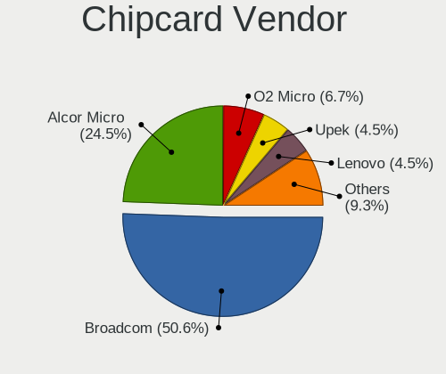

Ubuntu - Tested Hardware & Statistics
-------------------------------------

A project to collect tested hardware configurations for Ubuntu.

Anyone can contribute to this report by the [hw-probe](https://github.com/linuxhw/hw-probe) tool:

    sudo -E hw-probe -all -upload

Please contribute! Especially if your hardware is rare.

This is a report for all computer types. See also reports for [desktops](/Dist/Ubuntu/Desktop/README.md) and [notebooks](/Dist/Ubuntu/Notebook/README.md).

Contents
--------

* [ Test Cases ](#test-cases)

* [ System ](#system)
  - [ OS                       ](#os)
  - [ OS Family                ](#os-family)
  - [ Kernel                   ](#kernel)
  - [ Kernel Family            ](#kernel-family)
  - [ Kernel Major Ver.        ](#kernel-major-ver)
  - [ Arch                     ](#arch)
  - [ DE                       ](#de)
  - [ Display Server           ](#display-server)
  - [ Display Manager          ](#display-manager)
  - [ OS Lang                  ](#os-lang)
  - [ Boot Mode                ](#boot-mode)
  - [ Filesystem               ](#filesystem)
  - [ Part. scheme             ](#part-scheme)
  - [ Dual Boot with Linux/BSD ](#dual-boot-with-linuxbsd)
  - [ Dual Boot (Win)          ](#dual-boot-win)

* [ Board ](#board)
  - [ Vendor                   ](#vendor)
  - [ Model                    ](#model)
  - [ Model Family             ](#model-family)
  - [ MFG Year                 ](#mfg-year)
  - [ Form Factor              ](#form-factor)
  - [ Secure Boot              ](#secure-boot)
  - [ Coreboot                 ](#coreboot)
  - [ RAM Size                 ](#ram-size)
  - [ RAM Used                 ](#ram-used)
  - [ Total Drives             ](#total-drives)
  - [ Has CD-ROM               ](#has-cd-rom)
  - [ Has Ethernet             ](#has-ethernet)
  - [ Has WiFi                 ](#has-wifi)
  - [ Has Bluetooth            ](#has-bluetooth)

* [ Location ](#location)
  - [ Country                  ](#country)
  - [ City                     ](#city)

* [ Drives ](#drives)
  - [ Drive Vendor             ](#drive-vendor)
  - [ Drive Model              ](#drive-model)
  - [ HDD Vendor               ](#hdd-vendor)
  - [ SSD Vendor               ](#ssd-vendor)
  - [ Drive Kind               ](#drive-kind)
  - [ Drive Connector          ](#drive-connector)
  - [ Drive Size               ](#drive-size)
  - [ Space Total              ](#space-total)
  - [ Space Used               ](#space-used)
  - [ Malfunc. Drives          ](#malfunc-drives)
  - [ Malfunc. Drive Vendor    ](#malfunc-drive-vendor)
  - [ Malfunc. HDD Vendor      ](#malfunc-hdd-vendor)
  - [ Malfunc. Drive Kind      ](#malfunc-drive-kind)
  - [ Failed Drives            ](#failed-drives)
  - [ Failed Drive Vendor      ](#failed-drive-vendor)
  - [ Drive Status             ](#drive-status)

* [ Storage controller ](#storage-controller)
  - [ Storage Vendor           ](#storage-vendor)
  - [ Storage Model            ](#storage-model)
  - [ Storage Kind             ](#storage-kind)

* [ Processor ](#processor)
  - [ CPU Vendor               ](#cpu-vendor)
  - [ CPU Model                ](#cpu-model)
  - [ CPU Model Family         ](#cpu-model-family)
  - [ CPU Cores                ](#cpu-cores)
  - [ CPU Sockets              ](#cpu-sockets)
  - [ CPU Threads              ](#cpu-threads)
  - [ CPU Op-Modes             ](#cpu-op-modes)
  - [ CPU Microcode            ](#cpu-microcode)
  - [ CPU Microarch            ](#cpu-microarch)

* [ Graphics ](#graphics)
  - [ GPU Vendor               ](#gpu-vendor)
  - [ GPU Model                ](#gpu-model)
  - [ GPU Combo                ](#gpu-combo)
  - [ GPU Driver               ](#gpu-driver)
  - [ GPU Memory               ](#gpu-memory)

* [ Monitor ](#monitor)
  - [ Monitor Vendor           ](#monitor-vendor)
  - [ Monitor Model            ](#monitor-model)
  - [ Monitor Resolution       ](#monitor-resolution)
  - [ Monitor Diagonal         ](#monitor-diagonal)
  - [ Monitor Width            ](#monitor-width)
  - [ Aspect Ratio             ](#aspect-ratio)
  - [ Monitor Area             ](#monitor-area)
  - [ Pixel Density            ](#pixel-density)
  - [ Multiple Monitors        ](#multiple-monitors)

* [ Network ](#network)
  - [ Net Controller Vendor    ](#net-controller-vendor)
  - [ Net Controller Model     ](#net-controller-model)
  - [ Wireless Vendor          ](#wireless-vendor)
  - [ Wireless Model           ](#wireless-model)
  - [ Ethernet Vendor          ](#ethernet-vendor)
  - [ Ethernet Model           ](#ethernet-model)
  - [ Net Controller Kind      ](#net-controller-kind)
  - [ Used Controller          ](#used-controller)
  - [ NICs                     ](#nics)
  - [ IPv6                     ](#ipv6)

* [ Bluetooth ](#bluetooth)
  - [ Bluetooth Vendor         ](#bluetooth-vendor)
  - [ Bluetooth Model          ](#bluetooth-model)

* [ Sound ](#sound)
  - [ Sound Vendor             ](#sound-vendor)
  - [ Sound Model              ](#sound-model)

* [ Memory ](#memory)
  - [ Memory Vendor            ](#memory-vendor)
  - [ Memory Model             ](#memory-model)
  - [ Memory Kind              ](#memory-kind)
  - [ Memory Form Factor       ](#memory-form-factor)
  - [ Memory Size              ](#memory-size)
  - [ Memory Speed             ](#memory-speed)

* [ Printers & scanners ](#printers--scanners)
  - [ Printer Vendor           ](#printer-vendor)
  - [ Printer Model            ](#printer-model)
  - [ Scanner Vendor           ](#scanner-vendor)
  - [ Scanner Model            ](#scanner-model)

* [ Camera ](#camera)
  - [ Camera Vendor            ](#camera-vendor)
  - [ Camera Model             ](#camera-model)

* [ Security ](#security)
  - [ Fingerprint Vendor       ](#fingerprint-vendor)
  - [ Fingerprint Model        ](#fingerprint-model)
  - [ Chipcard Vendor          ](#chipcard-vendor)
  - [ Chipcard Model           ](#chipcard-model)

* [ Unsupported ](#unsupported)
  - [ Unsupported Devices      ](#unsupported-devices)
  - [ Unsupported Device Types ](#unsupported-device-types)

Test Cases
----------

Total: 116046

| Vendor        | Model                       | Form-Factor | Probe                                                      | Date         |
|---------------|-----------------------------|-------------|------------------------------------------------------------|--------------|
| Acer          | Aspire E5-575               | Notebook    | [8a7b632b3f](https://linux-hardware.org/?probe=8a7b632b3f) | Jan 06, 2025 |
| ASUSTek       | P8Z68-V LX                  | Desktop     | [2b21c81822](https://linux-hardware.org/?probe=2b21c81822) | Jan 06, 2025 |
| Lenovo        | SHARKBAY SDK0J40700 WIN     | Desktop     | [262450ac44](https://linux-hardware.org/?probe=262450ac44) | Jan 06, 2025 |
| Medion        | Akoya E6240T                | Notebook    | [bb72b25bf7](https://linux-hardware.org/?probe=bb72b25bf7) | Jan 06, 2025 |
| Lenovo        | G40-30 80FY                 | Notebook    | [398cb6b840](https://linux-hardware.org/?probe=398cb6b840) | Jan 06, 2025 |
| Dell          | 0V0D45 A01                  | All in one  | [d019c812b7](https://linux-hardware.org/?probe=d019c812b7) | Jan 06, 2025 |
| Acer          | Swift SFG14-72              | Notebook    | [d07bf77aa4](https://linux-hardware.org/?probe=d07bf77aa4) | Jan 06, 2025 |
| Lenovo        | ThinkPad P51 20HJS0D201     | Notebook    | [f43357e57a](https://linux-hardware.org/?probe=f43357e57a) | Jan 06, 2025 |
| MSI           | B85M-E45                    | Desktop     | [ce0086ec71](https://linux-hardware.org/?probe=ce0086ec71) | Jan 06, 2025 |
| MSI           | B85M-E45                    | Desktop     | [a341da3c42](https://linux-hardware.org/?probe=a341da3c42) | Jan 06, 2025 |
| Dell          | XPS 13 9305                 | Notebook    | [77f98c4014](https://linux-hardware.org/?probe=77f98c4014) | Jan 06, 2025 |
| ASUSTek       | ROG STRIX B550-F GAMING ... | Desktop     | [88b1c0c262](https://linux-hardware.org/?probe=88b1c0c262) | Jan 06, 2025 |
| Dell          | Precision M6800             | Notebook    | [01d1dcb2d8](https://linux-hardware.org/?probe=01d1dcb2d8) | Jan 06, 2025 |
| Alienware     | m18 R2                      | Notebook    | [6277d13cf5](https://linux-hardware.org/?probe=6277d13cf5) | Jan 06, 2025 |
| Lenovo        | SHARKBAY 31900058 STD       | Desktop     | [e1ab989081](https://linux-hardware.org/?probe=e1ab989081) | Jan 06, 2025 |
| Dell          | Precision 3571              | Notebook    | [95b1b27d71](https://linux-hardware.org/?probe=95b1b27d71) | Jan 06, 2025 |
| Dell          | Inspiron 14 7430 2-in-1     | Convertible | [12732aa34d](https://linux-hardware.org/?probe=12732aa34d) | Jan 06, 2025 |
| ASRock        | B250 Gaming K4              | Desktop     | [dc5750e7fc](https://linux-hardware.org/?probe=dc5750e7fc) | Jan 06, 2025 |
| ASRock        | N100M                       | Desktop     | [231da8b814](https://linux-hardware.org/?probe=231da8b814) | Jan 06, 2025 |
| HP            | Pavilion Notebook           | Notebook    | [eb8cc11cc5](https://linux-hardware.org/?probe=eb8cc11cc5) | Jan 05, 2025 |
| Lenovo        | IdeaPad Slim 5 16IRU9 83... | Notebook    | [916567f213](https://linux-hardware.org/?probe=916567f213) | Jan 05, 2025 |
| Dell          | Latitude E6230              | Notebook    | [638ece1f17](https://linux-hardware.org/?probe=638ece1f17) | Jan 05, 2025 |
| ASUSTek       | PRIME Z690-A                | Desktop     | [a2a616fa46](https://linux-hardware.org/?probe=a2a616fa46) | Jan 05, 2025 |
| Lenovo        | ThinkPad X13 Gen 3 21BQA... | Notebook    | [ec40ca9885](https://linux-hardware.org/?probe=ec40ca9885) | Jan 05, 2025 |
| Dell          | Latitude 3340               | Notebook    | [083c2f79ec](https://linux-hardware.org/?probe=083c2f79ec) | Jan 05, 2025 |
| ASUSTek       | VivoBook_ASUSLaptop X150... | Notebook    | [5e3d055319](https://linux-hardware.org/?probe=5e3d055319) | Jan 05, 2025 |
| Toshiba       | Satellite C670-14M          | Notebook    | [9e54cf257c](https://linux-hardware.org/?probe=9e54cf257c) | Jan 05, 2025 |
| HP            | Pavilion dv8                | Notebook    | [ab69193742](https://linux-hardware.org/?probe=ab69193742) | Jan 05, 2025 |
| Acer          | Aspire A514-53              | Notebook    | [88e5da8b9d](https://linux-hardware.org/?probe=88e5da8b9d) | Jan 05, 2025 |
| MSI           | B650M GAMING PLUS WIFI      | Desktop     | [c7c27f65c6](https://linux-hardware.org/?probe=c7c27f65c6) | Jan 05, 2025 |
| Acer          | Aspire A514-53              | Notebook    | [a4dc1a43a2](https://linux-hardware.org/?probe=a4dc1a43a2) | Jan 05, 2025 |
| ASUSTek       | PRIME Z690-A                | Desktop     | [17a75e1af5](https://linux-hardware.org/?probe=17a75e1af5) | Jan 05, 2025 |
| MSI           | B650M GAMING PLUS WIFI      | Desktop     | [945b45d496](https://linux-hardware.org/?probe=945b45d496) | Jan 05, 2025 |
| Chuwi         | GemiBook Pro                | Notebook    | [cb3ae7cb2a](https://linux-hardware.org/?probe=cb3ae7cb2a) | Jan 05, 2025 |
| Lenovo        | ThinkPad W530 2441AG6       | Notebook    | [20e239cb8a](https://linux-hardware.org/?probe=20e239cb8a) | Jan 05, 2025 |
| Chuwi         | GemiBook Pro                | Notebook    | [9518969af8](https://linux-hardware.org/?probe=9518969af8) | Jan 05, 2025 |
| HP            | Notebook                    | Notebook    | [077f55a6c7](https://linux-hardware.org/?probe=077f55a6c7) | Jan 05, 2025 |
| Acer          | Aspire A315-24PT            | Notebook    | [e800b5fdb7](https://linux-hardware.org/?probe=e800b5fdb7) | Jan 05, 2025 |
| ASUSTek       | Z97-K                       | Desktop     | [ba47136806](https://linux-hardware.org/?probe=ba47136806) | Jan 05, 2025 |
| Apple         | Mac-35C5E08120C7EEAF Mac... | Mini pc     | [dd4205dcdf](https://linux-hardware.org/?probe=dd4205dcdf) | Jan 05, 2025 |
| Sony          | SVD112290S                  | Notebook    | [a9400fd190](https://linux-hardware.org/?probe=a9400fd190) | Jan 05, 2025 |
| Lenovo        | ThinkBook 14 G2 ITL 20VD    | Notebook    | [6a8e47f57b](https://linux-hardware.org/?probe=6a8e47f57b) | Jan 05, 2025 |
| Acer          | Aspire A115-32              | Notebook    | [2c6043fd56](https://linux-hardware.org/?probe=2c6043fd56) | Jan 05, 2025 |
| Dell          | 03X6X0 A06                  | Server      | [969b046986](https://linux-hardware.org/?probe=969b046986) | Jan 05, 2025 |
| ASRock        | Z790 PG SONIC               | Desktop     | [8404feef08](https://linux-hardware.org/?probe=8404feef08) | Jan 05, 2025 |
| ASRock        | B450M Pro4                  | Desktop     | [f1b064f039](https://linux-hardware.org/?probe=f1b064f039) | Jan 05, 2025 |
| ASUSTek       | M5A78L-M LX V2              | Desktop     | [02a12f94e1](https://linux-hardware.org/?probe=02a12f94e1) | Jan 05, 2025 |
| ASUSTek       | Z97-PRO GAMER               | Desktop     | [cc569301fd](https://linux-hardware.org/?probe=cc569301fd) | Jan 05, 2025 |
| ASUSTek       | PRIME Z690M-PLUS D4         | Desktop     | [beaaf37101](https://linux-hardware.org/?probe=beaaf37101) | Jan 05, 2025 |
| Acer          | Aspire A315-24PT            | Notebook    | [cea7933cc6](https://linux-hardware.org/?probe=cea7933cc6) | Jan 05, 2025 |
| Gigabyte      | G41MT-S2PT                  | Desktop     | [d4592a5f61](https://linux-hardware.org/?probe=d4592a5f61) | Jan 05, 2025 |
| Intel         | X99                         | Desktop     | [0179690cc0](https://linux-hardware.org/?probe=0179690cc0) | Jan 05, 2025 |
| Dell          | G3 3500                     | Notebook    | [5c6b757b24](https://linux-hardware.org/?probe=5c6b757b24) | Jan 05, 2025 |
| Medion        | P15648                      | Notebook    | [e4b0850870](https://linux-hardware.org/?probe=e4b0850870) | Jan 05, 2025 |
| MSI           | MPG B650I EDGE WIFI         | Desktop     | [e2c6dd2497](https://linux-hardware.org/?probe=e2c6dd2497) | Jan 05, 2025 |
| eMachines     | WMCP61M                     | Desktop     | [e98c249cfc](https://linux-hardware.org/?probe=e98c249cfc) | Jan 04, 2025 |
| HP            | Compaq Presario CQ56        | Notebook    | [3365fbb5bc](https://linux-hardware.org/?probe=3365fbb5bc) | Jan 04, 2025 |
| ASRock        | B650M Pro RS WiFi           | Desktop     | [4624d90ffe](https://linux-hardware.org/?probe=4624d90ffe) | Jan 04, 2025 |
| Framework     | Laptop 16 (AMD Ryzen 704... | Notebook    | [0bff2b1d13](https://linux-hardware.org/?probe=0bff2b1d13) | Jan 04, 2025 |
| Advantech     | MiC-770 v2                  | Desktop     | [1d7c3f988e](https://linux-hardware.org/?probe=1d7c3f988e) | Jan 04, 2025 |
| ASRock        | B650M Pro RS WiFi           | Desktop     | [490322b097](https://linux-hardware.org/?probe=490322b097) | Jan 04, 2025 |
| HP            | 8643 SMVB                   | Desktop     | [246d1f3f87](https://linux-hardware.org/?probe=246d1f3f87) | Jan 04, 2025 |
| ASUSTek       | M5A97 R2.0                  | Desktop     | [7eb3a63b51](https://linux-hardware.org/?probe=7eb3a63b51) | Jan 04, 2025 |
| HP            | ProBook 430 G7              | Notebook    | [f1b89f85cf](https://linux-hardware.org/?probe=f1b89f85cf) | Jan 04, 2025 |
| ASUSTek       | TUF Gaming B550M-PLUS WI... | Desktop     | [bbc74e0c64](https://linux-hardware.org/?probe=bbc74e0c64) | Jan 04, 2025 |
| HP            | ZBook 15 G3                 | Notebook    | [548eae93b9](https://linux-hardware.org/?probe=548eae93b9) | Jan 04, 2025 |
| Dell          | 0F642F A00                  | Desktop     | [3ec5a43d19](https://linux-hardware.org/?probe=3ec5a43d19) | Jan 04, 2025 |
| Lenovo        | IdeaPad Slim 5 14IMH9 83... | Notebook    | [455af071a7](https://linux-hardware.org/?probe=455af071a7) | Jan 04, 2025 |
| ASUSTek       | ASUS Zenbook S 14 UX5406... | Notebook    | [3497123a57](https://linux-hardware.org/?probe=3497123a57) | Jan 04, 2025 |
| MSI           | Katana GF66 11UC            | Notebook    | [aca2d91d26](https://linux-hardware.org/?probe=aca2d91d26) | Jan 04, 2025 |
| HP            | 3397                        | Desktop     | [918fca6eda](https://linux-hardware.org/?probe=918fca6eda) | Jan 04, 2025 |
| HP            | 21EF                        | Desktop     | [f86b96338c](https://linux-hardware.org/?probe=f86b96338c) | Jan 04, 2025 |
| Lenovo        | IdeaPad Slim 5 16IRL8 82... | Notebook    | [c7c71ab41b](https://linux-hardware.org/?probe=c7c71ab41b) | Jan 04, 2025 |
| Lenovo        | G50-70 20351                | Notebook    | [666751867c](https://linux-hardware.org/?probe=666751867c) | Jan 04, 2025 |
| Dell          | Inspiron 3541               | Notebook    | [206872a37f](https://linux-hardware.org/?probe=206872a37f) | Jan 04, 2025 |
| Dell          | 0VRWRC A00                  | Desktop     | [37a490b1e0](https://linux-hardware.org/?probe=37a490b1e0) | Jan 04, 2025 |
| HP            | 3397                        | Desktop     | [b9c57503ea](https://linux-hardware.org/?probe=b9c57503ea) | Jan 04, 2025 |
| ASUSTek       | ROG Strix G713RC_G713RC     | Notebook    | [721dbc3f65](https://linux-hardware.org/?probe=721dbc3f65) | Jan 04, 2025 |
| ASUSTek       | ROG Strix G713RC_G713RC     | Notebook    | [e6b0e5183e](https://linux-hardware.org/?probe=e6b0e5183e) | Jan 04, 2025 |
| HP            | Laptop 15-bw0xx             | Notebook    | [43b69637a0](https://linux-hardware.org/?probe=43b69637a0) | Jan 04, 2025 |
| ASRock        | 970 Pro3 R2.0               | Desktop     | [adb7b1fe9d](https://linux-hardware.org/?probe=adb7b1fe9d) | Jan 04, 2025 |
| Unknown       | HX90                        | Desktop     | [b4c4d726e4](https://linux-hardware.org/?probe=b4c4d726e4) | Jan 04, 2025 |
| Supermicro    | X9DRH-7TF/7F/iTF/iF         | Server      | [ca71a1b4d6](https://linux-hardware.org/?probe=ca71a1b4d6) | Jan 04, 2025 |
| Lenovo        | IdeaPad S145-15IIL 81W8     | Notebook    | [96316f7cee](https://linux-hardware.org/?probe=96316f7cee) | Jan 04, 2025 |
| ASUSTek       | P8H61-MX USB3               | Desktop     | [b3b2df2fe7](https://linux-hardware.org/?probe=b3b2df2fe7) | Jan 04, 2025 |
| ASUSTek       | P8H61-MX USB3               | Desktop     | [1600afa2eb](https://linux-hardware.org/?probe=1600afa2eb) | Jan 04, 2025 |
| Dell          | Inspiron 5480               | Notebook    | [23f4e47841](https://linux-hardware.org/?probe=23f4e47841) | Jan 04, 2025 |
| ASUSTek       | VivoBook_ASUSLaptop K360... | Notebook    | [adec02cbc1](https://linux-hardware.org/?probe=adec02cbc1) | Jan 04, 2025 |
| ASUSTek       | G75VW                       | Notebook    | [ff570669d5](https://linux-hardware.org/?probe=ff570669d5) | Jan 04, 2025 |
| Apple         | MacBookPro9,2               | Notebook    | [cfa406503c](https://linux-hardware.org/?probe=cfa406503c) | Jan 04, 2025 |
| HP            | 1998                        | Desktop     | [cccf71a69c](https://linux-hardware.org/?probe=cccf71a69c) | Jan 04, 2025 |
| Dell          | Vostro 15 3530              | Notebook    | [20a13b2865](https://linux-hardware.org/?probe=20a13b2865) | Jan 04, 2025 |
| Gigabyte      | Z790 AORUS ELITE AX         | Desktop     | [5e7dda5f4d](https://linux-hardware.org/?probe=5e7dda5f4d) | Jan 04, 2025 |
| HP            | Laptop 15-db0xxx            | Notebook    | [15039e5101](https://linux-hardware.org/?probe=15039e5101) | Jan 04, 2025 |
| ASUSTek       | H97-PLUS                    | Desktop     | [fd886041fc](https://linux-hardware.org/?probe=fd886041fc) | Jan 04, 2025 |
| ASUSTek       | H97-PLUS                    | Desktop     | [dc6f9929d7](https://linux-hardware.org/?probe=dc6f9929d7) | Jan 04, 2025 |
| ASUSTek       | VivoBook_ASUSLaptop X415... | Notebook    | [28e55a6043](https://linux-hardware.org/?probe=28e55a6043) | Jan 03, 2025 |
| ASUSTek       | PRIME B250M-C               | Desktop     | [deab95f2af](https://linux-hardware.org/?probe=deab95f2af) | Jan 03, 2025 |
| MSI           | X670E GAMING PLUS WIFI      | Desktop     | [fcdb536656](https://linux-hardware.org/?probe=fcdb536656) | Jan 03, 2025 |
| HP            | Pavilion Notebook           | Notebook    | [41e590e617](https://linux-hardware.org/?probe=41e590e617) | Jan 03, 2025 |
| MSI           | MS-16Y1                     | Notebook    | [7125d07ec2](https://linux-hardware.org/?probe=7125d07ec2) | Jan 03, 2025 |
| Microsoft     | Surface Book 3              | Tablet      | [03611f8371](https://linux-hardware.org/?probe=03611f8371) | Jan 03, 2025 |
| Acer          | Aspire E5-576G              | Notebook    | [9f344c14d4](https://linux-hardware.org/?probe=9f344c14d4) | Jan 03, 2025 |
| HP            | 250 G7 Notebook PC          | Notebook    | [6bf480c75a](https://linux-hardware.org/?probe=6bf480c75a) | Jan 03, 2025 |
| Gigabyte      | B550 AORUS ELITE V2         | Desktop     | [c841518658](https://linux-hardware.org/?probe=c841518658) | Jan 03, 2025 |
| ASUSTek       | VivoBook_ASUSLaptop X515... | Notebook    | [ac0b2b8219](https://linux-hardware.org/?probe=ac0b2b8219) | Jan 03, 2025 |
| HP            | 15                          | Notebook    | [8542f54ea5](https://linux-hardware.org/?probe=8542f54ea5) | Jan 03, 2025 |
| Acer          | Aspire A115-32              | Notebook    | [c3f625776f](https://linux-hardware.org/?probe=c3f625776f) | Jan 03, 2025 |
| Lenovo        | ThinkPad T540p 20BE00B2M... | Notebook    | [d3fdfbc445](https://linux-hardware.org/?probe=d3fdfbc445) | Jan 03, 2025 |
| Dell          | Inspiron 7786               | Convertible | [7a0bb3a19e](https://linux-hardware.org/?probe=7a0bb3a19e) | Jan 03, 2025 |
| HP            | 805D                        | Desktop     | [9dd735123b](https://linux-hardware.org/?probe=9dd735123b) | Jan 03, 2025 |
| Gigabyte      | B450 GAMING X               | Desktop     | [92b892fb46](https://linux-hardware.org/?probe=92b892fb46) | Jan 03, 2025 |
| Unknown       | Unknown                     | Notebook    | [4a568ea48d](https://linux-hardware.org/?probe=4a568ea48d) | Jan 03, 2025 |
| HP            | EliteBook 840 G2            | Notebook    | [54ab368174](https://linux-hardware.org/?probe=54ab368174) | Jan 03, 2025 |
| ASRock        | X470 Taichi                 | Desktop     | [72c6b2bcbb](https://linux-hardware.org/?probe=72c6b2bcbb) | Jan 03, 2025 |
| Lenovo        | IdeaPad Flex-15IML 81XH     | Convertible | [9579158217](https://linux-hardware.org/?probe=9579158217) | Jan 03, 2025 |
| ASRock        | X470 Taichi                 | Desktop     | [8cadf9a645](https://linux-hardware.org/?probe=8cadf9a645) | Jan 03, 2025 |
| Acer          | Extensa 215-55              | Notebook    | [fc29d8c8b1](https://linux-hardware.org/?probe=fc29d8c8b1) | Jan 03, 2025 |
| Dell          | G16 7630                    | Notebook    | [f98a9a65e0](https://linux-hardware.org/?probe=f98a9a65e0) | Jan 03, 2025 |
| Dell          | G16 7630                    | Notebook    | [11b2b5a832](https://linux-hardware.org/?probe=11b2b5a832) | Jan 03, 2025 |
| HP            | EliteBook 840 G5            | Notebook    | [ec0eaf35ef](https://linux-hardware.org/?probe=ec0eaf35ef) | Jan 03, 2025 |
| Acer          | Aspire V5-591G              | Notebook    | [fba09b3376](https://linux-hardware.org/?probe=fba09b3376) | Jan 03, 2025 |
| ASRock        | B450M Pro4                  | Desktop     | [d8b50816f0](https://linux-hardware.org/?probe=d8b50816f0) | Jan 03, 2025 |
| ASUSTek       | PRIME X370-A                | Desktop     | [86c0b9c6d4](https://linux-hardware.org/?probe=86c0b9c6d4) | Jan 03, 2025 |
| Dell          | XPS 15 9560                 | Notebook    | [924d90cdcc](https://linux-hardware.org/?probe=924d90cdcc) | Jan 03, 2025 |
| Dell          | XPS 15 9560                 | Notebook    | [5a9c188db1](https://linux-hardware.org/?probe=5a9c188db1) | Jan 03, 2025 |
| ASUSTek       | H170 PRO GAMING             | Desktop     | [743efb1121](https://linux-hardware.org/?probe=743efb1121) | Jan 03, 2025 |
| Apple         | MacBookPro12,1              | Notebook    | [c226449ca2](https://linux-hardware.org/?probe=c226449ca2) | Jan 03, 2025 |
| HP            | ProBook 650 G2              | Notebook    | [b2fc855e3e](https://linux-hardware.org/?probe=b2fc855e3e) | Jan 03, 2025 |
| HP            | EliteBook 840 G6            | Notebook    | [6781e260b0](https://linux-hardware.org/?probe=6781e260b0) | Jan 03, 2025 |
| HP            | EliteBook 840 G6            | Notebook    | [fd2f975353](https://linux-hardware.org/?probe=fd2f975353) | Jan 03, 2025 |
| Dell          | 033FF6 A00                  | Desktop     | [621ced80c1](https://linux-hardware.org/?probe=621ced80c1) | Jan 03, 2025 |
| Lenovo        | IdeaPad 3 15ITL6 82H8       | Notebook    | [58e41b0f0f](https://linux-hardware.org/?probe=58e41b0f0f) | Jan 03, 2025 |
| ASUSTek       | UL50Vg                      | Notebook    | [6305475a87](https://linux-hardware.org/?probe=6305475a87) | Jan 03, 2025 |
| Lenovo        | Yoga C930-13IKB 81C4        | Convertible | [fc7c5a7792](https://linux-hardware.org/?probe=fc7c5a7792) | Jan 03, 2025 |
| Acer          | Aspire A515-52              | Notebook    | [4b5bf879c2](https://linux-hardware.org/?probe=4b5bf879c2) | Jan 03, 2025 |
| sunxi         | Unknown                     | Soc         | [48a1a5a5fa](https://linux-hardware.org/?probe=48a1a5a5fa) | Jan 03, 2025 |
| Positivo B... | VJFE52F11X-B2511H           | Notebook    | [4ee757e2c0](https://linux-hardware.org/?probe=4ee757e2c0) | Jan 03, 2025 |
| Lenovo        | Slim Pro 7 14ARP8 83AX      | Notebook    | [9acb68fefa](https://linux-hardware.org/?probe=9acb68fefa) | Jan 03, 2025 |
| Apple         | Mac-8ED6AF5B48C039E1 Mac... | Mini pc     | [34ae2be0aa](https://linux-hardware.org/?probe=34ae2be0aa) | Jan 02, 2025 |
| Alienware     | m18 R2                      | Notebook    | [48bc0a64c1](https://linux-hardware.org/?probe=48bc0a64c1) | Jan 02, 2025 |
| HP            | 89D8 SMVB                   | Desktop     | [150bb83ca3](https://linux-hardware.org/?probe=150bb83ca3) | Jan 02, 2025 |
| MSI           | PRO B650-VC WIFI II         | Desktop     | [a86933b617](https://linux-hardware.org/?probe=a86933b617) | Jan 02, 2025 |
| Apple         | Mac-8ED6AF5B48C039E1 Mac... | Mini pc     | [cfb9b15c52](https://linux-hardware.org/?probe=cfb9b15c52) | Jan 02, 2025 |
| Lenovo        | Unknown                     | Notebook    | [a18bd92542](https://linux-hardware.org/?probe=a18bd92542) | Jan 02, 2025 |
| Gigabyte      | B550M DS3H AC               | Desktop     | [1540589e08](https://linux-hardware.org/?probe=1540589e08) | Jan 02, 2025 |
| Dell          | 0Y7WYT A00                  | Desktop     | [3d1a88150a](https://linux-hardware.org/?probe=3d1a88150a) | Jan 02, 2025 |
| MSI           | MPG B550 GAMING PLUS        | Desktop     | [139667b28f](https://linux-hardware.org/?probe=139667b28f) | Jan 02, 2025 |
| Dell          | XPS 13 9380                 | Notebook    | [063a26fa4d](https://linux-hardware.org/?probe=063a26fa4d) | Jan 02, 2025 |
| Dell          | Precision M6800             | Notebook    | [460842482c](https://linux-hardware.org/?probe=460842482c) | Jan 02, 2025 |
| Fujitsu       | LIFEBOOK UH572              | Notebook    | [5625a23ef5](https://linux-hardware.org/?probe=5625a23ef5) | Jan 02, 2025 |
| ASUSTek       | Vivobook Go E1504FA         | Notebook    | [8e5f1ab7d6](https://linux-hardware.org/?probe=8e5f1ab7d6) | Jan 02, 2025 |
| Dell          | Latitude E6430              | Notebook    | [0baf769dd2](https://linux-hardware.org/?probe=0baf769dd2) | Jan 02, 2025 |
| Lenovo        | ThinkPad X250 20CLS45J00    | Notebook    | [23c3a522f9](https://linux-hardware.org/?probe=23c3a522f9) | Jan 02, 2025 |
| Acer          | Aspire E5-575G              | Notebook    | [bea4bbd29a](https://linux-hardware.org/?probe=bea4bbd29a) | Jan 02, 2025 |
| System76      | Lemur Pro                   | Notebook    | [6eae77b375](https://linux-hardware.org/?probe=6eae77b375) | Jan 02, 2025 |
| ASUSTek       | M11BB                       | Desktop     | [55fb5769d0](https://linux-hardware.org/?probe=55fb5769d0) | Jan 02, 2025 |
| Unknown       | Unknown                     | Notebook    | [267152ac45](https://linux-hardware.org/?probe=267152ac45) | Jan 02, 2025 |
| ASUSTek       | ROG Zephyrus G14 GA401QM... | Notebook    | [47b95e50dc](https://linux-hardware.org/?probe=47b95e50dc) | Jan 02, 2025 |
| Lenovo        | Yoga Pro 7 14IMH9 83E2      | Notebook    | [ea461f99c2](https://linux-hardware.org/?probe=ea461f99c2) | Jan 02, 2025 |
| Intel         | 14650HX                     | Desktop     | [a9e917c056](https://linux-hardware.org/?probe=a9e917c056) | Jan 02, 2025 |
| ASRock        | B450 Gaming-ITX/ac          | Desktop     | [b487e51342](https://linux-hardware.org/?probe=b487e51342) | Jan 02, 2025 |
| Lenovo        | IdeaPad 320-15IKB 80XL      | Notebook    | [b90f085315](https://linux-hardware.org/?probe=b90f085315) | Jan 02, 2025 |
| HP            | 8619                        | Desktop     | [a916110ad9](https://linux-hardware.org/?probe=a916110ad9) | Jan 02, 2025 |
| Lenovo        | IdeaPad Slim 5 16ABR8 82... | Notebook    | [a03031641a](https://linux-hardware.org/?probe=a03031641a) | Jan 02, 2025 |
| Lenovo        | No DPK                      | All in one  | [f2ad5b1c81](https://linux-hardware.org/?probe=f2ad5b1c81) | Jan 02, 2025 |
| HP            | 0AECh D                     | Desktop     | [9306b507f4](https://linux-hardware.org/?probe=9306b507f4) | Jan 02, 2025 |
| HP            | ProBook 440 G7              | Notebook    | [b1f0f9f971](https://linux-hardware.org/?probe=b1f0f9f971) | Jan 02, 2025 |
| Microsoft     | Surface Go 3                | Tablet      | [fd805ceeb5](https://linux-hardware.org/?probe=fd805ceeb5) | Jan 02, 2025 |
| ASUSTek       | M4A89TD PRO USB3            | Desktop     | [ca1a55b77d](https://linux-hardware.org/?probe=ca1a55b77d) | Jan 02, 2025 |
| Lenovo        | ThinkPad T460s 20FAS14F0... | Notebook    | [f72b380ee6](https://linux-hardware.org/?probe=f72b380ee6) | Jan 02, 2025 |
| ASUSTek       | ASUS TUF Gaming F15 FX50... | Notebook    | [745341e7fa](https://linux-hardware.org/?probe=745341e7fa) | Jan 02, 2025 |
| ASUSTek       | ASUS EXPERTBOOK B7402FEA... | Convertible | [0b0c4edb5a](https://linux-hardware.org/?probe=0b0c4edb5a) | Jan 02, 2025 |
| Packard Be... | EasyNote TK87               | Notebook    | [468680be46](https://linux-hardware.org/?probe=468680be46) | Jan 02, 2025 |
| Packard Be... | EasyNote TK87               | Notebook    | [d0bb5660e7](https://linux-hardware.org/?probe=d0bb5660e7) | Jan 02, 2025 |
| Sony          | SVF1521G6EW                 | Notebook    | [a9d8497c8d](https://linux-hardware.org/?probe=a9d8497c8d) | Jan 02, 2025 |
| MSI           | Z170-A PRO                  | Desktop     | [b1b8d67385](https://linux-hardware.org/?probe=b1b8d67385) | Jan 02, 2025 |
| MSI           | MPG B760I EDGE WIFI         | Desktop     | [8d39826a67](https://linux-hardware.org/?probe=8d39826a67) | Jan 02, 2025 |
| Dell          | XPS 13 9380                 | Notebook    | [fd629307a9](https://linux-hardware.org/?probe=fd629307a9) | Jan 02, 2025 |
| ASUSTek       | PRIME B250M-PLUS            | Desktop     | [5e1c09c578](https://linux-hardware.org/?probe=5e1c09c578) | Jan 02, 2025 |
| HP            | ZBook 15u G3                | Notebook    | [da5c26013c](https://linux-hardware.org/?probe=da5c26013c) | Jan 02, 2025 |
| HC Technol... | HCAR5000-MI                 | Desktop     | [1d85db58d0](https://linux-hardware.org/?probe=1d85db58d0) | Jan 02, 2025 |
| sunxi         | Unknown                     | Soc         | [b37770e49e](https://linux-hardware.org/?probe=b37770e49e) | Jan 01, 2025 |
| Lenovo        | G50-70 20351                | Notebook    | [9043dbb9a9](https://linux-hardware.org/?probe=9043dbb9a9) | Jan 01, 2025 |
| Dell          | Latitude E6230              | Notebook    | [8611ea969f](https://linux-hardware.org/?probe=8611ea969f) | Jan 01, 2025 |
| Fujitsu       | D3427-A1 S26361-D3427-A1    | Desktop     | [0cd4d1a295](https://linux-hardware.org/?probe=0cd4d1a295) | Jan 01, 2025 |
| ASUSTek       | ZenBook UX482EG_UX482EG     | Notebook    | [708ed8d150](https://linux-hardware.org/?probe=708ed8d150) | Jan 01, 2025 |
| ASUSTek       | ASUS TUF Gaming A14 FA40... | Notebook    | [97c438ca9c](https://linux-hardware.org/?probe=97c438ca9c) | Jan 01, 2025 |
| ASUSTek       | PRIME Z790-P WIFI           | Desktop     | [74e1ede819](https://linux-hardware.org/?probe=74e1ede819) | Jan 01, 2025 |
| Minix         | NEO Z100-0dB                | All in one  | [7a69de9ac1](https://linux-hardware.org/?probe=7a69de9ac1) | Jan 01, 2025 |
| Acer          | Aspire E5-575G              | Notebook    | [131ac42ca5](https://linux-hardware.org/?probe=131ac42ca5) | Jan 01, 2025 |
| Dell          | Latitude E5420              | Notebook    | [e1a5c8fd29](https://linux-hardware.org/?probe=e1a5c8fd29) | Jan 01, 2025 |
| Acer          | Swift SF314-52G             | Notebook    | [77f207d738](https://linux-hardware.org/?probe=77f207d738) | Jan 01, 2025 |
| Sony          | VAIO                        | All in one  | [44a108150c](https://linux-hardware.org/?probe=44a108150c) | Jan 01, 2025 |
| HP            | 0AECh D                     | Desktop     | [0827eed993](https://linux-hardware.org/?probe=0827eed993) | Jan 01, 2025 |
| ASRock        | H310CM-HG4                  | Desktop     | [ea045be01b](https://linux-hardware.org/?probe=ea045be01b) | Jan 01, 2025 |
| ASUSTek       | K93SM                       | Notebook    | [de80ff2a02](https://linux-hardware.org/?probe=de80ff2a02) | Jan 01, 2025 |
| HP            | 8767 A                      | Desktop     | [186d8b894f](https://linux-hardware.org/?probe=186d8b894f) | Jan 01, 2025 |
| ASUSTek       | PN53                        | Mini pc     | [2029a257eb](https://linux-hardware.org/?probe=2029a257eb) | Jan 01, 2025 |
| Apple         | Mac-F2238BAE iMac11,3       | All in one  | [5e464458db](https://linux-hardware.org/?probe=5e464458db) | Jan 01, 2025 |
| Lenovo        | ThinkPad X220 4291QZ1       | Notebook    | [ffd4949fc5](https://linux-hardware.org/?probe=ffd4949fc5) | Jan 01, 2025 |
| Lenovo        | ThinkPad X220 4291QZ1       | Notebook    | [68cf73b7b3](https://linux-hardware.org/?probe=68cf73b7b3) | Jan 01, 2025 |
| Lenovo        | G50-30 80G0                 | Notebook    | [f9d8f3d7a1](https://linux-hardware.org/?probe=f9d8f3d7a1) | Jan 01, 2025 |
| Apple         | Mac-F65AE981FFA204ED Mac... | Mini pc     | [7bd33042fa](https://linux-hardware.org/?probe=7bd33042fa) | Jan 01, 2025 |
| Apple         | MacBookPro12,1              | Notebook    | [1340d405bf](https://linux-hardware.org/?probe=1340d405bf) | Jan 01, 2025 |
| ASUSTek       | PRIME X370-A                | Desktop     | [1138447504](https://linux-hardware.org/?probe=1138447504) | Jan 01, 2025 |
| Apple         | MacBookPro9,2               | Notebook    | [319272bf03](https://linux-hardware.org/?probe=319272bf03) | Jan 01, 2025 |
| HP            | Laptop 15-dy2xxx            | Notebook    | [c1ed1a0524](https://linux-hardware.org/?probe=c1ed1a0524) | Jan 01, 2025 |
| Lenovo        | ThinkPad T14s Gen 6 21N1... | Notebook    | [afb68eacd9](https://linux-hardware.org/?probe=afb68eacd9) | Jan 01, 2025 |
| ASUSTek       | TUF Gaming X570-PLUS        | Desktop     | [0319b9ba0d](https://linux-hardware.org/?probe=0319b9ba0d) | Jan 01, 2025 |
| Apple         | MacBookPro14,3              | Notebook    | [b1813c3452](https://linux-hardware.org/?probe=b1813c3452) | Jan 01, 2025 |
| Apple         | MacBookPro14,3              | Notebook    | [d3cba6d56e](https://linux-hardware.org/?probe=d3cba6d56e) | Jan 01, 2025 |
| AZW           | SER V1.0                    | Mini pc     | [b68af4b0f8](https://linux-hardware.org/?probe=b68af4b0f8) | Jan 01, 2025 |
| ASUSTek       | ROG STRIX B550-F GAMING     | Desktop     | [9802b59126](https://linux-hardware.org/?probe=9802b59126) | Jan 01, 2025 |
| Lenovo        | V155-15API 81V5             | Notebook    | [145938b91b](https://linux-hardware.org/?probe=145938b91b) | Dec 31, 2024 |
| AZW           | MINI S                      | Desktop     | [e05536561b](https://linux-hardware.org/?probe=e05536561b) | Dec 31, 2024 |
| Apple         | MacBookAir7,2               | Notebook    | [0b5dbc9283](https://linux-hardware.org/?probe=0b5dbc9283) | Dec 31, 2024 |
| Pegatron      | 2AD5                        | Desktop     | [1df79ca2a5](https://linux-hardware.org/?probe=1df79ca2a5) | Dec 31, 2024 |
| Apple         | MacBookAir7,2               | Notebook    | [531feb4d85](https://linux-hardware.org/?probe=531feb4d85) | Dec 31, 2024 |
| Samsung       | 550XDA                      | Notebook    | [f23c082843](https://linux-hardware.org/?probe=f23c082843) | Dec 31, 2024 |
| Samsung       | 370E4K                      | Notebook    | [ba2171b4e3](https://linux-hardware.org/?probe=ba2171b4e3) | Dec 31, 2024 |
| HP            | Pavilion dv7                | Notebook    | [80ac393681](https://linux-hardware.org/?probe=80ac393681) | Dec 31, 2024 |
| Pegatron      | 2AD5                        | Desktop     | [59fc90dfa9](https://linux-hardware.org/?probe=59fc90dfa9) | Dec 31, 2024 |
| Dell          | Precision 5520              | Notebook    | [88832dcaf1](https://linux-hardware.org/?probe=88832dcaf1) | Dec 31, 2024 |
| HP            | 1850                        | Desktop     | [e75a7ec226](https://linux-hardware.org/?probe=e75a7ec226) | Dec 31, 2024 |
| HP            | 1850                        | Desktop     | [935c16c9b6](https://linux-hardware.org/?probe=935c16c9b6) | Dec 31, 2024 |
| Acer          | Veriton X490G               | Desktop     | [0ce5ae0e9c](https://linux-hardware.org/?probe=0ce5ae0e9c) | Dec 31, 2024 |
| Dell          | Vostro 13 5310              | Notebook    | [b7f2eb4035](https://linux-hardware.org/?probe=b7f2eb4035) | Dec 31, 2024 |
| ASUSTek       | ROG STRIX Z390-F GAMING     | Desktop     | [558ed56269](https://linux-hardware.org/?probe=558ed56269) | Dec 31, 2024 |
| Acer          | Nitro ANV15-41              | Notebook    | [00953a17b5](https://linux-hardware.org/?probe=00953a17b5) | Dec 31, 2024 |
| Apple         | Mac-F2268DAE                | All in one  | [46feff6cc6](https://linux-hardware.org/?probe=46feff6cc6) | Dec 31, 2024 |
| BOSGAME       | DNB20 series                | Notebook    | [7c23d0edba](https://linux-hardware.org/?probe=7c23d0edba) | Dec 31, 2024 |
| ASUSTek       | PRIME X370-A                | Desktop     | [e7919fc318](https://linux-hardware.org/?probe=e7919fc318) | Dec 31, 2024 |
| ASUSTek       | Z97-K                       | Desktop     | [ead5b54010](https://linux-hardware.org/?probe=ead5b54010) | Dec 31, 2024 |
| Intel         | DH61WW AAG23116-302         | Desktop     | [d5dae00d07](https://linux-hardware.org/?probe=d5dae00d07) | Dec 31, 2024 |
| Seeed Stud... | ODYSSEY-X86J41X5 CJ41GV2... | Desktop     | [d506efc726](https://linux-hardware.org/?probe=d506efc726) | Dec 31, 2024 |
| HP            | Victus by Gaming Laptop ... | Notebook    | [779320377b](https://linux-hardware.org/?probe=779320377b) | Dec 31, 2024 |
| AZW           | SER V1.0                    | Mini pc     | [7fe4ce12e8](https://linux-hardware.org/?probe=7fe4ce12e8) | Dec 31, 2024 |
| Lenovo        | IdeaPadFlex 5 14ITL05 82... | Convertible | [d825d2369b](https://linux-hardware.org/?probe=d825d2369b) | Dec 31, 2024 |
| Acer          | Aspire E1-531               | Notebook    | [dcd279939a](https://linux-hardware.org/?probe=dcd279939a) | Dec 31, 2024 |
| Biostar       | H61MLV3                     | Desktop     | [22552600f9](https://linux-hardware.org/?probe=22552600f9) | Dec 31, 2024 |
| Biostar       | H61MLV3                     | Desktop     | [fb0d735a6e](https://linux-hardware.org/?probe=fb0d735a6e) | Dec 31, 2024 |
| ASUSTek       | Zenbook UM3402YA_UM3402Y... | Notebook    | [cc9cdf2e68](https://linux-hardware.org/?probe=cc9cdf2e68) | Dec 31, 2024 |
| Panasonic     | CF-33-1                     | Tablet      | [faf64bb8a0](https://linux-hardware.org/?probe=faf64bb8a0) | Dec 31, 2024 |
| ASUSTek       | Zenbook UM3402YA_UM3402Y... | Notebook    | [fae705de3f](https://linux-hardware.org/?probe=fae705de3f) | Dec 31, 2024 |
| Apple         | MacBook5,2                  | Notebook    | [3e1d6ce785](https://linux-hardware.org/?probe=3e1d6ce785) | Dec 31, 2024 |
| ASUSTek       | M5A78L-M LX V2              | Desktop     | [d995e98eb4](https://linux-hardware.org/?probe=d995e98eb4) | Dec 31, 2024 |
| ASUSTek       | PRIME Z690-P WIFI D4        | Desktop     | [2f76eb574a](https://linux-hardware.org/?probe=2f76eb574a) | Dec 31, 2024 |
| ASUSTek       | PRIME Z690-P WIFI D4        | Desktop     | [5167e42219](https://linux-hardware.org/?probe=5167e42219) | Dec 31, 2024 |
| Lenovo        | ThinkPad T470p 20J6CTO1W... | Notebook    | [b255d3c686](https://linux-hardware.org/?probe=b255d3c686) | Dec 31, 2024 |
| MSI           | MPG Z390 GAMING PLUS        | Desktop     | [7ecce10a98](https://linux-hardware.org/?probe=7ecce10a98) | Dec 31, 2024 |
| Framework     | Laptop 13 (AMD Ryzen 704... | Notebook    | [8b846a3158](https://linux-hardware.org/?probe=8b846a3158) | Dec 31, 2024 |
| Framework     | Laptop 13 (AMD Ryzen 704... | Notebook    | [23175f9255](https://linux-hardware.org/?probe=23175f9255) | Dec 31, 2024 |
| Lenovo        | IdeaPad S540-14IWL 81ND     | Notebook    | [a1dfd54db3](https://linux-hardware.org/?probe=a1dfd54db3) | Dec 31, 2024 |
| HP            | Pavilion Laptop 15-eg2xx... | Notebook    | [51986f627d](https://linux-hardware.org/?probe=51986f627d) | Dec 31, 2024 |
| ASUSTek       | ROG Zephyrus M16 GU603HM... | Notebook    | [783dddde17](https://linux-hardware.org/?probe=783dddde17) | Dec 31, 2024 |
| ASUSTek       | PRIME B560-PLUS             | Desktop     | [1cff6ff6dc](https://linux-hardware.org/?probe=1cff6ff6dc) | Dec 30, 2024 |
| Packard Be... | EasyNote LS11HR             | Notebook    | [2ac39a88cd](https://linux-hardware.org/?probe=2ac39a88cd) | Dec 30, 2024 |
| HP            | 845A                        | Desktop     | [6dd10c7e63](https://linux-hardware.org/?probe=6dd10c7e63) | Dec 30, 2024 |
| HP            | 0A98h                       | Desktop     | [68e6a9636c](https://linux-hardware.org/?probe=68e6a9636c) | Dec 30, 2024 |
| HP            | 0A98h                       | Desktop     | [c82ec6e6ac](https://linux-hardware.org/?probe=c82ec6e6ac) | Dec 30, 2024 |
| HP            | Laptop 15-fd0xxx            | Notebook    | [f48e15c91b](https://linux-hardware.org/?probe=f48e15c91b) | Dec 30, 2024 |
| AZW           | SER V1.0                    | Mini pc     | [5226136073](https://linux-hardware.org/?probe=5226136073) | Dec 30, 2024 |
| AZW           | SER V1.0                    | Mini pc     | [fe71d3daf0](https://linux-hardware.org/?probe=fe71d3daf0) | Dec 30, 2024 |
| HP            | 1495                        | Desktop     | [f9588cf3eb](https://linux-hardware.org/?probe=f9588cf3eb) | Dec 30, 2024 |
| ASUSTek       | VivoBook_ASUSLaptop M160... | Notebook    | [0de62191fb](https://linux-hardware.org/?probe=0de62191fb) | Dec 30, 2024 |
| ASUSTek       | P5GZ-MX                     | Desktop     | [62e974ebee](https://linux-hardware.org/?probe=62e974ebee) | Dec 30, 2024 |
| Microsoft     | Surface Go 3                | Tablet      | [2ea57d017c](https://linux-hardware.org/?probe=2ea57d017c) | Dec 30, 2024 |
| Lenovo        | IdeaPad 1 15ALC7 82R4       | Notebook    | [4eccb193ff](https://linux-hardware.org/?probe=4eccb193ff) | Dec 30, 2024 |
| Apple         | Mac-942B5BF58194151B        | All in one  | [1b7ce01ae5](https://linux-hardware.org/?probe=1b7ce01ae5) | Dec 30, 2024 |
| eMachines     | EMCP73VT-PM                 | Desktop     | [c71116cfb9](https://linux-hardware.org/?probe=c71116cfb9) | Dec 30, 2024 |
| Apple         | MacBookPro5,5               | Notebook    | [80bf9a388e](https://linux-hardware.org/?probe=80bf9a388e) | Dec 30, 2024 |
| Apple         | MacBookPro5,5               | Notebook    | [8e4e44db83](https://linux-hardware.org/?probe=8e4e44db83) | Dec 30, 2024 |
| ASUSTek       | PRIME X370-A                | Desktop     | [a5cec19b2d](https://linux-hardware.org/?probe=a5cec19b2d) | Dec 30, 2024 |
| HP            | EliteBook Folio 1040 G1     | Notebook    | [55d6518fd1](https://linux-hardware.org/?probe=55d6518fd1) | Dec 30, 2024 |
| ASUSTek       | ROG STRIX Z790-E GAMING ... | Desktop     | [5d24c0c43e](https://linux-hardware.org/?probe=5d24c0c43e) | Dec 30, 2024 |
| Lenovo        | Yoga 7 2-in-1 14AHP9 83D... | Convertible | [5b8d5f9b70](https://linux-hardware.org/?probe=5b8d5f9b70) | Dec 30, 2024 |
| Lenovo        | ThinkPad X1 Tablet Gen 2... | Tablet      | [55d05f5e93](https://linux-hardware.org/?probe=55d05f5e93) | Dec 30, 2024 |
| Apple         | Mac-942B5BF58194151B        | All in one  | [075e984e88](https://linux-hardware.org/?probe=075e984e88) | Dec 30, 2024 |
| Lenovo        | ThinkPad T470s W10DG 20J... | Notebook    | [0d96f203f5](https://linux-hardware.org/?probe=0d96f203f5) | Dec 30, 2024 |
| Lenovo        | G585 20137                  | Notebook    | [cfbfe12819](https://linux-hardware.org/?probe=cfbfe12819) | Dec 30, 2024 |
| HP            | Notebook                    | Notebook    | [2df48c8eb2](https://linux-hardware.org/?probe=2df48c8eb2) | Dec 30, 2024 |
| Lenovo        | ThinkPad X220 4290EC5       | Notebook    | [0a01dc8cd8](https://linux-hardware.org/?probe=0a01dc8cd8) | Dec 30, 2024 |
| Acer          | Aspire A515-56              | Notebook    | [88b474acac](https://linux-hardware.org/?probe=88b474acac) | Dec 30, 2024 |
| Acer          | Aspire A315-21              | Notebook    | [48fa2fd34a](https://linux-hardware.org/?probe=48fa2fd34a) | Dec 30, 2024 |
| ASUSTek       | GL703VM                     | Notebook    | [1121e5f4ca](https://linux-hardware.org/?probe=1121e5f4ca) | Dec 30, 2024 |
| Lenovo        | ThinkPad X201 3680X08       | Notebook    | [29505fa5be](https://linux-hardware.org/?probe=29505fa5be) | Dec 30, 2024 |
| ASUSTek       | ROG CROSSHAIR X870E HERO    | Desktop     | [9ba5e6b3c0](https://linux-hardware.org/?probe=9ba5e6b3c0) | Dec 30, 2024 |
| Dell          | 0K240Y A02                  | Desktop     | [bf8d86985d](https://linux-hardware.org/?probe=bf8d86985d) | Dec 30, 2024 |
| HP            | 8592                        | Desktop     | [abf909ed60](https://linux-hardware.org/?probe=abf909ed60) | Dec 30, 2024 |
| HP            | ENVY 17                     | Notebook    | [99fa04f0ca](https://linux-hardware.org/?probe=99fa04f0ca) | Dec 30, 2024 |
| MITSUBISHI    | MELSEC WinCPU               | Desktop     | [7a70e43e33](https://linux-hardware.org/?probe=7a70e43e33) | Dec 30, 2024 |
| HPE           | ProLiant DL380 Gen10        | Server      | [d9f97b2071](https://linux-hardware.org/?probe=d9f97b2071) | Dec 30, 2024 |
| HPE           | ProLiant DL380 Gen10        | Server      | [3fbe889e10](https://linux-hardware.org/?probe=3fbe889e10) | Dec 30, 2024 |
| Lenovo        | ThinkPad P50 20EQS12Q06     | Notebook    | [794c492899](https://linux-hardware.org/?probe=794c492899) | Dec 30, 2024 |
| ASUSTek       | ASUS BR1100CKA BR1100CKA... | Notebook    | [27dd012145](https://linux-hardware.org/?probe=27dd012145) | Dec 30, 2024 |
| HP            | Pavilion g6                 | Notebook    | [ea52acdc1b](https://linux-hardware.org/?probe=ea52acdc1b) | Dec 30, 2024 |
| HP            | Laptop 15-bw0xx             | Notebook    | [d9da8c385d](https://linux-hardware.org/?probe=d9da8c385d) | Dec 30, 2024 |
| ASUSTek       | VivoBook_ASUSLaptop K360... | Notebook    | [3865b761f5](https://linux-hardware.org/?probe=3865b761f5) | Dec 30, 2024 |
| ASUSTek       | M5A97 R2.0                  | Desktop     | [47ea215caf](https://linux-hardware.org/?probe=47ea215caf) | Dec 30, 2024 |
| Intel         | H81                         | Desktop     | [68678771e5](https://linux-hardware.org/?probe=68678771e5) | Dec 30, 2024 |
| ASUSTek       | ROG Maximus X HERO          | Desktop     | [be780cbd32](https://linux-hardware.org/?probe=be780cbd32) | Dec 30, 2024 |
| Intel         | H81                         | Desktop     | [523d01d6a7](https://linux-hardware.org/?probe=523d01d6a7) | Dec 30, 2024 |
| Lenovo        | 3111 SDK0J40697 WIN 3305... | Desktop     | [0f37219509](https://linux-hardware.org/?probe=0f37219509) | Dec 30, 2024 |
| ASUSTek       | VivoBook_ASUSLaptop X170... | Notebook    | [cba1e94ceb](https://linux-hardware.org/?probe=cba1e94ceb) | Dec 30, 2024 |
| Unknown       | Unknown                     | Notebook    | [03c104eecb](https://linux-hardware.org/?probe=03c104eecb) | Dec 30, 2024 |
| HP            | 255 G7 Notebook PC          | Notebook    | [14817c7822](https://linux-hardware.org/?probe=14817c7822) | Dec 30, 2024 |
| Biostar       | B350GTX                     | Desktop     | [89a7676684](https://linux-hardware.org/?probe=89a7676684) | Dec 30, 2024 |
| HP            | EliteBook 840 G6            | Notebook    | [5c7d77f22a](https://linux-hardware.org/?probe=5c7d77f22a) | Dec 30, 2024 |
| HUAWEI        | FLMH-XX                     | Notebook    | [00d586da79](https://linux-hardware.org/?probe=00d586da79) | Dec 30, 2024 |
| AZW           | SER V2.0                    | Mini pc     | [86c93a37b2](https://linux-hardware.org/?probe=86c93a37b2) | Dec 29, 2024 |
| Notebook      | NH5XHPI                     | Notebook    | [fec43dc843](https://linux-hardware.org/?probe=fec43dc843) | Dec 29, 2024 |
| ASUSTek       | Vivobook Go E1504FA_E150... | Notebook    | [928c92d817](https://linux-hardware.org/?probe=928c92d817) | Dec 29, 2024 |
| Lenovo        | IdeaPad Flex-15IML 81XH     | Convertible | [954e8986ce](https://linux-hardware.org/?probe=954e8986ce) | Dec 29, 2024 |
| Lenovo        | ThinkBook 14 G2 ITL 20VD    | Notebook    | [64c5deb6a7](https://linux-hardware.org/?probe=64c5deb6a7) | Dec 29, 2024 |
| MSI           | 970 GAMING                  | Desktop     | [25058a0a6c](https://linux-hardware.org/?probe=25058a0a6c) | Dec 29, 2024 |
| HP            | Laptop 17-cp0xxx            | Notebook    | [d87a6139f6](https://linux-hardware.org/?probe=d87a6139f6) | Dec 29, 2024 |
| HP            | Laptop 17-cp0xxx            | Notebook    | [0f9af93612](https://linux-hardware.org/?probe=0f9af93612) | Dec 29, 2024 |
| Jumper        | EZpad                       | Tablet      | [29bf0cb907](https://linux-hardware.org/?probe=29bf0cb907) | Dec 29, 2024 |
| Dell          | G16 7630                    | Notebook    | [e7329668b8](https://linux-hardware.org/?probe=e7329668b8) | Dec 29, 2024 |
| HP            | ZBook Power 15.6 inch G8... | Notebook    | [f521839f9a](https://linux-hardware.org/?probe=f521839f9a) | Dec 29, 2024 |
| Dell          | XPS 15 9570                 | Notebook    | [ec780ef825](https://linux-hardware.org/?probe=ec780ef825) | Dec 29, 2024 |
| Dell          | 076VHM A02                  | Desktop     | [9bee0be731](https://linux-hardware.org/?probe=9bee0be731) | Dec 29, 2024 |
| Lenovo        | G50-70 20351                | Notebook    | [493dd462e8](https://linux-hardware.org/?probe=493dd462e8) | Dec 29, 2024 |
| ASUSTek       | VivoBook_ASUSLaptop X160... | Notebook    | [8343da96e4](https://linux-hardware.org/?probe=8343da96e4) | Dec 29, 2024 |
| ASUSTek       | VivoBook_ASUSLaptop X515... | Notebook    | [53cd73700d](https://linux-hardware.org/?probe=53cd73700d) | Dec 29, 2024 |
| HP            | 212B                        | Desktop     | [3ddbe304f3](https://linux-hardware.org/?probe=3ddbe304f3) | Dec 29, 2024 |
| ASUSTek       | ROG STRIX B550-E GAMING     | Desktop     | [8c5acc63ea](https://linux-hardware.org/?probe=8c5acc63ea) | Dec 29, 2024 |
| Dell          | XPS 13 9370                 | Notebook    | [6b3d0134ab](https://linux-hardware.org/?probe=6b3d0134ab) | Dec 29, 2024 |
| HP            | Laptop 14-bp0xx             | Notebook    | [cb99b9c4f9](https://linux-hardware.org/?probe=cb99b9c4f9) | Dec 29, 2024 |
| HP            | EliteBook 865 16 inch G1... | Notebook    | [7770de23f8](https://linux-hardware.org/?probe=7770de23f8) | Dec 29, 2024 |
| ASUSTek       | Maximus V GENE              | Desktop     | [a007041cbd](https://linux-hardware.org/?probe=a007041cbd) | Dec 29, 2024 |
| HUAWEI        | BOD-WXX9                    | Notebook    | [94c62e3b8b](https://linux-hardware.org/?probe=94c62e3b8b) | Dec 29, 2024 |
| Samsung       | 960XGK                      | Notebook    | [da507c038f](https://linux-hardware.org/?probe=da507c038f) | Dec 29, 2024 |
| Samsung       | 960XGK                      | Notebook    | [feec3e592b](https://linux-hardware.org/?probe=feec3e592b) | Dec 29, 2024 |
| Dell          | 0XCR8D A03                  | Desktop     | [95826b99c5](https://linux-hardware.org/?probe=95826b99c5) | Dec 29, 2024 |
| HP            | 212B                        | Desktop     | [d64fe3acb0](https://linux-hardware.org/?probe=d64fe3acb0) | Dec 29, 2024 |
| ASUSTek       | P5E-VM HDMI                 | Desktop     | [241c643172](https://linux-hardware.org/?probe=241c643172) | Dec 29, 2024 |
| Dell          | 03X6X0 A06                  | Server      | [f55caeab7f](https://linux-hardware.org/?probe=f55caeab7f) | Dec 29, 2024 |
| Sony          | VPCEB24FX                   | Notebook    | [b2006d7959](https://linux-hardware.org/?probe=b2006d7959) | Dec 29, 2024 |
| Lenovo        | 332D NOK                    | Mini pc     | [89bd7eac30](https://linux-hardware.org/?probe=89bd7eac30) | Dec 29, 2024 |
| Lenovo        | 332D NOK                    | Mini pc     | [e5e79f635a](https://linux-hardware.org/?probe=e5e79f635a) | Dec 29, 2024 |
| Lenovo        | ThinkPad L412 0585AY7       | Notebook    | [5b7ad96e97](https://linux-hardware.org/?probe=5b7ad96e97) | Dec 29, 2024 |
| ASUSTek       | K501UB                      | Notebook    | [2654326cc1](https://linux-hardware.org/?probe=2654326cc1) | Dec 29, 2024 |
| ASUSTek       | ProArt X670E-CREATOR WIF... | Desktop     | [f7f4de362e](https://linux-hardware.org/?probe=f7f4de362e) | Dec 29, 2024 |
| HP            | EliteBook 8440p             | Notebook    | [ff3d8f0e0e](https://linux-hardware.org/?probe=ff3d8f0e0e) | Dec 28, 2024 |
| HP            | 250 15.6 inch G10 Notebo... | Notebook    | [c4a512bb62](https://linux-hardware.org/?probe=c4a512bb62) | Dec 28, 2024 |
| HUAWEI        | KLVL-WXXW                   | Notebook    | [2ce7175d0a](https://linux-hardware.org/?probe=2ce7175d0a) | Dec 28, 2024 |
| Lenovo        | No DPK                      | Desktop     | [0a59c75def](https://linux-hardware.org/?probe=0a59c75def) | Dec 28, 2024 |
| Gigabyte      | B450 AORUS ELITE            | Desktop     | [d122d7fcbd](https://linux-hardware.org/?probe=d122d7fcbd) | Dec 28, 2024 |
| ASUSTek       | M3A32-MVP DELUXE            | Desktop     | [94f08a5066](https://linux-hardware.org/?probe=94f08a5066) | Dec 28, 2024 |
| HP            | EliteBook 830 G8 Noteboo... | Notebook    | [837d43eb63](https://linux-hardware.org/?probe=837d43eb63) | Dec 28, 2024 |
| HP            | EliteBook 830 G8 Noteboo... | Notebook    | [13704e02a4](https://linux-hardware.org/?probe=13704e02a4) | Dec 28, 2024 |
| ASUSTek       | PRIME H310I-PLUS            | Desktop     | [d6a1f13ad7](https://linux-hardware.org/?probe=d6a1f13ad7) | Dec 28, 2024 |
| Lenovo        | IdeaPad L340-15API 81LW     | Notebook    | [fe8d690d1d](https://linux-hardware.org/?probe=fe8d690d1d) | Dec 28, 2024 |
| Lenovo        | IdeaPad L340-15API 81LW     | Notebook    | [40921a0302](https://linux-hardware.org/?probe=40921a0302) | Dec 28, 2024 |
| MSI           | MAG B550 TOMAHAWK           | Desktop     | [eba97e7b79](https://linux-hardware.org/?probe=eba97e7b79) | Dec 28, 2024 |
| Lenovo        | ThinkPad E15 Gen 4 21E7S... | Notebook    | [ce166a3364](https://linux-hardware.org/?probe=ce166a3364) | Dec 28, 2024 |
| MSI           | P67A-C45                    | Desktop     | [fd4f26fc74](https://linux-hardware.org/?probe=fd4f26fc74) | Dec 28, 2024 |
| Gigabyte      | X870E AORUS PRO             | Desktop     | [bb16650670](https://linux-hardware.org/?probe=bb16650670) | Dec 28, 2024 |
| HONOR         | HYM-WXX                     | Notebook    | [6b719e5c5d](https://linux-hardware.org/?probe=6b719e5c5d) | Dec 28, 2024 |
| ASUSTek       | Maximus VII RANGER          | Desktop     | [5a84bab0c3](https://linux-hardware.org/?probe=5a84bab0c3) | Dec 28, 2024 |
| Dell          | Precision 7540              | Notebook    | [314c747e45](https://linux-hardware.org/?probe=314c747e45) | Dec 28, 2024 |
| Dell          | Precision 7540              | Notebook    | [4535a9d79b](https://linux-hardware.org/?probe=4535a9d79b) | Dec 28, 2024 |
| HP            | Pavilion Gaming Notebook    | Notebook    | [0afcb0e788](https://linux-hardware.org/?probe=0afcb0e788) | Dec 28, 2024 |
| ASRockRack    | ALTRAD8UD-1L2T              | Server      | [bc61f95204](https://linux-hardware.org/?probe=bc61f95204) | Dec 28, 2024 |
| ASUSTek       | ASUS EXPERTBOOK B3302CEA    | Notebook    | [4e8ff6d2b4](https://linux-hardware.org/?probe=4e8ff6d2b4) | Dec 28, 2024 |
| Apple         | MacBookAir7,2               | Notebook    | [fcda8f7b53](https://linux-hardware.org/?probe=fcda8f7b53) | Dec 28, 2024 |
| Apple         | MacBookAir7,2               | Notebook    | [218f4af079](https://linux-hardware.org/?probe=218f4af079) | Dec 28, 2024 |
| ASUSTek       | ROG STRIX Z390-E GAMING     | Desktop     | [4e361461b4](https://linux-hardware.org/?probe=4e361461b4) | Dec 28, 2024 |
| ASRock        | B450M Pro4                  | Desktop     | [4392310d5c](https://linux-hardware.org/?probe=4392310d5c) | Dec 28, 2024 |
| ASUSTek       | U36SG                       | Notebook    | [cce3aeb970](https://linux-hardware.org/?probe=cce3aeb970) | Dec 28, 2024 |
| Lenovo        | ThinkPad E16 Gen 1 21JTS... | Notebook    | [7366a0d1fd](https://linux-hardware.org/?probe=7366a0d1fd) | Dec 28, 2024 |
| Dell          | Precision 5680              | Notebook    | [16be64b31c](https://linux-hardware.org/?probe=16be64b31c) | Dec 28, 2024 |
| ASUSTek       | VivoBook_ASUSLaptop X160... | Notebook    | [ed184eaff9](https://linux-hardware.org/?probe=ed184eaff9) | Dec 28, 2024 |
| Sony          | VPCSB3V9R                   | Notebook    | [c0950c9d66](https://linux-hardware.org/?probe=c0950c9d66) | Dec 27, 2024 |
| MSI           | A88X-G45 GAMING             | Desktop     | [bf00d0c5cc](https://linux-hardware.org/?probe=bf00d0c5cc) | Dec 27, 2024 |
| HUAWEI        | FLMH-XX                     | Notebook    | [c469820693](https://linux-hardware.org/?probe=c469820693) | Dec 27, 2024 |
| Lenovo        | YB1-X91F                    | Convertible | [dc120e3257](https://linux-hardware.org/?probe=dc120e3257) | Dec 27, 2024 |
| Lenovo        | YB1-X91F                    | Convertible | [65f47b79ec](https://linux-hardware.org/?probe=65f47b79ec) | Dec 27, 2024 |
| Lenovo        | 3111 SDK0J40697 WIN 3305... | Desktop     | [6744d1aa53](https://linux-hardware.org/?probe=6744d1aa53) | Dec 27, 2024 |
| HUAWEI        | KLVF-XX                     | Notebook    | [647fb3b2cf](https://linux-hardware.org/?probe=647fb3b2cf) | Dec 27, 2024 |
| Lenovo        | ThinkPad T420 4236N36       | Notebook    | [fbc061a72a](https://linux-hardware.org/?probe=fbc061a72a) | Dec 27, 2024 |
| Lenovo        | IdeaPadFlex 5 14ARE05 81... | Convertible | [d502f19368](https://linux-hardware.org/?probe=d502f19368) | Dec 27, 2024 |
| ASUSTek       | M4A785T-M                   | Desktop     | [f16618cedd](https://linux-hardware.org/?probe=f16618cedd) | Dec 27, 2024 |
| Acer          | Predator PT516-51s          | Notebook    | [ba15b5dd07](https://linux-hardware.org/?probe=ba15b5dd07) | Dec 27, 2024 |
| Lenovo        | ThinkPad E460 20ET0014US    | Notebook    | [9ee6c676eb](https://linux-hardware.org/?probe=9ee6c676eb) | Dec 27, 2024 |
| ASUSTek       | TUF B350M-PLUS GAMING       | Desktop     | [a4872cd0ec](https://linux-hardware.org/?probe=a4872cd0ec) | Dec 27, 2024 |
| ASUSTek       | TUF Gaming B450M-PLUS II    | Desktop     | [477041c5bc](https://linux-hardware.org/?probe=477041c5bc) | Dec 27, 2024 |
| Dell          | Inspiron 5570               | Notebook    | [ce371a4f66](https://linux-hardware.org/?probe=ce371a4f66) | Dec 27, 2024 |
| ASUSTek       | ROG STRIX Z390-E GAMING     | Desktop     | [3ab8537cf8](https://linux-hardware.org/?probe=3ab8537cf8) | Dec 27, 2024 |
| Dell          | 0JP3NX A01                  | Desktop     | [b123c88223](https://linux-hardware.org/?probe=b123c88223) | Dec 27, 2024 |
| ASRock        | AB350M Pro4                 | Desktop     | [e7ad6f1e08](https://linux-hardware.org/?probe=e7ad6f1e08) | Dec 27, 2024 |
| MSI           | P67A-C45                    | Desktop     | [dcd52e5201](https://linux-hardware.org/?probe=dcd52e5201) | Dec 27, 2024 |
| ASUSTek       | S551LB                      | Notebook    | [a6d62182b2](https://linux-hardware.org/?probe=a6d62182b2) | Dec 27, 2024 |
| Dell          | Vostro 15 3510              | Notebook    | [318022f8d5](https://linux-hardware.org/?probe=318022f8d5) | Dec 27, 2024 |
| Lenovo        | ThinkPad X1 Carbon Gen 9... | Notebook    | [a9e7731362](https://linux-hardware.org/?probe=a9e7731362) | Dec 27, 2024 |
| Lenovo        | ThinkPad T14 Gen 2i 20W0... | Notebook    | [118daf4ced](https://linux-hardware.org/?probe=118daf4ced) | Dec 27, 2024 |
| Lenovo        | ThinkPad T440p 20AN0069U... | Notebook    | [0574e44035](https://linux-hardware.org/?probe=0574e44035) | Dec 27, 2024 |
| Lenovo        | Slim Pro 7 14ARP8 83AX      | Notebook    | [d688d8a5e0](https://linux-hardware.org/?probe=d688d8a5e0) | Dec 27, 2024 |
| Lenovo        | ThinkPad X1 Carbon Gen 1... | Notebook    | [47b5606cc6](https://linux-hardware.org/?probe=47b5606cc6) | Dec 27, 2024 |
| ASUSTek       | PRIME B450M-A               | Desktop     | [efd4ef425c](https://linux-hardware.org/?probe=efd4ef425c) | Dec 27, 2024 |
| Positivo B... | VJFE52F11X-XXXXXX           | Notebook    | [83dc0c4a71](https://linux-hardware.org/?probe=83dc0c4a71) | Dec 27, 2024 |
| Lenovo        | ThinkPad E14 20RA004WUS     | Notebook    | [a88f8bddf3](https://linux-hardware.org/?probe=a88f8bddf3) | Dec 27, 2024 |
| Microsoft     | Surface Pro 4               | Tablet      | [02f9cbb6a8](https://linux-hardware.org/?probe=02f9cbb6a8) | Dec 27, 2024 |
| Apple         | Mac-77F17D7DA9285301 iMa... | All in one  | [9c21fda832](https://linux-hardware.org/?probe=9c21fda832) | Dec 27, 2024 |
| HP            | 1905                        | Desktop     | [9566049ee0](https://linux-hardware.org/?probe=9566049ee0) | Dec 27, 2024 |
| Apple         | MacBook5,1                  | Notebook    | [c3f162d658](https://linux-hardware.org/?probe=c3f162d658) | Dec 27, 2024 |
| MSI           | MS-16Y1                     | Notebook    | [4083d820ac](https://linux-hardware.org/?probe=4083d820ac) | Dec 27, 2024 |
| HP            | 1905                        | Desktop     | [7223de1d2e](https://linux-hardware.org/?probe=7223de1d2e) | Dec 26, 2024 |
| ASUSTek       | M5A97 LE R2.0               | Desktop     | [c90efdcb98](https://linux-hardware.org/?probe=c90efdcb98) | Dec 26, 2024 |
| ASUSTek       | ASUS TUF Gaming A15 FA50... | Notebook    | [71d10a1993](https://linux-hardware.org/?probe=71d10a1993) | Dec 26, 2024 |
| Lenovo        | IdeaPadFlex 4-1470 80SA     | Convertible | [2946506ec2](https://linux-hardware.org/?probe=2946506ec2) | Dec 26, 2024 |
| Raspberry ... | Raspberry Pi                | Soc         | [ceaec33a39](https://linux-hardware.org/?probe=ceaec33a39) | Dec 26, 2024 |
| ASUSTek       | TUF Gaming B760M-PLUS WI... | Desktop     | [049870e2b4](https://linux-hardware.org/?probe=049870e2b4) | Dec 26, 2024 |
| MSI           | X670E GAMING PLUS WIFI      | Desktop     | [0ff42c80a6](https://linux-hardware.org/?probe=0ff42c80a6) | Dec 26, 2024 |
| Gigabyte      | B560 HD3                    | Desktop     | [08b938f26e](https://linux-hardware.org/?probe=08b938f26e) | Dec 26, 2024 |
| Dell          | Latitude E6230              | Notebook    | [cd5bf9b8fb](https://linux-hardware.org/?probe=cd5bf9b8fb) | Dec 26, 2024 |
| ASRock        | Z77 Pro3                    | Desktop     | [6e2115d1fc](https://linux-hardware.org/?probe=6e2115d1fc) | Dec 26, 2024 |
| Dell          | 0C1R19 A01                  | Desktop     | [ce9a260977](https://linux-hardware.org/?probe=ce9a260977) | Dec 26, 2024 |
| Lenovo        | IdeaPad 3 15ITL6 82H8       | Notebook    | [2a99f4c635](https://linux-hardware.org/?probe=2a99f4c635) | Dec 26, 2024 |
| ASUSTek       | ROG Zephyrus G14 GA402RJ    | Notebook    | [39f2b622bf](https://linux-hardware.org/?probe=39f2b622bf) | Dec 26, 2024 |
| ASUSTek       | TUF X470-PLUS GAMING        | Desktop     | [5084350626](https://linux-hardware.org/?probe=5084350626) | Dec 26, 2024 |
| sunxi         | Repka-Pi4-Optimal           | Soc         | [e92e8e414d](https://linux-hardware.org/?probe=e92e8e414d) | Dec 26, 2024 |
| Lenovo        | IdeaPad 3 15ITL6 82H8       | Notebook    | [0b609d2a62](https://linux-hardware.org/?probe=0b609d2a62) | Dec 26, 2024 |
| ASUSTek       | P8H67-M PRO                 | Desktop     | [9fe5377380](https://linux-hardware.org/?probe=9fe5377380) | Dec 26, 2024 |
| ASUSTek       | N53SV                       | Notebook    | [af2f1ee4b9](https://linux-hardware.org/?probe=af2f1ee4b9) | Dec 26, 2024 |
| Medion        | MS-7713                     | Desktop     | [794eb82dcb](https://linux-hardware.org/?probe=794eb82dcb) | Dec 26, 2024 |
| Apple         | MacBookPro9,2               | Notebook    | [c7b700cc18](https://linux-hardware.org/?probe=c7b700cc18) | Dec 26, 2024 |
| ASRock        | Z77 Pro3                    | Desktop     | [b995c7c799](https://linux-hardware.org/?probe=b995c7c799) | Dec 26, 2024 |
| Lenovo        | YB1-X91F                    | Convertible | [4e217ea914](https://linux-hardware.org/?probe=4e217ea914) | Dec 26, 2024 |
| MSI           | MAG B650 TOMAHAWK WIFI      | Desktop     | [769432836d](https://linux-hardware.org/?probe=769432836d) | Dec 26, 2024 |
| Dell          | Latitude 5550               | Notebook    | [ee6572422c](https://linux-hardware.org/?probe=ee6572422c) | Dec 26, 2024 |
| MSI           | PRO B760-P WIFI DDR4        | Desktop     | [d7ca54538f](https://linux-hardware.org/?probe=d7ca54538f) | Dec 26, 2024 |
| Lenovo        | Yoga Pro 7 14APH8 82Y8      | Notebook    | [26b3de30ce](https://linux-hardware.org/?probe=26b3de30ce) | Dec 26, 2024 |
| ASUSTek       | VivoBook_ASUSLaptop K360... | Notebook    | [e26f1dfa00](https://linux-hardware.org/?probe=e26f1dfa00) | Dec 26, 2024 |
| Apple         | MacBookPro13,2              | Notebook    | [126e6ce8f9](https://linux-hardware.org/?probe=126e6ce8f9) | Dec 26, 2024 |
| Dell          | XPS 13 9305                 | Notebook    | [3bdc4d61ed](https://linux-hardware.org/?probe=3bdc4d61ed) | Dec 26, 2024 |
| Dell          | Latitude XT3                | Notebook    | [515fa3507a](https://linux-hardware.org/?probe=515fa3507a) | Dec 26, 2024 |
| HP            | 805D                        | Desktop     | [026fd8a8b5](https://linux-hardware.org/?probe=026fd8a8b5) | Dec 26, 2024 |
| MSI           | MAG X570 TOMAHAWK WIFI      | Desktop     | [1a60e8fb7a](https://linux-hardware.org/?probe=1a60e8fb7a) | Dec 26, 2024 |
| Lenovo        | ThinkPad T14s Gen 6 21N1... | Notebook    | [fa72d20c3c](https://linux-hardware.org/?probe=fa72d20c3c) | Dec 26, 2024 |
| Microsoft     | Surface Pro                 | Tablet      | [c9024275e0](https://linux-hardware.org/?probe=c9024275e0) | Dec 26, 2024 |
| BOSGAME       | DNB20 series                | Notebook    | [ce3d8499eb](https://linux-hardware.org/?probe=ce3d8499eb) | Dec 26, 2024 |
| ASRock        | B650M Pro RS WiFi           | Desktop     | [368bda5cc8](https://linux-hardware.org/?probe=368bda5cc8) | Dec 26, 2024 |
| Dell          | 06D7TR A00                  | Desktop     | [59dc0fa024](https://linux-hardware.org/?probe=59dc0fa024) | Dec 26, 2024 |
| Dell          | XPS 15 9500                 | Notebook    | [985a70079c](https://linux-hardware.org/?probe=985a70079c) | Dec 26, 2024 |
| Lenovo        | IdeaPad 5 15ALC05 82LN      | Notebook    | [38333ea200](https://linux-hardware.org/?probe=38333ea200) | Dec 26, 2024 |
| Lenovo        | IdeaPad 5 15ALC05 82LN      | Notebook    | [3619de98bb](https://linux-hardware.org/?probe=3619de98bb) | Dec 26, 2024 |
| HP            | 21EF 00~                   | Desktop     | [330a156ee2](https://linux-hardware.org/?probe=330a156ee2) | Dec 26, 2024 |
| Dell          | 0D6H9T A00                  | Desktop     | [3eb6ff8845](https://linux-hardware.org/?probe=3eb6ff8845) | Dec 25, 2024 |
| ASUSTek       | T100TAF                     | Notebook    | [1611168448](https://linux-hardware.org/?probe=1611168448) | Dec 25, 2024 |
| Dell          | XPS 15 9500                 | Notebook    | [6beec071ad](https://linux-hardware.org/?probe=6beec071ad) | Dec 25, 2024 |
| HP            | 829A                        | Mini pc     | [215280111a](https://linux-hardware.org/?probe=215280111a) | Dec 25, 2024 |
| ASUSTek       | VivoBook_ASUSLaptop K550... | Notebook    | [09c6b6944f](https://linux-hardware.org/?probe=09c6b6944f) | Dec 25, 2024 |
| ASUSTek       | K53SD                       | Notebook    | [ae48bfb917](https://linux-hardware.org/?probe=ae48bfb917) | Dec 25, 2024 |
| Lenovo        | V15 G4 AMN 82YU             | Notebook    | [8fa9064e33](https://linux-hardware.org/?probe=8fa9064e33) | Dec 25, 2024 |
| ASUSTek       | K53SD                       | Notebook    | [f20d270b1c](https://linux-hardware.org/?probe=f20d270b1c) | Dec 25, 2024 |
| HP            | 21EF                        | Desktop     | [699cf57463](https://linux-hardware.org/?probe=699cf57463) | Dec 25, 2024 |
| Toshiba       | Satellite C655              | Notebook    | [5a536d713d](https://linux-hardware.org/?probe=5a536d713d) | Dec 25, 2024 |
| ASUSTek       | UX305CA                     | Notebook    | [73bb2289d6](https://linux-hardware.org/?probe=73bb2289d6) | Dec 25, 2024 |
| MSI           | B450M PRO-VDH MAX           | Desktop     | [eb51fedfee](https://linux-hardware.org/?probe=eb51fedfee) | Dec 25, 2024 |
| Gigabyte      | X570 AORUS PRO              | Desktop     | [c7cf8562c2](https://linux-hardware.org/?probe=c7cf8562c2) | Dec 25, 2024 |
| Monster       | ABRA A7 V11.2               | Notebook    | [762b2b2071](https://linux-hardware.org/?probe=762b2b2071) | Dec 25, 2024 |
| HP            | ENVY x360 Convertible 13... | Convertible | [9930026b7c](https://linux-hardware.org/?probe=9930026b7c) | Dec 25, 2024 |
| HP            | Pavilion Laptop 15-eh2xx... | Notebook    | [f4697e3485](https://linux-hardware.org/?probe=f4697e3485) | Dec 25, 2024 |
| HUAWEI        | BOM-WXX9                    | Notebook    | [030b263131](https://linux-hardware.org/?probe=030b263131) | Dec 25, 2024 |
| Hampoo        | C3W6_AP108_4GB Reserved     | Notebook    | [0b30ad312b](https://linux-hardware.org/?probe=0b30ad312b) | Dec 25, 2024 |
| Acer          | Extensa 215-55              | Notebook    | [b6002937c1](https://linux-hardware.org/?probe=b6002937c1) | Dec 25, 2024 |
| Acer          | Predator PO3-630            | Desktop     | [7cc2ff9acc](https://linux-hardware.org/?probe=7cc2ff9acc) | Dec 25, 2024 |
| Gigabyte      | MRHM3AP                     | Desktop     | [657c4947e4](https://linux-hardware.org/?probe=657c4947e4) | Dec 25, 2024 |
| HP            | Laptop 15-db1xxx            | Notebook    | [7215777564](https://linux-hardware.org/?probe=7215777564) | Dec 25, 2024 |
| Unknown       | NISB 3500                   | Desktop     | [dd5b50cff4](https://linux-hardware.org/?probe=dd5b50cff4) | Dec 25, 2024 |
| HP            | ENVY x360 Convertible 13... | Convertible | [69227251ee](https://linux-hardware.org/?probe=69227251ee) | Dec 25, 2024 |
| ASUSTek       | ASUS TUF Gaming A15 FA50... | Notebook    | [4505762848](https://linux-hardware.org/?probe=4505762848) | Dec 25, 2024 |
| Acer          | Aspire ES1-531              | Notebook    | [c09e9c415c](https://linux-hardware.org/?probe=c09e9c415c) | Dec 25, 2024 |
| Lenovo        | IdeaPad 1 15ALC7 82R4       | Notebook    | [c499200c01](https://linux-hardware.org/?probe=c499200c01) | Dec 25, 2024 |
| MSI           | B450 TOMAHAWK               | Desktop     | [d999df797b](https://linux-hardware.org/?probe=d999df797b) | Dec 25, 2024 |
| Lenovo        | ThinkPad T470 W10DG 20JN... | Notebook    | [7e06f1b7f3](https://linux-hardware.org/?probe=7e06f1b7f3) | Dec 25, 2024 |
| ASUSTek       | VivoBook_ASUSLaptop X513... | Notebook    | [c551a96671](https://linux-hardware.org/?probe=c551a96671) | Dec 25, 2024 |
| ASUSTek       | TUF Gaming A520M-PLUS WI... | Desktop     | [9943ac6fda](https://linux-hardware.org/?probe=9943ac6fda) | Dec 25, 2024 |
| Lenovo        | V15-IGL 82C3                | Notebook    | [2d1b592d60](https://linux-hardware.org/?probe=2d1b592d60) | Dec 25, 2024 |
| ASUSTek       | PRIME B550M-A AC            | Desktop     | [51670d2ccf](https://linux-hardware.org/?probe=51670d2ccf) | Dec 25, 2024 |
| ASUSTek       | G771JM                      | Notebook    | [47eab19f76](https://linux-hardware.org/?probe=47eab19f76) | Dec 25, 2024 |
| ASUSTek       | G771JM                      | Notebook    | [0e03d4ac45](https://linux-hardware.org/?probe=0e03d4ac45) | Dec 25, 2024 |
| ASUSTek       | UX305CA                     | Notebook    | [88a69fd398](https://linux-hardware.org/?probe=88a69fd398) | Dec 24, 2024 |
| Dell          | Inspiron 15 3535            | Notebook    | [188c0c8aeb](https://linux-hardware.org/?probe=188c0c8aeb) | Dec 24, 2024 |
| HUAWEI        | BC82AMDDA V200R002C00       | Server      | [29bde967fc](https://linux-hardware.org/?probe=29bde967fc) | Dec 24, 2024 |
| Medion        | H81H3-EM2 H81EM2W08.309     | Desktop     | [4d4f395e80](https://linux-hardware.org/?probe=4d4f395e80) | Dec 24, 2024 |
| HP            | 845A                        | Desktop     | [d529dc1efc](https://linux-hardware.org/?probe=d529dc1efc) | Dec 24, 2024 |
| Intel         | DH77KC AAG39641-401         | Desktop     | [0c54d9c7a7](https://linux-hardware.org/?probe=0c54d9c7a7) | Dec 24, 2024 |
| HP            | Laptop 15-db1xxx            | Notebook    | [f570b2eb57](https://linux-hardware.org/?probe=f570b2eb57) | Dec 24, 2024 |
| Lenovo        | ThinkBook 16 G6 IRL 21KH    | Notebook    | [48353373ae](https://linux-hardware.org/?probe=48353373ae) | Dec 24, 2024 |
| ASUSTek       | M51Sn                       | Notebook    | [3292249251](https://linux-hardware.org/?probe=3292249251) | Dec 24, 2024 |
| ASUSTek       | Z97-K                       | Desktop     | [9c28b6bdee](https://linux-hardware.org/?probe=9c28b6bdee) | Dec 24, 2024 |
| MSI           | B450M-A PRO MAX             | Desktop     | [b5f8afb7e9](https://linux-hardware.org/?probe=b5f8afb7e9) | Dec 24, 2024 |
| Sony          | VAIO                        | All in one  | [c4a89ac712](https://linux-hardware.org/?probe=c4a89ac712) | Dec 24, 2024 |
| MSI           | B75MA-E33                   | Desktop     | [717b51fc12](https://linux-hardware.org/?probe=717b51fc12) | Dec 24, 2024 |
| Gigabyte      | B450M DS3H-CF               | Desktop     | [e3be4eb4bf](https://linux-hardware.org/?probe=e3be4eb4bf) | Dec 24, 2024 |
| Dell          | XPS 13 9365                 | Convertible | [92dce0f9ac](https://linux-hardware.org/?probe=92dce0f9ac) | Dec 24, 2024 |
| Intel         | AvenueCityM                 | Desktop     | [18f894cdc8](https://linux-hardware.org/?probe=18f894cdc8) | Dec 24, 2024 |
| Lenovo        | G585 2181                   | Notebook    | [0004a20215](https://linux-hardware.org/?probe=0004a20215) | Dec 24, 2024 |
| HP            | 15                          | Notebook    | [20c4cf47f9](https://linux-hardware.org/?probe=20c4cf47f9) | Dec 24, 2024 |
| HP            | 15                          | Notebook    | [0508591afc](https://linux-hardware.org/?probe=0508591afc) | Dec 24, 2024 |
| MiTAC         | PD10EHI                     | Desktop     | [0879837e1b](https://linux-hardware.org/?probe=0879837e1b) | Dec 24, 2024 |
| Unknown       | BENA-2142H                  | Desktop     | [0fbb9383fa](https://linux-hardware.org/?probe=0fbb9383fa) | Dec 24, 2024 |
| Dell          | 0R790T A00                  | Desktop     | [c5ae7595ff](https://linux-hardware.org/?probe=c5ae7595ff) | Dec 24, 2024 |
| Intel         | B75                         | Desktop     | [b6021895af](https://linux-hardware.org/?probe=b6021895af) | Dec 24, 2024 |
| PN-3322       | PN-Media-01 V1.04           | Desktop     | [bc369995a2](https://linux-hardware.org/?probe=bc369995a2) | Dec 24, 2024 |
| Apple         | MacBookPro8,1               | Notebook    | [22add9e52c](https://linux-hardware.org/?probe=22add9e52c) | Dec 24, 2024 |
| Dell          | XPS 13 9315 2-in-1          | Tablet      | [91717ba12b](https://linux-hardware.org/?probe=91717ba12b) | Dec 24, 2024 |
| Samsung       | 730QFG                      | Convertible | [22ee94713c](https://linux-hardware.org/?probe=22ee94713c) | Dec 24, 2024 |
| Dell          | 0XPDFK A01                  | Desktop     | [fdd93d3ccd](https://linux-hardware.org/?probe=fdd93d3ccd) | Dec 24, 2024 |
| ASUSTek       | N56JN                       | Notebook    | [952d22573d](https://linux-hardware.org/?probe=952d22573d) | Dec 24, 2024 |
| HP            | 304Bh                       | Desktop     | [a578f26b30](https://linux-hardware.org/?probe=a578f26b30) | Dec 24, 2024 |
| Apple         | MacBook9,1                  | Notebook    | [ebdeaba538](https://linux-hardware.org/?probe=ebdeaba538) | Dec 24, 2024 |
| MSI           | Creator 15 A11UE            | Notebook    | [c6e4f39a97](https://linux-hardware.org/?probe=c6e4f39a97) | Dec 24, 2024 |
| Apple         | MacBookPro8,1               | Notebook    | [4d3d45eab1](https://linux-hardware.org/?probe=4d3d45eab1) | Dec 24, 2024 |
| Lenovo        | ThinkPad E14 Gen 5 21JSS... | Notebook    | [5308ff08f7](https://linux-hardware.org/?probe=5308ff08f7) | Dec 24, 2024 |
| SLIMBOOK      | EVO14-A8                    | Notebook    | [d6d1869563](https://linux-hardware.org/?probe=d6d1869563) | Dec 23, 2024 |
| Dell          | 0KWVT8 A03                  | Desktop     | [689cab771e](https://linux-hardware.org/?probe=689cab771e) | Dec 23, 2024 |
| Intel         | B75A                        | Desktop     | [dd337bfe58](https://linux-hardware.org/?probe=dd337bfe58) | Dec 23, 2024 |
| Intel         | X99                         | Desktop     | [d2e526949b](https://linux-hardware.org/?probe=d2e526949b) | Dec 23, 2024 |
| ASUSTek       | TUF Gaming X570-PLUS        | Desktop     | [ce9f60c0b5](https://linux-hardware.org/?probe=ce9f60c0b5) | Dec 23, 2024 |
| MSI           | X370 XPOWER GAMING TITAN... | Desktop     | [d464edfda5](https://linux-hardware.org/?probe=d464edfda5) | Dec 23, 2024 |
| MSI           | PRO Z790-A MAX WIFI         | Desktop     | [834ad993ac](https://linux-hardware.org/?probe=834ad993ac) | Dec 23, 2024 |
| Dell          | 0KWVT8 A03                  | Desktop     | [d07ce185b1](https://linux-hardware.org/?probe=d07ce185b1) | Dec 23, 2024 |
| Gigabyte      | F2A78M-HD2                  | Desktop     | [c92c7f0791](https://linux-hardware.org/?probe=c92c7f0791) | Dec 23, 2024 |
| Dell          | G15 5530                    | Notebook    | [69f5776150](https://linux-hardware.org/?probe=69f5776150) | Dec 23, 2024 |
| Gigabyte      | X570 AORUS ELITE            | Desktop     | [a847bd7a4f](https://linux-hardware.org/?probe=a847bd7a4f) | Dec 23, 2024 |
| MSI           | C847IS-P33                  | Desktop     | [675e2d8c5d](https://linux-hardware.org/?probe=675e2d8c5d) | Dec 23, 2024 |
| Lenovo        | V330-15IKB 81AX             | Notebook    | [1b1e58284a](https://linux-hardware.org/?probe=1b1e58284a) | Dec 23, 2024 |
| MACHINIST     | X99 PR9                     | Desktop     | [74d2e10d43](https://linux-hardware.org/?probe=74d2e10d43) | Dec 23, 2024 |
| Gigabyte      | A320M-H-CF                  | Desktop     | [6e7907b787](https://linux-hardware.org/?probe=6e7907b787) | Dec 23, 2024 |
| Acer          | Swift SF314-58              | Notebook    | [35ca0e4138](https://linux-hardware.org/?probe=35ca0e4138) | Dec 23, 2024 |
| ASUSTek       | PRIME B450M-A               | Desktop     | [4dbc846a39](https://linux-hardware.org/?probe=4dbc846a39) | Dec 23, 2024 |
| Acer          | Predator PO3-600 V:1.1      | Desktop     | [8473ea95de](https://linux-hardware.org/?probe=8473ea95de) | Dec 23, 2024 |
| ASRockRack    | TRX40D8-2N2T                | Desktop     | [a97760eedd](https://linux-hardware.org/?probe=a97760eedd) | Dec 23, 2024 |
| HUAWEI        | NBLB-WAX9N                  | Notebook    | [6524a2db9e](https://linux-hardware.org/?probe=6524a2db9e) | Dec 23, 2024 |
| MSI           | Katana GF66 11UC            | Notebook    | [c287ca2189](https://linux-hardware.org/?probe=c287ca2189) | Dec 23, 2024 |
| Dell          | 0J1C3P A00                  | Desktop     | [97c941fc16](https://linux-hardware.org/?probe=97c941fc16) | Dec 23, 2024 |
| Sony          | SVP1321C5E                  | Notebook    | [7dfbac17e9](https://linux-hardware.org/?probe=7dfbac17e9) | Dec 23, 2024 |
| Gigabyte      | B650 AORUS ELITE AX V2      | Desktop     | [1cc758dd90](https://linux-hardware.org/?probe=1cc758dd90) | Dec 23, 2024 |
| MUCAI         | H61 V1.5                    | Desktop     | [e087ab99b3](https://linux-hardware.org/?probe=e087ab99b3) | Dec 23, 2024 |
| Khadas        | VIM1S                       | Soc         | [c7abbeff6b](https://linux-hardware.org/?probe=c7abbeff6b) | Dec 23, 2024 |
| ASRock        | B450 Gaming-ITX/ac          | Desktop     | [a25fcfd80e](https://linux-hardware.org/?probe=a25fcfd80e) | Dec 23, 2024 |
| Dell          | 0PRR48 A01                  | Desktop     | [282281a510](https://linux-hardware.org/?probe=282281a510) | Dec 23, 2024 |
| Lenovo        | ThinkPad T14s Gen 4 21F8... | Notebook    | [d076330974](https://linux-hardware.org/?probe=d076330974) | Dec 23, 2024 |
| HP            | ZBook 15 G4                 | Notebook    | [a83dd50631](https://linux-hardware.org/?probe=a83dd50631) | Dec 23, 2024 |
| Dell          | Latitude 5510               | Notebook    | [fefb1eb9c3](https://linux-hardware.org/?probe=fefb1eb9c3) | Dec 23, 2024 |
| ASUSTek       | TUF Gaming B450-PLUS II     | Desktop     | [7cc80d8aba](https://linux-hardware.org/?probe=7cc80d8aba) | Dec 23, 2024 |
| HP            | Pavilion dv7                | Notebook    | [c4f13a383d](https://linux-hardware.org/?probe=c4f13a383d) | Dec 23, 2024 |
| Acer          | Aspire A315-24P             | Notebook    | [653f633b8c](https://linux-hardware.org/?probe=653f633b8c) | Dec 23, 2024 |
| HP            | Laptop 15-dy2xxx            | Notebook    | [a0aae5b95d](https://linux-hardware.org/?probe=a0aae5b95d) | Dec 23, 2024 |
| HP            | 3396                        | Desktop     | [c26082be18](https://linux-hardware.org/?probe=c26082be18) | Dec 23, 2024 |
| MSI           | 2A9C                        | Desktop     | [e552d93303](https://linux-hardware.org/?probe=e552d93303) | Dec 23, 2024 |
| HP            | 3396                        | Desktop     | [a2eda9a830](https://linux-hardware.org/?probe=a2eda9a830) | Dec 23, 2024 |
| ASUSTek       | ASUS Zenbook 14 UM3406HA... | Notebook    | [15acffc895](https://linux-hardware.org/?probe=15acffc895) | Dec 23, 2024 |
| HP            | 82B5                        | All in one  | [5eae5397cf](https://linux-hardware.org/?probe=5eae5397cf) | Dec 23, 2024 |
| Lenovo        | Y50-70 Touch 20349          | Notebook    | [f897b9115c](https://linux-hardware.org/?probe=f897b9115c) | Dec 23, 2024 |
| ASUSTek       | VivoBook 14_ASUS Laptop ... | Notebook    | [8e7f60e511](https://linux-hardware.org/?probe=8e7f60e511) | Dec 23, 2024 |
| ASUSTek       | VivoBook 14_ASUS Laptop ... | Notebook    | [b7da8ab4d5](https://linux-hardware.org/?probe=b7da8ab4d5) | Dec 23, 2024 |
| Dell          | G3 3579                     | Notebook    | [1d4bdd5b06](https://linux-hardware.org/?probe=1d4bdd5b06) | Dec 23, 2024 |
| HP            | 2129                        | Desktop     | [9ef2d08323](https://linux-hardware.org/?probe=9ef2d08323) | Dec 23, 2024 |
| Samsung       | 370E4K                      | Notebook    | [b2200db0dc](https://linux-hardware.org/?probe=b2200db0dc) | Dec 23, 2024 |
| ASUSTek       | H97-PLUS                    | Desktop     | [dde78901c1](https://linux-hardware.org/?probe=dde78901c1) | Dec 23, 2024 |
| HP            | ProBook 4730s               | Notebook    | [0b185e0e1f](https://linux-hardware.org/?probe=0b185e0e1f) | Dec 23, 2024 |
| Samsung       | 370E4K                      | Notebook    | [6c1eff379e](https://linux-hardware.org/?probe=6c1eff379e) | Dec 23, 2024 |
| ASUSTek       | ROG Strix G733PZV_G733PZ... | Notebook    | [266a009703](https://linux-hardware.org/?probe=266a009703) | Dec 23, 2024 |
| Lenovo        | IdeaPad S340-15IWL 81N8     | Notebook    | [c57720c15f](https://linux-hardware.org/?probe=c57720c15f) | Dec 23, 2024 |
| ASUSTek       | A88X-PRO                    | Desktop     | [1b74d31510](https://linux-hardware.org/?probe=1b74d31510) | Dec 23, 2024 |
| Lenovo        | Legion Slim 5 16APH8 82Y... | Notebook    | [26b810b462](https://linux-hardware.org/?probe=26b810b462) | Dec 22, 2024 |
| HP            | ProBook 4730s               | Notebook    | [03483a3212](https://linux-hardware.org/?probe=03483a3212) | Dec 22, 2024 |
| Apple         | MacBookPro16,1              | Notebook    | [29e232bc14](https://linux-hardware.org/?probe=29e232bc14) | Dec 22, 2024 |
| HP            | Spectre x360 Convertible    | Convertible | [b1647e295a](https://linux-hardware.org/?probe=b1647e295a) | Dec 22, 2024 |
| MSI           | GF63 Thin 10SCSR            | Notebook    | [c0a219ed53](https://linux-hardware.org/?probe=c0a219ed53) | Dec 22, 2024 |
| Acer          | Aspire A315-510P            | Notebook    | [e373d8aef5](https://linux-hardware.org/?probe=e373d8aef5) | Dec 22, 2024 |
| ASUSTek       | STRIX B250H GAMING          | Desktop     | [c5bf48c144](https://linux-hardware.org/?probe=c5bf48c144) | Dec 22, 2024 |
| ASUSTek       | ASUS Zenbook 14 UM3406HA... | Notebook    | [da553fd756](https://linux-hardware.org/?probe=da553fd756) | Dec 22, 2024 |
| Dell          | 0MWYPT A02                  | Desktop     | [6d1b9f2ffd](https://linux-hardware.org/?probe=6d1b9f2ffd) | Dec 22, 2024 |
| HP            | EliteBook 650 15.6 inch ... | Notebook    | [2c77e00968](https://linux-hardware.org/?probe=2c77e00968) | Dec 22, 2024 |
| Fujitsu       | LIFEBOOK E734               | Notebook    | [2009db3bc5](https://linux-hardware.org/?probe=2009db3bc5) | Dec 22, 2024 |
| ASUSTek       | M5A78L-M PLUS/USB3          | Desktop     | [9d9a451905](https://linux-hardware.org/?probe=9d9a451905) | Dec 22, 2024 |
| Lenovo        | ThinkPad T440 20B6009EMN    | Notebook    | [cc41649abd](https://linux-hardware.org/?probe=cc41649abd) | Dec 22, 2024 |
| ASUSTek       | M5A78L-M PLUS/USB3          | Desktop     | [a7dd685d33](https://linux-hardware.org/?probe=a7dd685d33) | Dec 22, 2024 |
| Gigabyte      | GA-MA790XT-UD4P             | Desktop     | [3916b9871f](https://linux-hardware.org/?probe=3916b9871f) | Dec 22, 2024 |
| Dell          | Studio 1537                 | Notebook    | [fcd0982e88](https://linux-hardware.org/?probe=fcd0982e88) | Dec 22, 2024 |
| Lenovo        | ThinkPad A285 20MXS0AE00    | Notebook    | [ab309a9eb4](https://linux-hardware.org/?probe=ab309a9eb4) | Dec 22, 2024 |
| MSI           | H610M BOMBER DDR4           | Desktop     | [2d757efd33](https://linux-hardware.org/?probe=2d757efd33) | Dec 22, 2024 |
| Raspberry ... | Raspberry Pi 5 Model B R... | Soc         | [5df2c9510c](https://linux-hardware.org/?probe=5df2c9510c) | Dec 22, 2024 |
| ASUSTek       | TUF Gaming X570-PRO         | Desktop     | [f7f28f51ad](https://linux-hardware.org/?probe=f7f28f51ad) | Dec 22, 2024 |
| HPE           | ProLiant DL380 Gen10        | Server      | [be48e1a4cd](https://linux-hardware.org/?probe=be48e1a4cd) | Dec 22, 2024 |
| Dell          | Inspiron 7591               | Notebook    | [640a616ad8](https://linux-hardware.org/?probe=640a616ad8) | Dec 22, 2024 |
| ASUSTek       | P6T                         | Desktop     | [1c4b7e24bb](https://linux-hardware.org/?probe=1c4b7e24bb) | Dec 22, 2024 |
| Lenovo        | IdeaPad 3 14ALC6 82KT       | Notebook    | [83a0db5938](https://linux-hardware.org/?probe=83a0db5938) | Dec 22, 2024 |
| ASRock        | B550M/ac                    | Desktop     | [479e65f4b2](https://linux-hardware.org/?probe=479e65f4b2) | Dec 22, 2024 |
| AZW           | MINI S                      | Mini pc     | [8f5b821532](https://linux-hardware.org/?probe=8f5b821532) | Dec 22, 2024 |
| Apple         | MacBookPro14,1              | Notebook    | [fcae87fa0c](https://linux-hardware.org/?probe=fcae87fa0c) | Dec 22, 2024 |
| Dell          | Latitude 5530               | Notebook    | [a8ef875c26](https://linux-hardware.org/?probe=a8ef875c26) | Dec 22, 2024 |
| Dell          | Latitude 5530               | Notebook    | [d2d239c4f7](https://linux-hardware.org/?probe=d2d239c4f7) | Dec 22, 2024 |
| Lenovo        | ThinkPad T14 Gen 1 20UES... | Notebook    | [5d3fd9ff71](https://linux-hardware.org/?probe=5d3fd9ff71) | Dec 22, 2024 |
| Lenovo        | ThinkPad T14s 20UJS1RG00    | Notebook    | [71a8fc50f2](https://linux-hardware.org/?probe=71a8fc50f2) | Dec 22, 2024 |
| MSI           | A88X-G45 GAMING             | Desktop     | [41d688dd9b](https://linux-hardware.org/?probe=41d688dd9b) | Dec 22, 2024 |
| HP            | Pavilion Laptop 14-ce1xx... | Notebook    | [8b6523038d](https://linux-hardware.org/?probe=8b6523038d) | Dec 22, 2024 |
| ASUSTek       | PRIME B250M-PLUS            | Desktop     | [205131fe2e](https://linux-hardware.org/?probe=205131fe2e) | Dec 22, 2024 |
| HP            | EliteBook 8440p             | Notebook    | [3f3a213537](https://linux-hardware.org/?probe=3f3a213537) | Dec 22, 2024 |
| ASUSTek       | ROG Maximus XI GENE         | Desktop     | [e773c2d04f](https://linux-hardware.org/?probe=e773c2d04f) | Dec 22, 2024 |
| ASRock        | B550M/ac                    | Desktop     | [3f21ab066d](https://linux-hardware.org/?probe=3f21ab066d) | Dec 22, 2024 |
| Gigabyte      | Z790 AORUS ELITE AX         | Desktop     | [7e57a7c1e3](https://linux-hardware.org/?probe=7e57a7c1e3) | Dec 22, 2024 |
| Gigabyte      | Z790 AORUS ELITE AX         | Desktop     | [a76549986f](https://linux-hardware.org/?probe=a76549986f) | Dec 22, 2024 |
| MSI           | PRO B760-P WIFI DDR4        | Desktop     | [22cf181ba7](https://linux-hardware.org/?probe=22cf181ba7) | Dec 22, 2024 |
| Dell          | Inspiron 13-7359            | Notebook    | [8981c66ad0](https://linux-hardware.org/?probe=8981c66ad0) | Dec 22, 2024 |
| TUXEDO        | Sirius 16 Gen2              | Notebook    | [97191ccd49](https://linux-hardware.org/?probe=97191ccd49) | Dec 21, 2024 |
| HP            | 21EF 00~                   | Desktop     | [60fd75cbd3](https://linux-hardware.org/?probe=60fd75cbd3) | Dec 21, 2024 |
| MSI           | PRO B650-A WIFI             | Desktop     | [4c3d8d6732](https://linux-hardware.org/?probe=4c3d8d6732) | Dec 21, 2024 |
| System76      | Darter Pro                  | Notebook    | [1e6e93d88b](https://linux-hardware.org/?probe=1e6e93d88b) | Dec 21, 2024 |
| ASUSTek       | ASUS TUF Gaming A16 FA61... | Notebook    | [537e296cf8](https://linux-hardware.org/?probe=537e296cf8) | Dec 21, 2024 |
| Acer          | Swift SFX14-41G             | Notebook    | [e3fb9af71c](https://linux-hardware.org/?probe=e3fb9af71c) | Dec 21, 2024 |
| AZW           | MINI S                      | Mini pc     | [f58bf25e09](https://linux-hardware.org/?probe=f58bf25e09) | Dec 21, 2024 |
| HP            | EliteBook x360 1030 G7 N... | Convertible | [d4b04d2542](https://linux-hardware.org/?probe=d4b04d2542) | Dec 21, 2024 |
| TUXEDO        | Sirius 16 Gen2              | Notebook    | [db603109a0](https://linux-hardware.org/?probe=db603109a0) | Dec 21, 2024 |
| ASUSTek       | Zenbook UX8402ZA_UX8402Z... | Notebook    | [4043d79598](https://linux-hardware.org/?probe=4043d79598) | Dec 21, 2024 |
| Lenovo        | ThinkPad T410 2518R8G       | Notebook    | [03e23c615f](https://linux-hardware.org/?probe=03e23c615f) | Dec 21, 2024 |
| TUXEDO        | Sirius 16 Gen2              | Notebook    | [142da0d66b](https://linux-hardware.org/?probe=142da0d66b) | Dec 21, 2024 |
| Lenovo        | ThinkPad X1 Yoga Gen 8 2... | Convertible | [07bf5eae86](https://linux-hardware.org/?probe=07bf5eae86) | Dec 21, 2024 |
| Acer          | Aspire A315-59              | Notebook    | [0b5921ac5c](https://linux-hardware.org/?probe=0b5921ac5c) | Dec 21, 2024 |
| Acer          | Aspire A315-59              | Notebook    | [be2a0dc527](https://linux-hardware.org/?probe=be2a0dc527) | Dec 21, 2024 |
| HPE           | ProLiant DL380 Gen10        | Server      | [9776cada4c](https://linux-hardware.org/?probe=9776cada4c) | Dec 21, 2024 |
| Lenovo        | ThinkPad X1 Yoga Gen 8 2... | Convertible | [b71df82835](https://linux-hardware.org/?probe=b71df82835) | Dec 21, 2024 |
| Dell          | Latitude E6520              | Notebook    | [bee80d736b](https://linux-hardware.org/?probe=bee80d736b) | Dec 21, 2024 |
| Maibenben     | MaiBook M                   | Notebook    | [5cb09d638e](https://linux-hardware.org/?probe=5cb09d638e) | Dec 21, 2024 |
| ASUSTek       | P8P67 LE                    | Desktop     | [8e46f54d3c](https://linux-hardware.org/?probe=8e46f54d3c) | Dec 21, 2024 |
| Gigabyte      | B660 GAMING X AX DDR4       | Desktop     | [f612720d9b](https://linux-hardware.org/?probe=f612720d9b) | Dec 21, 2024 |
| Dell          | XPS 17 9700                 | Notebook    | [a9eb169ad3](https://linux-hardware.org/?probe=a9eb169ad3) | Dec 21, 2024 |
| ASUSTek       | P8H61-MX USB3               | Desktop     | [c7fb48cd8b](https://linux-hardware.org/?probe=c7fb48cd8b) | Dec 21, 2024 |
| ASUSTek       | PRIME B650M-A AX II         | Desktop     | [a1a37b188a](https://linux-hardware.org/?probe=a1a37b188a) | Dec 21, 2024 |
| MSI           | PRO B650M-A WIFI            | Desktop     | [8cd738bd8a](https://linux-hardware.org/?probe=8cd738bd8a) | Dec 21, 2024 |
| Lenovo        | ThinkPad T420s 417152U      | Notebook    | [40ecec91ca](https://linux-hardware.org/?probe=40ecec91ca) | Dec 21, 2024 |
| ASUSTek       | P6X58D-E                    | Desktop     | [823b8d450e](https://linux-hardware.org/?probe=823b8d450e) | Dec 21, 2024 |
| Lenovo        | IdeaPad Slim 3 15IAN8 82... | Notebook    | [d62b664adb](https://linux-hardware.org/?probe=d62b664adb) | Dec 21, 2024 |
| HP            | EliteBook 8460p             | Notebook    | [e6b69d0a95](https://linux-hardware.org/?probe=e6b69d0a95) | Dec 21, 2024 |
| Lenovo        | ThinkPad X1 Tablet Gen 3... | Tablet      | [aab1a2c43e](https://linux-hardware.org/?probe=aab1a2c43e) | Dec 21, 2024 |
| ASUSTek       | P6T                         | Desktop     | [de989023ba](https://linux-hardware.org/?probe=de989023ba) | Dec 20, 2024 |
| Intel         | X99                         | Desktop     | [380078a8ea](https://linux-hardware.org/?probe=380078a8ea) | Dec 20, 2024 |
| Acer          | Aspire A315-59              | Notebook    | [f43ee3c3f3](https://linux-hardware.org/?probe=f43ee3c3f3) | Dec 20, 2024 |
| Fujitsu       | D3162-A1 S26361-D3162-A1    | Desktop     | [bb59d2737c](https://linux-hardware.org/?probe=bb59d2737c) | Dec 20, 2024 |
| Lenovo        | G500 20236                  | Notebook    | [f41f8ad808](https://linux-hardware.org/?probe=f41f8ad808) | Dec 20, 2024 |
| ASUSTek       | ASUS Vivobook S 14 M5406... | Notebook    | [5245e69e47](https://linux-hardware.org/?probe=5245e69e47) | Dec 20, 2024 |
| Lenovo        | IdeaPad Flex-14IML 81XG     | Convertible | [9eeba04ed2](https://linux-hardware.org/?probe=9eeba04ed2) | Dec 20, 2024 |
| ASUSTek       | ROG Strix G512LU_G512LU     | Notebook    | [914e64e86c](https://linux-hardware.org/?probe=914e64e86c) | Dec 20, 2024 |
| Dell          | G5 5590                     | Notebook    | [798f7076ab](https://linux-hardware.org/?probe=798f7076ab) | Dec 20, 2024 |
| MSI           | MEG Z490I UNIFY             | Desktop     | [34567a9026](https://linux-hardware.org/?probe=34567a9026) | Dec 20, 2024 |
| HP            | EliteBook 850 G7 Noteboo... | Notebook    | [626607be57](https://linux-hardware.org/?probe=626607be57) | Dec 20, 2024 |
| Dell          | Inspiron 3442               | Notebook    | [cfc2614cfb](https://linux-hardware.org/?probe=cfc2614cfb) | Dec 20, 2024 |
| Lenovo        | ThinkPad P14s Gen 5 21G2... | Notebook    | [ef39d4ca28](https://linux-hardware.org/?probe=ef39d4ca28) | Dec 20, 2024 |
| MSI           | 970 GAMING                  | Desktop     | [e611695dcf](https://linux-hardware.org/?probe=e611695dcf) | Dec 20, 2024 |
| MACHINIST     | X99 PR9                     | Desktop     | [6721f17c3e](https://linux-hardware.org/?probe=6721f17c3e) | Dec 20, 2024 |
| Lenovo        | ThinkPad T14 Gen 1 20S1S... | Notebook    | [540a0a503c](https://linux-hardware.org/?probe=540a0a503c) | Dec 20, 2024 |
| Lenovo        | ThinkPad P43s 20RHS00100    | Notebook    | [2b6e5dda32](https://linux-hardware.org/?probe=2b6e5dda32) | Dec 20, 2024 |
| Supermicro    | X11SDV-8C-TLN2F             | Server      | [0c4013caf3](https://linux-hardware.org/?probe=0c4013caf3) | Dec 20, 2024 |
| Notebook      | W65_67SH                    | Notebook    | [a04f4e7b2a](https://linux-hardware.org/?probe=a04f4e7b2a) | Dec 20, 2024 |
| ASRock        | Z77 Pro4-M                  | Desktop     | [6f78f8b204](https://linux-hardware.org/?probe=6f78f8b204) | Dec 20, 2024 |
| ASRockRack    | ROMED8-2T/OVHA              | Server      | [08fe32beb9](https://linux-hardware.org/?probe=08fe32beb9) | Dec 20, 2024 |
| Dell          | 0CWR57 A01                  | Desktop     | [fe171c38a8](https://linux-hardware.org/?probe=fe171c38a8) | Dec 20, 2024 |
| AZW           | U59                         | Desktop     | [b20a2719ec](https://linux-hardware.org/?probe=b20a2719ec) | Dec 20, 2024 |
| Acer          | Aspire A315-44P             | Notebook    | [290b9ea737](https://linux-hardware.org/?probe=290b9ea737) | Dec 20, 2024 |
| ASUSTek       | ROG Strix G731GT_GL731GT    | Notebook    | [5b4fa92a70](https://linux-hardware.org/?probe=5b4fa92a70) | Dec 20, 2024 |
| Lenovo        | IdeaPad Flex-14IML 81XG     | Convertible | [176c2f398a](https://linux-hardware.org/?probe=176c2f398a) | Dec 20, 2024 |
| Lenovo        | IdeaPad Slim 3 15IAN8 82... | Notebook    | [43576aa7ef](https://linux-hardware.org/?probe=43576aa7ef) | Dec 20, 2024 |
| Google        | Panther                     | Desktop     | [50b14bd13e](https://linux-hardware.org/?probe=50b14bd13e) | Dec 20, 2024 |
| Timi          | RedmiBook Pro 14            | Notebook    | [e53024745e](https://linux-hardware.org/?probe=e53024745e) | Dec 20, 2024 |
| Fujitsu       | LIFEBOOK E752               | Notebook    | [6299219a54](https://linux-hardware.org/?probe=6299219a54) | Dec 20, 2024 |
| ASRock        | B365 Phantom Gaming 4       | Desktop     | [ad7f76dde0](https://linux-hardware.org/?probe=ad7f76dde0) | Dec 20, 2024 |
| sunxi         | Unknown                     | Soc         | [2d87b1c141](https://linux-hardware.org/?probe=2d87b1c141) | Dec 20, 2024 |
| Gigabyte      | B550M AORUS ELITE           | Desktop     | [bd195a8451](https://linux-hardware.org/?probe=bd195a8451) | Dec 20, 2024 |
| HP            | 339A                        | Desktop     | [544d3bb903](https://linux-hardware.org/?probe=544d3bb903) | Dec 20, 2024 |
| Gigabyte      | Z790 AORUS ELITE X WIFI7    | Desktop     | [31d1491625](https://linux-hardware.org/?probe=31d1491625) | Dec 19, 2024 |
| Lenovo        | ThinkPad T440p 20AWS2G90... | Notebook    | [d2137239af](https://linux-hardware.org/?probe=d2137239af) | Dec 19, 2024 |
| Lenovo        | ThinkPad T440p 20AWS2G90... | Notebook    | [559aebb775](https://linux-hardware.org/?probe=559aebb775) | Dec 19, 2024 |
| ASUSTek       | ROG Maximus XII HERO        | Desktop     | [4c7762f08e](https://linux-hardware.org/?probe=4c7762f08e) | Dec 19, 2024 |
| Lenovo        | V15 G3 IAP CTO 83C4         | Notebook    | [7be6eacddb](https://linux-hardware.org/?probe=7be6eacddb) | Dec 19, 2024 |
| ASUSTek       | TUF Gaming X570-PLUS        | Desktop     | [80d60e6ac6](https://linux-hardware.org/?probe=80d60e6ac6) | Dec 19, 2024 |
| Apple         | Mac-F2218EA9                | All in one  | [05fe2433a8](https://linux-hardware.org/?probe=05fe2433a8) | Dec 19, 2024 |
| Dell          | Inspiron 7773               | Notebook    | [d3a47ddb07](https://linux-hardware.org/?probe=d3a47ddb07) | Dec 19, 2024 |
| Apple         | Mac-F2218EA9                | All in one  | [bb8798cf8d](https://linux-hardware.org/?probe=bb8798cf8d) | Dec 19, 2024 |
| HP            | Laptop 14-dk1xxx            | Notebook    | [e723e253d2](https://linux-hardware.org/?probe=e723e253d2) | Dec 19, 2024 |
| Gigabyte      | Z77X-UD3H                   | Desktop     | [c511952a11](https://linux-hardware.org/?probe=c511952a11) | Dec 19, 2024 |
| Dell          | Latitude 7450               | Notebook    | [5198f3d928](https://linux-hardware.org/?probe=5198f3d928) | Dec 19, 2024 |
| Dell          | Vostro 15 3530              | Notebook    | [efe67ce19b](https://linux-hardware.org/?probe=efe67ce19b) | Dec 19, 2024 |
| Dell          | 0WG860                      | Desktop     | [4c6d6d2f4d](https://linux-hardware.org/?probe=4c6d6d2f4d) | Dec 19, 2024 |
| Gigabyte      | Z97X-UD3H-CF                | Desktop     | [93bf226f2b](https://linux-hardware.org/?probe=93bf226f2b) | Dec 19, 2024 |
| ASRock        | B365 Pro4                   | Desktop     | [d18fd00942](https://linux-hardware.org/?probe=d18fd00942) | Dec 19, 2024 |
| Gigabyte      | Z77-DS3H                    | Desktop     | [8d13b458e4](https://linux-hardware.org/?probe=8d13b458e4) | Dec 19, 2024 |
| Acer          | Aspire 4820TG               | Notebook    | [d8ed5c82aa](https://linux-hardware.org/?probe=d8ed5c82aa) | Dec 19, 2024 |
| Apple         | MacBookPro11,2              | Notebook    | [b1e311ffdf](https://linux-hardware.org/?probe=b1e311ffdf) | Dec 19, 2024 |
| Dell          | Inspiron 7773               | Notebook    | [a6993bc0ed](https://linux-hardware.org/?probe=a6993bc0ed) | Dec 19, 2024 |
| Gigabyte      | Z390 M GAMING-CF            | Desktop     | [1892d9c3bf](https://linux-hardware.org/?probe=1892d9c3bf) | Dec 19, 2024 |
| HP            | 81C5 MVB                    | Desktop     | [598ed0a0e1](https://linux-hardware.org/?probe=598ed0a0e1) | Dec 19, 2024 |
| Lenovo        | ThinkPad L15 Gen 2a 20X7... | Notebook    | [2d8b5119a7](https://linux-hardware.org/?probe=2d8b5119a7) | Dec 19, 2024 |
| Samsung       | 960XGL                      | Notebook    | [020d5b8c25](https://linux-hardware.org/?probe=020d5b8c25) | Dec 19, 2024 |
| Samsung       | 960XGL                      | Notebook    | [e6a4a30978](https://linux-hardware.org/?probe=e6a4a30978) | Dec 19, 2024 |
| Gigabyte      | Z370P D3-CF                 | Desktop     | [b61300e5fc](https://linux-hardware.org/?probe=b61300e5fc) | Dec 19, 2024 |
| Supermicro    | X11DDW-L                    | Server      | [01602fd84e](https://linux-hardware.org/?probe=01602fd84e) | Dec 19, 2024 |
| Gigabyte      | Z370P D3-CF                 | Desktop     | [17dea1d514](https://linux-hardware.org/?probe=17dea1d514) | Dec 19, 2024 |
| Apple         | Mac-F2238AC8                | All in one  | [44a87cf582](https://linux-hardware.org/?probe=44a87cf582) | Dec 19, 2024 |
| HP            | ENVY x360 2-in-1 Laptop ... | Convertible | [ce25a532ee](https://linux-hardware.org/?probe=ce25a532ee) | Dec 19, 2024 |
| Dell          | Precision 5690              | Notebook    | [df5aa6cbe1](https://linux-hardware.org/?probe=df5aa6cbe1) | Dec 19, 2024 |
| Lenovo        | IdeaPad 1 15AMN7 82X5       | Notebook    | [cbf8e95fa9](https://linux-hardware.org/?probe=cbf8e95fa9) | Dec 19, 2024 |
| Lenovo        | SHARKBAY 0B98401 PRO        | Desktop     | [ab4132ad4c](https://linux-hardware.org/?probe=ab4132ad4c) | Dec 19, 2024 |
| Lenovo        | SHARKBAY 0B98401 PRO        | Desktop     | [cbeebff465](https://linux-hardware.org/?probe=cbeebff465) | Dec 19, 2024 |
| ASUSTek       | P8Z77-V PRO                 | Desktop     | [4b3eb67e2e](https://linux-hardware.org/?probe=4b3eb67e2e) | Dec 19, 2024 |
| BOSGAME       | DNB20 series                | Notebook    | [113645b0bb](https://linux-hardware.org/?probe=113645b0bb) | Dec 19, 2024 |
| MSI           | Z77A-G43                    | Desktop     | [dfc91607d7](https://linux-hardware.org/?probe=dfc91607d7) | Dec 18, 2024 |
| AZW           | MINI S                      | Desktop     | [a357f70913](https://linux-hardware.org/?probe=a357f70913) | Dec 18, 2024 |
| ASRock        | X300M-STX                   | Desktop     | [ff2733d152](https://linux-hardware.org/?probe=ff2733d152) | Dec 18, 2024 |
| MSI           | C847IS-P33                  | Desktop     | [d2837e1066](https://linux-hardware.org/?probe=d2837e1066) | Dec 18, 2024 |
| Samsung       | 300E4C/300E5C/300E7C        | Notebook    | [00d3503d79](https://linux-hardware.org/?probe=00d3503d79) | Dec 18, 2024 |
| Supermicro    | X10DRC                      | Desktop     | [6e281b1919](https://linux-hardware.org/?probe=6e281b1919) | Dec 18, 2024 |
| ASUSTek       | NUC13ANB-M 60AS0040-MB2A... | Mini pc     | [0b4a2711cd](https://linux-hardware.org/?probe=0b4a2711cd) | Dec 18, 2024 |
| HPE           | ProLiant MicroServer Gen... | Desktop     | [87867b5405](https://linux-hardware.org/?probe=87867b5405) | Dec 18, 2024 |
| Dell          | Latitude E6320              | Notebook    | [86e4bd031d](https://linux-hardware.org/?probe=86e4bd031d) | Dec 18, 2024 |
| Samsung       | 300E4C/300E5C/300E7C        | Notebook    | [45dea0b50b](https://linux-hardware.org/?probe=45dea0b50b) | Dec 18, 2024 |
| Dell          | 0JP3NX A00                  | Desktop     | [f80311b20d](https://linux-hardware.org/?probe=f80311b20d) | Dec 18, 2024 |
| HP            | EliteBook 840 G6            | Notebook    | [59d4ff9442](https://linux-hardware.org/?probe=59d4ff9442) | Dec 18, 2024 |
| ASUSTek       | Q505UAR                     | Convertible | [a9a68a8245](https://linux-hardware.org/?probe=a9a68a8245) | Dec 18, 2024 |
| Fujitsu       | D3091-A1 S26361-D3091-A1    | Desktop     | [52b54f9c5f](https://linux-hardware.org/?probe=52b54f9c5f) | Dec 18, 2024 |
| Lenovo        | Legion 5 15ARH05H 82B1      | Notebook    | [c5df6b1606](https://linux-hardware.org/?probe=c5df6b1606) | Dec 18, 2024 |
| Dell          | Latitude E6420              | Notebook    | [61b47c3fd3](https://linux-hardware.org/?probe=61b47c3fd3) | Dec 18, 2024 |
| Lenovo        | ThinkBook 16 G7 IML 21MS    | Notebook    | [79b9b179ef](https://linux-hardware.org/?probe=79b9b179ef) | Dec 18, 2024 |
| Dell          | 02YYK5 A01                  | Desktop     | [160fadff40](https://linux-hardware.org/?probe=160fadff40) | Dec 18, 2024 |
| Dell          | Precision 3540              | Notebook    | [a4da59e831](https://linux-hardware.org/?probe=a4da59e831) | Dec 18, 2024 |
| Apple         | Mac-F65AE981FFA204ED Mac... | Mini pc     | [72978577c2](https://linux-hardware.org/?probe=72978577c2) | Dec 18, 2024 |
| ASUSTek       | X555LB                      | Notebook    | [ff9a109d64](https://linux-hardware.org/?probe=ff9a109d64) | Dec 18, 2024 |
| Lenovo        | Z50-70 20354                | Notebook    | [8f484e94de](https://linux-hardware.org/?probe=8f484e94de) | Dec 18, 2024 |
| Lenovo        | IdeaPad 3 15ADA05 81W1      | Notebook    | [c3479fc1e6](https://linux-hardware.org/?probe=c3479fc1e6) | Dec 18, 2024 |
| Lenovo        | Yoga C740-14IML 81TC        | Convertible | [1c37f2b087](https://linux-hardware.org/?probe=1c37f2b087) | Dec 18, 2024 |
| Lenovo        | ThinkPad X230 23068CC       | Notebook    | [27151c5a7d](https://linux-hardware.org/?probe=27151c5a7d) | Dec 18, 2024 |
| Lenovo        | ThinkPad X230 23068CC       | Notebook    | [bf9dda300e](https://linux-hardware.org/?probe=bf9dda300e) | Dec 18, 2024 |
| MiTAC         | PD10EHI                     | Desktop     | [677c9d3ee3](https://linux-hardware.org/?probe=677c9d3ee3) | Dec 18, 2024 |
| T-bao         | MINI PC V1.0                | Desktop     | [abcfbdcc04](https://linux-hardware.org/?probe=abcfbdcc04) | Dec 18, 2024 |
| Lenovo        | ThinkPad P14s Gen 2a 21A... | Notebook    | [0bb2fa170c](https://linux-hardware.org/?probe=0bb2fa170c) | Dec 18, 2024 |
| HP            | EliteBook 820 G4            | Notebook    | [3f127bb0d5](https://linux-hardware.org/?probe=3f127bb0d5) | Dec 18, 2024 |
| JGINYUE       | B650I Night Devil Ver:      | Desktop     | [d5b76ece1e](https://linux-hardware.org/?probe=d5b76ece1e) | Dec 18, 2024 |
| Acer          | Swift SF314-512             | Notebook    | [769de92915](https://linux-hardware.org/?probe=769de92915) | Dec 18, 2024 |
| ASUSTek       | X99-A                       | Desktop     | [69f91227bf](https://linux-hardware.org/?probe=69f91227bf) | Dec 18, 2024 |
| Gigabyte      | B450M DS3H-CF               | Desktop     | [38d246c0d7](https://linux-hardware.org/?probe=38d246c0d7) | Dec 18, 2024 |
| HP            | OMEN by Laptop 16-c0xxx     | Notebook    | [446fc9469f](https://linux-hardware.org/?probe=446fc9469f) | Dec 17, 2024 |
| HP            | ProBook 635 Aero G8 Note... | Notebook    | [7201dc1c2a](https://linux-hardware.org/?probe=7201dc1c2a) | Dec 17, 2024 |
| Dell          | 09WH54 A00                  | Desktop     | [ee76e374e0](https://linux-hardware.org/?probe=ee76e374e0) | Dec 17, 2024 |
| Dell          | 076VHM A02                  | Desktop     | [eb059e22c7](https://linux-hardware.org/?probe=eb059e22c7) | Dec 17, 2024 |
| MSI           | PRO B550M-P GEN3            | Desktop     | [454a6a7330](https://linux-hardware.org/?probe=454a6a7330) | Dec 17, 2024 |
| Lenovo        | V15 G3 IAP CTO 83C4         | Notebook    | [3948c22f86](https://linux-hardware.org/?probe=3948c22f86) | Dec 17, 2024 |
| Acer          | Aspire 5750G                | Notebook    | [f4a8bd7c14](https://linux-hardware.org/?probe=f4a8bd7c14) | Dec 17, 2024 |
| Lenovo        | ThinkPad X13 Gen 4 21J3C... | Notebook    | [d2c83af14f](https://linux-hardware.org/?probe=d2c83af14f) | Dec 17, 2024 |
| HP            | Compaq Presario CQ60        | Notebook    | [1cf492f425](https://linux-hardware.org/?probe=1cf492f425) | Dec 17, 2024 |
| HP            | 550                         | Notebook    | [c401aa1e31](https://linux-hardware.org/?probe=c401aa1e31) | Dec 17, 2024 |
| Gigabyte      | B450M DS3H-CF               | Desktop     | [244afc8414](https://linux-hardware.org/?probe=244afc8414) | Dec 17, 2024 |
| Samsung       | 940XGK                      | Notebook    | [9e997ae718](https://linux-hardware.org/?probe=9e997ae718) | Dec 17, 2024 |
| Samsung       | 940XGK                      | Notebook    | [9cb3541052](https://linux-hardware.org/?probe=9cb3541052) | Dec 17, 2024 |
| ASRock        | B550M-ITX/ac                | Desktop     | [8a3a09683f](https://linux-hardware.org/?probe=8a3a09683f) | Dec 17, 2024 |
| ASRock        | A520M-ITX/ac                | Desktop     | [6e85c5b749](https://linux-hardware.org/?probe=6e85c5b749) | Dec 17, 2024 |
| Lenovo        | 1064 SDK0T76530 WIN 3556... | Desktop     | [5913ca9ed8](https://linux-hardware.org/?probe=5913ca9ed8) | Dec 17, 2024 |
| Gigabyte      | X670 AORUS ELITE AX         | Desktop     | [47f7249a37](https://linux-hardware.org/?probe=47f7249a37) | Dec 17, 2024 |
| Lenovo        | ThinkPad X220 4290EC5       | Notebook    | [2226f6a8b2](https://linux-hardware.org/?probe=2226f6a8b2) | Dec 17, 2024 |
| HP            | Compaq Presario CQ60        | Notebook    | [ec93e32825](https://linux-hardware.org/?probe=ec93e32825) | Dec 17, 2024 |
| Intel         | AvenueCityM                 | Desktop     | [03c9379895](https://linux-hardware.org/?probe=03c9379895) | Dec 17, 2024 |
| Intel         | H61                         | Desktop     | [e4a1f6b371](https://linux-hardware.org/?probe=e4a1f6b371) | Dec 17, 2024 |
| Supermicro    | X10DRC                      | Desktop     | [2d4c0b9ec2](https://linux-hardware.org/?probe=2d4c0b9ec2) | Dec 17, 2024 |
| MSI           | B365M PRO-VDH               | Desktop     | [f9eeaab8b3](https://linux-hardware.org/?probe=f9eeaab8b3) | Dec 17, 2024 |
| MSI           | MAG B760 TOMAHAWK WIFI      | Desktop     | [b19f32d4f6](https://linux-hardware.org/?probe=b19f32d4f6) | Dec 17, 2024 |
| Acer          | Aspire AV15-53P             | Notebook    | [c0fd375335](https://linux-hardware.org/?probe=c0fd375335) | Dec 17, 2024 |
| Acer          | Aspire A315-59              | Notebook    | [3b299a7625](https://linux-hardware.org/?probe=3b299a7625) | Dec 17, 2024 |
| Dell          | XPS 13 9340                 | Notebook    | [914be0c9e8](https://linux-hardware.org/?probe=914be0c9e8) | Dec 17, 2024 |
| Acer          | Aspire A515-57              | Notebook    | [c09f54f867](https://linux-hardware.org/?probe=c09f54f867) | Dec 17, 2024 |
| ASUSTek       | H97-PLUS                    | Desktop     | [a5bd96f88c](https://linux-hardware.org/?probe=a5bd96f88c) | Dec 17, 2024 |
| ASUSTek       | H97-PLUS                    | Desktop     | [7b2a1e2305](https://linux-hardware.org/?probe=7b2a1e2305) | Dec 17, 2024 |
| HP            | Laptop 15q-bu0xx            | Notebook    | [4d69567892](https://linux-hardware.org/?probe=4d69567892) | Dec 17, 2024 |
| IP3 Tech      | GB3B                        | Mini pc     | [b713008508](https://linux-hardware.org/?probe=b713008508) | Dec 17, 2024 |
| Acer          | Aspire A515-57G             | Notebook    | [58f51347f5](https://linux-hardware.org/?probe=58f51347f5) | Dec 17, 2024 |
| MSI           | 970A SLI Krait Edition      | Desktop     | [563a8aa1b9](https://linux-hardware.org/?probe=563a8aa1b9) | Dec 17, 2024 |
| Google        | Snappy                      | Notebook    | [c6c182d293](https://linux-hardware.org/?probe=c6c182d293) | Dec 17, 2024 |
| Lenovo        | Legion 5 Pro 16ACH6H 82J... | Notebook    | [1db1f1c585](https://linux-hardware.org/?probe=1db1f1c585) | Dec 17, 2024 |
| HP            | ProLiant DL380p Gen8        | Server      | [1f5e96532b](https://linux-hardware.org/?probe=1f5e96532b) | Dec 17, 2024 |
| Gigabyte      | GA-880GM-UD2H               | Desktop     | [6aab958077](https://linux-hardware.org/?probe=6aab958077) | Dec 17, 2024 |
| ASUSTek       | TUF Gaming B660M-PLUS WI... | Desktop     | [1e7ff6fa41](https://linux-hardware.org/?probe=1e7ff6fa41) | Dec 17, 2024 |
| Dell          | G15 5515                    | Notebook    | [7e4b127e3e](https://linux-hardware.org/?probe=7e4b127e3e) | Dec 17, 2024 |
| Lenovo        | ThinkPad T440p 20AWS2G90... | Notebook    | [58411691ad](https://linux-hardware.org/?probe=58411691ad) | Dec 17, 2024 |
| Lenovo        | LOQ 15APH8 82XT             | Notebook    | [428715e96d](https://linux-hardware.org/?probe=428715e96d) | Dec 17, 2024 |
| Lenovo        | LOQ 15APH8 82XT             | Notebook    | [46f8c1934d](https://linux-hardware.org/?probe=46f8c1934d) | Dec 17, 2024 |
| Dell          | Inspiron 5567               | Notebook    | [89c0c2e050](https://linux-hardware.org/?probe=89c0c2e050) | Dec 17, 2024 |
| Dell          | 0P096C A01                  | Desktop     | [98c35e9b9b](https://linux-hardware.org/?probe=98c35e9b9b) | Dec 17, 2024 |
| ASUSTek       | ZenBook UX325EA_UX325EA     | Notebook    | [12be2072af](https://linux-hardware.org/?probe=12be2072af) | Dec 16, 2024 |
| Dell          | Vostro 1510                 | Notebook    | [e65fd8a402](https://linux-hardware.org/?probe=e65fd8a402) | Dec 16, 2024 |
| ASRock        | B450M Gaming                | Desktop     | [8d0b46c30e](https://linux-hardware.org/?probe=8d0b46c30e) | Dec 16, 2024 |
| Dell          | G15 5530                    | Notebook    | [348b21d35f](https://linux-hardware.org/?probe=348b21d35f) | Dec 16, 2024 |
| HP            | 550                         | Notebook    | [4890cb5e06](https://linux-hardware.org/?probe=4890cb5e06) | Dec 16, 2024 |
| HP            | 198E                        | Desktop     | [7cedcbe8c0](https://linux-hardware.org/?probe=7cedcbe8c0) | Dec 16, 2024 |
| HP            | 198E                        | Desktop     | [9d254d2d2a](https://linux-hardware.org/?probe=9d254d2d2a) | Dec 16, 2024 |
| HP            | Compaq Presario CQ71        | Notebook    | [beb3a237e8](https://linux-hardware.org/?probe=beb3a237e8) | Dec 16, 2024 |
| ASUSTek       | ZenBook UX435EA_UX435EA     | Notebook    | [55b8b860be](https://linux-hardware.org/?probe=55b8b860be) | Dec 16, 2024 |
| ASUSTek       | P8Z68-V LX                  | Desktop     | [a91c4b26f6](https://linux-hardware.org/?probe=a91c4b26f6) | Dec 16, 2024 |
| ASUSTek       | N551JQ                      | Notebook    | [2a60939d27](https://linux-hardware.org/?probe=2a60939d27) | Dec 16, 2024 |
| ASUSTek       | Z170-K                      | Desktop     | [a37f17c9d8](https://linux-hardware.org/?probe=a37f17c9d8) | Dec 16, 2024 |
| Dell          | Precision 3570              | Notebook    | [f7ddcad19a](https://linux-hardware.org/?probe=f7ddcad19a) | Dec 16, 2024 |
| Lenovo        | IdeaPad 3 15ITL6 82H8       | Notebook    | [8bef0b6a5c](https://linux-hardware.org/?probe=8bef0b6a5c) | Dec 16, 2024 |
| ASRockRack    | W680D4U-1L                  | Server      | [9cafdcb628](https://linux-hardware.org/?probe=9cafdcb628) | Dec 16, 2024 |
| HP            | Laptop 15-fd0xxx            | Notebook    | [c4d820bd6f](https://linux-hardware.org/?probe=c4d820bd6f) | Dec 16, 2024 |
| ASUSTek       | TUF Gaming B760M-PLUS       | Desktop     | [2735aaa5fb](https://linux-hardware.org/?probe=2735aaa5fb) | Dec 16, 2024 |
| ASUSTek       | ROG Zephyrus G14 GA403UI... | Notebook    | [47735961f4](https://linux-hardware.org/?probe=47735961f4) | Dec 16, 2024 |
| HP            | ProBook 450 15.6 inch G9... | Notebook    | [8f16da3f2f](https://linux-hardware.org/?probe=8f16da3f2f) | Dec 16, 2024 |
| Lenovo        | IdeaPad3 81WE               | Notebook    | [413261ffa3](https://linux-hardware.org/?probe=413261ffa3) | Dec 16, 2024 |
| Gigabyte      | Z270XP-SLI-CF               | Desktop     | [103d7b2046](https://linux-hardware.org/?probe=103d7b2046) | Dec 16, 2024 |
| Dell          | 0JP3NX A00                  | Desktop     | [9c57ea74e2](https://linux-hardware.org/?probe=9c57ea74e2) | Dec 16, 2024 |
| Lenovo        | ThinkPad P14s Gen 1 20S4... | Notebook    | [6f50478831](https://linux-hardware.org/?probe=6f50478831) | Dec 16, 2024 |
| HP            | EliteBook 845 G8 Noteboo... | Notebook    | [6e8d4af36b](https://linux-hardware.org/?probe=6e8d4af36b) | Dec 16, 2024 |
| ASRock        | B450M Gaming                | Desktop     | [8c14c6037e](https://linux-hardware.org/?probe=8c14c6037e) | Dec 16, 2024 |
| MSI           | 760GM -E51                  | Desktop     | [604b28b217](https://linux-hardware.org/?probe=604b28b217) | Dec 16, 2024 |
| Dell          | Inspiron 15 3520            | Notebook    | [42e7404664](https://linux-hardware.org/?probe=42e7404664) | Dec 16, 2024 |
| Lenovo        | SHARKBAY NOK                | Desktop     | [9e863b5f90](https://linux-hardware.org/?probe=9e863b5f90) | Dec 16, 2024 |
| Dell          | Vostro 15 3530              | Notebook    | [4c4dc318a7](https://linux-hardware.org/?probe=4c4dc318a7) | Dec 16, 2024 |
| Apple         | MacBookPro12,1              | Notebook    | [097b2599f4](https://linux-hardware.org/?probe=097b2599f4) | Dec 16, 2024 |
| Acer          | TravelMate P653-M           | Notebook    | [433663f1d2](https://linux-hardware.org/?probe=433663f1d2) | Dec 16, 2024 |
| MSI           | MAG X870 TOMAHAWK WIFI      | Desktop     | [569b52f7b9](https://linux-hardware.org/?probe=569b52f7b9) | Dec 16, 2024 |
| Dell          | Latitude E7450              | Notebook    | [18a5e779b9](https://linux-hardware.org/?probe=18a5e779b9) | Dec 16, 2024 |
| Fujitsu       | LIFEBOOK E734               | Notebook    | [1fe6aaa34e](https://linux-hardware.org/?probe=1fe6aaa34e) | Dec 16, 2024 |
| ASUSTek       | GL552VW                     | Notebook    | [baff3ba8b4](https://linux-hardware.org/?probe=baff3ba8b4) | Dec 16, 2024 |
| ASUSTek       | GL552VW                     | Notebook    | [f8f78759d9](https://linux-hardware.org/?probe=f8f78759d9) | Dec 16, 2024 |
| MSI           | MAG X870 TOMAHAWK WIFI      | Desktop     | [bc81411e04](https://linux-hardware.org/?probe=bc81411e04) | Dec 16, 2024 |
| Unknown       | Unknown                     | Desktop     | [4aa185aae8](https://linux-hardware.org/?probe=4aa185aae8) | Dec 16, 2024 |
| Gigabyte      | X570 I AORUS PRO WIFI       | Desktop     | [41ce41aa0b](https://linux-hardware.org/?probe=41ce41aa0b) | Dec 16, 2024 |
| Lenovo        | ThinkCentre A52 8289G4M     | Desktop     | [d07ac546df](https://linux-hardware.org/?probe=d07ac546df) | Dec 16, 2024 |
| ASUSTek       | ASUS TUF Gaming A15 FA50... | Notebook    | [65556a9424](https://linux-hardware.org/?probe=65556a9424) | Dec 15, 2024 |
| MSI           | PRO B760M-VC WIFI BULK      | Desktop     | [5a055752f9](https://linux-hardware.org/?probe=5a055752f9) | Dec 15, 2024 |
| Dell          | Vostro 2520                 | Notebook    | [807a813a68](https://linux-hardware.org/?probe=807a813a68) | Dec 15, 2024 |
| Biostar       | H510MHP                     | Desktop     | [6aca496f13](https://linux-hardware.org/?probe=6aca496f13) | Dec 15, 2024 |
| Lenovo        | ThinkPad P1 Gen 7 21KVCT... | Notebook    | [729d84aff8](https://linux-hardware.org/?probe=729d84aff8) | Dec 15, 2024 |
| Supermicro    | X11SPi-TF                   | Server      | [ca329a6038](https://linux-hardware.org/?probe=ca329a6038) | Dec 15, 2024 |
| Sony          | SVF1521A1EW                 | Notebook    | [7ffea3b7db](https://linux-hardware.org/?probe=7ffea3b7db) | Dec 15, 2024 |
| Lenovo        | ThinkPad T520 42435JG       | Notebook    | [0069219ace](https://linux-hardware.org/?probe=0069219ace) | Dec 15, 2024 |
| Lenovo        | IdeaPad 110-17IKB 80VK      | Notebook    | [49514aa9cc](https://linux-hardware.org/?probe=49514aa9cc) | Dec 15, 2024 |
| ASUSTek       | ROG Maximus Z790 DARK HE... | Desktop     | [643483a6b9](https://linux-hardware.org/?probe=643483a6b9) | Dec 15, 2024 |
| ASRock        | Z97E-ITX/ac                 | Desktop     | [bab03d17ee](https://linux-hardware.org/?probe=bab03d17ee) | Dec 15, 2024 |
| MSI           | MPG X870E CARBON WIFI       | Desktop     | [f744e3d46f](https://linux-hardware.org/?probe=f744e3d46f) | Dec 15, 2024 |
| HP            | 8643 SMVB                   | Desktop     | [c6ec98e566](https://linux-hardware.org/?probe=c6ec98e566) | Dec 15, 2024 |
| Acer          | Aspire A315-24P             | Notebook    | [0b3d428148](https://linux-hardware.org/?probe=0b3d428148) | Dec 15, 2024 |
| AZW           | MINI S                      | Desktop     | [72d625f895](https://linux-hardware.org/?probe=72d625f895) | Dec 15, 2024 |
| HP            | Pavilion Laptop 15-eh3xx... | Notebook    | [f9611c9af0](https://linux-hardware.org/?probe=f9611c9af0) | Dec 15, 2024 |
| HP            | Victus by Gaming Laptop ... | Notebook    | [3f73630b78](https://linux-hardware.org/?probe=3f73630b78) | Dec 15, 2024 |
| HP            | Notebook                    | Notebook    | [c84a2c0827](https://linux-hardware.org/?probe=c84a2c0827) | Dec 15, 2024 |
| HP            | Pavilion dv6500             | Notebook    | [0e780e73a8](https://linux-hardware.org/?probe=0e780e73a8) | Dec 15, 2024 |
| Lenovo        | ThinkPad L412 0585AY7       | Notebook    | [57d97282aa](https://linux-hardware.org/?probe=57d97282aa) | Dec 15, 2024 |
| HONOR         | HGE-WX6                     | Notebook    | [3db59feef3](https://linux-hardware.org/?probe=3db59feef3) | Dec 15, 2024 |
| MSI           | MS-7502 Fab D               | Desktop     | [0eba44ff1d](https://linux-hardware.org/?probe=0eba44ff1d) | Dec 15, 2024 |
| MSI           | H81I                        | Desktop     | [8972ead70f](https://linux-hardware.org/?probe=8972ead70f) | Dec 15, 2024 |
| ASUSTek       | N73SV                       | Notebook    | [633d0b0190](https://linux-hardware.org/?probe=633d0b0190) | Dec 15, 2024 |
| Intel         | E5-A99 V1.2                 | Desktop     | [831ca574ef](https://linux-hardware.org/?probe=831ca574ef) | Dec 15, 2024 |
| Intel         | E5-A99 V1.2                 | Desktop     | [7e152bb4f4](https://linux-hardware.org/?probe=7e152bb4f4) | Dec 15, 2024 |
| Google        | Gimble                      | Notebook    | [ac440bed9b](https://linux-hardware.org/?probe=ac440bed9b) | Dec 15, 2024 |
| Apple         | MacBook8,1                  | Notebook    | [5e742838ad](https://linux-hardware.org/?probe=5e742838ad) | Dec 15, 2024 |
| ASUSTek       | X750LA                      | Notebook    | [5ba1e9f88d](https://linux-hardware.org/?probe=5ba1e9f88d) | Dec 15, 2024 |
| Unknown       | Unknown                     | Notebook    | [67fdb1458c](https://linux-hardware.org/?probe=67fdb1458c) | Dec 15, 2024 |
| Lenovo        | Inagua CRB                  | All in one  | [85283e62fd](https://linux-hardware.org/?probe=85283e62fd) | Dec 15, 2024 |
| MSI           | PRO B650M-P                 | Desktop     | [6d7d80137f](https://linux-hardware.org/?probe=6d7d80137f) | Dec 15, 2024 |
| Unknown       | Unknown                     | Desktop     | [8ee7529ab3](https://linux-hardware.org/?probe=8ee7529ab3) | Dec 15, 2024 |
| Dell          | 06D7TR A00                  | Desktop     | [9a0ab12c8c](https://linux-hardware.org/?probe=9a0ab12c8c) | Dec 15, 2024 |
| Lenovo        | ThinkPad X1 Carbon Gen 1... | Notebook    | [433dcf01d3](https://linux-hardware.org/?probe=433dcf01d3) | Dec 15, 2024 |
| Apple         | MacBookPro9,2               | Notebook    | [ac5dad0554](https://linux-hardware.org/?probe=ac5dad0554) | Dec 15, 2024 |
| Dell          | 09WH54 A00                  | Desktop     | [2996405b15](https://linux-hardware.org/?probe=2996405b15) | Dec 15, 2024 |
| Fujitsu       | D3091-A1 S26361-D3091-A1    | Desktop     | [9ddeef2131](https://linux-hardware.org/?probe=9ddeef2131) | Dec 15, 2024 |
| Lenovo        | ThinkPad E580 20KS003NUS    | Notebook    | [91c13c46a5](https://linux-hardware.org/?probe=91c13c46a5) | Dec 15, 2024 |
| HP            | ZBook 15 G3                 | Notebook    | [bcc57fd377](https://linux-hardware.org/?probe=bcc57fd377) | Dec 15, 2024 |
| ASUSTek       | PRIME A320M-K               | Desktop     | [4fa18c588d](https://linux-hardware.org/?probe=4fa18c588d) | Dec 15, 2024 |
| Lenovo        | ThinkPad T16 Gen 2 21K8S... | Notebook    | [a684b650ea](https://linux-hardware.org/?probe=a684b650ea) | Dec 15, 2024 |
| HP            | ZBook 15 G3                 | Notebook    | [e39b57f5ee](https://linux-hardware.org/?probe=e39b57f5ee) | Dec 15, 2024 |
| Dell          | Latitude 7440               | Notebook    | [54c2b1737c](https://linux-hardware.org/?probe=54c2b1737c) | Dec 15, 2024 |
| Dell          | Inspiron 5565               | Notebook    | [a7b0d7e13d](https://linux-hardware.org/?probe=a7b0d7e13d) | Dec 15, 2024 |
| MSI           | X99S SLI PLUS               | Desktop     | [9ff7b1c7a1](https://linux-hardware.org/?probe=9ff7b1c7a1) | Dec 15, 2024 |
| Lenovo        | ThinkPad E580 20KS003NUS    | Notebook    | [24c4028783](https://linux-hardware.org/?probe=24c4028783) | Dec 14, 2024 |
| Gigabyte      | M720-US3                    | Desktop     | [20f9b09742](https://linux-hardware.org/?probe=20f9b09742) | Dec 14, 2024 |
| ASUSTek       | P7P55D                      | Desktop     | [4cf386124b](https://linux-hardware.org/?probe=4cf386124b) | Dec 14, 2024 |
| Dell          | 0F428D A00                  | Desktop     | [ba32636f6f](https://linux-hardware.org/?probe=ba32636f6f) | Dec 14, 2024 |
| Medion        | Z370H4-EM                   | Desktop     | [970f89f0fb](https://linux-hardware.org/?probe=970f89f0fb) | Dec 14, 2024 |
| Medion        | Z370H4-EM                   | Desktop     | [9f3a15494d](https://linux-hardware.org/?probe=9f3a15494d) | Dec 14, 2024 |
| Dell          | 0WG860                      | Desktop     | [7c259daf00](https://linux-hardware.org/?probe=7c259daf00) | Dec 14, 2024 |
| Lenovo        | ThinkPad T420 4180AP3       | Notebook    | [dc05445866](https://linux-hardware.org/?probe=dc05445866) | Dec 14, 2024 |
| Acer          | A Power T200                | Desktop     | [c3aefafdb9](https://linux-hardware.org/?probe=c3aefafdb9) | Dec 14, 2024 |
| Motion Com... | F5te                        | Notebook    | [d02f8aafaa](https://linux-hardware.org/?probe=d02f8aafaa) | Dec 14, 2024 |
| Dell          | Latitude 7280               | Notebook    | [8ed58033ee](https://linux-hardware.org/?probe=8ed58033ee) | Dec 14, 2024 |
| Exo           | Smart E18                   | Notebook    | [5b02114290](https://linux-hardware.org/?probe=5b02114290) | Dec 14, 2024 |
| Dell          | Inspiron 15 3520            | Notebook    | [ef79faf01a](https://linux-hardware.org/?probe=ef79faf01a) | Dec 14, 2024 |
| Kelyx Arge... | Kelyx KL3450                | Notebook    | [b6f256e9a7](https://linux-hardware.org/?probe=b6f256e9a7) | Dec 14, 2024 |
| ASUSTek       | ASUS Vivobook S 16 M5606... | Notebook    | [7babd755f8](https://linux-hardware.org/?probe=7babd755f8) | Dec 14, 2024 |
| Dell          | Inspiron 5566               | Notebook    | [05c31ee89d](https://linux-hardware.org/?probe=05c31ee89d) | Dec 14, 2024 |
| Acer          | Aspire A515-57              | Notebook    | [6f894427d4](https://linux-hardware.org/?probe=6f894427d4) | Dec 14, 2024 |
| Dell          | Inspiron 5566               | Notebook    | [f5a22b54ca](https://linux-hardware.org/?probe=f5a22b54ca) | Dec 14, 2024 |
| Acer          | Extensa 215-55              | Notebook    | [7d41f440e2](https://linux-hardware.org/?probe=7d41f440e2) | Dec 14, 2024 |
| Acer          | Aspire A315-44P             | Notebook    | [f9db13ebf7](https://linux-hardware.org/?probe=f9db13ebf7) | Dec 14, 2024 |
| Lenovo        | ThinkPad E16 Gen 1 21JN0... | Notebook    | [d557fc1733](https://linux-hardware.org/?probe=d557fc1733) | Dec 14, 2024 |
| Lenovo        | ThinkPad L490 20Q6S1VS00    | Notebook    | [065746dd51](https://linux-hardware.org/?probe=065746dd51) | Dec 14, 2024 |
| Acer          | Aspire A315-44P             | Notebook    | [6f14280852](https://linux-hardware.org/?probe=6f14280852) | Dec 14, 2024 |
| MSI           | PRO H610M-E DDR4            | Desktop     | [dd71cde0f4](https://linux-hardware.org/?probe=dd71cde0f4) | Dec 14, 2024 |
| Shenzhen M... | F7BSC                       | Mini pc     | [4ca5882e52](https://linux-hardware.org/?probe=4ca5882e52) | Dec 14, 2024 |
| Gigabyte      | AB350-Gaming-CF             | Desktop     | [7aebeb376d](https://linux-hardware.org/?probe=7aebeb376d) | Dec 14, 2024 |
| Dell          | 0GY6Y8 A03                  | Desktop     | [e453ed40ac](https://linux-hardware.org/?probe=e453ed40ac) | Dec 14, 2024 |
| ASUSTek       | ROG STRIX B550-A GAMING     | Desktop     | [4f591d2875](https://linux-hardware.org/?probe=4f591d2875) | Dec 14, 2024 |
| Lenovo        | IdeaPad Slim 5 16AHP9 83... | Notebook    | [0e2857b70e](https://linux-hardware.org/?probe=0e2857b70e) | Dec 14, 2024 |
| ASUSTek       | P5G41T-M LX PLUS            | Desktop     | [9ca8033b01](https://linux-hardware.org/?probe=9ca8033b01) | Dec 14, 2024 |
| HP            | 0A08h                       | Desktop     | [4b76eeac51](https://linux-hardware.org/?probe=4b76eeac51) | Dec 14, 2024 |
| HP            | ProBook 440 14 inch G11 ... | Notebook    | [48e186d227](https://linux-hardware.org/?probe=48e186d227) | Dec 14, 2024 |
| Apple         | MacBookPro15,3              | Notebook    | [aae0b87eac](https://linux-hardware.org/?probe=aae0b87eac) | Dec 14, 2024 |
| Acer          | Aspire 5750                 | Notebook    | [758d403ee9](https://linux-hardware.org/?probe=758d403ee9) | Dec 14, 2024 |
| Unknown       | GB3B                        | Mini pc     | [0a6390f528](https://linux-hardware.org/?probe=0a6390f528) | Dec 14, 2024 |
| ASRock        | B250M-HDV                   | Desktop     | [feade65edb](https://linux-hardware.org/?probe=feade65edb) | Dec 13, 2024 |
| ASUSTek       | STRIX B250H GAMING          | Desktop     | [21f043f6d7](https://linux-hardware.org/?probe=21f043f6d7) | Dec 13, 2024 |
| Lenovo        | Legion S7 15IMH5 82BC       | Notebook    | [4a38241f5d](https://linux-hardware.org/?probe=4a38241f5d) | Dec 13, 2024 |
| Toshiba       | Satellite C50D-A-12M        | Notebook    | [e2983df3e5](https://linux-hardware.org/?probe=e2983df3e5) | Dec 13, 2024 |
| HUAWEI        | RLEF-XX                     | Notebook    | [21f24f2e24](https://linux-hardware.org/?probe=21f24f2e24) | Dec 13, 2024 |
| Acer          | Aspire A517-52              | Notebook    | [8f9faa4e94](https://linux-hardware.org/?probe=8f9faa4e94) | Dec 13, 2024 |
| HP            | EliteBook 850 G6            | Notebook    | [69220eb1a5](https://linux-hardware.org/?probe=69220eb1a5) | Dec 13, 2024 |
| Lenovo        | V15 G2 ALC 82KD             | Notebook    | [6a496d56c9](https://linux-hardware.org/?probe=6a496d56c9) | Dec 13, 2024 |
| HUAWEI        | KLVF-XX                     | Notebook    | [9ff1a2c47a](https://linux-hardware.org/?probe=9ff1a2c47a) | Dec 13, 2024 |
| Google        | Snappy                      | Notebook    | [98f1035abc](https://linux-hardware.org/?probe=98f1035abc) | Dec 13, 2024 |
| ASUSTek       | PRIME B650-PLUS             | Desktop     | [dbfe399fdb](https://linux-hardware.org/?probe=dbfe399fdb) | Dec 13, 2024 |
| Lenovo        | ThinkBook 15p Gen 2 21B1    | Notebook    | [495b663c63](https://linux-hardware.org/?probe=495b663c63) | Dec 13, 2024 |
| Gigabyte      | H81M-S                      | Desktop     | [68e2f55258](https://linux-hardware.org/?probe=68e2f55258) | Dec 13, 2024 |
| MSI           | B550-A PRO                  | Desktop     | [204aaa19ef](https://linux-hardware.org/?probe=204aaa19ef) | Dec 13, 2024 |
| Chuwi         | MiniBook X                  | Notebook    | [f873ac8b18](https://linux-hardware.org/?probe=f873ac8b18) | Dec 13, 2024 |
| HP            | 829A                        | Mini pc     | [5a2b68b423](https://linux-hardware.org/?probe=5a2b68b423) | Dec 13, 2024 |
| Toshiba       | Satellite C50D-A-12M        | Notebook    | [2d76f9c438](https://linux-hardware.org/?probe=2d76f9c438) | Dec 13, 2024 |
| Dell          | 0JP3NX A01                  | Desktop     | [1332bf42b8](https://linux-hardware.org/?probe=1332bf42b8) | Dec 13, 2024 |
| Lenovo        | ThinkPad W530 2441AG6       | Notebook    | [1cae0ac2bd](https://linux-hardware.org/?probe=1cae0ac2bd) | Dec 13, 2024 |
| ASUSTek       | P5G41T-M LX PLUS            | Desktop     | [18bf59400f](https://linux-hardware.org/?probe=18bf59400f) | Dec 13, 2024 |
| MSI           | PRO X870-P WIFI             | Desktop     | [04b55adbd5](https://linux-hardware.org/?probe=04b55adbd5) | Dec 13, 2024 |
| Shenzhen M... | F7BFD                       | Desktop     | [044b16e22f](https://linux-hardware.org/?probe=044b16e22f) | Dec 13, 2024 |
| ASUSTek       | TUF Gaming X570-PRO         | Desktop     | [e3b9d8d6c9](https://linux-hardware.org/?probe=e3b9d8d6c9) | Dec 13, 2024 |
| Dell          | Vostro 3360                 | Notebook    | [e31bd273ad](https://linux-hardware.org/?probe=e31bd273ad) | Dec 13, 2024 |
| Lenovo        | SHARKBAY SDK0E50510 PRO     | Desktop     | [8ece88c179](https://linux-hardware.org/?probe=8ece88c179) | Dec 13, 2024 |
| Lenovo        | Yoga 910-13IKB 80VF         | Convertible | [791d6f86d1](https://linux-hardware.org/?probe=791d6f86d1) | Dec 13, 2024 |
| Lenovo        | IdeaPad 5 2-in-1 14AHP9 ... | Convertible | [0b7783cff9](https://linux-hardware.org/?probe=0b7783cff9) | Dec 13, 2024 |
| HP            | EliteBook x360 1020 G2      | Convertible | [d93712c7ee](https://linux-hardware.org/?probe=d93712c7ee) | Dec 13, 2024 |
| Dell          | Precision 7520              | Notebook    | [a60bea8ae3](https://linux-hardware.org/?probe=a60bea8ae3) | Dec 13, 2024 |
| HP            | EliteBook x360 1020 G2      | Convertible | [0fdcc0b7bd](https://linux-hardware.org/?probe=0fdcc0b7bd) | Dec 13, 2024 |
| Dell          | Inspiron 15-3567            | Notebook    | [e1b919328b](https://linux-hardware.org/?probe=e1b919328b) | Dec 13, 2024 |
| HP            | EliteBook 840 G1            | Notebook    | [bd27b16177](https://linux-hardware.org/?probe=bd27b16177) | Dec 13, 2024 |
| HP            | Pavilion dm4                | Notebook    | [74c6e0eb54](https://linux-hardware.org/?probe=74c6e0eb54) | Dec 12, 2024 |
| Dell          | Latitude 7490               | Notebook    | [14889ddf55](https://linux-hardware.org/?probe=14889ddf55) | Dec 12, 2024 |
| Dell          | Inspiron 15-3567            | Notebook    | [618266a26d](https://linux-hardware.org/?probe=618266a26d) | Dec 12, 2024 |
| ASUSTek       | TUF Gaming X670E-PLUS WI... | Desktop     | [edbb2404ff](https://linux-hardware.org/?probe=edbb2404ff) | Dec 12, 2024 |
| HP            | 829A                        | Mini pc     | [3dd0a36034](https://linux-hardware.org/?probe=3dd0a36034) | Dec 12, 2024 |
| ASUSTek       | ASUS Vivobook S 16 M5606... | Notebook    | [87a62f7ab4](https://linux-hardware.org/?probe=87a62f7ab4) | Dec 12, 2024 |
| HP            | Pavilion Notebook           | Notebook    | [3db7006e49](https://linux-hardware.org/?probe=3db7006e49) | Dec 12, 2024 |
| ASUSTek       | M3A78-CM                    | Desktop     | [07ef1a20e7](https://linux-hardware.org/?probe=07ef1a20e7) | Dec 12, 2024 |
| Intel         | DB65AL AAG12530-307         | Desktop     | [80eb8c5e8f](https://linux-hardware.org/?probe=80eb8c5e8f) | Dec 12, 2024 |
| Acer          | Aspire TC-780               | Desktop     | [63e18470f5](https://linux-hardware.org/?probe=63e18470f5) | Dec 12, 2024 |
| Dell          | Inspiron 5737               | Notebook    | [fd6db1f48f](https://linux-hardware.org/?probe=fd6db1f48f) | Dec 12, 2024 |
| HP            | ENVY 15                     | Notebook    | [bf3def9537](https://linux-hardware.org/?probe=bf3def9537) | Dec 12, 2024 |
| HP            | ENVY 15                     | Notebook    | [3f3b8dc457](https://linux-hardware.org/?probe=3f3b8dc457) | Dec 12, 2024 |
| ASUSTek       | Vivobook Go E1504FA_E150... | Notebook    | [66470f4176](https://linux-hardware.org/?probe=66470f4176) | Dec 12, 2024 |
| HP            | 81BB                        | All in one  | [a802d08306](https://linux-hardware.org/?probe=a802d08306) | Dec 12, 2024 |
| Supermicro    | X10DAI                      | Desktop     | [8be65c83bd](https://linux-hardware.org/?probe=8be65c83bd) | Dec 12, 2024 |
| Dell          | 02YYK5 A00                  | Desktop     | [ec5c256ab3](https://linux-hardware.org/?probe=ec5c256ab3) | Dec 12, 2024 |
| Dell          | Latitude E6320              | Notebook    | [5dbc4a89ec](https://linux-hardware.org/?probe=5dbc4a89ec) | Dec 12, 2024 |
| HUAWEI        | BC11HGSB0 V100R003          | Server      | [30659aa37a](https://linux-hardware.org/?probe=30659aa37a) | Dec 12, 2024 |
| ASUSTek       | ASUS Vivobook S 16 M5606... | Notebook    | [b3ea15c92e](https://linux-hardware.org/?probe=b3ea15c92e) | Dec 12, 2024 |
| Fujitsu       | CELSIUS H760                | Notebook    | [a25c3d32d9](https://linux-hardware.org/?probe=a25c3d32d9) | Dec 12, 2024 |
| Dell          | Latitude E5520              | Notebook    | [b4afdedcdf](https://linux-hardware.org/?probe=b4afdedcdf) | Dec 12, 2024 |
| Lenovo        | ThinkPad X1 Carbon Gen 1... | Notebook    | [b6f97da286](https://linux-hardware.org/?probe=b6f97da286) | Dec 12, 2024 |
| Gigabyte      | Z690 AORUS ELITE DDR4       | Desktop     | [a2e8fdca3f](https://linux-hardware.org/?probe=a2e8fdca3f) | Dec 12, 2024 |
| HP            | ProLiant DL360p Gen8        | Server      | [edae721ccd](https://linux-hardware.org/?probe=edae721ccd) | Dec 12, 2024 |
| Microsoft     | Surface Laptop, 7th Edit... | Tablet      | [eac614f699](https://linux-hardware.org/?probe=eac614f699) | Dec 12, 2024 |
| H3C           | 3005                        | Desktop     | [8d2a9b7b91](https://linux-hardware.org/?probe=8d2a9b7b91) | Dec 12, 2024 |
| Dell          | Latitude 5480               | Notebook    | [e487f79948](https://linux-hardware.org/?probe=e487f79948) | Dec 12, 2024 |
| Dell          | 0WG855                      | Desktop     | [c87b7a95df](https://linux-hardware.org/?probe=c87b7a95df) | Dec 12, 2024 |
| Microsoft     | Surface Go 3                | Tablet      | [a85057dd13](https://linux-hardware.org/?probe=a85057dd13) | Dec 12, 2024 |
| HP            | ZBook Studio x360 G5        | Notebook    | [51ce69f56e](https://linux-hardware.org/?probe=51ce69f56e) | Dec 12, 2024 |
| Dell          | Latitude E6510              | Notebook    | [532afb1e7d](https://linux-hardware.org/?probe=532afb1e7d) | Dec 12, 2024 |
| Lenovo        | ThinkPad L470 20J40010GE    | Notebook    | [f3330394f3](https://linux-hardware.org/?probe=f3330394f3) | Dec 12, 2024 |
| Lenovo        | V15 G4 AMN 82YU             | Notebook    | [445c6e4b69](https://linux-hardware.org/?probe=445c6e4b69) | Dec 11, 2024 |
| Acer          | Aspire A515-57              | Notebook    | [e547c8159c](https://linux-hardware.org/?probe=e547c8159c) | Dec 11, 2024 |
| Acer          | Aspire A515-57              | Notebook    | [42a073359e](https://linux-hardware.org/?probe=42a073359e) | Dec 11, 2024 |
| ASRock        | A320M-HDV R4.0              | Desktop     | [6df6bce660](https://linux-hardware.org/?probe=6df6bce660) | Dec 11, 2024 |
| Lenovo        | Unknown                     | Notebook    | [a52e424be1](https://linux-hardware.org/?probe=a52e424be1) | Dec 11, 2024 |
| Dell          | Precision 5560              | Notebook    | [35e91c27b7](https://linux-hardware.org/?probe=35e91c27b7) | Dec 11, 2024 |
| Lenovo        | IdeaPadFlex 5 14ABR8 82X... | Convertible | [90574a305f](https://linux-hardware.org/?probe=90574a305f) | Dec 11, 2024 |
| Dell          | 0272WF A00                  | Server      | [2d3d5673e7](https://linux-hardware.org/?probe=2d3d5673e7) | Dec 11, 2024 |
| Gigabyte      | B760 GAMING X DDR4          | Desktop     | [f56aac465c](https://linux-hardware.org/?probe=f56aac465c) | Dec 11, 2024 |
| Lenovo        | 36C5 SDK0K17763 WIN 1801... | Desktop     | [5afdeb8595](https://linux-hardware.org/?probe=5afdeb8595) | Dec 11, 2024 |
| Lenovo        | 36C5 SDK0K17763 WIN 1801... | Desktop     | [29b0f998a4](https://linux-hardware.org/?probe=29b0f998a4) | Dec 11, 2024 |
| EVOO          | TEV-L2in1-116-2             | Convertible | [4249f9976f](https://linux-hardware.org/?probe=4249f9976f) | Dec 11, 2024 |
| ASUSTek       | ROG Strix G513QY_G513QY     | Notebook    | [c5db58454d](https://linux-hardware.org/?probe=c5db58454d) | Dec 11, 2024 |
| Dell          | Vostro 15-3568              | Notebook    | [15e5f0c8f1](https://linux-hardware.org/?probe=15e5f0c8f1) | Dec 11, 2024 |
| HUAWEI        | BC82AMDDA V200R002C00       | Server      | [ba11fdb7bd](https://linux-hardware.org/?probe=ba11fdb7bd) | Dec 11, 2024 |
| Lenovo        | ThinkBook 14 G2 ITL 20VD    | Notebook    | [e74d77dcbe](https://linux-hardware.org/?probe=e74d77dcbe) | Dec 11, 2024 |
| ASUSTek       | VivoBook_ASUSLaptop M150... | Notebook    | [6aae952521](https://linux-hardware.org/?probe=6aae952521) | Dec 11, 2024 |
| Notebook      | NL40_50CU                   | Notebook    | [17bfb4311c](https://linux-hardware.org/?probe=17bfb4311c) | Dec 11, 2024 |
| ASUSTek       | M5A78L-M LX V2              | Desktop     | [6d9e060ae1](https://linux-hardware.org/?probe=6d9e060ae1) | Dec 11, 2024 |
| ASUSTek       | M5A78L-M LX V2              | Desktop     | [94bf662079](https://linux-hardware.org/?probe=94bf662079) | Dec 11, 2024 |
| ASRock        | H61M-DGS                    | Desktop     | [8bec785ad2](https://linux-hardware.org/?probe=8bec785ad2) | Dec 11, 2024 |
| Dell          | Latitude E6320              | Notebook    | [e20a408e20](https://linux-hardware.org/?probe=e20a408e20) | Dec 11, 2024 |
| Raspberry ... | Raspberry Pi 4 Model B R... | Soc         | [e4907bac49](https://linux-hardware.org/?probe=e4907bac49) | Dec 11, 2024 |
| sunxi         | FriendlyARM NanoPi NEO 2    | Soc         | [8f7029ba12](https://linux-hardware.org/?probe=8f7029ba12) | Dec 11, 2024 |

...

See full list of test cases in the file [Test_Cases.md](</Dist/Ubuntu/All/Test_Cases.md>).

System
------

OS
--

Installed operating systems

| Name           | Computers | Percent |
|----------------|-----------|---------|
| Ubuntu 20.04   | 26294     | 33.1%   |
| Ubuntu 22.04   | 17958     | 22.61%  |
| Ubuntu 18.04   | 13265     | 16.7%   |
| Ubuntu 24.04   | 4511      | 5.68%   |
| Ubuntu 20.10   | 2235      | 2.81%   |
| Ubuntu 21.10   | 2101      | 2.64%   |
| Ubuntu 19.10   | 2058      | 2.59%   |
| Ubuntu 19.04   | 1904      | 2.4%    |
| Ubuntu 21.04   | 1783      | 2.24%   |
| Ubuntu 23.04   | 1696      | 2.14%   |
| Ubuntu 22.10   | 1685      | 2.12%   |
| Ubuntu 23.10   | 1599      | 2.01%   |
| Ubuntu 18.10   | 856       | 1.08%   |
| Ubuntu 16.04   | 766       | 0.96%   |
| Ubuntu 24.10   | 420       | 0.53%   |
| Ubuntu         | 74        | 0.09%   |
| Ubuntu 17.10   | 56        | 0.07%   |
| Ubuntu Core 16 | 41        | 0.05%   |
| Ubuntu Core 18 | 35        | 0.04%   |
| Ubuntu Core 22 | 32        | 0.04%   |
| Ubuntu 14.04   | 19        | 0.02%   |
| Ubuntu 17.04   | 6         | 0.01%   |
| Ubuntu 18.08   | 5         | 0.01%   |
| Ubuntu 24.0    | 4         | 0.01%   |
| Ubuntu Core 20 | 3         | 0.004%  |
| Ubuntu 25.04   | 3         | 0.004%  |
| Ubuntu 16.10   | 3         | 0.004%  |
| Ubuntu 12.04   | 3         | 0.004%  |
| Ubuntu 2024.2  | 2         | 0.003%  |
| Ubuntu Core 24 | 1         | 0.001%  |
| Ubuntu 9.5     | 1         | 0.001%  |
| Ubuntu 6.1     | 1         | 0.001%  |
| Ubuntu 6.0     | 1         | 0.001%  |
| Ubuntu 6       | 1         | 0.001%  |
| Ubuntu 21.3    | 1         | 0.001%  |
| Ubuntu 21.12   | 1         | 0.001%  |
| Ubuntu 2023.3  | 1         | 0.001%  |
| Ubuntu 20.08.3 | 1         | 0.001%  |
| Ubuntu 20.04.3 | 1         | 0.001%  |
| Ubuntu 19.1    | 1         | 0.001%  |

OS Family
---------

OS without a version

| Name   | Computers | Percent |
|--------|-----------|---------|
| Ubuntu | 75032     | 100%    |

Kernel
------

Version of the Linux kernel

| Version           | Computers | Percent |
|-------------------|-----------|---------|
| 5.4.0-42-generic  | 2519      | 2.8%    |
| 5.4.0-26-generic  | 1024      | 1.14%   |
| 5.4.0-48-generic  | 1021      | 1.14%   |
| 5.4.0-29-generic  | 992       | 1.1%    |
| 5.4.0-52-generic  | 970       | 1.08%   |
| 5.15.0-56-generic | 909       | 1.01%   |
| 6.2.0-26-generic  | 896       | 1%      |
| 5.4.0-40-generic  | 849       | 0.94%   |
| 5.8.0-43-generic  | 843       | 0.94%   |
| 5.4.0-58-generic  | 832       | 0.93%   |
| 6.8.0-31-generic  | 783       | 0.87%   |
| 5.4.0-37-generic  | 777       | 0.86%   |
| 5.15.0-52-generic | 769       | 0.86%   |
| 6.8.0-45-generic  | 720       | 0.8%    |
| 5.15.0-58-generic | 720       | 0.8%    |
| 5.19.0-35-generic | 717       | 0.8%    |
| 6.5.0-14-generic  | 695       | 0.77%   |
| 5.3.0-40-generic  | 685       | 0.76%   |
| 5.11.0-27-generic | 684       | 0.76%   |
| 5.4.0-33-generic  | 671       | 0.75%   |
| 5.15.0-43-generic | 652       | 0.73%   |
| 5.8.0-50-generic  | 650       | 0.72%   |
| 5.19.0-38-generic | 638       | 0.71%   |
| 5.8.0-44-generic  | 617       | 0.69%   |
| 5.3.0-46-generic  | 615       | 0.68%   |
| 5.15.0-46-generic | 611       | 0.68%   |
| 5.15.0-48-generic | 605       | 0.67%   |
| 6.2.0-39-generic  | 603       | 0.67%   |
| 5.4.0-54-generic  | 602       | 0.67%   |
| 5.19.0-32-generic | 595       | 0.66%   |
| 5.11.0-37-generic | 592       | 0.66%   |
| 5.4.0-31-generic  | 573       | 0.64%   |
| 6.2.0-20-generic  | 568       | 0.63%   |
| 5.4.0-47-generic  | 564       | 0.63%   |
| 6.8.0-41-generic  | 562       | 0.63%   |
| 5.8.0-48-generic  | 558       | 0.62%   |
| 5.11.0-38-generic | 552       | 0.61%   |
| 5.19.0-46-generic | 542       | 0.6%    |
| 5.0.0-23-generic  | 538       | 0.6%    |
| 5.0.0-37-generic  | 519       | 0.58%   |

Kernel Family
-------------

Linux kernel without a distro release

| Version  | Computers | Percent |
|----------|-----------|---------|
| 5.4.0    | 15958     | 19.4%   |
| 5.15.0   | 10298     | 12.52%  |
| 5.8.0    | 6739      | 8.19%   |
| 4.15.0   | 6091      | 7.41%   |
| 5.11.0   | 5198      | 6.32%   |
| 6.8.0    | 5039      | 6.13%   |
| 5.19.0   | 4893      | 5.95%   |
| 6.2.0    | 4852      | 5.9%    |
| 6.5.0    | 4417      | 5.37%   |
| 5.3.0    | 4360      | 5.3%    |
| 5.13.0   | 4245      | 5.16%   |
| 5.0.0    | 3867      | 4.7%    |
| 4.18.0   | 2699      | 3.28%   |
| 6.11.0   | 415       | 0.5%    |
| 4.4.0    | 289       | 0.35%   |
| 5.14.0   | 219       | 0.27%   |
| 5.10.0   | 132       | 0.16%   |
| 5.17.0   | 106       | 0.13%   |
| 4.13.0   | 101       | 0.12%   |
| 6.1.0    | 85        | 0.1%    |
| 5.6.0    | 82        | 0.1%    |
| 6.0.0    | 43        | 0.05%   |
| 5.9.0    | 33        | 0.04%   |
| 4.10.0   | 29        | 0.04%   |
| 5.7.1    | 27        | 0.03%   |
| 6.6.0    | 25        | 0.03%   |
| 6.0.9    | 24        | 0.03%   |
| 5.18.0   | 22        | 0.03%   |
| 4.9.140  | 22        | 0.03%   |
| 6.4.0    | 21        | 0.03%   |
| 5.12.0   | 21        | 0.03%   |
| 6.9.3    | 20        | 0.02%   |
| 6.3.0    | 19        | 0.02%   |
| 5.7.0    | 19        | 0.02%   |
| 5.16.0   | 19        | 0.02%   |
| 5.2.0    | 17        | 0.02%   |
| 4.19.0   | 17        | 0.02%   |
| 6.8.1    | 16        | 0.02%   |
| 6.7.0    | 16        | 0.02%   |
| 5.10.160 | 16        | 0.02%   |

Kernel Major Ver.
-----------------

Linux kernel major version

| Version | Computers | Percent |
|---------|-----------|---------|
| 5.4     | 16013     | 19.49%  |
| 5.15    | 10395     | 12.65%  |
| 5.8     | 6804      | 8.28%   |
| 4.15    | 6099      | 7.42%   |
| 5.11    | 5239      | 6.38%   |
| 6.8     | 5074      | 6.18%   |
| 6.2     | 4939      | 6.01%   |
| 5.19    | 4935      | 6.01%   |
| 6.5     | 4460      | 5.43%   |
| 5.3     | 4376      | 5.33%   |
| 5.13    | 4285      | 5.21%   |
| 5.0     | 3906      | 4.75%   |
| 4.18    | 2708      | 3.3%    |
| 6.11    | 421       | 0.51%   |
| 4.4     | 298       | 0.36%   |
| 5.10    | 276       | 0.34%   |
| 5.14    | 256       | 0.31%   |
| 6.1     | 169       | 0.21%   |
| 5.17    | 163       | 0.2%    |
| 5.6     | 120       | 0.15%   |
| 6.0     | 106       | 0.13%   |
| 4.13    | 104       | 0.13%   |
| 5.9     | 82        | 0.1%    |
| 5.7     | 81        | 0.1%    |
| 6.6     | 74        | 0.09%   |
| 6.4     | 68        | 0.08%   |
| 6.3     | 63        | 0.08%   |
| 5.18    | 58        | 0.07%   |
| 4.9     | 52        | 0.06%   |
| 5.16    | 51        | 0.06%   |
| 4.19    | 50        | 0.06%   |
| 5.12    | 44        | 0.05%   |
| 5.1     | 44        | 0.05%   |
| 6.9     | 43        | 0.05%   |
| 5.2     | 40        | 0.05%   |
| 6.7     | 39        | 0.05%   |
| 6.10    | 39        | 0.05%   |
| 5.5     | 38        | 0.05%   |
| 4.10    | 30        | 0.04%   |
| 6.12    | 18        | 0.02%   |

Arch
----

OS architecture (x86_64, i586, etc.)

| Name    | Computers | Percent |
|---------|-----------|---------|
| x86_64  | 73136     | 97.46%  |
| i686    | 1066      | 1.42%   |
| aarch64 | 774       | 1.03%   |
| armv7l  | 53        | 0.07%   |
| riscv64 | 7         | 0.01%   |
| Unknown | 2         | 0.003%  |
| s390x   | 1         | 0.001%  |
| i586    | 1         | 0.001%  |

DE
--

Desktop Environment

| Name              | Computers | Percent |
|-------------------|-----------|---------|
| GNOME             | 60164     | 78.79%  |
| Unknown           | 14450     | 18.92%  |
| X-Cinnamon        | 573       | 0.75%   |
| GNOME Flashback   | 431       | 0.56%   |
| Cinnamon          | 181       | 0.24%   |
| GNUstep           | 157       | 0.21%   |
| i3                | 99        | 0.13%   |
| Enlightenment     | 79        | 0.1%    |
| GNOME Classic     | 75        | 0.1%    |
| awesome           | 20        | 0.03%   |
| sway              | 18        | 0.02%   |
| Openbox           | 16        | 0.02%   |
| Pantheon          | 9         | 0.01%   |
| xubuntu           | 7         | 0.01%   |
| ubuntu            | 7         | 0.01%   |
| Lubuntu           | 7         | 0.01%   |
| Deepin            | 7         | 0.01%   |
| xmonad            | 6         | 0.01%   |
| Hyprland          | 6         | 0.01%   |
| Yaru:ubuntu:GNOME | 5         | 0.01%   |
| DWM               | 5         | 0.01%   |
| Trinity           | 4         | 0.01%   |
| DDE               | 4         | 0.01%   |
| i3-with-shmlog    | 3         | 0.004%  |
| ubuntustudio      | 2         | 0.003%  |
| mwm               | 2         | 0.003%  |
| ICEWM             | 2         | 0.003%  |
| fvwm              | 2         | 0.003%  |
| fluxbox           | 2         | 0.003%  |
| Cutefish          | 2         | 0.003%  |
| Core              | 2         | 0.003%  |
| bspwm             | 2         | 0.003%  |
| Yoyo              | 1         | 0.001%  |
| xsession          | 1         | 0.001%  |
| wmaker-common     | 1         | 0.001%  |
| ubuntu=GNOME      | 1         | 0.001%  |
| ratflow           | 1         | 0.001%  |
| qtile             | 1         | 0.001%  |
| lxqt              | 1         | 0.001%  |
| kde               | 1         | 0.001%  |

Display Server
--------------

X11 or Wayland

| Name        | Computers | Percent |
|-------------|-----------|---------|
| X11         | 47128     | 60.52%  |
| Wayland     | 20778     | 26.68%  |
| Unknown     | 8454      | 10.86%  |
| Tty         | 1501      | 1.93%   |
| Web         | 11        | 0.01%   |
| Unspecified | 1         | 0.001%  |

Display Manager
---------------

SDDM, LightDM, etc.

| Name            | Computers | Percent |
|-----------------|-----------|---------|
| Unknown         | 36850     | 47.67%  |
| GDM3            | 29738     | 38.47%  |
| GDM             | 9202      | 11.9%   |
| LightDM         | 1044      | 1.35%   |
| TDM             | 259       | 0.34%   |
| SDDM            | 169       | 0.22%   |
| SLiM            | 28        | 0.04%   |
| XDM             | 7         | 0.01%   |
| LXDM            | 5         | 0.01%   |
| NODM            | 2         | 0.003%  |
| Ly              | 2         | 0.003%  |
| GREETD          | 2         | 0.003%  |
| KODI-STANDALONE | 1         | 0.001%  |

OS Lang
-------

Language

| Lang    | Computers | Percent |
|---------|-----------|---------|
| en_US   | 28806     | 37.76%  |
| Unknown | 10384     | 13.61%  |
| de_DE   | 5808      | 7.61%   |
| fr_FR   | 3845      | 5.04%   |
| en_GB   | 3081      | 4.04%   |
| pt_BR   | 2827      | 3.71%   |
| it_IT   | 2062      | 2.7%    |
| ru_RU   | 1868      | 2.45%   |
| es_ES   | 1855      | 2.43%   |
| en_IN   | 1793      | 2.35%   |
| C       | 1775      | 2.33%   |
| en_CA   | 1489      | 1.95%   |
| pl_PL   | 981       | 1.29%   |
| en_AU   | 945       | 1.24%   |
| nl_NL   | 671       | 0.88%   |
| hu_HU   | 449       | 0.59%   |
| cs_CZ   | 421       | 0.55%   |
| zh_CN   | 415       | 0.54%   |
| es_MX   | 409       | 0.54%   |
| es_AR   | 363       | 0.48%   |
| en_ZA   | 347       | 0.45%   |
| ja_JP   | 341       | 0.45%   |
| tr_TR   | 298       | 0.39%   |
| de_AT   | 291       | 0.38%   |
| pt_PT   | 289       | 0.38%   |
| sv_SE   | 273       | 0.36%   |
| fi_FI   | 205       | 0.27%   |
| de_CH   | 202       | 0.26%   |
| es_CO   | 187       | 0.25%   |
| en_IL   | 169       | 0.22%   |
| en_NZ   | 168       | 0.22%   |
| fr_CA   | 165       | 0.22%   |
| es_CL   | 162       | 0.21%   |
| el_GR   | 159       | 0.21%   |
| ru_UA   | 143       | 0.19%   |
| da_DK   | 142       | 0.19%   |
| fr_BE   | 137       | 0.18%   |
| ko_KR   | 135       | 0.18%   |
| ro_RO   | 130       | 0.17%   |
| nb_NO   | 119       | 0.16%   |

Boot Mode
---------

EFI or BIOS

| Mode | Computers | Percent |
|------|-----------|---------|
| BIOS | 42236     | 55.09%  |
| EFI  | 34436     | 44.91%  |

Filesystem
----------

Type of filesystem

| Type          | Computers | Percent |
|---------------|-----------|---------|
| Ext4          | 60579     | 79.06%  |
| Tmpfs         | 9806      | 12.8%   |
| Overlay       | 2346      | 3.06%   |
| Unknown       | 1373      | 1.79%   |
| Zfs           | 983       | 1.28%   |
| Btrfs         | 785       | 1.02%   |
| Ext2          | 298       | 0.39%   |
| Xfs           | 236       | 0.31%   |
| Ext3          | 171       | 0.22%   |
| Aufs          | 21        | 0.03%   |
| Reiserfs      | 8         | 0.01%   |
| Jfs           | 8         | 0.01%   |
| XXX4          | 4         | 0.01%   |
| XXXXXXX       | 1         | 0.001%  |
| XXXX          | 1         | 0.001%  |
| SquXshfs      | 1         | 0.001%  |
| Nfs           | 1         | 0.001%  |
| Lvm           | 1         | 0.001%  |
| Fuse.snapfuse | 1         | 0.001%  |
| F2fs          | 1         | 0.001%  |

Part. scheme
------------

Scheme of partitioning

| Type    | Computers | Percent |
|---------|-----------|---------|
| Unknown | 41372     | 53.9%   |
| GPT     | 30786     | 40.11%  |
| MBR     | 4605      | 6%      |

Dual Boot with Linux/BSD
------------------------

Hosting more than one Linux/BSD

| Dual boot | Computers | Percent |
|-----------|-----------|---------|
| No        | 66689     | 87.42%  |
| Yes       | 9596      | 12.58%  |

Dual Boot (Win)
---------------

Hosting Linux and Windows

| Dual boot | Computers | Percent |
|-----------|-----------|---------|
| No        | 47791     | 62.72%  |
| Yes       | 28412     | 37.28%  |

Board
-----

Vendor
------

Motherboard manufacturer

| Name                    | Computers | Percent |
|-------------------------|-----------|---------|
| ASUSTek Computer        | 11566     | 15.41%  |
| Dell                    | 11093     | 14.78%  |
| Hewlett-Packard         | 10810     | 14.41%  |
| Lenovo                  | 10082     | 13.44%  |
| Gigabyte Technology     | 4417      | 5.89%   |
| Acer                    | 4001      | 5.33%   |
| MSI                     | 3902      | 5.2%    |
| ASRock                  | 2247      | 2.99%   |
| Apple                   | 1864      | 2.48%   |
| Intel                   | 1482      | 1.98%   |
| Toshiba                 | 1195      | 1.59%   |
| Samsung Electronics     | 841       | 1.12%   |
| Unknown                 | 795       | 1.06%   |
| Fujitsu                 | 641       | 0.85%   |
| Sony                    | 624       | 0.83%   |
| HUAWEI                  | 593       | 0.79%   |
| Raspberry Pi Foundation | 590       | 0.79%   |
| Supermicro              | 475       | 0.63%   |
| Medion                  | 407       | 0.54%   |
| Pegatron                | 311       | 0.41%   |
| Microsoft               | 296       | 0.39%   |
| Foxconn                 | 292       | 0.39%   |
| Packard Bell            | 268       | 0.36%   |
| Positivo                | 262       | 0.35%   |
| Biostar                 | 242       | 0.32%   |
| Google                  | 239       | 0.32%   |
| Notebook                | 231       | 0.31%   |
| Alienware               | 226       | 0.3%    |
| ECS                     | 196       | 0.26%   |
| Timi                    | 168       | 0.22%   |
| Fujitsu Siemens         | 159       | 0.21%   |
| Gateway                 | 146       | 0.19%   |
| AMI                     | 146       | 0.19%   |
| AZW                     | 142       | 0.19%   |
| LG Electronics          | 131       | 0.17%   |
| TUXEDO                  | 108       | 0.14%   |
| System76                | 98        | 0.13%   |
| Chuwi                   | 98        | 0.13%   |
| eMachines               | 95        | 0.13%   |
| Panasonic               | 88        | 0.12%   |

Model
-----

Motherboard model

| Name                               | Computers | Percent |
|------------------------------------|-----------|---------|
| Unknown                            | 1020      | 1.36%   |
| ASUS All Series                    | 692       | 0.92%   |
| HP Notebook                        | 309       | 0.41%   |
| RPi Raspberry Pi                   | 302       | 0.4%    |
| HP Pavilion dv6                    | 185       | 0.25%   |
| Dell OptiPlex 7010                 | 180       | 0.24%   |
| HP Pavilion g6                     | 157       | 0.21%   |
| HP Pavilion dv7                    | 131       | 0.17%   |
| HP Pavilion Notebook               | 125       | 0.17%   |
| Dell OptiPlex 9020                 | 121       | 0.16%   |
| ASUS PRIME A320M-K                 | 117       | 0.16%   |
| HP Pavilion 15                     | 113       | 0.15%   |
| MSI MS-7C37                        | 108       | 0.14%   |
| Dell XPS 15 7590                   | 107       | 0.14%   |
| Dell Latitude E6420                | 107       | 0.14%   |
| Dell OptiPlex 790                  | 106       | 0.14%   |
| Gigabyte B450M DS3H                | 99        | 0.13%   |
| Dell XPS 15 9570                   | 97        | 0.13%   |
| Dell Latitude E6410                | 97        | 0.13%   |
| HP EliteBook 840 G3                | 96        | 0.13%   |
| Supermicro Super Server            | 94        | 0.13%   |
| Dell Latitude E6430                | 94        | 0.13%   |
| Dell Inspiron 15-3567              | 93        | 0.12%   |
| Apple MacBookPro9,2                | 93        | 0.12%   |
| MSI MS-7C02                        | 91        | 0.12%   |
| HP 15                              | 91        | 0.12%   |
| Dell OptiPlex 780                  | 88        | 0.12%   |
| RPi Raspberry Pi 4 Model B Rev 1.4 | 87        | 0.12%   |
| ASUS TUF Gaming X570-PLUS          | 86        | 0.11%   |
| MSI MS-7721                        | 83        | 0.11%   |
| Dell XPS 13 9370                   | 83        | 0.11%   |
| Dell Inspiron 5570                 | 82        | 0.11%   |
| HP Compaq Elite 8300 SFF           | 81        | 0.11%   |
| Dell XPS 15 9500                   | 80        | 0.11%   |
| Dell OptiPlex 3020                 | 80        | 0.11%   |
| HP Laptop 15-db0xxx                | 79        | 0.11%   |
| ASUS M5A78L-M/USB3                 | 79        | 0.11%   |
| MSI MS-7A38                        | 77        | 0.1%    |
| Dell OptiPlex 990                  | 77        | 0.1%    |
| MSI MS-7693                        | 75        | 0.1%    |

Model Family
------------

Motherboard model prefix

| Name               | Computers | Percent |
|--------------------|-----------|---------|
| Lenovo ThinkPad    | 4287      | 5.71%   |
| Dell Inspiron      | 2725      | 3.63%   |
| Acer Aspire        | 2702      | 3.6%    |
| Dell Latitude      | 2698      | 3.6%    |
| Lenovo IdeaPad     | 1923      | 2.56%   |
| HP Pavilion        | 1878      | 2.5%    |
| Dell OptiPlex      | 1566      | 2.09%   |
| HP EliteBook       | 1487      | 1.98%   |
| Dell XPS           | 1281      | 1.71%   |
| ASUS PRIME         | 1235      | 1.65%   |
| Dell Precision     | 1152      | 1.54%   |
| HP ProBook         | 1106      | 1.47%   |
| ASUS ROG           | 1054      | 1.4%    |
| HP Laptop          | 1026      | 1.37%   |
| Unknown            | 1020      | 1.36%   |
| Toshiba Satellite  | 1003      | 1.34%   |
| HP Compaq          | 979       | 1.3%    |
| ASUS VivoBook      | 904       | 1.2%    |
| Lenovo ThinkCentre | 711       | 0.95%   |
| Dell Vostro        | 694       | 0.92%   |
| ASUS All           | 692       | 0.92%   |
| ASUS TUF           | 599       | 0.8%    |
| RPi Raspberry      | 589       | 0.78%   |
| HP ENVY            | 536       | 0.71%   |
| Lenovo Yoga        | 455       | 0.61%   |
| Acer Swift         | 338       | 0.45%   |
| Lenovo Legion      | 333       | 0.44%   |
| ASUS ZenBook       | 332       | 0.44%   |
| Lenovo ThinkBook   | 315       | 0.42%   |
| HP ZBook           | 315       | 0.42%   |
| HP Notebook        | 312       | 0.42%   |
| Dell PowerEdge     | 304       | 0.41%   |
| Microsoft Surface  | 296       | 0.39%   |
| HP EliteDesk       | 280       | 0.37%   |
| Fujitsu LIFEBOOK   | 259       | 0.35%   |
| ASUS ASUS          | 235       | 0.31%   |
| Acer Nitro         | 234       | 0.31%   |
| ASUS M5A78L-M      | 231       | 0.31%   |
| HP ProLiant        | 224       | 0.3%    |
| HP ProDesk         | 220       | 0.29%   |

MFG Year
--------

Motherboard manufacture year

| Year    | Computers | Percent |
|---------|-----------|---------|
| 2018    | 6735      | 8.98%   |
| 2019    | 6260      | 8.34%   |
| 2012    | 6115      | 8.15%   |
| 2020    | 5702      | 7.6%    |
| 2011    | 5377      | 7.17%   |
| 2013    | 5327      | 7.1%    |
| 2017    | 5089      | 6.78%   |
| 2014    | 4423      | 5.89%   |
| 2021    | 4376      | 5.83%   |
| 2010    | 3949      | 5.26%   |
| 2015    | 3798      | 5.06%   |
| 2016    | 3712      | 4.95%   |
| 2009    | 2977      | 3.97%   |
| 2008    | 2888      | 3.85%   |
| 2022    | 2751      | 3.67%   |
| 2023    | 1719      | 2.29%   |
| 2007    | 1710      | 2.28%   |
| Unknown | 696       | 0.93%   |
| 2006    | 668       | 0.89%   |
| 2024    | 468       | 0.62%   |
| 2005    | 220       | 0.29%   |
| 2004    | 50        | 0.07%   |
| 2003    | 9         | 0.01%   |
| 2002    | 7         | 0.01%   |
| 2001    | 4         | 0.01%   |
| 2000    | 1         | 0.001%  |
| 1999    | 1         | 0.001%  |

Form Factor
-----------

Physical design of the computer

| Name           | Computers | Percent |
|----------------|-----------|---------|
| Notebook       | 40513     | 53.99%  |
| Desktop        | 27631     | 36.83%  |
| Convertible    | 1922      | 2.56%   |
| Mini pc        | 1203      | 1.6%    |
| Server         | 1173      | 1.56%   |
| All in one     | 1085      | 1.45%   |
| System on chip | 804       | 1.07%   |
| Tablet         | 691       | 0.92%   |
| Other          | 5         | 0.01%   |
| Stick pc       | 3         | 0.004%  |
| Firewall       | 2         | 0.003%  |

Secure Boot
-----------

Enabled or disabled

| State    | Computers | Percent |
|----------|-----------|---------|
| Disabled | 67571     | 89.25%  |
| Enabled  | 8140      | 10.75%  |

Coreboot
--------

Have coreboot on board

| Used | Computers | Percent |
|------|-----------|---------|
| No   | 74709     | 99.57%  |
| Yes  | 323       | 0.43%   |

RAM Size
--------

Total RAM memory

| Size in GB      | Computers | Percent |
|-----------------|-----------|---------|
| 4.01-8.0        | 17644     | 23.14%  |
| 16.01-24.0      | 14968     | 19.63%  |
| 3.01-4.0        | 14590     | 19.14%  |
| 8.01-16.0       | 13454     | 17.65%  |
| 32.01-64.0      | 7284      | 9.55%   |
| 64.01-256.0     | 2692      | 3.53%   |
| 1.01-2.0        | 2620      | 3.44%   |
| 24.01-32.0      | 1416      | 1.86%   |
| 2.01-3.0        | 966       | 1.27%   |
| More than 256.0 | 294       | 0.39%   |
| 0.51-1.0        | 281       | 0.37%   |
| 0.01-0.5        | 31        | 0.04%   |
| Unknown         | 5         | 0.01%   |

RAM Used
--------

Used RAM memory

| Used GB         | Computers | Percent |
|-----------------|-----------|---------|
| 1.01-2.0        | 28810     | 34.97%  |
| 2.01-3.0        | 23464     | 28.48%  |
| 4.01-8.0        | 11797     | 14.32%  |
| 3.01-4.0        | 11220     | 13.62%  |
| 8.01-16.0       | 3321      | 4.03%   |
| 0.51-1.0        | 2355      | 2.86%   |
| 16.01-24.0      | 500       | 0.61%   |
| 0.01-0.5        | 447       | 0.54%   |
| 24.01-32.0      | 195       | 0.24%   |
| 32.01-64.0      | 155       | 0.19%   |
| 64.01-256.0     | 84        | 0.1%    |
| Unknown         | 21        | 0.03%   |
| More than 256.0 | 6         | 0.01%   |
| 0               | 2         | 0.002%  |

Total Drives
------------

Number of drives on board

| Drives  | Computers | Percent |
|---------|-----------|---------|
| 1       | 48467     | 62.79%  |
| 2       | 18163     | 23.53%  |
| 3       | 5082      | 6.58%   |
| 4       | 2223      | 2.88%   |
| 5       | 1017      | 1.32%   |
| 0       | 987       | 1.28%   |
| 6       | 504       | 0.65%   |
| 7       | 251       | 0.33%   |
| 8       | 127       | 0.16%   |
| 9       | 87        | 0.11%   |
| Unknown | 58        | 0.08%   |
| 10      | 49        | 0.06%   |
| 11      | 48        | 0.06%   |
| 13      | 23        | 0.03%   |
| 14      | 18        | 0.02%   |
| 12      | 16        | 0.02%   |
| 17      | 9         | 0.01%   |
| 25      | 7         | 0.01%   |
| 18      | 7         | 0.01%   |
| 16      | 6         | 0.01%   |
| 20      | 5         | 0.01%   |
| 21      | 4         | 0.01%   |
| 15      | 4         | 0.01%   |
| 36      | 3         | 0.004%  |
| 32      | 2         | 0.003%  |
| 26      | 2         | 0.003%  |
| 24      | 2         | 0.003%  |
| 23      | 2         | 0.003%  |
| 101     | 1         | 0.001%  |
| 91      | 1         | 0.001%  |
| 87      | 1         | 0.001%  |
| 70      | 1         | 0.001%  |
| 45      | 1         | 0.001%  |
| 42      | 1         | 0.001%  |
| 40      | 1         | 0.001%  |
| 38      | 1         | 0.001%  |
| 35      | 1         | 0.001%  |
| 34      | 1         | 0.001%  |
| 30      | 1         | 0.001%  |
| 27      | 1         | 0.001%  |

Has CD-ROM
----------

Has CD-ROM on board

| Presented | Computers | Percent |
|-----------|-----------|---------|
| No        | 45839     | 60.6%   |
| Yes       | 29798     | 39.4%   |

Has Ethernet
------------

Has Ethernet on board

| Presented | Computers | Percent |
|-----------|-----------|---------|
| Yes       | 64575     | 85.83%  |
| No        | 10660     | 14.17%  |

Has WiFi
--------

Has WiFi module

| Presented | Computers | Percent |
|-----------|-----------|---------|
| Yes       | 56415     | 74.7%   |
| No        | 19103     | 25.3%   |

Has Bluetooth
-------------

Has Bluetooth module

| Presented | Computers | Percent |
|-----------|-----------|---------|
| Yes       | 43695     | 57.53%  |
| No        | 32263     | 42.47%  |

Location
--------

Country
-------

Geographic location (country)

| Country      | Computers | Percent |
|--------------|-----------|---------|
| USA          | 13350     | 17.7%   |
| Germany      | 8117      | 10.76%  |
| France       | 4647      | 6.16%   |
| Brazil       | 4607      | 6.11%   |
| UK           | 3267      | 4.33%   |
| Italy        | 3197      | 4.24%   |
| Russia       | 3105      | 4.12%   |
| India        | 2422      | 3.21%   |
| Canada       | 2396      | 3.18%   |
| Spain        | 2367      | 3.14%   |
| Netherlands  | 1694      | 2.25%   |
| Poland       | 1657      | 2.2%    |
| Australia    | 1238      | 1.64%   |
| Switzerland  | 1045      | 1.39%   |
| Mexico       | 931       | 1.23%   |
| Sweden       | 864       | 1.15%   |
| Turkey       | 814       | 1.08%   |
| Belgium      | 813       | 1.08%   |
| Czechia      | 801       | 1.06%   |
| Argentina    | 771       | 1.02%   |
| Hungary      | 768       | 1.02%   |
| Austria      | 761       | 1.01%   |
| Ukraine      | 722       | 0.96%   |
| China        | 712       | 0.94%   |
| Portugal     | 631       | 0.84%   |
| Romania      | 609       | 0.81%   |
| Finland      | 559       | 0.74%   |
| Japan        | 557       | 0.74%   |
| Greece       | 518       | 0.69%   |
| South Africa | 480       | 0.64%   |
| Indonesia    | 475       | 0.63%   |
| Norway       | 437       | 0.58%   |
| Denmark      | 432       | 0.57%   |
| Colombia     | 418       | 0.55%   |
| Bulgaria     | 390       | 0.52%   |
| Chile        | 375       | 0.5%    |
| Iran         | 363       | 0.48%   |
| Israel       | 342       | 0.45%   |
| Taiwan       | 306       | 0.41%   |
| Serbia       | 294       | 0.39%   |

City
----

Geographic location (city)

| City              | Computers | Percent |
|-------------------|-----------|---------|
| Moscow            | 1037      | 1.29%   |
| Berlin            | 793       | 0.99%   |
| Paris             | 720       | 0.9%    |
| Sao Paulo         | 588       | 0.73%   |
| Rome              | 429       | 0.54%   |
| Milan             | 429       | 0.54%   |
| Vienna            | 423       | 0.53%   |
| St Petersburg     | 410       | 0.51%   |
| Warsaw            | 409       | 0.51%   |
| Madrid            | 403       | 0.5%    |
| Munich            | 394       | 0.49%   |
| Budapest          | 349       | 0.44%   |
| Sydney            | 340       | 0.42%   |
| Hamburg           | 330       | 0.41%   |
| Prague            | 315       | 0.39%   |
| Istanbul          | 313       | 0.39%   |
| Bengaluru         | 312       | 0.39%   |
| Zurich            | 311       | 0.39%   |
| Barcelona         | 311       | 0.39%   |
| Amsterdam         | 300       | 0.37%   |
| Athens            | 282       | 0.35%   |
| Melbourne         | 280       | 0.35%   |
| Rio de Janeiro    | 278       | 0.35%   |
| Toronto           | 270       | 0.34%   |
| Helsinki          | 261       | 0.33%   |
| Montreal          | 257       | 0.32%   |
| Kyiv              | 252       | 0.31%   |
| Frankfurt am Main | 235       | 0.29%   |
| Tehran            | 217       | 0.27%   |
| Sofia             | 216       | 0.27%   |
| New York          | 214       | 0.27%   |
| Bucharest         | 214       | 0.27%   |
| Los Angeles       | 208       | 0.26%   |
| Buenos Aires      | 202       | 0.25%   |
| Singapore         | 198       | 0.25%   |
| Chicago           | 192       | 0.24%   |
| Mexico City       | 191       | 0.24%   |
| London            | 191       | 0.24%   |
| Mumbai            | 187       | 0.23%   |
| Chennai           | 187       | 0.23%   |

Drives
------

Drive Vendor
------------

Hard drive vendors

| Vendor                      | Computers | Drives | Percent |
|-----------------------------|-----------|--------|---------|
| Samsung Electronics         | 15849     | 23068  | 15.27%  |
| WDC                         | 15636     | 23871  | 15.06%  |
| Seagate                     | 15603     | 24403  | 15.03%  |
| Toshiba                     | 6968      | 9330   | 6.71%   |
| SanDisk                     | 5451      | 7140   | 5.25%   |
| Kingston                    | 5439      | 6975   | 5.24%   |
| Unknown                     | 4285      | 5827   | 4.13%   |
| Hitachi                     | 3362      | 4587   | 3.24%   |
| Crucial                     | 3249      | 4526   | 3.13%   |
| SK hynix                    | 2796      | 3442   | 2.69%   |
| Intel                       | 2783      | 4014   | 2.68%   |
| HGST                        | 1971      | 2779   | 1.9%    |
| Micron Technology           | 1939      | 2377   | 1.87%   |
| A-DATA Technology           | 1279      | 1591   | 1.23%   |
| KIOXIA                      | 908       | 1119   | 0.87%   |
| Apple                       | 866       | 1097   | 0.83%   |
| China                       | 798       | 980    | 0.77%   |
| Phison                      | 676       | 923    | 0.65%   |
| PNY                         | 536       | 674    | 0.52%   |
| Silicon Motion              | 527       | 680    | 0.51%   |
| Fujitsu                     | 500       | 1010   | 0.48%   |
| Intenso                     | 477       | 678    | 0.46%   |
| SPCC                        | 474       | 643    | 0.46%   |
| LITEON                      | 444       | 542    | 0.43%   |
| Maxtor                      | 441       | 597    | 0.42%   |
| Micron/Crucial Technology   | 436       | 569    | 0.42%   |
| OCZ                         | 394       | 499    | 0.38%   |
| Transcend                   | 392       | 466    | 0.38%   |
| Phison Electronics          | 389       | 513    | 0.37%   |
| Unknown                     | 374       | 435    | 0.36%   |
| Hewlett-Packard             | 372       | 803    | 0.36%   |
| Kingston Technology Company | 328       | 409    | 0.32%   |
| Patriot                     | 313       | 388    | 0.3%    |
| Corsair                     | 286       | 384    | 0.28%   |
| JMicron Technology          | 280       | 324    | 0.27%   |
| GOODRAM                     | 244       | 333    | 0.24%   |
| Team                        | 222       | 292    | 0.21%   |
| LITEONIT                    | 220       | 269    | 0.21%   |
| ASMT                        | 196       | 293    | 0.19%   |
| Lexar                       | 190       | 223    | 0.18%   |

Drive Model
-----------

Hard drive models

| Model                                                | Computers | Percent |
|------------------------------------------------------|-----------|---------|
| Kingston SA400S37240G 240GB SSD                      | 1124      | 0.99%   |
| Seagate ST1000LM035-1RK172 1TB                       | 963       | 0.85%   |
| Seagate ST500DM002-1BD142 500GB                      | 823       | 0.73%   |
| Samsung SSD 860 EVO 500GB                            | 801       | 0.71%   |
| Unknown MMC Card  32GB                               | 795       | 0.7%    |
| Toshiba MQ01ABD100 1TB                               | 775       | 0.68%   |
| Seagate ST1000LM024 HN-M101MBB 1TB                   | 744       | 0.66%   |
| Samsung SSD 850 EVO 250GB                            | 725       | 0.64%   |
| Unknown MMC Card  64GB                               | 664       | 0.59%   |
| Kingston SA400S37120G 120GB SSD                      | 656       | 0.58%   |
| Samsung NVMe SSD Controller SM981/PM981/PM983 512GB  | 645       | 0.57%   |
| Kingston SA400S37480G 480GB SSD                      | 629       | 0.55%   |
| Seagate ST1000DM010-2EP102 1TB                       | 583       | 0.51%   |
| Samsung SSD 850 EVO 500GB                            | 553       | 0.49%   |
| Toshiba MQ01ABF050 500GB                             | 512       | 0.45%   |
| Samsung NVMe SSD Drive 512GB                         | 508       | 0.45%   |
| Toshiba MQ04ABF100 1TB                               | 503       | 0.44%   |
| Toshiba DT01ACA100 1TB                               | 477       | 0.42%   |
| Seagate ST500LT012-1DG142 500GB                      | 455       | 0.4%    |
| Crucial CT500MX500SSD1 500GB                         | 449       | 0.4%    |
| Kingston SV300S37A120G 120GB SSD                     | 445       | 0.39%   |
| Seagate ST2000DM008-2FR102 2TB                       | 444       | 0.39%   |
| HGST HTS721010A9E630 1TB                             | 443       | 0.39%   |
| SanDisk NVMe SSD Drive 512GB                         | 441       | 0.39%   |
| WDC WD10EZEX-08WN4A0 1TB                             | 418       | 0.37%   |
| Samsung NVMe SSD Drive 256GB                         | 417       | 0.37%   |
| Seagate ST9500325AS 500GB                            | 415       | 0.37%   |
| Samsung SSD 860 EVO 1TB                              | 410       | 0.36%   |
| Samsung SSD 860 EVO 250GB                            | 394       | 0.35%   |
| Unknown SD/MMC/MS PRO 128GB                          | 390       | 0.34%   |
| Samsung NVMe SSD Drive 500GB                         | 388       | 0.34%   |
| Crucial CT240BX500SSD1 240GB                         | 380       | 0.33%   |
| Unknown                                              | 374       | 0.33%   |
| Seagate ST1000DM003-1CH162 1TB                       | 371       | 0.33%   |
| Samsung NVMe SSD Controller PM9A1/PM9A3/980PRO 512GB | 364       | 0.32%   |
| Unknown MMC Card  128GB                              | 362       | 0.32%   |
| Seagate ST3500418AS 500GB                            | 357       | 0.31%   |
| Crucial CT1000MX500SSD1 1TB                          | 337       | 0.3%    |
| SanDisk NVMe SSD Drive 1TB                           | 332       | 0.29%   |
| Seagate Expansion 1TB                                | 320       | 0.28%   |

HDD Vendor
----------

Hard disk drive vendors

| Vendor              | Computers | Drives | Percent |
|---------------------|-----------|--------|---------|
| Seagate             | 15316     | 23851  | 35.13%  |
| WDC                 | 12869     | 19956  | 29.52%  |
| Toshiba             | 5305      | 7128   | 12.17%  |
| Hitachi             | 3358      | 4582   | 7.7%    |
| Samsung Electronics | 2010      | 2832   | 4.61%   |
| HGST                | 1968      | 2748   | 4.51%   |
| Fujitsu             | 494       | 999    | 1.13%   |
| Unknown             | 420       | 555    | 0.96%   |
| Maxtor              | 415       | 549    | 0.95%   |
| Apple               | 269       | 296    | 0.62%   |
| Hewlett-Packard     | 192       | 476    | 0.44%   |
| JMicron Technology  | 187       | 220    | 0.43%   |
| ASMT                | 151       | 232    | 0.35%   |
| SABRENT             | 134       | 168    | 0.31%   |
| Intenso             | 65        | 90     | 0.15%   |
| External            | 56        | 73     | 0.13%   |
| TO Exter            | 55        | 67     | 0.13%   |
| ASMedia             | 34        | 42     | 0.08%   |
| LaCie               | 25        | 33     | 0.06%   |
| ExcelStor           | 25        | 29     | 0.06%   |
| USB                 | 19        | 20     | 0.04%   |
| WD MediaMax         | 14        | 18     | 0.03%   |
| MARVELL             | 14        | 18     | 0.03%   |
| HPE                 | 14        | 25     | 0.03%   |
| HGST HTS            | 14        | 16     | 0.03%   |
| Inateck             | 12        | 12     | 0.03%   |
| IBM/Hitachi         | 12        | 13     | 0.03%   |
| ASMT109x            | 10        | 18     | 0.02%   |
| KESU                | 9         | 13     | 0.02%   |
| Unknown             | 9         | 11     | 0.02%   |
| USB3.0              | 8         | 10     | 0.02%   |
| StoreJet            | 8         | 8      | 0.02%   |
| QUANTUM             | 8         | 10     | 0.02%   |
| SAGE                | 6         | 5      | 0.01%   |
| Maxone              | 5         | 6      | 0.01%   |
| MARSHAL             | 5         | 5      | 0.01%   |
| DELLBOSS            | 5         | 5      | 0.01%   |
| TDAS                | 4         | 15     | 0.01%   |
| IBM-ESXS            | 4         | 11     | 0.01%   |
| Apricorn            | 4         | 4      | 0.01%   |

SSD Vendor
----------

Solid state drive vendors

| Vendor              | Computers | Drives | Percent |
|---------------------|-----------|--------|---------|
| Samsung Electronics | 7422      | 10472  | 23.3%   |
| Kingston            | 4497      | 5778   | 14.12%  |
| SanDisk             | 2996      | 3973   | 9.4%    |
| Crucial             | 2894      | 4024   | 9.08%   |
| WDC                 | 1850      | 2355   | 5.81%   |
| Intel               | 1076      | 1608   | 3.38%   |
| A-DATA Technology   | 1021      | 1283   | 3.2%    |
| China               | 785       | 961    | 2.46%   |
| Micron Technology   | 732       | 960    | 2.3%    |
| SK hynix            | 612       | 824    | 1.92%   |
| Toshiba             | 540       | 694    | 1.7%    |
| PNY                 | 488       | 615    | 1.53%   |
| SPCC                | 434       | 598    | 1.36%   |
| LITEON              | 419       | 516    | 1.32%   |
| Apple               | 390       | 442    | 1.22%   |
| OCZ                 | 387       | 475    | 1.21%   |
| Transcend           | 360       | 429    | 1.13%   |
| Intenso             | 323       | 457    | 1.01%   |
| Patriot             | 298       | 372    | 0.94%   |
| GOODRAM             | 238       | 325    | 0.75%   |
| LITEONIT            | 220       | 269    | 0.69%   |
| Corsair             | 206       | 277    | 0.65%   |
| Team                | 193       | 253    | 0.61%   |
| Netac               | 156       | 200    | 0.49%   |
| KingSpec            | 151       | 189    | 0.47%   |
| Apacer              | 150       | 176    | 0.47%   |
| Lexar               | 138       | 165    | 0.43%   |
| Hewlett-Packard     | 137       | 240    | 0.43%   |
| Plextor             | 119       | 155    | 0.37%   |
| Unknown             | 119       | 135    | 0.37%   |
| Gigabyte Technology | 114       | 157    | 0.36%   |
| Seagate             | 106       | 135    | 0.33%   |
| KingDian            | 79        | 97     | 0.25%   |
| Mushkin             | 71        | 119    | 0.22%   |
| FORESEE             | 68        | 74     | 0.21%   |
| Unknown             | 66        | 74     | 0.21%   |
| Verbatim            | 63        | 75     | 0.2%    |
| Emtec               | 53        | 63     | 0.17%   |
| Dogfish             | 50        | 70     | 0.16%   |
| KIOXIA-EXCERIA      | 42        | 60     | 0.13%   |

Drive Kind
----------

HDD or SSD

| Kind    | Computers | Drives | Percent |
|---------|-----------|--------|---------|
| HDD     | 37280     | 65297  | 39.63%  |
| SSD     | 28634     | 42354  | 30.44%  |
| NVMe    | 22877     | 31549  | 24.32%  |
| MMC     | 3650      | 4761   | 3.88%   |
| Unknown | 1619      | 2446   | 1.72%   |

Drive Connector
---------------

SATA, SAS, NVMe, etc.

| Type | Computers | Drives | Percent |
|------|-----------|--------|---------|
| SATA | 54529     | 102986 | 63.94%  |
| NVMe | 22827     | 31380  | 26.77%  |
| SAS  | 4274      | 7280   | 5.01%   |
| MMC  | 3650      | 4761   | 4.28%   |

Drive Size
----------

Size of hard drive

| Size in TB | Computers | Drives | Percent |
|------------|-----------|--------|---------|
| 0.01-0.5   | 39839     | 61853  | 57.93%  |
| 0.51-1.0   | 19697     | 28848  | 28.64%  |
| 1.01-2.0   | 5168      | 8350   | 7.51%   |
| 3.01-4.0   | 1626      | 3017   | 2.36%   |
| 4.01-10.0  | 1088      | 2691   | 1.58%   |
| 2.01-3.0   | 1024      | 1896   | 1.49%   |
| 10.01-20.0 | 322       | 980    | 0.47%   |
| 20.01-50.0 | 5         | 10     | 0.01%   |
| 0          | 5         | 6      | 0.01%   |

Space Total
-----------

Amount of disk space available on the file system

| Size in GB     | Computers | Percent |
|----------------|-----------|---------|
| 101-250        | 22283     | 28.37%  |
| 251-500        | 19227     | 24.48%  |
| 501-1000       | 12462     | 15.87%  |
| 51-100         | 5514      | 7.02%   |
| 1001-2000      | 5313      | 6.76%   |
| 1-20           | 3893      | 4.96%   |
| 21-50          | 3432      | 4.37%   |
| More than 3000 | 3075      | 3.92%   |
| 2001-3000      | 1917      | 2.44%   |
| Unknown        | 1426      | 1.82%   |

Space Used
----------

Amount of used disk space

| Used GB        | Computers | Percent |
|----------------|-----------|---------|
| 1-20           | 33607     | 40.99%  |
| 21-50          | 15166     | 18.5%   |
| 101-250        | 9820      | 11.98%  |
| 51-100         | 9446      | 11.52%  |
| 251-500        | 5303      | 6.47%   |
| 501-1000       | 3567      | 4.35%   |
| 1001-2000      | 1856      | 2.26%   |
| Unknown        | 1426      | 1.74%   |
| More than 3000 | 1118      | 1.36%   |
| 2001-3000      | 672       | 0.82%   |
| 0              | 5         | 0.01%   |

Malfunc. Drives
---------------

Drive models with a malfunction

| Model                                 | Computers | Drives | Percent |
|---------------------------------------|-----------|--------|---------|
| Seagate ST1000LM024 HN-M101MBB 1TB    | 56        | 61     | 1.61%   |
| Seagate ST1000LM035-1RK172 1TB        | 51        | 52     | 1.47%   |
| Seagate ST500DM002-1BD142 500GB       | 48        | 51     | 1.38%   |
| Toshiba MQ01ABD100 1TB                | 47        | 52     | 1.35%   |
| Seagate ST9500325AS 500GB             | 42        | 43     | 1.21%   |
| HGST HTS541010A9E680 1TB              | 36        | 38     | 1.04%   |
| HGST HTS721010A9E630 1TB              | 34        | 37     | 0.98%   |
| Seagate ST3500418AS 500GB             | 32        | 42     | 0.92%   |
| HGST HTS725050A7E630 500GB            | 28        | 31     | 0.81%   |
| Seagate ST500LM021-1KJ152 500GB       | 24        | 26     | 0.69%   |
| Seagate ST1000DM003-1CH162 1TB        | 23        | 26     | 0.66%   |
| Kingston SV300S37A120G 120GB SSD      | 21        | 24     | 0.6%    |
| Toshiba MQ04ABF100 1TB                | 19        | 19     | 0.55%   |
| Seagate ST500LT012-1DG142 500GB       | 19        | 20     | 0.55%   |
| Seagate ST1000DM010-2EP102 1TB        | 19        | 21     | 0.55%   |
| Samsung Electronics SSD 870 EVO 500GB | 19        | 19     | 0.55%   |
| Kingston SA400S37240G 240GB SSD       | 19        | 23     | 0.55%   |
| WDC WDS240G2G0A-00JH30 240GB SSD      | 18        | 20     | 0.52%   |
| Seagate ST31000528AS 1TB              | 18        | 20     | 0.52%   |
| HGST HTS545050A7E680 500GB            | 18        | 18     | 0.52%   |
| HGST HTS545050A7E380 500GB            | 18        | 19     | 0.52%   |
| Seagate ST9500420AS 500GB             | 16        | 16     | 0.46%   |
| Seagate ST500LT012-9WS142 500GB       | 16        | 18     | 0.46%   |
| Toshiba MQ01ABF050 500GB              | 15        | 15     | 0.43%   |
| SK hynix BC711 HFM512GD3JX013N 512GB  | 15        | 21     | 0.43%   |
| SK hynix HFS256G39TND-N210A 256GB SSD | 14        | 14     | 0.4%    |
| Seagate ST1000LX015-1U7172 1TB        | 14        | 14     | 0.4%    |
| Hitachi HTS543232A7A384 320GB         | 14        | 14     | 0.4%    |
| Crucial CT525MX300SSD1 528GB          | 14        | 15     | 0.4%    |
| WDC WD10EARS-00Y5B1 1TB               | 13        | 17     | 0.37%   |
| Seagate ST2000DM001-1CH164 2TB        | 13        | 13     | 0.37%   |
| Samsung Electronics SSD 870 EVO 1TB   | 13        | 16     | 0.37%   |
| Kingston SA400S37480G 480GB SSD       | 13        | 16     | 0.37%   |
| Kingston SA400S37120G 120GB SSD       | 13        | 19     | 0.37%   |
| WDC WD5000AAKX-001CA0 500GB           | 12        | 15     | 0.35%   |
| WDC WD40EFRX-68WT0N0 4TB              | 12        | 19     | 0.35%   |
| Seagate ST9320325AS 320GB             | 12        | 12     | 0.35%   |
| Seagate ST500LM012 HN-M500MBB 500GB   | 12        | 14     | 0.35%   |
| SanDisk SSD PLUS 240GB                | 12        | 16     | 0.35%   |
| Toshiba DT01ACA100 1TB                | 11        | 13     | 0.32%   |

Malfunc. Drive Vendor
---------------------

Vendors of faulty drives

| Vendor              | Computers | Drives | Percent |
|---------------------|-----------|--------|---------|
| Seagate             | 849       | 1031   | 25.06%  |
| WDC                 | 714       | 864    | 21.07%  |
| Samsung Electronics | 247       | 297    | 7.29%   |
| Hitachi             | 242       | 268    | 7.14%   |
| Toshiba             | 237       | 266    | 7%      |
| HGST                | 169       | 185    | 4.99%   |
| Intel               | 127       | 195    | 3.75%   |
| Kingston            | 117       | 144    | 3.45%   |
| SK hynix            | 115       | 128    | 3.39%   |
| SanDisk             | 92        | 109    | 2.72%   |
| Crucial             | 68        | 79     | 2.01%   |
| Micron Technology   | 63        | 77     | 1.86%   |
| A-DATA Technology   | 54        | 66     | 1.59%   |
| Maxtor              | 26        | 36     | 0.77%   |
| Apple               | 20        | 23     | 0.59%   |
| Fujitsu             | 19        | 19     | 0.56%   |
| LITEON              | 17        | 20     | 0.5%    |
| OCZ                 | 15        | 16     | 0.44%   |
| China               | 14        | 14     | 0.41%   |
| Corsair             | 13        | 14     | 0.38%   |
| LITEONIT            | 11        | 13     | 0.32%   |
| Unknown             | 8         | 10     | 0.24%   |
| Unknown             | 8         | 9      | 0.24%   |
| Patriot             | 7         | 7      | 0.21%   |
| Hewlett-Packard     | 7         | 7      | 0.21%   |
| ASMT                | 7         | 7      | 0.21%   |
| Transcend           | 6         | 7      | 0.18%   |
| SPCC                | 6         | 6      | 0.18%   |
| XPG                 | 5         | 5      | 0.15%   |
| LDLC                | 5         | 6      | 0.15%   |
| KingSpec            | 5         | 5      | 0.15%   |
| Intenso             | 5         | 6      | 0.15%   |
| 2.5"                | 5         | 5      | 0.15%   |
| SSSTC               | 4         | 4      | 0.12%   |
| Netac               | 4         | 5      | 0.12%   |
| Mushkin             | 4         | 4      | 0.12%   |
| Gigabyte Technology | 3         | 4      | 0.09%   |
| ASMedia             | 3         | 3      | 0.09%   |
| Apacer              | 3         | 3      | 0.09%   |
| WD MediaMax         | 2         | 2      | 0.06%   |

Malfunc. HDD Vendor
-------------------

Vendors of faulty HDD drives

| Vendor              | Computers | Drives | Percent |
|---------------------|-----------|--------|---------|
| Seagate             | 849       | 1031   | 36.3%   |
| WDC                 | 661       | 805    | 28.26%  |
| Hitachi             | 242       | 268    | 10.35%  |
| Toshiba             | 224       | 252    | 9.58%   |
| HGST                | 169       | 185    | 7.23%   |
| Samsung Electronics | 110       | 128    | 4.7%    |
| Maxtor              | 26        | 36     | 1.11%   |
| Fujitsu             | 19        | 19     | 0.81%   |
| Apple               | 16        | 19     | 0.68%   |
| Unknown             | 6         | 8      | 0.26%   |
| ASMT                | 5         | 5      | 0.21%   |
| Hewlett-Packard     | 4         | 4      | 0.17%   |
| WD MediaMax         | 2         | 2      | 0.09%   |
| SABRENT             | 1         | 1      | 0.04%   |
| MaxDigital          | 1         | 1      | 0.04%   |
| JMicron Technology  | 1         | 1      | 0.04%   |
| HPE                 | 1         | 1      | 0.04%   |
| ExcelStor           | 1         | 1      | 0.04%   |
| ASMedia             | 1         | 1      | 0.04%   |

Malfunc. Drive Kind
-------------------

Kinds of faulty drives

| Kind    | Computers | Drives | Percent |
|---------|-----------|--------|---------|
| HDD     | 2214      | 2768   | 67.98%  |
| SSD     | 857       | 1054   | 26.31%  |
| NVMe    | 185       | 213    | 5.68%   |
| Unknown | 1         | 1      | 0.03%   |

Failed Drives
-------------

Failed drive models

| Model                                                           | Computers | Drives | Percent |
|-----------------------------------------------------------------|-----------|--------|---------|
| Seagate ST500LT012-1DG142 500GB                                 | 3         | 3      | 3.9%    |
| Samsung Electronics SSD 980 500GB                               | 3         | 3      | 3.9%    |
| Samsung Electronics MZVLB1T0HALR-00000 1TB                      | 3         | 5      | 3.9%    |
| HGST HTS721010A9E630 1TB                                        | 3         | 3      | 3.9%    |
| Fujitsu MBE2147RC 147GB                                         | 3         | 8      | 3.9%    |
| WDC WD7500BPVT-22HXZT1 752GB                                    | 2         | 4      | 2.6%    |
| WDC WD10SPZX-21Z10T0 1TB                                        | 2         | 2      | 2.6%    |
| SK hynix BC501 HFM256GDJTNG-8310A 256GB                         | 2         | 3      | 2.6%    |
| Seagate ST3600057SS 600GB                                       | 2         | 21     | 2.6%    |
| WDC WD800BB-00FJA0 80GB                                         | 1         | 1      | 1.3%    |
| WDC WD5000BEVT-22A0RT0 500GB                                    | 1         | 1      | 1.3%    |
| WDC WD40EZRZ-00GXCB0 4TB                                        | 1         | 2      | 1.3%    |
| WDC WD3200BEKT-60PVMT0 320GB                                    | 1         | 1      | 1.3%    |
| WDC WD3200AAJS-60Z0A0 320GB                                     | 1         | 3      | 1.3%    |
| WDC WD3200AAJS-22VWA0 320GB                                     | 1         | 1      | 1.3%    |
| WDC WD1500HLFS-01G6U0 150GB                                     | 1         | 1      | 1.3%    |
| WDC WD1001FALS-40K1B0 1TB                                       | 1         | 1      | 1.3%    |
| WDC PC SN520 SDAPNUW-256G-1006 256GB                            | 1         | 1      | 1.3%    |
| Unknown 00000  16GB                                             | 1         | 1      | 1.3%    |
| Toshiba THNSN5256GPUK NVMe 256GB                                | 1         | 1      | 1.3%    |
| Toshiba NVMe SSD Drive 256GB                                    | 1         | 1      | 1.3%    |
| Toshiba MQ02ABF050H 500GB                                       | 1         | 1      | 1.3%    |
| Toshiba MK5065GSXN 500GB                                        | 1         | 1      | 1.3%    |
| Toshiba MK3265GSX 320GB                                         | 1         | 1      | 1.3%    |
| Toshiba DT01ACA200 2TB                                          | 1         | 1      | 1.3%    |
| SK hynix BC501 NVMe 256GB                                       | 1         | 1      | 1.3%    |
| Seagate ST9500420AS 500GB                                       | 1         | 3      | 1.3%    |
| Seagate ST3500630AS 500GB                                       | 1         | 1      | 1.3%    |
| Seagate ST3500418AS 500GB                                       | 1         | 1      | 1.3%    |
| Seagate ST3300657SS 304GB                                       | 1         | 2      | 1.3%    |
| Seagate ST32000542AS 2TB                                        | 1         | 1      | 1.3%    |
| Seagate ST31000528AS 1TB                                        | 1         | 1      | 1.3%    |
| Seagate ST31000520AS 1TB                                        | 1         | 1      | 1.3%    |
| Seagate ST31000340NS 1TB                                        | 1         | 1      | 1.3%    |
| Seagate ST2000DM001-1CH164 2TB                                  | 1         | 1      | 1.3%    |
| Seagate ST14000NM0018-2H4101 14TB                               | 1         | 1      | 1.3%    |
| Seagate ST1000LM048-2E7172 1TB                                  | 1         | 1      | 1.3%    |
| Samsung Electronics SSD 960 EVO 250GB                           | 1         | 1      | 1.3%    |
| Samsung Electronics NVMe SSD Controller SM961/PM961/SM963 256GB | 1         | 1      | 1.3%    |
| Samsung Electronics HD502HJ 500GB                               | 1         | 1      | 1.3%    |

Failed Drive Vendor
-------------------

Failed drive vendors

| Vendor              | Computers | Drives | Percent |
|---------------------|-----------|--------|---------|
| Seagate             | 16        | 38     | 20.78%  |
| WDC                 | 13        | 18     | 16.88%  |
| Samsung Electronics | 12        | 14     | 15.58%  |
| Toshiba             | 6         | 6      | 7.79%   |
| Hitachi             | 4         | 4      | 5.19%   |
| HGST                | 4         | 4      | 5.19%   |
| SK hynix            | 3         | 4      | 3.9%    |
| Intel               | 3         | 6      | 3.9%    |
| Fujitsu             | 3         | 8      | 3.9%    |
| Hewlett-Packard     | 2         | 5      | 2.6%    |
| Crucial             | 2         | 2      | 2.6%    |
| Apple               | 2         | 3      | 2.6%    |
| Unknown             | 1         | 1      | 1.3%    |
| Mushkin             | 1         | 1      | 1.3%    |
| Maxtor              | 1         | 1      | 1.3%    |
| KIOXIA              | 1         | 1      | 1.3%    |
| KingDian            | 1         | 1      | 1.3%    |
| JMicron Technology  | 1         | 1      | 1.3%    |
| A-DATA Technology   | 1         | 1      | 1.3%    |

Drive Status
------------

Number of failed and malfunc. drives

| Status   | Computers | Drives | Percent |
|----------|-----------|--------|---------|
| Detected | 54421     | 107085 | 69.52%  |
| Works    | 20628     | 35162  | 26.35%  |
| Malfunc  | 3148      | 4036   | 4.02%   |
| Failed   | 76        | 119    | 0.1%    |
| Limited  | 4         | 4      | 0.01%   |
| Fixed    | 1         | 1      | 0.001%  |

Storage controller
------------------

Storage Vendor
--------------

Storage controller vendors

| Vendor                           | Computers | Percent |
|----------------------------------|-----------|---------|
| Intel                            | 51034     | 54.66%  |
| AMD                              | 12528     | 13.42%  |
| Samsung Electronics              | 7717      | 8.27%   |
| SanDisk                          | 3584      | 3.84%   |
| SK hynix                         | 2136      | 2.29%   |
| ASMedia Technology               | 1400      | 1.5%    |
| Nvidia                           | 1350      | 1.45%   |
| Kingston Technology Company      | 1285      | 1.38%   |
| Toshiba America Info Systems     | 1254      | 1.34%   |
| Micron Technology                | 1223      | 1.31%   |
| Phison Electronics               | 1209      | 1.29%   |
| Marvell Technology Group         | 1161      | 1.24%   |
| JMicron Technology               | 1086      | 1.16%   |
| KIOXIA                           | 918       | 0.98%   |
| Micron/Crucial Technology        | 791       | 0.85%   |
| Silicon Motion                   | 658       | 0.7%    |
| ADATA Technology                 | 488       | 0.52%   |
| LSI Logic / Symbios Logic        | 436       | 0.47%   |
| Broadcom / LSI                   | 353       | 0.38%   |
| Realtek Semiconductor            | 267       | 0.29%   |
| VIA Technologies                 | 237       | 0.25%   |
| MAXIO Technology (Hangzhou)      | 236       | 0.25%   |
| Apple                            | 217       | 0.23%   |
| Solid State Storage Technology   | 184       | 0.2%    |
| Union Memory (Shenzhen)          | 179       | 0.19%   |
| Hewlett-Packard                  | 155       | 0.17%   |
| Shenzhen Longsys Electronics     | 152       | 0.16%   |
| Silicon Image                    | 137       | 0.15%   |
| Silicon Integrated Systems [SiS] | 132       | 0.14%   |
| Adaptec                          | 124       | 0.13%   |
| Lite-On Technology               | 112       | 0.12%   |
| Seagate Technology               | 83        | 0.09%   |
| Yangtze Memory Technologies      | 81        | 0.09%   |
| Lenovo                           | 64        | 0.07%   |
| Solidigm                         | 57        | 0.06%   |
| Integrated Technology Express    | 33        | 0.04%   |
| INNOGRIT                         | 32        | 0.03%   |
| Transcend                        | 23        | 0.02%   |
| Biwin Storage Technology         | 23        | 0.02%   |
| HighPoint Technologies           | 20        | 0.02%   |

Storage Model
-------------

Storage controller models

| Model                                                                                   | Computers | Percent |
|-----------------------------------------------------------------------------------------|-----------|---------|
| AMD FCH SATA Controller [AHCI mode]                                                     | 7935      | 7.32%   |
| Intel Sunrise Point-LP SATA Controller [AHCI mode]                                      | 3916      | 3.61%   |
| Samsung NVMe SSD Controller SM981/PM981/PM983                                           | 3446      | 3.18%   |
| Intel 8 Series/C220 Series Chipset Family 6-port SATA Controller 1 [AHCI mode]          | 3280      | 3.03%   |
| Intel 7 Series Chipset Family 6-port SATA Controller [AHCI mode]                        | 3195      | 2.95%   |
| Intel 82801 Mobile SATA Controller [RAID mode]                                          | 2750      | 2.54%   |
| Intel 6 Series/C200 Series Chipset Family 6 port Mobile SATA AHCI Controller            | 2356      | 2.17%   |
| Intel Volume Management Device NVMe RAID Controller                                     | 1975      | 1.82%   |
| Intel Q170/Q150/B150/H170/H110/Z170/CM236 Chipset SATA Controller [AHCI Mode]           | 1726      | 1.59%   |
| Intel 8 Series SATA Controller 1 [AHCI mode]                                            | 1688      | 1.56%   |
| Intel 6 Series/C200 Series Chipset Family 6 port Desktop SATA AHCI Controller           | 1688      | 1.56%   |
| AMD SB7x0/SB8x0/SB9x0 IDE Controller                                                    | 1647      | 1.52%   |
| AMD SB7x0/SB8x0/SB9x0 SATA Controller [AHCI mode]                                       | 1620      | 1.5%    |
| Intel SATA Controller [RAID mode]                                                       | 1600      | 1.48%   |
| Samsung NVMe SSD Controller 980 (DRAM-less)                                             | 1452      | 1.34%   |
| AMD 400 Series Chipset SATA Controller                                                  | 1432      | 1.32%   |
| Intel 82801IBM/IEM (ICH9M/ICH9M-E) 4 port SATA Controller [AHCI mode]                   | 1325      | 1.22%   |
| Intel Wildcat Point-LP SATA Controller [AHCI Mode]                                      | 1324      | 1.22%   |
| Intel NM10/ICH7 Family SATA Controller [IDE mode]                                       | 1322      | 1.22%   |
| Intel 200 Series PCH SATA controller [AHCI mode]                                        | 1300      | 1.2%    |
| Intel 7 Series/C210 Series Chipset Family 6-port SATA Controller [AHCI mode]            | 1275      | 1.18%   |
| ASMedia ASM1061/ASM1062 Serial ATA Controller                                           | 1268      | 1.17%   |
| Intel Cannon Lake Mobile PCH SATA AHCI Controller                                       | 1219      | 1.13%   |
| Intel 82801G (ICH7 Family) IDE Controller                                               | 1177      | 1.09%   |
| Samsung NVMe SSD Controller PM9A1/PM9A3/980PRO                                          | 1171      | 1.08%   |
| AMD SB7x0/SB8x0/SB9x0 SATA Controller [IDE mode]                                        | 1119      | 1.03%   |
| Intel 5 Series/3400 Series Chipset 4 port SATA AHCI Controller                          | 1047      | 0.97%   |
| Intel Comet Lake SATA AHCI Controller                                                   | 1046      | 0.97%   |
| Intel Cannon Lake PCH SATA AHCI Controller                                              | 1016      | 0.94%   |
| Intel 5 Series/3400 Series Chipset 6 port SATA AHCI Controller                          | 1000      | 0.92%   |
| Samsung NVMe SSD Controller SM961/PM961/SM963                                           | 949       | 0.88%   |
| Intel Celeron/Pentium Silver Processor SATA Controller                                  | 819       | 0.76%   |
| Intel 82801HM/HEM (ICH8M/ICH8M-E) IDE Controller                                        | 801       | 0.74%   |
| Intel Cannon Point-LP SATA Controller [AHCI Mode]                                       | 786       | 0.73%   |
| AMD 500 Series Chipset SATA Controller                                                  | 784       | 0.72%   |
| SanDisk Extreme Pro / WD Black SN750 / PC SN730 / Red SN700 NVMe SSD                    | 716       | 0.66%   |
| Intel 6 Series/C200 Series Chipset Family Desktop SATA Controller (IDE mode, ports 4-5) | 706       | 0.65%   |
| Intel 6 Series/C200 Series Chipset Family Desktop SATA Controller (IDE mode, ports 0-3) | 705       | 0.65%   |
| Intel HM170/QM170 Chipset SATA Controller [AHCI Mode]                                   | 689       | 0.64%   |
| Intel Atom Processor E3800 Series SATA AHCI Controller                                  | 685       | 0.63%   |

Storage Kind
------------

Kind of storage controller (IDE, SATA, NVMe, SAS, ...)

| Kind | Computers | Percent |
|------|-----------|---------|
| SATA | 52503     | 55.34%  |
| NVMe | 23098     | 24.35%  |
| IDE  | 10772     | 11.35%  |
| RAID | 7788      | 8.21%   |
| SAS  | 484       | 0.51%   |
| SCSI | 228       | 0.24%   |

Processor
---------

CPU Vendor
----------

Processor vendors

| Vendor        | Computers | Percent |
|---------------|-----------|---------|
| Intel         | 58326     | 77.73%  |
| AMD           | 15851     | 21.12%  |
| ARM           | 802       | 1.07%   |
| CentaurHauls  | 22        | 0.03%   |
| Unknown       | 14        | 0.02%   |
| sifive,u74-mc | 6         | 0.01%   |
| Qualcomm      | 6         | 0.01%   |
| Phytium       | 3         | 0.004%  |
| HiSilicon     | 3         | 0.004%  |
| thead,c906    | 1         | 0.001%  |
| IBM/S390      | 1         | 0.001%  |

CPU Model
---------

Processor models

| Model                                         | Computers | Percent |
|-----------------------------------------------|-----------|---------|
| Intel Core i5-8250U CPU @ 1.60GHz             | 885       | 1.18%   |
| Intel Core i7-8550U CPU @ 1.80GHz             | 792       | 1.05%   |
| Intel 11th Gen Core i7-1165G7 @ 2.80GHz       | 761       | 1.01%   |
| ARM Processor                                 | 746       | 0.99%   |
| Intel Core i5-7200U CPU @ 2.50GHz             | 695       | 0.92%   |
| Intel 11th Gen Core i5-1135G7 @ 2.40GHz       | 693       | 0.92%   |
| Intel Core i7-8565U CPU @ 1.80GHz             | 659       | 0.88%   |
| Intel Core i5-8265U CPU @ 1.60GHz             | 585       | 0.78%   |
| Intel Core i7-10510U CPU @ 1.80GHz            | 535       | 0.71%   |
| Intel Core i5-10210U CPU @ 1.60GHz            | 499       | 0.66%   |
| Intel Core i7-8750H CPU @ 2.20GHz             | 486       | 0.65%   |
| Intel Core i7-9750H CPU @ 2.60GHz             | 469       | 0.62%   |
| Intel Core i5-6200U CPU @ 2.30GHz             | 462       | 0.61%   |
| Intel Core i5-3210M CPU @ 2.50GHz             | 444       | 0.59%   |
| Intel Core i7-7500U CPU @ 2.70GHz             | 436       | 0.58%   |
| Intel Core i5-5200U CPU @ 2.20GHz             | 427       | 0.57%   |
| Intel Core i7-7700HQ CPU @ 2.80GHz            | 403       | 0.54%   |
| Intel Core i5-2520M CPU @ 2.50GHz             | 387       | 0.51%   |
| Intel Atom x5-Z8350 CPU @ 1.44GHz             | 383       | 0.51%   |
| Intel Core i5-3470 CPU @ 3.20GHz              | 382       | 0.51%   |
| Intel Core i5-6300U CPU @ 2.40GHz             | 371       | 0.49%   |
| AMD Ryzen 5 3600 6-Core Processor             | 369       | 0.49%   |
| AMD Ryzen 5 3500U with Radeon Vega Mobile Gfx | 369       | 0.49%   |
| Intel Core i7-3770 CPU @ 3.40GHz              | 365       | 0.49%   |
| Intel Core i5-2400 CPU @ 3.10GHz              | 345       | 0.46%   |
| Intel Core i7-10750H CPU @ 2.60GHz            | 313       | 0.42%   |
| Intel Core 2 Duo CPU E8400 @ 3.00GHz          | 310       | 0.41%   |
| Intel Core i7-2600 CPU @ 3.40GHz              | 303       | 0.4%    |
| Intel Core i5-3320M CPU @ 2.60GHz             | 303       | 0.4%    |
| Intel Core i7-4790 CPU @ 3.60GHz              | 298       | 0.4%    |
| AMD Ryzen 5 5500U with Radeon Graphics        | 292       | 0.39%   |
| Intel Core i5-1035G1 CPU @ 1.00GHz            | 291       | 0.39%   |
| Intel Core i5-4210U CPU @ 1.70GHz             | 288       | 0.38%   |
| Intel Core i7-6700HQ CPU @ 2.60GHz            | 286       | 0.38%   |
| Intel Core i7-6500U CPU @ 2.50GHz             | 278       | 0.37%   |
| AMD Ryzen 7 3700X 8-Core Processor            | 273       | 0.36%   |
| Intel Core i7-1065G7 CPU @ 1.30GHz            | 272       | 0.36%   |
| Intel Core i5-2410M CPU @ 2.30GHz             | 270       | 0.36%   |
| AMD Ryzen 7 5700U with Radeon Graphics        | 270       | 0.36%   |
| Intel Core i5-4200U CPU @ 1.60GHz             | 268       | 0.36%   |

CPU Model Family
----------------

Processor model prefix

| Model                   | Computers | Percent |
|-------------------------|-----------|---------|
| Intel Core i5           | 16477     | 21.93%  |
| Intel Core i7           | 14493     | 19.29%  |
| Other                   | 6522      | 8.68%   |
| Intel Core i3           | 5799      | 7.72%   |
| AMD Ryzen 5             | 3480      | 4.63%   |
| Intel Celeron           | 3192      | 4.25%   |
| Intel Core 2 Duo        | 3121      | 4.15%   |
| AMD Ryzen 7             | 2756      | 3.67%   |
| Intel Xeon              | 2535      | 3.37%   |
| Intel Pentium           | 1780      | 2.37%   |
| AMD FX                  | 1127      | 1.5%    |
| Intel Atom              | 1088      | 1.45%   |
| Intel Pentium Dual-Core | 894       | 1.19%   |
| AMD Ryzen 9             | 888       | 1.18%   |
| AMD Ryzen 3             | 721       | 0.96%   |
| Intel Core 2 Quad       | 717       | 0.95%   |
| AMD A6                  | 620       | 0.83%   |
| AMD A8                  | 584       | 0.78%   |
| Intel Core i9           | 565       | 0.75%   |
| AMD A10                 | 527       | 0.7%    |
| AMD A4                  | 445       | 0.59%   |
| Intel Core 2            | 428       | 0.57%   |
| AMD Phenom II X4        | 401       | 0.53%   |
| Intel Pentium Dual      | 384       | 0.51%   |
| AMD Athlon II X2        | 360       | 0.48%   |
| AMD Athlon 64 X2        | 333       | 0.44%   |
| AMD Ryzen 7 PRO         | 258       | 0.34%   |
| AMD E                   | 240       | 0.32%   |
| AMD Athlon              | 220       | 0.29%   |
| AMD E1                  | 210       | 0.28%   |
| AMD Ryzen Threadripper  | 199       | 0.26%   |
| AMD E2                  | 198       | 0.26%   |
| Intel Pentium Silver    | 197       | 0.26%   |
| Intel Pentium 4         | 197       | 0.26%   |
| Intel Genuine           | 189       | 0.25%   |
| AMD Athlon II X4        | 186       | 0.25%   |
| AMD Ryzen 5 PRO         | 176       | 0.23%   |
| AMD Phenom II X6        | 165       | 0.22%   |
| Intel Core              | 139       | 0.18%   |
| Intel Pentium D         | 130       | 0.17%   |

CPU Cores
---------

Number of processor cores

| Number  | Computers | Percent |
|---------|-----------|---------|
| 2       | 29512     | 39.24%  |
| 4       | 27330     | 36.34%  |
| 6       | 6603      | 8.78%   |
| 8       | 5034      | 6.69%   |
| 12      | 1445      | 1.92%   |
| 1       | 1436      | 1.91%   |
| 10      | 913       | 1.21%   |
| 16      | 771       | 1.03%   |
| 14      | 624       | 0.83%   |
| 3       | 481       | 0.64%   |
| 24      | 347       | 0.46%   |
| 20      | 174       | 0.23%   |
| 28      | 115       | 0.15%   |
| Unknown | 100       | 0.13%   |
| 32      | 90        | 0.12%   |
| 64      | 42        | 0.06%   |
| 18      | 40        | 0.05%   |
| 40      | 38        | 0.05%   |
| 48      | 24        | 0.03%   |
| 36      | 20        | 0.03%   |
| 128     | 17        | 0.02%   |
| 5       | 15        | 0.02%   |
| 44      | 13        | 0.02%   |
| 192     | 5         | 0.01%   |
| 56      | 5         | 0.01%   |
| 52      | 4         | 0.01%   |
| 22      | 4         | 0.01%   |
| 96      | 3         | 0.004%  |
| 80      | 3         | 0.004%  |
| 104     | 2         | 0.003%  |
| 68      | 1         | 0.001%  |
| 26      | 1         | 0.001%  |
| 15      | 1         | 0.001%  |
| 9       | 1         | 0.001%  |
| 7       | 1         | 0.001%  |

CPU Sockets
-----------

Number of sockets

| Number  | Computers | Percent |
|---------|-----------|---------|
| 1       | 73581     | 98.05%  |
| 2       | 1308      | 1.74%   |
| Unknown | 98        | 0.13%   |
| 4       | 40        | 0.05%   |
| 3       | 12        | 0.02%   |
| 8       | 1         | 0.001%  |
| 6       | 1         | 0.001%  |

CPU Threads
-----------

Threads per core (Hyper-Threading)

| Number  | Computers | Percent |
|---------|-----------|---------|
| 2       | 49428     | 65.76%  |
| 1       | 25626     | 34.1%   |
| Unknown | 100       | 0.13%   |
| 4       | 3         | 0.004%  |
| 112     | 1         | 0.001%  |
| 6       | 1         | 0.001%  |

CPU Op-Modes
------------

CPU Operation Modes (32-bit, 64-bit)

| Op mode        | Computers | Percent |
|----------------|-----------|---------|
| 32-bit, 64-bit | 73936     | 98.49%  |
| Unknown        | 756       | 1.01%   |
| 32-bit         | 329       | 0.44%   |
| 64-bit         | 46        | 0.06%   |

CPU Microcode
-------------

Microcode number

| Number     | Computers | Percent |
|------------|-----------|---------|
| Unknown    | 28263     | 36.32%  |
| 0x206a7    | 3753      | 4.82%   |
| 0x306a9    | 3685      | 4.74%   |
| 0x306c3    | 2752      | 3.54%   |
| 0x1067a    | 2288      | 2.94%   |
| 0x906ea    | 1689      | 2.17%   |
| 0x806ea    | 1610      | 2.07%   |
| 0x806ec    | 1589      | 2.04%   |
| 0x806e9    | 1284      | 1.65%   |
| 0x40651    | 1280      | 1.64%   |
| 0x506e3    | 1223      | 1.57%   |
| 0x806c1    | 1200      | 1.54%   |
| 0x406e3    | 1161      | 1.49%   |
| 0x20655    | 1144      | 1.47%   |
| 0x906e9    | 1088      | 1.4%    |
| 0x306d4    | 1069      | 1.37%   |
| 0x6fd      | 755       | 0.97%   |
| 0x010000c8 | 660       | 0.85%   |
| 0x06000852 | 630       | 0.81%   |
| 0x10676    | 614       | 0.79%   |
| 0x30678    | 568       | 0.73%   |
| 0x08108109 | 558       | 0.72%   |
| 0x406c4    | 539       | 0.69%   |
| 0x06001119 | 535       | 0.69%   |
| 0x706e5    | 505       | 0.65%   |
| 0x20652    | 494       | 0.63%   |
| 0x806eb    | 459       | 0.59%   |
| 0x6fb      | 458       | 0.59%   |
| 0xa0652    | 440       | 0.57%   |
| 0x106e5    | 423       | 0.54%   |
| 0x08701021 | 422       | 0.54%   |
| 0x0a50000c | 416       | 0.53%   |
| 0x906ed    | 414       | 0.53%   |
| 0x0800820d | 373       | 0.48%   |
| 0x08108102 | 356       | 0.46%   |
| 0x08701013 | 325       | 0.42%   |
| 0x08600106 | 319       | 0.41%   |
| 0x706a1    | 316       | 0.41%   |
| 0x506c9    | 315       | 0.4%    |
| 0x0810100b | 309       | 0.4%    |

CPU Microarch
-------------

Microarchitecture

| Name              | Computers | Percent |
|-------------------|-----------|---------|
| KabyLake          | 12338     | 16.41%  |
| Haswell           | 6515      | 8.66%   |
| IvyBridge         | 5570      | 7.41%   |
| SandyBridge       | 5568      | 7.4%    |
| Skylake           | 4222      | 5.61%   |
| Unknown           | 4003      | 5.32%   |
| Penryn            | 3980      | 5.29%   |
| Westmere          | 2599      | 3.46%   |
| Zen 2             | 2272      | 3.02%   |
| TigerLake         | 2222      | 2.95%   |
| Core              | 2191      | 2.91%   |
| Silvermont        | 2096      | 2.79%   |
| Zen+              | 1959      | 2.6%    |
| Broadwell         | 1913      | 2.54%   |
| Zen 3             | 1814      | 2.41%   |
| K10               | 1724      | 2.29%   |
| Piledriver        | 1604      | 2.13%   |
| Alderlake Hybrid  | 1521      | 2.02%   |
| CometLake         | 1442      | 1.92%   |
| Zen               | 1232      | 1.64%   |
| IceLake           | 1208      | 1.61%   |
| Excavator         | 947       | 1.26%   |
| Nehalem           | 920       | 1.22%   |
| Goldmont plus     | 903       | 1.2%    |
| K8 Hammer         | 632       | 0.84%   |
| Goldmont          | 530       | 0.7%    |
| Puma              | 487       | 0.65%   |
| Bobcat            | 451       | 0.6%    |
| NetBurst          | 389       | 0.52%   |
| Bonnell           | 345       | 0.46%   |
| Jaguar            | 311       | 0.41%   |
| Steamroller       | 298       | 0.4%    |
| K10 Llano         | 256       | 0.34%   |
| Bulldozer         | 232       | 0.31%   |
| P6                | 160       | 0.21%   |
| K8 & K10 hybrid   | 115       | 0.15%   |
| Tremont           | 89        | 0.12%   |
| Meteorlake Hybrid | 77        | 0.1%    |
| Gracemont         | 49        | 0.07%   |
| Sapphire Rapids   | 6         | 0.01%   |

Graphics
--------

GPU Vendor
----------

Vendors of graphics cards

| Vendor                                       | Computers | Percent |
|----------------------------------------------|-----------|---------|
| Intel                                        | 44546     | 50.35%  |
| Nvidia                                       | 23795     | 26.89%  |
| AMD                                          | 18668     | 21.1%   |
| Matrox Electronics Systems                   | 686       | 0.78%   |
| ASPEED Technology                            | 501       | 0.57%   |
| Silicon Integrated Systems [SiS]             | 108       | 0.12%   |
| VIA Technologies                             | 64        | 0.07%   |
| ATI Technologies                             | 43        | 0.05%   |
| XGI Technology (eXtreme Graphics Innovation) | 27        | 0.03%   |
| Huawei Technologies                          | 19        | 0.02%   |
| Zhaoxin                                      | 11        | 0.01%   |
| Silicon Motion                               | 6         | 0.01%   |
| S3 Graphics                                  | 2         | 0.002%  |
| Xilinx                                       | 1         | 0.001%  |
| NVidia / SGS Thomson (Joint Venture)         | 1         | 0.001%  |
| Moore Threads Technology                     | 1         | 0.001%  |
| Cirrus Logic                                 | 1         | 0.001%  |

GPU Model
---------

Graphics card models

| Model                                                                                    | Computers | Percent |
|------------------------------------------------------------------------------------------|-----------|---------|
| Intel 2nd Generation Core Processor Family Integrated Graphics Controller                | 4056      | 4.47%   |
| Intel 3rd Gen Core processor Graphics Controller                                         | 3001      | 3.3%    |
| Intel UHD Graphics 620                                                                   | 2177      | 2.4%    |
| Intel TigerLake-LP GT2 [Iris Xe Graphics]                                                | 1993      | 2.19%   |
| Intel Haswell-ULT Integrated Graphics Controller                                         | 1871      | 2.06%   |
| Intel HD Graphics 620                                                                    | 1711      | 1.88%   |
| Intel WhiskeyLake-U GT2 [UHD Graphics 620]                                               | 1604      | 1.77%   |
| Intel Skylake GT2 [HD Graphics 520]                                                      | 1600      | 1.76%   |
| Intel Xeon E3-1200 v3/4th Gen Core Processor Integrated Graphics Controller              | 1537      | 1.69%   |
| Intel CoffeeLake-H GT2 [UHD Graphics 630]                                                | 1474      | 1.62%   |
| Intel Core Processor Integrated Graphics Controller                                      | 1454      | 1.6%    |
| Intel HD Graphics 5500                                                                   | 1296      | 1.43%   |
| Intel CometLake-U GT2 [UHD Graphics]                                                     | 1287      | 1.42%   |
| AMD Picasso/Raven 2 [Radeon Vega Series / Radeon Vega Mobile Series]                     | 1253      | 1.38%   |
| Intel Atom/Celeron/Pentium Processor x5-E8000/J3xxx/N3xxx Integrated Graphics Controller | 1186      | 1.31%   |
| Intel HD Graphics 530                                                                    | 1176      | 1.29%   |
| Intel 4th Gen Core Processor Integrated Graphics Controller                              | 1101      | 1.21%   |
| Intel Mobile 4 Series Chipset Integrated Graphics Controller                             | 1043      | 1.15%   |
| Intel HD Graphics 630                                                                    | 1011      | 1.11%   |
| AMD Ellesmere [Radeon RX 470/480/570/570X/580/580X/590]                                  | 1003      | 1.1%    |
| AMD Renoir [Radeon Vega Series / Radeon Vega Mobile Series]                              | 969       | 1.07%   |
| Intel Atom Processor Z36xxx/Z37xxx Series Graphics & Display                             | 901       | 0.99%   |
| Intel Xeon E3-1200 v2/3rd Gen Core processor Graphics Controller                         | 846       | 0.93%   |
| AMD Cezanne [Radeon Vega Series / Radeon Vega Mobile Series]                             | 822       | 0.9%    |
| Intel CoffeeLake-S GT2 [UHD Graphics 630]                                                | 819       | 0.9%    |
| Intel GeminiLake [UHD Graphics 600]                                                      | 742       | 0.82%   |
| Nvidia GK208B [GeForce GT 710]                                                           | 720       | 0.79%   |
| Intel 4 Series Chipset Integrated Graphics Controller                                    | 672       | 0.74%   |
| Nvidia TU117M [GeForce GTX 1650 Mobile / Max-Q]                                          | 636       | 0.7%    |
| Intel CometLake-H GT2 [UHD Graphics]                                                     | 629       | 0.69%   |
| AMD Lucienne                                                                             | 601       | 0.66%   |
| Intel Alder Lake-P GT2 [Iris Xe Graphics]                                                | 588       | 0.65%   |
| AMD Raven Ridge [Radeon Vega Series / Radeon Vega Mobile Series]                         | 581       | 0.64%   |
| AMD Stoney [Radeon R2/R3/R4/R5 Graphics]                                                 | 545       | 0.6%    |
| Nvidia GP107 [GeForce GTX 1050 Ti]                                                       | 527       | 0.58%   |
| ASPEED Technology ASPEED Graphics Family                                                 | 501       | 0.55%   |
| Intel Mobile GM965/GL960 Integrated Graphics Controller (secondary)                      | 483       | 0.53%   |
| Intel Mobile GM965/GL960 Integrated Graphics Controller (primary)                        | 483       | 0.53%   |
| Nvidia GT218 [GeForce 210]                                                               | 481       | 0.53%   |
| Nvidia GP107M [GeForce GTX 1050 Mobile]                                                  | 472       | 0.52%   |

GPU Combo
---------

Combinations of graphics cards

| Name                      | Computers | Percent |
|---------------------------|-----------|---------|
| 1 x Intel                 | 31987     | 42.37%  |
| 1 x AMD                   | 14209     | 18.82%  |
| 1 x Nvidia                | 12844     | 17.01%  |
| Intel + Nvidia            | 9363      | 12.4%   |
| Intel + AMD               | 2285      | 3.03%   |
| AMD + Nvidia              | 1088      | 1.44%   |
| 2 x AMD                   | 1036      | 1.37%   |
| Other                     | 905       | 1.2%    |
| 1 x Matrox                | 586       | 0.78%   |
| 1 x ASPEED                | 339       | 0.45%   |
| 2 x Nvidia                | 225       | 0.3%    |
| Nvidia + ASPEED           | 133       | 0.18%   |
| 1 x SiS                   | 107       | 0.14%   |
| Nvidia + Matrox           | 74        | 0.1%    |
| 1 x VIA                   | 63        | 0.08%   |
| 2 x Intel                 | 31        | 0.04%   |
| 1 x XGI                   | 23        | 0.03%   |
| AMD + ASPEED              | 23        | 0.03%   |
| Intel + 2 x Nvidia        | 21        | 0.03%   |
| AMD + Matrox              | 21        | 0.03%   |
| 1 x Huawei Technologies   | 18        | 0.02%   |
| Intel + AMD + 1 x Nvidia  | 13        | 0.02%   |
| 1 x Zhaoxin               | 11        | 0.01%   |
| Intel + 2 x AMD           | 9         | 0.01%   |
| 3 x AMD                   | 7         | 0.01%   |
| 2 x Nvidia + 1 x ASPEED   | 7         | 0.01%   |
| 2 x AMD + 1 x Nvidia      | 6         | 0.01%   |
| 1 x Intel + 3 x Nvidia    | 6         | 0.01%   |
| AMD + 2 x Nvidia          | 6         | 0.01%   |
| 3 x Nvidia                | 5         | 0.01%   |
| 1 x Silicon Motion        | 5         | 0.01%   |
| Intel + ASPEED            | 4         | 0.01%   |
| 2 x Nvidia + 1 x Matrox   | 3         | 0.004%  |
| AMD + XGI                 | 3         | 0.004%  |
| 4 x Nvidia                | 2         | 0.003%  |
| 3 x Nvidia + 1 x ASPEED   | 2         | 0.003%  |
| 1 x Intel + 4 x Nvidia    | 2         | 0.003%  |
| 1 x Intel + 3 x AMD       | 2         | 0.003%  |
| AMD + Nvidia + 1 x Matrox | 2         | 0.003%  |
| 6 x Nvidia                | 1         | 0.001%  |

GPU Driver
----------

Free vs proprietary

| Driver      | Computers | Percent |
|-------------|-----------|---------|
| Free        | 58486     | 76.74%  |
| Proprietary | 13085     | 17.17%  |
| Unknown     | 4643      | 6.09%   |

GPU Memory
----------

Total video memory

| Size in GB | Computers | Percent |
|------------|-----------|---------|
| Unknown    | 47118     | 61.07%  |
| 1.01-2.0   | 8564      | 11.1%   |
| 0.01-0.5   | 7601      | 9.85%   |
| 0.51-1.0   | 5389      | 6.98%   |
| 3.01-4.0   | 4293      | 5.56%   |
| 7.01-8.0   | 1870      | 2.42%   |
| 5.01-6.0   | 1113      | 1.44%   |
| 8.01-16.0  | 621       | 0.8%    |
| 2.01-3.0   | 401       | 0.52%   |
| 16.01-24.0 | 143       | 0.19%   |
| 4.01-5.0   | 28        | 0.04%   |
| 32.01-64.0 | 7         | 0.01%   |
| 24.01-32.0 | 7         | 0.01%   |
| 0          | 2         | 0.003%  |
| 6.01-7.0   | 1         | 0.001%  |

Monitor
-------

Monitor Vendor
--------------

Monitor vendors

| Vendor                  | Computers | Percent |
|-------------------------|-----------|---------|
| Samsung Electronics     | 10239     | 12.79%  |
| AU Optronics            | 9292      | 11.6%   |
| LG Display              | 6979      | 8.71%   |
| BOE                     | 6591      | 8.23%   |
| Chimei Innolux          | 6443      | 8.05%   |
| Dell                    | 5019      | 6.27%   |
| Goldstar                | 3914      | 4.89%   |
| Hewlett-Packard         | 2996      | 3.74%   |
| Acer                    | 2582      | 3.22%   |
| AOC                     | 1742      | 2.18%   |
| Philips                 | 1656      | 2.07%   |
| Ancor Communications    | 1640      | 2.05%   |
| BenQ                    | 1605      | 2%      |
| Apple                   | 1584      | 1.98%   |
| Sharp                   | 1578      | 1.97%   |
| Lenovo                  | 1499      | 1.87%   |
| Chi Mei Optoelectronics | 1144      | 1.43%   |
| Iiyama                  | 851       | 1.06%   |
| ViewSonic               | 772       | 0.96%   |
| Sony                    | 682       | 0.85%   |
| PANDA                   | 606       | 0.76%   |
| Unknown                 | 565       | 0.71%   |
| InfoVision              | 562       | 0.7%    |
| ASUSTek Computer        | 557       | 0.7%    |
| LG Electronics          | 516       | 0.64%   |
| LG Philips              | 359       | 0.45%   |
| Panasonic               | 283       | 0.35%   |
| HannStar                | 280       | 0.35%   |
| Fujitsu Siemens         | 277       | 0.35%   |
| CSO                     | 272       | 0.34%   |
| NEC Computers           | 269       | 0.34%   |
| Vizio                   | 266       | 0.33%   |
| Eizo                    | 251       | 0.31%   |
| Toshiba                 | 219       | 0.27%   |
| MSI                     | 211       | 0.26%   |
| Sceptre Tech            | 192       | 0.24%   |
| Medion                  | 176       | 0.22%   |
| RTK                     | 144       | 0.18%   |
| Vestel Elektronik       | 130       | 0.16%   |
| HKC                     | 128       | 0.16%   |

Monitor Model
-------------

Monitor models

| Model                                                                    | Computers | Percent |
|--------------------------------------------------------------------------|-----------|---------|
| Chimei Innolux LCD Monitor CMN14D4 1920x1080 309x173mm 13.9-inch         | 380       | 0.46%   |
| AU Optronics LCD Monitor AUO38ED 1920x1080 344x193mm 15.5-inch           | 374       | 0.45%   |
| Samsung Electronics LCD Monitor SEC5441 1280x800 286x179mm 13.3-inch     | 324       | 0.39%   |
| Chimei Innolux LCD Monitor CMN15DB 1366x768 344x193mm 15.5-inch          | 276       | 0.33%   |
| AU Optronics LCD Monitor AUO21ED 1920x1080 344x193mm 15.5-inch           | 275       | 0.33%   |
| LG Display LCD Monitor LGD02DC 1366x768 344x194mm 15.5-inch              | 274       | 0.33%   |
| Chimei Innolux LCD Monitor CMN15F5 1920x1080 344x193mm 15.5-inch         | 273       | 0.33%   |
| AU Optronics LCD Monitor AUO22EC 1366x768 344x193mm 15.5-inch            | 225       | 0.27%   |
| AU Optronics LCD Monitor AUO403D 1920x1080 309x174mm 14.0-inch           | 216       | 0.26%   |
| Goldstar FULL HD GSM5B55 1920x1080 480x270mm 21.7-inch                   | 213       | 0.26%   |
| Chimei Innolux LCD Monitor CMN15E7 1920x1080 344x193mm 15.5-inch         | 192       | 0.23%   |
| Chi Mei Optoelectronics LCD Monitor CMO15A7 1366x768 344x193mm 15.5-inch | 182       | 0.22%   |
| Goldstar ULTRAWIDE GSM59F1 2560x1080 677x290mm 29.0-inch                 | 177       | 0.21%   |
| AU Optronics LCD Monitor AUO26EC 1366x768 344x193mm 15.5-inch            | 166       | 0.2%    |
| LG Display LCD Monitor LGD033A 1366x768 340x190mm 15.3-inch              | 159       | 0.19%   |
| Goldstar IPS FULLHD GSM5AB8 1920x1080 480x270mm 21.7-inch                | 159       | 0.19%   |
| AU Optronics LCD Monitor AUO71EC 1366x768 344x193mm 15.5-inch            | 154       | 0.19%   |
| BOE LCD Monitor BOE06A4 1366x768 344x194mm 15.5-inch                     | 152       | 0.18%   |
| Samsung Electronics C27F390 SAM0D32 1920x1080 600x340mm 27.2-inch        | 145       | 0.18%   |
| Samsung Electronics C24F390 SAM0D2C 1920x1080 521x293mm 23.5-inch        | 144       | 0.17%   |
| AU Optronics LCD Monitor AUO45EC 1366x768 344x193mm 15.5-inch            | 144       | 0.17%   |
| Chimei Innolux LCD Monitor CMN15E8 1920x1080 344x193mm 15.5-inch         | 141       | 0.17%   |
| BOE LCD Monitor BOE0872 1920x1080 344x194mm 15.5-inch                    | 141       | 0.17%   |
| AU Optronics LCD Monitor AUO10EC 1366x768 344x193mm 15.5-inch            | 136       | 0.16%   |
| Dell U2412M DELA07A 1920x1200 518x324mm 24.1-inch                        | 133       | 0.16%   |
| Samsung Electronics S24F350 SAM0D20 1920x1080 521x293mm 23.5-inch        | 131       | 0.16%   |
| Chimei Innolux LCD Monitor CMN15E6 1366x768 344x193mm 15.5-inch          | 131       | 0.16%   |
| Vestel Elektronik 49FHD_LCD_TV VES3700 1920x1080 1280x720mm 57.8-inch    | 130       | 0.16%   |
| AU Optronics LCD Monitor AUO2E3C 1366x768 309x173mm 13.9-inch            | 120       | 0.14%   |
| Chimei Innolux LCD Monitor CMN15CA 1366x768 344x193mm 15.5-inch          | 119       | 0.14%   |
| Chimei Innolux LCD Monitor CMN15D5 1920x1080 344x193mm 15.5-inch         | 117       | 0.14%   |
| BOE LCD Monitor BOE0687 1920x1080 344x193mm 15.5-inch                    | 117       | 0.14%   |
| Chimei Innolux LCD Monitor CMN15DC 1366x768 344x193mm 15.5-inch          | 116       | 0.14%   |
| LG Display LCD Monitor LGD0456 1366x768 344x194mm 15.5-inch              | 114       | 0.14%   |
| LG Display LCD Monitor LGD046F 1920x1080 344x194mm 15.5-inch             | 113       | 0.14%   |
| BOE LCD Monitor BOE06A5 1366x768 344x194mm 15.5-inch                     | 113       | 0.14%   |
| AU Optronics LCD Monitor AUO70EC 1366x768 344x193mm 15.5-inch            | 113       | 0.14%   |
| Chimei Innolux LCD Monitor CMN1521 1920x1080 344x193mm 15.5-inch         | 112       | 0.14%   |
| AU Optronics LCD Monitor AUO106C 1366x768 277x156mm 12.5-inch            | 112       | 0.14%   |
| Chimei Innolux LCD Monitor CMN14D6 1366x768 309x173mm 13.9-inch          | 109       | 0.13%   |

Monitor Resolution
------------------

Monitor screen resolution

| Resolution         | Computers | Percent |
|--------------------|-----------|---------|
| 1920x1080 (FHD)    | 33069     | 43%     |
| 1366x768 (WXGA)    | 14438     | 18.78%  |
| 3840x2160 (4K)     | 4596      | 5.98%   |
| 1600x900 (HD+)     | 3443      | 4.48%   |
| 2560x1440 (QHD)    | 2884      | 3.75%   |
| 1280x1024 (SXGA)   | 2633      | 3.42%   |
| 1680x1050 (WSXGA+) | 2195      | 2.85%   |
| 1920x1200 (WUXGA)  | 2165      | 2.82%   |
| 1440x900 (WXGA+)   | 1902      | 2.47%   |
| 1280x800 (WXGA)    | 1589      | 2.07%   |
| Unknown            | 978       | 1.27%   |
| 2560x1600          | 697       | 0.91%   |
| 1360x768           | 664       | 0.86%   |
| 3440x1440          | 612       | 0.8%    |
| 2560x1080          | 593       | 0.77%   |
| 2880x1800          | 426       | 0.55%   |
| 3840x1080          | 422       | 0.55%   |
| 1024x768 (XGA)     | 363       | 0.47%   |
| 1920x540           | 302       | 0.39%   |
| 3840x2400          | 281       | 0.37%   |
| 2160x1440          | 206       | 0.27%   |
| 1600x1200          | 189       | 0.25%   |
| 1024x600           | 179       | 0.23%   |
| 3200x1800 (QHD+)   | 141       | 0.18%   |
| 1280x720 (HD)      | 123       | 0.16%   |
| 2880x1920          | 113       | 0.15%   |
| 2288x1287          | 78        | 0.1%    |
| 1920x1280          | 75        | 0.1%    |
| 3840x1600          | 70        | 0.09%   |
| 3000x2000          | 66        | 0.09%   |
| 2256x1504          | 66        | 0.09%   |
| 3072x1920          | 61        | 0.08%   |
| 1400x1050          | 57        | 0.07%   |
| 3200x2000          | 56        | 0.07%   |
| 2736x1824          | 50        | 0.07%   |
| 3840x1200          | 43        | 0.06%   |
| 4480x1440          | 42        | 0.05%   |
| 2048x1152          | 41        | 0.05%   |
| 2880x1620          | 39        | 0.05%   |
| 3456x2160          | 38        | 0.05%   |

Monitor Diagonal
----------------

Diagonal size in inches

| Inches  | Computers | Percent |
|---------|-----------|---------|
| 15      | 19942     | 24.96%  |
| 13      | 7495      | 9.38%   |
| 14      | 6273      | 7.85%   |
| 24      | 5488      | 6.87%   |
| 27      | 5161      | 6.46%   |
| 23      | 4735      | 5.93%   |
| Unknown | 4456      | 5.58%   |
| 17      | 4452      | 5.57%   |
| 21      | 4121      | 5.16%   |
| 19      | 2525      | 3.16%   |
| 31      | 1846      | 2.31%   |
| 18      | 1605      | 2.01%   |
| 20      | 1366      | 1.71%   |
| 22      | 1348      | 1.69%   |
| 12      | 1187      | 1.49%   |
| 34      | 987       | 1.24%   |
| 16      | 974       | 1.22%   |
| 11      | 800       | 1%      |
| 84      | 602       | 0.75%   |
| 32      | 472       | 0.59%   |
| 72      | 461       | 0.58%   |
| 40      | 417       | 0.52%   |
| 54      | 410       | 0.51%   |
| 10      | 308       | 0.39%   |
| 25      | 273       | 0.34%   |
| 26      | 221       | 0.28%   |
| 28      | 162       | 0.2%    |
| 46      | 139       | 0.17%   |
| 48      | 138       | 0.17%   |
| 52      | 137       | 0.17%   |
| 37      | 128       | 0.16%   |
| 49      | 100       | 0.13%   |
| 65      | 98        | 0.12%   |
| 42      | 96        | 0.12%   |
| 29      | 86        | 0.11%   |
| 43      | 77        | 0.1%    |
| 33      | 74        | 0.09%   |
| 39      | 64        | 0.08%   |
| 36      | 62        | 0.08%   |
| 142     | 51        | 0.06%   |

Monitor Width
-------------

Physical width

| Width in mm    | Computers | Percent |
|----------------|-----------|---------|
| 301-350        | 31156     | 39.55%  |
| 501-600        | 14434     | 18.32%  |
| 401-500        | 9483      | 12.04%  |
| 201-300        | 6105      | 7.75%   |
| 351-400        | 5418      | 6.88%   |
| Unknown        | 4456      | 5.66%   |
| 601-700        | 2685      | 3.41%   |
| 701-800        | 1588      | 2.02%   |
| 1001-1500      | 1283      | 1.63%   |
| 1501-2000      | 1162      | 1.47%   |
| 801-900        | 699       | 0.89%   |
| 901-1000       | 206       | 0.26%   |
| More than 2000 | 55        | 0.07%   |
| 101-200        | 44        | 0.06%   |
| 1-100          | 6         | 0.01%   |

Aspect Ratio
------------

Proportional relationship between the width and the height

| Ratio   | Computers | Percent |
|---------|-----------|---------|
| 16/9    | 53602     | 73.95%  |
| 16/10   | 9218      | 12.72%  |
| Unknown | 3873      | 5.34%   |
| 5/4     | 2428      | 3.35%   |
| 21/9    | 1176      | 1.62%   |
| 3/2     | 875       | 1.21%   |
| 4/3     | 759       | 1.05%   |
| 32/9    | 207       | 0.29%   |
| 6/5     | 142       | 0.2%    |
| 1.00    | 58        | 0.08%   |
| 0.56    | 45        | 0.06%   |
| 1.96    | 31        | 0.04%   |
| 0.62    | 15        | 0.02%   |
| 3.40    | 11        | 0.02%   |
| 3.73    | 10        | 0.01%   |
| 2.00    | 9         | 0.01%   |
| 3.20    | 7         | 0.01%   |
| 0.89    | 5         | 0.01%   |
| 2.12    | 3         | 0.004%  |
| 2.69    | 2         | 0.003%  |
| 11/10   | 2         | 0.003%  |
| 3.76    | 1         | 0.001%  |
| 3.33    | 1         | 0.001%  |
| 2.50    | 1         | 0.001%  |
| 2.01    | 1         | 0.001%  |
| 0.75    | 1         | 0.001%  |
| 0.67    | 1         | 0.001%  |
| 0.65    | 1         | 0.001%  |
| 0.45    | 1         | 0.001%  |
| 0.00    | 1         | 0.001%  |

Monitor Area
------------

Area in inch

| Area in inch | Computers | Percent |
|----------------|-----------|---------|
| 101-110        | 19818     | 24.99%  |
| 201-250        | 12544     | 15.82%  |
| 81-90          | 10655     | 13.44%  |
| 301-350        | 5331      | 6.72%   |
| 151-200        | 5166      | 6.51%   |
| Unknown        | 4457      | 5.62%   |
| 351-500        | 3535      | 4.46%   |
| 71-80          | 3050      | 3.85%   |
| 121-130        | 2799      | 3.53%   |
| 141-150        | 2458      | 3.1%    |
| More than 1000 | 2162      | 2.73%   |
| 251-300        | 2054      | 2.59%   |
| 501-1000       | 1261      | 1.59%   |
| 61-70          | 1084      | 1.37%   |
| 111-120        | 944       | 1.19%   |
| 51-60          | 832       | 1.05%   |
| 131-140        | 586       | 0.74%   |
| 41-50          | 290       | 0.37%   |
| 91-100         | 222       | 0.28%   |
| 1-40           | 47        | 0.06%   |

Pixel Density
-------------

Pixels per inch

| Density       | Computers | Percent |
|---------------|-----------|---------|
| 51-100        | 25439     | 32.93%  |
| 101-120       | 19719     | 25.52%  |
| 121-160       | 19154     | 24.79%  |
| 161-240       | 4584      | 5.93%   |
| Unknown       | 4457      | 5.77%   |
| 1-50          | 2014      | 2.61%   |
| More than 240 | 1891      | 2.45%   |

Multiple Monitors
-----------------

Total monitors connected

| Total | Computers | Percent |
|-------|-----------|---------|
| 1     | 59944     | 78%     |
| 2     | 11043     | 14.37%  |
| 0     | 4541      | 5.91%   |
| 3     | 1215      | 1.58%   |
| 4     | 100       | 0.13%   |
| 5     | 8         | 0.01%   |
| 6     | 4         | 0.01%   |

Network
-------

Net Controller Vendor
---------------------

Controller vendors

| Vendor                            | Computers | Percent |
|-----------------------------------|-----------|---------|
| Realtek Semiconductor             | 39561     | 35.14%  |
| Intel                             | 35973     | 31.95%  |
| Qualcomm Atheros                  | 12361     | 10.98%  |
| Broadcom                          | 6734      | 5.98%   |
| MediaTek                          | 1737      | 1.54%   |
| Ralink Technology                 | 1404      | 1.25%   |
| Broadcom Limited                  | 1390      | 1.23%   |
| Marvell Technology Group          | 1298      | 1.15%   |
| TP-Link                           | 1235      | 1.1%    |
| Ralink                            | 1138      | 1.01%   |
| Nvidia                            | 1098      | 0.98%   |
| ASIX Electronics                  | 568       | 0.5%    |
| Samsung Electronics               | 548       | 0.49%   |
| NetGear                           | 377       | 0.33%   |
| Qualcomm Atheros Communications   | 369       | 0.33%   |
| DisplayLink                       | 353       | 0.31%   |
| Dell                              | 350       | 0.31%   |
| Xiaomi                            | 328       | 0.29%   |
| Sierra Wireless                   | 279       | 0.25%   |
| D-Link                            | 272       | 0.24%   |
| Huawei Technologies               | 267       | 0.24%   |
| ASUSTek Computer                  | 237       | 0.21%   |
| D-Link System                     | 235       | 0.21%   |
| Hewlett-Packard                   | 223       | 0.2%    |
| Lenovo                            | 222       | 0.2%    |
| Ericsson Business Mobile Networks | 220       | 0.2%    |
| Aquantia                          | 215       | 0.19%   |
| Microsoft                         | 199       | 0.18%   |
| Qualcomm                          | 190       | 0.17%   |
| JMicron Technology                | 187       | 0.17%   |
| Edimax Technology                 | 174       | 0.15%   |
| Linksys                           | 132       | 0.12%   |
| VIA Technologies                  | 121       | 0.11%   |
| Silicon Integrated Systems [SiS]  | 115       | 0.1%    |
| Belkin Components                 | 114       | 0.1%    |
| Motorola PCS                      | 103       | 0.09%   |
| Apple                             | 95        | 0.08%   |
| OPPO Electronics                  | 90        | 0.08%   |
| Mellanox Technologies             | 86        | 0.08%   |
| Google                            | 82        | 0.07%   |

Net Controller Model
--------------------

Controller models

| Model                                                                  | Computers | Percent |
|------------------------------------------------------------------------|-----------|---------|
| Realtek RTL8111/8168/8211/8411 PCI Express Gigabit Ethernet Controller | 26482     | 20.04%  |
| Realtek RTL810xE PCI Express Fast Ethernet controller                  | 4989      | 3.78%   |
| Intel 82579LM Gigabit Network Connection (Lewisville)                  | 2746      | 2.08%   |
| Intel Wi-Fi 6 AX200                                                    | 2368      | 1.79%   |
| Intel Wireless 8265 / 8275                                             | 2118      | 1.6%    |
| Realtek RTL8153 Gigabit Ethernet Adapter                               | 1981      | 1.5%    |
| Qualcomm Atheros QCA9377 802.11ac Wireless Network Adapter             | 1798      | 1.36%   |
| Intel Wi-Fi 6 AX201                                                    | 1718      | 1.3%    |
| Qualcomm Atheros AR9485 Wireless Network Adapter                       | 1636      | 1.24%   |
| Qualcomm Atheros QCA9565 / AR9565 Wireless Network Adapter             | 1628      | 1.23%   |
| Intel Wireless 7265                                                    | 1523      | 1.15%   |
| Realtek RTL8821CE 802.11ac PCIe Wireless Network Adapter               | 1433      | 1.08%   |
| Realtek RTL8125 2.5GbE Controller                                      | 1399      | 1.06%   |
| Intel Wireless 7260                                                    | 1368      | 1.04%   |
| Qualcomm Atheros AR9285 Wireless Network Adapter (PCI-Express)         | 1330      | 1.01%   |
| Qualcomm Atheros QCA6174 802.11ac Wireless Network Adapter             | 1284      | 0.97%   |
| Intel I211 Gigabit Network Connection                                  | 1254      | 0.95%   |
| Intel Wireless 8260                                                    | 1221      | 0.92%   |
| Intel Ethernet Connection (2) I219-V                                   | 1126      | 0.85%   |
| Realtek RTL8822CE 802.11ac PCIe Wireless Network Adapter               | 1103      | 0.83%   |
| Intel Comet Lake PCH-LP CNVi WiFi                                      | 1103      | 0.83%   |
| Intel Ethernet Connection I217-LM                                      | 1080      | 0.82%   |
| Intel Cannon Point-LP CNVi [Wireless-AC]                               | 1037      | 0.78%   |
| Intel Wireless 3165                                                    | 1016      | 0.77%   |
| Intel Centrino Advanced-N 6205 [Taylor Peak]                           | 1011      | 0.77%   |
| Intel Cannon Lake PCH CNVi WiFi                                        | 995       | 0.75%   |
| Intel Alder Lake-P PCH CNVi WiFi                                       | 957       | 0.72%   |
| Broadcom BCM4313 802.11bgn Wireless Network Adapter                    | 836       | 0.63%   |
| Realtek RTL8723BE PCIe Wireless Network Adapter                        | 760       | 0.58%   |
| Intel Dual Band Wireless-AC 3168NGW [Stone Peak]                       | 759       | 0.57%   |
| Intel 82579V Gigabit Network Connection                                | 739       | 0.56%   |
| Intel Comet Lake PCH CNVi WiFi                                         | 717       | 0.54%   |
| Broadcom BCM43142 802.11b/g/n                                          | 669       | 0.51%   |
| MediaTek MT7921 802.11ax PCI Express Wireless Network Adapter          | 643       | 0.49%   |
| Intel Ethernet Controller I225-V                                       | 643       | 0.49%   |
| Qualcomm Atheros AR8151 v2.0 Gigabit Ethernet                          | 633       | 0.48%   |
| Intel Wi-Fi 6E(802.11ax) AX210/AX1675* 2x2 [Typhoon Peak]              | 629       | 0.48%   |
| Intel Ethernet Connection (4) I219-LM                                  | 624       | 0.47%   |
| Intel Wi-Fi 5(802.11ac) Wireless-AC 9x6x [Thunder Peak]                | 622       | 0.47%   |
| Intel Ethernet Connection (2) I219-LM                                  | 596       | 0.45%   |

Wireless Vendor
---------------

Wireless vendors

| Vendor                                | Computers | Percent |
|---------------------------------------|-----------|---------|
| Intel                                 | 26103     | 43.88%  |
| Qualcomm Atheros                      | 9855      | 16.57%  |
| Realtek Semiconductor                 | 9831      | 16.53%  |
| Broadcom                              | 4263      | 7.17%   |
| MediaTek                              | 1458      | 2.45%   |
| Ralink Technology                     | 1404      | 2.36%   |
| Ralink                                | 1136      | 1.91%   |
| TP-Link                               | 1119      | 1.88%   |
| Broadcom Limited                      | 887       | 1.49%   |
| NetGear                               | 371       | 0.62%   |
| Qualcomm Atheros Communications       | 369       | 0.62%   |
| Sierra Wireless                       | 279       | 0.47%   |
| D-Link                                | 263       | 0.44%   |
| ASUSTek Computer                      | 219       | 0.37%   |
| Dell                                  | 207       | 0.35%   |
| Marvell Technology Group              | 192       | 0.32%   |
| Edimax Technology                     | 174       | 0.29%   |
| Microsoft                             | 159       | 0.27%   |
| D-Link System                         | 158       | 0.27%   |
| Qualcomm                              | 121       | 0.2%    |
| Linksys                               | 114       | 0.19%   |
| Belkin Components                     | 109       | 0.18%   |
| IMC Networks                          | 76        | 0.13%   |
| Fibocom                               | 67        | 0.11%   |
| Hewlett-Packard                       | 58        | 0.1%    |
| AVM                                   | 58        | 0.1%    |
| Sitecom Europe                        | 34        | 0.06%   |
| ZyDAS                                 | 32        | 0.05%   |
| Qualcomm Technologies                 | 31        | 0.05%   |
| 802.11g Adapter [Linksys WUSB54GC v3] | 29        | 0.05%   |
| BUFFALO                               | 28        | 0.05%   |
| ZyXEL Communications                  | 27        | 0.05%   |
| Gemtek                                | 27        | 0.05%   |
| Micro Star International              | 22        | 0.04%   |
| Mercucys                              | 22        | 0.04%   |
| Wilocity                              | 15        | 0.03%   |
| Wacom                                 | 12        | 0.02%   |
| Tenda                                 | 11        | 0.02%   |
| TRENDnet                              | 10        | 0.02%   |
| Guillemot                             | 10        | 0.02%   |

Wireless Model
--------------

Wireless models

| Model                                                          | Computers | Percent |
|----------------------------------------------------------------|-----------|---------|
| Intel Wi-Fi 6 AX200                                            | 2368      | 3.95%   |
| Intel Wireless 8265 / 8275                                     | 2118      | 3.53%   |
| Qualcomm Atheros QCA9377 802.11ac Wireless Network Adapter     | 1798      | 3%      |
| Intel Wi-Fi 6 AX201                                            | 1718      | 2.87%   |
| Qualcomm Atheros AR9485 Wireless Network Adapter               | 1636      | 2.73%   |
| Qualcomm Atheros QCA9565 / AR9565 Wireless Network Adapter     | 1628      | 2.72%   |
| Intel Wireless 7265                                            | 1523      | 2.54%   |
| Realtek RTL8821CE 802.11ac PCIe Wireless Network Adapter       | 1433      | 2.39%   |
| Intel Wireless 7260                                            | 1368      | 2.28%   |
| Qualcomm Atheros AR9285 Wireless Network Adapter (PCI-Express) | 1330      | 2.22%   |
| Qualcomm Atheros QCA6174 802.11ac Wireless Network Adapter     | 1284      | 2.14%   |
| Intel Wireless 8260                                            | 1221      | 2.04%   |
| Realtek RTL8822CE 802.11ac PCIe Wireless Network Adapter       | 1103      | 1.84%   |
| Intel Comet Lake PCH-LP CNVi WiFi                              | 1103      | 1.84%   |
| Intel Cannon Point-LP CNVi [Wireless-AC]                       | 1037      | 1.73%   |
| Intel Wireless 3165                                            | 1016      | 1.7%    |
| Intel Centrino Advanced-N 6205 [Taylor Peak]                   | 1011      | 1.69%   |
| Intel Cannon Lake PCH CNVi WiFi                                | 995       | 1.66%   |
| Intel Alder Lake-P PCH CNVi WiFi                               | 945       | 1.58%   |
| Broadcom BCM4313 802.11bgn Wireless Network Adapter            | 836       | 1.39%   |
| Realtek RTL8723BE PCIe Wireless Network Adapter                | 760       | 1.27%   |
| Intel Dual Band Wireless-AC 3168NGW [Stone Peak]               | 759       | 1.27%   |
| Intel Comet Lake PCH CNVi WiFi                                 | 717       | 1.2%    |
| Broadcom BCM43142 802.11b/g/n                                  | 669       | 1.12%   |
| MediaTek MT7921 802.11ax PCI Express Wireless Network Adapter  | 643       | 1.07%   |
| Intel Wi-Fi 6E(802.11ax) AX210/AX1675* 2x2 [Typhoon Peak]      | 629       | 1.05%   |
| Intel Wi-Fi 5(802.11ac) Wireless-AC 9x6x [Thunder Peak]        | 622       | 1.04%   |
| Intel Wireless 3160                                            | 595       | 0.99%   |
| Realtek RTL8822BE 802.11a/b/g/n/ac WiFi adapter                | 576       | 0.96%   |
| Realtek RTL8188EUS 802.11n Wireless Network Adapter            | 573       | 0.96%   |
| Ralink MT7601U Wireless Adapter                                | 569       | 0.95%   |
| Realtek RTL8188CE 802.11b/g/n WiFi Adapter                     | 509       | 0.85%   |
| Realtek 802.11ac NIC                                           | 501       | 0.84%   |
| Intel Dual Band Wireless-AC 3165 Plus Bluetooth                | 493       | 0.82%   |
| Intel Ice Lake-LP PCH CNVi WiFi                                | 481       | 0.8%    |
| Realtek RTL88x2bu [AC1200 Techkey]                             | 462       | 0.77%   |
| Qualcomm Atheros AR9462 Wireless Network Adapter               | 441       | 0.74%   |
| Intel Centrino Ultimate-N 6300                                 | 440       | 0.73%   |
| Intel WiFi Link 5100                                           | 407       | 0.68%   |
| Realtek RTL8188EE Wireless Network Adapter                     | 398       | 0.66%   |

Ethernet Vendor
---------------

Ethernet vendors

| Vendor                            | Computers | Percent |
|-----------------------------------|-----------|---------|
| Realtek Semiconductor             | 35516     | 51.58%  |
| Intel                             | 19066     | 27.69%  |
| Qualcomm Atheros                  | 3666      | 5.32%   |
| Broadcom                          | 3406      | 4.95%   |
| Marvell Technology Group          | 1107      | 1.61%   |
| Nvidia                            | 1096      | 1.59%   |
| ASIX Electronics                  | 568       | 0.82%   |
| Broadcom Limited                  | 528       | 0.77%   |
| Samsung Electronics               | 397       | 0.58%   |
| DisplayLink                       | 353       | 0.51%   |
| Xiaomi                            | 320       | 0.46%   |
| MediaTek                          | 260       | 0.38%   |
| Lenovo                            | 217       | 0.32%   |
| Aquantia                          | 215       | 0.31%   |
| Huawei Technologies               | 197       | 0.29%   |
| JMicron Technology                | 187       | 0.27%   |
| VIA Technologies                  | 118       | 0.17%   |
| TP-Link                           | 117       | 0.17%   |
| Silicon Integrated Systems [SiS]  | 114       | 0.17%   |
| Motorola PCS                      | 103       | 0.15%   |
| OPPO Electronics                  | 90        | 0.13%   |
| Apple                             | 88        | 0.13%   |
| D-Link System                     | 77        | 0.11%   |
| Google                            | 73        | 0.11%   |
| Hewlett-Packard                   | 69        | 0.1%    |
| American Megatrends               | 67        | 0.1%    |
| Qualcomm                          | 63        | 0.09%   |
| ICS Advent                        | 62        | 0.09%   |
| Mellanox Technologies             | 56        | 0.08%   |
| Microchip Technology              | 44        | 0.06%   |
| Microsoft                         | 35        | 0.05%   |
| 3Com                              | 33        | 0.05%   |
| Attansic Technology               | 30        | 0.04%   |
| OnePlus Technology (Shenzhen)     | 28        | 0.04%   |
| IBM                               | 28        | 0.04%   |
| Dell                              | 24        | 0.03%   |
| HMD Global                        | 19        | 0.03%   |
| Sundance Technology Inc / IC Plus | 18        | 0.03%   |
| Linksys                           | 18        | 0.03%   |
| LG Electronics                    | 17        | 0.02%   |

Ethernet Model
--------------

Ethernet models

| Model                                                                  | Computers | Percent |
|------------------------------------------------------------------------|-----------|---------|
| Realtek RTL8111/8168/8211/8411 PCI Express Gigabit Ethernet Controller | 26482     | 37.44%  |
| Realtek RTL810xE PCI Express Fast Ethernet controller                  | 4989      | 7.05%   |
| Intel 82579LM Gigabit Network Connection (Lewisville)                  | 2746      | 3.88%   |
| Realtek RTL8153 Gigabit Ethernet Adapter                               | 1981      | 2.8%    |
| Realtek RTL8125 2.5GbE Controller                                      | 1399      | 1.98%   |
| Intel I211 Gigabit Network Connection                                  | 1254      | 1.77%   |
| Intel Ethernet Connection (2) I219-V                                   | 1126      | 1.59%   |
| Intel Ethernet Connection I217-LM                                      | 1080      | 1.53%   |
| Intel 82579V Gigabit Network Connection                                | 739       | 1.04%   |
| Intel Ethernet Controller I225-V                                       | 643       | 0.91%   |
| Qualcomm Atheros AR8151 v2.0 Gigabit Ethernet                          | 633       | 0.89%   |
| Intel Ethernet Connection (4) I219-LM                                  | 624       | 0.88%   |
| Intel Ethernet Connection (2) I219-LM                                  | 596       | 0.84%   |
| Intel Ethernet Connection (7) I219-V                                   | 565       | 0.8%    |
| Intel Ethernet Connection I219-LM                                      | 528       | 0.75%   |
| Intel I210 Gigabit Network Connection                                  | 522       | 0.74%   |
| Intel 82577LM Gigabit Network Connection                               | 521       | 0.74%   |
| ASIX AX88179 Gigabit Ethernet                                          | 449       | 0.63%   |
| Intel Ethernet Connection I218-LM                                      | 445       | 0.63%   |
| Intel Ethernet Connection I217-V                                       | 430       | 0.61%   |
| Intel Ethernet Connection (7) I219-LM                                  | 427       | 0.6%    |
| Nvidia MCP61 Ethernet                                                  | 400       | 0.57%   |
| Qualcomm Atheros AR8161 Gigabit Ethernet                               | 397       | 0.56%   |
| Samsung Galaxy series, misc. (tethering mode)                          | 394       | 0.56%   |
| Broadcom NetXtreme BCM57765 Gigabit Ethernet PCIe                      | 385       | 0.54%   |
| Intel Ethernet Connection (4) I219-V                                   | 379       | 0.54%   |
| Intel 82574L Gigabit Network Connection                                | 372       | 0.53%   |
| Intel Ethernet Connection (6) I219-V                                   | 371       | 0.52%   |
| Intel Ethernet Connection (3) I218-LM                                  | 365       | 0.52%   |
| Intel 82567LM-3 Gigabit Network Connection                             | 362       | 0.51%   |
| Realtek RTL-8100/8101L/8139 PCI Fast Ethernet Adapter                  | 347       | 0.49%   |
| Qualcomm Atheros Killer E220x Gigabit Ethernet Controller              | 340       | 0.48%   |
| Intel Ethernet Connection (2) I218-V                                   | 327       | 0.46%   |
| Intel I350 Gigabit Network Connection                                  | 325       | 0.46%   |
| Intel 82567LM Gigabit Network Connection                               | 321       | 0.45%   |
| Qualcomm Atheros AR8131 Gigabit Ethernet                               | 310       | 0.44%   |
| Broadcom NetLink BCM57785 Gigabit Ethernet PCIe                        | 310       | 0.44%   |
| Qualcomm Atheros QCA8171 Gigabit Ethernet                              | 290       | 0.41%   |
| Broadcom NetXtreme BCM5764M Gigabit Ethernet PCIe                      | 277       | 0.39%   |
| Broadcom NetLink BCM57780 Gigabit Ethernet PCIe                        | 271       | 0.38%   |

Net Controller Kind
-------------------

Ethernet, WiFi or modem

| Kind     | Computers | Percent |
|----------|-----------|---------|
| Ethernet | 64411     | 52.7%   |
| WiFi     | 56385     | 46.14%  |
| Modem    | 1253      | 1.03%   |
| Unknown  | 166       | 0.14%   |

Used Controller
---------------

Currently used network controller

| Kind     | Computers | Percent |
|----------|-----------|---------|
| WiFi     | 44239     | 57.04%  |
| Ethernet | 33276     | 42.9%   |
| Unknown  | 24        | 0.03%   |
| Modem    | 21        | 0.03%   |

NICs
----

Total network controllers on board

| Total | Computers | Percent |
|-------|-----------|---------|
| 2     | 40774     | 54.15%  |
| 1     | 30415     | 40.4%   |
| 0     | 1709      | 2.27%   |
| 3     | 1569      | 2.08%   |
| 4     | 531       | 0.71%   |
| 5     | 100       | 0.13%   |
| 6     | 98        | 0.13%   |
| 8     | 41        | 0.05%   |
| 7     | 20        | 0.03%   |
| 10    | 14        | 0.02%   |
| 12    | 5         | 0.01%   |
| 11    | 4         | 0.01%   |
| 9     | 4         | 0.01%   |
| 13    | 3         | 0.004%  |
| 18    | 2         | 0.003%  |
| 17    | 2         | 0.003%  |
| 32    | 1         | 0.001%  |

IPv6
----

IPv6 vs IPv4

| Used    | Computers | Percent |
|---------|-----------|---------|
| No      | 62192     | 81.39%  |
| Yes     | 14211     | 18.6%   |
| Unknown | 9         | 0.01%   |

Bluetooth
---------

Bluetooth Vendor
----------------

Controller vendors

| Vendor                          | Computers | Percent |
|---------------------------------|-----------|---------|
| Intel                           | 21118     | 47.8%   |
| Realtek Semiconductor           | 4309      | 9.75%   |
| Qualcomm Atheros Communications | 3757      | 8.5%    |
| Cambridge Silicon Radio         | 2268      | 5.13%   |
| Broadcom                        | 2077      | 4.7%    |
| IMC Networks                    | 1913      | 4.33%   |
| Apple                           | 1627      | 3.68%   |
| Foxconn / Hon Hai               | 1513      | 3.42%   |
| Lite-On Technology              | 1371      | 3.1%    |
| ASUSTek Computer                | 686       | 1.55%   |
| Dell                            | 636       | 1.44%   |
| Hewlett-Packard                 | 466       | 1.05%   |
| Ralink                          | 335       | 0.76%   |
| Toshiba                         | 324       | 0.73%   |
| Realtek                         | 319       | 0.72%   |
| MediaTek                        | 299       | 0.68%   |
| Marvell Semiconductor           | 186       | 0.42%   |
| Alps Electric                   | 128       | 0.29%   |
| TP-Link                         | 116       | 0.26%   |
| Foxconn International           | 106       | 0.24%   |
| Ralink Technology               | 75        | 0.17%   |
| Integrated System Solution      | 57        | 0.13%   |
| USI                             | 47        | 0.11%   |
| Dynex                           | 46        | 0.1%    |
| Belkin Components               | 46        | 0.1%    |
| Askey Computer                  | 41        | 0.09%   |
| Edimax Technology               | 35        | 0.08%   |
| Micro Star International        | 34        | 0.08%   |
| Chicony Electronics             | 24        | 0.05%   |
| Opticis                         | 21        | 0.05%   |
| Logitech                        | 21        | 0.05%   |
| Taiyo Yuden                     | 20        | 0.05%   |
| Unknown                         | 19        | 0.04%   |
| Smart Modular Technologies      | 18        | 0.04%   |
| Qcom                            | 14        | 0.03%   |
| HTC (High Tech Computer)        | 13        | 0.03%   |
| Conwise Technology              | 13        | 0.03%   |
| Actions                         | 13        | 0.03%   |
| D-Link System                   | 9         | 0.02%   |
| SiW                             | 8         | 0.02%   |

Bluetooth Model
---------------

Controller models

| Model                                               | Computers | Percent |
|-----------------------------------------------------|-----------|---------|
| Intel Bluetooth wireless interface                  | 7632      | 17.26%  |
| Intel AX201 Bluetooth                               | 3993      | 9.03%   |
| Intel Bluetooth 9460/9560 Jefferson Peak (JfP)      | 3009      | 6.81%   |
| Realtek Bluetooth Radio                             | 2414      | 5.46%   |
| Cambridge Silicon Radio Bluetooth Dongle (HCI mode) | 2268      | 5.13%   |
| Intel AX200 Bluetooth                               | 2233      | 5.05%   |
| Qualcomm Atheros  Bluetooth Device                  | 1789      | 4.05%   |
| Intel AX211 Bluetooth                               | 1326      | 3%      |
| Realtek  Bluetooth 4.2 Adapter                      | 1118      | 2.53%   |
| Intel Wireless-AC 3168 Bluetooth                    | 745       | 1.68%   |
| Intel Centrino Bluetooth Wireless Transceiver       | 706       | 1.6%    |
| Apple Bluetooth Host Controller                     | 694       | 1.57%   |
| IMC Networks Wireless_Device                        | 588       | 1.33%   |
| Intel AX210 Bluetooth                               | 586       | 1.33%   |
| Intel Wireless-AC 9260 Bluetooth Adapter            | 580       | 1.31%   |
| IMC Networks Bluetooth Radio                        | 555       | 1.26%   |
| Qualcomm Atheros AR3012 Bluetooth 4.0               | 495       | 1.12%   |
| Qualcomm Atheros AR3011 Bluetooth                   | 489       | 1.11%   |
| Foxconn / Hon Hai Bluetooth Device                  | 486       | 1.1%    |
| IMC Networks Bluetooth Device                       | 442       | 1%      |
| Qualcomm Atheros QCA61x4 Bluetooth 4.0              | 441       | 1%      |
| Lite-On Qualcomm Atheros QCA9377 Bluetooth          | 410       | 0.93%   |
| Apple Bluetooth USB Host Controller                 | 400       | 0.9%    |
| Lite-On Bluetooth Device                            | 358       | 0.81%   |
| Ralink RT3290 Bluetooth                             | 335       | 0.76%   |
| Apple Built-in Bluetooth 2.0+EDR HCI                | 329       | 0.74%   |
| Realtek Bluetooth Radio                             | 319       | 0.72%   |
| Broadcom BCM2045B (BDC-2.1)                         | 284       | 0.64%   |
| MediaTek Wireless_Device                            | 279       | 0.63%   |
| Intel Centrino Advanced-N 6230 Bluetooth adapter    | 273       | 0.62%   |
| Realtek 802.11ac WLAN Adapter                       | 271       | 0.61%   |
| HP Broadcom 2070 Bluetooth Combo                    | 271       | 0.61%   |
| Foxconn / Hon Hai Wireless_Device                   | 270       | 0.61%   |
| Broadcom BCM20702A0 Bluetooth 4.0                   | 269       | 0.61%   |
| Lite-On Atheros AR3012 Bluetooth                    | 258       | 0.58%   |
| Qualcomm Atheros AR9462 Bluetooth                   | 255       | 0.58%   |
| Dell DW375 Bluetooth Module                         | 208       | 0.47%   |
| Apple Bluetooth HCI                                 | 202       | 0.46%   |
| Foxconn / Hon Hai MediaTek Bluetooth Adapter        | 193       | 0.44%   |
| Broadcom BCM20702 Bluetooth 4.0 [ThinkPad]          | 190       | 0.43%   |

Sound
-----

Sound Vendor
------------

Sound card vendors

| Vendor                                       | Computers | Percent |
|----------------------------------------------|-----------|---------|
| Intel                                        | 55181     | 55.36%  |
| AMD                                          | 19115     | 19.18%  |
| Nvidia                                       | 16842     | 16.9%   |
| C-Media Electronics                          | 1288      | 1.29%   |
| Logitech                                     | 688       | 0.69%   |
| Creative Labs                                | 505       | 0.51%   |
| GN Netcom                                    | 374       | 0.38%   |
| Realtek Semiconductor                        | 349       | 0.35%   |
| Texas Instruments                            | 275       | 0.28%   |
| ASUSTek Computer                             | 253       | 0.25%   |
| Plantronics                                  | 245       | 0.25%   |
| JMTek                                        | 235       | 0.24%   |
| Generalplus Technology                       | 235       | 0.24%   |
| Lenovo                                       | 209       | 0.21%   |
| Creative Technology                          | 188       | 0.19%   |
| Kingston Technology                          | 180       | 0.18%   |
| Hewlett-Packard                              | 171       | 0.17%   |
| VIA Technologies                             | 168       | 0.17%   |
| Apple                                        | 162       | 0.16%   |
| Razer USA                                    | 147       | 0.15%   |
| Focusrite-Novation                           | 147       | 0.15%   |
| Corsair                                      | 140       | 0.14%   |
| Micro Star International                     | 130       | 0.13%   |
| Silicon Integrated Systems [SiS]             | 129       | 0.13%   |
| SteelSeries ApS                              | 119       | 0.12%   |
| DSEA A/S                                     | 85        | 0.09%   |
| Tenx Technology                              | 80        | 0.08%   |
| Dell                                         | 71        | 0.07%   |
| Microsoft                                    | 68        | 0.07%   |
| Blue Microphones                             | 65        | 0.07%   |
| Sony                                         | 54        | 0.05%   |
| M-Audio                                      | 54        | 0.05%   |
| Zoran Co. Personal Media Division (Nogatech) | 51        | 0.05%   |
| Jieli Technology                             | 49        | 0.05%   |
| BEHRINGER International                      | 46        | 0.05%   |
| KTMicro                                      | 43        | 0.04%   |
| Giga-Byte Technology                         | 42        | 0.04%   |
| Samson Technologies                          | 41        | 0.04%   |
| XMOS                                         | 35        | 0.04%   |
| Conexant Systems                             | 35        | 0.04%   |

Sound Model
-----------

Sound card models

| Model                                                                      | Computers | Percent |
|----------------------------------------------------------------------------|-----------|---------|
| Intel Sunrise Point-LP HD Audio                                            | 6018      | 5.12%   |
| AMD Family 17h/19h/1ah HD Audio Controller                                 | 5393      | 4.59%   |
| Intel 7 Series/C216 Chipset Family High Definition Audio Controller        | 5276      | 4.49%   |
| Intel 6 Series/C200 Series Chipset Family High Definition Audio Controller | 5065      | 4.31%   |
| Intel 8 Series/C220 Series Chipset High Definition Audio Controller        | 3663      | 3.12%   |
| AMD SBx00 Azalia (Intel HDA)                                               | 2808      | 2.39%   |
| Intel Xeon E3-1200 v3/4th Gen Core Processor HD Audio Controller           | 2778      | 2.36%   |
| Intel Cannon Lake PCH cAVS                                                 | 2756      | 2.35%   |
| Intel 5 Series/3400 Series Chipset High Definition Audio                   | 2690      | 2.29%   |
| AMD Renoir Radeon High Definition Audio Controller                         | 2539      | 2.16%   |
| AMD FCH Azalia Controller                                                  | 2235      | 1.9%    |
| Intel Tiger Lake-LP Smart Sound Technology Audio Controller                | 2218      | 1.89%   |
| Intel 82801I (ICH9 Family) HD Audio Controller                             | 2159      | 1.84%   |
| Intel 100 Series/C230 Series Chipset Family HD Audio Controller            | 2080      | 1.77%   |
| Intel 8 Series HD Audio Controller                                         | 1900      | 1.62%   |
| Intel Haswell-ULT HD Audio Controller                                      | 1895      | 1.61%   |
| Intel NM10/ICH7 Family High Definition Audio Controller                    | 1824      | 1.55%   |
| Intel Cannon Point-LP High Definition Audio Controller                     | 1804      | 1.54%   |
| AMD Starship/Matisse HD Audio Controller                                   | 1803      | 1.53%   |
| AMD Raven/Raven2/Fenghuang HDMI/DP Audio Controller                        | 1761      | 1.5%    |
| Intel Broadwell-U Audio Controller                                         | 1578      | 1.34%   |
| Intel Wildcat Point-LP High Definition Audio Controller                    | 1524      | 1.3%    |
| Intel 200 Series PCH HD Audio                                              | 1467      | 1.25%   |
| Intel Comet Lake PCH-LP cAVS                                               | 1422      | 1.21%   |
| Nvidia GP107GL High Definition Audio Controller                            | 1289      | 1.1%    |
| Nvidia GK208 HDMI/DP Audio Controller                                      | 1211      | 1.03%   |
| AMD Family 17h (Models 00h-0fh) HD Audio Controller                        | 1207      | 1.03%   |
| Intel Alder Lake PCH-P High Definition Audio Controller                    | 1182      | 1.01%   |
| AMD Kabini HDMI/DP Audio                                                   | 1105      | 0.94%   |
| Intel 82801H (ICH8 Family) HD Audio Controller                             | 1066      | 0.91%   |
| AMD Ellesmere HDMI Audio [Radeon RX 470/480 / 570/580/590]                 | 1054      | 0.9%    |
| Nvidia High Definition Audio Controller                                    | 995       | 0.85%   |
| Nvidia GF108 High Definition Audio Controller                              | 989       | 0.84%   |
| Intel Comet Lake PCH cAVS                                                  | 942       | 0.8%    |
| AMD Family 15h (Models 60h-6fh) Audio Controller                           | 909       | 0.77%   |
| Intel Celeron/Pentium Silver Processor High Definition Audio               | 903       | 0.77%   |
| Intel 82801JI (ICH10 Family) HD Audio Controller                           | 864       | 0.74%   |
| AMD Oland/Hainan/Cape Verde/Pitcairn HDMI Audio [Radeon HD 7000 Series]    | 838       | 0.71%   |
| Nvidia GP106 High Definition Audio Controller                              | 800       | 0.68%   |
| Intel Ice Lake-LP Smart Sound Technology Audio Controller                  | 777       | 0.66%   |

Memory
------

Memory Vendor
-------------

Memory module vendors

| Vendor                       | Computers | Percent |
|------------------------------|-----------|---------|
| Samsung Electronics          | 9107      | 23.91%  |
| SK hynix                     | 7192      | 18.88%  |
| Kingston                     | 4232      | 11.11%  |
| Micron Technology            | 4130      | 10.84%  |
| Unknown                      | 2731      | 7.17%   |
| Crucial                      | 2197      | 5.77%   |
| Corsair                      | 1931      | 5.07%   |
| G.Skill                      | 1164      | 3.06%   |
| A-DATA Technology            | 803       | 2.11%   |
| Ramaxel Technology           | 592       | 1.55%   |
| Elpida                       | 424       | 1.11%   |
| Unknown                      | 380       | 1%      |
| Nanya Technology             | 369       | 0.97%   |
| Unknown (ABCD)               | 340       | 0.89%   |
| Team                         | 261       | 0.69%   |
| Smart                        | 222       | 0.58%   |
| Patriot                      | 200       | 0.53%   |
| Transcend                    | 192       | 0.5%    |
| GOODRAM                      | 99        | 0.26%   |
| Apacer                       | 82        | 0.22%   |
| Hewlett-Packard              | 68        | 0.18%   |
| Teikon                       | 62        | 0.16%   |
| PNY                          | 56        | 0.15%   |
| ASint Technology             | 48        | 0.13%   |
| Avant                        | 46        | 0.12%   |
| Silicon Power                | 45        | 0.12%   |
| Smart Brazil                 | 39        | 0.1%    |
| AMD                          | 37        | 0.1%    |
| Goldkey                      | 34        | 0.09%   |
| Timetec                      | 33        | 0.09%   |
| Neo Forza                    | 29        | 0.08%   |
| Lexar                        | 28        | 0.07%   |
| Qimonda                      | 26        | 0.07%   |
| Innodisk                     | 25        | 0.07%   |
| ChangXin Memory              | 25        | 0.07%   |
| Unifosa                      | 24        | 0.06%   |
| GeIL                         | 24        | 0.06%   |
| CSX                          | 21        | 0.06%   |
| Patriot Memory (PDP Systems) | 19        | 0.05%   |
| High Bridge                  | 19        | 0.05%   |

Memory Model
------------

Memory module models

| Model                                                               | Computers | Percent |
|---------------------------------------------------------------------|-----------|---------|
| Unknown                                                             | 380       | 0.93%   |
| SK hynix RAM HMA81GS6AFR8N-UH 8GB SODIMM DDR4 2667MT/s              | 358       | 0.88%   |
| Samsung RAM M471A1G44AB0-CWE 8GB SODIMM DDR4 3200MT/s               | 338       | 0.83%   |
| Samsung RAM M471A5244CB0-CTD 4GB SODIMM DDR4 3266MT/s               | 292       | 0.72%   |
| Unknown (ABCD) RAM 123456789012345678 2GB SODIMM LPDDR3 2400MT/s    | 235       | 0.58%   |
| Samsung RAM M471B5173DB0-YK0 4GB SODIMM DDR3 1600MT/s               | 216       | 0.53%   |
| SK hynix RAM HMAA1GS6CJR6N-XN 8GB SODIMM DDR4 3200MT/s              | 214       | 0.53%   |
| Samsung RAM M471A5244CB0-CRC 4GB SODIMM DDR4 2667MT/s               | 214       | 0.53%   |
| Samsung RAM M471A1K43EB1-CWE 8GB SODIMM DDR4 3200MT/s               | 210       | 0.52%   |
| Samsung RAM M471A1K43DB1-CWE 8GB SODIMM DDR4 3200MT/s               | 210       | 0.52%   |
| Samsung RAM M471B5173QH0-YK0 4GB SODIMM DDR3 1600MT/s               | 204       | 0.5%    |
| Samsung RAM M471A1K43CB1-CRC 8GB SODIMM DDR4 2667MT/s               | 199       | 0.49%   |
| Samsung RAM M471A1K43CB1-CTD 8GB SODIMM DDR4 2667MT/s               | 198       | 0.49%   |
| Samsung RAM M471A1K43DB1-CTD 8GB SODIMM DDR4 2667MT/s               | 189       | 0.46%   |
| SK hynix RAM HMA81GS6DJR8N-XN 8GB SODIMM DDR4 3200MT/s              | 188       | 0.46%   |
| Samsung RAM M471B5273DH0-CH9 4GB SODIMM DDR3 1334MT/s               | 186       | 0.46%   |
| SK hynix RAM HMT41GS6BFR8A-PB 8GB SODIMM DDR3 1600MT/s              | 173       | 0.42%   |
| SK hynix RAM HMT351S6CFR8C-PB 4GB SODIMM DDR3 1600MT/s              | 172       | 0.42%   |
| SK hynix RAM HMA81GS6CJR8N-VK 8GB SODIMM DDR4 2667MT/s              | 171       | 0.42%   |
| Samsung RAM M471A1G44BB0-CWE 8GB SODIMM DDR4 3200MT/s               | 169       | 0.42%   |
| Samsung RAM M471B1G73QH0-YK0 8GB SODIMM DDR3 1600MT/s               | 164       | 0.4%    |
| Samsung RAM M471A1G44AB0-CWE 8GB Row Of Chips DDR4 3200MT/s         | 160       | 0.39%   |
| SK hynix RAM HMA81GS6JJR8N-VK 8GB SODIMM DDR4 2667MT/s              | 156       | 0.38%   |
| Samsung RAM M471A1K43BB1-CRC 8GB SODIMM DDR4 2667MT/s               | 152       | 0.37%   |
| Samsung RAM M471B1G73DB0-YK0 8GB SODIMM DDR3 1600MT/s               | 150       | 0.37%   |
| Samsung RAM M471B5273CH0-CH9 4GB SODIMM DDR3 1334MT/s               | 149       | 0.37%   |
| Samsung RAM M471A5244CB0-CWE 4096MB SODIMM DDR4 3200MT/s            | 149       | 0.37%   |
| Samsung RAM M471B5173EB0-YK0 4GB SODIMM DDR3 1600MT/s               | 147       | 0.36%   |
| SK hynix RAM HMT451S6BFR8A-PB 4096MB SODIMM DDR3 1600MT/s           | 142       | 0.35%   |
| Micron RAM 4ATF51264HZ-2G6E1 4GB SODIMM DDR4 2667MT/s               | 141       | 0.35%   |
| SK hynix RAM HMA851S6AFR6N-UH 4GB SODIMM DDR4 2667MT/s              | 139       | 0.34%   |
| Samsung RAM M471A2K43DB1-CWE 16GB SODIMM DDR4 3200MT/s              | 132       | 0.32%   |
| Samsung RAM M471A2K43CB1-CTD 16GB SODIMM DDR4 8400MT/s              | 131       | 0.32%   |
| SK hynix RAM H9CCNNNCLGALAR-NVD 8192MB Row Of Chips LPDDR3 2133MT/s | 127       | 0.31%   |
| Micron RAM 4ATF1G64HZ-3G2E1 8GB SODIMM DDR4 3200MT/s                | 125       | 0.31%   |
| SK hynix RAM HMA851S6CJR6N-VK 4GB SODIMM DDR4 2667MT/s              | 123       | 0.3%    |
| Micron RAM 4ATF1G64HZ-3G2E1 8GB Row Of Chips DDR4 3200MT/s          | 120       | 0.29%   |
| Corsair RAM CMK16GX4M2B3200C16 8GB DIMM DDR4 3600MT/s               | 120       | 0.29%   |
| Micron RAM 8ATF1G64HZ-3G2J1 8GB SODIMM DDR4 3200MT/s                | 116       | 0.28%   |
| Micron RAM 8ATF1G64HZ-2G6E1 8GB SODIMM DDR4 2667MT/s                | 116       | 0.28%   |

Memory Kind
-----------

Memory module kinds

| Kind            | Computers | Percent |
|-----------------|-----------|---------|
| DDR4            | 16647     | 50.27%  |
| DDR3            | 9454      | 28.55%  |
| LPDDR4          | 1490      | 4.5%    |
| DDR5            | 1142      | 3.45%   |
| DDR2            | 1040      | 3.14%   |
| LPDDR3          | 1012      | 3.06%   |
| Unknown         | 724       | 2.19%   |
| SDRAM           | 661       | 2%      |
| LPDDR5          | 625       | 1.89%   |
| DRAM            | 160       | 0.48%   |
| DDR             | 153       | 0.46%   |
| EEPROM          | 2         | 0.01%   |
| Logical non-vol | 1         | 0.003%  |
| DDR2 FB-DIMM    | 1         | 0.003%  |

Memory Form Factor
------------------

Physical design of the memory module

| Name            | Computers | Percent |
|-----------------|-----------|---------|
| SODIMM          | 18730     | 56.9%   |
| DIMM            | 10682     | 32.45%  |
| Row Of Chips    | 3130      | 9.51%   |
| Chip            | 153       | 0.46%   |
| Unknown         | 115       | 0.35%   |
| RIMM            | 52        | 0.16%   |
| FB-DIMM         | 46        | 0.14%   |
| Proprietary Car | 10        | 0.03%   |

Memory Size
-----------

Memory module size

| Size    | Computers | Percent |
|---------|-----------|---------|
| 8192    | 13797     | 38.39%  |
| 4096    | 8942      | 24.88%  |
| 16384   | 6957      | 19.36%  |
| 2048    | 3448      | 9.6%    |
| 32768   | 1733      | 4.82%   |
| 1024    | 805       | 2.24%   |
| 512     | 91        | 0.25%   |
| 65536   | 76        | 0.21%   |
| 49152   | 32        | 0.09%   |
| 256     | 14        | 0.04%   |
| 12288   | 8         | 0.02%   |
| 1536    | 6         | 0.02%   |
| 6144    | 5         | 0.01%   |
| 3072    | 5         | 0.01%   |
| 131072  | 4         | 0.01%   |
| 24576   | 3         | 0.01%   |
| 129408  | 2         | 0.01%   |
| 1       | 2         | 0.01%   |
| Unknown | 2         | 0.01%   |
| 258496  | 1         | 0.003%  |
| 98304   | 1         | 0.003%  |
| 64      | 1         | 0.003%  |

Memory Speed
------------

Memory module speed

| Speed   | Computers | Percent |
|---------|-----------|---------|
| 3200    | 6056      | 16.99%  |
| 1600    | 6022      | 16.9%   |
| 2667    | 5744      | 16.12%  |
| 2400    | 2792      | 7.83%   |
| 1333    | 2160      | 6.06%   |
| 2133    | 2040      | 5.72%   |
| 1334    | 864       | 2.42%   |
| 3600    | 803       | 2.25%   |
| 1867    | 681       | 1.91%   |
| 4267    | 666       | 1.87%   |
| 4800    | 639       | 1.79%   |
| 800     | 527       | 1.48%   |
| 667     | 526       | 1.48%   |
| 6400    | 482       | 1.35%   |
| Unknown | 458       | 1.29%   |
| 1067    | 365       | 1.02%   |
| 3266    | 328       | 0.92%   |
| 5600    | 315       | 0.88%   |
| 1066    | 270       | 0.76%   |
| 3733    | 245       | 0.69%   |
| 2666    | 240       | 0.67%   |
| 3000    | 229       | 0.64%   |
| 1866    | 210       | 0.59%   |
| 2933    | 201       | 0.56%   |
| 1800    | 184       | 0.52%   |
| 3800    | 163       | 0.46%   |
| 4199    | 148       | 0.42%   |
| 8400    | 142       | 0.4%    |
| 3400    | 142       | 0.4%    |
| 4266    | 114       | 0.32%   |
| 3466    | 109       | 0.31%   |
| 4000    | 108       | 0.3%    |
| 2048    | 107       | 0.3%    |
| 6000    | 97        | 0.27%   |
| 533     | 94        | 0.26%   |
| 7500    | 89        | 0.25%   |
| 2800    | 76        | 0.21%   |
| 975     | 76        | 0.21%   |
| 400     | 74        | 0.21%   |
| 5200    | 54        | 0.15%   |

Printers & scanners
-------------------

Printer Vendor
--------------

Printer device vendors

| Vendor                             | Computers | Percent |
|------------------------------------|-----------|---------|
| Hewlett-Packard                    | 716       | 35.05%  |
| Brother Industries                 | 358       | 17.52%  |
| Canon                              | 336       | 16.45%  |
| Samsung Electronics                | 226       | 11.06%  |
| Seiko Epson                        | 176       | 8.61%   |
| Prolific Technology                | 36        | 1.76%   |
| Dymo-CoStar                        | 24        | 1.17%   |
| Lexmark International              | 23        | 1.13%   |
| QinHeng Electronics                | 22        | 1.08%   |
| Xerox                              | 19        | 0.93%   |
| Kyocera                            | 13        | 0.64%   |
| Pantum                             | 11        | 0.54%   |
| Oki Data                           | 11        | 0.54%   |
| Zebra                              | 9         | 0.44%   |
| STMicroelectronics                 | 9         | 0.44%   |
| Ricoh                              | 9         | 0.44%   |
| Dell                               | 8         | 0.39%   |
| Fuji Xerox                         | 4         | 0.2%    |
| Citizen                            | 4         | 0.2%    |
| BIXOLON                            | 3         | 0.15%   |
| Apple                              | 3         | 0.15%   |
| Zebra Technologies                 | 2         | 0.1%    |
| TSC Auto ID Technology             | 2         | 0.1%    |
| Konica Minolta                     | 2         | 0.1%    |
| iDPRT                              | 2         | 0.1%    |
| Custom Engineering SPA             | 2         | 0.1%    |
| ATEN International                 | 2         | 0.1%    |
| Zhuhai Poskey Technology           | 1         | 0.05%   |
| Xiaomi                             | 1         | 0.05%   |
| Star Micronics                     | 1         | 0.05%   |
| Panasonic (Matsushita)             | 1         | 0.05%   |
| MIIIW                              | 1         | 0.05%   |
| GODEX INTERNATIONAL                | 1         | 0.05%   |
| GCC                                | 1         | 0.05%   |
| Datamax-O'Neil                     | 1         | 0.05%   |
| BeiJing LanXum Computer Technology | 1         | 0.05%   |
| ARGOX                              | 1         | 0.05%   |
| Unknown                            | 1         | 0.05%   |

Printer Model
-------------

Printer device models

| Model                                                 | Computers | Percent |
|-------------------------------------------------------|-----------|---------|
| Prolific PL2305 Parallel Port                         | 36        | 1.73%   |
| HP DeskJet 2620 All-in-One Printer                    | 32        | 1.54%   |
| Samsung M2020 Series                                  | 27        | 1.3%    |
| Canon PIXMA MG2500 Series                             | 26        | 1.25%   |
| QinHeng CH340S                                        | 22        | 1.06%   |
| HP LaserJet 1020                                      | 21        | 1.01%   |
| Samsung M2070 Series                                  | 20        | 0.96%   |
| HP ENVY 4520 series                                   | 20        | 0.96%   |
| HP Deskjet 2540 series                                | 20        | 0.96%   |
| HP LaserJet 1018                                      | 19        | 0.92%   |
| HP DeskJet 2130 series                                | 19        | 0.92%   |
| Brother HL-2030 Laser Printer                         | 19        | 0.92%   |
| HP DeskJet 3700 series                                | 18        | 0.87%   |
| Brother Printer                                       | 18        | 0.87%   |
| Canon PIXMA MX920 Series                              | 17        | 0.82%   |
| Canon PIXMA MG3600 Series                             | 17        | 0.82%   |
| HP LaserJet 3050                                      | 16        | 0.77%   |
| Samsung ML-216x Series Laser Printer                  | 15        | 0.72%   |
| HP DeskJet 3630 series                                | 15        | 0.72%   |
| HP OfficeJet 3830 series                              | 13        | 0.63%   |
| HP ENVY 5000 series                                   | 13        | 0.63%   |
| HP DeskJet 2700 series                                | 13        | 0.63%   |
| Canon CanoScan LiDE 300                               | 13        | 0.63%   |
| HP Printing Support                                   | 11        | 0.53%   |
| HP LaserJet Professional P1102w                       | 11        | 0.53%   |
| HP LaserJet P1005                                     | 11        | 0.53%   |
| HP Deskjet 1050 J410                                  | 11        | 0.53%   |
| Seiko Epson Printer                                   | 10        | 0.48%   |
| Samsung SCX-3400 Series                               | 10        | 0.48%   |
| Samsung C48x Series Color Laser Multifunction Printer | 10        | 0.48%   |
| HP ENVY 5540 series                                   | 10        | 0.48%   |
| HP Deskjet 3050A                                      | 10        | 0.48%   |
| HP Deskjet 2050 J510                                  | 10        | 0.48%   |
| Canon TS3100 series                                   | 10        | 0.48%   |
| Canon iP7200 series                                   | 10        | 0.48%   |
| Seiko Epson L3150 Series                              | 9         | 0.43%   |
| Samsung M267x 287x Series                             | 9         | 0.43%   |
| Samsung Composite Device                              | 9         | 0.43%   |
| Oki Data USB Device                                   | 9         | 0.43%   |
| Dymo-CoStar LabelWriter 400                           | 9         | 0.43%   |

Scanner Vendor
--------------

Scanner device vendors

| Vendor                                         | Computers | Percent |
|------------------------------------------------|-----------|---------|
| Canon                                          | 253       | 59.81%  |
| Seiko Epson                                    | 90        | 21.28%  |
| Hewlett-Packard                                | 45        | 10.64%  |
| Mustek Systems                                 | 13        | 3.07%   |
| Ultima Electronics                             | 6         | 1.42%   |
| Plustek                                        | 5         | 1.18%   |
| AGFA-Gevaert NV                                | 2         | 0.47%   |
| Acer Peripherals (now BenQ)                    | 2         | 0.47%   |
| UMAX                                           | 1         | 0.24%   |
| Syscan                                         | 1         | 0.24%   |
| Siemens Information and Communication Products | 1         | 0.24%   |
| Nikon                                          | 1         | 0.24%   |
| Minolta                                        | 1         | 0.24%   |
| Microtek International                         | 1         | 0.24%   |
| KYE Systems (Mouse Systems)                    | 1         | 0.24%   |

Scanner Model
-------------

Scanner device models

| Model                                                                                 | Computers | Percent |
|---------------------------------------------------------------------------------------|-----------|---------|
| Canon CanoScan LiDE 110                                                               | 37        | 8.69%   |
| Canon CanoScan LiDE 210                                                               | 34        | 7.98%   |
| Canon CanoScan LiDE 220                                                               | 28        | 6.57%   |
| Canon CanoScan LIDE 25                                                                | 23        | 5.4%    |
| Canon CanoScan N670U/N676U/LiDE 20                                                    | 22        | 5.16%   |
| Canon CanoScan LiDE 120                                                               | 20        | 4.69%   |
| Canon CanoScan N1240U/LiDE 30                                                         | 15        | 3.52%   |
| Canon CanoScan LiDE 100                                                               | 15        | 3.52%   |
| Canon CanoScan LiDE 200                                                               | 12        | 2.82%   |
| Seiko Epson GT-X820 [Perfection V600 Photo]                                           | 10        | 2.35%   |
| Seiko Epson GT-X770 [Perfection V500]                                                 | 9         | 2.11%   |
| Seiko Epson GT-F520/GT-F570 [Perfection 3590 PHOTO]                                   | 9         | 2.11%   |
| Canon CanoScan LiDE 50/LiDE 35/LiDE 40                                                | 7         | 1.64%   |
| Seiko Epson GT-F720 [GT-S620/Perfection V30/V300 Photo]                               | 6         | 1.41%   |
| Ultima Artec Ultima 2000 (GT6801 based)/Lifetec LT9385/ScanMagic 1200 UB Plus Scanner | 5         | 1.17%   |
| Seiko Epson Scanner                                                                   | 5         | 1.17%   |
| Seiko Epson Perfection V37/V370                                                       | 5         | 1.17%   |
| Seiko Epson GT-8400UF [Perfection 1670/1670 PHOTO]                                    | 5         | 1.17%   |
| Mustek Systems BearPaw 1200 CU Plus                                                   | 5         | 1.17%   |
| Canon CanoScan 9000F Mark II                                                          | 5         | 1.17%   |
| Seiko Epson GT-X750 [Perfection 4490 Photo]                                           | 4         | 0.94%   |
| Seiko Epson GT-F730 [GT-S630/Perfection V33/V330 Photo]                               | 4         | 0.94%   |
| Seiko Epson GT-7700U [Perfection 1240U]                                               | 4         | 0.94%   |
| Canon CanoScan LiDE 60                                                                | 4         | 0.94%   |
| Seiko Epson GT-F700 [Perfection V350]                                                 | 3         | 0.7%    |
| Seiko Epson GT-F500/GT-F550 [Perfection 2480/2580 PHOTO]                              | 3         | 0.7%    |
| Seiko Epson GT-9300UF [Perfection 2400 PHOTO]                                         | 3         | 0.7%    |
| Mustek Systems SNAPSCAN e22                                                           | 3         | 0.7%    |
| HP ScanJet G4050                                                                      | 3         | 0.7%    |
| HP ScanJet 3970c                                                                      | 3         | 0.7%    |
| HP ScanJet 3300c                                                                      | 3         | 0.7%    |
| Canon CanoScan LiDE 700F                                                              | 3         | 0.7%    |
| Canon CanoScan LiDE 600F                                                              | 3         | 0.7%    |
| Canon CanoScan 8800F                                                                  | 3         | 0.7%    |
| Canon CanoScan 4400F                                                                  | 3         | 0.7%    |
| Canon CanoScan 4200F                                                                  | 3         | 0.7%    |
| Seiko Epson GT-F650 [GT-S600/Perfection V10/V100]                                     | 2         | 0.47%   |
| Seiko Epson GT-8300UF [Perfection 1660 PHOTO]                                         | 2         | 0.47%   |
| Seiko Epson GT-7300U [Perfection 1260/1260 PHOTO]                                     | 2         | 0.47%   |
| Seiko Epson GT-7200U [Perfection 1250/1250 PHOTO]                                     | 2         | 0.47%   |

Camera
------

Camera Vendor
-------------

Camera device vendors

| Vendor                                 | Computers | Percent |
|----------------------------------------|-----------|---------|
| Chicony Electronics                    | 9226      | 20.73%  |
| Microdia                               | 4220      | 9.48%   |
| IMC Networks                           | 3769      | 8.47%   |
| Realtek Semiconductor                  | 3654      | 8.21%   |
| Sunplus Innovation Technology          | 2564      | 5.76%   |
| Bison Electronics                      | 2431      | 5.46%   |
| Logitech                               | 2210      | 4.97%   |
| Quanta                                 | 2060      | 4.63%   |
| Cheng Uei Precision Industry (Foxlink) | 1728      | 3.88%   |
| Apple                                  | 1613      | 3.62%   |
| Suyin                                  | 1363      | 3.06%   |
| Syntek                                 | 987       | 2.22%   |
| Lite-On Technology                     | 982       | 2.21%   |
| Luxvisions Innotech Limited            | 765       | 1.72%   |
| Acer                                   | 645       | 1.45%   |
| Silicon Motion                         | 606       | 1.36%   |
| Alcor Micro                            | 535       | 1.2%    |
| Samsung Electronics                    | 489       | 1.1%    |
| Microsoft                              | 441       | 0.99%   |
| Ricoh                                  | 404       | 0.91%   |
| Sonix Technology                       | 283       | 0.64%   |
| Z-Star Microelectronics                | 246       | 0.55%   |
| Lenovo                                 | 240       | 0.54%   |
| Importek                               | 157       | 0.35%   |
| Generalplus Technology                 | 148       | 0.33%   |
| SunplusIT                              | 140       | 0.31%   |
| Primax Electronics                     | 130       | 0.29%   |
| ShineTech                              | 126       | 0.28%   |
| ALi                                    | 122       | 0.27%   |
| Creative Technology                    | 105       | 0.24%   |
| ARC International                      | 104       | 0.23%   |
| GEMBIRD                                | 94        | 0.21%   |
| OmniVision Technologies                | 92        | 0.21%   |
| Cubeternet                             | 85        | 0.19%   |
| icSpring                               | 72        | 0.16%   |
| KYE Systems (Mouse Systems)            | 68        | 0.15%   |
| Jieli Technology                       | 67        | 0.15%   |
| Sunplus Technology                     | 61        | 0.14%   |
| DigiTech                               | 61        | 0.14%   |
| Intel                                  | 60        | 0.13%   |

Camera Model
------------

Camera device models

| Model                                   | Computers | Percent |
|-----------------------------------------|-----------|---------|
| Microdia Integrated_Webcam_HD           | 1894      | 4.22%   |
| Chicony Integrated Camera               | 1700      | 3.79%   |
| Realtek Integrated_Webcam_HD            | 1399      | 3.12%   |
| IMC Networks Integrated Camera          | 985       | 2.2%    |
| IMC Networks USB2.0 HD UVC WebCam       | 959       | 2.14%   |
| Bison Integrated Camera                 | 742       | 1.66%   |
| Sunplus Integrated_Webcam_HD            | 715       | 1.59%   |
| Chicony HD WebCam                       | 715       | 1.59%   |
| Syntek Integrated Camera                | 560       | 1.25%   |
| Apple iPhone 5/5C/5S/6/SE/7/8/X/XR      | 514       | 1.15%   |
| Logitech Webcam C270                    | 512       | 1.14%   |
| Samsung Galaxy series, misc. (MTP mode) | 482       | 1.08%   |
| Chicony HP HD Camera                    | 447       | 1%      |
| Apple Built-in iSight                   | 421       | 0.94%   |
| Logitech HD Pro Webcam C920             | 416       | 0.93%   |
| IMC Networks USB2.0 VGA UVC WebCam      | 394       | 0.88%   |
| Apple FaceTime HD Camera (Built-in)     | 382       | 0.85%   |
| Microdia Integrated Webcam              | 325       | 0.72%   |
| Sunplus HD WebCam                       | 319       | 0.71%   |
| Lite-On Integrated Camera               | 302       | 0.67%   |
| Chicony HP Truevision HD                | 301       | 0.67%   |
| Chicony HP TrueVision HD Camera         | 286       | 0.64%   |
| Chicony TOSHIBA Web Camera - HD         | 284       | 0.63%   |
| Quanta HP TrueVision HD Camera          | 281       | 0.63%   |
| Realtek USB Camera                      | 280       | 0.62%   |
| Quanta HD User Facing                   | 277       | 0.62%   |
| Chicony USB2.0 HD UVC WebCam            | 273       | 0.61%   |
| Chicony EasyCamera                      | 272       | 0.61%   |
| Quanta HP HD Camera                     | 254       | 0.57%   |
| Chicony HP Wide Vision HD Camera        | 244       | 0.54%   |
| Bison Lenovo EasyCamera                 | 242       | 0.54%   |
| Chicony USB2.0 VGA UVC WebCam           | 241       | 0.54%   |
| Chicony USB 2.0 Camera                  | 241       | 0.54%   |
| Bison HD Webcam                         | 234       | 0.52%   |
| Realtek Integrated Webcam               | 231       | 0.52%   |
| Lite-On HP HD Camera                    | 231       | 0.52%   |
| Bison SunplusIT Integrated Camera       | 229       | 0.51%   |
| Apple FaceTime HD Camera                | 229       | 0.51%   |
| Chicony Integrated Camera (1280x720@30) | 217       | 0.48%   |
| Chicony Lenovo EasyCamera               | 216       | 0.48%   |

Security
--------

Fingerprint Vendor
------------------

Fingerprint sensor vendors

| Vendor                             | Computers | Percent |
|------------------------------------|-----------|---------|
| Validity Sensors                   | 2974      | 33.85%  |
| Synaptics                          | 2418      | 27.52%  |
| Shenzhen Goodix Technology         | 1404      | 15.98%  |
| Elan Microelectronics              | 503       | 5.73%   |
| AuthenTec                          | 477       | 5.43%   |
| Upek                               | 417       | 4.75%   |
| LighTuning Technology              | 353       | 4.02%   |
| STMicroelectronics                 | 87        | 0.99%   |
| Realtek USB2.0 Finger Print Bridge | 53        | 0.6%    |
| Samsung Electronics                | 32        | 0.36%   |
| Focal-systems.Corp                 | 28        | 0.32%   |
| FocalTech                          | 12        | 0.14%   |
| HOLTEK                             | 7         | 0.08%   |
| DigitalPersona                     | 6         | 0.07%   |
| Dell                               | 4         | 0.05%   |
| Microsoft                          | 3         | 0.03%   |
| GDMicroelectronics                 | 3         | 0.03%   |
| Futronic Technology                | 2         | 0.02%   |
| Suprema                            | 1         | 0.01%   |
| Next Biometrics                    | 1         | 0.01%   |
| Unknown                            | 1         | 0.01%   |

Fingerprint Model
-----------------

Fingerprint sensor models

| Model                                                                      | Computers | Percent |
|----------------------------------------------------------------------------|-----------|---------|
| Shenzhen Goodix  Fingerprint Device                                        | 763       | 8.68%   |
| Validity Sensors VFS495 Fingerprint Reader                                 | 741       | 8.43%   |
| Synaptics Prometheus MIS Touch Fingerprint Reader                          | 574       | 6.53%   |
| Shenzhen Goodix Fingerprint Reader                                         | 412       | 4.69%   |
| Upek Biometric Touchchip/Touchstrip Fingerprint Sensor                     | 389       | 4.43%   |
| Synaptics Metallica MIS Touch Fingerprint Reader                           | 308       | 3.51%   |
| Validity Sensors VFS5011 Fingerprint Reader                                | 272       | 3.1%    |
| Validity Sensors VFS 5011 fingerprint sensor                               | 250       | 2.85%   |
| Validity Sensors Synaptics WBDI                                            | 240       | 2.73%   |
| Elan ELAN:ARM-M4                                                           | 235       | 2.67%   |
| Shenzhen Goodix FingerPrint                                                | 229       | 2.61%   |
| Validity Sensors VFS471 Fingerprint Reader                                 | 206       | 2.34%   |
| LighTuning EgisTec Touch Fingerprint Sensor                                | 200       | 2.28%   |
| Elan ELAN:Fingerprint                                                      | 199       | 2.26%   |
| Validity Sensors VFS491                                                    | 197       | 2.24%   |
| Synaptics  WBDI                                                            | 196       | 2.23%   |
| Validity Sensors Synaptics VFS7552 Touch Fingerprint Sensor with PurePrint | 178       | 2.03%   |
| Synaptics WBDI                                                             | 176       | 2%      |
| AuthenTec AES2810                                                          | 165       | 1.88%   |
| Synaptics FS7604 Touch Fingerprint Sensor with PurePrint                   | 164       | 1.87%   |
| Synaptics Fingerprint reader [HP G6]                                       | 163       | 1.86%   |
| Validity Sensors Fingerprint scanner                                       | 154       | 1.75%   |
| Synaptics  FS7604 Touch Fingerprint Sensor with PurePrint                  | 149       | 1.7%    |
| Synaptics Metallica MOH Touch Fingerprint Reader                           | 146       | 1.66%   |
| Validity Sensors VFS7500 Touch Fingerprint Sensor                          | 143       | 1.63%   |
| Validity Sensors VFS451 Fingerprint Reader                                 | 141       | 1.6%    |
| Synaptics UWP WBDI                                                         | 141       | 1.6%    |
| Validity Sensors Swipe Fingerprint Sensor                                  | 126       | 1.43%   |
| AuthenTec AES2501 Fingerprint Sensor                                       | 115       | 1.31%   |
| Synaptics WBDI Fingerprint Reader USB 086                                  | 98        | 1.12%   |
| LighTuning ES603 Swipe Fingerprint Sensor                                  | 97        | 1.1%    |
| STMicroelectronics Fingerprint Reader                                      | 87        | 0.99%   |
| AuthenTec Fingerprint Sensor                                               | 79        | 0.9%    |
| Validity Sensors VFS301 Fingerprint Reader                                 | 78        | 0.89%   |
| Synaptics Prometheus Fingerprint Reader                                    | 74        | 0.84%   |
| Synaptics UWP WBDI Device                                                  | 67        | 0.76%   |
| Validity Sensors Synaptics VFS7552 Touch Fingerprint Sensor                | 66        | 0.75%   |
| AuthenTec AES1600                                                          | 64        | 0.73%   |
| Validity Sensors VFS101 Fingerprint Reader                                 | 59        | 0.67%   |
| Validity Sensors VFS7552 Touch Fingerprint Sensor                          | 57        | 0.65%   |

Chipcard Vendor
---------------

Chipcard module vendors

| Vendor                            | Computers | Percent |
|-----------------------------------|-----------|---------|
| Broadcom                          | 1816      | 50.57%  |
| Alcor Micro                       | 879       | 24.48%  |
| O2 Micro                          | 240       | 6.68%   |
| Upek                              | 161       | 4.48%   |
| Lenovo                            | 161       | 4.48%   |
| Gemalto (was Gemplus)             | 63        | 1.75%   |
| Advanced Card Systems             | 46        | 1.28%   |
| SCM Microsystems                  | 43        | 1.2%    |
| OmniKey                           | 21        | 0.58%   |
| Realtek Semiconductor             | 17        | 0.47%   |
| Yubico.com                        | 15        | 0.42%   |
| Chicony Electronics               | 14        | 0.39%   |
| Cherry                            | 13        | 0.36%   |
| Aladdin Knowledge Systems         | 13        | 0.36%   |
| Reiner SCT Kartensysteme          | 12        | 0.33%   |
| Giesecke & Devrient               | 11        | 0.31%   |
| Bit4id                            | 11        | 0.31%   |
| VASCO Data Security International | 9         | 0.25%   |
| Hewlett-Packard                   | 6         | 0.17%   |
| Fujitsu Siemens Computers         | 6         | 0.17%   |
| Watchdata                         | 5         | 0.14%   |
| Aktiv                             | 5         | 0.14%   |
| NXP Semiconductors                | 4         | 0.11%   |
| Aladdin R.D.                      | 4         | 0.11%   |
| C3PO                              | 3         | 0.08%   |
| Clay Logic                        | 2         | 0.06%   |
| Athena Smartcard Solutions        | 2         | 0.06%   |
| Thetis                            | 1         | 0.03%   |
| SpringCard                        | 1         | 0.03%   |
| SANHO Digital Electronics         | 1         | 0.03%   |
| Microchip Technology              | 1         | 0.03%   |
| Kobil Systems                     | 1         | 0.03%   |
| Jing-Mold Enterprise              | 1         | 0.03%   |
| Integrated Technology Express     | 1         | 0.03%   |
| Feitian Technologies              | 1         | 0.03%   |
| Circle                            | 1         | 0.03%   |

Chipcard Model
--------------

Chipcard module models

| Model                                                                        | Computers | Percent |
|------------------------------------------------------------------------------|-----------|---------|
| Alcor Micro AU9540 Smartcard Reader                                          | 868       | 24.15%  |
| Broadcom BCM5880 Secure Applications Processor                               | 585       | 16.28%  |
| Broadcom 58200                                                               | 518       | 14.41%  |
| Broadcom 5880                                                                | 432       | 12.02%  |
| Broadcom BCM5880 Secure Applications Processor with fingerprint swipe sensor | 273       | 7.6%    |
| O2 Micro OZ776 CCID Smartcard Reader                                         | 213       | 5.93%   |
| Upek TouchChip Fingerprint Coprocessor (WBF advanced mode)                   | 161       | 4.48%   |
| Lenovo Integrated Smart Card Reader                                          | 159       | 4.42%   |
| Gemalto (was Gemplus) GemPC Twin SmartCard Reader                            | 41        | 1.14%   |
| O2 Micro Oz776 SmartCard Reader                                              | 27        | 0.75%   |
| Advanced Card Systems ACR38 SmartCard Reader                                 | 27        | 0.75%   |
| SCM Microsystems SCR331-LC1 / SCR3310 SmartCard Reader                       | 22        | 0.61%   |
| Realtek Semiconductor Smart Card Reader Interface                            | 17        | 0.47%   |
| Gemalto (was Gemplus) Compact Smart Card Reader Writer                       | 16        | 0.45%   |
| Yubico.com Yubikey 4/5 U2F+CCID                                              | 15        | 0.42%   |
| Chicony Electronics HP Skylab USB Smartcard Keyboard                         | 14        | 0.39%   |
| Advanced Card Systems ACR122U                                                | 14        | 0.39%   |
| Aladdin Knowledge Systems Token JC                                           | 13        | 0.36%   |
| Alcor Micro Watchdata W 1981                                                 | 11        | 0.31%   |
| Broadcom BCM5880 Secure Applications Processor with fingerprint touch sensor | 10        | 0.28%   |
| Bit4id miniLector EVO                                                        | 10        | 0.28%   |
| CHERRY SmartCard Reader Keyboard KC 1000 SC                                  | 9         | 0.25%   |
| SCM Microsystems SCR35xx Smart Card Reader                                   | 7         | 0.19%   |
| Reiner SCT Kartensysteme cyberJack RFID basis contactless smartcard reader   | 7         | 0.19%   |
| OmniKey CardMan 3021 / 3121                                                  | 7         | 0.19%   |
| Giesecke & Devrient StarSign CUT S                                           | 7         | 0.19%   |
| Hewlett-Packard SC Keyboard - Apollo (Liteon)                                | 6         | 0.17%   |
| Gemalto (was Gemplus) GemPC Key SmartCard Reader                             | 6         | 0.17%   |
| Watchdata USB Key                                                            | 5         | 0.14%   |
| VASCO Data Security International Digipass 905 SmartCard Reader              | 5         | 0.14%   |
| SCM Microsystems SCR3340 - ExpressCard54 Smart Card Reader                   | 5         | 0.14%   |
| Aktiv Rutoken lite                                                           | 5         | 0.14%   |
| VASCO Data Security International DIGIPASS 870                               | 4         | 0.11%   |
| Reiner SCT Kartensysteme cyberJack one                                       | 4         | 0.11%   |
| NXP Semiconductors PR533                                                     | 4         | 0.11%   |
| Giesecke & Devrient StarSign CUT                                             | 4         | 0.11%   |
| Fujitsu Siemens Computers SmartCard Reader 2A                                | 4         | 0.11%   |
| Aladdin R.D. JaCarta                                                         | 4         | 0.11%   |
| SCM Microsystems SCR335 SmartCard Reader                                     | 3         | 0.08%   |
| OmniKey CardMan 4321                                                         | 3         | 0.08%   |

Unsupported
-----------

Unsupported Devices
-------------------

Total unsupported devices on board

| Total | Computers | Percent |
|-------|-----------|---------|
| 0     | 52059     | 67.88%  |
| 1     | 19539     | 25.48%  |
| 2     | 3904      | 5.09%   |
| 3     | 692       | 0.9%    |
| 4     | 293       | 0.38%   |
| 5     | 88        | 0.11%   |
| 6     | 60        | 0.08%   |
| 7     | 23        | 0.03%   |
| 8     | 20        | 0.03%   |
| 9     | 10        | 0.01%   |
| 10    | 4         | 0.01%   |

Unsupported Device Types
------------------------

Types of unsupported devices

| Type                     | Computers | Percent |
|--------------------------|-----------|---------|
| Fingerprint reader       | 8661      | 28.98%  |
| Graphics card            | 7505      | 25.11%  |
| Net/wireless             | 3663      | 12.25%  |
| Chipcard                 | 3338      | 11.17%  |
| Communication controller | 1342      | 4.49%   |
| Multimedia controller    | 1117      | 3.74%   |
| Unassigned class         | 920       | 3.08%   |
| Camera                   | 733       | 2.45%   |
| Bluetooth                | 601       | 2.01%   |
| Sound                    | 538       | 1.8%    |
| Storage                  | 413       | 1.38%   |
| Net/ethernet             | 291       | 0.97%   |
| Card reader              | 258       | 0.86%   |
| Network                  | 121       | 0.4%    |
| Storage/raid             | 118       | 0.39%   |
| Modem                    | 96        | 0.32%   |
| Flash memory             | 51        | 0.17%   |
| Dvb card                 | 47        | 0.16%   |
| Storage/ata              | 15        | 0.05%   |
| Storage/nvme             | 13        | 0.04%   |
| Storage/ide              | 12        | 0.04%   |
| Firewire controller      | 12        | 0.04%   |
| Tv card                  | 11        | 0.04%   |
| Video                    | 7         | 0.02%   |
| Wireless                 | 6         | 0.02%   |
| Unclassified device      | 1         | 0.003%  |

