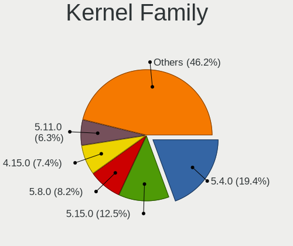
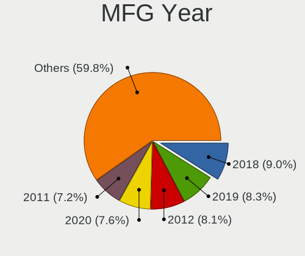
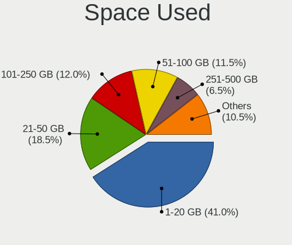
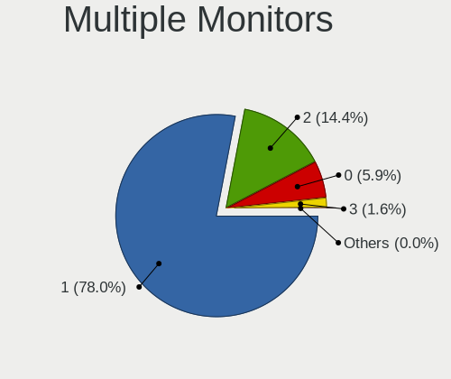
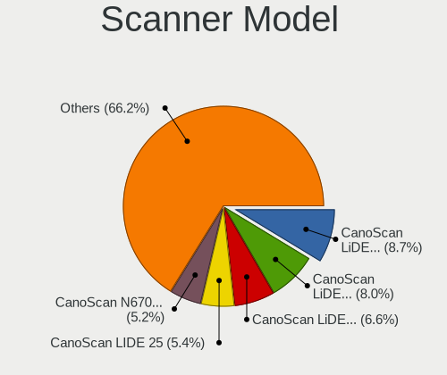

Ubuntu - Tested Hardware & Statistics
-------------------------------------

A project to collect tested hardware configurations for Ubuntu.

Anyone can contribute to this report by the [hw-probe](https://github.com/linuxhw/hw-probe) tool:

    sudo -E hw-probe -all -upload

Please contribute! Especially if your hardware is rare.

This is a report for all computer types. See also reports for [desktops](/Dist/Ubuntu/Desktop/README.md) and [notebooks](/Dist/Ubuntu/Notebook/README.md).

Contents
--------

* [ Test Cases ](#test-cases)

* [ System ](#system)
  - [ OS                       ](#os)
  - [ OS Family                ](#os-family)
  - [ Kernel                   ](#kernel)
  - [ Kernel Family            ](#kernel-family)
  - [ Kernel Major Ver.        ](#kernel-major-ver)
  - [ Arch                     ](#arch)
  - [ DE                       ](#de)
  - [ Display Server           ](#display-server)
  - [ Display Manager          ](#display-manager)
  - [ OS Lang                  ](#os-lang)
  - [ Boot Mode                ](#boot-mode)
  - [ Filesystem               ](#filesystem)
  - [ Part. scheme             ](#part-scheme)
  - [ Dual Boot with Linux/BSD ](#dual-boot-with-linuxbsd)
  - [ Dual Boot (Win)          ](#dual-boot-win)

* [ Board ](#board)
  - [ Vendor                   ](#vendor)
  - [ Model                    ](#model)
  - [ Model Family             ](#model-family)
  - [ MFG Year                 ](#mfg-year)
  - [ Form Factor              ](#form-factor)
  - [ Secure Boot              ](#secure-boot)
  - [ Coreboot                 ](#coreboot)
  - [ RAM Size                 ](#ram-size)
  - [ RAM Used                 ](#ram-used)
  - [ Total Drives             ](#total-drives)
  - [ Has CD-ROM               ](#has-cd-rom)
  - [ Has Ethernet             ](#has-ethernet)
  - [ Has WiFi                 ](#has-wifi)
  - [ Has Bluetooth            ](#has-bluetooth)

* [ Location ](#location)
  - [ Country                  ](#country)
  - [ City                     ](#city)

* [ Drives ](#drives)
  - [ Drive Vendor             ](#drive-vendor)
  - [ Drive Model              ](#drive-model)
  - [ HDD Vendor               ](#hdd-vendor)
  - [ SSD Vendor               ](#ssd-vendor)
  - [ Drive Kind               ](#drive-kind)
  - [ Drive Connector          ](#drive-connector)
  - [ Drive Size               ](#drive-size)
  - [ Space Total              ](#space-total)
  - [ Space Used               ](#space-used)
  - [ Malfunc. Drives          ](#malfunc-drives)
  - [ Malfunc. Drive Vendor    ](#malfunc-drive-vendor)
  - [ Malfunc. HDD Vendor      ](#malfunc-hdd-vendor)
  - [ Malfunc. Drive Kind      ](#malfunc-drive-kind)
  - [ Failed Drives            ](#failed-drives)
  - [ Failed Drive Vendor      ](#failed-drive-vendor)
  - [ Drive Status             ](#drive-status)

* [ Storage controller ](#storage-controller)
  - [ Storage Vendor           ](#storage-vendor)
  - [ Storage Model            ](#storage-model)
  - [ Storage Kind             ](#storage-kind)

* [ Processor ](#processor)
  - [ CPU Vendor               ](#cpu-vendor)
  - [ CPU Model                ](#cpu-model)
  - [ CPU Model Family         ](#cpu-model-family)
  - [ CPU Cores                ](#cpu-cores)
  - [ CPU Sockets              ](#cpu-sockets)
  - [ CPU Threads              ](#cpu-threads)
  - [ CPU Op-Modes             ](#cpu-op-modes)
  - [ CPU Microcode            ](#cpu-microcode)
  - [ CPU Microarch            ](#cpu-microarch)

* [ Graphics ](#graphics)
  - [ GPU Vendor               ](#gpu-vendor)
  - [ GPU Model                ](#gpu-model)
  - [ GPU Combo                ](#gpu-combo)
  - [ GPU Driver               ](#gpu-driver)
  - [ GPU Memory               ](#gpu-memory)

* [ Monitor ](#monitor)
  - [ Monitor Vendor           ](#monitor-vendor)
  - [ Monitor Model            ](#monitor-model)
  - [ Monitor Resolution       ](#monitor-resolution)
  - [ Monitor Diagonal         ](#monitor-diagonal)
  - [ Monitor Width            ](#monitor-width)
  - [ Aspect Ratio             ](#aspect-ratio)
  - [ Monitor Area             ](#monitor-area)
  - [ Pixel Density            ](#pixel-density)
  - [ Multiple Monitors        ](#multiple-monitors)

* [ Network ](#network)
  - [ Net Controller Vendor    ](#net-controller-vendor)
  - [ Net Controller Model     ](#net-controller-model)
  - [ Wireless Vendor          ](#wireless-vendor)
  - [ Wireless Model           ](#wireless-model)
  - [ Ethernet Vendor          ](#ethernet-vendor)
  - [ Ethernet Model           ](#ethernet-model)
  - [ Net Controller Kind      ](#net-controller-kind)
  - [ Used Controller          ](#used-controller)
  - [ NICs                     ](#nics)
  - [ IPv6                     ](#ipv6)

* [ Bluetooth ](#bluetooth)
  - [ Bluetooth Vendor         ](#bluetooth-vendor)
  - [ Bluetooth Model          ](#bluetooth-model)

* [ Sound ](#sound)
  - [ Sound Vendor             ](#sound-vendor)
  - [ Sound Model              ](#sound-model)

* [ Memory ](#memory)
  - [ Memory Vendor            ](#memory-vendor)
  - [ Memory Model             ](#memory-model)
  - [ Memory Kind              ](#memory-kind)
  - [ Memory Form Factor       ](#memory-form-factor)
  - [ Memory Size              ](#memory-size)
  - [ Memory Speed             ](#memory-speed)

* [ Printers & scanners ](#printers--scanners)
  - [ Printer Vendor           ](#printer-vendor)
  - [ Printer Model            ](#printer-model)
  - [ Scanner Vendor           ](#scanner-vendor)
  - [ Scanner Model            ](#scanner-model)

* [ Camera ](#camera)
  - [ Camera Vendor            ](#camera-vendor)
  - [ Camera Model             ](#camera-model)

* [ Security ](#security)
  - [ Fingerprint Vendor       ](#fingerprint-vendor)
  - [ Fingerprint Model        ](#fingerprint-model)
  - [ Chipcard Vendor          ](#chipcard-vendor)
  - [ Chipcard Model           ](#chipcard-model)

* [ Unsupported ](#unsupported)
  - [ Unsupported Devices      ](#unsupported-devices)
  - [ Unsupported Device Types ](#unsupported-device-types)

Test Cases
----------

Total: 73109

| Vendor        | Model                       | Form-Factor | Probe                                                      | Date         |
|---------------|-----------------------------|-------------|------------------------------------------------------------|--------------|
| Fujitsu       | D3162-A1 S26361-D3162-A1    | Desktop     | [060a34b3a1](https://linux-hardware.org/?probe=060a34b3a1) | Jul 01, 2022 |
| Lenovo        | ThinkPad T14 Gen 1 20S00... | Notebook    | [06d4d79742](https://linux-hardware.org/?probe=06d4d79742) | Jul 01, 2022 |
| Fujitsu       | D3162-A1 S26361-D3162-A1    | Desktop     | [630bb92cd8](https://linux-hardware.org/?probe=630bb92cd8) | Jul 01, 2022 |
| Apple         | Mac-27ADBB7B4CEE8E61 iMa... | All in one  | [b78c848494](https://linux-hardware.org/?probe=b78c848494) | Jul 01, 2022 |
| MSI           | Z390 GAM PRO CARB AC        | Desktop     | [a55ab11db7](https://linux-hardware.org/?probe=a55ab11db7) | Jul 01, 2022 |
| ASRock        | H310CM-HDV                  | Desktop     | [4e6539bf57](https://linux-hardware.org/?probe=4e6539bf57) | Jul 01, 2022 |
| Apple         | MacBookPro16,1              | Notebook    | [05c07aba75](https://linux-hardware.org/?probe=05c07aba75) | Jul 01, 2022 |
| Dell          | 042P49 A02                  | Desktop     | [110e5da723](https://linux-hardware.org/?probe=110e5da723) | Jul 01, 2022 |
| Apple         | Mac-27ADBB7B4CEE8E61 iMa... | All in one  | [f0c4468694](https://linux-hardware.org/?probe=f0c4468694) | Jul 01, 2022 |
| Dell          | Inspiron 1501               | Notebook    | [f6efa72c1f](https://linux-hardware.org/?probe=f6efa72c1f) | Jul 01, 2022 |
| Apple         | MacBookPro16,1              | Notebook    | [3eb50f5177](https://linux-hardware.org/?probe=3eb50f5177) | Jul 01, 2022 |
| Intel         | DX58SO AAE29331-703         | Desktop     | [3b22974574](https://linux-hardware.org/?probe=3b22974574) | Jul 01, 2022 |
| Medion        | MS-7797                     | Desktop     | [01ff2f8272](https://linux-hardware.org/?probe=01ff2f8272) | Jul 01, 2022 |
| ASUSTek       | M5A78L LE                   | Desktop     | [19dbe00e60](https://linux-hardware.org/?probe=19dbe00e60) | Jul 01, 2022 |
| HP            | 805D                        | Desktop     | [3610332b9c](https://linux-hardware.org/?probe=3610332b9c) | Jul 01, 2022 |
| HP            | OMEN by Laptop 15-dc1xxx    | Notebook    | [b7fedc25e4](https://linux-hardware.org/?probe=b7fedc25e4) | Jul 01, 2022 |
| Dell          | 042P49 A02                  | Desktop     | [169b7b8c30](https://linux-hardware.org/?probe=169b7b8c30) | Jul 01, 2022 |
| Dell          | 0NRKPK A02                  | Desktop     | [c483bc3c81](https://linux-hardware.org/?probe=c483bc3c81) | Jul 01, 2022 |
| Toshiba       | Satellite L350              | Notebook    | [06df7a6c59](https://linux-hardware.org/?probe=06df7a6c59) | Jul 01, 2022 |
| Gigabyte      | H81M-S2PH                   | Desktop     | [cc62a478ac](https://linux-hardware.org/?probe=cc62a478ac) | Jul 01, 2022 |
| HP            | Laptop 15s-fq1xxx           | Notebook    | [bd9caa15d5](https://linux-hardware.org/?probe=bd9caa15d5) | Jul 01, 2022 |
| Lenovo        | ThinkPad T480 20L5000UUS    | Notebook    | [60c86ea9e1](https://linux-hardware.org/?probe=60c86ea9e1) | Jul 01, 2022 |
| Toshiba       | Satellite L350              | Notebook    | [49c8c1b96a](https://linux-hardware.org/?probe=49c8c1b96a) | Jul 01, 2022 |
| Lenovo        | Z70-80 80FG                 | Notebook    | [eaf34443c7](https://linux-hardware.org/?probe=eaf34443c7) | Jul 01, 2022 |
| Dell          | Latitude 3420               | Notebook    | [1e31a0ce68](https://linux-hardware.org/?probe=1e31a0ce68) | Jul 01, 2022 |
| ASRock        | H570M Pro4                  | Desktop     | [7edf16eeea](https://linux-hardware.org/?probe=7edf16eeea) | Jul 01, 2022 |
| Lenovo        | IdeaPad 510-15IKB 80SV      | Notebook    | [0532069637](https://linux-hardware.org/?probe=0532069637) | Jul 01, 2022 |
| Lenovo        | V110-15IAP 80TG             | Notebook    | [05d0271371](https://linux-hardware.org/?probe=05d0271371) | Jul 01, 2022 |
| Gigabyte      | Z97X-Gaming 3               | Desktop     | [9b8bb163d3](https://linux-hardware.org/?probe=9b8bb163d3) | Jul 01, 2022 |
| Dell          | XPS 15 9520                 | Notebook    | [ca7efa311a](https://linux-hardware.org/?probe=ca7efa311a) | Jul 01, 2022 |
| Lenovo        | V110-15IAP 80TG             | Notebook    | [23519c6427](https://linux-hardware.org/?probe=23519c6427) | Jul 01, 2022 |
| Timi          | Mi NoteBook Ultra           | Notebook    | [0364230bc7](https://linux-hardware.org/?probe=0364230bc7) | Jul 01, 2022 |
| ASUSTek       | N43JQ                       | Notebook    | [d73f714472](https://linux-hardware.org/?probe=d73f714472) | Jul 01, 2022 |
| ASUSTek       | TUF Gaming X570-PLUS        | Desktop     | [987d9aa4d3](https://linux-hardware.org/?probe=987d9aa4d3) | Jul 01, 2022 |
| ECS           | A780GM-A                    | Desktop     | [2cea4325e9](https://linux-hardware.org/?probe=2cea4325e9) | Jul 01, 2022 |
| Lenovo        | Z70-80 80FG                 | Notebook    | [de5734cbe0](https://linux-hardware.org/?probe=de5734cbe0) | Jul 01, 2022 |
| Gigabyte      | Q170M-D3H-CF                | Desktop     | [241f8bd9da](https://linux-hardware.org/?probe=241f8bd9da) | Jul 01, 2022 |
| Lenovo        | Z70-80 80FG                 | Notebook    | [dd8c266ad2](https://linux-hardware.org/?probe=dd8c266ad2) | Jul 01, 2022 |
| Biostar       | B550GTA                     | Desktop     | [5d9da072f0](https://linux-hardware.org/?probe=5d9da072f0) | Jul 01, 2022 |
| HP            | ProBook 450 G5              | Notebook    | [5a27519612](https://linux-hardware.org/?probe=5a27519612) | Jul 01, 2022 |
| Lenovo        | ThinkPad E14 Gen 2 20T6S... | Notebook    | [430c2e6760](https://linux-hardware.org/?probe=430c2e6760) | Jul 01, 2022 |
| Raspberry ... | Raspberry Pi 4 Model B R... | Soc         | [d83a0aa24f](https://linux-hardware.org/?probe=d83a0aa24f) | Jul 01, 2022 |
| Raspberry ... | Raspberry Pi 4 Model B R... | Soc         | [7ffd41ce5c](https://linux-hardware.org/?probe=7ffd41ce5c) | Jul 01, 2022 |
| Timi          | RedmiBook 14 II             | Notebook    | [bf58ea7c43](https://linux-hardware.org/?probe=bf58ea7c43) | Jul 01, 2022 |
| Timi          | RedmiBook 14 II             | Notebook    | [4c7e17e7ba](https://linux-hardware.org/?probe=4c7e17e7ba) | Jul 01, 2022 |
| HUAWEI        | NBM-WXX9                    | Notebook    | [6ed674f77e](https://linux-hardware.org/?probe=6ed674f77e) | Jul 01, 2022 |
| ASUSTek       | F3JR                        | Notebook    | [b56d8007d7](https://linux-hardware.org/?probe=b56d8007d7) | Jul 01, 2022 |
| Gigabyte      | AM1M-S2H                    | Desktop     | [fb2500cc2d](https://linux-hardware.org/?probe=fb2500cc2d) | Jul 01, 2022 |
| Dell          | Latitude E5430 non-vPro     | Notebook    | [ae786e567a](https://linux-hardware.org/?probe=ae786e567a) | Jun 30, 2022 |
| Dell          | Latitude E5430 non-vPro     | Notebook    | [c4942af0bc](https://linux-hardware.org/?probe=c4942af0bc) | Jun 30, 2022 |
| Dell          | Inspiron 1720               | Notebook    | [bbd0bf2dc0](https://linux-hardware.org/?probe=bbd0bf2dc0) | Jun 30, 2022 |
| Lenovo        | IdeaPad 5 Pro 14ACN6 82L... | Notebook    | [54f7fcc588](https://linux-hardware.org/?probe=54f7fcc588) | Jun 30, 2022 |
| Dell          | G5 5500                     | Notebook    | [edfdebf28d](https://linux-hardware.org/?probe=edfdebf28d) | Jun 30, 2022 |
| MSI           | EX705                       | Notebook    | [d85dfacff5](https://linux-hardware.org/?probe=d85dfacff5) | Jun 30, 2022 |
| MSI           | EX705                       | Notebook    | [3de108279f](https://linux-hardware.org/?probe=3de108279f) | Jun 30, 2022 |
| Unknown       | Unknown                     | Notebook    | [b1a8d360fb](https://linux-hardware.org/?probe=b1a8d360fb) | Jun 30, 2022 |
| Unknown       | Unknown                     | Desktop     | [1de34d9bf9](https://linux-hardware.org/?probe=1de34d9bf9) | Jun 30, 2022 |
| HP            | Laptop 15s-du2xxx           | Notebook    | [13e85826c2](https://linux-hardware.org/?probe=13e85826c2) | Jun 30, 2022 |
| HP            | Laptop 15s-du2xxx           | Notebook    | [bb4df4398e](https://linux-hardware.org/?probe=bb4df4398e) | Jun 30, 2022 |
| Matsushita... | CF-52AJCBDBM                | Notebook    | [19a4ef134d](https://linux-hardware.org/?probe=19a4ef134d) | Jun 30, 2022 |
| Dell          | 0GDG8Y A00                  | Desktop     | [4ccd9d239d](https://linux-hardware.org/?probe=4ccd9d239d) | Jun 30, 2022 |
| Acer          | Nitro AN515-44              | Notebook    | [2112b8aff3](https://linux-hardware.org/?probe=2112b8aff3) | Jun 30, 2022 |
| ASUSTek       | P5G41T-M LX2/GB             | Desktop     | [3bbee83307](https://linux-hardware.org/?probe=3bbee83307) | Jun 30, 2022 |
| ASUSTek       | P5G41T-M LX2/GB             | Desktop     | [0b299bea1b](https://linux-hardware.org/?probe=0b299bea1b) | Jun 30, 2022 |
| Dell          | XPS 15 9520                 | Notebook    | [0cb6549f23](https://linux-hardware.org/?probe=0cb6549f23) | Jun 30, 2022 |
| Acer          | Nitro AN515-44              | Notebook    | [09659e3083](https://linux-hardware.org/?probe=09659e3083) | Jun 30, 2022 |
| Dell          | Latitude 3520               | Notebook    | [da25da1ece](https://linux-hardware.org/?probe=da25da1ece) | Jun 30, 2022 |
| ASUSTek       | ROG STRIX X570-F GAMING     | Desktop     | [334719e6a2](https://linux-hardware.org/?probe=334719e6a2) | Jun 30, 2022 |
| Apple         | MacBookAir3,2               | Notebook    | [ee189c9ba2](https://linux-hardware.org/?probe=ee189c9ba2) | Jun 30, 2022 |
| Lenovo        | ThinkBook 15 G2 ITL 20VE    | Notebook    | [82ca4386ae](https://linux-hardware.org/?probe=82ca4386ae) | Jun 30, 2022 |
| Gigabyte      | C621-SD8 M18802             | Server      | [52aeaedd47](https://linux-hardware.org/?probe=52aeaedd47) | Jun 30, 2022 |
| HP            | Laptop 14s-dk0xxx           | Notebook    | [97d88d7e00](https://linux-hardware.org/?probe=97d88d7e00) | Jun 30, 2022 |
| Dell          | Inspiron 7572               | Notebook    | [a6c34895e2](https://linux-hardware.org/?probe=a6c34895e2) | Jun 30, 2022 |
| MSI           | Z68A-GD80                   | Desktop     | [2e2ca703b0](https://linux-hardware.org/?probe=2e2ca703b0) | Jun 30, 2022 |
| System76      | Gazelle                     | Notebook    | [9cc76ec569](https://linux-hardware.org/?probe=9cc76ec569) | Jun 30, 2022 |
| Gigabyte      | MQLP5AP-00                  | Desktop     | [8014a14842](https://linux-hardware.org/?probe=8014a14842) | Jun 30, 2022 |
| Apple         | MacBookPro12,1              | Notebook    | [3cec3cffbb](https://linux-hardware.org/?probe=3cec3cffbb) | Jun 30, 2022 |
| Dell          | Inspiron 5521               | Notebook    | [e9948fff52](https://linux-hardware.org/?probe=e9948fff52) | Jun 30, 2022 |
| Apple         | MacBookPro12,1              | Notebook    | [bac4b49e55](https://linux-hardware.org/?probe=bac4b49e55) | Jun 30, 2022 |
| Supermicro    | X9DBS-F                     | Desktop     | [7aeeacc12c](https://linux-hardware.org/?probe=7aeeacc12c) | Jun 30, 2022 |
| Dell          | Latitude E5430 non-vPro     | Notebook    | [c4ef403aed](https://linux-hardware.org/?probe=c4ef403aed) | Jun 30, 2022 |
| Dell          | Inspiron 5570               | Notebook    | [de7ac7a3a5](https://linux-hardware.org/?probe=de7ac7a3a5) | Jun 30, 2022 |
| HP            | 1000                        | Notebook    | [65ae23140e](https://linux-hardware.org/?probe=65ae23140e) | Jun 30, 2022 |
| Gigabyte      | C1037UN-EU                  | Desktop     | [a2729b2e3b](https://linux-hardware.org/?probe=a2729b2e3b) | Jun 30, 2022 |
| Biostar       | H510MH/E                    | Desktop     | [7b28198a82](https://linux-hardware.org/?probe=7b28198a82) | Jun 30, 2022 |
| Acer          | Swift SF314-43              | Notebook    | [14f9c7d4c5](https://linux-hardware.org/?probe=14f9c7d4c5) | Jun 29, 2022 |
| Lenovo        | ThinkPad E14 Gen 3 20Y70... | Notebook    | [03854f8307](https://linux-hardware.org/?probe=03854f8307) | Jun 29, 2022 |
| Lenovo        | Z70-80 80FG                 | Notebook    | [bef849e3d1](https://linux-hardware.org/?probe=bef849e3d1) | Jun 29, 2022 |
| MSI           | H81M-P33                    | Desktop     | [1a0e20ab20](https://linux-hardware.org/?probe=1a0e20ab20) | Jun 29, 2022 |
| Lenovo        | ThinkPad T470 20HES2141Z    | Notebook    | [53010a4be8](https://linux-hardware.org/?probe=53010a4be8) | Jun 29, 2022 |
| Lenovo        | ThinkBook 15 G2 ITL 20VE    | Notebook    | [42462e221b](https://linux-hardware.org/?probe=42462e221b) | Jun 29, 2022 |
| Lenovo        | ThinkPad T470 20HES2141Z    | Notebook    | [8e9c8e62b1](https://linux-hardware.org/?probe=8e9c8e62b1) | Jun 29, 2022 |
| Lenovo        | ThinkPad S5-S540 20B3001... | Notebook    | [d5be9c4fca](https://linux-hardware.org/?probe=d5be9c4fca) | Jun 29, 2022 |
| Dell          | Inspiron M5040              | Notebook    | [64c8f1ad3f](https://linux-hardware.org/?probe=64c8f1ad3f) | Jun 29, 2022 |
| Protectli     | FW6                         | Desktop     | [c129601645](https://linux-hardware.org/?probe=c129601645) | Jun 29, 2022 |
| ASUSTek       | ROG STRIX Z370-E GAMING     | Desktop     | [349dc94a13](https://linux-hardware.org/?probe=349dc94a13) | Jun 29, 2022 |
| Protectli     | FW6                         | Desktop     | [f7d331dfcb](https://linux-hardware.org/?probe=f7d331dfcb) | Jun 29, 2022 |
| MSI           | MEG Z490 UNIFY              | Desktop     | [2c7a50869d](https://linux-hardware.org/?probe=2c7a50869d) | Jun 29, 2022 |
| HP            | Pavilion dm1                | Notebook    | [927f5b38e0](https://linux-hardware.org/?probe=927f5b38e0) | Jun 29, 2022 |
| Dell          | 0M5DCD A00                  | Desktop     | [7ff0a3f172](https://linux-hardware.org/?probe=7ff0a3f172) | Jun 29, 2022 |
| Acer          | Swift SF314-43              | Notebook    | [de32150701](https://linux-hardware.org/?probe=de32150701) | Jun 29, 2022 |
| Dell          | 0M5DCD A00                  | Desktop     | [483d6a9299](https://linux-hardware.org/?probe=483d6a9299) | Jun 29, 2022 |
| Intel         | NUC11PABi5 K90634-305       | Mini pc     | [d409d12ee2](https://linux-hardware.org/?probe=d409d12ee2) | Jun 29, 2022 |
| Lenovo        | MAHOBAY NOK                 | Desktop     | [20a14662e8](https://linux-hardware.org/?probe=20a14662e8) | Jun 29, 2022 |
| Toshiba       | Satellite C850-1NU          | Notebook    | [2b83cb161e](https://linux-hardware.org/?probe=2b83cb161e) | Jun 29, 2022 |
| Dell          | Inspiron 5405               | Notebook    | [73ec2d1277](https://linux-hardware.org/?probe=73ec2d1277) | Jun 29, 2022 |
| MSI           | MPG Z390I GAMING EDGE AC    | Desktop     | [389293962a](https://linux-hardware.org/?probe=389293962a) | Jun 29, 2022 |
| ASUSTek       | B85M-E                      | Desktop     | [2423d184c0](https://linux-hardware.org/?probe=2423d184c0) | Jun 29, 2022 |
| Lenovo        | IdeaPad Flex-14API 81SS     | Notebook    | [828f0b9ef1](https://linux-hardware.org/?probe=828f0b9ef1) | Jun 29, 2022 |
| Prestigio     | Multipad Visconte V         | Notebook    | [fd38a70070](https://linux-hardware.org/?probe=fd38a70070) | Jun 29, 2022 |
| HP            | ENVY dv7                    | Notebook    | [9f64d5f095](https://linux-hardware.org/?probe=9f64d5f095) | Jun 29, 2022 |
| Gigabyte      | GB-BRR7H-4700               | Desktop     | [5ac6d883d6](https://linux-hardware.org/?probe=5ac6d883d6) | Jun 29, 2022 |
| Apple         | Mac-27ADBB7B4CEE8E61 iMa... | All in one  | [cdc234e3d9](https://linux-hardware.org/?probe=cdc234e3d9) | Jun 29, 2022 |
| Lenovo        | ThinkPad E590 20NB001AUK    | Notebook    | [f52aacfbfe](https://linux-hardware.org/?probe=f52aacfbfe) | Jun 29, 2022 |
| HP            | Laptop 17-ca1xxx            | Notebook    | [10620fe30b](https://linux-hardware.org/?probe=10620fe30b) | Jun 29, 2022 |
| Apple         | Mac-27ADBB7B4CEE8E61 iMa... | All in one  | [a6420a89b6](https://linux-hardware.org/?probe=a6420a89b6) | Jun 29, 2022 |
| ASUSTek       | P5LD2                       | Desktop     | [4fdebc2b9c](https://linux-hardware.org/?probe=4fdebc2b9c) | Jun 29, 2022 |
| ASRock        | B550M-ITX/ac                | Desktop     | [01614433d5](https://linux-hardware.org/?probe=01614433d5) | Jun 29, 2022 |
| Toshiba       | Satellite C50t-B            | Notebook    | [2fd1180edb](https://linux-hardware.org/?probe=2fd1180edb) | Jun 29, 2022 |
| Toshiba       | Satellite C50t-B            | Notebook    | [e767357cdf](https://linux-hardware.org/?probe=e767357cdf) | Jun 29, 2022 |
| HP            | EliteBook 840 G4            | Notebook    | [0244eb4fde](https://linux-hardware.org/?probe=0244eb4fde) | Jun 29, 2022 |
| Toshiba       | Satellite L755D             | Notebook    | [87bdccce5e](https://linux-hardware.org/?probe=87bdccce5e) | Jun 29, 2022 |
| MSI           | PE60 6QE                    | Notebook    | [4c7beba4e2](https://linux-hardware.org/?probe=4c7beba4e2) | Jun 29, 2022 |
| ASUSTek       | P5LD2                       | Desktop     | [c7f67d9347](https://linux-hardware.org/?probe=c7f67d9347) | Jun 29, 2022 |
| ASUSTek       | PRO H410M-C                 | Desktop     | [9f705aea75](https://linux-hardware.org/?probe=9f705aea75) | Jun 29, 2022 |
| Acer          | Aspire 5740                 | Notebook    | [1db26fc575](https://linux-hardware.org/?probe=1db26fc575) | Jun 29, 2022 |
| Dell          | 0D24M8 A00                  | Desktop     | [1588270a58](https://linux-hardware.org/?probe=1588270a58) | Jun 29, 2022 |
| Toshiba       | Satellite M305              | Notebook    | [0f42d5a8ef](https://linux-hardware.org/?probe=0f42d5a8ef) | Jun 29, 2022 |
| Acer          | Aspire 5740                 | Notebook    | [44a72b9a94](https://linux-hardware.org/?probe=44a72b9a94) | Jun 29, 2022 |
| Lenovo        | IdeaPad 100S-14IBR 80R9     | Notebook    | [e8d42a5f3b](https://linux-hardware.org/?probe=e8d42a5f3b) | Jun 29, 2022 |
| ASUSTek       | CROSSHAIR V FORMULA-Z       | Desktop     | [d59692d648](https://linux-hardware.org/?probe=d59692d648) | Jun 29, 2022 |
| Dell          | Inspiron 11 - 3147          | Notebook    | [82e2b1519c](https://linux-hardware.org/?probe=82e2b1519c) | Jun 29, 2022 |
| Dell          | Inspiron 11 - 3147          | Notebook    | [c661afa5d3](https://linux-hardware.org/?probe=c661afa5d3) | Jun 29, 2022 |
| MSI           | Stealth GS66 12UGS          | Notebook    | [8c8ad7136d](https://linux-hardware.org/?probe=8c8ad7136d) | Jun 29, 2022 |
| Dell          | 0VHWTR A02                  | Desktop     | [ee144de507](https://linux-hardware.org/?probe=ee144de507) | Jun 29, 2022 |
| ASUSTek       | ROG STRIX X570-E GAMING     | Desktop     | [5873a7a8dd](https://linux-hardware.org/?probe=5873a7a8dd) | Jun 29, 2022 |
| Apple         | Mac-AA95B1DDAB278B95 iMa... | All in one  | [37e3958fbc](https://linux-hardware.org/?probe=37e3958fbc) | Jun 29, 2022 |
| MSI           | H110M GAMING                | Desktop     | [e33051cbd0](https://linux-hardware.org/?probe=e33051cbd0) | Jun 28, 2022 |
| HP            | EliteBook 840 G2            | Notebook    | [018b6945e1](https://linux-hardware.org/?probe=018b6945e1) | Jun 28, 2022 |
| Dell          | Inspiron M5040              | Notebook    | [a9522b8288](https://linux-hardware.org/?probe=a9522b8288) | Jun 28, 2022 |
| Biostar       | H61MGV3                     | Desktop     | [bb42e29bbb](https://linux-hardware.org/?probe=bb42e29bbb) | Jun 28, 2022 |
| Toshiba       | Satellite L750              | Notebook    | [e01155e6ba](https://linux-hardware.org/?probe=e01155e6ba) | Jun 28, 2022 |
| System76      | Bonobo Extreme              | Notebook    | [8872466072](https://linux-hardware.org/?probe=8872466072) | Jun 28, 2022 |
| Dell          | Inspiron 5570               | Notebook    | [bb61360dae](https://linux-hardware.org/?probe=bb61360dae) | Jun 28, 2022 |
| Dell          | Inspiron 5570               | Notebook    | [4119b5740c](https://linux-hardware.org/?probe=4119b5740c) | Jun 28, 2022 |
| Dell          | Latitude 5520               | Notebook    | [0504660b50](https://linux-hardware.org/?probe=0504660b50) | Jun 28, 2022 |
| HP            | Laptop 15-da2xxx            | Notebook    | [cb262785dc](https://linux-hardware.org/?probe=cb262785dc) | Jun 28, 2022 |
| HP            | Laptop 15-da2xxx            | Notebook    | [5efb0cb1c5](https://linux-hardware.org/?probe=5efb0cb1c5) | Jun 28, 2022 |
| HP            | G60                         | Notebook    | [a56da1a08a](https://linux-hardware.org/?probe=a56da1a08a) | Jun 28, 2022 |
| Dell          | 0NRKPK A01                  | Desktop     | [dca04c3b5b](https://linux-hardware.org/?probe=dca04c3b5b) | Jun 28, 2022 |
| Dell          | 0TP406                      | Desktop     | [4f0f2b2e05](https://linux-hardware.org/?probe=4f0f2b2e05) | Jun 28, 2022 |
| Dell          | 0NRKPK A01                  | Desktop     | [2af61a0a3c](https://linux-hardware.org/?probe=2af61a0a3c) | Jun 28, 2022 |
| Acer          | Aspire A515-51G             | Notebook    | [4178b8c79f](https://linux-hardware.org/?probe=4178b8c79f) | Jun 28, 2022 |
| Acer          | Aspire A515-51G             | Notebook    | [1571a4ab8e](https://linux-hardware.org/?probe=1571a4ab8e) | Jun 28, 2022 |
| Lenovo        | ThinkPad E15 Gen 2 20TD0... | Notebook    | [18fbe5a2d0](https://linux-hardware.org/?probe=18fbe5a2d0) | Jun 28, 2022 |
| Alienware     | 01NYPT A00                  | Desktop     | [97b8d855bd](https://linux-hardware.org/?probe=97b8d855bd) | Jun 28, 2022 |
| ASUSTek       | PRIME A520M-K               | Desktop     | [d8a4ade22e](https://linux-hardware.org/?probe=d8a4ade22e) | Jun 28, 2022 |
| Dell          | XPS 13 9300                 | Notebook    | [8ecea7fce7](https://linux-hardware.org/?probe=8ecea7fce7) | Jun 28, 2022 |
| Dell          | Latitude 5420               | Notebook    | [58838b9e58](https://linux-hardware.org/?probe=58838b9e58) | Jun 28, 2022 |
| HP            | ENVY dv7                    | Notebook    | [00ce30e950](https://linux-hardware.org/?probe=00ce30e950) | Jun 28, 2022 |
| HP            | ENVY x360 Convertible 15... | Convertible | [7877597b47](https://linux-hardware.org/?probe=7877597b47) | Jun 28, 2022 |
| HP            | 340S G7                     | Notebook    | [6695a6a5ed](https://linux-hardware.org/?probe=6695a6a5ed) | Jun 28, 2022 |
| Acer          | H81-M1                      | Desktop     | [9ddfb2ec8d](https://linux-hardware.org/?probe=9ddfb2ec8d) | Jun 28, 2022 |
| ASUSTek       | H110M-R                     | Desktop     | [06f09abf11](https://linux-hardware.org/?probe=06f09abf11) | Jun 28, 2022 |
| Lenovo        | B41-80 80LG                 | Notebook    | [30f6e726bd](https://linux-hardware.org/?probe=30f6e726bd) | Jun 28, 2022 |
| Dell          | XPS 13 9310 2-in-1          | Convertible | [d2034a53b8](https://linux-hardware.org/?probe=d2034a53b8) | Jun 28, 2022 |
| ASUSTek       | VivoBook_ASUSLaptop E410... | Notebook    | [464a37068f](https://linux-hardware.org/?probe=464a37068f) | Jun 28, 2022 |
| Apple         | MacBookPro12,1              | Notebook    | [ed7338a47a](https://linux-hardware.org/?probe=ed7338a47a) | Jun 28, 2022 |
| Raspberry ... | Raspberry Pi 4 Model B R... | Soc         | [e841ca8572](https://linux-hardware.org/?probe=e841ca8572) | Jun 28, 2022 |
| HP            | G60                         | Notebook    | [94e4b7d021](https://linux-hardware.org/?probe=94e4b7d021) | Jun 28, 2022 |
| MSI           | X470 GAMING PLUS MAX        | Desktop     | [d399933441](https://linux-hardware.org/?probe=d399933441) | Jun 28, 2022 |
| Login Info... | LOG-MB47II7                 | Notebook    | [332f799fe9](https://linux-hardware.org/?probe=332f799fe9) | Jun 28, 2022 |
| Unknown       | Unknown                     | Desktop     | [8eb0d6165a](https://linux-hardware.org/?probe=8eb0d6165a) | Jun 28, 2022 |
| HP            | Pavilion TS 14              | Notebook    | [f851b6a57b](https://linux-hardware.org/?probe=f851b6a57b) | Jun 28, 2022 |
| Dell          | 0TT740 A00                  | Server      | [14defa3569](https://linux-hardware.org/?probe=14defa3569) | Jun 27, 2022 |
| HP            | Pavilion 15                 | Notebook    | [468a953a80](https://linux-hardware.org/?probe=468a953a80) | Jun 27, 2022 |
| HP            | 0B4Ch D                     | Desktop     | [6e28eeb447](https://linux-hardware.org/?probe=6e28eeb447) | Jun 27, 2022 |
| Lenovo        | IdeaPad 330-17IKB 81DK      | Notebook    | [2304f26a21](https://linux-hardware.org/?probe=2304f26a21) | Jun 27, 2022 |
| Intel         | NUC6i7KYB H90766-402        | Mini pc     | [8e03a02104](https://linux-hardware.org/?probe=8e03a02104) | Jun 27, 2022 |
| HP            | Laptop 15s-du3xxx           | Notebook    | [404e9daae2](https://linux-hardware.org/?probe=404e9daae2) | Jun 27, 2022 |
| Dell          | Latitude 7420               | Notebook    | [3730ffb739](https://linux-hardware.org/?probe=3730ffb739) | Jun 27, 2022 |
| Lenovo        | ThinkPad P15 Gen 2i 20YQ... | Notebook    | [6df70abc9a](https://linux-hardware.org/?probe=6df70abc9a) | Jun 27, 2022 |
| HP            | Pavilion x360 Convertibl... | Convertible | [52299903e5](https://linux-hardware.org/?probe=52299903e5) | Jun 27, 2022 |
| HP            | 805E                        | All in one  | [efbad579d1](https://linux-hardware.org/?probe=efbad579d1) | Jun 27, 2022 |
| Dell          | Latitude 7480               | Notebook    | [87a2e9762f](https://linux-hardware.org/?probe=87a2e9762f) | Jun 27, 2022 |
| Dell          | Latitude E5570              | Notebook    | [ea7aa4f4ab](https://linux-hardware.org/?probe=ea7aa4f4ab) | Jun 27, 2022 |
| Dell          | 0RF703                      | Desktop     | [7b1a5ddcb6](https://linux-hardware.org/?probe=7b1a5ddcb6) | Jun 27, 2022 |
| HP            | Pavilion 15                 | Notebook    | [9e7a0c1889](https://linux-hardware.org/?probe=9e7a0c1889) | Jun 27, 2022 |
| Lenovo        | G550 20023                  | Notebook    | [0a2aa10fd1](https://linux-hardware.org/?probe=0a2aa10fd1) | Jun 27, 2022 |
| Intel         | NUC11PABi5 K90634-305       | Mini pc     | [30672ab543](https://linux-hardware.org/?probe=30672ab543) | Jun 27, 2022 |
| Dell          | G3 3500                     | Notebook    | [0df1b9607c](https://linux-hardware.org/?probe=0df1b9607c) | Jun 27, 2022 |
| HP            | ProBook 450 G8 Notebook ... | Notebook    | [409ca4eba4](https://linux-hardware.org/?probe=409ca4eba4) | Jun 27, 2022 |
| Gigabyte      | RC14UD                      | Notebook    | [1f3a4dad7a](https://linux-hardware.org/?probe=1f3a4dad7a) | Jun 27, 2022 |
| Dell          | Latitude 5510               | Notebook    | [06199cdfe6](https://linux-hardware.org/?probe=06199cdfe6) | Jun 27, 2022 |
| Lenovo        | ThinkPad E15 Gen 2 20T80... | Notebook    | [90a56ffa69](https://linux-hardware.org/?probe=90a56ffa69) | Jun 27, 2022 |
| ZOTAC         | ZBOX-ID84                   | Mini pc     | [6162be584a](https://linux-hardware.org/?probe=6162be584a) | Jun 27, 2022 |
| ASUSTek       | ROG Strix G713QE_G713QE     | Notebook    | [65782f9daa](https://linux-hardware.org/?probe=65782f9daa) | Jun 27, 2022 |
| ASRock        | 970 Pro3 R2.0               | Desktop     | [ba2f829e73](https://linux-hardware.org/?probe=ba2f829e73) | Jun 27, 2022 |
| Dell          | 051FJ8 A02                  | Desktop     | [5b997790f1](https://linux-hardware.org/?probe=5b997790f1) | Jun 27, 2022 |
| Lenovo        | ThinkPad E14 Gen 2 20TA0... | Notebook    | [6491230956](https://linux-hardware.org/?probe=6491230956) | Jun 27, 2022 |
| Dell          | Latitude E5530 non-vPro     | Notebook    | [613ca6c2b5](https://linux-hardware.org/?probe=613ca6c2b5) | Jun 27, 2022 |
| ASUSTek       | P552LA                      | Notebook    | [4e4b2838e7](https://linux-hardware.org/?probe=4e4b2838e7) | Jun 27, 2022 |
| ASUSTek       | ROG Strix G713QE_G713QE     | Notebook    | [e881903397](https://linux-hardware.org/?probe=e881903397) | Jun 27, 2022 |
| Lenovo        | IdeaPad 330-17IKB 81DK      | Notebook    | [850cc358f4](https://linux-hardware.org/?probe=850cc358f4) | Jun 27, 2022 |
| Dell          | Latitude E5530 non-vPro     | Notebook    | [c4da661982](https://linux-hardware.org/?probe=c4da661982) | Jun 27, 2022 |
| Fujitsu       | LIFEBOOK U938               | Notebook    | [c959653e4f](https://linux-hardware.org/?probe=c959653e4f) | Jun 27, 2022 |
| Lenovo        | ThinkPad X1 Carbon 4th 2... | Notebook    | [aa51c70192](https://linux-hardware.org/?probe=aa51c70192) | Jun 27, 2022 |
| Fujitsu       | LIFEBOOK U938               | Notebook    | [be4fb4ad71](https://linux-hardware.org/?probe=be4fb4ad71) | Jun 27, 2022 |
| ASUSTek       | X550IU                      | Notebook    | [785dae349d](https://linux-hardware.org/?probe=785dae349d) | Jun 27, 2022 |
| Unknown       | Unknown                     | Desktop     | [bd912e1acc](https://linux-hardware.org/?probe=bd912e1acc) | Jun 27, 2022 |
| Raspberry ... | Raspberry Pi 4 Model B R... | Soc         | [cd22036876](https://linux-hardware.org/?probe=cd22036876) | Jun 27, 2022 |
| Lenovo        | IdeaPad Gaming 3 15ACH6 ... | Notebook    | [569faf34f1](https://linux-hardware.org/?probe=569faf34f1) | Jun 27, 2022 |
| MSI           | MPG Z390 GAMING PLUS        | Desktop     | [3d575e19b6](https://linux-hardware.org/?probe=3d575e19b6) | Jun 27, 2022 |
| ASUSTek       | PRIME B460M-A               | Desktop     | [b63dffc595](https://linux-hardware.org/?probe=b63dffc595) | Jun 27, 2022 |
| Intel         | DH61WW AAG23116-302         | Desktop     | [7e1e1cf659](https://linux-hardware.org/?probe=7e1e1cf659) | Jun 27, 2022 |
| Dell          | Inspiron 5770               | Notebook    | [431ad8bfb0](https://linux-hardware.org/?probe=431ad8bfb0) | Jun 27, 2022 |
| MSI           | B450M-A PRO MAX             | Desktop     | [666f9678a5](https://linux-hardware.org/?probe=666f9678a5) | Jun 27, 2022 |
| Lenovo        | ThinkPad X230 2325U5P       | Notebook    | [5b8770aaf7](https://linux-hardware.org/?probe=5b8770aaf7) | Jun 27, 2022 |
| Lenovo        | ThinkPad X230 2325U5P       | Notebook    | [d80f5059d2](https://linux-hardware.org/?probe=d80f5059d2) | Jun 27, 2022 |
| Lenovo        | ThinkPad X230 2325U5P       | Notebook    | [89b9650228](https://linux-hardware.org/?probe=89b9650228) | Jun 27, 2022 |
| Lenovo        | YB1-X91F                    | Convertible | [0a0f43a4af](https://linux-hardware.org/?probe=0a0f43a4af) | Jun 27, 2022 |
| ASUSTek       | P8B75-M LE                  | Desktop     | [48cbc869da](https://linux-hardware.org/?probe=48cbc869da) | Jun 27, 2022 |
| ASUSTek       | P8B75-M LE                  | Desktop     | [ea31080862](https://linux-hardware.org/?probe=ea31080862) | Jun 27, 2022 |
| ASUSTek       | VivoBook_ASUSLaptop X515... | Notebook    | [78d7beacec](https://linux-hardware.org/?probe=78d7beacec) | Jun 27, 2022 |
| ASUSTek       | VivoBook_ASUSLaptop X515... | Notebook    | [c4351d9d15](https://linux-hardware.org/?probe=c4351d9d15) | Jun 27, 2022 |
| Toshiba       | Satellite A200              | Notebook    | [932496f041](https://linux-hardware.org/?probe=932496f041) | Jun 27, 2022 |
| Dell          | Precision M3800             | Notebook    | [95a0805f35](https://linux-hardware.org/?probe=95a0805f35) | Jun 27, 2022 |
| HP            | Pavilion Gaming Laptop 1... | Notebook    | [13c3e19573](https://linux-hardware.org/?probe=13c3e19573) | Jun 26, 2022 |
| MSI           | Z590-A PRO                  | Desktop     | [1adcde94c5](https://linux-hardware.org/?probe=1adcde94c5) | Jun 26, 2022 |
| HP            | Laptop 15g-br1xx            | Notebook    | [aef95d312f](https://linux-hardware.org/?probe=aef95d312f) | Jun 26, 2022 |
| MSI           | Z590-A PRO                  | Desktop     | [18d6fda695](https://linux-hardware.org/?probe=18d6fda695) | Jun 26, 2022 |
| Apple         | Mac-F65AE981FFA204ED Mac... | Mini pc     | [3c116356e3](https://linux-hardware.org/?probe=3c116356e3) | Jun 26, 2022 |
| Dell          | Latitude E5550              | Notebook    | [efea5d8fab](https://linux-hardware.org/?probe=efea5d8fab) | Jun 26, 2022 |
| ASUSTek       | PRIME B350-PLUS             | Desktop     | [583a217093](https://linux-hardware.org/?probe=583a217093) | Jun 26, 2022 |
| MSI           | H55M-E33                    | Desktop     | [035cfe1a5b](https://linux-hardware.org/?probe=035cfe1a5b) | Jun 26, 2022 |
| LG Electro... | 14T90N-VR56K                | Convertible | [22f978c26c](https://linux-hardware.org/?probe=22f978c26c) | Jun 26, 2022 |
| Fujitsu       | LIFEBOOK E752               | Notebook    | [8ddfe8d07b](https://linux-hardware.org/?probe=8ddfe8d07b) | Jun 26, 2022 |
| IBM           | 00AM527                     | Server      | [8af3a08c43](https://linux-hardware.org/?probe=8af3a08c43) | Jun 26, 2022 |
| MSI           | B450M PRO-M2                | Desktop     | [516abfbea1](https://linux-hardware.org/?probe=516abfbea1) | Jun 26, 2022 |
| MSI           | B450M-A PRO MAX             | Desktop     | [aa9757e958](https://linux-hardware.org/?probe=aa9757e958) | Jun 26, 2022 |
| Medion        | S6445 MD61351               | Notebook    | [c99e2d656f](https://linux-hardware.org/?probe=c99e2d656f) | Jun 26, 2022 |
| Medion        | S6445 MD61351               | Notebook    | [d0e2e3232c](https://linux-hardware.org/?probe=d0e2e3232c) | Jun 26, 2022 |
| Lenovo        | 3102 SDK0J40697 WIN 3305... | Desktop     | [b0c272ff93](https://linux-hardware.org/?probe=b0c272ff93) | Jun 26, 2022 |
| Gigabyte      | Z97M-DS3H                   | Desktop     | [f90172a9f9](https://linux-hardware.org/?probe=f90172a9f9) | Jun 26, 2022 |
| MSI           | H61M-P20                    | Desktop     | [c86cefdaa6](https://linux-hardware.org/?probe=c86cefdaa6) | Jun 26, 2022 |
| ASUSTek       | P8Z68-V LX                  | Desktop     | [5935ab812a](https://linux-hardware.org/?probe=5935ab812a) | Jun 26, 2022 |
| ASUSTek       | X510UNR                     | Notebook    | [d5f3803a24](https://linux-hardware.org/?probe=d5f3803a24) | Jun 26, 2022 |
| Dell          | Inspiron 3580               | Notebook    | [dfab1b501e](https://linux-hardware.org/?probe=dfab1b501e) | Jun 26, 2022 |
| MSI           | PRO Z690-A                  | Desktop     | [34a2f4f726](https://linux-hardware.org/?probe=34a2f4f726) | Jun 26, 2022 |
| Dell          | Inspiron 7506 2n1           | Convertible | [b65aaee9eb](https://linux-hardware.org/?probe=b65aaee9eb) | Jun 26, 2022 |
| Raspberry ... | Raspberry Pi                | Soc         | [af50fdf3b9](https://linux-hardware.org/?probe=af50fdf3b9) | Jun 26, 2022 |
| Microsoft     | Surface Pro 3               | Tablet      | [800f6f5802](https://linux-hardware.org/?probe=800f6f5802) | Jun 26, 2022 |
| ASUSTek       | P8H61-I                     | Desktop     | [15b8beca14](https://linux-hardware.org/?probe=15b8beca14) | Jun 26, 2022 |
| Unknown       | 1.0                         | Desktop     | [340f931c7f](https://linux-hardware.org/?probe=340f931c7f) | Jun 26, 2022 |
| HP            | 8054                        | Desktop     | [82dd44f05f](https://linux-hardware.org/?probe=82dd44f05f) | Jun 26, 2022 |
| Lenovo        | Yoga 6 13ALC6 82ND          | Convertible | [7436c506a2](https://linux-hardware.org/?probe=7436c506a2) | Jun 26, 2022 |
| Acer          | Swift SF314-512             | Notebook    | [510f23fce0](https://linux-hardware.org/?probe=510f23fce0) | Jun 26, 2022 |
| Lenovo        | SKYBAY SDK0J40697 WIN 33... | All in one  | [f2d64b50fc](https://linux-hardware.org/?probe=f2d64b50fc) | Jun 26, 2022 |
| Google        | Delbin                      | Notebook    | [26becdfc83](https://linux-hardware.org/?probe=26becdfc83) | Jun 26, 2022 |
| Dell          | 0HD5W2 A01                  | Desktop     | [9f87421952](https://linux-hardware.org/?probe=9f87421952) | Jun 26, 2022 |
| ASUSTek       | ASUS EXPERTBOOK B9450FA_... | Notebook    | [88681cbb38](https://linux-hardware.org/?probe=88681cbb38) | Jun 26, 2022 |
| Dell          | 0VD92X A00                  | Desktop     | [5082bf92e9](https://linux-hardware.org/?probe=5082bf92e9) | Jun 26, 2022 |
| ASUSTek       | ROG Strix G733ZX_G733ZX     | Notebook    | [fc3e083086](https://linux-hardware.org/?probe=fc3e083086) | Jun 26, 2022 |
| MSI           | A78M-E45 V2                 | Desktop     | [e4cd6586b4](https://linux-hardware.org/?probe=e4cd6586b4) | Jun 26, 2022 |
| ASUSTek       | ROG CROSSHAIR VIII HERO     | Desktop     | [55fc30c7a5](https://linux-hardware.org/?probe=55fc30c7a5) | Jun 26, 2022 |
| HP            | Pavilion Laptop 15-eh1xx... | Notebook    | [e006119954](https://linux-hardware.org/?probe=e006119954) | Jun 26, 2022 |
| Gigabyte      | X570 GAMING X               | Desktop     | [b66ac35391](https://linux-hardware.org/?probe=b66ac35391) | Jun 26, 2022 |
| Samsung       | 300E5K/300E5Q               | Notebook    | [6fdcfe2be7](https://linux-hardware.org/?probe=6fdcfe2be7) | Jun 26, 2022 |
| Acer          | TravelMate P214-53          | Notebook    | [d93da606dc](https://linux-hardware.org/?probe=d93da606dc) | Jun 26, 2022 |
| HP            | Laptop 15-dy0xxx            | Notebook    | [125a4a06bf](https://linux-hardware.org/?probe=125a4a06bf) | Jun 26, 2022 |
| Samsung       | 300E5K/300E5Q               | Notebook    | [1b7010c05b](https://linux-hardware.org/?probe=1b7010c05b) | Jun 26, 2022 |
| Toshiba       | TECRA M11                   | Notebook    | [27cafca97e](https://linux-hardware.org/?probe=27cafca97e) | Jun 25, 2022 |
| Acer          | Aspire E5-571G              | Notebook    | [f8c41984c9](https://linux-hardware.org/?probe=f8c41984c9) | Jun 25, 2022 |
| ASUSTek       | Pro WS WRX80E-SAGE SE WI... | Desktop     | [f440505698](https://linux-hardware.org/?probe=f440505698) | Jun 25, 2022 |
| MSI           | Stealth GS66 12UHS          | Notebook    | [4cee5507af](https://linux-hardware.org/?probe=4cee5507af) | Jun 25, 2022 |
| MSI           | Z97 GAMING 5                | Desktop     | [473a0abca4](https://linux-hardware.org/?probe=473a0abca4) | Jun 25, 2022 |
| MSI           | H61MA-E35                   | Desktop     | [697fc8150b](https://linux-hardware.org/?probe=697fc8150b) | Jun 25, 2022 |
| MSI           | H81M-P33                    | Desktop     | [e25d17a838](https://linux-hardware.org/?probe=e25d17a838) | Jun 25, 2022 |
| Dell          | Latitude D630               | Notebook    | [9b1cf4028b](https://linux-hardware.org/?probe=9b1cf4028b) | Jun 25, 2022 |
| Acer          | Aspire V5-551               | Notebook    | [d792c36a43](https://linux-hardware.org/?probe=d792c36a43) | Jun 25, 2022 |
| Acer          | Aspire V5-551               | Notebook    | [b2a4a606b0](https://linux-hardware.org/?probe=b2a4a606b0) | Jun 25, 2022 |
| Chuwi         | GemiBook Pro                | Notebook    | [160062e69a](https://linux-hardware.org/?probe=160062e69a) | Jun 25, 2022 |
| Samsung       | RV420/RV520/RV720/E3530/... | Notebook    | [8645b52b02](https://linux-hardware.org/?probe=8645b52b02) | Jun 25, 2022 |
| Dell          | Inspiron 7506 2n1           | Convertible | [9421b03b9e](https://linux-hardware.org/?probe=9421b03b9e) | Jun 25, 2022 |
| ASUSTek       | P6T DELUXE V2               | Desktop     | [2dbe28adc6](https://linux-hardware.org/?probe=2dbe28adc6) | Jun 25, 2022 |
| Dell          | Latitude D630               | Notebook    | [b3eef0f278](https://linux-hardware.org/?probe=b3eef0f278) | Jun 25, 2022 |
| MSI           | H61MA-E35                   | Desktop     | [46a7f113c9](https://linux-hardware.org/?probe=46a7f113c9) | Jun 25, 2022 |
| HP            | OMEN by Laptop 15-dc1xxx    | Notebook    | [6902fe8b8a](https://linux-hardware.org/?probe=6902fe8b8a) | Jun 25, 2022 |
| MSI           | H81M-P33                    | Desktop     | [9ba6c64800](https://linux-hardware.org/?probe=9ba6c64800) | Jun 25, 2022 |
| Lenovo        | ThinkPad X1 Carbon 5th 2... | Notebook    | [044be44d33](https://linux-hardware.org/?probe=044be44d33) | Jun 25, 2022 |
| Lenovo        | 3102 SDK0J40697 WIN 3305... | Desktop     | [eb7445dbdf](https://linux-hardware.org/?probe=eb7445dbdf) | Jun 25, 2022 |
| Dell          | Precision 3541              | Notebook    | [816c91b81b](https://linux-hardware.org/?probe=816c91b81b) | Jun 25, 2022 |
| Lenovo        | IdeaPad S540-14API 81NH     | Notebook    | [8f9e6e12b1](https://linux-hardware.org/?probe=8f9e6e12b1) | Jun 25, 2022 |
| HP            | EliteBook 8740w             | Notebook    | [3d88d48a84](https://linux-hardware.org/?probe=3d88d48a84) | Jun 25, 2022 |
| Lenovo        | G570 20079                  | Notebook    | [5ec853b08c](https://linux-hardware.org/?probe=5ec853b08c) | Jun 25, 2022 |
| GPU Compan... | GWTC116-2                   | Notebook    | [c90d6bd560](https://linux-hardware.org/?probe=c90d6bd560) | Jun 25, 2022 |
| Samsung       | 300E4A/300E5A/300E7A        | Notebook    | [bb4f0d2bce](https://linux-hardware.org/?probe=bb4f0d2bce) | Jun 25, 2022 |
| GPU Compan... | GWTC116-2                   | Notebook    | [52404c379f](https://linux-hardware.org/?probe=52404c379f) | Jun 25, 2022 |
| Unknown       | Unknown                     | Soc         | [953f1d5b3d](https://linux-hardware.org/?probe=953f1d5b3d) | Jun 25, 2022 |
| ASUSTek       | TUF Gaming X570-PLUS_BR     | Desktop     | [8f2b511688](https://linux-hardware.org/?probe=8f2b511688) | Jun 25, 2022 |
| ASUSTek       | TUF Gaming X570-PLUS_BR     | Desktop     | [ace55b44d7](https://linux-hardware.org/?probe=ace55b44d7) | Jun 25, 2022 |
| Lenovo        | ThinkPad Edge 0301GXG       | Notebook    | [19ccbec274](https://linux-hardware.org/?probe=19ccbec274) | Jun 25, 2022 |
| HP            | Pavilion dv7                | Notebook    | [a0c6c78c33](https://linux-hardware.org/?probe=a0c6c78c33) | Jun 25, 2022 |
| Toshiba       | Satellite C655D             | Notebook    | [35596a473f](https://linux-hardware.org/?probe=35596a473f) | Jun 24, 2022 |
| Lenovo        | ThinkPad E14 Gen 2 20TBS... | Notebook    | [0adc011c8b](https://linux-hardware.org/?probe=0adc011c8b) | Jun 24, 2022 |
| Lenovo        | 3714 SDK0J40700 WIN 3258... | Desktop     | [1be22bc8af](https://linux-hardware.org/?probe=1be22bc8af) | Jun 24, 2022 |
| HP            | ZBook 15 G5 QEB19A          | Notebook    | [87a3d94edb](https://linux-hardware.org/?probe=87a3d94edb) | Jun 24, 2022 |
| HP            | ZBook 15 G5 QEB19A          | Notebook    | [09b12eda27](https://linux-hardware.org/?probe=09b12eda27) | Jun 24, 2022 |
| HUAWEI        | BOD-WXX9                    | Notebook    | [d306afd176](https://linux-hardware.org/?probe=d306afd176) | Jun 24, 2022 |
| MSI           | Z370 GAMING PRO CARBON      | Desktop     | [57660d8f0f](https://linux-hardware.org/?probe=57660d8f0f) | Jun 24, 2022 |
| HUAWEI        | BOD-WXX9                    | Notebook    | [f3742fcee5](https://linux-hardware.org/?probe=f3742fcee5) | Jun 24, 2022 |
| Gigabyte      | P41T-D3P                    | Desktop     | [91ce49ee9f](https://linux-hardware.org/?probe=91ce49ee9f) | Jun 24, 2022 |
| ASUSTek       | PRIME X570-P                | Desktop     | [fc1716de1f](https://linux-hardware.org/?probe=fc1716de1f) | Jun 24, 2022 |
| ASUSTek       | PRIME X570-P                | Desktop     | [785ec99ee8](https://linux-hardware.org/?probe=785ec99ee8) | Jun 24, 2022 |
| Gigabyte      | A520M S2H                   | Desktop     | [094c3f1e98](https://linux-hardware.org/?probe=094c3f1e98) | Jun 24, 2022 |
| Dell          | Vostro 15 3515              | Notebook    | [93427bd0bf](https://linux-hardware.org/?probe=93427bd0bf) | Jun 24, 2022 |
| Dell          | 0HY9JP A00                  | Desktop     | [92c1597a97](https://linux-hardware.org/?probe=92c1597a97) | Jun 24, 2022 |
| Dell          | Latitude E7450              | Notebook    | [a03ea66786](https://linux-hardware.org/?probe=a03ea66786) | Jun 24, 2022 |
| Samsung       | 300E5EV/300E4EV/270E5EV/... | Notebook    | [ce17a478c3](https://linux-hardware.org/?probe=ce17a478c3) | Jun 24, 2022 |
| Dell          | 0KW626                      | Desktop     | [ceb37aeba1](https://linux-hardware.org/?probe=ceb37aeba1) | Jun 24, 2022 |
| Dell          | XPS 13 9370                 | Notebook    | [b1447080a3](https://linux-hardware.org/?probe=b1447080a3) | Jun 24, 2022 |
| Acer          | Aspire E5-571G              | Notebook    | [6eb35edbfd](https://linux-hardware.org/?probe=6eb35edbfd) | Jun 24, 2022 |
| Dell          | Latitude 5521               | Notebook    | [2fda374f06](https://linux-hardware.org/?probe=2fda374f06) | Jun 24, 2022 |
| NCS-Tech      | B300                        | Notebook    | [ff8382e269](https://linux-hardware.org/?probe=ff8382e269) | Jun 24, 2022 |
| Lenovo        | Legion 5 15ACH6H 82JU       | Notebook    | [b450b0c2dc](https://linux-hardware.org/?probe=b450b0c2dc) | Jun 24, 2022 |
| Intel         | X79G V2.x                   | Desktop     | [67b2e27895](https://linux-hardware.org/?probe=67b2e27895) | Jun 24, 2022 |
| HP            | Pavilion dv7                | Notebook    | [334a6079e5](https://linux-hardware.org/?probe=334a6079e5) | Jun 24, 2022 |
| Intel         | D33217GKE G76540-203        | Desktop     | [9bc1116d3a](https://linux-hardware.org/?probe=9bc1116d3a) | Jun 24, 2022 |
| Acer          | Aspire A315-23              | Notebook    | [45c9b081c5](https://linux-hardware.org/?probe=45c9b081c5) | Jun 24, 2022 |
| ASUSTek       | X99-DELUXE                  | Desktop     | [34e3aad338](https://linux-hardware.org/?probe=34e3aad338) | Jun 24, 2022 |
| HP            | 8431                        | All in one  | [e8cbe50e2f](https://linux-hardware.org/?probe=e8cbe50e2f) | Jun 24, 2022 |
| Gigabyte      | H410M H V3                  | Desktop     | [fb85ee8196](https://linux-hardware.org/?probe=fb85ee8196) | Jun 24, 2022 |
| HP            | 8431                        | All in one  | [1a65660840](https://linux-hardware.org/?probe=1a65660840) | Jun 24, 2022 |
| HP            | 2AF7                        | Desktop     | [86ecfeb9e2](https://linux-hardware.org/?probe=86ecfeb9e2) | Jun 24, 2022 |
| AFOX          | AF IH81-MA3 V1.0            | Desktop     | [4ce7ccc125](https://linux-hardware.org/?probe=4ce7ccc125) | Jun 24, 2022 |
| Dell          | 018D1Y A00                  | Desktop     | [8344a8b783](https://linux-hardware.org/?probe=8344a8b783) | Jun 24, 2022 |
| ASUSTek       | X411UN                      | Notebook    | [d4543f64dc](https://linux-hardware.org/?probe=d4543f64dc) | Jun 24, 2022 |
| Nvidia        | Tegra                       | Soc         | [cfeb6fb78f](https://linux-hardware.org/?probe=cfeb6fb78f) | Jun 23, 2022 |
| Foxconn       | 2AB1                        | Desktop     | [389a1d6185](https://linux-hardware.org/?probe=389a1d6185) | Jun 23, 2022 |
| Nvidia        | Tegra                       | Soc         | [d08060fb50](https://linux-hardware.org/?probe=d08060fb50) | Jun 23, 2022 |
| Dell          | 0MGK50 A02                  | Desktop     | [eca7a31c46](https://linux-hardware.org/?probe=eca7a31c46) | Jun 23, 2022 |
| ASUSTek       | B85-PLUS                    | Desktop     | [1086e71f79](https://linux-hardware.org/?probe=1086e71f79) | Jun 23, 2022 |
| Lenovo        | Yoga 7 14ITL5 82BH          | Convertible | [830e98eb6e](https://linux-hardware.org/?probe=830e98eb6e) | Jun 23, 2022 |
| Sony          | VPCEH2J1E                   | Notebook    | [7dde3ae196](https://linux-hardware.org/?probe=7dde3ae196) | Jun 23, 2022 |
| Dell          | 0MGK50 A02                  | Desktop     | [134bf128f7](https://linux-hardware.org/?probe=134bf128f7) | Jun 23, 2022 |
| Dell          | 07N90W A00                  | Desktop     | [16fe9be88b](https://linux-hardware.org/?probe=16fe9be88b) | Jun 23, 2022 |
| Medion        | Erazer P6661 MD60303        | Notebook    | [a678044765](https://linux-hardware.org/?probe=a678044765) | Jun 23, 2022 |
| Medion        | Erazer P6661 MD60303        | Notebook    | [babd561a16](https://linux-hardware.org/?probe=babd561a16) | Jun 23, 2022 |
| Dell          | Inspiron 3580               | Notebook    | [22c8672cea](https://linux-hardware.org/?probe=22c8672cea) | Jun 23, 2022 |
| congatec      | conga-MA5 B.2               | Mini pc     | [a49c763e59](https://linux-hardware.org/?probe=a49c763e59) | Jun 23, 2022 |
| HP            | EliteBook 8540w             | Notebook    | [b2d1469a45](https://linux-hardware.org/?probe=b2d1469a45) | Jun 23, 2022 |
| ASRock        | Z590M-ITX/ax                | Desktop     | [263e8a50af](https://linux-hardware.org/?probe=263e8a50af) | Jun 23, 2022 |
| Gigabyte      | X570S AORUS MASTER          | Desktop     | [95d5b870bb](https://linux-hardware.org/?probe=95d5b870bb) | Jun 23, 2022 |
| HP            | EliteBook 830 G5            | Notebook    | [91feaf70cc](https://linux-hardware.org/?probe=91feaf70cc) | Jun 23, 2022 |
| Fujitsu       | LIFEBOOK U7411              | Notebook    | [2bbef77636](https://linux-hardware.org/?probe=2bbef77636) | Jun 23, 2022 |
| Lenovo        | ThinkPad E15 Gen 2 20TD0... | Notebook    | [b7d2767b67](https://linux-hardware.org/?probe=b7d2767b67) | Jun 23, 2022 |
| Acer          | Swift SFX14-41G             | Notebook    | [5efac1a416](https://linux-hardware.org/?probe=5efac1a416) | Jun 23, 2022 |
| Dell          | XPS 13 9360                 | Notebook    | [cfe7123071](https://linux-hardware.org/?probe=cfe7123071) | Jun 23, 2022 |
| Dell          | Inspiron 5579               | Notebook    | [139199cbc7](https://linux-hardware.org/?probe=139199cbc7) | Jun 23, 2022 |
| HP            | EliteBook 8470p             | Notebook    | [f9895656b6](https://linux-hardware.org/?probe=f9895656b6) | Jun 23, 2022 |
| MSI           | GE76 Raider 10UH            | Notebook    | [77ef5acb4c](https://linux-hardware.org/?probe=77ef5acb4c) | Jun 23, 2022 |
| NCS-Tech      | B300                        | Notebook    | [d0b0703736](https://linux-hardware.org/?probe=d0b0703736) | Jun 23, 2022 |
| ASUSTek       | X411UN                      | Notebook    | [57e0198d3a](https://linux-hardware.org/?probe=57e0198d3a) | Jun 23, 2022 |
| Toshiba       | TECRA A40-D                 | Notebook    | [6307594332](https://linux-hardware.org/?probe=6307594332) | Jun 23, 2022 |
| HP            | EliteBook 8470p             | Notebook    | [2e2bcb63d7](https://linux-hardware.org/?probe=2e2bcb63d7) | Jun 23, 2022 |
| Acer          | Aspire A515-56G             | Notebook    | [2afcb99af2](https://linux-hardware.org/?probe=2afcb99af2) | Jun 23, 2022 |
| Sony          | SVS1312J3EW                 | Notebook    | [95e0cb21c4](https://linux-hardware.org/?probe=95e0cb21c4) | Jun 23, 2022 |
| ASUSTek       | ROG STRIX Z590-E GAMING ... | Desktop     | [3cfb6f7ee5](https://linux-hardware.org/?probe=3cfb6f7ee5) | Jun 23, 2022 |
| Dell          | XPS 15 7590                 | Notebook    | [28b27f6df4](https://linux-hardware.org/?probe=28b27f6df4) | Jun 23, 2022 |
| ASUSTek       | ROG Zephyrus G15 GA503RW... | Notebook    | [43a27bb2dd](https://linux-hardware.org/?probe=43a27bb2dd) | Jun 23, 2022 |
| Apple         | MacBookPro11,1              | Notebook    | [58bec264ab](https://linux-hardware.org/?probe=58bec264ab) | Jun 23, 2022 |
| HP            | 255 G7 Notebook PC          | Notebook    | [30ef749cae](https://linux-hardware.org/?probe=30ef749cae) | Jun 23, 2022 |
| ASUSTek       | Z97-K                       | Desktop     | [486601dc33](https://linux-hardware.org/?probe=486601dc33) | Jun 23, 2022 |
| Dell          | 0C1GJ7 A00                  | All in one  | [c812a957cf](https://linux-hardware.org/?probe=c812a957cf) | Jun 23, 2022 |
| HP            | Laptop 15-dy1xxx            | Notebook    | [00b3a0e19d](https://linux-hardware.org/?probe=00b3a0e19d) | Jun 23, 2022 |
| ASUSTek       | VivoBook_ASUSLaptop X510... | Notebook    | [5188bfb9d3](https://linux-hardware.org/?probe=5188bfb9d3) | Jun 23, 2022 |
| Dell          | 0GY6Y8 A01                  | Desktop     | [d97ba1924c](https://linux-hardware.org/?probe=d97ba1924c) | Jun 23, 2022 |
| Lenovo        | ThinkPad T460s 20F90076U... | Notebook    | [f6a965ff8c](https://linux-hardware.org/?probe=f6a965ff8c) | Jun 22, 2022 |
| Dell          | Latitude E5430 non-vPro     | Notebook    | [8c556790c6](https://linux-hardware.org/?probe=8c556790c6) | Jun 22, 2022 |
| Lenovo        | IdeaPad S510p 20298         | Notebook    | [3ddae75872](https://linux-hardware.org/?probe=3ddae75872) | Jun 22, 2022 |
| Dell          | Precision M4500             | Notebook    | [e41b9f3386](https://linux-hardware.org/?probe=e41b9f3386) | Jun 22, 2022 |
| Lenovo        | MAHOBAY                     | Desktop     | [8f7a233327](https://linux-hardware.org/?probe=8f7a233327) | Jun 22, 2022 |
| ASUSTek       | ROG Zephyrus G15 GA503RW... | Notebook    | [f993d31672](https://linux-hardware.org/?probe=f993d31672) | Jun 22, 2022 |
| Teclast       | F7S                         | Notebook    | [dba66e9d34](https://linux-hardware.org/?probe=dba66e9d34) | Jun 22, 2022 |
| Dell          | 0W2F8G A01                  | Desktop     | [447653d4f2](https://linux-hardware.org/?probe=447653d4f2) | Jun 22, 2022 |
| Lenovo        | ThinkPad W510 431963G       | Notebook    | [672749ef0e](https://linux-hardware.org/?probe=672749ef0e) | Jun 22, 2022 |
| Dell          | 0W2F8G A01                  | Desktop     | [4610c38358](https://linux-hardware.org/?probe=4610c38358) | Jun 22, 2022 |
| Lenovo        | V15-ADA 82C7                | Notebook    | [98350f1274](https://linux-hardware.org/?probe=98350f1274) | Jun 22, 2022 |
| Dell          | Inspiron 14 5425            | Notebook    | [16e98704b5](https://linux-hardware.org/?probe=16e98704b5) | Jun 22, 2022 |
| Acer          | NC-V3-771G-736B8G75BDWAI    | Notebook    | [5f0a81582c](https://linux-hardware.org/?probe=5f0a81582c) | Jun 22, 2022 |
| Acer          | Aspire E1-571               | Notebook    | [d863d34426](https://linux-hardware.org/?probe=d863d34426) | Jun 22, 2022 |
| Toshiba       | Satellite Pro L500          | Notebook    | [e745bcf24b](https://linux-hardware.org/?probe=e745bcf24b) | Jun 22, 2022 |
| ASUSTek       | P6T WS PRO                  | Desktop     | [9899337065](https://linux-hardware.org/?probe=9899337065) | Jun 22, 2022 |
| Acer          | Aspire 5750G                | Notebook    | [958b381973](https://linux-hardware.org/?probe=958b381973) | Jun 22, 2022 |
| Gigabyte      | EP45-UD3P                   | Desktop     | [56959468cc](https://linux-hardware.org/?probe=56959468cc) | Jun 22, 2022 |
| HP            | ZBook 15 G6                 | Notebook    | [2e4663e8c3](https://linux-hardware.org/?probe=2e4663e8c3) | Jun 22, 2022 |
| Lenovo        | ThinkPad T495 20NKS01W06    | Notebook    | [d1a1093555](https://linux-hardware.org/?probe=d1a1093555) | Jun 22, 2022 |
| HP            | Pavilion 15                 | Notebook    | [18a1195bbc](https://linux-hardware.org/?probe=18a1195bbc) | Jun 22, 2022 |
| HP            | 2AF7                        | Desktop     | [f4eccffc76](https://linux-hardware.org/?probe=f4eccffc76) | Jun 22, 2022 |
| Dell          | 0Y7WYT A00                  | Desktop     | [51f72b720d](https://linux-hardware.org/?probe=51f72b720d) | Jun 22, 2022 |
| Apple         | MacBookPro5,5               | Notebook    | [6d6e301920](https://linux-hardware.org/?probe=6d6e301920) | Jun 22, 2022 |
| ASUSTek       | M5A97 LE R2.0               | Desktop     | [f22d3d0fd3](https://linux-hardware.org/?probe=f22d3d0fd3) | Jun 22, 2022 |
| Gigabyte      | GA-MA790FXT-UD5P            | Desktop     | [e4116b95a2](https://linux-hardware.org/?probe=e4116b95a2) | Jun 22, 2022 |
| Dell          | Inspiron 5770               | Notebook    | [64eab36ead](https://linux-hardware.org/?probe=64eab36ead) | Jun 22, 2022 |
| Microsoft     | Surface Laptop 3            | Tablet      | [d5098cc011](https://linux-hardware.org/?probe=d5098cc011) | Jun 22, 2022 |
| Microsoft     | Surface Pro 3               | Tablet      | [bbfd4f7b68](https://linux-hardware.org/?probe=bbfd4f7b68) | Jun 22, 2022 |
| Dell          | Latitude 5431               | Notebook    | [000b99b243](https://linux-hardware.org/?probe=000b99b243) | Jun 22, 2022 |
| Dell          | 042P49 A01                  | Desktop     | [836efa773c](https://linux-hardware.org/?probe=836efa773c) | Jun 22, 2022 |
| Acer          | Aspire A315-53              | Notebook    | [e18983e0d8](https://linux-hardware.org/?probe=e18983e0d8) | Jun 22, 2022 |
| Gigabyte      | H310M H                     | Desktop     | [90038bfa8e](https://linux-hardware.org/?probe=90038bfa8e) | Jun 22, 2022 |
| Dell          | 042P49 A01                  | Desktop     | [380b66353e](https://linux-hardware.org/?probe=380b66353e) | Jun 21, 2022 |
| Dell          | Latitude E6420              | Notebook    | [35f1a1ea69](https://linux-hardware.org/?probe=35f1a1ea69) | Jun 21, 2022 |
| Acer          | Aspire A315-53              | Notebook    | [d59ef2842d](https://linux-hardware.org/?probe=d59ef2842d) | Jun 21, 2022 |
| Unknown       | RS780-SB700                 | Desktop     | [a4649c2c4a](https://linux-hardware.org/?probe=a4649c2c4a) | Jun 21, 2022 |
| Samsung       | 950XDB/951XDB/950XDY        | Notebook    | [f51131f21a](https://linux-hardware.org/?probe=f51131f21a) | Jun 21, 2022 |
| Lenovo        | ThinkBook 14 G2 ITL Ub 2... | Notebook    | [93f08af289](https://linux-hardware.org/?probe=93f08af289) | Jun 21, 2022 |
| HP            | ProBook 645 G1              | Notebook    | [1157ee7e3a](https://linux-hardware.org/?probe=1157ee7e3a) | Jun 21, 2022 |
| MSI           | A320M-A PRO                 | Desktop     | [1f3b17165b](https://linux-hardware.org/?probe=1f3b17165b) | Jun 21, 2022 |
| PCWare        | IPMH61R1                    | Desktop     | [130bb25912](https://linux-hardware.org/?probe=130bb25912) | Jun 21, 2022 |
| Lenovo        | ThinkPad W510 431963G       | Notebook    | [f395d01890](https://linux-hardware.org/?probe=f395d01890) | Jun 21, 2022 |
| Toshiba       | PORTEGE X20W-E              | Convertible | [20cf9d2706](https://linux-hardware.org/?probe=20cf9d2706) | Jun 21, 2022 |
| HP            | 3395                        | All in one  | [ae7ed1946d](https://linux-hardware.org/?probe=ae7ed1946d) | Jun 21, 2022 |
| ASRock        | H81M-VG4                    | Desktop     | [f9f9db00a7](https://linux-hardware.org/?probe=f9f9db00a7) | Jun 21, 2022 |
| MSI           | B150M PRO-VDH               | Desktop     | [ac535a081f](https://linux-hardware.org/?probe=ac535a081f) | Jun 21, 2022 |
| Acer          | Aspire X1700                | Desktop     | [6a67f8cba0](https://linux-hardware.org/?probe=6a67f8cba0) | Jun 21, 2022 |
| HP            | 0AA0h                       | Desktop     | [ccc94e1725](https://linux-hardware.org/?probe=ccc94e1725) | Jun 21, 2022 |
| Gigabyte      | M68MT-S2                    | Desktop     | [c52b07844d](https://linux-hardware.org/?probe=c52b07844d) | Jun 21, 2022 |
| Gigabyte      | M68MT-S2                    | Desktop     | [31f786c1ff](https://linux-hardware.org/?probe=31f786c1ff) | Jun 21, 2022 |
| eMachines     | eMG420                      | Notebook    | [bcbb4fab5b](https://linux-hardware.org/?probe=bcbb4fab5b) | Jun 21, 2022 |
| Lenovo        | ThinkBook 15 G2 ITL 20VE    | Notebook    | [96c4f21509](https://linux-hardware.org/?probe=96c4f21509) | Jun 21, 2022 |
| Samsung       | Galaxy Book 12              | Tablet      | [01839134d7](https://linux-hardware.org/?probe=01839134d7) | Jun 21, 2022 |
| Lenovo        | IdeaPad 500-15ISK 80NT      | Notebook    | [d4896fb036](https://linux-hardware.org/?probe=d4896fb036) | Jun 21, 2022 |
| Dell          | Latitude E7270              | Notebook    | [5b1c572f56](https://linux-hardware.org/?probe=5b1c572f56) | Jun 21, 2022 |
| ASUSTek       | ROG G703GXR_G703GXR         | Notebook    | [34dd35ae85](https://linux-hardware.org/?probe=34dd35ae85) | Jun 21, 2022 |
| HP            | EliteBook 850 G8 Noteboo... | Notebook    | [d6c4bb6995](https://linux-hardware.org/?probe=d6c4bb6995) | Jun 21, 2022 |
| MSI           | B250I GAMING PRO AC         | Desktop     | [280d4af2d2](https://linux-hardware.org/?probe=280d4af2d2) | Jun 21, 2022 |
| MSI           | B250I GAMING PRO AC         | Desktop     | [c90adf6d43](https://linux-hardware.org/?probe=c90adf6d43) | Jun 21, 2022 |
| HP            | EliteBook 850 G8 Noteboo... | Notebook    | [23f396c697](https://linux-hardware.org/?probe=23f396c697) | Jun 21, 2022 |
| IPASON        | SMN86A                      | Notebook    | [834382148b](https://linux-hardware.org/?probe=834382148b) | Jun 21, 2022 |
| ASUSTek       | ASUS TUF Gaming F15 FX50... | Notebook    | [b248434bc6](https://linux-hardware.org/?probe=b248434bc6) | Jun 21, 2022 |
| HP            | 250 G5 Notebook PC          | Notebook    | [0b40800023](https://linux-hardware.org/?probe=0b40800023) | Jun 21, 2022 |
| Acer          | Aspire A315-41              | Notebook    | [00a254b4ff](https://linux-hardware.org/?probe=00a254b4ff) | Jun 21, 2022 |
| ASUSTek       | P8Z68-V LX                  | Desktop     | [a91bf1aff7](https://linux-hardware.org/?probe=a91bf1aff7) | Jun 21, 2022 |
| Acer          | TravelMate B113             | Notebook    | [5033415091](https://linux-hardware.org/?probe=5033415091) | Jun 21, 2022 |
| Gigabyte      | B660M GAMING DDR4           | Desktop     | [80ecbe8684](https://linux-hardware.org/?probe=80ecbe8684) | Jun 21, 2022 |
| Intel         | B75                         | Desktop     | [5e9768ed1a](https://linux-hardware.org/?probe=5e9768ed1a) | Jun 21, 2022 |
| Gigabyte      | B450M DS3H WIFI V2-CF       | Desktop     | [37f7936cd9](https://linux-hardware.org/?probe=37f7936cd9) | Jun 21, 2022 |
| Dell          | 0VD92X A00                  | Desktop     | [d0edbadf25](https://linux-hardware.org/?probe=d0edbadf25) | Jun 21, 2022 |
| ASUSTek       | Q87M-E                      | Desktop     | [9f37139898](https://linux-hardware.org/?probe=9f37139898) | Jun 21, 2022 |
| Lenovo        | IdeaPad 5 15ITL05 82FG      | Notebook    | [6eb841aab1](https://linux-hardware.org/?probe=6eb841aab1) | Jun 21, 2022 |
| Intel         | NUC10i7FNB K61360-303       | Mini pc     | [bc2045689e](https://linux-hardware.org/?probe=bc2045689e) | Jun 21, 2022 |
| Lenovo        | ThinkPad X1 Yoga 3rd 20L... | Convertible | [735876125d](https://linux-hardware.org/?probe=735876125d) | Jun 21, 2022 |
| Lenovo        | ThinkPad X1 Yoga 3rd 20L... | Convertible | [7367dc137b](https://linux-hardware.org/?probe=7367dc137b) | Jun 21, 2022 |
| Samsung       | 750XED                      | Notebook    | [49322b3456](https://linux-hardware.org/?probe=49322b3456) | Jun 21, 2022 |
| HP            | ZBook Firefly 15 G7 Mobi... | Notebook    | [36fdd87ff3](https://linux-hardware.org/?probe=36fdd87ff3) | Jun 21, 2022 |
| HP            | Spectre x360 Convertible... | Convertible | [eb1a559011](https://linux-hardware.org/?probe=eb1a559011) | Jun 20, 2022 |
| Dell          | 0TP406                      | Desktop     | [3798b45f67](https://linux-hardware.org/?probe=3798b45f67) | Jun 20, 2022 |
| HUAWEI        | BOD-WXX9                    | Notebook    | [b0d232a3c9](https://linux-hardware.org/?probe=b0d232a3c9) | Jun 20, 2022 |
| MSI           | A78M-E45 V2                 | Desktop     | [97b9d51036](https://linux-hardware.org/?probe=97b9d51036) | Jun 20, 2022 |
| Lenovo        | ThinkPad X1 Extreme Gen ... | Notebook    | [6d9cd593ce](https://linux-hardware.org/?probe=6d9cd593ce) | Jun 20, 2022 |
| Apple         | Mac-942B59F58194171B iMa... | All in one  | [d4fe508304](https://linux-hardware.org/?probe=d4fe508304) | Jun 20, 2022 |
| Dell          | Vostro 3490                 | Notebook    | [c203985c20](https://linux-hardware.org/?probe=c203985c20) | Jun 20, 2022 |
| Foxconn       | 2ADA                        | Desktop     | [d720505734](https://linux-hardware.org/?probe=d720505734) | Jun 20, 2022 |
| GPU Compan... | GWTC116-2                   | Notebook    | [bafe5e1b83](https://linux-hardware.org/?probe=bafe5e1b83) | Jun 20, 2022 |
| Foxconn       | 2ADA                        | Desktop     | [c2b0898c1a](https://linux-hardware.org/?probe=c2b0898c1a) | Jun 20, 2022 |
| Dell          | Vostro 3490                 | Notebook    | [e0968d0d2b](https://linux-hardware.org/?probe=e0968d0d2b) | Jun 20, 2022 |
| Samsung       | 300E5EV/300E4EV/270E5EV/... | Notebook    | [926b001aa9](https://linux-hardware.org/?probe=926b001aa9) | Jun 20, 2022 |
| HUAWEI        | HVY-WXX9                    | Notebook    | [171b0a5437](https://linux-hardware.org/?probe=171b0a5437) | Jun 20, 2022 |
| MSI           | Creator X299                | Desktop     | [279caedd2f](https://linux-hardware.org/?probe=279caedd2f) | Jun 20, 2022 |
| Acer          | Aspire A315-41              | Notebook    | [4ca3721cbb](https://linux-hardware.org/?probe=4ca3721cbb) | Jun 20, 2022 |
| Lenovo        | G50-80 80E5                 | Notebook    | [d4aa7ef4a3](https://linux-hardware.org/?probe=d4aa7ef4a3) | Jun 20, 2022 |
| Dell          | Vostro 1720                 | Notebook    | [8ef7de0a23](https://linux-hardware.org/?probe=8ef7de0a23) | Jun 20, 2022 |
| HP            | Pavilion Notebook           | Notebook    | [9b350b9918](https://linux-hardware.org/?probe=9b350b9918) | Jun 20, 2022 |
| ASRock        | X470 Gaming-ITX/ac          | Desktop     | [ff99319454](https://linux-hardware.org/?probe=ff99319454) | Jun 20, 2022 |
| ASUSTek       | X555LJ                      | Notebook    | [ee2a9b3c87](https://linux-hardware.org/?probe=ee2a9b3c87) | Jun 20, 2022 |
| Raspberry ... | Raspberry Pi 4 Model B R... | Soc         | [eeadb7465a](https://linux-hardware.org/?probe=eeadb7465a) | Jun 20, 2022 |
| Dell          | Vostro 1720                 | Notebook    | [d8e7c4c263](https://linux-hardware.org/?probe=d8e7c4c263) | Jun 20, 2022 |
| HP            | Pavilion Laptop 13-an0xx... | Notebook    | [b845bd6003](https://linux-hardware.org/?probe=b845bd6003) | Jun 20, 2022 |
| Dell          | Precision 3561              | Notebook    | [fab553a2b2](https://linux-hardware.org/?probe=fab553a2b2) | Jun 20, 2022 |
| ASUSTek       | X450CC                      | Notebook    | [4d5fb8a789](https://linux-hardware.org/?probe=4d5fb8a789) | Jun 20, 2022 |
| ASUSTek       | X450CC                      | Notebook    | [9f7b97f22f](https://linux-hardware.org/?probe=9f7b97f22f) | Jun 20, 2022 |
| Lenovo        | ThinkPad T14 Gen 2i 20W0... | Notebook    | [755c2fc534](https://linux-hardware.org/?probe=755c2fc534) | Jun 20, 2022 |
| Dell          | Latitude E4310              | Notebook    | [180f09a85f](https://linux-hardware.org/?probe=180f09a85f) | Jun 20, 2022 |
| Apple         | Mac-942B59F58194171B iMa... | All in one  | [81ac43c82d](https://linux-hardware.org/?probe=81ac43c82d) | Jun 20, 2022 |
| Lenovo        | Legion 7 16ACHg6 82N6       | Notebook    | [c434fdda77](https://linux-hardware.org/?probe=c434fdda77) | Jun 20, 2022 |
| Dell          | 0C4Y3R A00                  | Server      | [b0af33c159](https://linux-hardware.org/?probe=b0af33c159) | Jun 20, 2022 |
| Samsung       | 530U3BI/530U4BI/530U4BH     | Notebook    | [eb34e8db14](https://linux-hardware.org/?probe=eb34e8db14) | Jun 20, 2022 |
| Dell          | Vostro 14-3468              | Notebook    | [1f0ee8f5fd](https://linux-hardware.org/?probe=1f0ee8f5fd) | Jun 20, 2022 |
| Acer          | Predator G3-572             | Notebook    | [10466efc20](https://linux-hardware.org/?probe=10466efc20) | Jun 20, 2022 |
| ASUSTek       | X99-A                       | Desktop     | [b4635a7e21](https://linux-hardware.org/?probe=b4635a7e21) | Jun 20, 2022 |
| A14CR         | Unknown                     | Notebook    | [8ecee0a59e](https://linux-hardware.org/?probe=8ecee0a59e) | Jun 19, 2022 |
| MSI           | A320M-A PRO                 | Desktop     | [8cecec73c6](https://linux-hardware.org/?probe=8cecec73c6) | Jun 19, 2022 |
| Sony          | SVD1321Z9RW                 | Notebook    | [adc9da6fe8](https://linux-hardware.org/?probe=adc9da6fe8) | Jun 19, 2022 |
| HP            | Pavilion dv6                | Notebook    | [53a1dbd5d7](https://linux-hardware.org/?probe=53a1dbd5d7) | Jun 19, 2022 |
| Panasonic     | CF-31-5                     | Notebook    | [01297ef169](https://linux-hardware.org/?probe=01297ef169) | Jun 19, 2022 |
| Dell          | 0HD5W2 A01                  | Desktop     | [714a296099](https://linux-hardware.org/?probe=714a296099) | Jun 19, 2022 |
| Lenovo        | IdeaPad 330-15AST 81D6      | Notebook    | [90f4bec7db](https://linux-hardware.org/?probe=90f4bec7db) | Jun 19, 2022 |
| ASUSTek       | CROSSHAIR VI HERO           | Desktop     | [2a4d1c8a0b](https://linux-hardware.org/?probe=2a4d1c8a0b) | Jun 19, 2022 |
| MSI           | B450 TOMAHAWK MAX           | Desktop     | [19199f4c55](https://linux-hardware.org/?probe=19199f4c55) | Jun 19, 2022 |
| Lenovo        | ThinkPad S1 Yoga 12 20DK... | Notebook    | [f23b75e3ca](https://linux-hardware.org/?probe=f23b75e3ca) | Jun 19, 2022 |
| HP            | EliteBook 820 G3            | Notebook    | [4eadb7ee17](https://linux-hardware.org/?probe=4eadb7ee17) | Jun 19, 2022 |
| Dell          | Inspiron 1720               | Notebook    | [8cc15a5651](https://linux-hardware.org/?probe=8cc15a5651) | Jun 19, 2022 |
| Lenovo        | IdeaPadFlex 5 14ALC05 82... | Convertible | [ca99d59ddb](https://linux-hardware.org/?probe=ca99d59ddb) | Jun 19, 2022 |
| ASUSTek       | PRIME A320M-K               | Desktop     | [7c094dc326](https://linux-hardware.org/?probe=7c094dc326) | Jun 19, 2022 |
| Lenovo        | ThinkPad X1 Tablet Gen 3... | Tablet      | [6ec8ece12d](https://linux-hardware.org/?probe=6ec8ece12d) | Jun 19, 2022 |
| Intel         | NUC7i5BNB J31144-309        | Mini pc     | [c63264dd83](https://linux-hardware.org/?probe=c63264dd83) | Jun 19, 2022 |
| Apple         | Mac-42FD25EABCABB274 iMa... | All in one  | [d04b14aef0](https://linux-hardware.org/?probe=d04b14aef0) | Jun 19, 2022 |
| Acer          | Aspire V3-772               | Notebook    | [8ad1bd0a32](https://linux-hardware.org/?probe=8ad1bd0a32) | Jun 19, 2022 |
| Gigabyte      | 965P-S3                     | Desktop     | [0beb9ce480](https://linux-hardware.org/?probe=0beb9ce480) | Jun 19, 2022 |
| HP            | Spectre x360 Convertible... | Convertible | [e53eec31f7](https://linux-hardware.org/?probe=e53eec31f7) | Jun 19, 2022 |
| Gigabyte      | Z87X-UD3H-CF                | Desktop     | [4c91d4b394](https://linux-hardware.org/?probe=4c91d4b394) | Jun 19, 2022 |
| Gigabyte      | Z87X-UD3H-CF                | Desktop     | [571829be67](https://linux-hardware.org/?probe=571829be67) | Jun 19, 2022 |
| Fujitsu       | LIFEBOOK E752               | Notebook    | [c434320a62](https://linux-hardware.org/?probe=c434320a62) | Jun 19, 2022 |
| ASUSTek       | X99-A/USB                   | Desktop     | [d9808cc5aa](https://linux-hardware.org/?probe=d9808cc5aa) | Jun 19, 2022 |
| HP            | ProBook 4440s               | Notebook    | [14d2048e71](https://linux-hardware.org/?probe=14d2048e71) | Jun 19, 2022 |
| Dell          | 0F0XJ6 A11                  | Server      | [d7e8fa7984](https://linux-hardware.org/?probe=d7e8fa7984) | Jun 19, 2022 |
| Lenovo        | 110520U ThinkServer TS13... | Desktop     | [850ed5aa51](https://linux-hardware.org/?probe=850ed5aa51) | Jun 19, 2022 |
| ASUSTek       | U46E                        | Notebook    | [ba4afe1c9e](https://linux-hardware.org/?probe=ba4afe1c9e) | Jun 19, 2022 |
| Lenovo        | IdeaPad 5 15ITL05 82FG      | Notebook    | [0953b74855](https://linux-hardware.org/?probe=0953b74855) | Jun 19, 2022 |
| Acer          | Aspire E1-571               | Notebook    | [7e2a57a9a2](https://linux-hardware.org/?probe=7e2a57a9a2) | Jun 19, 2022 |
| ASUSTek       | TUF Gaming FX504GD_FX80G... | Notebook    | [4b10fd12ae](https://linux-hardware.org/?probe=4b10fd12ae) | Jun 19, 2022 |
| HP            | 1494                        | Desktop     | [2dc41c0b99](https://linux-hardware.org/?probe=2dc41c0b99) | Jun 19, 2022 |
| ASUSTek       | UX410UAK                    | Notebook    | [0d2e384ebf](https://linux-hardware.org/?probe=0d2e384ebf) | Jun 19, 2022 |
| ASUSTek       | T100HAN                     | Notebook    | [9e58d9ae77](https://linux-hardware.org/?probe=9e58d9ae77) | Jun 19, 2022 |
| Lenovo        | IdeaPad 5 15ITL05 82FG      | Notebook    | [b12c8ae0c2](https://linux-hardware.org/?probe=b12c8ae0c2) | Jun 18, 2022 |
| MSI           | GT75VR 7RF                  | Notebook    | [a7f5bea429](https://linux-hardware.org/?probe=a7f5bea429) | Jun 18, 2022 |
| HP            | Laptop 14-ck0xxx            | Notebook    | [234a9c1523](https://linux-hardware.org/?probe=234a9c1523) | Jun 18, 2022 |
| HUAWEI        | WRTD-WXX9                   | Notebook    | [15d402e40c](https://linux-hardware.org/?probe=15d402e40c) | Jun 18, 2022 |
| ASRock        | H81M-HG4 R4.0               | Desktop     | [6446ac4750](https://linux-hardware.org/?probe=6446ac4750) | Jun 18, 2022 |
| Dell          | G5 5587                     | Notebook    | [9f2ca6b48b](https://linux-hardware.org/?probe=9f2ca6b48b) | Jun 18, 2022 |
| HUAWEI        | CREM-WXX9                   | Notebook    | [da5eba7c85](https://linux-hardware.org/?probe=da5eba7c85) | Jun 18, 2022 |
| Dell          | 09M8Y8 A02                  | Desktop     | [a029173d31](https://linux-hardware.org/?probe=a029173d31) | Jun 18, 2022 |
| Dell          | Latitude 5420               | Notebook    | [14f75e40fd](https://linux-hardware.org/?probe=14f75e40fd) | Jun 18, 2022 |
| Acer          | Aspire X3950                | Desktop     | [7a70838628](https://linux-hardware.org/?probe=7a70838628) | Jun 18, 2022 |
| ASUSTek       | M5A97 R2.0                  | Desktop     | [8fe0980445](https://linux-hardware.org/?probe=8fe0980445) | Jun 18, 2022 |
| Dell          | 0XHGV1 A00                  | Desktop     | [aeb1a92366](https://linux-hardware.org/?probe=aeb1a92366) | Jun 18, 2022 |
| MSI           | A320M-A PRO MAX             | Desktop     | [50149d3df0](https://linux-hardware.org/?probe=50149d3df0) | Jun 18, 2022 |
| Dell          | Inspiron 5402               | Notebook    | [13967d8a50](https://linux-hardware.org/?probe=13967d8a50) | Jun 18, 2022 |
| ASUSTek       | ROG Zephyrus G14 GA401QM... | Notebook    | [65359ef780](https://linux-hardware.org/?probe=65359ef780) | Jun 18, 2022 |
| Lenovo        | ThinkPad L13 Gen 2 20VH0... | Notebook    | [215c48dcc4](https://linux-hardware.org/?probe=215c48dcc4) | Jun 18, 2022 |
| MSI           | Creator Z16 A11UET          | Notebook    | [0a6d214b2e](https://linux-hardware.org/?probe=0a6d214b2e) | Jun 18, 2022 |
| Intel         | X79 V2.72B                  | Desktop     | [fbd8e560b4](https://linux-hardware.org/?probe=fbd8e560b4) | Jun 18, 2022 |
| ASUSTek       | CROSSHAIR VI HERO           | Desktop     | [3e7ce078c6](https://linux-hardware.org/?probe=3e7ce078c6) | Jun 18, 2022 |
| Dell          | 0D883F A06                  | Desktop     | [6296a553c6](https://linux-hardware.org/?probe=6296a553c6) | Jun 18, 2022 |
| HP            | EliteBook 840 G4            | Notebook    | [d42c64a985](https://linux-hardware.org/?probe=d42c64a985) | Jun 18, 2022 |
| Lenovo        | ThinkPad S1 Yoga 12 20DK... | Notebook    | [8f2740e70e](https://linux-hardware.org/?probe=8f2740e70e) | Jun 18, 2022 |
| Intel         | X79 V2.72B                  | Desktop     | [f0873d6264](https://linux-hardware.org/?probe=f0873d6264) | Jun 18, 2022 |
| HP            | 1790                        | Desktop     | [5162585f07](https://linux-hardware.org/?probe=5162585f07) | Jun 18, 2022 |
| HP            | 843B                        | Desktop     | [b0e1ab726c](https://linux-hardware.org/?probe=b0e1ab726c) | Jun 18, 2022 |
| Biostar       | H81MLV3                     | Desktop     | [d24427bbc8](https://linux-hardware.org/?probe=d24427bbc8) | Jun 18, 2022 |
| Acer          | Aspire E5-571               | Notebook    | [e82a61eb39](https://linux-hardware.org/?probe=e82a61eb39) | Jun 18, 2022 |
| HP            | EliteBook 1050 G1           | Notebook    | [731ecfced1](https://linux-hardware.org/?probe=731ecfced1) | Jun 18, 2022 |
| ASUSTek       | N53SV                       | Notebook    | [444af845ca](https://linux-hardware.org/?probe=444af845ca) | Jun 18, 2022 |
| Dell          | Latitude E5470              | Notebook    | [e18ba2b5d7](https://linux-hardware.org/?probe=e18ba2b5d7) | Jun 18, 2022 |
| Gigabyte      | H61M-DS2                    | Desktop     | [866ee7a33b](https://linux-hardware.org/?probe=866ee7a33b) | Jun 18, 2022 |
| Intel         | NUC8BEB J72692-306          | Mini pc     | [5448ad3e33](https://linux-hardware.org/?probe=5448ad3e33) | Jun 18, 2022 |
| Lenovo        | ThinkPad E15 Gen 3 20YHS... | Notebook    | [a56ff0b014](https://linux-hardware.org/?probe=a56ff0b014) | Jun 18, 2022 |
| Acer          | ConceptD CN315-71P          | Notebook    | [66d09f029f](https://linux-hardware.org/?probe=66d09f029f) | Jun 18, 2022 |
| Gigabyte      | Z97M-DS3H                   | Desktop     | [67757f27f2](https://linux-hardware.org/?probe=67757f27f2) | Jun 18, 2022 |
| Lenovo        | ThinkPad E490 20N8S01H00    | Notebook    | [7f96502192](https://linux-hardware.org/?probe=7f96502192) | Jun 18, 2022 |
| Gigabyte      | F2A68HM-H                   | Desktop     | [3adcbf0255](https://linux-hardware.org/?probe=3adcbf0255) | Jun 18, 2022 |
| ASRock        | G41M-GS                     | Desktop     | [9167934132](https://linux-hardware.org/?probe=9167934132) | Jun 18, 2022 |
| ASUSTek       | VivoBook_ASUSLaptop X510... | Notebook    | [f76be8391b](https://linux-hardware.org/?probe=f76be8391b) | Jun 18, 2022 |
| Dell          | Latitude E7270              | Notebook    | [bdf2e224f1](https://linux-hardware.org/?probe=bdf2e224f1) | Jun 18, 2022 |
| ASUSTek       | H110M-CS/BR                 | Desktop     | [35cfc3daf7](https://linux-hardware.org/?probe=35cfc3daf7) | Jun 18, 2022 |
| Packard Be... | EasyNote TS44HR             | Notebook    | [bc731a2920](https://linux-hardware.org/?probe=bc731a2920) | Jun 18, 2022 |
| ASUSTek       | B85-PLUS                    | Desktop     | [369f6c7b33](https://linux-hardware.org/?probe=369f6c7b33) | Jun 17, 2022 |
| Samsung       | R530/R730                   | Notebook    | [c745adb212](https://linux-hardware.org/?probe=c745adb212) | Jun 17, 2022 |
| HP            | Pavilion dv7                | Notebook    | [7b7e3113e0](https://linux-hardware.org/?probe=7b7e3113e0) | Jun 17, 2022 |
| MSI           | Z270 GAMING PRO CARBON      | Desktop     | [63e3deaaf4](https://linux-hardware.org/?probe=63e3deaaf4) | Jun 17, 2022 |
| Gigabyte      | M68MT-S2                    | Desktop     | [570c3b2345](https://linux-hardware.org/?probe=570c3b2345) | Jun 17, 2022 |
| HP            | ProBook 430 G8 Notebook ... | Notebook    | [e9494c5d21](https://linux-hardware.org/?probe=e9494c5d21) | Jun 17, 2022 |
| ASUSTek       | H110M-CS/BR                 | Desktop     | [47e88dae48](https://linux-hardware.org/?probe=47e88dae48) | Jun 17, 2022 |
| HP            | Compaq nc6120 (PN936AV)     | Notebook    | [c1ecdd7b5a](https://linux-hardware.org/?probe=c1ecdd7b5a) | Jun 17, 2022 |
| Dell          | Latitude 5310               | Notebook    | [d34d939bae](https://linux-hardware.org/?probe=d34d939bae) | Jun 17, 2022 |
| Lenovo        | ThinkPad T540p 20BE003NU... | Notebook    | [e05c2e42c2](https://linux-hardware.org/?probe=e05c2e42c2) | Jun 17, 2022 |
| Toshiba       | NB305                       | Notebook    | [1280ac15ba](https://linux-hardware.org/?probe=1280ac15ba) | Jun 17, 2022 |
| ASUSTek       | H110M-CS/BR                 | Desktop     | [772bf458a3](https://linux-hardware.org/?probe=772bf458a3) | Jun 17, 2022 |
| Dell          | Inspiron 7590               | Notebook    | [2e4fc22b64](https://linux-hardware.org/?probe=2e4fc22b64) | Jun 17, 2022 |
| Lenovo        | ThinkPad E15 Gen 3 20YHS... | Notebook    | [9481bad179](https://linux-hardware.org/?probe=9481bad179) | Jun 17, 2022 |
| Lenovo        | B570e HuronRiver Platfor... | Notebook    | [f944290604](https://linux-hardware.org/?probe=f944290604) | Jun 17, 2022 |
| MSI           | MPG X570S EDGE MAX WIFI     | Desktop     | [f5d7a0bba4](https://linux-hardware.org/?probe=f5d7a0bba4) | Jun 17, 2022 |
| Dell          | Latitude E7440              | Notebook    | [4faafe71fa](https://linux-hardware.org/?probe=4faafe71fa) | Jun 17, 2022 |
| ASUSTek       | P8H67-M LE                  | Desktop     | [baea5f4827](https://linux-hardware.org/?probe=baea5f4827) | Jun 17, 2022 |
| ASUSTek       | P8H67-M LE                  | Desktop     | [02fe348971](https://linux-hardware.org/?probe=02fe348971) | Jun 17, 2022 |
| HP            | 1998                        | Desktop     | [86d621451f](https://linux-hardware.org/?probe=86d621451f) | Jun 17, 2022 |
| ASUSTek       | P8H67-M LE                  | Desktop     | [d52a1b8eea](https://linux-hardware.org/?probe=d52a1b8eea) | Jun 17, 2022 |
| HUAWEI        | CREM-WXX9                   | Notebook    | [e1bada171a](https://linux-hardware.org/?probe=e1bada171a) | Jun 17, 2022 |
| HP            | 8184 X4                     | Desktop     | [e2f24b580b](https://linux-hardware.org/?probe=e2f24b580b) | Jun 17, 2022 |
| MSI           | C847MS-E33                  | Desktop     | [aa48fba380](https://linux-hardware.org/?probe=aa48fba380) | Jun 17, 2022 |
| Dell          | 0KRC95 A00                  | Desktop     | [c47403b875](https://linux-hardware.org/?probe=c47403b875) | Jun 17, 2022 |
| HUAWEI        | BOM-WXX9                    | Notebook    | [afc1d78a8f](https://linux-hardware.org/?probe=afc1d78a8f) | Jun 17, 2022 |
| MSI           | C847MS-E33                  | Desktop     | [ff32814ae1](https://linux-hardware.org/?probe=ff32814ae1) | Jun 17, 2022 |
| Microsoft     | Surface Book 2              | Tablet      | [bda6d42323](https://linux-hardware.org/?probe=bda6d42323) | Jun 17, 2022 |
| Raspberry ... | Raspberry Pi                | Soc         | [14ddb3f22e](https://linux-hardware.org/?probe=14ddb3f22e) | Jun 17, 2022 |
| HP            | 8184 X4                     | Desktop     | [668438d39e](https://linux-hardware.org/?probe=668438d39e) | Jun 17, 2022 |
| ASUSTek       | X99-A                       | Desktop     | [2f722cf462](https://linux-hardware.org/?probe=2f722cf462) | Jun 17, 2022 |
| HUAWEI        | CREM-WXX9                   | Notebook    | [14e28bc7f9](https://linux-hardware.org/?probe=14e28bc7f9) | Jun 17, 2022 |
| HP            | Laptop 17-cp0xxx            | Notebook    | [124d4a2353](https://linux-hardware.org/?probe=124d4a2353) | Jun 17, 2022 |
| HP            | Laptop 15-da0xxx            | Notebook    | [9182c204be](https://linux-hardware.org/?probe=9182c204be) | Jun 17, 2022 |
| ASUSTek       | PRIME B450M-K               | Desktop     | [e3bb4dee4b](https://linux-hardware.org/?probe=e3bb4dee4b) | Jun 17, 2022 |
| ASUSTek       | K46CB                       | Notebook    | [a6cc4351be](https://linux-hardware.org/?probe=a6cc4351be) | Jun 17, 2022 |
| ASUSTek       | M5A99X EVO R2.0             | Desktop     | [0d4c3d0c10](https://linux-hardware.org/?probe=0d4c3d0c10) | Jun 17, 2022 |
| Dell          | Precision 7760              | Notebook    | [f80762d743](https://linux-hardware.org/?probe=f80762d743) | Jun 17, 2022 |
| ASUSTek       | H97M-PLUS                   | Desktop     | [874c85b694](https://linux-hardware.org/?probe=874c85b694) | Jun 17, 2022 |
| ASUSTek       | ZenBook Q406DA              | Convertible | [1674f72bb9](https://linux-hardware.org/?probe=1674f72bb9) | Jun 17, 2022 |
| Lenovo        | G500 20236                  | Notebook    | [512450d910](https://linux-hardware.org/?probe=512450d910) | Jun 17, 2022 |
| Lenovo        | G400s VILG1                 | Notebook    | [e27b84df4b](https://linux-hardware.org/?probe=e27b84df4b) | Jun 17, 2022 |
| Dell          | 0T10XW A02                  | Desktop     | [0f85e88219](https://linux-hardware.org/?probe=0f85e88219) | Jun 17, 2022 |
| Acer          | Predator PT315-52           | Notebook    | [32cac99918](https://linux-hardware.org/?probe=32cac99918) | Jun 16, 2022 |
| MSI           | B450-A PRO MAX              | Desktop     | [24ecffb555](https://linux-hardware.org/?probe=24ecffb555) | Jun 16, 2022 |
| ASUSTek       | VivoBook_ASUS Laptop X50... | Notebook    | [70d6947d54](https://linux-hardware.org/?probe=70d6947d54) | Jun 16, 2022 |
| Lenovo        | 3148 SDK0J40709 WIN 3259... | Desktop     | [475e980cb3](https://linux-hardware.org/?probe=475e980cb3) | Jun 16, 2022 |
| Lenovo        | SHARKBAY SDK0E50510 WIN     | Desktop     | [13d8bcbf2d](https://linux-hardware.org/?probe=13d8bcbf2d) | Jun 16, 2022 |
| Apple         | MacBookPro8,2               | Notebook    | [15eb6c4eb1](https://linux-hardware.org/?probe=15eb6c4eb1) | Jun 16, 2022 |
| Lenovo        | ThinkBook 15 G3 ACL 21A4    | Notebook    | [7331d28044](https://linux-hardware.org/?probe=7331d28044) | Jun 16, 2022 |
| Acer          | ConceptD CN315-71P          | Notebook    | [9b162f339b](https://linux-hardware.org/?probe=9b162f339b) | Jun 16, 2022 |
| Lenovo        | Yoga C740-15IML 81TD        | Convertible | [8916654d1b](https://linux-hardware.org/?probe=8916654d1b) | Jun 16, 2022 |
| Lenovo        | 30D9 SDK0J40705 WIN 3425... | Desktop     | [63ba339f77](https://linux-hardware.org/?probe=63ba339f77) | Jun 16, 2022 |
| HP            | Pavilion Notebook           | Notebook    | [8f1d8fcd39](https://linux-hardware.org/?probe=8f1d8fcd39) | Jun 16, 2022 |
| Dell          | 0U880P A00                  | Desktop     | [463ec26d1e](https://linux-hardware.org/?probe=463ec26d1e) | Jun 16, 2022 |
| MSI           | B450M PRO-M2 MAX            | Desktop     | [f005c585bd](https://linux-hardware.org/?probe=f005c585bd) | Jun 16, 2022 |
| Acer          | Acadia V1.45                | Notebook    | [198f6e8fca](https://linux-hardware.org/?probe=198f6e8fca) | Jun 16, 2022 |
| Dell          | 01XK1W A00                  | Desktop     | [f73ae16c57](https://linux-hardware.org/?probe=f73ae16c57) | Jun 16, 2022 |
| Dell          | 0U880P A00                  | Desktop     | [468b364f5a](https://linux-hardware.org/?probe=468b364f5a) | Jun 16, 2022 |
| ASUSTek       | VivoBook_ASUSLaptop X350... | Notebook    | [6ebb8676bf](https://linux-hardware.org/?probe=6ebb8676bf) | Jun 16, 2022 |
| Lenovo        | IdeaPad 5 14ALC05 82LM      | Notebook    | [e21faf995b](https://linux-hardware.org/?probe=e21faf995b) | Jun 16, 2022 |
| Dell          | 0HHV7N A00                  | Desktop     | [3a13a87397](https://linux-hardware.org/?probe=3a13a87397) | Jun 16, 2022 |
| Gigabyte      | B560M DS3H AC               | Desktop     | [f0b95571fd](https://linux-hardware.org/?probe=f0b95571fd) | Jun 16, 2022 |
| HP            | Pavilion Notebook           | Notebook    | [d9b85c0e15](https://linux-hardware.org/?probe=d9b85c0e15) | Jun 16, 2022 |
| Acer          | Aspire TC-230               | Desktop     | [bec506a849](https://linux-hardware.org/?probe=bec506a849) | Jun 16, 2022 |
| HP            | Stream Laptop 14-cb1xxx     | Notebook    | [ae0f4dd18b](https://linux-hardware.org/?probe=ae0f4dd18b) | Jun 16, 2022 |
| Gigabyte      | A320M-S2H-CF                | Desktop     | [59fa9b4918](https://linux-hardware.org/?probe=59fa9b4918) | Jun 16, 2022 |
| HP            | Stream Laptop 14-cb1xxx     | Notebook    | [71b772c834](https://linux-hardware.org/?probe=71b772c834) | Jun 16, 2022 |
| Dell          | Precision 5540              | Notebook    | [860282ced4](https://linux-hardware.org/?probe=860282ced4) | Jun 16, 2022 |
| Fujitsu       | D2759 S26361-D2759-A13 W... | Server      | [2fc93b52d1](https://linux-hardware.org/?probe=2fc93b52d1) | Jun 16, 2022 |
| ASUSTek       | PRIME Z390-A                | Desktop     | [e156236584](https://linux-hardware.org/?probe=e156236584) | Jun 16, 2022 |
| ITI LIMITE... | SMAASH XU3i                 | Desktop     | [549a55efdf](https://linux-hardware.org/?probe=549a55efdf) | Jun 16, 2022 |
| BESSTAR Te... | VB9                         | All in one  | [86eb6842e1](https://linux-hardware.org/?probe=86eb6842e1) | Jun 16, 2022 |
| ASUSTek       | ROG STRIX Z490-E GAMING     | Desktop     | [f7d40ad4fc](https://linux-hardware.org/?probe=f7d40ad4fc) | Jun 16, 2022 |
| ITI LIMITE... | SMAASH XU3i                 | Desktop     | [693d81e1a3](https://linux-hardware.org/?probe=693d81e1a3) | Jun 16, 2022 |
| Chuwi         | GemiBook Pro                | Notebook    | [ba5ab976e2](https://linux-hardware.org/?probe=ba5ab976e2) | Jun 16, 2022 |
| Chuwi         | GemiBook Pro                | Notebook    | [d2b608c230](https://linux-hardware.org/?probe=d2b608c230) | Jun 16, 2022 |
| Dell          | Inspiron 7506 2n1           | Convertible | [5fcd2432a0](https://linux-hardware.org/?probe=5fcd2432a0) | Jun 16, 2022 |
| HP            | 3031h                       | Desktop     | [00080c0264](https://linux-hardware.org/?probe=00080c0264) | Jun 16, 2022 |
| Nvidia        | Tegra                       | Soc         | [4d32910c65](https://linux-hardware.org/?probe=4d32910c65) | Jun 16, 2022 |
| ASUSTek       | PRIME X570-P                | Desktop     | [4dc736e2b5](https://linux-hardware.org/?probe=4dc736e2b5) | Jun 16, 2022 |
| Google        | Lick                        | Notebook    | [4afa3f3535](https://linux-hardware.org/?probe=4afa3f3535) | Jun 16, 2022 |
| Alienware     | m15 R7                      | Notebook    | [9775a12e11](https://linux-hardware.org/?probe=9775a12e11) | Jun 16, 2022 |
| MSI           | MEG Z690 UNIFY              | Desktop     | [b005cba622](https://linux-hardware.org/?probe=b005cba622) | Jun 16, 2022 |
| Wearnes       | T1550-A1                    | Desktop     | [b131cd7e0d](https://linux-hardware.org/?probe=b131cd7e0d) | Jun 16, 2022 |
| Lenovo        | 102F SDK0E50510 WIN 2625... | Desktop     | [35c05116d1](https://linux-hardware.org/?probe=35c05116d1) | Jun 16, 2022 |
| Lenovo        | ThinkPad X1 Carbon 6th 2... | Notebook    | [d2ec826b81](https://linux-hardware.org/?probe=d2ec826b81) | Jun 16, 2022 |
| HP            | 212B                        | Desktop     | [ca201e628f](https://linux-hardware.org/?probe=ca201e628f) | Jun 16, 2022 |
| Lenovo        | ThinkPad X1 Carbon 6th 2... | Notebook    | [e889572d35](https://linux-hardware.org/?probe=e889572d35) | Jun 16, 2022 |
| Unknown       | Unknown                     | Notebook    | [2c6bf60a83](https://linux-hardware.org/?probe=2c6bf60a83) | Jun 16, 2022 |
| ASUSTek       | ROG CROSSHAIR VIII DARK ... | Desktop     | [e8f85ab771](https://linux-hardware.org/?probe=e8f85ab771) | Jun 16, 2022 |
| MSI           | A78M-E45 V2                 | Desktop     | [86394fa5df](https://linux-hardware.org/?probe=86394fa5df) | Jun 16, 2022 |
| Dell          | Inspiron 7520               | Notebook    | [a8f3b0235a](https://linux-hardware.org/?probe=a8f3b0235a) | Jun 16, 2022 |
| HP            | Pavilion Notebook           | Notebook    | [5e7d518df1](https://linux-hardware.org/?probe=5e7d518df1) | Jun 16, 2022 |
| ASUSTek       | M5A78L-M/USB3               | Desktop     | [c5ecda7a62](https://linux-hardware.org/?probe=c5ecda7a62) | Jun 16, 2022 |
| MSI           | MPG B550I GAMING EDGE MA... | Desktop     | [69b95cc638](https://linux-hardware.org/?probe=69b95cc638) | Jun 16, 2022 |
| HP            | Stream Laptop 11-y0XX       | Notebook    | [1ab0513045](https://linux-hardware.org/?probe=1ab0513045) | Jun 15, 2022 |
| Gigabyte      | B450M DS3H V2               | Desktop     | [5d2c867af6](https://linux-hardware.org/?probe=5d2c867af6) | Jun 15, 2022 |
| Nvidia        | MCP73                       | Desktop     | [4af86ef214](https://linux-hardware.org/?probe=4af86ef214) | Jun 15, 2022 |
| GPD           | MicroPC                     | Notebook    | [f6470f2f08](https://linux-hardware.org/?probe=f6470f2f08) | Jun 15, 2022 |
| Lenovo        | ThinkPad L13 Gen 2 20VH0... | Notebook    | [50686b72cf](https://linux-hardware.org/?probe=50686b72cf) | Jun 15, 2022 |
| Nvidia        | MCP73                       | Desktop     | [bc4b2de5bc](https://linux-hardware.org/?probe=bc4b2de5bc) | Jun 15, 2022 |
| Lenovo        | Legion 7 15IMH05 81YT       | Notebook    | [cba78f563c](https://linux-hardware.org/?probe=cba78f563c) | Jun 15, 2022 |
| ASUSTek       | ROG Strix G531GT_G531GT     | Notebook    | [4b1946451e](https://linux-hardware.org/?probe=4b1946451e) | Jun 15, 2022 |
| ASUSTek       | Pro WS X570-ACE             | Desktop     | [177a1e7dcb](https://linux-hardware.org/?probe=177a1e7dcb) | Jun 15, 2022 |
| Gigabyte      | M68MT-S2                    | Desktop     | [ded75509fb](https://linux-hardware.org/?probe=ded75509fb) | Jun 15, 2022 |
| HP            | Laptop 17-ak0xx             | Notebook    | [7065eb875e](https://linux-hardware.org/?probe=7065eb875e) | Jun 15, 2022 |
| Acer          | Predator G3610              | Desktop     | [ff347cdb53](https://linux-hardware.org/?probe=ff347cdb53) | Jun 15, 2022 |
| Apple         | Mac-35C5E08120C7EEAF Mac... | Mini pc     | [6ccbb12f8c](https://linux-hardware.org/?probe=6ccbb12f8c) | Jun 15, 2022 |
| ASUSTek       | VivoBook_ASUSLaptop X740... | Notebook    | [1e88796016](https://linux-hardware.org/?probe=1e88796016) | Jun 15, 2022 |
| Dell          | Latitude E6410              | Notebook    | [6194911b41](https://linux-hardware.org/?probe=6194911b41) | Jun 15, 2022 |
| Gigabyte      | GA-MA790FXT-UD5P            | Desktop     | [8852623d3d](https://linux-hardware.org/?probe=8852623d3d) | Jun 15, 2022 |
| Dell          | Vostro 3525                 | Notebook    | [97e8f44feb](https://linux-hardware.org/?probe=97e8f44feb) | Jun 15, 2022 |
| Lenovo        | ThinkCentre M58 7373AJ5     | Desktop     | [84c9b71eb9](https://linux-hardware.org/?probe=84c9b71eb9) | Jun 15, 2022 |
| Lenovo        | 3148 SDK0J40709 WIN 3259... | Desktop     | [8d5ba3c58c](https://linux-hardware.org/?probe=8d5ba3c58c) | Jun 15, 2022 |
| Medion        | Cattle24 1M                 | Desktop     | [5ef81d4b82](https://linux-hardware.org/?probe=5ef81d4b82) | Jun 15, 2022 |
| ASUSTek       | UX310UQK                    | Notebook    | [2dd7f9c906](https://linux-hardware.org/?probe=2dd7f9c906) | Jun 15, 2022 |
| Chuwi         | Hi10 pro tablet             | Tablet      | [c9fee22a4e](https://linux-hardware.org/?probe=c9fee22a4e) | Jun 15, 2022 |
| HP            | 18E7                        | Desktop     | [664241d366](https://linux-hardware.org/?probe=664241d366) | Jun 15, 2022 |
| congatec      | conga-MA5 B.2               | Mini pc     | [b30a078392](https://linux-hardware.org/?probe=b30a078392) | Jun 15, 2022 |
| Wearnes       | T1550-A1                    | Desktop     | [002ebf8c70](https://linux-hardware.org/?probe=002ebf8c70) | Jun 15, 2022 |
| Gigabyte      | 970A-DS3P FX                | Desktop     | [81b8e44cca](https://linux-hardware.org/?probe=81b8e44cca) | Jun 15, 2022 |
| ASUSTek       | CROSSHAIR VI HERO           | Desktop     | [8bf8ec8bd0](https://linux-hardware.org/?probe=8bf8ec8bd0) | Jun 15, 2022 |
| Acer          | Aspire X1400                | Desktop     | [a90701fd86](https://linux-hardware.org/?probe=a90701fd86) | Jun 15, 2022 |
| Dell          | 0YXT71 A01                  | Desktop     | [bff4742605](https://linux-hardware.org/?probe=bff4742605) | Jun 15, 2022 |
| Dell          | 0YXT71 A01                  | Desktop     | [2b5fdf4b81](https://linux-hardware.org/?probe=2b5fdf4b81) | Jun 15, 2022 |
| MSI           | B550M PRO-VDH               | Desktop     | [9916ed24a9](https://linux-hardware.org/?probe=9916ed24a9) | Jun 15, 2022 |
| Lenovo        | ThinkPad T430 2349AZ6       | Notebook    | [7369a5bd6b](https://linux-hardware.org/?probe=7369a5bd6b) | Jun 15, 2022 |
| Dell          | Inspiron 15-3567            | Notebook    | [16168604f0](https://linux-hardware.org/?probe=16168604f0) | Jun 15, 2022 |
| Notebook      | PB50_70DFx,DDx              | Notebook    | [21206dd6bf](https://linux-hardware.org/?probe=21206dd6bf) | Jun 14, 2022 |
| ASUSTek       | PRIME A320M-K               | Desktop     | [c8dfb12509](https://linux-hardware.org/?probe=c8dfb12509) | Jun 14, 2022 |
| Dell          | Inspiron 7590               | Notebook    | [a9a7f681bc](https://linux-hardware.org/?probe=a9a7f681bc) | Jun 14, 2022 |
| Medion        | B460H6-EM                   | Desktop     | [b2d8ad91a9](https://linux-hardware.org/?probe=b2d8ad91a9) | Jun 14, 2022 |
| Dell          | Latitude E6430s             | Notebook    | [a1043bd5bf](https://linux-hardware.org/?probe=a1043bd5bf) | Jun 14, 2022 |
| Unknown       | 1.0                         | Desktop     | [de849825ee](https://linux-hardware.org/?probe=de849825ee) | Jun 14, 2022 |
| Dell          | 0VD92X A00                  | Desktop     | [4f3e4e102f](https://linux-hardware.org/?probe=4f3e4e102f) | Jun 14, 2022 |
| ASUSTek       | Pro WS X570-ACE             | Desktop     | [1d7c15819d](https://linux-hardware.org/?probe=1d7c15819d) | Jun 14, 2022 |
| HUAWEI        | BOHB-WAX9                   | Notebook    | [850d5001c5](https://linux-hardware.org/?probe=850d5001c5) | Jun 14, 2022 |
| Dell          | 0VD92X A00                  | Desktop     | [550ed4b1c0](https://linux-hardware.org/?probe=550ed4b1c0) | Jun 14, 2022 |
| ASUSTek       | K50AB                       | Notebook    | [7cb494bd03](https://linux-hardware.org/?probe=7cb494bd03) | Jun 14, 2022 |
| Dell          | 0VD92X A00                  | Desktop     | [e6e0165682](https://linux-hardware.org/?probe=e6e0165682) | Jun 14, 2022 |
| HP            | ProBook 430 G6              | Notebook    | [c7b3318ac4](https://linux-hardware.org/?probe=c7b3318ac4) | Jun 14, 2022 |
| Dell          | Latitude E5430 non-vPro     | Notebook    | [8ea353673b](https://linux-hardware.org/?probe=8ea353673b) | Jun 14, 2022 |
| Lenovo        | V15-IIL 82C5                | Notebook    | [bf09de57ad](https://linux-hardware.org/?probe=bf09de57ad) | Jun 14, 2022 |
| Lenovo        | SHARKBAY NOK                | Desktop     | [ef09475b7c](https://linux-hardware.org/?probe=ef09475b7c) | Jun 14, 2022 |
| ASUSTek       | F2A55-M                     | Desktop     | [845c94e939](https://linux-hardware.org/?probe=845c94e939) | Jun 14, 2022 |
| MSI           | A78M-E45 V2                 | Desktop     | [a2d26ab800](https://linux-hardware.org/?probe=a2d26ab800) | Jun 14, 2022 |
| ASUSTek       | P9X79 PRO                   | Desktop     | [6643e636b5](https://linux-hardware.org/?probe=6643e636b5) | Jun 14, 2022 |
| HP            | Spectre x360 Convertible... | Convertible | [b1b05bb0eb](https://linux-hardware.org/?probe=b1b05bb0eb) | Jun 14, 2022 |
| Lenovo        | IdeaPad Z460 0913           | Notebook    | [8e6757afda](https://linux-hardware.org/?probe=8e6757afda) | Jun 14, 2022 |
| ASUSTek       | ASUS TUF Dash F15 FX516P... | Notebook    | [5b6f3d52c5](https://linux-hardware.org/?probe=5b6f3d52c5) | Jun 14, 2022 |
| Lenovo        | IdeaPad Z460 0913           | Notebook    | [40b40205cd](https://linux-hardware.org/?probe=40b40205cd) | Jun 14, 2022 |
| HP            | ProBook 4540s               | Notebook    | [934a74329f](https://linux-hardware.org/?probe=934a74329f) | Jun 14, 2022 |
| Avell High... | B.ON                        | Notebook    | [dc7a4710c5](https://linux-hardware.org/?probe=dc7a4710c5) | Jun 14, 2022 |
| Lenovo        | IdeaPad S400 VIUS3          | Notebook    | [a3f29fd594](https://linux-hardware.org/?probe=a3f29fd594) | Jun 14, 2022 |
| MSI           | H81M-E33                    | Desktop     | [d6180859a8](https://linux-hardware.org/?probe=d6180859a8) | Jun 14, 2022 |
| HP            | 83E1                        | Desktop     | [2c365ffc9b](https://linux-hardware.org/?probe=2c365ffc9b) | Jun 14, 2022 |
| Lenovo        | IdeaPad 700-17ISK 80RV      | Notebook    | [ba10f6ee4f](https://linux-hardware.org/?probe=ba10f6ee4f) | Jun 14, 2022 |
| Google        | sentry                      | Notebook    | [15c61aaa04](https://linux-hardware.org/?probe=15c61aaa04) | Jun 14, 2022 |
| Gigabyte      | Z87X-UD3H-CF                | Desktop     | [aeb975478b](https://linux-hardware.org/?probe=aeb975478b) | Jun 14, 2022 |
| ASUSTek       | F2A55-M                     | Desktop     | [3cf5e25cca](https://linux-hardware.org/?probe=3cf5e25cca) | Jun 14, 2022 |
| Lenovo        | SHARKBAY NOK                | Desktop     | [f0ea730ac9](https://linux-hardware.org/?probe=f0ea730ac9) | Jun 14, 2022 |
| Lenovo        | 312D SDK0J40697 WIN 3305... | Mini pc     | [848f1d55c8](https://linux-hardware.org/?probe=848f1d55c8) | Jun 14, 2022 |
| ASUSTek       | VivoBook E14 E402WAS        | Notebook    | [2570d889fd](https://linux-hardware.org/?probe=2570d889fd) | Jun 14, 2022 |
| Acer          | Aspire A715-71G             | Notebook    | [3eee5b9cf4](https://linux-hardware.org/?probe=3eee5b9cf4) | Jun 14, 2022 |
| Lenovo        | IdeaPad Gaming 3 15ACH6 ... | Notebook    | [78310f030f](https://linux-hardware.org/?probe=78310f030f) | Jun 14, 2022 |
| ASUSTek       | VivoBook_ASUSLaptop E410... | Notebook    | [31cc15c58b](https://linux-hardware.org/?probe=31cc15c58b) | Jun 14, 2022 |
| Apple         | MacBookPro11,1              | Notebook    | [57b90afcda](https://linux-hardware.org/?probe=57b90afcda) | Jun 14, 2022 |
| Samsung       | 935QDB                      | Convertible | [a140a593c5](https://linux-hardware.org/?probe=a140a593c5) | Jun 14, 2022 |
| HP            | EliteBook 850 G8 Noteboo... | Notebook    | [6b697edde2](https://linux-hardware.org/?probe=6b697edde2) | Jun 14, 2022 |
| Acer          | Aspire 7738                 | Notebook    | [39646d89f1](https://linux-hardware.org/?probe=39646d89f1) | Jun 14, 2022 |
| Lenovo        | SHARKBAY NOK                | Desktop     | [e66e451439](https://linux-hardware.org/?probe=e66e451439) | Jun 14, 2022 |
| Intel         | DH67BL AAG10189-211         | Desktop     | [15cb74d079](https://linux-hardware.org/?probe=15cb74d079) | Jun 13, 2022 |
| ASUSTek       | PRIME H310M-E               | Desktop     | [f0e0fc8360](https://linux-hardware.org/?probe=f0e0fc8360) | Jun 13, 2022 |
| Samsung       | RV411                       | Notebook    | [ce2e4a5a04](https://linux-hardware.org/?probe=ce2e4a5a04) | Jun 13, 2022 |
| ASUSTek       | TUF Gaming X570-PLUS        | Desktop     | [36bf4dc378](https://linux-hardware.org/?probe=36bf4dc378) | Jun 13, 2022 |
| Lenovo        | ThinkPad T470 W10DG 20JN... | Notebook    | [c1be5f13af](https://linux-hardware.org/?probe=c1be5f13af) | Jun 13, 2022 |
| Intel         | NUC8BEB J72688-303          | Mini pc     | [2aa8fd5583](https://linux-hardware.org/?probe=2aa8fd5583) | Jun 13, 2022 |
| Apple         | MacBookPro11,1              | Notebook    | [d40967b111](https://linux-hardware.org/?probe=d40967b111) | Jun 13, 2022 |
| ASRock        | B75M-DGS R2.0               | Desktop     | [457047ad06](https://linux-hardware.org/?probe=457047ad06) | Jun 13, 2022 |
| Dell          | Studio XPS 1640             | Notebook    | [aac66b6b7b](https://linux-hardware.org/?probe=aac66b6b7b) | Jun 13, 2022 |
| Lenovo        | ThinkPad X201 4492BT6       | Notebook    | [d9b6635c28](https://linux-hardware.org/?probe=d9b6635c28) | Jun 13, 2022 |
| Dell          | Latitude 5590               | Notebook    | [94ae0e9ac7](https://linux-hardware.org/?probe=94ae0e9ac7) | Jun 13, 2022 |
| Acer          | Veriton X2631G V:1.0        | Desktop     | [8f7cca461c](https://linux-hardware.org/?probe=8f7cca461c) | Jun 13, 2022 |
| Lenovo        | ThinkPad X201 4492BT6       | Notebook    | [f2a221c48b](https://linux-hardware.org/?probe=f2a221c48b) | Jun 13, 2022 |
| HP            | 3397                        | Desktop     | [0679103825](https://linux-hardware.org/?probe=0679103825) | Jun 13, 2022 |
| Dell          | Latitude 5590               | Notebook    | [d32d19aad4](https://linux-hardware.org/?probe=d32d19aad4) | Jun 13, 2022 |
| Lenovo        | ThinkPad T470s W10DG 20J... | Notebook    | [0ac0a212e0](https://linux-hardware.org/?probe=0ac0a212e0) | Jun 13, 2022 |
| Intel         | NUC10i5FNB K61361-303       | Mini pc     | [f2618cb934](https://linux-hardware.org/?probe=f2618cb934) | Jun 13, 2022 |
| Acer          | Aspire VN7-792G             | Notebook    | [bfef414773](https://linux-hardware.org/?probe=bfef414773) | Jun 13, 2022 |
| Toshiba       | Satellite C655              | Notebook    | [e0d79b002e](https://linux-hardware.org/?probe=e0d79b002e) | Jun 13, 2022 |
| HP            | ENVY m6                     | Notebook    | [f8a6325caa](https://linux-hardware.org/?probe=f8a6325caa) | Jun 13, 2022 |
| Samsung       | 930QDB                      | Convertible | [1028196372](https://linux-hardware.org/?probe=1028196372) | Jun 13, 2022 |
| Gigabyte      | Z97M-DS3H                   | Desktop     | [695e3a37d4](https://linux-hardware.org/?probe=695e3a37d4) | Jun 13, 2022 |
| Dell          | 09D2HH A00                  | Desktop     | [fde3cee794](https://linux-hardware.org/?probe=fde3cee794) | Jun 13, 2022 |
| Dell          | 0NR282 A00                  | Server      | [75a840c1d8](https://linux-hardware.org/?probe=75a840c1d8) | Jun 13, 2022 |
| congatec      | conga-PA7 A.0               | Mini pc     | [e0c6234f77](https://linux-hardware.org/?probe=e0c6234f77) | Jun 13, 2022 |
| HP            | Pavilion Laptop 14-dv1xx... | Notebook    | [7aaeea9280](https://linux-hardware.org/?probe=7aaeea9280) | Jun 13, 2022 |
| HP            | 8906 SMVB                   | Desktop     | [772043704c](https://linux-hardware.org/?probe=772043704c) | Jun 13, 2022 |
| ASUSTek       | F2A55-M                     | Desktop     | [e6a15fe5a4](https://linux-hardware.org/?probe=e6a15fe5a4) | Jun 13, 2022 |
| HP            | EliteBook 830 G7 Noteboo... | Notebook    | [8153e1c68e](https://linux-hardware.org/?probe=8153e1c68e) | Jun 13, 2022 |
| HP            | EliteBook 830 G6            | Notebook    | [12fb5f93c9](https://linux-hardware.org/?probe=12fb5f93c9) | Jun 13, 2022 |
| MSI           | Bravo 17 A4DDR              | Notebook    | [fc31a9ec53](https://linux-hardware.org/?probe=fc31a9ec53) | Jun 13, 2022 |
| ASUSTek       | PRO H410M-C                 | Desktop     | [055ed7de1b](https://linux-hardware.org/?probe=055ed7de1b) | Jun 13, 2022 |
| MSI           | Bravo 17 A4DDR              | Notebook    | [916ce4be3b](https://linux-hardware.org/?probe=916ce4be3b) | Jun 13, 2022 |
| ASUSTek       | P5Q-E                       | Desktop     | [5ad081e335](https://linux-hardware.org/?probe=5ad081e335) | Jun 13, 2022 |
| ASUSTek       | P5Q-E                       | Desktop     | [73f3d67b14](https://linux-hardware.org/?probe=73f3d67b14) | Jun 13, 2022 |
| Toshiba       | Satellite C55-C             | Notebook    | [6eef40304f](https://linux-hardware.org/?probe=6eef40304f) | Jun 13, 2022 |
| HP            | EliteBook 840 G3            | Notebook    | [e18df87b93](https://linux-hardware.org/?probe=e18df87b93) | Jun 13, 2022 |
| Nvidia        | Tegra                       | Soc         | [1ae160fee2](https://linux-hardware.org/?probe=1ae160fee2) | Jun 13, 2022 |
| Dell          | Inspiron 7520               | Notebook    | [e678cd4f8e](https://linux-hardware.org/?probe=e678cd4f8e) | Jun 13, 2022 |
| Dell          | Vostro 3500                 | Notebook    | [cd4a50586f](https://linux-hardware.org/?probe=cd4a50586f) | Jun 13, 2022 |
| Dell          | Vostro 3500                 | Notebook    | [ab6653d9a1](https://linux-hardware.org/?probe=ab6653d9a1) | Jun 13, 2022 |
| Lenovo        | IdeaPad 330-15AST 81D6      | Notebook    | [e9bb69a4bd](https://linux-hardware.org/?probe=e9bb69a4bd) | Jun 13, 2022 |
| Lenovo        | IdeaPad 330-15AST 81D6      | Notebook    | [a577ed815b](https://linux-hardware.org/?probe=a577ed815b) | Jun 13, 2022 |
| Acer          | Swift SF315-52G             | Notebook    | [f21482cb7c](https://linux-hardware.org/?probe=f21482cb7c) | Jun 13, 2022 |
| Acer          | Swift SF315-52G             | Notebook    | [3505bfdb60](https://linux-hardware.org/?probe=3505bfdb60) | Jun 13, 2022 |
| ASUSTek       | P5KPL/1600                  | Desktop     | [0c6a9f5dff](https://linux-hardware.org/?probe=0c6a9f5dff) | Jun 13, 2022 |
| ASUSTek       | P5KPL/1600                  | Desktop     | [aeec9e715d](https://linux-hardware.org/?probe=aeec9e715d) | Jun 13, 2022 |
| Microsoft     | Surface Book 3              | Tablet      | [45cdadbdb0](https://linux-hardware.org/?probe=45cdadbdb0) | Jun 13, 2022 |
| Gigabyte      | P65                         | Notebook    | [5cc975e1a1](https://linux-hardware.org/?probe=5cc975e1a1) | Jun 13, 2022 |
| HP            | Laptop 14-cm1xxx            | Notebook    | [269af04437](https://linux-hardware.org/?probe=269af04437) | Jun 13, 2022 |
| ASUSTek       | Q550LF                      | Notebook    | [d484b61500](https://linux-hardware.org/?probe=d484b61500) | Jun 13, 2022 |
| Dell          | Inspiron 14 5410            | Notebook    | [51223823bd](https://linux-hardware.org/?probe=51223823bd) | Jun 13, 2022 |
| ASUSTek       | Q550LF                      | Notebook    | [8849df72cf](https://linux-hardware.org/?probe=8849df72cf) | Jun 13, 2022 |
| ECS           | ClassMate                   | Notebook    | [c86fa72fe1](https://linux-hardware.org/?probe=c86fa72fe1) | Jun 13, 2022 |
| Monster       | HUMA H5 V2.2                | Notebook    | [062a54a327](https://linux-hardware.org/?probe=062a54a327) | Jun 13, 2022 |
| Apple         | MacBookPro8,2               | Notebook    | [9773f14f9b](https://linux-hardware.org/?probe=9773f14f9b) | Jun 12, 2022 |
| Radxa         | Zero                        | Soc         | [8b8b6527f5](https://linux-hardware.org/?probe=8b8b6527f5) | Jun 12, 2022 |
| Apple         | MacBookPro8,2               | Notebook    | [99d8f8ebb4](https://linux-hardware.org/?probe=99d8f8ebb4) | Jun 12, 2022 |
| Dell          | Latitude E7440              | Notebook    | [6bbb1944af](https://linux-hardware.org/?probe=6bbb1944af) | Jun 12, 2022 |
| Lenovo        | IdeaPad Slim 1-14AST-05 ... | Notebook    | [fa3f4da9a8](https://linux-hardware.org/?probe=fa3f4da9a8) | Jun 12, 2022 |
| Apple         | MacBookPro14,1              | Notebook    | [4b6c230717](https://linux-hardware.org/?probe=4b6c230717) | Jun 12, 2022 |
| ASUSTek       | M5A97 R2.0                  | Desktop     | [1c1f01b85f](https://linux-hardware.org/?probe=1c1f01b85f) | Jun 12, 2022 |
| HP            | Notebook                    | Notebook    | [3862d56f64](https://linux-hardware.org/?probe=3862d56f64) | Jun 12, 2022 |
| Foxconn       | G31MX Series                | Desktop     | [9d80d2cb7e](https://linux-hardware.org/?probe=9d80d2cb7e) | Jun 12, 2022 |
| Foxconn       | G31MX Series                | Desktop     | [0b0c87bfe5](https://linux-hardware.org/?probe=0b0c87bfe5) | Jun 12, 2022 |
| Lenovo        | ThinkPad T440s 20AQ007SM... | Notebook    | [d4bfcc2d6d](https://linux-hardware.org/?probe=d4bfcc2d6d) | Jun 12, 2022 |
| Lenovo        | ThinkPad E14 Gen 4 21ECS... | Notebook    | [b35f8d011f](https://linux-hardware.org/?probe=b35f8d011f) | Jun 12, 2022 |
| Daten Tecn... | DT02-M4                     | Notebook    | [3b6da08af2](https://linux-hardware.org/?probe=3b6da08af2) | Jun 12, 2022 |
| ASRock        | B460M Pro4                  | Desktop     | [603eff18a0](https://linux-hardware.org/?probe=603eff18a0) | Jun 12, 2022 |
| Intel         | DH61CR AAG14064-207         | Desktop     | [a840bbb5a3](https://linux-hardware.org/?probe=a840bbb5a3) | Jun 12, 2022 |
| Dell          | 0XHGV1 A00                  | Desktop     | [6eec9d17a5](https://linux-hardware.org/?probe=6eec9d17a5) | Jun 12, 2022 |
| HP            | 15 Notebook PC              | Notebook    | [7f939e6bec](https://linux-hardware.org/?probe=7f939e6bec) | Jun 12, 2022 |
| Gigabyte      | 970A-DS3P                   | Desktop     | [d22ca1b39a](https://linux-hardware.org/?probe=d22ca1b39a) | Jun 12, 2022 |
| Inter Sale... | NID-11125DE                 | Notebook    | [6dee31bf20](https://linux-hardware.org/?probe=6dee31bf20) | Jun 12, 2022 |
| ASUSTek       | ROG STRIX X570-E GAMING ... | Desktop     | [38bf9d2a7b](https://linux-hardware.org/?probe=38bf9d2a7b) | Jun 12, 2022 |
| ASUSTek       | F2A55-M                     | Desktop     | [8f99758eb8](https://linux-hardware.org/?probe=8f99758eb8) | Jun 12, 2022 |
| Dell          | Vostro 1500                 | Notebook    | [748a8a831b](https://linux-hardware.org/?probe=748a8a831b) | Jun 12, 2022 |
| Intel         | DB75EN AAG39650-400         | Desktop     | [5fa7614020](https://linux-hardware.org/?probe=5fa7614020) | Jun 12, 2022 |
| HP            | 3396                        | Desktop     | [4c0f1563a7](https://linux-hardware.org/?probe=4c0f1563a7) | Jun 12, 2022 |
| Unknown       | Unknown                     | Desktop     | [1c0896a9ef](https://linux-hardware.org/?probe=1c0896a9ef) | Jun 12, 2022 |
| MSI           | H61M-P31/W8                 | Desktop     | [7b8cc6556b](https://linux-hardware.org/?probe=7b8cc6556b) | Jun 12, 2022 |
| MSI           | A68HM-E33 V2                | Desktop     | [b473ea12dc](https://linux-hardware.org/?probe=b473ea12dc) | Jun 12, 2022 |
| Gigabyte      | 970A-DS3P                   | Desktop     | [a3ca1ea153](https://linux-hardware.org/?probe=a3ca1ea153) | Jun 12, 2022 |
| HP            | Laptop 15-bs0xx             | Notebook    | [a5474363da](https://linux-hardware.org/?probe=a5474363da) | Jun 12, 2022 |
| HP            | ProBook 450 G0              | Notebook    | [34d266accd](https://linux-hardware.org/?probe=34d266accd) | Jun 12, 2022 |
| Dell          | Latitude 5511               | Notebook    | [93210ee531](https://linux-hardware.org/?probe=93210ee531) | Jun 12, 2022 |
| Lenovo        | ThinkPad T460s 20F90039U... | Notebook    | [13c169d0d3](https://linux-hardware.org/?probe=13c169d0d3) | Jun 12, 2022 |
| Raspberry ... | Raspberry Pi 400 Rev 1.0    | Soc         | [29f82fbdc3](https://linux-hardware.org/?probe=29f82fbdc3) | Jun 12, 2022 |
| Raspberry ... | Raspberry Pi 400 Rev 1.0    | Soc         | [54b1c230d3](https://linux-hardware.org/?probe=54b1c230d3) | Jun 12, 2022 |
| Unknown       | X99-GT                      | Desktop     | [6a36412f6d](https://linux-hardware.org/?probe=6a36412f6d) | Jun 12, 2022 |
| Lenovo        | IdeaPad 3 14IIL05 81WD      | Notebook    | [bd97975917](https://linux-hardware.org/?probe=bd97975917) | Jun 12, 2022 |
| Gigabyte      | Z390 GAMING X-CF            | Desktop     | [bbba4fae4b](https://linux-hardware.org/?probe=bbba4fae4b) | Jun 12, 2022 |
| HP            | EliteBook 8540w             | Notebook    | [e608a37bdf](https://linux-hardware.org/?probe=e608a37bdf) | Jun 12, 2022 |
| EVGA          | X299 MICRO                  | Desktop     | [aa50ff9fd5](https://linux-hardware.org/?probe=aa50ff9fd5) | Jun 12, 2022 |
| HP            | EliteBook 8540w             | Notebook    | [9a6d5b6597](https://linux-hardware.org/?probe=9a6d5b6597) | Jun 12, 2022 |
| Unknown       | X99-GT                      | Desktop     | [0e1115fdc9](https://linux-hardware.org/?probe=0e1115fdc9) | Jun 12, 2022 |
| HP            | 3032h                       | Desktop     | [f59cbf10c6](https://linux-hardware.org/?probe=f59cbf10c6) | Jun 12, 2022 |
| Dell          | XPS 13 9380                 | Notebook    | [af2362a1e4](https://linux-hardware.org/?probe=af2362a1e4) | Jun 12, 2022 |
| HP            | ElitePad 1000 G2            | Notebook    | [9ff02a8c0c](https://linux-hardware.org/?probe=9ff02a8c0c) | Jun 12, 2022 |
| HP            | ElitePad 1000 G2            | Notebook    | [9273aa4844](https://linux-hardware.org/?probe=9273aa4844) | Jun 12, 2022 |
| Lenovo        | 3102 SDK0J40697 WIN 3305... | Desktop     | [d3fdbc7413](https://linux-hardware.org/?probe=d3fdbc7413) | Jun 12, 2022 |
| Lenovo        | ThinkPad X1 Carbon 7th 2... | Notebook    | [6db07f5434](https://linux-hardware.org/?probe=6db07f5434) | Jun 11, 2022 |
| Dell          | Latitude E6430              | Notebook    | [f1f41d19bd](https://linux-hardware.org/?probe=f1f41d19bd) | Jun 11, 2022 |
| ASUSTek       | H170M-PLUS                  | Desktop     | [416fd6d121](https://linux-hardware.org/?probe=416fd6d121) | Jun 11, 2022 |
| Biostar       | B450MX-S                    | Desktop     | [be9e9c5a99](https://linux-hardware.org/?probe=be9e9c5a99) | Jun 11, 2022 |
| Foxconn       | 2A8C                        | Desktop     | [1e4619dbe7](https://linux-hardware.org/?probe=1e4619dbe7) | Jun 11, 2022 |
| MSI           | P65 Creator 9SE             | Notebook    | [da30629803](https://linux-hardware.org/?probe=da30629803) | Jun 11, 2022 |
| HUAWEI        | BOM-WXX9                    | Notebook    | [f58bb7a98a](https://linux-hardware.org/?probe=f58bb7a98a) | Jun 11, 2022 |
| Dell          | Inspiron N4030              | Notebook    | [c5c59c0b45](https://linux-hardware.org/?probe=c5c59c0b45) | Jun 11, 2022 |
| ASUSTek       | Zenbook UM3402YA_UM3402Y... | Notebook    | [4a8b021e76](https://linux-hardware.org/?probe=4a8b021e76) | Jun 11, 2022 |
| HP            | 15 Notebook PC              | Notebook    | [c76783e6c4](https://linux-hardware.org/?probe=c76783e6c4) | Jun 11, 2022 |
| HP            | ProBook 4530s               | Notebook    | [8162a82eba](https://linux-hardware.org/?probe=8162a82eba) | Jun 11, 2022 |
| Dell          | Inspiron 15-3567            | Notebook    | [ad093b7b31](https://linux-hardware.org/?probe=ad093b7b31) | Jun 11, 2022 |
| Gigabyte      | B450M DS3H-CF               | Desktop     | [d07617dd7a](https://linux-hardware.org/?probe=d07617dd7a) | Jun 11, 2022 |
| Microsoft     | Surface Go                  | Tablet      | [fb6db84371](https://linux-hardware.org/?probe=fb6db84371) | Jun 11, 2022 |
| Dell          | Inspiron 16 7610            | Notebook    | [9967260c3c](https://linux-hardware.org/?probe=9967260c3c) | Jun 11, 2022 |
| HP            | OMEN Laptop 15-en1xxx       | Notebook    | [cae8181e7d](https://linux-hardware.org/?probe=cae8181e7d) | Jun 11, 2022 |
| HP            | 255 G8 Notebook PC          | Notebook    | [b31c452186](https://linux-hardware.org/?probe=b31c452186) | Jun 11, 2022 |
| MSI           | 2A9C                        | Desktop     | [c2007961e1](https://linux-hardware.org/?probe=c2007961e1) | Jun 11, 2022 |
| Pegatron      | 2AC3                        | Desktop     | [a93743e1a0](https://linux-hardware.org/?probe=a93743e1a0) | Jun 11, 2022 |
| congatec      | conga-MA5 B.2               | Mini pc     | [0415226162](https://linux-hardware.org/?probe=0415226162) | Jun 11, 2022 |
| congatec      | conga-MA5 B.2               | Mini pc     | [df2d1b5c12](https://linux-hardware.org/?probe=df2d1b5c12) | Jun 11, 2022 |
| Dell          | Vostro 1720                 | Notebook    | [c2d78fc426](https://linux-hardware.org/?probe=c2d78fc426) | Jun 11, 2022 |
| Dell          | Latitude E6540              | Notebook    | [b1cc75656e](https://linux-hardware.org/?probe=b1cc75656e) | Jun 11, 2022 |
| MSI           | Boston                      | Desktop     | [f44a102ffb](https://linux-hardware.org/?probe=f44a102ffb) | Jun 11, 2022 |
| Sony          | SVE1711C5E                  | Notebook    | [2123c26290](https://linux-hardware.org/?probe=2123c26290) | Jun 11, 2022 |
| Gigabyte      | Z97M-DS3H                   | Desktop     | [1698782254](https://linux-hardware.org/?probe=1698782254) | Jun 11, 2022 |
| Lenovo        | E50-70 80JA                 | Notebook    | [2eb0d9bb23](https://linux-hardware.org/?probe=2eb0d9bb23) | Jun 11, 2022 |
| ASUSTek       | P8Z68-V LX                  | Desktop     | [673e51fdac](https://linux-hardware.org/?probe=673e51fdac) | Jun 11, 2022 |
| Lenovo        | IdeaPad S340-14IIL 81VV     | Notebook    | [5e7659e141](https://linux-hardware.org/?probe=5e7659e141) | Jun 11, 2022 |
| Dell          | Latitude E6330              | Notebook    | [ddc13ef10e](https://linux-hardware.org/?probe=ddc13ef10e) | Jun 11, 2022 |
| ASUSTek       | CROSSHAIR VI HERO           | Desktop     | [a3dcf1b0d6](https://linux-hardware.org/?probe=a3dcf1b0d6) | Jun 11, 2022 |
| ASUSTek       | ROG Strix G533QS_G533QS     | Notebook    | [0f2467dc08](https://linux-hardware.org/?probe=0f2467dc08) | Jun 11, 2022 |
| Lenovo        | ThinkPad T470 W10DG 20JN... | Notebook    | [83f46a355b](https://linux-hardware.org/?probe=83f46a355b) | Jun 11, 2022 |
| Dell          | Latitude E6410              | Notebook    | [6449b60d3e](https://linux-hardware.org/?probe=6449b60d3e) | Jun 11, 2022 |
| Dell          | Inspiron 14 5410            | Notebook    | [4f422725bc](https://linux-hardware.org/?probe=4f422725bc) | Jun 11, 2022 |
| Acer          | Veriton X2631G V:1.0        | Desktop     | [943f097be0](https://linux-hardware.org/?probe=943f097be0) | Jun 11, 2022 |
| HP            | ENVY x360 Convertible 15... | Convertible | [12471a5b0e](https://linux-hardware.org/?probe=12471a5b0e) | Jun 10, 2022 |
| Intel         | NUC5i3RYB H41000-502        | Mini pc     | [64cf410189](https://linux-hardware.org/?probe=64cf410189) | Jun 10, 2022 |
| Dell          | Inspiron 13 5310            | Notebook    | [b27aa3ff7c](https://linux-hardware.org/?probe=b27aa3ff7c) | Jun 10, 2022 |
| HP            | Laptop 14-cm1xxx            | Notebook    | [77e3d238c1](https://linux-hardware.org/?probe=77e3d238c1) | Jun 10, 2022 |
| ASUSTek       | X556UAK                     | Notebook    | [a6a1a232ac](https://linux-hardware.org/?probe=a6a1a232ac) | Jun 10, 2022 |
| ASUSTek       | VivoBook_ASUSLaptop X509... | Notebook    | [2893254eb3](https://linux-hardware.org/?probe=2893254eb3) | Jun 10, 2022 |
| Dell          | Latitude E5550              | Notebook    | [381a88b9fb](https://linux-hardware.org/?probe=381a88b9fb) | Jun 10, 2022 |
| AVITA         | NE14A2                      | Notebook    | [3ac292714a](https://linux-hardware.org/?probe=3ac292714a) | Jun 10, 2022 |
| Dell          | XPS 15 9560                 | Notebook    | [56356db832](https://linux-hardware.org/?probe=56356db832) | Jun 10, 2022 |
| ASUSTek       | VivoBook_ASUSLaptop X509... | Notebook    | [e64a2a0eeb](https://linux-hardware.org/?probe=e64a2a0eeb) | Jun 10, 2022 |
| Dell          | XPS 15 9560                 | Notebook    | [2b5507c4c1](https://linux-hardware.org/?probe=2b5507c4c1) | Jun 10, 2022 |
| Intel         | DQ965GF AAD41676-601        | Desktop     | [13eadd3c2f](https://linux-hardware.org/?probe=13eadd3c2f) | Jun 10, 2022 |
| Dell          | Latitude E6400              | Notebook    | [f3f4bd0c13](https://linux-hardware.org/?probe=f3f4bd0c13) | Jun 10, 2022 |
| Fujitsu       | LIFEBOOK E754               | Notebook    | [b63ca266ac](https://linux-hardware.org/?probe=b63ca266ac) | Jun 10, 2022 |
| Razer         | Blade                       | Notebook    | [df8f6881a7](https://linux-hardware.org/?probe=df8f6881a7) | Jun 10, 2022 |
| Acer          | Swift SF314-43              | Notebook    | [56258106c4](https://linux-hardware.org/?probe=56258106c4) | Jun 10, 2022 |
| Apple         | MacBookAir5,1               | Notebook    | [d35d8ec2b2](https://linux-hardware.org/?probe=d35d8ec2b2) | Jun 10, 2022 |
| HP            | 821D                        | Desktop     | [351824a4fa](https://linux-hardware.org/?probe=351824a4fa) | Jun 10, 2022 |
| Unknown       | G41                         | Desktop     | [04e03cb3d5](https://linux-hardware.org/?probe=04e03cb3d5) | Jun 10, 2022 |
| Dell          | 0N4YC8 A00                  | Desktop     | [5d8aa17afc](https://linux-hardware.org/?probe=5d8aa17afc) | Jun 10, 2022 |
| ASUSTek       | Pro WS X570-ACE             | Desktop     | [3a6ec30dbd](https://linux-hardware.org/?probe=3a6ec30dbd) | Jun 10, 2022 |
| Lenovo        | ThinkServer TS140           | Desktop     | [23515284b5](https://linux-hardware.org/?probe=23515284b5) | Jun 10, 2022 |
| Lenovo        | IdeaPad 510-15ISK 80SR      | Notebook    | [53c2e38d14](https://linux-hardware.org/?probe=53c2e38d14) | Jun 10, 2022 |
| ASUSTek       | Pro WS X570-ACE             | Desktop     | [73c4749082](https://linux-hardware.org/?probe=73c4749082) | Jun 10, 2022 |
| ASUSTek       | P5B-Deluxe                  | Desktop     | [eb7ee3a693](https://linux-hardware.org/?probe=eb7ee3a693) | Jun 10, 2022 |
| ASUSTek       | M5A99X EVO                  | Desktop     | [e54c226fed](https://linux-hardware.org/?probe=e54c226fed) | Jun 10, 2022 |
| Dell          | Vostro 14-5480              | Notebook    | [823fc39be6](https://linux-hardware.org/?probe=823fc39be6) | Jun 10, 2022 |
| Dell          | 0N4YC8 A00                  | Desktop     | [a502ed154f](https://linux-hardware.org/?probe=a502ed154f) | Jun 10, 2022 |
| HP            | Laptop 14-cm0xxx            | Notebook    | [e931a06edd](https://linux-hardware.org/?probe=e931a06edd) | Jun 10, 2022 |
| HP            | EliteBook 850 G5            | Notebook    | [085f5c458d](https://linux-hardware.org/?probe=085f5c458d) | Jun 10, 2022 |
| Lenovo        | ThinkBook 14 G2 ITL 20VD    | Notebook    | [ffd6243fea](https://linux-hardware.org/?probe=ffd6243fea) | Jun 10, 2022 |
| ASUSTek       | CROSSHAIR VI HERO           | Desktop     | [f00af11f1c](https://linux-hardware.org/?probe=f00af11f1c) | Jun 10, 2022 |
| ASUSTek       | PRIME X570-P                | Desktop     | [1e73a95e9e](https://linux-hardware.org/?probe=1e73a95e9e) | Jun 10, 2022 |
| HP            | Stream 11 Pro               | Notebook    | [c41b9d6ea0](https://linux-hardware.org/?probe=c41b9d6ea0) | Jun 10, 2022 |
| Gigabyte      | A320M-S2H-CF                | Desktop     | [f65aaff4bd](https://linux-hardware.org/?probe=f65aaff4bd) | Jun 10, 2022 |
| ASUSTek       | P5Q                         | Desktop     | [df07364c28](https://linux-hardware.org/?probe=df07364c28) | Jun 10, 2022 |
| Sony          | VPCEA3S1E                   | Notebook    | [8d74b7bb55](https://linux-hardware.org/?probe=8d74b7bb55) | Jun 10, 2022 |
| Lenovo        | ThinkPad X230 Tablet 343... | Notebook    | [d1bf229e12](https://linux-hardware.org/?probe=d1bf229e12) | Jun 10, 2022 |
| Dell          | 0XHGV1 A00                  | Desktop     | [0de2a3f1a0](https://linux-hardware.org/?probe=0de2a3f1a0) | Jun 10, 2022 |
| Samsung       | RV411                       | Notebook    | [d547fdc1ff](https://linux-hardware.org/?probe=d547fdc1ff) | Jun 10, 2022 |
| ASUSTek       | SABERTOOTH 990FX R2.0       | Desktop     | [238e30f096](https://linux-hardware.org/?probe=238e30f096) | Jun 10, 2022 |
| Foxconn       | 2AB7                        | Desktop     | [339721d187](https://linux-hardware.org/?probe=339721d187) | Jun 10, 2022 |
| ASUSTek       | TUF B360M-E GAMING          | Desktop     | [b1e492c444](https://linux-hardware.org/?probe=b1e492c444) | Jun 10, 2022 |
| EVGA          | X299 MICRO                  | Desktop     | [816ef26671](https://linux-hardware.org/?probe=816ef26671) | Jun 10, 2022 |
| ASUSTek       | CROSSHAIR V FORMULA-Z       | Desktop     | [9deff6136b](https://linux-hardware.org/?probe=9deff6136b) | Jun 10, 2022 |
| Corporativ... | Neuron LT                   | Notebook    | [84ed262694](https://linux-hardware.org/?probe=84ed262694) | Jun 10, 2022 |
| Corporativ... | Neuron LT                   | Notebook    | [ad265d5197](https://linux-hardware.org/?probe=ad265d5197) | Jun 10, 2022 |
| Acer          | Swift SF314-43              | Notebook    | [2a3a49ac86](https://linux-hardware.org/?probe=2a3a49ac86) | Jun 10, 2022 |
| Raspberry ... | Raspberry Pi                | Soc         | [8b02f3e420](https://linux-hardware.org/?probe=8b02f3e420) | Jun 10, 2022 |
| Lenovo        | E50-70 80JA                 | Notebook    | [1391106844](https://linux-hardware.org/?probe=1391106844) | Jun 10, 2022 |
| Gigabyte      | H61M-DS2                    | Desktop     | [e202a8662f](https://linux-hardware.org/?probe=e202a8662f) | Jun 10, 2022 |
| Biostar       | A960D+V2                    | Desktop     | [67e4ebffc0](https://linux-hardware.org/?probe=67e4ebffc0) | Jun 10, 2022 |
| MSI           | Katana GF66 11UD            | Notebook    | [61c5f26bf8](https://linux-hardware.org/?probe=61c5f26bf8) | Jun 10, 2022 |
| Apple         | Mac-F2268DAE                | All in one  | [8cef4990b1](https://linux-hardware.org/?probe=8cef4990b1) | Jun 10, 2022 |
| Lenovo        | ThinkPad P52s 20LBS04700    | Notebook    | [96e3e051da](https://linux-hardware.org/?probe=96e3e051da) | Jun 09, 2022 |
| ASUSTek       | ZenBook UX325EA_UX325EA     | Notebook    | [eb4a496e95](https://linux-hardware.org/?probe=eb4a496e95) | Jun 09, 2022 |
| Lenovo        | ThinkPad P52s 20LBS04700    | Notebook    | [547e2586ca](https://linux-hardware.org/?probe=547e2586ca) | Jun 09, 2022 |
| HP            | 3397                        | Desktop     | [579dd31cda](https://linux-hardware.org/?probe=579dd31cda) | Jun 09, 2022 |
| ASUSTek       | ZenBook UX325EA_UX325EA     | Notebook    | [24b293410c](https://linux-hardware.org/?probe=24b293410c) | Jun 09, 2022 |
| Google        | Ekko                        | Notebook    | [9ef19da0ca](https://linux-hardware.org/?probe=9ef19da0ca) | Jun 09, 2022 |
| Google        | Ekko                        | Notebook    | [92af4a5d59](https://linux-hardware.org/?probe=92af4a5d59) | Jun 09, 2022 |
| Apple         | Mac-F221BEC8                | Desktop     | [5262c21105](https://linux-hardware.org/?probe=5262c21105) | Jun 09, 2022 |
| ASUSTek       | TUF Gaming FX505DY_FX505... | Notebook    | [e20ce4899d](https://linux-hardware.org/?probe=e20ce4899d) | Jun 09, 2022 |
| Gigabyte      | Z97M-DS3H                   | Desktop     | [377aa877fc](https://linux-hardware.org/?probe=377aa877fc) | Jun 09, 2022 |
| HP            | 3032h                       | Desktop     | [fee76c58db](https://linux-hardware.org/?probe=fee76c58db) | Jun 09, 2022 |
| Lenovo        | ThinkPad T500 2241A87       | Notebook    | [96b00f450d](https://linux-hardware.org/?probe=96b00f450d) | Jun 09, 2022 |
| Lenovo        | MIIX 320-10ICR 80XF         | Tablet      | [670a0be2fd](https://linux-hardware.org/?probe=670a0be2fd) | Jun 09, 2022 |
| HP            | OMEN by Laptop 16-c0xxx     | Notebook    | [d29d3120fb](https://linux-hardware.org/?probe=d29d3120fb) | Jun 09, 2022 |
| Gigabyte      | GA-990FXA-UD5               | Desktop     | [b33d07af6c](https://linux-hardware.org/?probe=b33d07af6c) | Jun 09, 2022 |
| MSI           | H310M PRO-VDH PLUS          | Desktop     | [a40e002fc4](https://linux-hardware.org/?probe=a40e002fc4) | Jun 09, 2022 |
| HP            | EliteBook 2560p             | Notebook    | [5f1e0dfee7](https://linux-hardware.org/?probe=5f1e0dfee7) | Jun 09, 2022 |
| Acer          | Aspire 5738                 | Notebook    | [58b312c382](https://linux-hardware.org/?probe=58b312c382) | Jun 09, 2022 |
| ASUSTek       | E502NA                      | Notebook    | [d65dd8fc52](https://linux-hardware.org/?probe=d65dd8fc52) | Jun 09, 2022 |
| Samsung       | 340XAA/350XAA/550XAA        | Notebook    | [642d9c06bc](https://linux-hardware.org/?probe=642d9c06bc) | Jun 09, 2022 |
| Dell          | Latitude 7389               | Notebook    | [88dad6a75c](https://linux-hardware.org/?probe=88dad6a75c) | Jun 09, 2022 |
| Dell          | Inspiron 5567               | Notebook    | [ca630dadfe](https://linux-hardware.org/?probe=ca630dadfe) | Jun 09, 2022 |
| Dell          | 0XCR8D A03                  | Desktop     | [7b5fb1809b](https://linux-hardware.org/?probe=7b5fb1809b) | Jun 09, 2022 |
| ASUSTek       | E502NA                      | Notebook    | [d3d64dcb5b](https://linux-hardware.org/?probe=d3d64dcb5b) | Jun 09, 2022 |
| Dell          | 06JWJY A01                  | Desktop     | [d4675eb5c0](https://linux-hardware.org/?probe=d4675eb5c0) | Jun 09, 2022 |
| Dell          | 0XCR8D A03                  | Desktop     | [08cc695028](https://linux-hardware.org/?probe=08cc695028) | Jun 09, 2022 |
| ASRock        | X470 Gaming-ITX/ac          | Desktop     | [edc1ff0544](https://linux-hardware.org/?probe=edc1ff0544) | Jun 09, 2022 |
| HP            | 470 G8 Notebook PC          | Notebook    | [95e9e13957](https://linux-hardware.org/?probe=95e9e13957) | Jun 09, 2022 |
| HP            | 3397                        | Desktop     | [e86ba79fcf](https://linux-hardware.org/?probe=e86ba79fcf) | Jun 09, 2022 |
| HUAWEI        | BOM-WXX9                    | Notebook    | [ed3f107ae1](https://linux-hardware.org/?probe=ed3f107ae1) | Jun 09, 2022 |
| Gigabyte      | AB350-Gaming-CF             | Desktop     | [bda08758b5](https://linux-hardware.org/?probe=bda08758b5) | Jun 09, 2022 |
| MSI           | A55M-E33                    | Desktop     | [388ba5e3dd](https://linux-hardware.org/?probe=388ba5e3dd) | Jun 09, 2022 |
| MSI           | Prestige 14 A11SC           | Notebook    | [ea39fa65a1](https://linux-hardware.org/?probe=ea39fa65a1) | Jun 09, 2022 |
| HP            | ProBook 450 G6              | Notebook    | [898eff4fae](https://linux-hardware.org/?probe=898eff4fae) | Jun 09, 2022 |
| Lenovo        | ThinkPad T530 2429B68       | Notebook    | [86e92f8a19](https://linux-hardware.org/?probe=86e92f8a19) | Jun 09, 2022 |
| HP            | EliteBook 845 G7 Noteboo... | Notebook    | [c450ce865f](https://linux-hardware.org/?probe=c450ce865f) | Jun 09, 2022 |
| Dell          | XPS 13 9305                 | Notebook    | [e373d39f20](https://linux-hardware.org/?probe=e373d39f20) | Jun 09, 2022 |
| ASUSTek       | K43E                        | Notebook    | [cd9e7dab5e](https://linux-hardware.org/?probe=cd9e7dab5e) | Jun 09, 2022 |
| MSI           | Prestige 15 A12UD           | Notebook    | [b431907e86](https://linux-hardware.org/?probe=b431907e86) | Jun 09, 2022 |
| ASUSTek       | P5Q-EM                      | Desktop     | [2fb7b5b2dc](https://linux-hardware.org/?probe=2fb7b5b2dc) | Jun 09, 2022 |
| Lenovo        | G50-30 80G0                 | Notebook    | [063ed87d63](https://linux-hardware.org/?probe=063ed87d63) | Jun 09, 2022 |
| ASUSTek       | ROG CROSSHAIR VIII DARK ... | Desktop     | [6d195af721](https://linux-hardware.org/?probe=6d195af721) | Jun 09, 2022 |
| Gigabyte      | Z97X-SLI-CF                 | Desktop     | [9534e8a56f](https://linux-hardware.org/?probe=9534e8a56f) | Jun 09, 2022 |
| HP            | Stream 11 Pro               | Notebook    | [dad1114af5](https://linux-hardware.org/?probe=dad1114af5) | Jun 09, 2022 |
| Lenovo        | ThinkPad P50 20EN001PUS     | Notebook    | [52ef9383a4](https://linux-hardware.org/?probe=52ef9383a4) | Jun 09, 2022 |
| HP            | EliteBook 2560p             | Notebook    | [cf8d972149](https://linux-hardware.org/?probe=cf8d972149) | Jun 09, 2022 |
| Gigabyte      | 970A-UD3P                   | Desktop     | [7e45eef7ba](https://linux-hardware.org/?probe=7e45eef7ba) | Jun 09, 2022 |
| Lenovo        | G50-30 80G0                 | Notebook    | [0de0854560](https://linux-hardware.org/?probe=0de0854560) | Jun 08, 2022 |
| Acer          | Aspire ES1-523              | Notebook    | [242fc61e3a](https://linux-hardware.org/?probe=242fc61e3a) | Jun 08, 2022 |
| Acer          | Aspire 5732Z                | Notebook    | [b9a30cba65](https://linux-hardware.org/?probe=b9a30cba65) | Jun 08, 2022 |
| Lenovo        | MIIX 320-10ICR 80XF         | Tablet      | [6db2f979f2](https://linux-hardware.org/?probe=6db2f979f2) | Jun 08, 2022 |
| Dell          | G7 7588                     | Notebook    | [fee04ee1cb](https://linux-hardware.org/?probe=fee04ee1cb) | Jun 08, 2022 |
| Acer          | Aspire 5749Z                | Notebook    | [d7020510e2](https://linux-hardware.org/?probe=d7020510e2) | Jun 08, 2022 |
| HP            | Compaq 8710w                | Notebook    | [666f2ebcf0](https://linux-hardware.org/?probe=666f2ebcf0) | Jun 08, 2022 |
| Gigabyte      | 970A-DS3P                   | Desktop     | [a68fb9489c](https://linux-hardware.org/?probe=a68fb9489c) | Jun 08, 2022 |
| Lenovo        | ThinkPad X1 Carbon 4th 2... | Notebook    | [6d9c3da618](https://linux-hardware.org/?probe=6d9c3da618) | Jun 08, 2022 |
| HP            | ProLiant ML350 G6           | Desktop     | [e0769abb37](https://linux-hardware.org/?probe=e0769abb37) | Jun 08, 2022 |
| Lenovo        | ThinkCentre M91p 7033AR8    | Desktop     | [9e184c3ed8](https://linux-hardware.org/?probe=9e184c3ed8) | Jun 08, 2022 |
| HP            | G62                         | Notebook    | [de2464c378](https://linux-hardware.org/?probe=de2464c378) | Jun 08, 2022 |
| Acer          | Aspire C24-865              | All in one  | [232cfe0afa](https://linux-hardware.org/?probe=232cfe0afa) | Jun 08, 2022 |
| ASUSTek       | M32CD_A_F_K20CD_K31CD       | Desktop     | [0dab7cdf54](https://linux-hardware.org/?probe=0dab7cdf54) | Jun 08, 2022 |
| MSI           | MAG B550M MORTAR            | Desktop     | [40c1095611](https://linux-hardware.org/?probe=40c1095611) | Jun 08, 2022 |
| Gigabyte      | EP45-DS3P                   | Desktop     | [cbc045c8d5](https://linux-hardware.org/?probe=cbc045c8d5) | Jun 08, 2022 |
| Lenovo        | ThinkPad T530 2359CTO       | Notebook    | [80f593be1b](https://linux-hardware.org/?probe=80f593be1b) | Jun 08, 2022 |
| ASUSTek       | ASUS TUF Gaming F17 FX70... | Notebook    | [7e3c31382f](https://linux-hardware.org/?probe=7e3c31382f) | Jun 08, 2022 |
| ASUSTek       | PRIME B350M-A               | Desktop     | [d5f5af27dc](https://linux-hardware.org/?probe=d5f5af27dc) | Jun 08, 2022 |
| Lenovo        | IdeaPad Y510P 20217         | Notebook    | [f0b7599192](https://linux-hardware.org/?probe=f0b7599192) | Jun 08, 2022 |
| Fujitsu       | D2990-A1 S26361-D2990-A1    | Desktop     | [36d73de92c](https://linux-hardware.org/?probe=36d73de92c) | Jun 08, 2022 |
| Acer          | Swift SF314-42              | Notebook    | [5af5c89f5e](https://linux-hardware.org/?probe=5af5c89f5e) | Jun 08, 2022 |
| Acer          | Predator PH317-52           | Notebook    | [fe23e710a3](https://linux-hardware.org/?probe=fe23e710a3) | Jun 08, 2022 |
| Gigabyte      | RC14UD                      | Notebook    | [0abbc978f1](https://linux-hardware.org/?probe=0abbc978f1) | Jun 08, 2022 |
| HUAWEI        | KLVL-WXX9                   | Notebook    | [992f232db5](https://linux-hardware.org/?probe=992f232db5) | Jun 08, 2022 |
| Lenovo        | ThinkPad X240 20AMS4XT01    | Notebook    | [3be7b8370b](https://linux-hardware.org/?probe=3be7b8370b) | Jun 08, 2022 |
| Alienware     | x17 R2                      | Notebook    | [78b867a06e](https://linux-hardware.org/?probe=78b867a06e) | Jun 08, 2022 |
| Lenovo        | Yoga 530-14ARR 81H9         | Convertible | [8d1b1965e1](https://linux-hardware.org/?probe=8d1b1965e1) | Jun 08, 2022 |
| Gigabyte      | F2A55M-HD2                  | Desktop     | [19e1ff0736](https://linux-hardware.org/?probe=19e1ff0736) | Jun 08, 2022 |
| Lenovo        | ThinkBook 14-IIL 20SL       | Notebook    | [fce3696537](https://linux-hardware.org/?probe=fce3696537) | Jun 08, 2022 |
| Dell          | 06WXJT A02                  | Server      | [2dfd532279](https://linux-hardware.org/?probe=2dfd532279) | Jun 08, 2022 |
| Sony          | VPCCA15FG                   | Notebook    | [d155f5ee52](https://linux-hardware.org/?probe=d155f5ee52) | Jun 08, 2022 |
| Acer          | Swift SF313-53              | Notebook    | [68dff2bc8e](https://linux-hardware.org/?probe=68dff2bc8e) | Jun 08, 2022 |
| Google        | Cyan                        | Notebook    | [8000f8c752](https://linux-hardware.org/?probe=8000f8c752) | Jun 08, 2022 |
| Standard      | Unknown                     | Notebook    | [1806e7f770](https://linux-hardware.org/?probe=1806e7f770) | Jun 08, 2022 |
| Samsung       | 270E5K/270E5Q/271E5K/257... | Notebook    | [ce022cae76](https://linux-hardware.org/?probe=ce022cae76) | Jun 08, 2022 |
| HP            | 1998                        | Desktop     | [362416dfc1](https://linux-hardware.org/?probe=362416dfc1) | Jun 08, 2022 |
| Dell          | Inspiron 5458               | Notebook    | [39ebbf309c](https://linux-hardware.org/?probe=39ebbf309c) | Jun 08, 2022 |
| Acer          | Aspire 5732Z                | Notebook    | [3c14a5bf10](https://linux-hardware.org/?probe=3c14a5bf10) | Jun 08, 2022 |
| Acer          | Aspire E5-521               | Notebook    | [62f3062226](https://linux-hardware.org/?probe=62f3062226) | Jun 08, 2022 |
| ASUSTek       | M4A78 PRO                   | Desktop     | [805f88e697](https://linux-hardware.org/?probe=805f88e697) | Jun 08, 2022 |
| Dell          | 0HX555                      | Desktop     | [41ae8a1dd5](https://linux-hardware.org/?probe=41ae8a1dd5) | Jun 08, 2022 |
| Dell          | Inspiron 3583               | Notebook    | [c9368800c7](https://linux-hardware.org/?probe=c9368800c7) | Jun 08, 2022 |
| Acer          | Veriton X2631G V:1.0        | Desktop     | [0c5963ea95](https://linux-hardware.org/?probe=0c5963ea95) | Jun 07, 2022 |
| Fujitsu       | D3061-A1 S26361-D3061-A1    | Desktop     | [f9d2af2ce6](https://linux-hardware.org/?probe=f9d2af2ce6) | Jun 07, 2022 |
| Dell          | Latitude E6510              | Notebook    | [083f1d576d](https://linux-hardware.org/?probe=083f1d576d) | Jun 07, 2022 |
| Gigabyte      | Z77-D3H                     | Desktop     | [942421d880](https://linux-hardware.org/?probe=942421d880) | Jun 07, 2022 |
| HP            | EliteBook 8740w             | Notebook    | [a835c8f6c8](https://linux-hardware.org/?probe=a835c8f6c8) | Jun 07, 2022 |
| Alienware     | m15                         | Notebook    | [0e4b4aaefa](https://linux-hardware.org/?probe=0e4b4aaefa) | Jun 07, 2022 |
| Medion        | MS-7501                     | Desktop     | [e5bf3cfdc2](https://linux-hardware.org/?probe=e5bf3cfdc2) | Jun 07, 2022 |
| Lenovo        | ThinkPad L15 Gen 2 20X30... | Notebook    | [82222c1913](https://linux-hardware.org/?probe=82222c1913) | Jun 07, 2022 |
| ASUSTek       | UL50Vg                      | Notebook    | [04b9e14817](https://linux-hardware.org/?probe=04b9e14817) | Jun 07, 2022 |
| HP            | 8433 11                     | Desktop     | [fa4c4f5c0e](https://linux-hardware.org/?probe=fa4c4f5c0e) | Jun 07, 2022 |
| HP            | EliteBook 850 G7 Noteboo... | Notebook    | [685df41f04](https://linux-hardware.org/?probe=685df41f04) | Jun 07, 2022 |
| MSI           | B550-A PRO                  | Desktop     | [13c7b714dc](https://linux-hardware.org/?probe=13c7b714dc) | Jun 07, 2022 |
| Gigabyte      | F2A68HM-S1                  | Desktop     | [017e41e32c](https://linux-hardware.org/?probe=017e41e32c) | Jun 07, 2022 |
| HP            | 8245 001                    | All in one  | [93b119eb91](https://linux-hardware.org/?probe=93b119eb91) | Jun 07, 2022 |
| Acer          | Aspire X3995                | Desktop     | [cfe006603b](https://linux-hardware.org/?probe=cfe006603b) | Jun 07, 2022 |
| ASRock        | X470 Gaming-ITX/ac          | Desktop     | [e153b47b05](https://linux-hardware.org/?probe=e153b47b05) | Jun 07, 2022 |
| Lenovo        | Legion 5 15IMH05H 81Y6      | Notebook    | [bdb3bbe37f](https://linux-hardware.org/?probe=bdb3bbe37f) | Jun 07, 2022 |
| Dell          | Inspiron 3505               | Notebook    | [9ae6cc8594](https://linux-hardware.org/?probe=9ae6cc8594) | Jun 07, 2022 |
| Gigabyte      | Z390 M GAMING-CF            | Desktop     | [c443fc775b](https://linux-hardware.org/?probe=c443fc775b) | Jun 07, 2022 |
| Dell          | Inspiron 13-7359            | Notebook    | [c46dcc9b6f](https://linux-hardware.org/?probe=c46dcc9b6f) | Jun 07, 2022 |
| Dell          | 0C1GJ7 A00                  | All in one  | [d67bb7d7c0](https://linux-hardware.org/?probe=d67bb7d7c0) | Jun 07, 2022 |
| Lenovo        | V310-15ISK 80SY             | Notebook    | [2218dd9966](https://linux-hardware.org/?probe=2218dd9966) | Jun 07, 2022 |
| Gigabyte      | Z690 AORUS MASTER           | Desktop     | [9ab2042d74](https://linux-hardware.org/?probe=9ab2042d74) | Jun 07, 2022 |
| ASRock        | H55M                        | Desktop     | [058eceb951](https://linux-hardware.org/?probe=058eceb951) | Jun 07, 2022 |
| Acer          | Aspire A315-53              | Notebook    | [5e073fcdf7](https://linux-hardware.org/?probe=5e073fcdf7) | Jun 07, 2022 |
| ASUSTek       | X551CA                      | Notebook    | [15532b1663](https://linux-hardware.org/?probe=15532b1663) | Jun 07, 2022 |
| Gigabyte      | Z77MX-D3H                   | Desktop     | [c378fa5649](https://linux-hardware.org/?probe=c378fa5649) | Jun 07, 2022 |
| Acer          | Aspire A315-53              | Notebook    | [0940f4a80e](https://linux-hardware.org/?probe=0940f4a80e) | Jun 07, 2022 |
| Lenovo        | ThinkPad X1 Carbon Gen 9... | Notebook    | [1c8e5b49d3](https://linux-hardware.org/?probe=1c8e5b49d3) | Jun 07, 2022 |
| Dell          | XPS 13 9380                 | Notebook    | [6a14acf011](https://linux-hardware.org/?probe=6a14acf011) | Jun 07, 2022 |
| Dell          | XPS 13 9380                 | Notebook    | [0fbc627b7e](https://linux-hardware.org/?probe=0fbc627b7e) | Jun 07, 2022 |
| ASUSTek       | B150M-C                     | Desktop     | [e71ebc3456](https://linux-hardware.org/?probe=e71ebc3456) | Jun 07, 2022 |
| Acer          | Aspire A515-51              | Notebook    | [e19276f596](https://linux-hardware.org/?probe=e19276f596) | Jun 07, 2022 |
| Dell          | Latitude E6420              | Notebook    | [b2a364340d](https://linux-hardware.org/?probe=b2a364340d) | Jun 07, 2022 |
| Panasonic     | CF-52VDA131M                | Notebook    | [aa40370193](https://linux-hardware.org/?probe=aa40370193) | Jun 07, 2022 |
| ASUSTek       | PRO H410M-C                 | Desktop     | [fa1a1d1431](https://linux-hardware.org/?probe=fa1a1d1431) | Jun 07, 2022 |
| Raspberry ... | Raspberry Pi 4 Model B R... | Soc         | [1eff494eb2](https://linux-hardware.org/?probe=1eff494eb2) | Jun 07, 2022 |
| Raspberry ... | Raspberry Pi 4 Model B R... | Soc         | [0ef635f153](https://linux-hardware.org/?probe=0ef635f153) | Jun 07, 2022 |
| ASUSTek       | M4A78 PRO                   | Desktop     | [a473dc4060](https://linux-hardware.org/?probe=a473dc4060) | Jun 07, 2022 |
| Lenovo        | ThinkPad T580 20L9S14S00    | Notebook    | [a8c7fc9c3a](https://linux-hardware.org/?probe=a8c7fc9c3a) | Jun 07, 2022 |
| Gigabyte      | B85M-D2V                    | Desktop     | [fabaa25753](https://linux-hardware.org/?probe=fabaa25753) | Jun 07, 2022 |
| Lenovo        | ThinkBook 15 G3 ACL 21A4    | Notebook    | [3160d1890a](https://linux-hardware.org/?probe=3160d1890a) | Jun 07, 2022 |
| HP            | Pavilion dv6700             | Notebook    | [a688137dd3](https://linux-hardware.org/?probe=a688137dd3) | Jun 07, 2022 |
| Dell          | Inspiron N4050              | Notebook    | [ee7e6966f5](https://linux-hardware.org/?probe=ee7e6966f5) | Jun 07, 2022 |
| Lenovo        | ThinkPad E14 20RA0011RT     | Notebook    | [3a26a66b9b](https://linux-hardware.org/?probe=3a26a66b9b) | Jun 07, 2022 |
| HP            | Notebook                    | Notebook    | [e0d3324088](https://linux-hardware.org/?probe=e0d3324088) | Jun 06, 2022 |
| HP            | 8245 001                    | All in one  | [8e1194e311](https://linux-hardware.org/?probe=8e1194e311) | Jun 06, 2022 |
| Lenovo        | ThinkPad L380 Yoga 20M8S... | Convertible | [4f16983817](https://linux-hardware.org/?probe=4f16983817) | Jun 06, 2022 |
| HP            | Pavilion Laptop 15-eh2xx... | Notebook    | [15884c96c2](https://linux-hardware.org/?probe=15884c96c2) | Jun 06, 2022 |
| ASUSTek       | VivoBook_ASUSLaptop M760... | Notebook    | [09d190612b](https://linux-hardware.org/?probe=09d190612b) | Jun 06, 2022 |
| Toshiba       | Satellite C850D-115         | Notebook    | [35f95dcc1c](https://linux-hardware.org/?probe=35f95dcc1c) | Jun 06, 2022 |
| Notebook      | NS50MU                      | Notebook    | [d54906a6c5](https://linux-hardware.org/?probe=d54906a6c5) | Jun 06, 2022 |
| Dell          | Inspiron 7520               | Notebook    | [5e9bacbd4e](https://linux-hardware.org/?probe=5e9bacbd4e) | Jun 06, 2022 |
| Dell          | Inspiron One 2320           | All in one  | [7e982d03dc](https://linux-hardware.org/?probe=7e982d03dc) | Jun 06, 2022 |
| Intel         | NUC7i3DNB J57625-512        | Mini pc     | [e27ce32e76](https://linux-hardware.org/?probe=e27ce32e76) | Jun 06, 2022 |
| Unknown       | Unknown                     | Desktop     | [44afb95fbb](https://linux-hardware.org/?probe=44afb95fbb) | Jun 06, 2022 |
| MSI           | H510I PRO WIFI              | Desktop     | [7cb5b3fd8a](https://linux-hardware.org/?probe=7cb5b3fd8a) | Jun 06, 2022 |
| ASUSTek       | X55U                        | Notebook    | [66e1c7ed1d](https://linux-hardware.org/?probe=66e1c7ed1d) | Jun 06, 2022 |
| Lenovo        | Legion 5 15IMH05 82AU       | Notebook    | [cd7bc92bcd](https://linux-hardware.org/?probe=cd7bc92bcd) | Jun 06, 2022 |
| Shuttle       | FS61                        | Desktop     | [4f4bd19a2d](https://linux-hardware.org/?probe=4f4bd19a2d) | Jun 06, 2022 |
| ASUSTek       | PRIME B365M-K               | Desktop     | [0cf459f0db](https://linux-hardware.org/?probe=0cf459f0db) | Jun 06, 2022 |
| Lenovo        | ThinkPad T14 Gen 1 20S00... | Notebook    | [00d3a71a00](https://linux-hardware.org/?probe=00d3a71a00) | Jun 06, 2022 |
| ASUSTek       | UX410UAK                    | Notebook    | [7ce061a516](https://linux-hardware.org/?probe=7ce061a516) | Jun 06, 2022 |
| Dell          | Inspiron 15 3515            | Notebook    | [c1aa502d9d](https://linux-hardware.org/?probe=c1aa502d9d) | Jun 06, 2022 |
| Dell          | Inspiron 15 3515            | Notebook    | [14f8f1c91b](https://linux-hardware.org/?probe=14f8f1c91b) | Jun 06, 2022 |
| Notebook      | NS50MU                      | Notebook    | [bf6d177bf1](https://linux-hardware.org/?probe=bf6d177bf1) | Jun 06, 2022 |
| Intel         | H61                         | Desktop     | [8178c4da07](https://linux-hardware.org/?probe=8178c4da07) | Jun 06, 2022 |
| Lenovo        | ThinkPad E15 Gen 2 20TD0... | Notebook    | [91abfe378e](https://linux-hardware.org/?probe=91abfe378e) | Jun 06, 2022 |
| HP            | Pavilion Gaming Laptop 1... | Notebook    | [0ee8c9ed95](https://linux-hardware.org/?probe=0ee8c9ed95) | Jun 06, 2022 |
| Gigabyte      | GB-BRR7H-4700               | Desktop     | [4ca3d47b50](https://linux-hardware.org/?probe=4ca3d47b50) | Jun 06, 2022 |
| MSI           | A68HM-E33                   | Desktop     | [0c4686ca42](https://linux-hardware.org/?probe=0c4686ca42) | Jun 06, 2022 |
| ASUSTek       | X556UQK                     | Notebook    | [caa9a0cf2f](https://linux-hardware.org/?probe=caa9a0cf2f) | Jun 06, 2022 |
| Apple         | Mac-F42C88C8 Proto1         | Desktop     | [553f79a7f0](https://linux-hardware.org/?probe=553f79a7f0) | Jun 06, 2022 |
| Dell          | 0C2XKD A01                  | Desktop     | [e82c37f339](https://linux-hardware.org/?probe=e82c37f339) | Jun 06, 2022 |
| Dell          | Inspiron 3583               | Notebook    | [40a0e3f1a6](https://linux-hardware.org/?probe=40a0e3f1a6) | Jun 06, 2022 |
| ASUSTek       | Q87M-E                      | Desktop     | [3c8c0d1998](https://linux-hardware.org/?probe=3c8c0d1998) | Jun 06, 2022 |
| Dell          | Inspiron 3583               | Notebook    | [3d3fc96968](https://linux-hardware.org/?probe=3d3fc96968) | Jun 06, 2022 |
| Lenovo        | 1046 SDK0T08861 WIN 3305... | Desktop     | [027d4bc0af](https://linux-hardware.org/?probe=027d4bc0af) | Jun 06, 2022 |
| GPU Compan... | GWTN156-11                  | Notebook    | [3923104fee](https://linux-hardware.org/?probe=3923104fee) | Jun 06, 2022 |
| Gigabyte      | Z77-D3H                     | Desktop     | [4377bcad2a](https://linux-hardware.org/?probe=4377bcad2a) | Jun 06, 2022 |
| ASUSTek       | VivoBook S13 X330UA         | Notebook    | [014c9a184e](https://linux-hardware.org/?probe=014c9a184e) | Jun 06, 2022 |
| ASUSTek       | Q87M-E                      | Desktop     | [4b3fedcb8a](https://linux-hardware.org/?probe=4b3fedcb8a) | Jun 06, 2022 |
| Gigabyte      | B75M-D3H                    | Desktop     | [f6580efa52](https://linux-hardware.org/?probe=f6580efa52) | Jun 05, 2022 |
| Acer          | Aspire ES1-711              | Notebook    | [05ae07a51a](https://linux-hardware.org/?probe=05ae07a51a) | Jun 05, 2022 |
| Raspberry ... | Raspberry Pi                | Soc         | [a061dd483a](https://linux-hardware.org/?probe=a061dd483a) | Jun 05, 2022 |
| MSI           | Boston                      | Desktop     | [2497abc0c1](https://linux-hardware.org/?probe=2497abc0c1) | Jun 05, 2022 |
| HP            | Laptop 15-db0xxx            | Notebook    | [e5998cb70e](https://linux-hardware.org/?probe=e5998cb70e) | Jun 05, 2022 |
| HP            | ProBook 6570b               | Notebook    | [4b8265532d](https://linux-hardware.org/?probe=4b8265532d) | Jun 05, 2022 |
| Intel         | NUC11PABi5 K90634-305       | Mini pc     | [475335a422](https://linux-hardware.org/?probe=475335a422) | Jun 05, 2022 |
| HP            | 3398                        | Desktop     | [fe4629c354](https://linux-hardware.org/?probe=fe4629c354) | Jun 05, 2022 |
| HP            | 2B4B                        | Desktop     | [7babce438a](https://linux-hardware.org/?probe=7babce438a) | Jun 05, 2022 |
| Monster       | TULPAR T7                   | Notebook    | [d7001b6ceb](https://linux-hardware.org/?probe=d7001b6ceb) | Jun 05, 2022 |
| HP            | 2B29                        | Desktop     | [2915ed219f](https://linux-hardware.org/?probe=2915ed219f) | Jun 05, 2022 |
| Lenovo        | IdeaPad S145-15IKB 81XM     | Notebook    | [4f9d7a297e](https://linux-hardware.org/?probe=4f9d7a297e) | Jun 05, 2022 |
| MSI           | A320M-A PRO                 | Desktop     | [488a6e3259](https://linux-hardware.org/?probe=488a6e3259) | Jun 05, 2022 |
| Gigabyte      | GA-E7AUM-DS2H               | Desktop     | [0dd5791ff8](https://linux-hardware.org/?probe=0dd5791ff8) | Jun 05, 2022 |
| Dell          | 0200DY A01                  | Desktop     | [00f49d760b](https://linux-hardware.org/?probe=00f49d760b) | Jun 05, 2022 |
| Gigabyte      | GA-E7AUM-DS2H               | Desktop     | [1b7a237b9b](https://linux-hardware.org/?probe=1b7a237b9b) | Jun 05, 2022 |
| Acer          | Aspire A315-21              | Notebook    | [43ba232aa8](https://linux-hardware.org/?probe=43ba232aa8) | Jun 05, 2022 |
| Dell          | G7 7588                     | Notebook    | [b3081f079f](https://linux-hardware.org/?probe=b3081f079f) | Jun 05, 2022 |
| INET          | Z12B                        | Mini pc     | [c6362e368b](https://linux-hardware.org/?probe=c6362e368b) | Jun 05, 2022 |
| Dell          | 0HHV7N A00                  | Desktop     | [45bdcd9b5c](https://linux-hardware.org/?probe=45bdcd9b5c) | Jun 05, 2022 |
| Inventec      | Dell Wyse Thin Client De... | Mini pc     | [8a23fb3b25](https://linux-hardware.org/?probe=8a23fb3b25) | Jun 05, 2022 |
| Samsung       | RF510/RF410/RF710           | Notebook    | [0747526a1c](https://linux-hardware.org/?probe=0747526a1c) | Jun 05, 2022 |
| MSI           | GP72 7QF                    | Notebook    | [ad0e85dbf9](https://linux-hardware.org/?probe=ad0e85dbf9) | Jun 05, 2022 |
| Raspberry ... | Raspberry Pi                | Soc         | [e36025a8c6](https://linux-hardware.org/?probe=e36025a8c6) | Jun 05, 2022 |
| Gigabyte      | B85M-D3H                    | Desktop     | [51074b5c43](https://linux-hardware.org/?probe=51074b5c43) | Jun 05, 2022 |
| HP            | 805E                        | All in one  | [68c1d719ea](https://linux-hardware.org/?probe=68c1d719ea) | Jun 05, 2022 |
| Dell          | 0C3YXR A00                  | Desktop     | [5c72365ea3](https://linux-hardware.org/?probe=5c72365ea3) | Jun 05, 2022 |
| Intel         | NUC11TNBi7 M11895-402       | Mini pc     | [4b972d5b22](https://linux-hardware.org/?probe=4b972d5b22) | Jun 05, 2022 |
| Positivo      | S14CT01                     | Notebook    | [5ba1c09b38](https://linux-hardware.org/?probe=5ba1c09b38) | Jun 05, 2022 |
| HP            | 81B4                        | Desktop     | [011cceca53](https://linux-hardware.org/?probe=011cceca53) | Jun 05, 2022 |
| Gigabyte      | Z690 AORUS ELITE AX         | Desktop     | [4760e98a1c](https://linux-hardware.org/?probe=4760e98a1c) | Jun 05, 2022 |
| ASUSTek       | X550JX                      | Notebook    | [05094a5491](https://linux-hardware.org/?probe=05094a5491) | Jun 05, 2022 |
| Dell          | Latitude E6420              | Notebook    | [01eb3f0d4b](https://linux-hardware.org/?probe=01eb3f0d4b) | Jun 05, 2022 |
| Dell          | 0K3CM7 A00                  | Desktop     | [d90f0bb618](https://linux-hardware.org/?probe=d90f0bb618) | Jun 05, 2022 |
| ASUSTek       | K53TK                       | Notebook    | [3d9406cb79](https://linux-hardware.org/?probe=3d9406cb79) | Jun 05, 2022 |
| Lenovo        | ThinkPad T470 20HES1SA00    | Notebook    | [805fb427ef](https://linux-hardware.org/?probe=805fb427ef) | Jun 05, 2022 |
| Gigabyte      | H110M-A-CF                  | Desktop     | [0115daceb4](https://linux-hardware.org/?probe=0115daceb4) | Jun 05, 2022 |
| MSI           | B460M-A PRO                 | Desktop     | [c858bede94](https://linux-hardware.org/?probe=c858bede94) | Jun 05, 2022 |
| HP            | EliteBook 8540w             | Notebook    | [241652096d](https://linux-hardware.org/?probe=241652096d) | Jun 05, 2022 |
| Dell          | Inspiron 15-7568            | Notebook    | [ea49cd1e8d](https://linux-hardware.org/?probe=ea49cd1e8d) | Jun 05, 2022 |
| Gigabyte      | GA-990FXA-UD3               | Desktop     | [e636b14f58](https://linux-hardware.org/?probe=e636b14f58) | Jun 05, 2022 |
| ASUSTek       | M5A97 R2.0                  | Desktop     | [07468743a9](https://linux-hardware.org/?probe=07468743a9) | Jun 04, 2022 |
| IP3 Tech      | KN1-NB133                   | Notebook    | [88a8285f6d](https://linux-hardware.org/?probe=88a8285f6d) | Jun 04, 2022 |
| GPU Compan... | GWTN156-11                  | Notebook    | [3593ab268c](https://linux-hardware.org/?probe=3593ab268c) | Jun 04, 2022 |
| MSI           | B85M-E45                    | Desktop     | [4446978a6f](https://linux-hardware.org/?probe=4446978a6f) | Jun 04, 2022 |
| ASUSTek       | B85M-G                      | Desktop     | [e7ec53f29a](https://linux-hardware.org/?probe=e7ec53f29a) | Jun 04, 2022 |
| HP            | Laptop 15-bs1xx             | Notebook    | [e579d912d0](https://linux-hardware.org/?probe=e579d912d0) | Jun 04, 2022 |
| Medion        | Z370H4-EM                   | Desktop     | [9f8f6c5f2d](https://linux-hardware.org/?probe=9f8f6c5f2d) | Jun 04, 2022 |
| Raspberry ... | Raspberry Pi                | Soc         | [4e6dfbd0eb](https://linux-hardware.org/?probe=4e6dfbd0eb) | Jun 04, 2022 |
| MSI           | H510I PRO WIFI              | Desktop     | [39d9bd396f](https://linux-hardware.org/?probe=39d9bd396f) | Jun 04, 2022 |
| Razer         | Blade 15 (2022) - RZ09-0... | Notebook    | [1c0171143f](https://linux-hardware.org/?probe=1c0171143f) | Jun 04, 2022 |
| Shuttle       | DS10U                       | Desktop     | [f2d2634abd](https://linux-hardware.org/?probe=f2d2634abd) | Jun 04, 2022 |
| ASRock        | 870 Extreme3                | Desktop     | [e93db26e8c](https://linux-hardware.org/?probe=e93db26e8c) | Jun 04, 2022 |
| ASUSTek       | TUF X470-PLUS GAMING        | Desktop     | [bfd4aab236](https://linux-hardware.org/?probe=bfd4aab236) | Jun 04, 2022 |
| Acer          | Nitro AN515-57              | Notebook    | [ecef8fb98e](https://linux-hardware.org/?probe=ecef8fb98e) | Jun 04, 2022 |
| Positivo      | C4120F-AX                   | Notebook    | [3d98e9959e](https://linux-hardware.org/?probe=3d98e9959e) | Jun 04, 2022 |
| HP            | 15                          | Notebook    | [3e96827fe7](https://linux-hardware.org/?probe=3e96827fe7) | Jun 04, 2022 |
| Gigabyte      | Z590 VISION G               | Desktop     | [c91b17ed23](https://linux-hardware.org/?probe=c91b17ed23) | Jun 04, 2022 |
| ASUSTek       | K30AD_M31AD_M51AD_M32AD     | Desktop     | [9c78c623e1](https://linux-hardware.org/?probe=9c78c623e1) | Jun 04, 2022 |
| Lenovo        | 318D                        | All in one  | [266c9dd651](https://linux-hardware.org/?probe=266c9dd651) | Jun 04, 2022 |
| Lenovo        | ThinkBook 15p Gen 2 21B1    | Notebook    | [5f55de3d8e](https://linux-hardware.org/?probe=5f55de3d8e) | Jun 04, 2022 |
| Medion        | E6222                       | Notebook    | [a3d392b7ee](https://linux-hardware.org/?probe=a3d392b7ee) | Jun 04, 2022 |
| Lenovo        | ThinkBook 15p Gen 2 21B1    | Notebook    | [db08be8e6c](https://linux-hardware.org/?probe=db08be8e6c) | Jun 04, 2022 |
| Lenovo        | ThinkPad T14s Gen 1 20UH... | Notebook    | [818930c012](https://linux-hardware.org/?probe=818930c012) | Jun 04, 2022 |
| Dell          | Inspiron 3584               | Notebook    | [843797dc80](https://linux-hardware.org/?probe=843797dc80) | Jun 04, 2022 |
| ASUSTek       | N61Vg                       | Notebook    | [5593b63d10](https://linux-hardware.org/?probe=5593b63d10) | Jun 04, 2022 |
| Acer          | Aspire C24-865              | All in one  | [62cdbbbf11](https://linux-hardware.org/?probe=62cdbbbf11) | Jun 04, 2022 |
| Medion        | E6222                       | Notebook    | [97812075bf](https://linux-hardware.org/?probe=97812075bf) | Jun 04, 2022 |
| HUAWEI        | NBLB-WAX9N                  | Notebook    | [3dd8394bb5](https://linux-hardware.org/?probe=3dd8394bb5) | Jun 04, 2022 |
| Apple         | Mac-F42C88C8 Proto1         | Desktop     | [747101297e](https://linux-hardware.org/?probe=747101297e) | Jun 04, 2022 |
| HP            | 81B4                        | Desktop     | [cbcdcf9d37](https://linux-hardware.org/?probe=cbcdcf9d37) | Jun 04, 2022 |
| Lenovo        | IdeaPadFlex 5 14ALC05 82... | Convertible | [81e667b442](https://linux-hardware.org/?probe=81e667b442) | Jun 04, 2022 |
| Lenovo        | ThinkPad X230 23259T0       | Notebook    | [d0bb09f4ee](https://linux-hardware.org/?probe=d0bb09f4ee) | Jun 04, 2022 |
| Lenovo        | ThinkPad P15 Gen 2i 20YQ... | Notebook    | [57e7433cc5](https://linux-hardware.org/?probe=57e7433cc5) | Jun 04, 2022 |
| Biostar       | G41U3G                      | Desktop     | [40d72e8d4a](https://linux-hardware.org/?probe=40d72e8d4a) | Jun 04, 2022 |
| ASUSTek       | PRIME A320M-K               | Desktop     | [5d311a66dc](https://linux-hardware.org/?probe=5d311a66dc) | Jun 04, 2022 |
| ASUSTek       | P5GC-MX                     | Desktop     | [1ef6a0b961](https://linux-hardware.org/?probe=1ef6a0b961) | Jun 04, 2022 |
| HP            | 15                          | Notebook    | [b256b9e839](https://linux-hardware.org/?probe=b256b9e839) | Jun 04, 2022 |
| Unknown       | Intel X79                   | Desktop     | [32aad1ae25](https://linux-hardware.org/?probe=32aad1ae25) | Jun 04, 2022 |
| Raspberry ... | Raspberry Pi                | Soc         | [3fd62a1d06](https://linux-hardware.org/?probe=3fd62a1d06) | Jun 04, 2022 |
| ASUSTek       | ASUS TUF Gaming F15 FX50... | Notebook    | [83b786e73a](https://linux-hardware.org/?probe=83b786e73a) | Jun 04, 2022 |
| Raspberry ... | Raspberry Pi                | Soc         | [7a8d99ead8](https://linux-hardware.org/?probe=7a8d99ead8) | Jun 04, 2022 |
| Lenovo        | ThinkPad P14s Gen 2a 21A... | Notebook    | [41f2ca65e1](https://linux-hardware.org/?probe=41f2ca65e1) | Jun 04, 2022 |
| MSI           | G41M-SP20                   | Desktop     | [214a83fb6b](https://linux-hardware.org/?probe=214a83fb6b) | Jun 04, 2022 |
| Acer          | Aspire E1-571               | Notebook    | [9920f1203b](https://linux-hardware.org/?probe=9920f1203b) | Jun 04, 2022 |
| Lenovo        | Yoga Slim 7 14ITL05 82A3    | Notebook    | [1368d41e8e](https://linux-hardware.org/?probe=1368d41e8e) | Jun 04, 2022 |
| Dell          | 0GDG8Y A00                  | Desktop     | [00a4463324](https://linux-hardware.org/?probe=00a4463324) | Jun 04, 2022 |
| Dell          | Precision 7740              | Notebook    | [641a9a19f4](https://linux-hardware.org/?probe=641a9a19f4) | Jun 04, 2022 |
| ASRock        | X470 Gaming-ITX/ac          | Desktop     | [9ba43fcb7b](https://linux-hardware.org/?probe=9ba43fcb7b) | Jun 04, 2022 |
| Biostar       | G41U3G                      | Desktop     | [d3eb0d0a63](https://linux-hardware.org/?probe=d3eb0d0a63) | Jun 03, 2022 |
| HP            | 3029h                       | Desktop     | [6bbd8d0ebe](https://linux-hardware.org/?probe=6bbd8d0ebe) | Jun 03, 2022 |
| Alienware     | 07W25T A01                  | Desktop     | [78e4c5710a](https://linux-hardware.org/?probe=78e4c5710a) | Jun 03, 2022 |
| Acer          | F90M R01-D1                 | Desktop     | [ecc8d1f955](https://linux-hardware.org/?probe=ecc8d1f955) | Jun 03, 2022 |
| Alienware     | 0C92D0 A00                  | Desktop     | [a01dd3ccab](https://linux-hardware.org/?probe=a01dd3ccab) | Jun 03, 2022 |
| Dell          | Latitude E5430 non-vPro     | Notebook    | [222fe6c73e](https://linux-hardware.org/?probe=222fe6c73e) | Jun 03, 2022 |
| Dell          | Latitude E5430 non-vPro     | Notebook    | [5c161b1f0a](https://linux-hardware.org/?probe=5c161b1f0a) | Jun 03, 2022 |
| Acer          | Swift SF314-42              | Notebook    | [8816abcee8](https://linux-hardware.org/?probe=8816abcee8) | Jun 03, 2022 |
| HP            | Notebook                    | Notebook    | [7fdb15a4cc](https://linux-hardware.org/?probe=7fdb15a4cc) | Jun 03, 2022 |
| Supermicro    | X10SBA-LA                   | Desktop     | [4b46c69e08](https://linux-hardware.org/?probe=4b46c69e08) | Jun 03, 2022 |
| Gigabyte      | GB-BRR7H-4700               | Desktop     | [9737a9fa38](https://linux-hardware.org/?probe=9737a9fa38) | Jun 03, 2022 |
| Acer          | Swift SF314-42              | Notebook    | [fbfcffd093](https://linux-hardware.org/?probe=fbfcffd093) | Jun 03, 2022 |
| HP            | ProBook 450 G0              | Notebook    | [b3399223ef](https://linux-hardware.org/?probe=b3399223ef) | Jun 03, 2022 |
| Dell          | 0HY9JP A00                  | Desktop     | [7fd4f7327f](https://linux-hardware.org/?probe=7fd4f7327f) | Jun 03, 2022 |
| Alienware     | 0N43JM A01                  | Desktop     | [f70beb9bab](https://linux-hardware.org/?probe=f70beb9bab) | Jun 03, 2022 |
| HP            | ProBook 6450b               | Notebook    | [52467822a6](https://linux-hardware.org/?probe=52467822a6) | Jun 03, 2022 |
| ASUSTek       | ROG Zephyrus G15 GA502IV... | Notebook    | [cae8761200](https://linux-hardware.org/?probe=cae8761200) | Jun 03, 2022 |
| Lenovo        | IdeaPad 3 15ADA05 81W1      | Notebook    | [befecc30e3](https://linux-hardware.org/?probe=befecc30e3) | Jun 03, 2022 |
| Lenovo        | ThinkPad T430 2349LTU       | Notebook    | [2c80cec3c3](https://linux-hardware.org/?probe=2c80cec3c3) | Jun 03, 2022 |
| MSI           | MPG Z390I GAMING EDGE AC    | Desktop     | [a31e1dac27](https://linux-hardware.org/?probe=a31e1dac27) | Jun 03, 2022 |
| Acer          | Aspire ES1-711              | Notebook    | [905c30ff0e](https://linux-hardware.org/?probe=905c30ff0e) | Jun 03, 2022 |
| ASUSTek       | P8B75-M LE                  | Desktop     | [72008ba457](https://linux-hardware.org/?probe=72008ba457) | Jun 03, 2022 |
| HP            | Pavilion dm1                | Notebook    | [a808588581](https://linux-hardware.org/?probe=a808588581) | Jun 03, 2022 |
| MSI           | A68HM-P33                   | Desktop     | [9dbbf2c6ec](https://linux-hardware.org/?probe=9dbbf2c6ec) | Jun 03, 2022 |
| Jumper        | EZpad                       | Notebook    | [60f1126e6b](https://linux-hardware.org/?probe=60f1126e6b) | Jun 03, 2022 |
| Acer          | Aspire A515-51              | Notebook    | [fe3077da22](https://linux-hardware.org/?probe=fe3077da22) | Jun 03, 2022 |
| Acer          | Aspire A515-51              | Notebook    | [da6a60caab](https://linux-hardware.org/?probe=da6a60caab) | Jun 03, 2022 |
| Gigabyte      | MX33-BS1-V1                 | Server      | [b5f65c4f56](https://linux-hardware.org/?probe=b5f65c4f56) | Jun 03, 2022 |
| MSI           | B75MA-E33                   | Desktop     | [cba34d6021](https://linux-hardware.org/?probe=cba34d6021) | Jun 03, 2022 |
| ASUSTek       | Zenbook UM3402YA_UM3402Y... | Notebook    | [ac88b5f927](https://linux-hardware.org/?probe=ac88b5f927) | Jun 03, 2022 |
| MSI           | A68HM-P33                   | Desktop     | [0590463974](https://linux-hardware.org/?probe=0590463974) | Jun 03, 2022 |
| Chuwi         | GemiBook Pro                | Notebook    | [a0fd3260c3](https://linux-hardware.org/?probe=a0fd3260c3) | Jun 03, 2022 |
| MSI           | A68HM-P33 V2                | Desktop     | [ff55b171ff](https://linux-hardware.org/?probe=ff55b171ff) | Jun 03, 2022 |
| Dell          | Inspiron 7506 2n1           | Convertible | [7785918028](https://linux-hardware.org/?probe=7785918028) | Jun 03, 2022 |
| ASUSTek       | B85M-G                      | Desktop     | [68e585cb49](https://linux-hardware.org/?probe=68e585cb49) | Jun 03, 2022 |
| HP            | ProBook 470 G1              | Notebook    | [ea56369709](https://linux-hardware.org/?probe=ea56369709) | Jun 03, 2022 |
| ASUSTek       | TUF Gaming Z590-PLUS WIF... | Desktop     | [eccf357f9f](https://linux-hardware.org/?probe=eccf357f9f) | Jun 03, 2022 |
| Gigabyte      | Z590 VISION G               | Desktop     | [a2a510d9dd](https://linux-hardware.org/?probe=a2a510d9dd) | Jun 03, 2022 |
| Lenovo        | IdeaPad V15-ADA             | Notebook    | [94971f4968](https://linux-hardware.org/?probe=94971f4968) | Jun 03, 2022 |
| Dell          | 0X3D66 A07                  | Server      | [220ae61057](https://linux-hardware.org/?probe=220ae61057) | Jun 03, 2022 |
| ASUSTek       | ROG STRIX X570-E GAMING     | Desktop     | [051dd28c75](https://linux-hardware.org/?probe=051dd28c75) | Jun 03, 2022 |
| Lenovo        | S21e-20 80M4                | Notebook    | [f58679fbe0](https://linux-hardware.org/?probe=f58679fbe0) | Jun 03, 2022 |
| Dell          | 0X3D66 A07                  | Server      | [cd7e159ae9](https://linux-hardware.org/?probe=cd7e159ae9) | Jun 03, 2022 |
| Lenovo        | S21e-20 80M4                | Notebook    | [e33c821418](https://linux-hardware.org/?probe=e33c821418) | Jun 03, 2022 |
| Lenovo        | IdeaPad Yoga 13 20175       | Notebook    | [b7e4b7a2ec](https://linux-hardware.org/?probe=b7e4b7a2ec) | Jun 03, 2022 |
| Gigabyte      | H81M-S1                     | Desktop     | [3210714de1](https://linux-hardware.org/?probe=3210714de1) | Jun 03, 2022 |
| Gigabyte      | H81M-S1                     | Desktop     | [9b01043ab8](https://linux-hardware.org/?probe=9b01043ab8) | Jun 03, 2022 |
| HP            | Pavilion g7                 | Notebook    | [4b91aeb69b](https://linux-hardware.org/?probe=4b91aeb69b) | Jun 03, 2022 |
| MSI           | MAG B560 TORPEDO            | Desktop     | [9d4abcec1c](https://linux-hardware.org/?probe=9d4abcec1c) | Jun 03, 2022 |
| MSI           | MAG B560 TORPEDO            | Desktop     | [77296ab464](https://linux-hardware.org/?probe=77296ab464) | Jun 03, 2022 |
| Dell          | Inspiron 5567               | Notebook    | [3ede7ad313](https://linux-hardware.org/?probe=3ede7ad313) | Jun 02, 2022 |
| ASUSTek       | X411UN                      | Notebook    | [70d24e4237](https://linux-hardware.org/?probe=70d24e4237) | Jun 02, 2022 |
| Gigabyte      | X570 I AORUS PRO WIFI       | Desktop     | [51e3142bae](https://linux-hardware.org/?probe=51e3142bae) | Jun 02, 2022 |
| Dell          | Inspiron 5567               | Notebook    | [e8e9948f71](https://linux-hardware.org/?probe=e8e9948f71) | Jun 02, 2022 |
| Dell          | 0WR7PY A03                  | Desktop     | [47b4570cb7](https://linux-hardware.org/?probe=47b4570cb7) | Jun 02, 2022 |
| ASRock        | 760GM-HDV                   | Desktop     | [b72f6362e5](https://linux-hardware.org/?probe=b72f6362e5) | Jun 02, 2022 |
| Dell          | Vostro 3550                 | Notebook    | [9eaa432fcd](https://linux-hardware.org/?probe=9eaa432fcd) | Jun 02, 2022 |
| Dell          | Inspiron 7520               | Notebook    | [ce5fd575ee](https://linux-hardware.org/?probe=ce5fd575ee) | Jun 02, 2022 |
| LG Electro... | Z360-GH6SK                  | Notebook    | [cb91c2c2bd](https://linux-hardware.org/?probe=cb91c2c2bd) | Jun 02, 2022 |
| Samsung       | 350V5C/351V5C/3540VC/344... | Notebook    | [e75d068a21](https://linux-hardware.org/?probe=e75d068a21) | Jun 02, 2022 |
| Lenovo        | IdeaPad L340-15API 81LW     | Notebook    | [b47b9118af](https://linux-hardware.org/?probe=b47b9118af) | Jun 02, 2022 |
| Dell          | Inspiron 7520               | Notebook    | [9e55bb8c5b](https://linux-hardware.org/?probe=9e55bb8c5b) | Jun 02, 2022 |
| MSI           | B450M-A PRO MAX             | Desktop     | [86be2de304](https://linux-hardware.org/?probe=86be2de304) | Jun 02, 2022 |
| ASUSTek       | B85M-G                      | Desktop     | [c0273d93b6](https://linux-hardware.org/?probe=c0273d93b6) | Jun 02, 2022 |
| MSI           | B450M-A PRO MAX             | Desktop     | [979e6b0d13](https://linux-hardware.org/?probe=979e6b0d13) | Jun 02, 2022 |
| Lenovo        | 110520U ThinkServer TS13... | Desktop     | [e01686ab31](https://linux-hardware.org/?probe=e01686ab31) | Jun 02, 2022 |
| ASUSTek       | H110M-K                     | Desktop     | [e85b6e752d](https://linux-hardware.org/?probe=e85b6e752d) | Jun 02, 2022 |
| Lenovo        | ThinkPad X230 23259T0       | Notebook    | [54fffce502](https://linux-hardware.org/?probe=54fffce502) | Jun 02, 2022 |
| ASUSTek       | H81M-K                      | Desktop     | [3fc80d0ef1](https://linux-hardware.org/?probe=3fc80d0ef1) | Jun 02, 2022 |
| MSI           | A68HM-P33                   | Desktop     | [a47c89c432](https://linux-hardware.org/?probe=a47c89c432) | Jun 02, 2022 |
| HP            | ProBook 4720s               | Notebook    | [686dfdc2c0](https://linux-hardware.org/?probe=686dfdc2c0) | Jun 02, 2022 |
| MSI           | A68HM-P33                   | Desktop     | [6cb525598b](https://linux-hardware.org/?probe=6cb525598b) | Jun 02, 2022 |
| ASUSTek       | K43E                        | Notebook    | [fae9f12beb](https://linux-hardware.org/?probe=fae9f12beb) | Jun 02, 2022 |
| Lenovo        | V330-14ARR 81B1             | Notebook    | [dad2acbf49](https://linux-hardware.org/?probe=dad2acbf49) | Jun 02, 2022 |
| Lenovo        | IdeaPad 5 15ITL05 82FG      | Notebook    | [8ae3d27771](https://linux-hardware.org/?probe=8ae3d27771) | Jun 02, 2022 |
| Lenovo        | CRESCENTBAY 31900058 WIN... | All in one  | [e6d1adfce1](https://linux-hardware.org/?probe=e6d1adfce1) | Jun 02, 2022 |
| Gigabyte      | Z87X-UD3H-CF                | Desktop     | [238f6ecead](https://linux-hardware.org/?probe=238f6ecead) | Jun 02, 2022 |
| Dell          | G15 5515                    | Notebook    | [24ddbd70dc](https://linux-hardware.org/?probe=24ddbd70dc) | Jun 02, 2022 |
| ASUSTek       | TUF Z270 MARK 2             | Desktop     | [c8c6c6ca29](https://linux-hardware.org/?probe=c8c6c6ca29) | Jun 02, 2022 |
| Cincoze       | P1101.01.001                | Desktop     | [c11e85fd97](https://linux-hardware.org/?probe=c11e85fd97) | Jun 02, 2022 |
| ASRock        | X570 Phantom Gaming 4       | Desktop     | [d8134fd2fe](https://linux-hardware.org/?probe=d8134fd2fe) | Jun 02, 2022 |
| ASUSTek       | PRIME A320M-K               | Desktop     | [2a7bfa492d](https://linux-hardware.org/?probe=2a7bfa492d) | Jun 02, 2022 |
| HP            | ProBook 450 G0              | Notebook    | [ac99467383](https://linux-hardware.org/?probe=ac99467383) | Jun 02, 2022 |
| Gigabyte      | Z690 UD DDR4                | Desktop     | [17a0805ec2](https://linux-hardware.org/?probe=17a0805ec2) | Jun 02, 2022 |
| Dell          | 0HHV7N A00                  | Desktop     | [1f7a666022](https://linux-hardware.org/?probe=1f7a666022) | Jun 02, 2022 |
| Microsoft     | Surface Pro 3               | Tablet      | [0d9cd2f91f](https://linux-hardware.org/?probe=0d9cd2f91f) | Jun 02, 2022 |
| Lenovo        | ThinkPad P14s Gen 2a 21A... | Notebook    | [2db8072ec9](https://linux-hardware.org/?probe=2db8072ec9) | Jun 02, 2022 |
| Lenovo        | ThinkPad P14s Gen 2a 21A... | Notebook    | [5b88aad243](https://linux-hardware.org/?probe=5b88aad243) | Jun 02, 2022 |
| Lenovo        | IdeaPadFlex 5 14IIL05 81... | Convertible | [34a1b11f96](https://linux-hardware.org/?probe=34a1b11f96) | Jun 02, 2022 |
| FriendlyEl... | NanoPi R2S                  | Soc         | [515a8a3ea2](https://linux-hardware.org/?probe=515a8a3ea2) | Jun 02, 2022 |
| Raspberry ... | Raspberry Pi                | Soc         | [8cb57b5006](https://linux-hardware.org/?probe=8cb57b5006) | Jun 02, 2022 |
| HP            | ProBook 4720s               | Notebook    | [6bb3cec68c](https://linux-hardware.org/?probe=6bb3cec68c) | Jun 02, 2022 |
| HP            | EliteBook 2560p             | Notebook    | [f666d8a4bc](https://linux-hardware.org/?probe=f666d8a4bc) | Jun 02, 2022 |
| EVOO          | EV-C-116-7                  | Notebook    | [1955955afc](https://linux-hardware.org/?probe=1955955afc) | Jun 02, 2022 |
| Acer          | Aspire A315-58              | Notebook    | [b63e54900e](https://linux-hardware.org/?probe=b63e54900e) | Jun 02, 2022 |
| ASUSTek       | PRIME Z690-P WIFI           | Desktop     | [bfd781966f](https://linux-hardware.org/?probe=bfd781966f) | Jun 02, 2022 |
| ASUSTek       | S550CA                      | Notebook    | [e683ab1965](https://linux-hardware.org/?probe=e683ab1965) | Jun 02, 2022 |
| Avell High... | 1513                        | Notebook    | [d2088a55fb](https://linux-hardware.org/?probe=d2088a55fb) | Jun 02, 2022 |
| Acer          | Aspire E1-571               | Notebook    | [6ccdc6dda4](https://linux-hardware.org/?probe=6ccdc6dda4) | Jun 02, 2022 |
| ASUSTek       | P8Z68-V LX                  | Desktop     | [329bbbce82](https://linux-hardware.org/?probe=329bbbce82) | Jun 02, 2022 |
| Lenovo        | ThinkBook 15 G2 ITL 20VE    | Notebook    | [1f92039342](https://linux-hardware.org/?probe=1f92039342) | Jun 02, 2022 |
| Lenovo        | ThinkCentre M58p 7479AD4    | Desktop     | [d607aa45ad](https://linux-hardware.org/?probe=d607aa45ad) | Jun 02, 2022 |
| Acer          | Aspire ES1-711              | Notebook    | [56a1826c02](https://linux-hardware.org/?probe=56a1826c02) | Jun 01, 2022 |
| ASRock        | 760GM-HDV                   | Desktop     | [e116b2ed29](https://linux-hardware.org/?probe=e116b2ed29) | Jun 01, 2022 |
| Supermicro    | X10DAL-i                    | Server      | [a40c079c9e](https://linux-hardware.org/?probe=a40c079c9e) | Jun 01, 2022 |
| Avell High... | B.ON                        | Notebook    | [25890a0c50](https://linux-hardware.org/?probe=25890a0c50) | Jun 01, 2022 |
| ASUSTek       | UL50Vg                      | Notebook    | [0a520c949f](https://linux-hardware.org/?probe=0a520c949f) | Jun 01, 2022 |
| Lenovo        | Yoga Duet 7 13ITL6 82MA     | Tablet      | [1fb17fc133](https://linux-hardware.org/?probe=1fb17fc133) | Jun 01, 2022 |
| Lenovo        | Yoga Duet 7 13ITL6 82MA     | Tablet      | [c4e901c3a6](https://linux-hardware.org/?probe=c4e901c3a6) | Jun 01, 2022 |
| Dell          | Precision 3560              | Notebook    | [61a40987bb](https://linux-hardware.org/?probe=61a40987bb) | Jun 01, 2022 |
| Lenovo        | ThinkPad L412 0553A13       | Notebook    | [5eaab81b28](https://linux-hardware.org/?probe=5eaab81b28) | Jun 01, 2022 |
| Lenovo        | ThinkPad L412 0553A13       | Notebook    | [3468475871](https://linux-hardware.org/?probe=3468475871) | Jun 01, 2022 |
| Lenovo        | ThinkPad E420 1141E9G       | Notebook    | [48b5588cbd](https://linux-hardware.org/?probe=48b5588cbd) | Jun 01, 2022 |
| Acidanther... | Mac-F60DEB81FF30ACF6 Mac... | Desktop     | [a1d8839df6](https://linux-hardware.org/?probe=a1d8839df6) | Jun 01, 2022 |
| HP            | ProBook 6450b               | Notebook    | [26bce40d20](https://linux-hardware.org/?probe=26bce40d20) | Jun 01, 2022 |
| Alienware     | M11x R2                     | Notebook    | [0b6837debb](https://linux-hardware.org/?probe=0b6837debb) | Jun 01, 2022 |
| Supermicro    | X10DAL-i                    | Server      | [083ae605c6](https://linux-hardware.org/?probe=083ae605c6) | Jun 01, 2022 |
| HP            | 0AE4h                       | Desktop     | [da9e188e92](https://linux-hardware.org/?probe=da9e188e92) | Jun 01, 2022 |
| HP            | Pavilion Laptop 14-ec0xx... | Notebook    | [029a55ffb4](https://linux-hardware.org/?probe=029a55ffb4) | Jun 01, 2022 |
| Gigabyte      | B450 AORUS PRO WIFI-CF      | Desktop     | [1474d25b90](https://linux-hardware.org/?probe=1474d25b90) | Jun 01, 2022 |
| ASRock        | X470 Gaming-ITX/ac          | Desktop     | [fe262c145d](https://linux-hardware.org/?probe=fe262c145d) | Jun 01, 2022 |
| ASUSTek       | P8Z68-V PRO GEN3            | Desktop     | [f0bd3f4809](https://linux-hardware.org/?probe=f0bd3f4809) | Jun 01, 2022 |
| MSI           | MPG Z390I GAMING EDGE AC    | Desktop     | [db32f9ad3e](https://linux-hardware.org/?probe=db32f9ad3e) | Jun 01, 2022 |
| Toshiba       | Satellite C660              | Notebook    | [927caeb015](https://linux-hardware.org/?probe=927caeb015) | Jun 01, 2022 |
| Dell          | Precision 3530              | Notebook    | [0371c8be1b](https://linux-hardware.org/?probe=0371c8be1b) | Jun 01, 2022 |
| Dynabook      | Satellite Pro C50-G-10G     | Notebook    | [a4d02be05d](https://linux-hardware.org/?probe=a4d02be05d) | Jun 01, 2022 |
| HP            | Spectre x360 Convertible... | Convertible | [7afe9ceac7](https://linux-hardware.org/?probe=7afe9ceac7) | Jun 01, 2022 |
| ASUSTek       | G11CD-K                     | Desktop     | [6550f85808](https://linux-hardware.org/?probe=6550f85808) | Jun 01, 2022 |
| MSI           | Z77A-G41                    | Desktop     | [8a43bd2e75](https://linux-hardware.org/?probe=8a43bd2e75) | Jun 01, 2022 |
| HP            | Laptop 14-dk1xxx            | Notebook    | [c996bce6b5](https://linux-hardware.org/?probe=c996bce6b5) | Jun 01, 2022 |
| Gigabyte      | F2A55M-HD2                  | Desktop     | [cb731e1ef2](https://linux-hardware.org/?probe=cb731e1ef2) | Jun 01, 2022 |
| ASUSTek       | ASUS EXPERTBOOK P3540FA_... | Notebook    | [46c75dbe1d](https://linux-hardware.org/?probe=46c75dbe1d) | Jun 01, 2022 |
| Lenovo        | IdeaPad S400 VIUS3          | Notebook    | [6f33d222cc](https://linux-hardware.org/?probe=6f33d222cc) | Jun 01, 2022 |
| MSI           | A68HM-E33                   | Desktop     | [c784c88156](https://linux-hardware.org/?probe=c784c88156) | Jun 01, 2022 |
| MSI           | A68HM-P33                   | Desktop     | [cf1188fed4](https://linux-hardware.org/?probe=cf1188fed4) | Jun 01, 2022 |
| Gigabyte      | B150M-D2V DDR3-CF           | Desktop     | [915fbaa0ea](https://linux-hardware.org/?probe=915fbaa0ea) | Jun 01, 2022 |
| Lenovo        | IdeaPad S400 VIUS3          | Notebook    | [873d9df408](https://linux-hardware.org/?probe=873d9df408) | Jun 01, 2022 |
| ASUSTek       | Z170-P                      | Desktop     | [4684599a3a](https://linux-hardware.org/?probe=4684599a3a) | Jun 01, 2022 |
| ASRock        | H81M-DG4                    | Desktop     | [45dbfa155f](https://linux-hardware.org/?probe=45dbfa155f) | Jun 01, 2022 |
| ASUSTek       | STRIX B250H GAMING          | Desktop     | [9f28088790](https://linux-hardware.org/?probe=9f28088790) | Jun 01, 2022 |
| MSI           | MS-1688                     | Notebook    | [529c9c591a](https://linux-hardware.org/?probe=529c9c591a) | Jun 01, 2022 |
| Prestigio     | PSB141C04CGP                | Notebook    | [4fa2ee47c0](https://linux-hardware.org/?probe=4fa2ee47c0) | Jun 01, 2022 |
| Razer         | Blade 17 (Mid 2021) - RZ... | Notebook    | [929a363cba](https://linux-hardware.org/?probe=929a363cba) | Jun 01, 2022 |
| Dell          | Inspiron 7577               | Notebook    | [3709bf11a9](https://linux-hardware.org/?probe=3709bf11a9) | Jun 01, 2022 |
| Fujitsu       | LIFEBOOK U758               | Notebook    | [fe1d5a2b6b](https://linux-hardware.org/?probe=fe1d5a2b6b) | Jun 01, 2022 |
| Lenovo        | ThinkPad E14 Gen 3 20YFC... | Notebook    | [ac0d3882ca](https://linux-hardware.org/?probe=ac0d3882ca) | Jun 01, 2022 |
| Alienware     | 0XJKKD A00                  | Desktop     | [ae3a750f2e](https://linux-hardware.org/?probe=ae3a750f2e) | Jun 01, 2022 |
| Intel         | DP67BG AAG10491-305         | Desktop     | [714722d24b](https://linux-hardware.org/?probe=714722d24b) | Jun 01, 2022 |
| Lenovo        | IdeaPad Y700-15ISK 80NV     | Notebook    | [d12c2f9f7c](https://linux-hardware.org/?probe=d12c2f9f7c) | Jun 01, 2022 |
| Supermicro    | X10DAL-i                    | Server      | [ec2ed0ad86](https://linux-hardware.org/?probe=ec2ed0ad86) | Jun 01, 2022 |
| HP            | 1632                        | Desktop     | [4f7993cf34](https://linux-hardware.org/?probe=4f7993cf34) | Jun 01, 2022 |
| HP            | 1632                        | Desktop     | [9e69c11025](https://linux-hardware.org/?probe=9e69c11025) | Jun 01, 2022 |
| MSI           | MAG B560 TORPEDO            | Desktop     | [72181d6834](https://linux-hardware.org/?probe=72181d6834) | Jun 01, 2022 |
| Lenovo        | ThinkPad T440s 20ARS29U0... | Notebook    | [50de8ad2e9](https://linux-hardware.org/?probe=50de8ad2e9) | Jun 01, 2022 |
| Acer          | Swift SF314-42              | Notebook    | [f4906f3799](https://linux-hardware.org/?probe=f4906f3799) | Jun 01, 2022 |
| MSI           | B250M BAZOOKA               | Desktop     | [45d3300158](https://linux-hardware.org/?probe=45d3300158) | Jun 01, 2022 |
| Dell          | 0NK5PH A00                  | Desktop     | [960e8817bf](https://linux-hardware.org/?probe=960e8817bf) | Jun 01, 2022 |
| Unknown       | SKYBAY                      | Desktop     | [88ef811c4d](https://linux-hardware.org/?probe=88ef811c4d) | May 31, 2022 |
| HP            | Laptop 15s-fq1xxx           | Notebook    | [08fe1f2d0f](https://linux-hardware.org/?probe=08fe1f2d0f) | May 31, 2022 |
| ASUSTek       | ROG Strix G533QS_G533QS     | Notebook    | [7099867859](https://linux-hardware.org/?probe=7099867859) | May 31, 2022 |
| MSI           | B450M GAMING PLUS           | Desktop     | [db537b41f4](https://linux-hardware.org/?probe=db537b41f4) | May 31, 2022 |
| Maibenben     | XiaoMai5                    | Notebook    | [db343bc7eb](https://linux-hardware.org/?probe=db343bc7eb) | May 31, 2022 |
| Toshiba       | Satellite C70D-A            | Notebook    | [70313d6ed4](https://linux-hardware.org/?probe=70313d6ed4) | May 31, 2022 |
| HP            | ProBook 470 G1              | Notebook    | [ef73457d51](https://linux-hardware.org/?probe=ef73457d51) | May 31, 2022 |
| Dell          | Inspiron 14 7420 2-in-1     | Notebook    | [131a117ca2](https://linux-hardware.org/?probe=131a117ca2) | May 31, 2022 |
| Lenovo        | ThinkPad Edge E530 32597... | Notebook    | [4cf2bedfe7](https://linux-hardware.org/?probe=4cf2bedfe7) | May 31, 2022 |
| Pegatron      | 2AED                        | Desktop     | [67df0b1c08](https://linux-hardware.org/?probe=67df0b1c08) | May 31, 2022 |
| Dell          | XPS 13 9310                 | Notebook    | [726e3b4cd7](https://linux-hardware.org/?probe=726e3b4cd7) | May 31, 2022 |
| Dell          | Inspiron 5520               | Notebook    | [199523cb84](https://linux-hardware.org/?probe=199523cb84) | May 31, 2022 |
| HP            | 09E8h                       | Desktop     | [9c75a338fc](https://linux-hardware.org/?probe=9c75a338fc) | May 31, 2022 |
| Samsung       | RF511/RF411/RF711           | Notebook    | [ddafd23ad4](https://linux-hardware.org/?probe=ddafd23ad4) | May 31, 2022 |
| Lenovo        | Z50-75 80EC                 | Notebook    | [11f3206539](https://linux-hardware.org/?probe=11f3206539) | May 31, 2022 |
| Raspberry ... | Raspberry Pi                | Soc         | [989b41f386](https://linux-hardware.org/?probe=989b41f386) | May 31, 2022 |
| Unknown       | ZynqMP SMK-K26 Rev1/B/A     | Soc         | [1acb6dc064](https://linux-hardware.org/?probe=1acb6dc064) | May 31, 2022 |
| Lenovo        | Erazer Y50-70               | Notebook    | [abb6af451d](https://linux-hardware.org/?probe=abb6af451d) | May 31, 2022 |
| Dell          | 07WP95 A02                  | Desktop     | [65ae31976a](https://linux-hardware.org/?probe=65ae31976a) | May 31, 2022 |
| Supermicro    | X10SLL-F                    | Server      | [a271a0cc58](https://linux-hardware.org/?probe=a271a0cc58) | May 31, 2022 |
| Dell          | Latitude 3420               | Notebook    | [70b898ae27](https://linux-hardware.org/?probe=70b898ae27) | May 31, 2022 |
| Lenovo        | IdeaPad S400 VIUS3          | Notebook    | [474a9da762](https://linux-hardware.org/?probe=474a9da762) | May 31, 2022 |
| Acer          | Swift SF515-51T             | Notebook    | [d4283c0b8b](https://linux-hardware.org/?probe=d4283c0b8b) | May 31, 2022 |
| Lenovo        | IdeaPad S400 VIUS3          | Notebook    | [ec364402d8](https://linux-hardware.org/?probe=ec364402d8) | May 31, 2022 |
| Dell          | 0200DY A01                  | Desktop     | [0d7be8de90](https://linux-hardware.org/?probe=0d7be8de90) | May 31, 2022 |
| Supermicro    | C7Z270-CG-M                 | Server      | [dbbe7457ff](https://linux-hardware.org/?probe=dbbe7457ff) | May 31, 2022 |
| Dell          | Inspiron 15 3511            | Notebook    | [3fbca187e7](https://linux-hardware.org/?probe=3fbca187e7) | May 31, 2022 |
| MSI           | B450-A PRO MAX              | Desktop     | [72484e859d](https://linux-hardware.org/?probe=72484e859d) | May 31, 2022 |
| Acer          | Aspire 5739G                | Notebook    | [6f6f16ee08](https://linux-hardware.org/?probe=6f6f16ee08) | May 31, 2022 |
| Dell          | 0200DY A01                  | Desktop     | [c3c585ba02](https://linux-hardware.org/?probe=c3c585ba02) | May 31, 2022 |
| ASUSTek       | N550JV                      | Notebook    | [37af34e2e7](https://linux-hardware.org/?probe=37af34e2e7) | May 31, 2022 |
| Unknown       | Unknown                     | Desktop     | [c2d6d647d8](https://linux-hardware.org/?probe=c2d6d647d8) | May 31, 2022 |
| HUAWEI        | BOM-WXX9                    | Notebook    | [0d21170323](https://linux-hardware.org/?probe=0d21170323) | May 31, 2022 |
| Supermicro    | C7Z270-CG-M                 | Server      | [a9c593dd0b](https://linux-hardware.org/?probe=a9c593dd0b) | May 31, 2022 |
| ASUSTek       | Pro WS WRX80E-SAGE SE WI... | Desktop     | [dedf695fc6](https://linux-hardware.org/?probe=dedf695fc6) | May 31, 2022 |
| ASUSTek       | G73Jh                       | Notebook    | [b7db998ac4](https://linux-hardware.org/?probe=b7db998ac4) | May 31, 2022 |
| HP            | ProBook 455 G8 Notebook ... | Notebook    | [e0d6b45da8](https://linux-hardware.org/?probe=e0d6b45da8) | May 31, 2022 |
| MSI           | B450-A PRO MAX              | Desktop     | [9f7d224ed7](https://linux-hardware.org/?probe=9f7d224ed7) | May 31, 2022 |
| ASUSTek       | N550JV                      | Notebook    | [2652284f1a](https://linux-hardware.org/?probe=2652284f1a) | May 31, 2022 |
| Acer          | One Z1402                   | Notebook    | [4278b806cf](https://linux-hardware.org/?probe=4278b806cf) | May 31, 2022 |
| HP            | ProBook 455 15.6 inch G9... | Notebook    | [d4698d909e](https://linux-hardware.org/?probe=d4698d909e) | May 31, 2022 |
| HP            | EliteBook 2560p             | Notebook    | [4ad762abcb](https://linux-hardware.org/?probe=4ad762abcb) | May 31, 2022 |
| Toshiba       | Satellite M305D             | Notebook    | [6d558c3665](https://linux-hardware.org/?probe=6d558c3665) | May 31, 2022 |
| Toshiba       | Satellite M305D             | Notebook    | [43315304ac](https://linux-hardware.org/?probe=43315304ac) | May 31, 2022 |
| ASUSTek       | TUF Gaming B450-PLUS II     | Desktop     | [eb660008d7](https://linux-hardware.org/?probe=eb660008d7) | May 31, 2022 |
| ASUSTek       | ROG Strix G533QS_G533QS     | Notebook    | [aeb3a20df7](https://linux-hardware.org/?probe=aeb3a20df7) | May 31, 2022 |
| ASUSTek       | Rampage V EDITION 10        | Desktop     | [ab6fb60b96](https://linux-hardware.org/?probe=ab6fb60b96) | May 31, 2022 |
| ASUSTek       | H81M-A                      | Desktop     | [d24672a3cd](https://linux-hardware.org/?probe=d24672a3cd) | May 31, 2022 |
| Intel         | DP67BG AAG10491-305         | Desktop     | [966ab11802](https://linux-hardware.org/?probe=966ab11802) | May 31, 2022 |
| Toshiba       | Satellite C850D-115         | Notebook    | [fca373e327](https://linux-hardware.org/?probe=fca373e327) | May 31, 2022 |
| Alienware     | M11x R2                     | Notebook    | [4a364390a6](https://linux-hardware.org/?probe=4a364390a6) | May 31, 2022 |
| Alienware     | M11x R2                     | Notebook    | [87e8835eba](https://linux-hardware.org/?probe=87e8835eba) | May 30, 2022 |
| Lenovo        | ThinkPad X13 Gen 1 20UGS... | Notebook    | [7899887373](https://linux-hardware.org/?probe=7899887373) | May 30, 2022 |
| Gigabyte      | Q35M-S2                     | Desktop     | [7ef3498226](https://linux-hardware.org/?probe=7ef3498226) | May 30, 2022 |
| Dell          | Inspiron 5491 2n1           | Convertible | [652f774655](https://linux-hardware.org/?probe=652f774655) | May 30, 2022 |
| HP            | Spectre 13 x2 PC            | Notebook    | [9b67243691](https://linux-hardware.org/?probe=9b67243691) | May 30, 2022 |
| MW            | GMLK-2_5G4L                 | Desktop     | [69e61d13d7](https://linux-hardware.org/?probe=69e61d13d7) | May 30, 2022 |
| HP            | Stream 7 Tablet             | Tablet      | [df34e6adf2](https://linux-hardware.org/?probe=df34e6adf2) | May 30, 2022 |
| Dell          | Latitude 7400               | Notebook    | [685a5a8006](https://linux-hardware.org/?probe=685a5a8006) | May 30, 2022 |
| HP            | Pavilion Laptop 15-cw1xx... | Notebook    | [be0f84abb3](https://linux-hardware.org/?probe=be0f84abb3) | May 30, 2022 |
| HP            | Stream 7 Tablet             | Tablet      | [767d2b361c](https://linux-hardware.org/?probe=767d2b361c) | May 30, 2022 |
| Toshiba       | Satellite C50D-B            | Notebook    | [ce4eb9abc2](https://linux-hardware.org/?probe=ce4eb9abc2) | May 30, 2022 |
| ASRock        | 870 Extreme3                | Desktop     | [7e2000d3a1](https://linux-hardware.org/?probe=7e2000d3a1) | May 30, 2022 |
| Dell          | 0R6PCT A01                  | Desktop     | [08c460e0a3](https://linux-hardware.org/?probe=08c460e0a3) | May 30, 2022 |
| Dell          | 0R6PCT A01                  | Desktop     | [89aadb96f3](https://linux-hardware.org/?probe=89aadb96f3) | May 30, 2022 |
| ASUSTek       | VivoBook_ASUSLaptop X580... | Notebook    | [aa1cb34c55](https://linux-hardware.org/?probe=aa1cb34c55) | May 30, 2022 |
| Lenovo        | SHARKBAY SDK0E50510 WIN     | Desktop     | [9a8c443285](https://linux-hardware.org/?probe=9a8c443285) | May 30, 2022 |
| HP            | ZBook Firefly 14 inch G8... | Notebook    | [55e99cb697](https://linux-hardware.org/?probe=55e99cb697) | May 30, 2022 |
| Dell          | Inspiron MM061              | Notebook    | [904ddbbbb1](https://linux-hardware.org/?probe=904ddbbbb1) | May 30, 2022 |
| Lenovo        | ThinkPad E14 Gen 3 20YFC... | Notebook    | [784e1ca4cc](https://linux-hardware.org/?probe=784e1ca4cc) | May 30, 2022 |
| HP            | ENVY Laptop 15-ep1xxx       | Notebook    | [e6145c7453](https://linux-hardware.org/?probe=e6145c7453) | May 30, 2022 |
| Packard Be... | FIH57                       | Desktop     | [87a8b26ecd](https://linux-hardware.org/?probe=87a8b26ecd) | May 30, 2022 |
| HP            | Pavilion Laptop 14-ec0xx... | Notebook    | [f47dbc0616](https://linux-hardware.org/?probe=f47dbc0616) | May 30, 2022 |
| HP            | ProLiant DL380p Gen8        | Server      | [23d012c738](https://linux-hardware.org/?probe=23d012c738) | May 30, 2022 |
| ECS           | GF8100VM-M5                 | Desktop     | [f36fc15fdc](https://linux-hardware.org/?probe=f36fc15fdc) | May 30, 2022 |
| Gigabyte      | Z97M-DS3H                   | Desktop     | [3192e3b512](https://linux-hardware.org/?probe=3192e3b512) | May 30, 2022 |
| Gigabyte      | Z87X-UD3H-CF                | Desktop     | [b0e96de917](https://linux-hardware.org/?probe=b0e96de917) | May 30, 2022 |
| ASUSTek       | P8H67                       | Desktop     | [dff99aa7e6](https://linux-hardware.org/?probe=dff99aa7e6) | May 30, 2022 |
| ASUSTek       | PRO H410M-C                 | Desktop     | [c40635b66e](https://linux-hardware.org/?probe=c40635b66e) | May 30, 2022 |
| Toshiba       | Satellite C70D-A            | Notebook    | [820a9fb182](https://linux-hardware.org/?probe=820a9fb182) | May 30, 2022 |
| HP            | Spectre x360 Convertible... | Convertible | [6b394ac051](https://linux-hardware.org/?probe=6b394ac051) | May 30, 2022 |
| Unknown       | Unknown                     | Desktop     | [59d0634230](https://linux-hardware.org/?probe=59d0634230) | May 30, 2022 |
| Acer          | Aspire 4720Z                | Notebook    | [a1dd5003f5](https://linux-hardware.org/?probe=a1dd5003f5) | May 30, 2022 |
| MSI           | MPG Z690 EDGE WIFI DDR4     | Desktop     | [415752672c](https://linux-hardware.org/?probe=415752672c) | May 30, 2022 |
| AXIOO         | NEON HNM MODEL              | Notebook    | [0fbd1cf4af](https://linux-hardware.org/?probe=0fbd1cf4af) | May 30, 2022 |
| HP            | EliteBook 8470p             | Notebook    | [d5d9d52b83](https://linux-hardware.org/?probe=d5d9d52b83) | May 30, 2022 |
| Gigabyte      | Z87X-UD3H-CF                | Desktop     | [b4f73129a2](https://linux-hardware.org/?probe=b4f73129a2) | May 30, 2022 |
| Dell          | Latitude E6540              | Notebook    | [ece4d207f3](https://linux-hardware.org/?probe=ece4d207f3) | May 30, 2022 |
| HP            | Spectre x360 Convertible... | Convertible | [5766b308a7](https://linux-hardware.org/?probe=5766b308a7) | May 30, 2022 |
| HP            | 8711                        | Mini pc     | [e6822ab801](https://linux-hardware.org/?probe=e6822ab801) | May 30, 2022 |
| Lenovo        | IdeaPad Z480                | Notebook    | [b1cf8ca505](https://linux-hardware.org/?probe=b1cf8ca505) | May 30, 2022 |
| HP            | Laptop 15-da0xxx            | Notebook    | [1780281b4c](https://linux-hardware.org/?probe=1780281b4c) | May 30, 2022 |
| ASUSTek       | M5A78L LE                   | Desktop     | [44e2ec7714](https://linux-hardware.org/?probe=44e2ec7714) | May 30, 2022 |
| ASUSTek       | X99-E-10G WS                | Desktop     | [83e525ca4e](https://linux-hardware.org/?probe=83e525ca4e) | May 30, 2022 |
| ECS           | MCP61M-M3                   | Desktop     | [b785b68657](https://linux-hardware.org/?probe=b785b68657) | May 29, 2022 |
| Toshiba       | Satellite L50D-B            | Notebook    | [860be26e14](https://linux-hardware.org/?probe=860be26e14) | May 29, 2022 |
| Acer          | Aspire A515-51              | Notebook    | [4c1c5915bc](https://linux-hardware.org/?probe=4c1c5915bc) | May 29, 2022 |
| Lenovo        | IdeaPad 330-17IKB 81DK      | Notebook    | [84f8bf29fd](https://linux-hardware.org/?probe=84f8bf29fd) | May 29, 2022 |
| Acer          | Aspire A515-51              | Notebook    | [443f0579bb](https://linux-hardware.org/?probe=443f0579bb) | May 29, 2022 |
| Dell          | XPS 13 7390 2-in-1          | Convertible | [9365d534ab](https://linux-hardware.org/?probe=9365d534ab) | May 29, 2022 |
| ASUSTek       | ROG CROSSHAIR VIII HERO     | Desktop     | [0b83e8fa79](https://linux-hardware.org/?probe=0b83e8fa79) | May 29, 2022 |
| Chuwi         | GemiBook                    | Notebook    | [432c1135b8](https://linux-hardware.org/?probe=432c1135b8) | May 29, 2022 |
| Gigabyte      | H97N-WIFI                   | Desktop     | [031d4a8f7f](https://linux-hardware.org/?probe=031d4a8f7f) | May 29, 2022 |
| Dell          | 0PM2CW A00                  | Server      | [2b559392cc](https://linux-hardware.org/?probe=2b559392cc) | May 29, 2022 |
| Dell          | Inspiron 3420               | Notebook    | [2e79e10052](https://linux-hardware.org/?probe=2e79e10052) | May 29, 2022 |
| Lenovo        | ThinkPad T480s 20L8S34C0... | Notebook    | [c272fc283f](https://linux-hardware.org/?probe=c272fc283f) | May 29, 2022 |
| Minix         | NEO Z83-4A V1.1             | Desktop     | [e828d9bd38](https://linux-hardware.org/?probe=e828d9bd38) | May 29, 2022 |
| Intel         | DQ35JO AAD82085-803         | Desktop     | [40429e6d9a](https://linux-hardware.org/?probe=40429e6d9a) | May 29, 2022 |
| HUAWEI        | HLYL-WXX9                   | Notebook    | [b1670ac481](https://linux-hardware.org/?probe=b1670ac481) | May 29, 2022 |
| HUAWEI        | HLYL-WXX9                   | Notebook    | [4fec6454b4](https://linux-hardware.org/?probe=4fec6454b4) | May 29, 2022 |
| Biostar       | G41U3G                      | Desktop     | [1c6caef665](https://linux-hardware.org/?probe=1c6caef665) | May 29, 2022 |
| MSI           | H510I PRO WIFI              | Desktop     | [b4b8c3db64](https://linux-hardware.org/?probe=b4b8c3db64) | May 29, 2022 |
| Lenovo        | ThinkCentre A57 98517HG     | Desktop     | [b550a4b70e](https://linux-hardware.org/?probe=b550a4b70e) | May 29, 2022 |
| ASUSTek       | SABERTOOTH 990FX R2.0       | Desktop     | [9c69f7b836](https://linux-hardware.org/?probe=9c69f7b836) | May 29, 2022 |
| HP            | Pavilion g6                 | Notebook    | [a82494e1f3](https://linux-hardware.org/?probe=a82494e1f3) | May 29, 2022 |
| Samsung       | RV410/RV510/S3510/E3510     | Notebook    | [d7800ffe07](https://linux-hardware.org/?probe=d7800ffe07) | May 29, 2022 |
| Lenovo        | ThinkPad T440s 20AQ007SM... | Notebook    | [6e41ef26bf](https://linux-hardware.org/?probe=6e41ef26bf) | May 29, 2022 |
| ASUSTek       | PRO H410M-C                 | Desktop     | [bcca466c5e](https://linux-hardware.org/?probe=bcca466c5e) | May 29, 2022 |
| Apple         | Mac-FFE5EF870D7BA81A iMa... | All in one  | [e054e02eba](https://linux-hardware.org/?probe=e054e02eba) | May 29, 2022 |
| ASUSTek       | ROG STRIX B450-F GAMING ... | Desktop     | [c11ae8de66](https://linux-hardware.org/?probe=c11ae8de66) | May 29, 2022 |
| Gigabyte      | Z87X-UD3H-CF                | Desktop     | [c1dd2cf1be](https://linux-hardware.org/?probe=c1dd2cf1be) | May 29, 2022 |
| Gigabyte      | Z87X-UD3H-CF                | Desktop     | [0df520da7e](https://linux-hardware.org/?probe=0df520da7e) | May 29, 2022 |
| ASUSTek       | UX360CA                     | Notebook    | [63fac2dc9b](https://linux-hardware.org/?probe=63fac2dc9b) | May 29, 2022 |
| ASUSTek       | PRO H410M-C                 | Desktop     | [b83d80f5d2](https://linux-hardware.org/?probe=b83d80f5d2) | May 29, 2022 |
| Acer          | Aspire E5-571               | Notebook    | [8767a79d4a](https://linux-hardware.org/?probe=8767a79d4a) | May 29, 2022 |
| Gigabyte      | X570 GAMING X               | Desktop     | [3ddc17645b](https://linux-hardware.org/?probe=3ddc17645b) | May 29, 2022 |
| ASUSTek       | PRIME Z690-P WIFI           | Desktop     | [91306ce19f](https://linux-hardware.org/?probe=91306ce19f) | May 29, 2022 |
| ASRock        | A320M-HD                    | Desktop     | [b9b89a0256](https://linux-hardware.org/?probe=b9b89a0256) | May 29, 2022 |
| ASUSTek       | M4A78 PRO                   | Desktop     | [276f8565dc](https://linux-hardware.org/?probe=276f8565dc) | May 29, 2022 |
| Lenovo        | Legion S7 15ACH6 82K8       | Notebook    | [10ade1b182](https://linux-hardware.org/?probe=10ade1b182) | May 29, 2022 |
| ASUSTek       | ROG STRIX B450-F GAMING ... | Desktop     | [0e5f6d9e4c](https://linux-hardware.org/?probe=0e5f6d9e4c) | May 29, 2022 |
| HP            | Pavilion Laptop 15t-eg10... | Notebook    | [e24b789c03](https://linux-hardware.org/?probe=e24b789c03) | May 29, 2022 |
| ASUSTek       | 970 PRO GAMING/AURA         | Desktop     | [7fd1e065eb](https://linux-hardware.org/?probe=7fd1e065eb) | May 29, 2022 |
| Lenovo        | IdeaPad 320-15AST 80XV      | Notebook    | [55dfdf01c6](https://linux-hardware.org/?probe=55dfdf01c6) | May 29, 2022 |
| ASUSTek       | X555LAB                     | Notebook    | [24d84de091](https://linux-hardware.org/?probe=24d84de091) | May 29, 2022 |
| Dell          | Latitude E6410              | Notebook    | [72345f9352](https://linux-hardware.org/?probe=72345f9352) | May 28, 2022 |
| HP            | EliteBook 8460p             | Notebook    | [5388187aa2](https://linux-hardware.org/?probe=5388187aa2) | May 28, 2022 |
| ASUSTek       | M32CD_A_F_K20CD_K31CD       | Desktop     | [e404cf594b](https://linux-hardware.org/?probe=e404cf594b) | May 28, 2022 |
| Acer          | Swift SF314-43              | Notebook    | [44b220163b](https://linux-hardware.org/?probe=44b220163b) | May 28, 2022 |
| ASRock        | X470 Gaming-ITX/ac          | Desktop     | [c01dbfddee](https://linux-hardware.org/?probe=c01dbfddee) | May 28, 2022 |
| Shuttle       | FS81                        | Desktop     | [756f86d9fc](https://linux-hardware.org/?probe=756f86d9fc) | May 28, 2022 |
| Acer          | Veriton X2631G V:1.0        | Desktop     | [3c144d36f0](https://linux-hardware.org/?probe=3c144d36f0) | May 28, 2022 |
| HP            | Pavilion dv6                | Notebook    | [3623a980f8](https://linux-hardware.org/?probe=3623a980f8) | May 28, 2022 |
| MSI           | Boston                      | Desktop     | [53510ee8ef](https://linux-hardware.org/?probe=53510ee8ef) | May 28, 2022 |
| Dell          | XPS 13 9380                 | Notebook    | [7220b6a007](https://linux-hardware.org/?probe=7220b6a007) | May 28, 2022 |
| HP            | 8245 001                    | All in one  | [809b3fb754](https://linux-hardware.org/?probe=809b3fb754) | May 28, 2022 |
| Dell          | XPS 13 9380                 | Notebook    | [962defa2c3](https://linux-hardware.org/?probe=962defa2c3) | May 28, 2022 |
| Pegatron      | 2ACF                        | Desktop     | [bd97a6b3dd](https://linux-hardware.org/?probe=bd97a6b3dd) | May 28, 2022 |
| ASRock        | B450M Pro4                  | Desktop     | [2359c2d4d6](https://linux-hardware.org/?probe=2359c2d4d6) | May 28, 2022 |
| Medion        | P6613                       | Notebook    | [715486413e](https://linux-hardware.org/?probe=715486413e) | May 28, 2022 |
| ASUSTek       | H110M-K                     | Desktop     | [9ff7306bbd](https://linux-hardware.org/?probe=9ff7306bbd) | May 28, 2022 |
| Raspberry ... | Raspberry Pi                | Soc         | [1bb179225c](https://linux-hardware.org/?probe=1bb179225c) | May 28, 2022 |
| Gigabyte      | B150M-D3H-CF                | Desktop     | [e5fdf1083f](https://linux-hardware.org/?probe=e5fdf1083f) | May 28, 2022 |
| ASUSTek       | TUF Gaming X570-PLUS        | Desktop     | [c0399b42b7](https://linux-hardware.org/?probe=c0399b42b7) | May 28, 2022 |
| Lenovo        | ThinkPad P14s Gen 2a 21A... | Notebook    | [61cbe48681](https://linux-hardware.org/?probe=61cbe48681) | May 28, 2022 |
| HP            | Unknown                     | Notebook    | [521124e0e2](https://linux-hardware.org/?probe=521124e0e2) | May 28, 2022 |
| ASUSTek       | H61M-K                      | Desktop     | [1001d81aa0](https://linux-hardware.org/?probe=1001d81aa0) | May 28, 2022 |
| HP            | ProBook 650 G1              | Notebook    | [b32a949b01](https://linux-hardware.org/?probe=b32a949b01) | May 28, 2022 |
| ASUSTek       | TUF Z390-PRO GAMING         | Desktop     | [b0e56c97d2](https://linux-hardware.org/?probe=b0e56c97d2) | May 28, 2022 |
| ASUSTek       | T101HA                      | Tablet      | [de0b2a5b77](https://linux-hardware.org/?probe=de0b2a5b77) | May 28, 2022 |
| ASUSTek       | ROG Strix G513QY_G513QY     | Notebook    | [ee508ca972](https://linux-hardware.org/?probe=ee508ca972) | May 28, 2022 |
| HP            | Pavilion dv8                | Notebook    | [e2e28a055e](https://linux-hardware.org/?probe=e2e28a055e) | May 28, 2022 |
| HP            | ProBook 470 G4              | Notebook    | [6049c10c3c](https://linux-hardware.org/?probe=6049c10c3c) | May 28, 2022 |
| HP            | ProBook 450 G0              | Notebook    | [0086280448](https://linux-hardware.org/?probe=0086280448) | May 28, 2022 |
| Raspberry ... | Raspberry Pi                | Soc         | [87b4d5df31](https://linux-hardware.org/?probe=87b4d5df31) | May 28, 2022 |
| Lenovo        | IdeaPad 320-15IKB 80XL      | Notebook    | [9d9d577f12](https://linux-hardware.org/?probe=9d9d577f12) | May 28, 2022 |
| HP            | 15                          | Notebook    | [d44aca33f7](https://linux-hardware.org/?probe=d44aca33f7) | May 28, 2022 |
| ASUSTek       | VivoBook E14 E402WAS        | Notebook    | [9f3d329e42](https://linux-hardware.org/?probe=9f3d329e42) | May 28, 2022 |
| ASUSTek       | Zenbook UM3402YA_UM3402Y... | Notebook    | [1a31d93797](https://linux-hardware.org/?probe=1a31d93797) | May 28, 2022 |
| Intel         | X99                         | Desktop     | [bda2610780](https://linux-hardware.org/?probe=bda2610780) | May 28, 2022 |
| ASUSTek       | ROG Zephyrus G14 GA401QM... | Notebook    | [114a036605](https://linux-hardware.org/?probe=114a036605) | May 28, 2022 |
| Google        | Phaser360                   | Notebook    | [1795c158e4](https://linux-hardware.org/?probe=1795c158e4) | May 28, 2022 |
| Pegatron      | 2AC2                        | Desktop     | [ab5d6c08d5](https://linux-hardware.org/?probe=ab5d6c08d5) | May 28, 2022 |
| Lenovo        | SHARKBAY SDK0E50510 PRO     | Desktop     | [1094233e96](https://linux-hardware.org/?probe=1094233e96) | May 28, 2022 |
| Dell          | 0C2XKD A01                  | Desktop     | [2aaa53dd85](https://linux-hardware.org/?probe=2aaa53dd85) | May 28, 2022 |
| Gigabyte      | AB350-Gaming-CF             | Desktop     | [5458522367](https://linux-hardware.org/?probe=5458522367) | May 28, 2022 |
| MSI           | MPG X570 GAMING EDGE WIF... | Desktop     | [ce112fb9d2](https://linux-hardware.org/?probe=ce112fb9d2) | May 28, 2022 |
| Gigabyte      | X570 AORUS MASTER           | Desktop     | [bd7aea9bfd](https://linux-hardware.org/?probe=bd7aea9bfd) | May 28, 2022 |
| HP            | G60                         | Notebook    | [a577d64352](https://linux-hardware.org/?probe=a577d64352) | May 28, 2022 |
| Intel         | Greencity                   | Server      | [841df68a54](https://linux-hardware.org/?probe=841df68a54) | May 28, 2022 |
| Acer          | Veriton X2631G V:1.0        | Desktop     | [26e26a3995](https://linux-hardware.org/?probe=26e26a3995) | May 28, 2022 |
| HP            | Pavilion dv6000 (GP639EA... | Notebook    | [3a472b96d3](https://linux-hardware.org/?probe=3a472b96d3) | May 27, 2022 |
| ASRock        | Z87 Extreme4                | Desktop     | [d3315c5c94](https://linux-hardware.org/?probe=d3315c5c94) | May 27, 2022 |
| HP            | EliteBook 840 G1            | Notebook    | [07b116767e](https://linux-hardware.org/?probe=07b116767e) | May 27, 2022 |
| MSI           | B450 TOMAHAWK               | Desktop     | [2651c1881a](https://linux-hardware.org/?probe=2651c1881a) | May 27, 2022 |
| HP            | Pavilion dv6000 (GP639EA... | Notebook    | [7f3e3aada0](https://linux-hardware.org/?probe=7f3e3aada0) | May 27, 2022 |
| Dell          | 0GXM1W A02                  | Desktop     | [8e0891e3c7](https://linux-hardware.org/?probe=8e0891e3c7) | May 27, 2022 |
| MSI           | Z270 SLI PLUS               | Desktop     | [c0a846ffe7](https://linux-hardware.org/?probe=c0a846ffe7) | May 27, 2022 |
| Dell          | Inspiron 5521               | Notebook    | [84cc31cb32](https://linux-hardware.org/?probe=84cc31cb32) | May 27, 2022 |
| Lenovo        | Legion 7 15IMH05 81YT       | Notebook    | [602f942afc](https://linux-hardware.org/?probe=602f942afc) | May 27, 2022 |
| Lenovo        | Legion 7 15IMH05 81YT       | Notebook    | [a7cb65fb76](https://linux-hardware.org/?probe=a7cb65fb76) | May 27, 2022 |
| HP            | Pavilion Laptop 15-eh0xx... | Notebook    | [0000ab45a7](https://linux-hardware.org/?probe=0000ab45a7) | May 27, 2022 |
| Dell          | Inspiron 15 7000 Gaming     | Notebook    | [665b1b35a9](https://linux-hardware.org/?probe=665b1b35a9) | May 27, 2022 |
| Dell          | 09KPNV A01                  | Desktop     | [b98a471ead](https://linux-hardware.org/?probe=b98a471ead) | May 27, 2022 |
| Dell          | 09KPNV A01                  | Desktop     | [44162ea497](https://linux-hardware.org/?probe=44162ea497) | May 27, 2022 |
| ASUSTek       | P5G41T-M LX                 | Desktop     | [5dbf3199e0](https://linux-hardware.org/?probe=5dbf3199e0) | May 27, 2022 |
| Dell          | Studio 1749                 | Notebook    | [ac564826fe](https://linux-hardware.org/?probe=ac564826fe) | May 27, 2022 |
| ASUSTek       | PRIME B450M-A II            | Desktop     | [c9d649d5c7](https://linux-hardware.org/?probe=c9d649d5c7) | May 27, 2022 |
| Dell          | Vostro 15-3568              | Notebook    | [ee23f2618c](https://linux-hardware.org/?probe=ee23f2618c) | May 27, 2022 |
| ASUSTek       | ROG STRIX B450-F GAMING ... | Desktop     | [8f40318937](https://linux-hardware.org/?probe=8f40318937) | May 27, 2022 |
| HP            | Presario CQ62               | Notebook    | [fe3cac8868](https://linux-hardware.org/?probe=fe3cac8868) | May 27, 2022 |
| Dell          | XPS 13 9305                 | Notebook    | [5dc9e065e3](https://linux-hardware.org/?probe=5dc9e065e3) | May 27, 2022 |
| Dell          | 09CGW2 A11                  | Server      | [27b873f279](https://linux-hardware.org/?probe=27b873f279) | May 27, 2022 |
| Lenovo        | ThinkPad T580 20L9CTO1WW    | Notebook    | [397d64e10c](https://linux-hardware.org/?probe=397d64e10c) | May 27, 2022 |
| ASUSTek       | CROSSHAIR VI HERO           | Desktop     | [f5beaba229](https://linux-hardware.org/?probe=f5beaba229) | May 27, 2022 |
| Dell          | 073MMW A02                  | Desktop     | [6c7cfb5226](https://linux-hardware.org/?probe=6c7cfb5226) | May 27, 2022 |
| Gigabyte      | Z97X-UD3H-BK-CF             | Desktop     | [3dbf1858d0](https://linux-hardware.org/?probe=3dbf1858d0) | May 27, 2022 |
| ASUSTek       | CROSSHAIR VI HERO           | Desktop     | [2624ebd3a1](https://linux-hardware.org/?probe=2624ebd3a1) | May 27, 2022 |
| Dell          | Inspiron 15 7000 Gaming     | Notebook    | [a945f4d12f](https://linux-hardware.org/?probe=a945f4d12f) | May 27, 2022 |
| ASUSTek       | VivoBook_ASUSLaptop TP40... | Convertible | [41529bd0e1](https://linux-hardware.org/?probe=41529bd0e1) | May 27, 2022 |
| Medion        | S6421 MD60703               | Notebook    | [9fffed019c](https://linux-hardware.org/?probe=9fffed019c) | May 27, 2022 |
| Lenovo        | ThinkPad T580 20L9CTO1WW    | Notebook    | [a74cc1410a](https://linux-hardware.org/?probe=a74cc1410a) | May 27, 2022 |
| ASUSTek       | VivoBook_ASUSLaptop TP40... | Convertible | [da6bd78cdb](https://linux-hardware.org/?probe=da6bd78cdb) | May 27, 2022 |
| MSI           | MAG B460 TOMAHAWK           | Desktop     | [bd499069a8](https://linux-hardware.org/?probe=bd499069a8) | May 27, 2022 |
| ASUSTek       | B150-PLUS                   | Desktop     | [bdcda1dabc](https://linux-hardware.org/?probe=bdcda1dabc) | May 27, 2022 |
| Dell EMC      | Edge Gateway 3200           | Mini pc     | [15d4b0e11d](https://linux-hardware.org/?probe=15d4b0e11d) | May 27, 2022 |
| Gigabyte      | Z590 VISION G               | Desktop     | [586d86827b](https://linux-hardware.org/?probe=586d86827b) | May 27, 2022 |
| Dell          | 0YJPT1 A00                  | Desktop     | [b122151e55](https://linux-hardware.org/?probe=b122151e55) | May 27, 2022 |
| Apple         | Mac-AA95B1DDAB278B95 iMa... | All in one  | [3fdbd67fa3](https://linux-hardware.org/?probe=3fdbd67fa3) | May 27, 2022 |
| Lenovo        | ThinkPad T580 20L9S14S00    | Notebook    | [63bc3a2ce5](https://linux-hardware.org/?probe=63bc3a2ce5) | May 27, 2022 |
| Lenovo        | G505s 20255                 | Notebook    | [578aee86ed](https://linux-hardware.org/?probe=578aee86ed) | May 27, 2022 |
| ASUSTek       | VivoBook E14 E402WAS        | Notebook    | [8234e83675](https://linux-hardware.org/?probe=8234e83675) | May 27, 2022 |
| Lenovo        | IdeaPad Flex-14IWL 81SQ     | Convertible | [650e81d0df](https://linux-hardware.org/?probe=650e81d0df) | May 27, 2022 |
| Dell          | Inspiron 15 3510            | Notebook    | [860cd7b1f5](https://linux-hardware.org/?probe=860cd7b1f5) | May 27, 2022 |
| Dell          | Inspiron 15 3510            | Notebook    | [3d9ff1d25f](https://linux-hardware.org/?probe=3d9ff1d25f) | May 27, 2022 |
| Gigabyte      | Z77X-UD3H                   | Desktop     | [0cf6ee749e](https://linux-hardware.org/?probe=0cf6ee749e) | May 27, 2022 |
| ASUSTek       | STRIKER II FORMULA          | Desktop     | [f10aecd449](https://linux-hardware.org/?probe=f10aecd449) | May 27, 2022 |
| ASUSTek       | STRIKER II FORMULA          | Desktop     | [df37e5c694](https://linux-hardware.org/?probe=df37e5c694) | May 27, 2022 |
| ASUSTek       | B85-PLUS                    | Desktop     | [ea1d17f234](https://linux-hardware.org/?probe=ea1d17f234) | May 27, 2022 |
| Dell          | Inspiron One 2320           | All in one  | [82b5a900c4](https://linux-hardware.org/?probe=82b5a900c4) | May 27, 2022 |
| ASUSTek       | B85-PLUS                    | Desktop     | [e1efc36540](https://linux-hardware.org/?probe=e1efc36540) | May 27, 2022 |
| HUAWEI        | NBM-WXX9                    | Notebook    | [d7adff5a41](https://linux-hardware.org/?probe=d7adff5a41) | May 27, 2022 |
| ASUSTek       | M4A88TD-V EVO/USB3          | Desktop     | [bb0591d5c8](https://linux-hardware.org/?probe=bb0591d5c8) | May 26, 2022 |
| Acer          | Aspire 7750G                | Notebook    | [d059ef8864](https://linux-hardware.org/?probe=d059ef8864) | May 26, 2022 |
| HP            | ProBook 6450b               | Notebook    | [8c35a4c278](https://linux-hardware.org/?probe=8c35a4c278) | May 26, 2022 |
| Lenovo        | ThinkPad T14s Gen 2i 20W... | Notebook    | [9bfee4c94e](https://linux-hardware.org/?probe=9bfee4c94e) | May 26, 2022 |
| Acer          | Swift SF113-31              | Notebook    | [2bdba73cfa](https://linux-hardware.org/?probe=2bdba73cfa) | May 26, 2022 |
| Lenovo        | IdeaPad 5 14ALC05 82LM      | Notebook    | [8a4d6e798d](https://linux-hardware.org/?probe=8a4d6e798d) | May 26, 2022 |
| Dell          | Latitude E7440              | Notebook    | [975715a96b](https://linux-hardware.org/?probe=975715a96b) | May 26, 2022 |
| HP            | 8767 A                      | Desktop     | [553a8de02a](https://linux-hardware.org/?probe=553a8de02a) | May 26, 2022 |
| HP            | ProBook 6450b               | Notebook    | [863987eb13](https://linux-hardware.org/?probe=863987eb13) | May 26, 2022 |
| ASUSTek       | PRIME X299-DELUXE           | Desktop     | [d7d06bf7ef](https://linux-hardware.org/?probe=d7d06bf7ef) | May 26, 2022 |
| Dell          | 02P9X9 A05                  | Server      | [495ed7a7a4](https://linux-hardware.org/?probe=495ed7a7a4) | May 26, 2022 |
| ASUSTek       | P9X79 PRO                   | Desktop     | [cd6886f1d3](https://linux-hardware.org/?probe=cd6886f1d3) | May 26, 2022 |
| HP            | Compaq 6730s                | Notebook    | [4dabec8399](https://linux-hardware.org/?probe=4dabec8399) | May 26, 2022 |
| ASUSTek       | P8Z77-V LX                  | Desktop     | [5f505dd767](https://linux-hardware.org/?probe=5f505dd767) | May 26, 2022 |
| Fujitsu       | D2759 S26361-D2759-A13 W... | Server      | [b4cf75e580](https://linux-hardware.org/?probe=b4cf75e580) | May 26, 2022 |
| HP            | Laptop 14-dq0xxx            | Notebook    | [f1707ab670](https://linux-hardware.org/?probe=f1707ab670) | May 26, 2022 |
| ASUSTek       | P9X79 PRO                   | Desktop     | [60cf709d09](https://linux-hardware.org/?probe=60cf709d09) | May 26, 2022 |
| Alienware     | 15 R3                       | Notebook    | [84df370117](https://linux-hardware.org/?probe=84df370117) | May 26, 2022 |
| Dell          | 0MY171 A01                  | Desktop     | [9500786a21](https://linux-hardware.org/?probe=9500786a21) | May 26, 2022 |
| ASUSTek       | M2N68-AM                    | Desktop     | [9038c662b6](https://linux-hardware.org/?probe=9038c662b6) | May 26, 2022 |
| Gateway       | NV57H                       | Notebook    | [75c484ec74](https://linux-hardware.org/?probe=75c484ec74) | May 26, 2022 |
| HP            | 3047h                       | Desktop     | [5ff85894f2](https://linux-hardware.org/?probe=5ff85894f2) | May 26, 2022 |
| Fujitsu Si... | ESPRIMO Mobile U9200        | Notebook    | [7e370a9b3a](https://linux-hardware.org/?probe=7e370a9b3a) | May 26, 2022 |
| Lenovo        | ThinkPad L490 20Q5002GPG    | Notebook    | [9e1d2f7e8a](https://linux-hardware.org/?probe=9e1d2f7e8a) | May 26, 2022 |
| ASUSTek       | PRIME X570-P                | Desktop     | [3774c9e6e6](https://linux-hardware.org/?probe=3774c9e6e6) | May 26, 2022 |
| Fujitsu Si... | ESPRIMO Mobile U9200        | Notebook    | [a207ad4b72](https://linux-hardware.org/?probe=a207ad4b72) | May 26, 2022 |
| Lenovo        | Yoga 530-14ARR 81H9         | Convertible | [d4b6f36ee5](https://linux-hardware.org/?probe=d4b6f36ee5) | May 26, 2022 |
| ASUSTek       | M32CD                       | Desktop     | [1c70901862](https://linux-hardware.org/?probe=1c70901862) | May 26, 2022 |
| Lenovo        | ThinkPad E15 Gen 2 20T80... | Notebook    | [143ca380f9](https://linux-hardware.org/?probe=143ca380f9) | May 26, 2022 |
| Lenovo        | Yoga 530-14ARR 81H9         | Convertible | [22ce653e17](https://linux-hardware.org/?probe=22ce653e17) | May 26, 2022 |
| HP            | Laptop 14-dq0xxx            | Notebook    | [d55ccb53e4](https://linux-hardware.org/?probe=d55ccb53e4) | May 26, 2022 |
| MSI           | MPG B550I GAMING EDGE WI... | Desktop     | [740aeb1dff](https://linux-hardware.org/?probe=740aeb1dff) | May 26, 2022 |
| Dell          | Inspiron 3420               | Notebook    | [a3509450fc](https://linux-hardware.org/?probe=a3509450fc) | May 26, 2022 |
| Dell          | Inspiron 3420               | Notebook    | [63592b1c26](https://linux-hardware.org/?probe=63592b1c26) | May 26, 2022 |
| MSI           | A320M-A PRO MAX             | Desktop     | [f1ccdbbba4](https://linux-hardware.org/?probe=f1ccdbbba4) | May 26, 2022 |
| ASUSTek       | PN50                        | Mini pc     | [60a16a0a17](https://linux-hardware.org/?probe=60a16a0a17) | May 26, 2022 |
| Hometech      | Alfa 430C                   | Notebook    | [4f0e4e240d](https://linux-hardware.org/?probe=4f0e4e240d) | May 26, 2022 |
| HP            | ProBook 650 G1              | Notebook    | [1e3cb9027d](https://linux-hardware.org/?probe=1e3cb9027d) | May 26, 2022 |
| ASRock        | H570M Pro4                  | Desktop     | [fe647f8d6c](https://linux-hardware.org/?probe=fe647f8d6c) | May 26, 2022 |
| ASUSTek       | PRIME X570-P                | Desktop     | [f52de609a0](https://linux-hardware.org/?probe=f52de609a0) | May 26, 2022 |
| Panasonic     | CF53-4                      | Notebook    | [5ca3312ac9](https://linux-hardware.org/?probe=5ca3312ac9) | May 26, 2022 |
| IBM           | 00D4062                     | Server      | [57c6388ef2](https://linux-hardware.org/?probe=57c6388ef2) | May 26, 2022 |
| ASUSTek       | PRO H410M-C                 | Desktop     | [e38c676047](https://linux-hardware.org/?probe=e38c676047) | May 26, 2022 |
| Lenovo        | Yoga Slim 7 14ITL05 82A3    | Notebook    | [159819d677](https://linux-hardware.org/?probe=159819d677) | May 26, 2022 |
| Acer          | TravelMate 5742Z            | Notebook    | [fd6407ece1](https://linux-hardware.org/?probe=fd6407ece1) | May 26, 2022 |
| Gigabyte      | GA-E7AUM-DS2H               | Desktop     | [9f18dbe621](https://linux-hardware.org/?probe=9f18dbe621) | May 26, 2022 |
| HP            | Pavilion tx2500             | Notebook    | [4f5faea87f](https://linux-hardware.org/?probe=4f5faea87f) | May 26, 2022 |
| HP            | 8245 001                    | All in one  | [8c163f2937](https://linux-hardware.org/?probe=8c163f2937) | May 25, 2022 |
| Gigabyte      | B450M H                     | Desktop     | [9c3f88c494](https://linux-hardware.org/?probe=9c3f88c494) | May 25, 2022 |
| ASRock        | Z270 Gaming K6              | Desktop     | [fbf8e08024](https://linux-hardware.org/?probe=fbf8e08024) | May 25, 2022 |
| HP            | ZBook 15 G5                 | Notebook    | [4f083f0d35](https://linux-hardware.org/?probe=4f083f0d35) | May 25, 2022 |
| Dell          | Inspiron 5521               | Notebook    | [69cec459af](https://linux-hardware.org/?probe=69cec459af) | May 25, 2022 |
| Acer          | Nitro AN515-54              | Notebook    | [4c0609eff4](https://linux-hardware.org/?probe=4c0609eff4) | May 25, 2022 |
| Intel         | H55                         | Desktop     | [fa014a938e](https://linux-hardware.org/?probe=fa014a938e) | May 25, 2022 |
| Lenovo        | IdeaPad S540-15IWL GTX 8... | Notebook    | [cff9e3245c](https://linux-hardware.org/?probe=cff9e3245c) | May 25, 2022 |
| Lenovo        | ThinkPad S1 Yoga 12 20DK... | Notebook    | [fc05deca82](https://linux-hardware.org/?probe=fc05deca82) | May 25, 2022 |
| Dell          | Vostro 15 3515              | Notebook    | [6a41815a3a](https://linux-hardware.org/?probe=6a41815a3a) | May 25, 2022 |
| MSI           | MPG B550I GAMING EDGE WI... | Desktop     | [44386f8bae](https://linux-hardware.org/?probe=44386f8bae) | May 25, 2022 |
| Acer          | Aspire C24-865              | All in one  | [c0215bd100](https://linux-hardware.org/?probe=c0215bd100) | May 25, 2022 |
| Lenovo        | 30D9 SDK0J40705 WIN 3425... | Desktop     | [9d9a7dc189](https://linux-hardware.org/?probe=9d9a7dc189) | May 25, 2022 |
| ASUSTek       | P8Z77-M                     | Desktop     | [6e2da39201](https://linux-hardware.org/?probe=6e2da39201) | May 25, 2022 |
| Positivo      | AT510                       | Notebook    | [2845c5ebd6](https://linux-hardware.org/?probe=2845c5ebd6) | May 25, 2022 |
| ASRock        | AB350M Pro4                 | Desktop     | [dd39f18241](https://linux-hardware.org/?probe=dd39f18241) | May 25, 2022 |
| HP            | Pavilion Gaming Laptop 1... | Notebook    | [74796bddc6](https://linux-hardware.org/?probe=74796bddc6) | May 25, 2022 |
| Intel         | NUC11ATBC4 M53051-202       | Mini pc     | [fe6eb17434](https://linux-hardware.org/?probe=fe6eb17434) | May 25, 2022 |
| Dell          | 0RF703                      | Desktop     | [228efad4f1](https://linux-hardware.org/?probe=228efad4f1) | May 25, 2022 |
| Alienware     | m15 R7                      | Notebook    | [d8155181ec](https://linux-hardware.org/?probe=d8155181ec) | May 25, 2022 |
| Lenovo        | Yoga 530-14ARR 81H9         | Convertible | [324297291d](https://linux-hardware.org/?probe=324297291d) | May 25, 2022 |
| Lenovo        | ThinkPad L540 20AUS39X00    | Notebook    | [6a294d74f4](https://linux-hardware.org/?probe=6a294d74f4) | May 25, 2022 |
| Pegatron      | 2A94                        | Desktop     | [0b4773f876](https://linux-hardware.org/?probe=0b4773f876) | May 25, 2022 |
| Fujitsu       | D2628-C1 S26361-D2628-C1    | Desktop     | [200070a992](https://linux-hardware.org/?probe=200070a992) | May 25, 2022 |
| HP            | Pavilion Laptop 15-eh2xx... | Notebook    | [364356854c](https://linux-hardware.org/?probe=364356854c) | May 25, 2022 |
| HP            | EliteBook 850 G6            | Notebook    | [25e4d08ac2](https://linux-hardware.org/?probe=25e4d08ac2) | May 25, 2022 |
| Gigabyte      | G31M-S2C                    | Desktop     | [5251ce0950](https://linux-hardware.org/?probe=5251ce0950) | May 25, 2022 |
| HP            | Notebook                    | Notebook    | [87460a83e8](https://linux-hardware.org/?probe=87460a83e8) | May 25, 2022 |
| Intel         | S1200SP H57532-250          | Server      | [c8175992e0](https://linux-hardware.org/?probe=c8175992e0) | May 25, 2022 |
| Gigabyte      | Z77X-UD3H                   | Desktop     | [0d439f9812](https://linux-hardware.org/?probe=0d439f9812) | May 25, 2022 |
| MouseCompu... | B5-R5RENASW11               | Notebook    | [35eae81eca](https://linux-hardware.org/?probe=35eae81eca) | May 25, 2022 |
| Lenovo        | V15 G2 ITL 82KB             | Notebook    | [afa36e649d](https://linux-hardware.org/?probe=afa36e649d) | May 25, 2022 |
| HP            | ProBook 450 G6              | Notebook    | [3f78a19968](https://linux-hardware.org/?probe=3f78a19968) | May 25, 2022 |
| ASUSTek       | X540LA                      | Notebook    | [2015df99d9](https://linux-hardware.org/?probe=2015df99d9) | May 25, 2022 |
| HP            | 250 G8 Notebook PC          | Notebook    | [ce09b72069](https://linux-hardware.org/?probe=ce09b72069) | May 25, 2022 |
| Dell          | 0DT029 A00                  | Desktop     | [17b19530f5](https://linux-hardware.org/?probe=17b19530f5) | May 25, 2022 |
| ASUSTek       | ROG Strix G512LU_G512LU     | Notebook    | [24b9b9fc85](https://linux-hardware.org/?probe=24b9b9fc85) | May 25, 2022 |
| ASUSTek       | ROG Strix G512LU_G512LU     | Notebook    | [7d581f520f](https://linux-hardware.org/?probe=7d581f520f) | May 25, 2022 |
| HP            | 250 G8 Notebook PC          | Notebook    | [cee3591bcd](https://linux-hardware.org/?probe=cee3591bcd) | May 25, 2022 |
| Dell          | Latitude 5520               | Notebook    | [45f6ad8868](https://linux-hardware.org/?probe=45f6ad8868) | May 25, 2022 |
| Unknown       | Unknown                     | Desktop     | [dd0ffbf45b](https://linux-hardware.org/?probe=dd0ffbf45b) | May 25, 2022 |
| Unknown       | Unknown                     | Desktop     | [213e81318d](https://linux-hardware.org/?probe=213e81318d) | May 25, 2022 |
| ASUSTek       | TP500LA                     | Notebook    | [d72b249f1a](https://linux-hardware.org/?probe=d72b249f1a) | May 25, 2022 |
| ASUSTek       | TUF Gaming X570-PLUS        | Desktop     | [a649429f59](https://linux-hardware.org/?probe=a649429f59) | May 25, 2022 |
| AMI           | Intel                       | Notebook    | [6f43f8000f](https://linux-hardware.org/?probe=6f43f8000f) | May 25, 2022 |
| Gigabyte      | H510M S2H                   | Desktop     | [a5fb178d31](https://linux-hardware.org/?probe=a5fb178d31) | May 25, 2022 |
| Dell          | Precision 5560              | Notebook    | [117f0ea357](https://linux-hardware.org/?probe=117f0ea357) | May 25, 2022 |
| Dell          | Precision 5560              | Notebook    | [326ecde715](https://linux-hardware.org/?probe=326ecde715) | May 25, 2022 |
| Acer          | TravelMate 8372             | Notebook    | [fda4340056](https://linux-hardware.org/?probe=fda4340056) | May 25, 2022 |
| Dell          | Vostro 3590                 | Notebook    | [911d4f5b0c](https://linux-hardware.org/?probe=911d4f5b0c) | May 25, 2022 |
| Dell          | Vostro 3590                 | Notebook    | [84edfb2984](https://linux-hardware.org/?probe=84edfb2984) | May 24, 2022 |
| Dell          | 096JG8 A01                  | Desktop     | [51aaf4adcd](https://linux-hardware.org/?probe=51aaf4adcd) | May 24, 2022 |
| HUAWEI        | NBLK-WAX9X                  | Notebook    | [0517751353](https://linux-hardware.org/?probe=0517751353) | May 24, 2022 |
| Dell          | G15 5520                    | Notebook    | [6725c0ec16](https://linux-hardware.org/?probe=6725c0ec16) | May 24, 2022 |
| HP            | Laptop 14-fq0xxx            | Notebook    | [cce2c3d087](https://linux-hardware.org/?probe=cce2c3d087) | May 24, 2022 |
| Raspberry ... | Raspberry Pi                | Soc         | [62974af203](https://linux-hardware.org/?probe=62974af203) | May 24, 2022 |
| Intel         | NUC6i5SYB H81131-503        | Mini pc     | [c00f6e1b2a](https://linux-hardware.org/?probe=c00f6e1b2a) | May 24, 2022 |
| HP            | Laptop 14-fq0xxx            | Notebook    | [a26b5f2e62](https://linux-hardware.org/?probe=a26b5f2e62) | May 24, 2022 |
| Dell          | 0WG864                      | Desktop     | [5bda6fbb3a](https://linux-hardware.org/?probe=5bda6fbb3a) | May 24, 2022 |
| HP            | ZBook 15 G5                 | Notebook    | [fea70c6484](https://linux-hardware.org/?probe=fea70c6484) | May 24, 2022 |
| LG Electro... | 17Z90N-V.AA77G              | Notebook    | [701a55dbe1](https://linux-hardware.org/?probe=701a55dbe1) | May 24, 2022 |
| Gigabyte      | P55-UD3L                    | Desktop     | [256b5355c3](https://linux-hardware.org/?probe=256b5355c3) | May 24, 2022 |
| Dell          | 0HY9JP A01                  | Desktop     | [4107e267d7](https://linux-hardware.org/?probe=4107e267d7) | May 24, 2022 |
| MSI           | 970A-G43                    | Desktop     | [92dd93dd78](https://linux-hardware.org/?probe=92dd93dd78) | May 24, 2022 |
| Toshiba       | Satellite Pro C665          | Notebook    | [23fd853a45](https://linux-hardware.org/?probe=23fd853a45) | May 24, 2022 |
| Hardkernel    | ODROID-M1                   | Soc         | [16c06e9416](https://linux-hardware.org/?probe=16c06e9416) | May 24, 2022 |
| Dell          | G15 5520                    | Notebook    | [93c48c8560](https://linux-hardware.org/?probe=93c48c8560) | May 24, 2022 |
| Lenovo        | 313A NOK                    | Desktop     | [9df6ec850c](https://linux-hardware.org/?probe=9df6ec850c) | May 24, 2022 |
| ASUSTek       | M4N68T-M-V2                 | Desktop     | [e317246d50](https://linux-hardware.org/?probe=e317246d50) | May 24, 2022 |
| Dell          | Latitude 5420               | Notebook    | [28c0f1ba96](https://linux-hardware.org/?probe=28c0f1ba96) | May 24, 2022 |
| Seeed Stud... | ODYSSEY-X86J41X5 SD-BS-C... | Desktop     | [de2c57e521](https://linux-hardware.org/?probe=de2c57e521) | May 24, 2022 |
| Apple         | MacBook6,1                  | Notebook    | [683ff3ab1a](https://linux-hardware.org/?probe=683ff3ab1a) | May 24, 2022 |
| Dell          | Vostro 3500                 | Notebook    | [9dff398fa9](https://linux-hardware.org/?probe=9dff398fa9) | May 24, 2022 |
| Lenovo        | IdeaPad 330S-14IKB 81F4     | Notebook    | [7e4dbd239c](https://linux-hardware.org/?probe=7e4dbd239c) | May 24, 2022 |
| LG Electro... | 15Z95P-P.AAE8U1             | Notebook    | [b6f94c26a6](https://linux-hardware.org/?probe=b6f94c26a6) | May 24, 2022 |
| MSI           | Prestige 15 A11SCS          | Notebook    | [2433529434](https://linux-hardware.org/?probe=2433529434) | May 24, 2022 |
| Toshiba       | Satellite Pro U400          | Notebook    | [4aeeca648d](https://linux-hardware.org/?probe=4aeeca648d) | May 24, 2022 |
| ASUSTek       | PRIME B450M-A               | Desktop     | [0b71165d45](https://linux-hardware.org/?probe=0b71165d45) | May 24, 2022 |
| HP            | 250 G8 Notebook PC          | Notebook    | [2f4c72e2a9](https://linux-hardware.org/?probe=2f4c72e2a9) | May 24, 2022 |
| Lenovo        | G50-70 20351                | Notebook    | [e3247c6066](https://linux-hardware.org/?probe=e3247c6066) | May 24, 2022 |
| Shuttle       | FH170                       | Desktop     | [2645369ebc](https://linux-hardware.org/?probe=2645369ebc) | May 24, 2022 |
| PC Special... | NH5x_NH7x_HHx_HJx_HKx       | Notebook    | [edbc299690](https://linux-hardware.org/?probe=edbc299690) | May 24, 2022 |
| MSI           | H61M-P31/W8                 | Desktop     | [2be14c5fa8](https://linux-hardware.org/?probe=2be14c5fa8) | May 24, 2022 |
| Medion        | P7649 MD60817               | Notebook    | [afcecb3b4e](https://linux-hardware.org/?probe=afcecb3b4e) | May 24, 2022 |
| Allview       | Allbook H                   | Notebook    | [9ea4897c6b](https://linux-hardware.org/?probe=9ea4897c6b) | May 24, 2022 |
| Dell          | Latitude D830               | Notebook    | [f2f09cee8c](https://linux-hardware.org/?probe=f2f09cee8c) | May 24, 2022 |
| ASUSTek       | Zenbook UM3402YA_UM3402Y... | Notebook    | [9f202f07cd](https://linux-hardware.org/?probe=9f202f07cd) | May 24, 2022 |
| HP            | EliteBook 845 G8 Noteboo... | Notebook    | [ddd705ecaf](https://linux-hardware.org/?probe=ddd705ecaf) | May 24, 2022 |
| Gigabyte      | Z590 VISION G               | Desktop     | [1158b31567](https://linux-hardware.org/?probe=1158b31567) | May 24, 2022 |
| Dell          | Latitude E7470              | Notebook    | [b01633e1ae](https://linux-hardware.org/?probe=b01633e1ae) | May 24, 2022 |
| ASUSTek       | VivoBook_ASUSLaptop X512... | Notebook    | [8d8d5ff5e1](https://linux-hardware.org/?probe=8d8d5ff5e1) | May 24, 2022 |
| Dell          | Latitude E5440              | Notebook    | [21f0eba93a](https://linux-hardware.org/?probe=21f0eba93a) | May 24, 2022 |
| Apple         | MacBookPro8,2               | Notebook    | [764a660c33](https://linux-hardware.org/?probe=764a660c33) | May 24, 2022 |
| ASUSTek       | M5A78L-M LX                 | Desktop     | [6c5438b4b4](https://linux-hardware.org/?probe=6c5438b4b4) | May 24, 2022 |
| Dell          | Inspiron 5557               | Notebook    | [1b07902e70](https://linux-hardware.org/?probe=1b07902e70) | May 24, 2022 |
| Raspberry ... | Raspberry Pi                | Soc         | [0656adeb11](https://linux-hardware.org/?probe=0656adeb11) | May 24, 2022 |
| ASUSTek       | Zephyrus G GU502DU_GA502... | Notebook    | [bd95cdf1cd](https://linux-hardware.org/?probe=bd95cdf1cd) | May 24, 2022 |
| Unknown       | Aspire E                    | Notebook    | [d437b15b97](https://linux-hardware.org/?probe=d437b15b97) | May 24, 2022 |
| Lenovo        | IdeaPad 5 Pro 16IHU6 82L... | Notebook    | [322f05198a](https://linux-hardware.org/?probe=322f05198a) | May 24, 2022 |
| Unknown       | Aspire E                    | Notebook    | [f46b38824f](https://linux-hardware.org/?probe=f46b38824f) | May 24, 2022 |
| Dell          | Vostro 3550                 | Notebook    | [eb16993291](https://linux-hardware.org/?probe=eb16993291) | May 24, 2022 |
| HP            | ProBook 6460b               | Notebook    | [7af90825ff](https://linux-hardware.org/?probe=7af90825ff) | May 23, 2022 |
| Gigabyte      | H510M S2H                   | Desktop     | [f37210fa6b](https://linux-hardware.org/?probe=f37210fa6b) | May 23, 2022 |
| HP            | Laptop 15-da2xxx            | Notebook    | [7dd1f5b528](https://linux-hardware.org/?probe=7dd1f5b528) | May 23, 2022 |
| Dell          | Vostro 3550                 | Notebook    | [b40dbcb6e4](https://linux-hardware.org/?probe=b40dbcb6e4) | May 23, 2022 |
| Dell          | XPS 15 9560                 | Notebook    | [7152b312be](https://linux-hardware.org/?probe=7152b312be) | May 23, 2022 |
| MSI           | H97M-G43                    | Desktop     | [4c1e9752b6](https://linux-hardware.org/?probe=4c1e9752b6) | May 23, 2022 |
| Dell          | Latitude 5410               | Notebook    | [3fce888577](https://linux-hardware.org/?probe=3fce888577) | May 23, 2022 |
| ASUSTek       | N550JV                      | Notebook    | [7b3acdb5ac](https://linux-hardware.org/?probe=7b3acdb5ac) | May 23, 2022 |
| ASUSTek       | TUF B360M-PLUS GAMING/BR    | Desktop     | [7fae2860ed](https://linux-hardware.org/?probe=7fae2860ed) | May 23, 2022 |
| Dell          | Latitude E7470              | Notebook    | [815dbb114b](https://linux-hardware.org/?probe=815dbb114b) | May 23, 2022 |
| HP            | ProBook 6460b               | Notebook    | [e3819153ed](https://linux-hardware.org/?probe=e3819153ed) | May 23, 2022 |
| Lenovo        | IdeaPad 330-15IKB 81FD      | Notebook    | [77ff0216c6](https://linux-hardware.org/?probe=77ff0216c6) | May 23, 2022 |
| ASUSTek       | PRIME B660M-A AC D4         | Desktop     | [286688e46b](https://linux-hardware.org/?probe=286688e46b) | May 23, 2022 |
| Intel         | NUC8BEB J72692-310          | Mini pc     | [8dccf1be64](https://linux-hardware.org/?probe=8dccf1be64) | May 23, 2022 |
| Gigabyte      | GB-BRR7H-4700               | Desktop     | [4e378acf87](https://linux-hardware.org/?probe=4e378acf87) | May 23, 2022 |
| Dell          | 02P9X9 A05                  | Server      | [9c274b7318](https://linux-hardware.org/?probe=9c274b7318) | May 23, 2022 |
| Acer          | Aspire XC-830               | Desktop     | [0339b395ed](https://linux-hardware.org/?probe=0339b395ed) | May 23, 2022 |
| Gigabyte      | Z97M-DS3H                   | Desktop     | [f9e86bb522](https://linux-hardware.org/?probe=f9e86bb522) | May 23, 2022 |
| ASRock        | 970 Pro3 R2.0               | Desktop     | [afeae78ecd](https://linux-hardware.org/?probe=afeae78ecd) | May 23, 2022 |
| Apple         | Mac-F65AE981FFA204ED Mac... | Mini pc     | [70b5e91823](https://linux-hardware.org/?probe=70b5e91823) | May 23, 2022 |
| Shuttle       | FS110                       | Desktop     | [d1147263be](https://linux-hardware.org/?probe=d1147263be) | May 23, 2022 |
| Gigabyte      | GB-BRR7H-4700               | Desktop     | [9ba025f6fd](https://linux-hardware.org/?probe=9ba025f6fd) | May 23, 2022 |
| Fujitsu       | D2759 S26361-D2759-A13 W... | Server      | [f5aefeb81c](https://linux-hardware.org/?probe=f5aefeb81c) | May 23, 2022 |
| Raspberry ... | Raspberry Pi                | Soc         | [86440c2017](https://linux-hardware.org/?probe=86440c2017) | May 23, 2022 |
| Acer          | Aspire 5736Z                | Notebook    | [78318327dd](https://linux-hardware.org/?probe=78318327dd) | May 23, 2022 |
| Acer          | Aspire 5736Z                | Notebook    | [621183d005](https://linux-hardware.org/?probe=621183d005) | May 23, 2022 |
| ASUSTek       | B85M-E                      | Desktop     | [4ea6883bee](https://linux-hardware.org/?probe=4ea6883bee) | May 23, 2022 |
| Toshiba       | Satellite Pro T130          | Notebook    | [2771a53784](https://linux-hardware.org/?probe=2771a53784) | May 23, 2022 |
| ASUSTek       | ROG Zephyrus G14 GA401QM... | Notebook    | [43a374c1d4](https://linux-hardware.org/?probe=43a374c1d4) | May 23, 2022 |
| Raspberry ... | Raspberry Pi 4 Model B R... | Soc         | [80ccb1775d](https://linux-hardware.org/?probe=80ccb1775d) | May 23, 2022 |
| ASUSTek       | H61M-C                      | Desktop     | [4b17ea4a7f](https://linux-hardware.org/?probe=4b17ea4a7f) | May 23, 2022 |
| Entroware     | Apollo                      | Notebook    | [30881be24b](https://linux-hardware.org/?probe=30881be24b) | May 23, 2022 |
| Acer          | Aspire 5739G                | Notebook    | [428631aa4a](https://linux-hardware.org/?probe=428631aa4a) | May 23, 2022 |
| SANTECH       | NHx0EH_EJ_EK                | Notebook    | [72b5c6d06b](https://linux-hardware.org/?probe=72b5c6d06b) | May 23, 2022 |
| HP            | 1495                        | Desktop     | [adf94f2549](https://linux-hardware.org/?probe=adf94f2549) | May 23, 2022 |
| HP            | 1495                        | Desktop     | [be2c2cbd65](https://linux-hardware.org/?probe=be2c2cbd65) | May 23, 2022 |
| Lenovo        | S20-30 20421                | Notebook    | [58d0509bff](https://linux-hardware.org/?probe=58d0509bff) | May 23, 2022 |
| HP            | 1495                        | Desktop     | [9d476ad9d1](https://linux-hardware.org/?probe=9d476ad9d1) | May 23, 2022 |
| HP            | 1495                        | Desktop     | [61f2119a07](https://linux-hardware.org/?probe=61f2119a07) | May 23, 2022 |
| Intel         | H55                         | Desktop     | [8dd80b1c9d](https://linux-hardware.org/?probe=8dd80b1c9d) | May 23, 2022 |
| ASUSTek       | PRIME A320M-K               | Desktop     | [be78ab6334](https://linux-hardware.org/?probe=be78ab6334) | May 23, 2022 |
| ASUSTek       | PRIME A320M-K               | Desktop     | [c21c66647d](https://linux-hardware.org/?probe=c21c66647d) | May 23, 2022 |
| Raspberry ... | Raspberry Pi 4 Model B R... | Soc         | [b58e8317a1](https://linux-hardware.org/?probe=b58e8317a1) | May 23, 2022 |
| ASUSTek       | PRO H410M-C                 | Desktop     | [a700df310a](https://linux-hardware.org/?probe=a700df310a) | May 23, 2022 |
| Intel         | H55                         | Desktop     | [c383403505](https://linux-hardware.org/?probe=c383403505) | May 23, 2022 |
| Gigabyte      | X99-UD4-CF                  | Desktop     | [f5ff0b74e4](https://linux-hardware.org/?probe=f5ff0b74e4) | May 23, 2022 |
| Dell          | Inspiron M5030              | Notebook    | [e59616f367](https://linux-hardware.org/?probe=e59616f367) | May 23, 2022 |
| Gigabyte      | X99-UD4-CF                  | Desktop     | [9678842f4f](https://linux-hardware.org/?probe=9678842f4f) | May 23, 2022 |
| Gigabyte      | Z390 UD                     | Desktop     | [d49bf6427c](https://linux-hardware.org/?probe=d49bf6427c) | May 23, 2022 |
| HP            | Notebook                    | Notebook    | [efacf04654](https://linux-hardware.org/?probe=efacf04654) | May 23, 2022 |
| Supermicro    | C9Z390-CG-IW                | Server      | [8648fc0825](https://linux-hardware.org/?probe=8648fc0825) | May 23, 2022 |
| ASUSTek       | ROG Maximus XII FORMULA     | Desktop     | [685e1fb0e9](https://linux-hardware.org/?probe=685e1fb0e9) | May 22, 2022 |
| MSI           | 2AE0                        | Desktop     | [ea14a764bb](https://linux-hardware.org/?probe=ea14a764bb) | May 22, 2022 |
| Dell          | Inspiron 15-3552            | Notebook    | [a97b4f8a75](https://linux-hardware.org/?probe=a97b4f8a75) | May 22, 2022 |
| Lenovo        | Yoga 7 14ITL5 82BH          | Convertible | [9020ffe67d](https://linux-hardware.org/?probe=9020ffe67d) | May 22, 2022 |
| ASUSTek       | VivoBook_ASUS Laptop E21... | Notebook    | [601cffe31d](https://linux-hardware.org/?probe=601cffe31d) | May 22, 2022 |
| Acer          | Swift SF314-54              | Notebook    | [fc1233f258](https://linux-hardware.org/?probe=fc1233f258) | May 22, 2022 |
| ASRock        | B365M Pro4-F                | Desktop     | [4cbbeda22c](https://linux-hardware.org/?probe=4cbbeda22c) | May 22, 2022 |
| ASUSTek       | ROG Maximus XII FORMULA     | Desktop     | [d702284a55](https://linux-hardware.org/?probe=d702284a55) | May 22, 2022 |
| Intel         | NUC6i5SYB H81131-503        | Mini pc     | [594e42160c](https://linux-hardware.org/?probe=594e42160c) | May 22, 2022 |
| Apple         | MacBookPro11,4              | Notebook    | [1f931afa11](https://linux-hardware.org/?probe=1f931afa11) | May 22, 2022 |
| Lenovo        | V14-IIL 82C4                | Notebook    | [1ca9184b98](https://linux-hardware.org/?probe=1ca9184b98) | May 22, 2022 |
| Gigabyte      | AB350M-DS3H-CF              | Desktop     | [ee04d8165a](https://linux-hardware.org/?probe=ee04d8165a) | May 22, 2022 |
| Lenovo        | ThinkPad Edge 03193TG       | Notebook    | [1ef9886070](https://linux-hardware.org/?probe=1ef9886070) | May 22, 2022 |
| Toshiba       | Satellite L755D             | Notebook    | [3614e30a7e](https://linux-hardware.org/?probe=3614e30a7e) | May 22, 2022 |
| HP            | Compaq 6720s                | Notebook    | [b7ea743814](https://linux-hardware.org/?probe=b7ea743814) | May 22, 2022 |
| HP            | Laptop 15-db0xxx            | Notebook    | [fcc0ac8546](https://linux-hardware.org/?probe=fcc0ac8546) | May 22, 2022 |
| Gigabyte      | Z68MA-D2H-B3                | Desktop     | [e4fa1610cb](https://linux-hardware.org/?probe=e4fa1610cb) | May 22, 2022 |
| Toshiba       | Satellite C55-C             | Notebook    | [46f7672c43](https://linux-hardware.org/?probe=46f7672c43) | May 22, 2022 |
| Lenovo        | IdeaPad 700-15ISK 80RU      | Notebook    | [8949bc2cf8](https://linux-hardware.org/?probe=8949bc2cf8) | May 22, 2022 |
| Lenovo        | ThinkPad T530 2359CTO       | Notebook    | [277734b1fe](https://linux-hardware.org/?probe=277734b1fe) | May 22, 2022 |
| Lenovo        | ThinkPad T420 42362L0       | Notebook    | [3aa17b879d](https://linux-hardware.org/?probe=3aa17b879d) | May 22, 2022 |
| ASUSTek       | PRIME B550M-A               | Desktop     | [97fc69a492](https://linux-hardware.org/?probe=97fc69a492) | May 22, 2022 |
| ASUSTek       | PRIME B550M-A               | Desktop     | [a5cd1ea7e4](https://linux-hardware.org/?probe=a5cd1ea7e4) | May 22, 2022 |
| Lenovo        | Yoga C740-14IML 81TC        | Convertible | [e7c21e067a](https://linux-hardware.org/?probe=e7c21e067a) | May 22, 2022 |
| ASUSTek       | X705UAP                     | Notebook    | [bd15f53ec3](https://linux-hardware.org/?probe=bd15f53ec3) | May 22, 2022 |
| Intel         | D33217GKE G76540-203        | Desktop     | [306d3e6caf](https://linux-hardware.org/?probe=306d3e6caf) | May 22, 2022 |
| Lenovo        | Yoga C740-14IML 81TC        | Convertible | [8ed772fb1d](https://linux-hardware.org/?probe=8ed772fb1d) | May 22, 2022 |
| Gigabyte      | Z690 UD DDR4                | Desktop     | [85ec601970](https://linux-hardware.org/?probe=85ec601970) | May 22, 2022 |
| Lenovo        | Yoga Slim 9 14ITL5 82D1     | Notebook    | [d728114b9b](https://linux-hardware.org/?probe=d728114b9b) | May 22, 2022 |
| ASRock        | 760GM-HDV                   | Desktop     | [a7c99d7f14](https://linux-hardware.org/?probe=a7c99d7f14) | May 22, 2022 |
| Fujitsu       | D2628-C1 S26361-D2628-C1    | Desktop     | [70c677bafe](https://linux-hardware.org/?probe=70c677bafe) | May 22, 2022 |
| ASRock        | 760GM-HDV                   | Desktop     | [a37dd040cc](https://linux-hardware.org/?probe=a37dd040cc) | May 22, 2022 |
| Gigabyte      | Z690 UD DDR4                | Desktop     | [1ceb70430f](https://linux-hardware.org/?probe=1ceb70430f) | May 22, 2022 |
| Acer          | Aspire A715-75G             | Notebook    | [10d158c79e](https://linux-hardware.org/?probe=10d158c79e) | May 22, 2022 |
| Acer          | Aspire A715-75G             | Notebook    | [4e1e3e6863](https://linux-hardware.org/?probe=4e1e3e6863) | May 22, 2022 |
| ASUSTek       | PRIME X570-PRO              | Desktop     | [7a2b254899](https://linux-hardware.org/?probe=7a2b254899) | May 22, 2022 |
| MSI           | Z97 GAMING 3                | Desktop     | [495bcbd710](https://linux-hardware.org/?probe=495bcbd710) | May 22, 2022 |
| Lenovo        | ThinkBook 14-IML 20RV       | Notebook    | [6f5d1c9f06](https://linux-hardware.org/?probe=6f5d1c9f06) | May 22, 2022 |
| Lenovo        | ThinkPad T530 2359CTO       | Notebook    | [9a7b6da037](https://linux-hardware.org/?probe=9a7b6da037) | May 22, 2022 |
| Raspberry ... | Raspberry Pi 4 Model B R... | Soc         | [5ecfcfab7b](https://linux-hardware.org/?probe=5ecfcfab7b) | May 22, 2022 |
| Lenovo        | ThinkPad X1 Carbon 6th 2... | Notebook    | [ae7670331c](https://linux-hardware.org/?probe=ae7670331c) | May 22, 2022 |
| HP            | Compaq 6720s                | Notebook    | [c0b723e185](https://linux-hardware.org/?probe=c0b723e185) | May 22, 2022 |
| ASUSTek       | VivoBook_ASUSLaptop X513... | Notebook    | [c986b274be](https://linux-hardware.org/?probe=c986b274be) | May 22, 2022 |
| Acer          | Aspire C24-865              | All in one  | [98c5c2fbfd](https://linux-hardware.org/?probe=98c5c2fbfd) | May 22, 2022 |
| Lenovo        | ThinkPad T530 2429F86       | Notebook    | [e7c83773f1](https://linux-hardware.org/?probe=e7c83773f1) | May 22, 2022 |
| HP            | 3398                        | Desktop     | [d7e6c0c903](https://linux-hardware.org/?probe=d7e6c0c903) | May 22, 2022 |
| Lenovo        | G780 2182                   | Notebook    | [4ba22e506c](https://linux-hardware.org/?probe=4ba22e506c) | May 22, 2022 |
| Lenovo        | Yoga 7 14ITL5 82BH          | Convertible | [a1d48698b0](https://linux-hardware.org/?probe=a1d48698b0) | May 22, 2022 |
| Shuttle       | FS110                       | Desktop     | [4845946b59](https://linux-hardware.org/?probe=4845946b59) | May 22, 2022 |
| Lenovo        | SHARKBAY SDK0E50510 WIN     | Desktop     | [68cb4801ac](https://linux-hardware.org/?probe=68cb4801ac) | May 22, 2022 |
| Apple         | MacBookPro5,5               | Notebook    | [8d2abc6eb8](https://linux-hardware.org/?probe=8d2abc6eb8) | May 22, 2022 |
| Lenovo        | ThinkBook 14-IML 20RV       | Notebook    | [6f780776df](https://linux-hardware.org/?probe=6f780776df) | May 22, 2022 |
| Dell          | G15 5510                    | Notebook    | [0ca1f736f9](https://linux-hardware.org/?probe=0ca1f736f9) | May 22, 2022 |
| HP            | Laptop 15-bs0xx             | Notebook    | [40e9bdb15d](https://linux-hardware.org/?probe=40e9bdb15d) | May 22, 2022 |
| Dell          | Latitude 3490               | Notebook    | [36a2ce11ef](https://linux-hardware.org/?probe=36a2ce11ef) | May 22, 2022 |
| Toshiba       | Satellite C55-C             | Notebook    | [6f6a96c1cb](https://linux-hardware.org/?probe=6f6a96c1cb) | May 22, 2022 |
| HP            | 18E4                        | Desktop     | [e8bc371de1](https://linux-hardware.org/?probe=e8bc371de1) | May 22, 2022 |
| Pegatron      | 2AC2                        | Desktop     | [4875ed5eaf](https://linux-hardware.org/?probe=4875ed5eaf) | May 22, 2022 |
| MSI           | X570-A PRO                  | Desktop     | [d5af9cfce8](https://linux-hardware.org/?probe=d5af9cfce8) | May 22, 2022 |
| Gigabyte      | Z97M-DS3H                   | Desktop     | [ebf2b174b8](https://linux-hardware.org/?probe=ebf2b174b8) | May 22, 2022 |
| Lenovo        | ThinkBook 14-IML 20RV       | Notebook    | [6e46286500](https://linux-hardware.org/?probe=6e46286500) | May 21, 2022 |
| Apple         | Mac-35C5E08120C7EEAF Mac... | Mini pc     | [722a69de0d](https://linux-hardware.org/?probe=722a69de0d) | May 21, 2022 |
| Dell          | Latitude E7470              | Notebook    | [9a6c29a243](https://linux-hardware.org/?probe=9a6c29a243) | May 21, 2022 |
| MSI           | MAG X570S TOMAHAWK MAX W... | Desktop     | [5f03a4b52d](https://linux-hardware.org/?probe=5f03a4b52d) | May 21, 2022 |
| Gigabyte      | G41MT-D3                    | Desktop     | [aac14b5554](https://linux-hardware.org/?probe=aac14b5554) | May 21, 2022 |
| HP            | Pavilion g6                 | Notebook    | [3b904a10e3](https://linux-hardware.org/?probe=3b904a10e3) | May 21, 2022 |
| MSI           | B450M GAMING PLUS           | Desktop     | [99a1044b8a](https://linux-hardware.org/?probe=99a1044b8a) | May 21, 2022 |
| ASUSTek       | F2A85-V                     | Desktop     | [4d990d8f08](https://linux-hardware.org/?probe=4d990d8f08) | May 21, 2022 |
| Toshiba       | Satellite L655              | Notebook    | [3ea531093a](https://linux-hardware.org/?probe=3ea531093a) | May 21, 2022 |
| ASRock        | AB350M-HDV R3.0             | Desktop     | [01fcce62c6](https://linux-hardware.org/?probe=01fcce62c6) | May 21, 2022 |
| Gigabyte      | G41MT-D3                    | Desktop     | [6763ad45ce](https://linux-hardware.org/?probe=6763ad45ce) | May 21, 2022 |
| MSI           | CX61 2PC                    | Notebook    | [0efd671877](https://linux-hardware.org/?probe=0efd671877) | May 21, 2022 |
| HP            | Pavilion g6                 | Notebook    | [e165a36a31](https://linux-hardware.org/?probe=e165a36a31) | May 21, 2022 |
| Intel         | NUC8BEB J72693-309          | Mini pc     | [ecc465abb8](https://linux-hardware.org/?probe=ecc465abb8) | May 21, 2022 |
| Dell          | Inspiron 5521               | Notebook    | [59c909c05e](https://linux-hardware.org/?probe=59c909c05e) | May 21, 2022 |
| Gigabyte      | GA-990FXA-UD3               | Desktop     | [db04e4f9dc](https://linux-hardware.org/?probe=db04e4f9dc) | May 21, 2022 |
| Google        | Atlas                       | Notebook    | [d9406ed20d](https://linux-hardware.org/?probe=d9406ed20d) | May 21, 2022 |
| ASUSTek       | VivoBook_ASUSLaptop M350... | Notebook    | [f1f75187e1](https://linux-hardware.org/?probe=f1f75187e1) | May 21, 2022 |
| Lenovo        | ThinkPad X1 Carbon Gen 9... | Notebook    | [62486fe8d6](https://linux-hardware.org/?probe=62486fe8d6) | May 21, 2022 |
| ASUSTek       | Crosshair IV Formula        | Desktop     | [d6c9df82c6](https://linux-hardware.org/?probe=d6c9df82c6) | May 21, 2022 |
| Lenovo        | IdeaPadFlex 5 14ALC05 82... | Convertible | [da6b66b74f](https://linux-hardware.org/?probe=da6b66b74f) | May 21, 2022 |
| ASUSTek       | M5A99X EVO R2.0             | Desktop     | [cedcf3fa98](https://linux-hardware.org/?probe=cedcf3fa98) | May 21, 2022 |
| ASUSTek       | M5A99X EVO R2.0             | Desktop     | [72560a6e0c](https://linux-hardware.org/?probe=72560a6e0c) | May 21, 2022 |
| Lenovo        | ThinkPad X1 Carbon Gen 9... | Notebook    | [f0f481f187](https://linux-hardware.org/?probe=f0f481f187) | May 21, 2022 |
| ASUSTek       | H61M-A/USB3                 | Desktop     | [4d5f3d8c33](https://linux-hardware.org/?probe=4d5f3d8c33) | May 21, 2022 |
| Acer          | One Z1402                   | Notebook    | [ae69c0fdbd](https://linux-hardware.org/?probe=ae69c0fdbd) | May 21, 2022 |
| Acer          | Swift SF514-54T             | Notebook    | [29b06de977](https://linux-hardware.org/?probe=29b06de977) | May 21, 2022 |
| HP            | Notebook                    | Notebook    | [a1be02b2d6](https://linux-hardware.org/?probe=a1be02b2d6) | May 21, 2022 |
| HUAWEI        | HVY-WXX9                    | Notebook    | [93bb32d1b2](https://linux-hardware.org/?probe=93bb32d1b2) | May 21, 2022 |
| Dell          | Inspiron 3541               | Notebook    | [9869bcac0c](https://linux-hardware.org/?probe=9869bcac0c) | May 21, 2022 |
| Dell          | System Inspiron N7110       | Notebook    | [d96cf27a36](https://linux-hardware.org/?probe=d96cf27a36) | May 21, 2022 |
| HP            | Laptop 15-dw3xxx            | Notebook    | [dad32d6137](https://linux-hardware.org/?probe=dad32d6137) | May 21, 2022 |
| HP            | Laptop 15-dw3xxx            | Notebook    | [395e3badb3](https://linux-hardware.org/?probe=395e3badb3) | May 21, 2022 |
| HP            | 18E4                        | Desktop     | [e567895819](https://linux-hardware.org/?probe=e567895819) | May 21, 2022 |
| HP            | 635                         | Notebook    | [2421582549](https://linux-hardware.org/?probe=2421582549) | May 21, 2022 |
| Lenovo        | IdeaPadFlex 5 14ITL05 82... | Convertible | [6d384d3502](https://linux-hardware.org/?probe=6d384d3502) | May 21, 2022 |
| Lenovo        | IdeaPadFlex 5 14ITL05 82... | Convertible | [aa4b76df10](https://linux-hardware.org/?probe=aa4b76df10) | May 21, 2022 |
| ASUSTek       | N550JV                      | Notebook    | [8a1f2ffc65](https://linux-hardware.org/?probe=8a1f2ffc65) | May 20, 2022 |
| Lenovo        | V320-17ISK 81B6             | Notebook    | [7035b51dc0](https://linux-hardware.org/?probe=7035b51dc0) | May 20, 2022 |
| ASUSTek       | N550JV                      | Notebook    | [286611f4de](https://linux-hardware.org/?probe=286611f4de) | May 20, 2022 |
| ASRock        | A75M-ITX                    | Desktop     | [6287159bfa](https://linux-hardware.org/?probe=6287159bfa) | May 20, 2022 |
| Gigabyte      | GB-BRR7H-4700               | Desktop     | [1f9eed3fb4](https://linux-hardware.org/?probe=1f9eed3fb4) | May 20, 2022 |
| ASUSTek       | P7H55-M LX                  | Desktop     | [72a96fc8a3](https://linux-hardware.org/?probe=72a96fc8a3) | May 20, 2022 |
| Entroware     | Triton                      | Notebook    | [2bfa3e5cc8](https://linux-hardware.org/?probe=2bfa3e5cc8) | May 20, 2022 |
| Raspberry ... | Raspberry Pi                | Soc         | [3af76337a4](https://linux-hardware.org/?probe=3af76337a4) | May 20, 2022 |
| MSI           | Stealth GS66 12UE           | Notebook    | [98bccdf1f2](https://linux-hardware.org/?probe=98bccdf1f2) | May 20, 2022 |
| Gigabyte      | B660M DS3H AX DDR4          | Desktop     | [d5e0667318](https://linux-hardware.org/?probe=d5e0667318) | May 20, 2022 |
| Raspberry ... | Raspberry Pi                | Soc         | [f644b30d69](https://linux-hardware.org/?probe=f644b30d69) | May 20, 2022 |
| HP            | Laptop 15-dw2xxx            | Notebook    | [1e441cdd81](https://linux-hardware.org/?probe=1e441cdd81) | May 20, 2022 |
| HP            | Laptop 15-dw2xxx            | Notebook    | [12b3ea9a8b](https://linux-hardware.org/?probe=12b3ea9a8b) | May 20, 2022 |
| HP            | EliteBook 840 G8 Noteboo... | Notebook    | [42bb303b25](https://linux-hardware.org/?probe=42bb303b25) | May 20, 2022 |
| MSI           | MAG Z490 TOMAHAWK           | Desktop     | [a21b574411](https://linux-hardware.org/?probe=a21b574411) | May 20, 2022 |
| ASUSTek       | Maximus III Formula         | Desktop     | [866cd3e9f6](https://linux-hardware.org/?probe=866cd3e9f6) | May 20, 2022 |
| Acer          | Aspire C24-865              | All in one  | [97f59bfda5](https://linux-hardware.org/?probe=97f59bfda5) | May 20, 2022 |
| Lenovo        | ThinkPad L13 Yoga Gen 2a... | Notebook    | [59279fc1ba](https://linux-hardware.org/?probe=59279fc1ba) | May 20, 2022 |
| Dell          | Inspiron 5452               | Notebook    | [6d7d7710a8](https://linux-hardware.org/?probe=6d7d7710a8) | May 20, 2022 |
| Lenovo        | ThinkPad E15 Gen 3 20YG0... | Notebook    | [20309ca84a](https://linux-hardware.org/?probe=20309ca84a) | May 20, 2022 |
| Fujitsu       | D2628-C1 S26361-D2628-C1    | Desktop     | [73c9c54bb6](https://linux-hardware.org/?probe=73c9c54bb6) | May 20, 2022 |
| Medion        | H81H3-EM2                   | Desktop     | [ba616a92bf](https://linux-hardware.org/?probe=ba616a92bf) | May 20, 2022 |
| Acer          | Z2621G                      | All in one  | [139c780029](https://linux-hardware.org/?probe=139c780029) | May 20, 2022 |
| Fujitsu       | D2628-C1 S26361-D2628-C1    | Desktop     | [7dcdef576a](https://linux-hardware.org/?probe=7dcdef576a) | May 20, 2022 |
| ASUSTek       | H61M-E                      | Desktop     | [97e497505a](https://linux-hardware.org/?probe=97e497505a) | May 20, 2022 |
| HP            | 255 G7 Notebook PC          | Notebook    | [f11383a8cc](https://linux-hardware.org/?probe=f11383a8cc) | May 20, 2022 |
| HP            | 255 G7 Notebook PC          | Notebook    | [5d2713e2f0](https://linux-hardware.org/?probe=5d2713e2f0) | May 20, 2022 |
| Alienware     | x17 R2                      | Notebook    | [019dbb46a4](https://linux-hardware.org/?probe=019dbb46a4) | May 20, 2022 |
| ASUSTek       | VivoBook_ASUSLaptop M740... | Notebook    | [4d2d33c41c](https://linux-hardware.org/?probe=4d2d33c41c) | May 20, 2022 |
| ASUSTek       | ROG STRIX X299-E GAMING     | Desktop     | [162c85f06d](https://linux-hardware.org/?probe=162c85f06d) | May 20, 2022 |
| Gigabyte      | Z590 VISION G               | Desktop     | [6e7143bfd4](https://linux-hardware.org/?probe=6e7143bfd4) | May 20, 2022 |
| Dell          | Vostro 3500                 | Notebook    | [617edab20c](https://linux-hardware.org/?probe=617edab20c) | May 20, 2022 |
| Lenovo        | ThinkPad T14s Gen 2i 20W... | Notebook    | [3447cfbef2](https://linux-hardware.org/?probe=3447cfbef2) | May 20, 2022 |
| Raspberry ... | Raspberry Pi                | Soc         | [a69b44dedb](https://linux-hardware.org/?probe=a69b44dedb) | May 20, 2022 |
| Gigabyte      | Z77X-UP7                    | Desktop     | [8b4b27f72d](https://linux-hardware.org/?probe=8b4b27f72d) | May 20, 2022 |
| Lenovo        | ThinkPad X1 Carbon 4th 2... | Notebook    | [e876753143](https://linux-hardware.org/?probe=e876753143) | May 20, 2022 |
| MSI           | Modern 14 B11MO             | Notebook    | [c3b01c8c1b](https://linux-hardware.org/?probe=c3b01c8c1b) | May 20, 2022 |
| ASUSTek       | P8H61-I                     | Desktop     | [2b589c0488](https://linux-hardware.org/?probe=2b589c0488) | May 20, 2022 |
| Dell          | 09M8Y8 A01                  | Desktop     | [f4894739f4](https://linux-hardware.org/?probe=f4894739f4) | May 20, 2022 |
| HP            | Mini 210-1000               | Notebook    | [f4d6735690](https://linux-hardware.org/?probe=f4d6735690) | May 20, 2022 |
| HP            | EliteBook 850 G6            | Notebook    | [1b672f1faa](https://linux-hardware.org/?probe=1b672f1faa) | May 20, 2022 |
| HP            | Laptop 15-bs0xx             | Notebook    | [5c989cad8d](https://linux-hardware.org/?probe=5c989cad8d) | May 20, 2022 |
| HP            | EliteBook 850 G6            | Notebook    | [d2232927a7](https://linux-hardware.org/?probe=d2232927a7) | May 20, 2022 |
| ASUSTek       | VivoBook_ASUSLaptop X515... | Notebook    | [586933cfe0](https://linux-hardware.org/?probe=586933cfe0) | May 20, 2022 |
| Apple         | Mac-F221BEC8                | Desktop     | [15f66f87a5](https://linux-hardware.org/?probe=15f66f87a5) | May 20, 2022 |
| HP            | Pavilion dv6                | Notebook    | [b83a85cdbb](https://linux-hardware.org/?probe=b83a85cdbb) | May 19, 2022 |
| HP            | ZBook Studio 16.0 inch G... | Notebook    | [7b11b85bc2](https://linux-hardware.org/?probe=7b11b85bc2) | May 19, 2022 |
| Dell          | Latitude E6410              | Notebook    | [39be06dd23](https://linux-hardware.org/?probe=39be06dd23) | May 19, 2022 |
| HP            | 8767 A                      | Desktop     | [a1b50431fa](https://linux-hardware.org/?probe=a1b50431fa) | May 19, 2022 |
| HP            | Pavilion Gaming Laptop 1... | Notebook    | [342929d56c](https://linux-hardware.org/?probe=342929d56c) | May 19, 2022 |
| HP            | Spectre x360 Convertible... | Convertible | [7a5744012f](https://linux-hardware.org/?probe=7a5744012f) | May 19, 2022 |
| MSI           | MPG B550I GAMING EDGE MA... | Desktop     | [407d3e4f43](https://linux-hardware.org/?probe=407d3e4f43) | May 19, 2022 |
| ASUSTek       | ZenBook UX333FA_UX333FA     | Notebook    | [9f4f14ebd1](https://linux-hardware.org/?probe=9f4f14ebd1) | May 19, 2022 |
| Positivo      | S14CT01                     | Notebook    | [66c43e49bf](https://linux-hardware.org/?probe=66c43e49bf) | May 19, 2022 |
| Microsoft     | Surface Pro 4               | Tablet      | [bdc2dbdba3](https://linux-hardware.org/?probe=bdc2dbdba3) | May 19, 2022 |
| HP            | EliteBook 840 G5            | Notebook    | [48e5424ecb](https://linux-hardware.org/?probe=48e5424ecb) | May 19, 2022 |
| ASRock        | X470 Gaming-ITX/ac          | Desktop     | [551deb38cb](https://linux-hardware.org/?probe=551deb38cb) | May 19, 2022 |
| Intel         | ChiefRiver                  | Desktop     | [8e4aca2b1f](https://linux-hardware.org/?probe=8e4aca2b1f) | May 19, 2022 |
| Intel         | ChiefRiver                  | Desktop     | [4d38806404](https://linux-hardware.org/?probe=4d38806404) | May 19, 2022 |
| ASUSTek       | TUF Gaming B450-PLUS II     | Desktop     | [6a9166ca20](https://linux-hardware.org/?probe=6a9166ca20) | May 19, 2022 |
| Dell          | Inspiron 7506 2n1           | Convertible | [dd7489603b](https://linux-hardware.org/?probe=dd7489603b) | May 19, 2022 |
| Foxconn       | 946 7MA Series              | Desktop     | [9f88edf79e](https://linux-hardware.org/?probe=9f88edf79e) | May 19, 2022 |
| ASUSTek       | M4A79 Deluxe                | Desktop     | [83e476a7a0](https://linux-hardware.org/?probe=83e476a7a0) | May 19, 2022 |
| Lenovo        | Yoga 730-13IKB 81CT         | Convertible | [e05dd4d3f6](https://linux-hardware.org/?probe=e05dd4d3f6) | May 19, 2022 |
| Apple         | MacBook6,1                  | Notebook    | [97e7c3fd74](https://linux-hardware.org/?probe=97e7c3fd74) | May 19, 2022 |
| Apple         | Mac-F221BEC8                | Desktop     | [27ebc7fd11](https://linux-hardware.org/?probe=27ebc7fd11) | May 19, 2022 |
| ASUSTek       | P8Z77-V DELUXE              | Desktop     | [539a5b0327](https://linux-hardware.org/?probe=539a5b0327) | May 19, 2022 |
| Apple         | Mac-F221BEC8                | Desktop     | [ae9b0dc77e](https://linux-hardware.org/?probe=ae9b0dc77e) | May 19, 2022 |
| Apple         | Mac-F65AE981FFA204ED Mac... | Mini pc     | [d5712e1976](https://linux-hardware.org/?probe=d5712e1976) | May 19, 2022 |
| HP            | EliteBook 8540w             | Notebook    | [2f973c22ec](https://linux-hardware.org/?probe=2f973c22ec) | May 19, 2022 |
| Acer          | Swift SF314-42              | Notebook    | [6ea1e6d50a](https://linux-hardware.org/?probe=6ea1e6d50a) | May 19, 2022 |
| MSI           | Prestige 14 A12UC           | Notebook    | [189b62a372](https://linux-hardware.org/?probe=189b62a372) | May 19, 2022 |
| Apple         | MacBookPro5,5               | Notebook    | [af3a0c021a](https://linux-hardware.org/?probe=af3a0c021a) | May 19, 2022 |
| HP            | 8924 0100                   | All in one  | [67c69eba1d](https://linux-hardware.org/?probe=67c69eba1d) | May 19, 2022 |
| MSI           | H110M PRO-VD                | Desktop     | [5c61e35792](https://linux-hardware.org/?probe=5c61e35792) | May 19, 2022 |
| HP            | 8924 0100                   | All in one  | [496b64fffa](https://linux-hardware.org/?probe=496b64fffa) | May 19, 2022 |
| HP            | 250 G4 Notebook PC          | Notebook    | [1472f65ca0](https://linux-hardware.org/?probe=1472f65ca0) | May 19, 2022 |
| SLIMBOOK      | PROX14-10                   | Notebook    | [b0d5e9b290](https://linux-hardware.org/?probe=b0d5e9b290) | May 19, 2022 |
| ZoomSmart     | A8006                       | Tablet      | [2db4f5f5ff](https://linux-hardware.org/?probe=2db4f5f5ff) | May 19, 2022 |
| Lenovo        | IdeaPad 110S-11IBR 80WG     | Notebook    | [c17842aaa6](https://linux-hardware.org/?probe=c17842aaa6) | May 19, 2022 |
| MSI           | MAG B560M MORTAR WIFI       | Desktop     | [4e7e663f39](https://linux-hardware.org/?probe=4e7e663f39) | May 19, 2022 |
| Dell          | Vostro 3500                 | Notebook    | [d30a648e90](https://linux-hardware.org/?probe=d30a648e90) | May 19, 2022 |
| Dell          | Inspiron 7506 2n1           | Convertible | [6d97ad191a](https://linux-hardware.org/?probe=6d97ad191a) | May 19, 2022 |
| MSI           | Z270 GAMING PLUS            | Desktop     | [659f9524f5](https://linux-hardware.org/?probe=659f9524f5) | May 19, 2022 |
| Lenovo        | ThinkPad E595 20NFA000AU    | Notebook    | [5d150789cb](https://linux-hardware.org/?probe=5d150789cb) | May 19, 2022 |
| Samsung       | 930QDB                      | Convertible | [42c8637cfa](https://linux-hardware.org/?probe=42c8637cfa) | May 19, 2022 |
| Lenovo        | Yoga 710-14IKB 80V4         | Convertible | [75100b20cc](https://linux-hardware.org/?probe=75100b20cc) | May 19, 2022 |
| Dell          | XPS 15 9510                 | Notebook    | [c913032cb7](https://linux-hardware.org/?probe=c913032cb7) | May 19, 2022 |
| Dell          | 0HY9JP A01                  | Desktop     | [d845952849](https://linux-hardware.org/?probe=d845952849) | May 19, 2022 |
| Dell          | Inspiron 5565               | Notebook    | [d5a8629a31](https://linux-hardware.org/?probe=d5a8629a31) | May 19, 2022 |
| Gigabyte      | AX370M-DS3H-CF              | Desktop     | [39fb6cd4e3](https://linux-hardware.org/?probe=39fb6cd4e3) | May 19, 2022 |
| ASUSTek       | Z97-C                       | Desktop     | [11968efbc5](https://linux-hardware.org/?probe=11968efbc5) | May 19, 2022 |
| Acer          | Swift SF314-52              | Notebook    | [4c199417ea](https://linux-hardware.org/?probe=4c199417ea) | May 19, 2022 |
| ASUSTek       | A8R-MX                      | Desktop     | [50420da989](https://linux-hardware.org/?probe=50420da989) | May 19, 2022 |
| MSI           | B450M PRO-VDH MAX           | Desktop     | [b2eceeef6d](https://linux-hardware.org/?probe=b2eceeef6d) | May 19, 2022 |
| Lenovo        | ThinkPad T490 20N2005VMX    | Notebook    | [736bd1ab68](https://linux-hardware.org/?probe=736bd1ab68) | May 18, 2022 |
| Alienware     | m15                         | Notebook    | [88f12bc13a](https://linux-hardware.org/?probe=88f12bc13a) | May 18, 2022 |
| ASUSTek       | PRIME B360M-D               | Desktop     | [6a00f5f597](https://linux-hardware.org/?probe=6a00f5f597) | May 18, 2022 |
| Lenovo        | ThinkPad T490 20N2005VMX    | Notebook    | [6c41f73e8a](https://linux-hardware.org/?probe=6c41f73e8a) | May 18, 2022 |
| Dell          | Vostro 15 3515              | Notebook    | [90d9ac6bf3](https://linux-hardware.org/?probe=90d9ac6bf3) | May 18, 2022 |
| ASUSTek       | Zenbook UX3402ZA_UX3402Z... | Convertible | [6aea229376](https://linux-hardware.org/?probe=6aea229376) | May 18, 2022 |
| ECS           | GF7050VT-M5                 | Desktop     | [485f780320](https://linux-hardware.org/?probe=485f780320) | May 18, 2022 |
| ASUSTek       | TUF Gaming FX505DY_FX505... | Notebook    | [dba5104e21](https://linux-hardware.org/?probe=dba5104e21) | May 18, 2022 |
| HP            | 635                         | Notebook    | [3168b50a90](https://linux-hardware.org/?probe=3168b50a90) | May 18, 2022 |
| ASUSTek       | M5A88-V EVO                 | Desktop     | [ab5a307891](https://linux-hardware.org/?probe=ab5a307891) | May 18, 2022 |
| Acer          | Nitro AN515-54              | Notebook    | [8ab9ee4b18](https://linux-hardware.org/?probe=8ab9ee4b18) | May 18, 2022 |
| ASUSTek       | VivoBook E14 E402WAS        | Notebook    | [df0ca9457c](https://linux-hardware.org/?probe=df0ca9457c) | May 18, 2022 |
| ASRock        | B450M Steel Legend          | Desktop     | [82304dff79](https://linux-hardware.org/?probe=82304dff79) | May 18, 2022 |
| Dell          | Latitude 5400               | Notebook    | [402603a522](https://linux-hardware.org/?probe=402603a522) | May 18, 2022 |
| Unknown       | Unknown                     | Notebook    | [f3395963a9](https://linux-hardware.org/?probe=f3395963a9) | May 18, 2022 |
| Notebook      | NS50_70MU                   | Notebook    | [382192bd2c](https://linux-hardware.org/?probe=382192bd2c) | May 18, 2022 |
| ASUSTek       | PRIME B450M-K               | Desktop     | [54f3323bd2](https://linux-hardware.org/?probe=54f3323bd2) | May 18, 2022 |
| Microsoft     | Surface 3                   | Tablet      | [37b1a8f178](https://linux-hardware.org/?probe=37b1a8f178) | May 18, 2022 |
| Raspberry ... | Raspberry Pi 4 Model B R... | Soc         | [57610c67ba](https://linux-hardware.org/?probe=57610c67ba) | May 18, 2022 |
| Dell          | Inspiron 14 7420 2-in-1     | Notebook    | [6ce320a4ac](https://linux-hardware.org/?probe=6ce320a4ac) | May 18, 2022 |
| Dell          | Inspiron 14 7420 2-in-1     | Notebook    | [63e24c7f2d](https://linux-hardware.org/?probe=63e24c7f2d) | May 18, 2022 |
| Lenovo        | ThinkBook 14 G2 ITL 20VD    | Notebook    | [1ef52e97fa](https://linux-hardware.org/?probe=1ef52e97fa) | May 18, 2022 |
| HP            | OMEN by Laptop              | Notebook    | [0a25740096](https://linux-hardware.org/?probe=0a25740096) | May 18, 2022 |
| Gigabyte      | Z97M-DS3H                   | Desktop     | [72747e63e5](https://linux-hardware.org/?probe=72747e63e5) | May 18, 2022 |
| ASUSTek       | Maximus IV Extreme          | Desktop     | [08dedbb3cb](https://linux-hardware.org/?probe=08dedbb3cb) | May 18, 2022 |
| MSI           | MPG B550 GAMING EDGE WIF... | Desktop     | [eaea352b1a](https://linux-hardware.org/?probe=eaea352b1a) | May 18, 2022 |
| Foxconn       | 2ADA                        | Desktop     | [60579b7d68](https://linux-hardware.org/?probe=60579b7d68) | May 18, 2022 |
| Lenovo        | V145-15AST 81MT             | Notebook    | [badf4d0a88](https://linux-hardware.org/?probe=badf4d0a88) | May 18, 2022 |
| MSI           | Z270-A PRO                  | Desktop     | [b1212b11ed](https://linux-hardware.org/?probe=b1212b11ed) | May 18, 2022 |
| Gigabyte      | Z370 AORUS ULTRA GAMING-... | Desktop     | [ea23b1fec2](https://linux-hardware.org/?probe=ea23b1fec2) | May 18, 2022 |
| Lenovo        | ThinkPad T490 20N2CTO1WW    | Notebook    | [9ff24e3f8b](https://linux-hardware.org/?probe=9ff24e3f8b) | May 18, 2022 |
| MSI           | A320M-A PRO MAX             | Desktop     | [13bacdb7b6](https://linux-hardware.org/?probe=13bacdb7b6) | May 18, 2022 |
| ASRock        | FM2A68M-DG3+                | Desktop     | [a1b9d7e608](https://linux-hardware.org/?probe=a1b9d7e608) | May 18, 2022 |
| Lenovo        | 110520U ThinkServer TS13... | Desktop     | [367c5ee71a](https://linux-hardware.org/?probe=367c5ee71a) | May 18, 2022 |
| ASUSTek       | X555LD                      | Notebook    | [66a07f5e71](https://linux-hardware.org/?probe=66a07f5e71) | May 18, 2022 |
| ASUSTek       | PRIME B450M-K               | Desktop     | [1dba88e243](https://linux-hardware.org/?probe=1dba88e243) | May 18, 2022 |
| ASUSTek       | X555LD                      | Notebook    | [3856a337bb](https://linux-hardware.org/?probe=3856a337bb) | May 18, 2022 |
| ASUSTek       | F2A85-M PRO                 | Desktop     | [99e949c3e8](https://linux-hardware.org/?probe=99e949c3e8) | May 18, 2022 |
| Dell          | 0HN7XN A00                  | Desktop     | [6fba9a10da](https://linux-hardware.org/?probe=6fba9a10da) | May 18, 2022 |
| ASUSTek       | P8H61 PRO                   | Desktop     | [87a148ac90](https://linux-hardware.org/?probe=87a148ac90) | May 18, 2022 |
| ASUSTek       | PRIME A320M-K               | Desktop     | [cb6038cd9b](https://linux-hardware.org/?probe=cb6038cd9b) | May 18, 2022 |
| Acer          | Aspire 5250                 | Notebook    | [7ca9e60266](https://linux-hardware.org/?probe=7ca9e60266) | May 17, 2022 |
| HP            | Pavilion Notebook           | Notebook    | [2b8318661b](https://linux-hardware.org/?probe=2b8318661b) | May 17, 2022 |
| Lenovo        | Yoga Duet 7 13ITL6 82MA     | Tablet      | [625d790cde](https://linux-hardware.org/?probe=625d790cde) | May 17, 2022 |
| Acer          | Aspire one 1-431            | Notebook    | [216bdf2075](https://linux-hardware.org/?probe=216bdf2075) | May 17, 2022 |
| MSI           | Stealth GS66 12UGS          | Notebook    | [f92e29b330](https://linux-hardware.org/?probe=f92e29b330) | May 17, 2022 |
| Dell          | Latitude 7480               | Notebook    | [b30f6ca8ed](https://linux-hardware.org/?probe=b30f6ca8ed) | May 17, 2022 |
| Dell          | 0M9KCM A00                  | Desktop     | [f34124f7e4](https://linux-hardware.org/?probe=f34124f7e4) | May 17, 2022 |
| HP            | ProBook 430 G1              | Notebook    | [5fee96836d](https://linux-hardware.org/?probe=5fee96836d) | May 17, 2022 |
| ASUSTek       | VivoBook 15 ASUS Laptop ... | Notebook    | [1bce5b14e3](https://linux-hardware.org/?probe=1bce5b14e3) | May 17, 2022 |
| Dell          | Inspiron 5577               | Notebook    | [d14ee897f2](https://linux-hardware.org/?probe=d14ee897f2) | May 17, 2022 |
| Lenovo        | ThinkPad X1 Carbon 6th 2... | Notebook    | [a76c24b01b](https://linux-hardware.org/?probe=a76c24b01b) | May 17, 2022 |
| ASUSTek       | A8N32-SLI-Deluxe            | Desktop     | [78a9ab4d15](https://linux-hardware.org/?probe=78a9ab4d15) | May 17, 2022 |
| Acer          | Aspire A515-51G             | Notebook    | [9a945a6cf5](https://linux-hardware.org/?probe=9a945a6cf5) | May 17, 2022 |
| ASUSTek       | H61M-E                      | Desktop     | [1dc25cb237](https://linux-hardware.org/?probe=1dc25cb237) | May 17, 2022 |
| Apple         | MacBookPro11,4              | Notebook    | [8bf515d1d3](https://linux-hardware.org/?probe=8bf515d1d3) | May 17, 2022 |
| HP            | Pavilion x360 Convertibl... | Convertible | [ac086e77c6](https://linux-hardware.org/?probe=ac086e77c6) | May 17, 2022 |
| Gigabyte      | F2A88X-D3H                  | Desktop     | [ae481d2526](https://linux-hardware.org/?probe=ae481d2526) | May 17, 2022 |
| Dell          | XPS 15 9570                 | Notebook    | [ce6b14cd55](https://linux-hardware.org/?probe=ce6b14cd55) | May 17, 2022 |
| Shuttle       | DS20U                       | Desktop     | [c904499bfe](https://linux-hardware.org/?probe=c904499bfe) | May 17, 2022 |
| Dell          | XPS 13 9370                 | Notebook    | [6459eab7e8](https://linux-hardware.org/?probe=6459eab7e8) | May 17, 2022 |
| HP            | Pavilion dm3                | Notebook    | [2cbaf3ea69](https://linux-hardware.org/?probe=2cbaf3ea69) | May 17, 2022 |
| HP            | 8924 0100                   | All in one  | [ba5d4617f9](https://linux-hardware.org/?probe=ba5d4617f9) | May 17, 2022 |
| HP            | Pavilion Aero Laptop 13-... | Notebook    | [6efbcdabfc](https://linux-hardware.org/?probe=6efbcdabfc) | May 17, 2022 |
| Lenovo        | SDK0F82993 WIN              | All in one  | [39c4df81a2](https://linux-hardware.org/?probe=39c4df81a2) | May 17, 2022 |
| Dell          | Latitude 5580               | Notebook    | [18cefe0718](https://linux-hardware.org/?probe=18cefe0718) | May 17, 2022 |
| Lenovo        | ThinkPad X1 Yoga 4th 20Q... | Convertible | [2886b99972](https://linux-hardware.org/?probe=2886b99972) | May 17, 2022 |
| Dell          | Inspiron 5735               | Notebook    | [b678e46de2](https://linux-hardware.org/?probe=b678e46de2) | May 17, 2022 |
| ASRock        | 970M Pro3                   | Desktop     | [f08826b5b4](https://linux-hardware.org/?probe=f08826b5b4) | May 17, 2022 |
| Lex           | 3I610DW                     | Notebook    | [145688ea36](https://linux-hardware.org/?probe=145688ea36) | May 17, 2022 |
| Lex           | 3I610DW                     | Notebook    | [8baf27bb6a](https://linux-hardware.org/?probe=8baf27bb6a) | May 17, 2022 |
| MSI           | 760GM-P33                   | Desktop     | [d37fca6b00](https://linux-hardware.org/?probe=d37fca6b00) | May 17, 2022 |
| Lenovo        | Legion 5 15ACH6H 82JU       | Notebook    | [124aa63eaf](https://linux-hardware.org/?probe=124aa63eaf) | May 17, 2022 |
| Acer          | Swift SF314-52              | Notebook    | [a532101bbf](https://linux-hardware.org/?probe=a532101bbf) | May 17, 2022 |
| Lenovo        | Legion 5 15ACH6A 82NW       | Notebook    | [e0697c999e](https://linux-hardware.org/?probe=e0697c999e) | May 17, 2022 |
| ASUSTek       | ASUS TUF Gaming A17 FA70... | Notebook    | [f437686d40](https://linux-hardware.org/?probe=f437686d40) | May 17, 2022 |
| Lex           | 3I610DW                     | Notebook    | [6c61eabd7c](https://linux-hardware.org/?probe=6c61eabd7c) | May 17, 2022 |
| Toshiba       | Satellite L655              | Notebook    | [7709c37037](https://linux-hardware.org/?probe=7709c37037) | May 17, 2022 |
| Lex           | 3I610DW                     | Notebook    | [8a75530d17](https://linux-hardware.org/?probe=8a75530d17) | May 17, 2022 |
| MSI           | B150M MORTAR                | Desktop     | [a2124255a2](https://linux-hardware.org/?probe=a2124255a2) | May 17, 2022 |
| Microsoft     | Surface Book 3              | Tablet      | [343a0ed611](https://linux-hardware.org/?probe=343a0ed611) | May 17, 2022 |
| Gigabyte      | Z97M-DS3H                   | Desktop     | [1c9a384e09](https://linux-hardware.org/?probe=1c9a384e09) | May 17, 2022 |
| Acer          | Aspire one 1-431            | Notebook    | [33b2da3e70](https://linux-hardware.org/?probe=33b2da3e70) | May 17, 2022 |
| Acer          | Aspire V3-571G              | Notebook    | [e7e00fe579](https://linux-hardware.org/?probe=e7e00fe579) | May 17, 2022 |
| Dell          | Precision 5560              | Notebook    | [f7b7c1b7ac](https://linux-hardware.org/?probe=f7b7c1b7ac) | May 17, 2022 |
| Toshiba       | Satellite L655              | Notebook    | [1d12d6b59a](https://linux-hardware.org/?probe=1d12d6b59a) | May 17, 2022 |
| Lenovo        | ThinkPad T480 20L6S14Y01    | Notebook    | [d3f3fff089](https://linux-hardware.org/?probe=d3f3fff089) | May 16, 2022 |
| Pegatron      | 2A94                        | Desktop     | [c54b357993](https://linux-hardware.org/?probe=c54b357993) | May 16, 2022 |
| Raspberry ... | Raspberry Pi                | Soc         | [e3bdbed050](https://linux-hardware.org/?probe=e3bdbed050) | May 16, 2022 |
| Raspberry ... | Raspberry Pi                | Soc         | [097aa719da](https://linux-hardware.org/?probe=097aa719da) | May 16, 2022 |
| Dell          | Latitude E6410              | Notebook    | [0d8d2a0cef](https://linux-hardware.org/?probe=0d8d2a0cef) | May 16, 2022 |
| Lenovo        | IdeaPad 5 14ALC05 82LM      | Notebook    | [247fc8ed78](https://linux-hardware.org/?probe=247fc8ed78) | May 16, 2022 |
| Lenovo        | G50-70 20351                | Notebook    | [d32b43f39a](https://linux-hardware.org/?probe=d32b43f39a) | May 16, 2022 |
| HP            | Laptop 15s-eq3xxx           | Notebook    | [2298d45b84](https://linux-hardware.org/?probe=2298d45b84) | May 16, 2022 |
| Toshiba       | Satellite S70-B             | Notebook    | [784d691393](https://linux-hardware.org/?probe=784d691393) | May 16, 2022 |
| HP            | 22F8                        | Desktop     | [70f6561c5c](https://linux-hardware.org/?probe=70f6561c5c) | May 16, 2022 |
| ASUSTek       | ROG Zephyrus G14 GA401QM... | Notebook    | [031c2ec486](https://linux-hardware.org/?probe=031c2ec486) | May 16, 2022 |
| ASUSTek       | ROG Zephyrus G14 GA401QM... | Notebook    | [d4f9f894b6](https://linux-hardware.org/?probe=d4f9f894b6) | May 16, 2022 |
| Lenovo        | ThinkPad X1 Carbon 4th 2... | Notebook    | [1454db93a0](https://linux-hardware.org/?probe=1454db93a0) | May 16, 2022 |
| Teclast       | F15 Plus                    | Notebook    | [1163da6e09](https://linux-hardware.org/?probe=1163da6e09) | May 16, 2022 |
| Dell          | Inspiron 15-3567            | Notebook    | [6d5340f5fa](https://linux-hardware.org/?probe=6d5340f5fa) | May 16, 2022 |
| Foxconn       | 2ADA                        | Desktop     | [215ded6566](https://linux-hardware.org/?probe=215ded6566) | May 16, 2022 |
| Lenovo        | V14-ADA 82C6                | Notebook    | [5f3fea62ab](https://linux-hardware.org/?probe=5f3fea62ab) | May 16, 2022 |
| MSI           | Boston                      | Desktop     | [b49f5c367f](https://linux-hardware.org/?probe=b49f5c367f) | May 16, 2022 |
| Lenovo        | G580 2189                   | Notebook    | [e7de790c8a](https://linux-hardware.org/?probe=e7de790c8a) | May 16, 2022 |
| MSI           | Summit E13FlipEvo A11MT     | Notebook    | [2b5c24c068](https://linux-hardware.org/?probe=2b5c24c068) | May 16, 2022 |
| Dell          | Inspiron 5570               | Notebook    | [faf97fa9a0](https://linux-hardware.org/?probe=faf97fa9a0) | May 16, 2022 |
| Lenovo        | ThinkPad T420 4236JV8       | Notebook    | [93ea3c3211](https://linux-hardware.org/?probe=93ea3c3211) | May 16, 2022 |
| HP            | ProBook 640 G1              | Notebook    | [caa55abb77](https://linux-hardware.org/?probe=caa55abb77) | May 16, 2022 |
| Medion        | H81H3-EM2                   | Desktop     | [c689116218](https://linux-hardware.org/?probe=c689116218) | May 16, 2022 |
| BenQ          | Joybook P51                 | Notebook    | [458b13f9d4](https://linux-hardware.org/?probe=458b13f9d4) | May 16, 2022 |
| Apple         | Mac-AA95B1DDAB278B95 iMa... | All in one  | [c831b3937a](https://linux-hardware.org/?probe=c831b3937a) | May 16, 2022 |
| Chuwi         | GemiBook Pro                | Notebook    | [b9b65db051](https://linux-hardware.org/?probe=b9b65db051) | May 16, 2022 |
| Dell          | Inspiron 15 3511            | Notebook    | [0095bc3389](https://linux-hardware.org/?probe=0095bc3389) | May 16, 2022 |
| Dell          | Latitude 5420               | Notebook    | [113be79613](https://linux-hardware.org/?probe=113be79613) | May 16, 2022 |
| ASUSTek       | PRO H410M-C                 | Desktop     | [1b0cb5afca](https://linux-hardware.org/?probe=1b0cb5afca) | May 16, 2022 |
| ASUSTek       | VivoBook E14 E402WAS        | Notebook    | [4961cf3603](https://linux-hardware.org/?probe=4961cf3603) | May 16, 2022 |
| Alienware     | x17 R2                      | Notebook    | [b755419e26](https://linux-hardware.org/?probe=b755419e26) | May 16, 2022 |
| Raspberry ... | Raspberry Pi                | Soc         | [915b4b3bf1](https://linux-hardware.org/?probe=915b4b3bf1) | May 16, 2022 |
| HP            | ZBook 15 G6                 | Notebook    | [6c433b3b60](https://linux-hardware.org/?probe=6c433b3b60) | May 16, 2022 |
| Gigabyte      | G1.Sniper B5-CF             | Desktop     | [3bf7390ce3](https://linux-hardware.org/?probe=3bf7390ce3) | May 16, 2022 |
| Gigabyte      | Z370P D3-CF                 | Desktop     | [16571dec25](https://linux-hardware.org/?probe=16571dec25) | May 16, 2022 |
| Lenovo        | IdeaPad 5 14ALC05 82LM      | Notebook    | [8a9646dc78](https://linux-hardware.org/?probe=8a9646dc78) | May 16, 2022 |
| ASUSTek       | M3N78 PRO                   | Desktop     | [246f442b9b](https://linux-hardware.org/?probe=246f442b9b) | May 15, 2022 |
| MSI           | Alpha 15 A4DEK              | Notebook    | [71b7fc78c3](https://linux-hardware.org/?probe=71b7fc78c3) | May 15, 2022 |
| Gigabyte      | Z690 UD DDR4                | Desktop     | [e2ed8b47c2](https://linux-hardware.org/?probe=e2ed8b47c2) | May 15, 2022 |
| Lenovo        | IdeaPad 330-15ARR 81D2      | Notebook    | [8026841674](https://linux-hardware.org/?probe=8026841674) | May 15, 2022 |
| Clientron     | Sunshine Valley             | Desktop     | [e8915a5023](https://linux-hardware.org/?probe=e8915a5023) | May 15, 2022 |
| Dell          | 02P9X9 A05                  | Server      | [ecd211b72b](https://linux-hardware.org/?probe=ecd211b72b) | May 15, 2022 |
| HP            | 0A54h                       | Desktop     | [c785131d66](https://linux-hardware.org/?probe=c785131d66) | May 15, 2022 |
| Dell          | 02P9X9 A05                  | Server      | [182b2c11c5](https://linux-hardware.org/?probe=182b2c11c5) | May 15, 2022 |
| Alienware     | m15                         | Notebook    | [1cadce5105](https://linux-hardware.org/?probe=1cadce5105) | May 15, 2022 |
| ASUSTek       | X550VX                      | Notebook    | [ff41e5356a](https://linux-hardware.org/?probe=ff41e5356a) | May 15, 2022 |
| Fujitsu       | D3230-A1 S26361-D3230-A1    | Desktop     | [efd77955ef](https://linux-hardware.org/?probe=efd77955ef) | May 15, 2022 |
| Lenovo        | S20-30 20421                | Notebook    | [7436d81709](https://linux-hardware.org/?probe=7436d81709) | May 15, 2022 |
| MSI           | GS73VR 7RG                  | Notebook    | [3815425b08](https://linux-hardware.org/?probe=3815425b08) | May 15, 2022 |
| Dell          | XPS 15 9570                 | Notebook    | [7de7df5240](https://linux-hardware.org/?probe=7de7df5240) | May 15, 2022 |
| Dell          | Latitude E5420              | Notebook    | [12b3efbfad](https://linux-hardware.org/?probe=12b3efbfad) | May 15, 2022 |
| Dell          | Latitude E5420              | Notebook    | [f6050892da](https://linux-hardware.org/?probe=f6050892da) | May 15, 2022 |
| ASRock        | 970 Pro3 R2.0               | Desktop     | [5ad0b4a6c6](https://linux-hardware.org/?probe=5ad0b4a6c6) | May 15, 2022 |
| Acer          | Aspire E5-571               | Notebook    | [99976087b6](https://linux-hardware.org/?probe=99976087b6) | May 15, 2022 |
| Acer          | H57M01                      | Desktop     | [9116ecebcb](https://linux-hardware.org/?probe=9116ecebcb) | May 15, 2022 |
| Dell          | Latitude 5420               | Notebook    | [5cf4c006b2](https://linux-hardware.org/?probe=5cf4c006b2) | May 15, 2022 |
| Lenovo        | IdeaPad 320-15IKB 80XL      | Notebook    | [70cde2437b](https://linux-hardware.org/?probe=70cde2437b) | May 15, 2022 |
| MSI           | GX60 1AC                    | Notebook    | [5d29d3316a](https://linux-hardware.org/?probe=5d29d3316a) | May 15, 2022 |
| Gigabyte      | Z690 UD DDR4                | Desktop     | [858abd9c59](https://linux-hardware.org/?probe=858abd9c59) | May 15, 2022 |
| MSI           | Z270 GAMING PRO CARBON      | Desktop     | [88fa75ed75](https://linux-hardware.org/?probe=88fa75ed75) | May 15, 2022 |
| MSI           | MAG X570S TOMAHAWK MAX W... | Desktop     | [d4e303b92c](https://linux-hardware.org/?probe=d4e303b92c) | May 15, 2022 |
| Dell          | 0J190T A00                  | Desktop     | [924b0c6ac0](https://linux-hardware.org/?probe=924b0c6ac0) | May 15, 2022 |
| Acer          | Aspire E5-571               | Notebook    | [8eff9fb0c8](https://linux-hardware.org/?probe=8eff9fb0c8) | May 15, 2022 |
| Lenovo        | ThinkPad X250 20CLS0LE00    | Notebook    | [59eecf466b](https://linux-hardware.org/?probe=59eecf466b) | May 15, 2022 |
| Clientron     | Sunshine Valley             | Desktop     | [5f148de534](https://linux-hardware.org/?probe=5f148de534) | May 15, 2022 |
| Gigabyte      | H110M-S2-CF                 | Desktop     | [a2fa413622](https://linux-hardware.org/?probe=a2fa413622) | May 15, 2022 |
| ASUSTek       | M3N78 PRO                   | Desktop     | [af5eec886b](https://linux-hardware.org/?probe=af5eec886b) | May 15, 2022 |
| ASUSTek       | TUF Gaming X570-PLUS        | Desktop     | [021f95ce24](https://linux-hardware.org/?probe=021f95ce24) | May 15, 2022 |
| ASUSTek       | TUF Gaming X570-PLUS        | Desktop     | [9ce2f8b28b](https://linux-hardware.org/?probe=9ce2f8b28b) | May 15, 2022 |
| TUXEDO        | P95_HR                      | Notebook    | [05d8136964](https://linux-hardware.org/?probe=05d8136964) | May 15, 2022 |
| Lenovo        | ThinkPad X1 Carbon 4th 2... | Notebook    | [232160541d](https://linux-hardware.org/?probe=232160541d) | May 15, 2022 |
| Gigabyte      | PH67A-D3-B3                 | Desktop     | [e819cbe6f7](https://linux-hardware.org/?probe=e819cbe6f7) | May 15, 2022 |
| Acer          | Aspire A317-32              | Notebook    | [8a8e910ffc](https://linux-hardware.org/?probe=8a8e910ffc) | May 15, 2022 |
| Toshiba       | Satellite L50-A-115         | Notebook    | [186b630cd2](https://linux-hardware.org/?probe=186b630cd2) | May 15, 2022 |
| Lenovo        | 3111 SDK0J40697 WIN 3305... | Mini pc     | [e56c4ee7c8](https://linux-hardware.org/?probe=e56c4ee7c8) | May 15, 2022 |
| Samsung       | 340XAA/350XAA/550XAA        | Notebook    | [3d2e586d03](https://linux-hardware.org/?probe=3d2e586d03) | May 15, 2022 |
| Lenovo        | MAHOBAY 0C48431 PRO         | Desktop     | [980c2e7362](https://linux-hardware.org/?probe=980c2e7362) | May 15, 2022 |
| ASRock        | 970M Pro3                   | Desktop     | [5f67a595f4](https://linux-hardware.org/?probe=5f67a595f4) | May 15, 2022 |
| ASUSTek       | Z170I PRO GAMING            | Desktop     | [a58685906f](https://linux-hardware.org/?probe=a58685906f) | May 15, 2022 |
| HP            | Laptop 15-bs1xx             | Notebook    | [d247cf55a1](https://linux-hardware.org/?probe=d247cf55a1) | May 15, 2022 |
| ASUSTek       | VivoBook_ASUSLaptop X515... | Notebook    | [ad5bd78c6e](https://linux-hardware.org/?probe=ad5bd78c6e) | May 15, 2022 |
| HP            | 1497                        | Desktop     | [ba1054884c](https://linux-hardware.org/?probe=ba1054884c) | May 14, 2022 |
| ASUSTek       | K52De                       | Notebook    | [83206ce723](https://linux-hardware.org/?probe=83206ce723) | May 14, 2022 |
| MSI           | PRO Z690-A DDR4             | Desktop     | [5ce4d54b58](https://linux-hardware.org/?probe=5ce4d54b58) | May 14, 2022 |
| Intel         | NUC11DBBi7 M17027-402       | Mini pc     | [eb66ae7323](https://linux-hardware.org/?probe=eb66ae7323) | May 14, 2022 |
| ASUSTek       | ROG Strix G733QS_G733QS     | Notebook    | [b28d047360](https://linux-hardware.org/?probe=b28d047360) | May 14, 2022 |
| MSI           | MPG X570 GAMING PLUS        | Desktop     | [d7f98d5384](https://linux-hardware.org/?probe=d7f98d5384) | May 14, 2022 |
| ASUSTek       | ROG Strix G733QS_G733QS     | Notebook    | [36ccfac84d](https://linux-hardware.org/?probe=36ccfac84d) | May 14, 2022 |
| Lenovo        | ThinkPad T500 2241W2B       | Notebook    | [2bd7b2d9a4](https://linux-hardware.org/?probe=2bd7b2d9a4) | May 14, 2022 |
| LG Electro... | 15Z990-HA50K                | Notebook    | [e5cf57d2f4](https://linux-hardware.org/?probe=e5cf57d2f4) | May 14, 2022 |
| Gigabyte      | X570S AORUS MASTER          | Desktop     | [b061586ff0](https://linux-hardware.org/?probe=b061586ff0) | May 14, 2022 |
| Acer          | Aspire XC-830               | Desktop     | [951323a711](https://linux-hardware.org/?probe=951323a711) | May 14, 2022 |
| Gigabyte      | PH67A-D3-B3                 | Desktop     | [a292b16ff7](https://linux-hardware.org/?probe=a292b16ff7) | May 14, 2022 |
| ASUSTek       | F2A85-V PRO                 | Desktop     | [35209e0a61](https://linux-hardware.org/?probe=35209e0a61) | May 14, 2022 |
| ASUSTek       | ROG Zephyrus G14 GA401QM... | Notebook    | [0f4e4f3887](https://linux-hardware.org/?probe=0f4e4f3887) | May 14, 2022 |
| MSI           | H87-G41 PC Mate             | Desktop     | [b8c903e438](https://linux-hardware.org/?probe=b8c903e438) | May 14, 2022 |
| Lenovo        | IdeaPad Flex-14IWL 81SQ     | Convertible | [5fec8110f3](https://linux-hardware.org/?probe=5fec8110f3) | May 14, 2022 |
| MSI           | H87-G41 PC Mate             | Desktop     | [ea3683a2da](https://linux-hardware.org/?probe=ea3683a2da) | May 14, 2022 |
| Lenovo        | ThinkPad L14 Gen 2 20X10... | Notebook    | [bf7abc840c](https://linux-hardware.org/?probe=bf7abc840c) | May 14, 2022 |
| Lenovo        | ThinkPad T420s 4174C18      | Notebook    | [d251703ac0](https://linux-hardware.org/?probe=d251703ac0) | May 14, 2022 |
| Gigabyte      | EX58-UD4P                   | Desktop     | [e34d9464b2](https://linux-hardware.org/?probe=e34d9464b2) | May 14, 2022 |
| ASUSTek       | Z97-P                       | Desktop     | [3fc95850aa](https://linux-hardware.org/?probe=3fc95850aa) | May 14, 2022 |
| Lenovo        | ThinkPad E560 20EV000YIX    | Notebook    | [d4bcf0bed9](https://linux-hardware.org/?probe=d4bcf0bed9) | May 14, 2022 |
| Lenovo        | ThinkPad E15 Gen 2 20TD0... | Notebook    | [d4ea8d2b79](https://linux-hardware.org/?probe=d4ea8d2b79) | May 14, 2022 |
| Positivo      | POS-PIH81DI                 | Desktop     | [2e519d3320](https://linux-hardware.org/?probe=2e519d3320) | May 14, 2022 |
| ASUSTek       | ROG STRIX Z690-E GAMING ... | Desktop     | [975e7a6b47](https://linux-hardware.org/?probe=975e7a6b47) | May 14, 2022 |
| Acer          | Predator G9-593             | Notebook    | [ab4bc72022](https://linux-hardware.org/?probe=ab4bc72022) | May 14, 2022 |
| Acer          | H57M01                      | Desktop     | [42100344af](https://linux-hardware.org/?probe=42100344af) | May 14, 2022 |
| Lenovo        | ThinkPad T420s 4174C18      | Notebook    | [e252999ba5](https://linux-hardware.org/?probe=e252999ba5) | May 14, 2022 |
| ASUSTek       | N73SV                       | Notebook    | [062b80185f](https://linux-hardware.org/?probe=062b80185f) | May 14, 2022 |
| Gigabyte      | H110M-DS2-CF                | Desktop     | [7166bb5a53](https://linux-hardware.org/?probe=7166bb5a53) | May 14, 2022 |
| ASUSTek       | H61M-E                      | Desktop     | [ac4b2e2c74](https://linux-hardware.org/?probe=ac4b2e2c74) | May 14, 2022 |
| Gigabyte      | H55M-S2H                    | Desktop     | [0b3c6ab0f7](https://linux-hardware.org/?probe=0b3c6ab0f7) | May 14, 2022 |
| Mustek6376... | 945GZT-M ECS                | Desktop     | [0d5f40920b](https://linux-hardware.org/?probe=0d5f40920b) | May 14, 2022 |
| Intel         | NUC8BEB J72692-306          | Mini pc     | [a9c9d7da8d](https://linux-hardware.org/?probe=a9c9d7da8d) | May 14, 2022 |
| Lenovo        | ThinkPad L14 Gen 2 20X10... | Notebook    | [107ca55bd4](https://linux-hardware.org/?probe=107ca55bd4) | May 14, 2022 |
| Dell          | Precision 3551              | Notebook    | [8685d59ac6](https://linux-hardware.org/?probe=8685d59ac6) | May 14, 2022 |
| Intel         | X99 V1.0                    | Desktop     | [554b088978](https://linux-hardware.org/?probe=554b088978) | May 14, 2022 |
| Lenovo        | IdeaPad 5 14ITL05 82FE      | Notebook    | [1090b6739e](https://linux-hardware.org/?probe=1090b6739e) | May 14, 2022 |
| Lenovo        | IdeaPad L340-15IWL 81LG     | Notebook    | [4fe9787a82](https://linux-hardware.org/?probe=4fe9787a82) | May 14, 2022 |
| Dell          | Vostro 3500                 | Notebook    | [f784f7eb95](https://linux-hardware.org/?probe=f784f7eb95) | May 14, 2022 |
| Toshiba       | IS 1413G                    | Notebook    | [6c320568d0](https://linux-hardware.org/?probe=6c320568d0) | May 14, 2022 |
| HUAWEI        | MACH-WX9                    | Notebook    | [6af47b6a1c](https://linux-hardware.org/?probe=6af47b6a1c) | May 14, 2022 |
| Chuwi         | CoreBox                     | Mini pc     | [f367f3bb66](https://linux-hardware.org/?probe=f367f3bb66) | May 14, 2022 |
| Lenovo        | ThinkPad L430 2464A26       | Notebook    | [b93f002c6e](https://linux-hardware.org/?probe=b93f002c6e) | May 14, 2022 |
| HP            | Laptop 15-da0xxx            | Notebook    | [3700b9d8b6](https://linux-hardware.org/?probe=3700b9d8b6) | May 14, 2022 |
| Raspberry ... | Raspberry Pi 4 Model B R... | Soc         | [eab2c9895a](https://linux-hardware.org/?probe=eab2c9895a) | May 14, 2022 |
| Lenovo        | Legion Y7000P 2019 81Q5     | Notebook    | [2b7a0725f0](https://linux-hardware.org/?probe=2b7a0725f0) | May 14, 2022 |
| Raspberry ... | Raspberry Pi 4 Model B R... | Soc         | [eab6a0ee2a](https://linux-hardware.org/?probe=eab6a0ee2a) | May 14, 2022 |
| Pegatron      | 2AB5                        | Desktop     | [14905c8ec7](https://linux-hardware.org/?probe=14905c8ec7) | May 14, 2022 |
| HP            | Pavilion g7                 | Notebook    | [d08c014458](https://linux-hardware.org/?probe=d08c014458) | May 14, 2022 |
| Samsung       | 270E5J/2570EJ               | Notebook    | [3eaceb3a18](https://linux-hardware.org/?probe=3eaceb3a18) | May 14, 2022 |
| Samsung       | 270E5J/2570EJ               | Notebook    | [1fbf8759b0](https://linux-hardware.org/?probe=1fbf8759b0) | May 14, 2022 |
| Lenovo        | IdeaPad 320-15AST 80XV      | Notebook    | [4316b121b1](https://linux-hardware.org/?probe=4316b121b1) | May 14, 2022 |
| Lenovo        | ThinkPad X1 Yoga 2nd 20J... | Convertible | [37e8088329](https://linux-hardware.org/?probe=37e8088329) | May 14, 2022 |
| Dell          | Precision M6300             | Notebook    | [874055cf5b](https://linux-hardware.org/?probe=874055cf5b) | May 14, 2022 |
| Toshiba       | Satellite L45-B             | Notebook    | [7f46e36f35](https://linux-hardware.org/?probe=7f46e36f35) | May 14, 2022 |
| Toshiba       | Satellite L45-B             | Notebook    | [81b3317aa8](https://linux-hardware.org/?probe=81b3317aa8) | May 14, 2022 |
| Lenovo        | IdeaPad 5 14ITL05 82FE      | Notebook    | [8c1e37b6e8](https://linux-hardware.org/?probe=8c1e37b6e8) | May 14, 2022 |
| Acer          | Aspire R5-571T              | Notebook    | [4d1362123c](https://linux-hardware.org/?probe=4d1362123c) | May 14, 2022 |
| Dell          | Inspiron 7380               | Notebook    | [ce19144efb](https://linux-hardware.org/?probe=ce19144efb) | May 14, 2022 |
| Dell          | Inspiron 5584               | Notebook    | [88414fb6bb](https://linux-hardware.org/?probe=88414fb6bb) | May 13, 2022 |
| Samsung       | 940X5N                      | Convertible | [5464750288](https://linux-hardware.org/?probe=5464750288) | May 13, 2022 |
| HP            | 805F                        | Desktop     | [c682455b49](https://linux-hardware.org/?probe=c682455b49) | May 13, 2022 |
| HP            | 805F                        | Desktop     | [ef6a65832f](https://linux-hardware.org/?probe=ef6a65832f) | May 13, 2022 |
| Acer          | Veriton M670G               | Desktop     | [a583d3a342](https://linux-hardware.org/?probe=a583d3a342) | May 13, 2022 |
| ASUSTek       | VivoBook_ASUSLaptop X705... | Notebook    | [58f371c0d7](https://linux-hardware.org/?probe=58f371c0d7) | May 13, 2022 |
| Gigabyte      | X58A-UD3R                   | Desktop     | [0e9a009c11](https://linux-hardware.org/?probe=0e9a009c11) | May 13, 2022 |
| Apple         | MacBookPro13,2              | Notebook    | [5693f5ee45](https://linux-hardware.org/?probe=5693f5ee45) | May 13, 2022 |
| HP            | 15                          | Notebook    | [32a7709448](https://linux-hardware.org/?probe=32a7709448) | May 13, 2022 |
| Dell          | 0Y2MRG A00                  | Desktop     | [e2e34a352e](https://linux-hardware.org/?probe=e2e34a352e) | May 13, 2022 |
| Dell          | XPS 15 9510                 | Notebook    | [836b9e0442](https://linux-hardware.org/?probe=836b9e0442) | May 13, 2022 |
| Toshiba       | Satellite S70-B             | Notebook    | [d60db182f9](https://linux-hardware.org/?probe=d60db182f9) | May 13, 2022 |
| Intel         | NUC11PABi5 K90634-305       | Mini pc     | [8af018aabb](https://linux-hardware.org/?probe=8af018aabb) | May 13, 2022 |
| Intel         | S5000VSA                    | Server      | [0f7afc638d](https://linux-hardware.org/?probe=0f7afc638d) | May 13, 2022 |
| MSI           | B550M PRO-VDH               | Desktop     | [fd15b34806](https://linux-hardware.org/?probe=fd15b34806) | May 13, 2022 |
| Shuttle       | DS10U                       | Desktop     | [2f2acb55e9](https://linux-hardware.org/?probe=2f2acb55e9) | May 13, 2022 |
| ASUSTek       | PRIME H670-PLUS D4          | Desktop     | [c448855879](https://linux-hardware.org/?probe=c448855879) | May 13, 2022 |
| Lenovo        | ThinkPad L390 Yoga 20NT0... | Convertible | [952fd1b0ac](https://linux-hardware.org/?probe=952fd1b0ac) | May 13, 2022 |
| HP            | 250 G4 Notebook PC          | Notebook    | [996bc01199](https://linux-hardware.org/?probe=996bc01199) | May 13, 2022 |
| Acer          | Aspire C24-865              | All in one  | [b164e17b68](https://linux-hardware.org/?probe=b164e17b68) | May 13, 2022 |
| Sony          | VPCEH1M0E                   | Notebook    | [eefe7eee06](https://linux-hardware.org/?probe=eefe7eee06) | May 13, 2022 |
| Gigabyte      | Z370P D3-CF                 | Desktop     | [a4f8229667](https://linux-hardware.org/?probe=a4f8229667) | May 13, 2022 |
| Apple         | Mac-F221BEC8                | Desktop     | [5de59dcaf5](https://linux-hardware.org/?probe=5de59dcaf5) | May 13, 2022 |
| HP            | ProBook 470 G1              | Notebook    | [06030eee20](https://linux-hardware.org/?probe=06030eee20) | May 13, 2022 |
| AVITA         | NS14A8                      | Notebook    | [bc86f7a17e](https://linux-hardware.org/?probe=bc86f7a17e) | May 13, 2022 |
| Lenovo        | ThinkPad Edge E430 3254A... | Notebook    | [761f1a1cbd](https://linux-hardware.org/?probe=761f1a1cbd) | May 13, 2022 |
| Shuttle       | FH170                       | Desktop     | [9a5b55b35c](https://linux-hardware.org/?probe=9a5b55b35c) | May 13, 2022 |
| ASUSTek       | X551MA                      | Notebook    | [6a39b7b0da](https://linux-hardware.org/?probe=6a39b7b0da) | May 13, 2022 |
| Chuwi         | GemiBook Pro                | Notebook    | [4bc9a160a1](https://linux-hardware.org/?probe=4bc9a160a1) | May 13, 2022 |
| Intel         | NUC11DBBi7 M17027-402       | Mini pc     | [bf859bebee](https://linux-hardware.org/?probe=bf859bebee) | May 13, 2022 |
| MSI           | Z97 GAMING 5                | Desktop     | [e395176aad](https://linux-hardware.org/?probe=e395176aad) | May 13, 2022 |
| ASUSTek       | ROG Zephyrus G14 GA401QM... | Notebook    | [6251446c92](https://linux-hardware.org/?probe=6251446c92) | May 13, 2022 |
| HP            | ZBook Fury 15.6 inch G8 ... | Notebook    | [b5427ece11](https://linux-hardware.org/?probe=b5427ece11) | May 13, 2022 |
| Dell          | G3 3779                     | Notebook    | [c1da54a43b](https://linux-hardware.org/?probe=c1da54a43b) | May 13, 2022 |
| ASRock        | N68C-S UCC                  | Desktop     | [369f214ed2](https://linux-hardware.org/?probe=369f214ed2) | May 13, 2022 |
| HP            | ZBook Fury 15.6 inch G8 ... | Notebook    | [7fb3e20399](https://linux-hardware.org/?probe=7fb3e20399) | May 13, 2022 |
| Intel         | DH67BL AAG10189-210         | Desktop     | [2340d530cd](https://linux-hardware.org/?probe=2340d530cd) | May 13, 2022 |
| Lenovo        | ThinkPad S2 5th Gen 20R7... | Notebook    | [a4ba7cbcfa](https://linux-hardware.org/?probe=a4ba7cbcfa) | May 13, 2022 |
| HP            | Spectre x360 Convertible... | Convertible | [40cc6f33b5](https://linux-hardware.org/?probe=40cc6f33b5) | May 13, 2022 |
| Gigabyte      | X58A-UD3R                   | Desktop     | [ed659a9633](https://linux-hardware.org/?probe=ed659a9633) | May 13, 2022 |
| ASUSTek       | X580VD                      | Notebook    | [1d71c877c7](https://linux-hardware.org/?probe=1d71c877c7) | May 13, 2022 |
| ASUSTek       | VivoBook_ASUSLaptop X415... | Notebook    | [f7d3a9220c](https://linux-hardware.org/?probe=f7d3a9220c) | May 13, 2022 |
| Acer          | Nitro AN515-45              | Notebook    | [7269373063](https://linux-hardware.org/?probe=7269373063) | May 13, 2022 |
| ASUSTek       | ROG STRIX X570-F GAMING     | Desktop     | [3fe223176c](https://linux-hardware.org/?probe=3fe223176c) | May 13, 2022 |
| Acer          | Aspire X3400                | Desktop     | [9dd76b4599](https://linux-hardware.org/?probe=9dd76b4599) | May 13, 2022 |
| Intel         | NUC11DBBi7 M17027-402       | Mini pc     | [70ec843de0](https://linux-hardware.org/?probe=70ec843de0) | May 13, 2022 |
| Acer          | Aspire X3400                | Desktop     | [b590b149fc](https://linux-hardware.org/?probe=b590b149fc) | May 13, 2022 |
| HP            | Pavilion 17                 | Notebook    | [60fbd20766](https://linux-hardware.org/?probe=60fbd20766) | May 13, 2022 |
| ASUSTek       | VivoBook_ASUSLaptop E410... | Notebook    | [24d4683d52](https://linux-hardware.org/?probe=24d4683d52) | May 13, 2022 |
| Raspberry ... | Raspberry Pi                | Soc         | [ff2faf9bb7](https://linux-hardware.org/?probe=ff2faf9bb7) | May 13, 2022 |
| Lenovo        | Yoga C640-13IML 81UE        | Convertible | [235beb3d5f](https://linux-hardware.org/?probe=235beb3d5f) | May 13, 2022 |
| Raspberry ... | Raspberry Pi                | Soc         | [7d7287d1b8](https://linux-hardware.org/?probe=7d7287d1b8) | May 13, 2022 |
| ASUSTek       | VivoBook_ASUSLaptop E410... | Notebook    | [c109401c09](https://linux-hardware.org/?probe=c109401c09) | May 13, 2022 |
| ASUSTek       | VivoBook_ASUSLaptop E410... | Notebook    | [1b312c5c1d](https://linux-hardware.org/?probe=1b312c5c1d) | May 13, 2022 |
| Lenovo        | ThinkPad T420s 4170CTO      | Notebook    | [4e58c3e210](https://linux-hardware.org/?probe=4e58c3e210) | May 13, 2022 |
| Dell          | Latitude 3400               | Notebook    | [caa5d59cbd](https://linux-hardware.org/?probe=caa5d59cbd) | May 13, 2022 |
| HUAWEI        | HVY-WXX9                    | Notebook    | [2bd7babedc](https://linux-hardware.org/?probe=2bd7babedc) | May 13, 2022 |
| ASUSTek       | ROG Strix G533QS_G533QS     | Notebook    | [a2abab3a72](https://linux-hardware.org/?probe=a2abab3a72) | May 13, 2022 |
| Lenovo        | ThinkPad P53 20QNS01900     | Notebook    | [158f212b30](https://linux-hardware.org/?probe=158f212b30) | May 13, 2022 |
| ASUSTek       | ROG STRIX B550-F GAMING     | Desktop     | [a2e10758ca](https://linux-hardware.org/?probe=a2e10758ca) | May 13, 2022 |
| HP            | ZBook Studio G5             | Notebook    | [32358d7f08](https://linux-hardware.org/?probe=32358d7f08) | May 13, 2022 |
| Dell          | Inspiron 3541               | Notebook    | [7873185850](https://linux-hardware.org/?probe=7873185850) | May 12, 2022 |
| Dell          | 0773VG A02                  | Desktop     | [0743f4573d](https://linux-hardware.org/?probe=0743f4573d) | May 12, 2022 |
| HP            | 0A64h                       | Desktop     | [887159cb85](https://linux-hardware.org/?probe=887159cb85) | May 12, 2022 |
| ASUSTek       | ASUS TUF Gaming F15 FX50... | Notebook    | [5ea934bd19](https://linux-hardware.org/?probe=5ea934bd19) | May 12, 2022 |
| Lenovo        | Yoga 2 13 20344             | Notebook    | [bdd61986c1](https://linux-hardware.org/?probe=bdd61986c1) | May 12, 2022 |
| Raspberry ... | Raspberry Pi 4 Model B R... | Soc         | [8e854926e0](https://linux-hardware.org/?probe=8e854926e0) | May 12, 2022 |
| Apple         | MacBookPro8,1               | Notebook    | [f3ad419505](https://linux-hardware.org/?probe=f3ad419505) | May 12, 2022 |
| Acer          | Aspire E5-571               | Notebook    | [1dcd852fff](https://linux-hardware.org/?probe=1dcd852fff) | May 12, 2022 |
| ASUSTek       | ROG Strix G533QS_G533QS     | Notebook    | [1c358bb926](https://linux-hardware.org/?probe=1c358bb926) | May 12, 2022 |
| ASUSTek       | ZenBook UX325EA_UX325EA     | Notebook    | [2e7753a944](https://linux-hardware.org/?probe=2e7753a944) | May 12, 2022 |
| HP            | Pavilion Gaming Laptop 1... | Notebook    | [eb297f3c7b](https://linux-hardware.org/?probe=eb297f3c7b) | May 12, 2022 |
| Dell          | Latitude E6330              | Notebook    | [0065ab0681](https://linux-hardware.org/?probe=0065ab0681) | May 12, 2022 |
| Dell          | 0HY9JP A01                  | Desktop     | [0026740e3f](https://linux-hardware.org/?probe=0026740e3f) | May 12, 2022 |
| Lenovo        | IdeaPad 5 15ALC05 82LN      | Notebook    | [3eaf81c13c](https://linux-hardware.org/?probe=3eaf81c13c) | May 12, 2022 |
| HP            | EliteBook 850 G8 Noteboo... | Notebook    | [c64195c6bb](https://linux-hardware.org/?probe=c64195c6bb) | May 12, 2022 |
| TUXEDO        | N2x0WU                      | Notebook    | [b70a08c999](https://linux-hardware.org/?probe=b70a08c999) | May 12, 2022 |
| IBM           | 00D4062                     | Server      | [47f3f3261c](https://linux-hardware.org/?probe=47f3f3261c) | May 12, 2022 |
| Notebook      | NS50_70MU                   | Notebook    | [cff8de13ce](https://linux-hardware.org/?probe=cff8de13ce) | May 12, 2022 |
| Notebook      | NS50_70MU                   | Notebook    | [ebf71be1f5](https://linux-hardware.org/?probe=ebf71be1f5) | May 12, 2022 |
| HP            | EliteBook 840 G3            | Notebook    | [4d2b2c6a3c](https://linux-hardware.org/?probe=4d2b2c6a3c) | May 12, 2022 |
| ASRock        | 970 Pro3 R2.0               | Desktop     | [0b80003bf8](https://linux-hardware.org/?probe=0b80003bf8) | May 12, 2022 |
| Lenovo        | IdeaPad S400 VIUS3          | Notebook    | [40d9831b29](https://linux-hardware.org/?probe=40d9831b29) | May 12, 2022 |
| Google        | Atlas                       | Notebook    | [ae85df2f65](https://linux-hardware.org/?probe=ae85df2f65) | May 12, 2022 |
| Dell          | Latitude D830               | Notebook    | [d19fc99d54](https://linux-hardware.org/?probe=d19fc99d54) | May 12, 2022 |
| MSI           | GT72VR 6RD                  | Notebook    | [c4cf6c9cd0](https://linux-hardware.org/?probe=c4cf6c9cd0) | May 12, 2022 |
| Fujitsu Si... | D2817-A1 S26361-D2817-A1    | Desktop     | [8dace3d601](https://linux-hardware.org/?probe=8dace3d601) | May 12, 2022 |
| Dell          | Inspiron 1525               | Notebook    | [a9e9868b12](https://linux-hardware.org/?probe=a9e9868b12) | May 12, 2022 |
| ASRock        | X570 Steel Legend WiFi a... | Desktop     | [a4d1144db8](https://linux-hardware.org/?probe=a4d1144db8) | May 12, 2022 |
| Alienware     | x17 R2                      | Notebook    | [0a81fc619e](https://linux-hardware.org/?probe=0a81fc619e) | May 12, 2022 |
| MSI           | GF63 Thin 9SCSR             | Notebook    | [a80ef1636d](https://linux-hardware.org/?probe=a80ef1636d) | May 12, 2022 |
| Acer          | Nitro AN515-55              | Notebook    | [eaefbf2773](https://linux-hardware.org/?probe=eaefbf2773) | May 12, 2022 |
| HP            | ZBook 15 G6                 | Notebook    | [a4ce7187a6](https://linux-hardware.org/?probe=a4ce7187a6) | May 12, 2022 |
| Shuttle       | FH87                        | Desktop     | [42cb5c0ef7](https://linux-hardware.org/?probe=42cb5c0ef7) | May 12, 2022 |
| MSI           | MPG B550 GAMING EDGE WIF... | Desktop     | [91404c39c7](https://linux-hardware.org/?probe=91404c39c7) | May 12, 2022 |
| ASUSTek       | P8H67                       | Desktop     | [d94b81d9d3](https://linux-hardware.org/?probe=d94b81d9d3) | May 12, 2022 |
| Dell          | Latitude 5520               | Notebook    | [927a4b0ed0](https://linux-hardware.org/?probe=927a4b0ed0) | May 12, 2022 |
| ASRock        | X570 Steel Legend WiFi a... | Desktop     | [72a9fed8ab](https://linux-hardware.org/?probe=72a9fed8ab) | May 12, 2022 |
| Toshiba       | IS 1413G                    | Notebook    | [d4fa91d7b4](https://linux-hardware.org/?probe=d4fa91d7b4) | May 12, 2022 |
| ASUSTek       | P8H61                       | Desktop     | [d2b843c446](https://linux-hardware.org/?probe=d2b843c446) | May 12, 2022 |
| Inventec      | Dell Wyse Thin Client De... | Mini pc     | [ac2dfe7138](https://linux-hardware.org/?probe=ac2dfe7138) | May 12, 2022 |
| Raspberry ... | Raspberry Pi                | Soc         | [debbc95647](https://linux-hardware.org/?probe=debbc95647) | May 12, 2022 |
| HP            | 0AECh D                     | Desktop     | [68adfe0740](https://linux-hardware.org/?probe=68adfe0740) | May 12, 2022 |
| ASRock        | AM1B-ITX                    | Desktop     | [622db6a0da](https://linux-hardware.org/?probe=622db6a0da) | May 12, 2022 |
| Gigabyte      | B450 AORUS PRO-CF           | Desktop     | [578328d0b5](https://linux-hardware.org/?probe=578328d0b5) | May 12, 2022 |
| MSI           | Z390-A PRO                  | Desktop     | [58c45bf845](https://linux-hardware.org/?probe=58c45bf845) | May 12, 2022 |
| Lenovo        | IdeaPad 330S-15ARR 81FB     | Notebook    | [38bc924977](https://linux-hardware.org/?probe=38bc924977) | May 12, 2022 |
| ASUSTek       | K55DR                       | Notebook    | [12c3e32108](https://linux-hardware.org/?probe=12c3e32108) | May 12, 2022 |
| Acer          | Swift SF314-51              | Notebook    | [5b2cacdf1a](https://linux-hardware.org/?probe=5b2cacdf1a) | May 12, 2022 |
| Acer          | Swift SF514-55T             | Notebook    | [02cae91736](https://linux-hardware.org/?probe=02cae91736) | May 12, 2022 |
| ASUSTek       | PRIME Z490-A                | Desktop     | [1b8180d78e](https://linux-hardware.org/?probe=1b8180d78e) | May 12, 2022 |
| HP            | ZBook Power 15.6 inch G8... | Notebook    | [c195f80f3c](https://linux-hardware.org/?probe=c195f80f3c) | May 12, 2022 |
| Chuwi         | MiniBook X                  | Notebook    | [541609a32e](https://linux-hardware.org/?probe=541609a32e) | May 12, 2022 |
| Unknown       | Unknown                     | Desktop     | [7931f8191f](https://linux-hardware.org/?probe=7931f8191f) | May 11, 2022 |
| Unknown       | Unknown                     | Desktop     | [271a8ba23e](https://linux-hardware.org/?probe=271a8ba23e) | May 11, 2022 |
| Pegatron      | 2AC2                        | Desktop     | [5e36699061](https://linux-hardware.org/?probe=5e36699061) | May 11, 2022 |
| HP            | Pavilion dv6                | Notebook    | [9e5da14b9f](https://linux-hardware.org/?probe=9e5da14b9f) | May 11, 2022 |
| Foxconn       | 2A8C                        | Desktop     | [e93c1e8bf9](https://linux-hardware.org/?probe=e93c1e8bf9) | May 11, 2022 |
| Raspberry ... | Raspberry Pi                | Soc         | [a6f3293aea](https://linux-hardware.org/?probe=a6f3293aea) | May 11, 2022 |
| HP            | Pavilion g6                 | Notebook    | [4f5ac891f4](https://linux-hardware.org/?probe=4f5ac891f4) | May 11, 2022 |
| Gigabyte      | 970A-DS3P                   | Desktop     | [5d84102fa2](https://linux-hardware.org/?probe=5d84102fa2) | May 11, 2022 |
| Medion        | MS-7366                     | Desktop     | [d1cc36d216](https://linux-hardware.org/?probe=d1cc36d216) | May 11, 2022 |
| Lenovo        | ThinkPad L380 Yoga 20M70... | Notebook    | [dd8a564470](https://linux-hardware.org/?probe=dd8a564470) | May 11, 2022 |
| Dell          | Precision 7530              | Notebook    | [d97721b6cf](https://linux-hardware.org/?probe=d97721b6cf) | May 11, 2022 |
| Dell          | G3 3590                     | Notebook    | [4dbfe959b2](https://linux-hardware.org/?probe=4dbfe959b2) | May 11, 2022 |
| HP            | 1495                        | Desktop     | [9ec1730693](https://linux-hardware.org/?probe=9ec1730693) | May 11, 2022 |
| Lenovo        | ThinkPad X230 23253QU       | Notebook    | [fde2b81a1c](https://linux-hardware.org/?probe=fde2b81a1c) | May 11, 2022 |
| MSI           | Z97S SLI Krait Edition      | Desktop     | [861cbb7b6e](https://linux-hardware.org/?probe=861cbb7b6e) | May 11, 2022 |
| ASUSTek       | VivoBook_ASUSLaptop X321... | Notebook    | [7360a98fae](https://linux-hardware.org/?probe=7360a98fae) | May 11, 2022 |
| MSI           | B450 TOMAHAWK MAX II        | Desktop     | [14f5c24c81](https://linux-hardware.org/?probe=14f5c24c81) | May 11, 2022 |
| Lenovo        | ThinkPad T440s 20AQ006HU... | Notebook    | [65fce47240](https://linux-hardware.org/?probe=65fce47240) | May 11, 2022 |
| Unknown       | Unknown                     | Notebook    | [c01cff4387](https://linux-hardware.org/?probe=c01cff4387) | May 11, 2022 |
| Dell          | Precision M6600             | Notebook    | [730205ec1e](https://linux-hardware.org/?probe=730205ec1e) | May 11, 2022 |
| ASUSTek       | K54LY                       | Notebook    | [9e60c12b38](https://linux-hardware.org/?probe=9e60c12b38) | May 11, 2022 |
| Dell          | Latitude E6430              | Notebook    | [52f06b3b9e](https://linux-hardware.org/?probe=52f06b3b9e) | May 11, 2022 |
| Lenovo        | IdeaPad 330-15ICH 81FK      | Notebook    | [50a9e37008](https://linux-hardware.org/?probe=50a9e37008) | May 11, 2022 |
| Dell          | 0WMJ54 A00                  | Desktop     | [393406b0e8](https://linux-hardware.org/?probe=393406b0e8) | May 11, 2022 |
| Gigabyte      | Z590 VISION G               | Desktop     | [0e12a4aa26](https://linux-hardware.org/?probe=0e12a4aa26) | May 11, 2022 |
| Intel         | B75                         | Desktop     | [d2a9132d48](https://linux-hardware.org/?probe=d2a9132d48) | May 11, 2022 |
| Dell          | 0F96C8 A00                  | All in one  | [b0e5c67fda](https://linux-hardware.org/?probe=b0e5c67fda) | May 11, 2022 |
| Lenovo        | ThinkBook 14-IML 20RV       | Notebook    | [17dda821a0](https://linux-hardware.org/?probe=17dda821a0) | May 11, 2022 |
| ASUSTek       | X556UV                      | Notebook    | [39b927dfdc](https://linux-hardware.org/?probe=39b927dfdc) | May 11, 2022 |
| Sony          | SVE1513R1EB                 | Notebook    | [c378efbd3d](https://linux-hardware.org/?probe=c378efbd3d) | May 11, 2022 |
| HP            | 2B4B                        | Desktop     | [868bd14401](https://linux-hardware.org/?probe=868bd14401) | May 11, 2022 |
| Unknown       | MSL01 Series                | Desktop     | [1c66319969](https://linux-hardware.org/?probe=1c66319969) | May 11, 2022 |
| HUAWEI        | KLVL-WXX9                   | Notebook    | [62c6121a76](https://linux-hardware.org/?probe=62c6121a76) | May 11, 2022 |
| MSI           | GT60 2OC/2OD                | Notebook    | [aa055927a2](https://linux-hardware.org/?probe=aa055927a2) | May 11, 2022 |
| Dell          | Latitude 5421               | Notebook    | [3b2e352ea9](https://linux-hardware.org/?probe=3b2e352ea9) | May 11, 2022 |
| Dell          | Latitude 5421               | Notebook    | [105382c79b](https://linux-hardware.org/?probe=105382c79b) | May 11, 2022 |
| HP            | Pavilion Aero Laptop 13-... | Notebook    | [dae406c3b6](https://linux-hardware.org/?probe=dae406c3b6) | May 11, 2022 |
| ASRock        | 960GM/U3S3 FX               | Desktop     | [06dfd102d5](https://linux-hardware.org/?probe=06dfd102d5) | May 11, 2022 |
| MouseCompu... | X99-S01                     | Desktop     | [69ac1048e9](https://linux-hardware.org/?probe=69ac1048e9) | May 11, 2022 |
| Fujitsu       | LIFEBOOK E754               | Notebook    | [1fac04b678](https://linux-hardware.org/?probe=1fac04b678) | May 11, 2022 |
| Acer          | V1.24                       | Notebook    | [186531d4d8](https://linux-hardware.org/?probe=186531d4d8) | May 11, 2022 |
| Dell          | Latitude 3120               | Convertible | [fdb8aed8ce](https://linux-hardware.org/?probe=fdb8aed8ce) | May 11, 2022 |
| ASUSTek       | H61M-K                      | Desktop     | [64f2ed4df2](https://linux-hardware.org/?probe=64f2ed4df2) | May 11, 2022 |
| Dell          | G3 3579                     | Notebook    | [eff2c45d12](https://linux-hardware.org/?probe=eff2c45d12) | May 11, 2022 |
| Lenovo        | Yoga 720-13IKB 80X6         | Convertible | [9797dc24f1](https://linux-hardware.org/?probe=9797dc24f1) | May 11, 2022 |
| Dell          | 0YXT71 A01                  | Desktop     | [57a2cdf9a0](https://linux-hardware.org/?probe=57a2cdf9a0) | May 11, 2022 |
| Apple         | MacBookPro12,1              | Notebook    | [0d9616886e](https://linux-hardware.org/?probe=0d9616886e) | May 11, 2022 |
| ASUSTek       | ROG Zephyrus G14 GA401QC... | Notebook    | [7286fd4e36](https://linux-hardware.org/?probe=7286fd4e36) | May 11, 2022 |
| ASUSTek       | ASUS TUF Gaming F15 FX50... | Notebook    | [04df39ea84](https://linux-hardware.org/?probe=04df39ea84) | May 11, 2022 |
| MSI           | GF63 Thin 9SC               | Notebook    | [a6f5c6215d](https://linux-hardware.org/?probe=a6f5c6215d) | May 11, 2022 |
| HP            | ProLiant DL360 G7           | Server      | [9b1eeab864](https://linux-hardware.org/?probe=9b1eeab864) | May 11, 2022 |
| HP            | 15                          | Notebook    | [c54400b509](https://linux-hardware.org/?probe=c54400b509) | May 11, 2022 |
| Lenovo        | IdeaPad 330-15ICH 81FK      | Notebook    | [7f7d102a33](https://linux-hardware.org/?probe=7f7d102a33) | May 10, 2022 |
| Google        | Rabbid                      | Notebook    | [2cabce6789](https://linux-hardware.org/?probe=2cabce6789) | May 10, 2022 |
| Lenovo        | ThinkPad T490s 20NX000AM... | Notebook    | [f07b38c5f9](https://linux-hardware.org/?probe=f07b38c5f9) | May 10, 2022 |
| Gigabyte      | Z77P-D3                     | Desktop     | [40de59e6f7](https://linux-hardware.org/?probe=40de59e6f7) | May 10, 2022 |
| ASUSTek       | ASUS TUF Gaming A15 FA50... | Notebook    | [65e46938b9](https://linux-hardware.org/?probe=65e46938b9) | May 10, 2022 |
| Dell          | Precision M4400             | Notebook    | [e6329a5fba](https://linux-hardware.org/?probe=e6329a5fba) | May 10, 2022 |
| Raspberry ... | Raspberry Pi                | Soc         | [26e3806b59](https://linux-hardware.org/?probe=26e3806b59) | May 10, 2022 |
| HP            | Pavilion Notebook           | Notebook    | [9bb460dd86](https://linux-hardware.org/?probe=9bb460dd86) | May 10, 2022 |
| HP            | 15                          | Notebook    | [fdef27b310](https://linux-hardware.org/?probe=fdef27b310) | May 10, 2022 |
| Gigabyte      | X570 AORUS MASTER           | Desktop     | [c5bad2fcf9](https://linux-hardware.org/?probe=c5bad2fcf9) | May 10, 2022 |
| Acer          | Aspire XC-105               | Desktop     | [91274d2ab8](https://linux-hardware.org/?probe=91274d2ab8) | May 10, 2022 |
| Dell          | Latitude 5290               | Notebook    | [f83f9858f3](https://linux-hardware.org/?probe=f83f9858f3) | May 10, 2022 |
| Lenovo        | ThinkBook 14s Yoga ITL 2... | Convertible | [718b76a026](https://linux-hardware.org/?probe=718b76a026) | May 10, 2022 |
| Apple         | Mac-27ADBB7B4CEE8E61 iMa... | All in one  | [5b6165bc68](https://linux-hardware.org/?probe=5b6165bc68) | May 10, 2022 |
| Dell          | Precision 5750              | Notebook    | [11e888b7d9](https://linux-hardware.org/?probe=11e888b7d9) | May 10, 2022 |
| ASUSTek       | A78M-E                      | Desktop     | [1315dba5f2](https://linux-hardware.org/?probe=1315dba5f2) | May 10, 2022 |
| HP            | 2000                        | Notebook    | [d0e74bfff6](https://linux-hardware.org/?probe=d0e74bfff6) | May 10, 2022 |
| Medion        | H110H4-EM                   | Desktop     | [b9955312c0](https://linux-hardware.org/?probe=b9955312c0) | May 10, 2022 |
| ASUSTek       | ROG Zephyrus G14 GA401QM... | Notebook    | [ce3addb8a4](https://linux-hardware.org/?probe=ce3addb8a4) | May 10, 2022 |
| ASRock        | B550 Steel Legend           | Desktop     | [a940d31b37](https://linux-hardware.org/?probe=a940d31b37) | May 10, 2022 |
| Apple         | Mac-F221BEC8                | Desktop     | [56eda08b05](https://linux-hardware.org/?probe=56eda08b05) | May 10, 2022 |
| ASUSTek       | PRIME Z690M-HZ              | Desktop     | [74862d462d](https://linux-hardware.org/?probe=74862d462d) | May 10, 2022 |
| HP            | EliteBook 840 G8 Noteboo... | Notebook    | [47b730f9bd](https://linux-hardware.org/?probe=47b730f9bd) | May 10, 2022 |
| Toshiba       | PORTEGE Z930                | Notebook    | [fff817aea6](https://linux-hardware.org/?probe=fff817aea6) | May 10, 2022 |
| Lenovo        | ThinkBook 15-IIL 20SM       | Notebook    | [4932c3cd73](https://linux-hardware.org/?probe=4932c3cd73) | May 10, 2022 |
| Gigabyte      | H97N                        | Desktop     | [21f1bf0f0c](https://linux-hardware.org/?probe=21f1bf0f0c) | May 10, 2022 |
| HP            | ProLiant DL380p Gen8        | Server      | [b9afe34b9a](https://linux-hardware.org/?probe=b9afe34b9a) | May 10, 2022 |
| ASUSTek       | VivoBook_ASUSLaptop X412... | Notebook    | [e6d579fd5b](https://linux-hardware.org/?probe=e6d579fd5b) | May 10, 2022 |
| Lenovo        | ThinkPad T14s Gen 1 20UH... | Notebook    | [a63f7cf593](https://linux-hardware.org/?probe=a63f7cf593) | May 10, 2022 |
| Lenovo        | SDK0E50510 WIN              | Desktop     | [07526b3b20](https://linux-hardware.org/?probe=07526b3b20) | May 10, 2022 |
| MSI           | B360 GAMING PLUS            | Desktop     | [4591877807](https://linux-hardware.org/?probe=4591877807) | May 10, 2022 |
| Lenovo        | MIIX 320-10ICR 80XF         | Tablet      | [3d0817538d](https://linux-hardware.org/?probe=3d0817538d) | May 10, 2022 |
| ASUSTek       | N751JK                      | Notebook    | [bfdc40105f](https://linux-hardware.org/?probe=bfdc40105f) | May 10, 2022 |
| Supermicro    | X8DTU                       | Server      | [a421259aa2](https://linux-hardware.org/?probe=a421259aa2) | May 10, 2022 |
| HP            | ProBook 450 G8 Notebook ... | Notebook    | [02925e8fac](https://linux-hardware.org/?probe=02925e8fac) | May 10, 2022 |
| Gigabyte      | A320M-S2H-CF                | Desktop     | [7ea6059ac1](https://linux-hardware.org/?probe=7ea6059ac1) | May 10, 2022 |
| HP            | 805F                        | Desktop     | [466bb8cc36](https://linux-hardware.org/?probe=466bb8cc36) | May 10, 2022 |
| Raspberry ... | Raspberry Pi                | Soc         | [0c00ea5df7](https://linux-hardware.org/?probe=0c00ea5df7) | May 10, 2022 |
| Raspberry ... | Raspberry Pi 4 Model B R... | Soc         | [ec67204e7c](https://linux-hardware.org/?probe=ec67204e7c) | May 10, 2022 |
| HP            | Pavilion Laptop 15z-cw10... | Notebook    | [67b3694f6a](https://linux-hardware.org/?probe=67b3694f6a) | May 10, 2022 |
| Unknown       | Unknown                     | Desktop     | [19345cd924](https://linux-hardware.org/?probe=19345cd924) | May 10, 2022 |
| ASUSTek       | P8Z68-V LX                  | Desktop     | [2b8fb395fe](https://linux-hardware.org/?probe=2b8fb395fe) | May 10, 2022 |
| Lenovo        | Legion S7 15ACH6 82K8       | Notebook    | [37806600f2](https://linux-hardware.org/?probe=37806600f2) | May 10, 2022 |
| Dell          | 0Y2MRG A00                  | Desktop     | [ab85a57857](https://linux-hardware.org/?probe=ab85a57857) | May 10, 2022 |
| Gigabyte      | X99-SLI-CF                  | Desktop     | [55f1cc4480](https://linux-hardware.org/?probe=55f1cc4480) | May 10, 2022 |
| Pegatron      | 2AC2                        | Desktop     | [ad111d1090](https://linux-hardware.org/?probe=ad111d1090) | May 10, 2022 |
| HP            | ZBook 15 G3                 | Notebook    | [82bbcd17e8](https://linux-hardware.org/?probe=82bbcd17e8) | May 10, 2022 |
| Acer          | TravelMate 6592             | Notebook    | [353516147d](https://linux-hardware.org/?probe=353516147d) | May 10, 2022 |
| ASRock        | B660M-ITX/ac                | Desktop     | [88d7b71293](https://linux-hardware.org/?probe=88d7b71293) | May 10, 2022 |
| Raspberry ... | Raspberry Pi                | Soc         | [66e2cf708d](https://linux-hardware.org/?probe=66e2cf708d) | May 10, 2022 |
| Otazak        | iPC45                       | Convertible | [a4918ca165](https://linux-hardware.org/?probe=a4918ca165) | May 10, 2022 |
| ASRock        | J4105B-ITX                  | Desktop     | [6e507d9a68](https://linux-hardware.org/?probe=6e507d9a68) | May 09, 2022 |
| Supermicro    | X8DTU                       | Server      | [1aa81c04d0](https://linux-hardware.org/?probe=1aa81c04d0) | May 09, 2022 |
| Supermicro    | X8DTU                       | Server      | [730652a210](https://linux-hardware.org/?probe=730652a210) | May 09, 2022 |
| ECS           | A68M-C4DL                   | Desktop     | [b8c60cf7a0](https://linux-hardware.org/?probe=b8c60cf7a0) | May 09, 2022 |
| Supermicro    | X9DR3-F                     | Desktop     | [fdfe337a3c](https://linux-hardware.org/?probe=fdfe337a3c) | May 09, 2022 |
| ASUSTek       | H97-PLUS                    | Desktop     | [1f636c5e4a](https://linux-hardware.org/?probe=1f636c5e4a) | May 09, 2022 |
| Gigabyte      | X570 AORUS MASTER           | Desktop     | [05b7c2c72c](https://linux-hardware.org/?probe=05b7c2c72c) | May 09, 2022 |
| Gigabyte      | X570 AORUS MASTER           | Desktop     | [a9e6ecf483](https://linux-hardware.org/?probe=a9e6ecf483) | May 09, 2022 |
| ASUSTek       | PRIME Z690M-HZ              | Desktop     | [7987b700d5](https://linux-hardware.org/?probe=7987b700d5) | May 09, 2022 |
| Lenovo        | Kabini CRB 31900059 STD ... | Desktop     | [a862dd454d](https://linux-hardware.org/?probe=a862dd454d) | May 09, 2022 |
| HP            | Laptop 15s-eq2xxx           | Notebook    | [ae80aa69fe](https://linux-hardware.org/?probe=ae80aa69fe) | May 09, 2022 |
| MSI           | B450M PRO-VDH PLUS          | Desktop     | [b57ce8e7e1](https://linux-hardware.org/?probe=b57ce8e7e1) | May 09, 2022 |
| MSI           | B450M PRO-VDH PLUS          | Desktop     | [b3cac7c464](https://linux-hardware.org/?probe=b3cac7c464) | May 09, 2022 |
| ASUSTek       | M4A89GTD-PRO/USB3           | Desktop     | [38e20673c2](https://linux-hardware.org/?probe=38e20673c2) | May 09, 2022 |
| HP            | Laptop 15-bs0xx             | Notebook    | [ed1e3083d6](https://linux-hardware.org/?probe=ed1e3083d6) | May 09, 2022 |
| ASRock        | J4105B-ITX                  | Desktop     | [c4eea9f630](https://linux-hardware.org/?probe=c4eea9f630) | May 09, 2022 |
| Intel         | H61                         | Desktop     | [3f5d8ae941](https://linux-hardware.org/?probe=3f5d8ae941) | May 09, 2022 |
| Lenovo        | ThinkPad T430s 2356JR1      | Notebook    | [2c97326b6b](https://linux-hardware.org/?probe=2c97326b6b) | May 09, 2022 |
| Chuwi         | UBook X                     | Convertible | [4c17a86234](https://linux-hardware.org/?probe=4c17a86234) | May 09, 2022 |
| Acer          | Aspire E1-571               | Notebook    | [65d7984ad4](https://linux-hardware.org/?probe=65d7984ad4) | May 09, 2022 |
| Notebook      | W65_W67RC                   | Notebook    | [9174f5a532](https://linux-hardware.org/?probe=9174f5a532) | May 09, 2022 |
| ASUSTek       | ZenBook UX325EA_UX325EA     | Notebook    | [34a4a272f5](https://linux-hardware.org/?probe=34a4a272f5) | May 09, 2022 |
| HP            | 18E7                        | Desktop     | [52a59840d8](https://linux-hardware.org/?probe=52a59840d8) | May 09, 2022 |
| Acer          | Nitro AN515-57              | Notebook    | [b93966ec3c](https://linux-hardware.org/?probe=b93966ec3c) | May 09, 2022 |
| ASUSTek       | K95VJ                       | Notebook    | [5e07819ad6](https://linux-hardware.org/?probe=5e07819ad6) | May 09, 2022 |
| iEi           | B572 V1.00                  | Desktop     | [325961fc1d](https://linux-hardware.org/?probe=325961fc1d) | May 09, 2022 |
| HP            | ProLiant DL380p Gen8        | Server      | [2b88c091bf](https://linux-hardware.org/?probe=2b88c091bf) | May 09, 2022 |
| ASUSTek       | VivoBook_ASUSLaptop X740... | Notebook    | [f48ef1adaf](https://linux-hardware.org/?probe=f48ef1adaf) | May 09, 2022 |
| Microsoft     | Surface Laptop 3            | Tablet      | [ceaf962cba](https://linux-hardware.org/?probe=ceaf962cba) | May 09, 2022 |
| Dell          | Precision 5540              | Notebook    | [1744609574](https://linux-hardware.org/?probe=1744609574) | May 09, 2022 |
| AMI           | Aptio CRB                   | Mini pc     | [22dd4a6344](https://linux-hardware.org/?probe=22dd4a6344) | May 09, 2022 |
| HP            | Pavilion g6                 | Notebook    | [267b134fdd](https://linux-hardware.org/?probe=267b134fdd) | May 09, 2022 |
| Acer          | Aspire E5-575G              | Notebook    | [71e7f1c760](https://linux-hardware.org/?probe=71e7f1c760) | May 09, 2022 |
| Dell          | 0N6016                      | Desktop     | [62f2c25295](https://linux-hardware.org/?probe=62f2c25295) | May 09, 2022 |
| Lenovo        | ThinkPad P15 Gen 1 20STS... | Notebook    | [3e171a4858](https://linux-hardware.org/?probe=3e171a4858) | May 09, 2022 |
| HP            | EliteBook 840 G2            | Notebook    | [df57c0ad60](https://linux-hardware.org/?probe=df57c0ad60) | May 09, 2022 |
| MSI           | MPG B550I GAMING EDGE WI... | Desktop     | [89f0b017b1](https://linux-hardware.org/?probe=89f0b017b1) | May 09, 2022 |
| ECS           | H81H3-I                     | Desktop     | [e184359c46](https://linux-hardware.org/?probe=e184359c46) | May 09, 2022 |
| MSI           | MPG B550I GAMING EDGE WI... | Desktop     | [bd7335e1cd](https://linux-hardware.org/?probe=bd7335e1cd) | May 09, 2022 |
| Gateway       | P-7805u                     | Notebook    | [0192b23d62](https://linux-hardware.org/?probe=0192b23d62) | May 09, 2022 |
| ASUSTek       | B85M-E                      | Desktop     | [bd4201a786](https://linux-hardware.org/?probe=bd4201a786) | May 09, 2022 |
| HP            | EliteBook 1040 G4           | Notebook    | [17118505eb](https://linux-hardware.org/?probe=17118505eb) | May 09, 2022 |
| ASUSTek       | Pro WS C621-64L SAGE-10G... | Desktop     | [4ebf4d9cc8](https://linux-hardware.org/?probe=4ebf4d9cc8) | May 09, 2022 |
| Lenovo        | IdeaPad 3 15ADA05 81W1      | Notebook    | [d18df271fd](https://linux-hardware.org/?probe=d18df271fd) | May 09, 2022 |
| Gigabyte      | Z97X-Gaming 5               | Desktop     | [77145b587d](https://linux-hardware.org/?probe=77145b587d) | May 09, 2022 |
| HP            | Compaq 6830s (FR883LA#AB... | Notebook    | [9b6892ebed](https://linux-hardware.org/?probe=9b6892ebed) | May 09, 2022 |
| Gigabyte      | Z97X-Gaming 5               | Desktop     | [e3f65dec10](https://linux-hardware.org/?probe=e3f65dec10) | May 09, 2022 |
| MSI           | MAG B550 TORPEDO            | Desktop     | [1899727b8b](https://linux-hardware.org/?probe=1899727b8b) | May 09, 2022 |
| Dell          | Precision 7510              | Notebook    | [5f3136d1fd](https://linux-hardware.org/?probe=5f3136d1fd) | May 09, 2022 |
| Dell          | Precision M6300             | Notebook    | [6cb903a178](https://linux-hardware.org/?probe=6cb903a178) | May 09, 2022 |
| ASUSTek       | 970 PRO GAMING/AURA         | Desktop     | [422c9f9cae](https://linux-hardware.org/?probe=422c9f9cae) | May 09, 2022 |
| Dell          | Studio 1555                 | Notebook    | [2c7f124d3f](https://linux-hardware.org/?probe=2c7f124d3f) | May 09, 2022 |
| Google        | Blooglet                    | Notebook    | [64b4f18c1c](https://linux-hardware.org/?probe=64b4f18c1c) | May 09, 2022 |
| CompuLab      | SBC-ATCFL                   | Mini pc     | [bb0c0e7b99](https://linux-hardware.org/?probe=bb0c0e7b99) | May 09, 2022 |
| Google        | Blooglet                    | Notebook    | [f3dc91bf66](https://linux-hardware.org/?probe=f3dc91bf66) | May 09, 2022 |
| ASUSTek       | P8H61-M LX2 R2.0            | Desktop     | [344bc071a2](https://linux-hardware.org/?probe=344bc071a2) | May 09, 2022 |
| Dell          | Inspiron 3501               | Notebook    | [e7ed86ad09](https://linux-hardware.org/?probe=e7ed86ad09) | May 09, 2022 |
| HP            | Laptop 15s-eq2xxx           | Notebook    | [f269fd3294](https://linux-hardware.org/?probe=f269fd3294) | May 09, 2022 |
| ASUSTek       | M4A79T Deluxe               | Desktop     | [92e7a68e33](https://linux-hardware.org/?probe=92e7a68e33) | May 09, 2022 |
| HP            | ProBook 650 G2              | Notebook    | [aa7c15cb1a](https://linux-hardware.org/?probe=aa7c15cb1a) | May 09, 2022 |
| Acer          | Aspire Z3-705               | All in one  | [a25af1cf28](https://linux-hardware.org/?probe=a25af1cf28) | May 09, 2022 |
| HP            | 1998                        | Desktop     | [bb8d501109](https://linux-hardware.org/?probe=bb8d501109) | May 09, 2022 |
| Toshiba       | IS 1413G                    | Notebook    | [fbb3e61ebf](https://linux-hardware.org/?probe=fbb3e61ebf) | May 09, 2022 |
| HP            | ProBook 650 G2              | Notebook    | [a42f9094ec](https://linux-hardware.org/?probe=a42f9094ec) | May 09, 2022 |
| Samsung       | 300V3A/300V4A/300V5A/200... | Notebook    | [c302d389bc](https://linux-hardware.org/?probe=c302d389bc) | May 08, 2022 |
| Sony          | VGN-FZ21M                   | Notebook    | [92a40fa5c6](https://linux-hardware.org/?probe=92a40fa5c6) | May 08, 2022 |
| ASUSTek       | Z87-A                       | Desktop     | [ecff4161ad](https://linux-hardware.org/?probe=ecff4161ad) | May 08, 2022 |
| HP            | Pavilion 14                 | Notebook    | [99c0dd134c](https://linux-hardware.org/?probe=99c0dd134c) | May 08, 2022 |
| ASUSTek       | P5Q SE/R                    | Desktop     | [c99b0a0683](https://linux-hardware.org/?probe=c99b0a0683) | May 08, 2022 |
| HP            | Pavilion 14                 | Notebook    | [d14c7541e0](https://linux-hardware.org/?probe=d14c7541e0) | May 08, 2022 |
| Clientron     | Sunshine Valley             | Desktop     | [d2deff798c](https://linux-hardware.org/?probe=d2deff798c) | May 08, 2022 |
| Dell          | Inspiron 5482               | Notebook    | [fb9b420ea8](https://linux-hardware.org/?probe=fb9b420ea8) | May 08, 2022 |
| Pegatron      | 2AC2                        | Desktop     | [05638ec2a9](https://linux-hardware.org/?probe=05638ec2a9) | May 08, 2022 |
| HP            | Laptop 17z-ca300            | Notebook    | [c43f2b0e29](https://linux-hardware.org/?probe=c43f2b0e29) | May 08, 2022 |
| Acer          | Revo RL80                   | Desktop     | [c48857049a](https://linux-hardware.org/?probe=c48857049a) | May 08, 2022 |
| Dell          | Inspiron N4030              | Notebook    | [38f8e3954b](https://linux-hardware.org/?probe=38f8e3954b) | May 08, 2022 |
| Dell          | Inspiron 7573               | Convertible | [c09d9d45e5](https://linux-hardware.org/?probe=c09d9d45e5) | May 08, 2022 |
| Pegatron      | Eureka3                     | Desktop     | [e383533179](https://linux-hardware.org/?probe=e383533179) | May 08, 2022 |
| HP            | Pavilion g6                 | Notebook    | [69406bff46](https://linux-hardware.org/?probe=69406bff46) | May 08, 2022 |
| HP            | Pavilion g6                 | Notebook    | [56ca785331](https://linux-hardware.org/?probe=56ca785331) | May 08, 2022 |
| Foxconn       | 2A8C                        | Desktop     | [ec8e568f92](https://linux-hardware.org/?probe=ec8e568f92) | May 08, 2022 |
| Gigabyte      | Z170X-GamingG1              | Desktop     | [28fc5f92bc](https://linux-hardware.org/?probe=28fc5f92bc) | May 08, 2022 |
| Apple         | Mac-8ED6AF5B48C039E1 Mac... | Mini pc     | [8a10210f97](https://linux-hardware.org/?probe=8a10210f97) | May 08, 2022 |
| Acer          | Aspire A515-54              | Notebook    | [1d37964706](https://linux-hardware.org/?probe=1d37964706) | May 08, 2022 |
| Dell          | Vostro 1440                 | Notebook    | [a44eb19e96](https://linux-hardware.org/?probe=a44eb19e96) | May 08, 2022 |
| Kllisre       | X79 V2.72S                  | Desktop     | [24c5f93b26](https://linux-hardware.org/?probe=24c5f93b26) | May 08, 2022 |
| MSI           | GE62 2QD                    | Notebook    | [cef8637026](https://linux-hardware.org/?probe=cef8637026) | May 08, 2022 |
| Dell          | Vostro 1440                 | Notebook    | [356b0ae168](https://linux-hardware.org/?probe=356b0ae168) | May 08, 2022 |
| Acer          | Aspire XC-603               | Desktop     | [3d806cb212](https://linux-hardware.org/?probe=3d806cb212) | May 08, 2022 |
| HP            | ProBook 4520s               | Notebook    | [06e044a425](https://linux-hardware.org/?probe=06e044a425) | May 08, 2022 |
| HP            | 870C                        | Desktop     | [adb470192a](https://linux-hardware.org/?probe=adb470192a) | May 08, 2022 |
| Lenovo        | IdeaPad 3 15ITL6 82H8       | Notebook    | [9a1a0ce2f1](https://linux-hardware.org/?probe=9a1a0ce2f1) | May 08, 2022 |
| ASUSTek       | Z170-A                      | Desktop     | [abccbed349](https://linux-hardware.org/?probe=abccbed349) | May 08, 2022 |
| Lenovo        | Z50-75 80EC                 | Notebook    | [691a4c0ca5](https://linux-hardware.org/?probe=691a4c0ca5) | May 08, 2022 |
| Dell          | 08NPPY A00                  | Desktop     | [76412ef04e](https://linux-hardware.org/?probe=76412ef04e) | May 08, 2022 |
| Apple         | MacBookPro7,1               | Notebook    | [7ff6997105](https://linux-hardware.org/?probe=7ff6997105) | May 08, 2022 |
| ASUSTek       | P8H77-V LE                  | Desktop     | [acf562b58b](https://linux-hardware.org/?probe=acf562b58b) | May 08, 2022 |
| ASUSTek       | P8H77-V LE                  | Desktop     | [1a3e2da376](https://linux-hardware.org/?probe=1a3e2da376) | May 08, 2022 |
| Gigabyte      | G31M-S2L                    | Desktop     | [78b1868a67](https://linux-hardware.org/?probe=78b1868a67) | May 08, 2022 |
| Dell          | Latitude E6420              | Notebook    | [fc0e9182b3](https://linux-hardware.org/?probe=fc0e9182b3) | May 08, 2022 |
| Acer          | Aspire 5253G                | Notebook    | [6f6b26ee56](https://linux-hardware.org/?probe=6f6b26ee56) | May 08, 2022 |
| ASUSTek       | Z170-A                      | Desktop     | [97e2613936](https://linux-hardware.org/?probe=97e2613936) | May 08, 2022 |
| HP            | Laptop 14-dk1xxx            | Notebook    | [fa6da4906f](https://linux-hardware.org/?probe=fa6da4906f) | May 07, 2022 |
| Dell          | Inspiron 3180               | Notebook    | [30cfb22760](https://linux-hardware.org/?probe=30cfb22760) | May 07, 2022 |
| ASUSTek       | SABERTOOTH X58              | Desktop     | [3aa3223913](https://linux-hardware.org/?probe=3aa3223913) | May 07, 2022 |
| ASUSTek       | ASUS TUF Gaming F17 FX70... | Notebook    | [52c2a321a4](https://linux-hardware.org/?probe=52c2a321a4) | May 07, 2022 |
| Lenovo        | IdeaPad 330-15IKB 81DE      | Notebook    | [3227adfd1a](https://linux-hardware.org/?probe=3227adfd1a) | May 07, 2022 |
| HP            | 0A54h                       | Desktop     | [ccc66dd2d8](https://linux-hardware.org/?probe=ccc66dd2d8) | May 07, 2022 |
| Dell          | Latitude 7420               | Convertible | [c2cd549150](https://linux-hardware.org/?probe=c2cd549150) | May 07, 2022 |
| Dell          | Latitude E6400              | Notebook    | [be975db380](https://linux-hardware.org/?probe=be975db380) | May 07, 2022 |
| MSI           | B450 GAMING PLUS MAX        | Desktop     | [56cecf6472](https://linux-hardware.org/?probe=56cecf6472) | May 07, 2022 |
| ASUSTek       | PRIME B360M-A               | Desktop     | [c589ad9143](https://linux-hardware.org/?probe=c589ad9143) | May 07, 2022 |
| ASUSTek       | P8B75-M                     | Desktop     | [6371d77b5d](https://linux-hardware.org/?probe=6371d77b5d) | May 07, 2022 |
| Foxconn       | 2ABF                        | Desktop     | [8d9c902ae4](https://linux-hardware.org/?probe=8d9c902ae4) | May 07, 2022 |
| HP            | Elite x2 1012 G2            | Tablet      | [71e0ef1fc9](https://linux-hardware.org/?probe=71e0ef1fc9) | May 07, 2022 |
| Lenovo        | ThinkPad T440 20B7S1QX01    | Notebook    | [68fbf0cacb](https://linux-hardware.org/?probe=68fbf0cacb) | May 07, 2022 |
| Pegatron      | 2AC3                        | Desktop     | [d2932b8b78](https://linux-hardware.org/?probe=d2932b8b78) | May 07, 2022 |
| HP            | 82F2                        | Desktop     | [cb49a04bce](https://linux-hardware.org/?probe=cb49a04bce) | May 07, 2022 |
| HP            | OMEN Laptop 15-en0xxx       | Notebook    | [880b5d5853](https://linux-hardware.org/?probe=880b5d5853) | May 07, 2022 |
| Dell          | 0WMJ54 A01                  | Desktop     | [58b3a1b83d](https://linux-hardware.org/?probe=58b3a1b83d) | May 07, 2022 |
| mPTech        | ARC 11.6 128GB HD           | Notebook    | [aafa7cb1cb](https://linux-hardware.org/?probe=aafa7cb1cb) | May 07, 2022 |
| HP            | Notebook                    | Notebook    | [04f5e602de](https://linux-hardware.org/?probe=04f5e602de) | May 07, 2022 |
| ASUSTek       | K53SD                       | Notebook    | [0c04c6cb24](https://linux-hardware.org/?probe=0c04c6cb24) | May 07, 2022 |
| ASUSTek       | PRIME B250M-K               | Desktop     | [e4340f1707](https://linux-hardware.org/?probe=e4340f1707) | May 07, 2022 |
| Lenovo        | ThinkPad E15 Gen 3 20YJS... | Notebook    | [fb11780c46](https://linux-hardware.org/?probe=fb11780c46) | May 07, 2022 |
| ASUSTek       | ROG STRIX B550-F GAMING     | Desktop     | [afac7f7fb3](https://linux-hardware.org/?probe=afac7f7fb3) | May 07, 2022 |
| Packard Be... | EasyNote TE69BM             | Notebook    | [ed538d5b79](https://linux-hardware.org/?probe=ed538d5b79) | May 07, 2022 |
| MSI           | Z590-A PRO                  | Desktop     | [f4f7118a5a](https://linux-hardware.org/?probe=f4f7118a5a) | May 07, 2022 |
| MSI           | Z590-A PRO                  | Desktop     | [68130c42bb](https://linux-hardware.org/?probe=68130c42bb) | May 07, 2022 |
| Lenovo        | G510 20238                  | Notebook    | [7f0c87b783](https://linux-hardware.org/?probe=7f0c87b783) | May 07, 2022 |
| Lenovo        | G510 20238                  | Notebook    | [c1143872e6](https://linux-hardware.org/?probe=c1143872e6) | May 07, 2022 |
| Dell          | 00V62H A00                  | Desktop     | [5c5f2f2b5c](https://linux-hardware.org/?probe=5c5f2f2b5c) | May 07, 2022 |
| ASUSTek       | N550JV                      | Notebook    | [09480b1677](https://linux-hardware.org/?probe=09480b1677) | May 07, 2022 |
| Dell          | Inspiron 3543               | Notebook    | [3bc2a1e87e](https://linux-hardware.org/?probe=3bc2a1e87e) | May 07, 2022 |
| Dell          | Inspiron 3521               | Notebook    | [9ba6326bdc](https://linux-hardware.org/?probe=9ba6326bdc) | May 07, 2022 |
| Acer          | Aspire E5-575G              | Notebook    | [654d58c254](https://linux-hardware.org/?probe=654d58c254) | May 07, 2022 |
| Samsung       | 670Z5E                      | Notebook    | [3ded76a717](https://linux-hardware.org/?probe=3ded76a717) | May 07, 2022 |
| Acer          | Aspire M1935                | Desktop     | [a679a25c13](https://linux-hardware.org/?probe=a679a25c13) | May 07, 2022 |
| Acer          | Aspire M1935                | Desktop     | [62424ad96d](https://linux-hardware.org/?probe=62424ad96d) | May 07, 2022 |
| PC Special... | Recoil II                   | Notebook    | [4eeb154eea](https://linux-hardware.org/?probe=4eeb154eea) | May 07, 2022 |
| ASUSTek       | UX360UAK                    | Convertible | [c0bfa1dddf](https://linux-hardware.org/?probe=c0bfa1dddf) | May 06, 2022 |
| MSI           | A320M-A PRO MAX             | Desktop     | [ccb1cda445](https://linux-hardware.org/?probe=ccb1cda445) | May 06, 2022 |
| HP            | 340S G7 Notebook PC         | Notebook    | [c0d0f6435b](https://linux-hardware.org/?probe=c0d0f6435b) | May 06, 2022 |
| HP            | ProBook 430 G4              | Notebook    | [cae67b53da](https://linux-hardware.org/?probe=cae67b53da) | May 06, 2022 |
| Dell          | 008R9M A02                  | Server      | [02f8e21fa8](https://linux-hardware.org/?probe=02f8e21fa8) | May 06, 2022 |
| MSI           | A320M-A PRO MAX             | Desktop     | [adf601077e](https://linux-hardware.org/?probe=adf601077e) | May 06, 2022 |
| Medion        | B460H6-EM                   | Desktop     | [e2abcd94ce](https://linux-hardware.org/?probe=e2abcd94ce) | May 06, 2022 |
| Lenovo        | 0B98401 WIN                 | Desktop     | [b080a2bae5](https://linux-hardware.org/?probe=b080a2bae5) | May 06, 2022 |
| HP            | 1495                        | Desktop     | [4b63b733be](https://linux-hardware.org/?probe=4b63b733be) | May 06, 2022 |
| Toshiba       | Satellite C70-C-11L         | Notebook    | [32fd52cba1](https://linux-hardware.org/?probe=32fd52cba1) | May 06, 2022 |
| HUAWEI        | BOHK-WAX9X                  | Notebook    | [ec38b16f17](https://linux-hardware.org/?probe=ec38b16f17) | May 06, 2022 |
| Toshiba       | Satellite C70-C-11L         | Notebook    | [bda878ed3a](https://linux-hardware.org/?probe=bda878ed3a) | May 06, 2022 |
| Toshiba       | dynabook R731/37EK          | Notebook    | [10ed6c8741](https://linux-hardware.org/?probe=10ed6c8741) | May 06, 2022 |
| HP            | Pavilion 14                 | Notebook    | [2bd48eeb41](https://linux-hardware.org/?probe=2bd48eeb41) | May 06, 2022 |
| Medion        | E7222                       | Notebook    | [658905b8e4](https://linux-hardware.org/?probe=658905b8e4) | May 06, 2022 |
| MSI           | B450 TOMAHAWK MAX II        | Desktop     | [216b5bc826](https://linux-hardware.org/?probe=216b5bc826) | May 06, 2022 |
| MSI           | B450 TOMAHAWK MAX II        | Desktop     | [54046196e9](https://linux-hardware.org/?probe=54046196e9) | May 06, 2022 |
| HP            | Pavilion Laptop 15-eh1xx... | Notebook    | [0ff6d83ec3](https://linux-hardware.org/?probe=0ff6d83ec3) | May 06, 2022 |
| Gateway       | NV55C                       | Notebook    | [2cbbfa9c42](https://linux-hardware.org/?probe=2cbbfa9c42) | May 06, 2022 |
| Dell          | 0GK35Y A00                  | Desktop     | [0be64397bb](https://linux-hardware.org/?probe=0be64397bb) | May 06, 2022 |
| ASUSTek       | Strix GL504GM_GL504GM       | Notebook    | [cf1b0002d6](https://linux-hardware.org/?probe=cf1b0002d6) | May 06, 2022 |
| Dell          | 08NPPY A00                  | Desktop     | [7fbe03b837](https://linux-hardware.org/?probe=7fbe03b837) | May 06, 2022 |
| Dell          | Inspiron 1720               | Notebook    | [e95b0172b4](https://linux-hardware.org/?probe=e95b0172b4) | May 06, 2022 |
| Dell          | Inspiron 1720               | Notebook    | [a888a93774](https://linux-hardware.org/?probe=a888a93774) | May 06, 2022 |
| HP            | Laptop 15-dw3xxx            | Notebook    | [7d4d1cb642](https://linux-hardware.org/?probe=7d4d1cb642) | May 06, 2022 |
| Dell          | Inspiron 15 5510            | Notebook    | [c927d230e7](https://linux-hardware.org/?probe=c927d230e7) | May 06, 2022 |
| ASUSTek       | VivoBook_ASUSLaptop K340... | Notebook    | [1863683cb7](https://linux-hardware.org/?probe=1863683cb7) | May 06, 2022 |
| Lenovo        | ThinkPad X200 7459N40       | Notebook    | [f3a5a2e374](https://linux-hardware.org/?probe=f3a5a2e374) | May 06, 2022 |
| Acer          | Aspire A317-32              | Notebook    | [ae2c984a96](https://linux-hardware.org/?probe=ae2c984a96) | May 06, 2022 |
| Kllisre       | X79 V2.72S                  | Desktop     | [4f3f76f020](https://linux-hardware.org/?probe=4f3f76f020) | May 06, 2022 |
| Kllisre       | X79 V2.72S                  | Desktop     | [73d339904d](https://linux-hardware.org/?probe=73d339904d) | May 06, 2022 |
| HP            | Mini 110-1000               | Notebook    | [e1a5afc203](https://linux-hardware.org/?probe=e1a5afc203) | May 06, 2022 |
| Lenovo        | NO DPK                      | Desktop     | [24340ea9a8](https://linux-hardware.org/?probe=24340ea9a8) | May 06, 2022 |
| SZMZ          | X99 DUAL Z8                 | Desktop     | [f68946f3d4](https://linux-hardware.org/?probe=f68946f3d4) | May 06, 2022 |
| Google        | Panther                     | Desktop     | [4b7366ed94](https://linux-hardware.org/?probe=4b7366ed94) | May 06, 2022 |
| ASRock        | B85M DASH/OL R2.0           | Desktop     | [61c86467ba](https://linux-hardware.org/?probe=61c86467ba) | May 06, 2022 |
| HP            | EliteBook 2560p             | Notebook    | [ef54ce0eda](https://linux-hardware.org/?probe=ef54ce0eda) | May 06, 2022 |
| Dell          | 072T6D A01                  | Server      | [1c1e47824e](https://linux-hardware.org/?probe=1c1e47824e) | May 06, 2022 |
| HP            | EliteBook 2560p             | Notebook    | [94a92586e6](https://linux-hardware.org/?probe=94a92586e6) | May 06, 2022 |
| Lenovo        | ThinkPad L13 20R3S10R00     | Notebook    | [b173909e06](https://linux-hardware.org/?probe=b173909e06) | May 06, 2022 |
| HP            | Laptop 15-ef1xxx            | Notebook    | [d2eb5ae290](https://linux-hardware.org/?probe=d2eb5ae290) | May 05, 2022 |
| AMI           | Aptio CRB                   | Mini pc     | [63540ee2db](https://linux-hardware.org/?probe=63540ee2db) | May 05, 2022 |
| Lenovo        | IdeaPad 3 17IIL05 81WF      | Notebook    | [f9bb1a20a9](https://linux-hardware.org/?probe=f9bb1a20a9) | May 05, 2022 |
| AMI           | Aptio CRB                   | Mini pc     | [e5edebd8c7](https://linux-hardware.org/?probe=e5edebd8c7) | May 05, 2022 |
| ASRock        | H77 Pro4-M                  | Desktop     | [6dbce2b58e](https://linux-hardware.org/?probe=6dbce2b58e) | May 05, 2022 |
| Lenovo        | ThinkPad P1 Gen 2 20QT00... | Notebook    | [5f62eb4b30](https://linux-hardware.org/?probe=5f62eb4b30) | May 05, 2022 |
| Lenovo        | ThinkPad X270 W10DG 20K6... | Notebook    | [1467c3bb41](https://linux-hardware.org/?probe=1467c3bb41) | May 05, 2022 |
| Toshiba       | Satellite C655              | Notebook    | [791bf14da8](https://linux-hardware.org/?probe=791bf14da8) | May 05, 2022 |
| ASUSTek       | X751LX                      | Notebook    | [0d71865f68](https://linux-hardware.org/?probe=0d71865f68) | May 05, 2022 |
| HP            | EliteBook 850 G8 Noteboo... | Notebook    | [503e18f6cb](https://linux-hardware.org/?probe=503e18f6cb) | May 05, 2022 |
| MSI           | B550M PRO-VDH               | Desktop     | [40f4bf344a](https://linux-hardware.org/?probe=40f4bf344a) | May 05, 2022 |
| HP            | EliteBook 850 G8 Noteboo... | Notebook    | [76d61df983](https://linux-hardware.org/?probe=76d61df983) | May 05, 2022 |
| HUAWEI        | BOM-WXX9                    | Notebook    | [6a3b618bb9](https://linux-hardware.org/?probe=6a3b618bb9) | May 05, 2022 |
| Samsung       | 3570R/370R/470R/450R/510... | Notebook    | [443d537d91](https://linux-hardware.org/?probe=443d537d91) | May 05, 2022 |
| Raspberry ... | Raspberry Pi 4 Model B R... | Soc         | [3055b0e95f](https://linux-hardware.org/?probe=3055b0e95f) | May 05, 2022 |
| Dell          | Inspiron 14 5410            | Notebook    | [8cf21cf03f](https://linux-hardware.org/?probe=8cf21cf03f) | May 05, 2022 |
| Intel         | X79 V2.72B                  | Desktop     | [87dd767f71](https://linux-hardware.org/?probe=87dd767f71) | May 05, 2022 |
| ASUSTek       | PRIME H510M-E               | Desktop     | [b9e969d2ba](https://linux-hardware.org/?probe=b9e969d2ba) | May 05, 2022 |
| Medion        | E7222                       | Notebook    | [1e12090b57](https://linux-hardware.org/?probe=1e12090b57) | May 05, 2022 |
| Intel         | DG35EC AAE29266-205         | Desktop     | [ff7adfb82a](https://linux-hardware.org/?probe=ff7adfb82a) | May 05, 2022 |
| Dell          | Inspiron 3576               | Notebook    | [85901f28cb](https://linux-hardware.org/?probe=85901f28cb) | May 05, 2022 |
| HP            | Stream Laptop 14-ds0xxx     | Notebook    | [13c20da3be](https://linux-hardware.org/?probe=13c20da3be) | May 05, 2022 |
| Toshiba       | Satellite C70D-B            | Notebook    | [0bc5a5fb9f](https://linux-hardware.org/?probe=0bc5a5fb9f) | May 05, 2022 |
| HP            | Pavilion Laptop 14-ec0xx... | Notebook    | [d24187e845](https://linux-hardware.org/?probe=d24187e845) | May 05, 2022 |
| Medion        | B460H6-EM                   | Desktop     | [19650634fb](https://linux-hardware.org/?probe=19650634fb) | May 05, 2022 |
| Dell          | Latitude 7420               | Notebook    | [7fd2239abb](https://linux-hardware.org/?probe=7fd2239abb) | May 05, 2022 |
| HP            | EliteBook 840 G6            | Notebook    | [f26171e0fb](https://linux-hardware.org/?probe=f26171e0fb) | May 05, 2022 |
| Google        | Atlas                       | Notebook    | [dce87f3691](https://linux-hardware.org/?probe=dce87f3691) | May 05, 2022 |
| HP            | ProBook 440 G6              | Notebook    | [94684071ed](https://linux-hardware.org/?probe=94684071ed) | May 05, 2022 |
| Supermicro    | X8ST3                       | Desktop     | [3cab505f0a](https://linux-hardware.org/?probe=3cab505f0a) | May 05, 2022 |
| Dell          | Inspiron 7506 2n1           | Convertible | [3112ea6d6a](https://linux-hardware.org/?probe=3112ea6d6a) | May 05, 2022 |
| Acer          | Aspire 7740                 | Notebook    | [b7f708e626](https://linux-hardware.org/?probe=b7f708e626) | May 05, 2022 |
| Gigabyte      | G1.Sniper B5-CF             | Desktop     | [7b488333bb](https://linux-hardware.org/?probe=7b488333bb) | May 05, 2022 |
| Vestel        | V Note 1341                 | Notebook    | [d5a260dc00](https://linux-hardware.org/?probe=d5a260dc00) | May 05, 2022 |
| ASUSTek       | Z97-K                       | Desktop     | [f03b0f28ef](https://linux-hardware.org/?probe=f03b0f28ef) | May 05, 2022 |
| MSI           | 770-C45                     | Desktop     | [0e9179888b](https://linux-hardware.org/?probe=0e9179888b) | May 05, 2022 |
| MSI           | Z390-A PRO                  | Desktop     | [21e3f8a718](https://linux-hardware.org/?probe=21e3f8a718) | May 05, 2022 |
| Lenovo        | G50-30 80G0                 | Notebook    | [3d1c0ef2f0](https://linux-hardware.org/?probe=3d1c0ef2f0) | May 05, 2022 |
| Lenovo        | NO DPK                      | Desktop     | [dc8d8b070e](https://linux-hardware.org/?probe=dc8d8b070e) | May 05, 2022 |
| ASUSTek       | PRIME Z690-P WIFI D4        | Desktop     | [a23da6e2be](https://linux-hardware.org/?probe=a23da6e2be) | May 05, 2022 |
| MSI           | Z390-A PRO                  | Desktop     | [145317db95](https://linux-hardware.org/?probe=145317db95) | May 05, 2022 |
| Intel         | NUC8i7HNB J68197-503        | Mini pc     | [54e4287d25](https://linux-hardware.org/?probe=54e4287d25) | May 05, 2022 |
| HP            | Laptop 14-fq0xxx            | Notebook    | [5be2ebf3e2](https://linux-hardware.org/?probe=5be2ebf3e2) | May 05, 2022 |
| Dell          | Studio 1749                 | Notebook    | [aa0fee4460](https://linux-hardware.org/?probe=aa0fee4460) | May 05, 2022 |
| Dell          | 0WG855                      | Desktop     | [da01c6ab1d](https://linux-hardware.org/?probe=da01c6ab1d) | May 04, 2022 |
| Acer          | TravelMate P653-M           | Notebook    | [221d943970](https://linux-hardware.org/?probe=221d943970) | May 04, 2022 |
| HP            | Laptop 15-dw0xxx            | Notebook    | [8d561055ba](https://linux-hardware.org/?probe=8d561055ba) | May 04, 2022 |
| HP            | ProBook 650 G2              | Notebook    | [b07b2b3c9d](https://linux-hardware.org/?probe=b07b2b3c9d) | May 04, 2022 |
| ASUSTek       | TUF Gaming B450-PLUS II     | Desktop     | [d0a7dbb1e0](https://linux-hardware.org/?probe=d0a7dbb1e0) | May 04, 2022 |
| Medion        | E13203                      | Notebook    | [2a8cf1f516](https://linux-hardware.org/?probe=2a8cf1f516) | May 04, 2022 |
| Dell          | Inspiron N4010              | Notebook    | [f1e24327ba](https://linux-hardware.org/?probe=f1e24327ba) | May 04, 2022 |
| HP            | ProBook 430 G1              | Notebook    | [280a764142](https://linux-hardware.org/?probe=280a764142) | May 04, 2022 |
| Supermicro    | X9DR3-F                     | Desktop     | [3150d3df19](https://linux-hardware.org/?probe=3150d3df19) | May 04, 2022 |
| Lenovo        | ThinkPad L412 0553A13       | Notebook    | [bd3cf16002](https://linux-hardware.org/?probe=bd3cf16002) | May 04, 2022 |
| Lenovo        | HASWELLREFRESHDT 3190005... | All in one  | [2b8dd47e10](https://linux-hardware.org/?probe=2b8dd47e10) | May 04, 2022 |
| MSI           | H55M-E23                    | Desktop     | [d42084b294](https://linux-hardware.org/?probe=d42084b294) | May 04, 2022 |
| ASUSTek       | Maximus VI HERO             | Desktop     | [540a55671c](https://linux-hardware.org/?probe=540a55671c) | May 04, 2022 |
| Gigabyte      | X99-UD4-CF                  | Desktop     | [d5cd65ba5b](https://linux-hardware.org/?probe=d5cd65ba5b) | May 04, 2022 |
| Khadas        | VIM3                        | Soc         | [c17309ec68](https://linux-hardware.org/?probe=c17309ec68) | May 04, 2022 |
| Lenovo        | 0B98401 WIN                 | Desktop     | [180a5d086f](https://linux-hardware.org/?probe=180a5d086f) | May 04, 2022 |
| TUXEDO        | Pulse 15 Gen1               | Notebook    | [eeb6685345](https://linux-hardware.org/?probe=eeb6685345) | May 04, 2022 |
| Lenovo        | 0B98401 WIN                 | Desktop     | [f47683cd76](https://linux-hardware.org/?probe=f47683cd76) | May 04, 2022 |
| Dell          | Inspiron 5502               | Notebook    | [ccc57cd99e](https://linux-hardware.org/?probe=ccc57cd99e) | May 04, 2022 |
| Sony          | VGN-FW56J                   | Notebook    | [92f7897c3c](https://linux-hardware.org/?probe=92f7897c3c) | May 04, 2022 |
| Dell          | Precision 3541              | Notebook    | [feaee0b7ff](https://linux-hardware.org/?probe=feaee0b7ff) | May 04, 2022 |
| ASUSTek       | PRIME B360-PLUS             | Desktop     | [4ce66ff579](https://linux-hardware.org/?probe=4ce66ff579) | May 04, 2022 |
| Dell          | Inspiron 7506 2n1           | Convertible | [d9ec0c5eea](https://linux-hardware.org/?probe=d9ec0c5eea) | May 04, 2022 |
| Dell          | Vostro 5402                 | Notebook    | [ff11e148fd](https://linux-hardware.org/?probe=ff11e148fd) | May 04, 2022 |
| Gigabyte      | H110M-S2-CF                 | Desktop     | [156de9d4de](https://linux-hardware.org/?probe=156de9d4de) | May 04, 2022 |
| ASUSTek       | T300FA                      | Notebook    | [af1316bab5](https://linux-hardware.org/?probe=af1316bab5) | May 04, 2022 |
| Raspberry ... | Raspberry Pi                | Soc         | [6c1a4b1bc6](https://linux-hardware.org/?probe=6c1a4b1bc6) | May 04, 2022 |
| ASUSTek       | Z170 PRO GAMING             | Desktop     | [bd1a249d54](https://linux-hardware.org/?probe=bd1a249d54) | May 04, 2022 |
| HP            | 2AF7                        | Desktop     | [de6583780a](https://linux-hardware.org/?probe=de6583780a) | May 04, 2022 |
| Lenovo        | Yoga 530-14IKB 81EK         | Convertible | [aa14a3b075](https://linux-hardware.org/?probe=aa14a3b075) | May 04, 2022 |
| ASUSTek       | Z97M-PLUS                   | Desktop     | [c2ab1a3ec2](https://linux-hardware.org/?probe=c2ab1a3ec2) | May 04, 2022 |
| Dell          | Latitude E6530              | Notebook    | [089da6b706](https://linux-hardware.org/?probe=089da6b706) | May 04, 2022 |
| Gigabyte      | B75M-HD3                    | Desktop     | [7dc76bf420](https://linux-hardware.org/?probe=7dc76bf420) | May 04, 2022 |
| Dell          | 072T6D A01                  | Server      | [4fe1d33c99](https://linux-hardware.org/?probe=4fe1d33c99) | May 04, 2022 |
| Dell          | Inspiron 3501               | Notebook    | [2b5958e2dd](https://linux-hardware.org/?probe=2b5958e2dd) | May 04, 2022 |
| HP            | 2AF7                        | Desktop     | [ee82d627d6](https://linux-hardware.org/?probe=ee82d627d6) | May 04, 2022 |
| ASUSTek       | P8P67                       | Desktop     | [653adf4036](https://linux-hardware.org/?probe=653adf4036) | May 04, 2022 |
| Lenovo        | ThinkPad W541 20EFCTO1WW    | Notebook    | [b812cd9eb1](https://linux-hardware.org/?probe=b812cd9eb1) | May 04, 2022 |
| ASUSTek       | B150M PRO GAMING            | Desktop     | [a31ab08668](https://linux-hardware.org/?probe=a31ab08668) | May 04, 2022 |
| HP            | Compaq 6830s (FR883LA#AB... | Notebook    | [a3eb29c75d](https://linux-hardware.org/?probe=a3eb29c75d) | May 04, 2022 |
| Pegatron      | 2ACD                        | Desktop     | [96f5ffc8ba](https://linux-hardware.org/?probe=96f5ffc8ba) | May 04, 2022 |
| Gigabyte      | GA-MA770T-UD3               | Desktop     | [934d403a31](https://linux-hardware.org/?probe=934d403a31) | May 04, 2022 |
| HP            | 3047h                       | Desktop     | [bc2b3d4c04](https://linux-hardware.org/?probe=bc2b3d4c04) | May 04, 2022 |
| Dell          | 0Y56T3 A00                  | Desktop     | [3bdd958639](https://linux-hardware.org/?probe=3bdd958639) | May 04, 2022 |
| Dell          | Studio 1749                 | Notebook    | [c72c5ef974](https://linux-hardware.org/?probe=c72c5ef974) | May 04, 2022 |
| ASUSTek       | K53Z                        | Notebook    | [0d68cb4fdd](https://linux-hardware.org/?probe=0d68cb4fdd) | May 04, 2022 |
| HP            | EliteBook 840 G5            | Notebook    | [47aaf6f556](https://linux-hardware.org/?probe=47aaf6f556) | May 04, 2022 |
| Lenovo        | Yoga C940-14IIL 81Q9        | Convertible | [ee2487bbfc](https://linux-hardware.org/?probe=ee2487bbfc) | May 04, 2022 |
| Lenovo        | ThinkPad L14 Gen 1 20U2S... | Notebook    | [64eb136705](https://linux-hardware.org/?probe=64eb136705) | May 03, 2022 |
| HP            | Pavilion Laptop 15z-cw10... | Notebook    | [923eb0c417](https://linux-hardware.org/?probe=923eb0c417) | May 03, 2022 |
| Dell          | XPS 13 7390                 | Notebook    | [8deb85f8e2](https://linux-hardware.org/?probe=8deb85f8e2) | May 03, 2022 |
| Apple         | Mac-27ADBB7B4CEE8E61 iMa... | All in one  | [e2dfdb6af2](https://linux-hardware.org/?probe=e2dfdb6af2) | May 03, 2022 |
| HP            | EliteBook 820 G2            | Notebook    | [0e78293e95](https://linux-hardware.org/?probe=0e78293e95) | May 03, 2022 |
| Acer          | Aspire V5-552G              | Notebook    | [caa6467c0e](https://linux-hardware.org/?probe=caa6467c0e) | May 03, 2022 |
| Acer          | Aspire V5-552G              | Notebook    | [c3255ca484](https://linux-hardware.org/?probe=c3255ca484) | May 03, 2022 |
| Dell          | 0P301D A02                  | Desktop     | [ab9edfbc39](https://linux-hardware.org/?probe=ab9edfbc39) | May 03, 2022 |
| Dell          | 073Y7Y A00                  | Desktop     | [6a5b9ba1c0](https://linux-hardware.org/?probe=6a5b9ba1c0) | May 03, 2022 |
| Dell          | Latitude E6420              | Notebook    | [19833f6b84](https://linux-hardware.org/?probe=19833f6b84) | May 03, 2022 |
| Dell          | Latitude E6420              | Notebook    | [593afa280b](https://linux-hardware.org/?probe=593afa280b) | May 03, 2022 |
| Gigabyte      | EP45-DS3P                   | Desktop     | [871c09cebe](https://linux-hardware.org/?probe=871c09cebe) | May 03, 2022 |
| HP            | ProBook x360 435 G7         | Convertible | [8e8d49463e](https://linux-hardware.org/?probe=8e8d49463e) | May 03, 2022 |
| HP            | ProBook x360 435 G7         | Convertible | [8e512a77d7](https://linux-hardware.org/?probe=8e512a77d7) | May 03, 2022 |
| HP            | Pavilion Laptop 15-cs0xx... | Notebook    | [0a6358dc13](https://linux-hardware.org/?probe=0a6358dc13) | May 03, 2022 |
| Supermicro    | X10DAL-i                    | Server      | [3db85b0e2e](https://linux-hardware.org/?probe=3db85b0e2e) | May 03, 2022 |
| Lenovo        | Legion Y540-15IRH 81SX      | Notebook    | [840bfcee31](https://linux-hardware.org/?probe=840bfcee31) | May 03, 2022 |
| Dell          | XPS 17 9710                 | Notebook    | [5d62fcaf51](https://linux-hardware.org/?probe=5d62fcaf51) | May 03, 2022 |
| Lenovo        | Z50-75 80EC                 | Notebook    | [d16211782e](https://linux-hardware.org/?probe=d16211782e) | May 03, 2022 |
| Dell          | Latitude 7420               | Notebook    | [a0bd1ee0f4](https://linux-hardware.org/?probe=a0bd1ee0f4) | May 03, 2022 |
| Lenovo        | ThinkPad T460 20FMS6LB00    | Notebook    | [3d7e88cdae](https://linux-hardware.org/?probe=3d7e88cdae) | May 03, 2022 |
| Dell          | 0VHRW1 A03                  | Desktop     | [2a5880a214](https://linux-hardware.org/?probe=2a5880a214) | May 03, 2022 |
| Apple         | Mac-F2268DC8                | All in one  | [e9ad2578c3](https://linux-hardware.org/?probe=e9ad2578c3) | May 03, 2022 |
| HUAWEI        | BOHK-WAX9X                  | Notebook    | [329673fcbf](https://linux-hardware.org/?probe=329673fcbf) | May 03, 2022 |
| Dell          | Inspiron 3583               | Notebook    | [bd62b32976](https://linux-hardware.org/?probe=bd62b32976) | May 03, 2022 |
| Acer          | FX58M                       | Desktop     | [0a6673afb9](https://linux-hardware.org/?probe=0a6673afb9) | May 03, 2022 |
| HP            | ProBook 450 G8 Notebook ... | Notebook    | [ecc7f176ff](https://linux-hardware.org/?probe=ecc7f176ff) | May 03, 2022 |
| Dell          | 0VHRW1 A03                  | Desktop     | [8204a08a04](https://linux-hardware.org/?probe=8204a08a04) | May 03, 2022 |
| Acer          | Aspire X3995                | Desktop     | [7db1de12e9](https://linux-hardware.org/?probe=7db1de12e9) | May 03, 2022 |
| Lenovo        | IdeaPad Y470 20090          | Notebook    | [690c12e995](https://linux-hardware.org/?probe=690c12e995) | May 03, 2022 |
| Lenovo        | ThinkPad E595 20NFA000AU    | Notebook    | [43dcfa4094](https://linux-hardware.org/?probe=43dcfa4094) | May 03, 2022 |
| Lenovo        | ThinkPad T430 2349AK5       | Notebook    | [78f64f92f3](https://linux-hardware.org/?probe=78f64f92f3) | May 03, 2022 |
| Microtech     | CoreBookLite                | Notebook    | [5e4647a5c4](https://linux-hardware.org/?probe=5e4647a5c4) | May 03, 2022 |
| HP            | 255 G6 Notebook PC          | Notebook    | [af004a928f](https://linux-hardware.org/?probe=af004a928f) | May 03, 2022 |
| MSI           | Katana GF66 11UE            | Notebook    | [ca68b014a7](https://linux-hardware.org/?probe=ca68b014a7) | May 03, 2022 |
| Gigabyte      | H110-D3A-CF                 | Desktop     | [74e69f5610](https://linux-hardware.org/?probe=74e69f5610) | May 03, 2022 |
| ASUSTek       | VivoBook_ASUSLaptop X712... | Notebook    | [0a01ebfdb1](https://linux-hardware.org/?probe=0a01ebfdb1) | May 03, 2022 |
| ASUSTek       | VivoBook_ASUSLaptop X712... | Notebook    | [93f01096ca](https://linux-hardware.org/?probe=93f01096ca) | May 03, 2022 |
| Hardkernel    | ODROID-M1                   | Soc         | [6156fc41a9](https://linux-hardware.org/?probe=6156fc41a9) | May 03, 2022 |
| Dell          | Inspiron 5755               | Notebook    | [5ae0d07e61](https://linux-hardware.org/?probe=5ae0d07e61) | May 03, 2022 |
| Dell          | Latitude E6520              | Notebook    | [fa055124dd](https://linux-hardware.org/?probe=fa055124dd) | May 03, 2022 |
| Acer          | Nitro AN515-57              | Notebook    | [b32500381a](https://linux-hardware.org/?probe=b32500381a) | May 03, 2022 |
| Acer          | Aspire one 1-131            | Notebook    | [ade813cf7f](https://linux-hardware.org/?probe=ade813cf7f) | May 03, 2022 |
| ASRock        | X470 Gaming-ITX/ac          | Desktop     | [b9864b6d4b](https://linux-hardware.org/?probe=b9864b6d4b) | May 03, 2022 |
| Shuttle       | FG41 V20                    | Desktop     | [fd07bdf7b5](https://linux-hardware.org/?probe=fd07bdf7b5) | May 02, 2022 |
| Dell          | Inspiron 5566               | Notebook    | [ba926f40d8](https://linux-hardware.org/?probe=ba926f40d8) | May 02, 2022 |
| Apple         | Mac-F2268DC8                | All in one  | [2b340d6955](https://linux-hardware.org/?probe=2b340d6955) | May 02, 2022 |
| Toshiba       | Satellite L735              | Notebook    | [cb523c0933](https://linux-hardware.org/?probe=cb523c0933) | May 02, 2022 |
| Lenovo        | Yoga C930-13IKB 81C4        | Convertible | [6a9e757624](https://linux-hardware.org/?probe=6a9e757624) | May 02, 2022 |
| Notebook      | NL40_50CU                   | Notebook    | [6cbd46444f](https://linux-hardware.org/?probe=6cbd46444f) | May 02, 2022 |
| Lenovo        | G450 2949                   | Notebook    | [8a97581747](https://linux-hardware.org/?probe=8a97581747) | May 02, 2022 |
| Dell          | Precision 5520              | Notebook    | [bcd6d0d584](https://linux-hardware.org/?probe=bcd6d0d584) | May 02, 2022 |
| Pepper Job... | GLK-UC2X                    | Desktop     | [114a368438](https://linux-hardware.org/?probe=114a368438) | May 02, 2022 |
| ASUSTek       | ZenBook UX325EA_UX325EA     | Notebook    | [62f1d13e63](https://linux-hardware.org/?probe=62f1d13e63) | May 02, 2022 |
| Packard Be... | EasyNote ENTG81BA           | Notebook    | [f3791f34b1](https://linux-hardware.org/?probe=f3791f34b1) | May 02, 2022 |
| Toshiba       | Satellite C55t-C            | Notebook    | [7c1211e221](https://linux-hardware.org/?probe=7c1211e221) | May 02, 2022 |
| HP            | 0B54h D                     | Desktop     | [a90845be26](https://linux-hardware.org/?probe=a90845be26) | May 02, 2022 |
| Acer          | Aspire 6930                 | Notebook    | [ab42c723ad](https://linux-hardware.org/?probe=ab42c723ad) | May 02, 2022 |
| Dell          | Precision M4800             | Notebook    | [266c0c151d](https://linux-hardware.org/?probe=266c0c151d) | May 02, 2022 |
| Samsung       | 700Z3A/700Z4A/700Z5A/700... | Notebook    | [1c94d4293a](https://linux-hardware.org/?probe=1c94d4293a) | May 02, 2022 |
| Dell          | 0M017G A00                  | Desktop     | [93884340db](https://linux-hardware.org/?probe=93884340db) | May 02, 2022 |
| Alienware     | 07JNH0 A02                  | Desktop     | [d39a57aed6](https://linux-hardware.org/?probe=d39a57aed6) | May 02, 2022 |
| ASUSTek       | B85M-E                      | Desktop     | [78752966d0](https://linux-hardware.org/?probe=78752966d0) | May 02, 2022 |
| ASUSTek       | B85M-E                      | Desktop     | [200ed04d31](https://linux-hardware.org/?probe=200ed04d31) | May 02, 2022 |
| Toshiba       | Satellite Pro S500          | Notebook    | [09eded1793](https://linux-hardware.org/?probe=09eded1793) | May 02, 2022 |
| Acer          | Aspire XC-830               | Desktop     | [7431774485](https://linux-hardware.org/?probe=7431774485) | May 02, 2022 |
| HUAWEI        | CREM-WXX9                   | Notebook    | [4e6ed2eaa3](https://linux-hardware.org/?probe=4e6ed2eaa3) | May 02, 2022 |
| Dell          | XPS 15 9570                 | Notebook    | [01a95b61fe](https://linux-hardware.org/?probe=01a95b61fe) | May 02, 2022 |
| MSI           | H170A PC MATE               | Desktop     | [3ebb871ecc](https://linux-hardware.org/?probe=3ebb871ecc) | May 02, 2022 |
| ASUSTek       | PRIME B450M-A               | Desktop     | [bbbfaa9157](https://linux-hardware.org/?probe=bbbfaa9157) | May 02, 2022 |
| Lenovo        | ThinkBook 15 G2 ITL 20VE    | Notebook    | [2cf6d0c3f9](https://linux-hardware.org/?probe=2cf6d0c3f9) | May 02, 2022 |
| HP            | Presario CQ42               | Notebook    | [93ac0fd52a](https://linux-hardware.org/?probe=93ac0fd52a) | May 02, 2022 |
| Sony          | VPCS13V9E                   | Notebook    | [0b565d3fac](https://linux-hardware.org/?probe=0b565d3fac) | May 02, 2022 |
| Dell          | XPS 13 9380                 | Notebook    | [aa294d2650](https://linux-hardware.org/?probe=aa294d2650) | May 02, 2022 |
| Dell          | Precision 7530              | Notebook    | [ef011e846b](https://linux-hardware.org/?probe=ef011e846b) | May 02, 2022 |
| ASUSTek       | Z8NA-D6                     | Desktop     | [0ec6cf5c64](https://linux-hardware.org/?probe=0ec6cf5c64) | May 02, 2022 |
| Toshiba       | Satellite P850              | Notebook    | [8e97662196](https://linux-hardware.org/?probe=8e97662196) | May 02, 2022 |
| ASUSTek       | TUF Gaming B550-PLUS        | Desktop     | [04c7c1f7f4](https://linux-hardware.org/?probe=04c7c1f7f4) | May 02, 2022 |
| Samsung       | 700Z3A/700Z4A/700Z5A/700... | Notebook    | [b61c12247c](https://linux-hardware.org/?probe=b61c12247c) | May 02, 2022 |
| Dell          | 09M8Y8 A01                  | Desktop     | [301694185a](https://linux-hardware.org/?probe=301694185a) | May 02, 2022 |
| Avell High... | B.ON                        | Notebook    | [5de402efe5](https://linux-hardware.org/?probe=5de402efe5) | May 02, 2022 |
| Dell          | Latitude E6510              | Notebook    | [916f405c55](https://linux-hardware.org/?probe=916f405c55) | May 02, 2022 |
| HP            | ZBook 15 G5                 | Notebook    | [334e009f9c](https://linux-hardware.org/?probe=334e009f9c) | May 02, 2022 |
| Acer          | FMP55                       | Desktop     | [264c50cbed](https://linux-hardware.org/?probe=264c50cbed) | May 02, 2022 |
| Toshiba       | Satellite C650D             | Notebook    | [6a29f83afe](https://linux-hardware.org/?probe=6a29f83afe) | May 02, 2022 |
| HP            | EliteBook 840 G3            | Notebook    | [88f6586c4b](https://linux-hardware.org/?probe=88f6586c4b) | May 02, 2022 |
| Toshiba       | Satellite C650D             | Notebook    | [dd85719ec6](https://linux-hardware.org/?probe=dd85719ec6) | May 02, 2022 |
| Lenovo        | ThinkPad T480 20L50000RT    | Notebook    | [b636694d0c](https://linux-hardware.org/?probe=b636694d0c) | May 02, 2022 |
| Lenovo        | ThinkPad T480 20L50000RT    | Notebook    | [142fb350da](https://linux-hardware.org/?probe=142fb350da) | May 02, 2022 |
| Gigabyte      | B550M AORUS PRO-P           | Desktop     | [d13bc7aee3](https://linux-hardware.org/?probe=d13bc7aee3) | May 02, 2022 |
| Framework     | Laptop                      | Notebook    | [4de04607db](https://linux-hardware.org/?probe=4de04607db) | May 02, 2022 |
| Dell          | 0HHV7N A00                  | Desktop     | [7636489d8e](https://linux-hardware.org/?probe=7636489d8e) | May 01, 2022 |
| Lenovo        | N22 80S6                    | Notebook    | [f08359857b](https://linux-hardware.org/?probe=f08359857b) | May 01, 2022 |
| ASUSTek       | X550LD                      | Notebook    | [5625deb6aa](https://linux-hardware.org/?probe=5625deb6aa) | May 01, 2022 |
| Notebook      | PB50_70RF,RD,RC             | Notebook    | [43afa2936d](https://linux-hardware.org/?probe=43afa2936d) | May 01, 2022 |
| Lenovo        | IdeaPadFlex 5 14ARE05 81... | Convertible | [99e0958898](https://linux-hardware.org/?probe=99e0958898) | May 01, 2022 |
| Dell          | Vostro 5470                 | Notebook    | [85d403928b](https://linux-hardware.org/?probe=85d403928b) | May 01, 2022 |
| Lenovo        | HASWELLREFRESHDT 3190005... | All in one  | [fb167ea17d](https://linux-hardware.org/?probe=fb167ea17d) | May 01, 2022 |
| HP            | ProBook 455 G8 Notebook ... | Notebook    | [0b847ba92b](https://linux-hardware.org/?probe=0b847ba92b) | May 01, 2022 |
| HP            | ProBook 4520s               | Notebook    | [ba430a31ae](https://linux-hardware.org/?probe=ba430a31ae) | May 01, 2022 |
| ASRock        | G31M-VS2                    | Desktop     | [501dd7e38b](https://linux-hardware.org/?probe=501dd7e38b) | May 01, 2022 |
| ASUSTek       | M5A97 LE R2.0               | Desktop     | [965ebad5cb](https://linux-hardware.org/?probe=965ebad5cb) | May 01, 2022 |
| ASUSTek       | ZenBook UX325EA_UX325EA     | Notebook    | [c37aaf2585](https://linux-hardware.org/?probe=c37aaf2585) | May 01, 2022 |
| Avell High... | A70 MOB                     | Notebook    | [cb532b211e](https://linux-hardware.org/?probe=cb532b211e) | May 01, 2022 |
| MSI           | H110M PRO-VD PLUS           | Desktop     | [80bdc044eb](https://linux-hardware.org/?probe=80bdc044eb) | May 01, 2022 |
| Lenovo        | IdeaPad 3 15IIL05 81WE      | Notebook    | [0eb277ff80](https://linux-hardware.org/?probe=0eb277ff80) | May 01, 2022 |
| HP            | Laptop 15-bw0xx             | Notebook    | [549ca9da46](https://linux-hardware.org/?probe=549ca9da46) | May 01, 2022 |
| Lenovo        | IdeaPad Gaming 3 15ARH05... | Notebook    | [6537fb670a](https://linux-hardware.org/?probe=6537fb670a) | May 01, 2022 |
| HP            | Laptop 15-bw0xx             | Notebook    | [ec3ccc4967](https://linux-hardware.org/?probe=ec3ccc4967) | May 01, 2022 |
| HP            | Laptop 14-dk0xxx            | Notebook    | [c59146fbec](https://linux-hardware.org/?probe=c59146fbec) | May 01, 2022 |
| HP            | 158Ch                       | Mini pc     | [241022b1d0](https://linux-hardware.org/?probe=241022b1d0) | May 01, 2022 |
| Toshiba       | Satellite C55t-C            | Notebook    | [dd21a03b63](https://linux-hardware.org/?probe=dd21a03b63) | May 01, 2022 |
| Acer          | TravelMate P253             | Notebook    | [89812a5d4a](https://linux-hardware.org/?probe=89812a5d4a) | May 01, 2022 |
| MSI           | A320M-A PRO MAX             | Desktop     | [c396021a33](https://linux-hardware.org/?probe=c396021a33) | May 01, 2022 |
| Dell          | Latitude 3490               | Notebook    | [ff6e81ce15](https://linux-hardware.org/?probe=ff6e81ce15) | May 01, 2022 |
| Acer          | F5-573                      | Notebook    | [47c8b0dd51](https://linux-hardware.org/?probe=47c8b0dd51) | May 01, 2022 |
| HP            | ProBook 450 G5              | Notebook    | [5e885fee40](https://linux-hardware.org/?probe=5e885fee40) | May 01, 2022 |
| Dell          | Vostro 1720                 | Notebook    | [fd52613ee2](https://linux-hardware.org/?probe=fd52613ee2) | May 01, 2022 |
| Lenovo        | Legion Y9000X 2020 81TH     | Notebook    | [c335cbb270](https://linux-hardware.org/?probe=c335cbb270) | May 01, 2022 |
| Foxconn       | 2A8C                        | Desktop     | [205d18a183](https://linux-hardware.org/?probe=205d18a183) | May 01, 2022 |
| Raspberry ... | Raspberry Pi                | Soc         | [2d06b54d63](https://linux-hardware.org/?probe=2d06b54d63) | May 01, 2022 |
| HP            | ProBook x360 11 G3 EE       | Convertible | [e260e2021b](https://linux-hardware.org/?probe=e260e2021b) | May 01, 2022 |
| Acer          | Aspire A715-75G             | Notebook    | [50d37d9cf7](https://linux-hardware.org/?probe=50d37d9cf7) | May 01, 2022 |
| Gigabyte      | B365M DS3H                  | Desktop     | [cc016ce0c5](https://linux-hardware.org/?probe=cc016ce0c5) | May 01, 2022 |
| HP            | G42                         | Notebook    | [6ee2b19fc7](https://linux-hardware.org/?probe=6ee2b19fc7) | May 01, 2022 |
| Lenovo        | B50-30 20382                | Notebook    | [1eb95bb123](https://linux-hardware.org/?probe=1eb95bb123) | May 01, 2022 |
| Acer          | Aspire A515-45              | Notebook    | [a5fd51cc39](https://linux-hardware.org/?probe=a5fd51cc39) | May 01, 2022 |
| ASUSTek       | H61M-K                      | Desktop     | [fbbae98a18](https://linux-hardware.org/?probe=fbbae98a18) | May 01, 2022 |
| Dell          | Latitude 3410               | Notebook    | [1f33e5ca08](https://linux-hardware.org/?probe=1f33e5ca08) | May 01, 2022 |
| ASUSTek       | Zephyrus G GU502DU_GA502... | Notebook    | [36bd67db48](https://linux-hardware.org/?probe=36bd67db48) | May 01, 2022 |
| Gigabyte      | Z77X-UD3H                   | Desktop     | [f30bbca593](https://linux-hardware.org/?probe=f30bbca593) | May 01, 2022 |
| HP            | G42                         | Notebook    | [731ba8d968](https://linux-hardware.org/?probe=731ba8d968) | May 01, 2022 |
| Dell          | Latitude E6420              | Notebook    | [8c12f58910](https://linux-hardware.org/?probe=8c12f58910) | May 01, 2022 |
| ASUSTek       | VivoBook_ASUSLaptop E510... | Notebook    | [f7b04a093f](https://linux-hardware.org/?probe=f7b04a093f) | May 01, 2022 |
| Raspberry ... | Raspberry Pi                | Soc         | [adc0bdd7f8](https://linux-hardware.org/?probe=adc0bdd7f8) | May 01, 2022 |
| ASUSTek       | P5B                         | Desktop     | [39c9900546](https://linux-hardware.org/?probe=39c9900546) | May 01, 2022 |
| HP            | Pavilion 13 x2 PC           | Notebook    | [fbb6d3b97e](https://linux-hardware.org/?probe=fbb6d3b97e) | May 01, 2022 |
| HP            | Pavilion 13 x2 PC           | Notebook    | [d594f3335c](https://linux-hardware.org/?probe=d594f3335c) | May 01, 2022 |
| Lenovo        | ThinkPad L15 Gen 1 20U3S... | Notebook    | [74eec8c684](https://linux-hardware.org/?probe=74eec8c684) | May 01, 2022 |
| ASUSTek       | PU551LA                     | Notebook    | [19e1b6041b](https://linux-hardware.org/?probe=19e1b6041b) | May 01, 2022 |
| Fujitsu Si... | AMILO A1650G                | Notebook    | [fbf6d9db93](https://linux-hardware.org/?probe=fbf6d9db93) | Apr 30, 2022 |
| Fujitsu Si... | AMILO A1650G                | Notebook    | [134f0a947b](https://linux-hardware.org/?probe=134f0a947b) | Apr 30, 2022 |
| Positivo      | POS-ECIG41BSA               | Desktop     | [b622f7f43f](https://linux-hardware.org/?probe=b622f7f43f) | Apr 30, 2022 |
| Medion        | MS-7616                     | Desktop     | [f3572ea9a5](https://linux-hardware.org/?probe=f3572ea9a5) | Apr 30, 2022 |
| Lenovo        | G700 20251                  | Notebook    | [94272db5ec](https://linux-hardware.org/?probe=94272db5ec) | Apr 30, 2022 |
| Alienware     | x17 R2                      | Notebook    | [d78db966bc](https://linux-hardware.org/?probe=d78db966bc) | Apr 30, 2022 |
| MSI           | B550-A PRO                  | Desktop     | [d2903d25c5](https://linux-hardware.org/?probe=d2903d25c5) | Apr 30, 2022 |
| Dell          | Vostro 1720                 | Notebook    | [bc8f50b9fb](https://linux-hardware.org/?probe=bc8f50b9fb) | Apr 30, 2022 |
| Dell          | Vostro 1720                 | Notebook    | [56cc7a9a54](https://linux-hardware.org/?probe=56cc7a9a54) | Apr 30, 2022 |
| Lenovo        | MAHOBAY                     | Desktop     | [5a54ce639c](https://linux-hardware.org/?probe=5a54ce639c) | Apr 30, 2022 |
| Lenovo        | ThinkPad 10 2nd 20E30035... | Tablet      | [f51fab0e09](https://linux-hardware.org/?probe=f51fab0e09) | Apr 30, 2022 |
| ASUSTek       | Z8NA-D6                     | Desktop     | [5f540a16c9](https://linux-hardware.org/?probe=5f540a16c9) | Apr 30, 2022 |
| HP            | ProBook 440 G8 Notebook ... | Notebook    | [a4adaba544](https://linux-hardware.org/?probe=a4adaba544) | Apr 30, 2022 |
| Gigabyte      | H61M-DS2 x.x                | Desktop     | [463e99eb8c](https://linux-hardware.org/?probe=463e99eb8c) | Apr 30, 2022 |
| Lenovo        | 81VS                        | Notebook    | [1ff46f7cdc](https://linux-hardware.org/?probe=1ff46f7cdc) | Apr 30, 2022 |
| Dell          | G3 3500                     | Notebook    | [df72f36c52](https://linux-hardware.org/?probe=df72f36c52) | Apr 30, 2022 |
| Lenovo        | 81VS                        | Notebook    | [ea23b0e852](https://linux-hardware.org/?probe=ea23b0e852) | Apr 30, 2022 |
| MSI           | X570-A PRO                  | Desktop     | [ff568c874c](https://linux-hardware.org/?probe=ff568c874c) | Apr 30, 2022 |
| Gigabyte      | B365M DS3H                  | Desktop     | [f140b54261](https://linux-hardware.org/?probe=f140b54261) | Apr 30, 2022 |
| HP            | Pavilion Laptop 14-ec0xx... | Notebook    | [3a7cd290f6](https://linux-hardware.org/?probe=3a7cd290f6) | Apr 30, 2022 |
| Dell          | System XPS L502X            | Notebook    | [77e1846d8d](https://linux-hardware.org/?probe=77e1846d8d) | Apr 30, 2022 |
| IBM           | 00D4062                     | Server      | [d18004b017](https://linux-hardware.org/?probe=d18004b017) | Apr 30, 2022 |
| Lenovo        | IdeaPad Flex-14API 81SS     | Notebook    | [f5d70fb9d3](https://linux-hardware.org/?probe=f5d70fb9d3) | Apr 30, 2022 |
| ASUSTek       | Pro WS WRX80E-SAGE SE WI... | Desktop     | [10975a661b](https://linux-hardware.org/?probe=10975a661b) | Apr 30, 2022 |
| Itautec       | Infoway w7535               | Notebook    | [ac87d9e508](https://linux-hardware.org/?probe=ac87d9e508) | Apr 30, 2022 |
| HP            | G42                         | Notebook    | [e23740df6e](https://linux-hardware.org/?probe=e23740df6e) | Apr 30, 2022 |
| HUAWEI        | HVY-WXX9                    | Notebook    | [d7913302d5](https://linux-hardware.org/?probe=d7913302d5) | Apr 30, 2022 |
| Dell          | G7 7700                     | Notebook    | [462862ed56](https://linux-hardware.org/?probe=462862ed56) | Apr 30, 2022 |
| HP            | G42                         | Notebook    | [f6ca4559f5](https://linux-hardware.org/?probe=f6ca4559f5) | Apr 30, 2022 |
| Dell          | Precision 7520              | Notebook    | [2dc98a1a8d](https://linux-hardware.org/?probe=2dc98a1a8d) | Apr 30, 2022 |
| Lenovo        | ThinkBook 15 G2 ITL 20VE    | Notebook    | [31b081b116](https://linux-hardware.org/?probe=31b081b116) | Apr 30, 2022 |
| Toshiba       | Dakar10FW8                  | Notebook    | [fbe2aaac31](https://linux-hardware.org/?probe=fbe2aaac31) | Apr 30, 2022 |
| Dell          | G5 5590                     | Notebook    | [4738729947](https://linux-hardware.org/?probe=4738729947) | Apr 30, 2022 |
| Acer          | Aspire ES1-512              | Notebook    | [642d72d06d](https://linux-hardware.org/?probe=642d72d06d) | Apr 30, 2022 |
| Lenovo        | ThinkBook 14 G2 ARE 20VF    | Notebook    | [b6cbc6e523](https://linux-hardware.org/?probe=b6cbc6e523) | Apr 30, 2022 |
| Lenovo        | ThinkPad T540p 20BFS26E0... | Notebook    | [06738e7bb8](https://linux-hardware.org/?probe=06738e7bb8) | Apr 30, 2022 |
| MSI           | GP65 Leopard 10SFK          | Notebook    | [4523d433d4](https://linux-hardware.org/?probe=4523d433d4) | Apr 30, 2022 |
| MSI           | GP65 Leopard 10SFK          | Notebook    | [a30f4b3e9f](https://linux-hardware.org/?probe=a30f4b3e9f) | Apr 30, 2022 |
| NSX           | SB1402                      | Notebook    | [c9d79a4fe5](https://linux-hardware.org/?probe=c9d79a4fe5) | Apr 30, 2022 |
| Lenovo        | G50-30 80G0                 | Notebook    | [bc333fe437](https://linux-hardware.org/?probe=bc333fe437) | Apr 30, 2022 |
| Dell          | G3 3500                     | Notebook    | [c9ee387b32](https://linux-hardware.org/?probe=c9ee387b32) | Apr 30, 2022 |
| ASUSTek       | X550VC                      | Notebook    | [16223d208e](https://linux-hardware.org/?probe=16223d208e) | Apr 30, 2022 |
| HP            | Laptop 15-dw3xxx            | Notebook    | [889f1cba36](https://linux-hardware.org/?probe=889f1cba36) | Apr 30, 2022 |
| HP            | ProBook 440 G8 Notebook ... | Notebook    | [a7fe3cb0f6](https://linux-hardware.org/?probe=a7fe3cb0f6) | Apr 30, 2022 |
| Gigabyte      | B550M DS3H                  | Desktop     | [f62d8963d7](https://linux-hardware.org/?probe=f62d8963d7) | Apr 30, 2022 |
| Positivo      | S14CT01                     | Notebook    | [7260e4f199](https://linux-hardware.org/?probe=7260e4f199) | Apr 30, 2022 |
| Lenovo        | G40-70 80GA                 | Notebook    | [fcd20cb250](https://linux-hardware.org/?probe=fcd20cb250) | Apr 30, 2022 |
| eMachines     | eME730                      | Notebook    | [ac985950eb](https://linux-hardware.org/?probe=ac985950eb) | Apr 30, 2022 |
| HP            | ProBook 4520s               | Notebook    | [60eab2c6c5](https://linux-hardware.org/?probe=60eab2c6c5) | Apr 30, 2022 |
| Positivo      | S14CT01                     | Notebook    | [dec0b170c2](https://linux-hardware.org/?probe=dec0b170c2) | Apr 30, 2022 |
| ASRock        | B75M-ITX                    | Desktop     | [dbc851e0d3](https://linux-hardware.org/?probe=dbc851e0d3) | Apr 30, 2022 |
| HP            | Pavilion Notebook           | Notebook    | [995ea9538b](https://linux-hardware.org/?probe=995ea9538b) | Apr 30, 2022 |
| Dell          | Latitude 5480               | Notebook    | [ba1ff8183e](https://linux-hardware.org/?probe=ba1ff8183e) | Apr 30, 2022 |
| Dell          | Latitude 9420               | Notebook    | [4ba28afe84](https://linux-hardware.org/?probe=4ba28afe84) | Apr 30, 2022 |
| Pegatron      | Spring Peak                 | Notebook    | [66a1692171](https://linux-hardware.org/?probe=66a1692171) | Apr 30, 2022 |
| Lenovo        | ThinkBook 15 G2 ITL 20VE    | Notebook    | [1abef3591b](https://linux-hardware.org/?probe=1abef3591b) | Apr 30, 2022 |
| Dell          | 09KPNV A00                  | Desktop     | [6ae554c455](https://linux-hardware.org/?probe=6ae554c455) | Apr 30, 2022 |
| HP            | ZBook 15 G6                 | Notebook    | [f948921cba](https://linux-hardware.org/?probe=f948921cba) | Apr 30, 2022 |
| HP            | 3396                        | Desktop     | [468c2975ee](https://linux-hardware.org/?probe=468c2975ee) | Apr 30, 2022 |
| Acer          | Aspire E5-571               | Notebook    | [ebdc8b1380](https://linux-hardware.org/?probe=ebdc8b1380) | Apr 30, 2022 |
| Lenovo        | IdeaPad 5 14ITL05 82FE      | Notebook    | [51625474b7](https://linux-hardware.org/?probe=51625474b7) | Apr 30, 2022 |
| Huanan        | X99-BD4 V/OPCZAO            | Desktop     | [2f215a330a](https://linux-hardware.org/?probe=2f215a330a) | Apr 30, 2022 |
| Pegatron      | 2AC2                        | Desktop     | [a87f5d4c6e](https://linux-hardware.org/?probe=a87f5d4c6e) | Apr 30, 2022 |
| MSI           | B550-A PRO                  | Desktop     | [0b23621ed1](https://linux-hardware.org/?probe=0b23621ed1) | Apr 30, 2022 |
| Acer          | Aspire A315-23              | Notebook    | [865091bbc1](https://linux-hardware.org/?probe=865091bbc1) | Apr 30, 2022 |
| Acer          | Aspire A315-23              | Notebook    | [5ee29c3982](https://linux-hardware.org/?probe=5ee29c3982) | Apr 30, 2022 |
| HP            | Laptop 17-by3xxx            | Notebook    | [087399e252](https://linux-hardware.org/?probe=087399e252) | Apr 30, 2022 |
| ASUSTek       | X556UR                      | Notebook    | [3f920954f7](https://linux-hardware.org/?probe=3f920954f7) | Apr 30, 2022 |
| MSI           | A88XM-E45 V2                | Desktop     | [a50ad068b1](https://linux-hardware.org/?probe=a50ad068b1) | Apr 30, 2022 |
| HP            | Pavilion Sleekbook 15       | Notebook    | [0003f9342e](https://linux-hardware.org/?probe=0003f9342e) | Apr 30, 2022 |
| Gigabyte      | B550M DS3H                  | Desktop     | [7797c23169](https://linux-hardware.org/?probe=7797c23169) | Apr 30, 2022 |
| HP            | Laptop 14-dq1xxx            | Notebook    | [7c9e2f4d8f](https://linux-hardware.org/?probe=7c9e2f4d8f) | Apr 30, 2022 |
| Lenovo        | ThinkPad L15 Gen 1 20U4S... | Notebook    | [55e76f131d](https://linux-hardware.org/?probe=55e76f131d) | Apr 30, 2022 |
| Acer          | TM4750                      | Notebook    | [b515682692](https://linux-hardware.org/?probe=b515682692) | Apr 30, 2022 |
| Gigabyte      | B85M-D3H                    | Desktop     | [aab74c31b9](https://linux-hardware.org/?probe=aab74c31b9) | Apr 30, 2022 |
| HP            | 255 G6 Notebook PC          | Notebook    | [f639c7c8f5](https://linux-hardware.org/?probe=f639c7c8f5) | Apr 29, 2022 |
| HP            | 0B54h D                     | Desktop     | [2023024a05](https://linux-hardware.org/?probe=2023024a05) | Apr 29, 2022 |
| HP            | Spectre x360 Convertible... | Convertible | [58dfeebbb5](https://linux-hardware.org/?probe=58dfeebbb5) | Apr 29, 2022 |
| HP            | ZBook 15 G5                 | Notebook    | [aac5097e2a](https://linux-hardware.org/?probe=aac5097e2a) | Apr 29, 2022 |
| Gigabyte      | H170-HD3 DDR3-CF            | Desktop     | [b23594dfa0](https://linux-hardware.org/?probe=b23594dfa0) | Apr 29, 2022 |
| HP            | ENVY Laptop 15-ep0xxx       | Notebook    | [96dbfb494e](https://linux-hardware.org/?probe=96dbfb494e) | Apr 29, 2022 |
| Sony          | SVE1513R1EB                 | Notebook    | [d1e0096b2d](https://linux-hardware.org/?probe=d1e0096b2d) | Apr 29, 2022 |
| MSI           | A320M PRO-E                 | Desktop     | [655905bb3b](https://linux-hardware.org/?probe=655905bb3b) | Apr 29, 2022 |
| Dell          | Inspiron N4010              | Notebook    | [e1369b0428](https://linux-hardware.org/?probe=e1369b0428) | Apr 29, 2022 |
| Dell          | Latitude E6330              | Notebook    | [c78066bc19](https://linux-hardware.org/?probe=c78066bc19) | Apr 29, 2022 |
| HP            | EliteBook 8570w             | Notebook    | [e6f47edf47](https://linux-hardware.org/?probe=e6f47edf47) | Apr 29, 2022 |
| Fujitsu       | D3222-A1 S26361-D3222-A1    | Desktop     | [fe522bdf2e](https://linux-hardware.org/?probe=fe522bdf2e) | Apr 29, 2022 |
| HP            | ENVY x360 Convertible 15... | Convertible | [62b044e6e7](https://linux-hardware.org/?probe=62b044e6e7) | Apr 29, 2022 |
| Dell          | Precision 3551              | Notebook    | [b146dc2249](https://linux-hardware.org/?probe=b146dc2249) | Apr 29, 2022 |
| Toshiba       | Satellite P50-B-103         | Notebook    | [6df44e9098](https://linux-hardware.org/?probe=6df44e9098) | Apr 29, 2022 |
| Dell          | Precision 3551              | Notebook    | [d5a3a490f4](https://linux-hardware.org/?probe=d5a3a490f4) | Apr 29, 2022 |
| Dell          | 0VNP2H A00                  | Desktop     | [bb480c7f9c](https://linux-hardware.org/?probe=bb480c7f9c) | Apr 29, 2022 |
| Lenovo        | ThinkPad T450 20BV001YMS    | Notebook    | [f38b762c83](https://linux-hardware.org/?probe=f38b762c83) | Apr 29, 2022 |
| ASUSTek       | M5A97 LE R2.0               | Desktop     | [686f4acac4](https://linux-hardware.org/?probe=686f4acac4) | Apr 29, 2022 |
| Lenovo        | Yoga S740-14IIL 81RS        | Notebook    | [6affdcee0f](https://linux-hardware.org/?probe=6affdcee0f) | Apr 29, 2022 |
| ASUSTek       | Rampage IV EXTREME          | Desktop     | [111d072676](https://linux-hardware.org/?probe=111d072676) | Apr 29, 2022 |
| ASUSTek       | ROG STRIX Z370-E GAMING     | Desktop     | [fafda83c57](https://linux-hardware.org/?probe=fafda83c57) | Apr 29, 2022 |
| Dell          | 07WP95 A02                  | Desktop     | [8dd4d42608](https://linux-hardware.org/?probe=8dd4d42608) | Apr 29, 2022 |
| HP            | Pavilion Gaming Laptop 1... | Notebook    | [f842336794](https://linux-hardware.org/?probe=f842336794) | Apr 29, 2022 |
| Lenovo        | Win8 Pro DPK TPG            | Desktop     | [9b78e9af72](https://linux-hardware.org/?probe=9b78e9af72) | Apr 29, 2022 |
| HP            | 158A                        | Desktop     | [11b5037897](https://linux-hardware.org/?probe=11b5037897) | Apr 29, 2022 |
| Huanan        | X99-BD4 V/OPCZAO            | Desktop     | [a5743a1922](https://linux-hardware.org/?probe=a5743a1922) | Apr 29, 2022 |
| Acer          | TravelMate 6592             | Notebook    | [7d4878ff33](https://linux-hardware.org/?probe=7d4878ff33) | Apr 29, 2022 |
| HP            | ENVY dv7                    | Notebook    | [dbd8feaee0](https://linux-hardware.org/?probe=dbd8feaee0) | Apr 29, 2022 |
| ASUSTek       | M5A78L-M PLUS/USB3          | Desktop     | [88c6676e7b](https://linux-hardware.org/?probe=88c6676e7b) | Apr 29, 2022 |
| Lenovo        | ThinkPad T470 W10DG 20JN... | Notebook    | [e7ca44864b](https://linux-hardware.org/?probe=e7ca44864b) | Apr 29, 2022 |
| HP            | ZBook 15 G3                 | Notebook    | [ced6ab1ae8](https://linux-hardware.org/?probe=ced6ab1ae8) | Apr 29, 2022 |
| Dell          | Inspiron 7400               | Notebook    | [0c0af6919d](https://linux-hardware.org/?probe=0c0af6919d) | Apr 29, 2022 |
| HP            | EliteBook x360 1040 G8 N... | Convertible | [8c70bea200](https://linux-hardware.org/?probe=8c70bea200) | Apr 29, 2022 |
| Lenovo        | ThinkPad T450 20BUS1MN00    | Notebook    | [4e2b073a5c](https://linux-hardware.org/?probe=4e2b073a5c) | Apr 29, 2022 |
| MSI           | GE66 Raider 11UH            | Notebook    | [9bdf866ebc](https://linux-hardware.org/?probe=9bdf866ebc) | Apr 29, 2022 |
| Pepper Job... | GLK-UC2X                    | Desktop     | [28495f32bd](https://linux-hardware.org/?probe=28495f32bd) | Apr 29, 2022 |
| Gigabyte      | Z77X-UD3H                   | Desktop     | [b07e1c97aa](https://linux-hardware.org/?probe=b07e1c97aa) | Apr 29, 2022 |
| Fanless Mi... | Rev GMLR1                   | Mini pc     | [1c8e1b39cb](https://linux-hardware.org/?probe=1c8e1b39cb) | Apr 29, 2022 |
| Alienware     | 07W25T A00                  | Desktop     | [b989838f70](https://linux-hardware.org/?probe=b989838f70) | Apr 29, 2022 |
| Rockchip      | RK3288 Asus Tinker Board... | Soc         | [db72a98d92](https://linux-hardware.org/?probe=db72a98d92) | Apr 29, 2022 |
| Teclast       | F7 Plus                     | Notebook    | [8096cf3295](https://linux-hardware.org/?probe=8096cf3295) | Apr 29, 2022 |
| Dell          | Latitude 3540               | Notebook    | [a97573f3cf](https://linux-hardware.org/?probe=a97573f3cf) | Apr 29, 2022 |
| Dell          | Latitude 3540               | Notebook    | [a6b8509194](https://linux-hardware.org/?probe=a6b8509194) | Apr 29, 2022 |
| Pegatron      | 2AC2                        | Desktop     | [2b0042d784](https://linux-hardware.org/?probe=2b0042d784) | Apr 29, 2022 |
| ASUSTek       | M5A78L-M PLUS/USB3          | Desktop     | [f2bdbd2a4a](https://linux-hardware.org/?probe=f2bdbd2a4a) | Apr 29, 2022 |
| MSI           | MAG Z490 TOMAHAWK           | Desktop     | [27df4d83ea](https://linux-hardware.org/?probe=27df4d83ea) | Apr 29, 2022 |
| ASUSTek       | PRIME B360M-A               | Desktop     | [519ed87066](https://linux-hardware.org/?probe=519ed87066) | Apr 29, 2022 |
| ASUSTek       | PRIME B360M-A               | Desktop     | [c46a1d595b](https://linux-hardware.org/?probe=c46a1d595b) | Apr 29, 2022 |
| MSI           | A78M-E35                    | Desktop     | [8f9bf75a08](https://linux-hardware.org/?probe=8f9bf75a08) | Apr 29, 2022 |
| HP            | EliteBook 840 G1            | Notebook    | [411c79850c](https://linux-hardware.org/?probe=411c79850c) | Apr 29, 2022 |
| ASUSTek       | Z87-WS                      | Desktop     | [1c67952875](https://linux-hardware.org/?probe=1c67952875) | Apr 29, 2022 |
| Medion        | E3215 MD60929               | Convertible | [a84ba0d682](https://linux-hardware.org/?probe=a84ba0d682) | Apr 28, 2022 |
| MSI           | X470 GAMING PLUS MAX        | Desktop     | [d291472a69](https://linux-hardware.org/?probe=d291472a69) | Apr 28, 2022 |
| Acer          | Aspire A515-54              | Notebook    | [4ff968ef61](https://linux-hardware.org/?probe=4ff968ef61) | Apr 28, 2022 |
| Dell          | Precision 7510              | Notebook    | [afaea67857](https://linux-hardware.org/?probe=afaea67857) | Apr 28, 2022 |
| Lenovo        | ThinkCentre M57 6072A5G     | Desktop     | [373677ac37](https://linux-hardware.org/?probe=373677ac37) | Apr 28, 2022 |
| Dell          | Inspiron 7400               | Notebook    | [8e5289a5e7](https://linux-hardware.org/?probe=8e5289a5e7) | Apr 28, 2022 |
| Dell          | Inspiron 3505               | Notebook    | [1f6bbce46b](https://linux-hardware.org/?probe=1f6bbce46b) | Apr 28, 2022 |
| Dell          | Latitude 5411               | Notebook    | [34c470e595](https://linux-hardware.org/?probe=34c470e595) | Apr 28, 2022 |
| ASRock        | H61M-VG4                    | Desktop     | [92f92ef4ee](https://linux-hardware.org/?probe=92f92ef4ee) | Apr 28, 2022 |
| ASRock        | G31M-S                      | Desktop     | [296df4a9d4](https://linux-hardware.org/?probe=296df4a9d4) | Apr 28, 2022 |
| ASUSTek       | M5A78L-M/USB3               | Desktop     | [f45e5abc4a](https://linux-hardware.org/?probe=f45e5abc4a) | Apr 28, 2022 |
| Apple         | MacBook3,1                  | Notebook    | [5c90931c74](https://linux-hardware.org/?probe=5c90931c74) | Apr 28, 2022 |
| ASUSTek       | M5A78L-M/USB3               | Desktop     | [6f3ea2d512](https://linux-hardware.org/?probe=6f3ea2d512) | Apr 28, 2022 |
| LG Electro... | 16T90P-G.AA78G              | Convertible | [42a891a892](https://linux-hardware.org/?probe=42a891a892) | Apr 28, 2022 |
| Lenovo        | ThinkPad Edge E430 3254A... | Notebook    | [00474d7e97](https://linux-hardware.org/?probe=00474d7e97) | Apr 28, 2022 |
| Dell          | Inspiron 3542               | Notebook    | [6e00a18a0f](https://linux-hardware.org/?probe=6e00a18a0f) | Apr 28, 2022 |
| ASRock        | B450M Pro4                  | Desktop     | [773f69d63b](https://linux-hardware.org/?probe=773f69d63b) | Apr 28, 2022 |
| Lenovo        | ThinkPad Edge E430 3254A... | Notebook    | [3c9c9f209d](https://linux-hardware.org/?probe=3c9c9f209d) | Apr 28, 2022 |
| Intel         | H61M-S2PV                   | Desktop     | [caa602b556](https://linux-hardware.org/?probe=caa602b556) | Apr 28, 2022 |
| Lenovo        | ThinkCentre A57 98517HG     | Desktop     | [e8cab6c0fb](https://linux-hardware.org/?probe=e8cab6c0fb) | Apr 28, 2022 |
| Lenovo        | ThinkCentre A57 98517HG     | Desktop     | [f6bfd948e9](https://linux-hardware.org/?probe=f6bfd948e9) | Apr 28, 2022 |
| Acer          | Aspire XC-830               | Desktop     | [4e6d6e311c](https://linux-hardware.org/?probe=4e6d6e311c) | Apr 28, 2022 |
| Lenovo        | IdeaPad 320S-14IKB 80X4     | Notebook    | [06ef070e40](https://linux-hardware.org/?probe=06ef070e40) | Apr 28, 2022 |
| Gigabyte      | H310M H                     | Desktop     | [182e82d90e](https://linux-hardware.org/?probe=182e82d90e) | Apr 28, 2022 |
| Lenovo        | IdeaPad 320S-14IKB 80X4     | Notebook    | [8ef803f8c9](https://linux-hardware.org/?probe=8ef803f8c9) | Apr 28, 2022 |
| Acer          | Predator G3620              | Desktop     | [556a67d50d](https://linux-hardware.org/?probe=556a67d50d) | Apr 28, 2022 |
| Dell          | Latitude 5420               | Notebook    | [26abde11eb](https://linux-hardware.org/?probe=26abde11eb) | Apr 28, 2022 |
| ASUSTek       | H81M-E                      | Desktop     | [b485d8f932](https://linux-hardware.org/?probe=b485d8f932) | Apr 28, 2022 |
| IBM           | 00D4062                     | Server      | [cd977a86ce](https://linux-hardware.org/?probe=cd977a86ce) | Apr 28, 2022 |
| MSI           | H510I PRO WIFI              | Desktop     | [5e6c23c3b5](https://linux-hardware.org/?probe=5e6c23c3b5) | Apr 28, 2022 |
| Dell          | 08HPGT A01                  | Desktop     | [a12d1b0c47](https://linux-hardware.org/?probe=a12d1b0c47) | Apr 28, 2022 |
| Samsung       | 670Z5E                      | Notebook    | [39efe61675](https://linux-hardware.org/?probe=39efe61675) | Apr 28, 2022 |
| Lenovo        | ThinkPad T440s 20ARS3640... | Notebook    | [13ec979f89](https://linux-hardware.org/?probe=13ec979f89) | Apr 28, 2022 |
| ASUSTek       | M5A78L LE                   | Desktop     | [96739891ab](https://linux-hardware.org/?probe=96739891ab) | Apr 28, 2022 |
| HP            | Pavilion 17                 | Notebook    | [d865ef2ed1](https://linux-hardware.org/?probe=d865ef2ed1) | Apr 28, 2022 |
| ASUSTek       | VivoBook_ASUSLaptop X521... | Notebook    | [e8349bba13](https://linux-hardware.org/?probe=e8349bba13) | Apr 28, 2022 |
| Sony          | VGN-FW56J                   | Notebook    | [45c6c458bc](https://linux-hardware.org/?probe=45c6c458bc) | Apr 28, 2022 |
| Intel         | NUC6CAYB J23203-409         | Mini pc     | [97c0bfb76c](https://linux-hardware.org/?probe=97c0bfb76c) | Apr 28, 2022 |
| HP            | 1495                        | Desktop     | [b6e482940f](https://linux-hardware.org/?probe=b6e482940f) | Apr 28, 2022 |
| Dell          | Latitude 7420               | Notebook    | [8e3bcab404](https://linux-hardware.org/?probe=8e3bcab404) | Apr 28, 2022 |
| HP            | 1495                        | Desktop     | [632386ed8d](https://linux-hardware.org/?probe=632386ed8d) | Apr 28, 2022 |
| Dell          | Latitude 7400               | Notebook    | [7f20623ac0](https://linux-hardware.org/?probe=7f20623ac0) | Apr 28, 2022 |
| ASUSTek       | TUF Z390-PLUS GAMING        | Desktop     | [919872f97b](https://linux-hardware.org/?probe=919872f97b) | Apr 28, 2022 |
| Toshiba       | Satellite C855              | Notebook    | [703a704f72](https://linux-hardware.org/?probe=703a704f72) | Apr 28, 2022 |
| Gigabyte      | EX58-UD4P                   | Desktop     | [910da71dd2](https://linux-hardware.org/?probe=910da71dd2) | Apr 28, 2022 |
| Dell          | Vostro 3560                 | Notebook    | [56d52ea265](https://linux-hardware.org/?probe=56d52ea265) | Apr 28, 2022 |
| HP            | ENVY x360 Convertible 15... | Convertible | [e3ea985a9e](https://linux-hardware.org/?probe=e3ea985a9e) | Apr 28, 2022 |
| Lenovo        | Z50-75 80EC                 | Notebook    | [3e88e21f3c](https://linux-hardware.org/?probe=3e88e21f3c) | Apr 28, 2022 |

...

See full list of test cases in the file [Test_Cases.md](</Dist/Ubuntu/All/Test_Cases.md>).

System
------

OS
--

Installed operating systems

| Name            | Computers | Percent |
|-----------------|-----------|---------|
| Ubuntu 20.04    | 23627     | 46.88%  |
| Ubuntu 18.04    | 12976     | 25.75%  |
| Ubuntu 20.10    | 2215      | 4.4%    |
| Ubuntu 19.10    | 2067      | 4.1%    |
| Ubuntu 21.10    | 2051      | 4.07%   |
| Ubuntu 19.04    | 1902      | 3.77%   |
| Ubuntu 21.04    | 1767      | 3.51%   |
| Ubuntu 22.04    | 1491      | 2.96%   |
| Ubuntu 16.04    | 1194      | 2.37%   |
| Ubuntu 18.10    | 857       | 1.7%    |
| Ubuntu          | 73        | 0.14%   |
| Ubuntu 17.10    | 54        | 0.11%   |
| Ubuntu Core 16  | 41        | 0.08%   |
| Ubuntu 14.04    | 22        | 0.04%   |
| Ubuntu Core 18  | 18        | 0.04%   |
| Ubuntu 17.04    | 8         | 0.02%   |
| Ubuntu 22.10    | 7         | 0.01%   |
| Ubuntu 18.08    | 5         | 0.01%   |
| Ubuntu Core 20  | 3         | 0.01%   |
| Ubuntu 16.10    | 3         | 0.01%   |
| Ubuntu 12.04    | 3         | 0.01%   |
| Ubuntu 6.1      | 1         | 0.002%  |
| Ubuntu 6.0      | 1         | 0.002%  |
| Ubuntu 6        | 1         | 0.002%  |
| Ubuntu 21.12    | 1         | 0.002%  |
| Ubuntu 20.08.3  | 1         | 0.002%  |
| Ubuntu 20.04.3  | 1         | 0.002%  |
| Ubuntu 19.1     | 1         | 0.002%  |
| Ubuntu 18.08.39 | 1         | 0.002%  |
| Ubuntu 18.08.38 | 1         | 0.002%  |
| Ubuntu 18.08.36 | 1         | 0.002%  |
| Ubuntu 18.08.34 | 1         | 0.002%  |
| Ubuntu 10.04    | 1         | 0.002%  |

OS Family
---------

OS without a version

| Name   | Computers | Percent |
|--------|-----------|---------|
| Ubuntu | 48321     | 100%    |

Kernel
------

Version of the Linux kernel

| Version           | Computers | Percent |
|-------------------|-----------|---------|
| 5.4.0-42-generic  | 2526      | 4.45%   |
| 5.4.0-48-generic  | 1037      | 1.83%   |
| 5.4.0-26-generic  | 1015      | 1.79%   |
| 5.4.0-29-generic  | 995       | 1.75%   |
| 5.4.0-52-generic  | 982       | 1.73%   |
| 5.4.0-40-generic  | 855       | 1.51%   |
| 5.4.0-58-generic  | 842       | 1.48%   |
| 5.8.0-43-generic  | 829       | 1.46%   |
| 5.4.0-37-generic  | 781       | 1.38%   |
| 5.3.0-40-generic  | 686       | 1.21%   |
| 5.4.0-33-generic  | 673       | 1.19%   |
| 5.11.0-27-generic | 654       | 1.15%   |
| 5.8.0-50-generic  | 636       | 1.12%   |
| 5.8.0-44-generic  | 617       | 1.09%   |
| 5.3.0-46-generic  | 613       | 1.08%   |
| 5.4.0-54-generic  | 602       | 1.06%   |
| 5.11.0-37-generic | 591       | 1.04%   |
| 5.4.0-31-generic  | 572       | 1.01%   |
| 5.4.0-47-generic  | 569       | 1%      |
| 5.8.0-48-generic  | 559       | 0.98%   |
| 5.11.0-38-generic | 551       | 0.97%   |
| 5.0.0-23-generic  | 536       | 0.94%   |
| 5.0.0-37-generic  | 523       | 0.92%   |
| 4.18.0-15-generic | 512       | 0.9%    |
| 5.11.0-40-generic | 498       | 0.88%   |
| 5.8.0-59-generic  | 486       | 0.86%   |
| 5.3.0-28-generic  | 486       | 0.86%   |
| 5.13.0-39-generic | 477       | 0.84%   |
| 5.8.0-53-generic  | 461       | 0.81%   |
| 5.8.0-41-generic  | 460       | 0.81%   |
| 5.0.0-13-generic  | 454       | 0.8%    |
| 5.3.0-42-generic  | 453       | 0.8%    |
| 5.13.0-30-generic | 450       | 0.79%   |
| 4.18.0-25-generic | 443       | 0.78%   |
| 5.11.0-25-generic | 440       | 0.78%   |
| 5.4.0-28-generic  | 430       | 0.76%   |
| 5.13.0-28-generic | 425       | 0.75%   |
| 5.0.0-25-generic  | 416       | 0.73%   |
| 5.4.0-56-generic  | 404       | 0.71%   |
| 4.18.0-17-generic | 400       | 0.7%    |
| 5.11.0-34-generic | 395       | 0.7%    |
| 4.15.0-29-generic | 378       | 0.67%   |
| 5.11.0-43-generic | 374       | 0.66%   |
| 5.11.0-41-generic | 371       | 0.65%   |
| 5.8.0-55-generic  | 338       | 0.6%    |
| 5.13.0-27-generic | 336       | 0.59%   |
| 5.4.0-45-generic  | 335       | 0.59%   |
| 5.13.0-40-generic | 326       | 0.57%   |
| 4.15.0-43-generic | 326       | 0.57%   |
| 5.3.0-26-generic  | 310       | 0.55%   |
| 5.13.0-22-generic | 308       | 0.54%   |
| 4.15.0-45-generic | 308       | 0.54%   |
| 5.15.0-27-generic | 307       | 0.54%   |
| 5.4.0-53-generic  | 303       | 0.53%   |
| 5.8.0-63-generic  | 298       | 0.53%   |
| 5.4.0-39-generic  | 295       | 0.52%   |
| 4.18.0-16-generic | 289       | 0.51%   |
| 4.15.0-47-generic | 286       | 0.5%    |
| 5.0.0-32-generic  | 279       | 0.49%   |
| 5.13.0-35-generic | 278       | 0.49%   |

Kernel Family
-------------

Linux kernel without a distro release

| Version | Computers | Percent |
|---------|-----------|---------|
| 5.4.0   | 15258     | 29.43%  |
| 5.8.0   | 6697      | 12.92%  |
| 4.15.0  | 6330      | 12.21%  |
| 5.11.0  | 5127      | 9.89%   |
| 5.3.0   | 4372      | 8.43%   |
| 5.13.0  | 4025      | 7.76%   |
| 5.0.0   | 3866      | 7.46%   |
| 4.18.0  | 2701      | 5.21%   |
| 5.15.0  | 1417      | 2.73%   |
| 4.4.0   | 428       | 0.83%   |
| 5.10.0  | 123       | 0.24%   |
| 4.13.0  | 104       | 0.2%    |
| 5.14.0  | 88        | 0.17%   |
| 5.6.0   | 79        | 0.15%   |
| 4.9.140 | 39        | 0.08%   |
| 5.9.0   | 33        | 0.06%   |
| 4.10.0  | 30        | 0.06%   |
| 5.17.0  | 29        | 0.06%   |
| 5.7.1   | 27        | 0.05%   |
| 5.12.0  | 19        | 0.04%   |
| 5.7.0   | 17        | 0.03%   |
| 5.2.0   | 17        | 0.03%   |
| 4.19.0  | 17        | 0.03%   |
| 4.8.0   | 16        | 0.03%   |
| 5.16.0  | 15        | 0.03%   |
| 5.10.2  | 13        | 0.03%   |
| 3.13.0  | 13        | 0.03%   |
| 5.1.0   | 12        | 0.02%   |
| 4.9.201 | 12        | 0.02%   |
| 4.16.18 | 11        | 0.02%   |
| 5.8.1   | 10        | 0.02%   |
| 5.18.0  | 10        | 0.02%   |
| 5.15.2  | 10        | 0.02%   |
| 5.10.4  | 10        | 0.02%   |
| 5.1.15  | 10        | 0.02%   |
| 5.9.10  | 9         | 0.02%   |
| 5.8.18  | 9         | 0.02%   |
| 5.0.4   | 9         | 0.02%   |
| 5.9.12  | 8         | 0.02%   |
| 5.9.1   | 8         | 0.02%   |
| 5.8.14  | 8         | 0.02%   |
| 5.10.1  | 8         | 0.02%   |
| 4.9.253 | 8         | 0.02%   |
| 4.20.0  | 8         | 0.02%   |
| 5.9.6   | 7         | 0.01%   |
| 5.8.13  | 7         | 0.01%   |
| 5.7.8   | 7         | 0.01%   |
| 5.14.9  | 7         | 0.01%   |
| 5.11.10 | 7         | 0.01%   |
| 5.10.10 | 7         | 0.01%   |
| 5.8.5   | 6         | 0.01%   |
| 5.8.10  | 6         | 0.01%   |
| 5.7.15  | 6         | 0.01%   |
| 5.17.9  | 6         | 0.01%   |
| 5.17.5  | 6         | 0.01%   |
| 5.15.13 | 6         | 0.01%   |
| 5.13.1  | 6         | 0.01%   |
| 5.11.11 | 6         | 0.01%   |
| 5.10.13 | 6         | 0.01%   |
| 5.0.7   | 6         | 0.01%   |

Kernel Major Ver.
-----------------

Linux kernel major version

| Version | Computers | Percent |
|---------|-----------|---------|
| 5.4     | 15304     | 29.54%  |
| 5.8     | 6761      | 13.05%  |
| 4.15    | 6337      | 12.23%  |
| 5.11    | 5165      | 9.97%   |
| 5.3     | 4387      | 8.47%   |
| 5.13    | 4062      | 7.84%   |
| 5.0     | 3906      | 7.54%   |
| 4.18    | 2710      | 5.23%   |
| 5.15    | 1472      | 2.84%   |
| 4.4     | 434       | 0.84%   |
| 5.10    | 215       | 0.42%   |
| 5.14    | 123       | 0.24%   |
| 5.6     | 116       | 0.22%   |
| 4.13    | 107       | 0.21%   |
| 5.9     | 81        | 0.16%   |
| 5.7     | 81        | 0.16%   |
| 5.17    | 69        | 0.13%   |
| 4.9     | 66        | 0.13%   |
| 4.19    | 49        | 0.09%   |
| 5.16    | 44        | 0.08%   |
| 5.1     | 44        | 0.08%   |
| 5.12    | 43        | 0.08%   |
| 5.2     | 40        | 0.08%   |
| 5.5     | 36        | 0.07%   |
| 4.10    | 31        | 0.06%   |
| 5.18    | 21        | 0.04%   |
| 4.8     | 18        | 0.03%   |
| 4.16    | 18        | 0.03%   |
| 4.20    | 14        | 0.03%   |
| 3.13    | 13        | 0.03%   |
| 4.17    | 11        | 0.02%   |
| 4.14    | 10        | 0.02%   |
| 4.12    | 4         | 0.01%   |
| 3.16    | 4         | 0.01%   |
| 4.2     | 2         | 0.004%  |
| 3.2     | 2         | 0.004%  |
| Unknown | 2         | 0.004%  |
| 5.19    | 1         | 0.002%  |
| 4.7     | 1         | 0.002%  |
| 3.14    | 1         | 0.002%  |
| 3.10    | 1         | 0.002%  |
| 2.6     | 1         | 0.002%  |

Arch
----

OS architecture (x86_64, i586, etc.)

| Name    | Computers | Percent |
|---------|-----------|---------|
| x86_64  | 46470     | 96.15%  |
| i686    | 1264      | 2.62%   |
| aarch64 | 562       | 1.16%   |
| armv7l  | 30        | 0.06%   |
| Unknown | 2         | 0.004%  |
| i586    | 1         | 0.002%  |

DE
--

Desktop Environment

| Name              | Computers | Percent |
|-------------------|-----------|---------|
| GNOME             | 34749     | 70.2%   |
| Unknown           | 12685     | 25.63%  |
| Unity             | 1027      | 2.07%   |
| X-Cinnamon        | 313       | 0.63%   |
| GNOME Flashback   | 284       | 0.57%   |
| Cinnamon          | 146       | 0.29%   |
| GNUstep           | 118       | 0.24%   |
| i3                | 49        | 0.1%    |
| GNOME Classic     | 35        | 0.07%   |
| enlightenment     | 24        | 0.05%   |
| Openbox           | 11        | 0.02%   |
| awesome           | 10        | 0.02%   |
| xubuntu           | 7         | 0.01%   |
| Deepin            | 7         | 0.01%   |
| Yaru:ubuntu:GNOME | 4         | 0.01%   |
| sway              | 4         | 0.01%   |
| Pantheon          | 4         | 0.01%   |
| Lubuntu           | 4         | 0.01%   |
| xmonad            | 3         | 0.01%   |
| ubuntustudio      | 2         | 0.004%  |
| Trinity           | 2         | 0.004%  |
| ICEWM             | 2         | 0.004%  |
| fvwm              | 2         | 0.004%  |
| Core              | 2         | 0.004%  |
| bspwm             | 2         | 0.004%  |
| wmaker-common     | 1         | 0.002%  |
| ubuntu            | 1         | 0.002%  |
| kde               | 1         | 0.002%  |
| fluxbox           | 1         | 0.002%  |
| DWM               | 1         | 0.002%  |
| Cutefish          | 1         | 0.002%  |

Display Server
--------------

X11 or Wayland

| Name        | Computers | Percent |
|-------------|-----------|---------|
| X11         | 37397     | 75.15%  |
| Unknown     | 7363      | 14.8%   |
| Wayland     | 4493      | 9.03%   |
| Tty         | 504       | 1.01%   |
| Web         | 5         | 0.01%   |
| Unspecified | 1         | 0.002%  |

Display Manager
---------------

SDDM, LightDM, etc.

| Name    | Computers | Percent |
|---------|-----------|---------|
| Unknown | 34365     | 69.27%  |
| GDM     | 7967      | 16.06%  |
| GDM3    | 6372      | 12.84%  |
| LightDM | 530       | 1.07%   |
| TDM     | 299       | 0.6%    |
| SDDM    | 57        | 0.11%   |
| SLiM    | 8         | 0.02%   |
| XDM     | 4         | 0.01%   |
| NODM    | 2         | 0.004%  |
| Ly      | 2         | 0.004%  |
| LXDM    | 1         | 0.002%  |

OS Lang
-------

Language

| Lang    | Computers | Percent |
|---------|-----------|---------|
| en_US   | 15971     | 32.44%  |
| Unknown | 9957      | 20.22%  |
| de_DE   | 3662      | 7.44%   |
| fr_FR   | 2188      | 4.44%   |
| en_GB   | 2043      | 4.15%   |
| pt_BR   | 1925      | 3.91%   |
| en_IN   | 1263      | 2.57%   |
| it_IT   | 1258      | 2.56%   |
| ru_RU   | 1109      | 2.25%   |
| es_ES   | 1065      | 2.16%   |
| en_CA   | 971       | 1.97%   |
| C       | 755       | 1.53%   |
| pl_PL   | 659       | 1.34%   |
| en_AU   | 634       | 1.29%   |
| nl_NL   | 420       | 0.85%   |
| hu_HU   | 308       | 0.63%   |
| cs_CZ   | 290       | 0.59%   |
| es_MX   | 266       | 0.54%   |
| es_AR   | 251       | 0.51%   |
| ja_JP   | 245       | 0.5%    |
| en_ZA   | 245       | 0.5%    |
| pt_PT   | 198       | 0.4%    |
| zh_CN   | 192       | 0.39%   |
| de_AT   | 189       | 0.38%   |
| tr_TR   | 182       | 0.37%   |
| sv_SE   | 164       | 0.33%   |
| de_CH   | 142       | 0.29%   |
| fi_FI   | 133       | 0.27%   |
| ru_UA   | 132       | 0.27%   |
| es_CO   | 118       | 0.24%   |
| es_CL   | 117       | 0.24%   |
| en_IL   | 116       | 0.24%   |
| el_GR   | 107       | 0.22%   |
| fr_CA   | 105       | 0.21%   |
| en_NZ   | 102       | 0.21%   |
| da_DK   | 102       | 0.21%   |
| ro_RO   | 96        | 0.19%   |
| fr_BE   | 93        | 0.19%   |
| ko_KR   | 83        | 0.17%   |
| en_IE   | 80        | 0.16%   |
| zh_TW   | 74        | 0.15%   |
| nl_BE   | 72        | 0.15%   |
| nb_NO   | 72        | 0.15%   |
| sk_SK   | 71        | 0.14%   |
| ca_ES   | 69        | 0.14%   |
| uk_UA   | 64        | 0.13%   |
| en_PH   | 61        | 0.12%   |
| bg_BG   | 56        | 0.11%   |
| en_SG   | 53        | 0.11%   |
| es_PE   | 52        | 0.11%   |
| en_HK   | 46        | 0.09%   |
| hr_HR   | 41        | 0.08%   |
| sl_SI   | 39        | 0.08%   |
| es_EC   | 37        | 0.08%   |
| es_UY   | 35        | 0.07%   |
| fr_CH   | 34        | 0.07%   |
| es_VE   | 28        | 0.06%   |
| en_NG   | 26        | 0.05%   |
| id_ID   | 22        | 0.04%   |
| gl_ES   | 22        | 0.04%   |

Boot Mode
---------

EFI or BIOS

| Mode | Computers | Percent |
|------|-----------|---------|
| BIOS | 27087     | 55.09%  |
| EFI  | 22082     | 44.91%  |

Filesystem
----------

Type of filesystem

| Type     | Computers | Percent |
|----------|-----------|---------|
| Ext4     | 44238     | 91.04%  |
| Overlay  | 1403      | 2.89%   |
| Unknown  | 1364      | 2.81%   |
| Zfs      | 605       | 1.25%   |
| Btrfs    | 354       | 0.73%   |
| Ext2     | 278       | 0.57%   |
| Xfs      | 162       | 0.33%   |
| Ext3     | 152       | 0.31%   |
| Aufs     | 22        | 0.05%   |
| Reiserfs | 6         | 0.01%   |
| Jfs      | 6         | 0.01%   |
| SquXshfs | 1         | 0.002%  |
| SquasXfs | 1         | 0.002%  |
| Nfs      | 1         | 0.002%  |
| Lvm      | 1         | 0.002%  |

Part. scheme
------------

Scheme of partitioning

| Type    | Computers | Percent |
|---------|-----------|---------|
| Unknown | 38852     | 79.97%  |
| GPT     | 7786      | 16.03%  |
| MBR     | 1946      | 4.01%   |

Dual Boot with Linux/BSD
------------------------

Hosting more than one Linux/BSD

| Dual boot | Computers | Percent |
|-----------|-----------|---------|
| No        | 42841     | 87.48%  |
| Yes       | 6133      | 12.52%  |

Dual Boot (Win)
---------------

Hosting Linux and Windows

| Dual boot | Computers | Percent |
|-----------|-----------|---------|
| No        | 30179     | 61.55%  |
| Yes       | 18853     | 38.45%  |

Board
-----

Vendor
------

Motherboard manufacturer

| Name                    | Computers | Percent |
|-------------------------|-----------|---------|
| ASUSTek Computer        | 7505      | 15.53%  |
| Dell                    | 7285      | 15.08%  |
| Hewlett-Packard         | 7019      | 14.53%  |
| Lenovo                  | 6177      | 12.78%  |
| Gigabyte Technology     | 3104      | 6.42%   |
| Acer                    | 2708      | 5.6%    |
| MSI                     | 2471      | 5.11%   |
| ASRock                  | 1531      | 3.17%   |
| Intel                   | 992       | 2.05%   |
| Apple                   | 972       | 2.01%   |
| Toshiba                 | 956       | 1.98%   |
| Samsung Electronics     | 586       | 1.21%   |
| Sony                    | 486       | 1.01%   |
| Raspberry Pi Foundation | 482       | 1%      |
| Unknown                 | 439       | 0.91%   |
| Fujitsu                 | 433       | 0.9%    |
| Medion                  | 292       | 0.6%    |
| Pegatron                | 243       | 0.5%    |
| Foxconn                 | 221       | 0.46%   |
| Packard Bell            | 213       | 0.44%   |
| HUAWEI                  | 210       | 0.43%   |
| Supermicro              | 206       | 0.43%   |
| Positivo                | 203       | 0.42%   |
| ECS                     | 169       | 0.35%   |
| Biostar                 | 167       | 0.35%   |
| Fujitsu Siemens         | 155       | 0.32%   |
| Microsoft               | 154       | 0.32%   |
| Notebook                | 133       | 0.28%   |
| Alienware               | 124       | 0.26%   |
| Gateway                 | 109       | 0.23%   |
| AMI                     | 97        | 0.2%    |
| Timi                    | 94        | 0.19%   |
| Google                  | 91        | 0.19%   |
| LG Electronics          | 88        | 0.18%   |
| eMachines               | 73        | 0.15%   |
| Clevo                   | 68        | 0.14%   |
| Nvidia                  | 65        | 0.13%   |
| TUXEDO                  | 61        | 0.13%   |
| System76                | 57        | 0.12%   |
| Panasonic               | 53        | 0.11%   |
| Shuttle                 | 50        | 0.1%    |
| Chuwi                   | 50        | 0.1%    |
| Huanan                  | 41        | 0.08%   |
| ZOTAC                   | 37        | 0.08%   |
| PCWare                  | 36        | 0.07%   |
| Razer                   | 35        | 0.07%   |
| IBM                     | 35        | 0.07%   |
| OEM                     | 31        | 0.06%   |
| Semp Toshiba            | 28        | 0.06%   |
| PC Specialist           | 28        | 0.06%   |
| NEC Computers           | 28        | 0.06%   |
| Itautec                 | 28        | 0.06%   |
| Teclast                 | 27        | 0.06%   |
| EVGA                    | 26        | 0.05%   |
| TrekStor                | 22        | 0.05%   |
| BESSTAR Tech            | 21        | 0.04%   |
| Wortmann AG             | 19        | 0.04%   |
| ABIT                    | 19        | 0.04%   |
| Quanta                  | 18        | 0.04%   |
| Avell High Performance  | 18        | 0.04%   |

Model
-----

Motherboard model

| Name                               | Computers | Percent |
|------------------------------------|-----------|---------|
| Unknown                            | 610       | 1.26%   |
| ASUS All Series                    | 512       | 1.06%   |
| RPi Raspberry Pi                   | 262       | 0.54%   |
| HP Notebook                        | 224       | 0.46%   |
| HP Pavilion dv6                    | 146       | 0.3%    |
| HP Pavilion g6                     | 124       | 0.26%   |
| Dell OptiPlex 7010                 | 118       | 0.24%   |
| HP Pavilion dv7                    | 102       | 0.21%   |
| ASUS PRIME A320M-K                 | 88        | 0.18%   |
| HP Pavilion Notebook               | 86        | 0.18%   |
| HP Pavilion 15                     | 80        | 0.17%   |
| Dell XPS 15 7590                   | 79        | 0.16%   |
| Dell Latitude E6410                | 79        | 0.16%   |
| Dell Latitude E6420                | 77        | 0.16%   |
| Dell Inspiron 15-3567              | 76        | 0.16%   |
| Dell OptiPlex 790                  | 75        | 0.16%   |
| RPi Raspberry Pi 4 Model B Rev 1.4 | 74        | 0.15%   |
| MSI MS-7C37                        | 74        | 0.15%   |
| Gigabyte B450M DS3H                | 72        | 0.15%   |
| Dell XPS 15 9570                   | 72        | 0.15%   |
| Dell OptiPlex 9020                 | 71        | 0.15%   |
| Dell Latitude E6430                | 71        | 0.15%   |
| Dell OptiPlex 780                  | 70        | 0.14%   |
| MSI MS-7C02                        | 67        | 0.14%   |
| HP 15                              | 67        | 0.14%   |
| ASUS M5A78L-M/USB3                 | 66        | 0.14%   |
| Dell Latitude E6400                | 65        | 0.13%   |
| MSI MS-7721                        | 64        | 0.13%   |
| Dell XPS 13 7390                   | 64        | 0.13%   |
| HP Laptop 15-bs0xx                 | 63        | 0.13%   |
| Dell Inspiron 5570                 | 63        | 0.13%   |
| Nvidia Tegra                       | 58        | 0.12%   |
| MSI MS-7A38                        | 58        | 0.12%   |
| Dell XPS 13 9370                   | 58        | 0.12%   |
| Dell Inspiron 1545                 | 58        | 0.12%   |
| HP Laptop 15-db0xxx                | 57        | 0.12%   |
| HP EliteBook 840 G3                | 57        | 0.12%   |
| HP EliteBook 8460p                 | 56        | 0.12%   |
| RPi Raspberry Pi 4 Model B Rev 1.1 | 55        | 0.11%   |
| MSI MS-7693                        | 55        | 0.11%   |
| HP Laptop 15-bw0xx                 | 55        | 0.11%   |
| Dell XPS 13 9360                   | 55        | 0.11%   |
| HP Compaq Elite 8300 SFF           | 54        | 0.11%   |
| Dell OptiPlex 3020                 | 54        | 0.11%   |
| Dell XPS 13 9380                   | 53        | 0.11%   |
| ASUS TUF Gaming X570-PLUS          | 52        | 0.11%   |
| MSI MS-7817                        | 51        | 0.11%   |
| HP Laptop 15-da0xxx                | 51        | 0.11%   |
| HP EliteBook 8470p                 | 51        | 0.11%   |
| Gigabyte 970A-DS3P                 | 51        | 0.11%   |
| HP Pavilion g7                     | 50        | 0.1%    |
| Apple MacBookPro9,2                | 50        | 0.1%    |
| Dell OptiPlex 990                  | 49        | 0.1%    |
| MSI MS-7B86                        | 48        | 0.1%    |
| Dell XPS 15 9500                   | 48        | 0.1%    |
| HUAWEI NBLK-WAX9X                  | 47        | 0.1%    |
| RPi Raspberry Pi 4 Model B Rev 1.2 | 46        | 0.1%    |
| HP EliteBook 840 G1                | 45        | 0.09%   |
| Dell OptiPlex 3010                 | 45        | 0.09%   |
| ASRock B450M Pro4                  | 45        | 0.09%   |

Model Family
------------

Motherboard model prefix

| Name                   | Computers | Percent |
|------------------------|-----------|---------|
| Lenovo ThinkPad        | 2637      | 5.46%   |
| Dell Inspiron          | 2008      | 4.16%   |
| Acer Aspire            | 1869      | 3.87%   |
| Dell Latitude          | 1680      | 3.48%   |
| HP Pavilion            | 1314      | 2.72%   |
| Lenovo IdeaPad         | 1197      | 2.48%   |
| Dell OptiPlex          | 987       | 2.04%   |
| HP EliteBook           | 927       | 1.92%   |
| Dell XPS               | 828       | 1.71%   |
| Toshiba Satellite      | 809       | 1.67%   |
| HP ProBook             | 756       | 1.56%   |
| HP Compaq              | 736       | 1.52%   |
| ASUS PRIME             | 719       | 1.49%   |
| Dell Precision         | 686       | 1.42%   |
| HP Laptop              | 634       | 1.31%   |
| Unknown                | 610       | 1.26%   |
| ASUS All               | 512       | 1.06%   |
| RPi Raspberry          | 481       | 1%      |
| Dell Vostro            | 471       | 0.97%   |
| ASUS ROG               | 460       | 0.95%   |
| Lenovo ThinkCentre     | 438       | 0.91%   |
| ASUS VivoBook          | 356       | 0.74%   |
| HP ENVY                | 315       | 0.65%   |
| ASUS TUF               | 312       | 0.65%   |
| Lenovo Yoga            | 258       | 0.53%   |
| HP Notebook            | 225       | 0.47%   |
| Acer Swift             | 215       | 0.44%   |
| ASUS M5A78L-M          | 192       | 0.4%    |
| HP ZBook               | 181       | 0.37%   |
| Fujitsu LIFEBOOK       | 178       | 0.37%   |
| Dell PowerEdge         | 158       | 0.33%   |
| Microsoft Surface      | 154       | 0.32%   |
| Lenovo ThinkBook       | 144       | 0.3%    |
| Lenovo Legion          | 143       | 0.3%    |
| Fujitsu ESPRIMO        | 135       | 0.28%   |
| HP EliteDesk           | 131       | 0.27%   |
| HP ProLiant            | 130       | 0.27%   |
| ASUS ZenBook           | 128       | 0.26%   |
| Packard Bell EasyNote  | 125       | 0.26%   |
| Acer TravelMate        | 119       | 0.25%   |
| ASUS M5A97             | 118       | 0.24%   |
| Dell G3                | 111       | 0.23%   |
| HP Spectre             | 110       | 0.23%   |
| HP ProDesk             | 110       | 0.23%   |
| Gigabyte X570          | 110       | 0.23%   |
| HP 250                 | 108       | 0.22%   |
| Gigabyte B450M         | 108       | 0.22%   |
| Acer Nitro             | 107       | 0.22%   |
| Gigabyte B450          | 100       | 0.21%   |
| HP 15                  | 95        | 0.2%    |
| Dell Studio            | 94        | 0.19%   |
| Dell System            | 93        | 0.19%   |
| ASUS P8H61-M           | 93        | 0.19%   |
| Gigabyte GA-78LMT-USB3 | 88        | 0.18%   |
| Lenovo IdeaCentre      | 87        | 0.18%   |
| HP OMEN                | 82        | 0.17%   |
| ASUS SABERTOOTH        | 82        | 0.17%   |
| Apple MacBookPro8      | 81        | 0.17%   |
| Acer Veriton           | 81        | 0.17%   |
| ASUS P8Z77-V           | 79        | 0.16%   |

MFG Year
--------

Motherboard manufacture year

| Year    | Computers | Percent |
|---------|-----------|---------|
| 2018    | 4932      | 10.21%  |
| 2019    | 4407      | 9.12%   |
| 2012    | 4349      | 9%      |
| 2011    | 4072      | 8.43%   |
| 2013    | 3634      | 7.52%   |
| 2017    | 3407      | 7.05%   |
| 2020    | 3180      | 6.58%   |
| 2010    | 3020      | 6.25%   |
| 2014    | 3005      | 6.22%   |
| 2015    | 2675      | 5.54%   |
| 2016    | 2587      | 5.35%   |
| 2009    | 2319      | 4.8%    |
| 2008    | 2317      | 4.8%    |
| 2007    | 1460      | 3.02%   |
| 2021    | 1403      | 2.9%    |
| 2006    | 600       | 1.24%   |
| Unknown | 569       | 1.18%   |
| 2005    | 223       | 0.46%   |
| 2022    | 84        | 0.17%   |
| 2004    | 54        | 0.11%   |
| 2003    | 11        | 0.02%   |
| 2002    | 8         | 0.02%   |
| 2001    | 4         | 0.01%   |
| 2000    | 1         | 0.002%  |

Form Factor
-----------

Physical design of the computer

| Name           | Computers | Percent |
|----------------|-----------|---------|
| Notebook       | 26035     | 53.88%  |
| Desktop        | 18515     | 38.32%  |
| Convertible    | 1020      | 2.11%   |
| All in one     | 616       | 1.27%   |
| Mini pc        | 594       | 1.23%   |
| System on chip | 587       | 1.21%   |
| Server         | 561       | 1.16%   |
| Tablet         | 390       | 0.81%   |
| Stick pc       | 2         | 0.004%  |
| Firewall       | 1         | 0.002%  |

Secure Boot
-----------

Enabled or disabled

| State    | Computers | Percent |
|----------|-----------|---------|
| Disabled | 43485     | 89.32%  |
| Enabled  | 5201      | 10.68%  |

Coreboot
--------

Have coreboot on board

| Used | Computers | Percent |
|------|-----------|---------|
| No   | 48188     | 99.72%  |
| Yes  | 133       | 0.28%   |

RAM Size
--------

Total RAM memory

| Size in GB      | Computers | Percent |
|-----------------|-----------|---------|
| 3.01-4.0        | 11259     | 23.02%  |
| 4.01-8.0        | 11191     | 22.88%  |
| 16.01-24.0      | 8898      | 18.19%  |
| 8.01-16.0       | 8851      | 18.09%  |
| 32.01-64.0      | 3468      | 7.09%   |
| 1.01-2.0        | 2344      | 4.79%   |
| 64.01-256.0     | 1106      | 2.26%   |
| 2.01-3.0        | 813       | 1.66%   |
| 24.01-32.0      | 591       | 1.21%   |
| 0.51-1.0        | 284       | 0.58%   |
| More than 256.0 | 86        | 0.18%   |
| 0.01-0.5        | 23        | 0.05%   |
| Unknown         | 4         | 0.01%   |

RAM Used
--------

Used RAM memory

| Used GB         | Computers | Percent |
|-----------------|-----------|---------|
| 1.01-2.0        | 21752     | 41.35%  |
| 2.01-3.0        | 14454     | 27.48%  |
| 3.01-4.0        | 6145      | 11.68%  |
| 4.01-8.0        | 5981      | 11.37%  |
| 0.51-1.0        | 1995      | 3.79%   |
| 8.01-16.0       | 1589      | 3.02%   |
| 0.01-0.5        | 311       | 0.59%   |
| 16.01-24.0      | 199       | 0.38%   |
| 24.01-32.0      | 77        | 0.15%   |
| 32.01-64.0      | 58        | 0.11%   |
| Unknown         | 21        | 0.04%   |
| 64.01-256.0     | 20        | 0.04%   |
| More than 256.0 | 1         | 0.002%  |
| 0               | 1         | 0.002%  |

Total Drives
------------

Number of drives on board

| Drives  | Computers | Percent |
|---------|-----------|---------|
| 1       | 30954     | 62.5%   |
| 2       | 11808     | 23.84%  |
| 3       | 3244      | 6.55%   |
| 4       | 1408      | 2.84%   |
| 0       | 739       | 1.49%   |
| 5       | 644       | 1.3%    |
| 6       | 317       | 0.64%   |
| 7       | 148       | 0.3%    |
| 8       | 71        | 0.14%   |
| Unknown | 58        | 0.12%   |
| 9       | 46        | 0.09%   |
| 10      | 27        | 0.05%   |
| 11      | 17        | 0.03%   |
| 13      | 15        | 0.03%   |
| 16      | 5         | 0.01%   |
| 20      | 4         | 0.01%   |
| 18      | 3         | 0.01%   |
| 12      | 3         | 0.01%   |
| 36      | 2         | 0.004%  |
| 25      | 2         | 0.004%  |
| 21      | 2         | 0.004%  |
| 17      | 2         | 0.004%  |
| 14      | 2         | 0.004%  |
| 87      | 1         | 0.002%  |
| 45      | 1         | 0.002%  |
| 32      | 1         | 0.002%  |
| 24      | 1         | 0.002%  |
| 23      | 1         | 0.002%  |
| 15      | 1         | 0.002%  |

Has CD-ROM
----------

Has CD-ROM on board

| Presented | Computers | Percent |
|-----------|-----------|---------|
| No        | 26216     | 53.85%  |
| Yes       | 22471     | 46.15%  |

Has Ethernet
------------

Has Ethernet on board

| Presented | Computers | Percent |
|-----------|-----------|---------|
| Yes       | 42681     | 88.15%  |
| No        | 5735      | 11.85%  |

Has WiFi
--------

Has WiFi module

| Presented | Computers | Percent |
|-----------|-----------|---------|
| Yes       | 35607     | 73.26%  |
| No        | 12999     | 26.74%  |

Has Bluetooth
-------------

Has Bluetooth module

| Presented | Computers | Percent |
|-----------|-----------|---------|
| Yes       | 25678     | 52.54%  |
| No        | 23194     | 47.46%  |

Location
--------

Country
-------

Geographic location (country)

| Country      | Computers | Percent |
|--------------|-----------|---------|
| USA          | 8331      | 17.17%  |
| Germany      | 5339      | 11%     |
| Brazil       | 3303      | 6.81%   |
| France       | 2707      | 5.58%   |
| UK           | 2235      | 4.61%   |
| Italy        | 2015      | 4.15%   |
| Russia       | 1757      | 3.62%   |
| India        | 1628      | 3.36%   |
| Spain        | 1556      | 3.21%   |
| Canada       | 1525      | 3.14%   |
| Netherlands  | 1108      | 2.28%   |
| Poland       | 1087      | 2.24%   |
| Australia    | 818       | 1.69%   |
| Ukraine      | 672       | 1.39%   |
| Switzerland  | 669       | 1.38%   |
| Mexico       | 573       | 1.18%   |
| Czechia      | 555       | 1.14%   |
| Belgium      | 551       | 1.14%   |
| Sweden       | 534       | 1.1%    |
| Argentina    | 517       | 1.07%   |
| Hungary      | 505       | 1.04%   |
| Turkey       | 489       | 1.01%   |
| Austria      | 485       | 1%      |
| Portugal     | 420       | 0.87%   |
| Romania      | 416       | 0.86%   |
| Japan        | 399       | 0.82%   |
| Finland      | 377       | 0.78%   |
| China        | 376       | 0.77%   |
| Greece       | 361       | 0.74%   |
| South Africa | 322       | 0.66%   |
| Indonesia    | 308       | 0.63%   |
| Denmark      | 295       | 0.61%   |
| Colombia     | 272       | 0.56%   |
| Norway       | 260       | 0.54%   |
| Chile        | 248       | 0.51%   |
| Iran         | 244       | 0.5%    |
| Bulgaria     | 243       | 0.5%    |
| Israel       | 232       | 0.48%   |
| Taiwan       | 206       | 0.42%   |
| Serbia       | 189       | 0.39%   |
| Slovakia     | 180       | 0.37%   |
| New Zealand  | 179       | 0.37%   |
| South Korea  | 178       | 0.37%   |
| Ireland      | 157       | 0.32%   |
| Egypt        | 157       | 0.32%   |
| Vietnam      | 152       | 0.31%   |
| Croatia      | 135       | 0.28%   |
| Pakistan     | 129       | 0.27%   |
| Singapore    | 125       | 0.26%   |
| Thailand     | 112       | 0.23%   |
| Belarus      | 109       | 0.22%   |
| Malaysia     | 108       | 0.22%   |
| Slovenia     | 104       | 0.21%   |
| Peru         | 101       | 0.21%   |
| Hong Kong    | 93        | 0.19%   |
| Philippines  | 90        | 0.19%   |
| Lithuania    | 85        | 0.18%   |
| Algeria      | 79        | 0.16%   |
| Uruguay      | 78        | 0.16%   |
| Bangladesh   | 78        | 0.16%   |

City
----

Geographic location (city)

| City              | Computers | Percent |
|-------------------|-----------|---------|
| Berlin            | 530       | 1.04%   |
| Moscow            | 472       | 0.92%   |
| Sao Paulo         | 428       | 0.84%   |
| Paris             | 428       | 0.84%   |
| Rome              | 288       | 0.56%   |
| Vienna            | 277       | 0.54%   |
| Warsaw            | 273       | 0.53%   |
| Munich            | 263       | 0.51%   |
| Madrid            | 253       | 0.49%   |
| Milan             | 239       | 0.47%   |
| Kyiv              | 230       | 0.45%   |
| St Petersburg     | 226       | 0.44%   |
| Budapest          | 221       | 0.43%   |
| Hamburg           | 219       | 0.43%   |
| Sydney            | 210       | 0.41%   |
| Athens            | 205       | 0.4%    |
| Barcelona         | 204       | 0.4%    |
| Prague            | 203       | 0.4%    |
| Zurich            | 196       | 0.38%   |
| Bengaluru         | 189       | 0.37%   |
| Istanbul          | 188       | 0.37%   |
| Rio de Janeiro    | 184       | 0.36%   |
| Amsterdam         | 179       | 0.35%   |
| Melbourne         | 173       | 0.34%   |
| Montreal          | 169       | 0.33%   |
| Helsinki          | 168       | 0.33%   |
| Toronto           | 163       | 0.32%   |
| Frankfurt am Main | 153       | 0.3%    |
| Bucharest         | 153       | 0.3%    |
| Buenos Aires      | 146       | 0.29%   |
| Sofia             | 136       | 0.27%   |
| Tehran            | 135       | 0.26%   |
| Stuttgart         | 130       | 0.25%   |
| Mumbai            | 127       | 0.25%   |
| Singapore         | 122       | 0.24%   |
| Chennai           | 121       | 0.24%   |
| Chicago           | 120       | 0.23%   |
| Mexico City       | 119       | 0.23%   |
| Brisbane          | 118       | 0.23%   |
| Braslia         | 117       | 0.23%   |
| Cologne           | 114       | 0.22%   |
| London            | 113       | 0.22%   |
| Curitiba          | 113       | 0.22%   |
| New York          | 110       | 0.21%   |
| Dublin            | 110       | 0.21%   |
| Belo Horizonte    | 110       | 0.21%   |
| Hyderabad         | 109       | 0.21%   |
| Bogot           | 107       | 0.21%   |
| Tel Aviv          | 106       | 0.21%   |
| Leipzig           | 101       | 0.2%    |
| Belgrade          | 101       | 0.2%    |
| Portland          | 99        | 0.19%   |
| Houston           | 99        | 0.19%   |
| Jakarta           | 98        | 0.19%   |
| Auckland          | 94        | 0.18%   |
| Zagreb            | 92        | 0.18%   |
| Cairo             | 91        | 0.18%   |
| Krakow            | 90        | 0.18%   |
| Dallas            | 90        | 0.18%   |
| Seattle           | 89        | 0.17%   |

Drives
------

Drive Vendor
------------

Hard drive vendors

| Vendor                    | Computers | Drives | Percent |
|---------------------------|-----------|--------|---------|
| Seagate                   | 11394     | 16864  | 17.28%  |
| WDC                       | 11278     | 16603  | 17.1%   |
| Samsung Electronics       | 9543      | 13442  | 14.47%  |
| Toshiba                   | 5123      | 6624   | 7.77%   |
| Kingston                  | 3414      | 4319   | 5.18%   |
| SanDisk                   | 3090      | 3884   | 4.69%   |
| Unknown                   | 2858      | 3747   | 4.33%   |
| Hitachi                   | 2615      | 3343   | 3.97%   |
| Crucial                   | 1906      | 2556   | 2.89%   |
| Intel                     | 1597      | 2154   | 2.42%   |
| SK hynix                  | 1462      | 1738   | 2.22%   |
| HGST                      | 1447      | 1890   | 2.19%   |
| A-DATA Technology         | 811       | 999    | 1.23%   |
| Micron Technology         | 793       | 956    | 1.2%    |
| Phison                    | 469       | 623    | 0.71%   |
| Apple                     | 388       | 478    | 0.59%   |
| Maxtor                    | 385       | 498    | 0.58%   |
| China                     | 379       | 443    | 0.57%   |
| Fujitsu                   | 344       | 409    | 0.52%   |
| OCZ                       | 323       | 398    | 0.49%   |
| PNY                       | 311       | 386    | 0.47%   |
| KIOXIA                    | 308       | 371    | 0.47%   |
| LITEON                    | 305       | 363    | 0.46%   |
| SPCC                      | 279       | 348    | 0.42%   |
| Intenso                   | 266       | 366    | 0.4%    |
| Transcend                 | 265       | 307    | 0.4%    |
| Silicon Motion            | 229       | 292    | 0.35%   |
| Corsair                   | 211       | 265    | 0.32%   |
| Patriot                   | 197       | 247    | 0.3%    |
| LITEONIT                  | 165       | 196    | 0.25%   |
| JMicron Technology        | 164       | 193    | 0.25%   |
| Goodram                   | 160       | 209    | 0.24%   |
| Micron/Crucial Technology | 154       | 201    | 0.23%   |
| Hewlett-Packard           | 150       | 229    | 0.23%   |
| ASMT                      | 131       | 190    | 0.2%    |
| Team                      | 115       | 146    | 0.17%   |
| Plextor                   | 100       | 131    | 0.15%   |
| Realtek Semiconductor     | 98        | 123    | 0.15%   |
| KingSpec                  | 97        | 121    | 0.15%   |
| Apacer                    | 94        | 112    | 0.14%   |
| Unknown                   | 82        | 91     | 0.12%   |
| SABRENT                   | 78        | 96     | 0.12%   |
| Gigabyte Technology       | 75        | 96     | 0.11%   |
| KingDian                  | 72        | 84     | 0.11%   |
| Lexar                     | 68        | 75     | 0.1%    |
| Netac                     | 66        | 84     | 0.1%    |
| XPG                       | 62        | 77     | 0.09%   |
| Lite-On                   | 62        | 73     | 0.09%   |
| Mushkin                   | 57        | 91     | 0.09%   |
| Lenovo                    | 51        | 62     | 0.08%   |
| KingFast                  | 44        | 59     | 0.07%   |
| FORESEE                   | 43        | 46     | 0.07%   |
| LaCie                     | 37        | 51     | 0.06%   |
| External                  | 37        | 43     | 0.06%   |
| TO Exter                  | 35        | 45     | 0.05%   |
| Drevo                     | 34        | 43     | 0.05%   |
| ADATA Technology          | 30        | 34     | 0.05%   |
| Union Memory              | 28        | 29     | 0.04%   |
| TCSUNBOW                  | 28        | 38     | 0.04%   |
| Verbatim                  | 26        | 31     | 0.04%   |

Drive Model
-----------

Hard drive models

| Model                                  | Computers | Percent |
|----------------------------------------|-----------|---------|
| Kingston SA400S37240G 240GB SSD        | 724       | 1.01%   |
| Seagate ST1000LM035-1RK172 1TB         | 723       | 1.01%   |
| Seagate ST500DM002-1BD142 500GB        | 631       | 0.88%   |
| Toshiba MQ01ABD100 1TB                 | 603       | 0.84%   |
| Unknown MMC Card  32GB                 | 602       | 0.84%   |
| Seagate ST1000LM024 HN-M101MBB 1TB     | 580       | 0.81%   |
| Samsung SSD 860 EVO 500GB              | 537       | 0.75%   |
| Samsung SSD 850 EVO 250GB              | 524       | 0.73%   |
| Kingston SA400S37120G 120GB SSD        | 505       | 0.7%    |
| Samsung NVMe SSD Drive 512GB           | 484       | 0.67%   |
| Unknown MMC Card  64GB                 | 413       | 0.57%   |
| Samsung NVMe SSD Drive 256GB           | 405       | 0.56%   |
| Toshiba MQ01ABF050 500GB               | 385       | 0.54%   |
| Seagate ST1000DM010-2EP102 1TB         | 384       | 0.53%   |
| Samsung SM963 2.5" NVMe PCIe SSD 500GB | 382       | 0.53%   |
| Samsung SSD 850 EVO 500GB              | 374       | 0.52%   |
| Toshiba MQ04ABF100 1TB                 | 355       | 0.49%   |
| Seagate ST500LT012-1DG142 500GB        | 354       | 0.49%   |
| Toshiba DT01ACA100 1TB                 | 348       | 0.48%   |
| Kingston SV300S37A120G 120GB SSD       | 348       | 0.48%   |
| HGST HTS721010A9E630 1TB               | 336       | 0.47%   |
| Seagate ST9500325AS 500GB              | 335       | 0.47%   |
| Kingston SA400S37480G 480GB SSD        | 328       | 0.46%   |
| Samsung SSD 860 EVO 250GB              | 314       | 0.44%   |
| SanDisk NVMe SSD Drive 512GB           | 306       | 0.43%   |
| Intel NVMe SSD Drive 512GB             | 303       | 0.42%   |
| WDC WD10EZEX-08WN4A0 1TB               | 292       | 0.41%   |
| Samsung SSD 860 EVO 1TB                | 292       | 0.41%   |
| Seagate ST3500418AS 500GB              | 280       | 0.39%   |
| Seagate ST2000DM008-2FR102 2TB         | 277       | 0.39%   |
| Seagate ST1000DM003-1CH162 1TB         | 266       | 0.37%   |
| Crucial CT500MX500SSD1 500GB           | 264       | 0.37%   |
| Unknown SD/MMC/MS PRO 128GB            | 245       | 0.34%   |
| Crucial CT240BX500SSD1 240GB           | 235       | 0.33%   |
| Seagate ST1000DM003-1ER162 1TB         | 234       | 0.33%   |
| Unknown MMC Card  128GB                | 226       | 0.31%   |
| Samsung NVMe SSD Drive 1TB             | 226       | 0.31%   |
| WDC WDS240G2G0A-00JH30 240GB SSD       | 221       | 0.31%   |
| Toshiba KBG30ZMS128G 128GB NVMe SSD    | 221       | 0.31%   |
| Seagate Expansion 1TB                  | 217       | 0.3%    |
| Samsung NVMe SSD Drive 1024GB          | 215       | 0.3%    |
| SK hynix NVMe SSD Drive 512GB          | 206       | 0.29%   |
| Seagate ST31000528AS 1TB               | 203       | 0.28%   |
| HGST HTS545050A7E680 500GB             | 203       | 0.28%   |
| Toshiba NVMe SSD Drive 512GB           | 202       | 0.28%   |
| SanDisk NVMe SSD Drive 256GB           | 202       | 0.28%   |
| HGST HTS541010A9E680 1TB               | 201       | 0.28%   |
| Samsung SSD 840 EVO 250GB              | 195       | 0.27%   |
| HGST HTS725050A7E630 500GB             | 195       | 0.27%   |
| SK hynix NVMe SSD Drive 256GB          | 193       | 0.27%   |
| Unknown MMC Card  16GB                 | 189       | 0.26%   |
| Seagate ST2000DM001-1ER164 2TB         | 187       | 0.26%   |
| SanDisk SSD PLUS 240GB                 | 185       | 0.26%   |
| Seagate ST500LM012 HN-M500MBB 500GB    | 182       | 0.25%   |
| Seagate ST2000DM001-1CH164 2TB         | 180       | 0.25%   |
| Seagate ST2000DM006-2DM164 2TB         | 173       | 0.24%   |
| Crucial CT1000MX500SSD1 1TB            | 167       | 0.23%   |
| WDC WD10JPVX-22JC3T0 1TB               | 166       | 0.23%   |
| Toshiba DT01ACA050 500GB               | 165       | 0.23%   |
| WDC WD10EZEX-00BN5A0 1TB               | 162       | 0.23%   |

HDD Vendor
----------

Hard disk drive vendors

| Vendor              | Computers | Drives  | Percent |
|---------------------|-----------|---------|---------|
| Seagate             | 11235     | 16548   | 35%     |
| WDC                 | 9574      | 14207   | 29.82%  |
| Toshiba             | 3993      | 5114    | 12.44%  |
| Hitachi             | 2614      | 3342    | 8.14%   |
| Samsung Electronics | 1639      | 2219    | 5.11%   |
| HGST                | 1446      | 1888    | 4.5%    |
| Maxtor              | 367       | 470     | 1.14%   |
| Fujitsu             | 338       | 398     | 1.05%   |
| Unknown             | 264       | 334     | 0.82%   |
| Apple               | 145       | 159     | 0.45%   |
| ASMT                | 101       | 155     | 0.31%   |
| JMicron Technology  | 94        | 110     | 0.29%   |
| Hewlett-Packard     | 52        | 95      | 0.16%   |
| Intenso             | 42        | 59      | 0.13%   |
| ExcelStor           | 19        | 21      | 0.06%   |
| LaCie               | 15        | 20      | 0.05%   |
| IBM/Hitachi         | 14        | 15      | 0.04%   |
| ASMedia             | 14        | 22      | 0.04%   |
| MARVELL             | 12        | 16      | 0.04%   |
| USB                 | 11        | 13      | 0.03%   |
| ASMT109x            | 10        | 18      | 0.03%   |
| KESU                | 8         | 12      | 0.02%   |
| HPE                 | 7         | 11      | 0.02%   |
| HGST HTS            | 7         | 7       | 0.02%   |
| WD MediaMax         | 6         | 7       | 0.02%   |
| PHD 3.0             | 6         | 6       | 0.02%   |
| StoreJet            | 5         | 5       | 0.02%   |
| Quantum             | 5         | 6       | 0.02%   |
| Maxone              | 5         | 6       | 0.02%   |
| USB3.0              | 4         | 5       | 0.01%   |
| SABRENT             | 4         | 8       | 0.01%   |
| Apricorn            | 4         | 4       | 0.01%   |
| MARSHAL             | 3         | 3       | 0.01%   |
| Inateck             | 3         | 3       | 0.01%   |
| Fantom              | 3         | 3       | 0.01%   |
| USB 3.0             | 2         | 2       | 0.01%   |
| Synology            | 2         | 10      | 0.01%   |
| RSH-339             | 2         | 2       | 0.01%   |
| Magnetic Data       | 2         | 2       | 0.01%   |
| IET                 | 2         | 5       | 0.01%   |
| ICY BOX             | 2         | 2       | 0.01%   |
| IBM-ESXS            | 2         | 4       | 0.01%   |
| DELLBOSS            | 2         | 2       | 0.01%   |
| Dell                | 2         | 2       | 0.01%   |
| DAS                 | 2         | 8       | 0.01%   |
| SINTECHI            | 1         | 1       | 0.003%  |
| SILICONMOTION       | 1         | 1       | 0.003%  |
| RSH-319             | 1         | 1       | 0.003%  |
| QNAP                | 1         | 6       | 0.003%  |
| pqi                 | 1         | 1       | 0.003%  |
| Maxtor 6            | 1         | 1       | 0.003%  |
| Lenovo              | 1         | 1       | 0.003%  |
| IBM                 | 1         | 3       | 0.003%  |
| Generic-            | 1         | 1       | 0.003%  |
| Ext Hard            | 1         | 1       | 0.003%  |
| China               | 1         | 1       | 0.003%  |
| ACASIS              | 1         | 1       | 0.003%  |
| AAPL                | 1         | Unknown | 0.003%  |
| 3ware               | 1         | 2       | 0.003%  |
| Unknown             | 1         | 1       | 0.003%  |

SSD Vendor
----------

Solid state drive vendors

| Vendor              | Computers | Drives | Percent |
|---------------------|-----------|--------|---------|
| Samsung Electronics | 4944      | 6709   | 24.14%  |
| Kingston            | 3003      | 3794   | 14.67%  |
| SanDisk             | 2093      | 2642   | 10.22%  |
| Crucial             | 1809      | 2440   | 8.83%   |
| WDC                 | 1246      | 1546   | 6.08%   |
| A-DATA Technology   | 704       | 876    | 3.44%   |
| Intel               | 696       | 884    | 3.4%    |
| Micron Technology   | 481       | 608    | 2.35%   |
| SK hynix            | 392       | 471    | 1.91%   |
| Toshiba             | 386       | 494    | 1.89%   |
| China               | 369       | 433    | 1.8%    |
| OCZ                 | 316       | 378    | 1.54%   |
| PNY                 | 294       | 368    | 1.44%   |
| LITEON              | 288       | 346    | 1.41%   |
| SPCC                | 265       | 332    | 1.29%   |
| Transcend           | 253       | 295    | 1.24%   |
| Patriot             | 191       | 240    | 0.93%   |
| Apple               | 185       | 203    | 0.9%    |
| Intenso             | 174       | 235    | 0.85%   |
| LITEONIT            | 165       | 196    | 0.81%   |
| Corsair             | 163       | 209    | 0.8%    |
| Goodram             | 159       | 207    | 0.78%   |
| Team                | 108       | 135    | 0.53%   |
| Plextor             | 97        | 128    | 0.47%   |
| Apacer              | 91        | 108    | 0.44%   |
| KingSpec            | 89        | 111    | 0.43%   |
| Hewlett-Packard     | 79        | 102    | 0.39%   |
| KingDian            | 70        | 82     | 0.34%   |
| Seagate             | 69        | 81     | 0.34%   |
| Lexar               | 67        | 74     | 0.33%   |
| Gigabyte Technology | 61        | 80     | 0.3%    |
| Netac               | 59        | 75     | 0.29%   |
| Mushkin             | 53        | 86     | 0.26%   |
| Unknown             | 48        | 56     | 0.23%   |
| FORESEE             | 41        | 44     | 0.2%    |
| TO Exter            | 35        | 45     | 0.17%   |
| Unknown             | 28        | 32     | 0.14%   |
| Verbatim            | 26        | 31     | 0.13%   |
| Dogfish             | 26        | 40     | 0.13%   |
| Drevo               | 25        | 30     | 0.12%   |
| BHT                 | 24        | 30     | 0.12%   |
| OWC                 | 22        | 29     | 0.11%   |
| TCSUNBOW            | 21        | 29     | 0.1%    |
| EMTEC               | 21        | 24     | 0.1%    |
| KIOXIA-EXCERIA      | 20        | 25     | 0.1%    |
| ASMT                | 19        | 22     | 0.09%   |
| Vaseky              | 18        | 26     | 0.09%   |
| Teclast             | 18        | 19     | 0.09%   |
| Maxtor              | 18        | 28     | 0.09%   |
| JMicron Technology  | 18        | 25     | 0.09%   |
| Leven               | 16        | 20     | 0.08%   |
| BIWIN               | 16        | 18     | 0.08%   |
| LDLC                | 15        | 16     | 0.07%   |
| AMD                 | 14        | 20     | 0.07%   |
| Phison              | 13        | 20     | 0.06%   |
| INNOVATION IT       | 13        | 17     | 0.06%   |
| Pioneer             | 12        | 15     | 0.06%   |
| Argon               | 12        | 13     | 0.06%   |
| StoreJet            | 11        | 11     | 0.05%   |
| KingFast            | 11        | 11     | 0.05%   |

Drive Kind
----------

HDD or SSD

| Kind    | Computers | Drives | Percent |
|---------|-----------|--------|---------|
| HDD     | 27682     | 45370  | 46.23%  |
| SSD     | 18475     | 26265  | 30.86%  |
| NVMe    | 10321     | 13724  | 17.24%  |
| MMC     | 2413      | 3131   | 4.03%   |
| Unknown | 985       | 1385   | 1.65%   |

Drive Connector
---------------

SATA, SAS, NVMe, etc.

| Type | Computers | Drives | Percent |
|------|-----------|--------|---------|
| SATA | 38671     | 69503  | 72.02%  |
| NVMe | 10250     | 13599  | 19.09%  |
| MMC  | 2413      | 3131   | 4.49%   |
| SAS  | 2360      | 3642   | 4.4%    |

Drive Size
----------

Size of hard drive

| Size in TB | Computers | Drives | Percent |
|------------|-----------|--------|---------|
| 0.01-0.5   | 28746     | 42856  | 59.99%  |
| 0.51-1.0   | 13615     | 19046  | 28.41%  |
| 1.01-2.0   | 3207      | 5018   | 6.69%   |
| 3.01-4.0   | 969       | 1718   | 2.02%   |
| 2.01-3.0   | 755       | 1382   | 1.58%   |
| 4.01-10.0  | 536       | 1280   | 1.12%   |
| 10.01-20.0 | 87        | 333    | 0.18%   |
| 0          | 2         | 2      | 0.004%  |

Space Total
-----------

Amount of disk space available on the file system

| Size in GB     | Computers | Percent |
|----------------|-----------|---------|
| 101-250        | 14856     | 29.52%  |
| 251-500        | 12102     | 24.05%  |
| 501-1000       | 7522      | 14.95%  |
| 51-100         | 3905      | 7.76%   |
| 1001-2000      | 3216      | 6.39%   |
| 21-50          | 2585      | 5.14%   |
| 1-20           | 2500      | 4.97%   |
| More than 3000 | 1781      | 3.54%   |
| 2001-3000      | 1216      | 2.42%   |
| Unknown        | 643       | 1.28%   |

Space Used
----------

Amount of used disk space

| Used GB        | Computers | Percent |
|----------------|-----------|---------|
| 1-20           | 23938     | 45.73%  |
| 21-50          | 8843      | 16.89%  |
| 101-250        | 5742      | 10.97%  |
| 51-100         | 5698      | 10.89%  |
| 251-500        | 3098      | 5.92%   |
| 501-1000       | 2176      | 4.16%   |
| 1001-2000      | 1149      | 2.2%    |
| Unknown        | 643       | 1.23%   |
| More than 3000 | 631       | 1.21%   |
| 2001-3000      | 425       | 0.81%   |
| 0              | 3         | 0.01%   |

Malfunc. Drives
---------------

Drive models with a malfunction

| Model                                          | Computers | Drives | Percent |
|------------------------------------------------|-----------|--------|---------|
| Seagate ST1000LM024 HN-M101MBB 1TB             | 34        | 37     | 1.82%   |
| Seagate ST500DM002-1BD142 500GB                | 29        | 32     | 1.55%   |
| Seagate ST1000LM035-1RK172 1TB                 | 27        | 28     | 1.45%   |
| Seagate ST9500325AS 500GB                      | 26        | 26     | 1.39%   |
| Toshiba MQ01ABD100 1TB                         | 25        | 29     | 1.34%   |
| HGST HTS721010A9E630 1TB                       | 23        | 24     | 1.23%   |
| HGST HTS541010A9E680 1TB                       | 20        | 21     | 1.07%   |
| HGST HTS725050A7E630 500GB                     | 18        | 18     | 0.96%   |
| Seagate ST3500418AS 500GB                      | 17        | 21     | 0.91%   |
| Seagate ST500LT012-1DG142 500GB                | 14        | 15     | 0.75%   |
| Seagate ST1000DM003-1CH162 1TB                 | 14        | 15     | 0.75%   |
| HGST HTS545050A7E680 500GB                     | 14        | 14     | 0.75%   |
| Seagate ST9500420AS 500GB                      | 13        | 13     | 0.7%    |
| HGST HTS545050A7E380 500GB                     | 13        | 14     | 0.7%    |
| Seagate ST500LM021-1KJ152 500GB                | 12        | 12     | 0.64%   |
| Seagate ST31000528AS 1TB                       | 12        | 14     | 0.64%   |
| Kingston SV300S37A120G 120GB SSD               | 11        | 13     | 0.59%   |
| Seagate ST500LT012-9WS142 500GB                | 10        | 12     | 0.54%   |
| WDC WD5000AAKX-001CA0 500GB                    | 9         | 11     | 0.48%   |
| Toshiba MQ01ABF050 500GB                       | 9         | 9      | 0.48%   |
| Kingston SA400S37240G 240GB SSD                | 9         | 9      | 0.48%   |
| Hitachi HDS721010CLA332 1TB                    | 9         | 11     | 0.48%   |
| Crucial CT525MX300SSD1 528GB                   | 9         | 9      | 0.48%   |
| WDC WD10EZEX-60ZF5A0 1TB                       | 8         | 9      | 0.43%   |
| WDC WD10EARS-00Y5B1 1TB                        | 8         | 11     | 0.43%   |
| Kingston SA400S37120G 120GB SSD                | 8         | 13     | 0.43%   |
| Hitachi HTS543232A7A384 320GB                  | 8         | 8      | 0.43%   |
| WDC WD20EARS-00MVWB0 2TB                       | 7         | 7      | 0.37%   |
| Toshiba MQ04ABF100 1TB                         | 7         | 7      | 0.37%   |
| Toshiba MQ01ABD075 752GB                       | 7         | 7      | 0.37%   |
| Seagate ST9320423AS 320GB                      | 7         | 7      | 0.37%   |
| Seagate ST500LM000-1EJ162 500GB                | 7         | 7      | 0.37%   |
| Seagate ST1000DM003-9YN162 1TB                 | 7         | 7      | 0.37%   |
| WDC WDS240G2G0A-00JH30 240GB SSD               | 6         | 6      | 0.32%   |
| WDC WD5000AAKX-00ERMA0 500GB                   | 6         | 7      | 0.32%   |
| WDC WD30EFRX-68EUZN0 3TB                       | 6         | 8      | 0.32%   |
| WDC WD10EADS-00M2B0 1TB                        | 6         | 6      | 0.32%   |
| Toshiba DT01ACA100 1TB                         | 6         | 8      | 0.32%   |
| Toshiba DT01ACA050 500GB                       | 6         | 7      | 0.32%   |
| Seagate ST9320325AS 320GB                      | 6         | 6      | 0.32%   |
| Seagate ST9250315AS 250GB                      | 6         | 6      | 0.32%   |
| Seagate ST3500320AS 500GB                      | 6         | 7      | 0.32%   |
| Seagate ST3250410AS 250GB                      | 6         | 6      | 0.32%   |
| Seagate ST3250318AS 250GB                      | 6         | 6      | 0.32%   |
| Seagate ST320LT020-9YG142 320GB                | 6         | 8      | 0.32%   |
| Seagate ST320LT007-9ZV142 320GB                | 6         | 6      | 0.32%   |
| Seagate ST31500341AS 1TB                       | 6         | 10     | 0.32%   |
| Seagate ST31000524AS 1TB                       | 6         | 6      | 0.32%   |
| Seagate ST2000DM001-1CH164 2TB                 | 6         | 6      | 0.32%   |
| Seagate ST1000LX015-1U7172 1TB                 | 6         | 6      | 0.32%   |
| Seagate ST1000DM010-2EP102 1TB                 | 6         | 7      | 0.32%   |
| Micron Technology 1100_MTFDDAV256TBN 256GB SSD | 6         | 7      | 0.32%   |
| Kingston SUV400S37240G 240GB SSD               | 6         | 7      | 0.32%   |
| Kingston SA400S37480G 480GB SSD                | 6         | 6      | 0.32%   |
| Hitachi HTS723232A7A364 320GB                  | 6         | 7      | 0.32%   |
| Hitachi HTS547575A9E384 752GB                  | 6         | 6      | 0.32%   |
| Hitachi HTS547550A9E384 500GB                  | 6         | 6      | 0.32%   |
| Hitachi HTS545050B9A300 500GB                  | 6         | 8      | 0.32%   |
| Hitachi HTS545050A7E380 500GB                  | 6         | 7      | 0.32%   |
| Hitachi HTS543216L9A300 160GB                  | 6         | 6      | 0.32%   |

Malfunc. Drive Vendor
---------------------

Vendors of faulty drives

| Vendor              | Computers | Drives | Percent |
|---------------------|-----------|--------|---------|
| Seagate             | 499       | 586    | 27.49%  |
| WDC                 | 368       | 433    | 20.28%  |
| Hitachi             | 151       | 163    | 8.32%   |
| Toshiba             | 134       | 148    | 7.38%   |
| Samsung Electronics | 114       | 129    | 6.28%   |
| HGST                | 103       | 109    | 5.67%   |
| Kingston            | 61        | 74     | 3.36%   |
| SanDisk             | 50        | 55     | 2.75%   |
| SK hynix            | 49        | 52     | 2.7%    |
| Intel               | 47        | 49     | 2.59%   |
| Micron Technology   | 41        | 47     | 2.26%   |
| Crucial             | 36        | 40     | 1.98%   |
| A-DATA Technology   | 33        | 40     | 1.82%   |
| Maxtor              | 20        | 24     | 1.1%    |
| Fujitsu             | 13        | 13     | 0.72%   |
| OCZ                 | 8         | 9      | 0.44%   |
| LITEON              | 8         | 9      | 0.44%   |
| Corsair             | 8         | 9      | 0.44%   |
| Unknown             | 7         | 9      | 0.39%   |
| Hewlett-Packard     | 7         | 7      | 0.39%   |
| Apple               | 7         | 9      | 0.39%   |
| LITEONIT            | 5         | 7      | 0.28%   |
| Transcend           | 3         | 3      | 0.17%   |
| Mushkin             | 3         | 3      | 0.17%   |
| KingSpec            | 3         | 3      | 0.17%   |
| ASMT                | 3         | 3      | 0.17%   |
| Plextor             | 2         | 2      | 0.11%   |
| Patriot             | 2         | 2      | 0.11%   |
| Intenso             | 2         | 2      | 0.11%   |
| ASMedia             | 2         | 2      | 0.11%   |
| Apacer              | 2         | 2      | 0.11%   |
| 2.5"                | 2         | 2      | 0.11%   |
| Unknown             | 2         | 2      | 0.11%   |
| XPG                 | 1         | 1      | 0.06%   |
| WD MediaMax         | 1         | 1      | 0.06%   |
| Team                | 1         | 1      | 0.06%   |
| SSD-S400            | 1         | 1      | 0.06%   |
| SPCC                | 1         | 1      | 0.06%   |
| OWC                 | 1         | 1      | 0.06%   |
| OCZ-VERTEX2         | 1         | 1      | 0.06%   |
| OCZ-VERTEX          | 1         | 1      | 0.06%   |
| OCZ-AGIL            | 1         | 1      | 0.06%   |
| Neo                 | 1         | 1      | 0.06%   |
| LDLC                | 1         | 1      | 0.06%   |
| KingFast            | 1         | 1      | 0.06%   |
| JMicron Technology  | 1         | 1      | 0.06%   |
| INDMEM              | 1         | 1      | 0.06%   |
| HPE                 | 1         | 1      | 0.06%   |
| Drevo               | 1         | 1      | 0.06%   |
| Colorful            | 1         | 1      | 0.06%   |
| China               | 1         | 1      | 0.06%   |
| Anobit              | 1         | 1      | 0.06%   |
| AMD                 | 1         | 1      | 0.06%   |

Malfunc. HDD Vendor
-------------------

Vendors of faulty HDD drives

| Vendor              | Computers | Drives | Percent |
|---------------------|-----------|--------|---------|
| Seagate             | 499       | 586    | 36.85%  |
| WDC                 | 352       | 416    | 26%     |
| Hitachi             | 151       | 163    | 11.15%  |
| Toshiba             | 127       | 140    | 9.38%   |
| HGST                | 103       | 109    | 7.61%   |
| Samsung Electronics | 67        | 77     | 4.95%   |
| Maxtor              | 20        | 24     | 1.48%   |
| Fujitsu             | 13        | 13     | 0.96%   |
| Unknown             | 6         | 8      | 0.44%   |
| Apple               | 6         | 8      | 0.44%   |
| Hewlett-Packard     | 4         | 4      | 0.3%    |
| ASMT                | 2         | 2      | 0.15%   |
| ASMedia             | 2         | 2      | 0.15%   |
| WD MediaMax         | 1         | 1      | 0.07%   |
| HPE                 | 1         | 1      | 0.07%   |

Malfunc. Drive Kind
-------------------

Kinds of faulty drives

| Kind    | Computers | Drives | Percent |
|---------|-----------|--------|---------|
| HDD     | 1278      | 1554   | 73.7%   |
| SSD     | 398       | 450    | 22.95%  |
| NVMe    | 57        | 62     | 3.29%   |
| Unknown | 1         | 1      | 0.06%   |

Failed Drives
-------------

Failed drive models

| Model                                      | Computers | Drives | Percent |
|--------------------------------------------|-----------|--------|---------|
| WDC WD7500BPVT-22HXZT1 752GB               | 2         | 2      | 5.71%   |
| WDC WD10SPZX-21Z10T0 1TB                   | 2         | 2      | 5.71%   |
| Seagate ST500LT012-1DG142 500GB            | 2         | 2      | 5.71%   |
| Samsung Electronics MZVLB1T0HALR-00000 1TB | 2         | 3      | 5.71%   |
| WDC WD40EZRZ-00GXCB0 4TB                   | 1         | 2      | 2.86%   |
| WDC WD3200BEKT-60PVMT0 320GB               | 1         | 1      | 2.86%   |
| WDC PC SN520 SDAPNUW-256G-1006 256GB       | 1         | 1      | 2.86%   |
| Unknown 00000  16GB                        | 1         | 1      | 2.86%   |
| Toshiba MQ02ABF050H 500GB                  | 1         | 1      | 2.86%   |
| Toshiba MK5065GSXN 500GB                   | 1         | 1      | 2.86%   |
| Toshiba MK5065GSX 500GB                    | 1         | 1      | 2.86%   |
| Toshiba MK3265GSX 320GB                    | 1         | 1      | 2.86%   |
| Toshiba DT01ACA200 2TB                     | 1         | 1      | 2.86%   |
| Seagate ST9500420AS 500GB                  | 1         | 3      | 2.86%   |
| Seagate ST3500418AS 500GB                  | 1         | 1      | 2.86%   |
| Seagate ST31000520AS 1TB                   | 1         | 1      | 2.86%   |
| Seagate ST31000340NS 1TB                   | 1         | 1      | 2.86%   |
| Seagate ST2000DM001-1CH164 2TB             | 1         | 1      | 2.86%   |
| Seagate ST1000LM048-2E7172 1TB             | 1         | 1      | 2.86%   |
| Samsung Electronics HD502HJ 500GB          | 1         | 1      | 2.86%   |
| Samsung Electronics HD160JJ 160GB          | 1         | 1      | 2.86%   |
| Samsung Electronics HD103SJ 1TB            | 1         | 1      | 2.86%   |
| Mushkin MKNSSDCR120GB-7                    | 1         | 1      | 2.86%   |
| Maxtor STM380211AS 80GB                    | 1         | 1      | 2.86%   |
| JMicron Technology Tech 250GB              | 1         | 1      | 2.86%   |
| Intel SSDSCKGF256A5 SATA 256GB             | 1         | 1      | 2.86%   |
| Hitachi HTS545050A7E380 500GB              | 1         | 1      | 2.86%   |
| Hitachi HTS541010A9E680 1TB                | 1         | 1      | 2.86%   |
| HGST HUS724040ALA640 4TB                   | 1         | 1      | 2.86%   |
| HGST HTS721010A9E630 1TB                   | 1         | 1      | 2.86%   |
| Crucial CT500P2SSD8 500GB                  | 1         | 1      | 2.86%   |

Failed Drive Vendor
-------------------

Failed drive vendors

| Vendor              | Computers | Drives | Percent |
|---------------------|-----------|--------|---------|
| Seagate             | 8         | 10     | 22.86%  |
| WDC                 | 7         | 8      | 20%     |
| Toshiba             | 5         | 5      | 14.29%  |
| Samsung Electronics | 5         | 6      | 14.29%  |
| Hitachi             | 2         | 2      | 5.71%   |
| HGST                | 2         | 2      | 5.71%   |
| Unknown             | 1         | 1      | 2.86%   |
| Mushkin             | 1         | 1      | 2.86%   |
| Maxtor              | 1         | 1      | 2.86%   |
| JMicron Technology  | 1         | 1      | 2.86%   |
| Intel               | 1         | 1      | 2.86%   |
| Crucial             | 1         | 1      | 2.86%   |

Drive Status
------------

Number of failed and malfunc. drives

| Status   | Computers | Drives | Percent |
|----------|-----------|--------|---------|
| Detected | 38220     | 72279  | 77.18%  |
| Works    | 9578      | 15489  | 19.34%  |
| Malfunc  | 1684      | 2067   | 3.4%    |
| Failed   | 35        | 39     | 0.07%   |
| Limited  | 1         | 1      | 0.002%  |

Storage controller
------------------

Storage Vendor
--------------

Storage controller vendors

| Vendor                           | Computers | Percent |
|----------------------------------|-----------|---------|
| Intel                            | 34205     | 59.55%  |
| AMD                              | 8231      | 14.33%  |
| Samsung Electronics              | 3828      | 6.66%   |
| SanDisk                          | 1569      | 2.73%   |
| Nvidia                           | 1079      | 1.88%   |
| SK hynix                         | 1037      | 1.81%   |
| Marvell Technology Group         | 879       | 1.53%   |
| JMicron Technology               | 876       | 1.52%   |
| ASMedia Technology               | 853       | 1.48%   |
| Toshiba America Info Systems     | 810       | 1.41%   |
| Phison Electronics               | 558       | 0.97%   |
| Kingston Technology Company      | 431       | 0.75%   |
| KIOXIA                           | 354       | 0.62%   |
| Micron Technology                | 313       | 0.54%   |
| Silicon Motion                   | 282       | 0.49%   |
| Micron/Crucial Technology        | 246       | 0.43%   |
| LSI Logic / Symbios Logic        | 225       | 0.39%   |
| VIA Technologies                 | 213       | 0.37%   |
| ADATA Technology                 | 208       | 0.36%   |
| Broadcom / LSI                   | 178       | 0.31%   |
| Realtek Semiconductor            | 133       | 0.23%   |
| Silicon Integrated Systems [SiS] | 129       | 0.22%   |
| Silicon Image                    | 106       | 0.18%   |
| Union Memory (Shenzhen)          | 90        | 0.16%   |
| Hewlett-Packard                  | 85        | 0.15%   |
| Lite-On Technology               | 77        | 0.13%   |
| Adaptec                          | 68        | 0.12%   |
| Apple                            | 66        | 0.11%   |
| Solid State Storage Technology   | 58        | 0.1%    |
| Lenovo                           | 40        | 0.07%   |
| Seagate Technology               | 35        | 0.06%   |
| Integrated Technology Express    | 27        | 0.05%   |
| Yangtze Memory Technologies      | 17        | 0.03%   |
| Shenzhen Longsys Electronics     | 17        | 0.03%   |
| Areca Technology                 | 17        | 0.03%   |
| Unknown                          | 12        | 0.02%   |
| OCZ Technology Group             | 10        | 0.02%   |
| HighPoint Technologies           | 10        | 0.02%   |
| Promise Technology               | 8         | 0.01%   |
| MAXIO Technology (Hangzhou)      | 7         | 0.01%   |
| Broadcom                         | 7         | 0.01%   |
| ULi Electronics                  | 6         | 0.01%   |
| Dell                             | 5         | 0.01%   |
| 3ware                            | 5         | 0.01%   |
| Lite-On IT Corp. / Plextor       | 4         | 0.01%   |
| Huawei Technologies              | 4         | 0.01%   |
| Biwin Storage Technology         | 4         | 0.01%   |
| Advanced System Products         | 4         | 0.01%   |
| Initio                           | 3         | 0.01%   |
| Toshiba                          | 2         | 0.003%  |
| Tekram Technology                | 2         | 0.003%  |
| Innodisk                         | 2         | 0.003%  |
| ATTO Technology                  | 2         | 0.003%  |
| Zhaoxin                          | 1         | 0.002%  |
| Western Digital                  | 1         | 0.002%  |
| ScaleFlux                        | 1         | 0.002%  |
| Chelsio Communications           | 1         | 0.002%  |
| Beijing Starblaze Technology     | 1         | 0.002%  |
| Unknown                          | 1         | 0.002%  |

Storage Model
-------------

Storage controller models

| Model                                                                                   | Computers | Percent |
|-----------------------------------------------------------------------------------------|-----------|---------|
| AMD FCH SATA Controller [AHCI mode]                                                     | 5284      | 7.74%   |
| Intel Sunrise Point-LP SATA Controller [AHCI mode]                                      | 2704      | 3.96%   |
| Intel 7 Series Chipset Family 6-port SATA Controller [AHCI mode]                        | 2337      | 3.42%   |
| Intel 8 Series/C220 Series Chipset Family 6-port SATA Controller 1 [AHCI mode]          | 2205      | 3.23%   |
| Samsung NVMe SSD Controller SM981/PM981/PM983                                           | 2160      | 3.16%   |
| Intel 82801 Mobile SATA Controller [RAID mode]                                          | 1959      | 2.87%   |
| Intel 6 Series/C200 Series Chipset Family 6 port Mobile SATA AHCI Controller            | 1771      | 2.59%   |
| AMD SB7x0/SB8x0/SB9x0 IDE Controller                                                    | 1341      | 1.96%   |
| AMD SB7x0/SB8x0/SB9x0 SATA Controller [AHCI mode]                                       | 1280      | 1.87%   |
| Intel 6 Series/C200 Series Chipset Family 6 port Desktop SATA AHCI Controller           | 1218      | 1.78%   |
| Intel NM10/ICH7 Family SATA Controller [IDE mode]                                       | 1172      | 1.72%   |
| Intel 8 Series SATA Controller 1 [AHCI mode]                                            | 1172      | 1.72%   |
| Intel 82801IBM/IEM (ICH9M/ICH9M-E) 4 port SATA Controller [AHCI mode]                   | 1121      | 1.64%   |
| Intel Q170/Q150/B150/H170/H110/Z170/CM236 Chipset SATA Controller [AHCI Mode]           | 1093      | 1.6%    |
| Intel 82801G (ICH7 Family) IDE Controller                                               | 1074      | 1.57%   |
| AMD 400 Series Chipset SATA Controller                                                  | 968       | 1.42%   |
| Intel Wildcat Point-LP SATA Controller [AHCI Mode]                                      | 945       | 1.38%   |
| AMD SB7x0/SB8x0/SB9x0 SATA Controller [IDE mode]                                        | 908       | 1.33%   |
| Intel Cannon Lake Mobile PCH SATA AHCI Controller                                       | 905       | 1.33%   |
| Intel 7 Series/C210 Series Chipset Family 6-port SATA Controller [AHCI mode]            | 892       | 1.31%   |
| Intel SATA Controller [RAID mode]                                                       | 877       | 1.28%   |
| Intel 5 Series/3400 Series Chipset 4 port SATA AHCI Controller                          | 822       | 1.2%    |
| ASMedia ASM1062 Serial ATA Controller                                                   | 792       | 1.16%   |
| Intel 200 Series PCH SATA controller [AHCI mode]                                        | 761       | 1.11%   |
| Intel 5 Series/3400 Series Chipset 6 port SATA AHCI Controller                          | 748       | 1.1%    |
| Intel 82801HM/HEM (ICH8M/ICH8M-E) IDE Controller                                        | 674       | 0.99%   |
| Intel Cannon Lake PCH SATA AHCI Controller                                              | 658       | 0.96%   |
| Samsung NVMe SSD Controller SM961/PM961/SM963                                           | 638       | 0.93%   |
| Intel Comet Lake SATA AHCI Controller                                                   | 607       | 0.89%   |
| Samsung NVMe SSD Controller 980                                                         | 587       | 0.86%   |
| Intel Volume Management Device NVMe RAID Controller                                     | 579       | 0.85%   |
| Intel Cannon Point-LP SATA Controller [AHCI Mode]                                       | 555       | 0.81%   |
| Intel 82801HM/HEM (ICH8M/ICH8M-E) SATA Controller [AHCI mode]                           | 554       | 0.81%   |
| Intel 6 Series/C200 Series Chipset Family Desktop SATA Controller (IDE mode, ports 4-5) | 530       | 0.78%   |
| Intel 6 Series/C200 Series Chipset Family Desktop SATA Controller (IDE mode, ports 0-3) | 530       | 0.78%   |
| Intel Atom Processor E3800 Series SATA AHCI Controller                                  | 524       | 0.77%   |
| Intel HM170/QM170 Chipset SATA Controller [AHCI Mode]                                   | 506       | 0.74%   |
| JMicron JMB363 SATA/IDE Controller                                                      | 475       | 0.7%    |
| Intel SSD 660P Series                                                                   | 426       | 0.62%   |
| Intel 5 Series/3400 Series Chipset 4 port SATA IDE Controller                           | 412       | 0.6%    |
| SanDisk WD Black SN750 / PC SN730 NVMe SSD                                              | 410       | 0.6%    |
| Intel Celeron/Pentium Silver Processor SATA Controller                                  | 399       | 0.58%   |
| Nvidia MCP61 SATA Controller                                                            | 397       | 0.58%   |
| Intel 5 Series/3400 Series Chipset 2 port SATA IDE Controller                           | 391       | 0.57%   |
| Intel Atom/Celeron/Pentium Processor x5-E8000/J3xxx/N3xxx Series SATA Controller        | 371       | 0.54%   |
| Intel 82801I (ICH9 Family) 2 port SATA Controller [IDE mode]                            | 356       | 0.52%   |
| Intel 9 Series Chipset Family SATA Controller [AHCI Mode]                               | 346       | 0.51%   |
| Intel 82801JI (ICH10 Family) 4 port SATA IDE Controller #1                              | 346       | 0.51%   |
| KIOXIA Non-Volatile memory controller                                                   | 343       | 0.5%    |
| Nvidia MCP61 IDE                                                                        | 325       | 0.48%   |
| Intel 82801JI (ICH10 Family) SATA AHCI Controller                                       | 321       | 0.47%   |
| Intel Celeron N3350/Pentium N4200/Atom E3900 Series SATA AHCI Controller                | 319       | 0.47%   |
| AMD FCH SATA Controller D                                                               | 315       | 0.46%   |
| Intel 82801JI (ICH10 Family) 2 port SATA IDE Controller #2                              | 311       | 0.46%   |
| Micron Non-Volatile memory controller                                                   | 310       | 0.45%   |
| Phison E12 NVMe Controller                                                              | 297       | 0.44%   |
| Intel C600/X79 series chipset 6-Port SATA AHCI Controller                               | 290       | 0.42%   |
| AMD 300 Series Chipset SATA Controller                                                  | 288       | 0.42%   |
| SanDisk WD Blue SN550 NVMe SSD                                                          | 284       | 0.42%   |
| Toshiba America Info Systems XG6 NVMe SSD Controller                                    | 281       | 0.41%   |

Storage Kind
------------

Kind of storage controller (IDE, SATA, NVMe, SAS, ...)

| Kind | Computers | Percent |
|------|-----------|---------|
| SATA | 34791     | 59.11%  |
| NVMe | 10533     | 17.9%   |
| IDE  | 8926      | 15.16%  |
| RAID | 4218      | 7.17%   |
| SAS  | 239       | 0.41%   |
| SCSI | 153       | 0.26%   |

Processor
---------

CPU Vendor
----------

Processor vendors

| Vendor       | Computers | Percent |
|--------------|-----------|---------|
| Intel        | 37965     | 78.57%  |
| AMD          | 9749      | 20.18%  |
| ARM          | 573       | 1.19%   |
| Unknown      | 16        | 0.03%   |
| CentaurHauls | 14        | 0.03%   |
| QUALCOMM     | 2         | 0.004%  |
| HiSilicon    | 2         | 0.004%  |

CPU Model
---------

Processor models

| Model                                         | Computers | Percent |
|-----------------------------------------------|-----------|---------|
| Intel Core i5-8250U CPU @ 1.60GHz             | 658       | 1.36%   |
| Intel Core i7-8550U CPU @ 1.80GHz             | 573       | 1.18%   |
| ARM Processor                                 | 540       | 1.12%   |
| Intel Core i5-7200U CPU @ 2.50GHz             | 508       | 1.05%   |
| Intel Core i7-8565U CPU @ 1.80GHz             | 493       | 1.02%   |
| Intel Core i5-8265U CPU @ 1.60GHz             | 429       | 0.89%   |
| Intel Core i7-8750H CPU @ 2.20GHz             | 379       | 0.78%   |
| Intel Core i7-10510U CPU @ 1.80GHz            | 368       | 0.76%   |
| Intel 11th Gen Core i7-1165G7 @ 2.80GHz       | 365       | 0.75%   |
| Intel Core i7-9750H CPU @ 2.60GHz             | 349       | 0.72%   |
| Intel Core i7-7500U CPU @ 2.70GHz             | 329       | 0.68%   |
| Intel Core i5-5200U CPU @ 2.20GHz             | 311       | 0.64%   |
| Intel Core i5-6200U CPU @ 2.30GHz             | 307       | 0.63%   |
| Intel Core i5-3210M CPU @ 2.50GHz             | 302       | 0.62%   |
| Intel Core i7-7700HQ CPU @ 2.80GHz            | 298       | 0.62%   |
| Intel Core i5-10210U CPU @ 1.60GHz            | 297       | 0.61%   |
| Intel Core i5-2520M CPU @ 2.50GHz             | 296       | 0.61%   |
| Intel Atom x5-Z8350 CPU @ 1.44GHz             | 285       | 0.59%   |
| Intel 11th Gen Core i5-1135G7 @ 2.40GHz       | 261       | 0.54%   |
| Intel Core i5-3470 CPU @ 3.20GHz              | 258       | 0.53%   |
| AMD Ryzen 5 3500U with Radeon Vega Mobile Gfx | 253       | 0.52%   |
| Intel Core i5-2400 CPU @ 3.10GHz              | 251       | 0.52%   |
| AMD Ryzen 5 3600 6-Core Processor             | 250       | 0.52%   |
| Intel Core i7-3770 CPU @ 3.40GHz              | 248       | 0.51%   |
| Intel Core 2 Duo CPU E8400 @ 3.00GHz          | 248       | 0.51%   |
| Intel Core i5-3320M CPU @ 2.60GHz             | 239       | 0.49%   |
| Intel Core i7-4790 CPU @ 3.60GHz              | 216       | 0.45%   |
| Intel Core i7-2600 CPU @ 3.40GHz              | 212       | 0.44%   |
| Intel Core i5-2410M CPU @ 2.30GHz             | 212       | 0.44%   |
| Intel Core i5-4210U CPU @ 1.70GHz             | 206       | 0.43%   |
| Intel Core i5-3230M CPU @ 2.60GHz             | 206       | 0.43%   |
| Intel Core i7-6500U CPU @ 2.50GHz             | 201       | 0.42%   |
| Intel Core i7-6700HQ CPU @ 2.60GHz            | 199       | 0.41%   |
| Intel Core i5-6300U CPU @ 2.40GHz             | 198       | 0.41%   |
| AMD FX-8350 Eight-Core Processor              | 195       | 0.4%    |
| Intel Core i5-4200U CPU @ 1.60GHz             | 192       | 0.4%    |
| Intel Core i3-2120 CPU @ 3.30GHz              | 192       | 0.4%    |
| AMD FX-6300 Six-Core Processor                | 192       | 0.4%    |
| AMD Ryzen 7 3700X 8-Core Processor            | 191       | 0.39%   |
| Intel Core i5-2450M CPU @ 2.50GHz             | 185       | 0.38%   |
| Intel Core i7-5500U CPU @ 2.40GHz             | 181       | 0.37%   |
| Intel Core i5-1035G1 CPU @ 1.00GHz            | 181       | 0.37%   |
| Intel Core i7-10750H CPU @ 2.60GHz            | 178       | 0.37%   |
| Intel Core i7-1065G7 CPU @ 1.30GHz            | 178       | 0.37%   |
| Intel Core 2 Quad CPU Q6600 @ 2.40GHz         | 176       | 0.36%   |
| Intel Core i3-3110M CPU @ 2.40GHz             | 172       | 0.36%   |
| Intel Core i3-6006U CPU @ 2.00GHz             | 170       | 0.35%   |
| AMD Ryzen 5 2600 Six-Core Processor           | 169       | 0.35%   |
| Intel Celeron CPU N3060 @ 1.60GHz             | 166       | 0.34%   |
| Intel Core i7-2670QM CPU @ 2.20GHz            | 160       | 0.33%   |
| Intel Core i5-2430M CPU @ 2.40GHz             | 157       | 0.32%   |
| Intel Celeron CPU N3350 @ 1.10GHz             | 157       | 0.32%   |
| Intel Core i5-4460 CPU @ 3.20GHz              | 155       | 0.32%   |
| Intel Core i5 CPU M 520 @ 2.40GHz             | 155       | 0.32%   |
| Intel Core i3-5005U CPU @ 2.00GHz             | 152       | 0.31%   |
| Intel Core 2 Duo CPU P8600 @ 2.40GHz          | 152       | 0.31%   |
| Intel Core i3 CPU M 370 @ 2.40GHz             | 149       | 0.31%   |
| Intel Core 2 Duo CPU E7500 @ 2.93GHz          | 149       | 0.31%   |
| Intel Core i5-4300U CPU @ 1.90GHz             | 148       | 0.31%   |
| Intel Core i3-2350M CPU @ 2.30GHz             | 144       | 0.3%    |

CPU Model Family
----------------

Processor model prefix

| Model                          | Computers | Percent |
|--------------------------------|-----------|---------|
| Intel Core i5                  | 11107     | 22.96%  |
| Intel Core i7                  | 9938      | 20.54%  |
| Intel Core i3                  | 4137      | 8.55%   |
| Intel Core 2 Duo               | 2543      | 5.26%   |
| Intel Celeron                  | 2042      | 4.22%   |
| Other                          | 1893      | 3.91%   |
| AMD Ryzen 5                    | 1820      | 3.76%   |
| Intel Xeon                     | 1426      | 2.95%   |
| Intel Pentium                  | 1315      | 2.72%   |
| AMD Ryzen 7                    | 1201      | 2.48%   |
| AMD FX                         | 900       | 1.86%   |
| Intel Atom                     | 868       | 1.79%   |
| Intel Pentium Dual-Core        | 763       | 1.58%   |
| Intel Core 2 Quad              | 568       | 1.17%   |
| AMD A6                         | 460       | 0.95%   |
| AMD Ryzen 3                    | 457       | 0.94%   |
| AMD A8                         | 434       | 0.9%    |
| AMD A10                        | 399       | 0.82%   |
| Intel Core 2                   | 382       | 0.79%   |
| Intel Pentium Dual             | 344       | 0.71%   |
| AMD A4                         | 342       | 0.71%   |
| AMD Phenom II X4               | 328       | 0.68%   |
| Intel Core i9                  | 325       | 0.67%   |
| AMD Ryzen 9                    | 312       | 0.65%   |
| AMD Athlon 64 X2               | 299       | 0.62%   |
| AMD Athlon II X2               | 293       | 0.61%   |
| Intel Pentium 4                | 205       | 0.42%   |
| AMD E                          | 191       | 0.39%   |
| Intel Genuine                  | 184       | 0.38%   |
| AMD E1                         | 156       | 0.32%   |
| AMD Athlon II X4               | 149       | 0.31%   |
| AMD Athlon                     | 149       | 0.31%   |
| AMD E2                         | 142       | 0.29%   |
| AMD Phenom II X6               | 133       | 0.27%   |
| Intel Pentium D                | 126       | 0.26%   |
| AMD Ryzen 7 PRO                | 124       | 0.26%   |
| Intel Pentium Silver           | 111       | 0.23%   |
| AMD Ryzen Threadripper         | 104       | 0.22%   |
| AMD Phenom                     | 94        | 0.19%   |
| AMD Sempron                    | 87        | 0.18%   |
| AMD Turion 64 X2 Mobile        | 68        | 0.14%   |
| AMD Ryzen 5 PRO                | 66        | 0.14%   |
| Intel Core m3                  | 58        | 0.12%   |
| Intel Celeron M                | 58        | 0.12%   |
| AMD Athlon II                  | 58        | 0.12%   |
| AMD A12                        | 58        | 0.12%   |
| AMD Athlon II X3               | 51        | 0.11%   |
| Intel Pentium M                | 50        | 0.1%    |
| AMD Phenom II X2               | 49        | 0.1%    |
| Intel Xeon Gold                | 47        | 0.1%    |
| AMD Athlon 64                  | 47        | 0.1%    |
| AMD Athlon X2                  | 44        | 0.09%   |
| Intel Pentium Gold             | 41        | 0.08%   |
| Intel Celeron Dual-Core        | 40        | 0.08%   |
| Intel Xeon Silver              | 35        | 0.07%   |
| AMD Athlon X4                  | 34        | 0.07%   |
| AMD Turion X2 Dual-Core Mobile | 32        | 0.07%   |
| AMD C-60                       | 31        | 0.06%   |
| AMD Athlon Dual Core           | 30        | 0.06%   |
| AMD Phenom II                  | 29        | 0.06%   |

CPU Cores
---------

Number of processor cores

| Number  | Computers | Percent |
|---------|-----------|---------|
| 2       | 21604     | 44.66%  |
| 4       | 18086     | 37.38%  |
| 6       | 3679      | 7.6%    |
| 8       | 2227      | 4.6%    |
| 1       | 1310      | 2.71%   |
| 12      | 430       | 0.89%   |
| 3       | 385       | 0.8%    |
| 16      | 224       | 0.46%   |
| 10      | 124       | 0.26%   |
| 24      | 63        | 0.13%   |
| 20      | 53        | 0.11%   |
| 32      | 48        | 0.1%    |
| 14      | 39        | 0.08%   |
| 40      | 18        | 0.04%   |
| 28      | 18        | 0.04%   |
| 18      | 13        | 0.03%   |
| Unknown | 11        | 0.02%   |
| 48      | 10        | 0.02%   |
| 64      | 7         | 0.01%   |
| 5       | 7         | 0.01%   |
| 128     | 6         | 0.01%   |
| 56      | 4         | 0.01%   |
| 44      | 3         | 0.01%   |
| 36      | 3         | 0.01%   |
| 96      | 2         | 0.004%  |
| 22      | 2         | 0.004%  |
| 68      | 1         | 0.002%  |
| 52      | 1         | 0.002%  |
| 15      | 1         | 0.002%  |

CPU Sockets
-----------

Number of sockets

| Number  | Computers | Percent |
|---------|-----------|---------|
| 1       | 47633     | 98.57%  |
| 2       | 646       | 1.34%   |
| 4       | 28        | 0.06%   |
| Unknown | 9         | 0.02%   |
| 3       | 8         | 0.02%   |
| 6       | 1         | 0.002%  |

CPU Threads
-----------

Threads per core (Hyper-Threading)

| Number  | Computers | Percent |
|---------|-----------|---------|
| 2       | 30274     | 62.59%  |
| 1       | 18079     | 37.38%  |
| Unknown | 11        | 0.02%   |
| 4       | 2         | 0.004%  |
| 112     | 1         | 0.002%  |

CPU Op-Modes
------------

CPU Operation Modes (32-bit, 64-bit)

| Op mode        | Computers | Percent |
|----------------|-----------|---------|
| 32-bit, 64-bit | 47239     | 97.7%   |
| Unknown        | 719       | 1.49%   |
| 32-bit         | 384       | 0.79%   |
| 64-bit         | 11        | 0.02%   |

CPU Microcode
-------------

Microcode number

| Number     | Computers | Percent |
|------------|-----------|---------|
| Unknown    | 8789      | 17.67%  |
| 0x206a7    | 3425      | 6.89%   |
| 0x306a9    | 3297      | 6.63%   |
| 0x306c3    | 2415      | 4.86%   |
| 0x1067a    | 2165      | 4.35%   |
| 0x906ea    | 1467      | 2.95%   |
| 0x806ea    | 1389      | 2.79%   |
| 0x806ec    | 1284      | 2.58%   |
| 0x806e9    | 1147      | 2.31%   |
| 0x40651    | 1140      | 2.29%   |
| 0x20655    | 1042      | 2.1%    |
| 0x506e3    | 1014      | 2.04%   |
| 0x406e3    | 996       | 2%      |
| 0x306d4    | 946       | 1.9%    |
| 0x906e9    | 932       | 1.87%   |
| 0x6fd      | 741       | 1.49%   |
| 0x806c1    | 718       | 1.44%   |
| 0x010000c8 | 603       | 1.21%   |
| 0x10676    | 588       | 1.18%   |
| 0x06000852 | 572       | 1.15%   |
| 0x30678    | 519       | 1.04%   |
| 0x406c4    | 487       | 0.98%   |
| 0x06001119 | 484       | 0.97%   |
| 0x20652    | 463       | 0.93%   |
| 0x6fb      | 452       | 0.91%   |
| 0x08108109 | 411       | 0.83%   |
| 0x806eb    | 409       | 0.82%   |
| 0x706e5    | 390       | 0.78%   |
| 0x106e5    | 383       | 0.77%   |
| 0x906ed    | 335       | 0.67%   |
| 0xa0652    | 318       | 0.64%   |
| 0x08701021 | 312       | 0.63%   |
| 0x08108102 | 311       | 0.63%   |
| 0x0800820d | 305       | 0.61%   |
| 0x08701013 | 296       | 0.6%    |
| 0x406c3    | 270       | 0.54%   |
| 0x0810100b | 269       | 0.54%   |
| 0x706a1    | 266       | 0.53%   |
| 0x506c9    | 266       | 0.53%   |
| 0x6f6      | 258       | 0.52%   |
| 0x05000119 | 245       | 0.49%   |
| 0x06006705 | 238       | 0.48%   |
| 0x07030105 | 224       | 0.45%   |
| 0x206d7    | 210       | 0.42%   |
| 0x106a5    | 209       | 0.42%   |
| 0x206c2    | 195       | 0.39%   |
| 0x08600106 | 193       | 0.39%   |
| 0x0700010f | 187       | 0.38%   |
| 0x03000027 | 180       | 0.36%   |
| 0x306f2    | 177       | 0.36%   |
| 0x010000db | 173       | 0.35%   |
| 0x0a50000c | 171       | 0.34%   |
| 0x06003106 | 164       | 0.33%   |
| 0x0600063e | 162       | 0.33%   |
| 0x106ca    | 150       | 0.3%    |
| 0x306e4    | 146       | 0.29%   |
| 0xa0655    | 140       | 0.28%   |
| 0x08600104 | 132       | 0.27%   |
| 0x08001137 | 131       | 0.26%   |
| 0x010000dc | 128       | 0.26%   |

CPU Microarch
-------------

Microarchitecture

| Name             | Computers | Percent |
|------------------|-----------|---------|
| KabyLake         | 8359      | 17.29%  |
| Haswell          | 4356      | 9.01%   |
| SandyBridge      | 4130      | 8.54%   |
| IvyBridge        | 3938      | 8.14%   |
| Penryn           | 3230      | 6.68%   |
| Skylake          | 2558      | 5.29%   |
| Westmere         | 1930      | 3.99%   |
| Core             | 1908      | 3.95%   |
| Silvermont       | 1579      | 3.27%   |
| Zen 2            | 1395      | 2.89%   |
| K10              | 1394      | 2.88%   |
| Zen+             | 1329      | 2.75%   |
| Piledriver       | 1259      | 2.6%    |
| Broadwell        | 1180      | 2.44%   |
| Zen              | 933       | 1.93%   |
| Unknown          | 892       | 1.84%   |
| TigerLake        | 863       | 1.78%   |
| CometLake        | 777       | 1.61%   |
| Nehalem          | 702       | 1.45%   |
| Excavator        | 661       | 1.37%   |
| Icelake          | 612       | 1.27%   |
| K8 Hammer        | 563       | 1.16%   |
| Goldmont plus    | 433       | 0.9%    |
| Zen 3            | 414       | 0.86%   |
| NetBurst         | 389       | 0.8%    |
| Bobcat           | 364       | 0.75%   |
| Puma             | 349       | 0.72%   |
| Goldmont         | 331       | 0.68%   |
| Bonnell          | 327       | 0.68%   |
| Jaguar           | 229       | 0.47%   |
| Steamroller      | 214       | 0.44%   |
| K10 Llano        | 204       | 0.42%   |
| P6               | 187       | 0.39%   |
| Bulldozer        | 178       | 0.37%   |
| K8 & K10 hybrid  | 99        | 0.2%    |
| Alderlake Hybrid | 58        | 0.12%   |
| Tremont          | 16        | 0.03%   |
| K6               | 9         | 0.02%   |
| Geode            | 1         | 0.002%  |
| CannonLake       | 1         | 0.002%  |

Graphics
--------

GPU Vendor
----------

Vendors of graphics cards

| Vendor                                       | Computers | Percent |
|----------------------------------------------|-----------|---------|
| Intel                                        | 28507     | 50.38%  |
| Nvidia                                       | 15335     | 27.1%   |
| AMD                                          | 11974     | 21.16%  |
| Matrox Electronics Systems                   | 318       | 0.56%   |
| ASPEED Technology                            | 208       | 0.37%   |
| Silicon Integrated Systems [SiS]             | 108       | 0.19%   |
| VIA Technologies                             | 66        | 0.12%   |
| ATI Technologies                             | 35        | 0.06%   |
| XGI Technology (eXtreme Graphics Innovation) | 25        | 0.04%   |
| Silicon Motion                               | 5         | 0.01%   |
| Huawei Technologies                          | 3         | 0.01%   |
| Zhaoxin                                      | 1         | 0.002%  |
| S3 Graphics                                  | 1         | 0.002%  |
| NVidia / SGS Thomson (Joint Venture)         | 1         | 0.002%  |

GPU Model
---------

Graphics card models

| Model                                                                                    | Computers | Percent |
|------------------------------------------------------------------------------------------|-----------|---------|
| Intel 2nd Generation Core Processor Family Integrated Graphics Controller                | 2996      | 5.14%   |
| Intel 3rd Gen Core processor Graphics Controller                                         | 2190      | 3.75%   |
| Intel UHD Graphics 620                                                                   | 1505      | 2.58%   |
| Intel Haswell-ULT Integrated Graphics Controller                                         | 1276      | 2.19%   |
| Intel Core Processor Integrated Graphics Controller                                      | 1147      | 1.97%   |
| Intel WhiskeyLake-U GT2 [UHD Graphics 620]                                               | 1144      | 1.96%   |
| Intel HD Graphics 620                                                                    | 1139      | 1.95%   |
| Intel CoffeeLake-H GT2 [UHD Graphics 630]                                                | 1091      | 1.87%   |
| Intel Skylake GT2 [HD Graphics 520]                                                      | 1027      | 1.76%   |
| Intel Xeon E3-1200 v3/4th Gen Core Processor Integrated Graphics Controller              | 994       | 1.7%    |
| Intel HD Graphics 5500                                                                   | 926       | 1.59%   |
| Intel Atom/Celeron/Pentium Processor x5-E8000/J3xxx/N3xxx Integrated Graphics Controller | 894       | 1.53%   |
| Intel Mobile 4 Series Chipset Integrated Graphics Controller                             | 892       | 1.53%   |
| Intel TigerLake-LP GT2 [Iris Xe Graphics]                                                | 813       | 1.39%   |
| AMD Picasso/Raven 2 [Radeon Vega Series / Radeon Vega Mobile Series]                     | 795       | 1.36%   |
| Intel CometLake-U GT2 [UHD Graphics]                                                     | 785       | 1.35%   |
| Intel 4th Gen Core Processor Integrated Graphics Controller                              | 765       | 1.31%   |
| AMD Ellesmere [Radeon RX 470/480/570/570X/580/580X/590]                                  | 711       | 1.22%   |
| Intel Atom Processor Z36xxx/Z37xxx Series Graphics & Display                             | 677       | 1.16%   |
| Intel HD Graphics 530                                                                    | 672       | 1.15%   |
| Intel HD Graphics 630                                                                    | 671       | 1.15%   |
| Intel Xeon E3-1200 v2/3rd Gen Core processor Graphics Controller                         | 590       | 1.01%   |
| AMD Renoir                                                                               | 564       | 0.97%   |
| Intel 4 Series Chipset Integrated Graphics Controller                                    | 550       | 0.94%   |
| Intel CoffeeLake-S GT2 [UHD Graphics 630]                                                | 504       | 0.86%   |
| Nvidia GK208B [GeForce GT 710]                                                           | 491       | 0.84%   |
| AMD Raven Ridge [Radeon Vega Series / Radeon Vega Mobile Series]                         | 446       | 0.76%   |
| Intel Mobile GM965/GL960 Integrated Graphics Controller (secondary)                      | 429       | 0.74%   |
| Intel Mobile GM965/GL960 Integrated Graphics Controller (primary)                        | 429       | 0.74%   |
| Nvidia GT218 [GeForce 210]                                                               | 374       | 0.64%   |
| AMD Stoney [Radeon R2/R3/R4/R5 Graphics]                                                 | 373       | 0.64%   |
| Nvidia GP107 [GeForce GTX 1050 Ti]                                                       | 370       | 0.63%   |
| AMD Topaz XT [Radeon R7 M260/M265 / M340/M360 / M440/M445 / 530/535 / 620/625 Mobile]    | 370       | 0.63%   |
| Nvidia GP107M [GeForce GTX 1050 Mobile]                                                  | 358       | 0.61%   |
| Intel CometLake-H GT2 [UHD Graphics]                                                     | 354       | 0.61%   |
| Intel GeminiLake [UHD Graphics 600]                                                      | 334       | 0.57%   |
| Nvidia GF117M [GeForce 610M/710M/810M/820M / GT 620M/625M/630M/720M]                     | 302       | 0.52%   |
| AMD Cedar [Radeon HD 5000/6000/7350/8350 Series]                                         | 300       | 0.51%   |
| Nvidia GP108M [GeForce MX150]                                                            | 292       | 0.5%    |
| AMD Sun XT [Radeon HD 8670A/8670M/8690M / R5 M330 / M430 / Radeon 520 Mobile]            | 287       | 0.49%   |
| Nvidia GP107M [GeForce GTX 1050 Ti Mobile]                                               | 280       | 0.48%   |
| Nvidia TU117M [GeForce GTX 1650 Mobile / Max-Q]                                          | 272       | 0.47%   |
| Intel Mobile 945GM/GMS/GME, 943/940GML Express Integrated Graphics Controller            | 265       | 0.45%   |
| Nvidia GP106 [GeForce GTX 1060 6GB]                                                      | 259       | 0.44%   |
| Intel Iris Plus Graphics G1 (Ice Lake)                                                   | 259       | 0.44%   |
| Intel HD Graphics 500                                                                    | 259       | 0.44%   |
| Intel 82G33/G31 Express Integrated Graphics Controller                                   | 256       | 0.44%   |
| AMD Wani [Radeon R5/R6/R7 Graphics]                                                      | 248       | 0.43%   |
| Intel 4th Generation Core Processor Family Integrated Graphics Controller                | 246       | 0.42%   |
| Intel IvyBridge GT2 [HD Graphics 4000]                                                   | 245       | 0.42%   |
| AMD Seymour [Radeon HD 6400M/7400M Series]                                               | 235       | 0.4%    |
| AMD Mullins [Radeon R4/R5 Graphics]                                                      | 233       | 0.4%    |
| AMD Cezanne                                                                              | 220       | 0.38%   |
| Nvidia GP108 [GeForce GT 1030]                                                           | 210       | 0.36%   |
| ASPEED Technology ASPEED Graphics Family                                                 | 208       | 0.36%   |
| AMD RS780L [Radeon 3000]                                                                 | 202       | 0.35%   |
| AMD Caicos [Radeon HD 6450/7450/8450 / R5 230 OEM]                                       | 193       | 0.33%   |
| Intel Iris Plus Graphics G7                                                              | 189       | 0.32%   |
| Nvidia GM108M [GeForce 940MX]                                                            | 188       | 0.32%   |
| Nvidia GF119 [GeForce GT 610]                                                            | 186       | 0.32%   |

GPU Combo
---------

Combinations of graphics cards

| Name                                     | Computers | Percent |
|------------------------------------------|-----------|---------|
| 1 x Intel                                | 20418     | 42.04%  |
| 1 x AMD                                  | 9129      | 18.79%  |
| 1 x Nvidia                               | 8775      | 18.07%  |
| Intel + Nvidia                           | 5857      | 12.06%  |
| Intel + AMD                              | 1700      | 3.5%    |
| 2 x AMD                                  | 717       | 1.48%   |
| Other                                    | 629       | 1.29%   |
| AMD + Nvidia                             | 389       | 0.8%    |
| 1 x Matrox                               | 268       | 0.55%   |
| 2 x Nvidia                               | 152       | 0.31%   |
| 1 x ASPEED                               | 126       | 0.26%   |
| 1 x SiS                                  | 107       | 0.22%   |
| Nvidia + ASPEED                          | 72        | 0.15%   |
| 1 x VIA                                  | 65        | 0.13%   |
| Nvidia + Matrox                          | 35        | 0.07%   |
| 1 x XGI                                  | 21        | 0.04%   |
| AMD + Matrox                             | 14        | 0.03%   |
| Intel + 2 x Nvidia                       | 13        | 0.03%   |
| Intel + AMD + 1 x Nvidia                 | 9         | 0.02%   |
| AMD + ASPEED                             | 9         | 0.02%   |
| Intel + 2 x AMD                          | 8         | 0.02%   |
| 3 x Nvidia                               | 5         | 0.01%   |
| 2 x AMD + 1 x Nvidia                     | 5         | 0.01%   |
| 3 x AMD                                  | 4         | 0.01%   |
| 1 x Silicon Motion                       | 4         | 0.01%   |
| 2 x Nvidia + 1 x ASPEED                  | 3         | 0.01%   |
| 2 x Intel                                | 3         | 0.01%   |
| 1 x Intel + 3 x Nvidia                   | 3         | 0.01%   |
| 1 x Huawei Technologies                  | 3         | 0.01%   |
| AMD + 2 x Nvidia                         | 3         | 0.01%   |
| AMD + XGI                                | 3         | 0.01%   |
| 1 x Intel + 4 x Nvidia                   | 2         | 0.004%  |
| 1 x Intel + 3 x AMD                      | 2         | 0.004%  |
| 6 x Nvidia                               | 1         | 0.002%  |
| 5 x AMD                                  | 1         | 0.002%  |
| 4 x Nvidia                               | 1         | 0.002%  |
| 3 x AMD + 1 x Nvidia                     | 1         | 0.002%  |
| 2 x Nvidia + 1 x Matrox                  | 1         | 0.002%  |
| 2 x AMD + 2 x Nvidia + 1 x Matrox        | 1         | 0.002%  |
| 2 x AMD + 1 x Nvidia + 1 x ASPEED        | 1         | 0.002%  |
| 1 x Zhaoxin                              | 1         | 0.002%  |
| 1 x NVidia / SGS Thomson (Joint Venture) | 1         | 0.002%  |
| Nvidia + XGI                             | 1         | 0.002%  |
| Nvidia + VIA                             | 1         | 0.002%  |
| 1 x Intel + 7 x Nvidia                   | 1         | 0.002%  |
| Intel + 5 x AMD + Nvidia                 | 1         | 0.002%  |
| 1 x Intel + 4 x AMD                      | 1         | 0.002%  |
| Intel + Silicon Motion                   | 1         | 0.002%  |
| Intel + ASPEED                           | 1         | 0.002%  |
| Intel + AMD + 4 x Nvidia                 | 1         | 0.002%  |
| Intel + AMD + 2 x Nvidia                 | 1         | 0.002%  |
| AMD + SiS                                | 1         | 0.002%  |
| AMD + S3 Graphics                        | 1         | 0.002%  |

GPU Driver
----------

Free vs proprietary

| Driver      | Computers | Percent |
|-------------|-----------|---------|
| Free        | 38536     | 78.73%  |
| Proprietary | 8032      | 16.41%  |
| Unknown     | 2378      | 4.86%   |

GPU Memory
----------

Total video memory

| Size in GB | Computers | Percent |
|------------|-----------|---------|
| Unknown    | 25172     | 50.74%  |
| 1.01-2.0   | 7351      | 14.82%  |
| 0.01-0.5   | 6117      | 12.33%  |
| 0.51-1.0   | 4473      | 9.02%   |
| 3.01-4.0   | 3576      | 7.21%   |
| 7.01-8.0   | 1360      | 2.74%   |
| 5.01-6.0   | 854       | 1.72%   |
| 8.01-16.0  | 331       | 0.67%   |
| 2.01-3.0   | 314       | 0.63%   |
| 16.01-24.0 | 33        | 0.07%   |
| 4.01-5.0   | 17        | 0.03%   |
| 24.01-32.0 | 4         | 0.01%   |
| 32.01-64.0 | 3         | 0.01%   |
| 0          | 2         | 0.004%  |

Monitor
-------

Monitor Vendor
--------------

Monitor vendors

| Vendor                  | Computers | Percent |
|-------------------------|-----------|---------|
| Samsung Electronics     | 6864      | 13.42%  |
| AU Optronics            | 6134      | 11.99%  |
| LG Display              | 4864      | 9.51%   |
| Chimei Innolux          | 3840      | 7.51%   |
| BOE                     | 3559      | 6.96%   |
| Dell                    | 3082      | 6.03%   |
| Goldstar                | 2509      | 4.91%   |
| Hewlett-Packard         | 1946      | 3.81%   |
| Acer                    | 1742      | 3.41%   |
| Ancor Communications    | 1163      | 2.27%   |
| AOC                     | 1125      | 2.2%    |
| BenQ                    | 1100      | 2.15%   |
| Philips                 | 1084      | 2.12%   |
| Sharp                   | 997       | 1.95%   |
| Lenovo                  | 930       | 1.82%   |
| Chi Mei Optoelectronics | 882       | 1.72%   |
| Apple                   | 842       | 1.65%   |
| ViewSonic               | 517       | 1.01%   |
| Iiyama                  | 500       | 0.98%   |
| Unknown                 | 488       | 0.95%   |
| LG Electronics          | 474       | 0.93%   |
| Sony                    | 469       | 0.92%   |
| LG Philips              | 311       | 0.61%   |
| InfoVision              | 301       | 0.59%   |
| PANDA                   | 300       | 0.59%   |
| ASUSTek Computer        | 237       | 0.46%   |
| HannStar                | 223       | 0.44%   |
| NEC Computers           | 191       | 0.37%   |
| Fujitsu Siemens         | 182       | 0.36%   |
| Panasonic               | 177       | 0.35%   |
| Vizio                   | 170       | 0.33%   |
| Eizo                    | 162       | 0.32%   |
| Toshiba                 | 146       | 0.29%   |
| Medion                  | 134       | 0.26%   |
| CPT                     | 96        | 0.19%   |
| Sceptre Tech            | 95        | 0.19%   |
| LGD                     | 91        | 0.18%   |
| Vestel Elektronik       | 82        | 0.16%   |
| Seiko/Epson             | 76        | 0.15%   |
| Idek Iiyama             | 73        | 0.14%   |
| Hitachi                 | 71        | 0.14%   |
| RTK                     | 70        | 0.14%   |
| InnoLux Display         | 68        | 0.13%   |
| MSI                     | 66        | 0.13%   |
| Lenovo Group Limited    | 62        | 0.12%   |
| Insignia                | 61        | 0.12%   |
| Belinea                 | 59        | 0.12%   |
| MStar                   | 54        | 0.11%   |
| Packard Bell            | 53        | 0.1%    |
| ___                     | 50        | 0.1%    |
| Gateway                 | 48        | 0.09%   |
| CSO                     | 47        | 0.09%   |
| HPN                     | 44        | 0.09%   |
| Plain Tree Systems      | 43        | 0.08%   |
| Quanta Display          | 41        | 0.08%   |
| HKC                     | 39        | 0.08%   |
| AUS                     | 39        | 0.08%   |
| Westinghouse            | 37        | 0.07%   |
| CVT                     | 36        | 0.07%   |
| IBM                     | 34        | 0.07%   |

Monitor Model
-------------

Monitor models

| Model                                                                    | Computers | Percent |
|--------------------------------------------------------------------------|-----------|---------|
| AU Optronics LCD Monitor AUO38ED 1920x1080 344x193mm 15.5-inch           | 266       | 0.5%    |
| Samsung Electronics LCD Monitor SEC5441 1366x768 344x194mm 15.5-inch     | 254       | 0.48%   |
| Chimei Innolux LCD Monitor CMN14D4 1920x1080 309x173mm 13.9-inch         | 245       | 0.46%   |
| Chimei Innolux LCD Monitor CMN15DB 1366x768 344x193mm 15.5-inch          | 211       | 0.4%    |
| LG Display LCD Monitor LGD02DC 1366x768 344x194mm 15.5-inch              | 207       | 0.39%   |
| AU Optronics LCD Monitor AUO21ED 1920x1080 344x193mm 15.5-inch           | 187       | 0.35%   |
| AU Optronics LCD Monitor AUO22EC 1366x768 344x193mm 15.5-inch            | 172       | 0.33%   |
| AU Optronics LCD Monitor AUO403D 1920x1080 309x174mm 14.0-inch           | 137       | 0.26%   |
| Chi Mei Optoelectronics LCD Monitor CMO15A7 1366x768 344x193mm 15.5-inch | 136       | 0.26%   |
| Chimei Innolux LCD Monitor CMN15F5 1920x1080 344x193mm 15.5-inch         | 135       | 0.26%   |
| Goldstar ULTRAWIDE GSM59F1 2560x1080 673x284mm 28.8-inch                 | 126       | 0.24%   |
| AU Optronics LCD Monitor AUO26EC 1366x768 344x193mm 15.5-inch            | 123       | 0.23%   |
| BOE LCD Monitor BOE06A4 1366x768 344x194mm 15.5-inch                     | 122       | 0.23%   |
| AU Optronics LCD Monitor AUO61ED 1920x1080 344x194mm 15.5-inch           | 122       | 0.23%   |
| LG Display LCD Monitor LGD033A 1366x768 344x194mm 15.5-inch              | 120       | 0.23%   |
| Goldstar FULL HD GSM5B55 1920x1080 480x270mm 21.7-inch                   | 113       | 0.21%   |
| Goldstar IPS FULLHD GSM5AB8 1920x1080 480x270mm 21.7-inch                | 112       | 0.21%   |
| AU Optronics LCD Monitor AUO45EC 1366x768 344x193mm 15.5-inch            | 110       | 0.21%   |
| AU Optronics LCD Monitor AUO71EC 1366x768 344x193mm 15.5-inch            | 109       | 0.21%   |
| AU Optronics LCD Monitor AUO10EC 1366x768 344x193mm 15.5-inch            | 105       | 0.2%    |
| Chimei Innolux LCD Monitor CMN15D5 1920x1080 344x193mm 15.5-inch         | 99        | 0.19%   |
| BOE LCD Monitor BOE0687 1920x1080 344x193mm 15.5-inch                    | 99        | 0.19%   |
| Chimei Innolux LCD Monitor CMN15E8 1920x1080 340x190mm 15.3-inch         | 96        | 0.18%   |
| LG Display LCD Monitor LGD0456 1366x768 344x194mm 15.5-inch              | 90        | 0.17%   |
| Chimei Innolux LCD Monitor CMN15CA 1366x768 344x193mm 15.5-inch          | 90        | 0.17%   |
| Chimei Innolux LCD Monitor CMN15DC 1366x768 340x190mm 15.3-inch          | 87        | 0.16%   |
| BOE LCD Monitor BOE06A5 1366x768 344x194mm 15.5-inch                     | 85        | 0.16%   |
| AU Optronics LCD Monitor AUO70EC 1366x768 344x193mm 15.5-inch            | 85        | 0.16%   |
| LG Display LCD Monitor LGD046F 1920x1080 344x194mm 15.5-inch             | 84        | 0.16%   |
| Dell U2412M DELA07A 1920x1200 518x324mm 24.1-inch                        | 83        | 0.16%   |
| AU Optronics LCD Monitor AUO313C 1366x768 309x173mm 13.9-inch            | 83        | 0.16%   |
| Vestel Elektronik 28W_LCD_TV VES3700 1920x540                            | 82        | 0.16%   |
| Samsung Electronics S24F350 SAM0D20 1920x1080 521x293mm 23.5-inch        | 80        | 0.15%   |
| Samsung Electronics C24F390 SAM0D2C 1920x1080 521x293mm 23.5-inch        | 80        | 0.15%   |
| Samsung Electronics C27F390 SAM0D32 1920x1080 598x336mm 27.0-inch        | 79        | 0.15%   |
| AU Optronics LCD Monitor AUO2E3C 1366x768 309x173mm 13.9-inch            | 77        | 0.15%   |
| LG Display LCD Monitor LGD039F 1366x768 345x194mm 15.6-inch              | 76        | 0.14%   |
| Chi Mei Optoelectronics LCD Monitor CMO1592 1366x768 344x193mm 15.5-inch | 75        | 0.14%   |
| AU Optronics LCD Monitor AUO106C 1366x768 277x156mm 12.5-inch            | 75        | 0.14%   |
| AU Optronics LCD Monitor AUO21EC 1366x768 344x193mm 15.5-inch            | 74        | 0.14%   |
| Samsung Electronics LCD Monitor SEC544B 1600x900 310x174mm 14.0-inch     | 73        | 0.14%   |
| Chimei Innolux LCD Monitor CMN1735 1920x1080 382x215mm 17.3-inch         | 73        | 0.14%   |
| Chimei Innolux LCD Monitor CMN15C4 1920x1080 344x193mm 15.5-inch         | 73        | 0.14%   |
| AU Optronics LCD Monitor AUO23ED 1920x1080 344x193mm 15.5-inch           | 73        | 0.14%   |
| Chimei Innolux LCD Monitor CMN15E7 1920x1080 344x193mm 15.5-inch         | 72        | 0.14%   |
| AU Optronics LCD Monitor AUO183C 1366x768 310x170mm 13.9-inch            | 72        | 0.14%   |
| Chimei Innolux LCD Monitor CMN15E6 1366x768 344x193mm 15.5-inch          | 71        | 0.13%   |
| Chimei Innolux LCD Monitor CMN15AB 1366x768 344x194mm 15.5-inch          | 71        | 0.13%   |
| Chimei Innolux LCD Monitor CMN14C3 1366x768 309x173mm 13.9-inch          | 70        | 0.13%   |
| AU Optronics LCD Monitor AUO20EC 1366x768 344x193mm 15.5-inch            | 70        | 0.13%   |
| AU Optronics LCD Monitor AUO139E 1600x900 382x214mm 17.2-inch            | 70        | 0.13%   |
| LG Display LCD Monitor LGD05E5 1920x1080 340x190mm 15.3-inch             | 69        | 0.13%   |
| AU Optronics LCD Monitor AUO5B2D 1920x1080 293x162mm 13.2-inch           | 69        | 0.13%   |
| Chimei Innolux LCD Monitor CMN14D6 1366x768 309x173mm 13.9-inch          | 68        | 0.13%   |
| Chimei Innolux LCD Monitor CMN14C9 1920x1080 309x173mm 13.9-inch         | 66        | 0.12%   |
| LG Display LCD Monitor LGD053F 1920x1080 344x194mm 15.5-inch             | 65        | 0.12%   |
| AU Optronics LCD Monitor AUO46EC 1366x768 344x193mm 15.5-inch            | 65        | 0.12%   |
| AU Optronics LCD Monitor AUO23EC 1366x768 344x193mm 15.5-inch            | 64        | 0.12%   |
| Unknown LCD Monitor SAMSUNG 1920x1080                                    | 62        | 0.12%   |
| LG Display LCD Monitor LGD02E9 1366x768 309x174mm 14.0-inch              | 62        | 0.12%   |

Monitor Resolution
------------------

Monitor screen resolution

| Resolution         | Computers | Percent |
|--------------------|-----------|---------|
| 1920x1080 (FHD)    | 20189     | 40.84%  |
| 1366x768 (WXGA)    | 10663     | 21.57%  |
| 1600x900 (HD+)     | 2511      | 5.08%   |
| 3840x2160 (4K)     | 2411      | 4.88%   |
| 1280x1024 (SXGA)   | 2075      | 4.2%    |
| 1680x1050 (WSXGA+) | 1610      | 3.26%   |
| 1440x900 (WXGA+)   | 1415      | 2.86%   |
| 2560x1440 (QHD)    | 1400      | 2.83%   |
| 1280x800 (WXGA)    | 1303      | 2.64%   |
| 1920x1200 (WUXGA)  | 1007      | 2.04%   |
| Unknown            | 877       | 1.77%   |
| 1360x768           | 518       | 1.05%   |
| 2560x1080          | 360       | 0.73%   |
| 3840x1080          | 311       | 0.63%   |
| 1024x768 (XGA)     | 286       | 0.58%   |
| 3440x1440          | 269       | 0.54%   |
| 1920x540           | 201       | 0.41%   |
| 1024x600           | 181       | 0.37%   |
| 2560x1600          | 164       | 0.33%   |
| 1600x1200          | 143       | 0.29%   |
| 3200x1800 (QHD+)   | 109       | 0.22%   |
| 3840x2400          | 105       | 0.21%   |
| 1280x720 (HD)      | 94        | 0.19%   |
| 2160x1440          | 85        | 0.17%   |
| 2880x1800          | 73        | 0.15%   |
| 2736x1824          | 71        | 0.14%   |
| 1400x1050          | 42        | 0.08%   |
| 3000x2000          | 38        | 0.08%   |
| 4480x1440          | 35        | 0.07%   |
| 3840x1200          | 34        | 0.07%   |
| 2048x1152          | 32        | 0.06%   |
| 2288x1287          | 31        | 0.06%   |
| 3200x1080          | 30        | 0.06%   |
| 5760x1080          | 29        | 0.06%   |
| 1680x945           | 28        | 0.06%   |
| 5760x2160          | 27        | 0.05%   |
| 3840x1600          | 26        | 0.05%   |
| 1280x960           | 26        | 0.05%   |
| 1920x1280          | 25        | 0.05%   |
| 5120x1440          | 24        | 0.05%   |
| 3600x1080          | 24        | 0.05%   |
| 2256x1504          | 21        | 0.04%   |
| 3072x1920          | 20        | 0.04%   |
| 7680x2160          | 18        | 0.04%   |
| 1280x768           | 17        | 0.03%   |
| 4480x1080          | 16        | 0.03%   |
| 3286x1080          | 16        | 0.03%   |
| 3520x1080          | 15        | 0.03%   |
| 3360x1080          | 15        | 0.03%   |
| 3456x2160          | 14        | 0.03%   |
| 2560x1024          | 13        | 0.03%   |
| 3200x2000          | 12        | 0.02%   |
| 2960x1050          | 11        | 0.02%   |
| 6400x2160          | 10        | 0.02%   |
| 1152x864           | 9         | 0.02%   |
| 2880x1920          | 8         | 0.02%   |
| 2304x1440          | 8         | 0.02%   |
| 1800x1200          | 8         | 0.02%   |
| 800x480            | 7         | 0.01%   |
| 3280x1080          | 7         | 0.01%   |

Monitor Diagonal
----------------

Diagonal size in inches

| Inches  | Computers | Percent |
|---------|-----------|---------|
| 15      | 13195     | 25.95%  |
| 13      | 4582      | 9.01%   |
| Unknown | 3822      | 7.52%   |
| 14      | 3744      | 7.36%   |
| 17      | 3152      | 6.2%    |
| 24      | 3110      | 6.12%   |
| 23      | 3054      | 6.01%   |
| 27      | 2821      | 5.55%   |
| 21      | 2732      | 5.37%   |
| 19      | 1806      | 3.55%   |
| 18      | 1202      | 2.36%   |
| 20      | 978       | 1.92%   |
| 22      | 974       | 1.92%   |
| 12      | 840       | 1.65%   |
| 31      | 734       | 1.44%   |
| 11      | 495       | 0.97%   |
| 34      | 490       | 0.96%   |
| 84      | 332       | 0.65%   |
| 72      | 303       | 0.6%    |
| 10      | 276       | 0.54%   |
| 32      | 253       | 0.5%    |
| 54      | 230       | 0.45%   |
| 40      | 177       | 0.35%   |
| 16      | 172       | 0.34%   |
| 25      | 167       | 0.33%   |
| 26      | 131       | 0.26%   |
| 46      | 89        | 0.18%   |
| 52      | 88        | 0.17%   |
| 48      | 73        | 0.14%   |
| 37      | 72        | 0.14%   |
| 28      | 72        | 0.14%   |
| 42      | 62        | 0.12%   |
| 33      | 54        | 0.11%   |
| 49      | 53        | 0.1%    |
| 65      | 51        | 0.1%    |
| 39      | 45        | 0.09%   |
| 47      | 43        | 0.08%   |
| 43      | 41        | 0.08%   |
| 29      | 40        | 0.08%   |
| 55      | 26        | 0.05%   |
| 8       | 22        | 0.04%   |
| 41      | 20        | 0.04%   |
| 36      | 20        | 0.04%   |
| 74      | 19        | 0.04%   |
| 60      | 18        | 0.04%   |
| 50      | 17        | 0.03%   |
| 35      | 17        | 0.03%   |
| 142     | 14        | 0.03%   |
| 30      | 14        | 0.03%   |
| 57      | 13        | 0.03%   |
| 44      | 11        | 0.02%   |
| 38      | 11        | 0.02%   |
| 64      | 10        | 0.02%   |
| 69      | 9         | 0.02%   |
| 75      | 7         | 0.01%   |
| 59      | 5         | 0.01%   |
| 7       | 5         | 0.01%   |
| 86      | 4         | 0.01%   |
| 63      | 4         | 0.01%   |
| 61      | 3         | 0.01%   |

Monitor Width
-------------

Physical width

| Width in mm    | Computers | Percent |
|----------------|-----------|---------|
| 301-350        | 19847     | 39.51%  |
| 501-600        | 8486      | 16.89%  |
| 401-500        | 6609      | 13.16%  |
| Unknown        | 3822      | 7.61%   |
| 201-300        | 3781      | 7.53%   |
| 351-400        | 3775      | 7.52%   |
| 601-700        | 1197      | 2.38%   |
| 701-800        | 809       | 1.61%   |
| 1001-1500      | 726       | 1.45%   |
| 1501-2000      | 674       | 1.34%   |
| 801-900        | 324       | 0.65%   |
| 901-1000       | 129       | 0.26%   |
| 101-200        | 29        | 0.06%   |
| More than 2000 | 17        | 0.03%   |
| 1-100          | 3         | 0.01%   |

Aspect Ratio
------------

Proportional relationship between the width and the height

| Ratio   | Computers | Percent |
|---------|-----------|---------|
| 16/9    | 34026     | 72.97%  |
| 16/10   | 5449      | 11.69%  |
| Unknown | 3427      | 7.35%   |
| 5/4     | 1867      | 4%      |
| 4/3     | 601       | 1.29%   |
| 21/9    | 557       | 1.19%   |
| 3/2     | 446       | 0.96%   |
| 6/5     | 98        | 0.21%   |
| 32/9    | 92        | 0.2%    |
| 1.96    | 25        | 0.05%   |
| 1.00    | 18        | 0.04%   |
| 0.62    | 5         | 0.01%   |
| 3.40    | 4         | 0.01%   |
| 3.20    | 3         | 0.01%   |
| 3.73    | 2         | 0.004%  |
| 11/10   | 2         | 0.004%  |
| 3.76    | 1         | 0.002%  |
| 2.50    | 1         | 0.002%  |
| 2.01    | 1         | 0.002%  |
| 0.89    | 1         | 0.002%  |
| 0.65    | 1         | 0.002%  |
| 0.56    | 1         | 0.002%  |
| 0.45    | 1         | 0.002%  |
| 0.00    | 1         | 0.002%  |

Monitor Area
------------

Area in inch

| Area in inch | Computers | Percent |
|----------------|-----------|---------|
| 101-110        | 13128     | 25.99%  |
| 201-250        | 7975      | 15.79%  |
| 81-90          | 6485      | 12.84%  |
| Unknown        | 3823      | 7.57%   |
| 151-200        | 3715      | 7.36%   |
| 301-350        | 2918      | 5.78%   |
| 71-80          | 1867      | 3.7%    |
| 141-150        | 1861      | 3.68%   |
| 121-130        | 1848      | 3.66%   |
| 351-500        | 1593      | 3.15%   |
| More than 1000 | 1219      | 2.41%   |
| 251-300        | 1171      | 2.32%   |
| 61-70          | 741       | 1.47%   |
| 501-1000       | 655       | 1.3%    |
| 51-60          | 505       | 1%      |
| 131-140        | 430       | 0.85%   |
| 41-50          | 269       | 0.53%   |
| 111-120        | 160       | 0.32%   |
| 91-100         | 112       | 0.22%   |
| 1-40           | 31        | 0.06%   |

Pixel Density
-------------

Pixels per inch

| Density       | Computers | Percent |
|---------------|-----------|---------|
| 51-100        | 16452     | 33.35%  |
| 101-120       | 13686     | 27.74%  |
| 121-160       | 11069     | 22.44%  |
| Unknown       | 3822      | 7.75%   |
| 161-240       | 2039      | 4.13%   |
| 1-50          | 1286      | 2.61%   |
| More than 240 | 981       | 1.99%   |

Multiple Monitors
-----------------

Total monitors connected

| Total | Computers | Percent |
|-------|-----------|---------|
| 1     | 39600     | 80.28%  |
| 2     | 6546      | 13.27%  |
| 0     | 2490      | 5.05%   |
| 3     | 637       | 1.29%   |
| 4     | 50        | 0.1%    |
| 5     | 2         | 0.004%  |
| 6     | 1         | 0.002%  |

Network
-------

Net Controller Vendor
---------------------

Controller vendors

| Vendor                                | Computers | Percent |
|---------------------------------------|-----------|---------|
| Realtek Semiconductor                 | 25691     | 35.38%  |
| Intel                                 | 21763     | 29.97%  |
| Qualcomm Atheros                      | 9269      | 12.76%  |
| Broadcom                              | 4657      | 6.41%   |
| Ralink Technology                     | 1069      | 1.47%   |
| Marvell Technology Group              | 1035      | 1.43%   |
| Broadcom Limited                      | 983       | 1.35%   |
| Ralink                                | 897       | 1.24%   |
| Nvidia                                | 883       | 1.22%   |
| TP-Link                               | 697       | 0.96%   |
| Samsung Electronics                   | 339       | 0.47%   |
| Qualcomm Atheros Communications       | 287       | 0.4%    |
| MediaTek                              | 276       | 0.38%   |
| NetGear                               | 253       | 0.35%   |
| Dell                                  | 236       | 0.32%   |
| ASIX Electronics                      | 216       | 0.3%    |
| Huawei Technologies                   | 207       | 0.29%   |
| D-Link                                | 194       | 0.27%   |
| Xiaomi                                | 192       | 0.26%   |
| D-Link System                         | 179       | 0.25%   |
| Ericsson Business Mobile Networks     | 175       | 0.24%   |
| ASUSTek Computer                      | 174       | 0.24%   |
| DisplayLink                           | 168       | 0.23%   |
| JMicron Technology                    | 154       | 0.21%   |
| Sierra Wireless                       | 153       | 0.21%   |
| Hewlett-Packard                       | 150       | 0.21%   |
| Lenovo                                | 125       | 0.17%   |
| VIA Technologies                      | 119       | 0.16%   |
| Microsoft                             | 117       | 0.16%   |
| Edimax Technology                     | 115       | 0.16%   |
| Silicon Integrated Systems [SiS]      | 113       | 0.16%   |
| Belkin Components                     | 96        | 0.13%   |
| Linksys                               | 91        | 0.13%   |
| Aquantia                              | 89        | 0.12%   |
| Motorola PCS                          | 72        | 0.1%    |
| Qualcomm                              | 70        | 0.1%    |
| Arduino SA                            | 57        | 0.08%   |
| IMC Networks                          | 51        | 0.07%   |
| Fibocom                               | 47        | 0.06%   |
| AVM                                   | 42        | 0.06%   |
| ICS Advent                            | 37        | 0.05%   |
| Apple                                 | 37        | 0.05%   |
| Microchip Technology                  | 36        | 0.05%   |
| Mellanox Technologies                 | 33        | 0.05%   |
| 3Com                                  | 31        | 0.04%   |
| Google                                | 30        | 0.04%   |
| OPPO Electronics                      | 29        | 0.04%   |
| Attansic Technology                   | 28        | 0.04%   |
| U-Blox                                | 27        | 0.04%   |
| Sitecom Europe                        | 25        | 0.03%   |
| OnePlus Technology (Shenzhen)         | 25        | 0.03%   |
| American Megatrends                   | 25        | 0.03%   |
| ZyDAS                                 | 24        | 0.03%   |
| Gemtek                                | 24        | 0.03%   |
| BUFFALO                               | 23        | 0.03%   |
| ZyXEL Communications                  | 22        | 0.03%   |
| 802.11g Adapter [Linksys WUSB54GC v3] | 22        | 0.03%   |
| ZTE WCDMA Technologies MSM            | 21        | 0.03%   |
| Foxconn / Hon Hai                     | 20        | 0.03%   |
| Micro Star International              | 19        | 0.03%   |

Net Controller Model
--------------------

Controller models

| Model                                                                   | Computers | Percent |
|-------------------------------------------------------------------------|-----------|---------|
| Realtek RTL8111/8168/8411 PCI Express Gigabit Ethernet Controller       | 17846     | 21.05%  |
| Realtek RTL810xE PCI Express Fast Ethernet controller                   | 3869      | 4.56%   |
| Intel 82579LM Gigabit Network Connection (Lewisville)                   | 2000      | 2.36%   |
| Intel Wi-Fi 6 AX200                                                     | 1414      | 1.67%   |
| Qualcomm Atheros QCA9377 802.11ac Wireless Network Adapter              | 1281      | 1.51%   |
| Intel Wireless 8265 / 8275                                              | 1271      | 1.5%    |
| Qualcomm Atheros AR9485 Wireless Network Adapter                        | 1225      | 1.44%   |
| Qualcomm Atheros QCA9565 / AR9565 Wireless Network Adapter              | 1205      | 1.42%   |
| Qualcomm Atheros AR9285 Wireless Network Adapter (PCI-Express)          | 1053      | 1.24%   |
| Intel Wireless 7265                                                     | 970       | 1.14%   |
| Intel Wireless 7260                                                     | 965       | 1.14%   |
| Realtek RTL8153 Gigabit Ethernet Adapter                                | 905       | 1.07%   |
| Qualcomm Atheros QCA6174 802.11ac Wireless Network Adapter              | 884       | 1.04%   |
| Intel I211 Gigabit Network Connection                                   | 852       | 1.01%   |
| Realtek RTL8821CE 802.11ac PCIe Wireless Network Adapter                | 778       | 0.92%   |
| Intel Centrino Advanced-N 6205 [Taylor Peak]                            | 759       | 0.9%    |
| Intel Cannon Point-LP CNVi [Wireless-AC]                                | 759       | 0.9%    |
| Intel Wireless 8260                                                     | 746       | 0.88%   |
| Intel Ethernet Connection (2) I219-V                                    | 728       | 0.86%   |
| Intel Wireless 3165                                                     | 714       | 0.84%   |
| Intel Cannon Lake PCH CNVi WiFi                                         | 698       | 0.82%   |
| Intel Wi-Fi 6 AX201                                                     | 683       | 0.81%   |
| Intel Ethernet Connection I217-LM                                       | 657       | 0.77%   |
| Broadcom BCM4313 802.11bgn Wireless Network Adapter                     | 657       | 0.77%   |
| Intel Comet Lake PCH-LP CNVi WiFi                                       | 651       | 0.77%   |
| Intel 82579V Gigabit Network Connection                                 | 554       | 0.65%   |
| Realtek RTL8723BE PCIe Wireless Network Adapter                         | 549       | 0.65%   |
| Intel Dual Band Wireless-AC 3168NGW [Stone Peak]                        | 493       | 0.58%   |
| Realtek RTL8822CE 802.11ac PCIe Wireless Network Adapter                | 484       | 0.57%   |
| Qualcomm Atheros AR8151 v2.0 Gigabit Ethernet                           | 482       | 0.57%   |
| Broadcom BCM43142 802.11b/g/n                                           | 480       | 0.57%   |
| Intel Wireless 3160                                                     | 443       | 0.52%   |
| Intel Wireless-AC 9260                                                  | 432       | 0.51%   |
| Ralink MT7601U Wireless Adapter                                         | 425       | 0.5%    |
| Intel 82577LM Gigabit Network Connection                                | 410       | 0.48%   |
| Realtek RTL8822BE 802.11a/b/g/n/ac WiFi adapter                         | 401       | 0.47%   |
| Intel Comet Lake PCH CNVi WiFi                                          | 400       | 0.47%   |
| Realtek RTL8188CE 802.11b/g/n WiFi Adapter                              | 399       | 0.47%   |
| Intel Ethernet Connection (7) I219-V                                    | 395       | 0.47%   |
| Realtek RTL8188EUS 802.11n Wireless Network Adapter                     | 385       | 0.45%   |
| Realtek RTL8125 2.5GbE Controller                                       | 379       | 0.45%   |
| Intel Dual Band Wireless-AC 3165 Plus Bluetooth                         | 369       | 0.44%   |
| Nvidia MCP61 Ethernet                                                   | 345       | 0.41%   |
| Intel WiFi Link 5100                                                    | 345       | 0.41%   |
| Intel PRO/Wireless 3945ABG [Golan] Network Connection                   | 341       | 0.4%    |
| Intel Centrino Ultimate-N 6300                                          | 337       | 0.4%    |
| Qualcomm Atheros AR242x / AR542x Wireless Network Adapter (PCI-Express) | 336       | 0.4%    |
| Intel Centrino Advanced-N 6200                                          | 323       | 0.38%   |
| Realtek RTL-8100/8101L/8139 PCI Fast Ethernet Adapter                   | 322       | 0.38%   |
| Intel Ethernet Connection (2) I219-LM                                   | 314       | 0.37%   |
| Intel Ethernet Connection I218-LM                                       | 311       | 0.37%   |
| Realtek RTL8723DE Wireless Network Adapter                              | 305       | 0.36%   |
| Realtek RTL8188EE Wireless Network Adapter                              | 303       | 0.36%   |
| Qualcomm Atheros AR9462 Wireless Network Adapter                        | 303       | 0.36%   |
| Qualcomm Atheros AR8161 Gigabit Ethernet                                | 302       | 0.36%   |
| Qualcomm Atheros AR9287 Wireless Network Adapter (PCI-Express)          | 300       | 0.35%   |
| Intel Ice Lake-LP PCH CNVi WiFi                                         | 298       | 0.35%   |
| Intel Ethernet Connection I217-V                                        | 297       | 0.35%   |
| Intel Ethernet Connection (4) I219-LM                                   | 295       | 0.35%   |
| Intel I210 Gigabit Network Connection                                   | 293       | 0.35%   |

Wireless Vendor
---------------

Wireless vendors

| Vendor                                | Computers | Percent |
|---------------------------------------|-----------|---------|
| Intel                                 | 15573     | 41.53%  |
| Qualcomm Atheros                      | 7330      | 19.55%  |
| Realtek Semiconductor                 | 5994      | 15.99%  |
| Broadcom                              | 2924      | 7.8%    |
| Ralink Technology                     | 1069      | 2.85%   |
| Ralink                                | 895       | 2.39%   |
| TP-Link                               | 623       | 1.66%   |
| Broadcom Limited                      | 582       | 1.55%   |
| Qualcomm Atheros Communications       | 287       | 0.77%   |
| NetGear                               | 248       | 0.66%   |
| MediaTek                              | 224       | 0.6%    |
| D-Link                                | 189       | 0.5%    |
| ASUSTek Computer                      | 166       | 0.44%   |
| Sierra Wireless                       | 153       | 0.41%   |
| Dell                                  | 133       | 0.35%   |
| Marvell Technology Group              | 120       | 0.32%   |
| D-Link System                         | 120       | 0.32%   |
| Edimax Technology                     | 115       | 0.31%   |
| Microsoft                             | 93        | 0.25%   |
| Belkin Components                     | 93        | 0.25%   |
| Linksys                               | 82        | 0.22%   |
| IMC Networks                          | 51        | 0.14%   |
| Fibocom                               | 43        | 0.11%   |
| AVM                                   | 42        | 0.11%   |
| Qualcomm                              | 32        | 0.09%   |
| Hewlett-Packard                       | 29        | 0.08%   |
| Sitecom Europe                        | 25        | 0.07%   |
| ZyDAS                                 | 24        | 0.06%   |
| BUFFALO                               | 23        | 0.06%   |
| Gemtek                                | 22        | 0.06%   |
| 802.11g Adapter [Linksys WUSB54GC v3] | 22        | 0.06%   |
| ZyXEL Communications                  | 20        | 0.05%   |
| Micro Star International              | 19        | 0.05%   |
| Wilocity                              | 10        | 0.03%   |
| PLANEX                                | 8         | 0.02%   |
| Wacom                                 | 7         | 0.02%   |
| Tenda                                 | 7         | 0.02%   |
| Guillemot                             | 7         | 0.02%   |
| Accton Technology                     | 7         | 0.02%   |
| Xiaomi                                | 6         | 0.02%   |
| Texas Instruments                     | 6         | 0.02%   |
| TRENDnet                              | 5         | 0.01%   |
| Realtek                               | 5         | 0.01%   |
| Encore Electronics                    | 5         | 0.01%   |
| Elecom                                | 5         | 0.01%   |
| Fujitsu Siemens Computers             | 4         | 0.01%   |
| Belkin                                | 4         | 0.01%   |
| Samsung Electronics                   | 3         | 0.01%   |
| Sagem                                 | 3         | 0.01%   |
| Qcom                                  | 3         | 0.01%   |
| Panasonic (Matsushita)                | 3         | 0.01%   |
| Mercucys                              | 3         | 0.01%   |
| AboCom Systems                        | 3         | 0.01%   |
| Toshiba                               | 2         | 0.01%   |
| Philips (or NXP)                      | 2         | 0.01%   |
| InProComm                             | 2         | 0.01%   |
| Hawking Technologies                  | 2         | 0.01%   |
| Apple                                 | 2         | 0.01%   |
| ZyDAS Technology                      | 1         | 0.003%  |
| Z-Com                                 | 1         | 0.003%  |

Wireless Model
--------------

Wireless models

| Model                                                                   | Computers | Percent |
|-------------------------------------------------------------------------|-----------|---------|
| Intel Wi-Fi 6 AX200                                                     | 1414      | 3.75%   |
| Qualcomm Atheros QCA9377 802.11ac Wireless Network Adapter              | 1281      | 3.39%   |
| Intel Wireless 8265 / 8275                                              | 1271      | 3.37%   |
| Qualcomm Atheros AR9485 Wireless Network Adapter                        | 1225      | 3.25%   |
| Qualcomm Atheros QCA9565 / AR9565 Wireless Network Adapter              | 1205      | 3.19%   |
| Qualcomm Atheros AR9285 Wireless Network Adapter (PCI-Express)          | 1053      | 2.79%   |
| Intel Wireless 7265                                                     | 970       | 2.57%   |
| Intel Wireless 7260                                                     | 965       | 2.56%   |
| Qualcomm Atheros QCA6174 802.11ac Wireless Network Adapter              | 884       | 2.34%   |
| Realtek RTL8821CE 802.11ac PCIe Wireless Network Adapter                | 778       | 2.06%   |
| Intel Centrino Advanced-N 6205 [Taylor Peak]                            | 759       | 2.01%   |
| Intel Cannon Point-LP CNVi [Wireless-AC]                                | 759       | 2.01%   |
| Intel Wireless 8260                                                     | 746       | 1.98%   |
| Intel Wireless 3165                                                     | 714       | 1.89%   |
| Intel Cannon Lake PCH CNVi WiFi                                         | 698       | 1.85%   |
| Intel Wi-Fi 6 AX201                                                     | 683       | 1.81%   |
| Broadcom BCM4313 802.11bgn Wireless Network Adapter                     | 657       | 1.74%   |
| Intel Comet Lake PCH-LP CNVi WiFi                                       | 651       | 1.72%   |
| Realtek RTL8723BE PCIe Wireless Network Adapter                         | 549       | 1.45%   |
| Intel Dual Band Wireless-AC 3168NGW [Stone Peak]                        | 493       | 1.31%   |
| Realtek RTL8822CE 802.11ac PCIe Wireless Network Adapter                | 484       | 1.28%   |
| Broadcom BCM43142 802.11b/g/n                                           | 480       | 1.27%   |
| Intel Wireless 3160                                                     | 443       | 1.17%   |
| Intel Wireless-AC 9260                                                  | 432       | 1.14%   |
| Ralink MT7601U Wireless Adapter                                         | 425       | 1.13%   |
| Realtek RTL8822BE 802.11a/b/g/n/ac WiFi adapter                         | 401       | 1.06%   |
| Intel Comet Lake PCH CNVi WiFi                                          | 400       | 1.06%   |
| Realtek RTL8188CE 802.11b/g/n WiFi Adapter                              | 399       | 1.06%   |
| Realtek RTL8188EUS 802.11n Wireless Network Adapter                     | 385       | 1.02%   |
| Intel Dual Band Wireless-AC 3165 Plus Bluetooth                         | 369       | 0.98%   |
| Intel WiFi Link 5100                                                    | 345       | 0.91%   |
| Intel PRO/Wireless 3945ABG [Golan] Network Connection                   | 341       | 0.9%    |
| Intel Centrino Ultimate-N 6300                                          | 337       | 0.89%   |
| Qualcomm Atheros AR242x / AR542x Wireless Network Adapter (PCI-Express) | 336       | 0.89%   |
| Intel Centrino Advanced-N 6200                                          | 323       | 0.86%   |
| Realtek RTL8723DE Wireless Network Adapter                              | 305       | 0.81%   |
| Realtek RTL8188EE Wireless Network Adapter                              | 303       | 0.8%    |
| Qualcomm Atheros AR9462 Wireless Network Adapter                        | 303       | 0.8%    |
| Qualcomm Atheros AR9287 Wireless Network Adapter (PCI-Express)          | 300       | 0.79%   |
| Intel Ice Lake-LP PCH CNVi WiFi                                         | 298       | 0.79%   |
| Qualcomm Atheros AR928X Wireless Network Adapter (PCI-Express)          | 278       | 0.74%   |
| Intel Centrino Wireless-N 2230                                          | 277       | 0.73%   |
| Realtek RTL88x2bu [AC1200 Techkey]                                      | 273       | 0.72%   |
| Intel Centrino Advanced-N 6235                                          | 270       | 0.72%   |
| Ralink RT3290 Wireless 802.11n 1T/1R PCIe                               | 255       | 0.68%   |
| Qualcomm Atheros AR9271 802.11n                                         | 241       | 0.64%   |
| Realtek 802.11ac NIC                                                    | 214       | 0.57%   |
| Intel PRO/Wireless 4965 AG or AGN [Kedron] Network Connection           | 206       | 0.55%   |
| Broadcom BCM43228 802.11a/b/g/n                                         | 197       | 0.52%   |
| Broadcom BCM4360 802.11ac Wireless Network Adapter                      | 192       | 0.51%   |
| Broadcom BCM4322 802.11a/b/g/n Wireless LAN Controller                  | 190       | 0.5%    |
| Realtek RTL8821AE 802.11ac PCIe Wireless Network Adapter                | 184       | 0.49%   |
| Ralink RT5370 Wireless Adapter                                          | 184       | 0.49%   |
| Intel Centrino Wireless-N 1000 [Condor Peak]                            | 182       | 0.48%   |
| Ralink RT2870/RT3070 Wireless Adapter                                   | 180       | 0.48%   |
| Intel PRO/Wireless 5100 AGN [Shiloh] Network Connection                 | 177       | 0.47%   |
| Broadcom BCM4312 802.11b/g LP-PHY                                       | 172       | 0.46%   |
| Broadcom BCM4331 802.11a/b/g/n                                          | 166       | 0.44%   |
| Ralink RT3090 Wireless 802.11n 1T/1R PCIe                               | 165       | 0.44%   |
| Qualcomm Atheros AR93xx Wireless Network Adapter                        | 162       | 0.43%   |

Ethernet Vendor
---------------

Ethernet vendors

| Vendor                                 | Computers | Percent |
|----------------------------------------|-----------|---------|
| Realtek Semiconductor                  | 23440     | 51.91%  |
| Intel                                  | 11814     | 26.16%  |
| Qualcomm Atheros                       | 2832      | 6.27%   |
| Broadcom                               | 2312      | 5.12%   |
| Marvell Technology Group               | 916       | 2.03%   |
| Nvidia                                 | 881       | 1.95%   |
| Broadcom Limited                       | 421       | 0.93%   |
| Samsung Electronics                    | 335       | 0.74%   |
| ASIX Electronics                       | 216       | 0.48%   |
| Xiaomi                                 | 186       | 0.41%   |
| DisplayLink                            | 168       | 0.37%   |
| JMicron Technology                     | 154       | 0.34%   |
| Huawei Technologies                    | 154       | 0.34%   |
| Lenovo                                 | 121       | 0.27%   |
| VIA Technologies                       | 117       | 0.26%   |
| Silicon Integrated Systems [SiS]       | 112       | 0.25%   |
| Aquantia                               | 89        | 0.2%    |
| TP-Link                                | 73        | 0.16%   |
| D-Link System                          | 59        | 0.13%   |
| Motorola PCS                           | 51        | 0.11%   |
| MediaTek                               | 46        | 0.1%    |
| ICS Advent                             | 37        | 0.08%   |
| Hewlett-Packard                        | 36        | 0.08%   |
| Qualcomm                               | 35        | 0.08%   |
| Apple                                  | 35        | 0.08%   |
| 3Com                                   | 30        | 0.07%   |
| OPPO Electronics                       | 28        | 0.06%   |
| Attansic Technology                    | 28        | 0.06%   |
| American Megatrends                    | 25        | 0.06%   |
| Mellanox Technologies                  | 24        | 0.05%   |
| Microsoft                              | 23        | 0.05%   |
| Google                                 | 23        | 0.05%   |
| Microchip Technology                   | 20        | 0.04%   |
| OnePlus Technology (Shenzhen)          | 19        | 0.04%   |
| IBM                                    | 18        | 0.04%   |
| HMD Global                             | 18        | 0.04%   |
| ZTE WCDMA Technologies MSM             | 17        | 0.04%   |
| Sundance Technology Inc / IC Plus      | 16        | 0.04%   |
| LG Electronics                         | 15        | 0.03%   |
| ADMtek                                 | 14        | 0.03%   |
| Sony Ericsson Mobile Communications AB | 10        | 0.02%   |
| Standard Microsystems                  | 9         | 0.02%   |
| Linksys                                | 9         | 0.02%   |
| Foxconn / Hon Hai                      | 9         | 0.02%   |
| T & A Mobile Phones                    | 8         | 0.02%   |
| Tehuti Networks                        | 7         | 0.02%   |
| HTC (High Tech Computer)               | 7         | 0.02%   |
| Emulex                                 | 7         | 0.02%   |
| ASUSTek Computer                       | 7         | 0.02%   |
| QLogic                                 | 6         | 0.01%   |
| Davicom Semiconductor                  | 6         | 0.01%   |
| Accton Technology                      | 6         | 0.01%   |
| Spreadtrum Communications              | 5         | 0.01%   |
| NetXen Incorporated                    | 5         | 0.01%   |
| NetGear                                | 5         | 0.01%   |
| Netchip Technology                     | 5         | 0.01%   |
| D-Link                                 | 5         | 0.01%   |
| ULi Electronics                        | 4         | 0.01%   |
| Solarflare Communications              | 4         | 0.01%   |
| Fibocom                                | 4         | 0.01%   |

Ethernet Model
--------------

Ethernet models

| Model                                                             | Computers | Percent |
|-------------------------------------------------------------------|-----------|---------|
| Realtek RTL8111/8168/8411 PCI Express Gigabit Ethernet Controller | 17846     | 38.7%   |
| Realtek RTL810xE PCI Express Fast Ethernet controller             | 3869      | 8.39%   |
| Intel 82579LM Gigabit Network Connection (Lewisville)             | 2000      | 4.34%   |
| Realtek RTL8153 Gigabit Ethernet Adapter                          | 905       | 1.96%   |
| Intel I211 Gigabit Network Connection                             | 852       | 1.85%   |
| Intel Ethernet Connection (2) I219-V                              | 728       | 1.58%   |
| Intel Ethernet Connection I217-LM                                 | 657       | 1.42%   |
| Intel 82579V Gigabit Network Connection                           | 554       | 1.2%    |
| Qualcomm Atheros AR8151 v2.0 Gigabit Ethernet                     | 482       | 1.05%   |
| Intel 82577LM Gigabit Network Connection                          | 410       | 0.89%   |
| Intel Ethernet Connection (7) I219-V                              | 395       | 0.86%   |
| Realtek RTL8125 2.5GbE Controller                                 | 377       | 0.82%   |
| Nvidia MCP61 Ethernet                                             | 345       | 0.75%   |
| Realtek RTL-8100/8101L/8139 PCI Fast Ethernet Adapter             | 322       | 0.7%    |
| Intel Ethernet Connection (2) I219-LM                             | 314       | 0.68%   |
| Intel Ethernet Connection I218-LM                                 | 311       | 0.67%   |
| Qualcomm Atheros AR8161 Gigabit Ethernet                          | 302       | 0.65%   |
| Intel Ethernet Connection I217-V                                  | 297       | 0.64%   |
| Intel Ethernet Connection (4) I219-LM                             | 295       | 0.64%   |
| Intel I210 Gigabit Network Connection                             | 293       | 0.64%   |
| Intel Ethernet Connection I219-LM                                 | 292       | 0.63%   |
| Intel 82567LM-3 Gigabit Network Connection                        | 283       | 0.61%   |
| Intel 82567LM Gigabit Network Connection                          | 274       | 0.59%   |
| Intel Ethernet Connection (6) I219-V                              | 269       | 0.58%   |
| Qualcomm Atheros AR8131 Gigabit Ethernet                          | 263       | 0.57%   |
| Intel Ethernet Connection (4) I219-V                              | 262       | 0.57%   |
| Intel 82574L Gigabit Network Connection                           | 261       | 0.57%   |
| Intel Ethernet Connection (3) I218-LM                             | 253       | 0.55%   |
| Intel Ethernet Connection (7) I219-LM                             | 246       | 0.53%   |
| Samsung Galaxy series, misc. (tethering mode)                     | 236       | 0.51%   |
| Broadcom NetLink BCM57785 Gigabit Ethernet PCIe                   | 233       | 0.51%   |
| Qualcomm Atheros Killer E220x Gigabit Ethernet Controller         | 230       | 0.5%    |
| Intel Ethernet Connection (2) I218-V                              | 230       | 0.5%    |
| Broadcom NetXtreme BCM57765 Gigabit Ethernet PCIe                 | 212       | 0.46%   |
| Qualcomm Atheros QCA8171 Gigabit Ethernet                         | 210       | 0.46%   |
| Broadcom NetLink BCM57780 Gigabit Ethernet PCIe                   | 209       | 0.45%   |
| Qualcomm Atheros AR8152 v2.0 Fast Ethernet                        | 194       | 0.42%   |
| Broadcom NetXtreme BCM5764M Gigabit Ethernet PCIe                 | 189       | 0.41%   |
| Qualcomm Atheros AR8121/AR8113/AR8114 Gigabit or Fast Ethernet    | 187       | 0.41%   |
| Qualcomm Atheros Killer E2400 Gigabit Ethernet Controller         | 172       | 0.37%   |
| Marvell Group 88E8040 PCI-E Fast Ethernet Controller              | 166       | 0.36%   |
| Broadcom NetXtreme BCM5761 Gigabit Ethernet PCIe                  | 160       | 0.35%   |
| Nvidia MCP79 Ethernet                                             | 154       | 0.33%   |
| Qualcomm Atheros Killer E2500 Gigabit Ethernet Controller         | 153       | 0.33%   |
| Intel Ethernet Controller I225-V                                  | 151       | 0.33%   |
| Xiaomi Mi/Redmi series (RNDIS)                                    | 146       | 0.32%   |
| Qualcomm Atheros AR8162 Fast Ethernet                             | 142       | 0.31%   |
| Marvell Group 88E8056 PCI-E Gigabit Ethernet Controller           | 141       | 0.31%   |
| Intel 82566DM-2 Gigabit Network Connection                        | 141       | 0.31%   |
| ASIX AX88179 Gigabit Ethernet                                     | 140       | 0.3%    |
| Intel I350 Gigabit Network Connection                             | 135       | 0.29%   |
| Intel Ethernet Connection I219-V                                  | 133       | 0.29%   |
| Realtek RTL8169 PCI Gigabit Ethernet Controller                   | 131       | 0.28%   |
| Qualcomm Atheros QCA8172 Fast Ethernet                            | 130       | 0.28%   |
| Intel Ethernet Connection (10) I219-V                             | 128       | 0.28%   |
| JMicron JMC250 PCI Express Gigabit Ethernet Controller            | 124       | 0.27%   |
| Intel Ethernet Connection (6) I219-LM                             | 117       | 0.25%   |
| Broadcom NetLink BCM5784M Gigabit Ethernet PCIe                   | 117       | 0.25%   |
| Qualcomm Atheros AR8132 Fast Ethernet                             | 114       | 0.25%   |
| Broadcom NetXtreme BCM57766 Gigabit Ethernet PCIe                 | 113       | 0.25%   |

Net Controller Kind
-------------------

Ethernet, WiFi or modem

| Kind     | Computers | Percent |
|----------|-----------|---------|
| Ethernet | 42626     | 53.87%  |
| WiFi     | 35599     | 44.99%  |
| Modem    | 765       | 0.97%   |
| Unknown  | 131       | 0.17%   |

Used Controller
---------------

Currently used network controller

| Kind     | Computers | Percent |
|----------|-----------|---------|
| WiFi     | 28153     | 56.63%  |
| Ethernet | 21532     | 43.31%  |
| Unknown  | 25        | 0.05%   |
| Modem    | 4         | 0.01%   |

NICs
----

Total network controllers on board

| Total | Computers | Percent |
|-------|-----------|---------|
| 2     | 26847     | 55.4%   |
| 1     | 19150     | 39.52%  |
| 0     | 1197      | 2.47%   |
| 3     | 851       | 1.76%   |
| 4     | 268       | 0.55%   |
| 5     | 55        | 0.11%   |
| 6     | 47        | 0.1%    |
| 8     | 18        | 0.04%   |
| 7     | 9         | 0.02%   |
| 10    | 7         | 0.01%   |
| 18    | 2         | 0.004%  |
| 12    | 2         | 0.004%  |
| 32    | 1         | 0.002%  |
| 17    | 1         | 0.002%  |
| 13    | 1         | 0.002%  |

IPv6
----

IPv6 vs IPv4

| Used    | Computers | Percent |
|---------|-----------|---------|
| No      | 43821     | 89.44%  |
| Yes     | 5167      | 10.55%  |
| Unknown | 9         | 0.02%   |

Bluetooth
---------

Bluetooth Vendor
----------------

Controller vendors

| Vendor                          | Computers | Percent |
|---------------------------------|-----------|---------|
| Intel                           | 11668     | 45.04%  |
| Qualcomm Atheros Communications | 2754      | 10.63%  |
| Realtek Semiconductor           | 2308      | 8.91%   |
| Cambridge Silicon Radio         | 1581      | 6.1%    |
| Broadcom                        | 1575      | 6.08%   |
| IMC Networks                    | 906       | 3.5%    |
| Apple                           | 895       | 3.45%   |
| Lite-On Technology              | 873       | 3.37%   |
| Foxconn / Hon Hai               | 736       | 2.84%   |
| Dell                            | 465       | 1.79%   |
| ASUSTek Computer                | 411       | 1.59%   |
| Hewlett-Packard                 | 353       | 1.36%   |
| Toshiba                         | 256       | 0.99%   |
| Ralink                          | 255       | 0.98%   |
| Realtek                         | 145       | 0.56%   |
| Marvell Semiconductor           | 112       | 0.43%   |
| Alps Electric                   | 100       | 0.39%   |
| Foxconn International           | 83        | 0.32%   |
| Ralink Technology               | 57        | 0.22%   |
| Integrated System Solution      | 40        | 0.15%   |
| Dynex                           | 33        | 0.13%   |
| Belkin Components               | 31        | 0.12%   |
| Askey Computer                  | 30        | 0.12%   |
| Micro Star International        | 28        | 0.11%   |
| MediaTek                        | 26        | 0.1%    |
| Edimax Technology               | 21        | 0.08%   |
| Unknown                         | 18        | 0.07%   |
| Chicony Electronics             | 18        | 0.07%   |
| Taiyo Yuden                     | 17        | 0.07%   |
| Logitech                        | 16        | 0.06%   |
| Qcom                            | 14        | 0.05%   |
| Conwise Technology              | 13        | 0.05%   |
| HTC (High Tech Computer)        | 10        | 0.04%   |
| D-Link System                   | 8         | 0.03%   |
| TP-Link                         | 6         | 0.02%   |
| Primax Electronics              | 6         | 0.02%   |
| USI                             | 5         | 0.02%   |
| Sitecom Europe                  | 4         | 0.02%   |
| Roper                           | 4         | 0.02%   |
| Opticis                         | 3         | 0.01%   |
| Mobile Action Technology        | 3         | 0.01%   |
| Kensington                      | 3         | 0.01%   |
| TRENDnet                        | 2         | 0.01%   |
| Syntek                          | 2         | 0.01%   |
| Motorola PCS                    | 2         | 0.01%   |
| Fujitsu                         | 2         | 0.01%   |
| D-Link                          | 2         | 0.01%   |
| Zeevo                           | 1         | 0.004%  |
| SINO WEALTH                     | 1         | 0.004%  |
| i.Tech Dynamic Limited          | 1         | 0.004%  |
| Fujitsu Siemens Computers       | 1         | 0.004%  |
| Cypress Semiconductor           | 1         | 0.004%  |
| Creative Technology             | 1         | 0.004%  |
| AVM                             | 1         | 0.004%  |
| Unknown                         | 1         | 0.004%  |

Bluetooth Model
---------------

Controller models

| Model                                                                               | Computers | Percent |
|-------------------------------------------------------------------------------------|-----------|---------|
| Intel Bluetooth wireless interface                                                  | 4993      | 19.26%  |
| Intel Bluetooth 9460/9560 Jefferson Peak (JfP)                                      | 1900      | 7.33%   |
| Intel Bluetooth Device                                                              | 1718      | 6.63%   |
| Cambridge Silicon Radio Bluetooth Dongle (HCI mode)                                 | 1581      | 6.1%    |
| Intel AX200 Bluetooth                                                               | 1323      | 5.1%    |
| Qualcomm Atheros  Bluetooth Device                                                  | 1299      | 5.01%   |
| Realtek Bluetooth Radio                                                             | 1151      | 4.44%   |
| Realtek  Bluetooth 4.2 Adapter                                                      | 813       | 3.14%   |
| Intel Centrino Bluetooth Wireless Transceiver                                       | 508       | 1.96%   |
| Intel Wireless-AC 3168 Bluetooth                                                    | 479       | 1.85%   |
| Intel Wireless-AC 9260 Bluetooth Adapter                                            | 396       | 1.53%   |
| Qualcomm Atheros AR3011 Bluetooth                                                   | 379       | 1.46%   |
| Qualcomm Atheros AR3012 Bluetooth 4.0                                               | 376       | 1.45%   |
| Apple Bluetooth Host Controller                                                     | 320       | 1.23%   |
| IMC Networks Bluetooth Device                                                       | 316       | 1.22%   |
| Foxconn / Hon Hai Bluetooth Device                                                  | 305       | 1.18%   |
| Qualcomm Atheros QCA61x4 Bluetooth 4.0                                              | 296       | 1.14%   |
| IMC Networks Bluetooth Radio                                                        | 289       | 1.11%   |
| Lite-On Qualcomm Atheros QCA9377 Bluetooth                                          | 274       | 1.06%   |
| Ralink RT3290 Bluetooth                                                             | 255       | 0.98%   |
| Lite-On Bluetooth Device                                                            | 245       | 0.95%   |
| Apple Bluetooth USB Host Controller                                                 | 235       | 0.91%   |
| Intel Centrino Advanced-N 6230 Bluetooth adapter                                    | 226       | 0.87%   |
| Broadcom BCM2045B (BDC-2.1)                                                         | 218       | 0.84%   |
| Broadcom BCM20702A0 Bluetooth 4.0                                                   | 207       | 0.8%    |
| HP Broadcom 2070 Bluetooth Combo                                                    | 194       | 0.75%   |
| Lite-On Atheros AR3012 Bluetooth                                                    | 185       | 0.71%   |
| Qualcomm Atheros AR9462 Bluetooth                                                   | 184       | 0.71%   |
| Apple Built-in Bluetooth 2.0+EDR HCI                                                | 184       | 0.71%   |
| Apple Bluetooth HCI                                                                 | 156       | 0.6%    |
| Dell DW375 Bluetooth Module                                                         | 151       | 0.58%   |
| HP Bluetooth 2.0 Interface [Broadcom BCM2045]                                       | 147       | 0.57%   |
| Broadcom BCM20702 Bluetooth 4.0 [ThinkPad]                                          | 146       | 0.56%   |
| Realtek Bluetooth Radio                                                             | 145       | 0.56%   |
| Intel AX210 Bluetooth                                                               | 131       | 0.51%   |
| Qualcomm Atheros Bluetooth USB Host Controller                                      | 129       | 0.5%    |
| Realtek RTL8723B Bluetooth                                                          | 122       | 0.47%   |
| ASUS Broadcom BCM20702A0 Bluetooth                                                  | 118       | 0.46%   |
| Broadcom HP Portable SoftSailing                                                    | 115       | 0.44%   |
| Realtek RTL8822BE Bluetooth 4.2 Adapter                                             | 105       | 0.41%   |
| Dell BCM20702A0 Bluetooth Module                                                    | 104       | 0.4%    |
| IMC Networks Atheros AR3012 Bluetooth 4.0 Adapter                                   | 102       | 0.39%   |
| Realtek RTL8821A Bluetooth                                                          | 99        | 0.38%   |
| Broadcom BCM43142A0 Bluetooth 4.0                                                   | 99        | 0.38%   |
| Broadcom BCM2045 Bluetooth                                                          | 95        | 0.37%   |
| Broadcom BCM2070 Bluetooth 2.1 + EDR                                                | 94        | 0.36%   |
| Foxconn / Hon Hai BCM20702A0                                                        | 84        | 0.32%   |
| Foxconn International BCM43142A0 Bluetooth module                                   | 83        | 0.32%   |
| Marvell Bluetooth and Wireless LAN Composite                                        | 81        | 0.31%   |
| Dell Wireless 365 Bluetooth                                                         | 77        | 0.3%    |
| Toshiba Bluetooth Device                                                            | 73        | 0.28%   |
| Broadcom BCM43142 Bluetooth 4.0                                                     | 70        | 0.27%   |
| Foxconn / Hon Hai Foxconn T77H114 BCM2070 [Single-Chip Bluetooth 2.1 + EDR Adapter] | 69        | 0.27%   |
| IMC Networks Wireless_Device                                                        | 66        | 0.25%   |
| Broadcom BCM2045B (BDC-2.1) [Bluetooth Controller]                                  | 65        | 0.25%   |
| Broadcom HP Portable Bumble Bee                                                     | 62        | 0.24%   |
| Foxconn / Hon Hai Bluetooth USB Host Controller                                     | 58        | 0.22%   |
| Qualcomm Atheros Bluetooth                                                          | 57        | 0.22%   |
| Broadcom BCM43142A0 Bluetooth Device                                                | 56        | 0.22%   |
| Broadcom BCM2070 Bluetooth Device                                                   | 55        | 0.21%   |

Sound
-----

Sound Vendor
------------

Sound card vendors

| Vendor                                          | Computers | Percent |
|-------------------------------------------------|-----------|---------|
| Intel                                           | 35938     | 56.92%  |
| AMD                                             | 11942     | 18.91%  |
| Nvidia                                          | 10449     | 16.55%  |
| C-Media Electronics                             | 815       | 1.29%   |
| Creative Labs                                   | 401       | 0.64%   |
| Logitech                                        | 398       | 0.63%   |
| GN Netcom                                       | 190       | 0.3%    |
| Realtek Semiconductor                           | 179       | 0.28%   |
| Texas Instruments                               | 165       | 0.26%   |
| VIA Technologies                                | 163       | 0.26%   |
| Plantronics                                     | 149       | 0.24%   |
| JMTek                                           | 131       | 0.21%   |
| Silicon Integrated Systems [SiS]                | 126       | 0.2%    |
| Creative Technology                             | 116       | 0.18%   |
| Generalplus Technology                          | 114       | 0.18%   |
| Lenovo                                          | 103       | 0.16%   |
| Focusrite-Novation                              | 88        | 0.14%   |
| Kingston Technology                             | 81        | 0.13%   |
| Corsair                                         | 81        | 0.13%   |
| Razer USA                                       | 68        | 0.11%   |
| Sennheiser Communications                       | 67        | 0.11%   |
| SteelSeries ApS                                 | 61        | 0.1%    |
| ASUSTek Computer                                | 61        | 0.1%    |
| Tenx Technology                                 | 56        | 0.09%   |
| Apple                                           | 53        | 0.08%   |
| Blue Microphones                                | 46        | 0.07%   |
| Microsoft                                       | 42        | 0.07%   |
| Hewlett-Packard                                 | 41        | 0.06%   |
| Dell                                            | 40        | 0.06%   |
| M-Audio                                         | 36        | 0.06%   |
| BEHRINGER International                         | 29        | 0.05%   |
| Samson Technologies                             | 28        | 0.04%   |
| GYROCOM C&C                                     | 28        | 0.04%   |
| XMOS                                            | 24        | 0.04%   |
| Cambridge Silicon Radio                         | 23        | 0.04%   |
| ATI Technologies                                | 22        | 0.03%   |
| Yamaha                                          | 21        | 0.03%   |
| Licensed by Sony Computer Entertainment America | 19        | 0.03%   |
| Ensoniq                                         | 19        | 0.03%   |
| Conexant Systems                                | 19        | 0.03%   |
| Sony                                            | 18        | 0.03%   |
| Micro Star International                        | 18        | 0.03%   |
| Astro Gaming                                    | 18        | 0.03%   |
| AKAI Professional M.I.                          | 17        | 0.03%   |
| RODE Microphones                                | 16        | 0.03%   |
| No brand                                        | 16        | 0.03%   |
| Unknown                                         | 15        | 0.02%   |
| Turtle Beach                                    | 14        | 0.02%   |
| Bose                                            | 14        | 0.02%   |
| TerraTec Electronic                             | 13        | 0.02%   |
| Syntek                                          | 13        | 0.02%   |
| Guillemot                                       | 13        | 0.02%   |
| Audio-Technica                                  | 13        | 0.02%   |
| Asahi Kasei Microsystems                        | 13        | 0.02%   |
| Native Instruments                              | 11        | 0.02%   |
| Giga-Byte Technology                            | 11        | 0.02%   |
| Elite Silicon                                   | 11        | 0.02%   |
| Alesis                                          | 11        | 0.02%   |
| SAVITECH                                        | 10        | 0.02%   |
| Samsung Electronics                             | 10        | 0.02%   |

Sound Model
-----------

Sound card models

| Model                                                                                             | Computers | Percent |
|---------------------------------------------------------------------------------------------------|-----------|---------|
| Intel Sunrise Point-LP HD Audio                                                                   | 4010      | 5.41%   |
| Intel 7 Series/C216 Chipset Family High Definition Audio Controller                               | 3814      | 5.15%   |
| Intel 6 Series/C200 Series Chipset Family High Definition Audio Controller                        | 3756      | 5.07%   |
| Intel 8 Series/C220 Series Chipset High Definition Audio Controller                               | 2433      | 3.28%   |
| AMD Family 17h/19h HD Audio Controller                                                            | 2268      | 3.06%   |
| AMD SBx00 Azalia (Intel HDA)                                                                      | 2257      | 3.04%   |
| Intel 5 Series/3400 Series Chipset High Definition Audio                                          | 2077      | 2.8%    |
| Intel Cannon Lake PCH cAVS                                                                        | 1922      | 2.59%   |
| Intel Xeon E3-1200 v3/4th Gen Core Processor HD Audio Controller                                  | 1866      | 2.52%   |
| Intel 82801I (ICH9 Family) HD Audio Controller                                                    | 1830      | 2.47%   |
| AMD FCH Azalia Controller                                                                         | 1674      | 2.26%   |
| Intel NM10/ICH7 Family High Definition Audio Controller                                           | 1670      | 2.25%   |
| Intel 100 Series/C230 Series Chipset Family HD Audio Controller                                   | 1339      | 1.81%   |
| Intel 8 Series HD Audio Controller                                                                | 1299      | 1.75%   |
| Intel Haswell-ULT HD Audio Controller                                                             | 1296      | 1.75%   |
| Intel Cannon Point-LP High Definition Audio Controller                                            | 1269      | 1.71%   |
| AMD Raven/Raven2/Fenghuang HDMI/DP Audio Controller                                               | 1198      | 1.62%   |
| Intel Broadwell-U Audio Controller                                                                | 1075      | 1.45%   |
| Intel Wildcat Point-LP High Definition Audio Controller                                           | 1054      | 1.42%   |
| AMD Starship/Matisse HD Audio Controller                                                          | 949       | 1.28%   |
| AMD Family 17h (Models 00h-0fh) HD Audio Controller                                               | 906       | 1.22%   |
| Nvidia GP107GL High Definition Audio Controller                                                   | 898       | 1.21%   |
| Intel 82801H (ICH8 Family) HD Audio Controller                                                    | 894       | 1.21%   |
| Intel Comet Lake PCH-LP cAVS                                                                      | 878       | 1.18%   |
| Intel Tiger Lake-LP Smart Sound Technology Audio Controller                                       | 863       | 1.16%   |
| AMD Renoir Radeon High Definition Audio Controller                                                | 863       | 1.16%   |
| Intel 200 Series PCH HD Audio                                                                     | 850       | 1.15%   |
| Nvidia GK208 HDMI/DP Audio Controller                                                             | 832       | 1.12%   |
| AMD Kabini HDMI/DP Audio                                                                          | 790       | 1.07%   |
| Nvidia High Definition Audio Controller                                                           | 760       | 1.03%   |
| Nvidia GF108 High Definition Audio Controller                                                     | 739       | 1%      |
| AMD Ellesmere HDMI Audio [Radeon RX 470/480 / 570/580/590]                                        | 718       | 0.97%   |
| Intel 82801JI (ICH10 Family) HD Audio Controller                                                  | 648       | 0.87%   |
| AMD Family 15h (Models 60h-6fh) Audio Controller                                                  | 641       | 0.86%   |
| AMD Oland/Hainan/Cape Verde/Pitcairn HDMI Audio [Radeon HD 7000 Series]                           | 603       | 0.81%   |
| Intel Atom Processor Z36xxx/Z37xxx Series High Definition Audio Controller                        | 574       | 0.77%   |
| Nvidia GP106 High Definition Audio Controller                                                     | 568       | 0.77%   |
| Intel Comet Lake PCH cAVS                                                                         | 510       | 0.69%   |
| AMD Cedar HDMI Audio [Radeon HD 5400/6300/7300 Series]                                            | 510       | 0.69%   |
| Intel Atom/Celeron/Pentium Processor x5-E8000/J3xxx/N3xxx Series High Definition Audio Controller | 478       | 0.64%   |
| Intel CM238 HD Audio Controller                                                                   | 475       | 0.64%   |
| Nvidia GP104 High Definition Audio Controller                                                     | 472       | 0.64%   |
| Intel Ice Lake-LP Smart Sound Technology Audio Controller                                         | 465       | 0.63%   |
| Nvidia GF119 HDMI Audio Controller                                                                | 453       | 0.61%   |
| Nvidia GK107 HDMI Audio Controller                                                                | 451       | 0.61%   |
| Nvidia GM107 High Definition Audio Controller [GeForce 940MX]                                     | 449       | 0.61%   |
| Intel Celeron/Pentium Silver Processor High Definition Audio                                      | 432       | 0.58%   |
| Nvidia TU107 GeForce GTX 1650 High Definition Audio Controller                                    | 413       | 0.56%   |
| AMD RV710/730 HDMI Audio [Radeon HD 4000 series]                                                  | 413       | 0.56%   |
| AMD Trinity HDMI Audio Controller                                                                 | 411       | 0.55%   |
| Nvidia TU106 High Definition Audio Controller                                                     | 406       | 0.55%   |
| Nvidia MCP61 High Definition Audio                                                                | 382       | 0.52%   |
| AMD Caicos HDMI Audio [Radeon HD 6450 / 7450/8450/8490 OEM / R5 230/235/235X OEM]                 | 379       | 0.51%   |
| Nvidia TU116 High Definition Audio Controller                                                     | 378       | 0.51%   |
| AMD High Definition Audio Controller                                                              | 371       | 0.5%    |
| Intel 9 Series Chipset Family HD Audio Controller                                                 | 366       | 0.49%   |
| AMD Turks HDMI Audio [Radeon HD 6500/6600 / 6700M Series]                                         | 351       | 0.47%   |
| AMD Baffin HDMI/DP Audio [Radeon RX 550 640SP / RX 560/560X]                                      | 336       | 0.45%   |
| Intel Celeron N3350/Pentium N4200/Atom E3900 Series Audio Cluster                                 | 321       | 0.43%   |
| Intel 82801JD/DO (ICH10 Family) HD Audio Controller                                               | 299       | 0.4%    |

Memory
------

Memory Vendor
-------------

Memory module vendors

| Vendor              | Computers | Percent |
|---------------------|-----------|---------|
| Samsung Electronics | 4776      | 23.09%  |
| SK hynix            | 3935      | 19.03%  |
| Kingston            | 2422      | 11.71%  |
| Micron Technology   | 2047      | 9.9%    |
| Unknown             | 1936      | 9.36%   |
| Crucial             | 1145      | 5.54%   |
| Corsair             | 1052      | 5.09%   |
| G.Skill             | 639       | 3.09%   |
| A-DATA Technology   | 419       | 2.03%   |
| Ramaxel Technology  | 365       | 1.76%   |
| Elpida              | 270       | 1.31%   |
| Nanya Technology    | 225       | 1.09%   |
| Smart               | 142       | 0.69%   |
| Unknown (ABCD)      | 120       | 0.58%   |
| Patriot             | 120       | 0.58%   |
| Team                | 118       | 0.57%   |
| Transcend           | 111       | 0.54%   |
| Goodram             | 52        | 0.25%   |
| Apacer              | 48        | 0.23%   |
| Teikon              | 43        | 0.21%   |
| Unknown             | 40        | 0.19%   |
| PNY                 | 35        | 0.17%   |
| Silicon Power       | 29        | 0.14%   |
| ASint Technology    | 29        | 0.14%   |
| Hewlett-Packard     | 27        | 0.13%   |
| Avant               | 24        | 0.12%   |
| Smart Brazil        | 21        | 0.1%    |
| Unifosa             | 19        | 0.09%   |
| Qimonda             | 19        | 0.09%   |
| AMD                 | 19        | 0.09%   |
| High Bridge         | 18        | 0.09%   |
| Goldkey             | 17        | 0.08%   |
| CSX                 | 17        | 0.08%   |
| Neo Forza           | 14        | 0.07%   |
| GeIL                | 14        | 0.07%   |
| SHARETRONIC         | 11        | 0.05%   |
| Innodisk            | 11        | 0.05%   |
| Multilaser          | 10        | 0.05%   |
| Kingmax             | 10        | 0.05%   |
| Toshiba             | 9         | 0.04%   |
| Golden Empire       | 8         | 0.04%   |
| Timetec             | 7         | 0.03%   |
| Lexar               | 7         | 0.03%   |
| Atermiter           | 7         | 0.03%   |
| Sesame              | 6         | 0.03%   |
| Kreton              | 6         | 0.03%   |
| KLEVV               | 6         | 0.03%   |
| V-GeN               | 5         | 0.02%   |
| Super Talent        | 5         | 0.02%   |
| Mushkin             | 5         | 0.02%   |
| Kllisre             | 5         | 0.02%   |
| KETECH              | 5         | 0.02%   |
| Infineon            | 5         | 0.02%   |
| G-Alantic           | 5         | 0.02%   |
| 48spaces            | 5         | 0.02%   |
| V-Color             | 4         | 0.02%   |
| Unknown (09D5)      | 4         | 0.02%   |
| Undefi              | 4         | 0.02%   |
| SanMax              | 4         | 0.02%   |
| Qumo                | 4         | 0.02%   |

Memory Model
------------

Memory module models

| Model                                                               | Computers | Percent |
|---------------------------------------------------------------------|-----------|---------|
| SK hynix RAM HMA81GS6AFR8N-UH 8GB SODIMM DDR4 2667MT/s              | 243       | 1.1%    |
| Samsung RAM M471A5244CB0-CTD 4GB SODIMM DDR4 3266MT/s               | 197       | 0.89%   |
| Samsung RAM M471A5244CB0-CRC 4GB SODIMM DDR4 2667MT/s               | 153       | 0.69%   |
| Samsung RAM M471A1G44AB0-CWE 8192MB SODIMM DDR4 3200MT/s            | 149       | 0.67%   |
| Samsung RAM M471B5173DB0-YK0 4GB SODIMM DDR3 1600MT/s               | 139       | 0.63%   |
| Samsung RAM M471B5173QH0-YK0 4GB SODIMM DDR3 1600MT/s               | 133       | 0.6%    |
| Samsung RAM M471A1K43CB1-CTD 8GB SODIMM DDR4 2667MT/s               | 132       | 0.6%    |
| Samsung RAM M471B5273DH0-CH9 4GB SODIMM DDR3 1334MT/s               | 129       | 0.58%   |
| SK hynix RAM HMA81GS6CJR8N-VK 8GB SODIMM DDR4 2667MT/s              | 123       | 0.55%   |
| Samsung RAM M471A1K43DB1-CTD 8GB SODIMM DDR4 2667MT/s               | 122       | 0.55%   |
| Samsung RAM M471A1K43CB1-CRC 8192MB SODIMM DDR4 2667MT/s            | 118       | 0.53%   |
| SK hynix RAM HMT351S6CFR8C-PB 4GB SODIMM DDR3 1600MT/s              | 117       | 0.53%   |
| Samsung RAM M471A1K43DB1-CWE 8GB SODIMM DDR4 3200MT/s               | 106       | 0.48%   |
| Samsung RAM M471B1G73DB0-YK0 8GB SODIMM DDR3 1600MT/s               | 103       | 0.46%   |
| SK hynix RAM HMA81GS6JJR8N-VK 8GB SODIMM DDR4 2667MT/s              | 102       | 0.46%   |
| Micron RAM 4ATF51264HZ-2G6E1 4GB SODIMM DDR4 2667MT/s               | 99        | 0.45%   |
| SK hynix RAM HMT41GS6BFR8A-PB 8GB SODIMM DDR3 1600MT/s              | 98        | 0.44%   |
| Samsung RAM M471B5273CH0-CH9 4GB SODIMM DDR3 1334MT/s               | 98        | 0.44%   |
| Samsung RAM M471B1G73QH0-YK0 8GB SODIMM DDR3 1600MT/s               | 98        | 0.44%   |
| SK hynix RAM HMA851S6AFR6N-UH 4GB SODIMM DDR4 2667MT/s              | 97        | 0.44%   |
| Samsung RAM M471B5173EB0-YK0 4GB SODIMM DDR3 1600MT/s               | 95        | 0.43%   |
| Samsung RAM M471A2K43CB1-CTD 16GB SODIMM DDR4 2667MT/s              | 92        | 0.41%   |
| SK hynix RAM H9CCNNNCLGALAR-NVD 8GB Row Of Chips LPDDR3 2133MT/s    | 90        | 0.41%   |
| Samsung RAM M471A1K43BB1-CRC 8GB SODIMM DDR4 2667MT/s               | 87        | 0.39%   |
| SK hynix RAM HMA851S6CJR6N-VK 4GB SODIMM DDR4 2667MT/s              | 86        | 0.39%   |
| Micron RAM 8ATF1G64HZ-2G6E1 8192MB SODIMM DDR4 2667MT/s             | 86        | 0.39%   |
| SK hynix RAM HMT451S6BFR8A-PB 4096MB SODIMM DDR3 1600MT/s           | 85        | 0.38%   |
| Samsung RAM M471A2K43DB1-CWE 16GB SODIMM DDR4 3200MT/s              | 82        | 0.37%   |
| Unknown (ABCD) RAM 123456789012345678 2048MB SODIMM LPDDR4 2400MT/s | 81        | 0.37%   |
| Unknown RAM Module 4096MB DIMM 1333MT/s                             | 80        | 0.36%   |
| SK hynix RAM HMA41GS6AFR8N-TF 8GB SODIMM DDR4 2667MT/s              | 79        | 0.36%   |
| Samsung RAM M471A1G44AB0-CWE 8GB Row Of Chips DDR4 3200MT/s         | 78        | 0.35%   |
| SK hynix RAM HMA82GS6JJR8N-VK 16GB SODIMM DDR4 2667MT/s             | 77        | 0.35%   |
| Samsung RAM M471A2K43CB1-CRC 16GB SODIMM DDR4 2667MT/s              | 77        | 0.35%   |
| SK hynix RAM HMT451S6AFR8A-PB 4GB SODIMM DDR3 1600MT/s              | 66        | 0.3%    |
| Samsung RAM M471B1G73EB0-YK0 8GB SODIMM DDR3 1600MT/s               | 66        | 0.3%    |
| Micron RAM 8ATF1G64HZ-3G2J1 8GB SODIMM DDR4 3200MT/s                | 66        | 0.3%    |
| Corsair RAM CMK16GX4M2B3200C16 8GB DIMM DDR4 3600MT/s               | 66        | 0.3%    |
| Micron RAM 4ATF1G64HZ-3G2E1 8GB SODIMM DDR4 3200MT/s                | 65        | 0.29%   |
| SK hynix RAM HMA82GS6AFR8N-UH 16GB SODIMM DDR4 2667MT/s             | 64        | 0.29%   |
| SK hynix RAM HMA851S6JJR6N-VK 4GB SODIMM DDR4 2667MT/s              | 63        | 0.28%   |
| SK hynix RAM HMA81GS6DJR8N-XN 8192MB SODIMM DDR4 3200MT/s           | 62        | 0.28%   |
| Unknown RAM Module 2048MB DIMM 1333MT/s                             | 59        | 0.27%   |
| SK hynix RAM HMT451S6BFR8A-PB 4GB SODIMM DDR3 1600MT/s              | 57        | 0.26%   |
| Samsung RAM M471A2K43DB1-CTD 16384MB SODIMM DDR4 2667MT/s           | 57        | 0.26%   |
| Samsung RAM M471B5773CHS-CH9 2GB SODIMM DDR3 4199MT/s               | 55        | 0.25%   |
| Samsung RAM Module 16384MB SODIMM DDR4 2667MT/s                     | 53        | 0.24%   |
| Samsung RAM M471B5273DH0-CK0 4GB SODIMM DDR3 1600MT/s               | 52        | 0.23%   |
| G.Skill RAM F4-3200C16-8GVKB 8GB DIMM DDR4 3200MT/s                 | 52        | 0.23%   |
| Corsair RAM CMK16GX4M2B3000C15 8192MB DIMM DDR4 3000MT/s            | 52        | 0.23%   |
| SK hynix RAM HMA82GS6CJR8N-VK 16GB SODIMM DDR4 2667MT/s             | 50        | 0.23%   |
| Micron RAM MT52L1G32D4PG-093 8GB Row Of Chips LPDDR3 2133MT/s       | 49        | 0.22%   |
| Micron RAM 4ATF1G64HZ-3G2E1 8192MB Row Of Chips DDR4 3200MT/s       | 48        | 0.22%   |
| Samsung RAM M471A5244CB0-CWE 4GB SODIMM DDR4 3200MT/s               | 47        | 0.21%   |
| Micron RAM 4ATF1G64HZ-3G2E2 8GB SODIMM DDR4 3200MT/s                | 46        | 0.21%   |
| Unknown RAM Module 4096MB SODIMM DDR3                               | 45        | 0.2%    |
| SK hynix RAM HMT351S6EFR8A-PB 4096MB SODIMM DDR3 1600MT/s           | 45        | 0.2%    |
| SK hynix RAM HMAA2GS6CJR8N-XN 16384MB SODIMM DDR4 3200MT/s          | 45        | 0.2%    |
| Samsung RAM M471A1K43BB0-CPB 8192MB SODIMM DDR4 2133MT/s            | 45        | 0.2%    |
| Micron RAM 4ATF51264HZ-3G2J1 4GB SODIMM DDR4 3200MT/s               | 45        | 0.2%    |

Memory Kind
-----------

Memory module kinds

| Kind    | Computers | Percent |
|---------|-----------|---------|
| DDR4    | 8694      | 48.37%  |
| DDR3    | 6081      | 33.83%  |
| DDR2    | 814       | 4.53%   |
| LPDDR3  | 618       | 3.44%   |
| LPDDR4  | 617       | 3.43%   |
| Unknown | 530       | 2.95%   |
| SDRAM   | 457       | 2.54%   |
| DDR     | 124       | 0.69%   |
| DRAM    | 36        | 0.2%    |
| EEPROM  | 2         | 0.01%   |

Memory Form Factor
------------------

Physical design of the memory module

| Name            | Computers | Percent |
|-----------------|-----------|---------|
| SODIMM          | 10323     | 57.85%  |
| DIMM            | 6039      | 33.84%  |
| Row Of Chips    | 1287      | 7.21%   |
| Chip            | 88        | 0.49%   |
| Unknown         | 42        | 0.24%   |
| FB-DIMM         | 39        | 0.22%   |
| RIMM            | 26        | 0.15%   |
| Proprietary Car | 1         | 0.01%   |

Memory Size
-----------

Memory module size

| Size    | Computers | Percent |
|---------|-----------|---------|
| 8192    | 7237      | 37.16%  |
| 4096    | 5787      | 29.72%  |
| 16384   | 2833      | 14.55%  |
| 2048    | 2429      | 12.47%  |
| 1024    | 583       | 2.99%   |
| 32768   | 481       | 2.47%   |
| 512     | 81        | 0.42%   |
| 65536   | 17        | 0.09%   |
| 256     | 12        | 0.06%   |
| 1536    | 3         | 0.02%   |
| 129408  | 2         | 0.01%   |
| 6144    | 2         | 0.01%   |
| 1       | 2         | 0.01%   |
| Unknown | 2         | 0.01%   |
| 258496  | 1         | 0.01%   |
| 131072  | 1         | 0.01%   |
| 64      | 1         | 0.01%   |

Memory Speed
------------

Memory module speed

| Speed   | Computers | Percent |
|---------|-----------|---------|
| 1600    | 3909      | 20.21%  |
| 2667    | 3646      | 18.85%  |
| 3200    | 2268      | 11.72%  |
| 2400    | 1575      | 8.14%   |
| 1333    | 1486      | 7.68%   |
| 2133    | 1245      | 6.44%   |
| 1334    | 572       | 2.96%   |
| 667     | 417       | 2.16%   |
| 800     | 384       | 1.98%   |
| 1867    | 370       | 1.91%   |
| Unknown | 348       | 1.8%    |
| 3600    | 346       | 1.79%   |
| 4267    | 281       | 1.45%   |
| 1067    | 227       | 1.17%   |
| 3266    | 219       | 1.13%   |
| 1066    | 193       | 1%      |
| 3466    | 161       | 0.83%   |
| 3000    | 145       | 0.75%   |
| 2666    | 143       | 0.74%   |
| 2933    | 123       | 0.64%   |
| 1866    | 117       | 0.6%    |
| 4199    | 108       | 0.56%   |
| 2048    | 89        | 0.46%   |
| 533     | 82        | 0.42%   |
| 3733    | 74        | 0.38%   |
| 2800    | 61        | 0.32%   |
| 3400    | 60        | 0.31%   |
| 400     | 58        | 0.3%    |
| 1800    | 57        | 0.29%   |
| 975     | 54        | 0.28%   |
| 4800    | 40        | 0.21%   |
| 4266    | 37        | 0.19%   |
| 333     | 29        | 0.15%   |
| 3533    | 28        | 0.14%   |
| 2000    | 24        | 0.12%   |
| 3100    | 21        | 0.11%   |
| 2465    | 20        | 0.1%    |
| 266     | 19        | 0.1%    |
| 2733    | 18        | 0.09%   |
| 3800    | 17        | 0.09%   |
| 2200    | 16        | 0.08%   |
| 49926   | 15        | 0.08%   |
| 3333    | 15        | 0.08%   |
| 1639    | 15        | 0.08%   |
| 3866    | 13        | 0.07%   |
| 3500    | 13        | 0.07%   |
| 3334    | 13        | 0.07%   |
| 3151    | 13        | 0.07%   |
| 2134    | 13        | 0.07%   |
| 3066    | 12        | 0.06%   |
| 1400    | 11        | 0.06%   |
| 8400    | 10        | 0.05%   |
| 3007    | 8         | 0.04%   |
| 2934    | 7         | 0.04%   |
| 4000    | 6         | 0.03%   |
| 3467    | 6         | 0.03%   |
| 4133    | 5         | 0.03%   |
| 4333    | 4         | 0.02%   |
| 3666    | 4         | 0.02%   |
| 3067    | 4         | 0.02%   |

Printers & scanners
-------------------

Printer Vendor
--------------

Printer device vendors

| Vendor                             | Computers | Percent |
|------------------------------------|-----------|---------|
| Hewlett-Packard                    | 528       | 35.92%  |
| Canon                              | 243       | 16.53%  |
| Brother Industries                 | 236       | 16.05%  |
| Samsung Electronics                | 173       | 11.77%  |
| Seiko Epson                        | 122       | 8.3%    |
| Prolific Technology                | 30        | 2.04%   |
| Lexmark International              | 18        | 1.22%   |
| Xerox                              | 15        | 1.02%   |
| QinHeng Electronics                | 14        | 0.95%   |
| Dymo-CoStar                        | 12        | 0.82%   |
| Kyocera                            | 11        | 0.75%   |
| Ricoh                              | 9         | 0.61%   |
| Oki Data                           | 9         | 0.61%   |
| Zebra                              | 7         | 0.48%   |
| Pantum                             | 7         | 0.48%   |
| Dell                               | 7         | 0.48%   |
| STMicroelectronics                 | 5         | 0.34%   |
| Fuji Xerox                         | 3         | 0.2%    |
| Citizen                            | 3         | 0.2%    |
| Zhuhai Poskey Technology           | 2         | 0.14%   |
| TSC Auto ID Technology             | 2         | 0.14%   |
| Konica Minolta                     | 2         | 0.14%   |
| ATEN International                 | 2         | 0.14%   |
| Apple                              | 2         | 0.14%   |
| Star Micronics                     | 1         | 0.07%   |
| SAT                                | 1         | 0.07%   |
| Panasonic (Matsushita)             | 1         | 0.07%   |
| MIIIW                              | 1         | 0.07%   |
| GODEX INTERNATIONAL                | 1         | 0.07%   |
| BIXOLON                            | 1         | 0.07%   |
| BeiJing LanXum Computer Technology | 1         | 0.07%   |
| ARGOX                              | 1         | 0.07%   |

Printer Model
-------------

Printer device models

| Model                                                 | Computers | Percent |
|-------------------------------------------------------|-----------|---------|
| Prolific PL2305 Parallel Port                         | 30        | 2.02%   |
| HP DeskJet 2620 All-in-One Printer                    | 26        | 1.75%   |
| Samsung M2020 Series                                  | 19        | 1.28%   |
| HP Deskjet 2540 series                                | 19        | 1.28%   |
| Brother Printer                                       | 18        | 1.21%   |
| HP LaserJet 1020                                      | 17        | 1.14%   |
| HP ENVY 4520 series                                   | 17        | 1.14%   |
| Canon PIXMA MG2500 Series                             | 17        | 1.14%   |
| HP LaserJet 1018                                      | 16        | 1.08%   |
| Brother HL-2030 Laser Printer                         | 16        | 1.08%   |
| QinHeng CH340S                                        | 14        | 0.94%   |
| HP LaserJet 3050                                      | 14        | 0.94%   |
| Canon PIXMA MG3600 Series                             | 14        | 0.94%   |
| Samsung ML-216x Series Laser Printer                  | 13        | 0.87%   |
| Samsung M2070 Series                                  | 13        | 0.87%   |
| HP DeskJet 3700 series                                | 13        | 0.87%   |
| Canon PIXMA MX920 Series                              | 13        | 0.87%   |
| HP DeskJet 3630 series                                | 12        | 0.81%   |
| HP DeskJet 2130 series                                | 12        | 0.81%   |
| Seiko Epson Printer                                   | 10        | 0.67%   |
| Samsung C48x Series Color Laser Multifunction Printer | 10        | 0.67%   |
| HP OfficeJet 3830 series                              | 10        | 0.67%   |
| HP LaserJet Professional P1102w                       | 10        | 0.67%   |
| Canon iP7200 series                                   | 10        | 0.67%   |
| Samsung Composite Device                              | 9         | 0.6%    |
| HP Printing Support                                   | 9         | 0.6%    |
| HP Deskjet 2050 J510                                  | 9         | 0.6%    |
| HP Deskjet 1050 J410                                  | 9         | 0.6%    |
| Canon LiDE 300                                        | 9         | 0.6%    |
| Samsung SCX-3400 Series                               | 8         | 0.54%   |
| Oki Data USB Device                                   | 8         | 0.54%   |
| HP ENVY 5000 series                                   | 8         | 0.54%   |
| HP Officejet 4500 G510g-m                             | 7         | 0.47%   |
| HP ENVY 5540 series                                   | 7         | 0.47%   |
| HP DeskJet 2700 series                                | 7         | 0.47%   |
| Canon PIXMA MG5600 Series                             | 7         | 0.47%   |
| Brother HL-L2300D series                              | 7         | 0.47%   |
| Brother DCP-7030                                      | 7         | 0.47%   |
| Seiko Epson XP-243 245 247 Series                     | 6         | 0.4%    |
| Seiko Epson WF-2510 Series                            | 6         | 0.4%    |
| Samsung SCX-4623 Series                               | 6         | 0.4%    |
| Samsung SCX-3200 Series                               | 6         | 0.4%    |
| Samsung M267x 287x Series                             | 6         | 0.4%    |
| Lexmark International InkJet Color Printer            | 6         | 0.4%    |
| HP OfficeJet 6950                                     | 6         | 0.4%    |
| HP OfficeJet 5200 series                              | 6         | 0.4%    |
| HP LaserJet P2055 series                              | 6         | 0.4%    |
| HP LaserJet P1005                                     | 6         | 0.4%    |
| HP LaserJet M14-M17                                   | 6         | 0.4%    |
| HP LaserJet 1022                                      | 6         | 0.4%    |
| HP Deskjet F4500 series                               | 6         | 0.4%    |
| HP DeskJet F4100 Printer series                       | 6         | 0.4%    |
| HP DeskJet F2100 Printer series                       | 6         | 0.4%    |
| HP Deskjet 3520 series                                | 6         | 0.4%    |
| HP Deskjet 3050 J610 series                           | 6         | 0.4%    |
| Canon TR8500 series                                   | 6         | 0.4%    |
| Canon PIXMA MX490 Series                              | 6         | 0.4%    |
| Canon PIXMA MP495                                     | 6         | 0.4%    |
| Canon PIXMA MP280                                     | 6         | 0.4%    |
| Brother MFC-L2710DW series                            | 6         | 0.4%    |

Scanner Vendor
--------------

Scanner device vendors

| Vendor                                         | Computers | Percent |
|------------------------------------------------|-----------|---------|
| Canon                                          | 194       | 60.63%  |
| Seiko Epson                                    | 65        | 20.31%  |
| Hewlett-Packard                                | 36        | 11.25%  |
| Mustek Systems                                 | 9         | 2.81%   |
| Ultima Electronics                             | 5         | 1.56%   |
| Plustek                                        | 4         | 1.25%   |
| AGFA-Gevaert NV                                | 2         | 0.63%   |
| Syscan                                         | 1         | 0.31%   |
| Siemens Information and Communication Products | 1         | 0.31%   |
| Nikon                                          | 1         | 0.31%   |
| Minolta                                        | 1         | 0.31%   |
| Microtek International                         | 1         | 0.31%   |

Scanner Model
-------------

Scanner device models

| Model                                                                                 | Computers | Percent |
|---------------------------------------------------------------------------------------|-----------|---------|
| Canon CanoScan LiDE 110                                                               | 32        | 9.94%   |
| Canon CanoScan LiDE 210                                                               | 29        | 9.01%   |
| Canon CanoScan N670U/N676U/LiDE 20                                                    | 20        | 6.21%   |
| Canon CanoScan LiDE 220                                                               | 20        | 6.21%   |
| Canon CanoScan LIDE 25                                                                | 18        | 5.59%   |
| Canon CanoScan N1240U/LiDE 30                                                         | 12        | 3.73%   |
| Canon CanoScan LiDE 120                                                               | 10        | 3.11%   |
| Seiko Epson GT-X770 [Perfection V500]                                                 | 8         | 2.48%   |
| Canon CanoScan LiDE 200                                                               | 8         | 2.48%   |
| Canon CanoScan LiDE 100                                                               | 8         | 2.48%   |
| Seiko Epson GT-X820 [Perfection V600 Photo]                                           | 7         | 2.17%   |
| Seiko Epson GT-F520/GT-F570 [Perfection 3590 PHOTO]                                   | 6         | 1.86%   |
| Canon CanoScan LiDE 50/LiDE 35/LiDE 40                                                | 6         | 1.86%   |
| Seiko Epson Scanner                                                                   | 5         | 1.55%   |
| Seiko Epson GT-F720 [GT-S620/Perfection V30/V300 Photo]                               | 5         | 1.55%   |
| Seiko Epson GT-8400UF [Perfection 1670/1670 PHOTO]                                    | 5         | 1.55%   |
| Ultima Artec Ultima 2000 (GT6801 based)/Lifetec LT9385/ScanMagic 1200 UB Plus Scanner | 4         | 1.24%   |
| Seiko Epson GT-X750 [Perfection 4490 Photo]                                           | 4         | 1.24%   |
| Canon CanoScan LiDE 60                                                                | 4         | 1.24%   |
| Canon CanoScan 9000F Mark II                                                          | 4         | 1.24%   |
| Seiko Epson GT-F730 [GT-S630/Perfection V33/V330 Photo]                               | 3         | 0.93%   |
| Seiko Epson GT-7700U [Perfection 1240U]                                               | 3         | 0.93%   |
| Mustek Systems SNAPSCAN e22                                                           | 3         | 0.93%   |
| Mustek Systems BearPaw 1200 CU Plus                                                   | 3         | 0.93%   |
| HP ScanJet 3300c                                                                      | 3         | 0.93%   |
| Canon CanoScan LiDE 700F                                                              | 3         | 0.93%   |
| Canon CanoScan LiDE 600F                                                              | 3         | 0.93%   |
| Canon CanoScan 4400F                                                                  | 3         | 0.93%   |
| Seiko Epson GT-F500/GT-F550 [Perfection 2480/2580 PHOTO]                              | 2         | 0.62%   |
| Seiko Epson GT-9300UF [Perfection 2400 PHOTO]                                         | 2         | 0.62%   |
| Seiko Epson GT-7200U [Perfection 1250/1250 PHOTO]                                     | 2         | 0.62%   |
| HP ScanJet G4050                                                                      | 2         | 0.62%   |
| HP ScanJet 82x0C                                                                      | 2         | 0.62%   |
| HP ScanJet 5470c/5490c                                                                | 2         | 0.62%   |
| HP ScanJet 5300c/5370c                                                                | 2         | 0.62%   |
| HP ScanJet 3970c                                                                      | 2         | 0.62%   |
| HP ScanJet 3570c                                                                      | 2         | 0.62%   |
| HP Scanjet 300                                                                        | 2         | 0.62%   |
| HP ScanJet 2400c                                                                      | 2         | 0.62%   |
| HP HP4470C                                                                            | 2         | 0.62%   |
| Canon CanoScan N650U/N656U                                                            | 2         | 0.62%   |
| Canon CanoScan LiDE 90                                                                | 2         | 0.62%   |
| Canon CanoScan 8800F                                                                  | 2         | 0.62%   |
| Ultima Artec Ultima 2000                                                              | 1         | 0.31%   |
| Syscan TravelScan 460/464                                                             | 1         | 0.31%   |
| Siemens Information and Communication Products ID-Mouse with Fingerprint Reader       | 1         | 0.31%   |
| Seiko Epson Stylus Photo RX500/510                                                    | 1         | 0.31%   |
| Seiko Epson GT-X900 [Perfection V700/V750 Photo]                                      | 1         | 0.31%   |
| Seiko Epson GT-X800 [Perfection 4990 PHOTO]                                           | 1         | 0.31%   |
| Seiko Epson GT-F700 [Perfection V350]                                                 | 1         | 0.31%   |
| Seiko Epson GT-9800F [Perfection 3200]                                                | 1         | 0.31%   |
| Seiko Epson GT-9700F [Perfection 2450 PHOTO]                                          | 1         | 0.31%   |
| Seiko Epson GT-9400UF [Perfection 3170]                                               | 1         | 0.31%   |
| Seiko Epson GT-8700/GT-8700F [Perfection 1640SU/1640SU PHOTO]                         | 1         | 0.31%   |
| Seiko Epson GT-8200U/GT-8200UF [Perfection 1650/1650 PHOTO]                           | 1         | 0.31%   |
| Seiko Epson GT-7400U [Perfection 1270]                                                | 1         | 0.31%   |
| Seiko Epson GT-7300U [Perfection 1260/1260 PHOTO]                                     | 1         | 0.31%   |
| Seiko Epson GT-6600U [Perfection 610]                                                 | 1         | 0.31%   |
| Seiko Epson ES-D400 [GT-S80]                                                          | 1         | 0.31%   |
| Seiko Epson ES-D200 [GT-S50]                                                          | 1         | 0.31%   |

Camera
------

Camera Vendor
-------------

Camera device vendors

| Vendor                                 | Computers | Percent |
|----------------------------------------|-----------|---------|
| Chicony Electronics                    | 6164      | 22.1%   |
| Microdia                               | 2706      | 9.7%    |
| Realtek Semiconductor                  | 2485      | 8.91%   |
| IMC Networks                           | 2199      | 7.88%   |
| Acer                                   | 1919      | 6.88%   |
| Sunplus Innovation Technology          | 1626      | 5.83%   |
| Logitech                               | 1369      | 4.91%   |
| Cheng Uei Precision Industry (Foxlink) | 1132      | 4.06%   |
| Suyin                                  | 1046      | 3.75%   |
| Quanta                                 | 1020      | 3.66%   |
| Apple                                  | 934       | 3.35%   |
| Lite-On Technology                     | 663       | 2.38%   |
| Syntek                                 | 578       | 2.07%   |
| Silicon Motion                         | 463       | 1.66%   |
| Alcor Micro                            | 394       | 1.41%   |
| Samsung Electronics                    | 329       | 1.18%   |
| Ricoh                                  | 310       | 1.11%   |
| Microsoft                              | 279       | 1%      |
| Lenovo                                 | 183       | 0.66%   |
| Z-Star Microelectronics                | 182       | 0.65%   |
| Luxvisions Innotech Limited            | 175       | 0.63%   |
| Importek                               | 112       | 0.4%    |
| Primax Electronics                     | 94        | 0.34%   |
| Generalplus Technology                 | 92        | 0.33%   |
| ALi                                    | 87        | 0.31%   |
| GEMBIRD                                | 80        | 0.29%   |
| OmniVision Technologies                | 76        | 0.27%   |
| Creative Technology                    | 76        | 0.27%   |
| Cubeternet                             | 66        | 0.24%   |
| Unknown                                | 51        | 0.18%   |
| ARC International                      | 51        | 0.18%   |
| Intel                                  | 47        | 0.17%   |
| KYE Systems (Mouse Systems)            | 46        | 0.16%   |
| DigiTech                               | 45        | 0.16%   |
| Jieli Technology                       | 43        | 0.15%   |
| Sunplus Technology                     | 38        | 0.14%   |
| Aveo Technology                        | 38        | 0.14%   |
| LG Electronics                         | 37        | 0.13%   |
| Pixart Imaging                         | 36        | 0.13%   |
| Genesys Logic                          | 35        | 0.13%   |
| Hewlett-Packard                        | 34        | 0.12%   |
| MacroSilicon                           | 33        | 0.12%   |
| Arkmicro Technologies                  | 31        | 0.11%   |
| Sonix Technology                       | 30        | 0.11%   |
| Trust                                  | 25        | 0.09%   |
| 2M UVC CAMERA                          | 25        | 0.09%   |
| Huawei Technologies                    | 24        | 0.09%   |
| SunplusIT                              | 20        | 0.07%   |
| Guillemot                              | 19        | 0.07%   |
| Razer USA                              | 13        | 0.05%   |
| Philips (or NXP)                       | 12        | 0.04%   |
| eMPIA Technology                       | 12        | 0.04%   |
| icSpring                               | 11        | 0.04%   |
| Alpha Imaging Technology               | 11        | 0.04%   |
| Sony                                   | 9         | 0.03%   |
| Novatek Microelectronics               | 9         | 0.03%   |
| Google                                 | 9         | 0.03%   |
| WaveRider Communications               | 8         | 0.03%   |
| GenesysLogic Technology                | 8         | 0.03%   |
| Foxconn / Hon Hai                      | 8         | 0.03%   |

Camera Model
------------

Camera device models

| Model                                                          | Computers | Percent |
|----------------------------------------------------------------|-----------|---------|
| Microdia Integrated_Webcam_HD                                  | 1157      | 4.12%   |
| Realtek Integrated_Webcam_HD                                   | 949       | 3.38%   |
| Chicony Integrated Camera                                      | 924       | 3.29%   |
| Chicony HD WebCam                                              | 567       | 2.02%   |
| IMC Networks Integrated Camera                                 | 559       | 1.99%   |
| Sunplus Integrated_Webcam_HD                                   | 471       | 1.68%   |
| Acer Integrated Camera                                         | 463       | 1.65%   |
| IMC Networks USB2.0 HD UVC WebCam                              | 436       | 1.55%   |
| Samsung Galaxy series, misc. (MTP mode)                        | 323       | 1.15%   |
| Apple iPhone 5/5C/5S/6/SE                                      | 310       | 1.1%    |
| Logitech Webcam C270                                           | 306       | 1.09%   |
| IMC Networks USB2.0 VGA UVC WebCam                             | 270       | 0.96%   |
| Acer Lenovo EasyCamera                                         | 261       | 0.93%   |
| Realtek USB Camera                                             | 256       | 0.91%   |
| Apple Built-in iSight                                          | 255       | 0.91%   |
| Syntek Integrated Camera                                       | 248       | 0.88%   |
| Microdia Integrated Webcam                                     | 240       | 0.85%   |
| Chicony HP HD Camera                                           | 240       | 0.85%   |
| Logitech HD Pro Webcam C920                                    | 218       | 0.78%   |
| Chicony HP Truevision HD                                       | 217       | 0.77%   |
| Sunplus HD WebCam                                              | 210       | 0.75%   |
| Chicony TOSHIBA Web Camera - HD                                | 208       | 0.74%   |
| Chicony EasyCamera                                             | 203       | 0.72%   |
| Chicony USB 2.0 Camera                                         | 201       | 0.72%   |
| Lite-On Integrated Camera                                      | 199       | 0.71%   |
| Chicony USB2.0 HD UVC WebCam                                   | 193       | 0.69%   |
| Chicony HP TrueVision HD Camera                                | 186       | 0.66%   |
| Apple FaceTime HD Camera (Built-in)                            | 182       | 0.65%   |
| Lite-On HP HD Camera                                           | 180       | 0.64%   |
| Realtek Integrated Webcam                                      | 177       | 0.63%   |
| Chicony Lenovo EasyCamera                                      | 176       | 0.63%   |
| Microdia Laptop_Integrated_Webcam_HD                           | 175       | 0.62%   |
| Chicony USB2.0 VGA UVC WebCam                                  | 174       | 0.62%   |
| Quanta HP TrueVision HD Camera                                 | 161       | 0.57%   |
| Acer SunplusIT Integrated Camera                               | 160       | 0.57%   |
| Acer EasyCamera                                                | 159       | 0.57%   |
| Quanta HD User Facing                                          | 154       | 0.55%   |
| Chicony HP HD Webcam                                           | 150       | 0.53%   |
| Chicony USB2.0 Camera                                          | 149       | 0.53%   |
| Cheng Uei Precision Industry (Foxlink) HP Truevision HD        | 149       | 0.53%   |
| Chicony Integrated Camera (1280x720@30)                        | 147       | 0.52%   |
| Chicony HP Wide Vision HD Camera                               | 144       | 0.51%   |
| Chicony HP Webcam                                              | 144       | 0.51%   |
| Acer BisonCam, NB Pro                                          | 143       | 0.51%   |
| Alcor Micro USB 2.0 Camera                                     | 142       | 0.51%   |
| Chicony VGA WebCam                                             | 135       | 0.48%   |
| Syntek Lenovo EasyCamera                                       | 132       | 0.47%   |
| Suyin HP Truevision HD                                         | 131       | 0.47%   |
| Apple FaceTime HD Camera                                       | 130       | 0.46%   |
| Quanta HP Webcam                                               | 123       | 0.44%   |
| Acer Lenovo Integrated Webcam                                  | 121       | 0.43%   |
| Quanta HP HD Camera                                            | 120       | 0.43%   |
| Cheng Uei Precision Industry (Foxlink) HP Webcam               | 120       | 0.43%   |
| Syntek EasyCamera                                              | 119       | 0.42%   |
| Cheng Uei Precision Industry (Foxlink) HP HD Camera            | 118       | 0.42%   |
| Acer HD Webcam                                                 | 118       | 0.42%   |
| Suyin Acer/HP Integrated Webcam [CN0314]                       | 114       | 0.41%   |
| Chicony FJ Camera                                              | 113       | 0.4%    |
| Cheng Uei Precision Industry (Foxlink) HP TrueVision HD Camera | 112       | 0.4%    |
| Chicony Integrated HP HD Webcam                                | 109       | 0.39%   |

Security
--------

Fingerprint Vendor
------------------

Fingerprint sensor vendors

| Vendor                     | Computers | Percent |
|----------------------------|-----------|---------|
| Validity Sensors           | 2068      | 36.73%  |
| Synaptics                  | 1412      | 25.08%  |
| Shenzhen Goodix Technology | 765       | 13.59%  |
| AuthenTec                  | 401       | 7.12%   |
| Upek                       | 327       | 5.81%   |
| LighTuning Technology      | 271       | 4.81%   |
| Elan Microelectronics      | 271       | 4.81%   |
| STMicroelectronics         | 74        | 1.31%   |
| Samsung Electronics        | 18        | 0.32%   |
| Focal-systems.Corp         | 12        | 0.21%   |
| Dell                       | 3         | 0.05%   |
| Microsoft                  | 2         | 0.04%   |
| Futronic Technology        | 2         | 0.04%   |
| DigitalPersona             | 2         | 0.04%   |
| Suprema                    | 1         | 0.02%   |
| HOLTEK                     | 1         | 0.02%   |

Fingerprint Model
-----------------

Fingerprint sensor models

| Model                                                                      | Computers | Percent |
|----------------------------------------------------------------------------|-----------|---------|
| Validity Sensors VFS495 Fingerprint Reader                                 | 504       | 8.95%   |
| Unknown                                                                    | 380       | 6.75%   |
| Shenzhen Goodix  Fingerprint Device                                        | 355       | 6.31%   |
| Synaptics Prometheus MIS Touch Fingerprint Reader                          | 339       | 6.02%   |
| Upek Biometric Touchchip/Touchstrip Fingerprint Sensor                     | 306       | 5.44%   |
| Shenzhen Goodix Fingerprint Reader                                         | 259       | 4.6%    |
| Validity Sensors VFS5011 Fingerprint Reader                                | 210       | 3.73%   |
| Synaptics Metallica MIS Touch Fingerprint Reader                           | 201       | 3.57%   |
| Elan ELAN:Fingerprint                                                      | 181       | 3.21%   |
| Validity Sensors VFS 5011 fingerprint sensor                               | 169       | 3%      |
| LighTuning EgisTec Touch Fingerprint Sensor                                | 160       | 2.84%   |
| Validity Sensors VFS491                                                    | 158       | 2.81%   |
| Validity Sensors VFS471 Fingerprint Reader                                 | 154       | 2.74%   |
| Synaptics  WBDI                                                            | 152       | 2.7%    |
| Shenzhen Goodix FingerPrint                                                | 151       | 2.68%   |
| AuthenTec AES2810                                                          | 136       | 2.42%   |
| Validity Sensors Synaptics WBDI                                            | 133       | 2.36%   |
| Validity Sensors Fingerprint scanner                                       | 115       | 2.04%   |
| Validity Sensors VFS451 Fingerprint Reader                                 | 111       | 1.97%   |
| Synaptics  VFS7552 Touch Fingerprint Sensor with PurePrint                 | 109       | 1.94%   |
| Validity Sensors Synaptics VFS7552 Touch Fingerprint Sensor with PurePrint | 106       | 1.88%   |
| AuthenTec AES2501 Fingerprint Sensor                                       | 102       | 1.81%   |
| Synaptics Metallica MOH Touch Fingerprint Reader                           | 100       | 1.78%   |
| Synaptics  FS7604 Touch Fingerprint Sensor with PurePrint                  | 92        | 1.63%   |
| Elan ELAN:ARM-M4                                                           | 90        | 1.6%    |
| Validity Sensors Swipe Fingerprint Sensor                                  | 88        | 1.56%   |
| Validity Sensors VFS7500 Touch Fingerprint Sensor                          | 86        | 1.53%   |
| STMicroelectronics Fingerprint Reader                                      | 74        | 1.31%   |
| LighTuning ES603 Swipe Fingerprint Sensor                                  | 74        | 1.31%   |
| AuthenTec Fingerprint Sensor                                               | 61        | 1.08%   |
| AuthenTec AES1600                                                          | 57        | 1.01%   |
| Validity Sensors VFS301 Fingerprint Reader                                 | 55        | 0.98%   |
| Validity Sensors VFS101 Fingerprint Reader                                 | 55        | 0.98%   |
| Validity Sensors VFS7552 Touch Fingerprint Sensor                          | 43        | 0.76%   |
| Validity Sensors VFS Fingerprint sensor                                    | 35        | 0.62%   |
| LighTuning Fingerprint Reader                                              | 34        | 0.6%    |
| Validity Sensors Synaptics VFS7552 Touch Fingerprint Sensor                | 32        | 0.57%   |
| Synaptics WBDI Device                                                      | 27        | 0.48%   |
| AuthenTec AES2550 Fingerprint Sensor                                       | 23        | 0.41%   |
| AuthenTec AES1660 Fingerprint Sensor                                       | 21        | 0.37%   |
| Upek TCS5B Fingerprint sensor                                              | 19        | 0.34%   |
| Validity Sensors VFS300 Fingerprint Reader                                 | 14        | 0.25%   |
| Synaptics  WBDI Fingerprint Reader - USB 052                               | 12        | 0.21%   |
| Focal-systems.Corp FT9201Fingerprint.                                      | 12        | 0.21%   |
| Samsung Fingerprint Device                                                 | 11        | 0.2%    |
| Samsung Fingerprint Sensor Device - 730B                                   | 7         | 0.12%   |
| LighTuning Fingerprint Sensor                                              | 3         | 0.05%   |
| Dell MS819 Wired Mouse With Fingerprint Reader                             | 3         | 0.05%   |
| Microsoft Fingerprint Reader                                               | 2         | 0.04%   |
| DigitalPersona Fingerprint Reader                                          | 2         | 0.04%   |
| Upek TouchStrip Fingerprint Sensor                                         | 1         | 0.02%   |
| Upek TCS1C EIM/STM32 Fingerprint sensor                                    | 1         | 0.02%   |
| Suprema SUP-SFR400(A) BioMini Fingerprint Reader                           | 1         | 0.02%   |
| HOLTEK FocalTech Fingerprint Device                                        | 1         | 0.02%   |
| Futronic FS81 Fingerprint Scanner Module                                   | 1         | 0.02%   |
| Futronic Fingerprint Scanner Model FS88                                    | 1         | 0.02%   |
| AuthenTec AES2660 Fingerprint Sensor                                       | 1         | 0.02%   |

Chipcard Vendor
---------------

Chipcard module vendors

| Vendor                            | Computers | Percent |
|-----------------------------------|-----------|---------|
| Broadcom                          | 1143      | 49.7%   |
| Alcor Micro                       | 520       | 22.61%  |
| O2 Micro                          | 183       | 7.96%   |
| Lenovo                            | 130       | 5.65%   |
| Upek                              | 124       | 5.39%   |
| Gemalto (was Gemplus)             | 42        | 1.83%   |
| Advanced Card Systems             | 29        | 1.26%   |
| SCM Microsystems                  | 26        | 1.13%   |
| OmniKey                           | 15        | 0.65%   |
| VASCO Data Security International | 9         | 0.39%   |
| BIT4ID                            | 9         | 0.39%   |
| Reiner SCT Kartensysteme          | 8         | 0.35%   |
| Realtek Semiconductor             | 8         | 0.35%   |
| Yubico.com                        | 6         | 0.26%   |
| Giesecke & Devrient               | 6         | 0.26%   |
| Cherry                            | 6         | 0.26%   |
| Hewlett-Packard                   | 5         | 0.22%   |
| Chicony Electronics               | 5         | 0.22%   |
| Fujitsu Siemens Computers         | 4         | 0.17%   |
| Aladdin Knowledge Systems         | 4         | 0.17%   |
| Watchdata                         | 3         | 0.13%   |
| Aladdin R.D.                      | 3         | 0.13%   |
| NXP Semiconductors                | 2         | 0.09%   |
| Clay Logic                        | 2         | 0.09%   |
| C3PO                              | 2         | 0.09%   |
| Athena Smartcard Solutions        | 2         | 0.09%   |
| SpringCard                        | 1         | 0.04%   |
| Kobil Systems                     | 1         | 0.04%   |
| Integrated Technology Express     | 1         | 0.04%   |
| Aktiv                             | 1         | 0.04%   |

Chipcard Model
--------------

Chipcard module models

| Model                                                                        | Computers | Percent |
|------------------------------------------------------------------------------|-----------|---------|
| Alcor Micro AU9540 Smartcard Reader                                          | 511       | 22.2%   |
| Broadcom BCM5880 Secure Applications Processor                               | 445       | 19.33%  |
| Broadcom 5880                                                                | 250       | 10.86%  |
| Broadcom 58200                                                               | 242       | 10.51%  |
| Broadcom BCM5880 Secure Applications Processor with fingerprint swipe sensor | 200       | 8.69%   |
| O2 Micro OZ776 CCID Smartcard Reader                                         | 161       | 6.99%   |
| Lenovo Integrated Smart Card Reader                                          | 130       | 5.65%   |
| Upek TouchChip Fingerprint Coprocessor (WBF advanced mode)                   | 124       | 5.39%   |
| Gemalto (was Gemplus) GemPC Twin SmartCard Reader                            | 24        | 1.04%   |
| O2 Micro Oz776 SmartCard Reader                                              | 22        | 0.96%   |
| Advanced Card Systems ACR38 SmartCard Reader                                 | 21        | 0.91%   |
| Gemalto (was Gemplus) Compact Smart Card Reader Writer                       | 14        | 0.61%   |
| SCM Microsystems SCR331-LC1 / SCR3310 SmartCard Reader                       | 9         | 0.39%   |
| BIT4ID miniLector EVO                                                        | 9         | 0.39%   |
| Alcor Micro Watchdata W 1981                                                 | 9         | 0.39%   |
| Realtek Semiconductor Smart Card Reader Interface                            | 8         | 0.35%   |
| Broadcom BCM5880 Secure Applications Processor with fingerprint touch sensor | 7         | 0.3%    |
| Yubico.com Yubikey 4/5 U2F+CCID                                              | 6         | 0.26%   |
| Advanced Card Systems ACR122U                                                | 6         | 0.26%   |
| VASCO Data Security International Digipass 905 SmartCard Reader              | 5         | 0.22%   |
| SCM Microsystems SCR35xx Smart Card Reader                                   | 5         | 0.22%   |
| SCM Microsystems SCR3340 - ExpressCard54 Smart Card Reader                   | 5         | 0.22%   |
| OmniKey CardMan 3021 / 3121                                                  | 5         | 0.22%   |
| Hewlett-Packard SC Keyboard - Apollo (Liteon)                                | 5         | 0.22%   |
| Chicony Electronics HP Skylab USB Smartcard Keyboard                         | 5         | 0.22%   |
| VASCO Data Security International DIGIPASS 870                               | 4         | 0.17%   |
| Reiner SCT Kartensysteme cyberJack one                                       | 4         | 0.17%   |
| Giesecke & Devrient StarSign CUT S                                           | 4         | 0.17%   |
| Gemalto (was Gemplus) GemPC Key SmartCard Reader                             | 4         | 0.17%   |
| Aladdin Knowledge Systems Token JC                                           | 4         | 0.17%   |
| Watchdata USB Key                                                            | 3         | 0.13%   |
| SCM Microsystems SCR335 SmartCard Reader                                     | 3         | 0.13%   |
| Reiner SCT Kartensysteme cyberJack RFID basis contactless smartcard reader   | 3         | 0.13%   |
| OmniKey CardMan 4321                                                         | 3         | 0.13%   |
| Fujitsu Siemens Computers SmartCard Reader 2A                                | 3         | 0.13%   |
| Cherry SmartTerminal XX1X                                                    | 3         | 0.13%   |
| Cherry SmartCard Reader Keyboard KC 1000 SC                                  | 3         | 0.13%   |
| Aladdin R.D. JaCarta                                                         | 3         | 0.13%   |
| SCM Microsystems SCR331 SmartCard Reader                                     | 2         | 0.09%   |
| OmniKey CardMan 1021                                                         | 2         | 0.09%   |
| OmniKey 3x21 Smart Card Reader                                               | 2         | 0.09%   |
| NXP Semiconductors PR533                                                     | 2         | 0.09%   |
| Giesecke & Devrient StarSign CUT                                             | 2         | 0.09%   |
| Clay Logic Nitrokey Pro                                                      | 2         | 0.09%   |
| C3PO LTC31v2                                                                 | 2         | 0.09%   |
| Athena Smartcard Solutions ASEDrive CCID                                     | 2         | 0.09%   |
| Advanced Card Systems ACR1281 1S Dual Reader                                 | 2         | 0.09%   |
| SpringCard Two                                                               | 1         | 0.04%   |
| SCM Microsystems SCR333 SmartCard Reader                                     | 1         | 0.04%   |
| SCM Microsystems SCR3311 Smart Card Reader                                   | 1         | 0.04%   |
| Reiner SCT Kartensysteme cyberJack e-com/pinpad                              | 1         | 0.04%   |
| OmniKey Smart Card Reader USB                                                | 1         | 0.04%   |
| OmniKey CardMan Smart@Link                                                   | 1         | 0.04%   |
| OmniKey CardMan 3121 (HID Technologies)                                      | 1         | 0.04%   |
| Kobil Systems Smart Token                                                    | 1         | 0.04%   |
| Integrated Technology Express SmartCard Reader                               | 1         | 0.04%   |
| Fujitsu Siemens Computers Keyboard KB SCR                                    | 1         | 0.04%   |
| Aktiv Rutoken lite                                                           | 1         | 0.04%   |
| Advanced Card Systems ACR39U                                                 | 1         | 0.04%   |

Unsupported
-----------

Unsupported Devices
-------------------

Total unsupported devices on board

| Total | Computers | Percent |
|-------|-----------|---------|
| 0     | 34705     | 70.52%  |
| 1     | 11869     | 24.12%  |
| 2     | 2090      | 4.25%   |
| 3     | 326       | 0.66%   |
| 4     | 121       | 0.25%   |
| 5     | 46        | 0.09%   |
| 6     | 21        | 0.04%   |
| 7     | 18        | 0.04%   |
| 8     | 11        | 0.02%   |
| 9     | 4         | 0.01%   |
| 10    | 1         | 0.002%  |

Unsupported Device Types
------------------------

Types of unsupported devices

| Type                     | Computers | Percent |
|--------------------------|-----------|---------|
| Fingerprint reader       | 5556      | 32.37%  |
| Graphics card            | 3487      | 20.32%  |
| Net/wireless             | 2387      | 13.91%  |
| Chipcard                 | 2154      | 12.55%  |
| Communication controller | 756       | 4.4%    |
| Multimedia controller    | 555       | 3.23%   |
| Unassigned class         | 458       | 2.67%   |
| Bluetooth                | 388       | 2.26%   |
| Storage                  | 316       | 1.84%   |
| Sound                    | 271       | 1.58%   |
| Camera                   | 213       | 1.24%   |
| Card reader              | 157       | 0.91%   |
| Net/ethernet             | 144       | 0.84%   |
| Modem                    | 93        | 0.54%   |
| Network                  | 56        | 0.33%   |
| Flash memory             | 45        | 0.26%   |
| Storage/raid             | 44        | 0.26%   |
| Dvb card                 | 33        | 0.19%   |
| Storage/nvme             | 10        | 0.06%   |
| Tv card                  | 9         | 0.05%   |
| Firewire controller      | 9         | 0.05%   |
| Storage/ata              | 8         | 0.05%   |
| Video                    | 7         | 0.04%   |
| Storage/ide              | 7         | 0.04%   |
| Unclassified device      | 1         | 0.01%   |

