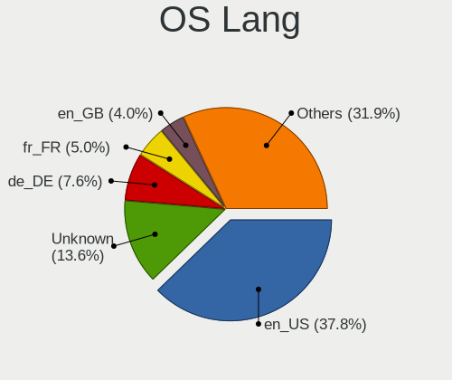
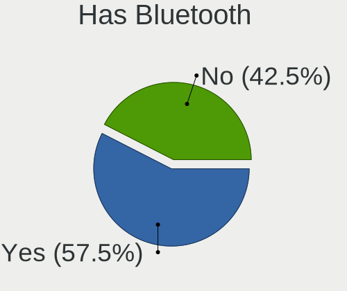
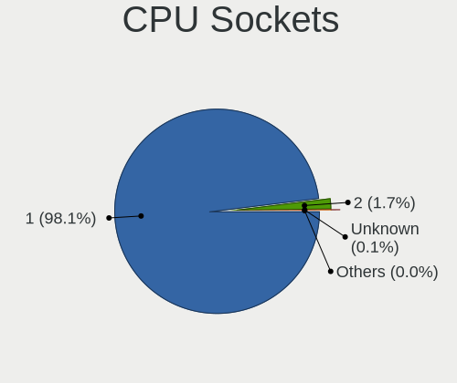

Ubuntu - Tested Hardware & Statistics
-------------------------------------

A project to collect tested hardware configurations for Ubuntu.

Anyone can contribute to this report by the [hw-probe](https://github.com/linuxhw/hw-probe) tool:

    sudo -E hw-probe -all -upload

Please contribute! Especially if your hardware is rare.

This is a report for all computer types. See also reports for [desktops](/Dist/Ubuntu/Desktop/README.md) and [notebooks](/Dist/Ubuntu/Notebook/README.md).

Contents
--------

* [ Test Cases ](#test-cases)

* [ System ](#system)
  - [ OS                       ](#os)
  - [ OS Family                ](#os-family)
  - [ Kernel                   ](#kernel)
  - [ Kernel Family            ](#kernel-family)
  - [ Kernel Major Ver.        ](#kernel-major-ver)
  - [ Arch                     ](#arch)
  - [ DE                       ](#de)
  - [ Display Server           ](#display-server)
  - [ Display Manager          ](#display-manager)
  - [ OS Lang                  ](#os-lang)
  - [ Boot Mode                ](#boot-mode)
  - [ Filesystem               ](#filesystem)
  - [ Part. scheme             ](#part-scheme)
  - [ Dual Boot with Linux/BSD ](#dual-boot-with-linuxbsd)
  - [ Dual Boot (Win)          ](#dual-boot-win)

* [ Board ](#board)
  - [ Vendor                   ](#vendor)
  - [ Model                    ](#model)
  - [ Model Family             ](#model-family)
  - [ MFG Year                 ](#mfg-year)
  - [ Form Factor              ](#form-factor)
  - [ Secure Boot              ](#secure-boot)
  - [ Coreboot                 ](#coreboot)
  - [ RAM Size                 ](#ram-size)
  - [ RAM Used                 ](#ram-used)
  - [ Total Drives             ](#total-drives)
  - [ Has CD-ROM               ](#has-cd-rom)
  - [ Has Ethernet             ](#has-ethernet)
  - [ Has WiFi                 ](#has-wifi)
  - [ Has Bluetooth            ](#has-bluetooth)

* [ Location ](#location)
  - [ Country                  ](#country)
  - [ City                     ](#city)

* [ Drives ](#drives)
  - [ Drive Vendor             ](#drive-vendor)
  - [ Drive Model              ](#drive-model)
  - [ HDD Vendor               ](#hdd-vendor)
  - [ SSD Vendor               ](#ssd-vendor)
  - [ Drive Kind               ](#drive-kind)
  - [ Drive Connector          ](#drive-connector)
  - [ Drive Size               ](#drive-size)
  - [ Space Total              ](#space-total)
  - [ Space Used               ](#space-used)
  - [ Malfunc. Drives          ](#malfunc-drives)
  - [ Malfunc. Drive Vendor    ](#malfunc-drive-vendor)
  - [ Malfunc. HDD Vendor      ](#malfunc-hdd-vendor)
  - [ Malfunc. Drive Kind      ](#malfunc-drive-kind)
  - [ Failed Drives            ](#failed-drives)
  - [ Failed Drive Vendor      ](#failed-drive-vendor)
  - [ Drive Status             ](#drive-status)

* [ Storage controller ](#storage-controller)
  - [ Storage Vendor           ](#storage-vendor)
  - [ Storage Model            ](#storage-model)
  - [ Storage Kind             ](#storage-kind)

* [ Processor ](#processor)
  - [ CPU Vendor               ](#cpu-vendor)
  - [ CPU Model                ](#cpu-model)
  - [ CPU Model Family         ](#cpu-model-family)
  - [ CPU Cores                ](#cpu-cores)
  - [ CPU Sockets              ](#cpu-sockets)
  - [ CPU Threads              ](#cpu-threads)
  - [ CPU Op-Modes             ](#cpu-op-modes)
  - [ CPU Microcode            ](#cpu-microcode)
  - [ CPU Microarch            ](#cpu-microarch)

* [ Graphics ](#graphics)
  - [ GPU Vendor               ](#gpu-vendor)
  - [ GPU Model                ](#gpu-model)
  - [ GPU Combo                ](#gpu-combo)
  - [ GPU Driver               ](#gpu-driver)
  - [ GPU Memory               ](#gpu-memory)

* [ Monitor ](#monitor)
  - [ Monitor Vendor           ](#monitor-vendor)
  - [ Monitor Model            ](#monitor-model)
  - [ Monitor Resolution       ](#monitor-resolution)
  - [ Monitor Diagonal         ](#monitor-diagonal)
  - [ Monitor Width            ](#monitor-width)
  - [ Aspect Ratio             ](#aspect-ratio)
  - [ Monitor Area             ](#monitor-area)
  - [ Pixel Density            ](#pixel-density)
  - [ Multiple Monitors        ](#multiple-monitors)

* [ Network ](#network)
  - [ Net Controller Vendor    ](#net-controller-vendor)
  - [ Net Controller Model     ](#net-controller-model)
  - [ Wireless Vendor          ](#wireless-vendor)
  - [ Wireless Model           ](#wireless-model)
  - [ Ethernet Vendor          ](#ethernet-vendor)
  - [ Ethernet Model           ](#ethernet-model)
  - [ Net Controller Kind      ](#net-controller-kind)
  - [ Used Controller          ](#used-controller)
  - [ NICs                     ](#nics)
  - [ IPv6                     ](#ipv6)

* [ Bluetooth ](#bluetooth)
  - [ Bluetooth Vendor         ](#bluetooth-vendor)
  - [ Bluetooth Model          ](#bluetooth-model)

* [ Sound ](#sound)
  - [ Sound Vendor             ](#sound-vendor)
  - [ Sound Model              ](#sound-model)

* [ Memory ](#memory)
  - [ Memory Vendor            ](#memory-vendor)
  - [ Memory Model             ](#memory-model)
  - [ Memory Kind              ](#memory-kind)
  - [ Memory Form Factor       ](#memory-form-factor)
  - [ Memory Size              ](#memory-size)
  - [ Memory Speed             ](#memory-speed)

* [ Printers & scanners ](#printers--scanners)
  - [ Printer Vendor           ](#printer-vendor)
  - [ Printer Model            ](#printer-model)
  - [ Scanner Vendor           ](#scanner-vendor)
  - [ Scanner Model            ](#scanner-model)

* [ Camera ](#camera)
  - [ Camera Vendor            ](#camera-vendor)
  - [ Camera Model             ](#camera-model)

* [ Security ](#security)
  - [ Fingerprint Vendor       ](#fingerprint-vendor)
  - [ Fingerprint Model        ](#fingerprint-model)
  - [ Chipcard Vendor          ](#chipcard-vendor)
  - [ Chipcard Model           ](#chipcard-model)

* [ Unsupported ](#unsupported)
  - [ Unsupported Devices      ](#unsupported-devices)
  - [ Unsupported Device Types ](#unsupported-device-types)

Test Cases
----------

Total: 85952

| Vendor        | Model                       | Form-Factor | Probe                                                      | Date         |
|---------------|-----------------------------|-------------|------------------------------------------------------------|--------------|
| Acer          | H57M01                      | Desktop     | [215701a84d](https://linux-hardware.org/?probe=215701a84d) | Apr 01, 2023 |
| Dell          | Latitude 5530               | Notebook    | [e4688e2ef8](https://linux-hardware.org/?probe=e4688e2ef8) | Apr 01, 2023 |
| HP            | Pavilion Laptop 14-ec0xx... | Notebook    | [1da5570114](https://linux-hardware.org/?probe=1da5570114) | Apr 01, 2023 |
| Lenovo        | V15 G2 IJL 82QY             | Notebook    | [8582f4e86e](https://linux-hardware.org/?probe=8582f4e86e) | Apr 01, 2023 |
| Lenovo        | V15 G2 IJL 82QY             | Notebook    | [e94e2e397e](https://linux-hardware.org/?probe=e94e2e397e) | Apr 01, 2023 |
| Gigabyte      | Z370 HD3-CF                 | Desktop     | [824aa0ae13](https://linux-hardware.org/?probe=824aa0ae13) | Apr 01, 2023 |
| Lenovo        | V310-14ISK 80SX             | Notebook    | [cd6dee4651](https://linux-hardware.org/?probe=cd6dee4651) | Apr 01, 2023 |
| ASUSTek       | ZenBook UX325EA_UX325EA     | Notebook    | [4191279e7e](https://linux-hardware.org/?probe=4191279e7e) | Apr 01, 2023 |
| Apple         | MacBookPro9,2               | Notebook    | [111eeac3b3](https://linux-hardware.org/?probe=111eeac3b3) | Apr 01, 2023 |
| Intel         | DG41RQ AAE54511-203         | Desktop     | [383835a445](https://linux-hardware.org/?probe=383835a445) | Apr 01, 2023 |
| Lenovo        | V110-15ISK 80TL             | Notebook    | [db058df07b](https://linux-hardware.org/?probe=db058df07b) | Apr 01, 2023 |
| Apple         | MacBookPro9,2               | Notebook    | [2fcab6a925](https://linux-hardware.org/?probe=2fcab6a925) | Apr 01, 2023 |
| Lenovo        | V110-15ISK 80TL             | Notebook    | [3691be13e8](https://linux-hardware.org/?probe=3691be13e8) | Apr 01, 2023 |
| Lenovo        | ThinkPad E14 20RA004YUS     | Notebook    | [36b592e607](https://linux-hardware.org/?probe=36b592e607) | Apr 01, 2023 |
| Samsung       | R530/R730/R540              | Notebook    | [714ed0f007](https://linux-hardware.org/?probe=714ed0f007) | Apr 01, 2023 |
| Dell          | Vostro 15-3568              | Notebook    | [d93b1d27e1](https://linux-hardware.org/?probe=d93b1d27e1) | Apr 01, 2023 |
| Unknown       | Unknown                     | Notebook    | [702a241ca6](https://linux-hardware.org/?probe=702a241ca6) | Apr 01, 2023 |
| Dell          | 09M8Y8 A01                  | Desktop     | [17d5390549](https://linux-hardware.org/?probe=17d5390549) | Apr 01, 2023 |
| Dell          | 09KPNV A01                  | Desktop     | [2b25e4872f](https://linux-hardware.org/?probe=2b25e4872f) | Apr 01, 2023 |
| Lenovo        | IdeaPadFlex 5 14ABR8 82X... | Convertible | [8357ff8cf5](https://linux-hardware.org/?probe=8357ff8cf5) | Apr 01, 2023 |
| Apple         | Mac-F4208DC8 PVT            | Desktop     | [f05009caac](https://linux-hardware.org/?probe=f05009caac) | Apr 01, 2023 |
| Itautec       | Infoway w7535               | Notebook    | [48a539f108](https://linux-hardware.org/?probe=48a539f108) | Apr 01, 2023 |
| Gigabyte      | Z77X-UD5H                   | Desktop     | [2be0fa6524](https://linux-hardware.org/?probe=2be0fa6524) | Apr 01, 2023 |
| Gigabyte      | B560M AORUS ELITE           | Desktop     | [ee536703f8](https://linux-hardware.org/?probe=ee536703f8) | Apr 01, 2023 |
| HP            | Pavilion x360 Convertibl... | Convertible | [7e97eb6308](https://linux-hardware.org/?probe=7e97eb6308) | Apr 01, 2023 |
| Xunlong       | Orange Pi One               | Soc         | [8d982c6cd9](https://linux-hardware.org/?probe=8d982c6cd9) | Apr 01, 2023 |
| Novatech      | NL40_50CU                   | Notebook    | [caaa544589](https://linux-hardware.org/?probe=caaa544589) | Apr 01, 2023 |
| HP            | Laptop 14-dq2xxx            | Notebook    | [c90d525ee8](https://linux-hardware.org/?probe=c90d525ee8) | Mar 31, 2023 |
| HP            | Laptop 15-bs0xx             | Notebook    | [a5cb1375c4](https://linux-hardware.org/?probe=a5cb1375c4) | Mar 31, 2023 |
| HP            | Laptop 15-bs0xx             | Notebook    | [60a6b11ce0](https://linux-hardware.org/?probe=60a6b11ce0) | Mar 31, 2023 |
| Gigabyte      | Z170-HD3 DDR3-CF            | Desktop     | [dff9959cd7](https://linux-hardware.org/?probe=dff9959cd7) | Mar 31, 2023 |
| Gateway       | IPIMB-ARA                   | Desktop     | [9c300aea89](https://linux-hardware.org/?probe=9c300aea89) | Mar 31, 2023 |
| Gigabyte      | H61M-S2V-B3                 | Desktop     | [45a242d18f](https://linux-hardware.org/?probe=45a242d18f) | Mar 31, 2023 |
| ASUSTek       | M5A78L LE                   | Desktop     | [7a23362aac](https://linux-hardware.org/?probe=7a23362aac) | Mar 31, 2023 |
| HP            | 0A64h                       | Desktop     | [f4fd3904f0](https://linux-hardware.org/?probe=f4fd3904f0) | Mar 31, 2023 |
| Lenovo        | ThinkPad T431s 20AA0016G... | Notebook    | [13e8d4f50b](https://linux-hardware.org/?probe=13e8d4f50b) | Mar 31, 2023 |
| Samsung       | 950XED                      | Notebook    | [c3b37a213a](https://linux-hardware.org/?probe=c3b37a213a) | Mar 31, 2023 |
| HP            | Pavilion g7                 | Notebook    | [3b0b792078](https://linux-hardware.org/?probe=3b0b792078) | Mar 31, 2023 |
| Lenovo        | IdeaPadFlex 5 15ALC05 82... | Convertible | [29ecf989bb](https://linux-hardware.org/?probe=29ecf989bb) | Mar 31, 2023 |
| ASUSTek       | TUF Gaming B550-PLUS        | Desktop     | [6694c9279d](https://linux-hardware.org/?probe=6694c9279d) | Mar 31, 2023 |
| MSI           | MAG Z690 TOMAHAWK WIFI      | Desktop     | [49917003da](https://linux-hardware.org/?probe=49917003da) | Mar 31, 2023 |
| Acer          | Extensa 215-31              | Notebook    | [b1601e6747](https://linux-hardware.org/?probe=b1601e6747) | Mar 31, 2023 |
| Dell          | Vostro V131                 | Notebook    | [53538c2ae9](https://linux-hardware.org/?probe=53538c2ae9) | Mar 31, 2023 |
| ASRock        | A320M-DVS R4.0              | Desktop     | [e6463ab36d](https://linux-hardware.org/?probe=e6463ab36d) | Mar 31, 2023 |
| ASUSTek       | K53SD                       | Notebook    | [81d03c3707](https://linux-hardware.org/?probe=81d03c3707) | Mar 31, 2023 |
| Apple         | Mac-F227BEC8 PVT            | All in one  | [c3065ba2b6](https://linux-hardware.org/?probe=c3065ba2b6) | Mar 31, 2023 |
| MSI           | 970 GAMING                  | Desktop     | [d729a0a559](https://linux-hardware.org/?probe=d729a0a559) | Mar 31, 2023 |
| Lenovo        | ThinkPad E14 20RA0016IX     | Notebook    | [685f18f5b3](https://linux-hardware.org/?probe=685f18f5b3) | Mar 31, 2023 |
| ASUSTek       | TUF Gaming Z590-PLUS WIF... | Desktop     | [9addea9f4a](https://linux-hardware.org/?probe=9addea9f4a) | Mar 31, 2023 |
| MSI           | Modern 15 A5M               | Notebook    | [2a00bed043](https://linux-hardware.org/?probe=2a00bed043) | Mar 31, 2023 |
| HP            | OMEN by Laptop 17-cb1xxx    | Notebook    | [db1a67682b](https://linux-hardware.org/?probe=db1a67682b) | Mar 31, 2023 |
| HP            | ProLiant DL380 G6           | Server      | [0cad2b6262](https://linux-hardware.org/?probe=0cad2b6262) | Mar 31, 2023 |
| HP            | ProLiant DL380 G6           | Server      | [953fbb916c](https://linux-hardware.org/?probe=953fbb916c) | Mar 31, 2023 |
| HP            | Pavilion Laptop 15-eh1xx... | Notebook    | [b56e2a41ed](https://linux-hardware.org/?probe=b56e2a41ed) | Mar 31, 2023 |
| Lenovo        | ThinkPad Edge E545 20B20... | Notebook    | [c2061eeeb8](https://linux-hardware.org/?probe=c2061eeeb8) | Mar 31, 2023 |
| Gigabyte      | GA-880GM-UD2H               | Desktop     | [90796fbad9](https://linux-hardware.org/?probe=90796fbad9) | Mar 31, 2023 |
| Lenovo        | ThinkPad Edge E545 20B20... | Notebook    | [9a866f03fd](https://linux-hardware.org/?probe=9a866f03fd) | Mar 31, 2023 |
| ASUSTek       | Z97-K                       | Desktop     | [da56f6c38c](https://linux-hardware.org/?probe=da56f6c38c) | Mar 31, 2023 |
| Gigabyte      | TRX40 AORUS XTREME          | Desktop     | [0945961c85](https://linux-hardware.org/?probe=0945961c85) | Mar 31, 2023 |
| Gigabyte      | TRX40 AORUS XTREME          | Desktop     | [72c08c8ca9](https://linux-hardware.org/?probe=72c08c8ca9) | Mar 31, 2023 |
| Dell          | 0FG47G A02                  | Desktop     | [d1cf6fa11e](https://linux-hardware.org/?probe=d1cf6fa11e) | Mar 31, 2023 |
| Lenovo        | ThinkPad T490 20N2CTO1WW    | Notebook    | [17fb0ed43a](https://linux-hardware.org/?probe=17fb0ed43a) | Mar 31, 2023 |
| Acer          | Aspire TC-875 V:1.0         | Desktop     | [8f9f4fb295](https://linux-hardware.org/?probe=8f9f4fb295) | Mar 31, 2023 |
| Gigabyte      | H310M H x.x                 | Desktop     | [68fce9ae2d](https://linux-hardware.org/?probe=68fce9ae2d) | Mar 31, 2023 |
| ECS           | H61H2-M6                    | Desktop     | [6c33ee7e15](https://linux-hardware.org/?probe=6c33ee7e15) | Mar 31, 2023 |
| Gigabyte      | B550M DS3H AC               | Desktop     | [f8e723a8dc](https://linux-hardware.org/?probe=f8e723a8dc) | Mar 31, 2023 |
| MSI           | PRO X670-P WIFI             | Desktop     | [bb72de54b6](https://linux-hardware.org/?probe=bb72de54b6) | Mar 31, 2023 |
| ECS           | G31T-M7                     | Desktop     | [c197c4ed1d](https://linux-hardware.org/?probe=c197c4ed1d) | Mar 31, 2023 |
| HP            | Pavilion Gaming Laptop 1... | Notebook    | [0014e52bf3](https://linux-hardware.org/?probe=0014e52bf3) | Mar 31, 2023 |
| ASUSTek       | X751SA                      | Notebook    | [5d8ad91642](https://linux-hardware.org/?probe=5d8ad91642) | Mar 31, 2023 |
| ASUSTek       | M5A99FX PRO R2.0            | Desktop     | [0e374d0aea](https://linux-hardware.org/?probe=0e374d0aea) | Mar 31, 2023 |
| Lenovo        | ThinkPad X270 20HMS0T000    | Notebook    | [702223a4b1](https://linux-hardware.org/?probe=702223a4b1) | Mar 31, 2023 |
| EVOO          | EVC156-1                    | Notebook    | [8e665ae8b2](https://linux-hardware.org/?probe=8e665ae8b2) | Mar 31, 2023 |
| ASUSTek       | VivoBook 15_ASUS Laptop ... | Notebook    | [03da618edb](https://linux-hardware.org/?probe=03da618edb) | Mar 31, 2023 |
| Gigabyte      | X670 AORUS ELITE AX         | Desktop     | [c239e06998](https://linux-hardware.org/?probe=c239e06998) | Mar 31, 2023 |
| Intel         | NUC11PHBi7 M26151-405       | Mini pc     | [96107a824d](https://linux-hardware.org/?probe=96107a824d) | Mar 31, 2023 |
| Lenovo        | IdeaPad 530S-14IKB 81EU     | Notebook    | [fe51f2c62f](https://linux-hardware.org/?probe=fe51f2c62f) | Mar 31, 2023 |
| ASUSTek       | ASUS BR1100CKA BR1100CKA... | Notebook    | [d7f3354ce9](https://linux-hardware.org/?probe=d7f3354ce9) | Mar 31, 2023 |
| Gigabyte      | F2A88X-UP4                  | Desktop     | [72c4b553b4](https://linux-hardware.org/?probe=72c4b553b4) | Mar 31, 2023 |
| Toshiba       | Satellite Pro S500          | Notebook    | [b2e60d9170](https://linux-hardware.org/?probe=b2e60d9170) | Mar 31, 2023 |
| HP            | Pavilion Laptop 15-cc5xx    | Notebook    | [c6bbbbb7d8](https://linux-hardware.org/?probe=c6bbbbb7d8) | Mar 31, 2023 |
| Lenovo        | ThinkPad T14s Gen 2a 20X... | Notebook    | [0ffc78eac6](https://linux-hardware.org/?probe=0ffc78eac6) | Mar 30, 2023 |
| Medion        | E15407                      | Notebook    | [b863362865](https://linux-hardware.org/?probe=b863362865) | Mar 30, 2023 |
| ASUSTek       | Z87-K                       | Desktop     | [e596dbb5bd](https://linux-hardware.org/?probe=e596dbb5bd) | Mar 30, 2023 |
| Gigabyte      | A320M-S2H-CF                | Desktop     | [3aac57dfbd](https://linux-hardware.org/?probe=3aac57dfbd) | Mar 30, 2023 |
| Medion        | E15407                      | Notebook    | [641091a85d](https://linux-hardware.org/?probe=641091a85d) | Mar 30, 2023 |
| Gigabyte      | B550 AORUS ELITE            | Desktop     | [4cfac9a162](https://linux-hardware.org/?probe=4cfac9a162) | Mar 30, 2023 |
| Apple         | MacBookAir7,2               | Notebook    | [d9cbbe0a35](https://linux-hardware.org/?probe=d9cbbe0a35) | Mar 30, 2023 |
| Lenovo        | IdeaPad 330S-15ARR 81FB     | Notebook    | [1dc323a9e9](https://linux-hardware.org/?probe=1dc323a9e9) | Mar 30, 2023 |
| Unknown       | Unknown                     | Desktop     | [3773f3cd04](https://linux-hardware.org/?probe=3773f3cd04) | Mar 30, 2023 |
| Dell          | 0KV62T A02                  | Desktop     | [c7765df604](https://linux-hardware.org/?probe=c7765df604) | Mar 30, 2023 |
| Lenovo        | ThinkPad E595 20NF0000GE    | Notebook    | [95a77f6dcc](https://linux-hardware.org/?probe=95a77f6dcc) | Mar 30, 2023 |
| ASUSTek       | X555LAB                     | Notebook    | [f1b87ecc62](https://linux-hardware.org/?probe=f1b87ecc62) | Mar 30, 2023 |
| Packard Be... | FMP55                       | Desktop     | [88a15e20b2](https://linux-hardware.org/?probe=88a15e20b2) | Mar 30, 2023 |
| Apple         | MacBookPro10,2              | Notebook    | [2f56ac98c1](https://linux-hardware.org/?probe=2f56ac98c1) | Mar 30, 2023 |
| ASUSTek       | M4A79T Deluxe               | Desktop     | [9828b40ec9](https://linux-hardware.org/?probe=9828b40ec9) | Mar 30, 2023 |
| Lenovo        | Legion Y530-15ICH 81FV      | Notebook    | [0f8c22b288](https://linux-hardware.org/?probe=0f8c22b288) | Mar 30, 2023 |
| HP            | 0A64h                       | Desktop     | [9f50595e87](https://linux-hardware.org/?probe=9f50595e87) | Mar 30, 2023 |
| Lenovo        | ThinkBook 15-IIL 20SM       | Notebook    | [31d333ecc9](https://linux-hardware.org/?probe=31d333ecc9) | Mar 30, 2023 |
| libre-comp... | aml-s905x-cc                | Soc         | [41da6a7bfb](https://linux-hardware.org/?probe=41da6a7bfb) | Mar 30, 2023 |
| ASUSTek       | K55A                        | Notebook    | [cf40bdccfc](https://linux-hardware.org/?probe=cf40bdccfc) | Mar 30, 2023 |
| ASUSTek       | K55A                        | Notebook    | [b6c168d185](https://linux-hardware.org/?probe=b6c168d185) | Mar 30, 2023 |
| Dell          | Vostro 5402                 | Notebook    | [27b9c84cbe](https://linux-hardware.org/?probe=27b9c84cbe) | Mar 30, 2023 |
| Intel         | NUC6i5SYB H81131-503        | Mini pc     | [0a09299aae](https://linux-hardware.org/?probe=0a09299aae) | Mar 30, 2023 |
| Gigabyte      | H61M-S2V-B3                 | Desktop     | [41a76fad3f](https://linux-hardware.org/?probe=41a76fad3f) | Mar 30, 2023 |
| Google        | Caroline                    | Notebook    | [8018db87e9](https://linux-hardware.org/?probe=8018db87e9) | Mar 30, 2023 |
| Lenovo        | MAHOBAY NO DPK              | Desktop     | [3bf5fd0cfd](https://linux-hardware.org/?probe=3bf5fd0cfd) | Mar 30, 2023 |
| Dell          | Inspiron 3421               | Notebook    | [5418efd855](https://linux-hardware.org/?probe=5418efd855) | Mar 30, 2023 |
| ASUSTek       | H110M-R                     | Desktop     | [3c641024ba](https://linux-hardware.org/?probe=3c641024ba) | Mar 30, 2023 |
| Lenovo        | Yoga 510-14ISK 80UK         | Notebook    | [722c1e9d68](https://linux-hardware.org/?probe=722c1e9d68) | Mar 30, 2023 |
| MSI           | X79A-GD45                   | Desktop     | [6d78703b2c](https://linux-hardware.org/?probe=6d78703b2c) | Mar 30, 2023 |
| Lenovo        | Yoga 6 13ALC6 82ND          | Convertible | [455ce69724](https://linux-hardware.org/?probe=455ce69724) | Mar 30, 2023 |
| HP            | Pavilion Gaming Laptop 1... | Notebook    | [252d340923](https://linux-hardware.org/?probe=252d340923) | Mar 30, 2023 |
| Dell          | Precision 5510              | Notebook    | [15954887b1](https://linux-hardware.org/?probe=15954887b1) | Mar 30, 2023 |
| Raspberry ... | Raspberry Pi                | Soc         | [426c2d06fd](https://linux-hardware.org/?probe=426c2d06fd) | Mar 30, 2023 |
| ASUSTek       | TUF Gaming B550M-PLUS       | Desktop     | [92981c741d](https://linux-hardware.org/?probe=92981c741d) | Mar 30, 2023 |
| MSI           | PRO X670-P WIFI             | Desktop     | [ed35fbea6c](https://linux-hardware.org/?probe=ed35fbea6c) | Mar 30, 2023 |
| Dell          | Precision 3560              | Notebook    | [f6ef5c1a2c](https://linux-hardware.org/?probe=f6ef5c1a2c) | Mar 30, 2023 |
| Raspberry ... | Raspberry Pi Compute Mod... | Soc         | [c885b5da6c](https://linux-hardware.org/?probe=c885b5da6c) | Mar 30, 2023 |
| HP            | Pavilion 17                 | Notebook    | [46e0a0aed1](https://linux-hardware.org/?probe=46e0a0aed1) | Mar 30, 2023 |
| HP            | Pavilion 17                 | Notebook    | [3da4500905](https://linux-hardware.org/?probe=3da4500905) | Mar 30, 2023 |
| HP            | 82B4                        | Desktop     | [0829a64947](https://linux-hardware.org/?probe=0829a64947) | Mar 30, 2023 |
| Dell          | Latitude 3490               | Notebook    | [16d4f0954b](https://linux-hardware.org/?probe=16d4f0954b) | Mar 30, 2023 |
| Lenovo        | IdeaPad 3 15ITL6 82H8       | Notebook    | [faa3d2b7ad](https://linux-hardware.org/?probe=faa3d2b7ad) | Mar 30, 2023 |
| Foxconn       | 2ABF                        | Desktop     | [8e1750d5e4](https://linux-hardware.org/?probe=8e1750d5e4) | Mar 30, 2023 |
| MSI           | MAG B550M MORTAR WIFI       | Desktop     | [dfd9900ccf](https://linux-hardware.org/?probe=dfd9900ccf) | Mar 30, 2023 |
| Lenovo        | ThinkPad X220 Tablet 429... | Notebook    | [a2e324fd92](https://linux-hardware.org/?probe=a2e324fd92) | Mar 30, 2023 |
| HUAWEI        | RLEF-XX                     | Notebook    | [e9988edacd](https://linux-hardware.org/?probe=e9988edacd) | Mar 30, 2023 |
| Alienware     | m15 Ryzen Ed. R5            | Notebook    | [0f273e6227](https://linux-hardware.org/?probe=0f273e6227) | Mar 30, 2023 |
| ASUSTek       | TUF Gaming X570-PRO WIFI... | Desktop     | [cfe80f22f8](https://linux-hardware.org/?probe=cfe80f22f8) | Mar 30, 2023 |
| Intel         | H81U                        | Notebook    | [43d7179dc3](https://linux-hardware.org/?probe=43d7179dc3) | Mar 30, 2023 |
| ASUSTek       | M5A97                       | Desktop     | [4d12d122e1](https://linux-hardware.org/?probe=4d12d122e1) | Mar 30, 2023 |
| Shuttle       | FH170                       | Desktop     | [0fa0f1ab72](https://linux-hardware.org/?probe=0fa0f1ab72) | Mar 30, 2023 |
| Apple         | Mac-65CE76090165799A iMa... | All in one  | [282031e979](https://linux-hardware.org/?probe=282031e979) | Mar 30, 2023 |
| ASUSTek       | ASUS TUF Gaming F17 FX70... | Notebook    | [da1e07f122](https://linux-hardware.org/?probe=da1e07f122) | Mar 30, 2023 |
| Intel         | D510MO AAE76523-403         | Desktop     | [0d06f88081](https://linux-hardware.org/?probe=0d06f88081) | Mar 30, 2023 |
| ASUSTek       | P5E WS Pro                  | Desktop     | [6c70ac23df](https://linux-hardware.org/?probe=6c70ac23df) | Mar 30, 2023 |
| ASUSTek       | ASUS TUF Gaming F17 FX70... | Notebook    | [492d575f31](https://linux-hardware.org/?probe=492d575f31) | Mar 30, 2023 |
| Apple         | Mac-65CE76090165799A iMa... | All in one  | [920f4a2dc2](https://linux-hardware.org/?probe=920f4a2dc2) | Mar 30, 2023 |
| HP            | ProBook 450 G5              | Notebook    | [89dfecad7e](https://linux-hardware.org/?probe=89dfecad7e) | Mar 30, 2023 |
| Dell          | XPS 15 9570                 | Notebook    | [8d0c93e1a8](https://linux-hardware.org/?probe=8d0c93e1a8) | Mar 30, 2023 |
| Gigabyte      | H81M-S2V                    | Desktop     | [5a16920bc0](https://linux-hardware.org/?probe=5a16920bc0) | Mar 30, 2023 |
| Dell          | Vostro 3480                 | Notebook    | [83cb13ffb4](https://linux-hardware.org/?probe=83cb13ffb4) | Mar 30, 2023 |
| Lenovo        | N22 80S6                    | Notebook    | [c6cbeeb984](https://linux-hardware.org/?probe=c6cbeeb984) | Mar 30, 2023 |
| HP            | 8591                        | Desktop     | [b887990c12](https://linux-hardware.org/?probe=b887990c12) | Mar 30, 2023 |
| AZW           | SER V1.0                    | Mini pc     | [1b8dc51444](https://linux-hardware.org/?probe=1b8dc51444) | Mar 30, 2023 |
| MSI           | FM2-A75MA-E35               | Desktop     | [10de0ae048](https://linux-hardware.org/?probe=10de0ae048) | Mar 30, 2023 |
| Acer          | Aspire A514-54              | Notebook    | [94da64753b](https://linux-hardware.org/?probe=94da64753b) | Mar 30, 2023 |
| ATOPNUC       | MA90                        | Mini pc     | [65782ab3d1](https://linux-hardware.org/?probe=65782ab3d1) | Mar 30, 2023 |
| Dell          | 0VV4V0 A00                  | All in one  | [63e8848234](https://linux-hardware.org/?probe=63e8848234) | Mar 30, 2023 |
| Acer          | Aspire 8943G                | Notebook    | [e1d172011e](https://linux-hardware.org/?probe=e1d172011e) | Mar 30, 2023 |
| Dell          | Inspiron One 2320           | All in one  | [225e42d432](https://linux-hardware.org/?probe=225e42d432) | Mar 30, 2023 |
| ASUSTek       | K53SD                       | Notebook    | [81710aaa51](https://linux-hardware.org/?probe=81710aaa51) | Mar 30, 2023 |
| Microsoft     | Surface Pro 3               | Tablet      | [5f3a9edb3b](https://linux-hardware.org/?probe=5f3a9edb3b) | Mar 30, 2023 |
| Lenovo        | 30D2 SDK0J40697 WIN 3305... | Desktop     | [185cb6df15](https://linux-hardware.org/?probe=185cb6df15) | Mar 30, 2023 |
| Lenovo        | Yoga Slim 7 Pro 16ACH6 8... | Notebook    | [889ef05f86](https://linux-hardware.org/?probe=889ef05f86) | Mar 30, 2023 |
| Apple         | MacBookAir9,1               | Notebook    | [1fe20bdfcb](https://linux-hardware.org/?probe=1fe20bdfcb) | Mar 30, 2023 |
| Lenovo        | G470 20078                  | Notebook    | [1e510aad42](https://linux-hardware.org/?probe=1e510aad42) | Mar 30, 2023 |
| Notebook      | N650DU                      | Notebook    | [e8ec3c6462](https://linux-hardware.org/?probe=e8ec3c6462) | Mar 30, 2023 |
| ASUSTek       | ROG STRIX B450-F GAMING     | Desktop     | [cd308ca372](https://linux-hardware.org/?probe=cd308ca372) | Mar 29, 2023 |
| ASUSTek       | PRIME H610I-PLUS D4         | Desktop     | [7b984afb2c](https://linux-hardware.org/?probe=7b984afb2c) | Mar 29, 2023 |
| AZW           | SER                         | Mini pc     | [40824322c9](https://linux-hardware.org/?probe=40824322c9) | Mar 29, 2023 |
| Lenovo        | G700 20251                  | Notebook    | [7580b631a9](https://linux-hardware.org/?probe=7580b631a9) | Mar 29, 2023 |
| Dell          | Inspiron 5566               | Notebook    | [7b53b4da78](https://linux-hardware.org/?probe=7b53b4da78) | Mar 29, 2023 |
| Acer          | Veriton Z4810G              | All in one  | [c4a9881345](https://linux-hardware.org/?probe=c4a9881345) | Mar 29, 2023 |
| Dell          | Latitude E6530              | Notebook    | [eb7392d1ae](https://linux-hardware.org/?probe=eb7392d1ae) | Mar 29, 2023 |
| MSI           | GT70 2PE                    | Notebook    | [493cabf3f8](https://linux-hardware.org/?probe=493cabf3f8) | Mar 29, 2023 |
| Medion        | P8614                       | Notebook    | [a66fe7042e](https://linux-hardware.org/?probe=a66fe7042e) | Mar 29, 2023 |
| Lenovo        | Yoga 6 13ALC6 82ND          | Convertible | [aebe1aa0af](https://linux-hardware.org/?probe=aebe1aa0af) | Mar 29, 2023 |
| Apple         | Mac-BE088AF8C5EB4FA2 iMa... | All in one  | [0805df69aa](https://linux-hardware.org/?probe=0805df69aa) | Mar 29, 2023 |
| Microsoft     | Surface Pro 3               | Tablet      | [9da2e607a3](https://linux-hardware.org/?probe=9da2e607a3) | Mar 29, 2023 |
| Lenovo        | ThinkPad E14 Gen 2 20TA0... | Notebook    | [e9600e8bfe](https://linux-hardware.org/?probe=e9600e8bfe) | Mar 29, 2023 |
| ASUSTek       | H81M-V3                     | Desktop     | [fd123bea36](https://linux-hardware.org/?probe=fd123bea36) | Mar 29, 2023 |
| ASUSTek       | TUF Gaming FX705DT_FX705... | Notebook    | [803a180064](https://linux-hardware.org/?probe=803a180064) | Mar 29, 2023 |
| ASUSTek       | TUF Gaming Z590-PLUS WIF... | Desktop     | [baf3c567a7](https://linux-hardware.org/?probe=baf3c567a7) | Mar 29, 2023 |
| Primux Tec... | A173                        | All in one  | [f31f5f63b9](https://linux-hardware.org/?probe=f31f5f63b9) | Mar 29, 2023 |
| Dell          | Inspiron 5767               | Notebook    | [1c80487906](https://linux-hardware.org/?probe=1c80487906) | Mar 29, 2023 |
| Lenovo        | HASWELLREFRESHDT 3190005... | All in one  | [9a6102422f](https://linux-hardware.org/?probe=9a6102422f) | Mar 29, 2023 |
| Dell          | 09KPNV A01                  | Desktop     | [6024b90eea](https://linux-hardware.org/?probe=6024b90eea) | Mar 29, 2023 |
| Acer          | Extensa 215-23              | Notebook    | [bf5730d468](https://linux-hardware.org/?probe=bf5730d468) | Mar 29, 2023 |
| ASUSTek       | X751LJ                      | Notebook    | [cf5d71e2b3](https://linux-hardware.org/?probe=cf5d71e2b3) | Mar 29, 2023 |
| HP            | 3646h                       | Desktop     | [b173e99a5a](https://linux-hardware.org/?probe=b173e99a5a) | Mar 29, 2023 |
| Primux Tec... | A173                        | All in one  | [95e3fd6b4b](https://linux-hardware.org/?probe=95e3fd6b4b) | Mar 29, 2023 |
| ASUSTek       | TUF Gaming FX705DT_FX705... | Notebook    | [f33059ab6b](https://linux-hardware.org/?probe=f33059ab6b) | Mar 29, 2023 |
| Lenovo        | IdeaPadFlex 10 20324        | Notebook    | [40b3e68058](https://linux-hardware.org/?probe=40b3e68058) | Mar 29, 2023 |
| Gigabyte      | GA-A75-UD4H                 | Desktop     | [e5433e75fb](https://linux-hardware.org/?probe=e5433e75fb) | Mar 29, 2023 |
| MSI           | X79A-GD45                   | Desktop     | [bb4680bc5b](https://linux-hardware.org/?probe=bb4680bc5b) | Mar 29, 2023 |
| ASUSTek       | PRIME B360M-C               | Desktop     | [e7b163ea80](https://linux-hardware.org/?probe=e7b163ea80) | Mar 29, 2023 |
| HP            | ProBook 450 G2              | Notebook    | [6599d32d74](https://linux-hardware.org/?probe=6599d32d74) | Mar 29, 2023 |
| HP            | ProBook 450 G2              | Notebook    | [64bef0aff5](https://linux-hardware.org/?probe=64bef0aff5) | Mar 29, 2023 |
| Timi          | TM1701                      | Notebook    | [16ca4bcb7f](https://linux-hardware.org/?probe=16ca4bcb7f) | Mar 29, 2023 |
| ASUSTek       | P8Z77-V LX2                 | Desktop     | [23256b54cf](https://linux-hardware.org/?probe=23256b54cf) | Mar 29, 2023 |
| Dell          | XPS 13 9310 2-in-1          | Convertible | [39d6f86500](https://linux-hardware.org/?probe=39d6f86500) | Mar 29, 2023 |
| Sony          | VGN-AW330J                  | Notebook    | [f5afc7ab6f](https://linux-hardware.org/?probe=f5afc7ab6f) | Mar 29, 2023 |
| Lenovo        | ThinkPad T14 Gen 1 20UD0... | Notebook    | [bfa850ddad](https://linux-hardware.org/?probe=bfa850ddad) | Mar 29, 2023 |
| Intel         | H61                         | Desktop     | [bb6e201a08](https://linux-hardware.org/?probe=bb6e201a08) | Mar 29, 2023 |
| Maxtang       | FP30 V1.0                   | Desktop     | [e184bdb89c](https://linux-hardware.org/?probe=e184bdb89c) | Mar 29, 2023 |
| Intel         | DQ67OW AAG28716-309         | Desktop     | [3394687910](https://linux-hardware.org/?probe=3394687910) | Mar 29, 2023 |
| HUAWEI        | HVY-WXX9                    | Notebook    | [31d94ffb5f](https://linux-hardware.org/?probe=31d94ffb5f) | Mar 29, 2023 |
| Gigabyte      | P41T-D3                     | Desktop     | [2941019778](https://linux-hardware.org/?probe=2941019778) | Mar 29, 2023 |
| Intel         | B75                         | Desktop     | [2bddb84c2e](https://linux-hardware.org/?probe=2bddb84c2e) | Mar 29, 2023 |
| ASUSTek       | H81M-V3                     | Desktop     | [ce98454e55](https://linux-hardware.org/?probe=ce98454e55) | Mar 29, 2023 |
| Dell          | Vostro 15 3515              | Notebook    | [7b4a51d5e3](https://linux-hardware.org/?probe=7b4a51d5e3) | Mar 29, 2023 |
| Dell          | 0200DY A01                  | Desktop     | [095eb7be41](https://linux-hardware.org/?probe=095eb7be41) | Mar 29, 2023 |
| Gigabyte      | B365M DS3H                  | Desktop     | [e6b01be2f1](https://linux-hardware.org/?probe=e6b01be2f1) | Mar 29, 2023 |
| Microsoft     | Surface Laptop Go           | Tablet      | [25909cf566](https://linux-hardware.org/?probe=25909cf566) | Mar 29, 2023 |
| Lenovo        | ThinkPad L13 Yoga Gen 2 ... | Convertible | [a38bcb83b3](https://linux-hardware.org/?probe=a38bcb83b3) | Mar 29, 2023 |
| HP            | Spectre x360 Convertible... | Convertible | [e27d6594a6](https://linux-hardware.org/?probe=e27d6594a6) | Mar 29, 2023 |
| ASUSTek       | H110M-A                     | Desktop     | [147c0afb99](https://linux-hardware.org/?probe=147c0afb99) | Mar 29, 2023 |
| Dell          | Inspiron 7520               | Notebook    | [8258074853](https://linux-hardware.org/?probe=8258074853) | Mar 28, 2023 |
| ASRock        | H61M-DG3/USB3               | Desktop     | [6e7b188568](https://linux-hardware.org/?probe=6e7b188568) | Mar 28, 2023 |
| HP            | Compaq Presario CQ40        | Notebook    | [7f2e65257c](https://linux-hardware.org/?probe=7f2e65257c) | Mar 28, 2023 |
| MSI           | H61M-P20                    | Desktop     | [18409d7178](https://linux-hardware.org/?probe=18409d7178) | Mar 28, 2023 |
| Google        | Caroline                    | Notebook    | [80f01f2a87](https://linux-hardware.org/?probe=80f01f2a87) | Mar 28, 2023 |
| HP            | ENVY x360 Convertible 15... | Convertible | [adabf81daa](https://linux-hardware.org/?probe=adabf81daa) | Mar 28, 2023 |
| HP            | Compaq Presario CQ40        | Notebook    | [9ee954843e](https://linux-hardware.org/?probe=9ee954843e) | Mar 28, 2023 |
| Gigabyte      | H77M-D3H                    | Desktop     | [31a96824ea](https://linux-hardware.org/?probe=31a96824ea) | Mar 28, 2023 |
| HP            | 250 G7 Notebook PC          | Notebook    | [fcb8359930](https://linux-hardware.org/?probe=fcb8359930) | Mar 28, 2023 |
| Lenovo        | IdeaPad 510S-14ISK 80TK     | Notebook    | [25cc7bfca2](https://linux-hardware.org/?probe=25cc7bfca2) | Mar 28, 2023 |
| HP            | 250 G7 Notebook PC          | Notebook    | [2558605a4b](https://linux-hardware.org/?probe=2558605a4b) | Mar 28, 2023 |
| Gigabyte      | H110M-S2H DDR3-CF           | Desktop     | [7ec74ffcfa](https://linux-hardware.org/?probe=7ec74ffcfa) | Mar 28, 2023 |
| HP            | Pavilion g6                 | Notebook    | [c5b99ffdb0](https://linux-hardware.org/?probe=c5b99ffdb0) | Mar 28, 2023 |
| ASUSTek       | Z97-P                       | Desktop     | [0a0ca96d28](https://linux-hardware.org/?probe=0a0ca96d28) | Mar 28, 2023 |
| MSI           | Z170A SLI PLUS              | Desktop     | [50affe59d1](https://linux-hardware.org/?probe=50affe59d1) | Mar 28, 2023 |
| Lenovo        | SHARKBAY NOK                | Desktop     | [0cbe19c074](https://linux-hardware.org/?probe=0cbe19c074) | Mar 28, 2023 |
| HP            | OMEN by Laptop 15-dc0xxx    | Notebook    | [b7a0579d38](https://linux-hardware.org/?probe=b7a0579d38) | Mar 28, 2023 |
| Gigabyte      | H110M-S2H DDR3-CF           | Desktop     | [7e5cb33850](https://linux-hardware.org/?probe=7e5cb33850) | Mar 28, 2023 |
| ASRock        | X399 Taichi                 | Desktop     | [f16690a3df](https://linux-hardware.org/?probe=f16690a3df) | Mar 28, 2023 |
| Acer          | TravelMate P215-52          | Notebook    | [b6184e813b](https://linux-hardware.org/?probe=b6184e813b) | Mar 28, 2023 |
| Gigabyte      | B450 AORUS PRO WIFI-CF      | Desktop     | [19ffc63f56](https://linux-hardware.org/?probe=19ffc63f56) | Mar 28, 2023 |
| Notebook      | L140CU                      | Notebook    | [98b71e9790](https://linux-hardware.org/?probe=98b71e9790) | Mar 28, 2023 |
| Dell          | G15 5511                    | Notebook    | [7f15a1e2c7](https://linux-hardware.org/?probe=7f15a1e2c7) | Mar 28, 2023 |
| ZOTAC         | AMD M1                      | Desktop     | [2b2c8fd4fa](https://linux-hardware.org/?probe=2b2c8fd4fa) | Mar 28, 2023 |
| Dell          | Precision 5540              | Notebook    | [f9e20de07f](https://linux-hardware.org/?probe=f9e20de07f) | Mar 28, 2023 |
| Lenovo        | ThinkPad E14 20RA004YUS     | Notebook    | [18226d4ded](https://linux-hardware.org/?probe=18226d4ded) | Mar 28, 2023 |
| HP            | ProBook 450 G7              | Notebook    | [8b27d78a17](https://linux-hardware.org/?probe=8b27d78a17) | Mar 28, 2023 |
| MSI           | B450 TOMAHAWK MAX           | Notebook    | [856b789461](https://linux-hardware.org/?probe=856b789461) | Mar 28, 2023 |
| Lenovo        | IdeaPad 5 Pro 16ACH6 82L... | Notebook    | [577947c9d3](https://linux-hardware.org/?probe=577947c9d3) | Mar 28, 2023 |
| HUAWEI        | NBLB-WAX9N                  | Notebook    | [9fbd9476b2](https://linux-hardware.org/?probe=9fbd9476b2) | Mar 28, 2023 |
| Gigabyte      | B450M S2H                   | Desktop     | [7f46837f94](https://linux-hardware.org/?probe=7f46837f94) | Mar 28, 2023 |
| Lenovo        | ThinkPad T540p 20BE004EU... | Notebook    | [988731ac8d](https://linux-hardware.org/?probe=988731ac8d) | Mar 28, 2023 |
| Lenovo        | ThinkPad T540p 20BE004EU... | Notebook    | [8406000835](https://linux-hardware.org/?probe=8406000835) | Mar 28, 2023 |
| Pegatron      | 2AE3                        | Desktop     | [806b4e1780](https://linux-hardware.org/?probe=806b4e1780) | Mar 28, 2023 |
| Pegatron      | 2AE3                        | Desktop     | [23ce0f4fd5](https://linux-hardware.org/?probe=23ce0f4fd5) | Mar 28, 2023 |
| HP            | Pavilion Gaming Laptop 1... | Notebook    | [4c2dd89a20](https://linux-hardware.org/?probe=4c2dd89a20) | Mar 28, 2023 |
| ASUSTek       | X550CA                      | Notebook    | [a449827256](https://linux-hardware.org/?probe=a449827256) | Mar 28, 2023 |
| Dell          | Latitude 7350               | Notebook    | [de44a7d43c](https://linux-hardware.org/?probe=de44a7d43c) | Mar 28, 2023 |
| HP            | Compaq 610                  | Notebook    | [dc9383200e](https://linux-hardware.org/?probe=dc9383200e) | Mar 28, 2023 |
| MSI           | B450 TOMAHAWK MAX II        | Desktop     | [b8d58bafe3](https://linux-hardware.org/?probe=b8d58bafe3) | Mar 28, 2023 |
| Dell          | Latitude 7350               | Notebook    | [8ef24a8281](https://linux-hardware.org/?probe=8ef24a8281) | Mar 28, 2023 |
| HP            | Pavilion Laptop 15-cs2xx... | Notebook    | [8921171c40](https://linux-hardware.org/?probe=8921171c40) | Mar 28, 2023 |
| HP            | ZBook Studio G3             | Notebook    | [3da1eddc9e](https://linux-hardware.org/?probe=3da1eddc9e) | Mar 28, 2023 |
| MSI           | B450 TOMAHAWK MAX II        | Desktop     | [68117fedfe](https://linux-hardware.org/?probe=68117fedfe) | Mar 28, 2023 |
| HP            | ProBook 450 G3              | Notebook    | [f0e6089a6e](https://linux-hardware.org/?probe=f0e6089a6e) | Mar 28, 2023 |
| ASUSTek       | N53SV                       | Notebook    | [77aa77b2a3](https://linux-hardware.org/?probe=77aa77b2a3) | Mar 28, 2023 |
| HP            | Pavilion Laptop 15-cc5xx    | Notebook    | [7a9cf507e6](https://linux-hardware.org/?probe=7a9cf507e6) | Mar 28, 2023 |
| HP            | Pavilion Laptop 14-ec0xx... | Notebook    | [88d5c3bb9f](https://linux-hardware.org/?probe=88d5c3bb9f) | Mar 28, 2023 |
| Unknown       | Unknown                     | Notebook    | [26d819f9fc](https://linux-hardware.org/?probe=26d819f9fc) | Mar 27, 2023 |
| HP            | Laptop 14s-fq2xxx           | Notebook    | [8b64ddb550](https://linux-hardware.org/?probe=8b64ddb550) | Mar 27, 2023 |
| Acer          | Extensa 2530                | Notebook    | [e39fe56d67](https://linux-hardware.org/?probe=e39fe56d67) | Mar 27, 2023 |
| Dell          | Inspiron 13-5378            | Notebook    | [2aff972d11](https://linux-hardware.org/?probe=2aff972d11) | Mar 27, 2023 |
| Apple         | Mac-F4208DC8 PVT            | Desktop     | [cdb2c38b76](https://linux-hardware.org/?probe=cdb2c38b76) | Mar 27, 2023 |
| HUAWEI        | NBD-WXX9                    | Notebook    | [e7788fd2a4](https://linux-hardware.org/?probe=e7788fd2a4) | Mar 27, 2023 |
| HUAWEI        | NBD-WXX9                    | Notebook    | [d723ff0fa9](https://linux-hardware.org/?probe=d723ff0fa9) | Mar 27, 2023 |
| Gigabyte      | WRX80-SU8                   | Desktop     | [88c24f7e44](https://linux-hardware.org/?probe=88c24f7e44) | Mar 27, 2023 |
| Gigabyte      | A320M-S2H-CF                | Desktop     | [1dd1eab13e](https://linux-hardware.org/?probe=1dd1eab13e) | Mar 27, 2023 |
| Lenovo        | ThinkPad T460s 20FAS1U20... | Notebook    | [99ea485cee](https://linux-hardware.org/?probe=99ea485cee) | Mar 27, 2023 |
| Pegatron      | IPMIP-H55-GEN               | Desktop     | [7dcf9e9b51](https://linux-hardware.org/?probe=7dcf9e9b51) | Mar 27, 2023 |
| Dell          | XPS 13 9305                 | Notebook    | [2f96abf16a](https://linux-hardware.org/?probe=2f96abf16a) | Mar 27, 2023 |
| Dell          | XPS 13 7390                 | Notebook    | [e1d01990f4](https://linux-hardware.org/?probe=e1d01990f4) | Mar 27, 2023 |
| Gateway       | IPIMB-ARA                   | Desktop     | [6b2eb0b9f7](https://linux-hardware.org/?probe=6b2eb0b9f7) | Mar 27, 2023 |
| HUAWEI        | KLVD-WXX9                   | Notebook    | [574bb4272c](https://linux-hardware.org/?probe=574bb4272c) | Mar 27, 2023 |
| HP            | 3648h                       | Desktop     | [fbc5138852](https://linux-hardware.org/?probe=fbc5138852) | Mar 27, 2023 |
| Dell          | XPS 13 9305                 | Notebook    | [07caea9176](https://linux-hardware.org/?probe=07caea9176) | Mar 27, 2023 |
| MSI           | GS66 Stealth 10SF           | Notebook    | [cb72b15b20](https://linux-hardware.org/?probe=cb72b15b20) | Mar 27, 2023 |
| HUAWEI        | BOHB-WAX9                   | Notebook    | [d7b0ec58d5](https://linux-hardware.org/?probe=d7b0ec58d5) | Mar 27, 2023 |
| Lenovo        | IdeaPad Gaming 3 15IMH05... | Notebook    | [08627c5990](https://linux-hardware.org/?probe=08627c5990) | Mar 27, 2023 |
| Dell          | Precision 7530              | Notebook    | [d5687ef764](https://linux-hardware.org/?probe=d5687ef764) | Mar 27, 2023 |
| Lenovo        | ThinkPad E14 Gen 4 21E3S... | Notebook    | [d484c5e138](https://linux-hardware.org/?probe=d484c5e138) | Mar 27, 2023 |
| Lenovo        | ThinkPad X1 Carbon Gen 9... | Notebook    | [bddc9116d1](https://linux-hardware.org/?probe=bddc9116d1) | Mar 27, 2023 |
| Acer          | Aspire 4820TG               | Notebook    | [e634227889](https://linux-hardware.org/?probe=e634227889) | Mar 27, 2023 |
| Lenovo        | IdeaPadFlex 10 20324        | Notebook    | [629579e7f2](https://linux-hardware.org/?probe=629579e7f2) | Mar 27, 2023 |
| Fanless Mi... | Rev GMLR1                   | Mini pc     | [119a217e25](https://linux-hardware.org/?probe=119a217e25) | Mar 27, 2023 |
| Dell          | Inspiron 5406 2n1           | Convertible | [6184002a0c](https://linux-hardware.org/?probe=6184002a0c) | Mar 27, 2023 |
| MSI           | X99A SLI PLUS               | Desktop     | [519fc70e27](https://linux-hardware.org/?probe=519fc70e27) | Mar 27, 2023 |
| Lenovo        | ThinkPad L14 Gen 3 21C10... | Notebook    | [6a8962feba](https://linux-hardware.org/?probe=6a8962feba) | Mar 27, 2023 |
| HP            | 8954                        | Desktop     | [e7a2f29df5](https://linux-hardware.org/?probe=e7a2f29df5) | Mar 27, 2023 |
| Dell          | Precision 7670              | Notebook    | [eece926391](https://linux-hardware.org/?probe=eece926391) | Mar 27, 2023 |
| ASRock        | X570 Steel Legend           | Desktop     | [490155a63a](https://linux-hardware.org/?probe=490155a63a) | Mar 27, 2023 |
| MSI           | Z170A SLI PLUS              | Desktop     | [8a1c592e98](https://linux-hardware.org/?probe=8a1c592e98) | Mar 27, 2023 |
| MSI           | B250M PRO-VDH 2018-05-07    | Desktop     | [6f7e481d06](https://linux-hardware.org/?probe=6f7e481d06) | Mar 27, 2023 |
| Microsoft     | Surface Pro 8               | Tablet      | [ed7e0c694b](https://linux-hardware.org/?probe=ed7e0c694b) | Mar 27, 2023 |
| Gigabyte      | A520M H                     | Desktop     | [7afe508254](https://linux-hardware.org/?probe=7afe508254) | Mar 27, 2023 |
| ASUSTek       | PRIME Z270-P                | Desktop     | [6f41d8a22c](https://linux-hardware.org/?probe=6f41d8a22c) | Mar 27, 2023 |
| Gigabyte      | Z590 GAMING X               | Desktop     | [de1cb772e9](https://linux-hardware.org/?probe=de1cb772e9) | Mar 27, 2023 |
| Gigabyte      | Z590 GAMING X               | Desktop     | [db7671affd](https://linux-hardware.org/?probe=db7671affd) | Mar 27, 2023 |
| ASUSTek       | P8H61-M LE                  | Desktop     | [e834f14d64](https://linux-hardware.org/?probe=e834f14d64) | Mar 27, 2023 |
| Lenovo        | ThinkCentre Edge71 1577K... | Desktop     | [ec1f547743](https://linux-hardware.org/?probe=ec1f547743) | Mar 27, 2023 |
| Dell          | 0VV4V0 A00                  | All in one  | [a999e71c62](https://linux-hardware.org/?probe=a999e71c62) | Mar 27, 2023 |
| Intel         | X58M                        | Desktop     | [823813881b](https://linux-hardware.org/?probe=823813881b) | Mar 27, 2023 |
| HP            | EliteBook 2570p             | Notebook    | [d5ba09feb1](https://linux-hardware.org/?probe=d5ba09feb1) | Mar 27, 2023 |
| MSI           | PRO H610M-B DDR4            | Desktop     | [a9ca07dc80](https://linux-hardware.org/?probe=a9ca07dc80) | Mar 27, 2023 |
| Dell          | Precision 7670              | Notebook    | [5b8f0590ec](https://linux-hardware.org/?probe=5b8f0590ec) | Mar 27, 2023 |
| Dell          | Latitude E5570              | Notebook    | [350e781679](https://linux-hardware.org/?probe=350e781679) | Mar 27, 2023 |
| Dell          | 0JVY7H A00                  | Desktop     | [4fb29c4b54](https://linux-hardware.org/?probe=4fb29c4b54) | Mar 27, 2023 |
| Intel         | NUC10i7FNB M38062-307       | Mini pc     | [8e1c758a05](https://linux-hardware.org/?probe=8e1c758a05) | Mar 26, 2023 |
| ASUSTek       | STRIX X99 GAMING            | Desktop     | [1c37ecb6c7](https://linux-hardware.org/?probe=1c37ecb6c7) | Mar 26, 2023 |
| HPE           | ProLiant MicroServer Gen... | Desktop     | [66394c054f](https://linux-hardware.org/?probe=66394c054f) | Mar 26, 2023 |
| ASUSTek       | CROSSHAIR II FORMULA        | Desktop     | [35e0a73e8f](https://linux-hardware.org/?probe=35e0a73e8f) | Mar 26, 2023 |
| Fujitsu       | LIFEBOOK E736               | Notebook    | [03df3679d3](https://linux-hardware.org/?probe=03df3679d3) | Mar 26, 2023 |
| ASUSTek       | X751SA                      | Notebook    | [bef27b5a10](https://linux-hardware.org/?probe=bef27b5a10) | Mar 26, 2023 |
| ASUSTek       | X751SA                      | Notebook    | [daac2899b2](https://linux-hardware.org/?probe=daac2899b2) | Mar 26, 2023 |
| HP            | ProLiant DL360 G7           | Server      | [4e4f63c868](https://linux-hardware.org/?probe=4e4f63c868) | Mar 26, 2023 |
| ASRock        | B365 Pro4                   | Desktop     | [ec1dd7f3ab](https://linux-hardware.org/?probe=ec1dd7f3ab) | Mar 26, 2023 |
| Lenovo        | ThinkCentre M90p 3282A8U    | Desktop     | [5edac0955d](https://linux-hardware.org/?probe=5edac0955d) | Mar 26, 2023 |
| Lenovo        | IdeaPad 320-15ISK 80XH      | Notebook    | [c3dbea760e](https://linux-hardware.org/?probe=c3dbea760e) | Mar 26, 2023 |
| Apple         | MacBook5,1                  | Notebook    | [f403538019](https://linux-hardware.org/?probe=f403538019) | Mar 26, 2023 |
| Lenovo        | ThinkPad X230 2325BA3       | Notebook    | [9022b333bd](https://linux-hardware.org/?probe=9022b333bd) | Mar 26, 2023 |
| Fujitsu       | LIFEBOOK E736               | Notebook    | [f7d3c52f58](https://linux-hardware.org/?probe=f7d3c52f58) | Mar 26, 2023 |
| HUAWEI        | RLEF-XX                     | Notebook    | [b860e76ead](https://linux-hardware.org/?probe=b860e76ead) | Mar 26, 2023 |
| Acer          | Aspire VN7-791              | Notebook    | [eb75a9c480](https://linux-hardware.org/?probe=eb75a9c480) | Mar 26, 2023 |
| HP            | ProLiant ML350 G5           | Desktop     | [b0000fc633](https://linux-hardware.org/?probe=b0000fc633) | Mar 26, 2023 |
| Gigabyte      | H310M H x.x                 | Desktop     | [d79b6fc95c](https://linux-hardware.org/?probe=d79b6fc95c) | Mar 26, 2023 |
| Lenovo        | ThinkPad T440s 20AQ009DG... | Notebook    | [6f3481adc0](https://linux-hardware.org/?probe=6f3481adc0) | Mar 26, 2023 |
| Dell          | XPS 15 7590                 | Notebook    | [aeec5e2588](https://linux-hardware.org/?probe=aeec5e2588) | Mar 26, 2023 |
| Apple         | MacBookPro16,2              | Notebook    | [cf7ab8adb4](https://linux-hardware.org/?probe=cf7ab8adb4) | Mar 26, 2023 |
| Wistron       | ProLiant ML110 G6           | Desktop     | [2e14ac2984](https://linux-hardware.org/?probe=2e14ac2984) | Mar 26, 2023 |
| MSI           | B550-A PRO                  | Desktop     | [eddf5a759a](https://linux-hardware.org/?probe=eddf5a759a) | Mar 26, 2023 |
| HUAWEI        | KLVD-WXX9                   | Notebook    | [ca83615d40](https://linux-hardware.org/?probe=ca83615d40) | Mar 26, 2023 |
| HUAWEI        | KLVD-WXX9                   | Notebook    | [285462b197](https://linux-hardware.org/?probe=285462b197) | Mar 26, 2023 |
| HUAWEI        | KLVD-WXX9                   | Notebook    | [fc40632056](https://linux-hardware.org/?probe=fc40632056) | Mar 26, 2023 |
| Positivo      | Smash2                      | Notebook    | [b61791c478](https://linux-hardware.org/?probe=b61791c478) | Mar 26, 2023 |
| Apple         | MacBookPro11,5              | Notebook    | [0c2be4a34c](https://linux-hardware.org/?probe=0c2be4a34c) | Mar 26, 2023 |
| Lenovo        | ThinkPad T550 20CK000GCA    | Notebook    | [946f550eb7](https://linux-hardware.org/?probe=946f550eb7) | Mar 26, 2023 |
| HP            | 0B54h D                     | Desktop     | [540caaf04c](https://linux-hardware.org/?probe=540caaf04c) | Mar 26, 2023 |
| ASUSTek       | P5W DH Deluxe               | Desktop     | [781cafa540](https://linux-hardware.org/?probe=781cafa540) | Mar 26, 2023 |
| Acer          | V5-131                      | Notebook    | [f35bd55401](https://linux-hardware.org/?probe=f35bd55401) | Mar 26, 2023 |
| ASUSTek       | Zephyrus M GM501GS          | Notebook    | [68017924d7](https://linux-hardware.org/?probe=68017924d7) | Mar 26, 2023 |
| Intel         | NUC5i7RYB H73774-105        | Mini pc     | [584e5e014a](https://linux-hardware.org/?probe=584e5e014a) | Mar 26, 2023 |
| Gigabyte      | A520M H                     | Desktop     | [cfacabcd33](https://linux-hardware.org/?probe=cfacabcd33) | Mar 26, 2023 |
| MSI           | Creator Z16 A11UET          | Notebook    | [0133ab37af](https://linux-hardware.org/?probe=0133ab37af) | Mar 26, 2023 |
| Dell          | XPS 13 9305                 | Notebook    | [5b29fbd6ac](https://linux-hardware.org/?probe=5b29fbd6ac) | Mar 26, 2023 |
| Gigabyte      | A520M H                     | Desktop     | [ed01b04ada](https://linux-hardware.org/?probe=ed01b04ada) | Mar 26, 2023 |
| Shuttle       | B10IE01                     | Desktop     | [bc74a6b1a2](https://linux-hardware.org/?probe=bc74a6b1a2) | Mar 26, 2023 |
| Lenovo        | Yoga Slim 7 14ITL05 82A3    | Notebook    | [d7b97732fa](https://linux-hardware.org/?probe=d7b97732fa) | Mar 26, 2023 |
| Lenovo        | ThinkPad T430 4237ZC7       | Notebook    | [845a2ed117](https://linux-hardware.org/?probe=845a2ed117) | Mar 26, 2023 |
| MSI           | MAG Z490 TOMAHAWK           | Notebook    | [f9c5ae93de](https://linux-hardware.org/?probe=f9c5ae93de) | Mar 26, 2023 |
| Dell          | 0MGK50 A02                  | Desktop     | [75b4691fd2](https://linux-hardware.org/?probe=75b4691fd2) | Mar 26, 2023 |
| ASUSTek       | M5A78L-M/USB3               | Desktop     | [c7e347798a](https://linux-hardware.org/?probe=c7e347798a) | Mar 26, 2023 |
| Samsung       | 300E4C/300E5C/300E7C        | Notebook    | [dca4079e12](https://linux-hardware.org/?probe=dca4079e12) | Mar 26, 2023 |
| Gigabyte      | X670E AORUS MASTER          | Desktop     | [2e813c4a68](https://linux-hardware.org/?probe=2e813c4a68) | Mar 26, 2023 |
| MSI           | MAG Z490 TOMAHAWK           | Notebook    | [414c36eb9d](https://linux-hardware.org/?probe=414c36eb9d) | Mar 26, 2023 |
| ASUSTek       | P5B-Deluxe                  | Desktop     | [f5a9d12043](https://linux-hardware.org/?probe=f5a9d12043) | Mar 26, 2023 |
| Dell          | Latitude E6430              | Notebook    | [912e5e8577](https://linux-hardware.org/?probe=912e5e8577) | Mar 26, 2023 |
| Lenovo        | ThinkCentre M90p 3282A8U    | Desktop     | [40b8057336](https://linux-hardware.org/?probe=40b8057336) | Mar 26, 2023 |
| Intel         | DG41CN AAE82429-102         | Desktop     | [c671afb118](https://linux-hardware.org/?probe=c671afb118) | Mar 26, 2023 |
| Dell          | Latitude E6430              | Notebook    | [237dabb566](https://linux-hardware.org/?probe=237dabb566) | Mar 26, 2023 |
| ZOTAC         | ZBOX-EN173080C/EN173070C... | Mini pc     | [6f53d65339](https://linux-hardware.org/?probe=6f53d65339) | Mar 26, 2023 |
| HP            | 339A                        | Desktop     | [1009c2d048](https://linux-hardware.org/?probe=1009c2d048) | Mar 26, 2023 |
| LG Electro... | 16Z90Q-K.AA78A1             | Notebook    | [009542d035](https://linux-hardware.org/?probe=009542d035) | Mar 26, 2023 |
| Sony          | SVF14215CXB                 | Notebook    | [624af23eb4](https://linux-hardware.org/?probe=624af23eb4) | Mar 26, 2023 |
| Lenovo        | G510 20238                  | Notebook    | [f406bad420](https://linux-hardware.org/?probe=f406bad420) | Mar 26, 2023 |
| Lenovo        | 3704 SDK0J40700 WIN 3258... | Desktop     | [b7b93f24a2](https://linux-hardware.org/?probe=b7b93f24a2) | Mar 26, 2023 |
| Gigabyte      | X58A-UD3R                   | Desktop     | [2325b601fe](https://linux-hardware.org/?probe=2325b601fe) | Mar 25, 2023 |
| Notebook      | NL40_50CU                   | Notebook    | [4870d52d1e](https://linux-hardware.org/?probe=4870d52d1e) | Mar 25, 2023 |
| ASRock        | A320M-HDV R4.0              | Desktop     | [1b5f2b52bc](https://linux-hardware.org/?probe=1b5f2b52bc) | Mar 25, 2023 |
| Dell          | 02YYK5 A01                  | Desktop     | [92e64e0e8c](https://linux-hardware.org/?probe=92e64e0e8c) | Mar 25, 2023 |
| ASUSTek       | PRIME H310-PLUS             | Desktop     | [4fcf740ee9](https://linux-hardware.org/?probe=4fcf740ee9) | Mar 25, 2023 |
| Gigabyte      | Z77X-D3H                    | Desktop     | [5fff36a878](https://linux-hardware.org/?probe=5fff36a878) | Mar 25, 2023 |
| HP            | Laptop 14-dk0xxx            | Notebook    | [a6d543292b](https://linux-hardware.org/?probe=a6d543292b) | Mar 25, 2023 |
| HP            | Laptop 14-dk0xxx            | Notebook    | [d334e1dd57](https://linux-hardware.org/?probe=d334e1dd57) | Mar 25, 2023 |
| HP            | G42                         | Notebook    | [f1b5695907](https://linux-hardware.org/?probe=f1b5695907) | Mar 25, 2023 |
| HP            | ZBook Studio G5             | Notebook    | [3e4bb7249f](https://linux-hardware.org/?probe=3e4bb7249f) | Mar 25, 2023 |
| ASUSTek       | H81I-PLUS                   | Desktop     | [98dc4bb06b](https://linux-hardware.org/?probe=98dc4bb06b) | Mar 25, 2023 |
| Lenovo        | ThinkPad W520 4282PQ7       | Notebook    | [ff42aa158f](https://linux-hardware.org/?probe=ff42aa158f) | Mar 25, 2023 |
| ASUSTek       | H81I-PLUS                   | Desktop     | [bb353ccddf](https://linux-hardware.org/?probe=bb353ccddf) | Mar 25, 2023 |
| Timi          | TM1701                      | Notebook    | [f5dfd4628e](https://linux-hardware.org/?probe=f5dfd4628e) | Mar 25, 2023 |
| HP            | ProBook 650 G1              | Notebook    | [d1baffa910](https://linux-hardware.org/?probe=d1baffa910) | Mar 25, 2023 |
| Acer          | Aspire ES1-731              | Notebook    | [927cc86995](https://linux-hardware.org/?probe=927cc86995) | Mar 25, 2023 |
| Acer          | Aspire E1-731               | Notebook    | [667456015e](https://linux-hardware.org/?probe=667456015e) | Mar 25, 2023 |
| Lenovo        | IdeaPad 3 15ITL6 82H8       | Notebook    | [05b2003fc0](https://linux-hardware.org/?probe=05b2003fc0) | Mar 25, 2023 |
| HP            | 3397                        | Desktop     | [2ad66803de](https://linux-hardware.org/?probe=2ad66803de) | Mar 25, 2023 |
| Apple         | MacBook9,1                  | Notebook    | [9639f02d57](https://linux-hardware.org/?probe=9639f02d57) | Mar 25, 2023 |
| Samsung       | R530/R730/R540              | Notebook    | [7e37be5b8c](https://linux-hardware.org/?probe=7e37be5b8c) | Mar 25, 2023 |
| Lenovo        | ThinkPad X201 3680W81       | Notebook    | [02821ba817](https://linux-hardware.org/?probe=02821ba817) | Mar 25, 2023 |
| Timi          | TM1701                      | Notebook    | [17e055a118](https://linux-hardware.org/?probe=17e055a118) | Mar 25, 2023 |
| Dell          | XPS 13 9380                 | Notebook    | [72bf3db096](https://linux-hardware.org/?probe=72bf3db096) | Mar 25, 2023 |
| MSI           | PE62 7RD                    | Notebook    | [de18d40d94](https://linux-hardware.org/?probe=de18d40d94) | Mar 25, 2023 |
| Packard Be... | FIH57                       | Desktop     | [794fd45482](https://linux-hardware.org/?probe=794fd45482) | Mar 25, 2023 |
| HP            | OMEN by Laptop 16-b0xxx     | Notebook    | [22aa7f3036](https://linux-hardware.org/?probe=22aa7f3036) | Mar 25, 2023 |
| HP            | EliteBook x360 1040 G5      | Convertible | [1301dd9965](https://linux-hardware.org/?probe=1301dd9965) | Mar 25, 2023 |
| HP            | EliteBook x360 1040 G5      | Convertible | [eaf933f33a](https://linux-hardware.org/?probe=eaf933f33a) | Mar 25, 2023 |
| Apple         | MacBookPro9,1               | Notebook    | [61948072a5](https://linux-hardware.org/?probe=61948072a5) | Mar 25, 2023 |
| Toshiba       | TECRA M10                   | Notebook    | [41e2f08c6b](https://linux-hardware.org/?probe=41e2f08c6b) | Mar 25, 2023 |
| Shanghai Z... | ZXE CRB                     | Notebook    | [aafbb2815f](https://linux-hardware.org/?probe=aafbb2815f) | Mar 25, 2023 |
| Lenovo        | G500s 20245                 | Notebook    | [bad00d337f](https://linux-hardware.org/?probe=bad00d337f) | Mar 25, 2023 |
| Acer          | Aspire A315-56              | Notebook    | [143eed380e](https://linux-hardware.org/?probe=143eed380e) | Mar 25, 2023 |
| Lenovo        | V130-15IKB 81HN             | Notebook    | [0bfaf1252f](https://linux-hardware.org/?probe=0bfaf1252f) | Mar 25, 2023 |
| Foxconn       | 2ABF                        | Desktop     | [41289d94bf](https://linux-hardware.org/?probe=41289d94bf) | Mar 25, 2023 |
| Foxconn       | 2ABF                        | Desktop     | [1ccaab03c4](https://linux-hardware.org/?probe=1ccaab03c4) | Mar 25, 2023 |
| ASUSTek       | VivoBook_ASUSLaptop X150... | Notebook    | [e09dc41124](https://linux-hardware.org/?probe=e09dc41124) | Mar 25, 2023 |
| ASUSTek       | PRIME H310-PLUS             | Desktop     | [caa720b95b](https://linux-hardware.org/?probe=caa720b95b) | Mar 25, 2023 |
| MSI           | H110M PRO-D                 | Desktop     | [104b9b1c12](https://linux-hardware.org/?probe=104b9b1c12) | Mar 25, 2023 |
| HP            | ProLiant DL380 G7           | Server      | [798462942d](https://linux-hardware.org/?probe=798462942d) | Mar 25, 2023 |
| HP            | 255 G7 Notebook PC          | Notebook    | [2097578b64](https://linux-hardware.org/?probe=2097578b64) | Mar 25, 2023 |
| ASUSTek       | P5KPL-AM/PS                 | Desktop     | [02d9269abc](https://linux-hardware.org/?probe=02d9269abc) | Mar 25, 2023 |
| HP            | 18E9                        | Desktop     | [f015f44555](https://linux-hardware.org/?probe=f015f44555) | Mar 25, 2023 |
| Lenovo        | ThinkPad X1 Carbon 5th 2... | Notebook    | [4f2d3a2402](https://linux-hardware.org/?probe=4f2d3a2402) | Mar 25, 2023 |
| HP            | 1850                        | Desktop     | [5ae52efa64](https://linux-hardware.org/?probe=5ae52efa64) | Mar 25, 2023 |
| Insyde        | CherryTrail                 | Notebook    | [9e658f67a2](https://linux-hardware.org/?probe=9e658f67a2) | Mar 25, 2023 |
| Getac         | B300-H                      | Notebook    | [28a9b0b0c7](https://linux-hardware.org/?probe=28a9b0b0c7) | Mar 25, 2023 |
| Apple         | Mac-4B682C642B45593E iMa... | All in one  | [5e78103251](https://linux-hardware.org/?probe=5e78103251) | Mar 25, 2023 |
| HP            | OMEN by Laptop 17-cb1xxx    | Notebook    | [b1cab7b897](https://linux-hardware.org/?probe=b1cab7b897) | Mar 25, 2023 |
| ASUSTek       | H110M-K D3                  | Desktop     | [24a568ad05](https://linux-hardware.org/?probe=24a568ad05) | Mar 25, 2023 |
| ASUSTek       | H81T R2.0                   | Desktop     | [92b97834aa](https://linux-hardware.org/?probe=92b97834aa) | Mar 25, 2023 |
| Dell          | Latitude E7450              | Notebook    | [7154586794](https://linux-hardware.org/?probe=7154586794) | Mar 25, 2023 |
| Dell          | Inspiron N5110              | Notebook    | [f8fc6c74da](https://linux-hardware.org/?probe=f8fc6c74da) | Mar 25, 2023 |
| Dell          | 00V62H A01                  | Desktop     | [5312ec3cc9](https://linux-hardware.org/?probe=5312ec3cc9) | Mar 25, 2023 |
| Acer          | Aspire 4740                 | Notebook    | [c4e47e53dc](https://linux-hardware.org/?probe=c4e47e53dc) | Mar 25, 2023 |
| HP            | 8906 SMVB                   | Desktop     | [7650a804d9](https://linux-hardware.org/?probe=7650a804d9) | Mar 25, 2023 |
| TUXEDO        | InfinityBook Pro 14 v4      | Notebook    | [74c22c45c4](https://linux-hardware.org/?probe=74c22c45c4) | Mar 25, 2023 |
| ASUSTek       | ASUS TUF Gaming A15 FA50... | Notebook    | [9e45f992a1](https://linux-hardware.org/?probe=9e45f992a1) | Mar 25, 2023 |
| Dell          | Vostro 5581                 | Notebook    | [d2ebb46bea](https://linux-hardware.org/?probe=d2ebb46bea) | Mar 25, 2023 |
| Acer          | Swift SF113-31              | Notebook    | [698b73783e](https://linux-hardware.org/?probe=698b73783e) | Mar 24, 2023 |
| Dell          | 02YYK5 A01                  | Desktop     | [aeb58a6898](https://linux-hardware.org/?probe=aeb58a6898) | Mar 24, 2023 |
| ASUSTek       | Basswood3G                  | Desktop     | [d71f476c72](https://linux-hardware.org/?probe=d71f476c72) | Mar 24, 2023 |
| Apple         | MacBook4,1                  | Notebook    | [7ade2b1d1a](https://linux-hardware.org/?probe=7ade2b1d1a) | Mar 24, 2023 |
| Lenovo        | IdeaPad Gaming 3 15ARH05... | Notebook    | [548c06032b](https://linux-hardware.org/?probe=548c06032b) | Mar 24, 2023 |
| HP            | ProBook 450 G5              | Notebook    | [c4b7067187](https://linux-hardware.org/?probe=c4b7067187) | Mar 24, 2023 |
| HP            | 3397                        | Desktop     | [aa383880bd](https://linux-hardware.org/?probe=aa383880bd) | Mar 24, 2023 |
| HP            | 3048h                       | Desktop     | [69cd88b0c0](https://linux-hardware.org/?probe=69cd88b0c0) | Mar 24, 2023 |
| Dell          | 0TP406                      | Desktop     | [a58cf3b551](https://linux-hardware.org/?probe=a58cf3b551) | Mar 24, 2023 |
| Gigabyte      | GA-MA790XT-UD4P             | Desktop     | [8a0cc5a4cb](https://linux-hardware.org/?probe=8a0cc5a4cb) | Mar 24, 2023 |
| Dell          | XPS 13 9350                 | Notebook    | [d1ba8cb8e9](https://linux-hardware.org/?probe=d1ba8cb8e9) | Mar 24, 2023 |
| Dell          | Precision 3510              | Notebook    | [2ea0671f5d](https://linux-hardware.org/?probe=2ea0671f5d) | Mar 24, 2023 |
| HP            | 0A64h                       | Desktop     | [c53db667a1](https://linux-hardware.org/?probe=c53db667a1) | Mar 24, 2023 |
| Apple         | Mac-F4208DC8 PVT            | Desktop     | [fea1e4cf50](https://linux-hardware.org/?probe=fea1e4cf50) | Mar 24, 2023 |
| HP            | 1790                        | Desktop     | [1a468c1b1c](https://linux-hardware.org/?probe=1a468c1b1c) | Mar 24, 2023 |
| Lenovo        | QIWG5                       | Notebook    | [3136edbf1d](https://linux-hardware.org/?probe=3136edbf1d) | Mar 24, 2023 |
| HP            | Pavilion 11 x360 PC         | Notebook    | [2c3c5a65a5](https://linux-hardware.org/?probe=2c3c5a65a5) | Mar 24, 2023 |
| ASUSTek       | TUF Gaming X570-PLUS        | Desktop     | [eeeac5db0f](https://linux-hardware.org/?probe=eeeac5db0f) | Mar 24, 2023 |
| Lenovo        | ThinkPad T470 20HES4EG00    | Notebook    | [20f698f6d1](https://linux-hardware.org/?probe=20f698f6d1) | Mar 24, 2023 |
| Apple         | Mac-F4208DC8 PVT            | Desktop     | [b5cecce6b9](https://linux-hardware.org/?probe=b5cecce6b9) | Mar 24, 2023 |
| Intel         | X99 V1.x                    | Desktop     | [391a73b307](https://linux-hardware.org/?probe=391a73b307) | Mar 24, 2023 |
| ASUSTek       | M32CD_A_F_K20CD_K31CD       | Desktop     | [dc56fbfedb](https://linux-hardware.org/?probe=dc56fbfedb) | Mar 24, 2023 |
| ASUSTek       | M32CD_A_F_K20CD_K31CD       | Desktop     | [67d60d55e4](https://linux-hardware.org/?probe=67d60d55e4) | Mar 24, 2023 |
| ASRock        | H310CM-HDV/M.2              | Desktop     | [cebe46bd74](https://linux-hardware.org/?probe=cebe46bd74) | Mar 24, 2023 |
| MSI           | MPG X570 GAMING PLUS        | Desktop     | [360866bcc5](https://linux-hardware.org/?probe=360866bcc5) | Mar 24, 2023 |
| ASUSTek       | ROG Strix G513IE_G513IE     | Notebook    | [bc6baa37ef](https://linux-hardware.org/?probe=bc6baa37ef) | Mar 24, 2023 |
| Lenovo        | IdeaPad 320-15AST 80XV      | Notebook    | [9edd5002f0](https://linux-hardware.org/?probe=9edd5002f0) | Mar 24, 2023 |
| MSI           | Creator Z17 A12UHST         | Notebook    | [47814b01b6](https://linux-hardware.org/?probe=47814b01b6) | Mar 24, 2023 |
| HP            | ProBook 5330m               | Notebook    | [6844efa448](https://linux-hardware.org/?probe=6844efa448) | Mar 24, 2023 |
| HP            | Laptop 15-dw0xxx            | Notebook    | [299c20969c](https://linux-hardware.org/?probe=299c20969c) | Mar 24, 2023 |
| Dell          | XPS 13 9305                 | Notebook    | [c7e354ffe3](https://linux-hardware.org/?probe=c7e354ffe3) | Mar 24, 2023 |
| ASUSTek       | ROG STRIX B550-F GAMING     | Desktop     | [0c824a1f88](https://linux-hardware.org/?probe=0c824a1f88) | Mar 24, 2023 |
| Biostar       | B150GT5                     | Desktop     | [e054bb7f91](https://linux-hardware.org/?probe=e054bb7f91) | Mar 24, 2023 |
| Apple         | MacBookPro11,5              | Notebook    | [9fd6508caf](https://linux-hardware.org/?probe=9fd6508caf) | Mar 24, 2023 |
| Apple         | Mac-35C5E08120C7EEAF Mac... | Mini pc     | [7506ffb6fd](https://linux-hardware.org/?probe=7506ffb6fd) | Mar 24, 2023 |
| Lenovo        | ThinkPad T14s Gen 2i 20W... | Notebook    | [7dfb215d39](https://linux-hardware.org/?probe=7dfb215d39) | Mar 24, 2023 |
| HP            | 2B05                        | Desktop     | [b34e6d230c](https://linux-hardware.org/?probe=b34e6d230c) | Mar 24, 2023 |
| HP            | Laptop 15s-du2xxx           | Notebook    | [882f1dbee1](https://linux-hardware.org/?probe=882f1dbee1) | Mar 24, 2023 |
| Dell          | Latitude E6420              | Notebook    | [b1516dde2f](https://linux-hardware.org/?probe=b1516dde2f) | Mar 24, 2023 |
| Shanghai Z... | ZXE CRB                     | Notebook    | [7f98044a04](https://linux-hardware.org/?probe=7f98044a04) | Mar 24, 2023 |
| HP            | ProBook 470 G5              | Notebook    | [1672158957](https://linux-hardware.org/?probe=1672158957) | Mar 24, 2023 |
| HP            | ProBook 470 G5              | Notebook    | [383b333f72](https://linux-hardware.org/?probe=383b333f72) | Mar 24, 2023 |
| Dell          | 0VV4V0 A00                  | All in one  | [9999f7dc6c](https://linux-hardware.org/?probe=9999f7dc6c) | Mar 24, 2023 |
| Gigabyte      | B450M DS3H WIFI-CF          | Desktop     | [10b7d76bff](https://linux-hardware.org/?probe=10b7d76bff) | Mar 24, 2023 |
| HP            | Spectre x360 Convertible... | Convertible | [8ddc916615](https://linux-hardware.org/?probe=8ddc916615) | Mar 24, 2023 |
| MSI           | Z390-A PRO                  | Desktop     | [36d6fdda74](https://linux-hardware.org/?probe=36d6fdda74) | Mar 24, 2023 |
| ASRock        | B550M Pro4                  | Desktop     | [d18034c36c](https://linux-hardware.org/?probe=d18034c36c) | Mar 24, 2023 |
| HUAWEI        | NBLB-WAX9N                  | Notebook    | [e14a63a1e4](https://linux-hardware.org/?probe=e14a63a1e4) | Mar 24, 2023 |
| ASUSTek       | PRIME X470-PRO              | Desktop     | [8af246641b](https://linux-hardware.org/?probe=8af246641b) | Mar 24, 2023 |
| Dell          | Latitude E6530              | Notebook    | [e1bd7a9751](https://linux-hardware.org/?probe=e1bd7a9751) | Mar 24, 2023 |
| Dell          | Vostro 3500                 | Notebook    | [a375452089](https://linux-hardware.org/?probe=a375452089) | Mar 23, 2023 |
| MSI           | B450 GAMING PRO CARBON A... | Desktop     | [704fb36197](https://linux-hardware.org/?probe=704fb36197) | Mar 23, 2023 |
| HP            | ENVY x360 2-in-1 Laptop ... | Convertible | [c765da0238](https://linux-hardware.org/?probe=c765da0238) | Mar 23, 2023 |
| Lenovo        | G780                        | Notebook    | [1ad87e5add](https://linux-hardware.org/?probe=1ad87e5add) | Mar 23, 2023 |
| Dell          | Inspiron 5590               | Notebook    | [f9651795c2](https://linux-hardware.org/?probe=f9651795c2) | Mar 23, 2023 |
| Dell          | Latitude 5420               | Notebook    | [9e55d83acd](https://linux-hardware.org/?probe=9e55d83acd) | Mar 23, 2023 |
| Dell          | Latitude D630               | Notebook    | [95a44067f1](https://linux-hardware.org/?probe=95a44067f1) | Mar 23, 2023 |
| ASUSTek       | X75A1                       | Notebook    | [a4b87d85da](https://linux-hardware.org/?probe=a4b87d85da) | Mar 23, 2023 |
| ASUSTek       | X75A1                       | Notebook    | [654683dd2b](https://linux-hardware.org/?probe=654683dd2b) | Mar 23, 2023 |
| Dell          | Latitude D630               | Notebook    | [45e100abf8](https://linux-hardware.org/?probe=45e100abf8) | Mar 23, 2023 |
| Lenovo        | ThinkPad T570 W10DG 20JX... | Notebook    | [d40284254e](https://linux-hardware.org/?probe=d40284254e) | Mar 23, 2023 |
| Lenovo        | ThinkPad T570 W10DG 20JX... | Notebook    | [26521abccd](https://linux-hardware.org/?probe=26521abccd) | Mar 23, 2023 |
| Fujitsu       | D3403-A1 S26361-D3403-A1    | Desktop     | [a5795c9f91](https://linux-hardware.org/?probe=a5795c9f91) | Mar 23, 2023 |
| Lenovo        | V130-15IGM 81HL             | Notebook    | [177fa734fc](https://linux-hardware.org/?probe=177fa734fc) | Mar 23, 2023 |
| ASUSTek       | ROG STRIX B450-E GAMING     | Desktop     | [fd2f6925ba](https://linux-hardware.org/?probe=fd2f6925ba) | Mar 23, 2023 |
| Dell          | XPS 15 9520                 | Notebook    | [06d6af1db0](https://linux-hardware.org/?probe=06d6af1db0) | Mar 23, 2023 |
| eMachines     | EL1360G                     | Desktop     | [b302aa1f47](https://linux-hardware.org/?probe=b302aa1f47) | Mar 23, 2023 |
| Toshiba       | Satellite U845W             | Notebook    | [27e67eea9d](https://linux-hardware.org/?probe=27e67eea9d) | Mar 23, 2023 |
| HP            | Laptop 15s-eq2xxx           | Notebook    | [c17f20a679](https://linux-hardware.org/?probe=c17f20a679) | Mar 23, 2023 |
| Notebook      | W510LU                      | Notebook    | [076125acc3](https://linux-hardware.org/?probe=076125acc3) | Mar 23, 2023 |
| Itautec       | ST 4254 ST-4254 Padrao 0... | Desktop     | [cd3e7fa4e5](https://linux-hardware.org/?probe=cd3e7fa4e5) | Mar 23, 2023 |
| HP            | Pavilion Gaming Laptop 1... | Notebook    | [d956770153](https://linux-hardware.org/?probe=d956770153) | Mar 23, 2023 |
| Avell High... | B.ON                        | Notebook    | [0fe36e1e74](https://linux-hardware.org/?probe=0fe36e1e74) | Mar 23, 2023 |
| HP            | ProBook 650 G5              | Notebook    | [028c91d344](https://linux-hardware.org/?probe=028c91d344) | Mar 23, 2023 |
| HUAWEI        | BOD-WXX9                    | Notebook    | [088494906d](https://linux-hardware.org/?probe=088494906d) | Mar 23, 2023 |
| Dell          | XPS 15 9510                 | Notebook    | [e6db3c2c26](https://linux-hardware.org/?probe=e6db3c2c26) | Mar 23, 2023 |
| HP            | 1905                        | Desktop     | [7bccc34bf4](https://linux-hardware.org/?probe=7bccc34bf4) | Mar 23, 2023 |
| Lenovo        | IdeaPadFlex 5 14IIL05 81... | Convertible | [70e9f673c2](https://linux-hardware.org/?probe=70e9f673c2) | Mar 23, 2023 |
| ASUSTek       | ROG STRIX B550-F GAMING     | Desktop     | [6a57dfd8fc](https://linux-hardware.org/?probe=6a57dfd8fc) | Mar 23, 2023 |
| HONOR         | NMH-WCX9                    | Notebook    | [21f61b5987](https://linux-hardware.org/?probe=21f61b5987) | Mar 23, 2023 |
| Lenovo        | ThinkPad P70 20ESS2VP00     | Notebook    | [bb6fdb6236](https://linux-hardware.org/?probe=bb6fdb6236) | Mar 23, 2023 |
| ASUSTek       | ROG STRIX H370-F GAMING     | Desktop     | [c02aa4b9e1](https://linux-hardware.org/?probe=c02aa4b9e1) | Mar 23, 2023 |
| ASUSTek       | ASUS TUF Gaming F15 FX50... | Notebook    | [e4a3f70cbf](https://linux-hardware.org/?probe=e4a3f70cbf) | Mar 23, 2023 |
| MSI           | G41M-P26                    | Desktop     | [49854744e6](https://linux-hardware.org/?probe=49854744e6) | Mar 23, 2023 |
| ASUSTek       | ASUS TUF Gaming F15 FX50... | Notebook    | [d55de052b1](https://linux-hardware.org/?probe=d55de052b1) | Mar 23, 2023 |
| Dell          | 0DPRKF A01                  | Server      | [fdc74a5707](https://linux-hardware.org/?probe=fdc74a5707) | Mar 23, 2023 |
| Dell          | Latitude 5400               | Notebook    | [4e17f4827d](https://linux-hardware.org/?probe=4e17f4827d) | Mar 23, 2023 |
| Timi          | TM1613                      | Notebook    | [3016a40df3](https://linux-hardware.org/?probe=3016a40df3) | Mar 23, 2023 |
| Timi          | TM1613                      | Notebook    | [ddbc83a8d3](https://linux-hardware.org/?probe=ddbc83a8d3) | Mar 23, 2023 |
| Dell          | Latitude 5400               | Notebook    | [c85d243d8a](https://linux-hardware.org/?probe=c85d243d8a) | Mar 23, 2023 |
| Lenovo        | IdeaPadFlex 5-1570 81CA     | Convertible | [a2cd4564bd](https://linux-hardware.org/?probe=a2cd4564bd) | Mar 23, 2023 |
| AMI           | Intel                       | Desktop     | [5e7b21c227](https://linux-hardware.org/?probe=5e7b21c227) | Mar 23, 2023 |
| MACHINIST     | E5-MR9A PRO V1.1            | Desktop     | [7d303a08d4](https://linux-hardware.org/?probe=7d303a08d4) | Mar 23, 2023 |
| Lenovo        | ThinkPad L450 20DSA25V01    | Notebook    | [68b1ae2c5d](https://linux-hardware.org/?probe=68b1ae2c5d) | Mar 23, 2023 |
| Lenovo        | IdeaPad 3 15ABA7 82RN       | Notebook    | [c91fa425a5](https://linux-hardware.org/?probe=c91fa425a5) | Mar 23, 2023 |
| Teclast       | F15Plus 2                   | Notebook    | [70a7bfb366](https://linux-hardware.org/?probe=70a7bfb366) | Mar 23, 2023 |
| HPE           | ProLiant MicroServer Gen... | Server      | [01d2615c22](https://linux-hardware.org/?probe=01d2615c22) | Mar 23, 2023 |
| MSI           | MPG X570 GAMING EDGE WIF... | Desktop     | [20267be489](https://linux-hardware.org/?probe=20267be489) | Mar 23, 2023 |
| Lenovo        | G500 20236                  | Notebook    | [8688a57db6](https://linux-hardware.org/?probe=8688a57db6) | Mar 22, 2023 |
| Dell          | Latitude E6420              | Notebook    | [6da9274d93](https://linux-hardware.org/?probe=6da9274d93) | Mar 22, 2023 |
| Acer          | ConceptD CN315-71P          | Notebook    | [14b71e7a26](https://linux-hardware.org/?probe=14b71e7a26) | Mar 22, 2023 |
| Lenovo        | SHARKBAY NOK                | Desktop     | [e1783f9cd4](https://linux-hardware.org/?probe=e1783f9cd4) | Mar 22, 2023 |
| Lenovo        | SHARKBAY NOK                | Desktop     | [1a2e1919ee](https://linux-hardware.org/?probe=1a2e1919ee) | Mar 22, 2023 |
| ASUSTek       | ASUS TUF Gaming A15 FA50... | Notebook    | [34fd631d2b](https://linux-hardware.org/?probe=34fd631d2b) | Mar 22, 2023 |
| Acer          | Aspire A515-55              | Notebook    | [ebbb5efcbc](https://linux-hardware.org/?probe=ebbb5efcbc) | Mar 22, 2023 |
| MSI           | PRO B650-P WIFI             | Desktop     | [f0901a6af0](https://linux-hardware.org/?probe=f0901a6af0) | Mar 22, 2023 |
| ASUSTek       | X99-E                       | Desktop     | [62535f81e4](https://linux-hardware.org/?probe=62535f81e4) | Mar 22, 2023 |
| IGEL Techn... | M340C                       | Notebook    | [0a16ce19bb](https://linux-hardware.org/?probe=0a16ce19bb) | Mar 22, 2023 |
| Gigabyte      | H110M-S2H DDR3-CF           | Desktop     | [47b661fcb3](https://linux-hardware.org/?probe=47b661fcb3) | Mar 22, 2023 |
| Dell          | 0NW73C A01                  | Desktop     | [39e1f031d9](https://linux-hardware.org/?probe=39e1f031d9) | Mar 22, 2023 |
| ASUSTek       | PB60                        | Desktop     | [ec438486aa](https://linux-hardware.org/?probe=ec438486aa) | Mar 22, 2023 |
| ASRockRack    | B665D4U-1L                  | Desktop     | [2be23ead3c](https://linux-hardware.org/?probe=2be23ead3c) | Mar 22, 2023 |
| Lenovo        | ThinkPad P50 20EQS3BT1R     | Notebook    | [9e8aaf974f](https://linux-hardware.org/?probe=9e8aaf974f) | Mar 22, 2023 |
| MSI           | Z270 GAMING M3              | Desktop     | [2c25601c7c](https://linux-hardware.org/?probe=2c25601c7c) | Mar 22, 2023 |
| Gigabyte      | X570 I AORUS PRO WIFI       | Desktop     | [49bc505f3e](https://linux-hardware.org/?probe=49bc505f3e) | Mar 22, 2023 |
| ASUSTek       | ASUS EXPERTBOOK B1400CEA... | Notebook    | [4cbcbc3025](https://linux-hardware.org/?probe=4cbcbc3025) | Mar 22, 2023 |
| Toshiba       | Satellite U845W             | Notebook    | [65958975b3](https://linux-hardware.org/?probe=65958975b3) | Mar 22, 2023 |
| Toshiba       | Satellite C870-198          | Notebook    | [7969002105](https://linux-hardware.org/?probe=7969002105) | Mar 22, 2023 |
| ASUSTek       | X99-E                       | Desktop     | [eb6fe4121d](https://linux-hardware.org/?probe=eb6fe4121d) | Mar 22, 2023 |
| ASUSTek       | VivoBook_ASUSLaptop K650... | Notebook    | [ba101f37d0](https://linux-hardware.org/?probe=ba101f37d0) | Mar 22, 2023 |
| ASUSTek       | ROG Strix G512LW_G512LW     | Notebook    | [c27a11ed35](https://linux-hardware.org/?probe=c27a11ed35) | Mar 22, 2023 |
| Gigabyte      | H110M-S2H DDR3-CF           | Desktop     | [f848ecf9cf](https://linux-hardware.org/?probe=f848ecf9cf) | Mar 22, 2023 |
| Lenovo        | IdeaPad 320-15AST 80XV      | Notebook    | [8c5fde8c1e](https://linux-hardware.org/?probe=8c5fde8c1e) | Mar 22, 2023 |
| ASUSTek       | ROG Rampage VI EXTREME O... | Desktop     | [d5afcaf7a1](https://linux-hardware.org/?probe=d5afcaf7a1) | Mar 22, 2023 |
| ASUSTek       | B85M-E                      | Desktop     | [10269c811b](https://linux-hardware.org/?probe=10269c811b) | Mar 22, 2023 |
| Hampoo        | Cherry Trail CR             | Notebook    | [b293f3ba3e](https://linux-hardware.org/?probe=b293f3ba3e) | Mar 22, 2023 |
| ASUSTek       | M5A78L-M PLUS/USB3          | Desktop     | [568fac441d](https://linux-hardware.org/?probe=568fac441d) | Mar 22, 2023 |
| Sony          | VGN-AR51M                   | Notebook    | [ae55922eae](https://linux-hardware.org/?probe=ae55922eae) | Mar 22, 2023 |
| HP            | Spectre x360 2-in-1 Lapt... | Convertible | [b037cbd3b6](https://linux-hardware.org/?probe=b037cbd3b6) | Mar 22, 2023 |
| HP            | Spectre x360 2-in-1 Lapt... | Convertible | [a87172150f](https://linux-hardware.org/?probe=a87172150f) | Mar 22, 2023 |
| HP            | ProBook 450 G2              | Notebook    | [47992266f4](https://linux-hardware.org/?probe=47992266f4) | Mar 22, 2023 |
| HP            | ProBook 450 G2              | Notebook    | [dc56e35adc](https://linux-hardware.org/?probe=dc56e35adc) | Mar 22, 2023 |
| ASUSTek       | M5A97 R2.0                  | Desktop     | [789ca3dc74](https://linux-hardware.org/?probe=789ca3dc74) | Mar 22, 2023 |
| Lenovo        | ThinkPad X1 Carbon 4th 2... | Notebook    | [d39b3565ca](https://linux-hardware.org/?probe=d39b3565ca) | Mar 22, 2023 |
| HP            | Laptop 17-by2xxx            | Notebook    | [e8c5422a4f](https://linux-hardware.org/?probe=e8c5422a4f) | Mar 22, 2023 |
| MSI           | Z97 GAMING 7                | Desktop     | [4fbe5017fe](https://linux-hardware.org/?probe=4fbe5017fe) | Mar 21, 2023 |
| Notebook      | P15SM                       | Notebook    | [082e2c3c16](https://linux-hardware.org/?probe=082e2c3c16) | Mar 21, 2023 |
| Toshiba       | Satellite Pro S500          | Notebook    | [2bb2519c2c](https://linux-hardware.org/?probe=2bb2519c2c) | Mar 21, 2023 |
| Toshiba       | Satellite Pro S500          | Notebook    | [a45c7086e5](https://linux-hardware.org/?probe=a45c7086e5) | Mar 21, 2023 |
| HP            | 339A                        | Desktop     | [f1a067a512](https://linux-hardware.org/?probe=f1a067a512) | Mar 21, 2023 |
| LG Electro... | 16T90P-G.AA78G              | Convertible | [8de584585c](https://linux-hardware.org/?probe=8de584585c) | Mar 21, 2023 |
| ASRock        | FM2A68M-HD+                 | Desktop     | [7723ce424a](https://linux-hardware.org/?probe=7723ce424a) | Mar 21, 2023 |
| HP            | 1495                        | Desktop     | [3fe89757bb](https://linux-hardware.org/?probe=3fe89757bb) | Mar 21, 2023 |
| Xunlong       | Orange Pi Zero              | Soc         | [94a5a8790e](https://linux-hardware.org/?probe=94a5a8790e) | Mar 21, 2023 |
| ASUSTek       | VivoBook_ASUSLaptop M760... | Notebook    | [8606a64427](https://linux-hardware.org/?probe=8606a64427) | Mar 21, 2023 |
| HP            | 1494                        | Desktop     | [e682c9975e](https://linux-hardware.org/?probe=e682c9975e) | Mar 21, 2023 |
| Acer          | Aspire E5-553               | Notebook    | [3d591cd190](https://linux-hardware.org/?probe=3d591cd190) | Mar 21, 2023 |
| ASUSTek       | VivoBook E14 E402WAS        | Notebook    | [95154b40cc](https://linux-hardware.org/?probe=95154b40cc) | Mar 21, 2023 |
| HUAWEI        | CREM-WXX9                   | Notebook    | [64a63f42bf](https://linux-hardware.org/?probe=64a63f42bf) | Mar 21, 2023 |
| Dell          | G15 5510                    | Notebook    | [3ddfc82bcd](https://linux-hardware.org/?probe=3ddfc82bcd) | Mar 21, 2023 |
| Framework     | Laptop (12th Gen Intel C... | Notebook    | [3a8692d4cf](https://linux-hardware.org/?probe=3a8692d4cf) | Mar 21, 2023 |
| MSI           | GF63 Thin 10SCSR            | Notebook    | [45610ce6bf](https://linux-hardware.org/?probe=45610ce6bf) | Mar 21, 2023 |
| Avell High... | A62 LIV                     | Notebook    | [14dab05208](https://linux-hardware.org/?probe=14dab05208) | Mar 21, 2023 |
| ASUSTek       | TUF Gaming X570-PLUS        | Desktop     | [844b9094f9](https://linux-hardware.org/?probe=844b9094f9) | Mar 21, 2023 |
| HP            | 255 15.6 inch G9 Noteboo... | Notebook    | [42629ad13b](https://linux-hardware.org/?probe=42629ad13b) | Mar 21, 2023 |
| New IT Pro... | C156EP-C8RVTH               | Notebook    | [556d5020f8](https://linux-hardware.org/?probe=556d5020f8) | Mar 21, 2023 |
| Dell          | 0DFRFW A01                  | Desktop     | [0d10f51874](https://linux-hardware.org/?probe=0d10f51874) | Mar 21, 2023 |
| New IT Pro... | C156EP-C8RVTH               | Notebook    | [96e84a3c49](https://linux-hardware.org/?probe=96e84a3c49) | Mar 21, 2023 |
| ASUSTek       | GL553VD                     | Notebook    | [ea7e302020](https://linux-hardware.org/?probe=ea7e302020) | Mar 21, 2023 |
| ASUSTek       | TUF Gaming B550M-PLUS       | Desktop     | [846f31de3e](https://linux-hardware.org/?probe=846f31de3e) | Mar 21, 2023 |
| ASUSTek       | GL553VD                     | Notebook    | [8ed4a1e3ba](https://linux-hardware.org/?probe=8ed4a1e3ba) | Mar 21, 2023 |
| HP            | 2820h                       | Desktop     | [b3b8358edd](https://linux-hardware.org/?probe=b3b8358edd) | Mar 21, 2023 |
| MSI           | Z170A GAMING PRO            | Desktop     | [8948f99354](https://linux-hardware.org/?probe=8948f99354) | Mar 21, 2023 |
| Lenovo        | IdeaPad 3 15ARE05 81W4      | Notebook    | [c5b2997e80](https://linux-hardware.org/?probe=c5b2997e80) | Mar 21, 2023 |
| Dell          | Latitude E6520              | Notebook    | [857fdb4095](https://linux-hardware.org/?probe=857fdb4095) | Mar 21, 2023 |
| Medion        | X783X                       | Notebook    | [d9b4733dd0](https://linux-hardware.org/?probe=d9b4733dd0) | Mar 21, 2023 |
| HP            | EliteBook 840 G5            | Notebook    | [a204a0f2c0](https://linux-hardware.org/?probe=a204a0f2c0) | Mar 21, 2023 |
| Lenovo        | Legion Y530-15ICH 81FV      | Notebook    | [a8b511cdb0](https://linux-hardware.org/?probe=a8b511cdb0) | Mar 21, 2023 |
| Lenovo        | MAHOBAY NO DPK              | Desktop     | [7ccc7e9ae1](https://linux-hardware.org/?probe=7ccc7e9ae1) | Mar 21, 2023 |
| Lenovo        | MAHOBAY NO DPK              | Desktop     | [4544e68d4a](https://linux-hardware.org/?probe=4544e68d4a) | Mar 21, 2023 |
| ASUSTek       | TUF Gaming FX504GE_FX80G... | Notebook    | [d068d67f2d](https://linux-hardware.org/?probe=d068d67f2d) | Mar 21, 2023 |
| Dell          | Inspiron 5559               | Notebook    | [6f98b39459](https://linux-hardware.org/?probe=6f98b39459) | Mar 21, 2023 |
| Framework     | Laptop                      | Notebook    | [a7dc7b28c9](https://linux-hardware.org/?probe=a7dc7b28c9) | Mar 21, 2023 |
| ASUSTek       | TUF Gaming X570-PLUS        | Desktop     | [96c3f3ecc4](https://linux-hardware.org/?probe=96c3f3ecc4) | Mar 21, 2023 |
| Acer          | Aspire A515-44              | Notebook    | [923686eb97](https://linux-hardware.org/?probe=923686eb97) | Mar 21, 2023 |
| Dell          | Inspiron 7520               | Notebook    | [330f307e06](https://linux-hardware.org/?probe=330f307e06) | Mar 21, 2023 |
| Dell          | 0HR330                      | Desktop     | [40e315b128](https://linux-hardware.org/?probe=40e315b128) | Mar 21, 2023 |
| Hampoo        | Cherry Trail CR             | Notebook    | [aef19ecbd7](https://linux-hardware.org/?probe=aef19ecbd7) | Mar 21, 2023 |
| Dell          | XPS 15 9510                 | Notebook    | [d23fb1d0f6](https://linux-hardware.org/?probe=d23fb1d0f6) | Mar 21, 2023 |
| Dell          | 09KPNV A00                  | Desktop     | [5074a23172](https://linux-hardware.org/?probe=5074a23172) | Mar 20, 2023 |
| Hampoo        | Cherry Trail CR             | Notebook    | [82d9122ebf](https://linux-hardware.org/?probe=82d9122ebf) | Mar 20, 2023 |
| MSI           | B350 GAMING PLUS            | Desktop     | [2d82cffc81](https://linux-hardware.org/?probe=2d82cffc81) | Mar 20, 2023 |
| Tactus        | GeoBook 140                 | Notebook    | [5efd6f0674](https://linux-hardware.org/?probe=5efd6f0674) | Mar 20, 2023 |
| HP            | EliteBook 8440p             | Notebook    | [580c62b3b8](https://linux-hardware.org/?probe=580c62b3b8) | Mar 20, 2023 |
| IGEL Techn... | M340C                       | Notebook    | [2785bf290e](https://linux-hardware.org/?probe=2785bf290e) | Mar 20, 2023 |
| Unknown       | Unknown                     | Desktop     | [a931b7a520](https://linux-hardware.org/?probe=a931b7a520) | Mar 20, 2023 |
| HP            | Pavilion dv6                | Notebook    | [43940eb778](https://linux-hardware.org/?probe=43940eb778) | Mar 20, 2023 |
| Fujitsu Si... | AMILO Xi 3670               | Notebook    | [bb018988d6](https://linux-hardware.org/?probe=bb018988d6) | Mar 20, 2023 |
| AMI           | Aptio CRB                   | Mini pc     | [9ba3333988](https://linux-hardware.org/?probe=9ba3333988) | Mar 20, 2023 |
| ASRock        | B450M Pro4                  | Desktop     | [79f61fec56](https://linux-hardware.org/?probe=79f61fec56) | Mar 20, 2023 |
| Gigabyte      | B550M DS3H                  | Desktop     | [9e538c7837](https://linux-hardware.org/?probe=9e538c7837) | Mar 20, 2023 |
| Dell          | Inspiron 3442               | Notebook    | [33137a049e](https://linux-hardware.org/?probe=33137a049e) | Mar 20, 2023 |
| HP            | ProLiant DL380 G6           | Server      | [cba773535e](https://linux-hardware.org/?probe=cba773535e) | Mar 20, 2023 |
| ASUSTek       | Pro WS WRX80E-SAGE SE WI... | Desktop     | [a03658793c](https://linux-hardware.org/?probe=a03658793c) | Mar 20, 2023 |
| ASUSTek       | Pro WS WRX80E-SAGE SE WI... | Desktop     | [6df656c198](https://linux-hardware.org/?probe=6df656c198) | Mar 20, 2023 |
| Nvidia        | Tegra                       | Soc         | [68ac87675a](https://linux-hardware.org/?probe=68ac87675a) | Mar 20, 2023 |
| HP            | ENVY x360 Convertible 15... | Convertible | [049eafecc8](https://linux-hardware.org/?probe=049eafecc8) | Mar 20, 2023 |
| Nvidia        | Tegra                       | Soc         | [e6398a18ac](https://linux-hardware.org/?probe=e6398a18ac) | Mar 20, 2023 |
| HP            | 872E                        | Mini pc     | [4be8ddc98e](https://linux-hardware.org/?probe=4be8ddc98e) | Mar 20, 2023 |
| HP            | 250 G4                      | Notebook    | [46e0314fb1](https://linux-hardware.org/?probe=46e0314fb1) | Mar 20, 2023 |
| Dell          | Latitude 7420               | Notebook    | [ac9a26d11c](https://linux-hardware.org/?probe=ac9a26d11c) | Mar 20, 2023 |
| Lenovo        | ThinkPad P15s Gen 2i 20W... | Notebook    | [c9c86f1e79](https://linux-hardware.org/?probe=c9c86f1e79) | Mar 20, 2023 |
| MSI           | H310M PRO-VD                | Desktop     | [1b98d965e7](https://linux-hardware.org/?probe=1b98d965e7) | Mar 20, 2023 |
| ASUSTek       | ROG STRIX X670E-E GAMING... | Desktop     | [436b9d15b0](https://linux-hardware.org/?probe=436b9d15b0) | Mar 20, 2023 |
| Lenovo        | ThinkPad T14s Gen 1 20T0... | Notebook    | [f0eb91b635](https://linux-hardware.org/?probe=f0eb91b635) | Mar 20, 2023 |
| ASUSTek       | VivoBook_ASUSLaptop M560... | Notebook    | [c87313bdd4](https://linux-hardware.org/?probe=c87313bdd4) | Mar 20, 2023 |
| HP            | Pavilion dm4                | Notebook    | [7983ee084c](https://linux-hardware.org/?probe=7983ee084c) | Mar 20, 2023 |
| Lenovo        | IdeaPad Gaming 3 15IAH7 ... | Notebook    | [882f82cf2c](https://linux-hardware.org/?probe=882f82cf2c) | Mar 20, 2023 |
| Lenovo        | ThinkPad P15s Gen 2i 20W... | Notebook    | [29a6e93a49](https://linux-hardware.org/?probe=29a6e93a49) | Mar 20, 2023 |
| Gigabyte      | H310M H x.x                 | Desktop     | [0d7cc03c37](https://linux-hardware.org/?probe=0d7cc03c37) | Mar 20, 2023 |
| HP            | 1497                        | Desktop     | [f4e72aa79c](https://linux-hardware.org/?probe=f4e72aa79c) | Mar 20, 2023 |
| HP            | Laptop 15s-eq1xxx           | Notebook    | [3aee61f2bb](https://linux-hardware.org/?probe=3aee61f2bb) | Mar 20, 2023 |
| Gigabyte      | MP32-AR1-00 00030003        | Server      | [8619e38037](https://linux-hardware.org/?probe=8619e38037) | Mar 20, 2023 |
| Apple         | Mac-F2268CC8                | All in one  | [61efbd972c](https://linux-hardware.org/?probe=61efbd972c) | Mar 20, 2023 |
| HP            | 1497                        | Desktop     | [e017207fa8](https://linux-hardware.org/?probe=e017207fa8) | Mar 20, 2023 |
| Acer          | Aspire M3-581T              | Notebook    | [a9a586ef2d](https://linux-hardware.org/?probe=a9a586ef2d) | Mar 20, 2023 |
| Intel         | DX58OG AAG10926-203         | Desktop     | [f5e2774fb9](https://linux-hardware.org/?probe=f5e2774fb9) | Mar 20, 2023 |
| ASUSTek       | X55VDR                      | Notebook    | [b4eb9dbf58](https://linux-hardware.org/?probe=b4eb9dbf58) | Mar 20, 2023 |
| ASUSTek       | P5KPL-AM SE                 | Desktop     | [662d96a2ed](https://linux-hardware.org/?probe=662d96a2ed) | Mar 20, 2023 |
| Gigabyte      | Z690 AERO G                 | Desktop     | [5e8f9cafe8](https://linux-hardware.org/?probe=5e8f9cafe8) | Mar 20, 2023 |
| Sony          | VPCEH3N6E                   | Notebook    | [9de8a9a50a](https://linux-hardware.org/?probe=9de8a9a50a) | Mar 20, 2023 |
| Acer          | Aspire M3-581T              | Notebook    | [51e5415bb0](https://linux-hardware.org/?probe=51e5415bb0) | Mar 19, 2023 |
| ASUSTek       | PRIME X570-P                | Desktop     | [417d3cf9b7](https://linux-hardware.org/?probe=417d3cf9b7) | Mar 19, 2023 |
| Dell          | Inspiron 5737               | Notebook    | [77d32b8b3a](https://linux-hardware.org/?probe=77d32b8b3a) | Mar 19, 2023 |
| Gigabyte      | GB-BRR7H-4700               | Desktop     | [9d7f6de46c](https://linux-hardware.org/?probe=9d7f6de46c) | Mar 19, 2023 |
| Notebook      | PCx0Dx                      | Notebook    | [cd5adbbfc0](https://linux-hardware.org/?probe=cd5adbbfc0) | Mar 19, 2023 |
| Gateway       | SX2370                      | Desktop     | [c0e43c3894](https://linux-hardware.org/?probe=c0e43c3894) | Mar 19, 2023 |
| Gateway       | SX2370                      | Desktop     | [315ae91f70](https://linux-hardware.org/?probe=315ae91f70) | Mar 19, 2023 |
| HP            | ProLiant DL380 G6           | Server      | [c831ceef8a](https://linux-hardware.org/?probe=c831ceef8a) | Mar 19, 2023 |
| Dell          | Latitude 5520               | Notebook    | [4153e72c6b](https://linux-hardware.org/?probe=4153e72c6b) | Mar 19, 2023 |
| Notebook      | P15SM                       | Notebook    | [00d7786f9f](https://linux-hardware.org/?probe=00d7786f9f) | Mar 19, 2023 |
| AMI           | Aptio CRB                   | Mini pc     | [3c00ca015f](https://linux-hardware.org/?probe=3c00ca015f) | Mar 19, 2023 |
| ASUSTek       | ROG STRIX B450-F GAMING ... | Desktop     | [adc87fc9fa](https://linux-hardware.org/?probe=adc87fc9fa) | Mar 19, 2023 |
| HP            | 0A9Ch                       | Desktop     | [e29fa7c9f7](https://linux-hardware.org/?probe=e29fa7c9f7) | Mar 19, 2023 |
| HP            | Pavilion Gaming Laptop 1... | Notebook    | [3387f1f1c8](https://linux-hardware.org/?probe=3387f1f1c8) | Mar 19, 2023 |
| ASUSTek       | PRIME B450M-A II            | Desktop     | [eab4473d9f](https://linux-hardware.org/?probe=eab4473d9f) | Mar 19, 2023 |
| Acer          | Swift SF514-53T             | Notebook    | [9d37ace881](https://linux-hardware.org/?probe=9d37ace881) | Mar 19, 2023 |
| Acer          | Swift SF514-53T             | Notebook    | [93ce0e9d73](https://linux-hardware.org/?probe=93ce0e9d73) | Mar 19, 2023 |
| Lenovo        | IdeaPad L3 15IML05 81Y3     | Notebook    | [95ae633abb](https://linux-hardware.org/?probe=95ae633abb) | Mar 19, 2023 |
| Acer          | Aspire V3-772               | Notebook    | [64b17e8d2c](https://linux-hardware.org/?probe=64b17e8d2c) | Mar 19, 2023 |
| Supermicro    | A2SDi-4C-HLN4F              | Server      | [cdca826585](https://linux-hardware.org/?probe=cdca826585) | Mar 19, 2023 |
| Teclast       | F15Plus 2                   | Notebook    | [17558890e2](https://linux-hardware.org/?probe=17558890e2) | Mar 19, 2023 |
| Lenovo        | IdeaPad L3 15IML05 81Y3     | Notebook    | [54025a10f5](https://linux-hardware.org/?probe=54025a10f5) | Mar 19, 2023 |
| Lenovo        | ThinkPad E15 Gen 2 20TD0... | Notebook    | [92ae74e13d](https://linux-hardware.org/?probe=92ae74e13d) | Mar 19, 2023 |
| Toshiba       | Satellite Pro C50-A-1EM     | Notebook    | [a49e9997f1](https://linux-hardware.org/?probe=a49e9997f1) | Mar 19, 2023 |
| Lenovo        | ThinkBook 14p Gen 3 21EJ    | Notebook    | [dfc02dad7e](https://linux-hardware.org/?probe=dfc02dad7e) | Mar 19, 2023 |
| Notebook      | PCx0Dx                      | Notebook    | [63a8165aff](https://linux-hardware.org/?probe=63a8165aff) | Mar 19, 2023 |
| ASUSTek       | VivoBook_ASUSLaptop M650... | Notebook    | [74b67b2037](https://linux-hardware.org/?probe=74b67b2037) | Mar 19, 2023 |
| ASUSTek       | X550VX                      | Notebook    | [dcc37300fd](https://linux-hardware.org/?probe=dcc37300fd) | Mar 19, 2023 |
| HP            | 86F3 00100                  | All in one  | [cfcfec3d95](https://linux-hardware.org/?probe=cfcfec3d95) | Mar 19, 2023 |
| ASUSTek       | PRIME B250M-K               | Desktop     | [99cb000a4e](https://linux-hardware.org/?probe=99cb000a4e) | Mar 19, 2023 |
| Dell          | Latitude E7470              | Notebook    | [d9108aaeab](https://linux-hardware.org/?probe=d9108aaeab) | Mar 19, 2023 |
| HP            | ENVY x360 Convertible 15... | Convertible | [c91ccf2b52](https://linux-hardware.org/?probe=c91ccf2b52) | Mar 19, 2023 |
| HP            | ENVY x360 Convertible 15... | Convertible | [0ba6e99b9f](https://linux-hardware.org/?probe=0ba6e99b9f) | Mar 19, 2023 |
| Dell          | Inspiron 7520               | Notebook    | [f587cfd0f1](https://linux-hardware.org/?probe=f587cfd0f1) | Mar 19, 2023 |
| HP            | 18E5                        | Desktop     | [9e00986d29](https://linux-hardware.org/?probe=9e00986d29) | Mar 19, 2023 |
| Intel         | NUC6i5SYB H81131-506        | Mini pc     | [c1c61c8ca3](https://linux-hardware.org/?probe=c1c61c8ca3) | Mar 19, 2023 |
| Lenovo        | ThinkPad T420 4180H34       | Notebook    | [9764f25017](https://linux-hardware.org/?probe=9764f25017) | Mar 19, 2023 |
| MSI           | A68HM-P33                   | Desktop     | [3e8c6c3d52](https://linux-hardware.org/?probe=3e8c6c3d52) | Mar 19, 2023 |
| Lenovo        | ThinkPad E560 20EV0010UK    | Notebook    | [f60325ef42](https://linux-hardware.org/?probe=f60325ef42) | Mar 19, 2023 |
| MSI           | PRO Z790-A WIFI DDR4        | Desktop     | [67c7623e3d](https://linux-hardware.org/?probe=67c7623e3d) | Mar 19, 2023 |
| MSI           | PRO Z790-A WIFI DDR4        | Desktop     | [f702e1b68f](https://linux-hardware.org/?probe=f702e1b68f) | Mar 19, 2023 |
| Schenker      | XMG FUSION 15 (XFU15L19)    | Notebook    | [dc8d19f73a](https://linux-hardware.org/?probe=dc8d19f73a) | Mar 19, 2023 |
| ASUSTek       | P5K                         | Desktop     | [5f34498a89](https://linux-hardware.org/?probe=5f34498a89) | Mar 19, 2023 |
| HUAWEI        | NBLK-WAX9X                  | Notebook    | [5c0e12ebd0](https://linux-hardware.org/?probe=5c0e12ebd0) | Mar 19, 2023 |
| ASUSTek       | ASUS BR1100FKA BR1100FKA... | Convertible | [67f2f46825](https://linux-hardware.org/?probe=67f2f46825) | Mar 19, 2023 |
| Acer          | Extensa 7620                | Notebook    | [59bb9967c2](https://linux-hardware.org/?probe=59bb9967c2) | Mar 19, 2023 |
| Supermicro    | X10SRL-F                    | Server      | [96e896465a](https://linux-hardware.org/?probe=96e896465a) | Mar 19, 2023 |
| HP            | 245 G5 Notebook PC          | Notebook    | [713b724060](https://linux-hardware.org/?probe=713b724060) | Mar 18, 2023 |
| Intel         | DG41RQ AAE54511-203         | Desktop     | [703ea3d03c](https://linux-hardware.org/?probe=703ea3d03c) | Mar 18, 2023 |
| HP            | ProBook 450 G8 Notebook ... | Notebook    | [f5c5712df1](https://linux-hardware.org/?probe=f5c5712df1) | Mar 18, 2023 |
| ASRock        | X570 Steel Legend           | Desktop     | [480bbff9d1](https://linux-hardware.org/?probe=480bbff9d1) | Mar 18, 2023 |
| Apple         | MacBookPro14,1              | Notebook    | [00f4c23b35](https://linux-hardware.org/?probe=00f4c23b35) | Mar 18, 2023 |
| HP            | OMEN by Laptop 17-an0xx     | Notebook    | [5a11bc39d5](https://linux-hardware.org/?probe=5a11bc39d5) | Mar 18, 2023 |
| Dell          | G15 5510                    | Notebook    | [a154aa0e8e](https://linux-hardware.org/?probe=a154aa0e8e) | Mar 18, 2023 |
| Lenovo        | ThinkPad Edge E330 33541... | Notebook    | [4f0ddac461](https://linux-hardware.org/?probe=4f0ddac461) | Mar 18, 2023 |
| Dell          | Inspiron 5521               | Notebook    | [4f90aa2a13](https://linux-hardware.org/?probe=4f90aa2a13) | Mar 18, 2023 |
| ASUSTek       | STRIX Z270F GAMING          | Desktop     | [e5918d3d19](https://linux-hardware.org/?probe=e5918d3d19) | Mar 18, 2023 |
| Schenker      | VISION 14                   | Notebook    | [85200e20d8](https://linux-hardware.org/?probe=85200e20d8) | Mar 18, 2023 |
| HP            | Laptop 15-db0xxx            | Notebook    | [bb43e46d71](https://linux-hardware.org/?probe=bb43e46d71) | Mar 18, 2023 |
| Lenovo        | ThinkPad T14 Gen 2i 20W1... | Notebook    | [8c8a87616c](https://linux-hardware.org/?probe=8c8a87616c) | Mar 18, 2023 |
| HP            | Spectre x360 Convertible... | Convertible | [3a461eb40e](https://linux-hardware.org/?probe=3a461eb40e) | Mar 18, 2023 |
| MSI           | MS-B0A21                    | Desktop     | [7b5c0f63da](https://linux-hardware.org/?probe=7b5c0f63da) | Mar 18, 2023 |
| ASUSTek       | ROG Strix G733QS_G733QS     | Notebook    | [32ba732ef0](https://linux-hardware.org/?probe=32ba732ef0) | Mar 18, 2023 |
| Apple         | MacBookPro9,2               | Notebook    | [e996669ec1](https://linux-hardware.org/?probe=e996669ec1) | Mar 18, 2023 |
| ASUSTek       | X99-E WS/USB                | Desktop     | [f8029380c5](https://linux-hardware.org/?probe=f8029380c5) | Mar 18, 2023 |
| HP            | ProBook 6475b               | Notebook    | [1b7a5f385c](https://linux-hardware.org/?probe=1b7a5f385c) | Mar 18, 2023 |
| HP            | ProBook 6475b               | Notebook    | [0fd12da29b](https://linux-hardware.org/?probe=0fd12da29b) | Mar 18, 2023 |
| HP            | ProBook 6475b               | Notebook    | [701aca7f61](https://linux-hardware.org/?probe=701aca7f61) | Mar 18, 2023 |
| Dell          | 0K240Y A01                  | Desktop     | [269f35c6d4](https://linux-hardware.org/?probe=269f35c6d4) | Mar 18, 2023 |
| Gigabyte      | X570S AORUS ELITE AX        | Notebook    | [2a6ded1018](https://linux-hardware.org/?probe=2a6ded1018) | Mar 18, 2023 |
| Acer          | Aspire 8730                 | Notebook    | [bc63e0d2c1](https://linux-hardware.org/?probe=bc63e0d2c1) | Mar 18, 2023 |
| Lenovo        | ThinkBook 16p Gen 2 20YM    | Notebook    | [837ed83646](https://linux-hardware.org/?probe=837ed83646) | Mar 18, 2023 |
| Sony          | VPCEH3N6E                   | Notebook    | [9c677b7a7b](https://linux-hardware.org/?probe=9c677b7a7b) | Mar 18, 2023 |
| Sony          | VPCEH3N6E                   | Notebook    | [703cc66d3e](https://linux-hardware.org/?probe=703cc66d3e) | Mar 18, 2023 |
| Positivo      | C14CU51                     | Notebook    | [02fe8f2e3b](https://linux-hardware.org/?probe=02fe8f2e3b) | Mar 18, 2023 |
| ASUSTek       | F2A85-M PRO                 | Desktop     | [5e3e1f990b](https://linux-hardware.org/?probe=5e3e1f990b) | Mar 18, 2023 |
| ASRock        | B550M Phantom Gaming 4      | Desktop     | [c399d3fbf5](https://linux-hardware.org/?probe=c399d3fbf5) | Mar 18, 2023 |
| Hampoo        | Cherry Trail CR             | Notebook    | [fcb7a079cf](https://linux-hardware.org/?probe=fcb7a079cf) | Mar 18, 2023 |
| Lenovo        | Yoga C740-14IML 81TC        | Convertible | [7dc2dc172d](https://linux-hardware.org/?probe=7dc2dc172d) | Mar 18, 2023 |
| HP            | 1850                        | Desktop     | [49f25fb749](https://linux-hardware.org/?probe=49f25fb749) | Mar 18, 2023 |
| MSI           | MAG X570 TOMAHAWK WIFI      | Desktop     | [0e6f572d41](https://linux-hardware.org/?probe=0e6f572d41) | Mar 18, 2023 |
| ASUSTek       | TUF Gaming FX504GE_FX80G... | Notebook    | [928a8fe84e](https://linux-hardware.org/?probe=928a8fe84e) | Mar 18, 2023 |
| Gigabyte      | MZBSWMP-00                  | Desktop     | [5356d2a0ef](https://linux-hardware.org/?probe=5356d2a0ef) | Mar 18, 2023 |
| ASUSTek       | TUF Gaming FX504GE_FX80G... | Notebook    | [00dc1c3b6e](https://linux-hardware.org/?probe=00dc1c3b6e) | Mar 18, 2023 |
| Intel         | H61                         | Desktop     | [10b44e8f3e](https://linux-hardware.org/?probe=10b44e8f3e) | Mar 18, 2023 |
| HP            | Pavilion Laptop 15-cc5xx    | Notebook    | [5ede1a1bf2](https://linux-hardware.org/?probe=5ede1a1bf2) | Mar 18, 2023 |
| HP            | Spectre x360 Convertible... | Convertible | [c54afc26b5](https://linux-hardware.org/?probe=c54afc26b5) | Mar 18, 2023 |
| Lenovo        | IdeaPad Y510P 20217         | Notebook    | [d7acdc8bf3](https://linux-hardware.org/?probe=d7acdc8bf3) | Mar 18, 2023 |
| Lenovo        | MAHOBAY Win8 STD MM DPK ... | Desktop     | [7cf7439659](https://linux-hardware.org/?probe=7cf7439659) | Mar 18, 2023 |
| ASRock        | 4X4-4000 Series             | Desktop     | [3718d345ca](https://linux-hardware.org/?probe=3718d345ca) | Mar 18, 2023 |
| Lenovo        | ThinkPad Edge E335 33556... | Notebook    | [463dac90ba](https://linux-hardware.org/?probe=463dac90ba) | Mar 18, 2023 |
| Pegatron      | 2AD4                        | Desktop     | [e6de3943c5](https://linux-hardware.org/?probe=e6de3943c5) | Mar 18, 2023 |
| Lenovo        | ThinkPad L13 Yoga Gen 1 ... | Convertible | [50a0f284c5](https://linux-hardware.org/?probe=50a0f284c5) | Mar 18, 2023 |
| Google        | Lillipup                    | Notebook    | [3eca64113c](https://linux-hardware.org/?probe=3eca64113c) | Mar 18, 2023 |
| Lenovo        | ThinkPad L13 Yoga Gen 1 ... | Convertible | [afaa46fead](https://linux-hardware.org/?probe=afaa46fead) | Mar 18, 2023 |
| ASRock        | QC6000M                     | Desktop     | [b897493246](https://linux-hardware.org/?probe=b897493246) | Mar 18, 2023 |
| Dell          | XPS 9320                    | Notebook    | [d52e0d9e06](https://linux-hardware.org/?probe=d52e0d9e06) | Mar 18, 2023 |
| Lenovo        | ThinkPad T590 20N4000DXS    | Notebook    | [c145898fae](https://linux-hardware.org/?probe=c145898fae) | Mar 17, 2023 |
| Lenovo        | V580c 20160                 | Notebook    | [b7f2837ccd](https://linux-hardware.org/?probe=b7f2837ccd) | Mar 17, 2023 |
| Intel         | DG41RQ AAE54511-203         | Desktop     | [a5775c7491](https://linux-hardware.org/?probe=a5775c7491) | Mar 17, 2023 |
| Notebook      | N150CU                      | Notebook    | [284a367641](https://linux-hardware.org/?probe=284a367641) | Mar 17, 2023 |
| Intel         | DG41RQ AAE54511-203         | Desktop     | [2a17e297a2](https://linux-hardware.org/?probe=2a17e297a2) | Mar 17, 2023 |
| Medion        | MS-7707                     | Desktop     | [4748632926](https://linux-hardware.org/?probe=4748632926) | Mar 17, 2023 |
| HONOR         | HYM-WXX                     | Notebook    | [279e932275](https://linux-hardware.org/?probe=279e932275) | Mar 17, 2023 |
| Lenovo        | ThinkPad P50 20EN0006GE     | Notebook    | [6364c78054](https://linux-hardware.org/?probe=6364c78054) | Mar 17, 2023 |
| Acer          | Aspire V7-482PG             | Notebook    | [9ba6bdc643](https://linux-hardware.org/?probe=9ba6bdc643) | Mar 17, 2023 |
| Lenovo        | ThinkPad T590 20N4000DXS    | Notebook    | [293fe8b4ab](https://linux-hardware.org/?probe=293fe8b4ab) | Mar 17, 2023 |
| Lenovo        | ThinkPad W510 4389AP5       | Notebook    | [1825764856](https://linux-hardware.org/?probe=1825764856) | Mar 17, 2023 |
| HP            | ZBook Studio G3             | Notebook    | [d71ca99f7c](https://linux-hardware.org/?probe=d71ca99f7c) | Mar 17, 2023 |
| Dell          | XPS 9320                    | Notebook    | [b48509f3c6](https://linux-hardware.org/?probe=b48509f3c6) | Mar 17, 2023 |
| Toshiba       | QOSMIO X500                 | Notebook    | [2ce878e92e](https://linux-hardware.org/?probe=2ce878e92e) | Mar 17, 2023 |
| ASRock        | Z390 Phantom Gaming 6       | Desktop     | [33fb26b354](https://linux-hardware.org/?probe=33fb26b354) | Mar 17, 2023 |
| Gigabyte      | A320M-S2H-CF                | Desktop     | [ceb794a09f](https://linux-hardware.org/?probe=ceb794a09f) | Mar 17, 2023 |
| Medion        | GUARDIAN X10                | Notebook    | [f30ef18641](https://linux-hardware.org/?probe=f30ef18641) | Mar 17, 2023 |
| Gigabyte      | Z97M-DS3H                   | Desktop     | [96742a0cb2](https://linux-hardware.org/?probe=96742a0cb2) | Mar 17, 2023 |
| ASUSTek       | P9X79 WS                    | Desktop     | [29e03bb7ce](https://linux-hardware.org/?probe=29e03bb7ce) | Mar 17, 2023 |
| Dell          | Precision 7540              | Notebook    | [9ce80342cf](https://linux-hardware.org/?probe=9ce80342cf) | Mar 17, 2023 |
| Gigabyte      | H110M-S2HP-CF               | Desktop     | [17d28488f3](https://linux-hardware.org/?probe=17d28488f3) | Mar 17, 2023 |
| Dell          | Precision 7540              | Notebook    | [445287508e](https://linux-hardware.org/?probe=445287508e) | Mar 17, 2023 |
| Acer          | Aspire 9410                 | Notebook    | [b124194b0c](https://linux-hardware.org/?probe=b124194b0c) | Mar 17, 2023 |
| ASUSTek       | VivoBook_ASUSLaptop X509... | Notebook    | [51ec4d252f](https://linux-hardware.org/?probe=51ec4d252f) | Mar 17, 2023 |
| Lenovo        | IdeaPad S145-15IIL 82DJ     | Notebook    | [353d82cd61](https://linux-hardware.org/?probe=353d82cd61) | Mar 17, 2023 |
| Dell          | Latitude 7310               | Notebook    | [6b5de5fe3c](https://linux-hardware.org/?probe=6b5de5fe3c) | Mar 17, 2023 |
| Medion        | GUARDIAN X10                | Notebook    | [76798fdb55](https://linux-hardware.org/?probe=76798fdb55) | Mar 17, 2023 |
| Lenovo        | MIIX 310-10ICR 80SG         | Tablet      | [ef104e7202](https://linux-hardware.org/?probe=ef104e7202) | Mar 17, 2023 |
| MSI           | GP62 6QE                    | Notebook    | [3db109542c](https://linux-hardware.org/?probe=3db109542c) | Mar 17, 2023 |
| ASUSTek       | ROG STRIX X570-E GAMING     | Desktop     | [0341dc41c9](https://linux-hardware.org/?probe=0341dc41c9) | Mar 17, 2023 |
| Dell          | Latitude 5420               | Notebook    | [a0555ea0f6](https://linux-hardware.org/?probe=a0555ea0f6) | Mar 17, 2023 |
| Dell          | Inspiron 3593               | Notebook    | [d983398383](https://linux-hardware.org/?probe=d983398383) | Mar 17, 2023 |
| Lenovo        | ThinkPad A485 20MVS0C300    | Notebook    | [70812fb9c8](https://linux-hardware.org/?probe=70812fb9c8) | Mar 17, 2023 |
| Foxconn       | G41MXE/G41MXE-K             | Desktop     | [8f1c6b4288](https://linux-hardware.org/?probe=8f1c6b4288) | Mar 17, 2023 |
| Foxconn       | G41MXE/G41MXE-K             | Desktop     | [571d56ae48](https://linux-hardware.org/?probe=571d56ae48) | Mar 17, 2023 |
| HP            | 1850                        | Desktop     | [c805a3a08f](https://linux-hardware.org/?probe=c805a3a08f) | Mar 17, 2023 |
| Intel         | X99                         | Desktop     | [e7d23adc36](https://linux-hardware.org/?probe=e7d23adc36) | Mar 17, 2023 |
| HP            | 8299                        | Desktop     | [160716473a](https://linux-hardware.org/?probe=160716473a) | Mar 17, 2023 |
| ASUSTek       | PRIME B550M-A WIFI II       | Desktop     | [d21c2315d1](https://linux-hardware.org/?probe=d21c2315d1) | Mar 17, 2023 |
| Gigabyte      | X570 I AORUS PRO WIFI       | Desktop     | [338ab5a12e](https://linux-hardware.org/?probe=338ab5a12e) | Mar 17, 2023 |
| Dell          | Inspiron 7520               | Notebook    | [1cedff3f90](https://linux-hardware.org/?probe=1cedff3f90) | Mar 17, 2023 |
| ASRock        | A300M-STX                   | Desktop     | [133fb3bed5](https://linux-hardware.org/?probe=133fb3bed5) | Mar 17, 2023 |
| Lenovo        | MIIX 320-10ICR 80XF         | Tablet      | [09fac43b8e](https://linux-hardware.org/?probe=09fac43b8e) | Mar 17, 2023 |
| HP            | ZBook Studio G3             | Notebook    | [db6c4ae697](https://linux-hardware.org/?probe=db6c4ae697) | Mar 17, 2023 |
| Dell          | Latitude E7440              | Notebook    | [edf7e8521c](https://linux-hardware.org/?probe=edf7e8521c) | Mar 17, 2023 |
| Lenovo        | MIIX 320-10ICR 80XF         | Tablet      | [c94efea21b](https://linux-hardware.org/?probe=c94efea21b) | Mar 17, 2023 |
| Lenovo        | ThinkPad T480s 20L8S88M0... | Notebook    | [2ad89b7995](https://linux-hardware.org/?probe=2ad89b7995) | Mar 16, 2023 |
| HP            | Pavilion Laptop 15-ck0xx    | Notebook    | [6a1e908693](https://linux-hardware.org/?probe=6a1e908693) | Mar 16, 2023 |
| Dell          | 072T6D A01                  | Server      | [ba5febe33b](https://linux-hardware.org/?probe=ba5febe33b) | Mar 16, 2023 |
| HP            | Spectre x360 Convertible... | Convertible | [085225021b](https://linux-hardware.org/?probe=085225021b) | Mar 16, 2023 |
| Dell          | XPS 13 9310                 | Notebook    | [0d1834afd1](https://linux-hardware.org/?probe=0d1834afd1) | Mar 16, 2023 |
| Acer          | Aspire 5820TZG              | Notebook    | [9f08995104](https://linux-hardware.org/?probe=9f08995104) | Mar 16, 2023 |
| Lenovo        | ThinkPad W510 43892AG       | Notebook    | [4012d2fb1f](https://linux-hardware.org/?probe=4012d2fb1f) | Mar 16, 2023 |
| Dell          | Inspiron 14 5425            | Notebook    | [1128b14745](https://linux-hardware.org/?probe=1128b14745) | Mar 16, 2023 |
| HP            | EliteBook 1050 G1           | Notebook    | [6dcfa134ac](https://linux-hardware.org/?probe=6dcfa134ac) | Mar 16, 2023 |
| Unknown       | Unknown                     | Notebook    | [7a44108d05](https://linux-hardware.org/?probe=7a44108d05) | Mar 16, 2023 |
| Dell          | Latitude 5511               | Notebook    | [7444a8c723](https://linux-hardware.org/?probe=7444a8c723) | Mar 16, 2023 |
| HP            | ProLiant DL360 Gen9         | Server      | [e75695c0ea](https://linux-hardware.org/?probe=e75695c0ea) | Mar 16, 2023 |
| HP            | ProLiant DL360 Gen9         | Server      | [d8bdd6ff7c](https://linux-hardware.org/?probe=d8bdd6ff7c) | Mar 16, 2023 |
| HUAWEI        | NDZ-WXX9                    | Notebook    | [82687f32c9](https://linux-hardware.org/?probe=82687f32c9) | Mar 16, 2023 |
| Lenovo        | Flex 2-15                   | Notebook    | [6bea7b508e](https://linux-hardware.org/?probe=6bea7b508e) | Mar 16, 2023 |
| Lenovo        | 1036 NO DPK                 | Desktop     | [3b6514e9c4](https://linux-hardware.org/?probe=3b6514e9c4) | Mar 16, 2023 |
| Lenovo        | ThinkPad W510 43892AG       | Notebook    | [f2f8796262](https://linux-hardware.org/?probe=f2f8796262) | Mar 16, 2023 |
| HP            | Laptop 15-dw3xxx            | Notebook    | [87046cb547](https://linux-hardware.org/?probe=87046cb547) | Mar 16, 2023 |
| Acer          | Aspire M3-581T              | Notebook    | [dfb8518fa9](https://linux-hardware.org/?probe=dfb8518fa9) | Mar 16, 2023 |
| Acer          | Aspire M3-581T              | Notebook    | [bb4f0202b7](https://linux-hardware.org/?probe=bb4f0202b7) | Mar 16, 2023 |
| HUAWEI        | BOD-WXX9                    | Notebook    | [ef98a330e6](https://linux-hardware.org/?probe=ef98a330e6) | Mar 16, 2023 |
| Lenovo        | ThinkPad E14 Gen 2 20TAC... | Notebook    | [8ba3fe51e4](https://linux-hardware.org/?probe=8ba3fe51e4) | Mar 16, 2023 |
| Lenovo        | ThinkPad E15 Gen 4 21E60... | Notebook    | [eb0beb38eb](https://linux-hardware.org/?probe=eb0beb38eb) | Mar 16, 2023 |
| Gigabyte      | B550 AORUS ELITE AX V2      | Desktop     | [e6d8cd5424](https://linux-hardware.org/?probe=e6d8cd5424) | Mar 16, 2023 |
| Gigabyte      | B450M DS3H-CF               | Desktop     | [a85b96633c](https://linux-hardware.org/?probe=a85b96633c) | Mar 16, 2023 |
| MSI           | B550-A PRO                  | Desktop     | [730eec29f4](https://linux-hardware.org/?probe=730eec29f4) | Mar 16, 2023 |
| Dell          | Latitude 7520               | Notebook    | [09c8e699d3](https://linux-hardware.org/?probe=09c8e699d3) | Mar 16, 2023 |
| ATOPNUC       | MA90                        | Mini pc     | [163f7d0923](https://linux-hardware.org/?probe=163f7d0923) | Mar 16, 2023 |
| Acer          | TravelMate P215-53          | Notebook    | [3fc3403dfd](https://linux-hardware.org/?probe=3fc3403dfd) | Mar 16, 2023 |
| MSI           | GT72 2PE                    | Notebook    | [0483315836](https://linux-hardware.org/?probe=0483315836) | Mar 16, 2023 |
| Dell          | Inspiron 5579               | Notebook    | [2854150d6e](https://linux-hardware.org/?probe=2854150d6e) | Mar 16, 2023 |
| Dell          | Inspiron 15-3552            | Notebook    | [10e835b353](https://linux-hardware.org/?probe=10e835b353) | Mar 16, 2023 |
| Dell          | Latitude 7280               | Notebook    | [d793cea3ba](https://linux-hardware.org/?probe=d793cea3ba) | Mar 16, 2023 |
| Lenovo        | IdeaPad Y700-15ISK 80NV     | Notebook    | [c54f2ca880](https://linux-hardware.org/?probe=c54f2ca880) | Mar 16, 2023 |
| ASUSTek       | P8H61-M LE/USB3             | Desktop     | [5200e8032c](https://linux-hardware.org/?probe=5200e8032c) | Mar 15, 2023 |
| Fujitsu       | D3632-A1 S26361-D3632-A1    | Desktop     | [56662cb899](https://linux-hardware.org/?probe=56662cb899) | Mar 15, 2023 |
| Intel         | NUC8i7HVB J68196-602        | Mini pc     | [68b65fda4c](https://linux-hardware.org/?probe=68b65fda4c) | Mar 15, 2023 |
| Matsushita... | CF-18KH2ZXBC                | Notebook    | [9aa73891cd](https://linux-hardware.org/?probe=9aa73891cd) | Mar 15, 2023 |
| Samsung       | RV411/RV511/E3511/S3511/... | Notebook    | [f4374c5a2b](https://linux-hardware.org/?probe=f4374c5a2b) | Mar 15, 2023 |
| Lenovo        | IdeaPad 1 15IGL7 82V7       | Notebook    | [a01912ff82](https://linux-hardware.org/?probe=a01912ff82) | Mar 15, 2023 |
| HP            | ProBook 450 G8 Notebook ... | Notebook    | [7af2ed2e31](https://linux-hardware.org/?probe=7af2ed2e31) | Mar 15, 2023 |
| HP            | Laptop 15-bs0xx             | Notebook    | [be76f3a0a3](https://linux-hardware.org/?probe=be76f3a0a3) | Mar 15, 2023 |
| Sony          | SVE17137CXB                 | Notebook    | [acf08014f7](https://linux-hardware.org/?probe=acf08014f7) | Mar 15, 2023 |
| Medion        | B360H4-EM V1.0              | Desktop     | [839899a14d](https://linux-hardware.org/?probe=839899a14d) | Mar 15, 2023 |
| Lenovo        | ThinkPad E560 20EV0010UK    | Notebook    | [c6c5f88e4b](https://linux-hardware.org/?probe=c6c5f88e4b) | Mar 15, 2023 |
| Lenovo        | ThinkPad E560 20EV0010UK    | Notebook    | [3c632e35c3](https://linux-hardware.org/?probe=3c632e35c3) | Mar 15, 2023 |
| HP            | 3397                        | Desktop     | [5f261fa554](https://linux-hardware.org/?probe=5f261fa554) | Mar 15, 2023 |
| Toshiba       | PORTEGE Z30-B               | Notebook    | [06db6fa9b3](https://linux-hardware.org/?probe=06db6fa9b3) | Mar 15, 2023 |
| Dell          | 0NW6H5 A00                  | Desktop     | [400732bc40](https://linux-hardware.org/?probe=400732bc40) | Mar 15, 2023 |
| HUAWEI        | NBLB-WAX9N                  | Notebook    | [f13da06079](https://linux-hardware.org/?probe=f13da06079) | Mar 15, 2023 |
| Dell          | Latitude 5401               | Notebook    | [4944e9a44c](https://linux-hardware.org/?probe=4944e9a44c) | Mar 15, 2023 |
| Dell          | 0W0CHX A01                  | Desktop     | [29197fc6e4](https://linux-hardware.org/?probe=29197fc6e4) | Mar 15, 2023 |
| Dell          | 0WMJ54 A01                  | Desktop     | [de299316cc](https://linux-hardware.org/?probe=de299316cc) | Mar 15, 2023 |
| Razer         | Blade 14 (2022) - RZ09-0... | Notebook    | [428ea81050](https://linux-hardware.org/?probe=428ea81050) | Mar 15, 2023 |
| HP            | 8299                        | Desktop     | [d76d2b1088](https://linux-hardware.org/?probe=d76d2b1088) | Mar 15, 2023 |
| Apple         | MacBookPro15,2              | Notebook    | [26ab8620d9](https://linux-hardware.org/?probe=26ab8620d9) | Mar 15, 2023 |
| Lenovo        | SHARKBAY NOK                | Desktop     | [adb5a907d1](https://linux-hardware.org/?probe=adb5a907d1) | Mar 15, 2023 |
| Lenovo        | ThinkPad P14s Gen 2a 21A... | Notebook    | [c454542aaa](https://linux-hardware.org/?probe=c454542aaa) | Mar 15, 2023 |
| Lenovo        | IdeaPad S145-15IIL 82DJ     | Notebook    | [3028035868](https://linux-hardware.org/?probe=3028035868) | Mar 15, 2023 |
| Acer          | TDPS05                      | Desktop     | [a2cdc5b3cd](https://linux-hardware.org/?probe=a2cdc5b3cd) | Mar 15, 2023 |
| Acer          | TDPS05                      | Desktop     | [8f528a91a5](https://linux-hardware.org/?probe=8f528a91a5) | Mar 15, 2023 |
| Acer          | Aspire Z3101                | All in one  | [e0b8f5d54b](https://linux-hardware.org/?probe=e0b8f5d54b) | Mar 15, 2023 |
| ASUSTek       | Z10PE-D16 WS                | Server      | [74269b72b0](https://linux-hardware.org/?probe=74269b72b0) | Mar 15, 2023 |
| Apple         | MacBookPro9,2               | Notebook    | [6640fe0d6f](https://linux-hardware.org/?probe=6640fe0d6f) | Mar 15, 2023 |
| Lenovo        | Yoga 300-11IBR 80M1         | Notebook    | [a78f938382](https://linux-hardware.org/?probe=a78f938382) | Mar 15, 2023 |
| HP            | Spectre x360 Convertible... | Convertible | [b3ac863457](https://linux-hardware.org/?probe=b3ac863457) | Mar 15, 2023 |
| HP            | Laptop 15s-fq5xxx           | Notebook    | [f84f8c068b](https://linux-hardware.org/?probe=f84f8c068b) | Mar 15, 2023 |
| TUXEDO        | InfinityBook Pro Gen7 (M... | Notebook    | [f5a6ecdae0](https://linux-hardware.org/?probe=f5a6ecdae0) | Mar 15, 2023 |
| Gigabyte      | H310M H x.x                 | Desktop     | [9f440a48b9](https://linux-hardware.org/?probe=9f440a48b9) | Mar 15, 2023 |
| ASUSTek       | PRIME A320I-K               | Desktop     | [91695981f2](https://linux-hardware.org/?probe=91695981f2) | Mar 15, 2023 |
| Dell          | 04YP6J A02                  | Desktop     | [183b46131c](https://linux-hardware.org/?probe=183b46131c) | Mar 15, 2023 |
| ASRock        | X99 OC Formula              | Desktop     | [5a5387b8be](https://linux-hardware.org/?probe=5a5387b8be) | Mar 15, 2023 |
| HP            | ProBook 450 G8 Notebook ... | Notebook    | [890aa0e0d3](https://linux-hardware.org/?probe=890aa0e0d3) | Mar 15, 2023 |
| HP            | 1850                        | Desktop     | [c5439b2fea](https://linux-hardware.org/?probe=c5439b2fea) | Mar 15, 2023 |
| HP            | ProBook 450 G8 Notebook ... | Notebook    | [d28c932c13](https://linux-hardware.org/?probe=d28c932c13) | Mar 15, 2023 |
| HP            | ZBook 15                    | Notebook    | [c34b49ba46](https://linux-hardware.org/?probe=c34b49ba46) | Mar 15, 2023 |
| Lenovo        | Yoga 6 13ALC7 82UD          | Convertible | [f54f39b460](https://linux-hardware.org/?probe=f54f39b460) | Mar 15, 2023 |
| Apple         | Mac-942B59F58194171B iMa... | All in one  | [66e755d482](https://linux-hardware.org/?probe=66e755d482) | Mar 15, 2023 |
| MSI           | B85-G43                     | Desktop     | [d8334d09fa](https://linux-hardware.org/?probe=d8334d09fa) | Mar 15, 2023 |
| Lenovo        | Yoga 6 13ALC7 82UD          | Convertible | [0469763f95](https://linux-hardware.org/?probe=0469763f95) | Mar 15, 2023 |
| Dell          | Vostro 3500                 | Notebook    | [2a85ee4871](https://linux-hardware.org/?probe=2a85ee4871) | Mar 15, 2023 |
| HP            | 250 15.6 inch G9 Noteboo... | Notebook    | [0ee987e184](https://linux-hardware.org/?probe=0ee987e184) | Mar 15, 2023 |
| Acer          | Aspire E5-573G              | Notebook    | [a24986d87d](https://linux-hardware.org/?probe=a24986d87d) | Mar 15, 2023 |
| Toshiba       | Satellite Pro S500          | Notebook    | [0065669867](https://linux-hardware.org/?probe=0065669867) | Mar 15, 2023 |
| Dell          | Latitude 7320 Detachable    | Tablet      | [5e287bbd8b](https://linux-hardware.org/?probe=5e287bbd8b) | Mar 15, 2023 |
| Acer          | Swift SF314-42              | Notebook    | [67500cfa07](https://linux-hardware.org/?probe=67500cfa07) | Mar 15, 2023 |
| HP            | EliteBook 2570p             | Notebook    | [1c6475f7da](https://linux-hardware.org/?probe=1c6475f7da) | Mar 15, 2023 |
| MSI           | H510M-A PRO                 | Desktop     | [92c35e8f43](https://linux-hardware.org/?probe=92c35e8f43) | Mar 15, 2023 |
| Dell          | 0JP3NX A00                  | Desktop     | [9d0ac027df](https://linux-hardware.org/?probe=9d0ac027df) | Mar 14, 2023 |
| Dell          | 04YP6J A02                  | Desktop     | [048aa1cb05](https://linux-hardware.org/?probe=048aa1cb05) | Mar 14, 2023 |
| Apple         | MacBookPro9,2               | Notebook    | [9b01d90367](https://linux-hardware.org/?probe=9b01d90367) | Mar 14, 2023 |
| Pegatron      | Eureka3                     | Desktop     | [9a13411e08](https://linux-hardware.org/?probe=9a13411e08) | Mar 14, 2023 |
| Intel         | NUC8i7HNB J68197-503        | Mini pc     | [4639213f3e](https://linux-hardware.org/?probe=4639213f3e) | Mar 14, 2023 |
| Intel         | NUC8i7HNB J68197-503        | Mini pc     | [35b2daa825](https://linux-hardware.org/?probe=35b2daa825) | Mar 14, 2023 |
| HUAWEI        | MACHC-WAX9                  | Notebook    | [fcb50f0e4f](https://linux-hardware.org/?probe=fcb50f0e4f) | Mar 14, 2023 |
| HUAWEI        | MACHC-WAX9                  | Notebook    | [fc7320db54](https://linux-hardware.org/?probe=fc7320db54) | Mar 14, 2023 |
| Lenovo        | Y520-15IKBN 80WK            | Notebook    | [48370f2817](https://linux-hardware.org/?probe=48370f2817) | Mar 14, 2023 |
| HP            | Laptop 17-ca0xxx            | Notebook    | [016f5cd3be](https://linux-hardware.org/?probe=016f5cd3be) | Mar 14, 2023 |
| ZOTAC         | ZBOXNANO-AQ01               | Mini pc     | [ad4d45d3fa](https://linux-hardware.org/?probe=ad4d45d3fa) | Mar 14, 2023 |
| ZOTAC         | ZBOXNANO-AQ01               | Mini pc     | [3d0b03a361](https://linux-hardware.org/?probe=3d0b03a361) | Mar 14, 2023 |
| Intel         | powered classmate PC        | Notebook    | [891664a0ae](https://linux-hardware.org/?probe=891664a0ae) | Mar 14, 2023 |
| ASUSTek       | ROG STRIX X570-E GAMING     | Desktop     | [0b359b0d6c](https://linux-hardware.org/?probe=0b359b0d6c) | Mar 14, 2023 |
| ASRock        | 970 Pro3 R2.0               | Desktop     | [137a000737](https://linux-hardware.org/?probe=137a000737) | Mar 14, 2023 |
| Lenovo        | Yoga Slim 7 14ITL05 82A3    | Notebook    | [66f69d578c](https://linux-hardware.org/?probe=66f69d578c) | Mar 14, 2023 |
| HP            | ENVY x360 2-in-1 Laptop ... | Convertible | [e6033259b6](https://linux-hardware.org/?probe=e6033259b6) | Mar 14, 2023 |
| Intel         | DX79TO AAG28805-402         | Desktop     | [9d21f71f9d](https://linux-hardware.org/?probe=9d21f71f9d) | Mar 14, 2023 |
| Lenovo        | ThinkPad P53 20QN002LUS     | Notebook    | [77022cf63c](https://linux-hardware.org/?probe=77022cf63c) | Mar 14, 2023 |
| Acer          | Aspire 5100                 | Notebook    | [5142811e2b](https://linux-hardware.org/?probe=5142811e2b) | Mar 14, 2023 |
| ASUSTek       | PRIME TRX40-PRO             | Desktop     | [09dae67fd1](https://linux-hardware.org/?probe=09dae67fd1) | Mar 14, 2023 |
| TUXEDO        | InfinityBook S 15 Gen6      | Notebook    | [7e90a81e0b](https://linux-hardware.org/?probe=7e90a81e0b) | Mar 14, 2023 |
| Dell          | 0Y7WYT A00                  | Desktop     | [f8c17c2464](https://linux-hardware.org/?probe=f8c17c2464) | Mar 14, 2023 |
| Lenovo        | ThinkPad E495 20NECTO1WW    | Notebook    | [283bbe97cc](https://linux-hardware.org/?probe=283bbe97cc) | Mar 14, 2023 |
| Lenovo        | Tablet 10 20L3000RGE        | Tablet      | [595c2111ca](https://linux-hardware.org/?probe=595c2111ca) | Mar 14, 2023 |
| ASRock        | Z97E-ITX/ac                 | Desktop     | [02c6d19dfa](https://linux-hardware.org/?probe=02c6d19dfa) | Mar 14, 2023 |
| ASUSTek       | P5KPL-AM SE                 | Desktop     | [37f8d341e3](https://linux-hardware.org/?probe=37f8d341e3) | Mar 14, 2023 |
| ASUSTek       | P5KPL-AM SE                 | Desktop     | [ce69431d69](https://linux-hardware.org/?probe=ce69431d69) | Mar 14, 2023 |
| HP            | EliteBook 840 G8 Noteboo... | Notebook    | [b3d9dfdb16](https://linux-hardware.org/?probe=b3d9dfdb16) | Mar 14, 2023 |
| Lenovo        | ThinkPad X1 Carbon 6th 2... | Notebook    | [0f6370d7f7](https://linux-hardware.org/?probe=0f6370d7f7) | Mar 14, 2023 |
| Lenovo        | ThinkPad X1 Carbon Gen 9... | Notebook    | [31ac227c9f](https://linux-hardware.org/?probe=31ac227c9f) | Mar 14, 2023 |
| Lenovo        | ThinkPad T520 4242BC5       | Notebook    | [328620a2d3](https://linux-hardware.org/?probe=328620a2d3) | Mar 14, 2023 |
| Dell          | Inspiron 3583               | Notebook    | [9eaa09faf0](https://linux-hardware.org/?probe=9eaa09faf0) | Mar 14, 2023 |
| Hampoo        | Cherry Trail CR             | Notebook    | [c9936da6ba](https://linux-hardware.org/?probe=c9936da6ba) | Mar 14, 2023 |
| Lenovo        | Annapurna CRB 0B98401 WI... | Desktop     | [c4603a155e](https://linux-hardware.org/?probe=c4603a155e) | Mar 14, 2023 |
| Gigabyte      | GA-890GPA-UD3H              | Desktop     | [b54b641b36](https://linux-hardware.org/?probe=b54b641b36) | Mar 14, 2023 |
| ASUSTek       | PN41                        | Mini pc     | [8c5ddbfa64](https://linux-hardware.org/?probe=8c5ddbfa64) | Mar 14, 2023 |
| Samsung       | 750XDA                      | Notebook    | [c6b76619bf](https://linux-hardware.org/?probe=c6b76619bf) | Mar 14, 2023 |
| Acer          | Swift SFX14-41G             | Notebook    | [59478f318e](https://linux-hardware.org/?probe=59478f318e) | Mar 14, 2023 |
| Google        | Teemo                       | Desktop     | [8082fe87d4](https://linux-hardware.org/?probe=8082fe87d4) | Mar 14, 2023 |
| Dell          | Precision 5570              | Notebook    | [f0d98798a2](https://linux-hardware.org/?probe=f0d98798a2) | Mar 14, 2023 |
| Lenovo        | Yoga 330-11IGM 81A6         | Convertible | [13a4e703dc](https://linux-hardware.org/?probe=13a4e703dc) | Mar 14, 2023 |
| Lenovo        | ThinkPad A485 20MVS0C300    | Notebook    | [f3dd1409f6](https://linux-hardware.org/?probe=f3dd1409f6) | Mar 14, 2023 |
| Lenovo        | ThinkPad L15 Gen 3 21C30... | Notebook    | [e6d2f2a3b4](https://linux-hardware.org/?probe=e6d2f2a3b4) | Mar 14, 2023 |
| Acer          | Aspire 5750Z                | Notebook    | [3ea59ee8c5](https://linux-hardware.org/?probe=3ea59ee8c5) | Mar 14, 2023 |
| Lenovo        | ThinkPad X1 Carbon 3448B... | Notebook    | [b428d6d41a](https://linux-hardware.org/?probe=b428d6d41a) | Mar 14, 2023 |
| Dell          | G3 3579                     | Notebook    | [e548fa074e](https://linux-hardware.org/?probe=e548fa074e) | Mar 14, 2023 |
| MSI           | MAG X570 TOMAHAWK WIFI      | Desktop     | [49737df106](https://linux-hardware.org/?probe=49737df106) | Mar 14, 2023 |
| HP            | EliteBook 8470p             | Notebook    | [ff14bacd9a](https://linux-hardware.org/?probe=ff14bacd9a) | Mar 14, 2023 |
| Apple         | Mac-7BA5B2794B2CDB12 Mac... | Mini pc     | [28b0acd34f](https://linux-hardware.org/?probe=28b0acd34f) | Mar 14, 2023 |
| MSI           | X470 GAMING PLUS MAX        | Desktop     | [c026e8dcbe](https://linux-hardware.org/?probe=c026e8dcbe) | Mar 14, 2023 |
| Gigabyte      | B550 AORUS ELITE V2         | Desktop     | [ac3240d021](https://linux-hardware.org/?probe=ac3240d021) | Mar 14, 2023 |
| Gateway       | M-1634U                     | Notebook    | [2c8551dd63](https://linux-hardware.org/?probe=2c8551dd63) | Mar 14, 2023 |
| ASUSTek       | H110M-D                     | Desktop     | [c436834b30](https://linux-hardware.org/?probe=c436834b30) | Mar 14, 2023 |
| HP            | EliteBook x360 1030 G2      | Convertible | [ec3dcfdbc0](https://linux-hardware.org/?probe=ec3dcfdbc0) | Mar 14, 2023 |
| HP            | EliteBook x360 1030 G2      | Convertible | [64f7f16909](https://linux-hardware.org/?probe=64f7f16909) | Mar 14, 2023 |
| ASUSTek       | VivoBook_ASUSLaptop X512... | Notebook    | [a6dfc47e7b](https://linux-hardware.org/?probe=a6dfc47e7b) | Mar 14, 2023 |
| Lenovo        | IdeaPad 110-17ACL 80UM      | Notebook    | [04fcb41bb8](https://linux-hardware.org/?probe=04fcb41bb8) | Mar 14, 2023 |
| MSI           | A320M-A PRO                 | Desktop     | [b3bea1d3a0](https://linux-hardware.org/?probe=b3bea1d3a0) | Mar 14, 2023 |
| ASUSTek       | PRIME B350M-K               | Desktop     | [ae6352dc35](https://linux-hardware.org/?probe=ae6352dc35) | Mar 13, 2023 |
| Lenovo        | G70-70 80HW0089GE           | Notebook    | [bb14c24b24](https://linux-hardware.org/?probe=bb14c24b24) | Mar 13, 2023 |
| ASUSTek       | E2KM1I-DELUXE               | Desktop     | [11056484c3](https://linux-hardware.org/?probe=11056484c3) | Mar 13, 2023 |
| Gigabyte      | H110M-S2HP-CF               | Desktop     | [e59eca90ee](https://linux-hardware.org/?probe=e59eca90ee) | Mar 13, 2023 |
| Lenovo        | ThinkPad X1 Yoga 1st 20F... | Convertible | [af6b7e8138](https://linux-hardware.org/?probe=af6b7e8138) | Mar 13, 2023 |
| MSI           | GE63 Raider RGB 8RE         | Notebook    | [9332803ca3](https://linux-hardware.org/?probe=9332803ca3) | Mar 13, 2023 |
| Dell          | 02M8NY A02                  | Desktop     | [b3c31072bb](https://linux-hardware.org/?probe=b3c31072bb) | Mar 13, 2023 |
| HP            | ZBook 15 G2                 | Notebook    | [e262c9e978](https://linux-hardware.org/?probe=e262c9e978) | Mar 13, 2023 |
| HP            | Spectre x360 2-in-1 Lapt... | Convertible | [433c3d165a](https://linux-hardware.org/?probe=433c3d165a) | Mar 13, 2023 |
| Biostar       | A320MH                      | Desktop     | [6fbd813bc2](https://linux-hardware.org/?probe=6fbd813bc2) | Mar 13, 2023 |
| Medion        | MS-7707                     | Desktop     | [14febb7194](https://linux-hardware.org/?probe=14febb7194) | Mar 13, 2023 |
| Gateway       | SX2370                      | Desktop     | [8cf80b6723](https://linux-hardware.org/?probe=8cf80b6723) | Mar 13, 2023 |
| Gateway       | SX2370                      | Desktop     | [b26b134dbf](https://linux-hardware.org/?probe=b26b134dbf) | Mar 13, 2023 |
| HP            | Pavilion dv6                | Notebook    | [b5746d500d](https://linux-hardware.org/?probe=b5746d500d) | Mar 13, 2023 |
| Apple         | Mac-8ED6AF5B48C039E1 Mac... | Mini pc     | [12277151fa](https://linux-hardware.org/?probe=12277151fa) | Mar 13, 2023 |
| Foxconn       | 2AAF                        | Desktop     | [6d5e3ffeed](https://linux-hardware.org/?probe=6d5e3ffeed) | Mar 13, 2023 |
| HP            | 212B                        | Desktop     | [8d5ef71d93](https://linux-hardware.org/?probe=8d5ef71d93) | Mar 13, 2023 |
| Samsung       | 930QED                      | Convertible | [a3182e0455](https://linux-hardware.org/?probe=a3182e0455) | Mar 13, 2023 |
| Dell          | G15 5510                    | Notebook    | [fa6a50c541](https://linux-hardware.org/?probe=fa6a50c541) | Mar 13, 2023 |
| Dell          | Precision 7560              | Notebook    | [0b0c4e4b1c](https://linux-hardware.org/?probe=0b0c4e4b1c) | Mar 13, 2023 |
| Lenovo        | ThinkPad T14 Gen 2i 20W1... | Notebook    | [4c6424525e](https://linux-hardware.org/?probe=4c6424525e) | Mar 13, 2023 |
| MSI           | B85-G43                     | Desktop     | [e270b5804a](https://linux-hardware.org/?probe=e270b5804a) | Mar 13, 2023 |
| Lenovo        | ThinkPad E15 Gen 4 21E60... | Notebook    | [fdb6080ba5](https://linux-hardware.org/?probe=fdb6080ba5) | Mar 13, 2023 |
| HP            | Laptop 14-fq0xxx            | Notebook    | [bd0549ec48](https://linux-hardware.org/?probe=bd0549ec48) | Mar 13, 2023 |
| Lenovo        | ThinkPad E15 Gen 4 21E60... | Notebook    | [bc375a2ddd](https://linux-hardware.org/?probe=bc375a2ddd) | Mar 13, 2023 |
| HP            | ZBook Studio G4             | Notebook    | [2e04fad893](https://linux-hardware.org/?probe=2e04fad893) | Mar 13, 2023 |
| HP            | ZBook Studio G3             | Notebook    | [9c71a73687](https://linux-hardware.org/?probe=9c71a73687) | Mar 13, 2023 |
| Chuwi         | GemiBook Pro                | Notebook    | [f30cf91b1c](https://linux-hardware.org/?probe=f30cf91b1c) | Mar 13, 2023 |
| HP            | Pavilion Notebook           | Notebook    | [34e902c00b](https://linux-hardware.org/?probe=34e902c00b) | Mar 13, 2023 |
| Gigabyte      | B75M-D3H                    | Desktop     | [e035b82dec](https://linux-hardware.org/?probe=e035b82dec) | Mar 13, 2023 |
| Jumper        | EZbook                      | Notebook    | [a6114c514f](https://linux-hardware.org/?probe=a6114c514f) | Mar 13, 2023 |
| Lenovo        | ThinkPad T495s 20QJCTO1W... | Notebook    | [ee01825196](https://linux-hardware.org/?probe=ee01825196) | Mar 13, 2023 |
| HP            | 806A                        | Desktop     | [2203b83131](https://linux-hardware.org/?probe=2203b83131) | Mar 13, 2023 |
| Apple         | Mac-7BA5B2794B2CDB12 Mac... | Mini pc     | [cd75bab781](https://linux-hardware.org/?probe=cd75bab781) | Mar 13, 2023 |
| Dell          | Latitude E5440              | Notebook    | [fe81dc02b0](https://linux-hardware.org/?probe=fe81dc02b0) | Mar 13, 2023 |
| HP            | Pavilion dm1                | Notebook    | [9ed7d80abb](https://linux-hardware.org/?probe=9ed7d80abb) | Mar 13, 2023 |
| Gigabyte      | B365M H                     | Desktop     | [70e1aa9793](https://linux-hardware.org/?probe=70e1aa9793) | Mar 13, 2023 |
| Acer          | Nitro AN517-52              | Notebook    | [43c96b4e3e](https://linux-hardware.org/?probe=43c96b4e3e) | Mar 13, 2023 |
| Dell          | Latitude E7470              | Notebook    | [09bef8e5cd](https://linux-hardware.org/?probe=09bef8e5cd) | Mar 13, 2023 |
| HP            | ENVY x360 Convertible 13... | Convertible | [82dce4c6e3](https://linux-hardware.org/?probe=82dce4c6e3) | Mar 13, 2023 |
| Gigabyte      | H97M-D3H                    | Desktop     | [fd864ce3e8](https://linux-hardware.org/?probe=fd864ce3e8) | Mar 13, 2023 |
| Fanless Mi... | Rev GMLR1                   | Mini pc     | [4ac1bccada](https://linux-hardware.org/?probe=4ac1bccada) | Mar 13, 2023 |
| Lenovo        | Yoga 510-14AST 80S9         | Convertible | [31c28e071b](https://linux-hardware.org/?probe=31c28e071b) | Mar 13, 2023 |
| MSI           | H110M PRO-VH PLUS           | Desktop     | [2d0688b56c](https://linux-hardware.org/?probe=2d0688b56c) | Mar 13, 2023 |
| Dell          | Latitude 5400               | Notebook    | [0c8a47fde6](https://linux-hardware.org/?probe=0c8a47fde6) | Mar 13, 2023 |
| ASUSTek       | X202EV                      | Notebook    | [db21e9ac28](https://linux-hardware.org/?probe=db21e9ac28) | Mar 13, 2023 |
| HP            | 255 G6 Notebook PC          | Notebook    | [47df31e0fb](https://linux-hardware.org/?probe=47df31e0fb) | Mar 13, 2023 |
| Lenovo        | ThinkPad T540p 20BFS3BR0... | Notebook    | [6218acf76f](https://linux-hardware.org/?probe=6218acf76f) | Mar 12, 2023 |
| Lenovo        | 3000 N500 423353U           | Notebook    | [240375d7f3](https://linux-hardware.org/?probe=240375d7f3) | Mar 12, 2023 |
| HP            | 81C7 MVB 0C                 | Server      | [50cca471c5](https://linux-hardware.org/?probe=50cca471c5) | Mar 12, 2023 |
| Samsung       | R780/R778                   | Notebook    | [6c10b62663](https://linux-hardware.org/?probe=6c10b62663) | Mar 12, 2023 |
| HP            | 8433 11                     | Desktop     | [5ff8aa6d61](https://linux-hardware.org/?probe=5ff8aa6d61) | Mar 12, 2023 |
| HP            | EliteBook x360 1030 G2      | Convertible | [534a16bd62](https://linux-hardware.org/?probe=534a16bd62) | Mar 12, 2023 |
| OEGStone      | W240EU/W250EUQ/W270EUQ      | Notebook    | [45ea3c4094](https://linux-hardware.org/?probe=45ea3c4094) | Mar 12, 2023 |
| Gigabyte      | Z370 HD3-CF                 | Desktop     | [7933355c0d](https://linux-hardware.org/?probe=7933355c0d) | Mar 12, 2023 |
| Intel         | STCK1A8LFC H67494-302       | Notebook    | [bbce56dcee](https://linux-hardware.org/?probe=bbce56dcee) | Mar 12, 2023 |
| Apple         | Mac-7BA5B2794B2CDB12 Mac... | Mini pc     | [ec77c7aefb](https://linux-hardware.org/?probe=ec77c7aefb) | Mar 12, 2023 |
| ASRock        | B550 Phantom Gaming-ITX/... | Desktop     | [c1a757a07a](https://linux-hardware.org/?probe=c1a757a07a) | Mar 12, 2023 |
| HP            | EliteBook x360 1030 G2      | Convertible | [e82b110a76](https://linux-hardware.org/?probe=e82b110a76) | Mar 12, 2023 |
| ASUSTek       | PRIME Z690-P D4             | Desktop     | [9e9d31abe8](https://linux-hardware.org/?probe=9e9d31abe8) | Mar 12, 2023 |
| HP            | Pavilion dv7                | Notebook    | [66f70aa8f4](https://linux-hardware.org/?probe=66f70aa8f4) | Mar 12, 2023 |
| HP            | Laptop 14-ck0xxx            | Notebook    | [2be528d875](https://linux-hardware.org/?probe=2be528d875) | Mar 12, 2023 |
| Apple         | Mac-F221BEC8                | Desktop     | [d57befe967](https://linux-hardware.org/?probe=d57befe967) | Mar 12, 2023 |
| Toshiba       | Satellite Pro L500          | Notebook    | [303f47547b](https://linux-hardware.org/?probe=303f47547b) | Mar 12, 2023 |
| Pegatron      | SM3330B 0500B               | Desktop     | [1ece615e2d](https://linux-hardware.org/?probe=1ece615e2d) | Mar 12, 2023 |
| ASUSTek       | PRIME A320M-K               | Desktop     | [e259b3e70a](https://linux-hardware.org/?probe=e259b3e70a) | Mar 12, 2023 |
| Lenovo        | IdeaPad Flex-14IWL 81SQ     | Convertible | [3f0e3da589](https://linux-hardware.org/?probe=3f0e3da589) | Mar 12, 2023 |

...

See full list of test cases in the file [Test_Cases.md](</Dist/Ubuntu/All/Test_Cases.md>).

System
------

OS
--

Installed operating systems

| Name            | Computers | Percent |
|-----------------|-----------|---------|
| Ubuntu 20.04    | 24853     | 42.05%  |
| Ubuntu 18.04    | 13053     | 22.08%  |
| Ubuntu 22.04    | 7952      | 13.45%  |
| Ubuntu 20.10    | 2220      | 3.76%   |
| Ubuntu 21.10    | 2086      | 3.53%   |
| Ubuntu 19.10    | 2056      | 3.48%   |
| Ubuntu 19.04    | 1903      | 3.22%   |
| Ubuntu 21.04    | 1769      | 2.99%   |
| Ubuntu 22.10    | 1315      | 2.22%   |
| Ubuntu 18.10    | 856       | 1.45%   |
| Ubuntu 16.04    | 749       | 1.27%   |
| Ubuntu          | 73        | 0.12%   |
| Ubuntu 17.10    | 55        | 0.09%   |
| Ubuntu 23.04    | 46        | 0.08%   |
| Ubuntu Core 16  | 41        | 0.07%   |
| Ubuntu Core 18  | 31        | 0.05%   |
| Ubuntu 14.04    | 19        | 0.03%   |
| Ubuntu 17.04    | 6         | 0.01%   |
| Ubuntu 18.08    | 5         | 0.01%   |
| Ubuntu Core 20  | 3         | 0.01%   |
| Ubuntu 16.10    | 3         | 0.01%   |
| Ubuntu 12.04    | 3         | 0.01%   |
| Ubuntu Core 22  | 1         | 0.002%  |
| Ubuntu 6.1      | 1         | 0.002%  |
| Ubuntu 6.0      | 1         | 0.002%  |
| Ubuntu 6        | 1         | 0.002%  |
| Ubuntu 21.12    | 1         | 0.002%  |
| Ubuntu 20.08.3  | 1         | 0.002%  |
| Ubuntu 20.04.3  | 1         | 0.002%  |
| Ubuntu 19.1     | 1         | 0.002%  |
| Ubuntu 18.08.39 | 1         | 0.002%  |
| Ubuntu 18.08.38 | 1         | 0.002%  |
| Ubuntu 18.08.36 | 1         | 0.002%  |
| Ubuntu 18.08.34 | 1         | 0.002%  |
| Ubuntu 10.04    | 1         | 0.002%  |

OS Family
---------

OS without a version

| Name   | Computers | Percent |
|--------|-----------|---------|
| Ubuntu | 56301     | 100%    |

Kernel
------

Version of the Linux kernel

| Version           | Computers | Percent |
|-------------------|-----------|---------|
| 5.4.0-42-generic  | 2516      | 3.78%   |
| 5.4.0-48-generic  | 1019      | 1.53%   |
| 5.4.0-26-generic  | 1017      | 1.53%   |
| 5.4.0-29-generic  | 992       | 1.49%   |
| 5.4.0-52-generic  | 969       | 1.46%   |
| 5.15.0-56-generic | 892       | 1.34%   |
| 5.4.0-40-generic  | 849       | 1.28%   |
| 5.8.0-43-generic  | 840       | 1.26%   |
| 5.4.0-58-generic  | 831       | 1.25%   |
| 5.4.0-37-generic  | 776       | 1.17%   |
| 5.15.0-52-generic | 764       | 1.15%   |
| 5.15.0-58-generic | 687       | 1.03%   |
| 5.3.0-40-generic  | 686       | 1.03%   |
| 5.19.0-35-generic | 682       | 1.03%   |
| 5.4.0-33-generic  | 671       | 1.01%   |
| 5.11.0-27-generic | 670       | 1.01%   |
| 5.8.0-50-generic  | 640       | 0.96%   |
| 5.8.0-44-generic  | 616       | 0.93%   |
| 5.3.0-46-generic  | 614       | 0.92%   |
| 5.15.0-43-generic | 602       | 0.91%   |
| 5.15.0-48-generic | 601       | 0.9%    |
| 5.4.0-54-generic  | 600       | 0.9%    |
| 5.15.0-46-generic | 591       | 0.89%   |
| 5.11.0-37-generic | 591       | 0.89%   |
| 5.4.0-31-generic  | 573       | 0.86%   |
| 5.4.0-47-generic  | 563       | 0.85%   |
| 5.8.0-48-generic  | 558       | 0.84%   |
| 5.11.0-38-generic | 552       | 0.83%   |
| 5.0.0-23-generic  | 538       | 0.81%   |
| 5.0.0-37-generic  | 519       | 0.78%   |
| 4.18.0-15-generic | 511       | 0.77%   |
| 5.11.0-40-generic | 500       | 0.75%   |
| 5.15.0-47-generic | 491       | 0.74%   |
| 5.13.0-39-generic | 486       | 0.73%   |
| 5.8.0-59-generic  | 485       | 0.73%   |
| 5.3.0-28-generic  | 485       | 0.73%   |
| 5.13.0-30-generic | 475       | 0.71%   |
| 5.8.0-53-generic  | 464       | 0.7%    |
| 5.8.0-41-generic  | 457       | 0.69%   |
| 5.0.0-13-generic  | 455       | 0.68%   |

Kernel Family
-------------

Linux kernel without a distro release

| Version | Computers | Percent |
|---------|-----------|---------|
| 5.4.0   | 15538     | 25.54%  |
| 5.15.0  | 7720      | 12.69%  |
| 5.8.0   | 6708      | 11.03%  |
| 4.15.0  | 6002      | 9.87%   |
| 5.11.0  | 5159      | 8.48%   |
| 5.3.0   | 4355      | 7.16%   |
| 5.13.0  | 4211      | 6.92%   |
| 5.0.0   | 3865      | 6.35%   |
| 4.18.0  | 2700      | 4.44%   |
| 5.19.0  | 2220      | 3.65%   |
| 4.4.0   | 284       | 0.47%   |
| 5.14.0  | 181       | 0.3%    |
| 5.10.0  | 125       | 0.21%   |
| 4.13.0  | 100       | 0.16%   |
| 5.17.0  | 91        | 0.15%   |
| 5.6.0   | 79        | 0.13%   |
| 6.0.0   | 34        | 0.06%   |
| 5.9.0   | 33        | 0.05%   |
| 4.10.0  | 29        | 0.05%   |
| 5.7.1   | 27        | 0.04%   |
| 6.0.9   | 23        | 0.04%   |
| 5.18.0  | 20        | 0.03%   |
| 4.9.140 | 20        | 0.03%   |
| 5.12.0  | 19        | 0.03%   |
| 5.7.0   | 18        | 0.03%   |
| 6.1.0   | 17        | 0.03%   |
| 5.2.0   | 17        | 0.03%   |
| 5.16.0  | 17        | 0.03%   |
| 4.19.0  | 17        | 0.03%   |
| 5.19.5  | 13        | 0.02%   |
| 5.10.2  | 13        | 0.02%   |
| 4.8.0   | 13        | 0.02%   |
| 6.2.0   | 12        | 0.02%   |
| 5.17.1  | 12        | 0.02%   |
| 5.1.0   | 12        | 0.02%   |
| 5.15.2  | 11        | 0.02%   |
| 4.16.18 | 11        | 0.02%   |
| 5.9.1   | 10        | 0.02%   |
| 5.8.1   | 10        | 0.02%   |
| 5.10.4  | 10        | 0.02%   |

Kernel Major Ver.
-----------------

Linux kernel major version

| Version | Computers | Percent |
|---------|-----------|---------|
| 5.4     | 15590     | 25.65%  |
| 5.15    | 7792      | 12.82%  |
| 5.8     | 6772      | 11.14%  |
| 4.15    | 6010      | 9.89%   |
| 5.11    | 5197      | 8.55%   |
| 5.3     | 4369      | 7.19%   |
| 5.13    | 4250      | 6.99%   |
| 5.0     | 3904      | 6.42%   |
| 4.18    | 2709      | 4.46%   |
| 5.19    | 2254      | 3.71%   |
| 4.4     | 291       | 0.48%   |
| 5.10    | 224       | 0.37%   |
| 5.14    | 216       | 0.36%   |
| 5.17    | 144       | 0.24%   |
| 5.6     | 116       | 0.19%   |
| 4.13    | 103       | 0.17%   |
| 6.0     | 92        | 0.15%   |
| 5.9     | 82        | 0.13%   |
| 5.7     | 80        | 0.13%   |
| 6.1     | 60        | 0.1%    |
| 5.18    | 54        | 0.09%   |
| 4.19    | 49        | 0.08%   |
| 5.16    | 45        | 0.07%   |
| 5.1     | 44        | 0.07%   |
| 6.2     | 43        | 0.07%   |
| 4.9     | 43        | 0.07%   |
| 5.12    | 42        | 0.07%   |
| 5.2     | 40        | 0.07%   |
| 5.5     | 38        | 0.06%   |
| 4.10    | 30        | 0.05%   |
| 4.16    | 18        | 0.03%   |
| 4.8     | 15        | 0.02%   |
| 4.20    | 14        | 0.02%   |
| 4.17    | 11        | 0.02%   |
| 4.14    | 10        | 0.02%   |
| 3.13    | 10        | 0.02%   |
| 3.16    | 5         | 0.01%   |
| 4.12    | 4         | 0.01%   |
| Unknown | 3         | 0.005%  |
| 4.2     | 2         | 0.003%  |

Arch
----

OS architecture (x86_64, i586, etc.)

| Name    | Computers | Percent |
|---------|-----------|---------|
| x86_64  | 54629     | 97.02%  |
| i686    | 1025      | 1.82%   |
| aarch64 | 606       | 1.08%   |
| armv7l  | 39        | 0.07%   |
| Unknown | 3         | 0.01%   |
| riscv64 | 2         | 0.004%  |
| s390x   | 1         | 0.002%  |
| i586    | 1         | 0.002%  |

DE
--

Desktop Environment

| Name              | Computers | Percent |
|-------------------|-----------|---------|
| GNOME             | 42982     | 74.77%  |
| Unknown           | 13247     | 23.04%  |
| X-Cinnamon        | 385       | 0.67%   |
| GNOME Flashback   | 350       | 0.61%   |
| Cinnamon          | 159       | 0.28%   |
| GNUstep           | 118       | 0.21%   |
| i3                | 68        | 0.12%   |
| GNOME Classic     | 44        | 0.08%   |
| Enlightenment     | 37        | 0.06%   |
| awesome           | 16        | 0.03%   |
| Openbox           | 13        | 0.02%   |
| sway              | 8         | 0.01%   |
| xubuntu           | 7         | 0.01%   |
| Deepin            | 7         | 0.01%   |
| Pantheon          | 6         | 0.01%   |
| Yaru:ubuntu:GNOME | 5         | 0.01%   |
| Lubuntu           | 5         | 0.01%   |
| dwm               | 5         | 0.01%   |
| xmonad            | 3         | 0.01%   |
| Trinity           | 3         | 0.01%   |
| ubuntustudio      | 2         | 0.003%  |
| ubuntu            | 2         | 0.003%  |
| ICEWM             | 2         | 0.003%  |
| fvwm              | 2         | 0.003%  |
| fluxbox           | 2         | 0.003%  |
| Cutefish          | 2         | 0.003%  |
| Core              | 2         | 0.003%  |
| bspwm             | 2         | 0.003%  |
| xsession          | 1         | 0.002%  |
| wmaker-common     | 1         | 0.002%  |
| ubuntu=GNOME      | 1         | 0.002%  |
| kde               | 1         | 0.002%  |
| i3-with-shmlog    | 1         | 0.002%  |

Display Server
--------------

X11 or Wayland

| Name        | Computers | Percent |
|-------------|-----------|---------|
| X11         | 40379     | 69.32%  |
| Wayland     | 9466      | 16.25%  |
| Unknown     | 7629      | 13.1%   |
| Tty         | 768       | 1.32%   |
| Web         | 6         | 0.01%   |
| Unspecified | 1         | 0.002%  |

Display Manager
---------------

SDDM, LightDM, etc.

| Name    | Computers | Percent |
|---------|-----------|---------|
| Unknown | 34608     | 59.66%  |
| GDM3    | 13931     | 24.01%  |
| GDM     | 8486      | 14.63%  |
| LightDM | 621       | 1.07%   |
| TDM     | 257       | 0.44%   |
| SDDM    | 81        | 0.14%   |
| SLiM    | 14        | 0.02%   |
| XDM     | 4         | 0.01%   |
| LXDM    | 3         | 0.01%   |
| NODM    | 2         | 0.003%  |
| Ly      | 2         | 0.003%  |
| GREETD  | 1         | 0.002%  |

OS Lang
-------

Language

| Lang    | Computers | Percent |
|---------|-----------|---------|
| en_US   | 19730     | 34.45%  |
| Unknown | 10113     | 17.66%  |
| de_DE   | 4324      | 7.55%   |
| fr_FR   | 2665      | 4.65%   |
| en_GB   | 2423      | 4.23%   |
| pt_BR   | 2177      | 3.8%    |
| it_IT   | 1572      | 2.74%   |
| en_IN   | 1436      | 2.51%   |
| ru_RU   | 1323      | 2.31%   |
| es_ES   | 1226      | 2.14%   |
| en_CA   | 1159      | 2.02%   |
| C       | 879       | 1.53%   |
| pl_PL   | 768       | 1.34%   |
| en_AU   | 738       | 1.29%   |
| nl_NL   | 503       | 0.88%   |
| cs_CZ   | 347       | 0.61%   |
| hu_HU   | 345       | 0.6%    |
| es_MX   | 316       | 0.55%   |
| es_AR   | 285       | 0.5%    |
| en_ZA   | 285       | 0.5%    |
| ja_JP   | 272       | 0.47%   |
| zh_CN   | 247       | 0.43%   |
| de_AT   | 233       | 0.41%   |
| pt_PT   | 217       | 0.38%   |
| tr_TR   | 204       | 0.36%   |
| sv_SE   | 194       | 0.34%   |
| de_CH   | 171       | 0.3%    |
| fi_FI   | 154       | 0.27%   |
| es_CO   | 141       | 0.25%   |
| ru_UA   | 134       | 0.23%   |
| es_CL   | 131       | 0.23%   |
| en_NZ   | 129       | 0.23%   |
| en_IL   | 129       | 0.23%   |
| fr_CA   | 126       | 0.22%   |
| el_GR   | 122       | 0.21%   |
| fr_BE   | 118       | 0.21%   |
| da_DK   | 110       | 0.19%   |
| ro_RO   | 109       | 0.19%   |
| ko_KR   | 103       | 0.18%   |
| en_IE   | 92        | 0.16%   |

Boot Mode
---------

EFI or BIOS

| Mode | Computers | Percent |
|------|-----------|---------|
| BIOS | 31538     | 54.94%  |
| EFI  | 25867     | 45.06%  |

Filesystem
----------

Type of filesystem

| Type          | Computers | Percent |
|---------------|-----------|---------|
| Ext4          | 51559     | 91.06%  |
| Overlay       | 1674      | 2.96%   |
| Unknown       | 1369      | 2.42%   |
| Zfs           | 807       | 1.43%   |
| Btrfs         | 524       | 0.93%   |
| Ext2          | 289       | 0.51%   |
| Xfs           | 194       | 0.34%   |
| Ext3          | 161       | 0.28%   |
| Aufs          | 19        | 0.03%   |
| Jfs           | 8         | 0.01%   |
| Reiserfs      | 7         | 0.01%   |
| Tmpfs         | 4         | 0.01%   |
| XXXX          | 1         | 0.002%  |
| XXX4          | 1         | 0.002%  |
| SquXshfs      | 1         | 0.002%  |
| Nfs           | 1         | 0.002%  |
| Lvm           | 1         | 0.002%  |
| Fuse.snapfuse | 1         | 0.002%  |
| F2fs          | 1         | 0.002%  |

Part. scheme
------------

Scheme of partitioning

| Type    | Computers | Percent |
|---------|-----------|---------|
| Unknown | 39899     | 69.68%  |
| GPT     | 14429     | 25.2%   |
| MBR     | 2936      | 5.13%   |

Dual Boot with Linux/BSD
------------------------

Hosting more than one Linux/BSD

| Dual boot | Computers | Percent |
|-----------|-----------|---------|
| No        | 49926     | 87.44%  |
| Yes       | 7171      | 12.56%  |

Dual Boot (Win)
---------------

Hosting Linux and Windows

| Dual boot | Computers | Percent |
|-----------|-----------|---------|
| No        | 35255     | 61.7%   |
| Yes       | 21888     | 38.3%   |

Board
-----

Vendor
------

Motherboard manufacturer

| Name                    | Computers | Percent |
|-------------------------|-----------|---------|
| ASUSTek Computer        | 8719      | 15.49%  |
| Dell                    | 8482      | 15.07%  |
| Hewlett-Packard         | 8211      | 14.58%  |
| Lenovo                  | 7363      | 13.08%  |
| Gigabyte Technology     | 3497      | 6.21%   |
| Acer                    | 3082      | 5.47%   |
| MSI                     | 2941      | 5.22%   |
| ASRock                  | 1739      | 3.09%   |
| Apple                   | 1217      | 2.16%   |
| Intel                   | 1125      | 2%      |
| Toshiba                 | 1013      | 1.8%    |
| Samsung Electronics     | 669       | 1.19%   |
| Raspberry Pi Foundation | 533       | 0.95%   |
| Sony                    | 527       | 0.94%   |
| Unknown                 | 511       | 0.91%   |
| Fujitsu                 | 498       | 0.88%   |
| Medion                  | 324       | 0.58%   |
| HUAWEI                  | 322       | 0.57%   |
| Pegatron                | 268       | 0.48%   |
| Foxconn                 | 246       | 0.44%   |
| Supermicro              | 242       | 0.43%   |
| Packard Bell            | 231       | 0.41%   |
| Positivo                | 220       | 0.39%   |
| Microsoft               | 195       | 0.35%   |
| Biostar                 | 193       | 0.34%   |
| ECS                     | 179       | 0.32%   |
| Notebook                | 170       | 0.3%    |
| Alienware               | 167       | 0.3%    |
| Fujitsu Siemens         | 151       | 0.27%   |
| Google                  | 131       | 0.23%   |
| Timi                    | 128       | 0.23%   |
| Gateway                 | 122       | 0.22%   |
| AMI                     | 113       | 0.2%    |
| LG Electronics          | 107       | 0.19%   |
| eMachines               | 78        | 0.14%   |
| TUXEDO                  | 74        | 0.13%   |
| System76                | 73        | 0.13%   |
| Clevo                   | 69        | 0.12%   |
| Chuwi                   | 69        | 0.12%   |
| Shuttle                 | 57        | 0.1%    |

Model
-----

Motherboard model

| Name                               | Computers | Percent |
|------------------------------------|-----------|---------|
| Unknown                            | 699       | 1.24%   |
| ASUS All Series                    | 585       | 1.04%   |
| RPi Raspberry Pi                   | 291       | 0.52%   |
| HP Notebook                        | 242       | 0.43%   |
| HP Pavilion dv6                    | 155       | 0.28%   |
| Dell OptiPlex 7010                 | 140       | 0.25%   |
| HP Pavilion g6                     | 136       | 0.24%   |
| HP Pavilion dv7                    | 113       | 0.2%    |
| ASUS PRIME A320M-K                 | 103       | 0.18%   |
| HP Pavilion Notebook               | 102       | 0.18%   |
| HP Pavilion 15                     | 92        | 0.16%   |
| MSI MS-7C37                        | 89        | 0.16%   |
| Dell XPS 15 7590                   | 89        | 0.16%   |
| Dell OptiPlex 790                  | 87        | 0.15%   |
| Dell Latitude E6420                | 86        | 0.15%   |
| Dell Latitude E6410                | 85        | 0.15%   |
| Gigabyte B450M DS3H                | 83        | 0.15%   |
| Dell XPS 15 9570                   | 81        | 0.14%   |
| Dell OptiPlex 9020                 | 81        | 0.14%   |
| Dell Inspiron 15-3567              | 81        | 0.14%   |
| RPi Raspberry Pi 4 Model B Rev 1.4 | 78        | 0.14%   |
| MSI MS-7C02                        | 77        | 0.14%   |
| Dell OptiPlex 780                  | 77        | 0.14%   |
| Dell Latitude E6430                | 77        | 0.14%   |
| HP 15                              | 76        | 0.13%   |
| ASUS M5A78L-M/USB3                 | 74        | 0.13%   |
| MSI MS-7721                        | 73        | 0.13%   |
| HP EliteBook 840 G3                | 70        | 0.12%   |
| Dell XPS 13 7390                   | 70        | 0.12%   |
| Dell OptiPlex 3020                 | 68        | 0.12%   |
| HP Laptop 15-bs0xx                 | 67        | 0.12%   |
| Dell XPS 13 9370                   | 67        | 0.12%   |
| Dell Inspiron 5570                 | 67        | 0.12%   |
| ASUS TUF Gaming X570-PLUS          | 67        | 0.12%   |
| Apple MacBookPro9,2                | 67        | 0.12%   |
| Dell Latitude E6400                | 66        | 0.12%   |
| MSI MS-7693                        | 65        | 0.12%   |
| HP Compaq Elite 8300 SFF           | 65        | 0.12%   |
| Dell XPS 13 9380                   | 63        | 0.11%   |
| MSI MS-7A38                        | 62        | 0.11%   |

Model Family
------------

Motherboard model prefix

| Name               | Computers | Percent |
|--------------------|-----------|---------|
| Lenovo ThinkPad    | 3160      | 5.61%   |
| Dell Inspiron      | 2222      | 3.95%   |
| Acer Aspire        | 2129      | 3.78%   |
| Dell Latitude      | 1994      | 3.54%   |
| HP Pavilion        | 1495      | 2.66%   |
| Lenovo IdeaPad     | 1415      | 2.51%   |
| Dell OptiPlex      | 1169      | 2.08%   |
| HP EliteBook       | 1119      | 1.99%   |
| Dell XPS           | 986       | 1.75%   |
| HP ProBook         | 869       | 1.54%   |
| ASUS PRIME         | 854       | 1.52%   |
| Toshiba Satellite  | 852       | 1.51%   |
| Dell Precision     | 829       | 1.47%   |
| HP Compaq          | 814       | 1.45%   |
| HP Laptop          | 757       | 1.34%   |
| Unknown            | 699       | 1.24%   |
| ASUS ROG           | 630       | 1.12%   |
| ASUS All           | 585       | 1.04%   |
| Dell Vostro        | 551       | 0.98%   |
| RPi Raspberry      | 532       | 0.94%   |
| Lenovo ThinkCentre | 514       | 0.91%   |
| ASUS VivoBook      | 485       | 0.86%   |
| ASUS TUF           | 406       | 0.72%   |
| HP ENVY            | 391       | 0.69%   |
| Lenovo Yoga        | 312       | 0.55%   |
| Acer Swift         | 249       | 0.44%   |
| HP Notebook        | 244       | 0.43%   |
| HP ZBook           | 219       | 0.39%   |
| ASUS M5A78L-M      | 208       | 0.37%   |
| Fujitsu LIFEBOOK   | 202       | 0.36%   |
| Lenovo ThinkBook   | 198       | 0.35%   |
| Microsoft Surface  | 195       | 0.35%   |
| Dell PowerEdge     | 195       | 0.35%   |
| Lenovo Legion      | 192       | 0.34%   |
| ASUS ZenBook       | 185       | 0.33%   |
| HP EliteDesk       | 167       | 0.3%    |
| Fujitsu ESPRIMO    | 163       | 0.29%   |
| HP ProLiant        | 156       | 0.28%   |
| HP Spectre         | 141       | 0.25%   |
| HP ProDesk         | 140       | 0.25%   |

MFG Year
--------

Motherboard manufacture year

| Year    | Computers | Percent |
|---------|-----------|---------|
| 2018    | 5546      | 9.85%   |
| 2019    | 5079      | 9.02%   |
| 2012    | 4904      | 8.71%   |
| 2011    | 4516      | 8.02%   |
| 2013    | 4170      | 7.41%   |
| 2020    | 4114      | 7.31%   |
| 2017    | 3946      | 7.01%   |
| 2014    | 3386      | 6.01%   |
| 2010    | 3319      | 5.9%    |
| 2015    | 3135      | 5.57%   |
| 2016    | 2920      | 5.19%   |
| 2021    | 2521      | 4.48%   |
| 2009    | 2495      | 4.43%   |
| 2008    | 2463      | 4.37%   |
| 2007    | 1501      | 2.67%   |
| 2022    | 813       | 1.44%   |
| 2006    | 609       | 1.08%   |
| Unknown | 568       | 1.01%   |
| 2005    | 215       | 0.38%   |
| 2004    | 48        | 0.09%   |
| 2023    | 14        | 0.02%   |
| 2003    | 7         | 0.01%   |
| 2002    | 7         | 0.01%   |
| 2001    | 4         | 0.01%   |
| 2000    | 1         | 0.002%  |

Form Factor
-----------

Physical design of the computer

| Name           | Computers | Percent |
|----------------|-----------|---------|
| Notebook       | 30416     | 54.02%  |
| Desktop        | 21254     | 37.75%  |
| Convertible    | 1310      | 2.33%   |
| Mini pc        | 773       | 1.37%   |
| All in one     | 737       | 1.31%   |
| Server         | 685       | 1.22%   |
| System on chip | 638       | 1.13%   |
| Tablet         | 485       | 0.86%   |
| Stick pc       | 2         | 0.004%  |
| Firewall       | 1         | 0.002%  |

Secure Boot
-----------

Enabled or disabled

| State    | Computers | Percent |
|----------|-----------|---------|
| Disabled | 50654     | 89.24%  |
| Enabled  | 6105      | 10.76%  |

Coreboot
--------

Have coreboot on board

| Used | Computers | Percent |
|------|-----------|---------|
| No   | 56112     | 99.66%  |
| Yes  | 189       | 0.34%   |

RAM Size
--------

Total RAM memory

| Size in GB      | Computers | Percent |
|-----------------|-----------|---------|
| 4.01-8.0        | 13160     | 23.08%  |
| 3.01-4.0        | 12413     | 21.77%  |
| 16.01-24.0      | 10845     | 19.02%  |
| 8.01-16.0       | 10199     | 17.88%  |
| 32.01-64.0      | 4508      | 7.91%   |
| 1.01-2.0        | 2395      | 4.2%    |
| 64.01-256.0     | 1485      | 2.6%    |
| 2.01-3.0        | 838       | 1.47%   |
| 24.01-32.0      | 763       | 1.34%   |
| 0.51-1.0        | 263       | 0.46%   |
| More than 256.0 | 129       | 0.23%   |
| 0.01-0.5        | 23        | 0.04%   |
| Unknown         | 5         | 0.01%   |

RAM Used
--------

Used RAM memory

| Used GB         | Computers | Percent |
|-----------------|-----------|---------|
| 1.01-2.0        | 24008     | 39.09%  |
| 2.01-3.0        | 17270     | 28.12%  |
| 4.01-8.0        | 7597      | 12.37%  |
| 3.01-4.0        | 7534      | 12.27%  |
| 8.01-16.0       | 2077      | 3.38%   |
| 0.51-1.0        | 2026      | 3.3%    |
| 0.01-0.5        | 350       | 0.57%   |
| 16.01-24.0      | 288       | 0.47%   |
| 32.01-64.0      | 104       | 0.17%   |
| 24.01-32.0      | 104       | 0.17%   |
| 64.01-256.0     | 41        | 0.07%   |
| Unknown         | 19        | 0.03%   |
| More than 256.0 | 1         | 0.002%  |
| 0               | 1         | 0.002%  |

Total Drives
------------

Number of drives on board

| Drives  | Computers | Percent |
|---------|-----------|---------|
| 1       | 36108     | 62.52%  |
| 2       | 13736     | 23.78%  |
| 3       | 3814      | 6.6%    |
| 4       | 1650      | 2.86%   |
| 0       | 821       | 1.42%   |
| 5       | 757       | 1.31%   |
| 6       | 368       | 0.64%   |
| 7       | 183       | 0.32%   |
| 8       | 83        | 0.14%   |
| 9       | 58        | 0.1%    |
| Unknown | 58        | 0.1%    |
| 10      | 34        | 0.06%   |
| 11      | 24        | 0.04%   |
| 13      | 16        | 0.03%   |
| 16      | 6         | 0.01%   |
| 12      | 6         | 0.01%   |
| 20      | 5         | 0.01%   |
| 18      | 4         | 0.01%   |
| 14      | 4         | 0.01%   |
| 36      | 3         | 0.01%   |
| 25      | 3         | 0.01%   |
| 21      | 3         | 0.01%   |
| 17      | 3         | 0.01%   |
| 32      | 2         | 0.003%  |
| 15      | 2         | 0.003%  |
| 87      | 1         | 0.002%  |
| 45      | 1         | 0.002%  |
| 38      | 1         | 0.002%  |
| 26      | 1         | 0.002%  |
| 24      | 1         | 0.002%  |
| 23      | 1         | 0.002%  |

Has CD-ROM
----------

Has CD-ROM on board

| Presented | Computers | Percent |
|-----------|-----------|---------|
| No        | 31952     | 56.32%  |
| Yes       | 24785     | 43.68%  |

Has Ethernet
------------

Has Ethernet on board

| Presented | Computers | Percent |
|-----------|-----------|---------|
| Yes       | 49198     | 87.2%   |
| No        | 7223      | 12.8%   |

Has WiFi
--------

Has WiFi module

| Presented | Computers | Percent |
|-----------|-----------|---------|
| Yes       | 41909     | 73.97%  |
| No        | 14744     | 26.03%  |

Has Bluetooth
-------------

Has Bluetooth module

| Presented | Computers | Percent |
|-----------|-----------|---------|
| Yes       | 30993     | 54.38%  |
| No        | 25998     | 45.62%  |

Location
--------

Country
-------

Geographic location (country)

| Country      | Computers | Percent |
|--------------|-----------|---------|
| USA          | 9855      | 17.43%  |
| Germany      | 6210      | 10.98%  |
| Brazil       | 3664      | 6.48%   |
| France       | 3275      | 5.79%   |
| UK           | 2566      | 4.54%   |
| Italy        | 2461      | 4.35%   |
| Russia       | 2061      | 3.64%   |
| India        | 1821      | 3.22%   |
| Canada       | 1784      | 3.15%   |
| Spain        | 1764      | 3.12%   |
| Netherlands  | 1304      | 2.31%   |
| Poland       | 1292      | 2.28%   |
| Australia    | 927       | 1.64%   |
| Switzerland  | 768       | 1.36%   |
| Ukraine      | 685       | 1.21%   |
| Mexico       | 670       | 1.18%   |
| Czechia      | 637       | 1.13%   |
| Sweden       | 630       | 1.11%   |
| Belgium      | 629       | 1.11%   |
| Austria      | 586       | 1.04%   |
| Hungary      | 584       | 1.03%   |
| Argentina    | 580       | 1.03%   |
| Turkey       | 575       | 1.02%   |
| Portugal     | 480       | 0.85%   |
| Romania      | 472       | 0.83%   |
| China        | 459       | 0.81%   |
| Japan        | 450       | 0.8%    |
| Finland      | 425       | 0.75%   |
| Greece       | 413       | 0.73%   |
| South Africa | 369       | 0.65%   |
| Indonesia    | 365       | 0.65%   |
| Denmark      | 340       | 0.6%    |
| Colombia     | 309       | 0.55%   |
| Norway       | 304       | 0.54%   |
| Bulgaria     | 285       | 0.5%    |
| Chile        | 282       | 0.5%    |
| Iran         | 275       | 0.49%   |
| Israel       | 253       | 0.45%   |
| Taiwan       | 236       | 0.42%   |
| Serbia       | 223       | 0.39%   |

City
----

Geographic location (city)

| City              | Computers | Percent |
|-------------------|-----------|---------|
| Berlin            | 606       | 1.01%   |
| Moscow            | 561       | 0.94%   |
| Paris             | 509       | 0.85%   |
| Sao Paulo         | 470       | 0.79%   |
| Vienna            | 332       | 0.55%   |
| Rome              | 332       | 0.55%   |
| Milan             | 322       | 0.54%   |
| Warsaw            | 318       | 0.53%   |
| Madrid            | 303       | 0.51%   |
| Munich            | 299       | 0.5%    |
| St Petersburg     | 275       | 0.46%   |
| Budapest          | 264       | 0.44%   |
| Hamburg           | 251       | 0.42%   |
| Sydney            | 248       | 0.41%   |
| Prague            | 239       | 0.4%    |
| Kyiv              | 236       | 0.39%   |
| Athens            | 229       | 0.38%   |
| Bengaluru         | 226       | 0.38%   |
| Istanbul          | 225       | 0.38%   |
| Barcelona         | 225       | 0.38%   |
| Zurich            | 216       | 0.36%   |
| Rio de Janeiro    | 213       | 0.36%   |
| Amsterdam         | 206       | 0.34%   |
| Helsinki          | 196       | 0.33%   |
| Melbourne         | 193       | 0.32%   |
| Toronto           | 188       | 0.31%   |
| Montreal          | 187       | 0.31%   |
| Frankfurt am Main | 180       | 0.3%    |
| Bucharest         | 170       | 0.28%   |
| Sofia             | 163       | 0.27%   |
| London            | 163       | 0.27%   |
| Buenos Aires      | 160       | 0.27%   |
| Tehran            | 158       | 0.26%   |
| Singapore         | 150       | 0.25%   |
| Stuttgart         | 149       | 0.25%   |
| New York          | 143       | 0.24%   |
| Mumbai            | 142       | 0.24%   |
| Mexico City       | 140       | 0.23%   |
| Brisbane          | 140       | 0.23%   |
| Chicago           | 139       | 0.23%   |

Drives
------

Drive Vendor
------------

Hard drive vendors

| Vendor                    | Computers | Drives | Percent |
|---------------------------|-----------|--------|---------|
| Seagate                   | 12761     | 19359  | 16.5%   |
| WDC                       | 12754     | 19008  | 16.49%  |
| Samsung Electronics       | 11528     | 16365  | 14.91%  |
| Toshiba                   | 5757      | 7505   | 7.44%   |
| Kingston                  | 4065      | 5156   | 5.26%   |
| SanDisk                   | 3693      | 4773   | 4.77%   |
| Unknown                   | 3300      | 4352   | 4.27%   |
| Hitachi                   | 2854      | 3692   | 3.69%   |
| Crucial                   | 2321      | 3152   | 3%      |
| Intel                     | 1923      | 2629   | 2.49%   |
| SK hynix                  | 1869      | 2217   | 2.42%   |
| HGST                      | 1617      | 2144   | 2.09%   |
| Micron Technology         | 1056      | 1270   | 1.37%   |
| A-DATA Technology         | 979       | 1206   | 1.27%   |
| Phison                    | 538       | 714    | 0.7%    |
| Apple                     | 515       | 634    | 0.67%   |
| China                     | 514       | 619    | 0.66%   |
| KIOXIA                    | 483       | 587    | 0.62%   |
| Maxtor                    | 402       | 534    | 0.52%   |
| PNY                       | 369       | 452    | 0.48%   |
| Fujitsu                   | 355       | 426    | 0.46%   |
| SPCC                      | 351       | 453    | 0.45%   |
| LITEON                    | 346       | 415    | 0.45%   |
| OCZ                       | 342       | 428    | 0.44%   |
| Intenso                   | 340       | 462    | 0.44%   |
| Silicon Motion            | 322       | 414    | 0.42%   |
| Transcend                 | 298       | 346    | 0.39%   |
| Corsair                   | 240       | 301    | 0.31%   |
| Patriot                   | 231       | 290    | 0.3%    |
| Micron/Crucial Technology | 208       | 265    | 0.27%   |
| JMicron Technology        | 195       | 227    | 0.25%   |
| GOODRAM                   | 187       | 256    | 0.24%   |
| Hewlett-Packard           | 180       | 308    | 0.23%   |
| LITEONIT                  | 177       | 212    | 0.23%   |
| Unknown                   | 156       | 178    | 0.2%    |
| ASMT                      | 153       | 222    | 0.2%    |
| Team                      | 140       | 181    | 0.18%   |
| Phison Electronics        | 115       | 150    | 0.15%   |
| KingSpec                  | 115       | 142    | 0.15%   |
| Apacer                    | 115       | 134    | 0.15%   |

Drive Model
-----------

Hard drive models

| Model                                  | Computers | Percent |
|----------------------------------------|-----------|---------|
| Kingston SA400S37240G 240GB SSD        | 857       | 1.01%   |
| Seagate ST1000LM035-1RK172 1TB         | 799       | 0.95%   |
| Seagate ST500DM002-1BD142 500GB        | 696       | 0.82%   |
| Toshiba MQ01ABD100 1TB                 | 673       | 0.8%    |
| Unknown MMC Card  32GB                 | 665       | 0.79%   |
| Samsung SSD 860 EVO 500GB              | 656       | 0.78%   |
| Seagate ST1000LM024 HN-M101MBB 1TB     | 632       | 0.75%   |
| Samsung SSD 850 EVO 250GB              | 588       | 0.7%    |
| Kingston SA400S37120G 120GB SSD        | 552       | 0.65%   |
| Samsung NVMe SSD Drive 512GB           | 506       | 0.6%    |
| Unknown MMC Card  64GB                 | 489       | 0.58%   |
| Samsung SSD 850 EVO 500GB              | 458       | 0.54%   |
| Seagate ST1000DM010-2EP102 1TB         | 457       | 0.54%   |
| Toshiba MQ01ABF050 500GB               | 430       | 0.51%   |
| Kingston SA400S37480G 480GB SSD        | 428       | 0.51%   |
| Samsung SM963 2.5" NVMe PCIe SSD 256GB | 416       | 0.49%   |
| Toshiba MQ04ABF100 1TB                 | 411       | 0.49%   |
| Seagate ST500LT012-1DG142 500GB        | 387       | 0.46%   |
| Samsung NVMe SSD Drive 500GB           | 387       | 0.46%   |
| Toshiba DT01ACA100 1TB                 | 385       | 0.46%   |
| Kingston SV300S37A120G 120GB SSD       | 379       | 0.45%   |
| HGST HTS721010A9E630 1TB               | 373       | 0.44%   |
| Seagate ST9500325AS 500GB              | 368       | 0.44%   |
| WDC WD10EZEX-08WN4A0 1TB               | 339       | 0.4%    |
| Samsung SSD 860 EVO 250GB              | 330       | 0.39%   |
| SanDisk NVMe SSD Drive 512GB           | 328       | 0.39%   |
| Samsung SSD 860 EVO 1TB                | 327       | 0.39%   |
| Crucial CT500MX500SSD1 500GB           | 327       | 0.39%   |
| Seagate ST2000DM008-2FR102 2TB         | 325       | 0.38%   |
| Intel NVMe SSD Drive 512GB             | 314       | 0.37%   |
| Seagate ST3500418AS 500GB              | 303       | 0.36%   |
| Seagate ST1000DM003-1CH162 1TB         | 303       | 0.36%   |
| Unknown SD/MMC/MS PRO 64GB             | 291       | 0.34%   |
| Crucial CT240BX500SSD1 240GB           | 286       | 0.34%   |
| Unknown MMC Card  128GB                | 260       | 0.31%   |
| Seagate ST1000DM003-1ER162 1TB         | 253       | 0.3%    |
| Seagate Expansion+ 2TB                 | 252       | 0.3%    |
| WDC WDS240G2G0A-00JH30 240GB SSD       | 250       | 0.3%    |
| Samsung NVMe SSD Drive 1TB             | 243       | 0.29%   |
| HGST HTS541010A9E680 1TB               | 229       | 0.27%   |

HDD Vendor
----------

Hard disk drive vendors

| Vendor              | Computers | Drives | Percent |
|---------------------|-----------|--------|---------|
| Seagate             | 12564     | 18965  | 35.15%  |
| WDC                 | 10673     | 16080  | 29.86%  |
| Toshiba             | 4440      | 5758   | 12.42%  |
| Hitachi             | 2853      | 3691   | 7.98%   |
| Samsung Electronics | 1776      | 2438   | 4.97%   |
| HGST                | 1615      | 2136   | 4.52%   |
| Maxtor              | 381       | 496    | 1.07%   |
| Fujitsu             | 349       | 415    | 0.98%   |
| Unknown             | 315       | 406    | 0.88%   |
| Apple               | 175       | 191    | 0.49%   |
| ASMT                | 131       | 194    | 0.37%   |
| SABRENT             | 83        | 103    | 0.23%   |
| Hewlett-Packard     | 61        | 121    | 0.17%   |
| Intenso             | 51        | 70     | 0.14%   |
| JMicron Technology  | 25        | 37     | 0.07%   |
| ASMedia             | 23        | 28     | 0.06%   |
| ExcelStor           | 21        | 23     | 0.06%   |
| USB3.0              | 17        | 20     | 0.05%   |
| LaCie               | 17        | 22     | 0.05%   |
| MARVELL             | 13        | 17     | 0.04%   |
| USB                 | 12        | 13     | 0.03%   |
| IBM/Hitachi         | 12        | 13     | 0.03%   |
| HGST HTS            | 12        | 13     | 0.03%   |
| WD MediaMax         | 11        | 12     | 0.03%   |
| HPE                 | 11        | 22     | 0.03%   |
| ASMT109x            | 10        | 18     | 0.03%   |
| PHD 3.0             | 9         | 9      | 0.03%   |
| KESU                | 8         | 12     | 0.02%   |
| Quantum             | 6         | 7      | 0.02%   |
| StoreJet            | 5         | 5      | 0.01%   |
| Maxone              | 5         | 6      | 0.01%   |
| External            | 5         | 5      | 0.01%   |
| MARSHAL             | 4         | 4      | 0.01%   |
| Apricorn            | 4         | 4      | 0.01%   |
| Pioneer             | 3         | 3      | 0.01%   |
| Magnetic Data       | 3         | 3      | 0.01%   |
| Fantom              | 3         | 3      | 0.01%   |
| DELLBOSS            | 3         | 3      | 0.01%   |
| Unknown             | 3         | 5      | 0.01%   |
| USB 3.0             | 2         | 2      | 0.01%   |

SSD Vendor
----------

Solid state drive vendors

| Vendor              | Computers | Drives | Percent |
|---------------------|-----------|--------|---------|
| Samsung Electronics | 5747      | 7867   | 23.83%  |
| Kingston            | 3492      | 4442   | 14.48%  |
| SanDisk             | 2379      | 3092   | 9.87%   |
| Crucial             | 2170      | 2957   | 9%      |
| WDC                 | 1459      | 1825   | 6.05%   |
| A-DATA Technology   | 813       | 1010   | 3.37%   |
| Intel               | 776       | 984    | 3.22%   |
| Micron Technology   | 550       | 701    | 2.28%   |
| China               | 502       | 605    | 2.08%   |
| SK hynix            | 457       | 561    | 1.9%    |
| Toshiba             | 431       | 553    | 1.79%   |
| PNY                 | 347       | 428    | 1.44%   |
| OCZ                 | 335       | 404    | 1.39%   |
| SPCC                | 329       | 428    | 1.36%   |
| LITEON              | 326       | 395    | 1.35%   |
| Transcend           | 284       | 332    | 1.18%   |
| Apple               | 231       | 257    | 0.96%   |
| Patriot             | 225       | 283    | 0.93%   |
| Intenso             | 223       | 298    | 0.92%   |
| Goodram             | 185       | 253    | 0.77%   |
| Corsair             | 182       | 232    | 0.75%   |
| LITEONIT            | 177       | 212    | 0.73%   |
| Team                | 132       | 168    | 0.55%   |
| Apacer              | 109       | 127    | 0.45%   |
| KingSpec            | 108       | 133    | 0.45%   |
| JMicron Technology  | 108       | 119    | 0.45%   |
| Plextor             | 103       | 135    | 0.43%   |
| Hewlett-Packard     | 95        | 127    | 0.39%   |
| Netac               | 88        | 108    | 0.36%   |
| Lexar               | 85        | 94     | 0.35%   |
| Seagate             | 81        | 104    | 0.34%   |
| Gigabyte Technology | 80        | 106    | 0.33%   |
| KingDian            | 75        | 87     | 0.31%   |
| Mushkin             | 58        | 95     | 0.24%   |
| Unknown             | 56        | 64     | 0.23%   |
| Unknown             | 55        | 62     | 0.23%   |
| FORESEE             | 49        | 52     | 0.2%    |
| TO Exter            | 43        | 53     | 0.18%   |
| Dogfish             | 33        | 49     | 0.14%   |
| Verbatim            | 32        | 38     | 0.13%   |

Drive Kind
----------

HDD or SSD

| Kind    | Computers | Drives | Percent |
|---------|-----------|--------|---------|
| HDD     | 30711     | 51430  | 43.76%  |
| SSD     | 21680     | 31191  | 30.89%  |
| NVMe    | 13800     | 18491  | 19.66%  |
| MMC     | 2824      | 3677   | 4.02%   |
| Unknown | 1165      | 1652   | 1.66%   |

Drive Connector
---------------

SATA, SAS, NVMe, etc.

| Type | Computers | Drives | Percent |
|------|-----------|--------|---------|
| SATA | 43614     | 79937  | 69.15%  |
| NVMe | 13766     | 18414  | 21.82%  |
| SAS  | 2872      | 4413   | 4.55%   |
| MMC  | 2824      | 3677   | 4.48%   |

Drive Size
----------

Size of hard drive

| Size in TB      | Computers | Drives | Percent |
|-----------------|-----------|--------|---------|
| 0.01-0.5        | 32228     | 48607  | 59.09%  |
| 0.51-1.0        | 15441     | 21719  | 28.31%  |
| 1.01-2.0        | 3904      | 6145   | 7.16%   |
| 3.01-4.0        | 1038      | 1868   | 1.9%    |
| 2.01-3.0        | 878       | 1596   | 1.61%   |
| 4.01-10.0       | 873       | 2106   | 1.6%    |
| 10.01-20.0      | 159       | 554    | 0.29%   |
| More than 100.0 | 12        | 23     | 0.02%   |
| 0               | 3         | 3      | 0.01%   |

Space Total
-----------

Amount of disk space available on the file system

| Size in GB     | Computers | Percent |
|----------------|-----------|---------|
| 101-250        | 17087     | 29.11%  |
| 251-500        | 14198     | 24.19%  |
| 501-1000       | 8986      | 15.31%  |
| 51-100         | 4390      | 7.48%   |
| 1001-2000      | 3793      | 6.46%   |
| 1-20           | 2940      | 5.01%   |
| 21-50          | 2873      | 4.89%   |
| More than 3000 | 2137      | 3.64%   |
| 2001-3000      | 1430      | 2.44%   |
| Unknown        | 864       | 1.47%   |

Space Used
----------

Amount of used disk space

| Used GB        | Computers | Percent |
|----------------|-----------|---------|
| 1-20           | 26949     | 44.08%  |
| 21-50          | 10654     | 17.43%  |
| 101-250        | 6914      | 11.31%  |
| 51-100         | 6797      | 11.12%  |
| 251-500        | 3733      | 6.11%   |
| 501-1000       | 2613      | 4.27%   |
| 1001-2000      | 1350      | 2.21%   |
| Unknown        | 864       | 1.41%   |
| More than 3000 | 766       | 1.25%   |
| 2001-3000      | 490       | 0.8%    |
| 0              | 4         | 0.01%   |

Malfunc. Drives
---------------

Drive models with a malfunction

| Model                                | Computers | Drives | Percent |
|--------------------------------------|-----------|--------|---------|
| Seagate ST1000LM024 HN-M101MBB 1TB   | 38        | 41     | 1.56%   |
| Seagate ST1000LM035-1RK172 1TB       | 35        | 36     | 1.44%   |
| Toshiba MQ01ABD100 1TB               | 34        | 38     | 1.4%    |
| Seagate ST500DM002-1BD142 500GB      | 33        | 36     | 1.35%   |
| Seagate ST9500325AS 500GB            | 32        | 33     | 1.31%   |
| HGST HTS541010A9E680 1TB             | 27        | 29     | 1.11%   |
| HGST HTS721010A9E630 1TB             | 26        | 28     | 1.07%   |
| Seagate ST3500418AS 500GB            | 22        | 26     | 0.9%    |
| HGST HTS725050A7E630 500GB           | 21        | 21     | 0.86%   |
| Seagate ST1000DM003-1CH162 1TB       | 18        | 19     | 0.74%   |
| Seagate ST500LT012-1DG142 500GB      | 16        | 17     | 0.66%   |
| Seagate ST500LM021-1KJ152 500GB      | 16        | 16     | 0.66%   |
| Toshiba MQ04ABF100 1TB               | 15        | 15     | 0.62%   |
| HGST HTS545050A7E680 500GB           | 15        | 15     | 0.62%   |
| Seagate ST9500420AS 500GB            | 14        | 14     | 0.57%   |
| Seagate ST31000528AS 1TB             | 14        | 16     | 0.57%   |
| Kingston SV300S37A120G 120GB SSD     | 14        | 17     | 0.57%   |
| Kingston SA400S37240G 240GB SSD      | 14        | 17     | 0.57%   |
| HGST HTS545050A7E380 500GB           | 13        | 14     | 0.53%   |
| WDC WDS240G2G0A-00JH30 240GB SSD     | 12        | 12     | 0.49%   |
| WDC WD10EARS-00Y5B1 1TB              | 12        | 16     | 0.49%   |
| Seagate ST500LT012-9WS142 500GB      | 12        | 14     | 0.49%   |
| Hitachi HTS543232A7A384 320GB        | 12        | 12     | 0.49%   |
| Toshiba MQ01ABF050 500GB             | 11        | 11     | 0.45%   |
| SK hynix BC711 HFM512GD3JX013N 512GB | 11        | 14     | 0.45%   |
| Hitachi HTS545050A7E380 500GB        | 11        | 12     | 0.45%   |
| WDC WD10EZEX-60ZF5A0 1TB             | 10        | 11     | 0.41%   |
| Seagate ST9320423AS 320GB            | 10        | 10     | 0.41%   |
| Seagate ST1000DM003-9YN162 1TB       | 10        | 10     | 0.41%   |
| Kingston SA400S37480G 480GB SSD      | 10        | 13     | 0.41%   |
| Kingston SA400S37120G 120GB SSD      | 10        | 16     | 0.41%   |
| WDC WD5000AAKX-001CA0 500GB          | 9         | 11     | 0.37%   |
| WDC WD40EFRX-68WT0N0 4TB             | 9         | 15     | 0.37%   |
| Toshiba DT01ACA100 1TB               | 9         | 11     | 0.37%   |
| Seagate ST2000DM001-1CH164 2TB       | 9         | 9      | 0.37%   |
| Seagate ST1000LX015-1U7172 1TB       | 9         | 9      | 0.37%   |
| Seagate ST1000DM010-2EP102 1TB       | 9         | 10     | 0.37%   |
| Hitachi HDS721010CLA332 1TB          | 9         | 11     | 0.37%   |
| HGST HTS541010A7E630 1TB             | 9         | 10     | 0.37%   |
| Crucial CT525MX300SSD1 528GB         | 9         | 10     | 0.37%   |

Malfunc. Drive Vendor
---------------------

Vendors of faulty drives

| Vendor              | Computers | Drives | Percent |
|---------------------|-----------|--------|---------|
| Seagate             | 619       | 723    | 26.07%  |
| WDC                 | 499       | 585    | 21.02%  |
| Hitachi             | 186       | 200    | 7.83%   |
| Toshiba             | 180       | 200    | 7.58%   |
| Samsung Electronics | 160       | 195    | 6.74%   |
| HGST                | 126       | 135    | 5.31%   |
| SK hynix            | 80        | 86     | 3.37%   |
| Kingston            | 78        | 99     | 3.29%   |
| Intel               | 67        | 70     | 2.82%   |
| SanDisk             | 63        | 71     | 2.65%   |
| Micron Technology   | 49        | 61     | 2.06%   |
| Crucial             | 45        | 52     | 1.9%    |
| A-DATA Technology   | 41        | 49     | 1.73%   |
| Maxtor              | 24        | 30     | 1.01%   |
| Fujitsu             | 14        | 14     | 0.59%   |
| LITEON              | 12        | 13     | 0.51%   |
| Corsair             | 10        | 11     | 0.42%   |
| Apple               | 10        | 13     | 0.42%   |
| OCZ                 | 8         | 9      | 0.34%   |
| Unknown             | 7         | 9      | 0.29%   |
| LITEONIT            | 7         | 9      | 0.29%   |
| Hewlett-Packard     | 7         | 7      | 0.29%   |
| China               | 7         | 7      | 0.29%   |
| KingSpec            | 5         | 5      | 0.21%   |
| Intenso             | 5         | 6      | 0.21%   |
| Mushkin             | 4         | 4      | 0.17%   |
| ASMT                | 4         | 4      | 0.17%   |
| Unknown             | 4         | 4      | 0.17%   |
| Transcend           | 3         | 3      | 0.13%   |
| SPCC                | 3         | 3      | 0.13%   |
| XPG                 | 2         | 2      | 0.08%   |
| WD MediaMax         | 2         | 2      | 0.08%   |
| Plextor             | 2         | 2      | 0.08%   |
| Patriot             | 2         | 2      | 0.08%   |
| Netac               | 2         | 2      | 0.08%   |
| LDLC                | 2         | 2      | 0.08%   |
| ASMedia             | 2         | 2      | 0.08%   |
| Apacer              | 2         | 2      | 0.08%   |
| 2.5"                | 2         | 2      | 0.08%   |
| YS                  | 1         | 1      | 0.04%   |

Malfunc. HDD Vendor
-------------------

Vendors of faulty HDD drives

| Vendor              | Computers | Drives | Percent |
|---------------------|-----------|--------|---------|
| Seagate             | 619       | 723    | 36.03%  |
| WDC                 | 469       | 553    | 27.3%   |
| Hitachi             | 186       | 200    | 10.83%  |
| Toshiba             | 172       | 191    | 10.01%  |
| HGST                | 126       | 135    | 7.33%   |
| Samsung Electronics | 81        | 93     | 4.71%   |
| Maxtor              | 24        | 30     | 1.4%    |
| Fujitsu             | 14        | 14     | 0.81%   |
| Apple               | 10        | 13     | 0.58%   |
| Unknown             | 6         | 8      | 0.35%   |
| Hewlett-Packard     | 4         | 4      | 0.23%   |
| ASMT                | 3         | 3      | 0.17%   |
| WD MediaMax         | 2         | 2      | 0.12%   |
| HPE                 | 1         | 1      | 0.06%   |
| ASMedia             | 1         | 1      | 0.06%   |

Malfunc. Drive Kind
-------------------

Kinds of faulty drives

| Kind    | Computers | Drives | Percent |
|---------|-----------|--------|---------|
| HDD     | 1626      | 1971   | 71.38%  |
| SSD     | 547       | 638    | 24.01%  |
| NVMe    | 104       | 115    | 4.57%   |
| Unknown | 1         | 1      | 0.04%   |

Failed Drives
-------------

Failed drive models

| Model                                                           | Computers | Drives | Percent |
|-----------------------------------------------------------------|-----------|--------|---------|
| WDC WD7500BPVT-22HXZT1 752GB                                    | 2         | 3      | 4.55%   |
| WDC WD10SPZX-21Z10T0 1TB                                        | 2         | 2      | 4.55%   |
| Seagate ST500LT012-1DG142 500GB                                 | 2         | 2      | 4.55%   |
| Samsung Electronics MZVLB1T0HALR-00000 1TB                      | 2         | 3      | 4.55%   |
| HGST HTS721010A9E630 1TB                                        | 2         | 2      | 4.55%   |
| WDC WD5000BEVT-22A0RT0 500GB                                    | 1         | 1      | 2.27%   |
| WDC WD40EZRZ-00GXCB0 4TB                                        | 1         | 2      | 2.27%   |
| WDC WD3200BEKT-60PVMT0 320GB                                    | 1         | 1      | 2.27%   |
| WDC WD3200AAJS-22VWA0 320GB                                     | 1         | 1      | 2.27%   |
| WDC PC SN520 SDAPNUW-256G-1006 256GB                            | 1         | 1      | 2.27%   |
| Unknown 00000  16GB                                             | 1         | 1      | 2.27%   |
| Toshiba MQ02ABF050H 500GB                                       | 1         | 1      | 2.27%   |
| Toshiba MK5065GSXN 500GB                                        | 1         | 1      | 2.27%   |
| Toshiba MK3265GSX 320GB                                         | 1         | 1      | 2.27%   |
| Toshiba DT01ACA200 2TB                                          | 1         | 1      | 2.27%   |
| Seagate ST9500420AS 500GB                                       | 1         | 3      | 2.27%   |
| Seagate ST3500418AS 500GB                                       | 1         | 1      | 2.27%   |
| Seagate ST3300657SS 304GB                                       | 1         | 2      | 2.27%   |
| Seagate ST31000520AS 1TB                                        | 1         | 1      | 2.27%   |
| Seagate ST31000340NS 1TB                                        | 1         | 1      | 2.27%   |
| Seagate ST2000DM001-1CH164 2TB                                  | 1         | 1      | 2.27%   |
| Seagate ST1000LM048-2E7172 1TB                                  | 1         | 1      | 2.27%   |
| Samsung Electronics SSD 980 500GB                               | 1         | 1      | 2.27%   |
| Samsung Electronics SSD 960 EVO 250GB                           | 1         | 1      | 2.27%   |
| Samsung Electronics NVMe SSD Controller SM961/PM961/SM963 256GB | 1         | 1      | 2.27%   |
| Samsung Electronics HD502HJ 500GB                               | 1         | 1      | 2.27%   |
| Samsung Electronics HD160JJ/ 160GB                              | 1         | 1      | 2.27%   |
| Samsung Electronics HD103SJ 1TB                                 | 1         | 1      | 2.27%   |
| Mushkin MKNSSDCR120GB-7                                         | 1         | 1      | 2.27%   |
| Maxtor STM380211AS 80GB                                         | 1         | 1      | 2.27%   |
| JMicron Technology Tech 250GB                                   | 1         | 1      | 2.27%   |
| Intel SSDSCKGF256A5 SATA 256GB                                  | 1         | 1      | 2.27%   |
| Intel SSDPEKKW256G7 256GB                                       | 1         | 1      | 2.27%   |
| Hitachi HTS545050A7E380 500GB                                   | 1         | 1      | 2.27%   |
| Hitachi HTS541010A9E680 1TB                                     | 1         | 1      | 2.27%   |
| HGST HUS724040ALA640 4TB                                        | 1         | 1      | 2.27%   |
| Hewlett-Packard EF0450FARMV 450GB                               | 1         | 4      | 2.27%   |
| Crucial M4-CT256M4SSD3 256GB                                    | 1         | 1      | 2.27%   |
| Crucial CT500P2SSD8 500GB                                       | 1         | 1      | 2.27%   |

Failed Drive Vendor
-------------------

Failed drive vendors

| Vendor              | Computers | Drives | Percent |
|---------------------|-----------|--------|---------|
| WDC                 | 9         | 11     | 20.45%  |
| Seagate             | 9         | 12     | 20.45%  |
| Samsung Electronics | 8         | 9      | 18.18%  |
| Toshiba             | 4         | 4      | 9.09%   |
| HGST                | 3         | 3      | 6.82%   |
| Intel               | 2         | 2      | 4.55%   |
| Hitachi             | 2         | 2      | 4.55%   |
| Crucial             | 2         | 2      | 4.55%   |
| Unknown             | 1         | 1      | 2.27%   |
| Mushkin             | 1         | 1      | 2.27%   |
| Maxtor              | 1         | 1      | 2.27%   |
| JMicron Technology  | 1         | 1      | 2.27%   |
| Hewlett-Packard     | 1         | 4      | 2.27%   |

Drive Status
------------

Number of failed and malfunc. drives

| Status   | Computers | Drives | Percent |
|----------|-----------|--------|---------|
| Detected | 42825     | 82238  | 73.73%  |
| Works    | 13006     | 21423  | 22.39%  |
| Malfunc  | 2206      | 2725   | 3.8%    |
| Failed   | 44        | 53     | 0.08%   |
| Limited  | 2         | 2      | 0.003%  |

Storage controller
------------------

Storage Vendor
--------------

Storage controller vendors

| Vendor                           | Computers | Percent |
|----------------------------------|-----------|---------|
| Intel                            | 39337     | 57.91%  |
| AMD                              | 9545      | 14.05%  |
| Samsung Electronics              | 5009      | 7.37%   |
| SanDisk                          | 2077      | 3.06%   |
| SK hynix                         | 1371      | 2.02%   |
| Nvidia                           | 1169      | 1.72%   |
| ASMedia Technology               | 1011      | 1.49%   |
| Marvell Technology Group         | 970       | 1.43%   |
| Toshiba America Info Systems     | 969       | 1.43%   |
| JMicron Technology               | 956       | 1.41%   |
| Phison Electronics               | 731       | 1.08%   |
| Kingston Technology Company      | 649       | 0.96%   |
| KIOXIA                           | 517       | 0.76%   |
| Micron Technology                | 511       | 0.75%   |
| Silicon Motion                   | 398       | 0.59%   |
| Micron/Crucial Technology        | 360       | 0.53%   |
| ADATA Technology                 | 292       | 0.43%   |
| LSI Logic / Symbios Logic        | 272       | 0.4%    |
| Broadcom / LSI                   | 214       | 0.32%   |
| VIA Technologies                 | 213       | 0.31%   |
| Realtek Semiconductor            | 162       | 0.24%   |
| Silicon Integrated Systems [SiS] | 125       | 0.18%   |
| Union Memory (Shenzhen)          | 121       | 0.18%   |
| Silicon Image                    | 121       | 0.18%   |
| Apple                            | 114       | 0.17%   |
| Solid State Storage Technology   | 108       | 0.16%   |
| Hewlett-Packard                  | 100       | 0.15%   |
| Lite-On Technology               | 93        | 0.14%   |
| Adaptec                          | 81        | 0.12%   |
| Seagate Technology               | 50        | 0.07%   |
| Lenovo                           | 42        | 0.06%   |
| Integrated Technology Express    | 31        | 0.05%   |
| Shenzhen Longsys Electronics     | 29        | 0.04%   |
| Yangtze Memory Technologies      | 24        | 0.04%   |
| MAXIO Technology (Hangzhou)      | 20        | 0.03%   |
| Areca Technology                 | 18        | 0.03%   |
| HighPoint Technologies           | 13        | 0.02%   |
| OCZ Technology Group             | 10        | 0.01%   |
| INNOGRIT                         | 8         | 0.01%   |
| Broadcom                         | 7         | 0.01%   |

Storage Model
-------------

Storage controller models

| Model                                                                                   | Computers | Percent |
|-----------------------------------------------------------------------------------------|-----------|---------|
| AMD FCH SATA Controller [AHCI mode]                                                     | 6181      | 7.73%   |
| Intel Sunrise Point-LP SATA Controller [AHCI mode]                                      | 3080      | 3.85%   |
| Samsung NVMe SSD Controller SM981/PM981/PM983                                           | 2625      | 3.28%   |
| Intel 7 Series Chipset Family 6-port SATA Controller [AHCI mode]                        | 2621      | 3.28%   |
| Intel 8 Series/C220 Series Chipset Family 6-port SATA Controller 1 [AHCI mode]          | 2554      | 3.2%    |
| Intel 82801 Mobile SATA Controller [RAID mode]                                          | 2227      | 2.79%   |
| Intel 6 Series/C200 Series Chipset Family 6 port Mobile SATA AHCI Controller            | 1956      | 2.45%   |
| AMD SB7x0/SB8x0/SB9x0 IDE Controller                                                    | 1436      | 1.8%    |
| AMD SB7x0/SB8x0/SB9x0 SATA Controller [AHCI mode]                                       | 1403      | 1.76%   |
| Intel 6 Series/C200 Series Chipset Family 6 port Desktop SATA AHCI Controller           | 1371      | 1.72%   |
| Intel 8 Series SATA Controller 1 [AHCI mode]                                            | 1342      | 1.68%   |
| Intel Q170/Q150/B150/H170/H110/Z170/CM236 Chipset SATA Controller [AHCI Mode]           | 1293      | 1.62%   |
| Intel NM10/ICH7 Family SATA Controller [IDE mode]                                       | 1208      | 1.51%   |
| Intel 82801IBM/IEM (ICH9M/ICH9M-E) 4 port SATA Controller [AHCI mode]                   | 1183      | 1.48%   |
| AMD 400 Series Chipset SATA Controller                                                  | 1121      | 1.4%    |
| Intel Wildcat Point-LP SATA Controller [AHCI Mode]                                      | 1078      | 1.35%   |
| Intel 82801G (ICH7 Family) IDE Controller                                               | 1077      | 1.35%   |
| Intel SATA Controller [RAID mode]                                                       | 1040      | 1.3%    |
| Intel 7 Series/C210 Series Chipset Family 6-port SATA Controller [AHCI mode]            | 1026      | 1.28%   |
| Intel Volume Management Device NVMe RAID Controller                                     | 1024      | 1.28%   |
| Intel Cannon Lake Mobile PCH SATA AHCI Controller                                       | 1007      | 1.26%   |
| AMD SB7x0/SB8x0/SB9x0 SATA Controller [IDE mode]                                        | 971       | 1.21%   |
| Intel 200 Series PCH SATA controller [AHCI mode]                                        | 969       | 1.21%   |
| ASMedia ASM1062 Serial ATA Controller                                                   | 941       | 1.18%   |
| Intel 5 Series/3400 Series Chipset 4 port SATA AHCI Controller                          | 897       | 1.12%   |
| Samsung NVMe SSD Controller 980                                                         | 895       | 1.12%   |
| Intel 5 Series/3400 Series Chipset 6 port SATA AHCI Controller                          | 832       | 1.04%   |
| Intel Cannon Lake PCH SATA AHCI Controller                                              | 762       | 0.95%   |
| Samsung NVMe SSD Controller SM961/PM961/SM963                                           | 751       | 0.94%   |
| Intel Comet Lake SATA AHCI Controller                                                   | 736       | 0.92%   |
| Intel 82801HM/HEM (ICH8M/ICH8M-E) IDE Controller                                        | 700       | 0.88%   |
| Intel Cannon Point-LP SATA Controller [AHCI Mode]                                       | 627       | 0.78%   |
| Intel 6 Series/C200 Series Chipset Family Desktop SATA Controller (IDE mode, ports 4-5) | 587       | 0.73%   |
| Intel 6 Series/C200 Series Chipset Family Desktop SATA Controller (IDE mode, ports 0-3) | 586       | 0.73%   |
| Intel Atom Processor E3800 Series SATA AHCI Controller                                  | 579       | 0.72%   |
| Intel 82801HM/HEM (ICH8M/ICH8M-E) SATA Controller [AHCI mode]                           | 579       | 0.72%   |
| Intel HM170/QM170 Chipset SATA Controller [AHCI Mode]                                   | 566       | 0.71%   |
| Intel Celeron/Pentium Silver Processor SATA Controller                                  | 554       | 0.69%   |
| JMicron JMB363 SATA/IDE Controller                                                      | 514       | 0.64%   |
| SanDisk WD Black SN750 / PC SN730 NVMe SSD                                              | 509       | 0.64%   |

Storage Kind
------------

Kind of storage controller (IDE, SATA, NVMe, SAS, ...)

| Kind | Computers | Percent |
|------|-----------|---------|
| SATA | 40218     | 57.95%  |
| NVMe | 14042     | 20.23%  |
| IDE  | 9415      | 13.57%  |
| RAID | 5268      | 7.59%   |
| SAS  | 293       | 0.42%   |
| SCSI | 166       | 0.24%   |

Processor
---------

CPU Vendor
----------

Processor vendors

| Vendor        | Computers | Percent |
|---------------|-----------|---------|
| Intel         | 44154     | 78.42%  |
| AMD           | 11486     | 20.4%   |
| ARM           | 632       | 1.12%   |
| CentaurHauls  | 13        | 0.02%   |
| Unknown       | 10        | 0.02%   |
| sifive,u74-mc | 2         | 0.004%  |
| HiSilicon     | 2         | 0.004%  |
| QUALCOMM      | 1         | 0.002%  |
| Phytium       | 1         | 0.002%  |
| IBM/S390      | 1         | 0.002%  |

CPU Model
---------

Processor models

| Model                                         | Computers | Percent |
|-----------------------------------------------|-----------|---------|
| Intel Core i5-8250U CPU @ 1.60GHz             | 727       | 1.29%   |
| Intel Core i7-8550U CPU @ 1.80GHz             | 648       | 1.15%   |
| ARM Processor                                 | 590       | 1.05%   |
| Intel Core i5-7200U CPU @ 2.50GHz             | 569       | 1.01%   |
| Intel Core i7-8565U CPU @ 1.80GHz             | 562       | 1%      |
| Intel 11th Gen Core i7-1165G7 @ 2.80GHz       | 529       | 0.94%   |
| Intel Core i5-8265U CPU @ 1.60GHz             | 486       | 0.86%   |
| Intel Core i7-10510U CPU @ 1.80GHz            | 435       | 0.77%   |
| Intel Core i7-8750H CPU @ 2.20GHz             | 421       | 0.75%   |
| Intel 11th Gen Core i5-1135G7 @ 2.40GHz       | 419       | 0.74%   |
| Intel Core i7-9750H CPU @ 2.60GHz             | 387       | 0.69%   |
| Intel Core i5-10210U CPU @ 1.60GHz            | 362       | 0.64%   |
| Intel Core i5-6200U CPU @ 2.30GHz             | 358       | 0.63%   |
| Intel Core i5-5200U CPU @ 2.20GHz             | 357       | 0.63%   |
| Intel Core i7-7500U CPU @ 2.70GHz             | 354       | 0.63%   |
| Intel Core i5-3210M CPU @ 2.50GHz             | 348       | 0.62%   |
| Intel Core i5-2520M CPU @ 2.50GHz             | 327       | 0.58%   |
| Intel Atom x5-Z8350 CPU @ 1.44GHz             | 326       | 0.58%   |
| Intel Core i7-7700HQ CPU @ 2.80GHz            | 325       | 0.58%   |
| Intel Core i5-3470 CPU @ 3.20GHz              | 304       | 0.54%   |
| AMD Ryzen 5 3500U with Radeon Vega Mobile Gfx | 297       | 0.53%   |
| AMD Ryzen 5 3600 6-Core Processor             | 293       | 0.52%   |
| Intel Core i7-3770 CPU @ 3.40GHz              | 285       | 0.51%   |
| Intel Core i5-2400 CPU @ 3.10GHz              | 282       | 0.5%    |
| Intel Core 2 Duo CPU E8400 @ 3.00GHz          | 273       | 0.48%   |
| Intel Core i5-3320M CPU @ 2.60GHz             | 263       | 0.47%   |
| Intel Core i5-6300U CPU @ 2.40GHz             | 245       | 0.43%   |
| Intel Core i7-2600 CPU @ 3.40GHz              | 240       | 0.43%   |
| Intel Core i7-4790 CPU @ 3.60GHz              | 235       | 0.42%   |
| Intel Core i5-4210U CPU @ 1.70GHz             | 233       | 0.41%   |
| Intel Core i5-2410M CPU @ 2.30GHz             | 230       | 0.41%   |
| AMD Ryzen 7 3700X 8-Core Processor            | 230       | 0.41%   |
| Intel Core i7-6700HQ CPU @ 2.60GHz            | 228       | 0.4%    |
| Intel Core i5-1035G1 CPU @ 1.00GHz            | 228       | 0.4%    |
| Intel Core i7-10750H CPU @ 2.60GHz            | 223       | 0.4%    |
| Intel Core i5-3230M CPU @ 2.60GHz             | 221       | 0.39%   |
| Intel Core i7-6500U CPU @ 2.50GHz             | 219       | 0.39%   |
| Intel Core i7-1065G7 CPU @ 1.30GHz            | 219       | 0.39%   |
| AMD FX-8350 Eight-Core Processor              | 217       | 0.38%   |
| Intel Core i5-4200U CPU @ 1.60GHz             | 215       | 0.38%   |

CPU Model Family
----------------

Processor model prefix

| Model                   | Computers | Percent |
|-------------------------|-----------|---------|
| Intel Core i5           | 12819     | 22.74%  |
| Intel Core i7           | 11509     | 20.42%  |
| Intel Core i3           | 4658      | 8.26%   |
| Other                   | 3110      | 5.52%   |
| Intel Core 2 Duo        | 2709      | 4.81%   |
| Intel Celeron           | 2449      | 4.34%   |
| AMD Ryzen 5             | 2286      | 4.06%   |
| Intel Xeon              | 1693      | 3%      |
| AMD Ryzen 7             | 1581      | 2.8%    |
| Intel Pentium           | 1466      | 2.6%    |
| AMD FX                  | 990       | 1.76%   |
| Intel Atom              | 937       | 1.66%   |
| Intel Pentium Dual-Core | 796       | 1.41%   |
| Intel Core 2 Quad       | 621       | 1.1%    |
| AMD Ryzen 3             | 555       | 0.98%   |
| AMD A6                  | 512       | 0.91%   |
| AMD A8                  | 483       | 0.86%   |
| AMD Ryzen 9             | 468       | 0.83%   |
| AMD A10                 | 442       | 0.78%   |
| Intel Core 2            | 395       | 0.7%    |
| Intel Core i9           | 384       | 0.68%   |
| AMD A4                  | 375       | 0.67%   |
| Intel Pentium Dual      | 358       | 0.64%   |
| AMD Phenom II X4        | 351       | 0.62%   |
| AMD Athlon II X2        | 317       | 0.56%   |
| AMD Athlon 64 X2        | 309       | 0.55%   |
| AMD E                   | 208       | 0.37%   |
| Intel Pentium 4         | 189       | 0.34%   |
| AMD E1                  | 177       | 0.31%   |
| Intel Genuine           | 172       | 0.31%   |
| AMD Athlon              | 164       | 0.29%   |
| AMD E2                  | 163       | 0.29%   |
| AMD Ryzen 7 PRO         | 160       | 0.28%   |
| AMD Athlon II X4        | 159       | 0.28%   |
| AMD Phenom II X6        | 145       | 0.26%   |
| AMD Ryzen Threadripper  | 141       | 0.25%   |
| Intel Pentium Silver    | 137       | 0.24%   |
| Intel Pentium D         | 124       | 0.22%   |
| AMD Phenom              | 98        | 0.17%   |
| AMD Sempron             | 93        | 0.16%   |

CPU Cores
---------

Number of processor cores

| Number  | Computers | Percent |
|---------|-----------|---------|
| 2       | 24103     | 42.75%  |
| 4       | 21205     | 37.61%  |
| 6       | 4563      | 8.09%   |
| 8       | 2993      | 5.31%   |
| 1       | 1307      | 2.32%   |
| 12      | 669       | 1.19%   |
| 3       | 426       | 0.76%   |
| 16      | 329       | 0.58%   |
| 10      | 237       | 0.42%   |
| 14      | 169       | 0.3%    |
| 24      | 95        | 0.17%   |
| 20      | 67        | 0.12%   |
| 32      | 60        | 0.11%   |
| Unknown | 35        | 0.06%   |
| 40      | 25        | 0.04%   |
| 28      | 21        | 0.04%   |
| 18      | 16        | 0.03%   |
| 48      | 14        | 0.02%   |
| 64      | 11        | 0.02%   |
| 5       | 9         | 0.02%   |
| 128     | 6         | 0.01%   |
| 56      | 4         | 0.01%   |
| 36      | 3         | 0.01%   |
| 96      | 2         | 0.004%  |
| 80      | 2         | 0.004%  |
| 44      | 2         | 0.004%  |
| 22      | 2         | 0.004%  |
| 104     | 1         | 0.002%  |
| 68      | 1         | 0.002%  |
| 52      | 1         | 0.002%  |
| 26      | 1         | 0.002%  |
| 15      | 1         | 0.002%  |

CPU Sockets
-----------

Number of sockets

| Number  | Computers | Percent |
|---------|-----------|---------|
| 1       | 55477     | 98.53%  |
| 2       | 757       | 1.34%   |
| Unknown | 33        | 0.06%   |
| 4       | 30        | 0.05%   |
| 3       | 8         | 0.01%   |
| 6       | 1         | 0.002%  |

CPU Threads
-----------

Threads per core (Hyper-Threading)

| Number  | Computers | Percent |
|---------|-----------|---------|
| 2       | 36052     | 63.97%  |
| 1       | 20270     | 35.96%  |
| Unknown | 35        | 0.06%   |
| 4       | 3         | 0.01%   |
| 112     | 1         | 0.002%  |
| 6       | 1         | 0.002%  |

CPU Op-Modes
------------

CPU Operation Modes (32-bit, 64-bit)

| Op mode        | Computers | Percent |
|----------------|-----------|---------|
| 32-bit, 64-bit | 55267     | 98.11%  |
| Unknown        | 736       | 1.31%   |
| 32-bit         | 314       | 0.56%   |
| 64-bit         | 15        | 0.03%   |

CPU Microcode
-------------

Microcode number

| Number     | Computers | Percent |
|------------|-----------|---------|
| Unknown    | 13198     | 22.67%  |
| 0x206a7    | 3585      | 6.16%   |
| 0x306a9    | 3519      | 6.04%   |
| 0x306c3    | 2595      | 4.46%   |
| 0x1067a    | 2201      | 3.78%   |
| 0x906ea    | 1598      | 2.74%   |
| 0x806ea    | 1530      | 2.63%   |
| 0x806ec    | 1475      | 2.53%   |
| 0x806e9    | 1225      | 2.1%    |
| 0x40651    | 1218      | 2.09%   |
| 0x506e3    | 1139      | 1.96%   |
| 0x406e3    | 1093      | 1.88%   |
| 0x20655    | 1093      | 1.88%   |
| 0x806c1    | 1056      | 1.81%   |
| 0x306d4    | 1025      | 1.76%   |
| 0x906e9    | 1015      | 1.74%   |
| 0x6fd      | 738       | 1.27%   |
| 0x010000c8 | 618       | 1.06%   |
| 0x06000852 | 597       | 1.03%   |
| 0x10676    | 593       | 1.02%   |
| 0x30678    | 543       | 0.93%   |
| 0x406c4    | 516       | 0.89%   |
| 0x06001119 | 507       | 0.87%   |
| 0x08108109 | 480       | 0.82%   |
| 0x20652    | 479       | 0.82%   |
| 0x706e5    | 469       | 0.81%   |
| 0x6fb      | 450       | 0.77%   |
| 0x806eb    | 445       | 0.76%   |
| 0x106e5    | 404       | 0.69%   |
| 0xa0652    | 399       | 0.69%   |
| 0x906ed    | 387       | 0.66%   |
| 0x08701021 | 367       | 0.63%   |
| 0x0800820d | 335       | 0.58%   |
| 0x08108102 | 333       | 0.57%   |
| 0x08701013 | 310       | 0.53%   |
| 0x506c9    | 300       | 0.52%   |
| 0x706a1    | 294       | 0.5%    |
| 0x0a50000c | 293       | 0.5%    |
| 0x0810100b | 293       | 0.5%    |
| 0x406c3    | 286       | 0.49%   |

CPU Microarch
-------------

Microarchitecture

| Name             | Computers | Percent |
|------------------|-----------|---------|
| KabyLake         | 9636      | 17.1%   |
| Haswell          | 5049      | 8.96%   |
| SandyBridge      | 4588      | 8.14%   |
| IvyBridge        | 4458      | 7.91%   |
| Penryn           | 3454      | 6.13%   |
| Skylake          | 3117      | 5.53%   |
| Westmere         | 2153      | 3.82%   |
| Core             | 1985      | 3.52%   |
| Silvermont       | 1768      | 3.14%   |
| Zen 2            | 1692      | 3%      |
| Zen+             | 1555      | 2.76%   |
| K10              | 1505      | 2.67%   |
| Unknown          | 1453      | 2.58%   |
| Piledriver       | 1391      | 2.47%   |
| TigerLake        | 1383      | 2.45%   |
| Broadwell        | 1369      | 2.43%   |
| Zen              | 1042      | 1.85%   |
| CometLake        | 993       | 1.76%   |
| IceLake          | 846       | 1.5%    |
| Zen 3            | 787       | 1.4%    |
| Nehalem          | 773       | 1.37%   |
| Excavator        | 749       | 1.33%   |
| Goldmont plus    | 605       | 1.07%   |
| K8 Hammer        | 583       | 1.03%   |
| Goldmont         | 404       | 0.72%   |
| Bobcat           | 393       | 0.7%    |
| Puma             | 392       | 0.7%    |
| NetBurst         | 372       | 0.66%   |
| Alderlake Hybrid | 330       | 0.59%   |
| Bonnell          | 315       | 0.56%   |
| Steamroller      | 252       | 0.45%   |
| Jaguar           | 250       | 0.44%   |
| K10 Llano        | 218       | 0.39%   |
| Bulldozer        | 197       | 0.35%   |
| P6               | 150       | 0.27%   |
| K8 & K10 hybrid  | 99        | 0.18%   |
| Tremont          | 38        | 0.07%   |
| K6               | 6         | 0.01%   |
| Sapphire Rapids  | 1         | 0.002%  |
| Geode            | 1         | 0.002%  |

Graphics
--------

GPU Vendor
----------

Vendors of graphics cards

| Vendor                                       | Computers | Percent |
|----------------------------------------------|-----------|---------|
| Intel                                        | 33401     | 50.49%  |
| Nvidia                                       | 17975     | 27.17%  |
| AMD                                          | 13887     | 20.99%  |
| Matrox Electronics Systems                   | 397       | 0.6%    |
| ASPEED Technology                            | 255       | 0.39%   |
| Silicon Integrated Systems [SiS]             | 103       | 0.16%   |
| VIA Technologies                             | 60        | 0.09%   |
| ATI Technologies                             | 40        | 0.06%   |
| XGI Technology (eXtreme Graphics Innovation) | 26        | 0.04%   |
| Silicon Motion                               | 4         | 0.01%   |
| Zhaoxin                                      | 3         | 0.005%  |
| Huawei Technologies                          | 3         | 0.005%  |
| S3 Graphics                                  | 2         | 0.003%  |
| NVidia / SGS Thomson (Joint Venture)         | 1         | 0.002%  |
| Moore Threads Technology                     | 1         | 0.002%  |

GPU Model
---------

Graphics card models

| Model                                                                                    | Computers | Percent |
|------------------------------------------------------------------------------------------|-----------|---------|
| Intel 2nd Generation Core Processor Family Integrated Graphics Controller                | 3348      | 4.92%   |
| Intel 3rd Gen Core processor Graphics Controller                                         | 2452      | 3.6%    |
| Intel UHD Graphics 620                                                                   | 1711      | 2.52%   |
| Intel Haswell-ULT Integrated Graphics Controller                                         | 1462      | 2.15%   |
| Intel HD Graphics 620                                                                    | 1338      | 1.97%   |
| Intel WhiskeyLake-U GT2 [UHD Graphics 620]                                               | 1306      | 1.92%   |
| Intel TigerLake-LP GT2 [Iris Xe Graphics]                                                | 1274      | 1.87%   |
| Intel Core Processor Integrated Graphics Controller                                      | 1260      | 1.85%   |
| Intel CoffeeLake-H GT2 [UHD Graphics 630]                                                | 1226      | 1.8%    |
| Intel Skylake GT2 [HD Graphics 520]                                                      | 1206      | 1.77%   |
| Intel Xeon E3-1200 v3/4th Gen Core Processor Integrated Graphics Controller              | 1161      | 1.71%   |
| Intel HD Graphics 5500                                                                   | 1058      | 1.56%   |
| Intel Atom/Celeron/Pentium Processor x5-E8000/J3xxx/N3xxx Integrated Graphics Controller | 1010      | 1.48%   |
| Intel CometLake-U GT2 [UHD Graphics]                                                     | 960       | 1.41%   |
| AMD Picasso/Raven 2 [Radeon Vega Series / Radeon Vega Mobile Series]                     | 960       | 1.41%   |
| Intel Mobile 4 Series Chipset Integrated Graphics Controller                             | 941       | 1.38%   |
| Intel 4th Gen Core Processor Integrated Graphics Controller                              | 895       | 1.32%   |
| AMD Ellesmere [Radeon RX 470/480/570/570X/580/580X/590]                                  | 820       | 1.21%   |
| Intel HD Graphics 530                                                                    | 812       | 1.19%   |
| Intel HD Graphics 630                                                                    | 780       | 1.15%   |
| Intel Atom Processor Z36xxx/Z37xxx Series Graphics & Display                             | 750       | 1.1%    |
| AMD Renoir                                                                               | 689       | 1.01%   |
| Intel Xeon E3-1200 v2/3rd Gen Core processor Graphics Controller                         | 677       | 1%      |
| Nvidia GK208B [GeForce GT 710]                                                           | 593       | 0.87%   |
| Intel 4 Series Chipset Integrated Graphics Controller                                    | 585       | 0.86%   |
| Intel CoffeeLake-S GT2 [UHD Graphics 630]                                                | 579       | 0.85%   |
| AMD Raven Ridge [Radeon Vega Series / Radeon Vega Mobile Series]                         | 493       | 0.72%   |
| Intel GeminiLake [UHD Graphics 600]                                                      | 487       | 0.72%   |
| Intel CometLake-H GT2 [UHD Graphics]                                                     | 453       | 0.67%   |
| Intel Mobile GM965/GL960 Integrated Graphics Controller (secondary)                      | 438       | 0.64%   |
| Intel Mobile GM965/GL960 Integrated Graphics Controller (primary)                        | 438       | 0.64%   |
| AMD Stoney [Radeon R2/R3/R4/R5 Graphics]                                                 | 430       | 0.63%   |
| Nvidia GP107 [GeForce GTX 1050 Ti]                                                       | 428       | 0.63%   |
| Nvidia GT218 [GeForce 210]                                                               | 410       | 0.6%    |
| AMD Cezanne [Radeon Vega Series / Radeon Vega Mobile Series]                             | 407       | 0.6%    |
| Nvidia GP107M [GeForce GTX 1050 Mobile]                                                  | 401       | 0.59%   |
| AMD Topaz XT [Radeon R7 M260/M265 / M340/M360 / M440/M445 / 530/535 / 620/625 Mobile]    | 393       | 0.58%   |
| Nvidia GF117M [GeForce 610M/710M/810M/820M / GT 620M/625M/630M/720M]                     | 338       | 0.5%    |
| Intel Iris Plus Graphics G1 (Ice Lake)                                                   | 332       | 0.49%   |
| Nvidia GP108M [GeForce MX150]                                                            | 328       | 0.48%   |

GPU Combo
---------

Combinations of graphics cards

| Name                     | Computers | Percent |
|--------------------------|-----------|---------|
| 1 x Intel                | 23902     | 42.22%  |
| 1 x AMD                  | 10619     | 18.76%  |
| 1 x Nvidia               | 10083     | 17.81%  |
| Intel + Nvidia           | 6972      | 12.31%  |
| Intel + AMD              | 1886      | 3.33%   |
| 2 x AMD                  | 792       | 1.4%    |
| Other                    | 694       | 1.23%   |
| AMD + Nvidia             | 550       | 0.97%   |
| 1 x Matrox               | 333       | 0.59%   |
| 2 x Nvidia               | 178       | 0.31%   |
| 1 x ASPEED               | 159       | 0.28%   |
| 1 x SiS                  | 102       | 0.18%   |
| Nvidia + ASPEED          | 83        | 0.15%   |
| 1 x VIA                  | 59        | 0.1%    |
| Nvidia + Matrox          | 46        | 0.08%   |
| 1 x XGI                  | 22        | 0.04%   |
| AMD + Matrox             | 17        | 0.03%   |
| Intel + 2 x Nvidia       | 15        | 0.03%   |
| Intel + AMD + 1 x Nvidia | 11        | 0.02%   |
| AMD + ASPEED             | 11        | 0.02%   |
| 2 x Intel                | 8         | 0.01%   |
| Intel + 2 x AMD          | 8         | 0.01%   |
| 3 x AMD                  | 6         | 0.01%   |
| 3 x Nvidia               | 5         | 0.01%   |
| 2 x AMD + 1 x Nvidia     | 5         | 0.01%   |
| 2 x Nvidia + 1 x ASPEED  | 3         | 0.01%   |
| 1 x Zhaoxin              | 3         | 0.01%   |
| 1 x Silicon Motion       | 3         | 0.01%   |
| 1 x Intel + 3 x Nvidia   | 3         | 0.01%   |
| 1 x Huawei Technologies  | 3         | 0.01%   |
| AMD + 2 x Nvidia         | 3         | 0.01%   |
| AMD + XGI                | 3         | 0.01%   |
| 4 x Nvidia               | 2         | 0.004%  |
| 1 x Intel + 4 x Nvidia   | 2         | 0.004%  |
| 1 x Intel + 3 x AMD      | 2         | 0.004%  |
| 6 x Nvidia               | 1         | 0.002%  |
| 5 x AMD                  | 1         | 0.002%  |
| 3 x AMD + 1 x Nvidia     | 1         | 0.002%  |
| 2 x Nvidia + 1 x Matrox  | 1         | 0.002%  |
| 2 x AMD + 3 x Nvidia     | 1         | 0.002%  |

GPU Driver
----------

Free vs proprietary

| Driver      | Computers | Percent |
|-------------|-----------|---------|
| Free        | 44826     | 78.52%  |
| Proprietary | 9539      | 16.71%  |
| Unknown     | 2727      | 4.78%   |

GPU Memory
----------

Total video memory

| Size in GB | Computers | Percent |
|------------|-----------|---------|
| Unknown    | 31918     | 55.13%  |
| 1.01-2.0   | 7716      | 13.33%  |
| 0.01-0.5   | 6379      | 11.02%  |
| 0.51-1.0   | 4830      | 8.34%   |
| 3.01-4.0   | 3775      | 6.52%   |
| 7.01-8.0   | 1502      | 2.59%   |
| 5.01-6.0   | 943       | 1.63%   |
| 8.01-16.0  | 408       | 0.7%    |
| 2.01-3.0   | 347       | 0.6%    |
| 16.01-24.0 | 52        | 0.09%   |
| 4.01-5.0   | 20        | 0.03%   |
| 32.01-64.0 | 4         | 0.01%   |
| 24.01-32.0 | 4         | 0.01%   |
| 0          | 2         | 0.003%  |

Monitor
-------

Monitor Vendor
--------------

Monitor vendors

| Vendor                  | Computers | Percent |
|-------------------------|-----------|---------|
| Samsung Electronics     | 7831      | 13.13%  |
| AU Optronics            | 6993      | 11.73%  |
| LG Display              | 5580      | 9.36%   |
| Chimei Innolux          | 4608      | 7.73%   |
| BOE                     | 4490      | 7.53%   |
| Dell                    | 3648      | 6.12%   |
| Goldstar                | 2872      | 4.82%   |
| Hewlett-Packard         | 2277      | 3.82%   |
| Acer                    | 1991      | 3.34%   |
| Ancor Communications    | 1303      | 2.19%   |
| AOC                     | 1300      | 2.18%   |
| Philips                 | 1250      | 2.1%    |
| BenQ                    | 1246      | 2.09%   |
| Sharp                   | 1208      | 2.03%   |
| Lenovo                  | 1096      | 1.84%   |
| Apple                   | 1041      | 1.75%   |
| Chi Mei Optoelectronics | 968       | 1.62%   |
| ViewSonic               | 614       | 1.03%   |
| Iiyama                  | 597       | 1%      |
| Sony                    | 537       | 0.9%    |
| Unknown                 | 496       | 0.83%   |
| LG Electronics          | 483       | 0.81%   |
| PANDA                   | 392       | 0.66%   |
| InfoVision              | 377       | 0.63%   |
| ASUSTek Computer        | 329       | 0.55%   |
| LG Philips              | 319       | 0.53%   |
| HannStar                | 243       | 0.41%   |
| NEC Computers           | 224       | 0.38%   |
| Vizio                   | 211       | 0.35%   |
| Fujitsu Siemens         | 210       | 0.35%   |
| Panasonic               | 206       | 0.35%   |
| Eizo                    | 199       | 0.33%   |
| Toshiba                 | 172       | 0.29%   |
| Medion                  | 148       | 0.25%   |
| Sceptre Tech            | 113       | 0.19%   |
| CSO                     | 109       | 0.18%   |
| CPT                     | 102       | 0.17%   |
| MSI                     | 97        | 0.16%   |
| LGD                     | 97        | 0.16%   |
| Vestel Elektronik       | 94        | 0.16%   |

Monitor Model
-------------

Monitor models

| Model                                                                    | Computers | Percent |
|--------------------------------------------------------------------------|-----------|---------|
| AU Optronics LCD Monitor AUO38ED 1920x1080 344x193mm 15.5-inch           | 302       | 0.49%   |
| Chimei Innolux LCD Monitor CMN14D4 1920x1080 309x173mm 13.9-inch         | 290       | 0.47%   |
| Samsung Electronics LCD Monitor SEC5441 1366x768 344x194mm 15.5-inch     | 283       | 0.46%   |
| LG Display LCD Monitor LGD02DC 1366x768 344x194mm 15.5-inch              | 234       | 0.38%   |
| Chimei Innolux LCD Monitor CMN15DB 1366x768 344x193mm 15.5-inch          | 228       | 0.37%   |
| AU Optronics LCD Monitor AUO21ED 1920x1080 344x194mm 15.5-inch           | 222       | 0.36%   |
| AU Optronics LCD Monitor AUO22EC 1366x768 344x193mm 15.5-inch            | 183       | 0.3%    |
| Chimei Innolux LCD Monitor CMN15F5 1920x1080 344x193mm 15.5-inch         | 174       | 0.28%   |
| AU Optronics LCD Monitor AUO403D 1920x1080 309x173mm 13.9-inch           | 162       | 0.26%   |
| Chi Mei Optoelectronics LCD Monitor CMO15A7 1366x768 344x193mm 15.5-inch | 151       | 0.25%   |
| Goldstar FULL HD GSM5B55 1920x1080 480x270mm 21.7-inch                   | 141       | 0.23%   |
| AU Optronics LCD Monitor AUO26EC 1366x768 344x193mm 15.5-inch            | 140       | 0.23%   |
| Goldstar ULTRAWIDE GSM59F1 2560x1080 673x284mm 28.8-inch                 | 139       | 0.23%   |
| LG Display LCD Monitor LGD033A 1366x768 344x194mm 15.5-inch              | 133       | 0.22%   |
| Goldstar IPS FULLHD GSM5AB8 1920x1080 480x270mm 21.7-inch                | 130       | 0.21%   |
| BOE LCD Monitor BOE06A4 1366x768 344x194mm 15.5-inch                     | 128       | 0.21%   |
| AU Optronics LCD Monitor AUO71EC 1366x768 344x193mm 15.5-inch            | 127       | 0.21%   |
| AU Optronics LCD Monitor AUO45EC 1366x768 344x193mm 15.5-inch            | 116       | 0.19%   |
| AU Optronics LCD Monitor AUO10EC 1366x768 344x193mm 15.5-inch            | 115       | 0.19%   |
| BOE LCD Monitor BOE0687 1920x1080 344x193mm 15.5-inch                    | 107       | 0.17%   |
| Chimei Innolux LCD Monitor CMN15D5 1920x1080 344x193mm 15.5-inch         | 106       | 0.17%   |
| Dell U2412M DELA07A 1920x1200 518x324mm 24.1-inch                        | 104       | 0.17%   |
| Chimei Innolux LCD Monitor CMN15E8 1920x1080 344x193mm 15.5-inch         | 103       | 0.17%   |
| Samsung Electronics C24F390 SAM0D2C 1920x1080 521x293mm 23.5-inch        | 99        | 0.16%   |
| Chimei Innolux LCD Monitor CMN15CA 1366x768 344x193mm 15.5-inch          | 99        | 0.16%   |
| LG Display LCD Monitor LGD0456 1366x768 344x194mm 15.5-inch              | 98        | 0.16%   |
| Samsung Electronics C27F390 SAM0D32 1920x1080 598x336mm 27.0-inch        | 97        | 0.16%   |
| AU Optronics LCD Monitor AUO70EC 1366x768 344x193mm 15.5-inch            | 96        | 0.16%   |
| Samsung Electronics S24F350 SAM0D20 1920x1080 521x293mm 23.5-inch        | 95        | 0.15%   |
| Chimei Innolux LCD Monitor CMN15DC 1366x768 344x193mm 15.5-inch          | 95        | 0.15%   |
| Vestel Elektronik 55UHD_LCD_TV VES3700 3840x2160 1872x1053mm 84.6-inch   | 94        | 0.15%   |
| LG Display LCD Monitor LGD046F 1920x1080 344x194mm 15.5-inch             | 94        | 0.15%   |
| BOE LCD Monitor BOE06A5 1366x768 344x194mm 15.5-inch                     | 94        | 0.15%   |
| Chimei Innolux LCD Monitor CMN15E7 1920x1080 344x193mm 15.5-inch         | 93        | 0.15%   |
| Chimei Innolux LCD Monitor CMN15E6 1366x768 344x193mm 15.5-inch          | 92        | 0.15%   |
| AU Optronics LCD Monitor AUO2E3C 1366x768 309x173mm 13.9-inch            | 90        | 0.15%   |
| AU Optronics LCD Monitor AUO313C 1366x768 309x173mm 13.9-inch            | 89        | 0.14%   |
| LG Display LCD Monitor LGD05E5 1920x1080 344x194mm 15.5-inch             | 87        | 0.14%   |
| Chimei Innolux LCD Monitor CMN1735 1920x1080 382x215mm 17.3-inch         | 86        | 0.14%   |
| Chi Mei Optoelectronics LCD Monitor CMO1592 1366x768 344x193mm 15.5-inch | 85        | 0.14%   |

Monitor Resolution
------------------

Monitor screen resolution

| Resolution         | Computers | Percent |
|--------------------|-----------|---------|
| 1920x1080 (FHD)    | 24073     | 41.88%  |
| 1366x768 (WXGA)    | 11901     | 20.71%  |
| 3840x2160 (4K)     | 2994      | 5.21%   |
| 1600x900 (HD+)     | 2798      | 4.87%   |
| 1280x1024 (SXGA)   | 2267      | 3.94%   |
| 1680x1050 (WSXGA+) | 1792      | 3.12%   |
| 2560x1440 (QHD)    | 1789      | 3.11%   |
| 1440x900 (WXGA+)   | 1567      | 2.73%   |
| 1280x800 (WXGA)    | 1393      | 2.42%   |
| 1920x1200 (WUXGA)  | 1251      | 2.18%   |
| Unknown            | 888       | 1.55%   |
| 1360x768           | 561       | 0.98%   |
| 2560x1080          | 443       | 0.77%   |
| 3440x1440          | 368       | 0.64%   |
| 3840x1080          | 343       | 0.6%    |
| 1024x768 (XGA)     | 308       | 0.54%   |
| 2560x1600          | 291       | 0.51%   |
| 1920x540           | 235       | 0.41%   |
| 3840x2400          | 167       | 0.29%   |
| 1024x600           | 164       | 0.29%   |
| 1600x1200          | 153       | 0.27%   |
| 2880x1800          | 137       | 0.24%   |
| 2160x1440          | 120       | 0.21%   |
| 3200x1800 (QHD+)   | 114       | 0.2%    |
| 1280x720 (HD)      | 104       | 0.18%   |
| 2736x1824          | 87        | 0.15%   |
| 3000x2000          | 48        | 0.08%   |
| 1400x1050          | 47        | 0.08%   |
| 2288x1287          | 41        | 0.07%   |
| 4480x1440          | 39        | 0.07%   |
| 3840x1600          | 37        | 0.06%   |
| 3840x1200          | 36        | 0.06%   |
| 2048x1152          | 36        | 0.06%   |
| 1920x1280          | 36        | 0.06%   |
| 3072x1920          | 32        | 0.06%   |
| 5760x1080          | 31        | 0.05%   |
| 3200x1080          | 31        | 0.05%   |
| 1680x945           | 30        | 0.05%   |
| 2256x1504          | 29        | 0.05%   |
| 1280x960           | 29        | 0.05%   |

Monitor Diagonal
----------------

Diagonal size in inches

| Inches  | Computers | Percent |
|---------|-----------|---------|
| 15      | 15263     | 25.71%  |
| 13      | 5509      | 9.28%   |
| 14      | 4466      | 7.52%   |
| Unknown | 4000      | 6.74%   |
| 24      | 3733      | 6.29%   |
| 23      | 3619      | 6.1%    |
| 17      | 3617      | 6.09%   |
| 27      | 3370      | 5.68%   |
| 21      | 3203      | 5.4%    |
| 19      | 2030      | 3.42%   |
| 18      | 1325      | 2.23%   |
| 22      | 1088      | 1.83%   |
| 20      | 1079      | 1.82%   |
| 12      | 963       | 1.62%   |
| 31      | 936       | 1.58%   |
| 34      | 642       | 1.08%   |
| 11      | 589       | 0.99%   |
| 84      | 413       | 0.7%    |
| 72      | 354       | 0.6%    |
| 16      | 331       | 0.56%   |
| 32      | 305       | 0.51%   |
| 40      | 297       | 0.5%    |
| 10      | 258       | 0.43%   |
| 54      | 246       | 0.41%   |
| 25      | 208       | 0.35%   |
| 26      | 163       | 0.27%   |
| 28      | 103       | 0.17%   |
| 52      | 97        | 0.16%   |
| 46      | 91        | 0.15%   |
| 37      | 90        | 0.15%   |
| 48      | 87        | 0.15%   |
| 65      | 71        | 0.12%   |
| 42      | 67        | 0.11%   |
| 49      | 63        | 0.11%   |
| 29      | 60        | 0.1%    |
| 33      | 59        | 0.1%    |
| 47      | 55        | 0.09%   |
| 39      | 51        | 0.09%   |
| 43      | 50        | 0.08%   |
| 36      | 45        | 0.08%   |

Monitor Width
-------------

Physical width

| Width in mm    | Computers | Percent |
|----------------|-----------|---------|
| 301-350        | 23214     | 39.59%  |
| 501-600        | 10141     | 17.3%   |
| 401-500        | 7523      | 12.83%  |
| 201-300        | 4475      | 7.63%   |
| 351-400        | 4355      | 7.43%   |
| Unknown        | 4000      | 6.82%   |
| 601-700        | 1503      | 2.56%   |
| 701-800        | 1049      | 1.79%   |
| 1001-1500      | 852       | 1.45%   |
| 1501-2000      | 821       | 1.4%    |
| 801-900        | 498       | 0.85%   |
| 901-1000       | 144       | 0.25%   |
| 101-200        | 31        | 0.05%   |
| More than 2000 | 22        | 0.04%   |
| 1-100          | 3         | 0.01%   |

Aspect Ratio
------------

Proportional relationship between the width and the height

| Ratio   | Computers | Percent |
|---------|-----------|---------|
| 16/9    | 39905     | 73.58%  |
| 16/10   | 6450      | 11.89%  |
| Unknown | 3552      | 6.55%   |
| 5/4     | 2042      | 3.77%   |
| 21/9    | 750       | 1.38%   |
| 4/3     | 654       | 1.21%   |
| 3/2     | 564       | 1.04%   |
| 6/5     | 114       | 0.21%   |
| 32/9    | 111       | 0.2%    |
| 1.96    | 27        | 0.05%   |
| 1.00    | 25        | 0.05%   |
| 0.56    | 9         | 0.02%   |
| 0.62    | 8         | 0.01%   |
| 3.73    | 5         | 0.01%   |
| 3.40    | 4         | 0.01%   |
| 3.20    | 4         | 0.01%   |
| 11/10   | 2         | 0.004%  |
| 0.89    | 2         | 0.004%  |
| 3.76    | 1         | 0.002%  |
| 2.50    | 1         | 0.002%  |
| 2.12    | 1         | 0.002%  |
| 2.01    | 1         | 0.002%  |
| 2.00    | 1         | 0.002%  |
| 0.65    | 1         | 0.002%  |
| 0.45    | 1         | 0.002%  |
| 0.00    | 1         | 0.002%  |

Monitor Area
------------

Area in inch

| Area in inch | Computers | Percent |
|----------------|-----------|---------|
| 101-110        | 15198     | 25.78%  |
| 201-250        | 9395      | 15.94%  |
| 81-90          | 7736      | 13.12%  |
| 151-200        | 4162      | 7.06%   |
| Unknown        | 4001      | 6.79%   |
| 301-350        | 3497      | 5.93%   |
| 71-80          | 2281      | 3.87%   |
| 121-130        | 2194      | 3.72%   |
| 141-150        | 2043      | 3.47%   |
| 351-500        | 2031      | 3.45%   |
| More than 1000 | 1473      | 2.5%    |
| 251-300        | 1411      | 2.39%   |
| 501-1000       | 895       | 1.52%   |
| 61-70          | 836       | 1.42%   |
| 51-60          | 603       | 1.02%   |
| 131-140        | 474       | 0.8%    |
| 111-120        | 305       | 0.52%   |
| 41-50          | 248       | 0.42%   |
| 91-100         | 131       | 0.22%   |
| 1-40           | 32        | 0.05%   |

Pixel Density
-------------

Pixels per inch

| Density       | Computers | Percent |
|---------------|-----------|---------|
| 51-100        | 19041     | 33.1%   |
| 101-120       | 15584     | 27.09%  |
| 121-160       | 13501     | 23.47%  |
| Unknown       | 4000      | 6.95%   |
| 161-240       | 2668      | 4.64%   |
| 1-50          | 1479      | 2.57%   |
| More than 240 | 1257      | 2.18%   |

Multiple Monitors
-----------------

Total monitors connected

| Total | Computers | Percent |
|-------|-----------|---------|
| 1     | 45687     | 79.38%  |
| 2     | 7917      | 13.76%  |
| 0     | 3075      | 5.34%   |
| 3     | 810       | 1.41%   |
| 4     | 58        | 0.1%    |
| 5     | 3         | 0.01%   |
| 6     | 2         | 0.003%  |

Network
-------

Net Controller Vendor
---------------------

Controller vendors

| Vendor                            | Computers | Percent |
|-----------------------------------|-----------|---------|
| Realtek Semiconductor             | 29878     | 35.37%  |
| Intel                             | 26133     | 30.93%  |
| Qualcomm Atheros                  | 10247     | 12.13%  |
| Broadcom                          | 5276      | 6.25%   |
| Ralink Technology                 | 1183      | 1.4%    |
| Broadcom Limited                  | 1101      | 1.3%    |
| Marvell Technology Group          | 1090      | 1.29%   |
| Ralink                            | 987       | 1.17%   |
| Nvidia                            | 956       | 1.13%   |
| TP-Link                           | 841       | 1%      |
| MediaTek                          | 515       | 0.61%   |
| Samsung Electronics               | 409       | 0.48%   |
| Qualcomm Atheros Communications   | 320       | 0.38%   |
| ASIX Electronics                  | 320       | 0.38%   |
| NetGear                           | 299       | 0.35%   |
| Dell                              | 271       | 0.32%   |
| D-Link                            | 221       | 0.26%   |
| Xiaomi                            | 220       | 0.26%   |
| Huawei Technologies               | 219       | 0.26%   |
| DisplayLink                       | 214       | 0.25%   |
| D-Link System                     | 200       | 0.24%   |
| Ericsson Business Mobile Networks | 187       | 0.22%   |
| ASUSTek Computer                  | 184       | 0.22%   |
| Sierra Wireless                   | 181       | 0.21%   |
| Hewlett-Packard                   | 173       | 0.2%    |
| JMicron Technology                | 161       | 0.19%   |
| Lenovo                            | 156       | 0.18%   |
| Microsoft                         | 143       | 0.17%   |
| Edimax Technology                 | 134       | 0.16%   |
| Aquantia                          | 121       | 0.14%   |
| VIA Technologies                  | 113       | 0.13%   |
| Silicon Integrated Systems [SiS]  | 108       | 0.13%   |
| Linksys                           | 106       | 0.13%   |
| Belkin Components                 | 102       | 0.12%   |
| Qualcomm                          | 101       | 0.12%   |
| Motorola PCS                      | 79        | 0.09%   |
| IMC Networks                      | 63        | 0.07%   |
| Arduino SA                        | 62        | 0.07%   |
| Apple                             | 60        | 0.07%   |
| Fibocom                           | 50        | 0.06%   |

Net Controller Model
--------------------

Controller models

| Model                                                             | Computers | Percent |
|-------------------------------------------------------------------|-----------|---------|
| Realtek RTL8111/8168/8411 PCI Express Gigabit Ethernet Controller | 20483     | 20.74%  |
| Realtek RTL810xE PCI Express Fast Ethernet controller             | 4232      | 4.28%   |
| Intel 82579LM Gigabit Network Connection (Lewisville)             | 2266      | 2.29%   |
| Intel Wi-Fi 6 AX200                                               | 1767      | 1.79%   |
| Intel Wireless 8265 / 8275                                        | 1525      | 1.54%   |
| Qualcomm Atheros QCA9377 802.11ac Wireless Network Adapter        | 1472      | 1.49%   |
| Qualcomm Atheros QCA9565 / AR9565 Wireless Network Adapter        | 1355      | 1.37%   |
| Qualcomm Atheros AR9485 Wireless Network Adapter                  | 1354      | 1.37%   |
| Realtek RTL8153 Gigabit Ethernet Adapter                          | 1225      | 1.24%   |
| Intel Wireless 7265                                               | 1145      | 1.16%   |
| Qualcomm Atheros AR9285 Wireless Network Adapter (PCI-Express)    | 1123      | 1.14%   |
| Intel Wireless 7260                                               | 1100      | 1.11%   |
| Intel Wi-Fi 6 AX201                                               | 1091      | 1.1%    |
| Qualcomm Atheros QCA6174 802.11ac Wireless Network Adapter        | 1020      | 1.03%   |
| Intel I211 Gigabit Network Connection                             | 994       | 1.01%   |
| Realtek RTL8821CE 802.11ac PCIe Wireless Network Adapter          | 981       | 0.99%   |
| Intel Ethernet Connection (2) I219-V                              | 891       | 0.9%    |
| Intel Wireless 8260                                               | 888       | 0.9%    |
| Intel Cannon Point-LP CNVi [Wireless-AC]                          | 856       | 0.87%   |
| Intel Centrino Advanced-N 6205 [Taylor Peak]                      | 834       | 0.84%   |
| Intel Wireless 3165                                               | 816       | 0.83%   |
| Intel Comet Lake PCH-LP CNVi WiFi                                 | 815       | 0.83%   |
| Intel Cannon Lake PCH CNVi WiFi                                   | 797       | 0.81%   |
| Intel Ethernet Connection I217-LM                                 | 792       | 0.8%    |
| Broadcom BCM4313 802.11bgn Wireless Network Adapter               | 717       | 0.73%   |
| Realtek RTL8822CE 802.11ac PCIe Wireless Network Adapter          | 673       | 0.68%   |
| Realtek RTL8125 2.5GbE Controller                                 | 620       | 0.63%   |
| Intel 82579V Gigabit Network Connection                           | 620       | 0.63%   |
| Realtek RTL8723BE PCIe Wireless Network Adapter                   | 602       | 0.61%   |
| Intel Dual Band Wireless-AC 3168NGW [Stone Peak]                  | 573       | 0.58%   |
| Broadcom BCM43142 802.11b/g/n                                     | 535       | 0.54%   |
| Qualcomm Atheros AR8151 v2.0 Gigabit Ethernet                     | 522       | 0.53%   |
| Intel Comet Lake PCH CNVi WiFi                                    | 511       | 0.52%   |
| Intel Wireless-AC 9260                                            | 502       | 0.51%   |
| Intel Wireless 3160                                               | 496       | 0.5%    |
| Realtek RTL8822BE 802.11a/b/g/n/ac WiFi adapter                   | 484       | 0.49%   |
| Ralink MT7601U Wireless Adapter                                   | 473       | 0.48%   |
| Intel Ethernet Connection (7) I219-V                              | 451       | 0.46%   |
| Intel 82577LM Gigabit Network Connection                          | 451       | 0.46%   |
| Realtek RTL8188EUS 802.11n Wireless Network Adapter               | 445       | 0.45%   |

Wireless Vendor
---------------

Wireless vendors

| Vendor                                | Computers | Percent |
|---------------------------------------|-----------|---------|
| Intel                                 | 18838     | 42.7%   |
| Qualcomm Atheros                      | 8133      | 18.43%  |
| Realtek Semiconductor                 | 7162      | 16.23%  |
| Broadcom                              | 3339      | 7.57%   |
| Ralink Technology                     | 1183      | 2.68%   |
| Ralink                                | 985       | 2.23%   |
| TP-Link                               | 750       | 1.7%    |
| Broadcom Limited                      | 664       | 1.5%    |
| MediaTek                              | 450       | 1.02%   |
| Qualcomm Atheros Communications       | 320       | 0.73%   |
| NetGear                               | 293       | 0.66%   |
| D-Link                                | 213       | 0.48%   |
| Sierra Wireless                       | 181       | 0.41%   |
| ASUSTek Computer                      | 176       | 0.4%    |
| Dell                                  | 157       | 0.36%   |
| Marvell Technology Group              | 137       | 0.31%   |
| D-Link System                         | 137       | 0.31%   |
| Edimax Technology                     | 134       | 0.3%    |
| Microsoft                             | 113       | 0.26%   |
| Belkin Components                     | 99        | 0.22%   |
| Linksys                               | 96        | 0.22%   |
| IMC Networks                          | 63        | 0.14%   |
| Qualcomm                              | 55        | 0.12%   |
| Fibocom                               | 50        | 0.11%   |
| AVM                                   | 45        | 0.1%    |
| Hewlett-Packard                       | 35        | 0.08%   |
| Sitecom Europe                        | 28        | 0.06%   |
| ZyDAS                                 | 26        | 0.06%   |
| BUFFALO                               | 25        | 0.06%   |
| Gemtek                                | 24        | 0.05%   |
| 802.11g Adapter [Linksys WUSB54GC v3] | 23        | 0.05%   |
| ZyXEL Communications                  | 22        | 0.05%   |
| Micro Star International              | 20        | 0.05%   |
| Wilocity                              | 13        | 0.03%   |
| Mercucys                              | 10        | 0.02%   |
| Tenda                                 | 9         | 0.02%   |
| Wacom                                 | 8         | 0.02%   |
| PLANEX                                | 8         | 0.02%   |
| TRENDnet                              | 7         | 0.02%   |
| Guillemot                             | 7         | 0.02%   |

Wireless Model
--------------

Wireless models

| Model                                                          | Computers | Percent |
|----------------------------------------------------------------|-----------|---------|
| Intel Wi-Fi 6 AX200                                            | 1767      | 3.98%   |
| Intel Wireless 8265 / 8275                                     | 1525      | 3.43%   |
| Qualcomm Atheros QCA9377 802.11ac Wireless Network Adapter     | 1472      | 3.31%   |
| Qualcomm Atheros QCA9565 / AR9565 Wireless Network Adapter     | 1355      | 3.05%   |
| Qualcomm Atheros AR9485 Wireless Network Adapter               | 1354      | 3.05%   |
| Intel Wireless 7265                                            | 1145      | 2.58%   |
| Qualcomm Atheros AR9285 Wireless Network Adapter (PCI-Express) | 1123      | 2.53%   |
| Intel Wireless 7260                                            | 1100      | 2.48%   |
| Intel Wi-Fi 6 AX201                                            | 1091      | 2.46%   |
| Qualcomm Atheros QCA6174 802.11ac Wireless Network Adapter     | 1020      | 2.3%    |
| Realtek RTL8821CE 802.11ac PCIe Wireless Network Adapter       | 981       | 2.21%   |
| Intel Wireless 8260                                            | 888       | 2%      |
| Intel Cannon Point-LP CNVi [Wireless-AC]                       | 856       | 1.93%   |
| Intel Centrino Advanced-N 6205 [Taylor Peak]                   | 834       | 1.88%   |
| Intel Wireless 3165                                            | 816       | 1.84%   |
| Intel Comet Lake PCH-LP CNVi WiFi                              | 815       | 1.83%   |
| Intel Cannon Lake PCH CNVi WiFi                                | 797       | 1.79%   |
| Broadcom BCM4313 802.11bgn Wireless Network Adapter            | 717       | 1.61%   |
| Realtek RTL8822CE 802.11ac PCIe Wireless Network Adapter       | 673       | 1.51%   |
| Realtek RTL8723BE PCIe Wireless Network Adapter                | 602       | 1.35%   |
| Intel Dual Band Wireless-AC 3168NGW [Stone Peak]               | 573       | 1.29%   |
| Broadcom BCM43142 802.11b/g/n                                  | 535       | 1.2%    |
| Intel Comet Lake PCH CNVi WiFi                                 | 511       | 1.15%   |
| Intel Wireless-AC 9260                                         | 502       | 1.13%   |
| Intel Wireless 3160                                            | 496       | 1.12%   |
| Realtek RTL8822BE 802.11a/b/g/n/ac WiFi adapter                | 484       | 1.09%   |
| Ralink MT7601U Wireless Adapter                                | 473       | 1.06%   |
| Realtek RTL8188EUS 802.11n Wireless Network Adapter            | 445       | 1%      |
| Realtek RTL8188CE 802.11b/g/n WiFi Adapter                     | 436       | 0.98%   |
| Intel Dual Band Wireless-AC 3165 Plus Bluetooth                | 411       | 0.92%   |
| Intel Ice Lake-LP PCH CNVi WiFi                                | 371       | 0.83%   |
| Intel Centrino Ultimate-N 6300                                 | 370       | 0.83%   |
| Intel WiFi Link 5100                                           | 369       | 0.83%   |
| Qualcomm Atheros AR9462 Wireless Network Adapter               | 346       | 0.78%   |
| Realtek RTL88x2bu [AC1200 Techkey]                             | 345       | 0.78%   |
| Intel Centrino Advanced-N 6200                                 | 345       | 0.78%   |
| Intel PRO/Wireless 3945ABG [Golan] Network Connection          | 343       | 0.77%   |
| Realtek RTL8188EE Wireless Network Adapter                     | 334       | 0.75%   |
| Realtek RTL8723DE Wireless Network Adapter                     | 332       | 0.75%   |
| Qualcomm Atheros AR9287 Wireless Network Adapter (PCI-Express) | 328       | 0.74%   |

Ethernet Vendor
---------------

Ethernet vendors

| Vendor                            | Computers | Percent |
|-----------------------------------|-----------|---------|
| Realtek Semiconductor             | 27058     | 51.88%  |
| Intel                             | 13981     | 26.81%  |
| Qualcomm Atheros                  | 3086      | 5.92%   |
| Broadcom                          | 2626      | 5.04%   |
| Marvell Technology Group          | 954       | 1.83%   |
| Nvidia                            | 950       | 1.82%   |
| Broadcom Limited                  | 459       | 0.88%   |
| Samsung Electronics               | 404       | 0.77%   |
| ASIX Electronics                  | 320       | 0.61%   |
| Xiaomi                            | 214       | 0.41%   |
| DisplayLink                       | 214       | 0.41%   |
| JMicron Technology                | 161       | 0.31%   |
| Huawei Technologies               | 161       | 0.31%   |
| Lenovo                            | 153       | 0.29%   |
| Aquantia                          | 121       | 0.23%   |
| VIA Technologies                  | 111       | 0.21%   |
| Silicon Integrated Systems [SiS]  | 107       | 0.21%   |
| TP-Link                           | 90        | 0.17%   |
| D-Link System                     | 63        | 0.12%   |
| Motorola PCS                      | 58        | 0.11%   |
| Apple                             | 58        | 0.11%   |
| MediaTek                          | 56        | 0.11%   |
| ICS Advent                        | 45        | 0.09%   |
| Hewlett-Packard                   | 45        | 0.09%   |
| OPPO Electronics                  | 44        | 0.08%   |
| Google                            | 43        | 0.08%   |
| Qualcomm                          | 42        | 0.08%   |
| American Megatrends               | 30        | 0.06%   |
| Attansic Technology               | 29        | 0.06%   |
| Microsoft                         | 28        | 0.05%   |
| OnePlus Technology (Shenzhen)     | 27        | 0.05%   |
| 3Com                              | 27        | 0.05%   |
| Mellanox Technologies             | 25        | 0.05%   |
| Microchip Technology              | 24        | 0.05%   |
| IBM                               | 24        | 0.05%   |
| HMD Global                        | 19        | 0.04%   |
| ZTE WCDMA Technologies MSM        | 18        | 0.03%   |
| Sundance Technology Inc / IC Plus | 18        | 0.03%   |
| LG Electronics                    | 17        | 0.03%   |
| ADMtek                            | 14        | 0.03%   |

Ethernet Model
--------------

Ethernet models

| Model                                                             | Computers | Percent |
|-------------------------------------------------------------------|-----------|---------|
| Realtek RTL8111/8168/8411 PCI Express Gigabit Ethernet Controller | 20483     | 38.39%  |
| Realtek RTL810xE PCI Express Fast Ethernet controller             | 4232      | 7.93%   |
| Intel 82579LM Gigabit Network Connection (Lewisville)             | 2266      | 4.25%   |
| Realtek RTL8153 Gigabit Ethernet Adapter                          | 1225      | 2.3%    |
| Intel I211 Gigabit Network Connection                             | 994       | 1.86%   |
| Intel Ethernet Connection (2) I219-V                              | 891       | 1.67%   |
| Intel Ethernet Connection I217-LM                                 | 792       | 1.48%   |
| Realtek RTL8125 2.5GbE Controller                                 | 620       | 1.16%   |
| Intel 82579V Gigabit Network Connection                           | 620       | 1.16%   |
| Qualcomm Atheros AR8151 v2.0 Gigabit Ethernet                     | 522       | 0.98%   |
| Intel Ethernet Connection (7) I219-V                              | 451       | 0.85%   |
| Intel 82577LM Gigabit Network Connection                          | 451       | 0.85%   |
| Intel Ethernet Connection (2) I219-LM                             | 397       | 0.74%   |
| Intel Ethernet Connection (4) I219-LM                             | 393       | 0.74%   |
| Intel Ethernet Connection I219-LM                                 | 369       | 0.69%   |
| Nvidia MCP61 Ethernet                                             | 359       | 0.67%   |
| Intel I210 Gigabit Network Connection                             | 358       | 0.67%   |
| Intel Ethernet Connection I218-LM                                 | 356       | 0.67%   |
| Intel Ethernet Connection I217-V                                  | 337       | 0.63%   |
| Qualcomm Atheros AR8161 Gigabit Ethernet                          | 329       | 0.62%   |
| Realtek RTL-8100/8101L/8139 PCI Fast Ethernet Adapter             | 319       | 0.6%    |
| Intel 82567LM-3 Gigabit Network Connection                        | 313       | 0.59%   |
| Intel Ethernet Connection (7) I219-LM                             | 304       | 0.57%   |
| Intel 82574L Gigabit Network Connection                           | 301       | 0.56%   |
| Intel Ethernet Connection (6) I219-V                              | 300       | 0.56%   |
| Intel Ethernet Connection (4) I219-V                              | 295       | 0.55%   |
| Intel Ethernet Connection (3) I218-LM                             | 290       | 0.54%   |
| Samsung Galaxy series, misc. (tethering mode)                     | 287       | 0.54%   |
| Intel 82567LM Gigabit Network Connection                          | 287       | 0.54%   |
| Intel Ethernet Controller I225-V                                  | 280       | 0.52%   |
| Qualcomm Atheros AR8131 Gigabit Ethernet                          | 275       | 0.52%   |
| Intel Ethernet Connection (2) I218-V                              | 273       | 0.51%   |
| Broadcom NetLink BCM57785 Gigabit Ethernet PCIe                   | 265       | 0.5%    |
| Qualcomm Atheros Killer E220x Gigabit Ethernet Controller         | 264       | 0.49%   |
| Broadcom NetXtreme BCM57765 Gigabit Ethernet PCIe                 | 263       | 0.49%   |
| Qualcomm Atheros QCA8171 Gigabit Ethernet                         | 235       | 0.44%   |
| ASIX AX88179 Gigabit Ethernet                                     | 233       | 0.44%   |
| Broadcom NetLink BCM57780 Gigabit Ethernet PCIe                   | 231       | 0.43%   |
| Broadcom NetXtreme BCM5764M Gigabit Ethernet PCIe                 | 214       | 0.4%    |
| Qualcomm Atheros AR8152 v2.0 Fast Ethernet                        | 209       | 0.39%   |

Net Controller Kind
-------------------

Ethernet, WiFi or modem

| Kind     | Computers | Percent |
|----------|-----------|---------|
| Ethernet | 49122     | 53.41%  |
| WiFi     | 41892     | 45.54%  |
| Modem    | 836       | 0.91%   |
| Unknown  | 130       | 0.14%   |

Used Controller
---------------

Currently used network controller

| Kind     | Computers | Percent |
|----------|-----------|---------|
| WiFi     | 33014     | 56.87%  |
| Ethernet | 25012     | 43.09%  |
| Unknown  | 20        | 0.03%   |
| Modem    | 3         | 0.01%   |

NICs
----

Total network controllers on board

| Total | Computers | Percent |
|-------|-----------|---------|
| 2     | 30959     | 54.82%  |
| 1     | 22565     | 39.96%  |
| 0     | 1387      | 2.46%   |
| 3     | 1055      | 1.87%   |
| 4     | 336       | 0.59%   |
| 5     | 63        | 0.11%   |
| 6     | 58        | 0.1%    |
| 8     | 19        | 0.03%   |
| 7     | 12        | 0.02%   |
| 10    | 9         | 0.02%   |
| 12    | 3         | 0.01%   |
| 18    | 2         | 0.004%  |
| 32    | 1         | 0.002%  |
| 17    | 1         | 0.002%  |
| 13    | 1         | 0.002%  |

IPv6
----

IPv6 vs IPv4

| Used    | Computers | Percent |
|---------|-----------|---------|
| No      | 49297     | 86.22%  |
| Yes     | 7870      | 13.76%  |
| Unknown | 9         | 0.02%   |

Bluetooth
---------

Bluetooth Vendor
----------------

Controller vendors

| Vendor                          | Computers | Percent |
|---------------------------------|-----------|---------|
| Intel                           | 14568     | 46.56%  |
| Qualcomm Atheros Communications | 3076      | 9.83%   |
| Realtek Semiconductor           | 2892      | 9.24%   |
| Cambridge Silicon Radio         | 1799      | 5.75%   |
| Broadcom                        | 1749      | 5.59%   |
| IMC Networks                    | 1125      | 3.6%    |
| Apple                           | 1084      | 3.46%   |
| Lite-On Technology              | 1033      | 3.3%    |
| Foxconn / Hon Hai               | 901       | 2.88%   |
| Dell                            | 525       | 1.68%   |
| ASUSTek Computer                | 524       | 1.67%   |
| Hewlett-Packard                 | 383       | 1.22%   |
| Ralink                          | 277       | 0.89%   |
| Toshiba                         | 274       | 0.88%   |
| Realtek                         | 198       | 0.63%   |
| Marvell Semiconductor           | 134       | 0.43%   |
| Alps Electric                   | 111       | 0.35%   |
| Foxconn International           | 91        | 0.29%   |
| Ralink Technology               | 64        | 0.2%    |
| MediaTek                        | 64        | 0.2%    |
| Integrated System Solution      | 45        | 0.14%   |
| Belkin Components               | 36        | 0.12%   |
| Dynex                           | 35        | 0.11%   |
| Askey Computer                  | 35        | 0.11%   |
| Micro Star International        | 31        | 0.1%    |
| Edimax Technology               | 27        | 0.09%   |
| TP-Link                         | 21        | 0.07%   |
| Logitech                        | 20        | 0.06%   |
| Chicony Electronics             | 17        | 0.05%   |
| Taiyo Yuden                     | 16        | 0.05%   |
| Smart Modular Technologies      | 15        | 0.05%   |
| USI                             | 14        | 0.04%   |
| Qcom                            | 14        | 0.04%   |
| Conwise Technology              | 13        | 0.04%   |
| HTC (High Tech Computer)        | 11        | 0.04%   |
| Opticis                         | 9         | 0.03%   |
| D-Link System                   | 9         | 0.03%   |
| Primax Electronics              | 6         | 0.02%   |
| Roper                           | 5         | 0.02%   |
| Sitecom Europe                  | 4         | 0.01%   |

Bluetooth Model
---------------

Controller models

| Model                                               | Computers | Percent |
|-----------------------------------------------------|-----------|---------|
| Intel Bluetooth wireless interface                  | 5832      | 18.63%  |
| Intel AX201 Bluetooth                               | 2469      | 7.89%   |
| Intel Bluetooth 9460/9560 Jefferson Peak (JfP)      | 2256      | 7.21%   |
| Cambridge Silicon Radio Bluetooth Dongle (HCI mode) | 1799      | 5.75%   |
| Intel AX200 Bluetooth                               | 1651      | 5.27%   |
| Realtek Bluetooth Radio                             | 1582      | 5.05%   |
| Qualcomm Atheros  Bluetooth Device                  | 1462      | 4.67%   |
| Realtek  Bluetooth 4.2 Adapter                      | 917       | 2.93%   |
| Intel Centrino Bluetooth Wireless Transceiver       | 587       | 1.88%   |
| Intel Wireless-AC 3168 Bluetooth                    | 558       | 1.78%   |
| Intel Wireless-AC 9260 Bluetooth Adapter            | 464       | 1.48%   |
| Apple Bluetooth Host Controller                     | 454       | 1.45%   |
| Qualcomm Atheros AR3012 Bluetooth 4.0               | 421       | 1.34%   |
| Qualcomm Atheros AR3011 Bluetooth                   | 405       | 1.29%   |
| Foxconn / Hon Hai Bluetooth Device                  | 364       | 1.16%   |
| IMC Networks Bluetooth Device                       | 361       | 1.15%   |
| IMC Networks Bluetooth Radio                        | 349       | 1.11%   |
| Qualcomm Atheros QCA61x4 Bluetooth 4.0              | 347       | 1.11%   |
| Lite-On Qualcomm Atheros QCA9377 Bluetooth          | 325       | 1.04%   |
| Lite-On Bluetooth Device                            | 284       | 0.91%   |
| Ralink RT3290 Bluetooth                             | 277       | 0.88%   |
| Intel Bluetooth Device                              | 274       | 0.88%   |
| Apple Bluetooth USB Host Controller                 | 248       | 0.79%   |
| Intel AX210 Bluetooth                               | 247       | 0.79%   |
| Intel Centrino Advanced-N 6230 Bluetooth adapter    | 241       | 0.77%   |
| Broadcom BCM2045B (BDC-2.1)                         | 239       | 0.76%   |
| Broadcom BCM20702A0 Bluetooth 4.0                   | 230       | 0.73%   |
| HP Broadcom 2070 Bluetooth Combo                    | 220       | 0.7%    |
| Apple Built-in Bluetooth 2.0+EDR HCI                | 220       | 0.7%    |
| Lite-On Atheros AR3012 Bluetooth                    | 214       | 0.68%   |
| Qualcomm Atheros AR9462 Bluetooth                   | 206       | 0.66%   |
| Realtek Bluetooth Radio                             | 198       | 0.63%   |
| Dell DW375 Bluetooth Module                         | 173       | 0.55%   |
| Broadcom BCM20702 Bluetooth 4.0 [ThinkPad]          | 162       | 0.52%   |
| Apple Bluetooth HCI                                 | 162       | 0.52%   |
| IMC Networks Wireless_Device                        | 152       | 0.49%   |
| HP Bluetooth 2.0 Interface [Broadcom BCM2045]       | 152       | 0.49%   |
| ASUS Broadcom BCM20702A0 Bluetooth                  | 139       | 0.44%   |
| Qualcomm Atheros Bluetooth USB Host Controller      | 138       | 0.44%   |
| Realtek RTL8723B Bluetooth                          | 134       | 0.43%   |

Sound
-----

Sound Vendor
------------

Sound card vendors

| Vendor                           | Computers | Percent |
|----------------------------------|-----------|---------|
| Intel                            | 41835     | 56.35%  |
| AMD                              | 14052     | 18.93%  |
| Nvidia                           | 12430     | 16.74%  |
| C-Media Electronics              | 963       | 1.3%    |
| Logitech                         | 494       | 0.67%   |
| Creative Labs                    | 447       | 0.6%    |
| GN Netcom                        | 252       | 0.34%   |
| Realtek Semiconductor            | 245       | 0.33%   |
| Texas Instruments                | 194       | 0.26%   |
| Plantronics                      | 187       | 0.25%   |
| JMTek                            | 163       | 0.22%   |
| VIA Technologies                 | 153       | 0.21%   |
| Generalplus Technology           | 150       | 0.2%    |
| Lenovo                           | 137       | 0.18%   |
| Creative Technology              | 135       | 0.18%   |
| Silicon Integrated Systems [SiS] | 122       | 0.16%   |
| Kingston Technology              | 114       | 0.15%   |
| Focusrite-Novation               | 107       | 0.14%   |
| Corsair                          | 104       | 0.14%   |
| ASUSTek Computer                 | 98        | 0.13%   |
| Apple                            | 96        | 0.13%   |
| Razer USA                        | 92        | 0.12%   |
| SteelSeries ApS                  | 77        | 0.1%    |
| Hewlett-Packard                  | 73        | 0.1%    |
| Tenx Technology                  | 65        | 0.09%   |
| Sennheiser Communications        | 56        | 0.08%   |
| Blue Microphones                 | 51        | 0.07%   |
| Microsoft                        | 49        | 0.07%   |
| Dell                             | 49        | 0.07%   |
| Micro Star International         | 41        | 0.06%   |
| M-Audio                          | 41        | 0.06%   |
| BEHRINGER International          | 33        | 0.04%   |
| Samson Technologies              | 31        | 0.04%   |
| GYROCOM C&C                      | 30        | 0.04%   |
| DSEA A/S                         | 29        | 0.04%   |
| Sony                             | 28        | 0.04%   |
| Cambridge Silicon Radio          | 28        | 0.04%   |
| XMOS                             | 27        | 0.04%   |
| ATI Technologies                 | 26        | 0.04%   |
| RODE Microphones                 | 24        | 0.03%   |

Sound Model
-----------

Sound card models

| Model                                                                      | Computers | Percent |
|----------------------------------------------------------------------------|-----------|---------|
| Intel Sunrise Point-LP HD Audio                                            | 4617      | 5.3%    |
| Intel 7 Series/C216 Chipset Family High Definition Audio Controller        | 4307      | 4.94%   |
| Intel 6 Series/C200 Series Chipset Family High Definition Audio Controller | 4172      | 4.79%   |
| AMD Family 17h/19h HD Audio Controller                                     | 3039      | 3.49%   |
| Intel 8 Series/C220 Series Chipset High Definition Audio Controller        | 2828      | 3.25%   |
| AMD SBx00 Azalia (Intel HDA)                                               | 2454      | 2.82%   |
| Intel 5 Series/3400 Series Chipset High Definition Audio                   | 2295      | 2.63%   |
| Intel Cannon Lake PCH cAVS                                                 | 2190      | 2.51%   |
| Intel Xeon E3-1200 v3/4th Gen Core Processor HD Audio Controller           | 2167      | 2.49%   |
| Intel 82801I (ICH9 Family) HD Audio Controller                             | 1926      | 2.21%   |
| AMD FCH Azalia Controller                                                  | 1857      | 2.13%   |
| Intel NM10/ICH7 Family High Definition Audio Controller                    | 1670      | 1.92%   |
| Intel 100 Series/C230 Series Chipset Family HD Audio Controller            | 1574      | 1.81%   |
| Intel 8 Series HD Audio Controller                                         | 1486      | 1.71%   |
| Intel Haswell-ULT HD Audio Controller                                      | 1484      | 1.7%    |
| Intel Cannon Point-LP High Definition Audio Controller                     | 1460      | 1.68%   |
| AMD Raven/Raven2/Fenghuang HDMI/DP Audio Controller                        | 1398      | 1.6%    |
| Intel Tiger Lake-LP Smart Sound Technology Audio Controller                | 1380      | 1.58%   |
| AMD Renoir Radeon High Definition Audio Controller                         | 1334      | 1.53%   |
| Intel Broadwell-U Audio Controller                                         | 1238      | 1.42%   |
| AMD Starship/Matisse HD Audio Controller                                   | 1237      | 1.42%   |
| Intel Wildcat Point-LP High Definition Audio Controller                    | 1205      | 1.38%   |
| Intel 200 Series PCH HD Audio                                              | 1086      | 1.25%   |
| Intel Comet Lake PCH-LP cAVS                                               | 1067      | 1.22%   |
| Nvidia GP107GL High Definition Audio Controller                            | 1038      | 1.19%   |
| AMD Family 17h (Models 00h-0fh) HD Audio Controller                        | 1015      | 1.16%   |
| Nvidia GK208 HDMI/DP Audio Controller                                      | 984       | 1.13%   |
| Intel 82801H (ICH8 Family) HD Audio Controller                             | 939       | 1.08%   |
| AMD Kabini HDMI/DP Audio                                                   | 878       | 1.01%   |
| Nvidia High Definition Audio Controller                                    | 845       | 0.97%   |
| AMD Ellesmere HDMI Audio [Radeon RX 470/480 / 570/580/590]                 | 830       | 0.95%   |
| Nvidia GF108 High Definition Audio Controller                              | 822       | 0.94%   |
| AMD Family 15h (Models 60h-6fh) Audio Controller                           | 723       | 0.83%   |
| Intel 82801JI (ICH10 Family) HD Audio Controller                           | 721       | 0.83%   |
| AMD Oland/Hainan/Cape Verde/Pitcairn HDMI Audio [Radeon HD 7000 Series]    | 670       | 0.77%   |
| Intel Comet Lake PCH cAVS                                                  | 649       | 0.74%   |
| Nvidia GP106 High Definition Audio Controller                              | 648       | 0.74%   |
| Intel Atom Processor Z36xxx/Z37xxx Series High Definition Audio Controller | 634       | 0.73%   |
| Intel Celeron/Pentium Silver Processor High Definition Audio               | 604       | 0.69%   |
| Intel Ice Lake-LP Smart Sound Technology Audio Controller                  | 584       | 0.67%   |

Memory
------

Memory Vendor
-------------

Memory module vendors

| Vendor              | Computers | Percent |
|---------------------|-----------|---------|
| Samsung Electronics | 6140      | 23.59%  |
| SK hynix            | 4975      | 19.12%  |
| Kingston            | 2933      | 11.27%  |
| Micron Technology   | 2634      | 10.12%  |
| Unknown             | 2208      | 8.48%   |
| Crucial             | 1469      | 5.64%   |
| Corsair             | 1350      | 5.19%   |
| G.Skill             | 791       | 3.04%   |
| A-DATA Technology   | 537       | 2.06%   |
| Ramaxel Technology  | 435       | 1.67%   |
| Elpida              | 310       | 1.19%   |
| Nanya Technology    | 283       | 1.09%   |
| Unknown (ABCD)      | 197       | 0.76%   |
| Smart               | 174       | 0.67%   |
| Team                | 163       | 0.63%   |
| Patriot             | 151       | 0.58%   |
| Transcend           | 130       | 0.5%    |
| Unknown             | 106       | 0.41%   |
| GOODRAM             | 71        | 0.27%   |
| Apacer              | 59        | 0.23%   |
| Teikon              | 49        | 0.19%   |
| PNY                 | 43        | 0.17%   |
| Silicon Power       | 34        | 0.13%   |
| ASint Technology    | 34        | 0.13%   |
| Hewlett-Packard     | 31        | 0.12%   |
| Avant               | 30        | 0.12%   |
| Smart Brazil        | 29        | 0.11%   |
| Goldkey             | 26        | 0.1%    |
| Qimonda             | 25        | 0.1%    |
| AMD                 | 24        | 0.09%   |
| Neo Forza           | 21        | 0.08%   |
| GeIL                | 21        | 0.08%   |
| Unifosa             | 20        | 0.08%   |
| CSX                 | 19        | 0.07%   |
| High Bridge         | 18        | 0.07%   |
| Innodisk            | 14        | 0.05%   |
| SHARETRONIC         | 12        | 0.05%   |
| Atermiter           | 12        | 0.05%   |
| Toshiba             | 11        | 0.04%   |
| Timetec             | 11        | 0.04%   |

Memory Model
------------

Memory module models

| Model                                                            | Computers | Percent |
|------------------------------------------------------------------|-----------|---------|
| SK hynix RAM HMA81GS6AFR8N-UH 8GB SODIMM DDR4 2667MT/s           | 286       | 1.03%   |
| Samsung RAM M471A5244CB0-CTD 4GB SODIMM DDR4 3266MT/s            | 238       | 0.85%   |
| Samsung RAM M471A1G44AB0-CWE 8GB SODIMM DDR4 3200MT/s            | 225       | 0.81%   |
| Samsung RAM M471A5244CB0-CRC 4GB SODIMM DDR4 2667MT/s            | 173       | 0.62%   |
| SK hynix RAM HMT451S6BFR8A-PB 4GB SODIMM DDR3 1600MT/s           | 167       | 0.6%    |
| Samsung RAM M471B5173DB0-YK0 4GB SODIMM DDR3 1600MT/s            | 164       | 0.59%   |
| Samsung RAM M471B5173QH0-YK0 4GB SODIMM DDR3 1600MT/s            | 159       | 0.57%   |
| Samsung RAM M471A1K43CB1-CTD 8GB SODIMM DDR4 2667MT/s            | 155       | 0.56%   |
| Samsung RAM M471B5273DH0-CH9 4GB SODIMM DDR3 1334MT/s            | 150       | 0.54%   |
| Samsung RAM M471A1K43DB1-CTD 8GB SODIMM DDR4 2667MT/s            | 147       | 0.53%   |
| SK hynix RAM HMA81GS6CJR8N-VK 8GB SODIMM DDR4 2667MT/s           | 144       | 0.52%   |
| Samsung RAM M471A1K43DB1-CWE 8GB SODIMM DDR4 3200MT/s            | 143       | 0.51%   |
| Samsung RAM M471A1K43CB1-CRC 8GB SODIMM DDR4 2667MT/s            | 143       | 0.51%   |
| Unknown (ABCD) RAM 123456789012345678 2GB SODIMM LPDDR4 2400MT/s | 135       | 0.48%   |
| SK hynix RAM HMA81GS6DJR8N-XN 8GB SODIMM DDR4 3200MT/s           | 125       | 0.45%   |
| SK hynix RAM HMT41GS6BFR8A-PB 8GB SODIMM DDR3 1600MT/s           | 123       | 0.44%   |
| SK hynix RAM HMT351S6CFR8C-PB 4GB SODIMM DDR3 1600MT/s           | 122       | 0.44%   |
| SK hynix RAM HMA81GS6JJR8N-VK 8GB SODIMM DDR4 2667MT/s           | 120       | 0.43%   |
| Samsung RAM M471B5173EB0-YK0 4GB SODIMM DDR3 1600MT/s            | 119       | 0.43%   |
| Samsung RAM M471B1G73DB0-YK0 8GB SODIMM DDR3 1600MT/s            | 119       | 0.43%   |
| SK hynix RAM HMAA1GS6CJR6N-XN 8GB SODIMM DDR4 3200MT/s           | 117       | 0.42%   |
| Micron RAM 4ATF51264HZ-2G6E1 4GB SODIMM DDR4 2667MT/s            | 115       | 0.41%   |
| Samsung RAM M471B1G73QH0-YK0 8GB SODIMM DDR3 1867MT/s            | 114       | 0.41%   |
| SK hynix RAM HMA851S6AFR6N-UH 4GB SODIMM DDR4 2667MT/s           | 113       | 0.41%   |
| Samsung RAM M471A1K43BB1-CRC 8GB SODIMM DDR4 2667MT/s            | 113       | 0.41%   |
| Samsung RAM M471B5273CH0-CH9 4GB SODIMM DDR3 1334MT/s            | 112       | 0.4%    |
| Samsung RAM M471A2K43DB1-CWE 16GB SODIMM DDR4 3200MT/s           | 109       | 0.39%   |
| SK hynix RAM H9CCNNNCLGALAR-NVD 8GB Row Of Chips LPDDR3 2133MT/s | 107       | 0.38%   |
| Samsung RAM M471A2K43CB1-CTD 16GB SODIMM DDR4 8400MT/s           | 106       | 0.38%   |
| Unknown                                                          | 106       | 0.38%   |
| Samsung RAM M471A1G44AB0-CWE 8GB Row Of Chips DDR4 3200MT/s      | 104       | 0.37%   |
| Micron RAM 8ATF1G64HZ-2G6E1 8GB SODIMM DDR4 2667MT/s             | 96        | 0.34%   |
| SK hynix RAM HMA41GS6AFR8N-TF 8GB SODIMM DDR4 2667MT/s           | 90        | 0.32%   |
| Samsung RAM M471A2K43CB1-CRC 16GB SODIMM DDR4 2667MT/s           | 90        | 0.32%   |
| SK hynix RAM HMT451S6AFR8A-PB 4GB SODIMM DDR3 1600MT/s           | 89        | 0.32%   |
| Micron RAM 4ATF1G64HZ-3G2E1 8GB SODIMM DDR4 3200MT/s             | 86        | 0.31%   |
| SK hynix RAM HMA82GS6JJR8N-VK 16GB SODIMM DDR4 2667MT/s          | 85        | 0.31%   |
| Samsung RAM M471A5244CB0-CWE 4GB SODIMM DDR4 3200MT/s            | 84        | 0.3%    |
| Micron RAM 8ATF1G64HZ-3G2J1 8GB SODIMM DDR4 3200MT/s             | 84        | 0.3%    |
| Corsair RAM CMK16GX4M2B3200C16 8GB DIMM DDR4 3600MT/s            | 82        | 0.29%   |

Memory Kind
-----------

Memory module kinds

| Kind    | Computers | Percent |
|---------|-----------|---------|
| DDR4    | 11285     | 49.91%  |
| DDR3    | 7241      | 32.02%  |
| LPDDR4  | 932       | 4.12%   |
| DDR2    | 877       | 3.88%   |
| LPDDR3  | 757       | 3.35%   |
| Unknown | 564       | 2.49%   |
| SDRAM   | 533       | 2.36%   |
| DDR5    | 175       | 0.77%   |
| DDR     | 136       | 0.6%    |
| LPDDR5  | 68        | 0.3%    |
| DRAM    | 41        | 0.18%   |
| EEPROM  | 2         | 0.01%   |

Memory Form Factor
------------------

Physical design of the memory module

| Name            | Computers | Percent |
|-----------------|-----------|---------|
| SODIMM          | 12936     | 57.55%  |
| DIMM            | 7454      | 33.16%  |
| Row Of Chips    | 1843      | 8.2%    |
| Chip            | 110       | 0.49%   |
| Unknown         | 61        | 0.27%   |
| FB-DIMM         | 40        | 0.18%   |
| RIMM            | 32        | 0.14%   |
| Proprietary Car | 2         | 0.01%   |

Memory Size
-----------

Memory module size

| Size    | Computers | Percent |
|---------|-----------|---------|
| 8192    | 9370      | 38.29%  |
| 4096    | 6843      | 27.96%  |
| 16384   | 3950      | 16.14%  |
| 2048    | 2775      | 11.34%  |
| 32768   | 752       | 3.07%   |
| 1024    | 648       | 2.65%   |
| 512     | 81        | 0.33%   |
| 65536   | 27        | 0.11%   |
| 256     | 12        | 0.05%   |
| 1536    | 4         | 0.02%   |
| 131072  | 2         | 0.01%   |
| 129408  | 2         | 0.01%   |
| 6144    | 2         | 0.01%   |
| 1       | 2         | 0.01%   |
| Unknown | 2         | 0.01%   |
| 258496  | 1         | 0.004%  |
| 64      | 1         | 0.004%  |

Memory Speed
------------

Memory module speed

| Speed   | Computers | Percent |
|---------|-----------|---------|
| 1600    | 4698      | 19.28%  |
| 2667    | 4289      | 17.6%   |
| 3200    | 3351      | 13.75%  |
| 2400    | 1979      | 8.12%   |
| 1333    | 1698      | 6.97%   |
| 2133    | 1543      | 6.33%   |
| 1334    | 669       | 2.75%   |
| 1867    | 471       | 1.93%   |
| 3600    | 466       | 1.91%   |
| 667     | 452       | 1.85%   |
| 800     | 432       | 1.77%   |
| 4267    | 426       | 1.75%   |
| Unknown | 376       | 1.54%   |
| 3266    | 288       | 1.18%   |
| 1067    | 272       | 1.12%   |
| 1066    | 220       | 0.9%    |
| 3000    | 178       | 0.73%   |
| 4800    | 175       | 0.72%   |
| 3400    | 158       | 0.65%   |
| 2666    | 157       | 0.64%   |
| 1866    | 147       | 0.6%    |
| 2933    | 139       | 0.57%   |
| 3466    | 136       | 0.56%   |
| 3733    | 129       | 0.53%   |
| 4199    | 123       | 0.5%    |
| 8400    | 115       | 0.47%   |
| 2048    | 94        | 0.39%   |
| 533     | 85        | 0.35%   |
| 6400    | 79        | 0.32%   |
| 1800    | 78        | 0.32%   |
| 2800    | 75        | 0.31%   |
| 3866    | 73        | 0.3%    |
| 400     | 65        | 0.27%   |
| 3800    | 62        | 0.25%   |
| 975     | 59        | 0.24%   |
| 4266    | 56        | 0.23%   |
| 333     | 36        | 0.15%   |
| 2000    | 30        | 0.12%   |
| 3666    | 27        | 0.11%   |
| 3534    | 26        | 0.11%   |

Printers & scanners
-------------------

Printer Vendor
--------------

Printer device vendors

| Vendor                             | Computers | Percent |
|------------------------------------|-----------|---------|
| Hewlett-Packard                    | 590       | 35.39%  |
| Brother Industries                 | 279       | 16.74%  |
| Canon                              | 270       | 16.2%   |
| Samsung Electronics                | 196       | 11.76%  |
| Seiko Epson                        | 141       | 8.46%   |
| Prolific Technology                | 34        | 2.04%   |
| Lexmark International              | 20        | 1.2%    |
| Dymo-CoStar                        | 17        | 1.02%   |
| QinHeng Electronics                | 16        | 0.96%   |
| Xerox                              | 15        | 0.9%    |
| Kyocera                            | 12        | 0.72%   |
| Oki Data                           | 10        | 0.6%    |
| Zebra                              | 9         | 0.54%   |
| Pantum                             | 9         | 0.54%   |
| Ricoh                              | 8         | 0.48%   |
| Dell                               | 7         | 0.42%   |
| STMicroelectronics                 | 5         | 0.3%    |
| Citizen                            | 4         | 0.24%   |
| Fuji Xerox                         | 3         | 0.18%   |
| Apple                              | 3         | 0.18%   |
| TSC Auto ID Technology             | 2         | 0.12%   |
| Konica Minolta                     | 2         | 0.12%   |
| BESTEASY                           | 2         | 0.12%   |
| ATEN International                 | 2         | 0.12%   |
| Zhuhai Poskey Technology           | 1         | 0.06%   |
| Star Micronics                     | 1         | 0.06%   |
| Panasonic (Matsushita)             | 1         | 0.06%   |
| MIIIW                              | 1         | 0.06%   |
| GODEX INTERNATIONAL                | 1         | 0.06%   |
| GCC                                | 1         | 0.06%   |
| Datamax-O'Neil                     | 1         | 0.06%   |
| BIXOLON                            | 1         | 0.06%   |
| BeiJing LanXum Computer Technology | 1         | 0.06%   |
| ARGOX                              | 1         | 0.06%   |
| Unknown                            | 1         | 0.06%   |

Printer Model
-------------

Printer device models

| Model                                | Computers | Percent |
|--------------------------------------|-----------|---------|
| Prolific PL2305 Parallel Port        | 34        | 2.01%   |
| HP DeskJet 2600 series               | 28        | 1.66%   |
| Samsung M2020 Series                 | 21        | 1.24%   |
| Canon PIXMA MG2500 Series            | 20        | 1.18%   |
| Brother Printer                      | 20        | 1.18%   |
| HP LaserJet 1020                     | 19        | 1.12%   |
| HP ENVY 4520 series                  | 18        | 1.07%   |
| HP Deskjet 2540 series               | 18        | 1.07%   |
| Brother HL-2030 Laser Printer        | 17        | 1.01%   |
| Samsung M2070 Series                 | 16        | 0.95%   |
| QinHeng CH340S                       | 16        | 0.95%   |
| Canon PIXMA MX920 Series             | 16        | 0.95%   |
| HP LaserJet 1018                     | 15        | 0.89%   |
| HP DeskJet 2130 series               | 15        | 0.89%   |
| Canon PIXMA MG3600 Series            | 15        | 0.89%   |
| HP LaserJet 3050                     | 14        | 0.83%   |
| HP DeskJet 3700 series               | 14        | 0.83%   |
| HP DeskJet 3630 series               | 14        | 0.83%   |
| Samsung ML-216x Series Laser Printer | 13        | 0.77%   |
| HP LaserJet Professional P1102w      | 11        | 0.65%   |
| Seiko Epson Printer                  | 10        | 0.59%   |
| Samsung SCX-3400 Series              | 10        | 0.59%   |
| Samsung C48x Series                  | 10        | 0.59%   |
| HP OfficeJet 3830 series             | 10        | 0.59%   |
| Canon CanoScan LiDE 300              | 10        | 0.59%   |
| Samsung Composite Device             | 9         | 0.53%   |
| Oki Data USB Device                  | 9         | 0.53%   |
| HP Printing Support                  | 9         | 0.53%   |
| HP ENVY 5000 series                  | 9         | 0.53%   |
| HP DeskJet 2700 series               | 9         | 0.53%   |
| HP Deskjet 2050 J510                 | 9         | 0.53%   |
| HP Deskjet 1050 J410                 | 9         | 0.53%   |
| Canon iP7200 series                  | 9         | 0.53%   |
| Samsung M267x 287x Series            | 8         | 0.47%   |
| HP LaserJet P1005                    | 8         | 0.47%   |
| Brother HL-2270DW Laser Printer      | 8         | 0.47%   |
| Samsung SCX-4200 series              | 7         | 0.41%   |
| HP OfficeJet 5200 series             | 7         | 0.41%   |
| HP Officejet 4630 series             | 7         | 0.41%   |
| HP LaserJet 1320                     | 7         | 0.41%   |

Scanner Vendor
--------------

Scanner device vendors

| Vendor                                         | Computers | Percent |
|------------------------------------------------|-----------|---------|
| Canon                                          | 216       | 61.54%  |
| Seiko Epson                                    | 72        | 20.51%  |
| Hewlett-Packard                                | 39        | 11.11%  |
| Mustek Systems                                 | 8         | 2.28%   |
| Ultima Electronics                             | 5         | 1.42%   |
| Plustek                                        | 4         | 1.14%   |
| Syscan                                         | 1         | 0.28%   |
| Siemens Information and Communication Products | 1         | 0.28%   |
| Nikon                                          | 1         | 0.28%   |
| Minolta                                        | 1         | 0.28%   |
| Microtek International                         | 1         | 0.28%   |
| AGFA-Gevaert NV                                | 1         | 0.28%   |
| Acer Peripherals (now BenQ)                    | 1         | 0.28%   |

Scanner Model
-------------

Scanner device models

| Model                                                                                 | Computers | Percent |
|---------------------------------------------------------------------------------------|-----------|---------|
| Canon CanoScan LiDE 110                                                               | 34        | 9.63%   |
| Canon CanoScan LiDE 210                                                               | 29        | 8.22%   |
| Canon CanoScan LiDE 220                                                               | 22        | 6.23%   |
| Canon CanoScan N670U/N676U/LiDE 20                                                    | 21        | 5.95%   |
| Canon CanoScan LIDE 25                                                                | 21        | 5.95%   |
| Canon CanoScan N1240U/LiDE 30                                                         | 14        | 3.97%   |
| Canon CanoScan LiDE 120                                                               | 14        | 3.97%   |
| Canon CanoScan LiDE 100                                                               | 10        | 2.83%   |
| Seiko Epson GT-X770 [Perfection V500]                                                 | 9         | 2.55%   |
| Canon CanoScan LiDE 200                                                               | 9         | 2.55%   |
| Seiko Epson GT-X820 [Perfection V600 Photo]                                           | 7         | 1.98%   |
| Seiko Epson GT-F520/GT-F570 [Perfection 3590 PHOTO]                                   | 7         | 1.98%   |
| Canon CanoScan LiDE 50/LiDE 35/LiDE 40                                                | 7         | 1.98%   |
| Seiko Epson Scanner                                                                   | 5         | 1.42%   |
| Seiko Epson GT-F720 [GT-S620/Perfection V30/V300 Photo]                               | 5         | 1.42%   |
| Seiko Epson GT-8400UF [Perfection 1670/1670 PHOTO]                                    | 5         | 1.42%   |
| Canon CanoScan 9000F Mark II                                                          | 5         | 1.42%   |
| Ultima Artec Ultima 2000 (GT6801 based)/Lifetec LT9385/ScanMagic 1200 UB Plus Scanner | 4         | 1.13%   |
| Seiko Epson GT-X750 [Perfection 4490 Photo]                                           | 4         | 1.13%   |
| Seiko Epson GT-7700U [Perfection 1240U]                                               | 4         | 1.13%   |
| Canon CanoScan LiDE 60                                                                | 4         | 1.13%   |
| Seiko Epson GT-F730 [GT-S630/Perfection V33/V330 Photo]                               | 3         | 0.85%   |
| Mustek Systems SNAPSCAN e22                                                           | 3         | 0.85%   |
| Mustek Systems BearPaw 1200 CU Plus                                                   | 3         | 0.85%   |
| HP ScanJet 3970c                                                                      | 3         | 0.85%   |
| HP ScanJet 3300c                                                                      | 3         | 0.85%   |
| Canon CanoScan LiDE 700F                                                              | 3         | 0.85%   |
| Canon CanoScan LiDE 600F                                                              | 3         | 0.85%   |
| Canon CanoScan 4400F                                                                  | 3         | 0.85%   |
| Seiko Epson GT-F500/GT-F550 [Perfection 2480/2580 PHOTO]                              | 2         | 0.57%   |
| Seiko Epson GT-9300UF [Perfection 2400 PHOTO]                                         | 2         | 0.57%   |
| Seiko Epson GT-7300U [Perfection 1260/1260 PHOTO]                                     | 2         | 0.57%   |
| Seiko Epson GT-7200U [Perfection 1250/1250 PHOTO]                                     | 2         | 0.57%   |
| Seiko Epson ES-D200 [GT-S50]                                                          | 2         | 0.57%   |
| HP Scanjet N6010                                                                      | 2         | 0.57%   |
| HP ScanJet G4050                                                                      | 2         | 0.57%   |
| HP ScanJet 82x0C                                                                      | 2         | 0.57%   |
| HP ScanJet 5470c/5490c                                                                | 2         | 0.57%   |
| HP ScanJet 5300c/5370c                                                                | 2         | 0.57%   |
| HP ScanJet 4850C/4890C                                                                | 2         | 0.57%   |

Camera
------

Camera Vendor
-------------

Camera device vendors

| Vendor                                 | Computers | Percent |
|----------------------------------------|-----------|---------|
| Chicony Electronics                    | 7122      | 21.6%   |
| Microdia                               | 3224      | 9.78%   |
| Realtek Semiconductor                  | 2854      | 8.66%   |
| IMC Networks                           | 2719      | 8.25%   |
| Acer                                   | 1945      | 5.9%    |
| Sunplus Innovation Technology          | 1932      | 5.86%   |
| Logitech                               | 1636      | 4.96%   |
| Cheng Uei Precision Industry (Foxlink) | 1332      | 4.04%   |
| Quanta                                 | 1306      | 3.96%   |
| Suyin                                  | 1144      | 3.47%   |
| Apple                                  | 1130      | 3.43%   |
| Lite-On Technology                     | 763       | 2.31%   |
| Syntek                                 | 705       | 2.14%   |
| Silicon Motion                         | 510       | 1.55%   |
| Alcor Micro                            | 442       | 1.34%   |
| Samsung Electronics                    | 372       | 1.13%   |
| Ricoh                                  | 348       | 1.06%   |
| Microsoft                              | 342       | 1.04%   |
| Luxvisions Innotech Limited            | 327       | 0.99%   |
| Bison Electronics                      | 299       | 0.91%   |
| Z-Star Microelectronics                | 208       | 0.63%   |
| Lenovo                                 | 205       | 0.62%   |
| Importek                               | 118       | 0.36%   |
| Primax Electronics                     | 112       | 0.34%   |
| Generalplus Technology                 | 110       | 0.33%   |
| ALi                                    | 99        | 0.3%    |
| GEMBIRD                                | 83        | 0.25%   |
| Creative Technology                    | 83        | 0.25%   |
| OmniVision Technologies                | 81        | 0.25%   |
| Cubeternet                             | 70        | 0.21%   |
| Sonix Technology                       | 68        | 0.21%   |
| ARC International                      | 67        | 0.2%    |
| SunplusIT                              | 51        | 0.15%   |
| KYE Systems (Mouse Systems)            | 51        | 0.15%   |
| Jieli Technology                       | 50        | 0.15%   |
| DigiTech                               | 49        | 0.15%   |
| Intel                                  | 48        | 0.15%   |
| Sunplus Technology                     | 47        | 0.14%   |
| LG Electronics                         | 41        | 0.12%   |
| Aveo Technology                        | 41        | 0.12%   |

Camera Model
------------

Camera device models

| Model                                   | Computers | Percent |
|-----------------------------------------|-----------|---------|
| Microdia Integrated_Webcam_HD           | 1442      | 4.34%   |
| Chicony Integrated Camera               | 1236      | 3.72%   |
| Realtek Integrated_Webcam_HD            | 1118      | 3.37%   |
| IMC Networks Integrated Camera          | 705       | 2.12%   |
| Chicony HD WebCam                       | 645       | 1.94%   |
| IMC Networks USB2.0 HD UVC WebCam       | 590       | 1.78%   |
| Sunplus Integrated_Webcam_HD            | 553       | 1.66%   |
| Acer Integrated Camera                  | 434       | 1.31%   |
| Samsung Galaxy A5 (MTP)                 | 367       | 1.1%    |
| Apple iPhone 5/5C/5S/6/SE/7/8/X         | 366       | 1.1%    |
| Logitech Webcam C270                    | 364       | 1.1%    |
| Syntek Integrated Camera                | 348       | 1.05%   |
| IMC Networks USB2.0 VGA UVC WebCam      | 316       | 0.95%   |
| Apple Built-in iSight                   | 303       | 0.91%   |
| Chicony HP HD Camera                    | 296       | 0.89%   |
| Microdia Integrated Webcam              | 266       | 0.8%    |
| Acer Lenovo EasyCamera                  | 266       | 0.8%    |
| Logitech HD Pro Webcam C920             | 257       | 0.77%   |
| Chicony HP Truevision HD                | 243       | 0.73%   |
| Sunplus HD WebCam                       | 242       | 0.73%   |
| Apple FaceTime HD Camera (Built-in)     | 240       | 0.72%   |
| Realtek USB Camera                      | 229       | 0.69%   |
| Chicony TOSHIBA Web Camera - HD         | 227       | 0.68%   |
| Chicony EasyCamera                      | 227       | 0.68%   |
| Lite-On Integrated Camera               | 225       | 0.68%   |
| Chicony USB 2.0 Camera                  | 216       | 0.65%   |
| Chicony HP TrueVision HD Camera         | 216       | 0.65%   |
| Chicony USB2.0 HD UVC WebCam            | 214       | 0.64%   |
| Realtek Integrated Webcam               | 195       | 0.59%   |
| Quanta HP TrueVision HD Camera          | 194       | 0.58%   |
| Quanta HD User Facing                   | 193       | 0.58%   |
| Chicony USB2.0 VGA UVC WebCam           | 193       | 0.58%   |
| Chicony Lenovo EasyCamera               | 188       | 0.57%   |
| Lite-On HP HD Camera                    | 183       | 0.55%   |
| Acer SunplusIT Integrated Camera        | 182       | 0.55%   |
| Acer EasyCamera                         | 179       | 0.54%   |
| Chicony USB2.0 Camera                   | 178       | 0.54%   |
| Chicony HP Wide Vision HD Camera        | 176       | 0.53%   |
| Microdia Laptop_Integrated_Webcam_HD    | 174       | 0.52%   |
| Chicony Integrated Camera (1280x720@30) | 172       | 0.52%   |

Security
--------

Fingerprint Vendor
------------------

Fingerprint sensor vendors

| Vendor                             | Computers | Percent |
|------------------------------------|-----------|---------|
| Validity Sensors                   | 2371      | 35.55%  |
| Synaptics                          | 1746      | 26.18%  |
| Shenzhen Goodix Technology         | 978       | 14.66%  |
| AuthenTec                          | 419       | 6.28%   |
| Elan Microelectronics              | 362       | 5.43%   |
| Upek                               | 359       | 5.38%   |
| LighTuning Technology              | 293       | 4.39%   |
| STMicroelectronics                 | 76        | 1.14%   |
| Samsung Electronics                | 22        | 0.33%   |
| Focal-systems.Corp                 | 16        | 0.24%   |
| Realtek USB2.0 Finger Print Bridge | 12        | 0.18%   |
| HOLTEK                             | 4         | 0.06%   |
| Dell                               | 4         | 0.06%   |
| Microsoft                          | 3         | 0.04%   |
| Futronic Technology                | 2         | 0.03%   |
| DigitalPersona                     | 2         | 0.03%   |
| Suprema                            | 1         | 0.01%   |

Fingerprint Model
-----------------

Fingerprint sensor models

| Model                                                                      | Computers | Percent |
|----------------------------------------------------------------------------|-----------|---------|
| Validity Sensors VFS495 Fingerprint Reader                                 | 591       | 8.86%   |
| Shenzhen Goodix  FingerPrint Device                                        | 501       | 7.51%   |
| Synaptics Prometheus MIS Touch Fingerprint Reader                          | 424       | 6.36%   |
| Upek Biometric Touchchip/Touchstrip Fingerprint Sensor                     | 336       | 5.04%   |
| Shenzhen Goodix Fingerprint Reader                                         | 299       | 4.48%   |
| Synaptics Metallica MIS Touch Fingerprint Reader                           | 244       | 3.66%   |
| Validity Sensors VFS5011 Fingerprint Reader                                | 235       | 3.52%   |
| Elan ELAN:Fingerprint                                                      | 197       | 2.95%   |
| Validity Sensors VFS 5011 fingerprint sensor                               | 192       | 2.88%   |
| Validity Sensors VFS471 Fingerprint Reader                                 | 178       | 2.67%   |
| Shenzhen Goodix FingerPrint                                                | 178       | 2.67%   |
| Validity Sensors VFS491                                                    | 175       | 2.62%   |
| LighTuning EgisTec Touch Fingerprint Sensor                                | 169       | 2.53%   |
| Synaptics  WBDI                                                            | 166       | 2.49%   |
| Validity Sensors Synaptics WBDI                                            | 161       | 2.41%   |
| Elan ELAN:ARM-M4                                                           | 147       | 2.2%    |
| AuthenTec AES2810                                                          | 144       | 2.16%   |
| Synaptics WBDI                                                             | 139       | 2.08%   |
| Synaptics UWP WBDI                                                         | 134       | 2.01%   |
| Validity Sensors Fingerprint scanner                                       | 128       | 1.92%   |
| Validity Sensors Synaptics VFS7552 Touch Fingerprint Sensor with PurePrint | 127       | 1.9%    |
| Synaptics  VFS7552 Touch Fingerprint Sensor with PurePrint                 | 123       | 1.84%   |
| Validity Sensors VFS451 Fingerprint Reader                                 | 117       | 1.75%   |
| Synaptics  FS7604 Touch Fingerprint Sensor with PurePrint                  | 117       | 1.75%   |
| Synaptics Metallica MOH Touch Fingerprint Reader                           | 116       | 1.74%   |
| Validity Sensors VFS7500 Touch Fingerprint Sensor                          | 102       | 1.53%   |
| AuthenTec AES2501 Fingerprint Sensor                                       | 102       | 1.53%   |
| Validity Sensors Swipe Fingerprint Sensor                                  | 99        | 1.48%   |
| Synaptics WBDI Fingerprint Reader USB 086                                  | 85        | 1.27%   |
| LighTuning ES603 Swipe Fingerprint Sensor                                  | 77        | 1.15%   |
| STMicroelectronics Fingerprint Reader                                      | 76        | 1.14%   |
| Synaptics FS7604 Touch Fingerprint Sensor with PurePrint                   | 70        | 1.05%   |
| AuthenTec Fingerprint Sensor                                               | 69        | 1.03%   |
| Validity Sensors VFS301 Fingerprint Reader                                 | 62        | 0.93%   |
| AuthenTec AES1600                                                          | 58        | 0.87%   |
| Validity Sensors VFS101 Fingerprint Reader                                 | 52        | 0.78%   |
| Validity Sensors VFS7552 Touch Fingerprint Sensor                          | 49        | 0.73%   |
| Validity Sensors Synaptics VFS7552 Touch Fingerprint Sensor                | 47        | 0.7%    |
| Validity Sensors VFS Fingerprint sensor                                    | 40        | 0.6%    |
| LighTuning Fingerprint Reader                                              | 37        | 0.55%   |

Chipcard Vendor
---------------

Chipcard module vendors

| Vendor                            | Computers | Percent |
|-----------------------------------|-----------|---------|
| Broadcom                          | 1365      | 49.87%  |
| Alcor Micro                       | 643       | 23.49%  |
| O2 Micro                          | 201       | 7.34%   |
| Lenovo                            | 140       | 5.12%   |
| Upek                              | 137       | 5.01%   |
| Gemalto (was Gemplus)             | 51        | 1.86%   |
| Advanced Card Systems             | 35        | 1.28%   |
| SCM Microsystems                  | 33        | 1.21%   |
| OmniKey                           | 16        | 0.58%   |
| Realtek Semiconductor             | 11        | 0.4%    |
| Chicony Electronics               | 11        | 0.4%    |
| Reiner SCT Kartensysteme          | 10        | 0.37%   |
| Aladdin Knowledge Systems         | 10        | 0.37%   |
| VASCO Data Security International | 9         | 0.33%   |
| Cherry                            | 9         | 0.33%   |
| BIT4ID                            | 9         | 0.33%   |
| Yubico.com                        | 8         | 0.29%   |
| Giesecke & Devrient               | 6         | 0.22%   |
| Fujitsu Siemens Computers         | 6         | 0.22%   |
| Watchdata                         | 5         | 0.18%   |
| Hewlett-Packard                   | 5         | 0.18%   |
| C3PO                              | 3         | 0.11%   |
| Aladdin R.D.                      | 3         | 0.11%   |
| NXP Semiconductors                | 2         | 0.07%   |
| Clay Logic                        | 2         | 0.07%   |
| Athena Smartcard Solutions        | 2         | 0.07%   |
| Aktiv                             | 2         | 0.07%   |
| SpringCard                        | 1         | 0.04%   |
| Kobil Systems                     | 1         | 0.04%   |
| Integrated Technology Express     | 1         | 0.04%   |

Chipcard Model
--------------

Chipcard module models

| Model                                                                        | Computers | Percent |
|------------------------------------------------------------------------------|-----------|---------|
| Alcor Micro AU9540 Smartcard Reader                                          | 633       | 23.1%   |
| Broadcom BCM5880 Secure Applications Processor                               | 493       | 17.99%  |
| Broadcom 58200                                                               | 345       | 12.59%  |
| Broadcom 5880                                                                | 296       | 10.8%   |
| Broadcom BCM5880 Secure Applications Processor with fingerprint swipe sensor | 224       | 8.18%   |
| O2 Micro OZ776 CCID Smartcard Reader                                         | 179       | 6.53%   |
| Lenovo Integrated Smart Card Reader                                          | 139       | 5.07%   |
| Upek TouchChip Fingerprint Coprocessor (WBF advanced mode)                   | 137       | 5%      |
| Gemalto (was Gemplus) GemPC Twin SmartCard Reader                            | 32        | 1.17%   |
| Advanced Card Systems ACR38 SmartCard Reader                                 | 23        | 0.84%   |
| O2 Micro Oz776 SmartCard Reader                                              | 22        | 0.8%    |
| SCM Microsystems SCR331-LC1 / SCR3310 SmartCard Reader                       | 17        | 0.62%   |
| Gemalto (was Gemplus) Compact Smart Card Reader Writer                       | 15        | 0.55%   |
| Realtek Semiconductor Smart Card Reader Interface                            | 11        | 0.4%    |
| Chicony Electronics HP Skylab USB Smartcard Keyboard                         | 11        | 0.4%    |
| Alcor Micro Watchdata W 1981                                                 | 10        | 0.36%   |
| Aladdin Knowledge Systems Token JC                                           | 10        | 0.36%   |
| Broadcom BCM5880 Secure Applications Processor with fingerprint touch sensor | 9         | 0.33%   |
| BIT4ID miniLector EVO                                                        | 9         | 0.33%   |
| Yubico.com Yubikey 4/5 U2F+CCID                                              | 8         | 0.29%   |
| Advanced Card Systems ACR122U                                                | 8         | 0.29%   |
| Cherry SmartCard Reader Keyboard KC 1000 SC                                  | 6         | 0.22%   |
| Watchdata USB Key                                                            | 5         | 0.18%   |
| VASCO Data Security International Digipass 905 SmartCard Reader              | 5         | 0.18%   |
| SCM Microsystems SCR35xx Smart Card Reader                                   | 5         | 0.18%   |
| Reiner SCT Kartensysteme cyberJack RFID basis contactless smartcard reader   | 5         | 0.18%   |
| OmniKey CardMan 3021 / 3121                                                  | 5         | 0.18%   |
| Hewlett-Packard SC Keyboard - Apollo (Liteon)                                | 5         | 0.18%   |
| VASCO Data Security International DIGIPASS 870                               | 4         | 0.15%   |
| SCM Microsystems SCR3340 - ExpressCard54 Smart Card Reader                   | 4         | 0.15%   |
| Reiner SCT Kartensysteme cyberJack one                                       | 4         | 0.15%   |
| Giesecke & Devrient StarSign CUT S                                           | 4         | 0.15%   |
| Gemalto (was Gemplus) GemPC Key SmartCard Reader                             | 4         | 0.15%   |
| Fujitsu Siemens Computers SmartCard Reader 2A                                | 4         | 0.15%   |
| SCM Microsystems SCR335 SmartCard Reader                                     | 3         | 0.11%   |
| OmniKey CardMan 4321                                                         | 3         | 0.11%   |
| Cherry SmartTerminal XX1X                                                    | 3         | 0.11%   |
| C3PO LTC31v2                                                                 | 3         | 0.11%   |
| Aladdin R.D. JaCarta                                                         | 3         | 0.11%   |
| Advanced Card Systems ACR1281 1S Dual Reader                                 | 3         | 0.11%   |

Unsupported
-----------

Unsupported Devices
-------------------

Total unsupported devices on board

| Total | Computers | Percent |
|-------|-----------|---------|
| 0     | 39681     | 69.1%   |
| 1     | 14300     | 24.9%   |
| 2     | 2747      | 4.78%   |
| 3     | 433       | 0.75%   |
| 4     | 138       | 0.24%   |
| 5     | 61        | 0.11%   |
| 6     | 28        | 0.05%   |
| 7     | 18        | 0.03%   |
| 8     | 16        | 0.03%   |
| 9     | 5         | 0.01%   |
| 10    | 1         | 0.002%  |

Unsupported Device Types
------------------------

Types of unsupported devices

| Type                     | Computers | Percent |
|--------------------------|-----------|---------|
| Fingerprint reader       | 6579      | 30.97%  |
| Graphics card            | 4920      | 23.16%  |
| Net/wireless             | 2782      | 13.1%   |
| Chipcard                 | 2556      | 12.03%  |
| Communication controller | 888       | 4.18%   |
| Multimedia controller    | 670       | 3.15%   |
| Unassigned class         | 567       | 2.67%   |
| Bluetooth                | 460       | 2.17%   |
| Camera                   | 368       | 1.73%   |
| Sound                    | 352       | 1.66%   |
| Storage                  | 341       | 1.61%   |
| Net/ethernet             | 198       | 0.93%   |
| Card reader              | 191       | 0.9%    |
| Modem                    | 84        | 0.4%    |
| Network                  | 75        | 0.35%   |
| Storage/raid             | 62        | 0.29%   |
| Flash memory             | 47        | 0.22%   |
| Dvb card                 | 40        | 0.19%   |
| Tv card                  | 11        | 0.05%   |
| Storage/nvme             | 11        | 0.05%   |
| Storage/ata              | 11        | 0.05%   |
| Firewire controller      | 9         | 0.04%   |
| Video                    | 7         | 0.03%   |
| Storage/ide              | 7         | 0.03%   |
| Wireless                 | 4         | 0.02%   |

