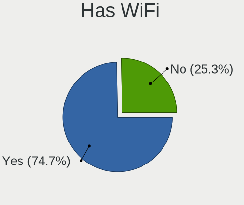
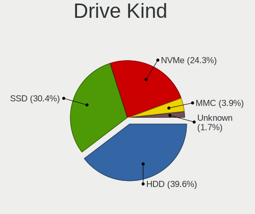
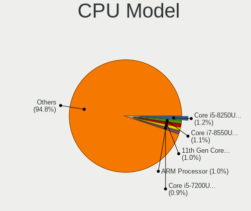
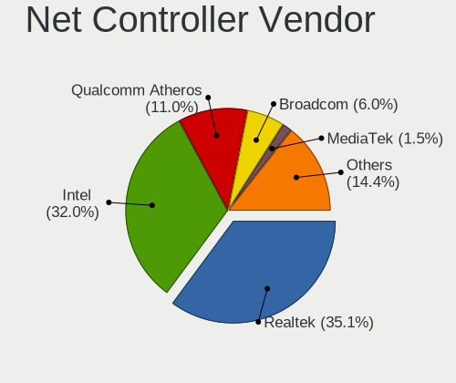
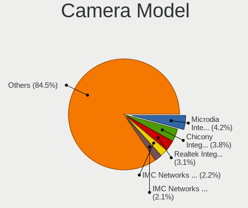

Ubuntu - Tested Hardware & Statistics
-------------------------------------

A project to collect tested hardware configurations for Ubuntu.

Anyone can contribute to this report by the [hw-probe](https://github.com/linuxhw/hw-probe) tool:

    sudo -E hw-probe -all -upload

Please contribute! Especially if your hardware is rare.

This is a report for all computer types. See also reports for [desktops](/Dist/Ubuntu/Desktop/README.md) and [notebooks](/Dist/Ubuntu/Notebook/README.md).

Contents
--------

* [ Test Cases ](#test-cases)

* [ System ](#system)
  - [ OS                       ](#os)
  - [ OS Family                ](#os-family)
  - [ Kernel                   ](#kernel)
  - [ Kernel Family            ](#kernel-family)
  - [ Kernel Major Ver.        ](#kernel-major-ver)
  - [ Arch                     ](#arch)
  - [ DE                       ](#de)
  - [ Display Server           ](#display-server)
  - [ Display Manager          ](#display-manager)
  - [ OS Lang                  ](#os-lang)
  - [ Boot Mode                ](#boot-mode)
  - [ Filesystem               ](#filesystem)
  - [ Part. scheme             ](#part-scheme)
  - [ Dual Boot with Linux/BSD ](#dual-boot-with-linuxbsd)
  - [ Dual Boot (Win)          ](#dual-boot-win)

* [ Board ](#board)
  - [ Vendor                   ](#vendor)
  - [ Model                    ](#model)
  - [ Model Family             ](#model-family)
  - [ MFG Year                 ](#mfg-year)
  - [ Form Factor              ](#form-factor)
  - [ Secure Boot              ](#secure-boot)
  - [ Coreboot                 ](#coreboot)
  - [ RAM Size                 ](#ram-size)
  - [ RAM Used                 ](#ram-used)
  - [ Total Drives             ](#total-drives)
  - [ Has CD-ROM               ](#has-cd-rom)
  - [ Has Ethernet             ](#has-ethernet)
  - [ Has WiFi                 ](#has-wifi)
  - [ Has Bluetooth            ](#has-bluetooth)

* [ Location ](#location)
  - [ Country                  ](#country)
  - [ City                     ](#city)

* [ Drives ](#drives)
  - [ Drive Vendor             ](#drive-vendor)
  - [ Drive Model              ](#drive-model)
  - [ HDD Vendor               ](#hdd-vendor)
  - [ SSD Vendor               ](#ssd-vendor)
  - [ Drive Kind               ](#drive-kind)
  - [ Drive Connector          ](#drive-connector)
  - [ Drive Size               ](#drive-size)
  - [ Space Total              ](#space-total)
  - [ Space Used               ](#space-used)
  - [ Malfunc. Drives          ](#malfunc-drives)
  - [ Malfunc. Drive Vendor    ](#malfunc-drive-vendor)
  - [ Malfunc. HDD Vendor      ](#malfunc-hdd-vendor)
  - [ Malfunc. Drive Kind      ](#malfunc-drive-kind)
  - [ Failed Drives            ](#failed-drives)
  - [ Failed Drive Vendor      ](#failed-drive-vendor)
  - [ Drive Status             ](#drive-status)

* [ Storage controller ](#storage-controller)
  - [ Storage Vendor           ](#storage-vendor)
  - [ Storage Model            ](#storage-model)
  - [ Storage Kind             ](#storage-kind)

* [ Processor ](#processor)
  - [ CPU Vendor               ](#cpu-vendor)
  - [ CPU Model                ](#cpu-model)
  - [ CPU Model Family         ](#cpu-model-family)
  - [ CPU Cores                ](#cpu-cores)
  - [ CPU Sockets              ](#cpu-sockets)
  - [ CPU Threads              ](#cpu-threads)
  - [ CPU Op-Modes             ](#cpu-op-modes)
  - [ CPU Microcode            ](#cpu-microcode)
  - [ CPU Microarch            ](#cpu-microarch)

* [ Graphics ](#graphics)
  - [ GPU Vendor               ](#gpu-vendor)
  - [ GPU Model                ](#gpu-model)
  - [ GPU Combo                ](#gpu-combo)
  - [ GPU Driver               ](#gpu-driver)
  - [ GPU Memory               ](#gpu-memory)

* [ Monitor ](#monitor)
  - [ Monitor Vendor           ](#monitor-vendor)
  - [ Monitor Model            ](#monitor-model)
  - [ Monitor Resolution       ](#monitor-resolution)
  - [ Monitor Diagonal         ](#monitor-diagonal)
  - [ Monitor Width            ](#monitor-width)
  - [ Aspect Ratio             ](#aspect-ratio)
  - [ Monitor Area             ](#monitor-area)
  - [ Pixel Density            ](#pixel-density)
  - [ Multiple Monitors        ](#multiple-monitors)

* [ Network ](#network)
  - [ Net Controller Vendor    ](#net-controller-vendor)
  - [ Net Controller Model     ](#net-controller-model)
  - [ Wireless Vendor          ](#wireless-vendor)
  - [ Wireless Model           ](#wireless-model)
  - [ Ethernet Vendor          ](#ethernet-vendor)
  - [ Ethernet Model           ](#ethernet-model)
  - [ Net Controller Kind      ](#net-controller-kind)
  - [ Used Controller          ](#used-controller)
  - [ NICs                     ](#nics)
  - [ IPv6                     ](#ipv6)

* [ Bluetooth ](#bluetooth)
  - [ Bluetooth Vendor         ](#bluetooth-vendor)
  - [ Bluetooth Model          ](#bluetooth-model)

* [ Sound ](#sound)
  - [ Sound Vendor             ](#sound-vendor)
  - [ Sound Model              ](#sound-model)

* [ Memory ](#memory)
  - [ Memory Vendor            ](#memory-vendor)
  - [ Memory Model             ](#memory-model)
  - [ Memory Kind              ](#memory-kind)
  - [ Memory Form Factor       ](#memory-form-factor)
  - [ Memory Size              ](#memory-size)
  - [ Memory Speed             ](#memory-speed)

* [ Printers & scanners ](#printers--scanners)
  - [ Printer Vendor           ](#printer-vendor)
  - [ Printer Model            ](#printer-model)
  - [ Scanner Vendor           ](#scanner-vendor)
  - [ Scanner Model            ](#scanner-model)

* [ Camera ](#camera)
  - [ Camera Vendor            ](#camera-vendor)
  - [ Camera Model             ](#camera-model)

* [ Security ](#security)
  - [ Fingerprint Vendor       ](#fingerprint-vendor)
  - [ Fingerprint Model        ](#fingerprint-model)
  - [ Chipcard Vendor          ](#chipcard-vendor)
  - [ Chipcard Model           ](#chipcard-model)

* [ Unsupported ](#unsupported)
  - [ Unsupported Devices      ](#unsupported-devices)
  - [ Unsupported Device Types ](#unsupported-device-types)

Test Cases
----------

Total: 99532

| Vendor        | Model                       | Form-Factor | Probe                                                      | Date         |
|---------------|-----------------------------|-------------|------------------------------------------------------------|--------------|
| Dell          | 03X6X0 A06                  | Server      | [ca9bb6b7ff](https://linux-hardware.org/?probe=ca9bb6b7ff) | Dec 24, 2023 |
| Dell          | Inspiron 1564               | Notebook    | [a1945990cc](https://linux-hardware.org/?probe=a1945990cc) | Dec 24, 2023 |
| Dell          | Inspiron 1564               | Notebook    | [e02428db4a](https://linux-hardware.org/?probe=e02428db4a) | Dec 24, 2023 |
| Apple         | MacBookAir7,1               | Notebook    | [f666ec3927](https://linux-hardware.org/?probe=f666ec3927) | Dec 24, 2023 |
| Dell          | Inspiron 5720               | Notebook    | [bcb6745ac2](https://linux-hardware.org/?probe=bcb6745ac2) | Dec 24, 2023 |
| HP            | 8918                        | Desktop     | [4b922c3362](https://linux-hardware.org/?probe=4b922c3362) | Dec 24, 2023 |
| Dell          | Inspiron 5485 2n1           | Convertible | [334b43f409](https://linux-hardware.org/?probe=334b43f409) | Dec 24, 2023 |
| Intel         | B85                         | Desktop     | [5b462c9ed1](https://linux-hardware.org/?probe=5b462c9ed1) | Dec 24, 2023 |
| Dell          | Latitude 7490               | Notebook    | [69205c648f](https://linux-hardware.org/?probe=69205c648f) | Dec 24, 2023 |
| Acer          | Nitro AN515-44              | Notebook    | [cc87c11e7b](https://linux-hardware.org/?probe=cc87c11e7b) | Dec 24, 2023 |
| Notebook      | NL5xNU                      | Notebook    | [1cb09f63f9](https://linux-hardware.org/?probe=1cb09f63f9) | Dec 24, 2023 |
| Lenovo        | IdeaPad 100-15IBD 80QQ      | Notebook    | [f8abeb2607](https://linux-hardware.org/?probe=f8abeb2607) | Dec 24, 2023 |
| ASUSTek       | P7P55D-E PRO                | Desktop     | [ef61ad2663](https://linux-hardware.org/?probe=ef61ad2663) | Dec 24, 2023 |
| Dell          | 0P658H A05                  | Server      | [14a0701959](https://linux-hardware.org/?probe=14a0701959) | Dec 24, 2023 |
| Google        | Magolor                     | Notebook    | [f5d079bc79](https://linux-hardware.org/?probe=f5d079bc79) | Dec 24, 2023 |
| Dell          | Latitude 12 Rugged Table... | Notebook    | [7690d56522](https://linux-hardware.org/?probe=7690d56522) | Dec 24, 2023 |
| Dell          | Precision 3560              | Notebook    | [b945ab8339](https://linux-hardware.org/?probe=b945ab8339) | Dec 24, 2023 |
| Lenovo        | ThinkPad T460s 20FAS0600... | Notebook    | [07efd36bbe](https://linux-hardware.org/?probe=07efd36bbe) | Dec 24, 2023 |
| Apple         | MacBookAir6,2               | Notebook    | [a3af8ee68a](https://linux-hardware.org/?probe=a3af8ee68a) | Dec 24, 2023 |
| Lenovo        | 3181 NO DPK                 | Mini pc     | [441eb7b439](https://linux-hardware.org/?probe=441eb7b439) | Dec 24, 2023 |
| Lenovo        | G50-70 20351                | Notebook    | [3ac6a566ab](https://linux-hardware.org/?probe=3ac6a566ab) | Dec 24, 2023 |
| Lenovo        | G50-70 20351                | Notebook    | [dc269fb33a](https://linux-hardware.org/?probe=dc269fb33a) | Dec 24, 2023 |
| Apple         | MacBookPro9,1               | Notebook    | [a70e7da743](https://linux-hardware.org/?probe=a70e7da743) | Dec 23, 2023 |
| Gateway       | NV59C                       | Notebook    | [1537866140](https://linux-hardware.org/?probe=1537866140) | Dec 23, 2023 |
| AZW           | EQ                          | Desktop     | [a04c9735a7](https://linux-hardware.org/?probe=a04c9735a7) | Dec 23, 2023 |
| Acer          | Veriton X2631G V:1.0        | Desktop     | [a57f2ee15f](https://linux-hardware.org/?probe=a57f2ee15f) | Dec 23, 2023 |
| AZW           | EQ                          | Desktop     | [9b3d265cd1](https://linux-hardware.org/?probe=9b3d265cd1) | Dec 23, 2023 |
| Acer          | Veriton X2631G V:1.0        | Desktop     | [c9555a34f2](https://linux-hardware.org/?probe=c9555a34f2) | Dec 23, 2023 |
| Dell          | 0J1C3P A01                  | Desktop     | [faea7a3006](https://linux-hardware.org/?probe=faea7a3006) | Dec 23, 2023 |
| ASUSTek       | GL503VM                     | Notebook    | [dfedaea706](https://linux-hardware.org/?probe=dfedaea706) | Dec 23, 2023 |
| Acer          | Aspire 7750G                | Notebook    | [0b0beeca3a](https://linux-hardware.org/?probe=0b0beeca3a) | Dec 23, 2023 |
| Unknown       | Unknown                     | Notebook    | [ef80f96d40](https://linux-hardware.org/?probe=ef80f96d40) | Dec 23, 2023 |
| ASUSTek       | GL503VM                     | Notebook    | [05b212db99](https://linux-hardware.org/?probe=05b212db99) | Dec 23, 2023 |
| Sony          | VPCEA1S1E                   | Notebook    | [af850dd5f3](https://linux-hardware.org/?probe=af850dd5f3) | Dec 23, 2023 |
| ASUSTek       | TUF B360-PLUS GAMING        | Desktop     | [b1c3408d24](https://linux-hardware.org/?probe=b1c3408d24) | Dec 23, 2023 |
| ASRock        | H310CM-HDV/M.2              | Desktop     | [76d95ab75c](https://linux-hardware.org/?probe=76d95ab75c) | Dec 23, 2023 |
| TUXEDO        | N24_25JU                    | Notebook    | [8a1a153723](https://linux-hardware.org/?probe=8a1a153723) | Dec 23, 2023 |
| Gigabyte      | GA-78LMT-S2P                | Desktop     | [6f36390142](https://linux-hardware.org/?probe=6f36390142) | Dec 23, 2023 |
| Lenovo        | IdeaPad Y500 9541           | Notebook    | [a85ec375f5](https://linux-hardware.org/?probe=a85ec375f5) | Dec 23, 2023 |
| ASRock        | AMCP7A-ION                  | Desktop     | [fb0acc2d50](https://linux-hardware.org/?probe=fb0acc2d50) | Dec 23, 2023 |
| GITSTAR       | GDC-1461                    | Notebook    | [5412cf0f39](https://linux-hardware.org/?probe=5412cf0f39) | Dec 23, 2023 |
| MACHINIST     | X99-K9 V2.0                 | Desktop     | [7f4061fd49](https://linux-hardware.org/?probe=7f4061fd49) | Dec 23, 2023 |
| Lenovo        | ThinkPad T410 2537E82       | Notebook    | [d153c701cc](https://linux-hardware.org/?probe=d153c701cc) | Dec 23, 2023 |
| Unknown       | FastRhino R66S              | Soc         | [a9cd767c91](https://linux-hardware.org/?probe=a9cd767c91) | Dec 23, 2023 |
| Dell          | Latitude E5510              | Notebook    | [379ebf6111](https://linux-hardware.org/?probe=379ebf6111) | Dec 23, 2023 |
| MSI           | GE62 2QF                    | Notebook    | [cf9a783196](https://linux-hardware.org/?probe=cf9a783196) | Dec 23, 2023 |
| Lenovo        | IdeaPad S145-15IGM 81WT     | Notebook    | [d409d2fe79](https://linux-hardware.org/?probe=d409d2fe79) | Dec 23, 2023 |
| HP            | 1497                        | Desktop     | [9d5244b557](https://linux-hardware.org/?probe=9d5244b557) | Dec 23, 2023 |
| Lenovo        | IdeaPad S145-15IGM 81WT     | Notebook    | [eae7bab112](https://linux-hardware.org/?probe=eae7bab112) | Dec 23, 2023 |
| Lenovo        | ThinkPad T410 2537E82       | Notebook    | [398233e395](https://linux-hardware.org/?probe=398233e395) | Dec 23, 2023 |
| Lenovo        | ThinkCentre M58 7373AJ5     | Desktop     | [201981bc3f](https://linux-hardware.org/?probe=201981bc3f) | Dec 23, 2023 |
| HP            | EliteBook 8570w             | Notebook    | [4b6025ed6e](https://linux-hardware.org/?probe=4b6025ed6e) | Dec 23, 2023 |
| Foxconn       | 2ADA                        | Desktop     | [f30aec24c2](https://linux-hardware.org/?probe=f30aec24c2) | Dec 23, 2023 |
| ASRock        | AMCP7A-ION                  | Desktop     | [7d19dec574](https://linux-hardware.org/?probe=7d19dec574) | Dec 23, 2023 |
| Lenovo        | SHARKBAY SDK0E50510 WIN     | Desktop     | [ab3cc8a89c](https://linux-hardware.org/?probe=ab3cc8a89c) | Dec 23, 2023 |
| Acer          | TravelMate 5730             | Notebook    | [69571c0b91](https://linux-hardware.org/?probe=69571c0b91) | Dec 23, 2023 |
| MSI           | A88XM-E35                   | Desktop     | [dce385e94b](https://linux-hardware.org/?probe=dce385e94b) | Dec 23, 2023 |
| Dell          | 0P4T42 A01                  | All in one  | [db76245a52](https://linux-hardware.org/?probe=db76245a52) | Dec 23, 2023 |
| HP            | EliteBook 845 G8 Noteboo... | Notebook    | [d3dabca767](https://linux-hardware.org/?probe=d3dabca767) | Dec 23, 2023 |
| Dell          | Latitude E6330              | Notebook    | [afca8c73b2](https://linux-hardware.org/?probe=afca8c73b2) | Dec 23, 2023 |
| HP            | EliteBook 845 G8 Noteboo... | Notebook    | [26673c372e](https://linux-hardware.org/?probe=26673c372e) | Dec 23, 2023 |
| Dell          | Inspiron 3501               | Notebook    | [2fcf77279a](https://linux-hardware.org/?probe=2fcf77279a) | Dec 23, 2023 |
| Toshiba       | Satellite L750              | Notebook    | [8f2f7cd8c9](https://linux-hardware.org/?probe=8f2f7cd8c9) | Dec 23, 2023 |
| HP            | Laptop 17-bs1xx             | Notebook    | [984a979a7b](https://linux-hardware.org/?probe=984a979a7b) | Dec 23, 2023 |
| Lenovo        | ThinkPad T14 Gen 2a 20XL... | Notebook    | [19e33f2ead](https://linux-hardware.org/?probe=19e33f2ead) | Dec 23, 2023 |
| MSI           | PRO Z790-A WIFI             | Desktop     | [9b8ad6a3f1](https://linux-hardware.org/?probe=9b8ad6a3f1) | Dec 23, 2023 |
| Lenovo        | 30C0 SDK0J40697 WIN 3305... | Desktop     | [da46ad37d3](https://linux-hardware.org/?probe=da46ad37d3) | Dec 23, 2023 |
| eMachines     | EL1360                      | Desktop     | [af31609559](https://linux-hardware.org/?probe=af31609559) | Dec 23, 2023 |
| Acer          | Aspire R3-131T              | Notebook    | [647b2fddf6](https://linux-hardware.org/?probe=647b2fddf6) | Dec 23, 2023 |
| ASUSTek       | P6T                         | Desktop     | [d90adb3a12](https://linux-hardware.org/?probe=d90adb3a12) | Dec 23, 2023 |
| Dell          | Latitude E6400              | Notebook    | [1a10fd9a2e](https://linux-hardware.org/?probe=1a10fd9a2e) | Dec 23, 2023 |
| System76      | Serval WS                   | Notebook    | [a250c12d1d](https://linux-hardware.org/?probe=a250c12d1d) | Dec 23, 2023 |
| Gigabyte      | Z97M-DS3H                   | Desktop     | [da051b693c](https://linux-hardware.org/?probe=da051b693c) | Dec 23, 2023 |
| Lenovo        | ThinkPad E15 20RD002RUS     | Notebook    | [6ba8bb7550](https://linux-hardware.org/?probe=6ba8bb7550) | Dec 23, 2023 |
| XIAOMI        | Redmi Book Pro 15 2023      | Notebook    | [36492390fd](https://linux-hardware.org/?probe=36492390fd) | Dec 22, 2023 |
| Lenovo        | ThinkPad T14 Gen 2i 20W1... | Notebook    | [0f2cad4391](https://linux-hardware.org/?probe=0f2cad4391) | Dec 22, 2023 |
| Lenovo        | 3136 SDK0J40697 WIN 3305... | Mini pc     | [e778e7923a](https://linux-hardware.org/?probe=e778e7923a) | Dec 22, 2023 |
| Lenovo        | 3136 SDK0J40697 WIN 3305... | Mini pc     | [b601b75917](https://linux-hardware.org/?probe=b601b75917) | Dec 22, 2023 |
| HP            | Pavilion Notebook           | Notebook    | [42c72b303d](https://linux-hardware.org/?probe=42c72b303d) | Dec 22, 2023 |
| Dell          | 0FDY5C A00                  | Desktop     | [a3fc39604c](https://linux-hardware.org/?probe=a3fc39604c) | Dec 22, 2023 |
| Lenovo        | ThinkBook 14 G3 ACL 21A2    | Notebook    | [b09c4dd8a2](https://linux-hardware.org/?probe=b09c4dd8a2) | Dec 22, 2023 |
| HP            | ProBook 450 G1              | Notebook    | [980f7dfed7](https://linux-hardware.org/?probe=980f7dfed7) | Dec 22, 2023 |
| HP            | 8643 SMVB                   | Desktop     | [bbdb2204d8](https://linux-hardware.org/?probe=bbdb2204d8) | Dec 22, 2023 |
| Acer          | Aspire VX5-591G             | Notebook    | [2268342e9f](https://linux-hardware.org/?probe=2268342e9f) | Dec 22, 2023 |
| Apple         | MacBookPro13,1              | Notebook    | [89ef1fa23c](https://linux-hardware.org/?probe=89ef1fa23c) | Dec 22, 2023 |
| Dell          | 0D6H9T A00                  | Desktop     | [84275b737e](https://linux-hardware.org/?probe=84275b737e) | Dec 22, 2023 |
| ASUSTek       | X555LD                      | Notebook    | [c81a75e686](https://linux-hardware.org/?probe=c81a75e686) | Dec 22, 2023 |
| ASUSTek       | PRIME B450-PLUS             | Desktop     | [c9bee45423](https://linux-hardware.org/?probe=c9bee45423) | Dec 22, 2023 |
| Intel         | H61                         | Desktop     | [72c7724ef0](https://linux-hardware.org/?probe=72c7724ef0) | Dec 22, 2023 |
| HP            | 212B                        | Desktop     | [8fa44a703b](https://linux-hardware.org/?probe=8fa44a703b) | Dec 22, 2023 |
| ASUSTek       | ASUSLaptop_Q540VJ           | Notebook    | [937842fe5d](https://linux-hardware.org/?probe=937842fe5d) | Dec 22, 2023 |
| HP            | EliteBook 8460p             | Notebook    | [6ff6445717](https://linux-hardware.org/?probe=6ff6445717) | Dec 22, 2023 |
| Gateway       | NV59C                       | Notebook    | [62d62c0a3b](https://linux-hardware.org/?probe=62d62c0a3b) | Dec 22, 2023 |
| ASUSTek       | ROG STRIX B650E-F GAMING... | Desktop     | [ff8ded7ff8](https://linux-hardware.org/?probe=ff8ded7ff8) | Dec 22, 2023 |
| MSI           | X570-A PRO                  | Desktop     | [27a132c185](https://linux-hardware.org/?probe=27a132c185) | Dec 22, 2023 |
| HP            | 8643 SMVB                   | Desktop     | [03ddd69e34](https://linux-hardware.org/?probe=03ddd69e34) | Dec 22, 2023 |
| MSI           | PRO Z790-A WIFI             | Desktop     | [8e38fb94ba](https://linux-hardware.org/?probe=8e38fb94ba) | Dec 22, 2023 |
| Lenovo        | ThinkPad Edge E431 62771... | Notebook    | [e6f38cb85e](https://linux-hardware.org/?probe=e6f38cb85e) | Dec 22, 2023 |
| ASUSTek       | X555LD                      | Notebook    | [30e988edc9](https://linux-hardware.org/?probe=30e988edc9) | Dec 22, 2023 |
| Dell          | 0WR7PY A03                  | Desktop     | [9ff527cfd0](https://linux-hardware.org/?probe=9ff527cfd0) | Dec 22, 2023 |
| Apple         | Mac-F2268DAE                | All in one  | [3e49a75ff4](https://linux-hardware.org/?probe=3e49a75ff4) | Dec 22, 2023 |
| HP            | 8626                        | Desktop     | [b04d9fcad9](https://linux-hardware.org/?probe=b04d9fcad9) | Dec 22, 2023 |
| ASUSTek       | M3702WFA                    | All in one  | [9091136a65](https://linux-hardware.org/?probe=9091136a65) | Dec 22, 2023 |
| Lenovo        | ThinkPad T480 20L5004HUS    | Notebook    | [10c32df82e](https://linux-hardware.org/?probe=10c32df82e) | Dec 22, 2023 |
| Apple         | MacBookPro11,3              | Notebook    | [ec4972e3b4](https://linux-hardware.org/?probe=ec4972e3b4) | Dec 22, 2023 |
| Dell          | 0HY9JP A02                  | Desktop     | [6f47019169](https://linux-hardware.org/?probe=6f47019169) | Dec 22, 2023 |
| Dell          | 0D4MD1 A00                  | Desktop     | [858b84769f](https://linux-hardware.org/?probe=858b84769f) | Dec 22, 2023 |
| Gigabyte      | Z390 AORUS PRO WIFI-CF      | Desktop     | [8a2d46dced](https://linux-hardware.org/?probe=8a2d46dced) | Dec 22, 2023 |
| Allview       | Allbook I/1                 | Notebook    | [960dfde4cd](https://linux-hardware.org/?probe=960dfde4cd) | Dec 22, 2023 |
| Dell          | Latitude 5414               | Notebook    | [9b02eedb05](https://linux-hardware.org/?probe=9b02eedb05) | Dec 22, 2023 |
| Dell          | Vostro 15 3510              | Notebook    | [d2c7d30632](https://linux-hardware.org/?probe=d2c7d30632) | Dec 22, 2023 |
| Lenovo        | IdeaPad 310-15ABR 80ST      | Notebook    | [60690b9d12](https://linux-hardware.org/?probe=60690b9d12) | Dec 22, 2023 |
| LattePanda    | Sigma                       | Desktop     | [09cb864933](https://linux-hardware.org/?probe=09cb864933) | Dec 22, 2023 |
| Toshiba       | Satellite C55D-B            | Notebook    | [d705d8ee57](https://linux-hardware.org/?probe=d705d8ee57) | Dec 22, 2023 |
| Acer          | Nitro AN515-44              | Notebook    | [5f1c04a086](https://linux-hardware.org/?probe=5f1c04a086) | Dec 22, 2023 |
| ASUSTek       | STRIX X99 GAMING            | Desktop     | [2af66f541d](https://linux-hardware.org/?probe=2af66f541d) | Dec 22, 2023 |
| Entroware     | Hybris                      | Notebook    | [870d0c5323](https://linux-hardware.org/?probe=870d0c5323) | Dec 22, 2023 |
| Dell          | Latitude 5501               | Notebook    | [0b6206153c](https://linux-hardware.org/?probe=0b6206153c) | Dec 22, 2023 |
| Acer          | Aspire 5742G                | Notebook    | [1f9d486306](https://linux-hardware.org/?probe=1f9d486306) | Dec 22, 2023 |
| Supermicro    | X8DTH                       | Server      | [e00e89ffec](https://linux-hardware.org/?probe=e00e89ffec) | Dec 22, 2023 |
| ASUSTek       | M5A97 R2.0                  | Desktop     | [3ff2f289b9](https://linux-hardware.org/?probe=3ff2f289b9) | Dec 22, 2023 |
| ASUSTek       | VivoBook_ASUSLaptop X170... | Notebook    | [9e521ad3e9](https://linux-hardware.org/?probe=9e521ad3e9) | Dec 22, 2023 |
| Acer          | Aspire A515-44              | Notebook    | [874744ee1f](https://linux-hardware.org/?probe=874744ee1f) | Dec 22, 2023 |
| Gigabyte      | B450M GAMING                | Desktop     | [1767c5b291](https://linux-hardware.org/?probe=1767c5b291) | Dec 21, 2023 |
| Gigabyte      | GA-78LMT-S2P                | Desktop     | [dbc2e93666](https://linux-hardware.org/?probe=dbc2e93666) | Dec 21, 2023 |
| LG Electro... | 17U70Q-P.AAS7U1             | Notebook    | [8846a0ac06](https://linux-hardware.org/?probe=8846a0ac06) | Dec 21, 2023 |
| Dell          | Latitude E6440              | Notebook    | [904540fc01](https://linux-hardware.org/?probe=904540fc01) | Dec 21, 2023 |
| Dell          | Inspiron 3541               | Notebook    | [67f350fefc](https://linux-hardware.org/?probe=67f350fefc) | Dec 21, 2023 |
| Apple         | Mac-00BE6ED71E35EB86 iMa... | All in one  | [b3c6d4826f](https://linux-hardware.org/?probe=b3c6d4826f) | Dec 21, 2023 |
| ASRock        | A520M-HDV                   | Desktop     | [918677a1da](https://linux-hardware.org/?probe=918677a1da) | Dec 21, 2023 |
| Apple         | Mac-00BE6ED71E35EB86 iMa... | All in one  | [3441fd68be](https://linux-hardware.org/?probe=3441fd68be) | Dec 21, 2023 |
| MSI           | MPG X570 GAMING EDGE WIF... | Desktop     | [628ca02992](https://linux-hardware.org/?probe=628ca02992) | Dec 21, 2023 |
| ASUSTek       | M3702WFA                    | All in one  | [a6d6ecda48](https://linux-hardware.org/?probe=a6d6ecda48) | Dec 21, 2023 |
| ASRock        | A520M-HDV                   | Desktop     | [7136ba3916](https://linux-hardware.org/?probe=7136ba3916) | Dec 21, 2023 |
| ASUSTek       | Zenbook 15 UM3504DA_UM35... | Notebook    | [907851c66b](https://linux-hardware.org/?probe=907851c66b) | Dec 21, 2023 |
| Lenovo        | ThinkPad T470 W10DG 20JM... | Notebook    | [c5c9d669ae](https://linux-hardware.org/?probe=c5c9d669ae) | Dec 21, 2023 |
| Toshiba       | Satellite L655              | Notebook    | [7a1001a094](https://linux-hardware.org/?probe=7a1001a094) | Dec 21, 2023 |
| Dell          | Precision 3581              | Notebook    | [aa0186ade6](https://linux-hardware.org/?probe=aa0186ade6) | Dec 21, 2023 |
| HP            | ProBook 445 14 inch G10 ... | Notebook    | [0e95b32d0b](https://linux-hardware.org/?probe=0e95b32d0b) | Dec 21, 2023 |
| Lenovo        | IdeaPad 3 15ALC6 82MF       | Notebook    | [808fe0568d](https://linux-hardware.org/?probe=808fe0568d) | Dec 21, 2023 |
| Dell          | Inspiron 15 3535            | Notebook    | [466204d787](https://linux-hardware.org/?probe=466204d787) | Dec 21, 2023 |
| Fujitsu       | LIFEBOOK U749               | Notebook    | [75a3ef28b0](https://linux-hardware.org/?probe=75a3ef28b0) | Dec 21, 2023 |
| HUAWEI        | BOD-WXX9                    | Notebook    | [f95bb7d27c](https://linux-hardware.org/?probe=f95bb7d27c) | Dec 21, 2023 |
| Gigabyte      | Z87-HD3                     | Desktop     | [49e514e9c4](https://linux-hardware.org/?probe=49e514e9c4) | Dec 21, 2023 |
| Intel         | NUC7i5BNB J31144-309        | Mini pc     | [75c700e92a](https://linux-hardware.org/?probe=75c700e92a) | Dec 21, 2023 |
| Acer          | Aspire XC-1760              | Desktop     | [ac3910a453](https://linux-hardware.org/?probe=ac3910a453) | Dec 21, 2023 |
| Fujitsu       | LIFEBOOK T5010              | Notebook    | [27e7d6f705](https://linux-hardware.org/?probe=27e7d6f705) | Dec 21, 2023 |
| Dell          | Latitude 7490               | Notebook    | [d0ea360540](https://linux-hardware.org/?probe=d0ea360540) | Dec 21, 2023 |
| realme        | RMNBXXXX                    | Notebook    | [d8e473e1e4](https://linux-hardware.org/?probe=d8e473e1e4) | Dec 21, 2023 |
| HP            | Pavilion dv7                | Notebook    | [ef719917ef](https://linux-hardware.org/?probe=ef719917ef) | Dec 21, 2023 |
| Supermicro    | H13DSG-O-CPU                | Desktop     | [1ba9d3bc0c](https://linux-hardware.org/?probe=1ba9d3bc0c) | Dec 21, 2023 |
| Gigabyte      | B550M S2H                   | Desktop     | [0cf7feafe8](https://linux-hardware.org/?probe=0cf7feafe8) | Dec 21, 2023 |
| ASUSTek       | X550LD                      | Notebook    | [ebaf3f3e71](https://linux-hardware.org/?probe=ebaf3f3e71) | Dec 21, 2023 |
| Supermicro    | H13DSG-O-CPU                | Desktop     | [066ebdde5b](https://linux-hardware.org/?probe=066ebdde5b) | Dec 21, 2023 |
| Neousys Te... | NVS-10000 Rev. A2           | Server      | [cde616cde3](https://linux-hardware.org/?probe=cde616cde3) | Dec 21, 2023 |
| ASUSTek       | VivoBook_ASUSLaptop X421... | Notebook    | [ec0a846182](https://linux-hardware.org/?probe=ec0a846182) | Dec 21, 2023 |
| HP            | Notebook                    | Notebook    | [9010ced489](https://linux-hardware.org/?probe=9010ced489) | Dec 21, 2023 |
| Dell          | Inspiron 5448               | Notebook    | [edf818740d](https://linux-hardware.org/?probe=edf818740d) | Dec 21, 2023 |
| Lenovo        | ThinkPad 20FRS22T00         | Convertible | [d52b91f681](https://linux-hardware.org/?probe=d52b91f681) | Dec 21, 2023 |
| Apple         | Mac-031B6874CF7F642A iMa... | All in one  | [e3a45d6095](https://linux-hardware.org/?probe=e3a45d6095) | Dec 21, 2023 |
| Lenovo        | 318E SDK0J40697 WIN 3305... | Desktop     | [191d4913cd](https://linux-hardware.org/?probe=191d4913cd) | Dec 21, 2023 |
| Lenovo        | ThinkPad 20FRS22T00         | Convertible | [1d07dbc740](https://linux-hardware.org/?probe=1d07dbc740) | Dec 21, 2023 |
| Dell          | OptiPlex 5050               | Desktop     | [c1cffe744f](https://linux-hardware.org/?probe=c1cffe744f) | Dec 21, 2023 |
| Lenovo        | ThinkPad Yoga 11e 3rd Ge... | Convertible | [d14a2228a1](https://linux-hardware.org/?probe=d14a2228a1) | Dec 21, 2023 |
| HP            | Compaq 15                   | Notebook    | [e97b5e227e](https://linux-hardware.org/?probe=e97b5e227e) | Dec 21, 2023 |
| Foxconn       | 2ADA                        | Desktop     | [735572694e](https://linux-hardware.org/?probe=735572694e) | Dec 21, 2023 |
| HP            | Pavilion dv7                | Notebook    | [cd7f768fe8](https://linux-hardware.org/?probe=cd7f768fe8) | Dec 21, 2023 |
| HP            | 18E7                        | Desktop     | [ad6cf02d18](https://linux-hardware.org/?probe=ad6cf02d18) | Dec 21, 2023 |
| Lenovo        | ThinkPad L14 Gen 1 20U10... | Notebook    | [e36c36774e](https://linux-hardware.org/?probe=e36c36774e) | Dec 21, 2023 |
| ASUSTek       | VivoBook_ASUSLaptop X150... | Notebook    | [46c4d5053b](https://linux-hardware.org/?probe=46c4d5053b) | Dec 21, 2023 |
| HP            | 18E7                        | Desktop     | [fdb8b2d229](https://linux-hardware.org/?probe=fdb8b2d229) | Dec 21, 2023 |
| Gigabyte      | Z390 AORUS PRO WIFI-CF      | Desktop     | [8eca3c15e7](https://linux-hardware.org/?probe=8eca3c15e7) | Dec 21, 2023 |
| ASRock        | Z77 Pro4                    | Desktop     | [d8d81bc3e2](https://linux-hardware.org/?probe=d8d81bc3e2) | Dec 21, 2023 |
| ASUSTek       | Z10PG-D16 Series            | Desktop     | [6b3c6c4099](https://linux-hardware.org/?probe=6b3c6c4099) | Dec 21, 2023 |
| Dell          | Latitude E6520              | Notebook    | [9e16e8b2a6](https://linux-hardware.org/?probe=9e16e8b2a6) | Dec 21, 2023 |
| MSI           | NF725M-P43                  | Desktop     | [43756d6fad](https://linux-hardware.org/?probe=43756d6fad) | Dec 21, 2023 |
| ASUSTek       | X550LD                      | Notebook    | [bc65f1d620](https://linux-hardware.org/?probe=bc65f1d620) | Dec 21, 2023 |
| Dell          | Vostro 3550                 | Notebook    | [2c9d7daa8b](https://linux-hardware.org/?probe=2c9d7daa8b) | Dec 21, 2023 |
| ASUSTek       | M5A97 R2.0                  | Desktop     | [93a7029d22](https://linux-hardware.org/?probe=93a7029d22) | Dec 21, 2023 |
| Dell          | Inspiron 7572               | Notebook    | [cd9385a64b](https://linux-hardware.org/?probe=cd9385a64b) | Dec 21, 2023 |
| Lenovo        | ThinkPad L580 20LW0010GE    | Notebook    | [4bd3fc58a8](https://linux-hardware.org/?probe=4bd3fc58a8) | Dec 21, 2023 |
| Acer          | Veriton X2631G V:1.0        | Desktop     | [8116f31329](https://linux-hardware.org/?probe=8116f31329) | Dec 21, 2023 |
| Acer          | Veriton X2631G V:1.0        | Desktop     | [7597019eca](https://linux-hardware.org/?probe=7597019eca) | Dec 21, 2023 |
| Panasonic     | CF-19RDRCHH7                | Notebook    | [0e67081368](https://linux-hardware.org/?probe=0e67081368) | Dec 21, 2023 |
| HP            | Spectre x360 Convertible    | Convertible | [3aec09e469](https://linux-hardware.org/?probe=3aec09e469) | Dec 21, 2023 |
| DEXP          | Aquilon C14                 | Notebook    | [09cd71a27d](https://linux-hardware.org/?probe=09cd71a27d) | Dec 21, 2023 |
| ASRock        | H610M-HVS                   | Desktop     | [25b5c11ccc](https://linux-hardware.org/?probe=25b5c11ccc) | Dec 20, 2023 |
| In-S          | C116A                       | Notebook    | [ba252bb452](https://linux-hardware.org/?probe=ba252bb452) | Dec 20, 2023 |
| Fujitsu       | LIFEBOOK AH530              | Notebook    | [fb91eaef3b](https://linux-hardware.org/?probe=fb91eaef3b) | Dec 20, 2023 |
| ASUSTek       | VM40B                       | Desktop     | [8deb79e86e](https://linux-hardware.org/?probe=8deb79e86e) | Dec 20, 2023 |
| Gigabyte      | B560M H                     | Desktop     | [6e7f8b2300](https://linux-hardware.org/?probe=6e7f8b2300) | Dec 20, 2023 |
| ASUSTek       | ROG Flow X16 GV601VI_GV6... | Convertible | [9c16cd82aa](https://linux-hardware.org/?probe=9c16cd82aa) | Dec 20, 2023 |
| Dell          | Latitude 5590               | Notebook    | [4f307c792f](https://linux-hardware.org/?probe=4f307c792f) | Dec 20, 2023 |
| Apple         | MacBookPro9,2               | Notebook    | [da159da872](https://linux-hardware.org/?probe=da159da872) | Dec 20, 2023 |
| Acer          | Aspire 6930G                | Notebook    | [3013bf91cd](https://linux-hardware.org/?probe=3013bf91cd) | Dec 20, 2023 |
| Acer          | Aspire 6930G                | Notebook    | [6bc25073be](https://linux-hardware.org/?probe=6bc25073be) | Dec 20, 2023 |
| Gigabyte      | H81M-DS2                    | Desktop     | [1da522781e](https://linux-hardware.org/?probe=1da522781e) | Dec 20, 2023 |
| Dell          | Latitude 7480               | Notebook    | [f080cc67aa](https://linux-hardware.org/?probe=f080cc67aa) | Dec 20, 2023 |
| HP            | Compaq 15                   | Notebook    | [8224a8ab3d](https://linux-hardware.org/?probe=8224a8ab3d) | Dec 20, 2023 |
| Dell          | Latitude 3520               | Notebook    | [7a4d520ba9](https://linux-hardware.org/?probe=7a4d520ba9) | Dec 20, 2023 |
| Gigabyte      | B550M DS3H                  | Desktop     | [35547b20b3](https://linux-hardware.org/?probe=35547b20b3) | Dec 20, 2023 |
| Lenovo        | IdeaPad 320-17IKB 80XM      | Notebook    | [393c13e870](https://linux-hardware.org/?probe=393c13e870) | Dec 20, 2023 |
| Lenovo        | IdeaPad 320-17IKB 80XM      | Notebook    | [09af8afa56](https://linux-hardware.org/?probe=09af8afa56) | Dec 20, 2023 |
| Toshiba       | Satellite C55D-B            | Notebook    | [dfd0e27118](https://linux-hardware.org/?probe=dfd0e27118) | Dec 20, 2023 |
| HP            | EliteBook 840 G6            | Notebook    | [64ec373e84](https://linux-hardware.org/?probe=64ec373e84) | Dec 20, 2023 |
| MSI           | B450-A PRO MAX              | Desktop     | [f46e034f2c](https://linux-hardware.org/?probe=f46e034f2c) | Dec 20, 2023 |
| Dell          | 09KPNV A00                  | Desktop     | [e696fd9ae0](https://linux-hardware.org/?probe=e696fd9ae0) | Dec 20, 2023 |
| Gigabyte      | H81M-S                      | Desktop     | [5583555782](https://linux-hardware.org/?probe=5583555782) | Dec 20, 2023 |
| Gigabyte      | H81M-S                      | Desktop     | [eded3a5ce4](https://linux-hardware.org/?probe=eded3a5ce4) | Dec 20, 2023 |
| Lenovo        | ThinkPad T410 2537HN2       | Notebook    | [c268085f95](https://linux-hardware.org/?probe=c268085f95) | Dec 20, 2023 |
| Lenovo        | ThinkBook 15p Gen 2 21B1    | Notebook    | [06984b497c](https://linux-hardware.org/?probe=06984b497c) | Dec 20, 2023 |
| Dell          | 0C522T A03                  | Desktop     | [7cd9f2379e](https://linux-hardware.org/?probe=7cd9f2379e) | Dec 20, 2023 |
| Dell          | Precision 5510              | Notebook    | [033bf69fdf](https://linux-hardware.org/?probe=033bf69fdf) | Dec 20, 2023 |
| ASUSTek       | Z97-PRO                     | Desktop     | [917d636ff9](https://linux-hardware.org/?probe=917d636ff9) | Dec 20, 2023 |
| Dell          | Precision 5510              | Notebook    | [a40fa883d2](https://linux-hardware.org/?probe=a40fa883d2) | Dec 20, 2023 |
| MSI           | H61M-E33                    | Desktop     | [ab39035cef](https://linux-hardware.org/?probe=ab39035cef) | Dec 20, 2023 |
| STONE COMP... | NOTCHA-286                  | Notebook    | [c931f0f65a](https://linux-hardware.org/?probe=c931f0f65a) | Dec 20, 2023 |
| Lenovo        | V15 G2 ALC Ua 82KD          | Notebook    | [71bc732b86](https://linux-hardware.org/?probe=71bc732b86) | Dec 20, 2023 |
| ASUSTek       | P8Z77-M PRO                 | Desktop     | [58517da295](https://linux-hardware.org/?probe=58517da295) | Dec 20, 2023 |
| Dell          | G7 7700                     | Notebook    | [506de63cb5](https://linux-hardware.org/?probe=506de63cb5) | Dec 20, 2023 |
| Lenovo        | V15 G2 ALC Ua 82KD          | Notebook    | [5d14b45611](https://linux-hardware.org/?probe=5d14b45611) | Dec 20, 2023 |
| Lenovo        | ThinkPad T520 42404AU       | Notebook    | [2b29070879](https://linux-hardware.org/?probe=2b29070879) | Dec 20, 2023 |
| Lenovo        | V15 G2 ALC Ua 82KD          | Notebook    | [71d03541a9](https://linux-hardware.org/?probe=71d03541a9) | Dec 20, 2023 |
| ASUSTek       | VivoBook_ASUS Laptop X50... | Notebook    | [6f7295809b](https://linux-hardware.org/?probe=6f7295809b) | Dec 20, 2023 |
| Apple         | Mac-81E3E92DD6088272 iMa... | All in one  | [2b2e293dc4](https://linux-hardware.org/?probe=2b2e293dc4) | Dec 20, 2023 |
| System76      | Serval WS                   | Notebook    | [7475c97028](https://linux-hardware.org/?probe=7475c97028) | Dec 20, 2023 |
| Unknown       | Orange Pi 5B                | Soc         | [f809840436](https://linux-hardware.org/?probe=f809840436) | Dec 20, 2023 |
| Inventec      | Dell Wyse Thin Client De... | Mini pc     | [7aa12c94c1](https://linux-hardware.org/?probe=7aa12c94c1) | Dec 20, 2023 |
| Intel         | DH55TC AAE70932-206         | Desktop     | [3003aeb5a9](https://linux-hardware.org/?probe=3003aeb5a9) | Dec 20, 2023 |
| Supermicro    | X9DRD-7LN4F                 | Desktop     | [56a303c264](https://linux-hardware.org/?probe=56a303c264) | Dec 20, 2023 |
| ASUSTek       | TUF Gaming Z790-PLUS WIF... | Desktop     | [b45e149ce8](https://linux-hardware.org/?probe=b45e149ce8) | Dec 20, 2023 |
| ASRock        | AB350 Pro4                  | Desktop     | [bb15070eb2](https://linux-hardware.org/?probe=bb15070eb2) | Dec 19, 2023 |
| ASUSTek       | TUF Gaming Z790-PLUS WIF... | Desktop     | [10470437db](https://linux-hardware.org/?probe=10470437db) | Dec 19, 2023 |
| Daten Tecn... | DT02-M4                     | Notebook    | [8f754589f6](https://linux-hardware.org/?probe=8f754589f6) | Dec 19, 2023 |
| ASRock        | FM2A58M-HD+                 | Desktop     | [09ab03cdcd](https://linux-hardware.org/?probe=09ab03cdcd) | Dec 19, 2023 |
| ANGXUN        | X79-VG2 V1.3                | Desktop     | [532c5b5ddc](https://linux-hardware.org/?probe=532c5b5ddc) | Dec 19, 2023 |
| HP            | Pavilion Gaming Laptop 1... | Notebook    | [dbbab5f96b](https://linux-hardware.org/?probe=dbbab5f96b) | Dec 19, 2023 |
| Lenovo        | ThinkBook 15 G2 ITL 20VE    | Notebook    | [775e2dfe26](https://linux-hardware.org/?probe=775e2dfe26) | Dec 19, 2023 |
| Gigabyte      | Z790 UD                     | Desktop     | [94a40a476d](https://linux-hardware.org/?probe=94a40a476d) | Dec 19, 2023 |
| Google        | Swanky                      | Notebook    | [46b7f27873](https://linux-hardware.org/?probe=46b7f27873) | Dec 19, 2023 |
| MSI           | B85-G43                     | Desktop     | [2c855d2376](https://linux-hardware.org/?probe=2c855d2376) | Dec 19, 2023 |
| Mediacom      | GTZS                        | Notebook    | [f326507469](https://linux-hardware.org/?probe=f326507469) | Dec 19, 2023 |
| Lenovo        | Yoga 900-13ISK 80MK         | Notebook    | [3cc3621576](https://linux-hardware.org/?probe=3cc3621576) | Dec 19, 2023 |
| Dell          | Precision 3581              | Notebook    | [c20f7cf0e0](https://linux-hardware.org/?probe=c20f7cf0e0) | Dec 19, 2023 |
| HUAWEI        | CREFG-XX                    | Notebook    | [b97589a2bc](https://linux-hardware.org/?probe=b97589a2bc) | Dec 19, 2023 |
| HUAWEI        | CREFG-XX                    | Notebook    | [5dd323e917](https://linux-hardware.org/?probe=5dd323e917) | Dec 19, 2023 |
| HP            | EliteBook 840 G6            | Notebook    | [20edb747d9](https://linux-hardware.org/?probe=20edb747d9) | Dec 19, 2023 |
| HP            | EliteBook 840 14 inch G1... | Notebook    | [2222f1a1fb](https://linux-hardware.org/?probe=2222f1a1fb) | Dec 19, 2023 |
| ASUSTek       | VivoBook_ASUSLaptop K340... | Notebook    | [1b5268d64f](https://linux-hardware.org/?probe=1b5268d64f) | Dec 19, 2023 |
| ASUSTek       | VivoBook_ASUSLaptop K340... | Notebook    | [1290fe8e5a](https://linux-hardware.org/?probe=1290fe8e5a) | Dec 19, 2023 |
| Dell          | Latitude E6510              | Notebook    | [e9aceddae8](https://linux-hardware.org/?probe=e9aceddae8) | Dec 19, 2023 |
| ASUSTek       | ASUS TUF Gaming F15 FX50... | Notebook    | [a4efec2a2c](https://linux-hardware.org/?probe=a4efec2a2c) | Dec 19, 2023 |
| Lenovo        | 330B SDK0T76530 WIN 3556... | Mini pc     | [97d6dd408b](https://linux-hardware.org/?probe=97d6dd408b) | Dec 19, 2023 |
| Wortmann      | TERRA_MOBILE_1542           | Notebook    | [f09218ee8f](https://linux-hardware.org/?probe=f09218ee8f) | Dec 19, 2023 |
| ASUSTek       | X450CC                      | Notebook    | [0af8e99fe6](https://linux-hardware.org/?probe=0af8e99fe6) | Dec 19, 2023 |
| ASUSTek       | X450CC                      | Notebook    | [238d032255](https://linux-hardware.org/?probe=238d032255) | Dec 19, 2023 |
| Dell          | 042P49 A02                  | Desktop     | [11f6da5848](https://linux-hardware.org/?probe=11f6da5848) | Dec 19, 2023 |
| Unknown       | Unknown                     | Notebook    | [6f1ca9e563](https://linux-hardware.org/?probe=6f1ca9e563) | Dec 19, 2023 |
| Dell          | Precision M2800             | Notebook    | [8800042fb5](https://linux-hardware.org/?probe=8800042fb5) | Dec 19, 2023 |
| Acer          | Nitro ANV15-51              | Notebook    | [c4ddaa9bc4](https://linux-hardware.org/?probe=c4ddaa9bc4) | Dec 19, 2023 |
| Unknown       | Unknown                     | Notebook    | [13072c9ecc](https://linux-hardware.org/?probe=13072c9ecc) | Dec 19, 2023 |
| Fujitsu       | D3221-A1 S26361-D3221-A1    | Desktop     | [843515c201](https://linux-hardware.org/?probe=843515c201) | Dec 19, 2023 |
| Acer          | Aspire E5-573               | Notebook    | [91c6527140](https://linux-hardware.org/?probe=91c6527140) | Dec 19, 2023 |
| Acer          | Nitro ANV15-51              | Notebook    | [aa343c3d4f](https://linux-hardware.org/?probe=aa343c3d4f) | Dec 19, 2023 |
| Dell          | XPS 13 9380                 | Notebook    | [1038e25caf](https://linux-hardware.org/?probe=1038e25caf) | Dec 19, 2023 |
| Dell          | 0C522T A03                  | Desktop     | [35b8611349](https://linux-hardware.org/?probe=35b8611349) | Dec 19, 2023 |
| ASUSTek       | H81-PLUS                    | Desktop     | [359af07cb2](https://linux-hardware.org/?probe=359af07cb2) | Dec 19, 2023 |
| Dell          | XPS 13 9310 2-in-1          | Convertible | [492194d1fc](https://linux-hardware.org/?probe=492194d1fc) | Dec 19, 2023 |
| ASUSTek       | H81-PLUS                    | Desktop     | [b4b91802b5](https://linux-hardware.org/?probe=b4b91802b5) | Dec 19, 2023 |
| MSI           | X570-A PRO                  | Desktop     | [3cf8d970f8](https://linux-hardware.org/?probe=3cf8d970f8) | Dec 19, 2023 |
| HP            | EliteBook x360 1030 G2      | Convertible | [d41e584b48](https://linux-hardware.org/?probe=d41e584b48) | Dec 19, 2023 |
| Dell          | 0PJDGF A02                  | Desktop     | [cfdd125cd5](https://linux-hardware.org/?probe=cfdd125cd5) | Dec 19, 2023 |
| Dell          | 0PJDGF A02                  | Desktop     | [edcd06b95f](https://linux-hardware.org/?probe=edcd06b95f) | Dec 19, 2023 |
| Samsung       | Galaxy Book 12 LTE          | Tablet      | [547d1bef1f](https://linux-hardware.org/?probe=547d1bef1f) | Dec 19, 2023 |
| Dell          | XPS 13 9310                 | Notebook    | [3a4a73b5f1](https://linux-hardware.org/?probe=3a4a73b5f1) | Dec 19, 2023 |
| Unknown       | X79                         | Desktop     | [167cf0a87f](https://linux-hardware.org/?probe=167cf0a87f) | Dec 19, 2023 |
| Unknown       | X79                         | Desktop     | [3961be9cb6](https://linux-hardware.org/?probe=3961be9cb6) | Dec 19, 2023 |
| MSI           | A520M-A PRO                 | Desktop     | [5781ca34c8](https://linux-hardware.org/?probe=5781ca34c8) | Dec 19, 2023 |
| ATOPNUC       | MA90                        | Mini pc     | [a2bb7b1e00](https://linux-hardware.org/?probe=a2bb7b1e00) | Dec 19, 2023 |
| ATOPNUC       | MA90                        | Mini pc     | [a2a69a3d09](https://linux-hardware.org/?probe=a2a69a3d09) | Dec 19, 2023 |
| HP            | 655                         | Notebook    | [c0bd13830f](https://linux-hardware.org/?probe=c0bd13830f) | Dec 19, 2023 |
| Lenovo        | 3111 SDK0J40697 WIN 3305... | Mini pc     | [2feb704b34](https://linux-hardware.org/?probe=2feb704b34) | Dec 19, 2023 |
| Dell          | 0Y7WYT A00                  | Desktop     | [705321d0b6](https://linux-hardware.org/?probe=705321d0b6) | Dec 19, 2023 |
| Apple         | Mac-7BA5B2DFE22DDD8C Mac... | Mini pc     | [4220452f9d](https://linux-hardware.org/?probe=4220452f9d) | Dec 18, 2023 |
| HP            | 3647h                       | Desktop     | [0e741d6d7c](https://linux-hardware.org/?probe=0e741d6d7c) | Dec 18, 2023 |
| HUAWEI        | RLEF-XX                     | Notebook    | [82be8c9bb4](https://linux-hardware.org/?probe=82be8c9bb4) | Dec 18, 2023 |
| HUAWEI        | RLEF-XX                     | Notebook    | [8ad076eb34](https://linux-hardware.org/?probe=8ad076eb34) | Dec 18, 2023 |
| Acer          | Aspire E5-571               | Notebook    | [55a802f43c](https://linux-hardware.org/?probe=55a802f43c) | Dec 18, 2023 |
| Supermicro    | X7DWA                       | Desktop     | [2ea00dfda4](https://linux-hardware.org/?probe=2ea00dfda4) | Dec 18, 2023 |
| Acer          | Swift SF315-52G             | Notebook    | [26f06e876d](https://linux-hardware.org/?probe=26f06e876d) | Dec 18, 2023 |
| Supermicro    | X7DWA                       | Desktop     | [6357637f80](https://linux-hardware.org/?probe=6357637f80) | Dec 18, 2023 |
| Dell          | Latitude 3420               | Notebook    | [5fdda723cd](https://linux-hardware.org/?probe=5fdda723cd) | Dec 18, 2023 |
| Gigabyte      | Z77-D3H                     | Desktop     | [8f34c208f2](https://linux-hardware.org/?probe=8f34c208f2) | Dec 18, 2023 |
| Lenovo        | 3111 SDK0J40697 WIN 3305... | Mini pc     | [31b0444771](https://linux-hardware.org/?probe=31b0444771) | Dec 18, 2023 |
| Packard Be... | Veriton M275                | Desktop     | [2263820deb](https://linux-hardware.org/?probe=2263820deb) | Dec 18, 2023 |
| Dell          | 0NV0M7 A02                  | Desktop     | [577e6d8d0e](https://linux-hardware.org/?probe=577e6d8d0e) | Dec 18, 2023 |
| Framework     | Laptop 13 (AMD Ryzen 704... | Notebook    | [923f390d62](https://linux-hardware.org/?probe=923f390d62) | Dec 18, 2023 |
| Lenovo        | Yoga 7 15ITL5 82BJ          | Convertible | [83ef4dd286](https://linux-hardware.org/?probe=83ef4dd286) | Dec 18, 2023 |
| Fujitsu       | D3233-A1 S26361-D3233-A1    | Desktop     | [f93e198dd4](https://linux-hardware.org/?probe=f93e198dd4) | Dec 18, 2023 |
| Acer          | Aspire E1-731               | Notebook    | [e5312bdd49](https://linux-hardware.org/?probe=e5312bdd49) | Dec 18, 2023 |
| HP            | Laptop 15-ef2xxx            | Notebook    | [f0d39c9ef3](https://linux-hardware.org/?probe=f0d39c9ef3) | Dec 18, 2023 |
| Acer          | Aspire A715-51G             | Notebook    | [1232ff1050](https://linux-hardware.org/?probe=1232ff1050) | Dec 18, 2023 |
| Dell          | 0NC2VH A01                  | Desktop     | [5976f16a69](https://linux-hardware.org/?probe=5976f16a69) | Dec 18, 2023 |
| Dell          | Latitude 5430               | Notebook    | [bce74a439e](https://linux-hardware.org/?probe=bce74a439e) | Dec 18, 2023 |
| HP            | Pavilion dv6700             | Notebook    | [dd31f0d1ec](https://linux-hardware.org/?probe=dd31f0d1ec) | Dec 18, 2023 |
| Acer          | Aspire 8730                 | Notebook    | [c7b60bcb33](https://linux-hardware.org/?probe=c7b60bcb33) | Dec 18, 2023 |
| Gigabyte      | H410M S2H V3                | Desktop     | [498141a78c](https://linux-hardware.org/?probe=498141a78c) | Dec 18, 2023 |
| Toshiba       | Satellite C55-A             | Notebook    | [6c0f2ad0c9](https://linux-hardware.org/?probe=6c0f2ad0c9) | Dec 18, 2023 |
| Toshiba       | Satellite C55-A             | Notebook    | [0ae780878c](https://linux-hardware.org/?probe=0ae780878c) | Dec 18, 2023 |
| Framework     | Laptop 13 (AMD Ryzen 704... | Notebook    | [8a224cfad3](https://linux-hardware.org/?probe=8a224cfad3) | Dec 18, 2023 |
| HC Technol... | HCAR5000-MI                 | Desktop     | [0cf5577833](https://linux-hardware.org/?probe=0cf5577833) | Dec 18, 2023 |
| HP            | Pavilion Notebook           | Notebook    | [0376612ef7](https://linux-hardware.org/?probe=0376612ef7) | Dec 18, 2023 |
| Lenovo        | ThinkPad T14s Gen 3 21BR... | Notebook    | [45a0b94112](https://linux-hardware.org/?probe=45a0b94112) | Dec 18, 2023 |
| Dell          | Latitude 7440               | Notebook    | [644c46aba6](https://linux-hardware.org/?probe=644c46aba6) | Dec 18, 2023 |
| ASUSTek       | ROG STRIX X670E-E GAMING... | Desktop     | [2b7376d8a1](https://linux-hardware.org/?probe=2b7376d8a1) | Dec 18, 2023 |
| Toshiba       | IS 1413G                    | Notebook    | [458a8fb3f1](https://linux-hardware.org/?probe=458a8fb3f1) | Dec 18, 2023 |
| realme        | RMNBXXXX                    | Notebook    | [100bef421f](https://linux-hardware.org/?probe=100bef421f) | Dec 18, 2023 |
| Dell          | 06FW8P A02                  | Desktop     | [7b66e504eb](https://linux-hardware.org/?probe=7b66e504eb) | Dec 18, 2023 |
| HC Technol... | HCAR5000-MI                 | Desktop     | [2bee7533b2](https://linux-hardware.org/?probe=2bee7533b2) | Dec 18, 2023 |
| ASUSTek       | ROG Flow X16 GV601VI_GV6... | Convertible | [4065921cd4](https://linux-hardware.org/?probe=4065921cd4) | Dec 18, 2023 |
| Dell          | XPS 15 9500                 | Notebook    | [941f6d849a](https://linux-hardware.org/?probe=941f6d849a) | Dec 18, 2023 |
| Lenovo        | ThinkPad T14 Gen 3 21AH0... | Notebook    | [fcc1139818](https://linux-hardware.org/?probe=fcc1139818) | Dec 18, 2023 |
| HP            | Pavilion x360 Convertibl... | Convertible | [312fe4e212](https://linux-hardware.org/?probe=312fe4e212) | Dec 18, 2023 |
| Acer          | Aspire 5349                 | Notebook    | [f81cd33147](https://linux-hardware.org/?probe=f81cd33147) | Dec 18, 2023 |
| Wortmann      | TERRA_MOBILE_1542           | Notebook    | [054ed4fad9](https://linux-hardware.org/?probe=054ed4fad9) | Dec 18, 2023 |
| Fujitsu       | LIFEBOOK A512               | Notebook    | [0c3974dad9](https://linux-hardware.org/?probe=0c3974dad9) | Dec 18, 2023 |
| HP            | 255 G6 Notebook PC          | Notebook    | [f4412027d4](https://linux-hardware.org/?probe=f4412027d4) | Dec 18, 2023 |
| Medion        | E3216 MD61800               | Convertible | [c048f29733](https://linux-hardware.org/?probe=c048f29733) | Dec 18, 2023 |
| Medion        | E3216 MD61800               | Convertible | [fdc44cbae2](https://linux-hardware.org/?probe=fdc44cbae2) | Dec 18, 2023 |
| Gigabyte      | B550 GAMING X               | Desktop     | [6ecd3ce2c3](https://linux-hardware.org/?probe=6ecd3ce2c3) | Dec 18, 2023 |
| DTV           | G5A-BTJ1900                 | Other       | [f6c12e7381](https://linux-hardware.org/?probe=f6c12e7381) | Dec 18, 2023 |
| Gigabyte      | H61M-S2PV                   | Desktop     | [bad7f51319](https://linux-hardware.org/?probe=bad7f51319) | Dec 18, 2023 |
| Gigabyte      | H61M-S2PV                   | Desktop     | [c3968eb521](https://linux-hardware.org/?probe=c3968eb521) | Dec 18, 2023 |
| Lenovo        | SHARKBAY 0B98401 WIN        | Desktop     | [ad8a2053bc](https://linux-hardware.org/?probe=ad8a2053bc) | Dec 17, 2023 |
| ASUSTek       | X550LD                      | Notebook    | [d1dcdfda30](https://linux-hardware.org/?probe=d1dcdfda30) | Dec 17, 2023 |
| Lenovo        | Yoga 2 Pro 20266            | Notebook    | [4802066fc1](https://linux-hardware.org/?probe=4802066fc1) | Dec 17, 2023 |
| Lenovo        | ThinkPad T420 4180PR1       | Notebook    | [2c0267b77e](https://linux-hardware.org/?probe=2c0267b77e) | Dec 17, 2023 |
| Biostar       | B550MH                      | Desktop     | [32131b6631](https://linux-hardware.org/?probe=32131b6631) | Dec 17, 2023 |
| ASRock        | Z370M-ITX/ac                | Desktop     | [0f7c6a7383](https://linux-hardware.org/?probe=0f7c6a7383) | Dec 17, 2023 |
| ASRock        | Z390 Extreme4               | Desktop     | [4067f8d4cb](https://linux-hardware.org/?probe=4067f8d4cb) | Dec 17, 2023 |
| ASUSTek       | PRIME B450M-K II            | Desktop     | [8425b10899](https://linux-hardware.org/?probe=8425b10899) | Dec 17, 2023 |
| Biostar       | B550MH                      | Desktop     | [97d9affd9d](https://linux-hardware.org/?probe=97d9affd9d) | Dec 17, 2023 |
| Acer          | Aspire S7-391               | Notebook    | [ab734913e8](https://linux-hardware.org/?probe=ab734913e8) | Dec 17, 2023 |
| Acer          | Aspire S7-391               | Notebook    | [1d66b3f887](https://linux-hardware.org/?probe=1d66b3f887) | Dec 17, 2023 |
| Acer          | Swift SF315-41              | Notebook    | [300b426183](https://linux-hardware.org/?probe=300b426183) | Dec 17, 2023 |
| ASUSTek       | ROG Zephyrus G16 GU603VI... | Notebook    | [5a439f3bc5](https://linux-hardware.org/?probe=5a439f3bc5) | Dec 17, 2023 |
| Lenovo        | IdeaPadFlex 5 14IAU7 82R... | Convertible | [dbf9ec9380](https://linux-hardware.org/?probe=dbf9ec9380) | Dec 17, 2023 |
| HP            | ENVY Laptop 17-ch0xxx       | Notebook    | [43602a664e](https://linux-hardware.org/?probe=43602a664e) | Dec 17, 2023 |
| Lenovo        | ThinkPad W550s 20E2CTO1W... | Notebook    | [17b157ef44](https://linux-hardware.org/?probe=17b157ef44) | Dec 17, 2023 |
| Dell          | 05DN3X A00                  | Desktop     | [d14a1553b4](https://linux-hardware.org/?probe=d14a1553b4) | Dec 17, 2023 |
| Dell          | 0J1C3P A01                  | Desktop     | [99eb1f88a4](https://linux-hardware.org/?probe=99eb1f88a4) | Dec 17, 2023 |
| Dell          | 07N90W A02                  | Desktop     | [0c471e8b44](https://linux-hardware.org/?probe=0c471e8b44) | Dec 17, 2023 |
| ASRock        | Z77 Extreme4                | Desktop     | [ead1dfb3ae](https://linux-hardware.org/?probe=ead1dfb3ae) | Dec 17, 2023 |
| ASRock        | H61M-VG4                    | Desktop     | [a845742a42](https://linux-hardware.org/?probe=a845742a42) | Dec 17, 2023 |
| ASUSTek       | ROG CROSSHAIR VIII HERO     | Desktop     | [def7de5871](https://linux-hardware.org/?probe=def7de5871) | Dec 17, 2023 |
| Dell          | 02K9CR A02                  | Desktop     | [aeb868db71](https://linux-hardware.org/?probe=aeb868db71) | Dec 17, 2023 |
| Sony          | SVD1321L2EW                 | Notebook    | [b753425d70](https://linux-hardware.org/?probe=b753425d70) | Dec 17, 2023 |
| ASRock        | Z390 Extreme4               | Desktop     | [5db549dd99](https://linux-hardware.org/?probe=5db549dd99) | Dec 17, 2023 |
| Gigabyte      | Z790 UD                     | Desktop     | [bfe9651fbd](https://linux-hardware.org/?probe=bfe9651fbd) | Dec 17, 2023 |
| MSI           | 2A9C                        | Desktop     | [342d099a7f](https://linux-hardware.org/?probe=342d099a7f) | Dec 17, 2023 |
| ASUSTek       | VivoBook_ASUSLaptop K660... | Notebook    | [78a88bfe8c](https://linux-hardware.org/?probe=78a88bfe8c) | Dec 17, 2023 |
| ASUSTek       | VivoBook_ASUSLaptop K660... | Notebook    | [8833b0a058](https://linux-hardware.org/?probe=8833b0a058) | Dec 17, 2023 |
| Dell          | Vostro 3580                 | Notebook    | [90856c67e3](https://linux-hardware.org/?probe=90856c67e3) | Dec 17, 2023 |
| Toshiba       | IS 1413G                    | Notebook    | [dde306e444](https://linux-hardware.org/?probe=dde306e444) | Dec 17, 2023 |
| ASUSTek       | PRIME H510M-A WIFI          | Desktop     | [2335d46852](https://linux-hardware.org/?probe=2335d46852) | Dec 17, 2023 |
| HP            | Laptop 17-cp0xxx            | Notebook    | [341ecee745](https://linux-hardware.org/?probe=341ecee745) | Dec 17, 2023 |
| Lenovo        | ThinkPad T440 20B7A0B7MN    | Notebook    | [987ab63f96](https://linux-hardware.org/?probe=987ab63f96) | Dec 17, 2023 |
| Acer          | Aspire V3-772               | Notebook    | [d3e1291358](https://linux-hardware.org/?probe=d3e1291358) | Dec 17, 2023 |
| Lenovo        | ThinkPad A475 20KMS08300    | Notebook    | [b652245cca](https://linux-hardware.org/?probe=b652245cca) | Dec 17, 2023 |
| ASUSTek       | PRIME A320M-K               | Desktop     | [1f0e0f04f8](https://linux-hardware.org/?probe=1f0e0f04f8) | Dec 17, 2023 |
| ASUSTek       | X456UB                      | Notebook    | [5a4a0662e1](https://linux-hardware.org/?probe=5a4a0662e1) | Dec 17, 2023 |
| HP            | 1790                        | Desktop     | [2d8c859110](https://linux-hardware.org/?probe=2d8c859110) | Dec 17, 2023 |
| Dell          | 03X6X0 A06                  | Server      | [65557703dc](https://linux-hardware.org/?probe=65557703dc) | Dec 17, 2023 |
| HP            | Laptop 15-bw0xx             | Notebook    | [91a9e2e8c4](https://linux-hardware.org/?probe=91a9e2e8c4) | Dec 17, 2023 |
| MSI           | PE70 6QE                    | Notebook    | [efc671c7c2](https://linux-hardware.org/?probe=efc671c7c2) | Dec 17, 2023 |
| MSI           | PE70 6QE                    | Notebook    | [c99e0d38ea](https://linux-hardware.org/?probe=c99e0d38ea) | Dec 17, 2023 |
| HP            | 2000                        | Notebook    | [3570eb7cd0](https://linux-hardware.org/?probe=3570eb7cd0) | Dec 17, 2023 |
| HP            | EliteBook 8460p             | Notebook    | [e85c54f3fd](https://linux-hardware.org/?probe=e85c54f3fd) | Dec 17, 2023 |
| Apple         | MacBookPro9,2               | Notebook    | [4c8c4e1c68](https://linux-hardware.org/?probe=4c8c4e1c68) | Dec 17, 2023 |
| Lenovo        | Yoga 7 15ITL5 82BJ          | Convertible | [171e1a6bbb](https://linux-hardware.org/?probe=171e1a6bbb) | Dec 17, 2023 |
| ATOPNUC       | MA90                        | Mini pc     | [f84bfa5707](https://linux-hardware.org/?probe=f84bfa5707) | Dec 17, 2023 |
| Apple         | MacBookPro16,1              | Notebook    | [f04605f94c](https://linux-hardware.org/?probe=f04605f94c) | Dec 17, 2023 |
| Dell          | Inspiron N4030              | Notebook    | [a77869199a](https://linux-hardware.org/?probe=a77869199a) | Dec 17, 2023 |
| HP            | Pavilion dv6                | Notebook    | [dd14fcb656](https://linux-hardware.org/?probe=dd14fcb656) | Dec 17, 2023 |
| Google        | Woomax                      | Notebook    | [7516d70c03](https://linux-hardware.org/?probe=7516d70c03) | Dec 17, 2023 |
| ASUSTek       | M4A89GTD-PRO/USB3           | Desktop     | [8adfc82dc5](https://linux-hardware.org/?probe=8adfc82dc5) | Dec 17, 2023 |
| Dell          | 0KWVT8 A03                  | Desktop     | [d5632292b6](https://linux-hardware.org/?probe=d5632292b6) | Dec 17, 2023 |
| Dell          | 0KWVT8 A03                  | Desktop     | [6745d8d399](https://linux-hardware.org/?probe=6745d8d399) | Dec 17, 2023 |
| Lenovo        | ThinkPad W530 24491D1       | Notebook    | [bab70d44b1](https://linux-hardware.org/?probe=bab70d44b1) | Dec 17, 2023 |
| ASUSTek       | TUF B450-PLUS GAMING        | Desktop     | [a5e443e89c](https://linux-hardware.org/?probe=a5e443e89c) | Dec 17, 2023 |
| ASUSTek       | K53SD                       | Notebook    | [1c0bbe412c](https://linux-hardware.org/?probe=1c0bbe412c) | Dec 17, 2023 |
| HP            | ProBook 430 G4              | Notebook    | [253da93459](https://linux-hardware.org/?probe=253da93459) | Dec 17, 2023 |
| Samsung       | 930QED                      | Convertible | [90cf6b2c26](https://linux-hardware.org/?probe=90cf6b2c26) | Dec 17, 2023 |
| Gigabyte      | H77M-D3H                    | Desktop     | [de9dcb40ba](https://linux-hardware.org/?probe=de9dcb40ba) | Dec 17, 2023 |
| Dell          | Inspiron 5559               | Notebook    | [6920e9d7c2](https://linux-hardware.org/?probe=6920e9d7c2) | Dec 17, 2023 |
| Dell          | Latitude E7440              | Notebook    | [35982f622e](https://linux-hardware.org/?probe=35982f622e) | Dec 17, 2023 |
| Dell          | 0PC5F7 A03                  | Desktop     | [b280c267db](https://linux-hardware.org/?probe=b280c267db) | Dec 17, 2023 |
| ASUSTek       | X550LD                      | Notebook    | [492e654dfb](https://linux-hardware.org/?probe=492e654dfb) | Dec 17, 2023 |
| Shenzhen M... | TH80                        | Desktop     | [1ad9ee524d](https://linux-hardware.org/?probe=1ad9ee524d) | Dec 16, 2023 |
| LG Electro... | 16Z90R-A.ADC8U1             | Notebook    | [5ae89dd818](https://linux-hardware.org/?probe=5ae89dd818) | Dec 16, 2023 |
| ASUSTek       | X550LD                      | Notebook    | [f46b47b272](https://linux-hardware.org/?probe=f46b47b272) | Dec 16, 2023 |
| Dell          | 0GXM1W A00                  | Desktop     | [476c368866](https://linux-hardware.org/?probe=476c368866) | Dec 16, 2023 |
| Inventec      | DQ Class A02                | Desktop     | [73df6dfb3b](https://linux-hardware.org/?probe=73df6dfb3b) | Dec 16, 2023 |
| ASRock        | Z77 Pro4                    | Desktop     | [15ce6626f3](https://linux-hardware.org/?probe=15ce6626f3) | Dec 16, 2023 |
| Gigabyte      | B85-HD3-A                   | Desktop     | [e3d139cdb3](https://linux-hardware.org/?probe=e3d139cdb3) | Dec 16, 2023 |
| ASUSTek       | Zenbook UM3402YAR_UM3402... | Notebook    | [646c403e2f](https://linux-hardware.org/?probe=646c403e2f) | Dec 16, 2023 |
| ASUSTek       | Zenbook UM3402YAR_UM3402... | Notebook    | [7fc71d8954](https://linux-hardware.org/?probe=7fc71d8954) | Dec 16, 2023 |
| ASUSTek       | PRIME B760-PLUS             | Desktop     | [a7dd86011c](https://linux-hardware.org/?probe=a7dd86011c) | Dec 16, 2023 |
| Intel         | SHARKBAY                    | Desktop     | [efe58ba5df](https://linux-hardware.org/?probe=efe58ba5df) | Dec 16, 2023 |
| MSI           | MPG X570 GAMING PLUS        | Desktop     | [57a64ca85e](https://linux-hardware.org/?probe=57a64ca85e) | Dec 16, 2023 |
| HP            | 250 G8 Notebook PC          | Notebook    | [6e6dfdc457](https://linux-hardware.org/?probe=6e6dfdc457) | Dec 16, 2023 |
| ASUSTek       | PRIME H510M-A WIFI          | Desktop     | [e97f16f34e](https://linux-hardware.org/?probe=e97f16f34e) | Dec 16, 2023 |
| Gigabyte      | 970A-DS3P                   | Desktop     | [e6019b847e](https://linux-hardware.org/?probe=e6019b847e) | Dec 16, 2023 |
| Lenovo        | ThinkPad T440 20B7A0B7MN    | Notebook    | [2167a2f148](https://linux-hardware.org/?probe=2167a2f148) | Dec 16, 2023 |
| HP            | 2B05                        | Desktop     | [81e68a1fb8](https://linux-hardware.org/?probe=81e68a1fb8) | Dec 16, 2023 |
| HP            | 2B05                        | Desktop     | [2063743d90](https://linux-hardware.org/?probe=2063743d90) | Dec 16, 2023 |
| ASUSTek       | Z97-PRO                     | Desktop     | [383682bb1f](https://linux-hardware.org/?probe=383682bb1f) | Dec 16, 2023 |
| Toshiba       | Satellite L655              | Notebook    | [5f625c9177](https://linux-hardware.org/?probe=5f625c9177) | Dec 16, 2023 |
| Acer          | EG43M                       | Desktop     | [62c8e8acf8](https://linux-hardware.org/?probe=62c8e8acf8) | Dec 16, 2023 |
| HP            | 1790                        | Desktop     | [9bb2d6fcb4](https://linux-hardware.org/?probe=9bb2d6fcb4) | Dec 16, 2023 |
| Acer          | Aspire 6930G                | Notebook    | [3e93a62792](https://linux-hardware.org/?probe=3e93a62792) | Dec 16, 2023 |
| ASUSTek       | PRIME A320M-A               | Desktop     | [862ce85408](https://linux-hardware.org/?probe=862ce85408) | Dec 16, 2023 |
| ASUSTek       | Z97-PRO                     | Desktop     | [a0e9f7ca57](https://linux-hardware.org/?probe=a0e9f7ca57) | Dec 16, 2023 |
| Lenovo        | ThinkPad T420 4238AW2       | Notebook    | [01fae631cf](https://linux-hardware.org/?probe=01fae631cf) | Dec 16, 2023 |
| Intel         | NUC12WSBi5 M46425-303       | Mini pc     | [8297f20357](https://linux-hardware.org/?probe=8297f20357) | Dec 16, 2023 |
| Allview       | Allbook H                   | Notebook    | [2da4fcb35c](https://linux-hardware.org/?probe=2da4fcb35c) | Dec 16, 2023 |
| Dell          | Inspiron 14 5420            | Notebook    | [22d7c1e77c](https://linux-hardware.org/?probe=22d7c1e77c) | Dec 16, 2023 |
| HUAWEI        | BoDE-WXX9                   | Notebook    | [e9f2e211bd](https://linux-hardware.org/?probe=e9f2e211bd) | Dec 16, 2023 |
| ASUSTek       | X555LD                      | Notebook    | [109311067f](https://linux-hardware.org/?probe=109311067f) | Dec 16, 2023 |
| Dell          | Inspiron 7520               | Notebook    | [5614a9077e](https://linux-hardware.org/?probe=5614a9077e) | Dec 16, 2023 |
| Dell          | 0RT6HT A01                  | Desktop     | [3509be8560](https://linux-hardware.org/?probe=3509be8560) | Dec 16, 2023 |
| Lenovo        | V17 G3 IAP 82U1             | Notebook    | [2598a81fd9](https://linux-hardware.org/?probe=2598a81fd9) | Dec 16, 2023 |
| ASRock        | X570 Taichi                 | Desktop     | [6458d64d28](https://linux-hardware.org/?probe=6458d64d28) | Dec 16, 2023 |
| Lenovo        | IdeaPad S400 20195          | Notebook    | [f4c6ceeca3](https://linux-hardware.org/?probe=f4c6ceeca3) | Dec 16, 2023 |
| Framework     | Laptop 13 (AMD Ryzen 704... | Notebook    | [7b3d7fcb72](https://linux-hardware.org/?probe=7b3d7fcb72) | Dec 16, 2023 |
| ASUSTek       | VivoBook_ASUSLaptop TP40... | Convertible | [026638d09e](https://linux-hardware.org/?probe=026638d09e) | Dec 16, 2023 |
| Framework     | Laptop 13 (AMD Ryzen 704... | Notebook    | [251ac554a9](https://linux-hardware.org/?probe=251ac554a9) | Dec 16, 2023 |
| Lenovo        | IdeaPad S145-15AST 81N3     | Notebook    | [dc5e6d8ad5](https://linux-hardware.org/?probe=dc5e6d8ad5) | Dec 16, 2023 |
| MSI           | PRO Z790-A MAX WIFI         | Desktop     | [2832959c86](https://linux-hardware.org/?probe=2832959c86) | Dec 16, 2023 |
| MSI           | PRO Z790-A MAX WIFI         | Desktop     | [01f18b5c6f](https://linux-hardware.org/?probe=01f18b5c6f) | Dec 16, 2023 |
| Dell          | Precision 5540              | Notebook    | [ff22e47089](https://linux-hardware.org/?probe=ff22e47089) | Dec 16, 2023 |
| HP            | Notebook                    | Notebook    | [5bbbe8e356](https://linux-hardware.org/?probe=5bbbe8e356) | Dec 16, 2023 |
| Dell          | 0RY007                      | Desktop     | [162add826a](https://linux-hardware.org/?probe=162add826a) | Dec 16, 2023 |
| ROMBICA       | myBook Discovery            | Notebook    | [c7b69fb478](https://linux-hardware.org/?probe=c7b69fb478) | Dec 16, 2023 |
| ASRock        | Z790 Taichi                 | Desktop     | [a27506c744](https://linux-hardware.org/?probe=a27506c744) | Dec 16, 2023 |
| Dell          | Inspiron 1545               | Notebook    | [3f47a63c82](https://linux-hardware.org/?probe=3f47a63c82) | Dec 16, 2023 |
| ASRock        | Z790 Taichi                 | Desktop     | [9a257410d4](https://linux-hardware.org/?probe=9a257410d4) | Dec 16, 2023 |
| ASUSTek       | ROG Strix G814JI_G814JI     | Notebook    | [933e5b48f2](https://linux-hardware.org/?probe=933e5b48f2) | Dec 16, 2023 |
| ASUSTek       | ROG Strix G814JI_G814JI     | Notebook    | [9df7fd000e](https://linux-hardware.org/?probe=9df7fd000e) | Dec 16, 2023 |
| ASUSTek       | Zenbook 15 UM3504DA_UM35... | Notebook    | [12c5d1d331](https://linux-hardware.org/?probe=12c5d1d331) | Dec 16, 2023 |
| ASUSTek       | ROG STRIX B760-F GAMING ... | Desktop     | [f3938de13a](https://linux-hardware.org/?probe=f3938de13a) | Dec 16, 2023 |
| Medion        | E6417 MD99252               | Notebook    | [26e9c2ba0c](https://linux-hardware.org/?probe=26e9c2ba0c) | Dec 15, 2023 |
| MSI           | Katana GF66 11SC            | Notebook    | [1eb5b02078](https://linux-hardware.org/?probe=1eb5b02078) | Dec 15, 2023 |
| HP            | EliteBook 840 G8 Noteboo... | Notebook    | [5c1d3d831c](https://linux-hardware.org/?probe=5c1d3d831c) | Dec 15, 2023 |
| ASUSTek       | ROG Ally RC71L_RC71L        | Tablet      | [73a2cddbca](https://linux-hardware.org/?probe=73a2cddbca) | Dec 15, 2023 |
| Lenovo        | IdeaPad 320-17IKB 81BJ      | Notebook    | [2d3b97c04a](https://linux-hardware.org/?probe=2d3b97c04a) | Dec 15, 2023 |
| ASUSTek       | X555LAB                     | Notebook    | [199ffa8815](https://linux-hardware.org/?probe=199ffa8815) | Dec 15, 2023 |
| HUAWEI        | RLEF-XX                     | Notebook    | [7f648e3b6e](https://linux-hardware.org/?probe=7f648e3b6e) | Dec 15, 2023 |
| Dell          | Latitude 7490               | Notebook    | [a5431ec5e0](https://linux-hardware.org/?probe=a5431ec5e0) | Dec 15, 2023 |
| VIA Techno... | AMOS-3005                   | Desktop     | [10cf5bf932](https://linux-hardware.org/?probe=10cf5bf932) | Dec 15, 2023 |
| VIA Techno... | AMOS-3005                   | Desktop     | [0af62d144a](https://linux-hardware.org/?probe=0af62d144a) | Dec 15, 2023 |
| HP            | Pavilion Gaming Laptop 1... | Notebook    | [5223e586fd](https://linux-hardware.org/?probe=5223e586fd) | Dec 15, 2023 |
| Lenovo        | B590 62742QG                | Notebook    | [edb1cd89f6](https://linux-hardware.org/?probe=edb1cd89f6) | Dec 15, 2023 |
| MSI           | Thin GF63 12HW              | Notebook    | [47f661e72c](https://linux-hardware.org/?probe=47f661e72c) | Dec 15, 2023 |
| Gigabyte      | B85-HD3-A                   | Desktop     | [b60d191f59](https://linux-hardware.org/?probe=b60d191f59) | Dec 15, 2023 |
| VIT           | M2400-01                    | Mini pc     | [8c80d8ce0c](https://linux-hardware.org/?probe=8c80d8ce0c) | Dec 15, 2023 |
| Lenovo        | IdeaPad Gaming 3 15IAH7 ... | Notebook    | [9e63ff66cb](https://linux-hardware.org/?probe=9e63ff66cb) | Dec 15, 2023 |
| Shenzhen M... | AHBNB OEM                   | Desktop     | [1fae1d3423](https://linux-hardware.org/?probe=1fae1d3423) | Dec 15, 2023 |
| HP            | Pavilion g6                 | Notebook    | [7863fae702](https://linux-hardware.org/?probe=7863fae702) | Dec 15, 2023 |
| Shenzhen M... | AHBNB OEM                   | Desktop     | [1a70a13ff4](https://linux-hardware.org/?probe=1a70a13ff4) | Dec 15, 2023 |
| Shenzhen M... | AHBNB OEM                   | Desktop     | [8be30808ec](https://linux-hardware.org/?probe=8be30808ec) | Dec 15, 2023 |
| Shenzhen M... | AHBNB OEM                   | Desktop     | [1e0ba866f7](https://linux-hardware.org/?probe=1e0ba866f7) | Dec 15, 2023 |
| Shenzhen M... | F7BSC                       | Mini pc     | [1b9fdf3844](https://linux-hardware.org/?probe=1b9fdf3844) | Dec 15, 2023 |
| HP            | Notebook                    | Notebook    | [26c91fe276](https://linux-hardware.org/?probe=26c91fe276) | Dec 15, 2023 |
| Acer          | Aspire A515-57G             | Notebook    | [638a0b8c0c](https://linux-hardware.org/?probe=638a0b8c0c) | Dec 15, 2023 |
| Trigkey       | S5 V2.0                     | Mini pc     | [90a7a3db53](https://linux-hardware.org/?probe=90a7a3db53) | Dec 15, 2023 |
| MSI           | X470 GAMING PLUS MAX        | Desktop     | [20a11e4c01](https://linux-hardware.org/?probe=20a11e4c01) | Dec 15, 2023 |
| Intel         | NUC7i5BNB J31144-310        | Mini pc     | [035b37d481](https://linux-hardware.org/?probe=035b37d481) | Dec 15, 2023 |
| Lenovo        | Legion Y530-15ICH 81FV      | Notebook    | [618978da16](https://linux-hardware.org/?probe=618978da16) | Dec 15, 2023 |
| Acer          | Aspire 8730                 | Notebook    | [5f7e5fbfd8](https://linux-hardware.org/?probe=5f7e5fbfd8) | Dec 15, 2023 |
| Acer          | Aspire 5750G                | Notebook    | [6ef649e844](https://linux-hardware.org/?probe=6ef649e844) | Dec 15, 2023 |
| ASUSTek       | VivoBook 15_ASUS Laptop ... | Notebook    | [b7194dbbb8](https://linux-hardware.org/?probe=b7194dbbb8) | Dec 15, 2023 |
| Acer          | Aspire 8730                 | Notebook    | [8e1f3c1aa9](https://linux-hardware.org/?probe=8e1f3c1aa9) | Dec 15, 2023 |
| HP            | Laptop 17-bs1xx             | Notebook    | [ef29718fd5](https://linux-hardware.org/?probe=ef29718fd5) | Dec 15, 2023 |
| Google        | Guado                       | Desktop     | [e981ac3399](https://linux-hardware.org/?probe=e981ac3399) | Dec 15, 2023 |
| ASRock        | H570 Phantom Gaming 4       | Desktop     | [b942870c3a](https://linux-hardware.org/?probe=b942870c3a) | Dec 15, 2023 |
| Gigabyte      | Z790 UD                     | Desktop     | [77da8f68cd](https://linux-hardware.org/?probe=77da8f68cd) | Dec 15, 2023 |
| Gigabyte      | MZAPLBP-00                  | Desktop     | [3935358dce](https://linux-hardware.org/?probe=3935358dce) | Dec 15, 2023 |
| XDO.AI        | Pantera Pico PC             | Desktop     | [6358b586ac](https://linux-hardware.org/?probe=6358b586ac) | Dec 15, 2023 |
| ASRock        | H310CM-HDV/M.2              | Desktop     | [c3604a3f0d](https://linux-hardware.org/?probe=c3604a3f0d) | Dec 15, 2023 |
| HP            | ZBook Firefly 16 inch G9... | Notebook    | [92b42d7c3e](https://linux-hardware.org/?probe=92b42d7c3e) | Dec 15, 2023 |
| Dell          | Vostro 15 3510              | Notebook    | [051090b9e0](https://linux-hardware.org/?probe=051090b9e0) | Dec 15, 2023 |
| Gigabyte      | Z790 AORUS MASTER           | Desktop     | [6af7c135e1](https://linux-hardware.org/?probe=6af7c135e1) | Dec 15, 2023 |
| ASUSTek       | VivoBook_ASUSLaptop X150... | Notebook    | [d8db62d461](https://linux-hardware.org/?probe=d8db62d461) | Dec 15, 2023 |
| Lenovo        | IdeaPad 1 15IJL7 82LX       | Notebook    | [a0eaa74105](https://linux-hardware.org/?probe=a0eaa74105) | Dec 15, 2023 |
| Lenovo        | IdeaPad 1 15IJL7 82LX       | Notebook    | [db4a7dea97](https://linux-hardware.org/?probe=db4a7dea97) | Dec 15, 2023 |
| HP            | Pavilion 15                 | Notebook    | [166f55ae0b](https://linux-hardware.org/?probe=166f55ae0b) | Dec 15, 2023 |
| Acer          | Nitro AN515-57              | Notebook    | [7e43febcae](https://linux-hardware.org/?probe=7e43febcae) | Dec 15, 2023 |
| Lenovo        | IdeaPad Slim 3 14AMN8 82... | Notebook    | [e4542af709](https://linux-hardware.org/?probe=e4542af709) | Dec 15, 2023 |
| Lenovo        | ThinkPad L15 Gen 1 20U30... | Notebook    | [9fa07d2004](https://linux-hardware.org/?probe=9fa07d2004) | Dec 14, 2023 |
| MSI           | Creator Z16P B12UGST        | Notebook    | [fff0011dec](https://linux-hardware.org/?probe=fff0011dec) | Dec 14, 2023 |
| Lenovo        | ThinkPad E16 Gen 1 21JNC... | Notebook    | [46fbc450b5](https://linux-hardware.org/?probe=46fbc450b5) | Dec 14, 2023 |
| HP            | ProBook 6450b               | Notebook    | [f63d5aa0f6](https://linux-hardware.org/?probe=f63d5aa0f6) | Dec 14, 2023 |
| HP            | ProBook 6450b               | Notebook    | [1a762fe797](https://linux-hardware.org/?probe=1a762fe797) | Dec 14, 2023 |
| HP            | EliteBook 8530w             | Notebook    | [6ce01d863a](https://linux-hardware.org/?probe=6ce01d863a) | Dec 14, 2023 |
| ASUSTek       | V230IC-DDR4                 | All in one  | [5dca430907](https://linux-hardware.org/?probe=5dca430907) | Dec 14, 2023 |
| Dell          | 0NW6H5 A00                  | Desktop     | [eb487bbab2](https://linux-hardware.org/?probe=eb487bbab2) | Dec 14, 2023 |
| Apple         | MacBookPro10,2              | Notebook    | [435c0197d1](https://linux-hardware.org/?probe=435c0197d1) | Dec 14, 2023 |
| Dell          | Latitude E5450              | Notebook    | [b616faa68f](https://linux-hardware.org/?probe=b616faa68f) | Dec 14, 2023 |
| TECHNOPC      | NANO 5                      | Desktop     | [3ac9d2eb32](https://linux-hardware.org/?probe=3ac9d2eb32) | Dec 14, 2023 |
| Apple         | MacBookPro10,2              | Notebook    | [b95f42f691](https://linux-hardware.org/?probe=b95f42f691) | Dec 14, 2023 |
| Unknown       | Unknown                     | Desktop     | [9fb745d9fe](https://linux-hardware.org/?probe=9fb745d9fe) | Dec 14, 2023 |
| Lenovo        | SDK0J40700 WIN              | Desktop     | [48c963a11d](https://linux-hardware.org/?probe=48c963a11d) | Dec 14, 2023 |
| Google        | Guado                       | Desktop     | [50ceaa2515](https://linux-hardware.org/?probe=50ceaa2515) | Dec 14, 2023 |
| Lenovo        | ThinkPad T440s 20ARS0HC0... | Notebook    | [3aa9eb82fb](https://linux-hardware.org/?probe=3aa9eb82fb) | Dec 14, 2023 |
| ASUSTek       | X555LD                      | Notebook    | [9609ed5138](https://linux-hardware.org/?probe=9609ed5138) | Dec 14, 2023 |
| Fujitsu       | LIFEBOOK A357               | Notebook    | [b537ee14db](https://linux-hardware.org/?probe=b537ee14db) | Dec 14, 2023 |
| Fujitsu       | D3432-A1 S26361-D3432-A1    | Desktop     | [742681b576](https://linux-hardware.org/?probe=742681b576) | Dec 14, 2023 |
| Fujitsu       | D3432-A1 S26361-D3432-A1    | Desktop     | [72cd581273](https://linux-hardware.org/?probe=72cd581273) | Dec 14, 2023 |
| HP            | ZBook Firefly 16 inch G9... | Notebook    | [49278a194a](https://linux-hardware.org/?probe=49278a194a) | Dec 14, 2023 |
| Fujitsu       | LIFEBOOK E736               | Notebook    | [7f788f5265](https://linux-hardware.org/?probe=7f788f5265) | Dec 14, 2023 |
| XDO.AI        | Pantera Pico PC             | Desktop     | [fabfe15230](https://linux-hardware.org/?probe=fabfe15230) | Dec 14, 2023 |
| HC Technol... | HCAR5000-MI                 | Desktop     | [d4d42016ea](https://linux-hardware.org/?probe=d4d42016ea) | Dec 14, 2023 |
| HP            | Laptop 15-fc0xxx            | Notebook    | [74030d2ce6](https://linux-hardware.org/?probe=74030d2ce6) | Dec 14, 2023 |
| Dell          | XPS 15 9520                 | Notebook    | [ac8fb0b18d](https://linux-hardware.org/?probe=ac8fb0b18d) | Dec 14, 2023 |
| HUAWEI        | BOHK-WAX9X                  | Notebook    | [56b77e5a7d](https://linux-hardware.org/?probe=56b77e5a7d) | Dec 14, 2023 |
| Lenovo        | ThinkPad T480 20L6S0U302    | Notebook    | [163493b62b](https://linux-hardware.org/?probe=163493b62b) | Dec 14, 2023 |
| Gigabyte      | H410M S2H V3                | Desktop     | [101f8237e0](https://linux-hardware.org/?probe=101f8237e0) | Dec 14, 2023 |
| Dell          | 0TDG4V A01                  | Desktop     | [6da01d5871](https://linux-hardware.org/?probe=6da01d5871) | Dec 14, 2023 |
| ATOPNUC       | MA90                        | Mini pc     | [877a0b72ab](https://linux-hardware.org/?probe=877a0b72ab) | Dec 14, 2023 |
| Dell          | Inspiron 16 5620            | Notebook    | [aac962ade2](https://linux-hardware.org/?probe=aac962ade2) | Dec 14, 2023 |
| Dell          | Inspiron 16 5620            | Notebook    | [85cb328b2d](https://linux-hardware.org/?probe=85cb328b2d) | Dec 14, 2023 |
| HP            | Laptop 17t-cn200            | Notebook    | [ffe76142c0](https://linux-hardware.org/?probe=ffe76142c0) | Dec 14, 2023 |
| Apple         | Mac-942B5BF58194151B        | All in one  | [bfca25b6c1](https://linux-hardware.org/?probe=bfca25b6c1) | Dec 14, 2023 |
| Lenovo        | ThinkPad L15 Gen 2a 20X7... | Notebook    | [adbfbb8174](https://linux-hardware.org/?probe=adbfbb8174) | Dec 13, 2023 |
| ASUSTek       | T102HA                      | Tablet      | [0a2b707101](https://linux-hardware.org/?probe=0a2b707101) | Dec 13, 2023 |
| Acer          | TMP645-M                    | Notebook    | [bd22eef09b](https://linux-hardware.org/?probe=bd22eef09b) | Dec 13, 2023 |
| ASRock        | B550M Pro4                  | Desktop     | [9d0aff4b01](https://linux-hardware.org/?probe=9d0aff4b01) | Dec 13, 2023 |
| HP            | Laptop 15-fc0xxx            | Notebook    | [e49be74129](https://linux-hardware.org/?probe=e49be74129) | Dec 13, 2023 |
| Acer          | Nitro AN515-51              | Notebook    | [1522c84fb7](https://linux-hardware.org/?probe=1522c84fb7) | Dec 13, 2023 |
| Apple         | MacBookAir6,2               | Notebook    | [9c3e8b880d](https://linux-hardware.org/?probe=9c3e8b880d) | Dec 13, 2023 |
| HP            | 83EF                        | Desktop     | [e2a7a03e4c](https://linux-hardware.org/?probe=e2a7a03e4c) | Dec 13, 2023 |
| HP            | 83EF                        | Desktop     | [d5d568c47c](https://linux-hardware.org/?probe=d5d568c47c) | Dec 13, 2023 |
| Sony          | VAIO                        | All in one  | [26d923a8b0](https://linux-hardware.org/?probe=26d923a8b0) | Dec 13, 2023 |
| HP            | 829A                        | Mini pc     | [4a18e66bdc](https://linux-hardware.org/?probe=4a18e66bdc) | Dec 13, 2023 |
| ASUSTek       | TUF Gaming Z690-PLUS WIF... | Desktop     | [ab0ac93be6](https://linux-hardware.org/?probe=ab0ac93be6) | Dec 13, 2023 |
| Lenovo        | ThinkBook 16p Gen 2 20YM    | Notebook    | [e70de29c90](https://linux-hardware.org/?probe=e70de29c90) | Dec 13, 2023 |
| Lenovo        | ThinkPad X1 Yoga 1st 20F... | Convertible | [f845d7a88e](https://linux-hardware.org/?probe=f845d7a88e) | Dec 13, 2023 |
| HP            | ENVY x360 2-in-1 Laptop ... | Convertible | [c266418637](https://linux-hardware.org/?probe=c266418637) | Dec 13, 2023 |
| Lenovo        | V110-15IAP 80TG             | Notebook    | [de6e3bf0eb](https://linux-hardware.org/?probe=de6e3bf0eb) | Dec 13, 2023 |
| Lenovo        | ThinkPad X201 3626W1P       | Notebook    | [bf54dfd215](https://linux-hardware.org/?probe=bf54dfd215) | Dec 13, 2023 |
| Fujitsu       | LIFEBOOK S762               | Notebook    | [9d192a95d8](https://linux-hardware.org/?probe=9d192a95d8) | Dec 13, 2023 |
| Fujitsu       | LIFEBOOK S762               | Notebook    | [19e6b5a871](https://linux-hardware.org/?probe=19e6b5a871) | Dec 13, 2023 |
| LG Electro... | 16Z90R-G.AA76G              | Notebook    | [1e83ee89e2](https://linux-hardware.org/?probe=1e83ee89e2) | Dec 13, 2023 |
| HP            | 18E9                        | Desktop     | [ab47a5d40b](https://linux-hardware.org/?probe=ab47a5d40b) | Dec 13, 2023 |
| ASRock        | B550M Pro4                  | Desktop     | [e196db2480](https://linux-hardware.org/?probe=e196db2480) | Dec 13, 2023 |
| Unknown       | Unknown                     | Soc         | [abf8ea1275](https://linux-hardware.org/?probe=abf8ea1275) | Dec 13, 2023 |
| Lenovo        | ThinkPad X1 Carbon Gen 8... | Notebook    | [4a5e5bbe29](https://linux-hardware.org/?probe=4a5e5bbe29) | Dec 13, 2023 |
| Unknown       | Unknown                     | Soc         | [4d27eccf69](https://linux-hardware.org/?probe=4d27eccf69) | Dec 13, 2023 |
| HP            | ENVY x360 Convertible 15... | Convertible | [d3eea6ef7f](https://linux-hardware.org/?probe=d3eea6ef7f) | Dec 13, 2023 |
| Acer          | Swift SF314-43              | Notebook    | [6e8b956266](https://linux-hardware.org/?probe=6e8b956266) | Dec 13, 2023 |
| Gigabyte      | H410M S2H V3                | Desktop     | [e198c73fa2](https://linux-hardware.org/?probe=e198c73fa2) | Dec 13, 2023 |
| ASUSTek       | VivoBook_ASUSLaptop M160... | Notebook    | [f18bd26311](https://linux-hardware.org/?probe=f18bd26311) | Dec 13, 2023 |
| HP            | Laptop 15-fd0xxx            | Notebook    | [cdcd6ddfc6](https://linux-hardware.org/?probe=cdcd6ddfc6) | Dec 13, 2023 |
| Apple         | MacBookAir6,2               | Notebook    | [963ff854d9](https://linux-hardware.org/?probe=963ff854d9) | Dec 13, 2023 |
| Lenovo        | ThinkPad 11e Yoga Gen 6 ... | Convertible | [95aecca331](https://linux-hardware.org/?probe=95aecca331) | Dec 13, 2023 |
| Lenovo        | ThinkPad 11e Yoga Gen 6 ... | Convertible | [7b3b853705](https://linux-hardware.org/?probe=7b3b853705) | Dec 13, 2023 |
| Lenovo        | ThinkPad 11e Yoga Gen 6 ... | Convertible | [d0cf4bc853](https://linux-hardware.org/?probe=d0cf4bc853) | Dec 13, 2023 |
| Dell          | Vostro 3400                 | Notebook    | [01915c7894](https://linux-hardware.org/?probe=01915c7894) | Dec 13, 2023 |
| Dell          | Vostro 3400                 | Notebook    | [a8d24008e2](https://linux-hardware.org/?probe=a8d24008e2) | Dec 13, 2023 |
| ASUSTek       | VivoBook_ASUSLaptop TP40... | Convertible | [ed5de838eb](https://linux-hardware.org/?probe=ed5de838eb) | Dec 13, 2023 |
| HP            | 2129                        | Desktop     | [3a95965680](https://linux-hardware.org/?probe=3a95965680) | Dec 13, 2023 |
| Lenovo        | ThinkPad T14 Gen 3 21AH0... | Notebook    | [05ff735f51](https://linux-hardware.org/?probe=05ff735f51) | Dec 13, 2023 |
| Unknown       | Unknown                     | Notebook    | [4517e8a60b](https://linux-hardware.org/?probe=4517e8a60b) | Dec 13, 2023 |
| Dell          | 0K240Y A01                  | Desktop     | [227af40d05](https://linux-hardware.org/?probe=227af40d05) | Dec 13, 2023 |
| ASUSTek       | Basswood3G                  | Desktop     | [f686ec5ba9](https://linux-hardware.org/?probe=f686ec5ba9) | Dec 13, 2023 |
| HP            | 8459                        | Desktop     | [e4480089d7](https://linux-hardware.org/?probe=e4480089d7) | Dec 13, 2023 |
| Dell          | Latitude E5510              | Notebook    | [1e0f4dcd24](https://linux-hardware.org/?probe=1e0f4dcd24) | Dec 13, 2023 |
| Unknown       | Unknown                     | Desktop     | [fd405f79f2](https://linux-hardware.org/?probe=fd405f79f2) | Dec 13, 2023 |
| HP            | Pavilion Laptop 15-eg2xx... | Notebook    | [9c38707d13](https://linux-hardware.org/?probe=9c38707d13) | Dec 13, 2023 |
| HP            | Pavilion Laptop 15-eg2xx... | Notebook    | [f837c928be](https://linux-hardware.org/?probe=f837c928be) | Dec 13, 2023 |
| ASRock        | 970 Extreme4                | Desktop     | [ce858f7f7c](https://linux-hardware.org/?probe=ce858f7f7c) | Dec 13, 2023 |
| Dell          | G3 3590                     | Notebook    | [e764bfc760](https://linux-hardware.org/?probe=e764bfc760) | Dec 13, 2023 |
| Gigabyte      | GA-990X-Gaming SLI-CF       | Desktop     | [01f7be08ae](https://linux-hardware.org/?probe=01f7be08ae) | Dec 13, 2023 |
| HP            | Laptop 15-fd0xxx            | Notebook    | [e6f39159ad](https://linux-hardware.org/?probe=e6f39159ad) | Dec 13, 2023 |
| ASUSTek       | TUF Gaming Z690-PLUS WIF... | Desktop     | [4f1419b521](https://linux-hardware.org/?probe=4f1419b521) | Dec 12, 2023 |
| Gigabyte      | MZAPLBP-00                  | Desktop     | [fdb303e7e6](https://linux-hardware.org/?probe=fdb303e7e6) | Dec 12, 2023 |
| TECHNOPC      | NANO 5                      | Desktop     | [5b9044ceb2](https://linux-hardware.org/?probe=5b9044ceb2) | Dec 12, 2023 |
| Lenovo        | IdeaPadFlex 5 14ITL05 82... | Convertible | [fc65ff9109](https://linux-hardware.org/?probe=fc65ff9109) | Dec 12, 2023 |
| HP            | ProBook 430 G8 Notebook ... | Notebook    | [46b5f7ee7b](https://linux-hardware.org/?probe=46b5f7ee7b) | Dec 12, 2023 |
| Dell          | Latitude E5510              | Notebook    | [a980a75837](https://linux-hardware.org/?probe=a980a75837) | Dec 12, 2023 |
| ASUSTek       | Zenbook UM3402YA_UM3402Y... | Notebook    | [950309042d](https://linux-hardware.org/?probe=950309042d) | Dec 12, 2023 |
| HP            | 3048h                       | Desktop     | [bb95017425](https://linux-hardware.org/?probe=bb95017425) | Dec 12, 2023 |
| ASUSTek       | VivoBook_ASUSLaptop K360... | Notebook    | [ef4cd6f316](https://linux-hardware.org/?probe=ef4cd6f316) | Dec 12, 2023 |
| Lenovo        | IdeaPad Slim 3 14AMN8 82... | Notebook    | [2b589c71b3](https://linux-hardware.org/?probe=2b589c71b3) | Dec 12, 2023 |
| ASUSTek       | PRIME Z790M-PLUS D4         | Desktop     | [eadc049e56](https://linux-hardware.org/?probe=eadc049e56) | Dec 12, 2023 |
| Gigabyte      | Z790 UD                     | Desktop     | [44f9c5ad81](https://linux-hardware.org/?probe=44f9c5ad81) | Dec 12, 2023 |
| Gigabyte      | H310M H x.x                 | Desktop     | [bcf9fba46f](https://linux-hardware.org/?probe=bcf9fba46f) | Dec 12, 2023 |
| Fujitsu       | LIFEBOOK T902               | Notebook    | [da78a4dd31](https://linux-hardware.org/?probe=da78a4dd31) | Dec 12, 2023 |
| ASRock        | X470 Master SLI             | Desktop     | [2f96568c78](https://linux-hardware.org/?probe=2f96568c78) | Dec 12, 2023 |
| ASRock        | X470 Master SLI             | Desktop     | [68fe94d3be](https://linux-hardware.org/?probe=68fe94d3be) | Dec 12, 2023 |
| Dell          | 0M5DCD A00                  | Desktop     | [98f2d76ef0](https://linux-hardware.org/?probe=98f2d76ef0) | Dec 12, 2023 |
| HP            | EliteBook 840 G3            | Notebook    | [01752b90ef](https://linux-hardware.org/?probe=01752b90ef) | Dec 12, 2023 |
| Samsung       | R720                        | Notebook    | [a434163017](https://linux-hardware.org/?probe=a434163017) | Dec 12, 2023 |
| Gigabyte      | B85M-DS3H-A                 | Desktop     | [c4de324273](https://linux-hardware.org/?probe=c4de324273) | Dec 12, 2023 |
| Samsung       | R720                        | Notebook    | [b7a2f3044e](https://linux-hardware.org/?probe=b7a2f3044e) | Dec 12, 2023 |
| HP            | Pavilion Gaming Laptop 1... | Notebook    | [af7be431fb](https://linux-hardware.org/?probe=af7be431fb) | Dec 12, 2023 |
| HUAWEI        | NBLK-WAX9X                  | Notebook    | [a128efcd01](https://linux-hardware.org/?probe=a128efcd01) | Dec 12, 2023 |
| ASUSTek       | P5E WS Pro                  | Desktop     | [9c68d265b1](https://linux-hardware.org/?probe=9c68d265b1) | Dec 12, 2023 |
| ASUSTek       | ASUS TUF Gaming A17 FA70... | Notebook    | [4293932b86](https://linux-hardware.org/?probe=4293932b86) | Dec 12, 2023 |
| Lenovo        | ThinkPad X201 3626W1P       | Notebook    | [695a85cd79](https://linux-hardware.org/?probe=695a85cd79) | Dec 12, 2023 |
| Fujitsu       | LIFEBOOK T902               | Notebook    | [dff662b36c](https://linux-hardware.org/?probe=dff662b36c) | Dec 12, 2023 |
| Lenovo        | ThinkPad E490 20N9S13000    | Notebook    | [d93593921b](https://linux-hardware.org/?probe=d93593921b) | Dec 12, 2023 |
| HP            | Laptop 15-fc0xxx            | Notebook    | [0ad101e0f2](https://linux-hardware.org/?probe=0ad101e0f2) | Dec 12, 2023 |
| Apple         | MacBookAir7,2               | Notebook    | [5b6d840c0a](https://linux-hardware.org/?probe=5b6d840c0a) | Dec 12, 2023 |
| MSI           | A320M PRO-VD/S              | Desktop     | [c2a6947086](https://linux-hardware.org/?probe=c2a6947086) | Dec 12, 2023 |
| Gigabyte      | H510M H                     | Desktop     | [5d637d06a3](https://linux-hardware.org/?probe=5d637d06a3) | Dec 12, 2023 |
| Acer          | Aspire E1-522               | Notebook    | [e438bd7bc2](https://linux-hardware.org/?probe=e438bd7bc2) | Dec 12, 2023 |
| Acer          | Aspire E1-571               | Notebook    | [4576cb723a](https://linux-hardware.org/?probe=4576cb723a) | Dec 12, 2023 |
| Acer          | Aspire E1-522               | Notebook    | [0ba0422412](https://linux-hardware.org/?probe=0ba0422412) | Dec 12, 2023 |
| HC Technol... | HCAR5000-MI                 | Desktop     | [d5cb60727d](https://linux-hardware.org/?probe=d5cb60727d) | Dec 12, 2023 |
| Lenovo        | Legion Pro 7 16IRX8H 82W... | Notebook    | [41ff1cd0ca](https://linux-hardware.org/?probe=41ff1cd0ca) | Dec 12, 2023 |
| ASUSTek       | Maximus V GENE              | Desktop     | [fb88caee81](https://linux-hardware.org/?probe=fb88caee81) | Dec 12, 2023 |
| MSI           | B450 TOMAHAWK               | Desktop     | [8e66dfbc28](https://linux-hardware.org/?probe=8e66dfbc28) | Dec 12, 2023 |
| HP            | Elite x360 830 13 inch G... | Convertible | [0b4ffe85be](https://linux-hardware.org/?probe=0b4ffe85be) | Dec 12, 2023 |
| Fujitsu       | LIFEBOOK E548               | Notebook    | [235ca8a477](https://linux-hardware.org/?probe=235ca8a477) | Dec 12, 2023 |
| ASUSTek       | X550LD                      | Notebook    | [1e1b5e9985](https://linux-hardware.org/?probe=1e1b5e9985) | Dec 12, 2023 |
| HP            | 0AECh D                     | Desktop     | [b1856b493c](https://linux-hardware.org/?probe=b1856b493c) | Dec 12, 2023 |
| Positivo      | CHT12CP                     | Notebook    | [d9d4327551](https://linux-hardware.org/?probe=d9d4327551) | Dec 12, 2023 |
| Acer          | Aspire XC-705               | Desktop     | [c9193baaf8](https://linux-hardware.org/?probe=c9193baaf8) | Dec 12, 2023 |
| ASUSTek       | PRIME H570M-PLUS            | Desktop     | [06f64404ec](https://linux-hardware.org/?probe=06f64404ec) | Dec 12, 2023 |
| Dell          | 0Y2YM6 A00                  | Desktop     | [f985ca6bbb](https://linux-hardware.org/?probe=f985ca6bbb) | Dec 12, 2023 |
| Sony          | VPCEH25EN                   | Notebook    | [284401858f](https://linux-hardware.org/?probe=284401858f) | Dec 12, 2023 |
| Lenovo        | IdeaPad 3 17IIL05 81WF      | Notebook    | [84fd94c616](https://linux-hardware.org/?probe=84fd94c616) | Dec 12, 2023 |
| Dell          | OptiPlex 5050               | Desktop     | [fa9f59a97f](https://linux-hardware.org/?probe=fa9f59a97f) | Dec 12, 2023 |
| ASUSTek       | PRIME Z370-A                | Desktop     | [aee95db4a5](https://linux-hardware.org/?probe=aee95db4a5) | Dec 12, 2023 |
| ASUSTek       | PRIME B550-PLUS             | Desktop     | [a63b270aa6](https://linux-hardware.org/?probe=a63b270aa6) | Dec 12, 2023 |
| Acer          | Aspire A314-35              | Notebook    | [ece32548bb](https://linux-hardware.org/?probe=ece32548bb) | Dec 12, 2023 |
| AZW           | SER V1.0                    | Mini pc     | [b9ff3f71ff](https://linux-hardware.org/?probe=b9ff3f71ff) | Dec 12, 2023 |
| Sony          | VPCCW1S1E                   | Notebook    | [361d9573dd](https://linux-hardware.org/?probe=361d9573dd) | Dec 12, 2023 |
| HP            | EliteBook 840 14 inch G9... | Notebook    | [2bc28bf202](https://linux-hardware.org/?probe=2bc28bf202) | Dec 12, 2023 |
| HP            | Pavilion 15                 | Notebook    | [235d10da72](https://linux-hardware.org/?probe=235d10da72) | Dec 12, 2023 |
| HP            | Pavilion 15                 | Notebook    | [fd466b16c8](https://linux-hardware.org/?probe=fd466b16c8) | Dec 12, 2023 |
| ASUSTek       | PRIME B550-PLUS             | Desktop     | [4429714e47](https://linux-hardware.org/?probe=4429714e47) | Dec 12, 2023 |
| Gigabyte      | A520M H                     | Desktop     | [e72a787933](https://linux-hardware.org/?probe=e72a787933) | Dec 12, 2023 |
| ASUSTek       | K30BF_M32BF_A_F_K31BF_6     | Desktop     | [cb2d82c5ba](https://linux-hardware.org/?probe=cb2d82c5ba) | Dec 12, 2023 |
| HP            | 81B4                        | Desktop     | [2fae3abc45](https://linux-hardware.org/?probe=2fae3abc45) | Dec 12, 2023 |
| Lenovo        | V15-IIL 82C5                | Notebook    | [a9d7c866c5](https://linux-hardware.org/?probe=a9d7c866c5) | Dec 12, 2023 |
| HP            | Pavilion Gaming Laptop 1... | Notebook    | [d27df22c9a](https://linux-hardware.org/?probe=d27df22c9a) | Dec 11, 2023 |
| ASUSTek       | M4N68T-M-LE-V2              | Desktop     | [785864b944](https://linux-hardware.org/?probe=785864b944) | Dec 11, 2023 |
| ASUSTek       | M4N68T-M-LE-V2              | Desktop     | [a00282d994](https://linux-hardware.org/?probe=a00282d994) | Dec 11, 2023 |
| Acer          | Nitro AN515-58              | Notebook    | [16bb3367f0](https://linux-hardware.org/?probe=16bb3367f0) | Dec 11, 2023 |
| Lenovo        | IdeaPad 1 14IGL7 82V6       | Notebook    | [8d9963d61d](https://linux-hardware.org/?probe=8d9963d61d) | Dec 11, 2023 |
| ETegro Tec... | ETRS125G4 31S2MMB0040       | Server      | [f2e813a565](https://linux-hardware.org/?probe=f2e813a565) | Dec 11, 2023 |
| ASRock        | B450M-HDV R4.0              | Desktop     | [ee39e0724c](https://linux-hardware.org/?probe=ee39e0724c) | Dec 11, 2023 |
| Gigabyte      | 990FXA-UD3                  | Desktop     | [0d3866e04a](https://linux-hardware.org/?probe=0d3866e04a) | Dec 11, 2023 |
| MSI           | MPG B550I GAMING EDGE WI... | Desktop     | [8b80683b06](https://linux-hardware.org/?probe=8b80683b06) | Dec 11, 2023 |
| Lenovo        | ThinkPad L15 Gen 1 20U70... | Notebook    | [31b92c3112](https://linux-hardware.org/?probe=31b92c3112) | Dec 11, 2023 |
| Samsung       | Q470C/500P4C                | Notebook    | [f904c4ea67](https://linux-hardware.org/?probe=f904c4ea67) | Dec 11, 2023 |
| Dell          | 0Y2YM6 A01                  | Desktop     | [c3fee04c74](https://linux-hardware.org/?probe=c3fee04c74) | Dec 11, 2023 |
| MSI           | GX60 1AC/GX60 3AE/GX60 3... | Notebook    | [262637b1e2](https://linux-hardware.org/?probe=262637b1e2) | Dec 11, 2023 |
| Entroware     | Poseidon                    | Desktop     | [88c52d72cc](https://linux-hardware.org/?probe=88c52d72cc) | Dec 11, 2023 |
| ASUSTek       | Zenbook UX3402ZA_UX3402Z... | Notebook    | [ccd16e5c8d](https://linux-hardware.org/?probe=ccd16e5c8d) | Dec 11, 2023 |
| Lenovo        | ThinkPad L470 20J5S1FW00    | Notebook    | [9ea0dccce0](https://linux-hardware.org/?probe=9ea0dccce0) | Dec 11, 2023 |
| Dell          | 07VWPG A01                  | Desktop     | [a9ad39cd38](https://linux-hardware.org/?probe=a9ad39cd38) | Dec 11, 2023 |
| Huanan        | X99-F8 V2.0                 | Desktop     | [7ac710e7da](https://linux-hardware.org/?probe=7ac710e7da) | Dec 11, 2023 |
| Lenovo        | 3102 SDK0J40705 WIN 3425... | Desktop     | [e3afd2e002](https://linux-hardware.org/?probe=e3afd2e002) | Dec 11, 2023 |
| Lenovo        | 3102 SDK0J40705 WIN 3425... | Desktop     | [656bfe20f4](https://linux-hardware.org/?probe=656bfe20f4) | Dec 11, 2023 |
| Lenovo        | 3102 SDK0J40705 WIN 3425... | Desktop     | [b1c994920c](https://linux-hardware.org/?probe=b1c994920c) | Dec 11, 2023 |
| Lenovo        | 312A SDK0J40697 WIN 3305... | Desktop     | [cc7c14dd72](https://linux-hardware.org/?probe=cc7c14dd72) | Dec 11, 2023 |
| MSI           | Z490-A PRO                  | Desktop     | [bd1772e0a0](https://linux-hardware.org/?probe=bd1772e0a0) | Dec 11, 2023 |
| Lenovo        | 312A SDK0J40697 WIN 3305... | Desktop     | [b7c06bf365](https://linux-hardware.org/?probe=b7c06bf365) | Dec 11, 2023 |
| Lenovo        | 3102 SDK0J40705 WIN 3425... | Desktop     | [8badd81a74](https://linux-hardware.org/?probe=8badd81a74) | Dec 11, 2023 |
| ASRock        | B85M Pro4                   | Desktop     | [8a11fe8107](https://linux-hardware.org/?probe=8a11fe8107) | Dec 11, 2023 |
| Lenovo        | 312A SDK0J40697 WIN 3305... | Desktop     | [448dc8ed72](https://linux-hardware.org/?probe=448dc8ed72) | Dec 11, 2023 |
| Intel         | X99                         | Desktop     | [6988251bb1](https://linux-hardware.org/?probe=6988251bb1) | Dec 11, 2023 |
| Lenovo        | 312A SDK0J40697 WIN 3305... | Desktop     | [472c013f53](https://linux-hardware.org/?probe=472c013f53) | Dec 11, 2023 |
| Lenovo        | 3102 SDK0J40705 WIN 3425... | Desktop     | [8cb24408c9](https://linux-hardware.org/?probe=8cb24408c9) | Dec 11, 2023 |
| Lenovo        | 3102 SDK0J40705 WIN 3425... | Desktop     | [df2e9cf858](https://linux-hardware.org/?probe=df2e9cf858) | Dec 11, 2023 |
| Lenovo        | 3102 SDK0J40705 WIN 3425... | Desktop     | [c8d223020d](https://linux-hardware.org/?probe=c8d223020d) | Dec 11, 2023 |
| Lenovo        | 3102 SDK0J40705 WIN 3425... | Desktop     | [70364f28ab](https://linux-hardware.org/?probe=70364f28ab) | Dec 11, 2023 |
| Dell          | Inspiron 3442               | Notebook    | [deced1a058](https://linux-hardware.org/?probe=deced1a058) | Dec 11, 2023 |
| Lenovo        | IdeaPad S145-15AST 81N3     | Notebook    | [c832a59f37](https://linux-hardware.org/?probe=c832a59f37) | Dec 11, 2023 |
| Dell          | Latitude 5400               | Notebook    | [b4317f7856](https://linux-hardware.org/?probe=b4317f7856) | Dec 11, 2023 |
| Dell          | Latitude 5400               | Notebook    | [6e887e1547](https://linux-hardware.org/?probe=6e887e1547) | Dec 11, 2023 |
| Toshiba       | Satellite A665D             | Notebook    | [b8fc9ba683](https://linux-hardware.org/?probe=b8fc9ba683) | Dec 11, 2023 |
| Gigabyte      | D-700                       | Desktop     | [18e3ee84cc](https://linux-hardware.org/?probe=18e3ee84cc) | Dec 11, 2023 |
| Dell          | Inspiron 3521               | Notebook    | [e96af5da4d](https://linux-hardware.org/?probe=e96af5da4d) | Dec 11, 2023 |
| HP            | 829A                        | Mini pc     | [7aaa6fad22](https://linux-hardware.org/?probe=7aaa6fad22) | Dec 11, 2023 |
| ASUSTek       | ROG STRIX B550-F GAMING     | Desktop     | [473e3f7093](https://linux-hardware.org/?probe=473e3f7093) | Dec 11, 2023 |
| Dell          | 0J4NFV A01                  | Desktop     | [11207ddb80](https://linux-hardware.org/?probe=11207ddb80) | Dec 11, 2023 |
| Dell          | 0Y2YM6 A00                  | Desktop     | [0b11b5e28f](https://linux-hardware.org/?probe=0b11b5e28f) | Dec 11, 2023 |
| Apple         | MacBookPro9,2               | Notebook    | [6e230c56bf](https://linux-hardware.org/?probe=6e230c56bf) | Dec 11, 2023 |
| ASUSTek       | Zenbook 15 UM3504DA_UM35... | Notebook    | [8a61a6bdd6](https://linux-hardware.org/?probe=8a61a6bdd6) | Dec 11, 2023 |
| HP            | EliteBook 840 G7 Noteboo... | Notebook    | [860c083099](https://linux-hardware.org/?probe=860c083099) | Dec 11, 2023 |
| ASUSTek       | PRIME B250M-A               | Desktop     | [74c10ca70c](https://linux-hardware.org/?probe=74c10ca70c) | Dec 11, 2023 |
| Dell          | XPS 15 9520                 | Notebook    | [e0f273e27d](https://linux-hardware.org/?probe=e0f273e27d) | Dec 11, 2023 |
| HUAWEI        | RLEFG-XX                    | Notebook    | [d47423dd6f](https://linux-hardware.org/?probe=d47423dd6f) | Dec 11, 2023 |
| ASUSTek       | PRIME B250M-A               | Desktop     | [40cbcb37ea](https://linux-hardware.org/?probe=40cbcb37ea) | Dec 11, 2023 |
| Acer          | Extensa 2509                | Notebook    | [ee00581b3a](https://linux-hardware.org/?probe=ee00581b3a) | Dec 11, 2023 |
| ASUSTek       | X202E                       | Notebook    | [3d45a17e7f](https://linux-hardware.org/?probe=3d45a17e7f) | Dec 11, 2023 |
| ASUSTek       | A88XM-E                     | Desktop     | [ef34073e18](https://linux-hardware.org/?probe=ef34073e18) | Dec 11, 2023 |
| Intel         | H61                         | Desktop     | [611b51b6c1](https://linux-hardware.org/?probe=611b51b6c1) | Dec 11, 2023 |
| ASUSTek       | TUF Gaming Z590-PLUS        | Desktop     | [4b2be67e0f](https://linux-hardware.org/?probe=4b2be67e0f) | Dec 11, 2023 |
| Dell          | System XPS L502X            | Notebook    | [a612ae1881](https://linux-hardware.org/?probe=a612ae1881) | Dec 11, 2023 |
| Simply NUC    | NUC12ZRB                    | Mini pc     | [773fd495da](https://linux-hardware.org/?probe=773fd495da) | Dec 11, 2023 |
| Gigabyte      | Z390 AORUS ULTRA-CF         | Desktop     | [32d436e221](https://linux-hardware.org/?probe=32d436e221) | Dec 11, 2023 |
| Dell          | Inspiron 13-5378            | Notebook    | [3d89daa3fa](https://linux-hardware.org/?probe=3d89daa3fa) | Dec 11, 2023 |
| Lenovo        | IdeaPad 320-15IKB 80XL      | Notebook    | [f8b53d98cc](https://linux-hardware.org/?probe=f8b53d98cc) | Dec 10, 2023 |
| Framework     | Laptop 13 (AMD Ryzen 704... | Notebook    | [c2dd869dcf](https://linux-hardware.org/?probe=c2dd869dcf) | Dec 10, 2023 |
| Acer          | Aspire 7520                 | Notebook    | [70405c9fa1](https://linux-hardware.org/?probe=70405c9fa1) | Dec 10, 2023 |
| Unknown       | Unknown                     | Notebook    | [e70fd6bdb5](https://linux-hardware.org/?probe=e70fd6bdb5) | Dec 10, 2023 |
| Lenovo        | IdeaPad Gaming 3 15IHU6 ... | Notebook    | [4af70588d9](https://linux-hardware.org/?probe=4af70588d9) | Dec 10, 2023 |
| Dell          | Precision 3540              | Notebook    | [b4316bc7e3](https://linux-hardware.org/?probe=b4316bc7e3) | Dec 10, 2023 |
| Samsung       | RF511/RF411/RF711           | Notebook    | [59846b1d85](https://linux-hardware.org/?probe=59846b1d85) | Dec 10, 2023 |
| ASUSTek       | VivoBook_ASUSLaptop X160... | Notebook    | [96b05f5be6](https://linux-hardware.org/?probe=96b05f5be6) | Dec 10, 2023 |
| Gigabyte      | EP41-UD3L                   | Desktop     | [9b40e5889d](https://linux-hardware.org/?probe=9b40e5889d) | Dec 10, 2023 |
| Dell          | 0C522T A03                  | Desktop     | [11f857231b](https://linux-hardware.org/?probe=11f857231b) | Dec 10, 2023 |
| Acer          | Predator G3610              | Desktop     | [0a8a3e6bc5](https://linux-hardware.org/?probe=0a8a3e6bc5) | Dec 10, 2023 |
| Acer          | Aspire E5-575G              | Notebook    | [48fffc72b6](https://linux-hardware.org/?probe=48fffc72b6) | Dec 10, 2023 |
| Sony          | VGN-AR51M                   | Notebook    | [d1c67ac651](https://linux-hardware.org/?probe=d1c67ac651) | Dec 10, 2023 |
| Gigabyte      | F2A68HM-HD2                 | Desktop     | [237db70b40](https://linux-hardware.org/?probe=237db70b40) | Dec 10, 2023 |
| HP            | Laptop 15-fc0xxx            | Notebook    | [a668492169](https://linux-hardware.org/?probe=a668492169) | Dec 10, 2023 |
| ASRock        | A520M-HVS                   | Desktop     | [5d07d03602](https://linux-hardware.org/?probe=5d07d03602) | Dec 10, 2023 |
| VIT           | M2400-01                    | Mini pc     | [a7c0e03aa5](https://linux-hardware.org/?probe=a7c0e03aa5) | Dec 10, 2023 |
| Acer          | Aspire 6930G                | Notebook    | [eea9d9e525](https://linux-hardware.org/?probe=eea9d9e525) | Dec 10, 2023 |
| Pegatron      | IPMH61P1                    | Desktop     | [0d0474a798](https://linux-hardware.org/?probe=0d0474a798) | Dec 10, 2023 |
| MSI           | MS-7516                     | Desktop     | [bafee6f86e](https://linux-hardware.org/?probe=bafee6f86e) | Dec 10, 2023 |
| ASUSTek       | PRIME B250M-A               | Desktop     | [1eaf3dd454](https://linux-hardware.org/?probe=1eaf3dd454) | Dec 10, 2023 |
| HP            | EliteBook 8460p             | Notebook    | [1e96233f59](https://linux-hardware.org/?probe=1e96233f59) | Dec 10, 2023 |
| Lenovo        | IdeaPad 3 15ITL6 82H8       | Notebook    | [b9c86c02e7](https://linux-hardware.org/?probe=b9c86c02e7) | Dec 10, 2023 |
| Lenovo        | ThinkBook 16 G5+ IRH 21H... | Notebook    | [2ed954fa7b](https://linux-hardware.org/?probe=2ed954fa7b) | Dec 10, 2023 |
| Dell          | 0TP406                      | Desktop     | [1b81a10a36](https://linux-hardware.org/?probe=1b81a10a36) | Dec 10, 2023 |
| Lenovo        | ThinkBook 16 G5+ IRH 21H... | Notebook    | [4dd76b8671](https://linux-hardware.org/?probe=4dd76b8671) | Dec 10, 2023 |
| Panasonic     | CF-33-1                     | Tablet      | [f4a9e22711](https://linux-hardware.org/?probe=f4a9e22711) | Dec 10, 2023 |
| Panasonic     | CF-33-1                     | Tablet      | [8651294cc1](https://linux-hardware.org/?probe=8651294cc1) | Dec 10, 2023 |
| Lenovo        | ThinkPad T470s W10DG 20J... | Notebook    | [37214745c0](https://linux-hardware.org/?probe=37214745c0) | Dec 10, 2023 |
| Gigabyte      | Z390 AORUS PRO WIFI-CF      | Desktop     | [aa1aa7d695](https://linux-hardware.org/?probe=aa1aa7d695) | Dec 10, 2023 |
| Intel         | NUC7i5BNB J31144-309        | Mini pc     | [0b97746a2b](https://linux-hardware.org/?probe=0b97746a2b) | Dec 10, 2023 |
| Intel         | NUC7i5BNB J31144-309        | Mini pc     | [d68da09499](https://linux-hardware.org/?probe=d68da09499) | Dec 10, 2023 |
| HP            | 2000                        | Notebook    | [40929a84a0](https://linux-hardware.org/?probe=40929a84a0) | Dec 10, 2023 |
| Valve         | Jupiter                     | Notebook    | [4c72e88035](https://linux-hardware.org/?probe=4c72e88035) | Dec 10, 2023 |
| Valve         | Jupiter                     | Notebook    | [9f822d68bb](https://linux-hardware.org/?probe=9f822d68bb) | Dec 10, 2023 |
| Dell          | XPS 15 9500                 | Notebook    | [5910eefbd0](https://linux-hardware.org/?probe=5910eefbd0) | Dec 10, 2023 |
| Toshiba       | Satellite A660              | Notebook    | [441f997be2](https://linux-hardware.org/?probe=441f997be2) | Dec 10, 2023 |
| Pegatron      | 2AC3                        | Desktop     | [3831586b47](https://linux-hardware.org/?probe=3831586b47) | Dec 10, 2023 |
| Lenovo        | ThinkPad E560 20EWS0M900    | Notebook    | [c753b49018](https://linux-hardware.org/?probe=c753b49018) | Dec 10, 2023 |
| Lenovo        | SKYBAY SDK0J40705 WIN 34... | Desktop     | [e87dcf9ee2](https://linux-hardware.org/?probe=e87dcf9ee2) | Dec 10, 2023 |
| HP            | 240 G8 Notebook PC          | Notebook    | [e5f4045026](https://linux-hardware.org/?probe=e5f4045026) | Dec 10, 2023 |
| Irbis         | NB290                       | Notebook    | [dcea177b24](https://linux-hardware.org/?probe=dcea177b24) | Dec 10, 2023 |
| ASUSTek       | VivoBook_ASUSLaptop X515... | Notebook    | [63b05d421b](https://linux-hardware.org/?probe=63b05d421b) | Dec 10, 2023 |
| HP            | 3029h                       | Desktop     | [f7d6a9e2d4](https://linux-hardware.org/?probe=f7d6a9e2d4) | Dec 10, 2023 |
| ASRock        | H61M-DGS                    | Desktop     | [d49b26fe0c](https://linux-hardware.org/?probe=d49b26fe0c) | Dec 10, 2023 |
| ASUSTek       | VivoBook_ASUSLaptop X515... | Notebook    | [1ecb7258d5](https://linux-hardware.org/?probe=1ecb7258d5) | Dec 10, 2023 |
| Inventec      | DQ Class A02                | Desktop     | [8e1c466924](https://linux-hardware.org/?probe=8e1c466924) | Dec 09, 2023 |
| HP            | Laptop 14-fq1xxx            | Notebook    | [ef158cd28b](https://linux-hardware.org/?probe=ef158cd28b) | Dec 09, 2023 |
| Samsung       | 950XCJ/951XCJ/950XCR        | Notebook    | [2bc305a065](https://linux-hardware.org/?probe=2bc305a065) | Dec 09, 2023 |
| ASRock        | H61M-DGS                    | Desktop     | [f8bd255155](https://linux-hardware.org/?probe=f8bd255155) | Dec 09, 2023 |
| Acer          | Veriton X2631G V:1.0        | Desktop     | [1465cf0eac](https://linux-hardware.org/?probe=1465cf0eac) | Dec 09, 2023 |
| Gigabyte      | P55A-UD4                    | Desktop     | [f7a1a6172f](https://linux-hardware.org/?probe=f7a1a6172f) | Dec 09, 2023 |
| Apple         | Mac-F42787C8 PVT            | All in one  | [a6bca3a5d1](https://linux-hardware.org/?probe=a6bca3a5d1) | Dec 09, 2023 |
| Lenovo        | 36C7 SDK0J40697 WIN 3305... | Desktop     | [af3f6d16ac](https://linux-hardware.org/?probe=af3f6d16ac) | Dec 09, 2023 |
| HP            | EliteBook 8560w             | Notebook    | [0de5475eb8](https://linux-hardware.org/?probe=0de5475eb8) | Dec 09, 2023 |
| ASUSTek       | D540MA-C                    | Desktop     | [a5beb93a51](https://linux-hardware.org/?probe=a5beb93a51) | Dec 09, 2023 |
| Lenovo        | G470 20078                  | Notebook    | [190ba583a3](https://linux-hardware.org/?probe=190ba583a3) | Dec 09, 2023 |
| ASUSTek       | VivoBook_ASUSLaptop X515... | Notebook    | [f0bcb0009e](https://linux-hardware.org/?probe=f0bcb0009e) | Dec 09, 2023 |
| MSI           | H61M-E33                    | Desktop     | [ed1dc1d923](https://linux-hardware.org/?probe=ed1dc1d923) | Dec 09, 2023 |
| HP            | ProBook 640 G2              | Notebook    | [0989548d19](https://linux-hardware.org/?probe=0989548d19) | Dec 09, 2023 |
| ASUSTek       | ROG STRIX B560-A GAMING ... | Desktop     | [5121b6a20c](https://linux-hardware.org/?probe=5121b6a20c) | Dec 09, 2023 |
| Lenovo        | ThinkPad X1 Carbon 2nd 2... | Notebook    | [04ed98dd4a](https://linux-hardware.org/?probe=04ed98dd4a) | Dec 09, 2023 |
| Acer          | Aspire V5-431               | Notebook    | [6e56833b2a](https://linux-hardware.org/?probe=6e56833b2a) | Dec 09, 2023 |
| HUAWEI        | HN-WX9X                     | Notebook    | [d9d22e25cb](https://linux-hardware.org/?probe=d9d22e25cb) | Dec 09, 2023 |
| MSI           | B150M PRO-VDH               | Desktop     | [e35af0e70a](https://linux-hardware.org/?probe=e35af0e70a) | Dec 09, 2023 |
| HP            | Laptop 15-fc0xxx            | Notebook    | [e55319a16a](https://linux-hardware.org/?probe=e55319a16a) | Dec 09, 2023 |
| ASUSTek       | PRIME A320M-K               | Desktop     | [237110c8c0](https://linux-hardware.org/?probe=237110c8c0) | Dec 09, 2023 |
| MSI           | MPG Z790 CARBON WIFI        | Desktop     | [e8520b5d0c](https://linux-hardware.org/?probe=e8520b5d0c) | Dec 09, 2023 |
| Medion        | P8614                       | Notebook    | [a7689ec115](https://linux-hardware.org/?probe=a7689ec115) | Dec 09, 2023 |
| Biostar       | A10N-8800E                  | Desktop     | [283ae39c42](https://linux-hardware.org/?probe=283ae39c42) | Dec 09, 2023 |
| HP            | EliteBook 840 G3            | Notebook    | [ae0afe3e73](https://linux-hardware.org/?probe=ae0afe3e73) | Dec 09, 2023 |
| ASUSTek       | K55DR                       | Notebook    | [a869089d9a](https://linux-hardware.org/?probe=a869089d9a) | Dec 09, 2023 |
| Dell          | Vostro 3550                 | Notebook    | [21131b7844](https://linux-hardware.org/?probe=21131b7844) | Dec 09, 2023 |
| Lenovo        | ThinkCentre M58 7359AW5     | Desktop     | [71d7e25b16](https://linux-hardware.org/?probe=71d7e25b16) | Dec 09, 2023 |
| HP            | Pavilion Gaming Laptop 1... | Notebook    | [e800d95054](https://linux-hardware.org/?probe=e800d95054) | Dec 09, 2023 |
| Gigabyte      | B550M K                     | Desktop     | [bbf66f105d](https://linux-hardware.org/?probe=bbf66f105d) | Dec 09, 2023 |
| Lenovo        | ThinkPad T60 1952AP2        | Notebook    | [803ecc2001](https://linux-hardware.org/?probe=803ecc2001) | Dec 09, 2023 |
| Gigabyte      | B550M K                     | Desktop     | [e44ea6cf67](https://linux-hardware.org/?probe=e44ea6cf67) | Dec 09, 2023 |
| Toshiba       | QOSMIO X770                 | Notebook    | [945c57d421](https://linux-hardware.org/?probe=945c57d421) | Dec 09, 2023 |
| Gigabyte      | Z87-HD3                     | Desktop     | [9f3fb37b64](https://linux-hardware.org/?probe=9f3fb37b64) | Dec 09, 2023 |
| Unknown       | Unknown                     | Notebook    | [130b4fa28a](https://linux-hardware.org/?probe=130b4fa28a) | Dec 09, 2023 |
| HP            | EliteBook 845 G8 Noteboo... | Notebook    | [acb9e267c5](https://linux-hardware.org/?probe=acb9e267c5) | Dec 09, 2023 |
| Lenovo        | ThinkCentre M58p 6234AE5    | Desktop     | [4cf3efef96](https://linux-hardware.org/?probe=4cf3efef96) | Dec 09, 2023 |
| Framework     | Laptop (13th Gen Intel C... | Notebook    | [490ad0881a](https://linux-hardware.org/?probe=490ad0881a) | Dec 09, 2023 |
| ASUSTek       | Pro WS WRX80E-SAGE SE WI... | Desktop     | [23bba9929e](https://linux-hardware.org/?probe=23bba9929e) | Dec 09, 2023 |
| Gigabyte      | Z87-HD3                     | Desktop     | [26c99ed573](https://linux-hardware.org/?probe=26c99ed573) | Dec 09, 2023 |
| ASUSTek       | CROSSHAIR VI HERO           | Desktop     | [22d34b64f2](https://linux-hardware.org/?probe=22d34b64f2) | Dec 09, 2023 |
| MSI           | B150M PRO-VDH               | Desktop     | [634d1d56b8](https://linux-hardware.org/?probe=634d1d56b8) | Dec 09, 2023 |
| Pegatron      | JESSE                       | Desktop     | [275f0407f8](https://linux-hardware.org/?probe=275f0407f8) | Dec 09, 2023 |
| Dell          | 0C522T A03                  | Desktop     | [3c06d9b7a8](https://linux-hardware.org/?probe=3c06d9b7a8) | Dec 09, 2023 |
| Notebook      | N24_25JU                    | Notebook    | [48dc91498c](https://linux-hardware.org/?probe=48dc91498c) | Dec 09, 2023 |
| Lenovo        | G500 20236                  | Notebook    | [3c17f8cde4](https://linux-hardware.org/?probe=3c17f8cde4) | Dec 08, 2023 |
| HP            | 1495                        | Desktop     | [b83e5e390a](https://linux-hardware.org/?probe=b83e5e390a) | Dec 08, 2023 |
| Dell          | Latitude 7400               | Notebook    | [71ba2c1398](https://linux-hardware.org/?probe=71ba2c1398) | Dec 08, 2023 |
| MSI           | MS-AA811 100                | All in one  | [ce3691f366](https://linux-hardware.org/?probe=ce3691f366) | Dec 08, 2023 |
| Lenovo        | ThinkPad L15 Gen 4 21H3C... | Notebook    | [2c3c1f7ad2](https://linux-hardware.org/?probe=2c3c1f7ad2) | Dec 08, 2023 |
| MSI           | Katana 17 B13VGK            | Notebook    | [e91a23fa88](https://linux-hardware.org/?probe=e91a23fa88) | Dec 08, 2023 |
| Dell          | Vostro 3550                 | Notebook    | [f1a1a0841c](https://linux-hardware.org/?probe=f1a1a0841c) | Dec 08, 2023 |
| HP            | Laptop 15-bw0xx             | Notebook    | [b00663cde8](https://linux-hardware.org/?probe=b00663cde8) | Dec 08, 2023 |
| Intel         | DH67CL AAG10212-206         | Desktop     | [957289310d](https://linux-hardware.org/?probe=957289310d) | Dec 08, 2023 |
| HP            | Pavilion dv6                | Notebook    | [3ffa0f12b7](https://linux-hardware.org/?probe=3ffa0f12b7) | Dec 08, 2023 |
| ASUSTek       | PRIME B760M-A WIFI          | Desktop     | [968b8ae2d9](https://linux-hardware.org/?probe=968b8ae2d9) | Dec 08, 2023 |
| MSI           | MPG Z790 CARBON WIFI        | Desktop     | [dff716bcac](https://linux-hardware.org/?probe=dff716bcac) | Dec 08, 2023 |
| Lenovo        | ThinkPad T550 20CJS1VD01    | Notebook    | [a7dccd5888](https://linux-hardware.org/?probe=a7dccd5888) | Dec 08, 2023 |
| Toshiba       | Satellite A665D             | Notebook    | [7d646d3dbd](https://linux-hardware.org/?probe=7d646d3dbd) | Dec 08, 2023 |
| ASRock        | H510M-ITX/ac                | Desktop     | [4850c05764](https://linux-hardware.org/?probe=4850c05764) | Dec 08, 2023 |
| Acer          | Aspire E1-531               | Notebook    | [7082f03269](https://linux-hardware.org/?probe=7082f03269) | Dec 08, 2023 |
| Sony          | SVE1713Q1EB                 | Notebook    | [482c83143b](https://linux-hardware.org/?probe=482c83143b) | Dec 08, 2023 |
| Dell          | Latitude E7470              | Notebook    | [81a17083f6](https://linux-hardware.org/?probe=81a17083f6) | Dec 08, 2023 |
| ASUSTek       | VivoBook_ASUS Laptop E51... | Notebook    | [6cd48c055d](https://linux-hardware.org/?probe=6cd48c055d) | Dec 08, 2023 |
| Dell          | Inspiron 15 3520            | Notebook    | [6452783d8a](https://linux-hardware.org/?probe=6452783d8a) | Dec 08, 2023 |
| Intel         | NUC7JYB J67969-405          | Mini pc     | [4f2070eb15](https://linux-hardware.org/?probe=4f2070eb15) | Dec 08, 2023 |
| ASUSTek       | Pro WS WRX80E-SAGE SE WI... | Desktop     | [69df0251d9](https://linux-hardware.org/?probe=69df0251d9) | Dec 08, 2023 |
| Infinix       | INBOOK X3 Slim              | Notebook    | [124c166e5f](https://linux-hardware.org/?probe=124c166e5f) | Dec 08, 2023 |
| Panasonic     | CF-31JHG8M1M                | Notebook    | [9e99acdb69](https://linux-hardware.org/?probe=9e99acdb69) | Dec 08, 2023 |
| HP            | EliteBook 840 G6            | Notebook    | [2d85c45e57](https://linux-hardware.org/?probe=2d85c45e57) | Dec 08, 2023 |
| HP            | EliteBook 840 G6            | Notebook    | [01177d538f](https://linux-hardware.org/?probe=01177d538f) | Dec 08, 2023 |
| Acer          | Aspire E5-573               | Notebook    | [c23042b293](https://linux-hardware.org/?probe=c23042b293) | Dec 08, 2023 |
| Microsoft     | Surface Pro                 | Tablet      | [2ab879045f](https://linux-hardware.org/?probe=2ab879045f) | Dec 08, 2023 |
| Timi          | RedmiBook 13 R              | Notebook    | [6b3b67cc8b](https://linux-hardware.org/?probe=6b3b67cc8b) | Dec 08, 2023 |
| Alienware     | 17 R3                       | Notebook    | [b426716979](https://linux-hardware.org/?probe=b426716979) | Dec 08, 2023 |
| HP            | Compaq 6720s                | Notebook    | [63200c945b](https://linux-hardware.org/?probe=63200c945b) | Dec 08, 2023 |
| HP            | ZBook Firefly 15 inch G8... | Notebook    | [3ca33a4b88](https://linux-hardware.org/?probe=3ca33a4b88) | Dec 08, 2023 |
| MSI           | GF65 Thin 9SEXR             | Notebook    | [a988076537](https://linux-hardware.org/?probe=a988076537) | Dec 08, 2023 |
| Microsoft     | Surface 3                   | Tablet      | [9af0655380](https://linux-hardware.org/?probe=9af0655380) | Dec 08, 2023 |
| Lenovo        | SHARKBAY 0B98401 WIN        | Desktop     | [56eae53402](https://linux-hardware.org/?probe=56eae53402) | Dec 08, 2023 |
| HUAWEI        | BoDE-WXX9                   | Notebook    | [44e608daff](https://linux-hardware.org/?probe=44e608daff) | Dec 08, 2023 |
| MSI           | B450 TOMAHAWK               | Desktop     | [254b936002](https://linux-hardware.org/?probe=254b936002) | Dec 08, 2023 |
| MSI           | PRO B650-P WIFI             | Desktop     | [78d5ceaa4b](https://linux-hardware.org/?probe=78d5ceaa4b) | Dec 08, 2023 |
| Lenovo        | ThinkPad T60 1952AP2        | Notebook    | [90a7c09cb5](https://linux-hardware.org/?probe=90a7c09cb5) | Dec 08, 2023 |
| ASUSTek       | VivoBook_ASUSLaptop M350... | Notebook    | [afc78e9ba2](https://linux-hardware.org/?probe=afc78e9ba2) | Dec 08, 2023 |
| ASUSTek       | VivoBook_ASUSLaptop M350... | Notebook    | [a6b0055398](https://linux-hardware.org/?probe=a6b0055398) | Dec 08, 2023 |
| ASUSTek       | ROG STRIX B560-A GAMING ... | Desktop     | [8198e47786](https://linux-hardware.org/?probe=8198e47786) | Dec 08, 2023 |
| ASUSTek       | PRIME H470M-PLUS            | Desktop     | [5d51e97a7a](https://linux-hardware.org/?probe=5d51e97a7a) | Dec 08, 2023 |
| Unknown       | Unknown                     | Desktop     | [dd97dbccbd](https://linux-hardware.org/?probe=dd97dbccbd) | Dec 08, 2023 |
| ASUSTek       | ASUS TUF Gaming A15 FA50... | Notebook    | [529932bcd4](https://linux-hardware.org/?probe=529932bcd4) | Dec 08, 2023 |
| HP            | 15 Notebook PC              | Notebook    | [37a360ec8a](https://linux-hardware.org/?probe=37a360ec8a) | Dec 08, 2023 |
| Dell          | 0NK5PH A00                  | Desktop     | [8787bbe470](https://linux-hardware.org/?probe=8787bbe470) | Dec 08, 2023 |
| Gigabyte      | Z790 AERO G                 | Desktop     | [783eeb6b56](https://linux-hardware.org/?probe=783eeb6b56) | Dec 08, 2023 |
| MSI           | 2A9C                        | Desktop     | [f7229302d9](https://linux-hardware.org/?probe=f7229302d9) | Dec 08, 2023 |
| MSI           | 2A9C                        | Desktop     | [8b9c64bc7a](https://linux-hardware.org/?probe=8b9c64bc7a) | Dec 08, 2023 |
| Lenovo        | ThinkPad X270 20HN005NMX    | Notebook    | [23d9249c5e](https://linux-hardware.org/?probe=23d9249c5e) | Dec 08, 2023 |
| HP            | EliteBook 840 G6            | Notebook    | [6e7af6d32b](https://linux-hardware.org/?probe=6e7af6d32b) | Dec 07, 2023 |
| Gigabyte      | B85M-HD3                    | Desktop     | [b4da4c1d8a](https://linux-hardware.org/?probe=b4da4c1d8a) | Dec 07, 2023 |
| ASUSTek       | X555BP                      | Notebook    | [b7680df948](https://linux-hardware.org/?probe=b7680df948) | Dec 07, 2023 |
| Biostar       | A10N-8800E                  | Desktop     | [b56d3e163b](https://linux-hardware.org/?probe=b56d3e163b) | Dec 07, 2023 |
| HP            | Pavilion Gaming Laptop 1... | Notebook    | [e0f14fb199](https://linux-hardware.org/?probe=e0f14fb199) | Dec 07, 2023 |
| ASUSTek       | H110M-K                     | Desktop     | [12186f9887](https://linux-hardware.org/?probe=12186f9887) | Dec 07, 2023 |
| HP            | 8184 X4                     | Desktop     | [bad08bc9a0](https://linux-hardware.org/?probe=bad08bc9a0) | Dec 07, 2023 |
| Lenovo        | SHARKBAY 0B98401 WIN        | Desktop     | [16b14ad0a7](https://linux-hardware.org/?probe=16b14ad0a7) | Dec 07, 2023 |
| Lenovo        | V15 G4 AMN 82YU             | Notebook    | [b21bc9aa81](https://linux-hardware.org/?probe=b21bc9aa81) | Dec 07, 2023 |
| Lenovo        | ThinkBook 14 G6 IRL 21KG    | Notebook    | [f7511ff0d0](https://linux-hardware.org/?probe=f7511ff0d0) | Dec 07, 2023 |
| HP            | 18E9                        | Desktop     | [80f4acdcfd](https://linux-hardware.org/?probe=80f4acdcfd) | Dec 07, 2023 |
| Dell          | Latitude E5540              | Notebook    | [208d70d734](https://linux-hardware.org/?probe=208d70d734) | Dec 07, 2023 |
| Apple         | Mac-FC02E91DDD3FA6A4 iMa... | All in one  | [572afff34b](https://linux-hardware.org/?probe=572afff34b) | Dec 07, 2023 |
| Apple         | Mac-FC02E91DDD3FA6A4 iMa... | All in one  | [2fc70886c6](https://linux-hardware.org/?probe=2fc70886c6) | Dec 07, 2023 |
| ASUSTek       | TUF Gaming B650-PLUS WIF... | Desktop     | [04dd7cde77](https://linux-hardware.org/?probe=04dd7cde77) | Dec 07, 2023 |
| Intel         | S5520HC E26045-454          | Server      | [aeb295f54a](https://linux-hardware.org/?probe=aeb295f54a) | Dec 07, 2023 |
| HP            | 1495                        | Desktop     | [361c8f4360](https://linux-hardware.org/?probe=361c8f4360) | Dec 07, 2023 |
| Dell          | 0NK5PH A00                  | Desktop     | [d96cb11edc](https://linux-hardware.org/?probe=d96cb11edc) | Dec 07, 2023 |
| HP            | 255 15.6 inch G9 Noteboo... | Notebook    | [f85ac7ef66](https://linux-hardware.org/?probe=f85ac7ef66) | Dec 07, 2023 |
| Pegatron      | IPMH61P1                    | Desktop     | [264229998e](https://linux-hardware.org/?probe=264229998e) | Dec 07, 2023 |
| Unknown       | AX15                        | Notebook    | [3eb1590b8e](https://linux-hardware.org/?probe=3eb1590b8e) | Dec 07, 2023 |
| Lenovo        | ThinkPad T540p 20BFS2600... | Notebook    | [b6ec0a5c30](https://linux-hardware.org/?probe=b6ec0a5c30) | Dec 07, 2023 |
| Gigabyte      | GA-MA770-DS3                | Desktop     | [66917779ad](https://linux-hardware.org/?probe=66917779ad) | Dec 07, 2023 |
| Supermicro    | X9DRW                       | Server      | [d94874353c](https://linux-hardware.org/?probe=d94874353c) | Dec 07, 2023 |
| Google        | Chell                       | Notebook    | [b19b6452e3](https://linux-hardware.org/?probe=b19b6452e3) | Dec 07, 2023 |
| Lenovo        | ThinkPad X1 Carbon 3444C... | Notebook    | [04bbb5a104](https://linux-hardware.org/?probe=04bbb5a104) | Dec 07, 2023 |
| HP            | 09F8h                       | Desktop     | [c988ff1e96](https://linux-hardware.org/?probe=c988ff1e96) | Dec 07, 2023 |
| Toshiba       | Satellite L655              | Notebook    | [dc8c17b9fd](https://linux-hardware.org/?probe=dc8c17b9fd) | Dec 07, 2023 |
| ASUSTek       | CROSSHAIR V FORMULA-Z       | Desktop     | [5f96473345](https://linux-hardware.org/?probe=5f96473345) | Dec 07, 2023 |
| Medion        | Unknown                     | Notebook    | [58a27e1f8f](https://linux-hardware.org/?probe=58a27e1f8f) | Dec 07, 2023 |
| Dell          | 0P4T42 A01                  | All in one  | [237e573bfe](https://linux-hardware.org/?probe=237e573bfe) | Dec 07, 2023 |
| Dell          | Inspiron 13 5310            | Notebook    | [8a4776f925](https://linux-hardware.org/?probe=8a4776f925) | Dec 07, 2023 |
| HP            | ProBook 450 G2              | Notebook    | [0e087e0b94](https://linux-hardware.org/?probe=0e087e0b94) | Dec 07, 2023 |
| Dell          | 0GWHMW A00                  | Desktop     | [7843d89bd3](https://linux-hardware.org/?probe=7843d89bd3) | Dec 07, 2023 |
| ASUSTek       | PRIME B650M-A AX II         | Desktop     | [68ae754b57](https://linux-hardware.org/?probe=68ae754b57) | Dec 07, 2023 |
| ASUSTek       | VivoBook_ASUSLaptop X415... | Notebook    | [cf8f25ba97](https://linux-hardware.org/?probe=cf8f25ba97) | Dec 07, 2023 |
| Lenovo        | Legion R9000P2021H 82JQ     | Notebook    | [e9ddadffad](https://linux-hardware.org/?probe=e9ddadffad) | Dec 07, 2023 |
| ASUSTek       | VivoBook_ASUSLaptop X415... | Notebook    | [673016ba0f](https://linux-hardware.org/?probe=673016ba0f) | Dec 07, 2023 |
| Acer          | Swift SF314-54              | Notebook    | [cfc6e89dca](https://linux-hardware.org/?probe=cfc6e89dca) | Dec 07, 2023 |
| MSI           | CX62 7QL                    | Notebook    | [33cd9ad75d](https://linux-hardware.org/?probe=33cd9ad75d) | Dec 07, 2023 |
| Positivo      | Q4128C-S                    | Notebook    | [018aab637c](https://linux-hardware.org/?probe=018aab637c) | Dec 07, 2023 |
| Lenovo        | ThinkPad X13 Yoga Gen 4 ... | Convertible | [ef4f963067](https://linux-hardware.org/?probe=ef4f963067) | Dec 07, 2023 |
| ASUSTek       | ROG Zephyrus G15 GA503QR... | Notebook    | [90ffb00870](https://linux-hardware.org/?probe=90ffb00870) | Dec 07, 2023 |
| ASUSTek       | Zenbook S 13 UX5304VA_UX... | Notebook    | [b539c714c4](https://linux-hardware.org/?probe=b539c714c4) | Dec 07, 2023 |
| Gigabyte      | G1.Sniper M3                | Desktop     | [d81e8e0452](https://linux-hardware.org/?probe=d81e8e0452) | Dec 07, 2023 |
| Gigabyte      | G1.Sniper M3                | Desktop     | [ac25bf99a5](https://linux-hardware.org/?probe=ac25bf99a5) | Dec 07, 2023 |
| HP            | Laptop 17-by3xxx            | Notebook    | [d124640ef5](https://linux-hardware.org/?probe=d124640ef5) | Dec 06, 2023 |
| Lenovo        | Yoga 9 14ITL5 82BG          | Convertible | [77a21a8df4](https://linux-hardware.org/?probe=77a21a8df4) | Dec 06, 2023 |
| Dell          | 0DFRFW A01                  | Desktop     | [766521b0e1](https://linux-hardware.org/?probe=766521b0e1) | Dec 06, 2023 |
| HP            | 0AECh D                     | Desktop     | [d58cc2f609](https://linux-hardware.org/?probe=d58cc2f609) | Dec 06, 2023 |
| ASUSTek       | VivoBook_ASUS Laptop E51... | Notebook    | [2c7c5b2119](https://linux-hardware.org/?probe=2c7c5b2119) | Dec 06, 2023 |
| HP            | ZBook Studio G3             | Notebook    | [6dc3d18916](https://linux-hardware.org/?probe=6dc3d18916) | Dec 06, 2023 |
| HP            | Pavilion 17                 | Notebook    | [93ecaf88d6](https://linux-hardware.org/?probe=93ecaf88d6) | Dec 06, 2023 |
| Dell          | Latitude E5440              | Notebook    | [56987fc258](https://linux-hardware.org/?probe=56987fc258) | Dec 06, 2023 |
| ASUSTek       | ROG STRIX B650-A GAMING ... | Desktop     | [2d3f4ca82c](https://linux-hardware.org/?probe=2d3f4ca82c) | Dec 06, 2023 |
| Gigabyte      | B450M DS3H V2               | Desktop     | [d1337f45be](https://linux-hardware.org/?probe=d1337f45be) | Dec 06, 2023 |
| Gigabyte      | B450M DS3H V2               | Desktop     | [f2a72d7b29](https://linux-hardware.org/?probe=f2a72d7b29) | Dec 06, 2023 |
| HP            | Elite x360 830 13 inch G... | Convertible | [bf06651f64](https://linux-hardware.org/?probe=bf06651f64) | Dec 06, 2023 |
| MSI           | B450 GAMING PLUS MAX        | Desktop     | [bd9d40cd17](https://linux-hardware.org/?probe=bd9d40cd17) | Dec 06, 2023 |
| ALDO          | C2016-BSWI-D2               | Desktop     | [4dec414c2e](https://linux-hardware.org/?probe=4dec414c2e) | Dec 06, 2023 |
| Dell          | Latitude E5440              | Notebook    | [6cdafbd9d1](https://linux-hardware.org/?probe=6cdafbd9d1) | Dec 06, 2023 |
| Dell          | 0RY007                      | Desktop     | [2c93573995](https://linux-hardware.org/?probe=2c93573995) | Dec 06, 2023 |
| ASUSTek       | GL702VSK                    | Notebook    | [d8547acd71](https://linux-hardware.org/?probe=d8547acd71) | Dec 06, 2023 |
| Apple         | MacBookPro6,2               | Notebook    | [ee4cab6d84](https://linux-hardware.org/?probe=ee4cab6d84) | Dec 06, 2023 |
| Supermicro    | X10DDW-i                    | Desktop     | [30c6080de4](https://linux-hardware.org/?probe=30c6080de4) | Dec 06, 2023 |
| Supermicro    | X10DDW-i                    | Desktop     | [0226f5545c](https://linux-hardware.org/?probe=0226f5545c) | Dec 06, 2023 |
| Dell          | XPS 13 9380                 | Notebook    | [e0f4aeb360](https://linux-hardware.org/?probe=e0f4aeb360) | Dec 06, 2023 |
| Supermicro    | X10DDW-i                    | Desktop     | [cf63284103](https://linux-hardware.org/?probe=cf63284103) | Dec 06, 2023 |
| Supermicro    | X10DDW-i                    | Desktop     | [6d0a010766](https://linux-hardware.org/?probe=6d0a010766) | Dec 06, 2023 |
| Supermicro    | X9DRW                       | Desktop     | [485f869e9b](https://linux-hardware.org/?probe=485f869e9b) | Dec 06, 2023 |
| MSI           | B450 GAMING PLUS MAX        | Desktop     | [6aaaa355d3](https://linux-hardware.org/?probe=6aaaa355d3) | Dec 06, 2023 |
| ASUSTek       | UX510UWK                    | Notebook    | [30a7e501ad](https://linux-hardware.org/?probe=30a7e501ad) | Dec 06, 2023 |
| HP            | 82F1                        | Desktop     | [3a292e8aaa](https://linux-hardware.org/?probe=3a292e8aaa) | Dec 06, 2023 |
| Supermicro    | X9DRW                       | Server      | [4cdf66bc48](https://linux-hardware.org/?probe=4cdf66bc48) | Dec 06, 2023 |
| ASUSTek       | ROG Zephyrus G16 GU603VI... | Notebook    | [a7bb755e20](https://linux-hardware.org/?probe=a7bb755e20) | Dec 06, 2023 |
| Dell          | 0P42M6 A01                  | Desktop     | [2deb37f773](https://linux-hardware.org/?probe=2deb37f773) | Dec 06, 2023 |
| HP            | Pavilion Gaming Laptop 1... | Notebook    | [21c49766ca](https://linux-hardware.org/?probe=21c49766ca) | Dec 06, 2023 |
| Supermicro    | X10DRL-i                    | Desktop     | [f30d1a0a40](https://linux-hardware.org/?probe=f30d1a0a40) | Dec 06, 2023 |
| Supermicro    | X10DRL-i                    | Desktop     | [7f6c70bab0](https://linux-hardware.org/?probe=7f6c70bab0) | Dec 06, 2023 |
| Acer          | Aspire E1-731               | Notebook    | [c9e518b7b9](https://linux-hardware.org/?probe=c9e518b7b9) | Dec 06, 2023 |
| HP            | EliteBook 8460p             | Notebook    | [747cf33a22](https://linux-hardware.org/?probe=747cf33a22) | Dec 06, 2023 |
| Gigabyte      | Z690 UD                     | Desktop     | [d73ebb5e8c](https://linux-hardware.org/?probe=d73ebb5e8c) | Dec 06, 2023 |
| Dell          | Vostro 3580                 | Notebook    | [896cdac0e2](https://linux-hardware.org/?probe=896cdac0e2) | Dec 06, 2023 |
| Dell          | 0F642F A00                  | Desktop     | [72a8f53afa](https://linux-hardware.org/?probe=72a8f53afa) | Dec 06, 2023 |
| Supermicro    | X9SCL/X9SCMA                | Desktop     | [c7a3277bfa](https://linux-hardware.org/?probe=c7a3277bfa) | Dec 06, 2023 |
| Lenovo        | IdeaPad 5 Pro 16ACH6 82L... | Notebook    | [52ee43b1e5](https://linux-hardware.org/?probe=52ee43b1e5) | Dec 06, 2023 |
| Gigabyte      | Z370 HD3-CF                 | Desktop     | [1b3a42caac](https://linux-hardware.org/?probe=1b3a42caac) | Dec 06, 2023 |
| ASUSTek       | M5A97 R2.0                  | Desktop     | [9b6cdd96f4](https://linux-hardware.org/?probe=9b6cdd96f4) | Dec 06, 2023 |
| Supermicro    | X9SCL/X9SCMA                | Desktop     | [3176cf1b45](https://linux-hardware.org/?probe=3176cf1b45) | Dec 06, 2023 |
| Acer          | Aspire A315-23              | Notebook    | [7d11b1aed9](https://linux-hardware.org/?probe=7d11b1aed9) | Dec 06, 2023 |
| Acer          | Aspire A517-51G             | Notebook    | [68f538dbc9](https://linux-hardware.org/?probe=68f538dbc9) | Dec 06, 2023 |
| Gigabyte      | Z790 AERO G                 | Desktop     | [e49aeaf1a8](https://linux-hardware.org/?probe=e49aeaf1a8) | Dec 06, 2023 |
| Dell          | 0D24M8 A01                  | Desktop     | [aebf78de41](https://linux-hardware.org/?probe=aebf78de41) | Dec 06, 2023 |
| Lenovo        | SDK0E50510 WIN              | Desktop     | [63230727b9](https://linux-hardware.org/?probe=63230727b9) | Dec 06, 2023 |
| Apple         | Mac-F2238AC8                | All in one  | [e31bacf81a](https://linux-hardware.org/?probe=e31bacf81a) | Dec 06, 2023 |
| HP            | Notebook                    | Notebook    | [8431ed2498](https://linux-hardware.org/?probe=8431ed2498) | Dec 06, 2023 |
| HP            | Pavilion x360 Convertibl... | Convertible | [996d6c1b10](https://linux-hardware.org/?probe=996d6c1b10) | Dec 06, 2023 |
| Toshiba       | Satellite L855              | Notebook    | [d737055b41](https://linux-hardware.org/?probe=d737055b41) | Dec 06, 2023 |
| YiFang        | NXM1106CWP                  | Tablet      | [2a43b298f8](https://linux-hardware.org/?probe=2a43b298f8) | Dec 06, 2023 |
| Dell          | Inspiron 1545               | Notebook    | [852413b4c3](https://linux-hardware.org/?probe=852413b4c3) | Dec 06, 2023 |
| HP            | 2AF7                        | Desktop     | [4d98ac755f](https://linux-hardware.org/?probe=4d98ac755f) | Dec 06, 2023 |
| Acer          | Nitro AN515-57              | Notebook    | [5b38f6200a](https://linux-hardware.org/?probe=5b38f6200a) | Dec 06, 2023 |
| ASUSTek       | UX305CA                     | Notebook    | [6bac81f943](https://linux-hardware.org/?probe=6bac81f943) | Dec 06, 2023 |
| Intel         | X79M-S                      | Desktop     | [2cec7d970f](https://linux-hardware.org/?probe=2cec7d970f) | Dec 06, 2023 |
| HP            | 250 G7 Notebook PC          | Notebook    | [bed4fa69c4](https://linux-hardware.org/?probe=bed4fa69c4) | Dec 06, 2023 |
| HP            | 250 G7 Notebook PC          | Notebook    | [52cdd2c7b2](https://linux-hardware.org/?probe=52cdd2c7b2) | Dec 06, 2023 |
| Unknown       | G-GLK01                     | Desktop     | [5c5efbafff](https://linux-hardware.org/?probe=5c5efbafff) | Dec 06, 2023 |
| Lenovo        | ThinkPad E460 20ET0014US    | Notebook    | [b1cf294932](https://linux-hardware.org/?probe=b1cf294932) | Dec 06, 2023 |
| Lenovo        | IdeaPad 100-15IBD 80QQ      | Notebook    | [c1a6e3eb9e](https://linux-hardware.org/?probe=c1a6e3eb9e) | Dec 06, 2023 |
| Dell          | Inspiron 7472               | Notebook    | [ef77efb220](https://linux-hardware.org/?probe=ef77efb220) | Dec 06, 2023 |
| Dell          | 0Y7WYT A00                  | Desktop     | [a59c9d08c1](https://linux-hardware.org/?probe=a59c9d08c1) | Dec 06, 2023 |
| ASUSTek       | PRIME B660M-A D4            | Desktop     | [12c6da7b14](https://linux-hardware.org/?probe=12c6da7b14) | Dec 05, 2023 |
| ASUSTek       | K52Je                       | Notebook    | [3d8e6840bf](https://linux-hardware.org/?probe=3d8e6840bf) | Dec 05, 2023 |
| ASUSTek       | VivoBook_ASUSLaptop K360... | Notebook    | [55a44e9a14](https://linux-hardware.org/?probe=55a44e9a14) | Dec 05, 2023 |
| HP            | ProBook 450 G7              | Notebook    | [b70e2e4765](https://linux-hardware.org/?probe=b70e2e4765) | Dec 05, 2023 |
| NEC Infron... | MS-9888 10h                 | Desktop     | [8a1a2b9976](https://linux-hardware.org/?probe=8a1a2b9976) | Dec 05, 2023 |
| LG Electro... | 16Z90R-G.AA76G              | Notebook    | [5ac1d1605a](https://linux-hardware.org/?probe=5ac1d1605a) | Dec 05, 2023 |
| HC Technol... | HCAR5000-MI                 | Desktop     | [3f2a30851e](https://linux-hardware.org/?probe=3f2a30851e) | Dec 05, 2023 |
| Supermicro    | X9DRW-7/iTPF                | Server      | [9ec583de91](https://linux-hardware.org/?probe=9ec583de91) | Dec 05, 2023 |
| Apple         | Mac-F2238BAE iMac11,3       | All in one  | [1297909900](https://linux-hardware.org/?probe=1297909900) | Dec 05, 2023 |
| Apple         | Mac-F2238BAE iMac11,3       | All in one  | [0e8746ee4e](https://linux-hardware.org/?probe=0e8746ee4e) | Dec 05, 2023 |
| Toshiba       | Satellite S75-B             | Notebook    | [dbec4c564e](https://linux-hardware.org/?probe=dbec4c564e) | Dec 05, 2023 |
| ASUSTek       | PRIME Z690M-PLUS D4         | Desktop     | [4176a611d6](https://linux-hardware.org/?probe=4176a611d6) | Dec 05, 2023 |
| Acer          | Swift SF515-51T             | Notebook    | [941ba24cf2](https://linux-hardware.org/?probe=941ba24cf2) | Dec 05, 2023 |
| Apple         | MacBookPro11,2              | Notebook    | [196d6bc9e8](https://linux-hardware.org/?probe=196d6bc9e8) | Dec 05, 2023 |
| Apple         | MacBookPro6,2               | Notebook    | [a47e6e3616](https://linux-hardware.org/?probe=a47e6e3616) | Dec 05, 2023 |
| HP            | ENVY x360 2-in-1 Laptop ... | Convertible | [1a357b73a8](https://linux-hardware.org/?probe=1a357b73a8) | Dec 05, 2023 |
| Google        | Robo                        | Notebook    | [52fb2b7262](https://linux-hardware.org/?probe=52fb2b7262) | Dec 05, 2023 |
| ASUSTek       | ROG STRIX X370-F GAMING     | Desktop     | [5e59f15fed](https://linux-hardware.org/?probe=5e59f15fed) | Dec 05, 2023 |
| Lenovo        | ThinkPad T460 20FMS5QV00    | Notebook    | [d04d3a298f](https://linux-hardware.org/?probe=d04d3a298f) | Dec 05, 2023 |
| Lenovo        | IdeaPad Yoga 13 20175       | Notebook    | [8d46bb6a3c](https://linux-hardware.org/?probe=8d46bb6a3c) | Dec 05, 2023 |
| HP            | ProBook 4540s               | Notebook    | [53eab461fb](https://linux-hardware.org/?probe=53eab461fb) | Dec 05, 2023 |
| Google        | Robo                        | Notebook    | [f18235e8ca](https://linux-hardware.org/?probe=f18235e8ca) | Dec 05, 2023 |
| EVGA          | E685 $                      | Desktop     | [05a5af7dbd](https://linux-hardware.org/?probe=05a5af7dbd) | Dec 05, 2023 |
| Lenovo        | ThinkPad T440p 20AWS0JC0... | Notebook    | [11fdf05513](https://linux-hardware.org/?probe=11fdf05513) | Dec 05, 2023 |
| Google        | Relm                        | Notebook    | [577c8dbfe0](https://linux-hardware.org/?probe=577c8dbfe0) | Dec 05, 2023 |
| Apple         | MacBookPro9,2               | Notebook    | [f665409b48](https://linux-hardware.org/?probe=f665409b48) | Dec 05, 2023 |
| HP            | 3646h                       | Desktop     | [df62144cda](https://linux-hardware.org/?probe=df62144cda) | Dec 05, 2023 |
| HP            | ZBook Firefly 14 inch G8... | Notebook    | [8fbe891429](https://linux-hardware.org/?probe=8fbe891429) | Dec 05, 2023 |
| SDZ           | X133                        | Notebook    | [6e7c008a6a](https://linux-hardware.org/?probe=6e7c008a6a) | Dec 05, 2023 |
| HP            | 339A                        | Desktop     | [53b6aa6808](https://linux-hardware.org/?probe=53b6aa6808) | Dec 05, 2023 |
| Hardkernel    | Odroid XU4                  | Soc         | [8ce2d62401](https://linux-hardware.org/?probe=8ce2d62401) | Dec 05, 2023 |
| Gigabyte      | Z97M-DS3H                   | Desktop     | [6d790b9d8c](https://linux-hardware.org/?probe=6d790b9d8c) | Dec 05, 2023 |
| Acer          | Veriton M4630G V:1.0        | Desktop     | [6e74b5d77f](https://linux-hardware.org/?probe=6e74b5d77f) | Dec 05, 2023 |
| Acer          | Aspire A315-510P            | Notebook    | [3937003fd0](https://linux-hardware.org/?probe=3937003fd0) | Dec 05, 2023 |
| ASUSTek       | VivoBook_ASUSLaptop X430... | Notebook    | [3306bdcb6c](https://linux-hardware.org/?probe=3306bdcb6c) | Dec 05, 2023 |
| Lenovo        | IdeaPad 5 Pro 16ACH6 82L... | Notebook    | [c64bc46e3a](https://linux-hardware.org/?probe=c64bc46e3a) | Dec 05, 2023 |
| Dell          | Latitude 5430               | Notebook    | [c105b5162b](https://linux-hardware.org/?probe=c105b5162b) | Dec 05, 2023 |
| Lenovo        | ThinkPad Yoga 11e 3rd Ge... | Convertible | [d9ec18cd9b](https://linux-hardware.org/?probe=d9ec18cd9b) | Dec 05, 2023 |
| Dell          | Latitude 5430               | Notebook    | [ed7195f601](https://linux-hardware.org/?probe=ed7195f601) | Dec 05, 2023 |
| MSI           | H510I PRO WIFI              | Desktop     | [b0e2df98b4](https://linux-hardware.org/?probe=b0e2df98b4) | Dec 05, 2023 |

...

See full list of test cases in the file [Test_Cases.md](</Dist/Ubuntu/All/Test_Cases.md>).

System
------

OS
--

Installed operating systems

| Name            | Computers | Percent |
|-----------------|-----------|---------|
| Ubuntu 20.04    | 25629     | 37.61%  |
| Ubuntu 22.04    | 13548     | 19.88%  |
| Ubuntu 18.04    | 13177     | 19.34%  |
| Ubuntu 20.10    | 2231      | 3.27%   |
| Ubuntu 21.10    | 2094      | 3.07%   |
| Ubuntu 19.10    | 2056      | 3.02%   |
| Ubuntu 19.04    | 1903      | 2.79%   |
| Ubuntu 21.04    | 1778      | 2.61%   |
| Ubuntu 22.10    | 1631      | 2.39%   |
| Ubuntu 23.04    | 1604      | 2.35%   |
| Ubuntu 18.10    | 856       | 1.26%   |
| Ubuntu 16.04    | 758       | 1.11%   |
| Ubuntu 23.10    | 598       | 0.88%   |
| Ubuntu          | 73        | 0.11%   |
| Ubuntu 17.10    | 55        | 0.08%   |
| Ubuntu Core 16  | 41        | 0.06%   |
| Ubuntu Core 18  | 34        | 0.05%   |
| Ubuntu 14.04    | 19        | 0.03%   |
| Ubuntu Core 22  | 13        | 0.02%   |
| Ubuntu 24.04    | 10        | 0.01%   |
| Ubuntu 17.04    | 6         | 0.01%   |
| Ubuntu 18.08    | 5         | 0.01%   |
| Ubuntu Core 20  | 3         | 0.004%  |
| Ubuntu 16.10    | 3         | 0.004%  |
| Ubuntu 12.04    | 3         | 0.004%  |
| Ubuntu 9.5      | 1         | 0.001%  |
| Ubuntu 6.1      | 1         | 0.001%  |
| Ubuntu 6.0      | 1         | 0.001%  |
| Ubuntu 6        | 1         | 0.001%  |
| Ubuntu 21.12    | 1         | 0.001%  |
| Ubuntu 2023.3   | 1         | 0.001%  |
| Ubuntu 20.08.3  | 1         | 0.001%  |
| Ubuntu 20.04.3  | 1         | 0.001%  |
| Ubuntu 19.1     | 1         | 0.001%  |
| Ubuntu 18.08.39 | 1         | 0.001%  |
| Ubuntu 18.08.38 | 1         | 0.001%  |
| Ubuntu 18.08.36 | 1         | 0.001%  |
| Ubuntu 18.08.34 | 1         | 0.001%  |
| Ubuntu 10.04    | 1         | 0.001%  |

OS Family
---------

OS without a version

| Name   | Computers | Percent |
|--------|-----------|---------|
| Ubuntu | 64680     | 100%    |

Kernel
------

Version of the Linux kernel

| Version           | Computers | Percent |
|-------------------|-----------|---------|
| 5.4.0-42-generic  | 2519      | 3.28%   |
| 5.4.0-26-generic  | 1022      | 1.33%   |
| 5.4.0-48-generic  | 1020      | 1.33%   |
| 5.4.0-29-generic  | 992       | 1.29%   |
| 5.4.0-52-generic  | 971       | 1.26%   |
| 5.15.0-56-generic | 909       | 1.18%   |
| 5.4.0-40-generic  | 849       | 1.1%    |
| 5.8.0-43-generic  | 848       | 1.1%    |
| 5.4.0-58-generic  | 832       | 1.08%   |
| 5.4.0-37-generic  | 777       | 1.01%   |
| 5.15.0-52-generic | 769       | 1%      |
| 6.2.0-26-generic  | 748       | 0.97%   |
| 5.15.0-58-generic | 718       | 0.93%   |
| 5.19.0-35-generic | 711       | 0.92%   |
| 5.3.0-40-generic  | 686       | 0.89%   |
| 5.11.0-27-generic | 677       | 0.88%   |
| 5.4.0-33-generic  | 671       | 0.87%   |
| 5.8.0-50-generic  | 642       | 0.84%   |
| 5.15.0-43-generic | 642       | 0.84%   |
| 5.8.0-44-generic  | 617       | 0.8%    |
| 5.19.0-38-generic | 615       | 0.8%    |
| 5.3.0-46-generic  | 614       | 0.8%    |
| 5.15.0-46-generic | 608       | 0.79%   |
| 5.15.0-48-generic | 606       | 0.79%   |
| 5.4.0-54-generic  | 603       | 0.78%   |
| 5.11.0-37-generic | 592       | 0.77%   |
| 5.4.0-31-generic  | 573       | 0.75%   |
| 5.19.0-32-generic | 570       | 0.74%   |
| 5.4.0-47-generic  | 565       | 0.73%   |
| 6.2.0-20-generic  | 559       | 0.73%   |
| 5.8.0-48-generic  | 558       | 0.73%   |
| 5.11.0-38-generic | 552       | 0.72%   |
| 5.0.0-23-generic  | 538       | 0.7%    |
| 5.0.0-37-generic  | 519       | 0.68%   |
| 5.19.0-46-generic | 512       | 0.67%   |
| 4.18.0-15-generic | 511       | 0.66%   |
| 5.11.0-40-generic | 500       | 0.65%   |
| 5.15.0-47-generic | 492       | 0.64%   |
| 5.13.0-39-generic | 487       | 0.63%   |
| 5.3.0-28-generic  | 486       | 0.63%   |

Kernel Family
-------------

Linux kernel without a distro release

| Version  | Computers | Percent |
|----------|-----------|---------|
| 5.4.0    | 15782     | 22.42%  |
| 5.15.0   | 9104      | 12.93%  |
| 5.8.0    | 6731      | 9.56%   |
| 4.15.0   | 6053      | 8.6%    |
| 5.11.0   | 5182      | 7.36%   |
| 5.19.0   | 4773      | 6.78%   |
| 5.3.0    | 4357      | 6.19%   |
| 6.2.0    | 4268      | 6.06%   |
| 5.13.0   | 4230      | 6.01%   |
| 5.0.0    | 3866      | 5.49%   |
| 4.18.0   | 2700      | 3.84%   |
| 6.5.0    | 594       | 0.84%   |
| 4.4.0    | 286       | 0.41%   |
| 5.14.0   | 204       | 0.29%   |
| 5.10.0   | 127       | 0.18%   |
| 5.17.0   | 104       | 0.15%   |
| 4.13.0   | 100       | 0.14%   |
| 5.6.0    | 80        | 0.11%   |
| 6.1.0    | 54        | 0.08%   |
| 6.0.0    | 42        | 0.06%   |
| 5.9.0    | 33        | 0.05%   |
| 4.10.0   | 29        | 0.04%   |
| 5.7.1    | 27        | 0.04%   |
| 6.0.9    | 23        | 0.03%   |
| 5.18.0   | 22        | 0.03%   |
| 4.9.140  | 20        | 0.03%   |
| 6.4.0    | 19        | 0.03%   |
| 5.12.0   | 19        | 0.03%   |
| 6.3.0    | 18        | 0.03%   |
| 5.7.0    | 18        | 0.03%   |
| 5.2.0    | 17        | 0.02%   |
| 5.16.0   | 17        | 0.02%   |
| 4.19.0   | 17        | 0.02%   |
| 6.2.11   | 14        | 0.02%   |
| 5.19.5   | 14        | 0.02%   |
| 5.10.2   | 13        | 0.02%   |
| 4.8.0    | 13        | 0.02%   |
| 5.17.1   | 12        | 0.02%   |
| 5.15.2   | 12        | 0.02%   |
| 5.10.110 | 12        | 0.02%   |

Kernel Major Ver.
-----------------

Linux kernel major version

| Version | Computers | Percent |
|---------|-----------|---------|
| 5.4     | 15835     | 22.51%  |
| 5.15    | 9186      | 13.06%  |
| 5.8     | 6796      | 9.66%   |
| 4.15    | 6061      | 8.62%   |
| 5.11    | 5221      | 7.42%   |
| 5.19    | 4811      | 6.84%   |
| 5.3     | 4372      | 6.22%   |
| 6.2     | 4349      | 6.18%   |
| 5.13    | 4270      | 6.07%   |
| 5.0     | 3905      | 5.55%   |
| 4.18    | 2709      | 3.85%   |
| 6.5     | 631       | 0.9%    |
| 4.4     | 294       | 0.42%   |
| 5.10    | 251       | 0.36%   |
| 5.14    | 239       | 0.34%   |
| 5.17    | 159       | 0.23%   |
| 5.6     | 117       | 0.17%   |
| 6.1     | 116       | 0.16%   |
| 6.0     | 103       | 0.15%   |
| 4.13    | 103       | 0.15%   |
| 5.9     | 82        | 0.12%   |
| 5.7     | 80        | 0.11%   |
| 6.4     | 61        | 0.09%   |
| 6.3     | 61        | 0.09%   |
| 5.18    | 57        | 0.08%   |
| 4.19    | 50        | 0.07%   |
| 5.16    | 46        | 0.07%   |
| 4.9     | 46        | 0.07%   |
| 5.1     | 44        | 0.06%   |
| 5.12    | 42        | 0.06%   |
| 5.2     | 40        | 0.06%   |
| 5.5     | 38        | 0.05%   |
| 4.10    | 30        | 0.04%   |
| 6.6     | 21        | 0.03%   |
| 4.16    | 18        | 0.03%   |
| 4.8     | 15        | 0.02%   |
| 4.20    | 14        | 0.02%   |
| 4.17    | 11        | 0.02%   |
| 4.14    | 11        | 0.02%   |
| 3.13    | 10        | 0.01%   |

Arch
----

OS architecture (x86_64, i586, etc.)

| Name    | Computers | Percent |
|---------|-----------|---------|
| x86_64  | 62925     | 97.28%  |
| i686    | 1046      | 1.62%   |
| aarch64 | 664       | 1.03%   |
| armv7l  | 45        | 0.07%   |
| Unknown | 3         | 0.005%  |
| riscv64 | 2         | 0.003%  |
| s390x   | 1         | 0.002%  |
| i586    | 1         | 0.002%  |

DE
--

Desktop Environment

| Name              | Computers | Percent |
|-------------------|-----------|---------|
| GNOME             | 50676     | 76.87%  |
| Unknown           | 13747     | 20.85%  |
| X-Cinnamon        | 478       | 0.73%   |
| GNOME Flashback   | 394       | 0.6%    |
| Cinnamon          | 165       | 0.25%   |
| GNUstep           | 156       | 0.24%   |
| i3                | 85        | 0.13%   |
| GNOME Classic     | 58        | 0.09%   |
| Enlightenment     | 52        | 0.08%   |
| awesome           | 17        | 0.03%   |
| Openbox           | 14        | 0.02%   |
| sway              | 12        | 0.02%   |
| xubuntu           | 7         | 0.01%   |
| Pantheon          | 7         | 0.01%   |
| Deepin            | 7         | 0.01%   |
| Lubuntu           | 6         | 0.01%   |
| Yaru:ubuntu:GNOME | 5         | 0.01%   |
| dwm               | 5         | 0.01%   |
| xmonad            | 3         | 0.005%  |
| ubuntu            | 3         | 0.005%  |
| Trinity           | 3         | 0.005%  |
| ubuntustudio      | 2         | 0.003%  |
| mwm               | 2         | 0.003%  |
| ICEWM             | 2         | 0.003%  |
| fvwm              | 2         | 0.003%  |
| fluxbox           | 2         | 0.003%  |
| Cutefish          | 2         | 0.003%  |
| Core              | 2         | 0.003%  |
| bspwm             | 2         | 0.003%  |
| xsession          | 1         | 0.002%  |
| wmaker-common     | 1         | 0.002%  |
| ubuntu=GNOME      | 1         | 0.002%  |
| ratflow           | 1         | 0.002%  |
| kde               | 1         | 0.002%  |
| INPT              | 1         | 0.002%  |
| i3-with-shmlog    | 1         | 0.002%  |
| DDE               | 1         | 0.002%  |

Display Server
--------------

X11 or Wayland

| Name        | Computers | Percent |
|-------------|-----------|---------|
| X11         | 43577     | 64.99%  |
| Wayland     | 14390     | 21.46%  |
| Unknown     | 7995      | 11.92%  |
| Tty         | 1081      | 1.61%   |
| Web         | 7         | 0.01%   |
| Unspecified | 1         | 0.001%  |

Display Manager
---------------

SDDM, LightDM, etc.

| Name    | Computers | Percent |
|---------|-----------|---------|
| Unknown | 35572     | 53.37%  |
| GDM3    | 20972     | 31.46%  |
| GDM     | 8874      | 13.31%  |
| LightDM | 845       | 1.27%   |
| TDM     | 257       | 0.39%   |
| SDDM    | 103       | 0.15%   |
| SLiM    | 21        | 0.03%   |
| XDM     | 5         | 0.01%   |
| LXDM    | 3         | 0.005%  |
| NODM    | 2         | 0.003%  |
| Ly      | 2         | 0.003%  |
| GREETD  | 1         | 0.002%  |

OS Lang
-------

Language

| Lang    | Computers | Percent |
|---------|-----------|---------|
| en_US   | 23728     | 36.07%  |
| Unknown | 10228     | 15.55%  |
| de_DE   | 4983      | 7.57%   |
| fr_FR   | 3218      | 4.89%   |
| en_GB   | 2752      | 4.18%   |
| pt_BR   | 2461      | 3.74%   |
| it_IT   | 1808      | 2.75%   |
| en_IN   | 1646      | 2.5%    |
| ru_RU   | 1552      | 2.36%   |
| es_ES   | 1453      | 2.21%   |
| en_CA   | 1328      | 2.02%   |
| C       | 1201      | 1.83%   |
| pl_PL   | 865       | 1.31%   |
| en_AU   | 852       | 1.3%    |
| nl_NL   | 577       | 0.88%   |
| hu_HU   | 388       | 0.59%   |
| cs_CZ   | 382       | 0.58%   |
| es_MX   | 374       | 0.57%   |
| es_AR   | 325       | 0.49%   |
| en_ZA   | 316       | 0.48%   |
| zh_CN   | 311       | 0.47%   |
| ja_JP   | 309       | 0.47%   |
| de_AT   | 269       | 0.41%   |
| pt_PT   | 253       | 0.38%   |
| tr_TR   | 238       | 0.36%   |
| sv_SE   | 231       | 0.35%   |
| de_CH   | 184       | 0.28%   |
| fi_FI   | 179       | 0.27%   |
| es_CO   | 162       | 0.25%   |
| en_NZ   | 148       | 0.22%   |
| en_IL   | 148       | 0.22%   |
| es_CL   | 146       | 0.22%   |
| fr_CA   | 145       | 0.22%   |
| el_GR   | 140       | 0.21%   |
| ru_UA   | 136       | 0.21%   |
| fr_BE   | 127       | 0.19%   |
| ko_KR   | 121       | 0.18%   |
| da_DK   | 121       | 0.18%   |
| ro_RO   | 117       | 0.18%   |
| en_IE   | 105       | 0.16%   |

Boot Mode
---------

EFI or BIOS

| Mode | Computers | Percent |
|------|-----------|---------|
| BIOS | 36374     | 55.09%  |
| EFI  | 29655     | 44.91%  |

Filesystem
----------

Type of filesystem

| Type          | Computers | Percent |
|---------------|-----------|---------|
| Ext4          | 55743     | 84.78%  |
| Tmpfs         | 4328      | 6.58%   |
| Overlay       | 2007      | 3.05%   |
| Unknown       | 1370      | 2.08%   |
| Zfs           | 888       | 1.35%   |
| Btrfs         | 695       | 1.06%   |
| Ext2          | 293       | 0.45%   |
| Xfs           | 215       | 0.33%   |
| Ext3          | 166       | 0.25%   |
| Aufs          | 20        | 0.03%   |
| Jfs           | 8         | 0.01%   |
| Reiserfs      | 7         | 0.01%   |
| XXX4          | 3         | 0.005%  |
| XXXXXXX       | 1         | 0.002%  |
| XXXX          | 1         | 0.002%  |
| SquXshfs      | 1         | 0.002%  |
| Nfs           | 1         | 0.002%  |
| Lvm           | 1         | 0.002%  |
| Fuse.snapfuse | 1         | 0.002%  |
| F2fs          | 1         | 0.002%  |

Part. scheme
------------

Scheme of partitioning

| Type    | Computers | Percent |
|---------|-----------|---------|
| Unknown | 40597     | 61.46%  |
| GPT     | 21669     | 32.81%  |
| MBR     | 3785      | 5.73%   |

Dual Boot with Linux/BSD
------------------------

Hosting more than one Linux/BSD

| Dual boot | Computers | Percent |
|-----------|-----------|---------|
| No        | 57412     | 87.45%  |
| Yes       | 8239      | 12.55%  |

Dual Boot (Win)
---------------

Hosting Linux and Windows

| Dual boot | Computers | Percent |
|-----------|-----------|---------|
| No        | 40800     | 62.14%  |
| Yes       | 24862     | 37.86%  |

Board
-----

Vendor
------

Motherboard manufacturer

| Name                    | Computers | Percent |
|-------------------------|-----------|---------|
| ASUSTek Computer        | 9975      | 15.42%  |
| Dell                    | 9660      | 14.94%  |
| Hewlett-Packard         | 9421      | 14.57%  |
| Lenovo                  | 8536      | 13.2%   |
| Gigabyte Technology     | 3901      | 6.03%   |
| Acer                    | 3505      | 5.42%   |
| MSI                     | 3348      | 5.18%   |
| ASRock                  | 1956      | 3.02%   |
| Apple                   | 1502      | 2.32%   |
| Intel                   | 1301      | 2.01%   |
| Toshiba                 | 1100      | 1.7%    |
| Samsung Electronics     | 756       | 1.17%   |
| Unknown                 | 616       | 0.95%   |
| Fujitsu                 | 577       | 0.89%   |
| Sony                    | 576       | 0.89%   |
| Raspberry Pi Foundation | 559       | 0.86%   |
| HUAWEI                  | 456       | 0.71%   |
| Supermicro              | 371       | 0.57%   |
| Medion                  | 359       | 0.56%   |
| Pegatron                | 292       | 0.45%   |
| Foxconn                 | 264       | 0.41%   |
| Packard Bell            | 246       | 0.38%   |
| Positivo                | 239       | 0.37%   |
| Microsoft               | 233       | 0.36%   |
| Biostar                 | 219       | 0.34%   |
| Notebook                | 205       | 0.32%   |
| ECS                     | 188       | 0.29%   |
| Alienware               | 188       | 0.29%   |
| Google                  | 182       | 0.28%   |
| Fujitsu Siemens         | 155       | 0.24%   |
| Timi                    | 152       | 0.24%   |
| Gateway                 | 139       | 0.21%   |
| AMI                     | 124       | 0.19%   |
| LG Electronics          | 119       | 0.18%   |
| TUXEDO                  | 89        | 0.14%   |
| Chuwi                   | 86        | 0.13%   |
| eMachines               | 84        | 0.13%   |
| System76                | 83        | 0.13%   |
| AZW                     | 82        | 0.13%   |
| Clevo                   | 77        | 0.12%   |

Model
-----

Motherboard model

| Name                               | Computers | Percent |
|------------------------------------|-----------|---------|
| Unknown                            | 820       | 1.27%   |
| ASUS All Series                    | 635       | 0.98%   |
| RPi Raspberry Pi                   | 295       | 0.46%   |
| HP Notebook                        | 275       | 0.43%   |
| HP Pavilion dv6                    | 170       | 0.26%   |
| Dell OptiPlex 7010                 | 160       | 0.25%   |
| HP Pavilion g6                     | 148       | 0.23%   |
| HP Pavilion dv7                    | 120       | 0.19%   |
| HP Pavilion Notebook               | 114       | 0.18%   |
| ASUS PRIME A320M-K                 | 113       | 0.17%   |
| HP Pavilion 15                     | 105       | 0.16%   |
| Dell OptiPlex 9020                 | 101       | 0.16%   |
| Dell XPS 15 7590                   | 98        | 0.15%   |
| Dell OptiPlex 790                  | 98        | 0.15%   |
| MSI MS-7C37                        | 96        | 0.15%   |
| Dell Latitude E6420                | 95        | 0.15%   |
| Dell Latitude E6410                | 95        | 0.15%   |
| Gigabyte B450M DS3H                | 90        | 0.14%   |
| Dell XPS 15 9570                   | 89        | 0.14%   |
| Dell OptiPlex 780                  | 86        | 0.13%   |
| MSI MS-7C02                        | 84        | 0.13%   |
| HP EliteBook 840 G3                | 84        | 0.13%   |
| Dell Inspiron 15-3567              | 84        | 0.13%   |
| HP 15                              | 83        | 0.13%   |
| Dell Latitude E6430                | 83        | 0.13%   |
| RPi Raspberry Pi 4 Model B Rev 1.4 | 81        | 0.13%   |
| ASUS TUF Gaming X570-PLUS          | 79        | 0.12%   |
| MSI MS-7721                        | 78        | 0.12%   |
| Apple MacBookPro9,2                | 78        | 0.12%   |
| Supermicro Super Server            | 77        | 0.12%   |
| ASUS M5A78L-M/USB3                 | 76        | 0.12%   |
| Dell OptiPlex 3020                 | 74        | 0.11%   |
| HP Compaq Elite 8300 SFF           | 73        | 0.11%   |
| Dell XPS 13 7390                   | 73        | 0.11%   |
| Dell Latitude E6400                | 73        | 0.11%   |
| Dell XPS 13 9370                   | 72        | 0.11%   |
| Dell Inspiron 5570                 | 72        | 0.11%   |
| HP Laptop 15-bs0xx                 | 71        | 0.11%   |
| Dell XPS 15 9500                   | 71        | 0.11%   |
| HP Laptop 15-db0xxx                | 69        | 0.11%   |

Model Family
------------

Motherboard model prefix

| Name               | Computers | Percent |
|--------------------|-----------|---------|
| Lenovo ThinkPad    | 3661      | 5.66%   |
| Dell Inspiron      | 2457      | 3.8%    |
| Acer Aspire        | 2388      | 3.69%   |
| Dell Latitude      | 2298      | 3.55%   |
| HP Pavilion        | 1686      | 2.61%   |
| Lenovo IdeaPad     | 1638      | 2.53%   |
| Dell OptiPlex      | 1365      | 2.11%   |
| HP EliteBook       | 1289      | 1.99%   |
| Dell XPS           | 1116      | 1.73%   |
| ASUS PRIME         | 1039      | 1.61%   |
| HP ProBook         | 975       | 1.51%   |
| Dell Precision     | 970       | 1.5%    |
| Toshiba Satellite  | 920       | 1.42%   |
| HP Compaq          | 898       | 1.39%   |
| HP Laptop          | 880       | 1.36%   |
| Unknown            | 820       | 1.27%   |
| ASUS ROG           | 811       | 1.25%   |
| ASUS VivoBook      | 657       | 1.02%   |
| ASUS All           | 635       | 0.98%   |
| Dell Vostro        | 618       | 0.96%   |
| Lenovo ThinkCentre | 613       | 0.95%   |
| RPi Raspberry      | 558       | 0.86%   |
| ASUS TUF           | 489       | 0.76%   |
| HP ENVY            | 466       | 0.72%   |
| Lenovo Yoga        | 374       | 0.58%   |
| Acer Swift         | 290       | 0.45%   |
| HP Notebook        | 277       | 0.43%   |
| HP ZBook           | 259       | 0.4%    |
| ASUS ZenBook       | 258       | 0.4%    |
| Lenovo Legion      | 248       | 0.38%   |
| Dell PowerEdge     | 246       | 0.38%   |
| Lenovo ThinkBook   | 242       | 0.37%   |
| Fujitsu LIFEBOOK   | 236       | 0.36%   |
| Microsoft Surface  | 233       | 0.36%   |
| HP EliteDesk       | 218       | 0.34%   |
| ASUS M5A78L-M      | 218       | 0.34%   |
| Fujitsu ESPRIMO    | 193       | 0.3%    |
| Acer Nitro         | 189       | 0.29%   |
| HP ProLiant        | 183       | 0.28%   |
| HP ProDesk         | 172       | 0.27%   |

MFG Year
--------

Motherboard manufacture year

| Year    | Computers | Percent |
|---------|-----------|---------|
| 2018    | 6115      | 9.45%   |
| 2019    | 5626      | 8.7%    |
| 2012    | 5509      | 8.52%   |
| 2011    | 4955      | 7.66%   |
| 2020    | 4880      | 7.54%   |
| 2013    | 4709      | 7.28%   |
| 2017    | 4434      | 6.86%   |
| 2014    | 3895      | 6.02%   |
| 2010    | 3614      | 5.59%   |
| 2015    | 3438      | 5.32%   |
| 2021    | 3406      | 5.27%   |
| 2016    | 3258      | 5.04%   |
| 2009    | 2728      | 4.22%   |
| 2008    | 2645      | 4.09%   |
| 2022    | 1745      | 2.7%    |
| 2007    | 1615      | 2.5%    |
| Unknown | 631       | 0.98%   |
| 2006    | 624       | 0.96%   |
| 2023    | 563       | 0.87%   |
| 2005    | 219       | 0.34%   |
| 2004    | 51        | 0.08%   |
| 2003    | 8         | 0.01%   |
| 2002    | 7         | 0.01%   |
| 2001    | 4         | 0.01%   |
| 2000    | 1         | 0.002%  |

Form Factor
-----------

Physical design of the computer

| Name           | Computers | Percent |
|----------------|-----------|---------|
| Notebook       | 34937     | 54.02%  |
| Desktop        | 24096     | 37.25%  |
| Convertible    | 1608      | 2.49%   |
| Mini pc        | 951       | 1.47%   |
| Server         | 912       | 1.41%   |
| All in one     | 895       | 1.38%   |
| System on chip | 701       | 1.08%   |
| Tablet         | 576       | 0.89%   |
| Stick pc       | 2         | 0.003%  |
| Other          | 1         | 0.002%  |
| Firewall       | 1         | 0.002%  |

Secure Boot
-----------

Enabled or disabled

| State    | Computers | Percent |
|----------|-----------|---------|
| Disabled | 58226     | 89.26%  |
| Enabled  | 7004      | 10.74%  |

Coreboot
--------

Have coreboot on board

| Used | Computers | Percent |
|------|-----------|---------|
| No   | 64430     | 99.61%  |
| Yes  | 250       | 0.39%   |

RAM Size
--------

Total RAM memory

| Size in GB      | Computers | Percent |
|-----------------|-----------|---------|
| 4.01-8.0        | 15230     | 23.22%  |
| 3.01-4.0        | 13509     | 20.59%  |
| 16.01-24.0      | 12770     | 19.47%  |
| 8.01-16.0       | 11629     | 17.73%  |
| 32.01-64.0      | 5614      | 8.56%   |
| 1.01-2.0        | 2503      | 3.82%   |
| 64.01-256.0     | 1950      | 2.97%   |
| 24.01-32.0      | 996       | 1.52%   |
| 2.01-3.0        | 903       | 1.38%   |
| 0.51-1.0        | 269       | 0.41%   |
| More than 256.0 | 192       | 0.29%   |
| 0.01-0.5        | 27        | 0.04%   |
| Unknown         | 5         | 0.01%   |

RAM Used
--------

Used RAM memory

| Used GB         | Computers | Percent |
|-----------------|-----------|---------|
| 1.01-2.0        | 26312     | 37.19%  |
| 2.01-3.0        | 20106     | 28.42%  |
| 4.01-8.0        | 9361      | 13.23%  |
| 3.01-4.0        | 9101      | 12.86%  |
| 8.01-16.0       | 2606      | 3.68%   |
| 0.51-1.0        | 2159      | 3.05%   |
| 0.01-0.5        | 395       | 0.56%   |
| 16.01-24.0      | 364       | 0.51%   |
| 24.01-32.0      | 140       | 0.2%    |
| 32.01-64.0      | 123       | 0.17%   |
| 64.01-256.0     | 52        | 0.07%   |
| Unknown         | 19        | 0.03%   |
| More than 256.0 | 5         | 0.01%   |
| 0               | 2         | 0.003%  |

Total Drives
------------

Number of drives on board

| Drives  | Computers | Percent |
|---------|-----------|---------|
| 1       | 41662     | 62.7%   |
| 2       | 15717     | 23.65%  |
| 3       | 4390      | 6.61%   |
| 4       | 1898      | 2.86%   |
| 0       | 892       | 1.34%   |
| 5       | 860       | 1.29%   |
| 6       | 429       | 0.65%   |
| 7       | 217       | 0.33%   |
| 8       | 93        | 0.14%   |
| 9       | 73        | 0.11%   |
| Unknown | 58        | 0.09%   |
| 10      | 41        | 0.06%   |
| 11      | 37        | 0.06%   |
| 13      | 17        | 0.03%   |
| 12      | 11        | 0.02%   |
| 17      | 7         | 0.01%   |
| 16      | 6         | 0.01%   |
| 20      | 5         | 0.01%   |
| 25      | 4         | 0.01%   |
| 18      | 4         | 0.01%   |
| 14      | 4         | 0.01%   |
| 36      | 3         | 0.005%  |
| 21      | 3         | 0.005%  |
| 32      | 2         | 0.003%  |
| 15      | 2         | 0.003%  |
| 101     | 1         | 0.002%  |
| 87      | 1         | 0.002%  |
| 45      | 1         | 0.002%  |
| 40      | 1         | 0.002%  |
| 38      | 1         | 0.002%  |
| 27      | 1         | 0.002%  |
| 26      | 1         | 0.002%  |
| 24      | 1         | 0.002%  |
| 23      | 1         | 0.002%  |
| 22      | 1         | 0.002%  |

Has CD-ROM
----------

Has CD-ROM on board

| Presented | Computers | Percent |
|-----------|-----------|---------|
| No        | 37828     | 58%     |
| Yes       | 27398     | 42%     |

Has Ethernet
------------

Has Ethernet on board

| Presented | Computers | Percent |
|-----------|-----------|---------|
| Yes       | 56027     | 86.42%  |
| No        | 8807      | 13.58%  |

Has WiFi
--------

Has WiFi module

| Presented | Computers | Percent |
|-----------|-----------|---------|
| Yes       | 48468     | 74.47%  |
| No        | 16615     | 25.53%  |

Has Bluetooth
-------------

Has Bluetooth module

| Presented | Computers | Percent |
|-----------|-----------|---------|
| Yes       | 36593     | 55.89%  |
| No        | 28882     | 44.11%  |

Location
--------

Country
-------

Geographic location (country)

| Country      | Computers | Percent |
|--------------|-----------|---------|
| USA          | 11389     | 17.53%  |
| Germany      | 7052      | 10.85%  |
| Brazil       | 4082      | 6.28%   |
| France       | 3913      | 6.02%   |
| UK           | 2885      | 4.44%   |
| Italy        | 2813      | 4.33%   |
| Russia       | 2542      | 3.91%   |
| India        | 2094      | 3.22%   |
| Canada       | 2062      | 3.17%   |
| Spain        | 2025      | 3.12%   |
| Netherlands  | 1488      | 2.29%   |
| Poland       | 1447      | 2.23%   |
| Australia    | 1065      | 1.64%   |
| Switzerland  | 929       | 1.43%   |
| Mexico       | 792       | 1.22%   |
| Sweden       | 725       | 1.12%   |
| Czechia      | 713       | 1.1%    |
| Belgium      | 703       | 1.08%   |
| Ukraine      | 702       | 1.08%   |
| Austria      | 665       | 1.02%   |
| Turkey       | 662       | 1.02%   |
| Hungary      | 660       | 1.02%   |
| Argentina    | 655       | 1.01%   |
| China        | 561       | 0.86%   |
| Portugal     | 551       | 0.85%   |
| Romania      | 539       | 0.83%   |
| Japan        | 504       | 0.78%   |
| Finland      | 483       | 0.74%   |
| Greece       | 461       | 0.71%   |
| Indonesia    | 415       | 0.64%   |
| South Africa | 414       | 0.64%   |
| Denmark      | 373       | 0.57%   |
| Norway       | 363       | 0.56%   |
| Colombia     | 354       | 0.54%   |
| Bulgaria     | 324       | 0.5%    |
| Chile        | 315       | 0.48%   |
| Iran         | 309       | 0.48%   |
| Israel       | 294       | 0.45%   |
| Taiwan       | 268       | 0.41%   |
| Serbia       | 256       | 0.39%   |

City
----

Geographic location (city)

| City              | Computers | Percent |
|-------------------|-----------|---------|
| Moscow            | 788       | 1.14%   |
| Berlin            | 699       | 1.01%   |
| Paris             | 612       | 0.89%   |
| Sao Paulo         | 532       | 0.77%   |
| Rome              | 384       | 0.56%   |
| Vienna            | 375       | 0.54%   |
| Milan             | 370       | 0.54%   |
| Warsaw            | 364       | 0.53%   |
| Madrid            | 350       | 0.51%   |
| St Petersburg     | 343       | 0.5%    |
| Munich            | 339       | 0.49%   |
| Budapest          | 296       | 0.43%   |
| Hamburg           | 286       | 0.41%   |
| Zurich            | 282       | 0.41%   |
| Sydney            | 278       | 0.4%    |
| Prague            | 275       | 0.4%    |
| Barcelona         | 269       | 0.39%   |
| Bengaluru         | 263       | 0.38%   |
| Istanbul          | 254       | 0.37%   |
| Athens            | 253       | 0.37%   |
| Kyiv              | 243       | 0.35%   |
| Melbourne         | 242       | 0.35%   |
| Amsterdam         | 242       | 0.35%   |
| Rio de Janeiro    | 240       | 0.35%   |
| Toronto           | 228       | 0.33%   |
| Helsinki          | 226       | 0.33%   |
| Montreal          | 218       | 0.32%   |
| Frankfurt am Main | 205       | 0.3%    |
| Sofia             | 189       | 0.27%   |
| Tehran            | 184       | 0.27%   |
| Bucharest         | 183       | 0.27%   |
| New York          | 180       | 0.26%   |
| Buenos Aires      | 178       | 0.26%   |
| Singapore         | 174       | 0.25%   |
| London            | 172       | 0.25%   |
| Stuttgart         | 165       | 0.24%   |
| Chicago           | 162       | 0.24%   |
| Mexico City       | 160       | 0.23%   |
| Mumbai            | 159       | 0.23%   |
| Chennai           | 157       | 0.23%   |

Drives
------

Drive Vendor
------------

Hard drive vendors

| Vendor                      | Computers | Drives | Percent |
|-----------------------------|-----------|--------|---------|
| Seagate                     | 14116     | 21560  | 15.85%  |
| WDC                         | 14091     | 21246  | 15.82%  |
| Samsung Electronics         | 13422     | 19274  | 15.07%  |
| Toshiba                     | 6298      | 8233   | 7.07%   |
| Kingston                    | 4679      | 5932   | 5.25%   |
| Sandisk                     | 4398      | 5739   | 4.94%   |
| Unknown                     | 3737      | 4927   | 4.2%    |
| Hitachi                     | 3104      | 4067   | 3.49%   |
| Crucial                     | 2742      | 3768   | 3.08%   |
| Intel                       | 2312      | 3238   | 2.6%    |
| SK hynix                    | 2299      | 2808   | 2.58%   |
| HGST                        | 1773      | 2410   | 1.99%   |
| Micron Technology           | 1417      | 1723   | 1.59%   |
| A-DATA Technology           | 1126      | 1395   | 1.26%   |
| Apple                       | 670       | 831    | 0.75%   |
| KIOXIA                      | 653       | 794    | 0.73%   |
| China                       | 637       | 779    | 0.72%   |
| Phison                      | 600       | 792    | 0.67%   |
| Fujitsu                     | 450       | 693    | 0.51%   |
| PNY                         | 438       | 543    | 0.49%   |
| Maxtor                      | 419       | 565    | 0.47%   |
| Silicon Motion              | 409       | 526    | 0.46%   |
| SPCC                        | 408       | 548    | 0.46%   |
| Intenso                     | 400       | 555    | 0.45%   |
| LITEON                      | 394       | 476    | 0.44%   |
| OCZ                         | 365       | 458    | 0.41%   |
| Transcend                   | 338       | 393    | 0.38%   |
| Micron/Crucial Technology   | 315       | 403    | 0.35%   |
| Patriot                     | 267       | 334    | 0.3%    |
| Corsair                     | 256       | 338    | 0.29%   |
| Unknown                     | 245       | 281    | 0.28%   |
| Phison Electronics          | 240       | 309    | 0.27%   |
| JMicron Technology          | 229       | 263    | 0.26%   |
| Hewlett-Packard             | 216       | 415    | 0.24%   |
| GOODRAM                     | 211       | 288    | 0.24%   |
| LITEONIT                    | 199       | 242    | 0.22%   |
| ASMT                        | 179       | 266    | 0.2%    |
| Team                        | 172       | 221    | 0.19%   |
| Kingston Technology Company | 168       | 211    | 0.19%   |
| Apacer                      | 138       | 158    | 0.15%   |

Drive Model
-----------

Hard drive models

| Model                                               | Computers | Percent |
|-----------------------------------------------------|-----------|---------|
| Kingston SA400S37240G 240GB SSD                     | 972       | 1%      |
| Seagate ST1000LM035-1RK172 1TB                      | 880       | 0.9%    |
| Seagate ST500DM002-1BD142 500GB                     | 752       | 0.77%   |
| Unknown MMC Card  32GB                              | 723       | 0.74%   |
| Samsung SSD 860 EVO 500GB                           | 721       | 0.74%   |
| Toshiba MQ01ABD100 1TB                              | 714       | 0.73%   |
| Seagate ST1000LM024 HN-M101MBB 1TB                  | 689       | 0.71%   |
| Samsung SSD 850 EVO 250GB                           | 648       | 0.67%   |
| Kingston SA400S37120G 120GB SSD                     | 600       | 0.62%   |
| Unknown MMC Card  64GB                              | 573       | 0.59%   |
| Kingston SA400S37480G 480GB SSD                     | 523       | 0.54%   |
| Seagate ST1000DM010-2EP102 1TB                      | 515       | 0.53%   |
| Samsung NVMe SSD Drive 512GB                        | 507       | 0.52%   |
| Samsung SSD 850 EVO 500GB                           | 498       | 0.51%   |
| Toshiba MQ01ABF050 500GB                            | 461       | 0.47%   |
| Toshiba MQ04ABF100 1TB                              | 458       | 0.47%   |
| Toshiba DT01ACA100 1TB                              | 426       | 0.44%   |
| Seagate ST500LT012-1DG142 500GB                     | 420       | 0.43%   |
| Samsung PM963 2.5" NVMe PCIe SSD 256GB              | 417       | 0.43%   |
| Samsung NVMe SSD Controller SM981/PM981/PM983 250GB | 413       | 0.42%   |
| Kingston SV300S37A120G 120GB SSD                    | 411       | 0.42%   |
| HGST HTS721010A9E630 1TB                            | 403       | 0.41%   |
| Seagate ST2000DM008-2FR102 2TB                      | 391       | 0.4%    |
| Seagate ST9500325AS 500GB                           | 389       | 0.4%    |
| Samsung NVMe SSD Drive 500GB                        | 388       | 0.4%    |
| Crucial CT500MX500SSD1 500GB                        | 381       | 0.39%   |
| WDC WD10EZEX-08WN4A0 1TB                            | 380       | 0.39%   |
| SanDisk NVMe SSD Drive 512GB                        | 361       | 0.37%   |
| Samsung SSD 860 EVO 250GB                           | 361       | 0.37%   |
| Samsung SSD 860 EVO 1TB                             | 357       | 0.37%   |
| Seagate ST1000DM003-1CH162 1TB                      | 336       | 0.35%   |
| Unknown SD/MMC/MS PRO 128GB                         | 334       | 0.34%   |
| Crucial CT240BX500SSD1 240GB                        | 332       | 0.34%   |
| Seagate ST3500418AS 500GB                           | 329       | 0.34%   |
| Intel NVMe SSD Drive 512GB                          | 315       | 0.32%   |
| Unknown MMC Card  128GB                             | 310       | 0.32%   |
| Seagate Expansion 1TB                               | 279       | 0.29%   |
| Crucial CT1000MX500SSD1 1TB                         | 277       | 0.28%   |
| WDC WDS240G2G0A-00JH30 240GB SSD                    | 275       | 0.28%   |
| Seagate ST1000DM003-1ER162 1TB                      | 275       | 0.28%   |

HDD Vendor
----------

Hard disk drive vendors

| Vendor              | Computers | Drives | Percent |
|---------------------|-----------|--------|---------|
| Seagate             | 13870     | 21099  | 35.39%  |
| WDC                 | 11693     | 17846  | 29.83%  |
| Toshiba             | 4817      | 6282   | 12.29%  |
| Hitachi             | 3100      | 4062   | 7.91%   |
| Samsung Electronics | 1893      | 2629   | 4.83%   |
| HGST                | 1771      | 2380   | 4.52%   |
| Fujitsu             | 444       | 682    | 1.13%   |
| Maxtor              | 397       | 524    | 1.01%   |
| Unknown             | 364       | 471    | 0.93%   |
| Apple               | 217       | 239    | 0.55%   |
| Hewlett-Packard     | 69        | 155    | 0.18%   |
| Intenso             | 60        | 81     | 0.15%   |
| ASMT                | 54        | 111    | 0.14%   |
| TO Exter            | 48        | 58     | 0.12%   |
| External            | 44        | 59     | 0.11%   |
| USB3.0              | 28        | 31     | 0.07%   |
| JMicron Technology  | 26        | 40     | 0.07%   |
| ExcelStor           | 23        | 26     | 0.06%   |
| LaCie               | 22        | 29     | 0.06%   |
| StoreJet            | 20        | 20     | 0.05%   |
| USB                 | 17        | 18     | 0.04%   |
| SSK                 | 15        | 16     | 0.04%   |
| HGST HTS            | 14        | 16     | 0.04%   |
| MARVELL             | 13        | 17     | 0.03%   |
| WD MediaMax         | 12        | 13     | 0.03%   |
| IBM/Hitachi         | 12        | 13     | 0.03%   |
| HPE                 | 12        | 22     | 0.03%   |
| SABRENT             | 11        | 17     | 0.03%   |
| ASMT109x            | 10        | 18     | 0.03%   |
| Inateck             | 9         | 9      | 0.02%   |
| KESU                | 8         | 12     | 0.02%   |
| ASMedia             | 8         | 8      | 0.02%   |
| QUANTUM             | 7         | 8      | 0.02%   |
| Unknown             | 7         | 9      | 0.02%   |
| Maxone              | 5         | 6      | 0.01%   |
| MARSHAL             | 5         | 5      | 0.01%   |
| TDAS                | 4         | 15     | 0.01%   |
| SAGE                | 4         | 4      | 0.01%   |
| IBM-ESXS            | 4         | 11     | 0.01%   |
| DELLBOSS            | 4         | 4      | 0.01%   |

SSD Vendor
----------

Solid state drive vendors

| Vendor              | Computers | Drives | Percent |
|---------------------|-----------|--------|---------|
| Samsung Electronics | 6498      | 8985   | 23.41%  |
| Kingston            | 3940      | 5016   | 14.2%   |
| SanDisk             | 2650      | 3494   | 9.55%   |
| Crucial             | 2518      | 3472   | 9.07%   |
| WDC                 | 1646      | 2081   | 5.93%   |
| A-DATA Technology   | 916       | 1148   | 3.3%    |
| Intel               | 906       | 1242   | 3.26%   |
| China               | 625       | 762    | 2.25%   |
| Micron Technology   | 624       | 815    | 2.25%   |
| SK hynix            | 538       | 722    | 1.94%   |
| Toshiba             | 481       | 617    | 1.73%   |
| PNY                 | 411       | 509    | 1.48%   |
| SPCC                | 377       | 512    | 1.36%   |
| LITEON              | 372       | 454    | 1.34%   |
| OCZ                 | 358       | 434    | 1.29%   |
| Transcend           | 317       | 372    | 1.14%   |
| Apple               | 302       | 337    | 1.09%   |
| Intenso             | 265       | 369    | 0.95%   |
| Patriot             | 259       | 325    | 0.93%   |
| GOODRAM             | 206       | 282    | 0.74%   |
| LITEONIT            | 199       | 242    | 0.72%   |
| Corsair             | 189       | 251    | 0.68%   |
| Team                | 160       | 204    | 0.58%   |
| JMicron Technology  | 133       | 146    | 0.48%   |
| Apacer              | 131       | 150    | 0.47%   |
| KingSpec            | 130       | 160    | 0.47%   |
| ASMT                | 118       | 146    | 0.43%   |
| Netac               | 117       | 147    | 0.42%   |
| Hewlett-Packard     | 115       | 185    | 0.41%   |
| Plextor             | 112       | 145    | 0.4%    |
| Lexar               | 107       | 121    | 0.39%   |
| Gigabyte Technology | 100       | 135    | 0.36%   |
| Seagate             | 96        | 120    | 0.35%   |
| KingDian            | 78        | 93     | 0.28%   |
| Unknown             | 78        | 85     | 0.28%   |
| Mushkin             | 63        | 102    | 0.23%   |
| FORESEE             | 59        | 62     | 0.21%   |
| Unknown             | 57        | 65     | 0.21%   |
| Emtec               | 44        | 51     | 0.16%   |
| Dogfish             | 43        | 62     | 0.15%   |

Drive Kind
----------

HDD or SSD

| Kind    | Computers | Drives | Percent |
|---------|-----------|--------|---------|
| HDD     | 33674     | 57166  | 41.68%  |
| SSD     | 24905     | 36375  | 30.82%  |
| NVMe    | 17670     | 23952  | 21.87%  |
| MMC     | 3201      | 4159   | 3.96%   |
| Unknown | 1345      | 1932   | 1.66%   |

Drive Connector
---------------

SATA, SAS, NVMe, etc.

| Type | Computers | Drives | Percent |
|------|-----------|--------|---------|
| SATA | 48687     | 90210  | 66.76%  |
| NVMe | 17588     | 23761  | 24.12%  |
| SAS  | 3450      | 5454   | 4.73%   |
| MMC  | 3201      | 4159   | 4.39%   |

Drive Size
----------

Size of hard drive

| Size in TB      | Computers | Drives | Percent |
|-----------------|-----------|--------|---------|
| 0.01-0.5        | 35706     | 54355  | 58.6%   |
| 0.51-1.0        | 17627     | 25273  | 28.93%  |
| 1.01-2.0        | 4221      | 6767   | 6.93%   |
| 3.01-4.0        | 1276      | 2370   | 2.09%   |
| 4.01-10.0       | 979       | 2353   | 1.61%   |
| 2.01-3.0        | 915       | 1701   | 1.5%    |
| 10.01-20.0      | 203       | 716    | 0.33%   |
| 0               | 4         | 4      | 0.01%   |
| More than 100.0 | 2         | 2      | 0.003%  |

Space Total
-----------

Amount of disk space available on the file system

| Size in GB     | Computers | Percent |
|----------------|-----------|---------|
| 101-250        | 19466     | 28.81%  |
| 251-500        | 16503     | 24.42%  |
| 501-1000       | 10456     | 15.47%  |
| 51-100         | 4905      | 7.26%   |
| 1001-2000      | 4448      | 6.58%   |
| 1-20           | 3340      | 4.94%   |
| 21-50          | 3127      | 4.63%   |
| More than 3000 | 2536      | 3.75%   |
| 2001-3000      | 1653      | 2.45%   |
| Unknown        | 1144      | 1.69%   |

Space Used
----------

Amount of used disk space

| Used GB        | Computers | Percent |
|----------------|-----------|---------|
| 1-20           | 29909     | 42.46%  |
| 21-50          | 12684     | 18.01%  |
| 101-250        | 8182      | 11.62%  |
| 51-100         | 8011      | 11.37%  |
| 251-500        | 4429      | 6.29%   |
| 501-1000       | 3025      | 4.29%   |
| 1001-2000      | 1572      | 2.23%   |
| Unknown        | 1144      | 1.62%   |
| More than 3000 | 907       | 1.29%   |
| 2001-3000      | 576       | 0.82%   |
| 0              | 4         | 0.01%   |

Malfunc. Drives
---------------

Drive models with a malfunction

| Model                                 | Computers | Drives | Percent |
|---------------------------------------|-----------|--------|---------|
| Seagate ST1000LM024 HN-M101MBB 1TB    | 47        | 52     | 1.61%   |
| Seagate ST1000LM035-1RK172 1TB        | 42        | 43     | 1.44%   |
| Toshiba MQ01ABD100 1TB                | 40        | 44     | 1.37%   |
| Seagate ST500DM002-1BD142 500GB       | 39        | 42     | 1.34%   |
| Seagate ST9500325AS 500GB             | 34        | 35     | 1.17%   |
| HGST HTS541010A9E680 1TB              | 32        | 34     | 1.1%    |
| HGST HTS721010A9E630 1TB              | 28        | 31     | 0.96%   |
| Seagate ST3500418AS 500GB             | 27        | 33     | 0.93%   |
| HGST HTS725050A7E630 500GB            | 24        | 24     | 0.82%   |
| Seagate ST1000DM003-1CH162 1TB        | 21        | 23     | 0.72%   |
| Seagate ST500LM021-1KJ152 500GB       | 20        | 22     | 0.69%   |
| Toshiba MQ04ABF100 1TB                | 18        | 18     | 0.62%   |
| Seagate ST500LT012-1DG142 500GB       | 18        | 19     | 0.62%   |
| Kingston SV300S37A120G 120GB SSD      | 18        | 21     | 0.62%   |
| HGST HTS545050A7E680 500GB            | 17        | 17     | 0.58%   |
| Seagate ST500LT012-9WS142 500GB       | 16        | 18     | 0.55%   |
| Seagate ST31000528AS 1TB              | 16        | 18     | 0.55%   |
| WDC WDS240G2G0A-00JH30 240GB SSD      | 15        | 15     | 0.51%   |
| Samsung Electronics SSD 870 EVO 500GB | 15        | 15     | 0.51%   |
| Kingston SA400S37240G 240GB SSD       | 15        | 18     | 0.51%   |
| HGST HTS545050A7E380 500GB            | 15        | 16     | 0.51%   |
| Seagate ST9500420AS 500GB             | 14        | 14     | 0.48%   |
| Toshiba MQ01ABF050 500GB              | 13        | 13     | 0.45%   |
| SK hynix BC711 HFM512GD3JX013N 512GB  | 13        | 17     | 0.45%   |
| Seagate ST1000DM010-2EP102 1TB        | 13        | 14     | 0.45%   |
| Kingston SA400S37120G 120GB SSD       | 13        | 19     | 0.45%   |
| WDC WD40EFRX-68WT0N0 4TB              | 12        | 19     | 0.41%   |
| WDC WD10EARS-00Y5B1 1TB               | 12        | 16     | 0.41%   |
| SK hynix HFS256G39TND-N210A 256GB SSD | 12        | 12     | 0.41%   |
| Seagate ST1000LX015-1U7172 1TB        | 12        | 12     | 0.41%   |
| Hitachi HTS543232A7A384 320GB         | 12        | 12     | 0.41%   |
| WDC WD5000AAKX-001CA0 500GB           | 11        | 14     | 0.38%   |
| Seagate ST2000DM001-1CH164 2TB        | 11        | 11     | 0.38%   |
| Kingston SA400S37480G 480GB SSD       | 11        | 14     | 0.38%   |
| Hitachi HTS545050A7E380 500GB         | 11        | 12     | 0.38%   |
| WDC WD10EZEX-60ZF5A0 1TB              | 10        | 11     | 0.34%   |
| Toshiba DT01ACA100 1TB                | 10        | 12     | 0.34%   |
| Seagate ST9320423AS 320GB             | 10        | 10     | 0.34%   |
| Seagate ST500LM012 HN-M500MBB 500GB   | 10        | 12     | 0.34%   |
| Seagate ST1000DM003-9YN162 1TB        | 10        | 10     | 0.34%   |

Malfunc. Drive Vendor
---------------------

Vendors of faulty drives

| Vendor              | Computers | Drives | Percent |
|---------------------|-----------|--------|---------|
| Seagate             | 725       | 863    | 25.49%  |
| WDC                 | 609       | 718    | 21.41%  |
| Toshiba             | 212       | 234    | 7.45%   |
| Hitachi             | 211       | 231    | 7.42%   |
| Samsung Electronics | 198       | 237    | 6.96%   |
| HGST                | 142       | 153    | 4.99%   |
| SK hynix            | 101       | 108    | 3.55%   |
| Intel               | 94        | 119    | 3.31%   |
| Kingston            | 91        | 113    | 3.2%    |
| SanDisk             | 77        | 92     | 2.71%   |
| Micron Technology   | 56        | 69     | 1.97%   |
| Crucial             | 56        | 65     | 1.97%   |
| A-DATA Technology   | 47        | 57     | 1.65%   |
| Maxtor              | 24        | 34     | 0.84%   |
| Fujitsu             | 17        | 17     | 0.6%    |
| LITEON              | 15        | 16     | 0.53%   |
| Apple               | 14        | 17     | 0.49%   |
| Corsair             | 12        | 13     | 0.42%   |
| OCZ                 | 10        | 11     | 0.35%   |
| China               | 10        | 10     | 0.35%   |
| LITEONIT            | 9         | 11     | 0.32%   |
| Unknown             | 8         | 10     | 0.28%   |
| Hewlett-Packard     | 7         | 7      | 0.25%   |
| Unknown             | 6         | 6      | 0.21%   |
| LDLC                | 5         | 5      | 0.18%   |
| KingSpec            | 5         | 5      | 0.18%   |
| Intenso             | 5         | 6      | 0.18%   |
| ASMT                | 5         | 5      | 0.18%   |
| SPCC                | 4         | 4      | 0.14%   |
| Patriot             | 4         | 4      | 0.14%   |
| Mushkin             | 4         | 4      | 0.14%   |
| XPG                 | 3         | 3      | 0.11%   |
| Transcend           | 3         | 3      | 0.11%   |
| Netac               | 3         | 4      | 0.11%   |
| ASMedia             | 3         | 3      | 0.11%   |
| 2.5"                | 3         | 3      | 0.11%   |
| WD MediaMax         | 2         | 2      | 0.07%   |
| SSSTC               | 2         | 2      | 0.07%   |
| Plextor             | 2         | 2      | 0.07%   |
| Neo                 | 2         | 4      | 0.07%   |

Malfunc. HDD Vendor
-------------------

Vendors of faulty HDD drives

| Vendor              | Computers | Drives | Percent |
|---------------------|-----------|--------|---------|
| Seagate             | 725       | 863    | 36.14%  |
| WDC                 | 565       | 670    | 28.17%  |
| Hitachi             | 211       | 231    | 10.52%  |
| Toshiba             | 201       | 222    | 10.02%  |
| HGST                | 142       | 153    | 7.08%   |
| Samsung Electronics | 93        | 108    | 4.64%   |
| Maxtor              | 24        | 34     | 1.2%    |
| Fujitsu             | 17        | 17     | 0.85%   |
| Apple               | 12        | 15     | 0.6%    |
| Unknown             | 7         | 9      | 0.35%   |
| Hewlett-Packard     | 4         | 4      | 0.2%    |
| WD MediaMax         | 2         | 2      | 0.1%    |
| ASMT                | 2         | 2      | 0.1%    |
| HPE                 | 1         | 1      | 0.05%   |

Malfunc. Drive Kind
-------------------

Kinds of faulty drives

| Kind    | Computers | Drives | Percent |
|---------|-----------|--------|---------|
| HDD     | 1899      | 2331   | 69.53%  |
| SSD     | 693       | 823    | 25.38%  |
| NVMe    | 138       | 153    | 5.05%   |
| Unknown | 1         | 1      | 0.04%   |

Failed Drives
-------------

Failed drive models

| Model                                                           | Computers | Drives | Percent |
|-----------------------------------------------------------------|-----------|--------|---------|
| Seagate ST500LT012-1DG142 500GB                                 | 3         | 3      | 5.17%   |
| Samsung Electronics SSD 980 500GB                               | 3         | 3      | 5.17%   |
| WDC WD7500BPVT-22HXZT1 752GB                                    | 2         | 3      | 3.45%   |
| WDC WD10SPZX-21Z10T0 1TB                                        | 2         | 2      | 3.45%   |
| Samsung Electronics MZVLB1T0HALR-00000 1TB                      | 2         | 3      | 3.45%   |
| HGST HTS721010A9E630 1TB                                        | 2         | 2      | 3.45%   |
| WDC WD800BB-00FJA0 80GB                                         | 1         | 1      | 1.72%   |
| WDC WD5000BEVT-22A0RT0 500GB                                    | 1         | 1      | 1.72%   |
| WDC WD40EZRZ-00GXCB0 4TB                                        | 1         | 2      | 1.72%   |
| WDC WD3200BEKT-60PVMT0 320GB                                    | 1         | 1      | 1.72%   |
| WDC WD3200AAJS-22VWA0 320GB                                     | 1         | 1      | 1.72%   |
| WDC PC SN520 SDAPNUW-256G-1006 256GB                            | 1         | 1      | 1.72%   |
| Unknown 00000  16GB                                             | 1         | 1      | 1.72%   |
| Toshiba NVMe SSD Drive 256GB                                    | 1         | 1      | 1.72%   |
| Toshiba MQ02ABF050H 500GB                                       | 1         | 1      | 1.72%   |
| Toshiba MK5065GSXN 500GB                                        | 1         | 1      | 1.72%   |
| Toshiba MK3265GSX 320GB                                         | 1         | 1      | 1.72%   |
| Toshiba DT01ACA200 2TB                                          | 1         | 1      | 1.72%   |
| SK hynix BC501 HFM256GDJTNG-8310A 256GB                         | 1         | 1      | 1.72%   |
| Seagate ST9500420AS 500GB                                       | 1         | 3      | 1.72%   |
| Seagate ST3500630AS 500GB                                       | 1         | 1      | 1.72%   |
| Seagate ST3500418AS 500GB                                       | 1         | 1      | 1.72%   |
| Seagate ST3300657SS 304GB                                       | 1         | 2      | 1.72%   |
| Seagate ST31000520AS 1TB                                        | 1         | 1      | 1.72%   |
| Seagate ST31000340NS 1TB                                        | 1         | 1      | 1.72%   |
| Seagate ST2000DM001-1CH164 2TB                                  | 1         | 1      | 1.72%   |
| Seagate ST1000LM048-2E7172 1TB                                  | 1         | 1      | 1.72%   |
| Samsung Electronics SSD 960 EVO 250GB                           | 1         | 1      | 1.72%   |
| Samsung Electronics NVMe SSD Controller SM961/PM961/SM963 256GB | 1         | 1      | 1.72%   |
| Samsung Electronics HD502HJ 500GB                               | 1         | 1      | 1.72%   |
| Samsung Electronics HD161GJ 160GB                               | 1         | 1      | 1.72%   |
| Samsung Electronics HD160JJ/ 160GB                              | 1         | 1      | 1.72%   |
| Samsung Electronics HD103SJ 1TB                                 | 1         | 1      | 1.72%   |
| Mushkin MKNSSDCR120GB-7                                         | 1         | 1      | 1.72%   |
| Maxtor STM380211AS 80GB                                         | 1         | 1      | 1.72%   |
| KingDian S400 120GB                                             | 1         | 1      | 1.72%   |
| JMicron Technology Tech 250GB                                   | 1         | 1      | 1.72%   |
| Intel SSDSCKGF256A5 SATA 256GB                                  | 1         | 1      | 1.72%   |
| Intel SSDSC2BB480G7 480GB                                       | 1         | 4      | 1.72%   |
| Intel SSDPEKKW256G7 256GB                                       | 1         | 1      | 1.72%   |

Failed Drive Vendor
-------------------

Failed drive vendors

| Vendor              | Computers | Drives | Percent |
|---------------------|-----------|--------|---------|
| Seagate             | 11        | 14     | 18.97%  |
| Samsung Electronics | 11        | 12     | 18.97%  |
| WDC                 | 10        | 12     | 17.24%  |
| Toshiba             | 5         | 5      | 8.62%   |
| Intel               | 3         | 6      | 5.17%   |
| Hitachi             | 3         | 3      | 5.17%   |
| HGST                | 3         | 3      | 5.17%   |
| Crucial             | 2         | 2      | 3.45%   |
| Apple               | 2         | 2      | 3.45%   |
| Unknown             | 1         | 1      | 1.72%   |
| SK hynix            | 1         | 1      | 1.72%   |
| Mushkin             | 1         | 1      | 1.72%   |
| Maxtor              | 1         | 1      | 1.72%   |
| KingDian            | 1         | 1      | 1.72%   |
| JMicron Technology  | 1         | 1      | 1.72%   |
| Hewlett-Packard     | 1         | 4      | 1.72%   |
| A-DATA Technology   | 1         | 1      | 1.72%   |

Drive Status
------------

Number of failed and malfunc. drives

| Status   | Computers | Drives | Percent |
|----------|-----------|--------|---------|
| Detected | 47950     | 93003  | 71.48%  |
| Works    | 16428     | 27200  | 24.49%  |
| Malfunc  | 2642      | 3308   | 3.94%   |
| Failed   | 58        | 70     | 0.09%   |
| Limited  | 2         | 2      | 0.003%  |
| Fixed    | 1         | 1      | 0.001%  |

Storage controller
------------------

Storage Vendor
--------------

Storage controller vendors

| Vendor                           | Computers | Percent |
|----------------------------------|-----------|---------|
| Intel                            | 44749     | 56.5%   |
| AMD                              | 10862     | 13.71%  |
| Samsung Electronics              | 6169      | 7.79%   |
| SanDisk                          | 2694      | 3.4%    |
| SK hynix                         | 1716      | 2.17%   |
| Nvidia                           | 1248      | 1.58%   |
| ASMedia Technology               | 1174      | 1.48%   |
| Toshiba America Info Systems     | 1101      | 1.39%   |
| Marvell Technology Group         | 1059      | 1.34%   |
| JMicron Technology               | 1013      | 1.28%   |
| Phison Electronics               | 942       | 1.19%   |
| Kingston Technology Company      | 922       | 1.16%   |
| Micron Technology                | 799       | 1.01%   |
| KIOXIA                           | 680       | 0.86%   |
| Micron/Crucial Technology        | 542       | 0.68%   |
| Silicon Motion                   | 509       | 0.64%   |
| ADATA Technology                 | 380       | 0.48%   |
| LSI Logic / Symbios Logic        | 364       | 0.46%   |
| Broadcom / LSI                   | 278       | 0.35%   |
| VIA Technologies                 | 227       | 0.29%   |
| Realtek Semiconductor            | 198       | 0.25%   |
| Apple                            | 159       | 0.2%    |
| Union Memory (Shenzhen)          | 156       | 0.2%    |
| Solid State Storage Technology   | 139       | 0.18%   |
| Silicon Image                    | 127       | 0.16%   |
| Silicon Integrated Systems [SiS] | 126       | 0.16%   |
| Hewlett-Packard                  | 122       | 0.15%   |
| Adaptec                          | 104       | 0.13%   |
| Lite-On Technology               | 98        | 0.12%   |
| MAXIO Technology (Hangzhou)      | 82        | 0.1%    |
| Shenzhen Longsys Electronics     | 69        | 0.09%   |
| Seagate Technology               | 68        | 0.09%   |
| Lenovo                           | 49        | 0.06%   |
| Yangtze Memory Technologies      | 34        | 0.04%   |
| Integrated Technology Express    | 32        | 0.04%   |
| INNOGRIT                         | 18        | 0.02%   |
| Areca Technology                 | 18        | 0.02%   |
| Solidigm                         | 17        | 0.02%   |
| HighPoint Technologies           | 14        | 0.02%   |
| Transcend                        | 13        | 0.02%   |

Storage Model
-------------

Storage controller models

| Model                                                                                   | Computers | Percent |
|-----------------------------------------------------------------------------------------|-----------|---------|
| AMD FCH SATA Controller [AHCI mode]                                                     | 7098      | 7.67%   |
| Intel Sunrise Point-LP SATA Controller [AHCI mode]                                      | 3485      | 3.77%   |
| Samsung NVMe SSD Controller SM981/PM981/PM983                                           | 3017      | 3.26%   |
| Intel 7 Series Chipset Family 6-port SATA Controller [AHCI mode]                        | 2897      | 3.13%   |
| Intel 8 Series/C220 Series Chipset Family 6-port SATA Controller 1 [AHCI mode]          | 2876      | 3.11%   |
| Intel 82801 Mobile SATA Controller [RAID mode]                                          | 2481      | 2.68%   |
| Intel 6 Series/C200 Series Chipset Family 6 port Mobile SATA AHCI Controller            | 2147      | 2.32%   |
| Intel 6 Series/C200 Series Chipset Family 6 port Desktop SATA AHCI Controller           | 1545      | 1.67%   |
| AMD SB7x0/SB8x0/SB9x0 IDE Controller                                                    | 1527      | 1.65%   |
| AMD SB7x0/SB8x0/SB9x0 SATA Controller [AHCI mode]                                       | 1506      | 1.63%   |
| Intel 8 Series SATA Controller 1 [AHCI mode]                                            | 1497      | 1.62%   |
| Intel Q170/Q150/B150/H170/H110/Z170/CM236 Chipset SATA Controller [AHCI Mode]           | 1484      | 1.6%    |
| Intel Volume Management Device NVMe RAID Controller                                     | 1438      | 1.55%   |
| Intel NM10/ICH7 Family SATA Controller [IDE mode]                                       | 1260      | 1.36%   |
| Intel 82801IBM/IEM (ICH9M/ICH9M-E) 4 port SATA Controller [AHCI mode]                   | 1260      | 1.36%   |
| AMD 400 Series Chipset SATA Controller                                                  | 1247      | 1.35%   |
| Intel Wildcat Point-LP SATA Controller [AHCI Mode]                                      | 1204      | 1.3%    |
| Intel SATA Controller [RAID mode]                                                       | 1193      | 1.29%   |
| Samsung NVMe SSD Controller 980 (DRAM-less)                                             | 1157      | 1.25%   |
| Intel 7 Series/C210 Series Chipset Family 6-port SATA Controller [AHCI mode]            | 1150      | 1.24%   |
| Intel 200 Series PCH SATA controller [AHCI mode]                                        | 1122      | 1.21%   |
| Intel 82801G (ICH7 Family) IDE Controller                                               | 1119      | 1.21%   |
| Intel Cannon Lake Mobile PCH SATA AHCI Controller                                       | 1111      | 1.2%    |
| ASMedia ASM1062 Serial ATA Controller                                                   | 1078      | 1.17%   |
| AMD SB7x0/SB8x0/SB9x0 SATA Controller [IDE mode]                                        | 1035      | 1.12%   |
| Intel 5 Series/3400 Series Chipset 4 port SATA AHCI Controller                          | 977       | 1.06%   |
| Intel 5 Series/3400 Series Chipset 6 port SATA AHCI Controller                          | 916       | 0.99%   |
| Intel Comet Lake SATA AHCI Controller                                                   | 888       | 0.96%   |
| Intel Cannon Lake PCH SATA AHCI Controller                                              | 868       | 0.94%   |
| Samsung NVMe SSD Controller SM961/PM961/SM963                                           | 836       | 0.9%    |
| Samsung NVMe SSD Controller PM9A1/PM9A3/980PRO                                          | 783       | 0.85%   |
| Intel 82801HM/HEM (ICH8M/ICH8M-E) IDE Controller                                        | 752       | 0.81%   |
| Intel Celeron/Pentium Silver Processor SATA Controller                                  | 697       | 0.75%   |
| Intel Cannon Point-LP SATA Controller [AHCI Mode]                                       | 693       | 0.75%   |
| Intel 6 Series/C200 Series Chipset Family Desktop SATA Controller (IDE mode, ports 4-5) | 643       | 0.69%   |
| Intel 6 Series/C200 Series Chipset Family Desktop SATA Controller (IDE mode, ports 0-3) | 642       | 0.69%   |
| Intel Atom Processor E3800 Series SATA AHCI Controller                                  | 630       | 0.68%   |
| Intel 82801HM/HEM (ICH8M/ICH8M-E) SATA Controller [AHCI mode]                           | 622       | 0.67%   |
| Intel HM170/QM170 Chipset SATA Controller [AHCI Mode]                                   | 617       | 0.67%   |
| SanDisk Extreme Pro / WD Black SN750 / PC SN730 / Red SN700 NVMe SSD                    | 610       | 0.66%   |

Storage Kind
------------

Kind of storage controller (IDE, SATA, NVMe, SAS, ...)

| Kind | Computers | Percent |
|------|-----------|---------|
| SATA | 45854     | 56.82%  |
| NVMe | 17865     | 22.14%  |
| IDE  | 10045     | 12.45%  |
| RAID | 6348      | 7.87%   |
| SAS  | 386       | 0.48%   |
| SCSI | 201       | 0.25%   |

Processor
---------

CPU Vendor
----------

Processor vendors

| Vendor        | Computers | Percent |
|---------------|-----------|---------|
| Intel         | 50603     | 78.23%  |
| AMD           | 13350     | 20.64%  |
| ARM           | 695       | 1.07%   |
| CentaurHauls  | 17        | 0.03%   |
| Unknown       | 11        | 0.02%   |
| sifive,u74-mc | 2         | 0.003%  |
| HiSilicon     | 2         | 0.003%  |
| QUALCOMM      | 1         | 0.002%  |
| Phytium       | 1         | 0.002%  |
| IBM/S390      | 1         | 0.002%  |

CPU Model
---------

Processor models

| Model                                         | Computers | Percent |
|-----------------------------------------------|-----------|---------|
| Intel Core i5-8250U CPU @ 1.60GHz             | 792       | 1.22%   |
| Intel Core i7-8550U CPU @ 1.80GHz             | 711       | 1.1%    |
| ARM Processor                                 | 647       | 1%      |
| Intel 11th Gen Core i7-1165G7 @ 2.80GHz       | 646       | 1%      |
| Intel Core i5-7200U CPU @ 2.50GHz             | 629       | 0.97%   |
| Intel Core i7-8565U CPU @ 1.80GHz             | 608       | 0.94%   |
| Intel 11th Gen Core i5-1135G7 @ 2.40GHz       | 542       | 0.84%   |
| Intel Core i5-8265U CPU @ 1.60GHz             | 536       | 0.83%   |
| Intel Core i7-10510U CPU @ 1.80GHz            | 492       | 0.76%   |
| Intel Core i7-8750H CPU @ 2.20GHz             | 453       | 0.7%    |
| Intel Core i5-10210U CPU @ 1.60GHz            | 434       | 0.67%   |
| Intel Core i7-9750H CPU @ 2.60GHz             | 432       | 0.67%   |
| Intel Core i5-6200U CPU @ 2.30GHz             | 409       | 0.63%   |
| Intel Core i5-3210M CPU @ 2.50GHz             | 391       | 0.6%    |
| Intel Core i5-5200U CPU @ 2.20GHz             | 390       | 0.6%    |
| Intel Core i7-7500U CPU @ 2.70GHz             | 389       | 0.6%    |
| Intel Core i7-7700HQ CPU @ 2.80GHz            | 362       | 0.56%   |
| Intel Atom x5-Z8350 CPU @ 1.44GHz             | 359       | 0.55%   |
| Intel Core i5-2520M CPU @ 2.50GHz             | 351       | 0.54%   |
| Intel Core i5-3470 CPU @ 3.20GHz              | 339       | 0.52%   |
| AMD Ryzen 5 3500U with Radeon Vega Mobile Gfx | 332       | 0.51%   |
| Intel Core i7-3770 CPU @ 3.40GHz              | 328       | 0.51%   |
| AMD Ryzen 5 3600 6-Core Processor             | 328       | 0.51%   |
| Intel Core i5-2400 CPU @ 3.10GHz              | 315       | 0.49%   |
| Intel Core i5-6300U CPU @ 2.40GHz             | 307       | 0.47%   |
| Intel Core 2 Duo CPU E8400 @ 3.00GHz          | 294       | 0.45%   |
| Intel Core i5-3320M CPU @ 2.60GHz             | 282       | 0.44%   |
| Intel Core i7-2600 CPU @ 3.40GHz              | 272       | 0.42%   |
| Intel Core i7-10750H CPU @ 2.60GHz            | 271       | 0.42%   |
| Intel Core i7-4790 CPU @ 3.60GHz              | 265       | 0.41%   |
| Intel Core i5-1035G1 CPU @ 1.00GHz            | 265       | 0.41%   |
| Intel Core i5-4210U CPU @ 1.70GHz             | 259       | 0.4%    |
| Intel Core i7-6700HQ CPU @ 2.60GHz            | 254       | 0.39%   |
| Intel Core i5-2410M CPU @ 2.30GHz             | 250       | 0.39%   |
| Intel Core i7-6500U CPU @ 2.50GHz             | 246       | 0.38%   |
| Intel Core i5-3230M CPU @ 2.60GHz             | 246       | 0.38%   |
| AMD Ryzen 7 3700X 8-Core Processor            | 244       | 0.38%   |
| Intel Core i7-1065G7 CPU @ 1.30GHz            | 242       | 0.37%   |
| Intel Core i5-4200U CPU @ 1.60GHz             | 240       | 0.37%   |
| AMD FX-8350 Eight-Core Processor              | 232       | 0.36%   |

CPU Model Family
----------------

Processor model prefix

| Model                   | Computers | Percent |
|-------------------------|-----------|---------|
| Intel Core i5           | 14530     | 22.43%  |
| Intel Core i7           | 12897     | 19.91%  |
| Intel Core i3           | 5215      | 8.05%   |
| Other                   | 4556      | 7.03%   |
| Intel Core 2 Duo        | 2915      | 4.5%    |
| AMD Ryzen 5             | 2821      | 4.36%   |
| Intel Celeron           | 2812      | 4.34%   |
| Intel Xeon              | 2090      | 3.23%   |
| AMD Ryzen 7             | 2051      | 3.17%   |
| Intel Pentium           | 1601      | 2.47%   |
| AMD FX                  | 1051      | 1.62%   |
| Intel Atom              | 1013      | 1.56%   |
| Intel Pentium Dual-Core | 836       | 1.29%   |
| Intel Core 2 Quad       | 671       | 1.04%   |
| AMD Ryzen 9             | 659       | 1.02%   |
| AMD Ryzen 3             | 630       | 0.97%   |
| AMD A6                  | 564       | 0.87%   |
| AMD A8                  | 519       | 0.8%    |
| AMD A10                 | 485       | 0.75%   |
| Intel Core i9           | 437       | 0.67%   |
| Intel Core 2            | 409       | 0.63%   |
| AMD A4                  | 408       | 0.63%   |
| Intel Pentium Dual      | 370       | 0.57%   |
| AMD Phenom II X4        | 368       | 0.57%   |
| AMD Athlon II X2        | 339       | 0.52%   |
| AMD Athlon 64 X2        | 318       | 0.49%   |
| AMD E                   | 225       | 0.35%   |
| AMD E1                  | 196       | 0.3%    |
| Intel Pentium 4         | 195       | 0.3%    |
| AMD Ryzen 7 PRO         | 193       | 0.3%    |
| AMD Athlon              | 190       | 0.29%   |
| Intel Genuine           | 181       | 0.28%   |
| AMD E2                  | 179       | 0.28%   |
| AMD Athlon II X4        | 167       | 0.26%   |
| Intel Pentium Silver    | 165       | 0.25%   |
| AMD Ryzen Threadripper  | 159       | 0.25%   |
| AMD Phenom II X6        | 153       | 0.24%   |
| Intel Pentium D         | 125       | 0.19%   |
| AMD Ryzen 5 PRO         | 122       | 0.19%   |
| AMD Phenom              | 101       | 0.16%   |

CPU Cores
---------

Number of processor cores

| Number  | Computers | Percent |
|---------|-----------|---------|
| 2       | 26688     | 41.2%   |
| 4       | 24001     | 37.05%  |
| 6       | 5486      | 8.47%   |
| 8       | 3818      | 5.89%   |
| 1       | 1361      | 2.1%    |
| 12      | 1037      | 1.6%    |
| 10      | 491       | 0.76%   |
| 16      | 483       | 0.75%   |
| 3       | 456       | 0.7%    |
| 14      | 359       | 0.55%   |
| 24      | 182       | 0.28%   |
| 20      | 81        | 0.13%   |
| 32      | 71        | 0.11%   |
| Unknown | 60        | 0.09%   |
| 28      | 54        | 0.08%   |
| 40      | 31        | 0.05%   |
| 18      | 23        | 0.04%   |
| 48      | 17        | 0.03%   |
| 128     | 14        | 0.02%   |
| 64      | 14        | 0.02%   |
| 5       | 12        | 0.02%   |
| 36      | 11        | 0.02%   |
| 44      | 8         | 0.01%   |
| 56      | 4         | 0.01%   |
| 52      | 3         | 0.005%  |
| 22      | 3         | 0.005%  |
| 104     | 2         | 0.003%  |
| 96      | 2         | 0.003%  |
| 80      | 2         | 0.003%  |
| 68      | 1         | 0.002%  |
| 26      | 1         | 0.002%  |
| 15      | 1         | 0.002%  |
| 9       | 1         | 0.002%  |
| 7       | 1         | 0.002%  |

CPU Sockets
-----------

Number of sockets

| Number  | Computers | Percent |
|---------|-----------|---------|
| 1       | 63545     | 98.23%  |
| 2       | 1037      | 1.6%    |
| Unknown | 58        | 0.09%   |
| 4       | 36        | 0.06%   |
| 3       | 10        | 0.02%   |
| 6       | 1         | 0.002%  |

CPU Threads
-----------

Threads per core (Hyper-Threading)

| Number  | Computers | Percent |
|---------|-----------|---------|
| 2       | 42038     | 64.92%  |
| 1       | 22655     | 34.98%  |
| Unknown | 60        | 0.09%   |
| 4       | 3         | 0.005%  |
| 112     | 1         | 0.002%  |
| 6       | 1         | 0.002%  |

CPU Op-Modes
------------

CPU Operation Modes (32-bit, 64-bit)

| Op mode        | Computers | Percent |
|----------------|-----------|---------|
| 32-bit, 64-bit | 63632     | 98.33%  |
| Unknown        | 742       | 1.15%   |
| 32-bit         | 318       | 0.49%   |
| 64-bit         | 20        | 0.03%   |

CPU Microcode
-------------

Microcode number

| Number     | Computers | Percent |
|------------|-----------|---------|
| Unknown    | 19091     | 28.47%  |
| 0x206a7    | 3698      | 5.51%   |
| 0x306a9    | 3635      | 5.42%   |
| 0x306c3    | 2700      | 4.03%   |
| 0x1067a    | 2258      | 3.37%   |
| 0x906ea    | 1667      | 2.49%   |
| 0x806ea    | 1581      | 2.36%   |
| 0x806ec    | 1569      | 2.34%   |
| 0x806e9    | 1266      | 1.89%   |
| 0x40651    | 1259      | 1.88%   |
| 0x506e3    | 1199      | 1.79%   |
| 0x806c1    | 1174      | 1.75%   |
| 0x406e3    | 1146      | 1.71%   |
| 0x20655    | 1124      | 1.68%   |
| 0x906e9    | 1071      | 1.6%    |
| 0x306d4    | 1055      | 1.57%   |
| 0x6fd      | 749       | 1.12%   |
| 0x010000c8 | 642       | 0.96%   |
| 0x06000852 | 618       | 0.92%   |
| 0x10676    | 606       | 0.9%    |
| 0x30678    | 556       | 0.83%   |
| 0x08108109 | 536       | 0.8%    |
| 0x406c4    | 533       | 0.79%   |
| 0x06001119 | 518       | 0.77%   |
| 0x706e5    | 495       | 0.74%   |
| 0x20652    | 491       | 0.73%   |
| 0x806eb    | 457       | 0.68%   |
| 0x6fb      | 455       | 0.68%   |
| 0xa0652    | 429       | 0.64%   |
| 0x106e5    | 418       | 0.62%   |
| 0x906ed    | 409       | 0.61%   |
| 0x08701021 | 403       | 0.6%    |
| 0x0a50000c | 384       | 0.57%   |
| 0x0800820d | 357       | 0.53%   |
| 0x08108102 | 349       | 0.52%   |
| 0x08701013 | 321       | 0.48%   |
| 0x506c9    | 311       | 0.46%   |
| 0x706a1    | 310       | 0.46%   |
| 0x0810100b | 304       | 0.45%   |
| 0x08600106 | 296       | 0.44%   |

CPU Microarch
-------------

Microarchitecture

| Name             | Computers | Percent |
|------------------|-----------|---------|
| KabyLake         | 10875     | 16.79%  |
| Haswell          | 5730      | 8.85%   |
| SandyBridge      | 5091      | 7.86%   |
| IvyBridge        | 4990      | 7.7%    |
| Penryn           | 3716      | 5.74%   |
| Skylake          | 3617      | 5.58%   |
| Westmere         | 2378      | 3.67%   |
| Unknown          | 2356      | 3.64%   |
| Core             | 2088      | 3.22%   |
| Zen 2            | 1960      | 3.03%   |
| Silvermont       | 1918      | 2.96%   |
| TigerLake        | 1794      | 2.77%   |
| Zen+             | 1740      | 2.69%   |
| Broadwell        | 1604      | 2.48%   |
| K10              | 1599      | 2.47%   |
| Piledriver       | 1482      | 2.29%   |
| Zen 3            | 1257      | 1.94%   |
| CometLake        | 1196      | 1.85%   |
| Zen              | 1124      | 1.74%   |
| IceLake          | 1038      | 1.6%    |
| Nehalem          | 852       | 1.32%   |
| Excavator        | 839       | 1.3%    |
| Alderlake Hybrid | 800       | 1.23%   |
| Goldmont plus    | 766       | 1.18%   |
| K8 Hammer        | 608       | 0.94%   |
| Goldmont         | 457       | 0.71%   |
| Puma             | 428       | 0.66%   |
| Bobcat           | 426       | 0.66%   |
| NetBurst         | 380       | 0.59%   |
| Bonnell          | 327       | 0.5%    |
| Jaguar           | 282       | 0.44%   |
| Steamroller      | 273       | 0.42%   |
| K10 Llano        | 236       | 0.36%   |
| Bulldozer        | 212       | 0.33%   |
| P6               | 151       | 0.23%   |
| K8 & K10 hybrid  | 109       | 0.17%   |
| Tremont          | 58        | 0.09%   |
| Gracemont        | 12        | 0.02%   |
| K6               | 6         | 0.01%   |
| Sapphire Rapids  | 1         | 0.002%  |

Graphics
--------

GPU Vendor
----------

Vendors of graphics cards

| Vendor                                       | Computers | Percent |
|----------------------------------------------|-----------|---------|
| Intel                                        | 38441     | 50.47%  |
| Nvidia                                       | 20574     | 27.01%  |
| AMD                                          | 15999     | 21%     |
| Matrox Electronics Systems                   | 538       | 0.71%   |
| ASPEED Technology                            | 363       | 0.48%   |
| Silicon Integrated Systems [SiS]             | 103       | 0.14%   |
| VIA Technologies                             | 64        | 0.08%   |
| ATI Technologies                             | 42        | 0.06%   |
| XGI Technology (eXtreme Graphics Innovation) | 26        | 0.03%   |
| Zhaoxin                                      | 6         | 0.01%   |
| Silicon Motion                               | 6         | 0.01%   |
| Huawei Technologies                          | 5         | 0.01%   |
| S3 Graphics                                  | 2         | 0.003%  |
| NVidia / SGS Thomson (Joint Venture)         | 1         | 0.001%  |
| Moore Threads Technology                     | 1         | 0.001%  |

GPU Model
---------

Graphics card models

| Model                                                                                    | Computers | Percent |
|------------------------------------------------------------------------------------------|-----------|---------|
| Intel 2nd Generation Core Processor Family Integrated Graphics Controller                | 3693      | 4.72%   |
| Intel 3rd Gen Core processor Graphics Controller                                         | 2707      | 3.46%   |
| Intel UHD Graphics 620                                                                   | 1912      | 2.44%   |
| Intel Haswell-ULT Integrated Graphics Controller                                         | 1646      | 2.1%    |
| Intel TigerLake-LP GT2 [Iris Xe Graphics]                                                | 1614      | 2.06%   |
| Intel HD Graphics 620                                                                    | 1501      | 1.92%   |
| Intel WhiskeyLake-U GT2 [UHD Graphics 620]                                               | 1447      | 1.85%   |
| Intel Skylake GT2 [HD Graphics 520]                                                      | 1397      | 1.79%   |
| Intel Core Processor Integrated Graphics Controller                                      | 1364      | 1.74%   |
| Intel CoffeeLake-H GT2 [UHD Graphics 630]                                                | 1348      | 1.72%   |
| Intel Xeon E3-1200 v3/4th Gen Core Processor Integrated Graphics Controller              | 1333      | 1.7%    |
| Intel HD Graphics 5500                                                                   | 1171      | 1.5%    |
| Intel CometLake-U GT2 [UHD Graphics]                                                     | 1131      | 1.45%   |
| AMD Picasso/Raven 2 [Radeon Vega Series / Radeon Vega Mobile Series]                     | 1096      | 1.4%    |
| Intel Atom/Celeron/Pentium Processor x5-E8000/J3xxx/N3xxx Integrated Graphics Controller | 1090      | 1.39%   |
| Intel Mobile 4 Series Chipset Integrated Graphics Controller                             | 1002      | 1.28%   |
| Intel HD Graphics 530                                                                    | 985       | 1.26%   |
| Intel 4th Gen Core Processor Integrated Graphics Controller                              | 983       | 1.26%   |
| AMD Ellesmere [Radeon RX 470/480/570/570X/580/580X/590]                                  | 903       | 1.15%   |
| Intel HD Graphics 630                                                                    | 880       | 1.12%   |
| AMD Renoir [Radeon RX Vega 6 (Ryzen 4000/5000 Mobile Series)]                            | 829       | 1.06%   |
| Intel Atom Processor Z36xxx/Z37xxx Series Graphics & Display                             | 819       | 1.05%   |
| Intel Xeon E3-1200 v2/3rd Gen Core processor Graphics Controller                         | 768       | 0.98%   |
| Intel CoffeeLake-S GT2 [UHD Graphics 630]                                                | 688       | 0.88%   |
| Nvidia GK208B [GeForce GT 710]                                                           | 653       | 0.83%   |
| Intel 4 Series Chipset Integrated Graphics Controller                                    | 634       | 0.81%   |
| Intel GeminiLake [UHD Graphics 600]                                                      | 628       | 0.8%    |
| AMD Cezanne [Radeon Vega Series / Radeon Vega Mobile Series]                             | 599       | 0.77%   |
| Nvidia TU117M [GeForce GTX 1650 Mobile / Max-Q]                                          | 538       | 0.69%   |
| AMD Raven Ridge [Radeon Vega Series / Radeon Vega Mobile Series]                         | 536       | 0.69%   |
| Intel CometLake-H GT2 [UHD Graphics]                                                     | 534       | 0.68%   |
| AMD Stoney [Radeon R2/R3/R4/R5 Graphics]                                                 | 483       | 0.62%   |
| Nvidia GP107 [GeForce GTX 1050 Ti]                                                       | 477       | 0.61%   |
| Intel Mobile GM965/GL960 Integrated Graphics Controller (secondary)                      | 462       | 0.59%   |
| Intel Mobile GM965/GL960 Integrated Graphics Controller (primary)                        | 462       | 0.59%   |
| AMD Lucienne                                                                             | 448       | 0.57%   |
| Nvidia GT218 [GeForce 210]                                                               | 438       | 0.56%   |
| Nvidia GP107M [GeForce GTX 1050 Mobile]                                                  | 435       | 0.56%   |
| Intel Alder Lake-P GT2 [Iris Xe Graphics]                                                | 431       | 0.55%   |
| AMD Topaz XT [Radeon R7 M260/M265 / M340/M360 / M440/M445 / 530/535 / 620/625 Mobile]    | 429       | 0.55%   |

GPU Combo
---------

Combinations of graphics cards

| Name                     | Computers | Percent |
|--------------------------|-----------|---------|
| 1 x Intel                | 27549     | 42.34%  |
| 1 x AMD                  | 12225     | 18.79%  |
| 1 x Nvidia               | 11306     | 17.38%  |
| Intel + Nvidia           | 8065      | 12.4%   |
| Intel + AMD              | 2063      | 3.17%   |
| 2 x AMD                  | 885       | 1.36%   |
| AMD + Nvidia             | 780       | 1.2%    |
| Other                    | 772       | 1.19%   |
| 1 x Matrox               | 458       | 0.7%    |
| 1 x ASPEED               | 243       | 0.37%   |
| 2 x Nvidia               | 194       | 0.3%    |
| 1 x SiS                  | 102       | 0.16%   |
| Nvidia + ASPEED          | 100       | 0.15%   |
| 1 x VIA                  | 63        | 0.1%    |
| Nvidia + Matrox          | 56        | 0.09%   |
| 1 x XGI                  | 22        | 0.03%   |
| AMD + Matrox             | 20        | 0.03%   |
| 2 x Intel                | 19        | 0.03%   |
| Intel + 2 x Nvidia       | 19        | 0.03%   |
| AMD + ASPEED             | 13        | 0.02%   |
| Intel + AMD + 1 x Nvidia | 12        | 0.02%   |
| Intel + 2 x AMD          | 9         | 0.01%   |
| 3 x AMD                  | 6         | 0.01%   |
| 1 x Zhaoxin              | 6         | 0.01%   |
| 3 x Nvidia               | 5         | 0.01%   |
| 2 x Nvidia + 1 x ASPEED  | 5         | 0.01%   |
| 2 x AMD + 1 x Nvidia     | 5         | 0.01%   |
| 1 x Silicon Motion       | 5         | 0.01%   |
| 1 x Intel + 3 x Nvidia   | 5         | 0.01%   |
| 1 x Huawei Technologies  | 5         | 0.01%   |
| AMD + 2 x Nvidia         | 4         | 0.01%   |
| 2 x Nvidia + 1 x Matrox  | 3         | 0.005%  |
| AMD + XGI                | 3         | 0.005%  |
| 4 x Nvidia               | 2         | 0.003%  |
| 3 x Nvidia + 1 x ASPEED  | 2         | 0.003%  |
| 1 x Intel + 4 x Nvidia   | 2         | 0.003%  |
| 1 x Intel + 3 x AMD      | 2         | 0.003%  |
| Intel + ASPEED           | 2         | 0.003%  |
| 6 x Nvidia               | 1         | 0.002%  |
| 5 x AMD                  | 1         | 0.002%  |

GPU Driver
----------

Free vs proprietary

| Driver      | Computers | Percent |
|-------------|-----------|---------|
| Free        | 51274     | 78.14%  |
| Proprietary | 11123     | 16.95%  |
| Unknown     | 3218      | 4.9%    |

GPU Memory
----------

Total video memory

| Size in GB | Computers | Percent |
|------------|-----------|---------|
| Unknown    | 38651     | 58.11%  |
| 1.01-2.0   | 8122      | 12.21%  |
| 0.01-0.5   | 6942      | 10.44%  |
| 0.51-1.0   | 5080      | 7.64%   |
| 3.01-4.0   | 4032      | 6.06%   |
| 7.01-8.0   | 1667      | 2.51%   |
| 5.01-6.0   | 1020      | 1.53%   |
| 8.01-16.0  | 493       | 0.74%   |
| 2.01-3.0   | 374       | 0.56%   |
| 16.01-24.0 | 94        | 0.14%   |
| 4.01-5.0   | 24        | 0.04%   |
| 32.01-64.0 | 5         | 0.01%   |
| 24.01-32.0 | 5         | 0.01%   |
| 0          | 2         | 0.003%  |
| 6.01-7.0   | 1         | 0.002%  |

Monitor
-------

Monitor Vendor
--------------

Monitor vendors

| Vendor                  | Computers | Percent |
|-------------------------|-----------|---------|
| Samsung Electronics     | 8937      | 12.99%  |
| AU Optronics            | 8047      | 11.7%   |
| LG Display              | 6220      | 9.04%   |
| Chimei Innolux          | 5450      | 7.92%   |
| BOE                     | 5413      | 7.87%   |
| Dell                    | 4277      | 6.22%   |
| Goldstar                | 3335      | 4.85%   |
| Hewlett-Packard         | 2596      | 3.77%   |
| Acer                    | 2250      | 3.27%   |
| AOC                     | 1509      | 2.19%   |
| Ancor Communications    | 1458      | 2.12%   |
| Philips                 | 1432      | 2.08%   |
| BenQ                    | 1402      | 2.04%   |
| Sharp                   | 1377      | 2%      |
| Apple                   | 1282      | 1.86%   |
| Lenovo                  | 1276      | 1.86%   |
| Chi Mei Optoelectronics | 1046      | 1.52%   |
| Iiyama                  | 716       | 1.04%   |
| ViewSonic               | 690       | 1%      |
| Sony                    | 607       | 0.88%   |
| Unknown                 | 525       | 0.76%   |
| LG Electronics          | 502       | 0.73%   |
| PANDA                   | 493       | 0.72%   |
| InfoVision              | 457       | 0.66%   |
| ASUSTek Computer        | 415       | 0.6%    |
| LG Philips              | 337       | 0.49%   |
| HannStar                | 257       | 0.37%   |
| Panasonic               | 246       | 0.36%   |
| NEC Computers           | 246       | 0.36%   |
| Fujitsu Siemens         | 240       | 0.35%   |
| Vizio                   | 239       | 0.35%   |
| Eizo                    | 223       | 0.32%   |
| Toshiba                 | 192       | 0.28%   |
| CSO                     | 172       | 0.25%   |
| Medion                  | 157       | 0.23%   |
| Sceptre Tech            | 150       | 0.22%   |
| MSI                     | 139       | 0.2%    |
| RTK                     | 114       | 0.17%   |
| Vestel Elektronik       | 109       | 0.16%   |
| CPT                     | 109       | 0.16%   |

Monitor Model
-------------

Monitor models

| Model                                                                    | Computers | Percent |
|--------------------------------------------------------------------------|-----------|---------|
| Chimei Innolux LCD Monitor CMN14D4 1920x1080 309x173mm 13.9-inch         | 342       | 0.48%   |
| AU Optronics LCD Monitor AUO38ED 1920x1080 344x193mm 15.5-inch           | 331       | 0.47%   |
| Samsung Electronics LCD Monitor SEC5441 1366x768 309x174mm 14.0-inch     | 302       | 0.42%   |
| LG Display LCD Monitor LGD02DC 1366x768 344x194mm 15.5-inch              | 257       | 0.36%   |
| Chimei Innolux LCD Monitor CMN15DB 1366x768 344x193mm 15.5-inch          | 254       | 0.36%   |
| AU Optronics LCD Monitor AUO21ED 1920x1080 344x194mm 15.5-inch           | 244       | 0.34%   |
| Chimei Innolux LCD Monitor CMN15F5 1920x1080 344x193mm 15.5-inch         | 210       | 0.3%    |
| AU Optronics LCD Monitor AUO22EC 1366x768 344x193mm 15.5-inch            | 205       | 0.29%   |
| AU Optronics LCD Monitor AUO403D 1920x1080 309x174mm 14.0-inch           | 185       | 0.26%   |
| Goldstar FULL HD GSM5B55 1920x1080 480x270mm 21.7-inch                   | 174       | 0.24%   |
| Chi Mei Optoelectronics LCD Monitor CMO15A7 1366x768 344x193mm 15.5-inch | 166       | 0.23%   |
| Goldstar ULTRAWIDE GSM59F1 2560x1080 798x334mm 34.1-inch                 | 160       | 0.23%   |
| AU Optronics LCD Monitor AUO26EC 1366x768 344x193mm 15.5-inch            | 155       | 0.22%   |
| Goldstar LG IPS FULLHD GSM5AB8 1920x1080 480x270mm 21.7-inch             | 144       | 0.2%    |
| Chimei Innolux LCD Monitor CMN15E7 1920x1080 344x193mm 15.5-inch         | 143       | 0.2%    |
| BOE LCD Monitor BOE06A4 1366x768 344x194mm 15.5-inch                     | 140       | 0.2%    |
| AU Optronics LCD Monitor AUO71EC 1366x768 344x193mm 15.5-inch            | 140       | 0.2%    |
| LG Display LCD Monitor LGD033A 1366x768 344x194mm 15.5-inch              | 139       | 0.2%    |
| AU Optronics LCD Monitor AUO45EC 1366x768 344x193mm 15.5-inch            | 130       | 0.18%   |
| AU Optronics LCD Monitor AUO10EC 1366x768 344x193mm 15.5-inch            | 127       | 0.18%   |
| Chimei Innolux LCD Monitor CMN15E8 1920x1080 344x193mm 15.5-inch         | 122       | 0.17%   |
| Samsung Electronics C27F390 SAM0D32 1920x1080 598x336mm 27.0-inch        | 118       | 0.17%   |
| Samsung Electronics C24F390 SAM0D2C 1920x1080 521x293mm 23.5-inch        | 117       | 0.16%   |
| Dell U2412M DELA07A 1920x1200 518x324mm 24.1-inch                        | 117       | 0.16%   |
| Samsung Electronics S24F350 SAM0D20 1920x1080 521x293mm 23.5-inch        | 115       | 0.16%   |
| BOE LCD Monitor BOE0687 1920x1080 344x193mm 15.5-inch                    | 112       | 0.16%   |
| Chimei Innolux LCD Monitor CMN15E6 1366x768 344x193mm 15.5-inch          | 111       | 0.16%   |
| Chimei Innolux LCD Monitor CMN15D5 1920x1080 344x193mm 15.5-inch         | 111       | 0.16%   |
| Vestel Elektronik 32W_LCD_TV VES3700 1920x1080 706x398mm 31.9-inch       | 109       | 0.15%   |
| Chimei Innolux LCD Monitor CMN15CA 1366x768 344x193mm 15.5-inch          | 107       | 0.15%   |
| LG Display LCD Monitor LGD0456 1366x768 344x194mm 15.5-inch              | 104       | 0.15%   |
| BOE LCD Monitor BOE0872 1920x1080 344x194mm 15.5-inch                    | 104       | 0.15%   |
| AU Optronics LCD Monitor AUO2E3C 1366x768 309x173mm 13.9-inch            | 104       | 0.15%   |
| LG Display LCD Monitor LGD046F 1920x1080 344x194mm 15.5-inch             | 102       | 0.14%   |
| Chimei Innolux LCD Monitor CMN15DC 1366x768 344x193mm 15.5-inch          | 102       | 0.14%   |
| BOE LCD Monitor BOE06A5 1366x768 344x194mm 15.5-inch                     | 102       | 0.14%   |
| AU Optronics LCD Monitor AUO70EC 1366x768 344x193mm 15.5-inch            | 99        | 0.14%   |
| AU Optronics LCD Monitor AUO313C 1366x768 309x173mm 13.9-inch            | 96        | 0.14%   |
| Chimei Innolux LCD Monitor CMN1735 1920x1080 382x215mm 17.3-inch         | 95        | 0.13%   |
| LG Display LCD Monitor LGD05E5 1920x1080 344x194mm 15.5-inch             | 94        | 0.13%   |

Monitor Resolution
------------------

Monitor screen resolution

| Resolution         | Computers | Percent |
|--------------------|-----------|---------|
| 1920x1080 (FHD)    | 28097     | 42.47%  |
| 1366x768 (WXGA)    | 13186     | 19.93%  |
| 3840x2160 (4K)     | 3697      | 5.59%   |
| 1600x900 (HD+)     | 3097      | 4.68%   |
| 1280x1024 (SXGA)   | 2417      | 3.65%   |
| 2560x1440 (QHD)    | 2261      | 3.42%   |
| 1680x1050 (WSXGA+) | 1972      | 2.98%   |
| 1440x900 (WXGA+)   | 1733      | 2.62%   |
| 1920x1200 (WUXGA)  | 1582      | 2.39%   |
| 1280x800 (WXGA)    | 1497      | 2.26%   |
| Unknown            | 934       | 1.41%   |
| 1360x768           | 604       | 0.91%   |
| 2560x1080          | 521       | 0.79%   |
| 3440x1440          | 472       | 0.71%   |
| 2560x1600          | 453       | 0.68%   |
| 3840x1080          | 377       | 0.57%   |
| 1024x768 (XGA)     | 332       | 0.5%    |
| 1920x540           | 263       | 0.4%    |
| 2880x1800          | 243       | 0.37%   |
| 3840x2400          | 214       | 0.32%   |
| 1024x600           | 169       | 0.26%   |
| 1600x1200          | 167       | 0.25%   |
| 2160x1440          | 162       | 0.24%   |
| 3200x1800 (QHD+)   | 128       | 0.19%   |
| 1280x720 (HD)      | 114       | 0.17%   |
| 2736x1824          | 107       | 0.16%   |
| 3000x2000          | 60        | 0.09%   |
| 3840x1600          | 55        | 0.08%   |
| 1920x1280          | 53        | 0.08%   |
| 1400x1050          | 49        | 0.07%   |
| 2288x1287          | 47        | 0.07%   |
| 3072x1920          | 45        | 0.07%   |
| 2256x1504          | 43        | 0.06%   |
| 4480x1440          | 41        | 0.06%   |
| 3840x1200          | 41        | 0.06%   |
| 2048x1152          | 38        | 0.06%   |
| 5760x1080          | 33        | 0.05%   |
| 3200x1080          | 33        | 0.05%   |
| 1680x945           | 33        | 0.05%   |
| 1280x960           | 31        | 0.05%   |

Monitor Diagonal
----------------

Diagonal size in inches

| Inches  | Computers | Percent |
|---------|-----------|---------|
| 15      | 17449     | 25.46%  |
| 13      | 6371      | 9.3%    |
| 14      | 5240      | 7.65%   |
| 24      | 4513      | 6.59%   |
| Unknown | 4245      | 6.19%   |
| 23      | 4138      | 6.04%   |
| 27      | 4120      | 6.01%   |
| 17      | 4060      | 5.92%   |
| 21      | 3721      | 5.43%   |
| 19      | 2234      | 3.26%   |
| 18      | 1454      | 2.12%   |
| 22      | 1208      | 1.76%   |
| 20      | 1208      | 1.76%   |
| 31      | 1168      | 1.7%    |
| 12      | 1093      | 1.59%   |
| 34      | 790       | 1.15%   |
| 11      | 697       | 1.02%   |
| 16      | 560       | 0.82%   |
| 84      | 498       | 0.73%   |
| 72      | 404       | 0.59%   |
| 40      | 357       | 0.52%   |
| 32      | 355       | 0.52%   |
| 54      | 341       | 0.5%    |
| 10      | 280       | 0.41%   |
| 25      | 233       | 0.34%   |
| 26      | 193       | 0.28%   |
| 28      | 133       | 0.19%   |
| 52      | 116       | 0.17%   |
| 46      | 116       | 0.17%   |
| 37      | 109       | 0.16%   |
| 48      | 103       | 0.15%   |
| 65      | 86        | 0.13%   |
| 42      | 85        | 0.12%   |
| 29      | 72        | 0.11%   |
| 49      | 66        | 0.1%    |
| 33      | 64        | 0.09%   |
| 43      | 61        | 0.09%   |
| 39      | 57        | 0.08%   |
| 36      | 52        | 0.08%   |
| 38      | 38        | 0.06%   |

Monitor Width
-------------

Physical width

| Width in mm    | Computers | Percent |
|----------------|-----------|---------|
| 301-350        | 26779     | 39.6%   |
| 501-600        | 12009     | 17.76%  |
| 401-500        | 8520      | 12.6%   |
| 201-300        | 5211      | 7.71%   |
| 351-400        | 4880      | 7.22%   |
| Unknown        | 4245      | 6.28%   |
| 601-700        | 1874      | 2.77%   |
| 701-800        | 1260      | 1.86%   |
| 1001-1500      | 1037      | 1.53%   |
| 1501-2000      | 971       | 1.44%   |
| 801-900        | 597       | 0.88%   |
| 901-1000       | 175       | 0.26%   |
| 101-200        | 39        | 0.06%   |
| More than 2000 | 26        | 0.04%   |
| 1-100          | 5         | 0.01%   |

Aspect Ratio
------------

Proportional relationship between the width and the height

| Ratio   | Computers | Percent |
|---------|-----------|---------|
| 16/9    | 46069     | 73.85%  |
| 16/10   | 7607      | 12.19%  |
| Unknown | 3739      | 5.99%   |
| 5/4     | 2212      | 3.55%   |
| 21/9    | 942       | 1.51%   |
| 3/2     | 708       | 1.13%   |
| 4/3     | 691       | 1.11%   |
| 32/9    | 149       | 0.24%   |
| 6/5     | 121       | 0.19%   |
| 0.56    | 36        | 0.06%   |
| 1.00    | 29        | 0.05%   |
| 1.96    | 27        | 0.04%   |
| 0.62    | 10        | 0.02%   |
| 3.40    | 8         | 0.01%   |
| 3.20    | 6         | 0.01%   |
| 3.73    | 5         | 0.01%   |
| 2.00    | 4         | 0.01%   |
| 2.12    | 3         | 0.005%  |
| 0.89    | 3         | 0.005%  |
| 11/10   | 2         | 0.003%  |
| 3.76    | 1         | 0.002%  |
| 3.33    | 1         | 0.002%  |
| 2.50    | 1         | 0.002%  |
| 2.01    | 1         | 0.002%  |
| 0.75    | 1         | 0.002%  |
| 0.67    | 1         | 0.002%  |
| 0.65    | 1         | 0.002%  |
| 0.45    | 1         | 0.002%  |
| 0.00    | 1         | 0.002%  |

Monitor Area
------------

Area in inch

| Area in inch | Computers | Percent |
|----------------|-----------|---------|
| 101-110        | 17323     | 25.46%  |
| 201-250        | 10918     | 16.05%  |
| 81-90          | 9022      | 13.26%  |
| 151-200        | 4606      | 6.77%   |
| 301-350        | 4266      | 6.27%   |
| Unknown        | 4246      | 6.24%   |
| 71-80          | 2630      | 3.87%   |
| 121-130        | 2528      | 3.72%   |
| 351-500        | 2507      | 3.69%   |
| 141-150        | 2245      | 3.3%    |
| More than 1000 | 1789      | 2.63%   |
| 251-300        | 1693      | 2.49%   |
| 501-1000       | 1038      | 1.53%   |
| 61-70          | 941       | 1.38%   |
| 51-60          | 719       | 1.06%   |
| 111-120        | 549       | 0.81%   |
| 131-140        | 531       | 0.78%   |
| 41-50          | 267       | 0.39%   |
| 91-100         | 169       | 0.25%   |
| 1-40           | 41        | 0.06%   |

Pixel Density
-------------

Pixels per inch

| Density       | Computers | Percent |
|---------------|-----------|---------|
| 51-100        | 21753     | 32.79%  |
| 101-120       | 17565     | 26.47%  |
| 121-160       | 16054     | 24.2%   |
| Unknown       | 4245      | 6.4%    |
| 161-240       | 3494      | 5.27%   |
| 1-50          | 1708      | 2.57%   |
| More than 240 | 1530      | 2.31%   |

Multiple Monitors
-----------------

Total monitors connected

| Total | Computers | Percent |
|-------|-----------|---------|
| 1     | 52054     | 78.64%  |
| 2     | 9300      | 14.05%  |
| 0     | 3738      | 5.65%   |
| 3     | 1012      | 1.53%   |
| 4     | 80        | 0.12%   |
| 5     | 7         | 0.01%   |
| 6     | 2         | 0.003%  |

Network
-------

Net Controller Vendor
---------------------

Controller vendors

| Vendor                            | Computers | Percent |
|-----------------------------------|-----------|---------|
| Realtek Semiconductor             | 34177     | 35.23%  |
| Intel                             | 30591     | 31.54%  |
| Qualcomm Atheros                  | 11252     | 11.6%   |
| Broadcom                          | 5948      | 6.13%   |
| Ralink Technology                 | 1273      | 1.31%   |
| Broadcom Limited                  | 1233      | 1.27%   |
| Marvell Technology Group          | 1192      | 1.23%   |
| Ralink                            | 1052      | 1.08%   |
| Nvidia                            | 1016      | 1.05%   |
| TP-Link                           | 987       | 1.02%   |
| MediaTek                          | 955       | 0.98%   |
| Samsung Electronics               | 465       | 0.48%   |
| ASIX Electronics                  | 446       | 0.46%   |
| Qualcomm Atheros Communications   | 341       | 0.35%   |
| NetGear                           | 337       | 0.35%   |
| Dell                              | 308       | 0.32%   |
| DisplayLink                       | 301       | 0.31%   |
| Xiaomi                            | 271       | 0.28%   |
| Huawei Technologies               | 247       | 0.25%   |
| D-Link                            | 244       | 0.25%   |
| Sierra Wireless                   | 227       | 0.23%   |
| D-Link System                     | 220       | 0.23%   |
| Ericsson Business Mobile Networks | 207       | 0.21%   |
| ASUSTek Computer                  | 206       | 0.21%   |
| Hewlett-Packard                   | 189       | 0.19%   |
| Lenovo                            | 185       | 0.19%   |
| JMicron Technology                | 173       | 0.18%   |
| Microsoft                         | 170       | 0.18%   |
| Aquantia                          | 158       | 0.16%   |
| Edimax Technology                 | 150       | 0.15%   |
| Qualcomm                          | 136       | 0.14%   |
| VIA Technologies                  | 117       | 0.12%   |
| Linksys                           | 111       | 0.11%   |
| Silicon Integrated Systems [SiS]  | 109       | 0.11%   |
| Belkin Components                 | 109       | 0.11%   |
| Motorola PCS                      | 85        | 0.09%   |
| Apple                             | 75        | 0.08%   |
| Arduino SA                        | 70        | 0.07%   |
| IMC Networks                      | 67        | 0.07%   |
| OPPO Electronics                  | 66        | 0.07%   |

Net Controller Model
--------------------

Controller models

| Model                                                             | Computers | Percent |
|-------------------------------------------------------------------|-----------|---------|
| Realtek RTL8111/8168/8411 PCI Express Gigabit Ethernet Controller | 23174     | 20.4%   |
| Realtek RTL810xE PCI Express Fast Ethernet controller             | 4588      | 4.04%   |
| Intel 82579LM Gigabit Network Connection (Lewisville)             | 2502      | 2.2%    |
| Intel Wi-Fi 6 AX200                                               | 2042      | 1.8%    |
| Intel Wireless 8265 / 8275                                        | 1792      | 1.58%   |
| Qualcomm Atheros QCA9377 802.11ac Wireless Network Adapter        | 1616      | 1.42%   |
| Realtek RTL8153 Gigabit Ethernet Adapter                          | 1550      | 1.36%   |
| Qualcomm Atheros AR9485 Wireless Network Adapter                  | 1494      | 1.32%   |
| Qualcomm Atheros QCA9565 / AR9565 Wireless Network Adapter        | 1489      | 1.31%   |
| Intel Wi-Fi 6 AX201                                               | 1397      | 1.23%   |
| Intel Wireless 7265                                               | 1316      | 1.16%   |
| Qualcomm Atheros AR9285 Wireless Network Adapter (PCI-Express)    | 1227      | 1.08%   |
| Intel Wireless 7260                                               | 1217      | 1.07%   |
| Realtek RTL8821CE 802.11ac PCIe Wireless Network Adapter          | 1156      | 1.02%   |
| Qualcomm Atheros QCA6174 802.11ac Wireless Network Adapter        | 1148      | 1.01%   |
| Intel I211 Gigabit Network Connection                             | 1122      | 0.99%   |
| Intel Wireless 8260                                               | 1028      | 0.91%   |
| Intel Ethernet Connection (2) I219-V                              | 993       | 0.87%   |
| Intel Comet Lake PCH-LP CNVi WiFi                                 | 963       | 0.85%   |
| Intel Cannon Point-LP CNVi [Wireless-AC]                          | 944       | 0.83%   |
| Intel Ethernet Connection I217-LM                                 | 933       | 0.82%   |
| Intel Centrino Advanced-N 6205 [Taylor Peak]                      | 922       | 0.81%   |
| Intel Wireless 3165                                               | 917       | 0.81%   |
| Realtek RTL8125 2.5GbE Controller                                 | 914       | 0.8%    |
| Intel Cannon Lake PCH CNVi WiFi                                   | 892       | 0.79%   |
| Realtek RTL8822CE 802.11ac PCIe Wireless Network Adapter          | 885       | 0.78%   |
| Broadcom BCM4313 802.11bgn Wireless Network Adapter               | 777       | 0.68%   |
| Intel 82579V Gigabit Network Connection                           | 689       | 0.61%   |
| Realtek RTL8723BE PCIe Wireless Network Adapter                   | 676       | 0.6%    |
| Intel Dual Band Wireless-AC 3168NGW [Stone Peak]                  | 649       | 0.57%   |
| Intel Alder Lake-P PCH CNVi WiFi                                  | 619       | 0.54%   |
| Intel Comet Lake PCH CNVi WiFi                                    | 612       | 0.54%   |
| Broadcom BCM43142 802.11b/g/n                                     | 591       | 0.52%   |
| Qualcomm Atheros AR8151 v2.0 Gigabit Ethernet                     | 573       | 0.5%    |
| Intel Wireless-AC 9260                                            | 565       | 0.5%    |
| Intel Wireless 3160                                               | 539       | 0.47%   |
| Realtek RTL8822BE 802.11a/b/g/n/ac WiFi adapter                   | 523       | 0.46%   |
| Ralink MT7601U Wireless Adapter                                   | 505       | 0.44%   |
| Realtek RTL8188EUS 802.11n Wireless Network Adapter               | 504       | 0.44%   |
| Intel Ethernet Connection (7) I219-V                              | 498       | 0.44%   |

Wireless Vendor
---------------

Wireless vendors

| Vendor                                | Computers | Percent |
|---------------------------------------|-----------|---------|
| Intel                                 | 22132     | 43.29%  |
| Qualcomm Atheros                      | 8959      | 17.52%  |
| Realtek Semiconductor                 | 8390      | 16.41%  |
| Broadcom                              | 3751      | 7.34%   |
| Ralink Technology                     | 1273      | 2.49%   |
| Ralink                                | 1050      | 2.05%   |
| TP-Link                               | 886       | 1.73%   |
| MediaTek                              | 873       | 1.71%   |
| Broadcom Limited                      | 764       | 1.49%   |
| Qualcomm Atheros Communications       | 341       | 0.67%   |
| NetGear                               | 331       | 0.65%   |
| D-Link                                | 236       | 0.46%   |
| Sierra Wireless                       | 227       | 0.44%   |
| Dell                                  | 221       | 0.43%   |
| ASUSTek Computer                      | 196       | 0.38%   |
| Marvell Technology Group              | 160       | 0.31%   |
| Edimax Technology                     | 150       | 0.29%   |
| D-Link System                         | 149       | 0.29%   |
| Microsoft                             | 138       | 0.27%   |
| Belkin Components                     | 106       | 0.21%   |
| Linksys                               | 100       | 0.2%    |
| Qualcomm                              | 78        | 0.15%   |
| IMC Networks                          | 67        | 0.13%   |
| Fibocom                               | 57        | 0.11%   |
| AVM                                   | 52        | 0.1%    |
| Ericsson Business Mobile Networks     | 40        | 0.08%   |
| Hewlett-Packard                       | 39        | 0.08%   |
| Sitecom Europe                        | 30        | 0.06%   |
| ZyDAS                                 | 29        | 0.06%   |
| 802.11g Adapter [Linksys WUSB54GC v3] | 29        | 0.06%   |
| BUFFALO                               | 28        | 0.05%   |
| Gemtek                                | 25        | 0.05%   |
| ZyXEL Communications                  | 24        | 0.05%   |
| Micro Star International              | 21        | 0.04%   |
| Mercucys                              | 17        | 0.03%   |
| Wilocity                              | 14        | 0.03%   |
| Wacom                                 | 11        | 0.02%   |
| TRENDnet                              | 10        | 0.02%   |
| Tenda                                 | 10        | 0.02%   |
| Guillemot                             | 10        | 0.02%   |

Wireless Model
--------------

Wireless models

| Model                                                          | Computers | Percent |
|----------------------------------------------------------------|-----------|---------|
| Intel Wi-Fi 6 AX200                                            | 2042      | 3.96%   |
| Intel Wireless 8265 / 8275                                     | 1792      | 3.48%   |
| Qualcomm Atheros QCA9377 802.11ac Wireless Network Adapter     | 1616      | 3.14%   |
| Qualcomm Atheros AR9485 Wireless Network Adapter               | 1494      | 2.9%    |
| Qualcomm Atheros QCA9565 / AR9565 Wireless Network Adapter     | 1489      | 2.89%   |
| Intel Wi-Fi 6 AX201                                            | 1397      | 2.71%   |
| Intel Wireless 7265                                            | 1316      | 2.56%   |
| Qualcomm Atheros AR9285 Wireless Network Adapter (PCI-Express) | 1227      | 2.38%   |
| Intel Wireless 7260                                            | 1217      | 2.36%   |
| Realtek RTL8821CE 802.11ac PCIe Wireless Network Adapter       | 1156      | 2.24%   |
| Qualcomm Atheros QCA6174 802.11ac Wireless Network Adapter     | 1148      | 2.23%   |
| Intel Wireless 8260                                            | 1028      | 2%      |
| Intel Comet Lake PCH-LP CNVi WiFi                              | 963       | 1.87%   |
| Intel Cannon Point-LP CNVi [Wireless-AC]                       | 944       | 1.83%   |
| Intel Centrino Advanced-N 6205 [Taylor Peak]                   | 922       | 1.79%   |
| Intel Wireless 3165                                            | 917       | 1.78%   |
| Intel Cannon Lake PCH CNVi WiFi                                | 892       | 1.73%   |
| Realtek RTL8822CE 802.11ac PCIe Wireless Network Adapter       | 885       | 1.72%   |
| Broadcom BCM4313 802.11bgn Wireless Network Adapter            | 777       | 1.51%   |
| Realtek RTL8723BE PCIe Wireless Network Adapter                | 676       | 1.31%   |
| Intel Dual Band Wireless-AC 3168NGW [Stone Peak]               | 649       | 1.26%   |
| Intel Alder Lake-P PCH CNVi WiFi                               | 619       | 1.2%    |
| Intel Comet Lake PCH CNVi WiFi                                 | 612       | 1.19%   |
| Broadcom BCM43142 802.11b/g/n                                  | 591       | 1.15%   |
| Intel Wireless-AC 9260                                         | 565       | 1.1%    |
| Intel Wireless 3160                                            | 539       | 1.05%   |
| Realtek RTL8822BE 802.11a/b/g/n/ac WiFi adapter                | 523       | 1.02%   |
| Ralink MT7601U Wireless Adapter                                | 505       | 0.98%   |
| Realtek RTL8188EUS 802.11n Wireless Network Adapter            | 504       | 0.98%   |
| Realtek RTL8188CE 802.11b/g/n WiFi Adapter                     | 468       | 0.91%   |
| Intel Dual Band Wireless-AC 3165 Plus Bluetooth                | 457       | 0.89%   |
| Intel Ice Lake-LP PCH CNVi WiFi                                | 430       | 0.83%   |
| MediaTek MT7921 802.11ax PCI Express Wireless Network Adapter  | 412       | 0.8%    |
| Intel Wi-Fi 6 AX210/AX211/AX411 160MHz                         | 409       | 0.79%   |
| Intel Centrino Ultimate-N 6300                                 | 397       | 0.77%   |
| Realtek RTL88x2bu [AC1200 Techkey]                             | 395       | 0.77%   |
| Qualcomm Atheros AR9462 Wireless Network Adapter               | 389       | 0.76%   |
| Intel WiFi Link 5100                                           | 388       | 0.75%   |
| Realtek 802.11ac NIC                                           | 386       | 0.75%   |
| Intel Centrino Advanced-N 6200                                 | 374       | 0.73%   |

Ethernet Vendor
---------------

Ethernet vendors

| Vendor                            | Computers | Percent |
|-----------------------------------|-----------|---------|
| Realtek Semiconductor             | 30776     | 51.76%  |
| Intel                             | 16273     | 27.37%  |
| Qualcomm Atheros                  | 3354      | 5.64%   |
| Broadcom                          | 2988      | 5.02%   |
| Marvell Technology Group          | 1033      | 1.74%   |
| Nvidia                            | 1010      | 1.7%    |
| Broadcom Limited                  | 493       | 0.83%   |
| ASIX Electronics                  | 446       | 0.75%   |
| Samsung Electronics               | 337       | 0.57%   |
| DisplayLink                       | 301       | 0.51%   |
| Xiaomi                            | 263       | 0.44%   |
| Lenovo                            | 182       | 0.31%   |
| Huawei Technologies               | 181       | 0.3%    |
| JMicron Technology                | 173       | 0.29%   |
| Aquantia                          | 158       | 0.27%   |
| VIA Technologies                  | 114       | 0.19%   |
| Silicon Integrated Systems [SiS]  | 108       | 0.18%   |
| TP-Link                           | 101       | 0.17%   |
| MediaTek                          | 73        | 0.12%   |
| D-Link System                     | 71        | 0.12%   |
| Apple                             | 71        | 0.12%   |
| OPPO Electronics                  | 65        | 0.11%   |
| Motorola PCS                      | 63        | 0.11%   |
| Google                            | 61        | 0.1%    |
| Qualcomm                          | 53        | 0.09%   |
| ICS Advent                        | 52        | 0.09%   |
| Hewlett-Packard                   | 52        | 0.09%   |
| Mellanox Technologies             | 36        | 0.06%   |
| American Megatrends               | 36        | 0.06%   |
| Microsoft                         | 30        | 0.05%   |
| Microchip Technology              | 30        | 0.05%   |
| Attansic Technology               | 30        | 0.05%   |
| 3Com                              | 29        | 0.05%   |
| OnePlus Technology (Shenzhen)     | 28        | 0.05%   |
| IBM                               | 27        | 0.05%   |
| ZTE WCDMA Technologies MSM        | 24        | 0.04%   |
| Dell                              | 20        | 0.03%   |
| HMD Global                        | 19        | 0.03%   |
| Sundance Technology Inc / IC Plus | 18        | 0.03%   |
| LG Electronics                    | 17        | 0.03%   |

Ethernet Model
--------------

Ethernet models

| Model                                                             | Computers | Percent |
|-------------------------------------------------------------------|-----------|---------|
| Realtek RTL8111/8168/8411 PCI Express Gigabit Ethernet Controller | 23174     | 38.05%  |
| Realtek RTL810xE PCI Express Fast Ethernet controller             | 4588      | 7.53%   |
| Intel 82579LM Gigabit Network Connection (Lewisville)             | 2502      | 4.11%   |
| Realtek RTL8153 Gigabit Ethernet Adapter                          | 1550      | 2.54%   |
| Intel I211 Gigabit Network Connection                             | 1122      | 1.84%   |
| Intel Ethernet Connection (2) I219-V                              | 993       | 1.63%   |
| Intel Ethernet Connection I217-LM                                 | 933       | 1.53%   |
| Realtek RTL8125 2.5GbE Controller                                 | 914       | 1.5%    |
| Intel 82579V Gigabit Network Connection                           | 689       | 1.13%   |
| Qualcomm Atheros AR8151 v2.0 Gigabit Ethernet                     | 573       | 0.94%   |
| Intel Ethernet Connection (7) I219-V                              | 498       | 0.82%   |
| Intel Ethernet Connection (4) I219-LM                             | 491       | 0.81%   |
| Intel 82577LM Gigabit Network Connection                          | 489       | 0.8%    |
| Intel Ethernet Connection (2) I219-LM                             | 465       | 0.76%   |
| Intel Ethernet Connection I219-LM                                 | 451       | 0.74%   |
| Intel Ethernet Controller I225-V                                  | 435       | 0.71%   |
| Intel I210 Gigabit Network Connection                             | 426       | 0.7%    |
| Intel Ethernet Connection I218-LM                                 | 393       | 0.65%   |
| Intel Ethernet Connection I217-V                                  | 378       | 0.62%   |
| Nvidia MCP61 Ethernet                                             | 375       | 0.62%   |
| Qualcomm Atheros AR8161 Gigabit Ethernet                          | 363       | 0.6%    |
| Intel Ethernet Connection (7) I219-LM                             | 359       | 0.59%   |
| ASIX AX88179 Gigabit Ethernet                                     | 342       | 0.56%   |
| Intel 82567LM-3 Gigabit Network Connection                        | 340       | 0.56%   |
| Intel Ethernet Connection (6) I219-V                              | 337       | 0.55%   |
| Intel Ethernet Connection (4) I219-V                              | 333       | 0.55%   |
| Realtek RTL-8100/8101L/8139 PCI Fast Ethernet Adapter             | 331       | 0.54%   |
| Intel 82574L Gigabit Network Connection                           | 331       | 0.54%   |
| Samsung Galaxy series, misc. (tethering mode)                     | 330       | 0.54%   |
| Intel Ethernet Connection (3) I218-LM                             | 326       | 0.54%   |
| Broadcom NetXtreme BCM57765 Gigabit Ethernet PCIe                 | 315       | 0.52%   |
| Intel 82567LM Gigabit Network Connection                          | 308       | 0.51%   |
| Intel Ethernet Connection (2) I218-V                              | 302       | 0.5%    |
| Qualcomm Atheros Killer E220x Gigabit Ethernet Controller         | 301       | 0.49%   |
| Broadcom NetLink BCM57785 Gigabit Ethernet PCIe                   | 293       | 0.48%   |
| Qualcomm Atheros AR8131 Gigabit Ethernet                          | 291       | 0.48%   |
| Intel I350 Gigabit Network Connection                             | 264       | 0.43%   |
| Qualcomm Atheros QCA8171 Gigabit Ethernet                         | 257       | 0.42%   |
| Broadcom NetXtreme BCM5764M Gigabit Ethernet PCIe                 | 254       | 0.42%   |
| Broadcom NetLink BCM57780 Gigabit Ethernet PCIe                   | 251       | 0.41%   |

Net Controller Kind
-------------------

Ethernet, WiFi or modem

| Kind     | Computers | Percent |
|----------|-----------|---------|
| Ethernet | 55928     | 53.01%  |
| WiFi     | 48437     | 45.91%  |
| Modem    | 990       | 0.94%   |
| Unknown  | 158       | 0.15%   |

Used Controller
---------------

Currently used network controller

| Kind     | Computers | Percent |
|----------|-----------|---------|
| WiFi     | 38083     | 57.03%  |
| Ethernet | 28661     | 42.92%  |
| Unknown  | 22        | 0.03%   |
| Modem    | 14        | 0.02%   |

NICs
----

Total network controllers on board

| Total | Computers | Percent |
|-------|-----------|---------|
| 2     | 35335     | 54.45%  |
| 1     | 26122     | 40.25%  |
| 0     | 1539      | 2.37%   |
| 3     | 1258      | 1.94%   |
| 4     | 421       | 0.65%   |
| 5     | 80        | 0.12%   |
| 6     | 72        | 0.11%   |
| 8     | 32        | 0.05%   |
| 7     | 15        | 0.02%   |
| 10    | 12        | 0.02%   |
| 12    | 3         | 0.005%  |
| 18    | 2         | 0.003%  |
| 13    | 2         | 0.003%  |
| 11    | 2         | 0.003%  |
| 32    | 1         | 0.002%  |
| 17    | 1         | 0.002%  |
| 9     | 1         | 0.002%  |

IPv6
----

IPv6 vs IPv4

| Used    | Computers | Percent |
|---------|-----------|---------|
| No      | 55089     | 83.74%  |
| Yes     | 10685     | 16.24%  |
| Unknown | 9         | 0.01%   |

Bluetooth
---------

Bluetooth Vendor
----------------

Controller vendors

| Vendor                          | Computers | Percent |
|---------------------------------|-----------|---------|
| Intel                           | 17473     | 47.26%  |
| Realtek Semiconductor           | 3504      | 9.48%   |
| Qualcomm Atheros Communications | 3403      | 9.2%    |
| Cambridge Silicon Radio         | 2024      | 5.47%   |
| Broadcom                        | 1917      | 5.19%   |
| IMC Networks                    | 1402      | 3.79%   |
| Apple                           | 1329      | 3.59%   |
| Lite-On Technology              | 1191      | 3.22%   |
| Foxconn / Hon Hai               | 1146      | 3.1%    |
| ASUSTek Computer                | 600       | 1.62%   |
| Dell                            | 575       | 1.56%   |
| Hewlett-Packard                 | 429       | 1.16%   |
| Ralink                          | 300       | 0.81%   |
| Toshiba                         | 299       | 0.81%   |
| Realtek                         | 264       | 0.71%   |
| Marvell Semiconductor           | 158       | 0.43%   |
| MediaTek                        | 145       | 0.39%   |
| Alps Electric                   | 124       | 0.34%   |
| Foxconn International           | 95        | 0.26%   |
| Ralink Technology               | 69        | 0.19%   |
| TP-Link                         | 60        | 0.16%   |
| Integrated System Solution      | 51        | 0.14%   |
| Belkin Components               | 43        | 0.12%   |
| Dynex                           | 40        | 0.11%   |
| Askey Computer                  | 39        | 0.11%   |
| Micro Star International        | 33        | 0.09%   |
| Edimax Technology               | 31        | 0.08%   |
| USI                             | 24        | 0.06%   |
| Chicony Electronics             | 21        | 0.06%   |
| Logitech                        | 20        | 0.05%   |
| Taiyo Yuden                     | 18        | 0.05%   |
| Smart Modular Technologies      | 17        | 0.05%   |
| Opticis                         | 16        | 0.04%   |
| Qcom                            | 14        | 0.04%   |
| HTC (High Tech Computer)        | 13        | 0.04%   |
| Conwise Technology              | 13        | 0.04%   |
| D-Link System                   | 9         | 0.02%   |
| Primax Electronics              | 7         | 0.02%   |
| Fujitsu                         | 6         | 0.02%   |
| Actions                         | 6         | 0.02%   |

Bluetooth Model
---------------

Controller models

| Model                                               | Computers | Percent |
|-----------------------------------------------------|-----------|---------|
| Intel Bluetooth wireless interface                  | 6641      | 17.95%  |
| Intel AX201 Bluetooth                               | 3170      | 8.57%   |
| Intel Bluetooth 9460/9560 Jefferson Peak (JfP)      | 2634      | 7.12%   |
| Cambridge Silicon Radio Bluetooth Dongle (HCI mode) | 2024      | 5.47%   |
| Intel AX200 Bluetooth                               | 1913      | 5.17%   |
| Realtek Bluetooth Radio                             | 1890      | 5.11%   |
| Qualcomm Atheros  Bluetooth Device                  | 1622      | 4.38%   |
| Realtek  Bluetooth 4.2 Adapter                      | 994       | 2.69%   |
| Intel Bluetooth Device                              | 689       | 1.86%   |
| Intel Centrino Bluetooth Wireless Transceiver       | 647       | 1.75%   |
| Intel Wireless-AC 3168 Bluetooth                    | 635       | 1.72%   |
| Apple Bluetooth Host Controller                     | 564       | 1.52%   |
| Intel Wireless-AC 9260 Bluetooth Adapter            | 523       | 1.41%   |
| Qualcomm Atheros AR3012 Bluetooth 4.0               | 453       | 1.22%   |
| Qualcomm Atheros AR3011 Bluetooth                   | 448       | 1.21%   |
| IMC Networks Bluetooth Radio                        | 440       | 1.19%   |
| Foxconn / Hon Hai Bluetooth Device                  | 410       | 1.11%   |
| IMC Networks Bluetooth Device                       | 396       | 1.07%   |
| Qualcomm Atheros QCA61x4 Bluetooth 4.0              | 392       | 1.06%   |
| Intel AX210 Bluetooth                               | 381       | 1.03%   |
| Lite-On Qualcomm Atheros QCA9377 Bluetooth          | 361       | 0.98%   |
| Lite-On Bluetooth Device                            | 320       | 0.86%   |
| Apple Bluetooth USB Host Controller                 | 312       | 0.84%   |
| Ralink RT3290 Bluetooth                             | 300       | 0.81%   |
| Realtek 802.11ac WLAN Adapter                       | 296       | 0.8%    |
| IMC Networks Wireless_Device                        | 280       | 0.76%   |
| Apple Built-in Bluetooth 2.0+EDR HCI                | 271       | 0.73%   |
| Broadcom BCM2045B (BDC-2.1)                         | 263       | 0.71%   |
| Intel Centrino Advanced-N 6230 Bluetooth adapter    | 256       | 0.69%   |
| Broadcom BCM20702A0 Bluetooth 4.0                   | 252       | 0.68%   |
| HP Broadcom 2070 Bluetooth Combo                    | 249       | 0.67%   |
| Lite-On Atheros AR3012 Bluetooth                    | 237       | 0.64%   |
| Qualcomm Atheros AR9462 Bluetooth                   | 228       | 0.62%   |
| Realtek 802.11ac WLAN Adapter                       | 219       | 0.59%   |
| Dell DW375 Bluetooth Module                         | 190       | 0.51%   |
| Apple Bluetooth HCI                                 | 182       | 0.49%   |
| Broadcom BCM20702 Bluetooth 4.0 [ThinkPad]          | 174       | 0.47%   |
| HP Bluetooth 2.0 Interface [Broadcom BCM2045]       | 166       | 0.45%   |
| ASUS Broadcom BCM20702A0 Bluetooth                  | 157       | 0.42%   |
| Realtek RTL8723B Bluetooth                          | 150       | 0.41%   |

Sound
-----

Sound Vendor
------------

Sound card vendors

| Vendor                           | Computers | Percent |
|----------------------------------|-----------|---------|
| Intel                            | 47889     | 55.97%  |
| AMD                              | 16266     | 19.01%  |
| Nvidia                           | 14353     | 16.77%  |
| C-Media Electronics              | 1101      | 1.29%   |
| Logitech                         | 585       | 0.68%   |
| Creative Labs                    | 479       | 0.56%   |
| GN Netcom                        | 306       | 0.36%   |
| Realtek Semiconductor            | 296       | 0.35%   |
| Texas Instruments                | 229       | 0.27%   |
| Plantronics                      | 212       | 0.25%   |
| JMTek                            | 198       | 0.23%   |
| Generalplus Technology           | 193       | 0.23%   |
| Lenovo                           | 167       | 0.2%    |
| VIA Technologies                 | 165       | 0.19%   |
| ASUSTek Computer                 | 165       | 0.19%   |
| Creative Technology              | 149       | 0.17%   |
| Kingston Technology              | 142       | 0.17%   |
| Focusrite-Novation               | 129       | 0.15%   |
| Apple                            | 128       | 0.15%   |
| Silicon Integrated Systems [SiS] | 123       | 0.14%   |
| Corsair                          | 121       | 0.14%   |
| Razer USA                        | 114       | 0.13%   |
| Hewlett-Packard                  | 109       | 0.13%   |
| SteelSeries ApS                  | 95        | 0.11%   |
| DSEA A/S                         | 77        | 0.09%   |
| Tenx Technology                  | 70        | 0.08%   |
| Micro Star International         | 69        | 0.08%   |
| Microsoft                        | 57        | 0.07%   |
| Dell                             | 57        | 0.07%   |
| Blue Microphones                 | 56        | 0.07%   |
| M-Audio                          | 46        | 0.05%   |
| BEHRINGER International          | 39        | 0.05%   |
| Samson Technologies              | 37        | 0.04%   |
| Sony                             | 36        | 0.04%   |
| XMOS                             | 33        | 0.04%   |
| GYROCOM C&C                      | 33        | 0.04%   |
| Conexant Systems                 | 31        | 0.04%   |
| Yamaha                           | 28        | 0.03%   |
| Giga-Byte Technology             | 28        | 0.03%   |
| Cambridge Silicon Radio          | 28        | 0.03%   |

Sound Model
-----------

Sound card models

| Model                                                                      | Computers | Percent |
|----------------------------------------------------------------------------|-----------|---------|
| Intel Sunrise Point-LP HD Audio                                            | 5250      | 5.22%   |
| Intel 7 Series/C216 Chipset Family High Definition Audio Controller        | 4771      | 4.74%   |
| Intel 6 Series/C200 Series Chipset Family High Definition Audio Controller | 4621      | 4.59%   |
| AMD Family 17h/19h HD Audio Controller                                     | 4007      | 3.98%   |
| Intel 8 Series/C220 Series Chipset High Definition Audio Controller        | 3205      | 3.19%   |
| AMD SBx00 Azalia (Intel HDA)                                               | 2616      | 2.6%    |
| Intel 5 Series/3400 Series Chipset High Definition Audio                   | 2500      | 2.49%   |
| Intel Cannon Lake PCH cAVS                                                 | 2447      | 2.43%   |
| Intel Xeon E3-1200 v3/4th Gen Core Processor HD Audio Controller           | 2439      | 2.42%   |
| Intel 82801I (ICH9 Family) HD Audio Controller                             | 2051      | 2.04%   |
| AMD FCH Azalia Controller                                                  | 2027      | 2.02%   |
| AMD Renoir Radeon High Definition Audio Controller                         | 1897      | 1.89%   |
| Intel 100 Series/C230 Series Chipset Family HD Audio Controller            | 1799      | 1.79%   |
| Intel Tiger Lake-LP Smart Sound Technology Audio Controller                | 1791      | 1.78%   |
| Intel NM10/ICH7 Family High Definition Audio Controller                    | 1735      | 1.72%   |
| Intel 8 Series HD Audio Controller                                         | 1673      | 1.66%   |
| Intel Haswell-ULT HD Audio Controller                                      | 1670      | 1.66%   |
| Intel Cannon Point-LP High Definition Audio Controller                     | 1621      | 1.61%   |
| AMD Raven/Raven2/Fenghuang HDMI/DP Audio Controller                        | 1568      | 1.56%   |
| AMD Starship/Matisse HD Audio Controller                                   | 1490      | 1.48%   |
| Intel Broadwell-U Audio Controller                                         | 1400      | 1.39%   |
| Intel Wildcat Point-LP High Definition Audio Controller                    | 1356      | 1.35%   |
| Intel 200 Series PCH HD Audio                                              | 1256      | 1.25%   |
| Intel Comet Lake PCH-LP cAVS                                               | 1249      | 1.24%   |
| Nvidia GP107GL High Definition Audio Controller                            | 1166      | 1.16%   |
| AMD Family 17h (Models 00h-0fh) HD Audio Controller                        | 1097      | 1.09%   |
| Nvidia GK208 HDMI/DP Audio Controller                                      | 1095      | 1.09%   |
| Intel 82801H (ICH8 Family) HD Audio Controller                             | 1004      | 1%      |
| AMD Kabini HDMI/DP Audio                                                   | 978       | 0.97%   |
| AMD Ellesmere HDMI Audio [Radeon RX 470/480 / 570/580/590]                 | 929       | 0.92%   |
| Nvidia High Definition Audio Controller                                    | 909       | 0.9%    |
| Nvidia GF108 High Definition Audio Controller                              | 895       | 0.89%   |
| AMD Family 15h (Models 60h-6fh) Audio Controller                           | 808       | 0.8%    |
| Intel 82801JI (ICH10 Family) HD Audio Controller                           | 795       | 0.79%   |
| Intel Comet Lake PCH cAVS                                                  | 779       | 0.77%   |
| Intel Celeron/Pentium Silver Processor High Definition Audio               | 765       | 0.76%   |
| AMD Oland/Hainan/Cape Verde/Pitcairn HDMI Audio [Radeon HD 7000 Series]    | 765       | 0.76%   |
| Intel Alder Lake PCH-P High Definition Audio Controller                    | 732       | 0.73%   |
| Nvidia GP106 High Definition Audio Controller                              | 715       | 0.71%   |
| Intel Atom Processor Z36xxx/Z37xxx Series High Definition Audio Controller | 693       | 0.69%   |

Memory
------

Memory Vendor
-------------

Memory module vendors

| Vendor              | Computers | Percent |
|---------------------|-----------|---------|
| Samsung Electronics | 7440      | 23.7%   |
| SK hynix            | 5982      | 19.06%  |
| Kingston            | 3553      | 11.32%  |
| Micron Technology   | 3306      | 10.53%  |
| Unknown             | 2437      | 7.76%   |
| Crucial             | 1772      | 5.65%   |
| Corsair             | 1609      | 5.13%   |
| G.Skill             | 953       | 3.04%   |
| A-DATA Technology   | 658       | 2.1%    |
| Ramaxel Technology  | 501       | 1.6%    |
| Elpida              | 365       | 1.16%   |
| Nanya Technology    | 322       | 1.03%   |
| Unknown (ABCD)      | 266       | 0.85%   |
| Team                | 205       | 0.65%   |
| Smart               | 195       | 0.62%   |
| Unknown             | 191       | 0.61%   |
| Patriot             | 171       | 0.54%   |
| Transcend           | 160       | 0.51%   |
| GOODRAM             | 87        | 0.28%   |
| Apacer              | 69        | 0.22%   |
| Teikon              | 56        | 0.18%   |
| PNY                 | 51        | 0.16%   |
| Hewlett-Packard     | 48        | 0.15%   |
| ASint Technology    | 41        | 0.13%   |
| Silicon Power       | 40        | 0.13%   |
| Avant               | 39        | 0.12%   |
| Smart Brazil        | 32        | 0.1%    |
| Goldkey             | 30        | 0.1%    |
| AMD                 | 30        | 0.1%    |
| Qimonda             | 25        | 0.08%   |
| Neo Forza           | 24        | 0.08%   |
| Unifosa             | 23        | 0.07%   |
| GeIL                | 21        | 0.07%   |
| Timetec             | 20        | 0.06%   |
| CSX                 | 20        | 0.06%   |
| ChangXin Memory     | 20        | 0.06%   |
| Innodisk            | 19        | 0.06%   |
| High Bridge         | 18        | 0.06%   |
| Lexar               | 17        | 0.05%   |
| Atermiter           | 14        | 0.04%   |

Memory Model
------------

Memory module models

| Model                                                            | Computers | Percent |
|------------------------------------------------------------------|-----------|---------|
| SK hynix RAM HMA81GS6AFR8N-UH 8GB SODIMM DDR4 2667MT/s           | 324       | 0.96%   |
| Samsung RAM M471A1G44AB0-CWE 8GB SODIMM DDR4 3200MT/s            | 273       | 0.81%   |
| Samsung RAM M471A5244CB0-CTD 4GB SODIMM DDR4 3266MT/s            | 262       | 0.78%   |
| Samsung RAM M471B5173DB0-YK0 4GB SODIMM DDR3 1600MT/s            | 193       | 0.57%   |
| Unknown                                                          | 191       | 0.57%   |
| Samsung RAM M471A5244CB0-CRC 4096MB SODIMM DDR4 2667MT/s         | 190       | 0.57%   |
| Unknown (ABCD) RAM 123456789012345678 2GB SODIMM LPDDR4 2400MT/s | 182       | 0.54%   |
| Samsung RAM M471B5173QH0-YK0 4GB SODIMM DDR3 1600MT/s            | 176       | 0.52%   |
| Samsung RAM M471A1K43CB1-CTD 8GB SODIMM DDR4 2667MT/s            | 175       | 0.52%   |
| Samsung RAM M471B5273DH0-CH9 4GB SODIMM DDR3 1334MT/s            | 170       | 0.51%   |
| Samsung RAM M471A1K43DB1-CWE 8GB SODIMM DDR4 3200MT/s            | 170       | 0.51%   |
| Samsung RAM M471A1K43DB1-CTD 8GB SODIMM DDR4 2667MT/s            | 170       | 0.51%   |
| SK hynix RAM HMT451S6BFR8A-PB 4GB SODIMM DDR3 1600MT/s           | 164       | 0.49%   |
| SK hynix RAM HMAA1GS6CJR6N-XN 8GB SODIMM DDR4 3200MT/s           | 164       | 0.49%   |
| Samsung RAM M471A1K43CB1-CRC 8GB SODIMM DDR4 2667MT/s            | 164       | 0.49%   |
| SK hynix RAM HMA81GS6CJR8N-VK 8GB SODIMM DDR4 2667MT/s           | 155       | 0.46%   |
| SK hynix RAM HMA81GS6DJR8N-XN 8GB SODIMM DDR4 3200MT/s           | 154       | 0.46%   |
| SK hynix RAM HMT351S6CFR8C-PB 4GB SODIMM DDR3 1600MT/s           | 152       | 0.45%   |
| SK hynix RAM HMT41GS6BFR8A-PB 8GB SODIMM DDR3 1600MT/s           | 144       | 0.43%   |
| Samsung RAM M471B1G73QH0-YK0 8GB SODIMM DDR3 1867MT/s            | 136       | 0.4%    |
| Samsung RAM M471A1K43EB1-CWE 8GB SODIMM DDR4 3200MT/s            | 135       | 0.4%    |
| Samsung RAM M471B5173EB0-YK0 4GB SODIMM DDR3 1600MT/s            | 134       | 0.4%    |
| Samsung RAM M471B1G73DB0-YK0 8GB SODIMM DDR3 1600MT/s            | 133       | 0.4%    |
| Samsung RAM M471A1G44AB0-CWE 8GB Row Of Chips DDR4 3200MT/s      | 132       | 0.39%   |
| SK hynix RAM HMA81GS6JJR8N-VK 8GB SODIMM DDR4 2667MT/s           | 131       | 0.39%   |
| Samsung RAM M471A1K43BB1-CRC 8192MB SODIMM DDR4 2667MT/s         | 129       | 0.38%   |
| Samsung RAM M471B5273CH0-CH9 4GB SODIMM DDR3 1334MT/s            | 128       | 0.38%   |
| SK hynix RAM HMA851S6AFR6N-UH 4GB SODIMM DDR4 2667MT/s           | 127       | 0.38%   |
| Micron RAM 4ATF51264HZ-2G6E1 4GB SODIMM DDR4 2667MT/s            | 126       | 0.38%   |
| Samsung RAM M471A5244CB0-CWE 4GB SODIMM DDR4 3200MT/s            | 120       | 0.36%   |
| Samsung RAM M471A2K43DB1-CWE 16GB SODIMM DDR4 3200MT/s           | 120       | 0.36%   |
| Samsung RAM M471A2K43CB1-CTD 16GB SODIMM DDR4 8400MT/s           | 117       | 0.35%   |
| SK hynix RAM H9CCNNNCLGALAR-NVD 8GB Row Of Chips LPDDR3 2133MT/s | 114       | 0.34%   |
| SK hynix RAM HMA851S6CJR6N-VK 4GB SODIMM DDR4 2667MT/s           | 112       | 0.33%   |
| Micron RAM 8ATF1G64HZ-2G6E1 8GB SODIMM DDR4 2667MT/s             | 108       | 0.32%   |
| Micron RAM 4ATF1G64HZ-3G2E1 8GB SODIMM DDR4 3200MT/s             | 106       | 0.32%   |
| Micron RAM 8ATF1G64HZ-3G2J1 8GB SODIMM DDR4 3200MT/s             | 101       | 0.3%    |
| Samsung RAM M471A2K43CB1-CRC 16GB SODIMM DDR4 2667MT/s           | 100       | 0.3%    |
| Samsung RAM M471A1G44BB0-CWE 8GB SODIMM DDR4 3200MT/s            | 100       | 0.3%    |
| SK hynix RAM HMA41GS6AFR8N-TF 8GB SODIMM DDR4 2667MT/s           | 99        | 0.29%   |

Memory Kind
-----------

Memory module kinds

| Kind            | Computers | Percent |
|-----------------|-----------|---------|
| DDR4            | 13712     | 50.26%  |
| DDR3            | 8341      | 30.57%  |
| LPDDR4          | 1207      | 4.42%   |
| DDR2            | 960       | 3.52%   |
| LPDDR3          | 876       | 3.21%   |
| Unknown         | 654       | 2.4%    |
| SDRAM           | 602       | 2.21%   |
| DDR5            | 487       | 1.79%   |
| LPDDR5          | 237       | 0.87%   |
| DDR             | 145       | 0.53%   |
| DRAM            | 57        | 0.21%   |
| EEPROM          | 2         | 0.01%   |
| Logical non-vol | 1         | 0.004%  |
| DDR2 FB-DIMM    | 1         | 0.004%  |

Memory Form Factor
------------------

Physical design of the memory module

| Name            | Computers | Percent |
|-----------------|-----------|---------|
| SODIMM          | 15527     | 57.19%  |
| DIMM            | 8912      | 32.82%  |
| Row Of Chips    | 2399      | 8.84%   |
| Chip            | 135       | 0.5%    |
| Unknown         | 90        | 0.33%   |
| FB-DIMM         | 44        | 0.16%   |
| RIMM            | 39        | 0.14%   |
| Proprietary Car | 5         | 0.02%   |

Memory Size
-----------

Memory module size

| Size    | Computers | Percent |
|---------|-----------|---------|
| 8192    | 11534     | 38.94%  |
| 4096    | 7779      | 26.27%  |
| 16384   | 5157      | 17.41%  |
| 2048    | 3102      | 10.47%  |
| 32768   | 1154      | 3.9%    |
| 1024    | 722       | 2.44%   |
| 512     | 84        | 0.28%   |
| 65536   | 47        | 0.16%   |
| 256     | 12        | 0.04%   |
| 49152   | 5         | 0.02%   |
| 1536    | 5         | 0.02%   |
| 6144    | 4         | 0.01%   |
| 131072  | 2         | 0.01%   |
| 129408  | 2         | 0.01%   |
| 12288   | 2         | 0.01%   |
| 1       | 2         | 0.01%   |
| Unknown | 2         | 0.01%   |
| 258496  | 1         | 0.003%  |
| 64      | 1         | 0.003%  |

Memory Speed
------------

Memory module speed

| Speed   | Computers | Percent |
|---------|-----------|---------|
| 1600    | 5349      | 18.21%  |
| 2667    | 4932      | 16.79%  |
| 3200    | 4668      | 15.89%  |
| 2400    | 2232      | 7.6%    |
| 1333    | 1949      | 6.63%   |
| 2133    | 1766      | 6.01%   |
| 1334    | 767       | 2.61%   |
| 3600    | 566       | 1.93%   |
| 1867    | 562       | 1.91%   |
| 4267    | 546       | 1.86%   |
| 667     | 493       | 1.68%   |
| 800     | 480       | 1.63%   |
| Unknown | 410       | 1.4%    |
| 4800    | 366       | 1.25%   |
| 1067    | 310       | 1.06%   |
| 3266    | 295       | 1%      |
| 6400    | 252       | 0.86%   |
| 1066    | 243       | 0.83%   |
| 3733    | 205       | 0.7%    |
| 2666    | 205       | 0.7%    |
| 3000    | 183       | 0.62%   |
| 2933    | 180       | 0.61%   |
| 1866    | 170       | 0.58%   |
| 3400    | 168       | 0.57%   |
| 1800    | 163       | 0.55%   |
| 4199    | 135       | 0.46%   |
| 8400    | 128       | 0.44%   |
| 2048    | 102       | 0.35%   |
| 533     | 86        | 0.29%   |
| 3800    | 84        | 0.29%   |
| 4266    | 83        | 0.28%   |
| 3866    | 83        | 0.28%   |
| 3533    | 80        | 0.27%   |
| 2800    | 79        | 0.27%   |
| 3466    | 76        | 0.26%   |
| 400     | 70        | 0.24%   |
| 975     | 68        | 0.23%   |
| 5600    | 62        | 0.21%   |
| 3534    | 39        | 0.13%   |
| 333     | 39        | 0.13%   |

Printers & scanners
-------------------

Printer Vendor
--------------

Printer device vendors

| Vendor                             | Computers | Percent |
|------------------------------------|-----------|---------|
| Hewlett-Packard                    | 641       | 34.93%  |
| Brother Industries                 | 318       | 17.33%  |
| Canon                              | 297       | 16.19%  |
| Samsung Electronics                | 208       | 11.34%  |
| Seiko Epson                        | 158       | 8.61%   |
| Prolific Technology                | 34        | 1.85%   |
| Lexmark International              | 23        | 1.25%   |
| Dymo-CoStar                        | 21        | 1.14%   |
| QinHeng Electronics                | 19        | 1.04%   |
| Xerox                              | 17        | 0.93%   |
| Kyocera                            | 13        | 0.71%   |
| Pantum                             | 11        | 0.6%    |
| Oki Data                           | 10        | 0.54%   |
| Zebra                              | 9         | 0.49%   |
| STMicroelectronics                 | 8         | 0.44%   |
| Ricoh                              | 8         | 0.44%   |
| Dell                               | 8         | 0.44%   |
| Fuji Xerox                         | 4         | 0.22%   |
| Citizen                            | 4         | 0.22%   |
| Apple                              | 3         | 0.16%   |
| TSC Auto ID Technology             | 2         | 0.11%   |
| Konica Minolta                     | 2         | 0.11%   |
| BESTEASY                           | 2         | 0.11%   |
| ATEN International                 | 2         | 0.11%   |
| Zhuhai Poskey Technology           | 1         | 0.05%   |
| Xiaomi                             | 1         | 0.05%   |
| Star Micronics                     | 1         | 0.05%   |
| Panasonic (Matsushita)             | 1         | 0.05%   |
| MIIIW                              | 1         | 0.05%   |
| GODEX INTERNATIONAL                | 1         | 0.05%   |
| GCC                                | 1         | 0.05%   |
| Datamax-O'Neil                     | 1         | 0.05%   |
| Custom Engineering SPA             | 1         | 0.05%   |
| BIXOLON                            | 1         | 0.05%   |
| BeiJing LanXum Computer Technology | 1         | 0.05%   |
| ARGOX                              | 1         | 0.05%   |
| Unknown                            | 1         | 0.05%   |

Printer Model
-------------

Printer device models

| Model                                                 | Computers | Percent |
|-------------------------------------------------------|-----------|---------|
| Prolific PL2305 Parallel Port                         | 34        | 1.83%   |
| HP DeskJet 2620 All-in-One Printer                    | 30        | 1.61%   |
| Samsung M2020 Series                                  | 22        | 1.18%   |
| Canon PIXMA MG2500 Series                             | 22        | 1.18%   |
| Brother Printer                                       | 21        | 1.13%   |
| HP LaserJet 1020                                      | 20        | 1.08%   |
| QinHeng CH340S                                        | 19        | 1.02%   |
| HP ENVY 4520 series                                   | 19        | 1.02%   |
| HP Deskjet 2540 series                                | 19        | 1.02%   |
| Brother HL-2030 Laser Printer                         | 19        | 1.02%   |
| HP DeskJet 2130 series                                | 17        | 0.91%   |
| Canon PIXMA MX920 Series                              | 17        | 0.91%   |
| Samsung M2070 Series                                  | 16        | 0.86%   |
| HP DeskJet 3700 series                                | 16        | 0.86%   |
| Canon PIXMA MG3600 Series                             | 16        | 0.86%   |
| Samsung ML-216x Series Laser Printer                  | 15        | 0.81%   |
| HP LaserJet 1018                                      | 15        | 0.81%   |
| HP DeskJet 3630 series                                | 15        | 0.81%   |
| HP LaserJet 3050                                      | 14        | 0.75%   |
| HP OfficeJet 3830 series                              | 11        | 0.59%   |
| HP LaserJet Professional P1102w                       | 11        | 0.59%   |
| HP ENVY 5000 series                                   | 11        | 0.59%   |
| Seiko Epson Printer                                   | 10        | 0.54%   |
| Samsung SCX-3400 Series                               | 10        | 0.54%   |
| Samsung C48x Series Color Laser Multifunction Printer | 10        | 0.54%   |
| HP Printing Support                                   | 10        | 0.54%   |
| HP ENVY 5540 series                                   | 10        | 0.54%   |
| HP DeskJet 2700 series                                | 10        | 0.54%   |
| HP Deskjet 2050 J510                                  | 10        | 0.54%   |
| HP Deskjet 1050 J410                                  | 10        | 0.54%   |
| Canon CanoScan LiDE 300                               | 10        | 0.54%   |
| Samsung M267x 287x Series                             | 9         | 0.48%   |
| Samsung Composite Device                              | 9         | 0.48%   |
| Oki Data USB Device                                   | 9         | 0.48%   |
| Canon iP7200 series                                   | 9         | 0.48%   |
| Seiko Epson L360 Series                               | 8         | 0.43%   |
| HP LaserJet P1005                                     | 8         | 0.43%   |
| HP Deskjet 3050A                                      | 8         | 0.43%   |
| Dymo-CoStar LabelWriter 400                           | 8         | 0.43%   |
| Canon TS3100 series                                   | 8         | 0.43%   |

Scanner Vendor
--------------

Scanner device vendors

| Vendor                                         | Computers | Percent |
|------------------------------------------------|-----------|---------|
| Canon                                          | 232       | 60.73%  |
| Seiko Epson                                    | 78        | 20.42%  |
| Hewlett-Packard                                | 42        | 10.99%  |
| Mustek Systems                                 | 9         | 2.36%   |
| Ultima Electronics                             | 6         | 1.57%   |
| Plustek                                        | 5         | 1.31%   |
| AGFA-Gevaert NV                                | 2         | 0.52%   |
| UMAX                                           | 1         | 0.26%   |
| Syscan                                         | 1         | 0.26%   |
| Siemens Information and Communication Products | 1         | 0.26%   |
| Nikon                                          | 1         | 0.26%   |
| Minolta                                        | 1         | 0.26%   |
| Microtek International                         | 1         | 0.26%   |
| KYE Systems (Mouse Systems)                    | 1         | 0.26%   |
| Acer Peripherals (now BenQ)                    | 1         | 0.26%   |

Scanner Model
-------------

Scanner device models

| Model                                                                                 | Computers | Percent |
|---------------------------------------------------------------------------------------|-----------|---------|
| Canon CanoScan LiDE 110                                                               | 35        | 9.11%   |
| Canon CanoScan LiDE 210                                                               | 30        | 7.81%   |
| Canon CanoScan LiDE 220                                                               | 25        | 6.51%   |
| Canon CanoScan N670U/N676U/LiDE 20                                                    | 22        | 5.73%   |
| Canon CanoScan LIDE 25                                                                | 22        | 5.73%   |
| Canon CanoScan LiDE 120                                                               | 15        | 3.91%   |
| Canon CanoScan N1240U/LiDE 30                                                         | 14        | 3.65%   |
| Canon CanoScan LiDE 100                                                               | 14        | 3.65%   |
| Seiko Epson GT-X770 [Perfection V500]                                                 | 9         | 2.34%   |
| Canon CanoScan LiDE 200                                                               | 9         | 2.34%   |
| Seiko Epson GT-F520/GT-F570 [Perfection 3590 PHOTO]                                   | 8         | 2.08%   |
| Seiko Epson GT-X820 [Perfection V600 Photo]                                           | 7         | 1.82%   |
| Canon CanoScan LiDE 50/LiDE 35/LiDE 40                                                | 7         | 1.82%   |
| Ultima Artec Ultima 2000 (GT6801 based)/Lifetec LT9385/ScanMagic 1200 UB Plus Scanner | 5         | 1.3%    |
| Seiko Epson Scanner                                                                   | 5         | 1.3%    |
| Seiko Epson GT-F720 [GT-S620/Perfection V30/V300 Photo]                               | 5         | 1.3%    |
| Seiko Epson GT-8400UF [Perfection 1670/1670 PHOTO]                                    | 5         | 1.3%    |
| Canon CanoScan 9000F Mark II                                                          | 5         | 1.3%    |
| Seiko Epson GT-X750 [Perfection 4490 Photo]                                           | 4         | 1.04%   |
| Seiko Epson GT-7700U [Perfection 1240U]                                               | 4         | 1.04%   |
| Canon CanoScan LiDE 60                                                                | 4         | 1.04%   |
| Seiko Epson GT-F730 [GT-S630/Perfection V33/V330 Photo]                               | 3         | 0.78%   |
| Seiko Epson GT-F700 [Perfection V350]                                                 | 3         | 0.78%   |
| Seiko Epson GT-F500/GT-F550 [Perfection 2480/2580 PHOTO]                              | 3         | 0.78%   |
| Seiko Epson GT-9300UF [Perfection 2400 PHOTO]                                         | 3         | 0.78%   |
| Mustek Systems SNAPSCAN e22                                                           | 3         | 0.78%   |
| Mustek Systems BearPaw 1200 CU Plus                                                   | 3         | 0.78%   |
| HP ScanJet G4050                                                                      | 3         | 0.78%   |
| HP ScanJet 3970c                                                                      | 3         | 0.78%   |
| HP ScanJet 3300c                                                                      | 3         | 0.78%   |
| Canon CanoScan LiDE 700F                                                              | 3         | 0.78%   |
| Canon CanoScan LiDE 600F                                                              | 3         | 0.78%   |
| Canon CanoScan 8800F                                                                  | 3         | 0.78%   |
| Canon CanoScan 4400F                                                                  | 3         | 0.78%   |
| Canon CanoScan 4200F                                                                  | 3         | 0.78%   |
| Seiko Epson GT-7300U [Perfection 1260/1260 PHOTO]                                     | 2         | 0.52%   |
| Seiko Epson GT-7200U [Perfection 1250/1250 PHOTO]                                     | 2         | 0.52%   |
| Seiko Epson ES-D200 [GT-S50]                                                          | 2         | 0.52%   |
| Plustek 600dpi USB Scanner                                                            | 2         | 0.52%   |
| Mustek Systems BearPaw 2448 CU Pro                                                    | 2         | 0.52%   |

Camera
------

Camera Vendor
-------------

Camera device vendors

| Vendor                                 | Computers | Percent |
|----------------------------------------|-----------|---------|
| Chicony Electronics                    | 8063      | 21.11%  |
| Microdia                               | 3702      | 9.69%   |
| IMC Networks                           | 3219      | 8.43%   |
| Realtek Semiconductor                  | 3217      | 8.42%   |
| Sunplus Innovation Technology          | 2203      | 5.77%   |
| Bison Electronics                      | 2082      | 5.45%   |
| Logitech                               | 1903      | 4.98%   |
| Quanta                                 | 1657      | 4.34%   |
| Cheng Uei Precision Industry (Foxlink) | 1514      | 3.96%   |
| Apple                                  | 1339      | 3.51%   |
| Suyin                                  | 1248      | 3.27%   |
| Lite-On Technology                     | 863       | 2.26%   |
| Syntek                                 | 830       | 2.17%   |
| Silicon Motion                         | 561       | 1.47%   |
| Acer                                   | 554       | 1.45%   |
| Alcor Micro                            | 482       | 1.26%   |
| Luxvisions Innotech Limited            | 479       | 1.25%   |
| Samsung Electronics                    | 435       | 1.14%   |
| Microsoft                              | 387       | 1.01%   |
| Ricoh                                  | 380       | 1%      |
| Z-Star Microelectronics                | 229       | 0.6%    |
| Lenovo                                 | 218       | 0.57%   |
| Sonix Technology                       | 152       | 0.4%    |
| Importek                               | 140       | 0.37%   |
| Generalplus Technology                 | 127       | 0.33%   |
| Primax Electronics                     | 119       | 0.31%   |
| ALi                                    | 109       | 0.29%   |
| SunplusIT                              | 93        | 0.24%   |
| GEMBIRD                                | 88        | 0.23%   |
| Creative Technology                    | 87        | 0.23%   |
| ARC International                      | 87        | 0.23%   |
| OmniVision Technologies                | 86        | 0.23%   |
| Cubeternet                             | 77        | 0.2%    |
| KYE Systems (Mouse Systems)            | 61        | 0.16%   |
| Jieli Technology                       | 58        | 0.15%   |
| Sunplus Technology                     | 57        | 0.15%   |
| DigiTech                               | 57        | 0.15%   |
| Intel                                  | 52        | 0.14%   |
| icSpring                               | 52        | 0.14%   |
| MacroSilicon                           | 46        | 0.12%   |

Camera Model
------------

Camera device models

| Model                                   | Computers | Percent |
|-----------------------------------------|-----------|---------|
| Microdia Integrated_Webcam_HD           | 1653      | 4.3%    |
| Chicony Integrated Camera               | 1384      | 3.6%    |
| Realtek Integrated_Webcam_HD            | 1221      | 3.17%   |
| IMC Networks Integrated Camera          | 834       | 2.17%   |
| IMC Networks USB2.0 HD UVC WebCam       | 768       | 2%      |
| Bison Integrated Camera                 | 671       | 1.74%   |
| Chicony HD WebCam                       | 666       | 1.73%   |
| Sunplus Integrated_Webcam_HD            | 617       | 1.6%    |
| Syntek Integrated Camera                | 446       | 1.16%   |
| Logitech Webcam C270                    | 439       | 1.14%   |
| Samsung Galaxy series, misc. (MTP mode) | 428       | 1.11%   |
| Apple iPhone 5/5C/5S/6/SE/7/8/X/XR      | 424       | 1.1%    |
| Realtek USB Camera                      | 377       | 0.98%   |
| Chicony HP HD Camera                    | 367       | 0.95%   |
| IMC Networks USB2.0 VGA UVC WebCam      | 359       | 0.93%   |
| Apple Built-in iSight                   | 359       | 0.93%   |
| Apple FaceTime HD Camera (Built-in)     | 305       | 0.79%   |
| Logitech HD Pro Webcam C920             | 300       | 0.78%   |
| Microdia Integrated Webcam              | 293       | 0.76%   |
| Chicony HP Truevision HD                | 274       | 0.71%   |
| Sunplus HD WebCam                       | 269       | 0.7%    |
| Lite-On Integrated Camera               | 269       | 0.7%    |
| Chicony HP TrueVision HD Camera         | 257       | 0.67%   |
| Chicony TOSHIBA Web Camera - HD         | 256       | 0.67%   |
| Chicony USB2.0 HD UVC WebCam            | 244       | 0.63%   |
| Chicony EasyCamera                      | 243       | 0.63%   |
| Quanta HD User Facing                   | 238       | 0.62%   |
| Quanta HP TrueVision HD Camera          | 237       | 0.62%   |
| Bison Lenovo EasyCamera                 | 229       | 0.6%    |
| Lite-On HP HD Camera                    | 227       | 0.59%   |
| Chicony HP Wide Vision HD Camera        | 216       | 0.56%   |
| Realtek Integrated Webcam               | 213       | 0.55%   |
| Chicony USB2.0 VGA UVC WebCam           | 212       | 0.55%   |
| Quanta HP HD Camera                     | 211       | 0.55%   |
| Bison SunplusIT Integrated Camera       | 206       | 0.54%   |
| Alcor Micro USB 2.0 Camera              | 204       | 0.53%   |
| Chicony USB 2.0 Camera                  | 196       | 0.51%   |
| Chicony Lenovo EasyCamera               | 196       | 0.51%   |
| Bison HD Webcam                         | 194       | 0.5%    |
| Apple FaceTime HD Camera                | 191       | 0.5%    |

Security
--------

Fingerprint Vendor
------------------

Fingerprint sensor vendors

| Vendor                             | Computers | Percent |
|------------------------------------|-----------|---------|
| Validity Sensors                   | 2646      | 34.57%  |
| Synaptics                          | 2030      | 26.52%  |
| Shenzhen Goodix Technology         | 1191      | 15.56%  |
| AuthenTec                          | 446       | 5.83%   |
| Elan Microelectronics              | 439       | 5.74%   |
| Upek                               | 389       | 5.08%   |
| LighTuning Technology              | 316       | 4.13%   |
| STMicroelectronics                 | 83        | 1.08%   |
| Realtek USB2.0 Finger Print Bridge | 40        | 0.52%   |
| Samsung Electronics                | 28        | 0.37%   |
| Focal-systems.Corp                 | 23        | 0.3%    |
| HOLTEK                             | 7         | 0.09%   |
| Dell                               | 4         | 0.05%   |
| Microsoft                          | 3         | 0.04%   |
| GDMicroelectronics                 | 3         | 0.04%   |
| DigitalPersona                     | 3         | 0.04%   |
| Futronic Technology                | 2         | 0.03%   |
| Suprema                            | 1         | 0.01%   |

Fingerprint Model
-----------------

Fingerprint sensor models

| Model                                                                      | Computers | Percent |
|----------------------------------------------------------------------------|-----------|---------|
| Validity Sensors VFS495 Fingerprint Reader                                 | 656       | 8.57%   |
| Shenzhen Goodix  FingerPrint Device                                        | 640       | 8.36%   |
| Synaptics Prometheus MIS Touch Fingerprint Reader                          | 485       | 6.34%   |
| Upek Biometric Touchchip/Touchstrip Fingerprint Sensor                     | 363       | 4.74%   |
| Shenzhen Goodix Fingerprint Reader                                         | 348       | 4.55%   |
| Synaptics Metallica MIS Touch Fingerprint Reader                           | 271       | 3.54%   |
| Validity Sensors VFS5011 Fingerprint Reader                                | 254       | 3.32%   |
| Elan ELAN:Fingerprint                                                      | 223       | 2.91%   |
| Validity Sensors VFS 5011 fingerprint sensor                               | 219       | 2.86%   |
| Shenzhen Goodix FingerPrint                                                | 203       | 2.65%   |
| Elan ELAN:ARM-M4                                                           | 198       | 2.59%   |
| Validity Sensors VFS471 Fingerprint Reader                                 | 195       | 2.55%   |
| Validity Sensors Synaptics WBDI                                            | 193       | 2.52%   |
| Validity Sensors VFS491                                                    | 186       | 2.43%   |
| LighTuning EgisTec Touch Fingerprint Sensor                                | 182       | 2.38%   |
| Synaptics  WBDI                                                            | 178       | 2.33%   |
| Synaptics WBDI                                                             | 160       | 2.09%   |
| AuthenTec AES2810                                                          | 151       | 1.97%   |
| Validity Sensors Synaptics VFS7552 Touch Fingerprint Sensor with PurePrint | 144       | 1.88%   |
| Synaptics Fingerprint reader [HP G6]                                       | 141       | 1.84%   |
| Validity Sensors Fingerprint scanner                                       | 140       | 1.83%   |
| Synaptics  FS7604 Touch Fingerprint Sensor with PurePrint                  | 135       | 1.76%   |
| Validity Sensors VFS451 Fingerprint Reader                                 | 131       | 1.71%   |
| Synaptics Metallica MOH Touch Fingerprint Reader                           | 131       | 1.71%   |
| Synaptics UWP WBDI                                                         | 128       | 1.67%   |
| Validity Sensors VFS7500 Touch Fingerprint Sensor                          | 121       | 1.58%   |
| Synaptics FS7604 Touch Fingerprint Sensor with PurePrint                   | 116       | 1.52%   |
| Validity Sensors Swipe Fingerprint Sensor                                  | 114       | 1.49%   |
| AuthenTec AES2501 Fingerprint Sensor                                       | 108       | 1.41%   |
| Synaptics WBDI Fingerprint Reader USB 086                                  | 93        | 1.21%   |
| STMicroelectronics Fingerprint Reader                                      | 83        | 1.08%   |
| LighTuning ES603 Swipe Fingerprint Sensor                                  | 82        | 1.07%   |
| AuthenTec Fingerprint Sensor                                               | 75        | 0.98%   |
| Validity Sensors VFS301 Fingerprint Reader                                 | 69        | 0.9%    |
| AuthenTec AES1600                                                          | 60        | 0.78%   |
| Validity Sensors Synaptics VFS7552 Touch Fingerprint Sensor                | 57        | 0.74%   |
| Validity Sensors VFS101 Fingerprint Reader                                 | 55        | 0.72%   |
| Validity Sensors VFS7552 Touch Fingerprint Sensor                          | 52        | 0.68%   |
| Validity Sensors VFS Fingerprint sensor                                    | 43        | 0.56%   |
| Unknown                                                                    | 42        | 0.55%   |

Chipcard Vendor
---------------

Chipcard module vendors

| Vendor                            | Computers | Percent |
|-----------------------------------|-----------|---------|
| Broadcom                          | 1566      | 50.37%  |
| Alcor Micro                       | 746       | 23.99%  |
| O2 Micro                          | 217       | 6.98%   |
| Upek                              | 149       | 4.79%   |
| Lenovo                            | 149       | 4.79%   |
| Gemalto (was Gemplus)             | 55        | 1.77%   |
| Advanced Card Systems             | 40        | 1.29%   |
| SCM Microsystems                  | 38        | 1.22%   |
| OmniKey                           | 18        | 0.58%   |
| Realtek Semiconductor             | 15        | 0.48%   |
| Chicony Electronics               | 11        | 0.35%   |
| Bit4id                            | 11        | 0.35%   |
| Aladdin Knowledge Systems         | 11        | 0.35%   |
| Reiner SCT Kartensysteme          | 10        | 0.32%   |
| Cherry                            | 10        | 0.32%   |
| Yubico.com                        | 9         | 0.29%   |
| VASCO Data Security International | 9         | 0.29%   |
| Giesecke & Devrient               | 9         | 0.29%   |
| Hewlett-Packard                   | 6         | 0.19%   |
| Fujitsu Siemens Computers         | 6         | 0.19%   |
| Watchdata                         | 5         | 0.16%   |
| NXP Semiconductors                | 3         | 0.1%    |
| C3PO                              | 3         | 0.1%    |
| Aladdin R.D.                      | 3         | 0.1%    |
| Clay Logic                        | 2         | 0.06%   |
| Athena Smartcard Solutions        | 2         | 0.06%   |
| Aktiv                             | 2         | 0.06%   |
| SpringCard                        | 1         | 0.03%   |
| Kobil Systems                     | 1         | 0.03%   |
| Integrated Technology Express     | 1         | 0.03%   |
| Feitian Technologies              | 1         | 0.03%   |

Chipcard Model
--------------

Chipcard module models

| Model                                                                        | Computers | Percent |
|------------------------------------------------------------------------------|-----------|---------|
| Alcor Micro AU9540 Smartcard Reader                                          | 736       | 23.65%  |
| Broadcom BCM5880 Secure Applications Processor                               | 546       | 17.54%  |
| Broadcom 58200                                                               | 403       | 12.95%  |
| Broadcom 5880                                                                | 361       | 11.6%   |
| Broadcom BCM5880 Secure Applications Processor with fingerprint swipe sensor | 249       | 8%      |
| O2 Micro OZ776 CCID Smartcard Reader                                         | 193       | 6.2%    |
| Upek TouchChip Fingerprint Coprocessor (WBF advanced mode)                   | 149       | 4.79%   |
| Lenovo Integrated Smart Card Reader                                          | 147       | 4.72%   |
| Gemalto (was Gemplus) GemPC Twin SmartCard Reader                            | 35        | 1.12%   |
| Advanced Card Systems ACR38 SmartCard Reader                                 | 26        | 0.84%   |
| O2 Micro Oz776 SmartCard Reader                                              | 24        | 0.77%   |
| SCM Microsystems SCR331-LC1 / SCR3310 SmartCard Reader                       | 20        | 0.64%   |
| Gemalto (was Gemplus) Compact Smart Card Reader Writer                       | 16        | 0.51%   |
| Realtek Semiconductor Smart Card Reader Interface                            | 15        | 0.48%   |
| Chicony Electronics HP Skylab USB Smartcard Keyboard                         | 11        | 0.35%   |
| Aladdin Knowledge Systems Token JC                                           | 11        | 0.35%   |
| Bit4id miniLector EVO                                                        | 10        | 0.32%   |
| Alcor Micro Watchdata W 1981                                                 | 10        | 0.32%   |
| Advanced Card Systems ACR122U                                                | 10        | 0.32%   |
| Yubico.com Yubikey 4/5 U2F+CCID                                              | 9         | 0.29%   |
| Broadcom BCM5880 Secure Applications Processor with fingerprint touch sensor | 9         | 0.29%   |
| Cherry SmartCard Reader Keyboard KC 1000 SC                                  | 7         | 0.22%   |
| OmniKey CardMan 3021 / 3121                                                  | 6         | 0.19%   |
| Hewlett-Packard SC Keyboard - Apollo (Liteon)                                | 6         | 0.19%   |
| Giesecke & Devrient StarSign CUT S                                           | 6         | 0.19%   |
| Watchdata USB Key                                                            | 5         | 0.16%   |
| VASCO Data Security International Digipass 905 SmartCard Reader              | 5         | 0.16%   |
| SCM Microsystems SCR35xx Smart Card Reader                                   | 5         | 0.16%   |
| SCM Microsystems SCR3340 - ExpressCard54 Smart Card Reader                   | 5         | 0.16%   |
| Reiner SCT Kartensysteme cyberJack RFID basis contactless smartcard reader   | 5         | 0.16%   |
| VASCO Data Security International DIGIPASS 870                               | 4         | 0.13%   |
| Reiner SCT Kartensysteme cyberJack one                                       | 4         | 0.13%   |
| Gemalto (was Gemplus) GemPC Key SmartCard Reader                             | 4         | 0.13%   |
| Fujitsu Siemens Computers SmartCard Reader 2A                                | 4         | 0.13%   |
| SCM Microsystems SCR335 SmartCard Reader                                     | 3         | 0.1%    |
| OmniKey CardMan 4321                                                         | 3         | 0.1%    |
| OmniKey CardMan 3121 (HID Technologies)                                      | 3         | 0.1%    |
| NXP Semiconductors PR533                                                     | 3         | 0.1%    |
| Giesecke & Devrient StarSign CUT                                             | 3         | 0.1%    |
| Cherry SmartTerminal XX1X                                                    | 3         | 0.1%    |

Unsupported
-----------

Unsupported Devices
-------------------

Total unsupported devices on board

| Total | Computers | Percent |
|-------|-----------|---------|
| 0     | 45110     | 68.31%  |
| 1     | 16775     | 25.4%   |
| 2     | 3211      | 4.86%   |
| 3     | 554       | 0.84%   |
| 4     | 218       | 0.33%   |
| 5     | 75        | 0.11%   |
| 6     | 44        | 0.07%   |
| 7     | 22        | 0.03%   |
| 8     | 16        | 0.02%   |
| 9     | 8         | 0.01%   |
| 10    | 4         | 0.01%   |

Unsupported Device Types
------------------------

Types of unsupported devices

| Type                     | Computers | Percent |
|--------------------------|-----------|---------|
| Fingerprint reader       | 7547      | 29.93%  |
| Graphics card            | 6073      | 24.08%  |
| Net/wireless             | 3164      | 12.55%  |
| Chipcard                 | 2906      | 11.52%  |
| Communication controller | 1121      | 4.45%   |
| Multimedia controller    | 854       | 3.39%   |
| Unassigned class         | 731       | 2.9%    |
| Camera                   | 569       | 2.26%   |
| Bluetooth                | 526       | 2.09%   |
| Sound                    | 456       | 1.81%   |
| Storage                  | 378       | 1.5%    |
| Net/ethernet             | 234       | 0.93%   |
| Card reader              | 222       | 0.88%   |
| Network                  | 96        | 0.38%   |
| Modem                    | 92        | 0.36%   |
| Storage/raid             | 87        | 0.34%   |
| Flash memory             | 49        | 0.19%   |
| Dvb card                 | 43        | 0.17%   |
| Storage/ata              | 13        | 0.05%   |
| Storage/nvme             | 12        | 0.05%   |
| Tv card                  | 11        | 0.04%   |
| Storage/ide              | 11        | 0.04%   |
| Firewire controller      | 11        | 0.04%   |
| Video                    | 7         | 0.03%   |
| Wireless                 | 4         | 0.02%   |
| Unclassified device      | 1         | 0.004%  |

