Ubuntu - Tested Hardware & Statistics (Desktops)
------------------------------------------------

A project to collect tested hardware configurations for Ubuntu.

Anyone can contribute to this report by the [hw-probe](https://github.com/linuxhw/hw-probe) tool:

    sudo -E hw-probe -all -upload

Please contribute! Especially if your hardware is rare.

Contents
--------

* [ Test Cases ](#test-cases)

* [ System ](#system)
  - [ OS                       ](#os)
  - [ OS Family                ](#os-family)
  - [ Kernel                   ](#kernel)
  - [ Kernel Family            ](#kernel-family)
  - [ Kernel Major Ver.        ](#kernel-major-ver)
  - [ Arch                     ](#arch)
  - [ DE                       ](#de)
  - [ Display Server           ](#display-server)
  - [ Display Manager          ](#display-manager)
  - [ OS Lang                  ](#os-lang)
  - [ Boot Mode                ](#boot-mode)
  - [ Filesystem               ](#filesystem)
  - [ Part. scheme             ](#part-scheme)
  - [ Dual Boot with Linux/BSD ](#dual-boot-with-linuxbsd)
  - [ Dual Boot (Win)          ](#dual-boot-win)

* [ Board ](#board)
  - [ Vendor                   ](#vendor)
  - [ Model                    ](#model)
  - [ Model Family             ](#model-family)
  - [ MFG Year                 ](#mfg-year)
  - [ Form Factor              ](#form-factor)
  - [ Secure Boot              ](#secure-boot)
  - [ Coreboot                 ](#coreboot)
  - [ RAM Size                 ](#ram-size)
  - [ RAM Used                 ](#ram-used)
  - [ Total Drives             ](#total-drives)
  - [ Has CD-ROM               ](#has-cd-rom)
  - [ Has Ethernet             ](#has-ethernet)
  - [ Has WiFi                 ](#has-wifi)
  - [ Has Bluetooth            ](#has-bluetooth)

* [ Location ](#location)
  - [ Country                  ](#country)
  - [ City                     ](#city)

* [ Drives ](#drives)
  - [ Drive Vendor             ](#drive-vendor)
  - [ Drive Model              ](#drive-model)
  - [ HDD Vendor               ](#hdd-vendor)
  - [ SSD Vendor               ](#ssd-vendor)
  - [ Drive Kind               ](#drive-kind)
  - [ Drive Connector          ](#drive-connector)
  - [ Drive Size               ](#drive-size)
  - [ Space Total              ](#space-total)
  - [ Space Used               ](#space-used)
  - [ Malfunc. Drives          ](#malfunc-drives)
  - [ Malfunc. Drive Vendor    ](#malfunc-drive-vendor)
  - [ Malfunc. HDD Vendor      ](#malfunc-hdd-vendor)
  - [ Malfunc. Drive Kind      ](#malfunc-drive-kind)
  - [ Failed Drives            ](#failed-drives)
  - [ Failed Drive Vendor      ](#failed-drive-vendor)
  - [ Drive Status             ](#drive-status)

* [ Storage controller ](#storage-controller)
  - [ Storage Vendor           ](#storage-vendor)
  - [ Storage Model            ](#storage-model)
  - [ Storage Kind             ](#storage-kind)

* [ Processor ](#processor)
  - [ CPU Vendor               ](#cpu-vendor)
  - [ CPU Model                ](#cpu-model)
  - [ CPU Model Family         ](#cpu-model-family)
  - [ CPU Cores                ](#cpu-cores)
  - [ CPU Sockets              ](#cpu-sockets)
  - [ CPU Threads              ](#cpu-threads)
  - [ CPU Op-Modes             ](#cpu-op-modes)
  - [ CPU Microcode            ](#cpu-microcode)
  - [ CPU Microarch            ](#cpu-microarch)

* [ Graphics ](#graphics)
  - [ GPU Vendor               ](#gpu-vendor)
  - [ GPU Model                ](#gpu-model)
  - [ GPU Combo                ](#gpu-combo)
  - [ GPU Driver               ](#gpu-driver)
  - [ GPU Memory               ](#gpu-memory)

* [ Monitor ](#monitor)
  - [ Monitor Vendor           ](#monitor-vendor)
  - [ Monitor Model            ](#monitor-model)
  - [ Monitor Resolution       ](#monitor-resolution)
  - [ Monitor Diagonal         ](#monitor-diagonal)
  - [ Monitor Width            ](#monitor-width)
  - [ Aspect Ratio             ](#aspect-ratio)
  - [ Monitor Area             ](#monitor-area)
  - [ Pixel Density            ](#pixel-density)
  - [ Multiple Monitors        ](#multiple-monitors)

* [ Network ](#network)
  - [ Net Controller Vendor    ](#net-controller-vendor)
  - [ Net Controller Model     ](#net-controller-model)
  - [ Wireless Vendor          ](#wireless-vendor)
  - [ Wireless Model           ](#wireless-model)
  - [ Ethernet Vendor          ](#ethernet-vendor)
  - [ Ethernet Model           ](#ethernet-model)
  - [ Net Controller Kind      ](#net-controller-kind)
  - [ Used Controller          ](#used-controller)
  - [ NICs                     ](#nics)
  - [ IPv6                     ](#ipv6)

* [ Bluetooth ](#bluetooth)
  - [ Bluetooth Vendor         ](#bluetooth-vendor)
  - [ Bluetooth Model          ](#bluetooth-model)

* [ Sound ](#sound)
  - [ Sound Vendor             ](#sound-vendor)
  - [ Sound Model              ](#sound-model)

* [ Memory ](#memory)
  - [ Memory Vendor            ](#memory-vendor)
  - [ Memory Model             ](#memory-model)
  - [ Memory Kind              ](#memory-kind)
  - [ Memory Form Factor       ](#memory-form-factor)
  - [ Memory Size              ](#memory-size)
  - [ Memory Speed             ](#memory-speed)

* [ Printers & scanners ](#printers--scanners)
  - [ Printer Vendor           ](#printer-vendor)
  - [ Printer Model            ](#printer-model)
  - [ Scanner Vendor           ](#scanner-vendor)
  - [ Scanner Model            ](#scanner-model)

* [ Camera ](#camera)
  - [ Camera Vendor            ](#camera-vendor)
  - [ Camera Model             ](#camera-model)

* [ Security ](#security)
  - [ Fingerprint Vendor       ](#fingerprint-vendor)
  - [ Fingerprint Model        ](#fingerprint-model)
  - [ Chipcard Vendor          ](#chipcard-vendor)
  - [ Chipcard Model           ](#chipcard-model)

* [ Unsupported ](#unsupported)
  - [ Unsupported Devices      ](#unsupported-devices)
  - [ Unsupported Device Types ](#unsupported-device-types)

Test Cases
----------

Total: 48374

| Vendor        | Model                       | Probe                                                      | Date         |
|---------------|-----------------------------|------------------------------------------------------------|--------------|
| MSI           | MAG B550 TOMAHAWK           | [8ae82d1a94](https://linux-hardware.org/?probe=8ae82d1a94) | Jan 03, 2026 |
| MSI           | MAG B550 TOMAHAWK           | [7a41f2433d](https://linux-hardware.org/?probe=7a41f2433d) | Jan 03, 2026 |
| ASRock        | P67 Pro3                    | [046f4b4b67](https://linux-hardware.org/?probe=046f4b4b67) | Jan 03, 2026 |
| ASUSTek       | M5A78L-M LX                 | [a43d8eddfa](https://linux-hardware.org/?probe=a43d8eddfa) | Jan 03, 2026 |
| Shuttle       | FS81                        | [204acb0e6e](https://linux-hardware.org/?probe=204acb0e6e) | Jan 03, 2026 |
| Gigabyte      | Z77-DS3H                    | [a042cb3c43](https://linux-hardware.org/?probe=a042cb3c43) | Jan 03, 2026 |
| ASRock        | Z390 Pro4                   | [142f8a178c](https://linux-hardware.org/?probe=142f8a178c) | Jan 03, 2026 |
| ASUSTek       | PRIME B360M-K               | [240414693b](https://linux-hardware.org/?probe=240414693b) | Jan 03, 2026 |
| Pegatron      | IPXSB-H61                   | [b74f15758f](https://linux-hardware.org/?probe=b74f15758f) | Jan 02, 2026 |
| ASUSTek       | K30BF_M32BF_A_F_K31BF_6     | [817b603100](https://linux-hardware.org/?probe=817b603100) | Jan 02, 2026 |
| HP            | 22F8                        | [da8d4d86ff](https://linux-hardware.org/?probe=da8d4d86ff) | Jan 02, 2026 |
| Gigabyte      | H97-HD3                     | [72a45285fb](https://linux-hardware.org/?probe=72a45285fb) | Jan 02, 2026 |
| ASUSTek       | P7P55D-E                    | [e317cf27ff](https://linux-hardware.org/?probe=e317cf27ff) | Jan 02, 2026 |
| Gigabyte      | H67A-UD3H-B3                | [0ba3258f3e](https://linux-hardware.org/?probe=0ba3258f3e) | Jan 02, 2026 |
| ASUSTek       | Z97-K                       | [11fdb57821](https://linux-hardware.org/?probe=11fdb57821) | Jan 02, 2026 |
| ASUSTek       | Z97-K                       | [56dfc5d390](https://linux-hardware.org/?probe=56dfc5d390) | Jan 02, 2026 |
| Lenovo        | 1036 SDK0Q40104 WIN 3305... | [efad00deb8](https://linux-hardware.org/?probe=efad00deb8) | Jan 02, 2026 |
| ASUSTek       | ROG STRIX B550-F GAMING     | [1788176335](https://linux-hardware.org/?probe=1788176335) | Jan 02, 2026 |
| MSI           | A320M BAZOOKA               | [5bba275ca5](https://linux-hardware.org/?probe=5bba275ca5) | Jan 01, 2026 |
| ASUSTek       | PRIME B550M-A WIFI II       | [66d1dcd7d5](https://linux-hardware.org/?probe=66d1dcd7d5) | Jan 01, 2026 |
| ASUSTek       | P8Z77-V PRO                 | [a85cfbe842](https://linux-hardware.org/?probe=a85cfbe842) | Jan 01, 2026 |
| ASUSTek       | ProArt X870E-CREATOR WIF... | [322e141a7d](https://linux-hardware.org/?probe=322e141a7d) | Dec 31, 2025 |
| Lenovo        | SHARKBAY 0B98401 WIN        | [f106f3b650](https://linux-hardware.org/?probe=f106f3b650) | Dec 31, 2025 |
| ASUSTek       | Z97-K                       | [978c878097](https://linux-hardware.org/?probe=978c878097) | Dec 31, 2025 |
| ASUSTek       | STRIX B250H GAMING          | [379fc63b3a](https://linux-hardware.org/?probe=379fc63b3a) | Dec 31, 2025 |
| ASUSTek       | PRIME H610M-K D4            | [84b7be2db5](https://linux-hardware.org/?probe=84b7be2db5) | Dec 31, 2025 |
| ASUSTek       | PRIME H610M-K D4            | [d515fbdbf2](https://linux-hardware.org/?probe=d515fbdbf2) | Dec 31, 2025 |
| Gigabyte      | X870E AORUS MASTER          | [8c7d334222](https://linux-hardware.org/?probe=8c7d334222) | Dec 31, 2025 |
| ASUSTek       | Z97-K                       | [e8580f42cb](https://linux-hardware.org/?probe=e8580f42cb) | Dec 30, 2025 |
| Medion        | MS-7616                     | [5311226d26](https://linux-hardware.org/?probe=5311226d26) | Dec 30, 2025 |
| Medion        | MS-7616                     | [75eef37c9d](https://linux-hardware.org/?probe=75eef37c9d) | Dec 30, 2025 |
| Dell          | 0HHV7N A00                  | [c28ce9f23a](https://linux-hardware.org/?probe=c28ce9f23a) | Dec 30, 2025 |
| ASUSTek       | ROG STRIX X870E-H GAMING... | [671ce4322d](https://linux-hardware.org/?probe=671ce4322d) | Dec 30, 2025 |
| MSI           | Z77 MPower                  | [4d7fb78fa5](https://linux-hardware.org/?probe=4d7fb78fa5) | Dec 30, 2025 |
| Gigabyte      | X99-Phoenix SLI-CF          | [77926ceeef](https://linux-hardware.org/?probe=77926ceeef) | Dec 30, 2025 |
| ASUSTek       | X870 AYW GAMING WIFI W      | [23c665b5c0](https://linux-hardware.org/?probe=23c665b5c0) | Dec 30, 2025 |
| ASUSTek       | X870 AYW GAMING WIFI W      | [8b33491860](https://linux-hardware.org/?probe=8b33491860) | Dec 30, 2025 |
| ASUSTek       | X870 AYW GAMING WIFI W      | [5bed698159](https://linux-hardware.org/?probe=5bed698159) | Dec 30, 2025 |
| Quanta        | 2ABB 101                    | [a6af373ff1](https://linux-hardware.org/?probe=a6af373ff1) | Dec 30, 2025 |
| Quanta        | 2ABB 101                    | [7e6a7330df](https://linux-hardware.org/?probe=7e6a7330df) | Dec 30, 2025 |
| ASUSTek       | ROG STRIX Z690-F GAMING ... | [2c97d36b4b](https://linux-hardware.org/?probe=2c97d36b4b) | Dec 30, 2025 |
| HP            | 1905                        | [6df27d6e04](https://linux-hardware.org/?probe=6df27d6e04) | Dec 29, 2025 |
| Gigabyte      | Z890 UD WIFI6E              | [aa428980b6](https://linux-hardware.org/?probe=aa428980b6) | Dec 29, 2025 |
| Gigabyte      | Z890 UD WIFI6E              | [cb52130f00](https://linux-hardware.org/?probe=cb52130f00) | Dec 29, 2025 |
| ASUSTek       | ProArt Z690-CREATOR WIFI    | [b5f7dc8a80](https://linux-hardware.org/?probe=b5f7dc8a80) | Dec 29, 2025 |
| MSI           | B760M BOMBER WIFI           | [a1d4199be1](https://linux-hardware.org/?probe=a1d4199be1) | Dec 29, 2025 |
| ASUSTek       | TUF Gaming B560M-PLUS       | [ca41065bdd](https://linux-hardware.org/?probe=ca41065bdd) | Dec 29, 2025 |
| MSI           | B850 GAMING PLUS WIFI       | [981b4727a0](https://linux-hardware.org/?probe=981b4727a0) | Dec 29, 2025 |
| ASUSTek       | ROG STRIX X870E-E GAMING... | [cfa122640f](https://linux-hardware.org/?probe=cfa122640f) | Dec 29, 2025 |
| ASRock        | H81M-HDS                    | [1228ab46c3](https://linux-hardware.org/?probe=1228ab46c3) | Dec 29, 2025 |
| Gigabyte      | B450 AORUS ELITE            | [08be31f6a6](https://linux-hardware.org/?probe=08be31f6a6) | Dec 29, 2025 |
| ASUSTek       | X870 AYW GAMING WIFI W      | [c69224dd1b](https://linux-hardware.org/?probe=c69224dd1b) | Dec 29, 2025 |
| ASUSTek       | P8Z77-V PRO                 | [5c9d91ca94](https://linux-hardware.org/?probe=5c9d91ca94) | Dec 29, 2025 |
| MSI           | MAG B760M MORTAR WIFI II    | [1fa537195f](https://linux-hardware.org/?probe=1fa537195f) | Dec 29, 2025 |
| HP            | 876C SMVB                   | [88d2954498](https://linux-hardware.org/?probe=88d2954498) | Dec 28, 2025 |
| Gigabyte      | Z790 AORUS ELITE X WIFI7    | [8aaf822dfb](https://linux-hardware.org/?probe=8aaf822dfb) | Dec 28, 2025 |
| HP            | 876C SMVB                   | [26dc3f944c](https://linux-hardware.org/?probe=26dc3f944c) | Dec 28, 2025 |
| Intel         | ETH-B75                     | [43e675ab52](https://linux-hardware.org/?probe=43e675ab52) | Dec 28, 2025 |
| Gigabyte      | Z790 AORUS MASTER X         | [d60ee79e6f](https://linux-hardware.org/?probe=d60ee79e6f) | Dec 28, 2025 |
| Huanan        | X99-F8D PLUS V1.32          | [c7f8f1e4b5](https://linux-hardware.org/?probe=c7f8f1e4b5) | Dec 28, 2025 |
| Gigabyte      | B650M AORUS ELITE AX        | [1bd546d478](https://linux-hardware.org/?probe=1bd546d478) | Dec 28, 2025 |
| ASUSTek       | ROG STRIX Z370-F GAMING     | [d4cb70dbd2](https://linux-hardware.org/?probe=d4cb70dbd2) | Dec 28, 2025 |
| ASUSTek       | ROG STRIX X870E-E GAMING... | [8c9be3a3ba](https://linux-hardware.org/?probe=8c9be3a3ba) | Dec 28, 2025 |
| MSI           | MAG B760M MORTAR WIFI II    | [7e9dd90892](https://linux-hardware.org/?probe=7e9dd90892) | Dec 28, 2025 |
| Gigabyte      | Z87-HD3                     | [5c045be16d](https://linux-hardware.org/?probe=5c045be16d) | Dec 28, 2025 |
| Medion        | MS-7797                     | [1803e1a4a4](https://linux-hardware.org/?probe=1803e1a4a4) | Dec 28, 2025 |
| Dell          | 0R790T A00                  | [4b5f2f0d77](https://linux-hardware.org/?probe=4b5f2f0d77) | Dec 28, 2025 |
| Gigabyte      | X870E AORUS ELITE WIFI7     | [450934971f](https://linux-hardware.org/?probe=450934971f) | Dec 28, 2025 |
| Dell          | 0R790T A00                  | [276a5377e5](https://linux-hardware.org/?probe=276a5377e5) | Dec 28, 2025 |
| Google        | Kench                       | [f46d338b71](https://linux-hardware.org/?probe=f46d338b71) | Dec 28, 2025 |
| HP            | 339A                        | [5d06134198](https://linux-hardware.org/?probe=5d06134198) | Dec 28, 2025 |
| Intel         | E5-A99 V1.2                 | [f83080ae09](https://linux-hardware.org/?probe=f83080ae09) | Dec 28, 2025 |
| ASUSTek       | ROG STRIX X870E-H GAMING... | [253fa68ba1](https://linux-hardware.org/?probe=253fa68ba1) | Dec 28, 2025 |
| HP            | 8463                        | [e5efd305e9](https://linux-hardware.org/?probe=e5efd305e9) | Dec 27, 2025 |
| Gigabyte      | H410M S2H V3                | [f604c56b6e](https://linux-hardware.org/?probe=f604c56b6e) | Dec 27, 2025 |
| Gigabyte      | B650M AORUS ELITE AX        | [7472e3a1ce](https://linux-hardware.org/?probe=7472e3a1ce) | Dec 27, 2025 |
| MSI           | B550M PRO-VDH WIFI          | [0e7d6df7de](https://linux-hardware.org/?probe=0e7d6df7de) | Dec 27, 2025 |
| Huanan        | X99-F8D PLUS V1.32          | [91353cb4b8](https://linux-hardware.org/?probe=91353cb4b8) | Dec 27, 2025 |
| Huanan        | X99-F8D PLUS V1.32          | [9b14c494bd](https://linux-hardware.org/?probe=9b14c494bd) | Dec 27, 2025 |
| Lenovo        | 1030 SDK0J40705 WIN 3425... | [98aea8f9e1](https://linux-hardware.org/?probe=98aea8f9e1) | Dec 26, 2025 |
| Lenovo        | 1030 SDK0J40705 WIN 3425... | [4eab10a028](https://linux-hardware.org/?probe=4eab10a028) | Dec 26, 2025 |
| ASUSTek       | TUF Gaming B550-PLUS        | [880111656f](https://linux-hardware.org/?probe=880111656f) | Dec 26, 2025 |
| Gigabyte      | X870E AORUS PRO             | [aa02177e5c](https://linux-hardware.org/?probe=aa02177e5c) | Dec 26, 2025 |
| Gigabyte      | 970-GAMING                  | [ae09a4f096](https://linux-hardware.org/?probe=ae09a4f096) | Dec 26, 2025 |
| ASUSTek       | A4320A6420                  | [0b492872a5](https://linux-hardware.org/?probe=0b492872a5) | Dec 26, 2025 |
| AMI           | Intel                       | [ffd40388c4](https://linux-hardware.org/?probe=ffd40388c4) | Dec 26, 2025 |
| KaiTian       | LXCF-ZXE-ZX200-mATX ZZX2... | [ad4e532296](https://linux-hardware.org/?probe=ad4e532296) | Dec 26, 2025 |
| Gigabyte      | Z690 AORUS ELITE DDR4       | [20cd35f478](https://linux-hardware.org/?probe=20cd35f478) | Dec 26, 2025 |
| Gigabyte      | X570 I AORUS PRO WIFI       | [9d74bb300d](https://linux-hardware.org/?probe=9d74bb300d) | Dec 25, 2025 |
| HP            | 1589                        | [4399c94189](https://linux-hardware.org/?probe=4399c94189) | Dec 25, 2025 |
| Gigabyte      | F2A88XM-D3H                 | [a17ea4e799](https://linux-hardware.org/?probe=a17ea4e799) | Dec 25, 2025 |
| Medion        | D3F3-EM                     | [f1b0dbb508](https://linux-hardware.org/?probe=f1b0dbb508) | Dec 25, 2025 |
| Intel         | H81                         | [514c6a7933](https://linux-hardware.org/?probe=514c6a7933) | Dec 25, 2025 |
| ASUSTek       | M5A97 R2.0                  | [5b1e1c26d3](https://linux-hardware.org/?probe=5b1e1c26d3) | Dec 25, 2025 |
| ASUSTek       | PRIME H310M-E/BR            | [1a3941dc1c](https://linux-hardware.org/?probe=1a3941dc1c) | Dec 25, 2025 |
| MSI           | B350M MORTAR ARCTIC         | [04572f242c](https://linux-hardware.org/?probe=04572f242c) | Dec 25, 2025 |
| Intel         | H61                         | [72e71e73ee](https://linux-hardware.org/?probe=72e71e73ee) | Dec 25, 2025 |
| Intel         | H61                         | [5427d0a14c](https://linux-hardware.org/?probe=5427d0a14c) | Dec 25, 2025 |
| ASUSTek       | ROG STRIX X570-E GAMING     | [e53bb732f4](https://linux-hardware.org/?probe=e53bb732f4) | Dec 24, 2025 |
| Biostar       | A68N-5600E                  | [c788ac433a](https://linux-hardware.org/?probe=c788ac433a) | Dec 24, 2025 |
| MSI           | H270 GAMING M3              | [6b84409bb6](https://linux-hardware.org/?probe=6b84409bb6) | Dec 24, 2025 |
| ASUSTek       | B760M-AYW WIFI              | [183c4b09e8](https://linux-hardware.org/?probe=183c4b09e8) | Dec 24, 2025 |
| ASUSTek       | B760M-AYW WIFI              | [a1a741f665](https://linux-hardware.org/?probe=a1a741f665) | Dec 24, 2025 |
| Fujitsu       | JIM76YK3                    | [38e37e4978](https://linux-hardware.org/?probe=38e37e4978) | Dec 24, 2025 |
| Fujitsu       | JIM76YK3                    | [65d187f09a](https://linux-hardware.org/?probe=65d187f09a) | Dec 24, 2025 |
| Unknown       | Unknown                     | [bb81c8fdb5](https://linux-hardware.org/?probe=bb81c8fdb5) | Dec 24, 2025 |
| Unknown       | Unknown                     | [c118183251](https://linux-hardware.org/?probe=c118183251) | Dec 24, 2025 |
| Dell          | 0XHGV1 A00                  | [439363b22e](https://linux-hardware.org/?probe=439363b22e) | Dec 24, 2025 |
| Acer          | WG43M                       | [37412d99fc](https://linux-hardware.org/?probe=37412d99fc) | Dec 23, 2025 |
| Acer          | WG43M                       | [f186e48545](https://linux-hardware.org/?probe=f186e48545) | Dec 23, 2025 |
| Gigabyte      | A320M-S2H V2-CF             | [cf2162dec3](https://linux-hardware.org/?probe=cf2162dec3) | Dec 23, 2025 |
| Dell          | 0T7D40 A01                  | [adc1a2ad3d](https://linux-hardware.org/?probe=adc1a2ad3d) | Dec 23, 2025 |
| Biostar       | B450MHP                     | [92ea7a0e1c](https://linux-hardware.org/?probe=92ea7a0e1c) | Dec 23, 2025 |
| Huanan        | X99-QD4 V0.1 693H           | [c46def18fd](https://linux-hardware.org/?probe=c46def18fd) | Dec 23, 2025 |
| ASRock        | Z87 Extreme4                | [889c6d3ab3](https://linux-hardware.org/?probe=889c6d3ab3) | Dec 23, 2025 |
| ASUSTek       | STRIX B250F GAMING          | [4630548f71](https://linux-hardware.org/?probe=4630548f71) | Dec 23, 2025 |
| HP            | 3396                        | [ff90c16a4e](https://linux-hardware.org/?probe=ff90c16a4e) | Dec 23, 2025 |
| Intel         | DQ57TM AAE70931-403         | [e7b61d89e2](https://linux-hardware.org/?probe=e7b61d89e2) | Dec 23, 2025 |
| Intel         | DQ57TM AAE70931-403         | [26cee44397](https://linux-hardware.org/?probe=26cee44397) | Dec 23, 2025 |
| ASRock        | A520M-HVS                   | [8fb8ca5968](https://linux-hardware.org/?probe=8fb8ca5968) | Dec 23, 2025 |
| MSI           | MPG B550 GAMING CARBON W... | [9cdfede9ce](https://linux-hardware.org/?probe=9cdfede9ce) | Dec 23, 2025 |
| Gigabyte      | X570 AORUS MASTER           | [8f3e1c0109](https://linux-hardware.org/?probe=8f3e1c0109) | Dec 23, 2025 |
| ASRock        | P67 Transformer             | [a14bc3ed00](https://linux-hardware.org/?probe=a14bc3ed00) | Dec 22, 2025 |
| HP            | ProLiant ML350p Gen8        | [73a79eefd7](https://linux-hardware.org/?probe=73a79eefd7) | Dec 22, 2025 |
| ASUSTek       | PRIME B450M-A II            | [bd68cfa16d](https://linux-hardware.org/?probe=bd68cfa16d) | Dec 22, 2025 |
| Dell          | 0J32FG A05                  | [c49a287cd5](https://linux-hardware.org/?probe=c49a287cd5) | Dec 22, 2025 |
| PELADN        | WI-6                        | [c0587aa839](https://linux-hardware.org/?probe=c0587aa839) | Dec 22, 2025 |
| Gigabyte      | A320MA-M.2-CF               | [f0ccb46541](https://linux-hardware.org/?probe=f0ccb46541) | Dec 22, 2025 |
| MSI           | MAG B650 TOMAHAWK WIFI      | [b8d8dad208](https://linux-hardware.org/?probe=b8d8dad208) | Dec 22, 2025 |
| Dell          | 0F6X5P A00                  | [27a84cbde9](https://linux-hardware.org/?probe=27a84cbde9) | Dec 22, 2025 |
| ASRock        | A520M-HVS                   | [c6b245496c](https://linux-hardware.org/?probe=c6b245496c) | Dec 22, 2025 |
| Gigabyte      | H310MD2P-CF                 | [9728659a16](https://linux-hardware.org/?probe=9728659a16) | Dec 22, 2025 |
| Gigabyte      | H310MD2P-CF                 | [135c69055c](https://linux-hardware.org/?probe=135c69055c) | Dec 22, 2025 |
| Gigabyte      | H310MD2P-CF                 | [ed57cd425f](https://linux-hardware.org/?probe=ed57cd425f) | Dec 22, 2025 |
| MSI           | MAG B550 TOMAHAWK           | [0c512107fb](https://linux-hardware.org/?probe=0c512107fb) | Dec 22, 2025 |
| Acer          | Aspire XC-603               | [dba7add0c3](https://linux-hardware.org/?probe=dba7add0c3) | Dec 22, 2025 |
| Gigabyte      | A320M-HD2-CF                | [d2c6a6bd77](https://linux-hardware.org/?probe=d2c6a6bd77) | Dec 21, 2025 |
| Dell          | 0D6H9T A00                  | [aecd54e8ec](https://linux-hardware.org/?probe=aecd54e8ec) | Dec 21, 2025 |
| Gigabyte      | B360M-D3P-WG-CF             | [9ec1954d1c](https://linux-hardware.org/?probe=9ec1954d1c) | Dec 21, 2025 |
| ASRock        | FM2A55M-HD+                 | [eed46ebce5](https://linux-hardware.org/?probe=eed46ebce5) | Dec 21, 2025 |
| Gigabyte      | Z390 AORUS PRO WIFI-CF      | [ee1630f17c](https://linux-hardware.org/?probe=ee1630f17c) | Dec 21, 2025 |
| ASRock        | B85M-HDS                    | [aca612e83f](https://linux-hardware.org/?probe=aca612e83f) | Dec 21, 2025 |
| HP            | ProLiant ML350p Gen8        | [c795691759](https://linux-hardware.org/?probe=c795691759) | Dec 21, 2025 |
| MSI           | 2AE0                        | [bd29fdc205](https://linux-hardware.org/?probe=bd29fdc205) | Dec 21, 2025 |
| ASUSTek       | PRIME B450-PLUS             | [799a0e0fae](https://linux-hardware.org/?probe=799a0e0fae) | Dec 21, 2025 |
| ASUSTek       | TUF Gaming Z790-PLUS WIF... | [ddf2cd8d93](https://linux-hardware.org/?probe=ddf2cd8d93) | Dec 21, 2025 |
| ASUSTek       | TUF Gaming X570-PLUS        | [33970d8c8c](https://linux-hardware.org/?probe=33970d8c8c) | Dec 21, 2025 |
| Gigabyte      | B250M-Gaming5-CF            | [20c39d7de2](https://linux-hardware.org/?probe=20c39d7de2) | Dec 21, 2025 |
| ASUSTek       | TUF Gaming B650-PLUS WIF... | [faea44bbda](https://linux-hardware.org/?probe=faea44bbda) | Dec 21, 2025 |
| Acer          | Aspire TC-780               | [60f960f4e4](https://linux-hardware.org/?probe=60f960f4e4) | Dec 21, 2025 |
| Gigabyte      | H87-HD3                     | [3db5ef91f6](https://linux-hardware.org/?probe=3db5ef91f6) | Dec 21, 2025 |
| ASUSTek       | P5KPL-AM SE                 | [c33dc4cac5](https://linux-hardware.org/?probe=c33dc4cac5) | Dec 20, 2025 |
| ASUSTek       | PRIME Z270-P                | [7e214697a1](https://linux-hardware.org/?probe=7e214697a1) | Dec 20, 2025 |
| HP            | 829D                        | [a15ae41d8d](https://linux-hardware.org/?probe=a15ae41d8d) | Dec 20, 2025 |
| Lenovo        | SHARKBAY SDK0E50512 STD     | [1180c6f846](https://linux-hardware.org/?probe=1180c6f846) | Dec 20, 2025 |
| ASUSTek       | P9X79 LE                    | [6c1171d687](https://linux-hardware.org/?probe=6c1171d687) | Dec 20, 2025 |
| ASUSTek       | PRIME A520M-K               | [2ee6860666](https://linux-hardware.org/?probe=2ee6860666) | Dec 20, 2025 |
| Gigabyte      | X570 I AORUS PRO WIFI       | [26418de8bf](https://linux-hardware.org/?probe=26418de8bf) | Dec 20, 2025 |
| Lenovo        | 3111 SDK0K13476 WIN 3306... | [fdbba923b5](https://linux-hardware.org/?probe=fdbba923b5) | Dec 19, 2025 |
| By O.E.M.     | H81BD3G V2.0                | [3ed30edefc](https://linux-hardware.org/?probe=3ed30edefc) | Dec 19, 2025 |
| MSI           | P67A-GD80                   | [83ee5e3d15](https://linux-hardware.org/?probe=83ee5e3d15) | Dec 19, 2025 |
| MSI           | P67A-GD80                   | [281af40ed2](https://linux-hardware.org/?probe=281af40ed2) | Dec 19, 2025 |
| HP            | 8906 SMVB                   | [2b7ea480fe](https://linux-hardware.org/?probe=2b7ea480fe) | Dec 19, 2025 |
| MSI           | PRO B650M-B                 | [87a12e220f](https://linux-hardware.org/?probe=87a12e220f) | Dec 19, 2025 |
| Fujitsu       | D3600-A1 S26361-D3600-A1    | [89483e730b](https://linux-hardware.org/?probe=89483e730b) | Dec 19, 2025 |
| MSI           | B450M MORTAR MAX            | [4f88301f4f](https://linux-hardware.org/?probe=4f88301f4f) | Dec 19, 2025 |
| HP            | 3396                        | [dab642e85c](https://linux-hardware.org/?probe=dab642e85c) | Dec 19, 2025 |
| Fujitsu       | D3600-A1 S26361-D3600-A1    | [ec3831ad3d](https://linux-hardware.org/?probe=ec3831ad3d) | Dec 19, 2025 |
| HP            | 3396                        | [2a58d46ce1](https://linux-hardware.org/?probe=2a58d46ce1) | Dec 19, 2025 |
| ASUSTek       | VC60                        | [3b2c042638](https://linux-hardware.org/?probe=3b2c042638) | Dec 19, 2025 |
| Dell          | 04FF21 A01                  | [e73e732fe7](https://linux-hardware.org/?probe=e73e732fe7) | Dec 19, 2025 |
| ASUSTek       | PRIME B450M-K II            | [5d3d83f3fa](https://linux-hardware.org/?probe=5d3d83f3fa) | Dec 18, 2025 |
| Gigabyte      | H610M H V3 DDR4             | [aab37fad74](https://linux-hardware.org/?probe=aab37fad74) | Dec 18, 2025 |
| Dell          | 0C3YXR A01                  | [380f2ec3d2](https://linux-hardware.org/?probe=380f2ec3d2) | Dec 18, 2025 |
| Inspur        | X10DRT-PS                   | [90bd582547](https://linux-hardware.org/?probe=90bd582547) | Dec 18, 2025 |
| ASUSTek       | P5KPL-AM SE                 | [fec883c788](https://linux-hardware.org/?probe=fec883c788) | Dec 18, 2025 |
| Gigabyte      | F2A78M-HD2                  | [cb634fe229](https://linux-hardware.org/?probe=cb634fe229) | Dec 18, 2025 |
| HP            | 339A                        | [60c613b3a1](https://linux-hardware.org/?probe=60c613b3a1) | Dec 18, 2025 |
| Dell          | 03D1TV A00                  | [196f4d0114](https://linux-hardware.org/?probe=196f4d0114) | Dec 17, 2025 |
| Intel         | D54250WYK H13922-303        | [7ed3d24054](https://linux-hardware.org/?probe=7ed3d24054) | Dec 17, 2025 |
| MSI           | MPG Z490 GAMING PLUS        | [f7c9dd958d](https://linux-hardware.org/?probe=f7c9dd958d) | Dec 17, 2025 |
| Lenovo        | 3743 SDK0J40709 WIN 3259... | [0549125aab](https://linux-hardware.org/?probe=0549125aab) | Dec 17, 2025 |
| Inspur        | X10DRT-PS                   | [484401f82f](https://linux-hardware.org/?probe=484401f82f) | Dec 17, 2025 |
| Inspur        | X10DRT-PS                   | [a3491a6394](https://linux-hardware.org/?probe=a3491a6394) | Dec 17, 2025 |
| Inspur        | X10DRT-PS                   | [09ba019174](https://linux-hardware.org/?probe=09ba019174) | Dec 17, 2025 |
| Inspur        | X10DRT-PS                   | [6bed482abc](https://linux-hardware.org/?probe=6bed482abc) | Dec 17, 2025 |
| Supermicro    | X8SIL                       | [d65cc03c6f](https://linux-hardware.org/?probe=d65cc03c6f) | Dec 17, 2025 |
| Supermicro    | X8SIL                       | [7f6e08598f](https://linux-hardware.org/?probe=7f6e08598f) | Dec 17, 2025 |
| Dell          | 05YDCW A01                  | [f9c736c129](https://linux-hardware.org/?probe=f9c736c129) | Dec 17, 2025 |
| Dell          | 05YDCW A01                  | [0b5ca58f67](https://linux-hardware.org/?probe=0b5ca58f67) | Dec 17, 2025 |
| ASRock        | B650E PG-ITX WiFi           | [bf76ceaf10](https://linux-hardware.org/?probe=bf76ceaf10) | Dec 17, 2025 |
| Gigabyte      | 970A-DS3P                   | [2fd86393b3](https://linux-hardware.org/?probe=2fd86393b3) | Dec 16, 2025 |
| MSI           | Z370-A PRO                  | [e30d63afb3](https://linux-hardware.org/?probe=e30d63afb3) | Dec 16, 2025 |
| ASUSTek       | ROG STRIX X870E-E GAMING... | [120d017996](https://linux-hardware.org/?probe=120d017996) | Dec 16, 2025 |
| AZW           | MINI S                      | [669317bdf8](https://linux-hardware.org/?probe=669317bdf8) | Dec 16, 2025 |
| Inspur        | X10DRT-PS                   | [8b1fbbb8ef](https://linux-hardware.org/?probe=8b1fbbb8ef) | Dec 16, 2025 |
| ASUSTek       | PRIME B550M-A WIFI II       | [de7894ef05](https://linux-hardware.org/?probe=de7894ef05) | Dec 16, 2025 |
| ASUSTek       | ROG STRIX B660-F GAMING ... | [d01e9f1bee](https://linux-hardware.org/?probe=d01e9f1bee) | Dec 16, 2025 |
| Intel         | H61                         | [7646f9b486](https://linux-hardware.org/?probe=7646f9b486) | Dec 16, 2025 |
| Gigabyte      | H610M H V3 DDR4             | [3023b38faf](https://linux-hardware.org/?probe=3023b38faf) | Dec 16, 2025 |
| Gigabyte      | B550 AORUS PRO              | [e2c95430eb](https://linux-hardware.org/?probe=e2c95430eb) | Dec 16, 2025 |
| HP            | 1905                        | [df6d959cc2](https://linux-hardware.org/?probe=df6d959cc2) | Dec 16, 2025 |
| ASUSTek       | ROG CROSSHAIR X870E HERO    | [2c79b4517f](https://linux-hardware.org/?probe=2c79b4517f) | Dec 16, 2025 |
| Gigabyte      | AB350M-Gaming 3-CF          | [20e72c0672](https://linux-hardware.org/?probe=20e72c0672) | Dec 16, 2025 |
| ZRD           | H618D3G V10                 | [459aa28ab4](https://linux-hardware.org/?probe=459aa28ab4) | Dec 16, 2025 |
| AZW           | MINI S                      | [934e78aec8](https://linux-hardware.org/?probe=934e78aec8) | Dec 15, 2025 |
| ASUSTek       | ROG STRIX B550-A GAMING     | [54e9ac249c](https://linux-hardware.org/?probe=54e9ac249c) | Dec 15, 2025 |
| Pegatron      | 2A86E01                     | [9c6b15f8a2](https://linux-hardware.org/?probe=9c6b15f8a2) | Dec 15, 2025 |
| TianBei       | WTR PRO                     | [023010f1bf](https://linux-hardware.org/?probe=023010f1bf) | Dec 15, 2025 |
| ASRock        | H81 Pro BTC R2.0            | [4b5d4bb9ec](https://linux-hardware.org/?probe=4b5d4bb9ec) | Dec 15, 2025 |
| MSI           | Z97 GAMING 7                | [0ef5f1560d](https://linux-hardware.org/?probe=0ef5f1560d) | Dec 15, 2025 |
| Lenovo        | 335A NOK                    | [74794406c0](https://linux-hardware.org/?probe=74794406c0) | Dec 15, 2025 |
| Dell          | 03KWTV A00                  | [105f14d366](https://linux-hardware.org/?probe=105f14d366) | Dec 15, 2025 |
| ASUSTek       | PRIME B450M-A               | [0a98c395be](https://linux-hardware.org/?probe=0a98c395be) | Dec 15, 2025 |
| ASUSTek       | 970 PRO GAMING/AURA         | [7ab2e6d219](https://linux-hardware.org/?probe=7ab2e6d219) | Dec 15, 2025 |
| ASUSTek       | PRIME B450M-A               | [884050e954](https://linux-hardware.org/?probe=884050e954) | Dec 15, 2025 |
| Unknown       | Unknown                     | [624c91fdaf](https://linux-hardware.org/?probe=624c91fdaf) | Dec 15, 2025 |
| Unknown       | Unknown                     | [fb40fa405b](https://linux-hardware.org/?probe=fb40fa405b) | Dec 15, 2025 |
| Inspur        | X10DRT-PS                   | [c18fea0aff](https://linux-hardware.org/?probe=c18fea0aff) | Dec 15, 2025 |
| Acer          | B560H6-M7                   | [e09492f8e3](https://linux-hardware.org/?probe=e09492f8e3) | Dec 15, 2025 |
| Lenovo        | MAHOBAY NO DPK              | [6c7262f853](https://linux-hardware.org/?probe=6c7262f853) | Dec 15, 2025 |
| Gigabyte      | A520 AORUS ELITE            | [67aa1d3e43](https://linux-hardware.org/?probe=67aa1d3e43) | Dec 14, 2025 |
| MSI           | MAG Z790 TOMAHAWK WIFI      | [b5fedca6e4](https://linux-hardware.org/?probe=b5fedca6e4) | Dec 14, 2025 |
| Supermicro    | X10DDW-i                    | [677ce10793](https://linux-hardware.org/?probe=677ce10793) | Dec 14, 2025 |
| Biostar       | H410MH S2                   | [02955d5c2c](https://linux-hardware.org/?probe=02955d5c2c) | Dec 14, 2025 |
| Gigabyte      | 970A-DS3P                   | [3b24c2a2c5](https://linux-hardware.org/?probe=3b24c2a2c5) | Dec 14, 2025 |
| ASUSTek       | Maximus IX HERO             | [70bf099fa7](https://linux-hardware.org/?probe=70bf099fa7) | Dec 14, 2025 |
| ASRock        | B550 Phantom Gaming 4/ac    | [2b6b9529d5](https://linux-hardware.org/?probe=2b6b9529d5) | Dec 14, 2025 |
| HP            | 89D8 SMVB                   | [bd163bff28](https://linux-hardware.org/?probe=bd163bff28) | Dec 14, 2025 |
| Acer          | Aspire TC-705               | [077bec4751](https://linux-hardware.org/?probe=077bec4751) | Dec 14, 2025 |
| ASUSTek       | M5A78L-M/USB3               | [87c1ddfb1c](https://linux-hardware.org/?probe=87c1ddfb1c) | Dec 14, 2025 |
| HP            | 1589                        | [7f20cc74f2](https://linux-hardware.org/?probe=7f20cc74f2) | Dec 14, 2025 |
| Gigabyte      | A520 AORUS ELITE            | [927947ad03](https://linux-hardware.org/?probe=927947ad03) | Dec 14, 2025 |
| MSI           | MAG Z890 TOMAHAWK WIFI      | [81271061d1](https://linux-hardware.org/?probe=81271061d1) | Dec 13, 2025 |
| Acer          | Aspire TC-705               | [74dcbd5a17](https://linux-hardware.org/?probe=74dcbd5a17) | Dec 13, 2025 |
| MSI           | MAG Z890 TOMAHAWK WIFI      | [3f1ac52bfd](https://linux-hardware.org/?probe=3f1ac52bfd) | Dec 13, 2025 |
| Gigabyte      | B650 EAGLE AX               | [8bce745e5b](https://linux-hardware.org/?probe=8bce745e5b) | Dec 13, 2025 |
| ASUSTek       | ROG CROSSHAIR X870E APEX    | [35a247d46f](https://linux-hardware.org/?probe=35a247d46f) | Dec 13, 2025 |
| Dell          | 0XHGV1 A00                  | [0cbee3ef68](https://linux-hardware.org/?probe=0cbee3ef68) | Dec 13, 2025 |
| ASUSTek       | PRIME B450-PLUS             | [491aadc825](https://linux-hardware.org/?probe=491aadc825) | Dec 13, 2025 |
| ASRock        | 990FX Killer                | [d29cff17da](https://linux-hardware.org/?probe=d29cff17da) | Dec 13, 2025 |
| HP            | 2ADC                        | [94f850443f](https://linux-hardware.org/?probe=94f850443f) | Dec 13, 2025 |
| Gigabyte      | B760M D2H DDR4              | [7c24790dd6](https://linux-hardware.org/?probe=7c24790dd6) | Dec 13, 2025 |
| Gigabyte      | H510M K V2                  | [14e138d333](https://linux-hardware.org/?probe=14e138d333) | Dec 13, 2025 |
| Dell          | 073MMW A02                  | [d8bf229930](https://linux-hardware.org/?probe=d8bf229930) | Dec 13, 2025 |
| Dell          | 04YP6J A01                  | [78576cd51c](https://linux-hardware.org/?probe=78576cd51c) | Dec 12, 2025 |
| ASUSTek       | PRIME H670-PLUS D4          | [35431cdf1b](https://linux-hardware.org/?probe=35431cdf1b) | Dec 12, 2025 |
| Unknown       | Unknown                     | [9de551b072](https://linux-hardware.org/?probe=9de551b072) | Dec 12, 2025 |
| Dell          | 0J3C2F A00                  | [0d17669a0d](https://linux-hardware.org/?probe=0d17669a0d) | Dec 12, 2025 |
| ASUSTek       | Pro WS WRX90E-SAGE SE       | [c2de2aa2f9](https://linux-hardware.org/?probe=c2de2aa2f9) | Dec 12, 2025 |
| ASUSTek       | ROG STRIX X870E-H GAMING... | [f45293f101](https://linux-hardware.org/?probe=f45293f101) | Dec 12, 2025 |
| ASUSTek       | ROG STRIX X870E-H GAMING... | [9cdd43764f](https://linux-hardware.org/?probe=9cdd43764f) | Dec 12, 2025 |
| ASUSTek       | PRIME B560M-A AC            | [c47593f976](https://linux-hardware.org/?probe=c47593f976) | Dec 12, 2025 |
| Dell          | 0KWVT8 A03                  | [0ab3673180](https://linux-hardware.org/?probe=0ab3673180) | Dec 12, 2025 |
| Fujitsu       | D3161-A1 S26361-D3161-A1    | [94d06a8c90](https://linux-hardware.org/?probe=94d06a8c90) | Dec 12, 2025 |
| Gigabyte      | Z390 AORUS PRO WIFI-CF      | [df745ab51f](https://linux-hardware.org/?probe=df745ab51f) | Dec 12, 2025 |
| ASUSTek       | TUF Gaming B850-PLUS WIF... | [e66b9cee3f](https://linux-hardware.org/?probe=e66b9cee3f) | Dec 12, 2025 |
| Dell          | 08NPPY A00                  | [d4f4435059](https://linux-hardware.org/?probe=d4f4435059) | Dec 11, 2025 |
| ASUSTek       | M2N68-AM Plus               | [70c1473b8d](https://linux-hardware.org/?probe=70c1473b8d) | Dec 11, 2025 |
| HP            | 83F2                        | [b7c67af69b](https://linux-hardware.org/?probe=b7c67af69b) | Dec 11, 2025 |
| ASUSTek       | TUF Gaming B850-PLUS WIF... | [806edbcb03](https://linux-hardware.org/?probe=806edbcb03) | Dec 11, 2025 |
| Dell          | 042P49 A02                  | [24ba7ef4dc](https://linux-hardware.org/?probe=24ba7ef4dc) | Dec 11, 2025 |
| Fusionstor    | Pro WS WRX80E-SAGE SE WI... | [7a9036b677](https://linux-hardware.org/?probe=7a9036b677) | Dec 11, 2025 |
| HP            | 83EC                        | [5d8888af12](https://linux-hardware.org/?probe=5d8888af12) | Dec 11, 2025 |
| Gigabyte      | Z68X-UD3H-B3                | [ed89428f51](https://linux-hardware.org/?probe=ed89428f51) | Dec 11, 2025 |
| Fujitsu       | D3400-A1 S26361-D3400-A1    | [43a088fff2](https://linux-hardware.org/?probe=43a088fff2) | Dec 11, 2025 |
| ASUSTek       | M4A785TD-M EVO              | [e6445d75a9](https://linux-hardware.org/?probe=e6445d75a9) | Dec 10, 2025 |
| ASUSTek       | TUF Gaming B850-PLUS WIF... | [2e9c01e317](https://linux-hardware.org/?probe=2e9c01e317) | Dec 10, 2025 |
| ASUSTek       | P5KPL-AM                    | [34f131f00e](https://linux-hardware.org/?probe=34f131f00e) | Dec 10, 2025 |
| ASUSTek       | ProArt X870E-CREATOR WIF... | [1c69fee600](https://linux-hardware.org/?probe=1c69fee600) | Dec 10, 2025 |
| ASRock        | TRX40 Creator               | [566e30fb60](https://linux-hardware.org/?probe=566e30fb60) | Dec 10, 2025 |
| Dell          | 0F6X5P A00                  | [42944bfde5](https://linux-hardware.org/?probe=42944bfde5) | Dec 10, 2025 |
| ASUSTek       | PRIME B550-PLUS             | [d092d97a31](https://linux-hardware.org/?probe=d092d97a31) | Dec 10, 2025 |
| ASUSTek       | ROG STRIX Z590-E GAMING ... | [a02d670a41](https://linux-hardware.org/?probe=a02d670a41) | Dec 10, 2025 |
| ASUSTek       | ROG STRIX Z590-E GAMING ... | [ba1f61fde7](https://linux-hardware.org/?probe=ba1f61fde7) | Dec 10, 2025 |
| AMI           | AMD                         | [535f8fb4e7](https://linux-hardware.org/?probe=535f8fb4e7) | Dec 09, 2025 |
| MSI           | Z97 GAMING 7                | [8b5159b164](https://linux-hardware.org/?probe=8b5159b164) | Dec 09, 2025 |
| AZW           | MINI S 10                   | [487d479628](https://linux-hardware.org/?probe=487d479628) | Dec 09, 2025 |
| Gigabyte      | Z68X-UD3H-B3                | [fabd50e911](https://linux-hardware.org/?probe=fabd50e911) | Dec 09, 2025 |
| Intel         | Alpha lite                  | [39e4594fd2](https://linux-hardware.org/?probe=39e4594fd2) | Dec 09, 2025 |
| Gigabyte      | Z790 AORUS PRO X            | [50fe543f66](https://linux-hardware.org/?probe=50fe543f66) | Dec 09, 2025 |
| Acer          | PRO565AM4-M9                | [b802d7f66d](https://linux-hardware.org/?probe=b802d7f66d) | Dec 09, 2025 |
| Acer          | PRO565AM4-M9                | [37107c573b](https://linux-hardware.org/?probe=37107c573b) | Dec 09, 2025 |
| Acer          | PRO565AM4-M9                | [65fbb13445](https://linux-hardware.org/?probe=65fbb13445) | Dec 09, 2025 |
| Intel         | Alpha lite                  | [38dc08f7f4](https://linux-hardware.org/?probe=38dc08f7f4) | Dec 09, 2025 |
| MSI           | B550M PRO-VDH WIFI          | [61ad7b683e](https://linux-hardware.org/?probe=61ad7b683e) | Dec 08, 2025 |
| HP            | 8597                        | [d52f1722fd](https://linux-hardware.org/?probe=d52f1722fd) | Dec 08, 2025 |
| ASUSTek       | P5E Deluxe                  | [d135185820](https://linux-hardware.org/?probe=d135185820) | Dec 08, 2025 |
| Gigabyte      | A320M-H-CF                  | [e5817b87e4](https://linux-hardware.org/?probe=e5817b87e4) | Dec 08, 2025 |
| ASUSTek       | TUF Gaming B550M-PLUS WI... | [d4472ce7f5](https://linux-hardware.org/?probe=d4472ce7f5) | Dec 08, 2025 |
| Fujitsu       | D3091-A1 S26361-D3091-A1    | [a977bcbeca](https://linux-hardware.org/?probe=a977bcbeca) | Dec 08, 2025 |
| Dell          | 0D441T A04                  | [3dbd96278d](https://linux-hardware.org/?probe=3dbd96278d) | Dec 08, 2025 |
| HP            | 8597                        | [30ed22e915](https://linux-hardware.org/?probe=30ed22e915) | Dec 08, 2025 |
| Dell          | 0XCR8D A03                  | [8ba38f8a21](https://linux-hardware.org/?probe=8ba38f8a21) | Dec 08, 2025 |
| ASUSTek       | PRIME B550M-K ARGB          | [540db248e9](https://linux-hardware.org/?probe=540db248e9) | Dec 08, 2025 |
| ASUSTek       | PRIME B550M-K ARGB          | [5ddd1903fe](https://linux-hardware.org/?probe=5ddd1903fe) | Dec 08, 2025 |
| ASUSTek       | TUF H370-PRO GAMING         | [db315d2714](https://linux-hardware.org/?probe=db315d2714) | Dec 08, 2025 |
| ASRock        | FM2A88M-HD+ R3.0            | [4813bd7f05](https://linux-hardware.org/?probe=4813bd7f05) | Dec 08, 2025 |
| HP            | 1494                        | [fd3b57c069](https://linux-hardware.org/?probe=fd3b57c069) | Dec 07, 2025 |
| ASUSTek       | ROG CROSSHAIR X870E HERO    | [bf2a86b672](https://linux-hardware.org/?probe=bf2a86b672) | Dec 07, 2025 |
| HP            | 1494                        | [4c4c7768b6](https://linux-hardware.org/?probe=4c4c7768b6) | Dec 07, 2025 |
| Dell          | 0D441T A04                  | [c7b55c6d2d](https://linux-hardware.org/?probe=c7b55c6d2d) | Dec 07, 2025 |
| Fujitsu       | D3091-A1 S26361-D3091-A1    | [9641370dcf](https://linux-hardware.org/?probe=9641370dcf) | Dec 07, 2025 |
| Gigabyte      | H270-Gaming 3               | [ea8abb3b89](https://linux-hardware.org/?probe=ea8abb3b89) | Dec 07, 2025 |
| ASUSTek       | M5A78L-M/USB3               | [5e735e9df9](https://linux-hardware.org/?probe=5e735e9df9) | Dec 07, 2025 |
| ASUSTek       | M4A785TD-V EVO              | [06e29441ab](https://linux-hardware.org/?probe=06e29441ab) | Dec 07, 2025 |
| MSI           | B560M PRO-VDH WIFI          | [8c4b353329](https://linux-hardware.org/?probe=8c4b353329) | Dec 07, 2025 |
| MSI           | MAG B550 TOMAHAWK           | [b04dd76570](https://linux-hardware.org/?probe=b04dd76570) | Dec 07, 2025 |
| Gigabyte      | 970A-DS3P                   | [1d2a6d6227](https://linux-hardware.org/?probe=1d2a6d6227) | Dec 07, 2025 |
| ASUSTek       | P8H61/USB3                  | [0d12f3a882](https://linux-hardware.org/?probe=0d12f3a882) | Dec 07, 2025 |
| ASUSTek       | P8H61/USB3                  | [2c2bc6962c](https://linux-hardware.org/?probe=2c2bc6962c) | Dec 07, 2025 |
| AZW           | MINI S 10                   | [6faccdb123](https://linux-hardware.org/?probe=6faccdb123) | Dec 07, 2025 |
| Gigabyte      | H61MS                       | [8065e3b9bb](https://linux-hardware.org/?probe=8065e3b9bb) | Dec 07, 2025 |
| HP            | 83F3                        | [877db5390e](https://linux-hardware.org/?probe=877db5390e) | Dec 07, 2025 |
| HP            | 843B                        | [a63784057e](https://linux-hardware.org/?probe=a63784057e) | Dec 07, 2025 |
| Alienware     | 0TYR0X A00                  | [8edeedd7c8](https://linux-hardware.org/?probe=8edeedd7c8) | Dec 07, 2025 |
| ASUSTek       | PRIME X570-P                | [5ff57cb432](https://linux-hardware.org/?probe=5ff57cb432) | Dec 07, 2025 |
| Gigabyte      | B650 GAMING X AX V2         | [9647fdd3c8](https://linux-hardware.org/?probe=9647fdd3c8) | Dec 07, 2025 |
| ASRock        | Z590 Phantom Gaming 4       | [721a465b4c](https://linux-hardware.org/?probe=721a465b4c) | Dec 06, 2025 |
| ASRock        | B560M Pro4                  | [637dda86cc](https://linux-hardware.org/?probe=637dda86cc) | Dec 06, 2025 |
| ASRock        | B560M Pro4                  | [2ddce42aff](https://linux-hardware.org/?probe=2ddce42aff) | Dec 06, 2025 |
| ASUSTek       | P8Z77-M                     | [8f2c7e100f](https://linux-hardware.org/?probe=8f2c7e100f) | Dec 06, 2025 |
| GEEKOM        | A5                          | [2ed10a9773](https://linux-hardware.org/?probe=2ed10a9773) | Dec 06, 2025 |
| Gigabyte      | X570 GAMING X               | [ccf0814d7d](https://linux-hardware.org/?probe=ccf0814d7d) | Dec 06, 2025 |
| Dell          | 040DDP A01                  | [b026707654](https://linux-hardware.org/?probe=b026707654) | Dec 06, 2025 |
| Dell          | 0KWVT8 A03                  | [6da67b15e9](https://linux-hardware.org/?probe=6da67b15e9) | Dec 06, 2025 |
| MSI           | A88XM-E35 V2                | [f550516192](https://linux-hardware.org/?probe=f550516192) | Dec 06, 2025 |
| Dell          | 0Y7WYT A00                  | [ce8b226cc2](https://linux-hardware.org/?probe=ce8b226cc2) | Dec 06, 2025 |
| Gigabyte      | B660 GAMING X DDR4          | [53215c5c23](https://linux-hardware.org/?probe=53215c5c23) | Dec 06, 2025 |
| Gigabyte      | X570 AORUS ELITE            | [2cc07adcc5](https://linux-hardware.org/?probe=2cc07adcc5) | Dec 06, 2025 |
| MSI           | H110M ECO                   | [274116a7ad](https://linux-hardware.org/?probe=274116a7ad) | Dec 06, 2025 |
| ASUSTek       | H110M-E/M.2                 | [5082859414](https://linux-hardware.org/?probe=5082859414) | Dec 06, 2025 |
| Dell          | 0YC03K A02                  | [80185d1a77](https://linux-hardware.org/?probe=80185d1a77) | Dec 05, 2025 |
| Gigabyte      | B550M GAMING X WIFI6        | [68e25db4db](https://linux-hardware.org/?probe=68e25db4db) | Dec 05, 2025 |
| Gigabyte      | H81M-S2H                    | [d98912506c](https://linux-hardware.org/?probe=d98912506c) | Dec 05, 2025 |
| Dell          | 0VFD52 A00                  | [120393ba4a](https://linux-hardware.org/?probe=120393ba4a) | Dec 05, 2025 |
| ASUSTek       | PRIME H310M-K               | [11b367d099](https://linux-hardware.org/?probe=11b367d099) | Dec 05, 2025 |
| Supermicro    | M12SWA-TF                   | [209781ac90](https://linux-hardware.org/?probe=209781ac90) | Dec 05, 2025 |
| Fujitsu       | D3500-A1 S26361-D3500-A1    | [074d53e7bb](https://linux-hardware.org/?probe=074d53e7bb) | Dec 05, 2025 |
| Fujitsu       | D3230-A1 S26361-D3230-A1    | [fd6ee3c004](https://linux-hardware.org/?probe=fd6ee3c004) | Dec 05, 2025 |
| ASUSTek       | P5G41T-M LX                 | [6e26cc8f0b](https://linux-hardware.org/?probe=6e26cc8f0b) | Dec 05, 2025 |
| ASUSTek       | P8H61-M LE                  | [33d4919eea](https://linux-hardware.org/?probe=33d4919eea) | Dec 05, 2025 |
| Gigabyte      | X870I AORUS PRO ICE         | [cdc16c5fa2](https://linux-hardware.org/?probe=cdc16c5fa2) | Dec 04, 2025 |
| HP            | 8591                        | [b8f280fa6a](https://linux-hardware.org/?probe=b8f280fa6a) | Dec 04, 2025 |
| Gigabyte      | Z77X-D3H                    | [09c5c7d223](https://linux-hardware.org/?probe=09c5c7d223) | Dec 04, 2025 |
| Unknown       | Unknown                     | [9c634829d3](https://linux-hardware.org/?probe=9c634829d3) | Dec 04, 2025 |
| WeiBu         | WNFP7R110 V1.0              | [6aab87260a](https://linux-hardware.org/?probe=6aab87260a) | Dec 04, 2025 |
| ASUSTek       | VC60                        | [bc2ce22d69](https://linux-hardware.org/?probe=bc2ce22d69) | Dec 04, 2025 |
| MSI           | PRO B650M-E                 | [8709047d78](https://linux-hardware.org/?probe=8709047d78) | Dec 04, 2025 |
| ASUSTek       | PRIME B450M-A               | [24fdb42027](https://linux-hardware.org/?probe=24fdb42027) | Dec 04, 2025 |
| ASUSTek       | ROG STRIX X670E-F GAMING... | [3da7c919b1](https://linux-hardware.org/?probe=3da7c919b1) | Dec 04, 2025 |
| MSI           | PRO Z690-A                  | [5dadc77f5d](https://linux-hardware.org/?probe=5dadc77f5d) | Dec 03, 2025 |
| ASUSTek       | M2N68-AM Plus               | [c6152c4d96](https://linux-hardware.org/?probe=c6152c4d96) | Dec 03, 2025 |
| MSI           | X370 GAMING PRO CARBON      | [85c53cbc79](https://linux-hardware.org/?probe=85c53cbc79) | Dec 03, 2025 |
| LinuxConta... | Incus pc-q35-10.1           | [9e1c316ffd](https://linux-hardware.org/?probe=9e1c316ffd) | Dec 03, 2025 |
| Packard Be... | IMEDIA S2185                | [8ed3dbfd0a](https://linux-hardware.org/?probe=8ed3dbfd0a) | Dec 03, 2025 |
| Pegatron      | 2AC2                        | [8ab4f6f390](https://linux-hardware.org/?probe=8ab4f6f390) | Dec 03, 2025 |
| Gigabyte      | X870E AORUS MASTER          | [99d3b5e1c3](https://linux-hardware.org/?probe=99d3b5e1c3) | Dec 03, 2025 |
| ASUSTek       | Z97I-PLUS                   | [a3a0f16201](https://linux-hardware.org/?probe=a3a0f16201) | Dec 02, 2025 |
| Biostar       | A520MHP                     | [d474454ff3](https://linux-hardware.org/?probe=d474454ff3) | Dec 02, 2025 |
| ASRock        | Z390 Pro4                   | [ff99fca8d9](https://linux-hardware.org/?probe=ff99fca8d9) | Dec 02, 2025 |
| HP            | 339A                        | [5eb079b928](https://linux-hardware.org/?probe=5eb079b928) | Dec 02, 2025 |
| MSI           | B850 GAMING PLUS WIFI       | [38e20fe619](https://linux-hardware.org/?probe=38e20fe619) | Dec 02, 2025 |
| HP            | 2129                        | [c7cd0bd662](https://linux-hardware.org/?probe=c7cd0bd662) | Dec 02, 2025 |
| HP            | 2820h                       | [d967a2e8f9](https://linux-hardware.org/?probe=d967a2e8f9) | Dec 02, 2025 |
| ASUSTek       | ROG STRIX X570-F GAMING     | [4d4d052c63](https://linux-hardware.org/?probe=4d4d052c63) | Dec 02, 2025 |
| ASUSTek       | Q170M-C                     | [6ea39d37c9](https://linux-hardware.org/?probe=6ea39d37c9) | Dec 02, 2025 |
| Fujitsu       | D3233-A1 S26361-D3233-A1    | [6b0def8d20](https://linux-hardware.org/?probe=6b0def8d20) | Dec 02, 2025 |
| Gigabyte      | H61M-S1                     | [af29225a39](https://linux-hardware.org/?probe=af29225a39) | Dec 02, 2025 |
| ASUSTek       | M5A78L-M/USB3               | [c72ffa1768](https://linux-hardware.org/?probe=c72ffa1768) | Dec 02, 2025 |
| MSI           | Z590-A PRO                  | [11600f64f8](https://linux-hardware.org/?probe=11600f64f8) | Dec 02, 2025 |
| ASRock        | X470 Taichi                 | [2d6436f2be](https://linux-hardware.org/?probe=2d6436f2be) | Dec 01, 2025 |
| ASUSTek       | Z87-C                       | [d53ed001f0](https://linux-hardware.org/?probe=d53ed001f0) | Dec 01, 2025 |
| Lenovo        | 1048 NOK                    | [f11d583215](https://linux-hardware.org/?probe=f11d583215) | Dec 01, 2025 |
| ASUSTek       | PRIME H370-PLUS             | [e28d041d53](https://linux-hardware.org/?probe=e28d041d53) | Dec 01, 2025 |
| Gigabyte      | B650 EAGLE AX               | [accbb365cb](https://linux-hardware.org/?probe=accbb365cb) | Dec 01, 2025 |
| HC Technol... | HCAR5000-MI                 | [7882a04849](https://linux-hardware.org/?probe=7882a04849) | Dec 01, 2025 |
| Gigabyte      | H110M-D2P-WG-CF             | [69556977d2](https://linux-hardware.org/?probe=69556977d2) | Dec 01, 2025 |
| HP            | 339A                        | [2ceb8108d6](https://linux-hardware.org/?probe=2ceb8108d6) | Dec 01, 2025 |
| Gigabyte      | B850M D3HP                  | [87be5531ef](https://linux-hardware.org/?probe=87be5531ef) | Dec 01, 2025 |
| ASRock        | X870 Pro RS WiFi            | [ec60e026ea](https://linux-hardware.org/?probe=ec60e026ea) | Dec 01, 2025 |
| Gigabyte      | B760M GAMING DDR4           | [433cbe164a](https://linux-hardware.org/?probe=433cbe164a) | Dec 01, 2025 |
| ASUSTek       | TUF Gaming B650M-PLUS WI... | [0057b3d5e3](https://linux-hardware.org/?probe=0057b3d5e3) | Dec 01, 2025 |
| Gigabyte      | B560M AORUS PRO AX          | [933057eb1a](https://linux-hardware.org/?probe=933057eb1a) | Dec 01, 2025 |
| Dell          | 09KPNV A01                  | [cbd2ef4ccf](https://linux-hardware.org/?probe=cbd2ef4ccf) | Dec 01, 2025 |
| HP            | 339A                        | [2fd209ddfe](https://linux-hardware.org/?probe=2fd209ddfe) | Dec 01, 2025 |
| Gigabyte      | B660M GAMING DDR4           | [d3f09a0a35](https://linux-hardware.org/?probe=d3f09a0a35) | Dec 01, 2025 |
| MSI           | MAG B650 TOMAHAWK WIFI      | [867ff6bd2d](https://linux-hardware.org/?probe=867ff6bd2d) | Nov 30, 2025 |
| MSI           | B850MPOWER                  | [96354e444f](https://linux-hardware.org/?probe=96354e444f) | Nov 30, 2025 |
| MSI           | MAG X570S TOMAHAWK MAX W... | [bc2933806f](https://linux-hardware.org/?probe=bc2933806f) | Nov 30, 2025 |
| ASUSTek       | Z97-A                       | [998a4e4b37](https://linux-hardware.org/?probe=998a4e4b37) | Nov 30, 2025 |
| Shenzhen M... | F7BSC                       | [3022e8c9e9](https://linux-hardware.org/?probe=3022e8c9e9) | Nov 30, 2025 |
| ASUSTek       | Z97-A                       | [28127b0575](https://linux-hardware.org/?probe=28127b0575) | Nov 30, 2025 |
| MSI           | X99A SLI                    | [09e75c91f0](https://linux-hardware.org/?probe=09e75c91f0) | Nov 30, 2025 |
| ASUSTek       | Z97-K                       | [6f9487e9e8](https://linux-hardware.org/?probe=6f9487e9e8) | Nov 30, 2025 |
| Dell          | 0V8WGR A01                  | [8852fe86e1](https://linux-hardware.org/?probe=8852fe86e1) | Nov 30, 2025 |
| MSI           | A520M-A PRO                 | [1432227c1b](https://linux-hardware.org/?probe=1432227c1b) | Nov 30, 2025 |
| MSI           | MPG X570 GAMING PLUS        | [2ade03c88b](https://linux-hardware.org/?probe=2ade03c88b) | Nov 30, 2025 |
| MSI           | FM2-A55M-E33                | [58534d3e9e](https://linux-hardware.org/?probe=58534d3e9e) | Nov 29, 2025 |
| ASRock        | B650 PG Lightning           | [e6f4106763](https://linux-hardware.org/?probe=e6f4106763) | Nov 29, 2025 |
| HP            | 158B                        | [4749ea7988](https://linux-hardware.org/?probe=4749ea7988) | Nov 29, 2025 |
| Unknown       | Unknown                     | [6d3da2328f](https://linux-hardware.org/?probe=6d3da2328f) | Nov 29, 2025 |
| HP            | 09F0h                       | [610ddb1849](https://linux-hardware.org/?probe=610ddb1849) | Nov 29, 2025 |
| TICNOVA Qu... | E70 SFF ORJ2                | [34344d2da0](https://linux-hardware.org/?probe=34344d2da0) | Nov 29, 2025 |
| Dell          | 0KWVT8 A03                  | [30e74d20b3](https://linux-hardware.org/?probe=30e74d20b3) | Nov 29, 2025 |
| ASUSTek       | A_F_K31AN                   | [857f3d909b](https://linux-hardware.org/?probe=857f3d909b) | Nov 29, 2025 |
| MSI           | Z87-G45 GAMING              | [27fe7af73a](https://linux-hardware.org/?probe=27fe7af73a) | Nov 29, 2025 |
| ASRock        | G41C-GS R2.0                | [5001d9c983](https://linux-hardware.org/?probe=5001d9c983) | Nov 29, 2025 |
| ASUSTek       | P8H77-V LE                  | [f9656912ba](https://linux-hardware.org/?probe=f9656912ba) | Nov 28, 2025 |
| ASUSTek       | M5A78L-M LE/USB3            | [d8a9945ad0](https://linux-hardware.org/?probe=d8a9945ad0) | Nov 28, 2025 |
| ASUSTek       | PRIME A520M-E               | [de1aa147be](https://linux-hardware.org/?probe=de1aa147be) | Nov 28, 2025 |
| ASUSTek       | PRIME A520M-E               | [d8d76d1b3d](https://linux-hardware.org/?probe=d8d76d1b3d) | Nov 28, 2025 |
| ASUSTek       | PRIME A520M-E               | [113070c6fa](https://linux-hardware.org/?probe=113070c6fa) | Nov 28, 2025 |
| Unknown       | Unknown                     | [bf575de6f2](https://linux-hardware.org/?probe=bf575de6f2) | Nov 28, 2025 |
| ASUSTek       | Z97-K                       | [1df397543d](https://linux-hardware.org/?probe=1df397543d) | Nov 28, 2025 |
| Dell          | 0NV0M7 A02                  | [4c093c1c47](https://linux-hardware.org/?probe=4c093c1c47) | Nov 28, 2025 |
| Dell          | 0VHXCD A01                  | [21709989c4](https://linux-hardware.org/?probe=21709989c4) | Nov 28, 2025 |
| MSI           | PRO B650M-E                 | [72b99e47ac](https://linux-hardware.org/?probe=72b99e47ac) | Nov 28, 2025 |
| MSI           | PRO B650M-E                 | [de378a7b31](https://linux-hardware.org/?probe=de378a7b31) | Nov 27, 2025 |
| Gigabyte      | Z68X-UD3H-B3                | [381b09b741](https://linux-hardware.org/?probe=381b09b741) | Nov 27, 2025 |
| Gigabyte      | Z68X-UD3H-B3                | [64fef6a500](https://linux-hardware.org/?probe=64fef6a500) | Nov 27, 2025 |
| Gigabyte      | H61M-S2H                    | [1b3f4c7f34](https://linux-hardware.org/?probe=1b3f4c7f34) | Nov 27, 2025 |
| ASUSTek       | Z170 PRO GAMING             | [b05d71efda](https://linux-hardware.org/?probe=b05d71efda) | Nov 27, 2025 |
| HP            | 8476                        | [0f4c636555](https://linux-hardware.org/?probe=0f4c636555) | Nov 27, 2025 |
| Gigabyte      | 970-GAMING                  | [ec56933a1f](https://linux-hardware.org/?probe=ec56933a1f) | Nov 27, 2025 |
| Inspur        | X10DRT-PS                   | [6514a639a8](https://linux-hardware.org/?probe=6514a639a8) | Nov 27, 2025 |
| Lenovo        | SHARKBAY 0B98401 PRO        | [b80ef9d9c1](https://linux-hardware.org/?probe=b80ef9d9c1) | Nov 27, 2025 |
| Gigabyte      | B450M DS3H-CF               | [0898761f92](https://linux-hardware.org/?probe=0898761f92) | Nov 27, 2025 |
| ASUSTek       | PRIME X870-P WIFI           | [07e034ae6e](https://linux-hardware.org/?probe=07e034ae6e) | Nov 27, 2025 |
| ASUSTek       | VC60                        | [d95894f51f](https://linux-hardware.org/?probe=d95894f51f) | Nov 27, 2025 |
| ASRock        | B85 Killer                  | [be962d0ffd](https://linux-hardware.org/?probe=be962d0ffd) | Nov 27, 2025 |
| ASUSTek       | SABERTOOTH 990FX R2.0       | [148549ee78](https://linux-hardware.org/?probe=148549ee78) | Nov 26, 2025 |
| Dell          | 0X8DXD A01                  | [b95b3b7d67](https://linux-hardware.org/?probe=b95b3b7d67) | Nov 26, 2025 |
| AZW           | MINI S                      | [ce0881d794](https://linux-hardware.org/?probe=ce0881d794) | Nov 26, 2025 |
| HP            | 8B3D A                      | [480b65c2c2](https://linux-hardware.org/?probe=480b65c2c2) | Nov 26, 2025 |
| ASUSTek       | Z10PE-D16 WS                | [f5c888f3fa](https://linux-hardware.org/?probe=f5c888f3fa) | Nov 26, 2025 |
| OEM           | B75 Ver:1.41                | [b556379b8e](https://linux-hardware.org/?probe=b556379b8e) | Nov 26, 2025 |
| MSI           | MPG Z790I EDGE WIFI         | [a1d91ed3f0](https://linux-hardware.org/?probe=a1d91ed3f0) | Nov 26, 2025 |
| MiTAC         | PD10EHI                     | [d0468751ee](https://linux-hardware.org/?probe=d0468751ee) | Nov 26, 2025 |
| HP            | 889C                        | [a4d7e81ddc](https://linux-hardware.org/?probe=a4d7e81ddc) | Nov 26, 2025 |
| ASUSTek       | A88X-GAMER                  | [f04eadb6d7](https://linux-hardware.org/?probe=f04eadb6d7) | Nov 26, 2025 |
| Gigabyte      | B450 AORUS ELITE            | [9056a5b001](https://linux-hardware.org/?probe=9056a5b001) | Nov 26, 2025 |
| Dell          | 03RT16 A00                  | [1d20756d70](https://linux-hardware.org/?probe=1d20756d70) | Nov 26, 2025 |
| Pegatron      | IPMSB-GS                    | [9292cdd450](https://linux-hardware.org/?probe=9292cdd450) | Nov 25, 2025 |
| ASUSTek       | ROG STRIX Z370-I GAMING     | [7548954aad](https://linux-hardware.org/?probe=7548954aad) | Nov 25, 2025 |
| Lenovo        | SDK0E50510 WIN              | [5c52988779](https://linux-hardware.org/?probe=5c52988779) | Nov 25, 2025 |
| Biostar       | A520MHP                     | [9b2fed7633](https://linux-hardware.org/?probe=9b2fed7633) | Nov 25, 2025 |
| Medion        | MS-7728                     | [d754a552fc](https://linux-hardware.org/?probe=d754a552fc) | Nov 25, 2025 |
| Intel         | Alpha lite                  | [584ee8c6cb](https://linux-hardware.org/?probe=584ee8c6cb) | Nov 25, 2025 |
| ASUSTek       | Maximus IV Extreme-Z        | [8cabbf21d2](https://linux-hardware.org/?probe=8cabbf21d2) | Nov 25, 2025 |
| ASUSTek       | PRIME B550-PLUS             | [136cd2a3bb](https://linux-hardware.org/?probe=136cd2a3bb) | Nov 25, 2025 |
| Dell          | 042P49 A02                  | [44728b22d9](https://linux-hardware.org/?probe=44728b22d9) | Nov 25, 2025 |
| HP            | 2B16                        | [0bec49d344](https://linux-hardware.org/?probe=0bec49d344) | Nov 25, 2025 |
| ASUSTek       | TUF Gaming B550-PLUS        | [b9e5a1fe16](https://linux-hardware.org/?probe=b9e5a1fe16) | Nov 25, 2025 |
| ASUSTek       | TUF Gaming B550-PLUS        | [abb3fb0d04](https://linux-hardware.org/?probe=abb3fb0d04) | Nov 24, 2025 |
| MSI           | MAG X870 TOMAHAWK WIFI      | [c0c4703d58](https://linux-hardware.org/?probe=c0c4703d58) | Nov 24, 2025 |
| AZW           | GTR V02                     | [006ac6025a](https://linux-hardware.org/?probe=006ac6025a) | Nov 24, 2025 |
| Unknown       | Unknown                     | [13e1fe170d](https://linux-hardware.org/?probe=13e1fe170d) | Nov 24, 2025 |
| Dell          | 0VHXCD A01                  | [6c81105476](https://linux-hardware.org/?probe=6c81105476) | Nov 24, 2025 |
| Unknown       | DH61BR G32662-203           | [eaf2cb84f8](https://linux-hardware.org/?probe=eaf2cb84f8) | Nov 24, 2025 |
| Intel         | Alpha lite                  | [88e9236b1a](https://linux-hardware.org/?probe=88e9236b1a) | Nov 24, 2025 |
| Gigabyte      | F2A85XM-D3H                 | [8123258192](https://linux-hardware.org/?probe=8123258192) | Nov 24, 2025 |
| ASUSTek       | P7P55D-E LX                 | [4902afea53](https://linux-hardware.org/?probe=4902afea53) | Nov 24, 2025 |
| ASUSTek       | P8Z77-V LX                  | [6a515352dc](https://linux-hardware.org/?probe=6a515352dc) | Nov 24, 2025 |
| ASUSTek       | PRIME B460M-K               | [8dd51c4316](https://linux-hardware.org/?probe=8dd51c4316) | Nov 24, 2025 |
| Lenovo        | 36EB SDK0J40700 WIN 3258... | [1e0f0b8d6f](https://linux-hardware.org/?probe=1e0f0b8d6f) | Nov 24, 2025 |
| Medion        | MS-7621                     | [21da59625a](https://linux-hardware.org/?probe=21da59625a) | Nov 23, 2025 |
| Lenovo        | Annapurna CRB NO DPK        | [38484237e3](https://linux-hardware.org/?probe=38484237e3) | Nov 23, 2025 |
| Unknown       | Unknown                     | [00933ed9dc](https://linux-hardware.org/?probe=00933ed9dc) | Nov 23, 2025 |
| ASUSTek       | ROG STRIX Z790-A GAMING ... | [f746dd56db](https://linux-hardware.org/?probe=f746dd56db) | Nov 23, 2025 |
| Unknown       | Unknown                     | [ed6d2de38e](https://linux-hardware.org/?probe=ed6d2de38e) | Nov 23, 2025 |
| HP            | 8062                        | [e380b49b0c](https://linux-hardware.org/?probe=e380b49b0c) | Nov 23, 2025 |
| ASUSTek       | TUF Gaming B650-PLUS WIF... | [4435523e95](https://linux-hardware.org/?probe=4435523e95) | Nov 23, 2025 |
| Pegatron      | IPMSB-GS                    | [cfcc6523c6](https://linux-hardware.org/?probe=cfcc6523c6) | Nov 23, 2025 |
| ASRock        | X399 Taichi                 | [5c7e638322](https://linux-hardware.org/?probe=5c7e638322) | Nov 23, 2025 |
| ASUSTek       | ROG Maximus XI HERO         | [2c498f5351](https://linux-hardware.org/?probe=2c498f5351) | Nov 23, 2025 |
| HP            | 1998                        | [a00a767f4a](https://linux-hardware.org/?probe=a00a767f4a) | Nov 23, 2025 |
| Gigabyte      | Z370 AORUS Gaming 7         | [98d7df989f](https://linux-hardware.org/?probe=98d7df989f) | Nov 23, 2025 |
| Gigabyte      | H510M K V2                  | [47caeb7f23](https://linux-hardware.org/?probe=47caeb7f23) | Nov 23, 2025 |
| MSI           | PRO Z690-A WIFI DDR4        | [f678a0de97](https://linux-hardware.org/?probe=f678a0de97) | Nov 22, 2025 |
| ASUSTek       | Z97-A-USB31                 | [e38627cb6e](https://linux-hardware.org/?probe=e38627cb6e) | Nov 22, 2025 |
| MSI           | MAG Z890 TOMAHAWK WIFI      | [a92e24957c](https://linux-hardware.org/?probe=a92e24957c) | Nov 22, 2025 |
| Gigabyte      | A520M K V2                  | [fe5de0b7a1](https://linux-hardware.org/?probe=fe5de0b7a1) | Nov 22, 2025 |
| ASUSTek       | H170M-PLUS                  | [ca1227ad1f](https://linux-hardware.org/?probe=ca1227ad1f) | Nov 22, 2025 |
| HP            | 1998                        | [7cc8d045cd](https://linux-hardware.org/?probe=7cc8d045cd) | Nov 22, 2025 |
| Shenzhen M... | F7BSC                       | [003cf5370e](https://linux-hardware.org/?probe=003cf5370e) | Nov 22, 2025 |
| JGINYUE       | B650E Snow Dream            | [eeba2802b9](https://linux-hardware.org/?probe=eeba2802b9) | Nov 22, 2025 |
| MSI           | B360M PRO-VDH               | [3c42c1ea52](https://linux-hardware.org/?probe=3c42c1ea52) | Nov 22, 2025 |
| MSI           | MPG Z790I EDGE WIFI         | [b1516b2bee](https://linux-hardware.org/?probe=b1516b2bee) | Nov 22, 2025 |
| Gigabyte      | B550M DS3H                  | [0a61400004](https://linux-hardware.org/?probe=0a61400004) | Nov 22, 2025 |
| Gigabyte      | B550M DS3H                  | [3a5a092c86](https://linux-hardware.org/?probe=3a5a092c86) | Nov 21, 2025 |
| ASRock        | H81M-HDS                    | [55cfc4b358](https://linux-hardware.org/?probe=55cfc4b358) | Nov 21, 2025 |
| Gigabyte      | A520M K V2                  | [a79b0fabe7](https://linux-hardware.org/?probe=a79b0fabe7) | Nov 21, 2025 |
| ASUSTek       | H81M-K                      | [1a3c2a26d4](https://linux-hardware.org/?probe=1a3c2a26d4) | Nov 21, 2025 |
| Acer          | Extensa M2610 V:1.0         | [e21881eac4](https://linux-hardware.org/?probe=e21881eac4) | Nov 21, 2025 |
| ASUSTek       | P8H67                       | [fd69bd533a](https://linux-hardware.org/?probe=fd69bd533a) | Nov 20, 2025 |
| Gigabyte      | B150M-D3H-CF                | [d506034642](https://linux-hardware.org/?probe=d506034642) | Nov 20, 2025 |
| Gigabyte      | B150M-D3H-CF                | [60fb0d2bb8](https://linux-hardware.org/?probe=60fb0d2bb8) | Nov 20, 2025 |
| Gigabyte      | B850M D3HP                  | [b870135964](https://linux-hardware.org/?probe=b870135964) | Nov 20, 2025 |
| Intel         | DP67BA AAG10219-300         | [3c960dbc26](https://linux-hardware.org/?probe=3c960dbc26) | Nov 20, 2025 |
| ASUSTek       | ROG STRIX Z590-E GAMING ... | [8ad32c2e1b](https://linux-hardware.org/?probe=8ad32c2e1b) | Nov 20, 2025 |
| ASUSTek       | B850 MAX GAMING WIFI W      | [00c1fb3ece](https://linux-hardware.org/?probe=00c1fb3ece) | Nov 20, 2025 |
| Dell          | 0NW6H5 A00                  | [6f0e193a18](https://linux-hardware.org/?probe=6f0e193a18) | Nov 20, 2025 |
| ASUSTek       | PRIME H310M-D R2.0          | [3b5f67c9e4](https://linux-hardware.org/?probe=3b5f67c9e4) | Nov 20, 2025 |
| Unknown       | 1.0                         | [78c22a5b75](https://linux-hardware.org/?probe=78c22a5b75) | Nov 20, 2025 |
| Acer          | Veriton X6660G V:1.0        | [00dd9c73c5](https://linux-hardware.org/?probe=00dd9c73c5) | Nov 20, 2025 |
| ASUSTek       | ROG STRIX Z590-E GAMING ... | [519b7c7afc](https://linux-hardware.org/?probe=519b7c7afc) | Nov 20, 2025 |
| MSI           | Z97 GAMING 3                | [3fb2a93ff9](https://linux-hardware.org/?probe=3fb2a93ff9) | Nov 19, 2025 |
| ASUSTek       | M5A87                       | [c9af5522a8](https://linux-hardware.org/?probe=c9af5522a8) | Nov 19, 2025 |
| ASUSTek       | PRIME B450-PLUS             | [ae9383417f](https://linux-hardware.org/?probe=ae9383417f) | Nov 19, 2025 |
| Gigabyte      | X58A-UD3R                   | [0130c6909a](https://linux-hardware.org/?probe=0130c6909a) | Nov 19, 2025 |
| Gigabyte      | G1.Sniper B5-CF             | [f92f0802c1](https://linux-hardware.org/?probe=f92f0802c1) | Nov 18, 2025 |
| MSI           | MEG Z390 GODLIKE            | [b0df5cf0f3](https://linux-hardware.org/?probe=b0df5cf0f3) | Nov 18, 2025 |
| Shenzhen M... | F6BFC                       | [15efcf459d](https://linux-hardware.org/?probe=15efcf459d) | Nov 18, 2025 |
| Acer          | Aspire XC-605               | [2109c159c8](https://linux-hardware.org/?probe=2109c159c8) | Nov 18, 2025 |
| Gigabyte      | Z87X-D3H-CF                 | [db98b36afc](https://linux-hardware.org/?probe=db98b36afc) | Nov 18, 2025 |
| MSI           | IONA                        | [040f5e42f6](https://linux-hardware.org/?probe=040f5e42f6) | Nov 18, 2025 |
| MSI           | Z87-G45 GAMING              | [503c68ee60](https://linux-hardware.org/?probe=503c68ee60) | Nov 18, 2025 |
| Dell          | 0HD5W2 A01                  | [9b47cda83d](https://linux-hardware.org/?probe=9b47cda83d) | Nov 18, 2025 |
| Intel         | H61                         | [9b819e98f6](https://linux-hardware.org/?probe=9b819e98f6) | Nov 18, 2025 |
| Gigabyte      | X870 GAMING X WIFI7         | [6c000c20db](https://linux-hardware.org/?probe=6c000c20db) | Nov 17, 2025 |
| Dell          | 0XHGV1 A01                  | [5c2f6706ff](https://linux-hardware.org/?probe=5c2f6706ff) | Nov 17, 2025 |
| MSI           | MPG Z390 GAMING EDGE AC     | [0b5d698b64](https://linux-hardware.org/?probe=0b5d698b64) | Nov 17, 2025 |
| MSI           | MEG Z390 GODLIKE            | [1195b640c1](https://linux-hardware.org/?probe=1195b640c1) | Nov 17, 2025 |
| HP            | 2AF3                        | [57d43618e9](https://linux-hardware.org/?probe=57d43618e9) | Nov 17, 2025 |
| Gigabyte      | X99-Gaming 5P               | [3121fa33f5](https://linux-hardware.org/?probe=3121fa33f5) | Nov 16, 2025 |
| ASRock        | Z490 Phantom Gaming 4/ax    | [827fc5b635](https://linux-hardware.org/?probe=827fc5b635) | Nov 16, 2025 |
| HP            | 802F                        | [4fa0f0e86d](https://linux-hardware.org/?probe=4fa0f0e86d) | Nov 16, 2025 |
| MSI           | MAG B650 TOMAHAWK WIFI      | [47cdc8cfd4](https://linux-hardware.org/?probe=47cdc8cfd4) | Nov 16, 2025 |
| MSI           | MAG B760 TOMAHAWK WIFI      | [3350c8e8da](https://linux-hardware.org/?probe=3350c8e8da) | Nov 16, 2025 |
| ASUSTek       | Z97-E                       | [2c087a95e3](https://linux-hardware.org/?probe=2c087a95e3) | Nov 16, 2025 |
| Unknown       | Unknown                     | [d007537039](https://linux-hardware.org/?probe=d007537039) | Nov 16, 2025 |
| ASUSTek       | ROG STRIX X870E-E GAMING... | [82a92edce3](https://linux-hardware.org/?probe=82a92edce3) | Nov 16, 2025 |
| Unknown       | Unknown                     | [ffcde8b29c](https://linux-hardware.org/?probe=ffcde8b29c) | Nov 16, 2025 |
| Dell          | 0WG855                      | [f6c177a817](https://linux-hardware.org/?probe=f6c177a817) | Nov 16, 2025 |
| Dell          | 07WP95 A01                  | [fdfff8171c](https://linux-hardware.org/?probe=fdfff8171c) | Nov 16, 2025 |
| Acer          | Veriton E430 v1.0           | [3aaa61406d](https://linux-hardware.org/?probe=3aaa61406d) | Nov 16, 2025 |
| ASUSTek       | Z170I PRO GAMING            | [29e9ed3e0a](https://linux-hardware.org/?probe=29e9ed3e0a) | Nov 15, 2025 |
| ASUSTek       | Z170I PRO GAMING            | [5258a3ad4b](https://linux-hardware.org/?probe=5258a3ad4b) | Nov 15, 2025 |
| Lanix         | MS-7267 LNXACT              | [7c9a9aefcb](https://linux-hardware.org/?probe=7c9a9aefcb) | Nov 15, 2025 |
| Intel         | DH67CL AAG10212-210         | [b6a2005e70](https://linux-hardware.org/?probe=b6a2005e70) | Nov 15, 2025 |
| Lenovo        | 1036 NO DPK                 | [9fbf129d71](https://linux-hardware.org/?probe=9fbf129d71) | Nov 15, 2025 |
| Dell          | 02YYK5 A01                  | [4c9fcbfccd](https://linux-hardware.org/?probe=4c9fcbfccd) | Nov 15, 2025 |
| Dell          | 018D1Y A00                  | [9185c7832e](https://linux-hardware.org/?probe=9185c7832e) | Nov 15, 2025 |
| Dell          | 02YYK5 A01                  | [b340d4f70e](https://linux-hardware.org/?probe=b340d4f70e) | Nov 15, 2025 |
| Gigabyte      | 970-GAMING                  | [87f7b86fc6](https://linux-hardware.org/?probe=87f7b86fc6) | Nov 15, 2025 |
| ASRock        | Z68 Professional Gen3       | [e8201c1316](https://linux-hardware.org/?probe=e8201c1316) | Nov 15, 2025 |
| ASUSTek       | TUF Z390-PLUS GAMING        | [c77f39c909](https://linux-hardware.org/?probe=c77f39c909) | Nov 15, 2025 |
| Dell          | 088DT1 A01                  | [9df550f855](https://linux-hardware.org/?probe=9df550f855) | Nov 15, 2025 |
| MSI           | MAG A520M VECTOR WIFI       | [d6329f334c](https://linux-hardware.org/?probe=d6329f334c) | Nov 15, 2025 |
| Lanix         | MS-7267 LNXACT              | [5756981ff5](https://linux-hardware.org/?probe=5756981ff5) | Nov 15, 2025 |
| ASRock        | X399 Taichi                 | [fe17bf701a](https://linux-hardware.org/?probe=fe17bf701a) | Nov 15, 2025 |
| ASUSTek       | PRIME B550-PLUS             | [ba4d4612fa](https://linux-hardware.org/?probe=ba4d4612fa) | Nov 15, 2025 |
| Lenovo        | MAHOBAY 0C48431 PRO         | [5421f4526f](https://linux-hardware.org/?probe=5421f4526f) | Nov 15, 2025 |
| Gigabyte      | X570 AORUS PRO WIFI         | [88d9327b5f](https://linux-hardware.org/?probe=88d9327b5f) | Nov 15, 2025 |
| Gigabyte      | H170M-D3H-CF                | [b50af00d52](https://linux-hardware.org/?probe=b50af00d52) | Nov 15, 2025 |
| HP            | 2AF8                        | [4088be1bce](https://linux-hardware.org/?probe=4088be1bce) | Nov 15, 2025 |
| ASUSTek       | ProArt X870E-CREATOR WIF... | [d5d6cb98f9](https://linux-hardware.org/?probe=d5d6cb98f9) | Nov 15, 2025 |
| HP            | 1495                        | [29a889f6a6](https://linux-hardware.org/?probe=29a889f6a6) | Nov 15, 2025 |
| ASUSTek       | A88XM-PLUS                  | [5177a490c5](https://linux-hardware.org/?probe=5177a490c5) | Nov 14, 2025 |
| Gigabyte      | H310M A-CF x.x              | [3e75332d9f](https://linux-hardware.org/?probe=3e75332d9f) | Nov 14, 2025 |
| ASRock        | X870E Nova WiFi             | [ce97b190fd](https://linux-hardware.org/?probe=ce97b190fd) | Nov 14, 2025 |
| ASUSTek       | M5A87                       | [3263043e7f](https://linux-hardware.org/?probe=3263043e7f) | Nov 14, 2025 |
| Lenovo        | 1036 SDK0Q40104 WIN 3305... | [7da28e94c8](https://linux-hardware.org/?probe=7da28e94c8) | Nov 14, 2025 |
| Dell          | 0WG855                      | [e5d63f2fb1](https://linux-hardware.org/?probe=e5d63f2fb1) | Nov 14, 2025 |
| ASUSTek       | H170-PRO                    | [90fca09eed](https://linux-hardware.org/?probe=90fca09eed) | Nov 14, 2025 |
| ASUSTek       | ENLIL                       | [1363fba963](https://linux-hardware.org/?probe=1363fba963) | Nov 14, 2025 |
| Unknown       | Unknown                     | [7fbb5b5b07](https://linux-hardware.org/?probe=7fbb5b5b07) | Nov 14, 2025 |
| Fujitsu       | D3500-A1 S26361-D3500-A1    | [6a2f53b69e](https://linux-hardware.org/?probe=6a2f53b69e) | Nov 14, 2025 |
| Unknown       | Unknown                     | [671306b183](https://linux-hardware.org/?probe=671306b183) | Nov 14, 2025 |
| HP            | 1906                        | [348ca8634e](https://linux-hardware.org/?probe=348ca8634e) | Nov 14, 2025 |
| ASUSTek       | ROG STRIX B350-F GAMING     | [bb0d5bad57](https://linux-hardware.org/?probe=bb0d5bad57) | Nov 14, 2025 |
| HP            | 1905                        | [b275be6aa0](https://linux-hardware.org/?probe=b275be6aa0) | Nov 14, 2025 |
| ASUSTek       | H110M-C                     | [534f01c9f2](https://linux-hardware.org/?probe=534f01c9f2) | Nov 13, 2025 |
| ASUSTek       | H110M-C                     | [25123319e4](https://linux-hardware.org/?probe=25123319e4) | Nov 13, 2025 |
| Dell          | 0KWVT8 A03                  | [805ff70bce](https://linux-hardware.org/?probe=805ff70bce) | Nov 13, 2025 |
| Acer          | Aspire GX-281               | [a401d502a2](https://linux-hardware.org/?probe=a401d502a2) | Nov 13, 2025 |
| MSI           | B650M GAMING PLUS WIFI      | [490ae75319](https://linux-hardware.org/?probe=490ae75319) | Nov 13, 2025 |
| ASUSTek       | Z97-A                       | [f6694986c9](https://linux-hardware.org/?probe=f6694986c9) | Nov 13, 2025 |
| HP            | 18E7                        | [eb49ba63eb](https://linux-hardware.org/?probe=eb49ba63eb) | Nov 13, 2025 |
| Huanan        | X99-F8 V5.0 JX-30MV         | [aeca76e1af](https://linux-hardware.org/?probe=aeca76e1af) | Nov 13, 2025 |
| Lenovo        | ThinkServer TS440           | [6e1775e640](https://linux-hardware.org/?probe=6e1775e640) | Nov 13, 2025 |
| Packard Be... | IXTREME M5850               | [1d30540a64](https://linux-hardware.org/?probe=1d30540a64) | Nov 12, 2025 |
| Acer          | Aspire X3470                | [8d04041e26](https://linux-hardware.org/?probe=8d04041e26) | Nov 12, 2025 |
| Gigabyte      | B550M GAMING X WIFI6        | [539af2e7cd](https://linux-hardware.org/?probe=539af2e7cd) | Nov 12, 2025 |
| Lenovo        | 310C SDK0J40697 WIN 3305... | [34748b929b](https://linux-hardware.org/?probe=34748b929b) | Nov 12, 2025 |
| HP            | 83EF                        | [f1d1cb1f07](https://linux-hardware.org/?probe=f1d1cb1f07) | Nov 12, 2025 |
| MiTAC         | PD10EHI                     | [eef8a0a628](https://linux-hardware.org/?probe=eef8a0a628) | Nov 12, 2025 |
| Colorful T... | C.N78T Ver1.5               | [0767dd3511](https://linux-hardware.org/?probe=0767dd3511) | Nov 12, 2025 |
| Medion        | Cattle24 1M                 | [80910fc3b8](https://linux-hardware.org/?probe=80910fc3b8) | Nov 12, 2025 |
| HP            | 1790                        | [0dc2833718](https://linux-hardware.org/?probe=0dc2833718) | Nov 12, 2025 |
| Medion        | Cattle24 1M                 | [525f967873](https://linux-hardware.org/?probe=525f967873) | Nov 12, 2025 |
| HP            | 82A1                        | [a8c17d812e](https://linux-hardware.org/?probe=a8c17d812e) | Nov 12, 2025 |
| HP            | 81B3                        | [dde4f0d8ce](https://linux-hardware.org/?probe=dde4f0d8ce) | Nov 12, 2025 |
| HP            | 212B                        | [34d717c1cb](https://linux-hardware.org/?probe=34d717c1cb) | Nov 12, 2025 |
| ASUSTek       | Z170-K                      | [034355eb93](https://linux-hardware.org/?probe=034355eb93) | Nov 12, 2025 |
| ASUSTek       | TUF Gaming B550M-PLUS       | [189da6f5df](https://linux-hardware.org/?probe=189da6f5df) | Nov 12, 2025 |
| ASUSTek       | P8Z68-V LX                  | [baa3ada8c8](https://linux-hardware.org/?probe=baa3ada8c8) | Nov 12, 2025 |
| HP            | 18E7                        | [d324d3c2ca](https://linux-hardware.org/?probe=d324d3c2ca) | Nov 11, 2025 |
| ASRock        | X670E Pro RS                | [0f3ad42f48](https://linux-hardware.org/?probe=0f3ad42f48) | Nov 11, 2025 |
| HP            | 1589                        | [0cedf417e1](https://linux-hardware.org/?probe=0cedf417e1) | Nov 11, 2025 |
| AZW           | MINI S                      | [8ed5f586c2](https://linux-hardware.org/?probe=8ed5f586c2) | Nov 11, 2025 |
| Gigabyte      | H110TN                      | [1debcaeb41](https://linux-hardware.org/?probe=1debcaeb41) | Nov 11, 2025 |
| Shuttle       | FH81                        | [8d5005fdfb](https://linux-hardware.org/?probe=8d5005fdfb) | Nov 11, 2025 |
| MSI           | MAG Z690 TOMAHAWK WIFI D... | [bd0a66b6e7](https://linux-hardware.org/?probe=bd0a66b6e7) | Nov 11, 2025 |
| ASUSTek       | ROG STRIX Z790-F GAMING ... | [2cf6011599](https://linux-hardware.org/?probe=2cf6011599) | Nov 10, 2025 |
| ASUSTek       | ROG STRIX Z790-F GAMING ... | [7404a41649](https://linux-hardware.org/?probe=7404a41649) | Nov 10, 2025 |
| Gigabyte      | B250M-Gaming 3-CF           | [0792b6c7a9](https://linux-hardware.org/?probe=0792b6c7a9) | Nov 10, 2025 |
| Gigabyte      | B250M-Gaming 3-CF           | [37c22b756d](https://linux-hardware.org/?probe=37c22b756d) | Nov 10, 2025 |
| MSI           | H61M-P20                    | [074b8866d7](https://linux-hardware.org/?probe=074b8866d7) | Nov 10, 2025 |
| ASRock        | X399 Taichi                 | [34959de723](https://linux-hardware.org/?probe=34959de723) | Nov 10, 2025 |
| MSI           | Indio                       | [2ccd149d57](https://linux-hardware.org/?probe=2ccd149d57) | Nov 10, 2025 |
| Dell          | 04YP6J A02                  | [dcdc6ac83d](https://linux-hardware.org/?probe=dcdc6ac83d) | Nov 10, 2025 |
| MSI           | PRO B760-P DDR4 II          | [a7faba915d](https://linux-hardware.org/?probe=a7faba915d) | Nov 10, 2025 |
| MSI           | MAG X870 TOMAHAWK WIFI      | [95d1c38312](https://linux-hardware.org/?probe=95d1c38312) | Nov 10, 2025 |
| ASUSTek       | Q470EI-IM-A R3.0            | [844df09886](https://linux-hardware.org/?probe=844df09886) | Nov 10, 2025 |
| Gigabyte      | B550M GAMING X WIFI6        | [e3ef66dd19](https://linux-hardware.org/?probe=e3ef66dd19) | Nov 10, 2025 |
| AZW           | EQ V1.0                     | [efdc86602b](https://linux-hardware.org/?probe=efdc86602b) | Nov 10, 2025 |
| Gigabyte      | X570 I AORUS PRO WIFI       | [cac2584ba6](https://linux-hardware.org/?probe=cac2584ba6) | Nov 10, 2025 |
| MSI           | PRO B660M-A WIFI DDR4       | [2a014c5671](https://linux-hardware.org/?probe=2a014c5671) | Nov 10, 2025 |
| Biostar       | B550GTA                     | [6537bd8a60](https://linux-hardware.org/?probe=6537bd8a60) | Nov 09, 2025 |
| MSI           | PRO A620M-E                 | [00cce61051](https://linux-hardware.org/?probe=00cce61051) | Nov 09, 2025 |
| Dell          | 0C2XKD A01                  | [68cd81fab4](https://linux-hardware.org/?probe=68cd81fab4) | Nov 09, 2025 |
| MSI           | MS-B9411                    | [6055d20b1c](https://linux-hardware.org/?probe=6055d20b1c) | Nov 09, 2025 |
| Biostar       | G41 DVI                     | [23f878adf0](https://linux-hardware.org/?probe=23f878adf0) | Nov 09, 2025 |
| Gigabyte      | B760M D3HP DDR4             | [231dfba397](https://linux-hardware.org/?probe=231dfba397) | Nov 09, 2025 |
| Dell          | 0KC9NP A00                  | [1a1bf5d2d3](https://linux-hardware.org/?probe=1a1bf5d2d3) | Nov 09, 2025 |
| ASRock        | H61M-VG3                    | [69c07cd14f](https://linux-hardware.org/?probe=69c07cd14f) | Nov 09, 2025 |
| ASUSTek       | PRIME Z790-P WIFI           | [65a3a4f45a](https://linux-hardware.org/?probe=65a3a4f45a) | Nov 09, 2025 |
| MSI           | MAG Z890 TOMAHAWK WIFI      | [d0a0c23509](https://linux-hardware.org/?probe=d0a0c23509) | Nov 09, 2025 |
| Shenzhen M... | F7BFD                       | [2902ab9e78](https://linux-hardware.org/?probe=2902ab9e78) | Nov 09, 2025 |
| ASUSTek       | ROG Maximus Z790 DARK HE... | [0734a7fca0](https://linux-hardware.org/?probe=0734a7fca0) | Nov 09, 2025 |
| ASUSTek       | ROG Maximus Z790 DARK HE... | [0e0a896538](https://linux-hardware.org/?probe=0e0a896538) | Nov 09, 2025 |
| HP            | 3047h                       | [02a5910f4c](https://linux-hardware.org/?probe=02a5910f4c) | Nov 09, 2025 |
| Intel         | DG31PR AAD97573-206         | [a7519c698b](https://linux-hardware.org/?probe=a7519c698b) | Nov 08, 2025 |
| ASUSTek       | B760M MAX GAMING WIFI       | [0c379dc8a8](https://linux-hardware.org/?probe=0c379dc8a8) | Nov 08, 2025 |
| Gigabyte      | B550 GAMING X V2            | [6b13806c52](https://linux-hardware.org/?probe=6b13806c52) | Nov 08, 2025 |
| Pegatron      | 2AD5                        | [0c6a1cda4e](https://linux-hardware.org/?probe=0c6a1cda4e) | Nov 08, 2025 |
| ASUSTek       | H61M-K                      | [175cafe282](https://linux-hardware.org/?probe=175cafe282) | Nov 08, 2025 |
| ASUSTek       | M5A78L-M PLUS/USB3          | [408bfe6675](https://linux-hardware.org/?probe=408bfe6675) | Nov 08, 2025 |
| TYAN Compu... | S8030GM2NE 5411T6180007     | [84ff05cd41](https://linux-hardware.org/?probe=84ff05cd41) | Nov 08, 2025 |
| MSI           | Z270 GAMING PRO CARBON      | [729fcabe42](https://linux-hardware.org/?probe=729fcabe42) | Nov 08, 2025 |
| ASUSTek       | P8Z77-M PRO                 | [cd522218f6](https://linux-hardware.org/?probe=cd522218f6) | Nov 08, 2025 |
| ASUSTek       | P8Z77-V DELUXE              | [3001c1d2b5](https://linux-hardware.org/?probe=3001c1d2b5) | Nov 08, 2025 |
| Apple         | Mac-F60DEB81FF30ACF6 Mac... | [e2633b4f8d](https://linux-hardware.org/?probe=e2633b4f8d) | Nov 08, 2025 |
| ASUSTek       | P8Z77-V PRO                 | [ca9eb7be48](https://linux-hardware.org/?probe=ca9eb7be48) | Nov 08, 2025 |
| ASUSTek       | P8Z77-V DELUXE              | [361425e239](https://linux-hardware.org/?probe=361425e239) | Nov 08, 2025 |
| MSI           | PRO Z690-A WIFI             | [10fcc02226](https://linux-hardware.org/?probe=10fcc02226) | Nov 08, 2025 |
| ASUSTek       | PRIME B560M-A               | [448ec8ab68](https://linux-hardware.org/?probe=448ec8ab68) | Nov 07, 2025 |
| Shenzhen M... | F7BSC                       | [c0308a304c](https://linux-hardware.org/?probe=c0308a304c) | Nov 07, 2025 |
| Unknown       | Unknown                     | [2320b38ea0](https://linux-hardware.org/?probe=2320b38ea0) | Nov 07, 2025 |
| ASUSTek       | ROG STRIX B850-E GAMING ... | [79f5c0143b](https://linux-hardware.org/?probe=79f5c0143b) | Nov 07, 2025 |
| ASRock        | B450M-HDV R4.0              | [31cdba522a](https://linux-hardware.org/?probe=31cdba522a) | Nov 07, 2025 |
| ASUSTek       | TUF Gaming B650-PLUS        | [8aaeaa257a](https://linux-hardware.org/?probe=8aaeaa257a) | Nov 07, 2025 |
| MSI           | PRO B760M-P DDR4            | [c14f2229a6](https://linux-hardware.org/?probe=c14f2229a6) | Nov 07, 2025 |
| Gigabyte      | B550M K                     | [ad0da66452](https://linux-hardware.org/?probe=ad0da66452) | Nov 07, 2025 |
| HP            | 1589                        | [5f25d9db26](https://linux-hardware.org/?probe=5f25d9db26) | Nov 06, 2025 |
| MSI           | A520M-A PRO                 | [c79060063c](https://linux-hardware.org/?probe=c79060063c) | Nov 06, 2025 |
| HP            | 1589                        | [e2cb47a304](https://linux-hardware.org/?probe=e2cb47a304) | Nov 06, 2025 |
| HP            | 1825                        | [95eca0a9a4](https://linux-hardware.org/?probe=95eca0a9a4) | Nov 06, 2025 |
| ECS           | H67H2-I                     | [a82791540c](https://linux-hardware.org/?probe=a82791540c) | Nov 06, 2025 |
| Acer          | Veriton X4620G v1.0         | [4143df0d90](https://linux-hardware.org/?probe=4143df0d90) | Nov 06, 2025 |
| Gigabyte      | GA-78LMT-USB3               | [2494f650e3](https://linux-hardware.org/?probe=2494f650e3) | Nov 06, 2025 |
| Dell          | 030VXY A01                  | [27d4ae825e](https://linux-hardware.org/?probe=27d4ae825e) | Nov 06, 2025 |
| Foxconn       | G41MXE/G41MXE-K             | [6bceb602c1](https://linux-hardware.org/?probe=6bceb602c1) | Nov 06, 2025 |
| Inspur        | X10DRT-PS                   | [dabb393837](https://linux-hardware.org/?probe=dabb393837) | Nov 06, 2025 |
| Inspur        | X10DRT-PS                   | [f9391b4d68](https://linux-hardware.org/?probe=f9391b4d68) | Nov 06, 2025 |
| Inspur        | X10DRT-PS                   | [1471558048](https://linux-hardware.org/?probe=1471558048) | Nov 06, 2025 |
| Inspur        | X10DRT-PS                   | [526c254235](https://linux-hardware.org/?probe=526c254235) | Nov 06, 2025 |
| Inspur        | X10DRT-PS                   | [3abc47fea6](https://linux-hardware.org/?probe=3abc47fea6) | Nov 06, 2025 |
| Inspur        | X10DRT-PS                   | [18c1420895](https://linux-hardware.org/?probe=18c1420895) | Nov 06, 2025 |
| Inspur        | X10DRT-PS                   | [5b69a199b4](https://linux-hardware.org/?probe=5b69a199b4) | Nov 06, 2025 |
| Fujitsu       | D3041-A1 S26361-D3041-A1    | [6c85817624](https://linux-hardware.org/?probe=6c85817624) | Nov 06, 2025 |
| Gigabyte      | B450M DS3H V2               | [26d7c11b21](https://linux-hardware.org/?probe=26d7c11b21) | Nov 06, 2025 |
| ASUSTek       | ROG STRIX B850-E GAMING ... | [1e0ef0fcdb](https://linux-hardware.org/?probe=1e0ef0fcdb) | Nov 05, 2025 |
| Dell          | 08NPPY A00                  | [2c4d3d62f3](https://linux-hardware.org/?probe=2c4d3d62f3) | Nov 05, 2025 |
| ASUSTek       | ROG Maximus Z790 HERO       | [0816baec67](https://linux-hardware.org/?probe=0816baec67) | Nov 05, 2025 |
| ASUSTek       | TUF Z390-PLUS GAMING        | [280bed0cd6](https://linux-hardware.org/?probe=280bed0cd6) | Nov 05, 2025 |
| MSI           | MAG X870 TOMAHAWK WIFI      | [e90a2a065f](https://linux-hardware.org/?probe=e90a2a065f) | Nov 05, 2025 |
| ASUSTek       | PRIME Z790-P WIFI           | [15939cb6c2](https://linux-hardware.org/?probe=15939cb6c2) | Nov 05, 2025 |
| Gigabyte      | X99-Gaming 5                | [cab5b6f551](https://linux-hardware.org/?probe=cab5b6f551) | Nov 05, 2025 |
| ASUSTek       | PRIME Z790-P WIFI           | [8e7b6d764f](https://linux-hardware.org/?probe=8e7b6d764f) | Nov 05, 2025 |
| HP            | 8055                        | [1ba9b40b48](https://linux-hardware.org/?probe=1ba9b40b48) | Nov 05, 2025 |
| AAEON         | UP-APL01 V0.4               | [d49f37a60e](https://linux-hardware.org/?probe=d49f37a60e) | Nov 05, 2025 |
| Inspur        | X10DRT-PS                   | [439367a198](https://linux-hardware.org/?probe=439367a198) | Nov 05, 2025 |
| Inspur        | X10DRT-PS                   | [1f84833956](https://linux-hardware.org/?probe=1f84833956) | Nov 05, 2025 |
| Inspur        | X10DRT-PS                   | [c01d6bc2af](https://linux-hardware.org/?probe=c01d6bc2af) | Nov 05, 2025 |
| HP            | 845A                        | [25b6abdbe1](https://linux-hardware.org/?probe=25b6abdbe1) | Nov 05, 2025 |
| Gigabyte      | B760M H DDR4                | [22b16b3be6](https://linux-hardware.org/?probe=22b16b3be6) | Nov 05, 2025 |
| Dell          | 0HY9JP A02                  | [813f801385](https://linux-hardware.org/?probe=813f801385) | Nov 05, 2025 |
| ASUSTek       | P8Z77-V PRO                 | [a8d7605e8b](https://linux-hardware.org/?probe=a8d7605e8b) | Nov 05, 2025 |
| Gigabyte      | B550M AORUS ELITE           | [c53552ed73](https://linux-hardware.org/?probe=c53552ed73) | Nov 05, 2025 |
| ASUSTek       | Z97-K                       | [a91bf8c330](https://linux-hardware.org/?probe=a91bf8c330) | Nov 04, 2025 |
| MSI           | Z87-G43                     | [c4ef201506](https://linux-hardware.org/?probe=c4ef201506) | Nov 04, 2025 |
| MSI           | Z87-G43                     | [bcb1d84c84](https://linux-hardware.org/?probe=bcb1d84c84) | Nov 04, 2025 |
| Acer          | Aspire M3970                | [a3757da4b8](https://linux-hardware.org/?probe=a3757da4b8) | Nov 04, 2025 |
| ASUSTek       | TUF Gaming B850M-PLUS       | [9763e240c4](https://linux-hardware.org/?probe=9763e240c4) | Nov 04, 2025 |
| ASUSTek       | H97-PLUS                    | [757913ee1e](https://linux-hardware.org/?probe=757913ee1e) | Nov 03, 2025 |
| FST           | MB-612D8A-FS                | [67e664b77a](https://linux-hardware.org/?probe=67e664b77a) | Nov 03, 2025 |
| ASRock        | Z170 Extreme4+              | [3f2e1592e9](https://linux-hardware.org/?probe=3f2e1592e9) | Nov 03, 2025 |
| ASUSTek       | ROG CROSSHAIR VIII HERO     | [d25022c40f](https://linux-hardware.org/?probe=d25022c40f) | Nov 03, 2025 |
| ASUSTek       | ProArt X870E-CREATOR WIF... | [10966115d3](https://linux-hardware.org/?probe=10966115d3) | Nov 03, 2025 |
| ASUSTek       | ProArt X870E-CREATOR WIF... | [385b0f5224](https://linux-hardware.org/?probe=385b0f5224) | Nov 03, 2025 |
| Gigabyte      | H55M-S2H                    | [e3c37aec60](https://linux-hardware.org/?probe=e3c37aec60) | Nov 03, 2025 |
| Dell          | 0XPDFK A01                  | [a6e0b9f67b](https://linux-hardware.org/?probe=a6e0b9f67b) | Nov 03, 2025 |
| ASUSTek       | Z97-K                       | [24d4886d11](https://linux-hardware.org/?probe=24d4886d11) | Nov 03, 2025 |
| Intel         | D33217GKE G76540-203        | [dc9465acb7](https://linux-hardware.org/?probe=dc9465acb7) | Nov 03, 2025 |
| HP            | 339A                        | [3aafbfffc7](https://linux-hardware.org/?probe=3aafbfffc7) | Nov 03, 2025 |
| Megaware      | MW-H61H2-M2                 | [df75e5e3e0](https://linux-hardware.org/?probe=df75e5e3e0) | Nov 03, 2025 |
| MSI           | B350 PC MATE                | [f7dc077a4d](https://linux-hardware.org/?probe=f7dc077a4d) | Nov 03, 2025 |
| ASUSTek       | P8H61-I LX R2.0             | [22e8eae2ff](https://linux-hardware.org/?probe=22e8eae2ff) | Nov 03, 2025 |
| ASUSTek       | P8Z77-V PRO                 | [06ccaea129](https://linux-hardware.org/?probe=06ccaea129) | Nov 03, 2025 |
| ASUSTek       | P8Z77-V PRO                 | [4f34a52fb3](https://linux-hardware.org/?probe=4f34a52fb3) | Nov 02, 2025 |
| HP            | 3398                        | [feb703793a](https://linux-hardware.org/?probe=feb703793a) | Nov 02, 2025 |
| ASUSTek       | A4320A6420                  | [0a9ab5918e](https://linux-hardware.org/?probe=0a9ab5918e) | Nov 02, 2025 |
| Dell          | 0JP3NX A02                  | [f1290a785f](https://linux-hardware.org/?probe=f1290a785f) | Nov 02, 2025 |
| Dell          | 0MWYPT A02                  | [f311a3428f](https://linux-hardware.org/?probe=f311a3428f) | Nov 02, 2025 |
| ASRock        | X570 Steel Legend           | [3bb79053ca](https://linux-hardware.org/?probe=3bb79053ca) | Nov 01, 2025 |
| ASUSTek       | ROG STRIX B850-I GAMING ... | [53f3dc66e1](https://linux-hardware.org/?probe=53f3dc66e1) | Nov 01, 2025 |
| ASUSTek       | TUF Gaming B550M-PLUS       | [786284738d](https://linux-hardware.org/?probe=786284738d) | Nov 01, 2025 |
| ASUSTek       | TUF Gaming B850-PLUS WIF... | [6d293dbfc8](https://linux-hardware.org/?probe=6d293dbfc8) | Nov 01, 2025 |
| ASUSTek       | TUF Gaming B850-PLUS WIF... | [80a35d1a21](https://linux-hardware.org/?probe=80a35d1a21) | Nov 01, 2025 |
| Dell          | 0JP3NX A01                  | [92bad33c48](https://linux-hardware.org/?probe=92bad33c48) | Nov 01, 2025 |
| Gateway       | SX2110GA                    | [8c5730f978](https://linux-hardware.org/?probe=8c5730f978) | Nov 01, 2025 |
| MSI           | Z270 GAMING PRO CARBON      | [cfce6a2c46](https://linux-hardware.org/?probe=cfce6a2c46) | Nov 01, 2025 |
| Lenovo        | 1036 NO DPK                 | [7a9d71408a](https://linux-hardware.org/?probe=7a9d71408a) | Nov 01, 2025 |
| Dell          | 09KPNV A01                  | [6e23a8f730](https://linux-hardware.org/?probe=6e23a8f730) | Nov 01, 2025 |
| Pegatron      | 2AD4                        | [ac2d686827](https://linux-hardware.org/?probe=ac2d686827) | Nov 01, 2025 |
| Acer          | Aspire TC-1785              | [e351d8c72c](https://linux-hardware.org/?probe=e351d8c72c) | Nov 01, 2025 |
| Dell          | 0JP3NX A01                  | [08e73e3180](https://linux-hardware.org/?probe=08e73e3180) | Oct 31, 2025 |
| Dell          | 0MWYPT A02                  | [9b12b8a498](https://linux-hardware.org/?probe=9b12b8a498) | Oct 31, 2025 |
| Gigabyte      | B450 I AORUS PRO WIFI-CF    | [9ad68c1a42](https://linux-hardware.org/?probe=9ad68c1a42) | Oct 31, 2025 |
| Shuttle       | FH81                        | [3bc845d10e](https://linux-hardware.org/?probe=3bc845d10e) | Oct 31, 2025 |
| Dell          | OptiPlex 7010               | [0b57eab97b](https://linux-hardware.org/?probe=0b57eab97b) | Oct 31, 2025 |
| Gigabyte      | G1.Sniper B5-CF             | [329d2021cf](https://linux-hardware.org/?probe=329d2021cf) | Oct 31, 2025 |
| Gigabyte      | A520M K V2                  | [2411bfde61](https://linux-hardware.org/?probe=2411bfde61) | Oct 31, 2025 |
| Gigabyte      | A520M K V2                  | [a976f77803](https://linux-hardware.org/?probe=a976f77803) | Oct 31, 2025 |
| Intel         | DQ35JO AAD82085-801         | [904e922f45](https://linux-hardware.org/?probe=904e922f45) | Oct 31, 2025 |
| Bosgame       | ADB20                       | [6e7c997f48](https://linux-hardware.org/?probe=6e7c997f48) | Oct 31, 2025 |
| ASRock        | B450M Gaming                | [2af06c22d1](https://linux-hardware.org/?probe=2af06c22d1) | Oct 31, 2025 |
| ASUSTek       | PRIME B650M-K               | [b843e7ab4e](https://linux-hardware.org/?probe=b843e7ab4e) | Oct 31, 2025 |
| Dell          | 0VTKY7 A00                  | [fa4a9ad9ab](https://linux-hardware.org/?probe=fa4a9ad9ab) | Oct 31, 2025 |
| AFOX          | IH110D4-MA5                 | [8735e26d82](https://linux-hardware.org/?probe=8735e26d82) | Oct 30, 2025 |
| eMachines     | WMCP61M                     | [fa9046701c](https://linux-hardware.org/?probe=fa9046701c) | Oct 30, 2025 |
| HP            | ProLiant ML30 Gen9          | [6437559426](https://linux-hardware.org/?probe=6437559426) | Oct 30, 2025 |
| HP            | ProLiant ML30 Gen9          | [63df3348af](https://linux-hardware.org/?probe=63df3348af) | Oct 30, 2025 |
| Dell          | 0NW73C A00                  | [0d98b44c67](https://linux-hardware.org/?probe=0d98b44c67) | Oct 30, 2025 |
| AZW           | MINI S                      | [8d56763b43](https://linux-hardware.org/?probe=8d56763b43) | Oct 30, 2025 |
| Gigabyte      | Z790 UD                     | [29aa4132ea](https://linux-hardware.org/?probe=29aa4132ea) | Oct 30, 2025 |
| ASUSTek       | SABERTOOTH 990FX R2.0       | [c3669360d9](https://linux-hardware.org/?probe=c3669360d9) | Oct 30, 2025 |
| Unknown       | 1.0                         | [cd99fc0ec3](https://linux-hardware.org/?probe=cd99fc0ec3) | Oct 30, 2025 |
| Gigabyte      | H97-D3H-CF                  | [846d296dc3](https://linux-hardware.org/?probe=846d296dc3) | Oct 30, 2025 |
| ASUSTek       | PRIME X470-PRO              | [90390b3371](https://linux-hardware.org/?probe=90390b3371) | Oct 30, 2025 |
| MACHINIST     | X99-MR9A PRO MAX V5.1       | [5e79486208](https://linux-hardware.org/?probe=5e79486208) | Oct 30, 2025 |
| Gigabyte      | B550 AORUS PRO              | [1e99e20990](https://linux-hardware.org/?probe=1e99e20990) | Oct 30, 2025 |
| HP            | 8061                        | [29acb9ecb9](https://linux-hardware.org/?probe=29acb9ecb9) | Oct 30, 2025 |
| Gigabyte      | B365M DS3H                  | [e7929fe22e](https://linux-hardware.org/?probe=e7929fe22e) | Oct 30, 2025 |
| HP            | 8061                        | [df6b5d2d78](https://linux-hardware.org/?probe=df6b5d2d78) | Oct 30, 2025 |
| MSI           | B360M BAZOOKA               | [2ebc600ea7](https://linux-hardware.org/?probe=2ebc600ea7) | Oct 29, 2025 |
| Fujitsu       | D3500-A1 S26361-D3500-A1    | [a27a8726dc](https://linux-hardware.org/?probe=a27a8726dc) | Oct 29, 2025 |
| Gigabyte      | B450M GAMING                | [189ca3d6ec](https://linux-hardware.org/?probe=189ca3d6ec) | Oct 29, 2025 |
| Supermicro    | X10DRL-i                    | [d339727235](https://linux-hardware.org/?probe=d339727235) | Oct 29, 2025 |
| Gigabyte      | X570 AORUS MASTER           | [d5a4575c0e](https://linux-hardware.org/?probe=d5a4575c0e) | Oct 29, 2025 |
| MSI           | PRO B760-VC WIFI II         | [be9a4d9449](https://linux-hardware.org/?probe=be9a4d9449) | Oct 29, 2025 |
| Gigabyte      | B550 AORUS PRO              | [3fab91435a](https://linux-hardware.org/?probe=3fab91435a) | Oct 29, 2025 |
| Dell          | 0J3C2F A00                  | [e3ce4811fd](https://linux-hardware.org/?probe=e3ce4811fd) | Oct 29, 2025 |
| ASUSTek       | H81M-K                      | [f7d9650cfa](https://linux-hardware.org/?probe=f7d9650cfa) | Oct 29, 2025 |
| ASRock        | 970 Extreme3 R2.0           | [52c5208a1e](https://linux-hardware.org/?probe=52c5208a1e) | Oct 28, 2025 |
| ASUSTek       | P5Q SE                      | [48681cacab](https://linux-hardware.org/?probe=48681cacab) | Oct 28, 2025 |
| Gigabyte      | A520M S2H                   | [f5d13872c5](https://linux-hardware.org/?probe=f5d13872c5) | Oct 28, 2025 |
| ASRockRack    | C236M WS                    | [183914b900](https://linux-hardware.org/?probe=183914b900) | Oct 28, 2025 |
| Gigabyte      | X870E AORUS ELITE WIFI7     | [e01afa4b5c](https://linux-hardware.org/?probe=e01afa4b5c) | Oct 28, 2025 |
| ASUSTek       | ROG STRIX B550-F GAMING ... | [8dd56ad9f8](https://linux-hardware.org/?probe=8dd56ad9f8) | Oct 28, 2025 |
| ASUSTek       | M4A88T-M                    | [0336c11fbb](https://linux-hardware.org/?probe=0336c11fbb) | Oct 28, 2025 |
| Dell          | 0KV3RP A00                  | [794c6868d9](https://linux-hardware.org/?probe=794c6868d9) | Oct 27, 2025 |
| ASUSTek       | PRIME Z370-A                | [cc82601685](https://linux-hardware.org/?probe=cc82601685) | Oct 27, 2025 |
| Shuttle       | FH81                        | [918ba2f1cf](https://linux-hardware.org/?probe=918ba2f1cf) | Oct 27, 2025 |
| ASUSTek       | TUF Gaming B650M-E WIFI     | [5c9967d0f8](https://linux-hardware.org/?probe=5c9967d0f8) | Oct 27, 2025 |
| Gigabyte      | X570 AORUS ELITE            | [e1b6411f96](https://linux-hardware.org/?probe=e1b6411f96) | Oct 27, 2025 |
| ASUSTek       | TUF Gaming B450M-PRO S      | [919de6b9e2](https://linux-hardware.org/?probe=919de6b9e2) | Oct 27, 2025 |
| MSI           | B85M-P33                    | [9652ae335f](https://linux-hardware.org/?probe=9652ae335f) | Oct 27, 2025 |
| Gigabyte      | Q77M-D2H                    | [1cb2baa6e5](https://linux-hardware.org/?probe=1cb2baa6e5) | Oct 27, 2025 |
| Gigabyte      | B550M AORUS PRO-P           | [eed1b102d3](https://linux-hardware.org/?probe=eed1b102d3) | Oct 26, 2025 |
| Seco          | C40 C                       | [3f0263d51f](https://linux-hardware.org/?probe=3f0263d51f) | Oct 26, 2025 |
| Unknown       | RS780-SB700 Unknox          | [0ab5aeca31](https://linux-hardware.org/?probe=0ab5aeca31) | Oct 26, 2025 |
| Gigabyte      | B850I AORUS PRO             | [559574682f](https://linux-hardware.org/?probe=559574682f) | Oct 26, 2025 |
| ASUSTek       | ProArt X670E-CREATOR WIF... | [934e0a5b69](https://linux-hardware.org/?probe=934e0a5b69) | Oct 26, 2025 |
| ASUSTek       | ROG CROSSHAIR X870E HERO    | [0a5c177cc4](https://linux-hardware.org/?probe=0a5c177cc4) | Oct 26, 2025 |
| ASUSTek       | Maximus VIII RANGER         | [c486b74649](https://linux-hardware.org/?probe=c486b74649) | Oct 26, 2025 |
| Medion        | H81H3-EM2 H81EM2W08.309     | [248f05aa87](https://linux-hardware.org/?probe=248f05aa87) | Oct 26, 2025 |
| ASUSTek       | P8B75-M LX                  | [2fbb8e304d](https://linux-hardware.org/?probe=2fbb8e304d) | Oct 26, 2025 |
| Gigabyte      | B850I AORUS PRO             | [9d79ea84ec](https://linux-hardware.org/?probe=9d79ea84ec) | Oct 26, 2025 |
| ASUSTek       | TUF Gaming B650-PLUS WIF... | [9f86163a9d](https://linux-hardware.org/?probe=9f86163a9d) | Oct 26, 2025 |
| IceWhale T... | ZimaBoard 432 ZMB           | [4956068212](https://linux-hardware.org/?probe=4956068212) | Oct 26, 2025 |
| ASRock        | Z97 Extreme6                | [8dd6f3b789](https://linux-hardware.org/?probe=8dd6f3b789) | Oct 26, 2025 |
| HP            | 8055                        | [280078d70b](https://linux-hardware.org/?probe=280078d70b) | Oct 26, 2025 |
| HP            | 8055                        | [461dd0c034](https://linux-hardware.org/?probe=461dd0c034) | Oct 26, 2025 |
| Gigabyte      | B650M AORUS ELITE AX        | [8d1552589b](https://linux-hardware.org/?probe=8d1552589b) | Oct 26, 2025 |
| Gigabyte      | Z97X-UD3H-CF                | [07d051585b](https://linux-hardware.org/?probe=07d051585b) | Oct 26, 2025 |
| ASUSTek       | TUF Gaming B550-PLUS WIF... | [17208aa9d1](https://linux-hardware.org/?probe=17208aa9d1) | Oct 26, 2025 |
| Shenzhen M... | F7BSC                       | [b3e42831ae](https://linux-hardware.org/?probe=b3e42831ae) | Oct 26, 2025 |
| MSI           | MPG B550 GAMING PLUS        | [bb041d1353](https://linux-hardware.org/?probe=bb041d1353) | Oct 26, 2025 |
| ASUSTek       | ROG STRIX Z790-H GAMING ... | [14e7558a7d](https://linux-hardware.org/?probe=14e7558a7d) | Oct 25, 2025 |
| MACHINIST     | E5 MR9A PRO MAX V1.1        | [5accee6e84](https://linux-hardware.org/?probe=5accee6e84) | Oct 25, 2025 |
| ASUSTek       | ROG Maximus Z790 HERO       | [2778a3aa59](https://linux-hardware.org/?probe=2778a3aa59) | Oct 25, 2025 |
| Acer          | Aspire TC-605               | [2b9482d345](https://linux-hardware.org/?probe=2b9482d345) | Oct 25, 2025 |
| ASRock        | H97 Anniversary             | [234338de15](https://linux-hardware.org/?probe=234338de15) | Oct 25, 2025 |
| Gigabyte      | 970A-DS3P                   | [ff019c6a5c](https://linux-hardware.org/?probe=ff019c6a5c) | Oct 25, 2025 |
| Gigabyte      | 970A-DS3P                   | [d33f827c50](https://linux-hardware.org/?probe=d33f827c50) | Oct 25, 2025 |
| Dell          | 0NV0M7 A01                  | [506eab20cf](https://linux-hardware.org/?probe=506eab20cf) | Oct 25, 2025 |
| Gigabyte      | B650M AORUS ELITE AX ICE    | [a035aefffe](https://linux-hardware.org/?probe=a035aefffe) | Oct 25, 2025 |
| HP            | 0AECh D                     | [2b93ec1431](https://linux-hardware.org/?probe=2b93ec1431) | Oct 25, 2025 |
| Gigabyte      | Z790 AORUS ELITE AX         | [4c38a12cd8](https://linux-hardware.org/?probe=4c38a12cd8) | Oct 25, 2025 |
| ASUSTek       | ROG STRIX H370-I GAMING     | [f7c1b553a0](https://linux-hardware.org/?probe=f7c1b553a0) | Oct 25, 2025 |
| Unknown       | Unknown                     | [7572b20242](https://linux-hardware.org/?probe=7572b20242) | Oct 25, 2025 |
| ASUSTek       | M5A78L-M LE/USB3            | [07e3281315](https://linux-hardware.org/?probe=07e3281315) | Oct 25, 2025 |
| ASRock        | H170 Pro4                   | [98912a6a13](https://linux-hardware.org/?probe=98912a6a13) | Oct 25, 2025 |
| Unknown       | Unknown                     | [e67cf20e99](https://linux-hardware.org/?probe=e67cf20e99) | Oct 25, 2025 |
| ASUSTek       | PRIME H510M-E               | [08445ce0d7](https://linux-hardware.org/?probe=08445ce0d7) | Oct 25, 2025 |
| Positivo      | Master D480 POSITIVO        | [c378a9990d](https://linux-hardware.org/?probe=c378a9990d) | Oct 25, 2025 |
| ASUSTek       | Z87-A                       | [165f941947](https://linux-hardware.org/?probe=165f941947) | Oct 25, 2025 |
| Gigabyte      | Z97X-UD3H-CF                | [afb12ee262](https://linux-hardware.org/?probe=afb12ee262) | Oct 24, 2025 |
| ASUSTek       | PRIME B550-PLUS             | [5d6c6ef41d](https://linux-hardware.org/?probe=5d6c6ef41d) | Oct 24, 2025 |
| ASUSTek       | PRIME B550-PLUS             | [06c904caf5](https://linux-hardware.org/?probe=06c904caf5) | Oct 24, 2025 |
| MACHINIST     | E5-D8-MAX V1.0              | [789da109bb](https://linux-hardware.org/?probe=789da109bb) | Oct 24, 2025 |
| ASUSTek       | ROG STRIX X870-A GAMING ... | [bce688d12c](https://linux-hardware.org/?probe=bce688d12c) | Oct 24, 2025 |
| Unknown       | Unknown                     | [4b5fb7e6b1](https://linux-hardware.org/?probe=4b5fb7e6b1) | Oct 24, 2025 |
| Acer          | Aspire TC-605               | [8d1d48dc7d](https://linux-hardware.org/?probe=8d1d48dc7d) | Oct 24, 2025 |
| ASUSTek       | B85M-G                      | [a7ae6b5a8d](https://linux-hardware.org/?probe=a7ae6b5a8d) | Oct 24, 2025 |
| Supermicro    | X10DRL-i                    | [6ef503954a](https://linux-hardware.org/?probe=6ef503954a) | Oct 24, 2025 |
| MSI           | B85-G41 PC Mate             | [b13d5e895d](https://linux-hardware.org/?probe=b13d5e895d) | Oct 24, 2025 |
| ASUSTek       | CROSSHAIR VI HERO           | [30f52d8b63](https://linux-hardware.org/?probe=30f52d8b63) | Oct 24, 2025 |
| ASUSTek       | CROSSHAIR VI HERO           | [4010a67b5f](https://linux-hardware.org/?probe=4010a67b5f) | Oct 24, 2025 |
| MSI           | PRO Z690-A WIFI             | [7e0460c2d9](https://linux-hardware.org/?probe=7e0460c2d9) | Oct 24, 2025 |
| MSI           | PRO Z690-A WIFI             | [2cd77acde3](https://linux-hardware.org/?probe=2cd77acde3) | Oct 24, 2025 |
| Gigabyte      | H270N-WIFI-CF               | [9cfdd07d06](https://linux-hardware.org/?probe=9cfdd07d06) | Oct 24, 2025 |
| HP            | 18E9                        | [b858215142](https://linux-hardware.org/?probe=b858215142) | Oct 24, 2025 |
| HP            | 2129                        | [bbeb93c840](https://linux-hardware.org/?probe=bbeb93c840) | Oct 24, 2025 |
| MSI           | PRO B650M-A WIFI            | [46ea3c889c](https://linux-hardware.org/?probe=46ea3c889c) | Oct 24, 2025 |
| MSI           | PRO B650M-A WIFI            | [aa2a6c5f3c](https://linux-hardware.org/?probe=aa2a6c5f3c) | Oct 24, 2025 |
| Pegatron      | 2AC2                        | [ff0ee15b60](https://linux-hardware.org/?probe=ff0ee15b60) | Oct 24, 2025 |
| MSI           | MPG X570 GAMING EDGE WIF... | [b86fd2612b](https://linux-hardware.org/?probe=b86fd2612b) | Oct 24, 2025 |
| MSI           | PRO H610M-G DDR4            | [8dc81af224](https://linux-hardware.org/?probe=8dc81af224) | Oct 23, 2025 |
| Dell          | 0WR7PY A01                  | [fa2d053c00](https://linux-hardware.org/?probe=fa2d053c00) | Oct 23, 2025 |
| MSI           | Indio                       | [2d813ff615](https://linux-hardware.org/?probe=2d813ff615) | Oct 23, 2025 |
| MSI           | MPG B550I GAMING EDGE WI... | [45aa1cb613](https://linux-hardware.org/?probe=45aa1cb613) | Oct 23, 2025 |
| Dell          | 0WR7PY A02                  | [a3f571fe6a](https://linux-hardware.org/?probe=a3f571fe6a) | Oct 23, 2025 |
| ASRock        | H310M-STX                   | [86dd242414](https://linux-hardware.org/?probe=86dd242414) | Oct 23, 2025 |
| Dell          | 0MGK50 A02                  | [50956b6a64](https://linux-hardware.org/?probe=50956b6a64) | Oct 23, 2025 |
| ASRock        | H310M-STX                   | [2beca8cd57](https://linux-hardware.org/?probe=2beca8cd57) | Oct 23, 2025 |
| Dell          | 0WR7PY A02                  | [f366f19f13](https://linux-hardware.org/?probe=f366f19f13) | Oct 23, 2025 |
| ELSKY         | QM9700/QM9600-6C            | [e2841d3d9a](https://linux-hardware.org/?probe=e2841d3d9a) | Oct 23, 2025 |
| ASUSTek       | Z87-A                       | [417ae71482](https://linux-hardware.org/?probe=417ae71482) | Oct 23, 2025 |
| ELSKY         | QM9700/QM9600-6C            | [2470cf6931](https://linux-hardware.org/?probe=2470cf6931) | Oct 23, 2025 |
| Lenovo        | 0B98401 PRO                 | [71b145b7cd](https://linux-hardware.org/?probe=71b145b7cd) | Oct 23, 2025 |
| Gigabyte      | Z590 AORUS MASTER           | [e4d9afbb13](https://linux-hardware.org/?probe=e4d9afbb13) | Oct 23, 2025 |
| MSI           | 970A SLI Krait Edition      | [c2b15bfdb4](https://linux-hardware.org/?probe=c2b15bfdb4) | Oct 22, 2025 |
| MSI           | 970A SLI Krait Edition      | [86872009da](https://linux-hardware.org/?probe=86872009da) | Oct 22, 2025 |
| Gigabyte      | A320M-S2H V2-CF             | [c07f9b635c](https://linux-hardware.org/?probe=c07f9b635c) | Oct 22, 2025 |
| AZW           | MINI S                      | [9b67a7d997](https://linux-hardware.org/?probe=9b67a7d997) | Oct 22, 2025 |
| HP            | 8703                        | [bd11630ff2](https://linux-hardware.org/?probe=bd11630ff2) | Oct 22, 2025 |
| Elo Touch ... | CoffeeLake WPP5             | [0e7fb8913c](https://linux-hardware.org/?probe=0e7fb8913c) | Oct 22, 2025 |
| MSI           | Z390-A PRO                  | [aa7e28e57c](https://linux-hardware.org/?probe=aa7e28e57c) | Oct 22, 2025 |
| ASUSTek       | 970 PRO GAMING/AURA         | [aeff53f77e](https://linux-hardware.org/?probe=aeff53f77e) | Oct 22, 2025 |
| MSI           | 760GA-P43                   | [1835db2549](https://linux-hardware.org/?probe=1835db2549) | Oct 22, 2025 |
| MSI           | 760GA-P43                   | [4845944971](https://linux-hardware.org/?probe=4845944971) | Oct 22, 2025 |
| MSI           | H61M-P20                    | [dbb565c133](https://linux-hardware.org/?probe=dbb565c133) | Oct 22, 2025 |
| Gigabyte      | B85M-DS3H-A                 | [431d118223](https://linux-hardware.org/?probe=431d118223) | Oct 22, 2025 |
| Unknown       | RS780-SB700 Unknox          | [f8551ca36a](https://linux-hardware.org/?probe=f8551ca36a) | Oct 22, 2025 |
| Gigabyte      | B550M K                     | [0d79e66315](https://linux-hardware.org/?probe=0d79e66315) | Oct 22, 2025 |
| Gigabyte      | H97-D3H-CF                  | [9a0ea37189](https://linux-hardware.org/?probe=9a0ea37189) | Oct 21, 2025 |
| MSI           | MPG B550I GAMING EDGE WI... | [f66cf3c27c](https://linux-hardware.org/?probe=f66cf3c27c) | Oct 21, 2025 |
| MSI           | MS-B1971                    | [100271843b](https://linux-hardware.org/?probe=100271843b) | Oct 21, 2025 |
| Gigabyte      | Z790 AORUS ELITE AX         | [8141feda01](https://linux-hardware.org/?probe=8141feda01) | Oct 21, 2025 |
| Gigabyte      | Z790 AORUS ELITE AX         | [eea6005b19](https://linux-hardware.org/?probe=eea6005b19) | Oct 21, 2025 |
| Gigabyte      | B550M DS3H AC               | [7d7b4fad6c](https://linux-hardware.org/?probe=7d7b4fad6c) | Oct 21, 2025 |
| Unknown       | Unknown                     | [4c976ef808](https://linux-hardware.org/?probe=4c976ef808) | Oct 21, 2025 |
| ASRock        | 970 Pro3 R2.0               | [6c727919ea](https://linux-hardware.org/?probe=6c727919ea) | Oct 21, 2025 |
| Lenovo        | SHARKBAY SDK0E50515 STD     | [585725e48b](https://linux-hardware.org/?probe=585725e48b) | Oct 21, 2025 |
| Lenovo        | SHARKBAY SDK0E50515 STD     | [0829effe09](https://linux-hardware.org/?probe=0829effe09) | Oct 21, 2025 |
| Lenovo        | 318E SDK0L22692 WIN 3792... | [1d71832f4d](https://linux-hardware.org/?probe=1d71832f4d) | Oct 20, 2025 |
| ASUSTek       | TUF Gaming X570-PLUS        | [977113de31](https://linux-hardware.org/?probe=977113de31) | Oct 20, 2025 |
| ASUSTek       | P8H77-M LE                  | [e812152efe](https://linux-hardware.org/?probe=e812152efe) | Oct 20, 2025 |
| HP            | 2820h                       | [40d64fde61](https://linux-hardware.org/?probe=40d64fde61) | Oct 20, 2025 |
| HP            | 2820h                       | [59b8d0728a](https://linux-hardware.org/?probe=59b8d0728a) | Oct 20, 2025 |
| ASUSTek       | F2A85-M PRO                 | [6a3b4c64ef](https://linux-hardware.org/?probe=6a3b4c64ef) | Oct 20, 2025 |
| HP            | 802E                        | [c333e9bee2](https://linux-hardware.org/?probe=c333e9bee2) | Oct 20, 2025 |
| Acer          | Aspire TC-1660 V:1.1        | [d95f8daafc](https://linux-hardware.org/?probe=d95f8daafc) | Oct 20, 2025 |
| Dell          | 0WR7PY A02                  | [480d1b3522](https://linux-hardware.org/?probe=480d1b3522) | Oct 20, 2025 |
| MSI           | MAG X870 TOMAHAWK WIFI      | [ec2ab3b628](https://linux-hardware.org/?probe=ec2ab3b628) | Oct 20, 2025 |
| MSI           | MAG X870 TOMAHAWK WIFI      | [0309ae7ca9](https://linux-hardware.org/?probe=0309ae7ca9) | Oct 20, 2025 |
| MSI           | PRO Z690-A                  | [839b010aee](https://linux-hardware.org/?probe=839b010aee) | Oct 19, 2025 |
| Acer          | Aspire M3970                | [118b931eac](https://linux-hardware.org/?probe=118b931eac) | Oct 19, 2025 |
| Dell          | 0R790T A00                  | [6c35c4517b](https://linux-hardware.org/?probe=6c35c4517b) | Oct 19, 2025 |
| MSI           | MAG Z690 TOMAHAWK WIFI D... | [a371528e3e](https://linux-hardware.org/?probe=a371528e3e) | Oct 19, 2025 |
| ONDA          | B650PLUS-ITX-W Ver:1.04     | [02dd26cc3c](https://linux-hardware.org/?probe=02dd26cc3c) | Oct 19, 2025 |
| MSI           | A320M-A PRO MAX             | [5948e1cab5](https://linux-hardware.org/?probe=5948e1cab5) | Oct 19, 2025 |
| HP            | 8299                        | [f7149f2b38](https://linux-hardware.org/?probe=f7149f2b38) | Oct 19, 2025 |
| HP            | 8299                        | [581aafd25c](https://linux-hardware.org/?probe=581aafd25c) | Oct 19, 2025 |
| ASRock        | B85M-ITX                    | [3391c001e8](https://linux-hardware.org/?probe=3391c001e8) | Oct 19, 2025 |
| Gigabyte      | G31M-S2C                    | [882ceb527d](https://linux-hardware.org/?probe=882ceb527d) | Oct 19, 2025 |
| Apple         | Mac-F42C88C8 Proto1         | [faf93c4873](https://linux-hardware.org/?probe=faf93c4873) | Oct 19, 2025 |
| Dell          | 0MWYPT A01                  | [8157423928](https://linux-hardware.org/?probe=8157423928) | Oct 19, 2025 |
| Lenovo        | ThinkServer TS440           | [2af7993fd1](https://linux-hardware.org/?probe=2af7993fd1) | Oct 19, 2025 |
| ASUSTek       | PRIME A320M-K               | [0a32f0690c](https://linux-hardware.org/?probe=0a32f0690c) | Oct 19, 2025 |
| ASUSTek       | Z87-C                       | [be0e7b70cc](https://linux-hardware.org/?probe=be0e7b70cc) | Oct 19, 2025 |
| Unknown       | Unknown                     | [e064b16157](https://linux-hardware.org/?probe=e064b16157) | Oct 18, 2025 |
| MSI           | Indio                       | [d314553688](https://linux-hardware.org/?probe=d314553688) | Oct 18, 2025 |
| ASRock        | B450 Gaming-ITX/ac          | [b5d3212478](https://linux-hardware.org/?probe=b5d3212478) | Oct 18, 2025 |
| HP            | 84FD                        | [face5400ec](https://linux-hardware.org/?probe=face5400ec) | Oct 18, 2025 |
| Gigabyte      | B650 GAMING X AX V2         | [c0eaefa397](https://linux-hardware.org/?probe=c0eaefa397) | Oct 18, 2025 |
| ASUSTek       | P5G41T-M LX2/BR             | [50ca13b66b](https://linux-hardware.org/?probe=50ca13b66b) | Oct 18, 2025 |
| ASUSTek       | PRIME H310M-E R2.0/BR       | [7ffd664eaa](https://linux-hardware.org/?probe=7ffd664eaa) | Oct 18, 2025 |
| ASUSTek       | PRIME H310M-E R2.0/BR       | [692247351b](https://linux-hardware.org/?probe=692247351b) | Oct 18, 2025 |
| MSI           | B350 PC MATE                | [2e4d083f92](https://linux-hardware.org/?probe=2e4d083f92) | Oct 18, 2025 |
| ASUSTek       | ET1611PUT                   | [614a01bbbd](https://linux-hardware.org/?probe=614a01bbbd) | Oct 18, 2025 |
| Gigabyte      | G41M-ES2L                   | [7c79f425d9](https://linux-hardware.org/?probe=7c79f425d9) | Oct 17, 2025 |
| HP            | 8D35 A                      | [482cf75b95](https://linux-hardware.org/?probe=482cf75b95) | Oct 17, 2025 |
| Intel         | X99 V1.0                    | [cef0922929](https://linux-hardware.org/?probe=cef0922929) | Oct 17, 2025 |
| HP            | 18E9                        | [1cdc36fb15](https://linux-hardware.org/?probe=1cdc36fb15) | Oct 17, 2025 |
| Fujitsu       | D3402-B2 S26361-D3402-B2    | [d338ba34df](https://linux-hardware.org/?probe=d338ba34df) | Oct 17, 2025 |
| Intel         | DH77KC AAG39641-401         | [edb42fe89c](https://linux-hardware.org/?probe=edb42fe89c) | Oct 16, 2025 |
| Gigabyte      | G41M-ES2L                   | [4554e7ff2f](https://linux-hardware.org/?probe=4554e7ff2f) | Oct 16, 2025 |
| Intel         | DH77KC AAG39641-401         | [bf016278d7](https://linux-hardware.org/?probe=bf016278d7) | Oct 16, 2025 |
| ASRock        | Z97 Pro3                    | [30a186a179](https://linux-hardware.org/?probe=30a186a179) | Oct 16, 2025 |
| ASUSTek       | Rampage IV FORMULA          | [602ef1894b](https://linux-hardware.org/?probe=602ef1894b) | Oct 16, 2025 |
| Gigabyte      | Z590 VISION G               | [cdda603c25](https://linux-hardware.org/?probe=cdda603c25) | Oct 16, 2025 |
| ASUSTek       | Rampage IV FORMULA          | [63ade5755c](https://linux-hardware.org/?probe=63ade5755c) | Oct 16, 2025 |
| MACHINIST     | X99-MR9A PRO MAX V5.1       | [71a8a408a2](https://linux-hardware.org/?probe=71a8a408a2) | Oct 16, 2025 |
| Lenovo        | 314F NO DPK                 | [e1212b2bea](https://linux-hardware.org/?probe=e1212b2bea) | Oct 16, 2025 |
| Gigabyte      | A520M DS3H AC               | [6095da423e](https://linux-hardware.org/?probe=6095da423e) | Oct 16, 2025 |
| ASUSTek       | P8H61-I LX R2.0             | [d4821e76b0](https://linux-hardware.org/?probe=d4821e76b0) | Oct 16, 2025 |
| Dell          | 0XHGV1 A01                  | [fa676b9f77](https://linux-hardware.org/?probe=fa676b9f77) | Oct 16, 2025 |
| MSI           | MPG X570 GAMING PLUS        | [60710b68df](https://linux-hardware.org/?probe=60710b68df) | Oct 16, 2025 |
| Unknown       | Unknown                     | [ad7ef3d8ff](https://linux-hardware.org/?probe=ad7ef3d8ff) | Oct 16, 2025 |
| ASUSTek       | 970 PRO GAMING/AURA         | [7fd88ca5b5](https://linux-hardware.org/?probe=7fd88ca5b5) | Oct 16, 2025 |
| Gigabyte      | A320M-S2H V2-CF             | [bf66fb8b0e](https://linux-hardware.org/?probe=bf66fb8b0e) | Oct 15, 2025 |
| Acer          | Aspire M3970                | [2deb8bb943](https://linux-hardware.org/?probe=2deb8bb943) | Oct 15, 2025 |
| HP            | 83EF                        | [5e4df19619](https://linux-hardware.org/?probe=5e4df19619) | Oct 15, 2025 |
| MSI           | B460M-A PRO                 | [742a031022](https://linux-hardware.org/?probe=742a031022) | Oct 15, 2025 |
| Gigabyte      | B550M DS3H                  | [3da6761921](https://linux-hardware.org/?probe=3da6761921) | Oct 15, 2025 |
| Dell          | 0Y7WYT A00                  | [a998d01592](https://linux-hardware.org/?probe=a998d01592) | Oct 15, 2025 |
| HP            | 339A                        | [921bf1dfd8](https://linux-hardware.org/?probe=921bf1dfd8) | Oct 15, 2025 |
| ASUSTek       | ProArt X570-CREATOR WIFI    | [65465c0fcd](https://linux-hardware.org/?probe=65465c0fcd) | Oct 15, 2025 |
| Dell          | 0TTDMJ A00                  | [d7291ac09e](https://linux-hardware.org/?probe=d7291ac09e) | Oct 15, 2025 |
| HP            | 8053                        | [f672e99bd8](https://linux-hardware.org/?probe=f672e99bd8) | Oct 15, 2025 |
| Gigabyte      | H81M-S1                     | [92d13be6ed](https://linux-hardware.org/?probe=92d13be6ed) | Oct 14, 2025 |
| ASUSTek       | P9X79 DELUXE                | [a3532e35ee](https://linux-hardware.org/?probe=a3532e35ee) | Oct 14, 2025 |
| ASUSTek       | Z97-K                       | [7fbd62bff9](https://linux-hardware.org/?probe=7fbd62bff9) | Oct 14, 2025 |
| ASUSTek       | ProArt X870E-CREATOR WIF... | [787d281b2d](https://linux-hardware.org/?probe=787d281b2d) | Oct 14, 2025 |
| Intel         | ADL-F10                     | [5421ddd946](https://linux-hardware.org/?probe=5421ddd946) | Oct 14, 2025 |
| Dell          | 0VHWTR A02                  | [bf010414c8](https://linux-hardware.org/?probe=bf010414c8) | Oct 14, 2025 |
| MSI           | Z77A-G43                    | [078dafbee0](https://linux-hardware.org/?probe=078dafbee0) | Oct 14, 2025 |
| Dell          | 0X75JG A00                  | [d839bbe48f](https://linux-hardware.org/?probe=d839bbe48f) | Oct 14, 2025 |
| ASRock        | B365M Pro4-F                | [b5c329be72](https://linux-hardware.org/?probe=b5c329be72) | Oct 14, 2025 |
| ASRock        | B365M Pro4-F                | [f0bbaf03cb](https://linux-hardware.org/?probe=f0bbaf03cb) | Oct 14, 2025 |
| Dell          | 0649MD A00                  | [b434eaca01](https://linux-hardware.org/?probe=b434eaca01) | Oct 13, 2025 |
| Dell          | 088DT1 A01                  | [18a9b221ea](https://linux-hardware.org/?probe=18a9b221ea) | Oct 13, 2025 |
| Unknown       | Unknown                     | [25bf9651ec](https://linux-hardware.org/?probe=25bf9651ec) | Oct 13, 2025 |
| Dell          | 0HX555                      | [df91862d2a](https://linux-hardware.org/?probe=df91862d2a) | Oct 13, 2025 |
| Dell          | 0C2XKD A01                  | [212e98ae43](https://linux-hardware.org/?probe=212e98ae43) | Oct 13, 2025 |
| Supermicro    | X10DDW-i                    | [b3db9deedd](https://linux-hardware.org/?probe=b3db9deedd) | Oct 13, 2025 |
| Lenovo        | SHARKBAY 0B98401 PRO        | [cb1e843e38](https://linux-hardware.org/?probe=cb1e843e38) | Oct 13, 2025 |
| ASUSTek       | PRIME B350M-A               | [ca2e506650](https://linux-hardware.org/?probe=ca2e506650) | Oct 13, 2025 |
| Lenovo        | SHARKBAY NOK                | [4157d7ccde](https://linux-hardware.org/?probe=4157d7ccde) | Oct 13, 2025 |
| Lenovo        | ThinkStation E30 7783A31    | [cf8c2b01fb](https://linux-hardware.org/?probe=cf8c2b01fb) | Oct 13, 2025 |
| Gigabyte      | B360M AORUS Gaming 3-CF     | [c04d1d6ffe](https://linux-hardware.org/?probe=c04d1d6ffe) | Oct 13, 2025 |
| Medion        | H81H3-EM2 H81EM2W08.309     | [1bcdd2411d](https://linux-hardware.org/?probe=1bcdd2411d) | Oct 13, 2025 |
| Lenovo        | ThinkStation E30 7783A31    | [678b931838](https://linux-hardware.org/?probe=678b931838) | Oct 12, 2025 |
| ASUSTek       | SABERTOOTH X99              | [8e739c965d](https://linux-hardware.org/?probe=8e739c965d) | Oct 12, 2025 |
| ASUSTek       | PRIME B350M-A               | [b2baa7e325](https://linux-hardware.org/?probe=b2baa7e325) | Oct 12, 2025 |
| Dell          | 0MWYPT A02                  | [0f2d9d1298](https://linux-hardware.org/?probe=0f2d9d1298) | Oct 12, 2025 |
| ASUSTek       | PRIME B550-PLUS AC-HES      | [b6fb0fb472](https://linux-hardware.org/?probe=b6fb0fb472) | Oct 12, 2025 |
| Gigabyte      | B650 EAGLE                  | [bf64a83175](https://linux-hardware.org/?probe=bf64a83175) | Oct 11, 2025 |
| Acer          | Veriton M4630G V:1.0        | [b5d5594566](https://linux-hardware.org/?probe=b5d5594566) | Oct 11, 2025 |
| Acer          | Veriton M4630G V:1.0        | [f402ab1713](https://linux-hardware.org/?probe=f402ab1713) | Oct 11, 2025 |
| ASRock        | Z97 Pro3                    | [7f2d4dbcb6](https://linux-hardware.org/?probe=7f2d4dbcb6) | Oct 11, 2025 |
| ASUSTek       | Z97-K                       | [39739f8e3c](https://linux-hardware.org/?probe=39739f8e3c) | Oct 11, 2025 |
| HP            | 8906 SMVB                   | [1a5136f1a6](https://linux-hardware.org/?probe=1a5136f1a6) | Oct 11, 2025 |
| ASUSTek       | CM6330_CM6630_CM6730_CM6... | [a133fb9a16](https://linux-hardware.org/?probe=a133fb9a16) | Oct 11, 2025 |
| ASRock        | B550M-ITX/ac                | [4393847c09](https://linux-hardware.org/?probe=4393847c09) | Oct 11, 2025 |
| MSI           | MEG Z390 ACE                | [926a056eb2](https://linux-hardware.org/?probe=926a056eb2) | Oct 11, 2025 |
| ASRock        | FM2A88M Extreme4+           | [2bb3d2c065](https://linux-hardware.org/?probe=2bb3d2c065) | Oct 11, 2025 |
| Gigabyte      | GA-890GPA-UD3H              | [1836a0ce99](https://linux-hardware.org/?probe=1836a0ce99) | Oct 11, 2025 |
| Medion        | MS-7616                     | [7de1ac3856](https://linux-hardware.org/?probe=7de1ac3856) | Oct 10, 2025 |
| Supermicro    | X10DDW-i                    | [f6ab36e236](https://linux-hardware.org/?probe=f6ab36e236) | Oct 10, 2025 |
| Gigabyte      | B860 DS3H                   | [c12eb0d150](https://linux-hardware.org/?probe=c12eb0d150) | Oct 10, 2025 |
| Unknown       | Unknown                     | [cfd15205f1](https://linux-hardware.org/?probe=cfd15205f1) | Oct 10, 2025 |
| Gigabyte      | H61M-S2PV                   | [dd07254715](https://linux-hardware.org/?probe=dd07254715) | Oct 10, 2025 |
| GEEKOM        | Mini IT13                   | [744f0dad81](https://linux-hardware.org/?probe=744f0dad81) | Oct 10, 2025 |
| ASUSTek       | Z170-AR                     | [2259adcdfd](https://linux-hardware.org/?probe=2259adcdfd) | Oct 10, 2025 |
| Dell          | 0H0P0M A00                  | [7a9dce70eb](https://linux-hardware.org/?probe=7a9dce70eb) | Oct 10, 2025 |
| ASUSTek       | P8H61-M LE R2.0             | [d98a856238](https://linux-hardware.org/?probe=d98a856238) | Oct 10, 2025 |
| ASUSTek       | P8H61-M LE R2.0             | [a4e4d751a5](https://linux-hardware.org/?probe=a4e4d751a5) | Oct 10, 2025 |
| MSI           | MPG Z390 GAMING EDGE AC     | [e79713fc4c](https://linux-hardware.org/?probe=e79713fc4c) | Oct 10, 2025 |
| ASRock        | 970 Pro3 R2.0               | [53996415e2](https://linux-hardware.org/?probe=53996415e2) | Oct 10, 2025 |
| ASUSTek       | H170-PRO                    | [8260787f49](https://linux-hardware.org/?probe=8260787f49) | Oct 09, 2025 |
| MSI           | MPG X570 GAMING PLUS        | [3de07a0986](https://linux-hardware.org/?probe=3de07a0986) | Oct 09, 2025 |
| ASRock        | H81M-HG4                    | [0d6bbcb32b](https://linux-hardware.org/?probe=0d6bbcb32b) | Oct 09, 2025 |
| HP            | 0AA0h                       | [d1cd55b826](https://linux-hardware.org/?probe=d1cd55b826) | Oct 09, 2025 |
| ASUSTek       | P9X79 DELUXE                | [d3e291b5b6](https://linux-hardware.org/?probe=d3e291b5b6) | Oct 09, 2025 |

...

See full list of test cases in the file [Test_Cases.md](</Dist/Ubuntu/Desktop/Test_Cases.md>).

System
------

OS
--

Installed operating systems

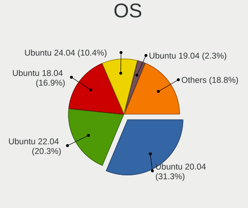

| Name           | Desktops | Percent |
|----------------|----------|---------|
| Ubuntu 20.04   | 10147    | 31.31%  |
| Ubuntu 22.04   | 6594     | 20.35%  |
| Ubuntu 18.04   | 5470     | 16.88%  |
| Ubuntu 24.04   | 3364     | 10.38%  |
| Ubuntu 19.04   | 745      | 2.3%    |
| Ubuntu 19.10   | 743      | 2.29%   |
| Ubuntu 20.10   | 742      | 2.29%   |
| Ubuntu 21.10   | 715      | 2.21%   |
| Ubuntu 21.04   | 619      | 1.91%   |
| Ubuntu 23.04   | 554      | 1.71%   |
| Ubuntu 22.10   | 554      | 1.71%   |
| Ubuntu 23.10   | 523      | 1.61%   |
| Ubuntu 16.04   | 364      | 1.12%   |
| Ubuntu 18.10   | 352      | 1.09%   |
| Ubuntu 24.10   | 330      | 1.02%   |
| Ubuntu 25.04   | 289      | 0.89%   |
| Ubuntu 25.10   | 125      | 0.39%   |
| Ubuntu 17.10   | 25       | 0.08%   |
| Ubuntu         | 21       | 0.06%   |
| Ubuntu Core 18 | 16       | 0.05%   |
| Ubuntu Core 22 | 14       | 0.04%   |
| Ubuntu 1.3.1   | 14       | 0.04%   |
| Ubuntu Core 16 | 13       | 0.04%   |
| Ubuntu 1.3.2   | 12       | 0.04%   |
| Ubuntu 14.04   | 9        | 0.03%   |
| Ubuntu 1.3.3   | 9        | 0.03%   |
| Ubuntu 26.04   | 6        | 0.02%   |
| Ubuntu 1.3.4   | 5        | 0.02%   |
| Ubuntu 18.08   | 3        | 0.01%   |
| Ubuntu 17.04   | 3        | 0.01%   |
| Ubuntu 1.3.5   | 3        | 0.01%   |
| Ubuntu 1.3.0   | 3        | 0.01%   |
| Ubuntu 1.1.10  | 3        | 0.01%   |
| Ubuntu 16.10   | 2        | 0.01%   |
| Ubuntu 12.04   | 2        | 0.01%   |
| Ubuntu 1.1.4   | 2        | 0.01%   |
| Ubuntu Core 24 | 1        | 0.003%  |
| Ubuntu 9.5     | 1        | 0.003%  |
| Ubuntu 6.1     | 1        | 0.003%  |
| Ubuntu 6       | 1        | 0.003%  |

OS Family
---------

OS without a version

| Name   | Desktops | Percent |
|--------|----------|---------|
| Ubuntu | 30394    | 100%    |

Kernel
------

Version of the Linux kernel

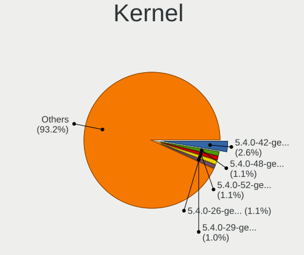

| Version           | Desktops | Percent |
|-------------------|----------|---------|
| 5.4.0-42-generic  | 981      | 2.63%   |
| 5.4.0-48-generic  | 410      | 1.1%    |
| 5.4.0-52-generic  | 399      | 1.07%   |
| 5.4.0-26-generic  | 392      | 1.05%   |
| 5.4.0-29-generic  | 361      | 0.97%   |
| 5.4.0-40-generic  | 355      | 0.95%   |
| 5.15.0-56-generic | 339      | 0.91%   |
| 5.4.0-58-generic  | 338      | 0.91%   |
| 5.4.0-37-generic  | 333      | 0.89%   |
| 5.8.0-43-generic  | 312      | 0.84%   |
| 5.15.0-52-generic | 286      | 0.77%   |
| 6.8.0-51-generic  | 285      | 0.77%   |
| 5.15.0-58-generic | 281      | 0.75%   |
| 6.2.0-26-generic  | 275      | 0.74%   |
| 6.8.0-31-generic  | 271      | 0.73%   |
| 5.3.0-40-generic  | 271      | 0.73%   |
| 5.19.0-35-generic | 270      | 0.72%   |
| 6.5.0-14-generic  | 268      | 0.72%   |
| 5.4.0-33-generic  | 264      | 0.71%   |
| 5.4.0-54-generic  | 260      | 0.7%    |
| 5.8.0-44-generic  | 256      | 0.69%   |
| 5.8.0-50-generic  | 248      | 0.67%   |
| 5.11.0-27-generic | 246      | 0.66%   |
| 5.4.0-31-generic  | 237      | 0.64%   |
| 5.15.0-43-generic | 235      | 0.63%   |
| 5.15.0-48-generic | 230      | 0.62%   |
| 6.8.0-45-generic  | 228      | 0.61%   |
| 5.15.0-46-generic | 227      | 0.61%   |
| 5.3.0-46-generic  | 226      | 0.61%   |
| 5.19.0-38-generic | 226      | 0.61%   |
| 5.11.0-37-generic | 225      | 0.6%    |
| 5.4.0-47-generic  | 219      | 0.59%   |
| 6.2.0-39-generic  | 217      | 0.58%   |
| 5.19.0-32-generic | 211      | 0.57%   |
| 5.8.0-48-generic  | 209      | 0.56%   |
| 5.19.0-46-generic | 205      | 0.55%   |
| 6.8.0-41-generic  | 202      | 0.54%   |
| 5.0.0-23-generic  | 202      | 0.54%   |
| 5.11.0-40-generic | 198      | 0.53%   |
| 5.15.0-47-generic | 196      | 0.53%   |

Kernel Family
-------------

Linux kernel without a distro release

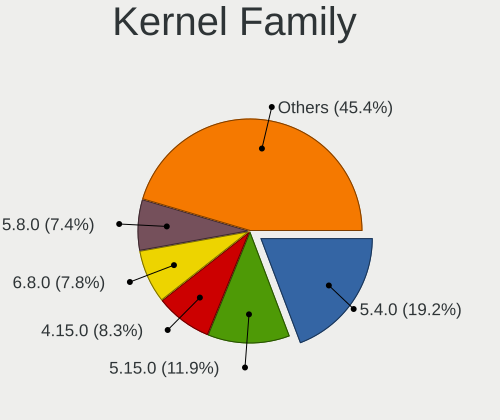

| Version | Desktops | Percent |
|---------|----------|---------|
| 5.4.0   | 6468     | 19.24%  |
| 5.15.0  | 4001     | 11.9%   |
| 4.15.0  | 2774     | 8.25%   |
| 6.8.0   | 2614     | 7.78%   |
| 5.8.0   | 2487     | 7.4%    |
| 5.11.0  | 1861     | 5.54%   |
| 5.19.0  | 1726     | 5.13%   |
| 5.3.0   | 1616     | 4.81%   |
| 6.2.0   | 1598     | 4.75%   |
| 6.5.0   | 1516     | 4.51%   |
| 5.13.0  | 1503     | 4.47%   |
| 5.0.0   | 1494     | 4.44%   |
| 4.18.0  | 1076     | 3.2%    |
| 6.11.0  | 954      | 2.84%   |
| 6.14.0  | 943      | 2.81%   |
| 6.17.0  | 129      | 0.38%   |
| 4.4.0   | 116      | 0.35%   |
| 4.13.0  | 47       | 0.14%   |
| 5.10.0  | 26       | 0.08%   |
| 5.17.0  | 24       | 0.07%   |
| 5.6.0   | 17       | 0.05%   |
| 5.14.0  | 16       | 0.05%   |
| 6.1.0   | 15       | 0.04%   |
| 4.10.0  | 12       | 0.04%   |
| 6.0.0   | 10       | 0.03%   |
| 5.9.0   | 10       | 0.03%   |
| 6.12.3  | 9        | 0.03%   |
| 5.2.0   | 9        | 0.03%   |
| 4.8.0   | 9        | 0.03%   |
| 4.19.0  | 8        | 0.02%   |
| 6.7.0   | 7        | 0.02%   |
| 6.6.0   | 7        | 0.02%   |
| 5.7.0   | 7        | 0.02%   |
| 3.13.0  | 7        | 0.02%   |
| 6.2.16  | 6        | 0.02%   |
| 5.7.1   | 6        | 0.02%   |
| 5.18.0  | 6        | 0.02%   |
| 5.16.0  | 6        | 0.02%   |
| 4.15.18 | 6        | 0.02%   |
| 6.9.0   | 5        | 0.01%   |

Kernel Major Ver.
-----------------

Linux kernel major version

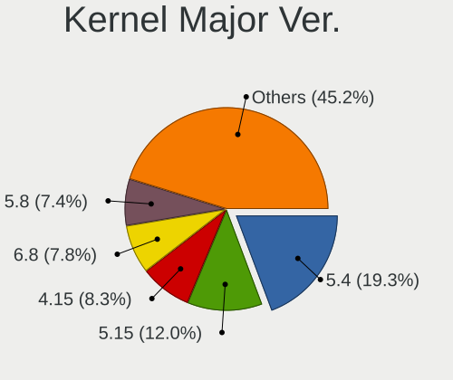

| Version | Desktops | Percent |
|---------|----------|---------|
| 5.4     | 6483     | 19.3%   |
| 5.15    | 4021     | 11.97%  |
| 4.15    | 2779     | 8.27%   |
| 6.8     | 2626     | 7.82%   |
| 5.8     | 2501     | 7.44%   |
| 5.11    | 1876     | 5.58%   |
| 5.19    | 1732     | 5.16%   |
| 5.3     | 1620     | 4.82%   |
| 6.2     | 1615     | 4.81%   |
| 6.5     | 1525     | 4.54%   |
| 5.13    | 1512     | 4.5%    |
| 5.0     | 1507     | 4.49%   |
| 4.18    | 1081     | 3.22%   |
| 6.11    | 956      | 2.85%   |
| 6.14    | 950      | 2.83%   |
| 6.17    | 129      | 0.38%   |
| 4.4     | 116      | 0.35%   |
| 5.10    | 52       | 0.15%   |
| 4.13    | 50       | 0.15%   |
| 5.17    | 39       | 0.12%   |
| 6.1     | 31       | 0.09%   |
| 5.6     | 29       | 0.09%   |
| 5.9     | 27       | 0.08%   |
| 5.14    | 24       | 0.07%   |
| 5.7     | 23       | 0.07%   |
| 6.6     | 22       | 0.07%   |
| 6.0     | 21       | 0.06%   |
| 6.12    | 20       | 0.06%   |
| 5.2     | 17       | 0.05%   |
| 6.3     | 16       | 0.05%   |
| 5.18    | 16       | 0.05%   |
| 6.4     | 15       | 0.04%   |
| 5.16    | 15       | 0.04%   |
| 4.19    | 15       | 0.04%   |
| 5.1     | 13       | 0.04%   |
| 4.10    | 13       | 0.04%   |
| 6.9     | 11       | 0.03%   |
| 6.7     | 11       | 0.03%   |
| 5.12    | 10       | 0.03%   |
| 5.5     | 9        | 0.03%   |

Arch
----

OS architecture (x86_64, i586, etc.)

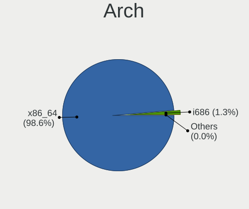

| Name    | Desktops | Percent |
|---------|----------|---------|
| x86_64  | 29979    | 98.62%  |
| i686    | 401      | 1.32%   |
| riscv64 | 10       | 0.03%   |
| armv7l  | 4        | 0.01%   |
| aarch64 | 3        | 0.01%   |
| s390x   | 1        | 0.003%  |
| i586    | 1        | 0.003%  |

DE
--

Desktop Environment

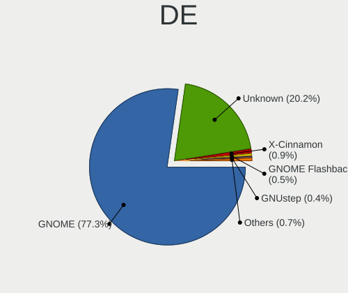

| Name                     | Desktops | Percent |
|--------------------------|----------|---------|
| GNOME                    | 23911    | 77.28%  |
| Unknown                  | 6252     | 20.21%  |
| X-Cinnamon               | 277      | 0.9%    |
| GNOME Flashback          | 164      | 0.53%   |
| GNUstep                  | 125      | 0.4%    |
| Cinnamon                 | 51       | 0.16%   |
| GNOME Classic            | 42       | 0.14%   |
| i3                       | 30       | 0.1%    |
| Enlightenment            | 28       | 0.09%   |
| openbox                  | 10       | 0.03%   |
| awesome                  | 8        | 0.03%   |
| sway                     | 5        | 0.02%   |
| Pantheon                 | 4        | 0.01%   |
| Yaru:ubuntu:GNOME        | 3        | 0.01%   |
| xmonad                   | 3        | 0.01%   |
| DDE                      | 3        | 0.01%   |
| ubuntustudio             | 2        | 0.01%   |
| ubuntu                   | 2        | 0.01%   |
| Trinity                  | 2        | 0.01%   |
| Lubuntu                  | 2        | 0.01%   |
| fvwm                     | 2        | 0.01%   |
| fluxbox                  | 2        | 0.01%   |
| xubuntu                  | 1        | 0.003%  |
| ubuntu=GNOME             | 1        | 0.003%  |
| qtile                    | 1        | 0.003%  |
| mwm                      | 1        | 0.003%  |
| kubuntu-live-environment | 1        | 0.003%  |
| kde                      | 1        | 0.003%  |
| jwm                      | 1        | 0.003%  |
| INPT                     | 1        | 0.003%  |
| ICEWM                    | 1        | 0.003%  |
| i3-with-shmlog           | 1        | 0.003%  |
| Hyprland                 | 1        | 0.003%  |
| Deepin                   | 1        | 0.003%  |
| Core                     | 1        | 0.003%  |
| bspwm                    | 1        | 0.003%  |

Display Server
--------------

X11 or Wayland

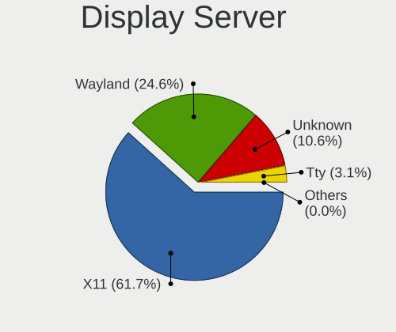

| Name        | Desktops | Percent |
|-------------|----------|---------|
| X11         | 19494    | 61.7%   |
| Wayland     | 7770     | 24.59%  |
| Unknown     | 3351     | 10.61%  |
| Tty         | 970      | 3.07%   |
| Web         | 10       | 0.03%   |
| Unspecified | 1        | 0.003%  |

Display Manager
---------------

SDDM, LightDM, etc.

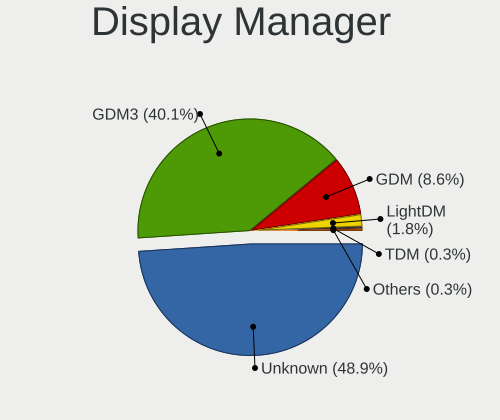

| Name    | Desktops | Percent |
|---------|----------|---------|
| Unknown | 15358    | 48.95%  |
| GDM3    | 12570    | 40.06%  |
| GDM     | 2694     | 8.59%   |
| LightDM | 554      | 1.77%   |
| TDM     | 97       | 0.31%   |
| SDDM    | 82       | 0.26%   |
| SLiM    | 14       | 0.04%   |
| XDM     | 4        | 0.01%   |
| LXDM    | 4        | 0.01%   |

OS Lang
-------

Language

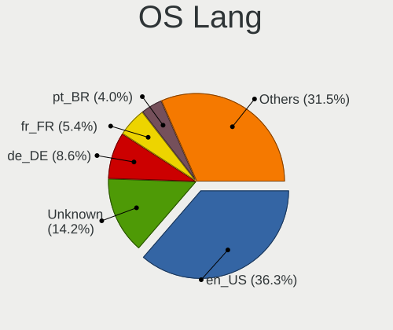

| Lang    | Desktops | Percent |
|---------|----------|---------|
| en_US   | 11236    | 36.33%  |
| Unknown | 4386     | 14.18%  |
| de_DE   | 2659     | 8.6%    |
| fr_FR   | 1659     | 5.36%   |
| pt_BR   | 1233     | 3.99%   |
| en_GB   | 1166     | 3.77%   |
| it_IT   | 868      | 2.81%   |
| C       | 853      | 2.76%   |
| es_ES   | 733      | 2.37%   |
| ru_RU   | 690      | 2.23%   |
| en_CA   | 667      | 2.16%   |
| en_AU   | 422      | 1.36%   |
| pl_PL   | 417      | 1.35%   |
| en_IN   | 387      | 1.25%   |
| nl_NL   | 304      | 0.98%   |
| ja_JP   | 194      | 0.63%   |
| hu_HU   | 186      | 0.6%    |
| zh_CN   | 185      | 0.6%    |
| es_AR   | 178      | 0.58%   |
| cs_CZ   | 156      | 0.5%    |
| de_AT   | 144      | 0.47%   |
| en_ZA   | 133      | 0.43%   |
| es_MX   | 130      | 0.42%   |
| sv_SE   | 127      | 0.41%   |
| pt_PT   | 101      | 0.33%   |
| fi_FI   | 93       | 0.3%    |
| tr_TR   | 85       | 0.27%   |
| fr_CA   | 80       | 0.26%   |
| en_NZ   | 76       | 0.25%   |
| el_GR   | 75       | 0.24%   |
| de_CH   | 72       | 0.23%   |
| zh_TW   | 69       | 0.22%   |
| fr_BE   | 58       | 0.19%   |
| ru_UA   | 56       | 0.18%   |
| ko_KR   | 53       | 0.17%   |
| ro_RO   | 51       | 0.16%   |
| en_IL   | 50       | 0.16%   |
| nl_BE   | 49       | 0.16%   |
| sk_SK   | 47       | 0.15%   |
| es_CO   | 47       | 0.15%   |

Boot Mode
---------

EFI or BIOS

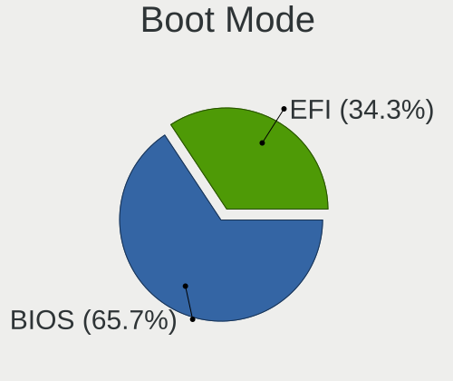

| Mode | Desktops | Percent |
|------|----------|---------|
| BIOS | 20389    | 65.69%  |
| EFI  | 10650    | 34.31%  |

Filesystem
----------

Type of filesystem

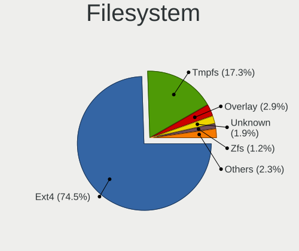

| Type          | Desktops | Percent |
|---------------|----------|---------|
| Ext4          | 23204    | 74.48%  |
| Tmpfs         | 5376     | 17.26%  |
| Overlay       | 888      | 2.85%   |
| Unknown       | 599      | 1.92%   |
| Zfs           | 379      | 1.22%   |
| Btrfs         | 340      | 1.09%   |
| Xfs           | 135      | 0.43%   |
| Ext2          | 126      | 0.4%    |
| Ext3          | 91       | 0.29%   |
| Jfs           | 7        | 0.02%   |
| Reiserfs      | 4        | 0.01%   |
| Aufs          | 4        | 0.01%   |
| XXXX          | 1        | 0.003%  |
| SquXshfs      | 1        | 0.003%  |
| Fuse.snapfuse | 1        | 0.003%  |

Part. scheme
------------

Scheme of partitioning

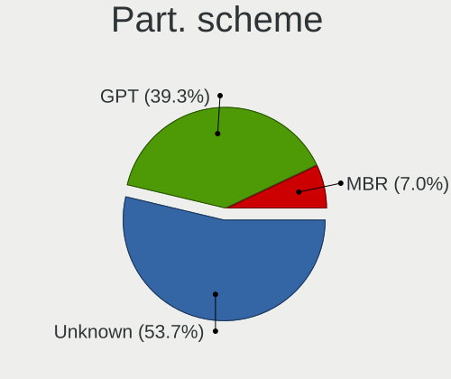

| Type    | Desktops | Percent |
|---------|----------|---------|
| Unknown | 16769    | 53.7%   |
| GPT     | 12266    | 39.28%  |
| MBR     | 2191     | 7.02%   |

Dual Boot with Linux/BSD
------------------------

Hosting more than one Linux/BSD

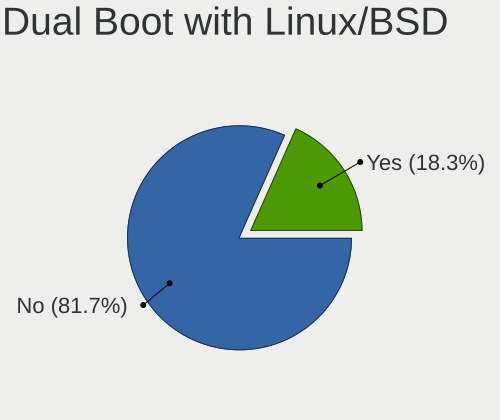

| Dual boot | Desktops | Percent |
|-----------|----------|---------|
| No        | 25453    | 81.66%  |
| Yes       | 5718     | 18.34%  |

Dual Boot (Win)
---------------

Hosting Linux and Windows

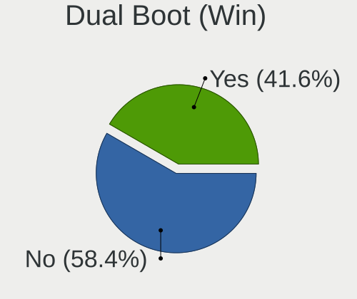

| Dual boot | Desktops | Percent |
|-----------|----------|---------|
| No        | 18121    | 58.37%  |
| Yes       | 12924    | 41.63%  |

Board
-----

Vendor
------

Motherboard manufacturer

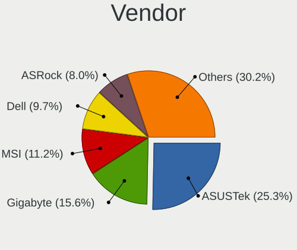

| Name                                 | Desktops | Percent |
|--------------------------------------|----------|---------|
| ASUSTek Computer                     | 7693     | 25.31%  |
| Gigabyte Technology                  | 4730     | 15.56%  |
| MSI                                  | 3399     | 11.18%  |
| Dell                                 | 2954     | 9.72%   |
| ASRock                               | 2443     | 8.04%   |
| Hewlett-Packard                      | 2324     | 7.65%   |
| Lenovo                               | 1131     | 3.72%   |
| Intel                                | 892      | 2.93%   |
| Acer                                 | 549      | 1.81%   |
| Unknown                              | 487      | 1.6%    |
| Fujitsu                              | 354      | 1.16%   |
| Pegatron                             | 305      | 1%      |
| Foxconn                              | 295      | 0.97%   |
| Biostar                              | 257      | 0.85%   |
| Medion                               | 187      | 0.62%   |
| ECS                                  | 183      | 0.6%    |
| Supermicro                           | 157      | 0.52%   |
| Apple                                | 126      | 0.41%   |
| Alienware                            | 93       | 0.31%   |
| Packard Bell                         | 91       | 0.3%    |
| AZW                                  | 88       | 0.29%   |
| Huanan                               | 80       | 0.26%   |
| Positivo                             | 74       | 0.24%   |
| Shuttle                              | 71       | 0.23%   |
| Fujitsu Siemens                      | 70       | 0.23%   |
| Gateway                              | 63       | 0.21%   |
| eMachines                            | 53       | 0.17%   |
| Shenzhen Meigao Electronic Equipment | 52       | 0.17%   |
| PCWare                               | 45       | 0.15%   |
| AMI                                  | 45       | 0.15%   |
| ASRockRack                           | 38       | 0.13%   |
| MACHINIST                            | 36       | 0.12%   |
| OEM                                  | 35       | 0.12%   |
| EVGA                                 | 29       | 0.1%    |
| Google                               | 28       | 0.09%   |
| BESSTAR Tech                         | 28       | 0.09%   |
| Inspur                               | 26       | 0.09%   |
| ABIT                                 | 22       | 0.07%   |
| TYAN Computer                        | 21       | 0.07%   |
| Inventec                             | 18       | 0.06%   |

Model
-----

Motherboard model

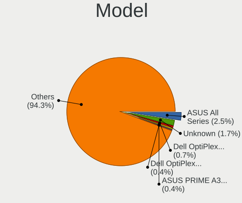

| Name                         | Desktops | Percent |
|------------------------------|----------|---------|
| ASUS All Series              | 749      | 2.46%   |
| Unknown                      | 525      | 1.73%   |
| Dell OptiPlex 7010           | 199      | 0.65%   |
| Dell OptiPlex 9020           | 131      | 0.43%   |
| ASUS PRIME A320M-K           | 121      | 0.4%    |
| MSI MS-7C37                  | 116      | 0.38%   |
| Dell OptiPlex 790            | 113      | 0.37%   |
| Gigabyte B450M DS3H          | 106      | 0.35%   |
| MSI MS-7C02                  | 100      | 0.33%   |
| Dell OptiPlex 3020           | 94       | 0.31%   |
| ASUS TUF Gaming X570-PLUS    | 91       | 0.3%    |
| Dell OptiPlex 780            | 89       | 0.29%   |
| MSI MS-7721                  | 88       | 0.29%   |
| HP Compaq Elite 8300 SFF     | 86       | 0.28%   |
| Dell OptiPlex 990            | 82       | 0.27%   |
| ASUS M5A78L-M/USB3           | 82       | 0.27%   |
| MSI MS-7817                  | 79       | 0.26%   |
| MSI MS-7693                  | 78       | 0.26%   |
| MSI MS-7A38                  | 76       | 0.25%   |
| MSI MS-7B86                  | 74       | 0.24%   |
| HP EliteDesk 800 G1 SFF      | 70       | 0.23%   |
| MSI MS-7C91                  | 69       | 0.23%   |
| Gigabyte 970A-DS3P           | 69       | 0.23%   |
| ASRock B450M Pro4            | 68       | 0.22%   |
| Dell OptiPlex 7040           | 67       | 0.22%   |
| Dell OptiPlex 3010           | 67       | 0.22%   |
| Dell OptiPlex 755            | 66       | 0.22%   |
| ASUS ROG STRIX B450-F GAMING | 62       | 0.2%    |
| ASUS M5A97 R2.0              | 62       | 0.2%    |
| Gigabyte A320M-S2H           | 61       | 0.2%    |
| Gigabyte B75M-D3H            | 60       | 0.2%    |
| ASUS PRIME B450M-A           | 58       | 0.19%   |
| HP Compaq 8200 Elite SFF PC  | 57       | 0.19%   |
| MSI MS-7C56                  | 55       | 0.18%   |
| MSI MS-7B79                  | 55       | 0.18%   |
| Dell OptiPlex 7050           | 55       | 0.18%   |
| Dell OptiPlex 3050           | 54       | 0.18%   |
| MSI MS-7C52                  | 53       | 0.17%   |
| Intel H61                    | 53       | 0.17%   |
| Dell OptiPlex 9010           | 53       | 0.17%   |

Model Family
------------

Motherboard model prefix

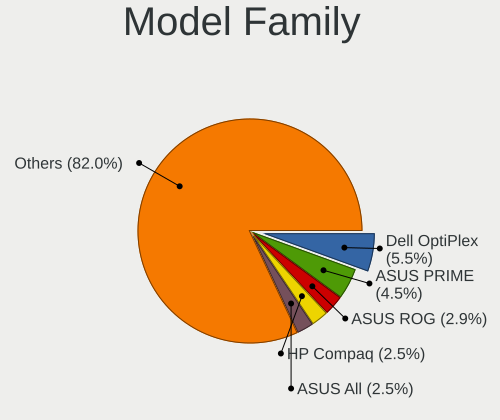

| Name                   | Desktops | Percent |
|------------------------|----------|---------|
| Dell OptiPlex          | 1685     | 5.54%   |
| ASUS PRIME             | 1378     | 4.53%   |
| ASUS ROG               | 895      | 2.94%   |
| HP Compaq              | 772      | 2.54%   |
| ASUS All               | 749      | 2.46%   |
| Lenovo ThinkCentre     | 694      | 2.28%   |
| ASUS TUF               | 549      | 1.81%   |
| Unknown                | 525      | 1.73%   |
| Dell Precision         | 495      | 1.63%   |
| Acer Aspire            | 334      | 1.1%    |
| Dell Inspiron          | 305      | 1%      |
| HP EliteDesk           | 300      | 0.99%   |
| HP ProDesk             | 241      | 0.79%   |
| ASUS M5A78L-M          | 238      | 0.78%   |
| Fujitsu ESPRIMO        | 230      | 0.76%   |
| Gigabyte B450M         | 183      | 0.6%    |
| Gigabyte X570          | 163      | 0.54%   |
| Dell XPS               | 160      | 0.53%   |
| ASUS M5A97             | 156      | 0.51%   |
| Dell Vostro            | 152      | 0.5%    |
| Gigabyte B450          | 141      | 0.46%   |
| Lenovo Thinkstation    | 138      | 0.45%   |
| ASUS P8H61-M           | 129      | 0.42%   |
| ASRock B450M           | 128      | 0.42%   |
| Acer Veriton           | 125      | 0.41%   |
| ASUS P8Z77-V           | 117      | 0.38%   |
| MSI MS-7C37            | 116      | 0.38%   |
| Gigabyte Z390          | 116      | 0.38%   |
| ASUS SABERTOOTH        | 115      | 0.38%   |
| Lenovo IdeaCentre      | 107      | 0.35%   |
| HP ProLiant            | 103      | 0.34%   |
| Gigabyte GA-78LMT-USB3 | 102      | 0.34%   |
| HP Pavilion            | 101      | 0.33%   |
| MSI MS-7C02            | 100      | 0.33%   |
| Gigabyte B550M         | 95       | 0.31%   |
| MSI MS-7721            | 88       | 0.29%   |
| Gigabyte B550          | 82       | 0.27%   |
| ASRock X570            | 80       | 0.26%   |
| MSI MS-7817            | 79       | 0.26%   |
| MSI MS-7693            | 78       | 0.26%   |

MFG Year
--------

Motherboard manufacture year

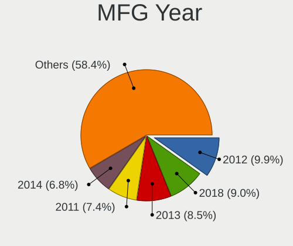

| Year    | Desktops | Percent |
|---------|----------|---------|
| 2012    | 2997     | 9.86%   |
| 2018    | 2739     | 9.01%   |
| 2013    | 2593     | 8.53%   |
| 2011    | 2236     | 7.36%   |
| 2014    | 2073     | 6.82%   |
| 2017    | 1854     | 6.1%    |
| 2019    | 1851     | 6.09%   |
| 2010    | 1773     | 5.83%   |
| 2009    | 1773     | 5.83%   |
| 2020    | 1639     | 5.39%   |
| 2015    | 1415     | 4.66%   |
| 2016    | 1250     | 4.11%   |
| 2008    | 1237     | 4.07%   |
| 2021    | 1197     | 3.94%   |
| 2022    | 963      | 3.17%   |
| 2007    | 948      | 3.12%   |
| 2023    | 713      | 2.35%   |
| 2006    | 433      | 1.42%   |
| 2024    | 374      | 1.23%   |
| 2005    | 165      | 0.54%   |
| 2025    | 79       | 0.26%   |
| 2004    | 43       | 0.14%   |
| Unknown | 34       | 0.11%   |
| 2003    | 6        | 0.02%   |
| 2002    | 4        | 0.01%   |
| 2001    | 4        | 0.01%   |
| 2000    | 1        | 0.003%  |

Form Factor
-----------

Physical design of the computer

| Name    | Desktops | Percent |
|---------|----------|---------|
| Desktop | 30394    | 100%    |

Secure Boot
-----------

Enabled or disabled

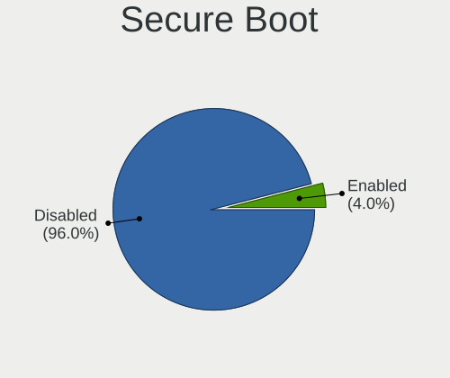

| State    | Desktops | Percent |
|----------|----------|---------|
| Disabled | 29290    | 95.98%  |
| Enabled  | 1228     | 4.02%   |

Coreboot
--------

Have coreboot on board

| Used | Desktops | Percent |
|------|----------|---------|
| No   | 30348    | 99.85%  |
| Yes  | 46       | 0.15%   |

RAM Size
--------

Total RAM memory

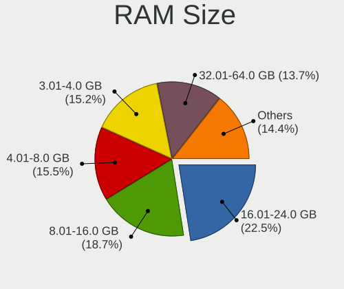

| Size in GB      | Desktops | Percent |
|-----------------|----------|---------|
| 16.01-24.0      | 7009     | 22.53%  |
| 8.01-16.0       | 5830     | 18.74%  |
| 4.01-8.0        | 4811     | 15.46%  |
| 3.01-4.0        | 4715     | 15.15%  |
| 32.01-64.0      | 4265     | 13.71%  |
| 64.01-256.0     | 2071     | 6.66%   |
| 24.01-32.0      | 1009     | 3.24%   |
| 1.01-2.0        | 878      | 2.82%   |
| 2.01-3.0        | 300      | 0.96%   |
| More than 256.0 | 131      | 0.42%   |
| 0.51-1.0        | 81       | 0.26%   |
| 0.01-0.5        | 12       | 0.04%   |
| Unknown         | 3        | 0.01%   |

RAM Used
--------

Used RAM memory

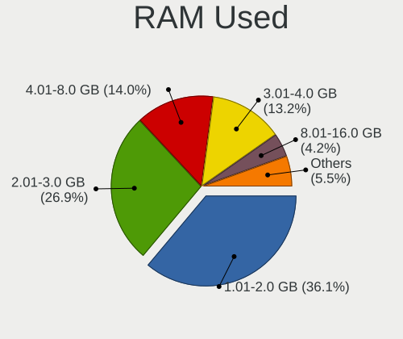

| Used GB     | Desktops | Percent |
|-------------|----------|---------|
| 1.01-2.0    | 12186    | 36.12%  |
| 2.01-3.0    | 9087     | 26.93%  |
| 4.01-8.0    | 4739     | 14.05%  |
| 3.01-4.0    | 4452     | 13.2%   |
| 8.01-16.0   | 1432     | 4.24%   |
| 0.51-1.0    | 1034     | 3.06%   |
| 16.01-24.0  | 295      | 0.87%   |
| 0.01-0.5    | 177      | 0.52%   |
| 24.01-32.0  | 136      | 0.4%    |
| 32.01-64.0  | 123      | 0.36%   |
| 64.01-256.0 | 65       | 0.19%   |
| Unknown     | 13       | 0.04%   |
| 0           | 1        | 0.003%  |

Total Drives
------------

Number of drives on board

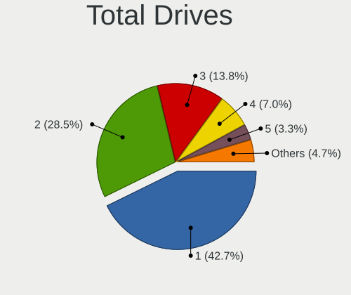

| Drives  | Desktops | Percent |
|---------|----------|---------|
| 1       | 13570    | 42.74%  |
| 2       | 9063     | 28.54%  |
| 3       | 4378     | 13.79%  |
| 4       | 2228     | 7.02%   |
| 5       | 1033     | 3.25%   |
| 6       | 495      | 1.56%   |
| 0       | 396      | 1.25%   |
| 7       | 244      | 0.77%   |
| 8       | 120      | 0.38%   |
| 9       | 77       | 0.24%   |
| 10      | 42       | 0.13%   |
| 11      | 26       | 0.08%   |
| 13      | 19       | 0.06%   |
| 12      | 13       | 0.04%   |
| Unknown | 12       | 0.04%   |
| 25      | 6        | 0.02%   |
| 16      | 6        | 0.02%   |
| 14      | 6        | 0.02%   |
| 20      | 4        | 0.01%   |
| 21      | 3        | 0.01%   |
| 23      | 2        | 0.01%   |
| 17      | 2        | 0.01%   |
| 101     | 1        | 0.003%  |
| 45      | 1        | 0.003%  |
| 38      | 1        | 0.003%  |
| 32      | 1        | 0.003%  |
| 19      | 1        | 0.003%  |
| 15      | 1        | 0.003%  |

Has CD-ROM
----------

Has CD-ROM on board

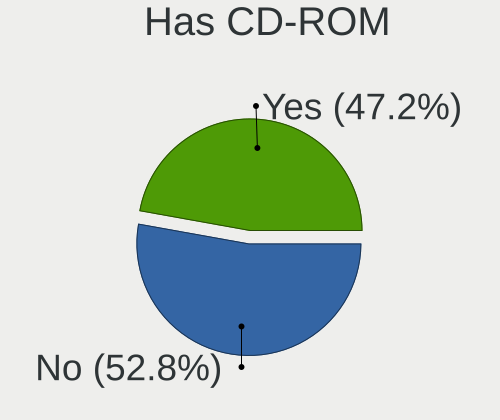

| Presented | Desktops | Percent |
|-----------|----------|---------|
| No        | 16261    | 52.83%  |
| Yes       | 14520    | 47.17%  |

Has Ethernet
------------

Has Ethernet on board

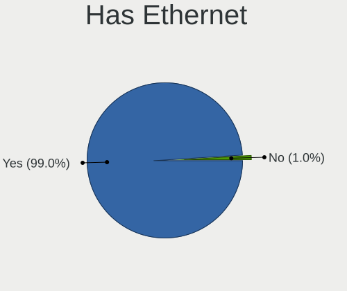

| Presented | Desktops | Percent |
|-----------|----------|---------|
| Yes       | 30092    | 98.99%  |
| No        | 306      | 1.01%   |

Has WiFi
--------

Has WiFi module

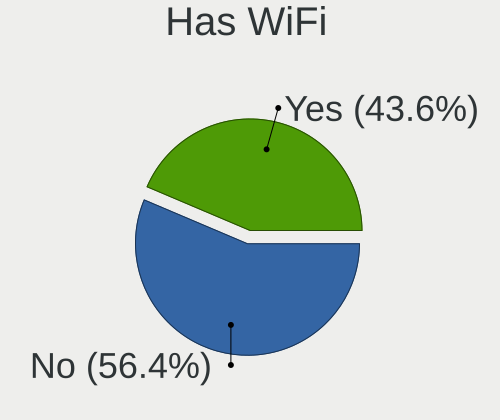

| Presented | Desktops | Percent |
|-----------|----------|---------|
| No        | 17410    | 56.39%  |
| Yes       | 13465    | 43.61%  |

Has Bluetooth
-------------

Has Bluetooth module

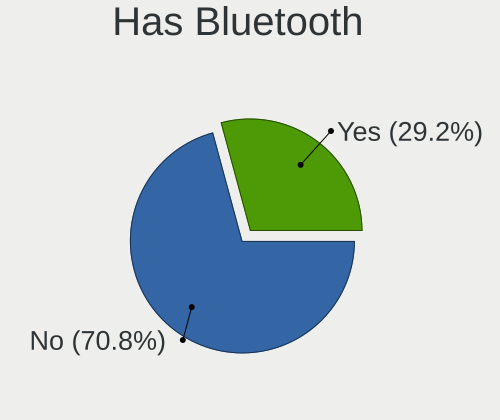

| Presented | Desktops | Percent |
|-----------|----------|---------|
| No        | 21839    | 70.8%   |
| Yes       | 9009     | 29.2%   |

Location
--------

Country
-------

Geographic location (country)

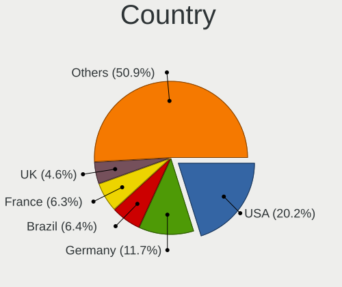

| Country      | Desktops | Percent |
|--------------|----------|---------|
| USA          | 6151     | 20.17%  |
| Germany      | 3563     | 11.68%  |
| Brazil       | 1945     | 6.38%   |
| France       | 1918     | 6.29%   |
| UK           | 1412     | 4.63%   |
| Italy        | 1287     | 4.22%   |
| Canada       | 1165     | 3.82%   |
| Russia       | 1153     | 3.78%   |
| Spain        | 951      | 3.12%   |
| Netherlands  | 671      | 2.2%    |
| Poland       | 602      | 1.97%   |
| Australia    | 580      | 1.9%    |
| India        | 576      | 1.89%   |
| Switzerland  | 481      | 1.58%   |
| Sweden       | 351      | 1.15%   |
| Austria      | 332      | 1.09%   |
| Belgium      | 323      | 1.06%   |
| Argentina    | 323      | 1.06%   |
| China        | 318      | 1.04%   |
| Mexico       | 309      | 1.01%   |
| Hungary      | 300      | 0.98%   |
| Japan        | 290      | 0.95%   |
| Czechia      | 282      | 0.92%   |
| Finland      | 253      | 0.83%   |
| Ukraine      | 246      | 0.81%   |
| Greece       | 227      | 0.74%   |
| Turkey       | 218      | 0.71%   |
| South Africa | 202      | 0.66%   |
| Portugal     | 200      | 0.66%   |
| Romania      | 190      | 0.62%   |
| Norway       | 157      | 0.51%   |
| Taiwan       | 154      | 0.5%    |
| Bulgaria     | 150      | 0.49%   |
| New Zealand  | 146      | 0.48%   |
| Israel       | 144      | 0.47%   |
| Serbia       | 137      | 0.45%   |
| Denmark      | 136      | 0.45%   |
| South Korea  | 122      | 0.4%    |
| Indonesia    | 121      | 0.4%    |
| Slovakia     | 116      | 0.38%   |

City
----

Geographic location (city)

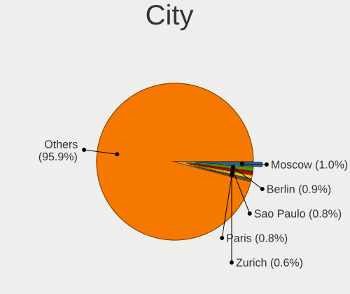

| City              | Desktops | Percent |
|-------------------|----------|---------|
| Moscow            | 332      | 1.02%   |
| Berlin            | 306      | 0.94%   |
| Sao Paulo         | 253      | 0.78%   |
| Paris             | 250      | 0.77%   |
| Zurich            | 187      | 0.58%   |
| Vienna            | 178      | 0.55%   |
| Sydney            | 173      | 0.53%   |
| Madrid            | 162      | 0.5%    |
| Rome              | 157      | 0.48%   |
| Milan             | 156      | 0.48%   |
| Hamburg           | 153      | 0.47%   |
| Munich            | 152      | 0.47%   |
| St Petersburg     | 148      | 0.46%   |
| Warsaw            | 136      | 0.42%   |
| Athens            | 129      | 0.4%    |
| Toronto           | 127      | 0.39%   |
| Melbourne         | 125      | 0.39%   |
| Rio de Janeiro    | 124      | 0.38%   |
| Budapest          | 123      | 0.38%   |
| Amsterdam         | 123      | 0.38%   |
| Helsinki          | 115      | 0.35%   |
| Montreal          | 114      | 0.35%   |
| Barcelona         | 109      | 0.34%   |
| Prague            | 104      | 0.32%   |
| New York          | 102      | 0.31%   |
| Frankfurt am Main | 101      | 0.31%   |
| Los Angeles       | 95       | 0.29%   |
| Chicago           | 94       | 0.29%   |
| Buenos Aires      | 91       | 0.28%   |
| London            | 86       | 0.26%   |
| Kyiv              | 86       | 0.26%   |
| Brisbane          | 85       | 0.26%   |
| Istanbul          | 80       | 0.25%   |
| Auckland          | 78       | 0.24%   |
| Unknown           | 76       | 0.23%   |
| Tehran            | 74       | 0.23%   |
| Dallas            | 74       | 0.23%   |
| Belgrade          | 73       | 0.22%   |
| San Jose          | 72       | 0.22%   |
| Singapore         | 71       | 0.22%   |

Drives
------

Drive Vendor
------------

Hard drive vendors

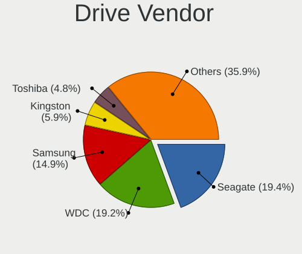

| Vendor                      | Desktops | Drives | Percent |
|-----------------------------|----------|--------|---------|
| Seagate                     | 10047    | 17098  | 19.37%  |
| WDC                         | 9966     | 16959  | 19.22%  |
| Samsung Electronics         | 7715     | 12800  | 14.88%  |
| Kingston                    | 3054     | 4174   | 5.89%   |
| Toshiba                     | 2472     | 3621   | 4.77%   |
| SanDisk                     | 2290     | 3240   | 4.42%   |
| Crucial                     | 1997     | 2939   | 3.85%   |
| Hitachi                     | 1784     | 2520   | 3.44%   |
| Intel                       | 846      | 1270   | 1.63%   |
| A-DATA Technology           | 690      | 909    | 1.33%   |
| Unknown                     | 665      | 1206   | 1.28%   |
| HGST                        | 509      | 863    | 0.98%   |
| China                       | 505      | 617    | 0.97%   |
| Maxtor                      | 437      | 596    | 0.84%   |
| Phison                      | 391      | 587    | 0.75%   |
| PNY                         | 381      | 496    | 0.73%   |
| SK hynix                    | 365      | 468    | 0.7%    |
| Micron/Crucial Technology   | 325      | 452    | 0.63%   |
| Micron Technology           | 325      | 437    | 0.63%   |
| Silicon Motion              | 324      | 456    | 0.62%   |
| Intenso                     | 307      | 476    | 0.59%   |
| SPCC                        | 305      | 414    | 0.59%   |
| OCZ                         | 301      | 397    | 0.58%   |
| Phison Electronics          | 286      | 412    | 0.55%   |
| Corsair                     | 235      | 319    | 0.45%   |
| Kingston Technology Company | 232      | 307    | 0.45%   |
| Patriot                     | 217      | 271    | 0.42%   |
| Transcend                   | 210      | 266    | 0.4%    |
| Hewlett-Packard             | 177      | 323    | 0.34%   |
| MAXIO Technology (Hangzhou) | 162      | 201    | 0.31%   |
| Team                        | 159      | 228    | 0.31%   |
| Lexar                       | 146      | 161    | 0.28%   |
| Realtek Semiconductor       | 145      | 185    | 0.28%   |
| GOODRAM                     | 138      | 214    | 0.27%   |
| Unknown                     | 133      | 154    | 0.26%   |
| JMicron Technology          | 131      | 160    | 0.25%   |
| Gigabyte Technology         | 108      | 158    | 0.21%   |
| ASMT                        | 100      | 158    | 0.19%   |
| KingSpec                    | 99       | 123    | 0.19%   |
| Apacer                      | 94       | 114    | 0.18%   |

Drive Model
-----------

Hard drive models

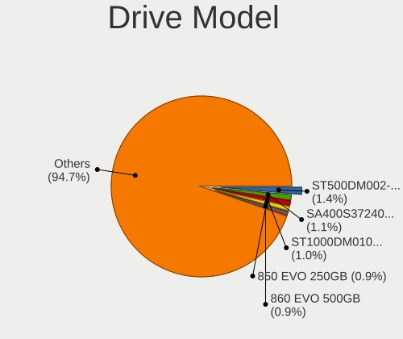

| Model                                              | Desktops | Percent |
|----------------------------------------------------|----------|---------|
| Seagate ST500DM002-1BD142 500GB                    | 840      | 1.4%    |
| Kingston SA400S37240G 240GB SSD                    | 659      | 1.1%    |
| Seagate ST1000DM010-2EP102 1TB                     | 620      | 1.03%   |
| Samsung SSD 850 EVO 250GB                          | 523      | 0.87%   |
| Samsung SSD 860 EVO 500GB                          | 521      | 0.87%   |
| Toshiba DT01ACA100 1TB                             | 483      | 0.81%   |
| Seagate ST2000DM008-2FR102 2TB                     | 467      | 0.78%   |
| WDC WD10EZEX-08WN4A0 1TB                           | 429      | 0.72%   |
| Kingston SA400S37120G 120GB SSD                    | 408      | 0.68%   |
| Samsung NVMe SSD Controller SM981/PM981/PM983 1TB  | 397      | 0.66%   |
| Kingston SA400S37480G 480GB SSD                    | 377      | 0.63%   |
| Seagate ST1000DM003-1CH162 1TB                     | 371      | 0.62%   |
| Samsung SSD 850 EVO 500GB                          | 356      | 0.59%   |
| Seagate ST3500418AS 500GB                          | 345      | 0.58%   |
| Seagate ST1000DM003-1ER162 1TB                     | 307      | 0.51%   |
| Kingston SV300S37A120G 120GB SSD                   | 298      | 0.5%    |
| Samsung SSD 860 EVO 1TB                            | 283      | 0.47%   |
| Samsung NVMe SSD Drive 500GB                       | 273      | 0.46%   |
| Crucial CT500MX500SSD1 500GB                       | 267      | 0.45%   |
| Samsung SSD 860 EVO 250GB                          | 261      | 0.44%   |
| Seagate ST4000DM004-2CV104 4TB                     | 259      | 0.43%   |
| Seagate ST2000DM001-1ER164 2TB                     | 251      | 0.42%   |
| Seagate ST2000DM001-1CH164 2TB                     | 251      | 0.42%   |
| Seagate ST31000528AS 1TB                           | 236      | 0.39%   |
| Seagate ST2000DM006-2DM164 2TB                     | 230      | 0.38%   |
| Toshiba HDWD110 1TB                                | 227      | 0.38%   |
| Toshiba DT01ACA050 500GB                           | 227      | 0.38%   |
| Crucial CT1000MX500SSD1 1TB                        | 226      | 0.38%   |
| Toshiba DT01ACA200 2TB                             | 217      | 0.36%   |
| WDC WD10EZEX-00BN5A0 1TB                           | 216      | 0.36%   |
| Seagate ST1000DM003-1SB102 1TB                     | 212      | 0.35%   |
| Seagate ST31000524AS 1TB                           | 211      | 0.35%   |
| Unknown SD/MMC/MS PRO 2GB                          | 208      | 0.35%   |
| Crucial CT240BX500SSD1 240GB                       | 206      | 0.34%   |
| Samsung NVMe SSD Controller PM9A1/PM9A3/980PRO 1TB | 189      | 0.32%   |
| Samsung SSD 840 EVO 250GB                          | 183      | 0.31%   |
| WDC WD20EZRZ-00Z5HB0 2TB                           | 177      | 0.3%    |
| Seagate Expansion 2TB                              | 177      | 0.3%    |
| WDC WDS240G2G0A-00JH30 240GB SSD                   | 172      | 0.29%   |
| Samsung NVMe SSD Drive 1TB                         | 167      | 0.28%   |

HDD Vendor
----------

Hard disk drive vendors

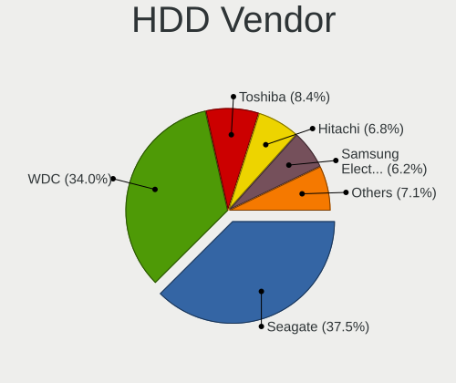

| Vendor              | Desktops | Drives | Percent |
|---------------------|----------|--------|---------|
| Seagate             | 9885     | 16758  | 37.52%  |
| WDC                 | 8948     | 15197  | 33.97%  |
| Toshiba             | 2214     | 3204   | 8.4%    |
| Hitachi             | 1782     | 2518   | 6.76%   |
| Samsung Electronics | 1641     | 2419   | 6.23%   |
| HGST                | 507      | 834    | 1.92%   |
| Maxtor              | 424      | 561    | 1.61%   |
| Unknown             | 235      | 326    | 0.89%   |
| Fujitsu             | 91       | 126    | 0.35%   |
| Hewlett-Packard     | 90       | 183    | 0.34%   |
| JMicron Technology  | 75       | 91     | 0.28%   |
| Intenso             | 50       | 77     | 0.19%   |
| Apple               | 42       | 43     | 0.16%   |
| ASMT                | 39       | 73     | 0.15%   |
| TO Exter            | 26       | 30     | 0.1%    |
| ExcelStor           | 26       | 31     | 0.1%    |
| External            | 19       | 20     | 0.07%   |
| USB3.0              | 17       | 20     | 0.06%   |
| HPE                 | 17       | 28     | 0.06%   |
| WD MediaMax         | 15       | 19     | 0.06%   |
| ASMedia             | 15       | 18     | 0.06%   |
| MARVELL             | 13       | 17     | 0.05%   |
| T-FORCE             | 12       | 14     | 0.05%   |
| SABRENT             | 11       | 17     | 0.04%   |
| LaCie               | 11       | 14     | 0.04%   |
| ASMT109x            | 10       | 18     | 0.04%   |
| Unknown             | 10       | 13     | 0.04%   |
| HGST HTS            | 9        | 10     | 0.03%   |
| SSK                 | 8        | 8      | 0.03%   |
| QUANTUM             | 8        | 13     | 0.03%   |
| USB                 | 7        | 8      | 0.03%   |
| SATAFIRM            | 6        | 7      | 0.02%   |
| Inateck             | 6        | 6      | 0.02%   |
| KESU                | 5        | 9      | 0.02%   |
| TDAS                | 3        | 14     | 0.01%   |
| SAGE                | 3        | 2      | 0.01%   |
| Magnetic Data       | 3        | 3      | 0.01%   |
| IBM/Hitachi         | 3        | 3      | 0.01%   |
| Fantom              | 3        | 3      | 0.01%   |
| China               | 3        | 3      | 0.01%   |

SSD Vendor
----------

Solid state drive vendors

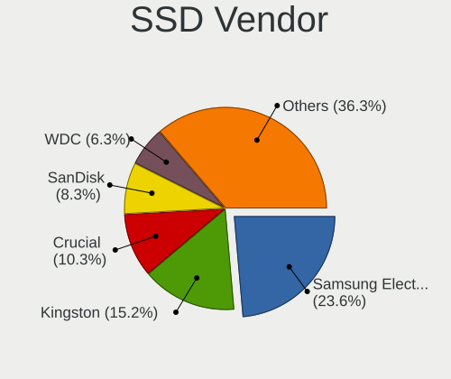

| Vendor              | Desktops | Drives | Percent |
|---------------------|----------|--------|---------|
| Samsung Electronics | 4099     | 6187   | 23.61%  |
| Kingston            | 2646     | 3583   | 15.24%  |
| Crucial             | 1780     | 2581   | 10.25%  |
| SanDisk             | 1439     | 2018   | 8.29%   |
| WDC                 | 1098     | 1408   | 6.32%   |
| A-DATA Technology   | 593      | 793    | 3.42%   |
| Intel               | 519      | 829    | 2.99%   |
| China               | 492      | 603    | 2.83%   |
| PNY                 | 347      | 451    | 2%      |
| OCZ                 | 294      | 373    | 1.69%   |
| SPCC                | 274      | 376    | 1.58%   |
| Intenso             | 214      | 334    | 1.23%   |
| Patriot             | 204      | 258    | 1.18%   |
| Micron Technology   | 204      | 290    | 1.18%   |
| Toshiba             | 197      | 271    | 1.13%   |
| Transcend           | 196      | 248    | 1.13%   |
| Corsair             | 160      | 220    | 0.92%   |
| GOODRAM             | 137      | 212    | 0.79%   |
| Team                | 133      | 190    | 0.77%   |
| SK hynix            | 124      | 159    | 0.71%   |
| Lexar               | 95       | 105    | 0.55%   |
| KingSpec            | 92       | 114    | 0.53%   |
| Apacer              | 91       | 111    | 0.52%   |
| LITEON              | 77       | 102    | 0.44%   |
| Gigabyte Technology | 75       | 122    | 0.43%   |
| Plextor             | 72       | 97     | 0.41%   |
| Hewlett-Packard     | 70       | 89     | 0.4%    |
| SABRENT             | 67       | 92     | 0.39%   |
| Seagate             | 66       | 83     | 0.38%   |
| Unknown             | 64       | 74     | 0.37%   |
| LITEONIT            | 61       | 67     | 0.35%   |
| ASMT                | 58       | 77     | 0.33%   |
| Mushkin             | 56       | 96     | 0.32%   |
| KingDian            | 54       | 64     | 0.31%   |
| Netac               | 46       | 63     | 0.26%   |
| Verbatim            | 43       | 56     | 0.25%   |
| Fanxiang            | 34       | 52     | 0.2%    |
| KIOXIA-EXCERIA      | 32       | 47     | 0.18%   |
| Unknown             | 30       | 40     | 0.17%   |
| Emtec               | 29       | 34     | 0.17%   |

Drive Kind
----------

HDD or SSD

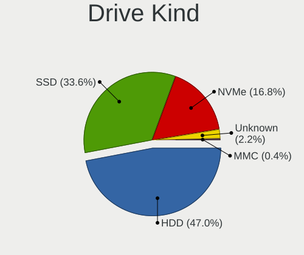

| Kind    | Desktops | Drives | Percent |
|---------|----------|--------|---------|
| HDD     | 20555    | 42852  | 47%     |
| SSD     | 14708    | 24237  | 33.63%  |
| NVMe    | 7327     | 11821  | 16.75%  |
| Unknown | 968      | 1569   | 2.21%   |
| MMC     | 178      | 226    | 0.41%   |

Drive Connector
---------------

SATA, SAS, NVMe, etc.

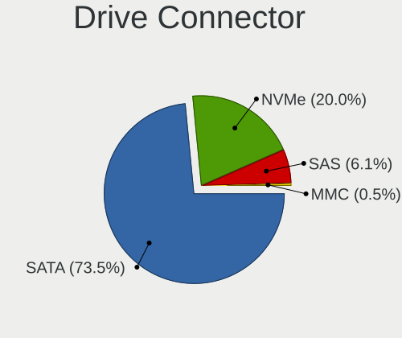

| Type | Desktops | Drives | Percent |
|------|----------|--------|---------|
| SATA | 26913    | 64718  | 73.46%  |
| NVMe | 7309     | 11734  | 19.95%  |
| SAS  | 2235     | 4027   | 6.1%    |
| MMC  | 178      | 226    | 0.49%   |

Drive Size
----------

Size of hard drive

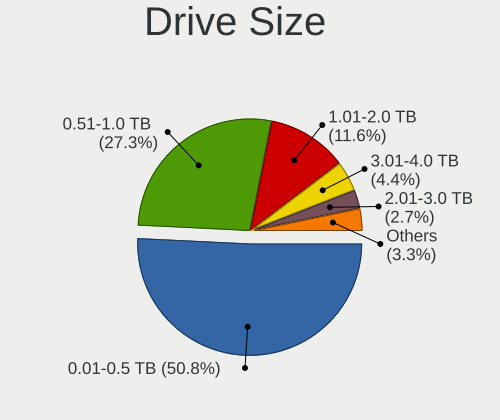

| Size in TB | Desktops | Drives | Percent |
|------------|----------|--------|---------|
| 0.01-0.5   | 19579    | 34783  | 50.77%  |
| 0.51-1.0   | 10541    | 16932  | 27.33%  |
| 1.01-2.0   | 4465     | 7371   | 11.58%  |
| 3.01-4.0   | 1692     | 3055   | 4.39%   |
| 2.01-3.0   | 1033     | 1902   | 2.68%   |
| 4.01-10.0  | 973      | 2263   | 2.52%   |
| 10.01-20.0 | 272      | 771    | 0.71%   |
| 20.01-50.0 | 8        | 10     | 0.02%   |
| 0          | 2        | 2      | 0.01%   |

Space Total
-----------

Amount of disk space available on the file system

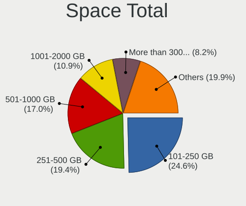

| Size in GB     | Desktops | Percent |
|----------------|----------|---------|
| 101-250        | 7947     | 24.61%  |
| 251-500        | 6264     | 19.4%   |
| 501-1000       | 5491     | 17.01%  |
| 1001-2000      | 3526     | 10.92%  |
| More than 3000 | 2640     | 8.18%   |
| 51-100         | 1828     | 5.66%   |
| 2001-3000      | 1515     | 4.69%   |
| 1-20           | 1420     | 4.4%    |
| 21-50          | 986      | 3.05%   |
| Unknown        | 671      | 2.08%   |

Space Used
----------

Amount of used disk space

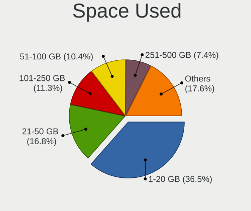

| Used GB        | Desktops | Percent |
|----------------|----------|---------|
| 1-20           | 12277    | 36.53%  |
| 21-50          | 5641     | 16.79%  |
| 101-250        | 3809     | 11.33%  |
| 51-100         | 3495     | 10.4%   |
| 251-500        | 2473     | 7.36%   |
| 501-1000       | 2215     | 6.59%   |
| 1001-2000      | 1463     | 4.35%   |
| More than 3000 | 986      | 2.93%   |
| Unknown        | 671      | 2%      |
| 2001-3000      | 572      | 1.7%    |
| 0              | 4        | 0.01%   |

Malfunc. Drives
---------------

Drive models with a malfunction

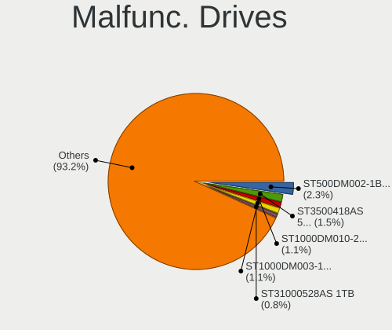

| Model                                 | Desktops | Drives | Percent |
|---------------------------------------|----------|--------|---------|
| Seagate ST500DM002-1BD142 500GB       | 47       | 50     | 2.28%   |
| Seagate ST3500418AS 500GB             | 31       | 41     | 1.51%   |
| Seagate ST1000DM010-2EP102 1TB        | 22       | 27     | 1.07%   |
| Seagate ST1000DM003-1CH162 1TB        | 22       | 25     | 1.07%   |
| Seagate ST31000528AS 1TB              | 17       | 19     | 0.83%   |
| Kingston SV300S37A120G 120GB SSD      | 17       | 18     | 0.83%   |
| Kingston SA400S37240G 240GB SSD       | 16       | 20     | 0.78%   |
| WDC WD5000AAKX-001CA0 500GB           | 13       | 16     | 0.63%   |
| WDC WD40EFRX-68WT0N0 4TB              | 13       | 17     | 0.63%   |
| WDC WD10EARS-00Y5B1 1TB               | 13       | 18     | 0.63%   |
| WDC WDS240G2G0A-00JH30 240GB SSD      | 12       | 13     | 0.58%   |
| Toshiba DT01ACA100 1TB                | 12       | 14     | 0.58%   |
| Seagate ST2000DM001-1CH164 2TB        | 12       | 12     | 0.58%   |
| Samsung Electronics HD501LJ 500GB     | 12       | 14     | 0.58%   |
| Seagate ST1000DM003-9YN162 1TB        | 11       | 11     | 0.53%   |
| Samsung Electronics SSD 870 EVO 1TB   | 11       | 13     | 0.53%   |
| WDC WD5000AADS-00S9B0 500GB           | 10       | 10     | 0.49%   |
| WDC WD20EARS-00MVWB0 2TB              | 10       | 10     | 0.49%   |
| WDC WD10EZEX-60ZF5A0 1TB              | 10       | 11     | 0.49%   |
| Toshiba DT01ACA050 500GB              | 10       | 13     | 0.49%   |
| Seagate ST2000DM008-2FR102 2TB        | 10       | 11     | 0.49%   |
| Seagate ST1000LM024 HN-M101MBB 1TB    | 10       | 11     | 0.49%   |
| Samsung Electronics SSD 870 EVO 500GB | 10       | 10     | 0.49%   |
| Hitachi HDS721010CLA332 1TB           | 10       | 12     | 0.49%   |
| WDC WD5000AAKX-00ERMA0 500GB          | 9        | 11     | 0.44%   |
| WDC WD30EFRX-68EUZN0 3TB              | 9        | 12     | 0.44%   |
| WDC WD10EADS-00M2B0 1TB               | 9        | 9      | 0.44%   |
| Seagate ST9500325AS 500GB             | 9        | 9      | 0.44%   |
| Seagate ST3250410AS 250GB             | 9        | 9      | 0.44%   |
| Seagate ST3250318AS 250GB             | 9        | 9      | 0.44%   |
| Seagate ST3250310AS 250GB             | 9        | 9      | 0.44%   |
| Seagate ST31000524AS 1TB              | 9        | 9      | 0.44%   |
| Seagate ST2000DM001-9YN164 2TB        | 9        | 10     | 0.44%   |
| Intel SSDSC2BB800G7 800GB             | 9        | 22     | 0.44%   |
| WDC WD5000AAKX-22ERMA0 500GB          | 8        | 11     | 0.39%   |
| WDC WD20EZRZ-00Z5HB0 2TB              | 8        | 9      | 0.39%   |
| WDC WD10EZEX-00BN5A0 1TB              | 8        | 8      | 0.39%   |
| Toshiba MQ01ABD100 1TB                | 8        | 11     | 0.39%   |
| Seagate ST500LM021-1KJ152 500GB       | 8        | 10     | 0.39%   |
| Seagate ST31500341AS 1TB              | 8        | 12     | 0.39%   |

Malfunc. Drive Vendor
---------------------

Vendors of faulty drives

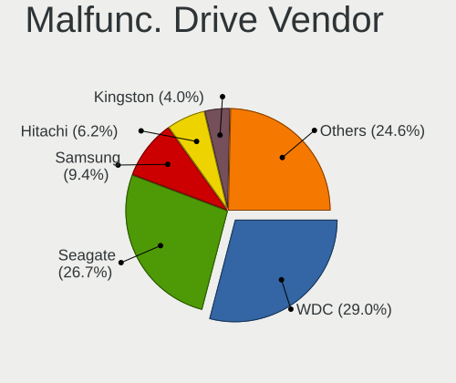

| Vendor                | Desktops | Drives | Percent |
|-----------------------|----------|--------|---------|
| WDC                   | 574      | 708    | 29.05%  |
| Seagate               | 527      | 689    | 26.67%  |
| Samsung Electronics   | 186      | 216    | 9.41%   |
| Hitachi               | 122      | 144    | 6.17%   |
| Kingston              | 80       | 98     | 4.05%   |
| Toshiba               | 71       | 83     | 3.59%   |
| Intel                 | 63       | 98     | 3.19%   |
| Crucial               | 46       | 53     | 2.33%   |
| SanDisk               | 38       | 46     | 1.92%   |
| HGST                  | 29       | 36     | 1.47%   |
| A-DATA Technology     | 29       | 35     | 1.47%   |
| Maxtor                | 27       | 37     | 1.37%   |
| SK hynix              | 13       | 16     | 0.66%   |
| OCZ                   | 13       | 14     | 0.66%   |
| Micron Technology     | 13       | 26     | 0.66%   |
| Corsair               | 13       | 14     | 0.66%   |
| China                 | 10       | 10     | 0.51%   |
| Patriot               | 7        | 7      | 0.35%   |
| Hewlett-Packard       | 6        | 6      | 0.3%    |
| XPG                   | 5        | 5      | 0.25%   |
| Unknown               | 5        | 7      | 0.25%   |
| LITEONIT              | 5        | 5      | 0.25%   |
| LDLC                  | 5        | 6      | 0.25%   |
| Fujitsu               | 5        | 5      | 0.25%   |
| Transcend             | 4        | 4      | 0.2%    |
| SPCC                  | 4        | 4      | 0.2%    |
| Mushkin               | 4        | 4      | 0.2%    |
| Intenso               | 4        | 5      | 0.2%    |
| ASMT                  | 4        | 4      | 0.2%    |
| Realtek Semiconductor | 3        | 3      | 0.15%   |
| KingSpec              | 3        | 3      | 0.15%   |
| Unknown               | 3        | 3      | 0.15%   |
| YS                    | 2        | 2      | 0.1%    |
| WD MediaMax           | 2        | 2      | 0.1%    |
| PNY                   | 2        | 2      | 0.1%    |
| Plextor               | 2        | 2      | 0.1%    |
| Neo                   | 2        | 5      | 0.1%    |
| Gigabyte Technology   | 2        | 2      | 0.1%    |
| Apple                 | 2        | 2      | 0.1%    |
| Apacer                | 2        | 2      | 0.1%    |

Malfunc. HDD Vendor
-------------------

Vendors of faulty HDD drives

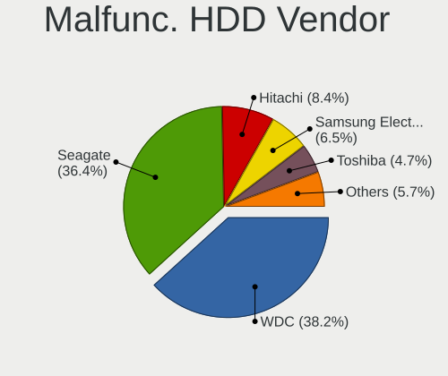

| Vendor              | Desktops | Drives | Percent |
|---------------------|----------|--------|---------|
| WDC                 | 553      | 684    | 38.24%  |
| Seagate             | 527      | 689    | 36.45%  |
| Hitachi             | 122      | 144    | 8.44%   |
| Samsung Electronics | 94       | 111    | 6.5%    |
| Toshiba             | 68       | 80     | 4.7%    |
| HGST                | 29       | 36     | 2.01%   |
| Maxtor              | 27       | 37     | 1.87%   |
| Unknown             | 5        | 7      | 0.35%   |
| Fujitsu             | 5        | 5      | 0.35%   |
| Hewlett-Packard     | 3        | 3      | 0.21%   |
| ASMT                | 3        | 3      | 0.21%   |
| WD MediaMax         | 2        | 2      | 0.14%   |
| Apple               | 2        | 2      | 0.14%   |
| USB3.0              | 1        | 1      | 0.07%   |
| MaxDigital          | 1        | 1      | 0.07%   |
| JMicron Technology  | 1        | 1      | 0.07%   |
| HPE                 | 1        | 1      | 0.07%   |
| HGST HTS            | 1        | 1      | 0.07%   |
| ExcelStor           | 1        | 1      | 0.07%   |

Malfunc. Drive Kind
-------------------

Kinds of faulty drives

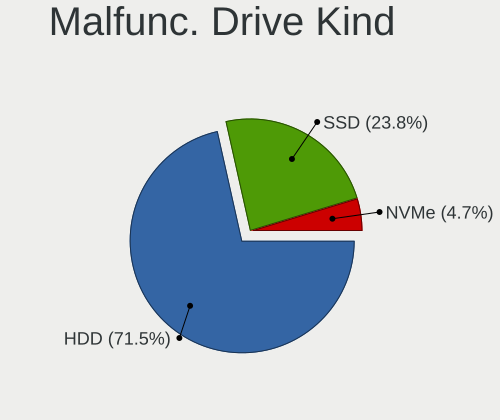

| Kind | Desktops | Drives | Percent |
|------|----------|--------|---------|
| HDD  | 1322     | 1809   | 71.5%   |
| SSD  | 440      | 549    | 23.8%   |
| NVMe | 87       | 97     | 4.71%   |

Failed Drives
-------------

Failed drive models

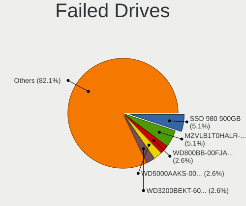

| Model                                      | Desktops | Drives | Percent |
|--------------------------------------------|----------|--------|---------|
| Samsung Electronics SSD 980 500GB          | 2        | 2      | 5.13%   |
| Samsung Electronics MZVLB1T0HALR-00000 1TB | 2        | 4      | 5.13%   |
| WDC WD800BB-00FJA0 80GB                    | 1        | 1      | 2.56%   |
| WDC WD5000AAKS-00UU3A0 500GB               | 1        | 1      | 2.56%   |
| WDC WD3200BEKT-60PVMT0 320GB               | 1        | 1      | 2.56%   |
| WDC WD3200AAJS-22VWA0 320GB                | 1        | 1      | 2.56%   |
| WDC WD20PURZ-85GU6Y0 2TB                   | 1        | 1      | 2.56%   |
| WDC WD1500HLFS-01G6U0 150GB                | 1        | 1      | 2.56%   |
| WDC WD10EAVS-00D7B1 1TB                    | 1        | 1      | 2.56%   |
| Unknown 00000  16GB                        | 1        | 1      | 2.56%   |
| Toshiba NVMe SSD Drive 256GB               | 1        | 1      | 2.56%   |
| Toshiba DT01ACA200 2TB                     | 1        | 1      | 2.56%   |
| Toshiba DT01ACA100 1TB                     | 1        | 1      | 2.56%   |
| SK hynix BC501 NVMe 256GB                  | 1        | 1      | 2.56%   |
| Seagate ST3500630AS 500GB                  | 1        | 1      | 2.56%   |
| Seagate ST3500418AS 500GB                  | 1        | 1      | 2.56%   |
| Seagate ST32000542AS 2TB                   | 1        | 1      | 2.56%   |
| Seagate ST31000528AS 1TB                   | 1        | 1      | 2.56%   |
| Seagate ST31000520AS 1TB                   | 1        | 1      | 2.56%   |
| Seagate ST31000340NS 1TB                   | 1        | 1      | 2.56%   |
| Seagate ST2000DM001-1CH164 2TB             | 1        | 1      | 2.56%   |
| Seagate ST14000NM0018-2H4101 14TB          | 1        | 1      | 2.56%   |
| Samsung Electronics SSD 960 EVO 250GB      | 1        | 1      | 2.56%   |
| Samsung Electronics HD161GJ 160GB          | 1        | 1      | 2.56%   |
| Samsung Electronics HD160JJ 160GB          | 1        | 1      | 2.56%   |
| Samsung Electronics HD103SJ 1TB            | 1        | 1      | 2.56%   |
| PNY CS1030 500GB SSD                       | 1        | 1      | 2.56%   |
| Mushkin MKNSSDCR120GB-7                    | 1        | 1      | 2.56%   |
| Maxtor STM380211AS 80GB                    | 1        | 1      | 2.56%   |
| KIOXIA KXG60ZNV256G 256GB                  | 1        | 1      | 2.56%   |
| Intel SSDSC2BB480G7 480GB                  | 1        | 4      | 2.56%   |
| Intel SSDPEKKW256G7 256GB                  | 1        | 1      | 2.56%   |
| Hitachi HUS724040ALE640 4TB                | 1        | 1      | 2.56%   |
| HGST HUS724040ALA640 4TB                   | 1        | 1      | 2.56%   |
| Hewlett-Packard EF0450FARMV 450GB          | 1        | 4      | 2.56%   |
| Crucial CT500P2SSD8 500GB                  | 1        | 1      | 2.56%   |
| Apple HDD HTS541010A9E662 1TB              | 1        | 1      | 2.56%   |

Failed Drive Vendor
-------------------

Failed drive vendors

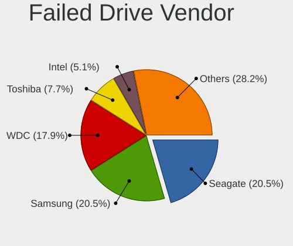

| Vendor              | Desktops | Drives | Percent |
|---------------------|----------|--------|---------|
| Seagate             | 8        | 8      | 20.51%  |
| Samsung Electronics | 8        | 10     | 20.51%  |
| WDC                 | 7        | 7      | 17.95%  |
| Toshiba             | 3        | 3      | 7.69%   |
| Intel               | 2        | 5      | 5.13%   |
| Unknown             | 1        | 1      | 2.56%   |
| SK hynix            | 1        | 1      | 2.56%   |
| PNY                 | 1        | 1      | 2.56%   |
| Mushkin             | 1        | 1      | 2.56%   |
| Maxtor              | 1        | 1      | 2.56%   |
| KIOXIA              | 1        | 1      | 2.56%   |
| Hitachi             | 1        | 1      | 2.56%   |
| HGST                | 1        | 1      | 2.56%   |
| Hewlett-Packard     | 1        | 4      | 2.56%   |
| Crucial             | 1        | 1      | 2.56%   |
| Apple               | 1        | 1      | 2.56%   |

Drive Status
------------

Number of failed and malfunc. drives

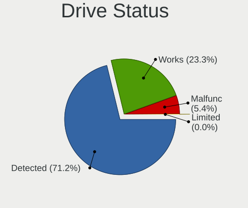

| Status   | Desktops | Drives | Percent |
|----------|----------|--------|---------|
| Detected | 23096    | 60698  | 71.2%   |
| Works    | 7545     | 17504  | 23.26%  |
| Malfunc  | 1755     | 2455   | 5.41%   |
| Failed   | 39       | 47     | 0.12%   |
| Limited  | 1        | 1      | 0.003%  |

Storage controller
------------------

Storage Vendor
--------------

Storage controller vendors

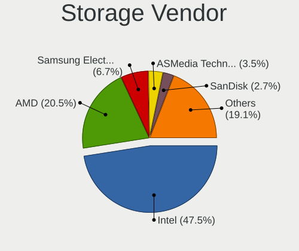

| Vendor                           | Desktops | Percent |
|----------------------------------|----------|---------|
| Intel                            | 20315    | 47.52%  |
| AMD                              | 8780     | 20.54%  |
| Samsung Electronics              | 2854     | 6.68%   |
| ASMedia Technology               | 1505     | 3.52%   |
| SanDisk                          | 1134     | 2.65%   |
| Marvell Technology Group         | 1097     | 2.57%   |
| JMicron Technology               | 1086     | 2.54%   |
| Nvidia                           | 938      | 2.19%   |
| Phison Electronics               | 801      | 1.87%   |
| Kingston Technology Company      | 673      | 1.57%   |
| Micron/Crucial Technology        | 546      | 1.28%   |
| Silicon Motion                   | 396      | 0.93%   |
| ADATA Technology                 | 245      | 0.57%   |
| SK hynix                         | 243      | 0.57%   |
| MAXIO Technology (Hangzhou)      | 225      | 0.53%   |
| VIA Technologies                 | 212      | 0.5%    |
| Realtek Semiconductor            | 209      | 0.49%   |
| Broadcom / LSI                   | 191      | 0.45%   |
| LSI Logic / Symbios Logic        | 174      | 0.41%   |
| Micron Technology                | 137      | 0.32%   |
| Silicon Image                    | 126      | 0.29%   |
| Toshiba America Info Systems     | 103      | 0.24%   |
| KIOXIA                           | 98       | 0.23%   |
| Shenzhen Longsys Electronics     | 97       | 0.23%   |
| Adaptec                          | 89       | 0.21%   |
| Seagate Technology               | 70       | 0.16%   |
| Integrated Technology Express    | 34       | 0.08%   |
| INNOGRIT                         | 34       | 0.08%   |
| Hewlett-Packard                  | 30       | 0.07%   |
| Lite-On Technology               | 29       | 0.07%   |
| Silicon Integrated Systems [SiS] | 27       | 0.06%   |
| Yangtze Memory Technologies      | 21       | 0.05%   |
| HighPoint Technologies           | 19       | 0.04%   |
| Biwin Storage Technology         | 19       | 0.04%   |
| Solid State Storage Technology   | 17       | 0.04%   |
| Hosin Global Electronics         | 17       | 0.04%   |
| Solidigm                         | 16       | 0.04%   |
| Transcend                        | 11       | 0.03%   |
| OCZ Technology Group             | 11       | 0.03%   |
| Netac Technology                 | 10       | 0.02%   |

Storage Model
-------------

Storage controller models

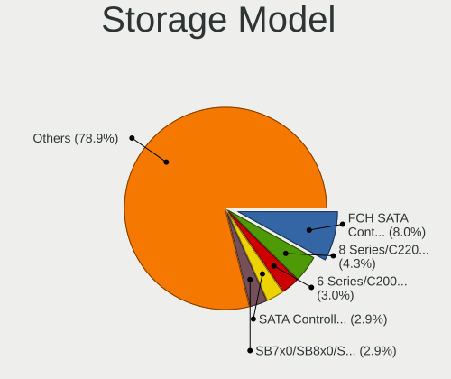

| Model                                                                                   | Desktops | Percent |
|-----------------------------------------------------------------------------------------|----------|---------|
| AMD FCH SATA Controller [AHCI mode]                                                     | 4364     | 8.05%   |
| Intel 8 Series/C220 Series Chipset Family 6-port SATA Controller 1 [AHCI mode]          | 2350     | 4.33%   |
| Intel 6 Series/C200 Series Chipset Family 6 port Desktop SATA AHCI Controller           | 1622     | 2.99%   |
| Intel SATA Controller [RAID mode]                                                       | 1569     | 2.89%   |
| AMD SB7x0/SB8x0/SB9x0 IDE Controller                                                    | 1558     | 2.87%   |
| AMD 400 Series Chipset SATA Controller                                                  | 1544     | 2.85%   |
| Intel Q170/Q150/B150/H170/H110/Z170/CM236 Chipset SATA Controller [AHCI Mode]           | 1502     | 2.77%   |
| Samsung NVMe SSD Controller SM981/PM981/PM983                                           | 1448     | 2.67%   |
| ASMedia ASM1061/ASM1062 Serial ATA Controller                                           | 1358     | 2.5%    |
| Intel 200 Series PCH SATA controller [AHCI mode]                                        | 1351     | 2.49%   |
| Intel NM10/ICH7 Family SATA Controller [IDE mode]                                       | 1326     | 2.45%   |
| Intel 7 Series/C210 Series Chipset Family 6-port SATA Controller [AHCI mode]            | 1322     | 2.44%   |
| AMD SB7x0/SB8x0/SB9x0 SATA Controller [AHCI mode]                                       | 1189     | 2.19%   |
| AMD SB7x0/SB8x0/SB9x0 SATA Controller [IDE mode]                                        | 1095     | 2.02%   |
| Intel 82801G (ICH7 Family) IDE Controller                                               | 1017     | 1.88%   |
| Intel Cannon Lake PCH SATA AHCI Controller                                              | 993      | 1.83%   |
| AMD 500 Series Chipset SATA Controller                                                  | 941      | 1.74%   |
| Intel 6 Series/C200 Series Chipset Family Desktop SATA Controller (IDE mode, ports 4-5) | 742      | 1.37%   |
| Intel 6 Series/C200 Series Chipset Family Desktop SATA Controller (IDE mode, ports 0-3) | 739      | 1.36%   |
| JMicron JMB363 SATA/IDE Controller                                                      | 591      | 1.09%   |
| Samsung NVMe SSD Controller PM9A1/PM9A3/980PRO                                          | 550      | 1.01%   |
| AMD 600 Series Chipset SATA Controller                                                  | 543      | 1%      |
| Intel 9 Series Chipset Family SATA Controller [AHCI Mode]                               | 529      | 0.98%   |
| Intel Alder Lake-S PCH SATA Controller [AHCI Mode]                                      | 502      | 0.93%   |
| AMD A320 Chipset SATA Controller [AHCI mode]                                            | 476      | 0.88%   |
| Nvidia MCP61 SATA Controller                                                            | 470      | 0.87%   |
| Intel 500 Series Chipset Family SATA AHCI Controller                                    | 423      | 0.78%   |
| Intel 82801I (ICH9 Family) 2 port SATA Controller [IDE mode]                            | 414      | 0.76%   |
| AMD 300 Series Chipset SATA Controller                                                  | 397      | 0.73%   |
| Intel 82801JI (ICH10 Family) SATA AHCI Controller                                       | 394      | 0.73%   |
| Intel 82801JI (ICH10 Family) 4 port SATA IDE Controller #1                              | 385      | 0.71%   |
| Nvidia MCP61 IDE                                                                        | 384      | 0.71%   |
| Intel C610/X99 series chipset 6-Port SATA Controller [AHCI mode]                        | 384      | 0.71%   |
| Intel Raptor Lake SATA AHCI Controller                                                  | 379      | 0.7%    |
| Intel 82801JI (ICH10 Family) 2 port SATA IDE Controller #2                              | 366      | 0.67%   |
| Intel 5 Series/3400 Series Chipset 4 port SATA IDE Controller                           | 365      | 0.67%   |
| Samsung NVMe SSD Controller SM961/PM961/SM963                                           | 349      | 0.64%   |
| Intel 5 Series/3400 Series Chipset 2 port SATA IDE Controller                           | 349      | 0.64%   |
| Intel C610/X99 series chipset sSATA Controller [AHCI mode]                              | 348      | 0.64%   |
| Phison E12 NVMe Controller                                                              | 336      | 0.62%   |

Storage Kind
------------

Kind of storage controller (IDE, SATA, NVMe, SAS, ...)

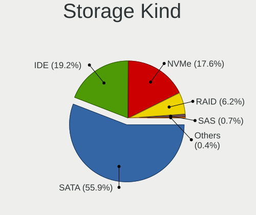

| Kind | Desktops | Percent |
|------|----------|---------|
| SATA | 23606    | 55.87%  |
| IDE  | 8121     | 19.22%  |
| NVMe | 7425     | 17.57%  |
| RAID | 2616     | 6.19%   |
| SAS  | 305      | 0.72%   |
| SCSI | 177      | 0.42%   |

Processor
---------

CPU Vendor
----------

Processor vendors

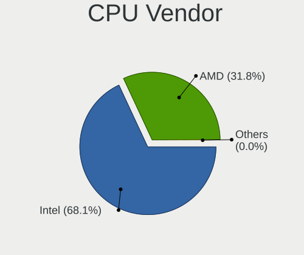

| Vendor        | Desktops | Percent |
|---------------|----------|---------|
| Intel         | 20690    | 68.07%  |
| AMD           | 9679     | 31.84%  |
| sifive,u74-mc | 8        | 0.03%   |
| CentaurHauls  | 8        | 0.03%   |
| ARM           | 4        | 0.01%   |
| Unknown       | 3        | 0.01%   |
| thead,c906    | 1        | 0.003%  |
| IBM/S390      | 1        | 0.003%  |
| eswin,eic770x | 1        | 0.003%  |

CPU Model
---------

Processor models

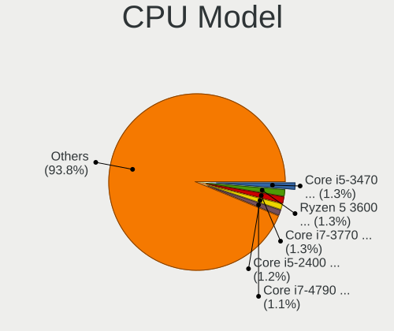

| Model                                       | Desktops | Percent |
|---------------------------------------------|----------|---------|
| Intel Core i5-3470 CPU @ 3.20GHz            | 403      | 1.32%   |
| AMD Ryzen 5 3600 6-Core Processor           | 403      | 1.32%   |
| Intel Core i7-3770 CPU @ 3.40GHz            | 397      | 1.3%    |
| Intel Core i5-2400 CPU @ 3.10GHz            | 355      | 1.16%   |
| Intel Core i7-4790 CPU @ 3.60GHz            | 337      | 1.1%    |
| Intel Core 2 Duo CPU E8400 @ 3.00GHz        | 316      | 1.03%   |
| Intel Core i7-2600 CPU @ 3.40GHz            | 305      | 1%      |
| AMD Ryzen 7 3700X 8-Core Processor          | 282      | 0.92%   |
| AMD FX-8350 Eight-Core Processor            | 263      | 0.86%   |
| AMD Ryzen 5 2600 Six-Core Processor         | 257      | 0.84%   |
| Intel Core i7-6700 CPU @ 3.40GHz            | 253      | 0.83%   |
| Intel Core i3-2120 CPU @ 3.30GHz            | 249      | 0.81%   |
| Intel Core i5-4460 CPU @ 3.20GHz            | 242      | 0.79%   |
| AMD FX-6300 Six-Core Processor              | 242      | 0.79%   |
| Intel Core i5-6500 CPU @ 3.20GHz            | 231      | 0.76%   |
| Intel Core i5-4590 CPU @ 3.30GHz            | 227      | 0.74%   |
| Intel Core i5-4570 CPU @ 3.20GHz            | 222      | 0.73%   |
| Intel Core i7-4770 CPU @ 3.40GHz            | 220      | 0.72%   |
| Intel Core i7-6700K CPU @ 4.00GHz           | 217      | 0.71%   |
| Intel Core i7-4790K CPU @ 4.00GHz           | 211      | 0.69%   |
| Intel Core 2 Quad CPU Q6600 @ 2.40GHz       | 211      | 0.69%   |
| AMD Ryzen 7 2700X Eight-Core Processor      | 203      | 0.66%   |
| Intel Core i7-8700 CPU @ 3.20GHz            | 201      | 0.66%   |
| AMD Ryzen 9 3900X 12-Core Processor         | 195      | 0.64%   |
| Intel Core i3-3220 CPU @ 3.30GHz            | 192      | 0.63%   |
| Intel Core 2 Duo CPU E7500 @ 2.93GHz        | 187      | 0.61%   |
| Intel Core i5-8400 CPU @ 2.80GHz            | 179      | 0.59%   |
| AMD Ryzen 5 5600G with Radeon Graphics      | 174      | 0.57%   |
| AMD Ryzen 5 1600 Six-Core Processor         | 170      | 0.56%   |
| AMD Ryzen 5 5600X 6-Core Processor          | 169      | 0.55%   |
| Intel Core i3-2100 CPU @ 3.10GHz            | 168      | 0.55%   |
| AMD Ryzen 7 5800X 8-Core Processor          | 164      | 0.54%   |
| Intel Core i7-7700 CPU @ 3.60GHz            | 159      | 0.52%   |
| Intel Core i5 CPU 650 @ 3.20GHz             | 157      | 0.51%   |
| AMD Ryzen 9 5900X 12-Core Processor         | 156      | 0.51%   |
| Intel Core i5-3570 CPU @ 3.40GHz            | 155      | 0.51%   |
| AMD Ryzen 3 2200G with Radeon Vega Graphics | 155      | 0.51%   |
| AMD Ryzen 5 3400G with Radeon Vega Graphics | 154      | 0.5%    |
| Intel Core i7-8700K CPU @ 3.70GHz           | 151      | 0.49%   |
| Intel Core i5-7400 CPU @ 3.00GHz            | 149      | 0.49%   |

CPU Model Family
----------------

Processor model prefix

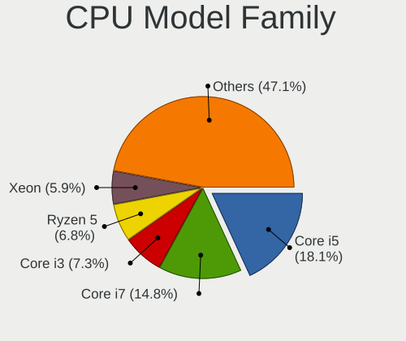

| Model                   | Desktops | Percent |
|-------------------------|----------|---------|
| Intel Core i5           | 5529     | 18.13%  |
| Intel Core i7           | 4521     | 14.82%  |
| Intel Core i3           | 2237     | 7.33%   |
| AMD Ryzen 5             | 2059     | 6.75%   |
| Intel Xeon              | 1802     | 5.91%   |
| AMD Ryzen 7             | 1494     | 4.9%    |
| Other                   | 1252     | 4.1%    |
| AMD FX                  | 1137     | 3.73%   |
| Intel Core 2 Duo        | 1087     | 3.56%   |
| AMD Ryzen 9             | 856      | 2.81%   |
| Intel Celeron           | 852      | 2.79%   |
| Intel Core 2 Quad       | 724      | 2.37%   |
| Intel Pentium           | 711      | 2.33%   |
| Intel Pentium Dual-Core | 564      | 1.85%   |
| AMD Ryzen 3             | 433      | 1.42%   |
| AMD Phenom II X4        | 416      | 1.36%   |
| Intel Core i9           | 411      | 1.35%   |
| AMD Athlon II X2        | 357      | 1.17%   |
| AMD Athlon 64 X2        | 319      | 1.05%   |
| AMD A10                 | 295      | 0.97%   |
| AMD A8                  | 282      | 0.92%   |
| Intel Core 2            | 237      | 0.78%   |
| AMD Ryzen Threadripper  | 221      | 0.72%   |
| Intel Pentium 4         | 193      | 0.63%   |
| AMD Athlon II X4        | 190      | 0.62%   |
| AMD A4                  | 183      | 0.6%    |
| Intel Atom              | 182      | 0.6%    |
| Intel Pentium Dual      | 173      | 0.57%   |
| AMD Phenom II X6        | 172      | 0.56%   |
| AMD A6                  | 166      | 0.54%   |
| AMD Athlon              | 138      | 0.45%   |
| Intel Pentium D         | 130      | 0.43%   |
| AMD Phenom              | 107      | 0.35%   |
| AMD Ryzen 5 PRO         | 74       | 0.24%   |
| AMD Sempron             | 73       | 0.24%   |
| AMD Phenom II X2        | 73       | 0.24%   |
| Intel Pentium Gold      | 70       | 0.23%   |
| AMD Athlon II X3        | 67       | 0.22%   |
| AMD E                   | 54       | 0.18%   |
| AMD Athlon X4           | 51       | 0.17%   |

CPU Cores
---------

Number of processor cores

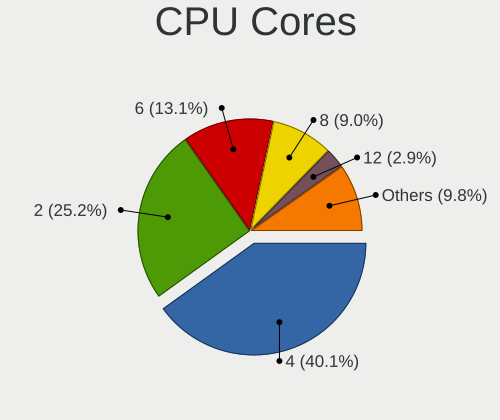

| Number  | Desktops | Percent |
|---------|----------|---------|
| 4       | 12236    | 40.06%  |
| 2       | 7691     | 25.18%  |
| 6       | 4003     | 13.11%  |
| 8       | 2736     | 8.96%   |
| 12      | 886      | 2.9%    |
| 1       | 746      | 2.44%   |
| 16      | 653      | 2.14%   |
| 3       | 481      | 1.57%   |
| 10      | 309      | 1.01%   |
| 24      | 283      | 0.93%   |
| 14      | 140      | 0.46%   |
| 20      | 126      | 0.41%   |
| 28      | 68       | 0.22%   |
| 32      | 60       | 0.2%    |
| 18      | 37       | 0.12%   |
| 64      | 33       | 0.11%   |
| 36      | 12       | 0.04%   |
| Unknown | 10       | 0.03%   |
| 5       | 8        | 0.03%   |
| 44      | 6        | 0.02%   |
| 40      | 5        | 0.02%   |
| 22      | 4        | 0.01%   |
| 48      | 3        | 0.01%   |
| 192     | 2        | 0.01%   |
| 128     | 2        | 0.01%   |
| 15      | 1        | 0.003%  |
| 7       | 1        | 0.003%  |

CPU Sockets
-----------

Number of sockets

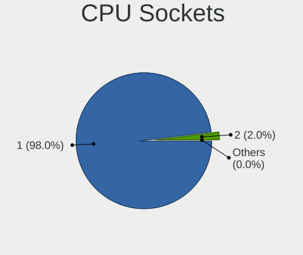

| Number  | Desktops | Percent |
|---------|----------|---------|
| 1       | 29777    | 97.97%  |
| 2       | 601      | 1.98%   |
| Unknown | 8        | 0.03%   |
| 4       | 4        | 0.01%   |
| 20      | 3        | 0.01%   |
| 14      | 1        | 0.003%  |
| 6       | 1        | 0.003%  |

CPU Threads
-----------

Threads per core (Hyper-Threading)

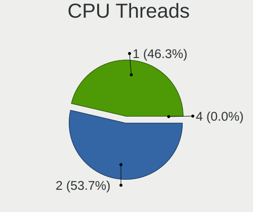

| Number  | Desktops | Percent |
|---------|----------|---------|
| 2       | 16356    | 53.66%  |
| 1       | 14114    | 46.3%   |
| Unknown | 10       | 0.03%   |
| 6       | 1        | 0.003%  |
| 4       | 1        | 0.003%  |

CPU Op-Modes
------------

CPU Operation Modes (32-bit, 64-bit)

| Op mode        | Desktops | Percent |
|----------------|----------|---------|
| 32-bit, 64-bit | 30215    | 99.38%  |
| Unknown        | 114      | 0.37%   |
| 32-bit         | 75       | 0.25%   |

CPU Microcode
-------------

Microcode number

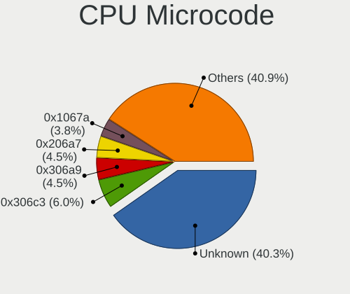

| Number     | Desktops | Percent |
|------------|----------|---------|
| Unknown    | 12736    | 40.28%  |
| 0x306c3    | 1904     | 6.02%   |
| 0x306a9    | 1428     | 4.52%   |
| 0x206a7    | 1421     | 4.49%   |
| 0x1067a    | 1194     | 3.78%   |
| 0x506e3    | 828      | 2.62%   |
| 0x06000852 | 626      | 1.98%   |
| 0x906ea    | 612      | 1.94%   |
| 0x906e9    | 590      | 1.87%   |
| 0x010000c8 | 543      | 1.72%   |
| 0x08701021 | 420      | 1.33%   |
| 0x0800820d | 375      | 1.19%   |
| 0x06001119 | 350      | 1.11%   |
| 0x6fb      | 337      | 1.07%   |
| 0x08701013 | 318      | 1.01%   |
| 0x106e5    | 257      | 0.81%   |
| 0x6fd      | 250      | 0.79%   |
| 0x906ed    | 233      | 0.74%   |
| 0x10676    | 231      | 0.73%   |
| 0x08108109 | 229      | 0.72%   |
| 0x306f2    | 210      | 0.66%   |
| 0x106a5    | 201      | 0.64%   |
| 0xa0655    | 190      | 0.6%    |
| 0x010000db | 190      | 0.6%    |
| 0x0600063e | 175      | 0.55%   |
| 0x206d7    | 173      | 0.55%   |
| 0x20655    | 169      | 0.53%   |
| 0xa0653    | 160      | 0.51%   |
| 0x206c2    | 147      | 0.46%   |
| 0x0810100b | 145      | 0.46%   |
| 0x08001138 | 144      | 0.46%   |
| 0x06003106 | 143      | 0.45%   |
| 0x50654    | 142      | 0.45%   |
| 0x406f1    | 141      | 0.45%   |
| 0x08001137 | 140      | 0.44%   |
| 0x010000dc | 140      | 0.44%   |
| 0x20652    | 139      | 0.44%   |
| 0x906eb    | 137      | 0.43%   |
| 0x6f6      | 131      | 0.41%   |
| 0x306e4    | 122      | 0.39%   |

CPU Microarch
-------------

Microarchitecture

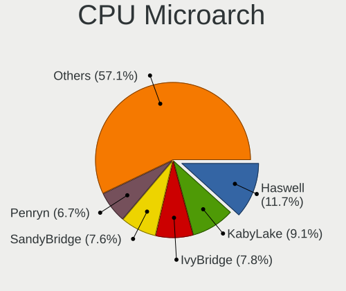

| Name             | Desktops | Percent |
|------------------|----------|---------|
| Haswell          | 3560     | 11.68%  |
| KabyLake         | 2781     | 9.12%   |
| IvyBridge        | 2391     | 7.84%   |
| SandyBridge      | 2310     | 7.58%   |
| Penryn           | 2040     | 6.69%   |
| Skylake          | 1742     | 5.71%   |
| K10              | 1542     | 5.06%   |
| Unknown          | 1507     | 4.94%   |
| Zen 2            | 1471     | 4.82%   |
| Piledriver       | 1401     | 4.59%   |
| Zen 3            | 1135     | 3.72%   |
| Zen+             | 1113     | 3.65%   |
| Core             | 1075     | 3.53%   |
| Zen              | 930      | 3.05%   |
| CometLake        | 700      | 2.3%    |
| Nehalem          | 678      | 2.22%   |
| Westmere         | 662      | 2.17%   |
| K8 Hammer        | 467      | 1.53%   |
| Alderlake Hybrid | 418      | 1.37%   |
| NetBurst         | 372      | 1.22%   |
| Broadwell        | 296      | 0.97%   |
| Silvermont       | 291      | 0.95%   |
| Steamroller      | 240      | 0.79%   |
| Bulldozer        | 229      | 0.75%   |
| Excavator        | 173      | 0.57%   |
| Icelake          | 139      | 0.46%   |
| Goldmont plus    | 135      | 0.44%   |
| K10 Llano        | 111      | 0.36%   |
| Bonnell          | 99       | 0.32%   |
| Jaguar           | 96       | 0.31%   |
| Goldmont         | 93       | 0.31%   |
| Bobcat           | 87       | 0.29%   |
| Puma             | 49       | 0.16%   |
| Gracemont        | 47       | 0.15%   |
| Tremont          | 36       | 0.12%   |
| TigerLake        | 34       | 0.11%   |
| Lunarlake Hybrid | 22       | 0.07%   |
| K6               | 6        | 0.02%   |
| P6               | 4        | 0.01%   |
| Sapphire Rapids  | 3        | 0.01%   |

Graphics
--------

GPU Vendor
----------

Vendors of graphics cards

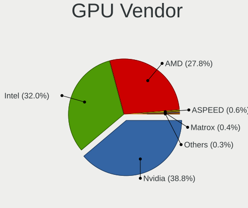

| Vendor                                       | Desktops | Percent |
|----------------------------------------------|----------|---------|
| Nvidia                                       | 12791    | 38.85%  |
| Intel                                        | 10536    | 32%     |
| AMD                                          | 9159     | 27.82%  |
| ASPEED Technology                            | 192      | 0.58%   |
| Matrox Electronics Systems                   | 138      | 0.42%   |
| VIA Technologies                             | 34       | 0.1%    |
| XGI Technology (eXtreme Graphics Innovation) | 24       | 0.07%   |
| ATI Technologies                             | 21       | 0.06%   |
| Silicon Integrated Systems [SiS]             | 20       | 0.06%   |
| Zhaoxin                                      | 3        | 0.01%   |
| Silicon Motion                               | 3        | 0.01%   |
| S3 Graphics                                  | 2        | 0.01%   |
| Red Hat                                      | 1        | 0.003%  |
| Racore Computer Products                     | 1        | 0.003%  |
| NVidia / SGS Thomson (Joint Venture)         | 1        | 0.003%  |
| Moore Threads Technology                     | 1        | 0.003%  |
| Glenfly Tech                                 | 1        | 0.003%  |

GPU Model
---------

Graphics card models

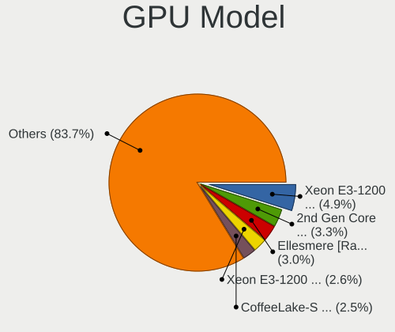

| Model                                                                       | Desktops | Percent |
|-----------------------------------------------------------------------------|----------|---------|
| Intel Xeon E3-1200 v3/4th Gen Core Processor Integrated Graphics Controller | 1664     | 4.9%    |
| Intel 2nd Generation Core Processor Family Integrated Graphics Controller   | 1128     | 3.32%   |
| AMD Ellesmere [Radeon RX 470/480/570/570X/580/580X/590]                     | 1018     | 3%      |
| Intel Xeon E3-1200 v2/3rd Gen Core processor Graphics Controller            | 877      | 2.58%   |
| Intel CoffeeLake-S GT2 [UHD Graphics 630]                                   | 836      | 2.46%   |
| Nvidia GK208B [GeForce GT 710]                                              | 759      | 2.23%   |
| Intel Skylake-S GT2 [HD Graphics 530]                                       | 752      | 2.21%   |
| Intel 4 Series Chipset Integrated Graphics Controller                       | 679      | 2%      |
| Nvidia GP107 [GeForce GTX 1050 Ti]                                          | 570      | 1.68%   |
| Nvidia GT218 [GeForce 210]                                                  | 493      | 1.45%   |
| Intel Kaby Lake-S GT2 [HD Graphics 630]                                     | 450      | 1.32%   |
| AMD Cedar [Radeon HD 5000/6000/7350/8350 Series]                            | 410      | 1.21%   |
| Nvidia GP106 [GeForce GTX 1060 6GB]                                         | 382      | 1.12%   |
| Intel IvyBridge GT2 [HD Graphics 4000]                                      | 361      | 1.06%   |
| Nvidia GP108 [GeForce GT 1030]                                              | 357      | 1.05%   |
| Intel CometLake-S GT2 [UHD Graphics 630]                                    | 355      | 1.05%   |
| Intel 4th Generation Core Processor Family Integrated Graphics Controller   | 354      | 1.04%   |
| AMD Picasso/Raven 2 [Radeon Vega Series / Radeon Vega Mobile Series]        | 322      | 0.95%   |
| AMD Raven Ridge [Radeon Vega Series / Radeon Vega Mobile Series]            | 302      | 0.89%   |
| Intel 82G33/G31 Express Integrated Graphics Controller                      | 296      | 0.87%   |
| AMD Caicos [Radeon HD 6450/7450/8450 / R5 230 OEM]                          | 294      | 0.87%   |
| AMD Cezanne [Radeon Vega Series / Radeon Vega Mobile Series]                | 290      | 0.85%   |
| Nvidia GK208B [GeForce GT 730]                                              | 288      | 0.85%   |
| AMD Raphael                                                                 | 286      | 0.84%   |
| Nvidia GF119 [GeForce GT 610]                                               | 270      | 0.79%   |
| AMD RS780L [Radeon 3000]                                                    | 257      | 0.76%   |
| Nvidia GP104 [GeForce GTX 1070]                                             | 255      | 0.75%   |
| Nvidia GM107 [GeForce GTX 750 Ti]                                           | 252      | 0.74%   |
| Nvidia GM206 [GeForce GTX 960]                                              | 248      | 0.73%   |
| Nvidia GM204 [GeForce GTX 970]                                              | 246      | 0.72%   |
| Nvidia GP104 [GeForce GTX 1080]                                             | 229      | 0.67%   |
| AMD Navi 10 [Radeon RX 5600 OEM/5600 XT / 5700/5700 XT]                     | 227      | 0.67%   |
| Nvidia GP102 [GeForce GTX 1080 Ti]                                          | 217      | 0.64%   |
| Intel Core Processor Integrated Graphics Controller                         | 217      | 0.64%   |
| Nvidia GA106 [GeForce RTX 3060 Lite Hash Rate]                              | 205      | 0.6%    |
| Intel Alder Lake-S GT1 [UHD Graphics 770]                                   | 203      | 0.6%    |
| Nvidia GP106 [GeForce GTX 1060 3GB]                                         | 194      | 0.57%   |
| Nvidia GP107 [GeForce GTX 1050]                                             | 192      | 0.57%   |
| ASPEED Technology ASPEED Graphics Family                                    | 192      | 0.57%   |
| AMD Lexa PRO [Radeon 540/540X/550/550X / RX 540X/550/550X]                  | 192      | 0.57%   |

GPU Combo
---------

Combinations of graphics cards

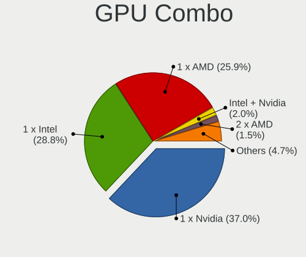

| Name                                      | Desktops | Percent |
|-------------------------------------------|----------|---------|
| 1 x Nvidia                                | 11410    | 37.02%  |
| 1 x Intel                                 | 8893     | 28.85%  |
| 1 x AMD                                   | 7985     | 25.9%   |
| Intel + Nvidia                            | 614      | 1.99%   |
| 2 x AMD                                   | 465      | 1.51%   |
| AMD + Nvidia                              | 432      | 1.4%    |
| Intel + AMD                               | 239      | 0.78%   |
| 2 x Nvidia                                | 207      | 0.67%   |
| 1 x ASPEED                                | 134      | 0.43%   |
| 1 x Matrox                                | 114      | 0.37%   |
| Other                                     | 56       | 0.18%   |
| Nvidia + ASPEED                           | 44       | 0.14%   |
| 1 x VIA                                   | 33       | 0.11%   |
| 1 x XGI                                   | 22       | 0.07%   |
| Intel + 2 x Nvidia                        | 22       | 0.07%   |
| Nvidia + Matrox                           | 20       | 0.06%   |
| 1 x SiS                                   | 19       | 0.06%   |
| Intel + AMD + 1 x Nvidia                  | 11       | 0.04%   |
| 3 x AMD                                   | 9        | 0.03%   |
| 2 x Intel                                 | 9        | 0.03%   |
| Intel + 2 x AMD                           | 9        | 0.03%   |
| AMD + ASPEED                              | 9        | 0.03%   |
| 2 x AMD + 1 x Nvidia                      | 7        | 0.02%   |
| AMD + 2 x Nvidia                          | 7        | 0.02%   |
| 1 x Intel + 3 x Nvidia                    | 6        | 0.02%   |
| 3 x Nvidia                                | 5        | 0.02%   |
| 1 x Zhaoxin                               | 3        | 0.01%   |
| AMD + Matrox                              | 3        | 0.01%   |
| 1 x Silicon Motion                        | 2        | 0.01%   |
| 1 x Intel + 4 x Nvidia                    | 2        | 0.01%   |
| 1 x Intel + 3 x AMD                       | 2        | 0.01%   |
| Intel + ASPEED                            | 2        | 0.01%   |
| 6 x Nvidia                                | 1        | 0.003%  |
| 5 x AMD                                   | 1        | 0.003%  |
| 4 x Nvidia                                | 1        | 0.003%  |
| 4 x AMD                                   | 1        | 0.003%  |
| 3 x Nvidia + 1 x Racore Computer Products | 1        | 0.003%  |
| 3 x Nvidia + 1 x ASPEED                   | 1        | 0.003%  |
| 3 x AMD + 1 x Nvidia                      | 1        | 0.003%  |
| 2 x Nvidia + 1 x ASPEED                   | 1        | 0.003%  |

GPU Driver
----------

Free vs proprietary

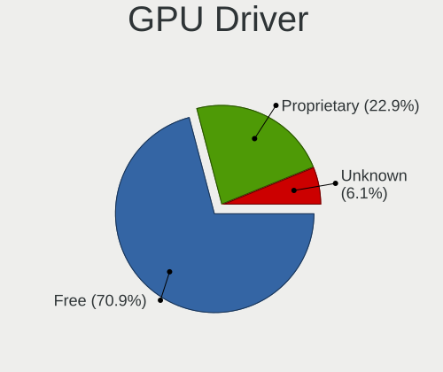

| Driver      | Desktops | Percent |
|-------------|----------|---------|
| Free        | 22015    | 70.92%  |
| Proprietary | 7119     | 22.93%  |
| Unknown     | 1906     | 6.14%   |

GPU Memory
----------

Total video memory

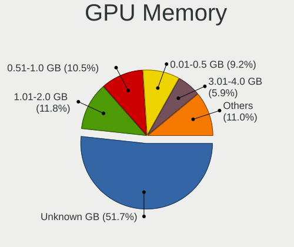

| Size in GB     | Desktops | Percent |
|----------------|----------|---------|
| Unknown        | 16312    | 51.71%  |
| 1.01-2.0       | 3720     | 11.79%  |
| 0.51-1.0       | 3299     | 10.46%  |
| 0.01-0.5       | 2889     | 9.16%   |
| 3.01-4.0       | 1860     | 5.9%    |
| 7.01-8.0       | 1653     | 5.24%   |
| 8.01-16.0      | 666      | 2.11%   |
| 5.01-6.0       | 649      | 2.06%   |
| 2.01-3.0       | 300      | 0.95%   |
| 16.01-24.0     | 155      | 0.49%   |
| 4.01-5.0       | 26       | 0.08%   |
| 32.01-64.0     | 9        | 0.03%   |
| 24.01-32.0     | 9        | 0.03%   |
| More than 64.0 | 1        | 0.003%  |

Monitor
-------

Monitor Vendor
--------------

Monitor vendors

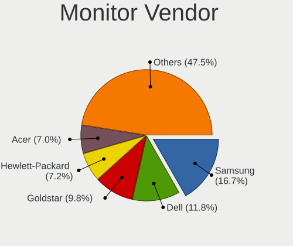

| Vendor               | Desktops | Percent |
|----------------------|----------|---------|
| Samsung Electronics  | 5198     | 16.72%  |
| Dell                 | 3661     | 11.77%  |
| Goldstar             | 3055     | 9.83%   |
| Hewlett-Packard      | 2242     | 7.21%   |
| Acer                 | 2175     | 6.99%   |
| AOC                  | 1415     | 4.55%   |
| Ancor Communications | 1386     | 4.46%   |
| Philips              | 1282     | 4.12%   |
| BenQ                 | 1273     | 4.09%   |
| ViewSonic            | 644      | 2.07%   |
| Iiyama               | 618      | 1.99%   |
| Unknown              | 538      | 1.73%   |
| LG Electronics       | 509      | 1.64%   |
| Lenovo               | 506      | 1.63%   |
| Sony                 | 437      | 1.41%   |
| ASUSTek Computer     | 435      | 1.4%    |
| Fujitsu Siemens      | 241      | 0.78%   |
| NEC Computers        | 221      | 0.71%   |
| Eizo                 | 209      | 0.67%   |
| Vizio                | 203      | 0.65%   |
| MSI                  | 200      | 0.64%   |
| HannStar             | 174      | 0.56%   |
| Medion               | 167      | 0.54%   |
| Sceptre Tech         | 162      | 0.52%   |
| Panasonic            | 137      | 0.44%   |
| Toshiba              | 126      | 0.41%   |
| Sharp                | 87       | 0.28%   |
| Gigabyte Technology  | 83       | 0.27%   |
| Vestel Elektronik    | 81       | 0.26%   |
| HKC                  | 78       | 0.25%   |
| RTK                  | 76       | 0.24%   |
| Belinea              | 76       | 0.24%   |
| Unknown              | 76       | 0.24%   |
| Hitachi              | 74       | 0.24%   |
| Idek Iiyama          | 73       | 0.23%   |
| Insignia             | 71       | 0.23%   |
| Apple                | 67       | 0.22%   |
| Packard Bell         | 63       | 0.2%    |
| Gateway              | 56       | 0.18%   |
| HPN                  | 55       | 0.18%   |

Monitor Model
-------------

Monitor models

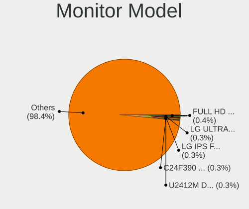

| Model                                                                 | Desktops | Percent |
|-----------------------------------------------------------------------|----------|---------|
| Goldstar FULL HD GSM5B55 1920x1080 480x270mm 21.7-inch                | 135      | 0.41%   |
| Goldstar LG ULTRAWIDE GSM59F1 2560x1080 670x280mm 28.6-inch           | 109      | 0.33%   |
| Goldstar LG IPS FULLHD GSM5AB8 1920x1080 480x270mm 21.7-inch          | 98       | 0.29%   |
| Samsung Electronics C24F390 SAM0D2C 1920x1080 521x293mm 23.5-inch     | 96       | 0.29%   |
| Dell U2412M DELA07A 1920x1200 518x324mm 24.1-inch                     | 96       | 0.29%   |
| Samsung Electronics C27F390 SAM0D32 1920x1080 598x336mm 27.0-inch     | 93       | 0.28%   |
| Vestel Elektronik 40UHD_LCD_TV VES3700 3840x2160 880x500mm 39.8-inch  | 81       | 0.24%   |
| Samsung Electronics S24F350 SAM0D20 1920x1080 521x293mm 23.5-inch     | 77       | 0.23%   |
| Unknown                                                               | 76       | 0.23%   |
| Unknown LCD Monitor FFFF 2288x1287 2550x2550mm 142.0-inch             | 68       | 0.2%    |
| Unknown LCD Monitor SAMSUNG 1920x1080                                 | 67       | 0.2%    |
| Goldstar Ultra HD GSM5B09 3840x2160 600x340mm 27.2-inch               | 65       | 0.2%    |
| AOC 24G2W1G3 AOC2402 1920x1080 527x296mm 23.8-inch                    | 64       | 0.19%   |
| BenQ GL2460 BNQ78CE 1920x1080 531x299mm 24.0-inch                     | 63       | 0.19%   |
| Ancor Communications ASUS VS247 ACI249A 1920x1080 521x293mm 23.5-inch | 63       | 0.19%   |
| AOC 27G2G4 AOC2702 1920x1080 598x336mm 27.0-inch                      | 62       | 0.19%   |
| Goldstar HDR 4K GSM7706 3840x2160 600x340mm 27.2-inch                 | 57       | 0.17%   |
| Samsung Electronics U28E590 SAM0C4D 3840x2160 607x345mm 27.5-inch     | 55       | 0.17%   |
| Goldstar W1943 GSM4BAD 1360x768 406x229mm 18.4-inch                   | 55       | 0.17%   |
| Philips PHL 243V5 PHLC0D1 1920x1080 521x293mm 23.5-inch               | 53       | 0.16%   |
| Goldstar ULTRAWIDE GSM76F9 2560x1080 531x298mm 24.0-inch              | 50       | 0.15%   |
| Philips PHL 223V5 PHLC0CF 1920x1080 477x268mm 21.5-inch               | 49       | 0.15%   |
| Goldstar Ultra HD GSM5B08 3840x2160 600x340mm 27.2-inch               | 47       | 0.14%   |
| AOC 24B1W1 AOC2401 1920x1080 527x296mm 23.8-inch                      | 47       | 0.14%   |
| BenQ GL2450H BNQ78A7 1920x1080 531x298mm 24.0-inch                    | 46       | 0.14%   |
| Hewlett-Packard w1907 HWP26A2 1440x900 408x255mm 18.9-inch            | 45       | 0.14%   |
| Ancor Communications ASUS VS228 ACI22FD 1920x1080 476x268mm 21.5-inch | 45       | 0.14%   |
| Samsung Electronics C32F391 SAM0D34 1920x1080 698x393mm 31.5-inch     | 44       | 0.13%   |
| Samsung Electronics LCD Monitor SyncMaster 1920x1080                  | 42       | 0.13%   |
| Philips PHL 243V7 PHLC155 1920x1080 527x296mm 23.8-inch               | 42       | 0.13%   |
| Ancor Communications VE228 ACI22FA 1920x1080 477x268mm 21.5-inch      | 42       | 0.13%   |
| Ancor Communications VE247 ACI2493 1920x1080 530x300mm 24.0-inch      | 41       | 0.12%   |
| Panasonic TV MEIA296 1920x1080 698x392mm 31.5-inch                    | 40       | 0.12%   |
| AOC 2270W AOC2270 1920x1080 477x268mm 21.5-inch                       | 40       | 0.12%   |
| Samsung Electronics S22F350 SAM0D1A 1920x1080 477x268mm 21.5-inch     | 39       | 0.12%   |
| Samsung Electronics LCD Monitor SyncMaster 1680x1050                  | 38       | 0.11%   |
| Goldstar HD GSM5ACB 1366x768 410x230mm 18.5-inch                      | 38       | 0.11%   |
| Dell U2412M DELA07B 1920x1200 518x324mm 24.1-inch                     | 38       | 0.11%   |
| BenQ GW2480 BNQ78E7 1920x1080 527x296mm 23.8-inch                     | 38       | 0.11%   |
| AOC 1970W AOC1970 1366x768 410x230mm 18.5-inch                        | 38       | 0.11%   |

Monitor Resolution
------------------

Monitor screen resolution

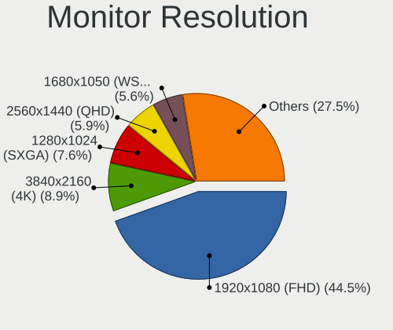

| Resolution         | Desktops | Percent |
|--------------------|----------|---------|
| 1920x1080 (FHD)    | 13596    | 44.53%  |
| 3840x2160 (4K)     | 2710     | 8.88%   |
| 1280x1024 (SXGA)   | 2311     | 7.57%   |
| 2560x1440 (QHD)    | 1801     | 5.9%    |
| 1680x1050 (WSXGA+) | 1709     | 5.6%    |
| 1366x768 (WXGA)    | 1184     | 3.88%   |
| 1440x900 (WXGA+)   | 1108     | 3.63%   |
| 1600x900 (HD+)     | 948      | 3.1%    |
| 1920x1200 (WUXGA)  | 862      | 2.82%   |
| Unknown            | 844      | 2.76%   |
| 1360x768           | 532      | 1.74%   |
| 3440x1440          | 424      | 1.39%   |
| 3840x1080          | 390      | 1.28%   |
| 2560x1080          | 388      | 1.27%   |
| 1024x768 (XGA)     | 264      | 0.86%   |
| 1920x540           | 238      | 0.78%   |
| 1600x1200          | 164      | 0.54%   |
| 1280x720 (HD)      | 99       | 0.32%   |
| 2288x1287          | 85       | 0.28%   |
| 2560x1600          | 73       | 0.24%   |
| 3840x1600          | 41       | 0.13%   |
| 1400x1050          | 41       | 0.13%   |
| 4480x1440          | 40       | 0.13%   |
| 3840x1200          | 35       | 0.11%   |
| 2048x1152          | 35       | 0.11%   |
| 1280x960           | 35       | 0.11%   |
| 5760x1080          | 33       | 0.11%   |
| 3200x1080          | 29       | 0.09%   |
| 5120x1440          | 28       | 0.09%   |
| 3600x1080          | 27       | 0.09%   |
| 5760x2160          | 25       | 0.08%   |
| 1280x768           | 17       | 0.06%   |
| 7680x2160          | 16       | 0.05%   |
| 4480x1080          | 16       | 0.05%   |
| 3360x1080          | 15       | 0.05%   |
| 3520x1080          | 13       | 0.04%   |
| 3286x1080          | 13       | 0.04%   |
| 2960x1050          | 11       | 0.04%   |
| 2560x1024          | 11       | 0.04%   |
| 1152x864           | 11       | 0.04%   |

Monitor Diagonal
----------------

Diagonal size in inches

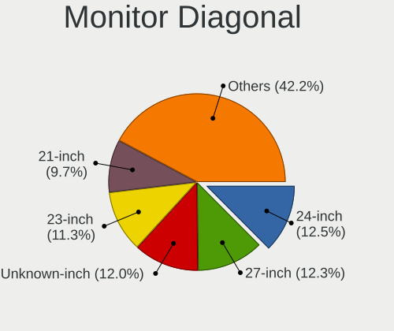

| Inches  | Desktops | Percent |
|---------|----------|---------|
| 24      | 3874     | 12.53%  |
| 27      | 3801     | 12.29%  |
| Unknown | 3709     | 11.99%  |
| 23      | 3500     | 11.32%  |
| 21      | 2989     | 9.67%   |
| 19      | 2220     | 7.18%   |
| 31      | 1340     | 4.33%   |
| 18      | 1221     | 3.95%   |
| 22      | 1162     | 3.76%   |
| 17      | 1106     | 3.58%   |
| 20      | 1077     | 3.48%   |
| 34      | 626      | 2.02%   |
| 15      | 461      | 1.49%   |
| 84      | 437      | 1.41%   |
| 32      | 361      | 1.17%   |
| 72      | 328      | 1.06%   |
| 40      | 295      | 0.95%   |
| 54      | 278      | 0.9%    |
| 25      | 216      | 0.7%    |
| 26      | 141      | 0.46%   |
| 28      | 116      | 0.38%   |
| 46      | 110      | 0.36%   |
| 48      | 108      | 0.35%   |
| 42      | 92       | 0.3%    |
| 65      | 88       | 0.28%   |
| 49      | 84       | 0.27%   |
| 52      | 82       | 0.27%   |
| 37      | 82       | 0.27%   |
| 63      | 78       | 0.25%   |
| 29      | 75       | 0.24%   |
| 142     | 68       | 0.22%   |
| 43      | 66       | 0.21%   |
| 16      | 64       | 0.21%   |
| 33      | 54       | 0.17%   |
| 14      | 50       | 0.16%   |
| 12      | 49       | 0.16%   |
| 39      | 48       | 0.16%   |
| 36      | 47       | 0.15%   |
| 74      | 40       | 0.13%   |
| 13      | 38       | 0.12%   |

Monitor Width
-------------

Physical width

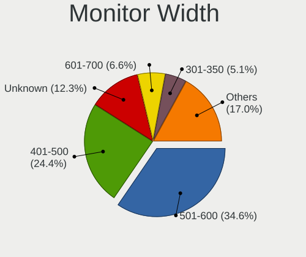

| Width in mm    | Desktops | Percent |
|----------------|----------|---------|
| 501-600        | 10409    | 34.56%  |
| 401-500        | 7361     | 24.44%  |
| Unknown        | 3709     | 12.32%  |
| 601-700        | 1982     | 6.58%   |
| 301-350        | 1527     | 5.07%   |
| 351-400        | 1333     | 4.43%   |
| 701-800        | 1080     | 3.59%   |
| 1001-1500      | 984      | 3.27%   |
| 1501-2000      | 858      | 2.85%   |
| 801-900        | 489      | 1.62%   |
| 901-1000       | 180      | 0.6%    |
| 201-300        | 125      | 0.42%   |
| More than 2000 | 71       | 0.24%   |
| 101-200        | 5        | 0.02%   |
| 1-100          | 2        | 0.01%   |

Aspect Ratio
------------

Proportional relationship between the width and the height

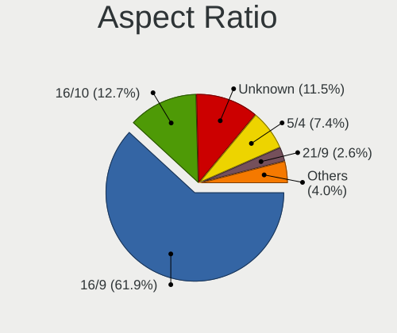

| Ratio   | Desktops | Percent |
|---------|----------|---------|
| 16/9    | 17855    | 61.86%  |
| 16/10   | 3677     | 12.74%  |
| Unknown | 3309     | 11.46%  |
| 5/4     | 2123     | 7.35%   |
| 21/9    | 750      | 2.6%    |
| 4/3     | 574      | 1.99%   |
| 32/9    | 172      | 0.6%    |
| 3/2     | 157      | 0.54%   |
| 6/5     | 116      | 0.4%    |
| 1.00    | 75       | 0.26%   |
| 1.96    | 23       | 0.08%   |
| 2.00    | 9        | 0.03%   |
| 0.56    | 9        | 0.03%   |
| 3.20    | 4        | 0.01%   |
| 0.89    | 3        | 0.01%   |
| 2.12    | 2        | 0.01%   |
| 11/10   | 2        | 0.01%   |
| 3.76    | 1        | 0.003%  |
| 3.40    | 1        | 0.003%  |
| 2.69    | 1        | 0.003%  |
| 2.24    | 1        | 0.003%  |
| 0.62    | 1        | 0.003%  |

Monitor Area
------------

Area in inch²

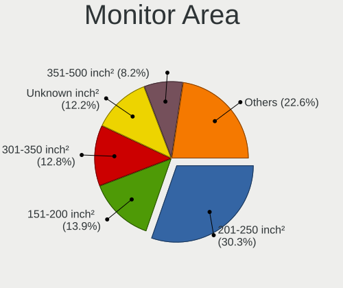

| Area in inch² | Desktops | Percent |
|----------------|----------|---------|
| 201-250        | 9209     | 30.31%  |
| 151-200        | 4218     | 13.88%  |
| 301-350        | 3889     | 12.8%   |
| Unknown        | 3709     | 12.21%  |
| 351-500        | 2489     | 8.19%   |
| 141-150        | 1980     | 6.52%   |
| More than 1000 | 1635     | 5.38%   |
| 251-300        | 1527     | 5.03%   |
| 501-1000       | 969      | 3.19%   |
| 101-110        | 402      | 1.32%   |
| 131-140        | 94       | 0.31%   |
| 111-120        | 83       | 0.27%   |
| 71-80          | 64       | 0.21%   |
| 81-90          | 36       | 0.12%   |
| 121-130        | 32       | 0.11%   |
| 91-100         | 23       | 0.08%   |
| 51-60          | 6        | 0.02%   |
| 41-50          | 6        | 0.02%   |
| 1-40           | 6        | 0.02%   |
| 61-70          | 4        | 0.01%   |

Pixel Density
-------------

Pixels per inch

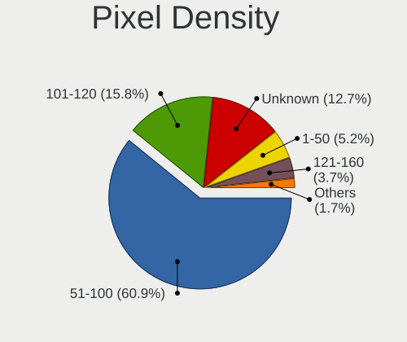

| Density       | Desktops | Percent |
|---------------|----------|---------|
| 51-100        | 17741    | 60.86%  |
| 101-120       | 4605     | 15.8%   |
| Unknown       | 3710     | 12.73%  |
| 1-50          | 1510     | 5.18%   |
| 121-160       | 1078     | 3.7%    |
| 161-240       | 499      | 1.71%   |
| More than 240 | 8        | 0.03%   |

Multiple Monitors
-----------------

Total monitors connected

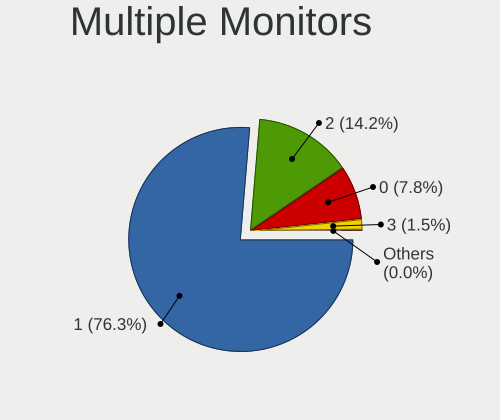

| Total | Desktops | Percent |
|-------|----------|---------|
| 1     | 23790    | 76.33%  |
| 2     | 4416     | 14.17%  |
| 0     | 2434     | 7.81%   |
| 3     | 469      | 1.5%    |
| 4     | 54       | 0.17%   |
| 6     | 3        | 0.01%   |
| 5     | 2        | 0.01%   |

Network
-------

Net Controller Vendor
---------------------

Controller vendors

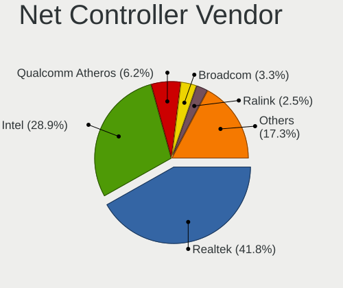

| Vendor                                | Desktops | Percent |
|---------------------------------------|----------|---------|
| Realtek Semiconductor                 | 18213    | 41.83%  |
| Intel                                 | 12584    | 28.9%   |
| Qualcomm Atheros                      | 2704     | 6.21%   |
| Broadcom                              | 1458     | 3.35%   |
| Ralink Technology                     | 1072     | 2.46%   |
| TP-Link                               | 898      | 2.06%   |
| Nvidia                                | 781      | 1.79%   |
| MediaTek                              | 613      | 1.41%   |
| Ralink                                | 519      | 1.19%   |
| Marvell Technology Group              | 339      | 0.78%   |
| Qualcomm Atheros Communications       | 292      | 0.67%   |
| NetGear                               | 287      | 0.66%   |
| Samsung Electronics                   | 264      | 0.61%   |
| Broadcom Limited                      | 251      | 0.58%   |
| Aquantia                              | 240      | 0.55%   |
| D-Link                                | 214      | 0.49%   |
| D-Link System                         | 210      | 0.48%   |
| ASUSTek Computer                      | 170      | 0.39%   |
| Microsoft                             | 154      | 0.35%   |
| ASIX Electronics                      | 140      | 0.32%   |
| Xiaomi                                | 137      | 0.31%   |
| Edimax Technology                     | 123      | 0.28%   |
| VIA Technologies                      | 99       | 0.23%   |
| Huawei Technologies                   | 99       | 0.23%   |
| Linksys                               | 95       | 0.22%   |
| Belkin Components                     | 93       | 0.21%   |
| IMC Networks                          | 76       | 0.17%   |
| DisplayLink                           | 55       | 0.13%   |
| AVM                                   | 53       | 0.12%   |
| Qualcomm Technologies                 | 52       | 0.12%   |
| Motorola PCS                          | 52       | 0.12%   |
| Mellanox Technologies                 | 52       | 0.12%   |
| Arduino SA                            | 48       | 0.11%   |
| OPPO Electronics                      | 37       | 0.08%   |
| Qualcomm                              | 35       | 0.08%   |
| Google                                | 35       | 0.08%   |
| 3Com                                  | 33       | 0.08%   |
| ZyDAS                                 | 31       | 0.07%   |
| Sitecom Europe                        | 28       | 0.06%   |
| 802.11g Adapter [Linksys WUSB54GC v3] | 28       | 0.06%   |

Net Controller Model
--------------------

Controller models

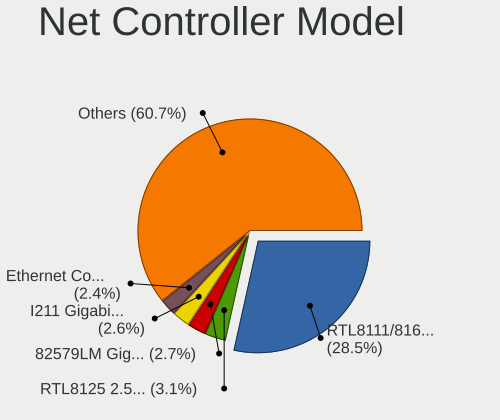

| Model                                                                  | Desktops | Percent |
|------------------------------------------------------------------------|----------|---------|
| Realtek RTL8111/8168/8211/8411 PCI Express Gigabit Ethernet Controller | 14059    | 28.48%  |
| Realtek RTL8125 2.5GbE Controller                                      | 1517     | 3.07%   |
| Intel 82579LM Gigabit Network Connection (Lewisville)                  | 1323     | 2.68%   |
| Intel I211 Gigabit Network Connection                                  | 1297     | 2.63%   |
| Intel Ethernet Connection (2) I219-V                                   | 1189     | 2.41%   |
| Intel Wi-Fi 6 AX200                                                    | 900      | 1.82%   |
| Intel Ethernet Connection I217-LM                                      | 765      | 1.55%   |
| Realtek RTL810xE PCI Express Fast Ethernet controller                  | 680      | 1.38%   |
| Intel Ethernet Controller I225-V                                       | 640      | 1.3%    |
| Intel 82579V Gigabit Network Connection                                | 604      | 1.22%   |
| Intel Ethernet Connection (7) I219-V                                   | 529      | 1.07%   |
| Ralink MT7601U Wireless Adapter                                        | 453      | 0.92%   |
| Intel Dual Band Wireless-AC 3168NGW [Stone Peak]                       | 437      | 0.89%   |
| Realtek RTL8188EUS 802.11n Wireless Network Adapter                    | 425      | 0.86%   |
| Intel Wi-Fi 6E(802.11ax) AX210/AX1675* 2x2 [Typhoon Peak]              | 425      | 0.86%   |
| Nvidia MCP61 Ethernet                                                  | 410      | 0.83%   |
| Realtek 802.11ac NIC                                                   | 392      | 0.79%   |
| Intel Ethernet Connection (2) I219-LM                                  | 391      | 0.79%   |
| Realtek RTL88x2bu [AC1200 Techkey]                                     | 388      | 0.79%   |
| Intel 82567LM-3 Gigabit Network Connection                             | 370      | 0.75%   |
| Intel Ethernet Connection (2) I218-V                                   | 358      | 0.73%   |
| Intel Ethernet Connection I217-V                                       | 355      | 0.72%   |
| Intel 82574L Gigabit Network Connection                                | 317      | 0.64%   |
| Intel I210 Gigabit Network Connection                                  | 311      | 0.63%   |
| Qualcomm Atheros AR9485 Wireless Network Adapter                       | 276      | 0.56%   |
| Realtek RTL8821CE 802.11ac PCIe Wireless Network Adapter               | 264      | 0.53%   |
| Realtek RTL-8100/8101L/8139 PCI Fast Ethernet Adapter                  | 259      | 0.52%   |
| Qualcomm Atheros Killer E220x Gigabit Ethernet Controller              | 252      | 0.51%   |
| Qualcomm Atheros AR9271 802.11n                                        | 244      | 0.49%   |
| Intel Wi-Fi 5(802.11ac) Wireless-AC 9x6x [Thunder Peak]                | 235      | 0.48%   |
| Intel Ethernet Controller I226-V                                       | 234      | 0.47%   |
| Realtek RTL8153 Gigabit Ethernet Adapter                               | 229      | 0.46%   |
| Intel Cannon Lake PCH CNVi WiFi                                        | 223      | 0.45%   |
| Broadcom BCM4360 802.11ac Dual Band Wireless Network Adapter           | 223      | 0.45%   |
| MediaTek MT7922 802.11ax PCI Express Wireless Network Adapter          | 209      | 0.42%   |
| Intel 700 Series Chipset CNVi WiFi                                     | 207      | 0.42%   |
| Qualcomm Atheros AR8151 v2.0 Gigabit Ethernet                          | 203      | 0.41%   |
| Intel Wireless 7260                                                    | 203      | 0.41%   |
| TP-Link TL-WN823N v2/v3 [Realtek RTL8192EU]                            | 202      | 0.41%   |
| Samsung Galaxy series, misc. (tethering mode)                          | 195      | 0.4%    |

Wireless Vendor
---------------

Wireless vendors

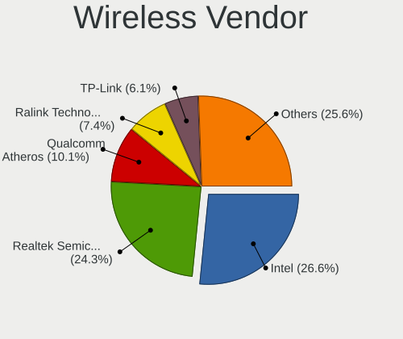

| Vendor                                | Desktops | Percent |
|---------------------------------------|----------|---------|
| Intel                                 | 3829     | 26.58%  |
| Realtek Semiconductor                 | 3497     | 24.27%  |
| Qualcomm Atheros                      | 1449     | 10.06%  |
| Ralink Technology                     | 1072     | 7.44%   |
| TP-Link                               | 874      | 6.07%   |
| Broadcom                              | 567      | 3.94%   |
| Ralink                                | 517      | 3.59%   |
| MediaTek                              | 505      | 3.51%   |
| Qualcomm Atheros Communications       | 292      | 2.03%   |
| NetGear                               | 285      | 1.98%   |
| D-Link                                | 210      | 1.46%   |
| ASUSTek Computer                      | 161      | 1.12%   |
| Microsoft                             | 152      | 1.06%   |
| D-Link System                         | 130      | 0.9%    |
| Edimax Technology                     | 123      | 0.85%   |
| Belkin Components                     | 90       | 0.62%   |
| Broadcom Limited                      | 85       | 0.59%   |
| Linksys                               | 84       | 0.58%   |
| IMC Networks                          | 76       | 0.53%   |
| AVM                                   | 53       | 0.37%   |
| ZyDAS                                 | 31       | 0.22%   |
| Sitecom Europe                        | 28       | 0.19%   |
| 802.11g Adapter [Linksys WUSB54GC v3] | 28       | 0.19%   |
| Gemtek                                | 27       | 0.19%   |
| ZyXEL Communications                  | 20       | 0.14%   |
| BUFFALO                               | 20       | 0.14%   |
| Micro Star International              | 18       | 0.12%   |
| Mercucys                              | 17       | 0.12%   |
| Wilocity                              | 15       | 0.1%    |
| Qualcomm Technologies                 | 15       | 0.1%    |
| Marvell Technology Group              | 14       | 0.1%    |
| Wacom                                 | 9        | 0.06%   |
| Realtek                               | 8        | 0.06%   |
| Texas Instruments                     | 7        | 0.05%   |
| Tenda                                 | 7        | 0.05%   |
| Guillemot                             | 7        | 0.05%   |
| Xiaomi                                | 6        | 0.04%   |
| PLANEX                                | 6        | 0.04%   |
| TRENDnet                              | 5        | 0.03%   |
| Sagem                                 | 5        | 0.03%   |

Wireless Model
--------------

Wireless models

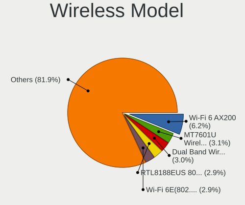

| Model                                                          | Desktops | Percent |
|----------------------------------------------------------------|----------|---------|
| Intel Wi-Fi 6 AX200                                            | 900      | 6.15%   |
| Ralink MT7601U Wireless Adapter                                | 453      | 3.1%    |
| Intel Dual Band Wireless-AC 3168NGW [Stone Peak]               | 437      | 2.99%   |
| Realtek RTL8188EUS 802.11n Wireless Network Adapter            | 425      | 2.91%   |
| Intel Wi-Fi 6E(802.11ax) AX210/AX1675* 2x2 [Typhoon Peak]      | 425      | 2.91%   |
| Realtek 802.11ac NIC                                           | 392      | 2.68%   |
| Realtek RTL88x2bu [AC1200 Techkey]                             | 388      | 2.65%   |
| Qualcomm Atheros AR9485 Wireless Network Adapter               | 276      | 1.89%   |
| Realtek RTL8821CE 802.11ac PCIe Wireless Network Adapter       | 264      | 1.81%   |
| Qualcomm Atheros AR9271 802.11n                                | 244      | 1.67%   |
| Intel Wi-Fi 5(802.11ac) Wireless-AC 9x6x [Thunder Peak]        | 235      | 1.61%   |
| Intel Cannon Lake PCH CNVi WiFi                                | 223      | 1.52%   |
| Broadcom BCM4360 802.11ac Dual Band Wireless Network Adapter   | 223      | 1.52%   |
| Intel 700 Series Chipset CNVi WiFi                             | 207      | 1.42%   |
| Intel Wireless 7260                                            | 203      | 1.39%   |
| TP-Link TL-WN823N v2/v3 [Realtek RTL8192EU]                    | 202      | 1.38%   |
| MediaTek MT7922 802.11ax PCI Express Wireless Network Adapter  | 194      | 1.33%   |
| Ralink RT5370 Wireless Adapter                                 | 184      | 1.26%   |
| Intel Wireless 7265                                            | 182      | 1.24%   |
| Intel Wireless 3165                                            | 175      | 1.2%    |
| Realtek RTL8188FTV 802.11b/g/n 1T1R 2.4G WLAN Adapter          | 168      | 1.15%   |
| Realtek RTL8192EE PCIe Wireless Network Adapter                | 159      | 1.09%   |
| Ralink RT2870/RT3070 Wireless Adapter                          | 159      | 1.09%   |
| Realtek RTL8188CUS 802.11n WLAN Adapter                        | 148      | 1.01%   |
| Realtek RTL8192CU 802.11n WLAN Adapter                         | 145      | 0.99%   |
| Realtek RTL8822BE 802.11a/b/g/n/ac WiFi adapter                | 137      | 0.94%   |
| Qualcomm Atheros QCA6174 802.11ac Wireless Network Adapter     | 134      | 0.92%   |
| Realtek RTL8192EU 802.11b/g/n WLAN Adapter                     | 132      | 0.9%    |
| Qualcomm Atheros AR93xx Wireless Network Adapter               | 131      | 0.9%    |
| Qualcomm Atheros AR9287 Wireless Network Adapter (PCI-Express) | 130      | 0.89%   |
| Qualcomm Atheros QCA9565 / AR9565 Wireless Network Adapter     | 128      | 0.88%   |
| Intel Wireless 8260                                            | 125      | 0.85%   |
| MediaTek MT7921K (RZ608) Wi-Fi 6E 80MHz                        | 115      | 0.79%   |
| Intel Comet Lake PCH CNVi WiFi                                 | 114      | 0.78%   |
| Intel Alder Lake-S PCH CNVi WiFi                               | 114      | 0.78%   |
| Realtek RTL8821AE 802.11ac PCIe Wireless Network Adapter       | 111      | 0.76%   |
| Qualcomm Atheros AR9227 Wireless Network Adapter               | 110      | 0.75%   |
| Qualcomm Atheros AR9462 Wireless Network Adapter               | 109      | 0.75%   |
| TP-Link TL-WN722N v2/v3 [Realtek RTL8188EUS]                   | 106      | 0.72%   |
| TP-Link AC600 wireless Realtek RTL8811AU [Archer T2U Nano]     | 102      | 0.7%    |

Ethernet Vendor
---------------

Ethernet vendors

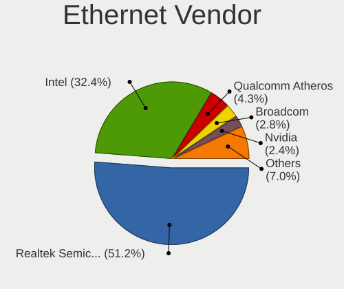

| Vendor                                 | Desktops | Percent |
|----------------------------------------|----------|---------|
| Realtek Semiconductor                  | 16843    | 51.22%  |
| Intel                                  | 10639    | 32.35%  |
| Qualcomm Atheros                       | 1399     | 4.25%   |
| Broadcom                               | 930      | 2.83%   |
| Nvidia                                 | 781      | 2.38%   |
| Marvell Technology Group               | 326      | 0.99%   |
| Samsung Electronics                    | 262      | 0.8%    |
| Aquantia                               | 240      | 0.73%   |
| Broadcom Limited                       | 166      | 0.5%    |
| ASIX Electronics                       | 140      | 0.43%   |
| Xiaomi                                 | 131      | 0.4%    |
| VIA Technologies                       | 96       | 0.29%   |
| MediaTek                               | 85       | 0.26%   |
| D-Link System                          | 80       | 0.24%   |
| Huawei Technologies                    | 76       | 0.23%   |
| DisplayLink                            | 55       | 0.17%   |
| Motorola PCS                           | 52       | 0.16%   |
| Mellanox Technologies                  | 42       | 0.13%   |
| Qualcomm Technologies                  | 37       | 0.11%   |
| OPPO Electronics                       | 37       | 0.11%   |
| Qualcomm                               | 33       | 0.1%    |
| 3Com                                   | 33       | 0.1%    |
| Google                                 | 32       | 0.1%    |
| TP-Link                                | 26       | 0.08%   |
| American Megatrends                    | 23       | 0.07%   |
| Sundance Technology Inc / IC Plus      | 19       | 0.06%   |
| Silicon Integrated Systems [SiS]       | 19       | 0.06%   |
| JMicron Technology                     | 18       | 0.05%   |
| Apple                                  | 18       | 0.05%   |
| Lenovo                                 | 13       | 0.04%   |
| OnePlus Technology (Shenzhen)          | 12       | 0.04%   |
| Linksys                                | 11       | 0.03%   |
| ICS Advent                             | 11       | 0.03%   |
| Tehuti Networks                        | 10       | 0.03%   |
| ADMtek                                 | 10       | 0.03%   |
| LG Electronics                         | 9        | 0.03%   |
| HMD Global                             | 9        | 0.03%   |
| ASUSTek Computer                       | 9        | 0.03%   |
| Sony Ericsson Mobile Communications AB | 8        | 0.02%   |
| Accton Technology                      | 8        | 0.02%   |

Ethernet Model
--------------

Ethernet models

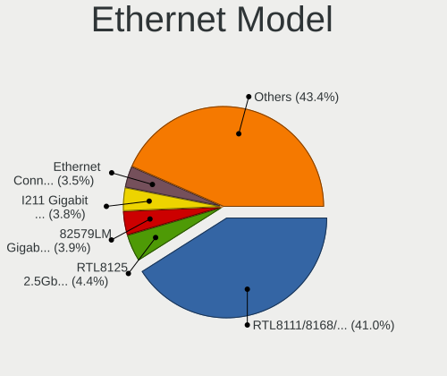

| Model                                                                          | Desktops | Percent |
|--------------------------------------------------------------------------------|----------|---------|
| Realtek RTL8111/8168/8211/8411 PCI Express Gigabit Ethernet Controller         | 14059    | 41.03%  |
| Realtek RTL8125 2.5GbE Controller                                              | 1517     | 4.43%   |
| Intel 82579LM Gigabit Network Connection (Lewisville)                          | 1323     | 3.86%   |
| Intel I211 Gigabit Network Connection                                          | 1297     | 3.78%   |
| Intel Ethernet Connection (2) I219-V                                           | 1189     | 3.47%   |
| Intel Ethernet Connection I217-LM                                              | 765      | 2.23%   |
| Realtek RTL810xE PCI Express Fast Ethernet controller                          | 680      | 1.98%   |
| Intel Ethernet Controller I225-V                                               | 640      | 1.87%   |
| Intel 82579V Gigabit Network Connection                                        | 604      | 1.76%   |
| Intel Ethernet Connection (7) I219-V                                           | 529      | 1.54%   |
| Nvidia MCP61 Ethernet                                                          | 410      | 1.2%    |
| Intel Ethernet Connection (2) I219-LM                                          | 391      | 1.14%   |
| Intel 82567LM-3 Gigabit Network Connection                                     | 370      | 1.08%   |
| Intel Ethernet Connection (2) I218-V                                           | 358      | 1.04%   |
| Intel Ethernet Connection I217-V                                               | 355      | 1.04%   |
| Intel 82574L Gigabit Network Connection                                        | 317      | 0.93%   |
| Intel I210 Gigabit Network Connection                                          | 311      | 0.91%   |
| Realtek RTL-8100/8101L/8139 PCI Fast Ethernet Adapter                          | 259      | 0.76%   |
| Qualcomm Atheros Killer E220x Gigabit Ethernet Controller                      | 252      | 0.74%   |
| Intel Ethernet Controller I226-V                                               | 234      | 0.68%   |
| Realtek RTL8153 Gigabit Ethernet Adapter                                       | 229      | 0.67%   |
| Qualcomm Atheros AR8151 v2.0 Gigabit Ethernet                                  | 203      | 0.59%   |
| Samsung Galaxy series, misc. (tethering mode)                                  | 195      | 0.57%   |
| Intel Ethernet Connection (7) I219-LM                                          | 190      | 0.55%   |
| Qualcomm Atheros AR8161 Gigabit Ethernet                                       | 181      | 0.53%   |
| Marvell Group 88E8056 PCI-E Gigabit Ethernet Controller                        | 179      | 0.52%   |
| Intel 82566DM-2 Gigabit Network Connection                                     | 177      | 0.52%   |
| Realtek RTL8169 PCI Gigabit Ethernet Controller                                | 157      | 0.46%   |
| Broadcom NetXtreme BCM5761 Gigabit Ethernet PCIe                               | 151      | 0.44%   |
| Qualcomm Atheros AR8121/AR8113/AR8114 Gigabit or Fast Ethernet                 | 137      | 0.4%    |
| Intel 82578DM Gigabit Network Connection                                       | 136      | 0.4%    |
| Aquantia AQtion AQC107 NBase-T/IEEE 802.3an Ethernet Controller [Atlantic 10G] | 135      | 0.39%   |
| Intel Ethernet Connection (5) I219-LM                                          | 131      | 0.38%   |
| Intel I350 Gigabit Network Connection                                          | 120      | 0.35%   |
| Qualcomm Atheros Killer E2400 Gigabit Ethernet Controller                      | 114      | 0.33%   |
| Intel Ethernet Connection (14) I219-V                                          | 113      | 0.33%   |
| Broadcom NetXtreme BCM5754 Gigabit Ethernet PCI Express                        | 107      | 0.31%   |
| Xiaomi Mi/Redmi series (RNDIS)                                                 | 104      | 0.3%    |
| Intel 82578DC Gigabit Network Connection                                       | 104      | 0.3%    |
| Intel Ethernet Connection (2) I218-LM                                          | 102      | 0.3%    |

Net Controller Kind
-------------------

Ethernet, WiFi or modem

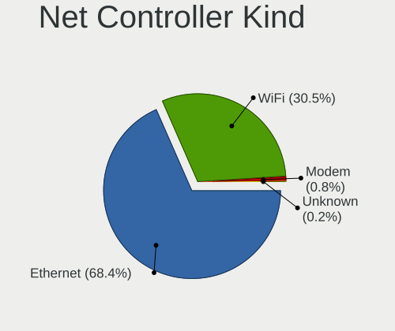

| Kind     | Desktops | Percent |
|----------|----------|---------|
| Ethernet | 30089    | 68.43%  |
| WiFi     | 13431    | 30.55%  |
| Modem    | 361      | 0.82%   |
| Unknown  | 88       | 0.2%    |

Used Controller
---------------

Currently used network controller

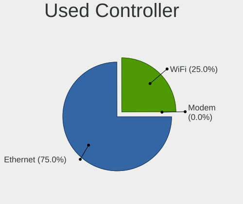

| Kind     | Desktops | Percent |
|----------|----------|---------|
| Ethernet | 23623    | 74.98%  |
| WiFi     | 7867     | 24.97%  |
| Unknown  | 10       | 0.03%   |
| Modem    | 5        | 0.02%   |

NICs
----

Total network controllers on board

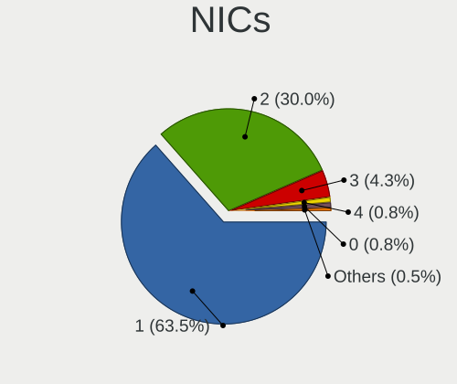

| Total | Desktops | Percent |
|-------|----------|---------|
| 1     | 19442    | 63.49%  |
| 2     | 9184     | 29.99%  |
| 3     | 1318     | 4.3%    |
| 4     | 258      | 0.84%   |
| 0     | 254      | 0.83%   |
| 5     | 91       | 0.3%    |
| 6     | 39       | 0.13%   |
| 7     | 15       | 0.05%   |
| 8     | 6        | 0.02%   |
| 11    | 4        | 0.01%   |
| 9     | 4        | 0.01%   |
| 18    | 2        | 0.01%   |
| 17    | 2        | 0.01%   |
| 13    | 2        | 0.01%   |
| 10    | 2        | 0.01%   |
| 32    | 1        | 0.003%  |

IPv6
----

IPv6 vs IPv4

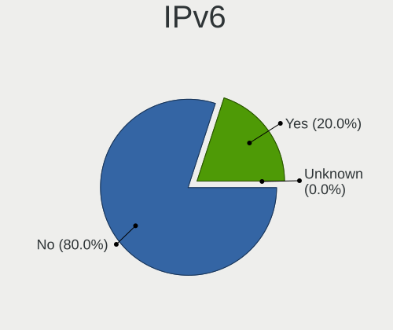

| Used    | Desktops | Percent |
|---------|----------|---------|
| No      | 24789    | 80%     |
| Yes     | 6194     | 19.99%  |
| Unknown | 4        | 0.01%   |

Bluetooth
---------

Bluetooth Vendor
----------------

Controller vendors

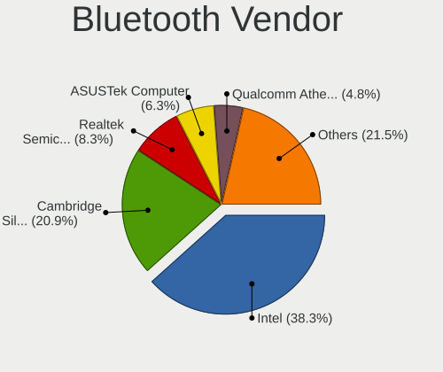

| Vendor                          | Desktops | Percent |
|---------------------------------|----------|---------|
| Intel                           | 3567     | 38.35%  |
| Cambridge Silicon Radio         | 1942     | 20.88%  |
| Realtek Semiconductor           | 771      | 8.29%   |
| ASUSTek Computer                | 583      | 6.27%   |
| Qualcomm Atheros Communications | 442      | 4.75%   |
| Broadcom                        | 423      | 4.55%   |
| IMC Networks                    | 307      | 3.3%    |
| MediaTek                        | 255      | 2.74%   |
| Foxconn / Hon Hai               | 203      | 2.18%   |
| Apple                           | 155      | 1.67%   |
| TP-Link                         | 143      | 1.54%   |
| Lite-On Technology              | 63       | 0.68%   |
| Integrated System Solution      | 57       | 0.61%   |
| Belkin Components               | 45       | 0.48%   |
| Dynex                           | 42       | 0.45%   |
| Unknown                         | 39       | 0.42%   |
| Realtek                         | 33       | 0.35%   |
| Edimax Technology               | 25       | 0.27%   |
| Micro Star International        | 24       | 0.26%   |
| Dell                            | 22       | 0.24%   |
| Actions                         | 20       | 0.22%   |
| Ralink                          | 19       | 0.2%    |
| Logitech                        | 18       | 0.19%   |
| HTC (High Tech Computer)        | 13       | 0.14%   |
| Hewlett-Packard                 | 13       | 0.14%   |
| Conwise Technology              | 12       | 0.13%   |
| D-Link System                   | 8        | 0.09%   |
| Toshiba                         | 6        | 0.06%   |
| SiW                             | 6        | 0.06%   |
| Primax Electronics              | 6        | 0.06%   |
| Roper                           | 5        | 0.05%   |
| Mobile Action Technology        | 3        | 0.03%   |
| Mercucys                        | 3        | 0.03%   |
| D-Link                          | 3        | 0.03%   |
| TRENDnet                        | 2        | 0.02%   |
| Motorola PCS                    | 2        | 0.02%   |
| Kensington                      | 2        | 0.02%   |
| AVM                             | 2        | 0.02%   |
| AICSemi                         | 2        | 0.02%   |
| Accel Semiconductor             | 2        | 0.02%   |

Bluetooth Model
---------------

Controller models

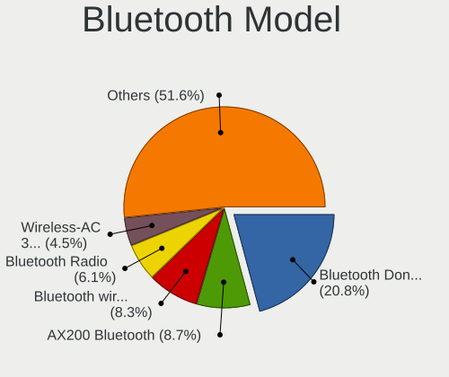

| Model                                                    | Desktops | Percent |
|----------------------------------------------------------|----------|---------|
| Cambridge Silicon Radio Bluetooth Dongle (HCI mode)      | 1942     | 20.84%  |
| Intel AX200 Bluetooth                                    | 807      | 8.66%   |
| Intel Bluetooth wireless interface                       | 769      | 8.25%   |
| Realtek Bluetooth Radio                                  | 565      | 6.06%   |
| Intel Wireless-AC 3168 Bluetooth                         | 423      | 4.54%   |
| Intel AX210 Bluetooth                                    | 393      | 4.22%   |
| Intel AX201 Bluetooth                                    | 343      | 3.68%   |
| Intel Bluetooth Device                                   | 287      | 3.08%   |
| Intel Bluetooth 9460/9560 Jefferson Peak (JfP)           | 272      | 2.92%   |
| MediaTek Wireless_Device                                 | 255      | 2.74%   |
| Intel Wireless-AC 9260 Bluetooth Adapter                 | 227      | 2.44%   |
| Broadcom BCM20702A0 Bluetooth 4.0                        | 226      | 2.43%   |
| IMC Networks Bluetooth Radio                             | 162      | 1.74%   |
| ASUS Broadcom BCM20702A0 Bluetooth                       | 159      | 1.71%   |
| Qualcomm Atheros  Bluetooth Device                       | 150      | 1.61%   |
| TP-Link TP-T@- UB500 Adapter                             | 143      | 1.53%   |
| ASUS Bluetooth Radio                                     | 132      | 1.42%   |
| Qualcomm Atheros AR3011 Bluetooth                        | 121      | 1.3%    |
| Foxconn / Hon Hai Wireless_Device                        | 120      | 1.29%   |
| Realtek  Bluetooth 4.2 Adapter                           | 119      | 1.28%   |
| ASUS ASUS USB-BT500                                      | 95       | 1.02%   |
| IMC Networks Wireless_Device                             | 93       | 1%      |
| Foxconn / Hon Hai Bluetooth Device                       | 70       | 0.75%   |
| Apple Bluetooth Host Controller                          | 62       | 0.67%   |
| ASUS BCM20702A0                                          | 60       | 0.64%   |
| Qualcomm Atheros Bluetooth USB Host Controller           | 59       | 0.63%   |
| Qualcomm Atheros AR9462 Bluetooth                        | 56       | 0.6%    |
| Intel Centrino Bluetooth Wireless Transceiver            | 52       | 0.56%   |
| ASUS Qualcomm Bluetooth 4.1                              | 48       | 0.52%   |
| Apple Built-in Bluetooth 2.0+EDR HCI                     | 44       | 0.47%   |
| Dynex Bluetooth 4.0 Adapter [Broadcom, 1.12, BCM20702A0] | 42       | 0.45%   |
| Unknown                                                  | 39       | 0.42%   |
| Qualcomm Atheros QCA61x4 Bluetooth 4.0                   | 38       | 0.41%   |
| Lite-On Bluetooth Device                                 | 36       | 0.39%   |
| ASUS Bluetooth Device                                    | 36       | 0.39%   |
| Realtek RTL8821A Bluetooth                               | 35       | 0.38%   |
| ASUS Broadcom BCM20702 Single-Chip Bluetooth 4.0 + LE    | 35       | 0.38%   |
| Apple Bluetooth HCI                                      | 35       | 0.38%   |
| Integrated System Solution Bluetooth Device              | 34       | 0.36%   |
| Realtek Bluetooth Radio                                  | 33       | 0.35%   |

Sound
-----

Sound Vendor
------------

Sound card vendors

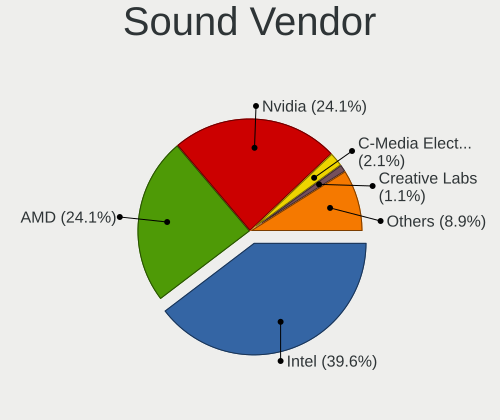

| Vendor                                       | Desktops | Percent |
|----------------------------------------------|----------|---------|
| Intel                                        | 19569    | 39.65%  |
| AMD                                          | 11917    | 24.14%  |
| Nvidia                                       | 11916    | 24.14%  |
| C-Media Electronics                          | 1027     | 2.08%   |
| Creative Labs                                | 519      | 1.05%   |
| Logitech                                     | 475      | 0.96%   |
| ASUSTek Computer                             | 299      | 0.61%   |
| Texas Instruments                            | 207      | 0.42%   |
| Micro Star International                     | 169      | 0.34%   |
| JMTek                                        | 158      | 0.32%   |
| GN Netcom                                    | 146      | 0.3%    |
| Kingston Technology                          | 144      | 0.29%   |
| Creative Technology                          | 139      | 0.28%   |
| VIA Technologies                             | 138      | 0.28%   |
| Generalplus Technology                       | 138      | 0.28%   |
| Corsair                                      | 119      | 0.24%   |
| Razer USA                                    | 117      | 0.24%   |
| Focusrite-Novation                           | 115      | 0.23%   |
| Plantronics                                  | 100      | 0.2%    |
| SteelSeries ApS                              | 97       | 0.2%    |
| Tenx Technology                              | 75       | 0.15%   |
| Zoran Co. Personal Media Division (Nogatech) | 67       | 0.14%   |
| DSEA A/S                                     | 56       | 0.11%   |
| Blue Microphones                             | 56       | 0.11%   |
| Hewlett-Packard                              | 54       | 0.11%   |
| Dell                                         | 53       | 0.11%   |
| Realtek Semiconductor                        | 51       | 0.1%    |
| Giga-Byte Technology                         | 50       | 0.1%    |
| M-Audio                                      | 44       | 0.09%   |
| Microsoft                                    | 40       | 0.08%   |
| ASRock                                       | 39       | 0.08%   |
| Jieli Technology                             | 38       | 0.08%   |
| KTMicro                                      | 37       | 0.07%   |
| BEHRINGER International                      | 35       | 0.07%   |
| Samson Technologies                          | 32       | 0.06%   |
| Sony                                         | 31       | 0.06%   |
| XMOS                                         | 30       | 0.06%   |
| Yamaha                                       | 28       | 0.06%   |
| Astro Gaming                                 | 28       | 0.06%   |
| GYROCOM C&C                                  | 27       | 0.05%   |

Sound Model
-----------

Sound card models

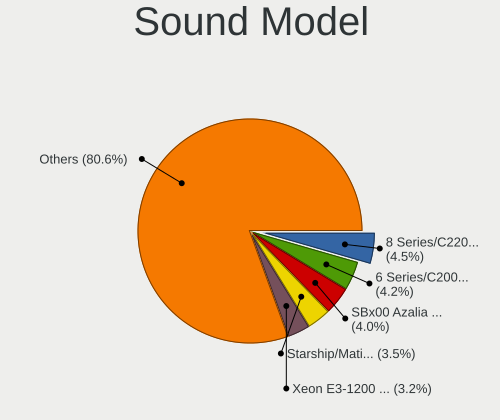

| Model                                                                             | Desktops | Percent |
|-----------------------------------------------------------------------------------|----------|---------|
| Intel 8 Series/C220 Series Chipset High Definition Audio Controller               | 2560     | 4.46%   |
| Intel 6 Series/C200 Series Chipset Family High Definition Audio Controller        | 2419     | 4.22%   |
| AMD SBx00 Azalia (Intel HDA)                                                      | 2310     | 4.03%   |
| AMD Starship/Matisse HD Audio Controller                                          | 2005     | 3.5%    |
| Intel Xeon E3-1200 v3/4th Gen Core Processor HD Audio Controller                  | 1860     | 3.24%   |
| AMD Ryzen HD Audio Controller                                                     | 1764     | 3.08%   |
| Intel 7 Series/C216 Chipset Family High Definition Audio Controller               | 1716     | 2.99%   |
| Intel 100 Series/C230 Series Chipset Family HD Audio Controller                   | 1578     | 2.75%   |
| Intel 200 Series PCH HD Audio                                                     | 1536     | 2.68%   |
| Intel NM10/ICH7 Family High Definition Audio Controller                           | 1330     | 2.32%   |
| AMD Family 17h (Models 00h-0fh) HD Audio Controller                               | 1268     | 2.21%   |
| Nvidia GK208 HDMI/DP Audio Controller                                             | 1123     | 1.96%   |
| Intel Cannon Lake PCH cAVS                                                        | 1119     | 1.95%   |
| AMD Ellesmere HDMI Audio [Radeon RX 470/480 / 570/580/590]                        | 1090     | 1.9%    |
| AMD FCH Azalia Controller                                                         | 995      | 1.73%   |
| Nvidia GP107GL High Definition Audio Controller                                   | 874      | 1.52%   |
| Intel 82801JI (ICH10 Family) HD Audio Controller                                  | 856      | 1.49%   |
| AMD Oland/Hainan/Cape Verde/Pitcairn HDMI Audio [Radeon HD 7000 Series]           | 792      | 1.38%   |
| Intel 5 Series/3400 Series Chipset High Definition Audio                          | 747      | 1.3%    |
| Nvidia High Definition Audio Controller                                           | 740      | 1.29%   |
| AMD Raven/Raven2/Fenghuang HDMI/DP Audio Controller                               | 622      | 1.08%   |
| Intel 82801I (ICH9 Family) HD Audio Controller                                    | 617      | 1.08%   |
| Nvidia GP106 High Definition Audio Controller                                     | 611      | 1.07%   |
| Nvidia GP104 High Definition Audio Controller                                     | 611      | 1.07%   |
| Intel 9 Series Chipset Family HD Audio Controller                                 | 563      | 0.98%   |
| AMD Renoir/Cezanne HDMI/DP Audio Controller                                       | 543      | 0.95%   |
| Nvidia GM107 High Definition Audio Controller [GeForce 940MX]                     | 518      | 0.9%    |
| AMD Radeon High Definition Audio Controller                                       | 516      | 0.9%    |
| Nvidia GF119 HDMI Audio Controller                                                | 503      | 0.88%   |
| Intel Alder Lake-S HD Audio Controller                                            | 503      | 0.88%   |
| AMD Cedar HDMI Audio [Radeon HD 5400/6300/7300 Series]                            | 483      | 0.84%   |
| Nvidia TU116 High Definition Audio Controller                                     | 479      | 0.84%   |
| AMD Baffin HDMI/DP Audio [Radeon RX 550 640SP / RX 560/560X]                      | 467      | 0.81%   |
| AMD Caicos HDMI Audio [Radeon HD 6450 / 7450/8450/8490 OEM / R5 230/235/235X OEM] | 463      | 0.81%   |
| Nvidia GF108 High Definition Audio Controller                                     | 461      | 0.8%    |
| Intel C610/X99 series chipset HD Audio Controller                                 | 459      | 0.8%    |
| Nvidia MCP61 High Definition Audio                                                | 455      | 0.79%   |
| Nvidia GK107 HDMI Audio Controller                                                | 424      | 0.74%   |
| AMD Navi 21/23 HDMI/DP Audio Controller                                           | 395      | 0.69%   |
| Intel C600/X79 series chipset High Definition Audio Controller                    | 394      | 0.69%   |

Memory
------

Memory Vendor
-------------

Memory module vendors

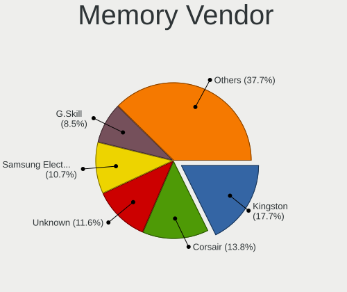

| Vendor                       | Desktops | Percent |
|------------------------------|----------|---------|
| Kingston                     | 2387     | 17.67%  |
| Corsair                      | 1865     | 13.8%   |
| Unknown                      | 1570     | 11.62%  |
| Samsung Electronics          | 1449     | 10.72%  |
| G.Skill                      | 1152     | 8.53%   |
| SK hynix                     | 1146     | 8.48%   |
| Crucial                      | 1047     | 7.75%   |
| Micron Technology            | 690      | 5.11%   |
| A-DATA Technology            | 304      | 2.25%   |
| Unknown                      | 203      | 1.5%    |
| Team                         | 198      | 1.47%   |
| Patriot                      | 156      | 1.15%   |
| Nanya Technology             | 147      | 1.09%   |
| Transcend                    | 95       | 0.7%    |
| Ramaxel Technology           | 94       | 0.7%    |
| Elpida                       | 75       | 0.56%   |
| Unknown (ABCD)               | 52       | 0.38%   |
| Apacer                       | 49       | 0.36%   |
| Smart                        | 46       | 0.34%   |
| GOODRAM                      | 46       | 0.34%   |
| PNY                          | 35       | 0.26%   |
| AMD                          | 30       | 0.22%   |
| Hewlett-Packard              | 28       | 0.21%   |
| Silicon Power                | 27       | 0.2%    |
| GeIL                         | 25       | 0.19%   |
| ASint Technology             | 23       | 0.17%   |
| Avant                        | 19       | 0.14%   |
| Unifosa                      | 18       | 0.13%   |
| Atermiter                    | 18       | 0.13%   |
| Patriot Memory (PDP Systems) | 17       | 0.13%   |
| Lexar                        | 16       | 0.12%   |
| Innodisk                     | 16       | 0.12%   |
| Timetec                      | 15       | 0.11%   |
| Neo Forza                    | 14       | 0.1%    |
| KLEVV                        | 14       | 0.1%    |
| Qimonda                      | 13       | 0.1%    |
| Kingmax                      | 12       | 0.09%   |
| Super Talent                 | 10       | 0.07%   |
| Patriot Memory               | 10       | 0.07%   |
| Goldkey                      | 9        | 0.07%   |

Memory Model
------------

Memory module models

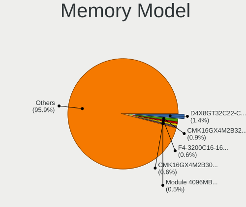

| Model                                                          | Desktops | Percent |
|----------------------------------------------------------------|----------|---------|
| Unknown                                                        | 203      | 1.38%   |
| Corsair RAM CMK16GX4M2B3200C16 8GB DIMM DDR4 3600MT/s          | 134      | 0.91%   |
| G.Skill RAM F4-3200C16-16GVK 16GB DIMM DDR4 3600MT/s           | 91       | 0.62%   |
| Corsair RAM CMK16GX4M2B3000C15 8GB DIMM DDR4 3600MT/s          | 91       | 0.62%   |
| Unknown RAM Module 4096MB DIMM 1333MT/s                        | 81       | 0.55%   |
| Kingston RAM KHX1600C10D3/8G 8GB DIMM DDR3 2133MT/s            | 78       | 0.53%   |
| G.Skill RAM F4-3200C16-8GVKB 8GB DIMM DDR4 4000MT/s            | 72       | 0.49%   |
| Micron RAM 8JTF51264AZ-1G6E1 4GB DIMM DDR3 1600MT/s            | 67       | 0.45%   |
| Corsair RAM CMK32GX4M2E3200C16 16GB DIMM DDR4 3600MT/s         | 64       | 0.43%   |
| Kingston RAM KHX1600C9D3/4GX 4GB DIMM DDR3 1867MT/s            | 61       | 0.41%   |
| Unknown RAM Module 2048MB DIMM 1333MT/s                        | 59       | 0.4%    |
| Kingston RAM KHX2666C16/8G 8GiB DIMM DDR4 3466MT/s             | 58       | 0.39%   |
| Kingston RAM KHX1866C10D3/8G 8GB DIMM DDR3 1867MT/s            | 54       | 0.37%   |
| SK hynix RAM HMT351U6CFR8C-PB 4GB DIMM DDR3 1800MT/s           | 53       | 0.36%   |
| Corsair RAM CMK32GX4M2B3200C16 16GB DIMM DDR4 3800MT/s         | 53       | 0.36%   |
| Unknown RAM Module 2GB DIMM DDR2 800MT/s                       | 52       | 0.35%   |
| Unknown (ABCD) RAM 123456789012345678 2GB DIMM LPDDR4 2133MT/s | 52       | 0.35%   |
| G.Skill RAM F4-3000C16-8GISB 8GB DIMM DDR4 3200MT/s            | 52       | 0.35%   |
| Kingston RAM KHX3200C16D4/8GX 8GB DIMM DDR4 3733MT/s           | 50       | 0.34%   |
| Unknown RAM Module 4GB DIMM 1333MT/s                           | 49       | 0.33%   |
| Samsung RAM M378B5173DB0-CK0 4096MB DIMM DDR3 1600MT/s         | 49       | 0.33%   |
| Corsair RAM Module 16GB DIMM DDR4 2133MT/s                     | 45       | 0.31%   |
| SK hynix RAM HMT451U6AFR8C-PB 4GB DIMM DDR3 1600MT/s           | 44       | 0.3%    |
| Kingston RAM KHX3200C16D4/16GX 16GB DIMM DDR4 3600MT/s         | 44       | 0.3%    |
| Kingston RAM KHX2400C15/8G 8GB DIMM DDR4 3400MT/s              | 44       | 0.3%    |
| Crucial RAM BLS8G3D1609DS1S00. 8GB DIMM DDR3 1800MT/s          | 44       | 0.3%    |
| A-DATA RAM DDR4 3200 16GB DIMM DDR4 3600MT/s                   | 42       | 0.29%   |
| Team RAM TEAMGROUP-UD4-3200 8GB DIMM DDR4 3800MT/s             | 41       | 0.28%   |
| Kingston RAM KF3200C16D4/16GX 16GB DIMM DDR4 3733MT/s          | 41       | 0.28%   |
| Unknown RAM Module 4GB DIMM DDR3 1333MT/s                      | 39       | 0.26%   |
| Samsung RAM M378B5173QH0-CK0 4GB DIMM DDR3                     | 39       | 0.26%   |
| Corsair RAM CMK64GX4M2E3200C16 32GB DIMM DDR4 3600MT/s         | 39       | 0.26%   |
| Unknown RAM Module 4096MB DIMM DDR3 1333MT/s                   | 37       | 0.25%   |
| Corsair RAM CMZ8GX3M2A1600C9 4GB DIMM SDRAM 1800MT/s           | 36       | 0.24%   |
| Unknown RAM Module 8GB DIMM DDR3 1600MT/s                      | 35       | 0.24%   |
| Unknown RAM Module 2048MB DIMM 800MT/s                         | 34       | 0.23%   |
| Samsung RAM M378B5273DH0-CH9 4GB DIMM DDR3 2133MT/s            | 34       | 0.23%   |
| Samsung RAM M378A1K43CB2-CRC 8GB DIMM DDR4 3500MT/s            | 34       | 0.23%   |
| Kingston RAM KF3200C16D4/8GX 8GiB DIMM DDR4 3600MT/s           | 34       | 0.23%   |
| Unknown RAM Module 2048MB DIMM DDR2 800MT/s                    | 33       | 0.22%   |

Memory Kind
-----------

Memory module kinds

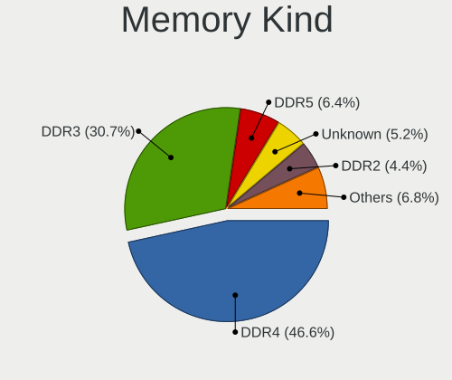

| Kind         | Desktops | Percent |
|--------------|----------|---------|
| DDR4         | 5638     | 46.59%  |
| DDR3         | 3717     | 30.72%  |
| DDR5         | 773      | 6.39%   |
| Unknown      | 625      | 5.16%   |
| DDR2         | 528      | 4.36%   |
| SDRAM        | 505      | 4.17%   |
| DDR          | 112      | 0.93%   |
| DRAM         | 95       | 0.79%   |
| LPDDR4       | 83       | 0.69%   |
| LPDDR5       | 13       | 0.11%   |
| LPDDR3       | 9        | 0.07%   |
| RAM          | 2        | 0.02%   |
| DDR2 FB-DIMM | 1        | 0.01%   |

Memory Form Factor
------------------

Physical design of the memory module

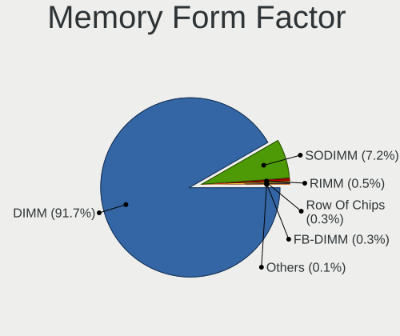

| Name            | Desktops | Percent |
|-----------------|----------|---------|
| DIMM            | 10861    | 91.69%  |
| SODIMM          | 847      | 7.15%   |
| RIMM            | 59       | 0.5%    |
| Row Of Chips    | 34       | 0.29%   |
| FB-DIMM         | 33       | 0.28%   |
| Unknown         | 6        | 0.05%   |
| Chip            | 4        | 0.03%   |
| Proprietary Car | 1        | 0.01%   |

Memory Size
-----------

Memory module size

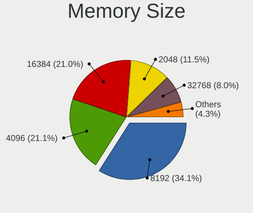

| Size    | Desktops | Percent |
|---------|----------|---------|
| 8192    | 4426     | 34.06%  |
| 4096    | 2745     | 21.13%  |
| 16384   | 2735     | 21.05%  |
| 2048    | 1492     | 11.48%  |
| 32768   | 1036     | 7.97%   |
| 1024    | 391      | 3.01%   |
| 512     | 58       | 0.45%   |
| 49152   | 52       | 0.4%    |
| 65536   | 29       | 0.22%   |
| 24576   | 10       | 0.08%   |
| 256     | 7        | 0.05%   |
| 12288   | 3        | 0.02%   |
| 131072  | 2        | 0.02%   |
| 98304   | 1        | 0.01%   |
| 10240   | 1        | 0.01%   |
| 3072    | 1        | 0.01%   |
| 1536    | 1        | 0.01%   |
| 64      | 1        | 0.01%   |
| 32      | 1        | 0.01%   |
| Unknown | 1        | 0.01%   |

Memory Speed
------------

Memory module speed

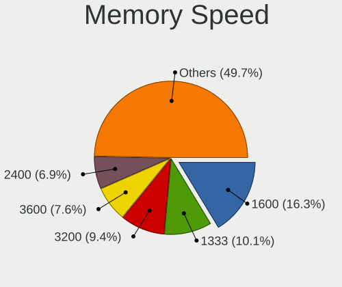

| Speed   | Desktops | Percent |
|---------|----------|---------|
| 1600    | 2163     | 16.33%  |
| 1333    | 1338     | 10.1%   |
| 3200    | 1248     | 9.42%   |
| 3600    | 1003     | 7.57%   |
| 2400    | 912      | 6.89%   |
| 2133    | 776      | 5.86%   |
| 2667    | 746      | 5.63%   |
| 800     | 402      | 3.04%   |
| 667     | 261      | 1.97%   |
| 2666    | 237      | 1.79%   |
| 3000    | 229      | 1.73%   |
| 1866    | 224      | 1.69%   |
| 3733    | 203      | 1.53%   |
| Unknown | 201      | 1.52%   |
| 3800    | 192      | 1.45%   |
| 1867    | 191      | 1.44%   |
| 4800    | 188      | 1.42%   |
| 1800    | 179      | 1.35%   |
| 6000    | 175      | 1.32%   |
| 3400    | 173      | 1.31%   |
| 5600    | 160      | 1.21%   |
| 1066    | 146      | 1.1%    |
| 4000    | 145      | 1.09%   |
| 2933    | 138      | 1.04%   |
| 3466    | 115      | 0.87%   |
| 6400    | 85       | 0.64%   |
| 2800    | 79       | 0.6%    |
| 1067    | 77       | 0.58%   |
| 400     | 71       | 0.54%   |
| 5200    | 66       | 0.5%    |
| 3866    | 64       | 0.48%   |
| 3066    | 51       | 0.39%   |
| 3266    | 49       | 0.37%   |
| 2048    | 44       | 0.33%   |
| 6200    | 41       | 0.31%   |
| 1334    | 40       | 0.3%    |
| 533     | 40       | 0.3%    |
| 2733    | 39       | 0.29%   |
| 2000    | 37       | 0.28%   |
| 3333    | 36       | 0.27%   |

Printers & scanners
-------------------

Printer Vendor
--------------

Printer device vendors

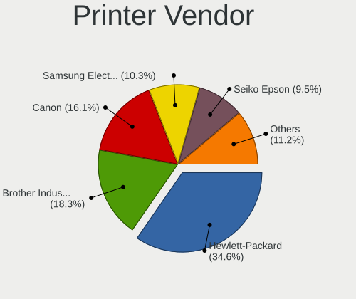

| Vendor                             | Desktops | Percent |
|------------------------------------|----------|---------|
| Hewlett-Packard                    | 571      | 34.63%  |
| Brother Industries                 | 302      | 18.31%  |
| Canon                              | 266      | 16.13%  |
| Samsung Electronics                | 170      | 10.31%  |
| Seiko Epson                        | 156      | 9.46%   |
| Prolific Technology                | 30       | 1.82%   |
| Dymo-CoStar                        | 24       | 1.46%   |
| Xerox                              | 18       | 1.09%   |
| QinHeng Electronics                | 17       | 1.03%   |
| Lexmark International              | 17       | 1.03%   |
| Kyocera                            | 11       | 0.67%   |
| Pantum                             | 10       | 0.61%   |
| Oki Data                           | 7        | 0.42%   |
| Dell                               | 6        | 0.36%   |
| Zebra                              | 5        | 0.3%    |
| STMicroelectronics                 | 5        | 0.3%    |
| Fuji Xerox                         | 5        | 0.3%    |
| Ricoh                              | 4        | 0.24%   |
| Citizen                            | 3        | 0.18%   |
| Apple                              | 3        | 0.18%   |
| Zebra Technologies                 | 2        | 0.12%   |
| Star Micronics                     | 2        | 0.12%   |
| iDPRT                              | 2        | 0.12%   |
| Custom Engineering SPA             | 2        | 0.12%   |
| ATEN International                 | 2        | 0.12%   |
| Zhuhai Poskey Technology           | 1        | 0.06%   |
| MIIIW                              | 1        | 0.06%   |
| Konica Minolta                     | 1        | 0.06%   |
| ICS Advent                         | 1        | 0.06%   |
| GODEX INTERNATIONAL                | 1        | 0.06%   |
| Datamax-O'Neil                     | 1        | 0.06%   |
| BIXOLON                            | 1        | 0.06%   |
| BeiJing LanXum Computer Technology | 1        | 0.06%   |
| ARGOX                              | 1        | 0.06%   |

Printer Model
-------------

Printer device models

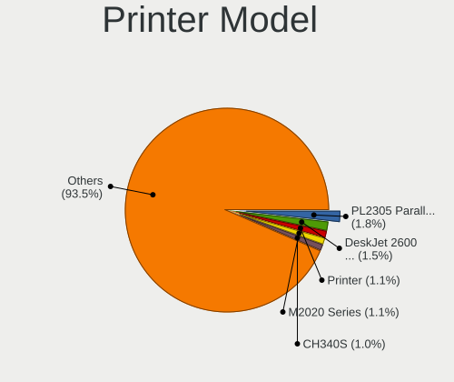

| Model                                | Desktops | Percent |
|--------------------------------------|----------|---------|
| Prolific PL2305 Parallel Port        | 30       | 1.78%   |
| HP DeskJet 2600 series               | 25       | 1.49%   |
| Brother Printer                      | 19       | 1.13%   |
| Samsung M2020 Series                 | 18       | 1.07%   |
| QinHeng CH340S                       | 17       | 1.01%   |
| HP ENVY 4520 series                  | 17       | 1.01%   |
| HP DeskJet 2130 series               | 17       | 1.01%   |
| Canon PIXMA MG2500 Series            | 17       | 1.01%   |
| HP DeskJet 3700 series               | 16       | 0.95%   |
| Samsung M2070 Series                 | 15       | 0.89%   |
| HP LaserJet 1020                     | 15       | 0.89%   |
| HP DeskJet 3630 series               | 15       | 0.89%   |
| Canon PIXMA MX920 Series             | 15       | 0.89%   |
| Brother HL-2030 Laser Printer        | 15       | 0.89%   |
| HP Deskjet 2540 series               | 14       | 0.83%   |
| Canon PIXMA MG3600 Series            | 14       | 0.83%   |
| HP LaserJet 1018                     | 13       | 0.77%   |
| Canon LiDE 300                       | 12       | 0.71%   |
| Samsung ML-216x Series Laser Printer | 11       | 0.65%   |
| Samsung SCX-3400 Series              | 10       | 0.59%   |
| HP LaserJet P1005                    | 10       | 0.59%   |
| HP Deskjet 2050 J510                 | 10       | 0.59%   |
| Dymo-CoStar LabelWriter 400          | 10       | 0.59%   |
| Canon LiDE 400                       | 10       | 0.59%   |
| Brother HL-L2350DW series            | 10       | 0.59%   |
| Seiko Epson XP-240 Series            | 9        | 0.54%   |
| Seiko Epson Printer                  | 9        | 0.54%   |
| Seiko Epson ET-2710 Series           | 9        | 0.54%   |
| Samsung C48x Series                  | 9        | 0.54%   |
| HP OfficeJet 3830 series             | 9        | 0.54%   |
| HP ENVY 5000 series                  | 9        | 0.54%   |
| Canon iP7200 series                  | 9        | 0.54%   |
| HP OfficeJet 5200 series             | 8        | 0.48%   |
| HP ENVY 5540 series                  | 8        | 0.48%   |
| HP Deskjet 3050A                     | 8        | 0.48%   |
| HP DeskJet 2700 series               | 8        | 0.48%   |
| Canon TS3100 series                  | 8        | 0.48%   |
| Canon TR4500 series                  | 8        | 0.48%   |
| Brother HL-L2300D series             | 8        | 0.48%   |
| Samsung Composite Device             | 7        | 0.42%   |

Scanner Vendor
--------------

Scanner device vendors

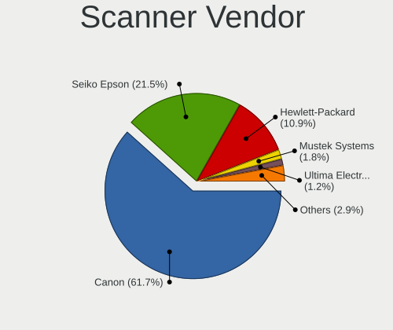

| Vendor                      | Desktops | Percent |
|-----------------------------|----------|---------|
| Canon                       | 209      | 61.65%  |
| Seiko Epson                 | 73       | 21.53%  |
| Hewlett-Packard             | 37       | 10.91%  |
| Mustek Systems              | 6        | 1.77%   |
| Ultima Electronics          | 4        | 1.18%   |
| Plustek                     | 3        | 0.88%   |
| Acer Peripherals (now BenQ) | 2        | 0.59%   |
| UMAX                        | 1        | 0.29%   |
| Syscan                      | 1        | 0.29%   |
| Nikon                       | 1        | 0.29%   |
| Minolta                     | 1        | 0.29%   |
| AGFA-Gevaert NV             | 1        | 0.29%   |

Scanner Model
-------------

Scanner device models

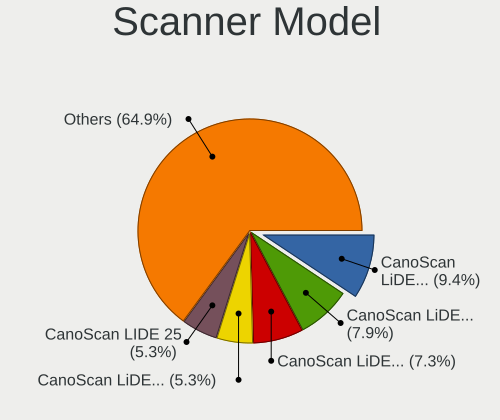

| Model                                                                                 | Desktops | Percent |
|---------------------------------------------------------------------------------------|----------|---------|
| Canon CanoScan LiDE 210                                                               | 32       | 9.36%   |
| Canon CanoScan LiDE 110                                                               | 27       | 7.89%   |
| Canon CanoScan LiDE 220                                                               | 25       | 7.31%   |
| Canon CanoScan LIDE 25                                                                | 18       | 5.26%   |
| Canon CanoScan LiDE 120                                                               | 18       | 5.26%   |
| Canon CanoScan N670U/N676U/LiDE 20                                                    | 17       | 4.97%   |
| Canon CanoScan N1240U/LiDE 30                                                         | 14       | 4.09%   |
| Canon CanoScan LiDE 100                                                               | 14       | 4.09%   |
| Canon CanoScan LiDE 200                                                               | 11       | 3.22%   |
| Seiko Epson GT-X770 [Perfection V500]                                                 | 8        | 2.34%   |
| Seiko Epson GT-F520/GT-F570 [Perfection 3590 PHOTO]                                   | 8        | 2.34%   |
| Seiko Epson GT-X820 [Perfection V600 Photo]                                           | 7        | 2.05%   |
| Canon CanoScan LiDE 50/LiDE 35/LiDE 40                                                | 6        | 1.75%   |
| Seiko Epson Perfection V37/V370                                                       | 5        | 1.46%   |
| Seiko Epson GT-F720 [GT-S620/Perfection V30/V300 Photo]                               | 5        | 1.46%   |
| Canon CanoScan 9000F Mark II                                                          | 5        | 1.46%   |
| Ultima Artec Ultima 2000 (GT6801 based)/Lifetec LT9385/ScanMagic 1200 UB Plus Scanner | 4        | 1.17%   |
| Seiko Epson Scanner                                                                   | 4        | 1.17%   |
| Seiko Epson GT-X750 [Perfection 4490 Photo]                                           | 4        | 1.17%   |
| Seiko Epson GT-8400UF [Perfection 1670/1670 PHOTO]                                    | 4        | 1.17%   |
| Seiko Epson GT-7700U [Perfection 1240U]                                               | 4        | 1.17%   |
| Seiko Epson GT-F730 [GT-S630/Perfection V33/V330 Photo]                               | 3        | 0.88%   |
| Seiko Epson GT-F700 [Perfection V350]                                                 | 3        | 0.88%   |
| Seiko Epson GT-F500/GT-F550 [Perfection 2480/2580 PHOTO]                              | 3        | 0.88%   |
| Seiko Epson GT-9300UF [Perfection 2400 PHOTO]                                         | 3        | 0.88%   |
| HP ScanJet G4050                                                                      | 3        | 0.88%   |
| HP ScanJet 3970c                                                                      | 3        | 0.88%   |
| HP ScanJet 3400cse                                                                    | 3        | 0.88%   |
| HP ScanJet 3300c                                                                      | 3        | 0.88%   |
| HP HP Scanjet 300                                                                     | 3        | 0.88%   |
| Canon CanoScan LiDE 700F                                                              | 3        | 0.88%   |
| Seiko Epson GT-X800 [Perfection 4990 PHOTO]                                           | 2        | 0.58%   |
| Seiko Epson GT-F650 [GT-S600/Perfection V10/V100]                                     | 2        | 0.58%   |
| Plustek 600dpi USB Scanner                                                            | 2        | 0.58%   |
| Mustek Systems BearPaw 1200 CU Plus                                                   | 2        | 0.58%   |
| HP Scanjet N6010                                                                      | 2        | 0.58%   |
| HP ScanJet 5470c/5490c                                                                | 2        | 0.58%   |
| HP ScanJet 4850C/4890C                                                                | 2        | 0.58%   |
| HP ScanJet 2400c                                                                      | 2        | 0.58%   |
| Canon CanoScan N650U/N656U                                                            | 2        | 0.58%   |

Camera
------

Camera Vendor
-------------

Camera device vendors

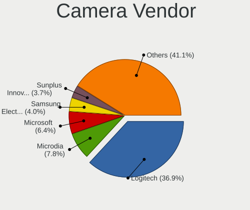

| Vendor                        | Desktops | Percent |
|-------------------------------|----------|---------|
| Logitech                      | 1848     | 36.88%  |
| Microdia                      | 393      | 7.84%   |
| Microsoft                     | 323      | 6.45%   |
| Samsung Electronics           | 200      | 3.99%   |
| Sunplus Innovation Technology | 185      | 3.69%   |
| Apple                         | 184      | 3.67%   |
| Chicony Electronics           | 127      | 2.53%   |
| Z-Star Microelectronics       | 116      | 2.31%   |
| Realtek Semiconductor         | 115      | 2.29%   |
| Generalplus Technology        | 111      | 2.22%   |
| Creative Technology           | 88       | 1.76%   |
| ARC International             | 86       | 1.72%   |
| Cubeternet                    | 70       | 1.4%    |
| KYE Systems (Mouse Systems)   | 60       | 1.2%    |
| GEMBIRD                       | 56       | 1.12%   |
| MacroSilicon                  | 54       | 1.08%   |
| Jieli Technology              | 50       | 1%      |
| webcam                        | 43       | 0.86%   |
| Aveo Technology               | 43       | 0.86%   |
| Hewlett-Packard               | 42       | 0.84%   |
| Trust                         | 37       | 0.74%   |
| Arkmicro Technologies         | 35       | 0.7%    |
| Alcor Micro                   | 32       | 0.64%   |
| Sonix Technology              | 27       | 0.54%   |
| Razer USA                     | 27       | 0.54%   |
| LG Electronics                | 26       | 0.52%   |
| Huawei Technologies           | 26       | 0.52%   |
| Pixart Imaging                | 21       | 0.42%   |
| Genesys Logic                 | 21       | 0.42%   |
| SunplusIT                     | 19       | 0.38%   |
| OmniVision Technologies       | 19       | 0.38%   |
| AVerMedia Technologies        | 19       | 0.38%   |
| Philips (or NXP)              | 18       | 0.36%   |
| IMC Networks                  | 18       | 0.36%   |
| Guillemot                     | 18       | 0.36%   |
| eMeet                         | 15       | 0.3%    |
| WaveRider Communications      | 14       | 0.28%   |
| Intel                         | 13       | 0.26%   |
| A4Tech                        | 13       | 0.26%   |
| Novatek Microelectronics      | 11       | 0.22%   |

Camera Model
------------

Camera device models

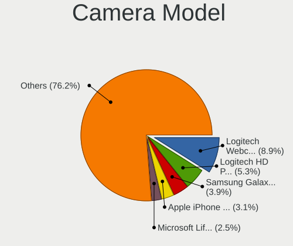

| Model                                    | Desktops | Percent |
|------------------------------------------|----------|---------|
| Logitech Webcam C270                     | 450      | 8.93%   |
| Logitech HD Pro Webcam C920              | 269      | 5.34%   |
| Samsung Galaxy series, misc. (MTP mode)  | 195      | 3.87%   |
| Apple iPhone 5/5C/5S/6/SE/7/8/X          | 158      | 3.14%   |
| Microsoft LifeCam HD-3000                | 125      | 2.48%   |
| Logitech C922 Pro Stream Webcam          | 112      | 2.22%   |
| Microdia Webcam Vitade AF                | 103      | 2.04%   |
| Logitech HD Webcam C525                  | 92       | 1.83%   |
| Logitech Webcam C310                     | 87       | 1.73%   |
| ARC International Camera                 | 85       | 1.69%   |
| Logitech HD Webcam C615                  | 76       | 1.51%   |
| Microdia USB 2.0 Camera                  | 75       | 1.49%   |
| Logitech Webcam C170                     | 75       | 1.49%   |
| Microdia Camera                          | 67       | 1.33%   |
| Logitech BRIO Ultra HD Webcam            | 65       | 1.29%   |
| Sunplus FULL HD webcam                   | 62       | 1.23%   |
| Generalplus GENERAL WEBCAM               | 60       | 1.19%   |
| Logitech QuickCam Pro 9000               | 55       | 1.09%   |
| Logitech C920 PRO HD Webcam              | 53       | 1.05%   |
| Microdia Sonix USB 2.0 Camera            | 51       | 1.01%   |
| Sunplus Integrated Camera                | 48       | 0.95%   |
| Z-Star Venus USB2.0 Camera               | 46       | 0.91%   |
| Logitech HD Webcam C910                  | 46       | 0.91%   |
| Jieli USB PHY 2.0                        | 46       | 0.91%   |
| Logitech Webcam C930e                    | 44       | 0.87%   |
| webcam webcam                            | 43       | 0.85%   |
| Microsoft LifeCam Cinema                 | 38       | 0.75%   |
| Generalplus 808 Camera #9 (web-cam mode) | 38       | 0.75%   |
| MacroSilicon USB Video                   | 36       | 0.71%   |
| Logitech Webcam Pro 9000                 | 34       | 0.67%   |
| GEMBIRD USB2.0 PC CAMERA                 | 33       | 0.66%   |
| Realtek FULL HD 1080P Webcam             | 32       | 0.64%   |
| Logitech HD Webcam C510                  | 29       | 0.58%   |
| Microdia Integrated Camera               | 28       | 0.56%   |
| Microsoft LifeCam Studio                 | 27       | 0.54%   |
| Cubeternet USB2.0 Camera                 | 27       | 0.54%   |
| Arkmicro USB2.0 PC CAMERA                | 27       | 0.54%   |
| Huawei HiCamera                          | 26       | 0.52%   |
| Chicony HP High Definition 1MP Webcam    | 25       | 0.5%    |
| Logitech Logitech Webcam C925e           | 24       | 0.48%   |

Security
--------

Fingerprint Vendor
------------------

Fingerprint sensor vendors

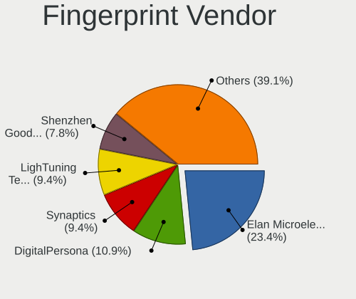

| Vendor                     | Desktops | Percent |
|----------------------------|----------|---------|
| Elan Microelectronics      | 15       | 23.44%  |
| DigitalPersona             | 7        | 10.94%  |
| Synaptics                  | 6        | 9.38%   |
| LighTuning Technology      | 6        | 9.38%   |
| STMicroelectronics         | 5        | 7.81%   |
| Shenzhen Goodix Technology | 5        | 7.81%   |
| Dell                       | 5        | 7.81%   |
| AuthenTec                  | 5        | 7.81%   |
| Upek                       | 3        | 4.69%   |
| Microsoft                  | 2        | 3.13%   |
| Futronic Technology        | 2        | 3.13%   |
| Validity Sensors           | 1        | 1.56%   |
| Suprema                    | 1        | 1.56%   |
| Unknown                    | 1        | 1.56%   |

Fingerprint Model
-----------------

Fingerprint sensor models

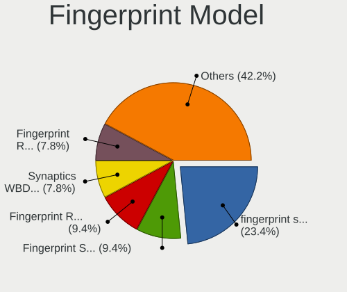

| Model                                                       | Desktops | Percent |
|-------------------------------------------------------------|----------|---------|
| Elan fingerprint sensor [FeinTech FPS00200]                 | 15       | 23.44%  |
| LighTuning Fingerprint Sensor                               | 6        | 9.38%   |
| DigitalPersona Fingerprint Reader                           | 6        | 9.38%   |
| Synaptics  WBDI Fingerprint Reader - USB 052                | 5        | 7.81%   |
| STMicroelectronics Fingerprint Reader                       | 5        | 7.81%   |
| Dell MS819 Wired Mouse With Fingerprint Reader              | 5        | 7.81%   |
| Shenzhen Goodix  Fingerprint Device                         | 3        | 4.69%   |
| AuthenTec AES2501 Fingerprint Sensor                        | 3        | 4.69%   |
| Upek Biometric Touchchip/Touchstrip Fingerprint Sensor      | 2        | 3.13%   |
| Shenzhen Goodix Fingerprint Reader                          | 2        | 3.13%   |
| Microsoft Fingerprint Reader                                | 2        | 3.13%   |
| Validity Sensors Synaptics VFS7552 Touch Fingerprint Sensor | 1        | 1.56%   |
| Upek TCS1C EIM/STM32 Fingerprint sensor                     | 1        | 1.56%   |
| Synaptics  FS7604 Touch Fingerprint Sensor with PurePrint   | 1        | 1.56%   |
| Suprema SUP-SFR400(A) BioMini Fingerprint Reader            | 1        | 1.56%   |
| Futronic FS81 Fingerprint Scanner Module                    | 1        | 1.56%   |
| Futronic Fingerprint Scanner Model FS88                     | 1        | 1.56%   |
| DigitalPersona DigitalPersona, Inc. Fingerprint Reader      | 1        | 1.56%   |
| AuthenTec Fingerprint Sensor                                | 1        | 1.56%   |
| AuthenTec AES1600                                           | 1        | 1.56%   |
| Unknown                                                     | 1        | 1.56%   |

Chipcard Vendor
---------------

Chipcard module vendors

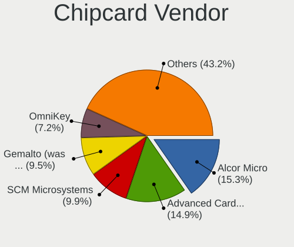

| Vendor                            | Desktops | Percent |
|-----------------------------------|----------|---------|
| Alcor Micro                       | 34       | 15.32%  |
| Advanced Card Systems             | 33       | 14.86%  |
| SCM Microsystems                  | 22       | 9.91%   |
| Gemalto (was Gemplus)             | 21       | 9.46%   |
| OmniKey                           | 16       | 7.21%   |
| Reiner SCT Kartensysteme          | 14       | 6.31%   |
| Realtek Semiconductor             | 14       | 6.31%   |
| Chicony Electronics               | 10       | 4.5%    |
| Cherry                            | 7        | 3.15%   |
| Bit4id                            | 7        | 3.15%   |
| Fujitsu Siemens Computers         | 6        | 2.7%    |
| Aladdin Knowledge Systems         | 6        | 2.7%    |
| VASCO Data Security International | 5        | 2.25%   |
| Hewlett-Packard                   | 4        | 1.8%    |
| Microchip Technology              | 3        | 1.35%   |
| Aladdin R.D.                      | 3        | 1.35%   |
| Aktiv                             | 3        | 1.35%   |
| Giesecke & Devrient               | 2        | 0.9%    |
| Circle                            | 2        | 0.9%    |
| Yubico.com                        | 1        | 0.45%   |
| Watchdata                         | 1        | 0.45%   |
| Thetis                            | 1        | 0.45%   |
| Swissbit                          | 1        | 0.45%   |
| SANHO Digital Electronics         | 1        | 0.45%   |
| Lenovo                            | 1        | 0.45%   |
| GHI                               | 1        | 0.45%   |
| Clay Logic                        | 1        | 0.45%   |
| C3PO                              | 1        | 0.45%   |
| Athena Smartcard Solutions        | 1        | 0.45%   |

Chipcard Model
--------------

Chipcard module models

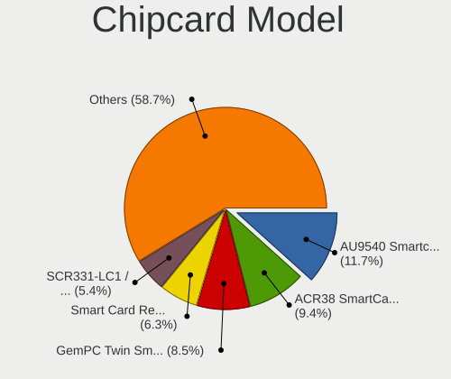

| Model                                                                      | Desktops | Percent |
|----------------------------------------------------------------------------|----------|---------|
| Alcor Micro AU9540 Smartcard Reader                                        | 26       | 11.66%  |
| Advanced Card Systems ACR38 SmartCard Reader                               | 21       | 9.42%   |
| Gemalto (was Gemplus) GemPC Twin SmartCard Reader                          | 19       | 8.52%   |
| Realtek Semiconductor Smart Card Reader Interface                          | 14       | 6.28%   |
| SCM Microsystems SCR331-LC1 / SCR3310 SmartCard Reader                     | 12       | 5.38%   |
| Chicony Electronics HP Skylab USB Smartcard Keyboard                       | 10       | 4.48%   |
| Reiner SCT Kartensysteme cyberJack RFID basis contactless smartcard reader | 9        | 4.04%   |
| Alcor Micro Watchdata W 1981                                               | 8        | 3.59%   |
| Advanced Card Systems ACR122U                                              | 8        | 3.59%   |
| OmniKey CardMan 3021 / 3121                                                | 7        | 3.14%   |
| Bit4id miniLector EVO                                                      | 6        | 2.69%   |
| Aladdin Knowledge Systems Token JC                                         | 6        | 2.69%   |
| Cherry SmartCard Reader Keyboard KC 1000 SC                                | 5        | 2.24%   |
| VASCO Data Security International Digipass 905 SmartCard Reader            | 4        | 1.79%   |
| Reiner SCT Kartensysteme cyberJack one                                     | 4        | 1.79%   |
| Hewlett-Packard SC Keyboard - Apollo (Liteon)                              | 4        | 1.79%   |
| Fujitsu Siemens Computers SmartCard Reader 2A                              | 4        | 1.79%   |
| SCM Microsystems SCR335 SmartCard Reader                                   | 3        | 1.35%   |
| SCM Microsystems SCR331 SmartCard Reader                                   | 3        | 1.35%   |
| OmniKey CardMan 3121 (HID Technologies)                                    | 3        | 1.35%   |
| Microchip Technology SMSC USX101x Reader                                   | 3        | 1.35%   |
| Aladdin R.D. JaCarta                                                       | 3        | 1.35%   |
| Aktiv Rutoken lite                                                         | 3        | 1.35%   |
| Advanced Card Systems ACR1281 1S Dual Reader                               | 3        | 1.35%   |
| SCM Microsystems SCR35xx Smart Card Reader                                 | 2        | 0.9%    |
| OmniKey CardMan 1021                                                       | 2        | 0.9%    |
| Giesecke & Devrient StarSign CUT S                                         | 2        | 0.9%    |
| Gemalto (was Gemplus) GemPC Key SmartCard Reader                           | 2        | 0.9%    |
| Circle CIR115 ICC                                                          | 2        | 0.9%    |
| Advanced Card Systems ACR39U                                               | 2        | 0.9%    |
| Yubico.com Yubikey 4/5 U2F+CCID                                            | 1        | 0.45%   |
| Watchdata USB Key                                                          | 1        | 0.45%   |
| VASCO Data Security International DIGIPASS 870                             | 1        | 0.45%   |
| Thetis Security Key(F829)                                                  | 1        | 0.45%   |
| Swissbit iShield Key FIDO2                                                 | 1        | 0.45%   |
| SCM Microsystems SCR333 SmartCard Reader                                   | 1        | 0.45%   |
| SCM Microsystems CLOUD 2700 F Smart Card Reader                            | 1        | 0.45%   |
| SANHO Digital Electronics ATR19                                            | 1        | 0.45%   |
| Reiner SCT Kartensysteme cyberJack e-com/pinpad                            | 1        | 0.45%   |
| OmniKey Smart Card Reader USB                                              | 1        | 0.45%   |

Unsupported
-----------

Unsupported Devices
-------------------

Total unsupported devices on board

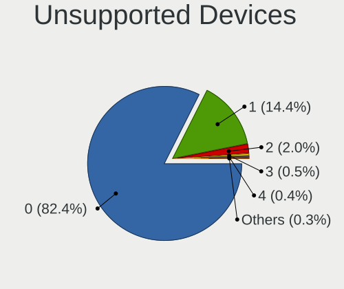

| Total | Desktops | Percent |
|-------|----------|---------|
| 0     | 25628    | 82.44%  |
| 1     | 4479     | 14.41%  |
| 2     | 616      | 1.98%   |
| 3     | 153      | 0.49%   |
| 4     | 117      | 0.38%   |
| 5     | 47       | 0.15%   |
| 6     | 27       | 0.09%   |
| 7     | 9        | 0.03%   |
| 8     | 7        | 0.02%   |
| 10    | 1        | 0.003%  |
| 9     | 1        | 0.003%  |

Unsupported Device Types
------------------------

Types of unsupported devices

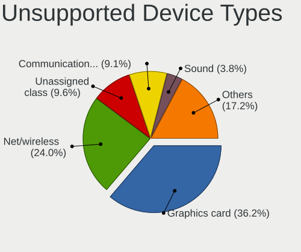

| Type                     | Desktops | Percent |
|--------------------------|----------|---------|
| Graphics card            | 2356     | 36.21%  |
| Net/wireless             | 1563     | 24.02%  |
| Unassigned class         | 627      | 9.64%   |
| Communication controller | 591      | 9.08%   |
| Sound                    | 248      | 3.81%   |
| Multimedia controller    | 208      | 3.2%    |
| Chipcard                 | 147      | 2.26%   |
| Net/ethernet             | 145      | 2.23%   |
| Bluetooth                | 116      | 1.78%   |
| Storage/raid             | 109      | 1.68%   |
| Camera                   | 93       | 1.43%   |
| Network                  | 78       | 1.2%    |
| Card reader              | 62       | 0.95%   |
| Fingerprint reader       | 53       | 0.81%   |
| Modem                    | 35       | 0.54%   |
| Dvb card                 | 23       | 0.35%   |
| Tv card                  | 10       | 0.15%   |
| Storage/ide              | 8        | 0.12%   |
| Storage                  | 8        | 0.12%   |
| Firewire controller      | 8        | 0.12%   |
| Storage/ata              | 6        | 0.09%   |
| Video                    | 5        | 0.08%   |
| Storage/nvme             | 5        | 0.08%   |
| Wireless                 | 2        | 0.03%   |

