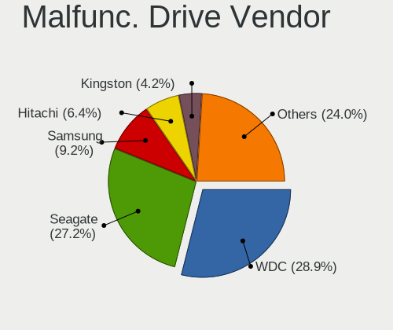
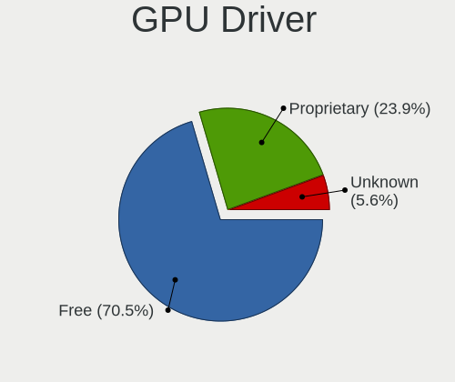
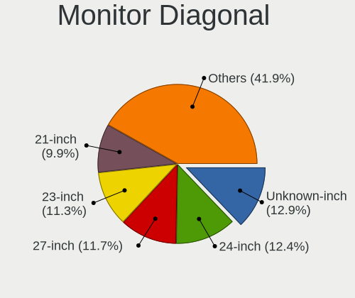

Ubuntu - Tested Hardware & Statistics (Desktops)
------------------------------------------------

A project to collect tested hardware configurations for Ubuntu.

Anyone can contribute to this report by the [hw-probe](https://github.com/linuxhw/hw-probe) tool:

    sudo -E hw-probe -all -upload

Please contribute! Especially if your hardware is rare.

Contents
--------

* [ Test Cases ](#test-cases)

* [ System ](#system)
  - [ OS                       ](#os)
  - [ OS Family                ](#os-family)
  - [ Kernel                   ](#kernel)
  - [ Kernel Family            ](#kernel-family)
  - [ Kernel Major Ver.        ](#kernel-major-ver)
  - [ Arch                     ](#arch)
  - [ DE                       ](#de)
  - [ Display Server           ](#display-server)
  - [ Display Manager          ](#display-manager)
  - [ OS Lang                  ](#os-lang)
  - [ Boot Mode                ](#boot-mode)
  - [ Filesystem               ](#filesystem)
  - [ Part. scheme             ](#part-scheme)
  - [ Dual Boot with Linux/BSD ](#dual-boot-with-linuxbsd)
  - [ Dual Boot (Win)          ](#dual-boot-win)

* [ Board ](#board)
  - [ Vendor                   ](#vendor)
  - [ Model                    ](#model)
  - [ Model Family             ](#model-family)
  - [ MFG Year                 ](#mfg-year)
  - [ Form Factor              ](#form-factor)
  - [ Secure Boot              ](#secure-boot)
  - [ Coreboot                 ](#coreboot)
  - [ RAM Size                 ](#ram-size)
  - [ RAM Used                 ](#ram-used)
  - [ Total Drives             ](#total-drives)
  - [ Has CD-ROM               ](#has-cd-rom)
  - [ Has Ethernet             ](#has-ethernet)
  - [ Has WiFi                 ](#has-wifi)
  - [ Has Bluetooth            ](#has-bluetooth)

* [ Location ](#location)
  - [ Country                  ](#country)
  - [ City                     ](#city)

* [ Drives ](#drives)
  - [ Drive Vendor             ](#drive-vendor)
  - [ Drive Model              ](#drive-model)
  - [ HDD Vendor               ](#hdd-vendor)
  - [ SSD Vendor               ](#ssd-vendor)
  - [ Drive Kind               ](#drive-kind)
  - [ Drive Connector          ](#drive-connector)
  - [ Drive Size               ](#drive-size)
  - [ Space Total              ](#space-total)
  - [ Space Used               ](#space-used)
  - [ Malfunc. Drives          ](#malfunc-drives)
  - [ Malfunc. Drive Vendor    ](#malfunc-drive-vendor)
  - [ Malfunc. HDD Vendor      ](#malfunc-hdd-vendor)
  - [ Malfunc. Drive Kind      ](#malfunc-drive-kind)
  - [ Failed Drives            ](#failed-drives)
  - [ Failed Drive Vendor      ](#failed-drive-vendor)
  - [ Drive Status             ](#drive-status)

* [ Storage controller ](#storage-controller)
  - [ Storage Vendor           ](#storage-vendor)
  - [ Storage Model            ](#storage-model)
  - [ Storage Kind             ](#storage-kind)

* [ Processor ](#processor)
  - [ CPU Vendor               ](#cpu-vendor)
  - [ CPU Model                ](#cpu-model)
  - [ CPU Model Family         ](#cpu-model-family)
  - [ CPU Cores                ](#cpu-cores)
  - [ CPU Sockets              ](#cpu-sockets)
  - [ CPU Threads              ](#cpu-threads)
  - [ CPU Op-Modes             ](#cpu-op-modes)
  - [ CPU Microcode            ](#cpu-microcode)
  - [ CPU Microarch            ](#cpu-microarch)

* [ Graphics ](#graphics)
  - [ GPU Vendor               ](#gpu-vendor)
  - [ GPU Model                ](#gpu-model)
  - [ GPU Combo                ](#gpu-combo)
  - [ GPU Driver               ](#gpu-driver)
  - [ GPU Memory               ](#gpu-memory)

* [ Monitor ](#monitor)
  - [ Monitor Vendor           ](#monitor-vendor)
  - [ Monitor Model            ](#monitor-model)
  - [ Monitor Resolution       ](#monitor-resolution)
  - [ Monitor Diagonal         ](#monitor-diagonal)
  - [ Monitor Width            ](#monitor-width)
  - [ Aspect Ratio             ](#aspect-ratio)
  - [ Monitor Area             ](#monitor-area)
  - [ Pixel Density            ](#pixel-density)
  - [ Multiple Monitors        ](#multiple-monitors)

* [ Network ](#network)
  - [ Net Controller Vendor    ](#net-controller-vendor)
  - [ Net Controller Model     ](#net-controller-model)
  - [ Wireless Vendor          ](#wireless-vendor)
  - [ Wireless Model           ](#wireless-model)
  - [ Ethernet Vendor          ](#ethernet-vendor)
  - [ Ethernet Model           ](#ethernet-model)
  - [ Net Controller Kind      ](#net-controller-kind)
  - [ Used Controller          ](#used-controller)
  - [ NICs                     ](#nics)
  - [ IPv6                     ](#ipv6)

* [ Bluetooth ](#bluetooth)
  - [ Bluetooth Vendor         ](#bluetooth-vendor)
  - [ Bluetooth Model          ](#bluetooth-model)

* [ Sound ](#sound)
  - [ Sound Vendor             ](#sound-vendor)
  - [ Sound Model              ](#sound-model)

* [ Memory ](#memory)
  - [ Memory Vendor            ](#memory-vendor)
  - [ Memory Model             ](#memory-model)
  - [ Memory Kind              ](#memory-kind)
  - [ Memory Form Factor       ](#memory-form-factor)
  - [ Memory Size              ](#memory-size)
  - [ Memory Speed             ](#memory-speed)

* [ Printers & scanners ](#printers--scanners)
  - [ Printer Vendor           ](#printer-vendor)
  - [ Printer Model            ](#printer-model)
  - [ Scanner Vendor           ](#scanner-vendor)
  - [ Scanner Model            ](#scanner-model)

* [ Camera ](#camera)
  - [ Camera Vendor            ](#camera-vendor)
  - [ Camera Model             ](#camera-model)

* [ Security ](#security)
  - [ Fingerprint Vendor       ](#fingerprint-vendor)
  - [ Fingerprint Model        ](#fingerprint-model)
  - [ Chipcard Vendor          ](#chipcard-vendor)
  - [ Chipcard Model           ](#chipcard-model)

* [ Unsupported ](#unsupported)
  - [ Unsupported Devices      ](#unsupported-devices)
  - [ Unsupported Device Types ](#unsupported-device-types)

Test Cases
----------

Total: 29954

| Vendor        | Model                       | Probe                                                      | Date         |
|---------------|-----------------------------|------------------------------------------------------------|--------------|
| MSI           | H81M-E35 V2                 | [db83c146a6](https://linux-hardware.org/?probe=db83c146a6) | Nov 02, 2022 |
| ASUSTek       | PRIME H410M-A               | [b3cac9f8b8](https://linux-hardware.org/?probe=b3cac9f8b8) | Nov 02, 2022 |
| HP            | 18E7                        | [c0d5c58895](https://linux-hardware.org/?probe=c0d5c58895) | Nov 02, 2022 |
| ASUSTek       | M5A78L-M LX3 PLUS           | [23a62c3509](https://linux-hardware.org/?probe=23a62c3509) | Nov 02, 2022 |
| Gigabyte      | B450 I AORUS PRO WIFI-CF    | [895a345eb9](https://linux-hardware.org/?probe=895a345eb9) | Nov 02, 2022 |
| Gigabyte      | B450 I AORUS PRO WIFI-CF    | [9d9d3a4967](https://linux-hardware.org/?probe=9d9d3a4967) | Nov 02, 2022 |
| Fujitsu       | D2628-C1 S26361-D2628-C1    | [a2af2980ad](https://linux-hardware.org/?probe=a2af2980ad) | Nov 02, 2022 |
| ASUSTek       | M5A78L-M LX3 PLUS           | [d34ccf5e7a](https://linux-hardware.org/?probe=d34ccf5e7a) | Nov 02, 2022 |
| ASUSTek       | M5A78L-M LX3 PLUS           | [eb06593b9e](https://linux-hardware.org/?probe=eb06593b9e) | Nov 02, 2022 |
| ASRock        | B450 Pro4                   | [5da1d76cd5](https://linux-hardware.org/?probe=5da1d76cd5) | Nov 02, 2022 |
| ASUSTek       | B85-PLUS                    | [dd24c26ffa](https://linux-hardware.org/?probe=dd24c26ffa) | Nov 02, 2022 |
| HP            | 18E5                        | [3df38ade7e](https://linux-hardware.org/?probe=3df38ade7e) | Nov 02, 2022 |
| Dell          | 0GWHMW A01                  | [732eaeede7](https://linux-hardware.org/?probe=732eaeede7) | Nov 02, 2022 |
| Lenovo        | 361A SDK0K17763 WIN         | [5d34d86be3](https://linux-hardware.org/?probe=5d34d86be3) | Nov 02, 2022 |
| Gigabyte      | B450M GAMING-CF             | [95e2a1e7d9](https://linux-hardware.org/?probe=95e2a1e7d9) | Nov 02, 2022 |
| ASRock        | Q1900B-ITX                  | [6305a98777](https://linux-hardware.org/?probe=6305a98777) | Nov 02, 2022 |
| HP            | 18E5                        | [8204df7795](https://linux-hardware.org/?probe=8204df7795) | Nov 02, 2022 |
| Gigabyte      | Q270M-D3H                   | [46874cc0a1](https://linux-hardware.org/?probe=46874cc0a1) | Nov 02, 2022 |
| Lenovo        | 312A SDK0J40697 WIN 3305... | [fe91c11062](https://linux-hardware.org/?probe=fe91c11062) | Nov 02, 2022 |
| HP            | 1905                        | [df0d192970](https://linux-hardware.org/?probe=df0d192970) | Nov 01, 2022 |
| ASRock        | AB350 Gaming K4             | [36387e4f11](https://linux-hardware.org/?probe=36387e4f11) | Nov 01, 2022 |
| Intel         | H61                         | [326fa40958](https://linux-hardware.org/?probe=326fa40958) | Nov 01, 2022 |
| ASUSTek       | H97I-PLUS                   | [13bf376807](https://linux-hardware.org/?probe=13bf376807) | Nov 01, 2022 |
| HP            | 3646h                       | [f88c9632b4](https://linux-hardware.org/?probe=f88c9632b4) | Nov 01, 2022 |
| Dell          | 06D7TR A02                  | [a27d97c026](https://linux-hardware.org/?probe=a27d97c026) | Nov 01, 2022 |
| Dell          | 06D7TR A02                  | [f8a4053db1](https://linux-hardware.org/?probe=f8a4053db1) | Nov 01, 2022 |
| ASUSTek       | Z97-PRO GAMER               | [4b9071c932](https://linux-hardware.org/?probe=4b9071c932) | Nov 01, 2022 |
| ASUSTek       | BM2AD_D510MT_D310MT         | [8f2b0bc926](https://linux-hardware.org/?probe=8f2b0bc926) | Nov 01, 2022 |
| ASUSTek       | Z170 PRO GAMING/AURA        | [f0db98f6bb](https://linux-hardware.org/?probe=f0db98f6bb) | Nov 01, 2022 |
| ASUSTek       | CROSSBLADE RANGER           | [5f92247b16](https://linux-hardware.org/?probe=5f92247b16) | Nov 01, 2022 |
| ASUSTek       | Z170 PRO GAMING/AURA        | [fc832e8881](https://linux-hardware.org/?probe=fc832e8881) | Nov 01, 2022 |
| Gigabyte      | H310M H                     | [115025ee59](https://linux-hardware.org/?probe=115025ee59) | Nov 01, 2022 |
| Gigabyte      | H310M H                     | [74af46599e](https://linux-hardware.org/?probe=74af46599e) | Nov 01, 2022 |
| Dell          | 07C0H8 A00                  | [1b2cb018d0](https://linux-hardware.org/?probe=1b2cb018d0) | Nov 01, 2022 |
| Fujitsu       | D2628-C1 S26361-D2628-C1    | [245ec71478](https://linux-hardware.org/?probe=245ec71478) | Nov 01, 2022 |
| Gigabyte      | Z170-HD3P-CF                | [5fd845ca54](https://linux-hardware.org/?probe=5fd845ca54) | Nov 01, 2022 |
| ASUSTek       | PRIME A320M-K               | [a14fa00a56](https://linux-hardware.org/?probe=a14fa00a56) | Nov 01, 2022 |
| ASUSTek       | PRIME A320M-K               | [bfa1db2eb1](https://linux-hardware.org/?probe=bfa1db2eb1) | Nov 01, 2022 |
| OEM           | H310MD4                     | [947bf0d86f](https://linux-hardware.org/?probe=947bf0d86f) | Nov 01, 2022 |
| ASUSTek       | H61M-K                      | [ca5a47c66a](https://linux-hardware.org/?probe=ca5a47c66a) | Nov 01, 2022 |
| ASRock        | AB350 Gaming K4             | [560d84828c](https://linux-hardware.org/?probe=560d84828c) | Nov 01, 2022 |
| MSI           | MAG B550 TOMAHAWK           | [24203a87c9](https://linux-hardware.org/?probe=24203a87c9) | Nov 01, 2022 |
| ASUSTek       | PRIME B360M-A               | [c46dd8d9b6](https://linux-hardware.org/?probe=c46dd8d9b6) | Nov 01, 2022 |
| ASUSTek       | SABERTOOTH Z87              | [d39c952932](https://linux-hardware.org/?probe=d39c952932) | Nov 01, 2022 |
| Dell          | 082WXT A03                  | [ab3dad5a31](https://linux-hardware.org/?probe=ab3dad5a31) | Nov 01, 2022 |
| ASUSTek       | TUF Gaming X570-PLUS        | [d729001115](https://linux-hardware.org/?probe=d729001115) | Nov 01, 2022 |
| AOpen         | aVKx-DE R1.03 55DEL10001... | [b487a7aee3](https://linux-hardware.org/?probe=b487a7aee3) | Oct 31, 2022 |
| HP            | 1850                        | [b39eac8f74](https://linux-hardware.org/?probe=b39eac8f74) | Oct 31, 2022 |
| Acer          | Aspire TC-280               | [68679c6495](https://linux-hardware.org/?probe=68679c6495) | Oct 31, 2022 |
| MSI           | B450 TOMAHAWK MAX           | [183545ed4e](https://linux-hardware.org/?probe=183545ed4e) | Oct 31, 2022 |
| ASUSTek       | Z97-P                       | [72467c5d61](https://linux-hardware.org/?probe=72467c5d61) | Oct 31, 2022 |
| MSI           | A320M-A PRO                 | [8769289ea5](https://linux-hardware.org/?probe=8769289ea5) | Oct 31, 2022 |
| Dell          | 03NVJ6 A03                  | [adebd09dc4](https://linux-hardware.org/?probe=adebd09dc4) | Oct 31, 2022 |
| ASUSTek       | VM60                        | [2cb5cc2932](https://linux-hardware.org/?probe=2cb5cc2932) | Oct 31, 2022 |
| ASUSTek       | M4A78                       | [8eb1316a14](https://linux-hardware.org/?probe=8eb1316a14) | Oct 31, 2022 |
| ASUSTek       | CG8480                      | [0f7c1dc1cf](https://linux-hardware.org/?probe=0f7c1dc1cf) | Oct 31, 2022 |
| Unknown       | Unknown                     | [7cce0a2867](https://linux-hardware.org/?probe=7cce0a2867) | Oct 31, 2022 |
| ASUSTek       | M4A78                       | [81374a561c](https://linux-hardware.org/?probe=81374a561c) | Oct 31, 2022 |
| HP            | Compaq 8000 Elite CMT PC    | [fbe835b8ef](https://linux-hardware.org/?probe=fbe835b8ef) | Oct 31, 2022 |
| Samsung       | DeskTop System              | [56b4bb00b0](https://linux-hardware.org/?probe=56b4bb00b0) | Oct 31, 2022 |
| MSI           | 990FXA-GD80                 | [baaa1111ec](https://linux-hardware.org/?probe=baaa1111ec) | Oct 31, 2022 |
| MSI           | AM1I                        | [30014de18a](https://linux-hardware.org/?probe=30014de18a) | Oct 31, 2022 |
| WTM           | W-N95 B0                    | [56611d3c8f](https://linux-hardware.org/?probe=56611d3c8f) | Oct 31, 2022 |
| Intel         | D33217GKE G76540-201        | [b3403874f4](https://linux-hardware.org/?probe=b3403874f4) | Oct 31, 2022 |
| ASUSTek       | P5Q-E                       | [0ef6be44d0](https://linux-hardware.org/?probe=0ef6be44d0) | Oct 31, 2022 |
| Gigabyte      | Z170-Gaming K3              | [d84f634b59](https://linux-hardware.org/?probe=d84f634b59) | Oct 31, 2022 |
| MSI           | MS-7309                     | [a6b1a7d329](https://linux-hardware.org/?probe=a6b1a7d329) | Oct 31, 2022 |
| MSI           | MS-7309                     | [3c519589ad](https://linux-hardware.org/?probe=3c519589ad) | Oct 30, 2022 |
| ASUSTek       | PHOENIX                     | [d4f8ae717d](https://linux-hardware.org/?probe=d4f8ae717d) | Oct 30, 2022 |
| ASUSTek       | A8N32-SLI-Deluxe            | [85389b6454](https://linux-hardware.org/?probe=85389b6454) | Oct 30, 2022 |
| ASRock        | FM2A88X-ITX+                | [08cf9e2ccd](https://linux-hardware.org/?probe=08cf9e2ccd) | Oct 30, 2022 |
| Gigabyte      | B550 AORUS ELITE V2         | [738569f811](https://linux-hardware.org/?probe=738569f811) | Oct 30, 2022 |
| ASRock        | B550M Pro4                  | [078fd46e0a](https://linux-hardware.org/?probe=078fd46e0a) | Oct 30, 2022 |
| Lenovo        | 0B98401 WIN                 | [25805a13b0](https://linux-hardware.org/?probe=25805a13b0) | Oct 30, 2022 |
| Biostar       | PE24                        | [57ad96c14e](https://linux-hardware.org/?probe=57ad96c14e) | Oct 30, 2022 |
| ASRock        | FM2A88X-ITX+                | [e28a25b18a](https://linux-hardware.org/?probe=e28a25b18a) | Oct 30, 2022 |
| ASRock        | 960GM-VGS3 FX               | [ac82c6bda9](https://linux-hardware.org/?probe=ac82c6bda9) | Oct 30, 2022 |
| ASUSTek       | PRIME X470-PRO              | [a8b08a47aa](https://linux-hardware.org/?probe=a8b08a47aa) | Oct 30, 2022 |
| ASUSTek       | A8N32-SLI-Deluxe            | [55be6f23ce](https://linux-hardware.org/?probe=55be6f23ce) | Oct 30, 2022 |
| Intel         | D33217GKE G76540-203        | [51a91ba41f](https://linux-hardware.org/?probe=51a91ba41f) | Oct 30, 2022 |
| Huanan        | H510-D4 V4.0                | [89b298973c](https://linux-hardware.org/?probe=89b298973c) | Oct 30, 2022 |
| Gigabyte      | X570S AORUS PRO AX          | [03d14141e4](https://linux-hardware.org/?probe=03d14141e4) | Oct 30, 2022 |
| MSI           | A320M-A PRO MAX             | [80d6d99bcf](https://linux-hardware.org/?probe=80d6d99bcf) | Oct 30, 2022 |
| Medion        | MS-7707                     | [4f018e8577](https://linux-hardware.org/?probe=4f018e8577) | Oct 30, 2022 |
| Dell          | 0WMJ54 A01                  | [3760efa49c](https://linux-hardware.org/?probe=3760efa49c) | Oct 30, 2022 |
| Dell          | 0WMJ54 A01                  | [1b614b2744](https://linux-hardware.org/?probe=1b614b2744) | Oct 30, 2022 |
| Dell          | 0G214D A00                  | [43b30d9a84](https://linux-hardware.org/?probe=43b30d9a84) | Oct 30, 2022 |
| Dell          | 0G214D A00                  | [2ee26099ae](https://linux-hardware.org/?probe=2ee26099ae) | Oct 30, 2022 |
| MSI           | MS-7358                     | [3ddf4b8fff](https://linux-hardware.org/?probe=3ddf4b8fff) | Oct 30, 2022 |
| ASUSTek       | H97-PLUS                    | [f22f67754e](https://linux-hardware.org/?probe=f22f67754e) | Oct 29, 2022 |
| ASRock        | 960GM-VGS3 FX               | [5769997d2a](https://linux-hardware.org/?probe=5769997d2a) | Oct 29, 2022 |
| MSI           | A320M-A PRO                 | [23ad30db1a](https://linux-hardware.org/?probe=23ad30db1a) | Oct 29, 2022 |
| ASUSTek       | M4A78                       | [d88d101a3c](https://linux-hardware.org/?probe=d88d101a3c) | Oct 29, 2022 |
| HP            | ProLiant ML310e Gen8 v2     | [768d0e85c9](https://linux-hardware.org/?probe=768d0e85c9) | Oct 29, 2022 |
| Gigabyte      | Z390 AORUS PRO-CF           | [05b5af2e63](https://linux-hardware.org/?probe=05b5af2e63) | Oct 29, 2022 |
| Dell          | 0NW6H5 A00                  | [d768cd4c66](https://linux-hardware.org/?probe=d768cd4c66) | Oct 29, 2022 |
| MSI           | B450M PRO-M2 MAX            | [6549416d9d](https://linux-hardware.org/?probe=6549416d9d) | Oct 29, 2022 |
| ASRock        | 890GX Extreme3              | [ff1af2eaf0](https://linux-hardware.org/?probe=ff1af2eaf0) | Oct 29, 2022 |
| HP            | 8653 A                      | [9c19089f51](https://linux-hardware.org/?probe=9c19089f51) | Oct 29, 2022 |
| ASUSTek       | P5KPL-AM SE                 | [95af9b0439](https://linux-hardware.org/?probe=95af9b0439) | Oct 29, 2022 |
| Dell          | 0WN7Y6 A01                  | [4a5527f98a](https://linux-hardware.org/?probe=4a5527f98a) | Oct 29, 2022 |
| ASUSTek       | PRIME Q270M-C               | [4440c6ed51](https://linux-hardware.org/?probe=4440c6ed51) | Oct 29, 2022 |
| Gigabyte      | B550M DS3H                  | [8a918b4739](https://linux-hardware.org/?probe=8a918b4739) | Oct 28, 2022 |
| ASUSTek       | PRIME X570-PRO              | [e51ca052ec](https://linux-hardware.org/?probe=e51ca052ec) | Oct 28, 2022 |
| ASUSTek       | CM1730,CM1830               | [0915c0bf5a](https://linux-hardware.org/?probe=0915c0bf5a) | Oct 28, 2022 |
| ASUSTek       | TUF H370-PRO GAMING WIFI    | [48cbfa7a78](https://linux-hardware.org/?probe=48cbfa7a78) | Oct 28, 2022 |
| MSI           | MAG B550 TOMAHAWK           | [f45ab957da](https://linux-hardware.org/?probe=f45ab957da) | Oct 28, 2022 |
| Dell          | 02M8NY A01                  | [47c0e65f02](https://linux-hardware.org/?probe=47c0e65f02) | Oct 28, 2022 |
| Intel         | D33217GKE G76540-203        | [9827bdf3f6](https://linux-hardware.org/?probe=9827bdf3f6) | Oct 28, 2022 |
| MSI           | H81M-P33                    | [16a78334cd](https://linux-hardware.org/?probe=16a78334cd) | Oct 28, 2022 |
| MSI           | Z370 KRAIT GAMING           | [cbf597cec1](https://linux-hardware.org/?probe=cbf597cec1) | Oct 28, 2022 |
| ASUSTek       | P8B75-V                     | [4783ed1083](https://linux-hardware.org/?probe=4783ed1083) | Oct 28, 2022 |
| ASUSTek       | ET2700I                     | [ce0d0e61eb](https://linux-hardware.org/?probe=ce0d0e61eb) | Oct 28, 2022 |
| Gigabyte      | Z97M-DS3H                   | [9914e4d771](https://linux-hardware.org/?probe=9914e4d771) | Oct 28, 2022 |
| MSI           | X470 GAMING PLUS            | [f296db20db](https://linux-hardware.org/?probe=f296db20db) | Oct 28, 2022 |
| ASUSTek       | X99-A/USB                   | [ca0810aab5](https://linux-hardware.org/?probe=ca0810aab5) | Oct 28, 2022 |
| Acer          | Aspire TC-710 V:1.1         | [b9c0f59afa](https://linux-hardware.org/?probe=b9c0f59afa) | Oct 28, 2022 |
| Dell          | 06D7TR A02                  | [42e2c69893](https://linux-hardware.org/?probe=42e2c69893) | Oct 28, 2022 |
| MSI           | Z97 GAMING 3                | [4488ff5b26](https://linux-hardware.org/?probe=4488ff5b26) | Oct 28, 2022 |
| ASUSTek       | ROG CROSSHAIR VII HERO      | [1759cbebe1](https://linux-hardware.org/?probe=1759cbebe1) | Oct 28, 2022 |
| Gigabyte      | H110M-A-CF                  | [54b0296df7](https://linux-hardware.org/?probe=54b0296df7) | Oct 28, 2022 |
| Alienware     | 07W25T A01                  | [107ec47dd5](https://linux-hardware.org/?probe=107ec47dd5) | Oct 28, 2022 |
| Alienware     | 07W25T A01                  | [0338285f54](https://linux-hardware.org/?probe=0338285f54) | Oct 28, 2022 |
| ASUSTek       | PHOENIX                     | [827dd1396b](https://linux-hardware.org/?probe=827dd1396b) | Oct 28, 2022 |
| Alienware     | 07W25T A01                  | [e320ad09bc](https://linux-hardware.org/?probe=e320ad09bc) | Oct 28, 2022 |
| Lenovo        | ThinkCentre M71e 3134C2U    | [a1cec3edba](https://linux-hardware.org/?probe=a1cec3edba) | Oct 28, 2022 |
| HP            | ProLiant MicroServer Gen... | [6cfd4bdb14](https://linux-hardware.org/?probe=6cfd4bdb14) | Oct 28, 2022 |
| Gigabyte      | X58A-UD3R                   | [560f96a33a](https://linux-hardware.org/?probe=560f96a33a) | Oct 28, 2022 |
| Alienware     | 046MHW A00                  | [5a5511a68b](https://linux-hardware.org/?probe=5a5511a68b) | Oct 27, 2022 |
| ASUSTek       | P9X79 DELUXE                | [210e6b1755](https://linux-hardware.org/?probe=210e6b1755) | Oct 27, 2022 |
| Packard Be... | IMEDIA S3810                | [f492fb9369](https://linux-hardware.org/?probe=f492fb9369) | Oct 27, 2022 |
| MSI           | B450M GAMING PLUS           | [b31400d1d1](https://linux-hardware.org/?probe=b31400d1d1) | Oct 27, 2022 |
| ASUSTek       | TUF Gaming X570-PLUS        | [0325c2200c](https://linux-hardware.org/?probe=0325c2200c) | Oct 27, 2022 |
| Lenovo        | 3102 NOK                    | [973ebfcf3e](https://linux-hardware.org/?probe=973ebfcf3e) | Oct 27, 2022 |
| Gigabyte      | H61N-USB3                   | [ff94581714](https://linux-hardware.org/?probe=ff94581714) | Oct 27, 2022 |
| Gigabyte      | F2A88X-D3H                  | [7290b40608](https://linux-hardware.org/?probe=7290b40608) | Oct 27, 2022 |
| ASUSTek       | TUF Gaming B550-PLUS        | [8948294711](https://linux-hardware.org/?probe=8948294711) | Oct 27, 2022 |
| HP            | 894B 10                     | [56afe0f581](https://linux-hardware.org/?probe=56afe0f581) | Oct 27, 2022 |
| Intel         | H410M-E                     | [854c3ec5b1](https://linux-hardware.org/?probe=854c3ec5b1) | Oct 27, 2022 |
| HP            | 8653 A                      | [92b68870ca](https://linux-hardware.org/?probe=92b68870ca) | Oct 27, 2022 |
| ASUSTek       | PRIME B660-PLUS D4          | [5b6d2d2922](https://linux-hardware.org/?probe=5b6d2d2922) | Oct 27, 2022 |
| HP            | 8425                        | [6d26af6597](https://linux-hardware.org/?probe=6d26af6597) | Oct 27, 2022 |
| ASUSTek       | V-P7H55E                    | [8e25520b70](https://linux-hardware.org/?probe=8e25520b70) | Oct 27, 2022 |
| Intel         | H55                         | [fb3cf518ac](https://linux-hardware.org/?probe=fb3cf518ac) | Oct 27, 2022 |
| Dell          | 0KWVT8 A02                  | [01613e9e80](https://linux-hardware.org/?probe=01613e9e80) | Oct 27, 2022 |
| HP            | 1494                        | [ce43cdfac1](https://linux-hardware.org/?probe=ce43cdfac1) | Oct 26, 2022 |
| HP            | 1494                        | [a23d74a9b3](https://linux-hardware.org/?probe=a23d74a9b3) | Oct 26, 2022 |
| Gigabyte      | GA-990FXA-UD5               | [6faf6b40b1](https://linux-hardware.org/?probe=6faf6b40b1) | Oct 26, 2022 |
| ASUSTek       | P9X79 DELUXE                | [a1125bf007](https://linux-hardware.org/?probe=a1125bf007) | Oct 26, 2022 |
| Gigabyte      | B450M DS3H V2               | [c2c9c1bb9b](https://linux-hardware.org/?probe=c2c9c1bb9b) | Oct 26, 2022 |
| Fujitsu       | D3498-A2 S26361-D3498-A2    | [d34926f87f](https://linux-hardware.org/?probe=d34926f87f) | Oct 26, 2022 |
| AMI           | Cherry Trail CR             | [8cf0d29214](https://linux-hardware.org/?probe=8cf0d29214) | Oct 26, 2022 |
| AMI           | Cherry Trail CR             | [e8f64c2c8c](https://linux-hardware.org/?probe=e8f64c2c8c) | Oct 26, 2022 |
| ASRock        | H470M-STX                   | [02f3177542](https://linux-hardware.org/?probe=02f3177542) | Oct 26, 2022 |
| Fujitsu       | D3161-A1 S26361-D3161-A1    | [06f33f301b](https://linux-hardware.org/?probe=06f33f301b) | Oct 26, 2022 |
| ASRock        | H77 Pro4/MVP                | [94d8bc13bb](https://linux-hardware.org/?probe=94d8bc13bb) | Oct 26, 2022 |
| Gigabyte      | EP43-DS3L                   | [f9e114a7e9](https://linux-hardware.org/?probe=f9e114a7e9) | Oct 26, 2022 |
| HP            | 3029h                       | [46c9e39101](https://linux-hardware.org/?probe=46c9e39101) | Oct 26, 2022 |
| ASRock        | B450 Pro4                   | [666aba57b3](https://linux-hardware.org/?probe=666aba57b3) | Oct 26, 2022 |
| MSI           | MPG Z490 GAMING EDGE WIF... | [ed68d3c49d](https://linux-hardware.org/?probe=ed68d3c49d) | Oct 26, 2022 |
| MSI           | MPG Z490 GAMING EDGE WIF... | [8248930fb7](https://linux-hardware.org/?probe=8248930fb7) | Oct 26, 2022 |
| ASRock        | FM2A78M-HD+                 | [2d0d5ac22b](https://linux-hardware.org/?probe=2d0d5ac22b) | Oct 26, 2022 |
| Intel         | H410M-E                     | [69d7d07e13](https://linux-hardware.org/?probe=69d7d07e13) | Oct 26, 2022 |
| HP            | 8509                        | [81bfb5a782](https://linux-hardware.org/?probe=81bfb5a782) | Oct 26, 2022 |
| MSI           | MEG X570 GODLIKE            | [6659cbf83d](https://linux-hardware.org/?probe=6659cbf83d) | Oct 26, 2022 |
| Intel         | D945GCNL AAD97184-102       | [a057daae25](https://linux-hardware.org/?probe=a057daae25) | Oct 26, 2022 |
| HP            | 1495                        | [64e8d1cff2](https://linux-hardware.org/?probe=64e8d1cff2) | Oct 26, 2022 |
| Alienware     | 0PGRP5 A02                  | [126f440ca7](https://linux-hardware.org/?probe=126f440ca7) | Oct 26, 2022 |
| MSI           | MS-7309                     | [fe0fae3528](https://linux-hardware.org/?probe=fe0fae3528) | Oct 26, 2022 |
| ASUSTek       | M4A87TD EVO                 | [c304ae4e48](https://linux-hardware.org/?probe=c304ae4e48) | Oct 25, 2022 |
| ASUSTek       | M4A87TD EVO                 | [1f62025135](https://linux-hardware.org/?probe=1f62025135) | Oct 25, 2022 |
| MSI           | MS-7309                     | [2db582d6dd](https://linux-hardware.org/?probe=2db582d6dd) | Oct 25, 2022 |
| HP            | 2AA2                        | [36f40353c8](https://linux-hardware.org/?probe=36f40353c8) | Oct 25, 2022 |
| Gigabyte      | GA-MA770-UD3                | [ef555f6161](https://linux-hardware.org/?probe=ef555f6161) | Oct 25, 2022 |
| Gigabyte      | P35-DS3L                    | [2f5cb804c0](https://linux-hardware.org/?probe=2f5cb804c0) | Oct 25, 2022 |
| Gigabyte      | 990FXA-UD3                  | [332886e612](https://linux-hardware.org/?probe=332886e612) | Oct 25, 2022 |
| ASUSTek       | P5K-VM                      | [cc1ae5c7f4](https://linux-hardware.org/?probe=cc1ae5c7f4) | Oct 25, 2022 |
| ASUSTek       | H110M-K                     | [06c00dc8d5](https://linux-hardware.org/?probe=06c00dc8d5) | Oct 25, 2022 |
| Techvision    | TVI7309X B0                 | [cf2d75ffa9](https://linux-hardware.org/?probe=cf2d75ffa9) | Oct 25, 2022 |
| Biostar       | H61MLV2                     | [5b6f2b76da](https://linux-hardware.org/?probe=5b6f2b76da) | Oct 25, 2022 |
| Gigabyte      | X58A-UD7                    | [6d3bf37ff3](https://linux-hardware.org/?probe=6d3bf37ff3) | Oct 25, 2022 |
| ASUSTek       | PRO H410M-C                 | [00e64f6075](https://linux-hardware.org/?probe=00e64f6075) | Oct 25, 2022 |
| ASUSTek       | PRIME B450-PLUS             | [3a10949e83](https://linux-hardware.org/?probe=3a10949e83) | Oct 25, 2022 |
| Dell          | 0HN7XN A01                  | [c512f7e4c8](https://linux-hardware.org/?probe=c512f7e4c8) | Oct 25, 2022 |
| Gigabyte      | B450 I AORUS PRO WIFI-CF    | [4e2d4383c0](https://linux-hardware.org/?probe=4e2d4383c0) | Oct 25, 2022 |
| MSI           | Z97-G55 SLI                 | [25ddd5274f](https://linux-hardware.org/?probe=25ddd5274f) | Oct 25, 2022 |
| ASUSTek       | TUF Gaming B550-PLUS        | [74ca211759](https://linux-hardware.org/?probe=74ca211759) | Oct 25, 2022 |
| Dell          | 0MWYPT A02                  | [cf186994cc](https://linux-hardware.org/?probe=cf186994cc) | Oct 25, 2022 |
| MSI           | MAG X570S TOMAHAWK MAX W... | [c05a08e1af](https://linux-hardware.org/?probe=c05a08e1af) | Oct 25, 2022 |
| ASUSTek       | ROG ZENITH EXTREME          | [13830bd661](https://linux-hardware.org/?probe=13830bd661) | Oct 25, 2022 |
| ASUSTek       | ROG ZENITH EXTREME          | [6c8e8f4707](https://linux-hardware.org/?probe=6c8e8f4707) | Oct 25, 2022 |
| ASUSTek       | ROG ZENITH EXTREME          | [5fa6c73455](https://linux-hardware.org/?probe=5fa6c73455) | Oct 25, 2022 |
| ASRock        | B450 Gaming K4              | [122a54b0c2](https://linux-hardware.org/?probe=122a54b0c2) | Oct 25, 2022 |
| ASRock        | N68-S                       | [f1f502f834](https://linux-hardware.org/?probe=f1f502f834) | Oct 25, 2022 |
| ASUSTek       | ROG STRIX B450-E GAMING     | [51cf8b4f9d](https://linux-hardware.org/?probe=51cf8b4f9d) | Oct 25, 2022 |
| Dell          | 0HY9JP A00                  | [ecbfb1ca5c](https://linux-hardware.org/?probe=ecbfb1ca5c) | Oct 25, 2022 |
| ASUSTek       | TUF Z390-PRO GAMING         | [2c4d63c9b2](https://linux-hardware.org/?probe=2c4d63c9b2) | Oct 24, 2022 |
| MSI           | H510M-A PRO                 | [02e8dbe21d](https://linux-hardware.org/?probe=02e8dbe21d) | Oct 24, 2022 |
| ASUSTek       | PRIME B350-PLUS             | [544988df6e](https://linux-hardware.org/?probe=544988df6e) | Oct 24, 2022 |
| MSI           | MAG X570S TOMAHAWK MAX W... | [936e43f0bc](https://linux-hardware.org/?probe=936e43f0bc) | Oct 24, 2022 |
| ASUSTek       | Maximus VI EXTREME          | [e5264df501](https://linux-hardware.org/?probe=e5264df501) | Oct 24, 2022 |
| ASUSTek       | H170 PRO GAMING             | [905f41afd6](https://linux-hardware.org/?probe=905f41afd6) | Oct 24, 2022 |
| ASUSTek       | TUF B450-PLUS GAMING        | [1dea808353](https://linux-hardware.org/?probe=1dea808353) | Oct 24, 2022 |
| Gigabyte      | B85M-D3H                    | [f4182ec2e9](https://linux-hardware.org/?probe=f4182ec2e9) | Oct 24, 2022 |
| ASUSTek       | H170M-PLUS/BR               | [31cae2266e](https://linux-hardware.org/?probe=31cae2266e) | Oct 24, 2022 |
| ASUSTek       | PRIME B450M-A               | [fb3feaef06](https://linux-hardware.org/?probe=fb3feaef06) | Oct 24, 2022 |
| ASUSTek       | M5A97 LE R2.0               | [93fdeacbba](https://linux-hardware.org/?probe=93fdeacbba) | Oct 24, 2022 |
| Acer          | Aspire XC-830               | [2692d8c0cd](https://linux-hardware.org/?probe=2692d8c0cd) | Oct 24, 2022 |
| Biostar       | PE24                        | [b8be82bb66](https://linux-hardware.org/?probe=b8be82bb66) | Oct 24, 2022 |
| ASUSTek       | PRIME H510M-K               | [af2163c4dd](https://linux-hardware.org/?probe=af2163c4dd) | Oct 24, 2022 |
| Gigabyte      | EP45-DS3L                   | [ee6005f3e7](https://linux-hardware.org/?probe=ee6005f3e7) | Oct 24, 2022 |
| Gigabyte      | EP45-DS3L                   | [b2a8d40905](https://linux-hardware.org/?probe=b2a8d40905) | Oct 24, 2022 |
| Dell          | 07N90W A00                  | [bde1361eae](https://linux-hardware.org/?probe=bde1361eae) | Oct 24, 2022 |
| HP            | 8055                        | [624dddbaec](https://linux-hardware.org/?probe=624dddbaec) | Oct 24, 2022 |
| Acer          | Aspire XC-830               | [8b6263dc68](https://linux-hardware.org/?probe=8b6263dc68) | Oct 24, 2022 |
| ASUSTek       | PRIME X570-PRO              | [8b0377a420](https://linux-hardware.org/?probe=8b0377a420) | Oct 24, 2022 |
| Gigabyte      | Z690 UD DDR4                | [8cc3ca1253](https://linux-hardware.org/?probe=8cc3ca1253) | Oct 24, 2022 |
| HP            | 225E                        | [7e246d254b](https://linux-hardware.org/?probe=7e246d254b) | Oct 24, 2022 |
| MSI           | MPG B550 GAMING EDGE WIF... | [ce143b473f](https://linux-hardware.org/?probe=ce143b473f) | Oct 24, 2022 |
| HP            | 3048h                       | [3d3f080f50](https://linux-hardware.org/?probe=3d3f080f50) | Oct 24, 2022 |
| Soyo          | SY-B250 BTC                 | [2be8fe0c55](https://linux-hardware.org/?probe=2be8fe0c55) | Oct 23, 2022 |
| Medion        | MS-7707                     | [e6d2f4c633](https://linux-hardware.org/?probe=e6d2f4c633) | Oct 23, 2022 |
| ASRock        | FM2A88X-ITX+                | [4865089bf5](https://linux-hardware.org/?probe=4865089bf5) | Oct 23, 2022 |
| ASUSTek       | Z97I-PLUS                   | [d7c07287bd](https://linux-hardware.org/?probe=d7c07287bd) | Oct 23, 2022 |
| HP            | 3648h                       | [ca842c5896](https://linux-hardware.org/?probe=ca842c5896) | Oct 23, 2022 |
| Gigabyte      | G31M-S2L                    | [0c7ba9c00c](https://linux-hardware.org/?probe=0c7ba9c00c) | Oct 23, 2022 |
| HP            | 8055                        | [27793140bf](https://linux-hardware.org/?probe=27793140bf) | Oct 23, 2022 |
| ASUSTek       | P9X79 WS                    | [86f91e4898](https://linux-hardware.org/?probe=86f91e4898) | Oct 23, 2022 |
| HP            | 0B40h                       | [981b4e9553](https://linux-hardware.org/?probe=981b4e9553) | Oct 23, 2022 |
| Biostar       | PE24                        | [fdff26d0b5](https://linux-hardware.org/?probe=fdff26d0b5) | Oct 23, 2022 |
| HP            | 3647h                       | [b65d5d4bff](https://linux-hardware.org/?probe=b65d5d4bff) | Oct 23, 2022 |
| Dell          | 0JP3NX A00                  | [8b457c11e8](https://linux-hardware.org/?probe=8b457c11e8) | Oct 23, 2022 |
| Dell          | 0HN7XN A01                  | [02ae77c047](https://linux-hardware.org/?probe=02ae77c047) | Oct 23, 2022 |
| Dell          | 08HPGT A01                  | [6f5cd6be2e](https://linux-hardware.org/?probe=6f5cd6be2e) | Oct 23, 2022 |
| ASUSTek       | PRIME B450M-A               | [19c3c8e1f6](https://linux-hardware.org/?probe=19c3c8e1f6) | Oct 23, 2022 |
| Unknown       | Unknown                     | [cd2e9dd7af](https://linux-hardware.org/?probe=cd2e9dd7af) | Oct 23, 2022 |
| Unknown       | Unknown                     | [5962a98f24](https://linux-hardware.org/?probe=5962a98f24) | Oct 23, 2022 |
| ASUSTek       | TUF Gaming B550M-PLUS       | [4adb8fc7ec](https://linux-hardware.org/?probe=4adb8fc7ec) | Oct 23, 2022 |
| LattePanda    | 3 Delta LP-BS-7-S70JR120... | [7b9901d0d3](https://linux-hardware.org/?probe=7b9901d0d3) | Oct 23, 2022 |
| ASUSTek       | TUF Gaming B550M-PLUS       | [9be4a6cba7](https://linux-hardware.org/?probe=9be4a6cba7) | Oct 23, 2022 |
| ASUSTek       | M32CD_A_F_K20CD_K31CD       | [9698cc927f](https://linux-hardware.org/?probe=9698cc927f) | Oct 22, 2022 |
| HP            | 2B2C                        | [7fc73befc9](https://linux-hardware.org/?probe=7fc73befc9) | Oct 22, 2022 |
| Gigabyte      | B560M H                     | [cce3979970](https://linux-hardware.org/?probe=cce3979970) | Oct 22, 2022 |
| Dell          | 0WR7PY A02                  | [07fb028e18](https://linux-hardware.org/?probe=07fb028e18) | Oct 22, 2022 |
| Gigabyte      | G31M-S2L                    | [8a9c9435e3](https://linux-hardware.org/?probe=8a9c9435e3) | Oct 22, 2022 |
| Dell          | 07PR60 A00                  | [a1cb6d4862](https://linux-hardware.org/?probe=a1cb6d4862) | Oct 22, 2022 |
| Dell          | 0773VG A01                  | [32d7c24c6d](https://linux-hardware.org/?probe=32d7c24c6d) | Oct 22, 2022 |
| HP            | 81C3                        | [8c2524a9ba](https://linux-hardware.org/?probe=8c2524a9ba) | Oct 22, 2022 |
| ASRock        | B450M Pro4-F                | [eb651764eb](https://linux-hardware.org/?probe=eb651764eb) | Oct 22, 2022 |
| HP            | 1850                        | [2b7d881086](https://linux-hardware.org/?probe=2b7d881086) | Oct 22, 2022 |
| Gigabyte      | X470 AORUS ULTRA GAMING-... | [9042357a86](https://linux-hardware.org/?probe=9042357a86) | Oct 22, 2022 |
| Dell          | 06D7TR A02                  | [cc9f0fae0e](https://linux-hardware.org/?probe=cc9f0fae0e) | Oct 22, 2022 |
| Dell          | 06D7TR A02                  | [8c5b1117a9](https://linux-hardware.org/?probe=8c5b1117a9) | Oct 22, 2022 |
| HP            | 304Bh                       | [c73d7e712d](https://linux-hardware.org/?probe=c73d7e712d) | Oct 22, 2022 |
| MSI           | PRO Z690-A                  | [9ea661d3b9](https://linux-hardware.org/?probe=9ea661d3b9) | Oct 22, 2022 |
| ASUSTek       | PRIME X470-PRO              | [c830caee45](https://linux-hardware.org/?probe=c830caee45) | Oct 21, 2022 |
| ASUSTek       | ROG STRIX B450-F GAMING     | [77463ad1d7](https://linux-hardware.org/?probe=77463ad1d7) | Oct 21, 2022 |
| MSI           | H310M PRO-M2 PLUS           | [85bbd08363](https://linux-hardware.org/?probe=85bbd08363) | Oct 21, 2022 |
| ASUSTek       | P8Z68-V GEN3                | [24a7381e8b](https://linux-hardware.org/?probe=24a7381e8b) | Oct 21, 2022 |
| Gigabyte      | B150M-D3H-CF                | [3d5bfd2ba5](https://linux-hardware.org/?probe=3d5bfd2ba5) | Oct 21, 2022 |
| Lenovo        | 310B SDK0J40705 WIN 3425... | [8a5ccf8170](https://linux-hardware.org/?probe=8a5ccf8170) | Oct 21, 2022 |
| ASUSTek       | M32CD4-K                    | [0b5131c630](https://linux-hardware.org/?probe=0b5131c630) | Oct 21, 2022 |
| HP            | 87D6 SMVB                   | [86740d9460](https://linux-hardware.org/?probe=86740d9460) | Oct 21, 2022 |
| ASUSTek       | H97I-PLUS                   | [b403dcc362](https://linux-hardware.org/?probe=b403dcc362) | Oct 21, 2022 |
| Gigabyte      | X570S AORUS ELITE           | [bc75d3cc30](https://linux-hardware.org/?probe=bc75d3cc30) | Oct 21, 2022 |
| Gigabyte      | Z370 HD3-CF                 | [a8b8079081](https://linux-hardware.org/?probe=a8b8079081) | Oct 21, 2022 |
| ASUSTek       | M5A78L LE                   | [88b0f5d5c3](https://linux-hardware.org/?probe=88b0f5d5c3) | Oct 21, 2022 |
| HP            | 304Bh                       | [b8b2e16db8](https://linux-hardware.org/?probe=b8b2e16db8) | Oct 20, 2022 |
| Fujitsu       | D3062-A1 S26361-D3062-A1    | [59f7d0820f](https://linux-hardware.org/?probe=59f7d0820f) | Oct 20, 2022 |
| Gigabyte      | H170N-WIFI-CF               | [b864fd7ffa](https://linux-hardware.org/?probe=b864fd7ffa) | Oct 20, 2022 |
| MSI           | MPG Z390 GAMING PLUS        | [d2fa2b9b63](https://linux-hardware.org/?probe=d2fa2b9b63) | Oct 20, 2022 |
| Acer          | Aspire XC-705               | [535cc5230e](https://linux-hardware.org/?probe=535cc5230e) | Oct 20, 2022 |
| HP            | 1850                        | [786fd367d5](https://linux-hardware.org/?probe=786fd367d5) | Oct 20, 2022 |
| Dell          | 0JP3NX A01                  | [db876946e0](https://linux-hardware.org/?probe=db876946e0) | Oct 20, 2022 |
| Apple         | Mac-F42C88C8 Proto1         | [7cd35141b3](https://linux-hardware.org/?probe=7cd35141b3) | Oct 20, 2022 |
| ASRock        | B550M-ITX/ac                | [6d5c1da4b7](https://linux-hardware.org/?probe=6d5c1da4b7) | Oct 20, 2022 |
| HP            | 2B1E                        | [1a79dbe66a](https://linux-hardware.org/?probe=1a79dbe66a) | Oct 20, 2022 |
| Dell          | 0K83V0 A00                  | [dde4cfd592](https://linux-hardware.org/?probe=dde4cfd592) | Oct 20, 2022 |
| Gigabyte      | X570 I AORUS PRO WIFI       | [e455bef105](https://linux-hardware.org/?probe=e455bef105) | Oct 20, 2022 |
| ASUSTek       | ROG STRIX B450-F GAMING     | [ac0380e724](https://linux-hardware.org/?probe=ac0380e724) | Oct 20, 2022 |
| Lenovo        | MAHOBAY 0B98401 PRO         | [a753c7bd58](https://linux-hardware.org/?probe=a753c7bd58) | Oct 20, 2022 |
| ASUSTek       | V-P7H55E                    | [51f4793383](https://linux-hardware.org/?probe=51f4793383) | Oct 20, 2022 |
| Dell          | 0YXT71 A03                  | [c37d6f2369](https://linux-hardware.org/?probe=c37d6f2369) | Oct 20, 2022 |
| ASUSTek       | PRIME Z390-P                | [f3ac5bf3df](https://linux-hardware.org/?probe=f3ac5bf3df) | Oct 20, 2022 |
| Gigabyte      | 970A-UD3P                   | [9dffa26de0](https://linux-hardware.org/?probe=9dffa26de0) | Oct 20, 2022 |
| Lenovo        | ThinkCentre M71e 3134C2U    | [e7fa8a9822](https://linux-hardware.org/?probe=e7fa8a9822) | Oct 19, 2022 |
| MSI           | MPG Z390 GAMING PLUS        | [18c1a4a04d](https://linux-hardware.org/?probe=18c1a4a04d) | Oct 19, 2022 |
| ASRock        | H110M-DVS R3.0              | [86b7c01699](https://linux-hardware.org/?probe=86b7c01699) | Oct 19, 2022 |
| MSI           | H81M-E33                    | [ff6334ee8f](https://linux-hardware.org/?probe=ff6334ee8f) | Oct 19, 2022 |
| Dell          | 0YXT71 A02                  | [137e154b2d](https://linux-hardware.org/?probe=137e154b2d) | Oct 19, 2022 |
| Lenovo        | 3102 NOK                    | [d46ae4e597](https://linux-hardware.org/?probe=d46ae4e597) | Oct 19, 2022 |
| Acer          | Veriton X2631G V:1.0        | [4becf50dac](https://linux-hardware.org/?probe=4becf50dac) | Oct 19, 2022 |
| Lenovo        | 3102 NOK                    | [e57ed46372](https://linux-hardware.org/?probe=e57ed46372) | Oct 19, 2022 |
| ASUSTek       | PRIME B360-PLUS             | [cd36bb86da](https://linux-hardware.org/?probe=cd36bb86da) | Oct 19, 2022 |
| Dell          | 0XJ8C4 A00                  | [83da6e6509](https://linux-hardware.org/?probe=83da6e6509) | Oct 19, 2022 |
| ASUSTek       | H81I-PLUS                   | [c30eaa0009](https://linux-hardware.org/?probe=c30eaa0009) | Oct 19, 2022 |
| Dell          | 0CRH6C A00                  | [457122aa94](https://linux-hardware.org/?probe=457122aa94) | Oct 19, 2022 |
| ASUSTek       | P8B75-M LX                  | [b97b4b3d9a](https://linux-hardware.org/?probe=b97b4b3d9a) | Oct 19, 2022 |
| ASUSTek       | P8B75-M LX                  | [827927ddce](https://linux-hardware.org/?probe=827927ddce) | Oct 19, 2022 |
| HP            | 339A                        | [bea86a9671](https://linux-hardware.org/?probe=bea86a9671) | Oct 19, 2022 |
| Fujitsu       | D3062-A1 S26361-D3062-A1    | [48d48d4c8e](https://linux-hardware.org/?probe=48d48d4c8e) | Oct 19, 2022 |
| Dell          | 0Y7WYT A00                  | [285952dd76](https://linux-hardware.org/?probe=285952dd76) | Oct 19, 2022 |
| HP            | 1905                        | [34b81558fc](https://linux-hardware.org/?probe=34b81558fc) | Oct 19, 2022 |
| Lenovo        | MAHOBAY 0B98401 PRO         | [f275b2167f](https://linux-hardware.org/?probe=f275b2167f) | Oct 19, 2022 |
| Gigabyte      | A320M-S2H-CF                | [a52d0f3c58](https://linux-hardware.org/?probe=a52d0f3c58) | Oct 19, 2022 |
| Gigabyte      | A320M-S2H-CF                | [62b055a110](https://linux-hardware.org/?probe=62b055a110) | Oct 18, 2022 |
| MSI           | MAG B550 TOMAHAWK           | [aa8a459961](https://linux-hardware.org/?probe=aa8a459961) | Oct 18, 2022 |
| ASRock        | 980DE3/U3S3                 | [d86abdf5b9](https://linux-hardware.org/?probe=d86abdf5b9) | Oct 18, 2022 |
| MSI           | H61M-E33                    | [7591f8fa5f](https://linux-hardware.org/?probe=7591f8fa5f) | Oct 18, 2022 |
| HP            | 1905                        | [37cd2f3dc2](https://linux-hardware.org/?probe=37cd2f3dc2) | Oct 18, 2022 |
| Dell          | 0C522T A03                  | [20703ba8b3](https://linux-hardware.org/?probe=20703ba8b3) | Oct 18, 2022 |
| HP            | 3397                        | [549104078d](https://linux-hardware.org/?probe=549104078d) | Oct 18, 2022 |
| MSI           | B450 GAMING PLUS MAX        | [aa5b8fb98e](https://linux-hardware.org/?probe=aa5b8fb98e) | Oct 18, 2022 |
| ASUSTek       | PRIME B365M-K               | [5fb0a15135](https://linux-hardware.org/?probe=5fb0a15135) | Oct 18, 2022 |
| ASRock        | B450M Steel Legend          | [6718ea22a9](https://linux-hardware.org/?probe=6718ea22a9) | Oct 18, 2022 |
| Fujitsu Si... | D1561 S26361-D1561          | [ac60151848](https://linux-hardware.org/?probe=ac60151848) | Oct 18, 2022 |
| Medion        | B250H4-EM                   | [f6c1e8e061](https://linux-hardware.org/?probe=f6c1e8e061) | Oct 17, 2022 |
| Dell          | 0T7D40 A01                  | [ce6f6580be](https://linux-hardware.org/?probe=ce6f6580be) | Oct 17, 2022 |
| Dell          | 0T7D40 A01                  | [6fb3c4740d](https://linux-hardware.org/?probe=6fb3c4740d) | Oct 17, 2022 |
| HP            | 3048h                       | [624ad8a33c](https://linux-hardware.org/?probe=624ad8a33c) | Oct 17, 2022 |
| HP            | 3048h                       | [1b3d31f720](https://linux-hardware.org/?probe=1b3d31f720) | Oct 17, 2022 |
| MSI           | H310M PRO-VD PLUS           | [359822ae5f](https://linux-hardware.org/?probe=359822ae5f) | Oct 17, 2022 |
| Dell          | 0T7D40 A01                  | [38888585db](https://linux-hardware.org/?probe=38888585db) | Oct 17, 2022 |
| Gigabyte      | 970A-D3                     | [9f5d48a7c6](https://linux-hardware.org/?probe=9f5d48a7c6) | Oct 17, 2022 |
| Gigabyte      | M68MT-S2                    | [282e240d2b](https://linux-hardware.org/?probe=282e240d2b) | Oct 17, 2022 |
| Lenovo        | 310B SDK0J40705 WIN 3425... | [ca239da906](https://linux-hardware.org/?probe=ca239da906) | Oct 17, 2022 |
| ASUSTek       | TUF Gaming B550M-PLUS       | [7afa527ad7](https://linux-hardware.org/?probe=7afa527ad7) | Oct 17, 2022 |
| ASUSTek       | TUF Gaming B550M-PLUS       | [547c973486](https://linux-hardware.org/?probe=547c973486) | Oct 17, 2022 |
| MSI           | IONA                        | [7c164d5733](https://linux-hardware.org/?probe=7c164d5733) | Oct 17, 2022 |
| ASUSTek       | PRIME B360M-A               | [4138cb5064](https://linux-hardware.org/?probe=4138cb5064) | Oct 17, 2022 |
| HP            | 3648h                       | [8249e3db9e](https://linux-hardware.org/?probe=8249e3db9e) | Oct 17, 2022 |
| ASRock        | Z87M Pro4                   | [cf5be4f1e6](https://linux-hardware.org/?probe=cf5be4f1e6) | Oct 17, 2022 |
| Pegatron      | 2AD5                        | [9fb7d8bf7f](https://linux-hardware.org/?probe=9fb7d8bf7f) | Oct 17, 2022 |
| HP            | 2AE2                        | [a1a8fcfe49](https://linux-hardware.org/?probe=a1a8fcfe49) | Oct 17, 2022 |
| Gigabyte      | 970A-UD3P                   | [210d7fdd5d](https://linux-hardware.org/?probe=210d7fdd5d) | Oct 17, 2022 |
| Dell          | 0KJCC5 A00                  | [d6a23d7f6d](https://linux-hardware.org/?probe=d6a23d7f6d) | Oct 17, 2022 |
| Dell          | 0HY9JP A01                  | [3d94d514d2](https://linux-hardware.org/?probe=3d94d514d2) | Oct 16, 2022 |
| Gigabyte      | X570S AORUS PRO AX          | [61aeb93e12](https://linux-hardware.org/?probe=61aeb93e12) | Oct 16, 2022 |
| ASRock        | N68-S                       | [356bdaf8d8](https://linux-hardware.org/?probe=356bdaf8d8) | Oct 16, 2022 |
| ASUSTek       | GD30CI                      | [e002a9ef5c](https://linux-hardware.org/?probe=e002a9ef5c) | Oct 16, 2022 |
| Gigabyte      | H410M S2H V3                | [d4c5e9f853](https://linux-hardware.org/?probe=d4c5e9f853) | Oct 16, 2022 |
| Gigabyte      | X570 AORUS PRO              | [a7941186ab](https://linux-hardware.org/?probe=a7941186ab) | Oct 16, 2022 |
| HP            | 3646h                       | [c7436e0f9e](https://linux-hardware.org/?probe=c7436e0f9e) | Oct 16, 2022 |
| HP            | 1495                        | [109913631a](https://linux-hardware.org/?probe=109913631a) | Oct 16, 2022 |
| ASUSTek       | M5A97 R2.0                  | [10a3014c1a](https://linux-hardware.org/?probe=10a3014c1a) | Oct 16, 2022 |
| MSI           | 2A9C                        | [74482fb396](https://linux-hardware.org/?probe=74482fb396) | Oct 16, 2022 |
| ASUSTek       | V-P7H55E                    | [289b913df1](https://linux-hardware.org/?probe=289b913df1) | Oct 16, 2022 |
| Lenovo        | SHARKBAY SDK0E50510 WIN     | [a897ba9d5d](https://linux-hardware.org/?probe=a897ba9d5d) | Oct 16, 2022 |
| ASUSTek       | P5E                         | [747e4c7a68](https://linux-hardware.org/?probe=747e4c7a68) | Oct 16, 2022 |
| MSI           | MPG Z690 FORCE WIFI         | [1627dd0745](https://linux-hardware.org/?probe=1627dd0745) | Oct 16, 2022 |
| Dell          | 0XCR8D A03                  | [f28c1f59df](https://linux-hardware.org/?probe=f28c1f59df) | Oct 16, 2022 |
| MSI           | A320M-A PRO MAX             | [176bc5b449](https://linux-hardware.org/?probe=176bc5b449) | Oct 16, 2022 |
| Gigabyte      | H410M H                     | [71a25274d7](https://linux-hardware.org/?probe=71a25274d7) | Oct 16, 2022 |
| Gigabyte      | B450M DS3H-CF               | [1be458024b](https://linux-hardware.org/?probe=1be458024b) | Oct 15, 2022 |
| Dell          | 04YP6J A02                  | [3ff07a04c0](https://linux-hardware.org/?probe=3ff07a04c0) | Oct 15, 2022 |
| Packard Be... | IMEDIA S3712                | [d9aa81c4c3](https://linux-hardware.org/?probe=d9aa81c4c3) | Oct 15, 2022 |
| ASUSTek       | H87M-PRO                    | [4f1304fbdd](https://linux-hardware.org/?probe=4f1304fbdd) | Oct 15, 2022 |
| Foxconn       | H61MXT1/F2/-S/-V            | [a5a47837e5](https://linux-hardware.org/?probe=a5a47837e5) | Oct 15, 2022 |
| ASUSTek       | ProArt Z690-CREATOR WIFI    | [365f1a9123](https://linux-hardware.org/?probe=365f1a9123) | Oct 15, 2022 |
| MSI           | 970 GAMING                  | [a6e072bc6b](https://linux-hardware.org/?probe=a6e072bc6b) | Oct 15, 2022 |
| MSI           | 970 GAMING                  | [6bc730181f](https://linux-hardware.org/?probe=6bc730181f) | Oct 15, 2022 |
| Lenovo        | SHARKBAY SDK0E50510 PRO     | [5038f48b66](https://linux-hardware.org/?probe=5038f48b66) | Oct 15, 2022 |
| Lenovo        | SDK0E50510 WIN              | [3f3d531577](https://linux-hardware.org/?probe=3f3d531577) | Oct 15, 2022 |
| Gigabyte      | X570 I AORUS PRO WIFI       | [b1eab51bd7](https://linux-hardware.org/?probe=b1eab51bd7) | Oct 15, 2022 |
| MSI           | MAG B560 TORPEDO            | [e4522a15ff](https://linux-hardware.org/?probe=e4522a15ff) | Oct 15, 2022 |
| Acer          | H110D4-M1                   | [d4972bc5f9](https://linux-hardware.org/?probe=d4972bc5f9) | Oct 15, 2022 |
| Dell          | 0VD92X A00                  | [7f90427c64](https://linux-hardware.org/?probe=7f90427c64) | Oct 15, 2022 |
| MSI           | A320M-A PRO MAX             | [5f85879cf4](https://linux-hardware.org/?probe=5f85879cf4) | Oct 15, 2022 |
| Foxconn       | H61MXT1/F2/-S/-V            | [614d4b0dc3](https://linux-hardware.org/?probe=614d4b0dc3) | Oct 15, 2022 |
| Medion        | MS-7800                     | [8f5e15be42](https://linux-hardware.org/?probe=8f5e15be42) | Oct 15, 2022 |
| HP            | 2AF7                        | [e5cd1d0cce](https://linux-hardware.org/?probe=e5cd1d0cce) | Oct 15, 2022 |
| Unknown       | Unknown                     | [61b9867286](https://linux-hardware.org/?probe=61b9867286) | Oct 15, 2022 |
| Gigabyte      | Z77X-UP5 TH-CF              | [74da27df2d](https://linux-hardware.org/?probe=74da27df2d) | Oct 14, 2022 |
| Gigabyte      | Z77X-UP5 TH-CF              | [696a7e9848](https://linux-hardware.org/?probe=696a7e9848) | Oct 14, 2022 |
| Gigabyte      | B75M-D3H                    | [7ead04b896](https://linux-hardware.org/?probe=7ead04b896) | Oct 14, 2022 |
| Dell          | 04YP6J A02                  | [b486779b04](https://linux-hardware.org/?probe=b486779b04) | Oct 14, 2022 |
| HP            | 805D                        | [ece9f05ea6](https://linux-hardware.org/?probe=ece9f05ea6) | Oct 14, 2022 |
| ASUSTek       | P5GC-MX                     | [73f8df6ec6](https://linux-hardware.org/?probe=73f8df6ec6) | Oct 14, 2022 |
| HP            | 805D                        | [f10271c447](https://linux-hardware.org/?probe=f10271c447) | Oct 14, 2022 |
| Lenovo        | 3740 NOK                    | [fbda7a369f](https://linux-hardware.org/?probe=fbda7a369f) | Oct 14, 2022 |
| Medion        | MS-7797                     | [c6174b67dd](https://linux-hardware.org/?probe=c6174b67dd) | Oct 14, 2022 |
| Dell          | 0VG93V A00                  | [e0c7462fba](https://linux-hardware.org/?probe=e0c7462fba) | Oct 14, 2022 |
| Lenovo        | SHARKBAY 0B98401 PRO        | [b8ba7e41c8](https://linux-hardware.org/?probe=b8ba7e41c8) | Oct 14, 2022 |
| HP            | 339A                        | [f7dd678058](https://linux-hardware.org/?probe=f7dd678058) | Oct 14, 2022 |
| ASUSTek       | TUF Gaming B560M-PLUS       | [ca42d57a93](https://linux-hardware.org/?probe=ca42d57a93) | Oct 14, 2022 |
| HP            | 2B5B                        | [fc24a4bc99](https://linux-hardware.org/?probe=fc24a4bc99) | Oct 14, 2022 |
| Dell          | 0HHV7N A00                  | [e907fa03b0](https://linux-hardware.org/?probe=e907fa03b0) | Oct 14, 2022 |
| Dell          | 0HHV7N A00                  | [bfd7e8bd60](https://linux-hardware.org/?probe=bfd7e8bd60) | Oct 14, 2022 |
| ASUSTek       | Z170-A                      | [78abe50673](https://linux-hardware.org/?probe=78abe50673) | Oct 14, 2022 |
| MSI           | B550-A PRO                  | [19b63170f6](https://linux-hardware.org/?probe=19b63170f6) | Oct 14, 2022 |
| Intel         | STK2MV64CC H89290-502       | [85670dc1fe](https://linux-hardware.org/?probe=85670dc1fe) | Oct 14, 2022 |
| ASUSTek       | PRIME B365M-A               | [e025a87662](https://linux-hardware.org/?probe=e025a87662) | Oct 13, 2022 |
| ASUSTek       | PRIME B365M-A               | [df44c77cfa](https://linux-hardware.org/?probe=df44c77cfa) | Oct 13, 2022 |
| Pegatron      | 2A94                        | [038d49b359](https://linux-hardware.org/?probe=038d49b359) | Oct 13, 2022 |
| Fujitsu       | D3062-A1 S26361-D3062-A1    | [14891d8a26](https://linux-hardware.org/?probe=14891d8a26) | Oct 13, 2022 |
| HP            | 844C                        | [5bb56fbead](https://linux-hardware.org/?probe=5bb56fbead) | Oct 13, 2022 |
| ASRock        | B550 Phantom Gaming-ITX/... | [679af656c1](https://linux-hardware.org/?probe=679af656c1) | Oct 13, 2022 |
| ASUSTek       | PRO H410M-C                 | [13581dc0a2](https://linux-hardware.org/?probe=13581dc0a2) | Oct 13, 2022 |
| MSI           | MPG Z490 GAMING EDGE WIF... | [90fc03c360](https://linux-hardware.org/?probe=90fc03c360) | Oct 13, 2022 |
| MSI           | MPG Z490 GAMING EDGE WIF... | [2a486b2609](https://linux-hardware.org/?probe=2a486b2609) | Oct 13, 2022 |
| MSI           | B450 GAMING PLUS MAX        | [ce9dd32238](https://linux-hardware.org/?probe=ce9dd32238) | Oct 13, 2022 |
| Gigabyte      | B550M DS3H AC               | [9ec02e49a3](https://linux-hardware.org/?probe=9ec02e49a3) | Oct 13, 2022 |
| ASUSTek       | PRIME Q270M-C               | [d6dc826a2b](https://linux-hardware.org/?probe=d6dc826a2b) | Oct 13, 2022 |
| ASUSTek       | PRIME Q270M-C               | [b9c83e4aa7](https://linux-hardware.org/?probe=b9c83e4aa7) | Oct 13, 2022 |
| Pegatron      | 2AD2A                       | [01827879c5](https://linux-hardware.org/?probe=01827879c5) | Oct 13, 2022 |
| Fujitsu       | D3161-A1 S26361-D3161-A1    | [c39709c3b2](https://linux-hardware.org/?probe=c39709c3b2) | Oct 12, 2022 |
| ASUSTek       | P8Z68-V PRO                 | [977ba540ba](https://linux-hardware.org/?probe=977ba540ba) | Oct 12, 2022 |
| ASUSTek       | P8H61-M LE/USB3             | [7706fb5578](https://linux-hardware.org/?probe=7706fb5578) | Oct 12, 2022 |
| Supermicro    | C7P67                       | [70613229ac](https://linux-hardware.org/?probe=70613229ac) | Oct 12, 2022 |
| Gigabyte      | EP43-DS3L                   | [5b1999a241](https://linux-hardware.org/?probe=5b1999a241) | Oct 12, 2022 |
| Gigabyte      | H81M-H                      | [0dd7c3989e](https://linux-hardware.org/?probe=0dd7c3989e) | Oct 12, 2022 |
| Gigabyte      | AB350-Gaming-CF             | [0bc0b385c3](https://linux-hardware.org/?probe=0bc0b385c3) | Oct 12, 2022 |
| ASRock        | N68-VS3 FX                  | [b271788734](https://linux-hardware.org/?probe=b271788734) | Oct 12, 2022 |
| MSI           | B450 GAMING PLUS MAX        | [eef59463ed](https://linux-hardware.org/?probe=eef59463ed) | Oct 12, 2022 |
| Dell          | 0Y2MRG A00                  | [2e8206e823](https://linux-hardware.org/?probe=2e8206e823) | Oct 12, 2022 |
| Dell          | 0Y2MRG A00                  | [5eab8a8351](https://linux-hardware.org/?probe=5eab8a8351) | Oct 12, 2022 |
| Gigabyte      | 945GCM-S2C                  | [d0fe56248f](https://linux-hardware.org/?probe=d0fe56248f) | Oct 12, 2022 |
| ASUSTek       | H81I-PLUS                   | [1c508c2425](https://linux-hardware.org/?probe=1c508c2425) | Oct 12, 2022 |
| HP            | 3397                        | [c374208e14](https://linux-hardware.org/?probe=c374208e14) | Oct 11, 2022 |
| eMachines     | EL1352                      | [ff2899db03](https://linux-hardware.org/?probe=ff2899db03) | Oct 11, 2022 |
| Gigabyte      | Z170-HD3-CF                 | [3e93bb51b9](https://linux-hardware.org/?probe=3e93bb51b9) | Oct 11, 2022 |
| Gigabyte      | TRX40 AORUS XTREME          | [7d4396e38e](https://linux-hardware.org/?probe=7d4396e38e) | Oct 11, 2022 |
| HP            | 0A5Ch                       | [e45ea1b715](https://linux-hardware.org/?probe=e45ea1b715) | Oct 11, 2022 |
| ASUSTek       | P5K-VM                      | [4401db984a](https://linux-hardware.org/?probe=4401db984a) | Oct 11, 2022 |
| ASUSTek       | P7P55-M                     | [5f84ed0900](https://linux-hardware.org/?probe=5f84ed0900) | Oct 11, 2022 |
| ASUSTek       | M32CD4-K                    | [0e8ec5b69d](https://linux-hardware.org/?probe=0e8ec5b69d) | Oct 11, 2022 |
| ASUSTek       | PRIME X370-PRO              | [89070a8e96](https://linux-hardware.org/?probe=89070a8e96) | Oct 11, 2022 |
| Intel         | D54250WYK H13922-303        | [79236a7a89](https://linux-hardware.org/?probe=79236a7a89) | Oct 11, 2022 |
| Gigabyte      | GA-MA74GM-S2H               | [b50165d9c9](https://linux-hardware.org/?probe=b50165d9c9) | Oct 11, 2022 |
| HP            | 1495                        | [7125a7b95b](https://linux-hardware.org/?probe=7125a7b95b) | Oct 11, 2022 |
| ASUSTek       | P5B-Deluxe                  | [e3dcca8113](https://linux-hardware.org/?probe=e3dcca8113) | Oct 11, 2022 |
| Lenovo        | SHARKBAY SDK0E50510 PRO     | [cbadb49ecd](https://linux-hardware.org/?probe=cbadb49ecd) | Oct 11, 2022 |
| eMachines     | EL1352                      | [805958ae53](https://linux-hardware.org/?probe=805958ae53) | Oct 11, 2022 |
| Gigabyte      | X570 AORUS PRO              | [6e83c73646](https://linux-hardware.org/?probe=6e83c73646) | Oct 11, 2022 |
| Gigabyte      | Z690 AORUS ELITE AX DDR4... | [080242408d](https://linux-hardware.org/?probe=080242408d) | Oct 11, 2022 |
| Gigabyte      | B550 AORUS PRO AC           | [9f52e46640](https://linux-hardware.org/?probe=9f52e46640) | Oct 11, 2022 |
| Dell          | 07WJF3 A00                  | [62f8858433](https://linux-hardware.org/?probe=62f8858433) | Oct 11, 2022 |
| Gigabyte      | AB350-Gaming-CF             | [c213445487](https://linux-hardware.org/?probe=c213445487) | Oct 11, 2022 |
| Dell          | 0PC5F7 A01                  | [3e46f9b035](https://linux-hardware.org/?probe=3e46f9b035) | Oct 11, 2022 |
| Dell          | 0D441T A01                  | [f74cee10ac](https://linux-hardware.org/?probe=f74cee10ac) | Oct 11, 2022 |
| Intel         | DX79SI AAG28808-600         | [6e3b794116](https://linux-hardware.org/?probe=6e3b794116) | Oct 11, 2022 |
| Intel         | D34010WYK H14771-304        | [b8c2a39217](https://linux-hardware.org/?probe=b8c2a39217) | Oct 10, 2022 |
| Intel         | D34010WYK H14771-304        | [c3a4a7983b](https://linux-hardware.org/?probe=c3a4a7983b) | Oct 10, 2022 |
| Unknown       | Unknown                     | [3414f3f4c0](https://linux-hardware.org/?probe=3414f3f4c0) | Oct 10, 2022 |
| MSI           | MAG Z490 TOMAHAWK           | [eca505496f](https://linux-hardware.org/?probe=eca505496f) | Oct 10, 2022 |
| Unknown       | Unknown                     | [a2979dfe6d](https://linux-hardware.org/?probe=a2979dfe6d) | Oct 10, 2022 |
| ECS           | H61H2-M6                    | [c3c43a35d0](https://linux-hardware.org/?probe=c3c43a35d0) | Oct 10, 2022 |
| ASUSTek       | ROG STRIX B550-F GAMING     | [0872fdc0fe](https://linux-hardware.org/?probe=0872fdc0fe) | Oct 10, 2022 |
| Intel         | D54250WYK H13922-303        | [abc991002e](https://linux-hardware.org/?probe=abc991002e) | Oct 10, 2022 |
| ASUSTek       | ROG STRIX B450-F GAMING     | [e9928bbd81](https://linux-hardware.org/?probe=e9928bbd81) | Oct 10, 2022 |
| ASUSTek       | X99-A/USB                   | [11fc608e0a](https://linux-hardware.org/?probe=11fc608e0a) | Oct 10, 2022 |
| Intel         | DH67CL AAG10212-206         | [01ebc77ef1](https://linux-hardware.org/?probe=01ebc77ef1) | Oct 10, 2022 |
| ECS           | G31T-M9                     | [6f9e74945f](https://linux-hardware.org/?probe=6f9e74945f) | Oct 10, 2022 |
| HP            | 81C5 MVB                    | [1f08f2d239](https://linux-hardware.org/?probe=1f08f2d239) | Oct 10, 2022 |
| Biostar       | TB250-BTC PRO               | [09be95ac2c](https://linux-hardware.org/?probe=09be95ac2c) | Oct 10, 2022 |
| Gigabyte      | X58A-UD3R                   | [22b023a49f](https://linux-hardware.org/?probe=22b023a49f) | Oct 10, 2022 |
| MSI           | MPG Z690 FORCE WIFI         | [9349b16bc5](https://linux-hardware.org/?probe=9349b16bc5) | Oct 10, 2022 |
| Dell          | 0WR7PY A01                  | [3bb4b02c06](https://linux-hardware.org/?probe=3bb4b02c06) | Oct 09, 2022 |
| Dell          | 0WR7PY A01                  | [b36eb0201d](https://linux-hardware.org/?probe=b36eb0201d) | Oct 09, 2022 |
| HP            | 1998                        | [da0833234b](https://linux-hardware.org/?probe=da0833234b) | Oct 09, 2022 |
| ASUSTek       | P5K-V                       | [62de8ffd0e](https://linux-hardware.org/?probe=62de8ffd0e) | Oct 09, 2022 |
| HP            | 1998                        | [29a4863889](https://linux-hardware.org/?probe=29a4863889) | Oct 09, 2022 |
| Gigabyte      | Z87X-UD4H-CF                | [f6ac0e9983](https://linux-hardware.org/?probe=f6ac0e9983) | Oct 09, 2022 |
| ASRock        | Z68 Pro3-M                  | [45f8ee4bf6](https://linux-hardware.org/?probe=45f8ee4bf6) | Oct 09, 2022 |
| Dell          | 0HHV7N A00                  | [8f5981c0a5](https://linux-hardware.org/?probe=8f5981c0a5) | Oct 09, 2022 |
| ASUSTek       | P8H61-M LX3 R2.0            | [5c45d7b1bf](https://linux-hardware.org/?probe=5c45d7b1bf) | Oct 09, 2022 |
| ASUSTek       | Maximus VIII HERO ALPHA     | [c8ee640a4d](https://linux-hardware.org/?probe=c8ee640a4d) | Oct 09, 2022 |
| Gigabyte      | M68MT-S2                    | [9122f26c80](https://linux-hardware.org/?probe=9122f26c80) | Oct 09, 2022 |
| HP            | Compaq 8000 Elite CMT PC    | [5dd9f2cda4](https://linux-hardware.org/?probe=5dd9f2cda4) | Oct 09, 2022 |
| MSI           | 2A9C                        | [1c1d20a1ac](https://linux-hardware.org/?probe=1c1d20a1ac) | Oct 09, 2022 |
| MSI           | 2A9C                        | [98ff35e2a7](https://linux-hardware.org/?probe=98ff35e2a7) | Oct 09, 2022 |
| ASRock        | H61M-HVS                    | [5348794267](https://linux-hardware.org/?probe=5348794267) | Oct 09, 2022 |
| ASUSTek       | SABERTOOTH 990FX R2.0       | [7eccab2253](https://linux-hardware.org/?probe=7eccab2253) | Oct 09, 2022 |
| Gigabyte      | X570 AORUS ULTRA            | [7bed9aed61](https://linux-hardware.org/?probe=7bed9aed61) | Oct 09, 2022 |
| Lenovo        | SHARKBAY SDK0E50510 WIN     | [4965ccfef4](https://linux-hardware.org/?probe=4965ccfef4) | Oct 09, 2022 |
| MSI           | A68HM-E33 V2                | [6ea2c2d73b](https://linux-hardware.org/?probe=6ea2c2d73b) | Oct 08, 2022 |
| MSI           | MAG B550M MORTAR WIFI       | [c21c4e0c90](https://linux-hardware.org/?probe=c21c4e0c90) | Oct 08, 2022 |
| Acer          | Aspire XC-105               | [92ba1e0dd4](https://linux-hardware.org/?probe=92ba1e0dd4) | Oct 08, 2022 |
| Gigabyte      | H61M-DS2 DVI                | [e51edac602](https://linux-hardware.org/?probe=e51edac602) | Oct 08, 2022 |
| ASUSTek       | M5A78L-M/USB3               | [a206b14914](https://linux-hardware.org/?probe=a206b14914) | Oct 08, 2022 |
| Google        | Panther                     | [eafdd1b2dc](https://linux-hardware.org/?probe=eafdd1b2dc) | Oct 08, 2022 |
| HP            | 1495                        | [bf20b30af3](https://linux-hardware.org/?probe=bf20b30af3) | Oct 08, 2022 |
| MSI           | MPG X570 GAMING EDGE WIF... | [1335441845](https://linux-hardware.org/?probe=1335441845) | Oct 08, 2022 |
| MSI           | MPG Z590M GAMING EDGE WI... | [b9c9bb7f82](https://linux-hardware.org/?probe=b9c9bb7f82) | Oct 08, 2022 |
| ASRock        | N68-S                       | [6483604e68](https://linux-hardware.org/?probe=6483604e68) | Oct 08, 2022 |
| ASRock        | N68-S                       | [49c45b72cf](https://linux-hardware.org/?probe=49c45b72cf) | Oct 08, 2022 |
| HP            | 0AE8h C                     | [f0b3766b7e](https://linux-hardware.org/?probe=f0b3766b7e) | Oct 08, 2022 |
| Lenovo        | SHARKBAY SDK0E50510 PRO     | [72f51c852d](https://linux-hardware.org/?probe=72f51c852d) | Oct 08, 2022 |
| Lenovo        | SDK0E50510 WIN              | [8f1aa49dc2](https://linux-hardware.org/?probe=8f1aa49dc2) | Oct 08, 2022 |
| HP            | 0AE8h C                     | [4a7d6ce6df](https://linux-hardware.org/?probe=4a7d6ce6df) | Oct 08, 2022 |
| Lenovo        | ThinkCentre M71z 1741A7G    | [805de67dc2](https://linux-hardware.org/?probe=805de67dc2) | Oct 08, 2022 |
| ASUSTek       | PRIME Z690-P WIFI           | [5e33c2b674](https://linux-hardware.org/?probe=5e33c2b674) | Oct 08, 2022 |
| ASUSTek       | M5A99X EVO                  | [baed8b1258](https://linux-hardware.org/?probe=baed8b1258) | Oct 08, 2022 |
| Lenovo        | ThinkCentre M71z 1741A7G    | [900d02c2ab](https://linux-hardware.org/?probe=900d02c2ab) | Oct 08, 2022 |
| Lenovo        | SHARKBAY SDK0E50510 PRO     | [ac8df9496c](https://linux-hardware.org/?probe=ac8df9496c) | Oct 08, 2022 |
| HP            | 3396                        | [c5924b78db](https://linux-hardware.org/?probe=c5924b78db) | Oct 08, 2022 |
| MSI           | X399 SLI PLUS               | [027504f861](https://linux-hardware.org/?probe=027504f861) | Oct 08, 2022 |
| ASUSTek       | TUF Gaming B560M-PLUS WI... | [ea7b836323](https://linux-hardware.org/?probe=ea7b836323) | Oct 08, 2022 |
| HP            | 2129                        | [8471744447](https://linux-hardware.org/?probe=8471744447) | Oct 08, 2022 |
| Foxconn       | H61MXT1/F2/-S/-V            | [be016db304](https://linux-hardware.org/?probe=be016db304) | Oct 08, 2022 |
| HP            | 304Ah                       | [59cf790d20](https://linux-hardware.org/?probe=59cf790d20) | Oct 08, 2022 |
| ASRock        | H87 Pro4                    | [d61835444b](https://linux-hardware.org/?probe=d61835444b) | Oct 08, 2022 |
| Gigabyte      | X570 AORUS MASTER           | [937941b02e](https://linux-hardware.org/?probe=937941b02e) | Oct 08, 2022 |
| ASRock        | H77M                        | [4ce05e4d0a](https://linux-hardware.org/?probe=4ce05e4d0a) | Oct 07, 2022 |
| Gigabyte      | GA-MA790XT-UD4P             | [5b30b0591e](https://linux-hardware.org/?probe=5b30b0591e) | Oct 07, 2022 |
| ASRockRack    | EPC612D4U-8R                | [3a790ce67a](https://linux-hardware.org/?probe=3a790ce67a) | Oct 07, 2022 |
| ASUSTek       | Z170-K                      | [69c51c7d03](https://linux-hardware.org/?probe=69c51c7d03) | Oct 07, 2022 |
| ASUSTek       | WS X299 SAGE/10G            | [d0e2d24e97](https://linux-hardware.org/?probe=d0e2d24e97) | Oct 07, 2022 |
| Dell          | 02YRK5 A02                  | [c30537a1c7](https://linux-hardware.org/?probe=c30537a1c7) | Oct 07, 2022 |
| ASUSTek       | M5A78L-M PLUS/USB3          | [0085d792fd](https://linux-hardware.org/?probe=0085d792fd) | Oct 07, 2022 |
| HP            | 339A                        | [0cdc6fdbc0](https://linux-hardware.org/?probe=0cdc6fdbc0) | Oct 07, 2022 |
| HP            | 339A                        | [2e2105c60b](https://linux-hardware.org/?probe=2e2105c60b) | Oct 07, 2022 |
| Dell          | 0D24M8 A02                  | [dd94c2e1cd](https://linux-hardware.org/?probe=dd94c2e1cd) | Oct 07, 2022 |
| ASUSTek       | M5A99FX PRO R2.0            | [3361d9ed86](https://linux-hardware.org/?probe=3361d9ed86) | Oct 07, 2022 |
| ASUSTek       | M5A99FX PRO R2.0            | [1c83364920](https://linux-hardware.org/?probe=1c83364920) | Oct 07, 2022 |
| Lenovo        | 1031 SBB0J05441 WIN 3305... | [dfeb0c2791](https://linux-hardware.org/?probe=dfeb0c2791) | Oct 07, 2022 |
| Dell          | 014GRG A01                  | [05a023826f](https://linux-hardware.org/?probe=05a023826f) | Oct 06, 2022 |
| Packard Be... | IMEDIA S3712                | [a528de7c22](https://linux-hardware.org/?probe=a528de7c22) | Oct 06, 2022 |
| ASUSTek       | PRIME B365M-K               | [b419239d57](https://linux-hardware.org/?probe=b419239d57) | Oct 06, 2022 |
| ASUSTek       | TUF Gaming B450M-PRO S      | [6f0af51d33](https://linux-hardware.org/?probe=6f0af51d33) | Oct 06, 2022 |
| Gigabyte      | B360HD3PLM-CF               | [fc706adba7](https://linux-hardware.org/?probe=fc706adba7) | Oct 06, 2022 |
| Google        | Panther                     | [4040ad4267](https://linux-hardware.org/?probe=4040ad4267) | Oct 06, 2022 |
| ASUSTek       | TUF Gaming B450M-PRO S      | [843cabf6e6](https://linux-hardware.org/?probe=843cabf6e6) | Oct 06, 2022 |
| HP            | 339A                        | [75c1b37385](https://linux-hardware.org/?probe=75c1b37385) | Oct 06, 2022 |
| ASUSTek       | ROG STRIX B450-F GAMING     | [6edc8b1444](https://linux-hardware.org/?probe=6edc8b1444) | Oct 06, 2022 |
| ASRock        | N68-VS3 UCC                 | [e4d5236ae6](https://linux-hardware.org/?probe=e4d5236ae6) | Oct 06, 2022 |
| Gigabyte      | Z390 UD                     | [8c03ff6f1f](https://linux-hardware.org/?probe=8c03ff6f1f) | Oct 06, 2022 |
| Dell          | 0KRC95 A01                  | [e7d0a96ca8](https://linux-hardware.org/?probe=e7d0a96ca8) | Oct 06, 2022 |
| ASUSTek       | PRIME X299-DELUXE II        | [4f3856c8f0](https://linux-hardware.org/?probe=4f3856c8f0) | Oct 06, 2022 |
| Gigabyte      | Z390 AORUS MASTER-CF        | [2bca21f942](https://linux-hardware.org/?probe=2bca21f942) | Oct 06, 2022 |
| Gigabyte      | Z390 AORUS MASTER-CF        | [4cde00347f](https://linux-hardware.org/?probe=4cde00347f) | Oct 06, 2022 |
| Gigabyte      | B550 AORUS ELITE V2         | [03dc83a686](https://linux-hardware.org/?probe=03dc83a686) | Oct 05, 2022 |
| Gigabyte      | X570 AORUS ULTRA            | [56cf39c1dd](https://linux-hardware.org/?probe=56cf39c1dd) | Oct 05, 2022 |
| MSI           | MS-B0A41                    | [a0d7f23a22](https://linux-hardware.org/?probe=a0d7f23a22) | Oct 05, 2022 |
| ASRock        | 970M Pro3                   | [0983bf28b6](https://linux-hardware.org/?probe=0983bf28b6) | Oct 05, 2022 |
| Intel         | B75                         | [a15b4ede9b](https://linux-hardware.org/?probe=a15b4ede9b) | Oct 05, 2022 |
| ASUSTek       | TUF Gaming Z590-PLUS WIF... | [a3e1169060](https://linux-hardware.org/?probe=a3e1169060) | Oct 05, 2022 |
| Gigabyte      | X570 AORUS ULTRA            | [8bef2621c5](https://linux-hardware.org/?probe=8bef2621c5) | Oct 05, 2022 |
| Fujitsu       | D3224-A1 S26361-D3224-A1    | [d69f58e683](https://linux-hardware.org/?probe=d69f58e683) | Oct 05, 2022 |
| Gigabyte      | H170M-D3H-CF                | [1bff176b39](https://linux-hardware.org/?probe=1bff176b39) | Oct 05, 2022 |
| Gigabyte      | B550 AORUS PRO AC           | [700c5cc2bc](https://linux-hardware.org/?probe=700c5cc2bc) | Oct 05, 2022 |
| Biostar       | B550T-SILVER                | [8e11b54005](https://linux-hardware.org/?probe=8e11b54005) | Oct 04, 2022 |
| ASUSTek       | Rampage V EXTREME           | [b63bfc9b4c](https://linux-hardware.org/?probe=b63bfc9b4c) | Oct 04, 2022 |
| Intel         | X99 V1.0                    | [d96984ac77](https://linux-hardware.org/?probe=d96984ac77) | Oct 04, 2022 |
| ASUSTek       | ROG Maximus Z690 HERO       | [4129c34f15](https://linux-hardware.org/?probe=4129c34f15) | Oct 04, 2022 |
| MSI           | Z87 MPOWER                  | [75177d19fc](https://linux-hardware.org/?probe=75177d19fc) | Oct 04, 2022 |
| ASRock        | N68C-S UCC                  | [734baf54fa](https://linux-hardware.org/?probe=734baf54fa) | Oct 04, 2022 |
| Dell          | 0T656F A01                  | [24da875cf7](https://linux-hardware.org/?probe=24da875cf7) | Oct 04, 2022 |
| Dell          | 0YC03K A04                  | [c38ec49238](https://linux-hardware.org/?probe=c38ec49238) | Oct 04, 2022 |
| ASRock        | J4005M                      | [0216eb9ea3](https://linux-hardware.org/?probe=0216eb9ea3) | Oct 04, 2022 |
| Dell          | 0D28YY A01                  | [5c85c7623a](https://linux-hardware.org/?probe=5c85c7623a) | Oct 04, 2022 |
| Unknown       | Intel X79                   | [3f0526bc2e](https://linux-hardware.org/?probe=3f0526bc2e) | Oct 04, 2022 |
| MSI           | X470 GAMING PLUS MAX        | [563ae9b3df](https://linux-hardware.org/?probe=563ae9b3df) | Oct 03, 2022 |
| ASUSTek       | SABERTOOTH Z77              | [8f41682975](https://linux-hardware.org/?probe=8f41682975) | Oct 03, 2022 |
| Dell          | 0NDYHG A01                  | [a43be6f15b](https://linux-hardware.org/?probe=a43be6f15b) | Oct 03, 2022 |
| MSI           | B450M PRO-M2                | [4af26bb39b](https://linux-hardware.org/?probe=4af26bb39b) | Oct 03, 2022 |
| Lenovo        | MAHOBAY Win8 Pro DPK TPG    | [08ff84f83f](https://linux-hardware.org/?probe=08ff84f83f) | Oct 03, 2022 |
| ASRock        | 990FX Extreme4              | [3f4ae9ce5e](https://linux-hardware.org/?probe=3f4ae9ce5e) | Oct 03, 2022 |
| HP            | 8105                        | [50aaff9f71](https://linux-hardware.org/?probe=50aaff9f71) | Oct 03, 2022 |
| Dell          | 0CRH6C A00                  | [72bd267fdc](https://linux-hardware.org/?probe=72bd267fdc) | Oct 03, 2022 |
| Gigabyte      | EP45-UD3P                   | [52244c21f3](https://linux-hardware.org/?probe=52244c21f3) | Oct 03, 2022 |
| Acer          | Predator G3-605             | [19cb18a1b3](https://linux-hardware.org/?probe=19cb18a1b3) | Oct 03, 2022 |
| Dell          | 0Y7WYT A00                  | [2209533c27](https://linux-hardware.org/?probe=2209533c27) | Oct 03, 2022 |
| Shuttle       | DH470                       | [408e44b18b](https://linux-hardware.org/?probe=408e44b18b) | Oct 03, 2022 |
| ASUSTek       | P5E WS Pro                  | [241e42fa0a](https://linux-hardware.org/?probe=241e42fa0a) | Oct 03, 2022 |
| Lenovo        | 1031 SBB0J05441 WIN 3305... | [56fbace4f2](https://linux-hardware.org/?probe=56fbace4f2) | Oct 03, 2022 |
| ASUSTek       | CM6330_CM6630_CM6730_CM6... | [0d7188c951](https://linux-hardware.org/?probe=0d7188c951) | Oct 03, 2022 |
| ASUSTek       | P8P67 LE                    | [08a298f14e](https://linux-hardware.org/?probe=08a298f14e) | Oct 03, 2022 |
| ASUSTek       | P8P67 LE                    | [33cb2c0dce](https://linux-hardware.org/?probe=33cb2c0dce) | Oct 03, 2022 |
| ASUSTek       | P8P67 LE                    | [12486e4114](https://linux-hardware.org/?probe=12486e4114) | Oct 03, 2022 |
| OEM           | Unknown                     | [306d50f7e3](https://linux-hardware.org/?probe=306d50f7e3) | Oct 03, 2022 |
| MSI           | MEG X570 UNIFY              | [758fa4a1d6](https://linux-hardware.org/?probe=758fa4a1d6) | Oct 03, 2022 |
| ASRock        | Z370M Pro4                  | [b1c6e6b46f](https://linux-hardware.org/?probe=b1c6e6b46f) | Oct 02, 2022 |
| ASUSTek       | M4A78LT-LE                  | [3ff1278fbe](https://linux-hardware.org/?probe=3ff1278fbe) | Oct 02, 2022 |
| MSI           | Z87 MPOWER                  | [092a0bd2e3](https://linux-hardware.org/?probe=092a0bd2e3) | Oct 02, 2022 |
| MSI           | B450 TOMAHAWK               | [6a5067b548](https://linux-hardware.org/?probe=6a5067b548) | Oct 02, 2022 |
| MSI           | B450 TOMAHAWK               | [2044c11c98](https://linux-hardware.org/?probe=2044c11c98) | Oct 02, 2022 |
| ASUSTek       | PRIME B460M-A               | [0b1bf36485](https://linux-hardware.org/?probe=0b1bf36485) | Oct 02, 2022 |
| MSI           | B450-A PRO MAX              | [ac5770ebff](https://linux-hardware.org/?probe=ac5770ebff) | Oct 02, 2022 |
| ASUSTek       | A55BM-K                     | [7cb1df8ece](https://linux-hardware.org/?probe=7cb1df8ece) | Oct 02, 2022 |
| Acer          | Aspire XC-705               | [73aab58eda](https://linux-hardware.org/?probe=73aab58eda) | Oct 02, 2022 |
| Dell          | 0WMJ54 A01                  | [16a6152e10](https://linux-hardware.org/?probe=16a6152e10) | Oct 02, 2022 |
| ASUSTek       | TUF Gaming B550M-PLUS       | [b0cc9bee74](https://linux-hardware.org/?probe=b0cc9bee74) | Oct 02, 2022 |
| ASUSTek       | TUF Gaming B550M-PLUS       | [45d676584c](https://linux-hardware.org/?probe=45d676584c) | Oct 02, 2022 |
| AZW           | Gemini X45                  | [721b4545a2](https://linux-hardware.org/?probe=721b4545a2) | Oct 02, 2022 |
| ASUSTek       | A78M-A                      | [91434dfd86](https://linux-hardware.org/?probe=91434dfd86) | Oct 02, 2022 |
| ASUSTek       | P8Z77-V LX2                 | [e513ef6b84](https://linux-hardware.org/?probe=e513ef6b84) | Oct 02, 2022 |
| Gigabyte      | Z490 AORUS ELITE AC         | [391941d8b5](https://linux-hardware.org/?probe=391941d8b5) | Oct 02, 2022 |
| HP            | 18E7                        | [797aa81ce0](https://linux-hardware.org/?probe=797aa81ce0) | Oct 02, 2022 |
| ASUSTek       | M32CD4-K                    | [dd34ecfa95](https://linux-hardware.org/?probe=dd34ecfa95) | Oct 02, 2022 |
| ASUSTek       | M32CD4-K                    | [cbddf3b882](https://linux-hardware.org/?probe=cbddf3b882) | Oct 02, 2022 |
| HP            | 18E7                        | [69e4bb94f3](https://linux-hardware.org/?probe=69e4bb94f3) | Oct 02, 2022 |
| MSI           | MPG X570 GAMING EDGE WIF... | [b1caaffb40](https://linux-hardware.org/?probe=b1caaffb40) | Oct 02, 2022 |
| ASRock        | B550 Pro4                   | [6b42ddfd47](https://linux-hardware.org/?probe=6b42ddfd47) | Oct 02, 2022 |
| Dell          | 0XCR8D A00                  | [82e52ab722](https://linux-hardware.org/?probe=82e52ab722) | Oct 02, 2022 |
| Dell          | 0XCR8D A00                  | [a6db1f5075](https://linux-hardware.org/?probe=a6db1f5075) | Oct 02, 2022 |
| Intel         | D34010WYK H14771-304        | [fc1fb9966e](https://linux-hardware.org/?probe=fc1fb9966e) | Oct 02, 2022 |
| Packard Be... | IMEDIA S3712                | [1fd820d1d0](https://linux-hardware.org/?probe=1fd820d1d0) | Oct 01, 2022 |
| ASRock        | Z97 Anniversary             | [558ca4b56e](https://linux-hardware.org/?probe=558ca4b56e) | Oct 01, 2022 |
| ASUSTek       | A78M-A                      | [5ad2e5f2a6](https://linux-hardware.org/?probe=5ad2e5f2a6) | Oct 01, 2022 |
| ASUSTek       | ROG STRIX B550-E GAMING     | [8a75a2c50b](https://linux-hardware.org/?probe=8a75a2c50b) | Oct 01, 2022 |
| MSI           | MAG B550 TOMAHAWK           | [a7268f8fba](https://linux-hardware.org/?probe=a7268f8fba) | Oct 01, 2022 |
| Medion        | MS-7366                     | [c8138f4ffe](https://linux-hardware.org/?probe=c8138f4ffe) | Oct 01, 2022 |
| Medion        | MS-7366                     | [c25c10b259](https://linux-hardware.org/?probe=c25c10b259) | Oct 01, 2022 |
| Unknown       | Unknown                     | [0c82fc9806](https://linux-hardware.org/?probe=0c82fc9806) | Oct 01, 2022 |
| MSI           | MAG B550 TOMAHAWK           | [151510a184](https://linux-hardware.org/?probe=151510a184) | Oct 01, 2022 |
| MSI           | X370 GAMING PLUS            | [2aa92cb043](https://linux-hardware.org/?probe=2aa92cb043) | Oct 01, 2022 |
| ASUSTek       | M5A99X EVO                  | [4c5134b8fc](https://linux-hardware.org/?probe=4c5134b8fc) | Oct 01, 2022 |
| MSI           | PRO X670-P WIFI             | [64299c7b4a](https://linux-hardware.org/?probe=64299c7b4a) | Oct 01, 2022 |
| ASUSTek       | M4N72-E                     | [c1c308be2a](https://linux-hardware.org/?probe=c1c308be2a) | Oct 01, 2022 |
| Gigabyte      | 990FXA-UD3                  | [36398ba3b9](https://linux-hardware.org/?probe=36398ba3b9) | Oct 01, 2022 |
| ASUSTek       | P8Z68-V                     | [c6e67f7643](https://linux-hardware.org/?probe=c6e67f7643) | Oct 01, 2022 |
| ASRock        | Z77 Extreme3                | [c92633e1ee](https://linux-hardware.org/?probe=c92633e1ee) | Oct 01, 2022 |
| MSI           | A55M-E33                    | [13bd049f55](https://linux-hardware.org/?probe=13bd049f55) | Sep 30, 2022 |
| ASUSTek       | M5A78L LE                   | [1b2683c634](https://linux-hardware.org/?probe=1b2683c634) | Sep 30, 2022 |
| ASUSTek       | PHOENIX                     | [55d76f8846](https://linux-hardware.org/?probe=55d76f8846) | Sep 30, 2022 |
| HP            | 3398                        | [8ef4543254](https://linux-hardware.org/?probe=8ef4543254) | Sep 30, 2022 |
| ASUSTek       | M5A78L LE                   | [8762386a2b](https://linux-hardware.org/?probe=8762386a2b) | Sep 30, 2022 |
| ASUSTek       | M5A78L-M LX3                | [938523ed34](https://linux-hardware.org/?probe=938523ed34) | Sep 30, 2022 |
| Pegatron      | 2A94                        | [6425f7a434](https://linux-hardware.org/?probe=6425f7a434) | Sep 30, 2022 |
| Gigabyte      | G41M-Combo                  | [aa49a31777](https://linux-hardware.org/?probe=aa49a31777) | Sep 30, 2022 |
| HP            | 83EF                        | [f508131396](https://linux-hardware.org/?probe=f508131396) | Sep 30, 2022 |
| ASUSTek       | PRIME B660M-K D4            | [7efad28576](https://linux-hardware.org/?probe=7efad28576) | Sep 30, 2022 |
| ASUSTek       | Z170-P                      | [996d72bd1e](https://linux-hardware.org/?probe=996d72bd1e) | Sep 30, 2022 |
| ASUSTek       | Z170-P                      | [8394fca38a](https://linux-hardware.org/?probe=8394fca38a) | Sep 30, 2022 |
| ASUSTek       | EX-A320M-GAMING             | [33d5d34654](https://linux-hardware.org/?probe=33d5d34654) | Sep 30, 2022 |
| Pegatron      | IPMSB-GS                    | [5e38213b3b](https://linux-hardware.org/?probe=5e38213b3b) | Sep 30, 2022 |
| ECS           | A320AM4-M3D/3.x/5.x         | [570ff509ac](https://linux-hardware.org/?probe=570ff509ac) | Sep 30, 2022 |
| ASUSTek       | TUF Gaming Z490-PLUS        | [2c08befa41](https://linux-hardware.org/?probe=2c08befa41) | Sep 30, 2022 |
| Positivo      | POS-PIQ67CG POSITIVO        | [5cdce489b9](https://linux-hardware.org/?probe=5cdce489b9) | Sep 30, 2022 |
| Gigabyte      | Z97M-DS3H                   | [fcf7e031e3](https://linux-hardware.org/?probe=fcf7e031e3) | Sep 30, 2022 |
| Positivo      | POS-PIQ67CG POSITIVO        | [3bfbb3744e](https://linux-hardware.org/?probe=3bfbb3744e) | Sep 30, 2022 |
| HP            | 3398                        | [2f7b1d28b4](https://linux-hardware.org/?probe=2f7b1d28b4) | Sep 30, 2022 |
| HP            | 1496                        | [e89f06542b](https://linux-hardware.org/?probe=e89f06542b) | Sep 30, 2022 |
| Unknown       | 775VM8                      | [114c84d76c](https://linux-hardware.org/?probe=114c84d76c) | Sep 30, 2022 |
| Unknown       | 775VM8                      | [903649eae9](https://linux-hardware.org/?probe=903649eae9) | Sep 30, 2022 |
| MSI           | H110 PC MATE                | [ac97c636a5](https://linux-hardware.org/?probe=ac97c636a5) | Sep 30, 2022 |
| Gigabyte      | H61M-S2PV                   | [cd06f54882](https://linux-hardware.org/?probe=cd06f54882) | Sep 30, 2022 |
| Gigabyte      | H510M H                     | [51a7f36a69](https://linux-hardware.org/?probe=51a7f36a69) | Sep 29, 2022 |
| MSI           | A68HM-E33 V2                | [3e8f63475d](https://linux-hardware.org/?probe=3e8f63475d) | Sep 29, 2022 |
| ASRock        | Q1900M                      | [e6804dc6b7](https://linux-hardware.org/?probe=e6804dc6b7) | Sep 29, 2022 |
| ASUSTek       | M5A97 LE R2.0               | [e35b86c3b7](https://linux-hardware.org/?probe=e35b86c3b7) | Sep 29, 2022 |
| Gigabyte      | B75M-D3H                    | [a7d5bbb754](https://linux-hardware.org/?probe=a7d5bbb754) | Sep 29, 2022 |
| Gigabyte      | B75M-D3H                    | [5f261094bf](https://linux-hardware.org/?probe=5f261094bf) | Sep 29, 2022 |
| OEM           | Unknown                     | [68b7e03b06](https://linux-hardware.org/?probe=68b7e03b06) | Sep 29, 2022 |
| ASUSTek       | P8Z68-V                     | [f0d1b90e89](https://linux-hardware.org/?probe=f0d1b90e89) | Sep 29, 2022 |
| ASUSTek       | TUF Gaming B560M-PLUS WI... | [a686f595ee](https://linux-hardware.org/?probe=a686f595ee) | Sep 29, 2022 |
| Dell          | 0G3HR7 A00                  | [547cffd8dd](https://linux-hardware.org/?probe=547cffd8dd) | Sep 29, 2022 |
| Acer          | Predator G6-710             | [12fd4575f7](https://linux-hardware.org/?probe=12fd4575f7) | Sep 29, 2022 |
| Dell          | 06D7TR A02                  | [7ad0e3e5f4](https://linux-hardware.org/?probe=7ad0e3e5f4) | Sep 29, 2022 |
| Lenovo        | 1031 SBB0J05441 WIN 3305... | [75c8af47c2](https://linux-hardware.org/?probe=75c8af47c2) | Sep 29, 2022 |
| Gigabyte      | Z370 HD3-CF                 | [715a83eaa1](https://linux-hardware.org/?probe=715a83eaa1) | Sep 29, 2022 |
| Biostar       | H410MH S2                   | [b03e32f37d](https://linux-hardware.org/?probe=b03e32f37d) | Sep 29, 2022 |
| ASUSTek       | P8Z68-V                     | [36ff9b8bcb](https://linux-hardware.org/?probe=36ff9b8bcb) | Sep 29, 2022 |
| Gigabyte      | F2A55M-DS2                  | [c17c689217](https://linux-hardware.org/?probe=c17c689217) | Sep 28, 2022 |
| ASRock        | Z68 Pro3-M                  | [7ba6677453](https://linux-hardware.org/?probe=7ba6677453) | Sep 28, 2022 |
| Medion        | MS-7707                     | [240ac993dc](https://linux-hardware.org/?probe=240ac993dc) | Sep 28, 2022 |
| MSI           | Z87-GD65 GAMING             | [fe6539c021](https://linux-hardware.org/?probe=fe6539c021) | Sep 28, 2022 |
| Gigabyte      | B450 I AORUS PRO WIFI-CF    | [d5185ee60b](https://linux-hardware.org/?probe=d5185ee60b) | Sep 28, 2022 |
| ASUSTek       | F2A85-M PRO                 | [571cb4bb05](https://linux-hardware.org/?probe=571cb4bb05) | Sep 28, 2022 |
| ASUSTek       | M5A97 LE R2.0               | [f9e71e7e05](https://linux-hardware.org/?probe=f9e71e7e05) | Sep 28, 2022 |
| HP            | 18E5                        | [bcc9927d20](https://linux-hardware.org/?probe=bcc9927d20) | Sep 28, 2022 |
| Intel         | DH55TC AAE70932-206         | [ac93c3912d](https://linux-hardware.org/?probe=ac93c3912d) | Sep 28, 2022 |
| MSI           | 2A9Ch                       | [16d3df803b](https://linux-hardware.org/?probe=16d3df803b) | Sep 28, 2022 |
| MSI           | X570-A PRO                  | [345959e0ed](https://linux-hardware.org/?probe=345959e0ed) | Sep 28, 2022 |
| ASUSTek       | PRIME Z370-A                | [5d789a1783](https://linux-hardware.org/?probe=5d789a1783) | Sep 28, 2022 |
| HP            | 212B                        | [38aa6e5478](https://linux-hardware.org/?probe=38aa6e5478) | Sep 28, 2022 |
| ASRock        | H61M-HVS                    | [660419ed49](https://linux-hardware.org/?probe=660419ed49) | Sep 27, 2022 |
| HP            | 2AF7                        | [d6889fef8d](https://linux-hardware.org/?probe=d6889fef8d) | Sep 27, 2022 |
| ASUSTek       | PRIME X470-PRO              | [1bdf72d415](https://linux-hardware.org/?probe=1bdf72d415) | Sep 27, 2022 |
| ASRock        | B450 Pro4                   | [9053250a2c](https://linux-hardware.org/?probe=9053250a2c) | Sep 27, 2022 |
| ASUSTek       | PHOENIX                     | [3c5f24bbb1](https://linux-hardware.org/?probe=3c5f24bbb1) | Sep 27, 2022 |
| MSI           | B450M GAMING PLUS           | [265d059992](https://linux-hardware.org/?probe=265d059992) | Sep 27, 2022 |
| ASRock        | Z97 Anniversary             | [6132513116](https://linux-hardware.org/?probe=6132513116) | Sep 27, 2022 |
| ASRock        | X470 Gaming-ITX/ac          | [fdafecf7b0](https://linux-hardware.org/?probe=fdafecf7b0) | Sep 27, 2022 |
| Packard Be... | IMEDIA L4875 v1.0           | [bb57b80866](https://linux-hardware.org/?probe=bb57b80866) | Sep 27, 2022 |
| ASUSTek       | P5B-Deluxe                  | [cf179c716e](https://linux-hardware.org/?probe=cf179c716e) | Sep 27, 2022 |
| Gigabyte      | MZBAYAP-00                  | [2fccc9ec66](https://linux-hardware.org/?probe=2fccc9ec66) | Sep 27, 2022 |
| Medion        | MS-7707                     | [a88f6ba4da](https://linux-hardware.org/?probe=a88f6ba4da) | Sep 27, 2022 |
| Lenovo        | ThinkStation S30 056839G    | [427d10a5ca](https://linux-hardware.org/?probe=427d10a5ca) | Sep 27, 2022 |
| Medion        | MS-7713                     | [36ca6b7f38](https://linux-hardware.org/?probe=36ca6b7f38) | Sep 27, 2022 |
| Gigabyte      | B450 I AORUS PRO WIFI-CF    | [9f85096ed9](https://linux-hardware.org/?probe=9f85096ed9) | Sep 27, 2022 |
| Dell          | 0M5DCD A00                  | [5168af6134](https://linux-hardware.org/?probe=5168af6134) | Sep 27, 2022 |
| HP            | 3031h                       | [8aa316f69f](https://linux-hardware.org/?probe=8aa316f69f) | Sep 27, 2022 |
| HP            | 3031h                       | [8e4696435d](https://linux-hardware.org/?probe=8e4696435d) | Sep 27, 2022 |
| MSI           | X570-A PRO                  | [8e872a0556](https://linux-hardware.org/?probe=8e872a0556) | Sep 27, 2022 |
| ASUSTek       | M5A97 PRO                   | [255a0a928a](https://linux-hardware.org/?probe=255a0a928a) | Sep 27, 2022 |
| Medion        | MS-7728                     | [82da4b643b](https://linux-hardware.org/?probe=82da4b643b) | Sep 27, 2022 |
| Acer          | Aspire XC-830               | [c8ff01ad2e](https://linux-hardware.org/?probe=c8ff01ad2e) | Sep 27, 2022 |
| NU591         | 1.0                         | [6be5a78c90](https://linux-hardware.org/?probe=6be5a78c90) | Sep 27, 2022 |
| Dell          | 03NVJ6 A03                  | [2241dbc067](https://linux-hardware.org/?probe=2241dbc067) | Sep 26, 2022 |
| Dell          | 03NVJ6 A03                  | [2deb1ce174](https://linux-hardware.org/?probe=2deb1ce174) | Sep 26, 2022 |
| ASUSTek       | H81M-K                      | [badc988393](https://linux-hardware.org/?probe=badc988393) | Sep 26, 2022 |
| ASRock        | 960GM-VGS3 FX               | [45bf4d54bf](https://linux-hardware.org/?probe=45bf4d54bf) | Sep 26, 2022 |
| HP            | 0A9Ch                       | [2bf0c02966](https://linux-hardware.org/?probe=2bf0c02966) | Sep 26, 2022 |
| Foxconn       | Napa HP P/N                 | [15d8037255](https://linux-hardware.org/?probe=15d8037255) | Sep 26, 2022 |
| Foxconn       | Napa HP P/N                 | [ca0edb7c6a](https://linux-hardware.org/?probe=ca0edb7c6a) | Sep 26, 2022 |
| ASUSTek       | Z87-A                       | [3cdcc8b18d](https://linux-hardware.org/?probe=3cdcc8b18d) | Sep 26, 2022 |
| ASUSTek       | M5A78L-M/USB3               | [d166d32749](https://linux-hardware.org/?probe=d166d32749) | Sep 26, 2022 |
| ASRock        | Z68 Pro3-M                  | [48400b0487](https://linux-hardware.org/?probe=48400b0487) | Sep 26, 2022 |
| Gigabyte      | B75M-D3V                    | [291b07ce5f](https://linux-hardware.org/?probe=291b07ce5f) | Sep 26, 2022 |
| ASUSTek       | M5A78L-M/USB3               | [bce9addcca](https://linux-hardware.org/?probe=bce9addcca) | Sep 26, 2022 |
| MSI           | B560M PRO                   | [5949440926](https://linux-hardware.org/?probe=5949440926) | Sep 26, 2022 |
| Acer          | Aspire XC-603               | [efa89b9ac1](https://linux-hardware.org/?probe=efa89b9ac1) | Sep 26, 2022 |
| Gigabyte      | Z370 HD3-CF                 | [2a86fee784](https://linux-hardware.org/?probe=2a86fee784) | Sep 26, 2022 |
| Dell          | 00V62H A01                  | [43a06cb552](https://linux-hardware.org/?probe=43a06cb552) | Sep 26, 2022 |
| MSI           | C847IS-P33                  | [9b2205d329](https://linux-hardware.org/?probe=9b2205d329) | Sep 25, 2022 |
| Protectli     | FW2B                        | [55ead162b2](https://linux-hardware.org/?probe=55ead162b2) | Sep 25, 2022 |
| ASUSTek       | PRIME B350-PLUS             | [53c469011c](https://linux-hardware.org/?probe=53c469011c) | Sep 25, 2022 |
| ASRock        | B550 Pro4                   | [d17f3c7447](https://linux-hardware.org/?probe=d17f3c7447) | Sep 25, 2022 |
| Gigabyte      | A520I AC                    | [61bf9d5e84](https://linux-hardware.org/?probe=61bf9d5e84) | Sep 25, 2022 |
| Packard Be... | IMEDIA L4875 v1.0           | [4ed673ff1a](https://linux-hardware.org/?probe=4ed673ff1a) | Sep 25, 2022 |
| HP            | 2B35                        | [724e0d61e3](https://linux-hardware.org/?probe=724e0d61e3) | Sep 25, 2022 |
| ASUSTek       | G10AJ                       | [bf77a2476d](https://linux-hardware.org/?probe=bf77a2476d) | Sep 25, 2022 |
| ASUSTek       | PRIME A320M-K               | [bc6b161dc9](https://linux-hardware.org/?probe=bc6b161dc9) | Sep 25, 2022 |
| Dell          | 0Y2MRG A00                  | [af1ab104ed](https://linux-hardware.org/?probe=af1ab104ed) | Sep 25, 2022 |
| ASRock        | B450M-HDV                   | [a1639d1654](https://linux-hardware.org/?probe=a1639d1654) | Sep 25, 2022 |
| ASUSTek       | Pro WS WRX80E-SAGE SE WI... | [72e3bbaa93](https://linux-hardware.org/?probe=72e3bbaa93) | Sep 25, 2022 |
| Gigabyte      | A520M H                     | [acf2f9d381](https://linux-hardware.org/?probe=acf2f9d381) | Sep 25, 2022 |
| ASUSTek       | P8H61-M LX                  | [164f5bfea2](https://linux-hardware.org/?probe=164f5bfea2) | Sep 25, 2022 |
| HP            | 843B                        | [b811caca3b](https://linux-hardware.org/?probe=b811caca3b) | Sep 24, 2022 |
| HP            | 843B                        | [85d2c6fe18](https://linux-hardware.org/?probe=85d2c6fe18) | Sep 24, 2022 |
| Dell          | 0PC5F7 A01                  | [d3735721af](https://linux-hardware.org/?probe=d3735721af) | Sep 24, 2022 |
| ASUSTek       | P8Z77-V DELUXE              | [cd57bfa69c](https://linux-hardware.org/?probe=cd57bfa69c) | Sep 24, 2022 |
| ASUSTek       | P8Z77-V DELUXE              | [bad1de13cc](https://linux-hardware.org/?probe=bad1de13cc) | Sep 24, 2022 |
| Medion        | MS-7616                     | [72af7b904f](https://linux-hardware.org/?probe=72af7b904f) | Sep 24, 2022 |
| ASUSTek       | TUF Gaming B550-PLUS WIF... | [0daf5c5df5](https://linux-hardware.org/?probe=0daf5c5df5) | Sep 24, 2022 |
| MiTAC         | UltraPoint                  | [d7a35bf89c](https://linux-hardware.org/?probe=d7a35bf89c) | Sep 24, 2022 |
| ASRock        | H570M Pro4                  | [8c344be191](https://linux-hardware.org/?probe=8c344be191) | Sep 24, 2022 |
| Dell          | 0NW73C A00                  | [77cf7277d5](https://linux-hardware.org/?probe=77cf7277d5) | Sep 24, 2022 |
| HP            | 843B                        | [c1530c1c99](https://linux-hardware.org/?probe=c1530c1c99) | Sep 24, 2022 |
| Dell          | 0NW73C A00                  | [80835077a4](https://linux-hardware.org/?probe=80835077a4) | Sep 24, 2022 |
| Gigabyte      | B85M-D3H                    | [8de01689b6](https://linux-hardware.org/?probe=8de01689b6) | Sep 24, 2022 |
| Gigabyte      | Z270X-Ultra Gaming-CF       | [e0eae2efbd](https://linux-hardware.org/?probe=e0eae2efbd) | Sep 24, 2022 |
| ASUSTek       | P7H55D-M PRO                | [9ff56b2438](https://linux-hardware.org/?probe=9ff56b2438) | Sep 24, 2022 |
| ASUSTek       | TUF B450-PLUS GAMING        | [d603e07087](https://linux-hardware.org/?probe=d603e07087) | Sep 24, 2022 |
| ASUSTek       | P7H55D-M PRO                | [3ba342d57a](https://linux-hardware.org/?probe=3ba342d57a) | Sep 24, 2022 |
| HP            | ProLiant ML110 G7           | [716b4feed2](https://linux-hardware.org/?probe=716b4feed2) | Sep 24, 2022 |
| Gigabyte      | Z270P-D3-CF                 | [bdf21fb597](https://linux-hardware.org/?probe=bdf21fb597) | Sep 24, 2022 |
| Dell          | 0JP3NX A01                  | [03e5ac4a78](https://linux-hardware.org/?probe=03e5ac4a78) | Sep 24, 2022 |
| ASUSTek       | TUF B450-PLUS GAMING        | [a2ebf20cd0](https://linux-hardware.org/?probe=a2ebf20cd0) | Sep 24, 2022 |
| Gigabyte      | H81M-H                      | [68c4f74a37](https://linux-hardware.org/?probe=68c4f74a37) | Sep 24, 2022 |
| Gigabyte      | Z270X-Ultra Gaming-CF       | [165b95bd2c](https://linux-hardware.org/?probe=165b95bd2c) | Sep 24, 2022 |
| Gigabyte      | 970A-DS3P                   | [1e9a7dd793](https://linux-hardware.org/?probe=1e9a7dd793) | Sep 24, 2022 |
| MSI           | MPG X570 GAMING PLUS        | [fd43d92335](https://linux-hardware.org/?probe=fd43d92335) | Sep 23, 2022 |
| MSI           | MS-7358                     | [29d88b0c3b](https://linux-hardware.org/?probe=29d88b0c3b) | Sep 23, 2022 |
| Dell          | 0KWVT8 A02                  | [2e6e30cd8b](https://linux-hardware.org/?probe=2e6e30cd8b) | Sep 23, 2022 |
| Dell          | 0NW73C A00                  | [7d50214415](https://linux-hardware.org/?probe=7d50214415) | Sep 23, 2022 |
| Foxconn       | Q77M                        | [63d0fe0c57](https://linux-hardware.org/?probe=63d0fe0c57) | Sep 23, 2022 |
| ASRock        | G31M-S                      | [76d9b33c76](https://linux-hardware.org/?probe=76d9b33c76) | Sep 23, 2022 |
| ASUSTek       | WS X299 SAGE/10G            | [b0ed796de0](https://linux-hardware.org/?probe=b0ed796de0) | Sep 23, 2022 |
| Gigabyte      | X570S AORUS ELITE AX        | [1553f6266c](https://linux-hardware.org/?probe=1553f6266c) | Sep 23, 2022 |
| ASRock        | Z490 PG Velocita            | [eac045585b](https://linux-hardware.org/?probe=eac045585b) | Sep 23, 2022 |
| Acer          | Veriton N4680G              | [a68d3f20eb](https://linux-hardware.org/?probe=a68d3f20eb) | Sep 23, 2022 |
| Shuttle       | DH470                       | [d00d31309a](https://linux-hardware.org/?probe=d00d31309a) | Sep 23, 2022 |
| Shuttle       | DH470                       | [cb519b4bfe](https://linux-hardware.org/?probe=cb519b4bfe) | Sep 23, 2022 |
| HP            | 3032h                       | [efb6671159](https://linux-hardware.org/?probe=efb6671159) | Sep 23, 2022 |
| ASUSTek       | Pro WS WRX80E-SAGE SE WI... | [45a8669840](https://linux-hardware.org/?probe=45a8669840) | Sep 23, 2022 |
| Dell          | 0KV62T A01                  | [d8d21241de](https://linux-hardware.org/?probe=d8d21241de) | Sep 23, 2022 |
| Alienware     | 0GWM1Y A00                  | [8ea516fe4b](https://linux-hardware.org/?probe=8ea516fe4b) | Sep 23, 2022 |
| Gigabyte      | EX58-UD3R                   | [9b5329758f](https://linux-hardware.org/?probe=9b5329758f) | Sep 23, 2022 |
| HP            | 339A                        | [884e94fb23](https://linux-hardware.org/?probe=884e94fb23) | Sep 23, 2022 |
| HP            | 339A                        | [cd68752844](https://linux-hardware.org/?probe=cd68752844) | Sep 23, 2022 |
| Gigabyte      | B75M-D3H                    | [e7b218bc37](https://linux-hardware.org/?probe=e7b218bc37) | Sep 23, 2022 |
| MSI           | H110 PC MATE                | [006830e521](https://linux-hardware.org/?probe=006830e521) | Sep 23, 2022 |
| Lenovo        | 3098 SDK0E50510 WIN 2625... | [6458e6c55f](https://linux-hardware.org/?probe=6458e6c55f) | Sep 22, 2022 |
| HP            | 8309                        | [118f235878](https://linux-hardware.org/?probe=118f235878) | Sep 22, 2022 |
| ASRock        | A320M-DVS R4.0              | [0dca3e500c](https://linux-hardware.org/?probe=0dca3e500c) | Sep 22, 2022 |
| MSI           | X570-A PRO                  | [0306edc8ba](https://linux-hardware.org/?probe=0306edc8ba) | Sep 22, 2022 |
| Fujitsu Si... | P5LD2-FM-DH-VP              | [0c6cbcc99d](https://linux-hardware.org/?probe=0c6cbcc99d) | Sep 22, 2022 |
| MSI           | X570-A PRO                  | [56d6df17b5](https://linux-hardware.org/?probe=56d6df17b5) | Sep 22, 2022 |
| Gigabyte      | H110M-S2H DDR3-CF           | [fef79bcff4](https://linux-hardware.org/?probe=fef79bcff4) | Sep 22, 2022 |
| ASUSTek       | VM40B                       | [67cc53f766](https://linux-hardware.org/?probe=67cc53f766) | Sep 22, 2022 |
| ASUSTek       | VM40B                       | [229a66ae16](https://linux-hardware.org/?probe=229a66ae16) | Sep 22, 2022 |
| Dell          | 0478VN A00                  | [6a3572966a](https://linux-hardware.org/?probe=6a3572966a) | Sep 22, 2022 |
| Dell          | 0478VN A00                  | [fe270718e7](https://linux-hardware.org/?probe=fe270718e7) | Sep 22, 2022 |
| MSI           | X470 GAMING PRO             | [a48daa11cd](https://linux-hardware.org/?probe=a48daa11cd) | Sep 22, 2022 |
| HP            | 8053                        | [d46ac6d7db](https://linux-hardware.org/?probe=d46ac6d7db) | Sep 22, 2022 |
| Dell          | 0YU822 A00                  | [034dbdc359](https://linux-hardware.org/?probe=034dbdc359) | Sep 22, 2022 |
| ASUSTek       | M5A99X EVO                  | [48f4738047](https://linux-hardware.org/?probe=48f4738047) | Sep 22, 2022 |
| ASUSTek       | M5A99X EVO                  | [a484071017](https://linux-hardware.org/?probe=a484071017) | Sep 22, 2022 |
| Gigabyte      | 990FXA-UD3                  | [5c2eac6d83](https://linux-hardware.org/?probe=5c2eac6d83) | Sep 22, 2022 |
| Lenovo        | SHARKBAY SDK0J40700 WIN     | [a4ab03ccc4](https://linux-hardware.org/?probe=a4ab03ccc4) | Sep 22, 2022 |
| Gigabyte      | X99-Ultra Gaming-CF         | [568bffc355](https://linux-hardware.org/?probe=568bffc355) | Sep 22, 2022 |
| Acer          | Veriton N4680G              | [5ed0ffde54](https://linux-hardware.org/?probe=5ed0ffde54) | Sep 22, 2022 |
| Gigabyte      | EP45-UD3R                   | [920bf9a750](https://linux-hardware.org/?probe=920bf9a750) | Sep 22, 2022 |
| HP            | 3647h                       | [7c54133b32](https://linux-hardware.org/?probe=7c54133b32) | Sep 22, 2022 |
| ASUSTek       | TUF Gaming X570-PLUS        | [581e08e365](https://linux-hardware.org/?probe=581e08e365) | Sep 22, 2022 |
| MSI           | H81M-P33                    | [05d5a24774](https://linux-hardware.org/?probe=05d5a24774) | Sep 22, 2022 |
| MSI           | 2A9C                        | [0c026ab669](https://linux-hardware.org/?probe=0c026ab669) | Sep 21, 2022 |
| MSI           | MAG B550 TOMAHAWK           | [3fd067abd9](https://linux-hardware.org/?probe=3fd067abd9) | Sep 21, 2022 |
| Acer          | Aspire M3450                | [ff7d0a2394](https://linux-hardware.org/?probe=ff7d0a2394) | Sep 21, 2022 |
| MSI           | 970A-G46                    | [e7f3600d16](https://linux-hardware.org/?probe=e7f3600d16) | Sep 21, 2022 |
| Dell          | 0D28YY A03                  | [24230f3e30](https://linux-hardware.org/?probe=24230f3e30) | Sep 21, 2022 |
| MSI           | 970A-G46                    | [425eb466e5](https://linux-hardware.org/?probe=425eb466e5) | Sep 21, 2022 |
| Gigabyte      | H310M H                     | [1ec0fcefa2](https://linux-hardware.org/?probe=1ec0fcefa2) | Sep 21, 2022 |
| ASUSTek       | M3N78-VM                    | [edaab96cde](https://linux-hardware.org/?probe=edaab96cde) | Sep 21, 2022 |
| Acer          | Aspire XC-830               | [6fc7e7025c](https://linux-hardware.org/?probe=6fc7e7025c) | Sep 21, 2022 |
| Gigabyte      | A520M H                     | [21407ce4a8](https://linux-hardware.org/?probe=21407ce4a8) | Sep 21, 2022 |
| ASUSTek       | A8N-SLI                     | [95d20defd7](https://linux-hardware.org/?probe=95d20defd7) | Sep 21, 2022 |
| ASUSTek       | M5A97 R2.0                  | [b35ec1a833](https://linux-hardware.org/?probe=b35ec1a833) | Sep 21, 2022 |
| ASUSTek       | PRIME B360-PLUS             | [49b3253936](https://linux-hardware.org/?probe=49b3253936) | Sep 21, 2022 |
| MSI           | X470 GAMING PRO             | [5c64c61090](https://linux-hardware.org/?probe=5c64c61090) | Sep 21, 2022 |
| Huanan        | X99-TF                      | [657d78e891](https://linux-hardware.org/?probe=657d78e891) | Sep 21, 2022 |
| ASRock        | H81M-GL                     | [fe7e5bbc9c](https://linux-hardware.org/?probe=fe7e5bbc9c) | Sep 21, 2022 |
| NU591         | 1.0                         | [6e29ae977f](https://linux-hardware.org/?probe=6e29ae977f) | Sep 21, 2022 |
| Gigabyte      | Z77-DS3H                    | [ea8ea96269](https://linux-hardware.org/?probe=ea8ea96269) | Sep 21, 2022 |
| Fujitsu       | D3400-A1 S26361-D3400-A1    | [5cf5ac2512](https://linux-hardware.org/?probe=5cf5ac2512) | Sep 21, 2022 |
| Dell          | 0D883F A06                  | [01c50a7a4c](https://linux-hardware.org/?probe=01c50a7a4c) | Sep 21, 2022 |
| ASRock        | Z77 Extreme3                | [deb21d492d](https://linux-hardware.org/?probe=deb21d492d) | Sep 21, 2022 |
| Gigabyte      | X570 UD                     | [85bee019c9](https://linux-hardware.org/?probe=85bee019c9) | Sep 21, 2022 |
| HP            | 339A                        | [bc2a08f514](https://linux-hardware.org/?probe=bc2a08f514) | Sep 21, 2022 |
| ASUSTek       | PRIME A520M-K               | [6b528465e2](https://linux-hardware.org/?probe=6b528465e2) | Sep 20, 2022 |
| Gigabyte      | GA-78LMT-S2                 | [5175ba7e7c](https://linux-hardware.org/?probe=5175ba7e7c) | Sep 20, 2022 |
| ASUSTek       | M5A99X EVO                  | [c59de2d375](https://linux-hardware.org/?probe=c59de2d375) | Sep 20, 2022 |
| Dell          | 042P49 A02                  | [180561f253](https://linux-hardware.org/?probe=180561f253) | Sep 20, 2022 |
| Lenovo        | SHARKBAY SDK0E50510 WIN     | [88b0561dbc](https://linux-hardware.org/?probe=88b0561dbc) | Sep 20, 2022 |
| ASRock        | E3V5 Performance Gaming/... | [3653dbd804](https://linux-hardware.org/?probe=3653dbd804) | Sep 20, 2022 |
| ASUSTek       | PRIME A320M-K               | [70a7e5cad3](https://linux-hardware.org/?probe=70a7e5cad3) | Sep 20, 2022 |
| MSI           | H410M-A PRO                 | [76c03610be](https://linux-hardware.org/?probe=76c03610be) | Sep 20, 2022 |
| Lenovo        | SBB0J05441 WIN 330500871... | [2e5434cf1f](https://linux-hardware.org/?probe=2e5434cf1f) | Sep 20, 2022 |
| ASUSTek       | PRIME B350-PLUS             | [0c7b33b15f](https://linux-hardware.org/?probe=0c7b33b15f) | Sep 20, 2022 |
| Dell          | 0D883F A06                  | [55f97310c8](https://linux-hardware.org/?probe=55f97310c8) | Sep 20, 2022 |
| Gigabyte      | B450 AORUS ELITE            | [bb0b1764e0](https://linux-hardware.org/?probe=bb0b1764e0) | Sep 19, 2022 |
| ASUSTek       | ROG CROSSHAIR VIII HERO     | [14fe25593d](https://linux-hardware.org/?probe=14fe25593d) | Sep 19, 2022 |
| Acer          | Aspire M3970                | [d135989361](https://linux-hardware.org/?probe=d135989361) | Sep 19, 2022 |
| ASUSTek       | ROG CROSSHAIR VIII HERO     | [952190141c](https://linux-hardware.org/?probe=952190141c) | Sep 19, 2022 |
| ASUSTek       | TUF Gaming X570-PLUS        | [92d0d41e58](https://linux-hardware.org/?probe=92d0d41e58) | Sep 19, 2022 |
| Dell          | 0GX297                      | [57e334a0c2](https://linux-hardware.org/?probe=57e334a0c2) | Sep 19, 2022 |
| ASUSTek       | ROG STRIX B450-F GAMING     | [841474a64b](https://linux-hardware.org/?probe=841474a64b) | Sep 19, 2022 |
| HP            | 82B4                        | [f4b85399b3](https://linux-hardware.org/?probe=f4b85399b3) | Sep 19, 2022 |
| Supermicro    | C7P67                       | [16bff71d62](https://linux-hardware.org/?probe=16bff71d62) | Sep 19, 2022 |
| ASUSTek       | Z97-A                       | [d984474cba](https://linux-hardware.org/?probe=d984474cba) | Sep 19, 2022 |
| Lenovo        | SHARKBAY SDK0J40700 WIN     | [1abf3ddee3](https://linux-hardware.org/?probe=1abf3ddee3) | Sep 19, 2022 |
| Foxconn       | 2ADA                        | [736a1c0eec](https://linux-hardware.org/?probe=736a1c0eec) | Sep 19, 2022 |
| ASRock        | AB350M-HDV                  | [22b753798c](https://linux-hardware.org/?probe=22b753798c) | Sep 19, 2022 |
| ASRock        | Z97 Anniversary             | [8c308a3e22](https://linux-hardware.org/?probe=8c308a3e22) | Sep 19, 2022 |
| MSI           | Z370-A PRO                  | [43fbf9fec9](https://linux-hardware.org/?probe=43fbf9fec9) | Sep 19, 2022 |
| Gigabyte      | G41MT-S2P                   | [d8be5e602a](https://linux-hardware.org/?probe=d8be5e602a) | Sep 19, 2022 |
| MSI           | Z370-A PRO                  | [850e17ede5](https://linux-hardware.org/?probe=850e17ede5) | Sep 19, 2022 |
| ASUSTek       | TUF Gaming B550-PLUS        | [ca1b76cefe](https://linux-hardware.org/?probe=ca1b76cefe) | Sep 19, 2022 |
| Gigabyte      | EP45-UD3                    | [3a6ef7d23b](https://linux-hardware.org/?probe=3a6ef7d23b) | Sep 19, 2022 |
| Gigabyte      | X58A-UD7                    | [b7f881a109](https://linux-hardware.org/?probe=b7f881a109) | Sep 19, 2022 |
| Gigabyte      | X58A-UD7                    | [59e7485a11](https://linux-hardware.org/?probe=59e7485a11) | Sep 19, 2022 |
| Intel         | HURONRIVER                  | [e4e09c23e5](https://linux-hardware.org/?probe=e4e09c23e5) | Sep 19, 2022 |
| ASUSTek       | F2A85-V PRO                 | [943bb9e023](https://linux-hardware.org/?probe=943bb9e023) | Sep 19, 2022 |
| Gigabyte      | H97M-D3H                    | [a63fe17f47](https://linux-hardware.org/?probe=a63fe17f47) | Sep 19, 2022 |
| ASUSTek       | Rampage II Extreme          | [c996a3c4dd](https://linux-hardware.org/?probe=c996a3c4dd) | Sep 19, 2022 |
| MSI           | H61M-P23                    | [8719bdc05a](https://linux-hardware.org/?probe=8719bdc05a) | Sep 18, 2022 |
| MSI           | A68HM-E33                   | [2905913e7e](https://linux-hardware.org/?probe=2905913e7e) | Sep 18, 2022 |
| ASUSTek       | M5A97 R2.0                  | [a7b0a5d6f3](https://linux-hardware.org/?probe=a7b0a5d6f3) | Sep 18, 2022 |
| ASUSTek       | P7H55-M LX/USB3             | [76eedbf647](https://linux-hardware.org/?probe=76eedbf647) | Sep 18, 2022 |
| ASUSTek       | H110M-D                     | [7ea35cc80a](https://linux-hardware.org/?probe=7ea35cc80a) | Sep 18, 2022 |
| Gigabyte      | 990FXA-UD3                  | [c9e0203e64](https://linux-hardware.org/?probe=c9e0203e64) | Sep 18, 2022 |
| ASUSTek       | P7H55-M LX/USB3             | [95015c9edb](https://linux-hardware.org/?probe=95015c9edb) | Sep 18, 2022 |
| Acer          | Aspire M3970                | [e366f1be3b](https://linux-hardware.org/?probe=e366f1be3b) | Sep 18, 2022 |
| Medion        | MS-7707                     | [df4472374c](https://linux-hardware.org/?probe=df4472374c) | Sep 18, 2022 |
| Medion        | MS-7707                     | [248b893ed4](https://linux-hardware.org/?probe=248b893ed4) | Sep 18, 2022 |
| ASUSTek       | M4A785-M                    | [411449bc6d](https://linux-hardware.org/?probe=411449bc6d) | Sep 18, 2022 |
| Gigabyte      | 990FXA-UD3                  | [ea7d5b0424](https://linux-hardware.org/?probe=ea7d5b0424) | Sep 18, 2022 |
| Lenovo        | ThinkStation D20 4158F76    | [d6b369855e](https://linux-hardware.org/?probe=d6b369855e) | Sep 18, 2022 |
| Gigabyte      | G31M-ES2L                   | [e074efb108](https://linux-hardware.org/?probe=e074efb108) | Sep 18, 2022 |
| ASRock        | 960GC-GS FX                 | [2432fca2f8](https://linux-hardware.org/?probe=2432fca2f8) | Sep 18, 2022 |
| ASUSTek       | PRIME B550M-K               | [b3cb8fc82e](https://linux-hardware.org/?probe=b3cb8fc82e) | Sep 18, 2022 |
| Gigabyte      | G31M-ES2L                   | [4b8841b706](https://linux-hardware.org/?probe=4b8841b706) | Sep 18, 2022 |
| Lenovo        | 3642 SDK0J40700 WIN 3258... | [ebdbec3427](https://linux-hardware.org/?probe=ebdbec3427) | Sep 17, 2022 |
| ASUSTek       | M5A99X EVO                  | [5653a39e40](https://linux-hardware.org/?probe=5653a39e40) | Sep 17, 2022 |
| ASUSTek       | GA35DX                      | [c123fdbb81](https://linux-hardware.org/?probe=c123fdbb81) | Sep 17, 2022 |
| HP            | 0AECh D                     | [23adee752f](https://linux-hardware.org/?probe=23adee752f) | Sep 17, 2022 |
| Fujitsu       | D3617-A1 S26361-D3617-A1    | [51d9d832b7](https://linux-hardware.org/?probe=51d9d832b7) | Sep 17, 2022 |
| HP            | 3398                        | [9add0a56b5](https://linux-hardware.org/?probe=9add0a56b5) | Sep 17, 2022 |
| ASUSTek       | K30AM-J                     | [c583746579](https://linux-hardware.org/?probe=c583746579) | Sep 17, 2022 |
| Gigabyte      | A320M-S2H-CF                | [90871c217b](https://linux-hardware.org/?probe=90871c217b) | Sep 17, 2022 |
| ASUSTek       | P5B-Deluxe                  | [0b32a9e842](https://linux-hardware.org/?probe=0b32a9e842) | Sep 17, 2022 |
| MSI           | Boston                      | [b884bd8c03](https://linux-hardware.org/?probe=b884bd8c03) | Sep 17, 2022 |
| Gigabyte      | Z77-DS3H                    | [b5a0c6309d](https://linux-hardware.org/?probe=b5a0c6309d) | Sep 17, 2022 |
| Gigabyte      | H97M-D3H                    | [aca70e9485](https://linux-hardware.org/?probe=aca70e9485) | Sep 17, 2022 |
| ASUSTek       | H110M-K                     | [a15d189c98](https://linux-hardware.org/?probe=a15d189c98) | Sep 17, 2022 |
| ASUSTek       | ROG STRIX B450-F GAMING     | [1b40e531b5](https://linux-hardware.org/?probe=1b40e531b5) | Sep 17, 2022 |
| Gigabyte      | H270M-DS3H-CF               | [0f8111d187](https://linux-hardware.org/?probe=0f8111d187) | Sep 16, 2022 |
| HP            | 8768 A                      | [dd63bfb225](https://linux-hardware.org/?probe=dd63bfb225) | Sep 16, 2022 |
| Gigabyte      | Z97-D3H-CF                  | [4d7948b375](https://linux-hardware.org/?probe=4d7948b375) | Sep 16, 2022 |
| ASUSTek       | PRIME B560M-A               | [fab04fe2c7](https://linux-hardware.org/?probe=fab04fe2c7) | Sep 16, 2022 |
| Gigabyte      | 970A-DS3P                   | [c362a2f06e](https://linux-hardware.org/?probe=c362a2f06e) | Sep 16, 2022 |
| Lenovo        | MAHOBAY Win8 Pro DPK TPG    | [07d731bb3e](https://linux-hardware.org/?probe=07d731bb3e) | Sep 16, 2022 |
| Dell          | 0X8582                      | [3498499960](https://linux-hardware.org/?probe=3498499960) | Sep 16, 2022 |
| Dell          | 0NC2VH A01                  | [cba8ef504c](https://linux-hardware.org/?probe=cba8ef504c) | Sep 16, 2022 |
| Biostar       | A10N-8800E                  | [4a06fb8bfa](https://linux-hardware.org/?probe=4a06fb8bfa) | Sep 16, 2022 |
| MSI           | MPG Z690 FORCE WIFI         | [8eab5a5824](https://linux-hardware.org/?probe=8eab5a5824) | Sep 16, 2022 |
| ASUSTek       | CM6330_CM6630_CM6730_CM6... | [dbe024bea9](https://linux-hardware.org/?probe=dbe024bea9) | Sep 16, 2022 |
| Lenovo        | ThinkStation D20 4158F76    | [45a3f96ced](https://linux-hardware.org/?probe=45a3f96ced) | Sep 16, 2022 |
| ASUSTek       | ROG STRIX B450-I GAMING     | [31f9854044](https://linux-hardware.org/?probe=31f9854044) | Sep 16, 2022 |
| ASUSTek       | Z170-E                      | [80deeff510](https://linux-hardware.org/?probe=80deeff510) | Sep 16, 2022 |
| MSI           | A320M-A PRO MAX             | [eed790913e](https://linux-hardware.org/?probe=eed790913e) | Sep 16, 2022 |
| Lenovo        | 30D2 SDK0J40705 WIN 3425... | [4d4809282a](https://linux-hardware.org/?probe=4d4809282a) | Sep 16, 2022 |
| Lenovo        | 30D2 SDK0J40705 WIN 3425... | [54588ca345](https://linux-hardware.org/?probe=54588ca345) | Sep 16, 2022 |
| ASUSTek       | P5K-VM                      | [b0242689c2](https://linux-hardware.org/?probe=b0242689c2) | Sep 16, 2022 |
| Gigabyte      | Z97-D3H-CF                  | [1e4d0a6189](https://linux-hardware.org/?probe=1e4d0a6189) | Sep 15, 2022 |
| ASUSTek       | ROG STRIX B450-I GAMING     | [52fd47ee14](https://linux-hardware.org/?probe=52fd47ee14) | Sep 15, 2022 |
| ASUSTek       | CROSSHAIR V FORMULA-Z       | [68749016d1](https://linux-hardware.org/?probe=68749016d1) | Sep 15, 2022 |
| ASRock        | X570M Pro4                  | [afe355a3f4](https://linux-hardware.org/?probe=afe355a3f4) | Sep 15, 2022 |
| MSI           | MPG B550I GAMING EDGE WI... | [a803a04b1f](https://linux-hardware.org/?probe=a803a04b1f) | Sep 15, 2022 |
| MSI           | MPG B550I GAMING EDGE WI... | [50f0cfbfad](https://linux-hardware.org/?probe=50f0cfbfad) | Sep 15, 2022 |
| MSI           | Z370-A PRO                  | [d923c9e35f](https://linux-hardware.org/?probe=d923c9e35f) | Sep 15, 2022 |
| Foxconn       | 2ADA                        | [812586d5e3](https://linux-hardware.org/?probe=812586d5e3) | Sep 15, 2022 |
| ASUSTek       | ROG CROSSHAIR VIII FORMU... | [805d4161a8](https://linux-hardware.org/?probe=805d4161a8) | Sep 15, 2022 |
| Acer          | FMP55                       | [6721345b03](https://linux-hardware.org/?probe=6721345b03) | Sep 15, 2022 |
| ASUSTek       | TUF Gaming B550M-E          | [600ef31484](https://linux-hardware.org/?probe=600ef31484) | Sep 15, 2022 |
| AMI           | Cherry Trail CR             | [3519121da4](https://linux-hardware.org/?probe=3519121da4) | Sep 15, 2022 |
| ASUSTek       | Benicia                     | [f5f4102401](https://linux-hardware.org/?probe=f5f4102401) | Sep 15, 2022 |
| IBT.ca (IB... | MI836                       | [a180af0292](https://linux-hardware.org/?probe=a180af0292) | Sep 15, 2022 |
| ASUSTek       | H97I-PLUS                   | [5269bfb990](https://linux-hardware.org/?probe=5269bfb990) | Sep 14, 2022 |
| MSI           | B450-A PRO MAX              | [f1c8ae3891](https://linux-hardware.org/?probe=f1c8ae3891) | Sep 14, 2022 |
| Dell          | 0WR7PY A02                  | [0a587d6fee](https://linux-hardware.org/?probe=0a587d6fee) | Sep 14, 2022 |
| ASRock        | X470 Gaming-ITX/ac          | [f0a87cc2ef](https://linux-hardware.org/?probe=f0a87cc2ef) | Sep 14, 2022 |
| Gigabyte      | Z590 VISION G               | [ec15390099](https://linux-hardware.org/?probe=ec15390099) | Sep 14, 2022 |
| Fujitsu       | D3162-A1 S26361-D3162-A1    | [e620df9580](https://linux-hardware.org/?probe=e620df9580) | Sep 14, 2022 |
| BESSTAR Te... | T3 MRD                      | [0b03396c93](https://linux-hardware.org/?probe=0b03396c93) | Sep 14, 2022 |
| Lenovo        | 1036 NO DPK                 | [1b7cb7f0d2](https://linux-hardware.org/?probe=1b7cb7f0d2) | Sep 14, 2022 |
| Lenovo        | 1036 NO DPK                 | [0ac056f016](https://linux-hardware.org/?probe=0ac056f016) | Sep 14, 2022 |
| Medion        | MS-7857                     | [98a978898c](https://linux-hardware.org/?probe=98a978898c) | Sep 14, 2022 |
| Medion        | MS-7857                     | [54237e3276](https://linux-hardware.org/?probe=54237e3276) | Sep 14, 2022 |
| HP            | 81C5 MVB                    | [e274dcadcd](https://linux-hardware.org/?probe=e274dcadcd) | Sep 14, 2022 |
| ASUSTek       | PRIME B250-PRO              | [98422dda65](https://linux-hardware.org/?probe=98422dda65) | Sep 14, 2022 |
| ASRock        | B450M Pro4-F                | [af402f9448](https://linux-hardware.org/?probe=af402f9448) | Sep 14, 2022 |
| ASUSTek       | TUF Gaming X570-PLUS        | [039ae21470](https://linux-hardware.org/?probe=039ae21470) | Sep 14, 2022 |
| Lenovo        | 1031 SBB0J05441 WIN 3305... | [f614aa6ae7](https://linux-hardware.org/?probe=f614aa6ae7) | Sep 14, 2022 |
| Lenovo        | 1031 SBB0J05441 WIN 3305... | [fc1d1cb3bc](https://linux-hardware.org/?probe=fc1d1cb3bc) | Sep 14, 2022 |
| Dell          | 0PC5F7 A03                  | [161958a208](https://linux-hardware.org/?probe=161958a208) | Sep 14, 2022 |
| Dell          | 0HN7XN A01                  | [1bf2e6de0e](https://linux-hardware.org/?probe=1bf2e6de0e) | Sep 14, 2022 |
| ASUSTek       | ROG STRIX B450-F GAMING     | [4155fc10fa](https://linux-hardware.org/?probe=4155fc10fa) | Sep 14, 2022 |
| ASUSTek       | TUF Gaming Z590-PLUS WIF... | [848861f263](https://linux-hardware.org/?probe=848861f263) | Sep 13, 2022 |
| ASUSTek       | P5K-E                       | [ddac4b0175](https://linux-hardware.org/?probe=ddac4b0175) | Sep 13, 2022 |
| Dell          | 0F5C5X A00                  | [e84764db17](https://linux-hardware.org/?probe=e84764db17) | Sep 13, 2022 |
| Dell          | 0M5DCD A00                  | [d15e18c17e](https://linux-hardware.org/?probe=d15e18c17e) | Sep 13, 2022 |
| ASUSTek       | ROG STRIX X570-E GAMING ... | [72655619f3](https://linux-hardware.org/?probe=72655619f3) | Sep 13, 2022 |
| ASRock        | B450M Pro4                  | [9ad0fabe3d](https://linux-hardware.org/?probe=9ad0fabe3d) | Sep 13, 2022 |
| HP            | 3648h                       | [8ed24fd9d4](https://linux-hardware.org/?probe=8ed24fd9d4) | Sep 13, 2022 |
| MSI           | MPG Z390 GAMING PLUS        | [9a3cc70094](https://linux-hardware.org/?probe=9a3cc70094) | Sep 13, 2022 |
| ASUSTek       | M5A99X EVO                  | [a27df20eda](https://linux-hardware.org/?probe=a27df20eda) | Sep 13, 2022 |
| ASUSTek       | M5A99X EVO                  | [ae9712f9b3](https://linux-hardware.org/?probe=ae9712f9b3) | Sep 13, 2022 |
| HP            | 3031h                       | [9312c20d49](https://linux-hardware.org/?probe=9312c20d49) | Sep 13, 2022 |
| ASUSTek       | Z97-A                       | [9de0254ab0](https://linux-hardware.org/?probe=9de0254ab0) | Sep 13, 2022 |
| Positivo      | POS-PQ45AU                  | [0879f8d9ce](https://linux-hardware.org/?probe=0879f8d9ce) | Sep 13, 2022 |
| HP            | 1497                        | [7d44fed5d5](https://linux-hardware.org/?probe=7d44fed5d5) | Sep 13, 2022 |
| HP            | 1497                        | [3afd83b18b](https://linux-hardware.org/?probe=3afd83b18b) | Sep 13, 2022 |
| ASRock        | Z170 Gaming K6+             | [39027cdb44](https://linux-hardware.org/?probe=39027cdb44) | Sep 13, 2022 |
| HP            | 3048h                       | [e25d0d8a10](https://linux-hardware.org/?probe=e25d0d8a10) | Sep 13, 2022 |
| ASUSTek       | ROG STRIX B660-A GAMING ... | [34c1beb103](https://linux-hardware.org/?probe=34c1beb103) | Sep 13, 2022 |
| MSI           | H110M PRO-VD PLUS           | [e61fe6932b](https://linux-hardware.org/?probe=e61fe6932b) | Sep 13, 2022 |
| ASUSTek       | Z170-P                      | [bec58f880f](https://linux-hardware.org/?probe=bec58f880f) | Sep 13, 2022 |
| ASUSTek       | Z170-P                      | [182bb36928](https://linux-hardware.org/?probe=182bb36928) | Sep 13, 2022 |
| MSI           | PRESTIGE X570 CREATION      | [5e67e25052](https://linux-hardware.org/?probe=5e67e25052) | Sep 13, 2022 |
| ASRock        | A320M-HDV R4.0              | [dc2c5a0bfb](https://linux-hardware.org/?probe=dc2c5a0bfb) | Sep 13, 2022 |
| HP            | 3647h                       | [c40ded9736](https://linux-hardware.org/?probe=c40ded9736) | Sep 13, 2022 |
| HP            | 3031h                       | [1bbfd867b0](https://linux-hardware.org/?probe=1bbfd867b0) | Sep 13, 2022 |
| ASRock        | B75M R2.0                   | [d1e62450d4](https://linux-hardware.org/?probe=d1e62450d4) | Sep 13, 2022 |
| Dell          | 060K5C A00                  | [a64a44387b](https://linux-hardware.org/?probe=a64a44387b) | Sep 13, 2022 |
| ASUSTek       | P5LD2-VM DH                 | [a16bc87810](https://linux-hardware.org/?probe=a16bc87810) | Sep 12, 2022 |
| MSI           | Z97M-G43                    | [706804a4e2](https://linux-hardware.org/?probe=706804a4e2) | Sep 12, 2022 |
| DFI           | HD631-Q87CRM                | [b7ed9b1d64](https://linux-hardware.org/?probe=b7ed9b1d64) | Sep 12, 2022 |
| ASUSTek       | TUF Gaming X570-PLUS        | [864a5abac7](https://linux-hardware.org/?probe=864a5abac7) | Sep 12, 2022 |
| ASUSTek       | CROSSHAIR V FORMULA-Z       | [717942ca91](https://linux-hardware.org/?probe=717942ca91) | Sep 12, 2022 |
| Intel         | H61                         | [d805e24841](https://linux-hardware.org/?probe=d805e24841) | Sep 12, 2022 |
| ASUSTek       | TUF B450M-PLUS GAMING       | [743af62b4c](https://linux-hardware.org/?probe=743af62b4c) | Sep 12, 2022 |
| ASUSTek       | PRIME B360-PLUS             | [c5b53f9f74](https://linux-hardware.org/?probe=c5b53f9f74) | Sep 12, 2022 |
| ASUSTek       | ROG STRIX Z690-F GAMING ... | [d2ed0e3000](https://linux-hardware.org/?probe=d2ed0e3000) | Sep 12, 2022 |
| Gigabyte      | X570 UD                     | [7e840fc9d0](https://linux-hardware.org/?probe=7e840fc9d0) | Sep 12, 2022 |
| MSI           | AM1I                        | [3278b971fd](https://linux-hardware.org/?probe=3278b971fd) | Sep 12, 2022 |
| ASUSTek       | P5KPL-CM                    | [ebd7ab6202](https://linux-hardware.org/?probe=ebd7ab6202) | Sep 12, 2022 |
| Gigabyte      | GA-78LMT-USB3               | [b389a760a8](https://linux-hardware.org/?probe=b389a760a8) | Sep 12, 2022 |
| Acer          | E415SM                      | [bc9ef15cab](https://linux-hardware.org/?probe=bc9ef15cab) | Sep 11, 2022 |
| ASUSTek       | Maximus VII GENE            | [3ae7faf18d](https://linux-hardware.org/?probe=3ae7faf18d) | Sep 11, 2022 |
| Apple         | Mac-F221BEC8                | [f42abdfa94](https://linux-hardware.org/?probe=f42abdfa94) | Sep 11, 2022 |
| Acer          | E415SM                      | [4f8a53c667](https://linux-hardware.org/?probe=4f8a53c667) | Sep 11, 2022 |
| Dell          | 0KV62T A02                  | [129a142c44](https://linux-hardware.org/?probe=129a142c44) | Sep 11, 2022 |
| Apple         | Mac-F221BEC8                | [b719798d79](https://linux-hardware.org/?probe=b719798d79) | Sep 11, 2022 |
| Dell          | 0KV62T A02                  | [f509669af7](https://linux-hardware.org/?probe=f509669af7) | Sep 11, 2022 |
| Dell          | 0VD92X A00                  | [2b699a677b](https://linux-hardware.org/?probe=2b699a677b) | Sep 11, 2022 |
| Dell          | 0PU052                      | [7c3d2fb849](https://linux-hardware.org/?probe=7c3d2fb849) | Sep 11, 2022 |
| ASUSTek       | PRIME Z390-P                | [80a20ec3fe](https://linux-hardware.org/?probe=80a20ec3fe) | Sep 11, 2022 |
| Dell          | 0HD5W2 A01                  | [1bb8ad599d](https://linux-hardware.org/?probe=1bb8ad599d) | Sep 11, 2022 |
| Pegatron      | Narra6                      | [a0793488f1](https://linux-hardware.org/?probe=a0793488f1) | Sep 11, 2022 |
| Gigabyte      | 970A-DS3P                   | [581cd5c8f3](https://linux-hardware.org/?probe=581cd5c8f3) | Sep 11, 2022 |
| Colorful T... | H510M-D M.2 V20 V20         | [9b25859acf](https://linux-hardware.org/?probe=9b25859acf) | Sep 11, 2022 |
| HP            | 82B4                        | [855d078f26](https://linux-hardware.org/?probe=855d078f26) | Sep 11, 2022 |
| HP            | 82B4                        | [e39fbcb897](https://linux-hardware.org/?probe=e39fbcb897) | Sep 11, 2022 |
| Fujitsu Si... | P5LD2-FM-DH-VP              | [ad6a16f658](https://linux-hardware.org/?probe=ad6a16f658) | Sep 11, 2022 |
| Dell          | 0GY6Y8 A03                  | [675c43f981](https://linux-hardware.org/?probe=675c43f981) | Sep 11, 2022 |
| Gigabyte      | G41MT-ES2L                  | [74ee0e38a3](https://linux-hardware.org/?probe=74ee0e38a3) | Sep 11, 2022 |
| Gigabyte      | Z77X-UP7                    | [3bdc70035e](https://linux-hardware.org/?probe=3bdc70035e) | Sep 11, 2022 |
| ASUSTek       | M5A78L-M PLUS/USB3          | [aa4d90c7e7](https://linux-hardware.org/?probe=aa4d90c7e7) | Sep 11, 2022 |
| Pegatron      | JESSE                       | [62cb5a8b2a](https://linux-hardware.org/?probe=62cb5a8b2a) | Sep 11, 2022 |
| ASUSTek       | PHOENIX                     | [c8bccb82ad](https://linux-hardware.org/?probe=c8bccb82ad) | Sep 10, 2022 |
| ASRock        | B75M R2.0                   | [a2c7fda288](https://linux-hardware.org/?probe=a2c7fda288) | Sep 10, 2022 |
| ASUSTek       | P5L-VM 1394                 | [a7931f2026](https://linux-hardware.org/?probe=a7931f2026) | Sep 10, 2022 |
| Dell          | 09M8Y8 A02                  | [216f2bf110](https://linux-hardware.org/?probe=216f2bf110) | Sep 10, 2022 |
| Lenovo        | 314F SDK0J40697 WIN 3305... | [0caf1e7324](https://linux-hardware.org/?probe=0caf1e7324) | Sep 10, 2022 |
| ASRock        | J3455B-ITX                  | [41d44c11cc](https://linux-hardware.org/?probe=41d44c11cc) | Sep 10, 2022 |
| ASUSTek       | Maximus VII GENE            | [2097faef20](https://linux-hardware.org/?probe=2097faef20) | Sep 10, 2022 |
| HP            | 3647h                       | [a6a28c7e12](https://linux-hardware.org/?probe=a6a28c7e12) | Sep 10, 2022 |

...

See full list of test cases in the file [Test_Cases.md](</Dist/Ubuntu/Desktop/Test_Cases.md>).

System
------

OS
--

Installed operating systems

| Name           | Desktops | Percent |
|----------------|----------|---------|
| Ubuntu 20.04   | 9247     | 45.54%  |
| Ubuntu 18.04   | 5280     | 26%     |
| Ubuntu 22.04   | 1454     | 7.16%   |
| Ubuntu 19.04   | 745      | 3.67%   |
| Ubuntu 19.10   | 742      | 3.65%   |
| Ubuntu 20.10   | 734      | 3.62%   |
| Ubuntu 21.10   | 707      | 3.48%   |
| Ubuntu 21.04   | 609      | 3%      |
| Ubuntu 18.10   | 352      | 1.73%   |
| Ubuntu 16.04   | 301      | 1.48%   |
| Ubuntu 22.10   | 40       | 0.2%    |
| Ubuntu 17.10   | 25       | 0.12%   |
| Ubuntu         | 21       | 0.1%    |
| Ubuntu Core 16 | 13       | 0.06%   |
| Ubuntu Core 18 | 10       | 0.05%   |
| Ubuntu 14.04   | 8        | 0.04%   |
| Ubuntu 18.08   | 3        | 0.01%   |
| Ubuntu 17.04   | 3        | 0.01%   |
| Ubuntu 16.10   | 2        | 0.01%   |
| Ubuntu 12.04   | 2        | 0.01%   |
| Ubuntu 6.1     | 1        | 0.005%  |
| Ubuntu 6       | 1        | 0.005%  |
| Ubuntu 21.12   | 1        | 0.005%  |
| Ubuntu 20.08.3 | 1        | 0.005%  |
| Ubuntu 20.04.3 | 1        | 0.005%  |
| Ubuntu 10.04   | 1        | 0.005%  |

OS Family
---------

OS without a version

| Name   | Desktops | Percent |
|--------|----------|---------|
| Ubuntu | 19385    | 100%    |

Kernel
------

Version of the Linux kernel

| Version           | Desktops | Percent |
|-------------------|----------|---------|
| 5.4.0-42-generic  | 974      | 4.2%    |
| 5.4.0-48-generic  | 409      | 1.76%   |
| 5.4.0-52-generic  | 398      | 1.72%   |
| 5.4.0-26-generic  | 389      | 1.68%   |
| 5.4.0-29-generic  | 361      | 1.56%   |
| 5.4.0-40-generic  | 355      | 1.53%   |
| 5.4.0-58-generic  | 338      | 1.46%   |
| 5.4.0-37-generic  | 333      | 1.44%   |
| 5.8.0-43-generic  | 308      | 1.33%   |
| 5.3.0-40-generic  | 271      | 1.17%   |
| 5.4.0-33-generic  | 263      | 1.13%   |
| 5.4.0-54-generic  | 258      | 1.11%   |
| 5.8.0-44-generic  | 257      | 1.11%   |
| 5.8.0-50-generic  | 245      | 1.06%   |
| 5.4.0-31-generic  | 237      | 1.02%   |
| 5.11.0-27-generic | 236      | 1.02%   |
| 5.3.0-46-generic  | 226      | 0.97%   |
| 5.11.0-37-generic | 226      | 0.97%   |
| 5.15.0-48-generic | 223      | 0.96%   |
| 5.4.0-47-generic  | 217      | 0.94%   |
| 5.8.0-48-generic  | 209      | 0.9%    |
| 5.15.0-46-generic | 206      | 0.89%   |
| 5.0.0-23-generic  | 202      | 0.87%   |
| 5.11.0-40-generic | 197      | 0.85%   |
| 5.8.0-53-generic  | 195      | 0.84%   |
| 5.15.0-47-generic | 195      | 0.84%   |
| 4.18.0-15-generic | 195      | 0.84%   |
| 5.11.0-38-generic | 194      | 0.84%   |
| 5.13.0-39-generic | 193      | 0.83%   |
| 5.8.0-59-generic  | 192      | 0.83%   |
| 5.8.0-41-generic  | 185      | 0.8%    |
| 5.4.0-28-generic  | 184      | 0.79%   |
| 5.3.0-28-generic  | 184      | 0.79%   |
| 5.0.0-37-generic  | 183      | 0.79%   |
| 4.18.0-25-generic | 176      | 0.76%   |
| 5.13.0-30-generic | 173      | 0.75%   |
| 5.11.0-25-generic | 160      | 0.69%   |
| 5.0.0-25-generic  | 158      | 0.68%   |
| 5.4.0-56-generic  | 153      | 0.66%   |
| 5.15.0-52-generic | 153      | 0.66%   |

Kernel Family
-------------

Linux kernel without a distro release

| Version | Desktops | Percent |
|---------|----------|---------|
| 5.4.0   | 6134     | 29.26%  |
| 4.15.0  | 2652     | 12.65%  |
| 5.8.0   | 2467     | 11.77%  |
| 5.11.0  | 1834     | 8.75%   |
| 5.15.0  | 1614     | 7.7%    |
| 5.3.0   | 1612     | 7.69%   |
| 5.0.0   | 1492     | 7.12%   |
| 5.13.0  | 1476     | 7.04%   |
| 4.18.0  | 1076     | 5.13%   |
| 4.4.0   | 113      | 0.54%   |
| 4.13.0  | 46       | 0.22%   |
| 5.19.0  | 35       | 0.17%   |
| 5.10.0  | 24       | 0.11%   |
| 5.6.0   | 17       | 0.08%   |
| 5.17.0  | 16       | 0.08%   |
| 4.10.0  | 12       | 0.06%   |
| 5.14.0  | 11       | 0.05%   |
| 5.9.0   | 10       | 0.05%   |
| 4.8.0   | 9        | 0.04%   |
| 5.2.0   | 8        | 0.04%   |
| 4.19.0  | 8        | 0.04%   |
| 3.13.0  | 7        | 0.03%   |
| 5.7.0   | 6        | 0.03%   |
| 5.9.10  | 5        | 0.02%   |
| 5.7.1   | 5        | 0.02%   |
| 5.18.0  | 5        | 0.02%   |
| 5.16.0  | 5        | 0.02%   |
| 5.15.2  | 5        | 0.02%   |
| 5.9.1   | 4        | 0.02%   |
| 5.12.0  | 4        | 0.02%   |
| 5.10.1  | 4        | 0.02%   |
| 4.15.18 | 4        | 0.02%   |
| 6.0.0   | 3        | 0.01%   |
| 5.9.12  | 3        | 0.01%   |
| 5.8.13  | 3        | 0.01%   |
| 5.7.15  | 3        | 0.01%   |
| 5.4.65  | 3        | 0.01%   |
| 5.2.3   | 3        | 0.01%   |
| 5.17.9  | 3        | 0.01%   |
| 5.15.13 | 3        | 0.01%   |

Kernel Major Ver.
-----------------

Linux kernel major version

| Version | Desktops | Percent |
|---------|----------|---------|
| 5.4     | 6148     | 29.35%  |
| 4.15    | 2655     | 12.67%  |
| 5.8     | 2481     | 11.84%  |
| 5.11    | 1846     | 8.81%   |
| 5.15    | 1627     | 7.77%   |
| 5.3     | 1615     | 7.71%   |
| 5.0     | 1505     | 7.18%   |
| 5.13    | 1485     | 7.09%   |
| 4.18    | 1081     | 5.16%   |
| 4.4     | 113      | 0.54%   |
| 4.13    | 49       | 0.23%   |
| 5.10    | 46       | 0.22%   |
| 5.19    | 37       | 0.18%   |
| 5.6     | 28       | 0.13%   |
| 5.17    | 28       | 0.13%   |
| 5.9     | 26       | 0.12%   |
| 5.7     | 21       | 0.1%    |
| 5.14    | 18       | 0.09%   |
| 5.2     | 16       | 0.08%   |
| 4.19    | 15       | 0.07%   |
| 5.18    | 13       | 0.06%   |
| 5.16    | 13       | 0.06%   |
| 5.1     | 13       | 0.06%   |
| 4.10    | 13       | 0.06%   |
| 5.12    | 10       | 0.05%   |
| 5.5     | 9        | 0.04%   |
| 4.8     | 9        | 0.04%   |
| 3.13    | 7        | 0.03%   |
| 6.0     | 4        | 0.02%   |
| 4.20    | 4        | 0.02%   |
| 4.9     | 3        | 0.01%   |
| 4.14    | 3        | 0.01%   |
| 4.2     | 2        | 0.01%   |
| 4.16    | 2        | 0.01%   |
| 4.7     | 1        | 0.005%  |
| 4.17    | 1        | 0.005%  |
| 4.12    | 1        | 0.005%  |
| 3.2     | 1        | 0.005%  |
| 2.6     | 1        | 0.005%  |

Arch
----

OS architecture (x86_64, i586, etc.)

| Name    | Desktops | Percent |
|---------|----------|---------|
| x86_64  | 19007    | 98.03%  |
| i686    | 376      | 1.94%   |
| aarch64 | 2        | 0.01%   |
| s390x   | 1        | 0.01%   |
| i586    | 1        | 0.01%   |
| armv7l  | 1        | 0.01%   |

DE
--

Desktop Environment

| Name              | Desktops | Percent |
|-------------------|----------|---------|
| GNOME             | 14026    | 70.69%  |
| Unknown           | 5338     | 26.9%   |
| X-Cinnamon        | 151      | 0.76%   |
| GNOME Flashback   | 113      | 0.57%   |
| GNUstep           | 90       | 0.45%   |
| Cinnamon          | 37       | 0.19%   |
| GNOME Classic     | 23       | 0.12%   |
| i3                | 17       | 0.09%   |
| Enlightenment     | 10       | 0.05%   |
| openbox           | 8        | 0.04%   |
| awesome           | 6        | 0.03%   |
| Pantheon          | 3        | 0.02%   |
| Yaru:ubuntu:GNOME | 2        | 0.01%   |
| xmonad            | 2        | 0.01%   |
| ubuntustudio      | 2        | 0.01%   |
| sway              | 2        | 0.01%   |
| Lubuntu           | 2        | 0.01%   |
| fvwm              | 2        | 0.01%   |
| xubuntu           | 1        | 0.01%   |
| ubuntu            | 1        | 0.01%   |
| Trinity           | 1        | 0.01%   |
| kde               | 1        | 0.01%   |
| fluxbox           | 1        | 0.01%   |
| Deepin            | 1        | 0.01%   |
| Core              | 1        | 0.01%   |
| bspwm             | 1        | 0.01%   |

Display Server
--------------

X11 or Wayland

| Name        | Desktops | Percent |
|-------------|----------|---------|
| X11         | 14926    | 74.65%  |
| Unknown     | 2873     | 14.37%  |
| Wayland     | 1872     | 9.36%   |
| Tty         | 320      | 1.6%    |
| Web         | 3        | 0.02%   |
| Unspecified | 1        | 0.01%   |

Display Manager
---------------

SDDM, LightDM, etc.

| Name    | Desktops | Percent |
|---------|----------|---------|
| Unknown | 13797    | 69.09%  |
| GDM3    | 3510     | 17.58%  |
| GDM     | 2281     | 11.42%  |
| LightDM | 253      | 1.27%   |
| TDM     | 96       | 0.48%   |
| SDDM    | 25       | 0.13%   |
| SLiM    | 5        | 0.03%   |
| XDM     | 2        | 0.01%   |
| LXDM    | 2        | 0.01%   |

OS Lang
-------

Language

| Lang    | Desktops | Percent |
|---------|----------|---------|
| en_US   | 5944     | 30.09%  |
| Unknown | 4160     | 21.06%  |
| de_DE   | 1663     | 8.42%   |
| fr_FR   | 926      | 4.69%   |
| en_GB   | 820      | 4.15%   |
| pt_BR   | 779      | 3.94%   |
| it_IT   | 580      | 2.94%   |
| en_CA   | 457      | 2.31%   |
| ru_RU   | 443      | 2.24%   |
| es_ES   | 431      | 2.18%   |
| C       | 327      | 1.66%   |
| en_AU   | 293      | 1.48%   |
| pl_PL   | 289      | 1.46%   |
| en_IN   | 269      | 1.36%   |
| nl_NL   | 183      | 0.93%   |
| es_AR   | 140      | 0.71%   |
| ja_JP   | 137      | 0.69%   |
| hu_HU   | 128      | 0.65%   |
| cs_CZ   | 100      | 0.51%   |
| en_ZA   | 99       | 0.5%    |
| de_AT   | 97       | 0.49%   |
| es_MX   | 87       | 0.44%   |
| sv_SE   | 85       | 0.43%   |
| zh_CN   | 71       | 0.36%   |
| pt_PT   | 64       | 0.32%   |
| ru_UA   | 54       | 0.27%   |
| el_GR   | 53       | 0.27%   |
| de_CH   | 53       | 0.27%   |
| en_NZ   | 52       | 0.26%   |
| tr_TR   | 51       | 0.26%   |
| fi_FI   | 51       | 0.26%   |
| fr_CA   | 48       | 0.24%   |
| fr_BE   | 45       | 0.23%   |
| zh_TW   | 43       | 0.22%   |
| ro_RO   | 39       | 0.2%    |
| en_IL   | 38       | 0.19%   |
| nl_BE   | 37       | 0.19%   |
| ko_KR   | 37       | 0.19%   |
| sk_SK   | 31       | 0.16%   |
| es_CO   | 30       | 0.15%   |

Boot Mode
---------

EFI or BIOS

| Mode | Desktops | Percent |
|------|----------|---------|
| BIOS | 13013    | 65.97%  |
| EFI  | 6713     | 34.03%  |

Filesystem
----------

Type of filesystem

| Type          | Desktops | Percent |
|---------------|----------|---------|
| Ext4          | 17545    | 89.99%  |
| Unknown       | 595      | 3.05%   |
| Overlay       | 594      | 3.05%   |
| Zfs           | 269      | 1.38%   |
| Btrfs         | 179      | 0.92%   |
| Ext2          | 119      | 0.61%   |
| Xfs           | 102      | 0.52%   |
| Ext3          | 78       | 0.4%    |
| Jfs           | 5        | 0.03%   |
| Reiserfs      | 4        | 0.02%   |
| Aufs          | 4        | 0.02%   |
| XXXX          | 1        | 0.01%   |
| SquXshfs      | 1        | 0.01%   |
| Fuse.snapfuse | 1        | 0.01%   |

Part. scheme
------------

Scheme of partitioning

| Type    | Desktops | Percent |
|---------|----------|---------|
| Unknown | 15917    | 81.39%  |
| GPT     | 2755     | 14.09%  |
| MBR     | 884      | 4.52%   |

Dual Boot with Linux/BSD
------------------------

Hosting more than one Linux/BSD

| Dual boot | Desktops | Percent |
|-----------|----------|---------|
| No        | 16187    | 81.79%  |
| Yes       | 3604     | 18.21%  |

Dual Boot (Win)
---------------

Hosting Linux and Windows

| Dual boot | Desktops | Percent |
|-----------|----------|---------|
| No        | 11210    | 56.68%  |
| Yes       | 8567     | 43.32%  |

Board
-----

Vendor
------

Motherboard manufacturer

| Name                | Desktops | Percent |
|---------------------|----------|---------|
| ASUSTek Computer    | 5037     | 25.98%  |
| Gigabyte Technology | 3166     | 16.33%  |
| MSI                 | 2104     | 10.85%  |
| Dell                | 1828     | 9.43%   |
| ASRock              | 1595     | 8.23%   |
| Hewlett-Packard     | 1393     | 7.19%   |
| Lenovo              | 679      | 3.5%    |
| Intel               | 596      | 3.07%   |
| Acer                | 392      | 2.02%   |
| Unknown             | 253      | 1.31%   |
| Pegatron            | 234      | 1.21%   |
| Fujitsu             | 232      | 1.2%    |
| Foxconn             | 232      | 1.2%    |
| Biostar             | 174      | 0.9%    |
| ECS                 | 152      | 0.78%   |
| Medion              | 131      | 0.68%   |
| Apple               | 79       | 0.41%   |
| Supermicro          | 73       | 0.38%   |
| Packard Bell        | 73       | 0.38%   |
| Fujitsu Siemens     | 63       | 0.32%   |
| Positivo            | 54       | 0.28%   |
| Alienware           | 54       | 0.28%   |
| Shuttle             | 50       | 0.26%   |
| Huanan              | 44       | 0.23%   |
| Gateway             | 42       | 0.22%   |
| eMachines           | 39       | 0.2%    |
| PCWare              | 34       | 0.18%   |
| EVGA                | 26       | 0.13%   |
| AMI                 | 26       | 0.13%   |
| OEM                 | 22       | 0.11%   |
| ABIT                | 20       | 0.1%    |
| ASRockRack          | 18       | 0.09%   |
| IBM                 | 14       | 0.07%   |
| TYAN Computer       | 13       | 0.07%   |
| Google              | 13       | 0.07%   |
| Wistron             | 12       | 0.06%   |
| AOpen               | 12       | 0.06%   |
| NEC Computers       | 11       | 0.06%   |
| PCChips             | 10       | 0.05%   |
| Megaware            | 10       | 0.05%   |

Model
-----

Motherboard model

| Name                         | Desktops | Percent |
|------------------------------|----------|---------|
| ASUS All Series              | 534      | 2.75%   |
| Unknown                      | 282      | 1.45%   |
| Dell OptiPlex 7010           | 128      | 0.66%   |
| ASUS PRIME A320M-K           | 92       | 0.47%   |
| MSI MS-7C37                  | 81       | 0.42%   |
| Dell OptiPlex 790            | 80       | 0.41%   |
| Dell OptiPlex 9020           | 74       | 0.38%   |
| Gigabyte B450M DS3H          | 73       | 0.38%   |
| Dell OptiPlex 780            | 73       | 0.38%   |
| MSI MS-7C02                  | 72       | 0.37%   |
| ASUS M5A78L-M/USB3           | 70       | 0.36%   |
| MSI MS-7721                  | 69       | 0.36%   |
| HP Compaq Elite 8300 SFF     | 59       | 0.3%    |
| MSI MS-7693                  | 58       | 0.3%    |
| MSI MS-7A38                  | 57       | 0.29%   |
| MSI MS-7817                  | 56       | 0.29%   |
| Dell OptiPlex 3020           | 56       | 0.29%   |
| ASUS TUF Gaming X570-PLUS    | 56       | 0.29%   |
| Gigabyte 970A-DS3P           | 53       | 0.27%   |
| Dell OptiPlex 990            | 51       | 0.26%   |
| MSI MS-7B86                  | 49       | 0.25%   |
| ASRock B450M Pro4            | 49       | 0.25%   |
| Dell OptiPlex 3010           | 48       | 0.25%   |
| ASUS ROG STRIX B450-F GAMING | 46       | 0.24%   |
| ASUS M5A97 R2.0              | 46       | 0.24%   |
| HP EliteDesk 800 G1 SFF      | 44       | 0.23%   |
| Gigabyte A320M-S2H           | 43       | 0.22%   |
| Gigabyte B75M-D3H            | 42       | 0.22%   |
| Dell OptiPlex 9010           | 41       | 0.21%   |
| Dell OptiPlex 755            | 41       | 0.21%   |
| Dell OptiPlex 745            | 41       | 0.21%   |
| ASUS PRIME B450M-A           | 40       | 0.21%   |
| ASUS M5A97 LE R2.0           | 40       | 0.21%   |
| ASUS M5A78L-M PLUS/USB3      | 39       | 0.2%    |
| MSI MS-7A34                  | 38       | 0.2%    |
| Dell OptiPlex 760            | 37       | 0.19%   |
| MSI MS-7B79                  | 36       | 0.19%   |
| HP Compaq 8200 Elite SFF PC  | 36       | 0.19%   |
| Gigabyte GA-78LMT-USB3       | 36       | 0.19%   |
| Dell OptiPlex 390            | 36       | 0.19%   |

Model Family
------------

Motherboard model prefix

| Name                   | Desktops | Percent |
|------------------------|----------|---------|
| Dell OptiPlex          | 1008     | 5.2%    |
| ASUS PRIME             | 754      | 3.89%   |
| HP Compaq              | 561      | 2.89%   |
| ASUS All               | 534      | 2.75%   |
| Lenovo ThinkCentre     | 429      | 2.21%   |
| ASUS ROG               | 382      | 1.97%   |
| Dell Precision         | 293      | 1.51%   |
| Unknown                | 282      | 1.45%   |
| ASUS TUF               | 254      | 1.31%   |
| Acer Aspire            | 248      | 1.28%   |
| Dell Inspiron          | 211      | 1.09%   |
| ASUS M5A78L-M          | 196      | 1.01%   |
| Fujitsu ESPRIMO        | 140      | 0.72%   |
| HP EliteDesk           | 139      | 0.72%   |
| ASUS M5A97             | 123      | 0.63%   |
| Gigabyte X570          | 119      | 0.61%   |
| HP ProDesk             | 115      | 0.59%   |
| Gigabyte B450M         | 111      | 0.57%   |
| Gigabyte B450          | 105      | 0.54%   |
| Dell Vostro            | 101      | 0.52%   |
| Dell XPS               | 100      | 0.52%   |
| ASUS P8H61-M           | 98       | 0.51%   |
| Gigabyte GA-78LMT-USB3 | 86       | 0.44%   |
| ASUS SABERTOOTH        | 86       | 0.44%   |
| ASRock B450M           | 86       | 0.44%   |
| Acer Veriton           | 83       | 0.43%   |
| Gigabyte Z390          | 82       | 0.42%   |
| MSI MS-7C37            | 81       | 0.42%   |
| ASUS P8Z77-V           | 80       | 0.41%   |
| MSI MS-7C02            | 72       | 0.37%   |
| Lenovo ThinkStation    | 71       | 0.37%   |
| MSI MS-7721            | 69       | 0.36%   |
| Lenovo IdeaCentre      | 62       | 0.32%   |
| HP ProLiant            | 62       | 0.32%   |
| MSI MS-7693            | 58       | 0.3%    |
| Gigabyte 970A-DS3P     | 58       | 0.3%    |
| ASUS Maximus           | 58       | 0.3%    |
| MSI MS-7A38            | 57       | 0.29%   |
| HP Pavilion            | 57       | 0.29%   |
| MSI MS-7817            | 56       | 0.29%   |

MFG Year
--------

Motherboard manufacture year

| Year    | Desktops | Percent |
|---------|----------|---------|
| 2012    | 2111     | 10.89%  |
| 2018    | 1938     | 10%     |
| 2013    | 1758     | 9.07%   |
| 2011    | 1674     | 8.64%   |
| 2010    | 1390     | 7.17%   |
| 2014    | 1342     | 6.92%   |
| 2009    | 1306     | 6.74%   |
| 2017    | 1241     | 6.4%    |
| 2019    | 1214     | 6.26%   |
| 2008    | 982      | 5.07%   |
| 2015    | 877      | 4.52%   |
| 2020    | 860      | 4.44%   |
| 2007    | 818      | 4.22%   |
| 2016    | 797      | 4.11%   |
| 2021    | 409      | 2.11%   |
| 2006    | 380      | 1.96%   |
| 2005    | 151      | 0.78%   |
| 2022    | 67       | 0.35%   |
| 2004    | 37       | 0.19%   |
| Unknown | 21       | 0.11%   |
| 2003    | 4        | 0.02%   |
| 2001    | 4        | 0.02%   |
| 2002    | 3        | 0.02%   |
| 2000    | 1        | 0.01%   |

Form Factor
-----------

Physical design of the computer

| Name    | Desktops | Percent |
|---------|----------|---------|
| Desktop | 19385    | 100%    |

Secure Boot
-----------

Enabled or disabled

| State    | Desktops | Percent |
|----------|----------|---------|
| Disabled | 18763    | 96.44%  |
| Enabled  | 692      | 3.56%   |

Coreboot
--------

Have coreboot on board

| Used | Desktops | Percent |
|------|----------|---------|
| No   | 19357    | 99.86%  |
| Yes  | 28       | 0.14%   |

RAM Size
--------

Total RAM memory

| Size in GB      | Desktops | Percent |
|-----------------|----------|---------|
| 16.01-24.0      | 4341     | 22%     |
| 8.01-16.0       | 4151     | 21.03%  |
| 3.01-4.0        | 3768     | 19.09%  |
| 4.01-8.0        | 3080     | 15.61%  |
| 32.01-64.0      | 2061     | 10.44%  |
| 1.01-2.0        | 786      | 3.98%   |
| 64.01-256.0     | 779      | 3.95%   |
| 24.01-32.0      | 404      | 2.05%   |
| 2.01-3.0        | 245      | 1.24%   |
| 0.51-1.0        | 76       | 0.39%   |
| More than 256.0 | 34       | 0.17%   |
| 0.01-0.5        | 7        | 0.04%   |
| Unknown         | 2        | 0.01%   |

RAM Used
--------

Used RAM memory

| Used GB     | Desktops | Percent |
|-------------|----------|---------|
| 1.01-2.0    | 9233     | 43.48%  |
| 2.01-3.0    | 5570     | 26.23%  |
| 3.01-4.0    | 2342     | 11.03%  |
| 4.01-8.0    | 2283     | 10.75%  |
| 0.51-1.0    | 786      | 3.7%    |
| 8.01-16.0   | 667      | 3.14%   |
| 0.01-0.5    | 125      | 0.59%   |
| 16.01-24.0  | 121      | 0.57%   |
| 24.01-32.0  | 49       | 0.23%   |
| 32.01-64.0  | 36       | 0.17%   |
| Unknown     | 11       | 0.05%   |
| 64.01-256.0 | 10       | 0.05%   |
| 0           | 1        | 0.005%  |

Total Drives
------------

Number of drives on board

| Drives  | Desktops | Percent |
|---------|----------|---------|
| 1       | 8716     | 43.35%  |
| 2       | 5811     | 28.9%   |
| 3       | 2684     | 13.35%  |
| 4       | 1345     | 6.69%   |
| 5       | 639      | 3.18%   |
| 6       | 301      | 1.5%    |
| 0       | 282      | 1.4%    |
| 7       | 140      | 0.7%    |
| 8       | 64       | 0.32%   |
| 9       | 41       | 0.2%    |
| 10      | 22       | 0.11%   |
| 11      | 19       | 0.09%   |
| 13      | 12       | 0.06%   |
| Unknown | 12       | 0.06%   |
| 20      | 4        | 0.02%   |
| 16      | 4        | 0.02%   |
| 12      | 3        | 0.01%   |
| 25      | 2        | 0.01%   |
| 21      | 2        | 0.01%   |
| 17      | 2        | 0.01%   |
| 45      | 1        | 0.005%  |
| 32      | 1        | 0.005%  |
| 23      | 1        | 0.005%  |

Has CD-ROM
----------

Has CD-ROM on board

| Presented | Desktops | Percent |
|-----------|----------|---------|
| Yes       | 10534    | 53.69%  |
| No        | 9085     | 46.31%  |

Has Ethernet
------------

Has Ethernet on board

| Presented | Desktops | Percent |
|-----------|----------|---------|
| Yes       | 19191    | 98.99%  |
| No        | 195      | 1.01%   |

Has WiFi
--------

Has WiFi module

| Presented | Desktops | Percent |
|-----------|----------|---------|
| No        | 11723    | 59.61%  |
| Yes       | 7942     | 40.39%  |

Has Bluetooth
-------------

Has Bluetooth module

| Presented | Desktops | Percent |
|-----------|----------|---------|
| No        | 15095    | 76.96%  |
| Yes       | 4518     | 23.04%  |

Location
--------

Country
-------

Geographic location (country)

| Country      | Desktops | Percent |
|--------------|----------|---------|
| USA          | 3696     | 19.02%  |
| Germany      | 2361     | 12.15%  |
| Brazil       | 1308     | 6.73%   |
| France       | 1111     | 5.72%   |
| UK           | 960      | 4.94%   |
| Italy        | 887      | 4.56%   |
| Canada       | 718      | 3.69%   |
| Russia       | 713      | 3.67%   |
| Spain        | 640      | 3.29%   |
| Netherlands  | 443      | 2.28%   |
| Poland       | 416      | 2.14%   |
| India        | 370      | 1.9%    |
| Australia    | 363      | 1.87%   |
| Switzerland  | 303      | 1.56%   |
| Argentina    | 233      | 1.2%    |
| Ukraine      | 226      | 1.16%   |
| Belgium      | 224      | 1.15%   |
| Sweden       | 221      | 1.14%   |
| Japan        | 204      | 1.05%   |
| Austria      | 202      | 1.04%   |
| Hungary      | 199      | 1.02%   |
| Czechia      | 189      | 0.97%   |
| Mexico       | 186      | 0.96%   |
| Greece       | 165      | 0.85%   |
| Finland      | 156      | 0.8%    |
| Portugal     | 138      | 0.71%   |
| China        | 138      | 0.71%   |
| South Africa | 129      | 0.66%   |
| Turkey       | 127      | 0.65%   |
| Romania      | 126      | 0.65%   |
| New Zealand  | 98       | 0.5%    |
| Taiwan       | 97       | 0.5%    |
| Bulgaria     | 95       | 0.49%   |
| Norway       | 94       | 0.48%   |
| Israel       | 94       | 0.48%   |
| Denmark      | 91       | 0.47%   |
| Serbia       | 88       | 0.45%   |
| Indonesia    | 85       | 0.44%   |
| South Korea  | 78       | 0.4%    |
| Iran         | 75       | 0.39%   |

City
----

Geographic location (city)

| City              | Desktops | Percent |
|-------------------|----------|---------|
| Berlin            | 203      | 0.99%   |
| Sao Paulo         | 183      | 0.89%   |
| Moscow            | 168      | 0.82%   |
| Paris             | 147      | 0.72%   |
| Zurich            | 119      | 0.58%   |
| Hamburg           | 111      | 0.54%   |
| Vienna            | 110      | 0.54%   |
| Madrid            | 110      | 0.54%   |
| Sydney            | 106      | 0.52%   |
| Rome              | 104      | 0.51%   |
| Milan             | 104      | 0.51%   |
| Munich            | 103      | 0.5%    |
| Athens            | 95       | 0.46%   |
| Warsaw            | 85       | 0.41%   |
| St Petersburg     | 84       | 0.41%   |
| Kyiv              | 79       | 0.39%   |
| Rio de Janeiro    | 78       | 0.38%   |
| Budapest          | 76       | 0.37%   |
| Barcelona         | 76       | 0.37%   |
| Amsterdam         | 75       | 0.37%   |
| Toronto           | 74       | 0.36%   |
| Montreal          | 72       | 0.35%   |
| Melbourne         | 71       | 0.35%   |
| Buenos Aires      | 71       | 0.35%   |
| Prague            | 69       | 0.34%   |
| Frankfurt am Main | 68       | 0.33%   |
| Helsinki          | 67       | 0.33%   |
| Chicago           | 55       | 0.27%   |
| Brisbane          | 53       | 0.26%   |
| Stuttgart         | 52       | 0.25%   |
| Belo Horizonte    | 52       | 0.25%   |
| Auckland          | 52       | 0.25%   |
| New York          | 51       | 0.25%   |
| Istanbul          | 49       | 0.24%   |
| Dallas            | 49       | 0.24%   |
| London            | 48       | 0.23%   |
| Bucharest         | 47       | 0.23%   |
| Tehran            | 46       | 0.22%   |
| Sofia             | 45       | 0.22%   |
| Curitiba          | 44       | 0.21%   |

Drives
------

Drive Vendor
------------

Hard drive vendors

| Vendor                    | Desktops | Drives | Percent |
|---------------------------|----------|--------|---------|
| Seagate                   | 6965     | 11295  | 21.61%  |
| WDC                       | 6926     | 11377  | 21.49%  |
| Samsung Electronics       | 4617     | 7286   | 14.33%  |
| Kingston                  | 1846     | 2459   | 5.73%   |
| Toshiba                   | 1699     | 2424   | 5.27%   |
| Hitachi                   | 1315     | 1789   | 4.08%   |
| SanDisk                   | 1210     | 1639   | 3.75%   |
| Crucial                   | 1120     | 1574   | 3.48%   |
| Intel                     | 516      | 688    | 1.6%    |
| A-DATA Technology         | 445      | 579    | 1.38%   |
| Unknown                   | 411      | 627    | 1.28%   |
| Maxtor                    | 377      | 497    | 1.17%   |
| Phison                    | 324      | 455    | 1.01%   |
| HGST                      | 307      | 465    | 0.95%   |
| OCZ                       | 237      | 302    | 0.74%   |
| China                     | 226      | 263    | 0.7%    |
| PNY                       | 214      | 264    | 0.66%   |
| SPCC                      | 167      | 212    | 0.52%   |
| Intenso                   | 166      | 236    | 0.52%   |
| Silicon Motion            | 164      | 212    | 0.51%   |
| Corsair                   | 162      | 206    | 0.5%    |
| SK hynix                  | 148      | 186    | 0.46%   |
| Micron Technology         | 143      | 176    | 0.44%   |
| Transcend                 | 135      | 164    | 0.42%   |
| Patriot                   | 128      | 162    | 0.4%    |
| Micron/Crucial Technology | 97       | 137    | 0.3%    |
| GOODRAM                   | 94       | 138    | 0.29%   |
| Hewlett-Packard           | 89       | 135    | 0.28%   |
| JMicron Technology        | 76       | 94     | 0.24%   |
| Realtek Semiconductor     | 73       | 94     | 0.23%   |
| Team                      | 70       | 97     | 0.22%   |
| Plextor                   | 64       | 84     | 0.2%    |
| Fujitsu                   | 64       | 81     | 0.2%    |
| ASMT                      | 57       | 79     | 0.18%   |
| Gigabyte Technology       | 56       | 76     | 0.17%   |
| Apacer                    | 56       | 69     | 0.17%   |
| XPG                       | 55       | 69     | 0.17%   |
| LITEON                    | 52       | 62     | 0.16%   |
| Lexar                     | 47       | 51     | 0.15%   |
| KingDian                  | 44       | 50     | 0.14%   |

Drive Model
-----------

Hard drive models

| Model                            | Desktops | Percent |
|----------------------------------|----------|---------|
| Seagate ST500DM002-1BD142 500GB  | 635      | 1.71%   |
| Seagate ST1000DM010-2EP102 1TB   | 403      | 1.08%   |
| Kingston SA400S37240G 240GB SSD  | 398      | 1.07%   |
| Samsung SSD 850 EVO 250GB        | 364      | 0.98%   |
| Toshiba DT01ACA100 1TB           | 338      | 0.91%   |
| Samsung SSD 860 EVO 500GB        | 332      | 0.89%   |
| Kingston SA400S37120G 120GB SSD  | 317      | 0.85%   |
| WDC WD10EZEX-08WN4A0 1TB         | 294      | 0.79%   |
| Seagate ST2000DM008-2FR102 2TB   | 287      | 0.77%   |
| Seagate ST1000DM003-1CH162 1TB   | 272      | 0.73%   |
| Seagate ST3500418AS 500GB        | 271      | 0.73%   |
| Samsung NVMe SSD Drive 500GB     | 271      | 0.73%   |
| Seagate ST1000DM003-1ER162 1TB   | 230      | 0.62%   |
| Samsung SSD 850 EVO 500GB        | 227      | 0.61%   |
| Kingston SV300S37A120G 120GB SSD | 222      | 0.6%    |
| Samsung SSD 860 EVO 1TB          | 191      | 0.51%   |
| Samsung SSD 860 EVO 250GB        | 190      | 0.51%   |
| Seagate ST31000528AS 1TB         | 187      | 0.5%    |
| Seagate ST2000DM001-1ER164 2TB   | 184      | 0.49%   |
| Seagate ST2000DM001-1CH164 2TB   | 184      | 0.49%   |
| Seagate ST2000DM006-2DM164 2TB   | 182      | 0.49%   |
| WDC WD10EZEX-00BN5A0 1TB         | 169      | 0.45%   |
| Kingston SA400S37480G 480GB SSD  | 169      | 0.45%   |
| Toshiba DT01ACA050 500GB         | 164      | 0.44%   |
| Toshiba HDWD110 1TB              | 162      | 0.44%   |
| Crucial CT500MX500SSD1 500GB     | 158      | 0.42%   |
| Seagate ST31000524AS 1TB         | 156      | 0.42%   |
| Toshiba DT01ACA200 2TB           | 155      | 0.42%   |
| Samsung NVMe SSD Drive 1TB       | 153      | 0.41%   |
| Seagate ST4000DM004-2CV104 4TB   | 145      | 0.39%   |
| Seagate ST1000DM003-1SB102 1TB   | 134      | 0.36%   |
| Unknown SD/MMC/MS PRO 1TB        | 130      | 0.35%   |
| Samsung SSD 840 EVO 250GB        | 129      | 0.35%   |
| WDC WD20EZRZ-00Z5HB0 2TB         | 128      | 0.34%   |
| Samsung HD103SJ 1TB              | 125      | 0.34%   |
| Crucial CT240BX500SSD1 240GB     | 124      | 0.33%   |
| WDC WDS240G2G0A-00JH30 240GB SSD | 119      | 0.32%   |
| Seagate Expansion 2TB            | 119      | 0.32%   |
| Seagate ST3500413AS 500GB        | 117      | 0.31%   |
| Seagate ST3500312CS 500GB        | 115      | 0.31%   |

HDD Vendor
----------

Hard disk drive vendors

| Vendor              | Desktops | Drives | Percent |
|---------------------|----------|--------|---------|
| Seagate             | 6876     | 11112  | 37.14%  |
| WDC                 | 6318     | 10323  | 34.12%  |
| Toshiba             | 1535     | 2156   | 8.29%   |
| Hitachi             | 1315     | 1789   | 7.1%    |
| Samsung Electronics | 1312     | 1846   | 7.09%   |
| Maxtor              | 366      | 473    | 1.98%   |
| HGST                | 307      | 465    | 1.66%   |
| Unknown             | 143      | 187    | 0.77%   |
| Fujitsu             | 62       | 76     | 0.33%   |
| Hewlett-Packard     | 46       | 74     | 0.25%   |
| SABRENT             | 33       | 47     | 0.18%   |
| Apple               | 23       | 23     | 0.12%   |
| Intenso             | 22       | 35     | 0.12%   |
| ExcelStor           | 20       | 22     | 0.11%   |
| ASMT                | 18       | 34     | 0.1%    |
| MARVELL             | 11       | 15     | 0.06%   |
| JMicron Technology  | 11       | 15     | 0.06%   |
| ASMT109x            | 10       | 18     | 0.05%   |
| WD MediaMax         | 9        | 10     | 0.05%   |
| USB3.0              | 6        | 7      | 0.03%   |
| Quantum             | 6        | 7      | 0.03%   |
| HPE                 | 6        | 6      | 0.03%   |
| USB                 | 5        | 6      | 0.03%   |
| LaCie               | 5        | 5      | 0.03%   |
| KESU                | 5        | 9      | 0.03%   |
| ASMedia             | 5        | 8      | 0.03%   |
| HGST HTS            | 4        | 4      | 0.02%   |
| Magnetic Data       | 3        | 3      | 0.02%   |
| IBM/Hitachi         | 3        | 3      | 0.02%   |
| Fantom              | 3        | 3      | 0.02%   |
| Synology            | 2        | 10     | 0.01%   |
| SATAFIRM            | 2        | 3      | 0.01%   |
| PHD 3.0             | 2        | 2      | 0.01%   |
| Maxone              | 2        | 2      | 0.01%   |
| Inateck             | 2        | 2      | 0.01%   |
| Unknown             | 2        | 3      | 0.01%   |
| USB 3.0             | 1        | 1      | 0.01%   |
| SINTECHI            | 1        | 1      | 0.01%   |
| RSH-339             | 1        | 1      | 0.01%   |
| RSH-319             | 1        | 1      | 0.01%   |

SSD Vendor
----------

Solid state drive vendors

| Vendor              | Desktops | Drives | Percent |
|---------------------|----------|--------|---------|
| Samsung Electronics | 2541     | 3709   | 24.02%  |
| Kingston            | 1694     | 2238   | 16.01%  |
| Crucial             | 1060     | 1494   | 10.02%  |
| SanDisk             | 962      | 1295   | 9.09%   |
| WDC                 | 692      | 878    | 6.54%   |
| A-DATA Technology   | 399      | 522    | 3.77%   |
| Intel               | 320      | 421    | 3.02%   |
| OCZ                 | 230      | 278    | 2.17%   |
| China               | 221      | 258    | 2.09%   |
| PNY                 | 202      | 251    | 1.91%   |
| SPCC                | 162      | 205    | 1.53%   |
| Toshiba             | 151      | 200    | 1.43%   |
| Transcend           | 131      | 160    | 1.24%   |
| Corsair             | 126      | 163    | 1.19%   |
| Patriot             | 125      | 159    | 1.18%   |
| Micron Technology   | 115      | 146    | 1.09%   |
| Intenso             | 113      | 154    | 1.07%   |
| GOODRAM             | 93       | 136    | 0.88%   |
| Team                | 69       | 93     | 0.65%   |
| SK hynix            | 68       | 83     | 0.64%   |
| Plextor             | 60       | 80     | 0.57%   |
| Apacer              | 54       | 67     | 0.51%   |
| LITEON              | 50       | 60     | 0.47%   |
| Lexar               | 46       | 50     | 0.43%   |
| Gigabyte Technology | 44       | 63     | 0.42%   |
| KingDian            | 43       | 48     | 0.41%   |
| LITEONIT            | 41       | 44     | 0.39%   |
| Mushkin             | 40       | 66     | 0.38%   |
| Seagate             | 39       | 46     | 0.37%   |
| Hewlett-Packard     | 39       | 53     | 0.37%   |
| ASMT                | 38       | 44     | 0.36%   |
| KingSpec            | 37       | 48     | 0.35%   |
| Unknown             | 27       | 34     | 0.26%   |
| Verbatim            | 20       | 24     | 0.19%   |
| Netac               | 19       | 27     | 0.18%   |
| Apple               | 19       | 20     | 0.18%   |
| Unknown             | 18       | 21     | 0.17%   |
| TO Exter            | 15       | 18     | 0.14%   |
| TCSUNBOW            | 15       | 23     | 0.14%   |
| KIOXIA-EXCERIA      | 15       | 19     | 0.14%   |

Drive Kind
----------

HDD or SSD

| Kind    | Desktops | Drives | Percent |
|---------|----------|--------|---------|
| HDD     | 14437    | 28830  | 53.23%  |
| SSD     | 9056     | 14250  | 33.39%  |
| NVMe    | 2967     | 4444   | 10.94%  |
| Unknown | 562      | 814    | 2.07%   |
| MMC     | 102      | 134    | 0.38%   |

Drive Connector
---------------

SATA, SAS, NVMe, etc.

| Type | Desktops | Drives | Percent |
|------|----------|--------|---------|
| SATA | 18063    | 41957  | 80.97%  |
| NVMe | 2930     | 4385   | 13.13%  |
| SAS  | 1213     | 1996   | 5.44%   |
| MMC  | 102      | 134    | 0.46%   |

Drive Size
----------

Size of hard drive

| Size in TB | Desktops | Drives | Percent |
|------------|----------|--------|---------|
| 0.01-0.5   | 13583    | 23414  | 53.16%  |
| 0.51-1.0   | 6961     | 10871  | 27.25%  |
| 1.01-2.0   | 2783     | 4459   | 10.89%  |
| 3.01-4.0   | 883      | 1515   | 3.46%   |
| 2.01-3.0   | 721      | 1326   | 2.82%   |
| 4.01-10.0  | 527      | 1218   | 2.06%   |
| 10.01-20.0 | 89       | 270    | 0.35%   |
| 20.01-50.0 | 1        | 6      | 0.004%  |
| 0          | 1        | 1      | 0.004%  |

Space Total
-----------

Amount of disk space available on the file system

| Size in GB     | Desktops | Percent |
|----------------|----------|---------|
| 101-250        | 5346     | 26.14%  |
| 251-500        | 4026     | 19.68%  |
| 501-1000       | 3320     | 16.23%  |
| 1001-2000      | 2066     | 10.1%   |
| More than 3000 | 1454     | 7.11%   |
| 51-100         | 1312     | 6.41%   |
| 2001-3000      | 939      | 4.59%   |
| 1-20           | 919      | 4.49%   |
| 21-50          | 751      | 3.67%   |
| Unknown        | 320      | 1.56%   |

Space Used
----------

Amount of used disk space

| Used GB        | Desktops | Percent |
|----------------|----------|---------|
| 1-20           | 8790     | 41.51%  |
| 21-50          | 3281     | 15.49%  |
| 101-250        | 2181     | 10.3%   |
| 51-100         | 2063     | 9.74%   |
| 251-500        | 1461     | 6.9%    |
| 501-1000       | 1327     | 6.27%   |
| 1001-2000      | 874      | 4.13%   |
| More than 3000 | 540      | 2.55%   |
| 2001-3000      | 337      | 1.59%   |
| Unknown        | 320      | 1.51%   |
| 0              | 3        | 0.01%   |

Malfunc. Drives
---------------

Drive models with a malfunction

| Model                              | Desktops | Drives | Percent |
|------------------------------------|----------|--------|---------|
| Seagate ST500DM002-1BD142 500GB    | 29       | 31     | 2.63%   |
| Seagate ST3500418AS 500GB          | 18       | 22     | 1.63%   |
| Seagate ST1000DM003-1CH162 1TB     | 16       | 17     | 1.45%   |
| Seagate ST31000528AS 1TB           | 12       | 14     | 1.09%   |
| Kingston SV300S37A120G 120GB SSD   | 9        | 10     | 0.82%   |
| Hitachi HDS721010CLA332 1TB        | 9        | 11     | 0.82%   |
| WDC WD5000AAKX-001CA0 500GB        | 8        | 10     | 0.73%   |
| WDC WD20EARS-00MVWB0 2TB           | 8        | 8      | 0.73%   |
| WDC WD10EZEX-60ZF5A0 1TB           | 8        | 9      | 0.73%   |
| WDC WD10EARS-00Y5B1 1TB            | 8        | 11     | 0.73%   |
| Seagate ST1000DM003-9YN162 1TB     | 8        | 8      | 0.73%   |
| WDC WD5000AAKX-00ERMA0 500GB       | 7        | 8      | 0.64%   |
| WDC WD10EADS-00M2B0 1TB            | 7        | 7      | 0.64%   |
| Toshiba DT01ACA100 1TB             | 7        | 9      | 0.64%   |
| Toshiba DT01ACA050 500GB           | 7        | 9      | 0.64%   |
| Seagate ST9500325AS 500GB          | 7        | 7      | 0.64%   |
| Seagate ST31500341AS 1TB           | 7        | 11     | 0.64%   |
| Seagate ST2000DM001-1CH164 2TB     | 7        | 7      | 0.64%   |
| Seagate ST1000DM010-2EP102 1TB     | 7        | 8      | 0.64%   |
| Kingston SA400S37240G 240GB SSD    | 7        | 7      | 0.64%   |
| WDC WD40EFRX-68WT0N0 4TB           | 6        | 9      | 0.54%   |
| WDC WD40EFRX-68N32N0 4TB           | 6        | 7      | 0.54%   |
| Seagate ST3500320AS 500GB          | 6        | 7      | 0.54%   |
| Seagate ST3250410AS 250GB          | 6        | 6      | 0.54%   |
| Seagate ST3250318AS 250GB          | 6        | 6      | 0.54%   |
| Seagate ST3250310AS 250GB          | 6        | 6      | 0.54%   |
| Seagate ST31000524AS 1TB           | 6        | 6      | 0.54%   |
| Kingston SA400S37120G 120GB SSD    | 6        | 6      | 0.54%   |
| WDC WD5000AADS-00S9B0 500GB        | 5        | 5      | 0.45%   |
| WDC WD30EFRX-68EUZN0 3TB           | 5        | 7      | 0.45%   |
| WDC WD10EZEX-00BN5A0 1TB           | 5        | 5      | 0.45%   |
| WDC WD10EADS-00L5B1 1TB            | 5        | 5      | 0.45%   |
| Toshiba MQ01ABD100 1TB             | 5        | 8      | 0.45%   |
| Seagate ST1000LM024 HN-M101MBB 1TB | 5        | 6      | 0.45%   |
| Samsung Electronics HD642JJ 640GB  | 5        | 5      | 0.45%   |
| Samsung Electronics HD502HJ 500GB  | 5        | 6      | 0.45%   |
| Samsung Electronics HD103UJ 1TB    | 5        | 5      | 0.45%   |
| Maxtor STM3250310AS 250GB          | 5        | 6      | 0.45%   |
| Kingston SUV400S37240G 240GB SSD   | 5        | 6      | 0.45%   |
| Hitachi HUA722010CLA330 1TB        | 5        | 5      | 0.45%   |

Malfunc. Drive Vendor
---------------------

Vendors of faulty drives

| Vendor              | Desktops | Drives | Percent |
|---------------------|----------|--------|---------|
| Seagate             | 310      | 385    | 29.47%  |
| WDC                 | 300      | 358    | 28.52%  |
| Samsung Electronics | 88       | 101    | 8.37%   |
| Hitachi             | 72       | 79     | 6.84%   |
| Kingston            | 41       | 47     | 3.9%    |
| Toshiba             | 39       | 46     | 3.71%   |
| Intel               | 24       | 27     | 2.28%   |
| Maxtor              | 21       | 27     | 2%      |
| Crucial             | 21       | 25     | 2%      |
| SanDisk             | 20       | 24     | 1.9%    |
| A-DATA Technology   | 16       | 21     | 1.52%   |
| HGST                | 13       | 14     | 1.24%   |
| Micron Technology   | 7        | 9      | 0.67%   |
| Corsair             | 7        | 8      | 0.67%   |
| SK hynix            | 6        | 9      | 0.57%   |
| OCZ                 | 6        | 7      | 0.57%   |
| Hewlett-Packard     | 6        | 6      | 0.57%   |
| Fujitsu             | 5        | 5      | 0.48%   |
| Unknown             | 4        | 6      | 0.38%   |
| LITEONIT            | 4        | 4      | 0.38%   |
| Transcend           | 3        | 3      | 0.29%   |
| Mushkin             | 3        | 3      | 0.29%   |
| Intenso             | 3        | 3      | 0.29%   |
| WD MediaMax         | 2        | 2      | 0.19%   |
| SPCC                | 2        | 2      | 0.19%   |
| Plextor             | 2        | 2      | 0.19%   |
| Patriot             | 2        | 2      | 0.19%   |
| KingSpec            | 2        | 2      | 0.19%   |
| ASMT                | 2        | 2      | 0.19%   |
| Unknown             | 2        | 2      | 0.19%   |
| YS                  | 1        | 1      | 0.1%    |
| XPG                 | 1        | 1      | 0.1%    |
| SSD-S400            | 1        | 1      | 0.1%    |
| PNY                 | 1        | 1      | 0.1%    |
| OCZ-VERTEX2         | 1        | 1      | 0.1%    |
| OCZ-VERTEX          | 1        | 1      | 0.1%    |
| Netac               | 1        | 1      | 0.1%    |
| Neo                 | 1        | 1      | 0.1%    |
| LITEON              | 1        | 1      | 0.1%    |
| LDLC                | 1        | 1      | 0.1%    |

Malfunc. HDD Vendor
-------------------

Vendors of faulty HDD drives

| Vendor              | Desktops | Drives | Percent |
|---------------------|----------|--------|---------|
| Seagate             | 310      | 385    | 37.67%  |
| WDC                 | 296      | 353    | 35.97%  |
| Hitachi             | 72       | 79     | 8.75%   |
| Samsung Electronics | 56       | 65     | 6.8%    |
| Toshiba             | 38       | 45     | 4.62%   |
| Maxtor              | 21       | 27     | 2.55%   |
| HGST                | 13       | 14     | 1.58%   |
| Fujitsu             | 5        | 5      | 0.61%   |
| Unknown             | 4        | 6      | 0.49%   |
| Hewlett-Packard     | 3        | 3      | 0.36%   |
| WD MediaMax         | 2        | 2      | 0.24%   |
| HPE                 | 1        | 1      | 0.12%   |
| ASMT                | 1        | 1      | 0.12%   |
| Apple               | 1        | 1      | 0.12%   |

Malfunc. Drive Kind
-------------------

Kinds of faulty drives

| Kind | Desktops | Drives | Percent |
|------|----------|--------|---------|
| HDD  | 749      | 987    | 76.9%   |
| SSD  | 199      | 233    | 20.43%  |
| NVMe | 26       | 30     | 2.67%   |

Failed Drives
-------------

Failed drive models

| Model                                      | Desktops | Drives | Percent |
|--------------------------------------------|----------|--------|---------|
| WDC WD3200BEKT-60PVMT0 320GB               | 1        | 1      | 6.25%   |
| Unknown 00000  16GB                        | 1        | 1      | 6.25%   |
| Toshiba DT01ACA200 2TB                     | 1        | 1      | 6.25%   |
| Seagate ST3500418AS 500GB                  | 1        | 1      | 6.25%   |
| Seagate ST31000520AS 1TB                   | 1        | 1      | 6.25%   |
| Seagate ST31000340NS 1TB                   | 1        | 1      | 6.25%   |
| Seagate ST2000DM001-1CH164 2TB             | 1        | 1      | 6.25%   |
| Samsung Electronics SSD 980 500GB          | 1        | 1      | 6.25%   |
| Samsung Electronics MZVLB1T0HALR-00000 1TB | 1        | 2      | 6.25%   |
| Samsung Electronics HD160JJ 160GB          | 1        | 1      | 6.25%   |
| Samsung Electronics HD103SJ 1TB            | 1        | 1      | 6.25%   |
| Mushkin MKNSSDCR120GB-7                    | 1        | 1      | 6.25%   |
| Maxtor STM380211AS 80GB                    | 1        | 1      | 6.25%   |
| HGST HUS724040ALA640 4TB                   | 1        | 1      | 6.25%   |
| Hewlett-Packard EF0450FARMV 450GB          | 1        | 4      | 6.25%   |
| Crucial CT500P2SSD8 500GB                  | 1        | 1      | 6.25%   |

Failed Drive Vendor
-------------------

Failed drive vendors

| Vendor              | Desktops | Drives | Percent |
|---------------------|----------|--------|---------|
| Seagate             | 4        | 4      | 25%     |
| Samsung Electronics | 4        | 5      | 25%     |
| WDC                 | 1        | 1      | 6.25%   |
| Unknown             | 1        | 1      | 6.25%   |
| Toshiba             | 1        | 1      | 6.25%   |
| Mushkin             | 1        | 1      | 6.25%   |
| Maxtor              | 1        | 1      | 6.25%   |
| HGST                | 1        | 1      | 6.25%   |
| Hewlett-Packard     | 1        | 4      | 6.25%   |
| Crucial             | 1        | 1      | 6.25%   |

Drive Status
------------

Number of failed and malfunc. drives

| Status   | Desktops | Drives | Percent |
|----------|----------|--------|---------|
| Detected | 15810    | 39423  | 78.12%  |
| Works    | 3487     | 7779   | 17.23%  |
| Malfunc  | 926      | 1250   | 4.58%   |
| Failed   | 16       | 20     | 0.08%   |

Storage controller
------------------

Storage Vendor
--------------

Storage controller vendors

| Vendor                           | Desktops | Percent |
|----------------------------------|----------|---------|
| Intel                            | 12990    | 50.75%  |
| AMD                              | 5452     | 21.3%   |
| Samsung Electronics              | 1318     | 5.15%   |
| ASMedia Technology               | 879      | 3.43%   |
| JMicron Technology               | 873      | 3.41%   |
| Marvell Technology Group         | 829      | 3.24%   |
| Nvidia                           | 794      | 3.1%    |
| Phison Electronics               | 406      | 1.59%   |
| SanDisk                          | 375      | 1.47%   |
| Silicon Motion                   | 189      | 0.74%   |
| Kingston Technology Company      | 180      | 0.7%    |
| VIA Technologies                 | 176      | 0.69%   |
| Micron/Crucial Technology        | 159      | 0.62%   |
| LSI Logic / Symbios Logic        | 119      | 0.46%   |
| ADATA Technology                 | 107      | 0.42%   |
| Silicon Image                    | 97       | 0.38%   |
| Realtek Semiconductor            | 94       | 0.37%   |
| Broadcom / LSI                   | 90       | 0.35%   |
| SK hynix                         | 83       | 0.32%   |
| Adaptec                          | 59       | 0.23%   |
| Toshiba America Info Systems     | 47       | 0.18%   |
| Seagate Technology               | 32       | 0.13%   |
| Micron Technology                | 30       | 0.12%   |
| Integrated Technology Express    | 29       | 0.11%   |
| Silicon Integrated Systems [SiS] | 26       | 0.1%    |
| KIOXIA                           | 26       | 0.1%    |
| Lite-On Technology               | 23       | 0.09%   |
| Hewlett-Packard                  | 20       | 0.08%   |
| HighPoint Technologies           | 12       | 0.05%   |
| Shenzhen Longsys Electronics     | 9        | 0.04%   |
| OCZ Technology Group             | 9        | 0.04%   |
| Unknown                          | 6        | 0.02%   |
| Promise Technology               | 6        | 0.02%   |
| 3ware                            | 5        | 0.02%   |
| ULi Electronics                  | 4        | 0.02%   |
| MAXIO Technology (Hangzhou)      | 4        | 0.02%   |
| Lite-On IT Corp. / Plextor       | 4        | 0.02%   |
| Broadcom                         | 4        | 0.02%   |
| Areca Technology                 | 4        | 0.02%   |
| Advanced System Products         | 4        | 0.02%   |

Storage Model
-------------

Storage controller models

| Model                                                                                   | Desktops | Percent |
|-----------------------------------------------------------------------------------------|----------|---------|
| AMD FCH SATA Controller [AHCI mode]                                                     | 2957     | 8.71%   |
| Intel 8 Series/C220 Series Chipset Family 6-port SATA Controller 1 [AHCI mode]          | 1488     | 4.38%   |
| AMD SB7x0/SB8x0/SB9x0 IDE Controller                                                    | 1240     | 3.65%   |
| Intel 6 Series/C200 Series Chipset Family 6 port Desktop SATA AHCI Controller           | 1165     | 3.43%   |
| Intel NM10/ICH7 Family SATA Controller [IDE mode]                                       | 1139     | 3.35%   |
| AMD 400 Series Chipset SATA Controller                                                  | 1021     | 3.01%   |
| Intel Q170/Q150/B150/H170/H110/Z170/CM236 Chipset SATA Controller [AHCI Mode]           | 944      | 2.78%   |
| AMD SB7x0/SB8x0/SB9x0 SATA Controller [AHCI mode]                                       | 921      | 2.71%   |
| Intel 7 Series/C210 Series Chipset Family 6-port SATA Controller [AHCI mode]            | 904      | 2.66%   |
| Intel 82801G (ICH7 Family) IDE Controller                                               | 877      | 2.58%   |
| AMD SB7x0/SB8x0/SB9x0 SATA Controller [IDE mode]                                        | 872      | 2.57%   |
| Intel SATA Controller [RAID mode]                                                       | 857      | 2.52%   |
| Samsung NVMe SSD Controller SM981/PM981/PM983                                           | 855      | 2.52%   |
| ASMedia ASM1062 Serial ATA Controller                                                   | 823      | 2.42%   |
| Intel 200 Series PCH SATA controller [AHCI mode]                                        | 775      | 2.28%   |
| Intel Cannon Lake PCH SATA AHCI Controller                                              | 601      | 1.77%   |
| Intel 6 Series/C200 Series Chipset Family Desktop SATA Controller (IDE mode, ports 4-5) | 544      | 1.6%    |
| Intel 6 Series/C200 Series Chipset Family Desktop SATA Controller (IDE mode, ports 0-3) | 542      | 1.6%    |
| JMicron JMB363 SATA/IDE Controller                                                      | 482      | 1.42%   |
| Nvidia MCP61 SATA Controller                                                            | 398      | 1.17%   |
| Intel 9 Series Chipset Family SATA Controller [AHCI Mode]                               | 362      | 1.07%   |
| Intel 82801I (ICH9 Family) 2 port SATA Controller [IDE mode]                            | 351      | 1.03%   |
| AMD FCH SATA Controller D                                                               | 333      | 0.98%   |
| Nvidia MCP61 IDE                                                                        | 325      | 0.96%   |
| Intel 82801JI (ICH10 Family) 4 port SATA IDE Controller #1                              | 299      | 0.88%   |
| Intel 82801JI (ICH10 Family) SATA AHCI Controller                                       | 298      | 0.88%   |
| AMD 500 Series Chipset SATA Controller                                                  | 298      | 0.88%   |
| Intel 5 Series/3400 Series Chipset 4 port SATA IDE Controller                           | 292      | 0.86%   |
| AMD 300 Series Chipset SATA Controller                                                  | 287      | 0.85%   |
| Intel 82801JI (ICH10 Family) 2 port SATA IDE Controller #2                              | 285      | 0.84%   |
| Intel 5 Series/3400 Series Chipset 2 port SATA IDE Controller                           | 281      | 0.83%   |
| Intel 82801IR/IO/IH (ICH9R/DO/DH) 4 port SATA Controller [IDE mode]                     | 257      | 0.76%   |
| Intel 4 Series Chipset PT IDER Controller                                               | 255      | 0.75%   |
| Samsung NVMe SSD Controller SM961/PM961/SM963                                           | 236      | 0.7%    |
| Intel 5 Series/3400 Series Chipset 6 port SATA AHCI Controller                          | 235      | 0.69%   |
| Intel C600/X79 series chipset 6-Port SATA AHCI Controller                               | 226      | 0.67%   |
| JMicron JMB368 IDE controller                                                           | 224      | 0.66%   |
| Phison E12 NVMe Controller                                                              | 216      | 0.64%   |
| Intel 7 Series/C210 Series Chipset Family 4-port SATA Controller [IDE mode]             | 203      | 0.6%    |
| Intel 7 Series/C210 Series Chipset Family 2-port SATA Controller [IDE mode]             | 203      | 0.6%    |

Storage Kind
------------

Kind of storage controller (IDE, SATA, NVMe, SAS, ...)

| Kind | Desktops | Percent |
|------|----------|---------|
| SATA | 14298    | 55.72%  |
| IDE  | 6554     | 25.54%  |
| NVMe | 3044     | 11.86%  |
| RAID | 1477     | 5.76%   |
| SAS  | 161      | 0.63%   |
| SCSI | 128      | 0.5%    |

Processor
---------

CPU Vendor
----------

Processor vendors

| Vendor       | Desktops | Percent |
|--------------|----------|---------|
| Intel        | 13245    | 68.33%  |
| AMD          | 6133     | 31.64%  |
| CentaurHauls | 3        | 0.02%   |
| Unknown      | 2        | 0.01%   |
| IBM/S390     | 1        | 0.01%   |
| ARM          | 1        | 0.01%   |

CPU Model
---------

Processor models

| Model                                       | Desktops | Percent |
|---------------------------------------------|----------|---------|
| Intel Core i5-3470 CPU @ 3.20GHz            | 276      | 1.42%   |
| AMD Ryzen 5 3600 6-Core Processor           | 262      | 1.35%   |
| Intel Core 2 Duo CPU E8400 @ 3.00GHz        | 259      | 1.33%   |
| Intel Core i7-3770 CPU @ 3.40GHz            | 257      | 1.32%   |
| Intel Core i5-2400 CPU @ 3.10GHz            | 250      | 1.29%   |
| Intel Core i7-4790 CPU @ 3.60GHz            | 220      | 1.13%   |
| Intel Core i7-2600 CPU @ 3.40GHz            | 218      | 1.12%   |
| AMD Ryzen 7 3700X 8-Core Processor          | 203      | 1.04%   |
| AMD FX-8350 Eight-Core Processor            | 201      | 1.03%   |
| AMD FX-6300 Six-Core Processor              | 196      | 1.01%   |
| Intel Core i3-2120 CPU @ 3.30GHz            | 194      | 1%      |
| Intel Core 2 Quad CPU Q6600 @ 2.40GHz       | 179      | 0.92%   |
| AMD Ryzen 5 2600 Six-Core Processor         | 179      | 0.92%   |
| Intel Core i5-4460 CPU @ 3.20GHz            | 163      | 0.84%   |
| Intel Core 2 Duo CPU E7500 @ 2.93GHz        | 153      | 0.79%   |
| Intel Core i7-4790K CPU @ 4.00GHz           | 148      | 0.76%   |
| AMD Ryzen 7 2700X Eight-Core Processor      | 146      | 0.75%   |
| Intel Core i7-6700 CPU @ 3.40GHz            | 144      | 0.74%   |
| Intel Core i7-6700K CPU @ 4.00GHz           | 142      | 0.73%   |
| Intel Core i5-4570 CPU @ 3.20GHz            | 139      | 0.71%   |
| Intel Core i3-3220 CPU @ 3.30GHz            | 135      | 0.69%   |
| AMD Ryzen 9 3900X 12-Core Processor         | 135      | 0.69%   |
| Intel Core i5-4590 CPU @ 3.30GHz            | 132      | 0.68%   |
| Intel Core i3-2100 CPU @ 3.10GHz            | 132      | 0.68%   |
| Intel Core i7-4770 CPU @ 3.40GHz            | 131      | 0.67%   |
| AMD Ryzen 5 1600 Six-Core Processor         | 128      | 0.66%   |
| AMD Ryzen 3 2200G with Radeon Vega Graphics | 128      | 0.66%   |
| Intel Core i7-8700 CPU @ 3.20GHz            | 123      | 0.63%   |
| Intel Core i5-8400 CPU @ 2.80GHz            | 122      | 0.63%   |
| AMD Ryzen 5 3400G with Radeon Vega Graphics | 117      | 0.6%    |
| Intel Core i5 CPU 650 @ 3.20GHz             | 115      | 0.59%   |
| Intel Core i5-6500 CPU @ 3.20GHz            | 112      | 0.58%   |
| Intel Core i5-7400 CPU @ 3.00GHz            | 107      | 0.55%   |
| Intel Core i5-3570 CPU @ 3.40GHz            | 104      | 0.53%   |
| Intel Core i7-8700K CPU @ 3.70GHz           | 102      | 0.52%   |
| Intel Core i7-7700 CPU @ 3.60GHz            | 102      | 0.52%   |
| Intel Core i5-2500 CPU @ 3.30GHz            | 99       | 0.51%   |
| AMD Phenom II X4 955 Processor              | 98       | 0.5%    |
| AMD Ryzen 3 3200G with Radeon Vega Graphics | 97       | 0.5%    |
| AMD Ryzen 5 2400G with Radeon Vega Graphics | 94       | 0.48%   |

CPU Model Family
----------------

Processor model prefix

| Model                   | Desktops | Percent |
|-------------------------|----------|---------|
| Intel Core i5           | 3516     | 18.1%   |
| Intel Core i7           | 2865     | 14.75%  |
| Intel Core i3           | 1526     | 7.85%   |
| AMD Ryzen 5             | 1125     | 5.79%   |
| Intel Xeon              | 1027     | 5.29%   |
| AMD FX                  | 899      | 4.63%   |
| Intel Core 2 Duo        | 896      | 4.61%   |
| AMD Ryzen 7             | 734      | 3.78%   |
| Intel Celeron           | 572      | 2.94%   |
| Intel Core 2 Quad       | 570      | 2.93%   |
| Intel Pentium           | 501      | 2.58%   |
| Intel Pentium Dual-Core | 471      | 2.42%   |
| AMD Phenom II X4        | 337      | 1.73%   |
| AMD Ryzen 3             | 310      | 1.6%    |
| AMD Athlon II X2        | 291      | 1.5%    |
| AMD Ryzen 9             | 280      | 1.44%   |
| AMD Athlon 64 X2        | 273      | 1.41%   |
| Other                   | 218      | 1.12%   |
| AMD A10                 | 214      | 1.1%    |
| AMD A8                  | 213      | 1.1%    |
| Intel Core 2            | 212      | 1.09%   |
| Intel Core i9           | 206      | 1.06%   |
| Intel Pentium 4         | 181      | 0.93%   |
| Intel Pentium Dual      | 153      | 0.79%   |
| AMD Athlon II X4        | 152      | 0.78%   |
| AMD A4                  | 138      | 0.71%   |
| AMD Phenom II X6        | 136      | 0.7%    |
| Intel Atom              | 133      | 0.68%   |
| Intel Pentium D         | 120      | 0.62%   |
| AMD A6                  | 118      | 0.61%   |
| AMD Ryzen Threadripper  | 113      | 0.58%   |
| AMD Athlon              | 102      | 0.52%   |
| AMD Phenom              | 93       | 0.48%   |
| AMD Sempron             | 67       | 0.34%   |
| AMD Athlon II X3        | 53       | 0.27%   |
| AMD Phenom II X2        | 51       | 0.26%   |
| AMD Athlon 64           | 46       | 0.24%   |
| AMD E                   | 43       | 0.22%   |
| Intel Pentium Gold      | 42       | 0.22%   |
| AMD Athlon X4           | 35       | 0.18%   |

CPU Cores
---------

Number of processor cores

| Number  | Desktops | Percent |
|---------|----------|---------|
| 4       | 8181     | 42.1%   |
| 2       | 5882     | 30.27%  |
| 6       | 2143     | 11.03%  |
| 8       | 1379     | 7.1%    |
| 1       | 633      | 3.26%   |
| 3       | 386      | 1.99%   |
| 12      | 377      | 1.94%   |
| 16      | 189      | 0.97%   |
| 10      | 118      | 0.61%   |
| 24      | 39       | 0.2%    |
| 32      | 29       | 0.15%   |
| 20      | 16       | 0.08%   |
| 14      | 15       | 0.08%   |
| 18      | 11       | 0.06%   |
| 28      | 10       | 0.05%   |
| 5       | 7        | 0.04%   |
| 64      | 5        | 0.03%   |
| Unknown | 3        | 0.02%   |
| 48      | 2        | 0.01%   |
| 40      | 2        | 0.01%   |
| 22      | 2        | 0.01%   |
| 44      | 1        | 0.01%   |
| 36      | 1        | 0.01%   |
| 15      | 1        | 0.01%   |

CPU Sockets
-----------

Number of sockets

| Number  | Desktops | Percent |
|---------|----------|---------|
| 1       | 19054    | 98.29%  |
| 2       | 329      | 1.7%    |
| 6       | 1        | 0.01%   |
| 4       | 1        | 0.01%   |
| Unknown | 1        | 0.01%   |

CPU Threads
-----------

Threads per core (Hyper-Threading)

| Number  | Desktops | Percent |
|---------|----------|---------|
| 1       | 9741     | 50.16%  |
| 2       | 9675     | 49.82%  |
| Unknown | 3        | 0.02%   |

CPU Op-Modes
------------

CPU Operation Modes (32-bit, 64-bit)

| Op mode        | Desktops | Percent |
|----------------|----------|---------|
| 32-bit, 64-bit | 19224    | 99.12%  |
| Unknown        | 98       | 0.51%   |
| 32-bit         | 72       | 0.37%   |

CPU Microcode
-------------

Microcode number

| Number     | Desktops | Percent |
|------------|----------|---------|
| Unknown    | 4012     | 19.99%  |
| 0x306c3    | 1685     | 8.39%   |
| 0x206a7    | 1294     | 6.45%   |
| 0x306a9    | 1280     | 6.38%   |
| 0x1067a    | 1123     | 5.59%   |
| 0x506e3    | 698      | 3.48%   |
| 0x06000852 | 574      | 2.86%   |
| 0x906ea    | 517      | 2.58%   |
| 0x906e9    | 505      | 2.52%   |
| 0x010000c8 | 499      | 2.49%   |
| 0x08701021 | 334      | 1.66%   |
| 0x6fb      | 323      | 1.61%   |
| 0x0800820d | 318      | 1.58%   |
| 0x06001119 | 312      | 1.55%   |
| 0x08701013 | 291      | 1.45%   |
| 0x6fd      | 239      | 1.19%   |
| 0x106e5    | 236      | 1.18%   |
| 0x10676    | 215      | 1.07%   |
| 0x906ed    | 200      | 1%      |
| 0x08108109 | 191      | 0.95%   |
| 0x106a5    | 183      | 0.91%   |
| 0x010000db | 173      | 0.86%   |
| 0x0600063e | 160      | 0.8%    |
| 0x206d7    | 159      | 0.79%   |
| 0x306f2    | 156      | 0.78%   |
| 0x20655    | 156      | 0.78%   |
| 0xa0655    | 139      | 0.69%   |
| 0x20652    | 133      | 0.66%   |
| 0x206c2    | 131      | 0.65%   |
| 0x08001137 | 131      | 0.65%   |
| 0x0810100b | 130      | 0.65%   |
| 0x6f6      | 128      | 0.64%   |
| 0x010000dc | 128      | 0.64%   |
| 0x06003106 | 125      | 0.62%   |
| 0x08001138 | 122      | 0.61%   |
| 0x906eb    | 120      | 0.6%    |
| 0xa0653    | 117      | 0.58%   |
| 0x306e4    | 104      | 0.52%   |
| 0x0800820b | 96       | 0.48%   |
| 0x10677    | 95       | 0.47%   |

CPU Microarch
-------------

Microarchitecture

| Name             | Desktops | Percent |
|------------------|----------|---------|
| Haswell          | 2260     | 11.64%  |
| KabyLake         | 1735     | 8.94%   |
| SandyBridge      | 1686     | 8.69%   |
| Penryn           | 1647     | 8.48%   |
| IvyBridge        | 1626     | 8.38%   |
| K10              | 1241     | 6.39%   |
| Piledriver       | 1083     | 5.58%   |
| Skylake          | 961      | 4.95%   |
| Core             | 921      | 4.74%   |
| Zen 2            | 894      | 4.61%   |
| Zen+             | 789      | 4.06%   |
| Zen              | 717      | 3.69%   |
| Nehalem          | 511      | 2.63%   |
| Westmere         | 494      | 2.54%   |
| K8 Hammer        | 405      | 2.09%   |
| NetBurst         | 347      | 1.79%   |
| CometLake        | 342      | 1.76%   |
| Zen 3            | 294      | 1.51%   |
| Silvermont       | 208      | 1.07%   |
| Bulldozer        | 180      | 0.93%   |
| Steamroller      | 175      | 0.9%    |
| Excavator        | 116      | 0.6%    |
| Unknown          | 106      | 0.55%   |
| Broadwell        | 104      | 0.54%   |
| Goldmont plus    | 85       | 0.44%   |
| K10 Llano        | 81       | 0.42%   |
| Bonnell          | 77       | 0.4%    |
| Bobcat           | 67       | 0.35%   |
| Jaguar           | 60       | 0.31%   |
| Alderlake Hybrid | 48       | 0.25%   |
| Goldmont         | 47       | 0.24%   |
| Icelake          | 45       | 0.23%   |
| Puma             | 33       | 0.17%   |
| TigerLake        | 8        | 0.04%   |
| Tremont          | 6        | 0.03%   |
| K6               | 6        | 0.03%   |
| P6               | 4        | 0.02%   |
| K8 & K10 hybrid  | 1        | 0.01%   |
| Geode            | 1        | 0.01%   |

Graphics
--------

GPU Vendor
----------

Vendors of graphics cards

| Vendor                                       | Desktops | Percent |
|----------------------------------------------|----------|---------|
| Nvidia                                       | 8096     | 39.15%  |
| Intel                                        | 6493     | 31.4%   |
| AMD                                          | 5846     | 28.27%  |
| Matrox Electronics Systems                   | 75       | 0.36%   |
| ASPEED Technology                            | 68       | 0.33%   |
| VIA Technologies                             | 31       | 0.15%   |
| XGI Technology (eXtreme Graphics Innovation) | 23       | 0.11%   |
| Silicon Integrated Systems [SiS]             | 20       | 0.1%    |
| ATI Technologies                             | 18       | 0.09%   |
| Silicon Motion                               | 3        | 0.01%   |
| S3 Graphics                                  | 2        | 0.01%   |
| NVidia / SGS Thomson (Joint Venture)         | 1        | 0.005%  |
| Moore Threads Technology                     | 1        | 0.005%  |

GPU Model
---------

Graphics card models

| Model                                                                                    | Desktops | Percent |
|------------------------------------------------------------------------------------------|----------|---------|
| Intel Xeon E3-1200 v3/4th Gen Core Processor Integrated Graphics Controller              | 1032     | 4.86%   |
| Intel 2nd Generation Core Processor Family Integrated Graphics Controller                | 806      | 3.79%   |
| AMD Ellesmere [Radeon RX 470/480/570/570X/580/580X/590]                                  | 720      | 3.39%   |
| Intel Xeon E3-1200 v2/3rd Gen Core processor Graphics Controller                         | 595      | 2.8%    |
| Intel 4 Series Chipset Integrated Graphics Controller                                    | 558      | 2.63%   |
| Nvidia GK208B [GeForce GT 710]                                                           | 494      | 2.33%   |
| Intel CoffeeLake-S GT2 [UHD Graphics 630]                                                | 479      | 2.26%   |
| Nvidia GP107 [GeForce GTX 1050 Ti]                                                       | 384      | 1.81%   |
| Nvidia GT218 [GeForce 210]                                                               | 380      | 1.79%   |
| Intel HD Graphics 530                                                                    | 360      | 1.69%   |
| AMD Cedar [Radeon HD 5000/6000/7350/8350 Series]                                         | 301      | 1.42%   |
| Nvidia GP106 [GeForce GTX 1060 6GB]                                                      | 266      | 1.25%   |
| Intel HD Graphics 630                                                                    | 263      | 1.24%   |
| Intel 82G33/G31 Express Integrated Graphics Controller                                   | 255      | 1.2%    |
| Intel IvyBridge GT2 [HD Graphics 4000]                                                   | 252      | 1.19%   |
| Intel 4th Generation Core Processor Family Integrated Graphics Controller                | 243      | 1.14%   |
| AMD Raven Ridge [Radeon Vega Series / Radeon Vega Mobile Series]                         | 237      | 1.12%   |
| Nvidia GP108 [GeForce GT 1030]                                                           | 223      | 1.05%   |
| AMD Picasso/Raven 2 [Radeon Vega Series / Radeon Vega Mobile Series]                     | 218      | 1.03%   |
| AMD RS780L [Radeon 3000]                                                                 | 206      | 0.97%   |
| AMD Caicos [Radeon HD 6450/7450/8450 / R5 230 OEM]                                       | 198      | 0.93%   |
| Nvidia GK208B [GeForce GT 730]                                                           | 189      | 0.89%   |
| Intel CometLake-S GT2 [UHD Graphics 630]                                                 | 188      | 0.89%   |
| Nvidia GF119 [GeForce GT 610]                                                            | 187      | 0.88%   |
| Nvidia GM107 [GeForce GTX 750 Ti]                                                        | 176      | 0.83%   |
| Nvidia GM206 [GeForce GTX 960]                                                           | 174      | 0.82%   |
| Nvidia GM204 [GeForce GTX 970]                                                           | 174      | 0.82%   |
| Intel Core Processor Integrated Graphics Controller                                      | 171      | 0.81%   |
| Nvidia GP104 [GeForce GTX 1070]                                                          | 168      | 0.79%   |
| Nvidia GP104 [GeForce GTX 1080]                                                          | 160      | 0.75%   |
| Intel 82945G/GZ Integrated Graphics Controller                                           | 159      | 0.75%   |
| Nvidia GP102 [GeForce GTX 1080 Ti]                                                       | 148      | 0.7%    |
| AMD Navi 10 [Radeon RX 5600 OEM/5600 XT / 5700/5700 XT]                                  | 148      | 0.7%    |
| Nvidia GP106 [GeForce GTX 1060 3GB]                                                      | 139      | 0.65%   |
| Nvidia GP107 [GeForce GTX 1050]                                                          | 132      | 0.62%   |
| Nvidia G96C [GeForce 9500 GT]                                                            | 126      | 0.59%   |
| AMD Kaveri [Radeon R7 Graphics]                                                          | 117      | 0.55%   |
| Intel Atom/Celeron/Pentium Processor x5-E8000/J3xxx/N3xxx Integrated Graphics Controller | 105      | 0.49%   |
| AMD Lexa PRO [Radeon 540/540X/550/550X / RX 540X/550/550X]                               | 103      | 0.48%   |
| AMD Juniper XT [Radeon HD 5770]                                                          | 98       | 0.46%   |

GPU Combo
---------

Combinations of graphics cards

| Name                                     | Desktops | Percent |
|------------------------------------------|----------|---------|
| 1 x Nvidia                               | 7466     | 38.08%  |
| 1 x Intel                                | 5600     | 28.56%  |
| 1 x AMD                                  | 5274     | 26.9%   |
| Intel + Nvidia                           | 291      | 1.48%   |
| 2 x AMD                                  | 258      | 1.32%   |
| Intel + AMD                              | 150      | 0.77%   |
| 2 x Nvidia                               | 128      | 0.65%   |
| AMD + Nvidia                             | 127      | 0.65%   |
| 1 x Matrox                               | 63       | 0.32%   |
| 1 x ASPEED                               | 47       | 0.24%   |
| 1 x VIA                                  | 30       | 0.15%   |
| Other                                    | 28       | 0.14%   |
| 1 x XGI                                  | 21       | 0.11%   |
| 1 x SiS                                  | 19       | 0.1%    |
| Nvidia + ASPEED                          | 16       | 0.08%   |
| Nvidia + Matrox                          | 11       | 0.06%   |
| Intel + 2 x Nvidia                       | 11       | 0.06%   |
| Intel + AMD + 1 x Nvidia                 | 9        | 0.05%   |
| Intel + 2 x AMD                          | 8        | 0.04%   |
| 3 x Nvidia                               | 5        | 0.03%   |
| 3 x AMD                                  | 5        | 0.03%   |
| 2 x AMD + 1 x Nvidia                     | 5        | 0.03%   |
| AMD + ASPEED                             | 4        | 0.02%   |
| 1 x Intel + 3 x Nvidia                   | 3        | 0.02%   |
| 1 x Silicon Motion                       | 2        | 0.01%   |
| 1 x Intel + 4 x Nvidia                   | 2        | 0.01%   |
| 1 x Intel + 3 x AMD                      | 2        | 0.01%   |
| AMD + 2 x Nvidia                         | 2        | 0.01%   |
| 6 x Nvidia                               | 1        | 0.01%   |
| 5 x AMD                                  | 1        | 0.01%   |
| 4 x Nvidia                               | 1        | 0.01%   |
| 3 x AMD + 1 x Nvidia                     | 1        | 0.01%   |
| 2 x AMD + 3 x Nvidia                     | 1        | 0.01%   |
| 2 x AMD + 1 x Nvidia + 1 x ASPEED        | 1        | 0.01%   |
| 1 x S3 Graphics                          | 1        | 0.01%   |
| 1 x NVidia / SGS Thomson (Joint Venture) | 1        | 0.01%   |
| Nvidia + XGI                             | 1        | 0.01%   |
| Nvidia + VIA                             | 1        | 0.01%   |
| 1 x Moore Threads Technology             | 1        | 0.01%   |
| 1 x Intel + 7 x Nvidia                   | 1        | 0.01%   |

GPU Driver
----------

Free vs proprietary

| Driver      | Desktops | Percent |
|-------------|----------|---------|
| Free        | 14231    | 72.11%  |
| Proprietary | 4571     | 23.16%  |
| Unknown     | 932      | 4.72%   |

GPU Memory
----------

Total video memory

| Size in GB | Desktops | Percent |
|------------|----------|---------|
| Unknown    | 8078     | 40.23%  |
| 1.01-2.0   | 3083     | 15.36%  |
| 0.51-1.0   | 2770     | 13.8%   |
| 0.01-0.5   | 2398     | 11.94%  |
| 3.01-4.0   | 1465     | 7.3%    |
| 7.01-8.0   | 1182     | 5.89%   |
| 5.01-6.0   | 486      | 2.42%   |
| 8.01-16.0  | 325      | 1.62%   |
| 2.01-3.0   | 238      | 1.19%   |
| 16.01-24.0 | 31       | 0.15%   |
| 4.01-5.0   | 17       | 0.08%   |
| 32.01-64.0 | 3        | 0.01%   |
| 24.01-32.0 | 2        | 0.01%   |

Monitor
-------

Monitor Vendor
--------------

Monitor vendors

| Vendor               | Desktops | Percent |
|----------------------|----------|---------|
| Samsung Electronics  | 3429     | 17.29%  |
| Dell                 | 2236     | 11.28%  |
| Goldstar             | 1932     | 9.74%   |
| Hewlett-Packard      | 1456     | 7.34%   |
| Acer                 | 1428     | 7.2%    |
| Ancor Communications | 978      | 4.93%   |
| AOC                  | 884      | 4.46%   |
| BenQ                 | 863      | 4.35%   |
| Philips              | 852      | 4.3%    |
| LG Electronics       | 456      | 2.3%    |
| ViewSonic            | 443      | 2.23%   |
| Unknown              | 434      | 2.19%   |
| Iiyama               | 357      | 1.8%    |
| Sony                 | 294      | 1.48%   |
| Lenovo               | 251      | 1.27%   |
| ASUSTek Computer     | 171      | 0.86%   |
| Fujitsu Siemens      | 159      | 0.8%    |
| NEC Computers        | 155      | 0.78%   |
| Vizio                | 135      | 0.68%   |
| Eizo                 | 133      | 0.67%   |
| HannStar             | 119      | 0.6%    |
| Medion               | 115      | 0.58%   |
| Panasonic            | 89       | 0.45%   |
| Toshiba              | 79       | 0.4%    |
| Sceptre Tech         | 76       | 0.38%   |
| Idek Iiyama          | 68       | 0.34%   |
| Belinea              | 55       | 0.28%   |
| Sharp                | 52       | 0.26%   |
| MSI                  | 50       | 0.25%   |
| Hitachi              | 48       | 0.24%   |
| Packard Bell         | 47       | 0.24%   |
| Vestel Elektronik    | 46       | 0.23%   |
| Apple                | 46       | 0.23%   |
| HPN                  | 44       | 0.22%   |
| Gateway              | 40       | 0.2%    |
| Insignia             | 39       | 0.2%    |
| ___                  | 38       | 0.19%   |
| RTK                  | 38       | 0.19%   |
| Plain Tree Systems   | 38       | 0.19%   |
| MStar                | 38       | 0.19%   |

Monitor Model
-------------

Monitor models

| Model                                                                  | Desktops | Percent |
|------------------------------------------------------------------------|----------|---------|
| Goldstar ULTRAWIDE GSM59F1 2560x1080 798x334mm 34.1-inch               | 74       | 0.35%   |
| Goldstar FULL HD GSM5B55 1920x1080 480x270mm 21.7-inch                 | 70       | 0.33%   |
| Goldstar IPS FULLHD GSM5AB8 1920x1080 480x270mm 21.7-inch              | 69       | 0.33%   |
| Dell U2412M DELA07A 1920x1200 518x324mm 24.1-inch                      | 64       | 0.3%    |
| Unknown LCD Monitor SAMSUNG 1920x1080                                  | 59       | 0.28%   |
| Samsung Electronics C27F390 SAM0D32 1920x1080 598x336mm 27.0-inch      | 52       | 0.25%   |
| Samsung Electronics S24F350 SAM0D20 1920x1080 521x293mm 23.5-inch      | 48       | 0.23%   |
| Samsung Electronics C24F390 SAM0D2C 1920x1080 520x290mm 23.4-inch      | 47       | 0.22%   |
| Vestel Elektronik 50UHD_LCD_TV VES3700 3840x2160 1872x1053mm 84.6-inch | 46       | 0.22%   |
| Ancor Communications ASUS VS247 ACI249A 1920x1080 521x293mm 23.5-inch  | 45       | 0.21%   |
| Philips PHL 243V5 PHLC0D1 1920x1080 520x290mm 23.4-inch                | 44       | 0.21%   |
| Goldstar Ultra HD GSM5B09 3840x2160 600x340mm 27.2-inch                | 39       | 0.18%   |
| BenQ GL2460 BNQ78CE 1920x1080 531x299mm 24.0-inch                      | 39       | 0.18%   |
| Samsung Electronics LCD Monitor SyncMaster 1920x1080                   | 38       | 0.18%   |
| Goldstar W1943 GSM4BAD 1360x768 406x229mm 18.4-inch                    | 37       | 0.17%   |
| Hewlett-Packard w1907 HWP26A2 1440x900 408x255mm 18.9-inch             | 36       | 0.17%   |
| Samsung Electronics LCD Monitor SyncMaster 1680x1050                   | 34       | 0.16%   |
| Philips PHL 223V5 PHLC0CF 1920x1080 477x268mm 21.5-inch                | 34       | 0.16%   |
| Dell U2412M DELA07B 1920x1200 518x324mm 24.1-inch                      | 33       | 0.16%   |
| Samsung Electronics LCD Monitor SyncMaster 1280x1024                   | 32       | 0.15%   |
| LG Electronics LCD Monitor LG ULTRAWIDE 2560x1080                      | 32       | 0.15%   |
| Ancor Communications ASUS VS228 ACI22FD 1920x1080 476x268mm 21.5-inch  | 32       | 0.15%   |
| BenQ GL2450H BNQ78A7 1920x1080 531x298mm 24.0-inch                     | 31       | 0.15%   |
| Samsung Electronics LCD Monitor SyncMaster                             | 30       | 0.14%   |
| Ancor Communications VE228 ACI22FA 1920x1080 477x268mm 21.5-inch       | 30       | 0.14%   |
| Samsung Electronics U28E590 SAM0C4D 3840x2160 607x345mm 27.5-inch      | 29       | 0.14%   |
| AOC 1970W AOC1970 1366x768 410x230mm 18.5-inch                         | 29       | 0.14%   |
| Goldstar LG HDR 4K GSM7707 3840x2160 600x340mm 27.2-inch               | 28       | 0.13%   |
| Ancor Communications VS248 ACI2498 1920x1080 531x299mm 24.0-inch       | 28       | 0.13%   |
| Unknown LCD Monitor SAMSUNG                                            | 27       | 0.13%   |
| LG Electronics LCD Monitor LG TV 1920x1080                             | 27       | 0.13%   |
| Goldstar ULTRAWIDE GSM76F9 2560x1080 531x298mm 24.0-inch               | 27       | 0.13%   |
| Goldstar Ultra HD GSM5B08 3840x2160 600x340mm 27.2-inch                | 27       | 0.13%   |
| Philips PHL 243V7 PHLC155 1920x1080 530x300mm 24.0-inch                | 26       | 0.12%   |
| Goldstar HD GSM5ACB 1366x768 410x230mm 18.5-inch                       | 26       | 0.12%   |
| Samsung Electronics C32F391 SAM0D34 1920x1080 698x393mm 31.5-inch      | 25       | 0.12%   |
| MStar Demo MST0030 1920x1080 708x398mm 32.0-inch                       | 25       | 0.12%   |
| Unknown                                                                | 25       | 0.12%   |
| Samsung Electronics S22F350 SAM0D1A 1920x1080 480x270mm 21.7-inch      | 24       | 0.11%   |
| AOC 2270W AOC2270 1920x1080 477x268mm 21.5-inch                        | 24       | 0.11%   |

Monitor Resolution
------------------

Monitor screen resolution

| Resolution         | Desktops | Percent |
|--------------------|----------|---------|
| 1920x1080 (FHD)    | 8574     | 43.72%  |
| 1280x1024 (SXGA)   | 1792     | 9.14%   |
| 1680x1050 (WSXGA+) | 1247     | 6.36%   |
| 3840x2160 (4K)     | 1245     | 6.35%   |
| 1366x768 (WXGA)    | 841      | 4.29%   |
| 2560x1440 (QHD)    | 812      | 4.14%   |
| 1440x900 (WXGA+)   | 805      | 4.1%    |
| Unknown            | 736      | 3.75%   |
| 1600x900 (HD+)     | 652      | 3.32%   |
| 1920x1200 (WUXGA)  | 582      | 2.97%   |
| 1360x768           | 405      | 2.07%   |
| 3840x1080          | 289      | 1.47%   |
| 2560x1080          | 239      | 1.22%   |
| 1024x768 (XGA)     | 200      | 1.02%   |
| 3440x1440          | 171      | 0.87%   |
| 1920x540           | 142      | 0.72%   |
| 1600x1200          | 117      | 0.6%    |
| 1280x720 (HD)      | 75       | 0.38%   |
| 4480x1440          | 34       | 0.17%   |
| 2560x1600          | 31       | 0.16%   |
| 2048x1152          | 30       | 0.15%   |
| 5760x1080          | 28       | 0.14%   |
| 3840x1200          | 27       | 0.14%   |
| 3200x1080          | 26       | 0.13%   |
| 1400x1050          | 25       | 0.13%   |
| 5760x2160          | 24       | 0.12%   |
| 5120x1440          | 24       | 0.12%   |
| 3600x1080          | 24       | 0.12%   |
| 2288x1287          | 22       | 0.11%   |
| 1280x960           | 20       | 0.1%    |
| 4480x1080          | 16       | 0.08%   |
| 7680x2160          | 15       | 0.08%   |
| 3840x1600          | 13       | 0.07%   |
| 3360x1080          | 13       | 0.07%   |
| 1280x768           | 13       | 0.07%   |
| 3520x1080          | 11       | 0.06%   |
| 3286x1080          | 11       | 0.06%   |
| 2960x1050          | 11       | 0.06%   |
| 2560x1024          | 10       | 0.05%   |
| 1280x800 (WXGA)    | 8        | 0.04%   |

Monitor Diagonal
----------------

Diagonal size in inches

| Inches  | Desktops | Percent |
|---------|----------|---------|
| Unknown | 3136     | 16.02%  |
| 23      | 2229     | 11.38%  |
| 24      | 2189     | 11.18%  |
| 21      | 2022     | 10.33%  |
| 27      | 2003     | 10.23%  |
| 19      | 1554     | 7.94%   |
| 18      | 886      | 4.53%   |
| 17      | 868      | 4.43%   |
| 22      | 811      | 4.14%   |
| 20      | 756      | 3.86%   |
| 31      | 533      | 2.72%   |
| 15      | 332      | 1.7%    |
| 34      | 300      | 1.53%   |
| 84      | 217      | 1.11%   |
| 72      | 203      | 1.04%   |
| 32      | 181      | 0.92%   |
| 54      | 144      | 0.74%   |
| 40      | 129      | 0.66%   |
| 25      | 122      | 0.62%   |
| 26      | 77       | 0.39%   |
| 46      | 66       | 0.34%   |
| 28      | 58       | 0.3%    |
| 48      | 52       | 0.27%   |
| 42      | 52       | 0.27%   |
| 52      | 51       | 0.26%   |
| 37      | 49       | 0.25%   |
| 65      | 43       | 0.22%   |
| 49      | 42       | 0.21%   |
| 33      | 38       | 0.19%   |
| 16      | 36       | 0.18%   |
| 12      | 35       | 0.18%   |
| 39      | 34       | 0.17%   |
| 29      | 32       | 0.16%   |
| 14      | 30       | 0.15%   |
| 47      | 25       | 0.13%   |
| 43      | 25       | 0.13%   |
| 50      | 19       | 0.1%    |
| 55      | 18       | 0.09%   |
| 36      | 15       | 0.08%   |
| 13      | 14       | 0.07%   |

Monitor Width
-------------

Physical width

| Width in mm    | Desktops | Percent |
|----------------|----------|---------|
| 501-600        | 6017     | 31.41%  |
| 401-500        | 5096     | 26.6%   |
| Unknown        | 3136     | 16.37%  |
| 301-350        | 1150     | 6%      |
| 351-400        | 985      | 5.14%   |
| 601-700        | 872      | 4.55%   |
| 701-800        | 529      | 2.76%   |
| 1001-1500      | 508      | 2.65%   |
| 1501-2000      | 450      | 2.35%   |
| 801-900        | 234      | 1.22%   |
| 901-1000       | 93       | 0.49%   |
| 201-300        | 70       | 0.37%   |
| More than 2000 | 14       | 0.07%   |
| 101-200        | 3        | 0.02%   |
| 1-100          | 2        | 0.01%   |

Aspect Ratio
------------

Proportional relationship between the width and the height

| Ratio   | Desktops | Percent |
|---------|----------|---------|
| 16/9    | 10533    | 56.71%  |
| Unknown | 2874     | 15.47%  |
| 16/10   | 2485     | 13.38%  |
| 5/4     | 1604     | 8.64%   |
| 4/3     | 425      | 2.29%   |
| 21/9    | 348      | 1.87%   |
| 3/2     | 117      | 0.63%   |
| 6/5     | 80       | 0.43%   |
| 32/9    | 69       | 0.37%   |
| 1.96    | 17       | 0.09%   |
| 1.00    | 15       | 0.08%   |
| 3.20    | 2        | 0.01%   |
| 11/10   | 2        | 0.01%   |
| 3.76    | 1        | 0.01%   |
| 0.56    | 1        | 0.01%   |

Monitor Area
------------

Area in inch

| Area in inch | Desktops | Percent |
|----------------|----------|---------|
| 201-250        | 5805     | 30.1%   |
| Unknown        | 3136     | 16.26%  |
| 151-200        | 3032     | 15.72%  |
| 301-350        | 2053     | 10.65%  |
| 141-150        | 1471     | 7.63%   |
| 351-500        | 1097     | 5.69%   |
| 251-300        | 860      | 4.46%   |
| More than 1000 | 829      | 4.3%    |
| 501-1000       | 478      | 2.48%   |
| 101-110        | 283      | 1.47%   |
| 131-140        | 78       | 0.4%    |
| 111-120        | 55       | 0.29%   |
| 71-80          | 34       | 0.18%   |
| 81-90          | 24       | 0.12%   |
| 121-130        | 22       | 0.11%   |
| 91-100         | 14       | 0.07%   |
| 1-40           | 5        | 0.03%   |
| 61-70          | 3        | 0.02%   |
| 51-60          | 2        | 0.01%   |
| 41-50          | 2        | 0.01%   |

Pixel Density
-------------

Pixels per inch

| Density       | Desktops | Percent |
|---------------|----------|---------|
| 51-100        | 11117    | 59.75%  |
| Unknown       | 3136     | 16.85%  |
| 101-120       | 2748     | 14.77%  |
| 1-50          | 893      | 4.8%    |
| 121-160       | 470      | 2.53%   |
| 161-240       | 238      | 1.28%   |
| More than 240 | 4        | 0.02%   |

Multiple Monitors
-----------------

Total monitors connected

| Total | Desktops | Percent |
|-------|----------|---------|
| 1     | 15607    | 78.95%  |
| 2     | 2591     | 13.11%  |
| 0     | 1292     | 6.54%   |
| 3     | 249      | 1.26%   |
| 4     | 27       | 0.14%   |
| 6     | 1        | 0.01%   |
| 5     | 1        | 0.01%   |

Network
-------

Net Controller Vendor
---------------------

Controller vendors

| Vendor                            | Desktops | Percent |
|-----------------------------------|----------|---------|
| Realtek Semiconductor             | 11519    | 42.17%  |
| Intel                             | 7240     | 26.5%   |
| Qualcomm Atheros                  | 1980     | 7.25%   |
| Broadcom                          | 1048     | 3.84%   |
| Ralink Technology                 | 825      | 3.02%   |
| Nvidia                            | 667      | 2.44%   |
| TP-Link                           | 484      | 1.77%   |
| Ralink                            | 403      | 1.48%   |
| Marvell Technology Group          | 276      | 1.01%   |
| Qualcomm Atheros Communications   | 218      | 0.8%    |
| NetGear                           | 200      | 0.73%   |
| Broadcom Limited                  | 186      | 0.68%   |
| D-Link System                     | 163      | 0.6%    |
| Samsung Electronics               | 160      | 0.59%   |
| D-Link                            | 154      | 0.56%   |
| ASUSTek Computer                  | 127      | 0.46%   |
| Microsoft                         | 95       | 0.35%   |
| Aquantia                          | 91       | 0.33%   |
| VIA Technologies                  | 90       | 0.33%   |
| Xiaomi                            | 84       | 0.31%   |
| Edimax Technology                 | 80       | 0.29%   |
| Belkin Components                 | 78       | 0.29%   |
| Linksys                           | 76       | 0.28%   |
| MediaTek                          | 75       | 0.27%   |
| Huawei Technologies               | 75       | 0.27%   |
| IMC Networks                      | 58       | 0.21%   |
| ASIX Electronics                  | 57       | 0.21%   |
| Motorola PCS                      | 38       | 0.14%   |
| AVM                               | 35       | 0.13%   |
| Arduino SA                        | 33       | 0.12%   |
| DisplayLink                       | 23       | 0.08%   |
| 3Com                              | 23       | 0.08%   |
| Qualcomm                          | 22       | 0.08%   |
| Gemtek                            | 22       | 0.08%   |
| ZyDAS                             | 20       | 0.07%   |
| Sitecom Europe                    | 19       | 0.07%   |
| Silicon Integrated Systems [SiS]  | 19       | 0.07%   |
| Sundance Technology Inc / IC Plus | 17       | 0.06%   |
| Micro Star International          | 16       | 0.06%   |
| Mellanox Technologies             | 16       | 0.06%   |

Net Controller Model
--------------------

Controller models

| Model                                                             | Desktops | Percent |
|-------------------------------------------------------------------|----------|---------|
| Realtek RTL8111/8168/8411 PCI Express Gigabit Ethernet Controller | 9364     | 30.87%  |
| Intel 82579LM Gigabit Network Connection (Lewisville)             | 902      | 2.97%   |
| Intel I211 Gigabit Network Connection                             | 872      | 2.87%   |
| Intel Ethernet Connection (2) I219-V                              | 746      | 2.46%   |
| Realtek RTL810xE PCI Express Fast Ethernet controller             | 508      | 1.67%   |
| Intel Wi-Fi 6 AX200                                               | 499      | 1.64%   |
| Intel 82579V Gigabit Network Connection                           | 438      | 1.44%   |
| Intel Ethernet Connection I217-LM                                 | 424      | 1.4%    |
| Realtek RTL8125 2.5GbE Controller                                 | 411      | 1.35%   |
| Nvidia MCP61 Ethernet                                             | 348      | 1.15%   |
| Intel Ethernet Connection (7) I219-V                              | 342      | 1.13%   |
| Ralink MT7601U Wireless Adapter                                   | 336      | 1.11%   |
| Intel 82567LM-3 Gigabit Network Connection                        | 299      | 0.99%   |
| Realtek RTL8188EUS 802.11n Wireless Network Adapter               | 289      | 0.95%   |
| Intel Dual Band Wireless-AC 3168NGW [Stone Peak]                  | 256      | 0.84%   |
| Intel Ethernet Connection I217-V                                  | 248      | 0.82%   |
| Intel Ethernet Connection (2) I218-V                              | 246      | 0.81%   |
| Realtek RTL88x2bu [AC1200 Techkey]                                | 228      | 0.75%   |
| Realtek RTL-8100/8101L/8139 PCI Fast Ethernet Adapter             | 225      | 0.74%   |
| Intel 82574L Gigabit Network Connection                           | 221      | 0.73%   |
| Qualcomm Atheros AR9485 Wireless Network Adapter                  | 191      | 0.63%   |
| Qualcomm Atheros AR9271 802.11n                                   | 183      | 0.6%    |
| Intel Ethernet Connection (2) I219-LM                             | 177      | 0.58%   |
| Intel Ethernet Controller I225-V                                  | 169      | 0.56%   |
| Realtek 802.11ac NIC                                              | 164      | 0.54%   |
| Intel I210 Gigabit Network Connection                             | 163      | 0.54%   |
| Qualcomm Atheros Killer E220x Gigabit Ethernet Controller         | 158      | 0.52%   |
| Intel Wireless-AC 9260                                            | 154      | 0.51%   |
| Broadcom BCM4360 802.11ac Wireless Network Adapter                | 154      | 0.51%   |
| Qualcomm Atheros AR8151 v2.0 Gigabit Ethernet                     | 151      | 0.5%    |
| Marvell Group 88E8056 PCI-E Gigabit Ethernet Controller           | 144      | 0.47%   |
| Ralink RT5370 Wireless Adapter                                    | 141      | 0.46%   |
| Qualcomm Atheros AR8161 Gigabit Ethernet                          | 140      | 0.46%   |
| Intel 82566DM-2 Gigabit Network Connection                        | 136      | 0.45%   |
| TP-Link TL-WN823N v2/v3 [Realtek RTL8192EU]                       | 130      | 0.43%   |
| Realtek RTL8169 PCI Gigabit Ethernet Controller                   | 130      | 0.43%   |
| Ralink RT2870/RT3070 Wireless Adapter                             | 124      | 0.41%   |
| Intel Cannon Lake PCH CNVi WiFi                                   | 123      | 0.41%   |
| Intel Wireless 7260                                               | 120      | 0.4%    |
| Qualcomm Atheros AR8121/AR8113/AR8114 Gigabit or Fast Ethernet    | 118      | 0.39%   |

Wireless Vendor
---------------

Wireless vendors

| Vendor                                | Desktops | Percent |
|---------------------------------------|----------|---------|
| Realtek Semiconductor                 | 2019     | 23.67%  |
| Intel                                 | 1847     | 21.65%  |
| Qualcomm Atheros                      | 1030     | 12.08%  |
| Ralink Technology                     | 825      | 9.67%   |
| TP-Link                               | 470      | 5.51%   |
| Ralink                                | 401      | 4.7%    |
| Broadcom                              | 392      | 4.6%    |
| Qualcomm Atheros Communications       | 218      | 2.56%   |
| NetGear                               | 198      | 2.32%   |
| D-Link                                | 152      | 1.78%   |
| ASUSTek Computer                      | 123      | 1.44%   |
| D-Link System                         | 106      | 1.24%   |
| Microsoft                             | 94       | 1.1%    |
| Edimax Technology                     | 80       | 0.94%   |
| Belkin Components                     | 77       | 0.9%    |
| Linksys                               | 70       | 0.82%   |
| IMC Networks                          | 58       | 0.68%   |
| Broadcom Limited                      | 58       | 0.68%   |
| MediaTek                              | 49       | 0.57%   |
| AVM                                   | 35       | 0.41%   |
| Gemtek                                | 22       | 0.26%   |
| ZyDAS                                 | 20       | 0.23%   |
| Sitecom Europe                        | 19       | 0.22%   |
| Micro Star International              | 16       | 0.19%   |
| BUFFALO                               | 15       | 0.18%   |
| ZyXEL Communications                  | 14       | 0.16%   |
| Marvell Technology Group              | 13       | 0.15%   |
| 802.11g Adapter [Linksys WUSB54GC v3] | 13       | 0.15%   |
| Wilocity                              | 12       | 0.14%   |
| Mercucys                              | 7        | 0.08%   |
| Texas Instruments                     | 6        | 0.07%   |
| Tenda                                 | 6        | 0.07%   |
| Xiaomi                                | 5        | 0.06%   |
| Wacom                                 | 5        | 0.06%   |
| PLANEX                                | 5        | 0.06%   |
| Guillemot                             | 5        | 0.06%   |
| Accton Technology                     | 5        | 0.06%   |
| TRENDnet                              | 3        | 0.04%   |
| Sagem                                 | 3        | 0.04%   |
| Encore Electronics                    | 3        | 0.04%   |

Wireless Model
--------------

Wireless models

| Model                                                          | Desktops | Percent |
|----------------------------------------------------------------|----------|---------|
| Intel Wi-Fi 6 AX200                                            | 499      | 5.77%   |
| Ralink MT7601U Wireless Adapter                                | 336      | 3.89%   |
| Realtek RTL8188EUS 802.11n Wireless Network Adapter            | 289      | 3.34%   |
| Intel Dual Band Wireless-AC 3168NGW [Stone Peak]               | 256      | 2.96%   |
| Realtek RTL88x2bu [AC1200 Techkey]                             | 228      | 2.64%   |
| Qualcomm Atheros AR9485 Wireless Network Adapter               | 191      | 2.21%   |
| Qualcomm Atheros AR9271 802.11n                                | 183      | 2.12%   |
| Realtek 802.11ac NIC                                           | 164      | 1.9%    |
| Intel Wireless-AC 9260                                         | 154      | 1.78%   |
| Broadcom BCM4360 802.11ac Wireless Network Adapter             | 154      | 1.78%   |
| Ralink RT5370 Wireless Adapter                                 | 141      | 1.63%   |
| TP-Link TL-WN823N v2/v3 [Realtek RTL8192EU]                    | 130      | 1.5%    |
| Ralink RT2870/RT3070 Wireless Adapter                          | 124      | 1.43%   |
| Intel Cannon Lake PCH CNVi WiFi                                | 123      | 1.42%   |
| Intel Wireless 7260                                            | 120      | 1.39%   |
| Realtek RTL8192CU 802.11n WLAN Adapter                         | 116      | 1.34%   |
| Realtek RTL8188CUS 802.11n WLAN Adapter                        | 109      | 1.26%   |
| Realtek RTL8188FTV 802.11b/g/n 1T1R 2.4G WLAN Adapter          | 105      | 1.21%   |
| Intel Wireless 3165                                            | 103      | 1.19%   |
| Qualcomm Atheros AR9287 Wireless Network Adapter (PCI-Express) | 99       | 1.15%   |
| Qualcomm Atheros AR93xx Wireless Network Adapter               | 97       | 1.12%   |
| Realtek RTL8192EE PCIe Wireless Network Adapter                | 90       | 1.04%   |
| Qualcomm Atheros QCA6174 802.11ac Wireless Network Adapter     | 90       | 1.04%   |
| Realtek RTL8821CE 802.11ac PCIe Wireless Network Adapter       | 88       | 1.02%   |
| Qualcomm Atheros AR9227 Wireless Network Adapter               | 85       | 0.98%   |
| Ralink RT3090 Wireless 802.11n 1T/1R PCIe                      | 84       | 0.97%   |
| Realtek RTL8192EU 802.11b/g/n WLAN Adapter                     | 83       | 0.96%   |
| Intel Wireless 8260                                            | 83       | 0.96%   |
| Qualcomm Atheros QCA9565 / AR9565 Wireless Network Adapter     | 79       | 0.91%   |
| Qualcomm Atheros AR9462 Wireless Network Adapter               | 74       | 0.86%   |
| Intel Wi-Fi 6 AX210/AX211/AX411 160MHz                         | 72       | 0.83%   |
| Intel Wireless 7265                                            | 70       | 0.81%   |
| Realtek RTL8821AE 802.11ac PCIe Wireless Network Adapter       | 69       | 0.8%    |
| TP-Link TL-WN722N v2/v3 [Realtek RTL8188EUS]                   | 68       | 0.79%   |
| Realtek RTL8188EE Wireless Network Adapter                     | 67       | 0.77%   |
| Realtek RTL8822BE 802.11a/b/g/n/ac WiFi adapter                | 64       | 0.74%   |
| Realtek RTL8192CE PCIe Wireless Network Adapter                | 64       | 0.74%   |
| Intel Comet Lake PCH CNVi WiFi                                 | 64       | 0.74%   |
| Realtek RTL8812AE 802.11ac PCIe Wireless Network Adapter       | 61       | 0.71%   |
| Qualcomm Atheros AR9285 Wireless Network Adapter (PCI-Express) | 60       | 0.69%   |

Ethernet Vendor
---------------

Ethernet vendors

| Vendor                                 | Desktops | Percent |
|----------------------------------------|----------|---------|
| Realtek Semiconductor                  | 10656    | 51.35%  |
| Intel                                  | 6329     | 30.5%   |
| Qualcomm Atheros                       | 1046     | 5.04%   |
| Broadcom                               | 681      | 3.28%   |
| Nvidia                                 | 664      | 3.2%    |
| Marvell Technology Group               | 264      | 1.27%   |
| Samsung Electronics                    | 159      | 0.77%   |
| Broadcom Limited                       | 128      | 0.62%   |
| Aquantia                               | 91       | 0.44%   |
| VIA Technologies                       | 88       | 0.42%   |
| Xiaomi                                 | 79       | 0.38%   |
| Huawei Technologies                    | 63       | 0.3%    |
| D-Link System                          | 57       | 0.27%   |
| ASIX Electronics                       | 57       | 0.27%   |
| Motorola PCS                           | 25       | 0.12%   |
| MediaTek                               | 23       | 0.11%   |
| DisplayLink                            | 23       | 0.11%   |
| 3Com                                   | 23       | 0.11%   |
| Silicon Integrated Systems [SiS]       | 19       | 0.09%   |
| Qualcomm                               | 18       | 0.09%   |
| Sundance Technology Inc / IC Plus      | 17       | 0.08%   |
| TP-Link                                | 15       | 0.07%   |
| OPPO Electronics                       | 13       | 0.06%   |
| JMicron Technology                     | 13       | 0.06%   |
| Google                                 | 13       | 0.06%   |
| Mellanox Technologies                  | 12       | 0.06%   |
| Apple                                  | 11       | 0.05%   |
| OnePlus                                | 10       | 0.05%   |
| ADMtek                                 | 10       | 0.05%   |
| Sony Ericsson Mobile Communications AB | 8        | 0.04%   |
| LG Electronics                         | 8        | 0.04%   |
| HMD Global                             | 8        | 0.04%   |
| American Megatrends                    | 8        | 0.04%   |
| Tehuti Networks                        | 7        | 0.03%   |
| Linksys                                | 6        | 0.03%   |
| Accton Technology                      | 6        | 0.03%   |
| ICS Advent                             | 5        | 0.02%   |
| Emulex                                 | 5        | 0.02%   |
| ZTE WCDMA Technologies MSM             | 4        | 0.02%   |
| Solarflare Communications              | 4        | 0.02%   |

Ethernet Model
--------------

Ethernet models

| Model                                                             | Desktops | Percent |
|-------------------------------------------------------------------|----------|---------|
| Realtek RTL8111/8168/8411 PCI Express Gigabit Ethernet Controller | 9364     | 43.71%  |
| Intel 82579LM Gigabit Network Connection (Lewisville)             | 902      | 4.21%   |
| Intel I211 Gigabit Network Connection                             | 872      | 4.07%   |
| Intel Ethernet Connection (2) I219-V                              | 746      | 3.48%   |
| Realtek RTL810xE PCI Express Fast Ethernet controller             | 508      | 2.37%   |
| Intel 82579V Gigabit Network Connection                           | 438      | 2.04%   |
| Intel Ethernet Connection I217-LM                                 | 424      | 1.98%   |
| Realtek RTL8125 2.5GbE Controller                                 | 410      | 1.91%   |
| Nvidia MCP61 Ethernet                                             | 348      | 1.62%   |
| Intel Ethernet Connection (7) I219-V                              | 342      | 1.6%    |
| Intel 82567LM-3 Gigabit Network Connection                        | 299      | 1.4%    |
| Intel Ethernet Connection I217-V                                  | 248      | 1.16%   |
| Intel Ethernet Connection (2) I218-V                              | 246      | 1.15%   |
| Realtek RTL-8100/8101L/8139 PCI Fast Ethernet Adapter             | 225      | 1.05%   |
| Intel 82574L Gigabit Network Connection                           | 221      | 1.03%   |
| Intel Ethernet Connection (2) I219-LM                             | 177      | 0.83%   |
| Intel Ethernet Controller I225-V                                  | 169      | 0.79%   |
| Intel I210 Gigabit Network Connection                             | 163      | 0.76%   |
| Qualcomm Atheros Killer E220x Gigabit Ethernet Controller         | 158      | 0.74%   |
| Qualcomm Atheros AR8151 v2.0 Gigabit Ethernet                     | 151      | 0.7%    |
| Marvell Group 88E8056 PCI-E Gigabit Ethernet Controller           | 144      | 0.67%   |
| Qualcomm Atheros AR8161 Gigabit Ethernet                          | 140      | 0.65%   |
| Intel 82566DM-2 Gigabit Network Connection                        | 136      | 0.63%   |
| Realtek RTL8169 PCI Gigabit Ethernet Controller                   | 130      | 0.61%   |
| Qualcomm Atheros AR8121/AR8113/AR8114 Gigabit or Fast Ethernet    | 118      | 0.55%   |
| Samsung Galaxy series, misc. (tethering mode)                     | 112      | 0.52%   |
| Intel 82578DM Gigabit Network Connection                          | 104      | 0.49%   |
| Realtek RTL8153 Gigabit Ethernet Adapter                          | 103      | 0.48%   |
| Broadcom NetXtreme BCM5761 Gigabit Ethernet PCIe                  | 103      | 0.48%   |
| Broadcom NetXtreme BCM5754 Gigabit Ethernet PCI Express           | 90       | 0.42%   |
| Qualcomm Atheros Attansic L1 Gigabit Ethernet                     | 83       | 0.39%   |
| Intel Ethernet Connection (7) I219-LM                             | 78       | 0.36%   |
| Qualcomm Atheros AR8131 Gigabit Ethernet                          | 75       | 0.35%   |
| Nvidia MCP77 Ethernet                                             | 75       | 0.35%   |
| Intel 82562V-2 10/100 Network Connection                          | 75       | 0.35%   |
| Qualcomm Atheros Killer E2400 Gigabit Ethernet Controller         | 74       | 0.35%   |
| Intel 82578DC Gigabit Network Connection                          | 72       | 0.34%   |
| Realtek RTL-8110SC/8169SC Gigabit Ethernet                        | 70       | 0.33%   |
| Qualcomm Atheros QCA8171 Gigabit Ethernet                         | 66       | 0.31%   |
| Nvidia MCP55 Ethernet                                             | 66       | 0.31%   |

Net Controller Kind
-------------------

Ethernet, WiFi or modem

| Kind     | Desktops | Percent |
|----------|----------|---------|
| Ethernet | 19191    | 70.08%  |
| WiFi     | 7936     | 28.98%  |
| Modem    | 189      | 0.69%   |
| Unknown  | 68       | 0.25%   |

Used Controller
---------------

Currently used network controller

| Kind     | Desktops | Percent |
|----------|----------|---------|
| Ethernet | 15061    | 75.62%  |
| WiFi     | 4841     | 24.3%   |
| Unknown  | 12       | 0.06%   |
| Modem    | 4        | 0.02%   |

NICs
----

Total network controllers on board

| Total | Desktops | Percent |
|-------|----------|---------|
| 1     | 13375    | 68.59%  |
| 2     | 5084     | 26.07%  |
| 3     | 670      | 3.44%   |
| 0     | 167      | 0.86%   |
| 4     | 124      | 0.64%   |
| 5     | 47       | 0.24%   |
| 6     | 18       | 0.09%   |
| 7     | 6        | 0.03%   |
| 8     | 3        | 0.02%   |
| 18    | 2        | 0.01%   |
| 32    | 1        | 0.01%   |
| 17    | 1        | 0.01%   |
| 13    | 1        | 0.01%   |

IPv6
----

IPv6 vs IPv4

| Used    | Desktops | Percent |
|---------|----------|---------|
| No      | 17302    | 87.86%  |
| Yes     | 2386     | 12.12%  |
| Unknown | 4        | 0.02%   |

Bluetooth
---------

Bluetooth Vendor
----------------

Controller vendors

| Vendor                          | Desktops | Percent |
|---------------------------------|----------|---------|
| Intel                           | 1619     | 34.95%  |
| Cambridge Silicon Radio         | 1326     | 28.63%  |
| ASUSTek Computer                | 316      | 6.82%   |
| Broadcom                        | 313      | 6.76%   |
| Qualcomm Atheros Communications | 287      | 6.2%    |
| Realtek Semiconductor           | 262      | 5.66%   |
| Apple                           | 100      | 2.16%   |
| IMC Networks                    | 93       | 2.01%   |
| Integrated System Solution      | 38       | 0.82%   |
| Lite-On Technology              | 35       | 0.76%   |
| Dynex                           | 31       | 0.67%   |
| Belkin Components               | 29       | 0.63%   |
| Micro Star International        | 22       | 0.47%   |
| Dell                            | 18       | 0.39%   |
| Edimax Technology               | 15       | 0.32%   |
| Logitech                        | 14       | 0.3%    |
| MediaTek                        | 13       | 0.28%   |
| Ralink                          | 11       | 0.24%   |
| Hewlett-Packard                 | 11       | 0.24%   |
| Conwise Technology              | 11       | 0.24%   |
| TP-Link                         | 10       | 0.22%   |
| HTC (High Tech Computer)        | 10       | 0.22%   |
| D-Link System                   | 8        | 0.17%   |
| Realtek                         | 5        | 0.11%   |
| Toshiba                         | 4        | 0.09%   |
| Roper                           | 4        | 0.09%   |
| Primax Electronics              | 4        | 0.09%   |
| Unknown                         | 3        | 0.06%   |
| Mobile Action Technology        | 3        | 0.06%   |
| TRENDnet                        | 2        | 0.04%   |
| Motorola PCS                    | 2        | 0.04%   |
| Foxconn / Hon Hai               | 2        | 0.04%   |
| D-Link                          | 2        | 0.04%   |
| Zeevo                           | 1        | 0.02%   |
| Taiyo Yuden                     | 1        | 0.02%   |
| Qcom                            | 1        | 0.02%   |
| Marvell Semiconductor           | 1        | 0.02%   |
| Kensington                      | 1        | 0.02%   |
| Fujitsu Siemens Computers       | 1        | 0.02%   |
| Cypress Semiconductor           | 1        | 0.02%   |

Bluetooth Model
---------------

Controller models

| Model                                                    | Desktops | Percent |
|----------------------------------------------------------|----------|---------|
| Cambridge Silicon Radio Bluetooth Dongle (HCI mode)      | 1326     | 28.59%  |
| Intel Bluetooth wireless interface                       | 440      | 9.49%   |
| Intel AX200 Bluetooth                                    | 434      | 9.36%   |
| Intel Wireless-AC 3168 Bluetooth                         | 245      | 5.28%   |
| Broadcom BCM20702A0 Bluetooth 4.0                        | 172      | 3.71%   |
| Realtek Bluetooth Radio                                  | 162      | 3.49%   |
| Intel Wireless-AC 9260 Bluetooth Adapter                 | 149      | 3.21%   |
| Intel Bluetooth 9460/9560 Jefferson Peak (JfP)           | 143      | 3.08%   |
| ASUS Broadcom BCM20702A0 Bluetooth                       | 110      | 2.37%   |
| Intel AX201 Bluetooth                                    | 98       | 2.11%   |
| Qualcomm Atheros AR3011 Bluetooth                        | 92       | 1.98%   |
| Qualcomm Atheros  Bluetooth Device                       | 88       | 1.9%    |
| Realtek  Bluetooth 4.2 Adapter                           | 69       | 1.49%   |
| Intel AX210 Bluetooth                                    | 68       | 1.47%   |
| ASUS Bluetooth Radio                                     | 53       | 1.14%   |
| IMC Networks Bluetooth Radio                             | 48       | 1.03%   |
| Qualcomm Atheros Bluetooth USB Host Controller           | 39       | 0.84%   |
| Qualcomm Atheros AR9462 Bluetooth                        | 34       | 0.73%   |
| ASUS BCM20702A0                                          | 34       | 0.73%   |
| Apple Bluetooth USB Host Controller                      | 34       | 0.73%   |
| ASUS Qualcomm Bluetooth 4.1                              | 33       | 0.71%   |
| Intel Centrino Bluetooth Wireless Transceiver            | 32       | 0.69%   |
| Apple Built-in Bluetooth 2.0+EDR HCI                     | 32       | 0.69%   |
| Dynex Bluetooth 4.0 Adapter [Broadcom, 1.12, BCM20702A0] | 31       | 0.67%   |
| ASUS Bluetooth Device                                    | 28       | 0.6%    |
| Apple Bluetooth HCI                                      | 25       | 0.54%   |
| Lite-On Bluetooth Device                                 | 24       | 0.52%   |
| Qualcomm Atheros QCA61x4 Bluetooth 4.0                   | 23       | 0.5%    |
| ASUS ASUS USB-BT500                                      | 23       | 0.5%    |
| Realtek RTL8821A Bluetooth                               | 22       | 0.47%   |
| IMC Networks Bluetooth Device                            | 22       | 0.47%   |
| ASUS Broadcom BCM20702 Single-Chip Bluetooth 4.0 + LE    | 22       | 0.47%   |
| Integrated System Solution Bluetooth Device              | 20       | 0.43%   |
| Broadcom BCM2045 Bluetooth                               | 19       | 0.41%   |
| Integrated System Solution KY-BT100 Bluetooth Adapter    | 18       | 0.39%   |
| Micro Star International Bluetooth Device                | 17       | 0.37%   |
| MediaTek Wireless_Device                                 | 13       | 0.28%   |
| Logitech BT Mini-Receiver (HCI mode)                     | 13       | 0.28%   |
| Ralink RT3290 Bluetooth                                  | 11       | 0.24%   |
| Conwise CW6622                                           | 11       | 0.24%   |

Sound
-----

Sound Vendor
------------

Sound card vendors

| Vendor                           | Desktops | Percent |
|----------------------------------|----------|---------|
| Intel                            | 12468    | 40.65%  |
| AMD                              | 7560     | 24.65%  |
| Nvidia                           | 7394     | 24.11%  |
| C-Media Electronics              | 637      | 2.08%   |
| Creative Labs                    | 399      | 1.3%    |
| Logitech                         | 264      | 0.86%   |
| Texas Instruments                | 127      | 0.41%   |
| VIA Technologies                 | 120      | 0.39%   |
| JMTek                            | 82       | 0.27%   |
| GN Netcom                        | 77       | 0.25%   |
| Creative Technology              | 75       | 0.24%   |
| Generalplus Technology           | 73       | 0.24%   |
| Kingston Technology              | 70       | 0.23%   |
| Corsair                          | 70       | 0.23%   |
| Focusrite-Novation               | 69       | 0.22%   |
| Plantronics                      | 62       | 0.2%    |
| ASUSTek Computer                 | 61       | 0.2%    |
| Razer USA                        | 55       | 0.18%   |
| Tenx Technology                  | 52       | 0.17%   |
| SteelSeries ApS                  | 48       | 0.16%   |
| Blue Microphones                 | 37       | 0.12%   |
| Sennheiser Communications        | 35       | 0.11%   |
| Dell                             | 31       | 0.1%    |
| Microsoft                        | 28       | 0.09%   |
| M-Audio                          | 28       | 0.09%   |
| Realtek Semiconductor            | 26       | 0.08%   |
| Silicon Integrated Systems [SiS] | 23       | 0.07%   |
| Micro Star International         | 22       | 0.07%   |
| BEHRINGER International          | 21       | 0.07%   |
| Samson Technologies              | 20       | 0.07%   |
| GYROCOM C&C                      | 20       | 0.07%   |
| XMOS                             | 19       | 0.06%   |
| Cambridge Silicon Radio          | 19       | 0.06%   |
| Yamaha                           | 18       | 0.06%   |
| ATI Technologies                 | 18       | 0.06%   |
| Astro Gaming                     | 17       | 0.06%   |
| Unknown                          | 16       | 0.05%   |
| Ensoniq                          | 16       | 0.05%   |
| Turtle Beach                     | 13       | 0.04%   |
| Sony                             | 13       | 0.04%   |

Sound Model
-----------

Sound card models

| Model                                                                             | Desktops | Percent |
|-----------------------------------------------------------------------------------|----------|---------|
| AMD SBx00 Azalia (Intel HDA)                                                      | 1828     | 5.17%   |
| Intel 6 Series/C200 Series Chipset Family High Definition Audio Controller        | 1748     | 4.94%   |
| Intel 8 Series/C220 Series Chipset High Definition Audio Controller               | 1607     | 4.54%   |
| Intel 7 Series/C216 Chipset Family High Definition Audio Controller               | 1180     | 3.34%   |
| Intel Xeon E3-1200 v3/4th Gen Core Processor HD Audio Controller                  | 1164     | 3.29%   |
| Intel NM10/ICH7 Family High Definition Audio Controller                           | 1138     | 3.22%   |
| AMD Starship/Matisse HD Audio Controller                                          | 1050     | 2.97%   |
| Intel 100 Series/C230 Series Chipset Family HD Audio Controller                   | 981      | 2.77%   |
| AMD Family 17h (Models 00h-0fh) HD Audio Controller                               | 934      | 2.64%   |
| Intel 200 Series PCH HD Audio                                                     | 873      | 2.47%   |
| Nvidia GK208 HDMI/DP Audio Controller                                             | 740      | 2.09%   |
| AMD Ellesmere HDMI Audio [Radeon RX 470/480 / 570/580/590]                        | 726      | 2.05%   |
| AMD FCH Azalia Controller                                                         | 708      | 2%      |
| Intel Cannon Lake PCH cAVS                                                        | 667      | 1.89%   |
| Intel 82801JI (ICH10 Family) HD Audio Controller                                  | 649      | 1.83%   |
| AMD Family 17h/19h HD Audio Controller                                            | 640      | 1.81%   |
| Nvidia GP107GL High Definition Audio Controller                                   | 576      | 1.63%   |
| Intel 5 Series/3400 Series Chipset High Definition Audio                          | 572      | 1.62%   |
| Nvidia High Definition Audio Controller                                           | 569      | 1.61%   |
| AMD Oland/Hainan/Cape Verde/Pitcairn HDMI Audio [Radeon HD 7000 Series]           | 568      | 1.61%   |
| Intel 82801I (ICH9 Family) HD Audio Controller                                    | 497      | 1.41%   |
| AMD Raven/Raven2/Fenghuang HDMI/DP Audio Controller                               | 454      | 1.28%   |
| Nvidia GP106 High Definition Audio Controller                                     | 422      | 1.19%   |
| Nvidia GP104 High Definition Audio Controller                                     | 409      | 1.16%   |
| Nvidia MCP61 High Definition Audio                                                | 385      | 1.09%   |
| Intel 9 Series Chipset Family HD Audio Controller                                 | 381      | 1.08%   |
| AMD Cedar HDMI Audio [Radeon HD 5400/6300/7300 Series]                            | 359      | 1.01%   |
| Nvidia GF119 HDMI Audio Controller                                                | 349      | 0.99%   |
| Nvidia GM107 High Definition Audio Controller [GeForce 940MX]                     | 343      | 0.97%   |
| Nvidia GF108 High Definition Audio Controller                                     | 341      | 0.96%   |
| AMD Caicos HDMI Audio [Radeon HD 6450 / 7450/8450/8490 OEM / R5 230/235/235X OEM] | 320      | 0.9%    |
| Intel 82801JD/DO (ICH10 Family) HD Audio Controller                               | 315      | 0.89%   |
| AMD Baffin HDMI/DP Audio [Radeon RX 550 640SP / RX 560/560X]                      | 307      | 0.87%   |
| Nvidia GK107 HDMI Audio Controller                                                | 297      | 0.84%   |
| Intel C600/X79 series chipset High Definition Audio Controller                    | 271      | 0.77%   |
| Nvidia TU116 High Definition Audio Controller                                     | 256      | 0.72%   |
| Intel C610/X99 series chipset HD Audio Controller                                 | 247      | 0.7%    |
| Nvidia GM204 High Definition Audio Controller                                     | 233      | 0.66%   |
| Nvidia GK104 HDMI Audio Controller                                                | 232      | 0.66%   |
| Nvidia GM206 High Definition Audio Controller                                     | 229      | 0.65%   |

Memory
------

Memory Vendor
-------------

Memory module vendors

| Vendor              | Desktops | Percent |
|---------------------|----------|---------|
| Kingston            | 1311     | 17.81%  |
| Unknown             | 1134     | 15.4%   |
| Corsair             | 954      | 12.96%  |
| Samsung Electronics | 745      | 10.12%  |
| Crucial             | 606      | 8.23%   |
| SK hynix            | 601      | 8.16%   |
| G.Skill             | 595      | 8.08%   |
| Micron Technology   | 341      | 4.63%   |
| A-DATA Technology   | 150      | 2.04%   |
| Team                | 95       | 1.29%   |
| Nanya Technology    | 94       | 1.28%   |
| Patriot             | 90       | 1.22%   |
| Transcend           | 59       | 0.8%    |
| Elpida              | 47       | 0.64%   |
| Ramaxel Technology  | 45       | 0.61%   |
| Unknown             | 39       | 0.53%   |
| Smart               | 32       | 0.43%   |
| Apacer              | 28       | 0.38%   |
| PNY                 | 27       | 0.37%   |
| GOODRAM             | 23       | 0.31%   |
| Unknown (ABCD)      | 22       | 0.3%    |
| GeIL                | 17       | 0.23%   |
| Silicon Power       | 15       | 0.2%    |
| Unifosa             | 14       | 0.19%   |
| ASint Technology    | 14       | 0.19%   |
| AMD                 | 13       | 0.18%   |
| Hewlett-Packard     | 12       | 0.16%   |
| Qimonda             | 11       | 0.15%   |
| Avant               | 11       | 0.15%   |
| Kingmax             | 9        | 0.12%   |
| Neo Forza           | 8        | 0.11%   |
| Innodisk            | 7        | 0.1%    |
| Atermiter           | 7        | 0.1%    |
| Timetec             | 6        | 0.08%   |
| Super Talent        | 5        | 0.07%   |
| Mushkin             | 5        | 0.07%   |
| KLEVV               | 5        | 0.07%   |
| KETECH              | 5        | 0.07%   |
| Goldkey             | 5        | 0.07%   |
| Sesame              | 4        | 0.05%   |

Memory Model
------------

Memory module models

| Model                                                        | Desktops | Percent |
|--------------------------------------------------------------|----------|---------|
| Unknown RAM Module 4096MB DIMM 1333MT/s                      | 78       | 0.96%   |
| Corsair RAM CMK16GX4M2B3200C16 8192MB DIMM DDR4 3600MT/s     | 75       | 0.93%   |
| Corsair RAM CMK16GX4M2B3000C15 8GB DIMM DDR4 3200MT/s        | 58       | 0.72%   |
| Unknown RAM Module 2048MB DIMM 1333MT/s                      | 56       | 0.69%   |
| G.Skill RAM F4-3200C16-8GVKB 8GB DIMM DDR4 3866MT/s          | 53       | 0.66%   |
| G.Skill RAM F4-3200C16-16GVK 16GB DIMM DDR4 3600MT/s         | 48       | 0.59%   |
| Kingston RAM KHX2666C16/8G 8GB DIMM DDR4 3466MT/s            | 42       | 0.52%   |
| Kingston RAM KHX1600C10D3/8G 8GB DIMM DDR3 1600MT/s          | 40       | 0.49%   |
| Kingston RAM KHX1866C10D3/8G 8GB DIMM DDR3 2133MT/s          | 39       | 0.48%   |
| Unknown                                                      | 39       | 0.48%   |
| Kingston RAM KHX1600C9D3/4GX 4GB DIMM DDR3 2400MT/s          | 38       | 0.47%   |
| G.Skill RAM F4-3000C16-8GISB 8GB DIMM DDR4 3200MT/s          | 37       | 0.46%   |
| Unknown RAM Module 4096MB DIMM DDR3 1333MT/s                 | 36       | 0.45%   |
| Unknown RAM Module 4GB DIMM 1333MT/s                         | 35       | 0.43%   |
| Unknown RAM Module 2048MB DIMM 800MT/s                       | 34       | 0.42%   |
| Crucial RAM BLS8G3D1609DS1S00. 8GB DIMM DDR3 1600MT/s        | 34       | 0.42%   |
| Corsair RAM CMK32GX4M2B3200C16 16GB DIMM DDR4 3400MT/s       | 34       | 0.42%   |
| Micron RAM 8JTF51264AZ-1G6E1 4GB DIMM DDR3 1600MT/s          | 33       | 0.41%   |
| Unknown RAM Module 2048MB DIMM DDR2 800MT/s                  | 31       | 0.38%   |
| SK hynix RAM HMT351U6CFR8C-PB 4096MB DIMM DDR3 1800MT/s      | 31       | 0.38%   |
| Kingston RAM KHX2400C15/8G 8GB DIMM DDR4 3400MT/s            | 31       | 0.38%   |
| Unknown RAM Module 2048MB DIMM SDRAM                         | 29       | 0.36%   |
| Kingston RAM KHX3200C16D4/8GX 8GB DIMM DDR4 3600MT/s         | 29       | 0.36%   |
| Samsung RAM M378B5173DB0-CK0 4GB DIMM DDR3 1600MT/s          | 28       | 0.35%   |
| Unknown RAM Module 2GB DIMM DDR2 800MT/s                     | 27       | 0.33%   |
| Kingston RAM KHX3200C16D4/16GX 16GB DIMM DDR4 3600MT/s       | 26       | 0.32%   |
| SK hynix RAM HMT451U6AFR8C-PB 4GB DIMM DDR3 1600MT/s         | 25       | 0.31%   |
| Corsair RAM CMK16GX4M2A2666C16 8GB DIMM DDR4 3400MT/s        | 25       | 0.31%   |
| Samsung RAM M378B5273DH0-CH9 4096MB DIMM DDR3 2133MT/s       | 24       | 0.3%    |
| Corsair RAM CMZ8GX3M2A1600C9 4GB DIMM DDR3 1600MT/s          | 24       | 0.3%    |
| Samsung RAM M378B5173QH0-CK0 4GB DIMM DDR3 1600MT/s          | 23       | 0.28%   |
| Crucial RAM BLS4G3D1609DS1S00. 4GB DIMM DDR3 1600MT/s        | 23       | 0.28%   |
| Corsair RAM CMK16GX4M2A2400C16 8GB DIMM DDR4 2933MT/s        | 23       | 0.28%   |
| Unknown RAM Module 4096MB DIMM 1600MT/s                      | 22       | 0.27%   |
| Unknown (ABCD) RAM 123456789012345678 8GB DIMM DDR4 2400MT/s | 22       | 0.27%   |
| SK hynix RAM HMA41GU6AFR8N-TF 8GB DIMM DDR4 2465MT/s         | 22       | 0.27%   |
| Samsung RAM M378B5773CH0-CH9 2GB DIMM DDR3 1867MT/s          | 22       | 0.27%   |
| Samsung RAM M378B5673FH0-CH9 2GB DIMM DDR3 1600MT/s          | 22       | 0.27%   |
| Kingston RAM KHX1600C10D3/8GX 8GB DIMM DDR3 1600MT/s         | 22       | 0.27%   |
| Corsair RAM CMK32GX4M2E3200C16 16GB DIMM DDR4 3200MT/s       | 22       | 0.27%   |

Memory Kind
-----------

Memory module kinds

| Kind    | Desktops | Percent |
|---------|----------|---------|
| DDR4    | 2863     | 43.58%  |
| DDR3    | 2398     | 36.5%   |
| Unknown | 470      | 7.15%   |
| DDR2    | 409      | 6.23%   |
| SDRAM   | 288      | 4.38%   |
| DDR     | 90       | 1.37%   |
| LPDDR4  | 32       | 0.49%   |
| DDR5    | 9        | 0.14%   |
| DRAM    | 8        | 0.12%   |
| LPDDR3  | 2        | 0.03%   |

Memory Form Factor
------------------

Physical design of the memory module

| Name            | Desktops | Percent |
|-----------------|----------|---------|
| DIMM            | 6067     | 94.18%  |
| SODIMM          | 314      | 4.87%   |
| FB-DIMM         | 26       | 0.4%    |
| RIMM            | 24       | 0.37%   |
| Unknown         | 6        | 0.09%   |
| Row Of Chips    | 4        | 0.06%   |
| Proprietary Car | 1        | 0.02%   |

Memory Size
-----------

Memory module size

| Size    | Desktops | Percent |
|---------|----------|---------|
| 8192    | 2521     | 35.42%  |
| 4096    | 1804     | 25.35%  |
| 16384   | 1080     | 15.17%  |
| 2048    | 1075     | 15.1%   |
| 1024    | 321      | 4.51%   |
| 32768   | 249      | 3.5%    |
| 512     | 51       | 0.72%   |
| 256     | 7        | 0.1%    |
| 65536   | 5        | 0.07%   |
| 131072  | 1        | 0.01%   |
| 1536    | 1        | 0.01%   |
| 64      | 1        | 0.01%   |
| Unknown | 1        | 0.01%   |

Memory Speed
------------

Memory module speed

| Speed   | Desktops | Percent |
|---------|----------|---------|
| 1600    | 1371     | 19.2%   |
| 1333    | 972      | 13.61%  |
| 3200    | 580      | 8.12%   |
| 2400    | 528      | 7.39%   |
| 3600    | 411      | 5.76%   |
| 2133    | 398      | 5.57%   |
| 2667    | 353      | 4.94%   |
| 800     | 304      | 4.26%   |
| 667     | 210      | 2.94%   |
| 3000    | 150      | 2.1%    |
| 1867    | 149      | 2.09%   |
| Unknown | 149      | 2.09%   |
| 2666    | 134      | 1.88%   |
| 3400    | 124      | 1.74%   |
| 3466    | 118      | 1.65%   |
| 1866    | 112      | 1.57%   |
| 1066    | 106      | 1.48%   |
| 2933    | 87       | 1.22%   |
| 1800    | 68       | 0.95%   |
| 3866    | 65       | 0.91%   |
| 2800    | 62       | 0.87%   |
| 1067    | 53       | 0.74%   |
| 400     | 53       | 0.74%   |
| 3733    | 38       | 0.53%   |
| 3800    | 35       | 0.49%   |
| 533     | 34       | 0.48%   |
| 2048    | 31       | 0.43%   |
| 3266    | 27       | 0.38%   |
| 1334    | 27       | 0.38%   |
| 2000    | 24       | 0.34%   |
| 333     | 23       | 0.32%   |
| 2465    | 22       | 0.31%   |
| 3100    | 20       | 0.28%   |
| 2733    | 19       | 0.27%   |
| 2200    | 18       | 0.25%   |
| 266     | 18       | 0.25%   |
| 49926   | 16       | 0.22%   |
| 3333    | 15       | 0.21%   |
| 3500    | 14       | 0.2%    |
| 3334    | 14       | 0.2%    |

Printers & scanners
-------------------

Printer Vendor
--------------

Printer device vendors

| Vendor                             | Desktops | Percent |
|------------------------------------|----------|---------|
| Hewlett-Packard                    | 414      | 35.88%  |
| Brother Industries                 | 198      | 17.16%  |
| Canon                              | 194      | 16.81%  |
| Samsung Electronics                | 126      | 10.92%  |
| Seiko Epson                        | 94       | 8.15%   |
| Prolific Technology                | 26       | 2.25%   |
| Lexmark International              | 13       | 1.13%   |
| Dymo-CoStar                        | 13       | 1.13%   |
| Xerox                              | 12       | 1.04%   |
| QinHeng Electronics                | 11       | 0.95%   |
| Kyocera                            | 8        | 0.69%   |
| Pantum                             | 7        | 0.61%   |
| Dell                               | 6        | 0.52%   |
| Zebra                              | 5        | 0.43%   |
| Oki Data                           | 5        | 0.43%   |
| Ricoh                              | 3        | 0.26%   |
| Fuji Xerox                         | 3        | 0.26%   |
| Citizen                            | 2        | 0.17%   |
| ATEN International                 | 2        | 0.17%   |
| Apple                              | 2        | 0.17%   |
| Zhuhai Poskey Technology           | 1        | 0.09%   |
| STMicroelectronics                 | 1        | 0.09%   |
| Star Micronics                     | 1        | 0.09%   |
| SAT                                | 1        | 0.09%   |
| MIIIW                              | 1        | 0.09%   |
| Konica Minolta                     | 1        | 0.09%   |
| GODEX INTERNATIONAL                | 1        | 0.09%   |
| Datamax-O'Neil                     | 1        | 0.09%   |
| BeiJing LanXum Computer Technology | 1        | 0.09%   |
| ARGOX                              | 1        | 0.09%   |

Printer Model
-------------

Printer device models

| Model                                                      | Desktops | Percent |
|------------------------------------------------------------|----------|---------|
| Prolific PL2305 Parallel Port                              | 26       | 2.22%   |
| HP DeskJet 2620 All-in-One Printer                         | 20       | 1.71%   |
| Brother Printer                                            | 16       | 1.36%   |
| HP LaserJet 1020                                           | 14       | 1.19%   |
| HP DeskJet 3630 series                                     | 14       | 1.19%   |
| HP Deskjet 2540 series                                     | 14       | 1.19%   |
| Canon PIXMA MX920 Series                                   | 14       | 1.19%   |
| Brother HL-2030 Laser Printer                              | 14       | 1.19%   |
| HP ENVY 4520 series                                        | 13       | 1.11%   |
| Canon PIXMA MG3600 Series                                  | 13       | 1.11%   |
| Canon PIXMA MG2500 Series                                  | 13       | 1.11%   |
| Samsung M2020 Series                                       | 11       | 0.94%   |
| QinHeng CH340S                                             | 11       | 0.94%   |
| HP DeskJet 3700 series                                     | 11       | 0.94%   |
| HP DeskJet 2130 series                                     | 11       | 0.94%   |
| Samsung ML-216x Series Laser Printer                       | 10       | 0.85%   |
| Seiko Epson Printer                                        | 9        | 0.77%   |
| Samsung M2070 Series                                       | 9        | 0.77%   |
| HP LaserJet 1018                                           | 9        | 0.77%   |
| HP Deskjet 2050 J510                                       | 9        | 0.77%   |
| Canon CanoScan LiDE 300                                    | 9        | 0.77%   |
| Samsung C48x Series Color Laser Multifunction Printer      | 8        | 0.68%   |
| Canon iP7200 series                                        | 8        | 0.68%   |
| Samsung SCX-3400 Series                                    | 7        | 0.6%    |
| Samsung Composite Device                                   | 7        | 0.6%    |
| HP LaserJet Professional P1102w                            | 7        | 0.6%    |
| HP ENVY 5000 series                                        | 7        | 0.6%    |
| Seiko Epson XP-243 245 247 Series                          | 6        | 0.51%   |
| HP Printing Support                                        | 6        | 0.51%   |
| HP OfficeJet 6950                                          | 6        | 0.51%   |
| HP OfficeJet 5200 series                                   | 6        | 0.51%   |
| HP Officejet 4500 G510g-m                                  | 6        | 0.51%   |
| HP Deskjet 3050 J610 series                                | 6        | 0.51%   |
| Dymo-CoStar LabelWriter 450                                | 6        | 0.51%   |
| Canon PIXMA MP280                                          | 6        | 0.51%   |
| Canon MG5600 series                                        | 6        | 0.51%   |
| Brother HL-L2300D series                                   | 6        | 0.51%   |
| Brother HL-2130 series                                     | 6        | 0.51%   |
| Seiko Epson WF-2510 Series                                 | 5        | 0.43%   |
| Seiko Epson ET-4750 [WorkForce ET-4750 EcoTank All-in-One] | 5        | 0.43%   |

Scanner Vendor
--------------

Scanner device vendors

| Vendor                      | Desktops | Percent |
|-----------------------------|----------|---------|
| Canon                       | 162      | 63.04%  |
| Seiko Epson                 | 53       | 20.62%  |
| Hewlett-Packard             | 27       | 10.51%  |
| Ultima Electronics          | 4        | 1.56%   |
| Mustek Systems              | 4        | 1.56%   |
| Plustek                     | 2        | 0.78%   |
| Syscan                      | 1        | 0.39%   |
| Nikon                       | 1        | 0.39%   |
| Minolta                     | 1        | 0.39%   |
| AGFA-Gevaert NV             | 1        | 0.39%   |
| Acer Peripherals (now BenQ) | 1        | 0.39%   |

Scanner Model
-------------

Scanner device models

| Model                                                                                 | Desktops | Percent |
|---------------------------------------------------------------------------------------|----------|---------|
| Canon CanoScan LiDE 210                                                               | 27       | 10.42%  |
| Canon CanoScan LiDE 110                                                               | 22       | 8.49%   |
| Canon CanoScan LiDE 220                                                               | 18       | 6.95%   |
| Canon CanoScan LIDE 25                                                                | 16       | 6.18%   |
| Canon CanoScan N670U/N676U/LiDE 20                                                    | 15       | 5.79%   |
| Canon CanoScan N1240U/LiDE 30                                                         | 13       | 5.02%   |
| Canon CanoScan LiDE 120                                                               | 11       | 4.25%   |
| Seiko Epson GT-X770 [Perfection V500]                                                 | 8        | 3.09%   |
| Canon CanoScan LiDE 100                                                               | 8        | 3.09%   |
| Seiko Epson GT-F520/GT-F570 [Perfection 3590 PHOTO]                                   | 7        | 2.7%    |
| Seiko Epson GT-X820 [Perfection V600 Photo]                                           | 6        | 2.32%   |
| Canon CanoScan LiDE 200                                                               | 6        | 2.32%   |
| Canon CanoScan LiDE 50/LiDE 35/LiDE 40                                                | 5        | 1.93%   |
| Ultima Artec Ultima 2000 (GT6801 based)/Lifetec LT9385/ScanMagic 1200 UB Plus Scanner | 4        | 1.54%   |
| Seiko Epson Scanner                                                                   | 4        | 1.54%   |
| Seiko Epson GT-X750 [Perfection 4490 Photo]                                           | 4        | 1.54%   |
| Seiko Epson GT-F720 [GT-S620/Perfection V30/V300 Photo]                               | 4        | 1.54%   |
| Seiko Epson GT-8400UF [Perfection 1670/1670 PHOTO]                                    | 4        | 1.54%   |
| Canon CanoScan 9000F Mark II                                                          | 4        | 1.54%   |
| Seiko Epson GT-7700U [Perfection 1240U]                                               | 3        | 1.16%   |
| HP ScanJet 3300c                                                                      | 3        | 1.16%   |
| Canon CanoScan LiDE 700F                                                              | 3        | 1.16%   |
| Seiko Epson GT-F500/GT-F550 [Perfection 2480/2580 PHOTO]                              | 2        | 0.77%   |
| HP ScanJet G4050                                                                      | 2        | 0.77%   |
| HP ScanJet 5470c/5490c                                                                | 2        | 0.77%   |
| HP ScanJet 4850C/4890C                                                                | 2        | 0.77%   |
| HP ScanJet 3970c                                                                      | 2        | 0.77%   |
| HP Scanjet 300                                                                        | 2        | 0.77%   |
| HP ScanJet 2400c                                                                      | 2        | 0.77%   |
| Canon CanoScan N650U/N656U                                                            | 2        | 0.77%   |
| Canon CanoScan LiDE 90                                                                | 2        | 0.77%   |
| Canon CanoScan LiDE 600F                                                              | 2        | 0.77%   |
| Canon CanoScan 4400F                                                                  | 2        | 0.77%   |
| Syscan TravelScan 460/464                                                             | 1        | 0.39%   |
| Seiko Epson GT-X900 [Perfection V700/V750 Photo]                                      | 1        | 0.39%   |
| Seiko Epson GT-X800 [Perfection 4990 PHOTO]                                           | 1        | 0.39%   |
| Seiko Epson GT-F730 [GT-S630/Perfection V33/V330 Photo]                               | 1        | 0.39%   |
| Seiko Epson GT-F700 [Perfection V350]                                                 | 1        | 0.39%   |
| Seiko Epson GT-9800F [Perfection 3200]                                                | 1        | 0.39%   |
| Seiko Epson GT-9700F [Perfection 2450 PHOTO]                                          | 1        | 0.39%   |

Camera
------

Camera Vendor
-------------

Camera device vendors

| Vendor                        | Desktops | Percent |
|-------------------------------|----------|---------|
| Logitech                      | 1146     | 37.68%  |
| Microdia                      | 236      | 7.76%   |
| Microsoft                     | 213      | 7%      |
| Samsung Electronics           | 133      | 4.37%   |
| Apple                         | 117      | 3.85%   |
| Chicony Electronics           | 88       | 2.89%   |
| Z-Star Microelectronics       | 87       | 2.86%   |
| Sunplus Innovation Technology | 78       | 2.56%   |
| Realtek Semiconductor         | 69       | 2.27%   |
| Generalplus Technology        | 65       | 2.14%   |
| Creative Technology           | 65       | 2.14%   |
| Cubeternet                    | 53       | 1.74%   |
| GEMBIRD                       | 45       | 1.48%   |
| ARC International             | 42       | 1.38%   |
| KYE Systems (Mouse Systems)   | 38       | 1.25%   |
| Aveo Technology               | 36       | 1.18%   |
| Jieli Technology              | 28       | 0.92%   |
| MacroSilicon                  | 27       | 0.89%   |
| Hewlett-Packard               | 27       | 0.89%   |
| Arkmicro Technologies         | 27       | 0.89%   |
| Alcor Micro                   | 27       | 0.89%   |
| Trust                         | 23       | 0.76%   |
| LG Electronics                | 22       | 0.72%   |
| Huawei Technologies           | 21       | 0.69%   |
| 2M UVC CAMERA                 | 21       | 0.69%   |
| Pixart Imaging                | 20       | 0.66%   |
| Guillemot                     | 15       | 0.49%   |
| OmniVision Technologies       | 14       | 0.46%   |
| Genesys Logic                 | 13       | 0.43%   |
| Sonix Technology              | 12       | 0.39%   |
| IMC Networks                  | 12       | 0.39%   |
| Razer USA                     | 11       | 0.36%   |
| Philips (or NXP)              | 10       | 0.33%   |
| AVerMedia Technologies        | 8        | 0.26%   |
| Acer                          | 8        | 0.26%   |
| Unknown                       | 7        | 0.23%   |
| Sony                          | 7        | 0.23%   |
| Novatek Microelectronics      | 7        | 0.23%   |
| Syntek                        | 6        | 0.2%    |
| Quanta                        | 6        | 0.2%    |

Camera Model
------------

Camera device models

| Model                                                 | Desktops | Percent |
|-------------------------------------------------------|----------|---------|
| Logitech Webcam C270                                  | 262      | 8.57%   |
| Logitech HD Pro Webcam C920                           | 171      | 5.59%   |
| Samsung Galaxy series, misc. (MTP mode)               | 129      | 4.22%   |
| Apple iPhone 5/5C/5S/6/SE                             | 98       | 3.21%   |
| Microsoft LifeCam HD-3000                             | 78       | 2.55%   |
| Logitech Webcam C310                                  | 69       | 2.26%   |
| Logitech HD Webcam C525                               | 69       | 2.26%   |
| Microdia Webcam Vitade AF                             | 62       | 2.03%   |
| Logitech C922 Pro Stream Webcam                       | 61       | 2%      |
| Logitech Webcam C170                                  | 55       | 1.8%    |
| Logitech HD Webcam C615                               | 51       | 1.67%   |
| Microdia Camera                                       | 47       | 1.54%   |
| ARC International Camera                              | 42       | 1.37%   |
| Logitech QuickCam Pro 9000                            | 40       | 1.31%   |
| Generalplus GENERAL WEBCAM                            | 39       | 1.28%   |
| Microdia Sonix USB 2.0 Camera                         | 38       | 1.24%   |
| Z-Star Venus USB2.0 Camera                            | 34       | 1.11%   |
| Logitech HD Webcam C910                               | 33       | 1.08%   |
| Microsoft LifeCam Cinema                              | 28       | 0.92%   |
| Microdia USB 2.0 Camera                               | 28       | 0.92%   |
| Jieli USB PHY 2.0                                     | 28       | 0.92%   |
| Logitech Webcam Pro 9000                              | 26       | 0.85%   |
| Logitech BRIO Ultra HD Webcam                         | 26       | 0.85%   |
| Generalplus 808 Camera                                | 26       | 0.85%   |
| GEMBIRD USB2.0 PC CAMERA                              | 26       | 0.85%   |
| Logitech Webcam C930e                                 | 25       | 0.82%   |
| Sunplus Full HD webcam                                | 24       | 0.79%   |
| Microdia USB Live camera                              | 24       | 0.79%   |
| Creative Live! Cam Chat HD [VF0700]                   | 24       | 0.79%   |
| Realtek FULL HD 1080P Webcam                          | 22       | 0.72%   |
| Logitech HD Webcam C510                               | 22       | 0.72%   |
| Huawei HiCamera                                       | 21       | 0.69%   |
| 2M UVC CAMERA NexiGo N60 FHD Webcam                   | 21       | 0.69%   |
| Arkmicro USB2.0 PC CAMERA                             | 20       | 0.65%   |
| Sunplus FHD Camera Microphone                         | 19       | 0.62%   |
| MacroSilicon USB Video                                | 18       | 0.59%   |
| LG LM-X420xxx/G2/G3 Android Phone (MTP/download mode) | 18       | 0.59%   |
| GEMBIRD Generic UVC 1.00 camera [AppoTech AX2311]     | 18       | 0.59%   |
| Cubeternet USB2.0 Camera                              | 17       | 0.56%   |
| Microdia Integrated Camera                            | 16       | 0.52%   |

Security
--------

Fingerprint Vendor
------------------

Fingerprint sensor vendors

| Vendor                     | Desktops | Percent |
|----------------------------|----------|---------|
| Elan Microelectronics      | 14       | 33.33%  |
| Synaptics                  | 5        | 11.9%   |
| STMicroelectronics         | 5        | 11.9%   |
| Shenzhen Goodix Technology | 4        | 9.52%   |
| AuthenTec                  | 4        | 9.52%   |
| Upek                       | 3        | 7.14%   |
| Dell                       | 3        | 7.14%   |
| Validity Sensors           | 1        | 2.38%   |
| Suprema                    | 1        | 2.38%   |
| Microsoft                  | 1        | 2.38%   |
| Futronic Technology        | 1        | 2.38%   |

Fingerprint Model
-----------------

Fingerprint sensor models

| Model                                                       | Desktops | Percent |
|-------------------------------------------------------------|----------|---------|
| Elan fingerprint sensor [FeinTech FPS00200]                 | 14       | 33.33%  |
| Synaptics  WBDI Fingerprint Reader - USB 052                | 5        | 11.9%   |
| STMicroelectronics Fingerprint Reader                       | 5        | 11.9%   |
| Shenzhen Goodix  Fingerprint Device                         | 3        | 7.14%   |
| Dell MS819 Wired Mouse With Fingerprint Reader              | 3        | 7.14%   |
| Upek Biometric Touchchip/Touchstrip Fingerprint Sensor      | 2        | 4.76%   |
| AuthenTec AES2501 Fingerprint Sensor                        | 2        | 4.76%   |
| Validity Sensors Synaptics VFS7552 Touch Fingerprint Sensor | 1        | 2.38%   |
| Upek TCS1C EIM/STM32 Fingerprint sensor                     | 1        | 2.38%   |
| Suprema SUP-SFR400(A) BioMini Fingerprint Reader            | 1        | 2.38%   |
| Shenzhen Goodix Fingerprint Reader                          | 1        | 2.38%   |
| Microsoft Fingerprint Reader                                | 1        | 2.38%   |
| Futronic FS81 Fingerprint Scanner Module                    | 1        | 2.38%   |
| AuthenTec Fingerprint Sensor                                | 1        | 2.38%   |
| AuthenTec AES1600                                           | 1        | 2.38%   |

Chipcard Vendor
---------------

Chipcard module vendors

| Vendor                            | Desktops | Percent |
|-----------------------------------|----------|---------|
| Advanced Card Systems             | 23       | 17.04%  |
| SCM Microsystems                  | 17       | 12.59%  |
| Alcor Micro                       | 17       | 12.59%  |
| Gemalto (was Gemplus)             | 14       | 10.37%  |
| OmniKey                           | 10       | 7.41%   |
| Reiner SCT Kartensysteme          | 8        | 5.93%   |
| Realtek Semiconductor             | 8        | 5.93%   |
| VASCO Data Security International | 5        | 3.7%    |
| Fujitsu Siemens Computers         | 5        | 3.7%    |
| BIT4ID                            | 5        | 3.7%    |
| Hewlett-Packard                   | 4        | 2.96%   |
| Chicony Electronics               | 4        | 2.96%   |
| Aladdin Knowledge Systems         | 3        | 2.22%   |
| Cherry                            | 2        | 1.48%   |
| Aladdin R.D.                      | 2        | 1.48%   |
| Yubico.com                        | 1        | 0.74%   |
| Watchdata                         | 1        | 0.74%   |
| Lenovo                            | 1        | 0.74%   |
| Giesecke & Devrient               | 1        | 0.74%   |
| Clay Logic                        | 1        | 0.74%   |
| C3PO                              | 1        | 0.74%   |
| Athena Smartcard Solutions        | 1        | 0.74%   |
| Aktiv                             | 1        | 0.74%   |

Chipcard Model
--------------

Chipcard module models

| Model                                                                      | Desktops | Percent |
|----------------------------------------------------------------------------|----------|---------|
| Advanced Card Systems ACR38 SmartCard Reader                               | 15       | 11.03%  |
| Gemalto (was Gemplus) GemPC Twin SmartCard Reader                          | 13       | 9.56%   |
| Alcor Micro AU9540 Smartcard Reader                                        | 11       | 8.09%   |
| SCM Microsystems SCR331-LC1 / SCR3310 SmartCard Reader                     | 9        | 6.62%   |
| Realtek Semiconductor Smart Card Reader Interface                          | 8        | 5.88%   |
| Alcor Micro Watchdata W 1981                                               | 6        | 4.41%   |
| OmniKey CardMan 3021 / 3121                                                | 5        | 3.68%   |
| BIT4ID miniLector EVO                                                      | 5        | 3.68%   |
| VASCO Data Security International Digipass 905 SmartCard Reader            | 4        | 2.94%   |
| Reiner SCT Kartensysteme cyberJack one                                     | 4        | 2.94%   |
| Hewlett-Packard SC Keyboard - Apollo (Liteon)                              | 4        | 2.94%   |
| Fujitsu Siemens Computers SmartCard Reader 2A                              | 4        | 2.94%   |
| Chicony Electronics HP Skylab USB Smartcard Keyboard                       | 4        | 2.94%   |
| Advanced Card Systems ACR122U                                              | 4        | 2.94%   |
| SCM Microsystems SCR335 SmartCard Reader                                   | 3        | 2.21%   |
| Reiner SCT Kartensysteme cyberJack RFID basis contactless smartcard reader | 3        | 2.21%   |
| Aladdin Knowledge Systems Token JC                                         | 3        | 2.21%   |
| Advanced Card Systems ACR1281 1S Dual Reader                               | 3        | 2.21%   |
| SCM Microsystems SCR35xx Smart Card Reader                                 | 2        | 1.47%   |
| SCM Microsystems SCR331 SmartCard Reader                                   | 2        | 1.47%   |
| OmniKey CardMan 1021                                                       | 2        | 1.47%   |
| Cherry SmartCard Reader Keyboard KC 1000 SC                                | 2        | 1.47%   |
| Aladdin R.D. JaCarta                                                       | 2        | 1.47%   |
| Advanced Card Systems ACR39U                                               | 2        | 1.47%   |
| Yubico.com Yubikey 4/5 U2F+CCID                                            | 1        | 0.74%   |
| Watchdata USB Key                                                          | 1        | 0.74%   |
| VASCO Data Security International DIGIPASS 870                             | 1        | 0.74%   |
| SCM Microsystems SCR333 SmartCard Reader                                   | 1        | 0.74%   |
| Reiner SCT Kartensysteme cyberJack e-com/pinpad                            | 1        | 0.74%   |
| OmniKey Smart Card Reader USB                                              | 1        | 0.74%   |
| OmniKey CardMan 3121 (HID Technologies)                                    | 1        | 0.74%   |
| OmniKey 3x21 Smart Card Reader                                             | 1        | 0.74%   |
| Lenovo Smartcard Keyboard                                                  | 1        | 0.74%   |
| Giesecke & Devrient StarSign CUT S                                         | 1        | 0.74%   |
| Gemalto (was Gemplus) GemPC Key SmartCard Reader                           | 1        | 0.74%   |
| Fujitsu Siemens Computers Keyboard KB SCR                                  | 1        | 0.74%   |
| Clay Logic Nitrokey Pro                                                    | 1        | 0.74%   |
| C3PO LTC31v2                                                               | 1        | 0.74%   |
| Athena Smartcard Solutions ASEDrive CCID                                   | 1        | 0.74%   |
| Aktiv Rutoken lite                                                         | 1        | 0.74%   |

Unsupported
-----------

Unsupported Devices
-------------------

Total unsupported devices on board

| Total | Desktops | Percent |
|-------|----------|---------|
| 0     | 16535    | 83.74%  |
| 1     | 2732     | 13.84%  |
| 2     | 325      | 1.65%   |
| 3     | 77       | 0.39%   |
| 4     | 35       | 0.18%   |
| 5     | 20       | 0.1%    |
| 6     | 10       | 0.05%   |
| 7     | 7        | 0.04%   |
| 8     | 4        | 0.02%   |
| 9     | 1        | 0.01%   |

Unsupported Device Types
------------------------

Types of unsupported devices

| Type                     | Desktops | Percent |
|--------------------------|----------|---------|
| Graphics card            | 1243     | 33.6%   |
| Net/wireless             | 1000     | 27.03%  |
| Communication controller | 338      | 9.14%   |
| Unassigned class         | 316      | 8.54%   |
| Multimedia controller    | 151      | 4.08%   |
| Sound                    | 140      | 3.78%   |
| Chipcard                 | 92       | 2.49%   |
| Net/ethernet             | 71       | 1.92%   |
| Bluetooth                | 58       | 1.57%   |
| Camera                   | 55       | 1.49%   |
| Card reader              | 44       | 1.19%   |
| Storage/raid             | 41       | 1.11%   |
| Fingerprint reader       | 35       | 0.95%   |
| Network                  | 34       | 0.92%   |
| Modem                    | 29       | 0.78%   |
| Dvb card                 | 16       | 0.43%   |
| Tv card                  | 7        | 0.19%   |
| Storage/ide              | 7        | 0.19%   |
| Storage                  | 7        | 0.19%   |
| Video                    | 5        | 0.14%   |
| Firewire controller      | 5        | 0.14%   |
| Storage/ata              | 3        | 0.08%   |
| Storage/nvme             | 2        | 0.05%   |

