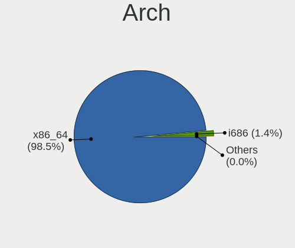
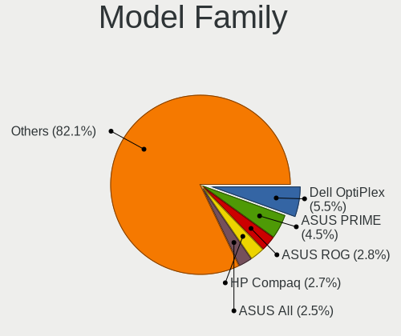
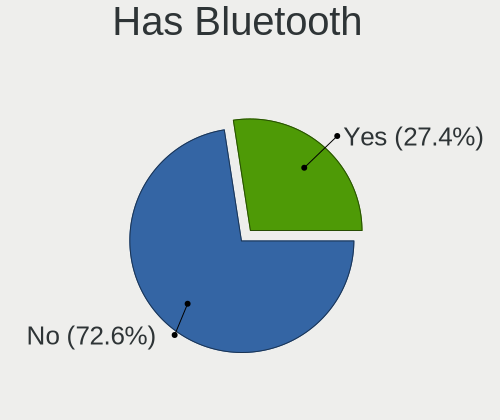
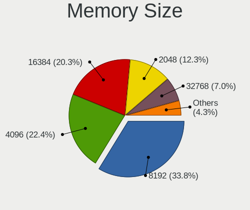
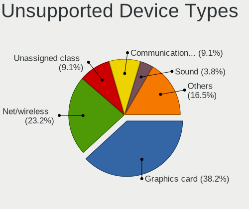

Ubuntu - Tested Hardware & Statistics (Desktops)
------------------------------------------------

A project to collect tested hardware configurations for Ubuntu.

Anyone can contribute to this report by the [hw-probe](https://github.com/linuxhw/hw-probe) tool:

    sudo -E hw-probe -all -upload

Please contribute! Especially if your hardware is rare.

Contents
--------

* [ Test Cases ](#test-cases)

* [ System ](#system)
  - [ OS                       ](#os)
  - [ OS Family                ](#os-family)
  - [ Kernel                   ](#kernel)
  - [ Kernel Family            ](#kernel-family)
  - [ Kernel Major Ver.        ](#kernel-major-ver)
  - [ Arch                     ](#arch)
  - [ DE                       ](#de)
  - [ Display Server           ](#display-server)
  - [ Display Manager          ](#display-manager)
  - [ OS Lang                  ](#os-lang)
  - [ Boot Mode                ](#boot-mode)
  - [ Filesystem               ](#filesystem)
  - [ Part. scheme             ](#part-scheme)
  - [ Dual Boot with Linux/BSD ](#dual-boot-with-linuxbsd)
  - [ Dual Boot (Win)          ](#dual-boot-win)

* [ Board ](#board)
  - [ Vendor                   ](#vendor)
  - [ Model                    ](#model)
  - [ Model Family             ](#model-family)
  - [ MFG Year                 ](#mfg-year)
  - [ Form Factor              ](#form-factor)
  - [ Secure Boot              ](#secure-boot)
  - [ Coreboot                 ](#coreboot)
  - [ RAM Size                 ](#ram-size)
  - [ RAM Used                 ](#ram-used)
  - [ Total Drives             ](#total-drives)
  - [ Has CD-ROM               ](#has-cd-rom)
  - [ Has Ethernet             ](#has-ethernet)
  - [ Has WiFi                 ](#has-wifi)
  - [ Has Bluetooth            ](#has-bluetooth)

* [ Location ](#location)
  - [ Country                  ](#country)
  - [ City                     ](#city)

* [ Drives ](#drives)
  - [ Drive Vendor             ](#drive-vendor)
  - [ Drive Model              ](#drive-model)
  - [ HDD Vendor               ](#hdd-vendor)
  - [ SSD Vendor               ](#ssd-vendor)
  - [ Drive Kind               ](#drive-kind)
  - [ Drive Connector          ](#drive-connector)
  - [ Drive Size               ](#drive-size)
  - [ Space Total              ](#space-total)
  - [ Space Used               ](#space-used)
  - [ Malfunc. Drives          ](#malfunc-drives)
  - [ Malfunc. Drive Vendor    ](#malfunc-drive-vendor)
  - [ Malfunc. HDD Vendor      ](#malfunc-hdd-vendor)
  - [ Malfunc. Drive Kind      ](#malfunc-drive-kind)
  - [ Failed Drives            ](#failed-drives)
  - [ Failed Drive Vendor      ](#failed-drive-vendor)
  - [ Drive Status             ](#drive-status)

* [ Storage controller ](#storage-controller)
  - [ Storage Vendor           ](#storage-vendor)
  - [ Storage Model            ](#storage-model)
  - [ Storage Kind             ](#storage-kind)

* [ Processor ](#processor)
  - [ CPU Vendor               ](#cpu-vendor)
  - [ CPU Model                ](#cpu-model)
  - [ CPU Model Family         ](#cpu-model-family)
  - [ CPU Cores                ](#cpu-cores)
  - [ CPU Sockets              ](#cpu-sockets)
  - [ CPU Threads              ](#cpu-threads)
  - [ CPU Op-Modes             ](#cpu-op-modes)
  - [ CPU Microcode            ](#cpu-microcode)
  - [ CPU Microarch            ](#cpu-microarch)

* [ Graphics ](#graphics)
  - [ GPU Vendor               ](#gpu-vendor)
  - [ GPU Model                ](#gpu-model)
  - [ GPU Combo                ](#gpu-combo)
  - [ GPU Driver               ](#gpu-driver)
  - [ GPU Memory               ](#gpu-memory)

* [ Monitor ](#monitor)
  - [ Monitor Vendor           ](#monitor-vendor)
  - [ Monitor Model            ](#monitor-model)
  - [ Monitor Resolution       ](#monitor-resolution)
  - [ Monitor Diagonal         ](#monitor-diagonal)
  - [ Monitor Width            ](#monitor-width)
  - [ Aspect Ratio             ](#aspect-ratio)
  - [ Monitor Area             ](#monitor-area)
  - [ Pixel Density            ](#pixel-density)
  - [ Multiple Monitors        ](#multiple-monitors)

* [ Network ](#network)
  - [ Net Controller Vendor    ](#net-controller-vendor)
  - [ Net Controller Model     ](#net-controller-model)
  - [ Wireless Vendor          ](#wireless-vendor)
  - [ Wireless Model           ](#wireless-model)
  - [ Ethernet Vendor          ](#ethernet-vendor)
  - [ Ethernet Model           ](#ethernet-model)
  - [ Net Controller Kind      ](#net-controller-kind)
  - [ Used Controller          ](#used-controller)
  - [ NICs                     ](#nics)
  - [ IPv6                     ](#ipv6)

* [ Bluetooth ](#bluetooth)
  - [ Bluetooth Vendor         ](#bluetooth-vendor)
  - [ Bluetooth Model          ](#bluetooth-model)

* [ Sound ](#sound)
  - [ Sound Vendor             ](#sound-vendor)
  - [ Sound Model              ](#sound-model)

* [ Memory ](#memory)
  - [ Memory Vendor            ](#memory-vendor)
  - [ Memory Model             ](#memory-model)
  - [ Memory Kind              ](#memory-kind)
  - [ Memory Form Factor       ](#memory-form-factor)
  - [ Memory Size              ](#memory-size)
  - [ Memory Speed             ](#memory-speed)

* [ Printers & scanners ](#printers--scanners)
  - [ Printer Vendor           ](#printer-vendor)
  - [ Printer Model            ](#printer-model)
  - [ Scanner Vendor           ](#scanner-vendor)
  - [ Scanner Model            ](#scanner-model)

* [ Camera ](#camera)
  - [ Camera Vendor            ](#camera-vendor)
  - [ Camera Model             ](#camera-model)

* [ Security ](#security)
  - [ Fingerprint Vendor       ](#fingerprint-vendor)
  - [ Fingerprint Model        ](#fingerprint-model)
  - [ Chipcard Vendor          ](#chipcard-vendor)
  - [ Chipcard Model           ](#chipcard-model)

* [ Unsupported ](#unsupported)
  - [ Unsupported Devices      ](#unsupported-devices)
  - [ Unsupported Device Types ](#unsupported-device-types)

Test Cases
----------

Total: 28565

| Vendor        | Model                       | Probe                                                      | Date         |
|---------------|-----------------------------|------------------------------------------------------------|--------------|
| Fujitsu       | D3162-A1 S26361-D3162-A1    | [060a34b3a1](https://linux-hardware.org/?probe=060a34b3a1) | Jul 01, 2022 |
| Fujitsu       | D3162-A1 S26361-D3162-A1    | [630bb92cd8](https://linux-hardware.org/?probe=630bb92cd8) | Jul 01, 2022 |
| MSI           | Z390 GAM PRO CARB AC        | [a55ab11db7](https://linux-hardware.org/?probe=a55ab11db7) | Jul 01, 2022 |
| ASRock        | H310CM-HDV                  | [4e6539bf57](https://linux-hardware.org/?probe=4e6539bf57) | Jul 01, 2022 |
| Dell          | 042P49 A02                  | [110e5da723](https://linux-hardware.org/?probe=110e5da723) | Jul 01, 2022 |
| Intel         | DX58SO AAE29331-703         | [3b22974574](https://linux-hardware.org/?probe=3b22974574) | Jul 01, 2022 |
| Medion        | MS-7797                     | [01ff2f8272](https://linux-hardware.org/?probe=01ff2f8272) | Jul 01, 2022 |
| ASUSTek       | M5A78L LE                   | [19dbe00e60](https://linux-hardware.org/?probe=19dbe00e60) | Jul 01, 2022 |
| HP            | 805D                        | [3610332b9c](https://linux-hardware.org/?probe=3610332b9c) | Jul 01, 2022 |
| Dell          | 042P49 A02                  | [169b7b8c30](https://linux-hardware.org/?probe=169b7b8c30) | Jul 01, 2022 |
| Dell          | 0NRKPK A02                  | [c483bc3c81](https://linux-hardware.org/?probe=c483bc3c81) | Jul 01, 2022 |
| Gigabyte      | H81M-S2PH                   | [cc62a478ac](https://linux-hardware.org/?probe=cc62a478ac) | Jul 01, 2022 |
| ASRock        | H570M Pro4                  | [7edf16eeea](https://linux-hardware.org/?probe=7edf16eeea) | Jul 01, 2022 |
| Gigabyte      | Z97X-Gaming 3               | [9b8bb163d3](https://linux-hardware.org/?probe=9b8bb163d3) | Jul 01, 2022 |
| ASUSTek       | TUF Gaming X570-PLUS        | [987d9aa4d3](https://linux-hardware.org/?probe=987d9aa4d3) | Jul 01, 2022 |
| ECS           | A780GM-A                    | [2cea4325e9](https://linux-hardware.org/?probe=2cea4325e9) | Jul 01, 2022 |
| Gigabyte      | Q170M-D3H-CF                | [241f8bd9da](https://linux-hardware.org/?probe=241f8bd9da) | Jul 01, 2022 |
| Biostar       | B550GTA                     | [5d9da072f0](https://linux-hardware.org/?probe=5d9da072f0) | Jul 01, 2022 |
| Gigabyte      | AM1M-S2H                    | [fb2500cc2d](https://linux-hardware.org/?probe=fb2500cc2d) | Jul 01, 2022 |
| Unknown       | Unknown                     | [1de34d9bf9](https://linux-hardware.org/?probe=1de34d9bf9) | Jun 30, 2022 |
| Dell          | 0GDG8Y A00                  | [4ccd9d239d](https://linux-hardware.org/?probe=4ccd9d239d) | Jun 30, 2022 |
| ASUSTek       | P5G41T-M LX2/GB             | [3bbee83307](https://linux-hardware.org/?probe=3bbee83307) | Jun 30, 2022 |
| ASUSTek       | P5G41T-M LX2/GB             | [0b299bea1b](https://linux-hardware.org/?probe=0b299bea1b) | Jun 30, 2022 |
| ASUSTek       | ROG STRIX X570-F GAMING     | [334719e6a2](https://linux-hardware.org/?probe=334719e6a2) | Jun 30, 2022 |
| MSI           | Z68A-GD80                   | [2e2ca703b0](https://linux-hardware.org/?probe=2e2ca703b0) | Jun 30, 2022 |
| Gigabyte      | MQLP5AP-00                  | [8014a14842](https://linux-hardware.org/?probe=8014a14842) | Jun 30, 2022 |
| Supermicro    | X9DBS-F                     | [7aeeacc12c](https://linux-hardware.org/?probe=7aeeacc12c) | Jun 30, 2022 |
| Gigabyte      | C1037UN-EU                  | [a2729b2e3b](https://linux-hardware.org/?probe=a2729b2e3b) | Jun 30, 2022 |
| Biostar       | H510MH/E                    | [7b28198a82](https://linux-hardware.org/?probe=7b28198a82) | Jun 30, 2022 |
| MSI           | H81M-P33                    | [1a0e20ab20](https://linux-hardware.org/?probe=1a0e20ab20) | Jun 29, 2022 |
| Protectli     | FW6                         | [c129601645](https://linux-hardware.org/?probe=c129601645) | Jun 29, 2022 |
| ASUSTek       | ROG STRIX Z370-E GAMING     | [349dc94a13](https://linux-hardware.org/?probe=349dc94a13) | Jun 29, 2022 |
| Protectli     | FW6                         | [f7d331dfcb](https://linux-hardware.org/?probe=f7d331dfcb) | Jun 29, 2022 |
| MSI           | MEG Z490 UNIFY              | [2c7a50869d](https://linux-hardware.org/?probe=2c7a50869d) | Jun 29, 2022 |
| Dell          | 0M5DCD A00                  | [7ff0a3f172](https://linux-hardware.org/?probe=7ff0a3f172) | Jun 29, 2022 |
| Dell          | 0M5DCD A00                  | [483d6a9299](https://linux-hardware.org/?probe=483d6a9299) | Jun 29, 2022 |
| Lenovo        | MAHOBAY NOK                 | [20a14662e8](https://linux-hardware.org/?probe=20a14662e8) | Jun 29, 2022 |
| MSI           | MPG Z390I GAMING EDGE AC    | [389293962a](https://linux-hardware.org/?probe=389293962a) | Jun 29, 2022 |
| ASUSTek       | B85M-E                      | [2423d184c0](https://linux-hardware.org/?probe=2423d184c0) | Jun 29, 2022 |
| Gigabyte      | GB-BRR7H-4700               | [5ac6d883d6](https://linux-hardware.org/?probe=5ac6d883d6) | Jun 29, 2022 |
| ASUSTek       | P5LD2                       | [4fdebc2b9c](https://linux-hardware.org/?probe=4fdebc2b9c) | Jun 29, 2022 |
| ASRock        | B550M-ITX/ac                | [01614433d5](https://linux-hardware.org/?probe=01614433d5) | Jun 29, 2022 |
| ASUSTek       | P5LD2                       | [c7f67d9347](https://linux-hardware.org/?probe=c7f67d9347) | Jun 29, 2022 |
| ASUSTek       | PRO H410M-C                 | [9f705aea75](https://linux-hardware.org/?probe=9f705aea75) | Jun 29, 2022 |
| Dell          | 0D24M8 A00                  | [1588270a58](https://linux-hardware.org/?probe=1588270a58) | Jun 29, 2022 |
| ASUSTek       | CROSSHAIR V FORMULA-Z       | [d59692d648](https://linux-hardware.org/?probe=d59692d648) | Jun 29, 2022 |
| Dell          | 0VHWTR A02                  | [ee144de507](https://linux-hardware.org/?probe=ee144de507) | Jun 29, 2022 |
| ASUSTek       | ROG STRIX X570-E GAMING     | [5873a7a8dd](https://linux-hardware.org/?probe=5873a7a8dd) | Jun 29, 2022 |
| MSI           | H110M GAMING                | [e33051cbd0](https://linux-hardware.org/?probe=e33051cbd0) | Jun 28, 2022 |
| Biostar       | H61MGV3                     | [bb42e29bbb](https://linux-hardware.org/?probe=bb42e29bbb) | Jun 28, 2022 |
| Dell          | 0NRKPK A01                  | [dca04c3b5b](https://linux-hardware.org/?probe=dca04c3b5b) | Jun 28, 2022 |
| Dell          | 0TP406                      | [4f0f2b2e05](https://linux-hardware.org/?probe=4f0f2b2e05) | Jun 28, 2022 |
| Dell          | 0NRKPK A01                  | [2af61a0a3c](https://linux-hardware.org/?probe=2af61a0a3c) | Jun 28, 2022 |
| Alienware     | 01NYPT A00                  | [97b8d855bd](https://linux-hardware.org/?probe=97b8d855bd) | Jun 28, 2022 |
| ASUSTek       | PRIME A520M-K               | [d8a4ade22e](https://linux-hardware.org/?probe=d8a4ade22e) | Jun 28, 2022 |
| Acer          | H81-M1                      | [9ddfb2ec8d](https://linux-hardware.org/?probe=9ddfb2ec8d) | Jun 28, 2022 |
| ASUSTek       | H110M-R                     | [06f09abf11](https://linux-hardware.org/?probe=06f09abf11) | Jun 28, 2022 |
| MSI           | X470 GAMING PLUS MAX        | [d399933441](https://linux-hardware.org/?probe=d399933441) | Jun 28, 2022 |
| Unknown       | Unknown                     | [8eb0d6165a](https://linux-hardware.org/?probe=8eb0d6165a) | Jun 28, 2022 |
| HP            | 0B4Ch D                     | [6e28eeb447](https://linux-hardware.org/?probe=6e28eeb447) | Jun 27, 2022 |
| Dell          | 0RF703                      | [7b1a5ddcb6](https://linux-hardware.org/?probe=7b1a5ddcb6) | Jun 27, 2022 |
| ASRock        | 970 Pro3 R2.0               | [ba2f829e73](https://linux-hardware.org/?probe=ba2f829e73) | Jun 27, 2022 |
| Dell          | 051FJ8 A02                  | [5b997790f1](https://linux-hardware.org/?probe=5b997790f1) | Jun 27, 2022 |
| Unknown       | Unknown                     | [bd912e1acc](https://linux-hardware.org/?probe=bd912e1acc) | Jun 27, 2022 |
| MSI           | MPG Z390 GAMING PLUS        | [3d575e19b6](https://linux-hardware.org/?probe=3d575e19b6) | Jun 27, 2022 |
| ASUSTek       | PRIME B460M-A               | [b63dffc595](https://linux-hardware.org/?probe=b63dffc595) | Jun 27, 2022 |
| Intel         | DH61WW AAG23116-302         | [7e1e1cf659](https://linux-hardware.org/?probe=7e1e1cf659) | Jun 27, 2022 |
| MSI           | B450M-A PRO MAX             | [666f9678a5](https://linux-hardware.org/?probe=666f9678a5) | Jun 27, 2022 |
| ASUSTek       | P8B75-M LE                  | [48cbc869da](https://linux-hardware.org/?probe=48cbc869da) | Jun 27, 2022 |
| ASUSTek       | P8B75-M LE                  | [ea31080862](https://linux-hardware.org/?probe=ea31080862) | Jun 27, 2022 |
| MSI           | Z590-A PRO                  | [1adcde94c5](https://linux-hardware.org/?probe=1adcde94c5) | Jun 26, 2022 |
| MSI           | Z590-A PRO                  | [18d6fda695](https://linux-hardware.org/?probe=18d6fda695) | Jun 26, 2022 |
| ASUSTek       | PRIME B350-PLUS             | [583a217093](https://linux-hardware.org/?probe=583a217093) | Jun 26, 2022 |
| MSI           | H55M-E33                    | [035cfe1a5b](https://linux-hardware.org/?probe=035cfe1a5b) | Jun 26, 2022 |
| MSI           | B450M PRO-M2                | [516abfbea1](https://linux-hardware.org/?probe=516abfbea1) | Jun 26, 2022 |
| MSI           | B450M-A PRO MAX             | [aa9757e958](https://linux-hardware.org/?probe=aa9757e958) | Jun 26, 2022 |
| Lenovo        | 3102 SDK0J40697 WIN 3305... | [b0c272ff93](https://linux-hardware.org/?probe=b0c272ff93) | Jun 26, 2022 |
| Gigabyte      | Z97M-DS3H                   | [f90172a9f9](https://linux-hardware.org/?probe=f90172a9f9) | Jun 26, 2022 |
| MSI           | H61M-P20                    | [c86cefdaa6](https://linux-hardware.org/?probe=c86cefdaa6) | Jun 26, 2022 |
| ASUSTek       | P8Z68-V LX                  | [5935ab812a](https://linux-hardware.org/?probe=5935ab812a) | Jun 26, 2022 |
| MSI           | PRO Z690-A                  | [34a2f4f726](https://linux-hardware.org/?probe=34a2f4f726) | Jun 26, 2022 |
| ASUSTek       | P8H61-I                     | [15b8beca14](https://linux-hardware.org/?probe=15b8beca14) | Jun 26, 2022 |
| Unknown       | 1.0                         | [340f931c7f](https://linux-hardware.org/?probe=340f931c7f) | Jun 26, 2022 |
| HP            | 8054                        | [82dd44f05f](https://linux-hardware.org/?probe=82dd44f05f) | Jun 26, 2022 |
| Dell          | 0HD5W2 A01                  | [9f87421952](https://linux-hardware.org/?probe=9f87421952) | Jun 26, 2022 |
| Dell          | 0VD92X A00                  | [5082bf92e9](https://linux-hardware.org/?probe=5082bf92e9) | Jun 26, 2022 |
| MSI           | A78M-E45 V2                 | [e4cd6586b4](https://linux-hardware.org/?probe=e4cd6586b4) | Jun 26, 2022 |
| ASUSTek       | ROG CROSSHAIR VIII HERO     | [55fc30c7a5](https://linux-hardware.org/?probe=55fc30c7a5) | Jun 26, 2022 |
| Gigabyte      | X570 GAMING X               | [b66ac35391](https://linux-hardware.org/?probe=b66ac35391) | Jun 26, 2022 |
| ASUSTek       | Pro WS WRX80E-SAGE SE WI... | [f440505698](https://linux-hardware.org/?probe=f440505698) | Jun 25, 2022 |
| MSI           | Z97 GAMING 5                | [473a0abca4](https://linux-hardware.org/?probe=473a0abca4) | Jun 25, 2022 |
| MSI           | H61MA-E35                   | [697fc8150b](https://linux-hardware.org/?probe=697fc8150b) | Jun 25, 2022 |
| MSI           | H81M-P33                    | [e25d17a838](https://linux-hardware.org/?probe=e25d17a838) | Jun 25, 2022 |
| ASUSTek       | P6T DELUXE V2               | [2dbe28adc6](https://linux-hardware.org/?probe=2dbe28adc6) | Jun 25, 2022 |
| MSI           | H61MA-E35                   | [46a7f113c9](https://linux-hardware.org/?probe=46a7f113c9) | Jun 25, 2022 |
| MSI           | H81M-P33                    | [9ba6c64800](https://linux-hardware.org/?probe=9ba6c64800) | Jun 25, 2022 |
| Lenovo        | 3102 SDK0J40697 WIN 3305... | [eb7445dbdf](https://linux-hardware.org/?probe=eb7445dbdf) | Jun 25, 2022 |
| ASUSTek       | TUF Gaming X570-PLUS_BR     | [8f2b511688](https://linux-hardware.org/?probe=8f2b511688) | Jun 25, 2022 |
| ASUSTek       | TUF Gaming X570-PLUS_BR     | [ace55b44d7](https://linux-hardware.org/?probe=ace55b44d7) | Jun 25, 2022 |
| Lenovo        | 3714 SDK0J40700 WIN 3258... | [1be22bc8af](https://linux-hardware.org/?probe=1be22bc8af) | Jun 24, 2022 |
| MSI           | Z370 GAMING PRO CARBON      | [57660d8f0f](https://linux-hardware.org/?probe=57660d8f0f) | Jun 24, 2022 |
| Gigabyte      | P41T-D3P                    | [91ce49ee9f](https://linux-hardware.org/?probe=91ce49ee9f) | Jun 24, 2022 |
| ASUSTek       | PRIME X570-P                | [fc1716de1f](https://linux-hardware.org/?probe=fc1716de1f) | Jun 24, 2022 |
| ASUSTek       | PRIME X570-P                | [785ec99ee8](https://linux-hardware.org/?probe=785ec99ee8) | Jun 24, 2022 |
| Gigabyte      | A520M S2H                   | [094c3f1e98](https://linux-hardware.org/?probe=094c3f1e98) | Jun 24, 2022 |
| Dell          | 0HY9JP A00                  | [92c1597a97](https://linux-hardware.org/?probe=92c1597a97) | Jun 24, 2022 |
| Dell          | 0KW626                      | [ceb37aeba1](https://linux-hardware.org/?probe=ceb37aeba1) | Jun 24, 2022 |
| Intel         | X79G V2.x                   | [67b2e27895](https://linux-hardware.org/?probe=67b2e27895) | Jun 24, 2022 |
| Intel         | D33217GKE G76540-203        | [9bc1116d3a](https://linux-hardware.org/?probe=9bc1116d3a) | Jun 24, 2022 |
| ASUSTek       | X99-DELUXE                  | [34e3aad338](https://linux-hardware.org/?probe=34e3aad338) | Jun 24, 2022 |
| Gigabyte      | H410M H V3                  | [fb85ee8196](https://linux-hardware.org/?probe=fb85ee8196) | Jun 24, 2022 |
| HP            | 2AF7                        | [86ecfeb9e2](https://linux-hardware.org/?probe=86ecfeb9e2) | Jun 24, 2022 |
| AFOX          | AF IH81-MA3 V1.0            | [4ce7ccc125](https://linux-hardware.org/?probe=4ce7ccc125) | Jun 24, 2022 |
| Dell          | 018D1Y A00                  | [8344a8b783](https://linux-hardware.org/?probe=8344a8b783) | Jun 24, 2022 |
| Foxconn       | 2AB1                        | [389a1d6185](https://linux-hardware.org/?probe=389a1d6185) | Jun 23, 2022 |
| Dell          | 0MGK50 A02                  | [eca7a31c46](https://linux-hardware.org/?probe=eca7a31c46) | Jun 23, 2022 |
| ASUSTek       | B85-PLUS                    | [1086e71f79](https://linux-hardware.org/?probe=1086e71f79) | Jun 23, 2022 |
| Dell          | 0MGK50 A02                  | [134bf128f7](https://linux-hardware.org/?probe=134bf128f7) | Jun 23, 2022 |
| Dell          | 07N90W A00                  | [16fe9be88b](https://linux-hardware.org/?probe=16fe9be88b) | Jun 23, 2022 |
| ASRock        | Z590M-ITX/ax                | [263e8a50af](https://linux-hardware.org/?probe=263e8a50af) | Jun 23, 2022 |
| Gigabyte      | X570S AORUS MASTER          | [95d5b870bb](https://linux-hardware.org/?probe=95d5b870bb) | Jun 23, 2022 |
| ASUSTek       | ROG STRIX Z590-E GAMING ... | [3cfb6f7ee5](https://linux-hardware.org/?probe=3cfb6f7ee5) | Jun 23, 2022 |
| ASUSTek       | Z97-K                       | [486601dc33](https://linux-hardware.org/?probe=486601dc33) | Jun 23, 2022 |
| Dell          | 0GY6Y8 A01                  | [d97ba1924c](https://linux-hardware.org/?probe=d97ba1924c) | Jun 23, 2022 |
| Lenovo        | MAHOBAY                     | [8f7a233327](https://linux-hardware.org/?probe=8f7a233327) | Jun 22, 2022 |
| Dell          | 0W2F8G A01                  | [447653d4f2](https://linux-hardware.org/?probe=447653d4f2) | Jun 22, 2022 |
| Dell          | 0W2F8G A01                  | [4610c38358](https://linux-hardware.org/?probe=4610c38358) | Jun 22, 2022 |
| ASUSTek       | P6T WS PRO                  | [9899337065](https://linux-hardware.org/?probe=9899337065) | Jun 22, 2022 |
| Gigabyte      | EP45-UD3P                   | [56959468cc](https://linux-hardware.org/?probe=56959468cc) | Jun 22, 2022 |
| HP            | 2AF7                        | [f4eccffc76](https://linux-hardware.org/?probe=f4eccffc76) | Jun 22, 2022 |
| Dell          | 0Y7WYT A00                  | [51f72b720d](https://linux-hardware.org/?probe=51f72b720d) | Jun 22, 2022 |
| ASUSTek       | M5A97 LE R2.0               | [f22d3d0fd3](https://linux-hardware.org/?probe=f22d3d0fd3) | Jun 22, 2022 |
| Gigabyte      | GA-MA790FXT-UD5P            | [e4116b95a2](https://linux-hardware.org/?probe=e4116b95a2) | Jun 22, 2022 |
| Dell          | 042P49 A01                  | [836efa773c](https://linux-hardware.org/?probe=836efa773c) | Jun 22, 2022 |
| Gigabyte      | H310M H                     | [90038bfa8e](https://linux-hardware.org/?probe=90038bfa8e) | Jun 22, 2022 |
| Dell          | 042P49 A01                  | [380b66353e](https://linux-hardware.org/?probe=380b66353e) | Jun 21, 2022 |
| Unknown       | RS780-SB700                 | [a4649c2c4a](https://linux-hardware.org/?probe=a4649c2c4a) | Jun 21, 2022 |
| MSI           | A320M-A PRO                 | [1f3b17165b](https://linux-hardware.org/?probe=1f3b17165b) | Jun 21, 2022 |
| PCWare        | IPMH61R1                    | [130bb25912](https://linux-hardware.org/?probe=130bb25912) | Jun 21, 2022 |
| ASRock        | H81M-VG4                    | [f9f9db00a7](https://linux-hardware.org/?probe=f9f9db00a7) | Jun 21, 2022 |
| MSI           | B150M PRO-VDH               | [ac535a081f](https://linux-hardware.org/?probe=ac535a081f) | Jun 21, 2022 |
| Acer          | Aspire X1700                | [6a67f8cba0](https://linux-hardware.org/?probe=6a67f8cba0) | Jun 21, 2022 |
| HP            | 0AA0h                       | [ccc94e1725](https://linux-hardware.org/?probe=ccc94e1725) | Jun 21, 2022 |
| Gigabyte      | M68MT-S2                    | [c52b07844d](https://linux-hardware.org/?probe=c52b07844d) | Jun 21, 2022 |
| Gigabyte      | M68MT-S2                    | [31f786c1ff](https://linux-hardware.org/?probe=31f786c1ff) | Jun 21, 2022 |
| MSI           | B250I GAMING PRO AC         | [280d4af2d2](https://linux-hardware.org/?probe=280d4af2d2) | Jun 21, 2022 |
| MSI           | B250I GAMING PRO AC         | [c90adf6d43](https://linux-hardware.org/?probe=c90adf6d43) | Jun 21, 2022 |
| ASUSTek       | P8Z68-V LX                  | [a91bf1aff7](https://linux-hardware.org/?probe=a91bf1aff7) | Jun 21, 2022 |
| Gigabyte      | B660M GAMING DDR4           | [80ecbe8684](https://linux-hardware.org/?probe=80ecbe8684) | Jun 21, 2022 |
| Intel         | B75                         | [5e9768ed1a](https://linux-hardware.org/?probe=5e9768ed1a) | Jun 21, 2022 |
| Gigabyte      | B450M DS3H WIFI V2-CF       | [37f7936cd9](https://linux-hardware.org/?probe=37f7936cd9) | Jun 21, 2022 |
| Dell          | 0VD92X A00                  | [d0edbadf25](https://linux-hardware.org/?probe=d0edbadf25) | Jun 21, 2022 |
| ASUSTek       | Q87M-E                      | [9f37139898](https://linux-hardware.org/?probe=9f37139898) | Jun 21, 2022 |
| Dell          | 0TP406                      | [3798b45f67](https://linux-hardware.org/?probe=3798b45f67) | Jun 20, 2022 |
| MSI           | A78M-E45 V2                 | [97b9d51036](https://linux-hardware.org/?probe=97b9d51036) | Jun 20, 2022 |
| Foxconn       | 2ADA                        | [d720505734](https://linux-hardware.org/?probe=d720505734) | Jun 20, 2022 |
| Foxconn       | 2ADA                        | [c2b0898c1a](https://linux-hardware.org/?probe=c2b0898c1a) | Jun 20, 2022 |
| MSI           | Creator X299                | [279caedd2f](https://linux-hardware.org/?probe=279caedd2f) | Jun 20, 2022 |
| ASRock        | X470 Gaming-ITX/ac          | [ff99319454](https://linux-hardware.org/?probe=ff99319454) | Jun 20, 2022 |
| ASUSTek       | X99-A                       | [b4635a7e21](https://linux-hardware.org/?probe=b4635a7e21) | Jun 20, 2022 |
| MSI           | A320M-A PRO                 | [8cecec73c6](https://linux-hardware.org/?probe=8cecec73c6) | Jun 19, 2022 |
| Dell          | 0HD5W2 A01                  | [714a296099](https://linux-hardware.org/?probe=714a296099) | Jun 19, 2022 |
| ASUSTek       | CROSSHAIR VI HERO           | [2a4d1c8a0b](https://linux-hardware.org/?probe=2a4d1c8a0b) | Jun 19, 2022 |
| MSI           | B450 TOMAHAWK MAX           | [19199f4c55](https://linux-hardware.org/?probe=19199f4c55) | Jun 19, 2022 |
| ASUSTek       | PRIME A320M-K               | [7c094dc326](https://linux-hardware.org/?probe=7c094dc326) | Jun 19, 2022 |
| Gigabyte      | 965P-S3                     | [0beb9ce480](https://linux-hardware.org/?probe=0beb9ce480) | Jun 19, 2022 |
| Gigabyte      | Z87X-UD3H-CF                | [4c91d4b394](https://linux-hardware.org/?probe=4c91d4b394) | Jun 19, 2022 |
| Gigabyte      | Z87X-UD3H-CF                | [571829be67](https://linux-hardware.org/?probe=571829be67) | Jun 19, 2022 |
| ASUSTek       | X99-A/USB                   | [d9808cc5aa](https://linux-hardware.org/?probe=d9808cc5aa) | Jun 19, 2022 |
| Lenovo        | 110520U ThinkServer TS13... | [850ed5aa51](https://linux-hardware.org/?probe=850ed5aa51) | Jun 19, 2022 |
| HP            | 1494                        | [2dc41c0b99](https://linux-hardware.org/?probe=2dc41c0b99) | Jun 19, 2022 |
| ASRock        | H81M-HG4 R4.0               | [6446ac4750](https://linux-hardware.org/?probe=6446ac4750) | Jun 18, 2022 |
| Dell          | 09M8Y8 A02                  | [a029173d31](https://linux-hardware.org/?probe=a029173d31) | Jun 18, 2022 |
| Acer          | Aspire X3950                | [7a70838628](https://linux-hardware.org/?probe=7a70838628) | Jun 18, 2022 |
| ASUSTek       | M5A97 R2.0                  | [8fe0980445](https://linux-hardware.org/?probe=8fe0980445) | Jun 18, 2022 |
| Dell          | 0XHGV1 A00                  | [aeb1a92366](https://linux-hardware.org/?probe=aeb1a92366) | Jun 18, 2022 |
| MSI           | A320M-A PRO MAX             | [50149d3df0](https://linux-hardware.org/?probe=50149d3df0) | Jun 18, 2022 |
| Intel         | X79 V2.72B                  | [fbd8e560b4](https://linux-hardware.org/?probe=fbd8e560b4) | Jun 18, 2022 |
| ASUSTek       | CROSSHAIR VI HERO           | [3e7ce078c6](https://linux-hardware.org/?probe=3e7ce078c6) | Jun 18, 2022 |
| Dell          | 0D883F A06                  | [6296a553c6](https://linux-hardware.org/?probe=6296a553c6) | Jun 18, 2022 |
| Intel         | X79 V2.72B                  | [f0873d6264](https://linux-hardware.org/?probe=f0873d6264) | Jun 18, 2022 |
| HP            | 1790                        | [5162585f07](https://linux-hardware.org/?probe=5162585f07) | Jun 18, 2022 |
| HP            | 843B                        | [b0e1ab726c](https://linux-hardware.org/?probe=b0e1ab726c) | Jun 18, 2022 |
| Biostar       | H81MLV3                     | [d24427bbc8](https://linux-hardware.org/?probe=d24427bbc8) | Jun 18, 2022 |
| Gigabyte      | H61M-DS2                    | [866ee7a33b](https://linux-hardware.org/?probe=866ee7a33b) | Jun 18, 2022 |
| Gigabyte      | Z97M-DS3H                   | [67757f27f2](https://linux-hardware.org/?probe=67757f27f2) | Jun 18, 2022 |
| Gigabyte      | F2A68HM-H                   | [3adcbf0255](https://linux-hardware.org/?probe=3adcbf0255) | Jun 18, 2022 |
| ASRock        | G41M-GS                     | [9167934132](https://linux-hardware.org/?probe=9167934132) | Jun 18, 2022 |
| ASUSTek       | H110M-CS/BR                 | [35cfc3daf7](https://linux-hardware.org/?probe=35cfc3daf7) | Jun 18, 2022 |
| ASUSTek       | B85-PLUS                    | [369f6c7b33](https://linux-hardware.org/?probe=369f6c7b33) | Jun 17, 2022 |
| MSI           | Z270 GAMING PRO CARBON      | [63e3deaaf4](https://linux-hardware.org/?probe=63e3deaaf4) | Jun 17, 2022 |
| Gigabyte      | M68MT-S2                    | [570c3b2345](https://linux-hardware.org/?probe=570c3b2345) | Jun 17, 2022 |
| ASUSTek       | H110M-CS/BR                 | [47e88dae48](https://linux-hardware.org/?probe=47e88dae48) | Jun 17, 2022 |
| ASUSTek       | H110M-CS/BR                 | [772bf458a3](https://linux-hardware.org/?probe=772bf458a3) | Jun 17, 2022 |
| MSI           | MPG X570S EDGE MAX WIFI     | [f5d7a0bba4](https://linux-hardware.org/?probe=f5d7a0bba4) | Jun 17, 2022 |
| ASUSTek       | P8H67-M LE                  | [baea5f4827](https://linux-hardware.org/?probe=baea5f4827) | Jun 17, 2022 |
| ASUSTek       | P8H67-M LE                  | [02fe348971](https://linux-hardware.org/?probe=02fe348971) | Jun 17, 2022 |
| HP            | 1998                        | [86d621451f](https://linux-hardware.org/?probe=86d621451f) | Jun 17, 2022 |
| ASUSTek       | P8H67-M LE                  | [d52a1b8eea](https://linux-hardware.org/?probe=d52a1b8eea) | Jun 17, 2022 |
| HP            | 8184 X4                     | [e2f24b580b](https://linux-hardware.org/?probe=e2f24b580b) | Jun 17, 2022 |
| MSI           | C847MS-E33                  | [aa48fba380](https://linux-hardware.org/?probe=aa48fba380) | Jun 17, 2022 |
| Dell          | 0KRC95 A00                  | [c47403b875](https://linux-hardware.org/?probe=c47403b875) | Jun 17, 2022 |
| MSI           | C847MS-E33                  | [ff32814ae1](https://linux-hardware.org/?probe=ff32814ae1) | Jun 17, 2022 |
| HP            | 8184 X4                     | [668438d39e](https://linux-hardware.org/?probe=668438d39e) | Jun 17, 2022 |
| ASUSTek       | X99-A                       | [2f722cf462](https://linux-hardware.org/?probe=2f722cf462) | Jun 17, 2022 |
| ASUSTek       | PRIME B450M-K               | [e3bb4dee4b](https://linux-hardware.org/?probe=e3bb4dee4b) | Jun 17, 2022 |
| ASUSTek       | M5A99X EVO R2.0             | [0d4c3d0c10](https://linux-hardware.org/?probe=0d4c3d0c10) | Jun 17, 2022 |
| ASUSTek       | H97M-PLUS                   | [874c85b694](https://linux-hardware.org/?probe=874c85b694) | Jun 17, 2022 |
| Dell          | 0T10XW A02                  | [0f85e88219](https://linux-hardware.org/?probe=0f85e88219) | Jun 17, 2022 |
| MSI           | B450-A PRO MAX              | [24ecffb555](https://linux-hardware.org/?probe=24ecffb555) | Jun 16, 2022 |
| Lenovo        | 3148 SDK0J40709 WIN 3259... | [475e980cb3](https://linux-hardware.org/?probe=475e980cb3) | Jun 16, 2022 |
| Lenovo        | SHARKBAY SDK0E50510 WIN     | [13d8bcbf2d](https://linux-hardware.org/?probe=13d8bcbf2d) | Jun 16, 2022 |
| Lenovo        | 30D9 SDK0J40705 WIN 3425... | [63ba339f77](https://linux-hardware.org/?probe=63ba339f77) | Jun 16, 2022 |
| Dell          | 0U880P A00                  | [463ec26d1e](https://linux-hardware.org/?probe=463ec26d1e) | Jun 16, 2022 |
| MSI           | B450M PRO-M2 MAX            | [f005c585bd](https://linux-hardware.org/?probe=f005c585bd) | Jun 16, 2022 |
| Dell          | 01XK1W A00                  | [f73ae16c57](https://linux-hardware.org/?probe=f73ae16c57) | Jun 16, 2022 |
| Dell          | 0U880P A00                  | [468b364f5a](https://linux-hardware.org/?probe=468b364f5a) | Jun 16, 2022 |
| Dell          | 0HHV7N A00                  | [3a13a87397](https://linux-hardware.org/?probe=3a13a87397) | Jun 16, 2022 |
| Gigabyte      | B560M DS3H AC               | [f0b95571fd](https://linux-hardware.org/?probe=f0b95571fd) | Jun 16, 2022 |
| Acer          | Aspire TC-230               | [bec506a849](https://linux-hardware.org/?probe=bec506a849) | Jun 16, 2022 |
| Gigabyte      | A320M-S2H-CF                | [59fa9b4918](https://linux-hardware.org/?probe=59fa9b4918) | Jun 16, 2022 |
| ASUSTek       | PRIME Z390-A                | [e156236584](https://linux-hardware.org/?probe=e156236584) | Jun 16, 2022 |
| ITI LIMITE... | SMAASH XU3i                 | [549a55efdf](https://linux-hardware.org/?probe=549a55efdf) | Jun 16, 2022 |
| ASUSTek       | ROG STRIX Z490-E GAMING     | [f7d40ad4fc](https://linux-hardware.org/?probe=f7d40ad4fc) | Jun 16, 2022 |
| ITI LIMITE... | SMAASH XU3i                 | [693d81e1a3](https://linux-hardware.org/?probe=693d81e1a3) | Jun 16, 2022 |
| HP            | 3031h                       | [00080c0264](https://linux-hardware.org/?probe=00080c0264) | Jun 16, 2022 |
| ASUSTek       | PRIME X570-P                | [4dc736e2b5](https://linux-hardware.org/?probe=4dc736e2b5) | Jun 16, 2022 |
| MSI           | MEG Z690 UNIFY              | [b005cba622](https://linux-hardware.org/?probe=b005cba622) | Jun 16, 2022 |
| Wearnes       | T1550-A1                    | [b131cd7e0d](https://linux-hardware.org/?probe=b131cd7e0d) | Jun 16, 2022 |
| Lenovo        | 102F SDK0E50510 WIN 2625... | [35c05116d1](https://linux-hardware.org/?probe=35c05116d1) | Jun 16, 2022 |
| HP            | 212B                        | [ca201e628f](https://linux-hardware.org/?probe=ca201e628f) | Jun 16, 2022 |
| ASUSTek       | ROG CROSSHAIR VIII DARK ... | [e8f85ab771](https://linux-hardware.org/?probe=e8f85ab771) | Jun 16, 2022 |
| MSI           | A78M-E45 V2                 | [86394fa5df](https://linux-hardware.org/?probe=86394fa5df) | Jun 16, 2022 |
| ASUSTek       | M5A78L-M/USB3               | [c5ecda7a62](https://linux-hardware.org/?probe=c5ecda7a62) | Jun 16, 2022 |
| MSI           | MPG B550I GAMING EDGE MA... | [69b95cc638](https://linux-hardware.org/?probe=69b95cc638) | Jun 16, 2022 |
| Gigabyte      | B450M DS3H V2               | [5d2c867af6](https://linux-hardware.org/?probe=5d2c867af6) | Jun 15, 2022 |
| Nvidia        | MCP73                       | [4af86ef214](https://linux-hardware.org/?probe=4af86ef214) | Jun 15, 2022 |
| Nvidia        | MCP73                       | [bc4b2de5bc](https://linux-hardware.org/?probe=bc4b2de5bc) | Jun 15, 2022 |
| ASUSTek       | Pro WS X570-ACE             | [177a1e7dcb](https://linux-hardware.org/?probe=177a1e7dcb) | Jun 15, 2022 |
| Gigabyte      | M68MT-S2                    | [ded75509fb](https://linux-hardware.org/?probe=ded75509fb) | Jun 15, 2022 |
| Acer          | Predator G3610              | [ff347cdb53](https://linux-hardware.org/?probe=ff347cdb53) | Jun 15, 2022 |
| Gigabyte      | GA-MA790FXT-UD5P            | [8852623d3d](https://linux-hardware.org/?probe=8852623d3d) | Jun 15, 2022 |
| Lenovo        | ThinkCentre M58 7373AJ5     | [84c9b71eb9](https://linux-hardware.org/?probe=84c9b71eb9) | Jun 15, 2022 |
| Lenovo        | 3148 SDK0J40709 WIN 3259... | [8d5ba3c58c](https://linux-hardware.org/?probe=8d5ba3c58c) | Jun 15, 2022 |
| Medion        | Cattle24 1M                 | [5ef81d4b82](https://linux-hardware.org/?probe=5ef81d4b82) | Jun 15, 2022 |
| HP            | 18E7                        | [664241d366](https://linux-hardware.org/?probe=664241d366) | Jun 15, 2022 |
| Wearnes       | T1550-A1                    | [002ebf8c70](https://linux-hardware.org/?probe=002ebf8c70) | Jun 15, 2022 |
| Gigabyte      | 970A-DS3P FX                | [81b8e44cca](https://linux-hardware.org/?probe=81b8e44cca) | Jun 15, 2022 |
| ASUSTek       | CROSSHAIR VI HERO           | [8bf8ec8bd0](https://linux-hardware.org/?probe=8bf8ec8bd0) | Jun 15, 2022 |
| Acer          | Aspire X1400                | [a90701fd86](https://linux-hardware.org/?probe=a90701fd86) | Jun 15, 2022 |
| Dell          | 0YXT71 A01                  | [bff4742605](https://linux-hardware.org/?probe=bff4742605) | Jun 15, 2022 |
| Dell          | 0YXT71 A01                  | [2b5fdf4b81](https://linux-hardware.org/?probe=2b5fdf4b81) | Jun 15, 2022 |
| MSI           | B550M PRO-VDH               | [9916ed24a9](https://linux-hardware.org/?probe=9916ed24a9) | Jun 15, 2022 |
| ASUSTek       | PRIME A320M-K               | [c8dfb12509](https://linux-hardware.org/?probe=c8dfb12509) | Jun 14, 2022 |
| Medion        | B460H6-EM                   | [b2d8ad91a9](https://linux-hardware.org/?probe=b2d8ad91a9) | Jun 14, 2022 |
| Unknown       | 1.0                         | [de849825ee](https://linux-hardware.org/?probe=de849825ee) | Jun 14, 2022 |
| Dell          | 0VD92X A00                  | [4f3e4e102f](https://linux-hardware.org/?probe=4f3e4e102f) | Jun 14, 2022 |
| ASUSTek       | Pro WS X570-ACE             | [1d7c15819d](https://linux-hardware.org/?probe=1d7c15819d) | Jun 14, 2022 |
| Dell          | 0VD92X A00                  | [550ed4b1c0](https://linux-hardware.org/?probe=550ed4b1c0) | Jun 14, 2022 |
| Dell          | 0VD92X A00                  | [e6e0165682](https://linux-hardware.org/?probe=e6e0165682) | Jun 14, 2022 |
| Lenovo        | SHARKBAY NOK                | [ef09475b7c](https://linux-hardware.org/?probe=ef09475b7c) | Jun 14, 2022 |
| ASUSTek       | F2A55-M                     | [845c94e939](https://linux-hardware.org/?probe=845c94e939) | Jun 14, 2022 |
| MSI           | A78M-E45 V2                 | [a2d26ab800](https://linux-hardware.org/?probe=a2d26ab800) | Jun 14, 2022 |
| ASUSTek       | P9X79 PRO                   | [6643e636b5](https://linux-hardware.org/?probe=6643e636b5) | Jun 14, 2022 |
| MSI           | H81M-E33                    | [d6180859a8](https://linux-hardware.org/?probe=d6180859a8) | Jun 14, 2022 |
| HP            | 83E1                        | [2c365ffc9b](https://linux-hardware.org/?probe=2c365ffc9b) | Jun 14, 2022 |
| Gigabyte      | Z87X-UD3H-CF                | [aeb975478b](https://linux-hardware.org/?probe=aeb975478b) | Jun 14, 2022 |
| ASUSTek       | F2A55-M                     | [3cf5e25cca](https://linux-hardware.org/?probe=3cf5e25cca) | Jun 14, 2022 |
| Lenovo        | SHARKBAY NOK                | [f0ea730ac9](https://linux-hardware.org/?probe=f0ea730ac9) | Jun 14, 2022 |
| Lenovo        | SHARKBAY NOK                | [e66e451439](https://linux-hardware.org/?probe=e66e451439) | Jun 14, 2022 |
| Intel         | DH67BL AAG10189-211         | [15cb74d079](https://linux-hardware.org/?probe=15cb74d079) | Jun 13, 2022 |
| ASUSTek       | PRIME H310M-E               | [f0e0fc8360](https://linux-hardware.org/?probe=f0e0fc8360) | Jun 13, 2022 |
| ASUSTek       | TUF Gaming X570-PLUS        | [36bf4dc378](https://linux-hardware.org/?probe=36bf4dc378) | Jun 13, 2022 |
| ASRock        | B75M-DGS R2.0               | [457047ad06](https://linux-hardware.org/?probe=457047ad06) | Jun 13, 2022 |
| Acer          | Veriton X2631G V:1.0        | [8f7cca461c](https://linux-hardware.org/?probe=8f7cca461c) | Jun 13, 2022 |
| HP            | 3397                        | [0679103825](https://linux-hardware.org/?probe=0679103825) | Jun 13, 2022 |
| Gigabyte      | Z97M-DS3H                   | [695e3a37d4](https://linux-hardware.org/?probe=695e3a37d4) | Jun 13, 2022 |
| Dell          | 09D2HH A00                  | [fde3cee794](https://linux-hardware.org/?probe=fde3cee794) | Jun 13, 2022 |
| HP            | 8906 SMVB                   | [772043704c](https://linux-hardware.org/?probe=772043704c) | Jun 13, 2022 |
| ASUSTek       | F2A55-M                     | [e6a15fe5a4](https://linux-hardware.org/?probe=e6a15fe5a4) | Jun 13, 2022 |
| ASUSTek       | PRO H410M-C                 | [055ed7de1b](https://linux-hardware.org/?probe=055ed7de1b) | Jun 13, 2022 |
| ASUSTek       | P5Q-E                       | [5ad081e335](https://linux-hardware.org/?probe=5ad081e335) | Jun 13, 2022 |
| ASUSTek       | P5Q-E                       | [73f3d67b14](https://linux-hardware.org/?probe=73f3d67b14) | Jun 13, 2022 |
| ASUSTek       | P5KPL/1600                  | [0c6a9f5dff](https://linux-hardware.org/?probe=0c6a9f5dff) | Jun 13, 2022 |
| ASUSTek       | P5KPL/1600                  | [aeec9e715d](https://linux-hardware.org/?probe=aeec9e715d) | Jun 13, 2022 |
| ASUSTek       | M5A97 R2.0                  | [1c1f01b85f](https://linux-hardware.org/?probe=1c1f01b85f) | Jun 12, 2022 |
| Foxconn       | G31MX Series                | [9d80d2cb7e](https://linux-hardware.org/?probe=9d80d2cb7e) | Jun 12, 2022 |
| Foxconn       | G31MX Series                | [0b0c87bfe5](https://linux-hardware.org/?probe=0b0c87bfe5) | Jun 12, 2022 |
| ASRock        | B460M Pro4                  | [603eff18a0](https://linux-hardware.org/?probe=603eff18a0) | Jun 12, 2022 |
| Intel         | DH61CR AAG14064-207         | [a840bbb5a3](https://linux-hardware.org/?probe=a840bbb5a3) | Jun 12, 2022 |
| Dell          | 0XHGV1 A00                  | [6eec9d17a5](https://linux-hardware.org/?probe=6eec9d17a5) | Jun 12, 2022 |
| Gigabyte      | 970A-DS3P                   | [d22ca1b39a](https://linux-hardware.org/?probe=d22ca1b39a) | Jun 12, 2022 |
| ASUSTek       | ROG STRIX X570-E GAMING ... | [38bf9d2a7b](https://linux-hardware.org/?probe=38bf9d2a7b) | Jun 12, 2022 |
| ASUSTek       | F2A55-M                     | [8f99758eb8](https://linux-hardware.org/?probe=8f99758eb8) | Jun 12, 2022 |
| Intel         | DB75EN AAG39650-400         | [5fa7614020](https://linux-hardware.org/?probe=5fa7614020) | Jun 12, 2022 |
| HP            | 3396                        | [4c0f1563a7](https://linux-hardware.org/?probe=4c0f1563a7) | Jun 12, 2022 |
| Unknown       | Unknown                     | [1c0896a9ef](https://linux-hardware.org/?probe=1c0896a9ef) | Jun 12, 2022 |
| MSI           | H61M-P31/W8                 | [7b8cc6556b](https://linux-hardware.org/?probe=7b8cc6556b) | Jun 12, 2022 |
| MSI           | A68HM-E33 V2                | [b473ea12dc](https://linux-hardware.org/?probe=b473ea12dc) | Jun 12, 2022 |
| Gigabyte      | 970A-DS3P                   | [a3ca1ea153](https://linux-hardware.org/?probe=a3ca1ea153) | Jun 12, 2022 |
| Unknown       | X99-GT                      | [6a36412f6d](https://linux-hardware.org/?probe=6a36412f6d) | Jun 12, 2022 |
| Gigabyte      | Z390 GAMING X-CF            | [bbba4fae4b](https://linux-hardware.org/?probe=bbba4fae4b) | Jun 12, 2022 |
| EVGA          | X299 MICRO                  | [aa50ff9fd5](https://linux-hardware.org/?probe=aa50ff9fd5) | Jun 12, 2022 |
| Unknown       | X99-GT                      | [0e1115fdc9](https://linux-hardware.org/?probe=0e1115fdc9) | Jun 12, 2022 |
| HP            | 3032h                       | [f59cbf10c6](https://linux-hardware.org/?probe=f59cbf10c6) | Jun 12, 2022 |
| Lenovo        | 3102 SDK0J40697 WIN 3305... | [d3fdbc7413](https://linux-hardware.org/?probe=d3fdbc7413) | Jun 12, 2022 |
| ASUSTek       | H170M-PLUS                  | [416fd6d121](https://linux-hardware.org/?probe=416fd6d121) | Jun 11, 2022 |
| Biostar       | B450MX-S                    | [be9e9c5a99](https://linux-hardware.org/?probe=be9e9c5a99) | Jun 11, 2022 |
| Foxconn       | 2A8C                        | [1e4619dbe7](https://linux-hardware.org/?probe=1e4619dbe7) | Jun 11, 2022 |
| Gigabyte      | B450M DS3H-CF               | [d07617dd7a](https://linux-hardware.org/?probe=d07617dd7a) | Jun 11, 2022 |
| MSI           | 2A9C                        | [c2007961e1](https://linux-hardware.org/?probe=c2007961e1) | Jun 11, 2022 |
| Pegatron      | 2AC3                        | [a93743e1a0](https://linux-hardware.org/?probe=a93743e1a0) | Jun 11, 2022 |
| MSI           | Boston                      | [f44a102ffb](https://linux-hardware.org/?probe=f44a102ffb) | Jun 11, 2022 |
| Gigabyte      | Z97M-DS3H                   | [1698782254](https://linux-hardware.org/?probe=1698782254) | Jun 11, 2022 |
| ASUSTek       | P8Z68-V LX                  | [673e51fdac](https://linux-hardware.org/?probe=673e51fdac) | Jun 11, 2022 |
| ASUSTek       | CROSSHAIR VI HERO           | [a3dcf1b0d6](https://linux-hardware.org/?probe=a3dcf1b0d6) | Jun 11, 2022 |
| Acer          | Veriton X2631G V:1.0        | [943f097be0](https://linux-hardware.org/?probe=943f097be0) | Jun 11, 2022 |
| Intel         | DQ965GF AAD41676-601        | [13eadd3c2f](https://linux-hardware.org/?probe=13eadd3c2f) | Jun 10, 2022 |
| HP            | 821D                        | [351824a4fa](https://linux-hardware.org/?probe=351824a4fa) | Jun 10, 2022 |
| Unknown       | G41                         | [04e03cb3d5](https://linux-hardware.org/?probe=04e03cb3d5) | Jun 10, 2022 |
| Dell          | 0N4YC8 A00                  | [5d8aa17afc](https://linux-hardware.org/?probe=5d8aa17afc) | Jun 10, 2022 |
| ASUSTek       | Pro WS X570-ACE             | [3a6ec30dbd](https://linux-hardware.org/?probe=3a6ec30dbd) | Jun 10, 2022 |
| Lenovo        | ThinkServer TS140           | [23515284b5](https://linux-hardware.org/?probe=23515284b5) | Jun 10, 2022 |
| ASUSTek       | Pro WS X570-ACE             | [73c4749082](https://linux-hardware.org/?probe=73c4749082) | Jun 10, 2022 |
| ASUSTek       | P5B-Deluxe                  | [eb7ee3a693](https://linux-hardware.org/?probe=eb7ee3a693) | Jun 10, 2022 |
| ASUSTek       | M5A99X EVO                  | [e54c226fed](https://linux-hardware.org/?probe=e54c226fed) | Jun 10, 2022 |
| Dell          | 0N4YC8 A00                  | [a502ed154f](https://linux-hardware.org/?probe=a502ed154f) | Jun 10, 2022 |
| ASUSTek       | CROSSHAIR VI HERO           | [f00af11f1c](https://linux-hardware.org/?probe=f00af11f1c) | Jun 10, 2022 |
| ASUSTek       | PRIME X570-P                | [1e73a95e9e](https://linux-hardware.org/?probe=1e73a95e9e) | Jun 10, 2022 |
| Gigabyte      | A320M-S2H-CF                | [f65aaff4bd](https://linux-hardware.org/?probe=f65aaff4bd) | Jun 10, 2022 |
| ASUSTek       | P5Q                         | [df07364c28](https://linux-hardware.org/?probe=df07364c28) | Jun 10, 2022 |
| Dell          | 0XHGV1 A00                  | [0de2a3f1a0](https://linux-hardware.org/?probe=0de2a3f1a0) | Jun 10, 2022 |
| ASUSTek       | SABERTOOTH 990FX R2.0       | [238e30f096](https://linux-hardware.org/?probe=238e30f096) | Jun 10, 2022 |
| Foxconn       | 2AB7                        | [339721d187](https://linux-hardware.org/?probe=339721d187) | Jun 10, 2022 |
| ASUSTek       | TUF B360M-E GAMING          | [b1e492c444](https://linux-hardware.org/?probe=b1e492c444) | Jun 10, 2022 |
| EVGA          | X299 MICRO                  | [816ef26671](https://linux-hardware.org/?probe=816ef26671) | Jun 10, 2022 |
| ASUSTek       | CROSSHAIR V FORMULA-Z       | [9deff6136b](https://linux-hardware.org/?probe=9deff6136b) | Jun 10, 2022 |
| Gigabyte      | H61M-DS2                    | [e202a8662f](https://linux-hardware.org/?probe=e202a8662f) | Jun 10, 2022 |
| Biostar       | A960D+V2                    | [67e4ebffc0](https://linux-hardware.org/?probe=67e4ebffc0) | Jun 10, 2022 |
| HP            | 3397                        | [579dd31cda](https://linux-hardware.org/?probe=579dd31cda) | Jun 09, 2022 |
| Apple         | Mac-F221BEC8                | [5262c21105](https://linux-hardware.org/?probe=5262c21105) | Jun 09, 2022 |
| Gigabyte      | Z97M-DS3H                   | [377aa877fc](https://linux-hardware.org/?probe=377aa877fc) | Jun 09, 2022 |
| HP            | 3032h                       | [fee76c58db](https://linux-hardware.org/?probe=fee76c58db) | Jun 09, 2022 |
| Gigabyte      | GA-990FXA-UD5               | [b33d07af6c](https://linux-hardware.org/?probe=b33d07af6c) | Jun 09, 2022 |
| MSI           | H310M PRO-VDH PLUS          | [a40e002fc4](https://linux-hardware.org/?probe=a40e002fc4) | Jun 09, 2022 |
| Dell          | 0XCR8D A03                  | [7b5fb1809b](https://linux-hardware.org/?probe=7b5fb1809b) | Jun 09, 2022 |
| Dell          | 06JWJY A01                  | [d4675eb5c0](https://linux-hardware.org/?probe=d4675eb5c0) | Jun 09, 2022 |
| Dell          | 0XCR8D A03                  | [08cc695028](https://linux-hardware.org/?probe=08cc695028) | Jun 09, 2022 |
| ASRock        | X470 Gaming-ITX/ac          | [edc1ff0544](https://linux-hardware.org/?probe=edc1ff0544) | Jun 09, 2022 |
| HP            | 3397                        | [e86ba79fcf](https://linux-hardware.org/?probe=e86ba79fcf) | Jun 09, 2022 |
| Gigabyte      | AB350-Gaming-CF             | [bda08758b5](https://linux-hardware.org/?probe=bda08758b5) | Jun 09, 2022 |
| MSI           | A55M-E33                    | [388ba5e3dd](https://linux-hardware.org/?probe=388ba5e3dd) | Jun 09, 2022 |
| ASUSTek       | P5Q-EM                      | [2fb7b5b2dc](https://linux-hardware.org/?probe=2fb7b5b2dc) | Jun 09, 2022 |
| ASUSTek       | ROG CROSSHAIR VIII DARK ... | [6d195af721](https://linux-hardware.org/?probe=6d195af721) | Jun 09, 2022 |
| Gigabyte      | Z97X-SLI-CF                 | [9534e8a56f](https://linux-hardware.org/?probe=9534e8a56f) | Jun 09, 2022 |
| Gigabyte      | 970A-UD3P                   | [7e45eef7ba](https://linux-hardware.org/?probe=7e45eef7ba) | Jun 09, 2022 |
| Gigabyte      | 970A-DS3P                   | [a68fb9489c](https://linux-hardware.org/?probe=a68fb9489c) | Jun 08, 2022 |
| HP            | ProLiant ML350 G6           | [e0769abb37](https://linux-hardware.org/?probe=e0769abb37) | Jun 08, 2022 |
| Lenovo        | ThinkCentre M91p 7033AR8    | [9e184c3ed8](https://linux-hardware.org/?probe=9e184c3ed8) | Jun 08, 2022 |
| ASUSTek       | M32CD_A_F_K20CD_K31CD       | [0dab7cdf54](https://linux-hardware.org/?probe=0dab7cdf54) | Jun 08, 2022 |
| MSI           | MAG B550M MORTAR            | [40c1095611](https://linux-hardware.org/?probe=40c1095611) | Jun 08, 2022 |
| Gigabyte      | EP45-DS3P                   | [cbc045c8d5](https://linux-hardware.org/?probe=cbc045c8d5) | Jun 08, 2022 |
| ASUSTek       | PRIME B350M-A               | [d5f5af27dc](https://linux-hardware.org/?probe=d5f5af27dc) | Jun 08, 2022 |
| Fujitsu       | D2990-A1 S26361-D2990-A1    | [36d73de92c](https://linux-hardware.org/?probe=36d73de92c) | Jun 08, 2022 |
| Gigabyte      | F2A55M-HD2                  | [19e1ff0736](https://linux-hardware.org/?probe=19e1ff0736) | Jun 08, 2022 |
| HP            | 1998                        | [362416dfc1](https://linux-hardware.org/?probe=362416dfc1) | Jun 08, 2022 |
| ASUSTek       | M4A78 PRO                   | [805f88e697](https://linux-hardware.org/?probe=805f88e697) | Jun 08, 2022 |
| Dell          | 0HX555                      | [41ae8a1dd5](https://linux-hardware.org/?probe=41ae8a1dd5) | Jun 08, 2022 |
| Acer          | Veriton X2631G V:1.0        | [0c5963ea95](https://linux-hardware.org/?probe=0c5963ea95) | Jun 07, 2022 |
| Fujitsu       | D3061-A1 S26361-D3061-A1    | [f9d2af2ce6](https://linux-hardware.org/?probe=f9d2af2ce6) | Jun 07, 2022 |
| Gigabyte      | Z77-D3H                     | [942421d880](https://linux-hardware.org/?probe=942421d880) | Jun 07, 2022 |
| Medion        | MS-7501                     | [e5bf3cfdc2](https://linux-hardware.org/?probe=e5bf3cfdc2) | Jun 07, 2022 |
| HP            | 8433 11                     | [fa4c4f5c0e](https://linux-hardware.org/?probe=fa4c4f5c0e) | Jun 07, 2022 |
| MSI           | B550-A PRO                  | [13c7b714dc](https://linux-hardware.org/?probe=13c7b714dc) | Jun 07, 2022 |
| Gigabyte      | F2A68HM-S1                  | [017e41e32c](https://linux-hardware.org/?probe=017e41e32c) | Jun 07, 2022 |
| Acer          | Aspire X3995                | [cfe006603b](https://linux-hardware.org/?probe=cfe006603b) | Jun 07, 2022 |
| ASRock        | X470 Gaming-ITX/ac          | [e153b47b05](https://linux-hardware.org/?probe=e153b47b05) | Jun 07, 2022 |
| Gigabyte      | Z390 M GAMING-CF            | [c443fc775b](https://linux-hardware.org/?probe=c443fc775b) | Jun 07, 2022 |
| Gigabyte      | Z690 AORUS MASTER           | [9ab2042d74](https://linux-hardware.org/?probe=9ab2042d74) | Jun 07, 2022 |
| ASRock        | H55M                        | [058eceb951](https://linux-hardware.org/?probe=058eceb951) | Jun 07, 2022 |
| Gigabyte      | Z77MX-D3H                   | [c378fa5649](https://linux-hardware.org/?probe=c378fa5649) | Jun 07, 2022 |
| ASUSTek       | B150M-C                     | [e71ebc3456](https://linux-hardware.org/?probe=e71ebc3456) | Jun 07, 2022 |
| ASUSTek       | PRO H410M-C                 | [fa1a1d1431](https://linux-hardware.org/?probe=fa1a1d1431) | Jun 07, 2022 |
| ASUSTek       | M4A78 PRO                   | [a473dc4060](https://linux-hardware.org/?probe=a473dc4060) | Jun 07, 2022 |
| Gigabyte      | B85M-D2V                    | [fabaa25753](https://linux-hardware.org/?probe=fabaa25753) | Jun 07, 2022 |
| Unknown       | Unknown                     | [44afb95fbb](https://linux-hardware.org/?probe=44afb95fbb) | Jun 06, 2022 |
| MSI           | H510I PRO WIFI              | [7cb5b3fd8a](https://linux-hardware.org/?probe=7cb5b3fd8a) | Jun 06, 2022 |
| Shuttle       | FS61                        | [4f4bd19a2d](https://linux-hardware.org/?probe=4f4bd19a2d) | Jun 06, 2022 |
| ASUSTek       | PRIME B365M-K               | [0cf459f0db](https://linux-hardware.org/?probe=0cf459f0db) | Jun 06, 2022 |
| Intel         | H61                         | [8178c4da07](https://linux-hardware.org/?probe=8178c4da07) | Jun 06, 2022 |
| Gigabyte      | GB-BRR7H-4700               | [4ca3d47b50](https://linux-hardware.org/?probe=4ca3d47b50) | Jun 06, 2022 |
| MSI           | A68HM-E33                   | [0c4686ca42](https://linux-hardware.org/?probe=0c4686ca42) | Jun 06, 2022 |
| Apple         | Mac-F42C88C8 Proto1         | [553f79a7f0](https://linux-hardware.org/?probe=553f79a7f0) | Jun 06, 2022 |
| Dell          | 0C2XKD A01                  | [e82c37f339](https://linux-hardware.org/?probe=e82c37f339) | Jun 06, 2022 |
| ASUSTek       | Q87M-E                      | [3c8c0d1998](https://linux-hardware.org/?probe=3c8c0d1998) | Jun 06, 2022 |
| Lenovo        | 1046 SDK0T08861 WIN 3305... | [027d4bc0af](https://linux-hardware.org/?probe=027d4bc0af) | Jun 06, 2022 |
| Gigabyte      | Z77-D3H                     | [4377bcad2a](https://linux-hardware.org/?probe=4377bcad2a) | Jun 06, 2022 |
| ASUSTek       | Q87M-E                      | [4b3fedcb8a](https://linux-hardware.org/?probe=4b3fedcb8a) | Jun 06, 2022 |
| Gigabyte      | B75M-D3H                    | [f6580efa52](https://linux-hardware.org/?probe=f6580efa52) | Jun 05, 2022 |
| MSI           | Boston                      | [2497abc0c1](https://linux-hardware.org/?probe=2497abc0c1) | Jun 05, 2022 |
| HP            | 3398                        | [fe4629c354](https://linux-hardware.org/?probe=fe4629c354) | Jun 05, 2022 |
| HP            | 2B4B                        | [7babce438a](https://linux-hardware.org/?probe=7babce438a) | Jun 05, 2022 |
| HP            | 2B29                        | [2915ed219f](https://linux-hardware.org/?probe=2915ed219f) | Jun 05, 2022 |
| MSI           | A320M-A PRO                 | [488a6e3259](https://linux-hardware.org/?probe=488a6e3259) | Jun 05, 2022 |
| Gigabyte      | GA-E7AUM-DS2H               | [0dd5791ff8](https://linux-hardware.org/?probe=0dd5791ff8) | Jun 05, 2022 |
| Dell          | 0200DY A01                  | [00f49d760b](https://linux-hardware.org/?probe=00f49d760b) | Jun 05, 2022 |
| Gigabyte      | GA-E7AUM-DS2H               | [1b7a237b9b](https://linux-hardware.org/?probe=1b7a237b9b) | Jun 05, 2022 |
| Dell          | 0HHV7N A00                  | [45bdcd9b5c](https://linux-hardware.org/?probe=45bdcd9b5c) | Jun 05, 2022 |
| Gigabyte      | B85M-D3H                    | [51074b5c43](https://linux-hardware.org/?probe=51074b5c43) | Jun 05, 2022 |
| Dell          | 0C3YXR A00                  | [5c72365ea3](https://linux-hardware.org/?probe=5c72365ea3) | Jun 05, 2022 |
| HP            | 81B4                        | [011cceca53](https://linux-hardware.org/?probe=011cceca53) | Jun 05, 2022 |
| Gigabyte      | Z690 AORUS ELITE AX         | [4760e98a1c](https://linux-hardware.org/?probe=4760e98a1c) | Jun 05, 2022 |
| Dell          | 0K3CM7 A00                  | [d90f0bb618](https://linux-hardware.org/?probe=d90f0bb618) | Jun 05, 2022 |
| Gigabyte      | H110M-A-CF                  | [0115daceb4](https://linux-hardware.org/?probe=0115daceb4) | Jun 05, 2022 |
| MSI           | B460M-A PRO                 | [c858bede94](https://linux-hardware.org/?probe=c858bede94) | Jun 05, 2022 |
| Gigabyte      | GA-990FXA-UD3               | [e636b14f58](https://linux-hardware.org/?probe=e636b14f58) | Jun 05, 2022 |
| ASUSTek       | M5A97 R2.0                  | [07468743a9](https://linux-hardware.org/?probe=07468743a9) | Jun 04, 2022 |
| MSI           | B85M-E45                    | [4446978a6f](https://linux-hardware.org/?probe=4446978a6f) | Jun 04, 2022 |
| ASUSTek       | B85M-G                      | [e7ec53f29a](https://linux-hardware.org/?probe=e7ec53f29a) | Jun 04, 2022 |
| Medion        | Z370H4-EM                   | [9f8f6c5f2d](https://linux-hardware.org/?probe=9f8f6c5f2d) | Jun 04, 2022 |
| MSI           | H510I PRO WIFI              | [39d9bd396f](https://linux-hardware.org/?probe=39d9bd396f) | Jun 04, 2022 |
| Shuttle       | DS10U                       | [f2d2634abd](https://linux-hardware.org/?probe=f2d2634abd) | Jun 04, 2022 |
| ASRock        | 870 Extreme3                | [e93db26e8c](https://linux-hardware.org/?probe=e93db26e8c) | Jun 04, 2022 |
| ASUSTek       | TUF X470-PLUS GAMING        | [bfd4aab236](https://linux-hardware.org/?probe=bfd4aab236) | Jun 04, 2022 |
| Gigabyte      | Z590 VISION G               | [c91b17ed23](https://linux-hardware.org/?probe=c91b17ed23) | Jun 04, 2022 |
| ASUSTek       | K30AD_M31AD_M51AD_M32AD     | [9c78c623e1](https://linux-hardware.org/?probe=9c78c623e1) | Jun 04, 2022 |
| Apple         | Mac-F42C88C8 Proto1         | [747101297e](https://linux-hardware.org/?probe=747101297e) | Jun 04, 2022 |
| HP            | 81B4                        | [cbcdcf9d37](https://linux-hardware.org/?probe=cbcdcf9d37) | Jun 04, 2022 |
| Biostar       | G41U3G                      | [40d72e8d4a](https://linux-hardware.org/?probe=40d72e8d4a) | Jun 04, 2022 |
| ASUSTek       | PRIME A320M-K               | [5d311a66dc](https://linux-hardware.org/?probe=5d311a66dc) | Jun 04, 2022 |
| ASUSTek       | P5GC-MX                     | [1ef6a0b961](https://linux-hardware.org/?probe=1ef6a0b961) | Jun 04, 2022 |
| Unknown       | Intel X79                   | [32aad1ae25](https://linux-hardware.org/?probe=32aad1ae25) | Jun 04, 2022 |
| MSI           | G41M-SP20                   | [214a83fb6b](https://linux-hardware.org/?probe=214a83fb6b) | Jun 04, 2022 |
| Dell          | 0GDG8Y A00                  | [00a4463324](https://linux-hardware.org/?probe=00a4463324) | Jun 04, 2022 |
| ASRock        | X470 Gaming-ITX/ac          | [9ba43fcb7b](https://linux-hardware.org/?probe=9ba43fcb7b) | Jun 04, 2022 |
| Biostar       | G41U3G                      | [d3eb0d0a63](https://linux-hardware.org/?probe=d3eb0d0a63) | Jun 03, 2022 |
| HP            | 3029h                       | [6bbd8d0ebe](https://linux-hardware.org/?probe=6bbd8d0ebe) | Jun 03, 2022 |
| Alienware     | 07W25T A01                  | [78e4c5710a](https://linux-hardware.org/?probe=78e4c5710a) | Jun 03, 2022 |
| Acer          | F90M R01-D1                 | [ecc8d1f955](https://linux-hardware.org/?probe=ecc8d1f955) | Jun 03, 2022 |
| Alienware     | 0C92D0 A00                  | [a01dd3ccab](https://linux-hardware.org/?probe=a01dd3ccab) | Jun 03, 2022 |
| Supermicro    | X10SBA-LA                   | [4b46c69e08](https://linux-hardware.org/?probe=4b46c69e08) | Jun 03, 2022 |
| Gigabyte      | GB-BRR7H-4700               | [9737a9fa38](https://linux-hardware.org/?probe=9737a9fa38) | Jun 03, 2022 |
| Dell          | 0HY9JP A00                  | [7fd4f7327f](https://linux-hardware.org/?probe=7fd4f7327f) | Jun 03, 2022 |
| Alienware     | 0N43JM A01                  | [f70beb9bab](https://linux-hardware.org/?probe=f70beb9bab) | Jun 03, 2022 |
| MSI           | MPG Z390I GAMING EDGE AC    | [a31e1dac27](https://linux-hardware.org/?probe=a31e1dac27) | Jun 03, 2022 |
| ASUSTek       | P8B75-M LE                  | [72008ba457](https://linux-hardware.org/?probe=72008ba457) | Jun 03, 2022 |
| MSI           | A68HM-P33                   | [9dbbf2c6ec](https://linux-hardware.org/?probe=9dbbf2c6ec) | Jun 03, 2022 |
| MSI           | B75MA-E33                   | [cba34d6021](https://linux-hardware.org/?probe=cba34d6021) | Jun 03, 2022 |
| MSI           | A68HM-P33                   | [0590463974](https://linux-hardware.org/?probe=0590463974) | Jun 03, 2022 |
| MSI           | A68HM-P33 V2                | [ff55b171ff](https://linux-hardware.org/?probe=ff55b171ff) | Jun 03, 2022 |
| ASUSTek       | B85M-G                      | [68e585cb49](https://linux-hardware.org/?probe=68e585cb49) | Jun 03, 2022 |
| ASUSTek       | TUF Gaming Z590-PLUS WIF... | [eccf357f9f](https://linux-hardware.org/?probe=eccf357f9f) | Jun 03, 2022 |
| Gigabyte      | Z590 VISION G               | [a2a510d9dd](https://linux-hardware.org/?probe=a2a510d9dd) | Jun 03, 2022 |
| ASUSTek       | ROG STRIX X570-E GAMING     | [051dd28c75](https://linux-hardware.org/?probe=051dd28c75) | Jun 03, 2022 |
| Gigabyte      | H81M-S1                     | [3210714de1](https://linux-hardware.org/?probe=3210714de1) | Jun 03, 2022 |
| Gigabyte      | H81M-S1                     | [9b01043ab8](https://linux-hardware.org/?probe=9b01043ab8) | Jun 03, 2022 |
| MSI           | MAG B560 TORPEDO            | [9d4abcec1c](https://linux-hardware.org/?probe=9d4abcec1c) | Jun 03, 2022 |
| MSI           | MAG B560 TORPEDO            | [77296ab464](https://linux-hardware.org/?probe=77296ab464) | Jun 03, 2022 |
| Gigabyte      | X570 I AORUS PRO WIFI       | [51e3142bae](https://linux-hardware.org/?probe=51e3142bae) | Jun 02, 2022 |
| Dell          | 0WR7PY A03                  | [47b4570cb7](https://linux-hardware.org/?probe=47b4570cb7) | Jun 02, 2022 |
| ASRock        | 760GM-HDV                   | [b72f6362e5](https://linux-hardware.org/?probe=b72f6362e5) | Jun 02, 2022 |
| MSI           | B450M-A PRO MAX             | [86be2de304](https://linux-hardware.org/?probe=86be2de304) | Jun 02, 2022 |
| ASUSTek       | B85M-G                      | [c0273d93b6](https://linux-hardware.org/?probe=c0273d93b6) | Jun 02, 2022 |
| MSI           | B450M-A PRO MAX             | [979e6b0d13](https://linux-hardware.org/?probe=979e6b0d13) | Jun 02, 2022 |
| Lenovo        | 110520U ThinkServer TS13... | [e01686ab31](https://linux-hardware.org/?probe=e01686ab31) | Jun 02, 2022 |
| ASUSTek       | H110M-K                     | [e85b6e752d](https://linux-hardware.org/?probe=e85b6e752d) | Jun 02, 2022 |
| ASUSTek       | H81M-K                      | [3fc80d0ef1](https://linux-hardware.org/?probe=3fc80d0ef1) | Jun 02, 2022 |
| MSI           | A68HM-P33                   | [a47c89c432](https://linux-hardware.org/?probe=a47c89c432) | Jun 02, 2022 |
| MSI           | A68HM-P33                   | [6cb525598b](https://linux-hardware.org/?probe=6cb525598b) | Jun 02, 2022 |
| Gigabyte      | Z87X-UD3H-CF                | [238f6ecead](https://linux-hardware.org/?probe=238f6ecead) | Jun 02, 2022 |
| ASUSTek       | TUF Z270 MARK 2             | [c8c6c6ca29](https://linux-hardware.org/?probe=c8c6c6ca29) | Jun 02, 2022 |
| Cincoze       | P1101.01.001                | [c11e85fd97](https://linux-hardware.org/?probe=c11e85fd97) | Jun 02, 2022 |
| ASRock        | X570 Phantom Gaming 4       | [d8134fd2fe](https://linux-hardware.org/?probe=d8134fd2fe) | Jun 02, 2022 |
| ASUSTek       | PRIME A320M-K               | [2a7bfa492d](https://linux-hardware.org/?probe=2a7bfa492d) | Jun 02, 2022 |
| Gigabyte      | Z690 UD DDR4                | [17a0805ec2](https://linux-hardware.org/?probe=17a0805ec2) | Jun 02, 2022 |
| Dell          | 0HHV7N A00                  | [1f7a666022](https://linux-hardware.org/?probe=1f7a666022) | Jun 02, 2022 |
| ASUSTek       | PRIME Z690-P WIFI           | [bfd781966f](https://linux-hardware.org/?probe=bfd781966f) | Jun 02, 2022 |
| ASUSTek       | P8Z68-V LX                  | [329bbbce82](https://linux-hardware.org/?probe=329bbbce82) | Jun 02, 2022 |
| Lenovo        | ThinkCentre M58p 7479AD4    | [d607aa45ad](https://linux-hardware.org/?probe=d607aa45ad) | Jun 02, 2022 |
| ASRock        | 760GM-HDV                   | [e116b2ed29](https://linux-hardware.org/?probe=e116b2ed29) | Jun 01, 2022 |
| Acidanther... | Mac-F60DEB81FF30ACF6 Mac... | [a1d8839df6](https://linux-hardware.org/?probe=a1d8839df6) | Jun 01, 2022 |
| HP            | 0AE4h                       | [da9e188e92](https://linux-hardware.org/?probe=da9e188e92) | Jun 01, 2022 |
| Gigabyte      | B450 AORUS PRO WIFI-CF      | [1474d25b90](https://linux-hardware.org/?probe=1474d25b90) | Jun 01, 2022 |
| ASRock        | X470 Gaming-ITX/ac          | [fe262c145d](https://linux-hardware.org/?probe=fe262c145d) | Jun 01, 2022 |
| ASUSTek       | P8Z68-V PRO GEN3            | [f0bd3f4809](https://linux-hardware.org/?probe=f0bd3f4809) | Jun 01, 2022 |
| MSI           | MPG Z390I GAMING EDGE AC    | [db32f9ad3e](https://linux-hardware.org/?probe=db32f9ad3e) | Jun 01, 2022 |
| ASUSTek       | G11CD-K                     | [6550f85808](https://linux-hardware.org/?probe=6550f85808) | Jun 01, 2022 |
| MSI           | Z77A-G41                    | [8a43bd2e75](https://linux-hardware.org/?probe=8a43bd2e75) | Jun 01, 2022 |
| Gigabyte      | F2A55M-HD2                  | [cb731e1ef2](https://linux-hardware.org/?probe=cb731e1ef2) | Jun 01, 2022 |
| MSI           | A68HM-E33                   | [c784c88156](https://linux-hardware.org/?probe=c784c88156) | Jun 01, 2022 |
| MSI           | A68HM-P33                   | [cf1188fed4](https://linux-hardware.org/?probe=cf1188fed4) | Jun 01, 2022 |
| Gigabyte      | B150M-D2V DDR3-CF           | [915fbaa0ea](https://linux-hardware.org/?probe=915fbaa0ea) | Jun 01, 2022 |
| ASUSTek       | Z170-P                      | [4684599a3a](https://linux-hardware.org/?probe=4684599a3a) | Jun 01, 2022 |
| ASRock        | H81M-DG4                    | [45dbfa155f](https://linux-hardware.org/?probe=45dbfa155f) | Jun 01, 2022 |
| ASUSTek       | STRIX B250H GAMING          | [9f28088790](https://linux-hardware.org/?probe=9f28088790) | Jun 01, 2022 |
| Alienware     | 0XJKKD A00                  | [ae3a750f2e](https://linux-hardware.org/?probe=ae3a750f2e) | Jun 01, 2022 |
| Intel         | DP67BG AAG10491-305         | [714722d24b](https://linux-hardware.org/?probe=714722d24b) | Jun 01, 2022 |
| HP            | 1632                        | [4f7993cf34](https://linux-hardware.org/?probe=4f7993cf34) | Jun 01, 2022 |
| HP            | 1632                        | [9e69c11025](https://linux-hardware.org/?probe=9e69c11025) | Jun 01, 2022 |
| MSI           | MAG B560 TORPEDO            | [72181d6834](https://linux-hardware.org/?probe=72181d6834) | Jun 01, 2022 |
| MSI           | B250M BAZOOKA               | [45d3300158](https://linux-hardware.org/?probe=45d3300158) | Jun 01, 2022 |
| Dell          | 0NK5PH A00                  | [960e8817bf](https://linux-hardware.org/?probe=960e8817bf) | Jun 01, 2022 |
| Unknown       | SKYBAY                      | [88ef811c4d](https://linux-hardware.org/?probe=88ef811c4d) | May 31, 2022 |
| MSI           | B450M GAMING PLUS           | [db537b41f4](https://linux-hardware.org/?probe=db537b41f4) | May 31, 2022 |
| Pegatron      | 2AED                        | [67df0b1c08](https://linux-hardware.org/?probe=67df0b1c08) | May 31, 2022 |
| HP            | 09E8h                       | [9c75a338fc](https://linux-hardware.org/?probe=9c75a338fc) | May 31, 2022 |
| Dell          | 07WP95 A02                  | [65ae31976a](https://linux-hardware.org/?probe=65ae31976a) | May 31, 2022 |
| Dell          | 0200DY A01                  | [0d7be8de90](https://linux-hardware.org/?probe=0d7be8de90) | May 31, 2022 |
| MSI           | B450-A PRO MAX              | [72484e859d](https://linux-hardware.org/?probe=72484e859d) | May 31, 2022 |
| Dell          | 0200DY A01                  | [c3c585ba02](https://linux-hardware.org/?probe=c3c585ba02) | May 31, 2022 |
| Unknown       | Unknown                     | [c2d6d647d8](https://linux-hardware.org/?probe=c2d6d647d8) | May 31, 2022 |
| ASUSTek       | Pro WS WRX80E-SAGE SE WI... | [dedf695fc6](https://linux-hardware.org/?probe=dedf695fc6) | May 31, 2022 |
| MSI           | B450-A PRO MAX              | [9f7d224ed7](https://linux-hardware.org/?probe=9f7d224ed7) | May 31, 2022 |
| ASUSTek       | TUF Gaming B450-PLUS II     | [eb660008d7](https://linux-hardware.org/?probe=eb660008d7) | May 31, 2022 |
| ASUSTek       | Rampage V EDITION 10        | [ab6fb60b96](https://linux-hardware.org/?probe=ab6fb60b96) | May 31, 2022 |
| ASUSTek       | H81M-A                      | [d24672a3cd](https://linux-hardware.org/?probe=d24672a3cd) | May 31, 2022 |
| Intel         | DP67BG AAG10491-305         | [966ab11802](https://linux-hardware.org/?probe=966ab11802) | May 31, 2022 |
| Gigabyte      | Q35M-S2                     | [7ef3498226](https://linux-hardware.org/?probe=7ef3498226) | May 30, 2022 |
| MW            | GMLK-2_5G4L                 | [69e61d13d7](https://linux-hardware.org/?probe=69e61d13d7) | May 30, 2022 |
| ASRock        | 870 Extreme3                | [7e2000d3a1](https://linux-hardware.org/?probe=7e2000d3a1) | May 30, 2022 |
| Dell          | 0R6PCT A01                  | [08c460e0a3](https://linux-hardware.org/?probe=08c460e0a3) | May 30, 2022 |
| Dell          | 0R6PCT A01                  | [89aadb96f3](https://linux-hardware.org/?probe=89aadb96f3) | May 30, 2022 |
| Lenovo        | SHARKBAY SDK0E50510 WIN     | [9a8c443285](https://linux-hardware.org/?probe=9a8c443285) | May 30, 2022 |
| Packard Be... | FIH57                       | [87a8b26ecd](https://linux-hardware.org/?probe=87a8b26ecd) | May 30, 2022 |
| ECS           | GF8100VM-M5                 | [f36fc15fdc](https://linux-hardware.org/?probe=f36fc15fdc) | May 30, 2022 |
| Gigabyte      | Z97M-DS3H                   | [3192e3b512](https://linux-hardware.org/?probe=3192e3b512) | May 30, 2022 |
| Gigabyte      | Z87X-UD3H-CF                | [b0e96de917](https://linux-hardware.org/?probe=b0e96de917) | May 30, 2022 |
| ASUSTek       | P8H67                       | [dff99aa7e6](https://linux-hardware.org/?probe=dff99aa7e6) | May 30, 2022 |
| ASUSTek       | PRO H410M-C                 | [c40635b66e](https://linux-hardware.org/?probe=c40635b66e) | May 30, 2022 |
| Unknown       | Unknown                     | [59d0634230](https://linux-hardware.org/?probe=59d0634230) | May 30, 2022 |
| MSI           | MPG Z690 EDGE WIFI DDR4     | [415752672c](https://linux-hardware.org/?probe=415752672c) | May 30, 2022 |
| Gigabyte      | Z87X-UD3H-CF                | [b4f73129a2](https://linux-hardware.org/?probe=b4f73129a2) | May 30, 2022 |
| ASUSTek       | M5A78L LE                   | [44e2ec7714](https://linux-hardware.org/?probe=44e2ec7714) | May 30, 2022 |
| ASUSTek       | X99-E-10G WS                | [83e525ca4e](https://linux-hardware.org/?probe=83e525ca4e) | May 30, 2022 |
| ECS           | MCP61M-M3                   | [b785b68657](https://linux-hardware.org/?probe=b785b68657) | May 29, 2022 |
| ASUSTek       | ROG CROSSHAIR VIII HERO     | [0b83e8fa79](https://linux-hardware.org/?probe=0b83e8fa79) | May 29, 2022 |
| Gigabyte      | H97N-WIFI                   | [031d4a8f7f](https://linux-hardware.org/?probe=031d4a8f7f) | May 29, 2022 |
| Minix         | NEO Z83-4A V1.1             | [e828d9bd38](https://linux-hardware.org/?probe=e828d9bd38) | May 29, 2022 |
| Intel         | DQ35JO AAD82085-803         | [40429e6d9a](https://linux-hardware.org/?probe=40429e6d9a) | May 29, 2022 |
| Biostar       | G41U3G                      | [1c6caef665](https://linux-hardware.org/?probe=1c6caef665) | May 29, 2022 |
| MSI           | H510I PRO WIFI              | [b4b8c3db64](https://linux-hardware.org/?probe=b4b8c3db64) | May 29, 2022 |
| Lenovo        | ThinkCentre A57 98517HG     | [b550a4b70e](https://linux-hardware.org/?probe=b550a4b70e) | May 29, 2022 |
| ASUSTek       | SABERTOOTH 990FX R2.0       | [9c69f7b836](https://linux-hardware.org/?probe=9c69f7b836) | May 29, 2022 |
| ASUSTek       | PRO H410M-C                 | [bcca466c5e](https://linux-hardware.org/?probe=bcca466c5e) | May 29, 2022 |
| ASUSTek       | ROG STRIX B450-F GAMING ... | [c11ae8de66](https://linux-hardware.org/?probe=c11ae8de66) | May 29, 2022 |
| Gigabyte      | Z87X-UD3H-CF                | [c1dd2cf1be](https://linux-hardware.org/?probe=c1dd2cf1be) | May 29, 2022 |
| Gigabyte      | Z87X-UD3H-CF                | [0df520da7e](https://linux-hardware.org/?probe=0df520da7e) | May 29, 2022 |
| ASUSTek       | PRO H410M-C                 | [b83d80f5d2](https://linux-hardware.org/?probe=b83d80f5d2) | May 29, 2022 |
| Gigabyte      | X570 GAMING X               | [3ddc17645b](https://linux-hardware.org/?probe=3ddc17645b) | May 29, 2022 |
| ASUSTek       | PRIME Z690-P WIFI           | [91306ce19f](https://linux-hardware.org/?probe=91306ce19f) | May 29, 2022 |
| ASRock        | A320M-HD                    | [b9b89a0256](https://linux-hardware.org/?probe=b9b89a0256) | May 29, 2022 |
| ASUSTek       | M4A78 PRO                   | [276f8565dc](https://linux-hardware.org/?probe=276f8565dc) | May 29, 2022 |
| ASUSTek       | ROG STRIX B450-F GAMING ... | [0e5f6d9e4c](https://linux-hardware.org/?probe=0e5f6d9e4c) | May 29, 2022 |
| ASUSTek       | 970 PRO GAMING/AURA         | [7fd1e065eb](https://linux-hardware.org/?probe=7fd1e065eb) | May 29, 2022 |
| ASUSTek       | M32CD_A_F_K20CD_K31CD       | [e404cf594b](https://linux-hardware.org/?probe=e404cf594b) | May 28, 2022 |
| ASRock        | X470 Gaming-ITX/ac          | [c01dbfddee](https://linux-hardware.org/?probe=c01dbfddee) | May 28, 2022 |
| Shuttle       | FS81                        | [756f86d9fc](https://linux-hardware.org/?probe=756f86d9fc) | May 28, 2022 |
| Acer          | Veriton X2631G V:1.0        | [3c144d36f0](https://linux-hardware.org/?probe=3c144d36f0) | May 28, 2022 |
| MSI           | Boston                      | [53510ee8ef](https://linux-hardware.org/?probe=53510ee8ef) | May 28, 2022 |
| Pegatron      | 2ACF                        | [bd97a6b3dd](https://linux-hardware.org/?probe=bd97a6b3dd) | May 28, 2022 |
| ASRock        | B450M Pro4                  | [2359c2d4d6](https://linux-hardware.org/?probe=2359c2d4d6) | May 28, 2022 |
| ASUSTek       | H110M-K                     | [9ff7306bbd](https://linux-hardware.org/?probe=9ff7306bbd) | May 28, 2022 |
| Gigabyte      | B150M-D3H-CF                | [e5fdf1083f](https://linux-hardware.org/?probe=e5fdf1083f) | May 28, 2022 |
| ASUSTek       | TUF Gaming X570-PLUS        | [c0399b42b7](https://linux-hardware.org/?probe=c0399b42b7) | May 28, 2022 |
| ASUSTek       | H61M-K                      | [1001d81aa0](https://linux-hardware.org/?probe=1001d81aa0) | May 28, 2022 |
| ASUSTek       | TUF Z390-PRO GAMING         | [b0e56c97d2](https://linux-hardware.org/?probe=b0e56c97d2) | May 28, 2022 |
| Intel         | X99                         | [bda2610780](https://linux-hardware.org/?probe=bda2610780) | May 28, 2022 |
| Pegatron      | 2AC2                        | [ab5d6c08d5](https://linux-hardware.org/?probe=ab5d6c08d5) | May 28, 2022 |
| Lenovo        | SHARKBAY SDK0E50510 PRO     | [1094233e96](https://linux-hardware.org/?probe=1094233e96) | May 28, 2022 |
| Dell          | 0C2XKD A01                  | [2aaa53dd85](https://linux-hardware.org/?probe=2aaa53dd85) | May 28, 2022 |
| Gigabyte      | AB350-Gaming-CF             | [5458522367](https://linux-hardware.org/?probe=5458522367) | May 28, 2022 |
| MSI           | MPG X570 GAMING EDGE WIF... | [ce112fb9d2](https://linux-hardware.org/?probe=ce112fb9d2) | May 28, 2022 |
| Gigabyte      | X570 AORUS MASTER           | [bd7aea9bfd](https://linux-hardware.org/?probe=bd7aea9bfd) | May 28, 2022 |
| Acer          | Veriton X2631G V:1.0        | [26e26a3995](https://linux-hardware.org/?probe=26e26a3995) | May 28, 2022 |
| ASRock        | Z87 Extreme4                | [d3315c5c94](https://linux-hardware.org/?probe=d3315c5c94) | May 27, 2022 |
| MSI           | B450 TOMAHAWK               | [2651c1881a](https://linux-hardware.org/?probe=2651c1881a) | May 27, 2022 |
| Dell          | 0GXM1W A02                  | [8e0891e3c7](https://linux-hardware.org/?probe=8e0891e3c7) | May 27, 2022 |
| MSI           | Z270 SLI PLUS               | [c0a846ffe7](https://linux-hardware.org/?probe=c0a846ffe7) | May 27, 2022 |
| Dell          | 09KPNV A01                  | [b98a471ead](https://linux-hardware.org/?probe=b98a471ead) | May 27, 2022 |
| Dell          | 09KPNV A01                  | [44162ea497](https://linux-hardware.org/?probe=44162ea497) | May 27, 2022 |
| ASUSTek       | P5G41T-M LX                 | [5dbf3199e0](https://linux-hardware.org/?probe=5dbf3199e0) | May 27, 2022 |
| ASUSTek       | PRIME B450M-A II            | [c9d649d5c7](https://linux-hardware.org/?probe=c9d649d5c7) | May 27, 2022 |
| ASUSTek       | ROG STRIX B450-F GAMING ... | [8f40318937](https://linux-hardware.org/?probe=8f40318937) | May 27, 2022 |
| ASUSTek       | CROSSHAIR VI HERO           | [f5beaba229](https://linux-hardware.org/?probe=f5beaba229) | May 27, 2022 |
| Dell          | 073MMW A02                  | [6c7cfb5226](https://linux-hardware.org/?probe=6c7cfb5226) | May 27, 2022 |
| Gigabyte      | Z97X-UD3H-BK-CF             | [3dbf1858d0](https://linux-hardware.org/?probe=3dbf1858d0) | May 27, 2022 |
| ASUSTek       | CROSSHAIR VI HERO           | [2624ebd3a1](https://linux-hardware.org/?probe=2624ebd3a1) | May 27, 2022 |
| MSI           | MAG B460 TOMAHAWK           | [bd499069a8](https://linux-hardware.org/?probe=bd499069a8) | May 27, 2022 |
| ASUSTek       | B150-PLUS                   | [bdcda1dabc](https://linux-hardware.org/?probe=bdcda1dabc) | May 27, 2022 |
| Gigabyte      | Z590 VISION G               | [586d86827b](https://linux-hardware.org/?probe=586d86827b) | May 27, 2022 |
| Dell          | 0YJPT1 A00                  | [b122151e55](https://linux-hardware.org/?probe=b122151e55) | May 27, 2022 |
| Gigabyte      | Z77X-UD3H                   | [0cf6ee749e](https://linux-hardware.org/?probe=0cf6ee749e) | May 27, 2022 |
| ASUSTek       | STRIKER II FORMULA          | [f10aecd449](https://linux-hardware.org/?probe=f10aecd449) | May 27, 2022 |
| ASUSTek       | STRIKER II FORMULA          | [df37e5c694](https://linux-hardware.org/?probe=df37e5c694) | May 27, 2022 |
| ASUSTek       | B85-PLUS                    | [ea1d17f234](https://linux-hardware.org/?probe=ea1d17f234) | May 27, 2022 |
| ASUSTek       | B85-PLUS                    | [e1efc36540](https://linux-hardware.org/?probe=e1efc36540) | May 27, 2022 |
| ASUSTek       | M4A88TD-V EVO/USB3          | [bb0591d5c8](https://linux-hardware.org/?probe=bb0591d5c8) | May 26, 2022 |
| HP            | 8767 A                      | [553a8de02a](https://linux-hardware.org/?probe=553a8de02a) | May 26, 2022 |
| ASUSTek       | PRIME X299-DELUXE           | [d7d06bf7ef](https://linux-hardware.org/?probe=d7d06bf7ef) | May 26, 2022 |
| ASUSTek       | P9X79 PRO                   | [cd6886f1d3](https://linux-hardware.org/?probe=cd6886f1d3) | May 26, 2022 |
| ASUSTek       | P8Z77-V LX                  | [5f505dd767](https://linux-hardware.org/?probe=5f505dd767) | May 26, 2022 |
| ASUSTek       | P9X79 PRO                   | [60cf709d09](https://linux-hardware.org/?probe=60cf709d09) | May 26, 2022 |
| Dell          | 0MY171 A01                  | [9500786a21](https://linux-hardware.org/?probe=9500786a21) | May 26, 2022 |
| ASUSTek       | M2N68-AM                    | [9038c662b6](https://linux-hardware.org/?probe=9038c662b6) | May 26, 2022 |
| HP            | 3047h                       | [5ff85894f2](https://linux-hardware.org/?probe=5ff85894f2) | May 26, 2022 |
| ASUSTek       | PRIME X570-P                | [3774c9e6e6](https://linux-hardware.org/?probe=3774c9e6e6) | May 26, 2022 |
| ASUSTek       | M32CD                       | [1c70901862](https://linux-hardware.org/?probe=1c70901862) | May 26, 2022 |
| MSI           | MPG B550I GAMING EDGE WI... | [740aeb1dff](https://linux-hardware.org/?probe=740aeb1dff) | May 26, 2022 |
| MSI           | A320M-A PRO MAX             | [f1ccdbbba4](https://linux-hardware.org/?probe=f1ccdbbba4) | May 26, 2022 |
| ASRock        | H570M Pro4                  | [fe647f8d6c](https://linux-hardware.org/?probe=fe647f8d6c) | May 26, 2022 |
| ASUSTek       | PRIME X570-P                | [f52de609a0](https://linux-hardware.org/?probe=f52de609a0) | May 26, 2022 |
| ASUSTek       | PRO H410M-C                 | [e38c676047](https://linux-hardware.org/?probe=e38c676047) | May 26, 2022 |
| Gigabyte      | GA-E7AUM-DS2H               | [9f18dbe621](https://linux-hardware.org/?probe=9f18dbe621) | May 26, 2022 |
| Gigabyte      | B450M H                     | [9c3f88c494](https://linux-hardware.org/?probe=9c3f88c494) | May 25, 2022 |
| ASRock        | Z270 Gaming K6              | [fbf8e08024](https://linux-hardware.org/?probe=fbf8e08024) | May 25, 2022 |
| Intel         | H55                         | [fa014a938e](https://linux-hardware.org/?probe=fa014a938e) | May 25, 2022 |
| MSI           | MPG B550I GAMING EDGE WI... | [44386f8bae](https://linux-hardware.org/?probe=44386f8bae) | May 25, 2022 |
| Lenovo        | 30D9 SDK0J40705 WIN 3425... | [9d9a7dc189](https://linux-hardware.org/?probe=9d9a7dc189) | May 25, 2022 |
| ASUSTek       | P8Z77-M                     | [6e2da39201](https://linux-hardware.org/?probe=6e2da39201) | May 25, 2022 |
| ASRock        | AB350M Pro4                 | [dd39f18241](https://linux-hardware.org/?probe=dd39f18241) | May 25, 2022 |
| Dell          | 0RF703                      | [228efad4f1](https://linux-hardware.org/?probe=228efad4f1) | May 25, 2022 |
| Pegatron      | 2A94                        | [0b4773f876](https://linux-hardware.org/?probe=0b4773f876) | May 25, 2022 |
| Fujitsu       | D2628-C1 S26361-D2628-C1    | [200070a992](https://linux-hardware.org/?probe=200070a992) | May 25, 2022 |
| Gigabyte      | G31M-S2C                    | [5251ce0950](https://linux-hardware.org/?probe=5251ce0950) | May 25, 2022 |
| Gigabyte      | Z77X-UD3H                   | [0d439f9812](https://linux-hardware.org/?probe=0d439f9812) | May 25, 2022 |
| Dell          | 0DT029 A00                  | [17b19530f5](https://linux-hardware.org/?probe=17b19530f5) | May 25, 2022 |
| Unknown       | Unknown                     | [dd0ffbf45b](https://linux-hardware.org/?probe=dd0ffbf45b) | May 25, 2022 |
| Unknown       | Unknown                     | [213e81318d](https://linux-hardware.org/?probe=213e81318d) | May 25, 2022 |
| ASUSTek       | TUF Gaming X570-PLUS        | [a649429f59](https://linux-hardware.org/?probe=a649429f59) | May 25, 2022 |
| Gigabyte      | H510M S2H                   | [a5fb178d31](https://linux-hardware.org/?probe=a5fb178d31) | May 25, 2022 |
| Dell          | 096JG8 A01                  | [51aaf4adcd](https://linux-hardware.org/?probe=51aaf4adcd) | May 24, 2022 |
| Dell          | 0WG864                      | [5bda6fbb3a](https://linux-hardware.org/?probe=5bda6fbb3a) | May 24, 2022 |
| Gigabyte      | P55-UD3L                    | [256b5355c3](https://linux-hardware.org/?probe=256b5355c3) | May 24, 2022 |
| Dell          | 0HY9JP A01                  | [4107e267d7](https://linux-hardware.org/?probe=4107e267d7) | May 24, 2022 |
| MSI           | 970A-G43                    | [92dd93dd78](https://linux-hardware.org/?probe=92dd93dd78) | May 24, 2022 |
| Lenovo        | 313A NOK                    | [9df6ec850c](https://linux-hardware.org/?probe=9df6ec850c) | May 24, 2022 |
| ASUSTek       | M4N68T-M-V2                 | [e317246d50](https://linux-hardware.org/?probe=e317246d50) | May 24, 2022 |
| Seeed Stud... | ODYSSEY-X86J41X5 SD-BS-C... | [de2c57e521](https://linux-hardware.org/?probe=de2c57e521) | May 24, 2022 |
| ASUSTek       | PRIME B450M-A               | [0b71165d45](https://linux-hardware.org/?probe=0b71165d45) | May 24, 2022 |
| Shuttle       | FH170                       | [2645369ebc](https://linux-hardware.org/?probe=2645369ebc) | May 24, 2022 |
| MSI           | H61M-P31/W8                 | [2be14c5fa8](https://linux-hardware.org/?probe=2be14c5fa8) | May 24, 2022 |
| Gigabyte      | Z590 VISION G               | [1158b31567](https://linux-hardware.org/?probe=1158b31567) | May 24, 2022 |
| ASUSTek       | M5A78L-M LX                 | [6c5438b4b4](https://linux-hardware.org/?probe=6c5438b4b4) | May 24, 2022 |
| Gigabyte      | H510M S2H                   | [f37210fa6b](https://linux-hardware.org/?probe=f37210fa6b) | May 23, 2022 |
| MSI           | H97M-G43                    | [4c1e9752b6](https://linux-hardware.org/?probe=4c1e9752b6) | May 23, 2022 |
| ASUSTek       | TUF B360M-PLUS GAMING/BR    | [7fae2860ed](https://linux-hardware.org/?probe=7fae2860ed) | May 23, 2022 |
| ASUSTek       | PRIME B660M-A AC D4         | [286688e46b](https://linux-hardware.org/?probe=286688e46b) | May 23, 2022 |
| Gigabyte      | GB-BRR7H-4700               | [4e378acf87](https://linux-hardware.org/?probe=4e378acf87) | May 23, 2022 |
| Acer          | Aspire XC-830               | [0339b395ed](https://linux-hardware.org/?probe=0339b395ed) | May 23, 2022 |
| Gigabyte      | Z97M-DS3H                   | [f9e86bb522](https://linux-hardware.org/?probe=f9e86bb522) | May 23, 2022 |
| ASRock        | 970 Pro3 R2.0               | [afeae78ecd](https://linux-hardware.org/?probe=afeae78ecd) | May 23, 2022 |
| Shuttle       | FS110                       | [d1147263be](https://linux-hardware.org/?probe=d1147263be) | May 23, 2022 |
| Gigabyte      | GB-BRR7H-4700               | [9ba025f6fd](https://linux-hardware.org/?probe=9ba025f6fd) | May 23, 2022 |
| ASUSTek       | B85M-E                      | [4ea6883bee](https://linux-hardware.org/?probe=4ea6883bee) | May 23, 2022 |
| ASUSTek       | H61M-C                      | [4b17ea4a7f](https://linux-hardware.org/?probe=4b17ea4a7f) | May 23, 2022 |
| HP            | 1495                        | [adf94f2549](https://linux-hardware.org/?probe=adf94f2549) | May 23, 2022 |
| HP            | 1495                        | [be2c2cbd65](https://linux-hardware.org/?probe=be2c2cbd65) | May 23, 2022 |
| HP            | 1495                        | [9d476ad9d1](https://linux-hardware.org/?probe=9d476ad9d1) | May 23, 2022 |
| HP            | 1495                        | [61f2119a07](https://linux-hardware.org/?probe=61f2119a07) | May 23, 2022 |
| Intel         | H55                         | [8dd80b1c9d](https://linux-hardware.org/?probe=8dd80b1c9d) | May 23, 2022 |
| ASUSTek       | PRIME A320M-K               | [be78ab6334](https://linux-hardware.org/?probe=be78ab6334) | May 23, 2022 |
| ASUSTek       | PRIME A320M-K               | [c21c66647d](https://linux-hardware.org/?probe=c21c66647d) | May 23, 2022 |
| ASUSTek       | PRO H410M-C                 | [a700df310a](https://linux-hardware.org/?probe=a700df310a) | May 23, 2022 |
| Intel         | H55                         | [c383403505](https://linux-hardware.org/?probe=c383403505) | May 23, 2022 |
| Gigabyte      | X99-UD4-CF                  | [f5ff0b74e4](https://linux-hardware.org/?probe=f5ff0b74e4) | May 23, 2022 |
| Gigabyte      | X99-UD4-CF                  | [9678842f4f](https://linux-hardware.org/?probe=9678842f4f) | May 23, 2022 |
| Gigabyte      | Z390 UD                     | [d49bf6427c](https://linux-hardware.org/?probe=d49bf6427c) | May 23, 2022 |
| ASUSTek       | ROG Maximus XII FORMULA     | [685e1fb0e9](https://linux-hardware.org/?probe=685e1fb0e9) | May 22, 2022 |
| MSI           | 2AE0                        | [ea14a764bb](https://linux-hardware.org/?probe=ea14a764bb) | May 22, 2022 |
| ASRock        | B365M Pro4-F                | [4cbbeda22c](https://linux-hardware.org/?probe=4cbbeda22c) | May 22, 2022 |
| ASUSTek       | ROG Maximus XII FORMULA     | [d702284a55](https://linux-hardware.org/?probe=d702284a55) | May 22, 2022 |
| Gigabyte      | AB350M-DS3H-CF              | [ee04d8165a](https://linux-hardware.org/?probe=ee04d8165a) | May 22, 2022 |
| Gigabyte      | Z68MA-D2H-B3                | [e4fa1610cb](https://linux-hardware.org/?probe=e4fa1610cb) | May 22, 2022 |
| ASUSTek       | PRIME B550M-A               | [97fc69a492](https://linux-hardware.org/?probe=97fc69a492) | May 22, 2022 |
| ASUSTek       | PRIME B550M-A               | [a5cd1ea7e4](https://linux-hardware.org/?probe=a5cd1ea7e4) | May 22, 2022 |
| Intel         | D33217GKE G76540-203        | [306d3e6caf](https://linux-hardware.org/?probe=306d3e6caf) | May 22, 2022 |
| Gigabyte      | Z690 UD DDR4                | [85ec601970](https://linux-hardware.org/?probe=85ec601970) | May 22, 2022 |
| ASRock        | 760GM-HDV                   | [a7c99d7f14](https://linux-hardware.org/?probe=a7c99d7f14) | May 22, 2022 |
| Fujitsu       | D2628-C1 S26361-D2628-C1    | [70c677bafe](https://linux-hardware.org/?probe=70c677bafe) | May 22, 2022 |
| ASRock        | 760GM-HDV                   | [a37dd040cc](https://linux-hardware.org/?probe=a37dd040cc) | May 22, 2022 |
| Gigabyte      | Z690 UD DDR4                | [1ceb70430f](https://linux-hardware.org/?probe=1ceb70430f) | May 22, 2022 |
| ASUSTek       | PRIME X570-PRO              | [7a2b254899](https://linux-hardware.org/?probe=7a2b254899) | May 22, 2022 |
| MSI           | Z97 GAMING 3                | [495bcbd710](https://linux-hardware.org/?probe=495bcbd710) | May 22, 2022 |
| HP            | 3398                        | [d7e6c0c903](https://linux-hardware.org/?probe=d7e6c0c903) | May 22, 2022 |
| Shuttle       | FS110                       | [4845946b59](https://linux-hardware.org/?probe=4845946b59) | May 22, 2022 |
| Lenovo        | SHARKBAY SDK0E50510 WIN     | [68cb4801ac](https://linux-hardware.org/?probe=68cb4801ac) | May 22, 2022 |
| HP            | 18E4                        | [e8bc371de1](https://linux-hardware.org/?probe=e8bc371de1) | May 22, 2022 |
| Pegatron      | 2AC2                        | [4875ed5eaf](https://linux-hardware.org/?probe=4875ed5eaf) | May 22, 2022 |
| MSI           | X570-A PRO                  | [d5af9cfce8](https://linux-hardware.org/?probe=d5af9cfce8) | May 22, 2022 |
| Gigabyte      | Z97M-DS3H                   | [ebf2b174b8](https://linux-hardware.org/?probe=ebf2b174b8) | May 22, 2022 |
| MSI           | MAG X570S TOMAHAWK MAX W... | [5f03a4b52d](https://linux-hardware.org/?probe=5f03a4b52d) | May 21, 2022 |
| Gigabyte      | G41MT-D3                    | [aac14b5554](https://linux-hardware.org/?probe=aac14b5554) | May 21, 2022 |
| MSI           | B450M GAMING PLUS           | [99a1044b8a](https://linux-hardware.org/?probe=99a1044b8a) | May 21, 2022 |
| ASUSTek       | F2A85-V                     | [4d990d8f08](https://linux-hardware.org/?probe=4d990d8f08) | May 21, 2022 |
| ASRock        | AB350M-HDV R3.0             | [01fcce62c6](https://linux-hardware.org/?probe=01fcce62c6) | May 21, 2022 |
| Gigabyte      | G41MT-D3                    | [6763ad45ce](https://linux-hardware.org/?probe=6763ad45ce) | May 21, 2022 |
| Gigabyte      | GA-990FXA-UD3               | [db04e4f9dc](https://linux-hardware.org/?probe=db04e4f9dc) | May 21, 2022 |
| ASUSTek       | Crosshair IV Formula        | [d6c9df82c6](https://linux-hardware.org/?probe=d6c9df82c6) | May 21, 2022 |
| ASUSTek       | M5A99X EVO R2.0             | [cedcf3fa98](https://linux-hardware.org/?probe=cedcf3fa98) | May 21, 2022 |
| ASUSTek       | M5A99X EVO R2.0             | [72560a6e0c](https://linux-hardware.org/?probe=72560a6e0c) | May 21, 2022 |
| ASUSTek       | H61M-A/USB3                 | [4d5f3d8c33](https://linux-hardware.org/?probe=4d5f3d8c33) | May 21, 2022 |
| HP            | 18E4                        | [e567895819](https://linux-hardware.org/?probe=e567895819) | May 21, 2022 |
| ASRock        | A75M-ITX                    | [6287159bfa](https://linux-hardware.org/?probe=6287159bfa) | May 20, 2022 |
| Gigabyte      | GB-BRR7H-4700               | [1f9eed3fb4](https://linux-hardware.org/?probe=1f9eed3fb4) | May 20, 2022 |
| ASUSTek       | P7H55-M LX                  | [72a96fc8a3](https://linux-hardware.org/?probe=72a96fc8a3) | May 20, 2022 |
| Gigabyte      | B660M DS3H AX DDR4          | [d5e0667318](https://linux-hardware.org/?probe=d5e0667318) | May 20, 2022 |
| MSI           | MAG Z490 TOMAHAWK           | [a21b574411](https://linux-hardware.org/?probe=a21b574411) | May 20, 2022 |
| ASUSTek       | Maximus III Formula         | [866cd3e9f6](https://linux-hardware.org/?probe=866cd3e9f6) | May 20, 2022 |
| Fujitsu       | D2628-C1 S26361-D2628-C1    | [73c9c54bb6](https://linux-hardware.org/?probe=73c9c54bb6) | May 20, 2022 |
| Medion        | H81H3-EM2                   | [ba616a92bf](https://linux-hardware.org/?probe=ba616a92bf) | May 20, 2022 |
| Fujitsu       | D2628-C1 S26361-D2628-C1    | [7dcdef576a](https://linux-hardware.org/?probe=7dcdef576a) | May 20, 2022 |
| ASUSTek       | H61M-E                      | [97e497505a](https://linux-hardware.org/?probe=97e497505a) | May 20, 2022 |
| ASUSTek       | ROG STRIX X299-E GAMING     | [162c85f06d](https://linux-hardware.org/?probe=162c85f06d) | May 20, 2022 |
| Gigabyte      | Z590 VISION G               | [6e7143bfd4](https://linux-hardware.org/?probe=6e7143bfd4) | May 20, 2022 |
| Gigabyte      | Z77X-UP7                    | [8b4b27f72d](https://linux-hardware.org/?probe=8b4b27f72d) | May 20, 2022 |
| ASUSTek       | P8H61-I                     | [2b589c0488](https://linux-hardware.org/?probe=2b589c0488) | May 20, 2022 |
| Dell          | 09M8Y8 A01                  | [f4894739f4](https://linux-hardware.org/?probe=f4894739f4) | May 20, 2022 |
| Apple         | Mac-F221BEC8                | [15f66f87a5](https://linux-hardware.org/?probe=15f66f87a5) | May 20, 2022 |
| HP            | 8767 A                      | [a1b50431fa](https://linux-hardware.org/?probe=a1b50431fa) | May 19, 2022 |
| MSI           | MPG B550I GAMING EDGE MA... | [407d3e4f43](https://linux-hardware.org/?probe=407d3e4f43) | May 19, 2022 |
| ASRock        | X470 Gaming-ITX/ac          | [551deb38cb](https://linux-hardware.org/?probe=551deb38cb) | May 19, 2022 |
| Intel         | ChiefRiver                  | [8e4aca2b1f](https://linux-hardware.org/?probe=8e4aca2b1f) | May 19, 2022 |
| Intel         | ChiefRiver                  | [4d38806404](https://linux-hardware.org/?probe=4d38806404) | May 19, 2022 |
| ASUSTek       | TUF Gaming B450-PLUS II     | [6a9166ca20](https://linux-hardware.org/?probe=6a9166ca20) | May 19, 2022 |
| Foxconn       | 946 7MA Series              | [9f88edf79e](https://linux-hardware.org/?probe=9f88edf79e) | May 19, 2022 |
| ASUSTek       | M4A79 Deluxe                | [83e476a7a0](https://linux-hardware.org/?probe=83e476a7a0) | May 19, 2022 |
| Apple         | Mac-F221BEC8                | [27ebc7fd11](https://linux-hardware.org/?probe=27ebc7fd11) | May 19, 2022 |
| ASUSTek       | P8Z77-V DELUXE              | [539a5b0327](https://linux-hardware.org/?probe=539a5b0327) | May 19, 2022 |
| Apple         | Mac-F221BEC8                | [ae9b0dc77e](https://linux-hardware.org/?probe=ae9b0dc77e) | May 19, 2022 |
| MSI           | H110M PRO-VD                | [5c61e35792](https://linux-hardware.org/?probe=5c61e35792) | May 19, 2022 |
| MSI           | MAG B560M MORTAR WIFI       | [4e7e663f39](https://linux-hardware.org/?probe=4e7e663f39) | May 19, 2022 |
| MSI           | Z270 GAMING PLUS            | [659f9524f5](https://linux-hardware.org/?probe=659f9524f5) | May 19, 2022 |
| Dell          | 0HY9JP A01                  | [d845952849](https://linux-hardware.org/?probe=d845952849) | May 19, 2022 |
| Gigabyte      | AX370M-DS3H-CF              | [39fb6cd4e3](https://linux-hardware.org/?probe=39fb6cd4e3) | May 19, 2022 |
| ASUSTek       | Z97-C                       | [11968efbc5](https://linux-hardware.org/?probe=11968efbc5) | May 19, 2022 |
| ASUSTek       | A8R-MX                      | [50420da989](https://linux-hardware.org/?probe=50420da989) | May 19, 2022 |
| MSI           | B450M PRO-VDH MAX           | [b2eceeef6d](https://linux-hardware.org/?probe=b2eceeef6d) | May 19, 2022 |
| ASUSTek       | PRIME B360M-D               | [6a00f5f597](https://linux-hardware.org/?probe=6a00f5f597) | May 18, 2022 |
| ECS           | GF7050VT-M5                 | [485f780320](https://linux-hardware.org/?probe=485f780320) | May 18, 2022 |
| ASUSTek       | M5A88-V EVO                 | [ab5a307891](https://linux-hardware.org/?probe=ab5a307891) | May 18, 2022 |
| ASRock        | B450M Steel Legend          | [82304dff79](https://linux-hardware.org/?probe=82304dff79) | May 18, 2022 |
| ASUSTek       | PRIME B450M-K               | [54f3323bd2](https://linux-hardware.org/?probe=54f3323bd2) | May 18, 2022 |
| Gigabyte      | Z97M-DS3H                   | [72747e63e5](https://linux-hardware.org/?probe=72747e63e5) | May 18, 2022 |
| ASUSTek       | Maximus IV Extreme          | [08dedbb3cb](https://linux-hardware.org/?probe=08dedbb3cb) | May 18, 2022 |
| MSI           | MPG B550 GAMING EDGE WIF... | [eaea352b1a](https://linux-hardware.org/?probe=eaea352b1a) | May 18, 2022 |
| Foxconn       | 2ADA                        | [60579b7d68](https://linux-hardware.org/?probe=60579b7d68) | May 18, 2022 |
| MSI           | Z270-A PRO                  | [b1212b11ed](https://linux-hardware.org/?probe=b1212b11ed) | May 18, 2022 |
| Gigabyte      | Z370 AORUS ULTRA GAMING-... | [ea23b1fec2](https://linux-hardware.org/?probe=ea23b1fec2) | May 18, 2022 |
| MSI           | A320M-A PRO MAX             | [13bacdb7b6](https://linux-hardware.org/?probe=13bacdb7b6) | May 18, 2022 |
| ASRock        | FM2A68M-DG3+                | [a1b9d7e608](https://linux-hardware.org/?probe=a1b9d7e608) | May 18, 2022 |
| Lenovo        | 110520U ThinkServer TS13... | [367c5ee71a](https://linux-hardware.org/?probe=367c5ee71a) | May 18, 2022 |
| ASUSTek       | PRIME B450M-K               | [1dba88e243](https://linux-hardware.org/?probe=1dba88e243) | May 18, 2022 |
| ASUSTek       | F2A85-M PRO                 | [99e949c3e8](https://linux-hardware.org/?probe=99e949c3e8) | May 18, 2022 |
| Dell          | 0HN7XN A00                  | [6fba9a10da](https://linux-hardware.org/?probe=6fba9a10da) | May 18, 2022 |
| ASUSTek       | P8H61 PRO                   | [87a148ac90](https://linux-hardware.org/?probe=87a148ac90) | May 18, 2022 |
| ASUSTek       | PRIME A320M-K               | [cb6038cd9b](https://linux-hardware.org/?probe=cb6038cd9b) | May 18, 2022 |
| Dell          | 0M9KCM A00                  | [f34124f7e4](https://linux-hardware.org/?probe=f34124f7e4) | May 17, 2022 |
| ASUSTek       | A8N32-SLI-Deluxe            | [78a9ab4d15](https://linux-hardware.org/?probe=78a9ab4d15) | May 17, 2022 |
| ASUSTek       | H61M-E                      | [1dc25cb237](https://linux-hardware.org/?probe=1dc25cb237) | May 17, 2022 |
| Gigabyte      | F2A88X-D3H                  | [ae481d2526](https://linux-hardware.org/?probe=ae481d2526) | May 17, 2022 |
| Shuttle       | DS20U                       | [c904499bfe](https://linux-hardware.org/?probe=c904499bfe) | May 17, 2022 |
| ASRock        | 970M Pro3                   | [f08826b5b4](https://linux-hardware.org/?probe=f08826b5b4) | May 17, 2022 |
| MSI           | 760GM-P33                   | [d37fca6b00](https://linux-hardware.org/?probe=d37fca6b00) | May 17, 2022 |
| MSI           | B150M MORTAR                | [a2124255a2](https://linux-hardware.org/?probe=a2124255a2) | May 17, 2022 |
| Gigabyte      | Z97M-DS3H                   | [1c9a384e09](https://linux-hardware.org/?probe=1c9a384e09) | May 17, 2022 |
| Pegatron      | 2A94                        | [c54b357993](https://linux-hardware.org/?probe=c54b357993) | May 16, 2022 |
| HP            | 22F8                        | [70f6561c5c](https://linux-hardware.org/?probe=70f6561c5c) | May 16, 2022 |
| Foxconn       | 2ADA                        | [215ded6566](https://linux-hardware.org/?probe=215ded6566) | May 16, 2022 |
| MSI           | Boston                      | [b49f5c367f](https://linux-hardware.org/?probe=b49f5c367f) | May 16, 2022 |
| Medion        | H81H3-EM2                   | [c689116218](https://linux-hardware.org/?probe=c689116218) | May 16, 2022 |
| ASUSTek       | PRO H410M-C                 | [1b0cb5afca](https://linux-hardware.org/?probe=1b0cb5afca) | May 16, 2022 |
| Gigabyte      | G1.Sniper B5-CF             | [3bf7390ce3](https://linux-hardware.org/?probe=3bf7390ce3) | May 16, 2022 |
| Gigabyte      | Z370P D3-CF                 | [16571dec25](https://linux-hardware.org/?probe=16571dec25) | May 16, 2022 |
| ASUSTek       | M3N78 PRO                   | [246f442b9b](https://linux-hardware.org/?probe=246f442b9b) | May 15, 2022 |
| Gigabyte      | Z690 UD DDR4                | [e2ed8b47c2](https://linux-hardware.org/?probe=e2ed8b47c2) | May 15, 2022 |
| Clientron     | Sunshine Valley             | [e8915a5023](https://linux-hardware.org/?probe=e8915a5023) | May 15, 2022 |
| HP            | 0A54h                       | [c785131d66](https://linux-hardware.org/?probe=c785131d66) | May 15, 2022 |
| Fujitsu       | D3230-A1 S26361-D3230-A1    | [efd77955ef](https://linux-hardware.org/?probe=efd77955ef) | May 15, 2022 |
| ASRock        | 970 Pro3 R2.0               | [5ad0b4a6c6](https://linux-hardware.org/?probe=5ad0b4a6c6) | May 15, 2022 |
| Acer          | H57M01                      | [9116ecebcb](https://linux-hardware.org/?probe=9116ecebcb) | May 15, 2022 |
| Gigabyte      | Z690 UD DDR4                | [858abd9c59](https://linux-hardware.org/?probe=858abd9c59) | May 15, 2022 |
| MSI           | Z270 GAMING PRO CARBON      | [88fa75ed75](https://linux-hardware.org/?probe=88fa75ed75) | May 15, 2022 |
| MSI           | MAG X570S TOMAHAWK MAX W... | [d4e303b92c](https://linux-hardware.org/?probe=d4e303b92c) | May 15, 2022 |
| Dell          | 0J190T A00                  | [924b0c6ac0](https://linux-hardware.org/?probe=924b0c6ac0) | May 15, 2022 |
| Clientron     | Sunshine Valley             | [5f148de534](https://linux-hardware.org/?probe=5f148de534) | May 15, 2022 |
| Gigabyte      | H110M-S2-CF                 | [a2fa413622](https://linux-hardware.org/?probe=a2fa413622) | May 15, 2022 |
| ASUSTek       | M3N78 PRO                   | [af5eec886b](https://linux-hardware.org/?probe=af5eec886b) | May 15, 2022 |
| ASUSTek       | TUF Gaming X570-PLUS        | [021f95ce24](https://linux-hardware.org/?probe=021f95ce24) | May 15, 2022 |
| ASUSTek       | TUF Gaming X570-PLUS        | [9ce2f8b28b](https://linux-hardware.org/?probe=9ce2f8b28b) | May 15, 2022 |
| Gigabyte      | PH67A-D3-B3                 | [e819cbe6f7](https://linux-hardware.org/?probe=e819cbe6f7) | May 15, 2022 |
| Lenovo        | MAHOBAY 0C48431 PRO         | [980c2e7362](https://linux-hardware.org/?probe=980c2e7362) | May 15, 2022 |
| ASRock        | 970M Pro3                   | [5f67a595f4](https://linux-hardware.org/?probe=5f67a595f4) | May 15, 2022 |
| ASUSTek       | Z170I PRO GAMING            | [a58685906f](https://linux-hardware.org/?probe=a58685906f) | May 15, 2022 |
| HP            | 1497                        | [ba1054884c](https://linux-hardware.org/?probe=ba1054884c) | May 14, 2022 |
| MSI           | PRO Z690-A DDR4             | [5ce4d54b58](https://linux-hardware.org/?probe=5ce4d54b58) | May 14, 2022 |
| MSI           | MPG X570 GAMING PLUS        | [d7f98d5384](https://linux-hardware.org/?probe=d7f98d5384) | May 14, 2022 |
| Gigabyte      | X570S AORUS MASTER          | [b061586ff0](https://linux-hardware.org/?probe=b061586ff0) | May 14, 2022 |
| Acer          | Aspire XC-830               | [951323a711](https://linux-hardware.org/?probe=951323a711) | May 14, 2022 |
| Gigabyte      | PH67A-D3-B3                 | [a292b16ff7](https://linux-hardware.org/?probe=a292b16ff7) | May 14, 2022 |
| ASUSTek       | F2A85-V PRO                 | [35209e0a61](https://linux-hardware.org/?probe=35209e0a61) | May 14, 2022 |
| MSI           | H87-G41 PC Mate             | [b8c903e438](https://linux-hardware.org/?probe=b8c903e438) | May 14, 2022 |
| MSI           | H87-G41 PC Mate             | [ea3683a2da](https://linux-hardware.org/?probe=ea3683a2da) | May 14, 2022 |
| Gigabyte      | EX58-UD4P                   | [e34d9464b2](https://linux-hardware.org/?probe=e34d9464b2) | May 14, 2022 |
| ASUSTek       | Z97-P                       | [3fc95850aa](https://linux-hardware.org/?probe=3fc95850aa) | May 14, 2022 |
| Positivo      | POS-PIH81DI                 | [2e519d3320](https://linux-hardware.org/?probe=2e519d3320) | May 14, 2022 |
| ASUSTek       | ROG STRIX Z690-E GAMING ... | [975e7a6b47](https://linux-hardware.org/?probe=975e7a6b47) | May 14, 2022 |
| Acer          | H57M01                      | [42100344af](https://linux-hardware.org/?probe=42100344af) | May 14, 2022 |
| Gigabyte      | H110M-DS2-CF                | [7166bb5a53](https://linux-hardware.org/?probe=7166bb5a53) | May 14, 2022 |
| ASUSTek       | H61M-E                      | [ac4b2e2c74](https://linux-hardware.org/?probe=ac4b2e2c74) | May 14, 2022 |
| Gigabyte      | H55M-S2H                    | [0b3c6ab0f7](https://linux-hardware.org/?probe=0b3c6ab0f7) | May 14, 2022 |
| Mustek6376... | 945GZT-M ECS                | [0d5f40920b](https://linux-hardware.org/?probe=0d5f40920b) | May 14, 2022 |
| Intel         | X99 V1.0                    | [554b088978](https://linux-hardware.org/?probe=554b088978) | May 14, 2022 |
| Pegatron      | 2AB5                        | [14905c8ec7](https://linux-hardware.org/?probe=14905c8ec7) | May 14, 2022 |
| HP            | 805F                        | [c682455b49](https://linux-hardware.org/?probe=c682455b49) | May 13, 2022 |
| HP            | 805F                        | [ef6a65832f](https://linux-hardware.org/?probe=ef6a65832f) | May 13, 2022 |
| Acer          | Veriton M670G               | [a583d3a342](https://linux-hardware.org/?probe=a583d3a342) | May 13, 2022 |
| Gigabyte      | X58A-UD3R                   | [0e9a009c11](https://linux-hardware.org/?probe=0e9a009c11) | May 13, 2022 |
| Dell          | 0Y2MRG A00                  | [e2e34a352e](https://linux-hardware.org/?probe=e2e34a352e) | May 13, 2022 |
| MSI           | B550M PRO-VDH               | [fd15b34806](https://linux-hardware.org/?probe=fd15b34806) | May 13, 2022 |
| Shuttle       | DS10U                       | [2f2acb55e9](https://linux-hardware.org/?probe=2f2acb55e9) | May 13, 2022 |
| ASUSTek       | PRIME H670-PLUS D4          | [c448855879](https://linux-hardware.org/?probe=c448855879) | May 13, 2022 |
| Gigabyte      | Z370P D3-CF                 | [a4f8229667](https://linux-hardware.org/?probe=a4f8229667) | May 13, 2022 |
| Apple         | Mac-F221BEC8                | [5de59dcaf5](https://linux-hardware.org/?probe=5de59dcaf5) | May 13, 2022 |
| Shuttle       | FH170                       | [9a5b55b35c](https://linux-hardware.org/?probe=9a5b55b35c) | May 13, 2022 |
| MSI           | Z97 GAMING 5                | [e395176aad](https://linux-hardware.org/?probe=e395176aad) | May 13, 2022 |
| ASRock        | N68C-S UCC                  | [369f214ed2](https://linux-hardware.org/?probe=369f214ed2) | May 13, 2022 |
| Intel         | DH67BL AAG10189-210         | [2340d530cd](https://linux-hardware.org/?probe=2340d530cd) | May 13, 2022 |
| Gigabyte      | X58A-UD3R                   | [ed659a9633](https://linux-hardware.org/?probe=ed659a9633) | May 13, 2022 |
| ASUSTek       | ROG STRIX X570-F GAMING     | [3fe223176c](https://linux-hardware.org/?probe=3fe223176c) | May 13, 2022 |
| Acer          | Aspire X3400                | [9dd76b4599](https://linux-hardware.org/?probe=9dd76b4599) | May 13, 2022 |
| Acer          | Aspire X3400                | [b590b149fc](https://linux-hardware.org/?probe=b590b149fc) | May 13, 2022 |
| ASUSTek       | ROG STRIX B550-F GAMING     | [a2e10758ca](https://linux-hardware.org/?probe=a2e10758ca) | May 13, 2022 |
| Dell          | 0773VG A02                  | [0743f4573d](https://linux-hardware.org/?probe=0743f4573d) | May 12, 2022 |
| HP            | 0A64h                       | [887159cb85](https://linux-hardware.org/?probe=887159cb85) | May 12, 2022 |
| Dell          | 0HY9JP A01                  | [0026740e3f](https://linux-hardware.org/?probe=0026740e3f) | May 12, 2022 |
| ASRock        | 970 Pro3 R2.0               | [0b80003bf8](https://linux-hardware.org/?probe=0b80003bf8) | May 12, 2022 |
| Fujitsu Si... | D2817-A1 S26361-D2817-A1    | [8dace3d601](https://linux-hardware.org/?probe=8dace3d601) | May 12, 2022 |
| ASRock        | X570 Steel Legend WiFi a... | [a4d1144db8](https://linux-hardware.org/?probe=a4d1144db8) | May 12, 2022 |
| Shuttle       | FH87                        | [42cb5c0ef7](https://linux-hardware.org/?probe=42cb5c0ef7) | May 12, 2022 |
| MSI           | MPG B550 GAMING EDGE WIF... | [91404c39c7](https://linux-hardware.org/?probe=91404c39c7) | May 12, 2022 |
| ASUSTek       | P8H67                       | [d94b81d9d3](https://linux-hardware.org/?probe=d94b81d9d3) | May 12, 2022 |
| ASRock        | X570 Steel Legend WiFi a... | [72a9fed8ab](https://linux-hardware.org/?probe=72a9fed8ab) | May 12, 2022 |
| ASUSTek       | P8H61                       | [d2b843c446](https://linux-hardware.org/?probe=d2b843c446) | May 12, 2022 |
| HP            | 0AECh D                     | [68adfe0740](https://linux-hardware.org/?probe=68adfe0740) | May 12, 2022 |
| ASRock        | AM1B-ITX                    | [622db6a0da](https://linux-hardware.org/?probe=622db6a0da) | May 12, 2022 |
| Gigabyte      | B450 AORUS PRO-CF           | [578328d0b5](https://linux-hardware.org/?probe=578328d0b5) | May 12, 2022 |
| MSI           | Z390-A PRO                  | [58c45bf845](https://linux-hardware.org/?probe=58c45bf845) | May 12, 2022 |
| ASUSTek       | PRIME Z490-A                | [1b8180d78e](https://linux-hardware.org/?probe=1b8180d78e) | May 12, 2022 |
| Unknown       | Unknown                     | [7931f8191f](https://linux-hardware.org/?probe=7931f8191f) | May 11, 2022 |
| Unknown       | Unknown                     | [271a8ba23e](https://linux-hardware.org/?probe=271a8ba23e) | May 11, 2022 |
| Pegatron      | 2AC2                        | [5e36699061](https://linux-hardware.org/?probe=5e36699061) | May 11, 2022 |
| Foxconn       | 2A8C                        | [e93c1e8bf9](https://linux-hardware.org/?probe=e93c1e8bf9) | May 11, 2022 |
| Gigabyte      | 970A-DS3P                   | [5d84102fa2](https://linux-hardware.org/?probe=5d84102fa2) | May 11, 2022 |
| Medion        | MS-7366                     | [d1cc36d216](https://linux-hardware.org/?probe=d1cc36d216) | May 11, 2022 |
| HP            | 1495                        | [9ec1730693](https://linux-hardware.org/?probe=9ec1730693) | May 11, 2022 |
| MSI           | Z97S SLI Krait Edition      | [861cbb7b6e](https://linux-hardware.org/?probe=861cbb7b6e) | May 11, 2022 |
| MSI           | B450 TOMAHAWK MAX II        | [14f5c24c81](https://linux-hardware.org/?probe=14f5c24c81) | May 11, 2022 |
| Dell          | 0WMJ54 A00                  | [393406b0e8](https://linux-hardware.org/?probe=393406b0e8) | May 11, 2022 |
| Gigabyte      | Z590 VISION G               | [0e12a4aa26](https://linux-hardware.org/?probe=0e12a4aa26) | May 11, 2022 |
| Intel         | B75                         | [d2a9132d48](https://linux-hardware.org/?probe=d2a9132d48) | May 11, 2022 |
| HP            | 2B4B                        | [868bd14401](https://linux-hardware.org/?probe=868bd14401) | May 11, 2022 |
| Unknown       | MSL01 Series                | [1c66319969](https://linux-hardware.org/?probe=1c66319969) | May 11, 2022 |
| ASRock        | 960GM/U3S3 FX               | [06dfd102d5](https://linux-hardware.org/?probe=06dfd102d5) | May 11, 2022 |
| MouseCompu... | X99-S01                     | [69ac1048e9](https://linux-hardware.org/?probe=69ac1048e9) | May 11, 2022 |
| ASUSTek       | H61M-K                      | [64f2ed4df2](https://linux-hardware.org/?probe=64f2ed4df2) | May 11, 2022 |
| Dell          | 0YXT71 A01                  | [57a2cdf9a0](https://linux-hardware.org/?probe=57a2cdf9a0) | May 11, 2022 |
| Gigabyte      | Z77P-D3                     | [40de59e6f7](https://linux-hardware.org/?probe=40de59e6f7) | May 10, 2022 |
| Gigabyte      | X570 AORUS MASTER           | [c5bad2fcf9](https://linux-hardware.org/?probe=c5bad2fcf9) | May 10, 2022 |
| Acer          | Aspire XC-105               | [91274d2ab8](https://linux-hardware.org/?probe=91274d2ab8) | May 10, 2022 |
| ASUSTek       | A78M-E                      | [1315dba5f2](https://linux-hardware.org/?probe=1315dba5f2) | May 10, 2022 |
| Medion        | H110H4-EM                   | [b9955312c0](https://linux-hardware.org/?probe=b9955312c0) | May 10, 2022 |
| ASRock        | B550 Steel Legend           | [a940d31b37](https://linux-hardware.org/?probe=a940d31b37) | May 10, 2022 |
| Apple         | Mac-F221BEC8                | [56eda08b05](https://linux-hardware.org/?probe=56eda08b05) | May 10, 2022 |
| ASUSTek       | PRIME Z690M-HZ              | [74862d462d](https://linux-hardware.org/?probe=74862d462d) | May 10, 2022 |
| Gigabyte      | H97N                        | [21f1bf0f0c](https://linux-hardware.org/?probe=21f1bf0f0c) | May 10, 2022 |
| Lenovo        | SDK0E50510 WIN              | [07526b3b20](https://linux-hardware.org/?probe=07526b3b20) | May 10, 2022 |
| MSI           | B360 GAMING PLUS            | [4591877807](https://linux-hardware.org/?probe=4591877807) | May 10, 2022 |
| Gigabyte      | A320M-S2H-CF                | [7ea6059ac1](https://linux-hardware.org/?probe=7ea6059ac1) | May 10, 2022 |
| HP            | 805F                        | [466bb8cc36](https://linux-hardware.org/?probe=466bb8cc36) | May 10, 2022 |
| Unknown       | Unknown                     | [19345cd924](https://linux-hardware.org/?probe=19345cd924) | May 10, 2022 |
| ASUSTek       | P8Z68-V LX                  | [2b8fb395fe](https://linux-hardware.org/?probe=2b8fb395fe) | May 10, 2022 |
| Dell          | 0Y2MRG A00                  | [ab85a57857](https://linux-hardware.org/?probe=ab85a57857) | May 10, 2022 |
| Gigabyte      | X99-SLI-CF                  | [55f1cc4480](https://linux-hardware.org/?probe=55f1cc4480) | May 10, 2022 |
| Pegatron      | 2AC2                        | [ad111d1090](https://linux-hardware.org/?probe=ad111d1090) | May 10, 2022 |
| ASRock        | B660M-ITX/ac                | [88d7b71293](https://linux-hardware.org/?probe=88d7b71293) | May 10, 2022 |
| ASRock        | J4105B-ITX                  | [6e507d9a68](https://linux-hardware.org/?probe=6e507d9a68) | May 09, 2022 |
| ECS           | A68M-C4DL                   | [b8c60cf7a0](https://linux-hardware.org/?probe=b8c60cf7a0) | May 09, 2022 |
| Supermicro    | X9DR3-F                     | [fdfe337a3c](https://linux-hardware.org/?probe=fdfe337a3c) | May 09, 2022 |
| ASUSTek       | H97-PLUS                    | [1f636c5e4a](https://linux-hardware.org/?probe=1f636c5e4a) | May 09, 2022 |
| Gigabyte      | X570 AORUS MASTER           | [05b7c2c72c](https://linux-hardware.org/?probe=05b7c2c72c) | May 09, 2022 |
| Gigabyte      | X570 AORUS MASTER           | [a9e6ecf483](https://linux-hardware.org/?probe=a9e6ecf483) | May 09, 2022 |
| ASUSTek       | PRIME Z690M-HZ              | [7987b700d5](https://linux-hardware.org/?probe=7987b700d5) | May 09, 2022 |
| Lenovo        | Kabini CRB 31900059 STD ... | [a862dd454d](https://linux-hardware.org/?probe=a862dd454d) | May 09, 2022 |
| MSI           | B450M PRO-VDH PLUS          | [b57ce8e7e1](https://linux-hardware.org/?probe=b57ce8e7e1) | May 09, 2022 |
| MSI           | B450M PRO-VDH PLUS          | [b3cac7c464](https://linux-hardware.org/?probe=b3cac7c464) | May 09, 2022 |
| ASUSTek       | M4A89GTD-PRO/USB3           | [38e20673c2](https://linux-hardware.org/?probe=38e20673c2) | May 09, 2022 |
| ASRock        | J4105B-ITX                  | [c4eea9f630](https://linux-hardware.org/?probe=c4eea9f630) | May 09, 2022 |
| Intel         | H61                         | [3f5d8ae941](https://linux-hardware.org/?probe=3f5d8ae941) | May 09, 2022 |
| HP            | 18E7                        | [52a59840d8](https://linux-hardware.org/?probe=52a59840d8) | May 09, 2022 |
| iEi           | B572 V1.00                  | [325961fc1d](https://linux-hardware.org/?probe=325961fc1d) | May 09, 2022 |
| Dell          | 0N6016                      | [62f2c25295](https://linux-hardware.org/?probe=62f2c25295) | May 09, 2022 |
| MSI           | MPG B550I GAMING EDGE WI... | [89f0b017b1](https://linux-hardware.org/?probe=89f0b017b1) | May 09, 2022 |
| ECS           | H81H3-I                     | [e184359c46](https://linux-hardware.org/?probe=e184359c46) | May 09, 2022 |
| MSI           | MPG B550I GAMING EDGE WI... | [bd7335e1cd](https://linux-hardware.org/?probe=bd7335e1cd) | May 09, 2022 |
| ASUSTek       | B85M-E                      | [bd4201a786](https://linux-hardware.org/?probe=bd4201a786) | May 09, 2022 |
| ASUSTek       | Pro WS C621-64L SAGE-10G... | [4ebf4d9cc8](https://linux-hardware.org/?probe=4ebf4d9cc8) | May 09, 2022 |
| Gigabyte      | Z97X-Gaming 5               | [77145b587d](https://linux-hardware.org/?probe=77145b587d) | May 09, 2022 |
| Gigabyte      | Z97X-Gaming 5               | [e3f65dec10](https://linux-hardware.org/?probe=e3f65dec10) | May 09, 2022 |
| MSI           | MAG B550 TORPEDO            | [1899727b8b](https://linux-hardware.org/?probe=1899727b8b) | May 09, 2022 |
| ASUSTek       | 970 PRO GAMING/AURA         | [422c9f9cae](https://linux-hardware.org/?probe=422c9f9cae) | May 09, 2022 |
| ASUSTek       | P8H61-M LX2 R2.0            | [344bc071a2](https://linux-hardware.org/?probe=344bc071a2) | May 09, 2022 |
| ASUSTek       | M4A79T Deluxe               | [92e7a68e33](https://linux-hardware.org/?probe=92e7a68e33) | May 09, 2022 |
| HP            | 1998                        | [bb8d501109](https://linux-hardware.org/?probe=bb8d501109) | May 09, 2022 |
| ASUSTek       | Z87-A                       | [ecff4161ad](https://linux-hardware.org/?probe=ecff4161ad) | May 08, 2022 |
| ASUSTek       | P5Q SE/R                    | [c99b0a0683](https://linux-hardware.org/?probe=c99b0a0683) | May 08, 2022 |
| Clientron     | Sunshine Valley             | [d2deff798c](https://linux-hardware.org/?probe=d2deff798c) | May 08, 2022 |
| Pegatron      | 2AC2                        | [05638ec2a9](https://linux-hardware.org/?probe=05638ec2a9) | May 08, 2022 |
| Acer          | Revo RL80                   | [c48857049a](https://linux-hardware.org/?probe=c48857049a) | May 08, 2022 |
| Pegatron      | Eureka3                     | [e383533179](https://linux-hardware.org/?probe=e383533179) | May 08, 2022 |
| Foxconn       | 2A8C                        | [ec8e568f92](https://linux-hardware.org/?probe=ec8e568f92) | May 08, 2022 |
| Gigabyte      | Z170X-GamingG1              | [28fc5f92bc](https://linux-hardware.org/?probe=28fc5f92bc) | May 08, 2022 |
| Kllisre       | X79 V2.72S                  | [24c5f93b26](https://linux-hardware.org/?probe=24c5f93b26) | May 08, 2022 |
| Acer          | Aspire XC-603               | [3d806cb212](https://linux-hardware.org/?probe=3d806cb212) | May 08, 2022 |
| HP            | 870C                        | [adb470192a](https://linux-hardware.org/?probe=adb470192a) | May 08, 2022 |
| ASUSTek       | Z170-A                      | [abccbed349](https://linux-hardware.org/?probe=abccbed349) | May 08, 2022 |
| Dell          | 08NPPY A00                  | [76412ef04e](https://linux-hardware.org/?probe=76412ef04e) | May 08, 2022 |
| ASUSTek       | P8H77-V LE                  | [acf562b58b](https://linux-hardware.org/?probe=acf562b58b) | May 08, 2022 |
| ASUSTek       | P8H77-V LE                  | [1a3e2da376](https://linux-hardware.org/?probe=1a3e2da376) | May 08, 2022 |
| Gigabyte      | G31M-S2L                    | [78b1868a67](https://linux-hardware.org/?probe=78b1868a67) | May 08, 2022 |
| ASUSTek       | Z170-A                      | [97e2613936](https://linux-hardware.org/?probe=97e2613936) | May 08, 2022 |
| ASUSTek       | SABERTOOTH X58              | [3aa3223913](https://linux-hardware.org/?probe=3aa3223913) | May 07, 2022 |
| HP            | 0A54h                       | [ccc66dd2d8](https://linux-hardware.org/?probe=ccc66dd2d8) | May 07, 2022 |
| MSI           | B450 GAMING PLUS MAX        | [56cecf6472](https://linux-hardware.org/?probe=56cecf6472) | May 07, 2022 |
| ASUSTek       | PRIME B360M-A               | [c589ad9143](https://linux-hardware.org/?probe=c589ad9143) | May 07, 2022 |
| ASUSTek       | P8B75-M                     | [6371d77b5d](https://linux-hardware.org/?probe=6371d77b5d) | May 07, 2022 |
| Foxconn       | 2ABF                        | [8d9c902ae4](https://linux-hardware.org/?probe=8d9c902ae4) | May 07, 2022 |
| Pegatron      | 2AC3                        | [d2932b8b78](https://linux-hardware.org/?probe=d2932b8b78) | May 07, 2022 |
| HP            | 82F2                        | [cb49a04bce](https://linux-hardware.org/?probe=cb49a04bce) | May 07, 2022 |
| Dell          | 0WMJ54 A01                  | [58b3a1b83d](https://linux-hardware.org/?probe=58b3a1b83d) | May 07, 2022 |
| ASUSTek       | PRIME B250M-K               | [e4340f1707](https://linux-hardware.org/?probe=e4340f1707) | May 07, 2022 |
| ASUSTek       | ROG STRIX B550-F GAMING     | [afac7f7fb3](https://linux-hardware.org/?probe=afac7f7fb3) | May 07, 2022 |
| MSI           | Z590-A PRO                  | [f4f7118a5a](https://linux-hardware.org/?probe=f4f7118a5a) | May 07, 2022 |
| MSI           | Z590-A PRO                  | [68130c42bb](https://linux-hardware.org/?probe=68130c42bb) | May 07, 2022 |
| Dell          | 00V62H A00                  | [5c5f2f2b5c](https://linux-hardware.org/?probe=5c5f2f2b5c) | May 07, 2022 |
| Acer          | Aspire M1935                | [a679a25c13](https://linux-hardware.org/?probe=a679a25c13) | May 07, 2022 |
| Acer          | Aspire M1935                | [62424ad96d](https://linux-hardware.org/?probe=62424ad96d) | May 07, 2022 |
| MSI           | A320M-A PRO MAX             | [ccb1cda445](https://linux-hardware.org/?probe=ccb1cda445) | May 06, 2022 |
| MSI           | A320M-A PRO MAX             | [adf601077e](https://linux-hardware.org/?probe=adf601077e) | May 06, 2022 |
| Medion        | B460H6-EM                   | [e2abcd94ce](https://linux-hardware.org/?probe=e2abcd94ce) | May 06, 2022 |
| Lenovo        | 0B98401 WIN                 | [b080a2bae5](https://linux-hardware.org/?probe=b080a2bae5) | May 06, 2022 |
| HP            | 1495                        | [4b63b733be](https://linux-hardware.org/?probe=4b63b733be) | May 06, 2022 |
| MSI           | B450 TOMAHAWK MAX II        | [216b5bc826](https://linux-hardware.org/?probe=216b5bc826) | May 06, 2022 |
| MSI           | B450 TOMAHAWK MAX II        | [54046196e9](https://linux-hardware.org/?probe=54046196e9) | May 06, 2022 |
| Dell          | 0GK35Y A00                  | [0be64397bb](https://linux-hardware.org/?probe=0be64397bb) | May 06, 2022 |
| Dell          | 08NPPY A00                  | [7fbe03b837](https://linux-hardware.org/?probe=7fbe03b837) | May 06, 2022 |
| Kllisre       | X79 V2.72S                  | [4f3f76f020](https://linux-hardware.org/?probe=4f3f76f020) | May 06, 2022 |
| Kllisre       | X79 V2.72S                  | [73d339904d](https://linux-hardware.org/?probe=73d339904d) | May 06, 2022 |
| Lenovo        | NO DPK                      | [24340ea9a8](https://linux-hardware.org/?probe=24340ea9a8) | May 06, 2022 |
| SZMZ          | X99 DUAL Z8                 | [f68946f3d4](https://linux-hardware.org/?probe=f68946f3d4) | May 06, 2022 |
| Google        | Panther                     | [4b7366ed94](https://linux-hardware.org/?probe=4b7366ed94) | May 06, 2022 |
| ASRock        | B85M DASH/OL R2.0           | [61c86467ba](https://linux-hardware.org/?probe=61c86467ba) | May 06, 2022 |
| ASRock        | H77 Pro4-M                  | [6dbce2b58e](https://linux-hardware.org/?probe=6dbce2b58e) | May 05, 2022 |
| MSI           | B550M PRO-VDH               | [40f4bf344a](https://linux-hardware.org/?probe=40f4bf344a) | May 05, 2022 |
| Intel         | X79 V2.72B                  | [87dd767f71](https://linux-hardware.org/?probe=87dd767f71) | May 05, 2022 |
| ASUSTek       | PRIME H510M-E               | [b9e969d2ba](https://linux-hardware.org/?probe=b9e969d2ba) | May 05, 2022 |
| Intel         | DG35EC AAE29266-205         | [ff7adfb82a](https://linux-hardware.org/?probe=ff7adfb82a) | May 05, 2022 |
| Medion        | B460H6-EM                   | [19650634fb](https://linux-hardware.org/?probe=19650634fb) | May 05, 2022 |
| Supermicro    | X8ST3                       | [3cab505f0a](https://linux-hardware.org/?probe=3cab505f0a) | May 05, 2022 |
| Gigabyte      | G1.Sniper B5-CF             | [7b488333bb](https://linux-hardware.org/?probe=7b488333bb) | May 05, 2022 |
| ASUSTek       | Z97-K                       | [f03b0f28ef](https://linux-hardware.org/?probe=f03b0f28ef) | May 05, 2022 |
| MSI           | 770-C45                     | [0e9179888b](https://linux-hardware.org/?probe=0e9179888b) | May 05, 2022 |
| MSI           | Z390-A PRO                  | [21e3f8a718](https://linux-hardware.org/?probe=21e3f8a718) | May 05, 2022 |
| Lenovo        | NO DPK                      | [dc8d8b070e](https://linux-hardware.org/?probe=dc8d8b070e) | May 05, 2022 |
| ASUSTek       | PRIME Z690-P WIFI D4        | [a23da6e2be](https://linux-hardware.org/?probe=a23da6e2be) | May 05, 2022 |
| MSI           | Z390-A PRO                  | [145317db95](https://linux-hardware.org/?probe=145317db95) | May 05, 2022 |
| Dell          | 0WG855                      | [da01c6ab1d](https://linux-hardware.org/?probe=da01c6ab1d) | May 04, 2022 |
| ASUSTek       | TUF Gaming B450-PLUS II     | [d0a7dbb1e0](https://linux-hardware.org/?probe=d0a7dbb1e0) | May 04, 2022 |
| Supermicro    | X9DR3-F                     | [3150d3df19](https://linux-hardware.org/?probe=3150d3df19) | May 04, 2022 |
| MSI           | H55M-E23                    | [d42084b294](https://linux-hardware.org/?probe=d42084b294) | May 04, 2022 |
| ASUSTek       | Maximus VI HERO             | [540a55671c](https://linux-hardware.org/?probe=540a55671c) | May 04, 2022 |
| Gigabyte      | X99-UD4-CF                  | [d5cd65ba5b](https://linux-hardware.org/?probe=d5cd65ba5b) | May 04, 2022 |
| Lenovo        | 0B98401 WIN                 | [180a5d086f](https://linux-hardware.org/?probe=180a5d086f) | May 04, 2022 |
| Lenovo        | 0B98401 WIN                 | [f47683cd76](https://linux-hardware.org/?probe=f47683cd76) | May 04, 2022 |
| ASUSTek       | PRIME B360-PLUS             | [4ce66ff579](https://linux-hardware.org/?probe=4ce66ff579) | May 04, 2022 |
| Gigabyte      | H110M-S2-CF                 | [156de9d4de](https://linux-hardware.org/?probe=156de9d4de) | May 04, 2022 |
| ASUSTek       | Z170 PRO GAMING             | [bd1a249d54](https://linux-hardware.org/?probe=bd1a249d54) | May 04, 2022 |
| HP            | 2AF7                        | [de6583780a](https://linux-hardware.org/?probe=de6583780a) | May 04, 2022 |
| ASUSTek       | Z97M-PLUS                   | [c2ab1a3ec2](https://linux-hardware.org/?probe=c2ab1a3ec2) | May 04, 2022 |
| Gigabyte      | B75M-HD3                    | [7dc76bf420](https://linux-hardware.org/?probe=7dc76bf420) | May 04, 2022 |
| HP            | 2AF7                        | [ee82d627d6](https://linux-hardware.org/?probe=ee82d627d6) | May 04, 2022 |
| ASUSTek       | P8P67                       | [653adf4036](https://linux-hardware.org/?probe=653adf4036) | May 04, 2022 |
| ASUSTek       | B150M PRO GAMING            | [a31ab08668](https://linux-hardware.org/?probe=a31ab08668) | May 04, 2022 |
| Pegatron      | 2ACD                        | [96f5ffc8ba](https://linux-hardware.org/?probe=96f5ffc8ba) | May 04, 2022 |
| Gigabyte      | GA-MA770T-UD3               | [934d403a31](https://linux-hardware.org/?probe=934d403a31) | May 04, 2022 |
| HP            | 3047h                       | [bc2b3d4c04](https://linux-hardware.org/?probe=bc2b3d4c04) | May 04, 2022 |
| Dell          | 0Y56T3 A00                  | [3bdd958639](https://linux-hardware.org/?probe=3bdd958639) | May 04, 2022 |
| Dell          | 0P301D A02                  | [ab9edfbc39](https://linux-hardware.org/?probe=ab9edfbc39) | May 03, 2022 |
| Dell          | 073Y7Y A00                  | [6a5b9ba1c0](https://linux-hardware.org/?probe=6a5b9ba1c0) | May 03, 2022 |
| Gigabyte      | EP45-DS3P                   | [871c09cebe](https://linux-hardware.org/?probe=871c09cebe) | May 03, 2022 |
| Dell          | 0VHRW1 A03                  | [2a5880a214](https://linux-hardware.org/?probe=2a5880a214) | May 03, 2022 |
| Acer          | FX58M                       | [0a6673afb9](https://linux-hardware.org/?probe=0a6673afb9) | May 03, 2022 |
| Dell          | 0VHRW1 A03                  | [8204a08a04](https://linux-hardware.org/?probe=8204a08a04) | May 03, 2022 |
| Acer          | Aspire X3995                | [7db1de12e9](https://linux-hardware.org/?probe=7db1de12e9) | May 03, 2022 |
| Gigabyte      | H110-D3A-CF                 | [74e69f5610](https://linux-hardware.org/?probe=74e69f5610) | May 03, 2022 |
| ASRock        | X470 Gaming-ITX/ac          | [b9864b6d4b](https://linux-hardware.org/?probe=b9864b6d4b) | May 03, 2022 |
| Shuttle       | FG41 V20                    | [fd07bdf7b5](https://linux-hardware.org/?probe=fd07bdf7b5) | May 02, 2022 |
| Pepper Job... | GLK-UC2X                    | [114a368438](https://linux-hardware.org/?probe=114a368438) | May 02, 2022 |
| HP            | 0B54h D                     | [a90845be26](https://linux-hardware.org/?probe=a90845be26) | May 02, 2022 |
| Dell          | 0M017G A00                  | [93884340db](https://linux-hardware.org/?probe=93884340db) | May 02, 2022 |
| Alienware     | 07JNH0 A02                  | [d39a57aed6](https://linux-hardware.org/?probe=d39a57aed6) | May 02, 2022 |
| ASUSTek       | B85M-E                      | [78752966d0](https://linux-hardware.org/?probe=78752966d0) | May 02, 2022 |
| ASUSTek       | B85M-E                      | [200ed04d31](https://linux-hardware.org/?probe=200ed04d31) | May 02, 2022 |
| Acer          | Aspire XC-830               | [7431774485](https://linux-hardware.org/?probe=7431774485) | May 02, 2022 |
| MSI           | H170A PC MATE               | [3ebb871ecc](https://linux-hardware.org/?probe=3ebb871ecc) | May 02, 2022 |
| ASUSTek       | PRIME B450M-A               | [bbbfaa9157](https://linux-hardware.org/?probe=bbbfaa9157) | May 02, 2022 |
| ASUSTek       | Z8NA-D6                     | [0ec6cf5c64](https://linux-hardware.org/?probe=0ec6cf5c64) | May 02, 2022 |
| ASUSTek       | TUF Gaming B550-PLUS        | [04c7c1f7f4](https://linux-hardware.org/?probe=04c7c1f7f4) | May 02, 2022 |
| Dell          | 09M8Y8 A01                  | [301694185a](https://linux-hardware.org/?probe=301694185a) | May 02, 2022 |
| Acer          | FMP55                       | [264c50cbed](https://linux-hardware.org/?probe=264c50cbed) | May 02, 2022 |
| Gigabyte      | B550M AORUS PRO-P           | [d13bc7aee3](https://linux-hardware.org/?probe=d13bc7aee3) | May 02, 2022 |
| Dell          | 0HHV7N A00                  | [7636489d8e](https://linux-hardware.org/?probe=7636489d8e) | May 01, 2022 |
| ASRock        | G31M-VS2                    | [501dd7e38b](https://linux-hardware.org/?probe=501dd7e38b) | May 01, 2022 |
| ASUSTek       | M5A97 LE R2.0               | [965ebad5cb](https://linux-hardware.org/?probe=965ebad5cb) | May 01, 2022 |
| MSI           | H110M PRO-VD PLUS           | [80bdc044eb](https://linux-hardware.org/?probe=80bdc044eb) | May 01, 2022 |
| MSI           | A320M-A PRO MAX             | [c396021a33](https://linux-hardware.org/?probe=c396021a33) | May 01, 2022 |
| Foxconn       | 2A8C                        | [205d18a183](https://linux-hardware.org/?probe=205d18a183) | May 01, 2022 |
| Gigabyte      | B365M DS3H                  | [cc016ce0c5](https://linux-hardware.org/?probe=cc016ce0c5) | May 01, 2022 |
| ASUSTek       | H61M-K                      | [fbbae98a18](https://linux-hardware.org/?probe=fbbae98a18) | May 01, 2022 |
| Gigabyte      | Z77X-UD3H                   | [f30bbca593](https://linux-hardware.org/?probe=f30bbca593) | May 01, 2022 |
| ASUSTek       | P5B                         | [39c9900546](https://linux-hardware.org/?probe=39c9900546) | May 01, 2022 |
| Positivo      | POS-ECIG41BSA               | [b622f7f43f](https://linux-hardware.org/?probe=b622f7f43f) | Apr 30, 2022 |
| Medion        | MS-7616                     | [f3572ea9a5](https://linux-hardware.org/?probe=f3572ea9a5) | Apr 30, 2022 |
| MSI           | B550-A PRO                  | [d2903d25c5](https://linux-hardware.org/?probe=d2903d25c5) | Apr 30, 2022 |
| Lenovo        | MAHOBAY                     | [5a54ce639c](https://linux-hardware.org/?probe=5a54ce639c) | Apr 30, 2022 |
| ASUSTek       | Z8NA-D6                     | [5f540a16c9](https://linux-hardware.org/?probe=5f540a16c9) | Apr 30, 2022 |
| Gigabyte      | H61M-DS2 x.x                | [463e99eb8c](https://linux-hardware.org/?probe=463e99eb8c) | Apr 30, 2022 |
| MSI           | X570-A PRO                  | [ff568c874c](https://linux-hardware.org/?probe=ff568c874c) | Apr 30, 2022 |
| Gigabyte      | B365M DS3H                  | [f140b54261](https://linux-hardware.org/?probe=f140b54261) | Apr 30, 2022 |
| ASUSTek       | Pro WS WRX80E-SAGE SE WI... | [10975a661b](https://linux-hardware.org/?probe=10975a661b) | Apr 30, 2022 |
| Gigabyte      | B550M DS3H                  | [f62d8963d7](https://linux-hardware.org/?probe=f62d8963d7) | Apr 30, 2022 |
| ASRock        | B75M-ITX                    | [dbc851e0d3](https://linux-hardware.org/?probe=dbc851e0d3) | Apr 30, 2022 |
| Dell          | 09KPNV A00                  | [6ae554c455](https://linux-hardware.org/?probe=6ae554c455) | Apr 30, 2022 |
| HP            | 3396                        | [468c2975ee](https://linux-hardware.org/?probe=468c2975ee) | Apr 30, 2022 |
| Huanan        | X99-BD4 V/OPCZAO            | [2f215a330a](https://linux-hardware.org/?probe=2f215a330a) | Apr 30, 2022 |
| Pegatron      | 2AC2                        | [a87f5d4c6e](https://linux-hardware.org/?probe=a87f5d4c6e) | Apr 30, 2022 |
| MSI           | B550-A PRO                  | [0b23621ed1](https://linux-hardware.org/?probe=0b23621ed1) | Apr 30, 2022 |
| MSI           | A88XM-E45 V2                | [a50ad068b1](https://linux-hardware.org/?probe=a50ad068b1) | Apr 30, 2022 |
| Gigabyte      | B550M DS3H                  | [7797c23169](https://linux-hardware.org/?probe=7797c23169) | Apr 30, 2022 |
| Gigabyte      | B85M-D3H                    | [aab74c31b9](https://linux-hardware.org/?probe=aab74c31b9) | Apr 30, 2022 |
| HP            | 0B54h D                     | [2023024a05](https://linux-hardware.org/?probe=2023024a05) | Apr 29, 2022 |
| Gigabyte      | H170-HD3 DDR3-CF            | [b23594dfa0](https://linux-hardware.org/?probe=b23594dfa0) | Apr 29, 2022 |
| MSI           | A320M PRO-E                 | [655905bb3b](https://linux-hardware.org/?probe=655905bb3b) | Apr 29, 2022 |
| Fujitsu       | D3222-A1 S26361-D3222-A1    | [fe522bdf2e](https://linux-hardware.org/?probe=fe522bdf2e) | Apr 29, 2022 |
| Dell          | 0VNP2H A00                  | [bb480c7f9c](https://linux-hardware.org/?probe=bb480c7f9c) | Apr 29, 2022 |
| ASUSTek       | M5A97 LE R2.0               | [686f4acac4](https://linux-hardware.org/?probe=686f4acac4) | Apr 29, 2022 |
| ASUSTek       | Rampage IV EXTREME          | [111d072676](https://linux-hardware.org/?probe=111d072676) | Apr 29, 2022 |
| ASUSTek       | ROG STRIX Z370-E GAMING     | [fafda83c57](https://linux-hardware.org/?probe=fafda83c57) | Apr 29, 2022 |
| Dell          | 07WP95 A02                  | [8dd4d42608](https://linux-hardware.org/?probe=8dd4d42608) | Apr 29, 2022 |
| Lenovo        | Win8 Pro DPK TPG            | [9b78e9af72](https://linux-hardware.org/?probe=9b78e9af72) | Apr 29, 2022 |
| HP            | 158A                        | [11b5037897](https://linux-hardware.org/?probe=11b5037897) | Apr 29, 2022 |
| Huanan        | X99-BD4 V/OPCZAO            | [a5743a1922](https://linux-hardware.org/?probe=a5743a1922) | Apr 29, 2022 |
| ASUSTek       | M5A78L-M PLUS/USB3          | [88c6676e7b](https://linux-hardware.org/?probe=88c6676e7b) | Apr 29, 2022 |
| Pepper Job... | GLK-UC2X                    | [28495f32bd](https://linux-hardware.org/?probe=28495f32bd) | Apr 29, 2022 |
| Gigabyte      | Z77X-UD3H                   | [b07e1c97aa](https://linux-hardware.org/?probe=b07e1c97aa) | Apr 29, 2022 |
| Alienware     | 07W25T A00                  | [b989838f70](https://linux-hardware.org/?probe=b989838f70) | Apr 29, 2022 |
| Pegatron      | 2AC2                        | [2b0042d784](https://linux-hardware.org/?probe=2b0042d784) | Apr 29, 2022 |
| ASUSTek       | M5A78L-M PLUS/USB3          | [f2bdbd2a4a](https://linux-hardware.org/?probe=f2bdbd2a4a) | Apr 29, 2022 |
| MSI           | MAG Z490 TOMAHAWK           | [27df4d83ea](https://linux-hardware.org/?probe=27df4d83ea) | Apr 29, 2022 |
| ASUSTek       | PRIME B360M-A               | [519ed87066](https://linux-hardware.org/?probe=519ed87066) | Apr 29, 2022 |
| ASUSTek       | PRIME B360M-A               | [c46a1d595b](https://linux-hardware.org/?probe=c46a1d595b) | Apr 29, 2022 |
| MSI           | A78M-E35                    | [8f9bf75a08](https://linux-hardware.org/?probe=8f9bf75a08) | Apr 29, 2022 |
| ASUSTek       | Z87-WS                      | [1c67952875](https://linux-hardware.org/?probe=1c67952875) | Apr 29, 2022 |
| MSI           | X470 GAMING PLUS MAX        | [d291472a69](https://linux-hardware.org/?probe=d291472a69) | Apr 28, 2022 |
| Lenovo        | ThinkCentre M57 6072A5G     | [373677ac37](https://linux-hardware.org/?probe=373677ac37) | Apr 28, 2022 |
| ASRock        | H61M-VG4                    | [92f92ef4ee](https://linux-hardware.org/?probe=92f92ef4ee) | Apr 28, 2022 |
| ASRock        | G31M-S                      | [296df4a9d4](https://linux-hardware.org/?probe=296df4a9d4) | Apr 28, 2022 |
| ASUSTek       | M5A78L-M/USB3               | [f45e5abc4a](https://linux-hardware.org/?probe=f45e5abc4a) | Apr 28, 2022 |
| ASUSTek       | M5A78L-M/USB3               | [6f3ea2d512](https://linux-hardware.org/?probe=6f3ea2d512) | Apr 28, 2022 |
| ASRock        | B450M Pro4                  | [773f69d63b](https://linux-hardware.org/?probe=773f69d63b) | Apr 28, 2022 |
| Intel         | H61M-S2PV                   | [caa602b556](https://linux-hardware.org/?probe=caa602b556) | Apr 28, 2022 |
| Lenovo        | ThinkCentre A57 98517HG     | [e8cab6c0fb](https://linux-hardware.org/?probe=e8cab6c0fb) | Apr 28, 2022 |
| Lenovo        | ThinkCentre A57 98517HG     | [f6bfd948e9](https://linux-hardware.org/?probe=f6bfd948e9) | Apr 28, 2022 |
| Acer          | Aspire XC-830               | [4e6d6e311c](https://linux-hardware.org/?probe=4e6d6e311c) | Apr 28, 2022 |
| Gigabyte      | H310M H                     | [182e82d90e](https://linux-hardware.org/?probe=182e82d90e) | Apr 28, 2022 |
| Acer          | Predator G3620              | [556a67d50d](https://linux-hardware.org/?probe=556a67d50d) | Apr 28, 2022 |
| ASUSTek       | H81M-E                      | [b485d8f932](https://linux-hardware.org/?probe=b485d8f932) | Apr 28, 2022 |
| MSI           | H510I PRO WIFI              | [5e6c23c3b5](https://linux-hardware.org/?probe=5e6c23c3b5) | Apr 28, 2022 |
| Dell          | 08HPGT A01                  | [a12d1b0c47](https://linux-hardware.org/?probe=a12d1b0c47) | Apr 28, 2022 |
| ASUSTek       | M5A78L LE                   | [96739891ab](https://linux-hardware.org/?probe=96739891ab) | Apr 28, 2022 |
| HP            | 1495                        | [b6e482940f](https://linux-hardware.org/?probe=b6e482940f) | Apr 28, 2022 |
| HP            | 1495                        | [632386ed8d](https://linux-hardware.org/?probe=632386ed8d) | Apr 28, 2022 |
| ASUSTek       | TUF Z390-PLUS GAMING        | [919872f97b](https://linux-hardware.org/?probe=919872f97b) | Apr 28, 2022 |
| Gigabyte      | EX58-UD4P                   | [910da71dd2](https://linux-hardware.org/?probe=910da71dd2) | Apr 28, 2022 |
| ASRock        | B450M Pro4                  | [2943b21899](https://linux-hardware.org/?probe=2943b21899) | Apr 28, 2022 |
| MSI           | B450M PRO-VDH PLUS          | [c4f91167bb](https://linux-hardware.org/?probe=c4f91167bb) | Apr 27, 2022 |
| ECS           | GeForce7050M-M              | [7b99513a4a](https://linux-hardware.org/?probe=7b99513a4a) | Apr 27, 2022 |
| ECS           | GeForce7050M-M              | [d957db1716](https://linux-hardware.org/?probe=d957db1716) | Apr 27, 2022 |
| ASUSTek       | P5Q-E                       | [f70215ac5e](https://linux-hardware.org/?probe=f70215ac5e) | Apr 27, 2022 |
| Lanix         | EQ45M-S2 LNXACT             | [485f464d12](https://linux-hardware.org/?probe=485f464d12) | Apr 27, 2022 |
| Acer          | Aspire XC-830               | [b45bd0a0a0](https://linux-hardware.org/?probe=b45bd0a0a0) | Apr 27, 2022 |
| MSI           | B550M PRO-VDH WIFI          | [b923126955](https://linux-hardware.org/?probe=b923126955) | Apr 27, 2022 |
| Dell          | 0WR7PY A01                  | [0212dc3208](https://linux-hardware.org/?probe=0212dc3208) | Apr 27, 2022 |
| HP            | 1588h                       | [20624367eb](https://linux-hardware.org/?probe=20624367eb) | Apr 27, 2022 |
| MSI           | H510I PRO WIFI              | [f6df392394](https://linux-hardware.org/?probe=f6df392394) | Apr 27, 2022 |
| NF541         | 1.0                         | [c0999696b6](https://linux-hardware.org/?probe=c0999696b6) | Apr 27, 2022 |
| Lenovo        | MAHOBAY 0B98401 PRO         | [c6bf48bfb3](https://linux-hardware.org/?probe=c6bf48bfb3) | Apr 27, 2022 |
| HP            | 1588h                       | [831e4e5993](https://linux-hardware.org/?probe=831e4e5993) | Apr 27, 2022 |
| ASUSTek       | H110M-A/M.2                 | [4c6852d631](https://linux-hardware.org/?probe=4c6852d631) | Apr 27, 2022 |
| ASUSTek       | TUF Gaming B450-PLUS II     | [f06ce3d416](https://linux-hardware.org/?probe=f06ce3d416) | Apr 27, 2022 |
| Medion        | B460H6-EM                   | [82b4baa4ed](https://linux-hardware.org/?probe=82b4baa4ed) | Apr 27, 2022 |
| ASUSTek       | Pro WS WRX80E-SAGE SE WI... | [a3f49d1a04](https://linux-hardware.org/?probe=a3f49d1a04) | Apr 27, 2022 |
| ASUSTek       | Pro WS WRX80E-SAGE SE WI... | [b47f678ce9](https://linux-hardware.org/?probe=b47f678ce9) | Apr 27, 2022 |
| ASRock        | H61M-VG4                    | [fff58f97e8](https://linux-hardware.org/?probe=fff58f97e8) | Apr 27, 2022 |
| Gigabyte      | GA-880GM-UD2H               | [3c53a0e59d](https://linux-hardware.org/?probe=3c53a0e59d) | Apr 27, 2022 |
| ASUSTek       | P9X79                       | [ba50a20e23](https://linux-hardware.org/?probe=ba50a20e23) | Apr 27, 2022 |
| Gigabyte      | H61M-S2PV                   | [f09766a481](https://linux-hardware.org/?probe=f09766a481) | Apr 27, 2022 |
| HP            | 22F8                        | [eb4d49a17b](https://linux-hardware.org/?probe=eb4d49a17b) | Apr 27, 2022 |
| Apple         | Mac-F42C88C8 Proto1         | [56da721176](https://linux-hardware.org/?probe=56da721176) | Apr 27, 2022 |
| Apple         | Mac-F42C88C8 Proto1         | [1619af58d4](https://linux-hardware.org/?probe=1619af58d4) | Apr 27, 2022 |
| Foxconn       | 2AB1                        | [2d6ef9c4b6](https://linux-hardware.org/?probe=2d6ef9c4b6) | Apr 27, 2022 |
| Gigabyte      | Z370P D3-CF                 | [fd2b7d1fe2](https://linux-hardware.org/?probe=fd2b7d1fe2) | Apr 27, 2022 |
| Gigabyte      | B560M DS3H V2               | [4854a84496](https://linux-hardware.org/?probe=4854a84496) | Apr 27, 2022 |
| ASUSTek       | P5Q-E                       | [1a2453d50d](https://linux-hardware.org/?probe=1a2453d50d) | Apr 27, 2022 |
| Gigabyte      | GA-78LMT-USB3 SEx           | [5721b7c107](https://linux-hardware.org/?probe=5721b7c107) | Apr 27, 2022 |
| Gigabyte      | B550I AORUS PRO AX          | [3c6aace75c](https://linux-hardware.org/?probe=3c6aace75c) | Apr 27, 2022 |
| MSI           | 880GMA-E35                  | [6ff68166f7](https://linux-hardware.org/?probe=6ff68166f7) | Apr 26, 2022 |
| Dell          | 06JWJY A01                  | [938679bafe](https://linux-hardware.org/?probe=938679bafe) | Apr 26, 2022 |
| Dell          | 0DR845                      | [5f00785e45](https://linux-hardware.org/?probe=5f00785e45) | Apr 26, 2022 |
| Casper        | NIRVANA NOTEBOOK            | [d74b2d8bb3](https://linux-hardware.org/?probe=d74b2d8bb3) | Apr 26, 2022 |
| Dell          | 0WR7PY A03                  | [4ac0a4dff1](https://linux-hardware.org/?probe=4ac0a4dff1) | Apr 26, 2022 |
| Gigabyte      | F2A78M-HD2                  | [454d879501](https://linux-hardware.org/?probe=454d879501) | Apr 26, 2022 |
| Gigabyte      | B660M DS3H AX DDR4          | [0633ac7757](https://linux-hardware.org/?probe=0633ac7757) | Apr 26, 2022 |
| Gigabyte      | B660M DS3H AX DDR4          | [56902c7998](https://linux-hardware.org/?probe=56902c7998) | Apr 26, 2022 |
| Dell          | 0VNM11 A00                  | [6aae7c23ad](https://linux-hardware.org/?probe=6aae7c23ad) | Apr 26, 2022 |
| MSI           | H170A PC MATE               | [558be4bee8](https://linux-hardware.org/?probe=558be4bee8) | Apr 26, 2022 |
| MSI           | A320M-A PRO MAX             | [e06fd46729](https://linux-hardware.org/?probe=e06fd46729) | Apr 26, 2022 |
| Gigabyte      | Z370 HD3P-CF                | [faee56dd80](https://linux-hardware.org/?probe=faee56dd80) | Apr 26, 2022 |
| Biostar       | J3160NH                     | [8ffd3a1aa4](https://linux-hardware.org/?probe=8ffd3a1aa4) | Apr 26, 2022 |
| Unknown       | Unknown                     | [f67ff826d9](https://linux-hardware.org/?probe=f67ff826d9) | Apr 25, 2022 |
| HP            | 3397                        | [754e703cc5](https://linux-hardware.org/?probe=754e703cc5) | Apr 25, 2022 |
| MSI           | Z68A-GD80                   | [fedca9082a](https://linux-hardware.org/?probe=fedca9082a) | Apr 25, 2022 |
| ASUSTek       | P5GC-MX/MEDION/SI           | [8801f8d20c](https://linux-hardware.org/?probe=8801f8d20c) | Apr 25, 2022 |
| EVGA          | X299 MICRO                  | [924977085d](https://linux-hardware.org/?probe=924977085d) | Apr 25, 2022 |
| ASUSTek       | B85-PRO GAMER               | [c76074f5e0](https://linux-hardware.org/?probe=c76074f5e0) | Apr 25, 2022 |
| ASUSTek       | H81M-V3                     | [4d87f6f113](https://linux-hardware.org/?probe=4d87f6f113) | Apr 25, 2022 |
| ASUSTek       | PRIME H570-PLUS             | [deb39edb0a](https://linux-hardware.org/?probe=deb39edb0a) | Apr 24, 2022 |
| Gigabyte      | P55M-UD2                    | [5f9ffc8d46](https://linux-hardware.org/?probe=5f9ffc8d46) | Apr 24, 2022 |
| ASUSTek       | P8H61-M LX2                 | [a60c0bf48d](https://linux-hardware.org/?probe=a60c0bf48d) | Apr 24, 2022 |
| Gigabyte      | G41M-Combo                  | [5bfd7adb54](https://linux-hardware.org/?probe=5bfd7adb54) | Apr 24, 2022 |
| MSI           | Z390-A PRO                  | [d4a06d7bbe](https://linux-hardware.org/?probe=d4a06d7bbe) | Apr 24, 2022 |
| Dell          | 0GXM1W A02                  | [6564561a75](https://linux-hardware.org/?probe=6564561a75) | Apr 24, 2022 |
| Casper        | NIRVANA NOTEBOOK            | [0d4977ae14](https://linux-hardware.org/?probe=0d4977ae14) | Apr 24, 2022 |
| ASRock        | Z170 Gaming K4              | [96b772b4e6](https://linux-hardware.org/?probe=96b772b4e6) | Apr 24, 2022 |
| Acer          | FX58M                       | [af1d52769d](https://linux-hardware.org/?probe=af1d52769d) | Apr 24, 2022 |
| MSI           | B450 TOMAHAWK MAX           | [182279920b](https://linux-hardware.org/?probe=182279920b) | Apr 24, 2022 |
| Gigabyte      | Z87X-UD5 TH-CF              | [5dc83ea64b](https://linux-hardware.org/?probe=5dc83ea64b) | Apr 24, 2022 |
| Acer          | FX58M                       | [3074ddb372](https://linux-hardware.org/?probe=3074ddb372) | Apr 24, 2022 |
| Gigabyte      | B450M DS3H-CF               | [2b65eeae8d](https://linux-hardware.org/?probe=2b65eeae8d) | Apr 24, 2022 |
| Dell          | 0WMJ54 A01                  | [2e3ae2a664](https://linux-hardware.org/?probe=2e3ae2a664) | Apr 24, 2022 |
| ASUSTek       | SABERTOOTH 990FX            | [f82141025b](https://linux-hardware.org/?probe=f82141025b) | Apr 24, 2022 |
| ASUSTek       | P5GD1                       | [11b7aa3465](https://linux-hardware.org/?probe=11b7aa3465) | Apr 24, 2022 |
| Dell          | 0GXM1W A02                  | [af6b49b2a5](https://linux-hardware.org/?probe=af6b49b2a5) | Apr 24, 2022 |
| ASUSTek       | SABERTOOTH 990FX            | [6d624aee80](https://linux-hardware.org/?probe=6d624aee80) | Apr 24, 2022 |
| MSI           | MAG Z490 TOMAHAWK           | [88318f48e8](https://linux-hardware.org/?probe=88318f48e8) | Apr 24, 2022 |
| Gigabyte      | Z370P D3-CF                 | [df7e090d9c](https://linux-hardware.org/?probe=df7e090d9c) | Apr 24, 2022 |
| ASUSTek       | M4A89GTD-PRO/USB3           | [dbb48b83bf](https://linux-hardware.org/?probe=dbb48b83bf) | Apr 24, 2022 |
| Gigabyte      | G1.Sniper B5-CF             | [e0e448efcb](https://linux-hardware.org/?probe=e0e448efcb) | Apr 24, 2022 |
| Gigabyte      | B450 AORUS M                | [20d9884cb6](https://linux-hardware.org/?probe=20d9884cb6) | Apr 24, 2022 |
| Gigabyte      | B450 AORUS M                | [dac092d7bc](https://linux-hardware.org/?probe=dac092d7bc) | Apr 24, 2022 |
| ASUSTek       | F2A85-M PRO                 | [e0298dd8f0](https://linux-hardware.org/?probe=e0298dd8f0) | Apr 24, 2022 |
| MSI           | H81M-E33                    | [a56e939c9f](https://linux-hardware.org/?probe=a56e939c9f) | Apr 23, 2022 |
| ASUSTek       | M4A78-E                     | [e4779f4dc8](https://linux-hardware.org/?probe=e4779f4dc8) | Apr 23, 2022 |
| Gigabyte      | X470 AORUS ULTRA GAMING-... | [31ff0c4c22](https://linux-hardware.org/?probe=31ff0c4c22) | Apr 23, 2022 |
| HP            | 21EF                        | [9e37979ea3](https://linux-hardware.org/?probe=9e37979ea3) | Apr 23, 2022 |
| Pegatron      | IPMH61P1                    | [73ac7e5e3e](https://linux-hardware.org/?probe=73ac7e5e3e) | Apr 23, 2022 |
| Gigabyte      | Z390 M GAMING-CF            | [929f99800a](https://linux-hardware.org/?probe=929f99800a) | Apr 23, 2022 |
| Gigabyte      | F2A88XN-WIFI                | [347ded3d71](https://linux-hardware.org/?probe=347ded3d71) | Apr 23, 2022 |
| MSI           | P67A-GD65                   | [ff96b12477](https://linux-hardware.org/?probe=ff96b12477) | Apr 23, 2022 |
| Dell          | 00V62H A00                  | [2da43c32a4](https://linux-hardware.org/?probe=2da43c32a4) | Apr 23, 2022 |
| HP            | 3646h                       | [131d2ef893](https://linux-hardware.org/?probe=131d2ef893) | Apr 23, 2022 |
| Dell          | 0HD5W2 A00                  | [3b01c4a4a5](https://linux-hardware.org/?probe=3b01c4a4a5) | Apr 23, 2022 |
| Dell          | 0NW73C A01                  | [430f7b0e3a](https://linux-hardware.org/?probe=430f7b0e3a) | Apr 23, 2022 |
| ASUSTek       | P8H61-M LX R2.0             | [e17b0d706a](https://linux-hardware.org/?probe=e17b0d706a) | Apr 23, 2022 |
| MSI           | MS-1T11                     | [9c16a631ef](https://linux-hardware.org/?probe=9c16a631ef) | Apr 23, 2022 |
| MSI           | MS-1T11                     | [e263cd80f5](https://linux-hardware.org/?probe=e263cd80f5) | Apr 23, 2022 |
| Lenovo        | SHARKBAY SDK0E50510 WIN     | [7538f27511](https://linux-hardware.org/?probe=7538f27511) | Apr 23, 2022 |
| ASRock        | P5B-DE                      | [b9b6d17274](https://linux-hardware.org/?probe=b9b6d17274) | Apr 23, 2022 |
| MSI           | G41M-S01                    | [cd81f73a4d](https://linux-hardware.org/?probe=cd81f73a4d) | Apr 23, 2022 |
| HP            | 22F8                        | [67dc13d1ad](https://linux-hardware.org/?probe=67dc13d1ad) | Apr 23, 2022 |
| MSI           | Z590-A PRO                  | [5b78ae1e5e](https://linux-hardware.org/?probe=5b78ae1e5e) | Apr 23, 2022 |
| MSI           | Z77A-GD65                   | [75dc6c44e5](https://linux-hardware.org/?probe=75dc6c44e5) | Apr 23, 2022 |
| ASUSTek       | PRIME B560-PLUS             | [8e31efa5fa](https://linux-hardware.org/?probe=8e31efa5fa) | Apr 23, 2022 |
| ASUSTek       | PRIME A320M-C R2.0          | [ba551e9420](https://linux-hardware.org/?probe=ba551e9420) | Apr 23, 2022 |
| Pegatron      | IPMH61P1                    | [26a1791ea4](https://linux-hardware.org/?probe=26a1791ea4) | Apr 22, 2022 |
| Seco          | C40 C                       | [3e1fffcda7](https://linux-hardware.org/?probe=3e1fffcda7) | Apr 22, 2022 |
| Dell          | 088DT1 A01                  | [9e72ff0940](https://linux-hardware.org/?probe=9e72ff0940) | Apr 22, 2022 |
| ASUSTek       | CROSSHAIR II FORMULA        | [d35c4838f2](https://linux-hardware.org/?probe=d35c4838f2) | Apr 22, 2022 |
| ASUSTek       | CROSSHAIR II FORMULA        | [61e0546ed7](https://linux-hardware.org/?probe=61e0546ed7) | Apr 22, 2022 |
| ASUSTek       | P7H55-M BR                  | [e3c7a6ade9](https://linux-hardware.org/?probe=e3c7a6ade9) | Apr 22, 2022 |
| MSI           | MPG Z590 GAMING EDGE WIF... | [18f00ab5d9](https://linux-hardware.org/?probe=18f00ab5d9) | Apr 22, 2022 |
| HP            | 3646h                       | [e232464dd6](https://linux-hardware.org/?probe=e232464dd6) | Apr 22, 2022 |
| MSI           | Z77A-G43                    | [e0729e8375](https://linux-hardware.org/?probe=e0729e8375) | Apr 22, 2022 |
| ASUSTek       | PRIME B560M-A AC            | [cf250660ab](https://linux-hardware.org/?probe=cf250660ab) | Apr 22, 2022 |
| ASUSTek       | PRIME B560M-A AC            | [1ca3d685bc](https://linux-hardware.org/?probe=1ca3d685bc) | Apr 22, 2022 |
| ASUSTek       | ROG Maximus XIII HERO       | [6ba25a4781](https://linux-hardware.org/?probe=6ba25a4781) | Apr 22, 2022 |
| ASUSTek       | H170M-PLUS                  | [86f45617ad](https://linux-hardware.org/?probe=86f45617ad) | Apr 22, 2022 |
| ASUSTek       | P5QC                        | [63f53fd6cb](https://linux-hardware.org/?probe=63f53fd6cb) | Apr 22, 2022 |
| ASRock        | G31M-VS2                    | [962b281504](https://linux-hardware.org/?probe=962b281504) | Apr 22, 2022 |
| ASRock        | Z370 Pro4-IB                | [c0c51e4d53](https://linux-hardware.org/?probe=c0c51e4d53) | Apr 22, 2022 |
| ASUSTek       | M5A78L-M LX3                | [2b17dd2971](https://linux-hardware.org/?probe=2b17dd2971) | Apr 22, 2022 |
| Intel         | DH61SA AAG38870-201         | [d8868878ca](https://linux-hardware.org/?probe=d8868878ca) | Apr 22, 2022 |
| Gigabyte      | Z590 VISION G               | [597940fbe8](https://linux-hardware.org/?probe=597940fbe8) | Apr 22, 2022 |
| Dell          | 0HD5W2 A00                  | [ddfd89e9dc](https://linux-hardware.org/?probe=ddfd89e9dc) | Apr 22, 2022 |
| MSI           | MPG B550 GAMING EDGE WIF... | [a76e953825](https://linux-hardware.org/?probe=a76e953825) | Apr 22, 2022 |
| Gigabyte      | G31M-ES2L                   | [0150424029](https://linux-hardware.org/?probe=0150424029) | Apr 22, 2022 |
| MSI           | MAG B460 TOMAHAWK           | [8ef18c7ea4](https://linux-hardware.org/?probe=8ef18c7ea4) | Apr 21, 2022 |
| SiS Techno... | 741                         | [46a25ce1d0](https://linux-hardware.org/?probe=46a25ce1d0) | Apr 21, 2022 |
| SiS Techno... | 741                         | [7cf3dd5251](https://linux-hardware.org/?probe=7cf3dd5251) | Apr 21, 2022 |
| AMI           | Cherry Trail CR             | [61d45f784c](https://linux-hardware.org/?probe=61d45f784c) | Apr 21, 2022 |
| Gigabyte      | Z97X-UD5H                   | [15bba912da](https://linux-hardware.org/?probe=15bba912da) | Apr 21, 2022 |
| MSI           | B550-A PRO                  | [212c60ebc5](https://linux-hardware.org/?probe=212c60ebc5) | Apr 21, 2022 |
| ASUSTek       | M5A78L-M LX3                | [caebf74610](https://linux-hardware.org/?probe=caebf74610) | Apr 21, 2022 |
| ASUSTek       | H170M-PLUS                  | [c021555957](https://linux-hardware.org/?probe=c021555957) | Apr 21, 2022 |
| HP            | 8054                        | [f9ec7b0896](https://linux-hardware.org/?probe=f9ec7b0896) | Apr 21, 2022 |
| ASUSTek       | H97-PLUS                    | [6495b55188](https://linux-hardware.org/?probe=6495b55188) | Apr 21, 2022 |
| Unknown       | Unknown                     | [80099b4b7f](https://linux-hardware.org/?probe=80099b4b7f) | Apr 21, 2022 |
| Lenovo        | ThinkCentre M58 6258D3G     | [b84eab559e](https://linux-hardware.org/?probe=b84eab559e) | Apr 21, 2022 |
| Dell          | 0WMJ54 A01                  | [37ec4fb91d](https://linux-hardware.org/?probe=37ec4fb91d) | Apr 21, 2022 |
| Dell          | 0JP3NX A01                  | [e1c710c88f](https://linux-hardware.org/?probe=e1c710c88f) | Apr 21, 2022 |
| Dell          | 0JP3NX A01                  | [8e6566a555](https://linux-hardware.org/?probe=8e6566a555) | Apr 21, 2022 |
| Gigabyte      | B450M GAMING                | [bf31ebdabe](https://linux-hardware.org/?probe=bf31ebdabe) | Apr 21, 2022 |
| Lenovo        | ThinkStation XXXX 415852... | [afabe3060d](https://linux-hardware.org/?probe=afabe3060d) | Apr 21, 2022 |
| MSI           | Z97 GAMING 5                | [180e1b4ab7](https://linux-hardware.org/?probe=180e1b4ab7) | Apr 21, 2022 |
| HP            | 2AF7                        | [0a92bfa831](https://linux-hardware.org/?probe=0a92bfa831) | Apr 21, 2022 |
| ASUSTek       | ROG CROSSHAIR VIII DARK ... | [fc1fd7355c](https://linux-hardware.org/?probe=fc1fd7355c) | Apr 21, 2022 |
| ASUSTek       | B85M-E                      | [b59670505a](https://linux-hardware.org/?probe=b59670505a) | Apr 21, 2022 |
| ASUSTek       | P6T DELUXE V2               | [ef169ddb1d](https://linux-hardware.org/?probe=ef169ddb1d) | Apr 20, 2022 |
| Lenovo        | SHARKBAY 0B98401 PRO        | [0ceaadd5e3](https://linux-hardware.org/?probe=0ceaadd5e3) | Apr 20, 2022 |
| Gigabyte      | P55M-UD2                    | [bc5f8558f3](https://linux-hardware.org/?probe=bc5f8558f3) | Apr 20, 2022 |
| Dell          | 0200DY A01                  | [5cb77cb68e](https://linux-hardware.org/?probe=5cb77cb68e) | Apr 20, 2022 |
| Dell          | 02KGF7 A00                  | [960e7981ca](https://linux-hardware.org/?probe=960e7981ca) | Apr 20, 2022 |
| Dell          | 0HJ054                      | [8289626c00](https://linux-hardware.org/?probe=8289626c00) | Apr 20, 2022 |
| HP            | 3047h                       | [36a3e2ab98](https://linux-hardware.org/?probe=36a3e2ab98) | Apr 20, 2022 |
| Dell          | 0HD5W2 A01                  | [d493d2cda0](https://linux-hardware.org/?probe=d493d2cda0) | Apr 20, 2022 |
| Dell          | 0FGK1C A00                  | [b8fe9256d0](https://linux-hardware.org/?probe=b8fe9256d0) | Apr 20, 2022 |
| Dell          | 040DDP A01                  | [0830bf0a35](https://linux-hardware.org/?probe=0830bf0a35) | Apr 20, 2022 |
| HP            | 3048h                       | [b35df4ed74](https://linux-hardware.org/?probe=b35df4ed74) | Apr 20, 2022 |
| MSI           | Z97 GAMING 5                | [a6bd59cad3](https://linux-hardware.org/?probe=a6bd59cad3) | Apr 20, 2022 |
| MSI           | H110M PRO-VD PLUS           | [37d0f0bb74](https://linux-hardware.org/?probe=37d0f0bb74) | Apr 20, 2022 |
| ASRock        | N68-GS4 FX R2.0             | [d126b742fe](https://linux-hardware.org/?probe=d126b742fe) | Apr 20, 2022 |
| ASRock        | N68-GS4 FX R2.0             | [888cf862fc](https://linux-hardware.org/?probe=888cf862fc) | Apr 20, 2022 |
| ASRock        | X470 Taichi Ultimate        | [d10be6941f](https://linux-hardware.org/?probe=d10be6941f) | Apr 20, 2022 |
| ASRock        | X470 Taichi Ultimate        | [a92dda8ded](https://linux-hardware.org/?probe=a92dda8ded) | Apr 20, 2022 |
| ASRock        | X79 Extreme9                | [e483a6e634](https://linux-hardware.org/?probe=e483a6e634) | Apr 19, 2022 |
| MSI           | B450 TOMAHAWK               | [4c46fa8a5b](https://linux-hardware.org/?probe=4c46fa8a5b) | Apr 19, 2022 |
| Dell          | 0GY6Y8 A02                  | [abf93cff25](https://linux-hardware.org/?probe=abf93cff25) | Apr 19, 2022 |
| Medion        | H110H4-EM                   | [358d943521](https://linux-hardware.org/?probe=358d943521) | Apr 19, 2022 |
| ASUSTek       | Leonite2                    | [e8813012dd](https://linux-hardware.org/?probe=e8813012dd) | Apr 19, 2022 |
| MSI           | Z97 GAMING 5                | [350979cb0a](https://linux-hardware.org/?probe=350979cb0a) | Apr 19, 2022 |
| Medion        | H81H3-EM2                   | [f9a0473778](https://linux-hardware.org/?probe=f9a0473778) | Apr 19, 2022 |
| Dell          | Precision 3260              | [70a8481a89](https://linux-hardware.org/?probe=70a8481a89) | Apr 19, 2022 |
| Dell          | 0M5DCD A00                  | [d985c073a1](https://linux-hardware.org/?probe=d985c073a1) | Apr 19, 2022 |
| ASRock        | FM2A88X Pro+                | [fecedeccaf](https://linux-hardware.org/?probe=fecedeccaf) | Apr 19, 2022 |
| ASUSTek       | M5A78L-M PLUS/USB3          | [79eb10a5ef](https://linux-hardware.org/?probe=79eb10a5ef) | Apr 19, 2022 |
| HP            | 3397                        | [feeb7b4a56](https://linux-hardware.org/?probe=feeb7b4a56) | Apr 19, 2022 |
| HP            | 82B4                        | [d15212b522](https://linux-hardware.org/?probe=d15212b522) | Apr 19, 2022 |
| HP            | 2820h                       | [21046a0077](https://linux-hardware.org/?probe=21046a0077) | Apr 19, 2022 |
| HP            | 82B4                        | [c3ed060808](https://linux-hardware.org/?probe=c3ed060808) | Apr 19, 2022 |
| Biostar       | H55A+                       | [3b18e10f6c](https://linux-hardware.org/?probe=3b18e10f6c) | Apr 19, 2022 |
| Apple         | Mac-F221BEC8                | [f01fe0dd05](https://linux-hardware.org/?probe=f01fe0dd05) | Apr 18, 2022 |
| Gigabyte      | X99-UD4-CF                  | [86aeb14193](https://linux-hardware.org/?probe=86aeb14193) | Apr 18, 2022 |
| HP            | ML110 G4                    | [f8ffa1a82a](https://linux-hardware.org/?probe=f8ffa1a82a) | Apr 18, 2022 |
| MSI           | Boston                      | [ee1d487c1e](https://linux-hardware.org/?probe=ee1d487c1e) | Apr 18, 2022 |
| ASRock        | AB350 Gaming-ITX/ac         | [c8b6437680](https://linux-hardware.org/?probe=c8b6437680) | Apr 18, 2022 |
| Dell          | 0TTDMJ A00                  | [4db6e91115](https://linux-hardware.org/?probe=4db6e91115) | Apr 18, 2022 |
| MSI           | Z170M MORTAR                | [90597097b2](https://linux-hardware.org/?probe=90597097b2) | Apr 18, 2022 |
| Gigabyte      | Z490M                       | [2138ce9310](https://linux-hardware.org/?probe=2138ce9310) | Apr 18, 2022 |
| ASRock        | Z170 Gaming K4              | [81e06a1dcb](https://linux-hardware.org/?probe=81e06a1dcb) | Apr 18, 2022 |
| MSI           | Z87-GD65 GAMING             | [5bfeeef88e](https://linux-hardware.org/?probe=5bfeeef88e) | Apr 18, 2022 |
| Gigabyte      | GA-78LMT-USB3               | [70beb92c3b](https://linux-hardware.org/?probe=70beb92c3b) | Apr 18, 2022 |
| MSI           | X470 GAMING PLUS            | [2ddbae278a](https://linux-hardware.org/?probe=2ddbae278a) | Apr 18, 2022 |
| Lenovo        | NOK                         | [bbb26b6822](https://linux-hardware.org/?probe=bbb26b6822) | Apr 18, 2022 |
| ASUSTek       | Rampage V EDITION 10        | [028f7e340b](https://linux-hardware.org/?probe=028f7e340b) | Apr 18, 2022 |
| Gigabyte      | B550 GAMING X V2            | [278c76b54f](https://linux-hardware.org/?probe=278c76b54f) | Apr 18, 2022 |
| ASUSTek       | PRIME B460M-A               | [98637b4cf2](https://linux-hardware.org/?probe=98637b4cf2) | Apr 18, 2022 |
| MSI           | B450-A PRO MAX              | [9ce44bf30d](https://linux-hardware.org/?probe=9ce44bf30d) | Apr 17, 2022 |
| ASRock        | N68C-GS UCC                 | [444d0034c0](https://linux-hardware.org/?probe=444d0034c0) | Apr 17, 2022 |
| Intel         | Unknown                     | [b734cf3221](https://linux-hardware.org/?probe=b734cf3221) | Apr 17, 2022 |
| ASUSTek       | PRIME B660-PLUS D4          | [d921190f7e](https://linux-hardware.org/?probe=d921190f7e) | Apr 17, 2022 |
| HP            | 339A                        | [7949378026](https://linux-hardware.org/?probe=7949378026) | Apr 17, 2022 |
| Gigabyte      | H310M S2H x.x               | [a0325fabb2](https://linux-hardware.org/?probe=a0325fabb2) | Apr 17, 2022 |
| Gigabyte      | H310M S2H x.x               | [d775ab24fe](https://linux-hardware.org/?probe=d775ab24fe) | Apr 17, 2022 |
| ASRock        | N68-GS                      | [b2c1441699](https://linux-hardware.org/?probe=b2c1441699) | Apr 17, 2022 |
| HP            | 18E4                        | [695c520694](https://linux-hardware.org/?probe=695c520694) | Apr 17, 2022 |
| Dell          | 0VNP2H A00                  | [88c090370a](https://linux-hardware.org/?probe=88c090370a) | Apr 17, 2022 |
| Dell          | 0VNP2H A00                  | [acfe3213d0](https://linux-hardware.org/?probe=acfe3213d0) | Apr 17, 2022 |
| Gigabyte      | 970A-UD3                    | [7128f5f2b4](https://linux-hardware.org/?probe=7128f5f2b4) | Apr 17, 2022 |
| ASRock        | N68-GS4 FX R2.0             | [8f8f3b74e6](https://linux-hardware.org/?probe=8f8f3b74e6) | Apr 16, 2022 |
| ASUSTek       | H110M-A/M.2                 | [1cfc273a11](https://linux-hardware.org/?probe=1cfc273a11) | Apr 16, 2022 |
| MSI           | 970 GAMING                  | [1ed579d3d1](https://linux-hardware.org/?probe=1ed579d3d1) | Apr 16, 2022 |
| MSI           | 970 GAMING                  | [dae8a4db62](https://linux-hardware.org/?probe=dae8a4db62) | Apr 16, 2022 |
| Gigabyte      | F2A68HM-DS2                 | [a016ec1bce](https://linux-hardware.org/?probe=a016ec1bce) | Apr 16, 2022 |
| MSI           | 970 GAMING                  | [10ad704b03](https://linux-hardware.org/?probe=10ad704b03) | Apr 16, 2022 |
| ASUSTek       | D540MA-C                    | [f8639b84f5](https://linux-hardware.org/?probe=f8639b84f5) | Apr 16, 2022 |
| Gigabyte      | H61M-S1                     | [dfd89c6a60](https://linux-hardware.org/?probe=dfd89c6a60) | Apr 16, 2022 |
| ASUSTek       | P7H55                       | [d619f35fb8](https://linux-hardware.org/?probe=d619f35fb8) | Apr 16, 2022 |
| MSI           | MPG B550I GAMING EDGE WI... | [7afe8794c5](https://linux-hardware.org/?probe=7afe8794c5) | Apr 16, 2022 |
| ASUSTek       | PRIME Z690-P WIFI D4        | [0d1f53febb](https://linux-hardware.org/?probe=0d1f53febb) | Apr 16, 2022 |
| MSI           | MPG X570 GAMING EDGE WIF... | [0ad6471ecf](https://linux-hardware.org/?probe=0ad6471ecf) | Apr 16, 2022 |
| ASUSTek       | B150-PRO                    | [1ebe5f0e99](https://linux-hardware.org/?probe=1ebe5f0e99) | Apr 15, 2022 |
| MSI           | 990FXA-GD80                 | [391705d3c1](https://linux-hardware.org/?probe=391705d3c1) | Apr 15, 2022 |
| Gigabyte      | G41MT-D3V                   | [b1944bf89e](https://linux-hardware.org/?probe=b1944bf89e) | Apr 15, 2022 |
| Lenovo        | SDK0J40700 WIN              | [142a0092f1](https://linux-hardware.org/?probe=142a0092f1) | Apr 15, 2022 |
| Gigabyte      | G41MT-D3V                   | [19b11d696f](https://linux-hardware.org/?probe=19b11d696f) | Apr 15, 2022 |
| MSI           | MAG B550M MORTAR WIFI       | [eae3d7f803](https://linux-hardware.org/?probe=eae3d7f803) | Apr 15, 2022 |
| Dell          | 0M5DCD A00                  | [8da74b67c8](https://linux-hardware.org/?probe=8da74b67c8) | Apr 15, 2022 |
| Medion        | MS-7728                     | [443a5ff3dd](https://linux-hardware.org/?probe=443a5ff3dd) | Apr 15, 2022 |
| ASUSTek       | PRIME X470-PRO              | [8f490a29f3](https://linux-hardware.org/?probe=8f490a29f3) | Apr 15, 2022 |
| Foxconn       | 2ABF                        | [8994d0ea9f](https://linux-hardware.org/?probe=8994d0ea9f) | Apr 15, 2022 |
| Gigabyte      | EP45-UD3P                   | [973d2cc2f1](https://linux-hardware.org/?probe=973d2cc2f1) | Apr 15, 2022 |
| MSI           | Z87-GD65 GAMING             | [8c57fd797b](https://linux-hardware.org/?probe=8c57fd797b) | Apr 15, 2022 |
| Medion        | H110H4-EM                   | [d4c3d27956](https://linux-hardware.org/?probe=d4c3d27956) | Apr 15, 2022 |
| ASUSTek       | P5QL/EPU                    | [d7c378ac40](https://linux-hardware.org/?probe=d7c378ac40) | Apr 15, 2022 |
| Unknown       | Unknown                     | [3e2989ae49](https://linux-hardware.org/?probe=3e2989ae49) | Apr 15, 2022 |
| MSI           | MAG X570S TOMAHAWK MAX W... | [cf9feaf8ec](https://linux-hardware.org/?probe=cf9feaf8ec) | Apr 15, 2022 |
| ASRock        | N68-GS4 FX R2.0             | [172be13d6d](https://linux-hardware.org/?probe=172be13d6d) | Apr 15, 2022 |
| Unknown       | Unknown                     | [6476542bc7](https://linux-hardware.org/?probe=6476542bc7) | Apr 14, 2022 |
| Huanan        | X99-AD3 V4.0                | [186bccefad](https://linux-hardware.org/?probe=186bccefad) | Apr 14, 2022 |
| Dell          | 0NW6H5 A00                  | [dd5d897f4c](https://linux-hardware.org/?probe=dd5d897f4c) | Apr 14, 2022 |
| MSI           | H81M-P33                    | [af0e50e873](https://linux-hardware.org/?probe=af0e50e873) | Apr 14, 2022 |
| Gigabyte      | H61MS                       | [84e8094305](https://linux-hardware.org/?probe=84e8094305) | Apr 14, 2022 |
| ASUSTek       | TUF Gaming X570-PLUS        | [247cd43da9](https://linux-hardware.org/?probe=247cd43da9) | Apr 14, 2022 |
| Unknown       | Unknown                     | [9709ffeb9a](https://linux-hardware.org/?probe=9709ffeb9a) | Apr 14, 2022 |
| MSI           | Z390-A PRO                  | [a642b9ec3a](https://linux-hardware.org/?probe=a642b9ec3a) | Apr 14, 2022 |
| ASRock        | X570 Steel Legend           | [bbd732b5ca](https://linux-hardware.org/?probe=bbd732b5ca) | Apr 14, 2022 |
| ASRock        | B250 Pro4                   | [cb77fb75b5](https://linux-hardware.org/?probe=cb77fb75b5) | Apr 14, 2022 |
| MSI           | Z97 PC Mate                 | [930c18b320](https://linux-hardware.org/?probe=930c18b320) | Apr 14, 2022 |
| HP            | 158B                        | [01b455c74a](https://linux-hardware.org/?probe=01b455c74a) | Apr 14, 2022 |
| ASUSTek       | PRO H410M-C                 | [6d4e35a28f](https://linux-hardware.org/?probe=6d4e35a28f) | Apr 14, 2022 |
| Gigabyte      | B550 GAMING X V2            | [5f49d4d7d8](https://linux-hardware.org/?probe=5f49d4d7d8) | Apr 14, 2022 |
| MSI           | B450 TOMAHAWK MAX           | [5ec598483e](https://linux-hardware.org/?probe=5ec598483e) | Apr 14, 2022 |
| MSI           | 970A-G43 PLUS               | [9200891771](https://linux-hardware.org/?probe=9200891771) | Apr 14, 2022 |
| Dell          | 0GN6JF A01                  | [c215aa8e06](https://linux-hardware.org/?probe=c215aa8e06) | Apr 14, 2022 |
| Gigabyte      | B550 AORUS PRO V2           | [2a5f0afcc8](https://linux-hardware.org/?probe=2a5f0afcc8) | Apr 14, 2022 |
| MSI           | Z370-A PRO                  | [4296dc030e](https://linux-hardware.org/?probe=4296dc030e) | Apr 14, 2022 |
| ASUSTek       | M4A78T-E                    | [3cbf78454e](https://linux-hardware.org/?probe=3cbf78454e) | Apr 14, 2022 |
| Gigabyte      | B75M-D3P                    | [cfb6502298](https://linux-hardware.org/?probe=cfb6502298) | Apr 14, 2022 |
| MSI           | H110M ECO                   | [398ba68d9f](https://linux-hardware.org/?probe=398ba68d9f) | Apr 14, 2022 |
| MSI           | MAG X570 TOMAHAWK WIFI      | [dba38dc289](https://linux-hardware.org/?probe=dba38dc289) | Apr 13, 2022 |
| Gigabyte      | B450 AORUS PRO WIFI-CF      | [656e8c50dd](https://linux-hardware.org/?probe=656e8c50dd) | Apr 13, 2022 |
| ASUSTek       | ROG STRIX B450-F GAMING     | [1a7a8bf92e](https://linux-hardware.org/?probe=1a7a8bf92e) | Apr 13, 2022 |
| MSI           | B150M PRO-VD D3             | [84bd94d672](https://linux-hardware.org/?probe=84bd94d672) | Apr 13, 2022 |
| ASUSTek       | P8H77-M                     | [a5a366f7e7](https://linux-hardware.org/?probe=a5a366f7e7) | Apr 13, 2022 |
| Gigabyte      | B550 AORUS ELITE V2         | [76bb4d06e3](https://linux-hardware.org/?probe=76bb4d06e3) | Apr 13, 2022 |
| MSI           | MEG X570 UNIFY              | [bacc580e7a](https://linux-hardware.org/?probe=bacc580e7a) | Apr 13, 2022 |
| MSI           | MPG X570 GAMING PLUS        | [0c0f293e16](https://linux-hardware.org/?probe=0c0f293e16) | Apr 13, 2022 |
| Gigabyte      | Z97X-UD3H-CF                | [a676bf83eb](https://linux-hardware.org/?probe=a676bf83eb) | Apr 13, 2022 |
| Gigabyte      | Z77-HD4                     | [f6323a1611](https://linux-hardware.org/?probe=f6323a1611) | Apr 13, 2022 |
| ASUSTek       | TUF B450M-PLUS GAMING       | [c28c553d03](https://linux-hardware.org/?probe=c28c553d03) | Apr 13, 2022 |
| ASUSTek       | H81M-E                      | [b26d147ae3](https://linux-hardware.org/?probe=b26d147ae3) | Apr 13, 2022 |
| Gigabyte      | B85M-D3H-A                  | [46dc99c237](https://linux-hardware.org/?probe=46dc99c237) | Apr 13, 2022 |
| HP            | 83E0                        | [6d3109eba8](https://linux-hardware.org/?probe=6d3109eba8) | Apr 13, 2022 |
| Hardkernel    | ODROID-H2                   | [63ab4fa5ac](https://linux-hardware.org/?probe=63ab4fa5ac) | Apr 13, 2022 |
| ECS           | H81H3-I                     | [1bf6cc284c](https://linux-hardware.org/?probe=1bf6cc284c) | Apr 13, 2022 |
| Foxconn       | 2AB7                        | [1f974543fc](https://linux-hardware.org/?probe=1f974543fc) | Apr 13, 2022 |
| ASUSTek       | PRIME Z370-P                | [3b91a78742](https://linux-hardware.org/?probe=3b91a78742) | Apr 13, 2022 |
| ASUSTek       | PRIME B550-PLUS             | [bad4b60ec4](https://linux-hardware.org/?probe=bad4b60ec4) | Apr 13, 2022 |
| MSI           | H110M ECO                   | [90c061e58f](https://linux-hardware.org/?probe=90c061e58f) | Apr 13, 2022 |
| MSI           | B450M MORTAR MAX            | [2ae073e712](https://linux-hardware.org/?probe=2ae073e712) | Apr 13, 2022 |
| Dell          | 0D6H9T A03                  | [964485a193](https://linux-hardware.org/?probe=964485a193) | Apr 13, 2022 |
| Lenovo        | NOK                         | [f99d93fc1e](https://linux-hardware.org/?probe=f99d93fc1e) | Apr 13, 2022 |
| ASRock        | X570 Taichi                 | [e048f91515](https://linux-hardware.org/?probe=e048f91515) | Apr 13, 2022 |
| Gigabyte      | 990FXA-UD5                  | [79b33f857d](https://linux-hardware.org/?probe=79b33f857d) | Apr 13, 2022 |
| HP            | 3648h                       | [fef6cf4c12](https://linux-hardware.org/?probe=fef6cf4c12) | Apr 13, 2022 |
| ASUSTek       | ROG CROSSHAIR VIII HERO     | [5aa4b5ec65](https://linux-hardware.org/?probe=5aa4b5ec65) | Apr 13, 2022 |
| Gigabyte      | B450 AORUS M                | [dba21fb2d0](https://linux-hardware.org/?probe=dba21fb2d0) | Apr 13, 2022 |
| Lenovo        | ThinkCentre M90p 5536A76    | [f594adac1d](https://linux-hardware.org/?probe=f594adac1d) | Apr 13, 2022 |
| MSI           | X470 GAMING PRO             | [1ba8ee75be](https://linux-hardware.org/?probe=1ba8ee75be) | Apr 13, 2022 |
| MSI           | Indio                       | [ca3a24d84d](https://linux-hardware.org/?probe=ca3a24d84d) | Apr 13, 2022 |
| Pegatron      | 2AD5                        | [3a1253ff97](https://linux-hardware.org/?probe=3a1253ff97) | Apr 13, 2022 |
| ASUSTek       | H81M-A                      | [9d42acb7dc](https://linux-hardware.org/?probe=9d42acb7dc) | Apr 13, 2022 |
| Foxconn       | 2ABF                        | [6267f2f88d](https://linux-hardware.org/?probe=6267f2f88d) | Apr 13, 2022 |
| Gateway       | DS71                        | [3bd1ad84ce](https://linux-hardware.org/?probe=3bd1ad84ce) | Apr 13, 2022 |
| ASUSTek       | PRIME Z690M-HZ              | [4bf977cb4d](https://linux-hardware.org/?probe=4bf977cb4d) | Apr 13, 2022 |
| ASRock        | H97M Anniversary            | [4a73af14bf](https://linux-hardware.org/?probe=4a73af14bf) | Apr 13, 2022 |
| Dell          | 042P49 A02                  | [f7b6132f34](https://linux-hardware.org/?probe=f7b6132f34) | Apr 13, 2022 |
| ASRock        | B550 Phantom Gaming 4       | [9a15614b1e](https://linux-hardware.org/?probe=9a15614b1e) | Apr 13, 2022 |
| ASUSTek       | H87-PLUS                    | [8555858306](https://linux-hardware.org/?probe=8555858306) | Apr 13, 2022 |
| MSI           | 970A-G43 PLUS               | [5a0a8374bd](https://linux-hardware.org/?probe=5a0a8374bd) | Apr 12, 2022 |
| ASUSTek       | PRIME B550-PLUS             | [8c88f1c50a](https://linux-hardware.org/?probe=8c88f1c50a) | Apr 12, 2022 |
| Dell          | 0WR7PY A03                  | [221b65ebf0](https://linux-hardware.org/?probe=221b65ebf0) | Apr 12, 2022 |
| Foxconn       | 2AB7                        | [7a75548677](https://linux-hardware.org/?probe=7a75548677) | Apr 12, 2022 |
| Dell          | 0M5DCD A00                  | [cabbac0657](https://linux-hardware.org/?probe=cabbac0657) | Apr 12, 2022 |
| Gigabyte      | X570 AORUS PRO              | [7819bdfd17](https://linux-hardware.org/?probe=7819bdfd17) | Apr 12, 2022 |
| Gigabyte      | B150M-D3H-CF                | [1aee3c0b22](https://linux-hardware.org/?probe=1aee3c0b22) | Apr 12, 2022 |
| Gigabyte      | B85M-D3H                    | [0622e51d45](https://linux-hardware.org/?probe=0622e51d45) | Apr 12, 2022 |
| Gigabyte      | H110M-S2-CF                 | [2ed1b1bd6f](https://linux-hardware.org/?probe=2ed1b1bd6f) | Apr 12, 2022 |
| Pegatron      | 2A86E01                     | [605526fdad](https://linux-hardware.org/?probe=605526fdad) | Apr 12, 2022 |
| Gigabyte      | 970A-DS3P                   | [97bd95a7bb](https://linux-hardware.org/?probe=97bd95a7bb) | Apr 12, 2022 |
| Dell          | 0N867P A01                  | [749dc04756](https://linux-hardware.org/?probe=749dc04756) | Apr 12, 2022 |
| Lenovo        | ThinkCentre A55 8982A48     | [8de4cd1654](https://linux-hardware.org/?probe=8de4cd1654) | Apr 12, 2022 |
| Gigabyte      | Z87X-UD4H-CF                | [ceb55f32d7](https://linux-hardware.org/?probe=ceb55f32d7) | Apr 12, 2022 |
| Gigabyte      | B660M DS3H AX DDR4          | [abed3ae34d](https://linux-hardware.org/?probe=abed3ae34d) | Apr 12, 2022 |
| ASUSTek       | M11BB                       | [6e0e26d007](https://linux-hardware.org/?probe=6e0e26d007) | Apr 12, 2022 |
| ASUSTek       | H81M-CS/BR                  | [e2452fa831](https://linux-hardware.org/?probe=e2452fa831) | Apr 11, 2022 |
| MSI           | H510M-A PRO                 | [fdb4e581a9](https://linux-hardware.org/?probe=fdb4e581a9) | Apr 11, 2022 |
| ASUSTek       | PRIME Z270-A                | [c31ef29891](https://linux-hardware.org/?probe=c31ef29891) | Apr 11, 2022 |
| PCWare        | IPMH61R1                    | [4f465b1b2d](https://linux-hardware.org/?probe=4f465b1b2d) | Apr 11, 2022 |
| MSI           | H510M-A PRO                 | [a32957f98c](https://linux-hardware.org/?probe=a32957f98c) | Apr 11, 2022 |
| ASUSTek       | P8B75-M                     | [5d36c5b15f](https://linux-hardware.org/?probe=5d36c5b15f) | Apr 11, 2022 |
| ASUSTek       | PRIME X299-A                | [3cfaa62e07](https://linux-hardware.org/?probe=3cfaa62e07) | Apr 11, 2022 |
| MSI           | H170A PC MATE               | [404f32fc8a](https://linux-hardware.org/?probe=404f32fc8a) | Apr 11, 2022 |
| Gigabyte      | B450M DS3H-CF               | [91037ebcec](https://linux-hardware.org/?probe=91037ebcec) | Apr 10, 2022 |
| Fujitsu       | D2912-A1 S26361-D2912-A1    | [210b897284](https://linux-hardware.org/?probe=210b897284) | Apr 10, 2022 |
| MSI           | X370 GAMING PRO CARBON A... | [e4ea2782f9](https://linux-hardware.org/?probe=e4ea2782f9) | Apr 10, 2022 |
| Gigabyte      | Q67M-D2H                    | [c95352a142](https://linux-hardware.org/?probe=c95352a142) | Apr 10, 2022 |
| MSI           | A320M-A PRO MAX             | [c522f42e92](https://linux-hardware.org/?probe=c522f42e92) | Apr 10, 2022 |
| ASUSTek       | Z87-WS                      | [7706049c53](https://linux-hardware.org/?probe=7706049c53) | Apr 10, 2022 |
| ASUSTek       | Pro WS 565-ACE              | [71adeab793](https://linux-hardware.org/?probe=71adeab793) | Apr 10, 2022 |
| Gigabyte      | H55M-S2HP                   | [f394924315](https://linux-hardware.org/?probe=f394924315) | Apr 10, 2022 |
| Gigabyte      | H55M-S2HP                   | [9edb3bbc43](https://linux-hardware.org/?probe=9edb3bbc43) | Apr 10, 2022 |
| Gigabyte      | W480 VISION D               | [69e85ce80c](https://linux-hardware.org/?probe=69e85ce80c) | Apr 10, 2022 |
| ASUSTek       | STRIX H270F GAMING          | [22502631b3](https://linux-hardware.org/?probe=22502631b3) | Apr 10, 2022 |
| Dell          | 0KC9NP A00                  | [7b3bb36e84](https://linux-hardware.org/?probe=7b3bb36e84) | Apr 10, 2022 |
| MSI           | B450 GAMING PRO CARBON M... | [63df7871b0](https://linux-hardware.org/?probe=63df7871b0) | Apr 10, 2022 |
| MSI           | B450 GAMING PRO CARBON M... | [6884809c79](https://linux-hardware.org/?probe=6884809c79) | Apr 10, 2022 |
| ASUSTek       | TUF Gaming B560-PLUS WIF... | [14b70a1c77](https://linux-hardware.org/?probe=14b70a1c77) | Apr 10, 2022 |
| ASUSTek       | ROG STRIX B350-F GAMING     | [1009093226](https://linux-hardware.org/?probe=1009093226) | Apr 10, 2022 |
| ASUSTek       | ROG ZENITH EXTREME          | [1345425e85](https://linux-hardware.org/?probe=1345425e85) | Apr 10, 2022 |
| ASUSTek       | M2N8L                       | [dc78c18c3f](https://linux-hardware.org/?probe=dc78c18c3f) | Apr 10, 2022 |
| HP            | 18E5                        | [5c24443112](https://linux-hardware.org/?probe=5c24443112) | Apr 09, 2022 |
| ASUSTek       | Z170 PRO GAMING             | [5a09d1fa57](https://linux-hardware.org/?probe=5a09d1fa57) | Apr 09, 2022 |
| MSI           | PRO Z690-A WIFI DDR4        | [2ab0e2bf2d](https://linux-hardware.org/?probe=2ab0e2bf2d) | Apr 09, 2022 |
| Fujitsu       | D3500-A1 S26361-D3500-A1    | [50cfb4d530](https://linux-hardware.org/?probe=50cfb4d530) | Apr 09, 2022 |
| Gigabyte      | Z590 VISION G               | [b160291e93](https://linux-hardware.org/?probe=b160291e93) | Apr 09, 2022 |
| Lenovo        | 3098 SDK0E50510 WIN 2625... | [62c84ef4b4](https://linux-hardware.org/?probe=62c84ef4b4) | Apr 09, 2022 |
| Lenovo        | 3098 SDK0E50510 WIN 2625... | [07bde861ad](https://linux-hardware.org/?probe=07bde861ad) | Apr 09, 2022 |
| Medion        | MS-7707                     | [fb95ae3a92](https://linux-hardware.org/?probe=fb95ae3a92) | Apr 09, 2022 |
| MSI           | 2AE0                        | [57e29c9110](https://linux-hardware.org/?probe=57e29c9110) | Apr 09, 2022 |
| Gigabyte      | 970A-DS3P                   | [08f79499bd](https://linux-hardware.org/?probe=08f79499bd) | Apr 09, 2022 |
| ASUSTek       | P7P55-M                     | [dd609f533b](https://linux-hardware.org/?probe=dd609f533b) | Apr 09, 2022 |
| Gigabyte      | B550M AORUS ELITE           | [648d7a9a57](https://linux-hardware.org/?probe=648d7a9a57) | Apr 09, 2022 |
| ASUSTek       | P8H61-M LX3 R2.0            | [8a07adc0f8](https://linux-hardware.org/?probe=8a07adc0f8) | Apr 09, 2022 |
| Gigabyte      | B360HD3PLM-CF               | [1c3d254151](https://linux-hardware.org/?probe=1c3d254151) | Apr 09, 2022 |
| Dell          | 0HN7XN A01                  | [251b8049e2](https://linux-hardware.org/?probe=251b8049e2) | Apr 09, 2022 |
| Gigabyte      | B360HD3PLM-CF               | [d966170231](https://linux-hardware.org/?probe=d966170231) | Apr 09, 2022 |
| Medion        | TJ4125                      | [4541511f38](https://linux-hardware.org/?probe=4541511f38) | Apr 08, 2022 |
| Unknown       | HX90                        | [913b92a244](https://linux-hardware.org/?probe=913b92a244) | Apr 08, 2022 |
| HP            | 1495                        | [36ea4763de](https://linux-hardware.org/?probe=36ea4763de) | Apr 08, 2022 |
| Acer          | Veriton X6630G              | [69dfc9b91a](https://linux-hardware.org/?probe=69dfc9b91a) | Apr 08, 2022 |
| ASUSTek       | PRIME B450-PLUS             | [c0d7bcd89b](https://linux-hardware.org/?probe=c0d7bcd89b) | Apr 08, 2022 |
| Maxtang       | FP30 V1.0                   | [2062d8578e](https://linux-hardware.org/?probe=2062d8578e) | Apr 08, 2022 |
| ASUSTek       | B150M-C                     | [008522be3f](https://linux-hardware.org/?probe=008522be3f) | Apr 08, 2022 |
| ASUSTek       | B150M-C                     | [5c4348526d](https://linux-hardware.org/?probe=5c4348526d) | Apr 08, 2022 |
| Gigabyte      | B75M-D2V                    | [256fd58a92](https://linux-hardware.org/?probe=256fd58a92) | Apr 08, 2022 |
| Intel         | DH61SA AAG38870-201         | [516d1a3e43](https://linux-hardware.org/?probe=516d1a3e43) | Apr 08, 2022 |
| ASUSTek       | ROG STRIX Z490-I GAMING     | [3cfcaa0d11](https://linux-hardware.org/?probe=3cfcaa0d11) | Apr 08, 2022 |
| Lenovo        | 314F SDK0T08861 WIN 3305... | [fa2e3ae8ee](https://linux-hardware.org/?probe=fa2e3ae8ee) | Apr 08, 2022 |
| HP            | 82F2 A01                    | [6eb23290be](https://linux-hardware.org/?probe=6eb23290be) | Apr 08, 2022 |
| ASUSTek       | H97M-PLUS                   | [b90df26c2a](https://linux-hardware.org/?probe=b90df26c2a) | Apr 08, 2022 |
| Lenovo        | ThinkStation S20 4157WC1    | [d64502fb70](https://linux-hardware.org/?probe=d64502fb70) | Apr 08, 2022 |
| ASUSTek       | PRIME B450M-A II            | [3d20e0e751](https://linux-hardware.org/?probe=3d20e0e751) | Apr 08, 2022 |
| ASUSTek       | TUF Gaming B560-PLUS WIF... | [21bef916af](https://linux-hardware.org/?probe=21bef916af) | Apr 08, 2022 |
| ASUSTek       | PRIME B450M-A II            | [61d0948083](https://linux-hardware.org/?probe=61d0948083) | Apr 08, 2022 |
| ASUSTek       | H170 PRO GAMING             | [88d231a24a](https://linux-hardware.org/?probe=88d231a24a) | Apr 08, 2022 |
| HP            | 1998                        | [0ed4dbebcb](https://linux-hardware.org/?probe=0ed4dbebcb) | Apr 08, 2022 |
| Intel         | Unknown                     | [28f0edef8f](https://linux-hardware.org/?probe=28f0edef8f) | Apr 08, 2022 |
| ASUSTek       | M5A97 LE R2.0               | [ab08910014](https://linux-hardware.org/?probe=ab08910014) | Apr 08, 2022 |
| MSI           | 785GT-E63                   | [7e7ad6f032](https://linux-hardware.org/?probe=7e7ad6f032) | Apr 08, 2022 |
| Unknown       | Unknown                     | [a78f13de9e](https://linux-hardware.org/?probe=a78f13de9e) | Apr 07, 2022 |
| ASUSTek       | ROG STRIX Z370-G GAMING     | [c5ea221f34](https://linux-hardware.org/?probe=c5ea221f34) | Apr 07, 2022 |
| MSI           | Z370-A PRO                  | [52f833f67d](https://linux-hardware.org/?probe=52f833f67d) | Apr 07, 2022 |
| Gigabyte      | H310M H                     | [e392bf72e9](https://linux-hardware.org/?probe=e392bf72e9) | Apr 07, 2022 |
| Intel         | DQ965GF AAD41676-601        | [61fca7acbc](https://linux-hardware.org/?probe=61fca7acbc) | Apr 07, 2022 |
| ASUSTek       | Z97-K                       | [6451bf5197](https://linux-hardware.org/?probe=6451bf5197) | Apr 07, 2022 |
| Gigabyte      | H410M H V3                  | [1a1c86083e](https://linux-hardware.org/?probe=1a1c86083e) | Apr 07, 2022 |
| Gigabyte      | W480 VISION D               | [da6d84cf89](https://linux-hardware.org/?probe=da6d84cf89) | Apr 07, 2022 |
| Dell          | 0GDG8Y A00                  | [c610098aac](https://linux-hardware.org/?probe=c610098aac) | Apr 07, 2022 |
| Dell          | 0VD5HY A04                  | [8672ef6c18](https://linux-hardware.org/?probe=8672ef6c18) | Apr 07, 2022 |
| Dell          | 0WG855                      | [17ad6cf614](https://linux-hardware.org/?probe=17ad6cf614) | Apr 07, 2022 |
| Gigabyte      | X570 AORUS ELITE            | [fa9314716d](https://linux-hardware.org/?probe=fa9314716d) | Apr 07, 2022 |
| Unknown       | K8M800-8237                 | [3447b4c67a](https://linux-hardware.org/?probe=3447b4c67a) | Apr 07, 2022 |
| ASUSTek       | PRIME Z390-A                | [8ba327aee7](https://linux-hardware.org/?probe=8ba327aee7) | Apr 07, 2022 |
| ASUSTek       | TUF Gaming X570-PLUS        | [761e954b86](https://linux-hardware.org/?probe=761e954b86) | Apr 07, 2022 |
| Dell          | 0RY007                      | [5ce0e84669](https://linux-hardware.org/?probe=5ce0e84669) | Apr 07, 2022 |
| Fujitsu Si... | D2587-A1 S26361-D2587-A1    | [45c9919e96](https://linux-hardware.org/?probe=45c9919e96) | Apr 07, 2022 |
| Dell          | 0GDG8Y A00                  | [4440e8ed7c](https://linux-hardware.org/?probe=4440e8ed7c) | Apr 07, 2022 |
| Intel         | X99                         | [4b1591958f](https://linux-hardware.org/?probe=4b1591958f) | Apr 06, 2022 |
| ASRock        | H310CM-HDV/M.2              | [e5ab1a3e96](https://linux-hardware.org/?probe=e5ab1a3e96) | Apr 06, 2022 |
| ASUSTek       | ROG STRIX B550-I GAMING     | [c1e66c6b66](https://linux-hardware.org/?probe=c1e66c6b66) | Apr 06, 2022 |
| Dell          | 0JP3NX A01                  | [159b7c81e0](https://linux-hardware.org/?probe=159b7c81e0) | Apr 06, 2022 |
| ASUSTek       | P9X79                       | [e42a83e13e](https://linux-hardware.org/?probe=e42a83e13e) | Apr 06, 2022 |
| Dell          | 0WG855                      | [e7d59a199c](https://linux-hardware.org/?probe=e7d59a199c) | Apr 06, 2022 |
| ASUSTek       | Z97-K                       | [605aa4f068](https://linux-hardware.org/?probe=605aa4f068) | Apr 06, 2022 |
| HP            | 1588h                       | [0729a9b12d](https://linux-hardware.org/?probe=0729a9b12d) | Apr 06, 2022 |
| Dell          | 0TP406                      | [8805b80b73](https://linux-hardware.org/?probe=8805b80b73) | Apr 06, 2022 |
| MSI           | MS-7358 Fab D               | [1867be94e3](https://linux-hardware.org/?probe=1867be94e3) | Apr 06, 2022 |
| Dell          | 0Y2MRG A00                  | [d764d51af9](https://linux-hardware.org/?probe=d764d51af9) | Apr 06, 2022 |
| Dell          | 0M5DCD A00                  | [209a69c333](https://linux-hardware.org/?probe=209a69c333) | Apr 06, 2022 |
| ASUSTek       | Z170M-PLUS                  | [2ab4d273c1](https://linux-hardware.org/?probe=2ab4d273c1) | Apr 06, 2022 |
| ASRock        | 970 Pro3 R2.0               | [59479b59ec](https://linux-hardware.org/?probe=59479b59ec) | Apr 06, 2022 |
| Gigabyte      | Z370 AORUS Gaming 5-CF      | [257046178c](https://linux-hardware.org/?probe=257046178c) | Apr 06, 2022 |
| ASUSTek       | A68HM-E                     | [af6b7df94c](https://linux-hardware.org/?probe=af6b7df94c) | Apr 06, 2022 |
| Gigabyte      | X570S AORUS PRO AX          | [ef16b5252f](https://linux-hardware.org/?probe=ef16b5252f) | Apr 06, 2022 |
| Alienware     | 04VWF2 A02                  | [1637810ad2](https://linux-hardware.org/?probe=1637810ad2) | Apr 06, 2022 |
| HP            | 2129                        | [bb9c98d729](https://linux-hardware.org/?probe=bb9c98d729) | Apr 06, 2022 |
| HP            | 18E5                        | [b79c804a6a](https://linux-hardware.org/?probe=b79c804a6a) | Apr 05, 2022 |
| Biostar       | H110MHC                     | [09715fbaf2](https://linux-hardware.org/?probe=09715fbaf2) | Apr 05, 2022 |
| MSI           | Eclipse SLI                 | [e488b9407a](https://linux-hardware.org/?probe=e488b9407a) | Apr 05, 2022 |
| MSI           | Eclipse SLI                 | [aebfec44b2](https://linux-hardware.org/?probe=aebfec44b2) | Apr 05, 2022 |
| Gigabyte      | H270N-WIFI-CF               | [fe6d2db0dd](https://linux-hardware.org/?probe=fe6d2db0dd) | Apr 05, 2022 |
| ASRock        | Z97X Killer                 | [628d137846](https://linux-hardware.org/?probe=628d137846) | Apr 05, 2022 |
| Intel         | D945GCF AAD73937-203        | [e9a0b1b355](https://linux-hardware.org/?probe=e9a0b1b355) | Apr 05, 2022 |
| Gigabyte      | X570 AORUS PRO              | [fe22c5530c](https://linux-hardware.org/?probe=fe22c5530c) | Apr 05, 2022 |
| ECS           | CMLU-MINI                   | [742c0da37b](https://linux-hardware.org/?probe=742c0da37b) | Apr 05, 2022 |
| Gigabyte      | H97M-HD3                    | [fc7b16c289](https://linux-hardware.org/?probe=fc7b16c289) | Apr 05, 2022 |
| ASUSTek       | P8B75-M                     | [bc01cf4afc](https://linux-hardware.org/?probe=bc01cf4afc) | Apr 05, 2022 |
| ASUSTek       | H87-PRO                     | [0d18744bdf](https://linux-hardware.org/?probe=0d18744bdf) | Apr 05, 2022 |
| Gigabyte      | B75M-D3H                    | [79aee125b7](https://linux-hardware.org/?probe=79aee125b7) | Apr 05, 2022 |
| ASUSTek       | ROG STRIX B550-I GAMING     | [d2f9498bd2](https://linux-hardware.org/?probe=d2f9498bd2) | Apr 05, 2022 |
| Acer          | Aspire XC-603               | [ef344607ad](https://linux-hardware.org/?probe=ef344607ad) | Apr 04, 2022 |
| ASUSTek       | Z87-PRO                     | [ca1d842423](https://linux-hardware.org/?probe=ca1d842423) | Apr 04, 2022 |
| ASUSTek       | M4A78LT-M                   | [ea53fbbc2a](https://linux-hardware.org/?probe=ea53fbbc2a) | Apr 04, 2022 |
| ASUSTek       | PRIME Z690-P WIFI D4        | [7e44cf1d2c](https://linux-hardware.org/?probe=7e44cf1d2c) | Apr 04, 2022 |
| Packard Be... | IMEDIA S2110A               | [b8bf871708](https://linux-hardware.org/?probe=b8bf871708) | Apr 04, 2022 |
| Foxconn       | 2A8C                        | [e4d8c4ccf0](https://linux-hardware.org/?probe=e4d8c4ccf0) | Apr 04, 2022 |
| Dell          | 0WR7PY A02                  | [3086c641fb](https://linux-hardware.org/?probe=3086c641fb) | Apr 04, 2022 |
| HP            | 3048h                       | [2987081733](https://linux-hardware.org/?probe=2987081733) | Apr 04, 2022 |
| Gigabyte      | B550 AORUS ELITE            | [65a5442605](https://linux-hardware.org/?probe=65a5442605) | Apr 04, 2022 |
| Biostar       | B350GT5                     | [b8aba828d1](https://linux-hardware.org/?probe=b8aba828d1) | Apr 04, 2022 |
| ASUSTek       | ROG Maximus XII HERO        | [1e78710d6e](https://linux-hardware.org/?probe=1e78710d6e) | Apr 04, 2022 |
| MSI           | H97 PC Mate                 | [8e47753650](https://linux-hardware.org/?probe=8e47753650) | Apr 04, 2022 |
| Acer          | Aspire M3910                | [bb407c8963](https://linux-hardware.org/?probe=bb407c8963) | Apr 04, 2022 |
| ASUSTek       | M5A78L-M/USB3               | [ddc3550f6b](https://linux-hardware.org/?probe=ddc3550f6b) | Apr 04, 2022 |
| HP            | 2AFB                        | [5d4114c272](https://linux-hardware.org/?probe=5d4114c272) | Apr 04, 2022 |
| Gigabyte      | Z590 UD AC                  | [ddd9e641ee](https://linux-hardware.org/?probe=ddd9e641ee) | Apr 04, 2022 |
| MSI           | P45 Neo-F                   | [8f1c621674](https://linux-hardware.org/?probe=8f1c621674) | Apr 04, 2022 |
| Intel         | D945GCF AAD73937-203        | [6409bdc542](https://linux-hardware.org/?probe=6409bdc542) | Apr 04, 2022 |
| Gigabyte      | F2A68HM-H                   | [bd5be9b918](https://linux-hardware.org/?probe=bd5be9b918) | Apr 04, 2022 |
| ASUSTek       | M5A78L-M LX                 | [2bbc147beb](https://linux-hardware.org/?probe=2bbc147beb) | Apr 04, 2022 |
| Gigabyte      | AX370-Gaming K7             | [2759f18a1f](https://linux-hardware.org/?probe=2759f18a1f) | Apr 04, 2022 |
| Gigabyte      | B365 M AORUS ELITE-CF       | [7da8a936ea](https://linux-hardware.org/?probe=7da8a936ea) | Apr 04, 2022 |
| ASUSTek       | Maximus V EXTREME           | [01ef29c80a](https://linux-hardware.org/?probe=01ef29c80a) | Apr 04, 2022 |
| ASRock        | X99 Extreme4                | [e29b4c30f1](https://linux-hardware.org/?probe=e29b4c30f1) | Apr 04, 2022 |
| Gigabyte      | H61M-DS2                    | [10ccb633ee](https://linux-hardware.org/?probe=10ccb633ee) | Apr 04, 2022 |
| ASUSTek       | Maximus V EXTREME           | [6e91f5c899](https://linux-hardware.org/?probe=6e91f5c899) | Apr 03, 2022 |
| ASUSTek       | PRIME B250M-K               | [cc6c7d17d9](https://linux-hardware.org/?probe=cc6c7d17d9) | Apr 03, 2022 |
| Gigabyte      | GA-990FX-GAMING             | [46756b95b5](https://linux-hardware.org/?probe=46756b95b5) | Apr 03, 2022 |
| Lenovo        | 30BC SDK0J40697 WIN 3305... | [d268200bd2](https://linux-hardware.org/?probe=d268200bd2) | Apr 03, 2022 |
| Gigabyte      | B550 GAMING X V2            | [9493efcabe](https://linux-hardware.org/?probe=9493efcabe) | Apr 03, 2022 |
| HP            | 0AA8h                       | [f599c9dc5b](https://linux-hardware.org/?probe=f599c9dc5b) | Apr 03, 2022 |
| Dell          | 0427JK A00                  | [9349950b11](https://linux-hardware.org/?probe=9349950b11) | Apr 03, 2022 |
| Gigabyte      | Z690 UD AX                  | [a052a5e936](https://linux-hardware.org/?probe=a052a5e936) | Apr 03, 2022 |
| Acer          | Aspire X1700                | [dd39a6a660](https://linux-hardware.org/?probe=dd39a6a660) | Apr 03, 2022 |
| ASUSTek       | P9X79                       | [bb18f1eb8f](https://linux-hardware.org/?probe=bb18f1eb8f) | Apr 03, 2022 |
| Packard Be... | M2N-NM                      | [7231602b33](https://linux-hardware.org/?probe=7231602b33) | Apr 03, 2022 |
| Gigabyte      | H61M-D2-B3                  | [d95c37955a](https://linux-hardware.org/?probe=d95c37955a) | Apr 03, 2022 |
| Dell          | 0FPP7F A00                  | [8e8bee474f](https://linux-hardware.org/?probe=8e8bee474f) | Apr 03, 2022 |
| Biostar       | B450MH                      | [13317b700c](https://linux-hardware.org/?probe=13317b700c) | Apr 03, 2022 |
| ASUSTek       | B560M-P                     | [d696143851](https://linux-hardware.org/?probe=d696143851) | Apr 03, 2022 |
| Alienware     | 07W25T A01                  | [e7280e6116](https://linux-hardware.org/?probe=e7280e6116) | Apr 03, 2022 |
| ASUSTek       | Maximus VI HERO             | [bf16aedd75](https://linux-hardware.org/?probe=bf16aedd75) | Apr 03, 2022 |
| ASUSTek       | H170 PRO GAMING             | [f7bc6dd5a3](https://linux-hardware.org/?probe=f7bc6dd5a3) | Apr 03, 2022 |
| ASUSTek       | ROG STRIX Z590-E GAMING ... | [0d5d7d117b](https://linux-hardware.org/?probe=0d5d7d117b) | Apr 03, 2022 |
| ASUSTek       | M51AC                       | [0b15974e5c](https://linux-hardware.org/?probe=0b15974e5c) | Apr 03, 2022 |
| ASUSTek       | M51AC                       | [1943dbe3b7](https://linux-hardware.org/?probe=1943dbe3b7) | Apr 03, 2022 |
| ASUSTek       | Maximus VIII RANGER         | [53df2c9f1a](https://linux-hardware.org/?probe=53df2c9f1a) | Apr 03, 2022 |
| Apple         | Mac-F221BEC8                | [e72fc44e1d](https://linux-hardware.org/?probe=e72fc44e1d) | Apr 03, 2022 |
| MSI           | MEG X570 ACE                | [62b7931f9b](https://linux-hardware.org/?probe=62b7931f9b) | Apr 03, 2022 |
| Unknown       | Unknown                     | [ec51dcaf0a](https://linux-hardware.org/?probe=ec51dcaf0a) | Apr 03, 2022 |
| ASUSTek       | PRIME H310-PLUS R2.0        | [348af6c202](https://linux-hardware.org/?probe=348af6c202) | Apr 02, 2022 |
| Minix         | NEO Z83-4 V1.1              | [81925864d4](https://linux-hardware.org/?probe=81925864d4) | Apr 02, 2022 |
| ASUSTek       | Maximus VI HERO             | [3c0ef3960c](https://linux-hardware.org/?probe=3c0ef3960c) | Apr 02, 2022 |
| Lenovo        | BRASWELL SDK0J40705 WIN ... | [7901a70a76](https://linux-hardware.org/?probe=7901a70a76) | Apr 02, 2022 |
| ASRock        | B75M-GL                     | [087381b93e](https://linux-hardware.org/?probe=087381b93e) | Apr 02, 2022 |
| Gigabyte      | B450M DS3H-CF               | [63408907f1](https://linux-hardware.org/?probe=63408907f1) | Apr 02, 2022 |
| ASUSTek       | P9X79 DELUXE                | [a8425c2df8](https://linux-hardware.org/?probe=a8425c2df8) | Apr 02, 2022 |
| ASUSTek       | P9X79 DELUXE                | [6655399773](https://linux-hardware.org/?probe=6655399773) | Apr 02, 2022 |
| Gigabyte      | H87-HD3                     | [0a4247912e](https://linux-hardware.org/?probe=0a4247912e) | Apr 02, 2022 |
| ASUSTek       | P8Z68-V LX                  | [ece77d7f2f](https://linux-hardware.org/?probe=ece77d7f2f) | Apr 02, 2022 |
| ASUSTek       | PB50                        | [32ab9e7da2](https://linux-hardware.org/?probe=32ab9e7da2) | Apr 02, 2022 |
| ASUSTek       | ROG STRIX B550-E GAMING     | [68483bc13a](https://linux-hardware.org/?probe=68483bc13a) | Apr 02, 2022 |
| Gigabyte      | B450M DS3H-CF               | [37394c9815](https://linux-hardware.org/?probe=37394c9815) | Apr 02, 2022 |
| Lenovo        | 32E9 SDK0T76479 WIN 3423... | [d8dbd14b3e](https://linux-hardware.org/?probe=d8dbd14b3e) | Apr 02, 2022 |
| Gigabyte      | Z690 UD AX                  | [62982f1e80](https://linux-hardware.org/?probe=62982f1e80) | Apr 02, 2022 |
| MSI           | MAG B660M MORTAR DDR4       | [a9f2820894](https://linux-hardware.org/?probe=a9f2820894) | Apr 02, 2022 |
| ASUSTek       | P8H61-M LX3 R2.0            | [a8331ec187](https://linux-hardware.org/?probe=a8331ec187) | Apr 02, 2022 |
| Unknown       | Unknown                     | [a773d8dfef](https://linux-hardware.org/?probe=a773d8dfef) | Apr 02, 2022 |
| Unknown       | HX90                        | [9cb3335bb0](https://linux-hardware.org/?probe=9cb3335bb0) | Apr 01, 2022 |
| ASRock        | B85M-ITX                    | [1a2849588f](https://linux-hardware.org/?probe=1a2849588f) | Apr 01, 2022 |
| Unknown       | HX90                        | [cd18483c45](https://linux-hardware.org/?probe=cd18483c45) | Apr 01, 2022 |
| ASUSTek       | P8H61-M LX3 R2.0            | [c6f1665499](https://linux-hardware.org/?probe=c6f1665499) | Apr 01, 2022 |
| Dell          | 07PR60 A00                  | [40f34fbc8f](https://linux-hardware.org/?probe=40f34fbc8f) | Apr 01, 2022 |
| Shuttle       | FG41 V20                    | [2db99e0b09](https://linux-hardware.org/?probe=2db99e0b09) | Apr 01, 2022 |
| Apple         | Mac-F60DEB81FF30ACF6 Mac... | [d685d62203](https://linux-hardware.org/?probe=d685d62203) | Apr 01, 2022 |
| ASUSTek       | A68HM-K                     | [482d5e9c62](https://linux-hardware.org/?probe=482d5e9c62) | Apr 01, 2022 |
| ASUSTek       | M4A77TD PRO                 | [3049a1dd96](https://linux-hardware.org/?probe=3049a1dd96) | Apr 01, 2022 |
| Dell          | 09M8Y8 A01                  | [d2e5eda16f](https://linux-hardware.org/?probe=d2e5eda16f) | Apr 01, 2022 |
| ASUSTek       | P8Z77-V PRO                 | [3ac2dfc728](https://linux-hardware.org/?probe=3ac2dfc728) | Apr 01, 2022 |
| Unknown       | Unknown                     | [ca7ee75e52](https://linux-hardware.org/?probe=ca7ee75e52) | Apr 01, 2022 |
| Dell          | 06JWJY A01                  | [afe97da13d](https://linux-hardware.org/?probe=afe97da13d) | Apr 01, 2022 |
| Fujitsu       | D3223-C1 S26361-D3223-C1    | [f0fdc95810](https://linux-hardware.org/?probe=f0fdc95810) | Apr 01, 2022 |
| ASUSTek       | PRIME B450M-GAMING/BR       | [0b849ce682](https://linux-hardware.org/?probe=0b849ce682) | Apr 01, 2022 |
| ASUSTek       | P8H61-M LX3 R2.0            | [c7cd058399](https://linux-hardware.org/?probe=c7cd058399) | Apr 01, 2022 |
| HP            | ProLiant ML110 G7           | [9e1e2b2ae7](https://linux-hardware.org/?probe=9e1e2b2ae7) | Apr 01, 2022 |
| ASUSTek       | M3A78-CM                    | [477f340ef4](https://linux-hardware.org/?probe=477f340ef4) | Mar 31, 2022 |
| ASRock        | X99 Extreme4                | [112e437f5d](https://linux-hardware.org/?probe=112e437f5d) | Mar 31, 2022 |
| ASRock        | X99 Extreme4                | [293958c009](https://linux-hardware.org/?probe=293958c009) | Mar 31, 2022 |
| ASUSTek       | PRIME Z690-P WIFI D4        | [ec4c49e5b2](https://linux-hardware.org/?probe=ec4c49e5b2) | Mar 31, 2022 |
| MSI           | X370 GAMING PRO CARBON A... | [ce2e9f743d](https://linux-hardware.org/?probe=ce2e9f743d) | Mar 31, 2022 |
| BESSTAR Te... | JB9                         | [ad56d40441](https://linux-hardware.org/?probe=ad56d40441) | Mar 31, 2022 |
| Apple         | Mac-F60DEB81FF30ACF6 Mac... | [09c3268643](https://linux-hardware.org/?probe=09c3268643) | Mar 31, 2022 |
| Gigabyte      | Z390 AORUS ULTRA-CF         | [ff4a7768d2](https://linux-hardware.org/?probe=ff4a7768d2) | Mar 31, 2022 |
| Gigabyte      | H87-HD3                     | [e8f29093f9](https://linux-hardware.org/?probe=e8f29093f9) | Mar 31, 2022 |
| Intel         | DH55TC AAE70932-204         | [5b54f9a1e1](https://linux-hardware.org/?probe=5b54f9a1e1) | Mar 31, 2022 |
| Gigabyte      | H110M-S2-CF                 | [a4d2271eaa](https://linux-hardware.org/?probe=a4d2271eaa) | Mar 31, 2022 |
| Gigabyte      | X570 AORUS ELITE            | [6c25b53900](https://linux-hardware.org/?probe=6c25b53900) | Mar 31, 2022 |
| Apple         | Mac-F60DEB81FF30ACF6 Mac... | [0236d370e9](https://linux-hardware.org/?probe=0236d370e9) | Mar 31, 2022 |
| Positivo      | POS-PIG41BO                 | [865f71148c](https://linux-hardware.org/?probe=865f71148c) | Mar 31, 2022 |
| Gigabyte      | F2A88XM-DS2                 | [f265f5e3b1](https://linux-hardware.org/?probe=f265f5e3b1) | Mar 31, 2022 |
| Pegatron      | 2AD5                        | [0e27c2feb0](https://linux-hardware.org/?probe=0e27c2feb0) | Mar 31, 2022 |
| MSI           | B450M GAMING PLUS           | [bd60416a2f](https://linux-hardware.org/?probe=bd60416a2f) | Mar 31, 2022 |
| Gigabyte      | AX370-Gaming K7             | [20aac26c6d](https://linux-hardware.org/?probe=20aac26c6d) | Mar 31, 2022 |
| Dell          | 0YNVJG A01                  | [4ccce61117](https://linux-hardware.org/?probe=4ccce61117) | Mar 30, 2022 |
| MSI           | 770-C45                     | [f77be5fea4](https://linux-hardware.org/?probe=f77be5fea4) | Mar 30, 2022 |
| ASUSTek       | PRIME Z270-A                | [e8bc504167](https://linux-hardware.org/?probe=e8bc504167) | Mar 30, 2022 |
| Dell          | 0F642F A00                  | [b3ae697cd6](https://linux-hardware.org/?probe=b3ae697cd6) | Mar 30, 2022 |
| ASUSTek       | P5K                         | [c62991184f](https://linux-hardware.org/?probe=c62991184f) | Mar 30, 2022 |
| Dell          | 0KV3RP A00                  | [7b36bbe047](https://linux-hardware.org/?probe=7b36bbe047) | Mar 30, 2022 |
| Gigabyte      | B450M DS3H-CF               | [0f98a36a43](https://linux-hardware.org/?probe=0f98a36a43) | Mar 30, 2022 |
| ASUSTek       | Z97-K                       | [34c82e4845](https://linux-hardware.org/?probe=34c82e4845) | Mar 30, 2022 |
| Gigabyte      | F2A88XM-DS2                 | [69e5ad3c75](https://linux-hardware.org/?probe=69e5ad3c75) | Mar 30, 2022 |
| ASUSTek       | NCL-DS                      | [e078564242](https://linux-hardware.org/?probe=e078564242) | Mar 30, 2022 |
| MSI           | B450M PRO-M2 MAX            | [f21ef43d0f](https://linux-hardware.org/?probe=f21ef43d0f) | Mar 30, 2022 |
| HP            | 2129                        | [0a2cac4bdb](https://linux-hardware.org/?probe=0a2cac4bdb) | Mar 30, 2022 |
| ASUSTek       | TUF Gaming X570-PLUS        | [066fb2b2b9](https://linux-hardware.org/?probe=066fb2b2b9) | Mar 30, 2022 |
| Dell          | 0KWVT8 A02                  | [2a2e308343](https://linux-hardware.org/?probe=2a2e308343) | Mar 30, 2022 |
| ASUSTek       | ROG CROSSHAIR VIII DARK ... | [412577fc74](https://linux-hardware.org/?probe=412577fc74) | Mar 30, 2022 |
| Gigabyte      | B450 AORUS ELITE            | [759b8d297d](https://linux-hardware.org/?probe=759b8d297d) | Mar 30, 2022 |
| Gigabyte      | B450 AORUS ELITE            | [5cdca2d9b2](https://linux-hardware.org/?probe=5cdca2d9b2) | Mar 30, 2022 |
| SiS Techno... | 741                         | [fe2c3a2118](https://linux-hardware.org/?probe=fe2c3a2118) | Mar 29, 2022 |
| HP            | 0AA8h                       | [374efb9d66](https://linux-hardware.org/?probe=374efb9d66) | Mar 29, 2022 |
| ASRock        | B75M-GL R2.0                | [b951c3cc48](https://linux-hardware.org/?probe=b951c3cc48) | Mar 29, 2022 |
| Dell          | 0X75JG A00                  | [b108b6d817](https://linux-hardware.org/?probe=b108b6d817) | Mar 29, 2022 |
| MSI           | H510M-A PRO                 | [03b7f74d31](https://linux-hardware.org/?probe=03b7f74d31) | Mar 29, 2022 |
| MSI           | H510M-A PRO                 | [42e921877b](https://linux-hardware.org/?probe=42e921877b) | Mar 29, 2022 |
| Dell          | 0VD92X A00                  | [464e58f41f](https://linux-hardware.org/?probe=464e58f41f) | Mar 29, 2022 |
| Intel         | D33217GKE G76540-203        | [d178add858](https://linux-hardware.org/?probe=d178add858) | Mar 29, 2022 |
| Gigabyte      | H81M-S2PV                   | [79a7adfb69](https://linux-hardware.org/?probe=79a7adfb69) | Mar 29, 2022 |
| Gigabyte      | H81M-S2PV                   | [5a75a3f121](https://linux-hardware.org/?probe=5a75a3f121) | Mar 29, 2022 |
| HP            | 0A54h                       | [0efed10555](https://linux-hardware.org/?probe=0efed10555) | Mar 29, 2022 |
| ASUSTek       | P5K                         | [0ba62d4144](https://linux-hardware.org/?probe=0ba62d4144) | Mar 29, 2022 |
| Gigabyte      | X99-UD4-CF                  | [2a9a30b011](https://linux-hardware.org/?probe=2a9a30b011) | Mar 29, 2022 |
| Gigabyte      | G1.Sniper 5                 | [918167d1e1](https://linux-hardware.org/?probe=918167d1e1) | Mar 29, 2022 |
| Dell          | 0VD92X A00                  | [567627010e](https://linux-hardware.org/?probe=567627010e) | Mar 29, 2022 |
| Lenovo        | 30BC SDK0J40705 WIN 3425... | [85a3c0a47e](https://linux-hardware.org/?probe=85a3c0a47e) | Mar 29, 2022 |
| Dell          | 0GWHMW A00                  | [3c0907dc45](https://linux-hardware.org/?probe=3c0907dc45) | Mar 29, 2022 |
| Acer          | Aspire XC-885 V:1.1         | [8696148b4a](https://linux-hardware.org/?probe=8696148b4a) | Mar 29, 2022 |
| ASUSTek       | B250 MINING EXPERT          | [2da8f96ad8](https://linux-hardware.org/?probe=2da8f96ad8) | Mar 29, 2022 |
| ASUSTek       | PRIME Z590M-PLUS            | [5d3604d4cc](https://linux-hardware.org/?probe=5d3604d4cc) | Mar 29, 2022 |
| Lenovo        | 36EB SDK0J40700 WIN 3258... | [d435cef05e](https://linux-hardware.org/?probe=d435cef05e) | Mar 29, 2022 |
| ASUSTek       | PRIME B450M-A II            | [2541e3be0e](https://linux-hardware.org/?probe=2541e3be0e) | Mar 29, 2022 |
| Dell          | 0F3KHR A00                  | [edee0670e3](https://linux-hardware.org/?probe=edee0670e3) | Mar 28, 2022 |
| Dell          | 0478VN A00                  | [3907b39fde](https://linux-hardware.org/?probe=3907b39fde) | Mar 28, 2022 |
| ASRock        | B365M Pro4                  | [6920de7907](https://linux-hardware.org/?probe=6920de7907) | Mar 28, 2022 |
| Google        | Guado                       | [b9e3791c3d](https://linux-hardware.org/?probe=b9e3791c3d) | Mar 28, 2022 |
| Lenovo        | 30BC SDK0J40705 WIN 3425... | [973087697b](https://linux-hardware.org/?probe=973087697b) | Mar 28, 2022 |
| ASUSTek       | P9X79                       | [7ec3f97491](https://linux-hardware.org/?probe=7ec3f97491) | Mar 28, 2022 |
| Dell          | 084J0R A00                  | [a44c1d3cc6](https://linux-hardware.org/?probe=a44c1d3cc6) | Mar 28, 2022 |
| HP            | 339A                        | [e3c5312cd4](https://linux-hardware.org/?probe=e3c5312cd4) | Mar 28, 2022 |
| Dell          | 0VD92X A00                  | [304f31d5a7](https://linux-hardware.org/?probe=304f31d5a7) | Mar 28, 2022 |
| HP            | 18E7                        | [5dc3eea8b5](https://linux-hardware.org/?probe=5dc3eea8b5) | Mar 28, 2022 |
| Gigabyte      | Z490 AORUS ELITE            | [f8c03d6697](https://linux-hardware.org/?probe=f8c03d6697) | Mar 28, 2022 |
| MSI           | MAG B550M MORTAR WIFI       | [6f2a0d378d](https://linux-hardware.org/?probe=6f2a0d378d) | Mar 28, 2022 |
| ASUSTek       | PRIME H410M-E               | [e02f2032f1](https://linux-hardware.org/?probe=e02f2032f1) | Mar 28, 2022 |
| MSI           | 970A-G46                    | [2e74d95856](https://linux-hardware.org/?probe=2e74d95856) | Mar 28, 2022 |
| Gigabyte      | Z370P D3-CF                 | [0ba5c7464c](https://linux-hardware.org/?probe=0ba5c7464c) | Mar 28, 2022 |
| MSI           | MAG B550 TOMAHAWK           | [bc999f46f9](https://linux-hardware.org/?probe=bc999f46f9) | Mar 28, 2022 |
| ASUSTek       | M2N32-SLI PREMIUM           | [bf03850686](https://linux-hardware.org/?probe=bf03850686) | Mar 27, 2022 |
| Dell          | 0F3KHR A00                  | [17a15d4648](https://linux-hardware.org/?probe=17a15d4648) | Mar 27, 2022 |
| Dell          | 084J0R A00                  | [8016c351c8](https://linux-hardware.org/?probe=8016c351c8) | Mar 27, 2022 |
| HP            | 18E7                        | [18decc1420](https://linux-hardware.org/?probe=18decc1420) | Mar 27, 2022 |
| Acer          | Veriton X490G               | [d8283d82c4](https://linux-hardware.org/?probe=d8283d82c4) | Mar 27, 2022 |
| Dell          | 0VD92X A00                  | [0e1e24ffe0](https://linux-hardware.org/?probe=0e1e24ffe0) | Mar 27, 2022 |
| ASUSTek       | P5K                         | [6e11e7348c](https://linux-hardware.org/?probe=6e11e7348c) | Mar 27, 2022 |
| ASRock        | AMCP7AION-HT                | [23f929c975](https://linux-hardware.org/?probe=23f929c975) | Mar 27, 2022 |
| HP            | 339A                        | [8795c4a222](https://linux-hardware.org/?probe=8795c4a222) | Mar 27, 2022 |
| Gigabyte      | Q57M-S2H                    | [6f2b606477](https://linux-hardware.org/?probe=6f2b606477) | Mar 27, 2022 |
| Medion        | MS-7848                     | [8d6108a1a8](https://linux-hardware.org/?probe=8d6108a1a8) | Mar 27, 2022 |
| HP            | 1850                        | [297472c5f0](https://linux-hardware.org/?probe=297472c5f0) | Mar 27, 2022 |
| ASUSTek       | Pro WS WRX80E-SAGE SE WI... | [8cdf89a270](https://linux-hardware.org/?probe=8cdf89a270) | Mar 27, 2022 |
| MSI           | PRO Z690-A WIFI             | [f4e7cba010](https://linux-hardware.org/?probe=f4e7cba010) | Mar 27, 2022 |
| Lenovo        | ThinkStation S20 4157V4A    | [b5b78f62fc](https://linux-hardware.org/?probe=b5b78f62fc) | Mar 27, 2022 |
| Dell          | 0F3KHR A00                  | [5019c3645d](https://linux-hardware.org/?probe=5019c3645d) | Mar 26, 2022 |
| Le Cube 1     | Unknown                     | [a881cc0397](https://linux-hardware.org/?probe=a881cc0397) | Mar 26, 2022 |
| HP            | 0A98h                       | [4b9c0556af](https://linux-hardware.org/?probe=4b9c0556af) | Mar 26, 2022 |
| Acer          | Predator G3-605             | [9a26fde0c3](https://linux-hardware.org/?probe=9a26fde0c3) | Mar 26, 2022 |
| ASUSTek       | PRIME Z690-P D4             | [79c9d66395](https://linux-hardware.org/?probe=79c9d66395) | Mar 26, 2022 |
| Gigabyte      | X570 AORUS ELITE            | [8341d3f6f9](https://linux-hardware.org/?probe=8341d3f6f9) | Mar 26, 2022 |
| ASUSTek       | P8H61-M LX R2.0             | [c53b2decec](https://linux-hardware.org/?probe=c53b2decec) | Mar 26, 2022 |
| Inspur        | NF5270M3                    | [053fcd58fc](https://linux-hardware.org/?probe=053fcd58fc) | Mar 26, 2022 |
| ASUSTek       | ROG STRIX B450-F GAMING ... | [85f4e6ff91](https://linux-hardware.org/?probe=85f4e6ff91) | Mar 26, 2022 |
| Dell          | 088DT1 A01                  | [abcfa0354f](https://linux-hardware.org/?probe=abcfa0354f) | Mar 26, 2022 |
| Dell          | 0D24M8 A01                  | [60b0ea7dd1](https://linux-hardware.org/?probe=60b0ea7dd1) | Mar 26, 2022 |
| Lanix         | EQ45M-S2 LNXACT             | [ab78b9c7a6](https://linux-hardware.org/?probe=ab78b9c7a6) | Mar 25, 2022 |
| ASRock        | H110M-HDS                   | [4d571e07cc](https://linux-hardware.org/?probe=4d571e07cc) | Mar 25, 2022 |
| Fujitsu       | D3500-A1 S26361-D3500-A1    | [d975f1b581](https://linux-hardware.org/?probe=d975f1b581) | Mar 25, 2022 |
| MSI           | B550M PRO-VDH               | [acd7be917a](https://linux-hardware.org/?probe=acd7be917a) | Mar 25, 2022 |
| ASUSTek       | P5G41-M LX2/GB/LPT          | [38f567bb43](https://linux-hardware.org/?probe=38f567bb43) | Mar 25, 2022 |
| Gigabyte      | G1.Sniper 5                 | [272dabac8d](https://linux-hardware.org/?probe=272dabac8d) | Mar 25, 2022 |
| Gigabyte      | Z77-DS3H                    | [f758ccfcbe](https://linux-hardware.org/?probe=f758ccfcbe) | Mar 25, 2022 |
| HP            | 3398                        | [b84864ecc4](https://linux-hardware.org/?probe=b84864ecc4) | Mar 25, 2022 |
| ASRock        | X570 Taichi                 | [8163b935aa](https://linux-hardware.org/?probe=8163b935aa) | Mar 25, 2022 |
| ASUSTek       | Z170-AR                     | [f3edf6dd88](https://linux-hardware.org/?probe=f3edf6dd88) | Mar 25, 2022 |
| HP            | 212B                        | [b7c0d8bedf](https://linux-hardware.org/?probe=b7c0d8bedf) | Mar 24, 2022 |
| Unknown       | Unknown                     | [e22336384e](https://linux-hardware.org/?probe=e22336384e) | Mar 24, 2022 |
| HP            | 82FF                        | [cb8d5d95bb](https://linux-hardware.org/?probe=cb8d5d95bb) | Mar 24, 2022 |
| ASRock        | H110M-HDV R3.0              | [5409f0281e](https://linux-hardware.org/?probe=5409f0281e) | Mar 24, 2022 |
| MSI           | X99A GAMING PRO CARBON      | [fa4526e9f3](https://linux-hardware.org/?probe=fa4526e9f3) | Mar 24, 2022 |
| Gigabyte      | H270-Gaming 3               | [90ce7b8310](https://linux-hardware.org/?probe=90ce7b8310) | Mar 24, 2022 |
| ASUSTek       | P8H61-M LX3 R2.0            | [cf9c727b0d](https://linux-hardware.org/?probe=cf9c727b0d) | Mar 24, 2022 |
| MSI           | MPG X570 GAMING EDGE WIF... | [4c70e2fa37](https://linux-hardware.org/?probe=4c70e2fa37) | Mar 24, 2022 |
| ASUSTek       | K30AD_M31AD_M51AD_M32AD     | [4bc13fce28](https://linux-hardware.org/?probe=4bc13fce28) | Mar 24, 2022 |
| ASUSTek       | M5A78L-M/USB3               | [689868473e](https://linux-hardware.org/?probe=689868473e) | Mar 24, 2022 |
| ASUSTek       | PRIME Z590M-PLUS            | [53c3899d7b](https://linux-hardware.org/?probe=53c3899d7b) | Mar 24, 2022 |
| HP            | 8643 SMVB                   | [3b5e516908](https://linux-hardware.org/?probe=3b5e516908) | Mar 24, 2022 |
| ASUSTek       | X99-A                       | [b071309501](https://linux-hardware.org/?probe=b071309501) | Mar 23, 2022 |
| ASUSTek       | ROG CROSSHAIR VIII DARK ... | [58cfc7fbae](https://linux-hardware.org/?probe=58cfc7fbae) | Mar 23, 2022 |
| ASUSTek       | ROG STRIX B450-F GAMING ... | [bd0e0e448b](https://linux-hardware.org/?probe=bd0e0e448b) | Mar 23, 2022 |
| Dell          | 0YXT71 A01                  | [447996a0c7](https://linux-hardware.org/?probe=447996a0c7) | Mar 23, 2022 |
| Gigabyte      | X79-UD3                     | [6a88c14776](https://linux-hardware.org/?probe=6a88c14776) | Mar 23, 2022 |
| Gigabyte      | H97-HD3                     | [33fa2b3eff](https://linux-hardware.org/?probe=33fa2b3eff) | Mar 23, 2022 |
| Dell          | 0YXT71 A01                  | [c7bfffa6d4](https://linux-hardware.org/?probe=c7bfffa6d4) | Mar 23, 2022 |
| ASUSTek       | TUF Gaming B550-PLUS        | [481f4ad619](https://linux-hardware.org/?probe=481f4ad619) | Mar 23, 2022 |
| HP            | 1589                        | [1758805274](https://linux-hardware.org/?probe=1758805274) | Mar 23, 2022 |
| Gigabyte      | GA-73PVM-S2H                | [ac9f20a77c](https://linux-hardware.org/?probe=ac9f20a77c) | Mar 23, 2022 |
| HP            | 1589                        | [8c1f30bb6f](https://linux-hardware.org/?probe=8c1f30bb6f) | Mar 23, 2022 |
| HP            | 18E4                        | [42cc8215b7](https://linux-hardware.org/?probe=42cc8215b7) | Mar 23, 2022 |
| Unknown       | T3 MRD                      | [81ba20b0d1](https://linux-hardware.org/?probe=81ba20b0d1) | Mar 23, 2022 |
| Dell          | 0VNP2H A00                  | [7f8e588fd2](https://linux-hardware.org/?probe=7f8e588fd2) | Mar 23, 2022 |
| ASRock        | X570 Taichi                 | [a889471411](https://linux-hardware.org/?probe=a889471411) | Mar 23, 2022 |
| HP            | 18E9                        | [5a223b8722](https://linux-hardware.org/?probe=5a223b8722) | Mar 23, 2022 |
| ASUSTek       | P8Z68-V LX                  | [cf169cd574](https://linux-hardware.org/?probe=cf169cd574) | Mar 23, 2022 |
| ASRock        | X570 Steel Legend           | [b8906f2c35](https://linux-hardware.org/?probe=b8906f2c35) | Mar 23, 2022 |
| HP            | 0B4Ch D                     | [5936c86b5d](https://linux-hardware.org/?probe=5936c86b5d) | Mar 23, 2022 |
| Dell          | 0D883F A06                  | [7966cb4145](https://linux-hardware.org/?probe=7966cb4145) | Mar 23, 2022 |
| Foxconn       | G31MX Series                | [911987151a](https://linux-hardware.org/?probe=911987151a) | Mar 23, 2022 |
| HP            | ProLiant ML310e Gen8        | [db93476384](https://linux-hardware.org/?probe=db93476384) | Mar 22, 2022 |
| Intel         | DG45ID AAE46743-302         | [c185ef78b1](https://linux-hardware.org/?probe=c185ef78b1) | Mar 22, 2022 |
| Foxconn       | G31MX Series                | [7d9cc6ac07](https://linux-hardware.org/?probe=7d9cc6ac07) | Mar 22, 2022 |
| Intel         | E5 M2L-8D                   | [12234d8f86](https://linux-hardware.org/?probe=12234d8f86) | Mar 22, 2022 |
| ASUSTek       | TUF Gaming X570-PLUS        | [9183654349](https://linux-hardware.org/?probe=9183654349) | Mar 22, 2022 |
| NU591         | 1.0                         | [a2e3eb7d41](https://linux-hardware.org/?probe=a2e3eb7d41) | Mar 22, 2022 |
| ASUSTek       | PRIME X299-A II             | [631ae2fff8](https://linux-hardware.org/?probe=631ae2fff8) | Mar 22, 2022 |
| ASRock        | X370 Killer SLI             | [8f2239d221](https://linux-hardware.org/?probe=8f2239d221) | Mar 22, 2022 |
| Dell          | 040DDP A01                  | [d034ba5d2b](https://linux-hardware.org/?probe=d034ba5d2b) | Mar 22, 2022 |
| Gigabyte      | GA-MA785GM-US2H             | [ac271ec90a](https://linux-hardware.org/?probe=ac271ec90a) | Mar 22, 2022 |
| Unknown       | T3 MRD                      | [1e89cedec2](https://linux-hardware.org/?probe=1e89cedec2) | Mar 22, 2022 |
| ASUSTek       | A88XM-A                     | [052225ab9a](https://linux-hardware.org/?probe=052225ab9a) | Mar 22, 2022 |
| ZOTAC         | Unknown                     | [395ccacda8](https://linux-hardware.org/?probe=395ccacda8) | Mar 22, 2022 |
| HP            | 18E4                        | [e06e0c412c](https://linux-hardware.org/?probe=e06e0c412c) | Mar 22, 2022 |
| Dell          | 04GJJT A00                  | [0b2a7b240f](https://linux-hardware.org/?probe=0b2a7b240f) | Mar 22, 2022 |
| Gigabyte      | X570S AERO G                | [97cfd592c5](https://linux-hardware.org/?probe=97cfd592c5) | Mar 22, 2022 |
| ASUSTek       | Q87M-E                      | [42e766a482](https://linux-hardware.org/?probe=42e766a482) | Mar 22, 2022 |
| HP            | ProLiant ML310e Gen8        | [c8afce0622](https://linux-hardware.org/?probe=c8afce0622) | Mar 22, 2022 |
| ASUSTek       | STRIX H270F GAMING          | [5d6041ffc4](https://linux-hardware.org/?probe=5d6041ffc4) | Mar 21, 2022 |
| ASUSTek       | STRIX H270F GAMING          | [7c5dff1166](https://linux-hardware.org/?probe=7c5dff1166) | Mar 21, 2022 |
| Supermicro    | C2SBC-Q                     | [338275254e](https://linux-hardware.org/?probe=338275254e) | Mar 21, 2022 |
| MSI           | A320M-A PRO MAX             | [8ffacf54c4](https://linux-hardware.org/?probe=8ffacf54c4) | Mar 21, 2022 |
| MSI           | MPG X570 GAMING PLUS        | [f3b52d9201](https://linux-hardware.org/?probe=f3b52d9201) | Mar 21, 2022 |
| MSI           | MPG X570 GAMING PLUS        | [5c40bf9192](https://linux-hardware.org/?probe=5c40bf9192) | Mar 21, 2022 |
| Gigabyte      | Z97X-Gaming 3               | [f2fb8fc533](https://linux-hardware.org/?probe=f2fb8fc533) | Mar 21, 2022 |
| MSI           | H510M PRO-E                 | [111cf21b7f](https://linux-hardware.org/?probe=111cf21b7f) | Mar 21, 2022 |
| MSI           | Z270 GAMING PRO CARBON      | [0fab7594d6](https://linux-hardware.org/?probe=0fab7594d6) | Mar 21, 2022 |
| Dell          | 0VD92X A00                  | [1f00b8ed57](https://linux-hardware.org/?probe=1f00b8ed57) | Mar 21, 2022 |
| HP            | 8054                        | [38288fadf8](https://linux-hardware.org/?probe=38288fadf8) | Mar 21, 2022 |
| Lenovo        | MAHOBAY Win8 Pro DPK TPG    | [3c97963539](https://linux-hardware.org/?probe=3c97963539) | Mar 21, 2022 |
| Dell          | 04GJJT A00                  | [b94dc1035d](https://linux-hardware.org/?probe=b94dc1035d) | Mar 21, 2022 |
| ASUSTek       | P5B                         | [0ec5966c98](https://linux-hardware.org/?probe=0ec5966c98) | Mar 21, 2022 |
| Dell          | 0XJ8C4 A00                  | [2b010e4e7c](https://linux-hardware.org/?probe=2b010e4e7c) | Mar 20, 2022 |
| ASUSTek       | M4A78-VM                    | [c48ac764a4](https://linux-hardware.org/?probe=c48ac764a4) | Mar 20, 2022 |
| MSI           | A320M-A PRO MAX             | [7504eeaaa1](https://linux-hardware.org/?probe=7504eeaaa1) | Mar 20, 2022 |
| ASUSTek       | M5A97 R2.0                  | [d98f42c86b](https://linux-hardware.org/?probe=d98f42c86b) | Mar 20, 2022 |
| Intel         | DG35EC AAE29266-205         | [0008f2b843](https://linux-hardware.org/?probe=0008f2b843) | Mar 20, 2022 |
| Intel         | DG35EC AAE29266-205         | [34d7600473](https://linux-hardware.org/?probe=34d7600473) | Mar 20, 2022 |
| MSI           | B450M GAMING PLUS           | [9f0ed452aa](https://linux-hardware.org/?probe=9f0ed452aa) | Mar 20, 2022 |
| MSI           | A320M-A PRO MAX             | [f3ed30e261](https://linux-hardware.org/?probe=f3ed30e261) | Mar 20, 2022 |
| Unknown       | Unknown                     | [4f882f4865](https://linux-hardware.org/?probe=4f882f4865) | Mar 20, 2022 |
| Lenovo        | ThinkStation S30 060618U    | [c448617378](https://linux-hardware.org/?probe=c448617378) | Mar 20, 2022 |
| Biostar       | G41D3+                      | [8d6a4e54b1](https://linux-hardware.org/?probe=8d6a4e54b1) | Mar 20, 2022 |
| HP            | 2129                        | [9e7ce5ec4f](https://linux-hardware.org/?probe=9e7ce5ec4f) | Mar 20, 2022 |
| HP            | 2129                        | [0d503098ab](https://linux-hardware.org/?probe=0d503098ab) | Mar 19, 2022 |
| Gigabyte      | F2A78M-HD2                  | [ae9d2db004](https://linux-hardware.org/?probe=ae9d2db004) | Mar 19, 2022 |
| Gigabyte      | Z77X-UD3H                   | [9ad4cf0954](https://linux-hardware.org/?probe=9ad4cf0954) | Mar 19, 2022 |
| Dell          | 033FF6 A00                  | [8ba917619e](https://linux-hardware.org/?probe=8ba917619e) | Mar 19, 2022 |
| Dell          | 033FF6 A00                  | [48c7f5e6ae](https://linux-hardware.org/?probe=48c7f5e6ae) | Mar 19, 2022 |
| Gigabyte      | Z170-Gaming K3-CF           | [fb3415d61d](https://linux-hardware.org/?probe=fb3415d61d) | Mar 19, 2022 |
| Lenovo        | 314F SDK0J40697 WIN 3305... | [9cdf9a4b0b](https://linux-hardware.org/?probe=9cdf9a4b0b) | Mar 19, 2022 |
| Dell          | 0VRWRC A01                  | [48a73bd70f](https://linux-hardware.org/?probe=48a73bd70f) | Mar 19, 2022 |
| Fujitsu       | D3162-A1 S26361-D3162-A1    | [a763963402](https://linux-hardware.org/?probe=a763963402) | Mar 19, 2022 |
| ASUSTek       | P7P55D LE                   | [df99604e73](https://linux-hardware.org/?probe=df99604e73) | Mar 19, 2022 |
| Online Lab... | SR 42                       | [2e13340a50](https://linux-hardware.org/?probe=2e13340a50) | Mar 19, 2022 |
| ECS           | P4M900T-M2                  | [262211610d](https://linux-hardware.org/?probe=262211610d) | Mar 19, 2022 |
| Dell          | 08HPGT A01                  | [30ecdb0b0e](https://linux-hardware.org/?probe=30ecdb0b0e) | Mar 19, 2022 |
| Fujitsu       | D3220-A1 S26361-D3220-A1    | [725c0249b8](https://linux-hardware.org/?probe=725c0249b8) | Mar 19, 2022 |
| ASUSTek       | P7H55D-M EVO                | [2e70de8c8d](https://linux-hardware.org/?probe=2e70de8c8d) | Mar 19, 2022 |
| Gigabyte      | Z370P D3-CF                 | [7da4dbd801](https://linux-hardware.org/?probe=7da4dbd801) | Mar 19, 2022 |
| Gigabyte      | Z170-Gaming K3-CF           | [f7c5c30266](https://linux-hardware.org/?probe=f7c5c30266) | Mar 18, 2022 |
| Gigabyte      | B450M S2H                   | [1602a60580](https://linux-hardware.org/?probe=1602a60580) | Mar 18, 2022 |
| Dell          | 0YNVJG A01                  | [7a52c137cf](https://linux-hardware.org/?probe=7a52c137cf) | Mar 18, 2022 |
| Gigabyte      | MFLP7IP-00                  | [304c5939e7](https://linux-hardware.org/?probe=304c5939e7) | Mar 18, 2022 |
| Gigabyte      | H110M-S2H-CF                | [f3b0889850](https://linux-hardware.org/?probe=f3b0889850) | Mar 18, 2022 |
| ASUSTek       | H81M-PLUS                   | [191c15c66b](https://linux-hardware.org/?probe=191c15c66b) | Mar 18, 2022 |
| ASUSTek       | H81M-PLUS                   | [3001c43eca](https://linux-hardware.org/?probe=3001c43eca) | Mar 18, 2022 |
| Dell          | 0VD92X A00                  | [d52410b817](https://linux-hardware.org/?probe=d52410b817) | Mar 18, 2022 |
| ASUSTek       | P5E                         | [ec2b80980d](https://linux-hardware.org/?probe=ec2b80980d) | Mar 18, 2022 |
| MSI           | MS-7309                     | [60978399dd](https://linux-hardware.org/?probe=60978399dd) | Mar 18, 2022 |
| Biostar       | N68S3B                      | [736799fe08](https://linux-hardware.org/?probe=736799fe08) | Mar 18, 2022 |
| HP            | 3398                        | [5f018df1dd](https://linux-hardware.org/?probe=5f018df1dd) | Mar 17, 2022 |
| MSI           | H61M-E22                    | [1ce895a81c](https://linux-hardware.org/?probe=1ce895a81c) | Mar 17, 2022 |
| Medion        | TJ4125                      | [d8535f37cc](https://linux-hardware.org/?probe=d8535f37cc) | Mar 17, 2022 |
| Gigabyte      | GA-78LMT-USB3 SEx           | [b68926de8f](https://linux-hardware.org/?probe=b68926de8f) | Mar 17, 2022 |
| Dell          | 06JWJY A01                  | [55cad08f99](https://linux-hardware.org/?probe=55cad08f99) | Mar 17, 2022 |
| ASUSTek       | M5A78L-M LX3                | [24b9866304](https://linux-hardware.org/?probe=24b9866304) | Mar 17, 2022 |
| Acer          | EM61SM/EM61PM               | [a33e5dfb8e](https://linux-hardware.org/?probe=a33e5dfb8e) | Mar 17, 2022 |
| Gigabyte      | A520M H                     | [46b8c80485](https://linux-hardware.org/?probe=46b8c80485) | Mar 17, 2022 |
| HP            | 18E4                        | [d7f09dbc7f](https://linux-hardware.org/?probe=d7f09dbc7f) | Mar 17, 2022 |
| Dell          | 0V8F20 A01                  | [4ebf0529e9](https://linux-hardware.org/?probe=4ebf0529e9) | Mar 17, 2022 |
| ASUSTek       | M5A78L/USB3                 | [15a04898a4](https://linux-hardware.org/?probe=15a04898a4) | Mar 17, 2022 |
| Dell          | 0KP561                      | [15e036da0a](https://linux-hardware.org/?probe=15e036da0a) | Mar 17, 2022 |
| ASUSTek       | P6X58D-E                    | [613580cf62](https://linux-hardware.org/?probe=613580cf62) | Mar 17, 2022 |
| ASUSTek       | PRIME A320M-K               | [42ce115c70](https://linux-hardware.org/?probe=42ce115c70) | Mar 17, 2022 |
| Gigabyte      | X570 AORUS ELITE WIFI       | [355c14014e](https://linux-hardware.org/?probe=355c14014e) | Mar 17, 2022 |
| HP            | 2B38                        | [c6683944f3](https://linux-hardware.org/?probe=c6683944f3) | Mar 17, 2022 |
| Gigabyte      | H110M-S2H-CF                | [d62422fe16](https://linux-hardware.org/?probe=d62422fe16) | Mar 17, 2022 |
| ASUSTek       | PRIME B550M-A               | [d2cf96d262](https://linux-hardware.org/?probe=d2cf96d262) | Mar 16, 2022 |
| ECS           | H110I-C4P                   | [de40e2a12d](https://linux-hardware.org/?probe=de40e2a12d) | Mar 16, 2022 |
| ASUSTek       | TUF Gaming B550-PLUS        | [d2b4181439](https://linux-hardware.org/?probe=d2b4181439) | Mar 16, 2022 |
| MSI           | H110M GAMING                | [d15ac7e6d5](https://linux-hardware.org/?probe=d15ac7e6d5) | Mar 16, 2022 |
| Dell          | 0D24M8 A00                  | [24314627ac](https://linux-hardware.org/?probe=24314627ac) | Mar 16, 2022 |
| Dell          | 0D24M8 A00                  | [cb51b4388f](https://linux-hardware.org/?probe=cb51b4388f) | Mar 16, 2022 |
| Alienware     | 0PGRP5 A02                  | [de0e243d72](https://linux-hardware.org/?probe=de0e243d72) | Mar 16, 2022 |
| MSI           | H110M PRO-D                 | [f7eac945c2](https://linux-hardware.org/?probe=f7eac945c2) | Mar 16, 2022 |
| MSI           | H110M PRO-D                 | [d31414b37d](https://linux-hardware.org/?probe=d31414b37d) | Mar 16, 2022 |
| MSI           | A88XM-E35 V2                | [4c836d3202](https://linux-hardware.org/?probe=4c836d3202) | Mar 16, 2022 |
| Fujitsu       | D3500-A1 S26361-D3500-A1    | [c553d7cb4c](https://linux-hardware.org/?probe=c553d7cb4c) | Mar 16, 2022 |
| MSI           | A320M-A PRO MAX             | [dceb87e505](https://linux-hardware.org/?probe=dceb87e505) | Mar 16, 2022 |
| Dell          | 0V8WGR A02                  | [be045a4a24](https://linux-hardware.org/?probe=be045a4a24) | Mar 16, 2022 |
| ASUSTek       | Z97-PRO GAMER               | [0d0e297d92](https://linux-hardware.org/?probe=0d0e297d92) | Mar 16, 2022 |
| ASUSTek       | M5A78L-M LX                 | [33a4b92bf4](https://linux-hardware.org/?probe=33a4b92bf4) | Mar 16, 2022 |
| Gigabyte      | A520M H                     | [483e47645c](https://linux-hardware.org/?probe=483e47645c) | Mar 16, 2022 |
| ASRock        | Z77 Pro4                    | [da960303b7](https://linux-hardware.org/?probe=da960303b7) | Mar 15, 2022 |
| ASUSTek       | M5A99X EVO                  | [117ebec9fc](https://linux-hardware.org/?probe=117ebec9fc) | Mar 15, 2022 |
| ASRock        | B150 Gaming K4              | [a03321659f](https://linux-hardware.org/?probe=a03321659f) | Mar 15, 2022 |
| Dell          | 0XHGV1 A00                  | [605d83cd15](https://linux-hardware.org/?probe=605d83cd15) | Mar 15, 2022 |
| ASRock        | X300M-STX                   | [5b18945822](https://linux-hardware.org/?probe=5b18945822) | Mar 15, 2022 |
| Dell          | 06JWJY A01                  | [562922f633](https://linux-hardware.org/?probe=562922f633) | Mar 15, 2022 |
| HP            | 08B4h                       | [cdbf34fa56](https://linux-hardware.org/?probe=cdbf34fa56) | Mar 15, 2022 |
| ASUSTek       | VANGUARD B85                | [26090e1618](https://linux-hardware.org/?probe=26090e1618) | Mar 15, 2022 |
| Gigabyte      | Z690 UD DDR4                | [e2c193b366](https://linux-hardware.org/?probe=e2c193b366) | Mar 15, 2022 |
| Gigabyte      | F2A85X-D3H                  | [19bc9a6510](https://linux-hardware.org/?probe=19bc9a6510) | Mar 15, 2022 |
| ASRock        | 760GM-HDV                   | [6f3fb1f058](https://linux-hardware.org/?probe=6f3fb1f058) | Mar 15, 2022 |
| MSI           | B550-A PRO                  | [44e9c813e9](https://linux-hardware.org/?probe=44e9c813e9) | Mar 14, 2022 |
| ASUSTek       | TUF Gaming X570-PRO         | [e284a60544](https://linux-hardware.org/?probe=e284a60544) | Mar 14, 2022 |
| MSI           | H510M PRO-E                 | [ad5840ceb1](https://linux-hardware.org/?probe=ad5840ceb1) | Mar 14, 2022 |
| Gigabyte      | Z590 VISION G               | [bf629bc1a5](https://linux-hardware.org/?probe=bf629bc1a5) | Mar 14, 2022 |
| ASUSTek       | M5A78L-M LX                 | [3eb18e0c33](https://linux-hardware.org/?probe=3eb18e0c33) | Mar 14, 2022 |
| Packard Be... | P5N-E SLI                   | [7b991e7fe6](https://linux-hardware.org/?probe=7b991e7fe6) | Mar 14, 2022 |
| ASUSTek       | Z97-PRO GAMER               | [cc0cf690b8](https://linux-hardware.org/?probe=cc0cf690b8) | Mar 14, 2022 |
| Dell          | 08YDFF A01                  | [322d01a111](https://linux-hardware.org/?probe=322d01a111) | Mar 14, 2022 |
| MSI           | P43T-C51                    | [62e6cbd351](https://linux-hardware.org/?probe=62e6cbd351) | Mar 14, 2022 |
| MSI           | MPG X570 GAMING PRO CARB... | [d555e645ce](https://linux-hardware.org/?probe=d555e645ce) | Mar 14, 2022 |
| Gigabyte      | B450 AORUS ELITE            | [28303b98cc](https://linux-hardware.org/?probe=28303b98cc) | Mar 14, 2022 |
| Intel         | B75                         | [12d9e05170](https://linux-hardware.org/?probe=12d9e05170) | Mar 14, 2022 |
| MSI           | X470 GAMING PLUS            | [45b54744d3](https://linux-hardware.org/?probe=45b54744d3) | Mar 13, 2022 |
| Gigabyte      | B450 AORUS ELITE            | [a339fe7a39](https://linux-hardware.org/?probe=a339fe7a39) | Mar 13, 2022 |
| ASUSTek       | P5QC                        | [144a20f079](https://linux-hardware.org/?probe=144a20f079) | Mar 13, 2022 |
| ASRock        | B450 Gaming-ITX/ac          | [b0d2c76aa3](https://linux-hardware.org/?probe=b0d2c76aa3) | Mar 13, 2022 |
| MSI           | Z87 MPOWER                  | [8010ef8dd6](https://linux-hardware.org/?probe=8010ef8dd6) | Mar 13, 2022 |
| Acer          | Predator PO3-600 V:1.1      | [fc992250ca](https://linux-hardware.org/?probe=fc992250ca) | Mar 13, 2022 |
| Lenovo        | ThinkCentre M58e 7491B1G    | [4464b6adb3](https://linux-hardware.org/?probe=4464b6adb3) | Mar 13, 2022 |
| Gigabyte      | Z590 VISION G               | [f56d8f0fe4](https://linux-hardware.org/?probe=f56d8f0fe4) | Mar 13, 2022 |
| ASUSTek       | TUF Gaming B450M-PRO II     | [9b2f013b90](https://linux-hardware.org/?probe=9b2f013b90) | Mar 13, 2022 |
| Lenovo        | SHARKBAY 0B98401 WIN        | [06b1c7d30a](https://linux-hardware.org/?probe=06b1c7d30a) | Mar 13, 2022 |
| Lenovo        | SHARKBAY 0B98401 WIN        | [41737e64bb](https://linux-hardware.org/?probe=41737e64bb) | Mar 13, 2022 |
| Dell          | 0D28YY A00                  | [065495a18e](https://linux-hardware.org/?probe=065495a18e) | Mar 13, 2022 |
| ASUSTek       | Maximus VII HERO            | [f21f05d1ab](https://linux-hardware.org/?probe=f21f05d1ab) | Mar 13, 2022 |
| ASUSTek       | P8H61-M LX R2.0             | [a504948f7f](https://linux-hardware.org/?probe=a504948f7f) | Mar 13, 2022 |
| ASRock        | B450 Gaming-ITX/ac          | [668a2b2bdb](https://linux-hardware.org/?probe=668a2b2bdb) | Mar 13, 2022 |
| ASUSTek       | TUF B360M-PLUS GAMING/BR    | [9391de1a74](https://linux-hardware.org/?probe=9391de1a74) | Mar 12, 2022 |
| Dell          | 0G214D A00                  | [e46f86cef3](https://linux-hardware.org/?probe=e46f86cef3) | Mar 12, 2022 |
| Intel         | DX79SR AAG57199-200         | [1ab5b833d9](https://linux-hardware.org/?probe=1ab5b833d9) | Mar 12, 2022 |
| MSI           | MS-7502 Fab D               | [8c29483032](https://linux-hardware.org/?probe=8c29483032) | Mar 12, 2022 |
| ASRock        | B450M/ac R2.0               | [27ad4e792a](https://linux-hardware.org/?probe=27ad4e792a) | Mar 12, 2022 |
| MSI           | B450 GAMING PLUS            | [f5aebd2929](https://linux-hardware.org/?probe=f5aebd2929) | Mar 12, 2022 |
| Gigabyte      | H61MA-D3V                   | [d8b0e137ea](https://linux-hardware.org/?probe=d8b0e137ea) | Mar 12, 2022 |
| Gigabyte      | G1.Sniper 3                 | [718c17782e](https://linux-hardware.org/?probe=718c17782e) | Mar 12, 2022 |
| ASUSTek       | SABERTOOTH P67              | [2ee9a56044](https://linux-hardware.org/?probe=2ee9a56044) | Mar 12, 2022 |
| ZYREX COMP... | TACTICAL                    | [73a4735670](https://linux-hardware.org/?probe=73a4735670) | Mar 12, 2022 |
| MSI           | MAG X570 TOMAHAWK WIFI      | [0b912c2834](https://linux-hardware.org/?probe=0b912c2834) | Mar 12, 2022 |
| ASUSTek       | ROG STRIX Z370-E GAMING     | [c92ad1d825](https://linux-hardware.org/?probe=c92ad1d825) | Mar 12, 2022 |
| ASUSTek       | Crosshair IV Formula        | [f4f7ab1aaf](https://linux-hardware.org/?probe=f4f7ab1aaf) | Mar 12, 2022 |
| MSI           | MPG B550I GAMING EDGE WI... | [29a5d5b8f2](https://linux-hardware.org/?probe=29a5d5b8f2) | Mar 12, 2022 |
| ASUSTek       | X99-A                       | [4c62821984](https://linux-hardware.org/?probe=4c62821984) | Mar 12, 2022 |
| Gigabyte      | G1.Sniper 5                 | [1ee0fc40a2](https://linux-hardware.org/?probe=1ee0fc40a2) | Mar 12, 2022 |
| Gigabyte      | TRX40 AORUS XTREME          | [f631bcb571](https://linux-hardware.org/?probe=f631bcb571) | Mar 12, 2022 |
| HP            | 3398                        | [6afe044e03](https://linux-hardware.org/?probe=6afe044e03) | Mar 12, 2022 |
| ASRock        | FM2A55M-VG3+                | [ebf747ad50](https://linux-hardware.org/?probe=ebf747ad50) | Mar 12, 2022 |
| ECS           | H81H3-M4                    | [40de48af24](https://linux-hardware.org/?probe=40de48af24) | Mar 12, 2022 |
| ASUSTek       | PRIME H410M-E               | [671a3fc70b](https://linux-hardware.org/?probe=671a3fc70b) | Mar 12, 2022 |
| Dell          | 0WMJ54 A01                  | [48767ec6ab](https://linux-hardware.org/?probe=48767ec6ab) | Mar 11, 2022 |
| MSI           | MPG B550I GAMING EDGE WI... | [32676b1a27](https://linux-hardware.org/?probe=32676b1a27) | Mar 11, 2022 |
| ASUSTek       | ROG STRIX B550-F GAMING     | [110670e1e6](https://linux-hardware.org/?probe=110670e1e6) | Mar 11, 2022 |
| Dell          | 0KP561                      | [1a7c8bbe84](https://linux-hardware.org/?probe=1a7c8bbe84) | Mar 11, 2022 |
| MSI           | Indio                       | [a2b0e5c1e2](https://linux-hardware.org/?probe=a2b0e5c1e2) | Mar 11, 2022 |
| ASRock        | 970 Extreme3 R2.0           | [f417e6a6ef](https://linux-hardware.org/?probe=f417e6a6ef) | Mar 11, 2022 |
| Dell          | 01XK1W A00                  | [036df95c28](https://linux-hardware.org/?probe=036df95c28) | Mar 11, 2022 |
| Gigabyte      | B660M AORUS PRO AX DDR4     | [59405132c9](https://linux-hardware.org/?probe=59405132c9) | Mar 11, 2022 |
| Pegatron      | 2AD5                        | [b4d7d04e65](https://linux-hardware.org/?probe=b4d7d04e65) | Mar 11, 2022 |
| Unknown       | Intel X79                   | [e947d6af7f](https://linux-hardware.org/?probe=e947d6af7f) | Mar 11, 2022 |
| ASUSTek       | PRIME X470-PRO              | [f953ec8b63](https://linux-hardware.org/?probe=f953ec8b63) | Mar 11, 2022 |
| ASUSTek       | PRIME X470-PRO              | [21509b1c8f](https://linux-hardware.org/?probe=21509b1c8f) | Mar 11, 2022 |
| Dell          | 0F3KHR A00                  | [f486888101](https://linux-hardware.org/?probe=f486888101) | Mar 10, 2022 |
| ASUSTek       | PRIME B450M-GAMING/BR       | [ef2e2e6872](https://linux-hardware.org/?probe=ef2e2e6872) | Mar 10, 2022 |
| ASUSTek       | P10S-I Series               | [80dfcfd4bf](https://linux-hardware.org/?probe=80dfcfd4bf) | Mar 10, 2022 |
| ASUSTek       | H110M-E/M.2                 | [0a6b13d126](https://linux-hardware.org/?probe=0a6b13d126) | Mar 10, 2022 |
| ASUSTek       | H110M-E/M.2                 | [d998726441](https://linux-hardware.org/?probe=d998726441) | Mar 10, 2022 |
| Kllisre       | X99-B5 V1.1                 | [d6c85ec83f](https://linux-hardware.org/?probe=d6c85ec83f) | Mar 09, 2022 |
| Gigabyte      | A520M H                     | [db7727accf](https://linux-hardware.org/?probe=db7727accf) | Mar 09, 2022 |
| Gigabyte      | A520M H                     | [b8038bbdc8](https://linux-hardware.org/?probe=b8038bbdc8) | Mar 09, 2022 |
| Gigabyte      | Z690 UD DDR4                | [40e96f459b](https://linux-hardware.org/?probe=40e96f459b) | Mar 09, 2022 |
| HP            | 82F2                        | [71511d4306](https://linux-hardware.org/?probe=71511d4306) | Mar 09, 2022 |
| MSI           | 760GM-P34                   | [c9524dc5a1](https://linux-hardware.org/?probe=c9524dc5a1) | Mar 09, 2022 |
| Biostar       | X370GTN                     | [338dd33ac5](https://linux-hardware.org/?probe=338dd33ac5) | Mar 09, 2022 |
| Apple         | Mac-F60DEB81FF30ACF6 Mac... | [0bd936f5b1](https://linux-hardware.org/?probe=0bd936f5b1) | Mar 09, 2022 |
| Gigabyte      | GA-MA785GT-UD3H             | [b5a2bf57eb](https://linux-hardware.org/?probe=b5a2bf57eb) | Mar 09, 2022 |
| Dell          | 0XHGV1 A00                  | [8d3cfb2f81](https://linux-hardware.org/?probe=8d3cfb2f81) | Mar 09, 2022 |
| Gigabyte      | Z690 UD DDR4                | [0d20279113](https://linux-hardware.org/?probe=0d20279113) | Mar 09, 2022 |
| Acer          | FX58M                       | [7404e9534e](https://linux-hardware.org/?probe=7404e9534e) | Mar 09, 2022 |
| Acer          | Veriton X2610G              | [1f5f3ecca1](https://linux-hardware.org/?probe=1f5f3ecca1) | Mar 09, 2022 |
| Unknown       | T3 MRD                      | [256dc440ec](https://linux-hardware.org/?probe=256dc440ec) | Mar 09, 2022 |
| HP            | 82F2                        | [66bdfc76e1](https://linux-hardware.org/?probe=66bdfc76e1) | Mar 09, 2022 |
| MSI           | X79A-GD45                   | [ab71ffe574](https://linux-hardware.org/?probe=ab71ffe574) | Mar 09, 2022 |
| Dell          | 0GY6Y8 A02                  | [55c84f7f05](https://linux-hardware.org/?probe=55c84f7f05) | Mar 09, 2022 |
| Gigabyte      | H510M H                     | [78d900b185](https://linux-hardware.org/?probe=78d900b185) | Mar 09, 2022 |
| ASUSTek       | Z87-C                       | [50bb4c65ab](https://linux-hardware.org/?probe=50bb4c65ab) | Mar 08, 2022 |
| ASUSTek       | PRIME B460M-A               | [eaa5b0f454](https://linux-hardware.org/?probe=eaa5b0f454) | Mar 08, 2022 |
| Gigabyte      | A320M-S2H-CF                | [7c7762632c](https://linux-hardware.org/?probe=7c7762632c) | Mar 08, 2022 |
| ASUSTek       | PRIME B460M-A               | [e207d2bf0a](https://linux-hardware.org/?probe=e207d2bf0a) | Mar 08, 2022 |
| ASUSTek       | SABERTOOTH P67              | [8e6dca57f5](https://linux-hardware.org/?probe=8e6dca57f5) | Mar 08, 2022 |
| ASUSTek       | ROG STRIX X570-E GAMING ... | [316c39133f](https://linux-hardware.org/?probe=316c39133f) | Mar 08, 2022 |
| Gigabyte      | X58A-UD3R                   | [97bb5e5628](https://linux-hardware.org/?probe=97bb5e5628) | Mar 08, 2022 |
| ASUSTek       | PRIME H510M-K               | [3edcfcdf53](https://linux-hardware.org/?probe=3edcfcdf53) | Mar 08, 2022 |
| Dell          | 0C2XKD A01                  | [72d45d3636](https://linux-hardware.org/?probe=72d45d3636) | Mar 08, 2022 |
| Dell          | 06D7TR A00                  | [1784618cfe](https://linux-hardware.org/?probe=1784618cfe) | Mar 08, 2022 |
| ASRock        | A785GM-LE                   | [9857313ad9](https://linux-hardware.org/?probe=9857313ad9) | Mar 08, 2022 |
| Gigabyte      | Z690 UD DDR4                | [c99d57dabd](https://linux-hardware.org/?probe=c99d57dabd) | Mar 07, 2022 |
| ASUSTek       | PRIME A320M-K               | [515e875bbd](https://linux-hardware.org/?probe=515e875bbd) | Mar 07, 2022 |
| EVGA          | X58 SLI FTW3 Tylersburg     | [4946a1c5b0](https://linux-hardware.org/?probe=4946a1c5b0) | Mar 07, 2022 |
| EVGA          | X58 SLI FTW3 Tylersburg     | [f68258a39f](https://linux-hardware.org/?probe=f68258a39f) | Mar 07, 2022 |
| Lenovo        | SHARKBAY SDK0E50510 WIN     | [8b6d3c257a](https://linux-hardware.org/?probe=8b6d3c257a) | Mar 07, 2022 |
| ASUSTek       | Z97-DELUXE                  | [8b2771b584](https://linux-hardware.org/?probe=8b2771b584) | Mar 07, 2022 |
| ASUSTek       | B85M-G R2.0                 | [673c6bd0db](https://linux-hardware.org/?probe=673c6bd0db) | Mar 07, 2022 |
| HP            | ProLiant MicroServer        | [38c79d4929](https://linux-hardware.org/?probe=38c79d4929) | Mar 07, 2022 |
| MSI           | A320M-A PRO MAX             | [a658bf2304](https://linux-hardware.org/?probe=a658bf2304) | Mar 07, 2022 |
| Intel         | DH55TC AAE70932-302         | [60bdf00035](https://linux-hardware.org/?probe=60bdf00035) | Mar 07, 2022 |
| Intel         | DH55TC AAE70932-205         | [13a7b2300c](https://linux-hardware.org/?probe=13a7b2300c) | Mar 07, 2022 |
| Intel         | DH55TC AAE70932-205         | [245ea26d7f](https://linux-hardware.org/?probe=245ea26d7f) | Mar 07, 2022 |
| Intel         | DH55TC AAE70932-205         | [d681586515](https://linux-hardware.org/?probe=d681586515) | Mar 07, 2022 |
| Intel         | DH55TC AAE70932-205         | [459b5909e6](https://linux-hardware.org/?probe=459b5909e6) | Mar 07, 2022 |
| Gigabyte      | X58A-UD3R                   | [f56996aab6](https://linux-hardware.org/?probe=f56996aab6) | Mar 07, 2022 |
| Dell          | 0773VG A02                  | [ec8ec429fc](https://linux-hardware.org/?probe=ec8ec429fc) | Mar 07, 2022 |
| ASUSTek       | P8H67                       | [05cdb119e9](https://linux-hardware.org/?probe=05cdb119e9) | Mar 07, 2022 |
| ASUSTek       | ROG STRIX B450-F GAMING     | [9c45f031b3](https://linux-hardware.org/?probe=9c45f031b3) | Mar 07, 2022 |
| Gigabyte      | B75M-D3P                    | [ffa701db86](https://linux-hardware.org/?probe=ffa701db86) | Mar 06, 2022 |
| ASUSTek       | PRIME Z690-P D4             | [2142681934](https://linux-hardware.org/?probe=2142681934) | Mar 06, 2022 |
| ASUSTek       | M4N78-AM                    | [3cd1923a76](https://linux-hardware.org/?probe=3cd1923a76) | Mar 06, 2022 |
| MSI           | MAG Z690 TOMAHAWK WIFI D... | [055b6bd058](https://linux-hardware.org/?probe=055b6bd058) | Mar 06, 2022 |
| ASUSTek       | CROSSHAIR V FORMULA-Z       | [d068227c07](https://linux-hardware.org/?probe=d068227c07) | Mar 06, 2022 |
| ASUSTek       | PRIME B250-PRO              | [aa3b366734](https://linux-hardware.org/?probe=aa3b366734) | Mar 06, 2022 |
| HP            | 2AFB                        | [59ed587f49](https://linux-hardware.org/?probe=59ed587f49) | Mar 06, 2022 |
| Acer          | H57M01                      | [7519d0fded](https://linux-hardware.org/?probe=7519d0fded) | Mar 06, 2022 |
| Lenovo        | Bantry CRB 31900058 STD     | [2bb4d5ab6d](https://linux-hardware.org/?probe=2bb4d5ab6d) | Mar 06, 2022 |
| MSI           | A320M-A PRO MAX             | [f37fbd930e](https://linux-hardware.org/?probe=f37fbd930e) | Mar 06, 2022 |
| Dell          | 0KWVT8 A02                  | [d10f2fddcf](https://linux-hardware.org/?probe=d10f2fddcf) | Mar 06, 2022 |
| FIC           | GE2 Series                  | [9bb3496465](https://linux-hardware.org/?probe=9bb3496465) | Mar 05, 2022 |
| Gigabyte      | EP35-DS3                    | [dd1758aaa7](https://linux-hardware.org/?probe=dd1758aaa7) | Mar 05, 2022 |
| HP            | 339A                        | [c26acecee2](https://linux-hardware.org/?probe=c26acecee2) | Mar 05, 2022 |
| MSI           | X370 GAMING PRO CARBON A... | [1fb25ad2c3](https://linux-hardware.org/?probe=1fb25ad2c3) | Mar 05, 2022 |
| Lenovo        | SHARKBAY SDK0E50510 WIN     | [a95029db57](https://linux-hardware.org/?probe=a95029db57) | Mar 05, 2022 |
| Gigabyte      | 970A-DS3P                   | [d14c8653c5](https://linux-hardware.org/?probe=d14c8653c5) | Mar 05, 2022 |
| ASUSTek       | PRIME B350-PLUS             | [072edd2dca](https://linux-hardware.org/?probe=072edd2dca) | Mar 05, 2022 |
| Dell          | 07T4MC A06                  | [c303702ac5](https://linux-hardware.org/?probe=c303702ac5) | Mar 05, 2022 |
| Fujitsu Si... | D2598-A1 S26361-D2598-A1    | [b003806a72](https://linux-hardware.org/?probe=b003806a72) | Mar 05, 2022 |
| Gigabyte      | A320M-S2H-CF                | [69b7c755dc](https://linux-hardware.org/?probe=69b7c755dc) | Mar 05, 2022 |
| FIC           | GE2 Series                  | [0e3eefdbbd](https://linux-hardware.org/?probe=0e3eefdbbd) | Mar 05, 2022 |
| HP            | 843F                        | [c1a4bbe881](https://linux-hardware.org/?probe=c1a4bbe881) | Mar 05, 2022 |
| ASRock        | H81M-ITX                    | [c04f6c7365](https://linux-hardware.org/?probe=c04f6c7365) | Mar 05, 2022 |
| HP            | 3048h                       | [cb9a7b7f4f](https://linux-hardware.org/?probe=cb9a7b7f4f) | Mar 05, 2022 |
| ASUSTek       | P8Z77-V LX                  | [af17a2da6b](https://linux-hardware.org/?probe=af17a2da6b) | Mar 05, 2022 |
| ASUSTek       | PRIME H310-PLUS R2.0        | [7514554127](https://linux-hardware.org/?probe=7514554127) | Mar 05, 2022 |
| ASUSTek       | P6T                         | [fec110ebb0](https://linux-hardware.org/?probe=fec110ebb0) | Mar 05, 2022 |
| ASUSTek       | PRIME H310-PLUS R2.0        | [76da8a616f](https://linux-hardware.org/?probe=76da8a616f) | Mar 05, 2022 |
| Dell          | 0C2XKD A01                  | [5177de3258](https://linux-hardware.org/?probe=5177de3258) | Mar 05, 2022 |
| Dell          | 0C2XKD A01                  | [8131bd8724](https://linux-hardware.org/?probe=8131bd8724) | Mar 05, 2022 |
| HP            | 2187 A01                    | [fa0949ca91](https://linux-hardware.org/?probe=fa0949ca91) | Mar 05, 2022 |
| Acer          | EM61SM/EM61PM               | [d1003b5fce](https://linux-hardware.org/?probe=d1003b5fce) | Mar 05, 2022 |
| Dell          | Precision WorkStation 53... | [0969471740](https://linux-hardware.org/?probe=0969471740) | Mar 05, 2022 |
| ASUSTek       | P8B75-M                     | [277b94df81](https://linux-hardware.org/?probe=277b94df81) | Mar 05, 2022 |
| Dell          | 0427JK A00                  | [11b2bc7970](https://linux-hardware.org/?probe=11b2bc7970) | Mar 04, 2022 |
| Intel         | DG31PR AAE58249-302         | [fb8b615012](https://linux-hardware.org/?probe=fb8b615012) | Mar 04, 2022 |
| Gigabyte      | 970A-DS3P                   | [63c5cafc39](https://linux-hardware.org/?probe=63c5cafc39) | Mar 04, 2022 |
| ASUSTek       | P6T DELUXE V2               | [d37684f01f](https://linux-hardware.org/?probe=d37684f01f) | Mar 04, 2022 |
| ASUSTek       | P6T DELUXE V2               | [30da3f764c](https://linux-hardware.org/?probe=30da3f764c) | Mar 04, 2022 |
| ASUSTek       | M4A87TD/USB3                | [aa80ded615](https://linux-hardware.org/?probe=aa80ded615) | Mar 04, 2022 |
| ASUSTek       | P8H61-M LE/USB3             | [3cb51f5689](https://linux-hardware.org/?probe=3cb51f5689) | Mar 04, 2022 |
| HP            | 1850                        | [569e3e1c70](https://linux-hardware.org/?probe=569e3e1c70) | Mar 04, 2022 |
| ASUSTek       | Rampage V EDITION 10        | [2b6fd5817c](https://linux-hardware.org/?probe=2b6fd5817c) | Mar 03, 2022 |
| ASUSTek       | PRIME H510M-A               | [472b82d84c](https://linux-hardware.org/?probe=472b82d84c) | Mar 03, 2022 |
| MSI           | H97 PC Mate                 | [4902f63911](https://linux-hardware.org/?probe=4902f63911) | Mar 03, 2022 |
| ASUSTek       | B150M-D                     | [98291d2c13](https://linux-hardware.org/?probe=98291d2c13) | Mar 03, 2022 |
| HP            | 2AFB                        | [a44da1443a](https://linux-hardware.org/?probe=a44da1443a) | Mar 03, 2022 |
| Gigabyte      | B150M-D3H-CF                | [479a3a52de](https://linux-hardware.org/?probe=479a3a52de) | Mar 03, 2022 |
| ASUSTek       | M4A87TD/USB3                | [3e997c5618](https://linux-hardware.org/?probe=3e997c5618) | Mar 03, 2022 |
| ASUSTek       | Rampage V EDITION 10        | [0f8e19d199](https://linux-hardware.org/?probe=0f8e19d199) | Mar 03, 2022 |
| ASUSTek       | Maximus VIII IMPACT         | [2e19b36624](https://linux-hardware.org/?probe=2e19b36624) | Mar 03, 2022 |
| HP            | 82F1                        | [5d42014d81](https://linux-hardware.org/?probe=5d42014d81) | Mar 03, 2022 |
| Intel         | DG31PR AAE58249-302         | [71344b6640](https://linux-hardware.org/?probe=71344b6640) | Mar 03, 2022 |
| MSI           | MS-7255 V2.0                | [5874b1887d](https://linux-hardware.org/?probe=5874b1887d) | Mar 03, 2022 |
| ASRock        | 970 Pro3 R2.0               | [50f5b458cf](https://linux-hardware.org/?probe=50f5b458cf) | Mar 03, 2022 |
| Gigabyte      | GA-78LMT-USB3               | [154e9a732e](https://linux-hardware.org/?probe=154e9a732e) | Mar 02, 2022 |
| Gigabyte      | X58A-UD3R                   | [3cc5bac970](https://linux-hardware.org/?probe=3cc5bac970) | Mar 02, 2022 |
| ASRock        | N68C-S UCC                  | [22b1e02dcd](https://linux-hardware.org/?probe=22b1e02dcd) | Mar 02, 2022 |
| ASUSTek       | P5KPL/EPU                   | [26cc94d2d9](https://linux-hardware.org/?probe=26cc94d2d9) | Mar 02, 2022 |
| ASUSTek       | LITHIUM                     | [94a08d2468](https://linux-hardware.org/?probe=94a08d2468) | Mar 02, 2022 |
| Positivo      | POS-RIQ370ED                | [0fa80fe8c0](https://linux-hardware.org/?probe=0fa80fe8c0) | Mar 02, 2022 |
| Gigabyte      | H410M H                     | [c659219203](https://linux-hardware.org/?probe=c659219203) | Mar 02, 2022 |
| Dell          | 0M5DCD A00                  | [91a666ba20](https://linux-hardware.org/?probe=91a666ba20) | Mar 02, 2022 |
| MSI           | Z170A TOMAHAWK              | [e2956753b7](https://linux-hardware.org/?probe=e2956753b7) | Mar 02, 2022 |
| MSI           | H310M PRO-M2 PLUS           | [61f787045c](https://linux-hardware.org/?probe=61f787045c) | Mar 02, 2022 |
| MSI           | Z170A TOMAHAWK              | [ccf1a5fa76](https://linux-hardware.org/?probe=ccf1a5fa76) | Mar 02, 2022 |
| ASUSTek       | ROG STRIX B550-F GAMING     | [35d5963329](https://linux-hardware.org/?probe=35d5963329) | Mar 02, 2022 |
| ASRock        | N68C-GS4 FX                 | [a6b02e2f3b](https://linux-hardware.org/?probe=a6b02e2f3b) | Mar 02, 2022 |
| Gigabyte      | 970A-DS3P                   | [54ae8c7668](https://linux-hardware.org/?probe=54ae8c7668) | Mar 01, 2022 |
| Gigabyte      | 970A-DS3P                   | [ad43671e4c](https://linux-hardware.org/?probe=ad43671e4c) | Mar 01, 2022 |
| Gigabyte      | X99-SLI-CF                  | [ebad498e0d](https://linux-hardware.org/?probe=ebad498e0d) | Mar 01, 2022 |
| ASUSTek       | P5N-E SLI                   | [9a2c223f55](https://linux-hardware.org/?probe=9a2c223f55) | Mar 01, 2022 |
| HP            | 8592                        | [a34dbdb173](https://linux-hardware.org/?probe=a34dbdb173) | Mar 01, 2022 |
| ASUSTek       | PRIME H310-PLUS R2.0        | [3f6b2ab46e](https://linux-hardware.org/?probe=3f6b2ab46e) | Mar 01, 2022 |
| Gigabyte      | G1.Sniper                   | [59b1ae56dd](https://linux-hardware.org/?probe=59b1ae56dd) | Mar 01, 2022 |
| Lenovo        | MAHOBAY NO DPK              | [4f264071dd](https://linux-hardware.org/?probe=4f264071dd) | Mar 01, 2022 |
| ASUSTek       | H81M-D                      | [4f6714e804](https://linux-hardware.org/?probe=4f6714e804) | Mar 01, 2022 |
| Intel         | DQ965GF AAD41016-600        | [9f338ccbd8](https://linux-hardware.org/?probe=9f338ccbd8) | Mar 01, 2022 |
| Gigabyte      | H370 AORUS GAMING 3-CF      | [4448b7c526](https://linux-hardware.org/?probe=4448b7c526) | Mar 01, 2022 |
| Dell          | 0M9KCM A01                  | [e2ea013c07](https://linux-hardware.org/?probe=e2ea013c07) | Mar 01, 2022 |
| ASUSTek       | TUF Gaming B560-PLUS WIF... | [e40aac52d8](https://linux-hardware.org/?probe=e40aac52d8) | Feb 28, 2022 |
| ASRock        | B450M/ac R2.0               | [a88394b0f9](https://linux-hardware.org/?probe=a88394b0f9) | Feb 28, 2022 |
| Dell          | 0XG309                      | [535c8e4e2e](https://linux-hardware.org/?probe=535c8e4e2e) | Feb 28, 2022 |
| Dell          | 0XG309                      | [d9f753df89](https://linux-hardware.org/?probe=d9f753df89) | Feb 28, 2022 |
| PC Engines    | APU2                        | [3865ba76a4](https://linux-hardware.org/?probe=3865ba76a4) | Feb 28, 2022 |
| Unknown       | T3 MRD                      | [35ab38818d](https://linux-hardware.org/?probe=35ab38818d) | Feb 28, 2022 |
| Unknown       | T3 MRD                      | [01dd9cefa7](https://linux-hardware.org/?probe=01dd9cefa7) | Feb 28, 2022 |
| ASUSTek       | H81M-D                      | [2bc13ee0e2](https://linux-hardware.org/?probe=2bc13ee0e2) | Feb 28, 2022 |
| ASUSTek       | H97M-E                      | [e55893075e](https://linux-hardware.org/?probe=e55893075e) | Feb 28, 2022 |
| HP            | 18E7                        | [07d0861eff](https://linux-hardware.org/?probe=07d0861eff) | Feb 28, 2022 |
| ASUSTek       | H81M-D                      | [a8334fb3c3](https://linux-hardware.org/?probe=a8334fb3c3) | Feb 28, 2022 |
| HP            | 2AFB                        | [dc64c96b48](https://linux-hardware.org/?probe=dc64c96b48) | Feb 28, 2022 |
| ASUSTek       | ROG STRIX Z370-E GAMING     | [0da8223b4e](https://linux-hardware.org/?probe=0da8223b4e) | Feb 28, 2022 |
| ASRock        | Z370M Pro4                  | [8e08f3846b](https://linux-hardware.org/?probe=8e08f3846b) | Feb 27, 2022 |
| Foxconn       | 2ABF                        | [f8f7e8ac88](https://linux-hardware.org/?probe=f8f7e8ac88) | Feb 27, 2022 |
| ASUSTek       | M2N68-AM SE2                | [711184caa5](https://linux-hardware.org/?probe=711184caa5) | Feb 27, 2022 |
| ASUSTek       | B75M-PLUS                   | [e479ffd9d5](https://linux-hardware.org/?probe=e479ffd9d5) | Feb 27, 2022 |
| ASUSTek       | B75M-PLUS                   | [96e4cf1606](https://linux-hardware.org/?probe=96e4cf1606) | Feb 27, 2022 |
| Acer          | Aspire X3950                | [29e02ae274](https://linux-hardware.org/?probe=29e02ae274) | Feb 27, 2022 |
| ASRock        | B450M Pro4                  | [71a4f46379](https://linux-hardware.org/?probe=71a4f46379) | Feb 27, 2022 |
| Minix         | NEO Z83-4 V1.1              | [8aa7469422](https://linux-hardware.org/?probe=8aa7469422) | Feb 27, 2022 |
| Supermicro    | X7SBL                       | [ddde911c72](https://linux-hardware.org/?probe=ddde911c72) | Feb 27, 2022 |
| ASUSTek       | M4A87TD EVO                 | [b9bec9d182](https://linux-hardware.org/?probe=b9bec9d182) | Feb 27, 2022 |
| ASUSTek       | M4A87TD EVO                 | [0bf1a63f98](https://linux-hardware.org/?probe=0bf1a63f98) | Feb 27, 2022 |
| Gigabyte      | H310M S2 x.x                | [feb1d977ea](https://linux-hardware.org/?probe=feb1d977ea) | Feb 26, 2022 |
| HP            | 0B54h D                     | [56502d78cd](https://linux-hardware.org/?probe=56502d78cd) | Feb 26, 2022 |
| Gigabyte      | X570 I AORUS PRO WIFI       | [18d37562a8](https://linux-hardware.org/?probe=18d37562a8) | Feb 26, 2022 |
| Lenovo        | 30D0 SDK0J40705 WIN 3425... | [d595617abd](https://linux-hardware.org/?probe=d595617abd) | Feb 26, 2022 |
| MSI           | Boston                      | [b5bf0fa044](https://linux-hardware.org/?probe=b5bf0fa044) | Feb 26, 2022 |
| Lenovo        | 36D5 SDK0J40700 WIN 3258... | [4ae8fd98cc](https://linux-hardware.org/?probe=4ae8fd98cc) | Feb 26, 2022 |
| ASUSTek       | ROG STRIX B360-G GAMING     | [b2e75d51bb](https://linux-hardware.org/?probe=b2e75d51bb) | Feb 26, 2022 |
| ASUSTek       | PRIME B550M-K               | [dfcdd05598](https://linux-hardware.org/?probe=dfcdd05598) | Feb 26, 2022 |
| ABIT          | IP35                        | [278dd592cc](https://linux-hardware.org/?probe=278dd592cc) | Feb 26, 2022 |
| BESSTAR Te... | UM200 V1.0                  | [bae5f3ad77](https://linux-hardware.org/?probe=bae5f3ad77) | Feb 26, 2022 |
| Gigabyte      | G41M-ES2H                   | [b3d54bc211](https://linux-hardware.org/?probe=b3d54bc211) | Feb 26, 2022 |
| Dell          | 0U880P A00                  | [674ad871ad](https://linux-hardware.org/?probe=674ad871ad) | Feb 26, 2022 |
| Dell          | 0U880P A00                  | [f3a836e3d2](https://linux-hardware.org/?probe=f3a836e3d2) | Feb 26, 2022 |
| Gigabyte      | X570 I AORUS PRO WIFI       | [d8af57f59a](https://linux-hardware.org/?probe=d8af57f59a) | Feb 26, 2022 |
| ASUSTek       | H81M-C                      | [dabf4d5b48](https://linux-hardware.org/?probe=dabf4d5b48) | Feb 26, 2022 |
| Gigabyte      | H77-D3H                     | [3ee9b2192f](https://linux-hardware.org/?probe=3ee9b2192f) | Feb 26, 2022 |
| ASUSTek       | PRIME A320M-K               | [9d5d5c0ffb](https://linux-hardware.org/?probe=9d5d5c0ffb) | Feb 26, 2022 |
| HP            | 339A                        | [118fee2993](https://linux-hardware.org/?probe=118fee2993) | Feb 26, 2022 |
| ASRock        | Z370 Pro4                   | [e996ec20ea](https://linux-hardware.org/?probe=e996ec20ea) | Feb 25, 2022 |
| HP            | ProLiant MicroServer Gen... | [ec56c900ea](https://linux-hardware.org/?probe=ec56c900ea) | Feb 25, 2022 |
| ASUSTek       | ROG STRIX Z370-E GAMING     | [709aee0d71](https://linux-hardware.org/?probe=709aee0d71) | Feb 25, 2022 |
| HP            | ProLiant MicroServer Gen... | [0ff44b6f34](https://linux-hardware.org/?probe=0ff44b6f34) | Feb 25, 2022 |
| ASRock        | Z87 Extreme9/ac             | [09664674b6](https://linux-hardware.org/?probe=09664674b6) | Feb 25, 2022 |
| ASUSTek       | PRIME B450-PLUS             | [cb5e72732d](https://linux-hardware.org/?probe=cb5e72732d) | Feb 25, 2022 |
| HP            | 3396                        | [c9cce866c4](https://linux-hardware.org/?probe=c9cce866c4) | Feb 25, 2022 |
| Acer          | Aspire X3990                | [65a154d7fd](https://linux-hardware.org/?probe=65a154d7fd) | Feb 25, 2022 |
| ASUSTek       | M5A78L-M PLUS/USB3          | [284a79d341](https://linux-hardware.org/?probe=284a79d341) | Feb 25, 2022 |
| ASUSTek       | P5Q DELUXE                  | [bff628fbba](https://linux-hardware.org/?probe=bff628fbba) | Feb 25, 2022 |
| Gigabyte      | H310M S2H                   | [2ee02369e0](https://linux-hardware.org/?probe=2ee02369e0) | Feb 25, 2022 |
| MSI           | Z97-G43 GAMING              | [c1d3cbc93c](https://linux-hardware.org/?probe=c1d3cbc93c) | Feb 25, 2022 |
| ASUSTek       | PRIME H510M-E               | [b1fe013c4c](https://linux-hardware.org/?probe=b1fe013c4c) | Feb 25, 2022 |
| MSI           | H110M PRO-VH PLUS           | [6754afe86b](https://linux-hardware.org/?probe=6754afe86b) | Feb 25, 2022 |
| Dell          | 04GJJT A00                  | [4bf3474124](https://linux-hardware.org/?probe=4bf3474124) | Feb 25, 2022 |
| HP            | 870C                        | [619268c318](https://linux-hardware.org/?probe=619268c318) | Feb 25, 2022 |
| Dell          | 0C2XKD A01                  | [cc4b744c6a](https://linux-hardware.org/?probe=cc4b744c6a) | Feb 25, 2022 |
| Gigabyte      | GA-MA785GM-US2H             | [ded367a62c](https://linux-hardware.org/?probe=ded367a62c) | Feb 25, 2022 |
| Gigabyte      | MCMLUCB-00                  | [d2bce2bda0](https://linux-hardware.org/?probe=d2bce2bda0) | Feb 25, 2022 |
| Positivo      | POS-AG31AP                  | [87841e3821](https://linux-hardware.org/?probe=87841e3821) | Feb 24, 2022 |
| Biostar       | A960D+V2                    | [44b785c006](https://linux-hardware.org/?probe=44b785c006) | Feb 24, 2022 |
| ASUSTek       | H170M-E D3                  | [11aee9d1c8](https://linux-hardware.org/?probe=11aee9d1c8) | Feb 24, 2022 |
| ASRock        | B450M Steel Legend          | [dfebbb508b](https://linux-hardware.org/?probe=dfebbb508b) | Feb 24, 2022 |
| ASUSTek       | H81M-K                      | [22061aea18](https://linux-hardware.org/?probe=22061aea18) | Feb 24, 2022 |
| Dell          | 0WR7PY A03                  | [44fb7b088f](https://linux-hardware.org/?probe=44fb7b088f) | Feb 24, 2022 |
| Gigabyte      | H510M S2                    | [2049c813f6](https://linux-hardware.org/?probe=2049c813f6) | Feb 24, 2022 |
| Gigabyte      | H510M S2                    | [ae837f007b](https://linux-hardware.org/?probe=ae837f007b) | Feb 24, 2022 |
| Lenovo        | 31900058 STD                | [967d48cd30](https://linux-hardware.org/?probe=967d48cd30) | Feb 24, 2022 |
| Medion        | MS-7501                     | [3f2b6c92b5](https://linux-hardware.org/?probe=3f2b6c92b5) | Feb 24, 2022 |
| EVGA          | Z390 FTW                    | [fe3889fa32](https://linux-hardware.org/?probe=fe3889fa32) | Feb 24, 2022 |
| Acer          | Aspire XC600 v1.0           | [164d113d00](https://linux-hardware.org/?probe=164d113d00) | Feb 24, 2022 |
| Intel         | X79G V2.x                   | [cdc3afd163](https://linux-hardware.org/?probe=cdc3afd163) | Feb 24, 2022 |
| MSI           | Z97 PC Mate                 | [1cc7d4542a](https://linux-hardware.org/?probe=1cc7d4542a) | Feb 23, 2022 |
| ASUSTek       | Q87M-E                      | [9d4c111e9a](https://linux-hardware.org/?probe=9d4c111e9a) | Feb 23, 2022 |
| Positivo      | POS-AG31AP                  | [cbca5bf3a8](https://linux-hardware.org/?probe=cbca5bf3a8) | Feb 23, 2022 |
| HP            | 2AFB                        | [521e41a637](https://linux-hardware.org/?probe=521e41a637) | Feb 23, 2022 |
| MSI           | 2AE0                        | [74c496c824](https://linux-hardware.org/?probe=74c496c824) | Feb 23, 2022 |
| Gigabyte      | F2A88XM-HD3P                | [4b90c1398d](https://linux-hardware.org/?probe=4b90c1398d) | Feb 23, 2022 |
| Gigabyte      | H61M-DS2 DVI                | [90c43679f7](https://linux-hardware.org/?probe=90c43679f7) | Feb 23, 2022 |
| ASRock        | P67 Professional            | [3135f5a2d7](https://linux-hardware.org/?probe=3135f5a2d7) | Feb 23, 2022 |
| Elo Touch ... | Geminilake Continental Z... | [6d9bcef1c7](https://linux-hardware.org/?probe=6d9bcef1c7) | Feb 23, 2022 |
| Gigabyte      | B450M DS3H-CF               | [ee4e2d4e73](https://linux-hardware.org/?probe=ee4e2d4e73) | Feb 23, 2022 |
| ASUSTek       | P8H61-M LX3                 | [03e3c857ce](https://linux-hardware.org/?probe=03e3c857ce) | Feb 23, 2022 |
| ASUSTek       | H81M-C                      | [905c3903d5](https://linux-hardware.org/?probe=905c3903d5) | Feb 23, 2022 |
| ASUSTek       | P8H61-M LX3                 | [d8a9c2e960](https://linux-hardware.org/?probe=d8a9c2e960) | Feb 23, 2022 |
| ASUSTek       | B75M-PLUS                   | [c408f72a53](https://linux-hardware.org/?probe=c408f72a53) | Feb 23, 2022 |
| Dell          | 0JP3NX A01                  | [95b1251334](https://linux-hardware.org/?probe=95b1251334) | Feb 23, 2022 |
| ASUSTek       | M3A78-CM                    | [0327cb408a](https://linux-hardware.org/?probe=0327cb408a) | Feb 23, 2022 |
| ASUSTek       | H81M-CS/BR                  | [7cd7c3a4ab](https://linux-hardware.org/?probe=7cd7c3a4ab) | Feb 23, 2022 |
| ASUSTek       | H81M-CS/BR                  | [b460bc4c34](https://linux-hardware.org/?probe=b460bc4c34) | Feb 23, 2022 |
| ASUSTek       | PRIME X570-P                | [9bef02ada7](https://linux-hardware.org/?probe=9bef02ada7) | Feb 22, 2022 |
| Medion        | B250H4-EM                   | [851288ccf7](https://linux-hardware.org/?probe=851288ccf7) | Feb 22, 2022 |
| ASUSTek       | P9X79                       | [efc4e80a73](https://linux-hardware.org/?probe=efc4e80a73) | Feb 22, 2022 |
| MSI           | B450 GAMING PLUS MAX        | [c31bdc38a5](https://linux-hardware.org/?probe=c31bdc38a5) | Feb 22, 2022 |
| ASRock        | J4005M                      | [bff0e9d532](https://linux-hardware.org/?probe=bff0e9d532) | Feb 22, 2022 |
| Dell          | 0J3C2F A02                  | [158090a35f](https://linux-hardware.org/?probe=158090a35f) | Feb 22, 2022 |
| Gigabyte      | G1.Sniper                   | [615669f693](https://linux-hardware.org/?probe=615669f693) | Feb 22, 2022 |
| MSI           | MPG X570 GAMING PRO CARB... | [db5c30632e](https://linux-hardware.org/?probe=db5c30632e) | Feb 22, 2022 |
| Fujitsu       | D3227-A1 S26361-D3227-A1    | [7b9414055a](https://linux-hardware.org/?probe=7b9414055a) | Feb 22, 2022 |
| Gigabyte      | B550 AORUS ELITE V2         | [b431a936fd](https://linux-hardware.org/?probe=b431a936fd) | Feb 22, 2022 |
| ASUSTek       | PRIME X470-PRO              | [7e4b379590](https://linux-hardware.org/?probe=7e4b379590) | Feb 22, 2022 |
| Gigabyte      | G31M-S2L                    | [38511163be](https://linux-hardware.org/?probe=38511163be) | Feb 22, 2022 |
| ASUSTek       | STRIX Z270F GAMING          | [baa9583c06](https://linux-hardware.org/?probe=baa9583c06) | Feb 22, 2022 |
| HP            | 1850                        | [6e1dca6cb5](https://linux-hardware.org/?probe=6e1dca6cb5) | Feb 22, 2022 |
| ASRock        | B450M Steel Legend          | [26729d3227](https://linux-hardware.org/?probe=26729d3227) | Feb 22, 2022 |
| HP            | 87D6 SMVB                   | [62504679cc](https://linux-hardware.org/?probe=62504679cc) | Feb 22, 2022 |
| ASUSTek       | ROG STRIX B450-F GAMING     | [a4e64da15a](https://linux-hardware.org/?probe=a4e64da15a) | Feb 22, 2022 |
| ASUSTek       | TUF Z390-PRO GAMING         | [f6f59e8802](https://linux-hardware.org/?probe=f6f59e8802) | Feb 22, 2022 |
| ASUSTek       | TUF Z390-PRO GAMING         | [90db107d96](https://linux-hardware.org/?probe=90db107d96) | Feb 22, 2022 |
| ASUSTek       | TUF Gaming B550-PLUS        | [f6ac7c7952](https://linux-hardware.org/?probe=f6ac7c7952) | Feb 21, 2022 |
| Gigabyte      | F2A85XM-D3H                 | [085fdb0481](https://linux-hardware.org/?probe=085fdb0481) | Feb 21, 2022 |
| HP            | 8309                        | [8874b086fb](https://linux-hardware.org/?probe=8874b086fb) | Feb 21, 2022 |
| Gigabyte      | Z68MX-UD2H-B3               | [2e649a1179](https://linux-hardware.org/?probe=2e649a1179) | Feb 21, 2022 |
| ASRock        | Z97 Pro4                    | [857a676f79](https://linux-hardware.org/?probe=857a676f79) | Feb 21, 2022 |
| Gateway       | G33M05G1 MP                 | [5c4ba93985](https://linux-hardware.org/?probe=5c4ba93985) | Feb 20, 2022 |
| MSI           | B550M PRO-VDH               | [747899db53](https://linux-hardware.org/?probe=747899db53) | Feb 20, 2022 |
| ASRock        | J4005M                      | [aa149b39ea](https://linux-hardware.org/?probe=aa149b39ea) | Feb 20, 2022 |
| Packard Be... | TBGM01                      | [01fcf9c4ce](https://linux-hardware.org/?probe=01fcf9c4ce) | Feb 20, 2022 |
| Dell          | 0WMJ54 A01                  | [eb584535c7](https://linux-hardware.org/?probe=eb584535c7) | Feb 20, 2022 |
| ASUSTek       | PRIME X570-PRO              | [34117f82de](https://linux-hardware.org/?probe=34117f82de) | Feb 20, 2022 |
| Gigabyte      | Z77M-D3H                    | [b82091c19c](https://linux-hardware.org/?probe=b82091c19c) | Feb 20, 2022 |
| Gigabyte      | Z77M-D3H                    | [24e82fe564](https://linux-hardware.org/?probe=24e82fe564) | Feb 20, 2022 |
| HP            | 843F                        | [8dfd1523c9](https://linux-hardware.org/?probe=8dfd1523c9) | Feb 20, 2022 |
| Apple         | Mac-F221BEC8                | [7738c67892](https://linux-hardware.org/?probe=7738c67892) | Feb 20, 2022 |
| Unknown       | Intel X79                   | [4da7793470](https://linux-hardware.org/?probe=4da7793470) | Feb 20, 2022 |
| MSI           | MS-7392                     | [c64a5b4adf](https://linux-hardware.org/?probe=c64a5b4adf) | Feb 20, 2022 |
| MSI           | MS-7392                     | [308ed6c0c6](https://linux-hardware.org/?probe=308ed6c0c6) | Feb 20, 2022 |
| ASRock        | 970 Pro3 R2.0               | [5b7a77242b](https://linux-hardware.org/?probe=5b7a77242b) | Feb 20, 2022 |
| ASRock        | 970 Pro3 R2.0               | [8e70b5fb30](https://linux-hardware.org/?probe=8e70b5fb30) | Feb 20, 2022 |
| ASUSTek       | P8H61-M LX3 R2.0            | [b9e6d11567](https://linux-hardware.org/?probe=b9e6d11567) | Feb 20, 2022 |
| ASUSTek       | P8H61-M LX3 R2.0            | [5d16d8202f](https://linux-hardware.org/?probe=5d16d8202f) | Feb 20, 2022 |
| Gigabyte      | B450M DS3H V2               | [9d3a5fd18e](https://linux-hardware.org/?probe=9d3a5fd18e) | Feb 20, 2022 |
| ASUSTek       | Z97-A                       | [c01d88cc5f](https://linux-hardware.org/?probe=c01d88cc5f) | Feb 20, 2022 |
| MSI           | PRO Z690-A                  | [3767b10050](https://linux-hardware.org/?probe=3767b10050) | Feb 20, 2022 |
| Dell          | 0YXT71 A01                  | [3ddaa26768](https://linux-hardware.org/?probe=3ddaa26768) | Feb 20, 2022 |
| MSI           | MEG Z590I UNIFY             | [1656e263ab](https://linux-hardware.org/?probe=1656e263ab) | Feb 20, 2022 |
| Gigabyte      | H55M-S2H                    | [3031d8a880](https://linux-hardware.org/?probe=3031d8a880) | Feb 20, 2022 |
| HP            | 1494                        | [f2b67d46d0](https://linux-hardware.org/?probe=f2b67d46d0) | Feb 19, 2022 |
| Lenovo        | MAHOBAY NO DPK              | [1ddb502787](https://linux-hardware.org/?probe=1ddb502787) | Feb 19, 2022 |
| MSI           | MPG B550I GAMING EDGE WI... | [090e6be6c1](https://linux-hardware.org/?probe=090e6be6c1) | Feb 19, 2022 |
| ASRock        | AB350M-HDV                  | [4675d06ffb](https://linux-hardware.org/?probe=4675d06ffb) | Feb 19, 2022 |
| ASUSTek       | H81M-K                      | [bca70f8674](https://linux-hardware.org/?probe=bca70f8674) | Feb 19, 2022 |
| Dell          | 088DT1 A01                  | [dbd2218092](https://linux-hardware.org/?probe=dbd2218092) | Feb 19, 2022 |
| Gigabyte      | GA-MA790XT-UD4P             | [f04139c372](https://linux-hardware.org/?probe=f04139c372) | Feb 19, 2022 |
| Dell          | 0C2XKD A01                  | [8790b73dd5](https://linux-hardware.org/?probe=8790b73dd5) | Feb 19, 2022 |
| Dell          | 0C2XKD A01                  | [5ec3d9a369](https://linux-hardware.org/?probe=5ec3d9a369) | Feb 19, 2022 |
| MSI           | MS-AAA71 100                | [cf1a921cae](https://linux-hardware.org/?probe=cf1a921cae) | Feb 19, 2022 |
| ASUSTek       | H97-PLUS                    | [59eb7271ed](https://linux-hardware.org/?probe=59eb7271ed) | Feb 19, 2022 |
| Dell          | 0NW73C A00                  | [1ab4f3167b](https://linux-hardware.org/?probe=1ab4f3167b) | Feb 19, 2022 |
| ASUSTek       | H110M-D                     | [1dec2ddfad](https://linux-hardware.org/?probe=1dec2ddfad) | Feb 19, 2022 |
| ASRock        | FM2A75 Pro4-M               | [fd9cad1813](https://linux-hardware.org/?probe=fd9cad1813) | Feb 19, 2022 |
| HP            | 1497                        | [afdb7b3de7](https://linux-hardware.org/?probe=afdb7b3de7) | Feb 19, 2022 |
| ASUSTek       | PRIME X570-PRO              | [2ce44e02c7](https://linux-hardware.org/?probe=2ce44e02c7) | Feb 19, 2022 |
| ASRock        | FM2A55M-VG3+                | [546d09f207](https://linux-hardware.org/?probe=546d09f207) | Feb 19, 2022 |
| Alienware     | 07W25T A00                  | [645416ce96](https://linux-hardware.org/?probe=645416ce96) | Feb 19, 2022 |
| MSI           | B450-A PRO MAX              | [16b6deff57](https://linux-hardware.org/?probe=16b6deff57) | Feb 19, 2022 |
| EVGA          | X570 FTW WIFI.0             | [8780994e21](https://linux-hardware.org/?probe=8780994e21) | Feb 18, 2022 |
| MSI           | B450-A PRO MAX              | [7814d1e2f8](https://linux-hardware.org/?probe=7814d1e2f8) | Feb 18, 2022 |
| Gigabyte      | Z68MX-UD2H-B3               | [4ee5a962df](https://linux-hardware.org/?probe=4ee5a962df) | Feb 18, 2022 |
| HP            | 83F3                        | [9421f4385a](https://linux-hardware.org/?probe=9421f4385a) | Feb 18, 2022 |
| Lenovo        | SDK0J40700 WIN              | [01c12eb94c](https://linux-hardware.org/?probe=01c12eb94c) | Feb 18, 2022 |
| MSI           | H110M PRO-VD                | [83df25aace](https://linux-hardware.org/?probe=83df25aace) | Feb 18, 2022 |
| ASRock        | B450M Steel Legend          | [024513d4a8](https://linux-hardware.org/?probe=024513d4a8) | Feb 18, 2022 |
| Dell          | 0GY6Y8 A02                  | [345b25d5eb](https://linux-hardware.org/?probe=345b25d5eb) | Feb 18, 2022 |
| ECS           | H81H3-M4                    | [d9f8a4991e](https://linux-hardware.org/?probe=d9f8a4991e) | Feb 18, 2022 |
| ASUSTek       | M5A88-M                     | [778299a2a2](https://linux-hardware.org/?probe=778299a2a2) | Feb 18, 2022 |
| Dell          | 0NW73C A00                  | [6b25bd6a18](https://linux-hardware.org/?probe=6b25bd6a18) | Feb 18, 2022 |
| ASUSTek       | PRIME A320M-K               | [e6cca953ed](https://linux-hardware.org/?probe=e6cca953ed) | Feb 18, 2022 |
| ASRock        | A520M-HVS                   | [f9705ca187](https://linux-hardware.org/?probe=f9705ca187) | Feb 18, 2022 |
| ASRock        | A520M-HVS                   | [54887060c2](https://linux-hardware.org/?probe=54887060c2) | Feb 18, 2022 |
| Dell          | 0CT017                      | [27a31fcb1b](https://linux-hardware.org/?probe=27a31fcb1b) | Feb 17, 2022 |
| Gigabyte      | B365M H                     | [b983a5173e](https://linux-hardware.org/?probe=b983a5173e) | Feb 17, 2022 |
| Gigabyte      | B365M H                     | [16b755cff8](https://linux-hardware.org/?probe=16b755cff8) | Feb 17, 2022 |
| ASUSTek       | B150M-PLUS                  | [40b6be481b](https://linux-hardware.org/?probe=40b6be481b) | Feb 17, 2022 |
| ASUSTek       | P5G41T-M LX3 PLUS           | [74fbcf5fd5](https://linux-hardware.org/?probe=74fbcf5fd5) | Feb 17, 2022 |
| ASUSTek       | H110M-D                     | [b3e3d47340](https://linux-hardware.org/?probe=b3e3d47340) | Feb 17, 2022 |
| Advantec      | C15B                        | [708b68ac89](https://linux-hardware.org/?probe=708b68ac89) | Feb 17, 2022 |
| Acer          | Aspire M3420                | [93be723109](https://linux-hardware.org/?probe=93be723109) | Feb 17, 2022 |
| Gigabyte      | MSH87TN-00                  | [6baa824f3a](https://linux-hardware.org/?probe=6baa824f3a) | Feb 17, 2022 |
| ASUSTek       | M5A78L-M LX3                | [42b94e096d](https://linux-hardware.org/?probe=42b94e096d) | Feb 17, 2022 |
| ASRock        | Z370 Extreme4               | [3b934f4ac1](https://linux-hardware.org/?probe=3b934f4ac1) | Feb 17, 2022 |
| Dell          | 0J3C2F A02                  | [32c78f9581](https://linux-hardware.org/?probe=32c78f9581) | Feb 17, 2022 |
| Seeed Stud... | ODYSSEY-X86J4105 SD-BS-C... | [fb722f7d84](https://linux-hardware.org/?probe=fb722f7d84) | Feb 17, 2022 |
| ASRock        | X299 Taichi XE              | [04a1425dca](https://linux-hardware.org/?probe=04a1425dca) | Feb 17, 2022 |
| ASRock        | X299 Taichi XE              | [45b82f5330](https://linux-hardware.org/?probe=45b82f5330) | Feb 17, 2022 |
| Google        | Buddy                       | [ad6c39107e](https://linux-hardware.org/?probe=ad6c39107e) | Feb 17, 2022 |
| ASUSTek       | H110M-D                     | [9b311cac8b](https://linux-hardware.org/?probe=9b311cac8b) | Feb 17, 2022 |
| Google        | Buddy                       | [bfc46ff8aa](https://linux-hardware.org/?probe=bfc46ff8aa) | Feb 17, 2022 |
| Gigabyte      | GA-970-Gaming SLI-CF        | [d37c273a3e](https://linux-hardware.org/?probe=d37c273a3e) | Feb 16, 2022 |
| Gigabyte      | GA-970-Gaming SLI-CF        | [6ca34052d2](https://linux-hardware.org/?probe=6ca34052d2) | Feb 16, 2022 |
| ASRock        | N68-GS                      | [89ba0e5a52](https://linux-hardware.org/?probe=89ba0e5a52) | Feb 16, 2022 |
| ASUSTek       | M5A78L-M/USB3               | [dca11c2c66](https://linux-hardware.org/?probe=dca11c2c66) | Feb 16, 2022 |
| ASUSTek       | NCL-DS                      | [6b6f1e1dbd](https://linux-hardware.org/?probe=6b6f1e1dbd) | Feb 16, 2022 |
| ASUSTek       | PRIME B450M-A               | [d8e8a1481a](https://linux-hardware.org/?probe=d8e8a1481a) | Feb 16, 2022 |
| HP            | 339A                        | [d35aeac271](https://linux-hardware.org/?probe=d35aeac271) | Feb 16, 2022 |
| ASUSTek       | PRIME H410M-A               | [cad9a70c49](https://linux-hardware.org/?probe=cad9a70c49) | Feb 16, 2022 |
| MSI           | MPG B550I GAMING EDGE WI... | [3bdbe20aed](https://linux-hardware.org/?probe=3bdbe20aed) | Feb 16, 2022 |
| Gigabyte      | Z690 GAMING X DDR4          | [e91478dbc2](https://linux-hardware.org/?probe=e91478dbc2) | Feb 16, 2022 |
| Lenovo        | ThinkCentre A57 98518PG     | [e2c52a014b](https://linux-hardware.org/?probe=e2c52a014b) | Feb 16, 2022 |
| Alienware     | 06G6JW                      | [725f306732](https://linux-hardware.org/?probe=725f306732) | Feb 16, 2022 |
| Unknown       | Unknown                     | [15ae5870b9](https://linux-hardware.org/?probe=15ae5870b9) | Feb 16, 2022 |
| Unknown       | Unknown                     | [e55e0df499](https://linux-hardware.org/?probe=e55e0df499) | Feb 16, 2022 |
| Gigabyte      | B450M DS3H-CF               | [14f2fcb8be](https://linux-hardware.org/?probe=14f2fcb8be) | Feb 16, 2022 |
| ASUSTek       | M4A87TD/USB3                | [041b4e9976](https://linux-hardware.org/?probe=041b4e9976) | Feb 16, 2022 |
| Dell          | 0GXM1W A00                  | [f54569882a](https://linux-hardware.org/?probe=f54569882a) | Feb 16, 2022 |
| HP            | 339A                        | [aac8acdafe](https://linux-hardware.org/?probe=aac8acdafe) | Feb 16, 2022 |
| Fujitsu       | D3041-A1 S26361-D3041-A1    | [4bc183685a](https://linux-hardware.org/?probe=4bc183685a) | Feb 16, 2022 |
| Gigabyte      | H81M-S                      | [c362f28c6b](https://linux-hardware.org/?probe=c362f28c6b) | Feb 16, 2022 |
| ASRock        | B550 Taichi                 | [f0f81900f5](https://linux-hardware.org/?probe=f0f81900f5) | Feb 16, 2022 |
| Dell          | 0GXM1W A01                  | [c06de8e7c6](https://linux-hardware.org/?probe=c06de8e7c6) | Feb 15, 2022 |
| Gigabyte      | X58A-UD3R                   | [87774dacdd](https://linux-hardware.org/?probe=87774dacdd) | Feb 15, 2022 |
| Gigabyte      | X58A-UD3R                   | [3cf4dc7f97](https://linux-hardware.org/?probe=3cf4dc7f97) | Feb 15, 2022 |
| Gigabyte      | Z77M-D3H                    | [af9220740f](https://linux-hardware.org/?probe=af9220740f) | Feb 15, 2022 |
| ASRock        | B450 Pro4                   | [1b2a216e13](https://linux-hardware.org/?probe=1b2a216e13) | Feb 15, 2022 |
| Gigabyte      | Z77-HD3                     | [c72849033f](https://linux-hardware.org/?probe=c72849033f) | Feb 15, 2022 |
| ASUSTek       | P5QPL-AM                    | [c42862bbdb](https://linux-hardware.org/?probe=c42862bbdb) | Feb 15, 2022 |
| Acer          | Veriton M680G               | [e25a40166f](https://linux-hardware.org/?probe=e25a40166f) | Feb 15, 2022 |
| ASUSTek       | P5QPL-AM                    | [185fed2422](https://linux-hardware.org/?probe=185fed2422) | Feb 15, 2022 |
| Lenovo        | 312A SDK0J40697 WIN 3305... | [bd4ee9e124](https://linux-hardware.org/?probe=bd4ee9e124) | Feb 15, 2022 |
| AMD           | Inagua CRB                  | [0845043db1](https://linux-hardware.org/?probe=0845043db1) | Feb 15, 2022 |
| ASUSTek       | PRIME B350M-A               | [40e4251b1c](https://linux-hardware.org/?probe=40e4251b1c) | Feb 15, 2022 |
| ASUSTek       | ROG STRIX B550-F GAMING     | [bd1fb80901](https://linux-hardware.org/?probe=bd1fb80901) | Feb 15, 2022 |
| Gigabyte      | A320M-S2H-CF                | [647b6a350d](https://linux-hardware.org/?probe=647b6a350d) | Feb 15, 2022 |
| Alienware     | 06G6JW                      | [c1a1126111](https://linux-hardware.org/?probe=c1a1126111) | Feb 15, 2022 |
| ASRock        | 880GMH/USB3                 | [2789041a4d](https://linux-hardware.org/?probe=2789041a4d) | Feb 15, 2022 |
| ASRock        | FM2A55M-DGS                 | [efe38992bd](https://linux-hardware.org/?probe=efe38992bd) | Feb 15, 2022 |
| Huanan        | X58 V1.0                    | [e3e200e26f](https://linux-hardware.org/?probe=e3e200e26f) | Feb 14, 2022 |
| Packard Be... | MCP61                       | [e209ef5de2](https://linux-hardware.org/?probe=e209ef5de2) | Feb 14, 2022 |
| ASUSTek       | PRIME Z390-P                | [5f38fac8b4](https://linux-hardware.org/?probe=5f38fac8b4) | Feb 14, 2022 |
| ASUSTek       | H170M-E D3                  | [e9f4a5b4a8](https://linux-hardware.org/?probe=e9f4a5b4a8) | Feb 14, 2022 |
| eMachines     | WMCP61M                     | [44ac030a3c](https://linux-hardware.org/?probe=44ac030a3c) | Feb 14, 2022 |
| HP            | 212B                        | [7ddf821817](https://linux-hardware.org/?probe=7ddf821817) | Feb 14, 2022 |
| MSI           | MS-7176                     | [b54631ff57](https://linux-hardware.org/?probe=b54631ff57) | Feb 14, 2022 |
| Dell          | 0RF705                      | [4369e75c27](https://linux-hardware.org/?probe=4369e75c27) | Feb 14, 2022 |
| Gigabyte      | H97M-D3H                    | [6a911fe257](https://linux-hardware.org/?probe=6a911fe257) | Feb 14, 2022 |
| ASRock        | H410M-HDV R2.0              | [0c91f1563f](https://linux-hardware.org/?probe=0c91f1563f) | Feb 14, 2022 |
| HP            | 1791                        | [2e6f278aca](https://linux-hardware.org/?probe=2e6f278aca) | Feb 14, 2022 |
| Gigabyte      | H310M S2 x.x                | [9f58500ff7](https://linux-hardware.org/?probe=9f58500ff7) | Feb 13, 2022 |
| ASUSTek       | PRIME X570-P                | [d9407827ef](https://linux-hardware.org/?probe=d9407827ef) | Feb 13, 2022 |
| MSI           | B150I GAMING PRO AC         | [a69e146e71](https://linux-hardware.org/?probe=a69e146e71) | Feb 13, 2022 |
| Dell          | 0GTK4K A02                  | [466029e620](https://linux-hardware.org/?probe=466029e620) | Feb 13, 2022 |
| Gigabyte      | GA-MA69G-S3H                | [1ee503a497](https://linux-hardware.org/?probe=1ee503a497) | Feb 13, 2022 |
| MSI           | X370 GAMING PRO CARBON A... | [fa5ed1f68b](https://linux-hardware.org/?probe=fa5ed1f68b) | Feb 13, 2022 |
| ASUSTek       | TUF Gaming B550-PLUS        | [73752ed315](https://linux-hardware.org/?probe=73752ed315) | Feb 13, 2022 |
| ASUSTek       | TUF Gaming B550-PLUS        | [74ae2ff1b5](https://linux-hardware.org/?probe=74ae2ff1b5) | Feb 13, 2022 |
| ASUSTek       | PRIME H410M-A               | [676d121bda](https://linux-hardware.org/?probe=676d121bda) | Feb 13, 2022 |
| HP            | 3397                        | [8ea2c45260](https://linux-hardware.org/?probe=8ea2c45260) | Feb 13, 2022 |
| ASUSTek       | P8H61-M LX                  | [f1b4a515a3](https://linux-hardware.org/?probe=f1b4a515a3) | Feb 13, 2022 |
| Gigabyte      | F2A68HM-DS2                 | [f3f17f2dd0](https://linux-hardware.org/?probe=f3f17f2dd0) | Feb 13, 2022 |
| ASRock        | 970M Pro3                   | [529cda8fa6](https://linux-hardware.org/?probe=529cda8fa6) | Feb 13, 2022 |
| ASRock        | H55M                        | [85a293bc45](https://linux-hardware.org/?probe=85a293bc45) | Feb 13, 2022 |
| ASUSTek       | ROG STRIX Z390-F GAMING     | [ee8d1e4b48](https://linux-hardware.org/?probe=ee8d1e4b48) | Feb 13, 2022 |
| HP            | Compaq 8000 Elite CMT PC    | [42647bc4b3](https://linux-hardware.org/?probe=42647bc4b3) | Feb 12, 2022 |
| Dell          | 0RW203 A00                  | [21ac06a9f6](https://linux-hardware.org/?probe=21ac06a9f6) | Feb 12, 2022 |
| ASUSTek       | B150M-C                     | [40269e6b77](https://linux-hardware.org/?probe=40269e6b77) | Feb 12, 2022 |
| ASUSTek       | P6T                         | [5084dfc411](https://linux-hardware.org/?probe=5084dfc411) | Feb 12, 2022 |
| Dell          | 0KH290                      | [c4684237ef](https://linux-hardware.org/?probe=c4684237ef) | Feb 12, 2022 |
| ASUSTek       | PRIME Z490-P                | [00ffc660f1](https://linux-hardware.org/?probe=00ffc660f1) | Feb 12, 2022 |
| ASUSTek       | PRIME X570-PRO              | [cb9c4ddeb5](https://linux-hardware.org/?probe=cb9c4ddeb5) | Feb 12, 2022 |
| Intel         | DQ35JO AAE41927-803         | [45149ce1e9](https://linux-hardware.org/?probe=45149ce1e9) | Feb 12, 2022 |
| ASRock        | X79 Extreme9                | [9dfc1ac601](https://linux-hardware.org/?probe=9dfc1ac601) | Feb 12, 2022 |
| ASUSTek       | ROG STRIX Z390-F GAMING     | [7a511b44b6](https://linux-hardware.org/?probe=7a511b44b6) | Feb 12, 2022 |
| HP            | 18E7                        | [b047f83746](https://linux-hardware.org/?probe=b047f83746) | Feb 12, 2022 |
| ASUSTek       | P5G41C-M LX                 | [fcf08f865e](https://linux-hardware.org/?probe=fcf08f865e) | Feb 12, 2022 |
| ASRock        | X79 Extreme9                | [0848fdb73f](https://linux-hardware.org/?probe=0848fdb73f) | Feb 12, 2022 |
| MSI           | B85M ECO                    | [4639d833bb](https://linux-hardware.org/?probe=4639d833bb) | Feb 12, 2022 |
| ASUSTek       | Berkeley                    | [e189134b88](https://linux-hardware.org/?probe=e189134b88) | Feb 12, 2022 |
| Acer          | EM61SM/EM61PM               | [8398f79f2a](https://linux-hardware.org/?probe=8398f79f2a) | Feb 12, 2022 |
| ASUSTek       | WS C422 DC                  | [24c30b31f5](https://linux-hardware.org/?probe=24c30b31f5) | Feb 12, 2022 |
| ASUSTek       | P5G41T-M LX3 PLUS           | [0468bb5fc0](https://linux-hardware.org/?probe=0468bb5fc0) | Feb 12, 2022 |
| MSI           | H81M-P33                    | [e40a9cf57a](https://linux-hardware.org/?probe=e40a9cf57a) | Feb 11, 2022 |
| Dell          | 0427JK A00                  | [87a40eccbf](https://linux-hardware.org/?probe=87a40eccbf) | Feb 11, 2022 |
| Dell          | 0427JK A00                  | [79ef72c376](https://linux-hardware.org/?probe=79ef72c376) | Feb 11, 2022 |
| Gigabyte      | X570S AORUS PRO AX          | [e329340668](https://linux-hardware.org/?probe=e329340668) | Feb 11, 2022 |
| ASUSTek       | Z97-A                       | [36fcc7230e](https://linux-hardware.org/?probe=36fcc7230e) | Feb 11, 2022 |
| Fujitsu       | D3348-A1 S26361-D3348-A1    | [267cf29034](https://linux-hardware.org/?probe=267cf29034) | Feb 11, 2022 |
| ASUSTek       | PRIME Z490M-PLUS            | [f4dec544b7](https://linux-hardware.org/?probe=f4dec544b7) | Feb 11, 2022 |
| ASRock        | H110M-HDV R3.0              | [b18b1304b6](https://linux-hardware.org/?probe=b18b1304b6) | Feb 11, 2022 |
| Gigabyte      | H310M H                     | [1dc6783a71](https://linux-hardware.org/?probe=1dc6783a71) | Feb 11, 2022 |
| Foxconn       | ETON                        | [6069f286d8](https://linux-hardware.org/?probe=6069f286d8) | Feb 11, 2022 |
| Gigabyte      | GA-MA78LMT-US2H             | [92612952d4](https://linux-hardware.org/?probe=92612952d4) | Feb 11, 2022 |
| ASUSTek       | PRIME A320M-K               | [d41fb38b28](https://linux-hardware.org/?probe=d41fb38b28) | Feb 11, 2022 |
| MSI           | Z370 GAMING PLUS            | [13fe160642](https://linux-hardware.org/?probe=13fe160642) | Feb 11, 2022 |
| MSI           | Z370 GAMING PLUS            | [156061600c](https://linux-hardware.org/?probe=156061600c) | Feb 11, 2022 |
| Dell          | 0YXT71 A03                  | [19227aa57d](https://linux-hardware.org/?probe=19227aa57d) | Feb 11, 2022 |
| ASUSTek       | M5A78L-M LX3                | [c12a459084](https://linux-hardware.org/?probe=c12a459084) | Feb 11, 2022 |
| Dell          | 0D24M8 A01                  | [a45da375c0](https://linux-hardware.org/?probe=a45da375c0) | Feb 11, 2022 |
| Unknown       | Unknown                     | [f8ea6734a8](https://linux-hardware.org/?probe=f8ea6734a8) | Feb 11, 2022 |
| Gigabyte      | GA-MA785GMT-UD2H            | [362be85e1e](https://linux-hardware.org/?probe=362be85e1e) | Feb 11, 2022 |
| ASUSTek       | M4A87TD/USB3                | [0bec7946da](https://linux-hardware.org/?probe=0bec7946da) | Feb 11, 2022 |
| HP            | 2B2C                        | [e5b45f315c](https://linux-hardware.org/?probe=e5b45f315c) | Feb 11, 2022 |
| ASUSTek       | P6T                         | [10a6e04458](https://linux-hardware.org/?probe=10a6e04458) | Feb 10, 2022 |
| Gigabyte      | Z690 AORUS ELITE DDR4       | [cdc87c7a4d](https://linux-hardware.org/?probe=cdc87c7a4d) | Feb 10, 2022 |
| Gigabyte      | GA-MA78LMT-US2H             | [18a9ddcd83](https://linux-hardware.org/?probe=18a9ddcd83) | Feb 10, 2022 |
| Gigabyte      | Z370 HD3P-CF                | [5afe97188b](https://linux-hardware.org/?probe=5afe97188b) | Feb 10, 2022 |
| PC Engines    | APU2                        | [e82abd224c](https://linux-hardware.org/?probe=e82abd224c) | Feb 10, 2022 |
| Pegatron      | NARRA5                      | [63b943e081](https://linux-hardware.org/?probe=63b943e081) | Feb 10, 2022 |
| HP            | 212B                        | [fab24340a5](https://linux-hardware.org/?probe=fab24340a5) | Feb 10, 2022 |
| Lenovo        | 30BC SDK0J40705 WIN 3425... | [c945332cad](https://linux-hardware.org/?probe=c945332cad) | Feb 10, 2022 |
| Lenovo        | 30BC SDK0J40705 WIN 3425... | [eb3836e9d0](https://linux-hardware.org/?probe=eb3836e9d0) | Feb 10, 2022 |
| Pegatron      | NARRA5                      | [b44567ac7d](https://linux-hardware.org/?probe=b44567ac7d) | Feb 10, 2022 |
| MSI           | Z370 GAMING PLUS            | [f0de0b509f](https://linux-hardware.org/?probe=f0de0b509f) | Feb 10, 2022 |
| MSI           | 2AE0                        | [d3fb8afa47](https://linux-hardware.org/?probe=d3fb8afa47) | Feb 10, 2022 |
| ASRock        | Z370 Pro4                   | [c9aa1fb558](https://linux-hardware.org/?probe=c9aa1fb558) | Feb 10, 2022 |
| MSI           | 2AE0                        | [406d6d6fd0](https://linux-hardware.org/?probe=406d6d6fd0) | Feb 10, 2022 |
| ASUSTek       | P5KPL-AM/PS                 | [a530f2976f](https://linux-hardware.org/?probe=a530f2976f) | Feb 10, 2022 |
| ASUSTek       | P5KPL-AM/PS                 | [5480f2aa6c](https://linux-hardware.org/?probe=5480f2aa6c) | Feb 10, 2022 |
| ASUSTek       | Z97M-PLUS                   | [7d80cf4bc3](https://linux-hardware.org/?probe=7d80cf4bc3) | Feb 09, 2022 |
| Acer          | Veriton M4610G              | [ca02feda72](https://linux-hardware.org/?probe=ca02feda72) | Feb 09, 2022 |
| ASUSTek       | PRIME X570-PRO              | [88181832a0](https://linux-hardware.org/?probe=88181832a0) | Feb 09, 2022 |
| MSI           | Z390-A PRO                  | [a7c54c30a7](https://linux-hardware.org/?probe=a7c54c30a7) | Feb 09, 2022 |
| ASUSTek       | PRIME X570-PRO              | [9ff4906aa1](https://linux-hardware.org/?probe=9ff4906aa1) | Feb 09, 2022 |
| MSI           | MPG B550I GAMING EDGE MA... | [8ffea10233](https://linux-hardware.org/?probe=8ffea10233) | Feb 09, 2022 |
| Dell          | 0HMX8D A01                  | [bc82d641a5](https://linux-hardware.org/?probe=bc82d641a5) | Feb 09, 2022 |
| ASUSTek       | ROG STRIX X570-E GAMING     | [c3bda85409](https://linux-hardware.org/?probe=c3bda85409) | Feb 09, 2022 |
| Gigabyte      | Z77X-D3H                    | [62d5812547](https://linux-hardware.org/?probe=62d5812547) | Feb 09, 2022 |
| ASUSTek       | M4A77TD                     | [7c3ac4c29f](https://linux-hardware.org/?probe=7c3ac4c29f) | Feb 09, 2022 |
| HP            | 158B                        | [1884efdb3d](https://linux-hardware.org/?probe=1884efdb3d) | Feb 09, 2022 |
| HP            | 8906 SMVB                   | [454f14e47d](https://linux-hardware.org/?probe=454f14e47d) | Feb 09, 2022 |
| HP            | 3397                        | [b5bf60705d](https://linux-hardware.org/?probe=b5bf60705d) | Feb 09, 2022 |
| HP            | 1497                        | [3781103124](https://linux-hardware.org/?probe=3781103124) | Feb 09, 2022 |
| Seeed Stud... | ODYSSEY-X86J4105 SD-BS-C... | [822b2a1486](https://linux-hardware.org/?probe=822b2a1486) | Feb 09, 2022 |
| Gigabyte      | X58A-UD3R                   | [f4c4b60509](https://linux-hardware.org/?probe=f4c4b60509) | Feb 09, 2022 |
| HP            | 18E7                        | [11c3f1c67f](https://linux-hardware.org/?probe=11c3f1c67f) | Feb 09, 2022 |
| ASRock        | A520M/ac                    | [22f46f45d3](https://linux-hardware.org/?probe=22f46f45d3) | Feb 09, 2022 |
| Gigabyte      | B550M DS3H                  | [a98265d4c2](https://linux-hardware.org/?probe=a98265d4c2) | Feb 09, 2022 |
| ASRock        | G31M-GS                     | [b6e2355249](https://linux-hardware.org/?probe=b6e2355249) | Feb 09, 2022 |
| Gigabyte      | B550M DS3H                  | [b201f22e4b](https://linux-hardware.org/?probe=b201f22e4b) | Feb 08, 2022 |
| HP            | 8053                        | [d197acb85f](https://linux-hardware.org/?probe=d197acb85f) | Feb 08, 2022 |
| PCChips       | A51G                        | [c3b2b7a8a3](https://linux-hardware.org/?probe=c3b2b7a8a3) | Feb 08, 2022 |
| Dell          | 0J3C2F A00                  | [44eeacc539](https://linux-hardware.org/?probe=44eeacc539) | Feb 08, 2022 |
| PCChips       | A51G                        | [7f3ae0e392](https://linux-hardware.org/?probe=7f3ae0e392) | Feb 08, 2022 |
| Fujitsu       | D3233-A1 S26361-D3233-A1    | [0808be878f](https://linux-hardware.org/?probe=0808be878f) | Feb 08, 2022 |
| Lenovo        | ThinkCentre M91p 4518NR8    | [cc2ea0bba2](https://linux-hardware.org/?probe=cc2ea0bba2) | Feb 08, 2022 |
| HP            | 843F                        | [9e9ad83053](https://linux-hardware.org/?probe=9e9ad83053) | Feb 08, 2022 |
| Fujitsu       | D3233-A1 S26361-D3233-A1    | [4158d10717](https://linux-hardware.org/?probe=4158d10717) | Feb 08, 2022 |
| MSI           | Z370 GAMING PLUS            | [08e26250a7](https://linux-hardware.org/?probe=08e26250a7) | Feb 08, 2022 |
| HP            | 2B2C                        | [524718f4ab](https://linux-hardware.org/?probe=524718f4ab) | Feb 08, 2022 |
| HP            | 8643 SMVB                   | [1080e5a099](https://linux-hardware.org/?probe=1080e5a099) | Feb 08, 2022 |
| Gigabyte      | G1.Sniper B5-CF             | [15dd0e4767](https://linux-hardware.org/?probe=15dd0e4767) | Feb 08, 2022 |
| Gigabyte      | Z690I AORUS ULTRA DDR4      | [583f0f5bcc](https://linux-hardware.org/?probe=583f0f5bcc) | Feb 08, 2022 |
| ASRock        | X99M Extreme4               | [c07bb42ff3](https://linux-hardware.org/?probe=c07bb42ff3) | Feb 08, 2022 |
| ASRock        | X99M Extreme4               | [eeb38fc01d](https://linux-hardware.org/?probe=eeb38fc01d) | Feb 07, 2022 |
| Gigabyte      | Z370 HD3P-CF                | [73da97a50b](https://linux-hardware.org/?probe=73da97a50b) | Feb 07, 2022 |
| Dell          | 0J3C2F A00                  | [be3458e846](https://linux-hardware.org/?probe=be3458e846) | Feb 07, 2022 |
| DFI           | LP UT X58                   | [ecb951c819](https://linux-hardware.org/?probe=ecb951c819) | Feb 07, 2022 |
| HP            | 859C                        | [e984dd6733](https://linux-hardware.org/?probe=e984dd6733) | Feb 07, 2022 |
| ASUSTek       | T-P5G31A                    | [87ad84da68](https://linux-hardware.org/?probe=87ad84da68) | Feb 07, 2022 |
| Gigabyte      | Z97X-SLI-CF                 | [733ee79a8f](https://linux-hardware.org/?probe=733ee79a8f) | Feb 07, 2022 |
| ASUSTek       | PRIME Z590-P                | [fbea64f951](https://linux-hardware.org/?probe=fbea64f951) | Feb 07, 2022 |
| HP            | 82F2                        | [6c8626b785](https://linux-hardware.org/?probe=6c8626b785) | Feb 07, 2022 |
| HP            | 3397                        | [1f567723ba](https://linux-hardware.org/?probe=1f567723ba) | Feb 07, 2022 |
| ASUSTek       | ROG STRIX B550-F GAMING     | [e63f72d407](https://linux-hardware.org/?probe=e63f72d407) | Feb 07, 2022 |
| ASUSTek       | Z170-P D3                   | [4146cd6bcb](https://linux-hardware.org/?probe=4146cd6bcb) | Feb 07, 2022 |
| Dell          | 05XGC8 A00                  | [89478dc9b1](https://linux-hardware.org/?probe=89478dc9b1) | Feb 07, 2022 |
| ASRock        | X570 Extreme4               | [2046886414](https://linux-hardware.org/?probe=2046886414) | Feb 07, 2022 |
| Dell          | 0HY9JP A02                  | [68b66c78c7](https://linux-hardware.org/?probe=68b66c78c7) | Feb 07, 2022 |
| ASUSTek       | P5Q                         | [52e57261d3](https://linux-hardware.org/?probe=52e57261d3) | Feb 07, 2022 |
| ASUSTek       | M4A88TD-V EVO/USB3          | [3326f61a1d](https://linux-hardware.org/?probe=3326f61a1d) | Feb 06, 2022 |
| ASUSTek       | B85M-G                      | [21b0ce3a44](https://linux-hardware.org/?probe=21b0ce3a44) | Feb 06, 2022 |
| ASUSTek       | P5Q                         | [1fc7c3bed9](https://linux-hardware.org/?probe=1fc7c3bed9) | Feb 06, 2022 |
| Lenovo        | NOK                         | [1bb21054db](https://linux-hardware.org/?probe=1bb21054db) | Feb 06, 2022 |
| ASUSTek       | ROG STRIX B550-A GAMING     | [e21a51339e](https://linux-hardware.org/?probe=e21a51339e) | Feb 06, 2022 |
| HP            | 2AF3                        | [1f3f6481ba](https://linux-hardware.org/?probe=1f3f6481ba) | Feb 06, 2022 |
| ASUSTek       | ROG STRIX Z370-F GAMING     | [22be2d64a2](https://linux-hardware.org/?probe=22be2d64a2) | Feb 06, 2022 |
| HP            | 8053                        | [0327caabc3](https://linux-hardware.org/?probe=0327caabc3) | Feb 06, 2022 |
| Lenovo        | MAHOBAY NOK                 | [4a7d691fa6](https://linux-hardware.org/?probe=4a7d691fa6) | Feb 06, 2022 |
| Packard Be... | TBGM01                      | [295ffc3ec6](https://linux-hardware.org/?probe=295ffc3ec6) | Feb 06, 2022 |
| Fujitsu       | D3403-A1 S26361-D3403-A1    | [adcbe6fd5f](https://linux-hardware.org/?probe=adcbe6fd5f) | Feb 06, 2022 |
| Lenovo        | MAHOBAY Win8 Pro DPK TPG    | [06f1cfec0c](https://linux-hardware.org/?probe=06f1cfec0c) | Feb 06, 2022 |
| MSI           | 2AE0                        | [e9c3abdda9](https://linux-hardware.org/?probe=e9c3abdda9) | Feb 06, 2022 |
| ASRock        | H570M Pro4                  | [0e3a001264](https://linux-hardware.org/?probe=0e3a001264) | Feb 06, 2022 |
| ASUSTek       | M5A78L-M LX V2              | [148979565d](https://linux-hardware.org/?probe=148979565d) | Feb 06, 2022 |
| ASUSTek       | P8H61-M LE/CSM              | [9315814633](https://linux-hardware.org/?probe=9315814633) | Feb 06, 2022 |
| Gigabyte      | Z97X-SLI-CF                 | [7030f02dfa](https://linux-hardware.org/?probe=7030f02dfa) | Feb 06, 2022 |
| Lenovo        | ThinkServer TS140           | [6dac7e889b](https://linux-hardware.org/?probe=6dac7e889b) | Feb 06, 2022 |
| ASUSTek       | X99-E-10G WS                | [bb96cb80bb](https://linux-hardware.org/?probe=bb96cb80bb) | Feb 06, 2022 |
| ASUSTek       | ROG STRIX Z690-F GAMING ... | [3a8c47094b](https://linux-hardware.org/?probe=3a8c47094b) | Feb 05, 2022 |
| ASRock        | B450M Steel Legend          | [e3bbffb77b](https://linux-hardware.org/?probe=e3bbffb77b) | Feb 05, 2022 |
| Dell          | 0J190T A00                  | [14c0b99201](https://linux-hardware.org/?probe=14c0b99201) | Feb 05, 2022 |
| ASUSTek       | PRIME Z590-P                | [cb34c3126d](https://linux-hardware.org/?probe=cb34c3126d) | Feb 05, 2022 |
| ASUSTek       | H110M-R                     | [db1ac3b47e](https://linux-hardware.org/?probe=db1ac3b47e) | Feb 05, 2022 |
| Dell          | 08K0X7 A01                  | [78bc1d3722](https://linux-hardware.org/?probe=78bc1d3722) | Feb 05, 2022 |
| Apple         | Mac-F221BEC8                | [b7b2cc6cf6](https://linux-hardware.org/?probe=b7b2cc6cf6) | Feb 05, 2022 |
| Dell          | 0RJ291                      | [203dadac6c](https://linux-hardware.org/?probe=203dadac6c) | Feb 05, 2022 |
| MSI           | 760GM-P23                   | [d0df7d6097](https://linux-hardware.org/?probe=d0df7d6097) | Feb 05, 2022 |
| Gigabyte      | GA-MA785GMT-UD2H            | [71245e433d](https://linux-hardware.org/?probe=71245e433d) | Feb 05, 2022 |
| ASRock        | A300M-STX                   | [ed9e69a65f](https://linux-hardware.org/?probe=ed9e69a65f) | Feb 05, 2022 |
| ASUSTek       | ROG STRIX B550-F GAMING     | [40ed6ce0c5](https://linux-hardware.org/?probe=40ed6ce0c5) | Feb 04, 2022 |
| Gigabyte      | Z390 AORUS ULTRA-CF         | [b7600b7f1c](https://linux-hardware.org/?probe=b7600b7f1c) | Feb 04, 2022 |
| Medion        | B360H4-EM V1.0              | [d1518dc34b](https://linux-hardware.org/?probe=d1518dc34b) | Feb 04, 2022 |
| ASUSTek       | Puffer                      | [a0a948ecf5](https://linux-hardware.org/?probe=a0a948ecf5) | Feb 04, 2022 |
| Intel         | DH67VR AAG27177-201         | [554a5bc8bb](https://linux-hardware.org/?probe=554a5bc8bb) | Feb 04, 2022 |
| ASUSTek       | B150M-C                     | [237bbb0cf5](https://linux-hardware.org/?probe=237bbb0cf5) | Feb 04, 2022 |
| ASRock        | E350M1/USB3                 | [df71d645b8](https://linux-hardware.org/?probe=df71d645b8) | Feb 04, 2022 |
| ASUSTek       | H81M-PLUS                   | [5eaea69c49](https://linux-hardware.org/?probe=5eaea69c49) | Feb 04, 2022 |
| ASRock        | 970 Extreme3                | [2ea42468c2](https://linux-hardware.org/?probe=2ea42468c2) | Feb 04, 2022 |
| Supermicro    | X7SPA-HF                    | [cd72b4c75e](https://linux-hardware.org/?probe=cd72b4c75e) | Feb 04, 2022 |
| TYAN Compu... | S5207                       | [421dcad166](https://linux-hardware.org/?probe=421dcad166) | Feb 04, 2022 |
| HP            | 2B2C                        | [45c409ba35](https://linux-hardware.org/?probe=45c409ba35) | Feb 04, 2022 |
| ASRockRack    | X470D4U2/1N1                | [735bc0f806](https://linux-hardware.org/?probe=735bc0f806) | Feb 04, 2022 |
| ASUSTek       | P8H61-M LX PLUS             | [943e822e1c](https://linux-hardware.org/?probe=943e822e1c) | Feb 04, 2022 |
| Gigabyte      | B450M DS3H-CF               | [4cabeb69e3](https://linux-hardware.org/?probe=4cabeb69e3) | Feb 04, 2022 |
| Packard Be... | IMEDIA S2985                | [661d923ce2](https://linux-hardware.org/?probe=661d923ce2) | Feb 03, 2022 |
| Fujitsu       | D3128-A1 S26361-D3128-A1    | [e514d0d302](https://linux-hardware.org/?probe=e514d0d302) | Feb 03, 2022 |
| ASUSTek       | Maximus VIII HERO           | [ef92dfd4f1](https://linux-hardware.org/?probe=ef92dfd4f1) | Feb 03, 2022 |
| Gigabyte      | B250-FinTech-CF             | [23c8c7962a](https://linux-hardware.org/?probe=23c8c7962a) | Feb 03, 2022 |
| Dell          | 0TP406                      | [0f9ee9945c](https://linux-hardware.org/?probe=0f9ee9945c) | Feb 03, 2022 |
| Foxconn       | 2A8C                        | [6b15540146](https://linux-hardware.org/?probe=6b15540146) | Feb 03, 2022 |
| ASUSTek       | X99-A II                    | [6b87d8987b](https://linux-hardware.org/?probe=6b87d8987b) | Feb 03, 2022 |
| ASUSTek       | ROG STRIX Z690-A GAMING ... | [14f8855baa](https://linux-hardware.org/?probe=14f8855baa) | Feb 03, 2022 |
| Gigabyte      | GA-880GA-UD3H               | [a62e52fe98](https://linux-hardware.org/?probe=a62e52fe98) | Feb 03, 2022 |
| MSI           | 0A48                        | [aeacbf4016](https://linux-hardware.org/?probe=aeacbf4016) | Feb 03, 2022 |
| ASRock        | Z77 Pro3                    | [0bd2b97304](https://linux-hardware.org/?probe=0bd2b97304) | Feb 03, 2022 |
| HP            | 0B54h D                     | [fb3b5754c3](https://linux-hardware.org/?probe=fb3b5754c3) | Feb 03, 2022 |
| Dell          | 0XHGV1 A00                  | [447e92a014](https://linux-hardware.org/?probe=447e92a014) | Feb 03, 2022 |
| Gigabyte      | P43-ES3G                    | [2c8817d959](https://linux-hardware.org/?probe=2c8817d959) | Feb 03, 2022 |
| MSI           | 0A48                        | [2a0ede94bd](https://linux-hardware.org/?probe=2a0ede94bd) | Feb 03, 2022 |
| ASRock        | B450M Steel Legend          | [182aaf7542](https://linux-hardware.org/?probe=182aaf7542) | Feb 03, 2022 |
| Gigabyte      | P35-DS3L                    | [20541a0b3c](https://linux-hardware.org/?probe=20541a0b3c) | Feb 02, 2022 |
| ASUSTek       | Z97-C                       | [160b2468d6](https://linux-hardware.org/?probe=160b2468d6) | Feb 02, 2022 |
| Gigabyte      | B75M-D3H                    | [23987146db](https://linux-hardware.org/?probe=23987146db) | Feb 02, 2022 |
| Unknown       | GB01                        | [3b894ab0d8](https://linux-hardware.org/?probe=3b894ab0d8) | Feb 02, 2022 |
| MSI           | A320M-A PRO MAX             | [a5298ee805](https://linux-hardware.org/?probe=a5298ee805) | Feb 02, 2022 |
| MSI           | A320M-A PRO MAX             | [c7af52d518](https://linux-hardware.org/?probe=c7af52d518) | Feb 02, 2022 |
| ASUSTek       | H61M-K                      | [c7a35398d0](https://linux-hardware.org/?probe=c7a35398d0) | Feb 02, 2022 |
| Alienware     | 07W25T A00                  | [0bd0a24a20](https://linux-hardware.org/?probe=0bd0a24a20) | Feb 02, 2022 |
| Alienware     | 07W25T A00                  | [852eb2b367](https://linux-hardware.org/?probe=852eb2b367) | Feb 02, 2022 |
| MSI           | X570-A PRO                  | [df3c56c53c](https://linux-hardware.org/?probe=df3c56c53c) | Feb 02, 2022 |
| ASRock        | X570 Phantom Gaming 4 Wi... | [e00e74d9c9](https://linux-hardware.org/?probe=e00e74d9c9) | Feb 02, 2022 |
| Lenovo        | SKYBAY SDK0J40700 WIN 32... | [9f9648d05c](https://linux-hardware.org/?probe=9f9648d05c) | Feb 02, 2022 |
| Lenovo        | 3176 NOK                    | [d3a3d5276b](https://linux-hardware.org/?probe=d3a3d5276b) | Feb 02, 2022 |
| ASUSTek       | TUF Gaming X570-PLUS_BR     | [554e7f33b4](https://linux-hardware.org/?probe=554e7f33b4) | Feb 02, 2022 |
| HP            | 8767 A                      | [eb366fe886](https://linux-hardware.org/?probe=eb366fe886) | Feb 02, 2022 |
| ASUSTek       | Z97-C                       | [b7abddb5e1](https://linux-hardware.org/?probe=b7abddb5e1) | Feb 02, 2022 |
| ASUSTek       | M5A78L-M LX                 | [154ca59694](https://linux-hardware.org/?probe=154ca59694) | Feb 01, 2022 |
| Dell          | 0Y7WYT A00                  | [f7cf8b586e](https://linux-hardware.org/?probe=f7cf8b586e) | Feb 01, 2022 |
| ASRock        | 980DE3/U3S3                 | [bfc99c3e13](https://linux-hardware.org/?probe=bfc99c3e13) | Feb 01, 2022 |
| MSI           | B450-A PRO MAX              | [08a40b3e98](https://linux-hardware.org/?probe=08a40b3e98) | Feb 01, 2022 |
| ASRock        | B75M-GL R2.0                | [4cf4045deb](https://linux-hardware.org/?probe=4cf4045deb) | Feb 01, 2022 |
| Acer          | Predator G3610              | [126f12bd14](https://linux-hardware.org/?probe=126f12bd14) | Feb 01, 2022 |
| MSI           | B150M PRO-VH                | [583a1313c8](https://linux-hardware.org/?probe=583a1313c8) | Feb 01, 2022 |
| Dell          | 0VHRW1 A03                  | [25687a021d](https://linux-hardware.org/?probe=25687a021d) | Feb 01, 2022 |
| Acer          | FX58M                       | [e68b127961](https://linux-hardware.org/?probe=e68b127961) | Feb 01, 2022 |
| ASUSTek       | H87M-PRO                    | [0f96c91905](https://linux-hardware.org/?probe=0f96c91905) | Feb 01, 2022 |
| BESSTAR Te... | UM300 V1.0                  | [13b724ceeb](https://linux-hardware.org/?probe=13b724ceeb) | Feb 01, 2022 |
| ASUSTek       | P8H61-M LE/CSM              | [b4c7f57d86](https://linux-hardware.org/?probe=b4c7f57d86) | Feb 01, 2022 |
| ASUSTek       | TUF Gaming X570-PLUS_BR     | [38e6b543ca](https://linux-hardware.org/?probe=38e6b543ca) | Feb 01, 2022 |
| ASRock        | 4X4-4000 Series             | [4b00e6b290](https://linux-hardware.org/?probe=4b00e6b290) | Feb 01, 2022 |
| HP            | 8767 A                      | [8d1c4e0d7b](https://linux-hardware.org/?probe=8d1c4e0d7b) | Feb 01, 2022 |
| ASRock        | B75M-GL R2.0                | [6afebcc975](https://linux-hardware.org/?probe=6afebcc975) | Feb 01, 2022 |
| Dell          | 0KXN37 A00                  | [c59ea14e52](https://linux-hardware.org/?probe=c59ea14e52) | Feb 01, 2022 |
| Seco          | C40 C                       | [acbee1977b](https://linux-hardware.org/?probe=acbee1977b) | Feb 01, 2022 |
| ASUSTek       | Z97M-PLUS                   | [16c34e5724](https://linux-hardware.org/?probe=16c34e5724) | Feb 01, 2022 |
| Intel         | DH67GD AAG10206-208         | [512d94c497](https://linux-hardware.org/?probe=512d94c497) | Jan 31, 2022 |
| ASUSTek       | P5K3L-ASUS-S1-P5G35         | [f9e7838b90](https://linux-hardware.org/?probe=f9e7838b90) | Jan 31, 2022 |
| MSI           | Z170A PC MATE               | [e83deb15fd](https://linux-hardware.org/?probe=e83deb15fd) | Jan 31, 2022 |
| ASUSTek       | Z97M-PLUS                   | [38a65ddf8f](https://linux-hardware.org/?probe=38a65ddf8f) | Jan 31, 2022 |
| Medion        | P2A4-EM                     | [330e43b195](https://linux-hardware.org/?probe=330e43b195) | Jan 31, 2022 |
| ASUSTek       | H110M-R                     | [38a03d3718](https://linux-hardware.org/?probe=38a03d3718) | Jan 31, 2022 |
| ASUSTek       | PRIME B365M-K               | [f4679f24ff](https://linux-hardware.org/?probe=f4679f24ff) | Jan 31, 2022 |
| MSI           | Z370 GAMING PLUS            | [72ad880143](https://linux-hardware.org/?probe=72ad880143) | Jan 31, 2022 |
| Unknown       | 1.0                         | [03f9d9de62](https://linux-hardware.org/?probe=03f9d9de62) | Jan 31, 2022 |
| Lenovo        | ThinkCentre M91p 4524B96    | [5a90acd016](https://linux-hardware.org/?probe=5a90acd016) | Jan 31, 2022 |
| Gigabyte      | Z77-D3H                     | [190a99dd63](https://linux-hardware.org/?probe=190a99dd63) | Jan 31, 2022 |
| ASUSTek       | CM6870                      | [f217244fb2](https://linux-hardware.org/?probe=f217244fb2) | Jan 31, 2022 |
| HP            | 18E7                        | [2e3af3e4c6](https://linux-hardware.org/?probe=2e3af3e4c6) | Jan 31, 2022 |
| ASRock        | 890GX Extreme3              | [30d08c4c1f](https://linux-hardware.org/?probe=30d08c4c1f) | Jan 31, 2022 |
| Gigabyte      | Z370 HD3P-CF                | [44411daa5a](https://linux-hardware.org/?probe=44411daa5a) | Jan 31, 2022 |
| ASUSTek       | ROG Maximus X HERO          | [f3ed6567f9](https://linux-hardware.org/?probe=f3ed6567f9) | Jan 31, 2022 |
| BESSTAR Te... | UM300 V1.0                  | [66320a8981](https://linux-hardware.org/?probe=66320a8981) | Jan 31, 2022 |
| MACHINIST     | X99-RS9 V2.0                | [927a82eb86](https://linux-hardware.org/?probe=927a82eb86) | Jan 30, 2022 |
| HP            | 8643 SMVB                   | [7c33ab0a67](https://linux-hardware.org/?probe=7c33ab0a67) | Jan 30, 2022 |
| Fujitsu       | D3161-A1 S26361-D3161-A1    | [fc9ddc34b0](https://linux-hardware.org/?probe=fc9ddc34b0) | Jan 30, 2022 |
| PC Engines    | APU2                        | [92bee3c45e](https://linux-hardware.org/?probe=92bee3c45e) | Jan 30, 2022 |
| Packard Be... | IMEDIA S2291                | [02485b0d91](https://linux-hardware.org/?probe=02485b0d91) | Jan 30, 2022 |
| Gigabyte      | GA-890FXA-UD5               | [a7a2a13e23](https://linux-hardware.org/?probe=a7a2a13e23) | Jan 30, 2022 |
| ASUSTek       | ROG Maximus XI HERO         | [87a19ca6bd](https://linux-hardware.org/?probe=87a19ca6bd) | Jan 30, 2022 |
| ASUSTek       | P6X58-E PRO                 | [9ee8e1ecdf](https://linux-hardware.org/?probe=9ee8e1ecdf) | Jan 30, 2022 |
| PC Engines    | APU2                        | [c2c55a3278](https://linux-hardware.org/?probe=c2c55a3278) | Jan 30, 2022 |
| MSI           | X370 GAMING PRO CARBON      | [d74e691baf](https://linux-hardware.org/?probe=d74e691baf) | Jan 30, 2022 |
| HP            | 3048h                       | [cb51d0cf78](https://linux-hardware.org/?probe=cb51d0cf78) | Jan 30, 2022 |
| Packard Be... | MCP73                       | [cd16e68670](https://linux-hardware.org/?probe=cd16e68670) | Jan 30, 2022 |
| Acer          | Aspire X3950                | [c3e1066388](https://linux-hardware.org/?probe=c3e1066388) | Jan 30, 2022 |
| Google        | Kench                       | [f9982ebf7b](https://linux-hardware.org/?probe=f9982ebf7b) | Jan 30, 2022 |
| Packard Be... | MCP73                       | [256d182a40](https://linux-hardware.org/?probe=256d182a40) | Jan 30, 2022 |
| Dell          | 0NK5PH A00                  | [16f466b1f6](https://linux-hardware.org/?probe=16f466b1f6) | Jan 30, 2022 |
| Foxconn       | 2AB1 DVT                    | [a5ccd19a2e](https://linux-hardware.org/?probe=a5ccd19a2e) | Jan 30, 2022 |
| ASUSTek       | H61M-PLUS                   | [086899a989](https://linux-hardware.org/?probe=086899a989) | Jan 29, 2022 |
| MSI           | Z97 GAMING 5                | [26005d669e](https://linux-hardware.org/?probe=26005d669e) | Jan 29, 2022 |
| ASUSTek       | ROG STRIX X570-F GAMING     | [dcc55138d2](https://linux-hardware.org/?probe=dcc55138d2) | Jan 29, 2022 |
| ASUSTek       | T-P5G31A                    | [fb83efdcef](https://linux-hardware.org/?probe=fb83efdcef) | Jan 29, 2022 |
| ASRock        | B450M Steel Legend          | [37a1f0912e](https://linux-hardware.org/?probe=37a1f0912e) | Jan 29, 2022 |
| MSI           | Boston                      | [cf8bef5290](https://linux-hardware.org/?probe=cf8bef5290) | Jan 29, 2022 |
| ASUSTek       | M5A78L-M/USB3               | [38eb148f2e](https://linux-hardware.org/?probe=38eb148f2e) | Jan 29, 2022 |
| ASRock        | FM2A88X+ Killer             | [efc653778b](https://linux-hardware.org/?probe=efc653778b) | Jan 29, 2022 |
| Dell          | 04GJJT A00                  | [4c31fc3610](https://linux-hardware.org/?probe=4c31fc3610) | Jan 29, 2022 |
| MSI           | Boston                      | [2a9f7de116](https://linux-hardware.org/?probe=2a9f7de116) | Jan 29, 2022 |
| ASUSTek       | F2A85-M PRO                 | [8ec8d31877](https://linux-hardware.org/?probe=8ec8d31877) | Jan 29, 2022 |
| ASUSTek       | PRIME B450-PLUS             | [acb1fa3766](https://linux-hardware.org/?probe=acb1fa3766) | Jan 29, 2022 |
| Dell          | 0PP150 A00                  | [e8326f9b39](https://linux-hardware.org/?probe=e8326f9b39) | Jan 29, 2022 |
| ASUSTek       | F2A85-M PRO                 | [28c5e9ffe7](https://linux-hardware.org/?probe=28c5e9ffe7) | Jan 29, 2022 |
| ASUSTek       | Z87-PRO                     | [f1f20cd28d](https://linux-hardware.org/?probe=f1f20cd28d) | Jan 28, 2022 |
| ASUSTek       | PRIME B350M-E               | [3bab4dd576](https://linux-hardware.org/?probe=3bab4dd576) | Jan 28, 2022 |
| Lenovo        | SHARKBAY NO DPK             | [0bef76b548](https://linux-hardware.org/?probe=0bef76b548) | Jan 28, 2022 |
| ASRock        | H570M-ITX/ac                | [e901364a26](https://linux-hardware.org/?probe=e901364a26) | Jan 28, 2022 |
| ASRock        | 970 Extreme3                | [82d0c3e60e](https://linux-hardware.org/?probe=82d0c3e60e) | Jan 28, 2022 |
| MSI           | B560M PRO                   | [00b3d4717d](https://linux-hardware.org/?probe=00b3d4717d) | Jan 28, 2022 |
| ASRock        | H570M-ITX/ac                | [7295dda221](https://linux-hardware.org/?probe=7295dda221) | Jan 28, 2022 |
| Gigabyte      | X570 I AORUS PRO WIFI       | [ac53ba49ef](https://linux-hardware.org/?probe=ac53ba49ef) | Jan 28, 2022 |
| MSI           | B560M PRO                   | [b3a84eebc3](https://linux-hardware.org/?probe=b3a84eebc3) | Jan 28, 2022 |
| Gigabyte      | X570 AORUS XTREME           | [67424a014e](https://linux-hardware.org/?probe=67424a014e) | Jan 28, 2022 |
| Dell          | 0WK833                      | [c06d1c1645](https://linux-hardware.org/?probe=c06d1c1645) | Jan 28, 2022 |
| Acer          | EG43M                       | [c1f5473ce0](https://linux-hardware.org/?probe=c1f5473ce0) | Jan 28, 2022 |
| Dell          | 0WMJ54 A01                  | [d4c6610ae0](https://linux-hardware.org/?probe=d4c6610ae0) | Jan 28, 2022 |
| Gigabyte      | B450M DS3H-CF               | [478c8d8b25](https://linux-hardware.org/?probe=478c8d8b25) | Jan 27, 2022 |
| ASUSTek       | Berkeley                    | [a4a0a9e165](https://linux-hardware.org/?probe=a4a0a9e165) | Jan 27, 2022 |
| ASUSTek       | P8Z77-V                     | [8747994f49](https://linux-hardware.org/?probe=8747994f49) | Jan 27, 2022 |
| ASUSTek       | M4A88TD-V EVO/USB3          | [350f00e69f](https://linux-hardware.org/?probe=350f00e69f) | Jan 27, 2022 |
| MSI           | G41M-P26                    | [3d8dd4cb0a](https://linux-hardware.org/?probe=3d8dd4cb0a) | Jan 27, 2022 |
| ASRock        | H87 Performance             | [0972f4e6db](https://linux-hardware.org/?probe=0972f4e6db) | Jan 27, 2022 |
| ASUSTek       | H81M-K                      | [74149e531c](https://linux-hardware.org/?probe=74149e531c) | Jan 27, 2022 |
| ASRock        | AM1H-ITX                    | [e945292f54](https://linux-hardware.org/?probe=e945292f54) | Jan 27, 2022 |
| Apple         | Mac-F42C88C8 Proto1         | [f967c472e5](https://linux-hardware.org/?probe=f967c472e5) | Jan 27, 2022 |
| Apple         | Mac-F42C88C8 Proto1         | [e92de9ab2e](https://linux-hardware.org/?probe=e92de9ab2e) | Jan 27, 2022 |
| Gigabyte      | F2A58M-DS2                  | [b21165d65a](https://linux-hardware.org/?probe=b21165d65a) | Jan 26, 2022 |
| Medion        | MS-7728                     | [ca561d8bda](https://linux-hardware.org/?probe=ca561d8bda) | Jan 26, 2022 |
| MSI           | Z170A KRAIT GAMING 3X       | [b628f59fb9](https://linux-hardware.org/?probe=b628f59fb9) | Jan 26, 2022 |
| Medion        | H61H2-LM3                   | [c8552cc10c](https://linux-hardware.org/?probe=c8552cc10c) | Jan 26, 2022 |
| ASUSTek       | P8H77-M PRO                 | [16d9024680](https://linux-hardware.org/?probe=16d9024680) | Jan 26, 2022 |
| Gigabyte      | X570 AORUS ULTRA            | [f867a4e327](https://linux-hardware.org/?probe=f867a4e327) | Jan 26, 2022 |
| Lenovo        | 36F7 SDK0J40700 WIN 3258... | [7ecb97de3d](https://linux-hardware.org/?probe=7ecb97de3d) | Jan 26, 2022 |
| ASUSTek       | PRIME Z370-A                | [53b2c696ff](https://linux-hardware.org/?probe=53b2c696ff) | Jan 26, 2022 |
| ASUSTek       | TUF B450M-PLUS GAMING       | [527c86ac34](https://linux-hardware.org/?probe=527c86ac34) | Jan 26, 2022 |
| Dell          | 0C2XKD A01                  | [149c561220](https://linux-hardware.org/?probe=149c561220) | Jan 26, 2022 |
| HP            | 8054                        | [332217129d](https://linux-hardware.org/?probe=332217129d) | Jan 26, 2022 |
| ASUSTek       | PRIME Z370-A                | [7b2482036e](https://linux-hardware.org/?probe=7b2482036e) | Jan 26, 2022 |
| ASUSTek       | H97M-E                      | [5e3573c525](https://linux-hardware.org/?probe=5e3573c525) | Jan 26, 2022 |
| Lenovo        | 3098 SDK0E50510 WIN         | [781a92f9a4](https://linux-hardware.org/?probe=781a92f9a4) | Jan 26, 2022 |
| ASRock        | N68-VS3 FX                  | [f6341b79f7](https://linux-hardware.org/?probe=f6341b79f7) | Jan 26, 2022 |
| Lenovo        | 3098 SDK0E50510 WIN         | [205214c3d2](https://linux-hardware.org/?probe=205214c3d2) | Jan 26, 2022 |
| ASUSTek       | P9X79 WS                    | [ee0e90a869](https://linux-hardware.org/?probe=ee0e90a869) | Jan 26, 2022 |
| MSI           | MPG B550 GAMING PLUS        | [e3c6320e32](https://linux-hardware.org/?probe=e3c6320e32) | Jan 26, 2022 |
| Lenovo        | SHARKBAY 0B98401 PRO        | [f09c3f33e1](https://linux-hardware.org/?probe=f09c3f33e1) | Jan 26, 2022 |
| Gigabyte      | Z97X-UD7 TH-CF              | [be42b6a661](https://linux-hardware.org/?probe=be42b6a661) | Jan 26, 2022 |
| Packard Be... | IMEDIA S3840                | [eff4bf09ec](https://linux-hardware.org/?probe=eff4bf09ec) | Jan 26, 2022 |
| ASUSTek       | Z170 PRO GAMING             | [069306fc04](https://linux-hardware.org/?probe=069306fc04) | Jan 26, 2022 |
| Gigabyte      | X570 AORUS PRO WIFI         | [9e892d9ea3](https://linux-hardware.org/?probe=9e892d9ea3) | Jan 26, 2022 |
| ASUSTek       | ROG STRIX Z390-E GAMING     | [00cdb626d7](https://linux-hardware.org/?probe=00cdb626d7) | Jan 26, 2022 |
| Gigabyte      | F2A58M-DS2                  | [2ef6962dd2](https://linux-hardware.org/?probe=2ef6962dd2) | Jan 26, 2022 |
| ASUSTek       | M5A97                       | [eb7b653d12](https://linux-hardware.org/?probe=eb7b653d12) | Jan 26, 2022 |
| ASUSTek       | M5A97                       | [495ec36875](https://linux-hardware.org/?probe=495ec36875) | Jan 26, 2022 |
| MSI           | B450 GAMING PRO CARBON A... | [12e94e5413](https://linux-hardware.org/?probe=12e94e5413) | Jan 25, 2022 |
| Gigabyte      | H61M-S2PV                   | [3254fbfc4f](https://linux-hardware.org/?probe=3254fbfc4f) | Jan 25, 2022 |
| AAEON         | GENE-BT05 V1.1              | [385d6a7c2e](https://linux-hardware.org/?probe=385d6a7c2e) | Jan 25, 2022 |
| ASUSTek       | PRIME B450M-GAMING/BR       | [df150bfd87](https://linux-hardware.org/?probe=df150bfd87) | Jan 25, 2022 |
| Gigabyte      | B460M AORUS PRO             | [33521b66a1](https://linux-hardware.org/?probe=33521b66a1) | Jan 25, 2022 |
| ASUSTek       | M5A78L-M/USB3               | [b8f4a15736](https://linux-hardware.org/?probe=b8f4a15736) | Jan 25, 2022 |
| Gigabyte      | AX370-Gaming-CF se1         | [768e6d18dd](https://linux-hardware.org/?probe=768e6d18dd) | Jan 25, 2022 |
| HP            | 1905                        | [d0ef619547](https://linux-hardware.org/?probe=d0ef619547) | Jan 25, 2022 |
| ASUSTek       | P5P41T/USB3                 | [f45dc3454a](https://linux-hardware.org/?probe=f45dc3454a) | Jan 25, 2022 |
| Medion        | H110H4-CM2                  | [8574d37f58](https://linux-hardware.org/?probe=8574d37f58) | Jan 25, 2022 |
| ASUSTek       | PRIME B450M-K               | [e53b358176](https://linux-hardware.org/?probe=e53b358176) | Jan 25, 2022 |
| Dell          | 0DXYK6 A01                  | [f270a1ab38](https://linux-hardware.org/?probe=f270a1ab38) | Jan 25, 2022 |
| Gigabyte      | X570 AORUS ELITE            | [69a80bda4c](https://linux-hardware.org/?probe=69a80bda4c) | Jan 25, 2022 |
| ASUSTek       | PRIME H310I-PLUS R2.0       | [ab4d7bb5c0](https://linux-hardware.org/?probe=ab4d7bb5c0) | Jan 24, 2022 |
| MSI           | A88XM-E45                   | [6a25ca99d2](https://linux-hardware.org/?probe=6a25ca99d2) | Jan 24, 2022 |
| ASUSTek       | P7P55-M                     | [a0462bc6a4](https://linux-hardware.org/?probe=a0462bc6a4) | Jan 24, 2022 |
| Medion        | P2A4-EM                     | [6e80bcdcd1](https://linux-hardware.org/?probe=6e80bcdcd1) | Jan 24, 2022 |
| HP            | 1998                        | [7bbd98aafa](https://linux-hardware.org/?probe=7bbd98aafa) | Jan 24, 2022 |
| ASUSTek       | H81M-K                      | [6b834ecf57](https://linux-hardware.org/?probe=6b834ecf57) | Jan 24, 2022 |
| ASUSTek       | H110M-R                     | [3eafb8a2af](https://linux-hardware.org/?probe=3eafb8a2af) | Jan 24, 2022 |
| Lenovo        | 314F NO DPK                 | [07bd238c48](https://linux-hardware.org/?probe=07bd238c48) | Jan 24, 2022 |
| Dell          | 0Y2YM6 A01                  | [7db41f9b7e](https://linux-hardware.org/?probe=7db41f9b7e) | Jan 24, 2022 |
| ASUSTek       | PRIME X370-PRO              | [3a0e9b68fb](https://linux-hardware.org/?probe=3a0e9b68fb) | Jan 24, 2022 |
| Gigabyte      | B460M DS3H V2               | [e0180f7976](https://linux-hardware.org/?probe=e0180f7976) | Jan 24, 2022 |
| MSI           | Z77A-G41                    | [8e4a87ce17](https://linux-hardware.org/?probe=8e4a87ce17) | Jan 24, 2022 |
| Intel         | DH61WW AAG23116-206         | [8cf26e383a](https://linux-hardware.org/?probe=8cf26e383a) | Jan 24, 2022 |
| Intel         | DH61WW AAG23116-206         | [d753eb21e8](https://linux-hardware.org/?probe=d753eb21e8) | Jan 24, 2022 |
| Gigabyte      | 970A-DS3P FX                | [a34f050707](https://linux-hardware.org/?probe=a34f050707) | Jan 24, 2022 |
| ASUSTek       | PRIME X570-P                | [e83bd35355](https://linux-hardware.org/?probe=e83bd35355) | Jan 23, 2022 |
| Gigabyte      | 945G-S3                     | [9adb1e8380](https://linux-hardware.org/?probe=9adb1e8380) | Jan 23, 2022 |
| Alienware     | 0N4R4N A00                  | [4181fa28b5](https://linux-hardware.org/?probe=4181fa28b5) | Jan 23, 2022 |
| HP            | 2215                        | [336671cc36](https://linux-hardware.org/?probe=336671cc36) | Jan 23, 2022 |
| Gigabyte      | 970A-DS3P                   | [b50f284364](https://linux-hardware.org/?probe=b50f284364) | Jan 23, 2022 |
| Dell          | 0DXYK6 A01                  | [a145a49fc6](https://linux-hardware.org/?probe=a145a49fc6) | Jan 23, 2022 |
| ASUSTek       | D642MF                      | [1d59c9470c](https://linux-hardware.org/?probe=1d59c9470c) | Jan 23, 2022 |
| MSI           | 760GM-P23                   | [65ce5265d3](https://linux-hardware.org/?probe=65ce5265d3) | Jan 23, 2022 |
| Dell          | 042P49 A00                  | [7520c9380f](https://linux-hardware.org/?probe=7520c9380f) | Jan 23, 2022 |
| Huanan        | X99-BD4 V/OPCZAO            | [d9cbf7e314](https://linux-hardware.org/?probe=d9cbf7e314) | Jan 23, 2022 |
| HP            | 1998                        | [e728021985](https://linux-hardware.org/?probe=e728021985) | Jan 23, 2022 |
| Fujitsu       | D3220-A1 S26361-D3220-A1    | [b1cfd38100](https://linux-hardware.org/?probe=b1cfd38100) | Jan 23, 2022 |
| MSI           | H310M PRO-M2 PLUS           | [b63214b1e1](https://linux-hardware.org/?probe=b63214b1e1) | Jan 23, 2022 |
| HP            | 2ADC                        | [39d0f275b9](https://linux-hardware.org/?probe=39d0f275b9) | Jan 23, 2022 |
| Lenovo        | ThinkCentre M57 9172A13     | [b98c3a53e0](https://linux-hardware.org/?probe=b98c3a53e0) | Jan 23, 2022 |
| Lenovo        | ThinkCentre M57 9172A13     | [b92524a5c1](https://linux-hardware.org/?probe=b92524a5c1) | Jan 23, 2022 |
| HP            | 1495                        | [11a5c09560](https://linux-hardware.org/?probe=11a5c09560) | Jan 23, 2022 |
| Intel         | DP67BG AAG10491-400         | [854d730053](https://linux-hardware.org/?probe=854d730053) | Jan 23, 2022 |
| ASUSTek       | M4A785TD-V EVO              | [e5aea099ea](https://linux-hardware.org/?probe=e5aea099ea) | Jan 23, 2022 |
| ASUSTek       | M4A785TD-V EVO              | [f82cb83a85](https://linux-hardware.org/?probe=f82cb83a85) | Jan 23, 2022 |
| Gigabyte      | Z690 UD AX                  | [6ab6d3c8b2](https://linux-hardware.org/?probe=6ab6d3c8b2) | Jan 23, 2022 |
| ASUSTek       | P8B75-M LX                  | [dc2c32aac2](https://linux-hardware.org/?probe=dc2c32aac2) | Jan 23, 2022 |
| Acer          | FIH57                       | [af79e42583](https://linux-hardware.org/?probe=af79e42583) | Jan 23, 2022 |
| Dell          | 0T10XW A01                  | [53e23140c0](https://linux-hardware.org/?probe=53e23140c0) | Jan 23, 2022 |
| Dell          | 0GY6Y8 A00                  | [6b18cb071c](https://linux-hardware.org/?probe=6b18cb071c) | Jan 23, 2022 |
| Lenovo        | SHARKBAY NOK                | [bea3694e30](https://linux-hardware.org/?probe=bea3694e30) | Jan 23, 2022 |
| ASUSTek       | P5P41T/USB3                 | [105593cece](https://linux-hardware.org/?probe=105593cece) | Jan 23, 2022 |
| Dell          | 0200DY A00                  | [0b993ae8d8](https://linux-hardware.org/?probe=0b993ae8d8) | Jan 23, 2022 |
| Gigabyte      | GA-78LMT-USB3 SEx           | [3db2b36704](https://linux-hardware.org/?probe=3db2b36704) | Jan 23, 2022 |
| Gigabyte      | F2A68HM-H                   | [2773c33fa6](https://linux-hardware.org/?probe=2773c33fa6) | Jan 23, 2022 |
| Gigabyte      | AX370-Gaming-CF se1         | [f6a03580c7](https://linux-hardware.org/?probe=f6a03580c7) | Jan 22, 2022 |
| Dell          | 04GJJT A00                  | [0f096a1664](https://linux-hardware.org/?probe=0f096a1664) | Jan 22, 2022 |
| Gigabyte      | H110M-Gaming3-CF            | [5b23faaf76](https://linux-hardware.org/?probe=5b23faaf76) | Jan 22, 2022 |
| Gigabyte      | H97M-D3H                    | [1930d43eed](https://linux-hardware.org/?probe=1930d43eed) | Jan 22, 2022 |
| Gigabyte      | AX370-Gaming-CF se1         | [6ff572331c](https://linux-hardware.org/?probe=6ff572331c) | Jan 22, 2022 |
| Gigabyte      | H110M-Gaming3-CF            | [3791490565](https://linux-hardware.org/?probe=3791490565) | Jan 22, 2022 |
| Dell          | 0XR1GT A00                  | [434b157959](https://linux-hardware.org/?probe=434b157959) | Jan 22, 2022 |
| Gigabyte      | GA-MA790XT-UD4P             | [9bb58c340e](https://linux-hardware.org/?probe=9bb58c340e) | Jan 22, 2022 |
| Acer          | IPXHW-RL                    | [855f6745d5](https://linux-hardware.org/?probe=855f6745d5) | Jan 22, 2022 |
| ASUSTek       | P8H61-M LX R2.0             | [7f92d6ff46](https://linux-hardware.org/?probe=7f92d6ff46) | Jan 22, 2022 |
| ASUSTek       | P8Z77-V LX                  | [c528c04bb7](https://linux-hardware.org/?probe=c528c04bb7) | Jan 22, 2022 |
| MSI           | MPG Z390 GAMING PLUS        | [635e361ebb](https://linux-hardware.org/?probe=635e361ebb) | Jan 22, 2022 |
| HP            | 339A                        | [ee8bf5c45e](https://linux-hardware.org/?probe=ee8bf5c45e) | Jan 22, 2022 |
| ECS           | CDC-I                       | [b37fc67319](https://linux-hardware.org/?probe=b37fc67319) | Jan 22, 2022 |
| ASUSTek       | PRIME B360M-A               | [3825d7e113](https://linux-hardware.org/?probe=3825d7e113) | Jan 22, 2022 |
| ASRock        | P4i945GC                    | [b4ed754106](https://linux-hardware.org/?probe=b4ed754106) | Jan 22, 2022 |
| ASUSTek       | H81M-R                      | [d324ae2959](https://linux-hardware.org/?probe=d324ae2959) | Jan 22, 2022 |
| Intel         | DQ67EP AAG12529-306         | [f9da2268d2](https://linux-hardware.org/?probe=f9da2268d2) | Jan 22, 2022 |
| Intel         | G41 V1.0                    | [e1f1c99851](https://linux-hardware.org/?probe=e1f1c99851) | Jan 22, 2022 |
| Gigabyte      | B550M DS3H                  | [3bde56dd51](https://linux-hardware.org/?probe=3bde56dd51) | Jan 22, 2022 |
| ASUSTek       | P8H61-M LX R2.0             | [fc20f2e1e3](https://linux-hardware.org/?probe=fc20f2e1e3) | Jan 22, 2022 |
| MSI           | H55M-E33                    | [bb0b689514](https://linux-hardware.org/?probe=bb0b689514) | Jan 22, 2022 |
| ASUSTek       | ROG STRIX B550-E GAMING     | [85e77e3834](https://linux-hardware.org/?probe=85e77e3834) | Jan 22, 2022 |
| MSI           | P45 Platinum                | [d6025ae24d](https://linux-hardware.org/?probe=d6025ae24d) | Jan 22, 2022 |
| HP            | 3396                        | [ab9f7e40a6](https://linux-hardware.org/?probe=ab9f7e40a6) | Jan 21, 2022 |
| ASUSTek       | PRIME X470-PRO              | [6f8113e04c](https://linux-hardware.org/?probe=6f8113e04c) | Jan 21, 2022 |
| ASUSTek       | P7P55-M                     | [e2c220b8b7](https://linux-hardware.org/?probe=e2c220b8b7) | Jan 21, 2022 |
| ASUSTek       | P7P55-M                     | [863acf7553](https://linux-hardware.org/?probe=863acf7553) | Jan 21, 2022 |
| Dell          | 0HN7XN A01                  | [1de8a60923](https://linux-hardware.org/?probe=1de8a60923) | Jan 21, 2022 |
| HP            | 843F                        | [75459e99d4](https://linux-hardware.org/?probe=75459e99d4) | Jan 21, 2022 |
| ASUSTek       | TUF B360M-PLUS GAMING/BR    | [b7b49a4994](https://linux-hardware.org/?probe=b7b49a4994) | Jan 21, 2022 |
| ASRock        | H510 Pro BTC+               | [ff2dd45add](https://linux-hardware.org/?probe=ff2dd45add) | Jan 21, 2022 |
| MSI           | H310M PRO-M2 PLUS           | [7599c2d302](https://linux-hardware.org/?probe=7599c2d302) | Jan 21, 2022 |
| ASRock        | H510 Pro BTC+               | [234acd7143](https://linux-hardware.org/?probe=234acd7143) | Jan 21, 2022 |
| Intel         | DH61HO AAG62445-102         | [100cf973bf](https://linux-hardware.org/?probe=100cf973bf) | Jan 21, 2022 |
| Acer          | Veriton M4630G V:1.0        | [5aa25aeeeb](https://linux-hardware.org/?probe=5aa25aeeeb) | Jan 21, 2022 |
| teleplatfo... | D4E4S16P8                   | [873cadc069](https://linux-hardware.org/?probe=873cadc069) | Jan 21, 2022 |
| HP            | 18E7                        | [e2c42c2813](https://linux-hardware.org/?probe=e2c42c2813) | Jan 21, 2022 |
| Gigabyte      | GA-MA790FXT-UD5P            | [773f86769e](https://linux-hardware.org/?probe=773f86769e) | Jan 21, 2022 |
| ASUSTek       | Maximus VI HERO             | [2bdeafa547](https://linux-hardware.org/?probe=2bdeafa547) | Jan 21, 2022 |
| MSI           | P67A-C43                    | [2a19929ccf](https://linux-hardware.org/?probe=2a19929ccf) | Jan 21, 2022 |
| MSI           | P67A-C43                    | [286f0dcbba](https://linux-hardware.org/?probe=286f0dcbba) | Jan 21, 2022 |
| Dell          | 0KRC95 A02                  | [04d7fc8644](https://linux-hardware.org/?probe=04d7fc8644) | Jan 20, 2022 |
| MSI           | MS-7469 100                 | [8476ffa27e](https://linux-hardware.org/?probe=8476ffa27e) | Jan 20, 2022 |
| HP            | 1589                        | [79882b1033](https://linux-hardware.org/?probe=79882b1033) | Jan 20, 2022 |
| ASUSTek       | ROG CROSSHAIR VIII HERO     | [0aab49a3e3](https://linux-hardware.org/?probe=0aab49a3e3) | Jan 20, 2022 |
| ASUSTek       | M5A78L-M LX3                | [bcb3fa334d](https://linux-hardware.org/?probe=bcb3fa334d) | Jan 20, 2022 |
| Intel         | X99                         | [f4a0c1aaaa](https://linux-hardware.org/?probe=f4a0c1aaaa) | Jan 20, 2022 |
| ASUSTek       | M5A78L-M LX3                | [9d58c5796d](https://linux-hardware.org/?probe=9d58c5796d) | Jan 20, 2022 |
| MSI           | B150M PRO-VH                | [de22d479a4](https://linux-hardware.org/?probe=de22d479a4) | Jan 20, 2022 |
| ASUSTek       | P5P41T/USB3                 | [8db65bef56](https://linux-hardware.org/?probe=8db65bef56) | Jan 20, 2022 |
| Lenovo        | ThinkCentre A70 7099A5G     | [db3da2bd92](https://linux-hardware.org/?probe=db3da2bd92) | Jan 20, 2022 |
| HP            | 1998                        | [d5e17cefbb](https://linux-hardware.org/?probe=d5e17cefbb) | Jan 20, 2022 |
| ASUSTek       | Z97-K                       | [7d370214de](https://linux-hardware.org/?probe=7d370214de) | Jan 20, 2022 |
| Hardkernel    | ODROID-H2                   | [8571d32884](https://linux-hardware.org/?probe=8571d32884) | Jan 20, 2022 |
| ASUSTek       | Z97-C                       | [d777f4e71b](https://linux-hardware.org/?probe=d777f4e71b) | Jan 20, 2022 |
| Gigabyte      | H310M H                     | [462f42e8f1](https://linux-hardware.org/?probe=462f42e8f1) | Jan 20, 2022 |
| HP            | 0AE8h C                     | [686981f251](https://linux-hardware.org/?probe=686981f251) | Jan 20, 2022 |
| Gigabyte      | GB-BSi7-1165G7              | [ab94ff1199](https://linux-hardware.org/?probe=ab94ff1199) | Jan 20, 2022 |
| Dell          | 0PU052                      | [0b1d31cda2](https://linux-hardware.org/?probe=0b1d31cda2) | Jan 20, 2022 |
| Dell          | 0PU052                      | [36323786b9](https://linux-hardware.org/?probe=36323786b9) | Jan 20, 2022 |
| ASRock        | A320M-HD                    | [f6598e8ab2](https://linux-hardware.org/?probe=f6598e8ab2) | Jan 20, 2022 |
| ASUSTek       | Z97-AR                      | [3ee4584756](https://linux-hardware.org/?probe=3ee4584756) | Jan 20, 2022 |
| ASRock        | A320M-HD                    | [d6927e8d81](https://linux-hardware.org/?probe=d6927e8d81) | Jan 20, 2022 |
| HP            | 18EB                        | [59cce3a9a2](https://linux-hardware.org/?probe=59cce3a9a2) | Jan 19, 2022 |
| ASRock        | H470 Steel Legend           | [9242aab8fa](https://linux-hardware.org/?probe=9242aab8fa) | Jan 19, 2022 |
| Dell          | 09WH54 A00                  | [7a4a69082a](https://linux-hardware.org/?probe=7a4a69082a) | Jan 19, 2022 |
| Gigabyte      | 970A-DS3P                   | [eac4c9509d](https://linux-hardware.org/?probe=eac4c9509d) | Jan 19, 2022 |
| Packard Be... | IMEDIA S3840                | [4c9e934fd0](https://linux-hardware.org/?probe=4c9e934fd0) | Jan 19, 2022 |
| Packard Be... | IMEDIA S3840                | [9c5aa67db5](https://linux-hardware.org/?probe=9c5aa67db5) | Jan 19, 2022 |
| Fujitsu       | D3062-A1 S26361-D3062-A1    | [f1c61e2a1b](https://linux-hardware.org/?probe=f1c61e2a1b) | Jan 19, 2022 |
| Lenovo        | 314F NO DPK                 | [f4f3386726](https://linux-hardware.org/?probe=f4f3386726) | Jan 19, 2022 |
| Lenovo        | 314F NO DPK                 | [b9153e0c28](https://linux-hardware.org/?probe=b9153e0c28) | Jan 19, 2022 |
| MSI           | A68HM-E33 V2                | [c17caa5493](https://linux-hardware.org/?probe=c17caa5493) | Jan 19, 2022 |
| Gigabyte      | X58A-UD3R                   | [93b6fafb6e](https://linux-hardware.org/?probe=93b6fafb6e) | Jan 19, 2022 |
| ASUSTek       | M4A78T-E                    | [6272c35c81](https://linux-hardware.org/?probe=6272c35c81) | Jan 19, 2022 |
| Gigabyte      | GA-MA785GM-US2H             | [6aa075ea12](https://linux-hardware.org/?probe=6aa075ea12) | Jan 19, 2022 |
| Gigabyte      | B460M AORUS PRO             | [1e301a4129](https://linux-hardware.org/?probe=1e301a4129) | Jan 19, 2022 |
| ASUSTek       | PRIME B350M-A               | [8cf30a73c8](https://linux-hardware.org/?probe=8cf30a73c8) | Jan 19, 2022 |
| Dell          | 0GDG8Y A00                  | [f929bfe44e](https://linux-hardware.org/?probe=f929bfe44e) | Jan 19, 2022 |
| Dell          | 0GDG8Y A00                  | [73ba794261](https://linux-hardware.org/?probe=73ba794261) | Jan 18, 2022 |
| ASUSTek       | TUF Gaming X570-PLUS        | [f6a7e71141](https://linux-hardware.org/?probe=f6a7e71141) | Jan 18, 2022 |
| ASRock        | B550M Steel Legend          | [0601abdfa6](https://linux-hardware.org/?probe=0601abdfa6) | Jan 18, 2022 |
| MSI           | 880GM-E41                   | [88e5431a81](https://linux-hardware.org/?probe=88e5431a81) | Jan 18, 2022 |
| MSI           | 880GM-E41                   | [49aaf5ccbe](https://linux-hardware.org/?probe=49aaf5ccbe) | Jan 18, 2022 |
| ASUSTek       | ROG STRIX B550-F GAMING     | [0fdf95e1d5](https://linux-hardware.org/?probe=0fdf95e1d5) | Jan 18, 2022 |
| ASUSTek       | PRIME Z270-P                | [821f3261c2](https://linux-hardware.org/?probe=821f3261c2) | Jan 18, 2022 |
| Dell          | 04GJJT A00                  | [00bf41849d](https://linux-hardware.org/?probe=00bf41849d) | Jan 18, 2022 |
| Gigabyte      | Z270XP-SLI-CF               | [8e4ae3dab8](https://linux-hardware.org/?probe=8e4ae3dab8) | Jan 18, 2022 |
| Acer          | Predator G6-710             | [29bdcc72c9](https://linux-hardware.org/?probe=29bdcc72c9) | Jan 18, 2022 |
| ASUSTek       | M5A78L-M LE                 | [06f155ab72](https://linux-hardware.org/?probe=06f155ab72) | Jan 18, 2022 |
| ASRock        | Z270M-ITX/ac                | [4c32bf6d7b](https://linux-hardware.org/?probe=4c32bf6d7b) | Jan 18, 2022 |
| Gigabyte      | GA-880GA-UD3H               | [ca7197e116](https://linux-hardware.org/?probe=ca7197e116) | Jan 18, 2022 |
| QTQD          | Unknown                     | [c339476e37](https://linux-hardware.org/?probe=c339476e37) | Jan 18, 2022 |
| Dell          | 0HN7XN A01                  | [d639b1deb0](https://linux-hardware.org/?probe=d639b1deb0) | Jan 18, 2022 |
| Acer          | Aspire XC-105               | [890e3a285f](https://linux-hardware.org/?probe=890e3a285f) | Jan 18, 2022 |
| Dell          | 0KH290                      | [1ec02399c2](https://linux-hardware.org/?probe=1ec02399c2) | Jan 18, 2022 |
| Gigabyte      | X570 AORUS ULTRA            | [e3f87f47e8](https://linux-hardware.org/?probe=e3f87f47e8) | Jan 18, 2022 |
| Gigabyte      | B460 HD3                    | [328afd5a04](https://linux-hardware.org/?probe=328afd5a04) | Jan 18, 2022 |
| MSI           | G41M-P33 Combo              | [32c8518323](https://linux-hardware.org/?probe=32c8518323) | Jan 17, 2022 |
| ASUSTek       | ROG STRIX Z370-F GAMING     | [06c4be96aa](https://linux-hardware.org/?probe=06c4be96aa) | Jan 17, 2022 |
| Dell          | 0TTDMJ A00                  | [99e6e8d48e](https://linux-hardware.org/?probe=99e6e8d48e) | Jan 17, 2022 |
| Gigabyte      | Z97M-D3H                    | [dfbc85bafe](https://linux-hardware.org/?probe=dfbc85bafe) | Jan 17, 2022 |
| Lenovo        | ThinkCentre M71e 3157R75    | [871b2aecd9](https://linux-hardware.org/?probe=871b2aecd9) | Jan 17, 2022 |
| MSI           | H310M-S03                   | [8c009a1259](https://linux-hardware.org/?probe=8c009a1259) | Jan 17, 2022 |
| Unknown       | X79                         | [b3d66e7462](https://linux-hardware.org/?probe=b3d66e7462) | Jan 17, 2022 |
| PCWare        | IPMH61R1                    | [9bad24f3d9](https://linux-hardware.org/?probe=9bad24f3d9) | Jan 17, 2022 |
| Gigabyte      | Z270X-Gaming 5              | [d1cf9b9344](https://linux-hardware.org/?probe=d1cf9b9344) | Jan 17, 2022 |
| Medion        | B250H4-EM                   | [2dc4d456bb](https://linux-hardware.org/?probe=2dc4d456bb) | Jan 17, 2022 |
| HP            | 3032h                       | [a7e9e3a024](https://linux-hardware.org/?probe=a7e9e3a024) | Jan 16, 2022 |
| ASRock        | AM1H-ITX                    | [0a01195a57](https://linux-hardware.org/?probe=0a01195a57) | Jan 16, 2022 |
| Gigabyte      | X58A-UD3R                   | [dc02dbb307](https://linux-hardware.org/?probe=dc02dbb307) | Jan 16, 2022 |
| ECS           | G31T-M7                     | [12ad49d909](https://linux-hardware.org/?probe=12ad49d909) | Jan 16, 2022 |
| ECS           | G31T-M7                     | [5c10976292](https://linux-hardware.org/?probe=5c10976292) | Jan 16, 2022 |
| Dell          | 0M5DCD A00                  | [f7e362d977](https://linux-hardware.org/?probe=f7e362d977) | Jan 16, 2022 |
| HP            | 8906 SMVB                   | [566e943f08](https://linux-hardware.org/?probe=566e943f08) | Jan 16, 2022 |
| ASUSTek       | P8H61-I R2.0                | [e208017243](https://linux-hardware.org/?probe=e208017243) | Jan 16, 2022 |
| ASUSTek       | B250 MINING EXPERT          | [17d01b9a1d](https://linux-hardware.org/?probe=17d01b9a1d) | Jan 16, 2022 |
| ASUSTek       | Z97-K                       | [4b03f84c93](https://linux-hardware.org/?probe=4b03f84c93) | Jan 16, 2022 |
| HC            | HCAR357-MI V1.0             | [a610cc37dc](https://linux-hardware.org/?probe=a610cc37dc) | Jan 16, 2022 |
| Fujitsu Si... | D2812-A1 S26361-D2812-A1    | [7f01a1ab15](https://linux-hardware.org/?probe=7f01a1ab15) | Jan 16, 2022 |
| Lenovo        | 36C8 SDK0J40700 WIN 3258... | [33501e284e](https://linux-hardware.org/?probe=33501e284e) | Jan 16, 2022 |
| HP            | 8266                        | [c2cbb29774](https://linux-hardware.org/?probe=c2cbb29774) | Jan 15, 2022 |
| AZW           | U59                         | [d036a94aac](https://linux-hardware.org/?probe=d036a94aac) | Jan 15, 2022 |
| ASUSTek       | TUF B450-PRO GAMING         | [fe9b500730](https://linux-hardware.org/?probe=fe9b500730) | Jan 15, 2022 |
| ASUSTek       | M3A78-CM                    | [6b76ecc629](https://linux-hardware.org/?probe=6b76ecc629) | Jan 15, 2022 |
| ASUSTek       | P8Z77-V LX                  | [6e9098beb8](https://linux-hardware.org/?probe=6e9098beb8) | Jan 15, 2022 |
| MSI           | X58 Pro-E                   | [32b53a700a](https://linux-hardware.org/?probe=32b53a700a) | Jan 15, 2022 |
| HP            | 3048h                       | [d6f6435471](https://linux-hardware.org/?probe=d6f6435471) | Jan 15, 2022 |
| ASUSTek       | SABERTOOTH P67              | [5d9e7dcdd1](https://linux-hardware.org/?probe=5d9e7dcdd1) | Jan 15, 2022 |
| Dell          | 040DDP A01                  | [4eca922a4c](https://linux-hardware.org/?probe=4eca922a4c) | Jan 15, 2022 |
| ASUSTek       | PRIME A320M-K               | [e741963fd0](https://linux-hardware.org/?probe=e741963fd0) | Jan 15, 2022 |
| ASUSTek       | PRIME X470-PRO              | [d508a12888](https://linux-hardware.org/?probe=d508a12888) | Jan 15, 2022 |
| MSI           | Z490-A PRO                  | [b2655bbd43](https://linux-hardware.org/?probe=b2655bbd43) | Jan 15, 2022 |
| HP            | 3397                        | [99ffb32280](https://linux-hardware.org/?probe=99ffb32280) | Jan 15, 2022 |
| HP            | 1998                        | [7849d3e43a](https://linux-hardware.org/?probe=7849d3e43a) | Jan 15, 2022 |
| MSI           | Z490-A PRO                  | [62d5c59aec](https://linux-hardware.org/?probe=62d5c59aec) | Jan 15, 2022 |
| ASUSTek       | M4A88T-V EVO/USB3           | [6eff31c620](https://linux-hardware.org/?probe=6eff31c620) | Jan 14, 2022 |
| Gigabyte      | B550 AORUS ELITE            | [fb9ba11b01](https://linux-hardware.org/?probe=fb9ba11b01) | Jan 14, 2022 |
| HP            | 1495                        | [ea7df45832](https://linux-hardware.org/?probe=ea7df45832) | Jan 14, 2022 |
| Dell          | 040DDP A01                  | [ddbef6d68b](https://linux-hardware.org/?probe=ddbef6d68b) | Jan 14, 2022 |
| Gigabyte      | B550M AORUS PRO-P           | [9b8c21a3d0](https://linux-hardware.org/?probe=9b8c21a3d0) | Jan 14, 2022 |
| HP            | 0AECh D                     | [c42b2d840d](https://linux-hardware.org/?probe=c42b2d840d) | Jan 14, 2022 |
| Unknown       | X99-GT                      | [4562aa0142](https://linux-hardware.org/?probe=4562aa0142) | Jan 13, 2022 |
| ASUSTek       | ROG Maximus X HERO          | [7723b652d9](https://linux-hardware.org/?probe=7723b652d9) | Jan 13, 2022 |
| ASUSTek       | Z97-AR                      | [3ed202b80d](https://linux-hardware.org/?probe=3ed202b80d) | Jan 13, 2022 |
| ASUSTek       | H110-PLUS                   | [baea3e1d59](https://linux-hardware.org/?probe=baea3e1d59) | Jan 13, 2022 |
| Dell          | 0WN7Y6 A01                  | [2df835f442](https://linux-hardware.org/?probe=2df835f442) | Jan 13, 2022 |
| MSI           | MEG X570 GODLIKE            | [51293d0b71](https://linux-hardware.org/?probe=51293d0b71) | Jan 13, 2022 |
| ASUSTek       | PRIME Z270-P                | [a9ed1157c0](https://linux-hardware.org/?probe=a9ed1157c0) | Jan 13, 2022 |
| Dell          | 0KWVT8 A00                  | [c4a3e67da7](https://linux-hardware.org/?probe=c4a3e67da7) | Jan 13, 2022 |
| MSI           | H510I PRO WIFI              | [efc8b1b1ff](https://linux-hardware.org/?probe=efc8b1b1ff) | Jan 13, 2022 |
| ASUSTek       | N3150I-C                    | [ae91e3cc7b](https://linux-hardware.org/?probe=ae91e3cc7b) | Jan 13, 2022 |
| Gigabyte      | B460 HD3                    | [48e8e52d84](https://linux-hardware.org/?probe=48e8e52d84) | Jan 13, 2022 |
| HP            | 82F2                        | [708ffd7bb5](https://linux-hardware.org/?probe=708ffd7bb5) | Jan 13, 2022 |
| Biostar       | H61MGV3                     | [2f9b9ff8ee](https://linux-hardware.org/?probe=2f9b9ff8ee) | Jan 13, 2022 |
| MSI           | A320M-A PRO MAX             | [c0cb966fb7](https://linux-hardware.org/?probe=c0cb966fb7) | Jan 13, 2022 |
| Dell          | 0X75JG A00                  | [ab81e3bb16](https://linux-hardware.org/?probe=ab81e3bb16) | Jan 13, 2022 |
| MSI           | Z270 GAMING PLUS            | [bf0493bb07](https://linux-hardware.org/?probe=bf0493bb07) | Jan 13, 2022 |
| ASUSTek       | P8H61-M LX R2.0             | [5212a5cb92](https://linux-hardware.org/?probe=5212a5cb92) | Jan 13, 2022 |
| ASUSTek       | P8H61-M LX R2.0             | [63db02d0e6](https://linux-hardware.org/?probe=63db02d0e6) | Jan 13, 2022 |
| MSI           | Z270 GAMING PLUS            | [cbc37c86d0](https://linux-hardware.org/?probe=cbc37c86d0) | Jan 13, 2022 |
| ASUSTek       | K30BF_M32BF                 | [b5b2259d0a](https://linux-hardware.org/?probe=b5b2259d0a) | Jan 12, 2022 |
| MSI           | B75MA-P45                   | [dc73e7a540](https://linux-hardware.org/?probe=dc73e7a540) | Jan 12, 2022 |
| MSI           | PRO Z690-A WIFI DDR4        | [2b42fd9ee4](https://linux-hardware.org/?probe=2b42fd9ee4) | Jan 12, 2022 |
| MSI           | PRO Z690-A WIFI DDR4        | [1dd4561367](https://linux-hardware.org/?probe=1dd4561367) | Jan 12, 2022 |
| MSI           | B75MA-P45                   | [60d7670ca3](https://linux-hardware.org/?probe=60d7670ca3) | Jan 12, 2022 |
| MSI           | Z390-A PRO                  | [c9b246d9a8](https://linux-hardware.org/?probe=c9b246d9a8) | Jan 12, 2022 |
| ASUSTek       | TUF B360M-PLUS GAMING/BR    | [b04bda9800](https://linux-hardware.org/?probe=b04bda9800) | Jan 12, 2022 |
| Biostar       | H61MGV3                     | [332b6e1f8a](https://linux-hardware.org/?probe=332b6e1f8a) | Jan 12, 2022 |
| MSI           | Z390-A PRO                  | [49234f883d](https://linux-hardware.org/?probe=49234f883d) | Jan 12, 2022 |
| MSI           | Z270 GAMING M7              | [4899dd71f5](https://linux-hardware.org/?probe=4899dd71f5) | Jan 12, 2022 |
| Fujitsu       | D3220-A1 S26361-D3220-A1    | [e82feb71d2](https://linux-hardware.org/?probe=e82feb71d2) | Jan 12, 2022 |
| Fujitsu       | D3220-A1 S26361-D3220-A1    | [0529614510](https://linux-hardware.org/?probe=0529614510) | Jan 12, 2022 |
| Dell          | 0PU052                      | [5eab76d857](https://linux-hardware.org/?probe=5eab76d857) | Jan 12, 2022 |
| Packard Be... | EG43M                       | [bd7097f415](https://linux-hardware.org/?probe=bd7097f415) | Jan 12, 2022 |
| HP            | ProLiant ML350 G5           | [dc2a5d2e53](https://linux-hardware.org/?probe=dc2a5d2e53) | Jan 12, 2022 |
| MSI           | Z270 GAMING M7              | [9fa194bf62](https://linux-hardware.org/?probe=9fa194bf62) | Jan 12, 2022 |
| MSI           | Z370 TOMAHAWK               | [d110296eb8](https://linux-hardware.org/?probe=d110296eb8) | Jan 12, 2022 |
| ASUSTek       | P8H77-I                     | [f737c40d74](https://linux-hardware.org/?probe=f737c40d74) | Jan 12, 2022 |
| MSI           | PRO Z690-A DDR4             | [8b1d1eb56c](https://linux-hardware.org/?probe=8b1d1eb56c) | Jan 12, 2022 |
| HP            | 8906 SMVB                   | [118b411a8c](https://linux-hardware.org/?probe=118b411a8c) | Jan 12, 2022 |
| ASRock        | Z170A-X1                    | [99bcd2b28a](https://linux-hardware.org/?probe=99bcd2b28a) | Jan 12, 2022 |
| ASUSTek       | P8Z68-V PRO GEN3            | [7dac64a6ff](https://linux-hardware.org/?probe=7dac64a6ff) | Jan 12, 2022 |
| ASRock        | Z77 Pro3                    | [fd49163d5c](https://linux-hardware.org/?probe=fd49163d5c) | Jan 12, 2022 |
| Foxconn       | nT-A3000 series FAB         | [bcfd2d89c2](https://linux-hardware.org/?probe=bcfd2d89c2) | Jan 11, 2022 |
| Dell          | 0F6X5P A00                  | [a684938c75](https://linux-hardware.org/?probe=a684938c75) | Jan 11, 2022 |
| Dell          | 0X231R A00                  | [88c11a5a1e](https://linux-hardware.org/?probe=88c11a5a1e) | Jan 11, 2022 |
| Gigabyte      | G1.Sniper A88X-CF           | [7dc2a420d0](https://linux-hardware.org/?probe=7dc2a420d0) | Jan 11, 2022 |
| ASUSTek       | ROG STRIX B550-E GAMING     | [1e08ba87bd](https://linux-hardware.org/?probe=1e08ba87bd) | Jan 11, 2022 |
| ASRock        | T48EM1                      | [940b643114](https://linux-hardware.org/?probe=940b643114) | Jan 11, 2022 |
| ASRock        | T48EM1                      | [2dc47923df](https://linux-hardware.org/?probe=2dc47923df) | Jan 11, 2022 |
| Gigabyte      | B550M AORUS PRO-P           | [2afab06632](https://linux-hardware.org/?probe=2afab06632) | Jan 11, 2022 |
| HP            | 212B                        | [c8d010ae43](https://linux-hardware.org/?probe=c8d010ae43) | Jan 11, 2022 |
| Gigabyte      | F2A68HM-H                   | [8b9ac26d80](https://linux-hardware.org/?probe=8b9ac26d80) | Jan 11, 2022 |
| ASUSTek       | M4A88T-M/USB3               | [14d1da1771](https://linux-hardware.org/?probe=14d1da1771) | Jan 11, 2022 |
| ASRock        | FM2A88M-HD+                 | [2d834a40f5](https://linux-hardware.org/?probe=2d834a40f5) | Jan 10, 2022 |
| Unknown       | RS780-SB700                 | [b5bd3c5c5d](https://linux-hardware.org/?probe=b5bd3c5c5d) | Jan 10, 2022 |
| MSI           | B550M-A PRO                 | [450ef59cb0](https://linux-hardware.org/?probe=450ef59cb0) | Jan 10, 2022 |
| Gigabyte      | Z87M-D3H                    | [7e4fe3d952](https://linux-hardware.org/?probe=7e4fe3d952) | Jan 10, 2022 |
| Dell          | 048DY8 A01                  | [a7e349dead](https://linux-hardware.org/?probe=a7e349dead) | Jan 10, 2022 |
| ASUSTek       | STRIX Z270G GAMING          | [2cbbce1a0e](https://linux-hardware.org/?probe=2cbbce1a0e) | Jan 10, 2022 |
| ASUSTek       | PRIME Z270-P                | [f23503b603](https://linux-hardware.org/?probe=f23503b603) | Jan 10, 2022 |
| ASUSTek       | ROG CROSSHAIR VIII DARK ... | [b431bed91e](https://linux-hardware.org/?probe=b431bed91e) | Jan 10, 2022 |
| Gigabyte      | X470 AORUS ULTRA GAMING-... | [9e18b9e49c](https://linux-hardware.org/?probe=9e18b9e49c) | Jan 10, 2022 |
| ASUSTek       | H81M-PLUS                   | [67ab65d5f0](https://linux-hardware.org/?probe=67ab65d5f0) | Jan 10, 2022 |
| Gigabyte      | GA-880GA-UD3H               | [2db1c3f62d](https://linux-hardware.org/?probe=2db1c3f62d) | Jan 10, 2022 |
| ASUSTek       | PRIME A320M-K               | [c658920fd7](https://linux-hardware.org/?probe=c658920fd7) | Jan 10, 2022 |
| ASUSTek       | ROG STRIX B450-F GAMING     | [1ef1dec7bc](https://linux-hardware.org/?probe=1ef1dec7bc) | Jan 09, 2022 |
| Gigabyte      | X58A-UD7                    | [c0039193bb](https://linux-hardware.org/?probe=c0039193bb) | Jan 09, 2022 |
| Nvidia        | NFORCE 780i SLI 2           | [0a46e79f24](https://linux-hardware.org/?probe=0a46e79f24) | Jan 09, 2022 |
| Gigabyte      | A320M-S2H-CF                | [9d936ae301](https://linux-hardware.org/?probe=9d936ae301) | Jan 09, 2022 |
| Dell          | 014GRG A03                  | [34303e2252](https://linux-hardware.org/?probe=34303e2252) | Jan 09, 2022 |
| ASUSTek       | PRIME A320M-K               | [9fc01215dd](https://linux-hardware.org/?probe=9fc01215dd) | Jan 09, 2022 |
| HP            | 0AECh D                     | [f755fbe60f](https://linux-hardware.org/?probe=f755fbe60f) | Jan 09, 2022 |
| ASUSTek       | Z97-K                       | [78f18e59c9](https://linux-hardware.org/?probe=78f18e59c9) | Jan 09, 2022 |
| ASUSTek       | Z97-K                       | [569783a078](https://linux-hardware.org/?probe=569783a078) | Jan 09, 2022 |
| ASUSTek       | PRIME B250-PLUS             | [42ba344da9](https://linux-hardware.org/?probe=42ba344da9) | Jan 09, 2022 |
| Gigabyte      | Z97X-Gaming 3               | [fa8fb92b35](https://linux-hardware.org/?probe=fa8fb92b35) | Jan 09, 2022 |
| Gigabyte      | Z77M-D3H                    | [7bb3d0ab76](https://linux-hardware.org/?probe=7bb3d0ab76) | Jan 09, 2022 |
| ASUSTek       | PRIME B460M-A               | [34fad0ad77](https://linux-hardware.org/?probe=34fad0ad77) | Jan 09, 2022 |
| Huanan        | X58 V1.0                    | [ef6fb0b2f1](https://linux-hardware.org/?probe=ef6fb0b2f1) | Jan 09, 2022 |
| ASUSTek       | PRIME Z690-P WIFI D4        | [1cbc81e5c2](https://linux-hardware.org/?probe=1cbc81e5c2) | Jan 09, 2022 |
| Gigabyte      | GA-970A-D3                  | [7539f3648f](https://linux-hardware.org/?probe=7539f3648f) | Jan 09, 2022 |
| Gigabyte      | B250M-DS3H-CF               | [e5f97aa1fb](https://linux-hardware.org/?probe=e5f97aa1fb) | Jan 09, 2022 |
| ASUSTek       | P5Q                         | [b2e4fe050c](https://linux-hardware.org/?probe=b2e4fe050c) | Jan 09, 2022 |
| Gigabyte      | H55M-S2                     | [cb569ecfe2](https://linux-hardware.org/?probe=cb569ecfe2) | Jan 09, 2022 |
| ASUSTek       | Commando                    | [8ce355c181](https://linux-hardware.org/?probe=8ce355c181) | Jan 09, 2022 |
| ASUSTek       | SABERTOOTH Z87              | [4f96e12143](https://linux-hardware.org/?probe=4f96e12143) | Jan 09, 2022 |
| ASUSTek       | SABERTOOTH Z87              | [66a67c86af](https://linux-hardware.org/?probe=66a67c86af) | Jan 09, 2022 |
| HP            | 18E7                        | [2598720ae1](https://linux-hardware.org/?probe=2598720ae1) | Jan 08, 2022 |
| Gigabyte      | B85M-D3PH                   | [5602ba99c2](https://linux-hardware.org/?probe=5602ba99c2) | Jan 08, 2022 |
| Unknown       | Unknown                     | [d43bc9ead0](https://linux-hardware.org/?probe=d43bc9ead0) | Jan 08, 2022 |
| Unknown       | Unknown                     | [5cabde7162](https://linux-hardware.org/?probe=5cabde7162) | Jan 08, 2022 |
| ASUSTek       | Commando                    | [e06fe58b34](https://linux-hardware.org/?probe=e06fe58b34) | Jan 08, 2022 |
| ASRock        | FM2A55M-HD+                 | [91c54ce00a](https://linux-hardware.org/?probe=91c54ce00a) | Jan 08, 2022 |
| ASUSTek       | P9X79 WS                    | [6d6d706daa](https://linux-hardware.org/?probe=6d6d706daa) | Jan 08, 2022 |
| ASUSTek       | H110-PLUS                   | [c3fd3de501](https://linux-hardware.org/?probe=c3fd3de501) | Jan 08, 2022 |
| Dell          | 0GY6Y8 A00                  | [e169952356](https://linux-hardware.org/?probe=e169952356) | Jan 08, 2022 |
| MSI           | B450M PRO-VDH MAX           | [d3b89ef42a](https://linux-hardware.org/?probe=d3b89ef42a) | Jan 08, 2022 |
| HP            | 8767 A                      | [92e775e905](https://linux-hardware.org/?probe=92e775e905) | Jan 08, 2022 |
| Acer          | WG43M                       | [8c9d16de68](https://linux-hardware.org/?probe=8c9d16de68) | Jan 08, 2022 |
| ASUSTek       | M4A785TD-M EVO              | [72fa18d5dd](https://linux-hardware.org/?probe=72fa18d5dd) | Jan 08, 2022 |
| Dell          | 0WMJ54 A01                  | [401e51bc40](https://linux-hardware.org/?probe=401e51bc40) | Jan 07, 2022 |
| MSI           | Z170A GAMING M3             | [19ec6b28dd](https://linux-hardware.org/?probe=19ec6b28dd) | Jan 07, 2022 |
| ASUSTek       | ROG STRIX Z370-H GAMING     | [52a27d926e](https://linux-hardware.org/?probe=52a27d926e) | Jan 07, 2022 |
| ASRock        | FM2A68M-HD+                 | [ea6b18dff1](https://linux-hardware.org/?probe=ea6b18dff1) | Jan 07, 2022 |
| Gigabyte      | B85-HD3                     | [e18e4826c0](https://linux-hardware.org/?probe=e18e4826c0) | Jan 07, 2022 |
| Dell          | 0WR7PY A01                  | [87ab60ffc4](https://linux-hardware.org/?probe=87ab60ffc4) | Jan 07, 2022 |
| ASUSTek       | ROG STRIX B350-F GAMING     | [53d4957635](https://linux-hardware.org/?probe=53d4957635) | Jan 07, 2022 |
| ASUSTek       | PRIME A320M-K               | [39baad1df0](https://linux-hardware.org/?probe=39baad1df0) | Jan 07, 2022 |
| MSI           | B550M PRO-VDH               | [5c63b79779](https://linux-hardware.org/?probe=5c63b79779) | Jan 07, 2022 |
| ASUSTek       | PRIME A320M-K               | [e5b5e85b94](https://linux-hardware.org/?probe=e5b5e85b94) | Jan 07, 2022 |
| Lenovo        | ChiefRiver                  | [2b669b8219](https://linux-hardware.org/?probe=2b669b8219) | Jan 07, 2022 |
| OEM           | BTC B250                    | [8455850c56](https://linux-hardware.org/?probe=8455850c56) | Jan 07, 2022 |
| ASUSTek       | P8H61-M LX R2.0             | [b3d984f6a4](https://linux-hardware.org/?probe=b3d984f6a4) | Jan 07, 2022 |
| Gigabyte      | AB350M-DS3H-CF              | [a2ca29b82e](https://linux-hardware.org/?probe=a2ca29b82e) | Jan 07, 2022 |
| MSI           | B150 GAMING M3              | [3514e82b43](https://linux-hardware.org/?probe=3514e82b43) | Jan 07, 2022 |
| Gigabyte      | AB350M-DS3H-CF              | [b92a220707](https://linux-hardware.org/?probe=b92a220707) | Jan 07, 2022 |
| ASUSTek       | ROG STRIX Z490-I GAMING     | [c3a0a425f9](https://linux-hardware.org/?probe=c3a0a425f9) | Jan 07, 2022 |
| MSI           | C236A WORKSTATION           | [97795d3ebc](https://linux-hardware.org/?probe=97795d3ebc) | Jan 07, 2022 |
| TYAN Compu... | Tempest-i5000VS-S5372-LC... | [d1cfd7ca04](https://linux-hardware.org/?probe=d1cfd7ca04) | Jan 07, 2022 |
| ASUSTek       | ROG STRIX Z490-I GAMING     | [ea4bdf8279](https://linux-hardware.org/?probe=ea4bdf8279) | Jan 06, 2022 |
| MSI           | G41M-P33 Combo              | [6d1569013d](https://linux-hardware.org/?probe=6d1569013d) | Jan 06, 2022 |
| MSI           | G41M-P33 Combo              | [408269b7c3](https://linux-hardware.org/?probe=408269b7c3) | Jan 06, 2022 |
| Gigabyte      | B460M GAMING HD             | [4cfe82fefd](https://linux-hardware.org/?probe=4cfe82fefd) | Jan 06, 2022 |
| Gigabyte      | M68M-S2P                    | [b22747190b](https://linux-hardware.org/?probe=b22747190b) | Jan 06, 2022 |
| ASUSTek       | P8H77-M PRO                 | [14a4cdc223](https://linux-hardware.org/?probe=14a4cdc223) | Jan 06, 2022 |
| Lenovo        | SKYBAY SDK0J40705 WIN 34... | [7a166402d8](https://linux-hardware.org/?probe=7a166402d8) | Jan 06, 2022 |
| Gigabyte      | D525TUD                     | [bc75234559](https://linux-hardware.org/?probe=bc75234559) | Jan 06, 2022 |
| MSI           | B450M PRO-M2 MAX            | [32cae94f00](https://linux-hardware.org/?probe=32cae94f00) | Jan 06, 2022 |
| MSI           | B450M PRO-M2 MAX            | [c103969fdf](https://linux-hardware.org/?probe=c103969fdf) | Jan 06, 2022 |
| ASUSTek       | F2A85-V PRO                 | [9333fdb2cc](https://linux-hardware.org/?probe=9333fdb2cc) | Jan 06, 2022 |
| MSI           | Z390-A PRO                  | [b1fe0d9671](https://linux-hardware.org/?probe=b1fe0d9671) | Jan 06, 2022 |
| ASUSTek       | P8Z77-V LX                  | [ad5ae136c9](https://linux-hardware.org/?probe=ad5ae136c9) | Jan 05, 2022 |
| Gigabyte      | D525TUD                     | [3d44173eda](https://linux-hardware.org/?probe=3d44173eda) | Jan 05, 2022 |
| Gigabyte      | D525TUD                     | [759f405820](https://linux-hardware.org/?probe=759f405820) | Jan 05, 2022 |
| MSI           | Z270 GAMING PRO CARBON      | [f00aac4419](https://linux-hardware.org/?probe=f00aac4419) | Jan 05, 2022 |
| Acer          | WMCP78M                     | [250fa57c5d](https://linux-hardware.org/?probe=250fa57c5d) | Jan 05, 2022 |
| ASUSTek       | ROG STRIX B350-F GAMING     | [9f0b5a94b4](https://linux-hardware.org/?probe=9f0b5a94b4) | Jan 05, 2022 |
| Gigabyte      | B85M-DS3H                   | [be7876abf4](https://linux-hardware.org/?probe=be7876abf4) | Jan 05, 2022 |
| Gigabyte      | GA-880GA-UD3H               | [40324b4766](https://linux-hardware.org/?probe=40324b4766) | Jan 05, 2022 |
| MSI           | B550M-A PRO                 | [40770f71e7](https://linux-hardware.org/?probe=40770f71e7) | Jan 05, 2022 |
| ECS           | GLKM-MINI                   | [d1951b7d67](https://linux-hardware.org/?probe=d1951b7d67) | Jan 05, 2022 |
| ASUSTek       | ROG STRIX B350-F GAMING     | [0ca5f298cc](https://linux-hardware.org/?probe=0ca5f298cc) | Jan 05, 2022 |
| MSI           | 2A9Ch                       | [358b325347](https://linux-hardware.org/?probe=358b325347) | Jan 05, 2022 |
| ASUSTek       | PRIME B550M-A               | [c9653a5dae](https://linux-hardware.org/?probe=c9653a5dae) | Jan 05, 2022 |
| ASUSTek       | PRIME X370-PRO              | [2226b8f419](https://linux-hardware.org/?probe=2226b8f419) | Jan 05, 2022 |
| ASUSTek       | PRIME Z690-P WIFI D4        | [81efe23b11](https://linux-hardware.org/?probe=81efe23b11) | Jan 04, 2022 |
| Gigabyte      | F2A58M-DS2                  | [86304c1003](https://linux-hardware.org/?probe=86304c1003) | Jan 04, 2022 |
| ASRock        | N68-S                       | [2336710edb](https://linux-hardware.org/?probe=2336710edb) | Jan 04, 2022 |
| Dell          | 0D28YY A00                  | [8525880542](https://linux-hardware.org/?probe=8525880542) | Jan 04, 2022 |
| Gigabyte      | X570 AORUS PRO WIFI         | [ad7422345b](https://linux-hardware.org/?probe=ad7422345b) | Jan 04, 2022 |
| Intel         | HURONRIVER                  | [85b441d7cb](https://linux-hardware.org/?probe=85b441d7cb) | Jan 04, 2022 |
| HP            | 1791                        | [74122badef](https://linux-hardware.org/?probe=74122badef) | Jan 04, 2022 |
| Gigabyte      | 970A-UD3P                   | [c28c0f7f40](https://linux-hardware.org/?probe=c28c0f7f40) | Jan 04, 2022 |
| Dell          | 0TTDMJ A00                  | [e43e4e661d](https://linux-hardware.org/?probe=e43e4e661d) | Jan 04, 2022 |
| MSI           | B85M ECO                    | [927ae260f1](https://linux-hardware.org/?probe=927ae260f1) | Jan 04, 2022 |
| Gigabyte      | X570 GAMING X               | [7add8fadfa](https://linux-hardware.org/?probe=7add8fadfa) | Jan 04, 2022 |
| Gigabyte      | X570 GAMING X               | [e8cfb51ca5](https://linux-hardware.org/?probe=e8cfb51ca5) | Jan 04, 2022 |
| Dell          | 0MF24N A03                  | [858072e848](https://linux-hardware.org/?probe=858072e848) | Jan 04, 2022 |
| Intel         | DG965MQ AAD37419-302        | [1792f6a645](https://linux-hardware.org/?probe=1792f6a645) | Jan 04, 2022 |
| ASRock        | FM2A68M-HD+                 | [1c30a50382](https://linux-hardware.org/?probe=1c30a50382) | Jan 03, 2022 |
| Gigabyte      | P35-DS3                     | [50ae24d560](https://linux-hardware.org/?probe=50ae24d560) | Jan 03, 2022 |
| ASRock        | FM2A68M-HD+                 | [99eef11083](https://linux-hardware.org/?probe=99eef11083) | Jan 03, 2022 |
| Lenovo        | SKYBAY NOK                  | [7d5840e2c1](https://linux-hardware.org/?probe=7d5840e2c1) | Jan 03, 2022 |
| Dell          | 0MWYPT A01                  | [59421d72cc](https://linux-hardware.org/?probe=59421d72cc) | Jan 03, 2022 |
| MSI           | A320M PRO-VD/S              | [40afcf3662](https://linux-hardware.org/?probe=40afcf3662) | Jan 03, 2022 |
| HP            | 0AECh D                     | [c25b4d18af](https://linux-hardware.org/?probe=c25b4d18af) | Jan 03, 2022 |
| Dell          | 0MM599                      | [82532cb19f](https://linux-hardware.org/?probe=82532cb19f) | Jan 03, 2022 |
| HP            | ProLiant ML350 G5           | [fcdc25fdc9](https://linux-hardware.org/?probe=fcdc25fdc9) | Jan 03, 2022 |
| Gigabyte      | G31M-ES2L                   | [7202f73eb4](https://linux-hardware.org/?probe=7202f73eb4) | Jan 03, 2022 |
| ASUSTek       | P5Q-PRO                     | [960b50cf61](https://linux-hardware.org/?probe=960b50cf61) | Jan 03, 2022 |
| HP            | 82B4                        | [363fec4fa2](https://linux-hardware.org/?probe=363fec4fa2) | Jan 03, 2022 |
| Dell          | 06XMFM A03                  | [3eea164482](https://linux-hardware.org/?probe=3eea164482) | Jan 03, 2022 |
| Supermicro    | X9DAi                       | [0f78e87ab1](https://linux-hardware.org/?probe=0f78e87ab1) | Jan 03, 2022 |
| Supermicro    | X9DAi                       | [a86bdc7f4d](https://linux-hardware.org/?probe=a86bdc7f4d) | Jan 03, 2022 |
| HP            | 0AECh D                     | [6cf0733967](https://linux-hardware.org/?probe=6cf0733967) | Jan 03, 2022 |
| HP            | 2AF9                        | [50fd3d690f](https://linux-hardware.org/?probe=50fd3d690f) | Jan 03, 2022 |
| HP            | 0AECh D                     | [78a40041d5](https://linux-hardware.org/?probe=78a40041d5) | Jan 03, 2022 |
| ASUSTek       | PRIME B350-PLUS             | [ecbc189f69](https://linux-hardware.org/?probe=ecbc189f69) | Jan 03, 2022 |
| ASUSTek       | Z97-C                       | [acdca2de8b](https://linux-hardware.org/?probe=acdca2de8b) | Jan 03, 2022 |
| HP            | 2215                        | [e3e3c6590f](https://linux-hardware.org/?probe=e3e3c6590f) | Jan 02, 2022 |
| Biostar       | Z490A-SILVER                | [b5e7622be0](https://linux-hardware.org/?probe=b5e7622be0) | Jan 02, 2022 |
| ASUSTek       | PRIME Z370-P                | [4894e2c956](https://linux-hardware.org/?probe=4894e2c956) | Jan 02, 2022 |
| ASUSTek       | P8H61-M LX R2.0             | [b924f29b41](https://linux-hardware.org/?probe=b924f29b41) | Jan 02, 2022 |
| Biostar       | A10N-8800E                  | [7a5a11f1b6](https://linux-hardware.org/?probe=7a5a11f1b6) | Jan 02, 2022 |
| MSI           | MPG X570 GAMING PLUS        | [c30b1e6110](https://linux-hardware.org/?probe=c30b1e6110) | Jan 02, 2022 |
| MSI           | MPG X570 GAMING PLUS        | [eeb310ed49](https://linux-hardware.org/?probe=eeb310ed49) | Jan 02, 2022 |
| Biostar       | A10N-8800E                  | [58f0b7c394](https://linux-hardware.org/?probe=58f0b7c394) | Jan 02, 2022 |
| ASUSTek       | P8B75-M                     | [2436d612db](https://linux-hardware.org/?probe=2436d612db) | Jan 02, 2022 |
| ASUSTek       | P8B75-M                     | [275d5a762b](https://linux-hardware.org/?probe=275d5a762b) | Jan 02, 2022 |
| HP            | 806A                        | [d7519db95a](https://linux-hardware.org/?probe=d7519db95a) | Jan 02, 2022 |
| ASRock        | B75M-DGS R2.0               | [6a0f1a65c1](https://linux-hardware.org/?probe=6a0f1a65c1) | Jan 02, 2022 |

...

See full list of test cases in the file [Test_Cases.md](</Dist/Ubuntu/Desktop/Test_Cases.md>).

System
------

OS
--

Installed operating systems

| Name           | Desktops | Percent |
|----------------|----------|---------|
| Ubuntu 20.04   | 9039     | 46.78%  |
| Ubuntu 18.04   | 5316     | 27.51%  |
| Ubuntu 19.10   | 749      | 3.88%   |
| Ubuntu 19.04   | 745      | 3.86%   |
| Ubuntu 20.10   | 735      | 3.8%    |
| Ubuntu 21.10   | 695      | 3.6%    |
| Ubuntu 21.04   | 609      | 3.15%   |
| Ubuntu 16.04   | 498      | 2.58%   |
| Ubuntu 22.04   | 491      | 2.54%   |
| Ubuntu 18.10   | 352      | 1.82%   |
| Ubuntu 17.10   | 25       | 0.13%   |
| Ubuntu         | 21       | 0.11%   |
| Ubuntu Core 16 | 13       | 0.07%   |
| Ubuntu 14.04   | 10       | 0.05%   |
| Ubuntu Core 18 | 7        | 0.04%   |
| Ubuntu 17.04   | 5        | 0.03%   |
| Ubuntu 18.08   | 3        | 0.02%   |
| Ubuntu 16.10   | 2        | 0.01%   |
| Ubuntu 12.04   | 2        | 0.01%   |
| Ubuntu 6.1     | 1        | 0.01%   |
| Ubuntu 6       | 1        | 0.01%   |
| Ubuntu 22.10   | 1        | 0.01%   |
| Ubuntu 21.12   | 1        | 0.01%   |
| Ubuntu 20.08.3 | 1        | 0.01%   |
| Ubuntu 20.04.3 | 1        | 0.01%   |
| Ubuntu 10.04   | 1        | 0.01%   |

OS Family
---------

OS without a version

| Name   | Desktops | Percent |
|--------|----------|---------|
| Ubuntu | 18515    | 100%    |

Kernel
------

Version of the Linux kernel

| Version           | Desktops | Percent |
|-------------------|----------|---------|
| 5.4.0-42-generic  | 980      | 4.44%   |
| 5.4.0-48-generic  | 414      | 1.87%   |
| 5.4.0-52-generic  | 405      | 1.83%   |
| 5.4.0-26-generic  | 387      | 1.75%   |
| 5.4.0-29-generic  | 362      | 1.64%   |
| 5.4.0-40-generic  | 357      | 1.62%   |
| 5.4.0-58-generic  | 344      | 1.56%   |
| 5.4.0-37-generic  | 336      | 1.52%   |
| 5.8.0-43-generic  | 307      | 1.39%   |
| 5.3.0-40-generic  | 271      | 1.23%   |
| 5.4.0-33-generic  | 266      | 1.2%    |
| 5.4.0-54-generic  | 259      | 1.17%   |
| 5.8.0-44-generic  | 258      | 1.17%   |
| 5.8.0-50-generic  | 246      | 1.11%   |
| 5.4.0-31-generic  | 237      | 1.07%   |
| 5.11.0-27-generic | 231      | 1.05%   |
| 5.3.0-46-generic  | 225      | 1.02%   |
| 5.11.0-37-generic | 225      | 1.02%   |
| 5.4.0-47-generic  | 217      | 0.98%   |
| 5.8.0-48-generic  | 210      | 0.95%   |
| 5.0.0-23-generic  | 202      | 0.91%   |
| 5.11.0-40-generic | 197      | 0.89%   |
| 4.18.0-15-generic | 195      | 0.88%   |
| 5.11.0-38-generic | 194      | 0.88%   |
| 5.8.0-59-generic  | 193      | 0.87%   |
| 5.8.0-53-generic  | 193      | 0.87%   |
| 5.13.0-39-generic | 191      | 0.86%   |
| 5.8.0-41-generic  | 186      | 0.84%   |
| 5.3.0-28-generic  | 185      | 0.84%   |
| 5.0.0-37-generic  | 185      | 0.84%   |
| 5.4.0-28-generic  | 184      | 0.83%   |
| 4.18.0-25-generic | 176      | 0.8%    |
| 5.13.0-30-generic | 166      | 0.75%   |
| 5.11.0-25-generic | 159      | 0.72%   |
| 5.0.0-25-generic  | 158      | 0.72%   |
| 5.4.0-56-generic  | 153      | 0.69%   |
| 4.18.0-17-generic | 153      | 0.69%   |
| 5.3.0-42-generic  | 152      | 0.69%   |
| 5.11.0-41-generic | 152      | 0.69%   |
| 4.15.0-29-generic | 152      | 0.69%   |
| 5.0.0-13-generic  | 151      | 0.68%   |
| 5.13.0-28-generic | 146      | 0.66%   |
| 4.15.0-45-generic | 143      | 0.65%   |
| 4.15.0-43-generic | 141      | 0.64%   |
| 5.11.0-43-generic | 134      | 0.61%   |
| 5.11.0-34-generic | 128      | 0.58%   |
| 5.8.0-55-generic  | 126      | 0.57%   |
| 5.4.0-53-generic  | 126      | 0.57%   |
| 5.13.0-27-generic | 125      | 0.57%   |
| 5.4.0-45-generic  | 122      | 0.55%   |
| 4.15.0-88-generic | 118      | 0.53%   |
| 5.8.0-63-generic  | 117      | 0.53%   |
| 5.13.0-40-generic | 117      | 0.53%   |
| 4.18.0-16-generic | 116      | 0.53%   |
| 4.15.0-47-generic | 116      | 0.53%   |
| 4.15.0-46-generic | 116      | 0.53%   |
| 5.4.0-39-generic  | 115      | 0.52%   |
| 5.0.0-32-generic  | 115      | 0.52%   |
| 5.3.0-26-generic  | 112      | 0.51%   |
| 5.0.0-27-generic  | 110      | 0.5%    |

Kernel Family
-------------

Linux kernel without a distro release

| Version | Desktops | Percent |
|---------|----------|---------|
| 5.4.0   | 6120     | 30.67%  |
| 4.15.0  | 2828     | 14.17%  |
| 5.8.0   | 2471     | 12.38%  |
| 5.11.0  | 1825     | 9.15%   |
| 5.3.0   | 1622     | 8.13%   |
| 5.0.0   | 1493     | 7.48%   |
| 5.13.0  | 1434     | 7.19%   |
| 4.18.0  | 1076     | 5.39%   |
| 5.15.0  | 468      | 2.35%   |
| 4.4.0   | 174      | 0.87%   |
| 4.13.0  | 47       | 0.24%   |
| 5.10.0  | 23       | 0.12%   |
| 5.6.0   | 17       | 0.09%   |
| 4.10.0  | 14       | 0.07%   |
| 5.9.0   | 10       | 0.05%   |
| 5.17.0  | 10       | 0.05%   |
| 5.14.0  | 10       | 0.05%   |
| 4.8.0   | 9        | 0.05%   |
| 3.13.0  | 9        | 0.05%   |
| 5.2.0   | 8        | 0.04%   |
| 4.19.0  | 8        | 0.04%   |
| 5.9.10  | 5        | 0.03%   |
| 5.7.1   | 5        | 0.03%   |
| 5.7.0   | 5        | 0.03%   |
| 5.16.0  | 5        | 0.03%   |
| 5.15.2  | 5        | 0.03%   |
| 4.15.18 | 5        | 0.03%   |
| 5.12.0  | 4        | 0.02%   |
| 5.10.1  | 4        | 0.02%   |
| 5.9.12  | 3        | 0.02%   |
| 5.9.1   | 3        | 0.02%   |
| 5.8.13  | 3        | 0.02%   |
| 5.7.15  | 3        | 0.02%   |
| 5.7.10  | 3        | 0.02%   |
| 5.4.65  | 3        | 0.02%   |
| 5.2.3   | 3        | 0.02%   |
| 5.17.9  | 3        | 0.02%   |
| 5.14.14 | 3        | 0.02%   |
| 5.11.15 | 3        | 0.02%   |
| 5.10.2  | 3        | 0.02%   |
| 5.10.10 | 3        | 0.02%   |
| 5.0.4   | 3        | 0.02%   |
| 5.0.2   | 3        | 0.02%   |
| 5.0.10  | 3        | 0.02%   |
| 4.20.0  | 3        | 0.02%   |
| 5.9.16  | 2        | 0.01%   |
| 5.8.9   | 2        | 0.01%   |
| 5.8.5   | 2        | 0.01%   |
| 5.7.8   | 2        | 0.01%   |
| 5.7.2   | 2        | 0.01%   |
| 5.6.4   | 2        | 0.01%   |
| 5.6.2   | 2        | 0.01%   |
| 5.6.17  | 2        | 0.01%   |
| 5.6.15  | 2        | 0.01%   |
| 5.5.7   | 2        | 0.01%   |
| 5.5.0   | 2        | 0.01%   |
| 5.4.80  | 2        | 0.01%   |
| 5.4.2   | 2        | 0.01%   |
| 5.2.6   | 2        | 0.01%   |
| 5.2.21  | 2        | 0.01%   |

Kernel Major Ver.
-----------------

Linux kernel major version

| Version | Desktops | Percent |
|---------|----------|---------|
| 5.4     | 6134     | 30.76%  |
| 4.15    | 2832     | 14.2%   |
| 5.8     | 2485     | 12.46%  |
| 5.11    | 1837     | 9.21%   |
| 5.3     | 1626     | 8.15%   |
| 5.0     | 1506     | 7.55%   |
| 5.13    | 1443     | 7.24%   |
| 4.18    | 1081     | 5.42%   |
| 5.15    | 480      | 2.41%   |
| 4.4     | 174      | 0.87%   |
| 4.13    | 50       | 0.25%   |
| 5.10    | 44       | 0.22%   |
| 5.6     | 28       | 0.14%   |
| 5.9     | 25       | 0.13%   |
| 5.7     | 22       | 0.11%   |
| 5.17    | 22       | 0.11%   |
| 5.14    | 17       | 0.09%   |
| 5.2     | 16       | 0.08%   |
| 4.19    | 15       | 0.08%   |
| 4.10    | 15       | 0.08%   |
| 5.16    | 13       | 0.07%   |
| 5.1     | 13       | 0.07%   |
| 5.12    | 10       | 0.05%   |
| 5.5     | 9        | 0.05%   |
| 4.8     | 9        | 0.05%   |
| 3.13    | 9        | 0.05%   |
| 5.18    | 6        | 0.03%   |
| 4.20    | 4        | 0.02%   |
| 4.9     | 3        | 0.02%   |
| 4.14    | 3        | 0.02%   |
| 4.2     | 2        | 0.01%   |
| 4.16    | 2        | 0.01%   |
| 4.7     | 1        | 0.01%   |
| 4.17    | 1        | 0.01%   |
| 4.12    | 1        | 0.01%   |
| 3.2     | 1        | 0.01%   |
| 2.6     | 1        | 0.01%   |

Arch
----

OS architecture (x86_64, i586, etc.)

| Name    | Desktops | Percent |
|---------|----------|---------|
| x86_64  | 18042    | 97.42%  |
| i686    | 474      | 2.56%   |
| aarch64 | 2        | 0.01%   |
| i586    | 1        | 0.01%   |
| armv7l  | 1        | 0.01%   |

DE
--

Desktop Environment

| Name              | Desktops | Percent |
|-------------------|----------|---------|
| GNOME             | 12908    | 67.94%  |
| Unknown           | 5240     | 27.58%  |
| Unity             | 408      | 2.15%   |
| X-Cinnamon        | 136      | 0.72%   |
| GNOME Flashback   | 106      | 0.56%   |
| GNUstep           | 90       | 0.47%   |
| Cinnamon          | 35       | 0.18%   |
| GNOME Classic     | 20       | 0.11%   |
| i3                | 13       | 0.07%   |
| enlightenment     | 8        | 0.04%   |
| Openbox           | 7        | 0.04%   |
| awesome           | 6        | 0.03%   |
| Pantheon          | 3        | 0.02%   |
| Yaru:ubuntu:GNOME | 2        | 0.01%   |
| xmonad            | 2        | 0.01%   |
| ubuntustudio      | 2        | 0.01%   |
| sway              | 2        | 0.01%   |
| Lubuntu           | 2        | 0.01%   |
| fvwm              | 2        | 0.01%   |
| xubuntu           | 1        | 0.01%   |
| Trinity           | 1        | 0.01%   |
| kde               | 1        | 0.01%   |
| fluxbox           | 1        | 0.01%   |
| Deepin            | 1        | 0.01%   |
| Core              | 1        | 0.01%   |
| bspwm             | 1        | 0.01%   |

Display Server
--------------

X11 or Wayland

| Name        | Desktops | Percent |
|-------------|----------|---------|
| X11         | 14614    | 76.75%  |
| Unknown     | 2839     | 14.91%  |
| Wayland     | 1314     | 6.9%    |
| Tty         | 271      | 1.42%   |
| Web         | 3        | 0.02%   |
| Unspecified | 1        | 0.01%   |

Display Manager
---------------

SDDM, LightDM, etc.

| Name    | Desktops | Percent |
|---------|----------|---------|
| Unknown | 13917    | 73.08%  |
| GDM3    | 2497     | 13.11%  |
| GDM     | 2218     | 11.65%  |
| LightDM | 267      | 1.4%    |
| TDM     | 117      | 0.61%   |
| SDDM    | 20       | 0.11%   |
| SLiM    | 4        | 0.02%   |
| XDM     | 2        | 0.01%   |
| LXDM    | 1        | 0.01%   |

OS Lang
-------

Language

| Lang    | Desktops | Percent |
|---------|----------|---------|
| en_US   | 5532     | 29.29%  |
| Unknown | 4154     | 21.99%  |
| de_DE   | 1595     | 8.44%   |
| fr_FR   | 866      | 4.59%   |
| en_GB   | 786      | 4.16%   |
| pt_BR   | 753      | 3.99%   |
| it_IT   | 525      | 2.78%   |
| en_CA   | 427      | 2.26%   |
| ru_RU   | 420      | 2.22%   |
| es_ES   | 417      | 2.21%   |
| C       | 307      | 1.63%   |
| pl_PL   | 281      | 1.49%   |
| en_AU   | 278      | 1.47%   |
| en_IN   | 264      | 1.4%    |
| nl_NL   | 179      | 0.95%   |
| es_AR   | 134      | 0.71%   |
| ja_JP   | 128      | 0.68%   |
| hu_HU   | 128      | 0.68%   |
| en_ZA   | 98       | 0.52%   |
| cs_CZ   | 97       | 0.51%   |
| de_AT   | 92       | 0.49%   |
| es_MX   | 82       | 0.43%   |
| sv_SE   | 78       | 0.41%   |
| zh_CN   | 63       | 0.33%   |
| pt_PT   | 63       | 0.33%   |
| ru_UA   | 57       | 0.3%    |
| de_CH   | 52       | 0.28%   |
| en_NZ   | 51       | 0.27%   |
| el_GR   | 51       | 0.27%   |
| fi_FI   | 50       | 0.26%   |
| tr_TR   | 49       | 0.26%   |
| fr_CA   | 43       | 0.23%   |
| zh_TW   | 42       | 0.22%   |
| fr_BE   | 40       | 0.21%   |
| ro_RO   | 39       | 0.21%   |
| en_IL   | 38       | 0.2%    |
| nl_BE   | 33       | 0.17%   |
| ko_KR   | 33       | 0.17%   |
| es_CO   | 31       | 0.16%   |
| sk_SK   | 29       | 0.15%   |
| uk_UA   | 27       | 0.14%   |
| es_CL   | 27       | 0.14%   |
| bg_BG   | 26       | 0.14%   |
| da_DK   | 25       | 0.13%   |
| ca_ES   | 25       | 0.13%   |
| es_PE   | 24       | 0.13%   |
| nb_NO   | 22       | 0.12%   |
| sl_SI   | 21       | 0.11%   |
| en_HK   | 21       | 0.11%   |
| en_IE   | 20       | 0.11%   |
| en_PH   | 19       | 0.1%    |
| hr_HR   | 17       | 0.09%   |
| gl_ES   | 17       | 0.09%   |
| fr_CH   | 16       | 0.08%   |
| es_VE   | 15       | 0.08%   |
| en_SG   | 15       | 0.08%   |
| es_EC   | 13       | 0.07%   |
| sr_RS   | 10       | 0.05%   |
| et_EE   | 8        | 0.04%   |
| he_IL   | 7        | 0.04%   |

Boot Mode
---------

EFI or BIOS

| Mode | Desktops | Percent |
|------|----------|---------|
| BIOS | 12463    | 66.19%  |
| EFI  | 6366     | 33.81%  |

Filesystem
----------

Type of filesystem

| Type     | Desktops | Percent |
|----------|----------|---------|
| Ext4     | 16751    | 89.94%  |
| Unknown  | 594      | 3.19%   |
| Overlay  | 559      | 3%      |
| Zfs      | 246      | 1.32%   |
| Btrfs    | 166      | 0.89%   |
| Ext2     | 119      | 0.64%   |
| Xfs      | 96       | 0.52%   |
| Ext3     | 80       | 0.43%   |
| Jfs      | 5        | 0.03%   |
| Aufs     | 5        | 0.03%   |
| Reiserfs | 3        | 0.02%   |
| SquXshfs | 1        | 0.01%   |

Part. scheme
------------

Scheme of partitioning

| Type    | Desktops | Percent |
|---------|----------|---------|
| Unknown | 15626    | 84.06%  |
| GPT     | 2175     | 11.7%   |
| MBR     | 788      | 4.24%   |

Dual Boot with Linux/BSD
------------------------

Hosting more than one Linux/BSD

| Dual boot | Desktops | Percent |
|-----------|----------|---------|
| No        | 15455    | 81.77%  |
| Yes       | 3445     | 18.23%  |

Dual Boot (Win)
---------------

Hosting Linux and Windows

| Dual boot | Desktops | Percent |
|-----------|----------|---------|
| No        | 10691    | 56.61%  |
| Yes       | 8195     | 43.39%  |

Board
-----

Vendor
------

Motherboard manufacturer

| Name                 | Desktops | Percent |
|----------------------|----------|---------|
| ASUSTek Computer     | 4805     | 25.95%  |
| Gigabyte Technology  | 3056     | 16.51%  |
| MSI                  | 1994     | 10.77%  |
| Dell                 | 1754     | 9.47%   |
| ASRock               | 1531     | 8.27%   |
| Hewlett-Packard      | 1298     | 7.01%   |
| Lenovo               | 638      | 3.45%   |
| Intel                | 581      | 3.14%   |
| Acer                 | 373      | 2.01%   |
| Unknown              | 249      | 1.34%   |
| Pegatron             | 228      | 1.23%   |
| Fujitsu              | 223      | 1.2%    |
| Foxconn              | 220      | 1.19%   |
| Biostar              | 165      | 0.89%   |
| ECS                  | 150      | 0.81%   |
| Medion               | 122      | 0.66%   |
| Apple                | 72       | 0.39%   |
| Packard Bell         | 71       | 0.38%   |
| Supermicro           | 66       | 0.36%   |
| Fujitsu Siemens      | 65       | 0.35%   |
| Positivo             | 55       | 0.3%    |
| Shuttle              | 48       | 0.26%   |
| Alienware            | 46       | 0.25%   |
| Huanan               | 41       | 0.22%   |
| Gateway              | 41       | 0.22%   |
| eMachines            | 39       | 0.21%   |
| PCWare               | 36       | 0.19%   |
| EVGA                 | 26       | 0.14%   |
| AMI                  | 21       | 0.11%   |
| OEM                  | 19       | 0.1%    |
| ABIT                 | 19       | 0.1%    |
| IBM                  | 17       | 0.09%   |
| ASRockRack           | 16       | 0.09%   |
| TYAN Computer        | 13       | 0.07%   |
| Wistron              | 12       | 0.06%   |
| PCChips              | 11       | 0.06%   |
| NEC Computers        | 11       | 0.06%   |
| Itautec              | 11       | 0.06%   |
| Google               | 11       | 0.06%   |
| AOpen                | 11       | 0.06%   |
| Megaware             | 10       | 0.05%   |
| AMD                  | 10       | 0.05%   |
| Semp Toshiba         | 9        | 0.05%   |
| AAEON                | 9        | 0.05%   |
| Sapphire             | 8        | 0.04%   |
| PC Engines           | 8        | 0.04%   |
| Seco                 | 7        | 0.04%   |
| Qbex                 | 7        | 0.04%   |
| Inventec             | 7        | 0.04%   |
| ZOTAC                | 6        | 0.03%   |
| Minix                | 6        | 0.03%   |
| Hardkernel           | 6        | 0.03%   |
| DALCO AG Switzerland | 6        | 0.03%   |
| Colorful Technology  | 6        | 0.03%   |
| AZW                  | 6        | 0.03%   |
| XFX                  | 5        | 0.03%   |
| Quanta               | 5        | 0.03%   |
| Nvidia               | 5        | 0.03%   |
| MouseComputer        | 5        | 0.03%   |
| LattePanda           | 5        | 0.03%   |

Model
-----

Motherboard model

| Name                             | Desktops | Percent |
|----------------------------------|----------|---------|
| ASUS All Series                  | 512      | 2.77%   |
| Unknown                          | 274      | 1.48%   |
| Dell OptiPlex 7010               | 118      | 0.64%   |
| ASUS PRIME A320M-K               | 88       | 0.48%   |
| Dell OptiPlex 790                | 75       | 0.41%   |
| MSI MS-7C37                      | 74       | 0.4%    |
| Gigabyte B450M DS3H              | 72       | 0.39%   |
| Dell OptiPlex 9020               | 71       | 0.38%   |
| Dell OptiPlex 780                | 70       | 0.38%   |
| MSI MS-7C02                      | 67       | 0.36%   |
| ASUS M5A78L-M/USB3               | 66       | 0.36%   |
| MSI MS-7721                      | 64       | 0.35%   |
| MSI MS-7A38                      | 56       | 0.3%    |
| MSI MS-7693                      | 55       | 0.3%    |
| HP Compaq Elite 8300 SFF         | 54       | 0.29%   |
| Dell OptiPlex 3020               | 54       | 0.29%   |
| ASUS TUF Gaming X570-PLUS        | 52       | 0.28%   |
| MSI MS-7817                      | 51       | 0.28%   |
| Gigabyte 970A-DS3P               | 51       | 0.28%   |
| Dell OptiPlex 990                | 49       | 0.26%   |
| MSI MS-7B86                      | 48       | 0.26%   |
| Dell OptiPlex 3010               | 45       | 0.24%   |
| ASRock B450M Pro4                | 45       | 0.24%   |
| HP EliteDesk 800 G1 SFF          | 44       | 0.24%   |
| Dell OptiPlex 755                | 44       | 0.24%   |
| ASUS M5A97 R2.0                  | 44       | 0.24%   |
| Gigabyte A320M-S2H               | 41       | 0.22%   |
| Dell OptiPlex 9010               | 41       | 0.22%   |
| Dell OptiPlex 745                | 40       | 0.22%   |
| ASUS ROG STRIX B450-F GAMING     | 40       | 0.22%   |
| Gigabyte B75M-D3H                | 39       | 0.21%   |
| ASUS M5A78L-M PLUS/USB3          | 39       | 0.21%   |
| MSI MS-7A34                      | 38       | 0.21%   |
| ASUS PRIME B450M-A               | 38       | 0.21%   |
| ASUS M5A97 LE R2.0               | 38       | 0.21%   |
| Gigabyte GA-78LMT-USB3 6.0       | 37       | 0.2%    |
| Gigabyte GA-78LMT-USB3           | 35       | 0.19%   |
| Dell OptiPlex 760                | 35       | 0.19%   |
| Gigabyte G31M-ES2L               | 34       | 0.18%   |
| MSI MS-7B79                      | 33       | 0.18%   |
| Gigabyte B450 AORUS M            | 33       | 0.18%   |
| HP Compaq 8200 Elite SFF PC      | 32       | 0.17%   |
| Dell OptiPlex 390                | 32       | 0.17%   |
| ASUS SABERTOOTH 990FX R2.0       | 32       | 0.17%   |
| ASUS PRIME B350-PLUS             | 32       | 0.17%   |
| ASUS P5G41T-M LX                 | 32       | 0.17%   |
| ASRock N68C-S UCC                | 31       | 0.17%   |
| Dell OptiPlex 380                | 30       | 0.16%   |
| ASUS PRIME X470-PRO              | 30       | 0.16%   |
| ASUS M5A78L-M LX3                | 30       | 0.16%   |
| Dell Inspiron 530                | 29       | 0.16%   |
| Gigabyte X470 AORUS ULTRA GAMING | 28       | 0.15%   |
| Dell XPS 8700                    | 28       | 0.15%   |
| ASUS Z170 PRO GAMING             | 28       | 0.15%   |
| MSI MS-7758                      | 27       | 0.15%   |
| MSI MS-7592                      | 27       | 0.15%   |
| Dell Precision WorkStation T3500 | 27       | 0.15%   |
| MSI MS-7996                      | 26       | 0.14%   |
| HP ProDesk 600 G1 SFF            | 26       | 0.14%   |
| HP Compaq 8200 Elite CMT PC      | 26       | 0.14%   |

Model Family
------------

Motherboard model prefix

| Name                    | Desktops | Percent |
|-------------------------|----------|---------|
| Dell OptiPlex           | 959      | 5.18%   |
| ASUS PRIME              | 719      | 3.88%   |
| HP Compaq               | 527      | 2.85%   |
| ASUS All                | 512      | 2.77%   |
| Lenovo ThinkCentre      | 404      | 2.18%   |
| ASUS ROG                | 353      | 1.91%   |
| Dell Precision          | 281      | 1.52%   |
| Unknown                 | 274      | 1.48%   |
| Acer Aspire             | 237      | 1.28%   |
| ASUS TUF                | 219      | 1.18%   |
| Dell Inspiron           | 208      | 1.12%   |
| ASUS M5A78L-M           | 192      | 1.04%   |
| Fujitsu ESPRIMO         | 133      | 0.72%   |
| HP EliteDesk            | 127      | 0.69%   |
| ASUS M5A97              | 118      | 0.64%   |
| Gigabyte X570           | 110      | 0.59%   |
| Gigabyte B450M          | 108      | 0.58%   |
| HP ProDesk              | 103      | 0.56%   |
| Gigabyte B450           | 100      | 0.54%   |
| Dell Vostro             | 99       | 0.53%   |
| Dell XPS                | 97       | 0.52%   |
| ASUS P8H61-M            | 93       | 0.5%    |
| Gigabyte GA-78LMT-USB3  | 88       | 0.48%   |
| ASUS SABERTOOTH         | 82       | 0.44%   |
| Acer Veriton            | 81       | 0.44%   |
| ASUS P8Z77-V            | 79       | 0.43%   |
| ASRock B450M            | 78       | 0.42%   |
| Gigabyte Z390           | 76       | 0.41%   |
| MSI MS-7C37             | 74       | 0.4%    |
| MSI MS-7C02             | 67       | 0.36%   |
| MSI MS-7721             | 64       | 0.35%   |
| Lenovo ThinkStation     | 62       | 0.33%   |
| Lenovo IdeaCentre       | 58       | 0.31%   |
| HP ProLiant             | 57       | 0.31%   |
| Gigabyte 970A-DS3P      | 57       | 0.31%   |
| MSI MS-7A38             | 56       | 0.3%    |
| ASUS P5G41T-M           | 56       | 0.3%    |
| MSI MS-7693             | 55       | 0.3%    |
| ASUS Maximus            | 55       | 0.3%    |
| HP Pavilion             | 54       | 0.29%   |
| ASUS P6T                | 54       | 0.29%   |
| ASRock 970              | 54       | 0.29%   |
| MSI MS-7817             | 51       | 0.28%   |
| Gigabyte A320M-S2H      | 50       | 0.27%   |
| Fujitsu CELSIUS         | 49       | 0.26%   |
| MSI MS-7B86             | 48       | 0.26%   |
| Packard Bell IMEDIA     | 47       | 0.25%   |
| ASUS P8Z68-V            | 45       | 0.24%   |
| ASRock Z77              | 45       | 0.24%   |
| ASRock B450             | 42       | 0.23%   |
| ASRock X570             | 41       | 0.22%   |
| ASUS P5KPL-AM           | 40       | 0.22%   |
| Gigabyte B75M-D3H       | 39       | 0.21%   |
| ASUS P5K                | 39       | 0.21%   |
| MSI MS-7A34             | 38       | 0.21%   |
| ASUS P9X79              | 38       | 0.21%   |
| Gigabyte X470           | 36       | 0.19%   |
| Fujitsu Siemens ESPRIMO | 36       | 0.19%   |
| Dell Studio             | 36       | 0.19%   |
| ASUS P5Q                | 36       | 0.19%   |

MFG Year
--------

Motherboard manufacture year

| Year    | Desktops | Percent |
|---------|----------|---------|
| 2012    | 2044     | 11.04%  |
| 2018    | 1855     | 10.02%  |
| 2013    | 1674     | 9.04%   |
| 2011    | 1591     | 8.59%   |
| 2010    | 1342     | 7.25%   |
| 2014    | 1284     | 6.93%   |
| 2009    | 1283     | 6.93%   |
| 2017    | 1202     | 6.49%   |
| 2019    | 1143     | 6.17%   |
| 2008    | 968      | 5.23%   |
| 2007    | 831      | 4.49%   |
| 2015    | 822      | 4.44%   |
| 2020    | 775      | 4.19%   |
| 2016    | 757      | 4.09%   |
| 2006    | 374      | 2.02%   |
| 2021    | 311      | 1.68%   |
| 2005    | 156      | 0.84%   |
| 2004    | 43       | 0.23%   |
| 2022    | 25       | 0.14%   |
| Unknown | 18       | 0.1%    |
| 2003    | 8        | 0.04%   |
| 2002    | 4        | 0.02%   |
| 2001    | 4        | 0.02%   |
| 2000    | 1        | 0.01%   |

Form Factor
-----------

Physical design of the computer

| Name    | Desktops | Percent |
|---------|----------|---------|
| Desktop | 18515    | 100%    |

Secure Boot
-----------

Enabled or disabled

| State    | Desktops | Percent |
|----------|----------|---------|
| Disabled | 17929    | 96.52%  |
| Enabled  | 647      | 3.48%   |

Coreboot
--------

Have coreboot on board

| Used | Desktops | Percent |
|------|----------|---------|
| No   | 18492    | 99.88%  |
| Yes  | 23       | 0.12%   |

RAM Size
--------

Total RAM memory

| Size in GB      | Desktops | Percent |
|-----------------|----------|---------|
| 16.01-24.0      | 4043     | 21.45%  |
| 8.01-16.0       | 3989     | 21.17%  |
| 3.01-4.0        | 3668     | 19.46%  |
| 4.01-8.0        | 2953     | 15.67%  |
| 32.01-64.0      | 1921     | 10.19%  |
| 1.01-2.0        | 801      | 4.25%   |
| 64.01-256.0     | 717      | 3.8%    |
| 24.01-32.0      | 373      | 1.98%   |
| 2.01-3.0        | 258      | 1.37%   |
| 0.51-1.0        | 84       | 0.45%   |
| More than 256.0 | 30       | 0.16%   |
| 0.01-0.5        | 7        | 0.04%   |
| Unknown         | 2        | 0.01%   |

RAM Used
--------

Used RAM memory

| Used GB     | Desktops | Percent |
|-------------|----------|---------|
| 1.01-2.0    | 8971     | 44.25%  |
| 2.01-3.0    | 5226     | 25.78%  |
| 3.01-4.0    | 2170     | 10.7%   |
| 4.01-8.0    | 2142     | 10.57%  |
| 0.51-1.0    | 810      | 4%      |
| 8.01-16.0   | 619      | 3.05%   |
| 0.01-0.5    | 120      | 0.59%   |
| 16.01-24.0  | 112      | 0.55%   |
| 24.01-32.0  | 45       | 0.22%   |
| 32.01-64.0  | 35       | 0.17%   |
| Unknown     | 13       | 0.06%   |
| 64.01-256.0 | 10       | 0.05%   |
| 0           | 1        | 0.005%  |

Total Drives
------------

Number of drives on board

| Drives  | Desktops | Percent |
|---------|----------|---------|
| 1       | 8380     | 43.62%  |
| 2       | 5547     | 28.88%  |
| 3       | 2531     | 13.18%  |
| 4       | 1289     | 6.71%   |
| 5       | 601      | 3.13%   |
| 6       | 285      | 1.48%   |
| 0       | 265      | 1.38%   |
| 7       | 133      | 0.69%   |
| 8       | 60       | 0.31%   |
| 9       | 39       | 0.2%    |
| 10      | 23       | 0.12%   |
| 11      | 16       | 0.08%   |
| Unknown | 12       | 0.06%   |
| 13      | 11       | 0.06%   |
| 20      | 4        | 0.02%   |
| 16      | 4        | 0.02%   |
| 25      | 2        | 0.01%   |
| 21      | 2        | 0.01%   |
| 12      | 2        | 0.01%   |
| 45      | 1        | 0.01%   |
| 32      | 1        | 0.01%   |
| 23      | 1        | 0.01%   |
| 17      | 1        | 0.01%   |

Has CD-ROM
----------

Has CD-ROM on board

| Presented | Desktops | Percent |
|-----------|----------|---------|
| Yes       | 10186    | 54.34%  |
| No        | 8558     | 45.66%  |

Has Ethernet
------------

Has Ethernet on board

| Presented | Desktops | Percent |
|-----------|----------|---------|
| Yes       | 18325    | 98.97%  |
| No        | 191      | 1.03%   |

Has WiFi
--------

Has WiFi module

| Presented | Desktops | Percent |
|-----------|----------|---------|
| No        | 11276    | 60.06%  |
| Yes       | 7498     | 39.94%  |

Has Bluetooth
-------------

Has Bluetooth module

| Presented | Desktops | Percent |
|-----------|----------|---------|
| No        | 14552    | 77.67%  |
| Yes       | 4183     | 22.33%  |

Location
--------

Country
-------

Geographic location (country)

| Country      | Desktops | Percent |
|--------------|----------|---------|
| USA          | 3487     | 18.79%  |
| Germany      | 2272     | 12.24%  |
| Brazil       | 1273     | 6.86%   |
| France       | 1056     | 5.69%   |
| UK           | 923      | 4.97%   |
| Italy        | 818      | 4.41%   |
| Russia       | 682      | 3.67%   |
| Canada       | 677      | 3.65%   |
| Spain        | 619      | 3.33%   |
| Netherlands  | 435      | 2.34%   |
| Poland       | 405      | 2.18%   |
| India        | 362      | 1.95%   |
| Australia    | 347      | 1.87%   |
| Switzerland  | 294      | 1.58%   |
| Ukraine      | 231      | 1.24%   |
| Argentina    | 225      | 1.21%   |
| Belgium      | 205      | 1.1%    |
| Sweden       | 203      | 1.09%   |
| Austria      | 193      | 1.04%   |
| Japan        | 191      | 1.03%   |
| Hungary      | 190      | 1.02%   |
| Czechia      | 184      | 0.99%   |
| Mexico       | 179      | 0.96%   |
| Greece       | 161      | 0.87%   |
| Finland      | 149      | 0.8%    |
| Portugal     | 133      | 0.72%   |
| China        | 132      | 0.71%   |
| South Africa | 127      | 0.68%   |
| Romania      | 124      | 0.67%   |
| Turkey       | 120      | 0.65%   |
| New Zealand  | 95       | 0.51%   |
| Israel       | 94       | 0.51%   |
| Taiwan       | 93       | 0.5%    |
| Bulgaria     | 93       | 0.5%    |
| Norway       | 91       | 0.49%   |
| Denmark      | 91       | 0.49%   |
| Serbia       | 88       | 0.47%   |
| Indonesia    | 87       | 0.47%   |
| South Korea  | 72       | 0.39%   |
| Iran         | 71       | 0.38%   |
| Colombia     | 66       | 0.36%   |
| Chile        | 65       | 0.35%   |
| Slovakia     | 62       | 0.33%   |
| Thailand     | 55       | 0.3%    |
| Ireland      | 47       | 0.25%   |
| Croatia      | 47       | 0.25%   |
| Malaysia     | 45       | 0.24%   |
| Vietnam      | 43       | 0.23%   |
| Slovenia     | 43       | 0.23%   |
| Peru         | 40       | 0.22%   |
| Hong Kong    | 37       | 0.2%    |
| Singapore    | 35       | 0.19%   |
| Egypt        | 32       | 0.17%   |
| Saudi Arabia | 27       | 0.15%   |
| Bangladesh   | 27       | 0.15%   |
| Philippines  | 26       | 0.14%   |
| Ecuador      | 26       | 0.14%   |
| Venezuela    | 25       | 0.13%   |
| Algeria      | 25       | 0.13%   |
| Lithuania    | 24       | 0.13%   |

City
----

Geographic location (city)

| City              | Desktops | Percent |
|-------------------|----------|---------|
| Berlin            | 199      | 1.02%   |
| Sao Paulo         | 178      | 0.91%   |
| Moscow            | 159      | 0.81%   |
| Paris             | 142      | 0.72%   |
| Zurich            | 117      | 0.6%    |
| Hamburg           | 108      | 0.55%   |
| Vienna            | 105      | 0.54%   |
| Madrid            | 105      | 0.54%   |
| Rome              | 100      | 0.51%   |
| Munich            | 98       | 0.5%    |
| Sydney            | 97       | 0.5%    |
| Milan             | 93       | 0.47%   |
| Athens            | 92       | 0.47%   |
| Warsaw            | 82       | 0.42%   |
| Kyiv              | 79       | 0.4%    |
| St Petersburg     | 76       | 0.39%   |
| Barcelona         | 76       | 0.39%   |
| Rio de Janeiro    | 75       | 0.38%   |
| Amsterdam         | 73       | 0.37%   |
| Montreal          | 71       | 0.36%   |
| Buenos Aires      | 71       | 0.36%   |
| Toronto           | 70       | 0.36%   |
| Budapest          | 69       | 0.35%   |
| Melbourne         | 68       | 0.35%   |
| Frankfurt am Main | 66       | 0.34%   |
| Prague            | 64       | 0.33%   |
| Helsinki          | 62       | 0.32%   |
| Stuttgart         | 54       | 0.28%   |
| Chicago           | 53       | 0.27%   |
| Brisbane          | 51       | 0.26%   |
| Belo Horizonte    | 50       | 0.26%   |
| Auckland          | 50       | 0.26%   |
| New York          | 48       | 0.24%   |
| Bucharest         | 46       | 0.23%   |
| London            | 45       | 0.23%   |
| Istanbul          | 45       | 0.23%   |
| Tehran            | 44       | 0.22%   |
| Curitiba          | 43       | 0.22%   |
| Cologne           | 43       | 0.22%   |
| Dallas            | 42       | 0.21%   |
| Sofia             | 40       | 0.2%    |
| Mumbai            | 40       | 0.2%    |
| Leipzig           | 40       | 0.2%    |
| Houston           | 39       | 0.2%    |
| Belgrade          | 39       | 0.2%    |
| Tel Aviv          | 37       | 0.19%   |
| Portland          | 37       | 0.19%   |
| Miami             | 37       | 0.19%   |
| Bengaluru         | 37       | 0.19%   |
| Krakow            | 36       | 0.18%   |
| Denver            | 36       | 0.18%   |
| Cape Town         | 36       | 0.18%   |
| Singapore         | 35       | 0.18%   |
| Calgary           | 35       | 0.18%   |
| Braslia         | 35       | 0.18%   |
| Mexico City       | 34       | 0.17%   |
| Hyderabad         | 34       | 0.17%   |
| Perth             | 33       | 0.17%   |
| Fortaleza         | 33       | 0.17%   |
| Ottawa            | 32       | 0.16%   |

Drives
------

Drive Vendor
------------

Hard drive vendors

| Vendor                    | Desktops | Drives | Percent |
|---------------------------|----------|--------|---------|
| Seagate                   | 6704     | 10829  | 21.88%  |
| WDC                       | 6642     | 10869  | 21.67%  |
| Samsung Electronics       | 4386     | 6893   | 14.31%  |
| Kingston                  | 1746     | 2328   | 5.7%    |
| Toshiba                   | 1614     | 2308   | 5.27%   |
| Hitachi                   | 1278     | 1738   | 4.17%   |
| SanDisk                   | 1148     | 1518   | 3.75%   |
| Crucial                   | 1040     | 1457   | 3.39%   |
| Intel                     | 495      | 662    | 1.62%   |
| A-DATA Technology         | 416      | 539    | 1.36%   |
| Unknown                   | 383      | 581    | 1.25%   |
| Maxtor                    | 376      | 489    | 1.23%   |
| Phison                    | 313      | 430    | 1.02%   |
| HGST                      | 285      | 429    | 0.93%   |
| OCZ                       | 231      | 292    | 0.75%   |
| China                     | 202      | 236    | 0.66%   |
| PNY                       | 198      | 248    | 0.65%   |
| Corsair                   | 158      | 201    | 0.52%   |
| SPCC                      | 155      | 193    | 0.51%   |
| Intenso                   | 153      | 223    | 0.5%    |
| Silicon Motion            | 150      | 196    | 0.49%   |
| Micron Technology         | 135      | 168    | 0.44%   |
| Transcend                 | 133      | 160    | 0.43%   |
| Patriot                   | 122      | 153    | 0.4%    |
| SK hynix                  | 121      | 156    | 0.39%   |
| Micron/Crucial Technology | 94       | 132    | 0.31%   |
| Goodram                   | 91       | 130    | 0.3%    |
| Hewlett-Packard           | 86       | 127    | 0.28%   |
| JMicron Technology        | 68       | 86     | 0.22%   |
| Realtek Semiconductor     | 67       | 87     | 0.22%   |
| Team                      | 65       | 87     | 0.21%   |
| Fujitsu                   | 64       | 81     | 0.21%   |
| Plextor                   | 60       | 80     | 0.2%    |
| ASMT                      | 54       | 74     | 0.18%   |
| Apacer                    | 54       | 67     | 0.18%   |
| Gigabyte Technology       | 52       | 70     | 0.17%   |
| XPG                       | 51       | 63     | 0.17%   |
| LITEON                    | 50       | 60     | 0.16%   |
| KingDian                  | 42       | 47     | 0.14%   |
| Lexar                     | 41       | 44     | 0.13%   |
| Mushkin                   | 40       | 65     | 0.13%   |
| Apple                     | 40       | 41     | 0.13%   |
| LITEONIT                  | 39       | 43     | 0.13%   |
| KingSpec                  | 37       | 48     | 0.12%   |
| SABRENT                   | 33       | 46     | 0.11%   |
| KingFast                  | 30       | 42     | 0.1%    |
| Unknown                   | 26       | 30     | 0.08%   |
| Drevo                     | 23       | 32     | 0.08%   |
| Lite-On                   | 20       | 23     | 0.07%   |
| KIOXIA                    | 20       | 26     | 0.07%   |
| ExcelStor                 | 20       | 22     | 0.07%   |
| Netac                     | 19       | 29     | 0.06%   |
| LaCie                     | 18       | 26     | 0.06%   |
| Verbatim                  | 17       | 21     | 0.06%   |
| KIOXIA-EXCERIA            | 17       | 20     | 0.06%   |
| TCSUNBOW                  | 16       | 25     | 0.05%   |
| HPE                       | 16       | 21     | 0.05%   |
| WD MediaMax               | 15       | 19     | 0.05%   |
| TO Exter                  | 15       | 18     | 0.05%   |
| LDLC                      | 14       | 16     | 0.05%   |

Drive Model
-----------

Hard drive models

| Model                                  | Desktops | Percent |
|----------------------------------------|----------|---------|
| Seagate ST500DM002-1BD142 500GB        | 617      | 1.75%   |
| Kingston SA400S37240G 240GB SSD        | 384      | 1.09%   |
| Seagate ST1000DM010-2EP102 1TB         | 376      | 1.06%   |
| Samsung SSD 850 EVO 250GB              | 349      | 0.99%   |
| Toshiba DT01ACA100 1TB                 | 328      | 0.93%   |
| Samsung SSD 860 EVO 500GB              | 310      | 0.88%   |
| Kingston SA400S37120G 120GB SSD        | 302      | 0.85%   |
| WDC WD10EZEX-08WN4A0 1TB               | 285      | 0.81%   |
| Seagate ST2000DM008-2FR102 2TB         | 271      | 0.77%   |
| Samsung SM963 2.5" NVMe PCIe SSD 500GB | 268      | 0.76%   |
| Seagate ST3500418AS 500GB              | 265      | 0.75%   |
| Seagate ST1000DM003-1CH162 1TB         | 256      | 0.72%   |
| Seagate ST1000DM003-1ER162 1TB         | 224      | 0.63%   |
| Kingston SV300S37A120G 120GB SSD       | 218      | 0.62%   |
| Samsung SSD 850 EVO 500GB              | 212      | 0.6%    |
| Samsung SSD 860 EVO 250GB              | 190      | 0.54%   |
| Seagate ST31000528AS 1TB               | 181      | 0.51%   |
| Samsung SSD 860 EVO 1TB                | 181      | 0.51%   |
| Seagate ST2000DM001-1ER164 2TB         | 177      | 0.5%    |
| Seagate ST2000DM001-1CH164 2TB         | 175      | 0.5%    |
| Seagate ST2000DM006-2DM164 2TB         | 172      | 0.49%   |
| WDC WD10EZEX-00BN5A0 1TB               | 162      | 0.46%   |
| Toshiba DT01ACA050 500GB               | 158      | 0.45%   |
| Kingston SA400S37480G 480GB SSD        | 153      | 0.43%   |
| Toshiba HDWD110 1TB                    | 152      | 0.43%   |
| Seagate ST31000524AS 1TB               | 151      | 0.43%   |
| Toshiba DT01ACA200 2TB                 | 146      | 0.41%   |
| Samsung NVMe SSD Drive 1TB             | 144      | 0.41%   |
| Crucial CT500MX500SSD1 500GB           | 139      | 0.39%   |
| Seagate ST4000DM004-2CV104 4TB         | 136      | 0.38%   |
| Samsung SSD 840 EVO 250GB              | 125      | 0.35%   |
| Seagate ST1000DM003-1SB102 1TB         | 124      | 0.35%   |
| WDC WD20EZRZ-00Z5HB0 2TB               | 123      | 0.35%   |
| Samsung HD103SJ 1TB                    | 123      | 0.35%   |
| Unknown SD/MMC/MS PRO 128GB            | 120      | 0.34%   |
| Seagate ST3500413AS 500GB              | 116      | 0.33%   |
| WDC WDS240G2G0A-00JH30 240GB SSD       | 113      | 0.32%   |
| Seagate ST3500312CS 500GB              | 112      | 0.32%   |
| Crucial CT240BX500SSD1 240GB           | 112      | 0.32%   |
| Seagate Expansion 1TB                  | 110      | 0.31%   |
| WDC WD20EZRX-00D8PB0 2TB               | 109      | 0.31%   |
| WDC WD10EARS-00Y5B1 1TB                | 108      | 0.31%   |
| Seagate ST1000DM003-9YN162 1TB         | 108      | 0.31%   |
| Seagate Expansion+ Desk 4TB            | 106      | 0.3%    |
| WDC WD5000AAKX-001CA0 500GB            | 101      | 0.29%   |
| Samsung NVMe SSD Drive 250GB           | 99       | 0.28%   |
| Samsung HD502HJ 500GB                  | 98       | 0.28%   |
| Crucial CT1000MX500SSD1 1TB            | 98       | 0.28%   |
| Seagate ST3160815AS 160GB              | 96       | 0.27%   |
| Hitachi HDS721010CLA332 1TB            | 93       | 0.26%   |
| WDC WDS500G2B0A-00SM50 500GB SSD       | 92       | 0.26%   |
| Kingston SV300S37A240G 240GB SSD       | 92       | 0.26%   |
| WDC WD20EARX-00PASB0 2TB               | 91       | 0.26%   |
| SanDisk SDSSDA240G 240GB               | 91       | 0.26%   |
| Seagate ST3250318AS 250GB              | 89       | 0.25%   |
| SanDisk SSD PLUS 240GB                 | 88       | 0.25%   |
| Samsung SSD 850 PRO 256GB              | 86       | 0.24%   |
| Seagate ST2000DL003-9VT166 2TB         | 83       | 0.23%   |
| Samsung SSD 840 EVO 120GB              | 81       | 0.23%   |
| SanDisk NVMe SSD Drive 500GB           | 80       | 0.23%   |

HDD Vendor
----------

Hard disk drive vendors

| Vendor              | Desktops | Drives | Percent |
|---------------------|----------|--------|---------|
| Seagate             | 6623     | 10666  | 37.12%  |
| WDC                 | 6069     | 9885   | 34.02%  |
| Toshiba             | 1463     | 2055   | 8.2%    |
| Samsung Electronics | 1279     | 1798   | 7.17%   |
| Hitachi             | 1278     | 1738   | 7.16%   |
| Maxtor              | 365      | 468    | 2.05%   |
| HGST                | 285      | 429    | 1.6%    |
| Unknown             | 132      | 170    | 0.74%   |
| Fujitsu             | 62       | 76     | 0.35%   |
| Hewlett-Packard     | 45       | 68     | 0.25%   |
| ASMT                | 44       | 63     | 0.25%   |
| JMicron Technology  | 39       | 46     | 0.22%   |
| Apple               | 22       | 22     | 0.12%   |
| Intenso             | 21       | 33     | 0.12%   |
| ExcelStor           | 18       | 20     | 0.1%    |
| MARVELL             | 11       | 15     | 0.06%   |
| ASMT109x            | 10       | 18     | 0.06%   |
| ASMedia             | 7        | 12     | 0.04%   |
| WD MediaMax         | 6        | 7      | 0.03%   |
| USB                 | 5        | 6      | 0.03%   |
| Quantum             | 5        | 6      | 0.03%   |
| LaCie               | 5        | 5      | 0.03%   |
| KESU                | 5        | 9      | 0.03%   |
| HPE                 | 5        | 5      | 0.03%   |
| IBM/Hitachi         | 3        | 3      | 0.02%   |
| HGST HTS            | 3        | 3      | 0.02%   |
| Fantom              | 3        | 3      | 0.02%   |
| USB3.0              | 2        | 2      | 0.01%   |
| Synology            | 2        | 10     | 0.01%   |
| SABRENT             | 2        | 5      | 0.01%   |
| PHD 3.0             | 2        | 2      | 0.01%   |
| Maxone              | 2        | 2      | 0.01%   |
| Magnetic Data       | 2        | 2      | 0.01%   |
| USB 3.0             | 1        | 1      | 0.01%   |
| SINTECHI            | 1        | 1      | 0.01%   |
| RSH-339             | 1        | 1      | 0.01%   |
| RSH-319             | 1        | 1      | 0.01%   |
| QNAP                | 1        | 6      | 0.01%   |
| pqi                 | 1        | 1      | 0.01%   |
| Lenovo              | 1        | 1      | 0.01%   |
| Inateck             | 1        | 1      | 0.01%   |
| IET                 | 1        | 2      | 0.01%   |
| ICY BOX             | 1        | 1      | 0.01%   |
| IBM                 | 1        | 3      | 0.01%   |
| Dell                | 1        | 1      | 0.01%   |
| DAS                 | 1        | 3      | 0.01%   |
| China               | 1        | 1      | 0.01%   |
| ACASIS              | 1        | 1      | 0.01%   |
| 3ware               | 1        | 2      | 0.01%   |
| Unknown             | 1        | 1      | 0.01%   |

SSD Vendor
----------

Solid state drive vendors

| Vendor              | Desktops | Drives | Percent |
|---------------------|----------|--------|---------|
| Samsung Electronics | 2410     | 3528   | 24.07%  |
| Kingston            | 1619     | 2139   | 16.17%  |
| Crucial             | 991      | 1393   | 9.9%    |
| SanDisk             | 941      | 1227   | 9.4%    |
| WDC                 | 659      | 829    | 6.58%   |
| A-DATA Technology   | 377      | 489    | 3.76%   |
| Intel               | 313      | 415    | 3.13%   |
| OCZ                 | 224      | 272    | 2.24%   |
| China               | 197      | 231    | 1.97%   |
| PNY                 | 188      | 237    | 1.88%   |
| SPCC                | 152      | 189    | 1.52%   |
| Toshiba             | 141      | 188    | 1.41%   |
| Transcend           | 130      | 157    | 1.3%    |
| Corsair             | 123      | 159    | 1.23%   |
| Patriot             | 118      | 149    | 1.18%   |
| Micron Technology   | 112      | 143    | 1.12%   |
| Intenso             | 101      | 141    | 1.01%   |
| Goodram             | 90       | 128    | 0.9%    |
| Team                | 64       | 83     | 0.64%   |
| SK hynix            | 58       | 72     | 0.58%   |
| Plextor             | 58       | 78     | 0.58%   |
| Apacer              | 53       | 66     | 0.53%   |
| LITEON              | 48       | 58     | 0.48%   |
| KingDian            | 42       | 47     | 0.42%   |
| Gigabyte Technology | 41       | 58     | 0.41%   |
| Lexar               | 40       | 43     | 0.4%    |
| LITEONIT            | 39       | 43     | 0.39%   |
| Seagate             | 38       | 43     | 0.38%   |
| Mushkin             | 38       | 63     | 0.38%   |
| Hewlett-Packard     | 37       | 51     | 0.37%   |
| KingSpec            | 35       | 46     | 0.35%   |
| Unknown             | 24       | 31     | 0.24%   |
| Apple               | 18       | 19     | 0.18%   |
| Verbatim            | 17       | 21     | 0.17%   |
| Netac               | 16       | 24     | 0.16%   |
| Drevo               | 16       | 21     | 0.16%   |
| TO Exter            | 15       | 18     | 0.15%   |
| Unknown             | 15       | 16     | 0.15%   |
| TCSUNBOW            | 14       | 22     | 0.14%   |
| KIOXIA-EXCERIA      | 14       | 17     | 0.14%   |
| Dogfish             | 14       | 26     | 0.14%   |
| EMTEC               | 12       | 14     | 0.12%   |
| Maxtor              | 11       | 21     | 0.11%   |
| AMD                 | 11       | 15     | 0.11%   |
| Vaseky              | 10       | 11     | 0.1%    |
| JMicron Technology  | 10       | 14     | 0.1%    |
| OWC                 | 8        | 12     | 0.08%   |
| LDLC                | 8        | 9      | 0.08%   |
| FORESEE             | 8        | 8      | 0.08%   |
| ASMT                | 8        | 8      | 0.08%   |
| OCZ-VERTEX2         | 7        | 9      | 0.07%   |
| Leven               | 7        | 7      | 0.07%   |
| Pioneer             | 6        | 7      | 0.06%   |
| Phison              | 6        | 12     | 0.06%   |
| Kingmax             | 6        | 6      | 0.06%   |
| BAITITON            | 6        | 6      | 0.06%   |
| StoreJet            | 5        | 5      | 0.05%   |
| OCZ-VERTEX3         | 5        | 6      | 0.05%   |
| OCZ-VERTEX          | 5        | 5      | 0.05%   |
| KLEVV               | 5        | 10     | 0.05%   |

Drive Kind
----------

HDD or SSD

| Kind    | Desktops | Drives | Percent |
|---------|----------|--------|---------|
| HDD     | 13926    | 27680  | 54%     |
| SSD     | 8584     | 13456  | 33.29%  |
| NVMe    | 2660     | 3952   | 10.32%  |
| Unknown | 529      | 766    | 2.05%   |
| MMC     | 88       | 118    | 0.34%   |

Drive Connector
---------------

SATA, SAS, NVMe, etc.

| Type | Desktops | Drives | Percent |
|------|----------|--------|---------|
| SATA | 17333    | 40073  | 81.81%  |
| NVMe | 2635     | 3907   | 12.44%  |
| SAS  | 1132     | 1874   | 5.34%   |
| MMC  | 88       | 118    | 0.42%   |

Drive Size
----------

Size of hard drive

| Size in TB | Desktops | Drives | Percent |
|------------|----------|--------|---------|
| 0.01-0.5   | 13188    | 22691  | 53.93%  |
| 0.51-1.0   | 6593     | 10254  | 26.96%  |
| 1.01-2.0   | 2557     | 4074   | 10.46%  |
| 3.01-4.0   | 862      | 1480   | 3.53%   |
| 2.01-3.0   | 719      | 1309   | 2.94%   |
| 4.01-10.0  | 459      | 1115   | 1.88%   |
| 10.01-20.0 | 74       | 212    | 0.3%    |
| 0          | 1        | 1      | 0.004%  |

Space Total
-----------

Amount of disk space available on the file system

| Size in GB     | Desktops | Percent |
|----------------|----------|---------|
| 101-250        | 5149     | 26.37%  |
| 251-500        | 3847     | 19.7%   |
| 501-1000       | 3116     | 15.96%  |
| 1001-2000      | 1963     | 10.05%  |
| More than 3000 | 1378     | 7.06%   |
| 51-100         | 1277     | 6.54%   |
| 2001-3000      | 885      | 4.53%   |
| 1-20           | 875      | 4.48%   |
| 21-50          | 738      | 3.78%   |
| Unknown        | 301      | 1.54%   |

Space Used
----------

Amount of used disk space

| Used GB        | Desktops | Percent |
|----------------|----------|---------|
| 1-20           | 8476     | 41.93%  |
| 21-50          | 3077     | 15.22%  |
| 101-250        | 2073     | 10.26%  |
| 51-100         | 1975     | 9.77%   |
| 251-500        | 1384     | 6.85%   |
| 501-1000       | 1255     | 6.21%   |
| 1001-2000      | 837      | 4.14%   |
| More than 3000 | 506      | 2.5%    |
| 2001-3000      | 326      | 1.61%   |
| Unknown        | 301      | 1.49%   |
| 0              | 3        | 0.01%   |

Malfunc. Drives
---------------

Drive models with a malfunction

| Model                              | Desktops | Drives | Percent |
|------------------------------------|----------|--------|---------|
| Seagate ST500DM002-1BD142 500GB    | 27       | 30     | 2.71%   |
| Seagate ST3500418AS 500GB          | 17       | 21     | 1.71%   |
| Seagate ST1000DM003-1CH162 1TB     | 12       | 13     | 1.21%   |
| Seagate ST31000528AS 1TB           | 10       | 12     | 1.01%   |
| WDC WD5000AAKX-001CA0 500GB        | 9        | 11     | 0.9%    |
| Kingston SV300S37A120G 120GB SSD   | 9        | 10     | 0.9%    |
| Hitachi HDS721010CLA332 1TB        | 9        | 11     | 0.9%    |
| WDC WD10EZEX-60ZF5A0 1TB           | 8        | 9      | 0.8%    |
| WDC WD10EARS-00Y5B1 1TB            | 8        | 11     | 0.8%    |
| WDC WD20EARS-00MVWB0 2TB           | 7        | 7      | 0.7%    |
| Seagate ST1000DM003-9YN162 1TB     | 7        | 7      | 0.7%    |
| WDC WD30EFRX-68EUZN0 3TB           | 6        | 8      | 0.6%    |
| WDC WD10EADS-00M2B0 1TB            | 6        | 6      | 0.6%    |
| Toshiba DT01ACA100 1TB             | 6        | 8      | 0.6%    |
| Toshiba DT01ACA050 500GB           | 6        | 7      | 0.6%    |
| Seagate ST3500320AS 500GB          | 6        | 7      | 0.6%    |
| Seagate ST3250410AS 250GB          | 6        | 6      | 0.6%    |
| Seagate ST3250318AS 250GB          | 6        | 6      | 0.6%    |
| Seagate ST31500341AS 1TB           | 6        | 10     | 0.6%    |
| Seagate ST31000524AS 1TB           | 6        | 6      | 0.6%    |
| Seagate ST1000DM010-2EP102 1TB     | 6        | 7      | 0.6%    |
| Kingston SA400S37240G 240GB SSD    | 6        | 6      | 0.6%    |
| Kingston SA400S37120G 120GB SSD    | 6        | 6      | 0.6%    |
| WDC WD5000AAKX-00ERMA0 500GB       | 5        | 6      | 0.5%    |
| WDC WD5000AADS-00S9B0 500GB        | 5        | 5      | 0.5%    |
| WDC WD10EZEX-00BN5A0 1TB           | 5        | 5      | 0.5%    |
| WDC WD10EADS-00L5B1 1TB            | 5        | 5      | 0.5%    |
| Seagate ST3250310AS 250GB          | 5        | 5      | 0.5%    |
| Seagate ST2000DM001-1CH164 2TB     | 5        | 5      | 0.5%    |
| Seagate ST1000LM024 HN-M101MBB 1TB | 5        | 6      | 0.5%    |
| Samsung Electronics HD502HJ 500GB  | 5        | 6      | 0.5%    |
| Samsung Electronics HD501LJ 500GB  | 5        | 6      | 0.5%    |
| Maxtor STM3250310AS 250GB          | 5        | 6      | 0.5%    |
| Kingston SUV400S37240G 240GB SSD   | 5        | 6      | 0.5%    |
| Crucial CT525MX300SSD1 528GB       | 5        | 5      | 0.5%    |
| WDC WD40EFRX-68WT0N0 4TB           | 4        | 7      | 0.4%    |
| WDC WD40EFRX-68N32N0 4TB           | 4        | 5      | 0.4%    |
| WDC WD2500HHTZ-04N21V0 250GB       | 4        | 4      | 0.4%    |
| WDC WD20EZRZ-00Z5HB0 2TB           | 4        | 4      | 0.4%    |
| Toshiba MQ01ABD100 1TB             | 4        | 7      | 0.4%    |
| Seagate ST9500325AS 500GB          | 4        | 4      | 0.4%    |
| Seagate ST3500413AS 500GB          | 4        | 6      | 0.4%    |
| Seagate ST3320620AS 320GB          | 4        | 6      | 0.4%    |
| Seagate ST3000DM001-9YN166 3TB     | 4        | 4      | 0.4%    |
| Seagate ST2000DM001-9YN164 2TB     | 4        | 4      | 0.4%    |
| Samsung Electronics HD642JJ 640GB  | 4        | 4      | 0.4%    |
| Samsung Electronics HD103UJ 1TB    | 4        | 4      | 0.4%    |
| Kingston SH103S3120G 120GB SSD     | 4        | 7      | 0.4%    |
| Kingston SA400S37480G 480GB SSD    | 4        | 4      | 0.4%    |
| Intel SSDSC2CW120A3 120GB          | 4        | 4      | 0.4%    |
| Hitachi HUA723020ALA641 2TB        | 4        | 7      | 0.4%    |
| HGST HTS545050A7E380 500GB         | 4        | 4      | 0.4%    |
| Crucial CT480M500SSD1 480GB        | 4        | 4      | 0.4%    |
| Crucial CT240M500SSD1 240GB        | 4        | 5      | 0.4%    |
| WDC WDS240G2G0A-00JH30 240GB SSD   | 3        | 3      | 0.3%    |
| WDC WD5000AAKX-003CA0 500GB        | 3        | 3      | 0.3%    |
| WDC WD3200AAKS-75L9A0 320GB        | 3        | 3      | 0.3%    |
| WDC WD3200AAJS-08L7A0 320GB        | 3        | 3      | 0.3%    |
| WDC WD20EZRX-00DC0B0 2TB           | 3        | 3      | 0.3%    |
| WDC WD10EZEX-00WN4A0 1TB           | 3        | 3      | 0.3%    |

Malfunc. Drive Vendor
---------------------

Vendors of faulty drives

| Vendor              | Desktops | Drives | Percent |
|---------------------|----------|--------|---------|
| Seagate             | 282      | 357    | 29.81%  |
| WDC                 | 262      | 315    | 27.7%   |
| Samsung Electronics | 77       | 89     | 8.14%   |
| Hitachi             | 64       | 71     | 6.77%   |
| Kingston            | 41       | 48     | 4.33%   |
| Toshiba             | 33       | 39     | 3.49%   |
| Intel               | 21       | 23     | 2.22%   |
| Maxtor              | 20       | 24     | 2.11%   |
| Crucial             | 20       | 22     | 2.11%   |
| SanDisk             | 18       | 21     | 1.9%    |
| A-DATA Technology   | 15       | 20     | 1.59%   |
| HGST                | 13       | 14     | 1.37%   |
| Micron Technology   | 7        | 9      | 0.74%   |
| Corsair             | 7        | 8      | 0.74%   |
| SK hynix            | 6        | 9      | 0.63%   |
| OCZ                 | 6        | 7      | 0.63%   |
| Hewlett-Packard     | 6        | 6      | 0.63%   |
| Fujitsu             | 5        | 5      | 0.53%   |
| Unknown             | 4        | 6      | 0.42%   |
| Transcend           | 3        | 3      | 0.32%   |
| Mushkin             | 3        | 3      | 0.32%   |
| LITEONIT            | 3        | 3      | 0.32%   |
| Plextor             | 2        | 2      | 0.21%   |
| Patriot             | 2        | 2      | 0.21%   |
| KingSpec            | 2        | 2      | 0.21%   |
| Intenso             | 2        | 2      | 0.21%   |
| ASMT                | 2        | 2      | 0.21%   |
| Apple               | 2        | 2      | 0.21%   |
| Unknown             | 2        | 2      | 0.21%   |
| XPG                 | 1        | 1      | 0.11%   |
| WD MediaMax         | 1        | 1      | 0.11%   |
| SSD-S400            | 1        | 1      | 0.11%   |
| SPCC                | 1        | 1      | 0.11%   |
| OCZ-VERTEX2         | 1        | 1      | 0.11%   |
| OCZ-VERTEX          | 1        | 1      | 0.11%   |
| Neo                 | 1        | 1      | 0.11%   |
| LITEON              | 1        | 1      | 0.11%   |
| LDLC                | 1        | 1      | 0.11%   |
| HPE                 | 1        | 1      | 0.11%   |
| Drevo               | 1        | 1      | 0.11%   |
| Colorful            | 1        | 1      | 0.11%   |
| China               | 1        | 1      | 0.11%   |
| Apacer              | 1        | 1      | 0.11%   |
| Anobit              | 1        | 1      | 0.11%   |
| AMD                 | 1        | 1      | 0.11%   |

Malfunc. HDD Vendor
-------------------

Vendors of faulty HDD drives

| Vendor              | Desktops | Drives | Percent |
|---------------------|----------|--------|---------|
| Seagate             | 282      | 357    | 38.16%  |
| WDC                 | 259      | 311    | 35.05%  |
| Hitachi             | 64       | 71     | 8.66%   |
| Samsung Electronics | 52       | 61     | 7.04%   |
| Toshiba             | 32       | 38     | 4.33%   |
| Maxtor              | 20       | 24     | 2.71%   |
| HGST                | 13       | 14     | 1.76%   |
| Fujitsu             | 5        | 5      | 0.68%   |
| Unknown             | 4        | 6      | 0.54%   |
| Hewlett-Packard     | 3        | 3      | 0.41%   |
| Apple               | 2        | 2      | 0.27%   |
| WD MediaMax         | 1        | 1      | 0.14%   |
| HPE                 | 1        | 1      | 0.14%   |
| ASMT                | 1        | 1      | 0.14%   |

Malfunc. Drive Kind
-------------------

Kinds of faulty drives

| Kind | Desktops | Drives | Percent |
|------|----------|--------|---------|
| HDD  | 671      | 895    | 76.77%  |
| SSD  | 181      | 212    | 20.71%  |
| NVMe | 22       | 25     | 2.52%   |

Failed Drives
-------------

Failed drive models

| Model                                      | Desktops | Drives | Percent |
|--------------------------------------------|----------|--------|---------|
| WDC WD3200BEKT-60PVMT0 320GB               | 1        | 1      | 6.67%   |
| Unknown 00000  16GB                        | 1        | 1      | 6.67%   |
| Toshiba MK5065GSX 500GB                    | 1        | 1      | 6.67%   |
| Toshiba DT01ACA200 2TB                     | 1        | 1      | 6.67%   |
| Seagate ST3500418AS 500GB                  | 1        | 1      | 6.67%   |
| Seagate ST31000520AS 1TB                   | 1        | 1      | 6.67%   |
| Seagate ST31000340NS 1TB                   | 1        | 1      | 6.67%   |
| Seagate ST2000DM001-1CH164 2TB             | 1        | 1      | 6.67%   |
| Samsung Electronics MZVLB1T0HALR-00000 1TB | 1        | 2      | 6.67%   |
| Samsung Electronics HD160JJ 160GB          | 1        | 1      | 6.67%   |
| Samsung Electronics HD103SJ 1TB            | 1        | 1      | 6.67%   |
| Mushkin MKNSSDCR120GB-7                    | 1        | 1      | 6.67%   |
| Maxtor STM380211AS 80GB                    | 1        | 1      | 6.67%   |
| HGST HUS724040ALA640 4TB                   | 1        | 1      | 6.67%   |
| Crucial CT500P2SSD8 500GB                  | 1        | 1      | 6.67%   |

Failed Drive Vendor
-------------------

Failed drive vendors

| Vendor              | Desktops | Drives | Percent |
|---------------------|----------|--------|---------|
| Seagate             | 4        | 4      | 26.67%  |
| Samsung Electronics | 3        | 4      | 20%     |
| Toshiba             | 2        | 2      | 13.33%  |
| WDC                 | 1        | 1      | 6.67%   |
| Unknown             | 1        | 1      | 6.67%   |
| Mushkin             | 1        | 1      | 6.67%   |
| Maxtor              | 1        | 1      | 6.67%   |
| HGST                | 1        | 1      | 6.67%   |
| Crucial             | 1        | 1      | 6.67%   |

Drive Status
------------

Number of failed and malfunc. drives

| Status   | Desktops | Drives | Percent |
|----------|----------|--------|---------|
| Detected | 15296    | 37799  | 79.31%  |
| Works    | 3142     | 7025   | 16.29%  |
| Malfunc  | 833      | 1132   | 4.32%   |
| Failed   | 15       | 16     | 0.08%   |

Storage controller
------------------

Storage Vendor
--------------

Storage controller vendors

| Vendor                           | Desktops | Percent |
|----------------------------------|----------|---------|
| Intel                            | 12395    | 50.99%  |
| AMD                              | 5194     | 21.37%  |
| Samsung Electronics              | 1223     | 5.03%   |
| JMicron Technology               | 845      | 3.48%   |
| ASMedia Technology               | 825      | 3.39%   |
| Marvell Technology Group         | 808      | 3.32%   |
| Nvidia                           | 785      | 3.23%   |
| Phison Electronics               | 373      | 1.53%   |
| SanDisk                          | 321      | 1.32%   |
| VIA Technologies                 | 180      | 0.74%   |
| Silicon Motion                   | 172      | 0.71%   |
| Kingston Technology Company      | 146      | 0.6%    |
| Micron/Crucial Technology        | 143      | 0.59%   |
| LSI Logic / Symbios Logic        | 114      | 0.47%   |
| ADATA Technology                 | 100      | 0.41%   |
| Silicon Image                    | 93       | 0.38%   |
| Broadcom / LSI                   | 86       | 0.35%   |
| Realtek Semiconductor            | 85       | 0.35%   |
| SK hynix                         | 66       | 0.27%   |
| Adaptec                          | 57       | 0.23%   |
| Toshiba America Info Systems     | 44       | 0.18%   |
| Silicon Integrated Systems [SiS] | 28       | 0.12%   |
| Integrated Technology Express    | 27       | 0.11%   |
| Seagate Technology               | 26       | 0.11%   |
| Micron Technology                | 24       | 0.1%    |
| KIOXIA                           | 22       | 0.09%   |
| Lite-On Technology               | 20       | 0.08%   |
| Hewlett-Packard                  | 19       | 0.08%   |
| HighPoint Technologies           | 10       | 0.04%   |
| OCZ Technology Group             | 9        | 0.04%   |
| Shenzhen Longsys Electronics     | 8        | 0.03%   |
| Promise Technology               | 8        | 0.03%   |
| Unknown                          | 7        | 0.03%   |
| ULi Electronics                  | 5        | 0.02%   |
| Lite-On IT Corp. / Plextor       | 4        | 0.02%   |
| Broadcom                         | 4        | 0.02%   |
| Advanced System Products         | 4        | 0.02%   |
| 3ware                            | 4        | 0.02%   |
| Solid State Storage Technology   | 3        | 0.01%   |
| Initio                           | 3        | 0.01%   |
| Areca Technology                 | 3        | 0.01%   |
| Union Memory (Shenzhen)          | 2        | 0.01%   |
| Toshiba                          | 2        | 0.01%   |
| Tekram Technology                | 2        | 0.01%   |
| MAXIO Technology (Hangzhou)      | 2        | 0.01%   |
| Huawei Technologies              | 2        | 0.01%   |
| Biwin Storage Technology         | 2        | 0.01%   |
| Lenovo                           | 1        | 0.004%  |
| Chelsio Communications           | 1        | 0.004%  |
| Beijing Starblaze Technology     | 1        | 0.004%  |
| ATTO Technology                  | 1        | 0.004%  |
| Apple                            | 1        | 0.004%  |

Storage Model
-------------

Storage controller models

| Model                                                                                   | Desktops | Percent |
|-----------------------------------------------------------------------------------------|----------|---------|
| AMD FCH SATA Controller [AHCI mode]                                                     | 2831     | 8.72%   |
| Intel 8 Series/C220 Series Chipset Family 6-port SATA Controller 1 [AHCI mode]          | 1417     | 4.37%   |
| AMD SB7x0/SB8x0/SB9x0 IDE Controller                                                    | 1221     | 3.76%   |
| Intel NM10/ICH7 Family SATA Controller [IDE mode]                                       | 1145     | 3.53%   |
| Intel 6 Series/C200 Series Chipset Family 6 port Desktop SATA AHCI Controller           | 1112     | 3.43%   |
| AMD 400 Series Chipset SATA Controller                                                  | 962      | 2.96%   |
| Intel Q170/Q150/B150/H170/H110/Z170/CM236 Chipset SATA Controller [AHCI Mode]           | 897      | 2.76%   |
| AMD SB7x0/SB8x0/SB9x0 SATA Controller [AHCI mode]                                       | 886      | 2.73%   |
| Intel 82801G (ICH7 Family) IDE Controller                                               | 881      | 2.71%   |
| AMD SB7x0/SB8x0/SB9x0 SATA Controller [IDE mode]                                        | 865      | 2.67%   |
| Intel 7 Series/C210 Series Chipset Family 6-port SATA Controller [AHCI mode]            | 858      | 2.64%   |
| Intel SATA Controller [RAID mode]                                                       | 803      | 2.47%   |
| Samsung NVMe SSD Controller SM981/PM981/PM983                                           | 799      | 2.46%   |
| ASMedia ASM1062 Serial ATA Controller                                                   | 771      | 2.38%   |
| Intel 200 Series PCH SATA controller [AHCI mode]                                        | 729      | 2.25%   |
| Intel Cannon Lake PCH SATA AHCI Controller                                              | 582      | 1.79%   |
| Intel 6 Series/C200 Series Chipset Family Desktop SATA Controller (IDE mode, ports 4-5) | 525      | 1.62%   |
| Intel 6 Series/C200 Series Chipset Family Desktop SATA Controller (IDE mode, ports 0-3) | 523      | 1.61%   |
| JMicron JMB363 SATA/IDE Controller                                                      | 469      | 1.45%   |
| Nvidia MCP61 SATA Controller                                                            | 397      | 1.22%   |
| Intel 82801I (ICH9 Family) 2 port SATA Controller [IDE mode]                            | 352      | 1.08%   |
| Intel 9 Series Chipset Family SATA Controller [AHCI Mode]                               | 341      | 1.05%   |
| Nvidia MCP61 IDE                                                                        | 325      | 1%      |
| AMD FCH SATA Controller D                                                               | 315      | 0.97%   |
| Intel 82801JI (ICH10 Family) SATA AHCI Controller                                       | 290      | 0.89%   |
| Intel 82801JI (ICH10 Family) 4 port SATA IDE Controller #1                              | 286      | 0.88%   |
| Intel 5 Series/3400 Series Chipset 4 port SATA IDE Controller                           | 281      | 0.87%   |
| AMD 300 Series Chipset SATA Controller                                                  | 281      | 0.87%   |
| Intel 82801JI (ICH10 Family) 2 port SATA IDE Controller #2                              | 275      | 0.85%   |
| Intel 5 Series/3400 Series Chipset 2 port SATA IDE Controller                           | 268      | 0.83%   |
| Intel 82801IR/IO/IH (ICH9R/DO/DH) 4 port SATA Controller [IDE mode]                     | 260      | 0.8%    |
| AMD 500 Series Chipset SATA Controller                                                  | 249      | 0.77%   |
| Intel 4 Series Chipset PT IDER Controller                                               | 242      | 0.75%   |
| Samsung NVMe SSD Controller SM961/PM961/SM963                                           | 232      | 0.71%   |
| Intel 5 Series/3400 Series Chipset 6 port SATA AHCI Controller                          | 223      | 0.69%   |
| JMicron JMB368 IDE controller                                                           | 218      | 0.67%   |
| Intel C600/X79 series chipset 6-Port SATA AHCI Controller                               | 217      | 0.67%   |
| Phison E12 NVMe Controller                                                              | 203      | 0.63%   |
| Intel 7 Series/C210 Series Chipset Family 4-port SATA Controller [IDE mode]             | 197      | 0.61%   |
| Intel 7 Series/C210 Series Chipset Family 2-port SATA Controller [IDE mode]             | 197      | 0.61%   |
| Marvell Group 88SE9172 SATA 6Gb/s Controller                                            | 183      | 0.56%   |
| Intel C610/X99 series chipset 6-Port SATA Controller [AHCI mode]                        | 183      | 0.56%   |
| AMD FCH IDE Controller                                                                  | 177      | 0.55%   |
| Intel 82801JD/DO (ICH10 Family) SATA AHCI Controller                                    | 171      | 0.53%   |
| Intel C610/X99 series chipset sSATA Controller [AHCI mode]                              | 158      | 0.49%   |
| Intel 82801H (ICH8 Family) 4 port SATA Controller [IDE mode]                            | 157      | 0.48%   |
| AMD X370 Series Chipset SATA Controller                                                 | 137      | 0.42%   |
| Marvell Group 88SE6111/6121 SATA II / PATA Controller                                   | 133      | 0.41%   |
| AMD FCH SATA Controller [IDE mode]                                                      | 132      | 0.41%   |
| Intel Comet Lake SATA AHCI Controller                                                   | 131      | 0.4%    |
| Intel 82801HR/HO/HH (ICH8R/DO/DH) 2 port SATA Controller [IDE mode]                     | 128      | 0.39%   |
| Silicon Motion SM2263EN/SM2263XT SSD Controller                                         | 124      | 0.38%   |
| JMicron JMB362 SATA Controller                                                          | 115      | 0.35%   |
| Samsung NVMe SSD Controller PM9A1/PM9A3/980PRO                                          | 109      | 0.34%   |
| Intel 82801IR/IO/IH (ICH9R/DO/DH) 6 port SATA Controller [AHCI mode]                    | 109      | 0.34%   |
| Intel 82Q35 Express PT IDER Controller                                                  | 108      | 0.33%   |
| Intel 400 Series Chipset Family SATA AHCI Controller                                    | 107      | 0.33%   |
| Intel 500 Series Chipset Family SATA AHCI Controller                                    | 104      | 0.32%   |
| Phison E16 PCIe4 NVMe Controller                                                        | 102      | 0.31%   |
| Intel C600/X79 series chipset SATA RAID Controller                                      | 102      | 0.31%   |

Storage Kind
------------

Kind of storage controller (IDE, SATA, NVMe, SAS, ...)

| Kind | Desktops | Percent |
|------|----------|---------|
| SATA | 13551    | 55.49%  |
| IDE  | 6472     | 26.5%   |
| NVMe | 2749     | 11.26%  |
| RAID | 1368     | 5.6%    |
| SAS  | 153      | 0.63%   |
| SCSI | 127      | 0.52%   |

Processor
---------

CPU Vendor
----------

Processor vendors

| Vendor       | Desktops | Percent |
|--------------|----------|---------|
| Intel        | 12637    | 68.25%  |
| AMD          | 5870     | 31.7%   |
| CentaurHauls | 5        | 0.03%   |
| Unknown      | 2        | 0.01%   |
| ARM          | 1        | 0.01%   |

CPU Model
---------

Processor models

| Model                                       | Desktops | Percent |
|---------------------------------------------|----------|---------|
| Intel Core i5-3470 CPU @ 3.20GHz            | 256      | 1.38%   |
| AMD Ryzen 5 3600 6-Core Processor           | 248      | 1.34%   |
| Intel Core 2 Duo CPU E8400 @ 3.00GHz        | 247      | 1.33%   |
| Intel Core i7-3770 CPU @ 3.40GHz            | 243      | 1.31%   |
| Intel Core i5-2400 CPU @ 3.10GHz            | 240      | 1.29%   |
| Intel Core i7-4790 CPU @ 3.60GHz            | 215      | 1.16%   |
| Intel Core i7-2600 CPU @ 3.40GHz            | 202      | 1.09%   |
| AMD FX-8350 Eight-Core Processor            | 195      | 1.05%   |
| AMD FX-6300 Six-Core Processor              | 192      | 1.03%   |
| AMD Ryzen 7 3700X 8-Core Processor          | 189      | 1.02%   |
| Intel Core i3-2120 CPU @ 3.30GHz            | 186      | 1%      |
| Intel Core 2 Quad CPU Q6600 @ 2.40GHz       | 176      | 0.95%   |
| AMD Ryzen 5 2600 Six-Core Processor         | 169      | 0.91%   |
| Intel Core i5-4460 CPU @ 3.20GHz            | 153      | 0.82%   |
| Intel Core 2 Duo CPU E7500 @ 2.93GHz        | 146      | 0.79%   |
| AMD Ryzen 7 2700X Eight-Core Processor      | 141      | 0.76%   |
| Intel Core i7-6700 CPU @ 3.40GHz            | 138      | 0.74%   |
| Intel Core i7-4790K CPU @ 4.00GHz           | 137      | 0.74%   |
| Intel Core i3-2100 CPU @ 3.10GHz            | 132      | 0.71%   |
| Intel Core i7-6700K CPU @ 4.00GHz           | 131      | 0.71%   |
| Intel Core i3-3220 CPU @ 3.30GHz            | 131      | 0.71%   |
| Intel Core i5-4570 CPU @ 3.20GHz            | 130      | 0.7%    |
| AMD Ryzen 9 3900X 12-Core Processor         | 130      | 0.7%    |
| Intel Core i5-4590 CPU @ 3.30GHz            | 129      | 0.69%   |
| AMD Ryzen 5 1600 Six-Core Processor         | 125      | 0.67%   |
| AMD Ryzen 3 2200G with Radeon Vega Graphics | 122      | 0.66%   |
| Intel Core i7-8700 CPU @ 3.20GHz            | 121      | 0.65%   |
| Intel Core i5-8400 CPU @ 2.80GHz            | 120      | 0.65%   |
| Intel Core i7-4770 CPU @ 3.40GHz            | 114      | 0.61%   |
| AMD Ryzen 5 3400G with Radeon Vega Graphics | 113      | 0.61%   |
| Intel Core i5-6500 CPU @ 3.20GHz            | 107      | 0.58%   |
| Intel Core i5 CPU 650 @ 3.20GHz             | 107      | 0.58%   |
| Intel Core i5-3570 CPU @ 3.40GHz            | 103      | 0.55%   |
| Intel Core i7-8700K CPU @ 3.70GHz           | 101      | 0.54%   |
| Intel Core i7-7700 CPU @ 3.60GHz            | 98       | 0.53%   |
| Intel Core i5-7400 CPU @ 3.00GHz            | 97       | 0.52%   |
| Intel Core i5-2500 CPU @ 3.30GHz            | 95       | 0.51%   |
| AMD Ryzen 3 3200G with Radeon Vega Graphics | 95       | 0.51%   |
| AMD Ryzen 5 2400G with Radeon Vega Graphics | 93       | 0.5%    |
| AMD Phenom II X4 955 Processor              | 93       | 0.5%    |
| Intel Core i7-7700K CPU @ 4.20GHz           | 91       | 0.49%   |
| Intel Core i5-2500K CPU @ 3.30GHz           | 89       | 0.48%   |
| AMD Athlon II X2 250 Processor              | 87       | 0.47%   |
| Intel Pentium Dual-Core CPU E5400 @ 2.70GHz | 86       | 0.46%   |
| AMD Ryzen 7 1700 Eight-Core Processor       | 86       | 0.46%   |
| Intel Pentium 4 CPU 3.00GHz                 | 85       | 0.46%   |
| Intel Core i7-3770K CPU @ 3.50GHz           | 85       | 0.46%   |
| Intel Core i7-2600K CPU @ 3.40GHz           | 85       | 0.46%   |
| Intel Core i5-3570K CPU @ 3.40GHz           | 83       | 0.45%   |
| Intel Core i5 CPU 750 @ 2.67GHz             | 83       | 0.45%   |
| Intel Core i3-4130 CPU @ 3.40GHz            | 83       | 0.45%   |
| Intel Core i5-6400 CPU @ 2.70GHz            | 81       | 0.44%   |
| AMD FX-8320 Eight-Core Processor            | 79       | 0.43%   |
| Intel Core i9-9900K CPU @ 3.60GHz           | 78       | 0.42%   |
| Intel Core i7-9700K CPU @ 3.60GHz           | 78       | 0.42%   |
| Intel Pentium Dual-Core CPU E5200 @ 2.50GHz | 76       | 0.41%   |
| Intel Pentium Dual-Core CPU E5300 @ 2.60GHz | 75       | 0.4%    |
| Intel Core i7 CPU 920 @ 2.67GHz             | 74       | 0.4%    |
| Intel Core i5-4440 CPU @ 3.10GHz            | 74       | 0.4%    |
| Intel Core i3-4150 CPU @ 3.50GHz            | 74       | 0.4%    |

CPU Model Family
----------------

Processor model prefix

| Model                   | Desktops | Percent |
|-------------------------|----------|---------|
| Intel Core i5           | 3333     | 17.96%  |
| Intel Core i7           | 2714     | 14.63%  |
| Intel Core i3           | 1443     | 7.78%   |
| AMD Ryzen 5             | 1051     | 5.66%   |
| Intel Xeon              | 971      | 5.23%   |
| Intel Core 2 Duo        | 884      | 4.76%   |
| AMD FX                  | 867      | 4.67%   |
| AMD Ryzen 7             | 686      | 3.7%    |
| Intel Core 2 Quad       | 557      | 3%      |
| Intel Celeron           | 538      | 2.9%    |
| Intel Pentium           | 488      | 2.63%   |
| Intel Pentium Dual-Core | 467      | 2.52%   |
| AMD Phenom II X4        | 328      | 1.77%   |
| AMD Ryzen 3             | 294      | 1.58%   |
| AMD Athlon II X2        | 287      | 1.55%   |
| AMD Athlon 64 X2        | 274      | 1.48%   |
| AMD Ryzen 9             | 247      | 1.33%   |
| Intel Core 2            | 210      | 1.13%   |
| AMD A8                  | 205      | 1.1%    |
| AMD A10                 | 203      | 1.09%   |
| Intel Pentium 4         | 200      | 1.08%   |
| Intel Core i9           | 191      | 1.03%   |
| Other                   | 160      | 0.86%   |
| Intel Pentium Dual      | 153      | 0.82%   |
| AMD Athlon II X4        | 149      | 0.8%    |
| AMD A4                  | 135      | 0.73%   |
| AMD Phenom II X6        | 133      | 0.72%   |
| Intel Atom              | 128      | 0.69%   |
| Intel Pentium D         | 125      | 0.67%   |
| AMD A6                  | 116      | 0.63%   |
| AMD Ryzen Threadripper  | 104      | 0.56%   |
| AMD Athlon              | 101      | 0.54%   |
| AMD Phenom              | 94       | 0.51%   |
| AMD Sempron             | 66       | 0.36%   |
| AMD Athlon II X3        | 50       | 0.27%   |
| AMD Phenom II X2        | 49       | 0.26%   |
| AMD Athlon 64           | 46       | 0.25%   |
| AMD E                   | 42       | 0.23%   |
| Intel Pentium Gold      | 40       | 0.22%   |
| AMD Athlon X4           | 34       | 0.18%   |
| Intel Genuine           | 32       | 0.17%   |
| AMD Athlon Dual Core    | 30       | 0.16%   |
| AMD Ryzen 5 PRO         | 26       | 0.14%   |
| AMD GX                  | 25       | 0.13%   |
| AMD E1                  | 21       | 0.11%   |
| AMD Ryzen 7 PRO         | 19       | 0.1%    |
| AMD Phenom II X3        | 19       | 0.1%    |
| Intel Pentium Silver    | 18       | 0.1%    |
| AMD Quad-Core Opteron   | 15       | 0.08%   |
| Intel Core 2 Extreme    | 13       | 0.07%   |
| AMD Turion II Neo       | 13       | 0.07%   |
| AMD Ryzen 3 PRO         | 13       | 0.07%   |
| AMD Athlon X2           | 13       | 0.07%   |
| AMD Ryzen Embedded      | 12       | 0.06%   |
| Intel Celeron D         | 11       | 0.06%   |
| AMD G                   | 11       | 0.06%   |
| AMD Six-Core Opteron    | 10       | 0.05%   |
| AMD E2                  | 10       | 0.05%   |
| AMD A12                 | 8        | 0.04%   |
| AMD PRO A10             | 7        | 0.04%   |

CPU Cores
---------

Number of processor cores

| Number  | Desktops | Percent |
|---------|----------|---------|
| 4       | 7781     | 41.92%  |
| 2       | 5728     | 30.86%  |
| 6       | 2010     | 10.83%  |
| 8       | 1272     | 6.85%   |
| 1       | 652      | 3.51%   |
| 3       | 374      | 2.01%   |
| 12      | 336      | 1.81%   |
| 16      | 163      | 0.88%   |
| 10      | 114      | 0.61%   |
| 24      | 37       | 0.2%    |
| 32      | 24       | 0.13%   |
| 14      | 15       | 0.08%   |
| 20      | 13       | 0.07%   |
| 28      | 10       | 0.05%   |
| 18      | 9        | 0.05%   |
| 5       | 7        | 0.04%   |
| 64      | 5        | 0.03%   |
| 48      | 2        | 0.01%   |
| 40      | 2        | 0.01%   |
| 22      | 2        | 0.01%   |
| Unknown | 2        | 0.01%   |
| 44      | 1        | 0.01%   |
| 36      | 1        | 0.01%   |
| 15      | 1        | 0.01%   |

CPU Sockets
-----------

Number of sockets

| Number | Desktops | Percent |
|--------|----------|---------|
| 1      | 18203    | 98.31%  |
| 2      | 311      | 1.68%   |
| 6      | 1        | 0.01%   |
| 4      | 1        | 0.01%   |

CPU Threads
-----------

Threads per core (Hyper-Threading)

| Number  | Desktops | Percent |
|---------|----------|---------|
| 1       | 9434     | 50.87%  |
| 2       | 9110     | 49.12%  |
| Unknown | 2        | 0.01%   |

CPU Op-Modes
------------

CPU Operation Modes (32-bit, 64-bit)

| Op mode        | Desktops | Percent |
|----------------|----------|---------|
| 32-bit, 64-bit | 18336    | 98.99%  |
| Unknown        | 97       | 0.52%   |
| 32-bit         | 91       | 0.49%   |

CPU Microcode
-------------

Microcode number

| Number     | Desktops | Percent |
|------------|----------|---------|
| Unknown    | 3390     | 17.73%  |
| 0x306c3    | 1659     | 8.68%   |
| 0x206a7    | 1270     | 6.64%   |
| 0x306a9    | 1245     | 6.51%   |
| 0x1067a    | 1127     | 5.89%   |
| 0x506e3    | 678      | 3.55%   |
| 0x06000852 | 567      | 2.97%   |
| 0x906ea    | 511      | 2.67%   |
| 0x010000c8 | 498      | 2.6%    |
| 0x906e9    | 489      | 2.56%   |
| 0x6fb      | 329      | 1.72%   |
| 0x08701021 | 311      | 1.63%   |
| 0x06001119 | 308      | 1.61%   |
| 0x0800820d | 305      | 1.59%   |
| 0x08701013 | 291      | 1.52%   |
| 0x6fd      | 243      | 1.27%   |
| 0x106e5    | 233      | 1.22%   |
| 0x10676    | 219      | 1.15%   |
| 0x906ed    | 190      | 0.99%   |
| 0x08108109 | 187      | 0.98%   |
| 0x106a5    | 184      | 0.96%   |
| 0x010000db | 171      | 0.89%   |
| 0x206d7    | 157      | 0.82%   |
| 0x0600063e | 157      | 0.82%   |
| 0x20655    | 151      | 0.79%   |
| 0x306f2    | 148      | 0.77%   |
| 0xa0655    | 133      | 0.7%    |
| 0x6f6      | 130      | 0.68%   |
| 0x08001137 | 130      | 0.68%   |
| 0x20652    | 129      | 0.67%   |
| 0x0810100b | 128      | 0.67%   |
| 0x010000dc | 128      | 0.67%   |
| 0x206c2    | 125      | 0.65%   |
| 0x06003106 | 124      | 0.65%   |
| 0x08001138 | 119      | 0.62%   |
| 0x906eb    | 114      | 0.6%    |
| 0x306e4    | 105      | 0.55%   |
| 0x0800820b | 97       | 0.51%   |
| 0xa0653    | 96       | 0.5%    |
| 0x10677    | 94       | 0.49%   |
| 0x906ec    | 87       | 0.45%   |
| 0x6f2      | 82       | 0.43%   |
| 0x08101016 | 77       | 0.4%    |
| 0x0a201009 | 76       | 0.4%    |
| 0x010000c7 | 73       | 0.38%   |
| 0x03000027 | 72       | 0.38%   |
| 0x30678    | 66       | 0.35%   |
| 0x50654    | 63       | 0.33%   |
| 0x01000083 | 61       | 0.32%   |
| 0x406f1    | 60       | 0.31%   |
| 0x08001129 | 59       | 0.31%   |
| 0xa0671    | 54       | 0.28%   |
| 0xf65      | 52       | 0.27%   |
| 0x0600611a | 52       | 0.27%   |
| 0xf43      | 51       | 0.27%   |
| 0x406c4    | 51       | 0.27%   |
| 0x0700010f | 49       | 0.26%   |
| 0xf41      | 48       | 0.25%   |
| 0x706a1    | 46       | 0.24%   |
| 0xf49      | 44       | 0.23%   |

CPU Microarch
-------------

Microarchitecture

| Name             | Desktops | Percent |
|------------------|----------|---------|
| Haswell          | 2135     | 11.52%  |
| KabyLake         | 1661     | 8.96%   |
| SandyBridge      | 1613     | 8.7%    |
| Penryn           | 1612     | 8.7%    |
| IvyBridge        | 1550     | 8.36%   |
| K10              | 1217     | 6.56%   |
| Piledriver       | 1048     | 5.65%   |
| Core             | 922      | 4.97%   |
| Skylake          | 891      | 4.81%   |
| Zen 2            | 833      | 4.49%   |
| Zen+             | 754      | 4.07%   |
| Zen              | 696      | 3.75%   |
| Nehalem          | 499      | 2.69%   |
| Westmere         | 458      | 2.47%   |
| K8 Hammer        | 408      | 2.2%    |
| NetBurst         | 372      | 2.01%   |
| CometLake        | 303      | 1.63%   |
| Zen 3            | 225      | 1.21%   |
| Silvermont       | 194      | 1.05%   |
| Bulldozer        | 172      | 0.93%   |
| Steamroller      | 162      | 0.87%   |
| Excavator        | 113      | 0.61%   |
| Broadwell        | 96       | 0.52%   |
| K10 Llano        | 81       | 0.44%   |
| Bonnell          | 79       | 0.43%   |
| Goldmont plus    | 73       | 0.39%   |
| Unknown          | 73       | 0.39%   |
| Bobcat           | 66       | 0.36%   |
| Jaguar           | 62       | 0.33%   |
| Goldmont         | 46       | 0.25%   |
| Icelake          | 35       | 0.19%   |
| Alderlake Hybrid | 34       | 0.18%   |
| Puma             | 33       | 0.18%   |
| K6               | 9        | 0.05%   |
| TigerLake        | 5        | 0.03%   |
| P6               | 5        | 0.03%   |
| Tremont          | 2        | 0.01%   |
| K8 & K10 hybrid  | 1        | 0.01%   |
| Geode            | 1        | 0.01%   |

Graphics
--------

GPU Vendor
----------

Vendors of graphics cards

| Vendor                                       | Desktops | Percent |
|----------------------------------------------|----------|---------|
| Nvidia                                       | 7699     | 39.01%  |
| Intel                                        | 6180     | 31.31%  |
| AMD                                          | 5621     | 28.48%  |
| Matrox Electronics Systems                   | 71       | 0.36%   |
| ASPEED Technology                            | 63       | 0.32%   |
| VIA Technologies                             | 34       | 0.17%   |
| XGI Technology (eXtreme Graphics Innovation) | 22       | 0.11%   |
| Silicon Integrated Systems [SiS]             | 21       | 0.11%   |
| ATI Technologies                             | 18       | 0.09%   |
| Silicon Motion                               | 5        | 0.03%   |
| S3 Graphics                                  | 1        | 0.01%   |
| NVidia / SGS Thomson (Joint Venture)         | 1        | 0.01%   |

GPU Model
---------

Graphics card models

| Model                                                                                    | Desktops | Percent |
|------------------------------------------------------------------------------------------|----------|---------|
| Intel Xeon E3-1200 v3/4th Gen Core Processor Integrated Graphics Controller              | 973      | 4.8%    |
| Intel 2nd Generation Core Processor Family Integrated Graphics Controller                | 770      | 3.8%    |
| AMD Ellesmere [Radeon RX 470/480/570/570X/580/580X/590]                                  | 684      | 3.37%   |
| Intel Xeon E3-1200 v2/3rd Gen Core processor Graphics Controller                         | 574      | 2.83%   |
| Intel 4 Series Chipset Integrated Graphics Controller                                    | 545      | 2.69%   |
| Nvidia GK208B [GeForce GT 710]                                                           | 479      | 2.36%   |
| Intel CoffeeLake-S GT2 [UHD Graphics 630]                                                | 463      | 2.28%   |
| Nvidia GT218 [GeForce 210]                                                               | 370      | 1.82%   |
| Nvidia GP107 [GeForce GTX 1050 Ti]                                                       | 365      | 1.8%    |
| Intel HD Graphics 530                                                                    | 337      | 1.66%   |
| AMD Cedar [Radeon HD 5000/6000/7350/8350 Series]                                         | 293      | 1.44%   |
| Intel 82G33/G31 Express Integrated Graphics Controller                                   | 256      | 1.26%   |
| Nvidia GP106 [GeForce GTX 1060 6GB]                                                      | 254      | 1.25%   |
| Intel HD Graphics 630                                                                    | 244      | 1.2%    |
| Intel 4th Generation Core Processor Family Integrated Graphics Controller                | 234      | 1.15%   |
| Intel IvyBridge GT2 [HD Graphics 4000]                                                   | 233      | 1.15%   |
| AMD Raven Ridge [Radeon Vega Series / Radeon Vega Mobile Series]                         | 228      | 1.12%   |
| AMD Picasso/Raven 2 [Radeon Vega Series / Radeon Vega Mobile Series]                     | 210      | 1.04%   |
| Nvidia GP108 [GeForce GT 1030]                                                           | 208      | 1.03%   |
| AMD RS780L [Radeon 3000]                                                                 | 201      | 0.99%   |
| AMD Caicos [Radeon HD 6450/7450/8450 / R5 230 OEM]                                       | 192      | 0.95%   |
| Nvidia GF119 [GeForce GT 610]                                                            | 181      | 0.89%   |
| Nvidia GM204 [GeForce GTX 970]                                                           | 171      | 0.84%   |
| Nvidia GM107 [GeForce GTX 750 Ti]                                                        | 171      | 0.84%   |
| Intel CometLake-S GT2 [UHD Graphics 630]                                                 | 171      | 0.84%   |
| Nvidia GM206 [GeForce GTX 960]                                                           | 168      | 0.83%   |
| Nvidia GK208B [GeForce GT 730]                                                           | 168      | 0.83%   |
| Intel 82945G/GZ Integrated Graphics Controller                                           | 165      | 0.81%   |
| Nvidia GP104 [GeForce GTX 1070]                                                          | 161      | 0.79%   |
| Intel Core Processor Integrated Graphics Controller                                      | 160      | 0.79%   |
| Nvidia GP104 [GeForce GTX 1080]                                                          | 153      | 0.75%   |
| AMD Navi 10 [Radeon RX 5600 OEM/5600 XT / 5700/5700 XT]                                  | 146      | 0.72%   |
| Nvidia GP102 [GeForce GTX 1080 Ti]                                                       | 143      | 0.71%   |
| Nvidia GP106 [GeForce GTX 1060 3GB]                                                      | 132      | 0.65%   |
| Nvidia GP107 [GeForce GTX 1050]                                                          | 126      | 0.62%   |
| Nvidia G96C [GeForce 9500 GT]                                                            | 126      | 0.62%   |
| AMD Kaveri [Radeon R7 Graphics]                                                          | 108      | 0.53%   |
| AMD Lexa PRO [Radeon 540/540X/550/550X / RX 540X/550/550X]                               | 96       | 0.47%   |
| Nvidia GK107 [GeForce GTX 650]                                                           | 94       | 0.46%   |
| Intel Atom/Celeron/Pentium Processor x5-E8000/J3xxx/N3xxx Integrated Graphics Controller | 94       | 0.46%   |
| Intel Atom Processor Z36xxx/Z37xxx Series Graphics & Display                             | 94       | 0.46%   |
| AMD Baffin [Radeon RX 460/560D / Pro 450/455/460/555/555X/560/560X]                      | 93       | 0.46%   |
| AMD RV710 [Radeon HD 4350/4550]                                                          | 92       | 0.45%   |
| AMD Juniper XT [Radeon HD 5770]                                                          | 91       | 0.45%   |
| AMD Oland PRO [Radeon R7 240/340 / Radeon 520]                                           | 83       | 0.41%   |
| Nvidia TU117 [GeForce GTX 1650]                                                          | 82       | 0.4%    |
| Nvidia GK106 [GeForce GTX 660]                                                           | 82       | 0.4%    |
| AMD RS880 [Radeon HD 4200]                                                               | 82       | 0.4%    |
| AMD Cape Verde XT [Radeon HD 7770/8760 / R7 250X]                                        | 82       | 0.4%    |
| AMD Baffin [Radeon RX 550 640SP / RX 560/560X]                                           | 81       | 0.4%    |
| Nvidia GF108 [GeForce GT 730]                                                            | 79       | 0.39%   |
| Nvidia TU104 [GeForce RTX 2070 SUPER]                                                    | 78       | 0.38%   |
| Nvidia C61 [GeForce 6150SE nForce 430]                                                   | 78       | 0.38%   |
| Intel 82Q35 Express Integrated Graphics Controller                                       | 78       | 0.38%   |
| Nvidia GT218 [GeForce 8400 GS Rev. 3]                                                    | 77       | 0.38%   |
| Nvidia GF116 [GeForce GTX 550 Ti]                                                        | 74       | 0.36%   |
| AMD Navi 14 [Radeon RX 5500/5500M / Pro 5500M]                                           | 73       | 0.36%   |
| Nvidia GF108 [GeForce GT 430]                                                            | 72       | 0.36%   |
| Intel 82Q963/Q965 Integrated Graphics Controller                                         | 72       | 0.36%   |
| AMD Turks XT [Radeon HD 6670/7670]                                                       | 72       | 0.36%   |

GPU Combo
---------

Combinations of graphics cards

| Name                                     | Desktops | Percent |
|------------------------------------------|----------|---------|
| 1 x Nvidia                               | 7110     | 37.99%  |
| 1 x Intel                                | 5331     | 28.48%  |
| 1 x AMD                                  | 5065     | 27.06%  |
| Intel + Nvidia                           | 269      | 1.44%   |
| 2 x AMD                                  | 254      | 1.36%   |
| Intel + AMD                              | 145      | 0.77%   |
| 2 x Nvidia                               | 121      | 0.65%   |
| AMD + Nvidia                             | 121      | 0.65%   |
| 1 x Matrox                               | 59       | 0.32%   |
| 1 x ASPEED                               | 44       | 0.24%   |
| 1 x VIA                                  | 33       | 0.18%   |
| Other                                    | 24       | 0.13%   |
| 1 x XGI                                  | 20       | 0.11%   |
| 1 x SiS                                  | 20       | 0.11%   |
| Nvidia + ASPEED                          | 14       | 0.07%   |
| Nvidia + Matrox                          | 11       | 0.06%   |
| Intel + 2 x Nvidia                       | 11       | 0.06%   |
| Intel + 2 x AMD                          | 8        | 0.04%   |
| Intel + AMD + 1 x Nvidia                 | 8        | 0.04%   |
| 3 x Nvidia                               | 5        | 0.03%   |
| 2 x AMD + 1 x Nvidia                     | 5        | 0.03%   |
| 3 x AMD                                  | 4        | 0.02%   |
| 1 x Silicon Motion                       | 4        | 0.02%   |
| AMD + ASPEED                             | 4        | 0.02%   |
| 1 x Intel + 3 x Nvidia                   | 3        | 0.02%   |
| 1 x Intel + 4 x Nvidia                   | 2        | 0.01%   |
| 1 x Intel + 3 x AMD                      | 2        | 0.01%   |
| AMD + 2 x Nvidia                         | 2        | 0.01%   |
| 6 x Nvidia                               | 1        | 0.01%   |
| 5 x AMD                                  | 1        | 0.01%   |
| 4 x Nvidia                               | 1        | 0.01%   |
| 3 x AMD + 1 x Nvidia                     | 1        | 0.01%   |
| 2 x AMD + 1 x Nvidia + 1 x ASPEED        | 1        | 0.01%   |
| 1 x NVidia / SGS Thomson (Joint Venture) | 1        | 0.01%   |
| Nvidia + XGI                             | 1        | 0.01%   |
| Nvidia + VIA                             | 1        | 0.01%   |
| 1 x Intel + 7 x Nvidia                   | 1        | 0.01%   |
| Intel + 5 x AMD + Nvidia                 | 1        | 0.01%   |
| 1 x Intel + 4 x AMD                      | 1        | 0.01%   |
| Intel + Silicon Motion                   | 1        | 0.01%   |
| Intel + AMD + 4 x Nvidia                 | 1        | 0.01%   |
| Intel + AMD + 2 x Nvidia                 | 1        | 0.01%   |
| AMD + XGI                                | 1        | 0.01%   |
| AMD + SiS                                | 1        | 0.01%   |
| AMD + S3 Graphics                        | 1        | 0.01%   |

GPU Driver
----------

Free vs proprietary

| Driver      | Desktops | Percent |
|-------------|----------|---------|
| Free        | 13639    | 72.45%  |
| Proprietary | 4304     | 22.86%  |
| Unknown     | 882      | 4.69%   |

GPU Memory
----------

Total video memory

| Size in GB | Desktops | Percent |
|------------|----------|---------|
| Unknown    | 7270     | 37.97%  |
| 1.01-2.0   | 3061     | 15.99%  |
| 0.51-1.0   | 2738     | 14.3%   |
| 0.01-0.5   | 2448     | 12.79%  |
| 3.01-4.0   | 1433     | 7.48%   |
| 7.01-8.0   | 1141     | 5.96%   |
| 5.01-6.0   | 477      | 2.49%   |
| 8.01-16.0  | 300      | 1.57%   |
| 2.01-3.0   | 231      | 1.21%   |
| 16.01-24.0 | 28       | 0.15%   |
| 4.01-5.0   | 16       | 0.08%   |
| 32.01-64.0 | 2        | 0.01%   |
| 24.01-32.0 | 2        | 0.01%   |

Monitor
-------

Monitor Vendor
--------------

Monitor vendors

| Vendor                  | Desktops | Percent |
|-------------------------|----------|---------|
| Samsung Electronics     | 3298     | 17.47%  |
| Dell                    | 2117     | 11.21%  |
| Goldstar                | 1833     | 9.71%   |
| Acer                    | 1379     | 7.3%    |
| Hewlett-Packard         | 1373     | 7.27%   |
| Ancor Communications    | 939      | 4.97%   |
| AOC                     | 848      | 4.49%   |
| BenQ                    | 815      | 4.32%   |
| Philips                 | 813      | 4.31%   |
| LG Electronics          | 454      | 2.4%    |
| Unknown                 | 428      | 2.27%   |
| ViewSonic               | 415      | 2.2%    |
| Iiyama                  | 343      | 1.82%   |
| Sony                    | 284      | 1.5%    |
| Lenovo                  | 228      | 1.21%   |
| NEC Computers           | 149      | 0.79%   |
| Fujitsu Siemens         | 148      | 0.78%   |
| ASUSTek Computer        | 146      | 0.77%   |
| Eizo                    | 126      | 0.67%   |
| Vizio                   | 124      | 0.66%   |
| Medion                  | 115      | 0.61%   |
| HannStar                | 114      | 0.6%    |
| Panasonic               | 84       | 0.44%   |
| Toshiba                 | 76       | 0.4%    |
| Sceptre Tech            | 74       | 0.39%   |
| Idek Iiyama             | 67       | 0.35%   |
| Belinea                 | 53       | 0.28%   |
| Sharp                   | 47       | 0.25%   |
| Vestel Elektronik       | 45       | 0.24%   |
| Packard Bell            | 45       | 0.24%   |
| Hitachi                 | 44       | 0.23%   |
| MSI                     | 43       | 0.23%   |
| HPN                     | 41       | 0.22%   |
| Apple                   | 41       | 0.22%   |
| Insignia                | 39       | 0.21%   |
| Gateway                 | 38       | 0.2%    |
| ___                     | 36       | 0.19%   |
| AUS                     | 36       | 0.19%   |
| Plain Tree Systems      | 35       | 0.19%   |
| MStar                   | 33       | 0.17%   |
| RTK                     | 32       | 0.17%   |
| Lenovo Group Limited    | 32       | 0.17%   |
| Westinghouse            | 29       | 0.15%   |
| HKC                     | 29       | 0.15%   |
| CVT                     | 27       | 0.14%   |
| VIZ                     | 26       | 0.14%   |
| SANYO                   | 24       | 0.13%   |
| Microstep               | 23       | 0.12%   |
| FUS                     | 22       | 0.12%   |
| Chi Mei Optoelectronics | 22       | 0.12%   |
| Onkyo                   | 21       | 0.11%   |
| OEM                     | 21       | 0.11%   |
| Hyundai ImageQuest      | 21       | 0.11%   |
| DENON                   | 20       | 0.11%   |
| AGO                     | 20       | 0.11%   |
| MiTAC                   | 19       | 0.1%    |
| KTC                     | 19       | 0.1%    |
| IOD                     | 19       | 0.1%    |
| Compal                  | 19       | 0.1%    |
| IBM                     | 18       | 0.1%    |

Monitor Model
-------------

Monitor models

| Model                                                                   | Desktops | Percent |
|-------------------------------------------------------------------------|----------|---------|
| Goldstar ULTRAWIDE GSM59F1 2560x1080 673x284mm 28.8-inch                | 74       | 0.37%   |
| Goldstar IPS FULLHD GSM5AB8 1920x1080 480x270mm 21.7-inch               | 66       | 0.33%   |
| Unknown LCD Monitor SAMSUNG 1920x1080                                   | 60       | 0.3%    |
| Goldstar FULL HD GSM5B55 1920x1080 480x270mm 21.7-inch                  | 60       | 0.3%    |
| Dell U2412M DELA07A 1920x1200 518x324mm 24.1-inch                       | 57       | 0.28%   |
| Samsung Electronics C27F390 SAM0D32 1920x1080 598x336mm 27.0-inch       | 47       | 0.23%   |
| Samsung Electronics S24F350 SAM0D20 1920x1080 521x293mm 23.5-inch       | 46       | 0.23%   |
| Vestel Elektronik 28W_LCD_TV VES3700 1920x540                           | 45       | 0.22%   |
| Ancor Communications ASUS VS247 ACI249A 1920x1080 521x293mm 23.5-inch   | 42       | 0.21%   |
| Samsung Electronics C24F390 SAM0D2C 1920x1080 521x293mm 23.5-inch       | 41       | 0.2%    |
| Philips PHL 243V5 PHLC0D1 1920x1080 521x293mm 23.5-inch                 | 41       | 0.2%    |
| BenQ GL2460 BNQ78CE 1920x1080 531x299mm 24.0-inch                       | 38       | 0.19%   |
| Goldstar W1943 GSM4BAD 1360x768 406x229mm 18.4-inch                     | 37       | 0.18%   |
| Goldstar Ultra HD GSM5B09 3840x2160 600x340mm 27.2-inch                 | 37       | 0.18%   |
| Samsung Electronics LCD Monitor SyncMaster 1920x1080                    | 35       | 0.17%   |
| Hewlett-Packard w1907 HWP26A2 1440x900 408x255mm 18.9-inch              | 35       | 0.17%   |
| Samsung Electronics LCD Monitor SyncMaster 1680x1050                    | 34       | 0.17%   |
| Philips PHL 223V5 PHLC0CF 1920x1080 477x268mm 21.5-inch                 | 34       | 0.17%   |
| LG Electronics LCD Monitor LG ULTRAWIDE 2560x1080                       | 34       | 0.17%   |
| Samsung Electronics LCD Monitor SyncMaster 1280x1024                    | 32       | 0.16%   |
| Samsung Electronics LCD Monitor SyncMaster                              | 31       | 0.15%   |
| Ancor Communications ASUS VS228 ACI22FD 1920x1080 476x268mm 21.5-inch   | 31       | 0.15%   |
| Samsung Electronics U28E590 SAM0C4D 3840x2160 607x345mm 27.5-inch       | 30       | 0.15%   |
| Dell U2412M DELA07B 1920x1200 518x324mm 24.1-inch                       | 30       | 0.15%   |
| BenQ GL2450H BNQ78A7 1920x1080 531x298mm 24.0-inch                      | 30       | 0.15%   |
| AOC 1970W AOC1970 1366x768 410x230mm 18.5-inch                          | 30       | 0.15%   |
| Unknown LCD Monitor SAMSUNG                                             | 27       | 0.13%   |
| Goldstar HDR 4K GSM7707 3840x2160 600x340mm 27.2-inch                   | 27       | 0.13%   |
| Ancor Communications VE228 ACI22FA 1920x1080 480x270mm 21.7-inch        | 27       | 0.13%   |
| LG Electronics LCD Monitor LG TV 1920x1080                              | 26       | 0.13%   |
| Ancor Communications VE247 ACI2493 1920x1080 531x299mm 24.0-inch        | 26       | 0.13%   |
| Goldstar ULTRAWIDE GSM76F9 2560x1080 531x298mm 24.0-inch                | 25       | 0.12%   |
| Goldstar Ultra HD GSM5B08 3840x2160 600x340mm 27.2-inch                 | 25       | 0.12%   |
| Goldstar HD GSM5ACB 1366x768 410x230mm 18.5-inch                        | 25       | 0.12%   |
| Ancor Communications VS248 ACI2498 1920x1080 531x299mm 24.0-inch        | 25       | 0.12%   |
| Samsung Electronics S22F350 SAM0D1A 1920x1080 477x268mm 21.5-inch       | 23       | 0.11%   |
| Philips PHL 243V7 PHLC155 1920x1080 527x296mm 23.8-inch                 | 23       | 0.11%   |
| Samsung Electronics SMB1930N SAM0632 1366x768 410x230mm 18.5-inch       | 22       | 0.11%   |
| Samsung Electronics C32F391 SAM0D34 1920x1080 698x393mm 31.5-inch       | 22       | 0.11%   |
| BenQ GW2270 BNQ78DB 1920x1080 476x268mm 21.5-inch                       | 22       | 0.11%   |
| AOC 2270W AOC2270 1920x1080 477x268mm 21.5-inch                         | 22       | 0.11%   |
| Acer X223W ACR000D 1680x1050 474x296mm 22.0-inch                        | 22       | 0.11%   |
| Samsung Electronics SyncMaster SAM027F 1680x1050 474x296mm 22.0-inch    | 21       | 0.1%    |
| Panasonic TV MEIA296 3840x2160 698x392mm 31.5-inch                      | 21       | 0.1%    |
| MStar Demo MST0030 1920x1080 708x398mm 32.0-inch                        | 21       | 0.1%    |
| Iiyama PLE2483H IVM6113 1920x1080 531x299mm 24.0-inch                   | 21       | 0.1%    |
| Goldstar HDR WFHD GSM7714 2560x1080 798x334mm 34.1-inch                 | 21       | 0.1%    |
| Goldstar 2D HD TV GSM59CA 1366x768 509x286mm 23.0-inch                  | 21       | 0.1%    |
| AOC Q27P1B AOC2701 2560x1440 597x336mm 27.0-inch                        | 21       | 0.1%    |
| Ancor Communications ASUS VE278 ACI27F6 1920x1080 598x336mm 27.0-inch   | 21       | 0.1%    |
| ___ LCD TV ___0101 1360x768                                             | 20       | 0.1%    |
| Samsung Electronics S24D300 SAM0B43 1920x1080 530x300mm 24.0-inch       | 20       | 0.1%    |
| LG Electronics LCD Monitor LG FULL HD 1920x1080                         | 20       | 0.1%    |
| Goldstar IPS FULLHD GSM5AB6 1920x1080 480x270mm 21.7-inch               | 20       | 0.1%    |
| Dell 1908FP DEL4026 1280x1024 376x301mm 19.0-inch                       | 20       | 0.1%    |
| Samsung Electronics S24F350 SAM0D21 1920x1080 521x293mm 23.5-inch       | 19       | 0.09%   |
| Samsung Electronics LCD Monitor SAM0F13 3840x2160 1872x1053mm 84.6-inch | 19       | 0.09%   |
| Samsung Electronics LCD Monitor SAM0C39 1920x1080 885x498mm 40.0-inch   | 19       | 0.09%   |
| Hewlett-Packard w1907 HWP26A3 1440x900 408x255mm 18.9-inch              | 19       | 0.09%   |
| Hewlett-Packard L1706 HWP265C 1280x1024 338x270mm 17.0-inch             | 19       | 0.09%   |

Monitor Resolution
------------------

Monitor screen resolution

| Resolution         | Desktops | Percent |
|--------------------|----------|---------|
| 1920x1080 (FHD)    | 8102     | 43.33%  |
| 1280x1024 (SXGA)   | 1743     | 9.32%   |
| 1680x1050 (WSXGA+) | 1214     | 6.49%   |
| 3840x2160 (4K)     | 1120     | 5.99%   |
| 1366x768 (WXGA)    | 817      | 4.37%   |
| 1440x900 (WXGA+)   | 776      | 4.15%   |
| 2560x1440 (QHD)    | 768      | 4.11%   |
| Unknown            | 731      | 3.91%   |
| 1600x900 (HD+)     | 639      | 3.42%   |
| 1920x1200 (WUXGA)  | 550      | 2.94%   |
| 1360x768           | 399      | 2.13%   |
| 3840x1080          | 280      | 1.5%    |
| 2560x1080          | 228      | 1.22%   |
| 1024x768 (XGA)     | 195      | 1.04%   |
| 3440x1440          | 153      | 0.82%   |
| 1920x540           | 134      | 0.72%   |
| 1600x1200          | 116      | 0.62%   |
| 1280x720 (HD)      | 73       | 0.39%   |
| 4480x1440          | 33       | 0.18%   |
| 5760x1080          | 28       | 0.15%   |
| 3840x1200          | 28       | 0.15%   |
| 2560x1600          | 27       | 0.14%   |
| 3200x1080          | 26       | 0.14%   |
| 2048x1152          | 26       | 0.14%   |
| 5760x2160          | 24       | 0.13%   |
| 5120x1440          | 24       | 0.13%   |
| 3600x1080          | 22       | 0.12%   |
| 1400x1050          | 22       | 0.12%   |
| 1280x960           | 20       | 0.11%   |
| 2288x1287          | 17       | 0.09%   |
| 4480x1080          | 16       | 0.09%   |
| 7680x2160          | 15       | 0.08%   |
| 3360x1080          | 13       | 0.07%   |
| 1280x768           | 13       | 0.07%   |
| 3840x1600          | 11       | 0.06%   |
| 3520x1080          | 11       | 0.06%   |
| 3286x1080          | 11       | 0.06%   |
| 2960x1050          | 11       | 0.06%   |
| 2560x1024          | 10       | 0.05%   |
| 6400x2160          | 7        | 0.04%   |
| 1280x800 (WXGA)    | 7        | 0.04%   |
| 1152x864           | 7        | 0.04%   |
| 3520x1200          | 6        | 0.03%   |
| 3280x1080          | 6        | 0.03%   |
| 3200x900           | 6        | 0.03%   |
| 3200x1200          | 6        | 0.03%   |
| 5520x1080          | 5        | 0.03%   |
| 3360x1050          | 5        | 0.03%   |
| 2944x1080          | 5        | 0.03%   |
| 2646x1024          | 5        | 0.03%   |
| 1360x765           | 5        | 0.03%   |
| 6400x1440          | 4        | 0.02%   |
| 6400x1080          | 4        | 0.02%   |
| 5760x1200          | 4        | 0.02%   |
| 720x480            | 3        | 0.02%   |
| 5520x2160          | 3        | 0.02%   |
| 5120x1080          | 3        | 0.02%   |
| 3640x1920          | 3        | 0.02%   |
| 3600x1200          | 3        | 0.02%   |
| 3360x1200          | 3        | 0.02%   |

Monitor Diagonal
----------------

Diagonal size in inches

| Inches  | Desktops | Percent |
|---------|----------|---------|
| Unknown | 3093     | 16.61%  |
| 23      | 2097     | 11.26%  |
| 24      | 2033     | 10.92%  |
| 21      | 1929     | 10.36%  |
| 27      | 1847     | 9.92%   |
| 19      | 1489     | 8%      |
| 18      | 868      | 4.66%   |
| 17      | 848      | 4.55%   |
| 22      | 785      | 4.22%   |
| 20      | 739      | 3.97%   |
| 31      | 481      | 2.58%   |
| 15      | 320      | 1.72%   |
| 34      | 277      | 1.49%   |
| 84      | 205      | 1.1%    |
| 72      | 195      | 1.05%   |
| 32      | 168      | 0.9%    |
| 54      | 137      | 0.74%   |
| 40      | 120      | 0.64%   |
| 25      | 115      | 0.62%   |
| 26      | 66       | 0.35%   |
| 46      | 61       | 0.33%   |
| 52      | 50       | 0.27%   |
| 42      | 49       | 0.26%   |
| 28      | 49       | 0.26%   |
| 48      | 47       | 0.25%   |
| 37      | 43       | 0.23%   |
| 49      | 42       | 0.23%   |
| 65      | 37       | 0.2%    |
| 39      | 35       | 0.19%   |
| 33      | 35       | 0.19%   |
| 16      | 35       | 0.19%   |
| 12      | 29       | 0.16%   |
| 29      | 26       | 0.14%   |
| 14      | 25       | 0.13%   |
| 47      | 24       | 0.13%   |
| 43      | 24       | 0.13%   |
| 55      | 20       | 0.11%   |
| 50      | 15       | 0.08%   |
| 13      | 13       | 0.07%   |
| 36      | 12       | 0.06%   |
| 30      | 12       | 0.06%   |
| 74      | 11       | 0.06%   |
| 41      | 11       | 0.06%   |
| 60      | 10       | 0.05%   |
| 38      | 10       | 0.05%   |
| 35      | 10       | 0.05%   |
| 142     | 9        | 0.05%   |
| 44      | 9        | 0.05%   |
| 64      | 7        | 0.04%   |
| 57      | 7        | 0.04%   |
| 69      | 6        | 0.03%   |
| 75      | 5        | 0.03%   |
| 59      | 4        | 0.02%   |
| 63      | 3        | 0.02%   |
| 61      | 3        | 0.02%   |
| 95      | 2        | 0.01%   |
| 11      | 2        | 0.01%   |
| 10      | 2        | 0.01%   |
| 7       | 2        | 0.01%   |
| 3       | 2        | 0.01%   |

Monitor Width
-------------

Physical width

| Width in mm    | Desktops | Percent |
|----------------|----------|---------|
| 501-600        | 5608     | 30.75%  |
| 401-500        | 4913     | 26.94%  |
| Unknown        | 3093     | 16.96%  |
| 301-350        | 1116     | 6.12%   |
| 351-400        | 951      | 5.21%   |
| 601-700        | 790      | 4.33%   |
| 701-800        | 487      | 2.67%   |
| 1001-1500      | 471      | 2.58%   |
| 1501-2000      | 425      | 2.33%   |
| 801-900        | 219      | 1.2%    |
| 901-1000       | 89       | 0.49%   |
| 201-300        | 62       | 0.34%   |
| More than 2000 | 11       | 0.06%   |
| 101-200        | 3        | 0.02%   |
| 1-100          | 2        | 0.01%   |

Aspect Ratio
------------

Proportional relationship between the width and the height

| Ratio   | Desktops | Percent |
|---------|----------|---------|
| 16/9    | 9921     | 56.05%  |
| Unknown | 2840     | 16.05%  |
| 16/10   | 2363     | 13.35%  |
| 5/4     | 1560     | 8.81%   |
| 4/3     | 413      | 2.33%   |
| 21/9    | 315      | 1.78%   |
| 3/2     | 113      | 0.64%   |
| 6/5     | 73       | 0.41%   |
| 32/9    | 68       | 0.38%   |
| 1.96    | 16       | 0.09%   |
| 1.00    | 12       | 0.07%   |
| 3.20    | 2        | 0.01%   |
| 11/10   | 2        | 0.01%   |
| 3.76    | 1        | 0.01%   |
| 0.56    | 1        | 0.01%   |

Monitor Area
------------

Area in inch

| Area in inch | Desktops | Percent |
|----------------|----------|---------|
| 201-250        | 5509     | 30.02%  |
| Unknown        | 3093     | 16.86%  |
| 151-200        | 2911     | 15.86%  |
| 301-350        | 1891     | 10.31%  |
| 141-150        | 1442     | 7.86%   |
| 351-500        | 997      | 5.43%   |
| 251-300        | 789      | 4.3%    |
| More than 1000 | 775      | 4.22%   |
| 501-1000       | 446      | 2.43%   |
| 101-110        | 272      | 1.48%   |
| 131-140        | 75       | 0.41%   |
| 111-120        | 53       | 0.29%   |
| 71-80          | 28       | 0.15%   |
| 121-130        | 24       | 0.13%   |
| 81-90          | 20       | 0.11%   |
| 91-100         | 13       | 0.07%   |
| 1-40           | 5        | 0.03%   |
| 61-70          | 2        | 0.01%   |
| 51-60          | 2        | 0.01%   |
| 41-50          | 2        | 0.01%   |

Pixel Density
-------------

Pixels per inch

| Density       | Desktops | Percent |
|---------------|----------|---------|
| 51-100        | 10551    | 59.54%  |
| Unknown       | 3093     | 17.45%  |
| 101-120       | 2599     | 14.67%  |
| 1-50          | 841      | 4.75%   |
| 121-160       | 415      | 2.34%   |
| 161-240       | 219      | 1.24%   |
| More than 240 | 4        | 0.02%   |

Multiple Monitors
-----------------

Total monitors connected

| Total | Desktops | Percent |
|-------|----------|---------|
| 1     | 14990    | 79.44%  |
| 2     | 2422     | 12.84%  |
| 0     | 1197     | 6.34%   |
| 3     | 231      | 1.22%   |
| 4     | 28       | 0.15%   |
| 5     | 1        | 0.01%   |

Network
-------

Net Controller Vendor
---------------------

Controller vendors

| Vendor                                | Desktops | Percent |
|---------------------------------------|----------|---------|
| Realtek Semiconductor                 | 10984    | 42.19%  |
| Intel                                 | 6778     | 26.03%  |
| Qualcomm Atheros                      | 1914     | 7.35%   |
| Broadcom                              | 1014     | 3.89%   |
| Ralink Technology                     | 795      | 3.05%   |
| Nvidia                                | 657      | 2.52%   |
| TP-Link                               | 455      | 1.75%   |
| Ralink                                | 393      | 1.51%   |
| Marvell Technology Group              | 277      | 1.06%   |
| Qualcomm Atheros Communications       | 217      | 0.83%   |
| NetGear                               | 191      | 0.73%   |
| Broadcom Limited                      | 187      | 0.72%   |
| D-Link System                         | 157      | 0.6%    |
| Samsung Electronics                   | 154      | 0.59%   |
| D-Link                                | 151      | 0.58%   |
| ASUSTek Computer                      | 121      | 0.46%   |
| VIA Technologies                      | 95       | 0.36%   |
| Microsoft                             | 85       | 0.33%   |
| Xiaomi                                | 82       | 0.31%   |
| Edimax Technology                     | 78       | 0.3%    |
| Belkin Components                     | 77       | 0.3%    |
| Huawei Technologies                   | 76       | 0.29%   |
| Aquantia                              | 76       | 0.29%   |
| Linksys                               | 66       | 0.25%   |
| MediaTek                              | 63       | 0.24%   |
| ASIX Electronics                      | 50       | 0.19%   |
| IMC Networks                          | 49       | 0.19%   |
| Motorola PCS                          | 39       | 0.15%   |
| AVM                                   | 37       | 0.14%   |
| Arduino SA                            | 32       | 0.12%   |
| 3Com                                  | 27       | 0.1%    |
| Silicon Integrated Systems [SiS]      | 21       | 0.08%   |
| Qualcomm                              | 21       | 0.08%   |
| Gemtek                                | 21       | 0.08%   |
| DisplayLink                           | 20       | 0.08%   |
| 802.11g Adapter [Linksys WUSB54GC v3] | 20       | 0.08%   |
| ZyDAS                                 | 19       | 0.07%   |
| Sitecom Europe                        | 18       | 0.07%   |
| Motorola                              | 17       | 0.07%   |
| Sundance Technology Inc / IC Plus     | 16       | 0.06%   |
| Micro Star International              | 16       | 0.06%   |
| Mellanox Technologies                 | 16       | 0.06%   |
| Microchip Technology                  | 15       | 0.06%   |
| BUFFALO                               | 14       | 0.05%   |
| ZyXEL Communications                  | 13       | 0.05%   |
| OPPO Electronics                      | 13       | 0.05%   |
| JMicron Technology                    | 12       | 0.05%   |
| Google                                | 12       | 0.05%   |
| Foxconn / Hon Hai                     | 12       | 0.05%   |
| Texas Instruments                     | 11       | 0.04%   |
| OnePlus Technology (Shenzhen)         | 11       | 0.04%   |
| Accton Technology                     | 11       | 0.04%   |
| Wilocity                              | 10       | 0.04%   |
| Apple                                 | 10       | 0.04%   |
| ADMtek                                | 10       | 0.04%   |
| Sigma Designs                         | 9        | 0.03%   |
| HMD Global                            | 9        | 0.03%   |
| LG Electronics                        | 8        | 0.03%   |
| Exar                                  | 8        | 0.03%   |
| U-Blox                                | 7        | 0.03%   |

Net Controller Model
--------------------

Controller models

| Model                                                             | Desktops | Percent |
|-------------------------------------------------------------------|----------|---------|
| Realtek RTL8111/8168/8411 PCI Express Gigabit Ethernet Controller | 8959     | 31.05%  |
| Intel 82579LM Gigabit Network Connection (Lewisville)             | 849      | 2.94%   |
| Intel I211 Gigabit Network Connection                             | 824      | 2.86%   |
| Intel Ethernet Connection (2) I219-V                              | 714      | 2.47%   |
| Realtek RTL810xE PCI Express Fast Ethernet controller             | 497      | 1.72%   |
| Intel Wi-Fi 6 AX200                                               | 439      | 1.52%   |
| Intel 82579V Gigabit Network Connection                           | 423      | 1.47%   |
| Intel Ethernet Connection I217-LM                                 | 397      | 1.38%   |
| Nvidia MCP61 Ethernet                                             | 345      | 1.2%    |
| Realtek RTL8125 2.5GbE Controller                                 | 340      | 1.18%   |
| Intel Ethernet Connection (7) I219-V                              | 328      | 1.14%   |
| Ralink MT7601U Wireless Adapter                                   | 324      | 1.12%   |
| Intel 82567LM-3 Gigabit Network Connection                        | 281      | 0.97%   |
| Realtek RTL8188EUS 802.11n Wireless Network Adapter               | 279      | 0.97%   |
| Intel Dual Band Wireless-AC 3168NGW [Stone Peak]                  | 243      | 0.84%   |
| Intel Ethernet Connection I217-V                                  | 238      | 0.82%   |
| Realtek RTL-8100/8101L/8139 PCI Fast Ethernet Adapter             | 230      | 0.8%    |
| Intel Ethernet Connection (2) I218-V                              | 230      | 0.8%    |
| Intel 82574L Gigabit Network Connection                           | 208      | 0.72%   |
| Realtek RTL88x2bu [AC1200 Techkey]                                | 204      | 0.71%   |
| Qualcomm Atheros AR9485 Wireless Network Adapter                  | 187      | 0.65%   |
| Qualcomm Atheros AR9271 802.11n                                   | 181      | 0.63%   |
| Intel Ethernet Connection (2) I219-LM                             | 159      | 0.55%   |
| Qualcomm Atheros Killer E220x Gigabit Ethernet Controller         | 152      | 0.53%   |
| Qualcomm Atheros AR8151 v2.0 Gigabit Ethernet                     | 151      | 0.52%   |
| Broadcom BCM4360 802.11ac Wireless Network Adapter                | 151      | 0.52%   |
| Realtek 802.11ac NIC                                              | 149      | 0.52%   |
| Intel Wireless-AC 9260                                            | 144      | 0.5%    |
| Intel I210 Gigabit Network Connection                             | 143      | 0.5%    |
| Marvell Group 88E8056 PCI-E Gigabit Ethernet Controller           | 141      | 0.49%   |
| Intel Ethernet Controller I225-V                                  | 139      | 0.48%   |
| Ralink RT5370 Wireless Adapter                                    | 138      | 0.48%   |
| Qualcomm Atheros AR8161 Gigabit Ethernet                          | 138      | 0.48%   |
| Intel 82566DM-2 Gigabit Network Connection                        | 137      | 0.47%   |
| TP-Link TL-WN823N v2/v3 [Realtek RTL8192EU]                       | 126      | 0.44%   |
| Realtek RTL8169 PCI Gigabit Ethernet Controller                   | 124      | 0.43%   |
| Ralink RT2870/RT3070 Wireless Adapter                             | 121      | 0.42%   |
| Qualcomm Atheros AR8121/AR8113/AR8114 Gigabit or Fast Ethernet    | 117      | 0.41%   |
| Intel Wireless 7260                                               | 116      | 0.4%    |
| Intel Cannon Lake PCH CNVi WiFi                                   | 116      | 0.4%    |
| Realtek RTL8192CU 802.11n WLAN Adapter                            | 115      | 0.4%    |
| Samsung Galaxy series, misc. (tethering mode)                     | 106      | 0.37%   |
| Realtek RTL8188CUS 802.11n WLAN Adapter                           | 105      | 0.36%   |
| Realtek RTL8188FTV 802.11b/g/n 1T1R 2.4G WLAN Adapter             | 102      | 0.35%   |
| Intel 82578DM Gigabit Network Connection                          | 101      | 0.35%   |
| Realtek RTL8153 Gigabit Ethernet Adapter                          | 98       | 0.34%   |
| Intel Wireless 3165                                               | 97       | 0.34%   |
| Broadcom NetXtreme BCM5761 Gigabit Ethernet PCIe                  | 96       | 0.33%   |
| Qualcomm Atheros AR9287 Wireless Network Adapter (PCI-Express)    | 94       | 0.33%   |
| Realtek RTL8192EE PCIe Wireless Network Adapter                   | 90       | 0.31%   |
| Qualcomm Atheros AR93xx Wireless Network Adapter                  | 88       | 0.3%    |
| Broadcom NetXtreme BCM5754 Gigabit Ethernet PCI Express           | 88       | 0.3%    |
| Qualcomm Atheros QCA6174 802.11ac Wireless Network Adapter        | 84       | 0.29%   |
| Realtek RTL8821CE 802.11ac PCIe Wireless Network Adapter          | 82       | 0.28%   |
| Qualcomm Atheros AR9227 Wireless Network Adapter                  | 81       | 0.28%   |
| Qualcomm Atheros Attansic L1 Gigabit Ethernet                     | 80       | 0.28%   |
| Realtek RTL8192EU 802.11b/g/n WLAN Adapter                        | 79       | 0.27%   |
| Ralink RT3090 Wireless 802.11n 1T/1R PCIe                         | 78       | 0.27%   |
| Intel Wireless 8260                                               | 77       | 0.27%   |
| Intel 82562V-2 10/100 Network Connection                          | 77       | 0.27%   |

Wireless Vendor
---------------

Wireless vendors

| Vendor                                | Desktops | Percent |
|---------------------------------------|----------|---------|
| Realtek Semiconductor                 | 1914     | 23.79%  |
| Intel                                 | 1663     | 20.67%  |
| Qualcomm Atheros                      | 985      | 12.24%  |
| Ralink Technology                     | 795      | 9.88%   |
| TP-Link                               | 441      | 5.48%   |
| Ralink                                | 391      | 4.86%   |
| Broadcom                              | 378      | 4.7%    |
| Qualcomm Atheros Communications       | 217      | 2.7%    |
| NetGear                               | 189      | 2.35%   |
| D-Link                                | 149      | 1.85%   |
| ASUSTek Computer                      | 117      | 1.45%   |
| D-Link System                         | 99       | 1.23%   |
| Microsoft                             | 84       | 1.04%   |
| Edimax Technology                     | 78       | 0.97%   |
| Belkin Components                     | 76       | 0.94%   |
| Linksys                               | 60       | 0.75%   |
| Broadcom Limited                      | 55       | 0.68%   |
| IMC Networks                          | 49       | 0.61%   |
| MediaTek                              | 39       | 0.48%   |
| AVM                                   | 37       | 0.46%   |
| Gemtek                                | 21       | 0.26%   |
| 802.11g Adapter [Linksys WUSB54GC v3] | 20       | 0.25%   |
| ZyDAS                                 | 19       | 0.24%   |
| Sitecom Europe                        | 18       | 0.22%   |
| Micro Star International              | 16       | 0.2%    |
| Marvell Technology Group              | 14       | 0.17%   |
| BUFFALO                               | 14       | 0.17%   |
| ZyXEL Communications                  | 13       | 0.16%   |
| Wilocity                              | 10       | 0.12%   |
| Texas Instruments                     | 6        | 0.07%   |
| PLANEX                                | 6        | 0.07%   |
| Xiaomi                                | 5        | 0.06%   |
| Wacom                                 | 5        | 0.06%   |
| Tenda                                 | 5        | 0.06%   |
| Realtek                               | 5        | 0.06%   |
| Guillemot                             | 5        | 0.06%   |
| Accton Technology                     | 5        | 0.06%   |
| TRENDnet                              | 3        | 0.04%   |
| Sagem                                 | 3        | 0.04%   |
| Mercucys                              | 3        | 0.04%   |
| Encore Electronics                    | 3        | 0.04%   |
| Belkin                                | 3        | 0.04%   |
| Toshiba                               | 2        | 0.02%   |
| Philips (or NXP)                      | 2        | 0.02%   |
| Panasonic (Matsushita)                | 2        | 0.02%   |
| Elecom                                | 2        | 0.02%   |
| Dell                                  | 2        | 0.02%   |
| AboCom Systems                        | 2        | 0.02%   |
| ZyDAS Technology                      | 1        | 0.01%   |
| Z-Com                                 | 1        | 0.01%   |
| Wistron NeWeb                         | 1        | 0.01%   |
| Thales Norway A/S                     | 1        | 0.01%   |
| Standard Microsystems                 | 1        | 0.01%   |
| Sierra Wireless                       | 1        | 0.01%   |
| Senao                                 | 1        | 0.01%   |
| Samsung Electronics                   | 1        | 0.01%   |
| Qualcomm                              | 1        | 0.01%   |
| NEC Computers                         | 1        | 0.01%   |
| Intersil                              | 1        | 0.01%   |
| Hawking Technologies                  | 1        | 0.01%   |

Wireless Model
--------------

Wireless models

| Model                                                          | Desktops | Percent |
|----------------------------------------------------------------|----------|---------|
| Intel Wi-Fi 6 AX200                                            | 439      | 5.39%   |
| Ralink MT7601U Wireless Adapter                                | 324      | 3.97%   |
| Realtek RTL8188EUS 802.11n Wireless Network Adapter            | 279      | 3.42%   |
| Intel Dual Band Wireless-AC 3168NGW [Stone Peak]               | 243      | 2.98%   |
| Realtek RTL88x2bu [AC1200 Techkey]                             | 204      | 2.5%    |
| Qualcomm Atheros AR9485 Wireless Network Adapter               | 187      | 2.29%   |
| Qualcomm Atheros AR9271 802.11n                                | 181      | 2.22%   |
| Broadcom BCM4360 802.11ac Wireless Network Adapter             | 151      | 1.85%   |
| Realtek 802.11ac NIC                                           | 149      | 1.83%   |
| Intel Wireless-AC 9260                                         | 144      | 1.77%   |
| Ralink RT5370 Wireless Adapter                                 | 138      | 1.69%   |
| TP-Link TL-WN823N v2/v3 [Realtek RTL8192EU]                    | 126      | 1.55%   |
| Ralink RT2870/RT3070 Wireless Adapter                          | 121      | 1.48%   |
| Intel Wireless 7260                                            | 116      | 1.42%   |
| Intel Cannon Lake PCH CNVi WiFi                                | 116      | 1.42%   |
| Realtek RTL8192CU 802.11n WLAN Adapter                         | 115      | 1.41%   |
| Realtek RTL8188CUS 802.11n WLAN Adapter                        | 105      | 1.29%   |
| Realtek RTL8188FTV 802.11b/g/n 1T1R 2.4G WLAN Adapter          | 102      | 1.25%   |
| Intel Wireless 3165                                            | 97       | 1.19%   |
| Qualcomm Atheros AR9287 Wireless Network Adapter (PCI-Express) | 94       | 1.15%   |
| Realtek RTL8192EE PCIe Wireless Network Adapter                | 90       | 1.1%    |
| Qualcomm Atheros AR93xx Wireless Network Adapter               | 88       | 1.08%   |
| Qualcomm Atheros QCA6174 802.11ac Wireless Network Adapter     | 84       | 1.03%   |
| Realtek RTL8821CE 802.11ac PCIe Wireless Network Adapter       | 82       | 1.01%   |
| Qualcomm Atheros AR9227 Wireless Network Adapter               | 81       | 0.99%   |
| Realtek RTL8192EU 802.11b/g/n WLAN Adapter                     | 79       | 0.97%   |
| Ralink RT3090 Wireless 802.11n 1T/1R PCIe                      | 78       | 0.96%   |
| Intel Wireless 8260                                            | 77       | 0.94%   |
| Qualcomm Atheros QCA9565 / AR9565 Wireless Network Adapter     | 74       | 0.91%   |
| Qualcomm Atheros AR9462 Wireless Network Adapter               | 71       | 0.87%   |
| Realtek RTL8188EE Wireless Network Adapter                     | 66       | 0.81%   |
| Realtek RTL8821AE 802.11ac PCIe Wireless Network Adapter       | 64       | 0.79%   |
| TP-Link TL-WN722N v2/v3 [Realtek RTL8188EUS]                   | 62       | 0.76%   |
| Intel Wireless 7265                                            | 61       | 0.75%   |
| Realtek RTL8822BE 802.11a/b/g/n/ac WiFi adapter                | 58       | 0.71%   |
| Realtek RTL8812AE 802.11ac PCIe Wireless Network Adapter       | 58       | 0.71%   |
| Qualcomm Atheros AR9285 Wireless Network Adapter (PCI-Express) | 58       | 0.71%   |
| Realtek RTL8192CE PCIe Wireless Network Adapter                | 57       | 0.7%    |
| Intel Comet Lake PCH CNVi WiFi                                 | 56       | 0.69%   |
| Intel Wireless 8265 / 8275                                     | 54       | 0.66%   |
| TP-Link AC600 wireless Realtek RTL8811AU [Archer T2U Nano]     | 51       | 0.63%   |
| Realtek RTL8187 Wireless Adapter                               | 50       | 0.61%   |
| Intel Wi-Fi 6 AX210/AX211/AX411 160MHz                         | 50       | 0.61%   |
| Realtek RTL8812AU 802.11a/b/g/n/ac 2T2R DB WLAN Adapter        | 49       | 0.6%    |
| Ralink RT5390 Wireless 802.11n 1T/1R PCIe                      | 49       | 0.6%    |
| Qualcomm Atheros QCA9377 802.11ac Wireless Network Adapter     | 49       | 0.6%    |
| Qualcomm Atheros AR5212/5213/2414 Wireless Network Adapter     | 49       | 0.6%    |
| Broadcom BCM4352 802.11ac Wireless Network Adapter             | 49       | 0.6%    |
| Realtek RTL8191SU 802.11n WLAN Adapter                         | 48       | 0.59%   |
| Ralink RT2790 Wireless 802.11n 1T/2R PCIe                      | 48       | 0.59%   |
| Ralink RT5572 Wireless Adapter                                 | 46       | 0.56%   |
| Microsoft Xbox 360 Wireless Adapter                            | 44       | 0.54%   |
| Ralink RT2561/RT61 802.11g PCI                                 | 42       | 0.52%   |
| Edimax EW-7811Un 802.11n Wireless Adapter [Realtek RTL8188CUS] | 42       | 0.52%   |
| Realtek RTL8811AU 802.11a/b/g/n/ac WLAN Adapter                | 41       | 0.5%    |
| NetGear A6210                                                  | 40       | 0.49%   |
| Ralink RT5372 Wireless Adapter                                 | 39       | 0.48%   |
| Ralink MT7610U ("Archer T2U" 2.4G+5G WLAN Adapter              | 38       | 0.47%   |
| Realtek RTL8188CE 802.11b/g/n WiFi Adapter                     | 37       | 0.45%   |
| Ralink RT2501/RT2573 Wireless Adapter                          | 36       | 0.44%   |

Ethernet Vendor
---------------

Ethernet vendors

| Vendor                                 | Desktops | Percent |
|----------------------------------------|----------|---------|
| Realtek Semiconductor                  | 10168    | 51.31%  |
| Intel                                  | 5968     | 30.12%  |
| Qualcomm Atheros                       | 1022     | 5.16%   |
| Broadcom                               | 662      | 3.34%   |
| Nvidia                                 | 657      | 3.32%   |
| Marvell Technology Group               | 264      | 1.33%   |
| Samsung Electronics                    | 153      | 0.77%   |
| Broadcom Limited                       | 132      | 0.67%   |
| VIA Technologies                       | 93       | 0.47%   |
| Xiaomi                                 | 77       | 0.39%   |
| Aquantia                               | 76       | 0.38%   |
| Huawei Technologies                    | 63       | 0.32%   |
| D-Link System                          | 58       | 0.29%   |
| ASIX Electronics                       | 50       | 0.25%   |
| 3Com                                   | 27       | 0.14%   |
| Motorola PCS                           | 25       | 0.13%   |
| MediaTek                               | 22       | 0.11%   |
| Silicon Integrated Systems [SiS]       | 21       | 0.11%   |
| DisplayLink                            | 20       | 0.1%    |
| Qualcomm                               | 17       | 0.09%   |
| Sundance Technology Inc / IC Plus      | 16       | 0.08%   |
| TP-Link                                | 15       | 0.08%   |
| OPPO Electronics                       | 12       | 0.06%   |
| Mellanox Technologies                  | 12       | 0.06%   |
| JMicron Technology                     | 12       | 0.06%   |
| Apple                                  | 10       | 0.05%   |
| ADMtek                                 | 10       | 0.05%   |
| HMD Global                             | 9        | 0.05%   |
| OnePlus Technology (Shenzhen)          | 8        | 0.04%   |
| LG Electronics                         | 7        | 0.04%   |
| Google                                 | 7        | 0.04%   |
| American Megatrends                    | 7        | 0.04%   |
| Tehuti Networks                        | 6        | 0.03%   |
| Sony Ericsson Mobile Communications AB | 6        | 0.03%   |
| Linksys                                | 6        | 0.03%   |
| Accton Technology                      | 6        | 0.03%   |
| ZTE WCDMA Technologies MSM             | 5        | 0.03%   |
| Emulex                                 | 5        | 0.03%   |
| Solarflare Communications              | 4        | 0.02%   |
| Netchip Technology                     | 4        | 0.02%   |
| ICS Advent                             | 4        | 0.02%   |
| IBM                                    | 4        | 0.02%   |
| ASUSTek Computer                       | 4        | 0.02%   |
| AMD                                    | 4        | 0.02%   |
| ULi Electronics                        | 3        | 0.02%   |
| Spreadtrum Communications              | 3        | 0.02%   |
| QLogic                                 | 3        | 0.02%   |
| Lenovo                                 | 3        | 0.02%   |
| HTC (High Tech Computer)               | 3        | 0.02%   |
| Foxconn / Hon Hai                      | 3        | 0.02%   |
| vivo                                   | 2        | 0.01%   |
| Novatel Wireless                       | 2        | 0.01%   |
| NetGear                                | 2        | 0.01%   |
| National Semiconductor                 | 2        | 0.01%   |
| Microchip Technology                   | 2        | 0.01%   |
| Lite-On Communications                 | 2        | 0.01%   |
| Davicom Semiconductor                  | 2        | 0.01%   |
| D-Link                                 | 2        | 0.01%   |
| Unknown                                | 1        | 0.01%   |
| U.S. Robotics                          | 1        | 0.01%   |

Ethernet Model
--------------

Ethernet models

| Model                                                             | Desktops | Percent |
|-------------------------------------------------------------------|----------|---------|
| Realtek RTL8111/8168/8411 PCI Express Gigabit Ethernet Controller | 8959     | 43.82%  |
| Intel 82579LM Gigabit Network Connection (Lewisville)             | 849      | 4.15%   |
| Intel I211 Gigabit Network Connection                             | 824      | 4.03%   |
| Intel Ethernet Connection (2) I219-V                              | 714      | 3.49%   |
| Realtek RTL810xE PCI Express Fast Ethernet controller             | 497      | 2.43%   |
| Intel 82579V Gigabit Network Connection                           | 423      | 2.07%   |
| Intel Ethernet Connection I217-LM                                 | 397      | 1.94%   |
| Nvidia MCP61 Ethernet                                             | 345      | 1.69%   |
| Realtek RTL8125 2.5GbE Controller                                 | 339      | 1.66%   |
| Intel Ethernet Connection (7) I219-V                              | 328      | 1.6%    |
| Intel 82567LM-3 Gigabit Network Connection                        | 281      | 1.37%   |
| Intel Ethernet Connection I217-V                                  | 238      | 1.16%   |
| Realtek RTL-8100/8101L/8139 PCI Fast Ethernet Adapter             | 230      | 1.13%   |
| Intel Ethernet Connection (2) I218-V                              | 230      | 1.13%   |
| Intel 82574L Gigabit Network Connection                           | 208      | 1.02%   |
| Intel Ethernet Connection (2) I219-LM                             | 159      | 0.78%   |
| Qualcomm Atheros Killer E220x Gigabit Ethernet Controller         | 152      | 0.74%   |
| Qualcomm Atheros AR8151 v2.0 Gigabit Ethernet                     | 151      | 0.74%   |
| Intel I210 Gigabit Network Connection                             | 143      | 0.7%    |
| Marvell Group 88E8056 PCI-E Gigabit Ethernet Controller           | 141      | 0.69%   |
| Intel Ethernet Controller I225-V                                  | 139      | 0.68%   |
| Qualcomm Atheros AR8161 Gigabit Ethernet                          | 138      | 0.68%   |
| Intel 82566DM-2 Gigabit Network Connection                        | 137      | 0.67%   |
| Realtek RTL8169 PCI Gigabit Ethernet Controller                   | 124      | 0.61%   |
| Qualcomm Atheros AR8121/AR8113/AR8114 Gigabit or Fast Ethernet    | 117      | 0.57%   |
| Samsung Galaxy series, misc. (tethering mode)                     | 106      | 0.52%   |
| Intel 82578DM Gigabit Network Connection                          | 101      | 0.49%   |
| Realtek RTL8153 Gigabit Ethernet Adapter                          | 98       | 0.48%   |
| Broadcom NetXtreme BCM5761 Gigabit Ethernet PCIe                  | 96       | 0.47%   |
| Broadcom NetXtreme BCM5754 Gigabit Ethernet PCI Express           | 88       | 0.43%   |
| Qualcomm Atheros Attansic L1 Gigabit Ethernet                     | 80       | 0.39%   |
| Intel 82562V-2 10/100 Network Connection                          | 77       | 0.38%   |
| Qualcomm Atheros AR8131 Gigabit Ethernet                          | 76       | 0.37%   |
| Nvidia MCP77 Ethernet                                             | 73       | 0.36%   |
| Intel Ethernet Connection (7) I219-LM                             | 71       | 0.35%   |
| Intel 82578DC Gigabit Network Connection                          | 71       | 0.35%   |
| Realtek RTL-8110SC/8169SC Gigabit Ethernet                        | 70       | 0.34%   |
| Qualcomm Atheros Killer E2400 Gigabit Ethernet Controller         | 68       | 0.33%   |
| Qualcomm Atheros QCA8171 Gigabit Ethernet                         | 65       | 0.32%   |
| Qualcomm Atheros Killer E2500 Gigabit Ethernet Controller         | 64       | 0.31%   |
| Nvidia MCP55 Ethernet                                             | 64       | 0.31%   |
| Broadcom NetXtreme BCM5764M Gigabit Ethernet PCIe                 | 63       | 0.31%   |
| Xiaomi Mi/Redmi series (RNDIS)                                    | 61       | 0.3%    |
| Broadcom NetLink BCM57780 Gigabit Ethernet PCIe                   | 57       | 0.28%   |
| Aquantia AQC107 NBase-T/IEEE 802.3bz Ethernet Controller [AQtion] | 55       | 0.27%   |
| VIA VT6102/VT6103 [Rhine-II]                                      | 53       | 0.26%   |
| Nvidia MCP51 Ethernet Controller                                  | 52       | 0.25%   |
| Intel NM10/ICH7 Family LAN Controller                             | 49       | 0.24%   |
| Intel Ethernet Connection (5) I219-LM                             | 49       | 0.24%   |
| Broadcom NetLink BCM57781 Gigabit Ethernet PCIe                   | 49       | 0.24%   |
| Samsung GT-I9070 (network tethering, USB debugging enabled)       | 48       | 0.23%   |
| Intel I350 Gigabit Network Connection                             | 47       | 0.23%   |
| Marvell Group 88E8001 Gigabit Ethernet Controller                 | 46       | 0.23%   |
| Intel 82566DC-2 Gigabit Network Connection                        | 46       | 0.23%   |
| Broadcom NetLink BCM57788 Gigabit Ethernet PCIe                   | 46       | 0.23%   |
| Nvidia MCP73 Ethernet                                             | 44       | 0.22%   |
| Intel 82567V-2 Gigabit Network Connection                         | 44       | 0.22%   |
| Qualcomm Atheros AR8152 v2.0 Fast Ethernet                        | 43       | 0.21%   |
| Qualcomm Atheros Attansic L2 Fast Ethernet                        | 42       | 0.21%   |
| Intel Ethernet Connection (2) I218-LM                             | 42       | 0.21%   |

Net Controller Kind
-------------------

Ethernet, WiFi or modem

| Kind     | Desktops | Percent |
|----------|----------|---------|
| Ethernet | 18325    | 70.3%   |
| WiFi     | 7490     | 28.73%  |
| Modem    | 186      | 0.71%   |
| Unknown  | 66       | 0.25%   |

Used Controller
---------------

Currently used network controller

| Kind     | Desktops | Percent |
|----------|----------|---------|
| Ethernet | 14382    | 75.67%  |
| WiFi     | 4611     | 24.26%  |
| Unknown  | 12       | 0.06%   |
| Modem    | 2        | 0.01%   |

NICs
----

Total network controllers on board

| Total | Desktops | Percent |
|-------|----------|---------|
| 1     | 12869    | 69.12%  |
| 2     | 4785     | 25.7%   |
| 3     | 614      | 3.3%    |
| 0     | 161      | 0.86%   |
| 4     | 113      | 0.61%   |
| 5     | 44       | 0.24%   |
| 6     | 17       | 0.09%   |
| 7     | 6        | 0.03%   |
| 8     | 3        | 0.02%   |
| 18    | 2        | 0.01%   |
| 32    | 1        | 0.01%   |
| 17    | 1        | 0.01%   |
| 13    | 1        | 0.01%   |

IPv6
----

IPv6 vs IPv4

| Used    | Desktops | Percent |
|---------|----------|---------|
| No      | 16778    | 89.21%  |
| Yes     | 2025     | 10.77%  |
| Unknown | 4        | 0.02%   |

Bluetooth
---------

Bluetooth Vendor
----------------

Controller vendors

| Vendor                          | Desktops | Percent |
|---------------------------------|----------|---------|
| Intel                           | 1455     | 33.94%  |
| Cambridge Silicon Radio         | 1260     | 29.39%  |
| Broadcom                        | 299      | 6.97%   |
| ASUSTek Computer                | 291      | 6.79%   |
| Qualcomm Atheros Communications | 275      | 6.41%   |
| Realtek Semiconductor           | 246      | 5.74%   |
| Apple                           | 91       | 2.12%   |
| IMC Networks                    | 83       | 1.94%   |
| Integrated System Solution      | 36       | 0.84%   |
| Dynex                           | 31       | 0.72%   |
| Lite-On Technology              | 30       | 0.7%    |
| Belkin Components               | 27       | 0.63%   |
| Micro Star International        | 21       | 0.49%   |
| Dell                            | 15       | 0.35%   |
| Edimax Technology               | 14       | 0.33%   |
| Logitech                        | 13       | 0.3%    |
| Hewlett-Packard                 | 12       | 0.28%   |
| Conwise Technology              | 12       | 0.28%   |
| Ralink                          | 11       | 0.26%   |
| HTC (High Tech Computer)        | 10       | 0.23%   |
| MediaTek                        | 6        | 0.14%   |
| D-Link System                   | 6        | 0.14%   |
| TP-Link                         | 5        | 0.12%   |
| Toshiba                         | 4        | 0.09%   |
| Roper                           | 4        | 0.09%   |
| Realtek                         | 4        | 0.09%   |
| Primax Electronics              | 4        | 0.09%   |
| Unknown                         | 3        | 0.07%   |
| Mobile Action Technology        | 3        | 0.07%   |
| TRENDnet                        | 2        | 0.05%   |
| Motorola PCS                    | 2        | 0.05%   |
| D-Link                          | 2        | 0.05%   |
| Zeevo                           | 1        | 0.02%   |
| Taiyo Yuden                     | 1        | 0.02%   |
| Qcom                            | 1        | 0.02%   |
| Marvell Semiconductor           | 1        | 0.02%   |
| Kensington                      | 1        | 0.02%   |
| Fujitsu Siemens Computers       | 1        | 0.02%   |
| Foxconn / Hon Hai               | 1        | 0.02%   |
| Cypress Semiconductor           | 1        | 0.02%   |
| AVM                             | 1        | 0.02%   |
| Unknown                         | 1        | 0.02%   |

Bluetooth Model
---------------

Controller models

| Model                                                                | Desktops | Percent |
|----------------------------------------------------------------------|----------|---------|
| Cambridge Silicon Radio Bluetooth Dongle (HCI mode)                  | 1260     | 29.36%  |
| Intel Bluetooth wireless interface                                   | 410      | 9.55%   |
| Intel AX200 Bluetooth                                                | 385      | 8.97%   |
| Intel Wireless-AC 3168 Bluetooth                                     | 232      | 5.41%   |
| Broadcom BCM20702A0 Bluetooth 4.0                                    | 167      | 3.89%   |
| Realtek Bluetooth Radio                                              | 153      | 3.56%   |
| Intel Wireless-AC 9260 Bluetooth Adapter                             | 139      | 3.24%   |
| Intel Bluetooth 9460/9560 Jefferson Peak (JfP)                       | 132      | 3.08%   |
| ASUS Broadcom BCM20702A0 Bluetooth                                   | 102      | 2.38%   |
| Qualcomm Atheros AR3011 Bluetooth                                    | 88       | 2.05%   |
| Qualcomm Atheros  Bluetooth Device                                   | 85       | 1.98%   |
| Intel Bluetooth Device                                               | 80       | 1.86%   |
| Realtek  Bluetooth 4.2 Adapter                                       | 63       | 1.47%   |
| ASUS Bluetooth Radio                                                 | 49       | 1.14%   |
| Intel AX210 Bluetooth                                                | 46       | 1.07%   |
| IMC Networks Bluetooth Radio                                         | 45       | 1.05%   |
| Qualcomm Atheros Bluetooth USB Host Controller                       | 39       | 0.91%   |
| Apple Bluetooth USB Host Controller                                  | 33       | 0.77%   |
| Qualcomm Atheros AR9462 Bluetooth                                    | 32       | 0.75%   |
| ASUS Qualcomm Bluetooth 4.1                                          | 32       | 0.75%   |
| Dynex BCM20702A0                                                     | 31       | 0.72%   |
| ASUS BCM20702A0                                                      | 31       | 0.72%   |
| Intel Centrino Bluetooth Wireless Transceiver                        | 29       | 0.68%   |
| ASUS Bluetooth Device                                                | 26       | 0.61%   |
| Apple Built-in Bluetooth 2.0+EDR HCI                                 | 26       | 0.61%   |
| Apple Bluetooth HCI                                                  | 23       | 0.54%   |
| Realtek RTL8821A Bluetooth                                           | 21       | 0.49%   |
| Qualcomm Atheros QCA61x4 Bluetooth 4.0                               | 21       | 0.49%   |
| Lite-On Bluetooth Device                                             | 21       | 0.49%   |
| ASUS Broadcom BCM20702 Single-Chip Bluetooth 4.0 + LE                | 21       | 0.49%   |
| Integrated System Solution KY-BT100 Bluetooth Adapter                | 18       | 0.42%   |
| Integrated System Solution Bluetooth Device                          | 18       | 0.42%   |
| IMC Networks Bluetooth Device                                        | 18       | 0.42%   |
| Broadcom BCM2045 Bluetooth                                           | 17       | 0.4%    |
| ASUS ASUS USB-BT500                                                  | 17       | 0.4%    |
| Micro Star International Bluetooth Device                            | 16       | 0.37%   |
| Logitech BT Mini-Receiver (HCI mode)                                 | 12       | 0.28%   |
| Conwise CW6622                                                       | 12       | 0.28%   |
| Ralink RT3290 Bluetooth                                              | 11       | 0.26%   |
| Broadcom HP Portable Bumble Bee                                      | 11       | 0.26%   |
| IMC Networks BCM20702A0                                              | 10       | 0.23%   |
| HTC (High Tech Computer) Vive Hub Bluetooth 4.1 (Broadcom BCM920703) | 10       | 0.23%   |
| Broadcom HP Bluethunder                                              | 10       | 0.23%   |
| Broadcom Bluetooth 3.0 Device                                        | 10       | 0.23%   |
| Broadcom BCM92046DG-CL1ROM Bluetooth 2.1 Adapter                     | 10       | 0.23%   |
| Qualcomm Atheros AR3012 Bluetooth 4.0                                | 9        | 0.21%   |
| HP Bluetooth 2.0 Interface [Broadcom BCM2045]                        | 9        | 0.21%   |
| Dell BT Mini-Receiver                                                | 9        | 0.21%   |
| Broadcom BCM43142A0 Bluetooth Device                                 | 9        | 0.21%   |
| Belkin Components F8T065BF Mini Bluetooth 4.0 Adapter                | 9        | 0.21%   |
| ASUS Bluetooth Adapter                                               | 9        | 0.21%   |
| Apple Bluetooth Host Controller                                      | 9        | 0.21%   |
| IMC Networks Bluetooth Module                                        | 8        | 0.19%   |
| Broadcom BCM2035 Bluetooth dongle                                    | 8        | 0.19%   |
| Edimax Bluetooth Device                                              | 7        | 0.16%   |
| Broadcom BCM43142A0 Bluetooth 4.0                                    | 7        | 0.16%   |
| Belkin Components Bluetooth Mini Dongle                              | 7        | 0.16%   |
| MediaTek Wireless_Device                                             | 6        | 0.14%   |
| Edimax EW-7611ULB 802.11b/g/n and Bluetooth 4.0 Adapter              | 6        | 0.14%   |
| D-Link System DBT-122 Bluetooth                                      | 6        | 0.14%   |

Sound
-----

Sound Vendor
------------

Sound card vendors

| Vendor                                          | Desktops | Percent |
|-------------------------------------------------|----------|---------|
| Intel                                           | 11883    | 40.73%  |
| AMD                                             | 7211     | 24.71%  |
| Nvidia                                          | 6990     | 23.96%  |
| C-Media Electronics                             | 609      | 2.09%   |
| Creative Labs                                   | 384      | 1.32%   |
| Logitech                                        | 253      | 0.87%   |
| VIA Technologies                                | 127      | 0.44%   |
| Texas Instruments                               | 122      | 0.42%   |
| JMTek                                           | 78       | 0.27%   |
| GN Netcom                                       | 73       | 0.25%   |
| Generalplus Technology                          | 73       | 0.25%   |
| Creative Technology                             | 71       | 0.24%   |
| Corsair                                         | 66       | 0.23%   |
| Focusrite-Novation                              | 64       | 0.22%   |
| Kingston Technology                             | 63       | 0.22%   |
| Plantronics                                     | 58       | 0.2%    |
| ASUSTek Computer                                | 55       | 0.19%   |
| Tenx Technology                                 | 49       | 0.17%   |
| Razer USA                                       | 48       | 0.16%   |
| SteelSeries ApS                                 | 40       | 0.14%   |
| Sennheiser Communications                       | 40       | 0.14%   |
| Blue Microphones                                | 36       | 0.12%   |
| Dell                                            | 29       | 0.1%    |
| Microsoft                                       | 26       | 0.09%   |
| M-Audio                                         | 26       | 0.09%   |
| Silicon Integrated Systems [SiS]                | 25       | 0.09%   |
| Realtek Semiconductor                           | 25       | 0.09%   |
| BEHRINGER International                         | 22       | 0.08%   |
| Samson Technologies                             | 20       | 0.07%   |
| GYROCOM C&C                                     | 19       | 0.07%   |
| XMOS                                            | 18       | 0.06%   |
| Ensoniq                                         | 18       | 0.06%   |
| ATI Technologies                                | 18       | 0.06%   |
| Yamaha                                          | 17       | 0.06%   |
| Micro Star International                        | 17       | 0.06%   |
| Cambridge Silicon Radio                         | 16       | 0.05%   |
| Unknown                                         | 15       | 0.05%   |
| Astro Gaming                                    | 15       | 0.05%   |
| Licensed by Sony Computer Entertainment America | 13       | 0.04%   |
| Asahi Kasei Microsystems                        | 13       | 0.04%   |
| Turtle Beach                                    | 12       | 0.04%   |
| Sony                                            | 12       | 0.04%   |
| Bose                                            | 12       | 0.04%   |
| AKAI Professional M.I.                          | 12       | 0.04%   |
| Giga-Byte Technology                            | 11       | 0.04%   |
| TerraTec Electronic                             | 10       | 0.03%   |
| Hewlett-Packard                                 | 10       | 0.03%   |
| Guillemot                                       | 10       | 0.03%   |
| Cirrus Logic                                    | 10       | 0.03%   |
| SAVITECH                                        | 9        | 0.03%   |
| Audio-Technica                                  | 9        | 0.03%   |
| Syntek                                          | 8        | 0.03%   |
| RODE Microphones                                | 8        | 0.03%   |
| Native Instruments                              | 8        | 0.03%   |
| Alesis                                          | 8        | 0.03%   |
| Philips (or NXP)                                | 7        | 0.02%   |
| ULi Electronics                                 | 6        | 0.02%   |
| Roland                                          | 6        | 0.02%   |
| Logic3                                          | 6        | 0.02%   |
| Harman                                          | 6        | 0.02%   |

Sound Model
-----------

Sound card models

| Model                                                                             | Desktops | Percent |
|-----------------------------------------------------------------------------------|----------|---------|
| AMD SBx00 Azalia (Intel HDA)                                                      | 1779     | 5.28%   |
| Intel 6 Series/C200 Series Chipset Family High Definition Audio Controller        | 1673     | 4.97%   |
| Intel 8 Series/C220 Series Chipset High Definition Audio Controller               | 1527     | 4.53%   |
| Intel NM10/ICH7 Family High Definition Audio Controller                           | 1147     | 3.41%   |
| Intel 7 Series/C216 Chipset Family High Definition Audio Controller               | 1119     | 3.32%   |
| Intel Xeon E3-1200 v3/4th Gen Core Processor HD Audio Controller                  | 1105     | 3.28%   |
| AMD Starship/Matisse HD Audio Controller                                          | 942      | 2.8%    |
| Intel 100 Series/C230 Series Chipset Family HD Audio Controller                   | 929      | 2.76%   |
| AMD Family 17h (Models 00h-0fh) HD Audio Controller                               | 899      | 2.67%   |
| Intel 200 Series PCH HD Audio                                                     | 815      | 2.42%   |
| Nvidia GK208 HDMI/DP Audio Controller                                             | 705      | 2.09%   |
| AMD Ellesmere HDMI Audio [Radeon RX 470/480 / 570/580/590]                        | 691      | 2.05%   |
| AMD FCH Azalia Controller                                                         | 685      | 2.03%   |
| Intel Cannon Lake PCH cAVS                                                        | 639      | 1.9%    |
| Intel 82801JI (ICH10 Family) HD Audio Controller                                  | 626      | 1.86%   |
| AMD Family 17h/19h HD Audio Controller                                            | 602      | 1.79%   |
| Nvidia High Definition Audio Controller                                           | 552      | 1.64%   |
| AMD Oland/Hainan/Cape Verde/Pitcairn HDMI Audio [Radeon HD 7000 Series]           | 547      | 1.62%   |
| Nvidia GP107GL High Definition Audio Controller                                   | 546      | 1.62%   |
| Intel 5 Series/3400 Series Chipset High Definition Audio                          | 542      | 1.61%   |
| Intel 82801I (ICH9 Family) HD Audio Controller                                    | 502      | 1.49%   |
| AMD Raven/Raven2/Fenghuang HDMI/DP Audio Controller                               | 437      | 1.3%    |
| Nvidia GP106 High Definition Audio Controller                                     | 402      | 1.19%   |
| Nvidia GP104 High Definition Audio Controller                                     | 394      | 1.17%   |
| Nvidia MCP61 High Definition Audio                                                | 382      | 1.13%   |
| Intel 9 Series Chipset Family HD Audio Controller                                 | 360      | 1.07%   |
| AMD Cedar HDMI Audio [Radeon HD 5400/6300/7300 Series]                            | 353      | 1.05%   |
| Nvidia GF119 HDMI Audio Controller                                                | 333      | 0.99%   |
| Nvidia GM107 High Definition Audio Controller [GeForce 940MX]                     | 328      | 0.97%   |
| Nvidia GF108 High Definition Audio Controller                                     | 324      | 0.96%   |
| AMD Caicos HDMI Audio [Radeon HD 6450 / 7450/8450/8490 OEM / R5 230/235/235X OEM] | 309      | 0.92%   |
| Intel 82801JD/DO (ICH10 Family) HD Audio Controller                               | 297      | 0.88%   |
| AMD Baffin HDMI/DP Audio [Radeon RX 550 640SP / RX 560/560X]                      | 287      | 0.85%   |
| Nvidia GK107 HDMI Audio Controller                                                | 283      | 0.84%   |
| Intel C600/X79 series chipset High Definition Audio Controller                    | 262      | 0.78%   |
| Nvidia TU116 High Definition Audio Controller                                     | 241      | 0.72%   |
| Intel C610/X99 series chipset HD Audio Controller                                 | 230      | 0.68%   |
| Nvidia GM206 High Definition Audio Controller                                     | 225      | 0.67%   |
| Nvidia GM204 High Definition Audio Controller                                     | 223      | 0.66%   |
| AMD Navi 10 HDMI Audio                                                            | 221      | 0.66%   |
| Nvidia GK104 HDMI Audio Controller                                                | 215      | 0.64%   |
| AMD RV710/730 HDMI Audio [Radeon HD 4000 series]                                  | 214      | 0.64%   |
| Nvidia GP108 High Definition Audio Controller                                     | 208      | 0.62%   |
| AMD Trinity HDMI Audio Controller                                                 | 205      | 0.61%   |
| Nvidia TU104 HD Audio Controller                                                  | 185      | 0.55%   |
| AMD Turks HDMI Audio [Radeon HD 6500/6600 / 6700M Series]                         | 185      | 0.55%   |
| Intel 82801H (ICH8 Family) HD Audio Controller                                    | 180      | 0.53%   |
| Nvidia TU106 High Definition Audio Controller                                     | 179      | 0.53%   |
| Nvidia GP102 HDMI Audio Controller                                                | 157      | 0.47%   |
| AMD Juniper HDMI Audio [Radeon HD 5700 Series]                                    | 151      | 0.45%   |
| Nvidia GK106 HDMI Audio Controller                                                | 150      | 0.45%   |
| AMD RS780 HDMI Audio [Radeon 3000/3100 / HD 3200/3300]                            | 150      | 0.45%   |
| AMD Kabini HDMI/DP Audio                                                          | 132      | 0.39%   |
| Intel Comet Lake PCH cAVS                                                         | 121      | 0.36%   |
| Intel Comet Lake PCH-V cAVS                                                       | 119      | 0.35%   |
| AMD Kaveri HDMI/DP Audio Controller                                               | 115      | 0.34%   |
| Nvidia GF116 High Definition Audio Controller                                     | 111      | 0.33%   |
| C-Media Electronics CMI8738/CMI8768 PCI Audio                                     | 107      | 0.32%   |
| C-Media Electronics CMI8788 [Oxygen HD Audio]                                     | 105      | 0.31%   |
| Creative Labs Sound Core3D [Sound Blaster Recon3D / Z-Series]                     | 102      | 0.3%    |

Memory
------

Memory Vendor
-------------

Memory module vendors

| Vendor                       | Desktops | Percent |
|------------------------------|----------|---------|
| Kingston                     | 1248     | 18.33%  |
| Unknown                      | 1097     | 16.12%  |
| Corsair                      | 885      | 13%     |
| Samsung Electronics          | 663      | 9.74%   |
| Crucial                      | 558      | 8.2%    |
| SK hynix                     | 549      | 8.07%   |
| G.Skill                      | 543      | 7.98%   |
| Micron Technology            | 309      | 4.54%   |
| A-DATA Technology            | 132      | 1.94%   |
| Nanya Technology             | 88       | 1.29%   |
| Patriot                      | 84       | 1.23%   |
| Team                         | 82       | 1.2%    |
| Transcend                    | 54       | 0.79%   |
| Elpida                       | 44       | 0.65%   |
| Ramaxel Technology           | 40       | 0.59%   |
| Smart                        | 28       | 0.41%   |
| Unknown                      | 26       | 0.38%   |
| Apacer                       | 25       | 0.37%   |
| PNY                          | 24       | 0.35%   |
| Goodram                      | 20       | 0.29%   |
| Unknown (ABCD)               | 18       | 0.26%   |
| Silicon Power                | 15       | 0.22%   |
| Unifosa                      | 14       | 0.21%   |
| GeIL                         | 13       | 0.19%   |
| ASint Technology             | 11       | 0.16%   |
| AMD                          | 11       | 0.16%   |
| Hewlett-Packard              | 10       | 0.15%   |
| Kingmax                      | 9        | 0.13%   |
| Avant                        | 9        | 0.13%   |
| Qimonda                      | 8        | 0.12%   |
| Neo Forza                    | 7        | 0.1%    |
| Atermiter                    | 7        | 0.1%    |
| Timetec                      | 5        | 0.07%   |
| Mushkin                      | 5        | 0.07%   |
| KETECH                       | 5        | 0.07%   |
| Innodisk                     | 5        | 0.07%   |
| Goldkey                      | 5        | 0.07%   |
| Super Talent                 | 4        | 0.06%   |
| Sesame                       | 4        | 0.06%   |
| Multilaser                   | 4        | 0.06%   |
| Kreton                       | 4        | 0.06%   |
| KLEVV                        | 4        | 0.06%   |
| Exceleram                    | 4        | 0.06%   |
| CSX                          | 4        | 0.06%   |
| Teikon                       | 3        | 0.04%   |
| Ramos Technology             | 3        | 0.04%   |
| pqi                          | 3        | 0.04%   |
| Patriot Memory (PDP Systems) | 3        | 0.04%   |
| OCZ                          | 3        | 0.04%   |
| Kingmax Semiconductor        | 3        | 0.04%   |
| Infineon                     | 3        | 0.04%   |
| G-Alantic                    | 3        | 0.04%   |
| Axiom                        | 3        | 0.04%   |
| ATP                          | 3        | 0.04%   |
| A Force                      | 3        | 0.04%   |
| Wilk Elektronik              | 2        | 0.03%   |
| V-Color                      | 2        | 0.03%   |
| Unknown (E)                  | 2        | 0.03%   |
| Unknown (0x9801)             | 2        | 0.03%   |
| Unknown (0x8551)             | 2        | 0.03%   |

Memory Model
------------

Memory module models

| Model                                                          | Desktops | Percent |
|----------------------------------------------------------------|----------|---------|
| Unknown RAM Module 4096MB DIMM 1333MT/s                        | 80       | 1.07%   |
| Corsair RAM CMK16GX4M2B3200C16 8GB DIMM DDR4 3600MT/s          | 66       | 0.88%   |
| Unknown RAM Module 2048MB DIMM 1333MT/s                        | 59       | 0.79%   |
| G.Skill RAM F4-3200C16-8GVKB 8GB DIMM DDR4 3200MT/s            | 52       | 0.69%   |
| Corsair RAM CMK16GX4M2B3000C15 8192MB DIMM DDR4 3000MT/s       | 52       | 0.69%   |
| G.Skill RAM F4-3200C16-16GVK 16GB DIMM DDR4 3600MT/s           | 42       | 0.56%   |
| Kingston RAM KHX2666C16/8G 8GB DIMM DDR4 3466MT/s              | 39       | 0.52%   |
| Kingston RAM KHX1866C10D3/8G 8GB DIMM DDR3 1867MT/s            | 38       | 0.51%   |
| Kingston RAM KHX1600C9D3/4GX 4GB DIMM DDR3 2400MT/s            | 37       | 0.49%   |
| Kingston RAM KHX1600C10D3/8G 8GB DIMM DDR3 1600MT/s            | 36       | 0.48%   |
| Unknown RAM Module 4096MB DIMM DDR3 1333MT/s                   | 35       | 0.47%   |
| Unknown RAM Module 2048MB DIMM 800MT/s                         | 35       | 0.47%   |
| Corsair RAM CMK32GX4M2B3200C16 16GB DIMM DDR4 3400MT/s         | 34       | 0.45%   |
| Unknown RAM Module 4GB DIMM 1333MT/s                           | 33       | 0.44%   |
| Unknown RAM Module 2048MB DIMM DDR2 800MT/s                    | 31       | 0.41%   |
| Micron RAM 8JTF51264AZ-1G6E1 4GB DIMM DDR3 1600MT/s            | 31       | 0.41%   |
| Kingston RAM KHX2400C15/8G 8GB DIMM DDR4 2933MT/s              | 31       | 0.41%   |
| Crucial RAM BLS8G3D1609DS1S00. 8192MB DIMM DDR3 1600MT/s       | 31       | 0.41%   |
| Unknown RAM Module 2048MB DIMM SDRAM                           | 30       | 0.4%    |
| G.Skill RAM F4-3000C16-8GISB 8GB DIMM DDR4 3200MT/s            | 30       | 0.4%    |
| SK hynix RAM HMT351U6CFR8C-PB 4GB DIMM DDR3 1800MT/s           | 27       | 0.36%   |
| Kingston RAM KHX3200C16D4/8GX 8192MB DIMM DDR4 3533MT/s        | 27       | 0.36%   |
| Unknown                                                        | 26       | 0.35%   |
| Kingston RAM KHX3200C16D4/16GX 16GB DIMM DDR4 3600MT/s         | 25       | 0.33%   |
| Corsair RAM CMZ8GX3M2A1600C9 4GB DIMM DDR3 1600MT/s            | 25       | 0.33%   |
| Corsair RAM CMK16GX4M2A2666C16 8GB DIMM DDR4 3200MT/s          | 25       | 0.33%   |
| SK hynix RAM HMT451U6AFR8C-PB 4GB DIMM DDR3 1600MT/s           | 24       | 0.32%   |
| Samsung RAM M378B5173DB0-CK0 4GB DIMM DDR3 1600MT/s            | 24       | 0.32%   |
| Unknown RAM Module 4096MB DIMM 1600MT/s                        | 23       | 0.31%   |
| Unknown RAM Module 2GB DIMM DDR2 800MT/s                       | 23       | 0.31%   |
| Kingston RAM KHX1866C10D3/4G 4GB DIMM DDR3 1867MT/s            | 23       | 0.31%   |
| Crucial RAM BLS4G3D1609DS1S00. 4GB DIMM DDR3 1600MT/s          | 23       | 0.31%   |
| Samsung RAM M378B5673FH0-CH9 2GB DIMM DDR3 1600MT/s            | 21       | 0.28%   |
| Samsung RAM M378B5273DH0-CH9 4GB DIMM DDR3 2133MT/s            | 21       | 0.28%   |
| Samsung RAM M378B5173QH0-CK0 4096MB DIMM DDR3 1866MT/s         | 21       | 0.28%   |
| Corsair RAM CMK16GX4M2A2400C16 8GB DIMM DDR4 2933MT/s          | 21       | 0.28%   |
| Unknown RAM Module 8192MB DIMM DDR3 1333MT/s                   | 20       | 0.27%   |
| SK hynix RAM HMA41GU6AFR8N-TF 8192MB DIMM DDR4 2465MT/s        | 20       | 0.27%   |
| Samsung RAM M378B5773CH0-CH9 2GB DIMM DDR3 1867MT/s            | 20       | 0.27%   |
| Kingston RAM KHX1600C10D3/8GX 8GB DIMM DDR3 1600MT/s           | 20       | 0.27%   |
| Unknown RAM Module 2GB DIMM 1333MT/s                           | 19       | 0.25%   |
| Unknown RAM Module 2048MB DIMM DDR2 667MT/s                    | 19       | 0.25%   |
| Unknown RAM Module 1024MB DIMM SDRAM                           | 19       | 0.25%   |
| Kingston RAM KHX2133C14/8G 8GB DIMM DDR4 2400MT/s              | 19       | 0.25%   |
| Kingston RAM 99U5584-005.A00LF 4GB DIMM DDR3 1600MT/s          | 19       | 0.25%   |
| G.Skill RAM F4-3600C16-16GTZNC 16GB DIMM DDR4 3600MT/s         | 19       | 0.25%   |
| G.Skill RAM F4-3200C16-8GTZR 8GB DIMM DDR4 3200MT/s            | 19       | 0.25%   |
| Corsair RAM CMK32GX4M2E3200C16 16GB DIMM DDR4 3200MT/s         | 19       | 0.25%   |
| Corsair RAM CMK32GX4M2A2666C16 16GB DIMM DDR4 3100MT/s         | 19       | 0.25%   |
| Unknown RAM Module 8192MB DIMM 1333MT/s                        | 18       | 0.24%   |
| Unknown RAM Module 2GB DIMM 800MT/s                            | 18       | 0.24%   |
| Unknown RAM Module 2048MB DIMM 1066MT/s                        | 18       | 0.24%   |
| Unknown (ABCD) RAM 123456789012345678 2GB DIMM LPDDR4 2400MT/s | 18       | 0.24%   |
| Kingston RAM KHX2666C16/16G 16GB DIMM DDR4 3200MT/s            | 18       | 0.24%   |
| Unknown RAM Module 4GB DIMM DDR3 1333MT/s                      | 17       | 0.23%   |
| Corsair RAM CMK64GX4M2E3200C16 32GB DIMM DDR4 3200MT/s         | 17       | 0.23%   |
| Unknown RAM Module 8192MB DIMM DDR3 1600MT/s                   | 16       | 0.21%   |
| Unknown RAM Module 1024MB DIMM DDR2 800MT/s                    | 16       | 0.21%   |
| SK hynix RAM HMT451U6BFR8A-PB 4GB DIMM DDR3 1600MT/s           | 16       | 0.21%   |
| Kingston RAM 99U5471-054.A00LF 8GB DIMM DDR3 1600MT/s          | 16       | 0.21%   |

Memory Kind
-----------

Memory module kinds

| Kind    | Desktops | Percent |
|---------|----------|---------|
| DDR4    | 2607     | 42.81%  |
| DDR3    | 2247     | 36.9%   |
| Unknown | 461      | 7.57%   |
| DDR2    | 396      | 6.5%    |
| SDRAM   | 266      | 4.37%   |
| DDR     | 83       | 1.36%   |
| LPDDR4  | 23       | 0.38%   |
| DRAM    | 7        | 0.11%   |

Memory Form Factor
------------------

Physical design of the memory module

| Name            | Desktops | Percent |
|-----------------|----------|---------|
| DIMM            | 5639     | 94.28%  |
| SODIMM          | 285      | 4.77%   |
| FB-DIMM         | 27       | 0.45%   |
| RIMM            | 24       | 0.4%    |
| Unknown         | 5        | 0.08%   |
| Proprietary Car | 1        | 0.02%   |

Memory Size
-----------

Memory module size

| Size    | Desktops | Percent |
|---------|----------|---------|
| 8192    | 2325     | 35.18%  |
| 4096    | 1694     | 25.64%  |
| 2048    | 1028     | 15.56%  |
| 16384   | 975      | 14.75%  |
| 1024    | 307      | 4.65%   |
| 32768   | 215      | 3.25%   |
| 512     | 50       | 0.76%   |
| 256     | 7        | 0.11%   |
| 65536   | 3        | 0.05%   |
| 131072  | 1        | 0.02%   |
| 1536    | 1        | 0.02%   |
| 64      | 1        | 0.02%   |
| Unknown | 1        | 0.02%   |

Memory Speed
------------

Memory module speed

| Speed   | Desktops | Percent |
|---------|----------|---------|
| 1600    | 1271     | 19.28%  |
| 1333    | 930      | 14.1%   |
| 3200    | 544      | 8.25%   |
| 2400    | 482      | 7.31%   |
| 2133    | 380      | 5.76%   |
| 3600    | 343      | 5.2%    |
| 2667    | 318      | 4.82%   |
| 800     | 288      | 4.37%   |
| 667     | 199      | 3.02%   |
| 3466    | 161      | 2.44%   |
| Unknown | 146      | 2.21%   |
| 3000    | 141      | 2.14%   |
| 1867    | 132      | 2%      |
| 2666    | 118      | 1.79%   |
| 1066    | 103      | 1.56%   |
| 2933    | 101      | 1.53%   |
| 1866    | 99       | 1.5%    |
| 3400    | 60       | 0.91%   |
| 2800    | 59       | 0.89%   |
| 1800    | 57       | 0.86%   |
| 400     | 53       | 0.8%    |
| 1067    | 49       | 0.74%   |
| 533     | 34       | 0.52%   |
| 3733    | 32       | 0.49%   |
| 2048    | 32       | 0.49%   |
| 3533    | 28       | 0.42%   |
| 3266    | 25       | 0.38%   |
| 2000    | 23       | 0.35%   |
| 1334    | 23       | 0.35%   |
| 333     | 21       | 0.32%   |
| 3100    | 20       | 0.3%    |
| 2465    | 20       | 0.3%    |
| 2733    | 18       | 0.27%   |
| 3800    | 17       | 0.26%   |
| 266     | 17       | 0.26%   |
| 2200    | 16       | 0.24%   |
| 49926   | 15       | 0.23%   |
| 3333    | 15       | 0.23%   |
| 3500    | 13       | 0.2%    |
| 3334    | 13       | 0.2%    |
| 3151    | 13       | 0.2%    |
| 3866    | 12       | 0.18%   |
| 3066    | 12       | 0.18%   |
| 2134    | 12       | 0.18%   |
| 1400    | 11       | 0.17%   |
| 1639    | 9        | 0.14%   |
| 4800    | 8        | 0.12%   |
| 3007    | 8        | 0.12%   |
| 2934    | 7        | 0.11%   |
| 3467    | 6        | 0.09%   |
| 4133    | 5        | 0.08%   |
| 4000    | 5        | 0.08%   |
| 4333    | 4        | 0.06%   |
| 3666    | 4        | 0.06%   |
| 3067    | 4        | 0.06%   |
| 2473    | 4        | 0.06%   |
| 200     | 4        | 0.06%   |
| 5600    | 2        | 0.03%   |
| 4266    | 2        | 0.03%   |
| 3020    | 2        | 0.03%   |

Printers & scanners
-------------------

Printer Vendor
--------------

Printer device vendors

| Vendor                             | Desktops | Percent |
|------------------------------------|----------|---------|
| Hewlett-Packard                    | 405      | 36.39%  |
| Canon                              | 189      | 16.98%  |
| Brother Industries                 | 182      | 16.35%  |
| Samsung Electronics                | 123      | 11.05%  |
| Seiko Epson                        | 87       | 7.82%   |
| Prolific Technology                | 24       | 2.16%   |
| Xerox                              | 13       | 1.17%   |
| Lexmark International              | 13       | 1.17%   |
| Dymo-CoStar                        | 12       | 1.08%   |
| QinHeng Electronics                | 11       | 0.99%   |
| Kyocera                            | 9        | 0.81%   |
| Pantum                             | 6        | 0.54%   |
| Dell                               | 6        | 0.54%   |
| Zebra                              | 5        | 0.45%   |
| Oki Data                           | 5        | 0.45%   |
| Ricoh                              | 4        | 0.36%   |
| Fuji Xerox                         | 3        | 0.27%   |
| Zhuhai Poskey Technology           | 2        | 0.18%   |
| Citizen                            | 2        | 0.18%   |
| ATEN International                 | 2        | 0.18%   |
| Apple                              | 2        | 0.18%   |
| STMicroelectronics                 | 1        | 0.09%   |
| Star Micronics                     | 1        | 0.09%   |
| SAT                                | 1        | 0.09%   |
| MIIIW                              | 1        | 0.09%   |
| Konica Minolta                     | 1        | 0.09%   |
| GODEX INTERNATIONAL                | 1        | 0.09%   |
| BeiJing LanXum Computer Technology | 1        | 0.09%   |
| ARGOX                              | 1        | 0.09%   |

Printer Model
-------------

Printer device models

| Model                                                      | Desktops | Percent |
|------------------------------------------------------------|----------|---------|
| Prolific PL2305 Parallel Port                              | 24       | 2.13%   |
| HP DeskJet 2620 All-in-One Printer                         | 19       | 1.68%   |
| Brother Printer                                            | 16       | 1.42%   |
| HP Deskjet 2540 series                                     | 15       | 1.33%   |
| HP LaserJet 1020                                           | 14       | 1.24%   |
| HP ENVY 4520 series                                        | 13       | 1.15%   |
| Canon PIXMA MG2500 Series                                  | 13       | 1.15%   |
| Brother HL-2030 Laser Printer                              | 13       | 1.15%   |
| HP DeskJet 3630 series                                     | 12       | 1.06%   |
| Canon PIXMA MX920 Series                                   | 12       | 1.06%   |
| Canon PIXMA MG3600 Series                                  | 12       | 1.06%   |
| Samsung M2020 Series                                       | 11       | 0.97%   |
| QinHeng CH340S                                             | 11       | 0.97%   |
| HP DeskJet 3700 series                                     | 11       | 0.97%   |
| Samsung ML-216x Series Laser Printer                       | 10       | 0.89%   |
| HP LaserJet 1018                                           | 10       | 0.89%   |
| HP DeskJet 2130 series                                     | 10       | 0.89%   |
| Seiko Epson Printer                                        | 9        | 0.8%    |
| HP Deskjet 2050 J510                                       | 9        | 0.8%    |
| Canon iP7200 series                                        | 9        | 0.8%    |
| Samsung M2070 Series                                       | 8        | 0.71%   |
| Samsung C48x Series Color Laser Multifunction Printer      | 8        | 0.71%   |
| Canon LiDE 300                                             | 8        | 0.71%   |
| Samsung Composite Device                                   | 7        | 0.62%   |
| HP Officejet 4500 G510g-m                                  | 7        | 0.62%   |
| Seiko Epson XP-243 245 247 Series                          | 6        | 0.53%   |
| Samsung SCX-3400 Series                                    | 6        | 0.53%   |
| HP Printing Support                                        | 6        | 0.53%   |
| HP OfficeJet 6950                                          | 6        | 0.53%   |
| HP OfficeJet 5200 series                                   | 6        | 0.53%   |
| HP LaserJet Professional P1102w                            | 6        | 0.53%   |
| HP LaserJet P2055 series                                   | 6        | 0.53%   |
| HP ENVY 5000 series                                        | 6        | 0.53%   |
| HP Deskjet 3050 J610 series                                | 6        | 0.53%   |
| HP Deskjet 1050 J410                                       | 6        | 0.53%   |
| Canon PIXMA MP280                                          | 6        | 0.53%   |
| Canon PIXMA MG5600 Series                                  | 6        | 0.53%   |
| Brother HL-L2300D series                                   | 6        | 0.53%   |
| Seiko Epson WF-2510 Series                                 | 5        | 0.44%   |
| Seiko Epson ET-4750 [WorkForce ET-4750 EcoTank All-in-One] | 5        | 0.44%   |
| Samsung CLX-3180 Series                                    | 5        | 0.44%   |
| HP OfficeJet 3830 series                                   | 5        | 0.44%   |
| HP LaserJet P1005                                          | 5        | 0.44%   |
| HP LaserJet M14-M17                                        | 5        | 0.44%   |
| HP LaserJet 1012                                           | 5        | 0.44%   |
| HP ENVY 5540 series                                        | 5        | 0.44%   |
| HP DeskJet F4100 Printer series                            | 5        | 0.44%   |
| HP DeskJet F2100 Printer series                            | 5        | 0.44%   |
| HP DeskJet 5550                                            | 5        | 0.44%   |
| Dymo-CoStar LabelWriter 450                                | 5        | 0.44%   |
| Canon PIXMA MP495                                          | 5        | 0.44%   |
| Brother MFC-J480DW                                         | 5        | 0.44%   |
| Brother HL-L2340D series                                   | 5        | 0.44%   |
| Brother HL-L2320D series                                   | 5        | 0.44%   |
| Brother HL-2270DW Laser Printer                            | 5        | 0.44%   |
| Brother DCP-L2540DW                                        | 5        | 0.44%   |
| Brother DCP-7030                                           | 5        | 0.44%   |
| Seiko Epson WF-2530 Series                                 | 4        | 0.35%   |
| Seiko Epson ET-3750 Series                                 | 4        | 0.35%   |
| Samsung SCX-4623 Series                                    | 4        | 0.35%   |

Scanner Vendor
--------------

Scanner device vendors

| Vendor             | Desktops | Percent |
|--------------------|----------|---------|
| Canon              | 153      | 61.45%  |
| Seiko Epson        | 52       | 20.88%  |
| Hewlett-Packard    | 28       | 11.24%  |
| Mustek Systems     | 5        | 2.01%   |
| Ultima Electronics | 4        | 1.61%   |
| Plustek            | 2        | 0.8%    |
| AGFA-Gevaert NV    | 2        | 0.8%    |
| Syscan             | 1        | 0.4%    |
| Nikon              | 1        | 0.4%    |
| Minolta            | 1        | 0.4%    |

Scanner Model
-------------

Scanner device models

| Model                                                                                 | Desktops | Percent |
|---------------------------------------------------------------------------------------|----------|---------|
| Canon CanoScan LiDE 210                                                               | 27       | 10.76%  |
| Canon CanoScan LiDE 110                                                               | 22       | 8.76%   |
| Canon CanoScan LiDE 220                                                               | 16       | 6.37%   |
| Canon CanoScan N670U/N676U/LiDE 20                                                    | 15       | 5.98%   |
| Canon CanoScan LIDE 25                                                                | 14       | 5.58%   |
| Canon CanoScan N1240U/LiDE 30                                                         | 12       | 4.78%   |
| Canon CanoScan LiDE 120                                                               | 9        | 3.59%   |
| Seiko Epson GT-X770 [Perfection V500]                                                 | 7        | 2.79%   |
| Canon CanoScan LiDE 100                                                               | 7        | 2.79%   |
| Seiko Epson GT-X820 [Perfection V600 Photo]                                           | 6        | 2.39%   |
| Seiko Epson GT-F520/GT-F570 [Perfection 3590 PHOTO]                                   | 6        | 2.39%   |
| Canon CanoScan LiDE 200                                                               | 6        | 2.39%   |
| Canon CanoScan LiDE 50/LiDE 35/LiDE 40                                                | 5        | 1.99%   |
| Ultima Artec Ultima 2000 (GT6801 based)/Lifetec LT9385/ScanMagic 1200 UB Plus Scanner | 4        | 1.59%   |
| Seiko Epson Scanner                                                                   | 4        | 1.59%   |
| Seiko Epson GT-X750 [Perfection 4490 Photo]                                           | 4        | 1.59%   |
| Seiko Epson GT-F720 [GT-S620/Perfection V30/V300 Photo]                               | 4        | 1.59%   |
| Seiko Epson GT-8400UF [Perfection 1670/1670 PHOTO]                                    | 4        | 1.59%   |
| Canon CanoScan 9000F Mark II                                                          | 4        | 1.59%   |
| Seiko Epson GT-7700U [Perfection 1240U]                                               | 3        | 1.2%    |
| HP ScanJet 3300c                                                                      | 3        | 1.2%    |
| Canon CanoScan LiDE 700F                                                              | 3        | 1.2%    |
| Seiko Epson GT-F500/GT-F550 [Perfection 2480/2580 PHOTO]                              | 2        | 0.8%    |
| HP ScanJet G4050                                                                      | 2        | 0.8%    |
| HP ScanJet 5470c/5490c                                                                | 2        | 0.8%    |
| HP ScanJet 3970c                                                                      | 2        | 0.8%    |
| HP Scanjet 300                                                                        | 2        | 0.8%    |
| HP ScanJet 2400c                                                                      | 2        | 0.8%    |
| Canon CanoScan N650U/N656U                                                            | 2        | 0.8%    |
| Canon CanoScan LiDE 90                                                                | 2        | 0.8%    |
| Canon CanoScan LiDE 600F                                                              | 2        | 0.8%    |
| Canon CanoScan 4400F                                                                  | 2        | 0.8%    |
| Syscan TravelScan 460/464                                                             | 1        | 0.4%    |
| Seiko Epson GT-X900 [Perfection V700/V750 Photo]                                      | 1        | 0.4%    |
| Seiko Epson GT-X800 [Perfection 4990 PHOTO]                                           | 1        | 0.4%    |
| Seiko Epson GT-F730 [GT-S630/Perfection V33/V330 Photo]                               | 1        | 0.4%    |
| Seiko Epson GT-F700 [Perfection V350]                                                 | 1        | 0.4%    |
| Seiko Epson GT-9800F [Perfection 3200]                                                | 1        | 0.4%    |
| Seiko Epson GT-9700F [Perfection 2450 PHOTO]                                          | 1        | 0.4%    |
| Seiko Epson GT-9400UF [Perfection 3170]                                               | 1        | 0.4%    |
| Seiko Epson GT-9300UF [Perfection 2400 PHOTO]                                         | 1        | 0.4%    |
| Seiko Epson GT-8700/GT-8700F [Perfection 1640SU/1640SU PHOTO]                         | 1        | 0.4%    |
| Seiko Epson GT-7400U [Perfection 1270]                                                | 1        | 0.4%    |
| Seiko Epson GT-7200U [Perfection 1250/1250 PHOTO]                                     | 1        | 0.4%    |
| Seiko Epson GT-6600U [Perfection 610]                                                 | 1        | 0.4%    |
| Seiko Epson ES-D200 [GT-S50]                                                          | 1        | 0.4%    |
| Seiko Epson CC-570L [Stylus CX3100/CX3200]                                            | 1        | 0.4%    |
| Plustek OpticPro 1248U Scanner #2                                                     | 1        | 0.4%    |
| Plustek 600dpi USB Scanner                                                            | 1        | 0.4%    |
| Nikon Coolscan LS 40 ED                                                               | 1        | 0.4%    |
| Mustek Systems SNAPSCAN e22                                                           | 1        | 0.4%    |
| Mustek Systems ScanExpress 1200 UB                                                    | 1        | 0.4%    |
| Mustek Systems ScanExpress 1200 CU Plus                                               | 1        | 0.4%    |
| Mustek Systems BearPaw 2448 CU Pro                                                    | 1        | 0.4%    |
| Mustek Systems BearPaw 1200 CU Plus                                                   | 1        | 0.4%    |
| Minolta Dimage Scan Dual III AF-2840 (2889)                                           | 1        | 0.4%    |
| HP Scanjet N6010                                                                      | 1        | 0.4%    |
| HP ScanJet 82x0C                                                                      | 1        | 0.4%    |
| HP ScanJet 7650                                                                       | 1        | 0.4%    |
| HP ScanJet 7400c                                                                      | 1        | 0.4%    |

Camera
------

Camera Vendor
-------------

Camera device vendors

| Vendor                        | Desktops | Percent |
|-------------------------------|----------|---------|
| Logitech                      | 1078     | 37.75%  |
| Microdia                      | 217      | 7.6%    |
| Microsoft                     | 197      | 6.9%    |
| Samsung Electronics           | 131      | 4.59%   |
| Apple                         | 116      | 4.06%   |
| Chicony Electronics           | 85       | 2.98%   |
| Z-Star Microelectronics       | 82       | 2.87%   |
| Sunplus Innovation Technology | 64       | 2.24%   |
| Realtek Semiconductor         | 64       | 2.24%   |
| Creative Technology           | 60       | 2.1%    |
| Generalplus Technology        | 59       | 2.07%   |
| Cubeternet                    | 52       | 1.82%   |
| GEMBIRD                       | 45       | 1.58%   |
| KYE Systems (Mouse Systems)   | 38       | 1.33%   |
| ARC International             | 37       | 1.3%    |
| Aveo Technology               | 35       | 1.23%   |
| Jieli Technology              | 29       | 1.02%   |
| Hewlett-Packard               | 27       | 0.95%   |
| Arkmicro Technologies         | 27       | 0.95%   |
| Alcor Micro                   | 25       | 0.88%   |
| MacroSilicon                  | 24       | 0.84%   |
| LG Electronics                | 21       | 0.74%   |
| Huawei Technologies           | 21       | 0.74%   |
| Trust                         | 20       | 0.7%    |
| Pixart Imaging                | 20       | 0.7%    |
| 2M UVC CAMERA                 | 16       | 0.56%   |
| Guillemot                     | 15       | 0.53%   |
| OmniVision Technologies       | 14       | 0.49%   |
| IMC Networks                  | 12       | 0.42%   |
| Genesys Logic                 | 12       | 0.42%   |
| Sonix Technology              | 10       | 0.35%   |
| Razer USA                     | 9        | 0.32%   |
| Philips (or NXP)              | 9        | 0.32%   |
| SunplusIT                     | 7        | 0.25%   |
| Sony                          | 7        | 0.25%   |
| Novatek Microelectronics      | 7        | 0.25%   |
| Acer                          | 7        | 0.25%   |
| Unknown                       | 6        | 0.21%   |
| Google                        | 6        | 0.21%   |
| AVerMedia Technologies        | 6        | 0.21%   |
| Syntek                        | 5        | 0.18%   |
| Intel                         | 5        | 0.18%   |
| A4Tech                        | 5        | 0.18%   |
| WaveRider Communications      | 4        | 0.14%   |
| Sunplus Technology            | 4        | 0.14%   |
| Quanta                        | 4        | 0.14%   |
| Novatel Wireless              | 4        | 0.14%   |
| Asuscom Network               | 4        | 0.14%   |
| ANYKA                         | 4        | 0.14%   |
| Xiongmai                      | 3        | 0.11%   |
| Suyin                         | 3        | 0.11%   |
| Sunplus IT                    | 3        | 0.11%   |
| Silicon Motion                | 3        | 0.11%   |
| SiGma Micro                   | 3        | 0.11%   |
| Ruision                       | 3        | 0.11%   |
| Linux Foundation              | 3        | 0.11%   |
| HD WEBCAM                     | 3        | 0.11%   |
| eMPIA Technology              | 3        | 0.11%   |
| Dynex                         | 3        | 0.11%   |
| WCM_USB                       | 2        | 0.07%   |

Camera Model
------------

Camera device models

| Model                                                 | Desktops | Percent |
|-------------------------------------------------------|----------|---------|
| Logitech Webcam C270                                  | 250      | 8.7%    |
| Logitech HD Pro Webcam C920                           | 159      | 5.54%   |
| Samsung Galaxy series, misc. (MTP mode)               | 126      | 4.39%   |
| Apple iPhone 5/5C/5S/6/SE                             | 97       | 3.38%   |
| Microsoft LifeCam HD-3000                             | 74       | 2.58%   |
| Logitech HD Webcam C525                               | 67       | 2.33%   |
| Logitech Webcam C310                                  | 66       | 2.3%    |
| Microdia Webcam Vitade AF                             | 56       | 1.95%   |
| Logitech C922 Pro Stream Webcam                       | 51       | 1.78%   |
| Logitech Webcam C170                                  | 50       | 1.74%   |
| Logitech HD Webcam C615                               | 46       | 1.6%    |
| Microdia Camera                                       | 44       | 1.53%   |
| Logitech QuickCam Pro 9000                            | 40       | 1.39%   |
| Microdia USB 2.0 Camera                               | 38       | 1.32%   |
| ARC International Camera                              | 37       | 1.29%   |
| Microdia Sonix USB 2.0 Camera                         | 36       | 1.25%   |
| Z-Star Venus USB2.0 Camera                            | 33       | 1.15%   |
| Logitech HD Webcam C910                               | 33       | 1.15%   |
| Jieli USB PHY 2.0                                     | 29       | 1.01%   |
| Generalplus GENERAL WEBCAM                            | 29       | 1.01%   |
| GEMBIRD USB2.0 PC CAMERA                              | 27       | 0.94%   |
| Realtek FULL HD 1080P Webcam                          | 26       | 0.91%   |
| Logitech Webcam Pro 9000                              | 26       | 0.91%   |
| Generalplus 808 Camera                                | 26       | 0.91%   |
| Microsoft LifeCam Cinema                              | 25       | 0.87%   |
| Logitech Webcam C930e                                 | 25       | 0.87%   |
| Logitech BRIO Ultra HD Webcam                         | 23       | 0.8%    |
| Sunplus Full HD webcam                                | 22       | 0.77%   |
| Creative Live! Cam Chat HD [VF0700]                   | 22       | 0.77%   |
| Logitech HD Webcam C510                               | 21       | 0.73%   |
| Huawei UVC Camera                                     | 21       | 0.73%   |
| Alcor Micro USB 2.0 PC Camera                         | 21       | 0.73%   |
| Arkmicro USB2.0 PC CAMERA                             | 20       | 0.7%    |
| Sunplus FHD Camera Microphone                         | 17       | 0.59%   |
| LG LM-X420xxx/G2/G3 Android Phone (MTP/download mode) | 17       | 0.59%   |
| GEMBIRD Generic UVC 1.00 camera [AppoTech AX2311]     | 17       | 0.59%   |
| Cubeternet GL-UPC822 UVC WebCam                       | 17       | 0.59%   |
| MacroSilicon MiraBox Capture                          | 16       | 0.56%   |
| Creative Live! Cam Sync HD [VF0770]                   | 16       | 0.56%   |
| 2M UVC CAMERA NexiGo N60 FHD Webcam                   | 16       | 0.56%   |
| Pixart Imaging GE 1.3 MP MiniCam Pro                  | 15       | 0.52%   |
| Microdia Integrated Camera                            | 15       | 0.52%   |
| Logitech Webcam C210                                  | 15       | 0.52%   |
| Cubeternet USB2.0 Camera                              | 15       | 0.52%   |
| Microsoft LifeCam VX-800                              | 14       | 0.49%   |
| Logitech Webcam C250                                  | 14       | 0.49%   |
| Z-Star A4 tech USB2.0 Camera                          | 13       | 0.45%   |
| Logitech Webcam C300                                  | 13       | 0.45%   |
| Logitech Webcam C200                                  | 13       | 0.45%   |
| Logitech QuickCam E 3500                              | 13       | 0.45%   |
| Realtek USB CAMERA                                    | 12       | 0.42%   |
| Microsoft LifeCam VX-2000                             | 12       | 0.42%   |
| Logitech C920 PRO HD Webcam                           | 12       | 0.42%   |
| Chicony HP High Definition 1MP Webcam                 | 12       | 0.42%   |
| Aveo USB2.0 Camera                                    | 12       | 0.42%   |
| Microsoft LifeCam VX-5000                             | 11       | 0.38%   |
| Microsoft LifeCam Studio                              | 11       | 0.38%   |
| Microsoft LifeCam HD-5000                             | 11       | 0.38%   |
| Logitech Webcam C120                                  | 10       | 0.35%   |
| Logitech B525 HD Webcam                               | 10       | 0.35%   |

Security
--------

Fingerprint Vendor
------------------

Fingerprint sensor vendors

| Vendor                     | Desktops | Percent |
|----------------------------|----------|---------|
| Elan Microelectronics      | 14       | 32.56%  |
| Synaptics                  | 5        | 11.63%  |
| STMicroelectronics         | 5        | 11.63%  |
| Shenzhen Goodix Technology | 5        | 11.63%  |
| AuthenTec                  | 4        | 9.3%    |
| Upek                       | 3        | 6.98%   |
| Dell                       | 2        | 4.65%   |
| Validity Sensors           | 1        | 2.33%   |
| Suprema                    | 1        | 2.33%   |
| Microsoft                  | 1        | 2.33%   |
| Futronic Technology        | 1        | 2.33%   |
| DigitalPersona             | 1        | 2.33%   |

Fingerprint Model
-----------------

Fingerprint sensor models

| Model                                                       | Desktops | Percent |
|-------------------------------------------------------------|----------|---------|
| Elan ELAN:Fingerprint                                       | 14       | 32.56%  |
| Synaptics  WBDI Fingerprint Reader - USB 052                | 5        | 11.63%  |
| STMicroelectronics Fingerprint Reader                       | 5        | 11.63%  |
| Shenzhen Goodix  Fingerprint Device                         | 4        | 9.3%    |
| Upek Biometric Touchchip/Touchstrip Fingerprint Sensor      | 2        | 4.65%   |
| Dell MS819 Wired Mouse With Fingerprint Reader              | 2        | 4.65%   |
| AuthenTec AES2501 Fingerprint Sensor                        | 2        | 4.65%   |
| Validity Sensors Synaptics VFS7552 Touch Fingerprint Sensor | 1        | 2.33%   |
| Upek TCS1C EIM/STM32 Fingerprint sensor                     | 1        | 2.33%   |
| Suprema SUP-SFR400(A) BioMini Fingerprint Reader            | 1        | 2.33%   |
| Shenzhen Goodix Fingerprint Reader                          | 1        | 2.33%   |
| Microsoft Fingerprint Reader                                | 1        | 2.33%   |
| Futronic FS81 Fingerprint Scanner Module                    | 1        | 2.33%   |
| DigitalPersona Fingerprint Reader                           | 1        | 2.33%   |
| AuthenTec Fingerprint Sensor                                | 1        | 2.33%   |
| AuthenTec AES1600                                           | 1        | 2.33%   |

Chipcard Vendor
---------------

Chipcard module vendors

| Vendor                            | Desktops | Percent |
|-----------------------------------|----------|---------|
| Advanced Card Systems             | 20       | 16.26%  |
| Alcor Micro                       | 17       | 13.82%  |
| SCM Microsystems                  | 14       | 11.38%  |
| Gemalto (was Gemplus)             | 13       | 10.57%  |
| OmniKey                           | 10       | 8.13%   |
| Reiner SCT Kartensysteme          | 8        | 6.5%    |
| Realtek Semiconductor             | 7        | 5.69%   |
| VASCO Data Security International | 5        | 4.07%   |
| BIT4ID                            | 5        | 4.07%   |
| Hewlett-Packard                   | 4        | 3.25%   |
| Fujitsu Siemens Computers         | 4        | 3.25%   |
| Chicony Electronics               | 3        | 2.44%   |
| Cherry                            | 2        | 1.63%   |
| Aladdin R.D.                      | 2        | 1.63%   |
| Aladdin Knowledge Systems         | 2        | 1.63%   |
| Yubico.com                        | 1        | 0.81%   |
| Watchdata                         | 1        | 0.81%   |
| Giesecke & Devrient               | 1        | 0.81%   |
| Clay Logic                        | 1        | 0.81%   |
| C3PO                              | 1        | 0.81%   |
| Athena Smartcard Solutions        | 1        | 0.81%   |
| Aktiv                             | 1        | 0.81%   |

Chipcard Model
--------------

Chipcard module models

| Model                                                                      | Desktops | Percent |
|----------------------------------------------------------------------------|----------|---------|
| Advanced Card Systems ACR38 SmartCard Reader                               | 15       | 12.1%   |
| Gemalto (was Gemplus) GemPC Twin SmartCard Reader                          | 12       | 9.68%   |
| Alcor Micro AU9540 Smartcard Reader                                        | 11       | 8.87%   |
| SCM Microsystems SCR331-LC1 / SCR3310 SmartCard Reader                     | 7        | 5.65%   |
| Realtek Semiconductor Smart Card Reader Interface                          | 7        | 5.65%   |
| Alcor Micro Watchdata W 1981                                               | 6        | 4.84%   |
| OmniKey CardMan 3021 / 3121                                                | 5        | 4.03%   |
| BIT4ID miniLector EVO                                                      | 5        | 4.03%   |
| VASCO Data Security International Digipass 905 SmartCard Reader            | 4        | 3.23%   |
| Reiner SCT Kartensysteme cyberJack one                                     | 4        | 3.23%   |
| Hewlett-Packard SC Keyboard - Apollo (Liteon)                              | 4        | 3.23%   |
| SCM Microsystems SCR335 SmartCard Reader                                   | 3        | 2.42%   |
| Reiner SCT Kartensysteme cyberJack RFID basis contactless smartcard reader | 3        | 2.42%   |
| Fujitsu Siemens Computers SmartCard Reader 2A                              | 3        | 2.42%   |
| Chicony Electronics HP Skylab USB Smartcard Keyboard                       | 3        | 2.42%   |
| Advanced Card Systems ACR122U                                              | 3        | 2.42%   |
| SCM Microsystems SCR331 SmartCard Reader                                   | 2        | 1.61%   |
| OmniKey CardMan 1021                                                       | 2        | 1.61%   |
| Cherry SmartCard Reader Keyboard KC 1000 SC                                | 2        | 1.61%   |
| Aladdin R.D. JaCarta                                                       | 2        | 1.61%   |
| Aladdin Knowledge Systems Token JC                                         | 2        | 1.61%   |
| Advanced Card Systems ACR1281 1S Dual Reader                               | 2        | 1.61%   |
| Yubico.com Yubikey 4/5 U2F+CCID                                            | 1        | 0.81%   |
| Watchdata USB Key                                                          | 1        | 0.81%   |
| VASCO Data Security International DIGIPASS 870                             | 1        | 0.81%   |
| SCM Microsystems SCR35xx Smart Card Reader                                 | 1        | 0.81%   |
| SCM Microsystems SCR333 SmartCard Reader                                   | 1        | 0.81%   |
| Reiner SCT Kartensysteme cyberJack e-com/pinpad                            | 1        | 0.81%   |
| OmniKey Smart Card Reader USB                                              | 1        | 0.81%   |
| OmniKey CardMan 3121 (HID Technologies)                                    | 1        | 0.81%   |
| OmniKey 3x21 Smart Card Reader                                             | 1        | 0.81%   |
| Giesecke & Devrient StarSign CUT S                                         | 1        | 0.81%   |
| Gemalto (was Gemplus) GemPC Key SmartCard Reader                           | 1        | 0.81%   |
| Fujitsu Siemens Computers Keyboard KB SCR                                  | 1        | 0.81%   |
| Clay Logic Nitrokey Pro                                                    | 1        | 0.81%   |
| C3PO LTC31v2                                                               | 1        | 0.81%   |
| Athena Smartcard Solutions ASEDrive CCID                                   | 1        | 0.81%   |
| Aktiv Rutoken lite                                                         | 1        | 0.81%   |
| Advanced Card Systems ACR39U                                               | 1        | 0.81%   |

Unsupported
-----------

Unsupported Devices
-------------------

Total unsupported devices on board

| Total | Desktops | Percent |
|-------|----------|---------|
| 0     | 15824    | 83.93%  |
| 1     | 2581     | 13.69%  |
| 2     | 308      | 1.63%   |
| 3     | 70       | 0.37%   |
| 4     | 32       | 0.17%   |
| 5     | 20       | 0.11%   |
| 6     | 8        | 0.04%   |
| 7     | 6        | 0.03%   |
| 8     | 4        | 0.02%   |
| 9     | 1        | 0.01%   |

Unsupported Device Types
------------------------

Types of unsupported devices

| Type                     | Desktops | Percent |
|--------------------------|----------|---------|
| Graphics card            | 1159     | 33.28%  |
| Net/wireless             | 954      | 27.39%  |
| Communication controller | 321      | 9.22%   |
| Unassigned class         | 295      | 8.47%   |
| Multimedia controller    | 149      | 4.28%   |
| Sound                    | 129      | 3.7%    |
| Chipcard                 | 83       | 2.38%   |
| Net/ethernet             | 61       | 1.75%   |
| Bluetooth                | 53       | 1.52%   |
| Camera                   | 48       | 1.38%   |
| Card reader              | 43       | 1.23%   |
| Storage/raid             | 36       | 1.03%   |
| Fingerprint reader       | 36       | 1.03%   |
| Modem                    | 33       | 0.95%   |
| Network                  | 31       | 0.89%   |
| Dvb card                 | 14       | 0.4%    |
| Storage                  | 8        | 0.23%   |
| Tv card                  | 7        | 0.2%    |
| Storage/ide              | 7        | 0.2%    |
| Video                    | 5        | 0.14%   |
| Firewire controller      | 5        | 0.14%   |
| Storage/ata              | 3        | 0.09%   |
| Storage/nvme             | 2        | 0.06%   |
| Unclassified device      | 1        | 0.03%   |

