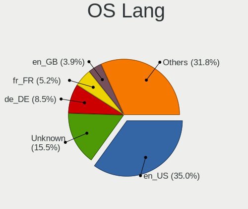
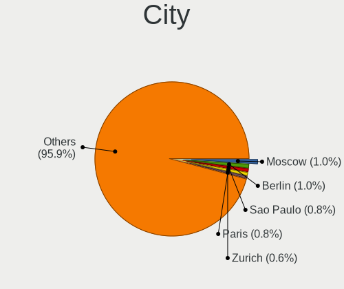

Ubuntu - Tested Hardware & Statistics (Desktops)
------------------------------------------------

A project to collect tested hardware configurations for Ubuntu.

Anyone can contribute to this report by the [hw-probe](https://github.com/linuxhw/hw-probe) tool:

    sudo -E hw-probe -all -upload

Please contribute! Especially if your hardware is rare.

Contents
--------

* [ Test Cases ](#test-cases)

* [ System ](#system)
  - [ OS                       ](#os)
  - [ OS Family                ](#os-family)
  - [ Kernel                   ](#kernel)
  - [ Kernel Family            ](#kernel-family)
  - [ Kernel Major Ver.        ](#kernel-major-ver)
  - [ Arch                     ](#arch)
  - [ DE                       ](#de)
  - [ Display Server           ](#display-server)
  - [ Display Manager          ](#display-manager)
  - [ OS Lang                  ](#os-lang)
  - [ Boot Mode                ](#boot-mode)
  - [ Filesystem               ](#filesystem)
  - [ Part. scheme             ](#part-scheme)
  - [ Dual Boot with Linux/BSD ](#dual-boot-with-linuxbsd)
  - [ Dual Boot (Win)          ](#dual-boot-win)

* [ Board ](#board)
  - [ Vendor                   ](#vendor)
  - [ Model                    ](#model)
  - [ Model Family             ](#model-family)
  - [ MFG Year                 ](#mfg-year)
  - [ Form Factor              ](#form-factor)
  - [ Secure Boot              ](#secure-boot)
  - [ Coreboot                 ](#coreboot)
  - [ RAM Size                 ](#ram-size)
  - [ RAM Used                 ](#ram-used)
  - [ Total Drives             ](#total-drives)
  - [ Has CD-ROM               ](#has-cd-rom)
  - [ Has Ethernet             ](#has-ethernet)
  - [ Has WiFi                 ](#has-wifi)
  - [ Has Bluetooth            ](#has-bluetooth)

* [ Location ](#location)
  - [ Country                  ](#country)
  - [ City                     ](#city)

* [ Drives ](#drives)
  - [ Drive Vendor             ](#drive-vendor)
  - [ Drive Model              ](#drive-model)
  - [ HDD Vendor               ](#hdd-vendor)
  - [ SSD Vendor               ](#ssd-vendor)
  - [ Drive Kind               ](#drive-kind)
  - [ Drive Connector          ](#drive-connector)
  - [ Drive Size               ](#drive-size)
  - [ Space Total              ](#space-total)
  - [ Space Used               ](#space-used)
  - [ Malfunc. Drives          ](#malfunc-drives)
  - [ Malfunc. Drive Vendor    ](#malfunc-drive-vendor)
  - [ Malfunc. HDD Vendor      ](#malfunc-hdd-vendor)
  - [ Malfunc. Drive Kind      ](#malfunc-drive-kind)
  - [ Failed Drives            ](#failed-drives)
  - [ Failed Drive Vendor      ](#failed-drive-vendor)
  - [ Drive Status             ](#drive-status)

* [ Storage controller ](#storage-controller)
  - [ Storage Vendor           ](#storage-vendor)
  - [ Storage Model            ](#storage-model)
  - [ Storage Kind             ](#storage-kind)

* [ Processor ](#processor)
  - [ CPU Vendor               ](#cpu-vendor)
  - [ CPU Model                ](#cpu-model)
  - [ CPU Model Family         ](#cpu-model-family)
  - [ CPU Cores                ](#cpu-cores)
  - [ CPU Sockets              ](#cpu-sockets)
  - [ CPU Threads              ](#cpu-threads)
  - [ CPU Op-Modes             ](#cpu-op-modes)
  - [ CPU Microcode            ](#cpu-microcode)
  - [ CPU Microarch            ](#cpu-microarch)

* [ Graphics ](#graphics)
  - [ GPU Vendor               ](#gpu-vendor)
  - [ GPU Model                ](#gpu-model)
  - [ GPU Combo                ](#gpu-combo)
  - [ GPU Driver               ](#gpu-driver)
  - [ GPU Memory               ](#gpu-memory)

* [ Monitor ](#monitor)
  - [ Monitor Vendor           ](#monitor-vendor)
  - [ Monitor Model            ](#monitor-model)
  - [ Monitor Resolution       ](#monitor-resolution)
  - [ Monitor Diagonal         ](#monitor-diagonal)
  - [ Monitor Width            ](#monitor-width)
  - [ Aspect Ratio             ](#aspect-ratio)
  - [ Monitor Area             ](#monitor-area)
  - [ Pixel Density            ](#pixel-density)
  - [ Multiple Monitors        ](#multiple-monitors)

* [ Network ](#network)
  - [ Net Controller Vendor    ](#net-controller-vendor)
  - [ Net Controller Model     ](#net-controller-model)
  - [ Wireless Vendor          ](#wireless-vendor)
  - [ Wireless Model           ](#wireless-model)
  - [ Ethernet Vendor          ](#ethernet-vendor)
  - [ Ethernet Model           ](#ethernet-model)
  - [ Net Controller Kind      ](#net-controller-kind)
  - [ Used Controller          ](#used-controller)
  - [ NICs                     ](#nics)
  - [ IPv6                     ](#ipv6)

* [ Bluetooth ](#bluetooth)
  - [ Bluetooth Vendor         ](#bluetooth-vendor)
  - [ Bluetooth Model          ](#bluetooth-model)

* [ Sound ](#sound)
  - [ Sound Vendor             ](#sound-vendor)
  - [ Sound Model              ](#sound-model)

* [ Memory ](#memory)
  - [ Memory Vendor            ](#memory-vendor)
  - [ Memory Model             ](#memory-model)
  - [ Memory Kind              ](#memory-kind)
  - [ Memory Form Factor       ](#memory-form-factor)
  - [ Memory Size              ](#memory-size)
  - [ Memory Speed             ](#memory-speed)

* [ Printers & scanners ](#printers--scanners)
  - [ Printer Vendor           ](#printer-vendor)
  - [ Printer Model            ](#printer-model)
  - [ Scanner Vendor           ](#scanner-vendor)
  - [ Scanner Model            ](#scanner-model)

* [ Camera ](#camera)
  - [ Camera Vendor            ](#camera-vendor)
  - [ Camera Model             ](#camera-model)

* [ Security ](#security)
  - [ Fingerprint Vendor       ](#fingerprint-vendor)
  - [ Fingerprint Model        ](#fingerprint-model)
  - [ Chipcard Vendor          ](#chipcard-vendor)
  - [ Chipcard Model           ](#chipcard-model)

* [ Unsupported ](#unsupported)
  - [ Unsupported Devices      ](#unsupported-devices)
  - [ Unsupported Device Types ](#unsupported-device-types)

Test Cases
----------

Total: 38952

| Vendor        | Model                       | Probe                                                      | Date         |
|---------------|-----------------------------|------------------------------------------------------------|--------------|
| Unknown       | DH61BR G32662-203           | [06cb46d18c](https://linux-hardware.org/?probe=06cb46d18c) | Feb 02, 2024 |
| XDO.AI        | Pantera Pico PC             | [f5069feac3](https://linux-hardware.org/?probe=f5069feac3) | Feb 02, 2024 |
| Unknown       | DH61BR G32662-203           | [7496b90e09](https://linux-hardware.org/?probe=7496b90e09) | Feb 02, 2024 |
| Dell          | 0D28YY A01                  | [21e722f277](https://linux-hardware.org/?probe=21e722f277) | Feb 02, 2024 |
| ASUSTek       | TUF B450-PLUS GAMING        | [4bcae97baa](https://linux-hardware.org/?probe=4bcae97baa) | Feb 02, 2024 |
| Apple         | Mac-F221BEC8                | [7e71a3a029](https://linux-hardware.org/?probe=7e71a3a029) | Feb 02, 2024 |
| ASUSTek       | ROG STRIX B650E-E GAMING... | [97d6952c52](https://linux-hardware.org/?probe=97d6952c52) | Feb 02, 2024 |
| HP            | 859C                        | [bc1cc805c6](https://linux-hardware.org/?probe=bc1cc805c6) | Feb 02, 2024 |
| ASRock        | X300-ITX                    | [3390b15018](https://linux-hardware.org/?probe=3390b15018) | Feb 02, 2024 |
| Dell          | 05XGC8 A01                  | [29ae38936a](https://linux-hardware.org/?probe=29ae38936a) | Feb 02, 2024 |
| Fujitsu       | D3523-Ax S26361-D3523-Ax    | [fefabce2b4](https://linux-hardware.org/?probe=fefabce2b4) | Feb 02, 2024 |
| Gigabyte      | Z170X-Gaming 7              | [656bb7827a](https://linux-hardware.org/?probe=656bb7827a) | Feb 02, 2024 |
| HP            | 158A                        | [1ec6b139ac](https://linux-hardware.org/?probe=1ec6b139ac) | Feb 02, 2024 |
| ASUSTek       | PRIME X470-PRO              | [50c9a44280](https://linux-hardware.org/?probe=50c9a44280) | Feb 01, 2024 |
| Gigabyte      | Z790 AORUS PRO X            | [de6afda636](https://linux-hardware.org/?probe=de6afda636) | Feb 01, 2024 |
| Dell          | 0T568R A00                  | [4ce5e16aa2](https://linux-hardware.org/?probe=4ce5e16aa2) | Feb 01, 2024 |
| Dell          | 0N0992 A00                  | [b1aae1e53b](https://linux-hardware.org/?probe=b1aae1e53b) | Feb 01, 2024 |
| Dell          | 0TDG4V A01                  | [d921cc13e3](https://linux-hardware.org/?probe=d921cc13e3) | Feb 01, 2024 |
| Gigabyte      | Z390 AORUS PRO WIFI-CF      | [a45a2b4f8e](https://linux-hardware.org/?probe=a45a2b4f8e) | Feb 01, 2024 |
| EBN           | MA1N                        | [302ea43954](https://linux-hardware.org/?probe=302ea43954) | Feb 01, 2024 |
| Dell          | 09KPNV A01                  | [b6ba043767](https://linux-hardware.org/?probe=b6ba043767) | Feb 01, 2024 |
| Gigabyte      | B760M GAMING X DDR4         | [855d31073a](https://linux-hardware.org/?probe=855d31073a) | Feb 01, 2024 |
| MSI           | B550-A PRO                  | [c211b49a95](https://linux-hardware.org/?probe=c211b49a95) | Feb 01, 2024 |
| HP            | 8598                        | [cc6faa2bfa](https://linux-hardware.org/?probe=cc6faa2bfa) | Feb 01, 2024 |
| MSI           | Z370-A PRO                  | [d012afeb56](https://linux-hardware.org/?probe=d012afeb56) | Feb 01, 2024 |
| HC Technol... | HCAR5000-MI                 | [f6051e0b06](https://linux-hardware.org/?probe=f6051e0b06) | Feb 01, 2024 |
| ASUSTek       | PRIME B760-PLUS D4          | [d9355c6146](https://linux-hardware.org/?probe=d9355c6146) | Feb 01, 2024 |
| Intel         | Alder Lake-H PCH E1.1G      | [fa7a5b2aa3](https://linux-hardware.org/?probe=fa7a5b2aa3) | Jan 31, 2024 |
| ASUSTek       | PRIME B350-PLUS             | [7cd644d30e](https://linux-hardware.org/?probe=7cd644d30e) | Jan 31, 2024 |
| Foxconn       | 9657MA                      | [6b2e0b2ae9](https://linux-hardware.org/?probe=6b2e0b2ae9) | Jan 31, 2024 |
| Supermicro    | X10DRU-i+A                  | [f2881b94b0](https://linux-hardware.org/?probe=f2881b94b0) | Jan 31, 2024 |
| Gigabyte      | B560M DS3H AC               | [81a39a795c](https://linux-hardware.org/?probe=81a39a795c) | Jan 31, 2024 |
| ASUSTek       | PRIME B450M-A               | [20471f1e71](https://linux-hardware.org/?probe=20471f1e71) | Jan 31, 2024 |
| Fujitsu       | D3401-A1 S26361-D3401-A1    | [2360c2cf38](https://linux-hardware.org/?probe=2360c2cf38) | Jan 31, 2024 |
| Intel         | DG41AN AAE92991-401         | [5e520c92ca](https://linux-hardware.org/?probe=5e520c92ca) | Jan 31, 2024 |
| MSI           | B550-A PRO                  | [85c2cd9371](https://linux-hardware.org/?probe=85c2cd9371) | Jan 31, 2024 |
| Gigabyte      | Z390 AORUS PRO WIFI-CF      | [bdb06264ab](https://linux-hardware.org/?probe=bdb06264ab) | Jan 31, 2024 |
| ASUSTek       | PRO H410M-C                 | [ab001c7490](https://linux-hardware.org/?probe=ab001c7490) | Jan 31, 2024 |
| Dell          | 02K9CR A01                  | [72df486f35](https://linux-hardware.org/?probe=72df486f35) | Jan 31, 2024 |
| Dell          | 0T568R A00                  | [56936b64ba](https://linux-hardware.org/?probe=56936b64ba) | Jan 30, 2024 |
| MACHINIST     | X99-D8-MAX V1.0             | [8ecccf1672](https://linux-hardware.org/?probe=8ecccf1672) | Jan 30, 2024 |
| ASUSTek       | TUF B450M-PLUS GAMING       | [c737ef78e9](https://linux-hardware.org/?probe=c737ef78e9) | Jan 30, 2024 |
| AZW           | MINI S 10                   | [a209f8ae32](https://linux-hardware.org/?probe=a209f8ae32) | Jan 30, 2024 |
| ASUSTek       | ProArt X570-CREATOR WIFI    | [13e5919ccf](https://linux-hardware.org/?probe=13e5919ccf) | Jan 30, 2024 |
| Unknown       | Unknown                     | [6928c8eb05](https://linux-hardware.org/?probe=6928c8eb05) | Jan 30, 2024 |
| MSI           | X99A SLI PLUS               | [216026fc45](https://linux-hardware.org/?probe=216026fc45) | Jan 30, 2024 |
| Gigabyte      | H55M-S2HP                   | [a1a4140c7e](https://linux-hardware.org/?probe=a1a4140c7e) | Jan 30, 2024 |
| Unknown       | Unknown                     | [a4eb1c6dda](https://linux-hardware.org/?probe=a4eb1c6dda) | Jan 30, 2024 |
| Unknown       | Unknown                     | [f8b5f64c1e](https://linux-hardware.org/?probe=f8b5f64c1e) | Jan 30, 2024 |
| HP            | 894D                        | [851e68057d](https://linux-hardware.org/?probe=851e68057d) | Jan 30, 2024 |
| MSI           | MAG B650 TOMAHAWK WIFI      | [c2ff3b6e2f](https://linux-hardware.org/?probe=c2ff3b6e2f) | Jan 30, 2024 |
| Dell          | 0TDG4V A01                  | [240d51778b](https://linux-hardware.org/?probe=240d51778b) | Jan 30, 2024 |
| Intel         | X99 V1.0                    | [202a9720c4](https://linux-hardware.org/?probe=202a9720c4) | Jan 30, 2024 |
| Gigabyte      | B75M-D3H                    | [b1b2694b98](https://linux-hardware.org/?probe=b1b2694b98) | Jan 30, 2024 |
| HP            | 2AF7                        | [fb8889e84c](https://linux-hardware.org/?probe=fb8889e84c) | Jan 29, 2024 |
| Medion        | B250H4-EM                   | [418b44d0a2](https://linux-hardware.org/?probe=418b44d0a2) | Jan 29, 2024 |
| ASUSTek       | ROG Maximus Z790 DARK HE... | [64433c2a96](https://linux-hardware.org/?probe=64433c2a96) | Jan 29, 2024 |
| Pegatron      | Benicia                     | [b127dc2bc0](https://linux-hardware.org/?probe=b127dc2bc0) | Jan 29, 2024 |
| Intel         | H81                         | [fac0a305d4](https://linux-hardware.org/?probe=fac0a305d4) | Jan 29, 2024 |
| MSI           | PRO Z690-A DDR4             | [ca9ba6c5ce](https://linux-hardware.org/?probe=ca9ba6c5ce) | Jan 29, 2024 |
| Itautec       | ST 4253 ST-4253 Padrao 0... | [21628b2a5b](https://linux-hardware.org/?probe=21628b2a5b) | Jan 29, 2024 |
| ASUSTek       | P5K                         | [2596e1adb2](https://linux-hardware.org/?probe=2596e1adb2) | Jan 29, 2024 |
| Itautec       | ST 4253 ST-4253 Padrao 0... | [26ae99cfe2](https://linux-hardware.org/?probe=26ae99cfe2) | Jan 29, 2024 |
| Lenovo        | 318E SDK0J40697 WIN 3305... | [856669283d](https://linux-hardware.org/?probe=856669283d) | Jan 29, 2024 |
| ASUSTek       | Pro WS WRX80E-SAGE SE WI... | [009120e99a](https://linux-hardware.org/?probe=009120e99a) | Jan 29, 2024 |
| ASUSTek       | M4A78LT-M                   | [fff97c0d16](https://linux-hardware.org/?probe=fff97c0d16) | Jan 29, 2024 |
| MSI           | PRO Z790-P WIFI             | [e6f28cbfba](https://linux-hardware.org/?probe=e6f28cbfba) | Jan 29, 2024 |
| Gigabyte      | B660M GAMING X DDR4         | [61d19fb0bc](https://linux-hardware.org/?probe=61d19fb0bc) | Jan 29, 2024 |
| Gigabyte      | Z77X-D3H                    | [aa69326408](https://linux-hardware.org/?probe=aa69326408) | Jan 29, 2024 |
| ASUSTek       | G10DK                       | [f5632504cc](https://linux-hardware.org/?probe=f5632504cc) | Jan 29, 2024 |
| ASUSTek       | G10DK                       | [5ef0067e13](https://linux-hardware.org/?probe=5ef0067e13) | Jan 29, 2024 |
| Unknown       | HX90                        | [2d0982fbb6](https://linux-hardware.org/?probe=2d0982fbb6) | Jan 29, 2024 |
| Gigabyte      | Z490 UD                     | [41cff556c1](https://linux-hardware.org/?probe=41cff556c1) | Jan 29, 2024 |
| Dell          | 0C2KJT A00                  | [bc76ac497b](https://linux-hardware.org/?probe=bc76ac497b) | Jan 29, 2024 |
| MSI           | 970A-G46                    | [9a7594f5ae](https://linux-hardware.org/?probe=9a7594f5ae) | Jan 29, 2024 |
| Dell          | 0C2KJT A00                  | [b56c82b709](https://linux-hardware.org/?probe=b56c82b709) | Jan 29, 2024 |
| Foxconn       | 2A8C                        | [042483c307](https://linux-hardware.org/?probe=042483c307) | Jan 29, 2024 |
| Acer          | TDPS05 R3700                | [d2ef9055f2](https://linux-hardware.org/?probe=d2ef9055f2) | Jan 28, 2024 |
| ASUSTek       | SABERTOOTH Z170 MARK 1      | [29fcd258c7](https://linux-hardware.org/?probe=29fcd258c7) | Jan 28, 2024 |
| Dell          | 04GJJT A00                  | [5c9882560f](https://linux-hardware.org/?probe=5c9882560f) | Jan 28, 2024 |
| Biostar       | B550MH                      | [18a98ffa2c](https://linux-hardware.org/?probe=18a98ffa2c) | Jan 28, 2024 |
| Biostar       | B550MH                      | [7e52e1855c](https://linux-hardware.org/?probe=7e52e1855c) | Jan 28, 2024 |
| Unknown       | Unknown                     | [e80d32ade5](https://linux-hardware.org/?probe=e80d32ade5) | Jan 28, 2024 |
| Lenovo        | 36C5 SDK0K17763 WIN 1801... | [0aa2140ac2](https://linux-hardware.org/?probe=0aa2140ac2) | Jan 28, 2024 |
| Lenovo        | 36C5 SDK0K17763 WIN 1801... | [752e2156f6](https://linux-hardware.org/?probe=752e2156f6) | Jan 28, 2024 |
| Dell          | 08K0X7 A00                  | [981f5fcf48](https://linux-hardware.org/?probe=981f5fcf48) | Jan 28, 2024 |
| HP            | 82F2 A01                    | [017f111720](https://linux-hardware.org/?probe=017f111720) | Jan 28, 2024 |
| ASUSTek       | PRIME H510M-E               | [f8f08ce899](https://linux-hardware.org/?probe=f8f08ce899) | Jan 28, 2024 |
| ASRock        | FM2A75M Pro4+               | [d3d40bf0b4](https://linux-hardware.org/?probe=d3d40bf0b4) | Jan 28, 2024 |
| ASUSTek       | P5Q SE2                     | [5aa0059c3f](https://linux-hardware.org/?probe=5aa0059c3f) | Jan 28, 2024 |
| Dell          | 0D24M8 A01                  | [db11402dbf](https://linux-hardware.org/?probe=db11402dbf) | Jan 28, 2024 |
| Medion        | D3F3-EM                     | [b49f3c529a](https://linux-hardware.org/?probe=b49f3c529a) | Jan 28, 2024 |
| ASUSTek       | PRIME A320M-K               | [3d0d9dce8a](https://linux-hardware.org/?probe=3d0d9dce8a) | Jan 28, 2024 |
| ASUSTek       | P8B75-M                     | [ad1a5f6757](https://linux-hardware.org/?probe=ad1a5f6757) | Jan 28, 2024 |
| Dell          | 0VHWTR A02                  | [a40f7ff2de](https://linux-hardware.org/?probe=a40f7ff2de) | Jan 27, 2024 |
| HP            | 8105                        | [41fdf37154](https://linux-hardware.org/?probe=41fdf37154) | Jan 27, 2024 |
| ABIT          | AB9/AB9RPO                  | [01c28bcaa5](https://linux-hardware.org/?probe=01c28bcaa5) | Jan 27, 2024 |
| Apple         | Mac-F221BEC8                | [9fb7827c5f](https://linux-hardware.org/?probe=9fb7827c5f) | Jan 27, 2024 |
| Gigabyte      | B450 AORUS M                | [03351f8523](https://linux-hardware.org/?probe=03351f8523) | Jan 27, 2024 |
| MSI           | A320M GRENADE               | [0a605bfdee](https://linux-hardware.org/?probe=0a605bfdee) | Jan 27, 2024 |
| ASRock        | ION3D-HT                    | [393d01f3c9](https://linux-hardware.org/?probe=393d01f3c9) | Jan 27, 2024 |
| Gigabyte      | B450M DS3H-CF               | [a6b046b2b7](https://linux-hardware.org/?probe=a6b046b2b7) | Jan 27, 2024 |
| ASUSTek       | PRIME B450M-K II            | [46b23b4469](https://linux-hardware.org/?probe=46b23b4469) | Jan 27, 2024 |
| ASUSTek       | NODUSM3                     | [b7a885758d](https://linux-hardware.org/?probe=b7a885758d) | Jan 27, 2024 |
| JGINYUE       | H97M-VH V2.1                | [f4baebb6b0](https://linux-hardware.org/?probe=f4baebb6b0) | Jan 27, 2024 |
| JGINYUE       | H97M-VH V2.1                | [7983ca3c2d](https://linux-hardware.org/?probe=7983ca3c2d) | Jan 27, 2024 |
| MSI           | MAG B550 TOMAHAWK           | [9eeddc4566](https://linux-hardware.org/?probe=9eeddc4566) | Jan 27, 2024 |
| ASUSTek       | PRIME B450-PLUS             | [fe40514847](https://linux-hardware.org/?probe=fe40514847) | Jan 27, 2024 |
| Gigabyte      | B450M DS3H-CF               | [95541e0847](https://linux-hardware.org/?probe=95541e0847) | Jan 27, 2024 |
| ECS           | APLD-MINI                   | [51b4a0993d](https://linux-hardware.org/?probe=51b4a0993d) | Jan 26, 2024 |
| ASRock        | X570 Pro4                   | [ca9d92fde3](https://linux-hardware.org/?probe=ca9d92fde3) | Jan 26, 2024 |
| ASUSTek       | PRIME Z270-A                | [710334dba6](https://linux-hardware.org/?probe=710334dba6) | Jan 26, 2024 |
| ASRock        | H97 Anniversary             | [b33697ceee](https://linux-hardware.org/?probe=b33697ceee) | Jan 26, 2024 |
| Gigabyte      | B450M S2H                   | [b010be0d2f](https://linux-hardware.org/?probe=b010be0d2f) | Jan 26, 2024 |
| MSI           | B250M BAZOOKA               | [0bd7085870](https://linux-hardware.org/?probe=0bd7085870) | Jan 26, 2024 |
| HP            | 1998                        | [b1431c9048](https://linux-hardware.org/?probe=b1431c9048) | Jan 26, 2024 |
| Unknown       | Unknown                     | [ca9dd04b16](https://linux-hardware.org/?probe=ca9dd04b16) | Jan 26, 2024 |
| HP            | 8719                        | [42bc597317](https://linux-hardware.org/?probe=42bc597317) | Jan 26, 2024 |
| Supermicro    | X10DDW-i                    | [6a9650896a](https://linux-hardware.org/?probe=6a9650896a) | Jan 26, 2024 |
| ASUSTek       | M2N-E SLI                   | [32d1dff107](https://linux-hardware.org/?probe=32d1dff107) | Jan 26, 2024 |
| ASUSTek       | ROG Maximus Z790 DARK HE... | [aa9e38d0e2](https://linux-hardware.org/?probe=aa9e38d0e2) | Jan 26, 2024 |
| Dell          | 02YYK5 A00                  | [60522355ee](https://linux-hardware.org/?probe=60522355ee) | Jan 26, 2024 |
| Google        | Kench                       | [42065dff7f](https://linux-hardware.org/?probe=42065dff7f) | Jan 26, 2024 |
| NCR           | Monaco BIOS.9.1             | [98ed4e9a82](https://linux-hardware.org/?probe=98ed4e9a82) | Jan 26, 2024 |
| Lenovo        | Annapurna CRB NOK           | [5b803efc86](https://linux-hardware.org/?probe=5b803efc86) | Jan 26, 2024 |
| ASUSTek       | ROG CROSSHAIR X670E HERO    | [e91202934d](https://linux-hardware.org/?probe=e91202934d) | Jan 26, 2024 |
| GEEKOM        | A5                          | [2408e3a6dc](https://linux-hardware.org/?probe=2408e3a6dc) | Jan 26, 2024 |
| Dell          | 04Y8V0 A02                  | [34289f06cd](https://linux-hardware.org/?probe=34289f06cd) | Jan 26, 2024 |
| Fujitsu       | D3041-A1 S26361-D3041-A1    | [903d800136](https://linux-hardware.org/?probe=903d800136) | Jan 26, 2024 |
| GEEKOM        | A5                          | [4818316c00](https://linux-hardware.org/?probe=4818316c00) | Jan 26, 2024 |
| Dell          | 0C2XKD A01                  | [f32c18bab1](https://linux-hardware.org/?probe=f32c18bab1) | Jan 25, 2024 |
| ASUSTek       | Z170-K                      | [277fb7b364](https://linux-hardware.org/?probe=277fb7b364) | Jan 25, 2024 |
| Foxconn       | Cinema Series FAB           | [de1e89f80f](https://linux-hardware.org/?probe=de1e89f80f) | Jan 25, 2024 |
| ASRock        | Z77 Extreme4                | [4685f2b1e9](https://linux-hardware.org/?probe=4685f2b1e9) | Jan 25, 2024 |
| Fujitsu       | D3041-A1 S26361-D3041-A1    | [7b16c2c1bc](https://linux-hardware.org/?probe=7b16c2c1bc) | Jan 25, 2024 |
| Dell          | 0HHV7N A00                  | [fda3733e63](https://linux-hardware.org/?probe=fda3733e63) | Jan 25, 2024 |
| Dell          | 0PTTT9 A01                  | [310d107f7d](https://linux-hardware.org/?probe=310d107f7d) | Jan 25, 2024 |
| HP            | 2129                        | [9617c50324](https://linux-hardware.org/?probe=9617c50324) | Jan 25, 2024 |
| Lenovo        | 3106 SDK0J40709 WIN 3259... | [bbc8707e00](https://linux-hardware.org/?probe=bbc8707e00) | Jan 25, 2024 |
| ASRock        | A520M-HDV                   | [db1260e2b7](https://linux-hardware.org/?probe=db1260e2b7) | Jan 25, 2024 |
| Dell          | 0GCY4M A01                  | [7570087915](https://linux-hardware.org/?probe=7570087915) | Jan 25, 2024 |
| ASUSTek       | PRIME Z270-A                | [8e84a9a187](https://linux-hardware.org/?probe=8e84a9a187) | Jan 25, 2024 |
| ASRock        | B450M Pro4                  | [e44bf066a4](https://linux-hardware.org/?probe=e44bf066a4) | Jan 25, 2024 |
| Shuttle       | FG41 V20                    | [9eeb0902c1](https://linux-hardware.org/?probe=9eeb0902c1) | Jan 25, 2024 |
| Gigabyte      | B450M GAMING                | [01a72ce274](https://linux-hardware.org/?probe=01a72ce274) | Jan 25, 2024 |
| MSI           | B450M MORTAR MAX            | [969d0f1bef](https://linux-hardware.org/?probe=969d0f1bef) | Jan 25, 2024 |
| GEEKOM        | Mini IT13                   | [db1f38bd8c](https://linux-hardware.org/?probe=db1f38bd8c) | Jan 25, 2024 |
| Gigabyte      | B550M AORUS PRO-P           | [2851a608c0](https://linux-hardware.org/?probe=2851a608c0) | Jan 25, 2024 |
| MSI           | B450 TOMAHAWK MAX II        | [6c409399d4](https://linux-hardware.org/?probe=6c409399d4) | Jan 25, 2024 |
| Lenovo        | 3740 NOK                    | [2bfb559750](https://linux-hardware.org/?probe=2bfb559750) | Jan 25, 2024 |
| ASRock        | H370M-HDV                   | [86e43e96f0](https://linux-hardware.org/?probe=86e43e96f0) | Jan 25, 2024 |
| Intel         | B75                         | [b9a4ea0b9b](https://linux-hardware.org/?probe=b9a4ea0b9b) | Jan 25, 2024 |
| Dell          | 0N4YC8 A00                  | [03750ea62c](https://linux-hardware.org/?probe=03750ea62c) | Jan 25, 2024 |
| Gigabyte      | B450M GAMING                | [c25c76b288](https://linux-hardware.org/?probe=c25c76b288) | Jan 25, 2024 |
| MSI           | MEG X399 CREATION           | [b598a0fd29](https://linux-hardware.org/?probe=b598a0fd29) | Jan 25, 2024 |
| Gigabyte      | B650M AORUS ELITE AX        | [f904e3ce10](https://linux-hardware.org/?probe=f904e3ce10) | Jan 24, 2024 |
| ASUSTek       | PRIME B550-PLUS             | [4bcfb579e2](https://linux-hardware.org/?probe=4bcfb579e2) | Jan 24, 2024 |
| ASUSTek       | P5G41T-M LX2/GB             | [642c49982c](https://linux-hardware.org/?probe=642c49982c) | Jan 24, 2024 |
| HP            | 821D                        | [c56ee90d6b](https://linux-hardware.org/?probe=c56ee90d6b) | Jan 24, 2024 |
| Ciara Tech... | Q77M-XG                     | [aba2d99413](https://linux-hardware.org/?probe=aba2d99413) | Jan 24, 2024 |
| ASUSTek       | M4A77T                      | [082bd06cdc](https://linux-hardware.org/?probe=082bd06cdc) | Jan 24, 2024 |
| HP            | 8053                        | [ecca7b4395](https://linux-hardware.org/?probe=ecca7b4395) | Jan 24, 2024 |
| Fujitsu       | D3531-A1 S26361-D3531-A1    | [db6de09144](https://linux-hardware.org/?probe=db6de09144) | Jan 24, 2024 |
| ASUSTek       | STRIX Z270H GAMING          | [2493ce70f4](https://linux-hardware.org/?probe=2493ce70f4) | Jan 24, 2024 |
| Dell          | 0XKH0D A02                  | [7ed5013174](https://linux-hardware.org/?probe=7ed5013174) | Jan 24, 2024 |
| MSI           | H110M PRO-VD                | [208d27435c](https://linux-hardware.org/?probe=208d27435c) | Jan 24, 2024 |
| ASUSTek       | ROG Rampage VI EXTREME E... | [299dd0311b](https://linux-hardware.org/?probe=299dd0311b) | Jan 24, 2024 |
| ASUSTek       | Z97-A-USB31                 | [1fe92d4fbe](https://linux-hardware.org/?probe=1fe92d4fbe) | Jan 24, 2024 |
| ASRock        | X570 Phantom Gaming 4       | [0d4e165d3f](https://linux-hardware.org/?probe=0d4e165d3f) | Jan 23, 2024 |
| ASUSTek       | D500SA                      | [91815478a7](https://linux-hardware.org/?probe=91815478a7) | Jan 23, 2024 |
| Dell          | 02YYK5 A01                  | [092dabd325](https://linux-hardware.org/?probe=092dabd325) | Jan 23, 2024 |
| Dell          | 0Y7WYT A00                  | [4069a89cac](https://linux-hardware.org/?probe=4069a89cac) | Jan 23, 2024 |
| ASRock        | H110M-DVS R2.0              | [68583ae434](https://linux-hardware.org/?probe=68583ae434) | Jan 23, 2024 |
| ASRock        | Z490 Extreme4               | [c3fc4d088b](https://linux-hardware.org/?probe=c3fc4d088b) | Jan 23, 2024 |
| Dell          | 06X1TJ A00                  | [5eb76b0285](https://linux-hardware.org/?probe=5eb76b0285) | Jan 23, 2024 |
| ASRock        | B450 Pro4 R2.0              | [a606bceea5](https://linux-hardware.org/?probe=a606bceea5) | Jan 23, 2024 |
| ASUSTek       | PRIME A320M-K               | [920e34bee4](https://linux-hardware.org/?probe=920e34bee4) | Jan 23, 2024 |
| ASUSTek       | Berkeley                    | [c7d349a7f0](https://linux-hardware.org/?probe=c7d349a7f0) | Jan 23, 2024 |
| ASUSTek       | ROG CROSSHAIR VIII DARK ... | [c8dc8a63fb](https://linux-hardware.org/?probe=c8dc8a63fb) | Jan 23, 2024 |
| ASUSTek       | ROG CROSSHAIR VIII DARK ... | [b126f7be3d](https://linux-hardware.org/?probe=b126f7be3d) | Jan 23, 2024 |
| ASUSTek       | ROG STRIX Z590-F GAMING ... | [988f12d3d7](https://linux-hardware.org/?probe=988f12d3d7) | Jan 23, 2024 |
| Gigabyte      | X670E AORUS MASTER          | [a15d748e41](https://linux-hardware.org/?probe=a15d748e41) | Jan 23, 2024 |
| AMI           | Intel                       | [5085eba8b2](https://linux-hardware.org/?probe=5085eba8b2) | Jan 23, 2024 |
| Pegatron      | Benicia                     | [eec77bbd70](https://linux-hardware.org/?probe=eec77bbd70) | Jan 23, 2024 |
| Gigabyte      | PH67A-D3-B3                 | [27878d88fd](https://linux-hardware.org/?probe=27878d88fd) | Jan 23, 2024 |
| Gigabyte      | Z790 UD AX                  | [a84ee0f485](https://linux-hardware.org/?probe=a84ee0f485) | Jan 23, 2024 |
| MSI           | MAG Z790 TOMAHAWK WIFI      | [19161eac10](https://linux-hardware.org/?probe=19161eac10) | Jan 22, 2024 |
| Gigabyte      | GA-78LMT-S2P                | [615b7dc324](https://linux-hardware.org/?probe=615b7dc324) | Jan 22, 2024 |
| Foxconn       | 2AAF                        | [aa481d37c8](https://linux-hardware.org/?probe=aa481d37c8) | Jan 22, 2024 |
| ASUSTek       | PRIME B550M-A               | [ed85e4518e](https://linux-hardware.org/?probe=ed85e4518e) | Jan 22, 2024 |
| Gigabyte      | B360M DS3H                  | [d809dd5290](https://linux-hardware.org/?probe=d809dd5290) | Jan 22, 2024 |
| HP            | 81B4                        | [7de00ed55d](https://linux-hardware.org/?probe=7de00ed55d) | Jan 22, 2024 |
| ASRock        | A520M-HDV                   | [34e4549f27](https://linux-hardware.org/?probe=34e4549f27) | Jan 22, 2024 |
| Fujitsu       | D3401-A1 S26361-D3401-A1    | [bb111f75bd](https://linux-hardware.org/?probe=bb111f75bd) | Jan 22, 2024 |
| Gigabyte      | H310M H x.x                 | [7164188034](https://linux-hardware.org/?probe=7164188034) | Jan 22, 2024 |
| ASRock        | B450M Pro4                  | [3566eaf43c](https://linux-hardware.org/?probe=3566eaf43c) | Jan 22, 2024 |
| Supermicro    | X11SSD-F                    | [a1b05dae9c](https://linux-hardware.org/?probe=a1b05dae9c) | Jan 22, 2024 |
| ASUSTek       | X99-A/USB                   | [c07863641d](https://linux-hardware.org/?probe=c07863641d) | Jan 22, 2024 |
| Gigabyte      | B550 GAMING X V2            | [0b0db0e2ef](https://linux-hardware.org/?probe=0b0db0e2ef) | Jan 22, 2024 |
| ASUSTek       | PRIME B450M-A II            | [50bd62bd8e](https://linux-hardware.org/?probe=50bd62bd8e) | Jan 21, 2024 |
| Dell          | 096JG8 A01                  | [a397efcf1d](https://linux-hardware.org/?probe=a397efcf1d) | Jan 21, 2024 |
| ASUSTek       | PRIME H410M-E               | [e83d57317e](https://linux-hardware.org/?probe=e83d57317e) | Jan 21, 2024 |
| AZW           | EQ MINI 10                  | [c6ee420879](https://linux-hardware.org/?probe=c6ee420879) | Jan 21, 2024 |
| ASRock        | H570 Steel Legend           | [7c0fb43f23](https://linux-hardware.org/?probe=7c0fb43f23) | Jan 21, 2024 |
| ASUSTek       | PRIME Z390-A                | [f2855cb0d7](https://linux-hardware.org/?probe=f2855cb0d7) | Jan 21, 2024 |
| ASRock        | X470 Taichi Ultimate        | [161b90d80c](https://linux-hardware.org/?probe=161b90d80c) | Jan 21, 2024 |
| Colorful T... | CVN B550M GAMING FROZEN ... | [1d6e70910a](https://linux-hardware.org/?probe=1d6e70910a) | Jan 21, 2024 |
| Gigabyte      | H81M-D2W                    | [03ec02fab4](https://linux-hardware.org/?probe=03ec02fab4) | Jan 21, 2024 |
| MSI           | Z170A GAMING M5             | [742588d66a](https://linux-hardware.org/?probe=742588d66a) | Jan 21, 2024 |
| Dell          | 0YF8P5 A00                  | [dce46de08f](https://linux-hardware.org/?probe=dce46de08f) | Jan 21, 2024 |
| ASUSTek       | ROG STRIX B550-F GAMING ... | [97588f48fc](https://linux-hardware.org/?probe=97588f48fc) | Jan 21, 2024 |
| MSI           | MPG Z790 CARBON WIFI        | [3224331d5e](https://linux-hardware.org/?probe=3224331d5e) | Jan 21, 2024 |
| ASRock        | FM2A88X Pro+                | [cf5b1adab5](https://linux-hardware.org/?probe=cf5b1adab5) | Jan 21, 2024 |
| ASUSTek       | ROG CROSSHAIR VIII HERO     | [0996781568](https://linux-hardware.org/?probe=0996781568) | Jan 21, 2024 |
| AZW           | GTR V21                     | [dbc8e08754](https://linux-hardware.org/?probe=dbc8e08754) | Jan 21, 2024 |
| Foxconn       | 2A8C                        | [591fafe62b](https://linux-hardware.org/?probe=591fafe62b) | Jan 21, 2024 |
| Dell          | 051FJ8 A00                  | [186f951a85](https://linux-hardware.org/?probe=186f951a85) | Jan 21, 2024 |
| Lenovo        | ThinkCentre A62 9486E4S     | [426fe50b95](https://linux-hardware.org/?probe=426fe50b95) | Jan 21, 2024 |
| MSI           | PRO Z790-P WIFI             | [55b2a770eb](https://linux-hardware.org/?probe=55b2a770eb) | Jan 21, 2024 |
| ASUSTek       | STRIX H270F GAMING          | [9c9338dcfd](https://linux-hardware.org/?probe=9c9338dcfd) | Jan 21, 2024 |
| ASUSTek       | PRIME X470-PRO              | [09c4a32231](https://linux-hardware.org/?probe=09c4a32231) | Jan 21, 2024 |
| Lenovo        | ThinkCentre A62 9486E4S     | [9712c9e135](https://linux-hardware.org/?probe=9712c9e135) | Jan 21, 2024 |
| MSI           | Z370-A PRO                  | [0a97ecaa3f](https://linux-hardware.org/?probe=0a97ecaa3f) | Jan 21, 2024 |
| Dell          | 06X1TJ A00                  | [bcd509c9d9](https://linux-hardware.org/?probe=bcd509c9d9) | Jan 20, 2024 |
| ASUSTek       | M5A97 R2.0                  | [5a96118b34](https://linux-hardware.org/?probe=5a96118b34) | Jan 20, 2024 |
| Foxconn       | H61MXE                      | [0a7a342b95](https://linux-hardware.org/?probe=0a7a342b95) | Jan 20, 2024 |
| HP            | 213D A01                    | [37b7fb4c4e](https://linux-hardware.org/?probe=37b7fb4c4e) | Jan 20, 2024 |
| Gigabyte      | P55-USB3                    | [2ae180284e](https://linux-hardware.org/?probe=2ae180284e) | Jan 20, 2024 |
| Unknown       | HX90                        | [ced9f53d73](https://linux-hardware.org/?probe=ced9f53d73) | Jan 20, 2024 |
| Dell          | 0K068D A00                  | [b268579e9b](https://linux-hardware.org/?probe=b268579e9b) | Jan 20, 2024 |
| ASUSTek       | TUF Z390-PLUS GAMING        | [341a928c78](https://linux-hardware.org/?probe=341a928c78) | Jan 20, 2024 |
| HP            | ProLiant ML110 Gen9         | [f5eb92f644](https://linux-hardware.org/?probe=f5eb92f644) | Jan 20, 2024 |
| Gigabyte      | M68MT-S2                    | [ec13e42e3a](https://linux-hardware.org/?probe=ec13e42e3a) | Jan 20, 2024 |
| ASRock        | FM2A68M-HD+                 | [63e6c0358d](https://linux-hardware.org/?probe=63e6c0358d) | Jan 20, 2024 |
| Unknown       | Unknown                     | [bcded7aa47](https://linux-hardware.org/?probe=bcded7aa47) | Jan 20, 2024 |
| HP            | 8055                        | [454932f0a1](https://linux-hardware.org/?probe=454932f0a1) | Jan 19, 2024 |
| Dell          | 08K0X7 A00                  | [454c4af5bc](https://linux-hardware.org/?probe=454c4af5bc) | Jan 19, 2024 |
| Dell          | 073MMW A02                  | [2e19e7434e](https://linux-hardware.org/?probe=2e19e7434e) | Jan 19, 2024 |
| ASUSTek       | PRIME H510M-A               | [6aa12bd4c7](https://linux-hardware.org/?probe=6aa12bd4c7) | Jan 19, 2024 |
| ASUSTek       | PRIME B550M-K               | [59c00448b4](https://linux-hardware.org/?probe=59c00448b4) | Jan 19, 2024 |
| ASUSTek       | PRIME X470-PRO              | [8601fae7df](https://linux-hardware.org/?probe=8601fae7df) | Jan 19, 2024 |
| Dell          | 0M9KCM A01                  | [dd9dc75a4d](https://linux-hardware.org/?probe=dd9dc75a4d) | Jan 19, 2024 |
| ASUSTek       | PRIME X470-PRO              | [fa525f2f78](https://linux-hardware.org/?probe=fa525f2f78) | Jan 19, 2024 |
| Dell          | 0YGWFV A01                  | [b8474b7f54](https://linux-hardware.org/?probe=b8474b7f54) | Jan 19, 2024 |
| Dell          | 0YGWFV A01                  | [8e54683492](https://linux-hardware.org/?probe=8e54683492) | Jan 19, 2024 |
| Dell          | 02YYK5 A00                  | [0ee138a094](https://linux-hardware.org/?probe=0ee138a094) | Jan 19, 2024 |
| ASRock        | B450M Pro4                  | [440bc94322](https://linux-hardware.org/?probe=440bc94322) | Jan 19, 2024 |
| Intel         | JSL MRD                     | [96bcf87520](https://linux-hardware.org/?probe=96bcf87520) | Jan 19, 2024 |
| Biostar       | B450MHP                     | [16584e3717](https://linux-hardware.org/?probe=16584e3717) | Jan 19, 2024 |
| Biostar       | B450MHP                     | [24682bdb1f](https://linux-hardware.org/?probe=24682bdb1f) | Jan 19, 2024 |
| ASUSTek       | P6T DELUXE V2               | [4c2aa275e2](https://linux-hardware.org/?probe=4c2aa275e2) | Jan 19, 2024 |
| ASRock        | Z390 Extreme4               | [d81097f203](https://linux-hardware.org/?probe=d81097f203) | Jan 19, 2024 |
| Biostar       | A320MH                      | [9213e79212](https://linux-hardware.org/?probe=9213e79212) | Jan 19, 2024 |
| MSI           | MAG B550 TOMAHAWK           | [986bc58cd9](https://linux-hardware.org/?probe=986bc58cd9) | Jan 19, 2024 |
| Dell          | 05CNYF A01                  | [913528cc80](https://linux-hardware.org/?probe=913528cc80) | Jan 19, 2024 |
| ASUSTek       | ROG Maximus Z690 HERO EV... | [7d86aa45c2](https://linux-hardware.org/?probe=7d86aa45c2) | Jan 19, 2024 |
| ASUSTek       | PRIME B360M-A               | [cf9f573e23](https://linux-hardware.org/?probe=cf9f573e23) | Jan 19, 2024 |
| BESSTAR Te... | HM90                        | [69c4bfff2b](https://linux-hardware.org/?probe=69c4bfff2b) | Jan 19, 2024 |
| HP            | 1998                        | [b54abe0bef](https://linux-hardware.org/?probe=b54abe0bef) | Jan 18, 2024 |
| Intel         | HM570                       | [3f05344c2c](https://linux-hardware.org/?probe=3f05344c2c) | Jan 18, 2024 |
| Pegatron      | JESSE                       | [0013445f57](https://linux-hardware.org/?probe=0013445f57) | Jan 18, 2024 |
| ASUSTek       | G16CH                       | [a482e4cc60](https://linux-hardware.org/?probe=a482e4cc60) | Jan 18, 2024 |
| Pegatron      | JESSE                       | [c8bf0d253c](https://linux-hardware.org/?probe=c8bf0d253c) | Jan 18, 2024 |
| Fujitsu       | D3230-A1 S26361-D3230-A1    | [977382abab](https://linux-hardware.org/?probe=977382abab) | Jan 18, 2024 |
| Acer          | Aspire TC-885 V:1.1         | [637e6e463e](https://linux-hardware.org/?probe=637e6e463e) | Jan 18, 2024 |
| ASUSTek       | M5A97 EVO R2.0              | [f0b1918981](https://linux-hardware.org/?probe=f0b1918981) | Jan 18, 2024 |
| Gigabyte      | Z690 GAMING X DDR4          | [1aa8c64606](https://linux-hardware.org/?probe=1aa8c64606) | Jan 18, 2024 |
| Lenovo        | 3106 SDK0J40709 WIN 3259... | [370e1682cf](https://linux-hardware.org/?probe=370e1682cf) | Jan 18, 2024 |
| Dell          | 0G679R A00                  | [993e7a71b2](https://linux-hardware.org/?probe=993e7a71b2) | Jan 18, 2024 |
| Dell          | 0G679R A00                  | [31f196442f](https://linux-hardware.org/?probe=31f196442f) | Jan 18, 2024 |
| ASUSTek       | P6T SE                      | [6b60732b39](https://linux-hardware.org/?probe=6b60732b39) | Jan 18, 2024 |
| Gigabyte      | Z77X-D3H                    | [234d786dd7](https://linux-hardware.org/?probe=234d786dd7) | Jan 18, 2024 |
| Dell          | 0DR845                      | [f591ac32d9](https://linux-hardware.org/?probe=f591ac32d9) | Jan 18, 2024 |
| Gigabyte      | B460 HD3                    | [4e6f6c248f](https://linux-hardware.org/?probe=4e6f6c248f) | Jan 18, 2024 |
| ASUSTek       | SABERTOOTH 990FX R3.0       | [207dc59ee3](https://linux-hardware.org/?probe=207dc59ee3) | Jan 18, 2024 |
| Apple         | Mac-F42C88C8 Proto1         | [8f87c80e99](https://linux-hardware.org/?probe=8f87c80e99) | Jan 17, 2024 |
| Fujitsu       | D3221-A1 S26361-D3221-A1    | [9353e2bbef](https://linux-hardware.org/?probe=9353e2bbef) | Jan 17, 2024 |
| Unknown       | HP ProLiant m400 Server ... | [adf4650d81](https://linux-hardware.org/?probe=adf4650d81) | Jan 17, 2024 |
| ASUSTek       | P6X58D-E                    | [09a124fcf0](https://linux-hardware.org/?probe=09a124fcf0) | Jan 17, 2024 |
| SZMZ          | X99 DUAL Z8                 | [623c2e3113](https://linux-hardware.org/?probe=623c2e3113) | Jan 17, 2024 |
| Gigabyte      | A520M H                     | [2f58464c52](https://linux-hardware.org/?probe=2f58464c52) | Jan 17, 2024 |
| ASUSTek       | M5A78L-M/USB3               | [dfa4d23039](https://linux-hardware.org/?probe=dfa4d23039) | Jan 17, 2024 |
| MSI           | Z490-A PRO                  | [57eaf7e4ff](https://linux-hardware.org/?probe=57eaf7e4ff) | Jan 17, 2024 |
| ASUSTek       | PRIME B450M-A II            | [92ba347e99](https://linux-hardware.org/?probe=92ba347e99) | Jan 17, 2024 |
| HP            | 822A                        | [9fa299bc2a](https://linux-hardware.org/?probe=9fa299bc2a) | Jan 17, 2024 |
| HP            | 822A                        | [400eeb3bba](https://linux-hardware.org/?probe=400eeb3bba) | Jan 17, 2024 |
| Gigabyte      | X670 AORUS ELITE AX         | [a15715468f](https://linux-hardware.org/?probe=a15715468f) | Jan 17, 2024 |
| Gigabyte      | A520M S2H                   | [cf1f6f18f3](https://linux-hardware.org/?probe=cf1f6f18f3) | Jan 17, 2024 |
| MSI           | PRO B650M-P                 | [13bd535c3f](https://linux-hardware.org/?probe=13bd535c3f) | Jan 17, 2024 |
| Dell          | 02YRK5 A02                  | [c24b8d81bb](https://linux-hardware.org/?probe=c24b8d81bb) | Jan 16, 2024 |
| Unknown       | HP ProLiant m400 Server ... | [a779728852](https://linux-hardware.org/?probe=a779728852) | Jan 16, 2024 |
| ASUSTek       | G11CD-K                     | [004aa1092f](https://linux-hardware.org/?probe=004aa1092f) | Jan 16, 2024 |
| ASUSTek       | ROG CROSSHAIR X670E HERO    | [fe24385194](https://linux-hardware.org/?probe=fe24385194) | Jan 16, 2024 |
| ONDA          | H61V Ver:4.01               | [83030b6f99](https://linux-hardware.org/?probe=83030b6f99) | Jan 16, 2024 |
| ASUSTek       | PRIME X470-PRO              | [cb1fa259a7](https://linux-hardware.org/?probe=cb1fa259a7) | Jan 16, 2024 |
| ASUSTek       | M5A99X EVO                  | [fd42a66717](https://linux-hardware.org/?probe=fd42a66717) | Jan 16, 2024 |
| Intel         | SKYBAY                      | [defbd49284](https://linux-hardware.org/?probe=defbd49284) | Jan 16, 2024 |
| Gigabyte      | B150M-D3H-CF                | [de0ec49312](https://linux-hardware.org/?probe=de0ec49312) | Jan 16, 2024 |
| ASUSTek       | H110M-R                     | [3daca725a3](https://linux-hardware.org/?probe=3daca725a3) | Jan 16, 2024 |
| ASUSTek       | H110M-R                     | [cb598cde50](https://linux-hardware.org/?probe=cb598cde50) | Jan 16, 2024 |
| MSI           | MPG Z490 GAMING EDGE WIF... | [3a49e03d57](https://linux-hardware.org/?probe=3a49e03d57) | Jan 16, 2024 |
| MSI           | MPG Z490 GAMING EDGE WIF... | [fae72561ad](https://linux-hardware.org/?probe=fae72561ad) | Jan 16, 2024 |
| MSI           | MAG Z790 TOMAHAWK MAX WI... | [803c2f0bd9](https://linux-hardware.org/?probe=803c2f0bd9) | Jan 16, 2024 |
| Acer          | Aspire TC-885 V:1.1         | [5e075fc828](https://linux-hardware.org/?probe=5e075fc828) | Jan 16, 2024 |
| ASUSTek       | M5A97 R2.0                  | [ccbf148cb3](https://linux-hardware.org/?probe=ccbf148cb3) | Jan 16, 2024 |
| ASUSTek       | H97-PLUS                    | [7d8b50985d](https://linux-hardware.org/?probe=7d8b50985d) | Jan 16, 2024 |
| Gigabyte      | Z790 UD AX                  | [8d2af876bf](https://linux-hardware.org/?probe=8d2af876bf) | Jan 15, 2024 |
| HP            | 8648                        | [b896b4b994](https://linux-hardware.org/?probe=b896b4b994) | Jan 15, 2024 |
| MSI           | MPG Z490 GAMING EDGE WIF... | [4d53425b9f](https://linux-hardware.org/?probe=4d53425b9f) | Jan 15, 2024 |
| Dell          | 04Y8V0 A02                  | [f7b5e8a248](https://linux-hardware.org/?probe=f7b5e8a248) | Jan 15, 2024 |
| ASRock        | B650 PG Lightning           | [ff371f0408](https://linux-hardware.org/?probe=ff371f0408) | Jan 15, 2024 |
| PCWare        | IPMH510E                    | [a52f228033](https://linux-hardware.org/?probe=a52f228033) | Jan 15, 2024 |
| Dell          | 0X8DXD A01                  | [d374bcb1f1](https://linux-hardware.org/?probe=d374bcb1f1) | Jan 15, 2024 |
| Gigabyte      | Z790 UD AC                  | [b823078db1](https://linux-hardware.org/?probe=b823078db1) | Jan 15, 2024 |
| HP            | 81B4 01                     | [2a8624aed6](https://linux-hardware.org/?probe=2a8624aed6) | Jan 15, 2024 |
| ASUSTek       | ROG STRIX Z390-F GAMING     | [4532c646e7](https://linux-hardware.org/?probe=4532c646e7) | Jan 15, 2024 |
| Gigabyte      | P55-USB3                    | [34cc055d6b](https://linux-hardware.org/?probe=34cc055d6b) | Jan 15, 2024 |
| Unknown       | Unknown                     | [1c86716af5](https://linux-hardware.org/?probe=1c86716af5) | Jan 15, 2024 |
| Unknown       | Unknown                     | [5e8d8eb89f](https://linux-hardware.org/?probe=5e8d8eb89f) | Jan 15, 2024 |
| Supermicro    | H12DST-BA                   | [d64a1ee900](https://linux-hardware.org/?probe=d64a1ee900) | Jan 15, 2024 |
| Supermicro    | H12DST-BA                   | [3f83ec793d](https://linux-hardware.org/?probe=3f83ec793d) | Jan 15, 2024 |
| Supermicro    | H12DST-BA                   | [623de08cce](https://linux-hardware.org/?probe=623de08cce) | Jan 15, 2024 |
| Supermicro    | H12DST-BA                   | [e925fa2676](https://linux-hardware.org/?probe=e925fa2676) | Jan 15, 2024 |
| Supermicro    | X9DRT                       | [7ed16ba0a0](https://linux-hardware.org/?probe=7ed16ba0a0) | Jan 15, 2024 |
| Dell          | 0XJ5V0 A01                  | [09e55a9304](https://linux-hardware.org/?probe=09e55a9304) | Jan 15, 2024 |
| HP            | 18E5                        | [4fb3a76631](https://linux-hardware.org/?probe=4fb3a76631) | Jan 15, 2024 |
| ASUSTek       | STRIX X99 GAMING            | [a77f0d6a70](https://linux-hardware.org/?probe=a77f0d6a70) | Jan 15, 2024 |
| Medion        | MS-7800                     | [f0e70a4db4](https://linux-hardware.org/?probe=f0e70a4db4) | Jan 15, 2024 |
| Lenovo        | ThinkCentre M81 5048E2G     | [d4de0eb368](https://linux-hardware.org/?probe=d4de0eb368) | Jan 14, 2024 |
| Lenovo        | ThinkCentre M81 5048E2G     | [b4aecb91bf](https://linux-hardware.org/?probe=b4aecb91bf) | Jan 14, 2024 |
| Gigabyte      | F2A85X-D3H                  | [908d3d7353](https://linux-hardware.org/?probe=908d3d7353) | Jan 14, 2024 |
| Dell          | OptiPlex 7050               | [c0f181142d](https://linux-hardware.org/?probe=c0f181142d) | Jan 14, 2024 |
| MSI           | B150M BAZOOKA               | [44444075fd](https://linux-hardware.org/?probe=44444075fd) | Jan 14, 2024 |
| Gigabyte      | 990FXA-UD3                  | [cd7b830381](https://linux-hardware.org/?probe=cd7b830381) | Jan 14, 2024 |
| ASUSTek       | ROG STRIX X570-I GAMING     | [ef9d738ae9](https://linux-hardware.org/?probe=ef9d738ae9) | Jan 14, 2024 |
| Gigabyte      | 990FXA-UD3                  | [84ecce6ca6](https://linux-hardware.org/?probe=84ecce6ca6) | Jan 14, 2024 |
| Dell          | 0XCR8D A01                  | [761cd45b4a](https://linux-hardware.org/?probe=761cd45b4a) | Jan 14, 2024 |
| MSI           | MPG X670E CARBON WIFI       | [7f4b2938a3](https://linux-hardware.org/?probe=7f4b2938a3) | Jan 14, 2024 |
| MSI           | 2AE0                        | [0ad06fb4f8](https://linux-hardware.org/?probe=0ad06fb4f8) | Jan 14, 2024 |
| Huanan        | X99-F8 V2.0                 | [a8b182fa35](https://linux-hardware.org/?probe=a8b182fa35) | Jan 14, 2024 |
| MSI           | MS-7377                     | [822d42a921](https://linux-hardware.org/?probe=822d42a921) | Jan 14, 2024 |
| Dell          | 0TDG4V A01                  | [41ac0edbe0](https://linux-hardware.org/?probe=41ac0edbe0) | Jan 14, 2024 |
| HP            | 8906 SMVB                   | [795a059437](https://linux-hardware.org/?probe=795a059437) | Jan 14, 2024 |
| Dell          | 0K068D A00                  | [ef25812c9b](https://linux-hardware.org/?probe=ef25812c9b) | Jan 14, 2024 |
| Gigabyte      | B450M DS3H-CF               | [546e67bcf4](https://linux-hardware.org/?probe=546e67bcf4) | Jan 14, 2024 |
| Dell          | 0GWHMW A00                  | [42cd6629f0](https://linux-hardware.org/?probe=42cd6629f0) | Jan 14, 2024 |
| Pegatron      | Benicia                     | [12d21b9395](https://linux-hardware.org/?probe=12d21b9395) | Jan 14, 2024 |
| ASUSTek       | PRIME B450M-GAMING/BR       | [74cdfb120c](https://linux-hardware.org/?probe=74cdfb120c) | Jan 14, 2024 |
| Biostar       | B350GT3                     | [d210ea56f8](https://linux-hardware.org/?probe=d210ea56f8) | Jan 14, 2024 |
| Gigabyte      | B550M DS3H                  | [0ab04d0727](https://linux-hardware.org/?probe=0ab04d0727) | Jan 14, 2024 |
| MSI           | H110M PRO-VD                | [c8b3437429](https://linux-hardware.org/?probe=c8b3437429) | Jan 13, 2024 |
| HP            | 3048h                       | [352c2d797c](https://linux-hardware.org/?probe=352c2d797c) | Jan 13, 2024 |
| Gigabyte      | GA-MA78GM-US2H              | [2dbb9562af](https://linux-hardware.org/?probe=2dbb9562af) | Jan 13, 2024 |
| ASRock        | B660 Pro RS                 | [e7dc825ebd](https://linux-hardware.org/?probe=e7dc825ebd) | Jan 13, 2024 |
| HP            | 3048h                       | [f4972d54fd](https://linux-hardware.org/?probe=f4972d54fd) | Jan 13, 2024 |
| MSI           | B450M MORTAR MAX            | [ae7d5daa8e](https://linux-hardware.org/?probe=ae7d5daa8e) | Jan 13, 2024 |
| ASRock        | 970 Extreme4                | [7c02fff797](https://linux-hardware.org/?probe=7c02fff797) | Jan 13, 2024 |
| ASRock        | 970 Extreme4                | [9956a82d50](https://linux-hardware.org/?probe=9956a82d50) | Jan 13, 2024 |
| Gigabyte      | B550M AORUS ELITE           | [e2a832747d](https://linux-hardware.org/?probe=e2a832747d) | Jan 13, 2024 |
| ASUSTek       | A88XM-E/USB                 | [3ae14ee6a8](https://linux-hardware.org/?probe=3ae14ee6a8) | Jan 13, 2024 |
| Gigabyte      | H61M-S2PV                   | [bf37fabc09](https://linux-hardware.org/?probe=bf37fabc09) | Jan 13, 2024 |
| BESSTAR Te... | UM700                       | [07e4f86238](https://linux-hardware.org/?probe=07e4f86238) | Jan 13, 2024 |
| ASUSTek       | ROG STRIX B650E-F GAMING... | [d00f2b6f83](https://linux-hardware.org/?probe=d00f2b6f83) | Jan 13, 2024 |
| ASUSTek       | A58M-K                      | [574d526af4](https://linux-hardware.org/?probe=574d526af4) | Jan 13, 2024 |
| Intel         | X79-SERVER V1.1             | [ec275f8de3](https://linux-hardware.org/?probe=ec275f8de3) | Jan 13, 2024 |
| Intel         | DH55TC AAG26116-302         | [593bf4f394](https://linux-hardware.org/?probe=593bf4f394) | Jan 13, 2024 |
| Intel         | DH55TC AAG26116-302         | [8d503de9a9](https://linux-hardware.org/?probe=8d503de9a9) | Jan 13, 2024 |
| Intel         | X79-SERVER V1.1             | [a15d2182be](https://linux-hardware.org/?probe=a15d2182be) | Jan 13, 2024 |
| Intel         | X99                         | [6fff9c3661](https://linux-hardware.org/?probe=6fff9c3661) | Jan 13, 2024 |
| Gigabyte      | B550 AORUS PRO AC           | [b2862b579f](https://linux-hardware.org/?probe=b2862b579f) | Jan 13, 2024 |
| ASRock        | N68-GS                      | [d8f071018b](https://linux-hardware.org/?probe=d8f071018b) | Jan 13, 2024 |
| Dell          | 0YXT71 A03                  | [3aa9c455f5](https://linux-hardware.org/?probe=3aa9c455f5) | Jan 13, 2024 |
| Acer          | Veriton X2631G V:1.0        | [56b1b4f807](https://linux-hardware.org/?probe=56b1b4f807) | Jan 13, 2024 |
| ASUSTek       | SABERTOOTH X58              | [097d095e0b](https://linux-hardware.org/?probe=097d095e0b) | Jan 13, 2024 |
| ASUSTek       | PRIME X670-P WIFI           | [1e616f7505](https://linux-hardware.org/?probe=1e616f7505) | Jan 13, 2024 |
| MSI           | H81M-P33 V2                 | [5cb55d28df](https://linux-hardware.org/?probe=5cb55d28df) | Jan 12, 2024 |
| ASRock        | B360M Pro4                  | [054186ab28](https://linux-hardware.org/?probe=054186ab28) | Jan 12, 2024 |
| Alienware     | 0FPV4P A00                  | [ae50bc7ef0](https://linux-hardware.org/?probe=ae50bc7ef0) | Jan 12, 2024 |
| ASUSTek       | M5A78L-M/USB3               | [c496e279e2](https://linux-hardware.org/?probe=c496e279e2) | Jan 12, 2024 |
| Gigabyte      | X570 AORUS XTREME           | [bc31bf9978](https://linux-hardware.org/?probe=bc31bf9978) | Jan 12, 2024 |
| MSI           | H97 PC Mate                 | [b9df3e4a61](https://linux-hardware.org/?probe=b9df3e4a61) | Jan 12, 2024 |
| Inventec      | VXC Class A02               | [6d6e888c50](https://linux-hardware.org/?probe=6d6e888c50) | Jan 12, 2024 |
| ASUSTek       | PRIME Z690-P                | [b37b59525e](https://linux-hardware.org/?probe=b37b59525e) | Jan 12, 2024 |
| Google        | Kench                       | [09cb7c7c8c](https://linux-hardware.org/?probe=09cb7c7c8c) | Jan 12, 2024 |
| ASUSTek       | PRIME B560M-A               | [ee518e7cc7](https://linux-hardware.org/?probe=ee518e7cc7) | Jan 12, 2024 |
| Intel         | DH55TC AAE70932-206         | [98b9fa844b](https://linux-hardware.org/?probe=98b9fa844b) | Jan 12, 2024 |
| Dell          | 0DR845                      | [5185c062d7](https://linux-hardware.org/?probe=5185c062d7) | Jan 12, 2024 |
| ASRock        | A320M/ac                    | [fc6b575161](https://linux-hardware.org/?probe=fc6b575161) | Jan 12, 2024 |
| Lenovo        | 3730 SDK0T76465 WIN 3422... | [7049dd3f9a](https://linux-hardware.org/?probe=7049dd3f9a) | Jan 12, 2024 |
| Medion        | MS-7713                     | [6264963f7f](https://linux-hardware.org/?probe=6264963f7f) | Jan 11, 2024 |
| ASUSTek       | TUF Gaming A620M-PLUS WI... | [8834b80a4f](https://linux-hardware.org/?probe=8834b80a4f) | Jan 11, 2024 |
| ASUSTek       | TUF Gaming A620M-PLUS WI... | [ad813cead7](https://linux-hardware.org/?probe=ad813cead7) | Jan 11, 2024 |
| Gigabyte      | Z590 VISION G               | [e7b280f139](https://linux-hardware.org/?probe=e7b280f139) | Jan 11, 2024 |
| Gigabyte      | GA-990FXA-UD3               | [8a634f1a99](https://linux-hardware.org/?probe=8a634f1a99) | Jan 11, 2024 |
| HP            | 1494                        | [2d0efc2df1](https://linux-hardware.org/?probe=2d0efc2df1) | Jan 11, 2024 |
| Dell          | 0D24M8 A00                  | [a482ed79df](https://linux-hardware.org/?probe=a482ed79df) | Jan 11, 2024 |
| Dell          | 0773VG A02                  | [f06d515c8d](https://linux-hardware.org/?probe=f06d515c8d) | Jan 11, 2024 |
| Gigabyte      | B150M-D3H-CF                | [0f1bb4710b](https://linux-hardware.org/?probe=0f1bb4710b) | Jan 11, 2024 |
| Dell          | 0K1D6X A00                  | [a47ccd2cfe](https://linux-hardware.org/?probe=a47ccd2cfe) | Jan 11, 2024 |
| Dell          | 0K1D6X A00                  | [5fc28b03c2](https://linux-hardware.org/?probe=5fc28b03c2) | Jan 11, 2024 |
| Supermicro    | X10DDW-i                    | [ce09e674db](https://linux-hardware.org/?probe=ce09e674db) | Jan 11, 2024 |
| Acer          | Aspire XC-705               | [5d9f3a2b2e](https://linux-hardware.org/?probe=5d9f3a2b2e) | Jan 11, 2024 |
| Dell          | 07T4MC A00                  | [11b0c38685](https://linux-hardware.org/?probe=11b0c38685) | Jan 11, 2024 |
| Lenovo        | SHARKBAY 0B98401 WIN        | [92202ac225](https://linux-hardware.org/?probe=92202ac225) | Jan 11, 2024 |
| ASUSTek       | ROG STRIX B550-F GAMING     | [3a45f1d548](https://linux-hardware.org/?probe=3a45f1d548) | Jan 11, 2024 |
| SPESTECH      | IB.IELK.CW01                | [3a97c43bcc](https://linux-hardware.org/?probe=3a97c43bcc) | Jan 11, 2024 |
| Huanan        | X99-QD4 V1.0                | [9d15015f18](https://linux-hardware.org/?probe=9d15015f18) | Jan 11, 2024 |
| ASUSTek       | ROG STRIX B550-F GAMING     | [36143515d5](https://linux-hardware.org/?probe=36143515d5) | Jan 11, 2024 |
| Unknown       | Unknown                     | [6baa4ca11a](https://linux-hardware.org/?probe=6baa4ca11a) | Jan 11, 2024 |
| Dell          | 0VJ7G2 A01                  | [b5c59b62ca](https://linux-hardware.org/?probe=b5c59b62ca) | Jan 11, 2024 |
| HP            | 1589                        | [57f5f20e09](https://linux-hardware.org/?probe=57f5f20e09) | Jan 10, 2024 |
| Dell          | 0K240Y A01                  | [bcd5fdf52a](https://linux-hardware.org/?probe=bcd5fdf52a) | Jan 10, 2024 |
| HP            | 8054                        | [a9ef74e12b](https://linux-hardware.org/?probe=a9ef74e12b) | Jan 10, 2024 |
| ASRock        | B550 Pro4                   | [96741b129f](https://linux-hardware.org/?probe=96741b129f) | Jan 10, 2024 |
| HP            | 2AF8                        | [9f5f9eb79e](https://linux-hardware.org/?probe=9f5f9eb79e) | Jan 10, 2024 |
| Gigabyte      | P35-DS3R                    | [8012464652](https://linux-hardware.org/?probe=8012464652) | Jan 10, 2024 |
| ASRock        | Z77 Pro3                    | [aeb12c2013](https://linux-hardware.org/?probe=aeb12c2013) | Jan 10, 2024 |
| Lenovo        | NO DPK                      | [739397b2fd](https://linux-hardware.org/?probe=739397b2fd) | Jan 10, 2024 |
| Acer          | Aspire XC-705               | [0a921b1a3d](https://linux-hardware.org/?probe=0a921b1a3d) | Jan 10, 2024 |
| Fujitsu       | D3431-A1 S26361-D3431-A1    | [5f33f48cbe](https://linux-hardware.org/?probe=5f33f48cbe) | Jan 10, 2024 |
| MSI           | H110M PRO-D                 | [f5ce848a82](https://linux-hardware.org/?probe=f5ce848a82) | Jan 10, 2024 |
| HP            | ProLiant ML150 G6           | [15df93ab9c](https://linux-hardware.org/?probe=15df93ab9c) | Jan 10, 2024 |
| Dell          | 04Y8V0 A02                  | [f3180a8cdf](https://linux-hardware.org/?probe=f3180a8cdf) | Jan 10, 2024 |
| ASUSTek       | ROG STRIX Z790-I GAMING ... | [7e1e7616dc](https://linux-hardware.org/?probe=7e1e7616dc) | Jan 10, 2024 |
| Dell          | 0J9VVP A00                  | [855cc5cb5c](https://linux-hardware.org/?probe=855cc5cb5c) | Jan 10, 2024 |
| Gigabyte      | G41M-Combo                  | [e34d332260](https://linux-hardware.org/?probe=e34d332260) | Jan 10, 2024 |
| ASUSTek       | ROG STRIX Z790-I GAMING ... | [41ef8c725a](https://linux-hardware.org/?probe=41ef8c725a) | Jan 10, 2024 |
| Dell          | 0RW199                      | [a80b1a7541](https://linux-hardware.org/?probe=a80b1a7541) | Jan 10, 2024 |
| ASUSTek       | PRIME B550-PLUS             | [315bf8fc84](https://linux-hardware.org/?probe=315bf8fc84) | Jan 10, 2024 |
| MSI           | B450 TOMAHAWK MAX II        | [9e8a81f355](https://linux-hardware.org/?probe=9e8a81f355) | Jan 10, 2024 |
| ASUSTek       | TUF Gaming H570-PRO         | [867702a541](https://linux-hardware.org/?probe=867702a541) | Jan 09, 2024 |
| HP            | 802E                        | [e07fedf95d](https://linux-hardware.org/?probe=e07fedf95d) | Jan 09, 2024 |
| Supermicro    | X10DRU-i+A                  | [99d2afabde](https://linux-hardware.org/?probe=99d2afabde) | Jan 09, 2024 |
| Supermicro    | X10DDW-i                    | [04153850d2](https://linux-hardware.org/?probe=04153850d2) | Jan 09, 2024 |
| Supermicro    | X10DDW-i                    | [13fdb351eb](https://linux-hardware.org/?probe=13fdb351eb) | Jan 09, 2024 |
| Supermicro    | X10DDW-i                    | [3e1d916552](https://linux-hardware.org/?probe=3e1d916552) | Jan 09, 2024 |
| Supermicro    | X10DRL-i                    | [59f7acf7d1](https://linux-hardware.org/?probe=59f7acf7d1) | Jan 09, 2024 |
| Supermicro    | X10DDW-i                    | [f97c7d0615](https://linux-hardware.org/?probe=f97c7d0615) | Jan 09, 2024 |
| Supermicro    | X10DRL-i                    | [97ae6ae9d6](https://linux-hardware.org/?probe=97ae6ae9d6) | Jan 09, 2024 |
| Shenzhen M... | F7BSC                       | [80d405caee](https://linux-hardware.org/?probe=80d405caee) | Jan 09, 2024 |
| HP            | 802E                        | [98da041426](https://linux-hardware.org/?probe=98da041426) | Jan 09, 2024 |
| ASUSTek       | B85M-G                      | [1d4ef9db6e](https://linux-hardware.org/?probe=1d4ef9db6e) | Jan 09, 2024 |
| ASUSTek       | ROG STRIX B450-E GAMING     | [c1a58de14d](https://linux-hardware.org/?probe=c1a58de14d) | Jan 09, 2024 |
| MSI           | Z390-A PRO                  | [bde414f757](https://linux-hardware.org/?probe=bde414f757) | Jan 09, 2024 |
| Gigabyte      | Z390 AORUS PRO WIFI-CF      | [4d614668d8](https://linux-hardware.org/?probe=4d614668d8) | Jan 09, 2024 |
| YanRay Tec... | B1904                       | [a9c8ebfbbd](https://linux-hardware.org/?probe=a9c8ebfbbd) | Jan 09, 2024 |
| Acer          | Veriton X2631G V:1.0        | [e2dc13bc7f](https://linux-hardware.org/?probe=e2dc13bc7f) | Jan 08, 2024 |
| Dell          | 0FDY5C A00                  | [75d43bcfb1](https://linux-hardware.org/?probe=75d43bcfb1) | Jan 08, 2024 |
| ASUSTek       | G11CD-K                     | [52f6b591f0](https://linux-hardware.org/?probe=52f6b591f0) | Jan 08, 2024 |
| Gigabyte      | H370N WIFI-CF               | [2ed3ba8539](https://linux-hardware.org/?probe=2ed3ba8539) | Jan 08, 2024 |
| Dell          | 0FDY5C A00                  | [ad79e14384](https://linux-hardware.org/?probe=ad79e14384) | Jan 08, 2024 |
| Gigabyte      | B550M AORUS ELITE           | [c5b2a8a90a](https://linux-hardware.org/?probe=c5b2a8a90a) | Jan 08, 2024 |
| Gigabyte      | Z87N-WIFI                   | [bc0c6ef206](https://linux-hardware.org/?probe=bc0c6ef206) | Jan 08, 2024 |
| ASRock        | B450M-HDV R4.0              | [4001af92e2](https://linux-hardware.org/?probe=4001af92e2) | Jan 08, 2024 |
| ASRock        | A320M/ac                    | [61c1bebfec](https://linux-hardware.org/?probe=61c1bebfec) | Jan 08, 2024 |
| Pegatron      | IPMH61P1                    | [4a65448cb8](https://linux-hardware.org/?probe=4a65448cb8) | Jan 08, 2024 |
| OEM           | B7D                         | [be419ae1dd](https://linux-hardware.org/?probe=be419ae1dd) | Jan 08, 2024 |
| ASUSTek       | Q87M-E                      | [944bbc9980](https://linux-hardware.org/?probe=944bbc9980) | Jan 08, 2024 |
| Fujitsu       | D2778-D1 S26361-D2778-D1    | [51f442f0d4](https://linux-hardware.org/?probe=51f442f0d4) | Jan 08, 2024 |
| Gigabyte      | H510M S2H V2                | [48ba042e53](https://linux-hardware.org/?probe=48ba042e53) | Jan 08, 2024 |
| ASUSTek       | P5KPL-CM                    | [999db6bbcb](https://linux-hardware.org/?probe=999db6bbcb) | Jan 08, 2024 |
| MSI           | B550-A PRO                  | [363ad22f1d](https://linux-hardware.org/?probe=363ad22f1d) | Jan 08, 2024 |
| Shenzhen M... | F7BRC                       | [720a2d2f2e](https://linux-hardware.org/?probe=720a2d2f2e) | Jan 08, 2024 |
| MSI           | Z370-A PRO                  | [8cee53e85f](https://linux-hardware.org/?probe=8cee53e85f) | Jan 08, 2024 |
| Gigabyte      | B760 GAMING X AX DDR4       | [807f4aa507](https://linux-hardware.org/?probe=807f4aa507) | Jan 07, 2024 |
| Gigabyte      | B85M-HD3                    | [5229c0698f](https://linux-hardware.org/?probe=5229c0698f) | Jan 07, 2024 |
| Gigabyte      | F2A85X-D3H                  | [dca0f1d3ab](https://linux-hardware.org/?probe=dca0f1d3ab) | Jan 07, 2024 |
| Lenovo        | ThinkCentre M81 5049RA9     | [a443bef1bf](https://linux-hardware.org/?probe=a443bef1bf) | Jan 07, 2024 |
| HP            | 1850                        | [0a05038be5](https://linux-hardware.org/?probe=0a05038be5) | Jan 07, 2024 |
| ASUSTek       | H81M-C                      | [9c1bde7d6d](https://linux-hardware.org/?probe=9c1bde7d6d) | Jan 07, 2024 |
| ASUSTek       | M32CD_A_F_K20CD_K31CD       | [ec227e187d](https://linux-hardware.org/?probe=ec227e187d) | Jan 07, 2024 |
| MACHINIST     | X99-K9 V2.0                 | [56376a3558](https://linux-hardware.org/?probe=56376a3558) | Jan 07, 2024 |
| ASUSTek       | ROG STRIX Z390-H GAMING     | [015e318a3b](https://linux-hardware.org/?probe=015e318a3b) | Jan 07, 2024 |
| ASUSTek       | ROG STRIX B450-E GAMING     | [8ea07db45a](https://linux-hardware.org/?probe=8ea07db45a) | Jan 07, 2024 |
| Dell          | 018D1Y A00                  | [4564a7ced9](https://linux-hardware.org/?probe=4564a7ced9) | Jan 07, 2024 |
| HP            | 1850                        | [48072766c5](https://linux-hardware.org/?probe=48072766c5) | Jan 07, 2024 |
| ASUSTek       | ROG STRIX B550-F GAMING     | [0d23e6d4c2](https://linux-hardware.org/?probe=0d23e6d4c2) | Jan 07, 2024 |
| Cisco Syst... | UCSC-C220-M3S 74-10442-0... | [2bc5f49245](https://linux-hardware.org/?probe=2bc5f49245) | Jan 07, 2024 |
| ASUSTek       | P9X79                       | [a2b3231c7a](https://linux-hardware.org/?probe=a2b3231c7a) | Jan 07, 2024 |
| MSI           | 2AE0                        | [71a31212bb](https://linux-hardware.org/?probe=71a31212bb) | Jan 07, 2024 |
| ASUSTek       | TUF Gaming Z490-PLUS        | [f5839c3088](https://linux-hardware.org/?probe=f5839c3088) | Jan 07, 2024 |
| AMD           | A88                         | [f614fcb81f](https://linux-hardware.org/?probe=f614fcb81f) | Jan 06, 2024 |
| eMachines     | EL1350                      | [1f46a9e4b2](https://linux-hardware.org/?probe=1f46a9e4b2) | Jan 06, 2024 |
| Lenovo        | SHARKBAY SDK0E50519 WIN     | [3b1d3575ed](https://linux-hardware.org/?probe=3b1d3575ed) | Jan 06, 2024 |
| Gigabyte      | B150M-DS3H-CF               | [428c97e8d0](https://linux-hardware.org/?probe=428c97e8d0) | Jan 06, 2024 |
| AMD           | A88                         | [04e378da84](https://linux-hardware.org/?probe=04e378da84) | Jan 06, 2024 |
| Gigabyte      | B150M-DS3H-CF               | [05bbb14c15](https://linux-hardware.org/?probe=05bbb14c15) | Jan 06, 2024 |
| ASUSTek       | PRIME B365-PLUS             | [042f4d56ce](https://linux-hardware.org/?probe=042f4d56ce) | Jan 06, 2024 |
| MSI           | B450M MORTAR MAX            | [34f9702909](https://linux-hardware.org/?probe=34f9702909) | Jan 06, 2024 |
| Intel         | JSL MRD                     | [546cbf14b5](https://linux-hardware.org/?probe=546cbf14b5) | Jan 06, 2024 |
| ASUSTek       | TUF Gaming Z490-PLUS        | [fca1a85b23](https://linux-hardware.org/?probe=fca1a85b23) | Jan 06, 2024 |
| Gigabyte      | GB-BEI5-1240                | [c79e4d2996](https://linux-hardware.org/?probe=c79e4d2996) | Jan 06, 2024 |
| Gigabyte      | GB-BEI5-1240                | [818200d0a2](https://linux-hardware.org/?probe=818200d0a2) | Jan 06, 2024 |
| ASRock        | X570 Phantom Gaming 4       | [0a9a88c59f](https://linux-hardware.org/?probe=0a9a88c59f) | Jan 06, 2024 |
| ASUSTek       | VM42                        | [78596515e5](https://linux-hardware.org/?probe=78596515e5) | Jan 06, 2024 |
| EVGA          | 132-YW-E179-FTW 1           | [8da03704e8](https://linux-hardware.org/?probe=8da03704e8) | Jan 06, 2024 |
| Supermicro    | X9SCI/X9SCA                 | [f26fd37750](https://linux-hardware.org/?probe=f26fd37750) | Jan 06, 2024 |
| ASUSTek       | SABERTOOTH 990FX R2.0       | [bf19f017fb](https://linux-hardware.org/?probe=bf19f017fb) | Jan 06, 2024 |
| Gigabyte      | Z97X-UD5H-BK                | [ad5cae0bab](https://linux-hardware.org/?probe=ad5cae0bab) | Jan 06, 2024 |
| HP            | 2B35                        | [440fa90f6f](https://linux-hardware.org/?probe=440fa90f6f) | Jan 05, 2024 |
| MSI           | B460M-A PRO                 | [4e7806e597](https://linux-hardware.org/?probe=4e7806e597) | Jan 05, 2024 |
| ASUSTek       | ROG STRIX B365-F GAMING     | [76ec603310](https://linux-hardware.org/?probe=76ec603310) | Jan 05, 2024 |
| ASUSTek       | ROG STRIX B365-F GAMING     | [1a1bac52c1](https://linux-hardware.org/?probe=1a1bac52c1) | Jan 05, 2024 |
| HP            | 2B35                        | [e6337403f7](https://linux-hardware.org/?probe=e6337403f7) | Jan 05, 2024 |
| Intel         | H61/B75                     | [e44ccc1a76](https://linux-hardware.org/?probe=e44ccc1a76) | Jan 05, 2024 |
| ASUSTek       | B760M-AYW WIFI              | [6a471fb5e8](https://linux-hardware.org/?probe=6a471fb5e8) | Jan 05, 2024 |
| Pegatron      | 2A84h                       | [d9de7d8df1](https://linux-hardware.org/?probe=d9de7d8df1) | Jan 05, 2024 |
| Gigabyte      | B560M H                     | [d7952bcc19](https://linux-hardware.org/?probe=d7952bcc19) | Jan 05, 2024 |
| Gigabyte      | H170M-D3H-CF                | [819d8b08fe](https://linux-hardware.org/?probe=819d8b08fe) | Jan 05, 2024 |
| Gigabyte      | Z490 UD                     | [764d37dd86](https://linux-hardware.org/?probe=764d37dd86) | Jan 05, 2024 |
| ASUSTek       | ProArt X570-CREATOR WIFI    | [f1b2c46af1](https://linux-hardware.org/?probe=f1b2c46af1) | Jan 05, 2024 |
| Intel         | JSL MRD                     | [806de7a9fc](https://linux-hardware.org/?probe=806de7a9fc) | Jan 05, 2024 |
| ASUSTek       | P5G41T-M LX                 | [2c2729be68](https://linux-hardware.org/?probe=2c2729be68) | Jan 05, 2024 |
| ASUSTek       | K30BF_M32BF_A_F_K31BF_6     | [98cc0a2e6d](https://linux-hardware.org/?probe=98cc0a2e6d) | Jan 05, 2024 |
| Intel         | JSL MRD                     | [5650f4ed95](https://linux-hardware.org/?probe=5650f4ed95) | Jan 05, 2024 |
| Unknown       | Unknown                     | [dd6b7a2d69](https://linux-hardware.org/?probe=dd6b7a2d69) | Jan 05, 2024 |
| ASUSTek       | ProArt X570-CREATOR WIFI    | [f5b3cddf2f](https://linux-hardware.org/?probe=f5b3cddf2f) | Jan 05, 2024 |
| Gigabyte      | GA-78LMT-USB3 R2 sex        | [34984994c3](https://linux-hardware.org/?probe=34984994c3) | Jan 05, 2024 |
| ASUSTek       | Rampage V EDITION 10        | [e666d40d0e](https://linux-hardware.org/?probe=e666d40d0e) | Jan 04, 2024 |
| Gigabyte      | B560 AORUS PRO AX           | [9fdb7c6d17](https://linux-hardware.org/?probe=9fdb7c6d17) | Jan 04, 2024 |
| Dell          | 0773VG A00                  | [5337319e57](https://linux-hardware.org/?probe=5337319e57) | Jan 04, 2024 |
| ASRock        | X570 Phantom Gaming 4       | [26dd967e32](https://linux-hardware.org/?probe=26dd967e32) | Jan 04, 2024 |
| HP            | 339A                        | [3c4dcb2e52](https://linux-hardware.org/?probe=3c4dcb2e52) | Jan 04, 2024 |
| ASUSTek       | STRIX Z270F GAMING          | [093d4a7130](https://linux-hardware.org/?probe=093d4a7130) | Jan 04, 2024 |
| ASUSTek       | ROG STRIX B365-F GAMING     | [fb96d69697](https://linux-hardware.org/?probe=fb96d69697) | Jan 04, 2024 |
| MSI           | Z490-A PRO                  | [791621c169](https://linux-hardware.org/?probe=791621c169) | Jan 04, 2024 |
| HP            | ProLiant ML110 Gen9         | [2cefb2c1d5](https://linux-hardware.org/?probe=2cefb2c1d5) | Jan 04, 2024 |
| Lenovo        | MAHOBAY NO DPK              | [9a18a450f2](https://linux-hardware.org/?probe=9a18a450f2) | Jan 04, 2024 |
| ASUSTek       | TUF Gaming X670E-PLUS WI... | [11157582ae](https://linux-hardware.org/?probe=11157582ae) | Jan 04, 2024 |
| Dell          | 0M858N A01                  | [9f73363db2](https://linux-hardware.org/?probe=9f73363db2) | Jan 04, 2024 |
| ASUSTek       | TUF B360M-E GAMING          | [453e5e7b1a](https://linux-hardware.org/?probe=453e5e7b1a) | Jan 04, 2024 |
| Dell          | 0NDYHG A01                  | [f318288a0d](https://linux-hardware.org/?probe=f318288a0d) | Jan 04, 2024 |
| HP            | 339A                        | [1b50e2401a](https://linux-hardware.org/?probe=1b50e2401a) | Jan 04, 2024 |
| Dell          | 06FW8P A01                  | [64eb36d553](https://linux-hardware.org/?probe=64eb36d553) | Jan 04, 2024 |
| HP            | 339A                        | [b86795707e](https://linux-hardware.org/?probe=b86795707e) | Jan 04, 2024 |
| Dell          | 06FW8P A01                  | [4a93269eb2](https://linux-hardware.org/?probe=4a93269eb2) | Jan 04, 2024 |
| ASRock        | X570 Phantom Gaming 4       | [436f8ebcc9](https://linux-hardware.org/?probe=436f8ebcc9) | Jan 04, 2024 |
| Dell          | 0VNM11 A00                  | [060cdd6c04](https://linux-hardware.org/?probe=060cdd6c04) | Jan 04, 2024 |
| Gigabyte      | B660M GAMING X DDR4         | [4254a865ee](https://linux-hardware.org/?probe=4254a865ee) | Jan 04, 2024 |
| MSI           | Z97 GAMING 3                | [7dbbaf8f8a](https://linux-hardware.org/?probe=7dbbaf8f8a) | Jan 04, 2024 |
| ASRock        | B550 Phantom Gaming-ITX/... | [13d6496b52](https://linux-hardware.org/?probe=13d6496b52) | Jan 04, 2024 |
| Gigabyte      | H510M S2H                   | [dde30793cf](https://linux-hardware.org/?probe=dde30793cf) | Jan 04, 2024 |
| ASUSTek       | ROG STRIX X370-F GAMING     | [790e68a3c7](https://linux-hardware.org/?probe=790e68a3c7) | Jan 04, 2024 |
| Gigabyte      | A320M-S2H-CF                | [31b1e0e2ed](https://linux-hardware.org/?probe=31b1e0e2ed) | Jan 04, 2024 |
| HP            | 339A                        | [a1901b8bcf](https://linux-hardware.org/?probe=a1901b8bcf) | Jan 04, 2024 |
| HP            | 8105                        | [c0cf6c94e0](https://linux-hardware.org/?probe=c0cf6c94e0) | Jan 04, 2024 |
| ASUSTek       | P7P55D PRO                  | [ad03a876d3](https://linux-hardware.org/?probe=ad03a876d3) | Jan 04, 2024 |
| ASRock        | H61M/U3S3                   | [e6f1a43f8e](https://linux-hardware.org/?probe=e6f1a43f8e) | Jan 03, 2024 |
| Gigabyte      | G31M-S2L                    | [14ef56bddf](https://linux-hardware.org/?probe=14ef56bddf) | Jan 03, 2024 |
| ASRock        | Z87 Extreme4                | [eb75366525](https://linux-hardware.org/?probe=eb75366525) | Jan 03, 2024 |
| ASRock        | Z87 Extreme4                | [2b8d61b50d](https://linux-hardware.org/?probe=2b8d61b50d) | Jan 03, 2024 |
| Intel         | X99 V1.0                    | [554fbc7716](https://linux-hardware.org/?probe=554fbc7716) | Jan 03, 2024 |
| Lenovo        | ThinkCentre M58 7244A37     | [055046db1b](https://linux-hardware.org/?probe=055046db1b) | Jan 03, 2024 |
| Foxconn       | 2AAF                        | [57599bfe8d](https://linux-hardware.org/?probe=57599bfe8d) | Jan 03, 2024 |
| HP            | 8648                        | [c9616f30d8](https://linux-hardware.org/?probe=c9616f30d8) | Jan 03, 2024 |
| Gigabyte      | MZAPLEP-00                  | [ba4a6b1f72](https://linux-hardware.org/?probe=ba4a6b1f72) | Jan 03, 2024 |
| Gigabyte      | MH610AT-SI                  | [1b75d28eb3](https://linux-hardware.org/?probe=1b75d28eb3) | Jan 03, 2024 |
| ASUSTek       | ROG STRIX B450-F GAMING     | [50570b932a](https://linux-hardware.org/?probe=50570b932a) | Jan 03, 2024 |
| Lenovo        | 30C0 SDK0J40697 WIN 3305... | [2b1a79920a](https://linux-hardware.org/?probe=2b1a79920a) | Jan 03, 2024 |
| Gigabyte      | GA-890GPA-UD3H              | [1272096f12](https://linux-hardware.org/?probe=1272096f12) | Jan 03, 2024 |
| ASRock        | Z77 Performance             | [7f44640341](https://linux-hardware.org/?probe=7f44640341) | Jan 03, 2024 |
| ASUSTek       | H610A-IM-A                  | [9ca65cc91e](https://linux-hardware.org/?probe=9ca65cc91e) | Jan 03, 2024 |
| ASUSTek       | H610A-IM-A                  | [a3d7b469e5](https://linux-hardware.org/?probe=a3d7b469e5) | Jan 03, 2024 |
| MSI           | MPG B650I EDGE WIFI         | [b86d00d488](https://linux-hardware.org/?probe=b86d00d488) | Jan 03, 2024 |
| TYAN Compu... | S8030GM2NE 5411T6180004     | [a7f5e10167](https://linux-hardware.org/?probe=a7f5e10167) | Jan 03, 2024 |
| ASUSTek       | H81M-C                      | [254c995de7](https://linux-hardware.org/?probe=254c995de7) | Jan 02, 2024 |
| ASRock        | A520M-ITX/ac                | [7bd61f9bd1](https://linux-hardware.org/?probe=7bd61f9bd1) | Jan 02, 2024 |
| Gigabyte      | H310M H x.x                 | [31c94a2bae](https://linux-hardware.org/?probe=31c94a2bae) | Jan 02, 2024 |
| ASUSTek       | PRIME X370-PRO              | [52935ac75e](https://linux-hardware.org/?probe=52935ac75e) | Jan 02, 2024 |
| Lenovo        | SHARKBAY 0B98401 PRO        | [8401b0bb88](https://linux-hardware.org/?probe=8401b0bb88) | Jan 02, 2024 |
| Gigabyte      | GA-890GPA-UD3H              | [ee1c1bbe4a](https://linux-hardware.org/?probe=ee1c1bbe4a) | Jan 02, 2024 |
| Lenovo        | ThinkStation S20 4157E87    | [0d92b00ebc](https://linux-hardware.org/?probe=0d92b00ebc) | Jan 02, 2024 |
| Supermicro    | X11SSD-F                    | [765e93b62c](https://linux-hardware.org/?probe=765e93b62c) | Jan 02, 2024 |
| Gigabyte      | MZAPLEP-00                  | [3c3b4ce0db](https://linux-hardware.org/?probe=3c3b4ce0db) | Jan 02, 2024 |
| Gigabyte      | GA-78LMT-S2P                | [2fee56835f](https://linux-hardware.org/?probe=2fee56835f) | Jan 02, 2024 |
| ASRock        | J5005-ITX                   | [5373e7f16c](https://linux-hardware.org/?probe=5373e7f16c) | Jan 02, 2024 |
| Gigabyte      | Z390 AORUS PRO WIFI-CF      | [3a67df5dcf](https://linux-hardware.org/?probe=3a67df5dcf) | Jan 02, 2024 |
| Gigabyte      | Z390 AORUS PRO WIFI-CF      | [b163926938](https://linux-hardware.org/?probe=b163926938) | Jan 02, 2024 |
| ASUSTek       | H81M-C                      | [221ebe85fb](https://linux-hardware.org/?probe=221ebe85fb) | Jan 02, 2024 |
| Azulle        | Byte 3                      | [28f6b7cbad](https://linux-hardware.org/?probe=28f6b7cbad) | Jan 02, 2024 |
| Gigabyte      | Z490 UD                     | [939fe5ab0c](https://linux-hardware.org/?probe=939fe5ab0c) | Jan 02, 2024 |
| Dell          | 0XJ8C4 A00                  | [e902f5396d](https://linux-hardware.org/?probe=e902f5396d) | Jan 02, 2024 |
| MSI           | Z77A-G43                    | [b33c14ee42](https://linux-hardware.org/?probe=b33c14ee42) | Jan 02, 2024 |
| Dell          | 07KY25 A01                  | [7936cb8967](https://linux-hardware.org/?probe=7936cb8967) | Jan 02, 2024 |
| Azulle        | Byte 3                      | [273bcd474a](https://linux-hardware.org/?probe=273bcd474a) | Jan 02, 2024 |
| Gigabyte      | Z790 AERO G                 | [121de16d3b](https://linux-hardware.org/?probe=121de16d3b) | Jan 01, 2024 |
| Gigabyte      | Z790 AERO G                 | [2ad2af0de5](https://linux-hardware.org/?probe=2ad2af0de5) | Jan 01, 2024 |
| ASUSTek       | P8H77-M                     | [7ae937132b](https://linux-hardware.org/?probe=7ae937132b) | Jan 01, 2024 |
| MSI           | X79A-GD65                   | [ecb9a57738](https://linux-hardware.org/?probe=ecb9a57738) | Jan 01, 2024 |
| ASRock        | B450M Gaming                | [81242d3eca](https://linux-hardware.org/?probe=81242d3eca) | Jan 01, 2024 |
| ASUSTek       | P8H67-M LE                  | [82877fbf5e](https://linux-hardware.org/?probe=82877fbf5e) | Jan 01, 2024 |
| HP            | 82A2                        | [7cc3d17916](https://linux-hardware.org/?probe=7cc3d17916) | Jan 01, 2024 |
| Gigabyte      | H270N-WIFI-CF               | [d47bc3897f](https://linux-hardware.org/?probe=d47bc3897f) | Jan 01, 2024 |
| Medion        | H110H4-EM                   | [da3367c80e](https://linux-hardware.org/?probe=da3367c80e) | Jan 01, 2024 |
| Dell          | 0D24M8 A01                  | [f363c3e115](https://linux-hardware.org/?probe=f363c3e115) | Jan 01, 2024 |
| Lenovo        | SHARKBAY SDK0E50519 WIN     | [fc9ced99d5](https://linux-hardware.org/?probe=fc9ced99d5) | Jan 01, 2024 |
| Dell          | 09KPNV A01                  | [d6c27424e2](https://linux-hardware.org/?probe=d6c27424e2) | Jan 01, 2024 |
| Centerm       | C92                         | [5ede09f987](https://linux-hardware.org/?probe=5ede09f987) | Jan 01, 2024 |
| Centerm       | C92                         | [0201370bf4](https://linux-hardware.org/?probe=0201370bf4) | Jan 01, 2024 |
| Gigabyte      | Z170X-Gaming 3              | [cd5e5dff22](https://linux-hardware.org/?probe=cd5e5dff22) | Jan 01, 2024 |
| ASUSTek       | TUF Gaming Z590-PLUS        | [6dbc709464](https://linux-hardware.org/?probe=6dbc709464) | Jan 01, 2024 |
| ASUSTek       | M5A97 R2.0                  | [1e67ed5915](https://linux-hardware.org/?probe=1e67ed5915) | Jan 01, 2024 |
| ASRock        | X399 Professional Gaming    | [2d812c76d3](https://linux-hardware.org/?probe=2d812c76d3) | Jan 01, 2024 |
| ASRock        | B450M Pro4                  | [126f6b0c9c](https://linux-hardware.org/?probe=126f6b0c9c) | Dec 31, 2023 |
| ASRock        | B450M Pro4                  | [8625e5d1fa](https://linux-hardware.org/?probe=8625e5d1fa) | Dec 31, 2023 |
| MSI           | B550-A PRO                  | [3b6183bbb5](https://linux-hardware.org/?probe=3b6183bbb5) | Dec 31, 2023 |
| Foxconn       | 2ADA                        | [ae6e6ab09f](https://linux-hardware.org/?probe=ae6e6ab09f) | Dec 31, 2023 |
| Supermicro    | H13DSH                      | [4110ba22a1](https://linux-hardware.org/?probe=4110ba22a1) | Dec 31, 2023 |
| Dell          | 0HX555                      | [72e32eaf42](https://linux-hardware.org/?probe=72e32eaf42) | Dec 31, 2023 |
| Dell          | 0HX555                      | [535a5964b8](https://linux-hardware.org/?probe=535a5964b8) | Dec 31, 2023 |
| Gigabyte      | B660 DS3H DDR4              | [3cb3c98a92](https://linux-hardware.org/?probe=3cb3c98a92) | Dec 31, 2023 |
| ASRock        | FM2A55M-HD+                 | [d60c82646d](https://linux-hardware.org/?probe=d60c82646d) | Dec 31, 2023 |
| HP            | 18E9                        | [298cd92eb1](https://linux-hardware.org/?probe=298cd92eb1) | Dec 31, 2023 |
| Gigabyte      | GA-MA790GPT-UD3H            | [0ff4f2cb79](https://linux-hardware.org/?probe=0ff4f2cb79) | Dec 31, 2023 |
| ZOTAC         | NM10                        | [c0f4135bd0](https://linux-hardware.org/?probe=c0f4135bd0) | Dec 31, 2023 |
| MSI           | B450M MORTAR MAX            | [0c20bdae04](https://linux-hardware.org/?probe=0c20bdae04) | Dec 31, 2023 |
| Gigabyte      | H77N-WIFI                   | [a7a54aba38](https://linux-hardware.org/?probe=a7a54aba38) | Dec 31, 2023 |
| MSI           | B450M MORTAR MAX            | [d6622a2c0a](https://linux-hardware.org/?probe=d6622a2c0a) | Dec 31, 2023 |
| MACHINIST     | X99-D8-MAX V1.0             | [ef584ae5a8](https://linux-hardware.org/?probe=ef584ae5a8) | Dec 31, 2023 |
| ASUSTek       | M5A78L-M PLUS/USB3          | [fda4d32a86](https://linux-hardware.org/?probe=fda4d32a86) | Dec 31, 2023 |
| ASUSTek       | ROG CROSSHAIR X670E HERO    | [dd7c0e5406](https://linux-hardware.org/?probe=dd7c0e5406) | Dec 31, 2023 |
| HP            | 82B4                        | [02bcf6a9d1](https://linux-hardware.org/?probe=02bcf6a9d1) | Dec 31, 2023 |
| HP            | 8643 SMVB                   | [2a12979b75](https://linux-hardware.org/?probe=2a12979b75) | Dec 31, 2023 |
| HP            | 8643 SMVB                   | [23b04c5445](https://linux-hardware.org/?probe=23b04c5445) | Dec 31, 2023 |
| HC Technol... | HCAR5000-MI2                | [907ca49963](https://linux-hardware.org/?probe=907ca49963) | Dec 31, 2023 |
| Dell          | 0C2XKD A01                  | [5e36d4fb43](https://linux-hardware.org/?probe=5e36d4fb43) | Dec 31, 2023 |
| ASUSTek       | P8H67-M PRO                 | [63d62dd94e](https://linux-hardware.org/?probe=63d62dd94e) | Dec 31, 2023 |
| HP            | ProLiant ML110 Gen9         | [0181b68b4a](https://linux-hardware.org/?probe=0181b68b4a) | Dec 31, 2023 |
| ASUSTek       | P8H67-M PRO                 | [6a45d6cf9e](https://linux-hardware.org/?probe=6a45d6cf9e) | Dec 30, 2023 |
| Gigabyte      | A620I AX                    | [7f73790fbf](https://linux-hardware.org/?probe=7f73790fbf) | Dec 30, 2023 |
| QIYIDA        | X99-H9 V2.0                 | [af479728a3](https://linux-hardware.org/?probe=af479728a3) | Dec 30, 2023 |
| ASUSTek       | PRIME X470-PRO              | [495efd257e](https://linux-hardware.org/?probe=495efd257e) | Dec 30, 2023 |
| Unknown       | Unknown                     | [e6e8bd6545](https://linux-hardware.org/?probe=e6e8bd6545) | Dec 30, 2023 |
| MSI           | B350 KRAIT GAMING           | [a4582db0da](https://linux-hardware.org/?probe=a4582db0da) | Dec 30, 2023 |
| DFI           | LP DK 790FXB-M2RS           | [8d0c82bedc](https://linux-hardware.org/?probe=8d0c82bedc) | Dec 30, 2023 |
| HP            | ProLiant ML110 Gen9         | [4cb0683071](https://linux-hardware.org/?probe=4cb0683071) | Dec 30, 2023 |
| HP            | 8053                        | [26cb660757](https://linux-hardware.org/?probe=26cb660757) | Dec 30, 2023 |
| ASUSTek       | B85M-E                      | [5ded7ca887](https://linux-hardware.org/?probe=5ded7ca887) | Dec 30, 2023 |
| Lenovo        | 30BD NOK                    | [033b3c8abd](https://linux-hardware.org/?probe=033b3c8abd) | Dec 30, 2023 |
| Dell          | 0C522T A03                  | [67a47d8d83](https://linux-hardware.org/?probe=67a47d8d83) | Dec 30, 2023 |
| ASUSTek       | M5A97 R2.0                  | [e14a6e4044](https://linux-hardware.org/?probe=e14a6e4044) | Dec 30, 2023 |
| HP            | 212B                        | [0ca173f4a7](https://linux-hardware.org/?probe=0ca173f4a7) | Dec 30, 2023 |
| Lenovo        | SDK0K11822 WIN              | [075f05f3df](https://linux-hardware.org/?probe=075f05f3df) | Dec 30, 2023 |
| Dell          | 0V8WGR A00                  | [88a9972a33](https://linux-hardware.org/?probe=88a9972a33) | Dec 30, 2023 |
| Dell          | 0V8WGR A00                  | [91be04698f](https://linux-hardware.org/?probe=91be04698f) | Dec 30, 2023 |
| Pegatron      | 2ACD                        | [44b4857097](https://linux-hardware.org/?probe=44b4857097) | Dec 29, 2023 |
| Dell          | 09KPNV A01                  | [115ec4e7a9](https://linux-hardware.org/?probe=115ec4e7a9) | Dec 29, 2023 |
| HP            | 304Ah                       | [0a84d8bd4a](https://linux-hardware.org/?probe=0a84d8bd4a) | Dec 29, 2023 |
| ASUSTek       | TUF Gaming B650M-E WIFI     | [f42a6325e3](https://linux-hardware.org/?probe=f42a6325e3) | Dec 29, 2023 |
| Gigabyte      | 990FXA-UD3                  | [9104adc237](https://linux-hardware.org/?probe=9104adc237) | Dec 29, 2023 |
| Shenzhen M... | AHBNB OEM                   | [9883edd543](https://linux-hardware.org/?probe=9883edd543) | Dec 29, 2023 |
| Gigabyte      | B75M-D3H                    | [1229449c91](https://linux-hardware.org/?probe=1229449c91) | Dec 29, 2023 |
| Supermicro    | X10DDW-i                    | [36b4cb3de7](https://linux-hardware.org/?probe=36b4cb3de7) | Dec 29, 2023 |
| Supermicro    | X10DDW-i                    | [7accaaedbb](https://linux-hardware.org/?probe=7accaaedbb) | Dec 29, 2023 |
| Supermicro    | X10DDW-i                    | [5d7ab2ff4b](https://linux-hardware.org/?probe=5d7ab2ff4b) | Dec 29, 2023 |
| Supermicro    | X10DDW-i                    | [be9b9577fd](https://linux-hardware.org/?probe=be9b9577fd) | Dec 29, 2023 |
| Supermicro    | X10DDW-i                    | [4f7ea59b94](https://linux-hardware.org/?probe=4f7ea59b94) | Dec 29, 2023 |
| MSI           | PRO Z790-A WIFI             | [74b6d51ade](https://linux-hardware.org/?probe=74b6d51ade) | Dec 29, 2023 |
| ASUSTek       | X99-DELUXE                  | [2433b4bc75](https://linux-hardware.org/?probe=2433b4bc75) | Dec 29, 2023 |
| Dell          | 00V62H A01                  | [0032f131d1](https://linux-hardware.org/?probe=0032f131d1) | Dec 29, 2023 |
| Gigabyte      | Z490 UD                     | [e0aa5cc2d1](https://linux-hardware.org/?probe=e0aa5cc2d1) | Dec 29, 2023 |
| MSI           | H110M PRO-VD                | [318343d58b](https://linux-hardware.org/?probe=318343d58b) | Dec 29, 2023 |
| ASUSTek       | PRIME A520M-E               | [3133f699e1](https://linux-hardware.org/?probe=3133f699e1) | Dec 29, 2023 |
| Dell          | 096JG8 A01                  | [915a028a6a](https://linux-hardware.org/?probe=915a028a6a) | Dec 29, 2023 |
| ASUSTek       | ROG STRIX Z390-E GAMING     | [51ab2c0529](https://linux-hardware.org/?probe=51ab2c0529) | Dec 29, 2023 |
| Inventec      | VXC Class A02               | [0575404de8](https://linux-hardware.org/?probe=0575404de8) | Dec 29, 2023 |
| ASUSTek       | PRIME B365M-A               | [2109440c5e](https://linux-hardware.org/?probe=2109440c5e) | Dec 29, 2023 |
| Positivo      | P5GC-MX/CKD/POST/SI         | [1503c2f4b8](https://linux-hardware.org/?probe=1503c2f4b8) | Dec 29, 2023 |
| Positivo      | P5GC-MX/CKD/POST/SI         | [08dadf5cbb](https://linux-hardware.org/?probe=08dadf5cbb) | Dec 29, 2023 |
| ASUSTek       | PRIME B365M-A               | [69ed200761](https://linux-hardware.org/?probe=69ed200761) | Dec 29, 2023 |
| Dell          | 0V8WGR A00                  | [e6479e42e3](https://linux-hardware.org/?probe=e6479e42e3) | Dec 29, 2023 |
| MSI           | H110M PRO-VD                | [1c6ef1eeb0](https://linux-hardware.org/?probe=1c6ef1eeb0) | Dec 29, 2023 |
| ASUSTek       | ROG STRIX Z790-F GAMING ... | [4f4c0766c2](https://linux-hardware.org/?probe=4f4c0766c2) | Dec 28, 2023 |
| ASRock        | B250M-HDV                   | [c6c27e51ca](https://linux-hardware.org/?probe=c6c27e51ca) | Dec 28, 2023 |
| Foxconn       | H67MP-S/-V/H67MP            | [17473d28e3](https://linux-hardware.org/?probe=17473d28e3) | Dec 28, 2023 |
| Gigabyte      | A320M-S2H-CF                | [2d53ff60cb](https://linux-hardware.org/?probe=2d53ff60cb) | Dec 28, 2023 |
| Dell          | 04Y8V0 A02                  | [ba96083a55](https://linux-hardware.org/?probe=ba96083a55) | Dec 28, 2023 |
| Fujitsu       | D3222-A1 S26361-D3222-A1    | [6f277a8c3f](https://linux-hardware.org/?probe=6f277a8c3f) | Dec 28, 2023 |
| HP            | 830C                        | [2f602f34b2](https://linux-hardware.org/?probe=2f602f34b2) | Dec 28, 2023 |
| Gigabyte      | Z690 AORUS ELITE AX         | [0d4c53d42f](https://linux-hardware.org/?probe=0d4c53d42f) | Dec 28, 2023 |
| ASUSTek       | PRIME H510M-A               | [e65000c3c2](https://linux-hardware.org/?probe=e65000c3c2) | Dec 28, 2023 |
| HP            | 830C                        | [2256355ca5](https://linux-hardware.org/?probe=2256355ca5) | Dec 28, 2023 |
| ASRock        | AMCP7A-ION                  | [8358bb2fb8](https://linux-hardware.org/?probe=8358bb2fb8) | Dec 28, 2023 |
| ASUSTek       | PRIME A320M-K               | [e260b20e5d](https://linux-hardware.org/?probe=e260b20e5d) | Dec 28, 2023 |
| Lenovo        | SDK0K11822 WIN              | [449d548765](https://linux-hardware.org/?probe=449d548765) | Dec 28, 2023 |
| Dell          | 0YXT71 A03                  | [7a857447b4](https://linux-hardware.org/?probe=7a857447b4) | Dec 28, 2023 |
| JHZD          | BQM6                        | [fa041569a6](https://linux-hardware.org/?probe=fa041569a6) | Dec 28, 2023 |
| ASUSTek       | H81M-A                      | [1676225992](https://linux-hardware.org/?probe=1676225992) | Dec 28, 2023 |
| MACHINIST     | E5-D8-MAX V1.1              | [1cdeeaefff](https://linux-hardware.org/?probe=1cdeeaefff) | Dec 28, 2023 |
| MSI           | MPG B550 GAMING PLUS        | [8df141917e](https://linux-hardware.org/?probe=8df141917e) | Dec 28, 2023 |
| Acer          | H410H6-M17 P21-A1           | [6c4e2313d7](https://linux-hardware.org/?probe=6c4e2313d7) | Dec 28, 2023 |
| ASUSTek       | M5A97 R2.0                  | [020ea108b0](https://linux-hardware.org/?probe=020ea108b0) | Dec 28, 2023 |
| Dell          | 0F642F A00                  | [6adfd04a7e](https://linux-hardware.org/?probe=6adfd04a7e) | Dec 27, 2023 |
| Gigabyte      | B660 DS3H DDR4              | [3b68c7809f](https://linux-hardware.org/?probe=3b68c7809f) | Dec 27, 2023 |
| HP            | 1589                        | [c52940817e](https://linux-hardware.org/?probe=c52940817e) | Dec 27, 2023 |
| AZW           | EQ                          | [1300ad3a67](https://linux-hardware.org/?probe=1300ad3a67) | Dec 27, 2023 |
| ASRock        | B660M Pro RS                | [0ddd3db13a](https://linux-hardware.org/?probe=0ddd3db13a) | Dec 27, 2023 |
| HP            | 3048h                       | [94e268312a](https://linux-hardware.org/?probe=94e268312a) | Dec 27, 2023 |
| ASUSTek       | UN42                        | [1b146f734f](https://linux-hardware.org/?probe=1b146f734f) | Dec 27, 2023 |
| Gigabyte      | Z97M-DS3H                   | [e0b1c57cc6](https://linux-hardware.org/?probe=e0b1c57cc6) | Dec 27, 2023 |
| MSI           | X79A-GD65                   | [298e0aeef7](https://linux-hardware.org/?probe=298e0aeef7) | Dec 27, 2023 |
| ASUSTek       | ROG STRIX B360-G GAMING     | [136b8b5f83](https://linux-hardware.org/?probe=136b8b5f83) | Dec 27, 2023 |
| MSI           | X79A-GD65                   | [0272fb469a](https://linux-hardware.org/?probe=0272fb469a) | Dec 27, 2023 |
| Dell          | 02VCFF A00                  | [902c7a4466](https://linux-hardware.org/?probe=902c7a4466) | Dec 27, 2023 |
| MSI           | MPG B550 GAMING PLUS        | [bfa7e572a4](https://linux-hardware.org/?probe=bfa7e572a4) | Dec 27, 2023 |
| ASUSTek       | TUF Gaming Z690-PLUS WIF... | [f9484ac33e](https://linux-hardware.org/?probe=f9484ac33e) | Dec 27, 2023 |
| ASRock        | B650M PG Riptide            | [9a27ea61df](https://linux-hardware.org/?probe=9a27ea61df) | Dec 27, 2023 |
| MSI           | Z390-A PRO                  | [555b9489dd](https://linux-hardware.org/?probe=555b9489dd) | Dec 27, 2023 |
| Lenovo        | 1036 NO DPK                 | [16e3fbc6bb](https://linux-hardware.org/?probe=16e3fbc6bb) | Dec 27, 2023 |
| MSI           | Z390-A PRO                  | [27856e6bb2](https://linux-hardware.org/?probe=27856e6bb2) | Dec 27, 2023 |
| MSI           | Z490-A PRO                  | [9440079733](https://linux-hardware.org/?probe=9440079733) | Dec 27, 2023 |
| HP            | 86E9 A                      | [e373d2be5d](https://linux-hardware.org/?probe=e373d2be5d) | Dec 27, 2023 |
| MSI           | B150M MORTAR                | [c179cdb6dc](https://linux-hardware.org/?probe=c179cdb6dc) | Dec 27, 2023 |
| ASUSTek       | M5A78L-M PLUS/USB3          | [04601b4053](https://linux-hardware.org/?probe=04601b4053) | Dec 27, 2023 |
| HP            | 81BB                        | [354921dd8b](https://linux-hardware.org/?probe=354921dd8b) | Dec 27, 2023 |
| ASUSTek       | H97-PLUS                    | [b1e081701a](https://linux-hardware.org/?probe=b1e081701a) | Dec 27, 2023 |
| Acer          | H410H6-M17 P21-A1           | [106af034ae](https://linux-hardware.org/?probe=106af034ae) | Dec 27, 2023 |
| MSI           | MPG B550 GAMING CARBON W... | [3c0ecabaa3](https://linux-hardware.org/?probe=3c0ecabaa3) | Dec 27, 2023 |
| ASUSTek       | P6T DELUXE V2               | [412f9dbf1e](https://linux-hardware.org/?probe=412f9dbf1e) | Dec 26, 2023 |
| ASUSTek       | ROG STRIX X670E-A GAMING... | [a14ae548b1](https://linux-hardware.org/?probe=a14ae548b1) | Dec 26, 2023 |
| Dell          | 0KWVT8 A03                  | [fae868ef79](https://linux-hardware.org/?probe=fae868ef79) | Dec 26, 2023 |
| ASUSTek       | PRIME X570-PRO              | [4e5179b4d1](https://linux-hardware.org/?probe=4e5179b4d1) | Dec 26, 2023 |
| MACHINIST     | X99-K9 V2.0                 | [53f503a6e5](https://linux-hardware.org/?probe=53f503a6e5) | Dec 26, 2023 |
| MACHINIST     | X99-K9 V2.0                 | [4736deb84b](https://linux-hardware.org/?probe=4736deb84b) | Dec 26, 2023 |
| Supermicro    | X8SIL                       | [16a2d27e0a](https://linux-hardware.org/?probe=16a2d27e0a) | Dec 26, 2023 |
| MSI           | MAG B560M BAZOOKA           | [64d1814f82](https://linux-hardware.org/?probe=64d1814f82) | Dec 26, 2023 |
| MSI           | B150M MORTAR                | [23577ab5f1](https://linux-hardware.org/?probe=23577ab5f1) | Dec 26, 2023 |
| Dell          | 042P49 A02                  | [67c9288ec5](https://linux-hardware.org/?probe=67c9288ec5) | Dec 26, 2023 |
| HP            | 86E9 A                      | [c13adc0c5e](https://linux-hardware.org/?probe=c13adc0c5e) | Dec 26, 2023 |
| Gigabyte      | Z490 UD                     | [09813a10ac](https://linux-hardware.org/?probe=09813a10ac) | Dec 26, 2023 |
| ASUSTek       | TUF Gaming X570-PLUS        | [83eea945be](https://linux-hardware.org/?probe=83eea945be) | Dec 26, 2023 |
| Dell          | 0D6H9T A00                  | [280147184f](https://linux-hardware.org/?probe=280147184f) | Dec 26, 2023 |
| NCR           | Monaco BIOS.9.1             | [afa7781093](https://linux-hardware.org/?probe=afa7781093) | Dec 26, 2023 |
| HP            | 81C5 MVB                    | [15a3980b4a](https://linux-hardware.org/?probe=15a3980b4a) | Dec 25, 2023 |
| MSI           | B85-G43                     | [fd632d7a1f](https://linux-hardware.org/?probe=fd632d7a1f) | Dec 25, 2023 |
| ASRock        | FM2A68M-HD+                 | [f6df6fc800](https://linux-hardware.org/?probe=f6df6fc800) | Dec 25, 2023 |
| ASUSTek       | ROG STRIX X470-F GAMING     | [39eb82bb24](https://linux-hardware.org/?probe=39eb82bb24) | Dec 25, 2023 |
| ASRock        | FM2A68M-HD+                 | [2f1d5396df](https://linux-hardware.org/?probe=2f1d5396df) | Dec 25, 2023 |
| ASUSTek       | M5A78L-M PLUS/USB3          | [022fc838b1](https://linux-hardware.org/?probe=022fc838b1) | Dec 25, 2023 |
| Acer          | Veriton X2631G V:1.0        | [7522238d8b](https://linux-hardware.org/?probe=7522238d8b) | Dec 25, 2023 |
| Gigabyte      | X570 AORUS MASTER           | [e7901d2ec9](https://linux-hardware.org/?probe=e7901d2ec9) | Dec 25, 2023 |
| MSI           | A68HM-P33 V2                | [4f11205fd5](https://linux-hardware.org/?probe=4f11205fd5) | Dec 25, 2023 |
| ASUSTek       | PRIME Z370-A II             | [57131068a4](https://linux-hardware.org/?probe=57131068a4) | Dec 25, 2023 |
| Dell          | 0WMJ54 A01                  | [0972c678d9](https://linux-hardware.org/?probe=0972c678d9) | Dec 25, 2023 |
| ASUSTek       | TUF Z390M-PRO GAMING        | [9007132e3a](https://linux-hardware.org/?probe=9007132e3a) | Dec 25, 2023 |
| ASUSTek       | ROG Maximus Z790 HERO       | [61d0f60cae](https://linux-hardware.org/?probe=61d0f60cae) | Dec 25, 2023 |
| Gigabyte      | H77N-WIFI                   | [814681e28a](https://linux-hardware.org/?probe=814681e28a) | Dec 25, 2023 |
| ASRock        | B760M Pro RS/D4 WiFi        | [c75f8f9d6f](https://linux-hardware.org/?probe=c75f8f9d6f) | Dec 25, 2023 |
| ASRock        | H61M-VG3                    | [1ef527f93a](https://linux-hardware.org/?probe=1ef527f93a) | Dec 24, 2023 |
| ASRock        | H61DEL                      | [932b2c50eb](https://linux-hardware.org/?probe=932b2c50eb) | Dec 24, 2023 |
| Gigabyte      | GA-990X-Gaming SLI-CF       | [915a47dab1](https://linux-hardware.org/?probe=915a47dab1) | Dec 24, 2023 |
| ASUSTek       | Z97-K                       | [d330d1d9f9](https://linux-hardware.org/?probe=d330d1d9f9) | Dec 24, 2023 |
| ASUSTek       | Z97-K                       | [d8ae24af2b](https://linux-hardware.org/?probe=d8ae24af2b) | Dec 24, 2023 |
| Lenovo        | 30C0 SDK0J40697 WIN 3305... | [b29541d467](https://linux-hardware.org/?probe=b29541d467) | Dec 24, 2023 |
| HP            | 8918                        | [4b922c3362](https://linux-hardware.org/?probe=4b922c3362) | Dec 24, 2023 |
| Intel         | B85                         | [5b462c9ed1](https://linux-hardware.org/?probe=5b462c9ed1) | Dec 24, 2023 |
| ASUSTek       | P7P55D-E PRO                | [ef61ad2663](https://linux-hardware.org/?probe=ef61ad2663) | Dec 24, 2023 |
| AZW           | EQ                          | [a04c9735a7](https://linux-hardware.org/?probe=a04c9735a7) | Dec 23, 2023 |
| Acer          | Veriton X2631G V:1.0        | [a57f2ee15f](https://linux-hardware.org/?probe=a57f2ee15f) | Dec 23, 2023 |
| AZW           | EQ                          | [9b3d265cd1](https://linux-hardware.org/?probe=9b3d265cd1) | Dec 23, 2023 |
| Acer          | Veriton X2631G V:1.0        | [c9555a34f2](https://linux-hardware.org/?probe=c9555a34f2) | Dec 23, 2023 |
| Dell          | 0J1C3P A01                  | [faea7a3006](https://linux-hardware.org/?probe=faea7a3006) | Dec 23, 2023 |
| ASUSTek       | TUF B360-PLUS GAMING        | [b1c3408d24](https://linux-hardware.org/?probe=b1c3408d24) | Dec 23, 2023 |
| ASRock        | H310CM-HDV/M.2              | [76d95ab75c](https://linux-hardware.org/?probe=76d95ab75c) | Dec 23, 2023 |
| Gigabyte      | GA-78LMT-S2P                | [6f36390142](https://linux-hardware.org/?probe=6f36390142) | Dec 23, 2023 |
| ASRock        | AMCP7A-ION                  | [fb0acc2d50](https://linux-hardware.org/?probe=fb0acc2d50) | Dec 23, 2023 |
| MACHINIST     | X99-K9 V2.0                 | [7f4061fd49](https://linux-hardware.org/?probe=7f4061fd49) | Dec 23, 2023 |
| HP            | 1497                        | [9d5244b557](https://linux-hardware.org/?probe=9d5244b557) | Dec 23, 2023 |
| Lenovo        | ThinkCentre M58 7373AJ5     | [201981bc3f](https://linux-hardware.org/?probe=201981bc3f) | Dec 23, 2023 |
| Foxconn       | 2ADA                        | [f30aec24c2](https://linux-hardware.org/?probe=f30aec24c2) | Dec 23, 2023 |
| ASRock        | AMCP7A-ION                  | [7d19dec574](https://linux-hardware.org/?probe=7d19dec574) | Dec 23, 2023 |
| Lenovo        | SHARKBAY SDK0E50510 WIN     | [ab3cc8a89c](https://linux-hardware.org/?probe=ab3cc8a89c) | Dec 23, 2023 |
| MSI           | A88XM-E35                   | [dce385e94b](https://linux-hardware.org/?probe=dce385e94b) | Dec 23, 2023 |
| MSI           | PRO Z790-A WIFI             | [9b8ad6a3f1](https://linux-hardware.org/?probe=9b8ad6a3f1) | Dec 23, 2023 |
| Lenovo        | 30C0 SDK0J40697 WIN 3305... | [da46ad37d3](https://linux-hardware.org/?probe=da46ad37d3) | Dec 23, 2023 |
| eMachines     | EL1360                      | [af31609559](https://linux-hardware.org/?probe=af31609559) | Dec 23, 2023 |
| ASUSTek       | P6T                         | [d90adb3a12](https://linux-hardware.org/?probe=d90adb3a12) | Dec 23, 2023 |
| Gigabyte      | Z97M-DS3H                   | [da051b693c](https://linux-hardware.org/?probe=da051b693c) | Dec 23, 2023 |
| Dell          | 0FDY5C A00                  | [a3fc39604c](https://linux-hardware.org/?probe=a3fc39604c) | Dec 22, 2023 |
| HP            | 8643 SMVB                   | [bbdb2204d8](https://linux-hardware.org/?probe=bbdb2204d8) | Dec 22, 2023 |
| Dell          | 0D6H9T A00                  | [84275b737e](https://linux-hardware.org/?probe=84275b737e) | Dec 22, 2023 |
| ASUSTek       | PRIME B450-PLUS             | [c9bee45423](https://linux-hardware.org/?probe=c9bee45423) | Dec 22, 2023 |
| Intel         | H61                         | [72c7724ef0](https://linux-hardware.org/?probe=72c7724ef0) | Dec 22, 2023 |
| HP            | 212B                        | [8fa44a703b](https://linux-hardware.org/?probe=8fa44a703b) | Dec 22, 2023 |
| ASUSTek       | ROG STRIX B650E-F GAMING... | [ff8ded7ff8](https://linux-hardware.org/?probe=ff8ded7ff8) | Dec 22, 2023 |
| MSI           | X570-A PRO                  | [27a132c185](https://linux-hardware.org/?probe=27a132c185) | Dec 22, 2023 |
| HP            | 8643 SMVB                   | [03ddd69e34](https://linux-hardware.org/?probe=03ddd69e34) | Dec 22, 2023 |
| MSI           | PRO Z790-A WIFI             | [8e38fb94ba](https://linux-hardware.org/?probe=8e38fb94ba) | Dec 22, 2023 |
| Dell          | 0WR7PY A03                  | [9ff527cfd0](https://linux-hardware.org/?probe=9ff527cfd0) | Dec 22, 2023 |
| HP            | 8626                        | [b04d9fcad9](https://linux-hardware.org/?probe=b04d9fcad9) | Dec 22, 2023 |
| Dell          | 0HY9JP A02                  | [6f47019169](https://linux-hardware.org/?probe=6f47019169) | Dec 22, 2023 |
| Dell          | 0D4MD1 A00                  | [858b84769f](https://linux-hardware.org/?probe=858b84769f) | Dec 22, 2023 |
| Gigabyte      | Z390 AORUS PRO WIFI-CF      | [8a2d46dced](https://linux-hardware.org/?probe=8a2d46dced) | Dec 22, 2023 |
| LattePanda    | Sigma                       | [09cb864933](https://linux-hardware.org/?probe=09cb864933) | Dec 22, 2023 |
| ASUSTek       | STRIX X99 GAMING            | [2af66f541d](https://linux-hardware.org/?probe=2af66f541d) | Dec 22, 2023 |
| ASUSTek       | M5A97 R2.0                  | [3ff2f289b9](https://linux-hardware.org/?probe=3ff2f289b9) | Dec 22, 2023 |
| Gigabyte      | B450M GAMING                | [1767c5b291](https://linux-hardware.org/?probe=1767c5b291) | Dec 21, 2023 |
| Gigabyte      | GA-78LMT-S2P                | [dbc2e93666](https://linux-hardware.org/?probe=dbc2e93666) | Dec 21, 2023 |
| ASRock        | A520M-HDV                   | [918677a1da](https://linux-hardware.org/?probe=918677a1da) | Dec 21, 2023 |
| MSI           | MPG X570 GAMING EDGE WIF... | [628ca02992](https://linux-hardware.org/?probe=628ca02992) | Dec 21, 2023 |
| ASRock        | A520M-HDV                   | [7136ba3916](https://linux-hardware.org/?probe=7136ba3916) | Dec 21, 2023 |
| Gigabyte      | Z87-HD3                     | [49e514e9c4](https://linux-hardware.org/?probe=49e514e9c4) | Dec 21, 2023 |
| Acer          | Aspire XC-1760              | [ac3910a453](https://linux-hardware.org/?probe=ac3910a453) | Dec 21, 2023 |
| Supermicro    | H13DSG-O-CPU                | [1ba9d3bc0c](https://linux-hardware.org/?probe=1ba9d3bc0c) | Dec 21, 2023 |
| Gigabyte      | B550M S2H                   | [0cf7feafe8](https://linux-hardware.org/?probe=0cf7feafe8) | Dec 21, 2023 |
| Supermicro    | H13DSG-O-CPU                | [066ebdde5b](https://linux-hardware.org/?probe=066ebdde5b) | Dec 21, 2023 |
| Lenovo        | 318E SDK0J40697 WIN 3305... | [191d4913cd](https://linux-hardware.org/?probe=191d4913cd) | Dec 21, 2023 |
| Dell          | OptiPlex 5050               | [c1cffe744f](https://linux-hardware.org/?probe=c1cffe744f) | Dec 21, 2023 |
| Foxconn       | 2ADA                        | [735572694e](https://linux-hardware.org/?probe=735572694e) | Dec 21, 2023 |
| HP            | 18E7                        | [ad6cf02d18](https://linux-hardware.org/?probe=ad6cf02d18) | Dec 21, 2023 |
| HP            | 18E7                        | [fdb8b2d229](https://linux-hardware.org/?probe=fdb8b2d229) | Dec 21, 2023 |
| Gigabyte      | Z390 AORUS PRO WIFI-CF      | [8eca3c15e7](https://linux-hardware.org/?probe=8eca3c15e7) | Dec 21, 2023 |
| ASRock        | Z77 Pro4                    | [d8d81bc3e2](https://linux-hardware.org/?probe=d8d81bc3e2) | Dec 21, 2023 |
| ASUSTek       | Z10PG-D16 Series            | [6b3c6c4099](https://linux-hardware.org/?probe=6b3c6c4099) | Dec 21, 2023 |
| MSI           | NF725M-P43                  | [43756d6fad](https://linux-hardware.org/?probe=43756d6fad) | Dec 21, 2023 |
| ASUSTek       | M5A97 R2.0                  | [93a7029d22](https://linux-hardware.org/?probe=93a7029d22) | Dec 21, 2023 |
| Acer          | Veriton X2631G V:1.0        | [8116f31329](https://linux-hardware.org/?probe=8116f31329) | Dec 21, 2023 |
| Acer          | Veriton X2631G V:1.0        | [7597019eca](https://linux-hardware.org/?probe=7597019eca) | Dec 21, 2023 |
| ASRock        | H610M-HVS                   | [25b5c11ccc](https://linux-hardware.org/?probe=25b5c11ccc) | Dec 20, 2023 |
| ASUSTek       | VM40B                       | [8deb79e86e](https://linux-hardware.org/?probe=8deb79e86e) | Dec 20, 2023 |
| Gigabyte      | B560M H                     | [6e7f8b2300](https://linux-hardware.org/?probe=6e7f8b2300) | Dec 20, 2023 |
| Gigabyte      | H81M-DS2                    | [1da522781e](https://linux-hardware.org/?probe=1da522781e) | Dec 20, 2023 |
| Gigabyte      | B550M DS3H                  | [35547b20b3](https://linux-hardware.org/?probe=35547b20b3) | Dec 20, 2023 |
| MSI           | B450-A PRO MAX              | [f46e034f2c](https://linux-hardware.org/?probe=f46e034f2c) | Dec 20, 2023 |
| Dell          | 09KPNV A00                  | [e696fd9ae0](https://linux-hardware.org/?probe=e696fd9ae0) | Dec 20, 2023 |
| Gigabyte      | H81M-S                      | [5583555782](https://linux-hardware.org/?probe=5583555782) | Dec 20, 2023 |
| Gigabyte      | H81M-S                      | [eded3a5ce4](https://linux-hardware.org/?probe=eded3a5ce4) | Dec 20, 2023 |
| Dell          | 0C522T A03                  | [7cd9f2379e](https://linux-hardware.org/?probe=7cd9f2379e) | Dec 20, 2023 |
| ASUSTek       | Z97-PRO                     | [917d636ff9](https://linux-hardware.org/?probe=917d636ff9) | Dec 20, 2023 |
| MSI           | H61M-E33                    | [ab39035cef](https://linux-hardware.org/?probe=ab39035cef) | Dec 20, 2023 |
| ASUSTek       | P8Z77-M PRO                 | [58517da295](https://linux-hardware.org/?probe=58517da295) | Dec 20, 2023 |
| Intel         | DH55TC AAE70932-206         | [3003aeb5a9](https://linux-hardware.org/?probe=3003aeb5a9) | Dec 20, 2023 |
| Supermicro    | X9DRD-7LN4F                 | [56a303c264](https://linux-hardware.org/?probe=56a303c264) | Dec 20, 2023 |
| ASUSTek       | TUF Gaming Z790-PLUS WIF... | [b45e149ce8](https://linux-hardware.org/?probe=b45e149ce8) | Dec 20, 2023 |
| ASRock        | AB350 Pro4                  | [bb15070eb2](https://linux-hardware.org/?probe=bb15070eb2) | Dec 19, 2023 |
| ASUSTek       | TUF Gaming Z790-PLUS WIF... | [10470437db](https://linux-hardware.org/?probe=10470437db) | Dec 19, 2023 |
| ASRock        | FM2A58M-HD+                 | [09ab03cdcd](https://linux-hardware.org/?probe=09ab03cdcd) | Dec 19, 2023 |
| ANGXUN        | X79-VG2 V1.3                | [532c5b5ddc](https://linux-hardware.org/?probe=532c5b5ddc) | Dec 19, 2023 |
| Gigabyte      | Z790 UD                     | [94a40a476d](https://linux-hardware.org/?probe=94a40a476d) | Dec 19, 2023 |
| MSI           | B85-G43                     | [2c855d2376](https://linux-hardware.org/?probe=2c855d2376) | Dec 19, 2023 |
| Dell          | 042P49 A02                  | [11f6da5848](https://linux-hardware.org/?probe=11f6da5848) | Dec 19, 2023 |
| Fujitsu       | D3221-A1 S26361-D3221-A1    | [843515c201](https://linux-hardware.org/?probe=843515c201) | Dec 19, 2023 |
| Dell          | 0C522T A03                  | [35b8611349](https://linux-hardware.org/?probe=35b8611349) | Dec 19, 2023 |
| ASUSTek       | H81-PLUS                    | [359af07cb2](https://linux-hardware.org/?probe=359af07cb2) | Dec 19, 2023 |
| ASUSTek       | H81-PLUS                    | [b4b91802b5](https://linux-hardware.org/?probe=b4b91802b5) | Dec 19, 2023 |
| MSI           | X570-A PRO                  | [3cf8d970f8](https://linux-hardware.org/?probe=3cf8d970f8) | Dec 19, 2023 |
| Dell          | 0PJDGF A02                  | [cfdd125cd5](https://linux-hardware.org/?probe=cfdd125cd5) | Dec 19, 2023 |
| Dell          | 0PJDGF A02                  | [edcd06b95f](https://linux-hardware.org/?probe=edcd06b95f) | Dec 19, 2023 |
| Unknown       | X79                         | [167cf0a87f](https://linux-hardware.org/?probe=167cf0a87f) | Dec 19, 2023 |
| Unknown       | X79                         | [3961be9cb6](https://linux-hardware.org/?probe=3961be9cb6) | Dec 19, 2023 |
| MSI           | A520M-A PRO                 | [5781ca34c8](https://linux-hardware.org/?probe=5781ca34c8) | Dec 19, 2023 |
| Dell          | 0Y7WYT A00                  | [705321d0b6](https://linux-hardware.org/?probe=705321d0b6) | Dec 19, 2023 |
| HP            | 3647h                       | [0e741d6d7c](https://linux-hardware.org/?probe=0e741d6d7c) | Dec 18, 2023 |
| Supermicro    | X7DWA                       | [2ea00dfda4](https://linux-hardware.org/?probe=2ea00dfda4) | Dec 18, 2023 |
| Supermicro    | X7DWA                       | [6357637f80](https://linux-hardware.org/?probe=6357637f80) | Dec 18, 2023 |
| Gigabyte      | Z77-D3H                     | [8f34c208f2](https://linux-hardware.org/?probe=8f34c208f2) | Dec 18, 2023 |
| Packard Be... | Veriton M275                | [2263820deb](https://linux-hardware.org/?probe=2263820deb) | Dec 18, 2023 |
| Dell          | 0NV0M7 A02                  | [577e6d8d0e](https://linux-hardware.org/?probe=577e6d8d0e) | Dec 18, 2023 |
| Fujitsu       | D3233-A1 S26361-D3233-A1    | [f93e198dd4](https://linux-hardware.org/?probe=f93e198dd4) | Dec 18, 2023 |
| Dell          | 0NC2VH A01                  | [5976f16a69](https://linux-hardware.org/?probe=5976f16a69) | Dec 18, 2023 |
| Gigabyte      | H410M S2H V3                | [498141a78c](https://linux-hardware.org/?probe=498141a78c) | Dec 18, 2023 |
| HC Technol... | HCAR5000-MI                 | [0cf5577833](https://linux-hardware.org/?probe=0cf5577833) | Dec 18, 2023 |
| ASUSTek       | ROG STRIX X670E-E GAMING... | [2b7376d8a1](https://linux-hardware.org/?probe=2b7376d8a1) | Dec 18, 2023 |
| Dell          | 06FW8P A02                  | [7b66e504eb](https://linux-hardware.org/?probe=7b66e504eb) | Dec 18, 2023 |
| HC Technol... | HCAR5000-MI                 | [2bee7533b2](https://linux-hardware.org/?probe=2bee7533b2) | Dec 18, 2023 |
| Gigabyte      | B550 GAMING X               | [6ecd3ce2c3](https://linux-hardware.org/?probe=6ecd3ce2c3) | Dec 18, 2023 |
| Gigabyte      | H61M-S2PV                   | [bad7f51319](https://linux-hardware.org/?probe=bad7f51319) | Dec 18, 2023 |
| Gigabyte      | H61M-S2PV                   | [c3968eb521](https://linux-hardware.org/?probe=c3968eb521) | Dec 18, 2023 |
| Lenovo        | SHARKBAY 0B98401 WIN        | [ad8a2053bc](https://linux-hardware.org/?probe=ad8a2053bc) | Dec 17, 2023 |
| Biostar       | B550MH                      | [32131b6631](https://linux-hardware.org/?probe=32131b6631) | Dec 17, 2023 |
| ASRock        | Z370M-ITX/ac                | [0f7c6a7383](https://linux-hardware.org/?probe=0f7c6a7383) | Dec 17, 2023 |
| ASRock        | Z390 Extreme4               | [4067f8d4cb](https://linux-hardware.org/?probe=4067f8d4cb) | Dec 17, 2023 |
| ASUSTek       | PRIME B450M-K II            | [8425b10899](https://linux-hardware.org/?probe=8425b10899) | Dec 17, 2023 |
| Biostar       | B550MH                      | [97d9affd9d](https://linux-hardware.org/?probe=97d9affd9d) | Dec 17, 2023 |
| Dell          | 05DN3X A00                  | [d14a1553b4](https://linux-hardware.org/?probe=d14a1553b4) | Dec 17, 2023 |
| Dell          | 0J1C3P A01                  | [99eb1f88a4](https://linux-hardware.org/?probe=99eb1f88a4) | Dec 17, 2023 |
| Dell          | 07N90W A02                  | [0c471e8b44](https://linux-hardware.org/?probe=0c471e8b44) | Dec 17, 2023 |
| ASRock        | Z77 Extreme4                | [ead1dfb3ae](https://linux-hardware.org/?probe=ead1dfb3ae) | Dec 17, 2023 |
| ASRock        | H61M-VG4                    | [a845742a42](https://linux-hardware.org/?probe=a845742a42) | Dec 17, 2023 |
| ASUSTek       | ROG CROSSHAIR VIII HERO     | [def7de5871](https://linux-hardware.org/?probe=def7de5871) | Dec 17, 2023 |
| Dell          | 02K9CR A02                  | [aeb868db71](https://linux-hardware.org/?probe=aeb868db71) | Dec 17, 2023 |
| ASRock        | Z390 Extreme4               | [5db549dd99](https://linux-hardware.org/?probe=5db549dd99) | Dec 17, 2023 |
| Gigabyte      | Z790 UD                     | [bfe9651fbd](https://linux-hardware.org/?probe=bfe9651fbd) | Dec 17, 2023 |
| MSI           | 2A9C                        | [342d099a7f](https://linux-hardware.org/?probe=342d099a7f) | Dec 17, 2023 |
| ASUSTek       | PRIME H510M-A WIFI          | [2335d46852](https://linux-hardware.org/?probe=2335d46852) | Dec 17, 2023 |
| ASUSTek       | PRIME A320M-K               | [1f0e0f04f8](https://linux-hardware.org/?probe=1f0e0f04f8) | Dec 17, 2023 |
| HP            | 1790                        | [2d8c859110](https://linux-hardware.org/?probe=2d8c859110) | Dec 17, 2023 |
| ASUSTek       | M4A89GTD-PRO/USB3           | [8adfc82dc5](https://linux-hardware.org/?probe=8adfc82dc5) | Dec 17, 2023 |
| Dell          | 0KWVT8 A03                  | [d5632292b6](https://linux-hardware.org/?probe=d5632292b6) | Dec 17, 2023 |
| Dell          | 0KWVT8 A03                  | [6745d8d399](https://linux-hardware.org/?probe=6745d8d399) | Dec 17, 2023 |
| ASUSTek       | TUF B450-PLUS GAMING        | [a5e443e89c](https://linux-hardware.org/?probe=a5e443e89c) | Dec 17, 2023 |
| Gigabyte      | H77M-D3H                    | [de9dcb40ba](https://linux-hardware.org/?probe=de9dcb40ba) | Dec 17, 2023 |
| Dell          | 0PC5F7 A03                  | [b280c267db](https://linux-hardware.org/?probe=b280c267db) | Dec 17, 2023 |
| Shenzhen M... | TH80                        | [1ad9ee524d](https://linux-hardware.org/?probe=1ad9ee524d) | Dec 16, 2023 |
| Dell          | 0GXM1W A00                  | [476c368866](https://linux-hardware.org/?probe=476c368866) | Dec 16, 2023 |
| Inventec      | DQ Class A02                | [73df6dfb3b](https://linux-hardware.org/?probe=73df6dfb3b) | Dec 16, 2023 |
| ASRock        | Z77 Pro4                    | [15ce6626f3](https://linux-hardware.org/?probe=15ce6626f3) | Dec 16, 2023 |
| Gigabyte      | B85-HD3-A                   | [e3d139cdb3](https://linux-hardware.org/?probe=e3d139cdb3) | Dec 16, 2023 |
| ASUSTek       | PRIME B760-PLUS             | [a7dd86011c](https://linux-hardware.org/?probe=a7dd86011c) | Dec 16, 2023 |
| Intel         | SHARKBAY                    | [efe58ba5df](https://linux-hardware.org/?probe=efe58ba5df) | Dec 16, 2023 |
| MSI           | MPG X570 GAMING PLUS        | [57a64ca85e](https://linux-hardware.org/?probe=57a64ca85e) | Dec 16, 2023 |
| ASUSTek       | PRIME H510M-A WIFI          | [e97f16f34e](https://linux-hardware.org/?probe=e97f16f34e) | Dec 16, 2023 |
| Gigabyte      | 970A-DS3P                   | [e6019b847e](https://linux-hardware.org/?probe=e6019b847e) | Dec 16, 2023 |
| HP            | 2B05                        | [81e68a1fb8](https://linux-hardware.org/?probe=81e68a1fb8) | Dec 16, 2023 |
| HP            | 2B05                        | [2063743d90](https://linux-hardware.org/?probe=2063743d90) | Dec 16, 2023 |
| ASUSTek       | Z97-PRO                     | [383682bb1f](https://linux-hardware.org/?probe=383682bb1f) | Dec 16, 2023 |
| Acer          | EG43M                       | [62c8e8acf8](https://linux-hardware.org/?probe=62c8e8acf8) | Dec 16, 2023 |
| HP            | 1790                        | [9bb2d6fcb4](https://linux-hardware.org/?probe=9bb2d6fcb4) | Dec 16, 2023 |
| ASUSTek       | PRIME A320M-A               | [862ce85408](https://linux-hardware.org/?probe=862ce85408) | Dec 16, 2023 |
| ASUSTek       | Z97-PRO                     | [a0e9f7ca57](https://linux-hardware.org/?probe=a0e9f7ca57) | Dec 16, 2023 |
| Dell          | 0RT6HT A01                  | [3509be8560](https://linux-hardware.org/?probe=3509be8560) | Dec 16, 2023 |
| ASRock        | X570 Taichi                 | [6458d64d28](https://linux-hardware.org/?probe=6458d64d28) | Dec 16, 2023 |
| MSI           | PRO Z790-A MAX WIFI         | [2832959c86](https://linux-hardware.org/?probe=2832959c86) | Dec 16, 2023 |
| MSI           | PRO Z790-A MAX WIFI         | [01f18b5c6f](https://linux-hardware.org/?probe=01f18b5c6f) | Dec 16, 2023 |
| Dell          | 0RY007                      | [162add826a](https://linux-hardware.org/?probe=162add826a) | Dec 16, 2023 |
| ASRock        | Z790 Taichi                 | [a27506c744](https://linux-hardware.org/?probe=a27506c744) | Dec 16, 2023 |
| ASRock        | Z790 Taichi                 | [9a257410d4](https://linux-hardware.org/?probe=9a257410d4) | Dec 16, 2023 |
| ASUSTek       | ROG STRIX B760-F GAMING ... | [f3938de13a](https://linux-hardware.org/?probe=f3938de13a) | Dec 16, 2023 |
| VIA Techno... | AMOS-3005                   | [10cf5bf932](https://linux-hardware.org/?probe=10cf5bf932) | Dec 15, 2023 |
| VIA Techno... | AMOS-3005                   | [0af62d144a](https://linux-hardware.org/?probe=0af62d144a) | Dec 15, 2023 |
| Gigabyte      | B85-HD3-A                   | [b60d191f59](https://linux-hardware.org/?probe=b60d191f59) | Dec 15, 2023 |
| Shenzhen M... | AHBNB OEM                   | [1fae1d3423](https://linux-hardware.org/?probe=1fae1d3423) | Dec 15, 2023 |
| Shenzhen M... | AHBNB OEM                   | [1a70a13ff4](https://linux-hardware.org/?probe=1a70a13ff4) | Dec 15, 2023 |
| Shenzhen M... | AHBNB OEM                   | [8be30808ec](https://linux-hardware.org/?probe=8be30808ec) | Dec 15, 2023 |
| Shenzhen M... | AHBNB OEM                   | [1e0ba866f7](https://linux-hardware.org/?probe=1e0ba866f7) | Dec 15, 2023 |
| MSI           | X470 GAMING PLUS MAX        | [20a11e4c01](https://linux-hardware.org/?probe=20a11e4c01) | Dec 15, 2023 |
| Google        | Guado                       | [e981ac3399](https://linux-hardware.org/?probe=e981ac3399) | Dec 15, 2023 |
| ASRock        | H570 Phantom Gaming 4       | [b942870c3a](https://linux-hardware.org/?probe=b942870c3a) | Dec 15, 2023 |
| Gigabyte      | Z790 UD                     | [77da8f68cd](https://linux-hardware.org/?probe=77da8f68cd) | Dec 15, 2023 |
| Gigabyte      | MZAPLBP-00                  | [3935358dce](https://linux-hardware.org/?probe=3935358dce) | Dec 15, 2023 |
| XDO.AI        | Pantera Pico PC             | [6358b586ac](https://linux-hardware.org/?probe=6358b586ac) | Dec 15, 2023 |
| ASRock        | H310CM-HDV/M.2              | [c3604a3f0d](https://linux-hardware.org/?probe=c3604a3f0d) | Dec 15, 2023 |
| Gigabyte      | Z790 AORUS MASTER           | [6af7c135e1](https://linux-hardware.org/?probe=6af7c135e1) | Dec 15, 2023 |
| Dell          | 0NW6H5 A00                  | [eb487bbab2](https://linux-hardware.org/?probe=eb487bbab2) | Dec 14, 2023 |
| TECHNOPC      | NANO 5                      | [3ac9d2eb32](https://linux-hardware.org/?probe=3ac9d2eb32) | Dec 14, 2023 |
| Unknown       | Unknown                     | [9fb745d9fe](https://linux-hardware.org/?probe=9fb745d9fe) | Dec 14, 2023 |
| Lenovo        | SDK0J40700 WIN              | [48c963a11d](https://linux-hardware.org/?probe=48c963a11d) | Dec 14, 2023 |
| Google        | Guado                       | [50ceaa2515](https://linux-hardware.org/?probe=50ceaa2515) | Dec 14, 2023 |
| Fujitsu       | D3432-A1 S26361-D3432-A1    | [742681b576](https://linux-hardware.org/?probe=742681b576) | Dec 14, 2023 |
| Fujitsu       | D3432-A1 S26361-D3432-A1    | [72cd581273](https://linux-hardware.org/?probe=72cd581273) | Dec 14, 2023 |
| XDO.AI        | Pantera Pico PC             | [fabfe15230](https://linux-hardware.org/?probe=fabfe15230) | Dec 14, 2023 |
| HC Technol... | HCAR5000-MI                 | [d4d42016ea](https://linux-hardware.org/?probe=d4d42016ea) | Dec 14, 2023 |
| Gigabyte      | H410M S2H V3                | [101f8237e0](https://linux-hardware.org/?probe=101f8237e0) | Dec 14, 2023 |
| Dell          | 0TDG4V A01                  | [6da01d5871](https://linux-hardware.org/?probe=6da01d5871) | Dec 14, 2023 |
| ASRock        | B550M Pro4                  | [9d0aff4b01](https://linux-hardware.org/?probe=9d0aff4b01) | Dec 13, 2023 |
| HP            | 83EF                        | [e2a7a03e4c](https://linux-hardware.org/?probe=e2a7a03e4c) | Dec 13, 2023 |
| HP            | 83EF                        | [d5d568c47c](https://linux-hardware.org/?probe=d5d568c47c) | Dec 13, 2023 |
| ASUSTek       | TUF Gaming Z690-PLUS WIF... | [ab0ac93be6](https://linux-hardware.org/?probe=ab0ac93be6) | Dec 13, 2023 |
| HP            | 18E9                        | [ab47a5d40b](https://linux-hardware.org/?probe=ab47a5d40b) | Dec 13, 2023 |
| ASRock        | B550M Pro4                  | [e196db2480](https://linux-hardware.org/?probe=e196db2480) | Dec 13, 2023 |
| Gigabyte      | H410M S2H V3                | [e198c73fa2](https://linux-hardware.org/?probe=e198c73fa2) | Dec 13, 2023 |
| HP            | 2129                        | [3a95965680](https://linux-hardware.org/?probe=3a95965680) | Dec 13, 2023 |
| Dell          | 0K240Y A01                  | [227af40d05](https://linux-hardware.org/?probe=227af40d05) | Dec 13, 2023 |
| ASUSTek       | Basswood3G                  | [f686ec5ba9](https://linux-hardware.org/?probe=f686ec5ba9) | Dec 13, 2023 |
| HP            | 8459                        | [e4480089d7](https://linux-hardware.org/?probe=e4480089d7) | Dec 13, 2023 |
| Unknown       | Unknown                     | [fd405f79f2](https://linux-hardware.org/?probe=fd405f79f2) | Dec 13, 2023 |
| ASRock        | 970 Extreme4                | [ce858f7f7c](https://linux-hardware.org/?probe=ce858f7f7c) | Dec 13, 2023 |
| Gigabyte      | GA-990X-Gaming SLI-CF       | [01f7be08ae](https://linux-hardware.org/?probe=01f7be08ae) | Dec 13, 2023 |
| ASUSTek       | TUF Gaming Z690-PLUS WIF... | [4f1419b521](https://linux-hardware.org/?probe=4f1419b521) | Dec 12, 2023 |
| Gigabyte      | MZAPLBP-00                  | [fdb303e7e6](https://linux-hardware.org/?probe=fdb303e7e6) | Dec 12, 2023 |
| TECHNOPC      | NANO 5                      | [5b9044ceb2](https://linux-hardware.org/?probe=5b9044ceb2) | Dec 12, 2023 |
| HP            | 3048h                       | [bb95017425](https://linux-hardware.org/?probe=bb95017425) | Dec 12, 2023 |
| ASUSTek       | PRIME Z790M-PLUS D4         | [eadc049e56](https://linux-hardware.org/?probe=eadc049e56) | Dec 12, 2023 |
| Gigabyte      | Z790 UD                     | [44f9c5ad81](https://linux-hardware.org/?probe=44f9c5ad81) | Dec 12, 2023 |
| Gigabyte      | H310M H x.x                 | [bcf9fba46f](https://linux-hardware.org/?probe=bcf9fba46f) | Dec 12, 2023 |
| ASRock        | X470 Master SLI             | [2f96568c78](https://linux-hardware.org/?probe=2f96568c78) | Dec 12, 2023 |
| ASRock        | X470 Master SLI             | [68fe94d3be](https://linux-hardware.org/?probe=68fe94d3be) | Dec 12, 2023 |
| Dell          | 0M5DCD A00                  | [98f2d76ef0](https://linux-hardware.org/?probe=98f2d76ef0) | Dec 12, 2023 |
| Gigabyte      | B85M-DS3H-A                 | [c4de324273](https://linux-hardware.org/?probe=c4de324273) | Dec 12, 2023 |
| ASUSTek       | P5E WS Pro                  | [9c68d265b1](https://linux-hardware.org/?probe=9c68d265b1) | Dec 12, 2023 |
| MSI           | A320M PRO-VD/S              | [c2a6947086](https://linux-hardware.org/?probe=c2a6947086) | Dec 12, 2023 |
| Gigabyte      | H510M H                     | [5d637d06a3](https://linux-hardware.org/?probe=5d637d06a3) | Dec 12, 2023 |
| HC Technol... | HCAR5000-MI                 | [d5cb60727d](https://linux-hardware.org/?probe=d5cb60727d) | Dec 12, 2023 |
| ASUSTek       | Maximus V GENE              | [fb88caee81](https://linux-hardware.org/?probe=fb88caee81) | Dec 12, 2023 |
| MSI           | B450 TOMAHAWK               | [8e66dfbc28](https://linux-hardware.org/?probe=8e66dfbc28) | Dec 12, 2023 |
| HP            | 0AECh D                     | [b1856b493c](https://linux-hardware.org/?probe=b1856b493c) | Dec 12, 2023 |
| Acer          | Aspire XC-705               | [c9193baaf8](https://linux-hardware.org/?probe=c9193baaf8) | Dec 12, 2023 |
| ASUSTek       | PRIME H570M-PLUS            | [06f64404ec](https://linux-hardware.org/?probe=06f64404ec) | Dec 12, 2023 |
| Dell          | 0Y2YM6 A00                  | [f985ca6bbb](https://linux-hardware.org/?probe=f985ca6bbb) | Dec 12, 2023 |
| Dell          | OptiPlex 5050               | [fa9f59a97f](https://linux-hardware.org/?probe=fa9f59a97f) | Dec 12, 2023 |
| ASUSTek       | PRIME Z370-A                | [aee95db4a5](https://linux-hardware.org/?probe=aee95db4a5) | Dec 12, 2023 |
| ASUSTek       | PRIME B550-PLUS             | [a63b270aa6](https://linux-hardware.org/?probe=a63b270aa6) | Dec 12, 2023 |
| ASUSTek       | PRIME B550-PLUS             | [4429714e47](https://linux-hardware.org/?probe=4429714e47) | Dec 12, 2023 |
| Gigabyte      | A520M H                     | [e72a787933](https://linux-hardware.org/?probe=e72a787933) | Dec 12, 2023 |
| ASUSTek       | K30BF_M32BF_A_F_K31BF_6     | [cb2d82c5ba](https://linux-hardware.org/?probe=cb2d82c5ba) | Dec 12, 2023 |
| HP            | 81B4                        | [2fae3abc45](https://linux-hardware.org/?probe=2fae3abc45) | Dec 12, 2023 |
| ASUSTek       | M4N68T-M-LE-V2              | [785864b944](https://linux-hardware.org/?probe=785864b944) | Dec 11, 2023 |
| ASUSTek       | M4N68T-M-LE-V2              | [a00282d994](https://linux-hardware.org/?probe=a00282d994) | Dec 11, 2023 |
| ASRock        | B450M-HDV R4.0              | [ee39e0724c](https://linux-hardware.org/?probe=ee39e0724c) | Dec 11, 2023 |
| Gigabyte      | 990FXA-UD3                  | [0d3866e04a](https://linux-hardware.org/?probe=0d3866e04a) | Dec 11, 2023 |
| MSI           | MPG B550I GAMING EDGE WI... | [8b80683b06](https://linux-hardware.org/?probe=8b80683b06) | Dec 11, 2023 |
| Dell          | 0Y2YM6 A01                  | [c3fee04c74](https://linux-hardware.org/?probe=c3fee04c74) | Dec 11, 2023 |
| Entroware     | Poseidon                    | [88c52d72cc](https://linux-hardware.org/?probe=88c52d72cc) | Dec 11, 2023 |
| Dell          | 07VWPG A01                  | [a9ad39cd38](https://linux-hardware.org/?probe=a9ad39cd38) | Dec 11, 2023 |
| Huanan        | X99-F8 V2.0                 | [7ac710e7da](https://linux-hardware.org/?probe=7ac710e7da) | Dec 11, 2023 |
| Lenovo        | 3102 SDK0J40705 WIN 3425... | [e3afd2e002](https://linux-hardware.org/?probe=e3afd2e002) | Dec 11, 2023 |
| Lenovo        | 3102 SDK0J40705 WIN 3425... | [656bfe20f4](https://linux-hardware.org/?probe=656bfe20f4) | Dec 11, 2023 |
| Lenovo        | 3102 SDK0J40705 WIN 3425... | [b1c994920c](https://linux-hardware.org/?probe=b1c994920c) | Dec 11, 2023 |
| Lenovo        | 312A SDK0J40697 WIN 3305... | [cc7c14dd72](https://linux-hardware.org/?probe=cc7c14dd72) | Dec 11, 2023 |
| MSI           | Z490-A PRO                  | [bd1772e0a0](https://linux-hardware.org/?probe=bd1772e0a0) | Dec 11, 2023 |
| Lenovo        | 312A SDK0J40697 WIN 3305... | [b7c06bf365](https://linux-hardware.org/?probe=b7c06bf365) | Dec 11, 2023 |

...

See full list of test cases in the file [Test_Cases.md](</Dist/Ubuntu/Desktop/Test_Cases.md>).

System
------

OS
--

Installed operating systems

| Name           | Desktops | Percent |
|----------------|----------|---------|
| Ubuntu 20.04   | 9814     | 37.78%  |
| Ubuntu 18.04   | 5427     | 20.89%  |
| Ubuntu 22.04   | 4985     | 19.19%  |
| Ubuntu 19.04   | 745      | 2.87%   |
| Ubuntu 19.10   | 743      | 2.86%   |
| Ubuntu 20.10   | 740      | 2.85%   |
| Ubuntu 21.10   | 712      | 2.74%   |
| Ubuntu 21.04   | 615      | 2.37%   |
| Ubuntu 22.10   | 538      | 2.07%   |
| Ubuntu 23.04   | 523      | 2.01%   |
| Ubuntu 16.04   | 361      | 1.39%   |
| Ubuntu 18.10   | 352      | 1.36%   |
| Ubuntu 23.10   | 303      | 1.17%   |
| Ubuntu 17.10   | 25       | 0.1%    |
| Ubuntu         | 21       | 0.08%   |
| Ubuntu Core 18 | 15       | 0.06%   |
| Ubuntu Core 16 | 13       | 0.05%   |
| Ubuntu Core 22 | 9        | 0.03%   |
| Ubuntu 14.04   | 9        | 0.03%   |
| Ubuntu 24.04   | 7        | 0.03%   |
| Ubuntu 18.08   | 3        | 0.01%   |
| Ubuntu 17.04   | 3        | 0.01%   |
| Ubuntu 16.10   | 2        | 0.01%   |
| Ubuntu 12.04   | 2        | 0.01%   |
| Ubuntu 9.5     | 1        | 0.004%  |
| Ubuntu 6.1     | 1        | 0.004%  |
| Ubuntu 6       | 1        | 0.004%  |
| Ubuntu 21.12   | 1        | 0.004%  |
| Ubuntu 20.08.3 | 1        | 0.004%  |
| Ubuntu 20.04.3 | 1        | 0.004%  |
| Ubuntu 10.04   | 1        | 0.004%  |

OS Family
---------

OS without a version

| Name   | Desktops | Percent |
|--------|----------|---------|
| Ubuntu | 24564    | 100%    |

Kernel
------

Version of the Linux kernel

| Version           | Desktops | Percent |
|-------------------|----------|---------|
| 5.4.0-42-generic  | 981      | 3.29%   |
| 5.4.0-48-generic  | 410      | 1.38%   |
| 5.4.0-52-generic  | 400      | 1.34%   |
| 5.4.0-26-generic  | 391      | 1.31%   |
| 5.4.0-29-generic  | 361      | 1.21%   |
| 5.4.0-40-generic  | 355      | 1.19%   |
| 5.4.0-58-generic  | 338      | 1.13%   |
| 5.15.0-56-generic | 338      | 1.13%   |
| 5.4.0-37-generic  | 333      | 1.12%   |
| 5.8.0-43-generic  | 313      | 1.05%   |
| 5.15.0-52-generic | 286      | 0.96%   |
| 5.15.0-58-generic | 280      | 0.94%   |
| 5.3.0-40-generic  | 271      | 0.91%   |
| 5.19.0-35-generic | 270      | 0.91%   |
| 5.4.0-33-generic  | 264      | 0.89%   |
| 5.4.0-54-generic  | 261      | 0.88%   |
| 5.8.0-44-generic  | 258      | 0.87%   |
| 6.5.0-14-generic  | 253      | 0.85%   |
| 5.8.0-50-generic  | 246      | 0.83%   |
| 5.11.0-27-generic | 243      | 0.82%   |
| 6.2.0-26-generic  | 240      | 0.81%   |
| 5.4.0-31-generic  | 237      | 0.79%   |
| 5.15.0-48-generic | 232      | 0.78%   |
| 5.15.0-43-generic | 230      | 0.77%   |
| 5.15.0-46-generic | 227      | 0.76%   |
| 5.3.0-46-generic  | 226      | 0.76%   |
| 5.11.0-37-generic | 226      | 0.76%   |
| 5.19.0-38-generic | 224      | 0.75%   |
| 5.4.0-47-generic  | 218      | 0.73%   |
| 5.8.0-48-generic  | 209      | 0.7%    |
| 5.0.0-23-generic  | 202      | 0.68%   |
| 5.19.0-32-generic | 198      | 0.66%   |
| 5.11.0-40-generic | 198      | 0.66%   |
| 5.15.0-47-generic | 196      | 0.66%   |
| 5.13.0-39-generic | 196      | 0.66%   |
| 5.8.0-53-generic  | 195      | 0.65%   |
| 5.11.0-38-generic | 195      | 0.65%   |
| 4.18.0-15-generic | 195      | 0.65%   |
| 5.8.0-59-generic  | 192      | 0.64%   |
| 5.19.0-46-generic | 192      | 0.64%   |

Kernel Family
-------------

Linux kernel without a distro release

| Version | Desktops | Percent |
|---------|----------|---------|
| 5.4.0   | 6372     | 23.67%  |
| 5.15.0  | 3408     | 12.66%  |
| 4.15.0  | 2756     | 10.24%  |
| 5.8.0   | 2483     | 9.22%   |
| 5.11.0  | 1852     | 6.88%   |
| 5.19.0  | 1681     | 6.25%   |
| 5.3.0   | 1615     | 6%      |
| 6.2.0   | 1510     | 5.61%   |
| 5.13.0  | 1497     | 5.56%   |
| 5.0.0   | 1494     | 5.55%   |
| 4.18.0  | 1077     | 4%      |
| 6.5.0   | 450      | 1.67%   |
| 4.4.0   | 116      | 0.43%   |
| 4.13.0  | 47       | 0.17%   |
| 5.10.0  | 25       | 0.09%   |
| 5.17.0  | 22       | 0.08%   |
| 5.6.0   | 17       | 0.06%   |
| 5.14.0  | 16       | 0.06%   |
| 6.1.0   | 12       | 0.04%   |
| 4.10.0  | 12       | 0.04%   |
| 6.0.0   | 10       | 0.04%   |
| 5.9.0   | 10       | 0.04%   |
| 4.8.0   | 9        | 0.03%   |
| 5.2.0   | 8        | 0.03%   |
| 4.19.0  | 8        | 0.03%   |
| 3.13.0  | 7        | 0.03%   |
| 6.7.0   | 6        | 0.02%   |
| 5.7.1   | 6        | 0.02%   |
| 5.7.0   | 6        | 0.02%   |
| 5.18.0  | 6        | 0.02%   |
| 4.15.18 | 6        | 0.02%   |
| 6.2.16  | 5        | 0.02%   |
| 6.0.9   | 5        | 0.02%   |
| 5.9.10  | 5        | 0.02%   |
| 5.9.1   | 5        | 0.02%   |
| 5.16.0  | 5        | 0.02%   |
| 5.15.2  | 5        | 0.02%   |
| 6.3.4   | 4        | 0.01%   |
| 6.3.0   | 4        | 0.01%   |
| 5.19.5  | 4        | 0.01%   |

Kernel Major Ver.
-----------------

Linux kernel major version

| Version | Desktops | Percent |
|---------|----------|---------|
| 5.4     | 6387     | 23.74%  |
| 5.15    | 3424     | 12.73%  |
| 4.15    | 2761     | 10.26%  |
| 5.8     | 2497     | 9.28%   |
| 5.11    | 1865     | 6.93%   |
| 5.19    | 1688     | 6.27%   |
| 5.3     | 1619     | 6.02%   |
| 6.2     | 1525     | 5.67%   |
| 5.0     | 1507     | 5.6%    |
| 5.13    | 1506     | 5.6%    |
| 4.18    | 1082     | 4.02%   |
| 6.5     | 457      | 1.7%    |
| 4.4     | 116      | 0.43%   |
| 5.10    | 50       | 0.19%   |
| 4.13    | 50       | 0.19%   |
| 5.17    | 37       | 0.14%   |
| 5.6     | 28       | 0.1%    |
| 5.9     | 27       | 0.1%    |
| 6.1     | 24       | 0.09%   |
| 5.14    | 23       | 0.09%   |
| 5.7     | 22       | 0.08%   |
| 6.0     | 21       | 0.08%   |
| 5.2     | 16       | 0.06%   |
| 5.18    | 16       | 0.06%   |
| 6.3     | 15       | 0.06%   |
| 4.19    | 15       | 0.06%   |
| 5.16    | 13       | 0.05%   |
| 5.1     | 13       | 0.05%   |
| 4.10    | 13       | 0.05%   |
| 6.6     | 12       | 0.04%   |
| 6.4     | 11       | 0.04%   |
| 5.12    | 10       | 0.04%   |
| 5.5     | 9        | 0.03%   |
| 4.8     | 9        | 0.03%   |
| 6.7     | 7        | 0.03%   |
| 3.13    | 7        | 0.03%   |
| 4.20    | 4        | 0.01%   |
| 4.9     | 3        | 0.01%   |
| 4.14    | 3        | 0.01%   |
| 4.2     | 2        | 0.01%   |

Arch
----

OS architecture (x86_64, i586, etc.)

| Name    | Desktops | Percent |
|---------|----------|---------|
| x86_64  | 24169    | 98.38%  |
| i686    | 392      | 1.6%    |
| aarch64 | 3        | 0.01%   |
| s390x   | 1        | 0.004%  |
| riscv64 | 1        | 0.004%  |
| i586    | 1        | 0.004%  |
| armv7l  | 1        | 0.004%  |

DE
--

Desktop Environment

| Name              | Desktops | Percent |
|-------------------|----------|---------|
| GNOME             | 18647    | 74.4%   |
| Unknown           | 5776     | 23.05%  |
| X-Cinnamon        | 213      | 0.85%   |
| GNOME Flashback   | 139      | 0.55%   |
| GNUstep           | 125      | 0.5%    |
| Cinnamon          | 43       | 0.17%   |
| GNOME Classic     | 32       | 0.13%   |
| i3                | 23       | 0.09%   |
| Enlightenment     | 19       | 0.08%   |
| openbox           | 8        | 0.03%   |
| awesome           | 7        | 0.03%   |
| Pantheon          | 4        | 0.02%   |
| Yaru:ubuntu:GNOME | 3        | 0.01%   |
| xmonad            | 2        | 0.01%   |
| ubuntustudio      | 2        | 0.01%   |
| sway              | 2        | 0.01%   |
| Lubuntu           | 2        | 0.01%   |
| fvwm              | 2        | 0.01%   |
| xubuntu           | 1        | 0.004%  |
| ubuntu=GNOME      | 1        | 0.004%  |
| ubuntu            | 1        | 0.004%  |
| Trinity           | 1        | 0.004%  |
| mwm               | 1        | 0.004%  |
| kde               | 1        | 0.004%  |
| INPT              | 1        | 0.004%  |
| i3-with-shmlog    | 1        | 0.004%  |
| fluxbox           | 1        | 0.004%  |
| Deepin            | 1        | 0.004%  |
| DDE               | 1        | 0.004%  |
| Core              | 1        | 0.004%  |
| bspwm             | 1        | 0.004%  |

Display Server
--------------

X11 or Wayland

| Name        | Desktops | Percent |
|-------------|----------|---------|
| X11         | 17316    | 67.92%  |
| Wayland     | 4443     | 17.43%  |
| Unknown     | 3091     | 12.12%  |
| Tty         | 638      | 2.5%    |
| Web         | 4        | 0.02%   |
| Unspecified | 1        | 0.004%  |

Display Manager
---------------

SDDM, LightDM, etc.

| Name    | Desktops | Percent |
|---------|----------|---------|
| Unknown | 14494    | 57.14%  |
| GDM3    | 7760     | 30.59%  |
| GDM     | 2544     | 10.03%  |
| LightDM | 415      | 1.64%   |
| TDM     | 96       | 0.38%   |
| SDDM    | 40       | 0.16%   |
| SLiM    | 10       | 0.04%   |
| XDM     | 3        | 0.01%   |
| LXDM    | 3        | 0.01%   |

OS Lang
-------

Language

| Lang    | Desktops | Percent |
|---------|----------|---------|
| en_US   | 8332     | 33.3%   |
| Unknown | 4326     | 17.29%  |
| de_DE   | 2133     | 8.52%   |
| fr_FR   | 1269     | 5.07%   |
| en_GB   | 1024     | 4.09%   |
| pt_BR   | 968      | 3.87%   |
| it_IT   | 732      | 2.93%   |
| en_CA   | 587      | 2.35%   |
| ru_RU   | 559      | 2.23%   |
| es_ES   | 537      | 2.15%   |
| C       | 484      | 1.93%   |
| en_AU   | 370      | 1.48%   |
| pl_PL   | 356      | 1.42%   |
| en_IN   | 344      | 1.37%   |
| nl_NL   | 232      | 0.93%   |
| ja_JP   | 171      | 0.68%   |
| es_AR   | 162      | 0.65%   |
| hu_HU   | 152      | 0.61%   |
| de_AT   | 132      | 0.53%   |
| cs_CZ   | 127      | 0.51%   |
| en_ZA   | 119      | 0.48%   |
| es_MX   | 116      | 0.46%   |
| zh_CN   | 109      | 0.44%   |
| sv_SE   | 100      | 0.4%    |
| pt_PT   | 81       | 0.32%   |
| fi_FI   | 71       | 0.28%   |
| en_NZ   | 69       | 0.28%   |
| de_CH   | 68       | 0.27%   |
| tr_TR   | 66       | 0.26%   |
| el_GR   | 66       | 0.26%   |
| fr_CA   | 64       | 0.26%   |
| zh_TW   | 60       | 0.24%   |
| ru_UA   | 55       | 0.22%   |
| fr_BE   | 54       | 0.22%   |
| nl_BE   | 47       | 0.19%   |
| ko_KR   | 46       | 0.18%   |
| en_IL   | 46       | 0.18%   |
| ro_RO   | 45       | 0.18%   |
| es_CO   | 43       | 0.17%   |
| sk_SK   | 39       | 0.16%   |

Boot Mode
---------

EFI or BIOS

| Mode | Desktops | Percent |
|------|----------|---------|
| BIOS | 16450    | 65.62%  |
| EFI  | 8620     | 34.38%  |

Filesystem
----------

Type of filesystem

| Type          | Desktops | Percent |
|---------------|----------|---------|
| Ext4          | 20806    | 83.02%  |
| Tmpfs         | 1932     | 7.71%   |
| Overlay       | 743      | 2.96%   |
| Unknown       | 599      | 2.39%   |
| Zfs           | 347      | 1.38%   |
| Btrfs         | 284      | 1.13%   |
| Ext2          | 125      | 0.5%    |
| Xfs           | 119      | 0.47%   |
| Ext3          | 87       | 0.35%   |
| Jfs           | 7        | 0.03%   |
| Reiserfs      | 4        | 0.02%   |
| Aufs          | 4        | 0.02%   |
| XXXX          | 1        | 0.004%  |
| SquXshfs      | 1        | 0.004%  |
| Fuse.snapfuse | 1        | 0.004%  |

Part. scheme
------------

Scheme of partitioning

| Type    | Desktops | Percent |
|---------|----------|---------|
| Unknown | 16288    | 64.68%  |
| GPT     | 7226     | 28.69%  |
| MBR     | 1669     | 6.63%   |

Dual Boot with Linux/BSD
------------------------

Hosting more than one Linux/BSD

| Dual boot | Desktops | Percent |
|-----------|----------|---------|
| No        | 20547    | 81.75%  |
| Yes       | 4587     | 18.25%  |

Dual Boot (Win)
---------------

Hosting Linux and Windows

| Dual boot | Desktops | Percent |
|-----------|----------|---------|
| No        | 14417    | 57.52%  |
| Yes       | 10648    | 42.48%  |

Board
-----

Vendor
------

Motherboard manufacturer

| Name                                 | Desktops | Percent |
|--------------------------------------|----------|---------|
| ASUSTek Computer                     | 6328     | 25.76%  |
| Gigabyte Technology                  | 3882     | 15.8%   |
| MSI                                  | 2667     | 10.86%  |
| Dell                                 | 2406     | 9.79%   |
| ASRock                               | 1993     | 8.11%   |
| Hewlett-Packard                      | 1808     | 7.36%   |
| Lenovo                               | 897      | 3.65%   |
| Intel                                | 753      | 3.07%   |
| Acer                                 | 466      | 1.9%    |
| Unknown                              | 337      | 1.37%   |
| Fujitsu                              | 310      | 1.26%   |
| Pegatron                             | 277      | 1.13%   |
| Foxconn                              | 269      | 1.1%    |
| Biostar                              | 221      | 0.9%    |
| ECS                                  | 167      | 0.68%   |
| Medion                               | 156      | 0.64%   |
| Supermicro                           | 126      | 0.51%   |
| Apple                                | 104      | 0.42%   |
| Packard Bell                         | 81       | 0.33%   |
| Fujitsu Siemens                      | 66       | 0.27%   |
| Alienware                            | 66       | 0.27%   |
| Positivo                             | 64       | 0.26%   |
| Shuttle                              | 61       | 0.25%   |
| Huanan                               | 60       | 0.24%   |
| Gateway                              | 56       | 0.23%   |
| eMachines                            | 46       | 0.19%   |
| AZW                                  | 46       | 0.19%   |
| PCWare                               | 40       | 0.16%   |
| AMI                                  | 33       | 0.13%   |
| EVGA                                 | 29       | 0.12%   |
| OEM                                  | 27       | 0.11%   |
| ASRockRack                           | 24       | 0.1%    |
| Google                               | 21       | 0.09%   |
| ABIT                                 | 21       | 0.09%   |
| BESSTAR Tech                         | 20       | 0.08%   |
| Wistron                              | 16       | 0.07%   |
| IBM                                  | 16       | 0.07%   |
| Shenzhen Meigao Electronic Equipment | 15       | 0.06%   |
| TYAN Computer                        | 14       | 0.06%   |
| Inventec                             | 14       | 0.06%   |

Model
-----

Motherboard model

| Name                         | Desktops | Percent |
|------------------------------|----------|---------|
| ASUS All Series              | 642      | 2.61%   |
| Unknown                      | 371      | 1.51%   |
| Dell OptiPlex 7010           | 165      | 0.67%   |
| ASUS PRIME A320M-K           | 115      | 0.47%   |
| Dell OptiPlex 9020           | 104      | 0.42%   |
| Dell OptiPlex 790            | 99       | 0.4%    |
| MSI MS-7C37                  | 96       | 0.39%   |
| Gigabyte B450M DS3H          | 91       | 0.37%   |
| Dell OptiPlex 780            | 86       | 0.35%   |
| MSI MS-7C02                  | 84       | 0.34%   |
| MSI MS-7721                  | 78       | 0.32%   |
| ASUS TUF Gaming X570-PLUS    | 78       | 0.32%   |
| ASUS M5A78L-M/USB3           | 77       | 0.31%   |
| Dell OptiPlex 3020           | 75       | 0.31%   |
| HP Compaq Elite 8300 SFF     | 73       | 0.3%    |
| MSI MS-7693                  | 69       | 0.28%   |
| Dell OptiPlex 990            | 68       | 0.28%   |
| MSI MS-7817                  | 65       | 0.26%   |
| MSI MS-7B86                  | 63       | 0.26%   |
| MSI MS-7A38                  | 63       | 0.26%   |
| Gigabyte 970A-DS3P           | 61       | 0.25%   |
| ASRock B450M Pro4            | 60       | 0.24%   |
| Dell OptiPlex 3010           | 59       | 0.24%   |
| ASUS M5A97 R2.0              | 57       | 0.23%   |
| Dell OptiPlex 755            | 56       | 0.23%   |
| HP EliteDesk 800 G1 SFF      | 55       | 0.22%   |
| Gigabyte B75M-D3H            | 54       | 0.22%   |
| ASUS ROG STRIX B450-F GAMING | 53       | 0.22%   |
| Gigabyte A320M-S2H           | 51       | 0.21%   |
| MSI MS-7B79                  | 49       | 0.2%    |
| HP Compaq 8200 Elite SFF PC  | 48       | 0.2%    |
| Dell OptiPlex 9010           | 47       | 0.19%   |
| Dell OptiPlex 745            | 47       | 0.19%   |
| MSI MS-7A34                  | 46       | 0.19%   |
| ASUS PRIME B450M-A           | 46       | 0.19%   |
| MSI MS-7C91                  | 45       | 0.18%   |
| ASUS M5A97 LE R2.0           | 45       | 0.18%   |
| Dell OptiPlex 390            | 44       | 0.18%   |
| ASUS ROG STRIX X299-E GAMING | 43       | 0.18%   |
| Dell OptiPlex 760            | 42       | 0.17%   |

Model Family
------------

Motherboard model prefix

| Name                   | Desktops | Percent |
|------------------------|----------|---------|
| Dell OptiPlex          | 1357     | 5.52%   |
| ASUS PRIME             | 1059     | 4.31%   |
| HP Compaq              | 670      | 2.73%   |
| ASUS All               | 642      | 2.61%   |
| ASUS ROG               | 631      | 2.57%   |
| Lenovo ThinkCentre     | 564      | 2.3%    |
| Dell Precision         | 393      | 1.6%    |
| ASUS TUF               | 384      | 1.56%   |
| Unknown                | 371      | 1.51%   |
| Acer Aspire            | 289      | 1.18%   |
| Dell Inspiron          | 267      | 1.09%   |
| ASUS M5A78L-M          | 221      | 0.9%    |
| HP EliteDesk           | 208      | 0.85%   |
| Fujitsu ESPRIMO        | 199      | 0.81%   |
| HP ProDesk             | 166      | 0.68%   |
| Gigabyte B450M         | 145      | 0.59%   |
| ASUS M5A97             | 142      | 0.58%   |
| Gigabyte X570          | 136      | 0.55%   |
| Dell Vostro            | 129      | 0.53%   |
| Dell XPS               | 124      | 0.5%    |
| Gigabyte B450          | 120      | 0.49%   |
| ASUS P8H61-M           | 115      | 0.47%   |
| ASRock B450M           | 105      | 0.43%   |
| Acer Veriton           | 102      | 0.42%   |
| Lenovo ThinkStation    | 100      | 0.41%   |
| ASUS SABERTOOTH        | 99       | 0.4%    |
| Gigabyte Z390          | 98       | 0.4%    |
| ASUS P8Z77-V           | 97       | 0.39%   |
| MSI MS-7C37            | 96       | 0.39%   |
| Gigabyte GA-78LMT-USB3 | 92       | 0.37%   |
| Lenovo IdeaCentre      | 87       | 0.35%   |
| MSI MS-7C02            | 84       | 0.34%   |
| MSI MS-7721            | 78       | 0.32%   |
| HP ProLiant            | 78       | 0.32%   |
| HP Pavilion            | 75       | 0.31%   |
| MSI MS-7693            | 69       | 0.28%   |
| Gigabyte 970A-DS3P     | 69       | 0.28%   |
| ASRock 970             | 67       | 0.27%   |
| MSI MS-7817            | 65       | 0.26%   |
| ASUS P5G41T-M          | 65       | 0.26%   |

MFG Year
--------

Motherboard manufacture year

| Year    | Desktops | Percent |
|---------|----------|---------|
| 2012    | 2568     | 10.45%  |
| 2018    | 2367     | 9.64%   |
| 2013    | 2142     | 8.72%   |
| 2011    | 1986     | 8.09%   |
| 2014    | 1701     | 6.92%   |
| 2017    | 1602     | 6.52%   |
| 2010    | 1572     | 6.4%    |
| 2009    | 1544     | 6.29%   |
| 2019    | 1531     | 6.23%   |
| 2020    | 1254     | 5.11%   |
| 2015    | 1146     | 4.67%   |
| 2008    | 1129     | 4.6%    |
| 2016    | 1018     | 4.14%   |
| 2007    | 898      | 3.66%   |
| 2021    | 793      | 3.23%   |
| 2022    | 471      | 1.92%   |
| 2006    | 403      | 1.64%   |
| 2023    | 198      | 0.81%   |
| 2005    | 162      | 0.66%   |
| 2004    | 38       | 0.15%   |
| Unknown | 26       | 0.11%   |
| 2003    | 5        | 0.02%   |
| 2002    | 4        | 0.02%   |
| 2001    | 4        | 0.02%   |
| 2024    | 1        | 0.004%  |
| 2000    | 1        | 0.004%  |

Form Factor
-----------

Physical design of the computer

| Name    | Desktops | Percent |
|---------|----------|---------|
| Desktop | 24564    | 100%    |

Secure Boot
-----------

Enabled or disabled

| State    | Desktops | Percent |
|----------|----------|---------|
| Disabled | 23744    | 96.27%  |
| Enabled  | 919      | 3.73%   |

Coreboot
--------

Have coreboot on board

| Used | Desktops | Percent |
|------|----------|---------|
| No   | 24527    | 99.85%  |
| Yes  | 37       | 0.15%   |

RAM Size
--------

Total RAM memory

| Size in GB      | Desktops | Percent |
|-----------------|----------|---------|
| 16.01-24.0      | 5662     | 22.58%  |
| 8.01-16.0       | 4930     | 19.66%  |
| 3.01-4.0        | 4313     | 17.2%   |
| 4.01-8.0        | 3951     | 15.76%  |
| 32.01-64.0      | 3019     | 12.04%  |
| 64.01-256.0     | 1322     | 5.27%   |
| 1.01-2.0        | 841      | 3.35%   |
| 24.01-32.0      | 595      | 2.37%   |
| 2.01-3.0        | 279      | 1.11%   |
| 0.51-1.0        | 78       | 0.31%   |
| More than 256.0 | 76       | 0.3%    |
| 0.01-0.5        | 9        | 0.04%   |
| Unknown         | 2        | 0.01%   |

RAM Used
--------

Used RAM memory

| Used GB     | Desktops | Percent |
|-------------|----------|---------|
| 1.01-2.0    | 10833    | 39.92%  |
| 2.01-3.0    | 7288     | 26.86%  |
| 4.01-8.0    | 3319     | 12.23%  |
| 3.01-4.0    | 3227     | 11.89%  |
| 8.01-16.0   | 995      | 3.67%   |
| 0.51-1.0    | 902      | 3.32%   |
| 16.01-24.0  | 194      | 0.71%   |
| 0.01-0.5    | 153      | 0.56%   |
| 32.01-64.0  | 91       | 0.34%   |
| 24.01-32.0  | 84       | 0.31%   |
| 64.01-256.0 | 40       | 0.15%   |
| Unknown     | 11       | 0.04%   |
| 0           | 1        | 0.004%  |

Total Drives
------------

Number of drives on board

| Drives  | Desktops | Percent |
|---------|----------|---------|
| 1       | 11033    | 43.11%  |
| 2       | 7326     | 28.62%  |
| 3       | 3495     | 13.66%  |
| 4       | 1755     | 6.86%   |
| 5       | 809      | 3.16%   |
| 6       | 392      | 1.53%   |
| 0       | 332      | 1.3%    |
| 7       | 195      | 0.76%   |
| 8       | 82       | 0.32%   |
| 9       | 61       | 0.24%   |
| 10      | 34       | 0.13%   |
| 11      | 24       | 0.09%   |
| 13      | 13       | 0.05%   |
| Unknown | 12       | 0.05%   |
| 12      | 8        | 0.03%   |
| 25      | 5        | 0.02%   |
| 20      | 4        | 0.02%   |
| 16      | 4        | 0.02%   |
| 21      | 2        | 0.01%   |
| 17      | 2        | 0.01%   |
| 14      | 2        | 0.01%   |
| 101     | 1        | 0.004%  |
| 45      | 1        | 0.004%  |
| 38      | 1        | 0.004%  |
| 32      | 1        | 0.004%  |
| 23      | 1        | 0.004%  |

Has CD-ROM
----------

Has CD-ROM on board

| Presented | Desktops | Percent |
|-----------|----------|---------|
| Yes       | 12612    | 50.67%  |
| No        | 12280    | 49.33%  |

Has Ethernet
------------

Has Ethernet on board

| Presented | Desktops | Percent |
|-----------|----------|---------|
| Yes       | 24322    | 99%     |
| No        | 246      | 1%      |

Has WiFi
--------

Has WiFi module

| Presented | Desktops | Percent |
|-----------|----------|---------|
| No        | 14484    | 58.08%  |
| Yes       | 10452    | 41.92%  |

Has Bluetooth
-------------

Has Bluetooth module

| Presented | Desktops | Percent |
|-----------|----------|---------|
| No        | 18485    | 74.2%   |
| Yes       | 6428     | 25.8%   |

Location
--------

Country
-------

Geographic location (country)

| Country      | Desktops | Percent |
|--------------|----------|---------|
| USA          | 4871     | 19.77%  |
| Germany      | 2940     | 11.93%  |
| Brazil       | 1578     | 6.4%    |
| France       | 1498     | 6.08%   |
| UK           | 1172     | 4.76%   |
| Italy        | 1081     | 4.39%   |
| Canada       | 928      | 3.77%   |
| Russia       | 912      | 3.7%    |
| Spain        | 765      | 3.1%    |
| Netherlands  | 541      | 2.2%    |
| Poland       | 503      | 2.04%   |
| India        | 467      | 1.9%    |
| Australia    | 458      | 1.86%   |
| Switzerland  | 423      | 1.72%   |
| Sweden       | 275      | 1.12%   |
| Argentina    | 271      | 1.1%    |
| Austria      | 266      | 1.08%   |
| Belgium      | 264      | 1.07%   |
| Mexico       | 249      | 1.01%   |
| Japan        | 248      | 1.01%   |
| Hungary      | 244      | 0.99%   |
| Ukraine      | 237      | 0.96%   |
| Czechia      | 232      | 0.94%   |
| China        | 205      | 0.83%   |
| Greece       | 195      | 0.79%   |
| Finland      | 195      | 0.79%   |
| Turkey       | 167      | 0.68%   |
| Portugal     | 166      | 0.67%   |
| Romania      | 160      | 0.65%   |
| South Africa | 157      | 0.64%   |
| Bulgaria     | 125      | 0.51%   |
| Taiwan       | 123      | 0.5%    |
| New Zealand  | 123      | 0.5%    |
| Israel       | 117      | 0.47%   |
| Norway       | 116      | 0.47%   |
| Denmark      | 115      | 0.47%   |
| Serbia       | 108      | 0.44%   |
| Indonesia    | 102      | 0.41%   |
| South Korea  | 101      | 0.41%   |
| Slovakia     | 92       | 0.37%   |

City
----

Geographic location (city)

| City              | Desktops | Percent |
|-------------------|----------|---------|
| Berlin            | 249      | 0.95%   |
| Moscow            | 235      | 0.9%    |
| Sao Paulo         | 217      | 0.83%   |
| Paris             | 198      | 0.76%   |
| Zurich            | 171      | 0.65%   |
| Vienna            | 145      | 0.55%   |
| Hamburg           | 137      | 0.52%   |
| Madrid            | 136      | 0.52%   |
| Rome              | 135      | 0.52%   |
| Sydney            | 131      | 0.5%    |
| Milan             | 130      | 0.5%    |
| Munich            | 124      | 0.47%   |
| St Petersburg     | 114      | 0.44%   |
| Athens            | 110      | 0.42%   |
| Warsaw            | 109      | 0.42%   |
| Rio de Janeiro    | 102      | 0.39%   |
| Toronto           | 100      | 0.38%   |
| Budapest          | 97       | 0.37%   |
| Montreal          | 95       | 0.36%   |
| Amsterdam         | 95       | 0.36%   |
| Barcelona         | 94       | 0.36%   |
| Melbourne         | 91       | 0.35%   |
| Prague            | 86       | 0.33%   |
| Helsinki          | 86       | 0.33%   |
| Kyiv              | 83       | 0.32%   |
| New York          | 82       | 0.31%   |
| Frankfurt am Main | 81       | 0.31%   |
| Buenos Aires      | 81       | 0.31%   |
| Unknown           | 75       | 0.29%   |
| Chicago           | 71       | 0.27%   |
| Brisbane          | 69       | 0.26%   |
| London            | 67       | 0.26%   |
| Istanbul          | 65       | 0.25%   |
| Dallas            | 62       | 0.24%   |
| Auckland          | 62       | 0.24%   |
| Stuttgart         | 61       | 0.23%   |
| Belo Horizonte    | 60       | 0.23%   |
| Tehran            | 59       | 0.23%   |
| Bucharest         | 59       | 0.23%   |
| Singapore         | 58       | 0.22%   |

Drives
------

Drive Vendor
------------

Hard drive vendors

| Vendor                      | Desktops | Drives | Percent |
|-----------------------------|----------|--------|---------|
| Seagate                     | 8563     | 14276  | 20.66%  |
| WDC                         | 8447     | 14202  | 20.38%  |
| Samsung Electronics         | 6046     | 9809   | 14.59%  |
| Kingston                    | 2414     | 3229   | 5.83%   |
| Toshiba                     | 2076     | 2978   | 5.01%   |
| SanDisk                     | 1678     | 2353   | 4.05%   |
| Hitachi                     | 1565     | 2188   | 3.78%   |
| Crucial                     | 1517     | 2206   | 3.66%   |
| Intel                       | 669      | 950    | 1.61%   |
| A-DATA Technology           | 575      | 752    | 1.39%   |
| Unknown                     | 532      | 945    | 1.28%   |
| Maxtor                      | 411      | 557    | 0.99%   |
| HGST                        | 400      | 657    | 0.97%   |
| China                       | 367      | 444    | 0.89%   |
| Phison                      | 353      | 495    | 0.85%   |
| PNY                         | 281      | 353    | 0.68%   |
| OCZ                         | 271      | 350    | 0.65%   |
| SK hynix                    | 248      | 315    | 0.6%    |
| Silicon Motion              | 241      | 325    | 0.58%   |
| Intenso                     | 240      | 345    | 0.58%   |
| SPCC                        | 231      | 324    | 0.56%   |
| Micron/Crucial Technology   | 201      | 285    | 0.49%   |
| Micron Technology           | 197      | 261    | 0.48%   |
| Corsair                     | 195      | 261    | 0.47%   |
| Transcend                   | 166      | 202    | 0.4%    |
| Patriot                     | 166      | 214    | 0.4%    |
| Phison Electronics          | 162      | 217    | 0.39%   |
| Hewlett-Packard             | 127      | 212    | 0.31%   |
| GOODRAM                     | 117      | 178    | 0.28%   |
| Team                        | 100      | 142    | 0.24%   |
| Kingston Technology Company | 97       | 127    | 0.23%   |
| JMicron Technology          | 94       | 114    | 0.23%   |
| Realtek Semiconductor       | 89       | 115    | 0.21%   |
| Fujitsu                     | 87       | 116    | 0.21%   |
| Gigabyte Technology         | 82       | 113    | 0.2%    |
| ASMT                        | 82       | 120    | 0.2%    |
| Lexar                       | 81       | 91     | 0.2%    |
| Unknown                     | 81       | 92     | 0.2%    |
| Apacer                      | 76       | 90     | 0.18%   |
| Plextor                     | 68       | 90     | 0.16%   |

Drive Model
-----------

Hard drive models

| Model                                             | Desktops | Percent |
|---------------------------------------------------|----------|---------|
| Seagate ST500DM002-1BD142 500GB                   | 739      | 1.54%   |
| Seagate ST1000DM010-2EP102 1TB                    | 518      | 1.08%   |
| Kingston SA400S37240G 240GB SSD                   | 517      | 1.08%   |
| Samsung SSD 860 EVO 500GB                         | 447      | 0.93%   |
| Samsung SSD 850 EVO 250GB                         | 442      | 0.92%   |
| Toshiba DT01ACA100 1TB                            | 406      | 0.85%   |
| Seagate ST2000DM008-2FR102 2TB                    | 388      | 0.81%   |
| WDC WD10EZEX-08WN4A0 1TB                          | 376      | 0.78%   |
| Kingston SA400S37120G 120GB SSD                   | 357      | 0.74%   |
| Seagate ST1000DM003-1CH162 1TB                    | 325      | 0.68%   |
| Seagate ST3500418AS 500GB                         | 309      | 0.64%   |
| Samsung SSD 850 EVO 500GB                         | 296      | 0.62%   |
| Kingston SA400S37480G 480GB SSD                   | 283      | 0.59%   |
| Samsung NVMe SSD Drive 500GB                      | 272      | 0.57%   |
| Seagate ST1000DM003-1ER162 1TB                    | 269      | 0.56%   |
| Kingston SV300S37A120G 120GB SSD                  | 257      | 0.54%   |
| Samsung SSD 860 EVO 1TB                           | 227      | 0.47%   |
| Samsung SSD 860 EVO 250GB                         | 225      | 0.47%   |
| Seagate ST2000DM001-1CH164 2TB                    | 219      | 0.46%   |
| Seagate ST2000DM001-1ER164 2TB                    | 216      | 0.45%   |
| Seagate ST2000DM006-2DM164 2TB                    | 213      | 0.44%   |
| Seagate ST4000DM004-2CV104 4TB                    | 209      | 0.44%   |
| Samsung NVMe SSD Controller SM981/PM981/PM983 1TB | 209      | 0.44%   |
| Seagate ST31000528AS 1TB                          | 207      | 0.43%   |
| Crucial CT500MX500SSD1 500GB                      | 206      | 0.43%   |
| Toshiba DT01ACA050 500GB                          | 199      | 0.41%   |
| Toshiba HDWD110 1TB                               | 195      | 0.41%   |
| WDC WD10EZEX-00BN5A0 1TB                          | 191      | 0.4%    |
| Toshiba DT01ACA200 2TB                            | 186      | 0.39%   |
| Seagate ST31000524AS 1TB                          | 178      | 0.37%   |
| Seagate ST1000DM003-1SB102 1TB                    | 176      | 0.37%   |
| Unknown SD/MMC/MS PRO 256GB                       | 167      | 0.35%   |
| Crucial CT240BX500SSD1 240GB                      | 166      | 0.35%   |
| Samsung NVMe SSD Drive 1TB                        | 165      | 0.34%   |
| Crucial CT1000MX500SSD1 1TB                       | 160      | 0.33%   |
| WDC WD20EZRZ-00Z5HB0 2TB                          | 155      | 0.32%   |
| Samsung SSD 840 EVO 250GB                         | 149      | 0.31%   |
| Seagate Expansion 1TB                             | 145      | 0.3%    |
| Samsung HD103SJ 1TB                               | 144      | 0.3%    |
| WDC WDS240G2G0A-00JH30 240GB SSD                  | 143      | 0.3%    |

HDD Vendor
----------

Hard disk drive vendors

| Vendor              | Desktops | Drives | Percent |
|---------------------|----------|--------|---------|
| Seagate             | 8439     | 14023  | 37.45%  |
| WDC                 | 7666     | 12819  | 34.02%  |
| Toshiba             | 1865     | 2643   | 8.28%   |
| Hitachi             | 1563     | 2186   | 6.94%   |
| Samsung Electronics | 1500     | 2164   | 6.66%   |
| Maxtor              | 400      | 527    | 1.78%   |
| HGST                | 399      | 629    | 1.77%   |
| Unknown             | 186      | 251    | 0.83%   |
| Fujitsu             | 85       | 111    | 0.38%   |
| JMicron Technology  | 66       | 78     | 0.29%   |
| Hewlett-Packard     | 58       | 97     | 0.26%   |
| Intenso             | 36       | 50     | 0.16%   |
| Apple               | 33       | 34     | 0.15%   |
| ASMT                | 27       | 45     | 0.12%   |
| ExcelStor           | 22       | 26     | 0.1%    |
| TO Exter            | 20       | 23     | 0.09%   |
| WD MediaMax         | 13       | 15     | 0.06%   |
| External            | 13       | 13     | 0.06%   |
| MARVELL             | 12       | 16     | 0.05%   |
| HPE                 | 11       | 18     | 0.05%   |
| ASMT109x            | 10       | 18     | 0.04%   |
| LaCie               | 9        | 11     | 0.04%   |
| SABRENT             | 7        | 12     | 0.03%   |
| Quantum             | 7        | 8      | 0.03%   |
| HGST HTS            | 7        | 7      | 0.03%   |
| StoreJet            | 6        | 6      | 0.03%   |
| USB                 | 5        | 6      | 0.02%   |
| KESU                | 5        | 9      | 0.02%   |
| Inateck             | 5        | 5      | 0.02%   |
| Unknown             | 5        | 7      | 0.02%   |
| ASMedia             | 4        | 4      | 0.02%   |
| USB3.0              | 3        | 4      | 0.01%   |
| TDAS                | 3        | 14     | 0.01%   |
| SSK                 | 3        | 3      | 0.01%   |
| Magnetic Data       | 3        | 3      | 0.01%   |
| IBM/Hitachi         | 3        | 3      | 0.01%   |
| Fantom              | 3        | 3      | 0.01%   |
| Synology            | 2        | 10     | 0.01%   |
| SAGE                | 2        | 2      | 0.01%   |
| RSH-339             | 2        | 2      | 0.01%   |

SSD Vendor
----------

Solid state drive vendors

| Vendor              | Desktops | Drives | Percent |
|---------------------|----------|--------|---------|
| Samsung Electronics | 3283     | 4879   | 23.8%   |
| Kingston            | 2150     | 2868   | 15.58%  |
| Crucial             | 1398     | 2030   | 10.13%  |
| SanDisk             | 1196     | 1659   | 8.67%   |
| WDC                 | 884      | 1126   | 6.41%   |
| A-DATA Technology   | 507      | 672    | 3.67%   |
| Intel               | 407      | 600    | 2.95%   |
| China               | 362      | 438    | 2.62%   |
| PNY                 | 264      | 330    | 1.91%   |
| OCZ                 | 264      | 326    | 1.91%   |
| SPCC                | 218      | 307    | 1.58%   |
| Toshiba             | 176      | 238    | 1.28%   |
| Patriot             | 161      | 209    | 1.17%   |
| Intenso             | 159      | 232    | 1.15%   |
| Transcend           | 158      | 193    | 1.15%   |
| Micron Technology   | 148      | 205    | 1.07%   |
| Corsair             | 142      | 194    | 1.03%   |
| GOODRAM             | 116      | 176    | 0.84%   |
| SK hynix            | 97       | 126    | 0.7%    |
| Team                | 95       | 133    | 0.69%   |
| Apacer              | 73       | 87     | 0.53%   |
| Lexar               | 66       | 74     | 0.48%   |
| Plextor             | 64       | 86     | 0.46%   |
| LITEON              | 62       | 81     | 0.45%   |
| Gigabyte Technology | 60       | 90     | 0.43%   |
| Hewlett-Packard     | 58       | 76     | 0.42%   |
| KingSpec            | 57       | 72     | 0.41%   |
| ASMT                | 53       | 72     | 0.38%   |
| SABRENT             | 51       | 72     | 0.37%   |
| LITEONIT            | 51       | 55     | 0.37%   |
| KingDian            | 51       | 58     | 0.37%   |
| Seagate             | 50       | 60     | 0.36%   |
| Mushkin             | 47       | 79     | 0.34%   |
| Unknown             | 36       | 39     | 0.26%   |
| Unknown             | 27       | 34     | 0.2%    |
| Verbatim            | 26       | 36     | 0.19%   |
| Netac               | 26       | 37     | 0.19%   |
| Apple               | 23       | 24     | 0.17%   |
| Emtec               | 22       | 26     | 0.16%   |
| KIOXIA-EXCERIA      | 21       | 33     | 0.15%   |

Drive Kind
----------

HDD or SSD

| Kind    | Desktops | Drives | Percent |
|---------|----------|--------|---------|
| HDD     | 17548    | 35958  | 50.29%  |
| SSD     | 11735    | 19027  | 33.63%  |
| NVMe    | 4727     | 7330   | 13.55%  |
| Unknown | 752      | 1228   | 2.15%   |
| MMC     | 135      | 174    | 0.39%   |

Drive Connector
---------------

SATA, SAS, NVMe, etc.

| Type | Desktops | Drives | Percent |
|------|----------|--------|---------|
| SATA | 22401    | 53229  | 77.4%   |
| NVMe | 4726     | 7318   | 16.33%  |
| SAS  | 1680     | 2996   | 5.8%    |
| MMC  | 135      | 174    | 0.47%   |

Drive Size
----------

Size of hard drive

| Size in TB      | Desktops | Drives | Percent |
|-----------------|----------|--------|---------|
| 0.01-0.5        | 16626    | 29281  | 52.15%  |
| 0.51-1.0        | 8769     | 14012  | 27.51%  |
| 1.01-2.0        | 3442     | 5617   | 10.8%   |
| 3.01-4.0        | 1134     | 1997   | 3.56%   |
| 2.01-3.0        | 900      | 1650   | 2.82%   |
| 4.01-10.0       | 826      | 1901   | 2.59%   |
| 10.01-20.0      | 178      | 521    | 0.56%   |
| More than 100.0 | 2        | 2      | 0.01%   |
| 0               | 2        | 2      | 0.01%   |
| 20.01-50.0      | 1        | 2      | 0.003%  |

Space Total
-----------

Amount of disk space available on the file system

| Size in GB     | Desktops | Percent |
|----------------|----------|---------|
| 101-250        | 6595     | 25.33%  |
| 251-500        | 5065     | 19.46%  |
| 501-1000       | 4337     | 16.66%  |
| 1001-2000      | 2696     | 10.36%  |
| More than 3000 | 2005     | 7.7%    |
| 51-100         | 1569     | 6.03%   |
| 2001-3000      | 1209     | 4.64%   |
| 1-20           | 1132     | 4.35%   |
| 21-50          | 865      | 3.32%   |
| Unknown        | 559      | 2.15%   |

Space Used
----------

Amount of used disk space

| Used GB        | Desktops | Percent |
|----------------|----------|---------|
| 1-20           | 10481    | 38.79%  |
| 21-50          | 4344     | 16.08%  |
| 101-250        | 2913     | 10.78%  |
| 51-100         | 2754     | 10.19%  |
| 251-500        | 1899     | 7.03%   |
| 501-1000       | 1740     | 6.44%   |
| 1001-2000      | 1130     | 4.18%   |
| More than 3000 | 743      | 2.75%   |
| Unknown        | 559      | 2.07%   |
| 2001-3000      | 455      | 1.68%   |
| 0              | 3        | 0.01%   |

Malfunc. Drives
---------------

Drive models with a malfunction

| Model                                 | Desktops | Drives | Percent |
|---------------------------------------|----------|--------|---------|
| Seagate ST500DM002-1BD142 500GB       | 36       | 39     | 2.27%   |
| Seagate ST3500418AS 500GB             | 27       | 33     | 1.7%    |
| Seagate ST1000DM003-1CH162 1TB        | 19       | 21     | 1.2%    |
| Seagate ST31000528AS 1TB              | 14       | 16     | 0.88%   |
| Seagate ST1000DM010-2EP102 1TB        | 13       | 14     | 0.82%   |
| Kingston SV300S37A120G 120GB SSD      | 13       | 14     | 0.82%   |
| WDC WD10EARS-00Y5B1 1TB               | 12       | 16     | 0.76%   |
| Kingston SA400S37240G 240GB SSD       | 12       | 15     | 0.76%   |
| WDC WD5000AAKX-001CA0 500GB           | 11       | 14     | 0.69%   |
| WDC WD40EFRX-68WT0N0 4TB              | 11       | 15     | 0.69%   |
| WDC WD10EZEX-60ZF5A0 1TB              | 10       | 11     | 0.63%   |
| Toshiba DT01ACA100 1TB                | 10       | 12     | 0.63%   |
| Seagate ST2000DM001-1CH164 2TB        | 10       | 10     | 0.63%   |
| Seagate ST1000DM003-9YN162 1TB        | 10       | 10     | 0.63%   |
| Hitachi HDS721010CLA332 1TB           | 10       | 12     | 0.63%   |
| WDC WDS240G2G0A-00JH30 240GB SSD      | 9        | 9      | 0.57%   |
| WDC WD20EARS-00MVWB0 2TB              | 9        | 9      | 0.57%   |
| Toshiba DT01ACA050 500GB              | 9        | 12     | 0.57%   |
| WDC WD5000AAKX-00ERMA0 500GB          | 8        | 10     | 0.5%    |
| WDC WD10EADS-00M2B0 1TB               | 8        | 8      | 0.5%    |
| Seagate ST3250310AS 250GB             | 8        | 8      | 0.5%    |
| Seagate ST31000524AS 1TB              | 8        | 8      | 0.5%    |
| Seagate ST1000LM024 HN-M101MBB 1TB    | 8        | 9      | 0.5%    |
| Samsung Electronics SSD 870 EVO 500GB | 8        | 8      | 0.5%    |
| Kingston SA400S37120G 120GB SSD       | 8        | 8      | 0.5%    |
| WDC WD5000AADS-00S9B0 500GB           | 7        | 7      | 0.44%   |
| Seagate ST9500325AS 500GB             | 7        | 7      | 0.44%   |
| Seagate ST31500341AS 1TB              | 7        | 11     | 0.44%   |
| Seagate ST2000DM008-2FR102 2TB        | 7        | 8      | 0.44%   |
| Samsung Electronics HD501LJ 500GB     | 7        | 9      | 0.44%   |
| Kingston SUV400S37240G 240GB SSD      | 7        | 8      | 0.44%   |
| Kingston SA400S37480G 480GB SSD       | 7        | 10     | 0.44%   |
| Intel SSDSC2CW120A3 120GB             | 7        | 7      | 0.44%   |
| WDC WD40EFRX-68N32N0 4TB              | 6        | 7      | 0.38%   |
| WDC WD30EFRX-68EUZN0 3TB              | 6        | 8      | 0.38%   |
| Seagate ST500LM021-1KJ152 500GB       | 6        | 8      | 0.38%   |
| Seagate ST3500413AS 500GB             | 6        | 8      | 0.38%   |
| Seagate ST3500320AS 500GB             | 6        | 7      | 0.38%   |
| Seagate ST3250410AS 250GB             | 6        | 6      | 0.38%   |
| Seagate ST3250318AS 250GB             | 6        | 6      | 0.38%   |

Malfunc. Drive Vendor
---------------------

Vendors of faulty drives

| Vendor              | Desktops | Drives | Percent |
|---------------------|----------|--------|---------|
| WDC                 | 445      | 540    | 29.24%  |
| Seagate             | 425      | 545    | 27.92%  |
| Samsung Electronics | 136      | 154    | 8.94%   |
| Hitachi             | 95       | 109    | 6.24%   |
| Kingston            | 62       | 76     | 4.07%   |
| Toshiba             | 58       | 67     | 3.81%   |
| Intel               | 43       | 61     | 2.83%   |
| Crucial             | 33       | 38     | 2.17%   |
| SanDisk             | 28       | 35     | 1.84%   |
| Maxtor              | 25       | 35     | 1.64%   |
| A-DATA Technology   | 23       | 28     | 1.51%   |
| HGST                | 18       | 19     | 1.18%   |
| SK hynix            | 10       | 13     | 0.66%   |
| Corsair             | 10       | 11     | 0.66%   |
| OCZ                 | 9        | 10     | 0.59%   |
| Micron Technology   | 9        | 18     | 0.59%   |
| China               | 7        | 7      | 0.46%   |
| Hewlett-Packard     | 6        | 6      | 0.39%   |
| Unknown             | 5        | 7      | 0.33%   |
| LITEONIT            | 5        | 5      | 0.33%   |
| LDLC                | 5        | 6      | 0.33%   |
| Fujitsu             | 5        | 5      | 0.33%   |
| Patriot             | 4        | 4      | 0.26%   |
| Mushkin             | 4        | 4      | 0.26%   |
| Intenso             | 4        | 5      | 0.26%   |
| XPG                 | 3        | 3      | 0.2%    |
| Transcend           | 3        | 3      | 0.2%    |
| SPCC                | 3        | 3      | 0.2%    |
| KingSpec            | 3        | 3      | 0.2%    |
| ASMT                | 3        | 3      | 0.2%    |
| Unknown             | 3        | 3      | 0.2%    |
| WD MediaMax         | 2        | 2      | 0.13%   |
| Plextor             | 2        | 2      | 0.13%   |
| Neo                 | 2        | 4      | 0.13%   |
| Gigabyte Technology | 2        | 2      | 0.13%   |
| YS                  | 1        | 1      | 0.07%   |
| walram              | 1        | 1      | 0.07%   |
| USB3.0              | 1        | 1      | 0.07%   |
| SSD-S400            | 1        | 1      | 0.07%   |
| Silicon Motion      | 1        | 2      | 0.07%   |

Malfunc. HDD Vendor
-------------------

Vendors of faulty HDD drives

| Vendor              | Desktops | Drives | Percent |
|---------------------|----------|--------|---------|
| WDC                 | 430      | 523    | 37.62%  |
| Seagate             | 425      | 545    | 37.18%  |
| Hitachi             | 95       | 109    | 8.31%   |
| Samsung Electronics | 76       | 88     | 6.65%   |
| Toshiba             | 55       | 64     | 4.81%   |
| Maxtor              | 25       | 35     | 2.19%   |
| HGST                | 18       | 19     | 1.57%   |
| Unknown             | 5        | 7      | 0.44%   |
| Fujitsu             | 5        | 5      | 0.44%   |
| Hewlett-Packard     | 3        | 3      | 0.26%   |
| WD MediaMax         | 2        | 2      | 0.17%   |
| ASMT                | 2        | 2      | 0.17%   |
| HPE                 | 1        | 1      | 0.09%   |
| Apple               | 1        | 1      | 0.09%   |

Malfunc. Drive Kind
-------------------

Kinds of faulty drives

| Kind | Desktops | Drives | Percent |
|------|----------|--------|---------|
| HDD  | 1048     | 1404   | 73.65%  |
| SSD  | 324      | 399    | 22.77%  |
| NVMe | 51       | 57     | 3.58%   |

Failed Drives
-------------

Failed drive models

| Model                                      | Desktops | Drives | Percent |
|--------------------------------------------|----------|--------|---------|
| Samsung Electronics SSD 980 500GB          | 2        | 2      | 7.14%   |
| WDC WD800BB-00FJA0 80GB                    | 1        | 1      | 3.57%   |
| WDC WD3200BEKT-60PVMT0 320GB               | 1        | 1      | 3.57%   |
| WDC WD3200AAJS-22VWA0 320GB                | 1        | 1      | 3.57%   |
| WDC WD1500HLFS-01G6U0 150GB                | 1        | 1      | 3.57%   |
| Unknown 00000  16GB                        | 1        | 1      | 3.57%   |
| Toshiba NVMe SSD Drive 256GB               | 1        | 1      | 3.57%   |
| Toshiba DT01ACA200 2TB                     | 1        | 1      | 3.57%   |
| Seagate ST3500630AS 500GB                  | 1        | 1      | 3.57%   |
| Seagate ST3500418AS 500GB                  | 1        | 1      | 3.57%   |
| Seagate ST31000520AS 1TB                   | 1        | 1      | 3.57%   |
| Seagate ST31000340NS 1TB                   | 1        | 1      | 3.57%   |
| Seagate ST2000DM001-1CH164 2TB             | 1        | 1      | 3.57%   |
| Samsung Electronics SSD 960 EVO 250GB      | 1        | 1      | 3.57%   |
| Samsung Electronics MZVLB1T0HALR-00000 1TB | 1        | 2      | 3.57%   |
| Samsung Electronics HD161GJ 160GB          | 1        | 1      | 3.57%   |
| Samsung Electronics HD160JJ 160GB          | 1        | 1      | 3.57%   |
| Samsung Electronics HD103SJ 1TB            | 1        | 1      | 3.57%   |
| Mushkin MKNSSDCR120GB-7                    | 1        | 1      | 3.57%   |
| Maxtor STM380211AS 80GB                    | 1        | 1      | 3.57%   |
| Intel SSDSC2BB480G7 480GB                  | 1        | 4      | 3.57%   |
| Intel SSDPEKKW256G7 256GB                  | 1        | 1      | 3.57%   |
| Hitachi HUS724040ALE640 4TB                | 1        | 1      | 3.57%   |
| HGST HUS724040ALA640 4TB                   | 1        | 1      | 3.57%   |
| Hewlett-Packard EF0450FARMV 450GB          | 1        | 4      | 3.57%   |
| Crucial CT500P2SSD8 500GB                  | 1        | 1      | 3.57%   |
| Apple HDD HTS541010A9E662 1TB              | 1        | 1      | 3.57%   |

Failed Drive Vendor
-------------------

Failed drive vendors

| Vendor              | Desktops | Drives | Percent |
|---------------------|----------|--------|---------|
| Samsung Electronics | 7        | 8      | 25%     |
| Seagate             | 5        | 5      | 17.86%  |
| WDC                 | 4        | 4      | 14.29%  |
| Toshiba             | 2        | 2      | 7.14%   |
| Intel               | 2        | 5      | 7.14%   |
| Unknown             | 1        | 1      | 3.57%   |
| Mushkin             | 1        | 1      | 3.57%   |
| Maxtor              | 1        | 1      | 3.57%   |
| Hitachi             | 1        | 1      | 3.57%   |
| HGST                | 1        | 1      | 3.57%   |
| Hewlett-Packard     | 1        | 4      | 3.57%   |
| Crucial             | 1        | 1      | 3.57%   |
| Apple               | 1        | 1      | 3.57%   |

Drive Status
------------

Number of failed and malfunc. drives

| Status   | Desktops | Drives | Percent |
|----------|----------|--------|---------|
| Detected | 19189    | 49447  | 73.8%   |
| Works    | 5436     | 12375  | 20.91%  |
| Malfunc  | 1347     | 1860   | 5.18%   |
| Failed   | 28       | 35     | 0.11%   |

Storage controller
------------------

Storage Vendor
--------------

Storage controller vendors

| Vendor                           | Desktops | Percent |
|----------------------------------|----------|---------|
| Intel                            | 16534    | 49.53%  |
| AMD                              | 6946     | 20.81%  |
| Samsung Electronics              | 1965     | 5.89%   |
| ASMedia Technology               | 1157     | 3.47%   |
| JMicron Technology               | 987      | 2.96%   |
| Marvell Technology Group         | 968      | 2.9%    |
| Nvidia                           | 870      | 2.61%   |
| SanDisk                          | 681      | 2.04%   |
| Phison Electronics               | 587      | 1.76%   |
| Kingston Technology Company      | 381      | 1.14%   |
| Micron/Crucial Technology        | 328      | 0.98%   |
| Silicon Motion                   | 285      | 0.85%   |
| VIA Technologies                 | 196      | 0.59%   |
| ADATA Technology                 | 165      | 0.49%   |
| SK hynix                         | 153      | 0.46%   |
| LSI Logic / Symbios Logic        | 148      | 0.44%   |
| Broadcom / LSI                   | 136      | 0.41%   |
| Realtek Semiconductor            | 128      | 0.38%   |
| Silicon Image                    | 113      | 0.34%   |
| Adaptec                          | 79       | 0.24%   |
| Toshiba America Info Systems     | 71       | 0.21%   |
| MAXIO Technology (Hangzhou)      | 63       | 0.19%   |
| Seagate Technology               | 55       | 0.16%   |
| KIOXIA                           | 55       | 0.16%   |
| Micron Technology                | 51       | 0.15%   |
| Integrated Technology Express    | 32       | 0.1%    |
| Silicon Integrated Systems [SiS] | 27       | 0.08%   |
| Lite-On Technology               | 26       | 0.08%   |
| Hewlett-Packard                  | 25       | 0.07%   |
| Shenzhen Longsys Electronics     | 24       | 0.07%   |
| INNOGRIT                         | 14       | 0.04%   |
| HighPoint Technologies           | 12       | 0.04%   |
| OCZ Technology Group             | 10       | 0.03%   |
| Solid State Storage Technology   | 8        | 0.02%   |
| Union Memory (Shenzhen)          | 6        | 0.02%   |
| Promise Technology               | 6        | 0.02%   |
| Netac Technology                 | 6        | 0.02%   |
| Apple                            | 6        | 0.02%   |
| 3ware                            | 6        | 0.02%   |
| Solidigm                         | 5        | 0.01%   |

Storage Model
-------------

Storage controller models

| Model                                                                                   | Desktops | Percent |
|-----------------------------------------------------------------------------------------|----------|---------|
| AMD FCH SATA Controller [AHCI mode]                                                     | 3671     | 8.49%   |
| Intel 8 Series/C220 Series Chipset Family 6-port SATA Controller 1 [AHCI mode]          | 1885     | 4.36%   |
| AMD SB7x0/SB8x0/SB9x0 IDE Controller                                                    | 1407     | 3.25%   |
| Intel 6 Series/C200 Series Chipset Family 6 port Desktop SATA AHCI Controller           | 1402     | 3.24%   |
| AMD 400 Series Chipset SATA Controller                                                  | 1261     | 2.92%   |
| Intel SATA Controller [RAID Mode]                                                       | 1260     | 2.91%   |
| Intel NM10/ICH7 Family SATA Controller [IDE mode]                                       | 1243     | 2.87%   |
| Intel Q170/Q150/B150/H170/H110/Z170/CM236 Chipset SATA Controller [AHCI Mode]           | 1237     | 2.86%   |
| Samsung NVMe SSD Controller SM981/PM981/PM983                                           | 1141     | 2.64%   |
| Intel 7 Series/C210 Series Chipset Family 6-port SATA Controller [AHCI mode]            | 1118     | 2.59%   |
| Intel 200 Series PCH SATA controller [AHCI mode]                                        | 1085     | 2.51%   |
| ASMedia ASM1061/ASM1062 Serial ATA Controller                                           | 1074     | 2.48%   |
| AMD SB7x0/SB8x0/SB9x0 SATA Controller [AHCI mode]                                       | 1070     | 2.47%   |
| AMD SB7x0/SB8x0/SB9x0 SATA Controller [IDE mode]                                        | 987      | 2.28%   |
| Intel 82801G (ICH7 Family) IDE Controller                                               | 952      | 2.2%    |
| Intel Cannon Lake PCH SATA AHCI Controller                                              | 777      | 1.8%    |
| Intel 6 Series/C200 Series Chipset Family Desktop SATA Controller (IDE mode, ports 4-5) | 641      | 1.48%   |
| Intel 6 Series/C200 Series Chipset Family Desktop SATA Controller (IDE mode, ports 0-3) | 638      | 1.48%   |
| AMD 500 Series Chipset SATA Controller                                                  | 573      | 1.32%   |
| JMicron JMB363 SATA/IDE Controller                                                      | 545      | 1.26%   |
| Intel 9 Series Chipset Family SATA Controller [AHCI Mode]                               | 443      | 1.02%   |
| Nvidia MCP61 SATA Controller                                                            | 433      | 1%      |
| AMD FCH SATA Controller D                                                               | 413      | 0.95%   |
| Intel 82801I (ICH9 Family) 2 port SATA Controller [IDE mode]                            | 387      | 0.89%   |
| Nvidia MCP61 IDE                                                                        | 352      | 0.81%   |
| Intel 82801JI (ICH10 Family) SATA AHCI Controller                                       | 352      | 0.81%   |
| Intel 82801JI (ICH10 Family) 4 port SATA IDE Controller #1                              | 352      | 0.81%   |
| Samsung NVMe SSD Controller PM9A1/PM9A3/980PRO                                          | 340      | 0.79%   |
| AMD 300 Series Chipset SATA Controller                                                  | 339      | 0.78%   |
| Intel 82801JI (ICH10 Family) 2 port SATA IDE Controller #2                              | 335      | 0.77%   |
| Intel 5 Series/3400 Series Chipset 4 port SATA IDE Controller                           | 333      | 0.77%   |
| Intel 5 Series/3400 Series Chipset 2 port SATA IDE Controller                           | 319      | 0.74%   |
| Intel 500 Series Chipset Family SATA AHCI Controller                                    | 295      | 0.68%   |
| Samsung NVMe SSD Controller SM961/PM961/SM963                                           | 294      | 0.68%   |
| Intel 82801IR/IO/IH (ICH9R/DO/DH) 4 port SATA Controller [IDE mode]                     | 285      | 0.66%   |
| Intel 4 Series Chipset PT IDER Controller                                               | 284      | 0.66%   |
| Intel C610/X99 series chipset 6-Port SATA Controller [AHCI mode]                        | 283      | 0.65%   |
| Intel 5 Series/3400 Series Chipset 6 port SATA AHCI Controller                          | 278      | 0.64%   |
| Intel C600/X79 series chipset 6-Port SATA AHCI Controller                               | 273      | 0.63%   |
| Phison E12 NVMe Controller                                                              | 272      | 0.63%   |

Storage Kind
------------

Kind of storage controller (IDE, SATA, NVMe, SAS, ...)

| Kind | Desktops | Percent |
|------|----------|---------|
| SATA | 18649    | 56.08%  |
| IDE  | 7390     | 22.22%  |
| NVMe | 4841     | 14.56%  |
| RAID | 1988     | 5.98%   |
| SAS  | 230      | 0.69%   |
| SCSI | 154      | 0.46%   |

Processor
---------

CPU Vendor
----------

Processor vendors

| Vendor        | Desktops | Percent |
|---------------|----------|---------|
| Intel         | 16839    | 68.55%  |
| AMD           | 7716     | 31.41%  |
| CentaurHauls  | 4        | 0.02%   |
| Unknown       | 3        | 0.01%   |
| sifive,u74-mc | 1        | 0.004%  |
| IBM/S390      | 1        | 0.004%  |
| ARM           | 1        | 0.004%  |

CPU Model
---------

Processor models

| Model                                       | Desktops | Percent |
|---------------------------------------------|----------|---------|
| Intel Core i5-3470 CPU @ 3.20GHz            | 342      | 1.39%   |
| AMD Ryzen 5 3600 6-Core Processor           | 332      | 1.35%   |
| Intel Core i7-3770 CPU @ 3.40GHz            | 327      | 1.33%   |
| Intel Core i5-2400 CPU @ 3.10GHz            | 303      | 1.23%   |
| Intel Core 2 Duo CPU E8400 @ 3.00GHz        | 294      | 1.19%   |
| Intel Core i7-4790 CPU @ 3.60GHz            | 270      | 1.09%   |
| Intel Core i7-2600 CPU @ 3.40GHz            | 259      | 1.05%   |
| AMD Ryzen 7 3700X 8-Core Processor          | 245      | 0.99%   |
| AMD FX-8350 Eight-Core Processor            | 234      | 0.95%   |
| AMD FX-6300 Six-Core Processor              | 223      | 0.9%    |
| Intel Core i3-2120 CPU @ 3.30GHz            | 222      | 0.9%    |
| AMD Ryzen 5 2600 Six-Core Processor         | 215      | 0.87%   |
| Intel Core 2 Quad CPU Q6600 @ 2.40GHz       | 201      | 0.81%   |
| Intel Core i7-6700 CPU @ 3.40GHz            | 198      | 0.8%    |
| Intel Core i5-4460 CPU @ 3.20GHz            | 197      | 0.8%    |
| Intel Core i5-4570 CPU @ 3.20GHz            | 182      | 0.74%   |
| Intel Core i7-6700K CPU @ 4.00GHz           | 180      | 0.73%   |
| Intel Core i7-4790K CPU @ 4.00GHz           | 178      | 0.72%   |
| Intel Core i5-4590 CPU @ 3.30GHz            | 178      | 0.72%   |
| Intel Core 2 Duo CPU E7500 @ 2.93GHz        | 173      | 0.7%    |
| AMD Ryzen 9 3900X 12-Core Processor         | 173      | 0.7%    |
| Intel Core i5-6500 CPU @ 3.20GHz            | 172      | 0.7%    |
| Intel Core i7-4770 CPU @ 3.40GHz            | 171      | 0.69%   |
| AMD Ryzen 7 2700X Eight-Core Processor      | 169      | 0.69%   |
| Intel Core i3-3220 CPU @ 3.30GHz            | 164      | 0.66%   |
| Intel Core i7-8700 CPU @ 3.20GHz            | 158      | 0.64%   |
| Intel Core i3-2100 CPU @ 3.10GHz            | 154      | 0.62%   |
| Intel Core i5-8400 CPU @ 2.80GHz            | 152      | 0.62%   |
| AMD Ryzen 5 1600 Six-Core Processor         | 148      | 0.6%    |
| AMD Ryzen 3 2200G with Radeon Vega Graphics | 143      | 0.58%   |
| AMD Ryzen 5 3400G with Radeon Vega Graphics | 137      | 0.56%   |
| Intel Core i5 CPU 650 @ 3.20GHz             | 136      | 0.55%   |
| Intel Core i5-7400 CPU @ 3.00GHz            | 132      | 0.54%   |
| Intel Core i7-7700 CPU @ 3.60GHz            | 127      | 0.51%   |
| Intel Core i5-3570 CPU @ 3.40GHz            | 127      | 0.51%   |
| Intel Core i7-8700K CPU @ 3.70GHz           | 125      | 0.51%   |
| Intel Core i5-2500 CPU @ 3.30GHz            | 125      | 0.51%   |
| AMD Ryzen 3 3200G with Radeon Vega Graphics | 125      | 0.51%   |
| AMD Ryzen 5 5600X 6-Core Processor          | 120      | 0.49%   |
| Intel Core i7-7700K CPU @ 4.20GHz           | 115      | 0.47%   |

CPU Model Family
----------------

Processor model prefix

| Model                   | Desktops | Percent |
|-------------------------|----------|---------|
| Intel Core i5           | 4500     | 18.27%  |
| Intel Core i7           | 3669     | 14.89%  |
| Intel Core i3           | 1891     | 7.68%   |
| AMD Ryzen 5             | 1534     | 6.23%   |
| Intel Xeon              | 1397     | 5.67%   |
| AMD FX                  | 1025     | 4.16%   |
| AMD Ryzen 7             | 1013     | 4.11%   |
| Intel Core 2 Duo        | 1007     | 4.09%   |
| Intel Celeron           | 727      | 2.95%   |
| Intel Core 2 Quad       | 662      | 2.69%   |
| Other                   | 661      | 2.68%   |
| Intel Pentium           | 604      | 2.45%   |
| Intel Pentium Dual-Core | 519      | 2.11%   |
| AMD Ryzen 9             | 511      | 2.07%   |
| AMD Ryzen 3             | 378      | 1.53%   |
| AMD Phenom II X4        | 373      | 1.51%   |
| AMD Athlon II X2        | 333      | 1.35%   |
| AMD Athlon 64 X2        | 293      | 1.19%   |
| Intel Core i9           | 271      | 1.1%    |
| AMD A10                 | 259      | 1.05%   |
| AMD A8                  | 243      | 0.99%   |
| Intel Core 2            | 229      | 0.93%   |
| Intel Pentium 4         | 189      | 0.77%   |
| AMD Athlon II X4        | 169      | 0.69%   |
| Intel Pentium Dual      | 163      | 0.66%   |
| Intel Atom              | 163      | 0.66%   |
| AMD A4                  | 162      | 0.66%   |
| AMD Ryzen Threadripper  | 161      | 0.65%   |
| AMD Phenom II X6        | 154      | 0.63%   |
| AMD A6                  | 153      | 0.62%   |
| Intel Pentium D         | 124      | 0.5%    |
| AMD Athlon              | 120      | 0.49%   |
| AMD Phenom              | 101      | 0.41%   |
| AMD Sempron             | 72       | 0.29%   |
| AMD Phenom II X2        | 65       | 0.26%   |
| AMD Athlon II X3        | 62       | 0.25%   |
| Intel Pentium Gold      | 54       | 0.22%   |
| AMD Athlon 64           | 49       | 0.2%    |
| AMD E                   | 48       | 0.19%   |
| AMD Athlon X4           | 47       | 0.19%   |

CPU Cores
---------

Number of processor cores

| Number  | Desktops | Percent |
|---------|----------|---------|
| 4       | 10171    | 41.28%  |
| 2       | 6865     | 27.86%  |
| 6       | 3002     | 12.18%  |
| 8       | 1935     | 7.85%   |
| 1       | 705      | 2.86%   |
| 12      | 620      | 2.52%   |
| 3       | 448      | 1.82%   |
| 16      | 372      | 1.51%   |
| 10      | 191      | 0.78%   |
| 24      | 123      | 0.5%    |
| 14      | 50       | 0.2%    |
| 32      | 41       | 0.17%   |
| 20      | 27       | 0.11%   |
| 28      | 25       | 0.1%    |
| 18      | 19       | 0.08%   |
| 64      | 13       | 0.05%   |
| 36      | 7        | 0.03%   |
| 5       | 7        | 0.03%   |
| Unknown | 5        | 0.02%   |
| 40      | 4        | 0.02%   |
| 44      | 3        | 0.01%   |
| 22      | 3        | 0.01%   |
| 48      | 2        | 0.01%   |
| 128     | 1        | 0.004%  |
| 15      | 1        | 0.004%  |
| 7       | 1        | 0.004%  |

CPU Sockets
-----------

Number of sockets

| Number  | Desktops | Percent |
|---------|----------|---------|
| 1       | 24089    | 98.06%  |
| 2       | 471      | 1.92%   |
| Unknown | 3        | 0.01%   |
| 6       | 1        | 0.004%  |
| 4       | 1        | 0.004%  |

CPU Threads
-----------

Threads per core (Hyper-Threading)

| Number  | Desktops | Percent |
|---------|----------|---------|
| 2       | 12770    | 51.89%  |
| 1       | 11833    | 48.08%  |
| Unknown | 5        | 0.02%   |
| 6       | 1        | 0.004%  |
| 4       | 1        | 0.004%  |

CPU Op-Modes
------------

CPU Operation Modes (32-bit, 64-bit)

| Op mode        | Desktops | Percent |
|----------------|----------|---------|
| 32-bit, 64-bit | 24398    | 99.29%  |
| Unknown        | 100      | 0.41%   |
| 32-bit         | 75       | 0.31%   |

CPU Microcode
-------------

Microcode number

| Number     | Desktops | Percent |
|------------|----------|---------|
| Unknown    | 7374     | 28.84%  |
| 0x306c3    | 1852     | 7.24%   |
| 0x306a9    | 1399     | 5.47%   |
| 0x206a7    | 1393     | 5.45%   |
| 0x1067a    | 1178     | 4.61%   |
| 0x506e3    | 808      | 3.16%   |
| 0x06000852 | 616      | 2.41%   |
| 0x906ea    | 594      | 2.32%   |
| 0x906e9    | 572      | 2.24%   |
| 0x010000c8 | 531      | 2.08%   |
| 0x08701021 | 406      | 1.59%   |
| 0x0800820d | 361      | 1.41%   |
| 0x6fb      | 336      | 1.31%   |
| 0x06001119 | 334      | 1.31%   |
| 0x08701013 | 315      | 1.23%   |
| 0x106e5    | 253      | 0.99%   |
| 0x6fd      | 246      | 0.96%   |
| 0x906ed    | 228      | 0.89%   |
| 0x10676    | 226      | 0.88%   |
| 0x08108109 | 224      | 0.88%   |
| 0x306f2    | 201      | 0.79%   |
| 0x106a5    | 198      | 0.77%   |
| 0x010000db | 182      | 0.71%   |
| 0xa0655    | 176      | 0.69%   |
| 0x0600063e | 172      | 0.67%   |
| 0x206d7    | 169      | 0.66%   |
| 0x20655    | 167      | 0.65%   |
| 0xa0653    | 146      | 0.57%   |
| 0x206c2    | 145      | 0.57%   |
| 0x0810100b | 143      | 0.56%   |
| 0x08001138 | 140      | 0.55%   |
| 0x08001137 | 140      | 0.55%   |
| 0x20652    | 139      | 0.54%   |
| 0x06003106 | 138      | 0.54%   |
| 0x50654    | 136      | 0.53%   |
| 0x010000dc | 136      | 0.53%   |
| 0x906eb    | 133      | 0.52%   |
| 0x6f6      | 130      | 0.51%   |
| 0x306e4    | 115      | 0.45%   |
| 0xa0671    | 104      | 0.41%   |

CPU Microarch
-------------

Microarchitecture

| Name             | Desktops | Percent |
|------------------|----------|---------|
| Haswell          | 2887     | 11.73%  |
| KabyLake         | 2239     | 9.09%   |
| SandyBridge      | 2014     | 8.18%   |
| IvyBridge        | 2005     | 8.14%   |
| Penryn           | 1866     | 7.58%   |
| K10              | 1402     | 5.7%    |
| Skylake          | 1381     | 5.61%   |
| Piledriver       | 1258     | 5.11%   |
| Zen 2            | 1172     | 4.76%   |
| Core             | 1021     | 4.15%   |
| Zen+             | 951      | 3.86%   |
| Zen              | 831      | 3.38%   |
| Zen 3            | 666      | 2.71%   |
| Nehalem          | 600      | 2.44%   |
| Westmere         | 597      | 2.43%   |
| Unknown          | 513      | 2.08%   |
| CometLake        | 510      | 2.07%   |
| K8 Hammer        | 436      | 1.77%   |
| NetBurst         | 362      | 1.47%   |
| Silvermont       | 257      | 1.04%   |
| Steamroller      | 210      | 0.85%   |
| Bulldozer        | 205      | 0.83%   |
| Alderlake Hybrid | 186      | 0.76%   |
| Broadwell        | 169      | 0.69%   |
| Excavator        | 147      | 0.6%    |
| Goldmont plus    | 110      | 0.45%   |
| Icelake          | 102      | 0.41%   |
| K10 Llano        | 97       | 0.39%   |
| Bonnell          | 90       | 0.37%   |
| Bobcat           | 80       | 0.32%   |
| Jaguar           | 78       | 0.32%   |
| Goldmont         | 70       | 0.28%   |
| Puma             | 40       | 0.16%   |
| TigerLake        | 23       | 0.09%   |
| Tremont          | 21       | 0.09%   |
| Gracemont        | 10       | 0.04%   |
| K6               | 6        | 0.02%   |
| P6               | 4        | 0.02%   |
| K8 & K10 hybrid  | 1        | 0.004%  |
| Geode            | 1        | 0.004%  |

Graphics
--------

GPU Vendor
----------

Vendors of graphics cards

| Vendor                                       | Desktops | Percent |
|----------------------------------------------|----------|---------|
| Nvidia                                       | 10286    | 38.98%  |
| Intel                                        | 8431     | 31.95%  |
| AMD                                          | 7350     | 27.85%  |
| ASPEED Technology                            | 116      | 0.44%   |
| Matrox Electronics Systems                   | 104      | 0.39%   |
| VIA Technologies                             | 34       | 0.13%   |
| XGI Technology (eXtreme Graphics Innovation) | 23       | 0.09%   |
| Silicon Integrated Systems [SiS]             | 20       | 0.08%   |
| ATI Technologies                             | 20       | 0.08%   |
| Silicon Motion                               | 3        | 0.01%   |
| S3 Graphics                                  | 2        | 0.01%   |
| NVidia / SGS Thomson (Joint Venture)         | 1        | 0.004%  |
| Moore Threads Technology                     | 1        | 0.004%  |

GPU Model
---------

Graphics card models

| Model                                                                       | Desktops | Percent |
|-----------------------------------------------------------------------------|----------|---------|
| Intel Xeon E3-1200 v3/4th Gen Core Processor Integrated Graphics Controller | 1325     | 4.88%   |
| Intel 2nd Generation Core Processor Family Integrated Graphics Controller   | 983      | 3.62%   |
| AMD Ellesmere [Radeon RX 470/480/570/570X/580/580X/590]                     | 874      | 3.22%   |
| Intel Xeon E3-1200 v2/3rd Gen Core processor Graphics Controller            | 751      | 2.77%   |
| Nvidia GK208B [GeForce GT 710]                                              | 647      | 2.38%   |
| Intel CoffeeLake-S GT2 [UHD Graphics 630]                                   | 646      | 2.38%   |
| Intel 4 Series Chipset Integrated Graphics Controller                       | 632      | 2.33%   |
| Intel HD Graphics 530                                                       | 570      | 2.1%    |
| Nvidia GP107 [GeForce GTX 1050 Ti]                                          | 474      | 1.75%   |
| Nvidia GT218 [GeForce 210]                                                  | 438      | 1.61%   |
| AMD Cedar [Radeon HD 5000/6000/7350/8350 Series]                            | 355      | 1.31%   |
| Intel HD Graphics 630                                                       | 354      | 1.3%    |
| Nvidia GP106 [GeForce GTX 1060 6GB]                                         | 323      | 1.19%   |
| Intel IvyBridge GT2 [HD Graphics 4000]                                      | 312      | 1.15%   |
| Intel 4th Generation Core Processor Family Integrated Graphics Controller   | 296      | 1.09%   |
| Nvidia GP108 [GeForce GT 1030]                                              | 292      | 1.08%   |
| Intel 82G33/G31 Express Integrated Graphics Controller                      | 283      | 1.04%   |
| AMD Raven Ridge [Radeon Vega Series / Radeon Vega Mobile Series]            | 276      | 1.02%   |
| AMD Picasso/Raven 2 [Radeon Vega Series / Radeon Vega Mobile Series]        | 273      | 1.01%   |
| Intel CometLake-S GT2 [UHD Graphics 630]                                    | 259      | 0.95%   |
| AMD Caicos [Radeon HD 6450/7450/8450 / R5 230 OEM]                          | 258      | 0.95%   |
| Nvidia GK208B [GeForce GT 730]                                              | 237      | 0.87%   |
| AMD RS780L [Radeon 3000]                                                    | 232      | 0.85%   |
| Nvidia GF119 [GeForce GT 610]                                               | 230      | 0.85%   |
| Nvidia GM107 [GeForce GTX 750 Ti]                                           | 215      | 0.79%   |
| Nvidia GM204 [GeForce GTX 970]                                              | 213      | 0.78%   |
| Nvidia GM206 [GeForce GTX 960]                                              | 212      | 0.78%   |
| Nvidia GP104 [GeForce GTX 1070]                                             | 207      | 0.76%   |
| Intel Core Processor Integrated Graphics Controller                         | 198      | 0.73%   |
| Nvidia GP104 [GeForce GTX 1080]                                             | 194      | 0.71%   |
| AMD Navi 10 [Radeon RX 5600 OEM/5600 XT / 5700/5700 XT]                     | 179      | 0.66%   |
| Nvidia GP102 [GeForce GTX 1080 Ti]                                          | 174      | 0.64%   |
| Nvidia GP107 [GeForce GTX 1050]                                             | 167      | 0.62%   |
| Intel 82945G/GZ Integrated Graphics Controller                              | 164      | 0.6%    |
| AMD Cezanne [Radeon Vega Series / Radeon Vega Mobile Series]                | 164      | 0.6%    |
| Nvidia GP106 [GeForce GTX 1060 3GB]                                         | 161      | 0.59%   |
| AMD Kaveri [Radeon R7 Graphics]                                             | 142      | 0.52%   |
| AMD Lexa PRO [Radeon 540/540X/550/550X / RX 540X/550/550X]                  | 141      | 0.52%   |
| Nvidia G96C [GeForce 9500 GT]                                               | 135      | 0.5%    |
| Nvidia TU117 [GeForce GTX 1650]                                             | 131      | 0.48%   |

GPU Combo
---------

Combinations of graphics cards

| Name                              | Desktops | Percent |
|-----------------------------------|----------|---------|
| 1 x Nvidia                        | 9365     | 37.64%  |
| 1 x Intel                         | 7202     | 28.95%  |
| 1 x AMD                           | 6559     | 26.36%  |
| Intel + Nvidia                    | 426      | 1.71%   |
| 2 x AMD                           | 328      | 1.32%   |
| AMD + Nvidia                      | 235      | 0.94%   |
| Intel + AMD                       | 187      | 0.75%   |
| 2 x Nvidia                        | 159      | 0.64%   |
| 1 x Matrox                        | 86       | 0.35%   |
| 1 x ASPEED                        | 83       | 0.33%   |
| Other                             | 36       | 0.14%   |
| 1 x VIA                           | 33       | 0.13%   |
| Nvidia + ASPEED                   | 24       | 0.1%    |
| 1 x XGI                           | 21       | 0.08%   |
| 1 x SiS                           | 19       | 0.08%   |
| Intel + 2 x Nvidia                | 16       | 0.06%   |
| Nvidia + Matrox                   | 14       | 0.06%   |
| Intel + AMD + 1 x Nvidia          | 10       | 0.04%   |
| Intel + 2 x AMD                   | 9        | 0.04%   |
| 3 x AMD                           | 6        | 0.02%   |
| AMD + ASPEED                      | 6        | 0.02%   |
| 3 x Nvidia                        | 5        | 0.02%   |
| 2 x AMD + 1 x Nvidia              | 5        | 0.02%   |
| 1 x Intel + 3 x Nvidia            | 5        | 0.02%   |
| AMD + 2 x Nvidia                  | 4        | 0.02%   |
| 2 x Intel                         | 3        | 0.01%   |
| AMD + Matrox                      | 3        | 0.01%   |
| 1 x Silicon Motion                | 2        | 0.01%   |
| 1 x Intel + 4 x Nvidia            | 2        | 0.01%   |
| 1 x Intel + 3 x AMD               | 2        | 0.01%   |
| 6 x Nvidia                        | 1        | 0.004%  |
| 5 x AMD                           | 1        | 0.004%  |
| 4 x Nvidia                        | 1        | 0.004%  |
| 3 x Nvidia + 1 x ASPEED           | 1        | 0.004%  |
| 3 x AMD + 1 x Nvidia              | 1        | 0.004%  |
| 2 x Intel + 1 x AMD               | 1        | 0.004%  |
| 2 x AMD + 3 x Nvidia              | 1        | 0.004%  |
| 2 x AMD + 1 x Nvidia + 1 x ASPEED | 1        | 0.004%  |
| 2 x AMD + 1 x ASPEED              | 1        | 0.004%  |
| 1 x S3 Graphics                   | 1        | 0.004%  |

GPU Driver
----------

Free vs proprietary

| Driver      | Desktops | Percent |
|-------------|----------|---------|
| Free        | 17844    | 71.18%  |
| Proprietary | 5971     | 23.82%  |
| Unknown     | 1255     | 5.01%   |

GPU Memory
----------

Total video memory

| Size in GB | Desktops | Percent |
|------------|----------|---------|
| Unknown    | 11834    | 46.38%  |
| 1.01-2.0   | 3415     | 13.38%  |
| 0.51-1.0   | 3082     | 12.08%  |
| 0.01-0.5   | 2642     | 10.36%  |
| 3.01-4.0   | 1688     | 6.62%   |
| 7.01-8.0   | 1423     | 5.58%   |
| 5.01-6.0   | 574      | 2.25%   |
| 8.01-16.0  | 466      | 1.83%   |
| 2.01-3.0   | 269      | 1.05%   |
| 16.01-24.0 | 92       | 0.36%   |
| 4.01-5.0   | 23       | 0.09%   |
| 32.01-64.0 | 4        | 0.02%   |
| 24.01-32.0 | 2        | 0.01%   |

Monitor
-------

Monitor Vendor
--------------

Monitor vendors

| Vendor               | Desktops | Percent |
|----------------------|----------|---------|
| Samsung Electronics  | 4253     | 17.04%  |
| Dell                 | 2891     | 11.58%  |
| Goldstar             | 2418     | 9.69%   |
| Hewlett-Packard      | 1834     | 7.35%   |
| Acer                 | 1774     | 7.11%   |
| Ancor Communications | 1165     | 4.67%   |
| AOC                  | 1134     | 4.54%   |
| Philips              | 1068     | 4.28%   |
| BenQ                 | 1054     | 4.22%   |
| ViewSonic            | 534      | 2.14%   |
| Iiyama               | 494      | 1.98%   |
| LG Electronics       | 486      | 1.95%   |
| Unknown              | 464      | 1.86%   |
| Lenovo               | 370      | 1.48%   |
| Sony                 | 367      | 1.47%   |
| ASUSTek Computer     | 274      | 1.1%    |
| Fujitsu Siemens      | 195      | 0.78%   |
| NEC Computers        | 189      | 0.76%   |
| Vizio                | 177      | 0.71%   |
| Eizo                 | 174      | 0.7%    |
| HannStar             | 146      | 0.58%   |
| Medion               | 133      | 0.53%   |
| Panasonic            | 124      | 0.5%    |
| Sceptre Tech         | 115      | 0.46%   |
| Toshiba              | 104      | 0.42%   |
| MSI                  | 94       | 0.38%   |
| Belinea              | 71       | 0.28%   |
| Sharp                | 70       | 0.28%   |
| Idek Iiyama          | 70       | 0.28%   |
| Apple                | 59       | 0.24%   |
| Vestel Elektronik    | 58       | 0.23%   |
| Hitachi              | 58       | 0.23%   |
| Packard Bell         | 57       | 0.23%   |
| RTK                  | 55       | 0.22%   |
| HKC                  | 52       | 0.21%   |
| Plain Tree Systems   | 50       | 0.2%    |
| Insignia             | 48       | 0.19%   |
| HPN                  | 48       | 0.19%   |
| Unknown              | 48       | 0.19%   |
| ___                  | 47       | 0.19%   |

Monitor Model
-------------

Monitor models

| Model                                                                 | Desktops | Percent |
|-----------------------------------------------------------------------|----------|---------|
| Goldstar FULL HD GSM5B55 1920x1080 480x270mm 21.7-inch                | 103      | 0.39%   |
| Goldstar ULTRAWIDE GSM59F1 2560x1080 673x284mm 28.8-inch              | 92       | 0.34%   |
| Goldstar IPS FULLHD GSM5AB8 1920x1080 480x270mm 21.7-inch             | 85       | 0.32%   |
| Dell U2412M DELA07A 1920x1200 518x324mm 24.1-inch                     | 81       | 0.3%    |
| Samsung Electronics C27F390 SAM0D32 1920x1080 598x336mm 27.0-inch     | 67       | 0.25%   |
| Samsung Electronics S24F350 SAM0D20 1920x1080 521x293mm 23.5-inch     | 66       | 0.25%   |
| Samsung Electronics C24F390 SAM0D2C 1920x1080 521x293mm 23.5-inch     | 66       | 0.25%   |
| Unknown LCD Monitor SAMSUNG 1920x1080                                 | 63       | 0.24%   |
| Vestel Elektronik 32FHD_LCD_TV VES3700 1920x1080 700x400mm 31.7-inch  | 58       | 0.22%   |
| Goldstar Ultra HD GSM5B09 3840x2160 600x340mm 27.2-inch               | 55       | 0.21%   |
| Ancor Communications ASUS VS247 ACI249A 1920x1080 521x293mm 23.5-inch | 52       | 0.19%   |
| BenQ GL2460 BNQ78CE 1920x1080 531x299mm 24.0-inch                     | 51       | 0.19%   |
| Unknown                                                               | 48       | 0.18%   |
| Philips PHL 243V5 PHLC0D1 1920x1080 521x293mm 23.5-inch               | 46       | 0.17%   |
| AOC 24G2W1G4 AOC2402 1920x1080 527x296mm 23.8-inch                    | 43       | 0.16%   |
| Samsung Electronics U28E590 SAM0C4D 3840x2160 607x345mm 27.5-inch     | 42       | 0.16%   |
| Samsung Electronics LCD Monitor SyncMaster 1920x1080                  | 42       | 0.16%   |
| Hewlett-Packard w1907 HWP26A2 1440x900 408x255mm 18.9-inch            | 42       | 0.16%   |
| BenQ GL2450H BNQ78A7 1920x1080 531x298mm 24.0-inch                    | 42       | 0.16%   |
| Philips PHL 223V5 PHLC0CF 1920x1080 477x268mm 21.5-inch               | 40       | 0.15%   |
| Goldstar W1943 GSM4BAD 1360x768 406x229mm 18.4-inch                   | 40       | 0.15%   |
| Ancor Communications ASUS VS228 ACI22FD 1920x1080 476x268mm 21.5-inch | 40       | 0.15%   |
| Goldstar ULTRAWIDE GSM76F9 2560x1080 531x298mm 24.0-inch              | 39       | 0.15%   |
| Goldstar HDR 4K GSM7706 3840x2160 600x340mm 27.2-inch                 | 38       | 0.14%   |
| Samsung Electronics C32F391 SAM0D34 1920x1080 698x393mm 31.5-inch     | 36       | 0.13%   |
| Philips PHL 243V7 PHLC155 1920x1080 527x296mm 23.8-inch               | 36       | 0.13%   |
| Panasonic TV MEIA296 3840x2160 698x392mm 31.5-inch                    | 35       | 0.13%   |
| AOC 24B1W1 AOC2401 1920x1080 527x296mm 23.8-inch                      | 35       | 0.13%   |
| Ancor Communications VS248 ACI2498 1920x1080 531x299mm 24.0-inch      | 35       | 0.13%   |
| Samsung Electronics LCD Monitor SyncMaster 1680x1050                  | 34       | 0.13%   |
| Goldstar Ultra HD GSM5B08 3840x2160 600x340mm 27.2-inch               | 34       | 0.13%   |
| Ancor Communications VE228 ACI22FA 1920x1080 531x299mm 24.0-inch      | 34       | 0.13%   |
| Samsung Electronics LCD Monitor SyncMaster                            | 33       | 0.12%   |
| LG Electronics LCD Monitor LG ULTRAWIDE 2560x1080                     | 33       | 0.12%   |
| BenQ GW2270 BNQ78DB 1920x1080 480x270mm 21.7-inch                     | 33       | 0.12%   |
| Samsung Electronics LCD Monitor SyncMaster 1280x1024                  | 32       | 0.12%   |
| Goldstar HD GSM5ACB 1366x768 410x230mm 18.5-inch                      | 32       | 0.12%   |
| AOC 27G2G8 AOC2702 1920x1080 598x336mm 27.0-inch                      | 32       | 0.12%   |
| Ancor Communications VE247 ACI2493 1920x1080 531x299mm 24.0-inch      | 32       | 0.12%   |
| Samsung Electronics S22F350 SAM0D1A 1920x1080 477x268mm 21.5-inch     | 31       | 0.12%   |

Monitor Resolution
------------------

Monitor screen resolution

| Resolution         | Desktops | Percent |
|--------------------|----------|---------|
| 1920x1080 (FHD)    | 10899    | 44.24%  |
| 1280x1024 (SXGA)   | 2059     | 8.36%   |
| 3840x2160 (4K)     | 1828     | 7.42%   |
| 1680x1050 (WSXGA+) | 1483     | 6.02%   |
| 2560x1440 (QHD)    | 1214     | 4.93%   |
| 1366x768 (WXGA)    | 1031     | 4.19%   |
| 1440x900 (WXGA+)   | 964      | 3.91%   |
| Unknown            | 806      | 3.27%   |
| 1600x900 (HD+)     | 795      | 3.23%   |
| 1920x1200 (WUXGA)  | 717      | 2.91%   |
| 1360x768           | 464      | 1.88%   |
| 3840x1080          | 338      | 1.37%   |
| 2560x1080          | 309      | 1.25%   |
| 3440x1440          | 269      | 1.09%   |
| 1024x768 (XGA)     | 238      | 0.97%   |
| 1920x540           | 180      | 0.73%   |
| 1600x1200          | 140      | 0.57%   |
| 1280x720 (HD)      | 94       | 0.38%   |
| 2560x1600          | 57       | 0.23%   |
| 4480x1440          | 38       | 0.15%   |
| 3840x1200          | 34       | 0.14%   |
| 1400x1050          | 33       | 0.13%   |
| 2048x1152          | 32       | 0.13%   |
| 5760x1080          | 31       | 0.13%   |
| 2288x1287          | 30       | 0.12%   |
| 3200x1080          | 29       | 0.12%   |
| 3840x1600          | 28       | 0.11%   |
| 5120x1440          | 27       | 0.11%   |
| 1280x960           | 26       | 0.11%   |
| 5760x2160          | 25       | 0.1%    |
| 3600x1080          | 25       | 0.1%    |
| 7680x2160          | 16       | 0.06%   |
| 4480x1080          | 16       | 0.06%   |
| 3360x1080          | 15       | 0.06%   |
| 1280x768           | 14       | 0.06%   |
| 3520x1080          | 13       | 0.05%   |
| 3286x1080          | 12       | 0.05%   |
| 2960x1050          | 11       | 0.04%   |
| 2560x1024          | 11       | 0.04%   |
| 1280x800 (WXGA)    | 9        | 0.04%   |

Monitor Diagonal
----------------

Diagonal size in inches

| Inches  | Desktops | Percent |
|---------|----------|---------|
| Unknown | 3464     | 13.99%  |
| 24      | 2949     | 11.91%  |
| 23      | 2853     | 11.52%  |
| 27      | 2687     | 10.85%  |
| 21      | 2592     | 10.47%  |
| 19      | 1870     | 7.55%   |
| 18      | 1059     | 4.28%   |
| 17      | 1002     | 4.05%   |
| 22      | 968      | 3.91%   |
| 20      | 924      | 3.73%   |
| 31      | 822      | 3.32%   |
| 34      | 439      | 1.77%   |
| 15      | 393      | 1.59%   |
| 84      | 320      | 1.29%   |
| 72      | 264      | 1.07%   |
| 32      | 236      | 0.95%   |
| 40      | 230      | 0.93%   |
| 54      | 213      | 0.86%   |
| 25      | 161      | 0.65%   |
| 26      | 104      | 0.42%   |
| 46      | 88       | 0.36%   |
| 28      | 85       | 0.34%   |
| 48      | 73       | 0.29%   |
| 42      | 70       | 0.28%   |
| 52      | 67       | 0.27%   |
| 37      | 66       | 0.27%   |
| 65      | 60       | 0.24%   |
| 49      | 47       | 0.19%   |
| 29      | 46       | 0.19%   |
| 16      | 45       | 0.18%   |
| 33      | 44       | 0.18%   |
| 39      | 43       | 0.17%   |
| 12      | 41       | 0.17%   |
| 43      | 39       | 0.16%   |
| 14      | 39       | 0.16%   |
| 36      | 35       | 0.14%   |
| 13      | 26       | 0.11%   |
| 55      | 24       | 0.1%    |
| 35      | 23       | 0.09%   |
| 38      | 22       | 0.09%   |

Monitor Width
-------------

Physical width

| Width in mm    | Desktops | Percent |
|----------------|----------|---------|
| 501-600        | 7932     | 32.8%   |
| 401-500        | 6311     | 26.1%   |
| Unknown        | 3464     | 14.32%  |
| 301-350        | 1337     | 5.53%   |
| 601-700        | 1295     | 5.36%   |
| 351-400        | 1155     | 4.78%   |
| 701-800        | 751      | 3.11%   |
| 1001-1500      | 680      | 2.81%   |
| 1501-2000      | 628      | 2.6%    |
| 801-900        | 384      | 1.59%   |
| 901-1000       | 126      | 0.52%   |
| 201-300        | 97       | 0.4%    |
| More than 2000 | 18       | 0.07%   |
| 101-200        | 3        | 0.01%   |
| 1-100          | 2        | 0.01%   |

Aspect Ratio
------------

Proportional relationship between the width and the height

| Ratio   | Desktops | Percent |
|---------|----------|---------|
| 16/9    | 13806    | 59.2%   |
| Unknown | 3142     | 13.47%  |
| 16/10   | 3069     | 13.16%  |
| 5/4     | 1872     | 8.03%   |
| 21/9    | 524      | 2.25%   |
| 4/3     | 507      | 2.17%   |
| 3/2     | 137      | 0.59%   |
| 32/9    | 107      | 0.46%   |
| 6/5     | 94       | 0.4%    |
| 1.00    | 22       | 0.09%   |
| 1.96    | 18       | 0.08%   |
| 0.56    | 8        | 0.03%   |
| 2.00    | 5        | 0.02%   |
| 3.20    | 4        | 0.02%   |
| 2.12    | 2        | 0.01%   |
| 11/10   | 2        | 0.01%   |
| 3.76    | 1        | 0.004%  |
| 0.89    | 1        | 0.004%  |

Monitor Area
------------

Area in inch

| Area in inch | Desktops | Percent |
|----------------|----------|---------|
| 201-250        | 7524     | 30.91%  |
| 151-200        | 3613     | 14.84%  |
| Unknown        | 3464     | 14.23%  |
| 301-350        | 2750     | 11.3%   |
| 141-150        | 1746     | 7.17%   |
| 351-500        | 1621     | 6.66%   |
| 251-300        | 1147     | 4.71%   |
| More than 1000 | 1145     | 4.7%    |
| 501-1000       | 711      | 2.92%   |
| 101-110        | 342      | 1.4%    |
| 131-140        | 83       | 0.34%   |
| 111-120        | 67       | 0.28%   |
| 71-80          | 51       | 0.21%   |
| 81-90          | 27       | 0.11%   |
| 121-130        | 24       | 0.1%    |
| 91-100         | 16       | 0.07%   |
| 41-50          | 5        | 0.02%   |
| 1-40           | 4        | 0.02%   |
| 61-70          | 3        | 0.01%   |
| 51-60          | 2        | 0.01%   |

Pixel Density
-------------

Pixels per inch

| Density       | Desktops | Percent |
|---------------|----------|---------|
| 51-100        | 14156    | 60.38%  |
| 101-120       | 3639     | 15.52%  |
| Unknown       | 3464     | 14.78%  |
| 1-50          | 1125     | 4.8%    |
| 121-160       | 730      | 3.11%   |
| 161-240       | 323      | 1.38%   |
| More than 240 | 6        | 0.03%   |

Multiple Monitors
-----------------

Total monitors connected

| Total | Desktops | Percent |
|-------|----------|---------|
| 1     | 19466    | 77.39%  |
| 2     | 3419     | 13.59%  |
| 0     | 1876     | 7.46%   |
| 3     | 351      | 1.4%    |
| 4     | 38       | 0.15%   |
| 5     | 2        | 0.01%   |
| 6     | 1        | 0.004%  |

Network
-------

Net Controller Vendor
---------------------

Controller vendors

| Vendor                                | Desktops | Percent |
|---------------------------------------|----------|---------|
| Realtek Semiconductor                 | 14565    | 41.84%  |
| Intel                                 | 9792     | 28.13%  |
| Qualcomm Atheros                      | 2343     | 6.73%   |
| Broadcom                              | 1261     | 3.62%   |
| Ralink Technology                     | 947      | 2.72%   |
| Nvidia                                | 727      | 2.09%   |
| TP-Link                               | 655      | 1.88%   |
| Ralink                                | 462      | 1.33%   |
| Marvell Technology Group              | 308      | 0.88%   |
| Qualcomm Atheros Communications       | 257      | 0.74%   |
| NetGear                               | 253      | 0.73%   |
| MediaTek                              | 232      | 0.67%   |
| Broadcom Limited                      | 224      | 0.64%   |
| Samsung Electronics                   | 199      | 0.57%   |
| D-Link System                         | 190      | 0.55%   |
| D-Link                                | 186      | 0.53%   |
| ASUSTek Computer                      | 147      | 0.42%   |
| Aquantia                              | 141      | 0.41%   |
| Microsoft                             | 129      | 0.37%   |
| Xiaomi                                | 108      | 0.31%   |
| Edimax Technology                     | 108      | 0.31%   |
| VIA Technologies                      | 94       | 0.27%   |
| ASIX Electronics                      | 93       | 0.27%   |
| Huawei Technologies                   | 85       | 0.24%   |
| Belkin Components                     | 84       | 0.24%   |
| Linksys                               | 83       | 0.24%   |
| IMC Networks                          | 66       | 0.19%   |
| AVM                                   | 45       | 0.13%   |
| DisplayLink                           | 43       | 0.12%   |
| Motorola PCS                          | 42       | 0.12%   |
| Arduino SA                            | 40       | 0.11%   |
| Qualcomm                              | 29       | 0.08%   |
| Mellanox Technologies                 | 29       | 0.08%   |
| 3Com                                  | 27       | 0.08%   |
| 802.11g Adapter [Linksys WUSB54GC v3] | 26       | 0.07%   |
| ZyDAS                                 | 25       | 0.07%   |
| Sitecom Europe                        | 25       | 0.07%   |
| Gemtek                                | 25       | 0.07%   |
| Google                                | 24       | 0.07%   |
| OPPO Electronics                      | 22       | 0.06%   |

Net Controller Model
--------------------

Controller models

| Model                                                                  | Desktops | Percent |
|------------------------------------------------------------------------|----------|---------|
| Realtek RTL8111/8168/8211/8411 PCI Express Gigabit Ethernet Controller | 11610    | 29.74%  |
| Intel 82579LM Gigabit Network Connection (Lewisville)                  | 1123     | 2.88%   |
| Intel I211 Gigabit Network Connection                                  | 1108     | 2.84%   |
| Intel Ethernet Connection (2) I219-V                                   | 991      | 2.54%   |
| Realtek RTL8125 2.5GbE Controller                                      | 796      | 2.04%   |
| Intel Wi-Fi 6 AX200                                                    | 696      | 1.78%   |
| Intel Ethernet Connection I217-LM                                      | 598      | 1.53%   |
| Realtek RTL810xE PCI Express Fast Ethernet controller                  | 591      | 1.51%   |
| Intel 82579V Gigabit Network Connection                                | 525      | 1.34%   |
| Intel Ethernet Connection (7) I219-V                                   | 433      | 1.11%   |
| Intel Ethernet Controller I225-V                                       | 396      | 1.01%   |
| Ralink MT7601U Wireless Adapter                                        | 385      | 0.99%   |
| Nvidia MCP61 Ethernet                                                  | 377      | 0.97%   |
| Realtek RTL8188EUS 802.11n Wireless Network Adapter                    | 358      | 0.92%   |
| Intel 82567LM-3 Gigabit Network Connection                             | 340      | 0.87%   |
| Intel Dual Band Wireless-AC 3168NGW [Stone Peak]                       | 338      | 0.87%   |
| Intel Ethernet Connection (2) I218-V                                   | 305      | 0.78%   |
| Realtek RTL88x2bu [AC1200 Techkey]                                     | 304      | 0.78%   |
| Intel Ethernet Connection I217-V                                       | 299      | 0.77%   |
| Intel Ethernet Connection (2) I219-LM                                  | 266      | 0.68%   |
| Intel 82574L Gigabit Network Connection                                | 265      | 0.68%   |
| Realtek 802.11ac NIC                                                   | 263      | 0.67%   |
| Realtek RTL-8100/8101L/8139 PCI Fast Ethernet Adapter                  | 245      | 0.63%   |
| Qualcomm Atheros AR9485 Wireless Network Adapter                       | 230      | 0.59%   |
| Intel I210 Gigabit Network Connection                                  | 222      | 0.57%   |
| Qualcomm Atheros AR9271 802.11n                                        | 215      | 0.55%   |
| Intel Wi-Fi 6E(802.11ax) AX210/AX1675* 2x2 [Typhoon Peak]              | 213      | 0.55%   |
| Qualcomm Atheros Killer E220x Gigabit Ethernet Controller              | 203      | 0.52%   |
| Intel Wi-Fi 5(802.11ac) Wireless-AC 9x6x [Thunder Peak]                | 196      | 0.5%    |
| Broadcom BCM4360 802.11ac Dual Band Wireless Network Adapter           | 184      | 0.47%   |
| Qualcomm Atheros AR8151 v2.0 Gigabit Ethernet                          | 180      | 0.46%   |
| Intel Cannon Lake PCH CNVi WiFi                                        | 178      | 0.46%   |
| Ralink RT5370 Wireless Adapter                                         | 165      | 0.42%   |
| Qualcomm Atheros AR8161 Gigabit Ethernet                               | 164      | 0.42%   |
| Intel Wireless 7260                                                    | 164      | 0.42%   |
| Intel 82566DM-2 Gigabit Network Connection                             | 162      | 0.41%   |
| TP-Link TL-WN823N v2/v3 [Realtek RTL8192EU]                            | 161      | 0.41%   |
| Marvell Group 88E8056 PCI-E Gigabit Ethernet Controller                | 159      | 0.41%   |
| Realtek RTL8153 Gigabit Ethernet Adapter                               | 154      | 0.39%   |
| Realtek RTL8821CE 802.11ac PCIe Wireless Network Adapter               | 147      | 0.38%   |

Wireless Vendor
---------------

Wireless vendors

| Vendor                                | Desktops | Percent |
|---------------------------------------|----------|---------|
| Intel                                 | 2766     | 24.68%  |
| Realtek Semiconductor                 | 2679     | 23.9%   |
| Qualcomm Atheros                      | 1232     | 10.99%  |
| Ralink Technology                     | 947      | 8.45%   |
| TP-Link                               | 637      | 5.68%   |
| Broadcom                              | 474      | 4.23%   |
| Ralink                                | 460      | 4.1%    |
| Qualcomm Atheros Communications       | 257      | 2.29%   |
| NetGear                               | 251      | 2.24%   |
| MediaTek                              | 194      | 1.73%   |
| D-Link                                | 182      | 1.62%   |
| ASUSTek Computer                      | 141      | 1.26%   |
| Microsoft                             | 128      | 1.14%   |
| D-Link System                         | 120      | 1.07%   |
| Edimax Technology                     | 108      | 0.96%   |
| Belkin Components                     | 83       | 0.74%   |
| Linksys                               | 74       | 0.66%   |
| Broadcom Limited                      | 73       | 0.65%   |
| IMC Networks                          | 66       | 0.59%   |
| AVM                                   | 45       | 0.4%    |
| 802.11g Adapter [Linksys WUSB54GC v3] | 26       | 0.23%   |
| ZyDAS                                 | 25       | 0.22%   |
| Sitecom Europe                        | 25       | 0.22%   |
| Gemtek                                | 25       | 0.22%   |
| BUFFALO                               | 19       | 0.17%   |
| ZyXEL Communications                  | 17       | 0.15%   |
| Micro Star International              | 17       | 0.15%   |
| Wilocity                              | 14       | 0.12%   |
| Mercucys                              | 14       | 0.12%   |
| Marvell Technology Group              | 13       | 0.12%   |
| Wacom                                 | 8        | 0.07%   |
| Texas Instruments                     | 7        | 0.06%   |
| Guillemot                             | 7        | 0.06%   |
| Xiaomi                                | 6        | 0.05%   |
| Tenda                                 | 6        | 0.05%   |
| PLANEX                                | 6        | 0.05%   |
| TRENDnet                              | 5        | 0.04%   |
| Accton Technology                     | 5        | 0.04%   |
| Z-Com                                 | 3        | 0.03%   |
| Sagem                                 | 3        | 0.03%   |

Wireless Model
--------------

Wireless models

| Model                                                          | Desktops | Percent |
|----------------------------------------------------------------|----------|---------|
| Intel Wi-Fi 6 AX200                                            | 696      | 6.11%   |
| Ralink MT7601U Wireless Adapter                                | 385      | 3.38%   |
| Realtek RTL8188EUS 802.11n Wireless Network Adapter            | 358      | 3.15%   |
| Intel Dual Band Wireless-AC 3168NGW [Stone Peak]               | 338      | 2.97%   |
| Realtek RTL88x2bu [AC1200 Techkey]                             | 304      | 2.67%   |
| Realtek 802.11ac NIC                                           | 263      | 2.31%   |
| Qualcomm Atheros AR9485 Wireless Network Adapter               | 230      | 2.02%   |
| Qualcomm Atheros AR9271 802.11n                                | 215      | 1.89%   |
| Intel Wi-Fi 6E(802.11ax) AX210/AX1675* 2x2 [Typhoon Peak]      | 213      | 1.87%   |
| Intel Wi-Fi 5(802.11ac) Wireless-AC 9x6x [Thunder Peak]        | 196      | 1.72%   |
| Broadcom BCM4360 802.11ac Dual Band Wireless Network Adapter   | 184      | 1.62%   |
| Intel Cannon Lake PCH CNVi WiFi                                | 178      | 1.56%   |
| Ralink RT5370 Wireless Adapter                                 | 165      | 1.45%   |
| Intel Wireless 7260                                            | 164      | 1.44%   |
| TP-Link TL-WN823N v2/v3 [Realtek RTL8192EU]                    | 161      | 1.41%   |
| Realtek RTL8821CE 802.11ac PCIe Wireless Network Adapter       | 147      | 1.29%   |
| Ralink RT2870/RT3070 Wireless Adapter                          | 143      | 1.26%   |
| Intel Wireless 3165                                            | 140      | 1.23%   |
| Realtek RTL8192CU 802.11n WLAN Adapter                         | 137      | 1.2%    |
| Realtek RTL8188FTV 802.11b/g/n 1T1R 2.4G WLAN Adapter          | 134      | 1.18%   |
| Realtek RTL8192EE PCIe Wireless Network Adapter                | 128      | 1.12%   |
| Realtek RTL8188CUS 802.11n WLAN Adapter                        | 123      | 1.08%   |
| Intel Wireless 7265                                            | 119      | 1.05%   |
| Qualcomm Atheros AR93xx Wireless Network Adapter               | 117      | 1.03%   |
| Realtek RTL8822BE 802.11a/b/g/n/ac WiFi adapter                | 116      | 1.02%   |
| Qualcomm Atheros QCA6174 802.11ac Wireless Network Adapter     | 113      | 0.99%   |
| Realtek RTL8192EU 802.11b/g/n WLAN Adapter                     | 110      | 0.97%   |
| Qualcomm Atheros AR9287 Wireless Network Adapter (PCI-Express) | 110      | 0.97%   |
| Intel Alder Lake-S PCH CNVi WiFi                               | 109      | 0.96%   |
| Qualcomm Atheros QCA9565 / AR9565 Wireless Network Adapter     | 105      | 0.92%   |
| Intel Wireless 8260                                            | 101      | 0.89%   |
| Qualcomm Atheros AR9227 Wireless Network Adapter               | 99       | 0.87%   |
| Realtek RTL8821AE 802.11ac PCIe Wireless Network Adapter       | 94       | 0.83%   |
| Intel Comet Lake PCH CNVi WiFi                                 | 91       | 0.8%    |
| TP-Link TL-WN722N v2/v3 [Realtek RTL8188EUS]                   | 90       | 0.79%   |
| Qualcomm Atheros AR9462 Wireless Network Adapter               | 89       | 0.78%   |
| Ralink RT3090 Wireless 802.11n 1T/1R PCIe                      | 87       | 0.76%   |
| Realtek RTL8192CE PCIe Wireless Network Adapter                | 85       | 0.75%   |
| Realtek RTL8188EE Wireless Network Adapter                     | 77       | 0.68%   |
| Realtek RTL8812AE 802.11ac PCIe Wireless Network Adapter       | 75       | 0.66%   |

Ethernet Vendor
---------------

Ethernet vendors

| Vendor                                 | Desktops | Percent |
|----------------------------------------|----------|---------|
| Realtek Semiconductor                  | 13446    | 50.96%  |
| Intel                                  | 8425     | 31.93%  |
| Qualcomm Atheros                       | 1235     | 4.68%   |
| Broadcom                               | 817      | 3.1%    |
| Nvidia                                 | 724      | 2.74%   |
| Marvell Technology Group               | 296      | 1.12%   |
| Samsung Electronics                    | 198      | 0.75%   |
| Broadcom Limited                       | 151      | 0.57%   |
| Aquantia                               | 141      | 0.53%   |
| Xiaomi                                 | 102      | 0.39%   |
| ASIX Electronics                       | 93       | 0.35%   |
| VIA Technologies                       | 91       | 0.34%   |
| D-Link System                          | 70       | 0.27%   |
| Huawei Technologies                    | 69       | 0.26%   |
| DisplayLink                            | 43       | 0.16%   |
| MediaTek                               | 33       | 0.13%   |
| Motorola PCS                           | 29       | 0.11%   |
| 3Com                                   | 27       | 0.1%    |
| Qualcomm                               | 25       | 0.09%   |
| Google                                 | 23       | 0.09%   |
| OPPO Electronics                       | 21       | 0.08%   |
| TP-Link                                | 20       | 0.08%   |
| Silicon Integrated Systems [SiS]       | 19       | 0.07%   |
| Mellanox Technologies                  | 19       | 0.07%   |
| Sundance Technology Inc / IC Plus      | 18       | 0.07%   |
| JMicron Technology                     | 17       | 0.06%   |
| Apple                                  | 14       | 0.05%   |
| OnePlus Technology (Shenzhen)          | 12       | 0.05%   |
| American Megatrends                    | 12       | 0.05%   |
| ZTE WCDMA Technologies MSM             | 10       | 0.04%   |
| ADMtek                                 | 10       | 0.04%   |
| Linksys                                | 9        | 0.03%   |
| HMD Global                             | 9        | 0.03%   |
| Tehuti Networks                        | 8        | 0.03%   |
| Sony Ericsson Mobile Communications AB | 8        | 0.03%   |
| LG Electronics                         | 8        | 0.03%   |
| ICS Advent                             | 8        | 0.03%   |
| Accton Technology                      | 8        | 0.03%   |
| Lenovo                                 | 6        | 0.02%   |
| HTC (High Tech Computer)               | 6        | 0.02%   |

Ethernet Model
--------------

Ethernet models

| Model                                                                          | Desktops | Percent |
|--------------------------------------------------------------------------------|----------|---------|
| Realtek RTL8111/8168/8211/8411 PCI Express Gigabit Ethernet Controller         | 11610    | 42.52%  |
| Intel 82579LM Gigabit Network Connection (Lewisville)                          | 1123     | 4.11%   |
| Intel I211 Gigabit Network Connection                                          | 1108     | 4.06%   |
| Intel Ethernet Connection (2) I219-V                                           | 991      | 3.63%   |
| Realtek RTL8125 2.5GbE Controller                                              | 796      | 2.92%   |
| Intel Ethernet Connection I217-LM                                              | 598      | 2.19%   |
| Realtek RTL810xE PCI Express Fast Ethernet controller                          | 591      | 2.16%   |
| Intel 82579V Gigabit Network Connection                                        | 525      | 1.92%   |
| Intel Ethernet Connection (7) I219-V                                           | 433      | 1.59%   |
| Intel Ethernet Controller I225-V                                               | 396      | 1.45%   |
| Nvidia MCP61 Ethernet                                                          | 377      | 1.38%   |
| Intel 82567LM-3 Gigabit Network Connection                                     | 340      | 1.25%   |
| Intel Ethernet Connection (2) I218-V                                           | 305      | 1.12%   |
| Intel Ethernet Connection I217-V                                               | 299      | 1.1%    |
| Intel Ethernet Connection (2) I219-LM                                          | 266      | 0.97%   |
| Intel 82574L Gigabit Network Connection                                        | 265      | 0.97%   |
| Realtek RTL-8100/8101L/8139 PCI Fast Ethernet Adapter                          | 245      | 0.9%    |
| Intel I210 Gigabit Network Connection                                          | 222      | 0.81%   |
| Qualcomm Atheros Killer E220x Gigabit Ethernet Controller                      | 203      | 0.74%   |
| Qualcomm Atheros AR8151 v2.0 Gigabit Ethernet                                  | 180      | 0.66%   |
| Qualcomm Atheros AR8161 Gigabit Ethernet                                       | 164      | 0.6%    |
| Intel 82566DM-2 Gigabit Network Connection                                     | 162      | 0.59%   |
| Marvell Group 88E8056 PCI-E Gigabit Ethernet Controller                        | 159      | 0.58%   |
| Realtek RTL8153 Gigabit Ethernet Adapter                                       | 154      | 0.56%   |
| Realtek RTL8169 PCI Gigabit Ethernet Controller                                | 144      | 0.53%   |
| Samsung Galaxy series, misc. (tethering mode)                                  | 139      | 0.51%   |
| Broadcom NetXtreme BCM5761 Gigabit Ethernet PCIe                               | 133      | 0.49%   |
| Intel Ethernet Connection (7) I219-LM                                          | 130      | 0.48%   |
| Qualcomm Atheros AR8121/AR8113/AR8114 Gigabit or Fast Ethernet                 | 128      | 0.47%   |
| Intel 82578DM Gigabit Network Connection                                       | 121      | 0.44%   |
| Broadcom NetXtreme BCM5754 Gigabit Ethernet PCI Express                        | 103      | 0.38%   |
| Qualcomm Atheros Killer E2400 Gigabit Ethernet Controller                      | 96       | 0.35%   |
| Aquantia AQtion AQC107 NBase-T/IEEE 802.3an Ethernet Controller [Atlantic 10G] | 95       | 0.35%   |
| Intel 82578DC Gigabit Network Connection                                       | 94       | 0.34%   |
| Intel Ethernet Connection (5) I219-LM                                          | 92       | 0.34%   |
| Intel I350 Gigabit Network Connection                                          | 91       | 0.33%   |
| Qualcomm Atheros Attansic L1 Gigabit Ethernet                                  | 89       | 0.33%   |
| Nvidia MCP77 Ethernet                                                          | 86       | 0.31%   |
| Intel 82562V-2 10/100 Network Connection                                       | 86       | 0.31%   |
| Qualcomm Atheros AR8131 Gigabit Ethernet                                       | 85       | 0.31%   |

Net Controller Kind
-------------------

Ethernet, WiFi or modem

| Kind     | Desktops | Percent |
|----------|----------|---------|
| Ethernet | 24321    | 69.3%   |
| WiFi     | 10433    | 29.73%  |
| Modem    | 257      | 0.73%   |
| Unknown  | 82       | 0.23%   |

Used Controller
---------------

Currently used network controller

| Kind     | Desktops | Percent |
|----------|----------|---------|
| Ethernet | 19185    | 75.58%  |
| WiFi     | 6186     | 24.37%  |
| Unknown  | 12       | 0.05%   |
| Modem    | 2        | 0.01%   |

NICs
----

Total network controllers on board

| Total | Desktops | Percent |
|-------|----------|---------|
| 1     | 16438    | 66.46%  |
| 2     | 6873     | 27.79%  |
| 3     | 931      | 3.76%   |
| 0     | 202      | 0.82%   |
| 4     | 175      | 0.71%   |
| 5     | 68       | 0.27%   |
| 6     | 24       | 0.1%    |
| 7     | 11       | 0.04%   |
| 8     | 4        | 0.02%   |
| 18    | 2        | 0.01%   |
| 17    | 2        | 0.01%   |
| 32    | 1        | 0.004%  |
| 13    | 1        | 0.004%  |
| 11    | 1        | 0.004%  |
| 10    | 1        | 0.004%  |
| 9     | 1        | 0.004%  |

IPv6
----

IPv6 vs IPv4

| Used    | Desktops | Percent |
|---------|----------|---------|
| No      | 20840    | 83.34%  |
| Yes     | 4161     | 16.64%  |
| Unknown | 4        | 0.02%   |

Bluetooth
---------

Bluetooth Vendor
----------------

Controller vendors

| Vendor                          | Desktops | Percent |
|---------------------------------|----------|---------|
| Intel                           | 2483     | 37.54%  |
| Cambridge Silicon Radio         | 1665     | 25.17%  |
| ASUSTek Computer                | 461      | 6.97%   |
| Realtek Semiconductor           | 442      | 6.68%   |
| Broadcom                        | 374      | 5.65%   |
| Qualcomm Atheros Communications | 359      | 5.43%   |
| IMC Networks                    | 146      | 2.21%   |
| Apple                           | 127      | 1.92%   |
| MediaTek                        | 97       | 1.47%   |
| TP-Link                         | 55       | 0.83%   |
| Lite-On Technology              | 52       | 0.79%   |
| Integrated System Solution      | 44       | 0.67%   |
| Belkin Components               | 40       | 0.6%    |
| Dynex                           | 38       | 0.57%   |
| Foxconn / Hon Hai               | 28       | 0.42%   |
| Micro Star International        | 23       | 0.35%   |
| Edimax Technology               | 21       | 0.32%   |
| Dell                            | 19       | 0.29%   |
| Logitech                        | 17       | 0.26%   |
| Realtek                         | 16       | 0.24%   |
| Ralink                          | 13       | 0.2%    |
| HTC (High Tech Computer)        | 13       | 0.2%    |
| Hewlett-Packard                 | 12       | 0.18%   |
| Conwise Technology              | 12       | 0.18%   |
| D-Link System                   | 8        | 0.12%   |
| Toshiba                         | 6        | 0.09%   |
| Primax Electronics              | 5        | 0.08%   |
| Actions                         | 5        | 0.08%   |
| Roper                           | 4        | 0.06%   |
| Unknown                         | 4        | 0.06%   |
| Mobile Action Technology        | 3        | 0.05%   |
| D-Link                          | 3        | 0.05%   |
| TRENDnet                        | 2        | 0.03%   |
| Motorola PCS                    | 2        | 0.03%   |
| Kensington                      | 2        | 0.03%   |
| Accel Semiconductor             | 2        | 0.03%   |
| Zeevo                           | 1        | 0.02%   |
| Unknown                         | 1        | 0.02%   |
| Taiyo Yuden                     | 1        | 0.02%   |
| Qcom                            | 1        | 0.02%   |

Bluetooth Model
---------------

Controller models

| Model                                                    | Desktops | Percent |
|----------------------------------------------------------|----------|---------|
| Cambridge Silicon Radio Bluetooth Dongle (HCI mode)      | 1665     | 25.13%  |
| Intel AX200 Bluetooth                                    | 613      | 9.25%   |
| Intel Bluetooth wireless interface                       | 598      | 9.03%   |
| Realtek Bluetooth Radio                                  | 336      | 5.07%   |
| Intel Wireless-AC 3168 Bluetooth                         | 328      | 4.95%   |
| Intel AX201 Bluetooth                                    | 215      | 3.25%   |
| Intel Bluetooth 9460/9560 Jefferson Peak (JfP)           | 209      | 3.15%   |
| Intel AX210 Bluetooth                                    | 201      | 3.03%   |
| Broadcom BCM20702A0 Bluetooth 4.0                        | 198      | 2.99%   |
| Intel Wireless-AC 9260 Bluetooth Adapter                 | 191      | 2.88%   |
| ASUS Broadcom BCM20702A0 Bluetooth                       | 135      | 2.04%   |
| Qualcomm Atheros  Bluetooth Device                       | 119      | 1.8%    |
| ASUS Bluetooth Radio                                     | 113      | 1.71%   |
| Qualcomm Atheros AR3011 Bluetooth                        | 105      | 1.58%   |
| MediaTek Wireless_Device                                 | 97       | 1.46%   |
| Intel Bluetooth Device                                   | 93       | 1.4%    |
| Realtek  Bluetooth 4.2 Adapter                           | 92       | 1.39%   |
| IMC Networks Bluetooth Radio                             | 83       | 1.25%   |
| TP-Link UB500 Adapter                                    | 55       | 0.83%   |
| ASUS ASUS USB-BT500                                      | 53       | 0.8%    |
| Apple Bluetooth Host Controller                          | 51       | 0.77%   |
| Qualcomm Atheros Bluetooth USB Host Controller           | 46       | 0.69%   |
| ASUS BCM20702A0                                          | 45       | 0.68%   |
| Qualcomm Atheros AR9462 Bluetooth                        | 43       | 0.65%   |
| Intel Centrino Bluetooth Wireless Transceiver            | 42       | 0.63%   |
| ASUS Qualcomm Bluetooth 4.1                              | 40       | 0.6%    |
| Dynex Bluetooth 4.0 Adapter [Broadcom, 1.12, BCM20702A0] | 38       | 0.57%   |
| Apple Built-in Bluetooth 2.0+EDR HCI                     | 37       | 0.56%   |
| ASUS Bluetooth Device                                    | 32       | 0.48%   |
| Qualcomm Atheros QCA61x4 Bluetooth 4.0                   | 31       | 0.47%   |
| Lite-On Bluetooth Device                                 | 30       | 0.45%   |
| Apple Bluetooth HCI                                      | 29       | 0.44%   |
| ASUS Broadcom BCM20702 Single-Chip Bluetooth 4.0 + LE    | 28       | 0.42%   |
| Broadcom BCM2045 Bluetooth                               | 27       | 0.41%   |
| Integrated System Solution Bluetooth Device              | 23       | 0.35%   |
| IMC Networks Bluetooth Device                            | 23       | 0.35%   |
| Integrated System Solution KY-BT100 Bluetooth Adapter    | 21       | 0.32%   |
| Foxconn / Hon Hai Wireless_Device                        | 21       | 0.32%   |
| Micro Star International Bluetooth Device                | 18       | 0.27%   |
| IMC Networks Wireless_Device                             | 18       | 0.27%   |

Sound
-----

Sound Vendor
------------

Sound card vendors

| Vendor                                       | Desktops | Percent |
|----------------------------------------------|----------|---------|
| Intel                                        | 15894    | 40.38%  |
| AMD                                          | 9554     | 24.27%  |
| Nvidia                                       | 9484     | 24.09%  |
| C-Media Electronics                          | 823      | 2.09%   |
| Creative Labs                                | 463      | 1.18%   |
| Logitech                                     | 366      | 0.93%   |
| Texas Instruments                            | 167      | 0.42%   |
| ASUSTek Computer                             | 161      | 0.41%   |
| VIA Technologies                             | 129      | 0.33%   |
| JMTek                                        | 115      | 0.29%   |
| GN Netcom                                    | 113      | 0.29%   |
| Kingston Technology                          | 105      | 0.27%   |
| Generalplus Technology                       | 105      | 0.27%   |
| Creative Technology                          | 96       | 0.24%   |
| Focusrite-Novation                           | 93       | 0.24%   |
| Corsair                                      | 93       | 0.24%   |
| Plantronics                                  | 80       | 0.2%    |
| Razer USA                                    | 77       | 0.2%    |
| Micro Star International                     | 74       | 0.19%   |
| SteelSeries ApS                              | 65       | 0.17%   |
| Tenx Technology                              | 62       | 0.16%   |
| Blue Microphones                             | 47       | 0.12%   |
| Dell                                         | 40       | 0.1%    |
| Realtek Semiconductor                        | 35       | 0.09%   |
| M-Audio                                      | 35       | 0.09%   |
| Sennheiser Communications                    | 32       | 0.08%   |
| Microsoft                                    | 32       | 0.08%   |
| Giga-Byte Technology                         | 30       | 0.08%   |
| Samson Technologies                          | 29       | 0.07%   |
| BEHRINGER International                      | 27       | 0.07%   |
| XMOS                                         | 25       | 0.06%   |
| Silicon Integrated Systems [SiS]             | 24       | 0.06%   |
| GYROCOM C&C                                  | 24       | 0.06%   |
| Yamaha                                       | 23       | 0.06%   |
| Astro Gaming                                 | 22       | 0.06%   |
| Zoran Co. Personal Media Division (Nogatech) | 21       | 0.05%   |
| Sony                                         | 21       | 0.05%   |
| Cambridge Silicon Radio                      | 21       | 0.05%   |
| Hewlett-Packard                              | 20       | 0.05%   |
| DSEA A/S                                     | 20       | 0.05%   |

Sound Model
-----------

Sound card models

| Model                                                                             | Desktops | Percent |
|-----------------------------------------------------------------------------------|----------|---------|
| Intel 6 Series/C200 Series Chipset Family High Definition Audio Controller        | 2093     | 4.6%    |
| AMD SBx00 Azalia (Intel HDA)                                                      | 2086     | 4.59%   |
| Intel 8 Series/C220 Series Chipset High Definition Audio Controller               | 2050     | 4.51%   |
| AMD Starship/Matisse HD Audio Controller                                          | 1507     | 3.31%   |
| Intel Xeon E3-1200 v3/4th Gen Core Processor HD Audio Controller                  | 1486     | 3.27%   |
| Intel 7 Series/C216 Chipset Family High Definition Audio Controller               | 1455     | 3.2%    |
| Intel 100 Series/C230 Series Chipset Family HD Audio Controller                   | 1289     | 2.83%   |
| Intel NM10/ICH7 Family High Definition Audio Controller                           | 1245     | 2.74%   |
| Intel 200 Series PCH HD Audio                                                     | 1224     | 2.69%   |
| AMD Family 17h (Models 00h-0fh) HD Audio Controller                               | 1100     | 2.42%   |
| AMD Family 17h/19h HD Audio Controller                                            | 1022     | 2.25%   |
| Nvidia GK208 HDMI/DP Audio Controller                                             | 951      | 2.09%   |
| AMD Ellesmere HDMI Audio [Radeon RX 470/480 / 570/580/590]                        | 905      | 1.99%   |
| Intel Cannon Lake PCH cAVS                                                        | 874      | 1.92%   |
| AMD FCH Azalia Controller                                                         | 863      | 1.9%    |
| Intel 82801JI (ICH10 Family) HD Audio Controller                                  | 771      | 1.7%    |
| Nvidia GP107GL High Definition Audio Controller                                   | 728      | 1.6%    |
| AMD Oland/Hainan/Cape Verde/Pitcairn HDMI Audio [Radeon HD 7000 Series]           | 697      | 1.53%   |
| Intel 5 Series/3400 Series Chipset High Definition Audio                          | 666      | 1.46%   |
| Nvidia High Definition Audio Controller                                           | 663      | 1.46%   |
| Intel 82801I (ICH9 Family) HD Audio Controller                                    | 569      | 1.25%   |
| AMD Raven/Raven2/Fenghuang HDMI/DP Audio Controller                               | 548      | 1.21%   |
| Nvidia GP106 High Definition Audio Controller                                     | 513      | 1.13%   |
| Nvidia GP104 High Definition Audio Controller                                     | 507      | 1.12%   |
| Intel 9 Series Chipset Family HD Audio Controller                                 | 469      | 1.03%   |
| Nvidia GM107 High Definition Audio Controller [GeForce 940MX]                     | 428      | 0.94%   |
| Nvidia GF119 HDMI Audio Controller                                                | 423      | 0.93%   |
| AMD Cedar HDMI Audio [Radeon HD 5400/6300/7300 Series]                            | 422      | 0.93%   |
| Nvidia MCP61 High Definition Audio                                                | 420      | 0.92%   |
| AMD Caicos HDMI Audio [Radeon HD 6450 / 7450/8450/8490 OEM / R5 230/235/235X OEM] | 398      | 0.88%   |
| Nvidia GF108 High Definition Audio Controller                                     | 392      | 0.86%   |
| AMD Baffin HDMI/DP Audio [Radeon RX 550 640SP / RX 560/560X]                      | 380      | 0.84%   |
| Nvidia TU116 High Definition Audio Controller                                     | 369      | 0.81%   |
| Nvidia GK107 HDMI Audio Controller                                                | 363      | 0.8%    |
| Intel 82801JD/DO (ICH10 Family) HD Audio Controller                               | 357      | 0.79%   |
| Intel C610/X99 series chipset HD Audio Controller                                 | 353      | 0.78%   |
| Intel C600/X79 series chipset High Definition Audio Controller                    | 331      | 0.73%   |
| Nvidia GP108 High Definition Audio Controller                                     | 290      | 0.64%   |
| Nvidia GM204 High Definition Audio Controller                                     | 290      | 0.64%   |
| AMD Renoir Radeon High Definition Audio Controller                                | 287      | 0.63%   |

Memory
------

Memory Vendor
-------------

Memory module vendors

| Vendor                       | Desktops | Percent |
|------------------------------|----------|---------|
| Kingston                     | 1843     | 17.84%  |
| Corsair                      | 1412     | 13.67%  |
| Unknown                      | 1369     | 13.25%  |
| Samsung Electronics          | 1098     | 10.63%  |
| SK hynix                     | 877      | 8.49%   |
| G.Skill                      | 827      | 8.01%   |
| Crucial                      | 825      | 7.99%   |
| Micron Technology            | 509      | 4.93%   |
| A-DATA Technology            | 227      | 2.2%    |
| Team                         | 141      | 1.37%   |
| Patriot                      | 123      | 1.19%   |
| Nanya Technology             | 123      | 1.19%   |
| Unknown                      | 87       | 0.84%   |
| Transcend                    | 74       | 0.72%   |
| Ramaxel Technology           | 67       | 0.65%   |
| Elpida                       | 64       | 0.62%   |
| Smart                        | 40       | 0.39%   |
| Unknown (ABCD)               | 39       | 0.38%   |
| Apacer                       | 37       | 0.36%   |
| GOODRAM                      | 35       | 0.34%   |
| PNY                          | 29       | 0.28%   |
| Silicon Power                | 22       | 0.21%   |
| GeIL                         | 20       | 0.19%   |
| ASint Technology             | 20       | 0.19%   |
| AMD                          | 20       | 0.19%   |
| Unifosa                      | 17       | 0.16%   |
| Hewlett-Packard              | 16       | 0.15%   |
| Avant                        | 16       | 0.15%   |
| Atermiter                    | 13       | 0.13%   |
| Qimonda                      | 12       | 0.12%   |
| Innodisk                     | 12       | 0.12%   |
| Neo Forza                    | 10       | 0.1%    |
| Kingmax                      | 10       | 0.1%    |
| Patriot Memory (PDP Systems) | 9        | 0.09%   |
| Timetec                      | 8        | 0.08%   |
| Lexar                        | 8        | 0.08%   |
| KLEVV                        | 8        | 0.08%   |
| Goldkey                      | 8        | 0.08%   |
| Super Talent                 | 6        | 0.06%   |
| Sesame                       | 6        | 0.06%   |

Memory Model
------------

Memory module models

| Model                                                          | Desktops | Percent |
|----------------------------------------------------------------|----------|---------|
| Corsair RAM CMK16GX4M2B3200C16 8GB DIMM DDR4 3600MT/s          | 100      | 0.88%   |
| Unknown                                                        | 87       | 0.77%   |
| Unknown RAM Module 4096MB DIMM 1333MT/s                        | 81       | 0.72%   |
| Corsair RAM CMK16GX4M2B3000C15 8GB DIMM DDR4 3533MT/s          | 79       | 0.7%    |
| G.Skill RAM F4-3200C16-8GVKB 8GB DIMM DDR4 3866MT/s            | 68       | 0.6%    |
| G.Skill RAM F4-3200C16-16GVK 16GB DIMM DDR4 3600MT/s           | 65       | 0.58%   |
| Kingston RAM KHX1600C10D3/8G 8GB DIMM DDR3 1648MT/s            | 59       | 0.52%   |
| Unknown RAM Module 2048MB DIMM 1333MT/s                        | 58       | 0.51%   |
| Kingston RAM KHX2666C16/8G 8GB DIMM DDR4 3466MT/s              | 55       | 0.49%   |
| Micron RAM 8JTF51264AZ-1G6E1 4GB DIMM DDR3 1600MT/s            | 51       | 0.45%   |
| Kingston RAM KHX1600C9D3/4GX 4GB DIMM DDR3 1600MT/s            | 47       | 0.42%   |
| Corsair RAM Module 16GB DIMM DDR4 2133MT/s                     | 45       | 0.4%    |
| SK hynix RAM HMT351U6CFR8C-PB 4GB DIMM DDR3 1800MT/s           | 44       | 0.39%   |
| Kingston RAM KHX1866C10D3/8G 8GB DIMM DDR3 2133MT/s            | 44       | 0.39%   |
| G.Skill RAM F4-3000C16-8GISB 8192MB DIMM DDR4 3200MT/s         | 44       | 0.39%   |
| Unknown RAM Module 4GB DIMM 1333MT/s                           | 42       | 0.37%   |
| Corsair RAM CMK32GX4M2B3200C16 16GB DIMM DDR4 3800MT/s         | 42       | 0.37%   |
| Corsair RAM CMK32GX4M2E3200C16 16GB DIMM DDR4 3534MT/s         | 40       | 0.35%   |
| Unknown (ABCD) RAM 123456789012345678 2GB DIMM LPDDR4 2400MT/s | 39       | 0.35%   |
| SK hynix RAM HMT451U6AFR8C-PB 4GB DIMM DDR3 1600MT/s           | 39       | 0.35%   |
| Samsung RAM M378B5173DB0-CK0 4GB DIMM DDR3 1600MT/s            | 39       | 0.35%   |
| Kingston RAM KHX2400C15/8G 8GB DIMM DDR4 3400MT/s              | 39       | 0.35%   |
| Unknown RAM Module 4096MB DIMM DDR3 1333MT/s                   | 37       | 0.33%   |
| Unknown RAM Module 2GB DIMM DDR2 800MT/s                       | 37       | 0.33%   |
| Kingston RAM KHX3200C16D4/8GX 8GB DIMM DDR4 3733MT/s           | 37       | 0.33%   |
| Crucial RAM BLS8G3D1609DS1S00. 8GB DIMM DDR3 1800MT/s          | 37       | 0.33%   |
| Unknown RAM Module 2048MB DIMM 800MT/s                         | 34       | 0.3%    |
| Corsair RAM CMZ8GX3M2A1600C9 4GB DIMM DDR3 1800MT/s            | 34       | 0.3%    |
| A-DATA RAM DDR4 3200 8GB DIMM DDR4 3600MT/s                    | 33       | 0.29%   |
| Unknown RAM Module 2048MB DIMM SDRAM                           | 31       | 0.27%   |
| Unknown RAM Module 2048MB DIMM DDR2 800MT/s                    | 31       | 0.27%   |
| Samsung RAM M378B5273DH0-CH9 4096MB DIMM DDR2 2133MT/s         | 31       | 0.27%   |
| Kingston RAM KHX3200C16D4/16GX 16GB DIMM DDR4 3600MT/s         | 31       | 0.27%   |
| Team RAM TEAMGROUP-UD4-3200 16GB DIMM DDR4 3800MT/s            | 30       | 0.27%   |
| SK hynix RAM HMA41GU6AFR8N-TF 8GB DIMM DDR4 2465MT/s           | 30       | 0.27%   |
| Samsung RAM M378B5173QH0-CK0 4GB DIMM DDR3 1600MT/s            | 29       | 0.26%   |
| Corsair RAM CMK16GX4M2A2666C16 8GB DIMM DDR4 3400MT/s          | 29       | 0.26%   |
| Unknown RAM Module 4GB DIMM DDR3 1333MT/s                      | 28       | 0.25%   |
| Unknown RAM Module 2GB DIMM 800MT/s                            | 27       | 0.24%   |
| Crucial RAM BLS4G3D1609DS1S00. 4GB DIMM DDR3 1600MT/s          | 27       | 0.24%   |

Memory Kind
-----------

Memory module kinds

| Kind         | Desktops | Percent |
|--------------|----------|---------|
| DDR4         | 4287     | 46.41%  |
| DDR3         | 3133     | 33.91%  |
| Unknown      | 561      | 6.07%   |
| DDR2         | 469      | 5.08%   |
| SDRAM        | 383      | 4.15%   |
| DDR5         | 211      | 2.28%   |
| DDR          | 102      | 1.1%    |
| LPDDR4       | 58       | 0.63%   |
| DRAM         | 24       | 0.26%   |
| LPDDR3       | 6        | 0.06%   |
| LPDDR5       | 3        | 0.03%   |
| DDR2 FB-DIMM | 1        | 0.01%   |

Memory Form Factor
------------------

Physical design of the memory module

| Name            | Desktops | Percent |
|-----------------|----------|---------|
| DIMM            | 8407     | 92.79%  |
| SODIMM          | 557      | 6.15%   |
| RIMM            | 38       | 0.42%   |
| FB-DIMM         | 33       | 0.36%   |
| Row Of Chips    | 17       | 0.19%   |
| Unknown         | 6        | 0.07%   |
| Proprietary Car | 1        | 0.01%   |
| Chip            | 1        | 0.01%   |

Memory Size
-----------

Memory module size

| Size    | Desktops | Percent |
|---------|----------|---------|
| 8192    | 3467     | 34.87%  |
| 4096    | 2359     | 23.72%  |
| 16384   | 1809     | 18.19%  |
| 2048    | 1313     | 13.2%   |
| 32768   | 563      | 5.66%   |
| 1024    | 352      | 3.54%   |
| 512     | 55       | 0.55%   |
| 65536   | 9        | 0.09%   |
| 256     | 7        | 0.07%   |
| 49152   | 6        | 0.06%   |
| 131072  | 1        | 0.01%   |
| 1536    | 1        | 0.01%   |
| 64      | 1        | 0.01%   |
| Unknown | 1        | 0.01%   |

Memory Speed
------------

Memory module speed

| Speed   | Desktops | Percent |
|---------|----------|---------|
| 1600    | 1769     | 17.5%   |
| 1333    | 1196     | 11.83%  |
| 3200    | 938      | 9.28%   |
| 2400    | 720      | 7.12%   |
| 3600    | 582      | 5.76%   |
| 2133    | 567      | 5.61%   |
| 2667    | 531      | 5.25%   |
| 800     | 360      | 3.56%   |
| 667     | 239      | 2.36%   |
| 1867    | 219      | 2.17%   |
| 2666    | 181      | 1.79%   |
| Unknown | 175      | 1.73%   |
| 3000    | 171      | 1.69%   |
| 1800    | 163      | 1.61%   |
| 1866    | 150      | 1.48%   |
| 2933    | 132      | 1.31%   |
| 3400    | 131      | 1.3%    |
| 1066    | 130      | 1.29%   |
| 3800    | 128      | 1.27%   |
| 3733    | 126      | 1.25%   |
| 3866    | 85       | 0.84%   |
| 3533    | 83       | 0.82%   |
| 3466    | 79       | 0.78%   |
| 4800    | 78       | 0.77%   |
| 400     | 65       | 0.64%   |
| 1067    | 64       | 0.63%   |
| 2800    | 60       | 0.59%   |
| 3066    | 54       | 0.53%   |
| 3666    | 41       | 0.41%   |
| 3534    | 40       | 0.4%    |
| 2048    | 39       | 0.39%   |
| 1334    | 39       | 0.39%   |
| 3266    | 38       | 0.38%   |
| 533     | 35       | 0.35%   |
| 5600    | 34       | 0.34%   |
| 2000    | 34       | 0.34%   |
| 6000    | 33       | 0.33%   |
| 2465    | 30       | 0.3%    |
| 2733    | 28       | 0.28%   |
| 333     | 28       | 0.28%   |

Printers & scanners
-------------------

Printer Vendor
--------------

Printer device vendors

| Vendor                             | Desktops | Percent |
|------------------------------------|----------|---------|
| Hewlett-Packard                    | 494      | 35.44%  |
| Brother Industries                 | 246      | 17.65%  |
| Canon                              | 225      | 16.14%  |
| Samsung Electronics                | 151      | 10.83%  |
| Seiko Epson                        | 118      | 8.46%   |
| Prolific Technology                | 28       | 2.01%   |
| Dymo-CoStar                        | 22       | 1.58%   |
| Lexmark International              | 17       | 1.22%   |
| Xerox                              | 14       | 1%      |
| QinHeng Electronics                | 14       | 1%      |
| Pantum                             | 9        | 0.65%   |
| Kyocera                            | 9        | 0.65%   |
| Zebra                              | 6        | 0.43%   |
| Oki Data                           | 6        | 0.43%   |
| Dell                               | 6        | 0.43%   |
| Fuji Xerox                         | 4        | 0.29%   |
| STMicroelectronics                 | 3        | 0.22%   |
| Ricoh                              | 3        | 0.22%   |
| Citizen                            | 3        | 0.22%   |
| Apple                              | 3        | 0.22%   |
| SAT                                | 2        | 0.14%   |
| ATEN International                 | 2        | 0.14%   |
| Zhuhai Poskey Technology           | 1        | 0.07%   |
| Star Micronics                     | 1        | 0.07%   |
| MIIIW                              | 1        | 0.07%   |
| Konica Minolta                     | 1        | 0.07%   |
| GODEX INTERNATIONAL                | 1        | 0.07%   |
| Datamax-O'Neil                     | 1        | 0.07%   |
| Custom Engineering SPA             | 1        | 0.07%   |
| BeiJing LanXum Computer Technology | 1        | 0.07%   |
| ARGOX                              | 1        | 0.07%   |

Printer Model
-------------

Printer device models

| Model                                | Desktops | Percent |
|--------------------------------------|----------|---------|
| Prolific PL2305 Parallel Port        | 28       | 1.97%   |
| HP DeskJet 2600 series               | 22       | 1.55%   |
| Brother Printer                      | 19       | 1.34%   |
| HP ENVY 4520 series                  | 15       | 1.06%   |
| HP DeskJet 3700 series               | 15       | 1.06%   |
| HP DeskJet 3630 series               | 15       | 1.06%   |
| HP DeskJet 2130 series               | 15       | 1.06%   |
| Canon PIXMA MX920 Series             | 15       | 1.06%   |
| Canon PIXMA MG2500 Series            | 15       | 1.06%   |
| Brother HL-2030 Laser Printer        | 15       | 1.06%   |
| QinHeng CH340S                       | 14       | 0.99%   |
| HP LaserJet 1020                     | 14       | 0.99%   |
| HP Deskjet 2540 series               | 14       | 0.99%   |
| Samsung M2020 Series                 | 13       | 0.92%   |
| Canon PIXMA MG3600 Series            | 13       | 0.92%   |
| Samsung ML-216x Series Laser Printer | 11       | 0.78%   |
| Samsung M2070 Series                 | 11       | 0.78%   |
| HP LaserJet 1018                     | 11       | 0.78%   |
| Canon CanoScan LiDE 300              | 10       | 0.71%   |
| Seiko Epson Printer                  | 9        | 0.63%   |
| HP Deskjet 2050 J510                 | 9        | 0.63%   |
| Dymo-CoStar LabelWriter 400          | 9        | 0.63%   |
| Samsung SCX-3400 Series              | 8        | 0.56%   |
| Samsung C48x Series                  | 8        | 0.56%   |
| HP ENVY 5540 series                  | 8        | 0.56%   |
| HP ENVY 5000 series                  | 8        | 0.56%   |
| Canon iP7200 series                  | 8        | 0.56%   |
| Samsung Composite Device             | 7        | 0.49%   |
| HP Printing Support                  | 7        | 0.49%   |
| HP OfficeJet 5200 series             | 7        | 0.49%   |
| HP OfficeJet 3830 series             | 7        | 0.49%   |
| HP LaserJet Professional P1102w      | 7        | 0.49%   |
| HP LaserJet P2055 series             | 7        | 0.49%   |
| HP LaserJet P1005                    | 7        | 0.49%   |
| HP Deskjet 1050 J410                 | 7        | 0.49%   |
| Dymo-CoStar LabelWriter 450          | 7        | 0.49%   |
| Canon PIXMA MP280                    | 7        | 0.49%   |
| Brother HL-2270DW Laser Printer      | 7        | 0.49%   |
| Seiko Epson XP-240 Series            | 6        | 0.42%   |
| Seiko Epson L3150 Series             | 6        | 0.42%   |

Scanner Vendor
--------------

Scanner device vendors

| Vendor                      | Desktops | Percent |
|-----------------------------|----------|---------|
| Canon                       | 182      | 61.9%   |
| Seiko Epson                 | 61       | 20.75%  |
| Hewlett-Packard             | 33       | 11.22%  |
| Ultima Electronics          | 4        | 1.36%   |
| Mustek Systems              | 4        | 1.36%   |
| Plustek                     | 3        | 1.02%   |
| Acer Peripherals (now BenQ) | 2        | 0.68%   |
| UMAX                        | 1        | 0.34%   |
| Syscan                      | 1        | 0.34%   |
| Nikon                       | 1        | 0.34%   |
| Minolta                     | 1        | 0.34%   |
| AGFA-Gevaert NV             | 1        | 0.34%   |

Scanner Model
-------------

Scanner device models

| Model                                                                                 | Desktops | Percent |
|---------------------------------------------------------------------------------------|----------|---------|
| Canon CanoScan LiDE 210                                                               | 28       | 9.46%   |
| Canon CanoScan LiDE 110                                                               | 23       | 7.77%   |
| Canon CanoScan LiDE 220                                                               | 21       | 7.09%   |
| Canon CanoScan N670U/N676U/LiDE 20                                                    | 17       | 5.74%   |
| Canon CanoScan LIDE 25                                                                | 17       | 5.74%   |
| Canon CanoScan N1240U/LiDE 30                                                         | 13       | 4.39%   |
| Canon CanoScan LiDE 120                                                               | 13       | 4.39%   |
| Canon CanoScan LiDE 100                                                               | 12       | 4.05%   |
| Seiko Epson GT-X770 [Perfection V500]                                                 | 8        | 2.7%    |
| Seiko Epson GT-F520/GT-F570 [Perfection 3590 PHOTO]                                   | 8        | 2.7%    |
| Canon CanoScan LiDE 200                                                               | 7        | 2.36%   |
| Seiko Epson GT-X820 [Perfection V600 Photo]                                           | 6        | 2.03%   |
| Canon CanoScan LiDE 50/LiDE 35/LiDE 40                                                | 6        | 2.03%   |
| Canon CanoScan 9000F Mark II                                                          | 5        | 1.69%   |
| Ultima Artec Ultima 2000 (GT6801 based)/Lifetec LT9385/ScanMagic 1200 UB Plus Scanner | 4        | 1.35%   |
| Seiko Epson Scanner                                                                   | 4        | 1.35%   |
| Seiko Epson GT-X750 [Perfection 4490 Photo]                                           | 4        | 1.35%   |
| Seiko Epson GT-F720 [GT-S620/Perfection V30/V300 Photo]                               | 4        | 1.35%   |
| Seiko Epson GT-8400UF [Perfection 1670/1670 PHOTO]                                    | 4        | 1.35%   |
| Seiko Epson GT-7700U [Perfection 1240U]                                               | 4        | 1.35%   |
| Seiko Epson GT-F700 [Perfection V350]                                                 | 3        | 1.01%   |
| Seiko Epson GT-F500/GT-F550 [Perfection 2480/2580 PHOTO]                              | 3        | 1.01%   |
| HP ScanJet G4050                                                                      | 3        | 1.01%   |
| HP ScanJet 3970c                                                                      | 3        | 1.01%   |
| HP ScanJet 3300c                                                                      | 3        | 1.01%   |
| Canon CanoScan LiDE 700F                                                              | 3        | 1.01%   |
| Seiko Epson GT-9300UF [Perfection 2400 PHOTO]                                         | 2        | 0.68%   |
| Plustek 600dpi USB Scanner                                                            | 2        | 0.68%   |
| HP Scanjet N6010                                                                      | 2        | 0.68%   |
| HP ScanJet 5470c/5490c                                                                | 2        | 0.68%   |
| HP ScanJet 4850C/4890C                                                                | 2        | 0.68%   |
| HP Scanjet 300                                                                        | 2        | 0.68%   |
| HP ScanJet 2400c                                                                      | 2        | 0.68%   |
| Canon CanoScan N650U/N656U                                                            | 2        | 0.68%   |
| Canon CanoScan LiDE 90                                                                | 2        | 0.68%   |
| Canon CanoScan LiDE 600F                                                              | 2        | 0.68%   |
| Canon CanoScan 4400F                                                                  | 2        | 0.68%   |
| Canon CanoScan 4200F                                                                  | 2        | 0.68%   |
| UMAX Astra 2200/2200SU                                                                | 1        | 0.34%   |
| Syscan TravelScan 460/464                                                             | 1        | 0.34%   |

Camera
------

Camera Vendor
-------------

Camera device vendors

| Vendor                        | Desktops | Percent |
|-------------------------------|----------|---------|
| Logitech                      | 1462     | 36.97%  |
| Microdia                      | 320      | 8.09%   |
| Microsoft                     | 268      | 6.78%   |
| Samsung Electronics           | 166      | 4.2%    |
| Apple                         | 149      | 3.77%   |
| Sunplus Innovation Technology | 124      | 3.14%   |
| Chicony Electronics           | 107      | 2.71%   |
| Z-Star Microelectronics       | 105      | 2.65%   |
| Realtek Semiconductor         | 91       | 2.3%    |
| Generalplus Technology        | 88       | 2.23%   |
| Creative Technology           | 71       | 1.8%    |
| ARC International             | 67       | 1.69%   |
| Cubeternet                    | 63       | 1.59%   |
| KYE Systems (Mouse Systems)   | 50       | 1.26%   |
| GEMBIRD                       | 49       | 1.24%   |
| Aveo Technology               | 40       | 1.01%   |
| Jieli Technology              | 38       | 0.96%   |
| Hewlett-Packard               | 37       | 0.94%   |
| MacroSilicon                  | 34       | 0.86%   |
| webcamvendor                  | 31       | 0.78%   |
| Trust                         | 30       | 0.76%   |
| Arkmicro Technologies         | 29       | 0.73%   |
| Alcor Micro                   | 28       | 0.71%   |
| LG Electronics                | 24       | 0.61%   |
| Huawei Technologies           | 23       | 0.58%   |
| Pixart Imaging                | 21       | 0.53%   |
| Sonix Technology              | 20       | 0.51%   |
| Razer USA                     | 18       | 0.46%   |
| Guillemot                     | 17       | 0.43%   |
| Genesys Logic                 | 17       | 0.43%   |
| OmniVision Technologies       | 16       | 0.4%    |
| IMC Networks                  | 14       | 0.35%   |
| AVerMedia Technologies        | 13       | 0.33%   |
| Philips (or NXP)              | 12       | 0.3%    |
| WaveRider Communications      | 11       | 0.28%   |
| Unknown                       | 8        | 0.2%    |
| Novatek Microelectronics      | 8        | 0.2%    |
| Linux Foundation              | 8        | 0.2%    |
| Asuscom Network               | 8        | 0.2%    |
| Sony                          | 7        | 0.18%   |

Camera Model
------------

Camera device models

| Model                                   | Desktops | Percent |
|-----------------------------------------|----------|---------|
| Logitech Webcam C270                    | 351      | 8.83%   |
| Logitech HD Pro Webcam C920             | 213      | 5.36%   |
| Samsung Galaxy series, misc. (MTP mode) | 161      | 4.05%   |
| Apple iPhone 5/5C/5S/6/SE/7/8/X/XR      | 127      | 3.19%   |
| Microsoft LifeCam HD-3000               | 98       | 2.46%   |
| Microdia Webcam Vitade AF               | 83       | 2.09%   |
| Logitech C922 Pro Stream Webcam         | 80       | 2.01%   |
| Logitech HD Webcam C525                 | 79       | 1.99%   |
| Logitech Webcam C310                    | 75       | 1.89%   |
| Microdia USB 2.0 Camera                 | 72       | 1.81%   |
| Logitech Webcam C170                    | 68       | 1.71%   |
| Logitech HD Webcam C615                 | 68       | 1.71%   |
| ARC International Camera                | 66       | 1.66%   |
| Microdia Camera                         | 60       | 1.51%   |
| Generalplus GENERAL WEBCAM              | 56       | 1.41%   |
| Microdia Sonix USB 2.0 Camera           | 46       | 1.16%   |
| Logitech QuickCam Pro 9000              | 46       | 1.16%   |
| Logitech BRIO Ultra HD Webcam           | 45       | 1.13%   |
| Z-Star Venus USB2.0 Camera              | 42       | 1.06%   |
| Logitech HD Webcam C910                 | 41       | 1.03%   |
| Jieli USB PHY 2.0                       | 38       | 0.96%   |
| Sunplus FHD Camera Microphone           | 37       | 0.93%   |
| Sunplus Full HD webcam                  | 34       | 0.85%   |
| Microsoft LifeCam Cinema                | 34       | 0.85%   |
| Logitech Webcam C930e                   | 33       | 0.83%   |
| Generalplus 808 Camera                  | 32       | 0.8%    |
| Logitech C920 PRO HD Webcam             | 30       | 0.75%   |
| Logitech Webcam Pro 9000                | 29       | 0.73%   |
| GEMBIRD USB2.0 PC CAMERA                | 29       | 0.73%   |
| webcamvendor webcamproduct              | 28       | 0.7%    |
| Realtek Full HD webcam                  | 28       | 0.7%    |
| Logitech HD Webcam C510                 | 25       | 0.63%   |
| MacroSilicon USB3. 0 capture            | 24       | 0.6%    |
| Microdia Integrated Camera              | 23       | 0.58%   |
| Huawei HiCamera                         | 23       | 0.58%   |
| Cubeternet USB2.0 Camera                | 22       | 0.55%   |
| Arkmicro USB2.0 PC CAMERA               | 22       | 0.55%   |
| Cubeternet GL-UPC822 UVC WebCam         | 21       | 0.53%   |
| Logitech Webcam C250                    | 20       | 0.5%    |
| Alcor Micro USB 2.0 PC Camera           | 20       | 0.5%    |

Security
--------

Fingerprint Vendor
------------------

Fingerprint sensor vendors

| Vendor                     | Desktops | Percent |
|----------------------------|----------|---------|
| Elan Microelectronics      | 14       | 29.17%  |
| Synaptics                  | 5        | 10.42%  |
| STMicroelectronics         | 5        | 10.42%  |
| Shenzhen Goodix Technology | 4        | 8.33%   |
| AuthenTec                  | 4        | 8.33%   |
| Upek                       | 3        | 6.25%   |
| LighTuning Technology      | 3        | 6.25%   |
| Dell                       | 3        | 6.25%   |
| Microsoft                  | 2        | 4.17%   |
| DigitalPersona             | 2        | 4.17%   |
| Validity Sensors           | 1        | 2.08%   |
| Suprema                    | 1        | 2.08%   |
| Futronic Technology        | 1        | 2.08%   |

Fingerprint Model
-----------------

Fingerprint sensor models

| Model                                                       | Desktops | Percent |
|-------------------------------------------------------------|----------|---------|
| Elan fingerprint sensor [FeinTech FPS00200]                 | 14       | 29.17%  |
| Synaptics  WBDI Fingerprint Reader - USB 052                | 5        | 10.42%  |
| STMicroelectronics Fingerprint Reader                       | 5        | 10.42%  |
| Shenzhen Goodix  Fingerprint Device                         | 3        | 6.25%   |
| LighTuning Fingerprint Sensor                               | 3        | 6.25%   |
| Dell MS819 Wired Mouse With Fingerprint Reader              | 3        | 6.25%   |
| Upek Biometric Touchchip/Touchstrip Fingerprint Sensor      | 2        | 4.17%   |
| Microsoft Fingerprint Reader                                | 2        | 4.17%   |
| DigitalPersona Fingerprint Reader                           | 2        | 4.17%   |
| AuthenTec AES2501 Fingerprint Sensor                        | 2        | 4.17%   |
| Validity Sensors Synaptics VFS7552 Touch Fingerprint Sensor | 1        | 2.08%   |
| Upek TCS1C EIM/STM32 Fingerprint sensor                     | 1        | 2.08%   |
| Suprema SUP-SFR400(A) BioMini Fingerprint Reader            | 1        | 2.08%   |
| Shenzhen Goodix Fingerprint Reader                          | 1        | 2.08%   |
| Futronic FS81 Fingerprint Scanner Module                    | 1        | 2.08%   |
| AuthenTec Fingerprint Sensor                                | 1        | 2.08%   |
| AuthenTec AES1600                                           | 1        | 2.08%   |

Chipcard Vendor
---------------

Chipcard module vendors

| Vendor                            | Desktops | Percent |
|-----------------------------------|----------|---------|
| Advanced Card Systems             | 30       | 17.54%  |
| Alcor Micro                       | 23       | 13.45%  |
| SCM Microsystems                  | 19       | 11.11%  |
| Gemalto (was Gemplus)             | 18       | 10.53%  |
| Realtek Semiconductor             | 12       | 7.02%   |
| OmniKey                           | 12       | 7.02%   |
| Reiner SCT Kartensysteme          | 9        | 5.26%   |
| Chicony Electronics               | 7        | 4.09%   |
| Bit4id                            | 7        | 4.09%   |
| VASCO Data Security International | 5        | 2.92%   |
| Fujitsu Siemens Computers         | 5        | 2.92%   |
| Aladdin Knowledge Systems         | 5        | 2.92%   |
| Hewlett-Packard                   | 4        | 2.34%   |
| Cherry                            | 4        | 2.34%   |
| Giesecke & Devrient               | 2        | 1.17%   |
| Aladdin R.D.                      | 2        | 1.17%   |
| Yubico.com                        | 1        | 0.58%   |
| Watchdata                         | 1        | 0.58%   |
| Lenovo                            | 1        | 0.58%   |
| Clay Logic                        | 1        | 0.58%   |
| C3PO                              | 1        | 0.58%   |
| Athena Smartcard Solutions        | 1        | 0.58%   |
| Aktiv                             | 1        | 0.58%   |

Chipcard Model
--------------

Chipcard module models

| Model                                                                      | Desktops | Percent |
|----------------------------------------------------------------------------|----------|---------|
| Advanced Card Systems ACR38 SmartCard Reader                               | 20       | 11.63%  |
| Gemalto (was Gemplus) GemPC Twin SmartCard Reader                          | 17       | 9.88%   |
| Alcor Micro AU9540 Smartcard Reader                                        | 16       | 9.3%    |
| Realtek Semiconductor Smart Card Reader Interface                          | 12       | 6.98%   |
| SCM Microsystems SCR331-LC1 / SCR3310 SmartCard Reader                     | 11       | 6.4%    |
| Chicony Electronics HP Skylab USB Smartcard Keyboard                       | 7        | 4.07%   |
| Alcor Micro Watchdata W 1981                                               | 7        | 4.07%   |
| OmniKey CardMan 3021 / 3121                                                | 6        | 3.49%   |
| Bit4id miniLector EVO                                                      | 6        | 3.49%   |
| Advanced Card Systems ACR122U                                              | 6        | 3.49%   |
| Aladdin Knowledge Systems Token JC                                         | 5        | 2.91%   |
| VASCO Data Security International Digipass 905 SmartCard Reader            | 4        | 2.33%   |
| Reiner SCT Kartensysteme cyberJack RFID basis contactless smartcard reader | 4        | 2.33%   |
| Reiner SCT Kartensysteme cyberJack one                                     | 4        | 2.33%   |
| Hewlett-Packard SC Keyboard - Apollo (Liteon)                              | 4        | 2.33%   |
| Fujitsu Siemens Computers SmartCard Reader 2A                              | 4        | 2.33%   |
| SCM Microsystems SCR335 SmartCard Reader                                   | 3        | 1.74%   |
| Cherry SmartCard Reader Keyboard KC 1000 SC                                | 3        | 1.74%   |
| Advanced Card Systems ACR1281 1S Dual Reader                               | 3        | 1.74%   |
| SCM Microsystems SCR35xx Smart Card Reader                                 | 2        | 1.16%   |
| SCM Microsystems SCR331 SmartCard Reader                                   | 2        | 1.16%   |
| OmniKey CardMan 3121 (HID Technologies)                                    | 2        | 1.16%   |
| OmniKey CardMan 1021                                                       | 2        | 1.16%   |
| Giesecke & Devrient StarSign CUT S                                         | 2        | 1.16%   |
| Aladdin R.D. JaCarta                                                       | 2        | 1.16%   |
| Advanced Card Systems ACR39U                                               | 2        | 1.16%   |
| Yubico.com Yubikey 4/5 U2F+CCID                                            | 1        | 0.58%   |
| Watchdata USB Key                                                          | 1        | 0.58%   |
| VASCO Data Security International DIGIPASS 870                             | 1        | 0.58%   |
| SCM Microsystems SCR333 SmartCard Reader                                   | 1        | 0.58%   |
| Reiner SCT Kartensysteme cyberJack e-com/pinpad                            | 1        | 0.58%   |
| OmniKey Smart Card Reader USB                                              | 1        | 0.58%   |
| OmniKey 3x21 Smart Card Reader                                             | 1        | 0.58%   |
| Lenovo Smartcard Keyboard                                                  | 1        | 0.58%   |
| Gemalto (was Gemplus) GemPC Key SmartCard Reader                           | 1        | 0.58%   |
| Fujitsu Siemens Computers Keyboard KB SCR                                  | 1        | 0.58%   |
| Clay Logic Nitrokey Pro                                                    | 1        | 0.58%   |
| Cherry KC 1000 SC Z                                                        | 1        | 0.58%   |
| C3PO LTC31v2                                                               | 1        | 0.58%   |
| Bit4id miniLector-s                                                        | 1        | 0.58%   |

Unsupported
-----------

Unsupported Devices
-------------------

Total unsupported devices on board

| Total | Desktops | Percent |
|-------|----------|---------|
| 0     | 20779    | 82.8%   |
| 1     | 3592     | 14.31%  |
| 2     | 462      | 1.84%   |
| 3     | 111      | 0.44%   |
| 4     | 76       | 0.3%    |
| 5     | 39       | 0.16%   |
| 6     | 20       | 0.08%   |
| 7     | 7        | 0.03%   |
| 8     | 6        | 0.02%   |
| 10    | 1        | 0.004%  |
| 9     | 1        | 0.004%  |

Unsupported Device Types
------------------------

Types of unsupported devices

| Type                     | Desktops | Percent |
|--------------------------|----------|---------|
| Graphics card            | 1806     | 35.47%  |
| Net/wireless             | 1260     | 24.75%  |
| Communication controller | 475      | 9.33%   |
| Unassigned class         | 463      | 9.09%   |
| Sound                    | 206      | 4.05%   |
| Multimedia controller    | 182      | 3.57%   |
| Chipcard                 | 117      | 2.3%    |
| Net/ethernet             | 101      | 1.98%   |
| Bluetooth                | 87       | 1.71%   |
| Camera                   | 80       | 1.57%   |
| Storage/raid             | 73       | 1.43%   |
| Network                  | 51       | 1%      |
| Card reader              | 50       | 0.98%   |
| Fingerprint reader       | 41       | 0.81%   |
| Modem                    | 33       | 0.65%   |
| Dvb card                 | 19       | 0.37%   |
| Tv card                  | 9        | 0.18%   |
| Storage/ide              | 8        | 0.16%   |
| Storage                  | 8        | 0.16%   |
| Firewire controller      | 7        | 0.14%   |
| Video                    | 5        | 0.1%    |
| Storage/ata              | 5        | 0.1%    |
| Storage/nvme             | 4        | 0.08%   |
| Wireless                 | 1        | 0.02%   |

