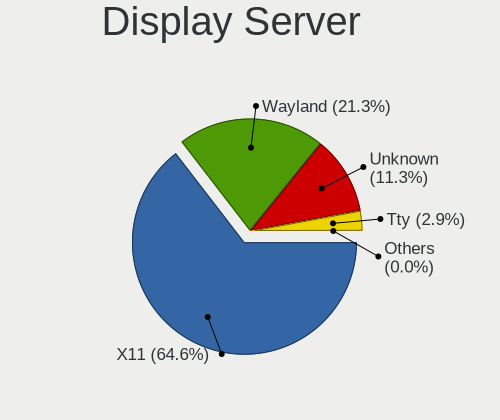
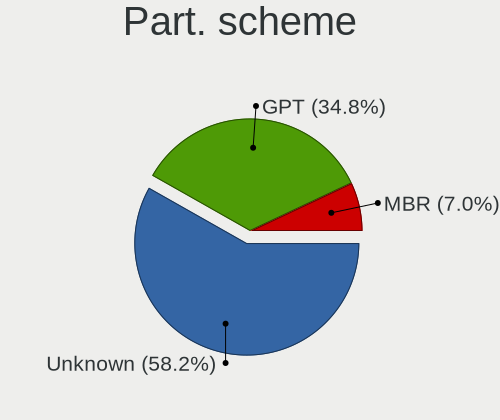
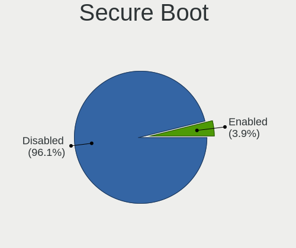
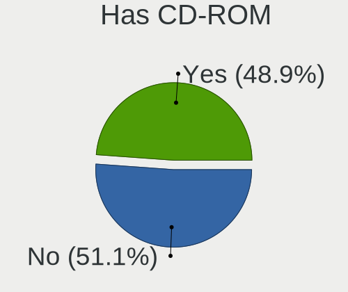
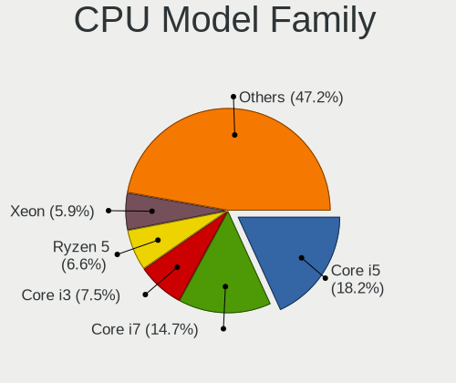
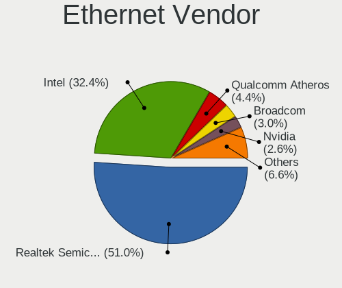

Ubuntu - Tested Hardware & Statistics (Desktops)
------------------------------------------------

A project to collect tested hardware configurations for Ubuntu.

Anyone can contribute to this report by the [hw-probe](https://github.com/linuxhw/hw-probe) tool:

    sudo -E hw-probe -all -upload

Please contribute! Especially if your hardware is rare.

Contents
--------

* [ Test Cases ](#test-cases)

* [ System ](#system)
  - [ OS                       ](#os)
  - [ OS Family                ](#os-family)
  - [ Kernel                   ](#kernel)
  - [ Kernel Family            ](#kernel-family)
  - [ Kernel Major Ver.        ](#kernel-major-ver)
  - [ Arch                     ](#arch)
  - [ DE                       ](#de)
  - [ Display Server           ](#display-server)
  - [ Display Manager          ](#display-manager)
  - [ OS Lang                  ](#os-lang)
  - [ Boot Mode                ](#boot-mode)
  - [ Filesystem               ](#filesystem)
  - [ Part. scheme             ](#part-scheme)
  - [ Dual Boot with Linux/BSD ](#dual-boot-with-linuxbsd)
  - [ Dual Boot (Win)          ](#dual-boot-win)

* [ Board ](#board)
  - [ Vendor                   ](#vendor)
  - [ Model                    ](#model)
  - [ Model Family             ](#model-family)
  - [ MFG Year                 ](#mfg-year)
  - [ Form Factor              ](#form-factor)
  - [ Secure Boot              ](#secure-boot)
  - [ Coreboot                 ](#coreboot)
  - [ RAM Size                 ](#ram-size)
  - [ RAM Used                 ](#ram-used)
  - [ Total Drives             ](#total-drives)
  - [ Has CD-ROM               ](#has-cd-rom)
  - [ Has Ethernet             ](#has-ethernet)
  - [ Has WiFi                 ](#has-wifi)
  - [ Has Bluetooth            ](#has-bluetooth)

* [ Location ](#location)
  - [ Country                  ](#country)
  - [ City                     ](#city)

* [ Drives ](#drives)
  - [ Drive Vendor             ](#drive-vendor)
  - [ Drive Model              ](#drive-model)
  - [ HDD Vendor               ](#hdd-vendor)
  - [ SSD Vendor               ](#ssd-vendor)
  - [ Drive Kind               ](#drive-kind)
  - [ Drive Connector          ](#drive-connector)
  - [ Drive Size               ](#drive-size)
  - [ Space Total              ](#space-total)
  - [ Space Used               ](#space-used)
  - [ Malfunc. Drives          ](#malfunc-drives)
  - [ Malfunc. Drive Vendor    ](#malfunc-drive-vendor)
  - [ Malfunc. HDD Vendor      ](#malfunc-hdd-vendor)
  - [ Malfunc. Drive Kind      ](#malfunc-drive-kind)
  - [ Failed Drives            ](#failed-drives)
  - [ Failed Drive Vendor      ](#failed-drive-vendor)
  - [ Drive Status             ](#drive-status)

* [ Storage controller ](#storage-controller)
  - [ Storage Vendor           ](#storage-vendor)
  - [ Storage Model            ](#storage-model)
  - [ Storage Kind             ](#storage-kind)

* [ Processor ](#processor)
  - [ CPU Vendor               ](#cpu-vendor)
  - [ CPU Model                ](#cpu-model)
  - [ CPU Model Family         ](#cpu-model-family)
  - [ CPU Cores                ](#cpu-cores)
  - [ CPU Sockets              ](#cpu-sockets)
  - [ CPU Threads              ](#cpu-threads)
  - [ CPU Op-Modes             ](#cpu-op-modes)
  - [ CPU Microcode            ](#cpu-microcode)
  - [ CPU Microarch            ](#cpu-microarch)

* [ Graphics ](#graphics)
  - [ GPU Vendor               ](#gpu-vendor)
  - [ GPU Model                ](#gpu-model)
  - [ GPU Combo                ](#gpu-combo)
  - [ GPU Driver               ](#gpu-driver)
  - [ GPU Memory               ](#gpu-memory)

* [ Monitor ](#monitor)
  - [ Monitor Vendor           ](#monitor-vendor)
  - [ Monitor Model            ](#monitor-model)
  - [ Monitor Resolution       ](#monitor-resolution)
  - [ Monitor Diagonal         ](#monitor-diagonal)
  - [ Monitor Width            ](#monitor-width)
  - [ Aspect Ratio             ](#aspect-ratio)
  - [ Monitor Area             ](#monitor-area)
  - [ Pixel Density            ](#pixel-density)
  - [ Multiple Monitors        ](#multiple-monitors)

* [ Network ](#network)
  - [ Net Controller Vendor    ](#net-controller-vendor)
  - [ Net Controller Model     ](#net-controller-model)
  - [ Wireless Vendor          ](#wireless-vendor)
  - [ Wireless Model           ](#wireless-model)
  - [ Ethernet Vendor          ](#ethernet-vendor)
  - [ Ethernet Model           ](#ethernet-model)
  - [ Net Controller Kind      ](#net-controller-kind)
  - [ Used Controller          ](#used-controller)
  - [ NICs                     ](#nics)
  - [ IPv6                     ](#ipv6)

* [ Bluetooth ](#bluetooth)
  - [ Bluetooth Vendor         ](#bluetooth-vendor)
  - [ Bluetooth Model          ](#bluetooth-model)

* [ Sound ](#sound)
  - [ Sound Vendor             ](#sound-vendor)
  - [ Sound Model              ](#sound-model)

* [ Memory ](#memory)
  - [ Memory Vendor            ](#memory-vendor)
  - [ Memory Model             ](#memory-model)
  - [ Memory Kind              ](#memory-kind)
  - [ Memory Form Factor       ](#memory-form-factor)
  - [ Memory Size              ](#memory-size)
  - [ Memory Speed             ](#memory-speed)

* [ Printers & scanners ](#printers--scanners)
  - [ Printer Vendor           ](#printer-vendor)
  - [ Printer Model            ](#printer-model)
  - [ Scanner Vendor           ](#scanner-vendor)
  - [ Scanner Model            ](#scanner-model)

* [ Camera ](#camera)
  - [ Camera Vendor            ](#camera-vendor)
  - [ Camera Model             ](#camera-model)

* [ Security ](#security)
  - [ Fingerprint Vendor       ](#fingerprint-vendor)
  - [ Fingerprint Model        ](#fingerprint-model)
  - [ Chipcard Vendor          ](#chipcard-vendor)
  - [ Chipcard Model           ](#chipcard-model)

* [ Unsupported ](#unsupported)
  - [ Unsupported Devices      ](#unsupported-devices)
  - [ Unsupported Device Types ](#unsupported-device-types)

Test Cases
----------

Total: 34002

| Vendor        | Model                       | Probe                                                      | Date         |
|---------------|-----------------------------|------------------------------------------------------------|--------------|
| ASUSTek       | PRIME H610M-E D4            | [56db7fc27f](https://linux-hardware.org/?probe=56db7fc27f) | May 01, 2023 |
| ASRock        | 970 Pro3 R2.0               | [577b5e8f51](https://linux-hardware.org/?probe=577b5e8f51) | May 01, 2023 |
| ASUSTek       | PRIME Z690M-PLUS D4         | [27fdafaf01](https://linux-hardware.org/?probe=27fdafaf01) | May 01, 2023 |
| Shuttle       | FS35V4                      | [137fda9bc6](https://linux-hardware.org/?probe=137fda9bc6) | May 01, 2023 |
| Gigabyte      | Z77MX-D3H                   | [fa4e32fe2c](https://linux-hardware.org/?probe=fa4e32fe2c) | May 01, 2023 |
| Dell          | 09KPNV A01                  | [45dad4b8e9](https://linux-hardware.org/?probe=45dad4b8e9) | May 01, 2023 |
| ASRock        | B660M-HDV                   | [a137e6ab62](https://linux-hardware.org/?probe=a137e6ab62) | May 01, 2023 |
| MSI           | A520M-A PRO                 | [aa8e8397f6](https://linux-hardware.org/?probe=aa8e8397f6) | May 01, 2023 |
| ASUSTek       | PRIME Z690-P WIFI           | [4f0b170b70](https://linux-hardware.org/?probe=4f0b170b70) | May 01, 2023 |
| ASUSTek       | PRIME B450-PLUS             | [56db3a6b44](https://linux-hardware.org/?probe=56db3a6b44) | May 01, 2023 |
| ASUSTek       | PRIME B550M-A AC            | [f10c443a56](https://linux-hardware.org/?probe=f10c443a56) | May 01, 2023 |
| PCWare        | IPMH410E                    | [9be4314a33](https://linux-hardware.org/?probe=9be4314a33) | May 01, 2023 |
| Dell          | 07PR60 A00                  | [e6f49bbe8a](https://linux-hardware.org/?probe=e6f49bbe8a) | Apr 30, 2023 |
| Lenovo        | 3111 SDK0J40697 WIN 3305... | [705ff684a9](https://linux-hardware.org/?probe=705ff684a9) | Apr 30, 2023 |
| ASUSTek       | H81-PLUS                    | [3b45144d62](https://linux-hardware.org/?probe=3b45144d62) | Apr 30, 2023 |
| Gigabyte      | EP45-UD3P                   | [8d99ef5cc7](https://linux-hardware.org/?probe=8d99ef5cc7) | Apr 30, 2023 |
| ASUSTek       | H81I-PLUS                   | [01578538eb](https://linux-hardware.org/?probe=01578538eb) | Apr 30, 2023 |
| ASRock        | Z77 Extreme3                | [1298b74530](https://linux-hardware.org/?probe=1298b74530) | Apr 30, 2023 |
| ASRock        | FM2A68M-HD+                 | [467bb5ded2](https://linux-hardware.org/?probe=467bb5ded2) | Apr 30, 2023 |
| MSI           | PRO Z690-A WIFI             | [bfa4eb5eda](https://linux-hardware.org/?probe=bfa4eb5eda) | Apr 30, 2023 |
| Apple         | Mac-F42C88C8 Proto1         | [ab7b403321](https://linux-hardware.org/?probe=ab7b403321) | Apr 30, 2023 |
| ASRock        | B550M Steel Legend          | [68d85dd28f](https://linux-hardware.org/?probe=68d85dd28f) | Apr 30, 2023 |
| ASRock        | B550M Steel Legend          | [5166f820a6](https://linux-hardware.org/?probe=5166f820a6) | Apr 30, 2023 |
| ASRock        | 960GM-GS3 FX                | [392492c032](https://linux-hardware.org/?probe=392492c032) | Apr 30, 2023 |
| Lenovo        | 370A SDK0J40700 WIN 3258... | [9a1d443928](https://linux-hardware.org/?probe=9a1d443928) | Apr 30, 2023 |
| Medion        | H81H3-EM2                   | [c85a3da4ab](https://linux-hardware.org/?probe=c85a3da4ab) | Apr 30, 2023 |
| ASRock        | N68-GS4 FX                  | [354f8689e7](https://linux-hardware.org/?probe=354f8689e7) | Apr 30, 2023 |
| Colorful T... | CVN B550M GAMING FROZEN ... | [233ea7cdd8](https://linux-hardware.org/?probe=233ea7cdd8) | Apr 30, 2023 |
| Colorful T... | CVN B550M GAMING FROZEN ... | [177fe2fc00](https://linux-hardware.org/?probe=177fe2fc00) | Apr 30, 2023 |
| Gigabyte      | TRX40 AORUS XTREME          | [a88277b7f9](https://linux-hardware.org/?probe=a88277b7f9) | Apr 30, 2023 |
| ASRock        | H110M-DGS R3.0              | [88e7444fa5](https://linux-hardware.org/?probe=88e7444fa5) | Apr 30, 2023 |
| ASRock        | H110M-DGS R3.0              | [763e7fa1b6](https://linux-hardware.org/?probe=763e7fa1b6) | Apr 30, 2023 |
| ASUSTek       | B85M-G R2.0                 | [243a170e5a](https://linux-hardware.org/?probe=243a170e5a) | Apr 30, 2023 |
| ASRock        | B450M Steel Legend          | [fed083feba](https://linux-hardware.org/?probe=fed083feba) | Apr 30, 2023 |
| HP            | ProLiant ML10 v2            | [3582be2f06](https://linux-hardware.org/?probe=3582be2f06) | Apr 30, 2023 |
| Dell          | 0T10XW A02                  | [2cd32d1efe](https://linux-hardware.org/?probe=2cd32d1efe) | Apr 30, 2023 |
| Dell          | 00V62H A00                  | [86cb104ceb](https://linux-hardware.org/?probe=86cb104ceb) | Apr 29, 2023 |
| ASUSTek       | PRIME X470-PRO              | [244cfe88a4](https://linux-hardware.org/?probe=244cfe88a4) | Apr 29, 2023 |
| Gigabyte      | GA-78LMT-USB3               | [f543ce6c65](https://linux-hardware.org/?probe=f543ce6c65) | Apr 29, 2023 |
| ASUSTek       | SABERTOOTH 990FX            | [4801547d54](https://linux-hardware.org/?probe=4801547d54) | Apr 29, 2023 |
| ASRock        | N68C-S UCC                  | [13628f3559](https://linux-hardware.org/?probe=13628f3559) | Apr 29, 2023 |
| HP            | 3647h                       | [a2776d5c24](https://linux-hardware.org/?probe=a2776d5c24) | Apr 29, 2023 |
| ASUSTek       | H110M-D                     | [81cff8a578](https://linux-hardware.org/?probe=81cff8a578) | Apr 29, 2023 |
| Gigabyte      | Z790 UD                     | [536a24a0e3](https://linux-hardware.org/?probe=536a24a0e3) | Apr 29, 2023 |
| ASRock        | N68C-S UCC                  | [f7f4643b8f](https://linux-hardware.org/?probe=f7f4643b8f) | Apr 29, 2023 |
| Gigabyte      | H310M H x.x                 | [6b44ad5061](https://linux-hardware.org/?probe=6b44ad5061) | Apr 29, 2023 |
| Gigabyte      | H310M H x.x                 | [ce73a703b6](https://linux-hardware.org/?probe=ce73a703b6) | Apr 29, 2023 |
| YANYU         | EPIC-N56_I522E Ver          | [4798ab5c06](https://linux-hardware.org/?probe=4798ab5c06) | Apr 29, 2023 |
| ASUSTek       | PRIME B450M-K               | [3592ce514a](https://linux-hardware.org/?probe=3592ce514a) | Apr 29, 2023 |
| Gigabyte      | G41MT-S2                    | [ba5c65f4e3](https://linux-hardware.org/?probe=ba5c65f4e3) | Apr 29, 2023 |
| Lenovo        | XXXX 3000 H210              | [96644846f5](https://linux-hardware.org/?probe=96644846f5) | Apr 29, 2023 |
| Dell          | 0HY9JP A02                  | [2ec196dd79](https://linux-hardware.org/?probe=2ec196dd79) | Apr 29, 2023 |
| Dell          | 0T0MHW A02                  | [4f08178f96](https://linux-hardware.org/?probe=4f08178f96) | Apr 29, 2023 |
| ECS           | H81H3-M4                    | [67da6cebd3](https://linux-hardware.org/?probe=67da6cebd3) | Apr 29, 2023 |
| Gigabyte      | GA-78LMT-S2                 | [16b28befee](https://linux-hardware.org/?probe=16b28befee) | Apr 28, 2023 |
| Dell          | 0773VG A02                  | [bd3dba564e](https://linux-hardware.org/?probe=bd3dba564e) | Apr 28, 2023 |
| Apple         | Mac-F221BEC8                | [033718212c](https://linux-hardware.org/?probe=033718212c) | Apr 28, 2023 |
| Dell          | 0773VG A02                  | [cab1aa59e0](https://linux-hardware.org/?probe=cab1aa59e0) | Apr 28, 2023 |
| MSI           | B550M PRO-VDH WIFI          | [e0367e684f](https://linux-hardware.org/?probe=e0367e684f) | Apr 28, 2023 |
| MSI           | B550M PRO-VDH WIFI          | [fed0a1a719](https://linux-hardware.org/?probe=fed0a1a719) | Apr 28, 2023 |
| Fujitsu       | D3500-A1 S26361-D3500-A1    | [77150d1166](https://linux-hardware.org/?probe=77150d1166) | Apr 28, 2023 |
| Gigabyte      | A520M S2H                   | [fa82c3b6ba](https://linux-hardware.org/?probe=fa82c3b6ba) | Apr 28, 2023 |
| ASUSTek       | Z87-PLUS                    | [7477be45f8](https://linux-hardware.org/?probe=7477be45f8) | Apr 28, 2023 |
| ASUSTek       | PRIME X370-PRO              | [ddb48a2def](https://linux-hardware.org/?probe=ddb48a2def) | Apr 28, 2023 |
| Lenovo        | 1048 SDK0Q40104 WIN 3915... | [43942fab0f](https://linux-hardware.org/?probe=43942fab0f) | Apr 28, 2023 |
| ASUSTek       | PRIME X670-P WIFI           | [d97d6d6dff](https://linux-hardware.org/?probe=d97d6d6dff) | Apr 28, 2023 |
| ASUSTek       | PRIME X670-P WIFI           | [a6eba14ab4](https://linux-hardware.org/?probe=a6eba14ab4) | Apr 28, 2023 |
| Dell          | 0WMJ54 A01                  | [01c8d89ab9](https://linux-hardware.org/?probe=01c8d89ab9) | Apr 28, 2023 |
| HP            | 158B                        | [ee0297b0ba](https://linux-hardware.org/?probe=ee0297b0ba) | Apr 28, 2023 |
| Lenovo        | NOK                         | [cf3db26781](https://linux-hardware.org/?probe=cf3db26781) | Apr 28, 2023 |
| Lenovo        | Dory CRB                    | [f8aee85cd4](https://linux-hardware.org/?probe=f8aee85cd4) | Apr 28, 2023 |
| Gigabyte      | H110M-S2-CF                 | [eb327f9dc8](https://linux-hardware.org/?probe=eb327f9dc8) | Apr 28, 2023 |
| HP            | 802F                        | [b314d41043](https://linux-hardware.org/?probe=b314d41043) | Apr 28, 2023 |
| Unknown       | G41                         | [2a6a185bec](https://linux-hardware.org/?probe=2a6a185bec) | Apr 28, 2023 |
| MSI           | H310M PRO-M2 PLUS           | [815dd8e866](https://linux-hardware.org/?probe=815dd8e866) | Apr 28, 2023 |
| Intel         | DZ68DB AAG27985-101         | [b3323dcc11](https://linux-hardware.org/?probe=b3323dcc11) | Apr 28, 2023 |
| ASUSTek       | P8H67-M PRO                 | [589810ee4b](https://linux-hardware.org/?probe=589810ee4b) | Apr 28, 2023 |
| Gigabyte      | H110M-S2-CF                 | [ca9179cae4](https://linux-hardware.org/?probe=ca9179cae4) | Apr 28, 2023 |
| Gigabyte      | Z490 AORUS ULTRA            | [96371860f5](https://linux-hardware.org/?probe=96371860f5) | Apr 28, 2023 |
| Lenovo        | SHARKBAY NO DPK             | [9a22f330c4](https://linux-hardware.org/?probe=9a22f330c4) | Apr 28, 2023 |
| Lenovo        | NO DPK                      | [d3442220b0](https://linux-hardware.org/?probe=d3442220b0) | Apr 28, 2023 |
| Apple         | Mac-F42C88C8 Proto1         | [7a3cce252f](https://linux-hardware.org/?probe=7a3cce252f) | Apr 28, 2023 |
| Apple         | Mac-F42C88C8 Proto1         | [60bf74f8f9](https://linux-hardware.org/?probe=60bf74f8f9) | Apr 28, 2023 |
| HP            | 21D0                        | [a26451e82c](https://linux-hardware.org/?probe=a26451e82c) | Apr 28, 2023 |
| ASUSTek       | TUF Gaming Z690-PLUS WIF... | [d138bfdf52](https://linux-hardware.org/?probe=d138bfdf52) | Apr 28, 2023 |
| ASRock        | A75M-HVS                    | [528362dfca](https://linux-hardware.org/?probe=528362dfca) | Apr 28, 2023 |
| Lenovo        | Dory CRB                    | [f4d7a6ed92](https://linux-hardware.org/?probe=f4d7a6ed92) | Apr 28, 2023 |
| Unknown       | RS780-SB700                 | [94f2408a63](https://linux-hardware.org/?probe=94f2408a63) | Apr 28, 2023 |
| Unknown       | RS780-SB700                 | [76c36882d9](https://linux-hardware.org/?probe=76c36882d9) | Apr 28, 2023 |
| Dell          | 0WMJ54 A01                  | [3d73e4cd7e](https://linux-hardware.org/?probe=3d73e4cd7e) | Apr 27, 2023 |
| Intel         | DH87RL AAG74240-403         | [54b1c509f2](https://linux-hardware.org/?probe=54b1c509f2) | Apr 27, 2023 |
| Apple         | Mac-F60DEB81FF30ACF6 Mac... | [49033dd76c](https://linux-hardware.org/?probe=49033dd76c) | Apr 27, 2023 |
| MSI           | X99A GAMING 9 ACK           | [3d79f67248](https://linux-hardware.org/?probe=3d79f67248) | Apr 27, 2023 |
| Gigabyte      | GA-880GMA-UD2H              | [7f2f7e75b7](https://linux-hardware.org/?probe=7f2f7e75b7) | Apr 27, 2023 |
| Dell          | 0HHV7N A00                  | [33517b7bfe](https://linux-hardware.org/?probe=33517b7bfe) | Apr 27, 2023 |
| ASUSTek       | CROSSBLADE RANGER           | [641d7d0398](https://linux-hardware.org/?probe=641d7d0398) | Apr 27, 2023 |
| Lenovo        | ThinkCentre M71e 3129B8G    | [2b6c3d498a](https://linux-hardware.org/?probe=2b6c3d498a) | Apr 27, 2023 |
| MSI           | PRO B760M-A WIFI DDR4       | [de581801e8](https://linux-hardware.org/?probe=de581801e8) | Apr 27, 2023 |
| Gigabyte      | Z97P-D3                     | [40b51d3cae](https://linux-hardware.org/?probe=40b51d3cae) | Apr 27, 2023 |
| HP            | 18E7                        | [c6a760cb50](https://linux-hardware.org/?probe=c6a760cb50) | Apr 27, 2023 |
| ASUSTek       | H110M-A                     | [1fa553ab02](https://linux-hardware.org/?probe=1fa553ab02) | Apr 27, 2023 |
| ASUSTek       | TUF Gaming X570-PLUS        | [3e8fe7fed4](https://linux-hardware.org/?probe=3e8fe7fed4) | Apr 27, 2023 |
| ASUSTek       | TUF Gaming B450M-PLUS II    | [9211d42ee3](https://linux-hardware.org/?probe=9211d42ee3) | Apr 27, 2023 |
| HP            | 3647h                       | [26d40c9fc3](https://linux-hardware.org/?probe=26d40c9fc3) | Apr 27, 2023 |
| HP            | 3047h                       | [3e6dada8a9](https://linux-hardware.org/?probe=3e6dada8a9) | Apr 26, 2023 |
| ECS           | G41T-R3                     | [fcbdd2737a](https://linux-hardware.org/?probe=fcbdd2737a) | Apr 26, 2023 |
| ASRock        | H61M-VG4                    | [a8e7de2e0b](https://linux-hardware.org/?probe=a8e7de2e0b) | Apr 26, 2023 |
| Gigabyte      | GA-770TA-UD3                | [6b17eb81f8](https://linux-hardware.org/?probe=6b17eb81f8) | Apr 26, 2023 |
| MSI           | MAG B550M MORTAR            | [f91ac46cfd](https://linux-hardware.org/?probe=f91ac46cfd) | Apr 26, 2023 |
| HP            | 1905                        | [7b15ec2d7d](https://linux-hardware.org/?probe=7b15ec2d7d) | Apr 26, 2023 |
| Gigabyte      | Z97X-UD3H-CF                | [eaac4c0ba0](https://linux-hardware.org/?probe=eaac4c0ba0) | Apr 26, 2023 |
| HP            | 1825                        | [5a26051aec](https://linux-hardware.org/?probe=5a26051aec) | Apr 26, 2023 |
| Gigabyte      | Z370M D3H-CF                | [ada8ff75dd](https://linux-hardware.org/?probe=ada8ff75dd) | Apr 26, 2023 |
| MSI           | B450-A PRO MAX              | [2d7c2dd8f9](https://linux-hardware.org/?probe=2d7c2dd8f9) | Apr 26, 2023 |
| ASUSTek       | TUF Gaming Z690-PLUS D4     | [8f417742d1](https://linux-hardware.org/?probe=8f417742d1) | Apr 26, 2023 |
| Gigabyte      | X58A-UD3R                   | [80d546064f](https://linux-hardware.org/?probe=80d546064f) | Apr 26, 2023 |
| IBM           | P4M900/VT8251/DME1737       | [8cbd1dce35](https://linux-hardware.org/?probe=8cbd1dce35) | Apr 26, 2023 |
| Lenovo        | 36C5 SDK0K17763 WIN 1801... | [45c453eb4e](https://linux-hardware.org/?probe=45c453eb4e) | Apr 26, 2023 |
| MSI           | H110M PRO-VD                | [d9decf6f0a](https://linux-hardware.org/?probe=d9decf6f0a) | Apr 26, 2023 |
| Lenovo        | 36C5 SDK0K17763 WIN 1801... | [b79a40ebdc](https://linux-hardware.org/?probe=b79a40ebdc) | Apr 26, 2023 |
| IBM           | P4M900/VT8251/DME1737       | [ef0df72346](https://linux-hardware.org/?probe=ef0df72346) | Apr 26, 2023 |
| ASUSTek       | X99-A                       | [6788eea8d2](https://linux-hardware.org/?probe=6788eea8d2) | Apr 26, 2023 |
| MSI           | PRO Z690-A WIFI             | [23c9be7614](https://linux-hardware.org/?probe=23c9be7614) | Apr 26, 2023 |
| ASUSTek       | H110-PLUS                   | [f8317bce7b](https://linux-hardware.org/?probe=f8317bce7b) | Apr 26, 2023 |
| Pegatron      | IPXSB-H61                   | [2b0ee4d542](https://linux-hardware.org/?probe=2b0ee4d542) | Apr 26, 2023 |
| Dell          | 0JP3NX A01                  | [2fa64e56ff](https://linux-hardware.org/?probe=2fa64e56ff) | Apr 25, 2023 |
| ASRock        | G31M-S                      | [98c2b2c382](https://linux-hardware.org/?probe=98c2b2c382) | Apr 25, 2023 |
| Lenovo        | MAHOBAY                     | [ef2dfc5068](https://linux-hardware.org/?probe=ef2dfc5068) | Apr 25, 2023 |
| ASUSTek       | PRIME B450M-A               | [d8c1be05af](https://linux-hardware.org/?probe=d8c1be05af) | Apr 25, 2023 |
| ASUSTek       | PRIME X570-P                | [290f3ebad7](https://linux-hardware.org/?probe=290f3ebad7) | Apr 25, 2023 |
| Acer          | Aspire X3995                | [877c9deb7a](https://linux-hardware.org/?probe=877c9deb7a) | Apr 25, 2023 |
| Biostar       | A68N-5600E                  | [ccaeaae27b](https://linux-hardware.org/?probe=ccaeaae27b) | Apr 25, 2023 |
| Gigabyte      | GA-78LMT-S2P                | [4668a2409b](https://linux-hardware.org/?probe=4668a2409b) | Apr 25, 2023 |
| Acer          | Predator G3-605             | [37cd92a7f0](https://linux-hardware.org/?probe=37cd92a7f0) | Apr 25, 2023 |
| Acer          | Predator G3-605             | [0b966e7b88](https://linux-hardware.org/?probe=0b966e7b88) | Apr 25, 2023 |
| Gigabyte      | GA-78LMT-S2P                | [7b091628e5](https://linux-hardware.org/?probe=7b091628e5) | Apr 25, 2023 |
| Gigabyte      | Z270X-UD3-CF                | [06fbe4d0b6](https://linux-hardware.org/?probe=06fbe4d0b6) | Apr 25, 2023 |
| ASRock        | X670E Pro RS                | [e36216c3c7](https://linux-hardware.org/?probe=e36216c3c7) | Apr 25, 2023 |
| ASUSTek       | PRIME Z790-P                | [c7fdbbb95b](https://linux-hardware.org/?probe=c7fdbbb95b) | Apr 25, 2023 |
| ASUSTek       | PRIME Z790-P                | [363bb28966](https://linux-hardware.org/?probe=363bb28966) | Apr 25, 2023 |
| Dell          | 0WR7PY A01                  | [6eeb692185](https://linux-hardware.org/?probe=6eeb692185) | Apr 25, 2023 |
| Dell          | 0K071D A01                  | [0c7edbd8ea](https://linux-hardware.org/?probe=0c7edbd8ea) | Apr 25, 2023 |
| OEM           | HN B85 Ver:1.4              | [1da5934b27](https://linux-hardware.org/?probe=1da5934b27) | Apr 25, 2023 |
| Gigabyte      | B450M DS3H WIFI-CF          | [1a58c88206](https://linux-hardware.org/?probe=1a58c88206) | Apr 25, 2023 |
| ASUSTek       | M4A78LT-M                   | [11f1e291a7](https://linux-hardware.org/?probe=11f1e291a7) | Apr 25, 2023 |
| ASUSTek       | M3A                         | [c16000b1e4](https://linux-hardware.org/?probe=c16000b1e4) | Apr 25, 2023 |
| ASUSTek       | Z170 PRO GAMING             | [7d7fd385cc](https://linux-hardware.org/?probe=7d7fd385cc) | Apr 25, 2023 |
| ASUSTek       | P8B75-V                     | [f60927a4d8](https://linux-hardware.org/?probe=f60927a4d8) | Apr 24, 2023 |
| ASUSTek       | ROG STRIX B550-A GAMING     | [cdfcab45e7](https://linux-hardware.org/?probe=cdfcab45e7) | Apr 24, 2023 |
| Lenovo        | SHARKBAY 0B98401 PRO        | [342918aa38](https://linux-hardware.org/?probe=342918aa38) | Apr 24, 2023 |
| Dell          | 0JP3NX A01                  | [609eeb8038](https://linux-hardware.org/?probe=609eeb8038) | Apr 24, 2023 |
| ASUSTek       | A88X-GAMER                  | [f61201c8a5](https://linux-hardware.org/?probe=f61201c8a5) | Apr 24, 2023 |
| MSI           | H81M PRO-VD                 | [00ade274cb](https://linux-hardware.org/?probe=00ade274cb) | Apr 24, 2023 |
| Lenovo        | 313A NOK                    | [34a521ebad](https://linux-hardware.org/?probe=34a521ebad) | Apr 24, 2023 |
| MSI           | H110M ECO                   | [bfa2b17374](https://linux-hardware.org/?probe=bfa2b17374) | Apr 24, 2023 |
| Intel         | DH55HC AAE70933-505         | [a1f92a019f](https://linux-hardware.org/?probe=a1f92a019f) | Apr 24, 2023 |
| Dell          | 0R790T A00                  | [7ca2bb8871](https://linux-hardware.org/?probe=7ca2bb8871) | Apr 24, 2023 |
| Dell          | 0VTJVC A00                  | [da7d66917d](https://linux-hardware.org/?probe=da7d66917d) | Apr 24, 2023 |
| Gigabyte      | GA-770TA-UD3                | [2337ae230f](https://linux-hardware.org/?probe=2337ae230f) | Apr 24, 2023 |
| Gigabyte      | Z97X-UD3H-CF                | [88c455761b](https://linux-hardware.org/?probe=88c455761b) | Apr 24, 2023 |
| ASUSTek       | STRIX B250I GAMING          | [beabf00341](https://linux-hardware.org/?probe=beabf00341) | Apr 24, 2023 |
| Fujitsu       | D3221-A1 S26361-D3221-A1    | [e18fd8d449](https://linux-hardware.org/?probe=e18fd8d449) | Apr 24, 2023 |
| ASUSTek       | PRIME B450M-K II            | [2d0269750e](https://linux-hardware.org/?probe=2d0269750e) | Apr 24, 2023 |
| Gigabyte      | Z590 AORUS ELITE AX         | [ed8414c493](https://linux-hardware.org/?probe=ed8414c493) | Apr 24, 2023 |
| MSI           | B460M PRO-VDH               | [f7709c23a1](https://linux-hardware.org/?probe=f7709c23a1) | Apr 24, 2023 |
| ASUSTek       | CROSSHAIR V FORMULA-Z       | [267c5b8075](https://linux-hardware.org/?probe=267c5b8075) | Apr 24, 2023 |
| ASUSTek       | PRIME X399-A                | [70d478e2eb](https://linux-hardware.org/?probe=70d478e2eb) | Apr 24, 2023 |
| ASUSTek       | PRIME X399-A                | [2931b721a3](https://linux-hardware.org/?probe=2931b721a3) | Apr 24, 2023 |
| Gigabyte      | Z590 AORUS ELITE AX         | [695220be38](https://linux-hardware.org/?probe=695220be38) | Apr 24, 2023 |
| Lenovo        | 32E9 SDK0T76463 WIN 3422... | [9f49daf25a](https://linux-hardware.org/?probe=9f49daf25a) | Apr 24, 2023 |
| Lenovo        | 32E9 SDK0T76463 WIN 3422... | [cc7a31d3d6](https://linux-hardware.org/?probe=cc7a31d3d6) | Apr 24, 2023 |
| ASUSTek       | PRIME X370-PRO              | [eb716c53fa](https://linux-hardware.org/?probe=eb716c53fa) | Apr 24, 2023 |
| MSI           | Z97S SLI Krait Edition      | [6ed93f8338](https://linux-hardware.org/?probe=6ed93f8338) | Apr 24, 2023 |
| Gigabyte      | G41MT-S2                    | [de1981f9e6](https://linux-hardware.org/?probe=de1981f9e6) | Apr 24, 2023 |
| Gigabyte      | GA-770TA-UD3                | [90db0063b0](https://linux-hardware.org/?probe=90db0063b0) | Apr 24, 2023 |
| Gigabyte      | B550M AORUS ELITE           | [39fd6ad31f](https://linux-hardware.org/?probe=39fd6ad31f) | Apr 24, 2023 |
| ASUSTek       | Z170 PRO GAMING             | [2a0ee71044](https://linux-hardware.org/?probe=2a0ee71044) | Apr 23, 2023 |
| ASUSTek       | P5G41T-M LX                 | [68d1859c93](https://linux-hardware.org/?probe=68d1859c93) | Apr 23, 2023 |
| Gigabyte      | Z370 HD3P-CF                | [7609d632a4](https://linux-hardware.org/?probe=7609d632a4) | Apr 23, 2023 |
| Gigabyte      | X570 AORUS XTREME           | [0dfc7cce7a](https://linux-hardware.org/?probe=0dfc7cce7a) | Apr 23, 2023 |
| ASUSTek       | M5A78L LE                   | [df70910ec6](https://linux-hardware.org/?probe=df70910ec6) | Apr 23, 2023 |
| Gigabyte      | X570 AORUS XTREME           | [4e664e5e26](https://linux-hardware.org/?probe=4e664e5e26) | Apr 23, 2023 |
| Gigabyte      | Z97P-D3                     | [5da4c37f75](https://linux-hardware.org/?probe=5da4c37f75) | Apr 23, 2023 |
| Lenovo        | 36C5 SDK0K17763 WIN 1801... | [e653a5dd45](https://linux-hardware.org/?probe=e653a5dd45) | Apr 23, 2023 |
| Lenovo        | 36C5 SDK0K17763 WIN 1801... | [95e77b87f5](https://linux-hardware.org/?probe=95e77b87f5) | Apr 23, 2023 |
| ASUSTek       | STRIX B250I GAMING          | [0e96ee4471](https://linux-hardware.org/?probe=0e96ee4471) | Apr 23, 2023 |
| Gigabyte      | GA-78LMT-S2P                | [793e094165](https://linux-hardware.org/?probe=793e094165) | Apr 23, 2023 |
| ASRock        | N68-GS4 FX                  | [58dfb135e4](https://linux-hardware.org/?probe=58dfb135e4) | Apr 23, 2023 |
| Gigabyte      | Z97X-UD3H-CF                | [a65124c792](https://linux-hardware.org/?probe=a65124c792) | Apr 23, 2023 |
| ASRock        | N68-GS4 FX                  | [6edcfed28d](https://linux-hardware.org/?probe=6edcfed28d) | Apr 23, 2023 |
| MSI           | A88XM-E35                   | [c26812e2e1](https://linux-hardware.org/?probe=c26812e2e1) | Apr 23, 2023 |
| Gigabyte      | TRX40 AORUS XTREME          | [eac9934073](https://linux-hardware.org/?probe=eac9934073) | Apr 23, 2023 |
| ASUSTek       | Maximus VII FORMULA         | [0d45b24479](https://linux-hardware.org/?probe=0d45b24479) | Apr 23, 2023 |
| Gigabyte      | Z97M-DS3H                   | [652e029529](https://linux-hardware.org/?probe=652e029529) | Apr 23, 2023 |
| MSI           | G41M-P26                    | [342a1163ab](https://linux-hardware.org/?probe=342a1163ab) | Apr 23, 2023 |
| Gigabyte      | GA-78LMT-S2P                | [b342cd8fe0](https://linux-hardware.org/?probe=b342cd8fe0) | Apr 23, 2023 |
| Intel         | DH61BE AAG14062-206         | [c1817da6ab](https://linux-hardware.org/?probe=c1817da6ab) | Apr 23, 2023 |
| ASUSTek       | TUF Gaming B550-PLUS WIF... | [658450824e](https://linux-hardware.org/?probe=658450824e) | Apr 23, 2023 |
| Gigabyte      | 970A-DS3P                   | [4a55a10fd0](https://linux-hardware.org/?probe=4a55a10fd0) | Apr 23, 2023 |
| HP            | 805D                        | [091e90cae0](https://linux-hardware.org/?probe=091e90cae0) | Apr 23, 2023 |
| Lenovo        | 1036 NO DPK                 | [f5b9a50e56](https://linux-hardware.org/?probe=f5b9a50e56) | Apr 23, 2023 |
| Lenovo        | 1036 NO DPK                 | [edcf4e959d](https://linux-hardware.org/?probe=edcf4e959d) | Apr 23, 2023 |
| ASUSTek       | PRIME Z390-A                | [3fc4048a96](https://linux-hardware.org/?probe=3fc4048a96) | Apr 23, 2023 |
| ASUSTek       | Z87-PRO                     | [08ebdd71ab](https://linux-hardware.org/?probe=08ebdd71ab) | Apr 23, 2023 |
| ASRock        | A75M-HVS                    | [a4964506f7](https://linux-hardware.org/?probe=a4964506f7) | Apr 23, 2023 |
| Fujitsu       | D3161-A1 S26361-D3161-A1    | [67f15c6f4a](https://linux-hardware.org/?probe=67f15c6f4a) | Apr 22, 2023 |
| MSI           | MPG X570S CARBON MAX WIF... | [1c85c89b5d](https://linux-hardware.org/?probe=1c85c89b5d) | Apr 22, 2023 |
| ASRock        | Z77 Pro3                    | [2f4b412834](https://linux-hardware.org/?probe=2f4b412834) | Apr 22, 2023 |
| System76      | Thelio thelio-r1            | [d48efc62c4](https://linux-hardware.org/?probe=d48efc62c4) | Apr 22, 2023 |
| MSI           | MPG X570S CARBON MAX WIF... | [1404fc66cf](https://linux-hardware.org/?probe=1404fc66cf) | Apr 22, 2023 |
| Gigabyte      | Z390 UD                     | [c9e17ad011](https://linux-hardware.org/?probe=c9e17ad011) | Apr 22, 2023 |
| ASUSTek       | TUF Gaming X670E-PLUS WI... | [180784b3a2](https://linux-hardware.org/?probe=180784b3a2) | Apr 22, 2023 |
| ASUSTek       | P8Z77-M PRO                 | [2e828158e5](https://linux-hardware.org/?probe=2e828158e5) | Apr 22, 2023 |
| ASRock        | Z170 Gaming K4              | [8209f53171](https://linux-hardware.org/?probe=8209f53171) | Apr 22, 2023 |
| Intel         | H81                         | [fbc2766f35](https://linux-hardware.org/?probe=fbc2766f35) | Apr 22, 2023 |
| Dell          | 07N90W A00                  | [f6d15dbf35](https://linux-hardware.org/?probe=f6d15dbf35) | Apr 22, 2023 |
| Gigabyte      | Z790 UD                     | [8536a23081](https://linux-hardware.org/?probe=8536a23081) | Apr 22, 2023 |
| Gigabyte      | 990FXA-UD3                  | [bab80153bf](https://linux-hardware.org/?probe=bab80153bf) | Apr 22, 2023 |
| Gigabyte      | B660M GAMING DDR4           | [2afc5398b8](https://linux-hardware.org/?probe=2afc5398b8) | Apr 22, 2023 |
| ASRock        | Z97E-ITX/ac                 | [f916f697ed](https://linux-hardware.org/?probe=f916f697ed) | Apr 22, 2023 |
| MSI           | Z77A-G41                    | [9cd2294229](https://linux-hardware.org/?probe=9cd2294229) | Apr 22, 2023 |
| Biostar       | H410MH S2                   | [0f2593dc78](https://linux-hardware.org/?probe=0f2593dc78) | Apr 22, 2023 |
| ASUSTek       | PRIME X570-P                | [f23eeda727](https://linux-hardware.org/?probe=f23eeda727) | Apr 22, 2023 |
| ASUSTek       | ROG STRIX B650E-I GAMING... | [a60c54ec31](https://linux-hardware.org/?probe=a60c54ec31) | Apr 22, 2023 |
| MSI           | Z370M GAMING PRO AC         | [f22eccea8d](https://linux-hardware.org/?probe=f22eccea8d) | Apr 22, 2023 |
| ASUSTek       | H170-PRO                    | [f82191c9cb](https://linux-hardware.org/?probe=f82191c9cb) | Apr 22, 2023 |
| MSI           | B550-A PRO                  | [06bc639254](https://linux-hardware.org/?probe=06bc639254) | Apr 22, 2023 |
| Gigabyte      | TRX40 AORUS XTREME          | [d4d3e7f8d6](https://linux-hardware.org/?probe=d4d3e7f8d6) | Apr 21, 2023 |
| MSI           | IONA                        | [3820fb6576](https://linux-hardware.org/?probe=3820fb6576) | Apr 21, 2023 |
| Shuttle       | FG45 V10                    | [b5a9d7b1e4](https://linux-hardware.org/?probe=b5a9d7b1e4) | Apr 21, 2023 |
| ASRock        | H81M-HDS R2.0               | [eaf8476afd](https://linux-hardware.org/?probe=eaf8476afd) | Apr 21, 2023 |
| Unknown       | Unknown                     | [be207ea29f](https://linux-hardware.org/?probe=be207ea29f) | Apr 21, 2023 |
| HP            | 339A                        | [1be48a395d](https://linux-hardware.org/?probe=1be48a395d) | Apr 21, 2023 |
| HP            | 1825                        | [e586a2657b](https://linux-hardware.org/?probe=e586a2657b) | Apr 21, 2023 |
| HP            | 1494                        | [625373a1de](https://linux-hardware.org/?probe=625373a1de) | Apr 21, 2023 |
| ASUSTek       | PRIME B360M-A               | [61d7104ec4](https://linux-hardware.org/?probe=61d7104ec4) | Apr 21, 2023 |
| Dell          | 0RY206                      | [8290af518f](https://linux-hardware.org/?probe=8290af518f) | Apr 21, 2023 |
| HP            | 1905                        | [9e047f751d](https://linux-hardware.org/?probe=9e047f751d) | Apr 21, 2023 |
| MSI           | MAG Z490 TOMAHAWK           | [97eec10e18](https://linux-hardware.org/?probe=97eec10e18) | Apr 21, 2023 |
| MSI           | H310M PRO-VDH PLUS          | [f89cce4966](https://linux-hardware.org/?probe=f89cce4966) | Apr 21, 2023 |
| Lenovo        | 1048 SDK0J40697 WIN 3305... | [aa8e171e50](https://linux-hardware.org/?probe=aa8e171e50) | Apr 21, 2023 |
| ASUSTek       | PRIME TRX40-PRO S           | [b2ac72f8d9](https://linux-hardware.org/?probe=b2ac72f8d9) | Apr 20, 2023 |
| HP            | ProLiant MicroServer        | [ea76b8632f](https://linux-hardware.org/?probe=ea76b8632f) | Apr 20, 2023 |
| ASUSTek       | PRIME TRX40-PRO S           | [4748a2ce89](https://linux-hardware.org/?probe=4748a2ce89) | Apr 20, 2023 |
| ASRock        | G31M-S                      | [7c2bfcaeca](https://linux-hardware.org/?probe=7c2bfcaeca) | Apr 20, 2023 |
| Acer          | Aspire M3970                | [d43372f3fd](https://linux-hardware.org/?probe=d43372f3fd) | Apr 20, 2023 |
| Gigabyte      | Z97M-DS3H                   | [904089ce14](https://linux-hardware.org/?probe=904089ce14) | Apr 20, 2023 |
| Gigabyte      | X670 AORUS ELITE AX         | [170b38e40f](https://linux-hardware.org/?probe=170b38e40f) | Apr 20, 2023 |
| MSI           | MAG Z390 TOMAHAWK           | [9f81660d12](https://linux-hardware.org/?probe=9f81660d12) | Apr 20, 2023 |
| ASUSTek       | TUF Gaming B560M-PLUS       | [42ca23ca64](https://linux-hardware.org/?probe=42ca23ca64) | Apr 20, 2023 |
| ASUSTek       | TUF Gaming B560M-PLUS       | [e315ba7088](https://linux-hardware.org/?probe=e315ba7088) | Apr 20, 2023 |
| ASUSTek       | TUF Gaming B550M-PLUS       | [f5da23bee0](https://linux-hardware.org/?probe=f5da23bee0) | Apr 20, 2023 |
| ASUSTek       | ROG STRIX X670E-E GAMING... | [e367a9a4ab](https://linux-hardware.org/?probe=e367a9a4ab) | Apr 20, 2023 |
| Fujitsu       | D3498-A1 S26361-D3498-A1    | [f20338e169](https://linux-hardware.org/?probe=f20338e169) | Apr 20, 2023 |
| ASUSTek       | PRIME B550M-A               | [2c6da4e91f](https://linux-hardware.org/?probe=2c6da4e91f) | Apr 20, 2023 |
| ASUSTek       | H87M-PLUS                   | [472922fafd](https://linux-hardware.org/?probe=472922fafd) | Apr 20, 2023 |
| Intel         | DP67BA AAG10219-303         | [a1b9ea4fd9](https://linux-hardware.org/?probe=a1b9ea4fd9) | Apr 20, 2023 |
| Intel         | DX58SO2 AAG10925-207        | [4e31c5af6b](https://linux-hardware.org/?probe=4e31c5af6b) | Apr 20, 2023 |
| Intel         | DP67BA AAG10219-303         | [27a629fd15](https://linux-hardware.org/?probe=27a629fd15) | Apr 20, 2023 |
| ASUSTek       | PRIME B550M-A               | [f3a680d9bc](https://linux-hardware.org/?probe=f3a680d9bc) | Apr 20, 2023 |
| Fujitsu       | D3348-A1 S26361-D3348-A1    | [96d5a26185](https://linux-hardware.org/?probe=96d5a26185) | Apr 20, 2023 |
| Fujitsu       | D3417-A2 S26361-D3417-A2    | [b6306c2e97](https://linux-hardware.org/?probe=b6306c2e97) | Apr 20, 2023 |
| Fujitsu       | D3517-A1 S26361-D3517-A1    | [fbedbcb213](https://linux-hardware.org/?probe=fbedbcb213) | Apr 20, 2023 |
| ASUSTek       | X99-S                       | [6e77ac0ec9](https://linux-hardware.org/?probe=6e77ac0ec9) | Apr 20, 2023 |
| Fujitsu       | D3417-A2 S26361-D3417-A2    | [c1b2a75484](https://linux-hardware.org/?probe=c1b2a75484) | Apr 20, 2023 |
| Fujitsu       | D3617-A1 S26361-D3617-A1    | [756eccb961](https://linux-hardware.org/?probe=756eccb961) | Apr 20, 2023 |
| Gigabyte      | H97-HD3                     | [ef04208d0f](https://linux-hardware.org/?probe=ef04208d0f) | Apr 20, 2023 |
| Fujitsu       | D3417-A2 S26361-D3417-A2    | [c419c9200f](https://linux-hardware.org/?probe=c419c9200f) | Apr 20, 2023 |
| ASUSTek       | X99-S                       | [1be8dc273c](https://linux-hardware.org/?probe=1be8dc273c) | Apr 20, 2023 |
| ASUSTek       | PRIME Z490M-PLUS            | [244222ae5c](https://linux-hardware.org/?probe=244222ae5c) | Apr 20, 2023 |
| ASUSTek       | PRIME H270M-PLUS            | [f77fe53c69](https://linux-hardware.org/?probe=f77fe53c69) | Apr 20, 2023 |
| Dell          | 08NPPY A00                  | [7d49aa5207](https://linux-hardware.org/?probe=7d49aa5207) | Apr 20, 2023 |
| ASUSTek       | STRIX Z270F GAMING          | [d53ce13aa3](https://linux-hardware.org/?probe=d53ce13aa3) | Apr 20, 2023 |
| ASRock        | B550M Pro4                  | [ec13e17577](https://linux-hardware.org/?probe=ec13e17577) | Apr 20, 2023 |
| ASUSTek       | PRIME Z390-P                | [9fde2b21fc](https://linux-hardware.org/?probe=9fde2b21fc) | Apr 20, 2023 |
| ASUSTek       | G35CG                       | [ddc7ba8ccb](https://linux-hardware.org/?probe=ddc7ba8ccb) | Apr 20, 2023 |
| Fujitsu       | D3348-A2 S26361-D3348-A2    | [3dbd4f731c](https://linux-hardware.org/?probe=3dbd4f731c) | Apr 20, 2023 |
| ASUSTek       | PRIME X570-PRO              | [d46e9b11d5](https://linux-hardware.org/?probe=d46e9b11d5) | Apr 20, 2023 |
| ASUSTek       | PRIME X570-PRO              | [afbf28c15a](https://linux-hardware.org/?probe=afbf28c15a) | Apr 20, 2023 |
| ASUSTek       | PRIME Z370-A II             | [f185782be2](https://linux-hardware.org/?probe=f185782be2) | Apr 20, 2023 |
| ASUSTek       | PRIME X570-PRO              | [731671f1b8](https://linux-hardware.org/?probe=731671f1b8) | Apr 20, 2023 |
| ASUSTek       | PRIME X570-PRO              | [463c62da83](https://linux-hardware.org/?probe=463c62da83) | Apr 20, 2023 |
| Fujitsu       | D3517-A1 S26361-D3517-A1    | [0356125777](https://linux-hardware.org/?probe=0356125777) | Apr 20, 2023 |
| ASUSTek       | PRIME Z490M-PLUS            | [0a45e9e9af](https://linux-hardware.org/?probe=0a45e9e9af) | Apr 20, 2023 |
| ASUSTek       | PRIME X570-PRO              | [ccf2e2bbc3](https://linux-hardware.org/?probe=ccf2e2bbc3) | Apr 20, 2023 |
| ASUSTek       | PRIME B550M-A               | [3171099090](https://linux-hardware.org/?probe=3171099090) | Apr 20, 2023 |
| ASUSTek       | PRIME X570-PRO              | [032f3a72c6](https://linux-hardware.org/?probe=032f3a72c6) | Apr 20, 2023 |
| Intel         | DH87MC AAG74242-401         | [df7041b726](https://linux-hardware.org/?probe=df7041b726) | Apr 20, 2023 |
| ASUSTek       | P9X79 WS                    | [04e9cd2455](https://linux-hardware.org/?probe=04e9cd2455) | Apr 20, 2023 |
| Intel         | DP55WB AAE64798-207         | [0dd9e12f5a](https://linux-hardware.org/?probe=0dd9e12f5a) | Apr 20, 2023 |
| HP            | 870B                        | [ad6a3cc4d0](https://linux-hardware.org/?probe=ad6a3cc4d0) | Apr 20, 2023 |
| ASRock        | B760M Steel Legend WiFi     | [9e668ff813](https://linux-hardware.org/?probe=9e668ff813) | Apr 20, 2023 |
| Fujitsu       | D3417-A2 S26361-D3417-A2    | [5dc0cb1f28](https://linux-hardware.org/?probe=5dc0cb1f28) | Apr 20, 2023 |
| Medion        | GA-Z170X-Gaming 7           | [706cfb4c50](https://linux-hardware.org/?probe=706cfb4c50) | Apr 20, 2023 |
| Gigabyte      | H97-HD3                     | [b3b27e0fcf](https://linux-hardware.org/?probe=b3b27e0fcf) | Apr 20, 2023 |
| ASUSTek       | PRIME Z370-A II             | [bdbd8d06e2](https://linux-hardware.org/?probe=bdbd8d06e2) | Apr 20, 2023 |
| Fujitsu       | D3227-A1 S26361-D3227-A1    | [ff10999142](https://linux-hardware.org/?probe=ff10999142) | Apr 20, 2023 |
| ASUSTek       | PRIME B550M-A               | [11da8c5d96](https://linux-hardware.org/?probe=11da8c5d96) | Apr 20, 2023 |
| ASUSTek       | PRIME X570-PRO              | [128d16cf7f](https://linux-hardware.org/?probe=128d16cf7f) | Apr 20, 2023 |
| ASUSTek       | PRIME B550M-A               | [c2de2809a0](https://linux-hardware.org/?probe=c2de2809a0) | Apr 20, 2023 |
| ASUSTek       | PRIME B550M-A               | [c3a3c03c3f](https://linux-hardware.org/?probe=c3a3c03c3f) | Apr 20, 2023 |
| Fujitsu       | D3227-A1 S26361-D3227-A1    | [1ae9258a0d](https://linux-hardware.org/?probe=1ae9258a0d) | Apr 20, 2023 |
| ASUSTek       | STRIX Z270F GAMING          | [ab89260502](https://linux-hardware.org/?probe=ab89260502) | Apr 20, 2023 |
| ASUSTek       | PRIME X570-PRO              | [3f99aeec69](https://linux-hardware.org/?probe=3f99aeec69) | Apr 20, 2023 |
| HP            | 870B                        | [50f654b2a0](https://linux-hardware.org/?probe=50f654b2a0) | Apr 20, 2023 |
| Fujitsu       | D3348-A1 S26361-D3348-A1    | [9949a0748f](https://linux-hardware.org/?probe=9949a0748f) | Apr 20, 2023 |
| ASUSTek       | PRIME Z370-A II             | [e3cfbf7435](https://linux-hardware.org/?probe=e3cfbf7435) | Apr 20, 2023 |
| ASUSTek       | PRIME X570-PRO              | [9817f90648](https://linux-hardware.org/?probe=9817f90648) | Apr 20, 2023 |
| ASUSTek       | G35CG                       | [cf4854d704](https://linux-hardware.org/?probe=cf4854d704) | Apr 20, 2023 |
| ASUSTek       | PRIME B550M-A               | [296676f929](https://linux-hardware.org/?probe=296676f929) | Apr 20, 2023 |
| ASUSTek       | PRIME Z370-A II             | [2eeebec1ec](https://linux-hardware.org/?probe=2eeebec1ec) | Apr 20, 2023 |
| Fujitsu       | D3417-A2 S26361-D3417-A2    | [68ac671aab](https://linux-hardware.org/?probe=68ac671aab) | Apr 20, 2023 |
| ASUSTek       | PRIME X370-PRO              | [a069d32b86](https://linux-hardware.org/?probe=a069d32b86) | Apr 20, 2023 |
| ASUSTek       | ROG STRIX Z370-F GAMING     | [1b1a3da7b2](https://linux-hardware.org/?probe=1b1a3da7b2) | Apr 20, 2023 |
| ASUSTek       | X99-S                       | [2a1fcefe29](https://linux-hardware.org/?probe=2a1fcefe29) | Apr 20, 2023 |
| ASUSTek       | PRIME B550M-A               | [5c54edc96d](https://linux-hardware.org/?probe=5c54edc96d) | Apr 20, 2023 |
| ASRock        | B760M Steel Legend WiFi     | [563e45a22a](https://linux-hardware.org/?probe=563e45a22a) | Apr 20, 2023 |
| ASUSTek       | PRIME B550M-A               | [0000720fb6](https://linux-hardware.org/?probe=0000720fb6) | Apr 20, 2023 |
| ASUSTek       | PRIME X570-PRO              | [fdda3d6276](https://linux-hardware.org/?probe=fdda3d6276) | Apr 20, 2023 |
| ASUSTek       | PRIME X570-PRO              | [ee95d83f31](https://linux-hardware.org/?probe=ee95d83f31) | Apr 20, 2023 |
| ASUSTek       | PRIME B550M-A               | [1e49dc0f67](https://linux-hardware.org/?probe=1e49dc0f67) | Apr 20, 2023 |
| Apple         | Mac-F221BEC8                | [798a408c25](https://linux-hardware.org/?probe=798a408c25) | Apr 20, 2023 |
| ASRock        | A320M-HDV                   | [114bd5a129](https://linux-hardware.org/?probe=114bd5a129) | Apr 19, 2023 |
| Acer          | Veriton X2632G V:1.0        | [0fa4554c3c](https://linux-hardware.org/?probe=0fa4554c3c) | Apr 19, 2023 |
| ASUSTek       | P5G41T-M LX                 | [b830d8001e](https://linux-hardware.org/?probe=b830d8001e) | Apr 19, 2023 |
| Gigabyte      | Z97-HD3                     | [8b560b455e](https://linux-hardware.org/?probe=8b560b455e) | Apr 19, 2023 |
| Dell          | 0NDYHG A01                  | [64ea7a1e04](https://linux-hardware.org/?probe=64ea7a1e04) | Apr 19, 2023 |
| ASUSTek       | Pro WS WRX80E-SAGE SE WI... | [882d6f625d](https://linux-hardware.org/?probe=882d6f625d) | Apr 19, 2023 |
| Dell          | 040DDP A01                  | [bb212aa105](https://linux-hardware.org/?probe=bb212aa105) | Apr 19, 2023 |
| MSI           | PRO Z690-A WIFI             | [26c96a2c4b](https://linux-hardware.org/?probe=26c96a2c4b) | Apr 19, 2023 |
| MSI           | MPG B550 GAMING EDGE WIF... | [2822b1a8c3](https://linux-hardware.org/?probe=2822b1a8c3) | Apr 19, 2023 |
| ASUSTek       | Z87-PRO                     | [7981ad8440](https://linux-hardware.org/?probe=7981ad8440) | Apr 19, 2023 |
| ASUSTek       | PRIME A320M-K               | [8f16bcad94](https://linux-hardware.org/?probe=8f16bcad94) | Apr 19, 2023 |
| ASUSTek       | PRIME A320M-K               | [848607e7f1](https://linux-hardware.org/?probe=848607e7f1) | Apr 19, 2023 |
| Dell          | 040DDP A01                  | [2b839be032](https://linux-hardware.org/?probe=2b839be032) | Apr 19, 2023 |
| Dell          | 0HR330                      | [1619f09258](https://linux-hardware.org/?probe=1619f09258) | Apr 19, 2023 |
| MSI           | Z77A-G45                    | [b9182a4e31](https://linux-hardware.org/?probe=b9182a4e31) | Apr 19, 2023 |
| ASUSTek       | PRIME B250M-PLUS/BR         | [c0a82bb35a](https://linux-hardware.org/?probe=c0a82bb35a) | Apr 19, 2023 |
| Intel         | DH61AG AAG23736-504         | [9a853b9c86](https://linux-hardware.org/?probe=9a853b9c86) | Apr 19, 2023 |
| ASUSTek       | ROG STRIX B450-F GAMING ... | [a775ede9a0](https://linux-hardware.org/?probe=a775ede9a0) | Apr 18, 2023 |
| ASUSTek       | M5A97 EVO R2.0              | [da85d2406d](https://linux-hardware.org/?probe=da85d2406d) | Apr 18, 2023 |
| ASUSTek       | PRIME B250M-PLUS/BR         | [8bb9dc2419](https://linux-hardware.org/?probe=8bb9dc2419) | Apr 18, 2023 |
| HP            | 1825                        | [5c637a9ef6](https://linux-hardware.org/?probe=5c637a9ef6) | Apr 18, 2023 |
| AAEON         | UPS-EHL01 V1.0              | [14471b218c](https://linux-hardware.org/?probe=14471b218c) | Apr 18, 2023 |
| Lenovo        | 3714 SDK0J40709 WIN 3259... | [ae7ea68877](https://linux-hardware.org/?probe=ae7ea68877) | Apr 18, 2023 |
| ASRock        | Z270 Taichi                 | [5f3eb929b7](https://linux-hardware.org/?probe=5f3eb929b7) | Apr 18, 2023 |
| ASUSTek       | PRIME B450-PLUS             | [aa1a6072ce](https://linux-hardware.org/?probe=aa1a6072ce) | Apr 18, 2023 |
| Medion        | BTDD-LT                     | [b26cb60a3f](https://linux-hardware.org/?probe=b26cb60a3f) | Apr 18, 2023 |
| ASUSTek       | PRIME B450-PLUS             | [f3ad72b64d](https://linux-hardware.org/?probe=f3ad72b64d) | Apr 18, 2023 |
| Pegatron      | 2AD5                        | [245db62c73](https://linux-hardware.org/?probe=245db62c73) | Apr 18, 2023 |
| ASRock        | B450M Pro4                  | [eb66896af3](https://linux-hardware.org/?probe=eb66896af3) | Apr 18, 2023 |
| ASUSTek       | M5A78L-M LX                 | [c34c1abf02](https://linux-hardware.org/?probe=c34c1abf02) | Apr 18, 2023 |
| MSI           | PRO B660-A DDR4             | [b274726abd](https://linux-hardware.org/?probe=b274726abd) | Apr 17, 2023 |
| MSI           | Z97 GAMING 5                | [152e32b151](https://linux-hardware.org/?probe=152e32b151) | Apr 17, 2023 |
| ASRock        | A520M TW                    | [0fc8e9ca06](https://linux-hardware.org/?probe=0fc8e9ca06) | Apr 17, 2023 |
| ASUSTek       | PRIME Z590-P                | [79225bdfaf](https://linux-hardware.org/?probe=79225bdfaf) | Apr 17, 2023 |
| ASUSTek       | PRIME Z590-P                | [4d802fb610](https://linux-hardware.org/?probe=4d802fb610) | Apr 17, 2023 |
| ASUSTek       | PRIME Z590-P                | [2b749e898e](https://linux-hardware.org/?probe=2b749e898e) | Apr 17, 2023 |
| ASUSTek       | PRIME Z590-P                | [702377976d](https://linux-hardware.org/?probe=702377976d) | Apr 17, 2023 |
| ASUSTek       | PRIME Z590-P                | [32f7392dce](https://linux-hardware.org/?probe=32f7392dce) | Apr 17, 2023 |
| ASUSTek       | PRIME Z590-P                | [b7f40b0d8e](https://linux-hardware.org/?probe=b7f40b0d8e) | Apr 17, 2023 |
| ASUSTek       | PRIME Z590-P                | [9602690aa2](https://linux-hardware.org/?probe=9602690aa2) | Apr 17, 2023 |
| ASUSTek       | PRIME Z590-P                | [bbf0a5108a](https://linux-hardware.org/?probe=bbf0a5108a) | Apr 17, 2023 |
| ASUSTek       | PRIME Z590-P                | [000ec3362e](https://linux-hardware.org/?probe=000ec3362e) | Apr 17, 2023 |
| ASUSTek       | PRIME Z590-P                | [7d67899067](https://linux-hardware.org/?probe=7d67899067) | Apr 17, 2023 |
| ASUSTek       | PRIME Z590-P                | [256a2110b0](https://linux-hardware.org/?probe=256a2110b0) | Apr 17, 2023 |
| ASUSTek       | PRIME Z590-P                | [9f69cc7127](https://linux-hardware.org/?probe=9f69cc7127) | Apr 17, 2023 |
| ASUSTek       | PRIME Z590-P                | [997c25143e](https://linux-hardware.org/?probe=997c25143e) | Apr 17, 2023 |
| ASUSTek       | PRIME Z590-P                | [71822fdac9](https://linux-hardware.org/?probe=71822fdac9) | Apr 17, 2023 |
| ASUSTek       | PRIME Z590-P                | [b3f9111b79](https://linux-hardware.org/?probe=b3f9111b79) | Apr 17, 2023 |
| ASUSTek       | PRIME Z590-P                | [df314b2a9c](https://linux-hardware.org/?probe=df314b2a9c) | Apr 17, 2023 |
| Dell          | 0K83V0 A00                  | [9e0514e439](https://linux-hardware.org/?probe=9e0514e439) | Apr 17, 2023 |
| Dell          | 0J4NFV A01                  | [a6b3ac3ff2](https://linux-hardware.org/?probe=a6b3ac3ff2) | Apr 17, 2023 |
| WZA300S2R1... | SA300-D4                    | [e2a6ae91b9](https://linux-hardware.org/?probe=e2a6ae91b9) | Apr 17, 2023 |
| MSI           | PRO X670-P WIFI             | [3fdb4f34e0](https://linux-hardware.org/?probe=3fdb4f34e0) | Apr 17, 2023 |
| MSI           | MAG B650 TOMAHAWK WIFI      | [5109f5c8d9](https://linux-hardware.org/?probe=5109f5c8d9) | Apr 17, 2023 |
| Fujitsu       | FujitsuTP7000 -1            | [3154b04b37](https://linux-hardware.org/?probe=3154b04b37) | Apr 17, 2023 |
| ASUSTek       | ROG STRIX B550-F GAMING ... | [dbd2cfbd81](https://linux-hardware.org/?probe=dbd2cfbd81) | Apr 17, 2023 |
| Lenovo        | 3714 SDK0J40709 WIN 3259... | [6c08e40387](https://linux-hardware.org/?probe=6c08e40387) | Apr 17, 2023 |
| Acer          | Predator G3610              | [3d1841fa41](https://linux-hardware.org/?probe=3d1841fa41) | Apr 17, 2023 |
| Gigabyte      | GA-IMB410TN                 | [44293ba6b9](https://linux-hardware.org/?probe=44293ba6b9) | Apr 17, 2023 |
| ASUSTek       | EX-B560M-V5                 | [243b7b3722](https://linux-hardware.org/?probe=243b7b3722) | Apr 17, 2023 |
| ASUSTek       | ROG CROSSHAIR X670E EXTR... | [45722c96bb](https://linux-hardware.org/?probe=45722c96bb) | Apr 17, 2023 |
| Gigabyte      | GA-IMB410TN                 | [983906ed11](https://linux-hardware.org/?probe=983906ed11) | Apr 17, 2023 |
| Dell          | 0F896N A03                  | [4ec01d373e](https://linux-hardware.org/?probe=4ec01d373e) | Apr 17, 2023 |
| ASRock        | B450M Pro4                  | [ddbe51a022](https://linux-hardware.org/?probe=ddbe51a022) | Apr 17, 2023 |
| HP            | 8055                        | [f9b8b05db5](https://linux-hardware.org/?probe=f9b8b05db5) | Apr 17, 2023 |
| HP            | 8055                        | [462446d664](https://linux-hardware.org/?probe=462446d664) | Apr 17, 2023 |
| ASUSTek       | TUF Z390-PRO GAMING         | [64e06d7111](https://linux-hardware.org/?probe=64e06d7111) | Apr 17, 2023 |
| Dell          | 09KPNV A00                  | [c55a50526d](https://linux-hardware.org/?probe=c55a50526d) | Apr 16, 2023 |
| MSI           | B450 TOMAHAWK MAX II        | [b70bb5eda3](https://linux-hardware.org/?probe=b70bb5eda3) | Apr 16, 2023 |
| ASUSTek       | ROG STRIX Z690-E GAMING ... | [a7f312ea0a](https://linux-hardware.org/?probe=a7f312ea0a) | Apr 16, 2023 |
| ASUSTek       | ROG STRIX Z690-E GAMING ... | [f1afe43806](https://linux-hardware.org/?probe=f1afe43806) | Apr 16, 2023 |
| MSI           | B560M PRO-VDH WIFI          | [fd0b3fe549](https://linux-hardware.org/?probe=fd0b3fe549) | Apr 16, 2023 |
| Dell          | 0TP412                      | [7491d6d66d](https://linux-hardware.org/?probe=7491d6d66d) | Apr 16, 2023 |
| ASUSTek       | P5E Deluxe                  | [ce0a1adc22](https://linux-hardware.org/?probe=ce0a1adc22) | Apr 16, 2023 |
| Foxconn       | A7DA 3 series               | [a8f557c1c3](https://linux-hardware.org/?probe=a8f557c1c3) | Apr 16, 2023 |
| Lenovo        | 317E SDK0J40700 WIN 3258... | [e8b30a69f9](https://linux-hardware.org/?probe=e8b30a69f9) | Apr 16, 2023 |
| HP            | 8768 A                      | [fcd034f5e0](https://linux-hardware.org/?probe=fcd034f5e0) | Apr 16, 2023 |
| Foxconn       | A7DA 3 series               | [4f7648a3d0](https://linux-hardware.org/?probe=4f7648a3d0) | Apr 16, 2023 |
| Dell          | 0TP412                      | [c5f0ba736e](https://linux-hardware.org/?probe=c5f0ba736e) | Apr 16, 2023 |
| HP            | 18E4                        | [bc45bcdf89](https://linux-hardware.org/?probe=bc45bcdf89) | Apr 16, 2023 |
| Dell          | 0MR5MV A00                  | [ed13b58a51](https://linux-hardware.org/?probe=ed13b58a51) | Apr 16, 2023 |
| ASRockRack    | X570D4U                     | [ced0d8f079](https://linux-hardware.org/?probe=ced0d8f079) | Apr 16, 2023 |
| HP            | 1850                        | [9ba17e1d9c](https://linux-hardware.org/?probe=9ba17e1d9c) | Apr 16, 2023 |
| Dell          | 0RW203                      | [e1980f2fad](https://linux-hardware.org/?probe=e1980f2fad) | Apr 16, 2023 |
| Gigabyte      | B550 AORUS ELITE            | [6d206f88cb](https://linux-hardware.org/?probe=6d206f88cb) | Apr 16, 2023 |
| ASRock        | H87 Pro4                    | [e85b3e34b0](https://linux-hardware.org/?probe=e85b3e34b0) | Apr 16, 2023 |
| Lenovo        | ThinkCentre M71z 1782W14    | [c4434a61df](https://linux-hardware.org/?probe=c4434a61df) | Apr 15, 2023 |
| Intel         | B75                         | [18dce6805d](https://linux-hardware.org/?probe=18dce6805d) | Apr 15, 2023 |
| HP            | 83E2                        | [af01123687](https://linux-hardware.org/?probe=af01123687) | Apr 15, 2023 |
| HP            | 83E2                        | [f5052291a4](https://linux-hardware.org/?probe=f5052291a4) | Apr 15, 2023 |
| ASUSTek       | ROG Rampage VI EXTREME      | [fb75806ceb](https://linux-hardware.org/?probe=fb75806ceb) | Apr 15, 2023 |
| ASUSTek       | M5A97 LE R2.0               | [6d930e2f8a](https://linux-hardware.org/?probe=6d930e2f8a) | Apr 15, 2023 |
| ASRock        | A320M-HDV R4.0              | [2c7e1238eb](https://linux-hardware.org/?probe=2c7e1238eb) | Apr 15, 2023 |
| Fujitsu       | D3233-A1 S26361-D3233-A1    | [9deba6cdac](https://linux-hardware.org/?probe=9deba6cdac) | Apr 15, 2023 |
| MSI           | Z390-A PRO                  | [7226bd3eab](https://linux-hardware.org/?probe=7226bd3eab) | Apr 15, 2023 |
| Acer          | EG43LMK                     | [78b389b848](https://linux-hardware.org/?probe=78b389b848) | Apr 15, 2023 |
| ASRock        | B550M-C                     | [9e6e8c3986](https://linux-hardware.org/?probe=9e6e8c3986) | Apr 15, 2023 |
| MSI           | MPG B550 GAMING EDGE WIF... | [7c8e58956e](https://linux-hardware.org/?probe=7c8e58956e) | Apr 15, 2023 |
| HP            | 1850                        | [d30cea781b](https://linux-hardware.org/?probe=d30cea781b) | Apr 15, 2023 |
| Dell          | 0D24M8 A01                  | [5244c86993](https://linux-hardware.org/?probe=5244c86993) | Apr 15, 2023 |
| MSI           | 970A-G45                    | [8f62fd1fb1](https://linux-hardware.org/?probe=8f62fd1fb1) | Apr 15, 2023 |
| Lenovo        | 1048 SDK0J40697 WIN 3305... | [389f30d90a](https://linux-hardware.org/?probe=389f30d90a) | Apr 15, 2023 |
| Gigabyte      | AX370-Gaming K7 se3         | [5439790362](https://linux-hardware.org/?probe=5439790362) | Apr 15, 2023 |
| Dell          | 0HR330                      | [4fd4f887bd](https://linux-hardware.org/?probe=4fd4f887bd) | Apr 14, 2023 |
| ASUSTek       | ET1612I                     | [f67ace875b](https://linux-hardware.org/?probe=f67ace875b) | Apr 14, 2023 |
| ASUSTek       | STRIX Z270F GAMING          | [f0552680f0](https://linux-hardware.org/?probe=f0552680f0) | Apr 14, 2023 |
| Acer          | Predator G3610              | [d49e4d680c](https://linux-hardware.org/?probe=d49e4d680c) | Apr 14, 2023 |
| HP            | 2B4B                        | [9103ce1fce](https://linux-hardware.org/?probe=9103ce1fce) | Apr 14, 2023 |
| Acer          | Aspire M3970                | [0792e082e7](https://linux-hardware.org/?probe=0792e082e7) | Apr 14, 2023 |
| ASRock        | A75M-HVS                    | [4d217e7a68](https://linux-hardware.org/?probe=4d217e7a68) | Apr 14, 2023 |
| AAEON         | MF-001 V1.0                 | [0b5731f838](https://linux-hardware.org/?probe=0b5731f838) | Apr 14, 2023 |
| MSI           | Z87-G41 PC Mate             | [43d0d0a55e](https://linux-hardware.org/?probe=43d0d0a55e) | Apr 14, 2023 |
| Lenovo        | MAHOBAY NOK                 | [5efa4919ef](https://linux-hardware.org/?probe=5efa4919ef) | Apr 14, 2023 |
| Gigabyte      | H97M-D3H                    | [e48eeac368](https://linux-hardware.org/?probe=e48eeac368) | Apr 14, 2023 |
| ASUSTek       | ROG STRIX B550-F GAMING     | [87acc1eb9d](https://linux-hardware.org/?probe=87acc1eb9d) | Apr 14, 2023 |
| Dell          | 0VNP2H A00                  | [2e54fbf4c2](https://linux-hardware.org/?probe=2e54fbf4c2) | Apr 14, 2023 |
| Pegatron      | 2AD5                        | [ad23efbf03](https://linux-hardware.org/?probe=ad23efbf03) | Apr 14, 2023 |
| Gigabyte      | B560M DS3H V2               | [fe75c98b15](https://linux-hardware.org/?probe=fe75c98b15) | Apr 14, 2023 |
| Lenovo        | 3098 SDK0J40705 WIN         | [9ab9baf194](https://linux-hardware.org/?probe=9ab9baf194) | Apr 14, 2023 |
| ASUSTek       | Maximus IX APEX             | [f4a7db0c2a](https://linux-hardware.org/?probe=f4a7db0c2a) | Apr 14, 2023 |
| ASUSTek       | K30AD_M31AD_M51AD_M32AD     | [a1c457ea48](https://linux-hardware.org/?probe=a1c457ea48) | Apr 14, 2023 |
| ASUSTek       | K30AD_M31AD_M51AD_M32AD     | [6cf54a6bf4](https://linux-hardware.org/?probe=6cf54a6bf4) | Apr 14, 2023 |
| MSI           | H310M PRO-M2 PLUS           | [30d6d32fc1](https://linux-hardware.org/?probe=30d6d32fc1) | Apr 13, 2023 |
| ASUSTek       | ROG STRIX B550-F GAMING     | [c3eb775c80](https://linux-hardware.org/?probe=c3eb775c80) | Apr 13, 2023 |
| HP            | 339A                        | [57e1af32cd](https://linux-hardware.org/?probe=57e1af32cd) | Apr 13, 2023 |
| ASUSTek       | ROG STRIX B550-F GAMING     | [654728e9fe](https://linux-hardware.org/?probe=654728e9fe) | Apr 13, 2023 |
| Lenovo        | 30D2 SDK0J40705 WIN 3425... | [d5212d6298](https://linux-hardware.org/?probe=d5212d6298) | Apr 13, 2023 |
| Dell          | 00V62H A00                  | [0632bfe4d0](https://linux-hardware.org/?probe=0632bfe4d0) | Apr 13, 2023 |
| Gigabyte      | B550 AORUS ELITE            | [c47d5d79fd](https://linux-hardware.org/?probe=c47d5d79fd) | Apr 13, 2023 |
| Gigabyte      | Z690 UD DDR4                | [690ed7960a](https://linux-hardware.org/?probe=690ed7960a) | Apr 13, 2023 |
| Gigabyte      | Z370 HD3-CF                 | [505fa87a7b](https://linux-hardware.org/?probe=505fa87a7b) | Apr 13, 2023 |
| ASUSTek       | PRIME B450M-GAMING/BR       | [89a7f8f7e7](https://linux-hardware.org/?probe=89a7f8f7e7) | Apr 13, 2023 |
| Gigabyte      | B460M DS3H V2               | [4e09a1cd3e](https://linux-hardware.org/?probe=4e09a1cd3e) | Apr 13, 2023 |
| MSI           | A520M-A PRO                 | [b5f4a1670f](https://linux-hardware.org/?probe=b5f4a1670f) | Apr 13, 2023 |
| ECS           | G41T-R3                     | [2c589a38f7](https://linux-hardware.org/?probe=2c589a38f7) | Apr 13, 2023 |
| MSI           | X370 GAMING PLUS            | [f63c87bf19](https://linux-hardware.org/?probe=f63c87bf19) | Apr 13, 2023 |
| Lenovo        | NO DPK                      | [4d84f3549a](https://linux-hardware.org/?probe=4d84f3549a) | Apr 13, 2023 |
| Intel         | DH67BL AAG10189-209         | [b8e206486d](https://linux-hardware.org/?probe=b8e206486d) | Apr 13, 2023 |
| HP            | 0B4Ch D                     | [a0247e45a6](https://linux-hardware.org/?probe=a0247e45a6) | Apr 13, 2023 |
| HP            | 0B4Ch D                     | [f205e700dc](https://linux-hardware.org/?probe=f205e700dc) | Apr 13, 2023 |
| Lenovo        | MAHOBAY                     | [527e436d2b](https://linux-hardware.org/?probe=527e436d2b) | Apr 12, 2023 |
| HP            | 1495                        | [569a6f28f4](https://linux-hardware.org/?probe=569a6f28f4) | Apr 12, 2023 |
| ECS           | H61H2-MV                    | [5a3fbafb75](https://linux-hardware.org/?probe=5a3fbafb75) | Apr 12, 2023 |
| Acer          | Veriton K8-680G V:1.0       | [214038993e](https://linux-hardware.org/?probe=214038993e) | Apr 12, 2023 |
| Fujitsu       | D3431-A1 S26361-D3431-A1    | [5394679f59](https://linux-hardware.org/?probe=5394679f59) | Apr 12, 2023 |
| Fujitsu       | D3431-A1 S26361-D3431-A1    | [ce3dac0358](https://linux-hardware.org/?probe=ce3dac0358) | Apr 12, 2023 |
| Dell          | 0XHGV1 A00                  | [6cbdeb350e](https://linux-hardware.org/?probe=6cbdeb350e) | Apr 12, 2023 |
| ASUSTek       | ROG Maximus Z790 HERO       | [4be4c6b711](https://linux-hardware.org/?probe=4be4c6b711) | Apr 12, 2023 |
| Gigabyte      | X570 AORUS ELITE WIFI       | [4d3cf8103e](https://linux-hardware.org/?probe=4d3cf8103e) | Apr 12, 2023 |
| Intel         | D33217GKE G76540-203        | [c07a4d67ca](https://linux-hardware.org/?probe=c07a4d67ca) | Apr 12, 2023 |
| Gigabyte      | X570 AORUS ELITE WIFI       | [378f217cd4](https://linux-hardware.org/?probe=378f217cd4) | Apr 12, 2023 |
| Gigabyte      | X79-UP4                     | [8f9b60caf3](https://linux-hardware.org/?probe=8f9b60caf3) | Apr 12, 2023 |
| ASRock        | H410D4-P1                   | [3f7d6e5bfb](https://linux-hardware.org/?probe=3f7d6e5bfb) | Apr 12, 2023 |
| Dell          | 042P49 A02                  | [b6d105b2b9](https://linux-hardware.org/?probe=b6d105b2b9) | Apr 12, 2023 |
| MiTAC         | PD10EHI                     | [13f79a1843](https://linux-hardware.org/?probe=13f79a1843) | Apr 12, 2023 |
| Win elemen... | M600                        | [4268d36ca4](https://linux-hardware.org/?probe=4268d36ca4) | Apr 12, 2023 |
| Gigabyte      | AX370-Gaming K7 se3         | [ef5cbba147](https://linux-hardware.org/?probe=ef5cbba147) | Apr 12, 2023 |
| Dell          | 0K83V0 A00                  | [3bc76fa8ab](https://linux-hardware.org/?probe=3bc76fa8ab) | Apr 12, 2023 |
| ASUSTek       | TUF Gaming Z690-PLUS D4     | [065d244d4b](https://linux-hardware.org/?probe=065d244d4b) | Apr 12, 2023 |
| Gigabyte      | 990FXA-UD3                  | [30fdc58d69](https://linux-hardware.org/?probe=30fdc58d69) | Apr 12, 2023 |
| ASRock        | H61M-HVS                    | [1649a1f9b5](https://linux-hardware.org/?probe=1649a1f9b5) | Apr 12, 2023 |
| ASRock        | H61M-HVS                    | [497756c5ab](https://linux-hardware.org/?probe=497756c5ab) | Apr 12, 2023 |
| MSI           | X470 GAMING PLUS MAX        | [46eba03bed](https://linux-hardware.org/?probe=46eba03bed) | Apr 12, 2023 |
| ASUSTek       | PRIME A320M-K               | [dc55b7997e](https://linux-hardware.org/?probe=dc55b7997e) | Apr 12, 2023 |
| ASUSTek       | PRIME A320M-K               | [b35d9a7487](https://linux-hardware.org/?probe=b35d9a7487) | Apr 12, 2023 |
| ASUSTek       | H110M-A                     | [2f7cf166f0](https://linux-hardware.org/?probe=2f7cf166f0) | Apr 11, 2023 |
| MSI           | MPG X570 GAMING EDGE WIF... | [62a6c66983](https://linux-hardware.org/?probe=62a6c66983) | Apr 11, 2023 |
| Acer          | H57M01                      | [c62231ca98](https://linux-hardware.org/?probe=c62231ca98) | Apr 11, 2023 |
| Gigabyte      | Z97M-DS3H                   | [b85f3476ed](https://linux-hardware.org/?probe=b85f3476ed) | Apr 11, 2023 |
| Gigabyte      | EP45-DS3L                   | [ba55619ab6](https://linux-hardware.org/?probe=ba55619ab6) | Apr 11, 2023 |
| Gigabyte      | EP45-DS3L                   | [1a9f2f74bd](https://linux-hardware.org/?probe=1a9f2f74bd) | Apr 11, 2023 |
| MSI           | A320M-A PRO MAX             | [d5e033eb2e](https://linux-hardware.org/?probe=d5e033eb2e) | Apr 11, 2023 |
| ASUSTek       | ROG STRIX Z370-I GAMING     | [663488f6d9](https://linux-hardware.org/?probe=663488f6d9) | Apr 11, 2023 |
| HP            | 339A                        | [877e64e105](https://linux-hardware.org/?probe=877e64e105) | Apr 11, 2023 |
| Gigabyte      | Z68P-DS3                    | [6026c92eaa](https://linux-hardware.org/?probe=6026c92eaa) | Apr 11, 2023 |
| ASUSTek       | H97I-PLUS                   | [8fdee327be](https://linux-hardware.org/?probe=8fdee327be) | Apr 11, 2023 |
| ASRock        | B85M-HDS R2.0               | [24bdbac13a](https://linux-hardware.org/?probe=24bdbac13a) | Apr 11, 2023 |
| ASUSTek       | PRIME Z690-A                | [b434d4a0b5](https://linux-hardware.org/?probe=b434d4a0b5) | Apr 11, 2023 |
| Dell          | 0GXM1W A01                  | [eafb6edf1e](https://linux-hardware.org/?probe=eafb6edf1e) | Apr 10, 2023 |
| Dell          | 0GXM1W A01                  | [cbd05b393a](https://linux-hardware.org/?probe=cbd05b393a) | Apr 10, 2023 |
| HP            | 1905                        | [74ef04fb06](https://linux-hardware.org/?probe=74ef04fb06) | Apr 10, 2023 |
| Dell          | 0F6X5P A00                  | [ab53417291](https://linux-hardware.org/?probe=ab53417291) | Apr 10, 2023 |
| ASRock        | 960GC-GS FX                 | [e3eee10ad1](https://linux-hardware.org/?probe=e3eee10ad1) | Apr 10, 2023 |
| HP            | 339A                        | [eb409991d2](https://linux-hardware.org/?probe=eb409991d2) | Apr 09, 2023 |
| Gigabyte      | B450M H                     | [7806838777](https://linux-hardware.org/?probe=7806838777) | Apr 09, 2023 |
| ASUSTek       | PRIME H310M-K               | [e443fd6926](https://linux-hardware.org/?probe=e443fd6926) | Apr 08, 2023 |
| MSI           | B150M BAZOOKA               | [ce60e4a299](https://linux-hardware.org/?probe=ce60e4a299) | Apr 08, 2023 |
| MSI           | MS-B0A21                    | [93db7f66f1](https://linux-hardware.org/?probe=93db7f66f1) | Apr 08, 2023 |
| Dell          | 0WR7PY A00                  | [2719755017](https://linux-hardware.org/?probe=2719755017) | Apr 08, 2023 |
| Gigabyte      | Z690 UD DDR4                | [6f2fcf320a](https://linux-hardware.org/?probe=6f2fcf320a) | Apr 08, 2023 |
| ASUSTek       | Pro WS WRX80E-SAGE SE WI... | [097df073bd](https://linux-hardware.org/?probe=097df073bd) | Apr 08, 2023 |
| ASRock        | X99 Taichi                  | [7ae23e9c38](https://linux-hardware.org/?probe=7ae23e9c38) | Apr 07, 2023 |
| HP            | ProLiant MicroServer Gen... | [0258b5925f](https://linux-hardware.org/?probe=0258b5925f) | Apr 07, 2023 |
| Gigabyte      | F2A68HM-H                   | [98bc626360](https://linux-hardware.org/?probe=98bc626360) | Apr 07, 2023 |
| ASUSTek       | TUF B450M-PRO GAMING        | [a6e4c91ee0](https://linux-hardware.org/?probe=a6e4c91ee0) | Apr 07, 2023 |
| Fujitsu       | D3128-A1 S26361-D3128-A1    | [64b9978ed0](https://linux-hardware.org/?probe=64b9978ed0) | Apr 06, 2023 |
| Packard Be... | IMEDIA S2870 V1.0           | [61e1ab6733](https://linux-hardware.org/?probe=61e1ab6733) | Apr 06, 2023 |
| HP            | 3397                        | [28b4d1c9eb](https://linux-hardware.org/?probe=28b4d1c9eb) | Apr 06, 2023 |
| HP            | 8055                        | [8ef78a4649](https://linux-hardware.org/?probe=8ef78a4649) | Apr 06, 2023 |
| HP            | 8055                        | [8afe68fd20](https://linux-hardware.org/?probe=8afe68fd20) | Apr 06, 2023 |
| Dell          | 0M5DCD A00                  | [ebc67d4930](https://linux-hardware.org/?probe=ebc67d4930) | Apr 06, 2023 |
| eMachines     | EMCP73VT-PM                 | [936f8c6692](https://linux-hardware.org/?probe=936f8c6692) | Apr 06, 2023 |
| ASUSTek       | ROG STRIX Z490-E GAMING     | [b81dc294df](https://linux-hardware.org/?probe=b81dc294df) | Apr 06, 2023 |
| ASUSTek       | Z87M-PLUS                   | [a17064a0db](https://linux-hardware.org/?probe=a17064a0db) | Apr 06, 2023 |
| ASUSTek       | Z87M-PLUS                   | [f1e8cec7f8](https://linux-hardware.org/?probe=f1e8cec7f8) | Apr 06, 2023 |
| ASUSTek       | ROG STRIX B450-F GAMING     | [ca7faa89ba](https://linux-hardware.org/?probe=ca7faa89ba) | Apr 05, 2023 |
| MSI           | X470 GAMING PLUS            | [599f80656e](https://linux-hardware.org/?probe=599f80656e) | Apr 05, 2023 |
| ASUSTek       | H97M-E                      | [4d639304bf](https://linux-hardware.org/?probe=4d639304bf) | Apr 05, 2023 |
| MSI           | X470 GAMING PLUS            | [34ea3c8d18](https://linux-hardware.org/?probe=34ea3c8d18) | Apr 05, 2023 |
| ASUSTek       | PRIME Z370-A II             | [8f229e46c6](https://linux-hardware.org/?probe=8f229e46c6) | Apr 05, 2023 |
| Biostar       | N68S3B                      | [3b25aad650](https://linux-hardware.org/?probe=3b25aad650) | Apr 05, 2023 |
| ASUSTek       | TUF Gaming X570-PLUS        | [4f0083481e](https://linux-hardware.org/?probe=4f0083481e) | Apr 05, 2023 |
| ASUSTek       | H97M-PLUS                   | [ec5d1abdf5](https://linux-hardware.org/?probe=ec5d1abdf5) | Apr 05, 2023 |
| Lenovo        | 313A NOK                    | [824eadb157](https://linux-hardware.org/?probe=824eadb157) | Apr 05, 2023 |
| HP            | 1998                        | [4830678f31](https://linux-hardware.org/?probe=4830678f31) | Apr 05, 2023 |
| Dell          | 0HHV7N A00                  | [b715735168](https://linux-hardware.org/?probe=b715735168) | Apr 05, 2023 |
| ASUSTek       | ROG STRIX B450-I GAMING     | [7dc5bea17c](https://linux-hardware.org/?probe=7dc5bea17c) | Apr 05, 2023 |
| ASUSTek       | Benicia                     | [8dc3b9ede2](https://linux-hardware.org/?probe=8dc3b9ede2) | Apr 05, 2023 |
| Dell          | 0HHV7N A00                  | [4f1c6c0b48](https://linux-hardware.org/?probe=4f1c6c0b48) | Apr 05, 2023 |
| Dell          | 0RY007                      | [08d328e30a](https://linux-hardware.org/?probe=08d328e30a) | Apr 05, 2023 |
| Lenovo        | 3102 SDK0J40697 WIN 3305... | [e104d0b170](https://linux-hardware.org/?probe=e104d0b170) | Apr 05, 2023 |
| Gigabyte      | EP45-DS3L                   | [c400615c85](https://linux-hardware.org/?probe=c400615c85) | Apr 05, 2023 |
| Gigabyte      | EP45-DS3L                   | [85a4cbc899](https://linux-hardware.org/?probe=85a4cbc899) | Apr 05, 2023 |
| Fujitsu       | D3401-A1 S26361-D3401-A1    | [5304b3bb66](https://linux-hardware.org/?probe=5304b3bb66) | Apr 05, 2023 |
| ASRock        | A320M-HDV R4.0              | [c26cae6392](https://linux-hardware.org/?probe=c26cae6392) | Apr 05, 2023 |
| ASUSTek       | ROG STRIX B550-F GAMING     | [3569575b7c](https://linux-hardware.org/?probe=3569575b7c) | Apr 05, 2023 |
| Gigabyte      | B75M-D3H                    | [7e41fccbd9](https://linux-hardware.org/?probe=7e41fccbd9) | Apr 05, 2023 |
| MSI           | 2A9C                        | [7a007c46d0](https://linux-hardware.org/?probe=7a007c46d0) | Apr 05, 2023 |
| ASUSTek       | ROG STRIX X670E-A GAMING... | [ff8ef8a983](https://linux-hardware.org/?probe=ff8ef8a983) | Apr 05, 2023 |
| ASUSTek       | TUF Gaming Z490-PLUS        | [b7068fce05](https://linux-hardware.org/?probe=b7068fce05) | Apr 04, 2023 |
| HP            | 2B52                        | [4def1937bc](https://linux-hardware.org/?probe=4def1937bc) | Apr 04, 2023 |
| MSI           | H110M ECO                   | [983153c81e](https://linux-hardware.org/?probe=983153c81e) | Apr 04, 2023 |
| ASRock        | A320M-DVS R3.0              | [518d9bcac3](https://linux-hardware.org/?probe=518d9bcac3) | Apr 04, 2023 |
| Dell          | 0Y2K8N A01                  | [379f9d7af7](https://linux-hardware.org/?probe=379f9d7af7) | Apr 04, 2023 |
| ASUSTek       | TUF Gaming X570-PLUS        | [b0126bbd6a](https://linux-hardware.org/?probe=b0126bbd6a) | Apr 04, 2023 |
| Apple         | Mac-7BA5B2D9E42DDD94 iMa... | [015c7769f4](https://linux-hardware.org/?probe=015c7769f4) | Apr 04, 2023 |
| ASUSTek       | P5N-EM HDMI                 | [2db7dfe129](https://linux-hardware.org/?probe=2db7dfe129) | Apr 04, 2023 |
| ASUSTek       | P8Z77-V LX2                 | [250b63078d](https://linux-hardware.org/?probe=250b63078d) | Apr 04, 2023 |
| ASRock        | B450M Pro4                  | [6bf9bb58c5](https://linux-hardware.org/?probe=6bf9bb58c5) | Apr 04, 2023 |
| Gigabyte      | Z97M-DS3H                   | [6e8ca2befa](https://linux-hardware.org/?probe=6e8ca2befa) | Apr 04, 2023 |
| MSI           | MAG B560M MORTAR            | [bbb597effc](https://linux-hardware.org/?probe=bbb597effc) | Apr 04, 2023 |
| ASUSTek       | TUF Gaming X570-PLUS        | [32958eb969](https://linux-hardware.org/?probe=32958eb969) | Apr 04, 2023 |
| MSI           | MPG Z690 FORCE WIFI         | [613715ddc7](https://linux-hardware.org/?probe=613715ddc7) | Apr 04, 2023 |
| ASUSTek       | TUF Gaming X570-PLUS        | [e22fcce997](https://linux-hardware.org/?probe=e22fcce997) | Apr 04, 2023 |
| Dell          | 07PR60 A02                  | [c41c1c9ead](https://linux-hardware.org/?probe=c41c1c9ead) | Apr 04, 2023 |
| Wistron       | ProLiant ML110 G6           | [c898729067](https://linux-hardware.org/?probe=c898729067) | Apr 04, 2023 |
| Gigabyte      | Z77-D3H                     | [6f4b1ef628](https://linux-hardware.org/?probe=6f4b1ef628) | Apr 04, 2023 |
| ASUSTek       | TUF Gaming B650M-PLUS WI... | [fd09aac13e](https://linux-hardware.org/?probe=fd09aac13e) | Apr 04, 2023 |
| Gigabyte      | B560M AORUS ELITE           | [e6b864d24e](https://linux-hardware.org/?probe=e6b864d24e) | Apr 03, 2023 |
| ASUSTek       | ROG STRIX Z690-E GAMING ... | [8eb8bb5119](https://linux-hardware.org/?probe=8eb8bb5119) | Apr 03, 2023 |
| MSI           | PRO X670-P WIFI             | [a1457b032d](https://linux-hardware.org/?probe=a1457b032d) | Apr 03, 2023 |
| ASUSTek       | PRIME X370-PRO              | [c05957b7c0](https://linux-hardware.org/?probe=c05957b7c0) | Apr 03, 2023 |
| Gigabyte      | H110M-S2H DDR3-CF           | [22cc49b906](https://linux-hardware.org/?probe=22cc49b906) | Apr 03, 2023 |
| ASRock        | B550 Phantom Gaming-ITX/... | [db0170e4f7](https://linux-hardware.org/?probe=db0170e4f7) | Apr 03, 2023 |
| Lenovo        | 3102 SDK0J40697 WIN 3305... | [9d871d305c](https://linux-hardware.org/?probe=9d871d305c) | Apr 03, 2023 |
| HP            | 3032h                       | [75792234b4](https://linux-hardware.org/?probe=75792234b4) | Apr 03, 2023 |
| ASRock        | B550 Phantom Gaming-ITX/... | [11d3f42d9c](https://linux-hardware.org/?probe=11d3f42d9c) | Apr 03, 2023 |
| Gigabyte      | Z77X-UD3H                   | [5499373552](https://linux-hardware.org/?probe=5499373552) | Apr 03, 2023 |
| Gigabyte      | H110M-S2H DDR3-CF           | [f0de4366f7](https://linux-hardware.org/?probe=f0de4366f7) | Apr 03, 2023 |
| ASUSTek       | ROG STRIX B550-F GAMING     | [0662f665d7](https://linux-hardware.org/?probe=0662f665d7) | Apr 03, 2023 |
| HP            | 1850                        | [04243d9db8](https://linux-hardware.org/?probe=04243d9db8) | Apr 03, 2023 |
| HP            | 1850                        | [62b8f8056b](https://linux-hardware.org/?probe=62b8f8056b) | Apr 03, 2023 |
| ASRock        | X570 Phantom Gaming 4       | [c9cd8b0217](https://linux-hardware.org/?probe=c9cd8b0217) | Apr 03, 2023 |
| ASUSTek       | P8H61-I R2.0                | [ad5bbe6fdb](https://linux-hardware.org/?probe=ad5bbe6fdb) | Apr 03, 2023 |
| ASUSTek       | P8H61-I R2.0                | [1df5ebb958](https://linux-hardware.org/?probe=1df5ebb958) | Apr 03, 2023 |
| Lenovo        | SHARKBAY NOK                | [4f7dd215fe](https://linux-hardware.org/?probe=4f7dd215fe) | Apr 03, 2023 |
| Gigabyte      | Z97M-DS3H                   | [c98048fb64](https://linux-hardware.org/?probe=c98048fb64) | Apr 02, 2023 |
| BESSTAR Te... | UM700                       | [2e820040bc](https://linux-hardware.org/?probe=2e820040bc) | Apr 02, 2023 |
| Intel         | DZ68BC AAG30742-401         | [83c97bc045](https://linux-hardware.org/?probe=83c97bc045) | Apr 02, 2023 |
| ASUSTek       | P8H61-M LX3 R2.0            | [e3845b9610](https://linux-hardware.org/?probe=e3845b9610) | Apr 02, 2023 |
| HP            | 1905                        | [2044e303ea](https://linux-hardware.org/?probe=2044e303ea) | Apr 02, 2023 |
| MSI           | MAG B550M MORTAR MAX WIF... | [36947e0f6f](https://linux-hardware.org/?probe=36947e0f6f) | Apr 02, 2023 |
| MSI           | Boston                      | [5a875def3f](https://linux-hardware.org/?probe=5a875def3f) | Apr 02, 2023 |
| MSI           | MAG H670 TOMAHAWK WIFI D... | [453a5fd36e](https://linux-hardware.org/?probe=453a5fd36e) | Apr 02, 2023 |
| ASUSTek       | Maximus IV Extreme-Z        | [36d245f86b](https://linux-hardware.org/?probe=36d245f86b) | Apr 02, 2023 |
| Biostar       | B365MHC                     | [95107f0e65](https://linux-hardware.org/?probe=95107f0e65) | Apr 02, 2023 |
| ASRock        | FM2A88X+ Killer             | [e1c055e8dc](https://linux-hardware.org/?probe=e1c055e8dc) | Apr 02, 2023 |
| Dell          | 0HHV7N A00                  | [d986429836](https://linux-hardware.org/?probe=d986429836) | Apr 02, 2023 |
| Lenovo        | SHARKBAY NOK                | [e67cca2c98](https://linux-hardware.org/?probe=e67cca2c98) | Apr 02, 2023 |
| ASUSTek       | TUF Gaming Z490-PLUS        | [16e982e5cb](https://linux-hardware.org/?probe=16e982e5cb) | Apr 02, 2023 |
| ASRock        | B450 Pro4                   | [ac4522914d](https://linux-hardware.org/?probe=ac4522914d) | Apr 02, 2023 |
| HP            | 339A                        | [fc8d521237](https://linux-hardware.org/?probe=fc8d521237) | Apr 02, 2023 |
| Acer          | Predator G3-605             | [f7ca1573d0](https://linux-hardware.org/?probe=f7ca1573d0) | Apr 02, 2023 |
| Lenovo        | 3102 NOK                    | [3707e05f16](https://linux-hardware.org/?probe=3707e05f16) | Apr 01, 2023 |
| ASUSTek       | TUF Gaming X570-PLUS        | [99f18572a2](https://linux-hardware.org/?probe=99f18572a2) | Apr 01, 2023 |
| ASUSTek       | TUF Gaming X570-PLUS        | [43ab458990](https://linux-hardware.org/?probe=43ab458990) | Apr 01, 2023 |
| ASUSTek       | ROG STRIX Z690-E GAMING ... | [98cd4ea3a6](https://linux-hardware.org/?probe=98cd4ea3a6) | Apr 01, 2023 |
| Acer          | Aspire X3400                | [093b0a0239](https://linux-hardware.org/?probe=093b0a0239) | Apr 01, 2023 |
| MSI           | PRO H610M-B DDR4            | [5fc258772a](https://linux-hardware.org/?probe=5fc258772a) | Apr 01, 2023 |
| MSI           | PRO H610M-B DDR4            | [2addcb84c6](https://linux-hardware.org/?probe=2addcb84c6) | Apr 01, 2023 |
| Intel         | DQ67OW AAG28716-309         | [e628a47ac6](https://linux-hardware.org/?probe=e628a47ac6) | Apr 01, 2023 |
| Acer          | H57M01                      | [215701a84d](https://linux-hardware.org/?probe=215701a84d) | Apr 01, 2023 |
| Gigabyte      | Z370 HD3-CF                 | [824aa0ae13](https://linux-hardware.org/?probe=824aa0ae13) | Apr 01, 2023 |
| Intel         | DG41RQ AAE54511-203         | [383835a445](https://linux-hardware.org/?probe=383835a445) | Apr 01, 2023 |
| Dell          | 09M8Y8 A01                  | [17d5390549](https://linux-hardware.org/?probe=17d5390549) | Apr 01, 2023 |
| Dell          | 09KPNV A01                  | [2b25e4872f](https://linux-hardware.org/?probe=2b25e4872f) | Apr 01, 2023 |
| Apple         | Mac-F4208DC8 PVT            | [f05009caac](https://linux-hardware.org/?probe=f05009caac) | Apr 01, 2023 |
| Gigabyte      | Z77X-UD5H                   | [2be0fa6524](https://linux-hardware.org/?probe=2be0fa6524) | Apr 01, 2023 |
| Gigabyte      | B560M AORUS ELITE           | [ee536703f8](https://linux-hardware.org/?probe=ee536703f8) | Apr 01, 2023 |
| Gigabyte      | Z170-HD3 DDR3-CF            | [dff9959cd7](https://linux-hardware.org/?probe=dff9959cd7) | Mar 31, 2023 |
| Gateway       | IPIMB-ARA                   | [9c300aea89](https://linux-hardware.org/?probe=9c300aea89) | Mar 31, 2023 |
| Gigabyte      | H61M-S2V-B3                 | [45a242d18f](https://linux-hardware.org/?probe=45a242d18f) | Mar 31, 2023 |
| ASUSTek       | M5A78L LE                   | [7a23362aac](https://linux-hardware.org/?probe=7a23362aac) | Mar 31, 2023 |
| HP            | 0A64h                       | [f4fd3904f0](https://linux-hardware.org/?probe=f4fd3904f0) | Mar 31, 2023 |
| ASUSTek       | TUF Gaming B550-PLUS        | [6694c9279d](https://linux-hardware.org/?probe=6694c9279d) | Mar 31, 2023 |
| MSI           | MAG Z690 TOMAHAWK WIFI      | [49917003da](https://linux-hardware.org/?probe=49917003da) | Mar 31, 2023 |
| ASRock        | A320M-DVS R4.0              | [e6463ab36d](https://linux-hardware.org/?probe=e6463ab36d) | Mar 31, 2023 |
| MSI           | 970 GAMING                  | [d729a0a559](https://linux-hardware.org/?probe=d729a0a559) | Mar 31, 2023 |
| ASUSTek       | TUF Gaming Z590-PLUS WIF... | [9addea9f4a](https://linux-hardware.org/?probe=9addea9f4a) | Mar 31, 2023 |
| Gigabyte      | GA-880GM-UD2H               | [90796fbad9](https://linux-hardware.org/?probe=90796fbad9) | Mar 31, 2023 |
| ASUSTek       | Z97-K                       | [da56f6c38c](https://linux-hardware.org/?probe=da56f6c38c) | Mar 31, 2023 |
| Gigabyte      | TRX40 AORUS XTREME          | [0945961c85](https://linux-hardware.org/?probe=0945961c85) | Mar 31, 2023 |
| Gigabyte      | TRX40 AORUS XTREME          | [72c08c8ca9](https://linux-hardware.org/?probe=72c08c8ca9) | Mar 31, 2023 |
| Dell          | 0FG47G A02                  | [d1cf6fa11e](https://linux-hardware.org/?probe=d1cf6fa11e) | Mar 31, 2023 |
| Acer          | Aspire TC-875 V:1.0         | [8f9f4fb295](https://linux-hardware.org/?probe=8f9f4fb295) | Mar 31, 2023 |
| Gigabyte      | H310M H x.x                 | [68fce9ae2d](https://linux-hardware.org/?probe=68fce9ae2d) | Mar 31, 2023 |
| ECS           | H61H2-M6                    | [6c33ee7e15](https://linux-hardware.org/?probe=6c33ee7e15) | Mar 31, 2023 |
| Gigabyte      | B550M DS3H AC               | [f8e723a8dc](https://linux-hardware.org/?probe=f8e723a8dc) | Mar 31, 2023 |
| MSI           | PRO X670-P WIFI             | [bb72de54b6](https://linux-hardware.org/?probe=bb72de54b6) | Mar 31, 2023 |
| ECS           | G31T-M7                     | [c197c4ed1d](https://linux-hardware.org/?probe=c197c4ed1d) | Mar 31, 2023 |
| ASUSTek       | M5A99FX PRO R2.0            | [0e374d0aea](https://linux-hardware.org/?probe=0e374d0aea) | Mar 31, 2023 |
| Gigabyte      | X670 AORUS ELITE AX         | [c239e06998](https://linux-hardware.org/?probe=c239e06998) | Mar 31, 2023 |
| Gigabyte      | F2A88X-UP4                  | [72c4b553b4](https://linux-hardware.org/?probe=72c4b553b4) | Mar 31, 2023 |
| ASUSTek       | Z87-K                       | [e596dbb5bd](https://linux-hardware.org/?probe=e596dbb5bd) | Mar 30, 2023 |
| Gigabyte      | A320M-S2H-CF                | [3aac57dfbd](https://linux-hardware.org/?probe=3aac57dfbd) | Mar 30, 2023 |
| Gigabyte      | B550 AORUS ELITE            | [4cfac9a162](https://linux-hardware.org/?probe=4cfac9a162) | Mar 30, 2023 |
| Unknown       | Unknown                     | [3773f3cd04](https://linux-hardware.org/?probe=3773f3cd04) | Mar 30, 2023 |
| Dell          | 0KV62T A02                  | [c7765df604](https://linux-hardware.org/?probe=c7765df604) | Mar 30, 2023 |
| Packard Be... | FMP55                       | [88a15e20b2](https://linux-hardware.org/?probe=88a15e20b2) | Mar 30, 2023 |
| ASUSTek       | M4A79T Deluxe               | [9828b40ec9](https://linux-hardware.org/?probe=9828b40ec9) | Mar 30, 2023 |
| HP            | 0A64h                       | [9f50595e87](https://linux-hardware.org/?probe=9f50595e87) | Mar 30, 2023 |
| Gigabyte      | H61M-S2V-B3                 | [41a76fad3f](https://linux-hardware.org/?probe=41a76fad3f) | Mar 30, 2023 |
| Lenovo        | MAHOBAY NO DPK              | [3bf5fd0cfd](https://linux-hardware.org/?probe=3bf5fd0cfd) | Mar 30, 2023 |
| ASUSTek       | H110M-R                     | [3c641024ba](https://linux-hardware.org/?probe=3c641024ba) | Mar 30, 2023 |
| MSI           | X79A-GD45                   | [6d78703b2c](https://linux-hardware.org/?probe=6d78703b2c) | Mar 30, 2023 |
| ASUSTek       | TUF Gaming B550M-PLUS       | [92981c741d](https://linux-hardware.org/?probe=92981c741d) | Mar 30, 2023 |
| MSI           | PRO X670-P WIFI             | [ed35fbea6c](https://linux-hardware.org/?probe=ed35fbea6c) | Mar 30, 2023 |
| HP            | 82B4                        | [0829a64947](https://linux-hardware.org/?probe=0829a64947) | Mar 30, 2023 |
| Foxconn       | 2ABF                        | [8e1750d5e4](https://linux-hardware.org/?probe=8e1750d5e4) | Mar 30, 2023 |
| MSI           | MAG B550M MORTAR WIFI       | [dfd9900ccf](https://linux-hardware.org/?probe=dfd9900ccf) | Mar 30, 2023 |
| ASUSTek       | TUF Gaming X570-PRO WIFI... | [cfe80f22f8](https://linux-hardware.org/?probe=cfe80f22f8) | Mar 30, 2023 |
| ASUSTek       | M5A97                       | [4d12d122e1](https://linux-hardware.org/?probe=4d12d122e1) | Mar 30, 2023 |
| Shuttle       | FH170                       | [0fa0f1ab72](https://linux-hardware.org/?probe=0fa0f1ab72) | Mar 30, 2023 |
| Intel         | D510MO AAE76523-403         | [0d06f88081](https://linux-hardware.org/?probe=0d06f88081) | Mar 30, 2023 |
| ASUSTek       | P5E WS Pro                  | [6c70ac23df](https://linux-hardware.org/?probe=6c70ac23df) | Mar 30, 2023 |
| Gigabyte      | H81M-S2V                    | [5a16920bc0](https://linux-hardware.org/?probe=5a16920bc0) | Mar 30, 2023 |
| HP            | 8591                        | [b887990c12](https://linux-hardware.org/?probe=b887990c12) | Mar 30, 2023 |
| MSI           | FM2-A75MA-E35               | [10de0ae048](https://linux-hardware.org/?probe=10de0ae048) | Mar 30, 2023 |
| Lenovo        | 30D2 SDK0J40697 WIN 3305... | [185cb6df15](https://linux-hardware.org/?probe=185cb6df15) | Mar 30, 2023 |
| ASUSTek       | ROG STRIX B450-F GAMING     | [cd308ca372](https://linux-hardware.org/?probe=cd308ca372) | Mar 29, 2023 |
| ASUSTek       | PRIME H610I-PLUS D4         | [7b984afb2c](https://linux-hardware.org/?probe=7b984afb2c) | Mar 29, 2023 |
| ASUSTek       | H81M-V3                     | [fd123bea36](https://linux-hardware.org/?probe=fd123bea36) | Mar 29, 2023 |
| ASUSTek       | TUF Gaming Z590-PLUS WIF... | [baf3c567a7](https://linux-hardware.org/?probe=baf3c567a7) | Mar 29, 2023 |
| Dell          | 09KPNV A01                  | [6024b90eea](https://linux-hardware.org/?probe=6024b90eea) | Mar 29, 2023 |
| HP            | 3646h                       | [b173e99a5a](https://linux-hardware.org/?probe=b173e99a5a) | Mar 29, 2023 |
| Gigabyte      | GA-A75-UD4H                 | [e5433e75fb](https://linux-hardware.org/?probe=e5433e75fb) | Mar 29, 2023 |
| MSI           | X79A-GD45                   | [bb4680bc5b](https://linux-hardware.org/?probe=bb4680bc5b) | Mar 29, 2023 |
| ASUSTek       | PRIME B360M-C               | [e7b163ea80](https://linux-hardware.org/?probe=e7b163ea80) | Mar 29, 2023 |
| ASUSTek       | P8Z77-V LX2                 | [23256b54cf](https://linux-hardware.org/?probe=23256b54cf) | Mar 29, 2023 |
| Intel         | H61                         | [bb6e201a08](https://linux-hardware.org/?probe=bb6e201a08) | Mar 29, 2023 |
| Maxtang       | FP30 V1.0                   | [e184bdb89c](https://linux-hardware.org/?probe=e184bdb89c) | Mar 29, 2023 |
| Intel         | DQ67OW AAG28716-309         | [3394687910](https://linux-hardware.org/?probe=3394687910) | Mar 29, 2023 |
| Gigabyte      | P41T-D3                     | [2941019778](https://linux-hardware.org/?probe=2941019778) | Mar 29, 2023 |
| Intel         | B75                         | [2bddb84c2e](https://linux-hardware.org/?probe=2bddb84c2e) | Mar 29, 2023 |
| ASUSTek       | H81M-V3                     | [ce98454e55](https://linux-hardware.org/?probe=ce98454e55) | Mar 29, 2023 |
| Dell          | 0200DY A01                  | [095eb7be41](https://linux-hardware.org/?probe=095eb7be41) | Mar 29, 2023 |
| Gigabyte      | B365M DS3H                  | [e6b01be2f1](https://linux-hardware.org/?probe=e6b01be2f1) | Mar 29, 2023 |
| ASUSTek       | H110M-A                     | [147c0afb99](https://linux-hardware.org/?probe=147c0afb99) | Mar 29, 2023 |
| ASRock        | H61M-DG3/USB3               | [6e7b188568](https://linux-hardware.org/?probe=6e7b188568) | Mar 28, 2023 |
| MSI           | H61M-P20                    | [18409d7178](https://linux-hardware.org/?probe=18409d7178) | Mar 28, 2023 |
| Gigabyte      | H77M-D3H                    | [31a96824ea](https://linux-hardware.org/?probe=31a96824ea) | Mar 28, 2023 |
| Gigabyte      | H110M-S2H DDR3-CF           | [7ec74ffcfa](https://linux-hardware.org/?probe=7ec74ffcfa) | Mar 28, 2023 |
| ASUSTek       | Z97-P                       | [0a0ca96d28](https://linux-hardware.org/?probe=0a0ca96d28) | Mar 28, 2023 |
| MSI           | Z170A SLI PLUS              | [50affe59d1](https://linux-hardware.org/?probe=50affe59d1) | Mar 28, 2023 |
| Lenovo        | SHARKBAY NOK                | [0cbe19c074](https://linux-hardware.org/?probe=0cbe19c074) | Mar 28, 2023 |
| Gigabyte      | H110M-S2H DDR3-CF           | [7e5cb33850](https://linux-hardware.org/?probe=7e5cb33850) | Mar 28, 2023 |
| ASRock        | X399 Taichi                 | [f16690a3df](https://linux-hardware.org/?probe=f16690a3df) | Mar 28, 2023 |
| Gigabyte      | B450 AORUS PRO WIFI-CF      | [19ffc63f56](https://linux-hardware.org/?probe=19ffc63f56) | Mar 28, 2023 |
| ZOTAC         | AMD M1                      | [2b2c8fd4fa](https://linux-hardware.org/?probe=2b2c8fd4fa) | Mar 28, 2023 |
| Gigabyte      | B450M S2H                   | [7f46837f94](https://linux-hardware.org/?probe=7f46837f94) | Mar 28, 2023 |
| Pegatron      | 2AE3                        | [806b4e1780](https://linux-hardware.org/?probe=806b4e1780) | Mar 28, 2023 |
| Pegatron      | 2AE3                        | [23ce0f4fd5](https://linux-hardware.org/?probe=23ce0f4fd5) | Mar 28, 2023 |
| MSI           | B450 TOMAHAWK MAX II        | [b8d58bafe3](https://linux-hardware.org/?probe=b8d58bafe3) | Mar 28, 2023 |
| MSI           | B450 TOMAHAWK MAX II        | [68117fedfe](https://linux-hardware.org/?probe=68117fedfe) | Mar 28, 2023 |
| Apple         | Mac-F4208DC8 PVT            | [cdb2c38b76](https://linux-hardware.org/?probe=cdb2c38b76) | Mar 27, 2023 |
| Gigabyte      | WRX80-SU8                   | [88c24f7e44](https://linux-hardware.org/?probe=88c24f7e44) | Mar 27, 2023 |
| Gigabyte      | A320M-S2H-CF                | [1dd1eab13e](https://linux-hardware.org/?probe=1dd1eab13e) | Mar 27, 2023 |
| Pegatron      | IPMIP-H55-GEN               | [7dcf9e9b51](https://linux-hardware.org/?probe=7dcf9e9b51) | Mar 27, 2023 |
| Gateway       | IPIMB-ARA                   | [6b2eb0b9f7](https://linux-hardware.org/?probe=6b2eb0b9f7) | Mar 27, 2023 |
| HP            | 3648h                       | [fbc5138852](https://linux-hardware.org/?probe=fbc5138852) | Mar 27, 2023 |
| MSI           | X99A SLI PLUS               | [519fc70e27](https://linux-hardware.org/?probe=519fc70e27) | Mar 27, 2023 |
| HP            | 8954                        | [e7a2f29df5](https://linux-hardware.org/?probe=e7a2f29df5) | Mar 27, 2023 |
| ASRock        | X570 Steel Legend           | [490155a63a](https://linux-hardware.org/?probe=490155a63a) | Mar 27, 2023 |
| MSI           | Z170A SLI PLUS              | [8a1c592e98](https://linux-hardware.org/?probe=8a1c592e98) | Mar 27, 2023 |
| MSI           | B250M PRO-VDH 2018-05-07    | [6f7e481d06](https://linux-hardware.org/?probe=6f7e481d06) | Mar 27, 2023 |
| Gigabyte      | A520M H                     | [7afe508254](https://linux-hardware.org/?probe=7afe508254) | Mar 27, 2023 |
| ASUSTek       | PRIME Z270-P                | [6f41d8a22c](https://linux-hardware.org/?probe=6f41d8a22c) | Mar 27, 2023 |
| Gigabyte      | Z590 GAMING X               | [de1cb772e9](https://linux-hardware.org/?probe=de1cb772e9) | Mar 27, 2023 |
| Gigabyte      | Z590 GAMING X               | [db7671affd](https://linux-hardware.org/?probe=db7671affd) | Mar 27, 2023 |
| ASUSTek       | P8H61-M LE                  | [e834f14d64](https://linux-hardware.org/?probe=e834f14d64) | Mar 27, 2023 |
| Lenovo        | ThinkCentre Edge71 1577K... | [ec1f547743](https://linux-hardware.org/?probe=ec1f547743) | Mar 27, 2023 |
| Intel         | X58M                        | [823813881b](https://linux-hardware.org/?probe=823813881b) | Mar 27, 2023 |
| MSI           | PRO H610M-B DDR4            | [a9ca07dc80](https://linux-hardware.org/?probe=a9ca07dc80) | Mar 27, 2023 |
| Dell          | 0JVY7H A00                  | [4fb29c4b54](https://linux-hardware.org/?probe=4fb29c4b54) | Mar 27, 2023 |
| ASUSTek       | STRIX X99 GAMING            | [1c37ecb6c7](https://linux-hardware.org/?probe=1c37ecb6c7) | Mar 26, 2023 |
| HPE           | ProLiant MicroServer Gen... | [66394c054f](https://linux-hardware.org/?probe=66394c054f) | Mar 26, 2023 |
| ASUSTek       | CROSSHAIR II FORMULA        | [35e0a73e8f](https://linux-hardware.org/?probe=35e0a73e8f) | Mar 26, 2023 |
| ASRock        | B365 Pro4                   | [ec1dd7f3ab](https://linux-hardware.org/?probe=ec1dd7f3ab) | Mar 26, 2023 |
| Lenovo        | ThinkCentre M90p 3282A8U    | [5edac0955d](https://linux-hardware.org/?probe=5edac0955d) | Mar 26, 2023 |
| HP            | ProLiant ML350 G5           | [b0000fc633](https://linux-hardware.org/?probe=b0000fc633) | Mar 26, 2023 |
| Gigabyte      | H310M H x.x                 | [d79b6fc95c](https://linux-hardware.org/?probe=d79b6fc95c) | Mar 26, 2023 |
| Wistron       | ProLiant ML110 G6           | [2e14ac2984](https://linux-hardware.org/?probe=2e14ac2984) | Mar 26, 2023 |
| MSI           | B550-A PRO                  | [eddf5a759a](https://linux-hardware.org/?probe=eddf5a759a) | Mar 26, 2023 |
| HP            | 0B54h D                     | [540caaf04c](https://linux-hardware.org/?probe=540caaf04c) | Mar 26, 2023 |
| ASUSTek       | P5W DH Deluxe               | [781cafa540](https://linux-hardware.org/?probe=781cafa540) | Mar 26, 2023 |
| Gigabyte      | A520M H                     | [cfacabcd33](https://linux-hardware.org/?probe=cfacabcd33) | Mar 26, 2023 |
| Gigabyte      | A520M H                     | [ed01b04ada](https://linux-hardware.org/?probe=ed01b04ada) | Mar 26, 2023 |
| Shuttle       | B10IE01                     | [bc74a6b1a2](https://linux-hardware.org/?probe=bc74a6b1a2) | Mar 26, 2023 |
| Dell          | 0MGK50 A02                  | [75b4691fd2](https://linux-hardware.org/?probe=75b4691fd2) | Mar 26, 2023 |
| ASUSTek       | M5A78L-M/USB3               | [c7e347798a](https://linux-hardware.org/?probe=c7e347798a) | Mar 26, 2023 |
| Gigabyte      | X670E AORUS MASTER          | [2e813c4a68](https://linux-hardware.org/?probe=2e813c4a68) | Mar 26, 2023 |
| ASUSTek       | P5B-Deluxe                  | [f5a9d12043](https://linux-hardware.org/?probe=f5a9d12043) | Mar 26, 2023 |
| Lenovo        | ThinkCentre M90p 3282A8U    | [40b8057336](https://linux-hardware.org/?probe=40b8057336) | Mar 26, 2023 |
| Intel         | DG41CN AAE82429-102         | [c671afb118](https://linux-hardware.org/?probe=c671afb118) | Mar 26, 2023 |
| HP            | 339A                        | [1009c2d048](https://linux-hardware.org/?probe=1009c2d048) | Mar 26, 2023 |
| Lenovo        | 3704 SDK0J40700 WIN 3258... | [b7b93f24a2](https://linux-hardware.org/?probe=b7b93f24a2) | Mar 26, 2023 |
| Gigabyte      | X58A-UD3R                   | [2325b601fe](https://linux-hardware.org/?probe=2325b601fe) | Mar 25, 2023 |
| ASRock        | A320M-HDV R4.0              | [1b5f2b52bc](https://linux-hardware.org/?probe=1b5f2b52bc) | Mar 25, 2023 |
| Dell          | 02YYK5 A01                  | [92e64e0e8c](https://linux-hardware.org/?probe=92e64e0e8c) | Mar 25, 2023 |
| ASUSTek       | PRIME H310-PLUS             | [4fcf740ee9](https://linux-hardware.org/?probe=4fcf740ee9) | Mar 25, 2023 |
| Gigabyte      | Z77X-D3H                    | [5fff36a878](https://linux-hardware.org/?probe=5fff36a878) | Mar 25, 2023 |
| ASUSTek       | H81I-PLUS                   | [98dc4bb06b](https://linux-hardware.org/?probe=98dc4bb06b) | Mar 25, 2023 |
| ASUSTek       | H81I-PLUS                   | [bb353ccddf](https://linux-hardware.org/?probe=bb353ccddf) | Mar 25, 2023 |
| HP            | 3397                        | [2ad66803de](https://linux-hardware.org/?probe=2ad66803de) | Mar 25, 2023 |
| Packard Be... | FIH57                       | [794fd45482](https://linux-hardware.org/?probe=794fd45482) | Mar 25, 2023 |
| Foxconn       | 2ABF                        | [41289d94bf](https://linux-hardware.org/?probe=41289d94bf) | Mar 25, 2023 |
| Foxconn       | 2ABF                        | [1ccaab03c4](https://linux-hardware.org/?probe=1ccaab03c4) | Mar 25, 2023 |
| ASUSTek       | PRIME H310-PLUS             | [caa720b95b](https://linux-hardware.org/?probe=caa720b95b) | Mar 25, 2023 |
| MSI           | H110M PRO-D                 | [104b9b1c12](https://linux-hardware.org/?probe=104b9b1c12) | Mar 25, 2023 |
| ASUSTek       | P5KPL-AM/PS                 | [02d9269abc](https://linux-hardware.org/?probe=02d9269abc) | Mar 25, 2023 |
| HP            | 18E9                        | [f015f44555](https://linux-hardware.org/?probe=f015f44555) | Mar 25, 2023 |
| HP            | 1850                        | [5ae52efa64](https://linux-hardware.org/?probe=5ae52efa64) | Mar 25, 2023 |
| ASUSTek       | H110M-K D3                  | [24a568ad05](https://linux-hardware.org/?probe=24a568ad05) | Mar 25, 2023 |
| ASUSTek       | H81T R2.0                   | [92b97834aa](https://linux-hardware.org/?probe=92b97834aa) | Mar 25, 2023 |
| Dell          | 00V62H A01                  | [5312ec3cc9](https://linux-hardware.org/?probe=5312ec3cc9) | Mar 25, 2023 |
| HP            | 8906 SMVB                   | [7650a804d9](https://linux-hardware.org/?probe=7650a804d9) | Mar 25, 2023 |
| Dell          | 02YYK5 A01                  | [aeb58a6898](https://linux-hardware.org/?probe=aeb58a6898) | Mar 24, 2023 |
| ASUSTek       | Basswood3G                  | [d71f476c72](https://linux-hardware.org/?probe=d71f476c72) | Mar 24, 2023 |
| HP            | 3397                        | [aa383880bd](https://linux-hardware.org/?probe=aa383880bd) | Mar 24, 2023 |
| HP            | 3048h                       | [69cd88b0c0](https://linux-hardware.org/?probe=69cd88b0c0) | Mar 24, 2023 |
| Dell          | 0TP406                      | [a58cf3b551](https://linux-hardware.org/?probe=a58cf3b551) | Mar 24, 2023 |
| Gigabyte      | GA-MA790XT-UD4P             | [8a0cc5a4cb](https://linux-hardware.org/?probe=8a0cc5a4cb) | Mar 24, 2023 |
| HP            | 0A64h                       | [c53db667a1](https://linux-hardware.org/?probe=c53db667a1) | Mar 24, 2023 |
| Apple         | Mac-F4208DC8 PVT            | [fea1e4cf50](https://linux-hardware.org/?probe=fea1e4cf50) | Mar 24, 2023 |
| HP            | 1790                        | [1a468c1b1c](https://linux-hardware.org/?probe=1a468c1b1c) | Mar 24, 2023 |
| ASUSTek       | TUF Gaming X570-PLUS        | [eeeac5db0f](https://linux-hardware.org/?probe=eeeac5db0f) | Mar 24, 2023 |
| Apple         | Mac-F4208DC8 PVT            | [b5cecce6b9](https://linux-hardware.org/?probe=b5cecce6b9) | Mar 24, 2023 |
| Intel         | X99 V1.x                    | [391a73b307](https://linux-hardware.org/?probe=391a73b307) | Mar 24, 2023 |
| ASUSTek       | M32CD_A_F_K20CD_K31CD       | [dc56fbfedb](https://linux-hardware.org/?probe=dc56fbfedb) | Mar 24, 2023 |
| ASUSTek       | M32CD_A_F_K20CD_K31CD       | [67d60d55e4](https://linux-hardware.org/?probe=67d60d55e4) | Mar 24, 2023 |
| ASRock        | H310CM-HDV/M.2              | [cebe46bd74](https://linux-hardware.org/?probe=cebe46bd74) | Mar 24, 2023 |
| MSI           | MPG X570 GAMING PLUS        | [360866bcc5](https://linux-hardware.org/?probe=360866bcc5) | Mar 24, 2023 |
| ASUSTek       | ROG STRIX B550-F GAMING     | [0c824a1f88](https://linux-hardware.org/?probe=0c824a1f88) | Mar 24, 2023 |
| Biostar       | B150GT5                     | [e054bb7f91](https://linux-hardware.org/?probe=e054bb7f91) | Mar 24, 2023 |
| HP            | 2B05                        | [b34e6d230c](https://linux-hardware.org/?probe=b34e6d230c) | Mar 24, 2023 |
| Gigabyte      | B450M DS3H WIFI-CF          | [10b7d76bff](https://linux-hardware.org/?probe=10b7d76bff) | Mar 24, 2023 |
| MSI           | Z390-A PRO                  | [36d6fdda74](https://linux-hardware.org/?probe=36d6fdda74) | Mar 24, 2023 |
| ASRock        | B550M Pro4                  | [d18034c36c](https://linux-hardware.org/?probe=d18034c36c) | Mar 24, 2023 |
| ASUSTek       | PRIME X470-PRO              | [8af246641b](https://linux-hardware.org/?probe=8af246641b) | Mar 24, 2023 |
| MSI           | B450 GAMING PRO CARBON A... | [704fb36197](https://linux-hardware.org/?probe=704fb36197) | Mar 23, 2023 |
| Fujitsu       | D3403-A1 S26361-D3403-A1    | [a5795c9f91](https://linux-hardware.org/?probe=a5795c9f91) | Mar 23, 2023 |
| ASUSTek       | ROG STRIX B450-E GAMING     | [fd2f6925ba](https://linux-hardware.org/?probe=fd2f6925ba) | Mar 23, 2023 |
| eMachines     | EL1360G                     | [b302aa1f47](https://linux-hardware.org/?probe=b302aa1f47) | Mar 23, 2023 |
| Itautec       | ST 4254 ST-4254 Padrao 0... | [cd3e7fa4e5](https://linux-hardware.org/?probe=cd3e7fa4e5) | Mar 23, 2023 |
| HP            | 1905                        | [7bccc34bf4](https://linux-hardware.org/?probe=7bccc34bf4) | Mar 23, 2023 |
| ASUSTek       | ROG STRIX B550-F GAMING     | [6a57dfd8fc](https://linux-hardware.org/?probe=6a57dfd8fc) | Mar 23, 2023 |
| ASUSTek       | ROG STRIX H370-F GAMING     | [c02aa4b9e1](https://linux-hardware.org/?probe=c02aa4b9e1) | Mar 23, 2023 |
| MSI           | G41M-P26                    | [49854744e6](https://linux-hardware.org/?probe=49854744e6) | Mar 23, 2023 |
| AMI           | Intel                       | [5e7b21c227](https://linux-hardware.org/?probe=5e7b21c227) | Mar 23, 2023 |
| MACHINIST     | E5-MR9A PRO V1.1            | [7d303a08d4](https://linux-hardware.org/?probe=7d303a08d4) | Mar 23, 2023 |
| MSI           | MPG X570 GAMING EDGE WIF... | [20267be489](https://linux-hardware.org/?probe=20267be489) | Mar 23, 2023 |
| Lenovo        | SHARKBAY NOK                | [e1783f9cd4](https://linux-hardware.org/?probe=e1783f9cd4) | Mar 22, 2023 |
| Lenovo        | SHARKBAY NOK                | [1a2e1919ee](https://linux-hardware.org/?probe=1a2e1919ee) | Mar 22, 2023 |
| MSI           | PRO B650-P WIFI             | [f0901a6af0](https://linux-hardware.org/?probe=f0901a6af0) | Mar 22, 2023 |
| ASUSTek       | X99-E                       | [62535f81e4](https://linux-hardware.org/?probe=62535f81e4) | Mar 22, 2023 |
| Gigabyte      | H110M-S2H DDR3-CF           | [47b661fcb3](https://linux-hardware.org/?probe=47b661fcb3) | Mar 22, 2023 |
| Dell          | 0NW73C A01                  | [39e1f031d9](https://linux-hardware.org/?probe=39e1f031d9) | Mar 22, 2023 |
| ASUSTek       | PB60                        | [ec438486aa](https://linux-hardware.org/?probe=ec438486aa) | Mar 22, 2023 |
| ASRockRack    | B665D4U-1L                  | [2be23ead3c](https://linux-hardware.org/?probe=2be23ead3c) | Mar 22, 2023 |
| MSI           | Z270 GAMING M3              | [2c25601c7c](https://linux-hardware.org/?probe=2c25601c7c) | Mar 22, 2023 |
| Gigabyte      | X570 I AORUS PRO WIFI       | [49bc505f3e](https://linux-hardware.org/?probe=49bc505f3e) | Mar 22, 2023 |
| ASUSTek       | X99-E                       | [eb6fe4121d](https://linux-hardware.org/?probe=eb6fe4121d) | Mar 22, 2023 |
| Gigabyte      | H110M-S2H DDR3-CF           | [f848ecf9cf](https://linux-hardware.org/?probe=f848ecf9cf) | Mar 22, 2023 |
| ASUSTek       | ROG Rampage VI EXTREME O... | [d5afcaf7a1](https://linux-hardware.org/?probe=d5afcaf7a1) | Mar 22, 2023 |
| ASUSTek       | B85M-E                      | [10269c811b](https://linux-hardware.org/?probe=10269c811b) | Mar 22, 2023 |
| ASUSTek       | M5A78L-M PLUS/USB3          | [568fac441d](https://linux-hardware.org/?probe=568fac441d) | Mar 22, 2023 |
| ASUSTek       | M5A97 R2.0                  | [789ca3dc74](https://linux-hardware.org/?probe=789ca3dc74) | Mar 22, 2023 |
| MSI           | Z97 GAMING 7                | [4fbe5017fe](https://linux-hardware.org/?probe=4fbe5017fe) | Mar 21, 2023 |
| HP            | 339A                        | [f1a067a512](https://linux-hardware.org/?probe=f1a067a512) | Mar 21, 2023 |
| ASRock        | FM2A68M-HD+                 | [7723ce424a](https://linux-hardware.org/?probe=7723ce424a) | Mar 21, 2023 |
| HP            | 1495                        | [3fe89757bb](https://linux-hardware.org/?probe=3fe89757bb) | Mar 21, 2023 |
| HP            | 1494                        | [e682c9975e](https://linux-hardware.org/?probe=e682c9975e) | Mar 21, 2023 |
| ASUSTek       | TUF Gaming X570-PLUS        | [844b9094f9](https://linux-hardware.org/?probe=844b9094f9) | Mar 21, 2023 |
| Dell          | 0DFRFW A01                  | [0d10f51874](https://linux-hardware.org/?probe=0d10f51874) | Mar 21, 2023 |
| ASUSTek       | TUF Gaming B550M-PLUS       | [846f31de3e](https://linux-hardware.org/?probe=846f31de3e) | Mar 21, 2023 |
| HP            | 2820h                       | [b3b8358edd](https://linux-hardware.org/?probe=b3b8358edd) | Mar 21, 2023 |
| MSI           | Z170A GAMING PRO            | [8948f99354](https://linux-hardware.org/?probe=8948f99354) | Mar 21, 2023 |
| Lenovo        | MAHOBAY NO DPK              | [7ccc7e9ae1](https://linux-hardware.org/?probe=7ccc7e9ae1) | Mar 21, 2023 |
| Lenovo        | MAHOBAY NO DPK              | [4544e68d4a](https://linux-hardware.org/?probe=4544e68d4a) | Mar 21, 2023 |
| ASUSTek       | TUF Gaming X570-PLUS        | [96c3f3ecc4](https://linux-hardware.org/?probe=96c3f3ecc4) | Mar 21, 2023 |
| Dell          | 0HR330                      | [40e315b128](https://linux-hardware.org/?probe=40e315b128) | Mar 21, 2023 |
| Dell          | 09KPNV A00                  | [5074a23172](https://linux-hardware.org/?probe=5074a23172) | Mar 20, 2023 |
| MSI           | B350 GAMING PLUS            | [2d82cffc81](https://linux-hardware.org/?probe=2d82cffc81) | Mar 20, 2023 |
| Unknown       | Unknown                     | [a931b7a520](https://linux-hardware.org/?probe=a931b7a520) | Mar 20, 2023 |
| ASRock        | B450M Pro4                  | [79f61fec56](https://linux-hardware.org/?probe=79f61fec56) | Mar 20, 2023 |
| Gigabyte      | B550M DS3H                  | [9e538c7837](https://linux-hardware.org/?probe=9e538c7837) | Mar 20, 2023 |
| ASUSTek       | Pro WS WRX80E-SAGE SE WI... | [a03658793c](https://linux-hardware.org/?probe=a03658793c) | Mar 20, 2023 |
| ASUSTek       | Pro WS WRX80E-SAGE SE WI... | [6df656c198](https://linux-hardware.org/?probe=6df656c198) | Mar 20, 2023 |
| MSI           | H310M PRO-VD                | [1b98d965e7](https://linux-hardware.org/?probe=1b98d965e7) | Mar 20, 2023 |
| ASUSTek       | ROG STRIX X670E-E GAMING... | [436b9d15b0](https://linux-hardware.org/?probe=436b9d15b0) | Mar 20, 2023 |
| Gigabyte      | H310M H x.x                 | [0d7cc03c37](https://linux-hardware.org/?probe=0d7cc03c37) | Mar 20, 2023 |
| HP            | 1497                        | [f4e72aa79c](https://linux-hardware.org/?probe=f4e72aa79c) | Mar 20, 2023 |
| HP            | 1497                        | [e017207fa8](https://linux-hardware.org/?probe=e017207fa8) | Mar 20, 2023 |
| Intel         | DX58OG AAG10926-203         | [f5e2774fb9](https://linux-hardware.org/?probe=f5e2774fb9) | Mar 20, 2023 |
| ASUSTek       | P5KPL-AM SE                 | [662d96a2ed](https://linux-hardware.org/?probe=662d96a2ed) | Mar 20, 2023 |
| Gigabyte      | Z690 AERO G                 | [5e8f9cafe8](https://linux-hardware.org/?probe=5e8f9cafe8) | Mar 20, 2023 |
| ASUSTek       | PRIME X570-P                | [417d3cf9b7](https://linux-hardware.org/?probe=417d3cf9b7) | Mar 19, 2023 |
| Gigabyte      | GB-BRR7H-4700               | [9d7f6de46c](https://linux-hardware.org/?probe=9d7f6de46c) | Mar 19, 2023 |
| Gateway       | SX2370                      | [c0e43c3894](https://linux-hardware.org/?probe=c0e43c3894) | Mar 19, 2023 |
| Gateway       | SX2370                      | [315ae91f70](https://linux-hardware.org/?probe=315ae91f70) | Mar 19, 2023 |
| ASUSTek       | ROG STRIX B450-F GAMING ... | [adc87fc9fa](https://linux-hardware.org/?probe=adc87fc9fa) | Mar 19, 2023 |
| HP            | 0A9Ch                       | [e29fa7c9f7](https://linux-hardware.org/?probe=e29fa7c9f7) | Mar 19, 2023 |
| ASUSTek       | PRIME B450M-A II            | [eab4473d9f](https://linux-hardware.org/?probe=eab4473d9f) | Mar 19, 2023 |
| ASUSTek       | PRIME B250M-K               | [99cb000a4e](https://linux-hardware.org/?probe=99cb000a4e) | Mar 19, 2023 |
| HP            | 18E5                        | [9e00986d29](https://linux-hardware.org/?probe=9e00986d29) | Mar 19, 2023 |
| MSI           | A68HM-P33                   | [3e8c6c3d52](https://linux-hardware.org/?probe=3e8c6c3d52) | Mar 19, 2023 |
| MSI           | PRO Z790-A WIFI DDR4        | [67c7623e3d](https://linux-hardware.org/?probe=67c7623e3d) | Mar 19, 2023 |
| MSI           | PRO Z790-A WIFI DDR4        | [f702e1b68f](https://linux-hardware.org/?probe=f702e1b68f) | Mar 19, 2023 |
| ASUSTek       | P5K                         | [5f34498a89](https://linux-hardware.org/?probe=5f34498a89) | Mar 19, 2023 |
| Intel         | DG41RQ AAE54511-203         | [703ea3d03c](https://linux-hardware.org/?probe=703ea3d03c) | Mar 18, 2023 |
| ASRock        | X570 Steel Legend           | [480bbff9d1](https://linux-hardware.org/?probe=480bbff9d1) | Mar 18, 2023 |
| ASUSTek       | STRIX Z270F GAMING          | [e5918d3d19](https://linux-hardware.org/?probe=e5918d3d19) | Mar 18, 2023 |
| MSI           | MS-B0A21                    | [7b5c0f63da](https://linux-hardware.org/?probe=7b5c0f63da) | Mar 18, 2023 |
| ASUSTek       | X99-E WS/USB                | [f8029380c5](https://linux-hardware.org/?probe=f8029380c5) | Mar 18, 2023 |
| Dell          | 0K240Y A01                  | [269f35c6d4](https://linux-hardware.org/?probe=269f35c6d4) | Mar 18, 2023 |
| ASUSTek       | F2A85-M PRO                 | [5e3e1f990b](https://linux-hardware.org/?probe=5e3e1f990b) | Mar 18, 2023 |
| ASRock        | B550M Phantom Gaming 4      | [c399d3fbf5](https://linux-hardware.org/?probe=c399d3fbf5) | Mar 18, 2023 |
| HP            | 1850                        | [49f25fb749](https://linux-hardware.org/?probe=49f25fb749) | Mar 18, 2023 |
| MSI           | MAG X570 TOMAHAWK WIFI      | [0e6f572d41](https://linux-hardware.org/?probe=0e6f572d41) | Mar 18, 2023 |
| Gigabyte      | MZBSWMP-00                  | [5356d2a0ef](https://linux-hardware.org/?probe=5356d2a0ef) | Mar 18, 2023 |
| Intel         | H61                         | [10b44e8f3e](https://linux-hardware.org/?probe=10b44e8f3e) | Mar 18, 2023 |
| Lenovo        | MAHOBAY Win8 STD MM DPK ... | [7cf7439659](https://linux-hardware.org/?probe=7cf7439659) | Mar 18, 2023 |
| ASRock        | 4X4-4000 Series             | [3718d345ca](https://linux-hardware.org/?probe=3718d345ca) | Mar 18, 2023 |
| Pegatron      | 2AD4                        | [e6de3943c5](https://linux-hardware.org/?probe=e6de3943c5) | Mar 18, 2023 |
| ASRock        | QC6000M                     | [b897493246](https://linux-hardware.org/?probe=b897493246) | Mar 18, 2023 |
| Intel         | DG41RQ AAE54511-203         | [a5775c7491](https://linux-hardware.org/?probe=a5775c7491) | Mar 17, 2023 |
| Intel         | DG41RQ AAE54511-203         | [2a17e297a2](https://linux-hardware.org/?probe=2a17e297a2) | Mar 17, 2023 |
| Medion        | MS-7707                     | [4748632926](https://linux-hardware.org/?probe=4748632926) | Mar 17, 2023 |
| ASRock        | Z390 Phantom Gaming 6       | [33fb26b354](https://linux-hardware.org/?probe=33fb26b354) | Mar 17, 2023 |
| Gigabyte      | A320M-S2H-CF                | [ceb794a09f](https://linux-hardware.org/?probe=ceb794a09f) | Mar 17, 2023 |
| Gigabyte      | Z97M-DS3H                   | [96742a0cb2](https://linux-hardware.org/?probe=96742a0cb2) | Mar 17, 2023 |
| ASUSTek       | P9X79 WS                    | [29e03bb7ce](https://linux-hardware.org/?probe=29e03bb7ce) | Mar 17, 2023 |
| Gigabyte      | H110M-S2HP-CF               | [17d28488f3](https://linux-hardware.org/?probe=17d28488f3) | Mar 17, 2023 |
| ASUSTek       | ROG STRIX X570-E GAMING     | [0341dc41c9](https://linux-hardware.org/?probe=0341dc41c9) | Mar 17, 2023 |
| Foxconn       | G41MXE/G41MXE-K             | [8f1c6b4288](https://linux-hardware.org/?probe=8f1c6b4288) | Mar 17, 2023 |
| Foxconn       | G41MXE/G41MXE-K             | [571d56ae48](https://linux-hardware.org/?probe=571d56ae48) | Mar 17, 2023 |
| HP            | 1850                        | [c805a3a08f](https://linux-hardware.org/?probe=c805a3a08f) | Mar 17, 2023 |
| Intel         | X99                         | [e7d23adc36](https://linux-hardware.org/?probe=e7d23adc36) | Mar 17, 2023 |
| HP            | 8299                        | [160716473a](https://linux-hardware.org/?probe=160716473a) | Mar 17, 2023 |
| ASUSTek       | PRIME B550M-A WIFI II       | [d21c2315d1](https://linux-hardware.org/?probe=d21c2315d1) | Mar 17, 2023 |
| Gigabyte      | X570 I AORUS PRO WIFI       | [338ab5a12e](https://linux-hardware.org/?probe=338ab5a12e) | Mar 17, 2023 |
| ASRock        | A300M-STX                   | [133fb3bed5](https://linux-hardware.org/?probe=133fb3bed5) | Mar 17, 2023 |
| Lenovo        | 1036 NO DPK                 | [3b6514e9c4](https://linux-hardware.org/?probe=3b6514e9c4) | Mar 16, 2023 |
| Gigabyte      | B550 AORUS ELITE AX V2      | [e6d8cd5424](https://linux-hardware.org/?probe=e6d8cd5424) | Mar 16, 2023 |
| Gigabyte      | B450M DS3H-CF               | [a85b96633c](https://linux-hardware.org/?probe=a85b96633c) | Mar 16, 2023 |
| MSI           | B550-A PRO                  | [730eec29f4](https://linux-hardware.org/?probe=730eec29f4) | Mar 16, 2023 |
| ASUSTek       | P8H61-M LE/USB3             | [5200e8032c](https://linux-hardware.org/?probe=5200e8032c) | Mar 15, 2023 |
| Fujitsu       | D3632-A1 S26361-D3632-A1    | [56662cb899](https://linux-hardware.org/?probe=56662cb899) | Mar 15, 2023 |
| Medion        | B360H4-EM V1.0              | [839899a14d](https://linux-hardware.org/?probe=839899a14d) | Mar 15, 2023 |
| HP            | 3397                        | [5f261fa554](https://linux-hardware.org/?probe=5f261fa554) | Mar 15, 2023 |
| Dell          | 0NW6H5 A00                  | [400732bc40](https://linux-hardware.org/?probe=400732bc40) | Mar 15, 2023 |
| Dell          | 0W0CHX A01                  | [29197fc6e4](https://linux-hardware.org/?probe=29197fc6e4) | Mar 15, 2023 |
| Dell          | 0WMJ54 A01                  | [de299316cc](https://linux-hardware.org/?probe=de299316cc) | Mar 15, 2023 |
| HP            | 8299                        | [d76d2b1088](https://linux-hardware.org/?probe=d76d2b1088) | Mar 15, 2023 |
| Lenovo        | SHARKBAY NOK                | [adb5a907d1](https://linux-hardware.org/?probe=adb5a907d1) | Mar 15, 2023 |
| Acer          | TDPS05                      | [a2cdc5b3cd](https://linux-hardware.org/?probe=a2cdc5b3cd) | Mar 15, 2023 |
| Acer          | TDPS05                      | [8f528a91a5](https://linux-hardware.org/?probe=8f528a91a5) | Mar 15, 2023 |
| Gigabyte      | H310M H x.x                 | [9f440a48b9](https://linux-hardware.org/?probe=9f440a48b9) | Mar 15, 2023 |
| ASUSTek       | PRIME A320I-K               | [91695981f2](https://linux-hardware.org/?probe=91695981f2) | Mar 15, 2023 |
| Dell          | 04YP6J A02                  | [183b46131c](https://linux-hardware.org/?probe=183b46131c) | Mar 15, 2023 |
| ASRock        | X99 OC Formula              | [5a5387b8be](https://linux-hardware.org/?probe=5a5387b8be) | Mar 15, 2023 |
| HP            | 1850                        | [c5439b2fea](https://linux-hardware.org/?probe=c5439b2fea) | Mar 15, 2023 |
| MSI           | B85-G43                     | [d8334d09fa](https://linux-hardware.org/?probe=d8334d09fa) | Mar 15, 2023 |
| MSI           | H510M-A PRO                 | [92c35e8f43](https://linux-hardware.org/?probe=92c35e8f43) | Mar 15, 2023 |
| Dell          | 0JP3NX A00                  | [9d0ac027df](https://linux-hardware.org/?probe=9d0ac027df) | Mar 14, 2023 |
| Dell          | 04YP6J A02                  | [048aa1cb05](https://linux-hardware.org/?probe=048aa1cb05) | Mar 14, 2023 |
| Pegatron      | Eureka3                     | [9a13411e08](https://linux-hardware.org/?probe=9a13411e08) | Mar 14, 2023 |
| ASUSTek       | ROG STRIX X570-E GAMING     | [0b359b0d6c](https://linux-hardware.org/?probe=0b359b0d6c) | Mar 14, 2023 |
| ASRock        | 970 Pro3 R2.0               | [137a000737](https://linux-hardware.org/?probe=137a000737) | Mar 14, 2023 |
| Intel         | DX79TO AAG28805-402         | [9d21f71f9d](https://linux-hardware.org/?probe=9d21f71f9d) | Mar 14, 2023 |
| ASUSTek       | PRIME TRX40-PRO             | [09dae67fd1](https://linux-hardware.org/?probe=09dae67fd1) | Mar 14, 2023 |
| Dell          | 0Y7WYT A00                  | [f8c17c2464](https://linux-hardware.org/?probe=f8c17c2464) | Mar 14, 2023 |
| ASRock        | Z97E-ITX/ac                 | [02c6d19dfa](https://linux-hardware.org/?probe=02c6d19dfa) | Mar 14, 2023 |
| ASUSTek       | P5KPL-AM SE                 | [37f8d341e3](https://linux-hardware.org/?probe=37f8d341e3) | Mar 14, 2023 |
| ASUSTek       | P5KPL-AM SE                 | [ce69431d69](https://linux-hardware.org/?probe=ce69431d69) | Mar 14, 2023 |
| Lenovo        | Annapurna CRB 0B98401 WI... | [c4603a155e](https://linux-hardware.org/?probe=c4603a155e) | Mar 14, 2023 |
| Gigabyte      | GA-890GPA-UD3H              | [b54b641b36](https://linux-hardware.org/?probe=b54b641b36) | Mar 14, 2023 |
| Google        | Teemo                       | [8082fe87d4](https://linux-hardware.org/?probe=8082fe87d4) | Mar 14, 2023 |
| MSI           | MAG X570 TOMAHAWK WIFI      | [49737df106](https://linux-hardware.org/?probe=49737df106) | Mar 14, 2023 |
| MSI           | X470 GAMING PLUS MAX        | [c026e8dcbe](https://linux-hardware.org/?probe=c026e8dcbe) | Mar 14, 2023 |
| Gigabyte      | B550 AORUS ELITE V2         | [ac3240d021](https://linux-hardware.org/?probe=ac3240d021) | Mar 14, 2023 |
| ASUSTek       | H110M-D                     | [c436834b30](https://linux-hardware.org/?probe=c436834b30) | Mar 14, 2023 |
| MSI           | A320M-A PRO                 | [b3bea1d3a0](https://linux-hardware.org/?probe=b3bea1d3a0) | Mar 14, 2023 |
| ASUSTek       | PRIME B350M-K               | [ae6352dc35](https://linux-hardware.org/?probe=ae6352dc35) | Mar 13, 2023 |
| ASUSTek       | E2KM1I-DELUXE               | [11056484c3](https://linux-hardware.org/?probe=11056484c3) | Mar 13, 2023 |
| Gigabyte      | H110M-S2HP-CF               | [e59eca90ee](https://linux-hardware.org/?probe=e59eca90ee) | Mar 13, 2023 |
| Dell          | 02M8NY A02                  | [b3c31072bb](https://linux-hardware.org/?probe=b3c31072bb) | Mar 13, 2023 |
| Biostar       | A320MH                      | [6fbd813bc2](https://linux-hardware.org/?probe=6fbd813bc2) | Mar 13, 2023 |
| Medion        | MS-7707                     | [14febb7194](https://linux-hardware.org/?probe=14febb7194) | Mar 13, 2023 |
| Gateway       | SX2370                      | [8cf80b6723](https://linux-hardware.org/?probe=8cf80b6723) | Mar 13, 2023 |
| Gateway       | SX2370                      | [b26b134dbf](https://linux-hardware.org/?probe=b26b134dbf) | Mar 13, 2023 |
| Foxconn       | 2AAF                        | [6d5e3ffeed](https://linux-hardware.org/?probe=6d5e3ffeed) | Mar 13, 2023 |
| HP            | 212B                        | [8d5ef71d93](https://linux-hardware.org/?probe=8d5ef71d93) | Mar 13, 2023 |
| MSI           | B85-G43                     | [e270b5804a](https://linux-hardware.org/?probe=e270b5804a) | Mar 13, 2023 |
| Gigabyte      | B75M-D3H                    | [e035b82dec](https://linux-hardware.org/?probe=e035b82dec) | Mar 13, 2023 |
| HP            | 806A                        | [2203b83131](https://linux-hardware.org/?probe=2203b83131) | Mar 13, 2023 |
| Gigabyte      | B365M H                     | [70e1aa9793](https://linux-hardware.org/?probe=70e1aa9793) | Mar 13, 2023 |
| Gigabyte      | H97M-D3H                    | [fd864ce3e8](https://linux-hardware.org/?probe=fd864ce3e8) | Mar 13, 2023 |
| MSI           | H110M PRO-VH PLUS           | [2d0688b56c](https://linux-hardware.org/?probe=2d0688b56c) | Mar 13, 2023 |
| HP            | 8433 11                     | [5ff8aa6d61](https://linux-hardware.org/?probe=5ff8aa6d61) | Mar 12, 2023 |
| Gigabyte      | Z370 HD3-CF                 | [7933355c0d](https://linux-hardware.org/?probe=7933355c0d) | Mar 12, 2023 |
| ASRock        | B550 Phantom Gaming-ITX/... | [c1a757a07a](https://linux-hardware.org/?probe=c1a757a07a) | Mar 12, 2023 |
| ASUSTek       | PRIME Z690-P D4             | [9e9d31abe8](https://linux-hardware.org/?probe=9e9d31abe8) | Mar 12, 2023 |
| Apple         | Mac-F221BEC8                | [d57befe967](https://linux-hardware.org/?probe=d57befe967) | Mar 12, 2023 |
| Pegatron      | SM3330B 0500B               | [1ece615e2d](https://linux-hardware.org/?probe=1ece615e2d) | Mar 12, 2023 |
| ASUSTek       | PRIME A320M-K               | [e259b3e70a](https://linux-hardware.org/?probe=e259b3e70a) | Mar 12, 2023 |
| Pegatron      | Benicia                     | [5cbae84e37](https://linux-hardware.org/?probe=5cbae84e37) | Mar 12, 2023 |
| HP            | 213D A01                    | [8c6054a4f7](https://linux-hardware.org/?probe=8c6054a4f7) | Mar 12, 2023 |
| ASRock        | B450 Pro4                   | [36981b0d78](https://linux-hardware.org/?probe=36981b0d78) | Mar 12, 2023 |
| HP            | 1497                        | [50bc6749fc](https://linux-hardware.org/?probe=50bc6749fc) | Mar 12, 2023 |
| ASUSTek       | ROG STRIX B450-I GAMING     | [35ad1f11db](https://linux-hardware.org/?probe=35ad1f11db) | Mar 12, 2023 |
| ASRock        | B460M Pro4                  | [50e790583a](https://linux-hardware.org/?probe=50e790583a) | Mar 12, 2023 |
| Lenovo        | SHARKBAY NOK                | [e3a9c91eea](https://linux-hardware.org/?probe=e3a9c91eea) | Mar 12, 2023 |
| HP            | 1497                        | [d7cb083b9f](https://linux-hardware.org/?probe=d7cb083b9f) | Mar 12, 2023 |
| MSI           | X470 GAMING PLUS            | [cf7697d455](https://linux-hardware.org/?probe=cf7697d455) | Mar 12, 2023 |
| ASRock        | X399 Taichi                 | [1ad7f4ea8e](https://linux-hardware.org/?probe=1ad7f4ea8e) | Mar 12, 2023 |
| Gigabyte      | B550M DS3H                  | [1e4ee8faac](https://linux-hardware.org/?probe=1e4ee8faac) | Mar 12, 2023 |
| Dell          | 0HHV7N A00                  | [75e9243247](https://linux-hardware.org/?probe=75e9243247) | Mar 12, 2023 |
| Dell          | 0F428D A00                  | [b175f76585](https://linux-hardware.org/?probe=b175f76585) | Mar 12, 2023 |
| Gigabyte      | Z690 AERO G DDR4            | [615409e462](https://linux-hardware.org/?probe=615409e462) | Mar 12, 2023 |
| Gigabyte      | B550 AORUS ELITE            | [b8eedb947a](https://linux-hardware.org/?probe=b8eedb947a) | Mar 11, 2023 |
| Gigabyte      | H170M-D3H-CF                | [ec4064a64c](https://linux-hardware.org/?probe=ec4064a64c) | Mar 11, 2023 |
| Gigabyte      | H170M-D3H-CF                | [929aa1d9a8](https://linux-hardware.org/?probe=929aa1d9a8) | Mar 11, 2023 |
| Gigabyte      | AB350M-Gaming 3-CF          | [3e9c39ec40](https://linux-hardware.org/?probe=3e9c39ec40) | Mar 11, 2023 |
| Lenovo        | MAHOBAY Win8 STD MM DPK ... | [916f61c8c4](https://linux-hardware.org/?probe=916f61c8c4) | Mar 11, 2023 |
| ASUSTek       | V-P7H55E                    | [53357f1807](https://linux-hardware.org/?probe=53357f1807) | Mar 11, 2023 |
| Dell          | 0P03DX A04                  | [e1c38bafaa](https://linux-hardware.org/?probe=e1c38bafaa) | Mar 11, 2023 |
| GALAX         | B550M                       | [7b8e9c7506](https://linux-hardware.org/?probe=7b8e9c7506) | Mar 11, 2023 |
| Fujitsu       | D3062-A1 S26361-D3062-A1    | [9366807359](https://linux-hardware.org/?probe=9366807359) | Mar 11, 2023 |
| HP            | 3647h                       | [1d8790b03b](https://linux-hardware.org/?probe=1d8790b03b) | Mar 11, 2023 |
| ASUSTek       | STRIX Z270F GAMING          | [daa4e1f0b2](https://linux-hardware.org/?probe=daa4e1f0b2) | Mar 11, 2023 |
| Fujitsu       | D3430-A1 S26361-D3430-A1    | [4fff7009b7](https://linux-hardware.org/?probe=4fff7009b7) | Mar 11, 2023 |
| Dell          | 02YYK5 A01                  | [615aa7769d](https://linux-hardware.org/?probe=615aa7769d) | Mar 11, 2023 |
| Lenovo        | SHARKBAY NOK                | [89194cffbe](https://linux-hardware.org/?probe=89194cffbe) | Mar 11, 2023 |
| Lenovo        | 313A NOK                    | [eac2246a83](https://linux-hardware.org/?probe=eac2246a83) | Mar 11, 2023 |
| Dell          | 09KPNV A00                  | [6c90dd73e7](https://linux-hardware.org/?probe=6c90dd73e7) | Mar 11, 2023 |
| Dell          | 09KPNV A00                  | [c792b83b69](https://linux-hardware.org/?probe=c792b83b69) | Mar 11, 2023 |
| Gigabyte      | Z690 AERO G DDR4            | [cc778f466a](https://linux-hardware.org/?probe=cc778f466a) | Mar 11, 2023 |
| ASRock        | Z370 Pro4                   | [95da35c192](https://linux-hardware.org/?probe=95da35c192) | Mar 11, 2023 |
| HP            | 339A                        | [23c40110da](https://linux-hardware.org/?probe=23c40110da) | Mar 11, 2023 |
| ASUSTek       | ROG STRIX Z390-E GAMING     | [ef3ba694a9](https://linux-hardware.org/?probe=ef3ba694a9) | Mar 11, 2023 |
| Dell          | 0HY9JP A00                  | [caaa97e4ba](https://linux-hardware.org/?probe=caaa97e4ba) | Mar 11, 2023 |
| ASRock        | FM2A58M-VG3+                | [2f98601c14](https://linux-hardware.org/?probe=2f98601c14) | Mar 11, 2023 |
| MSI           | Z590-A PRO                  | [c0c43b3296](https://linux-hardware.org/?probe=c0c43b3296) | Mar 11, 2023 |
| HP            | 212B                        | [0ea1ad02f7](https://linux-hardware.org/?probe=0ea1ad02f7) | Mar 11, 2023 |
| ECS2          | EASTWOOD2 V1.0              | [822e4fa621](https://linux-hardware.org/?probe=822e4fa621) | Mar 11, 2023 |
| MSI           | MS-7369                     | [7900c0d288](https://linux-hardware.org/?probe=7900c0d288) | Mar 11, 2023 |
| Lenovo        | SHARKBAY NOK                | [66f9a13087](https://linux-hardware.org/?probe=66f9a13087) | Mar 11, 2023 |
| Lenovo        | MAHOBAY Win8 STD MM DPK ... | [7edece131b](https://linux-hardware.org/?probe=7edece131b) | Mar 11, 2023 |

...

See full list of test cases in the file [Test_Cases.md](</Dist/Ubuntu/Desktop/Test_Cases.md>).

System
------

OS
--

Installed operating systems

| Name           | Desktops | Percent |
|----------------|----------|---------|
| Ubuntu 20.04   | 9522     | 41.77%  |
| Ubuntu 18.04   | 5372     | 23.57%  |
| Ubuntu 22.04   | 3037     | 13.32%  |
| Ubuntu 19.04   | 745      | 3.27%   |
| Ubuntu 19.10   | 742      | 3.26%   |
| Ubuntu 20.10   | 736      | 3.23%   |
| Ubuntu 21.10   | 711      | 3.12%   |
| Ubuntu 21.04   | 611      | 2.68%   |
| Ubuntu 22.10   | 463      | 2.03%   |
| Ubuntu 16.04   | 355      | 1.56%   |
| Ubuntu 18.10   | 352      | 1.54%   |
| Ubuntu 23.04   | 50       | 0.22%   |
| Ubuntu 17.10   | 25       | 0.11%   |
| Ubuntu         | 21       | 0.09%   |
| Ubuntu Core 18 | 14       | 0.06%   |
| Ubuntu Core 16 | 13       | 0.06%   |
| Ubuntu 14.04   | 9        | 0.04%   |
| Ubuntu 18.08   | 3        | 0.01%   |
| Ubuntu 17.04   | 3        | 0.01%   |
| Ubuntu 16.10   | 2        | 0.01%   |
| Ubuntu 12.04   | 2        | 0.01%   |
| Ubuntu 6.1     | 1        | 0.004%  |
| Ubuntu 6       | 1        | 0.004%  |
| Ubuntu 21.12   | 1        | 0.004%  |
| Ubuntu 20.08.3 | 1        | 0.004%  |
| Ubuntu 20.04.3 | 1        | 0.004%  |
| Ubuntu 10.04   | 1        | 0.004%  |

OS Family
---------

OS without a version

| Name   | Desktops | Percent |
|--------|----------|---------|
| Ubuntu | 21631    | 100%    |

Kernel
------

Version of the Linux kernel

| Version           | Desktops | Percent |
|-------------------|----------|---------|
| 5.4.0-42-generic  | 978      | 3.75%   |
| 5.4.0-48-generic  | 409      | 1.57%   |
| 5.4.0-52-generic  | 398      | 1.53%   |
| 5.4.0-26-generic  | 390      | 1.5%    |
| 5.4.0-29-generic  | 361      | 1.39%   |
| 5.4.0-40-generic  | 355      | 1.36%   |
| 5.4.0-58-generic  | 338      | 1.3%    |
| 5.15.0-56-generic | 334      | 1.28%   |
| 5.4.0-37-generic  | 333      | 1.28%   |
| 5.8.0-43-generic  | 310      | 1.19%   |
| 5.15.0-52-generic | 286      | 1.1%    |
| 5.3.0-40-generic  | 271      | 1.04%   |
| 5.15.0-58-generic | 270      | 1.04%   |
| 5.19.0-35-generic | 265      | 1.02%   |
| 5.4.0-33-generic  | 264      | 1.01%   |
| 5.4.0-54-generic  | 258      | 0.99%   |
| 5.8.0-44-generic  | 257      | 0.99%   |
| 5.8.0-50-generic  | 245      | 0.94%   |
| 5.11.0-27-generic | 240      | 0.92%   |
| 5.4.0-31-generic  | 237      | 0.91%   |
| 5.15.0-48-generic | 231      | 0.89%   |
| 5.3.0-46-generic  | 226      | 0.87%   |
| 5.11.0-37-generic | 226      | 0.87%   |
| 5.15.0-46-generic | 225      | 0.86%   |
| 5.4.0-47-generic  | 218      | 0.84%   |
| 5.15.0-43-generic | 214      | 0.82%   |
| 5.8.0-48-generic  | 209      | 0.8%    |
| 5.0.0-23-generic  | 202      | 0.78%   |
| 5.11.0-40-generic | 197      | 0.76%   |
| 5.15.0-47-generic | 196      | 0.75%   |
| 5.13.0-39-generic | 196      | 0.75%   |
| 5.8.0-53-generic  | 195      | 0.75%   |
| 5.11.0-38-generic | 195      | 0.75%   |
| 4.18.0-15-generic | 195      | 0.75%   |
| 5.8.0-59-generic  | 192      | 0.74%   |
| 5.8.0-41-generic  | 185      | 0.71%   |
| 5.3.0-28-generic  | 185      | 0.71%   |
| 5.4.0-28-generic  | 184      | 0.71%   |
| 5.19.0-38-generic | 183      | 0.7%    |
| 5.0.0-37-generic  | 183      | 0.7%    |

Kernel Family
-------------

Linux kernel without a distro release

| Version | Desktops | Percent |
|---------|----------|---------|
| 5.4.0   | 6278     | 26.67%  |
| 5.15.0  | 2849     | 12.1%   |
| 4.15.0  | 2729     | 11.59%  |
| 5.8.0   | 2474     | 10.51%  |
| 5.11.0  | 1841     | 7.82%   |
| 5.3.0   | 1613     | 6.85%   |
| 5.13.0  | 1493     | 6.34%   |
| 5.0.0   | 1493     | 6.34%   |
| 4.18.0  | 1077     | 4.58%   |
| 5.19.0  | 1015     | 4.31%   |
| 4.4.0   | 115      | 0.49%   |
| 4.13.0  | 47       | 0.2%    |
| 6.2.0   | 46       | 0.2%    |
| 5.10.0  | 24       | 0.1%    |
| 5.17.0  | 22       | 0.09%   |
| 5.6.0   | 17       | 0.07%   |
| 5.14.0  | 15       | 0.06%   |
| 4.10.0  | 12       | 0.05%   |
| 5.9.0   | 10       | 0.04%   |
| 4.8.0   | 9        | 0.04%   |
| 6.0.0   | 8        | 0.03%   |
| 5.2.0   | 8        | 0.03%   |
| 4.19.0  | 8        | 0.03%   |
| 3.13.0  | 7        | 0.03%   |
| 5.7.1   | 6        | 0.03%   |
| 5.7.0   | 6        | 0.03%   |
| 5.18.0  | 6        | 0.03%   |
| 4.15.18 | 6        | 0.03%   |
| 6.0.9   | 5        | 0.02%   |
| 5.9.10  | 5        | 0.02%   |
| 5.9.1   | 5        | 0.02%   |
| 5.16.0  | 5        | 0.02%   |
| 5.15.2  | 5        | 0.02%   |
| 6.1.0   | 4        | 0.02%   |
| 5.12.0  | 4        | 0.02%   |
| 5.10.1  | 4        | 0.02%   |
| 5.9.12  | 3        | 0.01%   |
| 5.8.13  | 3        | 0.01%   |
| 5.7.15  | 3        | 0.01%   |
| 5.4.65  | 3        | 0.01%   |

Kernel Major Ver.
-----------------

Linux kernel major version

| Version | Desktops | Percent |
|---------|----------|---------|
| 5.4     | 6293     | 26.75%  |
| 5.15    | 2862     | 12.17%  |
| 4.15    | 2734     | 11.62%  |
| 5.8     | 2488     | 10.58%  |
| 5.11    | 1853     | 7.88%   |
| 5.3     | 1616     | 6.87%   |
| 5.0     | 1506     | 6.4%    |
| 5.13    | 1502     | 6.38%   |
| 4.18    | 1082     | 4.6%    |
| 5.19    | 1021     | 4.34%   |
| 4.4     | 115      | 0.49%   |
| 6.2     | 52       | 0.22%   |
| 4.13    | 50       | 0.21%   |
| 5.10    | 47       | 0.2%    |
| 5.17    | 35       | 0.15%   |
| 5.6     | 28       | 0.12%   |
| 5.9     | 27       | 0.11%   |
| 5.7     | 22       | 0.09%   |
| 5.14    | 22       | 0.09%   |
| 6.0     | 17       | 0.07%   |
| 5.2     | 16       | 0.07%   |
| 5.18    | 16       | 0.07%   |
| 4.19    | 15       | 0.06%   |
| 6.1     | 13       | 0.06%   |
| 5.16    | 13       | 0.06%   |
| 5.1     | 13       | 0.06%   |
| 4.10    | 13       | 0.06%   |
| 5.12    | 10       | 0.04%   |
| 5.5     | 9        | 0.04%   |
| 4.8     | 9        | 0.04%   |
| 3.13    | 7        | 0.03%   |
| 4.20    | 4        | 0.02%   |
| 4.9     | 3        | 0.01%   |
| 4.14    | 3        | 0.01%   |
| 4.2     | 2        | 0.01%   |
| 4.16    | 2        | 0.01%   |
| 4.7     | 1        | 0.004%  |
| 4.17    | 1        | 0.004%  |
| 4.12    | 1        | 0.004%  |
| 3.2     | 1        | 0.004%  |

Arch
----

OS architecture (x86_64, i586, etc.)

| Name    | Desktops | Percent |
|---------|----------|---------|
| x86_64  | 21244    | 98.2%   |
| i686    | 384      | 1.77%   |
| aarch64 | 2        | 0.01%   |
| s390x   | 1        | 0.005%  |
| riscv64 | 1        | 0.005%  |
| i586    | 1        | 0.005%  |
| armv7l  | 1        | 0.005%  |

DE
--

Desktop Environment

| Name              | Desktops | Percent |
|-------------------|----------|---------|
| GNOME             | 15997    | 72.36%  |
| Unknown           | 5547     | 25.09%  |
| X-Cinnamon        | 176      | 0.8%    |
| GNUstep           | 124      | 0.56%   |
| GNOME Flashback   | 124      | 0.56%   |
| Cinnamon          | 41       | 0.19%   |
| GNOME Classic     | 24       | 0.11%   |
| i3                | 20       | 0.09%   |
| Enlightenment     | 13       | 0.06%   |
| openbox           | 8        | 0.04%   |
| awesome           | 7        | 0.03%   |
| Pantheon          | 4        | 0.02%   |
| Yaru:ubuntu:GNOME | 3        | 0.01%   |
| xmonad            | 2        | 0.01%   |
| ubuntustudio      | 2        | 0.01%   |
| sway              | 2        | 0.01%   |
| Lubuntu           | 2        | 0.01%   |
| fvwm              | 2        | 0.01%   |
| xubuntu           | 1        | 0.005%  |
| ubuntu=GNOME      | 1        | 0.005%  |
| ubuntu            | 1        | 0.005%  |
| Trinity           | 1        | 0.005%  |
| kde               | 1        | 0.005%  |
| i3-with-shmlog    | 1        | 0.005%  |
| fluxbox           | 1        | 0.005%  |
| Deepin            | 1        | 0.005%  |
| Core              | 1        | 0.005%  |
| bspwm             | 1        | 0.005%  |

Display Server
--------------

X11 or Wayland

| Name        | Desktops | Percent |
|-------------|----------|---------|
| X11         | 16011    | 71.49%  |
| Unknown     | 2959     | 13.21%  |
| Wayland     | 2941     | 13.13%  |
| Tty         | 481      | 2.15%   |
| Web         | 4        | 0.02%   |
| Unspecified | 1        | 0.004%  |

Display Manager
---------------

SDDM, LightDM, etc.

| Name    | Desktops | Percent |
|---------|----------|---------|
| Unknown | 14107    | 63.2%   |
| GDM3    | 5341     | 23.93%  |
| GDM     | 2402     | 10.76%  |
| LightDM | 336      | 1.51%   |
| TDM     | 96       | 0.43%   |
| SDDM    | 29       | 0.13%   |
| SLiM    | 6        | 0.03%   |
| LXDM    | 3        | 0.01%   |
| XDM     | 2        | 0.01%   |

OS Lang
-------

Language

| Lang    | Desktops | Percent |
|---------|----------|---------|
| en_US   | 6962     | 31.57%  |
| Unknown | 4270     | 19.36%  |
| de_DE   | 1875     | 8.5%    |
| fr_FR   | 1060     | 4.81%   |
| en_GB   | 908      | 4.12%   |
| pt_BR   | 864      | 3.92%   |
| it_IT   | 654      | 2.97%   |
| en_CA   | 512      | 2.32%   |
| ru_RU   | 501      | 2.27%   |
| es_ES   | 472      | 2.14%   |
| C       | 371      | 1.68%   |
| en_AU   | 321      | 1.46%   |
| pl_PL   | 320      | 1.45%   |
| en_IN   | 297      | 1.35%   |
| nl_NL   | 209      | 0.95%   |
| ja_JP   | 150      | 0.68%   |
| es_AR   | 147      | 0.67%   |
| hu_HU   | 135      | 0.61%   |
| cs_CZ   | 119      | 0.54%   |
| de_AT   | 115      | 0.52%   |
| en_ZA   | 108      | 0.49%   |
| es_MX   | 97       | 0.44%   |
| sv_SE   | 91       | 0.41%   |
| zh_CN   | 87       | 0.39%   |
| pt_PT   | 71       | 0.32%   |
| fi_FI   | 64       | 0.29%   |
| el_GR   | 62       | 0.28%   |
| de_CH   | 62       | 0.28%   |
| en_NZ   | 60       | 0.27%   |
| tr_TR   | 56       | 0.25%   |
| fr_CA   | 56       | 0.25%   |
| ru_UA   | 54       | 0.24%   |
| fr_BE   | 51       | 0.23%   |
| zh_TW   | 48       | 0.22%   |
| nl_BE   | 43       | 0.19%   |
| ko_KR   | 42       | 0.19%   |
| en_IL   | 42       | 0.19%   |
| ro_RO   | 41       | 0.19%   |
| es_CO   | 36       | 0.16%   |
| sk_SK   | 31       | 0.14%   |

Boot Mode
---------

EFI or BIOS

| Mode | Desktops | Percent |
|------|----------|---------|
| BIOS | 14474    | 65.66%  |
| EFI  | 7571     | 34.34%  |

Filesystem
----------

Type of filesystem

| Type          | Desktops | Percent |
|---------------|----------|---------|
| Ext4          | 19543    | 89.7%   |
| Overlay       | 658      | 3.02%   |
| Unknown       | 598      | 2.74%   |
| Zfs           | 321      | 1.47%   |
| Btrfs         | 229      | 1.05%   |
| Ext2          | 122      | 0.56%   |
| Xfs           | 115      | 0.53%   |
| Tmpfs         | 102      | 0.47%   |
| Ext3          | 82       | 0.38%   |
| Jfs           | 7        | 0.03%   |
| Reiserfs      | 4        | 0.02%   |
| Aufs          | 4        | 0.02%   |
| XXXX          | 1        | 0.005%  |
| SquXshfs      | 1        | 0.005%  |
| Fuse.snapfuse | 1        | 0.005%  |

Part. scheme
------------

Scheme of partitioning

| Type    | Desktops | Percent |
|---------|----------|---------|
| Unknown | 16043    | 72.71%  |
| GPT     | 4740     | 21.48%  |
| MBR     | 1282     | 5.81%   |

Dual Boot with Linux/BSD
------------------------

Hosting more than one Linux/BSD

| Dual boot | Desktops | Percent |
|-----------|----------|---------|
| No        | 18055    | 81.69%  |
| Yes       | 4047     | 18.31%  |

Dual Boot (Win)
---------------

Hosting Linux and Windows

| Dual boot | Desktops | Percent |
|-----------|----------|---------|
| No        | 12578    | 57%     |
| Yes       | 9490     | 43%     |

Board
-----

Vendor
------

Motherboard manufacturer

| Name                | Desktops | Percent |
|---------------------|----------|---------|
| ASUSTek Computer    | 5653     | 26.13%  |
| Gigabyte Technology | 3468     | 16.03%  |
| MSI                 | 2384     | 11.02%  |
| Dell                | 2070     | 9.57%   |
| ASRock              | 1770     | 8.18%   |
| Hewlett-Packard     | 1570     | 7.26%   |
| Lenovo              | 779      | 3.6%    |
| Intel               | 647      | 2.99%   |
| Acer                | 426      | 1.97%   |
| Unknown             | 273      | 1.26%   |
| Fujitsu             | 271      | 1.25%   |
| Pegatron            | 253      | 1.17%   |
| Foxconn             | 245      | 1.13%   |
| Biostar             | 195      | 0.9%    |
| ECS                 | 160      | 0.74%   |
| Medion              | 143      | 0.66%   |
| Apple               | 89       | 0.41%   |
| Supermicro          | 79       | 0.37%   |
| Packard Bell        | 78       | 0.36%   |
| Fujitsu Siemens     | 64       | 0.3%    |
| Alienware           | 59       | 0.27%   |
| Shuttle             | 57       | 0.26%   |
| Positivo            | 57       | 0.26%   |
| Huanan              | 49       | 0.23%   |
| Gateway             | 48       | 0.22%   |
| eMachines           | 43       | 0.2%    |
| PCWare              | 36       | 0.17%   |
| AMI                 | 28       | 0.13%   |
| EVGA                | 26       | 0.12%   |
| OEM                 | 24       | 0.11%   |
| ASRockRack          | 23       | 0.11%   |
| ABIT                | 20       | 0.09%   |
| IBM                 | 16       | 0.07%   |
| Wistron             | 15       | 0.07%   |
| BESSTAR Tech        | 15       | 0.07%   |
| AZW                 | 15       | 0.07%   |
| Google              | 14       | 0.06%   |
| TYAN Computer       | 13       | 0.06%   |
| AOpen               | 12       | 0.06%   |
| AAEON               | 12       | 0.06%   |

Model
-----

Motherboard model

| Name                         | Desktops | Percent |
|------------------------------|----------|---------|
| ASUS All Series              | 594      | 2.75%   |
| Unknown                      | 304      | 1.41%   |
| Dell OptiPlex 7010           | 143      | 0.66%   |
| ASUS PRIME A320M-K           | 105      | 0.49%   |
| MSI MS-7C37                  | 89       | 0.41%   |
| Dell OptiPlex 790            | 88       | 0.41%   |
| Gigabyte B450M DS3H          | 83       | 0.38%   |
| Dell OptiPlex 9020           | 82       | 0.38%   |
| MSI MS-7C02                  | 77       | 0.36%   |
| Dell OptiPlex 780            | 77       | 0.36%   |
| MSI MS-7721                  | 74       | 0.34%   |
| ASUS M5A78L-M/USB3           | 74       | 0.34%   |
| ASUS TUF Gaming X570-PLUS    | 71       | 0.33%   |
| Dell OptiPlex 3020           | 68       | 0.31%   |
| MSI MS-7693                  | 66       | 0.31%   |
| HP Compaq Elite 8300 SFF     | 66       | 0.31%   |
| MSI MS-7A38                  | 60       | 0.28%   |
| MSI MS-7817                  | 59       | 0.27%   |
| Dell OptiPlex 990            | 59       | 0.27%   |
| Gigabyte 970A-DS3P           | 57       | 0.26%   |
| MSI MS-7B86                  | 56       | 0.26%   |
| Dell OptiPlex 3010           | 55       | 0.25%   |
| ASRock B450M Pro4            | 53       | 0.25%   |
| ASUS ROG STRIX B450-F GAMING | 50       | 0.23%   |
| ASUS M5A97 R2.0              | 50       | 0.23%   |
| HP EliteDesk 800 G1 SFF      | 48       | 0.22%   |
| Gigabyte B75M-D3H            | 48       | 0.22%   |
| Dell OptiPlex 755            | 46       | 0.21%   |
| Gigabyte A320M-S2H           | 45       | 0.21%   |
| MSI MS-7B79                  | 44       | 0.2%    |
| MSI MS-7A34                  | 44       | 0.2%    |
| Dell OptiPlex 9010           | 44       | 0.2%    |
| Dell OptiPlex 745            | 44       | 0.2%    |
| ASUS M5A97 LE R2.0           | 44       | 0.2%    |
| HP Compaq 8200 Elite SFF PC  | 43       | 0.2%    |
| ASUS ROG STRIX X299-E GAMING | 43       | 0.2%    |
| Dell OptiPlex 390            | 41       | 0.19%   |
| ASUS PRIME B450M-A           | 41       | 0.19%   |
| Dell OptiPlex 760            | 39       | 0.18%   |
| ASUS M5A78L-M PLUS/USB3      | 39       | 0.18%   |

Model Family
------------

Motherboard model prefix

| Name                   | Desktops | Percent |
|------------------------|----------|---------|
| Dell OptiPlex          | 1151     | 5.32%   |
| ASUS PRIME             | 910      | 4.21%   |
| HP Compaq              | 611      | 2.82%   |
| ASUS All               | 594      | 2.75%   |
| ASUS ROG               | 493      | 2.28%   |
| Lenovo ThinkCentre     | 483      | 2.23%   |
| Dell Precision         | 339      | 1.57%   |
| ASUS TUF               | 314      | 1.45%   |
| Unknown                | 304      | 1.41%   |
| Acer Aspire            | 267      | 1.23%   |
| Dell Inspiron          | 234      | 1.08%   |
| ASUS M5A78L-M          | 209      | 0.97%   |
| Fujitsu ESPRIMO        | 167      | 0.77%   |
| HP EliteDesk           | 165      | 0.76%   |
| HP ProDesk             | 133      | 0.61%   |
| ASUS M5A97             | 133      | 0.61%   |
| Gigabyte B450M         | 126      | 0.58%   |
| Gigabyte X570          | 125      | 0.58%   |
| Dell Vostro            | 111      | 0.51%   |
| Gigabyte B450          | 110      | 0.51%   |
| Dell XPS               | 109      | 0.5%    |
| ASUS P8H61-M           | 106      | 0.49%   |
| ASRock B450M           | 94       | 0.43%   |
| ASUS SABERTOOTH        | 91       | 0.42%   |
| Acer Veriton           | 91       | 0.42%   |
| MSI MS-7C37            | 89       | 0.41%   |
| Lenovo ThinkStation    | 89       | 0.41%   |
| Gigabyte Z390          | 89       | 0.41%   |
| ASUS P8Z77-V           | 89       | 0.41%   |
| Gigabyte GA-78LMT-USB3 | 86       | 0.4%    |
| MSI MS-7C02            | 77       | 0.36%   |
| Lenovo IdeaCentre      | 77       | 0.36%   |
| MSI MS-7721            | 74       | 0.34%   |
| HP ProLiant            | 72       | 0.33%   |
| MSI MS-7693            | 66       | 0.31%   |
| HP Pavilion            | 65       | 0.3%    |
| Gigabyte 970A-DS3P     | 63       | 0.29%   |
| ASUS Maximus           | 62       | 0.29%   |
| ASUS P5G41T-M          | 61       | 0.28%   |
| MSI MS-7A38            | 60       | 0.28%   |

MFG Year
--------

Motherboard manufacture year

| Year    | Desktops | Percent |
|---------|----------|---------|
| 2012    | 2321     | 10.73%  |
| 2018    | 2131     | 9.85%   |
| 2013    | 1900     | 8.78%   |
| 2011    | 1821     | 8.42%   |
| 2014    | 1488     | 6.88%   |
| 2010    | 1464     | 6.77%   |
| 2017    | 1426     | 6.59%   |
| 2009    | 1418     | 6.56%   |
| 2019    | 1383     | 6.39%   |
| 2008    | 1051     | 4.86%   |
| 2020    | 1031     | 4.77%   |
| 2015    | 1027     | 4.75%   |
| 2016    | 880      | 4.07%   |
| 2007    | 856      | 3.96%   |
| 2021    | 594      | 2.75%   |
| 2006    | 393      | 1.82%   |
| 2022    | 204      | 0.94%   |
| 2005    | 159      | 0.74%   |
| 2004    | 37       | 0.17%   |
| Unknown | 23       | 0.11%   |
| 2023    | 11       | 0.05%   |
| 2003    | 4        | 0.02%   |
| 2002    | 4        | 0.02%   |
| 2001    | 4        | 0.02%   |
| 2000    | 1        | 0.005%  |

Form Factor
-----------

Physical design of the computer

| Name    | Desktops | Percent |
|---------|----------|---------|
| Desktop | 21631    | 100%    |

Secure Boot
-----------

Enabled or disabled

| State    | Desktops | Percent |
|----------|----------|---------|
| Disabled | 20926    | 96.38%  |
| Enabled  | 787      | 3.62%   |

Coreboot
--------

Have coreboot on board

| Used | Desktops | Percent |
|------|----------|---------|
| No   | 21602    | 99.87%  |
| Yes  | 29       | 0.13%   |

RAM Size
--------

Total RAM memory

| Size in GB      | Desktops | Percent |
|-----------------|----------|---------|
| 16.01-24.0      | 4892     | 22.2%   |
| 8.01-16.0       | 4512     | 20.47%  |
| 3.01-4.0        | 4011     | 18.2%   |
| 4.01-8.0        | 3444     | 15.63%  |
| 32.01-64.0      | 2483     | 11.27%  |
| 64.01-256.0     | 1020     | 4.63%   |
| 1.01-2.0        | 816      | 3.7%    |
| 24.01-32.0      | 464      | 2.11%   |
| 2.01-3.0        | 258      | 1.17%   |
| 0.51-1.0        | 78       | 0.35%   |
| More than 256.0 | 50       | 0.23%   |
| 0.01-0.5        | 8        | 0.04%   |
| Unknown         | 2        | 0.01%   |

RAM Used
--------

Used RAM memory

| Used GB     | Desktops | Percent |
|-------------|----------|---------|
| 1.01-2.0    | 9927     | 41.69%  |
| 2.01-3.0    | 6313     | 26.52%  |
| 4.01-8.0    | 2726     | 11.45%  |
| 3.01-4.0    | 2707     | 11.37%  |
| 0.51-1.0    | 842      | 3.54%   |
| 8.01-16.0   | 815      | 3.42%   |
| 16.01-24.0  | 153      | 0.64%   |
| 0.01-0.5    | 139      | 0.58%   |
| 32.01-64.0  | 82       | 0.34%   |
| 24.01-32.0  | 63       | 0.26%   |
| 64.01-256.0 | 29       | 0.12%   |
| Unknown     | 12       | 0.05%   |
| 0           | 1        | 0.004%  |

Total Drives
------------

Number of drives on board

| Drives  | Desktops | Percent |
|---------|----------|---------|
| 1       | 9664     | 43.01%  |
| 2       | 6485     | 28.86%  |
| 3       | 3053     | 13.59%  |
| 4       | 1526     | 6.79%   |
| 5       | 715      | 3.18%   |
| 6       | 337      | 1.5%    |
| 0       | 303      | 1.35%   |
| 7       | 168      | 0.75%   |
| 8       | 72       | 0.32%   |
| 9       | 50       | 0.22%   |
| 10      | 27       | 0.12%   |
| 11      | 22       | 0.1%    |
| 13      | 12       | 0.05%   |
| Unknown | 12       | 0.05%   |
| 12      | 5        | 0.02%   |
| 20      | 4        | 0.02%   |
| 16      | 4        | 0.02%   |
| 25      | 3        | 0.01%   |
| 21      | 2        | 0.01%   |
| 17      | 2        | 0.01%   |
| 45      | 1        | 0.004%  |
| 38      | 1        | 0.004%  |
| 32      | 1        | 0.004%  |
| 23      | 1        | 0.004%  |
| 14      | 1        | 0.004%  |

Has CD-ROM
----------

Has CD-ROM on board

| Presented | Desktops | Percent |
|-----------|----------|---------|
| Yes       | 11465    | 52.33%  |
| No        | 10443    | 47.67%  |

Has Ethernet
------------

Has Ethernet on board

| Presented | Desktops | Percent |
|-----------|----------|---------|
| Yes       | 21415    | 99%     |
| No        | 217      | 1%      |

Has WiFi
--------

Has WiFi module

| Presented | Desktops | Percent |
|-----------|----------|---------|
| No        | 12965    | 59.06%  |
| Yes       | 8989     | 40.94%  |

Has Bluetooth
-------------

Has Bluetooth module

| Presented | Desktops | Percent |
|-----------|----------|---------|
| No        | 16653    | 75.96%  |
| Yes       | 5270     | 24.04%  |

Location
--------

Country
-------

Geographic location (country)

| Country      | Desktops | Percent |
|--------------|----------|---------|
| USA          | 4203     | 19.38%  |
| Germany      | 2627     | 12.11%  |
| Brazil       | 1417     | 6.53%   |
| France       | 1264     | 5.83%   |
| UK           | 1046     | 4.82%   |
| Italy        | 973      | 4.49%   |
| Canada       | 808      | 3.73%   |
| Russia       | 790      | 3.64%   |
| Spain        | 687      | 3.17%   |
| Netherlands  | 493      | 2.27%   |
| Poland       | 455      | 2.1%    |
| India        | 402      | 1.85%   |
| Australia    | 398      | 1.84%   |
| Switzerland  | 378      | 1.74%   |
| Belgium      | 246      | 1.13%   |
| Argentina    | 244      | 1.13%   |
| Sweden       | 238      | 1.1%    |
| Ukraine      | 230      | 1.06%   |
| Austria      | 230      | 1.06%   |
| Japan        | 221      | 1.02%   |
| Czechia      | 213      | 0.98%   |
| Mexico       | 212      | 0.98%   |
| Hungary      | 212      | 0.98%   |
| Greece       | 181      | 0.83%   |
| Finland      | 174      | 0.8%    |
| China        | 168      | 0.77%   |
| Portugal     | 151      | 0.7%    |
| South Africa | 143      | 0.66%   |
| Turkey       | 140      | 0.65%   |
| Romania      | 139      | 0.64%   |
| Bulgaria     | 112      | 0.52%   |
| Taiwan       | 106      | 0.49%   |
| New Zealand  | 106      | 0.49%   |
| Denmark      | 106      | 0.49%   |
| Norway       | 102      | 0.47%   |
| Israel       | 100      | 0.46%   |
| Serbia       | 99       | 0.46%   |
| Indonesia    | 94       | 0.43%   |
| South Korea  | 89       | 0.41%   |
| Slovakia     | 80       | 0.37%   |

City
----

Geographic location (city)

| City              | Desktops | Percent |
|-------------------|----------|---------|
| Berlin            | 219      | 0.95%   |
| Sao Paulo         | 196      | 0.85%   |
| Moscow            | 184      | 0.8%    |
| Zurich            | 176      | 0.77%   |
| Paris             | 166      | 0.72%   |
| Vienna            | 131      | 0.57%   |
| Milan             | 122      | 0.53%   |
| Hamburg           | 121      | 0.53%   |
| Rome              | 119      | 0.52%   |
| Sydney            | 117      | 0.51%   |
| Madrid            | 117      | 0.51%   |
| Munich            | 111      | 0.48%   |
| Athens            | 103      | 0.45%   |
| Warsaw            | 95       | 0.41%   |
| St Petersburg     | 94       | 0.41%   |
| Rio de Janeiro    | 91       | 0.4%    |
| Toronto           | 88       | 0.38%   |
| Amsterdam         | 86       | 0.37%   |
| Budapest          | 84       | 0.37%   |
| Kyiv              | 81       | 0.35%   |
| Prague            | 78       | 0.34%   |
| Montreal          | 78       | 0.34%   |
| Frankfurt am Main | 78       | 0.34%   |
| Barcelona         | 77       | 0.34%   |
| Helsinki          | 76       | 0.33%   |
| Melbourne         | 75       | 0.33%   |
| Unknown           | 75       | 0.33%   |
| Buenos Aires      | 73       | 0.32%   |
| New York          | 67       | 0.29%   |
| London            | 65       | 0.28%   |
| Chicago           | 60       | 0.26%   |
| Brisbane          | 60       | 0.26%   |
| Dallas            | 57       | 0.25%   |
| Stuttgart         | 56       | 0.24%   |
| Istanbul          | 56       | 0.24%   |
| Auckland          | 56       | 0.24%   |
| Belo Horizonte    | 55       | 0.24%   |
| Sofia             | 52       | 0.23%   |
| Bucharest         | 52       | 0.23%   |
| Tehran            | 49       | 0.21%   |

Drives
------

Drive Vendor
------------

Hard drive vendors

| Vendor                    | Desktops | Drives | Percent |
|---------------------------|----------|--------|---------|
| Seagate                   | 7732     | 12801  | 21.3%   |
| WDC                       | 7639     | 12678  | 21.04%  |
| Samsung Electronics       | 5277     | 8424   | 14.54%  |
| Kingston                  | 2108     | 2822   | 5.81%   |
| Toshiba                   | 1869     | 2676   | 5.15%   |
| Hitachi                   | 1443     | 1984   | 3.97%   |
| SanDisk                   | 1393     | 1939   | 3.84%   |
| Crucial                   | 1284     | 1844   | 3.54%   |
| Intel                     | 584      | 780    | 1.61%   |
| A-DATA Technology         | 507      | 657    | 1.4%    |
| Unknown                   | 454      | 699    | 1.25%   |
| Maxtor                    | 391      | 526    | 1.08%   |
| HGST                      | 346      | 531    | 0.95%   |
| Phison                    | 338      | 473    | 0.93%   |
| China                     | 280      | 333    | 0.77%   |
| OCZ                       | 244      | 316    | 0.67%   |
| PNY                       | 236      | 287    | 0.65%   |
| Silicon Motion            | 206      | 276    | 0.57%   |
| Intenso                   | 202      | 282    | 0.56%   |
| SPCC                      | 198      | 267    | 0.55%   |
| SK hynix                  | 188      | 235    | 0.52%   |
| Corsair                   | 178      | 226    | 0.49%   |
| Micron Technology         | 165      | 211    | 0.45%   |
| Transcend                 | 147      | 178    | 0.4%    |
| Patriot                   | 144      | 182    | 0.4%    |
| Micron/Crucial Technology | 123      | 174    | 0.34%   |
| Hewlett-Packard           | 106      | 179    | 0.29%   |
| GOODRAM                   | 102      | 156    | 0.28%   |
| Phison Electronics        | 85       | 115    | 0.23%   |
| JMicron Technology        | 85       | 104    | 0.23%   |
| Team                      | 83       | 115    | 0.23%   |
| Realtek Semiconductor     | 79       | 101    | 0.22%   |
| Fujitsu                   | 68       | 88     | 0.19%   |
| ASMT                      | 67       | 95     | 0.18%   |
| Plextor                   | 66       | 87     | 0.18%   |
| Gigabyte Technology       | 65       | 90     | 0.18%   |
| Apacer                    | 65       | 78     | 0.18%   |
| Lexar                     | 62       | 67     | 0.17%   |
| XPG                       | 61       | 75     | 0.17%   |
| LITEON                    | 57       | 68     | 0.16%   |

Drive Model
-----------

Hard drive models

| Model                            | Desktops | Percent |
|----------------------------------|----------|---------|
| Seagate ST500DM002-1BD142 500GB  | 693      | 1.65%   |
| Kingston SA400S37240G 240GB SSD  | 460      | 1.1%    |
| Seagate ST1000DM010-2EP102 1TB   | 459      | 1.09%   |
| Samsung SSD 860 EVO 500GB        | 408      | 0.97%   |
| Samsung SSD 850 EVO 250GB        | 402      | 0.96%   |
| Toshiba DT01ACA100 1TB           | 367      | 0.87%   |
| Seagate ST2000DM008-2FR102 2TB   | 336      | 0.8%    |
| Kingston SA400S37120G 120GB SSD  | 336      | 0.8%    |
| WDC WD10EZEX-08WN4A0 1TB         | 335      | 0.8%    |
| Seagate ST1000DM003-1CH162 1TB   | 296      | 0.71%   |
| Seagate ST3500418AS 500GB        | 288      | 0.69%   |
| Samsung NVMe SSD Drive 500GB     | 272      | 0.65%   |
| Samsung SSD 850 EVO 500GB        | 265      | 0.63%   |
| Seagate ST1000DM003-1ER162 1TB   | 248      | 0.59%   |
| Kingston SV300S37A120G 120GB SSD | 239      | 0.57%   |
| Kingston SA400S37480G 480GB SSD  | 221      | 0.53%   |
| Samsung SSD 860 EVO 250GB        | 207      | 0.49%   |
| Samsung SSD 860 EVO 1TB          | 206      | 0.49%   |
| Seagate ST2000DM006-2DM164 2TB   | 199      | 0.47%   |
| Seagate ST2000DM001-1CH164 2TB   | 197      | 0.47%   |
| Seagate ST2000DM001-1ER164 2TB   | 196      | 0.47%   |
| Seagate ST31000528AS 1TB         | 194      | 0.46%   |
| Toshiba DT01ACA050 500GB         | 187      | 0.45%   |
| Toshiba HDWD110 1TB              | 180      | 0.43%   |
| WDC WD10EZEX-00BN5A0 1TB         | 175      | 0.42%   |
| Crucial CT500MX500SSD1 500GB     | 174      | 0.41%   |
| Seagate ST4000DM004-2CV104 4TB   | 172      | 0.41%   |
| Toshiba DT01ACA200 2TB           | 169      | 0.4%    |
| Seagate ST31000524AS 1TB         | 167      | 0.4%    |
| Samsung NVMe SSD Drive 1TB       | 165      | 0.39%   |
| Seagate ST1000DM003-1SB102 1TB   | 149      | 0.36%   |
| Unknown SD/MMC/MS PRO 249GB      | 143      | 0.34%   |
| Crucial CT240BX500SSD1 240GB     | 141      | 0.34%   |
| WDC WD20EZRZ-00Z5HB0 2TB         | 140      | 0.33%   |
| Samsung SSD 840 EVO 250GB        | 137      | 0.33%   |
| Samsung HD103SJ 1TB              | 134      | 0.32%   |
| Seagate Expansion 4TB            | 133      | 0.32%   |
| Seagate ST3500413AS 500GB        | 131      | 0.31%   |
| WDC WDS240G2G0A-00JH30 240GB SSD | 128      | 0.31%   |
| Crucial CT1000MX500SSD1 1TB      | 125      | 0.3%    |

HDD Vendor
----------

Hard disk drive vendors

| Vendor              | Desktops | Drives | Percent |
|---------------------|----------|--------|---------|
| Seagate             | 7629     | 12582  | 37.38%  |
| WDC                 | 6945     | 11480  | 34.03%  |
| Toshiba             | 1687     | 2381   | 8.27%   |
| Hitachi             | 1443     | 1984   | 7.07%   |
| Samsung Electronics | 1406     | 2001   | 6.89%   |
| Maxtor              | 380      | 497    | 1.86%   |
| HGST                | 345      | 525    | 1.69%   |
| Unknown             | 158      | 210    | 0.77%   |
| Fujitsu             | 66       | 83     | 0.32%   |
| JMicron Technology  | 59       | 70     | 0.29%   |
| Hewlett-Packard     | 53       | 81     | 0.26%   |
| Intenso             | 31       | 44     | 0.15%   |
| Apple               | 28       | 28     | 0.14%   |
| ASMT                | 21       | 36     | 0.1%    |
| ExcelStor           | 20       | 22     | 0.1%    |
| WD MediaMax         | 12       | 13     | 0.06%   |
| MARVELL             | 12       | 16     | 0.06%   |
| ASMedia             | 12       | 17     | 0.06%   |
| HPE                 | 10       | 16     | 0.05%   |
| ASMT109x            | 10       | 18     | 0.05%   |
| USB3.0              | 7        | 8      | 0.03%   |
| Quantum             | 6        | 7      | 0.03%   |
| LaCie               | 6        | 6      | 0.03%   |
| HGST HTS            | 6        | 6      | 0.03%   |
| USB                 | 5        | 6      | 0.02%   |
| KESU                | 5        | 9      | 0.02%   |
| PHD 3.0             | 4        | 4      | 0.02%   |
| Inateck             | 4        | 4      | 0.02%   |
| SABRENT             | 3        | 7      | 0.01%   |
| Magnetic Data       | 3        | 3      | 0.01%   |
| IBM/Hitachi         | 3        | 3      | 0.01%   |
| Fantom              | 3        | 3      | 0.01%   |
| Unknown             | 3        | 5      | 0.01%   |
| Synology            | 2        | 10     | 0.01%   |
| SAGE                | 2        | 2      | 0.01%   |
| Maxone              | 2        | 2      | 0.01%   |
| External            | 2        | 2      | 0.01%   |
| USB 3.0             | 1        | 1      | 0.005%  |
| SINTECHI            | 1        | 1      | 0.005%  |
| RSH-339             | 1        | 1      | 0.005%  |

SSD Vendor
----------

Solid state drive vendors

| Vendor              | Desktops | Drives | Percent |
|---------------------|----------|--------|---------|
| Samsung Electronics | 2894     | 4259   | 24.15%  |
| Kingston            | 1912     | 2545   | 15.96%  |
| Crucial             | 1203     | 1728   | 10.04%  |
| SanDisk             | 1066     | 1461   | 8.9%    |
| WDC                 | 777      | 983    | 6.48%   |
| A-DATA Technology   | 453      | 591    | 3.78%   |
| Intel               | 361      | 478    | 3.01%   |
| China               | 275      | 327    | 2.3%    |
| OCZ                 | 237      | 292    | 1.98%   |
| PNY                 | 223      | 273    | 1.86%   |
| SPCC                | 191      | 258    | 1.59%   |
| Toshiba             | 161      | 216    | 1.34%   |
| Transcend           | 143      | 174    | 1.19%   |
| Patriot             | 140      | 178    | 1.17%   |
| Intenso             | 133      | 183    | 1.11%   |
| Corsair             | 133      | 172    | 1.11%   |
| Micron Technology   | 128      | 172    | 1.07%   |
| GOODRAM             | 101      | 154    | 0.84%   |
| Team                | 82       | 111    | 0.68%   |
| SK hynix            | 80       | 101    | 0.67%   |
| Plextor             | 62       | 83     | 0.52%   |
| Apacer              | 62       | 75     | 0.52%   |
| LITEON              | 55       | 66     | 0.46%   |
| Lexar               | 55       | 59     | 0.46%   |
| Gigabyte Technology | 49       | 73     | 0.41%   |
| Hewlett-Packard     | 48       | 66     | 0.4%    |
| KingDian            | 47       | 52     | 0.39%   |
| Seagate             | 45       | 55     | 0.38%   |
| LITEONIT            | 45       | 48     | 0.38%   |
| KingSpec            | 45       | 57     | 0.38%   |
| ASMT                | 44       | 57     | 0.37%   |
| Mushkin             | 43       | 72     | 0.36%   |
| Unknown             | 27       | 34     | 0.23%   |
| Unknown             | 25       | 28     | 0.21%   |
| Verbatim            | 22       | 27     | 0.18%   |
| Netac               | 19       | 28     | 0.16%   |
| Apple               | 19       | 20     | 0.16%   |
| Dogfish             | 18       | 33     | 0.15%   |
| TO Exter            | 17       | 20     | 0.14%   |
| KIOXIA-EXCERIA      | 17       | 21     | 0.14%   |

Drive Kind
----------

HDD or SSD

| Kind    | Desktops | Drives | Percent |
|---------|----------|--------|---------|
| HDD     | 15908    | 32219  | 52.05%  |
| SSD     | 10234    | 16298  | 33.49%  |
| NVMe    | 3670     | 5598   | 12.01%  |
| Unknown | 632      | 938    | 2.07%   |
| MMC     | 116      | 151    | 0.38%   |

Drive Connector
---------------

SATA, SAS, NVMe, etc.

| Type | Desktops | Drives | Percent |
|------|----------|--------|---------|
| SATA | 20002    | 47172  | 79.47%  |
| NVMe | 3645     | 5542   | 14.48%  |
| SAS  | 1407     | 2339   | 5.59%   |
| MMC  | 116      | 151    | 0.46%   |

Drive Size
----------

Size of hard drive

| Size in TB | Desktops | Drives | Percent |
|------------|----------|--------|---------|
| 0.01-0.5   | 15011    | 26102  | 52.65%  |
| 0.51-1.0   | 7705     | 12117  | 27.02%  |
| 1.01-2.0   | 3003     | 4876   | 10.53%  |
| 3.01-4.0   | 1073     | 1824   | 3.76%   |
| 2.01-3.0   | 809      | 1463   | 2.84%   |
| 4.01-10.0  | 718      | 1648   | 2.52%   |
| 10.01-20.0 | 192      | 486    | 0.67%   |
| 0          | 1        | 1      | 0.004%  |

Space Total
-----------

Amount of disk space available on the file system

| Size in GB     | Desktops | Percent |
|----------------|----------|---------|
| 101-250        | 5895     | 25.8%   |
| 251-500        | 4468     | 19.55%  |
| 501-1000       | 3723     | 16.29%  |
| 1001-2000      | 2328     | 10.19%  |
| More than 3000 | 1682     | 7.36%   |
| 51-100         | 1430     | 6.26%   |
| 2001-3000      | 1059     | 4.63%   |
| 1-20           | 1009     | 4.42%   |
| 21-50          | 797      | 3.49%   |
| Unknown        | 460      | 2.01%   |

Space Used
----------

Amount of used disk space

| Used GB        | Desktops | Percent |
|----------------|----------|---------|
| 1-20           | 9516     | 40.19%  |
| 21-50          | 3714     | 15.68%  |
| 101-250        | 2475     | 10.45%  |
| 51-100         | 2365     | 9.99%   |
| 251-500        | 1648     | 6.96%   |
| 501-1000       | 1509     | 6.37%   |
| 1001-2000      | 978      | 4.13%   |
| More than 3000 | 630      | 2.66%   |
| Unknown        | 460      | 1.94%   |
| 2001-3000      | 382      | 1.61%   |
| 0              | 3        | 0.01%   |

Malfunc. Drives
---------------

Drive models with a malfunction

| Model                              | Desktops | Drives | Percent |
|------------------------------------|----------|--------|---------|
| Seagate ST500DM002-1BD142 500GB    | 33       | 36     | 2.47%   |
| Seagate ST3500418AS 500GB          | 21       | 25     | 1.57%   |
| Seagate ST1000DM003-1CH162 1TB     | 17       | 18     | 1.27%   |
| WDC WD10EARS-00Y5B1 1TB            | 12       | 16     | 0.9%    |
| Seagate ST31000528AS 1TB           | 12       | 14     | 0.9%    |
| WDC WD10EZEX-60ZF5A0 1TB           | 10       | 11     | 0.75%   |
| Seagate ST1000DM003-9YN162 1TB     | 10       | 10     | 0.75%   |
| Kingston SV300S37A120G 120GB SSD   | 10       | 11     | 0.75%   |
| Kingston SA400S37240G 240GB SSD    | 10       | 13     | 0.75%   |
| Hitachi HDS721010CLA332 1TB        | 10       | 12     | 0.75%   |
| WDC WD5000AAKX-001CA0 500GB        | 9        | 11     | 0.67%   |
| WDC WD40EFRX-68WT0N0 4TB           | 9        | 12     | 0.67%   |
| Toshiba DT01ACA100 1TB             | 9        | 11     | 0.67%   |
| Seagate ST1000DM010-2EP102 1TB     | 9        | 10     | 0.67%   |
| WDC WD20EARS-00MVWB0 2TB           | 8        | 8      | 0.6%    |
| Seagate ST3250310AS 250GB          | 8        | 8      | 0.6%    |
| Seagate ST2000DM001-1CH164 2TB     | 8        | 8      | 0.6%    |
| WDC WD5000AAKX-00ERMA0 500GB       | 7        | 8      | 0.52%   |
| WDC WD10EADS-00M2B0 1TB            | 7        | 7      | 0.52%   |
| Toshiba DT01ACA050 500GB           | 7        | 10     | 0.52%   |
| Seagate ST9500325AS 500GB          | 7        | 7      | 0.52%   |
| Seagate ST31500341AS 1TB           | 7        | 11     | 0.52%   |
| Seagate ST31000524AS 1TB           | 7        | 7      | 0.52%   |
| Seagate ST1000LM024 HN-M101MBB 1TB | 7        | 8      | 0.52%   |
| Kingston SA400S37480G 480GB SSD    | 7        | 10     | 0.52%   |
| Kingston SA400S37120G 120GB SSD    | 7        | 7      | 0.52%   |
| WDC WDS240G2G0A-00JH30 240GB SSD   | 6        | 6      | 0.45%   |
| WDC WD5000AADS-00S9B0 500GB        | 6        | 6      | 0.45%   |
| WDC WD40EFRX-68N32N0 4TB           | 6        | 7      | 0.45%   |
| Seagate ST3500413AS 500GB          | 6        | 8      | 0.45%   |
| Seagate ST3500320AS 500GB          | 6        | 7      | 0.45%   |
| Seagate ST3250410AS 250GB          | 6        | 6      | 0.45%   |
| Seagate ST3250318AS 250GB          | 6        | 6      | 0.45%   |
| Samsung Electronics HD501LJ 500GB  | 6        | 7      | 0.45%   |
| Kingston SUV400S37240G 240GB SSD   | 6        | 7      | 0.45%   |
| Intel SSDSC2CW120A3 120GB          | 6        | 6      | 0.45%   |
| WDC WD3200AAJS-08L7A0 320GB        | 5        | 5      | 0.37%   |
| WDC WD30EFRX-68EUZN0 3TB           | 5        | 7      | 0.37%   |
| WDC WD10EZEX-00BN5A0 1TB           | 5        | 5      | 0.37%   |
| WDC WD10EALX-009BA0 1TB            | 5        | 6      | 0.37%   |

Malfunc. Drive Vendor
---------------------

Vendors of faulty drives

| Vendor              | Desktops | Drives | Percent |
|---------------------|----------|--------|---------|
| WDC                 | 371      | 446    | 29.03%  |
| Seagate             | 364      | 453    | 28.48%  |
| Samsung Electronics | 110      | 126    | 8.61%   |
| Hitachi             | 85       | 93     | 6.65%   |
| Kingston            | 52       | 65     | 4.07%   |
| Toshiba             | 48       | 56     | 3.76%   |
| Intel               | 32       | 35     | 2.5%    |
| Crucial             | 26       | 30     | 2.03%   |
| Maxtor              | 24       | 30     | 1.88%   |
| SanDisk             | 23       | 27     | 1.8%    |
| A-DATA Technology   | 20       | 25     | 1.56%   |
| HGST                | 13       | 14     | 1.02%   |
| SK hynix            | 8        | 11     | 0.63%   |
| Micron Technology   | 8        | 16     | 0.63%   |
| Corsair             | 8        | 9      | 0.63%   |
| OCZ                 | 6        | 7      | 0.47%   |
| Hewlett-Packard     | 6        | 6      | 0.47%   |
| LITEONIT            | 5        | 5      | 0.39%   |
| Fujitsu             | 5        | 5      | 0.39%   |
| China               | 5        | 5      | 0.39%   |
| Unknown             | 4        | 6      | 0.31%   |
| Mushkin             | 4        | 4      | 0.31%   |
| LDLC                | 4        | 4      | 0.31%   |
| Intenso             | 4        | 5      | 0.31%   |
| XPG                 | 3        | 3      | 0.23%   |
| Transcend           | 3        | 3      | 0.23%   |
| KingSpec            | 3        | 3      | 0.23%   |
| Unknown             | 3        | 3      | 0.23%   |
| WD MediaMax         | 2        | 2      | 0.16%   |
| SPCC                | 2        | 2      | 0.16%   |
| Plextor             | 2        | 2      | 0.16%   |
| Patriot             | 2        | 2      | 0.16%   |
| Gigabyte Technology | 2        | 2      | 0.16%   |
| ASMT                | 2        | 2      | 0.16%   |
| YS                  | 1        | 1      | 0.08%   |
| SSD-S400            | 1        | 1      | 0.08%   |
| Silicon Motion      | 1        | 1      | 0.08%   |
| PNY                 | 1        | 1      | 0.08%   |
| OCZ-VERTEX2         | 1        | 1      | 0.08%   |
| OCZ-VERTEX          | 1        | 1      | 0.08%   |

Malfunc. HDD Vendor
-------------------

Vendors of faulty HDD drives

| Vendor              | Desktops | Drives | Percent |
|---------------------|----------|--------|---------|
| Seagate             | 364      | 453    | 37.14%  |
| WDC                 | 362      | 435    | 36.94%  |
| Hitachi             | 85       | 93     | 8.67%   |
| Samsung Electronics | 68       | 78     | 6.94%   |
| Toshiba             | 46       | 54     | 4.69%   |
| Maxtor              | 24       | 30     | 2.45%   |
| HGST                | 13       | 14     | 1.33%   |
| Fujitsu             | 5        | 5      | 0.51%   |
| Unknown             | 4        | 6      | 0.41%   |
| Hewlett-Packard     | 3        | 3      | 0.31%   |
| WD MediaMax         | 2        | 2      | 0.2%    |
| HPE                 | 1        | 1      | 0.1%    |
| ASMT                | 1        | 1      | 0.1%    |
| ASMedia             | 1        | 1      | 0.1%    |
| Apple               | 1        | 1      | 0.1%    |

Malfunc. Drive Kind
-------------------

Kinds of faulty drives

| Kind | Desktops | Drives | Percent |
|------|----------|--------|---------|
| HDD  | 896      | 1177   | 75.29%  |
| SSD  | 256      | 308    | 21.51%  |
| NVMe | 38       | 43     | 3.19%   |

Failed Drives
-------------

Failed drive models

| Model                                      | Desktops | Drives | Percent |
|--------------------------------------------|----------|--------|---------|
| WDC WD3200BEKT-60PVMT0 320GB               | 1        | 1      | 5%      |
| WDC WD3200AAJS-22VWA0 320GB                | 1        | 1      | 5%      |
| Unknown 00000  16GB                        | 1        | 1      | 5%      |
| Toshiba DT01ACA200 2TB                     | 1        | 1      | 5%      |
| Seagate ST3500418AS 500GB                  | 1        | 1      | 5%      |
| Seagate ST31000520AS 1TB                   | 1        | 1      | 5%      |
| Seagate ST31000340NS 1TB                   | 1        | 1      | 5%      |
| Seagate ST2000DM001-1CH164 2TB             | 1        | 1      | 5%      |
| Samsung Electronics SSD 980 500GB          | 1        | 1      | 5%      |
| Samsung Electronics SSD 960 EVO 250GB      | 1        | 1      | 5%      |
| Samsung Electronics MZVLB1T0HALR-00000 1TB | 1        | 2      | 5%      |
| Samsung Electronics HD161GJ 160GB          | 1        | 1      | 5%      |
| Samsung Electronics HD160JJ/ 160GB         | 1        | 1      | 5%      |
| Samsung Electronics HD103SJ 1TB            | 1        | 1      | 5%      |
| Mushkin MKNSSDCR120GB-7                    | 1        | 1      | 5%      |
| Maxtor STM380211AS 80GB                    | 1        | 1      | 5%      |
| Intel SSDPEKKW256G7 256GB                  | 1        | 1      | 5%      |
| HGST HUS724040ALA640 4TB                   | 1        | 1      | 5%      |
| Hewlett-Packard EF0450FARMV 450GB          | 1        | 4      | 5%      |
| Crucial CT500P2SSD8 500GB                  | 1        | 1      | 5%      |

Failed Drive Vendor
-------------------

Failed drive vendors

| Vendor              | Desktops | Drives | Percent |
|---------------------|----------|--------|---------|
| Samsung Electronics | 6        | 7      | 30%     |
| Seagate             | 4        | 4      | 20%     |
| WDC                 | 2        | 2      | 10%     |
| Unknown             | 1        | 1      | 5%      |
| Toshiba             | 1        | 1      | 5%      |
| Mushkin             | 1        | 1      | 5%      |
| Maxtor              | 1        | 1      | 5%      |
| Intel               | 1        | 1      | 5%      |
| HGST                | 1        | 1      | 5%      |
| Hewlett-Packard     | 1        | 4      | 5%      |
| Crucial             | 1        | 1      | 5%      |

Drive Status
------------

Number of failed and malfunc. drives

| Status   | Desktops | Drives | Percent |
|----------|----------|--------|---------|
| Detected | 17241    | 43665  | 75.73%  |
| Works    | 4377     | 9987   | 19.23%  |
| Malfunc  | 1129     | 1528   | 4.96%   |
| Failed   | 20       | 24     | 0.09%   |

Storage controller
------------------

Storage Vendor
--------------

Storage controller vendors

| Vendor                           | Desktops | Percent |
|----------------------------------|----------|---------|
| Intel                            | 14505    | 50.2%   |
| AMD                              | 6123     | 21.19%  |
| Samsung Electronics              | 1588     | 5.5%    |
| ASMedia Technology               | 1002     | 3.47%   |
| JMicron Technology               | 929      | 3.21%   |
| Marvell Technology Group         | 890      | 3.08%   |
| Nvidia                           | 838      | 2.9%    |
| SanDisk                          | 490      | 1.7%    |
| Phison Electronics               | 476      | 1.65%   |
| Kingston Technology Company      | 256      | 0.89%   |
| Silicon Motion                   | 237      | 0.82%   |
| Micron/Crucial Technology        | 210      | 0.73%   |
| VIA Technologies                 | 185      | 0.64%   |
| ADATA Technology                 | 134      | 0.46%   |
| LSI Logic / Symbios Logic        | 131      | 0.45%   |
| SK hynix                         | 111      | 0.38%   |
| Silicon Image                    | 107      | 0.37%   |
| Realtek Semiconductor            | 107      | 0.37%   |
| Broadcom / LSI                   | 106      | 0.37%   |
| Adaptec                          | 65       | 0.22%   |
| Toshiba America Info Systems     | 55       | 0.19%   |
| KIOXIA                           | 41       | 0.14%   |
| Seagate Technology               | 39       | 0.13%   |
| Micron Technology                | 39       | 0.13%   |
| Integrated Technology Express    | 31       | 0.11%   |
| Silicon Integrated Systems [SiS] | 27       | 0.09%   |
| Lite-On Technology               | 25       | 0.09%   |
| Hewlett-Packard                  | 23       | 0.08%   |
| MAXIO Technology (Hangzhou)      | 14       | 0.05%   |
| Shenzhen Longsys Electronics     | 13       | 0.04%   |
| HighPoint Technologies           | 12       | 0.04%   |
| OCZ Technology Group             | 9        | 0.03%   |
| INNOGRIT                         | 8        | 0.03%   |
| Promise Technology               | 6        | 0.02%   |
| 3ware                            | 6        | 0.02%   |
| Solid State Storage Technology   | 5        | 0.02%   |
| Union Memory (Shenzhen)          | 4        | 0.01%   |
| ULi Electronics                  | 4        | 0.01%   |
| Lite-On IT Corp. / Plextor       | 4        | 0.01%   |
| Broadcom                         | 4        | 0.01%   |

Storage Model
-------------

Storage controller models

| Model                                                                                   | Desktops | Percent |
|-----------------------------------------------------------------------------------------|----------|---------|
| AMD FCH SATA Controller [AHCI mode]                                                     | 3334     | 8.79%   |
| Intel 8 Series/C220 Series Chipset Family 6-port SATA Controller 1 [AHCI mode]          | 1652     | 4.36%   |
| AMD SB7x0/SB8x0/SB9x0 IDE Controller                                                    | 1321     | 3.48%   |
| Intel 6 Series/C200 Series Chipset Family 6 port Desktop SATA AHCI Controller           | 1266     | 3.34%   |
| Intel NM10/ICH7 Family SATA Controller [IDE mode]                                       | 1189     | 3.14%   |
| AMD 400 Series Chipset SATA Controller                                                  | 1126     | 2.97%   |
| Intel Q170/Q150/B150/H170/H110/Z170/CM236 Chipset SATA Controller [AHCI Mode]           | 1071     | 2.82%   |
| Intel 7 Series/C210 Series Chipset Family 6-port SATA Controller [AHCI mode]            | 1002     | 2.64%   |
| AMD SB7x0/SB8x0/SB9x0 SATA Controller [AHCI mode]                                       | 991      | 2.61%   |
| Samsung NVMe SSD Controller SM981/PM981/PM983                                           | 985      | 2.6%    |
| Intel SATA Controller [RAID mode]                                                       | 972      | 2.56%   |
| Intel 200 Series PCH SATA controller [AHCI mode]                                        | 941      | 2.48%   |
| ASMedia ASM1062 Serial ATA Controller                                                   | 935      | 2.47%   |
| AMD SB7x0/SB8x0/SB9x0 SATA Controller [IDE mode]                                        | 927      | 2.44%   |
| Intel 82801G (ICH7 Family) IDE Controller                                               | 911      | 2.4%    |
| Intel Cannon Lake PCH SATA AHCI Controller                                              | 680      | 1.79%   |
| Intel 6 Series/C200 Series Chipset Family Desktop SATA Controller (IDE mode, ports 4-5) | 587      | 1.55%   |
| Intel 6 Series/C200 Series Chipset Family Desktop SATA Controller (IDE mode, ports 0-3) | 584      | 1.54%   |
| JMicron JMB363 SATA/IDE Controller                                                      | 511      | 1.35%   |
| Nvidia MCP61 SATA Controller                                                            | 416      | 1.1%    |
| AMD 500 Series Chipset SATA Controller                                                  | 415      | 1.09%   |
| Intel 9 Series Chipset Family SATA Controller [AHCI Mode]                               | 400      | 1.05%   |
| AMD FCH SATA Controller D                                                               | 377      | 0.99%   |
| Intel 82801I (ICH9 Family) 2 port SATA Controller [IDE mode]                            | 371      | 0.98%   |
| Nvidia MCP61 IDE                                                                        | 338      | 0.89%   |
| Intel 82801JI (ICH10 Family) 4 port SATA IDE Controller #1                              | 323      | 0.85%   |
| Intel 82801JI (ICH10 Family) SATA AHCI Controller                                       | 320      | 0.84%   |
| Intel 5 Series/3400 Series Chipset 4 port SATA IDE Controller                           | 309      | 0.81%   |
| Intel 82801JI (ICH10 Family) 2 port SATA IDE Controller #2                              | 308      | 0.81%   |
| AMD 300 Series Chipset SATA Controller                                                  | 308      | 0.81%   |
| Intel 5 Series/3400 Series Chipset 2 port SATA IDE Controller                           | 297      | 0.78%   |
| Intel 82801IR/IO/IH (ICH9R/DO/DH) 4 port SATA Controller [IDE mode]                     | 273      | 0.72%   |
| Samsung NVMe SSD Controller SM961/PM961/SM963                                           | 262      | 0.69%   |
| Intel 4 Series Chipset PT IDER Controller                                               | 262      | 0.69%   |
| Intel 5 Series/3400 Series Chipset 6 port SATA AHCI Controller                          | 252      | 0.66%   |
| Intel C600/X79 series chipset 6-Port SATA AHCI Controller                               | 245      | 0.65%   |
| Phison E12 NVMe Controller                                                              | 243      | 0.64%   |
| JMicron JMB368 IDE controller                                                           | 235      | 0.62%   |
| Intel 7 Series/C210 Series Chipset Family 4-port SATA Controller [IDE mode]             | 225      | 0.59%   |
| Intel 7 Series/C210 Series Chipset Family 2-port SATA Controller [IDE mode]             | 225      | 0.59%   |

Storage Kind
------------

Kind of storage controller (IDE, SATA, NVMe, SAS, ...)

| Kind | Desktops | Percent |
|------|----------|---------|
| SATA | 16160    | 55.94%  |
| IDE  | 6952     | 24.06%  |
| NVMe | 3759     | 13.01%  |
| RAID | 1689     | 5.85%   |
| SAS  | 192      | 0.66%   |
| SCSI | 138      | 0.48%   |

Processor
---------

CPU Vendor
----------

Processor vendors

| Vendor        | Desktops | Percent |
|---------------|----------|---------|
| Intel         | 14781    | 68.33%  |
| AMD           | 6843     | 31.63%  |
| CentaurHauls  | 3        | 0.01%   |
| Unknown       | 2        | 0.01%   |
| sifive,u74-mc | 1        | 0.005%  |
| IBM/S390      | 1        | 0.005%  |
| ARM           | 1        | 0.005%  |

CPU Model
---------

Processor models

| Model                                       | Desktops | Percent |
|---------------------------------------------|----------|---------|
| Intel Core i5-3470 CPU @ 3.20GHz            | 306      | 1.41%   |
| AMD Ryzen 5 3600 6-Core Processor           | 294      | 1.35%   |
| Intel Core i7-3770 CPU @ 3.40GHz            | 288      | 1.33%   |
| Intel Core i5-2400 CPU @ 3.10GHz            | 277      | 1.28%   |
| Intel Core 2 Duo CPU E8400 @ 3.00GHz        | 273      | 1.26%   |
| Intel Core i7-4790 CPU @ 3.60GHz            | 236      | 1.09%   |
| Intel Core i7-2600 CPU @ 3.40GHz            | 232      | 1.07%   |
| AMD Ryzen 7 3700X 8-Core Processor          | 230      | 1.06%   |
| AMD FX-8350 Eight-Core Processor            | 217      | 1%      |
| AMD FX-6300 Six-Core Processor              | 209      | 0.96%   |
| Intel Core i3-2120 CPU @ 3.30GHz            | 207      | 0.95%   |
| AMD Ryzen 5 2600 Six-Core Processor         | 193      | 0.89%   |
| Intel Core 2 Quad CPU Q6600 @ 2.40GHz       | 189      | 0.87%   |
| Intel Core i5-4460 CPU @ 3.20GHz            | 177      | 0.82%   |
| Intel Core i7-6700 CPU @ 3.40GHz            | 166      | 0.76%   |
| Intel Core i7-6700K CPU @ 4.00GHz           | 163      | 0.75%   |
| Intel Core i7-4790K CPU @ 4.00GHz           | 162      | 0.75%   |
| Intel Core i5-4570 CPU @ 3.20GHz            | 160      | 0.74%   |
| Intel Core 2 Duo CPU E7500 @ 2.93GHz        | 160      | 0.74%   |
| AMD Ryzen 7 2700X Eight-Core Processor      | 153      | 0.7%    |
| Intel Core i7-4770 CPU @ 3.40GHz            | 150      | 0.69%   |
| Intel Core i3-3220 CPU @ 3.30GHz            | 150      | 0.69%   |
| AMD Ryzen 9 3900X 12-Core Processor         | 150      | 0.69%   |
| Intel Core i5-4590 CPU @ 3.30GHz            | 148      | 0.68%   |
| Intel Core i5-6500 CPU @ 3.20GHz            | 141      | 0.65%   |
| Intel Core i3-2100 CPU @ 3.10GHz            | 140      | 0.64%   |
| AMD Ryzen 5 1600 Six-Core Processor         | 137      | 0.63%   |
| Intel Core i7-8700 CPU @ 3.20GHz            | 136      | 0.63%   |
| AMD Ryzen 3 2200G with Radeon Vega Graphics | 136      | 0.63%   |
| Intel Core i5-8400 CPU @ 2.80GHz            | 134      | 0.62%   |
| AMD Ryzen 5 3400G with Radeon Vega Graphics | 128      | 0.59%   |
| Intel Core i5 CPU 650 @ 3.20GHz             | 124      | 0.57%   |
| Intel Core i7-7700 CPU @ 3.60GHz            | 115      | 0.53%   |
| Intel Core i7-8700K CPU @ 3.70GHz           | 114      | 0.52%   |
| Intel Core i5-7400 CPU @ 3.00GHz            | 114      | 0.52%   |
| Intel Core i5-3570 CPU @ 3.40GHz            | 114      | 0.52%   |
| AMD Ryzen 3 3200G with Radeon Vega Graphics | 109      | 0.5%    |
| Intel Core i5-2500 CPU @ 3.30GHz            | 108      | 0.5%    |
| AMD Phenom II X4 955 Processor              | 104      | 0.48%   |
| Intel Core i7-7700K CPU @ 4.20GHz           | 102      | 0.47%   |

CPU Model Family
----------------

Processor model prefix

| Model                   | Desktops | Percent |
|-------------------------|----------|---------|
| Intel Core i5           | 3949     | 18.21%  |
| Intel Core i7           | 3238     | 14.93%  |
| Intel Core i3           | 1680     | 7.75%   |
| AMD Ryzen 5             | 1304     | 6.01%   |
| Intel Xeon              | 1177     | 5.43%   |
| AMD FX                  | 960      | 4.43%   |
| Intel Core 2 Duo        | 944      | 4.35%   |
| AMD Ryzen 7             | 852      | 3.93%   |
| Intel Celeron           | 632      | 2.91%   |
| Intel Core 2 Quad       | 617      | 2.84%   |
| Intel Pentium           | 546      | 2.52%   |
| Intel Pentium Dual-Core | 492      | 2.27%   |
| Other                   | 382      | 1.76%   |
| AMD Ryzen 9             | 370      | 1.71%   |
| AMD Phenom II X4        | 353      | 1.63%   |
| AMD Ryzen 3             | 342      | 1.58%   |
| AMD Athlon II X2        | 311      | 1.43%   |
| AMD Athlon 64 X2        | 284      | 1.31%   |
| AMD A10                 | 233      | 1.07%   |
| AMD A8                  | 228      | 1.05%   |
| Intel Core i9           | 226      | 1.04%   |
| Intel Core 2            | 221      | 1.02%   |
| Intel Pentium 4         | 185      | 0.85%   |
| AMD Athlon II X4        | 162      | 0.75%   |
| Intel Pentium Dual      | 159      | 0.73%   |
| AMD A4                  | 150      | 0.69%   |
| Intel Atom              | 146      | 0.67%   |
| AMD Phenom II X6        | 146      | 0.67%   |
| AMD Ryzen Threadripper  | 145      | 0.67%   |
| AMD A6                  | 136      | 0.63%   |
| Intel Pentium D         | 123      | 0.57%   |
| AMD Athlon              | 109      | 0.5%    |
| AMD Phenom              | 98       | 0.45%   |
| AMD Sempron             | 72       | 0.33%   |
| AMD Athlon II X3        | 58       | 0.27%   |
| AMD Phenom II X2        | 57       | 0.26%   |
| AMD Athlon 64           | 48       | 0.22%   |
| Intel Pentium Gold      | 46       | 0.21%   |
| AMD E                   | 46       | 0.21%   |
| AMD Athlon X4           | 39       | 0.18%   |

CPU Cores
---------

Number of processor cores

| Number  | Desktops | Percent |
|---------|----------|---------|
| 4       | 9076     | 41.84%  |
| 2       | 6298     | 29.03%  |
| 6       | 2532     | 11.67%  |
| 8       | 1624     | 7.49%   |
| 1       | 673      | 3.1%    |
| 12      | 466      | 2.15%   |
| 3       | 420      | 1.94%   |
| 16      | 264      | 1.22%   |
| 10      | 141      | 0.65%   |
| 24      | 69       | 0.32%   |
| 32      | 35       | 0.16%   |
| 14      | 26       | 0.12%   |
| 20      | 18       | 0.08%   |
| 18      | 13       | 0.06%   |
| 28      | 11       | 0.05%   |
| 64      | 7        | 0.03%   |
| 5       | 7        | 0.03%   |
| Unknown | 4        | 0.02%   |
| 40      | 3        | 0.01%   |
| 48      | 2        | 0.01%   |
| 22      | 2        | 0.01%   |
| 44      | 1        | 0.005%  |
| 36      | 1        | 0.005%  |
| 15      | 1        | 0.005%  |

CPU Sockets
-----------

Number of sockets

| Number  | Desktops | Percent |
|---------|----------|---------|
| 1       | 21265    | 98.3%   |
| 2       | 363      | 1.68%   |
| Unknown | 2        | 0.01%   |
| 6       | 1        | 0.005%  |
| 4       | 1        | 0.005%  |

CPU Threads
-----------

Threads per core (Hyper-Threading)

| Number  | Desktops | Percent |
|---------|----------|---------|
| 2       | 11004    | 50.78%  |
| 1       | 10658    | 49.19%  |
| Unknown | 4        | 0.02%   |
| 6       | 1        | 0.005%  |
| 4       | 1        | 0.005%  |

CPU Op-Modes
------------

CPU Operation Modes (32-bit, 64-bit)

| Op mode        | Desktops | Percent |
|----------------|----------|---------|
| 32-bit, 64-bit | 21466    | 99.2%   |
| Unknown        | 100      | 0.46%   |
| 32-bit         | 74       | 0.34%   |

CPU Microcode
-------------

Microcode number

| Number     | Desktops | Percent |
|------------|----------|---------|
| Unknown    | 5259     | 23.4%   |
| 0x306c3    | 1791     | 7.97%   |
| 0x306a9    | 1354     | 6.02%   |
| 0x206a7    | 1351     | 6.01%   |
| 0x1067a    | 1154     | 5.13%   |
| 0x506e3    | 772      | 3.43%   |
| 0x06000852 | 596      | 2.65%   |
| 0x906ea    | 566      | 2.52%   |
| 0x906e9    | 539      | 2.4%    |
| 0x010000c8 | 517      | 2.3%    |
| 0x08701021 | 374      | 1.66%   |
| 0x0800820d | 337      | 1.5%    |
| 0x6fb      | 330      | 1.47%   |
| 0x06001119 | 325      | 1.45%   |
| 0x08701013 | 305      | 1.36%   |
| 0x6fd      | 243      | 1.08%   |
| 0x106e5    | 242      | 1.08%   |
| 0x906ed    | 217      | 0.97%   |
| 0x10676    | 217      | 0.97%   |
| 0x08108109 | 206      | 0.92%   |
| 0x106a5    | 195      | 0.87%   |
| 0x306f2    | 180      | 0.8%    |
| 0x010000db | 176      | 0.78%   |
| 0x206d7    | 166      | 0.74%   |
| 0x0600063e | 166      | 0.74%   |
| 0x20655    | 162      | 0.72%   |
| 0xa0655    | 156      | 0.69%   |
| 0x0810100b | 140      | 0.62%   |
| 0x206c2    | 138      | 0.61%   |
| 0x08001137 | 138      | 0.61%   |
| 0xa0653    | 136      | 0.61%   |
| 0x20652    | 136      | 0.61%   |
| 0x010000dc | 133      | 0.59%   |
| 0x50654    | 132      | 0.59%   |
| 0x06003106 | 132      | 0.59%   |
| 0x6f6      | 130      | 0.58%   |
| 0x08001138 | 130      | 0.58%   |
| 0x906eb    | 128      | 0.57%   |
| 0x306e4    | 110      | 0.49%   |
| 0x10677    | 97       | 0.43%   |

CPU Microarch
-------------

Microarchitecture

| Name             | Desktops | Percent |
|------------------|----------|---------|
| Haswell          | 2522     | 11.64%  |
| KabyLake         | 1945     | 8.98%   |
| SandyBridge      | 1822     | 8.41%   |
| IvyBridge        | 1800     | 8.31%   |
| Penryn           | 1747     | 8.06%   |
| K10              | 1323     | 6.11%   |
| Skylake          | 1181     | 5.45%   |
| Piledriver       | 1166     | 5.38%   |
| Zen 2            | 1030     | 4.75%   |
| Core             | 968      | 4.47%   |
| Zen+             | 862      | 3.98%   |
| Zen              | 777      | 3.59%   |
| Nehalem          | 548      | 2.53%   |
| Westmere         | 540      | 2.49%   |
| Zen 3            | 452      | 2.09%   |
| K8 Hammer        | 423      | 1.95%   |
| CometLake        | 414      | 1.91%   |
| NetBurst         | 356      | 1.64%   |
| Unknown          | 233      | 1.08%   |
| Silvermont       | 228      | 1.05%   |
| Steamroller      | 192      | 0.89%   |
| Bulldozer        | 191      | 0.88%   |
| Excavator        | 133      | 0.61%   |
| Broadwell        | 120      | 0.55%   |
| Goldmont plus    | 95       | 0.44%   |
| Alderlake Hybrid | 92       | 0.42%   |
| K10 Llano        | 88       | 0.41%   |
| Bonnell          | 82       | 0.38%   |
| Bobcat           | 73       | 0.34%   |
| Icelake          | 70       | 0.32%   |
| Jaguar           | 67       | 0.31%   |
| Goldmont         | 57       | 0.26%   |
| Puma             | 37       | 0.17%   |
| Tremont          | 13       | 0.06%   |
| TigerLake        | 10       | 0.05%   |
| K6               | 6        | 0.03%   |
| P6               | 4        | 0.02%   |
| K8 & K10 hybrid  | 1        | 0.005%  |
| Geode            | 1        | 0.005%  |

Graphics
--------

GPU Vendor
----------

Vendors of graphics cards

| Vendor                                       | Desktops | Percent |
|----------------------------------------------|----------|---------|
| Nvidia                                       | 9115     | 39.4%   |
| Intel                                        | 7270     | 31.43%  |
| AMD                                          | 6478     | 28%     |
| Matrox Electronics Systems                   | 88       | 0.38%   |
| ASPEED Technology                            | 78       | 0.34%   |
| VIA Technologies                             | 33       | 0.14%   |
| XGI Technology (eXtreme Graphics Innovation) | 23       | 0.1%    |
| Silicon Integrated Systems [SiS]             | 20       | 0.09%   |
| ATI Technologies                             | 20       | 0.09%   |
| Silicon Motion                               | 3        | 0.01%   |
| S3 Graphics                                  | 2        | 0.01%   |
| NVidia / SGS Thomson (Joint Venture)         | 1        | 0.004%  |
| Moore Threads Technology                     | 1        | 0.004%  |

GPU Model
---------

Graphics card models

| Model                                                                                    | Desktops | Percent |
|------------------------------------------------------------------------------------------|----------|---------|
| Intel Xeon E3-1200 v3/4th Gen Core Processor Integrated Graphics Controller              | 1153     | 4.85%   |
| Intel 2nd Generation Core Processor Family Integrated Graphics Controller                | 887      | 3.73%   |
| AMD Ellesmere [Radeon RX 470/480/570/570X/580/580X/590]                                  | 791      | 3.33%   |
| Intel Xeon E3-1200 v2/3rd Gen Core processor Graphics Controller                         | 670      | 2.82%   |
| Nvidia GK208B [GeForce GT 710]                                                           | 588      | 2.47%   |
| Intel 4 Series Chipset Integrated Graphics Controller                                    | 582      | 2.45%   |
| Intel CoffeeLake-S GT2 [UHD Graphics 630]                                                | 542      | 2.28%   |
| Intel HD Graphics 530                                                                    | 447      | 1.88%   |
| Nvidia GP107 [GeForce GTX 1050 Ti]                                                       | 429      | 1.8%    |
| Nvidia GT218 [GeForce 210]                                                               | 409      | 1.72%   |
| AMD Cedar [Radeon HD 5000/6000/7350/8350 Series]                                         | 325      | 1.37%   |
| Intel HD Graphics 630                                                                    | 302      | 1.27%   |
| Nvidia GP106 [GeForce GTX 1060 6GB]                                                      | 294      | 1.24%   |
| Intel IvyBridge GT2 [HD Graphics 4000]                                                   | 278      | 1.17%   |
| Intel 82G33/G31 Express Integrated Graphics Controller                                   | 270      | 1.14%   |
| Intel 4th Generation Core Processor Family Integrated Graphics Controller                | 266      | 1.12%   |
| Nvidia GP108 [GeForce GT 1030]                                                           | 257      | 1.08%   |
| AMD Raven Ridge [Radeon Vega Series / Radeon Vega Mobile Series]                         | 253      | 1.06%   |
| AMD Picasso/Raven 2 [Radeon Vega Series / Radeon Vega Mobile Series]                     | 244      | 1.03%   |
| AMD Caicos [Radeon HD 6450/7450/8450 / R5 230 OEM]                                       | 244      | 1.03%   |
| Intel CometLake-S GT2 [UHD Graphics 630]                                                 | 218      | 0.92%   |
| AMD RS780L [Radeon 3000]                                                                 | 218      | 0.92%   |
| Nvidia GK208B [GeForce GT 730]                                                           | 208      | 0.87%   |
| Nvidia GF119 [GeForce GT 610]                                                            | 205      | 0.86%   |
| Nvidia GM206 [GeForce GTX 960]                                                           | 195      | 0.82%   |
| Nvidia GM107 [GeForce GTX 750 Ti]                                                        | 194      | 0.82%   |
| Nvidia GM204 [GeForce GTX 970]                                                           | 188      | 0.79%   |
| Intel Core Processor Integrated Graphics Controller                                      | 183      | 0.77%   |
| Nvidia GP104 [GeForce GTX 1070]                                                          | 180      | 0.76%   |
| Nvidia GP104 [GeForce GTX 1080]                                                          | 179      | 0.75%   |
| Nvidia GP102 [GeForce GTX 1080 Ti]                                                       | 163      | 0.69%   |
| Intel 82945G/GZ Integrated Graphics Controller                                           | 161      | 0.68%   |
| AMD Navi 10 [Radeon RX 5600 OEM/5600 XT / 5700/5700 XT]                                  | 159      | 0.67%   |
| Nvidia GP106 [GeForce GTX 1060 3GB]                                                      | 149      | 0.63%   |
| Nvidia GP107 [GeForce GTX 1050]                                                          | 148      | 0.62%   |
| Nvidia G96C [GeForce 9500 GT]                                                            | 130      | 0.55%   |
| AMD Kaveri [Radeon R7 Graphics]                                                          | 128      | 0.54%   |
| AMD Lexa PRO [Radeon 540/540X/550/550X / RX 540X/550/550X]                               | 124      | 0.52%   |
| Intel Atom/Celeron/Pentium Processor x5-E8000/J3xxx/N3xxx Integrated Graphics Controller | 114      | 0.48%   |
| Nvidia TU117 [GeForce GTX 1650]                                                          | 110      | 0.46%   |

GPU Combo
---------

Combinations of graphics cards

| Name                                     | Desktops | Percent |
|------------------------------------------|----------|---------|
| 1 x Nvidia                               | 8373     | 38.25%  |
| 1 x Intel                                | 6241     | 28.51%  |
| 1 x AMD                                  | 5831     | 26.64%  |
| Intel + Nvidia                           | 343      | 1.57%   |
| 2 x AMD                                  | 288      | 1.32%   |
| Intel + AMD                              | 163      | 0.74%   |
| AMD + Nvidia                             | 160      | 0.73%   |
| 2 x Nvidia                               | 145      | 0.66%   |
| 1 x Matrox                               | 73       | 0.33%   |
| 1 x ASPEED                               | 53       | 0.24%   |
| 1 x VIA                                  | 32       | 0.15%   |
| Other                                    | 30       | 0.14%   |
| 1 x XGI                                  | 21       | 0.1%    |
| 1 x SiS                                  | 19       | 0.09%   |
| Nvidia + ASPEED                          | 19       | 0.09%   |
| Nvidia + Matrox                          | 13       | 0.06%   |
| Intel + 2 x Nvidia                       | 13       | 0.06%   |
| Intel + AMD + 1 x Nvidia                 | 9        | 0.04%   |
| Intel + 2 x AMD                          | 8        | 0.04%   |
| 3 x AMD                                  | 6        | 0.03%   |
| 3 x Nvidia                               | 5        | 0.02%   |
| 2 x AMD + 1 x Nvidia                     | 5        | 0.02%   |
| AMD + ASPEED                             | 4        | 0.02%   |
| 1 x Intel + 3 x Nvidia                   | 3        | 0.01%   |
| 1 x Silicon Motion                       | 2        | 0.01%   |
| 1 x Intel + 4 x Nvidia                   | 2        | 0.01%   |
| 1 x Intel + 3 x AMD                      | 2        | 0.01%   |
| AMD + 2 x Nvidia                         | 2        | 0.01%   |
| 6 x Nvidia                               | 1        | 0.005%  |
| 5 x AMD                                  | 1        | 0.005%  |
| 4 x Nvidia                               | 1        | 0.005%  |
| 3 x AMD + 1 x Nvidia                     | 1        | 0.005%  |
| 2 x Intel                                | 1        | 0.005%  |
| 2 x AMD + 3 x Nvidia                     | 1        | 0.005%  |
| 2 x AMD + 1 x Nvidia + 1 x ASPEED        | 1        | 0.005%  |
| 2 x AMD + 1 x ASPEED                     | 1        | 0.005%  |
| 1 x S3 Graphics                          | 1        | 0.005%  |
| 1 x NVidia / SGS Thomson (Joint Venture) | 1        | 0.005%  |
| Nvidia + XGI                             | 1        | 0.005%  |
| Nvidia + VIA                             | 1        | 0.005%  |

GPU Driver
----------

Free vs proprietary

| Driver      | Desktops | Percent |
|-------------|----------|---------|
| Free        | 15787    | 71.58%  |
| Proprietary | 5198     | 23.57%  |
| Unknown     | 1069     | 4.85%   |

GPU Memory
----------

Total video memory

| Size in GB | Desktops | Percent |
|------------|----------|---------|
| Unknown    | 9630     | 42.9%   |
| 1.01-2.0   | 3255     | 14.5%   |
| 0.51-1.0   | 2955     | 13.16%  |
| 0.01-0.5   | 2493     | 11.11%  |
| 3.01-4.0   | 1573     | 7.01%   |
| 7.01-8.0   | 1288     | 5.74%   |
| 5.01-6.0   | 525      | 2.34%   |
| 8.01-16.0  | 386      | 1.72%   |
| 2.01-3.0   | 257      | 1.14%   |
| 16.01-24.0 | 59       | 0.26%   |
| 4.01-5.0   | 21       | 0.09%   |
| 32.01-64.0 | 3        | 0.01%   |
| 24.01-32.0 | 2        | 0.01%   |

Monitor
-------

Monitor Vendor
--------------

Monitor vendors

| Vendor               | Desktops | Percent |
|----------------------|----------|---------|
| Samsung Electronics  | 3788     | 17.27%  |
| Dell                 | 2486     | 11.34%  |
| Goldstar             | 2085     | 9.51%   |
| Hewlett-Packard      | 1615     | 7.36%   |
| Acer                 | 1577     | 7.19%   |
| Ancor Communications | 1055     | 4.81%   |
| AOC                  | 992      | 4.52%   |
| Philips              | 944      | 4.3%    |
| BenQ                 | 943      | 4.3%    |
| ViewSonic            | 483      | 2.2%    |
| LG Electronics       | 467      | 2.13%   |
| Unknown              | 446      | 2.03%   |
| Iiyama               | 412      | 1.88%   |
| Sony                 | 326      | 1.49%   |
| Lenovo               | 300      | 1.37%   |
| ASUSTek Computer     | 211      | 0.96%   |
| NEC Computers        | 176      | 0.8%    |
| Fujitsu Siemens      | 173      | 0.79%   |
| Vizio                | 157      | 0.72%   |
| Eizo                 | 154      | 0.7%    |
| HannStar             | 133      | 0.61%   |
| Medion               | 128      | 0.58%   |
| Panasonic            | 102      | 0.47%   |
| Toshiba              | 91       | 0.41%   |
| Sceptre Tech         | 91       | 0.41%   |
| Idek Iiyama          | 70       | 0.32%   |
| MSI                  | 63       | 0.29%   |
| Belinea              | 60       | 0.27%   |
| Sharp                | 59       | 0.27%   |
| Hitachi              | 53       | 0.24%   |
| Packard Bell         | 52       | 0.24%   |
| Vestel Elektronik    | 51       | 0.23%   |
| Apple                | 51       | 0.23%   |
| HPN                  | 48       | 0.22%   |
| Gateway              | 45       | 0.21%   |
| RTK                  | 43       | 0.2%    |
| Plain Tree Systems   | 43       | 0.2%    |
| Insignia             | 43       | 0.2%    |
| ___                  | 41       | 0.19%   |
| MStar                | 41       | 0.19%   |

Monitor Model
-------------

Monitor models

| Model                                                                  | Desktops | Percent |
|------------------------------------------------------------------------|----------|---------|
| Goldstar FULL HD GSM5B55 1920x1080 480x270mm 21.7-inch                 | 81       | 0.35%   |
| Goldstar ULTRAWIDE GSM59F1 2560x1080 673x284mm 28.8-inch               | 79       | 0.34%   |
| Goldstar IPS FULLHD GSM5AB8 1920x1080 480x270mm 21.7-inch              | 76       | 0.32%   |
| Dell U2412M DELA07A 1920x1200 518x324mm 24.1-inch                      | 71       | 0.3%    |
| Unknown LCD Monitor SAMSUNG 1920x1080                                  | 59       | 0.25%   |
| Samsung Electronics S24F350 SAM0D20 1920x1080 521x293mm 23.5-inch      | 56       | 0.24%   |
| Samsung Electronics C27F390 SAM0D32 1920x1080 598x336mm 27.0-inch      | 55       | 0.23%   |
| Samsung Electronics C24F390 SAM0D2C 1920x1080 521x293mm 23.5-inch      | 53       | 0.23%   |
| Vestel Elektronik 55UHD_LCD_TV VES3700 3840x2160 1872x1053mm 84.6-inch | 51       | 0.22%   |
| Goldstar Ultra HD GSM5B09 3840x2160 600x340mm 27.2-inch                | 48       | 0.2%    |
| BenQ GL2460 BNQ78CE 1920x1080 531x299mm 24.0-inch                      | 47       | 0.2%    |
| Ancor Communications ASUS VS247 ACI249A 1920x1080 521x293mm 23.5-inch  | 47       | 0.2%    |
| Philips PHL 243V5 PHLC0D1 1920x1080 521x293mm 23.5-inch                | 45       | 0.19%   |
| Samsung Electronics LCD Monitor SyncMaster 1920x1080                   | 39       | 0.17%   |
| Hewlett-Packard w1907 HWP26A2 1440x900 408x255mm 18.9-inch             | 39       | 0.17%   |
| Unknown                                                                | 39       | 0.17%   |
| Goldstar W1943 GSM4BAD 1360x768 406x229mm 18.4-inch                    | 38       | 0.16%   |
| Samsung Electronics U28E590 SAM0C4D 3840x2160 607x345mm 27.5-inch      | 36       | 0.15%   |
| Philips PHL 223V5 PHLC0CF 1920x1080 477x268mm 21.5-inch                | 35       | 0.15%   |
| Samsung Electronics LCD Monitor SyncMaster 1680x1050                   | 34       | 0.14%   |
| BenQ GL2450H BNQ78A7 1920x1080 531x298mm 24.0-inch                     | 34       | 0.14%   |
| Ancor Communications ASUS VS228 ACI22FD 1920x1080 476x268mm 21.5-inch  | 34       | 0.14%   |
| Philips PHL 243V7 PHLC155 1920x1080 527x296mm 23.8-inch                | 33       | 0.14%   |
| AOC 24P2W1DG5 AOC2402 1920x1080 527x296mm 23.8-inch                    | 33       | 0.14%   |
| Samsung Electronics LCD Monitor SyncMaster 1280x1024                   | 32       | 0.14%   |
| LG Electronics LCD Monitor LG ULTRAWIDE 2560x1080                      | 32       | 0.14%   |
| Ancor Communications VS248 ACI2498 1920x1080 531x299mm 24.0-inch       | 32       | 0.14%   |
| Samsung Electronics LCD Monitor SyncMaster                             | 31       | 0.13%   |
| Goldstar ULTRAWIDE GSM76F9 2560x1080 798x334mm 34.1-inch               | 31       | 0.13%   |
| Samsung Electronics C32F391 SAM0D34 1920x1080 698x393mm 31.5-inch      | 30       | 0.13%   |
| Ancor Communications VE228 ACI22FA 1920x1080 477x268mm 21.5-inch       | 30       | 0.13%   |
| Goldstar Ultra HD GSM5B08 3840x2160 600x340mm 27.2-inch                | 29       | 0.12%   |
| BenQ GW2270 BNQ78DB 1920x1080 476x268mm 21.5-inch                      | 29       | 0.12%   |
| AOC 1970W-1 AOC1970 1366x768 410x230mm 18.5-inch                       | 29       | 0.12%   |
| Panasonic TV MEIA296 1280x1024 698x392mm 31.5-inch                     | 28       | 0.12%   |
| MStar Demo MST0030 1366x768 708x398mm 32.0-inch                        | 28       | 0.12%   |
| Goldstar HDR 4K GSM7706 3840x2160 600x340mm 27.2-inch                  | 28       | 0.12%   |
| Goldstar HD GSM5ACB 1366x768 410x230mm 18.5-inch                       | 28       | 0.12%   |
| Unknown LCD Monitor SAMSUNG                                            | 27       | 0.12%   |
| Samsung Electronics S22F350 SAM0D1A 1920x1080 477x268mm 21.5-inch      | 27       | 0.12%   |

Monitor Resolution
------------------

Monitor screen resolution

| Resolution         | Desktops | Percent |
|--------------------|----------|---------|
| 1920x1080 (FHD)    | 9525     | 43.91%  |
| 1280x1024 (SXGA)   | 1913     | 8.82%   |
| 3840x2160 (4K)     | 1464     | 6.75%   |
| 1680x1050 (WSXGA+) | 1357     | 6.26%   |
| 2560x1440 (QHD)    | 963      | 4.44%   |
| 1366x768 (WXGA)    | 917      | 4.23%   |
| 1440x900 (WXGA+)   | 869      | 4.01%   |
| Unknown            | 778      | 3.59%   |
| 1600x900 (HD+)     | 720      | 3.32%   |
| 1920x1200 (WUXGA)  | 635      | 2.93%   |
| 1360x768           | 428      | 1.97%   |
| 3840x1080          | 313      | 1.44%   |
| 2560x1080          | 266      | 1.23%   |
| 1024x768 (XGA)     | 217      | 1%      |
| 3440x1440          | 207      | 0.95%   |
| 1920x540           | 163      | 0.75%   |
| 1600x1200          | 129      | 0.59%   |
| 1280x720 (HD)      | 84       | 0.39%   |
| 2560x1600          | 42       | 0.19%   |
| 4480x1440          | 37       | 0.17%   |
| 3840x1200          | 33       | 0.15%   |
| 2048x1152          | 30       | 0.14%   |
| 5760x1080          | 29       | 0.13%   |
| 3200x1080          | 27       | 0.12%   |
| 1400x1050          | 27       | 0.12%   |
| 5120x1440          | 26       | 0.12%   |
| 2288x1287          | 26       | 0.12%   |
| 5760x2160          | 24       | 0.11%   |
| 3600x1080          | 24       | 0.11%   |
| 1280x960           | 21       | 0.1%    |
| 3840x1600          | 19       | 0.09%   |
| 4480x1080          | 16       | 0.07%   |
| 7680x2160          | 15       | 0.07%   |
| 3360x1080          | 14       | 0.06%   |
| 1280x768           | 13       | 0.06%   |
| 3520x1080          | 12       | 0.06%   |
| 3286x1080          | 12       | 0.06%   |
| 2960x1050          | 11       | 0.05%   |
| 2560x1024          | 10       | 0.05%   |
| 1280x800 (WXGA)    | 9        | 0.04%   |

Monitor Diagonal
----------------

Diagonal size in inches

| Inches  | Desktops | Percent |
|---------|----------|---------|
| Unknown | 3316     | 15.28%  |
| 23      | 2487     | 11.46%  |
| 24      | 2458     | 11.33%  |
| 21      | 2266     | 10.44%  |
| 27      | 2216     | 10.21%  |
| 19      | 1685     | 7.77%   |
| 18      | 961      | 4.43%   |
| 17      | 926      | 4.27%   |
| 22      | 880      | 4.06%   |
| 20      | 834      | 3.84%   |
| 31      | 638      | 2.94%   |
| 15      | 362      | 1.67%   |
| 34      | 349      | 1.61%   |
| 84      | 262      | 1.21%   |
| 72      | 235      | 1.08%   |
| 32      | 212      | 0.98%   |
| 40      | 193      | 0.89%   |
| 54      | 148      | 0.68%   |
| 25      | 143      | 0.66%   |
| 26      | 83       | 0.38%   |
| 28      | 71       | 0.33%   |
| 46      | 64       | 0.29%   |
| 52      | 60       | 0.28%   |
| 48      | 59       | 0.27%   |
| 42      | 58       | 0.27%   |
| 37      | 57       | 0.26%   |
| 65      | 52       | 0.24%   |
| 49      | 45       | 0.21%   |
| 16      | 41       | 0.19%   |
| 39      | 40       | 0.18%   |
| 33      | 40       | 0.18%   |
| 29      | 40       | 0.18%   |
| 12      | 38       | 0.18%   |
| 47      | 34       | 0.16%   |
| 14      | 34       | 0.16%   |
| 43      | 30       | 0.14%   |
| 36      | 30       | 0.14%   |
| 55      | 21       | 0.1%    |
| 38      | 20       | 0.09%   |
| 50      | 18       | 0.08%   |

Monitor Width
-------------

Physical width

| Width in mm    | Desktops | Percent |
|----------------|----------|---------|
| 501-600        | 6719     | 31.65%  |
| 401-500        | 5617     | 26.46%  |
| Unknown        | 3316     | 15.62%  |
| 301-350        | 1239     | 5.84%   |
| 351-400        | 1054     | 4.96%   |
| 601-700        | 1030     | 4.85%   |
| 701-800        | 631      | 2.97%   |
| 1001-1500      | 565      | 2.66%   |
| 1501-2000      | 530      | 2.5%    |
| 801-900        | 327      | 1.54%   |
| 901-1000       | 103      | 0.49%   |
| 201-300        | 79       | 0.37%   |
| More than 2000 | 16       | 0.08%   |
| 101-200        | 2        | 0.01%   |
| 1-100          | 2        | 0.01%   |

Aspect Ratio
------------

Proportional relationship between the width and the height

| Ratio   | Desktops | Percent |
|---------|----------|---------|
| 16/9    | 11831    | 57.61%  |
| Unknown | 3027     | 14.74%  |
| 16/10   | 2735     | 13.32%  |
| 5/4     | 1724     | 8.4%    |
| 4/3     | 461      | 2.24%   |
| 21/9    | 415      | 2.02%   |
| 3/2     | 127      | 0.62%   |
| 6/5     | 85       | 0.41%   |
| 32/9    | 81       | 0.39%   |
| 1.00    | 19       | 0.09%   |
| 1.96    | 18       | 0.09%   |
| 0.56    | 6        | 0.03%   |
| 3.20    | 3        | 0.01%   |
| 11/10   | 2        | 0.01%   |
| 3.76    | 1        | 0.005%  |
| 0.89    | 1        | 0.005%  |

Monitor Area
------------

Area in inch

| Area in inch | Desktops | Percent |
|----------------|----------|---------|
| 201-250        | 6492     | 30.39%  |
| Unknown        | 3316     | 15.52%  |
| 151-200        | 3300     | 15.45%  |
| 301-350        | 2275     | 10.65%  |
| 141-150        | 1591     | 7.45%   |
| 351-500        | 1302     | 6.09%   |
| More than 1000 | 959      | 4.49%   |
| 251-300        | 958      | 4.48%   |
| 501-1000       | 607      | 2.84%   |
| 101-110        | 311      | 1.46%   |
| 131-140        | 78       | 0.37%   |
| 111-120        | 62       | 0.29%   |
| 71-80          | 37       | 0.17%   |
| 81-90          | 24       | 0.11%   |
| 121-130        | 23       | 0.11%   |
| 91-100         | 15       | 0.07%   |
| 1-40           | 4        | 0.02%   |
| 61-70          | 3        | 0.01%   |
| 51-60          | 3        | 0.01%   |
| 41-50          | 3        | 0.01%   |

Pixel Density
-------------

Pixels per inch

| Density       | Desktops | Percent |
|---------------|----------|---------|
| 51-100        | 12357    | 60.03%  |
| Unknown       | 3316     | 16.11%  |
| 101-120       | 3100     | 15.06%  |
| 1-50          | 991      | 4.81%   |
| 121-160       | 562      | 2.73%   |
| 161-240       | 253      | 1.23%   |
| More than 240 | 5        | 0.02%   |

Multiple Monitors
-----------------

Total monitors connected

| Total | Desktops | Percent |
|-------|----------|---------|
| 1     | 17282    | 78.17%  |
| 2     | 2927     | 13.24%  |
| 0     | 1587     | 7.18%   |
| 3     | 280      | 1.27%   |
| 4     | 28       | 0.13%   |
| 5     | 2        | 0.01%   |
| 6     | 1        | 0.005%  |

Network
-------

Net Controller Vendor
---------------------

Controller vendors

| Vendor                                | Desktops | Percent |
|---------------------------------------|----------|---------|
| Realtek Semiconductor                 | 12809    | 41.97%  |
| Intel                                 | 8334     | 27.3%   |
| Qualcomm Atheros                      | 2148     | 7.04%   |
| Broadcom                              | 1145     | 3.75%   |
| Ralink Technology                     | 884      | 2.9%    |
| Nvidia                                | 701      | 2.3%    |
| TP-Link                               | 559      | 1.83%   |
| Ralink                                | 440      | 1.44%   |
| Marvell Technology Group              | 292      | 0.96%   |
| Qualcomm Atheros Communications       | 236      | 0.77%   |
| NetGear                               | 222      | 0.73%   |
| Broadcom Limited                      | 206      | 0.67%   |
| Samsung Electronics                   | 181      | 0.59%   |
| D-Link System                         | 175      | 0.57%   |
| D-Link                                | 169      | 0.55%   |
| ASUSTek Computer                      | 133      | 0.44%   |
| MediaTek                              | 119      | 0.39%   |
| Aquantia                              | 109      | 0.36%   |
| Microsoft                             | 103      | 0.34%   |
| Xiaomi                                | 95       | 0.31%   |
| Edimax Technology                     | 95       | 0.31%   |
| VIA Technologies                      | 92       | 0.3%    |
| Belkin Components                     | 84       | 0.28%   |
| Linksys                               | 79       | 0.26%   |
| Huawei Technologies                   | 77       | 0.25%   |
| ASIX Electronics                      | 67       | 0.22%   |
| IMC Networks                          | 61       | 0.2%    |
| Motorola PCS                          | 40       | 0.13%   |
| AVM                                   | 39       | 0.13%   |
| Arduino SA                            | 35       | 0.11%   |
| DisplayLink                           | 28       | 0.09%   |
| Qualcomm                              | 25       | 0.08%   |
| 3Com                                  | 24       | 0.08%   |
| Gemtek                                | 23       | 0.08%   |
| ZyDAS                                 | 22       | 0.07%   |
| Sitecom Europe                        | 22       | 0.07%   |
| 802.11g Adapter [Linksys WUSB54GC v3] | 21       | 0.07%   |
| Silicon Integrated Systems [SiS]      | 19       | 0.06%   |
| Sundance Technology Inc / IC Plus     | 18       | 0.06%   |
| Mellanox Technologies                 | 17       | 0.06%   |

Net Controller Model
--------------------

Controller models

| Model                                                             | Desktops | Percent |
|-------------------------------------------------------------------|----------|---------|
| Realtek RTL8111/8168/8411 PCI Express Gigabit Ethernet Controller | 10326    | 30.36%  |
| Intel 82579LM Gigabit Network Connection (Lewisville)             | 1001     | 2.94%   |
| Intel I211 Gigabit Network Connection                             | 989      | 2.91%   |
| Intel Ethernet Connection (2) I219-V                              | 894      | 2.63%   |
| Intel Wi-Fi 6 AX200                                               | 586      | 1.72%   |
| Realtek RTL8125 2.5GbE Controller                                 | 559      | 1.64%   |
| Realtek RTL810xE PCI Express Fast Ethernet controller             | 541      | 1.59%   |
| Intel Ethernet Connection I217-LM                                 | 501      | 1.47%   |
| Intel 82579V Gigabit Network Connection                           | 478      | 1.41%   |
| Intel Ethernet Connection (7) I219-V                              | 384      | 1.13%   |
| Ralink MT7601U Wireless Adapter                                   | 361      | 1.06%   |
| Nvidia MCP61 Ethernet                                             | 361      | 1.06%   |
| Realtek RTL8188EUS 802.11n Wireless Network Adapter               | 320      | 0.94%   |
| Intel 82567LM-3 Gigabit Network Connection                        | 313      | 0.92%   |
| Intel Dual Band Wireless-AC 3168NGW [Stone Peak]                  | 290      | 0.85%   |
| Intel Ethernet Connection (2) I218-V                              | 278      | 0.82%   |
| Intel Ethernet Connection I217-V                                  | 273      | 0.8%    |
| Realtek RTL88x2bu [AC1200 Techkey]                                | 264      | 0.78%   |
| Intel Ethernet Controller I225-V                                  | 262      | 0.77%   |
| Intel 82574L Gigabit Network Connection                           | 243      | 0.71%   |
| Realtek RTL-8100/8101L/8139 PCI Fast Ethernet Adapter             | 234      | 0.69%   |
| Intel Ethernet Connection (2) I219-LM                             | 212      | 0.62%   |
| Qualcomm Atheros AR9485 Wireless Network Adapter                  | 207      | 0.61%   |
| Realtek 802.11ac NIC                                              | 206      | 0.61%   |
| Qualcomm Atheros AR9271 802.11n                                   | 198      | 0.58%   |
| Intel I210 Gigabit Network Connection                             | 178      | 0.52%   |
| Qualcomm Atheros Killer E220x Gigabit Ethernet Controller         | 175      | 0.51%   |
| Intel Wireless-AC 9260                                            | 173      | 0.51%   |
| Broadcom BCM4360 802.11ac Wireless Network Adapter                | 165      | 0.49%   |
| Qualcomm Atheros AR8151 v2.0 Gigabit Ethernet                     | 164      | 0.48%   |
| Ralink RT5370 Wireless Adapter                                    | 154      | 0.45%   |
| Qualcomm Atheros AR8161 Gigabit Ethernet                          | 151      | 0.44%   |
| Marvell Group 88E8056 PCI-E Gigabit Ethernet Controller           | 151      | 0.44%   |
| Intel 82566DM-2 Gigabit Network Connection                        | 146      | 0.43%   |
| Intel Cannon Lake PCH CNVi WiFi                                   | 144      | 0.42%   |
| TP-Link TL-WN823N v2/v3 [Realtek RTL8192EU]                       | 142      | 0.42%   |
| Intel Wireless 7260                                               | 139      | 0.41%   |
| Realtek RTL8169 PCI Gigabit Ethernet Controller                   | 138      | 0.41%   |
| Ralink RT2870/RT3070 Wireless Adapter                             | 131      | 0.39%   |
| Samsung Galaxy series, misc. (tethering mode)                     | 128      | 0.38%   |

Wireless Vendor
---------------

Wireless vendors

| Vendor                                | Desktops | Percent |
|---------------------------------------|----------|---------|
| Realtek Semiconductor                 | 2306     | 23.94%  |
| Intel                                 | 2194     | 22.78%  |
| Qualcomm Atheros                      | 1122     | 11.65%  |
| Ralink Technology                     | 884      | 9.18%   |
| TP-Link                               | 542      | 5.63%   |
| Ralink                                | 438      | 4.55%   |
| Broadcom                              | 428      | 4.44%   |
| Qualcomm Atheros Communications       | 236      | 2.45%   |
| NetGear                               | 220      | 2.28%   |
| D-Link                                | 166      | 1.72%   |
| ASUSTek Computer                      | 128      | 1.33%   |
| D-Link System                         | 111      | 1.15%   |
| Microsoft                             | 102      | 1.06%   |
| Edimax Technology                     | 95       | 0.99%   |
| MediaTek                              | 88       | 0.91%   |
| Belkin Components                     | 83       | 0.86%   |
| Linksys                               | 71       | 0.74%   |
| Broadcom Limited                      | 63       | 0.65%   |
| IMC Networks                          | 61       | 0.63%   |
| AVM                                   | 39       | 0.4%    |
| Gemtek                                | 23       | 0.24%   |
| ZyDAS                                 | 22       | 0.23%   |
| Sitecom Europe                        | 22       | 0.23%   |
| 802.11g Adapter [Linksys WUSB54GC v3] | 21       | 0.22%   |
| Micro Star International              | 16       | 0.17%   |
| BUFFALO                               | 16       | 0.17%   |
| ZyXEL Communications                  | 15       | 0.16%   |
| Wilocity                              | 14       | 0.15%   |
| Marvell Technology Group              | 13       | 0.13%   |
| Mercucys                              | 9        | 0.09%   |
| Wacom                                 | 6        | 0.06%   |
| Texas Instruments                     | 6        | 0.06%   |
| Tenda                                 | 6        | 0.06%   |
| PLANEX                                | 6        | 0.06%   |
| Xiaomi                                | 5        | 0.05%   |
| Guillemot                             | 5        | 0.05%   |
| Accton Technology                     | 5        | 0.05%   |
| TRENDnet                              | 4        | 0.04%   |
| Sagem                                 | 3        | 0.03%   |
| Encore Electronics                    | 3        | 0.03%   |

Wireless Model
--------------

Wireless models

| Model                                                          | Desktops | Percent |
|----------------------------------------------------------------|----------|---------|
| Intel Wi-Fi 6 AX200                                            | 586      | 5.99%   |
| Ralink MT7601U Wireless Adapter                                | 361      | 3.69%   |
| Realtek RTL8188EUS 802.11n Wireless Network Adapter            | 320      | 3.27%   |
| Intel Dual Band Wireless-AC 3168NGW [Stone Peak]               | 290      | 2.97%   |
| Realtek RTL88x2bu [AC1200 Techkey]                             | 264      | 2.7%    |
| Qualcomm Atheros AR9485 Wireless Network Adapter               | 207      | 2.12%   |
| Realtek 802.11ac NIC                                           | 206      | 2.11%   |
| Qualcomm Atheros AR9271 802.11n                                | 198      | 2.03%   |
| Intel Wireless-AC 9260                                         | 173      | 1.77%   |
| Broadcom BCM4360 802.11ac Wireless Network Adapter             | 165      | 1.69%   |
| Ralink RT5370 Wireless Adapter                                 | 154      | 1.58%   |
| Intel Cannon Lake PCH CNVi WiFi                                | 144      | 1.47%   |
| TP-Link TL-WN823N v2/v3 [Realtek RTL8192EU]                    | 142      | 1.45%   |
| Intel Wireless 7260                                            | 139      | 1.42%   |
| Ralink RT2870/RT3070 Wireless Adapter                          | 131      | 1.34%   |
| Realtek RTL8192CU 802.11n WLAN Adapter                         | 124      | 1.27%   |
| Intel Wireless 3165                                            | 121      | 1.24%   |
| Realtek RTL8188CUS 802.11n WLAN Adapter                        | 115      | 1.18%   |
| Realtek RTL8188FTV 802.11b/g/n 1T1R 2.4G WLAN Adapter          | 112      | 1.15%   |
| Intel Wi-Fi 6 AX210/AX211/AX411 160MHz                         | 112      | 1.15%   |
| Realtek RTL8822BE 802.11a/b/g/n/ac WiFi adapter                | 111      | 1.14%   |
| Realtek RTL8192EE PCIe Wireless Network Adapter                | 110      | 1.13%   |
| Realtek RTL8821CE 802.11ac PCIe Wireless Network Adapter       | 108      | 1.1%    |
| Qualcomm Atheros AR93xx Wireless Network Adapter               | 108      | 1.1%    |
| Qualcomm Atheros QCA6174 802.11ac Wireless Network Adapter     | 104      | 1.06%   |
| Qualcomm Atheros AR9287 Wireless Network Adapter (PCI-Express) | 104      | 1.06%   |
| Realtek RTL8192EU 802.11b/g/n WLAN Adapter                     | 93       | 0.95%   |
| Qualcomm Atheros AR9227 Wireless Network Adapter               | 93       | 0.95%   |
| Intel Wireless 8260                                            | 90       | 0.92%   |
| Ralink RT3090 Wireless 802.11n 1T/1R PCIe                      | 87       | 0.89%   |
| Qualcomm Atheros QCA9565 / AR9565 Wireless Network Adapter     | 87       | 0.89%   |
| Intel Wireless 7265                                            | 86       | 0.88%   |
| Qualcomm Atheros AR9462 Wireless Network Adapter               | 81       | 0.83%   |
| Realtek RTL8821AE 802.11ac PCIe Wireless Network Adapter       | 80       | 0.82%   |
| TP-Link TL-WN722N v2/v3 [Realtek RTL8188EUS]                   | 79       | 0.81%   |
| Intel Comet Lake PCH CNVi WiFi                                 | 75       | 0.77%   |
| Realtek RTL8192CE PCIe Wireless Network Adapter                | 74       | 0.76%   |
| Intel Alder Lake-S PCH CNVi WiFi                               | 73       | 0.75%   |
| Realtek RTL8188EE Wireless Network Adapter                     | 72       | 0.74%   |
| Realtek RTL8812AE 802.11ac PCIe Wireless Network Adapter       | 66       | 0.68%   |

Ethernet Vendor
---------------

Ethernet vendors

| Vendor                                 | Desktops | Percent |
|----------------------------------------|----------|---------|
| Realtek Semiconductor                  | 11820    | 51.11%  |
| Intel                                  | 7255     | 31.37%  |
| Qualcomm Atheros                       | 1133     | 4.9%    |
| Broadcom                               | 743      | 3.21%   |
| Nvidia                                 | 698      | 3.02%   |
| Marvell Technology Group               | 280      | 1.21%   |
| Broadcom Limited                       | 143      | 0.62%   |
| Samsung Electronics                    | 129      | 0.56%   |
| Aquantia                               | 109      | 0.47%   |
| Xiaomi                                 | 90       | 0.39%   |
| VIA Technologies                       | 90       | 0.39%   |
| ASIX Electronics                       | 67       | 0.29%   |
| D-Link System                          | 64       | 0.28%   |
| Huawei Technologies                    | 63       | 0.27%   |
| MediaTek                               | 28       | 0.12%   |
| DisplayLink                            | 28       | 0.12%   |
| Motorola PCS                           | 27       | 0.12%   |
| 3Com                                   | 24       | 0.1%    |
| Qualcomm                               | 21       | 0.09%   |
| Silicon Integrated Systems [SiS]       | 19       | 0.08%   |
| TP-Link                                | 18       | 0.08%   |
| Sundance Technology Inc / IC Plus      | 18       | 0.08%   |
| JMicron Technology                     | 16       | 0.07%   |
| Google                                 | 16       | 0.07%   |
| OPPO Electronics                       | 14       | 0.06%   |
| Mellanox Technologies                  | 13       | 0.06%   |
| Apple                                  | 13       | 0.06%   |
| OnePlus Technology (Shenzhen)          | 12       | 0.05%   |
| American Megatrends                    | 11       | 0.05%   |
| ADMtek                                 | 10       | 0.04%   |
| HMD Global                             | 9        | 0.04%   |
| Tehuti Networks                        | 8        | 0.03%   |
| Sony Ericsson Mobile Communications AB | 8        | 0.03%   |
| Linksys                                | 8        | 0.03%   |
| LG Electronics                         | 8        | 0.03%   |
| Accton Technology                      | 7        | 0.03%   |
| ICS Advent                             | 6        | 0.03%   |
| HTC (High Tech Computer)               | 6        | 0.03%   |
| ZTE WCDMA Technologies MSM             | 5        | 0.02%   |
| Emulex                                 | 5        | 0.02%   |

Ethernet Model
--------------

Ethernet models

| Model                                                             | Desktops | Percent |
|-------------------------------------------------------------------|----------|---------|
| Realtek RTL8111/8168/8411 PCI Express Gigabit Ethernet Controller | 10326    | 43.22%  |
| Intel 82579LM Gigabit Network Connection (Lewisville)             | 1001     | 4.19%   |
| Intel I211 Gigabit Network Connection                             | 989      | 4.14%   |
| Intel Ethernet Connection (2) I219-V                              | 894      | 3.74%   |
| Realtek RTL8125 2.5GbE Controller                                 | 559      | 2.34%   |
| Realtek RTL810xE PCI Express Fast Ethernet controller             | 541      | 2.26%   |
| Intel Ethernet Connection I217-LM                                 | 501      | 2.1%    |
| Intel 82579V Gigabit Network Connection                           | 478      | 2%      |
| Intel Ethernet Connection (7) I219-V                              | 384      | 1.61%   |
| Nvidia MCP61 Ethernet                                             | 361      | 1.51%   |
| Intel 82567LM-3 Gigabit Network Connection                        | 313      | 1.31%   |
| Intel Ethernet Connection (2) I218-V                              | 278      | 1.16%   |
| Intel Ethernet Connection I217-V                                  | 273      | 1.14%   |
| Intel Ethernet Controller I225-V                                  | 262      | 1.1%    |
| Intel 82574L Gigabit Network Connection                           | 243      | 1.02%   |
| Realtek RTL-8100/8101L/8139 PCI Fast Ethernet Adapter             | 234      | 0.98%   |
| Intel Ethernet Connection (2) I219-LM                             | 212      | 0.89%   |
| Intel I210 Gigabit Network Connection                             | 178      | 0.75%   |
| Qualcomm Atheros Killer E220x Gigabit Ethernet Controller         | 175      | 0.73%   |
| Qualcomm Atheros AR8151 v2.0 Gigabit Ethernet                     | 164      | 0.69%   |
| Qualcomm Atheros AR8161 Gigabit Ethernet                          | 151      | 0.63%   |
| Marvell Group 88E8056 PCI-E Gigabit Ethernet Controller           | 151      | 0.63%   |
| Intel 82566DM-2 Gigabit Network Connection                        | 146      | 0.61%   |
| Realtek RTL8169 PCI Gigabit Ethernet Controller                   | 138      | 0.58%   |
| Samsung Galaxy series, misc. (tethering mode)                     | 128      | 0.54%   |
| Qualcomm Atheros AR8121/AR8113/AR8114 Gigabit or Fast Ethernet    | 122      | 0.51%   |
| Realtek RTL8153 Gigabit Ethernet Adapter                          | 119      | 0.5%    |
| Broadcom NetXtreme BCM5761 Gigabit Ethernet PCIe                  | 119      | 0.5%    |
| Intel 82578DM Gigabit Network Connection                          | 110      | 0.46%   |
| Intel Ethernet Connection (7) I219-LM                             | 98       | 0.41%   |
| Broadcom NetXtreme BCM5754 Gigabit Ethernet PCI Express           | 98       | 0.41%   |
| Qualcomm Atheros Attansic L1 Gigabit Ethernet                     | 87       | 0.36%   |
| Qualcomm Atheros Killer E2400 Gigabit Ethernet Controller         | 85       | 0.36%   |
| Nvidia MCP77 Ethernet                                             | 84       | 0.35%   |
| Intel 82578DC Gigabit Network Connection                          | 83       | 0.35%   |
| Intel 82562V-2 10/100 Network Connection                          | 82       | 0.34%   |
| Qualcomm Atheros AR8131 Gigabit Ethernet                          | 79       | 0.33%   |
| Qualcomm Atheros Killer E2500 Gigabit Ethernet Controller         | 76       | 0.32%   |
| Intel Ethernet Connection (5) I219-LM                             | 75       | 0.31%   |
| Realtek RTL-8110SC/8169SC Gigabit Ethernet                        | 74       | 0.31%   |

Net Controller Kind
-------------------

Ethernet, WiFi or modem

| Kind     | Desktops | Percent |
|----------|----------|---------|
| Ethernet | 21415    | 69.71%  |
| WiFi     | 8968     | 29.19%  |
| Modem    | 268      | 0.87%   |
| Unknown  | 70       | 0.23%   |

Used Controller
---------------

Currently used network controller

| Kind     | Desktops | Percent |
|----------|----------|---------|
| Ethernet | 16886    | 75.76%  |
| WiFi     | 5383     | 24.15%  |
| Unknown  | 12       | 0.05%   |
| Modem    | 7        | 0.03%   |

NICs
----

Total network controllers on board

| Total | Desktops | Percent |
|-------|----------|---------|
| 1     | 14769    | 67.85%  |
| 2     | 5814     | 26.71%  |
| 3     | 767      | 3.52%   |
| 0     | 182      | 0.84%   |
| 4     | 144      | 0.66%   |
| 5     | 53       | 0.24%   |
| 6     | 22       | 0.1%    |
| 7     | 9        | 0.04%   |
| 8     | 3        | 0.01%   |
| 18    | 2        | 0.01%   |
| 32    | 1        | 0.005%  |
| 17    | 1        | 0.005%  |
| 13    | 1        | 0.005%  |

IPv6
----

IPv6 vs IPv4

| Used    | Desktops | Percent |
|---------|----------|---------|
| No      | 18861    | 85.78%  |
| Yes     | 3122     | 14.2%   |
| Unknown | 4        | 0.02%   |

Bluetooth
---------

Bluetooth Vendor
----------------

Controller vendors

| Vendor                          | Desktops | Percent |
|---------------------------------|----------|---------|
| Intel                           | 1942     | 35.9%   |
| Cambridge Silicon Radio         | 1477     | 27.3%   |
| ASUSTek Computer                | 400      | 7.39%   |
| Realtek Semiconductor           | 332      | 6.14%   |
| Broadcom                        | 332      | 6.14%   |
| Qualcomm Atheros Communications | 321      | 5.93%   |
| Apple                           | 110      | 2.03%   |
| IMC Networks                    | 108      | 2%      |
| Lite-On Technology              | 42       | 0.78%   |
| Integrated System Solution      | 38       | 0.7%    |
| MediaTek                        | 37       | 0.68%   |
| Dynex                           | 33       | 0.61%   |
| Belkin Components               | 32       | 0.59%   |
| TP-Link                         | 24       | 0.44%   |
| Micro Star International        | 22       | 0.41%   |
| Edimax Technology               | 18       | 0.33%   |
| Dell                            | 18       | 0.33%   |
| Logitech                        | 16       | 0.3%    |
| Ralink                          | 12       | 0.22%   |
| Hewlett-Packard                 | 12       | 0.22%   |
| Conwise Technology              | 12       | 0.22%   |
| HTC (High Tech Computer)        | 11       | 0.2%    |
| Realtek                         | 9        | 0.17%   |
| D-Link System                   | 8        | 0.15%   |
| Foxconn / Hon Hai               | 7        | 0.13%   |
| Toshiba                         | 5        | 0.09%   |
| Roper                           | 4        | 0.07%   |
| Primax Electronics              | 4        | 0.07%   |
| Mobile Action Technology        | 3        | 0.06%   |
| TRENDnet                        | 2        | 0.04%   |
| Motorola PCS                    | 2        | 0.04%   |
| D-Link                          | 2        | 0.04%   |
| Accel Semiconductor             | 2        | 0.04%   |
| Zeevo                           | 1        | 0.02%   |
| Unknown                         | 1        | 0.02%   |
| Taiyo Yuden                     | 1        | 0.02%   |
| Qcom                            | 1        | 0.02%   |
| Nintendo                        | 1        | 0.02%   |
| Marvell Semiconductor           | 1        | 0.02%   |
| Kensington                      | 1        | 0.02%   |

Bluetooth Model
---------------

Controller models

| Model                                                    | Desktops | Percent |
|----------------------------------------------------------|----------|---------|
| Cambridge Silicon Radio Bluetooth Dongle (HCI mode)      | 1477     | 27.26%  |
| Intel AX200 Bluetooth                                    | 510      | 9.41%   |
| Intel Bluetooth wireless interface                       | 507      | 9.36%   |
| Intel Wireless-AC 3168 Bluetooth                         | 278      | 5.13%   |
| Realtek Bluetooth Radio                                  | 212      | 3.91%   |
| Broadcom BCM20702A0 Bluetooth 4.0                        | 182      | 3.36%   |
| Intel Wireless-AC 9260 Bluetooth Adapter                 | 168      | 3.1%    |
| Intel Bluetooth 9460/9560 Jefferson Peak (JfP)           | 167      | 3.08%   |
| Intel AX201 Bluetooth                                    | 140      | 2.58%   |
| Qualcomm Atheros  Bluetooth Device                       | 130      | 2.4%    |
| ASUS Broadcom BCM20702A0 Bluetooth                       | 118      | 2.18%   |
| Intel AX210 Bluetooth                                    | 108      | 1.99%   |
| Qualcomm Atheros AR3011 Bluetooth                        | 99       | 1.83%   |
| ASUS Bluetooth Radio                                     | 98       | 1.81%   |
| Realtek  Bluetooth 4.2 Adapter                           | 78       | 1.44%   |
| IMC Networks Bluetooth Radio                             | 57       | 1.05%   |
| Qualcomm Atheros Bluetooth USB Host Controller           | 43       | 0.79%   |
| Apple Bluetooth Host Controller                          | 42       | 0.78%   |
| ASUS BCM20702A0                                          | 41       | 0.76%   |
| Qualcomm Atheros AR9462 Bluetooth                        | 38       | 0.7%    |
| ASUS ASUS USB-BT500                                      | 38       | 0.7%    |
| MediaTek Wireless_Device                                 | 37       | 0.68%   |
| ASUS Qualcomm Bluetooth 4.1                              | 35       | 0.65%   |
| Apple Built-in Bluetooth 2.0+EDR HCI                     | 34       | 0.63%   |
| Intel Centrino Bluetooth Wireless Transceiver            | 33       | 0.61%   |
| Intel Bluetooth Device                                   | 33       | 0.61%   |
| Dynex Bluetooth 4.0 Adapter [Broadcom, 1.12, BCM20702A0] | 33       | 0.61%   |
| ASUS Bluetooth Device                                    | 32       | 0.59%   |
| Realtek RTL8821A Bluetooth                               | 27       | 0.5%    |
| Lite-On Bluetooth Device                                 | 27       | 0.5%    |
| Apple Bluetooth HCI                                      | 27       | 0.5%    |
| TP-Link UB500 Adapter                                    | 24       | 0.44%   |
| ASUS Broadcom BCM20702 Single-Chip Bluetooth 4.0 + LE    | 24       | 0.44%   |
| IMC Networks Bluetooth Device                            | 22       | 0.41%   |
| Broadcom BCM2045 Bluetooth                               | 21       | 0.39%   |
| Integrated System Solution Bluetooth Device              | 20       | 0.37%   |
| Integrated System Solution KY-BT100 Bluetooth Adapter    | 18       | 0.33%   |
| Micro Star International Bluetooth Device                | 17       | 0.31%   |
| Logitech BT Mini-Receiver (HCI mode)                     | 15       | 0.28%   |
| Ralink RT3290 Bluetooth                                  | 12       | 0.22%   |

Sound
-----

Sound Vendor
------------

Sound card vendors

| Vendor                                          | Desktops | Percent |
|-------------------------------------------------|----------|---------|
| Intel                                           | 13934    | 40.38%  |
| AMD                                             | 8455     | 24.5%   |
| Nvidia                                          | 8371     | 24.26%  |
| C-Media Electronics                             | 709      | 2.05%   |
| Creative Labs                                   | 435      | 1.26%   |
| Logitech                                        | 307      | 0.89%   |
| Texas Instruments                               | 149      | 0.43%   |
| VIA Technologies                                | 123      | 0.36%   |
| JMTek                                           | 98       | 0.28%   |
| GN Netcom                                       | 98       | 0.28%   |
| ASUSTek Computer                                | 98       | 0.28%   |
| Generalplus Technology                          | 86       | 0.25%   |
| Kingston Technology                             | 85       | 0.25%   |
| Creative Technology                             | 85       | 0.25%   |
| Focusrite-Novation                              | 81       | 0.23%   |
| Corsair                                         | 81       | 0.23%   |
| Plantronics                                     | 70       | 0.2%    |
| Razer USA                                       | 63       | 0.18%   |
| Tenx Technology                                 | 58       | 0.17%   |
| SteelSeries ApS                                 | 53       | 0.15%   |
| Micro Star International                        | 45       | 0.13%   |
| Blue Microphones                                | 41       | 0.12%   |
| Dell                                            | 33       | 0.1%    |
| Sennheiser Communications                       | 31       | 0.09%   |
| Realtek Semiconductor                           | 31       | 0.09%   |
| M-Audio                                         | 31       | 0.09%   |
| Microsoft                                       | 29       | 0.08%   |
| Silicon Integrated Systems [SiS]                | 24       | 0.07%   |
| Samson Technologies                             | 24       | 0.07%   |
| Giga-Byte Technology                            | 24       | 0.07%   |
| BEHRINGER International                         | 24       | 0.07%   |
| XMOS                                            | 21       | 0.06%   |
| GYROCOM C&C                                     | 21       | 0.06%   |
| Cambridge Silicon Radio                         | 20       | 0.06%   |
| ATI Technologies                                | 20       | 0.06%   |
| Astro Gaming                                    | 19       | 0.06%   |
| Yamaha                                          | 18       | 0.05%   |
| Ensoniq                                         | 17       | 0.05%   |
| Sony                                            | 16       | 0.05%   |
| Licensed by Sony Computer Entertainment America | 15       | 0.04%   |

Sound Model
-----------

Sound card models

| Model                                                                             | Desktops | Percent |
|-----------------------------------------------------------------------------------|----------|---------|
| AMD SBx00 Azalia (Intel HDA)                                                      | 1955     | 4.92%   |
| Intel 6 Series/C200 Series Chipset Family High Definition Audio Controller        | 1896     | 4.77%   |
| Intel 8 Series/C220 Series Chipset High Definition Audio Controller               | 1789     | 4.5%    |
| Intel 7 Series/C216 Chipset Family High Definition Audio Controller               | 1305     | 3.28%   |
| Intel Xeon E3-1200 v3/4th Gen Core Processor HD Audio Controller                  | 1301     | 3.27%   |
| AMD Starship/Matisse HD Audio Controller                                          | 1278     | 3.21%   |
| Intel NM10/ICH7 Family High Definition Audio Controller                           | 1189     | 2.99%   |
| Intel 100 Series/C230 Series Chipset Family HD Audio Controller                   | 1115     | 2.8%    |
| Intel 200 Series PCH HD Audio                                                     | 1061     | 2.67%   |
| AMD Family 17h (Models 00h-0fh) HD Audio Controller                               | 1014     | 2.55%   |
| Nvidia GK208 HDMI/DP Audio Controller                                             | 859      | 2.16%   |
| AMD Ellesmere HDMI Audio [Radeon RX 470/480 / 570/580/590]                        | 802      | 2.02%   |
| AMD FCH Azalia Controller                                                         | 775      | 1.95%   |
| AMD Family 17h/19h HD Audio Controller                                            | 771      | 1.94%   |
| Intel Cannon Lake PCH cAVS                                                        | 754      | 1.9%    |
| Intel 82801JI (ICH10 Family) HD Audio Controller                                  | 702      | 1.77%   |
| Nvidia GP107GL High Definition Audio Controller                                   | 659      | 1.66%   |
| AMD Oland/Hainan/Cape Verde/Pitcairn HDMI Audio [Radeon HD 7000 Series]           | 613      | 1.54%   |
| Nvidia High Definition Audio Controller                                           | 612      | 1.54%   |
| Intel 5 Series/3400 Series Chipset High Definition Audio                          | 611      | 1.54%   |
| Intel 82801I (ICH9 Family) HD Audio Controller                                    | 535      | 1.35%   |
| AMD Raven/Raven2/Fenghuang HDMI/DP Audio Controller                               | 496      | 1.25%   |
| Nvidia GP106 High Definition Audio Controller                                     | 468      | 1.18%   |
| Nvidia GP104 High Definition Audio Controller                                     | 452      | 1.14%   |
| Intel 9 Series Chipset Family HD Audio Controller                                 | 422      | 1.06%   |
| Nvidia MCP61 High Definition Audio                                                | 403      | 1.01%   |
| AMD Cedar HDMI Audio [Radeon HD 5400/6300/7300 Series]                            | 386      | 0.97%   |
| Nvidia GF119 HDMI Audio Controller                                                | 381      | 0.96%   |
| Nvidia GM107 High Definition Audio Controller [GeForce 940MX]                     | 378      | 0.95%   |
| AMD Caicos HDMI Audio [Radeon HD 6450 / 7450/8450/8490 OEM / R5 230/235/235X OEM] | 373      | 0.94%   |
| Nvidia GF108 High Definition Audio Controller                                     | 361      | 0.91%   |
| AMD Baffin HDMI/DP Audio [Radeon RX 550 640SP / RX 560/560X]                      | 341      | 0.86%   |
| Intel 82801JD/DO (ICH10 Family) HD Audio Controller                               | 331      | 0.83%   |
| Nvidia GK107 HDMI Audio Controller                                                | 326      | 0.82%   |
| Nvidia TU116 High Definition Audio Controller                                     | 308      | 0.77%   |
| Intel C600/X79 series chipset High Definition Audio Controller                    | 296      | 0.74%   |
| Intel C610/X99 series chipset HD Audio Controller                                 | 290      | 0.73%   |
| Nvidia GK104 HDMI Audio Controller                                                | 260      | 0.65%   |
| Nvidia GM206 High Definition Audio Controller                                     | 257      | 0.65%   |
| Nvidia GP108 High Definition Audio Controller                                     | 255      | 0.64%   |

Memory
------

Memory Vendor
-------------

Memory module vendors

| Vendor                       | Desktops | Percent |
|------------------------------|----------|---------|
| Kingston                     | 1571     | 18.07%  |
| Unknown                      | 1252     | 14.4%   |
| Corsair                      | 1181     | 13.59%  |
| Samsung Electronics          | 885      | 10.18%  |
| SK hynix                     | 720      | 8.28%   |
| Crucial                      | 702      | 8.08%   |
| G.Skill                      | 694      | 7.98%   |
| Micron Technology            | 399      | 4.59%   |
| A-DATA Technology            | 186      | 2.14%   |
| Team                         | 114      | 1.31%   |
| Patriot                      | 111      | 1.28%   |
| Nanya Technology             | 107      | 1.23%   |
| Transcend                    | 67       | 0.77%   |
| Ramaxel Technology           | 56       | 0.64%   |
| Elpida                       | 54       | 0.62%   |
| Unknown                      | 54       | 0.62%   |
| Smart                        | 37       | 0.43%   |
| Apacer                       | 32       | 0.37%   |
| Unknown (ABCD)               | 29       | 0.33%   |
| PNY                          | 29       | 0.33%   |
| GOODRAM                      | 28       | 0.32%   |
| Silicon Power                | 20       | 0.23%   |
| GeIL                         | 19       | 0.22%   |
| AMD                          | 18       | 0.21%   |
| ASint Technology             | 15       | 0.17%   |
| Unifosa                      | 14       | 0.16%   |
| Hewlett-Packard              | 14       | 0.16%   |
| Qimonda                      | 12       | 0.14%   |
| Avant                        | 12       | 0.14%   |
| Atermiter                    | 11       | 0.13%   |
| Kingmax                      | 10       | 0.12%   |
| Neo Forza                    | 9        | 0.1%    |
| Timetec                      | 8        | 0.09%   |
| Innodisk                     | 8        | 0.09%   |
| KLEVV                        | 7        | 0.08%   |
| Super Talent                 | 6        | 0.07%   |
| Patriot Memory (PDP Systems) | 5        | 0.06%   |
| Mushkin                      | 5        | 0.06%   |
| KETECH                       | 5        | 0.06%   |
| Goldkey                      | 5        | 0.06%   |

Memory Model
------------

Memory module models

| Model                                                          | Desktops | Percent |
|----------------------------------------------------------------|----------|---------|
| Corsair RAM CMK16GX4M2B3200C16 8GB DIMM DDR4 3600MT/s          | 84       | 0.88%   |
| Unknown RAM Module 4096MB DIMM 1333MT/s                        | 80       | 0.84%   |
| Corsair RAM CMK16GX4M2B3000C15 8192MB DIMM DDR4 3200MT/s       | 69       | 0.72%   |
| Unknown RAM Module 2048MB DIMM 1333MT/s                        | 58       | 0.61%   |
| G.Skill RAM F4-3200C16-8GVKB 8GB DIMM DDR4 3866MT/s            | 58       | 0.61%   |
| G.Skill RAM F4-3200C16-16GVK 16GB DIMM DDR4 3600MT/s           | 56       | 0.59%   |
| Unknown                                                        | 54       | 0.57%   |
| Kingston RAM KHX1600C10D3/8G 8GB DIMM DDR3 1600MT/s            | 50       | 0.52%   |
| Kingston RAM KHX2666C16/8G 8GB DIMM DDR4 3466MT/s              | 48       | 0.5%    |
| Kingston RAM KHX1600C9D3/4GX 4GB DIMM DDR3 1600MT/s            | 44       | 0.46%   |
| Corsair RAM Module 16GB DIMM DDR4 2133MT/s                     | 44       | 0.46%   |
| Kingston RAM KHX1866C10D3/8G 8GB DIMM DDR3 2133MT/s            | 41       | 0.43%   |
| G.Skill RAM F4-3000C16-8GISB 8192MB DIMM DDR4 3200MT/s         | 40       | 0.42%   |
| Micron RAM 8JTF51264AZ-1G6E1 4GB DIMM DDR3 1600MT/s            | 39       | 0.41%   |
| Corsair RAM CMK32GX4M2B3200C16 16GB DIMM DDR4 3400MT/s         | 39       | 0.41%   |
| Unknown RAM Module 4GB DIMM 1333MT/s                           | 38       | 0.4%    |
| SK hynix RAM HMT351U6CFR8C-PB 4GB DIMM DDR3 1800MT/s           | 38       | 0.4%    |
| Unknown RAM Module 4096MB DIMM DDR3 1333MT/s                   | 36       | 0.38%   |
| SK hynix RAM HMT451U6AFR8C-PB 4096MB DIMM DDR3 1600MT/s        | 36       | 0.38%   |
| Kingston RAM KHX2400C15/8G 8GB DIMM DDR4 3400MT/s              | 36       | 0.38%   |
| Samsung RAM M378B5173DB0-CK0 4GB DIMM DDR3 1600MT/s            | 35       | 0.37%   |
| Kingston RAM KHX3200C16D4/8GX 8GB DIMM DDR4 3600MT/s           | 35       | 0.37%   |
| Unknown RAM Module 2048MB DIMM 800MT/s                         | 34       | 0.36%   |
| Crucial RAM BLS8G3D1609DS1S00. 8GB DIMM DDR3 1600MT/s          | 34       | 0.36%   |
| Unknown RAM Module 2GB DIMM DDR2 800MT/s                       | 33       | 0.35%   |
| Unknown RAM Module 2048MB DIMM SDRAM                           | 31       | 0.32%   |
| Unknown RAM Module 2048MB DIMM DDR2 800MT/s                    | 31       | 0.32%   |
| Unknown (ABCD) RAM 123456789012345678 2GB DIMM LPDDR4 2400MT/s | 29       | 0.3%    |
| Samsung RAM M378B5273DH0-CH9 4GB DIMM DDR3 2133MT/s            | 27       | 0.28%   |
| Kingston RAM KHX3200C16D4/16GX 16GB DIMM DDR4 3600MT/s         | 27       | 0.28%   |
| Crucial RAM BLS4G3D1609DS1S00. 4GB DIMM DDR3 1600MT/s          | 27       | 0.28%   |
| Corsair RAM CMZ8GX3M2A1600C9 4GB DIMM 1600MT/s                 | 27       | 0.28%   |
| Corsair RAM CMK32GX4M2E3200C16 16GB DIMM DDR4 3534MT/s         | 27       | 0.28%   |
| Corsair RAM CMK16GX4M2A2666C16 8GB DIMM DDR4 3400MT/s          | 27       | 0.28%   |
| Samsung RAM M378B5173QH0-CK0 4GB DIMM DDR3 1600MT/s            | 26       | 0.27%   |
| Unknown RAM Module 2GB DIMM 800MT/s                            | 25       | 0.26%   |
| SK hynix RAM HMA41GU6AFR8N-TF 8GB DIMM DDR4 2465MT/s           | 25       | 0.26%   |
| Unknown RAM Module 2GB DIMM 1333MT/s                           | 24       | 0.25%   |
| Samsung RAM M378B5773CH0-CH9 2GB DIMM DDR3 1867MT/s            | 24       | 0.25%   |
| A-DATA RAM DDR4 3200 8GB DIMM DDR4 3600MT/s                    | 24       | 0.25%   |

Memory Kind
-----------

Memory module kinds

| Kind    | Desktops | Percent |
|---------|----------|---------|
| DDR4    | 3547     | 45.69%  |
| DDR3    | 2733     | 35.2%   |
| Unknown | 510      | 6.57%   |
| DDR2    | 433      | 5.58%   |
| SDRAM   | 329      | 4.24%   |
| DDR     | 94       | 1.21%   |
| DDR5    | 62       | 0.8%    |
| LPDDR4  | 44       | 0.57%   |
| DRAM    | 9        | 0.12%   |
| LPDDR3  | 3        | 0.04%   |

Memory Form Factor
------------------

Physical design of the memory module

| Name            | Desktops | Percent |
|-----------------|----------|---------|
| DIMM            | 7149     | 93.92%  |
| SODIMM          | 385      | 5.06%   |
| RIMM            | 33       | 0.43%   |
| FB-DIMM         | 28       | 0.37%   |
| Row Of Chips    | 10       | 0.13%   |
| Unknown         | 6        | 0.08%   |
| Proprietary Car | 1        | 0.01%   |

Memory Size
-----------

Memory module size

| Size    | Desktops | Percent |
|---------|----------|---------|
| 8192    | 2946     | 35.17%  |
| 4096    | 2052     | 24.5%   |
| 16384   | 1410     | 16.83%  |
| 2048    | 1191     | 14.22%  |
| 32768   | 377      | 4.5%    |
| 1024    | 332      | 3.96%   |
| 512     | 51       | 0.61%   |
| 256     | 7        | 0.08%   |
| 65536   | 6        | 0.07%   |
| 131072  | 1        | 0.01%   |
| 1536    | 1        | 0.01%   |
| 64      | 1        | 0.01%   |
| Unknown | 1        | 0.01%   |

Memory Speed
------------

Memory module speed

| Speed   | Desktops | Percent |
|---------|----------|---------|
| 1600    | 1576     | 18.59%  |
| 1333    | 1076     | 12.69%  |
| 3200    | 715      | 8.44%   |
| 2400    | 629      | 7.42%   |
| 2133    | 499      | 5.89%   |
| 3600    | 498      | 5.88%   |
| 2667    | 435      | 5.13%   |
| 800     | 333      | 3.93%   |
| 667     | 223      | 2.63%   |
| 1867    | 184      | 2.17%   |
| 3000    | 171      | 2.02%   |
| Unknown | 159      | 1.88%   |
| 3466    | 136      | 1.6%    |
| 3400    | 136      | 1.6%    |
| 2666    | 132      | 1.56%   |
| 1866    | 131      | 1.55%   |
| 1066    | 119      | 1.4%    |
| 2933    | 112      | 1.32%   |
| 1800    | 80       | 0.94%   |
| 3866    | 72       | 0.85%   |
| 2800    | 72       | 0.85%   |
| 3733    | 71       | 0.84%   |
| 3800    | 63       | 0.74%   |
| 400     | 60       | 0.71%   |
| 1067    | 55       | 0.65%   |
| 3266    | 47       | 0.55%   |
| 533     | 35       | 0.41%   |
| 2048    | 34       | 0.4%    |
| 2000    | 31       | 0.37%   |
| 4800    | 29       | 0.34%   |
| 1334    | 29       | 0.34%   |
| 3666    | 27       | 0.32%   |
| 3534    | 27       | 0.32%   |
| 2465    | 25       | 0.29%   |
| 333     | 25       | 0.29%   |
| 3500    | 22       | 0.26%   |
| 2733    | 22       | 0.26%   |
| 3100    | 21       | 0.25%   |
| 2200    | 20       | 0.24%   |
| 1648    | 20       | 0.24%   |

Printers & scanners
-------------------

Printer Vendor
--------------

Printer device vendors

| Vendor                             | Desktops | Percent |
|------------------------------------|----------|---------|
| Hewlett-Packard                    | 455      | 35.71%  |
| Brother Industries                 | 219      | 17.19%  |
| Canon                              | 207      | 16.25%  |
| Samsung Electronics                | 141      | 11.07%  |
| Seiko Epson                        | 106      | 8.32%   |
| Prolific Technology                | 28       | 2.2%    |
| Dymo-CoStar                        | 18       | 1.41%   |
| Lexmark International              | 15       | 1.18%   |
| Xerox                              | 12       | 0.94%   |
| QinHeng Electronics                | 12       | 0.94%   |
| Pantum                             | 8        | 0.63%   |
| Kyocera                            | 8        | 0.63%   |
| Zebra                              | 6        | 0.47%   |
| Oki Data                           | 6        | 0.47%   |
| Dell                               | 6        | 0.47%   |
| STMicroelectronics                 | 3        | 0.24%   |
| Ricoh                              | 3        | 0.24%   |
| Fuji Xerox                         | 3        | 0.24%   |
| Citizen                            | 3        | 0.24%   |
| Apple                              | 3        | 0.24%   |
| BESTEASY                           | 2        | 0.16%   |
| ATEN International                 | 2        | 0.16%   |
| Zhuhai Poskey Technology           | 1        | 0.08%   |
| Star Micronics                     | 1        | 0.08%   |
| MIIIW                              | 1        | 0.08%   |
| Konica Minolta                     | 1        | 0.08%   |
| GODEX INTERNATIONAL                | 1        | 0.08%   |
| Datamax-O'Neil                     | 1        | 0.08%   |
| BeiJing LanXum Computer Technology | 1        | 0.08%   |
| ARGOX                              | 1        | 0.08%   |

Printer Model
-------------

Printer device models

| Model                                | Desktops | Percent |
|--------------------------------------|----------|---------|
| Prolific PL2305 Parallel Port        | 28       | 2.16%   |
| HP DeskJet 2620 All-in-One Printer   | 21       | 1.62%   |
| Brother Printer                      | 19       | 1.47%   |
| Canon PIXMA MX920 Series             | 15       | 1.16%   |
| HP LaserJet 1020                     | 14       | 1.08%   |
| HP ENVY 4520 series                  | 14       | 1.08%   |
| HP DeskJet 3630 series               | 14       | 1.08%   |
| HP Deskjet 2540 series               | 14       | 1.08%   |
| Canon PIXMA MG2500 Series            | 14       | 1.08%   |
| Brother HL-2030 Laser Printer        | 14       | 1.08%   |
| HP DeskJet 2130 series               | 13       | 1%      |
| Canon PIXMA MG3600 Series            | 13       | 1%      |
| QinHeng CH340S                       | 12       | 0.93%   |
| HP DeskJet 3700 series               | 12       | 0.93%   |
| Samsung M2070 Series                 | 11       | 0.85%   |
| Samsung M2020 Series                 | 11       | 0.85%   |
| Samsung ML-216x Series Laser Printer | 10       | 0.77%   |
| HP LaserJet 1018                     | 10       | 0.77%   |
| Seiko Epson Printer                  | 9        | 0.7%    |
| HP Deskjet 2050 J510                 | 9        | 0.7%    |
| Canon LiDE 300                       | 9        | 0.7%    |
| Samsung SCX-3400 Series              | 8        | 0.62%   |
| Samsung C48x Series                  | 8        | 0.62%   |
| Canon iP7200 series                  | 8        | 0.62%   |
| Samsung Composite Device             | 7        | 0.54%   |
| HP OfficeJet 5200 series             | 7        | 0.54%   |
| HP LaserJet Professional P1102w      | 7        | 0.54%   |
| HP ENVY 5000 series                  | 7        | 0.54%   |
| Dymo-CoStar LabelWriter 450          | 7        | 0.54%   |
| Canon PIXMA MP280                    | 7        | 0.54%   |
| Brother HL-2270DW Laser Printer      | 7        | 0.54%   |
| Seiko Epson XP-243 245 247 Series    | 6        | 0.46%   |
| HP Printing Support                  | 6        | 0.46%   |
| HP OfficeJet 6950                    | 6        | 0.46%   |
| HP Officejet 4500 G510g-m            | 6        | 0.46%   |
| HP OfficeJet 3830 series             | 6        | 0.46%   |
| HP LaserJet P1005                    | 6        | 0.46%   |
| HP Deskjet 3050 J610 series          | 6        | 0.46%   |
| HP Deskjet 1050 J410                 | 6        | 0.46%   |
| Dymo-CoStar LabelWriter 400          | 6        | 0.46%   |

Scanner Vendor
--------------

Scanner device vendors

| Vendor                      | Desktops | Percent |
|-----------------------------|----------|---------|
| Canon                       | 170      | 62.73%  |
| Seiko Epson                 | 56       | 20.66%  |
| Hewlett-Packard             | 30       | 11.07%  |
| Ultima Electronics          | 4        | 1.48%   |
| Mustek Systems              | 4        | 1.48%   |
| Plustek                     | 2        | 0.74%   |
| Syscan                      | 1        | 0.37%   |
| Nikon                       | 1        | 0.37%   |
| Minolta                     | 1        | 0.37%   |
| AGFA-Gevaert NV             | 1        | 0.37%   |
| Acer Peripherals (now BenQ) | 1        | 0.37%   |

Scanner Model
-------------

Scanner device models

| Model                                                                                 | Desktops | Percent |
|---------------------------------------------------------------------------------------|----------|---------|
| Canon CanoScan LiDE 210                                                               | 27       | 9.89%   |
| Canon CanoScan LiDE 110                                                               | 23       | 8.42%   |
| Canon CanoScan LiDE 220                                                               | 18       | 6.59%   |
| Canon CanoScan N670U/N676U/LiDE 20                                                    | 16       | 5.86%   |
| Canon CanoScan LIDE 25                                                                | 16       | 5.86%   |
| Canon CanoScan N1240U/LiDE 30                                                         | 13       | 4.76%   |
| Canon CanoScan LiDE 120                                                               | 12       | 4.4%    |
| Canon CanoScan LiDE 100                                                               | 9        | 3.3%    |
| Seiko Epson GT-X770 [Perfection V500]                                                 | 8        | 2.93%   |
| Seiko Epson GT-F520/GT-F570 [Perfection 3590 PHOTO]                                   | 7        | 2.56%   |
| Canon CanoScan LiDE 200                                                               | 7        | 2.56%   |
| Seiko Epson GT-X820 [Perfection V600 Photo]                                           | 6        | 2.2%    |
| Canon CanoScan LiDE 50/LiDE 35/LiDE 40                                                | 6        | 2.2%    |
| Canon CanoScan 9000F Mark II                                                          | 5        | 1.83%   |
| Ultima Artec Ultima 2000 (GT6801 based)/Lifetec LT9385/ScanMagic 1200 UB Plus Scanner | 4        | 1.47%   |
| Seiko Epson Scanner                                                                   | 4        | 1.47%   |
| Seiko Epson GT-X750 [Perfection 4490 Photo]                                           | 4        | 1.47%   |
| Seiko Epson GT-F720 [GT-S620/Perfection V30/V300 Photo]                               | 4        | 1.47%   |
| Seiko Epson GT-8400UF [Perfection 1670/1670 PHOTO]                                    | 4        | 1.47%   |
| Seiko Epson GT-7700U [Perfection 1240U]                                               | 4        | 1.47%   |
| HP ScanJet 3970c                                                                      | 3        | 1.1%    |
| HP ScanJet 3300c                                                                      | 3        | 1.1%    |
| Canon CanoScan LiDE 700F                                                              | 3        | 1.1%    |
| Seiko Epson GT-F500/GT-F550 [Perfection 2480/2580 PHOTO]                              | 2        | 0.73%   |
| HP Scanjet N6010                                                                      | 2        | 0.73%   |
| HP ScanJet G4050                                                                      | 2        | 0.73%   |
| HP ScanJet 5470c/5490c                                                                | 2        | 0.73%   |
| HP ScanJet 4850C/4890C                                                                | 2        | 0.73%   |
| HP Scanjet 300                                                                        | 2        | 0.73%   |
| HP ScanJet 2400c                                                                      | 2        | 0.73%   |
| Canon CanoScan N650U/N656U                                                            | 2        | 0.73%   |
| Canon CanoScan LiDE 90                                                                | 2        | 0.73%   |
| Canon CanoScan LiDE 600F                                                              | 2        | 0.73%   |
| Canon CanoScan 4400F                                                                  | 2        | 0.73%   |
| Canon CanoScan 4200F                                                                  | 2        | 0.73%   |
| Syscan TravelScan 460/464                                                             | 1        | 0.37%   |
| Seiko Epson GT-X900 [Perfection V700/V750 Photo]                                      | 1        | 0.37%   |
| Seiko Epson GT-X800 [Perfection 4990 PHOTO]                                           | 1        | 0.37%   |
| Seiko Epson GT-F730 [GT-S630/Perfection V33/V330 Photo]                               | 1        | 0.37%   |
| Seiko Epson GT-F700 [Perfection V350]                                                 | 1        | 0.37%   |

Camera
------

Camera Vendor
-------------

Camera device vendors

| Vendor                        | Desktops | Percent |
|-------------------------------|----------|---------|
| Logitech                      | 1294     | 37.49%  |
| Microdia                      | 272      | 7.88%   |
| Microsoft                     | 243      | 7.04%   |
| Samsung Electronics           | 146      | 4.23%   |
| Apple                         | 133      | 3.85%   |
| Z-Star Microelectronics       | 97       | 2.81%   |
| Sunplus Innovation Technology | 97       | 2.81%   |
| Chicony Electronics           | 94       | 2.72%   |
| Realtek Semiconductor         | 84       | 2.43%   |
| Generalplus Technology        | 72       | 2.09%   |
| Creative Technology           | 68       | 1.97%   |
| Cubeternet                    | 59       | 1.71%   |
| ARC International             | 53       | 1.54%   |
| GEMBIRD                       | 46       | 1.33%   |
| KYE Systems (Mouse Systems)   | 42       | 1.22%   |
| Aveo Technology               | 37       | 1.07%   |
| Jieli Technology              | 31       | 0.9%    |
| Hewlett-Packard               | 31       | 0.9%    |
| MacroSilicon                  | 30       | 0.87%   |
| Alcor Micro                   | 28       | 0.81%   |
| Arkmicro Technologies         | 27       | 0.78%   |
| Trust                         | 24       | 0.7%    |
| LG Electronics                | 22       | 0.64%   |
| Huawei Technologies           | 22       | 0.64%   |
| 2M UVC CAMERA                 | 21       | 0.61%   |
| Pixart Imaging                | 20       | 0.58%   |
| Sonix Technology              | 15       | 0.43%   |
| OmniVision Technologies       | 15       | 0.43%   |
| Guillemot                     | 15       | 0.43%   |
| Razer USA                     | 14       | 0.41%   |
| IMC Networks                  | 14       | 0.41%   |
| Genesys Logic                 | 14       | 0.41%   |
| Philips (or NXP)              | 11       | 0.32%   |
| AVerMedia Technologies        | 11       | 0.32%   |
| Sunplus IT                    | 9        | 0.26%   |
| WaveRider Communications      | 8        | 0.23%   |
| Unknown                       | 8        | 0.23%   |
| Sony                          | 7        | 0.2%    |
| Novatek Microelectronics      | 7        | 0.2%    |
| Asuscom Network               | 7        | 0.2%    |

Camera Model
------------

Camera device models

| Model                                      | Desktops | Percent |
|--------------------------------------------|----------|---------|
| Logitech Webcam C270                       | 304      | 8.76%   |
| Logitech HD Pro Webcam C920                | 188      | 5.42%   |
| Samsung Galaxy series, misc. (MTP mode)    | 142      | 4.09%   |
| Apple iPhone 5/5C/5S/6/SE/7/8/X            | 113      | 3.26%   |
| Microsoft LifeCam HD-3000                  | 87       | 2.51%   |
| Microdia Webcam Vitade AF                  | 75       | 2.16%   |
| Logitech Webcam C310                       | 73       | 2.1%    |
| Logitech HD Webcam C525                    | 72       | 2.07%   |
| Logitech C922 Pro Stream Webcam            | 69       | 1.99%   |
| Logitech HD Webcam C615                    | 61       | 1.76%   |
| Logitech Webcam C170                       | 58       | 1.67%   |
| Microdia Camera                            | 53       | 1.53%   |
| ARC International Camera                   | 53       | 1.53%   |
| Microdia USB 2.0 Camera                    | 47       | 1.35%   |
| GEMBIRD USB2.0 PC CAMERA                   | 45       | 1.3%    |
| Logitech QuickCam Pro 9000                 | 44       | 1.27%   |
| Microdia Sonix USB 2.0 Camera              | 41       | 1.18%   |
| Z-Star Venus USB2.0 Camera                 | 39       | 1.12%   |
| Logitech HD Webcam C910                    | 37       | 1.07%   |
| Generalplus GENERAL WEBCAM                 | 37       | 1.07%   |
| Logitech BRIO Ultra HD Webcam              | 33       | 0.95%   |
| Microsoft LifeCam Cinema                   | 31       | 0.89%   |
| Jieli USB PHY 2.0                          | 31       | 0.89%   |
| Generalplus 808 Camera                     | 29       | 0.84%   |
| Realtek Full HD webcam                     | 28       | 0.81%   |
| Logitech Webcam Pro 9000                   | 28       | 0.81%   |
| Sunplus Canyon CNS-CWC5 Webcam             | 27       | 0.78%   |
| Logitech Webcam C930e                      | 27       | 0.78%   |
| Sunplus FHD Camera Microphone              | 26       | 0.75%   |
| Logitech HD Webcam C510                    | 23       | 0.66%   |
| Logitech C920 PRO HD Webcam                | 23       | 0.66%   |
| Huawei HiCamera                            | 22       | 0.63%   |
| 2M UVC CAMERA NexiGo N60 FHD Webcam        | 21       | 0.61%   |
| MacroSilicon USB Video                     | 20       | 0.58%   |
| Cubeternet USB2.0 Camera                   | 20       | 0.58%   |
| Arkmicro USB2.0 PC CAMERA                  | 20       | 0.58%   |
| Alcor Micro USB 2.0 PC Camera              | 20       | 0.58%   |
| Cubeternet GL-UPC822 UVC WebCam            | 19       | 0.55%   |
| Creative Live! Cam Chat HD [VF0700/VF0790] | 19       | 0.55%   |
| Logitech Webcam C250                       | 18       | 0.52%   |

Security
--------

Fingerprint Vendor
------------------

Fingerprint sensor vendors

| Vendor                     | Desktops | Percent |
|----------------------------|----------|---------|
| Elan Microelectronics      | 14       | 32.56%  |
| Synaptics                  | 5        | 11.63%  |
| STMicroelectronics         | 5        | 11.63%  |
| Shenzhen Goodix Technology | 4        | 9.3%    |
| AuthenTec                  | 4        | 9.3%    |
| Upek                       | 3        | 6.98%   |
| Dell                       | 3        | 6.98%   |
| Microsoft                  | 2        | 4.65%   |
| Validity Sensors           | 1        | 2.33%   |
| Suprema                    | 1        | 2.33%   |
| Futronic Technology        | 1        | 2.33%   |

Fingerprint Model
-----------------

Fingerprint sensor models

| Model                                                       | Desktops | Percent |
|-------------------------------------------------------------|----------|---------|
| Elan fingerprint sensor [FeinTech FPS00200]                 | 14       | 32.56%  |
| Synaptics  WBDI Fingerprint Reader - USB 052                | 5        | 11.63%  |
| STMicroelectronics Fingerprint Reader                       | 5        | 11.63%  |
| Shenzhen Goodix  Fingerprint Device                         | 3        | 6.98%   |
| Dell MS819 Wired Mouse With Fingerprint Reader              | 3        | 6.98%   |
| Upek Biometric Touchchip/Touchstrip Fingerprint Sensor      | 2        | 4.65%   |
| Microsoft Fingerprint Reader                                | 2        | 4.65%   |
| AuthenTec AES2501 Fingerprint Sensor                        | 2        | 4.65%   |
| Validity Sensors Synaptics VFS7552 Touch Fingerprint Sensor | 1        | 2.33%   |
| Upek TCS1C EIM/STM32 Fingerprint sensor                     | 1        | 2.33%   |
| Suprema SUP-SFR400(A) BioMini Fingerprint Reader            | 1        | 2.33%   |
| Shenzhen Goodix Fingerprint Reader                          | 1        | 2.33%   |
| Futronic FS81 Fingerprint Scanner Module                    | 1        | 2.33%   |
| AuthenTec Fingerprint Sensor                                | 1        | 2.33%   |
| AuthenTec AES1600                                           | 1        | 2.33%   |

Chipcard Vendor
---------------

Chipcard module vendors

| Vendor                            | Desktops | Percent |
|-----------------------------------|----------|---------|
| Advanced Card Systems             | 27       | 17.31%  |
| Alcor Micro                       | 20       | 12.82%  |
| SCM Microsystems                  | 19       | 12.18%  |
| Gemalto (was Gemplus)             | 16       | 10.26%  |
| Realtek Semiconductor             | 10       | 6.41%   |
| OmniKey                           | 10       | 6.41%   |
| Reiner SCT Kartensysteme          | 9        | 5.77%   |
| Chicony Electronics               | 7        | 4.49%   |
| Bit4id                            | 6        | 3.85%   |
| VASCO Data Security International | 5        | 3.21%   |
| Fujitsu Siemens Computers         | 5        | 3.21%   |
| Aladdin Knowledge Systems         | 5        | 3.21%   |
| Hewlett-Packard                   | 4        | 2.56%   |
| Cherry                            | 3        | 1.92%   |
| Aladdin R.D.                      | 2        | 1.28%   |
| Yubico.com                        | 1        | 0.64%   |
| Watchdata                         | 1        | 0.64%   |
| Lenovo                            | 1        | 0.64%   |
| Giesecke & Devrient               | 1        | 0.64%   |
| Clay Logic                        | 1        | 0.64%   |
| C3PO                              | 1        | 0.64%   |
| Athena Smartcard Solutions        | 1        | 0.64%   |
| Aktiv                             | 1        | 0.64%   |

Chipcard Model
--------------

Chipcard module models

| Model                                                                      | Desktops | Percent |
|----------------------------------------------------------------------------|----------|---------|
| Advanced Card Systems ACR38 SmartCard Reader                               | 18       | 11.46%  |
| Gemalto (was Gemplus) GemPC Twin SmartCard Reader                          | 15       | 9.55%   |
| Alcor Micro AU9540 Smartcard Reader                                        | 13       | 8.28%   |
| SCM Microsystems SCR331-LC1 / SCR3310 SmartCard Reader                     | 11       | 7.01%   |
| Realtek Semiconductor Smart Card Reader Interface                          | 10       | 6.37%   |
| Chicony Electronics HP Skylab USB Smartcard Keyboard                       | 7        | 4.46%   |
| Alcor Micro Watchdata W 1981                                               | 7        | 4.46%   |
| Bit4id miniLector EVO                                                      | 6        | 3.82%   |
| OmniKey CardMan 3021 / 3121                                                | 5        | 3.18%   |
| Aladdin Knowledge Systems Token JC                                         | 5        | 3.18%   |
| Advanced Card Systems ACR122U                                              | 5        | 3.18%   |
| VASCO Data Security International Digipass 905 SmartCard Reader            | 4        | 2.55%   |
| Reiner SCT Kartensysteme cyberJack RFID basis contactless smartcard reader | 4        | 2.55%   |
| Reiner SCT Kartensysteme cyberJack one                                     | 4        | 2.55%   |
| Hewlett-Packard SC Keyboard - Apollo (Liteon)                              | 4        | 2.55%   |
| Fujitsu Siemens Computers SmartCard Reader 2A                              | 4        | 2.55%   |
| SCM Microsystems SCR335 SmartCard Reader                                   | 3        | 1.91%   |
| Cherry SmartCard Reader Keyboard KC 1000 SC                                | 3        | 1.91%   |
| Advanced Card Systems ACR1281 1S Dual Reader                               | 3        | 1.91%   |
| SCM Microsystems SCR35xx Smart Card Reader                                 | 2        | 1.27%   |
| SCM Microsystems SCR331 SmartCard Reader                                   | 2        | 1.27%   |
| OmniKey CardMan 1021                                                       | 2        | 1.27%   |
| Aladdin R.D. JaCarta                                                       | 2        | 1.27%   |
| Advanced Card Systems ACR39U                                               | 2        | 1.27%   |
| Yubico.com Yubikey 4 U2F+CCID                                              | 1        | 0.64%   |
| Watchdata USB Key                                                          | 1        | 0.64%   |
| VASCO Data Security International DIGIPASS 870                             | 1        | 0.64%   |
| SCM Microsystems SCR333 SmartCard Reader                                   | 1        | 0.64%   |
| Reiner SCT Kartensysteme cyberJack e-com/pinpad                            | 1        | 0.64%   |
| OmniKey Smart Card Reader USB                                              | 1        | 0.64%   |
| OmniKey CardMan 3121 (HID Technologies)                                    | 1        | 0.64%   |
| OmniKey 3x21 Smart Card Reader                                             | 1        | 0.64%   |
| Lenovo Smartcard Keyboard                                                  | 1        | 0.64%   |
| Giesecke & Devrient StarSign CUT S                                         | 1        | 0.64%   |
| Gemalto (was Gemplus) GemPC Key SmartCard Reader                           | 1        | 0.64%   |
| Fujitsu Siemens Computers Keyboard KB SCR                                  | 1        | 0.64%   |
| Clay Logic Nitrokey Pro                                                    | 1        | 0.64%   |
| C3PO LTC31v2                                                               | 1        | 0.64%   |
| Athena Smartcard Solutions ASEDrive CCID                                   | 1        | 0.64%   |
| Aktiv Rutoken lite                                                         | 1        | 0.64%   |

Unsupported
-----------

Unsupported Devices
-------------------

Total unsupported devices on board

| Total | Desktops | Percent |
|-------|----------|---------|
| 0     | 18351    | 83.13%  |
| 1     | 3149     | 14.27%  |
| 2     | 379      | 1.72%   |
| 3     | 96       | 0.43%   |
| 4     | 42       | 0.19%   |
| 5     | 31       | 0.14%   |
| 6     | 13       | 0.06%   |
| 7     | 7        | 0.03%   |
| 8     | 6        | 0.03%   |
| 9     | 1        | 0.005%  |

Unsupported Device Types
------------------------

Types of unsupported devices

| Type                     | Desktops | Percent |
|--------------------------|----------|---------|
| Graphics card            | 1509     | 34.91%  |
| Net/wireless             | 1123     | 25.98%  |
| Communication controller | 391      | 9.04%   |
| Unassigned class         | 366      | 8.47%   |
| Sound                    | 171      | 3.96%   |
| Multimedia controller    | 165      | 3.82%   |
| Chipcard                 | 105      | 2.43%   |
| Net/ethernet             | 85       | 1.97%   |
| Bluetooth                | 72       | 1.67%   |
| Camera                   | 65       | 1.5%    |
| Storage/raid             | 53       | 1.23%   |
| Card reader              | 46       | 1.06%   |
| Network                  | 41       | 0.95%   |
| Fingerprint reader       | 36       | 0.83%   |
| Modem                    | 32       | 0.74%   |
| Dvb card                 | 17       | 0.39%   |
| Tv card                  | 9        | 0.21%   |
| Storage                  | 8        | 0.19%   |
| Storage/ide              | 7        | 0.16%   |
| Storage/ata              | 6        | 0.14%   |
| Firewire controller      | 6        | 0.14%   |
| Video                    | 5        | 0.12%   |
| Storage/nvme             | 4        | 0.09%   |
| Wireless                 | 1        | 0.02%   |

