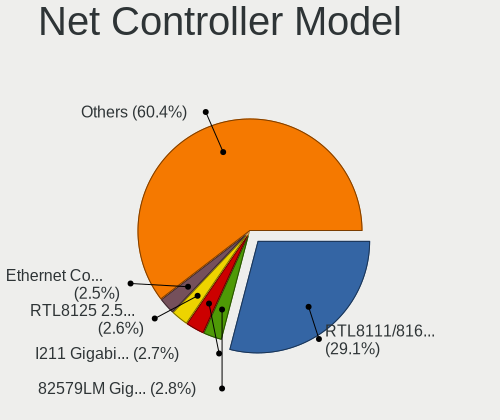
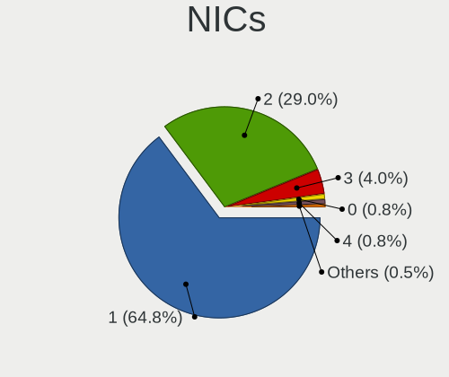
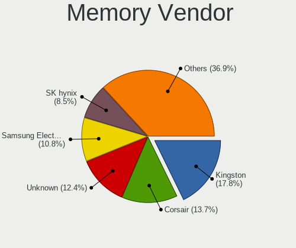
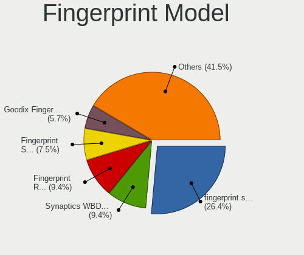

Ubuntu - Tested Hardware & Statistics (Desktops)
------------------------------------------------

A project to collect tested hardware configurations for Ubuntu.

Anyone can contribute to this report by the [hw-probe](https://github.com/linuxhw/hw-probe) tool:

    sudo -E hw-probe -all -upload

Please contribute! Especially if your hardware is rare.

Contents
--------

* [ Test Cases ](#test-cases)

* [ System ](#system)
  - [ OS                       ](#os)
  - [ OS Family                ](#os-family)
  - [ Kernel                   ](#kernel)
  - [ Kernel Family            ](#kernel-family)
  - [ Kernel Major Ver.        ](#kernel-major-ver)
  - [ Arch                     ](#arch)
  - [ DE                       ](#de)
  - [ Display Server           ](#display-server)
  - [ Display Manager          ](#display-manager)
  - [ OS Lang                  ](#os-lang)
  - [ Boot Mode                ](#boot-mode)
  - [ Filesystem               ](#filesystem)
  - [ Part. scheme             ](#part-scheme)
  - [ Dual Boot with Linux/BSD ](#dual-boot-with-linuxbsd)
  - [ Dual Boot (Win)          ](#dual-boot-win)

* [ Board ](#board)
  - [ Vendor                   ](#vendor)
  - [ Model                    ](#model)
  - [ Model Family             ](#model-family)
  - [ MFG Year                 ](#mfg-year)
  - [ Form Factor              ](#form-factor)
  - [ Secure Boot              ](#secure-boot)
  - [ Coreboot                 ](#coreboot)
  - [ RAM Size                 ](#ram-size)
  - [ RAM Used                 ](#ram-used)
  - [ Total Drives             ](#total-drives)
  - [ Has CD-ROM               ](#has-cd-rom)
  - [ Has Ethernet             ](#has-ethernet)
  - [ Has WiFi                 ](#has-wifi)
  - [ Has Bluetooth            ](#has-bluetooth)

* [ Location ](#location)
  - [ Country                  ](#country)
  - [ City                     ](#city)

* [ Drives ](#drives)
  - [ Drive Vendor             ](#drive-vendor)
  - [ Drive Model              ](#drive-model)
  - [ HDD Vendor               ](#hdd-vendor)
  - [ SSD Vendor               ](#ssd-vendor)
  - [ Drive Kind               ](#drive-kind)
  - [ Drive Connector          ](#drive-connector)
  - [ Drive Size               ](#drive-size)
  - [ Space Total              ](#space-total)
  - [ Space Used               ](#space-used)
  - [ Malfunc. Drives          ](#malfunc-drives)
  - [ Malfunc. Drive Vendor    ](#malfunc-drive-vendor)
  - [ Malfunc. HDD Vendor      ](#malfunc-hdd-vendor)
  - [ Malfunc. Drive Kind      ](#malfunc-drive-kind)
  - [ Failed Drives            ](#failed-drives)
  - [ Failed Drive Vendor      ](#failed-drive-vendor)
  - [ Drive Status             ](#drive-status)

* [ Storage controller ](#storage-controller)
  - [ Storage Vendor           ](#storage-vendor)
  - [ Storage Model            ](#storage-model)
  - [ Storage Kind             ](#storage-kind)

* [ Processor ](#processor)
  - [ CPU Vendor               ](#cpu-vendor)
  - [ CPU Model                ](#cpu-model)
  - [ CPU Model Family         ](#cpu-model-family)
  - [ CPU Cores                ](#cpu-cores)
  - [ CPU Sockets              ](#cpu-sockets)
  - [ CPU Threads              ](#cpu-threads)
  - [ CPU Op-Modes             ](#cpu-op-modes)
  - [ CPU Microcode            ](#cpu-microcode)
  - [ CPU Microarch            ](#cpu-microarch)

* [ Graphics ](#graphics)
  - [ GPU Vendor               ](#gpu-vendor)
  - [ GPU Model                ](#gpu-model)
  - [ GPU Combo                ](#gpu-combo)
  - [ GPU Driver               ](#gpu-driver)
  - [ GPU Memory               ](#gpu-memory)

* [ Monitor ](#monitor)
  - [ Monitor Vendor           ](#monitor-vendor)
  - [ Monitor Model            ](#monitor-model)
  - [ Monitor Resolution       ](#monitor-resolution)
  - [ Monitor Diagonal         ](#monitor-diagonal)
  - [ Monitor Width            ](#monitor-width)
  - [ Aspect Ratio             ](#aspect-ratio)
  - [ Monitor Area             ](#monitor-area)
  - [ Pixel Density            ](#pixel-density)
  - [ Multiple Monitors        ](#multiple-monitors)

* [ Network ](#network)
  - [ Net Controller Vendor    ](#net-controller-vendor)
  - [ Net Controller Model     ](#net-controller-model)
  - [ Wireless Vendor          ](#wireless-vendor)
  - [ Wireless Model           ](#wireless-model)
  - [ Ethernet Vendor          ](#ethernet-vendor)
  - [ Ethernet Model           ](#ethernet-model)
  - [ Net Controller Kind      ](#net-controller-kind)
  - [ Used Controller          ](#used-controller)
  - [ NICs                     ](#nics)
  - [ IPv6                     ](#ipv6)

* [ Bluetooth ](#bluetooth)
  - [ Bluetooth Vendor         ](#bluetooth-vendor)
  - [ Bluetooth Model          ](#bluetooth-model)

* [ Sound ](#sound)
  - [ Sound Vendor             ](#sound-vendor)
  - [ Sound Model              ](#sound-model)

* [ Memory ](#memory)
  - [ Memory Vendor            ](#memory-vendor)
  - [ Memory Model             ](#memory-model)
  - [ Memory Kind              ](#memory-kind)
  - [ Memory Form Factor       ](#memory-form-factor)
  - [ Memory Size              ](#memory-size)
  - [ Memory Speed             ](#memory-speed)

* [ Printers & scanners ](#printers--scanners)
  - [ Printer Vendor           ](#printer-vendor)
  - [ Printer Model            ](#printer-model)
  - [ Scanner Vendor           ](#scanner-vendor)
  - [ Scanner Model            ](#scanner-model)

* [ Camera ](#camera)
  - [ Camera Vendor            ](#camera-vendor)
  - [ Camera Model             ](#camera-model)

* [ Security ](#security)
  - [ Fingerprint Vendor       ](#fingerprint-vendor)
  - [ Fingerprint Model        ](#fingerprint-model)
  - [ Chipcard Vendor          ](#chipcard-vendor)
  - [ Chipcard Model           ](#chipcard-model)

* [ Unsupported ](#unsupported)
  - [ Unsupported Devices      ](#unsupported-devices)
  - [ Unsupported Device Types ](#unsupported-device-types)

Test Cases
----------

Total: 31928

| Vendor        | Model                       | Probe                                                      | Date         |
|---------------|-----------------------------|------------------------------------------------------------|--------------|
| ASUSTek       | A8N-SLI Premium             | [faf81c22ae](https://linux-hardware.org/?probe=faf81c22ae) | Feb 01, 2023 |
| Fujitsu       | D3400-A1 S26361-D3400-A1    | [b792043acd](https://linux-hardware.org/?probe=b792043acd) | Feb 01, 2023 |
| Biostar       | A68N-5000                   | [96e9f6ff35](https://linux-hardware.org/?probe=96e9f6ff35) | Feb 01, 2023 |
| Gigabyte      | G31M-ES2C                   | [ec3d16bb4e](https://linux-hardware.org/?probe=ec3d16bb4e) | Feb 01, 2023 |
| Gigabyte      | B365M DS3H                  | [d515d5d9f7](https://linux-hardware.org/?probe=d515d5d9f7) | Feb 01, 2023 |
| ASUSTek       | TUF Gaming X570-PRO WIFI... | [48bccd4f38](https://linux-hardware.org/?probe=48bccd4f38) | Feb 01, 2023 |
| Pegatron      | 2A94                        | [58961a542f](https://linux-hardware.org/?probe=58961a542f) | Feb 01, 2023 |
| Foxconn       | G41MXE/G41MXE-K             | [50c552026e](https://linux-hardware.org/?probe=50c552026e) | Feb 01, 2023 |
| Dell          | 09KPNV A01                  | [5dcda0d3e5](https://linux-hardware.org/?probe=5dcda0d3e5) | Feb 01, 2023 |
| Lenovo        | SHARKBAY 0B98401 WIN        | [1668f1f69f](https://linux-hardware.org/?probe=1668f1f69f) | Feb 01, 2023 |
| Dell          | 06D7TR A00                  | [d040bfd5cc](https://linux-hardware.org/?probe=d040bfd5cc) | Feb 01, 2023 |
| MSI           | MAG Z790 TOMAHAWK WIFI      | [b9fb1c5111](https://linux-hardware.org/?probe=b9fb1c5111) | Feb 01, 2023 |
| ASUSTek       | PRIME B550M-A               | [2e458676e4](https://linux-hardware.org/?probe=2e458676e4) | Feb 01, 2023 |
| MSI           | X470 GAMING PLUS MAX        | [f1fecf5447](https://linux-hardware.org/?probe=f1fecf5447) | Feb 01, 2023 |
| ASUSTek       | M4A89TD PRO USB3            | [9010e03a18](https://linux-hardware.org/?probe=9010e03a18) | Feb 01, 2023 |
| HP            | 1790                        | [d0d3ca5e7c](https://linux-hardware.org/?probe=d0d3ca5e7c) | Feb 01, 2023 |
| Dell          | 0VHWTR A02                  | [4820c0216f](https://linux-hardware.org/?probe=4820c0216f) | Feb 01, 2023 |
| Huanan        | X99-F8D PLUS V1.1           | [e68a009e8f](https://linux-hardware.org/?probe=e68a009e8f) | Feb 01, 2023 |
| Gigabyte      | GA-MA69VM-S2                | [72dae43046](https://linux-hardware.org/?probe=72dae43046) | Feb 01, 2023 |
| Gigabyte      | H510M H                     | [298b411767](https://linux-hardware.org/?probe=298b411767) | Jan 31, 2023 |
| Dell          | 0Y7WYT A00                  | [77909a2fa1](https://linux-hardware.org/?probe=77909a2fa1) | Jan 31, 2023 |
| MSI           | B450 TOMAHAWK MAX           | [3f9519f358](https://linux-hardware.org/?probe=3f9519f358) | Jan 31, 2023 |
| Dell          | 0Y7WYT A00                  | [d299b4befd](https://linux-hardware.org/?probe=d299b4befd) | Jan 31, 2023 |
| NCR           | Pocono                      | [1a1c878e10](https://linux-hardware.org/?probe=1a1c878e10) | Jan 31, 2023 |
| ASUSTek       | ROG STRIX Z590-A GAMING ... | [b54f170a86](https://linux-hardware.org/?probe=b54f170a86) | Jan 31, 2023 |
| Dell          | 0NKW6Y A02                  | [4a63357651](https://linux-hardware.org/?probe=4a63357651) | Jan 31, 2023 |
| ASUSTek       | ROG STRIX B450-I GAMING     | [d59770af38](https://linux-hardware.org/?probe=d59770af38) | Jan 31, 2023 |
| ASUSTek       | ROG STRIX B450-I GAMING     | [3a5ae3d1e8](https://linux-hardware.org/?probe=3a5ae3d1e8) | Jan 31, 2023 |
| Intel         | DH77DF AAG40293-301         | [1a0f7653e3](https://linux-hardware.org/?probe=1a0f7653e3) | Jan 31, 2023 |
| Dell          | 0XHGV1 A00                  | [05a6fd1857](https://linux-hardware.org/?probe=05a6fd1857) | Jan 31, 2023 |
| Dell          | 06HR05 A00                  | [b80c55d90d](https://linux-hardware.org/?probe=b80c55d90d) | Jan 31, 2023 |
| Unknown       | Unknown                     | [66b96d9a0f](https://linux-hardware.org/?probe=66b96d9a0f) | Jan 31, 2023 |
| Lenovo        | 36C8 SDK0J40700 WIN 3258... | [01c7dbecde](https://linux-hardware.org/?probe=01c7dbecde) | Jan 31, 2023 |
| Gigabyte      | Z97M-DS3H                   | [360dc83e04](https://linux-hardware.org/?probe=360dc83e04) | Jan 31, 2023 |
| Unknown       | Unknown                     | [4dbe55873b](https://linux-hardware.org/?probe=4dbe55873b) | Jan 31, 2023 |
| Medion        | MS-7728                     | [60cf9e4948](https://linux-hardware.org/?probe=60cf9e4948) | Jan 31, 2023 |
| Maxtang       | EHL30 V1.0                  | [d104ad1307](https://linux-hardware.org/?probe=d104ad1307) | Jan 31, 2023 |
| Dell          | 040DDP A01                  | [6094b799d7](https://linux-hardware.org/?probe=6094b799d7) | Jan 31, 2023 |
| Gigabyte      | H270-Gaming 3               | [e64a1e0a5a](https://linux-hardware.org/?probe=e64a1e0a5a) | Jan 31, 2023 |
| Gigabyte      | F2A88XM-D3H                 | [846f831269](https://linux-hardware.org/?probe=846f831269) | Jan 31, 2023 |
| Gigabyte      | Z170-HD3P-CF                | [9e9deedf0d](https://linux-hardware.org/?probe=9e9deedf0d) | Jan 31, 2023 |
| Dell          | 0NW6H5 A00                  | [6296345ebb](https://linux-hardware.org/?probe=6296345ebb) | Jan 31, 2023 |
| Lenovo        | 30D0 SDK0J40697 WIN 3305... | [f018b74ad8](https://linux-hardware.org/?probe=f018b74ad8) | Jan 31, 2023 |
| Acer          | Unknown                     | [05de2b4244](https://linux-hardware.org/?probe=05de2b4244) | Jan 30, 2023 |
| Gigabyte      | X570 AORUS ELITE            | [034ae066aa](https://linux-hardware.org/?probe=034ae066aa) | Jan 30, 2023 |
| MSI           | MPG X570 GAMING EDGE WIF... | [353272e0d2](https://linux-hardware.org/?probe=353272e0d2) | Jan 30, 2023 |
| ASUSTek       | ROG STRIX X570-E GAMING     | [e3f96394c0](https://linux-hardware.org/?probe=e3f96394c0) | Jan 30, 2023 |
| Dell          | 0GDG8Y A00                  | [8ba7e25b58](https://linux-hardware.org/?probe=8ba7e25b58) | Jan 30, 2023 |
| Dell          | 0GDG8Y A00                  | [759e9a48d1](https://linux-hardware.org/?probe=759e9a48d1) | Jan 30, 2023 |
| MSI           | 970 GAMING                  | [7bc39da7c1](https://linux-hardware.org/?probe=7bc39da7c1) | Jan 30, 2023 |
| Intel         | DH77DF AAG40293-301         | [1c91d911d7](https://linux-hardware.org/?probe=1c91d911d7) | Jan 30, 2023 |
| Lenovo        | 36C8 SDK0J40700 WIN 3258... | [529b411b46](https://linux-hardware.org/?probe=529b411b46) | Jan 30, 2023 |
| ASUSTek       | E3 PRO GAMING V5            | [b7917146d8](https://linux-hardware.org/?probe=b7917146d8) | Jan 30, 2023 |
| ASUSTek       | ROG STRIX Z390-E GAMING     | [7983249b4c](https://linux-hardware.org/?probe=7983249b4c) | Jan 30, 2023 |
| Gateway       | IPIMB-ARA                   | [253b58b2a4](https://linux-hardware.org/?probe=253b58b2a4) | Jan 30, 2023 |
| HP            | 8054                        | [f2367fdcda](https://linux-hardware.org/?probe=f2367fdcda) | Jan 30, 2023 |
| MSI           | X370 SLI PLUS               | [bb20465703](https://linux-hardware.org/?probe=bb20465703) | Jan 30, 2023 |
| HP            | 18E7                        | [db4ef3e5f4](https://linux-hardware.org/?probe=db4ef3e5f4) | Jan 30, 2023 |
| Gigabyte      | H270-Gaming 3               | [4427845ac1](https://linux-hardware.org/?probe=4427845ac1) | Jan 30, 2023 |
| Lenovo        | 3704 SDK0J40700 WIN 3258... | [aff06e830e](https://linux-hardware.org/?probe=aff06e830e) | Jan 30, 2023 |
| ASUSTek       | PRIME Z690-P WIFI           | [d2f9eb15f5](https://linux-hardware.org/?probe=d2f9eb15f5) | Jan 30, 2023 |
| ASRock        | FM2A68M-DG3+                | [7fb4a85c09](https://linux-hardware.org/?probe=7fb4a85c09) | Jan 30, 2023 |
| Intel         | B75                         | [6597bed6da](https://linux-hardware.org/?probe=6597bed6da) | Jan 29, 2023 |
| ASUSTek       | Z97-PRO                     | [0e241538c1](https://linux-hardware.org/?probe=0e241538c1) | Jan 29, 2023 |
| ASUSTek       | H81M-CS/BR                  | [ca82a3e5a7](https://linux-hardware.org/?probe=ca82a3e5a7) | Jan 29, 2023 |
| ASUSTek       | ROG STRIX B550-F GAMING     | [4fb612b680](https://linux-hardware.org/?probe=4fb612b680) | Jan 29, 2023 |
| ASUSTek       | P6T SE                      | [04ed0bd8b1](https://linux-hardware.org/?probe=04ed0bd8b1) | Jan 29, 2023 |
| MSI           | MPG B550I GAMING EDGE MA... | [ff186606cd](https://linux-hardware.org/?probe=ff186606cd) | Jan 29, 2023 |
| Gigabyte      | Z370 HD3-CF                 | [1721760555](https://linux-hardware.org/?probe=1721760555) | Jan 29, 2023 |
| ASRock        | B460M Pro4                  | [7af163f694](https://linux-hardware.org/?probe=7af163f694) | Jan 29, 2023 |
| Gigabyte      | B250M-HD3-CF                | [f8630776ca](https://linux-hardware.org/?probe=f8630776ca) | Jan 29, 2023 |
| MSI           | Z77A-G43                    | [873725bb74](https://linux-hardware.org/?probe=873725bb74) | Jan 29, 2023 |
| MSI           | Z77A-G43                    | [f489fe4f5d](https://linux-hardware.org/?probe=f489fe4f5d) | Jan 29, 2023 |
| MSI           | 760GM-P23                   | [34fab6626e](https://linux-hardware.org/?probe=34fab6626e) | Jan 29, 2023 |
| ASUSTek       | PRIME B450M-K II            | [d4a5012f93](https://linux-hardware.org/?probe=d4a5012f93) | Jan 29, 2023 |
| Dell          | 0VRWRC A01                  | [0e6a170715](https://linux-hardware.org/?probe=0e6a170715) | Jan 29, 2023 |
| HP            | 81B4                        | [01229ad5ec](https://linux-hardware.org/?probe=01229ad5ec) | Jan 29, 2023 |
| Fujitsu Si... | D2587-A1 S26361-D2587-A1    | [6378111bbd](https://linux-hardware.org/?probe=6378111bbd) | Jan 29, 2023 |
| Gigabyte      | X570 I AORUS PRO WIFI       | [e6fedcdbb0](https://linux-hardware.org/?probe=e6fedcdbb0) | Jan 29, 2023 |
| ASRock        | Z97E-ITX/ac                 | [80d82e6be6](https://linux-hardware.org/?probe=80d82e6be6) | Jan 29, 2023 |
| ASRock        | 970M Pro3                   | [e0a5d6512f](https://linux-hardware.org/?probe=e0a5d6512f) | Jan 29, 2023 |
| ASRock        | Z97E-ITX/ac                 | [4d092eb96c](https://linux-hardware.org/?probe=4d092eb96c) | Jan 29, 2023 |
| ASRock        | B450M Pro4 R2.0             | [9f2e4066f6](https://linux-hardware.org/?probe=9f2e4066f6) | Jan 29, 2023 |
| Foxconn       | A74MX-S/A74MX-K             | [9daeb7adc3](https://linux-hardware.org/?probe=9daeb7adc3) | Jan 29, 2023 |
| Lenovo        | SHARKBAY SDK0J40700 WIN     | [75027cfa77](https://linux-hardware.org/?probe=75027cfa77) | Jan 29, 2023 |
| ASRock        | B460M Pro4                  | [37c0fb77f5](https://linux-hardware.org/?probe=37c0fb77f5) | Jan 29, 2023 |
| Apple         | Mac-F221BEC8                | [d8de82d8c4](https://linux-hardware.org/?probe=d8de82d8c4) | Jan 29, 2023 |
| ASRock        | B450M Pro4 R2.0             | [f2bf9c3c82](https://linux-hardware.org/?probe=f2bf9c3c82) | Jan 28, 2023 |
| HP            | 18E7                        | [01cbafc241](https://linux-hardware.org/?probe=01cbafc241) | Jan 28, 2023 |
| ASUSTek       | F2A55-M LK2                 | [8bf2fa8d9b](https://linux-hardware.org/?probe=8bf2fa8d9b) | Jan 28, 2023 |
| ASUSTek       | H81M-A/BR                   | [ca72045652](https://linux-hardware.org/?probe=ca72045652) | Jan 28, 2023 |
| ASUSTek       | M5A97 R2.0                  | [845b3c6990](https://linux-hardware.org/?probe=845b3c6990) | Jan 28, 2023 |
| ASUSTek       | M5A97 R2.0                  | [d7469767f6](https://linux-hardware.org/?probe=d7469767f6) | Jan 28, 2023 |
| Dell          | 0HD5W2 A00                  | [890cad48c3](https://linux-hardware.org/?probe=890cad48c3) | Jan 28, 2023 |
| ASUSTek       | F2A85-V                     | [d528677cfd](https://linux-hardware.org/?probe=d528677cfd) | Jan 28, 2023 |
| Gigabyte      | B660M GAMING DDR4           | [c7fc79b5f1](https://linux-hardware.org/?probe=c7fc79b5f1) | Jan 28, 2023 |
| BESSTAR Te... | UM350                       | [1ec2f78884](https://linux-hardware.org/?probe=1ec2f78884) | Jan 28, 2023 |
| ASUSTek       | P8H77-V LE                  | [fb0dcf8d7e](https://linux-hardware.org/?probe=fb0dcf8d7e) | Jan 28, 2023 |
| ASUSTek       | PRIME A320M-K               | [11586188ad](https://linux-hardware.org/?probe=11586188ad) | Jan 28, 2023 |
| Gigabyte      | H510M H                     | [d25a13d2c4](https://linux-hardware.org/?probe=d25a13d2c4) | Jan 28, 2023 |
| Gigabyte      | B450M DS3H-CF               | [8f6ea9ffff](https://linux-hardware.org/?probe=8f6ea9ffff) | Jan 28, 2023 |
| ASUSTek       | A58M-A/BR                   | [2e6e55e6ea](https://linux-hardware.org/?probe=2e6e55e6ea) | Jan 28, 2023 |
| ASRock        | 970M Pro3                   | [58366ca3d1](https://linux-hardware.org/?probe=58366ca3d1) | Jan 28, 2023 |
| Dell          | 0HY9JP A00                  | [f4aefcd670](https://linux-hardware.org/?probe=f4aefcd670) | Jan 28, 2023 |
| ASRock        | Z370 Extreme4               | [8c6abbc491](https://linux-hardware.org/?probe=8c6abbc491) | Jan 28, 2023 |
| Lenovo        | 364F SDK0J40700 WIN 3258... | [cad690676c](https://linux-hardware.org/?probe=cad690676c) | Jan 28, 2023 |
| ASUSTek       | H61M-K                      | [312e07a824](https://linux-hardware.org/?probe=312e07a824) | Jan 28, 2023 |
| ASUSTek       | P8Z77-M                     | [22d53e86e0](https://linux-hardware.org/?probe=22d53e86e0) | Jan 28, 2023 |
| ASUSTek       | P8H67-M PRO                 | [97d1ab1b7d](https://linux-hardware.org/?probe=97d1ab1b7d) | Jan 28, 2023 |
| ASUSTek       | M5A78L-M LE                 | [a4c0ee5753](https://linux-hardware.org/?probe=a4c0ee5753) | Jan 27, 2023 |
| Gigabyte      | B75M-D3H                    | [3ee2e6ab56](https://linux-hardware.org/?probe=3ee2e6ab56) | Jan 27, 2023 |
| MSI           | TRX40 PRO WIFI              | [d9508d5b22](https://linux-hardware.org/?probe=d9508d5b22) | Jan 27, 2023 |
| ASUSTek       | ROG STRIX B360-I GAMING     | [8f81628b59](https://linux-hardware.org/?probe=8f81628b59) | Jan 27, 2023 |
| Dell          | 057FFP A01                  | [ec0e3da69d](https://linux-hardware.org/?probe=ec0e3da69d) | Jan 27, 2023 |
| Acer          | Predator G3620              | [0fdd7e30ce](https://linux-hardware.org/?probe=0fdd7e30ce) | Jan 27, 2023 |
| ASUSTek       | P8H61-M LX R2.0             | [6d2e490a23](https://linux-hardware.org/?probe=6d2e490a23) | Jan 27, 2023 |
| Dell          | 0CU409                      | [5da09834b4](https://linux-hardware.org/?probe=5da09834b4) | Jan 27, 2023 |
| Dell          | 0CU409                      | [06b8ea0f8e](https://linux-hardware.org/?probe=06b8ea0f8e) | Jan 27, 2023 |
| ASUSTek       | Z170-K                      | [a1f535bfca](https://linux-hardware.org/?probe=a1f535bfca) | Jan 27, 2023 |
| Gigabyte      | G31M-ES2C                   | [8a5dee0d52](https://linux-hardware.org/?probe=8a5dee0d52) | Jan 27, 2023 |
| Gigabyte      | X670 AORUS ELITE AX         | [06c6af6032](https://linux-hardware.org/?probe=06c6af6032) | Jan 27, 2023 |
| ASUSTek       | P5K                         | [6d496e6965](https://linux-hardware.org/?probe=6d496e6965) | Jan 27, 2023 |
| Dell          | 0GM819                      | [f5810a0a61](https://linux-hardware.org/?probe=f5810a0a61) | Jan 27, 2023 |
| Gigabyte      | GA-890GPA-UD3H              | [e660f922a4](https://linux-hardware.org/?probe=e660f922a4) | Jan 27, 2023 |
| Gigabyte      | Z390 DESIGNARE-CF           | [74635968fa](https://linux-hardware.org/?probe=74635968fa) | Jan 27, 2023 |
| Acer          | Aspire X1700                | [beab94f1ee](https://linux-hardware.org/?probe=beab94f1ee) | Jan 27, 2023 |
| Lenovo        | 0B98401 PRO                 | [06086e6112](https://linux-hardware.org/?probe=06086e6112) | Jan 27, 2023 |
| Dell          | 0RY206                      | [822d0f1c17](https://linux-hardware.org/?probe=822d0f1c17) | Jan 27, 2023 |
| Gigabyte      | X670 AORUS ELITE AX         | [38e4843e09](https://linux-hardware.org/?probe=38e4843e09) | Jan 27, 2023 |
| Dell          | 042P49 A00                  | [041e30ac67](https://linux-hardware.org/?probe=041e30ac67) | Jan 27, 2023 |
| ASUSTek       | H61M-E                      | [0ebd68a086](https://linux-hardware.org/?probe=0ebd68a086) | Jan 27, 2023 |
| Medion        | MS-7675                     | [1d9d209dbf](https://linux-hardware.org/?probe=1d9d209dbf) | Jan 27, 2023 |
| Gigabyte      | 970A-D3P                    | [f01366b131](https://linux-hardware.org/?probe=f01366b131) | Jan 27, 2023 |
| Gigabyte      | GA-MA770-UD3                | [6766a92ee5](https://linux-hardware.org/?probe=6766a92ee5) | Jan 27, 2023 |
| HP            | Compaq 8200 Elite SFF PC    | [73f629ca61](https://linux-hardware.org/?probe=73f629ca61) | Jan 27, 2023 |
| ASUSTek       | ROG STRIX X570-E GAMING     | [edfd032f00](https://linux-hardware.org/?probe=edfd032f00) | Jan 26, 2023 |
| Gigabyte      | X570 UD                     | [75e92725f5](https://linux-hardware.org/?probe=75e92725f5) | Jan 26, 2023 |
| Gigabyte      | H81M-S2PV                   | [4910cfdfcd](https://linux-hardware.org/?probe=4910cfdfcd) | Jan 26, 2023 |
| ASUSTek       | PRIME A320M-K               | [6f449734a9](https://linux-hardware.org/?probe=6f449734a9) | Jan 26, 2023 |
| Positivo      | POS-PIB150DT                | [5a333d4e71](https://linux-hardware.org/?probe=5a333d4e71) | Jan 26, 2023 |
| Gigabyte      | B450 AORUS M                | [3e65f42529](https://linux-hardware.org/?probe=3e65f42529) | Jan 26, 2023 |
| Dell          | 0CRH6C A01                  | [d06248a310](https://linux-hardware.org/?probe=d06248a310) | Jan 26, 2023 |
| ASUSTek       | M4N78 PRO                   | [e547b297b0](https://linux-hardware.org/?probe=e547b297b0) | Jan 26, 2023 |
| Unknown       | 1.0                         | [85d36881c1](https://linux-hardware.org/?probe=85d36881c1) | Jan 26, 2023 |
| Unknown       | 1.0                         | [a25e1d1008](https://linux-hardware.org/?probe=a25e1d1008) | Jan 26, 2023 |
| HP            | 843B                        | [98d0f20b21](https://linux-hardware.org/?probe=98d0f20b21) | Jan 26, 2023 |
| ASUSTek       | PRIME X570-P                | [b2c04ca4b9](https://linux-hardware.org/?probe=b2c04ca4b9) | Jan 26, 2023 |
| HP            | 8299                        | [d73eaeeb81](https://linux-hardware.org/?probe=d73eaeeb81) | Jan 26, 2023 |
| HP            | 18E4                        | [1f51508eeb](https://linux-hardware.org/?probe=1f51508eeb) | Jan 26, 2023 |
| ASUSTek       | TUF X299 MARK 2             | [fb83192f84](https://linux-hardware.org/?probe=fb83192f84) | Jan 26, 2023 |
| HP            | 8299                        | [47b5f3fdef](https://linux-hardware.org/?probe=47b5f3fdef) | Jan 26, 2023 |
| MSI           | Z270 GAMING M5              | [218f278cab](https://linux-hardware.org/?probe=218f278cab) | Jan 26, 2023 |
| Intel         | Q3XXG4-P V1.0               | [72a508a4ad](https://linux-hardware.org/?probe=72a508a4ad) | Jan 26, 2023 |
| ASRock        | Z690 Taichi                 | [adba499f59](https://linux-hardware.org/?probe=adba499f59) | Jan 26, 2023 |
| ASUSTek       | PRIME Z390-A                | [1c536042d4](https://linux-hardware.org/?probe=1c536042d4) | Jan 26, 2023 |
| Gigabyte      | GA-770TA-UD3                | [b5cb34ea4d](https://linux-hardware.org/?probe=b5cb34ea4d) | Jan 26, 2023 |
| ASUSTek       | ROG Maximus Z690 FORMULA    | [a9775027ed](https://linux-hardware.org/?probe=a9775027ed) | Jan 26, 2023 |
| ASUSTek       | Basswood3G                  | [0728a59863](https://linux-hardware.org/?probe=0728a59863) | Jan 25, 2023 |
| Fujitsu       | D3233-A1 S26361-D3233-A1    | [d30b7c1657](https://linux-hardware.org/?probe=d30b7c1657) | Jan 25, 2023 |
| MSI           | MS-7383                     | [d47659fcf8](https://linux-hardware.org/?probe=d47659fcf8) | Jan 25, 2023 |
| MSI           | MS-7383                     | [b848100b0e](https://linux-hardware.org/?probe=b848100b0e) | Jan 25, 2023 |
| HP            | 1495                        | [d600418bf6](https://linux-hardware.org/?probe=d600418bf6) | Jan 25, 2023 |
| Apple         | Mac-F221BEC8                | [73b7cfc152](https://linux-hardware.org/?probe=73b7cfc152) | Jan 25, 2023 |
| Gigabyte      | M68MT-S2P                   | [5e044ca68b](https://linux-hardware.org/?probe=5e044ca68b) | Jan 25, 2023 |
| MSI           | H110M GAMING                | [2622dcb32e](https://linux-hardware.org/?probe=2622dcb32e) | Jan 25, 2023 |
| Dell          | 0NK5PH A00                  | [fc7e90e419](https://linux-hardware.org/?probe=fc7e90e419) | Jan 25, 2023 |
| MSI           | 2A9C                        | [cea7204c4b](https://linux-hardware.org/?probe=cea7204c4b) | Jan 25, 2023 |
| ASUSTek       | G20AJ                       | [ff9bda6922](https://linux-hardware.org/?probe=ff9bda6922) | Jan 25, 2023 |
| Gigabyte      | Z490M                       | [a53147a5e7](https://linux-hardware.org/?probe=a53147a5e7) | Jan 25, 2023 |
| ASUSTek       | B85M-G                      | [73bef1464f](https://linux-hardware.org/?probe=73bef1464f) | Jan 25, 2023 |
| Dell          | 0KRC95 A01                  | [9580da1eb5](https://linux-hardware.org/?probe=9580da1eb5) | Jan 25, 2023 |
| Gigabyte      | H310M H x.x                 | [64ccdd32f5](https://linux-hardware.org/?probe=64ccdd32f5) | Jan 25, 2023 |
| ASUSTek       | M5A78L-M/USB3               | [596316a81c](https://linux-hardware.org/?probe=596316a81c) | Jan 25, 2023 |
| ASRock        | H110 Pro BTC+               | [4fab0cb4c4](https://linux-hardware.org/?probe=4fab0cb4c4) | Jan 25, 2023 |
| Gigabyte      | B560M AORUS PRO             | [a145217706](https://linux-hardware.org/?probe=a145217706) | Jan 25, 2023 |
| Gigabyte      | H310M M.2                   | [2fbe64570f](https://linux-hardware.org/?probe=2fbe64570f) | Jan 25, 2023 |
| Gigabyte      | B550I AORUS PRO AX          | [b6afa43240](https://linux-hardware.org/?probe=b6afa43240) | Jan 24, 2023 |
| SiS Techno... | 741                         | [b3c09fc029](https://linux-hardware.org/?probe=b3c09fc029) | Jan 24, 2023 |
| Gigabyte      | B550I AORUS PRO AX          | [141c9ffa73](https://linux-hardware.org/?probe=141c9ffa73) | Jan 24, 2023 |
| HP            | 8597                        | [8cc851783e](https://linux-hardware.org/?probe=8cc851783e) | Jan 24, 2023 |
| ASRock        | X99 Professional Gaming ... | [74054f4cb8](https://linux-hardware.org/?probe=74054f4cb8) | Jan 24, 2023 |
| SiS Techno... | 741                         | [d7084eb5a4](https://linux-hardware.org/?probe=d7084eb5a4) | Jan 24, 2023 |
| ASRock        | X99 Professional Gaming ... | [2a89d751e1](https://linux-hardware.org/?probe=2a89d751e1) | Jan 24, 2023 |
| MSI           | Boston                      | [456d7782ad](https://linux-hardware.org/?probe=456d7782ad) | Jan 24, 2023 |
| Gigabyte      | Z390 AORUS ULTRA-CF         | [0300fb4b9a](https://linux-hardware.org/?probe=0300fb4b9a) | Jan 24, 2023 |
| Lenovo        | 30BC SDK0J40705 WIN 3425... | [f11a82871d](https://linux-hardware.org/?probe=f11a82871d) | Jan 24, 2023 |
| Gigabyte      | G31M-ES2C                   | [c49f3c0e92](https://linux-hardware.org/?probe=c49f3c0e92) | Jan 24, 2023 |
| Gigabyte      | G31M-ES2C                   | [0cff571f25](https://linux-hardware.org/?probe=0cff571f25) | Jan 24, 2023 |
| MSI           | B560M PRO-VDH               | [8cb2b45267](https://linux-hardware.org/?probe=8cb2b45267) | Jan 24, 2023 |
| ASRock        | H110 Pro BTC+               | [f4a90a48ec](https://linux-hardware.org/?probe=f4a90a48ec) | Jan 24, 2023 |
| Gigabyte      | G31M-ES2C                   | [eac6804cbb](https://linux-hardware.org/?probe=eac6804cbb) | Jan 24, 2023 |
| Gigabyte      | GA-770TA-UD3                | [7630683952](https://linux-hardware.org/?probe=7630683952) | Jan 24, 2023 |
| ASUSTek       | Z170-A                      | [0329b888a8](https://linux-hardware.org/?probe=0329b888a8) | Jan 24, 2023 |
| Unknown       | 1.0                         | [99201dd05a](https://linux-hardware.org/?probe=99201dd05a) | Jan 24, 2023 |
| MSI           | B350M MORTAR                | [1c843535db](https://linux-hardware.org/?probe=1c843535db) | Jan 24, 2023 |
| Dell          | 0PU052                      | [060c016db2](https://linux-hardware.org/?probe=060c016db2) | Jan 24, 2023 |
| ASUSTek       | PRIME X570-P                | [c8c9f53754](https://linux-hardware.org/?probe=c8c9f53754) | Jan 24, 2023 |
| Gigabyte      | B550 AORUS PRO AC           | [ac08bf34c3](https://linux-hardware.org/?probe=ac08bf34c3) | Jan 24, 2023 |
| ASUSTek       | Z87-WS                      | [da3028df45](https://linux-hardware.org/?probe=da3028df45) | Jan 23, 2023 |
| Gateway       | IPIMB-ARA                   | [53527537f3](https://linux-hardware.org/?probe=53527537f3) | Jan 23, 2023 |
| Dell          | 0YC03K A04                  | [aaccd62190](https://linux-hardware.org/?probe=aaccd62190) | Jan 23, 2023 |
| Gigabyte      | H310M M.2                   | [30967bc549](https://linux-hardware.org/?probe=30967bc549) | Jan 23, 2023 |
| ASRock        | 960GM-GS3 FX                | [f2894f6970](https://linux-hardware.org/?probe=f2894f6970) | Jan 23, 2023 |
| ASUSTek       | P8Z77-M                     | [06d41872a9](https://linux-hardware.org/?probe=06d41872a9) | Jan 23, 2023 |
| ASUSTek       | ProArt Z690-CREATOR WIFI    | [123c1db6ac](https://linux-hardware.org/?probe=123c1db6ac) | Jan 23, 2023 |
| ASUSTek       | ProArt Z690-CREATOR WIFI    | [48ee4a3eef](https://linux-hardware.org/?probe=48ee4a3eef) | Jan 23, 2023 |
| ASUSTek       | P8Z77-M                     | [f965d9b5b1](https://linux-hardware.org/?probe=f965d9b5b1) | Jan 23, 2023 |
| Gigabyte      | H81M-S2H                    | [b2aecb083b](https://linux-hardware.org/?probe=b2aecb083b) | Jan 23, 2023 |
| Unknown       | 1.0                         | [678e6d3875](https://linux-hardware.org/?probe=678e6d3875) | Jan 23, 2023 |
| Gigabyte      | M68MT-S2P                   | [09735072af](https://linux-hardware.org/?probe=09735072af) | Jan 23, 2023 |
| ASUSTek       | PRIME H310T R2.0            | [4a6f5a78f9](https://linux-hardware.org/?probe=4a6f5a78f9) | Jan 23, 2023 |
| MSI           | Z390-A PRO                  | [68a1d06f54](https://linux-hardware.org/?probe=68a1d06f54) | Jan 23, 2023 |
| Dell          | 0NNNCT A01                  | [b80dda96de](https://linux-hardware.org/?probe=b80dda96de) | Jan 23, 2023 |
| Gigabyte      | H310M H x.x                 | [ac375e0fa7](https://linux-hardware.org/?probe=ac375e0fa7) | Jan 23, 2023 |
| ASUSTek       | A88X-PRO                    | [659f4bf9b1](https://linux-hardware.org/?probe=659f4bf9b1) | Jan 23, 2023 |
| MSI           | A320M-A PRO                 | [4b4420e22f](https://linux-hardware.org/?probe=4b4420e22f) | Jan 23, 2023 |
| Biostar       | H510MHP                     | [be134c4160](https://linux-hardware.org/?probe=be134c4160) | Jan 23, 2023 |
| Biostar       | H510MHP                     | [2df96ea9cf](https://linux-hardware.org/?probe=2df96ea9cf) | Jan 23, 2023 |
| Gateway       | IPIMB-ARA                   | [86fcc07fe3](https://linux-hardware.org/?probe=86fcc07fe3) | Jan 23, 2023 |
| ASRock        | N68-VGS3 FX                 | [d25d4580a9](https://linux-hardware.org/?probe=d25d4580a9) | Jan 23, 2023 |
| Lenovo        | MAHOBAY NOK                 | [8e5bf9673b](https://linux-hardware.org/?probe=8e5bf9673b) | Jan 23, 2023 |
| MSI           | MS-7388                     | [4d5146a81f](https://linux-hardware.org/?probe=4d5146a81f) | Jan 22, 2023 |
| ASUSTek       | TUF Gaming X570-PLUS        | [cc2d26e52e](https://linux-hardware.org/?probe=cc2d26e52e) | Jan 22, 2023 |
| Dell          | 0NV0M7 A02                  | [7c562ab921](https://linux-hardware.org/?probe=7c562ab921) | Jan 22, 2023 |
| ASRock        | G31M-S                      | [dbf8922f3a](https://linux-hardware.org/?probe=dbf8922f3a) | Jan 22, 2023 |
| MSI           | Boston                      | [34413408ce](https://linux-hardware.org/?probe=34413408ce) | Jan 22, 2023 |
| MSI           | A320M GRENADE               | [0145195b58](https://linux-hardware.org/?probe=0145195b58) | Jan 22, 2023 |
| ASUSTek       | B85M-K PLUS                 | [4dae8d836d](https://linux-hardware.org/?probe=4dae8d836d) | Jan 22, 2023 |
| Fujitsu       | D3544-A1 S26361-D3544-A1... | [363fa41965](https://linux-hardware.org/?probe=363fa41965) | Jan 22, 2023 |
| ASUSTek       | P5KPL-AM EPU                | [0aa5260ed0](https://linux-hardware.org/?probe=0aa5260ed0) | Jan 22, 2023 |
| ASUSTek       | P5KPL-AM EPU                | [7389389089](https://linux-hardware.org/?probe=7389389089) | Jan 22, 2023 |
| Gigabyte      | B560M AORUS PRO AX          | [7407dcc533](https://linux-hardware.org/?probe=7407dcc533) | Jan 22, 2023 |
| Medion        | H110H4-EM                   | [02ac31d42d](https://linux-hardware.org/?probe=02ac31d42d) | Jan 22, 2023 |
| Dell          | 0NV0M7 A02                  | [b5bd3e5d33](https://linux-hardware.org/?probe=b5bd3e5d33) | Jan 22, 2023 |
| Biostar       | A320MH                      | [4c75d6c079](https://linux-hardware.org/?probe=4c75d6c079) | Jan 22, 2023 |
| ASRock        | B365 Pro4                   | [44fa1b3713](https://linux-hardware.org/?probe=44fa1b3713) | Jan 22, 2023 |
| Gigabyte      | X58-USB3                    | [bd526ec29a](https://linux-hardware.org/?probe=bd526ec29a) | Jan 22, 2023 |
| Medion        | MS-7797                     | [4c2ac2561e](https://linux-hardware.org/?probe=4c2ac2561e) | Jan 22, 2023 |
| ASUSTek       | P5K                         | [dc5b823cb5](https://linux-hardware.org/?probe=dc5b823cb5) | Jan 22, 2023 |
| ASRock        | N68-GE3 UCC                 | [cd23d81f65](https://linux-hardware.org/?probe=cd23d81f65) | Jan 22, 2023 |
| Lenovo        | NOK                         | [78e5b6feb3](https://linux-hardware.org/?probe=78e5b6feb3) | Jan 22, 2023 |
| Gigabyte      | GA-890FXA-UD5               | [27ec85040f](https://linux-hardware.org/?probe=27ec85040f) | Jan 22, 2023 |
| ASUSTek       | P8P67 LE                    | [6afc30df3b](https://linux-hardware.org/?probe=6afc30df3b) | Jan 22, 2023 |
| Gigabyte      | Z97M-DS3H                   | [d251029940](https://linux-hardware.org/?probe=d251029940) | Jan 22, 2023 |
| ASUSTek       | Z87-EXPERT                  | [852add0d4b](https://linux-hardware.org/?probe=852add0d4b) | Jan 22, 2023 |
| Alienware     | 07HV66 A01                  | [4746ea200e](https://linux-hardware.org/?probe=4746ea200e) | Jan 22, 2023 |
| Dell          | 0GDG8Y A00                  | [0d70923276](https://linux-hardware.org/?probe=0d70923276) | Jan 22, 2023 |
| HP            | 339A                        | [031e19c496](https://linux-hardware.org/?probe=031e19c496) | Jan 21, 2023 |
| Gigabyte      | B550M DS3H AC               | [47a418d177](https://linux-hardware.org/?probe=47a418d177) | Jan 21, 2023 |
| Gigabyte      | X470 AORUS ULTRA GAMING-... | [4584e904f8](https://linux-hardware.org/?probe=4584e904f8) | Jan 21, 2023 |
| ASUSTek       | PRIME A320M-K               | [6419184e6e](https://linux-hardware.org/?probe=6419184e6e) | Jan 21, 2023 |
| ASUSTek       | P5B-Deluxe                  | [d61be7d11a](https://linux-hardware.org/?probe=d61be7d11a) | Jan 21, 2023 |
| Lenovo        | 30C0 SDK0J40697 WIN 3305... | [f6f1f5e32b](https://linux-hardware.org/?probe=f6f1f5e32b) | Jan 21, 2023 |
| ASUSTek       | M4N78-AM                    | [cf65d9f981](https://linux-hardware.org/?probe=cf65d9f981) | Jan 21, 2023 |
| Dell          | 0F6X5P A00                  | [6228476153](https://linux-hardware.org/?probe=6228476153) | Jan 21, 2023 |
| ASUSTek       | TUF Gaming B560M-E          | [0bbafaf9fe](https://linux-hardware.org/?probe=0bbafaf9fe) | Jan 21, 2023 |
| Fujitsu       | D3430-A1 S26361-D3430-A1    | [9229e3b2ae](https://linux-hardware.org/?probe=9229e3b2ae) | Jan 21, 2023 |
| ASUSTek       | P5KPL-AM EPU                | [62dc562b9e](https://linux-hardware.org/?probe=62dc562b9e) | Jan 21, 2023 |
| ASUSTek       | Z87M-PLUS                   | [3a1d7fb570](https://linux-hardware.org/?probe=3a1d7fb570) | Jan 21, 2023 |
| Medion        | MS-7728                     | [93d0aaac10](https://linux-hardware.org/?probe=93d0aaac10) | Jan 21, 2023 |
| Medion        | MS-7728                     | [eb9cef403c](https://linux-hardware.org/?probe=eb9cef403c) | Jan 21, 2023 |
| Intel         | DH61BF AAG81311-101         | [d6ea5bde87](https://linux-hardware.org/?probe=d6ea5bde87) | Jan 21, 2023 |
| MSI           | B450-A PRO MAX              | [9d025602e0](https://linux-hardware.org/?probe=9d025602e0) | Jan 21, 2023 |
| ASUSTek       | PRIME Z790M-PLUS D4         | [36e6df452d](https://linux-hardware.org/?probe=36e6df452d) | Jan 21, 2023 |
| ASUSTek       | Maximus VII HERO            | [3fe12efbb8](https://linux-hardware.org/?probe=3fe12efbb8) | Jan 21, 2023 |
| ASUSTek       | PRIME H510M-A               | [287c632c93](https://linux-hardware.org/?probe=287c632c93) | Jan 21, 2023 |
| ASUSTek       | P8H61-M LE/CSM R2.0         | [33dfa6188e](https://linux-hardware.org/?probe=33dfa6188e) | Jan 20, 2023 |
| ASUSTek       | Z87-PRO                     | [334bde8bc6](https://linux-hardware.org/?probe=334bde8bc6) | Jan 20, 2023 |
| Pegatron      | NARRA5                      | [0772fdc2db](https://linux-hardware.org/?probe=0772fdc2db) | Jan 20, 2023 |
| ASUSTek       | PRIME H510M-A               | [83529ed276](https://linux-hardware.org/?probe=83529ed276) | Jan 20, 2023 |
| MSI           | H170 GAMING M3              | [2fe05693b8](https://linux-hardware.org/?probe=2fe05693b8) | Jan 20, 2023 |
| MSI           | MS-7369                     | [7e96534421](https://linux-hardware.org/?probe=7e96534421) | Jan 20, 2023 |
| MSI           | B450 TOMAHAWK MAX II        | [1b41330a7e](https://linux-hardware.org/?probe=1b41330a7e) | Jan 20, 2023 |
| MSI           | MAG B650 TOMAHAWK WIFI      | [ce99cb312d](https://linux-hardware.org/?probe=ce99cb312d) | Jan 20, 2023 |
| ASUSTek       | Z87-EXPERT                  | [ff72c387c7](https://linux-hardware.org/?probe=ff72c387c7) | Jan 20, 2023 |
| ASUSTek       | ROG Maximus XI HERO         | [55d330d3ea](https://linux-hardware.org/?probe=55d330d3ea) | Jan 20, 2023 |
| Gigabyte      | Z97M-DS3H                   | [6c55213012](https://linux-hardware.org/?probe=6c55213012) | Jan 20, 2023 |
| ASRock        | X99 Taichi                  | [793777c14e](https://linux-hardware.org/?probe=793777c14e) | Jan 19, 2023 |
| Gigabyte      | B75M-D3H                    | [a3def8bf43](https://linux-hardware.org/?probe=a3def8bf43) | Jan 19, 2023 |
| ASRock        | Z370 Pro4                   | [bf7bab9d7c](https://linux-hardware.org/?probe=bf7bab9d7c) | Jan 19, 2023 |
| ASRock        | Z370 Pro4                   | [e05b7e7729](https://linux-hardware.org/?probe=e05b7e7729) | Jan 19, 2023 |
| ASUSTek       | PRIME B365M-A               | [c08f2e5961](https://linux-hardware.org/?probe=c08f2e5961) | Jan 19, 2023 |
| ASUSTek       | PRIME B350M-A               | [6f50700657](https://linux-hardware.org/?probe=6f50700657) | Jan 19, 2023 |
| ASUSTek       | PRIME A320M-K               | [9301fd6936](https://linux-hardware.org/?probe=9301fd6936) | Jan 19, 2023 |
| MSI           | H110M PRO-VD                | [e000402b1c](https://linux-hardware.org/?probe=e000402b1c) | Jan 19, 2023 |
| ASRock        | H110 Pro BTC+               | [f888822c0d](https://linux-hardware.org/?probe=f888822c0d) | Jan 19, 2023 |
| ASUSTek       | PRIME X399-A                | [1a61029965](https://linux-hardware.org/?probe=1a61029965) | Jan 19, 2023 |
| MSI           | H110M PRO-VD                | [79e6461b99](https://linux-hardware.org/?probe=79e6461b99) | Jan 19, 2023 |
| MSI           | MPG Z390 GAMING EDGE AC     | [7e73d8ad74](https://linux-hardware.org/?probe=7e73d8ad74) | Jan 19, 2023 |
| ASUSTek       | Z87-EXPERT                  | [91a963e420](https://linux-hardware.org/?probe=91a963e420) | Jan 19, 2023 |
| MSI           | X570-A PRO                  | [9c0b3ef63b](https://linux-hardware.org/?probe=9c0b3ef63b) | Jan 19, 2023 |
| Pegatron      | EVANS                       | [798a545fa8](https://linux-hardware.org/?probe=798a545fa8) | Jan 19, 2023 |
| Pegatron      | EVANS                       | [411db3ea66](https://linux-hardware.org/?probe=411db3ea66) | Jan 19, 2023 |
| HP            | 2AF3                        | [ac7c491076](https://linux-hardware.org/?probe=ac7c491076) | Jan 19, 2023 |
| Dell          | 0WR7PY A01                  | [4197c5f3d3](https://linux-hardware.org/?probe=4197c5f3d3) | Jan 19, 2023 |
| MSI           | H81M-E33                    | [ddb1be1cc6](https://linux-hardware.org/?probe=ddb1be1cc6) | Jan 18, 2023 |
| ASRock        | G31M-S                      | [d3aa4e7eea](https://linux-hardware.org/?probe=d3aa4e7eea) | Jan 18, 2023 |
| ASUSTek       | PRIME Z270-A                | [8e511beda6](https://linux-hardware.org/?probe=8e511beda6) | Jan 18, 2023 |
| MSI           | MAG B550 TOMAHAWK           | [4545e31cd2](https://linux-hardware.org/?probe=4545e31cd2) | Jan 18, 2023 |
| ASUSTek       | PRIME H510M-A               | [0ccab4b1e3](https://linux-hardware.org/?probe=0ccab4b1e3) | Jan 18, 2023 |
| Medion        | MS-7728                     | [b5e3ddf859](https://linux-hardware.org/?probe=b5e3ddf859) | Jan 18, 2023 |
| ASRock        | B550M-ITX/ac                | [a7ac9067b0](https://linux-hardware.org/?probe=a7ac9067b0) | Jan 18, 2023 |
| Lenovo        | 0B98401 WIN                 | [8d4e5b4499](https://linux-hardware.org/?probe=8d4e5b4499) | Jan 18, 2023 |
| Lenovo        | 314F SDK0J40697 WIN 3305... | [f7efc3545d](https://linux-hardware.org/?probe=f7efc3545d) | Jan 18, 2023 |
| Dell          | 0Y3R3K A00                  | [f2164a9c60](https://linux-hardware.org/?probe=f2164a9c60) | Jan 18, 2023 |
| Acer          | Veriton M2110G              | [7097a3cf90](https://linux-hardware.org/?probe=7097a3cf90) | Jan 18, 2023 |
| ASUSTek       | TUF Gaming B550-PLUS        | [fd99b07929](https://linux-hardware.org/?probe=fd99b07929) | Jan 18, 2023 |
| HP            | 2B35                        | [559109871c](https://linux-hardware.org/?probe=559109871c) | Jan 18, 2023 |
| Intel         | DG41RQ AAE54511-205         | [1125db7cfd](https://linux-hardware.org/?probe=1125db7cfd) | Jan 18, 2023 |
| Dell          | 0T7D40 A01                  | [75b71dfa6d](https://linux-hardware.org/?probe=75b71dfa6d) | Jan 18, 2023 |
| ASUSTek       | ROG CROSSHAIR VIII DARK ... | [9a99559833](https://linux-hardware.org/?probe=9a99559833) | Jan 18, 2023 |
| Gigabyte      | Z68M-D2H                    | [c7f31be903](https://linux-hardware.org/?probe=c7f31be903) | Jan 18, 2023 |
| ASRock        | G31M-S                      | [50bc0b52b3](https://linux-hardware.org/?probe=50bc0b52b3) | Jan 18, 2023 |
| MSI           | H310M PRO-M2                | [6bdc0bc1c7](https://linux-hardware.org/?probe=6bdc0bc1c7) | Jan 17, 2023 |
| HP            | ProLiant MicroServer Gen... | [cd6cedc906](https://linux-hardware.org/?probe=cd6cedc906) | Jan 17, 2023 |
| Gigabyte      | A320M-S2H-CF                | [cfaac8c50b](https://linux-hardware.org/?probe=cfaac8c50b) | Jan 17, 2023 |
| ASUSTek       | P8Q77-M                     | [f883cb7c7b](https://linux-hardware.org/?probe=f883cb7c7b) | Jan 17, 2023 |
| ASUSTek       | PRIME Z270-A                | [ad9172f4a9](https://linux-hardware.org/?probe=ad9172f4a9) | Jan 17, 2023 |
| ASRock        | H110 Pro BTC+               | [0b515319d8](https://linux-hardware.org/?probe=0b515319d8) | Jan 17, 2023 |
| ASUSTek       | M4A87TD/USB3                | [2cc8923eb1](https://linux-hardware.org/?probe=2cc8923eb1) | Jan 17, 2023 |
| ASRock        | B550M Pro4                  | [e2486858b9](https://linux-hardware.org/?probe=e2486858b9) | Jan 17, 2023 |
| MSI           | X470 GAMING PLUS MAX        | [4589a3ea25](https://linux-hardware.org/?probe=4589a3ea25) | Jan 17, 2023 |
| Lenovo        | ThinkStation C20 4263BA7    | [52c1a6c197](https://linux-hardware.org/?probe=52c1a6c197) | Jan 17, 2023 |
| Lenovo        | 364F SDK0J40700 WIN 3258... | [eb30638f2c](https://linux-hardware.org/?probe=eb30638f2c) | Jan 17, 2023 |
| ASRock        | Z590M-ITX/ax                | [15548bbea4](https://linux-hardware.org/?probe=15548bbea4) | Jan 17, 2023 |
| ASUSTek       | PRIME B450M-A               | [1c05ac2e28](https://linux-hardware.org/?probe=1c05ac2e28) | Jan 17, 2023 |
| ASRock        | Z590M-ITX/ax                | [5663d8c22e](https://linux-hardware.org/?probe=5663d8c22e) | Jan 17, 2023 |
| Gigabyte      | H97N-WIFI                   | [a18f404d39](https://linux-hardware.org/?probe=a18f404d39) | Jan 17, 2023 |
| HP            | 3397                        | [03c53827b5](https://linux-hardware.org/?probe=03c53827b5) | Jan 17, 2023 |
| ASUSTek       | M2N68-AM                    | [e08287f623](https://linux-hardware.org/?probe=e08287f623) | Jan 17, 2023 |
| ASUSTek       | M2N68-AM                    | [c4dbd0f9fe](https://linux-hardware.org/?probe=c4dbd0f9fe) | Jan 17, 2023 |
| Gigabyte      | B560M DS3H V2               | [e29ceaa96c](https://linux-hardware.org/?probe=e29ceaa96c) | Jan 17, 2023 |
| Lenovo        | 30D0 SDK0J40697 WIN 3305... | [e14bf959d0](https://linux-hardware.org/?probe=e14bf959d0) | Jan 17, 2023 |
| ASRock        | H81M-ITX                    | [036832c7d1](https://linux-hardware.org/?probe=036832c7d1) | Jan 17, 2023 |
| MSI           | 2AE0                        | [25f46f6bf3](https://linux-hardware.org/?probe=25f46f6bf3) | Jan 17, 2023 |
| Gigabyte      | F2A88XM-D3H                 | [2f40be547f](https://linux-hardware.org/?probe=2f40be547f) | Jan 17, 2023 |
| Fujitsu       | D3233-A1 S26361-D3233-A1    | [8c0e31f290](https://linux-hardware.org/?probe=8c0e31f290) | Jan 17, 2023 |
| Gigabyte      | GA-MA785GMT-UD2H            | [83b98e5580](https://linux-hardware.org/?probe=83b98e5580) | Jan 17, 2023 |
| Gigabyte      | X58-USB3                    | [479fd7677c](https://linux-hardware.org/?probe=479fd7677c) | Jan 16, 2023 |
| MSI           | MAG B550 TOMAHAWK           | [f3b27e21a7](https://linux-hardware.org/?probe=f3b27e21a7) | Jan 16, 2023 |
| HP            | 8643 SMVB                   | [c99128e783](https://linux-hardware.org/?probe=c99128e783) | Jan 16, 2023 |
| Gigabyte      | H310M H x.x                 | [64b395004f](https://linux-hardware.org/?probe=64b395004f) | Jan 16, 2023 |
| Foxconn       | 2ABF                        | [e39cb5cf6f](https://linux-hardware.org/?probe=e39cb5cf6f) | Jan 16, 2023 |
| ASUSTek       | ROG STRIX B660-F GAMING ... | [cc16045ed3](https://linux-hardware.org/?probe=cc16045ed3) | Jan 16, 2023 |
| ASUSTek       | PRIME Z270-A                | [8bdec78777](https://linux-hardware.org/?probe=8bdec78777) | Jan 16, 2023 |
| ASUSTek       | P5Q PRO TURBO               | [1dd0101330](https://linux-hardware.org/?probe=1dd0101330) | Jan 16, 2023 |
| HP            | 212B                        | [00822b2263](https://linux-hardware.org/?probe=00822b2263) | Jan 16, 2023 |
| Medion        | MS-7728                     | [5168c2f916](https://linux-hardware.org/?probe=5168c2f916) | Jan 16, 2023 |
| MSI           | A320M-A PRO                 | [01c0e96288](https://linux-hardware.org/?probe=01c0e96288) | Jan 16, 2023 |
| Fujitsu Si... | MS-7504VP-PV                | [a8325f9743](https://linux-hardware.org/?probe=a8325f9743) | Jan 16, 2023 |
| MSI           | MS-7369                     | [ab65628cf9](https://linux-hardware.org/?probe=ab65628cf9) | Jan 16, 2023 |
| Gigabyte      | EP45-DS4                    | [ef63262326](https://linux-hardware.org/?probe=ef63262326) | Jan 16, 2023 |
| Foxconn       | ALOE X3                     | [660a1aef16](https://linux-hardware.org/?probe=660a1aef16) | Jan 16, 2023 |
| ASRock        | Z77 Professional-M          | [9fa700364f](https://linux-hardware.org/?probe=9fa700364f) | Jan 16, 2023 |
| Gigabyte      | Z97X-Gaming G1              | [58c875e5d5](https://linux-hardware.org/?probe=58c875e5d5) | Jan 15, 2023 |
| Gigabyte      | EP45-DS4                    | [9feae23438](https://linux-hardware.org/?probe=9feae23438) | Jan 15, 2023 |
| MSI           | 2A9C                        | [7a4c26c267](https://linux-hardware.org/?probe=7a4c26c267) | Jan 15, 2023 |
| ASRock        | A520M-ITX/ac                | [ec3d18e6d6](https://linux-hardware.org/?probe=ec3d18e6d6) | Jan 15, 2023 |
| MSI           | MS-7369                     | [470e3a3eca](https://linux-hardware.org/?probe=470e3a3eca) | Jan 15, 2023 |
| MSI           | MAG B560M MORTAR            | [45da89106d](https://linux-hardware.org/?probe=45da89106d) | Jan 15, 2023 |
| Gigabyte      | H310M H x.x                 | [0b80c9ddfb](https://linux-hardware.org/?probe=0b80c9ddfb) | Jan 15, 2023 |
| ASUSTek       | A88XM-PLUS                  | [68fcb008b1](https://linux-hardware.org/?probe=68fcb008b1) | Jan 15, 2023 |
| Gigabyte      | A320M-S2H-CF                | [6584beb723](https://linux-hardware.org/?probe=6584beb723) | Jan 15, 2023 |
| HP            | 1589                        | [483338b531](https://linux-hardware.org/?probe=483338b531) | Jan 15, 2023 |
| Gigabyte      | H310M H                     | [30917eef19](https://linux-hardware.org/?probe=30917eef19) | Jan 15, 2023 |
| Gigabyte      | H81M-S2PV                   | [bddd00febc](https://linux-hardware.org/?probe=bddd00febc) | Jan 15, 2023 |
| Gigabyte      | AB350-Gaming-CF             | [85048ce95d](https://linux-hardware.org/?probe=85048ce95d) | Jan 15, 2023 |
| MSI           | B75MA-E33                   | [d8d5ce1a20](https://linux-hardware.org/?probe=d8d5ce1a20) | Jan 15, 2023 |
| ASRock        | J3455-ITX                   | [3ffcbce83c](https://linux-hardware.org/?probe=3ffcbce83c) | Jan 15, 2023 |
| Gigabyte      | Z97MX-Gaming 5              | [8d5796c907](https://linux-hardware.org/?probe=8d5796c907) | Jan 15, 2023 |
| ASUSTek       | P8Z77-V PRO                 | [d947dd4574](https://linux-hardware.org/?probe=d947dd4574) | Jan 14, 2023 |
| Lenovo        | SHARKBAY NOK                | [6334c715d0](https://linux-hardware.org/?probe=6334c715d0) | Jan 14, 2023 |
| MSI           | AM1I                        | [8f35d58735](https://linux-hardware.org/?probe=8f35d58735) | Jan 14, 2023 |
| MSI           | AM1I                        | [7dd360654f](https://linux-hardware.org/?probe=7dd360654f) | Jan 14, 2023 |
| Gigabyte      | H310M M.2                   | [4eecdbd79d](https://linux-hardware.org/?probe=4eecdbd79d) | Jan 14, 2023 |
| ASUSTek       | P8H61-M LE/CSM              | [06aff9f10a](https://linux-hardware.org/?probe=06aff9f10a) | Jan 14, 2023 |
| ASUSTek       | A8N32-SLI-Deluxe            | [5534c879b6](https://linux-hardware.org/?probe=5534c879b6) | Jan 14, 2023 |
| MSI           | MAG X570S TOMAHAWK MAX W... | [b10c786457](https://linux-hardware.org/?probe=b10c786457) | Jan 14, 2023 |
| Gigabyte      | H310M H                     | [0ac9fa6100](https://linux-hardware.org/?probe=0ac9fa6100) | Jan 14, 2023 |
| ASUSTek       | STRIX Z270F GAMING          | [538493c537](https://linux-hardware.org/?probe=538493c537) | Jan 14, 2023 |
| Intel         | DH61DL AAG14066-206         | [0157ca23e3](https://linux-hardware.org/?probe=0157ca23e3) | Jan 14, 2023 |
| ASUSTek       | STRIX Z270F GAMING          | [f4be2da4dc](https://linux-hardware.org/?probe=f4be2da4dc) | Jan 14, 2023 |
| Dell          | 0D24M8 A01                  | [d4cc07d2d2](https://linux-hardware.org/?probe=d4cc07d2d2) | Jan 14, 2023 |
| MSI           | 970 GAMING                  | [bd4516127b](https://linux-hardware.org/?probe=bd4516127b) | Jan 14, 2023 |
| Gigabyte      | H67M-D2-B3                  | [6a4e71bb84](https://linux-hardware.org/?probe=6a4e71bb84) | Jan 14, 2023 |
| MSI           | H270-A PRO                  | [f150327257](https://linux-hardware.org/?probe=f150327257) | Jan 14, 2023 |
| MSI           | 970 GAMING                  | [3c475bc193](https://linux-hardware.org/?probe=3c475bc193) | Jan 14, 2023 |
| MSI           | Z170A PC MATE               | [5cec973cb5](https://linux-hardware.org/?probe=5cec973cb5) | Jan 14, 2023 |
| MSI           | H510M-A PRO                 | [406649acdf](https://linux-hardware.org/?probe=406649acdf) | Jan 14, 2023 |
| HP            | 2B28                        | [229a3cf9e9](https://linux-hardware.org/?probe=229a3cf9e9) | Jan 14, 2023 |
| Gigabyte      | H310M S2H                   | [04381152c2](https://linux-hardware.org/?probe=04381152c2) | Jan 14, 2023 |
| Gigabyte      | H310M S2H                   | [a153e6f458](https://linux-hardware.org/?probe=a153e6f458) | Jan 14, 2023 |
| HP            | 8643 SMVB                   | [81d232a246](https://linux-hardware.org/?probe=81d232a246) | Jan 14, 2023 |
| ASUSTek       | Z170-P D3                   | [990c8c732a](https://linux-hardware.org/?probe=990c8c732a) | Jan 13, 2023 |
| ASUSTek       | PRIME H410M-E               | [0c15b80c58](https://linux-hardware.org/?probe=0c15b80c58) | Jan 13, 2023 |
| Dell          | 033FF6 A00                  | [7ec0ca850c](https://linux-hardware.org/?probe=7ec0ca850c) | Jan 13, 2023 |
| Dell          | 033FF6 A00                  | [b18da1bc5b](https://linux-hardware.org/?probe=b18da1bc5b) | Jan 13, 2023 |
| Gigabyte      | H310M H x.x                 | [4e45aef7b0](https://linux-hardware.org/?probe=4e45aef7b0) | Jan 13, 2023 |
| Dell          | 0M5DCD A00                  | [f6e2ab2124](https://linux-hardware.org/?probe=f6e2ab2124) | Jan 13, 2023 |
| Gigabyte      | Z390 AORUS ELITE-CF         | [a399f30ea9](https://linux-hardware.org/?probe=a399f30ea9) | Jan 13, 2023 |
| Dell          | 0M5DCD A00                  | [83bed4df76](https://linux-hardware.org/?probe=83bed4df76) | Jan 13, 2023 |
| Lenovo        | 36F7 SDK0J40700 WIN 3258... | [882399aa2f](https://linux-hardware.org/?probe=882399aa2f) | Jan 13, 2023 |
| ASUSTek       | H110M-R                     | [a86e03551c](https://linux-hardware.org/?probe=a86e03551c) | Jan 13, 2023 |
| Gigabyte      | H310M H x.x                 | [bb92fab8d3](https://linux-hardware.org/?probe=bb92fab8d3) | Jan 13, 2023 |
| Hardkernel    | ODROID-H3                   | [85d6a0b721](https://linux-hardware.org/?probe=85d6a0b721) | Jan 13, 2023 |
| MSI           | X99S SLI PLUS               | [60328e0eed](https://linux-hardware.org/?probe=60328e0eed) | Jan 13, 2023 |
| ASUSTek       | TUF X299 MARK 2             | [a31743215d](https://linux-hardware.org/?probe=a31743215d) | Jan 13, 2023 |
| Acer          | Aspire X1800                | [16f6ad749f](https://linux-hardware.org/?probe=16f6ad749f) | Jan 13, 2023 |
| ASUSTek       | M5A78L-M/USB3               | [87740a6180](https://linux-hardware.org/?probe=87740a6180) | Jan 13, 2023 |
| ASUSTek       | Z87-EXPERT                  | [7c8a02d00a](https://linux-hardware.org/?probe=7c8a02d00a) | Jan 13, 2023 |
| Gigabyte      | B450M H                     | [14d0dddfc9](https://linux-hardware.org/?probe=14d0dddfc9) | Jan 13, 2023 |
| Gigabyte      | B450M H                     | [eb61471644](https://linux-hardware.org/?probe=eb61471644) | Jan 13, 2023 |
| Lenovo        | 317E SDK0J40700 WIN 3258... | [160f56a976](https://linux-hardware.org/?probe=160f56a976) | Jan 13, 2023 |
| Acer          | Aspire X1800                | [929228726d](https://linux-hardware.org/?probe=929228726d) | Jan 13, 2023 |
| Gigabyte      | H61M-S2V-B3                 | [8243f25120](https://linux-hardware.org/?probe=8243f25120) | Jan 12, 2023 |
| Gigabyte      | H81M-S                      | [77fc83eb85](https://linux-hardware.org/?probe=77fc83eb85) | Jan 12, 2023 |
| MSI           | B450-A PRO MAX              | [4e4ba08946](https://linux-hardware.org/?probe=4e4ba08946) | Jan 12, 2023 |
| Intel         | DN2800MT AAG81515-900       | [546f31d89f](https://linux-hardware.org/?probe=546f31d89f) | Jan 12, 2023 |
| Gigabyte      | Z97M-DS3H                   | [3dcb242fd6](https://linux-hardware.org/?probe=3dcb242fd6) | Jan 12, 2023 |
| ASUSTek       | P8Z77-V LX2                 | [64808b5735](https://linux-hardware.org/?probe=64808b5735) | Jan 12, 2023 |
| ASUSTek       | M3N78-VM                    | [dad2489f95](https://linux-hardware.org/?probe=dad2489f95) | Jan 12, 2023 |
| Dell          | 0FM586                      | [529bc38dd7](https://linux-hardware.org/?probe=529bc38dd7) | Jan 12, 2023 |
| ASUSTek       | P5K                         | [ec9ba21c49](https://linux-hardware.org/?probe=ec9ba21c49) | Jan 12, 2023 |
| ASUSTek       | P8H77-M PRO                 | [24461e4b9f](https://linux-hardware.org/?probe=24461e4b9f) | Jan 12, 2023 |
| AOpen         | D1007 0BBA                  | [63a1413fa3](https://linux-hardware.org/?probe=63a1413fa3) | Jan 12, 2023 |
| ASUSTek       | P5G41T-M LE                 | [de94c3e313](https://linux-hardware.org/?probe=de94c3e313) | Jan 12, 2023 |
| ASRockRack    | E3C246D4U2-2T               | [354d25ae30](https://linux-hardware.org/?probe=354d25ae30) | Jan 12, 2023 |
| ASUSTek       | M5A97 LE R2.0               | [374777ae60](https://linux-hardware.org/?probe=374777ae60) | Jan 12, 2023 |
| ASUSTek       | H81M-K                      | [14ed7f9591](https://linux-hardware.org/?probe=14ed7f9591) | Jan 12, 2023 |
| Gigabyte      | 970A-DS3P                   | [da4d50adca](https://linux-hardware.org/?probe=da4d50adca) | Jan 12, 2023 |
| ASUSTek       | M5A78L LE                   | [ea76077171](https://linux-hardware.org/?probe=ea76077171) | Jan 11, 2023 |
| Intel         | Unknown                     | [6928fe7911](https://linux-hardware.org/?probe=6928fe7911) | Jan 11, 2023 |
| ASUSTek       | A88XM-PLUS                  | [a595895c7e](https://linux-hardware.org/?probe=a595895c7e) | Jan 11, 2023 |
| ASUSTek       | P8Z77-V PREMIUM             | [49863a504f](https://linux-hardware.org/?probe=49863a504f) | Jan 11, 2023 |
| ASUSTek       | F2A85-V                     | [0ddddc438d](https://linux-hardware.org/?probe=0ddddc438d) | Jan 11, 2023 |
| Lenovo        | MAHOBAY NO DPK              | [b1f77d75b5](https://linux-hardware.org/?probe=b1f77d75b5) | Jan 11, 2023 |
| ASUSTek       | B150-PLUS                   | [30b776e4e8](https://linux-hardware.org/?probe=30b776e4e8) | Jan 11, 2023 |
| Unknown       | Unknown                     | [78a20b41ee](https://linux-hardware.org/?probe=78a20b41ee) | Jan 11, 2023 |
| Gigabyte      | B365M DS3H                  | [78153a929d](https://linux-hardware.org/?probe=78153a929d) | Jan 11, 2023 |
| Unknown       | Unknown                     | [3696db52a7](https://linux-hardware.org/?probe=3696db52a7) | Jan 11, 2023 |
| Gigabyte      | Z690 AORUS PRO              | [d014e736fc](https://linux-hardware.org/?probe=d014e736fc) | Jan 11, 2023 |
| Dell          | 0Y2K8N A01                  | [46dfb4ddef](https://linux-hardware.org/?probe=46dfb4ddef) | Jan 11, 2023 |
| Gigabyte      | Z390 AORUS ELITE-CF         | [ff44388b68](https://linux-hardware.org/?probe=ff44388b68) | Jan 11, 2023 |
| ASUSTek       | PRIME H310I-PLUS R2.0       | [56544d809f](https://linux-hardware.org/?probe=56544d809f) | Jan 11, 2023 |
| MSI           | B350M GAMING PRO            | [df317ef3c8](https://linux-hardware.org/?probe=df317ef3c8) | Jan 11, 2023 |
| Dell          | 0PTTT9 A01                  | [fa17d61c80](https://linux-hardware.org/?probe=fa17d61c80) | Jan 11, 2023 |
| ASUSTek       | PRIME H310I-PLUS R2.0       | [a4cf329a0a](https://linux-hardware.org/?probe=a4cf329a0a) | Jan 11, 2023 |
| ASUSTek       | PRIME B660M-K D4            | [f3fe7611d3](https://linux-hardware.org/?probe=f3fe7611d3) | Jan 11, 2023 |
| Gigabyte      | GA-970A-UD3                 | [eff09c2988](https://linux-hardware.org/?probe=eff09c2988) | Jan 10, 2023 |
| ASUSTek       | P5K                         | [64c746ef0b](https://linux-hardware.org/?probe=64c746ef0b) | Jan 10, 2023 |
| ASUSTek       | TUF B450-PLUS GAMING        | [247bb9fe04](https://linux-hardware.org/?probe=247bb9fe04) | Jan 10, 2023 |
| ASUSTek       | P8Z77-V LX                  | [0239336b7c](https://linux-hardware.org/?probe=0239336b7c) | Jan 10, 2023 |
| Medion        | MS-7728                     | [8310cf0974](https://linux-hardware.org/?probe=8310cf0974) | Jan 10, 2023 |
| MSI           | PRO A320M-B                 | [3ffa3cf6f0](https://linux-hardware.org/?probe=3ffa3cf6f0) | Jan 10, 2023 |
| ASUSTek       | M2A-VM HDMI                 | [02524a1989](https://linux-hardware.org/?probe=02524a1989) | Jan 10, 2023 |
| ASUSTek       | B150-PLUS                   | [7cd86f1bf1](https://linux-hardware.org/?probe=7cd86f1bf1) | Jan 10, 2023 |
| Gigabyte      | H510M H                     | [74cafb7a17](https://linux-hardware.org/?probe=74cafb7a17) | Jan 10, 2023 |
| ASRock        | X570M Pro4                  | [c9363854af](https://linux-hardware.org/?probe=c9363854af) | Jan 10, 2023 |
| Gigabyte      | Z690M DS3H DDR4             | [3b99403f0f](https://linux-hardware.org/?probe=3b99403f0f) | Jan 10, 2023 |
| HP            | 3048h                       | [e13a2bdf6e](https://linux-hardware.org/?probe=e13a2bdf6e) | Jan 10, 2023 |
| ASRock        | H110 Pro BTC+               | [685765625e](https://linux-hardware.org/?probe=685765625e) | Jan 10, 2023 |
| ASUSTek       | PRIME TRX40-PRO             | [b76b0d16aa](https://linux-hardware.org/?probe=b76b0d16aa) | Jan 10, 2023 |
| ASUSTek       | PRIME B460-PLUS             | [88840b68e3](https://linux-hardware.org/?probe=88840b68e3) | Jan 10, 2023 |
| AZW           | EQ59                        | [3eb85d9ee5](https://linux-hardware.org/?probe=3eb85d9ee5) | Jan 10, 2023 |
| MSI           | A320M-A PRO                 | [16a4dc82f5](https://linux-hardware.org/?probe=16a4dc82f5) | Jan 10, 2023 |
| ASUSTek       | ROG STRIX Z370-F GAMING     | [aabe4a2438](https://linux-hardware.org/?probe=aabe4a2438) | Jan 10, 2023 |
| MSI           | Boston                      | [00949f3199](https://linux-hardware.org/?probe=00949f3199) | Jan 10, 2023 |
| ASRockRack    | EPC602D8A                   | [2d1d53f993](https://linux-hardware.org/?probe=2d1d53f993) | Jan 10, 2023 |
| MSI           | B350 KRAIT GAMING           | [d27b435baf](https://linux-hardware.org/?probe=d27b435baf) | Jan 10, 2023 |
| ASUSTek       | B85M-E                      | [66ffdd11c5](https://linux-hardware.org/?probe=66ffdd11c5) | Jan 10, 2023 |
| Dell          | 0GXM1W A01                  | [30b959cb78](https://linux-hardware.org/?probe=30b959cb78) | Jan 10, 2023 |
| ASUSTek       | B85M-E                      | [0a2fd6c8e7](https://linux-hardware.org/?probe=0a2fd6c8e7) | Jan 10, 2023 |
| ASRock        | B360M IB-R1                 | [8b51d87944](https://linux-hardware.org/?probe=8b51d87944) | Jan 10, 2023 |
| Gigabyte      | B450 AORUS M                | [93377fdd79](https://linux-hardware.org/?probe=93377fdd79) | Jan 09, 2023 |
| ASUSTek       | M5A78L LE                   | [0b9c1c2841](https://linux-hardware.org/?probe=0b9c1c2841) | Jan 09, 2023 |
| ASUSTek       | H97I-PLUS                   | [9f7ce3b1a8](https://linux-hardware.org/?probe=9f7ce3b1a8) | Jan 09, 2023 |
| MSI           | B450-A PRO MAX              | [ce69e29b39](https://linux-hardware.org/?probe=ce69e29b39) | Jan 09, 2023 |
| ASUSTek       | TUF Gaming B550M-E WIFI     | [6c7320f939](https://linux-hardware.org/?probe=6c7320f939) | Jan 09, 2023 |
| MSI           | H310M PRO-D                 | [1ba0a170aa](https://linux-hardware.org/?probe=1ba0a170aa) | Jan 09, 2023 |
| Dell          | 0PC5F7 A03                  | [e91fdfdeec](https://linux-hardware.org/?probe=e91fdfdeec) | Jan 09, 2023 |
| Lenovo        | ThinkStation C20 4263BA7    | [c434b0e62f](https://linux-hardware.org/?probe=c434b0e62f) | Jan 09, 2023 |
| Acer          | Aspire XC600 v1.0           | [1784713820](https://linux-hardware.org/?probe=1784713820) | Jan 09, 2023 |
| ASRock        | J3455-ITX                   | [7d3fc9bc9c](https://linux-hardware.org/?probe=7d3fc9bc9c) | Jan 09, 2023 |
| Gigabyte      | B560I AORUS PRO AX          | [bd760b375b](https://linux-hardware.org/?probe=bd760b375b) | Jan 09, 2023 |
| MSI           | B360M PRO-VDH               | [d89d83be55](https://linux-hardware.org/?probe=d89d83be55) | Jan 09, 2023 |
| ASRock        | J3455-ITX                   | [d818a8b895](https://linux-hardware.org/?probe=d818a8b895) | Jan 09, 2023 |
| Lenovo        | MAHOBAY NO DPK              | [6e1a5dc6c1](https://linux-hardware.org/?probe=6e1a5dc6c1) | Jan 09, 2023 |
| HP            | 18E6                        | [61070949ee](https://linux-hardware.org/?probe=61070949ee) | Jan 09, 2023 |
| MSI           | B450M MORTAR MAX            | [3698ce3c60](https://linux-hardware.org/?probe=3698ce3c60) | Jan 09, 2023 |
| Gigabyte      | B550M AORUS PRO-P           | [6666a9b8ca](https://linux-hardware.org/?probe=6666a9b8ca) | Jan 09, 2023 |
| Dell          | 0C27VV A02                  | [2167c523ba](https://linux-hardware.org/?probe=2167c523ba) | Jan 09, 2023 |
| ASRock        | Z390 Extreme4               | [a6f511ee0c](https://linux-hardware.org/?probe=a6f511ee0c) | Jan 09, 2023 |
| Gigabyte      | GA-870A-UD3                 | [49beabba6b](https://linux-hardware.org/?probe=49beabba6b) | Jan 09, 2023 |
| Dell          | 0VRWRC A01                  | [45e73c7052](https://linux-hardware.org/?probe=45e73c7052) | Jan 09, 2023 |
| MSI           | H310M PRO-D                 | [e5a8783118](https://linux-hardware.org/?probe=e5a8783118) | Jan 09, 2023 |
| Dell          | 0C27VV A02                  | [07c6aa5399](https://linux-hardware.org/?probe=07c6aa5399) | Jan 09, 2023 |
| Gigabyte      | F2A68HM-HD2                 | [22df883df4](https://linux-hardware.org/?probe=22df883df4) | Jan 09, 2023 |
| Gigabyte      | F2A68HM-HD2                 | [0e705ced6f](https://linux-hardware.org/?probe=0e705ced6f) | Jan 09, 2023 |
| ASUSTek       | ROG Maximus Z790 HERO       | [6473e002a6](https://linux-hardware.org/?probe=6473e002a6) | Jan 09, 2023 |
| Gigabyte      | Z390 DESIGNARE-CF           | [0079c29e78](https://linux-hardware.org/?probe=0079c29e78) | Jan 09, 2023 |
| ASUSTek       | PRIME B560M-A               | [3447d8086d](https://linux-hardware.org/?probe=3447d8086d) | Jan 09, 2023 |
| Acer          | H110D4-M1                   | [c652bb7179](https://linux-hardware.org/?probe=c652bb7179) | Jan 09, 2023 |
| Unknown       | SKYBAY                      | [e4674e61c5](https://linux-hardware.org/?probe=e4674e61c5) | Jan 09, 2023 |
| Dell          | 02YYK5 A01                  | [94f72348e6](https://linux-hardware.org/?probe=94f72348e6) | Jan 09, 2023 |
| Lenovo        | 30D0 SDK0J40697 WIN 3305... | [d5ab8c32a8](https://linux-hardware.org/?probe=d5ab8c32a8) | Jan 09, 2023 |
| MSI           | PRO Z690-A WIFI DDR4        | [10efec9ea3](https://linux-hardware.org/?probe=10efec9ea3) | Jan 09, 2023 |
| ASUSTek       | PRIME B550-PLUS             | [83a0f342b0](https://linux-hardware.org/?probe=83a0f342b0) | Jan 09, 2023 |
| MSI           | H97 GAMING 3                | [39ec0d3441](https://linux-hardware.org/?probe=39ec0d3441) | Jan 09, 2023 |
| Dell          | 09KPNV A01                  | [aaf51b3c3b](https://linux-hardware.org/?probe=aaf51b3c3b) | Jan 09, 2023 |
| ASUSTek       | PRIME Z690-A                | [d6e6c13962](https://linux-hardware.org/?probe=d6e6c13962) | Jan 08, 2023 |
| ASUSTek       | Z170-K                      | [896e860da1](https://linux-hardware.org/?probe=896e860da1) | Jan 08, 2023 |
| Gigabyte      | B450M DS3H-CF               | [ffeb1d00b5](https://linux-hardware.org/?probe=ffeb1d00b5) | Jan 08, 2023 |
| MSI           | MAG B550 TOMAHAWK           | [47a6ed77e3](https://linux-hardware.org/?probe=47a6ed77e3) | Jan 08, 2023 |
| Gigabyte      | Z170N-WIFI-CF               | [60fab630ff](https://linux-hardware.org/?probe=60fab630ff) | Jan 08, 2023 |
| HP            | 2B05                        | [a6f3a8c157](https://linux-hardware.org/?probe=a6f3a8c157) | Jan 08, 2023 |
| HP            | 0A98h                       | [a26fc3d5f4](https://linux-hardware.org/?probe=a26fc3d5f4) | Jan 08, 2023 |
| Lenovo        | MAHOBAY NO DPK              | [df436102d6](https://linux-hardware.org/?probe=df436102d6) | Jan 08, 2023 |
| ASUSTek       | ROG STRIX B650E-I GAMING... | [38162bac47](https://linux-hardware.org/?probe=38162bac47) | Jan 08, 2023 |
| ASUSTek       | H110M-A                     | [d67718b4e8](https://linux-hardware.org/?probe=d67718b4e8) | Jan 08, 2023 |
| ASUSTek       | ROG STRIX X670E-A GAMING... | [f0aa7955bf](https://linux-hardware.org/?probe=f0aa7955bf) | Jan 08, 2023 |
| ASUSTek       | ROG STRIX X670E-A GAMING... | [dc86d08ec3](https://linux-hardware.org/?probe=dc86d08ec3) | Jan 08, 2023 |
| MSI           | MS-7176                     | [809a107ec7](https://linux-hardware.org/?probe=809a107ec7) | Jan 08, 2023 |
| ASRock        | Z390 Taichi Ultimate        | [347a359bbc](https://linux-hardware.org/?probe=347a359bbc) | Jan 07, 2023 |
| Foxconn       | ALOE X3                     | [45eefc8f36](https://linux-hardware.org/?probe=45eefc8f36) | Jan 07, 2023 |
| Unknown       | Unknown                     | [8df8f7c51f](https://linux-hardware.org/?probe=8df8f7c51f) | Jan 07, 2023 |
| Dell          | 06D7TR A00                  | [788cefd1ac](https://linux-hardware.org/?probe=788cefd1ac) | Jan 07, 2023 |
| HP            | ProLiant MicroServer Gen... | [49a38aa896](https://linux-hardware.org/?probe=49a38aa896) | Jan 07, 2023 |
| MSI           | MS-7093                     | [df8206fb6f](https://linux-hardware.org/?probe=df8206fb6f) | Jan 07, 2023 |
| ASUSTek       | P5G41T-M LX2/GB             | [f811d71835](https://linux-hardware.org/?probe=f811d71835) | Jan 07, 2023 |
| ASUSTek       | ProArt Z490-CREATOR 10G     | [e7ee03968d](https://linux-hardware.org/?probe=e7ee03968d) | Jan 07, 2023 |
| MSI           | H77MA-G43                   | [cbd020e86f](https://linux-hardware.org/?probe=cbd020e86f) | Jan 07, 2023 |
| ASUSTek       | ROG STRIX B650E-I GAMING... | [d601d866a1](https://linux-hardware.org/?probe=d601d866a1) | Jan 07, 2023 |
| ASUSTek       | M5A78L-M/USB3               | [f9fe18f923](https://linux-hardware.org/?probe=f9fe18f923) | Jan 07, 2023 |
| Gigabyte      | B365M DS3H                  | [0f51a2d7d5](https://linux-hardware.org/?probe=0f51a2d7d5) | Jan 07, 2023 |
| Gigabyte      | F2A68HM-HD2                 | [ae3de33f00](https://linux-hardware.org/?probe=ae3de33f00) | Jan 07, 2023 |
| MSI           | MPG X570 GAMING EDGE WIF... | [aff5a2ce85](https://linux-hardware.org/?probe=aff5a2ce85) | Jan 07, 2023 |
| ASUSTek       | TUF Gaming B550-PLUS        | [7142941d7c](https://linux-hardware.org/?probe=7142941d7c) | Jan 07, 2023 |
| Acer          | Nitro N50-610               | [5226af9e6e](https://linux-hardware.org/?probe=5226af9e6e) | Jan 07, 2023 |
| Gigabyte      | H610M H DDR4                | [f139bfc805](https://linux-hardware.org/?probe=f139bfc805) | Jan 07, 2023 |
| Gigabyte      | Z97M-DS3H                   | [fd20c9e982](https://linux-hardware.org/?probe=fd20c9e982) | Jan 07, 2023 |
| ASUSTek       | Z97-A                       | [30ba8e48c8](https://linux-hardware.org/?probe=30ba8e48c8) | Jan 07, 2023 |
| Gigabyte      | B550M DS3H                  | [e2304eaaf2](https://linux-hardware.org/?probe=e2304eaaf2) | Jan 07, 2023 |
| ASUSTek       | P8H61-M LE/CSM R2.0         | [926acf6b8b](https://linux-hardware.org/?probe=926acf6b8b) | Jan 07, 2023 |
| MSI           | 970A-G43                    | [550c10d749](https://linux-hardware.org/?probe=550c10d749) | Jan 07, 2023 |
| ASUSTek       | H97M-PLUS                   | [f8eb9887b6](https://linux-hardware.org/?probe=f8eb9887b6) | Jan 07, 2023 |
| Intel         | DH61WW AAG23116-302         | [702bf83225](https://linux-hardware.org/?probe=702bf83225) | Jan 06, 2023 |
| ASUSTek       | P9X79                       | [24f9083bf8](https://linux-hardware.org/?probe=24f9083bf8) | Jan 06, 2023 |
| MSI           | IONA                        | [8e49c8c0b1](https://linux-hardware.org/?probe=8e49c8c0b1) | Jan 06, 2023 |
| Dell          | 0WR7PY A03                  | [54bba4d4a0](https://linux-hardware.org/?probe=54bba4d4a0) | Jan 06, 2023 |
| MSI           | IONA                        | [ca8adec17c](https://linux-hardware.org/?probe=ca8adec17c) | Jan 06, 2023 |
| Medion        | TJ4125                      | [300abe4711](https://linux-hardware.org/?probe=300abe4711) | Jan 06, 2023 |
| Medion        | MS-7728                     | [4b3e96394b](https://linux-hardware.org/?probe=4b3e96394b) | Jan 06, 2023 |
| Intel         | DH55TC AAE70932-303         | [7831fb0431](https://linux-hardware.org/?probe=7831fb0431) | Jan 06, 2023 |
| Medion        | TJ4125                      | [8cc0541dff](https://linux-hardware.org/?probe=8cc0541dff) | Jan 06, 2023 |
| ASRock        | B550 Phantom Gaming 4       | [1720ed7ed6](https://linux-hardware.org/?probe=1720ed7ed6) | Jan 06, 2023 |
| MSI           | MAG B550 TOMAHAWK           | [2e6f75ca07](https://linux-hardware.org/?probe=2e6f75ca07) | Jan 06, 2023 |
| Gigabyte      | B360 AORUS GAMING 3-CF      | [3566221932](https://linux-hardware.org/?probe=3566221932) | Jan 06, 2023 |
| ASUSTek       | M5A97                       | [06ff3bed63](https://linux-hardware.org/?probe=06ff3bed63) | Jan 06, 2023 |
| Gigabyte      | H81M-S1                     | [db0e909d27](https://linux-hardware.org/?probe=db0e909d27) | Jan 06, 2023 |
| Gigabyte      | B360M D3H-CF                | [b7971f413f](https://linux-hardware.org/?probe=b7971f413f) | Jan 06, 2023 |
| Lenovo        | SDK0E50510 WIN              | [e64152748d](https://linux-hardware.org/?probe=e64152748d) | Jan 06, 2023 |
| Foxconn       | ALOE X3                     | [6d7ee00b09](https://linux-hardware.org/?probe=6d7ee00b09) | Jan 06, 2023 |
| HP            | 1905                        | [01fb70526d](https://linux-hardware.org/?probe=01fb70526d) | Jan 06, 2023 |
| Gigabyte      | H77M-D3H                    | [8a0c5b7924](https://linux-hardware.org/?probe=8a0c5b7924) | Jan 06, 2023 |
| Gigabyte      | GA-A75M-DS2                 | [0f4c3a7053](https://linux-hardware.org/?probe=0f4c3a7053) | Jan 06, 2023 |
| ASUSTek       | H97M-PLUS                   | [4a90c46eaa](https://linux-hardware.org/?probe=4a90c46eaa) | Jan 05, 2023 |
| ASRock        | FM2A78 Pro4+                | [a2038e788c](https://linux-hardware.org/?probe=a2038e788c) | Jan 05, 2023 |
| HP            | 8055                        | [5f51faab6e](https://linux-hardware.org/?probe=5f51faab6e) | Jan 05, 2023 |
| Fujitsu       | D3233-A1 S26361-D3233-A1    | [567e08a2d6](https://linux-hardware.org/?probe=567e08a2d6) | Jan 05, 2023 |
| Dell          | 0XHGV1 A00                  | [84b31ee7de](https://linux-hardware.org/?probe=84b31ee7de) | Jan 05, 2023 |
| Medion        | MS-7728                     | [0ffef4911e](https://linux-hardware.org/?probe=0ffef4911e) | Jan 05, 2023 |
| Gigabyte      | B560M DS3H                  | [667c8405f0](https://linux-hardware.org/?probe=667c8405f0) | Jan 05, 2023 |
| Dell          | 0Y3R3K A00                  | [8337b0691c](https://linux-hardware.org/?probe=8337b0691c) | Jan 05, 2023 |
| CncTion       | J4125-4L-I225               | [2d5bc452a4](https://linux-hardware.org/?probe=2d5bc452a4) | Jan 05, 2023 |
| HP            | 8648                        | [2345926399](https://linux-hardware.org/?probe=2345926399) | Jan 05, 2023 |
| ASUSTek       | M51AC                       | [8113ba1636](https://linux-hardware.org/?probe=8113ba1636) | Jan 05, 2023 |
| MSI           | MPG Z390 GAMING EDGE AC     | [03f117a662](https://linux-hardware.org/?probe=03f117a662) | Jan 05, 2023 |
| MSI           | MPG Z390 GAMING EDGE AC     | [4ff5066793](https://linux-hardware.org/?probe=4ff5066793) | Jan 05, 2023 |
| Lenovo        | ThinkStation S30 0606EG6    | [fbf769b1f8](https://linux-hardware.org/?probe=fbf769b1f8) | Jan 05, 2023 |
| Lenovo        | ThinkStation S30 0606EG6    | [02cbda88e9](https://linux-hardware.org/?probe=02cbda88e9) | Jan 05, 2023 |
| Gigabyte      | A520M DS3H                  | [e351ff5e1d](https://linux-hardware.org/?probe=e351ff5e1d) | Jan 05, 2023 |
| Lenovo        | 1031 SBB0J05441 WIN 3305... | [0ff94735bd](https://linux-hardware.org/?probe=0ff94735bd) | Jan 04, 2023 |
| Gigabyte      | GA-MA69VM-S2                | [b1132f1491](https://linux-hardware.org/?probe=b1132f1491) | Jan 04, 2023 |
| Dell          | 0TP412                      | [b608bcbdcf](https://linux-hardware.org/?probe=b608bcbdcf) | Jan 04, 2023 |
| HP            | 1998                        | [7c067688db](https://linux-hardware.org/?probe=7c067688db) | Jan 04, 2023 |
| MSI           | 970 GAMING                  | [7931ef67b2](https://linux-hardware.org/?probe=7931ef67b2) | Jan 04, 2023 |
| HP            | 1998                        | [1eb07196f7](https://linux-hardware.org/?probe=1eb07196f7) | Jan 04, 2023 |
| ASUSTek       | ROG STRIX B650E-I GAMING... | [ee715da567](https://linux-hardware.org/?probe=ee715da567) | Jan 04, 2023 |
| Medion        | MS-7728                     | [9c2439adf6](https://linux-hardware.org/?probe=9c2439adf6) | Jan 04, 2023 |
| Gigabyte      | G31M-ES2C                   | [7076e737af](https://linux-hardware.org/?probe=7076e737af) | Jan 04, 2023 |
| ASUSTek       | P7H55-M PRO                 | [518b2272d4](https://linux-hardware.org/?probe=518b2272d4) | Jan 04, 2023 |
| Dell          | 042P49 A02                  | [dc81fac0f7](https://linux-hardware.org/?probe=dc81fac0f7) | Jan 04, 2023 |
| Dell          | 0M9KCM A02                  | [dc9d77448b](https://linux-hardware.org/?probe=dc9d77448b) | Jan 04, 2023 |
| Unknown       | Unknown                     | [1e69c79d74](https://linux-hardware.org/?probe=1e69c79d74) | Jan 04, 2023 |
| Dell          | 06D7TR A00                  | [c633e2eeff](https://linux-hardware.org/?probe=c633e2eeff) | Jan 04, 2023 |
| Lenovo        | ThinkStation S30 05691K5    | [9e877a3e37](https://linux-hardware.org/?probe=9e877a3e37) | Jan 04, 2023 |
| Dell          | 0NW6H5 A00                  | [5d3c5f4546](https://linux-hardware.org/?probe=5d3c5f4546) | Jan 04, 2023 |
| Dell          | 0NDYHG A00                  | [4a196e2d67](https://linux-hardware.org/?probe=4a196e2d67) | Jan 04, 2023 |
| Foxconn       | 2AB1                        | [5f7f173c26](https://linux-hardware.org/?probe=5f7f173c26) | Jan 04, 2023 |
| Dell          | 0FM586                      | [7e181126bc](https://linux-hardware.org/?probe=7e181126bc) | Jan 03, 2023 |
| ASUSTek       | A68HM-K                     | [e73ee99f9d](https://linux-hardware.org/?probe=e73ee99f9d) | Jan 03, 2023 |
| Dell          | 0FM586                      | [fff469554f](https://linux-hardware.org/?probe=fff469554f) | Jan 03, 2023 |
| ASUSTek       | ROG STRIX B550-F GAMING     | [0e9393e884](https://linux-hardware.org/?probe=0e9393e884) | Jan 03, 2023 |
| ASUSTek       | A68HM-K                     | [bfd9c22459](https://linux-hardware.org/?probe=bfd9c22459) | Jan 03, 2023 |
| MSI           | X370 SLI PLUS               | [14937af203](https://linux-hardware.org/?probe=14937af203) | Jan 03, 2023 |
| MSI           | X370 SLI PLUS               | [5daf353714](https://linux-hardware.org/?probe=5daf353714) | Jan 03, 2023 |
| ASUSTek       | PRIME A320M-K               | [671b852e29](https://linux-hardware.org/?probe=671b852e29) | Jan 03, 2023 |
| ASUSTek       | H97M-PLUS                   | [f15e1ca72e](https://linux-hardware.org/?probe=f15e1ca72e) | Jan 03, 2023 |
| Gigabyte      | Z97M-DS3H                   | [bd3d76fa53](https://linux-hardware.org/?probe=bd3d76fa53) | Jan 03, 2023 |
| Dell          | 0JP3NX A00                  | [21b5ec2d81](https://linux-hardware.org/?probe=21b5ec2d81) | Jan 03, 2023 |
| Lenovo        | SKYBAY NOK                  | [29970ac3f3](https://linux-hardware.org/?probe=29970ac3f3) | Jan 03, 2023 |
| ASRock        | N68C-S UCC                  | [31dfc11401](https://linux-hardware.org/?probe=31dfc11401) | Jan 03, 2023 |
| ASRock        | N68C-S UCC                  | [1497921a99](https://linux-hardware.org/?probe=1497921a99) | Jan 03, 2023 |
| Gigabyte      | B450M DS3H-CF               | [b557b201c4](https://linux-hardware.org/?probe=b557b201c4) | Jan 03, 2023 |
| Foxconn       | ALOE X3                     | [3293dc5a36](https://linux-hardware.org/?probe=3293dc5a36) | Jan 03, 2023 |
| Intel         | DH61BF AAG81311-101         | [db8d3007ee](https://linux-hardware.org/?probe=db8d3007ee) | Jan 03, 2023 |
| ASRock        | H77M                        | [b7f415926b](https://linux-hardware.org/?probe=b7f415926b) | Jan 03, 2023 |
| ASRock        | H77M                        | [82c399688f](https://linux-hardware.org/?probe=82c399688f) | Jan 03, 2023 |
| ASUSTek       | TUF Gaming B550M-PLUS WI... | [eefb2d0334](https://linux-hardware.org/?probe=eefb2d0334) | Jan 03, 2023 |
| MSI           | 2A9C                        | [48fc400420](https://linux-hardware.org/?probe=48fc400420) | Jan 03, 2023 |
| HP            | 339A                        | [2a4cb6de27](https://linux-hardware.org/?probe=2a4cb6de27) | Jan 03, 2023 |
| MSI           | 880GMA-E45                  | [f55d2f2c90](https://linux-hardware.org/?probe=f55d2f2c90) | Jan 03, 2023 |
| Medion        | MS-7797                     | [dcb2dc9b1f](https://linux-hardware.org/?probe=dcb2dc9b1f) | Jan 02, 2023 |
| Dell          | 0K3CM7 A00                  | [7c58c84703](https://linux-hardware.org/?probe=7c58c84703) | Jan 02, 2023 |
| Gigabyte      | Z77P-D3                     | [76d75de6ac](https://linux-hardware.org/?probe=76d75de6ac) | Jan 02, 2023 |
| Pegatron      | Benicia                     | [25466113c1](https://linux-hardware.org/?probe=25466113c1) | Jan 02, 2023 |
| Acer          | Aspire TC-280               | [a3d030fdc2](https://linux-hardware.org/?probe=a3d030fdc2) | Jan 02, 2023 |
| MSI           | H310M PRO-D                 | [27482bbe30](https://linux-hardware.org/?probe=27482bbe30) | Jan 02, 2023 |
| Dell          | 0NW73C A00                  | [9c271fca26](https://linux-hardware.org/?probe=9c271fca26) | Jan 02, 2023 |
| Dell          | 0RF703                      | [66180b5fdf](https://linux-hardware.org/?probe=66180b5fdf) | Jan 02, 2023 |
| MSI           | MAG Z690 TOMAHAWK WIFI D... | [c733b1d34b](https://linux-hardware.org/?probe=c733b1d34b) | Jan 02, 2023 |
| HP            | 0AACh                       | [216ba22b5a](https://linux-hardware.org/?probe=216ba22b5a) | Jan 02, 2023 |
| HP            | 3048h                       | [dabc36c98f](https://linux-hardware.org/?probe=dabc36c98f) | Jan 02, 2023 |
| MSI           | 970 GAMING                  | [1fa699405c](https://linux-hardware.org/?probe=1fa699405c) | Jan 02, 2023 |
| Gigabyte      | H310M H                     | [8706565860](https://linux-hardware.org/?probe=8706565860) | Jan 02, 2023 |
| Gigabyte      | AB350N-Gaming WIFI-CF       | [7125f2d1da](https://linux-hardware.org/?probe=7125f2d1da) | Jan 02, 2023 |
| MSI           | Z97S SLI Krait Edition      | [432bfa0f40](https://linux-hardware.org/?probe=432bfa0f40) | Jan 02, 2023 |
| MSI           | PRO B660M-E DDR4            | [6ae9b30e34](https://linux-hardware.org/?probe=6ae9b30e34) | Jan 02, 2023 |
| ASUSTek       | PRIME B365-PLUS             | [d3bab9b69b](https://linux-hardware.org/?probe=d3bab9b69b) | Jan 02, 2023 |
| ASUSTek       | P8Z68-M PRO                 | [33b212da3e](https://linux-hardware.org/?probe=33b212da3e) | Jan 02, 2023 |
| Gigabyte      | Z68X-UD3H-B3                | [1de40c1ae3](https://linux-hardware.org/?probe=1de40c1ae3) | Jan 02, 2023 |
| MSI           | X470 GAMING PLUS            | [dd2c27605c](https://linux-hardware.org/?probe=dd2c27605c) | Jan 02, 2023 |
| Quanta        | 2AF5 011                    | [87065da6bf](https://linux-hardware.org/?probe=87065da6bf) | Jan 02, 2023 |
| ASUSTek       | PRIME B550-PLUS             | [7ef6b8dd68](https://linux-hardware.org/?probe=7ef6b8dd68) | Jan 02, 2023 |
| ASUSTek       | PRIME Z370-A                | [72c7ec98c5](https://linux-hardware.org/?probe=72c7ec98c5) | Jan 02, 2023 |
| HP            | 0AACh                       | [0730634b36](https://linux-hardware.org/?probe=0730634b36) | Jan 02, 2023 |
| ASUSTek       | F2A85-V PRO                 | [f252f31761](https://linux-hardware.org/?probe=f252f31761) | Jan 01, 2023 |
| Dell          | 0WMJ54 A01                  | [c6feaa89a0](https://linux-hardware.org/?probe=c6feaa89a0) | Jan 01, 2023 |
| Gigabyte      | H81M-DS2V                   | [8e5b57a9f8](https://linux-hardware.org/?probe=8e5b57a9f8) | Jan 01, 2023 |
| Dell          | 0K071D A01                  | [c074b3e96f](https://linux-hardware.org/?probe=c074b3e96f) | Jan 01, 2023 |
| ASRock        | A320M-HDV R4.0              | [d7e15d4cb9](https://linux-hardware.org/?probe=d7e15d4cb9) | Jan 01, 2023 |
| Foxconn       | 2AAF                        | [813a45dc50](https://linux-hardware.org/?probe=813a45dc50) | Jan 01, 2023 |
| ASRock        | X570 Extreme4               | [e8c0ee1f17](https://linux-hardware.org/?probe=e8c0ee1f17) | Jan 01, 2023 |
| ASUSTek       | TUF Gaming B660-PLUS WIF... | [b0e7bc419b](https://linux-hardware.org/?probe=b0e7bc419b) | Jan 01, 2023 |
| CncTion       | J4125-4L-I225               | [b10e1afdad](https://linux-hardware.org/?probe=b10e1afdad) | Jan 01, 2023 |
| ASUSTek       | M5A97 LE R2.0               | [b60024b360](https://linux-hardware.org/?probe=b60024b360) | Jan 01, 2023 |
| Dell          | 0DF42J A00                  | [a3e1f5ed40](https://linux-hardware.org/?probe=a3e1f5ed40) | Jan 01, 2023 |
| Dell          | 09KPNV A01                  | [3f2b642eb0](https://linux-hardware.org/?probe=3f2b642eb0) | Jan 01, 2023 |
| ASUSTek       | PRIME B550-PLUS             | [321a5bb4fe](https://linux-hardware.org/?probe=321a5bb4fe) | Jan 01, 2023 |
| Intel         | X79-SERVER V1.1             | [322b016537](https://linux-hardware.org/?probe=322b016537) | Jan 01, 2023 |
| MSI           | MS-B0A41                    | [c69ab6fbe8](https://linux-hardware.org/?probe=c69ab6fbe8) | Jan 01, 2023 |
| HP            | 802F                        | [22444b4b2c](https://linux-hardware.org/?probe=22444b4b2c) | Dec 31, 2022 |
| Fujitsu Si... | D2420 S26361-D2420          | [9e8c937daa](https://linux-hardware.org/?probe=9e8c937daa) | Dec 31, 2022 |
| ASUSTek       | P5KPL-AM SE                 | [c6c0626dd1](https://linux-hardware.org/?probe=c6c0626dd1) | Dec 31, 2022 |
| Dell          | 0VR8V9 A01                  | [0e7d4ac326](https://linux-hardware.org/?probe=0e7d4ac326) | Dec 31, 2022 |
| Dell          | 0GWHMW A01                  | [59287847c9](https://linux-hardware.org/?probe=59287847c9) | Dec 31, 2022 |
| MSI           | B250M PRO-VDH               | [0a4b320a9e](https://linux-hardware.org/?probe=0a4b320a9e) | Dec 31, 2022 |
| ASUSTek       | M5A78L-M/USB3               | [e18f6635d3](https://linux-hardware.org/?probe=e18f6635d3) | Dec 31, 2022 |
| MSI           | Z170A GAMING PRO CARBON     | [7c96c6776e](https://linux-hardware.org/?probe=7c96c6776e) | Dec 31, 2022 |
| Medion        | MS-7728                     | [3d6078552c](https://linux-hardware.org/?probe=3d6078552c) | Dec 31, 2022 |
| HP            | 840A                        | [ad51866fe9](https://linux-hardware.org/?probe=ad51866fe9) | Dec 31, 2022 |
| AZW           | U59                         | [39f0dfe71f](https://linux-hardware.org/?probe=39f0dfe71f) | Dec 31, 2022 |
| ASRock        | X99 Extreme3                | [565f486b7f](https://linux-hardware.org/?probe=565f486b7f) | Dec 31, 2022 |
| ASRock        | X99 Extreme3                | [eaf8cc0ed5](https://linux-hardware.org/?probe=eaf8cc0ed5) | Dec 31, 2022 |
| Intel         | DB75EN AAG39650-400         | [086831bbca](https://linux-hardware.org/?probe=086831bbca) | Dec 31, 2022 |
| MSI           | MPG Z490 GAMING PLUS        | [b4aecf5fa1](https://linux-hardware.org/?probe=b4aecf5fa1) | Dec 31, 2022 |
| ASRock        | B450 Gaming-ITX/ac          | [afdda0ad31](https://linux-hardware.org/?probe=afdda0ad31) | Dec 31, 2022 |
| ASRock        | B450 Gaming-ITX/ac          | [3659d7377d](https://linux-hardware.org/?probe=3659d7377d) | Dec 31, 2022 |
| ASUSTek       | P5Q-PRO                     | [cec0830928](https://linux-hardware.org/?probe=cec0830928) | Dec 31, 2022 |
| Gigabyte      | GA-MA785GMT-UD2H            | [c4059f2954](https://linux-hardware.org/?probe=c4059f2954) | Dec 31, 2022 |
| Dell          | 0GDG8Y A00                  | [8c8e9d66e7](https://linux-hardware.org/?probe=8c8e9d66e7) | Dec 30, 2022 |
| Dell          | 0XPDFK A01                  | [37d47ff0dc](https://linux-hardware.org/?probe=37d47ff0dc) | Dec 30, 2022 |
| ASUSTek       | Z170M-PLUS                  | [858fd62d74](https://linux-hardware.org/?probe=858fd62d74) | Dec 30, 2022 |
| Gigabyte      | A320M-H-CF                  | [b4511daea8](https://linux-hardware.org/?probe=b4511daea8) | Dec 30, 2022 |
| MSI           | Z87-G45 GAMING              | [c2d592a9e5](https://linux-hardware.org/?probe=c2d592a9e5) | Dec 30, 2022 |
| Acer          | Aspire XC-1660 V:1.1        | [9c4b578c67](https://linux-hardware.org/?probe=9c4b578c67) | Dec 30, 2022 |
| HP            | ProLiant MicroServer        | [03b6f5a97d](https://linux-hardware.org/?probe=03b6f5a97d) | Dec 30, 2022 |
| Intel         | H61                         | [b294748570](https://linux-hardware.org/?probe=b294748570) | Dec 30, 2022 |
| ASUSTek       | PRIME B560M-A               | [ee7c086eb6](https://linux-hardware.org/?probe=ee7c086eb6) | Dec 30, 2022 |
| MSI           | H61M-P22                    | [23b5356c0a](https://linux-hardware.org/?probe=23b5356c0a) | Dec 30, 2022 |
| ASRock        | 960GM-GS3 FX                | [1d8b5f0509](https://linux-hardware.org/?probe=1d8b5f0509) | Dec 30, 2022 |
| Acer          | Aspire XC-1660 V:1.1        | [c352c59c64](https://linux-hardware.org/?probe=c352c59c64) | Dec 30, 2022 |
| ASUSTek       | UN65U                       | [b7f1365865](https://linux-hardware.org/?probe=b7f1365865) | Dec 30, 2022 |
| ASUSTek       | G10DK                       | [5a5172ad44](https://linux-hardware.org/?probe=5a5172ad44) | Dec 30, 2022 |
| ASUSTek       | ROG STRIX B360-F GAMING     | [aa6b264eb4](https://linux-hardware.org/?probe=aa6b264eb4) | Dec 30, 2022 |
| Gigabyte      | B450M DS3H-CF               | [47f838ca34](https://linux-hardware.org/?probe=47f838ca34) | Dec 30, 2022 |
| ASUSTek       | ROG STRIX X570-I GAMING     | [a634defd54](https://linux-hardware.org/?probe=a634defd54) | Dec 30, 2022 |
| ASUSTek       | PRIME Z690M-PLUS D4         | [b1bfc3d1ff](https://linux-hardware.org/?probe=b1bfc3d1ff) | Dec 30, 2022 |
| Intel         | X99                         | [ad6b288b38](https://linux-hardware.org/?probe=ad6b288b38) | Dec 30, 2022 |
| ASUSTek       | PRIME X399-A                | [d8ae46ad2b](https://linux-hardware.org/?probe=d8ae46ad2b) | Dec 30, 2022 |
| ASUSTek       | TUF Gaming X570-PLUS        | [da829c6683](https://linux-hardware.org/?probe=da829c6683) | Dec 30, 2022 |
| BESSTAR Te... | C-J34 Pro                   | [1b54a52c3c](https://linux-hardware.org/?probe=1b54a52c3c) | Dec 30, 2022 |
| Fujitsu Si... | D2420 S26361-D2420          | [019236854d](https://linux-hardware.org/?probe=019236854d) | Dec 30, 2022 |
| Fujitsu Si... | D2420 S26361-D2420          | [d6f064e643](https://linux-hardware.org/?probe=d6f064e643) | Dec 30, 2022 |
| MSI           | MAG B660M MORTAR WIFI DD... | [d689576b2d](https://linux-hardware.org/?probe=d689576b2d) | Dec 29, 2022 |
| MSI           | A320M-A PRO MAX             | [6a419b06d6](https://linux-hardware.org/?probe=6a419b06d6) | Dec 29, 2022 |
| ASRock        | P67 Pro3                    | [47ea7331f5](https://linux-hardware.org/?probe=47ea7331f5) | Dec 29, 2022 |
| ASUSTek       | G10DK                       | [26e2460b8d](https://linux-hardware.org/?probe=26e2460b8d) | Dec 29, 2022 |
| ASUSTek       | H81M-A                      | [10f0b28589](https://linux-hardware.org/?probe=10f0b28589) | Dec 29, 2022 |
| HP            | 0AE8h                       | [b23a6da065](https://linux-hardware.org/?probe=b23a6da065) | Dec 29, 2022 |
| ASUSTek       | ROG STRIX B650E-I GAMING... | [e4c8909f2c](https://linux-hardware.org/?probe=e4c8909f2c) | Dec 29, 2022 |
| Gigabyte      | Z97M-DS3H                   | [9b264f00f0](https://linux-hardware.org/?probe=9b264f00f0) | Dec 29, 2022 |
| HP            | ProLiant ML110 Gen9         | [ea9aef1e8d](https://linux-hardware.org/?probe=ea9aef1e8d) | Dec 29, 2022 |
| HP            | 158A                        | [bfd338cf36](https://linux-hardware.org/?probe=bfd338cf36) | Dec 29, 2022 |
| HP            | ProLiant ML110 Gen9         | [728793a92a](https://linux-hardware.org/?probe=728793a92a) | Dec 29, 2022 |
| Pegatron      | 2AC2                        | [adc3978bcc](https://linux-hardware.org/?probe=adc3978bcc) | Dec 29, 2022 |
| Dell          | 0T10XW A01                  | [8b16a66b73](https://linux-hardware.org/?probe=8b16a66b73) | Dec 29, 2022 |
| Acer          | Aspire M3920                | [49cb4f51a8](https://linux-hardware.org/?probe=49cb4f51a8) | Dec 28, 2022 |
| Dell          | 0JP3NX A01                  | [3b094471e0](https://linux-hardware.org/?probe=3b094471e0) | Dec 28, 2022 |
| Intel         | X99                         | [eb6babb799](https://linux-hardware.org/?probe=eb6babb799) | Dec 28, 2022 |
| ASUSTek       | G10DK                       | [1ffb248d93](https://linux-hardware.org/?probe=1ffb248d93) | Dec 28, 2022 |
| Fujitsu       | D3161-A1 S26361-D3161-A1    | [efa2d6986f](https://linux-hardware.org/?probe=efa2d6986f) | Dec 28, 2022 |
| Lanix         | P55M-UD2 LNXACT             | [5575ce838c](https://linux-hardware.org/?probe=5575ce838c) | Dec 28, 2022 |
| HP            | 840A                        | [85b8b7f9b1](https://linux-hardware.org/?probe=85b8b7f9b1) | Dec 28, 2022 |
| MSI           | PRO Z690-A WIFI DDR4        | [a4292b855d](https://linux-hardware.org/?probe=a4292b855d) | Dec 28, 2022 |
| HP            | 0A54h                       | [7f1e1152d9](https://linux-hardware.org/?probe=7f1e1152d9) | Dec 28, 2022 |
| MSI           | Z270 PC MATE                | [08186ccafe](https://linux-hardware.org/?probe=08186ccafe) | Dec 28, 2022 |
| ASRock        | B75 Pro3-M                  | [108f0c24de](https://linux-hardware.org/?probe=108f0c24de) | Dec 28, 2022 |
| HP            | 0AE4h                       | [c44d06efa6](https://linux-hardware.org/?probe=c44d06efa6) | Dec 28, 2022 |
| Biostar       | TZ68K+                      | [7bb1d349cc](https://linux-hardware.org/?probe=7bb1d349cc) | Dec 28, 2022 |
| Biostar       | TZ68K+                      | [1d200fa462](https://linux-hardware.org/?probe=1d200fa462) | Dec 28, 2022 |
| ASUSTek       | ROG STRIX B550-F GAMING     | [6297565fda](https://linux-hardware.org/?probe=6297565fda) | Dec 28, 2022 |
| MSI           | Z370 PC PRO                 | [367bcf2d16](https://linux-hardware.org/?probe=367bcf2d16) | Dec 28, 2022 |
| Dell          | 0HY9JP A01                  | [97a3e6ce9d](https://linux-hardware.org/?probe=97a3e6ce9d) | Dec 28, 2022 |
| ASUSTek       | PRIME A320M-K               | [20c0841830](https://linux-hardware.org/?probe=20c0841830) | Dec 28, 2022 |
| HP            | 1905                        | [5c576316f8](https://linux-hardware.org/?probe=5c576316f8) | Dec 28, 2022 |
| Gigabyte      | A320M-H-CF                  | [aff2b93aa5](https://linux-hardware.org/?probe=aff2b93aa5) | Dec 28, 2022 |
| Gigabyte      | Z590 AORUS PRO AX           | [d680b8dd2a](https://linux-hardware.org/?probe=d680b8dd2a) | Dec 28, 2022 |
| Gigabyte      | GB-BRR3H-4300               | [241d631981](https://linux-hardware.org/?probe=241d631981) | Dec 28, 2022 |
| ASRock        | B450M Pro4                  | [fcaf938a12](https://linux-hardware.org/?probe=fcaf938a12) | Dec 28, 2022 |
| ASUSTek       | TUF Gaming X570-PLUS        | [3ba397a9f4](https://linux-hardware.org/?probe=3ba397a9f4) | Dec 27, 2022 |
| HP            | 0AE8h                       | [c1bd1ff073](https://linux-hardware.org/?probe=c1bd1ff073) | Dec 27, 2022 |
| ASRock        | N68-GE3 UCC                 | [57a42cabf6](https://linux-hardware.org/?probe=57a42cabf6) | Dec 27, 2022 |
| Acer          | Aspire M3970                | [c2232f44d6](https://linux-hardware.org/?probe=c2232f44d6) | Dec 27, 2022 |
| ASRock        | H61M-HG4                    | [cf7ba71c5e](https://linux-hardware.org/?probe=cf7ba71c5e) | Dec 27, 2022 |
| ASUSTek       | H97I-PLUS                   | [8f039f1be9](https://linux-hardware.org/?probe=8f039f1be9) | Dec 27, 2022 |
| Gigabyte      | H510M S2H V2                | [a47cb3fa7c](https://linux-hardware.org/?probe=a47cb3fa7c) | Dec 27, 2022 |
| Gigabyte      | H510M S2H V2                | [7ddc3d0292](https://linux-hardware.org/?probe=7ddc3d0292) | Dec 27, 2022 |
| ASUSTek       | ROG STRIX B550-F GAMING     | [41b062ea94](https://linux-hardware.org/?probe=41b062ea94) | Dec 27, 2022 |
| Gigabyte      | H270-HD3-CF                 | [031a62faa8](https://linux-hardware.org/?probe=031a62faa8) | Dec 27, 2022 |
| HP            | ProLiant ML110 G7           | [7b4b133211](https://linux-hardware.org/?probe=7b4b133211) | Dec 27, 2022 |
| ASUSTek       | TUF Gaming X570-PLUS        | [6db0562083](https://linux-hardware.org/?probe=6db0562083) | Dec 27, 2022 |
| MSI           | B450 GAMING PLUS MAX        | [bfec1ebd66](https://linux-hardware.org/?probe=bfec1ebd66) | Dec 27, 2022 |
| Dell          | 0PTTT9 A01                  | [78512365ca](https://linux-hardware.org/?probe=78512365ca) | Dec 26, 2022 |
| NCR           | Pocono                      | [d50ad710fb](https://linux-hardware.org/?probe=d50ad710fb) | Dec 26, 2022 |
| Dell          | 05DN3X A00                  | [f8fe045913](https://linux-hardware.org/?probe=f8fe045913) | Dec 26, 2022 |
| ASUSTek       | A88XM-A                     | [8633f00865](https://linux-hardware.org/?probe=8633f00865) | Dec 26, 2022 |
| Gigabyte      | M61SME-S2                   | [5d0485ba40](https://linux-hardware.org/?probe=5d0485ba40) | Dec 26, 2022 |
| ASUSTek       | G10DK                       | [30007c6ff0](https://linux-hardware.org/?probe=30007c6ff0) | Dec 26, 2022 |
| Gigabyte      | M61SME-S2                   | [d68451099d](https://linux-hardware.org/?probe=d68451099d) | Dec 26, 2022 |
| ASUSTek       | Crosshair IV Formula        | [77ee14ad98](https://linux-hardware.org/?probe=77ee14ad98) | Dec 26, 2022 |
| BESSTAR Te... | HM90                        | [01cd4c50dd](https://linux-hardware.org/?probe=01cd4c50dd) | Dec 26, 2022 |
| ASUSTek       | Crosshair IV Formula        | [1c022f7ff8](https://linux-hardware.org/?probe=1c022f7ff8) | Dec 26, 2022 |
| ASUSTek       | M5A78L-M LX3                | [aef3959b18](https://linux-hardware.org/?probe=aef3959b18) | Dec 26, 2022 |
| Gigabyte      | GB-BRR7H-4700               | [43c2d92e5f](https://linux-hardware.org/?probe=43c2d92e5f) | Dec 26, 2022 |
| ASUSTek       | TUF Gaming X570-PLUS        | [eda96539d7](https://linux-hardware.org/?probe=eda96539d7) | Dec 26, 2022 |
| ASUSTek       | A88XM-A                     | [802e7982de](https://linux-hardware.org/?probe=802e7982de) | Dec 26, 2022 |
| HP            | 1495                        | [b8e1dc67eb](https://linux-hardware.org/?probe=b8e1dc67eb) | Dec 26, 2022 |
| ASUSTek       | TUF Gaming B550M-PLUS WI... | [b181e9e5a3](https://linux-hardware.org/?probe=b181e9e5a3) | Dec 26, 2022 |
| Unknown       | HX90                        | [d4265ad971](https://linux-hardware.org/?probe=d4265ad971) | Dec 26, 2022 |
| Gigabyte      | Z97M-DS3H                   | [02f55ff55b](https://linux-hardware.org/?probe=02f55ff55b) | Dec 26, 2022 |
| HP            | 304Ah                       | [6106d55390](https://linux-hardware.org/?probe=6106d55390) | Dec 26, 2022 |
| MSI           | B350 KRAIT GAMING           | [896aebf101](https://linux-hardware.org/?probe=896aebf101) | Dec 25, 2022 |
| Gigabyte      | H61M-S1                     | [384000d018](https://linux-hardware.org/?probe=384000d018) | Dec 25, 2022 |
| ASRock        | H110 Pro BTC+               | [29311fe64c](https://linux-hardware.org/?probe=29311fe64c) | Dec 25, 2022 |
| Gateway       | G33M05G1 MP                 | [8a495d2b75](https://linux-hardware.org/?probe=8a495d2b75) | Dec 25, 2022 |
| Lenovo        | 102F SBB0J05441 WIN 3305... | [fee0a76158](https://linux-hardware.org/?probe=fee0a76158) | Dec 25, 2022 |
| MSI           | Boston                      | [5ffbd4e9a5](https://linux-hardware.org/?probe=5ffbd4e9a5) | Dec 25, 2022 |
| Dell          | 0MN1TX A02                  | [513af674c0](https://linux-hardware.org/?probe=513af674c0) | Dec 25, 2022 |
| HP            | ProLiant ML110 Gen9         | [90bb379f4e](https://linux-hardware.org/?probe=90bb379f4e) | Dec 25, 2022 |
| ASRock        | Z390 Phantom Gaming 6       | [61be8271df](https://linux-hardware.org/?probe=61be8271df) | Dec 25, 2022 |
| Foxconn       | 2ADA                        | [7a7d8227ee](https://linux-hardware.org/?probe=7a7d8227ee) | Dec 25, 2022 |
| ASUSTek       | PRIME A320M-K               | [1762f53462](https://linux-hardware.org/?probe=1762f53462) | Dec 25, 2022 |
| ASRock        | H110 Pro BTC+               | [90f3fd2f80](https://linux-hardware.org/?probe=90f3fd2f80) | Dec 25, 2022 |
| ASUSTek       | G10DK                       | [13379a69a6](https://linux-hardware.org/?probe=13379a69a6) | Dec 25, 2022 |
| ASUSTek       | P7H55-M PRO                 | [b445490856](https://linux-hardware.org/?probe=b445490856) | Dec 25, 2022 |
| ASUSTek       | PRIME B450M-GAMING/BR       | [e12a45a65f](https://linux-hardware.org/?probe=e12a45a65f) | Dec 25, 2022 |
| ASUSTek       | PRIME B450M-GAMING/BR       | [4f28247dcb](https://linux-hardware.org/?probe=4f28247dcb) | Dec 25, 2022 |
| Lenovo        | SHARKBAY 0B98401 WIN        | [0900400806](https://linux-hardware.org/?probe=0900400806) | Dec 25, 2022 |
| Dell          | 040DDP A01                  | [2fc87b6525](https://linux-hardware.org/?probe=2fc87b6525) | Dec 25, 2022 |
| Supermicro    | C2SBX                       | [1b275899d5](https://linux-hardware.org/?probe=1b275899d5) | Dec 25, 2022 |
| ASRock        | Q1900M                      | [051ff70bc8](https://linux-hardware.org/?probe=051ff70bc8) | Dec 25, 2022 |
| ASUSTek       | TUF Gaming X570-PLUS        | [571019b4b2](https://linux-hardware.org/?probe=571019b4b2) | Dec 25, 2022 |
| Dell          | 0D6H9T A00                  | [778c642778](https://linux-hardware.org/?probe=778c642778) | Dec 25, 2022 |
| Dell          | 0D6H9T A00                  | [ef62b12cdb](https://linux-hardware.org/?probe=ef62b12cdb) | Dec 24, 2022 |
| ASUSTek       | PRIME B450M-A               | [1fc8c5a4d4](https://linux-hardware.org/?probe=1fc8c5a4d4) | Dec 24, 2022 |
| ASUSTek       | P8H67-M LE                  | [892d40f349](https://linux-hardware.org/?probe=892d40f349) | Dec 24, 2022 |
| ASUSTek       | ROG STRIX X570-E GAMING     | [2e23d15c25](https://linux-hardware.org/?probe=2e23d15c25) | Dec 24, 2022 |
| Gigabyte      | Z390 M GAMING-CF            | [7edfc4df26](https://linux-hardware.org/?probe=7edfc4df26) | Dec 24, 2022 |
| Gigabyte      | Z390 M GAMING-CF            | [7f19b0ef63](https://linux-hardware.org/?probe=7f19b0ef63) | Dec 24, 2022 |
| ASUSTek       | P8H67-M LE                  | [7517437358](https://linux-hardware.org/?probe=7517437358) | Dec 24, 2022 |
| Intel         | JSL MRD                     | [f567ba0a06](https://linux-hardware.org/?probe=f567ba0a06) | Dec 24, 2022 |
| Gigabyte      | B550 AORUS ELITE AX V2      | [5047d29893](https://linux-hardware.org/?probe=5047d29893) | Dec 24, 2022 |
| ASUSTek       | TUF Gaming B550M-PLUS       | [8df9791e32](https://linux-hardware.org/?probe=8df9791e32) | Dec 24, 2022 |
| MSI           | TRX40 PRO 10G               | [f83cf989ef](https://linux-hardware.org/?probe=f83cf989ef) | Dec 24, 2022 |
| ASUSTek       | Maximus VI EXTREME          | [f1dc299d0c](https://linux-hardware.org/?probe=f1dc299d0c) | Dec 24, 2022 |
| ASUSTek       | M5A78L-M/USB3               | [3dce1a76e7](https://linux-hardware.org/?probe=3dce1a76e7) | Dec 24, 2022 |
| Gigabyte      | A520M S2H                   | [eb7bb6fb36](https://linux-hardware.org/?probe=eb7bb6fb36) | Dec 24, 2022 |
| Dell          | 08HPGT A01                  | [0411078911](https://linux-hardware.org/?probe=0411078911) | Dec 24, 2022 |
| Gigabyte      | F2A68HM-DS2                 | [ba498df129](https://linux-hardware.org/?probe=ba498df129) | Dec 23, 2022 |
| Dell          | 0T656F A02                  | [35aa2eee2a](https://linux-hardware.org/?probe=35aa2eee2a) | Dec 23, 2022 |
| Dell          | 0NW6H5 A00                  | [6c7eeae2e3](https://linux-hardware.org/?probe=6c7eeae2e3) | Dec 23, 2022 |
| Gigabyte      | H510M H                     | [7de172c3b1](https://linux-hardware.org/?probe=7de172c3b1) | Dec 23, 2022 |
| Dell          | 0PTTT9 A01                  | [4618f09759](https://linux-hardware.org/?probe=4618f09759) | Dec 23, 2022 |
| MSI           | Z270 TOMAHAWK               | [b721ac26e2](https://linux-hardware.org/?probe=b721ac26e2) | Dec 23, 2022 |
| ASRock        | H270 Pro4                   | [548ba72d05](https://linux-hardware.org/?probe=548ba72d05) | Dec 23, 2022 |
| MSI           | B450-A PRO                  | [ee92214342](https://linux-hardware.org/?probe=ee92214342) | Dec 23, 2022 |
| ASUSTek       | ROG STRIX Z690-A GAMING ... | [7fe5933133](https://linux-hardware.org/?probe=7fe5933133) | Dec 23, 2022 |
| ASUSTek       | ROG Maximus Z790 HERO       | [6ca59441d7](https://linux-hardware.org/?probe=6ca59441d7) | Dec 23, 2022 |
| ASUSTek       | M5A78L-M LE/USB3            | [c5cc33f2c6](https://linux-hardware.org/?probe=c5cc33f2c6) | Dec 23, 2022 |
| Dell          | 0WMJ54 A01                  | [b0b07249ae](https://linux-hardware.org/?probe=b0b07249ae) | Dec 23, 2022 |
| ASRock        | N68-GE3 UCC                 | [2892951c9c](https://linux-hardware.org/?probe=2892951c9c) | Dec 23, 2022 |
| MSI           | H510M BOMBER                | [bb7a4c8457](https://linux-hardware.org/?probe=bb7a4c8457) | Dec 23, 2022 |
| Dell          | 07N90W A00                  | [4fef96ef97](https://linux-hardware.org/?probe=4fef96ef97) | Dec 23, 2022 |
| MSI           | A78M-E35                    | [8eeb54e414](https://linux-hardware.org/?probe=8eeb54e414) | Dec 23, 2022 |
| ASUSTek       | M5A78L-M LE/USB3            | [ffbf35fd33](https://linux-hardware.org/?probe=ffbf35fd33) | Dec 23, 2022 |
| ASRock        | Z97 Anniversary             | [c4e60094f3](https://linux-hardware.org/?probe=c4e60094f3) | Dec 23, 2022 |
| Dell          | 05GD68 A00                  | [a868fc6557](https://linux-hardware.org/?probe=a868fc6557) | Dec 23, 2022 |
| ASUSTek       | ROG CROSSHAIR VIII HERO     | [23f2e15649](https://linux-hardware.org/?probe=23f2e15649) | Dec 22, 2022 |
| ASUSTek       | PRIME A320M-K               | [61b7eaac72](https://linux-hardware.org/?probe=61b7eaac72) | Dec 22, 2022 |
| Acer          | Predator PO3-600 V:1.1      | [4a49555de6](https://linux-hardware.org/?probe=4a49555de6) | Dec 22, 2022 |
| Acer          | Predator PO3-600 V:1.1      | [8cb7f41543](https://linux-hardware.org/?probe=8cb7f41543) | Dec 22, 2022 |
| Lenovo        | SHARKBAY 0B98401 PRO        | [08d715eaea](https://linux-hardware.org/?probe=08d715eaea) | Dec 22, 2022 |
| ASRock        | A320M-HD                    | [5307c53c91](https://linux-hardware.org/?probe=5307c53c91) | Dec 22, 2022 |
| Lenovo        | SHARKBAY SDK0E50510 WIN     | [877545dd5c](https://linux-hardware.org/?probe=877545dd5c) | Dec 22, 2022 |
| ASUSTek       | ROG Maximus Z790 HERO       | [e486047e83](https://linux-hardware.org/?probe=e486047e83) | Dec 22, 2022 |
| Dell          | 00V62H A01                  | [296edfbde5](https://linux-hardware.org/?probe=296edfbde5) | Dec 22, 2022 |
| ASRock        | A320M Pro4-F                | [4f2abe0c64](https://linux-hardware.org/?probe=4f2abe0c64) | Dec 22, 2022 |
| ASUSTek       | M3A78-EM                    | [b1fb2ae232](https://linux-hardware.org/?probe=b1fb2ae232) | Dec 22, 2022 |
| ASRock        | B450 Pro4                   | [61f064d35f](https://linux-hardware.org/?probe=61f064d35f) | Dec 22, 2022 |
| ASRock        | B450 Pro4                   | [d387b553bd](https://linux-hardware.org/?probe=d387b553bd) | Dec 22, 2022 |
| ASUSTek       | PRIME Z690M-HZ              | [4a8c08c437](https://linux-hardware.org/?probe=4a8c08c437) | Dec 22, 2022 |
| Lenovo        | 310B SDK0J40705 WIN 3425... | [abb4201228](https://linux-hardware.org/?probe=abb4201228) | Dec 22, 2022 |
| MSI           | B550M PRO-VDH WIFI          | [d5b04a241c](https://linux-hardware.org/?probe=d5b04a241c) | Dec 22, 2022 |
| ASRock        | N68-GE3 UCC                 | [ddc35a5b0d](https://linux-hardware.org/?probe=ddc35a5b0d) | Dec 22, 2022 |
| Gigabyte      | AX370-Gaming K5-CF          | [4d83f18afd](https://linux-hardware.org/?probe=4d83f18afd) | Dec 22, 2022 |
| HP            | 2AF8                        | [54bf4b18ba](https://linux-hardware.org/?probe=54bf4b18ba) | Dec 22, 2022 |
| ASRock        | FM2A75 Pro4                 | [88062c13c8](https://linux-hardware.org/?probe=88062c13c8) | Dec 22, 2022 |
| Dell          | 09KPNV A01                  | [534f769938](https://linux-hardware.org/?probe=534f769938) | Dec 22, 2022 |
| PERTOSA       | IPMSBA                      | [8cd4fff2ce](https://linux-hardware.org/?probe=8cd4fff2ce) | Dec 22, 2022 |
| HP            | 212B                        | [3df121c98b](https://linux-hardware.org/?probe=3df121c98b) | Dec 21, 2022 |
| Dell          | 05GD68 A00                  | [4589f84dfd](https://linux-hardware.org/?probe=4589f84dfd) | Dec 21, 2022 |
| MSI           | H97M-G43                    | [a34bd69442](https://linux-hardware.org/?probe=a34bd69442) | Dec 21, 2022 |
| Gigabyte      | Z97M-DS3H                   | [9ada5592f6](https://linux-hardware.org/?probe=9ada5592f6) | Dec 21, 2022 |
| eMachines     | ET1331                      | [0f9b49ac6e](https://linux-hardware.org/?probe=0f9b49ac6e) | Dec 21, 2022 |
| MSI           | A320M-A PRO                 | [88eb56085f](https://linux-hardware.org/?probe=88eb56085f) | Dec 21, 2022 |
| ASRock        | B450 Pro4 R2.0              | [90aaabb4b2](https://linux-hardware.org/?probe=90aaabb4b2) | Dec 21, 2022 |
| Gigabyte      | H170M-DS3H-CF               | [714dafad38](https://linux-hardware.org/?probe=714dafad38) | Dec 21, 2022 |
| ASUSTek       | M4A88T-M                    | [c646f359b8](https://linux-hardware.org/?probe=c646f359b8) | Dec 21, 2022 |
| MSI           | MAG B560M MORTAR            | [9b1e668d0a](https://linux-hardware.org/?probe=9b1e668d0a) | Dec 21, 2022 |
| ASUSTek       | PRIME B250-PLUS             | [4d24d45918](https://linux-hardware.org/?probe=4d24d45918) | Dec 21, 2022 |
| ASUSTek       | P5KPL-AM EPU                | [fc162d4cb2](https://linux-hardware.org/?probe=fc162d4cb2) | Dec 21, 2022 |
| ASUSTek       | P5KPL-AM EPU                | [1cdb02c6db](https://linux-hardware.org/?probe=1cdb02c6db) | Dec 21, 2022 |
| Gigabyte      | B550 AORUS PRO AC           | [cfeb9545a3](https://linux-hardware.org/?probe=cfeb9545a3) | Dec 21, 2022 |
| Dell          | 0HY9JP A01                  | [618484d726](https://linux-hardware.org/?probe=618484d726) | Dec 21, 2022 |
| MSI           | B250M GAMING PRO            | [76fd6916b6](https://linux-hardware.org/?probe=76fd6916b6) | Dec 21, 2022 |
| ASUSTek       | M5A99FX PRO R2.0            | [a7602bb40c](https://linux-hardware.org/?probe=a7602bb40c) | Dec 21, 2022 |
| Lenovo        | ThinkCentre A62 9486E4S     | [cb7cb7b7d7](https://linux-hardware.org/?probe=cb7cb7b7d7) | Dec 21, 2022 |
| MSI           | B250M GAMING PRO            | [9ae81949ed](https://linux-hardware.org/?probe=9ae81949ed) | Dec 21, 2022 |
| MSI           | B250M GAMING PRO            | [15f51cd9d9](https://linux-hardware.org/?probe=15f51cd9d9) | Dec 21, 2022 |
| Dell          | 0HY9JP A01                  | [997bfbe676](https://linux-hardware.org/?probe=997bfbe676) | Dec 21, 2022 |
| ASUSTek       | ROG ZENITH II EXTREME       | [19c80082a1](https://linux-hardware.org/?probe=19c80082a1) | Dec 20, 2022 |
| MSI           | H81M-P33                    | [5d91d96949](https://linux-hardware.org/?probe=5d91d96949) | Dec 20, 2022 |
| ASUSTek       | P4S533VX                    | [b6ffda4f06](https://linux-hardware.org/?probe=b6ffda4f06) | Dec 20, 2022 |
| Dell          | 0T7495                      | [c729382738](https://linux-hardware.org/?probe=c729382738) | Dec 20, 2022 |
| ASRock        | X58 Extreme                 | [deac73631d](https://linux-hardware.org/?probe=deac73631d) | Dec 20, 2022 |
| ASRock        | X58 Extreme                 | [c7e538f7b3](https://linux-hardware.org/?probe=c7e538f7b3) | Dec 20, 2022 |
| Gigabyte      | B75M-D3H                    | [77bf96f401](https://linux-hardware.org/?probe=77bf96f401) | Dec 20, 2022 |
| ASUSTek       | P8P67 PRO                   | [51c1da3d29](https://linux-hardware.org/?probe=51c1da3d29) | Dec 20, 2022 |
| ASUSTek       | ROG CROSSHAIR VIII HERO     | [17630a4351](https://linux-hardware.org/?probe=17630a4351) | Dec 20, 2022 |
| ASRock        | Z87 Extreme4                | [60683b36c2](https://linux-hardware.org/?probe=60683b36c2) | Dec 20, 2022 |
| ASUSTek       | Maximus VIII RANGER         | [8a09a51987](https://linux-hardware.org/?probe=8a09a51987) | Dec 20, 2022 |
| MSI           | Z270 SLI PLUS               | [caaac44bac](https://linux-hardware.org/?probe=caaac44bac) | Dec 20, 2022 |
| Alienware     | 07JNH0 A02                  | [558828391f](https://linux-hardware.org/?probe=558828391f) | Dec 20, 2022 |
| ASUSTek       | H81M-C                      | [9ae92c3b1e](https://linux-hardware.org/?probe=9ae92c3b1e) | Dec 20, 2022 |
| Dell          | 0Y2K8N A00                  | [840fbab6e4](https://linux-hardware.org/?probe=840fbab6e4) | Dec 20, 2022 |
| Gigabyte      | H61M-S2V-B3                 | [1f8d567742](https://linux-hardware.org/?probe=1f8d567742) | Dec 20, 2022 |
| HP            | 3048h                       | [4535cf0f5a](https://linux-hardware.org/?probe=4535cf0f5a) | Dec 20, 2022 |
| Gigabyte      | Z690 AORUS PRO              | [dd024e0315](https://linux-hardware.org/?probe=dd024e0315) | Dec 20, 2022 |
| MSI           | Z370 PC PRO                 | [e048dd7a4e](https://linux-hardware.org/?probe=e048dd7a4e) | Dec 20, 2022 |
| ASUSTek       | PRIME X570-PRO              | [6a731c5c9b](https://linux-hardware.org/?probe=6a731c5c9b) | Dec 20, 2022 |
| Lenovo        | 3000 8702z                  | [68bc77cd5f](https://linux-hardware.org/?probe=68bc77cd5f) | Dec 19, 2022 |
| Dell          | 0D6H9T A03                  | [835cdeea5e](https://linux-hardware.org/?probe=835cdeea5e) | Dec 19, 2022 |
| HP            | 0AA8h                       | [f04f3c4d42](https://linux-hardware.org/?probe=f04f3c4d42) | Dec 19, 2022 |
| HP            | 3048h                       | [1d795fdd33](https://linux-hardware.org/?probe=1d795fdd33) | Dec 19, 2022 |
| ASUSTek       | Maximus VI EXTREME          | [e3aee1c90e](https://linux-hardware.org/?probe=e3aee1c90e) | Dec 19, 2022 |
| Gigabyte      | Z170X-Gaming 7              | [d7a2fa6abf](https://linux-hardware.org/?probe=d7a2fa6abf) | Dec 19, 2022 |
| Gigabyte      | B85-HD3                     | [a8d78baa67](https://linux-hardware.org/?probe=a8d78baa67) | Dec 19, 2022 |
| ASUSTek       | PRIME A320M-K               | [3b38fc673c](https://linux-hardware.org/?probe=3b38fc673c) | Dec 19, 2022 |
| ASRock        | Z170 Extreme6+              | [74b4357180](https://linux-hardware.org/?probe=74b4357180) | Dec 19, 2022 |
| MSI           | B350 PC MATE                | [9bdee62034](https://linux-hardware.org/?probe=9bdee62034) | Dec 19, 2022 |
| ASUSTek       | PRIME X570-PRO              | [cc8dd14279](https://linux-hardware.org/?probe=cc8dd14279) | Dec 19, 2022 |
| Lenovo        | ThinkCentre A62 9486E4S     | [fcd0306cd3](https://linux-hardware.org/?probe=fcd0306cd3) | Dec 19, 2022 |
| MSI           | X399 SLI PLUS               | [fdf00892eb](https://linux-hardware.org/?probe=fdf00892eb) | Dec 19, 2022 |
| Gigabyte      | 970A-UD3P                   | [7d5ca26325](https://linux-hardware.org/?probe=7d5ca26325) | Dec 19, 2022 |
| MSI           | MPG B550I GAMING EDGE WI... | [1e7aff6742](https://linux-hardware.org/?probe=1e7aff6742) | Dec 19, 2022 |
| Gigabyte      | 970A-UD3P                   | [0690e94fd6](https://linux-hardware.org/?probe=0690e94fd6) | Dec 19, 2022 |
| ASUSTek       | Z170 PRO GAMING             | [e964534175](https://linux-hardware.org/?probe=e964534175) | Dec 19, 2022 |
| Gigabyte      | B75M-D3H                    | [ad506ad64e](https://linux-hardware.org/?probe=ad506ad64e) | Dec 19, 2022 |
| ASUSTek       | Z170 PRO GAMING             | [d367461182](https://linux-hardware.org/?probe=d367461182) | Dec 19, 2022 |
| Dell          | OptiPlex 7010               | [dd934b17d2](https://linux-hardware.org/?probe=dd934b17d2) | Dec 19, 2022 |
| ASUSTek       | H170-PRO                    | [3d866a7ec8](https://linux-hardware.org/?probe=3d866a7ec8) | Dec 19, 2022 |
| ASRock        | H110 Pro BTC+               | [b44ba7da8e](https://linux-hardware.org/?probe=b44ba7da8e) | Dec 19, 2022 |
| HP            | 8597                        | [5a7ae7c6d7](https://linux-hardware.org/?probe=5a7ae7c6d7) | Dec 19, 2022 |
| Gigabyte      | B650M GAMING X AX           | [01b7250cea](https://linux-hardware.org/?probe=01b7250cea) | Dec 19, 2022 |
| Gigabyte      | B650M GAMING X AX           | [999cbfe9f7](https://linux-hardware.org/?probe=999cbfe9f7) | Dec 19, 2022 |
| HP            | 18E7                        | [9f601a9f1a](https://linux-hardware.org/?probe=9f601a9f1a) | Dec 19, 2022 |
| ASUSTek       | Z87-A                       | [17c2f5c3b2](https://linux-hardware.org/?probe=17c2f5c3b2) | Dec 19, 2022 |
| Gigabyte      | Z490 AORUS XTREME WF        | [7020686bc7](https://linux-hardware.org/?probe=7020686bc7) | Dec 19, 2022 |
| Gigabyte      | G31M-ES2C                   | [5de13fdffa](https://linux-hardware.org/?probe=5de13fdffa) | Dec 19, 2022 |
| Intel         | DH61BE AAG14062-206         | [88125550fb](https://linux-hardware.org/?probe=88125550fb) | Dec 19, 2022 |
| HP            | 0AA8h                       | [0c11d6bb2a](https://linux-hardware.org/?probe=0c11d6bb2a) | Dec 18, 2022 |
| Gigabyte      | 970A-DS3P                   | [6870f7c47f](https://linux-hardware.org/?probe=6870f7c47f) | Dec 18, 2022 |
| Dell          | 0M858N A00                  | [2eb73cbb7a](https://linux-hardware.org/?probe=2eb73cbb7a) | Dec 18, 2022 |
| Intel         | HM570                       | [627a39bc3f](https://linux-hardware.org/?probe=627a39bc3f) | Dec 18, 2022 |
| Alienware     | 02XRCM A02                  | [ece4e302f1](https://linux-hardware.org/?probe=ece4e302f1) | Dec 18, 2022 |
| Intel         | HM570                       | [303e68f585](https://linux-hardware.org/?probe=303e68f585) | Dec 18, 2022 |
| ASUSTek       | ProArt Z690-CREATOR WIFI    | [bdea23d60e](https://linux-hardware.org/?probe=bdea23d60e) | Dec 18, 2022 |
| MSI           | X470 GAMING PLUS MAX        | [41da62e6ca](https://linux-hardware.org/?probe=41da62e6ca) | Dec 18, 2022 |
| ASRock        | AM1H-ITX                    | [88fc771e47](https://linux-hardware.org/?probe=88fc771e47) | Dec 18, 2022 |
| MSI           | B250M PRO-VDH               | [14ea50f3b2](https://linux-hardware.org/?probe=14ea50f3b2) | Dec 18, 2022 |
| ASUSTek       | ROG Maximus XI HERO         | [0d4ba683ce](https://linux-hardware.org/?probe=0d4ba683ce) | Dec 18, 2022 |
| HP            | ProLiant ML350 G6           | [58113862ee](https://linux-hardware.org/?probe=58113862ee) | Dec 18, 2022 |
| Gigabyte      | B85M-D3H                    | [a4aed5865b](https://linux-hardware.org/?probe=a4aed5865b) | Dec 18, 2022 |
| Gigabyte      | B85M-D3H                    | [532dc55c4b](https://linux-hardware.org/?probe=532dc55c4b) | Dec 18, 2022 |
| HP            | 8054                        | [98d0f316b3](https://linux-hardware.org/?probe=98d0f316b3) | Dec 18, 2022 |
| ASUSTek       | TUF Gaming B550M-PLUS       | [caaddcd344](https://linux-hardware.org/?probe=caaddcd344) | Dec 18, 2022 |
| Intel         | DH55TC AAE70932-303         | [631f80f725](https://linux-hardware.org/?probe=631f80f725) | Dec 18, 2022 |
| Intel         | DG31PR AAD97573-206         | [3684f593d4](https://linux-hardware.org/?probe=3684f593d4) | Dec 18, 2022 |
| Lenovo        | 3716 SDK0T76461 WIN 3422... | [15f724ada5](https://linux-hardware.org/?probe=15f724ada5) | Dec 18, 2022 |
| HP            | 8054                        | [a43a5ed0ec](https://linux-hardware.org/?probe=a43a5ed0ec) | Dec 18, 2022 |
| MSI           | H310M PRO-VDH PLUS          | [694e433518](https://linux-hardware.org/?probe=694e433518) | Dec 18, 2022 |
| MSI           | H310M PRO-VDH PLUS          | [801a4e21c6](https://linux-hardware.org/?probe=801a4e21c6) | Dec 18, 2022 |
| MSI           | MS-7360                     | [2f5a9baf11](https://linux-hardware.org/?probe=2f5a9baf11) | Dec 18, 2022 |
| MSI           | A78M-E35                    | [e67bafe6b9](https://linux-hardware.org/?probe=e67bafe6b9) | Dec 18, 2022 |
| ASUSTek       | P8Z77-V LK                  | [c106327357](https://linux-hardware.org/?probe=c106327357) | Dec 18, 2022 |
| ASUSTek       | PRIME H370M-PLUS            | [784f59e142](https://linux-hardware.org/?probe=784f59e142) | Dec 18, 2022 |
| Foxconn       | A76GMV                      | [722a9911f8](https://linux-hardware.org/?probe=722a9911f8) | Dec 18, 2022 |
| Dell          | 0Y2MRG A00                  | [e5525b45b5](https://linux-hardware.org/?probe=e5525b45b5) | Dec 18, 2022 |
| ASUSTek       | ProArt Z690-CREATOR WIFI    | [a69cb4caca](https://linux-hardware.org/?probe=a69cb4caca) | Dec 17, 2022 |
| ASUSTek       | F1A55-M LE                  | [c2db38b403](https://linux-hardware.org/?probe=c2db38b403) | Dec 17, 2022 |
| Dell          | 0CRH6C A02                  | [4072754835](https://linux-hardware.org/?probe=4072754835) | Dec 17, 2022 |
| ASUSTek       | ROG CROSSHAIR VIII FORMU... | [fa03fe621a](https://linux-hardware.org/?probe=fa03fe621a) | Dec 17, 2022 |
| ASUSTek       | ROG CROSSHAIR VIII FORMU... | [8480834751](https://linux-hardware.org/?probe=8480834751) | Dec 17, 2022 |
| Dell          | 0J1C3P A00                  | [1bd9b328b2](https://linux-hardware.org/?probe=1bd9b328b2) | Dec 17, 2022 |
| ASUSTek       | ROG STRIX X470-F GAMING     | [67d1ddeefb](https://linux-hardware.org/?probe=67d1ddeefb) | Dec 17, 2022 |
| ASRock        | Z77 Pro4                    | [42cd781d07](https://linux-hardware.org/?probe=42cd781d07) | Dec 17, 2022 |
| Gigabyte      | F2A55M-DS2                  | [a38c2f49be](https://linux-hardware.org/?probe=a38c2f49be) | Dec 17, 2022 |
| Gigabyte      | G31M-ES2C                   | [98fe52d91e](https://linux-hardware.org/?probe=98fe52d91e) | Dec 17, 2022 |
| ASUSTek       | PRIME Q270M-C               | [7dca31fdef](https://linux-hardware.org/?probe=7dca31fdef) | Dec 17, 2022 |
| ASRock        | B365M Pro4                  | [3e9ee47a4a](https://linux-hardware.org/?probe=3e9ee47a4a) | Dec 17, 2022 |
| MSI           | PRO B660M-E DDR4            | [3f4e01746b](https://linux-hardware.org/?probe=3f4e01746b) | Dec 17, 2022 |
| HP            | 18E6                        | [62ae9ced0f](https://linux-hardware.org/?probe=62ae9ced0f) | Dec 16, 2022 |
| HP            | 8906 SMVB                   | [2f27a6ddd3](https://linux-hardware.org/?probe=2f27a6ddd3) | Dec 16, 2022 |
| MSI           | B550-A PRO                  | [3a9c3088c9](https://linux-hardware.org/?probe=3a9c3088c9) | Dec 16, 2022 |
| MSI           | B550-A PRO                  | [7c5cc51ed4](https://linux-hardware.org/?probe=7c5cc51ed4) | Dec 16, 2022 |
| ASRock        | B360M IB-R1                 | [71d1752363](https://linux-hardware.org/?probe=71d1752363) | Dec 16, 2022 |
| ASUSTek       | PRIME A320M-K               | [de0a127527](https://linux-hardware.org/?probe=de0a127527) | Dec 16, 2022 |
| Fujitsu       | D3221-A1 S26361-D3221-A1    | [25ba267a65](https://linux-hardware.org/?probe=25ba267a65) | Dec 16, 2022 |
| POSIFLEX      | KK-3703 D0                  | [8ce9910b00](https://linux-hardware.org/?probe=8ce9910b00) | Dec 16, 2022 |
| ASUSTek       | PRIME A320M-K               | [515785c9c4](https://linux-hardware.org/?probe=515785c9c4) | Dec 16, 2022 |
| HP            | 18E5                        | [528d66c15d](https://linux-hardware.org/?probe=528d66c15d) | Dec 16, 2022 |
| Acer          | Veriton X2631G V:1.0        | [14d39a67c2](https://linux-hardware.org/?probe=14d39a67c2) | Dec 16, 2022 |
| Acer          | Veriton X2631G V:1.0        | [fc99e84afd](https://linux-hardware.org/?probe=fc99e84afd) | Dec 16, 2022 |
| MSI           | B450 TOMAHAWK MAX           | [10a60af5c6](https://linux-hardware.org/?probe=10a60af5c6) | Dec 16, 2022 |
| ASUSTek       | ROG STRIX X299-E GAMING     | [ba3bf68c7f](https://linux-hardware.org/?probe=ba3bf68c7f) | Dec 16, 2022 |
| MSI           | B450I GAMING PLUS AC        | [59a22369a1](https://linux-hardware.org/?probe=59a22369a1) | Dec 16, 2022 |
| ASUSTek       | PRIME TRX40-PRO             | [34c326e371](https://linux-hardware.org/?probe=34c326e371) | Dec 16, 2022 |
| Gigabyte      | TRX40 AORUS PRO WIFI        | [852a6a072d](https://linux-hardware.org/?probe=852a6a072d) | Dec 16, 2022 |
| Dell          | 0JP3NX A00                  | [42e507bf45](https://linux-hardware.org/?probe=42e507bf45) | Dec 16, 2022 |
| ASUSTek       | M5A99X EVO                  | [7139cd000e](https://linux-hardware.org/?probe=7139cd000e) | Dec 16, 2022 |
| Pegatron      | IPXSB-H61                   | [84c0b45a3b](https://linux-hardware.org/?probe=84c0b45a3b) | Dec 15, 2022 |
| ASUSTek       | PRIME B365M-A               | [a4386f932e](https://linux-hardware.org/?probe=a4386f932e) | Dec 15, 2022 |
| Dell          | 0MWYPT A00                  | [c98325eaf6](https://linux-hardware.org/?probe=c98325eaf6) | Dec 15, 2022 |
| ASRock        | H110 Pro BTC+               | [9821ed300c](https://linux-hardware.org/?probe=9821ed300c) | Dec 15, 2022 |
| ASRock        | FM2A78 Pro4+                | [51ea57e65f](https://linux-hardware.org/?probe=51ea57e65f) | Dec 15, 2022 |
| Dell          | 0T10XW A02                  | [fc500e5a8a](https://linux-hardware.org/?probe=fc500e5a8a) | Dec 15, 2022 |
| Fujitsu       | D3161-A1 S26361-D3161-A1    | [70436ae3c3](https://linux-hardware.org/?probe=70436ae3c3) | Dec 15, 2022 |
| HP            | 3048h                       | [63f57e3458](https://linux-hardware.org/?probe=63f57e3458) | Dec 15, 2022 |
| Fujitsu       | D3161-A1 S26361-D3161-A1    | [4c5bac90eb](https://linux-hardware.org/?probe=4c5bac90eb) | Dec 15, 2022 |
| HP            | 18E7                        | [73089d9a48](https://linux-hardware.org/?probe=73089d9a48) | Dec 15, 2022 |
| Acer          | Veriton Series              | [1bd09d0c08](https://linux-hardware.org/?probe=1bd09d0c08) | Dec 15, 2022 |
| Lenovo        | 36D5 SDK0J40700 WIN 3258... | [989f3b31ed](https://linux-hardware.org/?probe=989f3b31ed) | Dec 15, 2022 |
| ASUSTek       | TUF Gaming X570-PLUS        | [d872d58e4c](https://linux-hardware.org/?probe=d872d58e4c) | Dec 15, 2022 |
| MSI           | A88X-G45 GAMING             | [7b92a8398f](https://linux-hardware.org/?probe=7b92a8398f) | Dec 15, 2022 |
| Gigabyte      | 970A-D3P                    | [d09b578699](https://linux-hardware.org/?probe=d09b578699) | Dec 15, 2022 |
| Dell          | 04YP6J A02                  | [8753f49245](https://linux-hardware.org/?probe=8753f49245) | Dec 15, 2022 |
| Dell          | 0P01GV A03                  | [c93a41cd19](https://linux-hardware.org/?probe=c93a41cd19) | Dec 15, 2022 |
| Dell          | 0P01GV A03                  | [36fe86fce6](https://linux-hardware.org/?probe=36fe86fce6) | Dec 15, 2022 |
| MiTAC         | PD10EHI                     | [d62826c4b8](https://linux-hardware.org/?probe=d62826c4b8) | Dec 15, 2022 |
| ASRock        | A320M-HDV R4.0              | [b90d5cfed0](https://linux-hardware.org/?probe=b90d5cfed0) | Dec 14, 2022 |

...

See full list of test cases in the file [Test_Cases.md](</Dist/Ubuntu/Desktop/Test_Cases.md>).

System
------

OS
--

Installed operating systems

| Name           | Desktops | Percent |
|----------------|----------|---------|
| Ubuntu 20.04   | 9400     | 43.61%  |
| Ubuntu 18.04   | 5349     | 24.82%  |
| Ubuntu 22.04   | 2198     | 10.2%   |
| Ubuntu 19.04   | 745      | 3.46%   |
| Ubuntu 19.10   | 742      | 3.44%   |
| Ubuntu 20.10   | 735      | 3.41%   |
| Ubuntu 21.10   | 710      | 3.29%   |
| Ubuntu 21.04   | 609      | 2.83%   |
| Ubuntu 18.10   | 352      | 1.63%   |
| Ubuntu 16.04   | 350      | 1.62%   |
| Ubuntu 22.10   | 266      | 1.23%   |
| Ubuntu 17.10   | 25       | 0.12%   |
| Ubuntu         | 21       | 0.1%    |
| Ubuntu Core 16 | 13       | 0.06%   |
| Ubuntu Core 18 | 12       | 0.06%   |
| Ubuntu 14.04   | 9        | 0.04%   |
| Ubuntu 23.04   | 3        | 0.01%   |
| Ubuntu 18.08   | 3        | 0.01%   |
| Ubuntu 17.04   | 3        | 0.01%   |
| Ubuntu 16.10   | 2        | 0.01%   |
| Ubuntu 12.04   | 2        | 0.01%   |
| Ubuntu 6.1     | 1        | 0.005%  |
| Ubuntu 6       | 1        | 0.005%  |
| Ubuntu 21.12   | 1        | 0.005%  |
| Ubuntu 20.08.3 | 1        | 0.005%  |
| Ubuntu 20.04.3 | 1        | 0.005%  |
| Ubuntu 10.04   | 1        | 0.005%  |

OS Family
---------

OS without a version

| Name   | Desktops | Percent |
|--------|----------|---------|
| Ubuntu | 20525    | 100%    |

Kernel
------

Version of the Linux kernel

| Version           | Desktops | Percent |
|-------------------|----------|---------|
| 5.4.0-42-generic  | 977      | 3.97%   |
| 5.4.0-48-generic  | 409      | 1.66%   |
| 5.4.0-52-generic  | 398      | 1.62%   |
| 5.4.0-26-generic  | 390      | 1.58%   |
| 5.4.0-29-generic  | 361      | 1.47%   |
| 5.4.0-40-generic  | 355      | 1.44%   |
| 5.4.0-58-generic  | 338      | 1.37%   |
| 5.4.0-37-generic  | 333      | 1.35%   |
| 5.15.0-56-generic | 327      | 1.33%   |
| 5.8.0-43-generic  | 309      | 1.26%   |
| 5.15.0-52-generic | 285      | 1.16%   |
| 5.3.0-40-generic  | 271      | 1.1%    |
| 5.4.0-33-generic  | 264      | 1.07%   |
| 5.4.0-54-generic  | 258      | 1.05%   |
| 5.8.0-44-generic  | 257      | 1.04%   |
| 5.8.0-50-generic  | 245      | 1%      |
| 5.11.0-27-generic | 239      | 0.97%   |
| 5.4.0-31-generic  | 237      | 0.96%   |
| 5.15.0-48-generic | 229      | 0.93%   |
| 5.3.0-46-generic  | 226      | 0.92%   |
| 5.11.0-37-generic | 226      | 0.92%   |
| 5.4.0-47-generic  | 217      | 0.88%   |
| 5.15.0-46-generic | 214      | 0.87%   |
| 5.8.0-48-generic  | 209      | 0.85%   |
| 5.0.0-23-generic  | 202      | 0.82%   |
| 5.11.0-40-generic | 197      | 0.8%    |
| 5.15.0-47-generic | 196      | 0.8%    |
| 5.8.0-53-generic  | 195      | 0.79%   |
| 5.13.0-39-generic | 195      | 0.79%   |
| 5.11.0-38-generic | 195      | 0.79%   |
| 4.18.0-15-generic | 195      | 0.79%   |
| 5.8.0-59-generic  | 192      | 0.78%   |
| 5.8.0-41-generic  | 185      | 0.75%   |
| 5.4.0-28-generic  | 184      | 0.75%   |
| 5.3.0-28-generic  | 184      | 0.75%   |
| 5.15.0-43-generic | 183      | 0.74%   |
| 5.0.0-37-generic  | 183      | 0.74%   |
| 4.18.0-25-generic | 176      | 0.71%   |
| 5.13.0-30-generic | 174      | 0.71%   |
| 5.15.0-53-generic | 173      | 0.7%    |

Kernel Family
-------------

Linux kernel without a distro release

| Version | Desktops | Percent |
|---------|----------|---------|
| 5.4.0   | 6222     | 27.99%  |
| 4.15.0  | 2723     | 12.25%  |
| 5.8.0   | 2472     | 11.12%  |
| 5.15.0  | 2450     | 11.02%  |
| 5.11.0  | 1839     | 8.27%   |
| 5.3.0   | 1612     | 7.25%   |
| 5.0.0   | 1492     | 6.71%   |
| 5.13.0  | 1485     | 6.68%   |
| 4.18.0  | 1077     | 4.85%   |
| 5.19.0  | 255      | 1.15%   |
| 4.4.0   | 115      | 0.52%   |
| 4.13.0  | 47       | 0.21%   |
| 5.10.0  | 24       | 0.11%   |
| 5.17.0  | 18       | 0.08%   |
| 5.6.0   | 17       | 0.08%   |
| 5.14.0  | 12       | 0.05%   |
| 4.10.0  | 12       | 0.05%   |
| 5.9.0   | 10       | 0.04%   |
| 4.8.0   | 9        | 0.04%   |
| 5.2.0   | 8        | 0.04%   |
| 4.19.0  | 8        | 0.04%   |
| 3.13.0  | 7        | 0.03%   |
| 6.0.0   | 6        | 0.03%   |
| 5.7.1   | 6        | 0.03%   |
| 5.7.0   | 6        | 0.03%   |
| 4.15.18 | 6        | 0.03%   |
| 6.0.9   | 5        | 0.02%   |
| 5.9.10  | 5        | 0.02%   |
| 5.9.1   | 5        | 0.02%   |
| 5.18.0  | 5        | 0.02%   |
| 5.15.2  | 5        | 0.02%   |
| 5.16.0  | 4        | 0.02%   |
| 5.12.0  | 4        | 0.02%   |
| 5.10.1  | 4        | 0.02%   |
| 5.9.12  | 3        | 0.01%   |
| 5.8.13  | 3        | 0.01%   |
| 5.7.15  | 3        | 0.01%   |
| 5.4.65  | 3        | 0.01%   |
| 5.2.3   | 3        | 0.01%   |
| 5.18.10 | 3        | 0.01%   |

Kernel Major Ver.
-----------------

Linux kernel major version

| Version | Desktops | Percent |
|---------|----------|---------|
| 5.4     | 6237     | 28.08%  |
| 4.15    | 2728     | 12.28%  |
| 5.8     | 2486     | 11.19%  |
| 5.15    | 2463     | 11.09%  |
| 5.11    | 1851     | 8.33%   |
| 5.3     | 1615     | 7.27%   |
| 5.0     | 1505     | 6.78%   |
| 5.13    | 1493     | 6.72%   |
| 4.18    | 1082     | 4.87%   |
| 5.19    | 259      | 1.17%   |
| 4.4     | 115      | 0.52%   |
| 4.13    | 50       | 0.23%   |
| 5.10    | 47       | 0.21%   |
| 5.17    | 31       | 0.14%   |
| 5.6     | 28       | 0.13%   |
| 5.9     | 27       | 0.12%   |
| 5.7     | 22       | 0.1%    |
| 5.14    | 18       | 0.08%   |
| 5.2     | 16       | 0.07%   |
| 4.19    | 15       | 0.07%   |
| 6.0     | 14       | 0.06%   |
| 5.18    | 14       | 0.06%   |
| 5.1     | 13       | 0.06%   |
| 4.10    | 13       | 0.06%   |
| 5.16    | 12       | 0.05%   |
| 5.5     | 9        | 0.04%   |
| 5.12    | 9        | 0.04%   |
| 4.8     | 9        | 0.04%   |
| 3.13    | 7        | 0.03%   |
| 6.1     | 4        | 0.02%   |
| 4.20    | 4        | 0.02%   |
| 4.9     | 3        | 0.01%   |
| 4.14    | 3        | 0.01%   |
| 4.2     | 2        | 0.01%   |
| 4.16    | 2        | 0.01%   |
| 6.2     | 1        | 0.005%  |
| 4.7     | 1        | 0.005%  |
| 4.17    | 1        | 0.005%  |
| 4.12    | 1        | 0.005%  |
| 3.2     | 1        | 0.005%  |

Arch
----

OS architecture (x86_64, i586, etc.)

| Name    | Desktops | Percent |
|---------|----------|---------|
| x86_64  | 20139    | 98.11%  |
| i686    | 383      | 1.87%   |
| aarch64 | 2        | 0.01%   |
| s390x   | 1        | 0.005%  |
| riscv64 | 1        | 0.005%  |
| i586    | 1        | 0.005%  |
| armv7l  | 1        | 0.005%  |

DE
--

Desktop Environment

| Name              | Desktops | Percent |
|-------------------|----------|---------|
| GNOME             | 15001    | 71.46%  |
| Unknown           | 5483     | 26.12%  |
| X-Cinnamon        | 162      | 0.77%   |
| GNOME Flashback   | 120      | 0.57%   |
| GNUstep           | 90       | 0.43%   |
| Cinnamon          | 40       | 0.19%   |
| GNOME Classic     | 24       | 0.11%   |
| i3                | 18       | 0.09%   |
| Enlightenment     | 11       | 0.05%   |
| Openbox           | 8        | 0.04%   |
| awesome           | 7        | 0.03%   |
| Pantheon          | 4        | 0.02%   |
| Yaru:ubuntu:GNOME | 3        | 0.01%   |
| xmonad            | 2        | 0.01%   |
| ubuntustudio      | 2        | 0.01%   |
| sway              | 2        | 0.01%   |
| Lubuntu           | 2        | 0.01%   |
| fvwm              | 2        | 0.01%   |
| xubuntu           | 1        | 0.005%  |
| ubuntu=GNOME      | 1        | 0.005%  |
| ubuntu            | 1        | 0.005%  |
| Trinity           | 1        | 0.005%  |
| kde               | 1        | 0.005%  |
| i3-with-shmlog    | 1        | 0.005%  |
| fluxbox           | 1        | 0.005%  |
| Deepin            | 1        | 0.005%  |
| Core              | 1        | 0.005%  |
| bspwm             | 1        | 0.005%  |

Display Server
--------------

X11 or Wayland

| Name        | Desktops | Percent |
|-------------|----------|---------|
| X11         | 15479    | 73.05%  |
| Unknown     | 2926     | 13.81%  |
| Wayland     | 2406     | 11.35%  |
| Tty         | 375      | 1.77%   |
| Web         | 4        | 0.02%   |
| Unspecified | 1        | 0.005%  |

Display Manager
---------------

SDDM, LightDM, etc.

| Name    | Desktops | Percent |
|---------|----------|---------|
| Unknown | 13985    | 66.07%  |
| GDM3    | 4435     | 20.95%  |
| GDM     | 2339     | 11.05%  |
| LightDM | 276      | 1.3%    |
| TDM     | 95       | 0.45%   |
| SDDM    | 28       | 0.13%   |
| SLiM    | 5        | 0.02%   |
| XDM     | 2        | 0.01%   |
| LXDM    | 2        | 0.01%   |

OS Lang
-------

Language

| Lang    | Desktops | Percent |
|---------|----------|---------|
| en_US   | 6429     | 30.75%  |
| Unknown | 4246     | 20.31%  |
| de_DE   | 1756     | 8.4%    |
| fr_FR   | 999      | 4.78%   |
| en_GB   | 866      | 4.14%   |
| pt_BR   | 818      | 3.91%   |
| it_IT   | 627      | 3%      |
| en_CA   | 483      | 2.31%   |
| ru_RU   | 474      | 2.27%   |
| es_ES   | 450      | 2.15%   |
| C       | 348      | 1.66%   |
| pl_PL   | 306      | 1.46%   |
| en_AU   | 304      | 1.45%   |
| en_IN   | 285      | 1.36%   |
| nl_NL   | 196      | 0.94%   |
| ja_JP   | 143      | 0.68%   |
| es_AR   | 142      | 0.68%   |
| hu_HU   | 131      | 0.63%   |
| cs_CZ   | 110      | 0.53%   |
| en_ZA   | 106      | 0.51%   |
| de_AT   | 102      | 0.49%   |
| es_MX   | 92       | 0.44%   |
| sv_SE   | 87       | 0.42%   |
| zh_CN   | 78       | 0.37%   |
| pt_PT   | 68       | 0.33%   |
| el_GR   | 59       | 0.28%   |
| de_CH   | 59       | 0.28%   |
| fi_FI   | 57       | 0.27%   |
| en_NZ   | 55       | 0.26%   |
| ru_UA   | 54       | 0.26%   |
| tr_TR   | 53       | 0.25%   |
| fr_CA   | 51       | 0.24%   |
| fr_BE   | 49       | 0.23%   |
| zh_TW   | 43       | 0.21%   |
| ro_RO   | 40       | 0.19%   |
| nl_BE   | 40       | 0.19%   |
| en_IL   | 40       | 0.19%   |
| ko_KR   | 39       | 0.19%   |
| es_CO   | 34       | 0.16%   |
| sk_SK   | 31       | 0.15%   |

Boot Mode
---------

EFI or BIOS

| Mode | Desktops | Percent |
|------|----------|---------|
| BIOS | 13773    | 65.89%  |
| EFI  | 7129     | 34.11%  |

Filesystem
----------

Type of filesystem

| Type          | Desktops | Percent |
|---------------|----------|---------|
| Ext4          | 18598    | 90.09%  |
| Overlay       | 627      | 3.04%   |
| Unknown       | 595      | 2.88%   |
| Zfs           | 296      | 1.43%   |
| Btrfs         | 201      | 0.97%   |
| Ext2          | 122      | 0.59%   |
| Xfs           | 105      | 0.51%   |
| Ext3          | 81       | 0.39%   |
| Jfs           | 6        | 0.03%   |
| Reiserfs      | 4        | 0.02%   |
| Aufs          | 4        | 0.02%   |
| XXXX          | 1        | 0.005%  |
| Tmpfs         | 1        | 0.005%  |
| SquXshfs      | 1        | 0.005%  |
| Fuse.snapfuse | 1        | 0.005%  |

Part. scheme
------------

Scheme of partitioning

| Type    | Desktops | Percent |
|---------|----------|---------|
| Unknown | 15977    | 76.6%   |
| GPT     | 3759     | 18.02%  |
| MBR     | 1121     | 5.37%   |

Dual Boot with Linux/BSD
------------------------

Hosting more than one Linux/BSD

| Dual boot | Desktops | Percent |
|-----------|----------|---------|
| No        | 17104    | 81.6%   |
| Yes       | 3856     | 18.4%   |

Dual Boot (Win)
---------------

Hosting Linux and Windows

| Dual boot | Desktops | Percent |
|-----------|----------|---------|
| No        | 11904    | 56.83%  |
| Yes       | 9041     | 43.17%  |

Board
-----

Vendor
------

Motherboard manufacturer

| Name                | Desktops | Percent |
|---------------------|----------|---------|
| ASUSTek Computer    | 5353     | 26.08%  |
| Gigabyte Technology | 3336     | 16.25%  |
| MSI                 | 2251     | 10.97%  |
| Dell                | 1960     | 9.55%   |
| ASRock              | 1676     | 8.17%   |
| Hewlett-Packard     | 1473     | 7.18%   |
| Lenovo              | 727      | 3.54%   |
| Intel               | 620      | 3.02%   |
| Acer                | 409      | 1.99%   |
| Unknown             | 266      | 1.3%    |
| Fujitsu             | 249      | 1.21%   |
| Pegatron            | 244      | 1.19%   |
| Foxconn             | 238      | 1.16%   |
| Biostar             | 184      | 0.9%    |
| ECS                 | 152      | 0.74%   |
| Medion              | 139      | 0.68%   |
| Apple               | 82       | 0.4%    |
| Supermicro          | 75       | 0.37%   |
| Packard Bell        | 74       | 0.36%   |
| Fujitsu Siemens     | 64       | 0.31%   |
| Alienware           | 58       | 0.28%   |
| Positivo            | 56       | 0.27%   |
| Shuttle             | 52       | 0.25%   |
| Huanan              | 49       | 0.24%   |
| Gateway             | 47       | 0.23%   |
| eMachines           | 40       | 0.19%   |
| PCWare              | 35       | 0.17%   |
| EVGA                | 26       | 0.13%   |
| AMI                 | 26       | 0.13%   |
| OEM                 | 22       | 0.11%   |
| ASRockRack          | 20       | 0.1%    |
| ABIT                | 20       | 0.1%    |
| IBM                 | 15       | 0.07%   |
| TYAN Computer       | 13       | 0.06%   |
| Google              | 13       | 0.06%   |
| BESSTAR Tech        | 13       | 0.06%   |
| Wistron             | 12       | 0.06%   |
| AZW                 | 12       | 0.06%   |
| AOpen               | 12       | 0.06%   |
| NEC Computers       | 11       | 0.05%   |

Model
-----

Motherboard model

| Name                         | Desktops | Percent |
|------------------------------|----------|---------|
| ASUS All Series              | 568      | 2.77%   |
| Unknown                      | 296      | 1.44%   |
| Dell OptiPlex 7010           | 140      | 0.68%   |
| ASUS PRIME A320M-K           | 99       | 0.48%   |
| MSI MS-7C37                  | 84       | 0.41%   |
| Dell OptiPlex 790            | 84       | 0.41%   |
| Gigabyte B450M DS3H          | 82       | 0.4%    |
| Dell OptiPlex 9020           | 76       | 0.37%   |
| MSI MS-7C02                  | 74       | 0.36%   |
| ASUS M5A78L-M/USB3           | 74       | 0.36%   |
| Dell OptiPlex 780            | 73       | 0.36%   |
| MSI MS-7721                  | 71       | 0.35%   |
| Dell OptiPlex 3020           | 63       | 0.31%   |
| ASUS TUF Gaming X570-PLUS    | 63       | 0.31%   |
| MSI MS-7693                  | 62       | 0.3%    |
| HP Compaq Elite 8300 SFF     | 62       | 0.3%    |
| MSI MS-7A38                  | 59       | 0.29%   |
| MSI MS-7817                  | 58       | 0.28%   |
| Dell OptiPlex 990            | 58       | 0.28%   |
| Gigabyte 970A-DS3P           | 56       | 0.27%   |
| MSI MS-7B86                  | 54       | 0.26%   |
| Dell OptiPlex 3010           | 53       | 0.26%   |
| ASRock B450M Pro4            | 51       | 0.25%   |
| ASUS M5A97 R2.0              | 49       | 0.24%   |
| ASUS ROG STRIX B450-F GAMING | 48       | 0.23%   |
| HP EliteDesk 800 G1 SFF      | 46       | 0.22%   |
| Gigabyte B75M-D3H            | 46       | 0.22%   |
| Dell OptiPlex 755            | 44       | 0.21%   |
| Gigabyte A320M-S2H           | 43       | 0.21%   |
| Dell OptiPlex 9010           | 42       | 0.2%    |
| Dell OptiPlex 745            | 42       | 0.2%    |
| ASUS M5A97 LE R2.0           | 42       | 0.2%    |
| MSI MS-7A34                  | 41       | 0.2%    |
| HP Compaq 8200 Elite SFF PC  | 41       | 0.2%    |
| MSI MS-7B79                  | 40       | 0.19%   |
| ASUS ROG STRIX X299-E GAMING | 40       | 0.19%   |
| ASUS PRIME B450M-A           | 40       | 0.19%   |
| Dell OptiPlex 760            | 39       | 0.19%   |
| ASUS M5A78L-M PLUS/USB3      | 39       | 0.19%   |
| Dell OptiPlex 390            | 38       | 0.19%   |

Model Family
------------

Motherboard model prefix

| Name                   | Desktops | Percent |
|------------------------|----------|---------|
| Dell OptiPlex          | 1082     | 5.27%   |
| ASUS PRIME             | 813      | 3.96%   |
| HP Compaq              | 581      | 2.83%   |
| ASUS All               | 568      | 2.77%   |
| Lenovo ThinkCentre     | 452      | 2.2%    |
| ASUS ROG               | 449      | 2.19%   |
| Dell Precision         | 318      | 1.55%   |
| Unknown                | 296      | 1.44%   |
| ASUS TUF               | 282      | 1.37%   |
| Acer Aspire            | 257      | 1.25%   |
| Dell Inspiron          | 224      | 1.09%   |
| ASUS M5A78L-M          | 205      | 1%      |
| Fujitsu ESPRIMO        | 151      | 0.74%   |
| HP EliteDesk           | 150      | 0.73%   |
| ASUS M5A97             | 129      | 0.63%   |
| HP ProDesk             | 124      | 0.6%    |
| Gigabyte X570          | 123      | 0.6%    |
| Gigabyte B450M         | 121      | 0.59%   |
| Gigabyte B450          | 109      | 0.53%   |
| Dell XPS               | 107      | 0.52%   |
| Dell Vostro            | 107      | 0.52%   |
| ASUS P8H61-M           | 102      | 0.5%    |
| ASRock B450M           | 91       | 0.44%   |
| ASUS SABERTOOTH        | 87       | 0.42%   |
| ASUS P8Z77-V           | 87       | 0.42%   |
| Acer Veriton           | 87       | 0.42%   |
| Gigabyte Z390          | 86       | 0.42%   |
| Gigabyte GA-78LMT-USB3 | 86       | 0.42%   |
| MSI MS-7C37            | 84       | 0.41%   |
| Lenovo ThinkStation    | 81       | 0.39%   |
| MSI MS-7C02            | 74       | 0.36%   |
| MSI MS-7721            | 71       | 0.35%   |
| HP ProLiant            | 69       | 0.34%   |
| Lenovo IdeaCentre      | 68       | 0.33%   |
| MSI MS-7693            | 62       | 0.3%    |
| Gigabyte 970A-DS3P     | 62       | 0.3%    |
| HP Pavilion            | 60       | 0.29%   |
| MSI MS-7A38            | 59       | 0.29%   |
| ASUS P5G41T-M          | 59       | 0.29%   |
| ASUS Maximus           | 59       | 0.29%   |

MFG Year
--------

Motherboard manufacture year

| Year    | Desktops | Percent |
|---------|----------|---------|
| 2012    | 2233     | 10.88%  |
| 2018    | 2027     | 9.88%   |
| 2013    | 1835     | 8.94%   |
| 2011    | 1749     | 8.52%   |
| 2014    | 1415     | 6.89%   |
| 2010    | 1410     | 6.87%   |
| 2009    | 1376     | 6.7%    |
| 2017    | 1375     | 6.7%    |
| 2019    | 1312     | 6.39%   |
| 2008    | 1016     | 4.95%   |
| 2015    | 944      | 4.6%    |
| 2020    | 917      | 4.47%   |
| 2007    | 844      | 4.11%   |
| 2016    | 833      | 4.06%   |
| 2021    | 496      | 2.42%   |
| 2006    | 383      | 1.87%   |
| 2005    | 158      | 0.77%   |
| 2022    | 130      | 0.63%   |
| 2004    | 37       | 0.18%   |
| Unknown | 22       | 0.11%   |
| 2003    | 4        | 0.02%   |
| 2002    | 4        | 0.02%   |
| 2001    | 4        | 0.02%   |
| 2000    | 1        | 0.005%  |

Form Factor
-----------

Physical design of the computer

| Name    | Desktops | Percent |
|---------|----------|---------|
| Desktop | 20525    | 100%    |

Secure Boot
-----------

Enabled or disabled

| State    | Desktops | Percent |
|----------|----------|---------|
| Disabled | 19863    | 96.41%  |
| Enabled  | 740      | 3.59%   |

Coreboot
--------

Have coreboot on board

| Used | Desktops | Percent |
|------|----------|---------|
| No   | 20497    | 99.86%  |
| Yes  | 28       | 0.14%   |

RAM Size
--------

Total RAM memory

| Size in GB      | Desktops | Percent |
|-----------------|----------|---------|
| 16.01-24.0      | 4621     | 22.11%  |
| 8.01-16.0       | 4320     | 20.67%  |
| 3.01-4.0        | 3912     | 18.72%  |
| 4.01-8.0        | 3271     | 15.65%  |
| 32.01-64.0      | 2272     | 10.87%  |
| 64.01-256.0     | 894      | 4.28%   |
| 1.01-2.0        | 800      | 3.83%   |
| 24.01-32.0      | 428      | 2.05%   |
| 2.01-3.0        | 249      | 1.19%   |
| 0.51-1.0        | 78       | 0.37%   |
| More than 256.0 | 45       | 0.22%   |
| 0.01-0.5        | 8        | 0.04%   |
| Unknown         | 2        | 0.01%   |

RAM Used
--------

Used RAM memory

| Used GB     | Desktops | Percent |
|-------------|----------|---------|
| 1.01-2.0    | 9582     | 42.58%  |
| 2.01-3.0    | 5948     | 26.43%  |
| 3.01-4.0    | 2512     | 11.16%  |
| 4.01-8.0    | 2475     | 11%     |
| 0.51-1.0    | 818      | 3.63%   |
| 8.01-16.0   | 737      | 3.27%   |
| 16.01-24.0  | 139      | 0.62%   |
| 0.01-0.5    | 134      | 0.6%    |
| 32.01-64.0  | 72       | 0.32%   |
| 24.01-32.0  | 54       | 0.24%   |
| 64.01-256.0 | 21       | 0.09%   |
| Unknown     | 12       | 0.05%   |
| 0           | 1        | 0.004%  |

Total Drives
------------

Number of drives on board

| Drives  | Desktops | Percent |
|---------|----------|---------|
| 1       | 9195     | 43.16%  |
| 2       | 6145     | 28.84%  |
| 3       | 2869     | 13.47%  |
| 4       | 1443     | 6.77%   |
| 5       | 678      | 3.18%   |
| 6       | 320      | 1.5%    |
| 0       | 292      | 1.37%   |
| 7       | 157      | 0.74%   |
| 8       | 68       | 0.32%   |
| 9       | 45       | 0.21%   |
| 10      | 26       | 0.12%   |
| 11      | 21       | 0.1%    |
| 13      | 12       | 0.06%   |
| Unknown | 12       | 0.06%   |
| 12      | 5        | 0.02%   |
| 20      | 4        | 0.02%   |
| 16      | 4        | 0.02%   |
| 25      | 2        | 0.01%   |
| 21      | 2        | 0.01%   |
| 17      | 2        | 0.01%   |
| 45      | 1        | 0.005%  |
| 32      | 1        | 0.005%  |
| 23      | 1        | 0.005%  |

Has CD-ROM
----------

Has CD-ROM on board

| Presented | Desktops | Percent |
|-----------|----------|---------|
| Yes       | 11006    | 52.98%  |
| No        | 9769     | 47.02%  |

Has Ethernet
------------

Has Ethernet on board

| Presented | Desktops | Percent |
|-----------|----------|---------|
| Yes       | 20319    | 98.99%  |
| No        | 207      | 1.01%   |

Has WiFi
--------

Has WiFi module

| Presented | Desktops | Percent |
|-----------|----------|---------|
| No        | 12343    | 59.26%  |
| Yes       | 8487     | 40.74%  |

Has Bluetooth
-------------

Has Bluetooth module

| Presented | Desktops | Percent |
|-----------|----------|---------|
| No        | 15895    | 76.52%  |
| Yes       | 4876     | 23.48%  |

Location
--------

Country
-------

Geographic location (country)

| Country      | Desktops | Percent |
|--------------|----------|---------|
| USA          | 3947     | 19.18%  |
| Germany      | 2484     | 12.07%  |
| Brazil       | 1356     | 6.59%   |
| France       | 1192     | 5.79%   |
| UK           | 1009     | 4.9%    |
| Italy        | 939      | 4.56%   |
| Canada       | 765      | 3.72%   |
| Russia       | 757      | 3.68%   |
| Spain        | 662      | 3.22%   |
| Netherlands  | 466      | 2.26%   |
| Poland       | 435      | 2.11%   |
| India        | 387      | 1.88%   |
| Australia    | 378      | 1.84%   |
| Switzerland  | 315      | 1.53%   |
| Argentina    | 236      | 1.15%   |
| Belgium      | 233      | 1.13%   |
| Sweden       | 228      | 1.11%   |
| Ukraine      | 227      | 1.1%    |
| Austria      | 214      | 1.04%   |
| Japan        | 212      | 1.03%   |
| Hungary      | 205      | 1%      |
| Czechia      | 203      | 0.99%   |
| Mexico       | 194      | 0.94%   |
| Greece       | 176      | 0.86%   |
| Finland      | 164      | 0.8%    |
| China        | 153      | 0.74%   |
| Portugal     | 147      | 0.71%   |
| South Africa | 139      | 0.68%   |
| Turkey       | 134      | 0.65%   |
| Romania      | 132      | 0.64%   |
| Bulgaria     | 104      | 0.51%   |
| Taiwan       | 102      | 0.5%    |
| Norway       | 101      | 0.49%   |
| New Zealand  | 101      | 0.49%   |
| Denmark      | 98       | 0.48%   |
| Serbia       | 97       | 0.47%   |
| Israel       | 97       | 0.47%   |
| Indonesia    | 91       | 0.44%   |
| South Korea  | 84       | 0.41%   |
| Iran         | 78       | 0.38%   |

City
----

Geographic location (city)

| City              | Desktops | Percent |
|-------------------|----------|---------|
| Berlin            | 207      | 0.95%   |
| Sao Paulo         | 188      | 0.86%   |
| Moscow            | 174      | 0.8%    |
| Paris             | 158      | 0.73%   |
| Zurich            | 120      | 0.55%   |
| Vienna            | 119      | 0.55%   |
| Hamburg           | 119      | 0.55%   |
| Milan             | 116      | 0.53%   |
| Rome              | 114      | 0.52%   |
| Madrid            | 113      | 0.52%   |
| Sydney            | 111      | 0.51%   |
| Munich            | 107      | 0.49%   |
| Athens            | 100      | 0.46%   |
| St Petersburg     | 88       | 0.4%    |
| Warsaw            | 87       | 0.4%    |
| Rio de Janeiro    | 85       | 0.39%   |
| Toronto           | 82       | 0.38%   |
| Amsterdam         | 81       | 0.37%   |
| Kyiv              | 80       | 0.37%   |
| Budapest          | 80       | 0.37%   |
| Barcelona         | 77       | 0.35%   |
| Montreal          | 75       | 0.34%   |
| Unknown           | 75       | 0.34%   |
| Frankfurt am Main | 74       | 0.34%   |
| Prague            | 73       | 0.34%   |
| Buenos Aires      | 73       | 0.34%   |
| Melbourne         | 72       | 0.33%   |
| Helsinki          | 72       | 0.33%   |
| New York          | 62       | 0.28%   |
| Chicago           | 59       | 0.27%   |
| London            | 58       | 0.27%   |
| Brisbane          | 57       | 0.26%   |
| Stuttgart         | 55       | 0.25%   |
| Auckland          | 54       | 0.25%   |
| Dallas            | 53       | 0.24%   |
| Belo Horizonte    | 53       | 0.24%   |
| Istanbul          | 52       | 0.24%   |
| Sofia             | 49       | 0.22%   |
| Bucharest         | 49       | 0.22%   |
| Tehran            | 48       | 0.22%   |

Drives
------

Drive Vendor
------------

Hard drive vendors

| Vendor                    | Desktops | Drives | Percent |
|---------------------------|----------|--------|---------|
| Seagate                   | 7377     | 12036  | 21.49%  |
| WDC                       | 7286     | 12017  | 21.23%  |
| Samsung Electronics       | 4950     | 7834   | 14.42%  |
| Kingston                  | 1994     | 2653   | 5.81%   |
| Toshiba                   | 1784     | 2564   | 5.2%    |
| Hitachi                   | 1381     | 1902   | 4.02%   |
| SanDisk                   | 1296     | 1780   | 3.78%   |
| Crucial                   | 1204     | 1703   | 3.51%   |
| Intel                     | 548      | 731    | 1.6%    |
| A-DATA Technology         | 484      | 625    | 1.41%   |
| Unknown                   | 437      | 673    | 1.27%   |
| Maxtor                    | 389      | 519    | 1.13%   |
| Phison                    | 333      | 463    | 0.97%   |
| HGST                      | 326      | 500    | 0.95%   |
| China                     | 252      | 297    | 0.73%   |
| OCZ                       | 241      | 310    | 0.7%    |
| PNY                       | 224      | 275    | 0.65%   |
| Silicon Motion            | 196      | 251    | 0.57%   |
| Intenso                   | 186      | 262    | 0.54%   |
| SPCC                      | 184      | 239    | 0.54%   |
| Corsair                   | 168      | 214    | 0.49%   |
| SK hynix                  | 159      | 200    | 0.46%   |
| Micron Technology         | 156      | 197    | 0.45%   |
| Transcend                 | 141      | 171    | 0.41%   |
| Patriot                   | 136      | 173    | 0.4%    |
| Micron/Crucial Technology | 110      | 153    | 0.32%   |
| Hewlett-Packard           | 99       | 147    | 0.29%   |
| GOODRAM                   | 97       | 149    | 0.28%   |
| JMicron Technology        | 80       | 98     | 0.23%   |
| Team                      | 79       | 108    | 0.23%   |
| Realtek Semiconductor     | 75       | 96     | 0.22%   |
| Plextor                   | 65       | 86     | 0.19%   |
| Fujitsu                   | 64       | 81     | 0.19%   |
| Phison Electronics        | 61       | 82     | 0.18%   |
| Apacer                    | 60       | 73     | 0.17%   |
| Gigabyte Technology       | 59       | 81     | 0.17%   |
| ASMT                      | 59       | 81     | 0.17%   |
| XPG                       | 57       | 71     | 0.17%   |
| LITEON                    | 54       | 65     | 0.16%   |
| Lexar                     | 54       | 59     | 0.16%   |

Drive Model
-----------

Hard drive models

| Model                            | Desktops | Percent |
|----------------------------------|----------|---------|
| Seagate ST500DM002-1BD142 500GB  | 664      | 1.67%   |
| Kingston SA400S37240G 240GB SSD  | 436      | 1.1%    |
| Seagate ST1000DM010-2EP102 1TB   | 433      | 1.09%   |
| Samsung SSD 860 EVO 500GB        | 381      | 0.96%   |
| Samsung SSD 850 EVO 250GB        | 381      | 0.96%   |
| Toshiba DT01ACA100 1TB           | 355      | 0.9%    |
| Kingston SA400S37120G 120GB SSD  | 326      | 0.82%   |
| WDC WD10EZEX-08WN4A0 1TB         | 321      | 0.81%   |
| Seagate ST2000DM008-2FR102 2TB   | 306      | 0.77%   |
| Seagate ST1000DM003-1CH162 1TB   | 284      | 0.72%   |
| Seagate ST3500418AS 500GB        | 276      | 0.7%    |
| Samsung NVMe SSD Drive 500GB     | 271      | 0.68%   |
| Samsung SSD 850 EVO 500GB        | 246      | 0.62%   |
| Seagate ST1000DM003-1ER162 1TB   | 237      | 0.6%    |
| Kingston SV300S37A120G 120GB SSD | 229      | 0.58%   |
| Kingston SA400S37480G 480GB SSD  | 205      | 0.52%   |
| Samsung SSD 860 EVO 250GB        | 199      | 0.5%    |
| Samsung SSD 860 EVO 1TB          | 199      | 0.5%    |
| Seagate ST2000DM006-2DM164 2TB   | 191      | 0.48%   |
| Seagate ST2000DM001-1ER164 2TB   | 190      | 0.48%   |
| Seagate ST2000DM001-1CH164 2TB   | 190      | 0.48%   |
| Seagate ST31000528AS 1TB         | 189      | 0.48%   |
| Toshiba HDWD110 1TB              | 176      | 0.44%   |
| Toshiba DT01ACA050 500GB         | 173      | 0.44%   |
| WDC WD10EZEX-00BN5A0 1TB         | 172      | 0.43%   |
| Crucial CT500MX500SSD1 500GB     | 163      | 0.41%   |
| Toshiba DT01ACA200 2TB           | 162      | 0.41%   |
| Seagate ST31000524AS 1TB         | 162      | 0.41%   |
| Seagate ST4000DM004-2CV104 4TB   | 156      | 0.39%   |
| Samsung NVMe SSD Drive 1TB       | 153      | 0.39%   |
| Seagate ST1000DM003-1SB102 1TB   | 141      | 0.36%   |
| Unknown SD/MMC/MS PRO 2GB        | 138      | 0.35%   |
| Samsung SSD 840 EVO 250GB        | 136      | 0.34%   |
| Crucial CT240BX500SSD1 240GB     | 135      | 0.34%   |
| WDC WD20EZRZ-00Z5HB0 2TB         | 134      | 0.34%   |
| Samsung HD103SJ 1TB              | 133      | 0.34%   |
| Seagate Expansion 240GB          | 128      | 0.32%   |
| Seagate ST3500413AS 500GB        | 127      | 0.32%   |
| WDC WDS240G2G0A-00JH30 240GB SSD | 125      | 0.32%   |
| WDC WD10EARS-00Y5B1 1TB          | 118      | 0.3%    |

HDD Vendor
----------

Hard disk drive vendors

| Vendor              | Desktops | Drives | Percent |
|---------------------|----------|--------|---------|
| Seagate             | 7281     | 11833  | 37.28%  |
| WDC                 | 6631     | 10885  | 33.95%  |
| Toshiba             | 1614     | 2281   | 8.26%   |
| Hitachi             | 1381     | 1902   | 7.07%   |
| Samsung Electronics | 1368     | 1935   | 7%      |
| Maxtor              | 378      | 491    | 1.94%   |
| HGST                | 325      | 494    | 1.66%   |
| Unknown             | 153      | 204    | 0.78%   |
| Fujitsu             | 62       | 76     | 0.32%   |
| ASMT                | 53       | 74     | 0.27%   |
| Hewlett-Packard     | 50       | 78     | 0.26%   |
| SABRENT             | 37       | 51     | 0.19%   |
| Intenso             | 26       | 39     | 0.13%   |
| Apple               | 25       | 25     | 0.13%   |
| ExcelStor           | 20       | 22     | 0.1%    |
| MARVELL             | 11       | 15     | 0.06%   |
| JMicron Technology  | 11       | 15     | 0.06%   |
| WD MediaMax         | 10       | 11     | 0.05%   |
| ASMT109x            | 10       | 18     | 0.05%   |
| ASMedia             | 9        | 12     | 0.05%   |
| USB3.0              | 6        | 7      | 0.03%   |
| USB                 | 6        | 7      | 0.03%   |
| Quantum             | 6        | 7      | 0.03%   |
| HPE                 | 6        | 6      | 0.03%   |
| HGST HTS            | 6        | 6      | 0.03%   |
| LaCie               | 5        | 5      | 0.03%   |
| KESU                | 5        | 9      | 0.03%   |
| Magnetic Data       | 3        | 3      | 0.02%   |
| IBM/Hitachi         | 3        | 3      | 0.02%   |
| Fantom              | 3        | 3      | 0.02%   |
| Unknown             | 3        | 5      | 0.02%   |
| Synology            | 2        | 10     | 0.01%   |
| PHD 3.0             | 2        | 2      | 0.01%   |
| Maxone              | 2        | 2      | 0.01%   |
| External            | 2        | 2      | 0.01%   |
| USB 3.0             | 1        | 1      | 0.01%   |
| SINTECHI            | 1        | 1      | 0.01%   |
| RSH-339             | 1        | 1      | 0.01%   |
| RSH-319             | 1        | 1      | 0.01%   |
| QNAP                | 1        | 6      | 0.01%   |

SSD Vendor
----------

Solid state drive vendors

| Vendor              | Desktops | Drives | Percent |
|---------------------|----------|--------|---------|
| Samsung Electronics | 2730     | 3979   | 24.06%  |
| Kingston            | 1824     | 2408   | 16.08%  |
| Crucial             | 1133     | 1609   | 9.99%   |
| SanDisk             | 1023     | 1386   | 9.02%   |
| WDC                 | 740      | 936    | 6.52%   |
| A-DATA Technology   | 435      | 565    | 3.83%   |
| Intel               | 339      | 445    | 2.99%   |
| China               | 247      | 292    | 2.18%   |
| OCZ                 | 234      | 286    | 2.06%   |
| PNY                 | 212      | 262    | 1.87%   |
| SPCC                | 178      | 231    | 1.57%   |
| Toshiba             | 154      | 209    | 1.36%   |
| Transcend           | 137      | 167    | 1.21%   |
| Patriot             | 133      | 170    | 1.17%   |
| Corsair             | 128      | 166    | 1.13%   |
| Intenso             | 124      | 171    | 1.09%   |
| Micron Technology   | 122      | 161    | 1.08%   |
| GOODRAM             | 96       | 147    | 0.85%   |
| Team                | 78       | 104    | 0.69%   |
| SK hynix            | 74       | 91     | 0.65%   |
| Plextor             | 61       | 82     | 0.54%   |
| Apacer              | 58       | 71     | 0.51%   |
| LITEON              | 52       | 63     | 0.46%   |
| Lexar               | 51       | 55     | 0.45%   |
| KingDian            | 46       | 51     | 0.41%   |
| Gigabyte Technology | 46       | 67     | 0.41%   |
| JMicron Technology  | 45       | 52     | 0.4%    |
| Hewlett-Packard     | 45       | 61     | 0.4%    |
| Mushkin             | 42       | 69     | 0.37%   |
| LITEONIT            | 42       | 45     | 0.37%   |
| Seagate             | 41       | 50     | 0.36%   |
| KingSpec            | 41       | 52     | 0.36%   |
| Unknown             | 27       | 34     | 0.24%   |
| Unknown             | 22       | 25     | 0.19%   |
| Verbatim            | 21       | 26     | 0.19%   |
| Netac               | 19       | 27     | 0.17%   |
| Apple               | 19       | 20     | 0.17%   |
| TO Exter            | 17       | 20     | 0.15%   |
| KIOXIA-EXCERIA      | 16       | 20     | 0.14%   |
| Emtec               | 16       | 19     | 0.14%   |

Drive Kind
----------

HDD or SSD

| Kind    | Desktops | Drives | Percent |
|---------|----------|--------|---------|
| HDD     | 15211    | 30564  | 52.66%  |
| SSD     | 9696     | 15317  | 33.57%  |
| NVMe    | 3263     | 4912   | 11.3%   |
| Unknown | 604      | 872    | 2.09%   |
| MMC     | 110      | 144    | 0.38%   |

Drive Connector
---------------

SATA, SAS, NVMe, etc.

| Type | Desktops | Drives | Percent |
|------|----------|--------|---------|
| SATA | 19077    | 44584  | 80.28%  |
| NVMe | 3256     | 4899   | 13.7%   |
| SAS  | 1319     | 2182   | 5.55%   |
| MMC  | 110      | 144    | 0.46%   |

Drive Size
----------

Size of hard drive

| Size in TB | Desktops | Drives | Percent |
|------------|----------|--------|---------|
| 0.01-0.5   | 14424    | 25022  | 53.3%   |
| 0.51-1.0   | 7310     | 11462  | 27.01%  |
| 1.01-2.0   | 2805     | 4525   | 10.37%  |
| 3.01-4.0   | 922      | 1606   | 3.41%   |
| 2.01-3.0   | 763      | 1397   | 2.82%   |
| 4.01-10.0  | 696      | 1510   | 2.57%   |
| 10.01-20.0 | 139      | 352    | 0.51%   |
| 20.01-50.0 | 1        | 6      | 0.004%  |
| 0          | 1        | 1      | 0.004%  |

Space Total
-----------

Amount of disk space available on the file system

| Size in GB     | Desktops | Percent |
|----------------|----------|---------|
| 101-250        | 5623     | 25.96%  |
| 251-500        | 4227     | 19.51%  |
| 501-1000       | 3520     | 16.25%  |
| 1001-2000      | 2204     | 10.17%  |
| More than 3000 | 1561     | 7.21%   |
| 51-100         | 1382     | 6.38%   |
| 2001-3000      | 998      | 4.61%   |
| 1-20           | 966      | 4.46%   |
| 21-50          | 771      | 3.56%   |
| Unknown        | 409      | 1.89%   |

Space Used
----------

Amount of used disk space

| Used GB        | Desktops | Percent |
|----------------|----------|---------|
| 1-20           | 9174     | 40.89%  |
| 21-50          | 3490     | 15.55%  |
| 101-250        | 2316     | 10.32%  |
| 51-100         | 2200     | 9.8%    |
| 251-500        | 1560     | 6.95%   |
| 501-1000       | 1419     | 6.32%   |
| 1001-2000      | 928      | 4.14%   |
| More than 3000 | 583      | 2.6%    |
| Unknown        | 409      | 1.82%   |
| 2001-3000      | 356      | 1.59%   |
| 0              | 3        | 0.01%   |

Malfunc. Drives
---------------

Drive models with a malfunction

| Model                              | Desktops | Drives | Percent |
|------------------------------------|----------|--------|---------|
| Seagate ST500DM002-1BD142 500GB    | 30       | 32     | 2.49%   |
| Seagate ST3500418AS 500GB          | 20       | 24     | 1.66%   |
| Seagate ST1000DM003-1CH162 1TB     | 16       | 17     | 1.33%   |
| Seagate ST31000528AS 1TB           | 12       | 14     | 0.99%   |
| WDC WD10EZEX-60ZF5A0 1TB           | 10       | 11     | 0.83%   |
| WDC WD10EARS-00Y5B1 1TB            | 10       | 14     | 0.83%   |
| Seagate ST1000DM003-9YN162 1TB     | 10       | 10     | 0.83%   |
| Kingston SV300S37A120G 120GB SSD   | 10       | 11     | 0.83%   |
| Kingston SA400S37240G 240GB SSD    | 10       | 10     | 0.83%   |
| WDC WD5000AAKX-001CA0 500GB        | 9        | 11     | 0.75%   |
| Seagate ST1000DM010-2EP102 1TB     | 9        | 10     | 0.75%   |
| Hitachi HDS721010CLA332 1TB        | 9        | 11     | 0.75%   |
| WDC WD20EARS-00MVWB0 2TB           | 8        | 8      | 0.66%   |
| Seagate ST2000DM001-1CH164 2TB     | 8        | 8      | 0.66%   |
| WDC WD5000AAKX-00ERMA0 500GB       | 7        | 8      | 0.58%   |
| WDC WD40EFRX-68WT0N0 4TB           | 7        | 10     | 0.58%   |
| WDC WD10EADS-00M2B0 1TB            | 7        | 7      | 0.58%   |
| Toshiba DT01ACA100 1TB             | 7        | 9      | 0.58%   |
| Toshiba DT01ACA050 500GB           | 7        | 9      | 0.58%   |
| Seagate ST9500325AS 500GB          | 7        | 7      | 0.58%   |
| Seagate ST3250310AS 250GB          | 7        | 7      | 0.58%   |
| Seagate ST31500341AS 1TB           | 7        | 11     | 0.58%   |
| Seagate ST31000524AS 1TB           | 7        | 7      | 0.58%   |
| Kingston SA400S37480G 480GB SSD    | 7        | 8      | 0.58%   |
| WDC WD40EFRX-68N32N0 4TB           | 6        | 7      | 0.5%    |
| Seagate ST3500320AS 500GB          | 6        | 7      | 0.5%    |
| Seagate ST3250410AS 250GB          | 6        | 6      | 0.5%    |
| Seagate ST3250318AS 249GB          | 6        | 6      | 0.5%    |
| Seagate ST1000LM024 HN-M101MBB 1TB | 6        | 7      | 0.5%    |
| Samsung Electronics HD501LJ 500GB  | 6        | 7      | 0.5%    |
| Kingston SUV400S37240G 240GB SSD   | 6        | 7      | 0.5%    |
| Kingston SA400S37120G 120GB SSD    | 6        | 6      | 0.5%    |
| Intel SSDSC2CW120A3 120GB          | 6        | 6      | 0.5%    |
| WDC WDS240G2G0A-00JH30 240GB SSD   | 5        | 5      | 0.41%   |
| WDC WD5000AADS-00S9B0 500GB        | 5        | 5      | 0.41%   |
| WDC WD30EFRX-68EUZN0 3TB           | 5        | 7      | 0.41%   |
| WDC WD10EZEX-00BN5A0 1TB           | 5        | 5      | 0.41%   |
| WDC WD10EADS-00L5B1 1TB            | 5        | 5      | 0.41%   |
| Toshiba MQ01ABD100 1TB             | 5        | 8      | 0.41%   |
| SanDisk SSD PLUS 480GB             | 5        | 5      | 0.41%   |

Malfunc. Drive Vendor
---------------------

Vendors of faulty drives

| Vendor              | Desktops | Drives | Percent |
|---------------------|----------|--------|---------|
| Seagate             | 335      | 414    | 29.03%  |
| WDC                 | 330      | 394    | 28.6%   |
| Samsung Electronics | 96       | 110    | 8.32%   |
| Hitachi             | 80       | 87     | 6.93%   |
| Kingston            | 50       | 57     | 4.33%   |
| Toshiba             | 40       | 47     | 3.47%   |
| Intel               | 28       | 31     | 2.43%   |
| Maxtor              | 24       | 30     | 2.08%   |
| Crucial             | 24       | 28     | 2.08%   |
| SanDisk             | 22       | 26     | 1.91%   |
| A-DATA Technology   | 17       | 22     | 1.47%   |
| HGST                | 13       | 14     | 1.13%   |
| Micron Technology   | 8        | 16     | 0.69%   |
| Corsair             | 7        | 8      | 0.61%   |
| SK hynix            | 6        | 9      | 0.52%   |
| OCZ                 | 6        | 7      | 0.52%   |
| Hewlett-Packard     | 6        | 6      | 0.52%   |
| LITEONIT            | 5        | 5      | 0.43%   |
| Fujitsu             | 5        | 5      | 0.43%   |
| Unknown             | 4        | 6      | 0.35%   |
| Intenso             | 4        | 5      | 0.35%   |
| Transcend           | 3        | 3      | 0.26%   |
| Mushkin             | 3        | 3      | 0.26%   |
| Unknown             | 3        | 3      | 0.26%   |
| XPG                 | 2        | 2      | 0.17%   |
| WD MediaMax         | 2        | 2      | 0.17%   |
| SPCC                | 2        | 2      | 0.17%   |
| Plextor             | 2        | 2      | 0.17%   |
| Patriot             | 2        | 2      | 0.17%   |
| LDLC                | 2        | 2      | 0.17%   |
| KingSpec            | 2        | 2      | 0.17%   |
| China               | 2        | 2      | 0.17%   |
| ASMT                | 2        | 2      | 0.17%   |
| YS                  | 1        | 1      | 0.09%   |
| SSD-S400            | 1        | 1      | 0.09%   |
| PNY                 | 1        | 1      | 0.09%   |
| OCZ-VERTEX2         | 1        | 1      | 0.09%   |
| OCZ-VERTEX          | 1        | 1      | 0.09%   |
| Netac               | 1        | 1      | 0.09%   |
| Neo                 | 1        | 1      | 0.09%   |

Malfunc. HDD Vendor
-------------------

Vendors of faulty HDD drives

| Vendor              | Desktops | Drives | Percent |
|---------------------|----------|--------|---------|
| Seagate             | 335      | 414    | 37.6%   |
| WDC                 | 322      | 384    | 36.14%  |
| Hitachi             | 80       | 87     | 8.98%   |
| Samsung Electronics | 61       | 71     | 6.85%   |
| Toshiba             | 39       | 46     | 4.38%   |
| Maxtor              | 24       | 30     | 2.69%   |
| HGST                | 13       | 14     | 1.46%   |
| Fujitsu             | 5        | 5      | 0.56%   |
| Unknown             | 4        | 6      | 0.45%   |
| Hewlett-Packard     | 3        | 3      | 0.34%   |
| WD MediaMax         | 2        | 2      | 0.22%   |
| HPE                 | 1        | 1      | 0.11%   |
| ASMT                | 1        | 1      | 0.11%   |
| Apple               | 1        | 1      | 0.11%   |

Malfunc. Drive Kind
-------------------

Kinds of faulty drives

| Kind | Desktops | Drives | Percent |
|------|----------|--------|---------|
| HDD  | 815      | 1065   | 75.81%  |
| SSD  | 231      | 273    | 21.49%  |
| NVMe | 29       | 33     | 2.7%    |

Failed Drives
-------------

Failed drive models

| Model                                      | Desktops | Drives | Percent |
|--------------------------------------------|----------|--------|---------|
| WDC WD3200BEKT-60PVMT0 320GB               | 1        | 1      | 5.88%   |
| Unknown 00000  16GB                        | 1        | 1      | 5.88%   |
| Toshiba DT01ACA200 2TB                     | 1        | 1      | 5.88%   |
| Seagate ST3500418AS 500GB                  | 1        | 1      | 5.88%   |
| Seagate ST31000520AS 1TB                   | 1        | 1      | 5.88%   |
| Seagate ST31000340NS 1TB                   | 1        | 1      | 5.88%   |
| Seagate ST2000DM001-1CH164 2TB             | 1        | 1      | 5.88%   |
| Samsung Electronics SSD 980 500GB          | 1        | 1      | 5.88%   |
| Samsung Electronics MZVLB1T0HALR-00000 1TB | 1        | 2      | 5.88%   |
| Samsung Electronics HD160JJ 160GB          | 1        | 1      | 5.88%   |
| Samsung Electronics HD103SJ 1TB            | 1        | 1      | 5.88%   |
| Mushkin MKNSSDCR120GB-7                    | 1        | 1      | 5.88%   |
| Maxtor STM380211AS 80GB                    | 1        | 1      | 5.88%   |
| Intel SSDPEKKW256G7 256GB                  | 1        | 1      | 5.88%   |
| HGST HUS724040ALA640 4TB                   | 1        | 1      | 5.88%   |
| Hewlett-Packard EF0450FARMV 450GB          | 1        | 4      | 5.88%   |
| Crucial CT500P2SSD8 500GB                  | 1        | 1      | 5.88%   |

Failed Drive Vendor
-------------------

Failed drive vendors

| Vendor              | Desktops | Drives | Percent |
|---------------------|----------|--------|---------|
| Seagate             | 4        | 4      | 23.53%  |
| Samsung Electronics | 4        | 5      | 23.53%  |
| WDC                 | 1        | 1      | 5.88%   |
| Unknown             | 1        | 1      | 5.88%   |
| Toshiba             | 1        | 1      | 5.88%   |
| Mushkin             | 1        | 1      | 5.88%   |
| Maxtor              | 1        | 1      | 5.88%   |
| Intel               | 1        | 1      | 5.88%   |
| HGST                | 1        | 1      | 5.88%   |
| Hewlett-Packard     | 1        | 4      | 5.88%   |
| Crucial             | 1        | 1      | 5.88%   |

Drive Status
------------

Number of failed and malfunc. drives

| Status   | Desktops | Drives | Percent |
|----------|----------|--------|---------|
| Detected | 16515    | 41584  | 76.81%  |
| Works    | 3949     | 8833   | 18.37%  |
| Malfunc  | 1021     | 1371   | 4.75%   |
| Failed   | 17       | 21     | 0.08%   |

Storage controller
------------------

Storage Vendor
--------------

Storage controller vendors

| Vendor                           | Desktops | Percent |
|----------------------------------|----------|---------|
| Intel                            | 13771    | 50.59%  |
| AMD                              | 5782     | 21.24%  |
| Samsung Electronics              | 1433     | 5.26%   |
| ASMedia Technology               | 939      | 3.45%   |
| JMicron Technology               | 903      | 3.32%   |
| Marvell Technology Group         | 861      | 3.16%   |
| Nvidia                           | 819      | 3.01%   |
| Phison Electronics               | 439      | 1.61%   |
| SanDisk                          | 418      | 1.54%   |
| Silicon Motion                   | 221      | 0.81%   |
| Kingston Technology Company      | 213      | 0.78%   |
| Micron/Crucial Technology        | 183      | 0.67%   |
| VIA Technologies                 | 182      | 0.67%   |
| LSI Logic / Symbios Logic        | 127      | 0.47%   |
| ADATA Technology                 | 117      | 0.43%   |
| Silicon Image                    | 104      | 0.38%   |
| Realtek Semiconductor            | 99       | 0.36%   |
| Broadcom / LSI                   | 96       | 0.35%   |
| SK hynix                         | 88       | 0.32%   |
| Adaptec                          | 62       | 0.23%   |
| Toshiba America Info Systems     | 49       | 0.18%   |
| Seagate Technology               | 38       | 0.14%   |
| KIOXIA                           | 37       | 0.14%   |
| Micron Technology                | 36       | 0.13%   |
| Integrated Technology Express    | 30       | 0.11%   |
| Silicon Integrated Systems [SiS] | 27       | 0.1%    |
| Lite-On Technology               | 25       | 0.09%   |
| Hewlett-Packard                  | 21       | 0.08%   |
| HighPoint Technologies           | 12       | 0.04%   |
| Shenzhen Longsys Electronics     | 9        | 0.03%   |
| OCZ Technology Group             | 9        | 0.03%   |
| MAXIO Technology (Hangzhou)      | 7        | 0.03%   |
| Promise Technology               | 6        | 0.02%   |
| 3ware                            | 6        | 0.02%   |
| ULi Electronics                  | 4        | 0.01%   |
| Solid State Storage Technology   | 4        | 0.01%   |
| Lite-On IT Corp. / Plextor       | 4        | 0.01%   |
| INNOGRIT                         | 4        | 0.01%   |
| Broadcom                         | 4        | 0.01%   |
| Areca Technology                 | 4        | 0.01%   |

Storage Model
-------------

Storage controller models

| Model                                                                                   | Desktops | Percent |
|-----------------------------------------------------------------------------------------|----------|---------|
| AMD FCH SATA Controller [AHCI mode]                                                     | 3134     | 8.72%   |
| Intel 8 Series/C220 Series Chipset Family 6-port SATA Controller 1 [AHCI mode]          | 1573     | 4.38%   |
| AMD SB7x0/SB8x0/SB9x0 IDE Controller                                                    | 1289     | 3.59%   |
| Intel 6 Series/C200 Series Chipset Family 6 port Desktop SATA AHCI Controller           | 1212     | 3.37%   |
| Intel NM10/ICH7 Family SATA Controller [IDE mode]                                       | 1159     | 3.22%   |
| AMD 400 Series Chipset SATA Controller                                                  | 1076     | 2.99%   |
| Intel Q170/Q150/B150/H170/H110/Z170/CM236 Chipset SATA Controller [AHCI Mode]           | 1005     | 2.8%    |
| Intel 7 Series/C210 Series Chipset Family 6-port SATA Controller [AHCI mode]            | 960      | 2.67%   |
| AMD SB7x0/SB8x0/SB9x0 SATA Controller [AHCI mode]                                       | 957      | 2.66%   |
| Samsung NVMe SSD Controller SM981/PM981/PM983                                           | 917      | 2.55%   |
| Intel SATA Controller [RAID mode]                                                       | 914      | 2.54%   |
| AMD SB7x0/SB8x0/SB9x0 SATA Controller [IDE mode]                                        | 908      | 2.53%   |
| Intel 82801G (ICH7 Family) IDE Controller                                               | 891      | 2.48%   |
| ASMedia ASM1062 Serial ATA Controller                                                   | 880      | 2.45%   |
| Intel 200 Series PCH SATA controller [AHCI mode]                                        | 878      | 2.44%   |
| Intel Cannon Lake PCH SATA AHCI Controller                                              | 643      | 1.79%   |
| Intel 6 Series/C200 Series Chipset Family Desktop SATA Controller (IDE mode, ports 4-5) | 568      | 1.58%   |
| Intel 6 Series/C200 Series Chipset Family Desktop SATA Controller (IDE mode, ports 0-3) | 566      | 1.57%   |
| JMicron JMB363 SATA/IDE Controller                                                      | 498      | 1.39%   |
| Nvidia MCP61 SATA Controller                                                            | 408      | 1.14%   |
| Intel 9 Series Chipset Family SATA Controller [AHCI Mode]                               | 381      | 1.06%   |
| Intel 82801I (ICH9 Family) 2 port SATA Controller [IDE mode]                            | 363      | 1.01%   |
| AMD FCH SATA Controller D                                                               | 358      | 1%      |
| AMD 500 Series Chipset SATA Controller                                                  | 341      | 0.95%   |
| Nvidia MCP61 IDE                                                                        | 332      | 0.92%   |
| Intel 82801JI (ICH10 Family) 4 port SATA IDE Controller #1                              | 315      | 0.88%   |
| Intel 82801JI (ICH10 Family) SATA AHCI Controller                                       | 307      | 0.85%   |
| Intel 82801JI (ICH10 Family) 2 port SATA IDE Controller #2                              | 300      | 0.83%   |
| Intel 5 Series/3400 Series Chipset 4 port SATA IDE Controller                           | 300      | 0.83%   |
| AMD 300 Series Chipset SATA Controller                                                  | 297      | 0.83%   |
| Intel 5 Series/3400 Series Chipset 2 port SATA IDE Controller                           | 288      | 0.8%    |
| Intel 82801IR/IO/IH (ICH9R/DO/DH) 4 port SATA Controller [IDE mode]                     | 267      | 0.74%   |
| Intel 4 Series Chipset PT IDER Controller                                               | 258      | 0.72%   |
| Samsung NVMe SSD Controller SM961/PM961/SM963                                           | 248      | 0.69%   |
| Intel 5 Series/3400 Series Chipset 6 port SATA AHCI Controller                          | 244      | 0.68%   |
| Intel C600/X79 series chipset 6-Port SATA AHCI Controller                               | 239      | 0.66%   |
| JMicron JMB368 IDE controller                                                           | 230      | 0.64%   |
| Phison E12 NVMe Controller                                                              | 227      | 0.63%   |
| Intel 7 Series/C210 Series Chipset Family 4-port SATA Controller [IDE mode]             | 213      | 0.59%   |
| Intel 7 Series/C210 Series Chipset Family 2-port SATA Controller [IDE mode]             | 213      | 0.59%   |

Storage Kind
------------

Kind of storage controller (IDE, SATA, NVMe, SAS, ...)

| Kind | Desktops | Percent |
|------|----------|---------|
| SATA | 15334    | 56.15%  |
| IDE  | 6716     | 24.59%  |
| NVMe | 3369     | 12.34%  |
| RAID | 1575     | 5.77%   |
| SAS  | 181      | 0.66%   |
| SCSI | 135      | 0.49%   |

Processor
---------

CPU Vendor
----------

Processor vendors

| Vendor        | Desktops | Percent |
|---------------|----------|---------|
| Intel         | 14036    | 68.38%  |
| AMD           | 6482     | 31.58%  |
| CentaurHauls  | 3        | 0.01%   |
| Unknown       | 2        | 0.01%   |
| sifive,u74-mc | 1        | 0.005%  |
| IBM/S390      | 1        | 0.005%  |
| ARM           | 1        | 0.005%  |

CPU Model
---------

Processor models

| Model                                       | Desktops | Percent |
|---------------------------------------------|----------|---------|
| Intel Core i5-3470 CPU @ 3.20GHz            | 295      | 1.43%   |
| AMD Ryzen 5 3600 6-Core Processor           | 279      | 1.35%   |
| Intel Core i7-3770 CPU @ 3.40GHz            | 270      | 1.31%   |
| Intel Core 2 Duo CPU E8400 @ 3.00GHz        | 267      | 1.3%    |
| Intel Core i5-2400 CPU @ 3.10GHz            | 265      | 1.29%   |
| Intel Core i7-4790 CPU @ 3.60GHz            | 229      | 1.11%   |
| Intel Core i7-2600 CPU @ 3.40GHz            | 222      | 1.08%   |
| AMD Ryzen 7 3700X 8-Core Processor          | 216      | 1.05%   |
| AMD FX-8350 Eight-Core Processor            | 212      | 1.03%   |
| AMD FX-6300 Six-Core Processor              | 204      | 0.99%   |
| Intel Core i3-2120 CPU @ 3.30GHz            | 200      | 0.97%   |
| AMD Ryzen 5 2600 Six-Core Processor         | 188      | 0.91%   |
| Intel Core 2 Quad CPU Q6600 @ 2.40GHz       | 185      | 0.9%    |
| Intel Core i5-4460 CPU @ 3.20GHz            | 170      | 0.83%   |
| Intel Core i7-6700K CPU @ 4.00GHz           | 157      | 0.76%   |
| Intel Core i7-4790K CPU @ 4.00GHz           | 154      | 0.75%   |
| Intel Core 2 Duo CPU E7500 @ 2.93GHz        | 154      | 0.75%   |
| Intel Core i7-6700 CPU @ 3.40GHz            | 153      | 0.74%   |
| Intel Core i5-4570 CPU @ 3.20GHz            | 153      | 0.74%   |
| AMD Ryzen 7 2700X Eight-Core Processor      | 150      | 0.73%   |
| AMD Ryzen 9 3900X 12-Core Processor         | 141      | 0.68%   |
| Intel Core i3-3220 CPU @ 3.30GHz            | 140      | 0.68%   |
| Intel Core i7-4770 CPU @ 3.40GHz            | 138      | 0.67%   |
| Intel Core i5-4590 CPU @ 3.30GHz            | 138      | 0.67%   |
| Intel Core i3-2100 CPU @ 3.10GHz            | 137      | 0.67%   |
| Intel Core i7-8700 CPU @ 3.20GHz            | 132      | 0.64%   |
| AMD Ryzen 3 2200G with Radeon Vega Graphics | 132      | 0.64%   |
| AMD Ryzen 5 1600 Six-Core Processor         | 131      | 0.64%   |
| Intel Core i5-8400 CPU @ 2.80GHz            | 128      | 0.62%   |
| Intel Core i5-6500 CPU @ 3.20GHz            | 126      | 0.61%   |
| AMD Ryzen 5 3400G with Radeon Vega Graphics | 122      | 0.59%   |
| Intel Core i5 CPU 650 @ 3.20GHz             | 120      | 0.58%   |
| Intel Core i5-7400 CPU @ 3.00GHz            | 111      | 0.54%   |
| Intel Core i5-3570 CPU @ 3.40GHz            | 110      | 0.53%   |
| Intel Core i7-7700 CPU @ 3.60GHz            | 107      | 0.52%   |
| Intel Core i7-8700K CPU @ 3.70GHz           | 106      | 0.51%   |
| AMD Ryzen 3 3200G with Radeon Vega Graphics | 106      | 0.51%   |
| Intel Core i5-2500 CPU @ 3.30GHz            | 104      | 0.5%    |
| AMD Phenom II X4 955 Processor              | 101      | 0.49%   |
| AMD Ryzen 5 2400G with Radeon Vega Graphics | 97       | 0.47%   |

CPU Model Family
----------------

Processor model prefix

| Model                   | Desktops | Percent |
|-------------------------|----------|---------|
| Intel Core i5           | 3752     | 18.23%  |
| Intel Core i7           | 3062     | 14.88%  |
| Intel Core i3           | 1593     | 7.74%   |
| AMD Ryzen 5             | 1206     | 5.86%   |
| Intel Xeon              | 1106     | 5.37%   |
| AMD FX                  | 936      | 4.55%   |
| Intel Core 2 Duo        | 923      | 4.49%   |
| AMD Ryzen 7             | 785      | 3.81%   |
| Intel Celeron           | 606      | 2.94%   |
| Intel Core 2 Quad       | 590      | 2.87%   |
| Intel Pentium           | 527      | 2.56%   |
| Intel Pentium Dual-Core | 481      | 2.34%   |
| AMD Phenom II X4        | 347      | 1.69%   |
| AMD Ryzen 3             | 328      | 1.59%   |
| AMD Ryzen 9             | 313      | 1.52%   |
| AMD Athlon II X2        | 302      | 1.47%   |
| Other                   | 292      | 1.42%   |
| AMD Athlon 64 X2        | 281      | 1.37%   |
| AMD A10                 | 225      | 1.09%   |
| AMD A8                  | 220      | 1.07%   |
| Intel Core i9           | 216      | 1.05%   |
| Intel Core 2            | 215      | 1.04%   |
| Intel Pentium 4         | 183      | 0.89%   |
| AMD Athlon II X4        | 157      | 0.76%   |
| Intel Pentium Dual      | 155      | 0.75%   |
| AMD A4                  | 144      | 0.7%    |
| AMD Phenom II X6        | 143      | 0.69%   |
| Intel Atom              | 139      | 0.68%   |
| AMD Ryzen Threadripper  | 131      | 0.64%   |
| AMD A6                  | 130      | 0.63%   |
| Intel Pentium D         | 123      | 0.6%    |
| AMD Athlon              | 106      | 0.52%   |
| AMD Phenom              | 97       | 0.47%   |
| AMD Sempron             | 70       | 0.34%   |
| AMD Athlon II X3        | 55       | 0.27%   |
| AMD Phenom II X2        | 54       | 0.26%   |
| AMD Athlon 64           | 48       | 0.23%   |
| Intel Pentium Gold      | 45       | 0.22%   |
| AMD E                   | 43       | 0.21%   |
| AMD Athlon X4           | 39       | 0.19%   |

CPU Cores
---------

Number of processor cores

| Number  | Desktops | Percent |
|---------|----------|---------|
| 4       | 8629     | 41.93%  |
| 2       | 6104     | 29.66%  |
| 6       | 2360     | 11.47%  |
| 8       | 1490     | 7.24%   |
| 1       | 653      | 3.17%   |
| 12      | 419      | 2.04%   |
| 3       | 403      | 1.96%   |
| 16      | 222      | 1.08%   |
| 10      | 128      | 0.62%   |
| 24      | 58       | 0.28%   |
| 32      | 31       | 0.15%   |
| 20      | 18       | 0.09%   |
| 14      | 17       | 0.08%   |
| 18      | 11       | 0.05%   |
| 28      | 10       | 0.05%   |
| 5       | 7        | 0.03%   |
| 64      | 5        | 0.02%   |
| Unknown | 4        | 0.02%   |
| 40      | 3        | 0.01%   |
| 48      | 2        | 0.01%   |
| 22      | 2        | 0.01%   |
| 44      | 1        | 0.005%  |
| 36      | 1        | 0.005%  |
| 15      | 1        | 0.005%  |

CPU Sockets
-----------

Number of sockets

| Number  | Desktops | Percent |
|---------|----------|---------|
| 1       | 20173    | 98.28%  |
| 2       | 349      | 1.7%    |
| Unknown | 2        | 0.01%   |
| 6       | 1        | 0.005%  |
| 4       | 1        | 0.005%  |

CPU Threads
-----------

Threads per core (Hyper-Threading)

| Number  | Desktops | Percent |
|---------|----------|---------|
| 2       | 10329    | 50.24%  |
| 1       | 10226    | 49.74%  |
| Unknown | 4        | 0.02%   |
| 6       | 1        | 0.005%  |

CPU Op-Modes
------------

CPU Operation Modes (32-bit, 64-bit)

| Op mode        | Desktops | Percent |
|----------------|----------|---------|
| 32-bit, 64-bit | 20361    | 99.16%  |
| Unknown        | 99       | 0.48%   |
| 32-bit         | 74       | 0.36%   |

CPU Microcode
-------------

Microcode number

| Number     | Desktops | Percent |
|------------|----------|---------|
| Unknown    | 4623     | 21.72%  |
| 0x306c3    | 1731     | 8.13%   |
| 0x206a7    | 1325     | 6.22%   |
| 0x306a9    | 1321     | 6.21%   |
| 0x1067a    | 1136     | 5.34%   |
| 0x506e3    | 733      | 3.44%   |
| 0x06000852 | 587      | 2.76%   |
| 0x906ea    | 547      | 2.57%   |
| 0x906e9    | 521      | 2.45%   |
| 0x010000c8 | 509      | 2.39%   |
| 0x08701021 | 353      | 1.66%   |
| 0x0800820d | 330      | 1.55%   |
| 0x6fb      | 327      | 1.54%   |
| 0x06001119 | 320      | 1.5%    |
| 0x08701013 | 296      | 1.39%   |
| 0x6fd      | 242      | 1.14%   |
| 0x106e5    | 239      | 1.12%   |
| 0x10676    | 217      | 1.02%   |
| 0x906ed    | 208      | 0.98%   |
| 0x08108109 | 198      | 0.93%   |
| 0x106a5    | 191      | 0.9%    |
| 0x010000db | 175      | 0.82%   |
| 0x306f2    | 171      | 0.8%    |
| 0x206d7    | 164      | 0.77%   |
| 0x0600063e | 163      | 0.77%   |
| 0x20655    | 160      | 0.75%   |
| 0xa0655    | 144      | 0.68%   |
| 0x206c2    | 137      | 0.64%   |
| 0x0810100b | 136      | 0.64%   |
| 0x20652    | 134      | 0.63%   |
| 0x08001137 | 134      | 0.63%   |
| 0x010000dc | 132      | 0.62%   |
| 0x06003106 | 130      | 0.61%   |
| 0x6f6      | 129      | 0.61%   |
| 0xa0653    | 126      | 0.59%   |
| 0x50654    | 125      | 0.59%   |
| 0x08001138 | 125      | 0.59%   |
| 0x906eb    | 121      | 0.57%   |
| 0x306e4    | 105      | 0.49%   |
| 0x10677    | 96       | 0.45%   |

CPU Microarch
-------------

Microarchitecture

| Name             | Desktops | Percent |
|------------------|----------|---------|
| Haswell          | 2393     | 11.64%  |
| KabyLake         | 1841     | 8.96%   |
| SandyBridge      | 1758     | 8.55%   |
| IvyBridge        | 1717     | 8.35%   |
| Penryn           | 1688     | 8.21%   |
| K10              | 1288     | 6.27%   |
| Piledriver       | 1130     | 5.5%    |
| Skylake          | 1088     | 5.29%   |
| Zen 2            | 959      | 4.67%   |
| Core             | 946      | 4.6%    |
| Zen+             | 831      | 4.04%   |
| Zen              | 746      | 3.63%   |
| Nehalem          | 531      | 2.58%   |
| Westmere         | 521      | 2.53%   |
| K8 Hammer        | 418      | 2.03%   |
| CometLake        | 374      | 1.82%   |
| NetBurst         | 354      | 1.72%   |
| Zen 3            | 353      | 1.72%   |
| Silvermont       | 220      | 1.07%   |
| Steamroller      | 187      | 0.91%   |
| Bulldozer        | 185      | 0.9%    |
| Unknown          | 156      | 0.76%   |
| Excavator        | 125      | 0.61%   |
| Broadwell        | 111      | 0.54%   |
| Goldmont plus    | 92       | 0.45%   |
| K10 Llano        | 86       | 0.42%   |
| Bonnell          | 78       | 0.38%   |
| Alderlake Hybrid | 72       | 0.35%   |
| Bobcat           | 68       | 0.33%   |
| Jaguar           | 66       | 0.32%   |
| Goldmont         | 55       | 0.27%   |
| Icelake          | 53       | 0.26%   |
| Puma             | 34       | 0.17%   |
| Tremont          | 12       | 0.06%   |
| TigerLake        | 9        | 0.04%   |
| K6               | 6        | 0.03%   |
| P6               | 4        | 0.02%   |
| K8 & K10 hybrid  | 1        | 0.005%  |
| Geode            | 1        | 0.005%  |

Graphics
--------

GPU Vendor
----------

Vendors of graphics cards

| Vendor                                       | Desktops | Percent |
|----------------------------------------------|----------|---------|
| Nvidia                                       | 8594     | 39.2%   |
| Intel                                        | 6913     | 31.53%  |
| AMD                                          | 6163     | 28.11%  |
| Matrox Electronics Systems                   | 81       | 0.37%   |
| ASPEED Technology                            | 71       | 0.32%   |
| VIA Technologies                             | 32       | 0.15%   |
| XGI Technology (eXtreme Graphics Innovation) | 23       | 0.1%    |
| Silicon Integrated Systems [SiS]             | 20       | 0.09%   |
| ATI Technologies                             | 19       | 0.09%   |
| Silicon Motion                               | 3        | 0.01%   |
| S3 Graphics                                  | 2        | 0.01%   |
| NVidia / SGS Thomson (Joint Venture)         | 1        | 0.005%  |
| Moore Threads Technology                     | 1        | 0.005%  |

GPU Model
---------

Graphics card models

| Model                                                                                    | Desktops | Percent |
|------------------------------------------------------------------------------------------|----------|---------|
| Intel Xeon E3-1200 v3/4th Gen Core Processor Integrated Graphics Controller              | 1105     | 4.91%   |
| Intel 2nd Generation Core Processor Family Integrated Graphics Controller                | 857      | 3.8%    |
| AMD Ellesmere [Radeon RX 470/480/570/570X/580/580X/590]                                  | 760      | 3.37%   |
| Intel Xeon E3-1200 v2/3rd Gen Core processor Graphics Controller                         | 642      | 2.85%   |
| Intel 4 Series Chipset Integrated Graphics Controller                                    | 564      | 2.5%    |
| Nvidia GK208B [GeForce GT 710]                                                           | 562      | 2.49%   |
| Intel CoffeeLake-S GT2 [UHD Graphics 630]                                                | 514      | 2.28%   |
| Nvidia GP107 [GeForce GTX 1050 Ti]                                                       | 407      | 1.81%   |
| Nvidia GT218 [GeForce 210]                                                               | 397      | 1.76%   |
| Intel HD Graphics 530                                                                    | 397      | 1.76%   |
| AMD Cedar [Radeon HD 5000/6000/7350/8350 Series]                                         | 316      | 1.4%    |
| Intel HD Graphics 630                                                                    | 283      | 1.26%   |
| Nvidia GP106 [GeForce GTX 1060 6GB]                                                      | 280      | 1.24%   |
| Intel 82G33/G31 Express Integrated Graphics Controller                                   | 266      | 1.18%   |
| Intel IvyBridge GT2 [HD Graphics 4000]                                                   | 262      | 1.16%   |
| Intel 4th Generation Core Processor Family Integrated Graphics Controller                | 255      | 1.13%   |
| AMD Raven Ridge [Radeon Vega Series / Radeon Vega Mobile Series]                         | 246      | 1.09%   |
| Nvidia GP108 [GeForce GT 1030]                                                           | 239      | 1.06%   |
| AMD Caicos [Radeon HD 6450/7450/8450 / R5 230 OEM]                                       | 235      | 1.04%   |
| AMD Picasso/Raven 2 [Radeon Vega Series / Radeon Vega Mobile Series]                     | 231      | 1.03%   |
| AMD RS780L [Radeon 3000]                                                                 | 211      | 0.94%   |
| Intel CometLake-S GT2 [UHD Graphics 630]                                                 | 203      | 0.9%    |
| Nvidia GF119 [GeForce GT 610]                                                            | 198      | 0.88%   |
| Nvidia GK208B [GeForce GT 730]                                                           | 196      | 0.87%   |
| Nvidia GM206 [GeForce GTX 960]                                                           | 183      | 0.81%   |
| Nvidia GM204 [GeForce GTX 970]                                                           | 182      | 0.81%   |
| Nvidia GM107 [GeForce GTX 750 Ti]                                                        | 179      | 0.79%   |
| Intel Core Processor Integrated Graphics Controller                                      | 178      | 0.79%   |
| Nvidia GP104 [GeForce GTX 1070]                                                          | 174      | 0.77%   |
| Nvidia GP104 [GeForce GTX 1080]                                                          | 166      | 0.74%   |
| Intel 82945G/GZ Integrated Graphics Controller                                           | 160      | 0.71%   |
| Nvidia GP102 [GeForce GTX 1080 Ti]                                                       | 153      | 0.68%   |
| AMD Navi 10 [Radeon RX 5600 OEM/5600 XT / 5700/5700 XT]                                  | 152      | 0.67%   |
| Nvidia GP106 [GeForce GTX 1060 3GB]                                                      | 146      | 0.65%   |
| Nvidia GP107 [GeForce GTX 1050]                                                          | 139      | 0.62%   |
| Nvidia G96C [GeForce 9500 GT]                                                            | 127      | 0.56%   |
| AMD Kaveri [Radeon R7 Graphics]                                                          | 123      | 0.55%   |
| Intel Atom/Celeron/Pentium Processor x5-E8000/J3xxx/N3xxx Integrated Graphics Controller | 111      | 0.49%   |
| AMD Lexa PRO [Radeon 540/540X/550/550X / RX 540X/550/550X]                               | 108      | 0.48%   |
| Intel Atom Processor Z36xxx/Z37xxx Series Graphics & Display                             | 103      | 0.46%   |

GPU Combo
---------

Combinations of graphics cards

| Name                                     | Desktops | Percent |
|------------------------------------------|----------|---------|
| 1 x Nvidia                               | 7910     | 38.09%  |
| 1 x Intel                                | 5947     | 28.64%  |
| 1 x AMD                                  | 5555     | 26.75%  |
| Intel + Nvidia                           | 313      | 1.51%   |
| 2 x AMD                                  | 273      | 1.31%   |
| Intel + AMD                              | 158      | 0.76%   |
| AMD + Nvidia                             | 142      | 0.68%   |
| 2 x Nvidia                               | 139      | 0.67%   |
| 1 x Matrox                               | 68       | 0.33%   |
| 1 x ASPEED                               | 49       | 0.24%   |
| 1 x VIA                                  | 31       | 0.15%   |
| Other                                    | 30       | 0.14%   |
| 1 x XGI                                  | 21       | 0.1%    |
| 1 x SiS                                  | 19       | 0.09%   |
| Nvidia + ASPEED                          | 17       | 0.08%   |
| Nvidia + Matrox                          | 12       | 0.06%   |
| Intel + 2 x Nvidia                       | 12       | 0.06%   |
| Intel + AMD + 1 x Nvidia                 | 9        | 0.04%   |
| Intel + 2 x AMD                          | 8        | 0.04%   |
| 3 x AMD                                  | 6        | 0.03%   |
| 3 x Nvidia                               | 5        | 0.02%   |
| 2 x AMD + 1 x Nvidia                     | 5        | 0.02%   |
| AMD + ASPEED                             | 4        | 0.02%   |
| 1 x Intel + 3 x Nvidia                   | 3        | 0.01%   |
| 1 x Silicon Motion                       | 2        | 0.01%   |
| 1 x Intel + 4 x Nvidia                   | 2        | 0.01%   |
| 1 x Intel + 3 x AMD                      | 2        | 0.01%   |
| AMD + 2 x Nvidia                         | 2        | 0.01%   |
| 6 x Nvidia                               | 1        | 0.005%  |
| 5 x AMD                                  | 1        | 0.005%  |
| 4 x Nvidia                               | 1        | 0.005%  |
| 3 x AMD + 1 x Nvidia                     | 1        | 0.005%  |
| 2 x Intel                                | 1        | 0.005%  |
| 2 x AMD + 3 x Nvidia                     | 1        | 0.005%  |
| 2 x AMD + 1 x Nvidia + 1 x ASPEED        | 1        | 0.005%  |
| 1 x S3 Graphics                          | 1        | 0.005%  |
| 1 x NVidia / SGS Thomson (Joint Venture) | 1        | 0.005%  |
| Nvidia + XGI                             | 1        | 0.005%  |
| Nvidia + VIA                             | 1        | 0.005%  |
| 1 x Moore Threads Technology             | 1        | 0.005%  |

GPU Driver
----------

Free vs proprietary

| Driver      | Desktops | Percent |
|-------------|----------|---------|
| Free        | 15052    | 71.96%  |
| Proprietary | 4855     | 23.21%  |
| Unknown     | 1009     | 4.82%   |

GPU Memory
----------

Total video memory

| Size in GB | Desktops | Percent |
|------------|----------|---------|
| Unknown    | 8848     | 41.58%  |
| 1.01-2.0   | 3169     | 14.89%  |
| 0.51-1.0   | 2894     | 13.6%   |
| 0.01-0.5   | 2447     | 11.5%   |
| 3.01-4.0   | 1521     | 7.15%   |
| 7.01-8.0   | 1229     | 5.78%   |
| 5.01-6.0   | 504      | 2.37%   |
| 8.01-16.0  | 355      | 1.67%   |
| 2.01-3.0   | 249      | 1.17%   |
| 16.01-24.0 | 41       | 0.19%   |
| 4.01-5.0   | 18       | 0.08%   |
| 32.01-64.0 | 3        | 0.01%   |
| 24.01-32.0 | 2        | 0.01%   |

Monitor
-------

Monitor Vendor
--------------

Monitor vendors

| Vendor               | Desktops | Percent |
|----------------------|----------|---------|
| Samsung Electronics  | 3613     | 17.24%  |
| Dell                 | 2366     | 11.29%  |
| Goldstar             | 2038     | 9.72%   |
| Hewlett-Packard      | 1543     | 7.36%   |
| Acer                 | 1512     | 7.21%   |
| Ancor Communications | 1020     | 4.87%   |
| AOC                  | 932      | 4.45%   |
| BenQ                 | 909      | 4.34%   |
| Philips              | 891      | 4.25%   |
| ViewSonic            | 470      | 2.24%   |
| LG Electronics       | 459      | 2.19%   |
| Unknown              | 440      | 2.1%    |
| Iiyama               | 385      | 1.84%   |
| Sony                 | 314      | 1.5%    |
| Lenovo               | 276      | 1.32%   |
| ASUSTek Computer     | 197      | 0.94%   |
| Fujitsu Siemens      | 168      | 0.8%    |
| NEC Computers        | 165      | 0.79%   |
| Vizio                | 145      | 0.69%   |
| Eizo                 | 143      | 0.68%   |
| HannStar             | 128      | 0.61%   |
| Medion               | 120      | 0.57%   |
| Panasonic            | 96       | 0.46%   |
| Toshiba              | 87       | 0.42%   |
| Sceptre Tech         | 82       | 0.39%   |
| Idek Iiyama          | 68       | 0.32%   |
| MSI                  | 59       | 0.28%   |
| Sharp                | 58       | 0.28%   |
| Belinea              | 58       | 0.28%   |
| Packard Bell         | 51       | 0.24%   |
| Hitachi              | 51       | 0.24%   |
| Vestel Elektronik    | 49       | 0.23%   |
| Apple                | 48       | 0.23%   |
| HPN                  | 44       | 0.21%   |
| Gateway              | 43       | 0.21%   |
| Plain Tree Systems   | 42       | 0.2%    |
| ___                  | 41       | 0.2%    |
| Insignia             | 41       | 0.2%    |
| RTK                  | 40       | 0.19%   |
| MStar                | 40       | 0.19%   |

Monitor Model
-------------

Monitor models

| Model                                                                 | Desktops | Percent |
|-----------------------------------------------------------------------|----------|---------|
| Goldstar LG ULTRAWIDE GSM59F1 2560x1080 670x280mm 28.6-inch           | 76       | 0.34%   |
| Goldstar FULL HD GSM5B55 1920x1080 480x270mm 21.7-inch                | 76       | 0.34%   |
| Goldstar IPS FULLHD GSM5AB8 1920x1080 480x270mm 21.7-inch             | 72       | 0.32%   |
| Dell U2412M DELA07A 1920x1200 518x324mm 24.1-inch                     | 69       | 0.31%   |
| Unknown LCD Monitor SAMSUNG 1920x1080                                 | 59       | 0.26%   |
| Samsung Electronics S24F350 SAM0D20 1920x1080 521x293mm 23.5-inch     | 52       | 0.23%   |
| Samsung Electronics C27F390 SAM0D32 1920x1080 598x336mm 27.0-inch     | 52       | 0.23%   |
| Samsung Electronics C24F390 SAM0D2C 1920x1080 521x293mm 23.5-inch     | 52       | 0.23%   |
| Vestel Elektronik 50FHD_LCD_TV VES3700 1920x1080 1280x720mm 57.8-inch | 49       | 0.22%   |
| Ancor Communications ASUS VS247 ACI249A 1920x1080 520x290mm 23.4-inch | 46       | 0.21%   |
| Philips PHL 243V5 PHLC0D1 1920x1080 521x293mm 23.5-inch               | 45       | 0.2%    |
| Goldstar Ultra HD GSM5B09 3840x2160 600x340mm 27.2-inch               | 43       | 0.19%   |
| BenQ GL2460 BNQ78CE 1920x1080 531x299mm 24.0-inch                     | 43       | 0.19%   |
| Samsung Electronics LCD Monitor SyncMaster 1920x1080                  | 39       | 0.17%   |
| Hewlett-Packard w1907 HWP26A2 1440x900 408x255mm 18.9-inch            | 38       | 0.17%   |
| Goldstar W1943 GSM4BAD 1360x768 406x229mm 18.4-inch                   | 38       | 0.17%   |
| Samsung Electronics LCD Monitor SyncMaster 1680x1050                  | 34       | 0.15%   |
| Philips PHL 223V5 PHLC0CF 1920x1080 477x268mm 21.5-inch               | 34       | 0.15%   |
| BenQ GL2450H BNQ78A7 1920x1080 531x298mm 24.0-inch                    | 34       | 0.15%   |
| Samsung Electronics U28E590 SAM0C4D 3840x2160 607x345mm 27.5-inch     | 33       | 0.15%   |
| Dell U2412M DELA07B 1920x1200 518x324mm 24.1-inch                     | 33       | 0.15%   |
| Ancor Communications ASUS VS228 ACI22FD 1920x1080 476x268mm 21.5-inch | 33       | 0.15%   |
| Samsung Electronics LCD Monitor SyncMaster 1280x1024                  | 32       | 0.14%   |
| LG Electronics LCD Monitor LG ULTRAWIDE 2560x1080                     | 32       | 0.14%   |
| Unknown                                                               | 31       | 0.14%   |
| Samsung Electronics LCD Monitor SyncMaster                            | 30       | 0.13%   |
| AOC 1970W AOC1970 1366x768 410x230mm 18.5-inch                        | 30       | 0.13%   |
| Ancor Communications VS248 ACI2498 1920x1080 531x299mm 24.0-inch      | 30       | 0.13%   |
| Ancor Communications VE228 ACI22FA 1920x1080 477x268mm 21.5-inch      | 30       | 0.13%   |
| Goldstar ULTRAWIDE GSM76F9 2560x1080 531x298mm 24.0-inch              | 28       | 0.12%   |
| Goldstar Ultra HD GSM5B08 3840x2160 600x340mm 27.2-inch               | 28       | 0.12%   |
| Goldstar HDR 4K GSM7707 3840x2160 600x340mm 27.2-inch                 | 28       | 0.12%   |
| Unknown LCD Monitor SAMSUNG                                           | 27       | 0.12%   |
| Philips PHL 243V7 PHLC155 1920x1080 527x296mm 23.8-inch               | 27       | 0.12%   |
| MStar Demo MST0030 1920x1080 708x398mm 32.0-inch                      | 27       | 0.12%   |
| LG Electronics LCD Monitor LG TV 1920x1080                            | 27       | 0.12%   |
| AOC 24G2W1G4 AOC2402 1920x1080 527x296mm 23.8-inch                    | 27       | 0.12%   |
| Samsung Electronics C32F391 SAM0D34 1920x1080 698x393mm 31.5-inch     | 26       | 0.12%   |
| Goldstar HD GSM5ACB 1366x768 410x230mm 18.5-inch                      | 26       | 0.12%   |
| Ancor Communications VE247 ACI2493 1920x1080 531x299mm 24.0-inch      | 26       | 0.12%   |

Monitor Resolution
------------------

Monitor screen resolution

| Resolution         | Desktops | Percent |
|--------------------|----------|---------|
| 1920x1080 (FHD)    | 9073     | 43.82%  |
| 1280x1024 (SXGA)   | 1864     | 9%      |
| 3840x2160 (4K)     | 1355     | 6.54%   |
| 1680x1050 (WSXGA+) | 1303     | 6.29%   |
| 2560x1440 (QHD)    | 898      | 4.34%   |
| 1366x768 (WXGA)    | 884      | 4.27%   |
| 1440x900 (WXGA+)   | 850      | 4.11%   |
| Unknown            | 746      | 3.6%    |
| 1600x900 (HD+)     | 687      | 3.32%   |
| 1920x1200 (WUXGA)  | 613      | 2.96%   |
| 1360x768           | 417      | 2.01%   |
| 3840x1080          | 296      | 1.43%   |
| 2560x1080          | 252      | 1.22%   |
| 1024x768 (XGA)     | 208      | 1%      |
| 3440x1440          | 188      | 0.91%   |
| 1920x540           | 154      | 0.74%   |
| 1600x1200          | 123      | 0.59%   |
| 1280x720 (HD)      | 82       | 0.4%    |
| 2560x1600          | 37       | 0.18%   |
| 4480x1440          | 35       | 0.17%   |
| 2048x1152          | 30       | 0.14%   |
| 5760x1080          | 29       | 0.14%   |
| 3840x1200          | 28       | 0.14%   |
| 3200x1080          | 27       | 0.13%   |
| 2288x1287          | 26       | 0.13%   |
| 1400x1050          | 25       | 0.12%   |
| 5760x2160          | 24       | 0.12%   |
| 5120x1440          | 24       | 0.12%   |
| 3600x1080          | 24       | 0.12%   |
| 1280x960           | 20       | 0.1%    |
| 4480x1080          | 16       | 0.08%   |
| 7680x2160          | 15       | 0.07%   |
| 3840x1600          | 14       | 0.07%   |
| 3360x1080          | 14       | 0.07%   |
| 1280x768           | 13       | 0.06%   |
| 3520x1080          | 11       | 0.05%   |
| 3286x1080          | 11       | 0.05%   |
| 2960x1050          | 11       | 0.05%   |
| 2560x1024          | 10       | 0.05%   |
| 1280x800 (WXGA)    | 8        | 0.04%   |

Monitor Diagonal
----------------

Diagonal size in inches

| Inches  | Desktops | Percent |
|---------|----------|---------|
| Unknown | 3199     | 15.44%  |
| 23      | 2369     | 11.43%  |
| 24      | 2343     | 11.31%  |
| 21      | 2150     | 10.37%  |
| 27      | 2114     | 10.2%   |
| 19      | 1642     | 7.92%   |
| 18      | 929      | 4.48%   |
| 17      | 901      | 4.35%   |
| 22      | 849      | 4.1%    |
| 20      | 796      | 3.84%   |
| 31      | 588      | 2.84%   |
| 15      | 345      | 1.66%   |
| 34      | 323      | 1.56%   |
| 84      | 239      | 1.15%   |
| 72      | 222      | 1.07%   |
| 32      | 194      | 0.94%   |
| 40      | 183      | 0.88%   |
| 54      | 151      | 0.73%   |
| 25      | 135      | 0.65%   |
| 26      | 81       | 0.39%   |
| 28      | 63       | 0.3%    |
| 46      | 61       | 0.29%   |
| 52      | 55       | 0.27%   |
| 48      | 54       | 0.26%   |
| 42      | 53       | 0.26%   |
| 37      | 52       | 0.25%   |
| 49      | 47       | 0.23%   |
| 65      | 44       | 0.21%   |
| 39      | 39       | 0.19%   |
| 33      | 39       | 0.19%   |
| 16      | 39       | 0.19%   |
| 29      | 38       | 0.18%   |
| 12      | 37       | 0.18%   |
| 14      | 32       | 0.15%   |
| 47      | 31       | 0.15%   |
| 43      | 29       | 0.14%   |
| 50      | 21       | 0.1%    |
| 38      | 20       | 0.1%    |
| 36      | 20       | 0.1%    |
| 55      | 19       | 0.09%   |

Monitor Width
-------------

Physical width

| Width in mm    | Desktops | Percent |
|----------------|----------|---------|
| 501-600        | 6395     | 31.55%  |
| 401-500        | 5384     | 26.56%  |
| Unknown        | 3199     | 15.78%  |
| 301-350        | 1195     | 5.9%    |
| 351-400        | 1031     | 5.09%   |
| 601-700        | 956      | 4.72%   |
| 701-800        | 575      | 2.84%   |
| 1001-1500      | 544      | 2.68%   |
| 1501-2000      | 492      | 2.43%   |
| 801-900        | 306      | 1.51%   |
| 901-1000       | 98       | 0.48%   |
| 201-300        | 74       | 0.37%   |
| More than 2000 | 16       | 0.08%   |
| 101-200        | 3        | 0.01%   |
| 1-100          | 2        | 0.01%   |

Aspect Ratio
------------

Proportional relationship between the width and the height

| Ratio   | Desktops | Percent |
|---------|----------|---------|
| 16/9    | 11251    | 57.36%  |
| Unknown | 2923     | 14.9%   |
| 16/10   | 2622     | 13.37%  |
| 5/4     | 1675     | 8.54%   |
| 4/3     | 441      | 2.25%   |
| 21/9    | 378      | 1.93%   |
| 3/2     | 121      | 0.62%   |
| 6/5     | 84       | 0.43%   |
| 32/9    | 77       | 0.39%   |
| 1.96    | 17       | 0.09%   |
| 1.00    | 17       | 0.09%   |
| 0.56    | 5        | 0.03%   |
| 3.20    | 2        | 0.01%   |
| 11/10   | 2        | 0.01%   |
| 3.76    | 1        | 0.01%   |

Monitor Area
------------

Area in inch

| Area in inch | Desktops | Percent |
|----------------|----------|---------|
| 201-250        | 6184     | 30.31%  |
| Unknown        | 3199     | 15.68%  |
| 151-200        | 3174     | 15.56%  |
| 301-350        | 2169     | 10.63%  |
| 141-150        | 1541     | 7.55%   |
| 351-500        | 1194     | 5.85%   |
| 251-300        | 926      | 4.54%   |
| More than 1000 | 907      | 4.45%   |
| 501-1000       | 565      | 2.77%   |
| 101-110        | 293      | 1.44%   |
| 131-140        | 80       | 0.39%   |
| 111-120        | 60       | 0.29%   |
| 71-80          | 36       | 0.18%   |
| 81-90          | 24       | 0.12%   |
| 121-130        | 23       | 0.11%   |
| 91-100         | 15       | 0.07%   |
| 1-40           | 5        | 0.02%   |
| 61-70          | 3        | 0.01%   |
| 51-60          | 2        | 0.01%   |
| 41-50          | 2        | 0.01%   |

Pixel Density
-------------

Pixels per inch

| Density       | Desktops | Percent |
|---------------|----------|---------|
| 51-100        | 11784    | 59.92%  |
| Unknown       | 3199     | 16.27%  |
| 101-120       | 2946     | 14.98%  |
| 1-50          | 958      | 4.87%   |
| 121-160       | 517      | 2.63%   |
| 161-240       | 259      | 1.32%   |
| More than 240 | 4        | 0.02%   |

Multiple Monitors
-----------------

Total monitors connected

| Total | Desktops | Percent |
|-------|----------|---------|
| 1     | 16429    | 78.42%  |
| 2     | 2762     | 13.18%  |
| 0     | 1461     | 6.97%   |
| 3     | 268      | 1.28%   |
| 4     | 28       | 0.13%   |
| 5     | 2        | 0.01%   |
| 6     | 1        | 0.005%  |

Network
-------

Net Controller Vendor
---------------------

Controller vendors

| Vendor                            | Desktops | Percent |
|-----------------------------------|----------|---------|
| Realtek Semiconductor             | 12182    | 42.07%  |
| Intel                             | 7795     | 26.92%  |
| Qualcomm Atheros                  | 2065     | 7.13%   |
| Broadcom                          | 1100     | 3.8%    |
| Ralink Technology                 | 851      | 2.94%   |
| Nvidia                            | 688      | 2.38%   |
| TP-Link                           | 529      | 1.83%   |
| Ralink                            | 423      | 1.46%   |
| Marvell Technology Group          | 284      | 0.98%   |
| Qualcomm Atheros Communications   | 228      | 0.79%   |
| NetGear                           | 214      | 0.74%   |
| Broadcom Limited                  | 193      | 0.67%   |
| Samsung Electronics               | 169      | 0.58%   |
| D-Link System                     | 168      | 0.58%   |
| D-Link                            | 158      | 0.55%   |
| ASUSTek Computer                  | 129      | 0.45%   |
| Aquantia                          | 100      | 0.35%   |
| Microsoft                         | 99       | 0.34%   |
| MediaTek                          | 95       | 0.33%   |
| VIA Technologies                  | 92       | 0.32%   |
| Edimax Technology                 | 92       | 0.32%   |
| Xiaomi                            | 91       | 0.31%   |
| Belkin Components                 | 81       | 0.28%   |
| Linksys                           | 79       | 0.27%   |
| Huawei Technologies               | 76       | 0.26%   |
| ASIX Electronics                  | 62       | 0.21%   |
| IMC Networks                      | 60       | 0.21%   |
| Motorola PCS                      | 39       | 0.13%   |
| AVM                               | 37       | 0.13%   |
| Arduino SA                        | 34       | 0.12%   |
| DisplayLink                       | 25       | 0.09%   |
| 3Com                              | 24       | 0.08%   |
| Qualcomm                          | 23       | 0.08%   |
| Gemtek                            | 23       | 0.08%   |
| ZyDAS                             | 21       | 0.07%   |
| Sitecom Europe                    | 21       | 0.07%   |
| Silicon Integrated Systems [SiS]  | 19       | 0.07%   |
| Sundance Technology Inc / IC Plus | 18       | 0.06%   |
| Micro Star International          | 16       | 0.06%   |
| Mellanox Technologies             | 16       | 0.06%   |

Net Controller Model
--------------------

Controller models

| Model                                                             | Desktops | Percent |
|-------------------------------------------------------------------|----------|---------|
| Realtek RTL8111/8168/8411 PCI Express Gigabit Ethernet Controller | 9867     | 30.62%  |
| Intel 82579LM Gigabit Network Connection (Lewisville)             | 957      | 2.97%   |
| Intel I211 Gigabit Network Connection                             | 931      | 2.89%   |
| Intel Ethernet Connection (2) I219-V                              | 837      | 2.6%    |
| Intel Wi-Fi 6 AX200                                               | 541      | 1.68%   |
| Realtek RTL810xE PCI Express Fast Ethernet controller             | 522      | 1.62%   |
| Realtek RTL8125 2.5GbE Controller                                 | 469      | 1.46%   |
| Intel Ethernet Connection I217-LM                                 | 459      | 1.42%   |
| Intel 82579V Gigabit Network Connection                           | 456      | 1.42%   |
| Intel Ethernet Connection (7) I219-V                              | 368      | 1.14%   |
| Nvidia MCP61 Ethernet                                             | 355      | 1.1%    |
| Ralink MT7601U Wireless Adapter                                   | 351      | 1.09%   |
| Realtek RTL8188EUS 802.11n Wireless Network Adapter               | 305      | 0.95%   |
| Intel 82567LM-3 Gigabit Network Connection                        | 303      | 0.94%   |
| Intel Dual Band Wireless-AC 3168NGW [Stone Peak]                  | 269      | 0.83%   |
| Intel Ethernet Connection (2) I218-V                              | 263      | 0.82%   |
| Intel Ethernet Connection I217-V                                  | 260      | 0.81%   |
| Realtek RTL88x2bu [AC1200 Techkey]                                | 239      | 0.74%   |
| Intel 82574L Gigabit Network Connection                           | 235      | 0.73%   |
| Realtek RTL-8100/8101L/8139 PCI Fast Ethernet Adapter             | 232      | 0.72%   |
| Intel Ethernet Controller I225-V                                  | 211      | 0.65%   |
| Qualcomm Atheros AR9485 Wireless Network Adapter                  | 199      | 0.62%   |
| Intel Ethernet Connection (2) I219-LM                             | 193      | 0.6%    |
| Qualcomm Atheros AR9271 802.11n                                   | 192      | 0.6%    |
| Realtek 802.11ac NIC                                              | 190      | 0.59%   |
| Intel I210 Gigabit Network Connection                             | 173      | 0.54%   |
| Qualcomm Atheros Killer E220x Gigabit Ethernet Controller         | 167      | 0.52%   |
| Broadcom BCM4360 802.11ac Wireless Network Adapter                | 161      | 0.5%    |
| Intel Wireless-AC 9260                                            | 160      | 0.5%    |
| Qualcomm Atheros AR8151 v2.0 Gigabit Ethernet                     | 154      | 0.48%   |
| Ralink RT5370 Wireless Adapter                                    | 146      | 0.45%   |
| Marvell Group 88E8056 PCI-E Gigabit Ethernet Controller           | 146      | 0.45%   |
| Qualcomm Atheros AR8161 Gigabit Ethernet                          | 144      | 0.45%   |
| Intel 82566DM-2 Gigabit Network Connection                        | 143      | 0.44%   |
| TP-Link TL-WN823N v2/v3 [Realtek RTL8192EU]                       | 137      | 0.43%   |
| Intel Cannon Lake PCH CNVi WiFi                                   | 136      | 0.42%   |
| Intel Wireless 7260                                               | 133      | 0.41%   |
| Realtek RTL8169 PCI Gigabit Ethernet Controller                   | 132      | 0.41%   |
| Ralink RT2870/RT3070 Wireless Adapter                             | 125      | 0.39%   |
| Qualcomm Atheros AR8121/AR8113/AR8114 Gigabit or Fast Ethernet    | 121      | 0.38%   |

Wireless Vendor
---------------

Wireless vendors

| Vendor                                | Desktops | Percent |
|---------------------------------------|----------|---------|
| Realtek Semiconductor                 | 2175     | 23.9%   |
| Intel                                 | 2016     | 22.15%  |
| Qualcomm Atheros                      | 1080     | 11.87%  |
| Ralink Technology                     | 851      | 9.35%   |
| TP-Link                               | 512      | 5.63%   |
| Ralink                                | 421      | 4.63%   |
| Broadcom                              | 413      | 4.54%   |
| Qualcomm Atheros Communications       | 228      | 2.5%    |
| NetGear                               | 212      | 2.33%   |
| D-Link                                | 156      | 1.71%   |
| ASUSTek Computer                      | 125      | 1.37%   |
| D-Link System                         | 109      | 1.2%    |
| Microsoft                             | 98       | 1.08%   |
| Edimax Technology                     | 92       | 1.01%   |
| Belkin Components                     | 80       | 0.88%   |
| Linksys                               | 73       | 0.8%    |
| MediaTek                              | 66       | 0.73%   |
| IMC Networks                          | 60       | 0.66%   |
| Broadcom Limited                      | 60       | 0.66%   |
| AVM                                   | 37       | 0.41%   |
| Gemtek                                | 23       | 0.25%   |
| ZyDAS                                 | 21       | 0.23%   |
| Sitecom Europe                        | 21       | 0.23%   |
| Micro Star International              | 16       | 0.18%   |
| BUFFALO                               | 15       | 0.16%   |
| ZyXEL Communications                  | 14       | 0.15%   |
| Wilocity                              | 13       | 0.14%   |
| Marvell Technology Group              | 13       | 0.14%   |
| 802.11g Adapter [Linksys WUSB54GC v3] | 13       | 0.14%   |
| Mercucys                              | 8        | 0.09%   |
| Texas Instruments                     | 6        | 0.07%   |
| Tenda                                 | 6        | 0.07%   |
| PLANEX                                | 6        | 0.07%   |
| Xiaomi                                | 5        | 0.05%   |
| Wacom                                 | 5        | 0.05%   |
| Guillemot                             | 5        | 0.05%   |
| Accton Technology                     | 5        | 0.05%   |
| TRENDnet                              | 4        | 0.04%   |
| Sagem                                 | 3        | 0.03%   |
| Encore Electronics                    | 3        | 0.03%   |

Wireless Model
--------------

Wireless models

| Model                                                          | Desktops | Percent |
|----------------------------------------------------------------|----------|---------|
| Intel Wi-Fi 6 AX200                                            | 541      | 5.86%   |
| Ralink MT7601U Wireless Adapter                                | 351      | 3.8%    |
| Realtek RTL8188EUS 802.11n Wireless Network Adapter            | 305      | 3.3%    |
| Intel Dual Band Wireless-AC 3168NGW [Stone Peak]               | 269      | 2.91%   |
| Realtek RTL88x2bu [AC1200 Techkey]                             | 239      | 2.59%   |
| Qualcomm Atheros AR9485 Wireless Network Adapter               | 199      | 2.16%   |
| Qualcomm Atheros AR9271 802.11n                                | 192      | 2.08%   |
| Realtek 802.11ac NIC                                           | 190      | 2.06%   |
| Broadcom BCM4360 802.11ac Wireless Network Adapter             | 161      | 1.74%   |
| Intel Wireless-AC 9260                                         | 160      | 1.73%   |
| Ralink RT5370 Wireless Adapter                                 | 146      | 1.58%   |
| TP-Link TL-WN823N v2/v3 [Realtek RTL8192EU]                    | 137      | 1.48%   |
| Intel Cannon Lake PCH CNVi WiFi                                | 136      | 1.47%   |
| Intel Wireless 7260                                            | 133      | 1.44%   |
| Ralink RT2870/RT3070 Wireless Adapter                          | 125      | 1.35%   |
| Realtek RTL8192CU 802.11n WLAN Adapter                         | 119      | 1.29%   |
| Intel Wireless 3165                                            | 114      | 1.23%   |
| Realtek RTL8188CUS 802.11n WLAN Adapter                        | 111      | 1.2%    |
| Realtek RTL8188FTV 802.11b/g/n 1T1R 2.4G WLAN Adapter          | 107      | 1.16%   |
| Realtek RTL8822BE 802.11a/b/g/n/ac WiFi adapter                | 105      | 1.14%   |
| Realtek RTL8192EE PCIe Wireless Network Adapter                | 101      | 1.09%   |
| Qualcomm Atheros AR93xx Wireless Network Adapter               | 101      | 1.09%   |
| Qualcomm Atheros AR9287 Wireless Network Adapter (PCI-Express) | 101      | 1.09%   |
| Qualcomm Atheros QCA6174 802.11ac Wireless Network Adapter     | 96       | 1.04%   |
| Realtek RTL8821CE 802.11ac PCIe Wireless Network Adapter       | 95       | 1.03%   |
| Qualcomm Atheros AR9227 Wireless Network Adapter               | 91       | 0.99%   |
| Intel Wi-Fi 6 AX210/AX211/AX411 160MHz                         | 90       | 0.97%   |
| Realtek RTL8192EU 802.11b/g/n WLAN Adapter                     | 86       | 0.93%   |
| Ralink RT3090 Wireless 802.11n 1T/1R PCIe                      | 86       | 0.93%   |
| Intel Wireless 8260                                            | 86       | 0.93%   |
| Qualcomm Atheros QCA9565 / AR9565 Wireless Network Adapter     | 84       | 0.91%   |
| Qualcomm Atheros AR9462 Wireless Network Adapter               | 80       | 0.87%   |
| Intel Wireless 7265                                            | 78       | 0.84%   |
| Realtek RTL8821AE 802.11ac PCIe Wireless Network Adapter       | 75       | 0.81%   |
| TP-Link TL-WN722N v2/v3 [Realtek RTL8188EUS]                   | 74       | 0.8%    |
| Realtek RTL8188EE Wireless Network Adapter                     | 71       | 0.77%   |
| Intel Comet Lake PCH CNVi WiFi                                 | 70       | 0.76%   |
| Realtek RTL8192CE PCIe Wireless Network Adapter                | 69       | 0.75%   |
| Realtek RTL8812AE 802.11ac PCIe Wireless Network Adapter       | 65       | 0.7%    |
| Qualcomm Atheros AR9285 Wireless Network Adapter (PCI-Express) | 62       | 0.67%   |

Ethernet Vendor
---------------

Ethernet vendors

| Vendor                                 | Desktops | Percent |
|----------------------------------------|----------|---------|
| Realtek Semiconductor                  | 11245    | 51.16%  |
| Intel                                  | 6807     | 30.97%  |
| Qualcomm Atheros                       | 1086     | 4.94%   |
| Broadcom                               | 712      | 3.24%   |
| Nvidia                                 | 685      | 3.12%   |
| Marvell Technology Group               | 272      | 1.24%   |
| Samsung Electronics                    | 168      | 0.76%   |
| Broadcom Limited                       | 133      | 0.61%   |
| Aquantia                               | 100      | 0.45%   |
| VIA Technologies                       | 90       | 0.41%   |
| Xiaomi                                 | 86       | 0.39%   |
| Huawei Technologies                    | 63       | 0.29%   |
| ASIX Electronics                       | 62       | 0.28%   |
| D-Link System                          | 59       | 0.27%   |
| Motorola PCS                           | 26       | 0.12%   |
| MediaTek                               | 26       | 0.12%   |
| DisplayLink                            | 25       | 0.11%   |
| 3Com                                   | 24       | 0.11%   |
| Silicon Integrated Systems [SiS]       | 19       | 0.09%   |
| Qualcomm                               | 19       | 0.09%   |
| TP-Link                                | 18       | 0.08%   |
| Sundance Technology Inc / IC Plus      | 18       | 0.08%   |
| OPPO Electronics                       | 14       | 0.06%   |
| Google                                 | 14       | 0.06%   |
| JMicron Technology                     | 13       | 0.06%   |
| OnePlus Technology (Shenzhen)          | 12       | 0.05%   |
| Mellanox Technologies                  | 12       | 0.05%   |
| Apple                                  | 12       | 0.05%   |
| ADMtek                                 | 10       | 0.05%   |
| American Megatrends                    | 9        | 0.04%   |
| Sony Ericsson Mobile Communications AB | 8        | 0.04%   |
| LG Electronics                         | 8        | 0.04%   |
| HMD Global                             | 8        | 0.04%   |
| Tehuti Networks                        | 7        | 0.03%   |
| Linksys                                | 6        | 0.03%   |
| ICS Advent                             | 6        | 0.03%   |
| HTC (High Tech Computer)               | 6        | 0.03%   |
| Accton Technology                      | 6        | 0.03%   |
| Emulex                                 | 5        | 0.02%   |
| ZTE WCDMA Technologies MSM             | 4        | 0.02%   |

Ethernet Model
--------------

Ethernet models

| Model                                                             | Desktops | Percent |
|-------------------------------------------------------------------|----------|---------|
| Realtek RTL8111/8168/8411 PCI Express Gigabit Ethernet Controller | 9867     | 43.46%  |
| Intel 82579LM Gigabit Network Connection (Lewisville)             | 957      | 4.22%   |
| Intel I211 Gigabit Network Connection                             | 931      | 4.1%    |
| Intel Ethernet Connection (2) I219-V                              | 837      | 3.69%   |
| Realtek RTL810xE PCI Express Fast Ethernet controller             | 522      | 2.3%    |
| Realtek RTL8125 2.5GbE Controller                                 | 468      | 2.06%   |
| Intel Ethernet Connection I217-LM                                 | 459      | 2.02%   |
| Intel 82579V Gigabit Network Connection                           | 456      | 2.01%   |
| Intel Ethernet Connection (7) I219-V                              | 368      | 1.62%   |
| Nvidia MCP61 Ethernet                                             | 355      | 1.56%   |
| Intel 82567LM-3 Gigabit Network Connection                        | 303      | 1.33%   |
| Intel Ethernet Connection (2) I218-V                              | 263      | 1.16%   |
| Intel Ethernet Connection I217-V                                  | 260      | 1.15%   |
| Intel 82574L Gigabit Network Connection                           | 235      | 1.04%   |
| Realtek RTL-8100/8101L/8139 PCI Fast Ethernet Adapter             | 232      | 1.02%   |
| Intel Ethernet Controller I225-V                                  | 211      | 0.93%   |
| Intel Ethernet Connection (2) I219-LM                             | 193      | 0.85%   |
| Intel I210 Gigabit Network Connection                             | 173      | 0.76%   |
| Qualcomm Atheros Killer E220x Gigabit Ethernet Controller         | 167      | 0.74%   |
| Qualcomm Atheros AR8151 v2.0 Gigabit Ethernet                     | 154      | 0.68%   |
| Marvell Group 88E8056 PCI-E Gigabit Ethernet Controller           | 146      | 0.64%   |
| Qualcomm Atheros AR8161 Gigabit Ethernet                          | 144      | 0.63%   |
| Intel 82566DM-2 Gigabit Network Connection                        | 143      | 0.63%   |
| Realtek RTL8169 PCI Gigabit Ethernet Controller                   | 132      | 0.58%   |
| Qualcomm Atheros AR8121/AR8113/AR8114 Gigabit or Fast Ethernet    | 121      | 0.53%   |
| Samsung Galaxy series, misc. (tethering mode)                     | 120      | 0.53%   |
| Realtek RTL8153 Gigabit Ethernet Adapter                          | 112      | 0.49%   |
| Broadcom NetXtreme BCM5761 Gigabit Ethernet PCIe                  | 111      | 0.49%   |
| Intel 82578DM Gigabit Network Connection                          | 109      | 0.48%   |
| Broadcom NetXtreme BCM5754 Gigabit Ethernet PCI Express           | 92       | 0.41%   |
| Intel Ethernet Connection (7) I219-LM                             | 89       | 0.39%   |
| Qualcomm Atheros Attansic L1 Gigabit Ethernet                     | 84       | 0.37%   |
| Qualcomm Atheros Killer E2400 Gigabit Ethernet Controller         | 81       | 0.36%   |
| Nvidia MCP77 Ethernet                                             | 80       | 0.35%   |
| Intel 82562V-2 10/100 Network Connection                          | 80       | 0.35%   |
| Qualcomm Atheros AR8131 Gigabit Ethernet                          | 76       | 0.33%   |
| Intel 82578DC Gigabit Network Connection                          | 76       | 0.33%   |
| Realtek RTL-8110SC/8169SC Gigabit Ethernet                        | 73       | 0.32%   |
| Qualcomm Atheros QCA8171 Gigabit Ethernet                         | 71       | 0.31%   |
| Qualcomm Atheros Killer E2500 Gigabit Ethernet Controller         | 70       | 0.31%   |

Net Controller Kind
-------------------

Ethernet, WiFi or modem

| Kind     | Desktops | Percent |
|----------|----------|---------|
| Ethernet | 20319    | 69.92%  |
| WiFi     | 8471     | 29.15%  |
| Modem    | 201      | 0.69%   |
| Unknown  | 71       | 0.24%   |

Used Controller
---------------

Currently used network controller

| Kind     | Desktops | Percent |
|----------|----------|---------|
| Ethernet | 16001    | 75.77%  |
| WiFi     | 5104     | 24.17%  |
| Unknown  | 12       | 0.06%   |
| Modem    | 2        | 0.01%   |

NICs
----

Total network controllers on board

| Total | Desktops | Percent |
|-------|----------|---------|
| 1     | 14066    | 68.12%  |
| 2     | 5470     | 26.49%  |
| 3     | 719      | 3.48%   |
| 0     | 176      | 0.85%   |
| 4     | 134      | 0.65%   |
| 5     | 51       | 0.25%   |
| 6     | 19       | 0.09%   |
| 7     | 7        | 0.03%   |
| 8     | 3        | 0.01%   |
| 18    | 2        | 0.01%   |
| 32    | 1        | 0.005%  |
| 17    | 1        | 0.005%  |
| 13    | 1        | 0.005%  |

IPv6
----

IPv6 vs IPv4

| Used    | Desktops | Percent |
|---------|----------|---------|
| No      | 18118    | 86.86%  |
| Yes     | 2738     | 13.13%  |
| Unknown | 4        | 0.02%   |

Bluetooth
---------

Bluetooth Vendor
----------------

Controller vendors

| Vendor                          | Desktops | Percent |
|---------------------------------|----------|---------|
| Intel                           | 1774     | 35.47%  |
| Cambridge Silicon Radio         | 1400     | 27.99%  |
| ASUSTek Computer                | 344      | 6.88%   |
| Broadcom                        | 325      | 6.5%    |
| Qualcomm Atheros Communications | 307      | 6.14%   |
| Realtek Semiconductor           | 298      | 5.96%   |
| Apple                           | 104      | 2.08%   |
| IMC Networks                    | 98       | 1.96%   |
| Lite-On Technology              | 40       | 0.8%    |
| Integrated System Solution      | 38       | 0.76%   |
| Dynex                           | 33       | 0.66%   |
| Belkin Components               | 30       | 0.6%    |
| Micro Star International        | 22       | 0.44%   |
| MediaTek                        | 21       | 0.42%   |
| Dell                            | 18       | 0.36%   |
| Edimax Technology               | 16       | 0.32%   |
| TP-Link                         | 15       | 0.3%    |
| Logitech                        | 15       | 0.3%    |
| Hewlett-Packard                 | 12       | 0.24%   |
| Ralink                          | 11       | 0.22%   |
| HTC (High Tech Computer)        | 11       | 0.22%   |
| Conwise Technology              | 11       | 0.22%   |
| Realtek                         | 8        | 0.16%   |
| D-Link System                   | 8        | 0.16%   |
| Toshiba                         | 5        | 0.1%    |
| Foxconn / Hon Hai               | 5        | 0.1%    |
| Roper                           | 4        | 0.08%   |
| Primax Electronics              | 4        | 0.08%   |
| Unknown                         | 3        | 0.06%   |
| Mobile Action Technology        | 3        | 0.06%   |
| TRENDnet                        | 2        | 0.04%   |
| Motorola PCS                    | 2        | 0.04%   |
| D-Link                          | 2        | 0.04%   |
| Zeevo                           | 1        | 0.02%   |
| Taiyo Yuden                     | 1        | 0.02%   |
| Qcom                            | 1        | 0.02%   |
| Nintendo                        | 1        | 0.02%   |
| Marvell Semiconductor           | 1        | 0.02%   |
| Kensington                      | 1        | 0.02%   |
| Fujitsu Siemens Computers       | 1        | 0.02%   |

Bluetooth Model
---------------

Controller models

| Model                                                    | Desktops | Percent |
|----------------------------------------------------------|----------|---------|
| Cambridge Silicon Radio Bluetooth Dongle (HCI mode)      | 1400     | 27.95%  |
| Intel Bluetooth wireless interface                       | 476      | 9.5%    |
| Intel AX200 Bluetooth                                    | 470      | 9.38%   |
| Intel Wireless-AC 3168 Bluetooth                         | 257      | 5.13%   |
| Realtek Bluetooth Radio                                  | 188      | 3.75%   |
| Broadcom BCM20702A0 Bluetooth 4.0                        | 178      | 3.55%   |
| Intel Bluetooth 9460/9560 Jefferson Peak (JfP)           | 159      | 3.17%   |
| Intel Wireless-AC 9260 Bluetooth Adapter                 | 155      | 3.09%   |
| Intel Bluetooth Device                                   | 138      | 2.76%   |
| ASUS Broadcom BCM20702A0 Bluetooth                       | 113      | 2.26%   |
| Qualcomm Atheros  Bluetooth Device                       | 95       | 1.9%    |
| Qualcomm Atheros AR3011 Bluetooth                        | 95       | 1.9%    |
| Intel AX210 Bluetooth                                    | 87       | 1.74%   |
| Realtek  Bluetooth 4.2 Adapter                           | 72       | 1.44%   |
| ASUS Bluetooth Radio                                     | 62       | 1.24%   |
| IMC Networks Bluetooth Radio                             | 52       | 1.04%   |
| Qualcomm Atheros Bluetooth USB Host Controller           | 41       | 0.82%   |
| Qualcomm Atheros AR9462 Bluetooth                        | 38       | 0.76%   |
| ASUS BCM20702A0                                          | 38       | 0.76%   |
| Apple Bluetooth USB Host Controller                      | 37       | 0.74%   |
| Lite-On Bluetooth Device                                 | 33       | 0.66%   |
| Intel Centrino Bluetooth Wireless Transceiver            | 33       | 0.66%   |
| Dynex Bluetooth 4.0 Adapter [Broadcom, 1.12, BCM20702A0] | 33       | 0.66%   |
| ASUS Qualcomm Bluetooth 4.1                              | 33       | 0.66%   |
| Apple Built-in Bluetooth 2.0+EDR HCI                     | 33       | 0.66%   |
| ASUS Bluetooth Device                                    | 31       | 0.62%   |
| ASUS ASUS USB-BT500                                      | 29       | 0.58%   |
| Qualcomm Atheros QCA61x4 Bluetooth 4.0                   | 27       | 0.54%   |
| Realtek RTL8821A Bluetooth                               | 26       | 0.52%   |
| Apple Bluetooth HCI                                      | 25       | 0.5%    |
| ASUS Broadcom BCM20702 Single-Chip Bluetooth 4.0 + LE    | 24       | 0.48%   |
| IMC Networks Bluetooth Device                            | 22       | 0.44%   |
| MediaTek Wireless_Device                                 | 21       | 0.42%   |
| Broadcom BCM2045 Bluetooth                               | 21       | 0.42%   |
| Integrated System Solution Bluetooth Device              | 20       | 0.4%    |
| Integrated System Solution KY-BT100 Bluetooth Adapter    | 18       | 0.36%   |
| Micro Star International Bluetooth Device                | 17       | 0.34%   |
| TP-Link TPuLink UB500 Adapter                            | 15       | 0.3%    |
| Logitech BT Mini-Receiver (HCI mode)                     | 14       | 0.28%   |
| Broadcom HP Portable Bumble Bee                          | 12       | 0.24%   |

Sound
-----

Sound Vendor
------------

Sound card vendors

| Vendor                           | Desktops | Percent |
|----------------------------------|----------|---------|
| Intel                            | 13224    | 40.59%  |
| AMD                              | 8005     | 24.57%  |
| Nvidia                           | 7872     | 24.16%  |
| C-Media Electronics              | 673      | 2.07%   |
| Creative Labs                    | 417      | 1.28%   |
| Logitech                         | 285      | 0.87%   |
| Texas Instruments                | 132      | 0.41%   |
| VIA Technologies                 | 121      | 0.37%   |
| JMTek                            | 90       | 0.28%   |
| GN Netcom                        | 86       | 0.26%   |
| Kingston Technology              | 79       | 0.24%   |
| Creative Technology              | 79       | 0.24%   |
| ASUSTek Computer                 | 79       | 0.24%   |
| Generalplus Technology           | 77       | 0.24%   |
| Focusrite-Novation               | 75       | 0.23%   |
| Corsair                          | 71       | 0.22%   |
| Plantronics                      | 65       | 0.2%    |
| Razer USA                        | 60       | 0.18%   |
| Tenx Technology                  | 54       | 0.17%   |
| SteelSeries ApS                  | 48       | 0.15%   |
| Blue Microphones                 | 38       | 0.12%   |
| Sennheiser Communications        | 33       | 0.1%    |
| Micro Star International         | 32       | 0.1%    |
| Dell                             | 31       | 0.1%    |
| M-Audio                          | 30       | 0.09%   |
| Microsoft                        | 29       | 0.09%   |
| Realtek Semiconductor            | 27       | 0.08%   |
| Silicon Integrated Systems [SiS] | 24       | 0.07%   |
| BEHRINGER International          | 24       | 0.07%   |
| Samson Technologies              | 21       | 0.06%   |
| XMOS                             | 20       | 0.06%   |
| GYROCOM C&C                      | 20       | 0.06%   |
| Giga-Byte Technology             | 20       | 0.06%   |
| Cambridge Silicon Radio          | 19       | 0.06%   |
| ATI Technologies                 | 19       | 0.06%   |
| Yamaha                           | 18       | 0.06%   |
| Astro Gaming                     | 18       | 0.06%   |
| Ensoniq                          | 17       | 0.05%   |
| Unknown                          | 16       | 0.05%   |
| Bose                             | 15       | 0.05%   |

Sound Model
-----------

Sound card models

| Model                                                                             | Desktops | Percent |
|-----------------------------------------------------------------------------------|----------|---------|
| AMD SBx00 Azalia (Intel HDA)                                                      | 1901     | 5.06%   |
| Intel 6 Series/C200 Series Chipset Family High Definition Audio Controller        | 1824     | 4.86%   |
| Intel 8 Series/C220 Series Chipset High Definition Audio Controller               | 1700     | 4.53%   |
| Intel 7 Series/C216 Chipset Family High Definition Audio Controller               | 1247     | 3.32%   |
| Intel Xeon E3-1200 v3/4th Gen Core Processor HD Audio Controller                  | 1242     | 3.31%   |
| Intel NM10/ICH7 Family High Definition Audio Controller                           | 1158     | 3.08%   |
| AMD Starship/Matisse HD Audio Controller                                          | 1146     | 3.05%   |
| Intel 100 Series/C230 Series Chipset Family HD Audio Controller                   | 1045     | 2.78%   |
| Intel 200 Series PCH HD Audio                                                     | 984      | 2.62%   |
| AMD Family 17h (Models 00h-0fh) HD Audio Controller                               | 977      | 2.6%    |
| Nvidia GK208 HDMI/DP Audio Controller                                             | 819      | 2.18%   |
| AMD Ellesmere HDMI Audio [Radeon RX 470/480 / 570/580/590]                        | 767      | 2.04%   |
| AMD FCH Azalia Controller                                                         | 746      | 1.99%   |
| Intel Cannon Lake PCH cAVS                                                        | 716      | 1.91%   |
| AMD Family 17h/19h HD Audio Controller                                            | 693      | 1.85%   |
| Intel 82801JI (ICH10 Family) HD Audio Controller                                  | 677      | 1.8%    |
| Nvidia GP107GL High Definition Audio Controller                                   | 610      | 1.62%   |
| Intel 5 Series/3400 Series Chipset High Definition Audio                          | 594      | 1.58%   |
| Nvidia High Definition Audio Controller                                           | 593      | 1.58%   |
| AMD Oland/Hainan/Cape Verde/Pitcairn HDMI Audio [Radeon HD 7000 Series]           | 587      | 1.56%   |
| Intel 82801I (ICH9 Family) HD Audio Controller                                    | 521      | 1.39%   |
| AMD Raven/Raven2/Fenghuang HDMI/DP Audio Controller                               | 476      | 1.27%   |
| Nvidia GP106 High Definition Audio Controller                                     | 445      | 1.19%   |
| Nvidia GP104 High Definition Audio Controller                                     | 425      | 1.13%   |
| Intel 9 Series Chipset Family HD Audio Controller                                 | 401      | 1.07%   |
| Nvidia MCP61 High Definition Audio                                                | 395      | 1.05%   |
| AMD Cedar HDMI Audio [Radeon HD 5400/6300/7300 Series]                            | 374      | 1%      |
| Nvidia GF119 HDMI Audio Controller                                                | 366      | 0.97%   |
| AMD Caicos HDMI Audio [Radeon HD 6450 / 7450/8450/8490 OEM / R5 230/235/235X OEM] | 360      | 0.96%   |
| Nvidia GF108 High Definition Audio Controller                                     | 355      | 0.95%   |
| Nvidia GM107 High Definition Audio Controller [GeForce 940MX]                     | 350      | 0.93%   |
| Intel 82801JD/DO (ICH10 Family) HD Audio Controller                               | 319      | 0.85%   |
| AMD Baffin HDMI/DP Audio [Radeon RX 550 640SP / RX 560/560X]                      | 319      | 0.85%   |
| Nvidia GK107 HDMI Audio Controller                                                | 314      | 0.84%   |
| Intel C600/X79 series chipset High Definition Audio Controller                    | 284      | 0.76%   |
| Nvidia TU116 High Definition Audio Controller                                     | 281      | 0.75%   |
| Intel C610/X99 series chipset HD Audio Controller                                 | 269      | 0.72%   |
| Nvidia GK104 HDMI Audio Controller                                                | 251      | 0.67%   |
| Nvidia GM204 High Definition Audio Controller                                     | 243      | 0.65%   |
| Nvidia GM206 High Definition Audio Controller                                     | 241      | 0.64%   |

Memory
------

Memory Vendor
-------------

Memory module vendors

| Vendor                       | Desktops | Percent |
|------------------------------|----------|---------|
| Kingston                     | 1432     | 17.83%  |
| Unknown                      | 1208     | 15.04%  |
| Corsair                      | 1080     | 13.45%  |
| Samsung Electronics          | 809      | 10.07%  |
| SK hynix                     | 670      | 8.34%   |
| Crucial                      | 644      | 8.02%   |
| G.Skill                      | 633      | 7.88%   |
| Micron Technology            | 364      | 4.53%   |
| A-DATA Technology            | 164      | 2.04%   |
| Team                         | 106      | 1.32%   |
| Patriot                      | 104      | 1.29%   |
| Nanya Technology             | 104      | 1.29%   |
| Transcend                    | 64       | 0.8%    |
| Unknown                      | 55       | 0.68%   |
| Elpida                       | 51       | 0.63%   |
| Ramaxel Technology           | 49       | 0.61%   |
| Smart                        | 35       | 0.44%   |
| Apacer                       | 29       | 0.36%   |
| Unknown (ABCD)               | 27       | 0.34%   |
| PNY                          | 27       | 0.34%   |
| GOODRAM                      | 24       | 0.3%    |
| Silicon Power                | 18       | 0.22%   |
| GeIL                         | 18       | 0.22%   |
| Unifosa                      | 14       | 0.17%   |
| ASint Technology             | 14       | 0.17%   |
| AMD                          | 14       | 0.17%   |
| Hewlett-Packard              | 13       | 0.16%   |
| Qimonda                      | 12       | 0.15%   |
| Avant                        | 11       | 0.14%   |
| Atermiter                    | 11       | 0.14%   |
| Kingmax                      | 9        | 0.11%   |
| Neo Forza                    | 8        | 0.1%    |
| Innodisk                     | 8        | 0.1%    |
| Timetec                      | 7        | 0.09%   |
| Super Talent                 | 6        | 0.07%   |
| KLEVV                        | 6        | 0.07%   |
| Patriot Memory (PDP Systems) | 5        | 0.06%   |
| Mushkin                      | 5        | 0.06%   |
| KETECH                       | 5        | 0.06%   |
| Goldkey                      | 5        | 0.06%   |

Memory Model
------------

Memory module models

| Model                                                        | Desktops | Percent |
|--------------------------------------------------------------|----------|---------|
| Unknown RAM Module 4096MB DIMM 1333MT/s                      | 80       | 0.91%   |
| Corsair RAM CMK16GX4M2B3200C16 8GB DIMM DDR4 3600MT/s        | 80       | 0.91%   |
| Corsair RAM CMK16GX4M2B3000C15 8GB DIMM DDR4 3200MT/s        | 66       | 0.75%   |
| Unknown RAM Module 2048MB DIMM 1333MT/s                      | 58       | 0.66%   |
| G.Skill RAM F4-3200C16-8GVKB 8GB DIMM DDR4 3866MT/s          | 57       | 0.65%   |
| Unknown                                                      | 55       | 0.62%   |
| G.Skill RAM F4-3200C16-16GVK 16GB DIMM DDR4 3600MT/s         | 53       | 0.6%    |
| Kingston RAM KHX2666C16/8G 8GB DIMM DDR4 3466MT/s            | 47       | 0.53%   |
| Kingston RAM KHX1600C10D3/8G 8GB DIMM DDR3                   | 45       | 0.51%   |
| Kingston RAM KHX1866C10D3/8G 8192MB DIMM DDR3 2133MT/s       | 41       | 0.47%   |
| Kingston RAM KHX1600C9D3/4GX 4GB DIMM DDR3 2400MT/s          | 41       | 0.47%   |
| Corsair RAM Module 16GB DIMM DDR4 2133MT/s                   | 41       | 0.47%   |
| G.Skill RAM F4-3000C16-8GISB 8GB DIMM DDR4 3200MT/s          | 38       | 0.43%   |
| Corsair RAM CMK32GX4M2B3200C16 16GB DIMM DDR4 3400MT/s       | 37       | 0.42%   |
| Unknown RAM Module 4GB DIMM 1333MT/s                         | 36       | 0.41%   |
| Unknown RAM Module 4096MB DIMM DDR3 1333MT/s                 | 36       | 0.41%   |
| Micron RAM 8JTF51264AZ-1G6E1 4GB DIMM DDR3 1600MT/s          | 36       | 0.41%   |
| SK hynix RAM HMT351U6CFR8C-PB 4GB DIMM DDR3 1800MT/s         | 35       | 0.4%    |
| Unknown RAM Module 2048MB DIMM 800MT/s                       | 34       | 0.39%   |
| Crucial RAM BLS8G3D1609DS1S00. 8GB DIMM DDR3 1600MT/s        | 34       | 0.39%   |
| Kingston RAM KHX2400C15/8G 8GB DIMM DDR4 3400MT/s            | 33       | 0.37%   |
| Unknown RAM Module 2GB DIMM DDR2 800MT/s                     | 32       | 0.36%   |
| SK hynix RAM HMT451U6AFR8C-PB 4GB DIMM DDR3 1600MT/s         | 32       | 0.36%   |
| Kingston RAM KHX3200C16D4/8GX 8GB DIMM DDR4 3600MT/s         | 32       | 0.36%   |
| Unknown RAM Module 2048MB DIMM DDR2 800MT/s                  | 31       | 0.35%   |
| Samsung RAM M378B5173DB0-CK0 4GB DIMM DDR3 1600MT/s          | 31       | 0.35%   |
| Unknown RAM Module 2048MB DIMM SDRAM                         | 30       | 0.34%   |
| Unknown (ABCD) RAM 123456789012345678 4GB DIMM DDR4 2400MT/s | 27       | 0.31%   |
| Kingston RAM KHX3200C16D4/16GX 16GB DIMM DDR4 3600MT/s       | 27       | 0.31%   |
| Corsair RAM CMK16GX4M2A2666C16 8GB DIMM DDR4 3400MT/s        | 27       | 0.31%   |
| Corsair RAM CMZ8GX3M2A1600C9 4GB DIMM DDR3 1600MT/s          | 26       | 0.3%    |
| Samsung RAM M378B5273DH0-CH9 4GB DIMM DDR3 2133MT/s          | 25       | 0.28%   |
| Crucial RAM BLS4G3D1609DS1S00. 4GB DIMM DDR3 1600MT/s        | 25       | 0.28%   |
| Samsung RAM M378B5773CH0-CH9 2GB DIMM DDR3 1867MT/s          | 24       | 0.27%   |
| Corsair RAM CMK32GX4M2E3200C16 16GB DIMM DDR4 3200MT/s       | 24       | 0.27%   |
| Unknown RAM Module 2GB DIMM 1333MT/s                         | 23       | 0.26%   |
| Samsung RAM M378B5173QH0-CK0 4GB DIMM DDR3 1600MT/s          | 23       | 0.26%   |
| G.Skill RAM F4-3600C16-16GTZNC 16GB DIMM DDR4 3600MT/s       | 23       | 0.26%   |
| Corsair RAM CMK16GX4M2A2400C16 8GB DIMM DDR4 2933MT/s        | 23       | 0.26%   |
| Unknown RAM Module 4096MB DIMM 1600MT/s                      | 22       | 0.25%   |

Memory Kind
-----------

Memory module kinds

| Kind    | Desktops | Percent |
|---------|----------|---------|
| DDR4    | 3199     | 44.61%  |
| DDR3    | 2569     | 35.82%  |
| Unknown | 496      | 6.92%   |
| DDR2    | 422      | 5.88%   |
| SDRAM   | 314      | 4.38%   |
| DDR     | 94       | 1.31%   |
| LPDDR4  | 41       | 0.57%   |
| DDR5    | 25       | 0.35%   |
| DRAM    | 9        | 0.13%   |
| LPDDR3  | 2        | 0.03%   |

Memory Form Factor
------------------

Physical design of the memory module

| Name            | Desktops | Percent |
|-----------------|----------|---------|
| DIMM            | 6611     | 94.08%  |
| SODIMM          | 346      | 4.92%   |
| RIMM            | 28       | 0.4%    |
| FB-DIMM         | 27       | 0.38%   |
| Row Of Chips    | 8        | 0.11%   |
| Unknown         | 6        | 0.09%   |
| Proprietary Car | 1        | 0.01%   |

Memory Size
-----------

Memory module size

| Size    | Desktops | Percent |
|---------|----------|---------|
| 8192    | 2742     | 35.38%  |
| 4096    | 1926     | 24.85%  |
| 16384   | 1254     | 16.18%  |
| 2048    | 1140     | 14.71%  |
| 1024    | 326      | 4.21%   |
| 32768   | 295      | 3.81%   |
| 512     | 51       | 0.66%   |
| 256     | 7        | 0.09%   |
| 65536   | 5        | 0.06%   |
| 131072  | 1        | 0.01%   |
| 1536    | 1        | 0.01%   |
| 64      | 1        | 0.01%   |
| Unknown | 1        | 0.01%   |

Memory Speed
------------

Memory module speed

| Speed   | Desktops | Percent |
|---------|----------|---------|
| 1600    | 1468     | 18.8%   |
| 1333    | 1034     | 13.24%  |
| 3200    | 653      | 8.36%   |
| 2400    | 570      | 7.3%    |
| 2133    | 480      | 6.15%   |
| 3600    | 455      | 5.83%   |
| 2667    | 382      | 4.89%   |
| 800     | 320      | 4.1%    |
| 667     | 220      | 2.82%   |
| 1867    | 169      | 2.16%   |
| 3000    | 160      | 2.05%   |
| Unknown | 152      | 1.95%   |
| 3400    | 142      | 1.82%   |
| 3466    | 132      | 1.69%   |
| 2666    | 127      | 1.63%   |
| 1866    | 122      | 1.56%   |
| 1066    | 110      | 1.41%   |
| 2933    | 104      | 1.33%   |
| 1800    | 74       | 0.95%   |
| 2800    | 70       | 0.9%    |
| 3866    | 69       | 0.88%   |
| 3733    | 65       | 0.83%   |
| 400     | 58       | 0.74%   |
| 1067    | 52       | 0.67%   |
| 3800    | 40       | 0.51%   |
| 533     | 35       | 0.45%   |
| 2048    | 34       | 0.44%   |
| 3266    | 29       | 0.37%   |
| 1334    | 28       | 0.36%   |
| 2000    | 27       | 0.35%   |
| 333     | 25       | 0.32%   |
| 2465    | 22       | 0.28%   |
| 4800    | 20       | 0.26%   |
| 3100    | 20       | 0.26%   |
| 2733    | 20       | 0.26%   |
| 2200    | 19       | 0.24%   |
| 1648    | 19       | 0.24%   |
| 266     | 18       | 0.23%   |
| 49926   | 17       | 0.22%   |
| 3500    | 17       | 0.22%   |

Printers & scanners
-------------------

Printer Vendor
--------------

Printer device vendors

| Vendor                             | Desktops | Percent |
|------------------------------------|----------|---------|
| Hewlett-Packard                    | 435      | 35.83%  |
| Brother Industries                 | 208      | 17.13%  |
| Canon                              | 201      | 16.56%  |
| Samsung Electronics                | 135      | 11.12%  |
| Seiko Epson                        | 101      | 8.32%   |
| Prolific Technology                | 27       | 2.22%   |
| Lexmark International              | 14       | 1.15%   |
| Dymo-CoStar                        | 13       | 1.07%   |
| Xerox                              | 12       | 0.99%   |
| QinHeng Electronics                | 11       | 0.91%   |
| Pantum                             | 8        | 0.66%   |
| Kyocera                            | 8        | 0.66%   |
| Zebra                              | 6        | 0.49%   |
| Oki Data                           | 6        | 0.49%   |
| Dell                               | 6        | 0.49%   |
| Ricoh                              | 3        | 0.25%   |
| Fuji Xerox                         | 3        | 0.25%   |
| Apple                              | 3        | 0.25%   |
| Citizen                            | 2        | 0.16%   |
| ATEN International                 | 2        | 0.16%   |
| Zhuhai Poskey Technology           | 1        | 0.08%   |
| STMicroelectronics                 | 1        | 0.08%   |
| Star Micronics                     | 1        | 0.08%   |
| SAT                                | 1        | 0.08%   |
| MIIIW                              | 1        | 0.08%   |
| Konica Minolta                     | 1        | 0.08%   |
| GODEX INTERNATIONAL                | 1        | 0.08%   |
| Datamax-O'Neil                     | 1        | 0.08%   |
| BeiJing LanXum Computer Technology | 1        | 0.08%   |
| ARGOX                              | 1        | 0.08%   |

Printer Model
-------------

Printer device models

| Model                                | Desktops | Percent |
|--------------------------------------|----------|---------|
| Prolific PL2305 Parallel Port        | 27       | 2.19%   |
| HP DeskJet 2600 series               | 20       | 1.62%   |
| Brother Printer                      | 17       | 1.38%   |
| Canon PIXMA MX920 Series             | 15       | 1.22%   |
| HP LaserJet 1020                     | 14       | 1.14%   |
| HP DeskJet 3630 series               | 14       | 1.14%   |
| HP Deskjet 2540 series               | 14       | 1.14%   |
| Canon PIXMA MG2500 Series            | 14       | 1.14%   |
| Brother HL-2030 Laser Printer        | 14       | 1.14%   |
| HP ENVY 4520 series                  | 13       | 1.05%   |
| Canon PIXMA MG3600 Series            | 13       | 1.05%   |
| HP DeskJet 3700 series               | 12       | 0.97%   |
| HP DeskJet 2130 series               | 12       | 0.97%   |
| Samsung M2070 Series                 | 11       | 0.89%   |
| Samsung M2020 Series                 | 11       | 0.89%   |
| QinHeng CH340S                       | 11       | 0.89%   |
| Samsung ML-216x Series Laser Printer | 10       | 0.81%   |
| HP LaserJet 1018                     | 10       | 0.81%   |
| Seiko Epson Printer                  | 9        | 0.73%   |
| HP Deskjet 2050 J510                 | 9        | 0.73%   |
| Canon CanoScan LiDE 300              | 9        | 0.73%   |
| Samsung SCX-3400 Series              | 8        | 0.65%   |
| Samsung C48x Series                  | 8        | 0.65%   |
| Canon iP7200 series                  | 8        | 0.65%   |
| Samsung Composite Device             | 7        | 0.57%   |
| HP LaserJet Professional P1102w      | 7        | 0.57%   |
| HP ENVY 5000 series                  | 7        | 0.57%   |
| Canon PIXMA MP280                    | 7        | 0.57%   |
| Seiko Epson XP-243 245 247 Series    | 6        | 0.49%   |
| HP Printing Support                  | 6        | 0.49%   |
| HP OfficeJet 6950                    | 6        | 0.49%   |
| HP OfficeJet 5200 series             | 6        | 0.49%   |
| HP Officejet 4500 G510g-m            | 6        | 0.49%   |
| HP OfficeJet 3830 series             | 6        | 0.49%   |
| HP LaserJet P1005                    | 6        | 0.49%   |
| HP Deskjet 3050 J610 series          | 6        | 0.49%   |
| Dymo-CoStar LabelWriter 450          | 6        | 0.49%   |
| Canon MG5600 series                  | 6        | 0.49%   |
| Brother HL-L2300D series             | 6        | 0.49%   |
| Brother HL-2270DW Laser Printer      | 6        | 0.49%   |

Scanner Vendor
--------------

Scanner device vendors

| Vendor                      | Desktops | Percent |
|-----------------------------|----------|---------|
| Canon                       | 164      | 62.36%  |
| Seiko Epson                 | 55       | 20.91%  |
| Hewlett-Packard             | 29       | 11.03%  |
| Ultima Electronics          | 4        | 1.52%   |
| Mustek Systems              | 4        | 1.52%   |
| Plustek                     | 2        | 0.76%   |
| Syscan                      | 1        | 0.38%   |
| Nikon                       | 1        | 0.38%   |
| Minolta                     | 1        | 0.38%   |
| AGFA-Gevaert NV             | 1        | 0.38%   |
| Acer Peripherals (now BenQ) | 1        | 0.38%   |

Scanner Model
-------------

Scanner device models

| Model                                                                                 | Desktops | Percent |
|---------------------------------------------------------------------------------------|----------|---------|
| Canon CanoScan LiDE 210                                                               | 27       | 10.19%  |
| Canon CanoScan LiDE 110                                                               | 22       | 8.3%    |
| Canon CanoScan LiDE 220                                                               | 18       | 6.79%   |
| Canon CanoScan LIDE 25                                                                | 16       | 6.04%   |
| Canon CanoScan N670U/N676U/LiDE 20                                                    | 15       | 5.66%   |
| Canon CanoScan N1240U/LiDE 30                                                         | 13       | 4.91%   |
| Canon CanoScan LiDE 120                                                               | 11       | 4.15%   |
| Seiko Epson GT-X770 [Perfection V500]                                                 | 8        | 3.02%   |
| Canon CanoScan LiDE 100                                                               | 8        | 3.02%   |
| Seiko Epson GT-F520/GT-F570 [Perfection 3590 PHOTO]                                   | 7        | 2.64%   |
| Seiko Epson GT-X820 [Perfection V600 Photo]                                           | 6        | 2.26%   |
| Canon CanoScan LiDE 50/LiDE 35/LiDE 40                                                | 6        | 2.26%   |
| Canon CanoScan LiDE 200                                                               | 6        | 2.26%   |
| Canon CanoScan 9000F Mark II                                                          | 5        | 1.89%   |
| Ultima Artec Ultima 2000 (GT6801 based)/Lifetec LT9385/ScanMagic 1200 UB Plus Scanner | 4        | 1.51%   |
| Seiko Epson Scanner                                                                   | 4        | 1.51%   |
| Seiko Epson GT-X750 [Perfection 4490 Photo]                                           | 4        | 1.51%   |
| Seiko Epson GT-F720 [GT-S620/Perfection V30/V300 Photo]                               | 4        | 1.51%   |
| Seiko Epson GT-8400UF [Perfection 1670/1670 PHOTO]                                    | 4        | 1.51%   |
| Seiko Epson GT-7700U [Perfection 1240U]                                               | 4        | 1.51%   |
| HP ScanJet 3300c                                                                      | 3        | 1.13%   |
| Canon CanoScan LiDE 700F                                                              | 3        | 1.13%   |
| Seiko Epson GT-F500/GT-F550 [Perfection 2480/2580 PHOTO]                              | 2        | 0.75%   |
| HP Scanjet N6010                                                                      | 2        | 0.75%   |
| HP ScanJet G4050                                                                      | 2        | 0.75%   |
| HP ScanJet 5470c/5490c                                                                | 2        | 0.75%   |
| HP ScanJet 4850C/4890C                                                                | 2        | 0.75%   |
| HP ScanJet 3970c                                                                      | 2        | 0.75%   |
| HP Scanjet 300                                                                        | 2        | 0.75%   |
| HP ScanJet 2400c                                                                      | 2        | 0.75%   |
| Canon CanoScan N650U/N656U                                                            | 2        | 0.75%   |
| Canon CanoScan LiDE 90                                                                | 2        | 0.75%   |
| Canon CanoScan LiDE 600F                                                              | 2        | 0.75%   |
| Canon CanoScan 4400F                                                                  | 2        | 0.75%   |
| Syscan TravelScan 460/464                                                             | 1        | 0.38%   |
| Seiko Epson GT-X900 [Perfection V700/V750 Photo]                                      | 1        | 0.38%   |
| Seiko Epson GT-X800 [Perfection 4990 PHOTO]                                           | 1        | 0.38%   |
| Seiko Epson GT-F730 [GT-S630/Perfection V33/V330 Photo]                               | 1        | 0.38%   |
| Seiko Epson GT-F700 [Perfection V350]                                                 | 1        | 0.38%   |
| Seiko Epson GT-9800F [Perfection 3200]                                                | 1        | 0.38%   |

Camera
------

Camera Vendor
-------------

Camera device vendors

| Vendor                        | Desktops | Percent |
|-------------------------------|----------|---------|
| Logitech                      | 1208     | 37.38%  |
| Microdia                      | 260      | 8.04%   |
| Microsoft                     | 224      | 6.93%   |
| Samsung Electronics           | 139      | 4.3%    |
| Apple                         | 125      | 3.87%   |
| Z-Star Microelectronics       | 92       | 2.85%   |
| Chicony Electronics           | 92       | 2.85%   |
| Sunplus Innovation Technology | 85       | 2.63%   |
| Realtek Semiconductor         | 78       | 2.41%   |
| Generalplus Technology        | 69       | 2.13%   |
| Creative Technology           | 65       | 2.01%   |
| Cubeternet                    | 56       | 1.73%   |
| ARC International             | 46       | 1.42%   |
| GEMBIRD                       | 45       | 1.39%   |
| KYE Systems (Mouse Systems)   | 41       | 1.27%   |
| Aveo Technology               | 36       | 1.11%   |
| Hewlett-Packard               | 30       | 0.93%   |
| Jieli Technology              | 29       | 0.9%    |
| MacroSilicon                  | 28       | 0.87%   |
| Alcor Micro                   | 28       | 0.87%   |
| Arkmicro Technologies         | 27       | 0.84%   |
| Trust                         | 24       | 0.74%   |
| LG Electronics                | 22       | 0.68%   |
| Huawei Technologies           | 22       | 0.68%   |
| 2M UVC CAMERA                 | 21       | 0.65%   |
| Pixart Imaging                | 20       | 0.62%   |
| Guillemot                     | 15       | 0.46%   |
| Sonix Technology              | 14       | 0.43%   |
| OmniVision Technologies       | 14       | 0.43%   |
| Genesys Logic                 | 13       | 0.4%    |
| Razer USA                     | 12       | 0.37%   |
| IMC Networks                  | 12       | 0.37%   |
| Philips (or NXP)              | 11       | 0.34%   |
| AVerMedia Technologies        | 9        | 0.28%   |
| Unknown                       | 8        | 0.25%   |
| SunplusIT                     | 8        | 0.25%   |
| Acer                          | 8        | 0.25%   |
| WaveRider Communications      | 7        | 0.22%   |
| Sony                          | 7        | 0.22%   |
| Novatek Microelectronics      | 7        | 0.22%   |

Camera Model
------------

Camera device models

| Model                                                 | Desktops | Percent |
|-------------------------------------------------------|----------|---------|
| Logitech Webcam C270                                  | 276      | 8.49%   |
| Logitech HD Pro Webcam C920                           | 181      | 5.57%   |
| Samsung Galaxy A5 (MTP)                               | 135      | 4.15%   |
| Apple iPhone 5/5C/5S/6/SE                             | 106      | 3.26%   |
| Microsoft LifeCam HD-3000                             | 82       | 2.52%   |
| Logitech Webcam C310                                  | 71       | 2.18%   |
| Logitech HD Webcam C525                               | 70       | 2.15%   |
| Microdia Webcam Vitade AF                             | 69       | 2.12%   |
| Logitech C922 Pro Stream Webcam                       | 64       | 1.97%   |
| Logitech Webcam C170                                  | 58       | 1.78%   |
| Microdia USB 2.0 Camera                               | 57       | 1.75%   |
| Logitech HD Webcam C615                               | 56       | 1.72%   |
| Microdia Camera                                       | 52       | 1.6%    |
| ARC International Camera                              | 46       | 1.41%   |
| Microdia Sonix USB 2.0 Camera                         | 41       | 1.26%   |
| Logitech QuickCam Pro 9000                            | 41       | 1.26%   |
| Generalplus GENERAL WEBCAM                            | 37       | 1.14%   |
| Z-Star Venus USB2.0 Camera                            | 36       | 1.11%   |
| Logitech HD Webcam C910                               | 35       | 1.08%   |
| Jieli USB PHY 2.0                                     | 29       | 0.89%   |
| Microsoft LifeCam Cinema                              | 28       | 0.86%   |
| Logitech BRIO Ultra HD Webcam                         | 28       | 0.86%   |
| Realtek Full HD webcam                                | 27       | 0.83%   |
| Logitech Webcam Pro 9000                              | 27       | 0.83%   |
| Logitech Webcam C930e                                 | 26       | 0.8%    |
| Generalplus 808 Camera #9 (web-cam mode)              | 26       | 0.8%    |
| GEMBIRD USB2.0 PC CAMERA                              | 26       | 0.8%    |
| Creative Live! Cam Chat HD [VF0700]                   | 24       | 0.74%   |
| Logitech HD Webcam C510                               | 23       | 0.71%   |
| Huawei UVC Camera                                     | 22       | 0.68%   |
| Sunplus FHD Camera Microphone                         | 21       | 0.65%   |
| Alcor Micro USB 2.0 PC Camera                         | 21       | 0.65%   |
| 2M UVC CAMERA NexiGo N660 FHD Webcam                  | 21       | 0.65%   |
| Sunplus Full HD webcam                                | 20       | 0.62%   |
| Arkmicro USB2.0 PC CAMERA                             | 20       | 0.62%   |
| MacroSilicon USB Video                                | 19       | 0.58%   |
| LG LM-X420xxx/G2/G3 Android Phone (MTP/download mode) | 18       | 0.55%   |
| GEMBIRD Generic UVC 1.00 camera [AppoTech AX2311]     | 18       | 0.55%   |
| Cubeternet USB2.0 Camera                              | 18       | 0.55%   |
| Cubeternet GL-UPC822 UVC WebCam                       | 18       | 0.55%   |

Security
--------

Fingerprint Vendor
------------------

Fingerprint sensor vendors

| Vendor                     | Desktops | Percent |
|----------------------------|----------|---------|
| Elan Microelectronics      | 14       | 33.33%  |
| Synaptics                  | 5        | 11.9%   |
| STMicroelectronics         | 5        | 11.9%   |
| Shenzhen Goodix Technology | 4        | 9.52%   |
| AuthenTec                  | 4        | 9.52%   |
| Upek                       | 3        | 7.14%   |
| Dell                       | 3        | 7.14%   |
| Validity Sensors           | 1        | 2.38%   |
| Suprema                    | 1        | 2.38%   |
| Microsoft                  | 1        | 2.38%   |
| Futronic Technology        | 1        | 2.38%   |

Fingerprint Model
-----------------

Fingerprint sensor models

| Model                                                       | Desktops | Percent |
|-------------------------------------------------------------|----------|---------|
| Elan fingerprint sensor [FeinTech FPS00200]                 | 14       | 33.33%  |
| Synaptics  WBDI Fingerprint Reader - USB 052                | 5        | 11.9%   |
| STMicroelectronics Fingerprint Reader                       | 5        | 11.9%   |
| Shenzhen Goodix  Fingerprint Device                         | 3        | 7.14%   |
| Dell MS819 Wired Mouse With Fingerprint Reader              | 3        | 7.14%   |
| Upek Biometric Touchchip/Touchstrip Fingerprint Sensor      | 2        | 4.76%   |
| AuthenTec AES2501 Fingerprint Sensor                        | 2        | 4.76%   |
| Validity Sensors Synaptics VFS7552 Touch Fingerprint Sensor | 1        | 2.38%   |
| Upek TCS1C EIM/STM32 Fingerprint sensor                     | 1        | 2.38%   |
| Suprema SUP-SFR400(A) BioMini Fingerprint Reader            | 1        | 2.38%   |
| Shenzhen Goodix Fingerprint Reader                          | 1        | 2.38%   |
| Microsoft Fingerprint Reader                                | 1        | 2.38%   |
| Futronic FS81 Fingerprint Scanner Module                    | 1        | 2.38%   |
| AuthenTec Fingerprint Sensor                                | 1        | 2.38%   |
| AuthenTec AES1600                                           | 1        | 2.38%   |

Chipcard Vendor
---------------

Chipcard module vendors

| Vendor                            | Desktops | Percent |
|-----------------------------------|----------|---------|
| Advanced Card Systems             | 24       | 16.67%  |
| Alcor Micro                       | 19       | 13.19%  |
| SCM Microsystems                  | 18       | 12.5%   |
| Gemalto (was Gemplus)             | 15       | 10.42%  |
| OmniKey                           | 10       | 6.94%   |
| Reiner SCT Kartensysteme          | 9        | 6.25%   |
| Realtek Semiconductor             | 9        | 6.25%   |
| Chicony Electronics               | 6        | 4.17%   |
| VASCO Data Security International | 5        | 3.47%   |
| Fujitsu Siemens Computers         | 5        | 3.47%   |
| BIT4ID                            | 5        | 3.47%   |
| Hewlett-Packard                   | 4        | 2.78%   |
| Aladdin Knowledge Systems         | 3        | 2.08%   |
| Cherry                            | 2        | 1.39%   |
| Aladdin R.D.                      | 2        | 1.39%   |
| Yubico.com                        | 1        | 0.69%   |
| Watchdata                         | 1        | 0.69%   |
| Lenovo                            | 1        | 0.69%   |
| Giesecke & Devrient               | 1        | 0.69%   |
| Clay Logic                        | 1        | 0.69%   |
| C3PO                              | 1        | 0.69%   |
| Athena Smartcard Solutions        | 1        | 0.69%   |
| Aktiv                             | 1        | 0.69%   |

Chipcard Model
--------------

Chipcard module models

| Model                                                                      | Desktops | Percent |
|----------------------------------------------------------------------------|----------|---------|
| Advanced Card Systems ACR38 SmartCard Reader                               | 16       | 11.03%  |
| Gemalto (was Gemplus) GemPC Twin SmartCard Reader                          | 14       | 9.66%   |
| Alcor Micro AU9540 Smartcard Reader                                        | 12       | 8.28%   |
| SCM Microsystems SCR331-LC1 / SCR3310 SmartCard Reader                     | 10       | 6.9%    |
| Realtek Semiconductor Smart Card Reader Interface                          | 9        | 6.21%   |
| Alcor Micro Watchdata W 1981                                               | 7        | 4.83%   |
| Chicony Electronics HP Skylab USB Smartcard Keyboard                       | 6        | 4.14%   |
| OmniKey CardMan 3021 / 3121                                                | 5        | 3.45%   |
| BIT4ID miniLector EVO                                                      | 5        | 3.45%   |
| VASCO Data Security International Digipass 905 SmartCard Reader            | 4        | 2.76%   |
| Reiner SCT Kartensysteme cyberJack RFID basis contactless smartcard reader | 4        | 2.76%   |
| Reiner SCT Kartensysteme cyberJack one                                     | 4        | 2.76%   |
| Hewlett-Packard SC Keyboard - Apollo (Liteon)                              | 4        | 2.76%   |
| Fujitsu Siemens Computers SmartCard Reader 2A                              | 4        | 2.76%   |
| Advanced Card Systems ACR122U                                              | 4        | 2.76%   |
| SCM Microsystems SCR335 SmartCard Reader                                   | 3        | 2.07%   |
| Aladdin Knowledge Systems Token JC                                         | 3        | 2.07%   |
| Advanced Card Systems ACR1281 1S Dual Reader                               | 3        | 2.07%   |
| SCM Microsystems SCR35xx Smart Card Reader                                 | 2        | 1.38%   |
| SCM Microsystems SCR331 SmartCard Reader                                   | 2        | 1.38%   |
| OmniKey CardMan 1021                                                       | 2        | 1.38%   |
| Cherry SmartCard Reader Keyboard KC 1000 SC                                | 2        | 1.38%   |
| Aladdin R.D. JaCarta                                                       | 2        | 1.38%   |
| Advanced Card Systems ACR39U                                               | 2        | 1.38%   |
| Yubico.com Yubikey 4/5 U2F+CCID                                            | 1        | 0.69%   |
| Watchdata USB Key                                                          | 1        | 0.69%   |
| VASCO Data Security International DIGIPASS 870                             | 1        | 0.69%   |
| SCM Microsystems SCR333 SmartCard Reader                                   | 1        | 0.69%   |
| Reiner SCT Kartensysteme cyberJack e-com/pinpad                            | 1        | 0.69%   |
| OmniKey Smart Card Reader USB                                              | 1        | 0.69%   |
| OmniKey CardMan 3121 (HID Technologies)                                    | 1        | 0.69%   |
| OmniKey 3x21 Smart Card Reader                                             | 1        | 0.69%   |
| Lenovo Smartcard Keyboard                                                  | 1        | 0.69%   |
| Giesecke & Devrient StarSign CUT S                                         | 1        | 0.69%   |
| Gemalto (was Gemplus) GemPC Key SmartCard Reader                           | 1        | 0.69%   |
| Fujitsu Siemens Computers Keyboard KB SCR                                  | 1        | 0.69%   |
| Clay Logic Nitrokey Pro                                                    | 1        | 0.69%   |
| C3PO LTC31v2                                                               | 1        | 0.69%   |
| Athena Smartcard Solutions ASEDrive CCID                                   | 1        | 0.69%   |
| Aktiv Rutoken lite                                                         | 1        | 0.69%   |

Unsupported
-----------

Unsupported Devices
-------------------

Total unsupported devices on board

| Total | Desktops | Percent |
|-------|----------|---------|
| 0     | 17387    | 83.08%  |
| 1     | 2997     | 14.32%  |
| 2     | 366      | 1.75%   |
| 3     | 89       | 0.43%   |
| 4     | 37       | 0.18%   |
| 5     | 26       | 0.12%   |
| 6     | 11       | 0.05%   |
| 7     | 8        | 0.04%   |
| 8     | 5        | 0.02%   |
| 9     | 1        | 0.005%  |

Unsupported Device Types
------------------------

Types of unsupported devices

| Type                     | Desktops | Percent |
|--------------------------|----------|---------|
| Graphics card            | 1456     | 35.55%  |
| Net/wireless             | 1063     | 25.95%  |
| Communication controller | 365      | 8.91%   |
| Unassigned class         | 341      | 8.33%   |
| Multimedia controller    | 160      | 3.91%   |
| Sound                    | 156      | 3.81%   |
| Chipcard                 | 98       | 2.39%   |
| Net/ethernet             | 80       | 1.95%   |
| Bluetooth                | 67       | 1.64%   |
| Camera                   | 58       | 1.42%   |
| Storage/raid             | 47       | 1.15%   |
| Card reader              | 46       | 1.12%   |
| Network                  | 38       | 0.93%   |
| Fingerprint reader       | 35       | 0.85%   |
| Modem                    | 30       | 0.73%   |
| Dvb card                 | 17       | 0.42%   |
| Tv card                  | 9        | 0.22%   |
| Storage/ide              | 7        | 0.17%   |
| Storage                  | 7        | 0.17%   |
| Video                    | 5        | 0.12%   |
| Firewire controller      | 5        | 0.12%   |
| Storage/ata              | 4        | 0.1%    |
| Storage/nvme             | 2        | 0.05%   |

