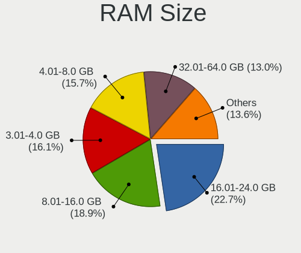
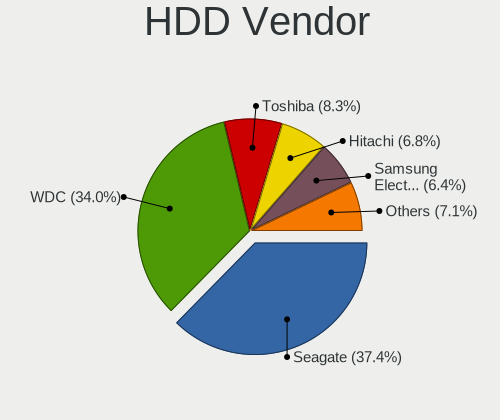
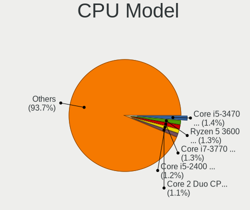
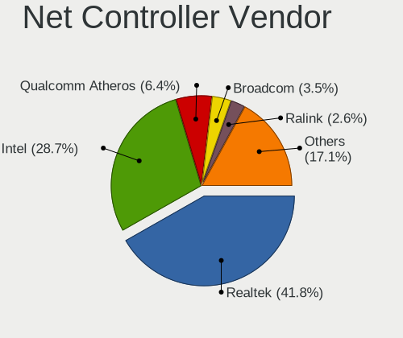
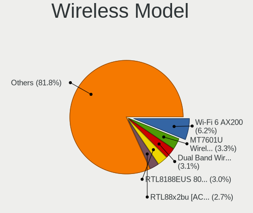

Ubuntu - Tested Hardware & Statistics (Desktops)
------------------------------------------------

A project to collect tested hardware configurations for Ubuntu.

Anyone can contribute to this report by the [hw-probe](https://github.com/linuxhw/hw-probe) tool:

    sudo -E hw-probe -all -upload

Please contribute! Especially if your hardware is rare.

Contents
--------

* [ Test Cases ](#test-cases)

* [ System ](#system)
  - [ OS                       ](#os)
  - [ OS Family                ](#os-family)
  - [ Kernel                   ](#kernel)
  - [ Kernel Family            ](#kernel-family)
  - [ Kernel Major Ver.        ](#kernel-major-ver)
  - [ Arch                     ](#arch)
  - [ DE                       ](#de)
  - [ Display Server           ](#display-server)
  - [ Display Manager          ](#display-manager)
  - [ OS Lang                  ](#os-lang)
  - [ Boot Mode                ](#boot-mode)
  - [ Filesystem               ](#filesystem)
  - [ Part. scheme             ](#part-scheme)
  - [ Dual Boot with Linux/BSD ](#dual-boot-with-linuxbsd)
  - [ Dual Boot (Win)          ](#dual-boot-win)

* [ Board ](#board)
  - [ Vendor                   ](#vendor)
  - [ Model                    ](#model)
  - [ Model Family             ](#model-family)
  - [ MFG Year                 ](#mfg-year)
  - [ Form Factor              ](#form-factor)
  - [ Secure Boot              ](#secure-boot)
  - [ Coreboot                 ](#coreboot)
  - [ RAM Size                 ](#ram-size)
  - [ RAM Used                 ](#ram-used)
  - [ Total Drives             ](#total-drives)
  - [ Has CD-ROM               ](#has-cd-rom)
  - [ Has Ethernet             ](#has-ethernet)
  - [ Has WiFi                 ](#has-wifi)
  - [ Has Bluetooth            ](#has-bluetooth)

* [ Location ](#location)
  - [ Country                  ](#country)
  - [ City                     ](#city)

* [ Drives ](#drives)
  - [ Drive Vendor             ](#drive-vendor)
  - [ Drive Model              ](#drive-model)
  - [ HDD Vendor               ](#hdd-vendor)
  - [ SSD Vendor               ](#ssd-vendor)
  - [ Drive Kind               ](#drive-kind)
  - [ Drive Connector          ](#drive-connector)
  - [ Drive Size               ](#drive-size)
  - [ Space Total              ](#space-total)
  - [ Space Used               ](#space-used)
  - [ Malfunc. Drives          ](#malfunc-drives)
  - [ Malfunc. Drive Vendor    ](#malfunc-drive-vendor)
  - [ Malfunc. HDD Vendor      ](#malfunc-hdd-vendor)
  - [ Malfunc. Drive Kind      ](#malfunc-drive-kind)
  - [ Failed Drives            ](#failed-drives)
  - [ Failed Drive Vendor      ](#failed-drive-vendor)
  - [ Drive Status             ](#drive-status)

* [ Storage controller ](#storage-controller)
  - [ Storage Vendor           ](#storage-vendor)
  - [ Storage Model            ](#storage-model)
  - [ Storage Kind             ](#storage-kind)

* [ Processor ](#processor)
  - [ CPU Vendor               ](#cpu-vendor)
  - [ CPU Model                ](#cpu-model)
  - [ CPU Model Family         ](#cpu-model-family)
  - [ CPU Cores                ](#cpu-cores)
  - [ CPU Sockets              ](#cpu-sockets)
  - [ CPU Threads              ](#cpu-threads)
  - [ CPU Op-Modes             ](#cpu-op-modes)
  - [ CPU Microcode            ](#cpu-microcode)
  - [ CPU Microarch            ](#cpu-microarch)

* [ Graphics ](#graphics)
  - [ GPU Vendor               ](#gpu-vendor)
  - [ GPU Model                ](#gpu-model)
  - [ GPU Combo                ](#gpu-combo)
  - [ GPU Driver               ](#gpu-driver)
  - [ GPU Memory               ](#gpu-memory)

* [ Monitor ](#monitor)
  - [ Monitor Vendor           ](#monitor-vendor)
  - [ Monitor Model            ](#monitor-model)
  - [ Monitor Resolution       ](#monitor-resolution)
  - [ Monitor Diagonal         ](#monitor-diagonal)
  - [ Monitor Width            ](#monitor-width)
  - [ Aspect Ratio             ](#aspect-ratio)
  - [ Monitor Area             ](#monitor-area)
  - [ Pixel Density            ](#pixel-density)
  - [ Multiple Monitors        ](#multiple-monitors)

* [ Network ](#network)
  - [ Net Controller Vendor    ](#net-controller-vendor)
  - [ Net Controller Model     ](#net-controller-model)
  - [ Wireless Vendor          ](#wireless-vendor)
  - [ Wireless Model           ](#wireless-model)
  - [ Ethernet Vendor          ](#ethernet-vendor)
  - [ Ethernet Model           ](#ethernet-model)
  - [ Net Controller Kind      ](#net-controller-kind)
  - [ Used Controller          ](#used-controller)
  - [ NICs                     ](#nics)
  - [ IPv6                     ](#ipv6)

* [ Bluetooth ](#bluetooth)
  - [ Bluetooth Vendor         ](#bluetooth-vendor)
  - [ Bluetooth Model          ](#bluetooth-model)

* [ Sound ](#sound)
  - [ Sound Vendor             ](#sound-vendor)
  - [ Sound Model              ](#sound-model)

* [ Memory ](#memory)
  - [ Memory Vendor            ](#memory-vendor)
  - [ Memory Model             ](#memory-model)
  - [ Memory Kind              ](#memory-kind)
  - [ Memory Form Factor       ](#memory-form-factor)
  - [ Memory Size              ](#memory-size)
  - [ Memory Speed             ](#memory-speed)

* [ Printers & scanners ](#printers--scanners)
  - [ Printer Vendor           ](#printer-vendor)
  - [ Printer Model            ](#printer-model)
  - [ Scanner Vendor           ](#scanner-vendor)
  - [ Scanner Model            ](#scanner-model)

* [ Camera ](#camera)
  - [ Camera Vendor            ](#camera-vendor)
  - [ Camera Model             ](#camera-model)

* [ Security ](#security)
  - [ Fingerprint Vendor       ](#fingerprint-vendor)
  - [ Fingerprint Model        ](#fingerprint-model)
  - [ Chipcard Vendor          ](#chipcard-vendor)
  - [ Chipcard Model           ](#chipcard-model)

* [ Unsupported ](#unsupported)
  - [ Unsupported Devices      ](#unsupported-devices)
  - [ Unsupported Device Types ](#unsupported-device-types)

Test Cases
----------

Total: 33387

| Vendor        | Model                       | Probe                                                      | Date         |
|---------------|-----------------------------|------------------------------------------------------------|--------------|
| Acer          | H57M01                      | [215701a84d](https://linux-hardware.org/?probe=215701a84d) | Apr 01, 2023 |
| Gigabyte      | Z370 HD3-CF                 | [824aa0ae13](https://linux-hardware.org/?probe=824aa0ae13) | Apr 01, 2023 |
| Intel         | DG41RQ AAE54511-203         | [383835a445](https://linux-hardware.org/?probe=383835a445) | Apr 01, 2023 |
| Dell          | 09M8Y8 A01                  | [17d5390549](https://linux-hardware.org/?probe=17d5390549) | Apr 01, 2023 |
| Dell          | 09KPNV A01                  | [2b25e4872f](https://linux-hardware.org/?probe=2b25e4872f) | Apr 01, 2023 |
| Apple         | Mac-F4208DC8 PVT            | [f05009caac](https://linux-hardware.org/?probe=f05009caac) | Apr 01, 2023 |
| Gigabyte      | Z77X-UD5H                   | [2be0fa6524](https://linux-hardware.org/?probe=2be0fa6524) | Apr 01, 2023 |
| Gigabyte      | B560M AORUS ELITE           | [ee536703f8](https://linux-hardware.org/?probe=ee536703f8) | Apr 01, 2023 |
| Gigabyte      | Z170-HD3 DDR3-CF            | [dff9959cd7](https://linux-hardware.org/?probe=dff9959cd7) | Mar 31, 2023 |
| Gateway       | IPIMB-ARA                   | [9c300aea89](https://linux-hardware.org/?probe=9c300aea89) | Mar 31, 2023 |
| Gigabyte      | H61M-S2V-B3                 | [45a242d18f](https://linux-hardware.org/?probe=45a242d18f) | Mar 31, 2023 |
| ASUSTek       | M5A78L LE                   | [7a23362aac](https://linux-hardware.org/?probe=7a23362aac) | Mar 31, 2023 |
| HP            | 0A64h                       | [f4fd3904f0](https://linux-hardware.org/?probe=f4fd3904f0) | Mar 31, 2023 |
| ASUSTek       | TUF Gaming B550-PLUS        | [6694c9279d](https://linux-hardware.org/?probe=6694c9279d) | Mar 31, 2023 |
| MSI           | MAG Z690 TOMAHAWK WIFI      | [49917003da](https://linux-hardware.org/?probe=49917003da) | Mar 31, 2023 |
| ASRock        | A320M-DVS R4.0              | [e6463ab36d](https://linux-hardware.org/?probe=e6463ab36d) | Mar 31, 2023 |
| MSI           | 970 GAMING                  | [d729a0a559](https://linux-hardware.org/?probe=d729a0a559) | Mar 31, 2023 |
| ASUSTek       | TUF Gaming Z590-PLUS WIF... | [9addea9f4a](https://linux-hardware.org/?probe=9addea9f4a) | Mar 31, 2023 |
| Gigabyte      | GA-880GM-UD2H               | [90796fbad9](https://linux-hardware.org/?probe=90796fbad9) | Mar 31, 2023 |
| ASUSTek       | Z97-K                       | [da56f6c38c](https://linux-hardware.org/?probe=da56f6c38c) | Mar 31, 2023 |
| Gigabyte      | TRX40 AORUS XTREME          | [0945961c85](https://linux-hardware.org/?probe=0945961c85) | Mar 31, 2023 |
| Gigabyte      | TRX40 AORUS XTREME          | [72c08c8ca9](https://linux-hardware.org/?probe=72c08c8ca9) | Mar 31, 2023 |
| Dell          | 0FG47G A02                  | [d1cf6fa11e](https://linux-hardware.org/?probe=d1cf6fa11e) | Mar 31, 2023 |
| Acer          | Aspire TC-875 V:1.0         | [8f9f4fb295](https://linux-hardware.org/?probe=8f9f4fb295) | Mar 31, 2023 |
| Gigabyte      | H310M H x.x                 | [68fce9ae2d](https://linux-hardware.org/?probe=68fce9ae2d) | Mar 31, 2023 |
| ECS           | H61H2-M6                    | [6c33ee7e15](https://linux-hardware.org/?probe=6c33ee7e15) | Mar 31, 2023 |
| Gigabyte      | B550M DS3H AC               | [f8e723a8dc](https://linux-hardware.org/?probe=f8e723a8dc) | Mar 31, 2023 |
| MSI           | PRO X670-P WIFI             | [bb72de54b6](https://linux-hardware.org/?probe=bb72de54b6) | Mar 31, 2023 |
| ECS           | G31T-M7                     | [c197c4ed1d](https://linux-hardware.org/?probe=c197c4ed1d) | Mar 31, 2023 |
| ASUSTek       | M5A99FX PRO R2.0            | [0e374d0aea](https://linux-hardware.org/?probe=0e374d0aea) | Mar 31, 2023 |
| Gigabyte      | X670 AORUS ELITE AX         | [c239e06998](https://linux-hardware.org/?probe=c239e06998) | Mar 31, 2023 |
| Gigabyte      | F2A88X-UP4                  | [72c4b553b4](https://linux-hardware.org/?probe=72c4b553b4) | Mar 31, 2023 |
| ASUSTek       | Z87-K                       | [e596dbb5bd](https://linux-hardware.org/?probe=e596dbb5bd) | Mar 30, 2023 |
| Gigabyte      | A320M-S2H-CF                | [3aac57dfbd](https://linux-hardware.org/?probe=3aac57dfbd) | Mar 30, 2023 |
| Gigabyte      | B550 AORUS ELITE            | [4cfac9a162](https://linux-hardware.org/?probe=4cfac9a162) | Mar 30, 2023 |
| Unknown       | Unknown                     | [3773f3cd04](https://linux-hardware.org/?probe=3773f3cd04) | Mar 30, 2023 |
| Dell          | 0KV62T A02                  | [c7765df604](https://linux-hardware.org/?probe=c7765df604) | Mar 30, 2023 |
| Packard Be... | FMP55                       | [88a15e20b2](https://linux-hardware.org/?probe=88a15e20b2) | Mar 30, 2023 |
| ASUSTek       | M4A79T Deluxe               | [9828b40ec9](https://linux-hardware.org/?probe=9828b40ec9) | Mar 30, 2023 |
| HP            | 0A64h                       | [9f50595e87](https://linux-hardware.org/?probe=9f50595e87) | Mar 30, 2023 |
| Gigabyte      | H61M-S2V-B3                 | [41a76fad3f](https://linux-hardware.org/?probe=41a76fad3f) | Mar 30, 2023 |
| Lenovo        | MAHOBAY NO DPK              | [3bf5fd0cfd](https://linux-hardware.org/?probe=3bf5fd0cfd) | Mar 30, 2023 |
| ASUSTek       | H110M-R                     | [3c641024ba](https://linux-hardware.org/?probe=3c641024ba) | Mar 30, 2023 |
| MSI           | X79A-GD45                   | [6d78703b2c](https://linux-hardware.org/?probe=6d78703b2c) | Mar 30, 2023 |
| ASUSTek       | TUF Gaming B550M-PLUS       | [92981c741d](https://linux-hardware.org/?probe=92981c741d) | Mar 30, 2023 |
| MSI           | PRO X670-P WIFI             | [ed35fbea6c](https://linux-hardware.org/?probe=ed35fbea6c) | Mar 30, 2023 |
| HP            | 82B4                        | [0829a64947](https://linux-hardware.org/?probe=0829a64947) | Mar 30, 2023 |
| Foxconn       | 2ABF                        | [8e1750d5e4](https://linux-hardware.org/?probe=8e1750d5e4) | Mar 30, 2023 |
| MSI           | MAG B550M MORTAR WIFI       | [dfd9900ccf](https://linux-hardware.org/?probe=dfd9900ccf) | Mar 30, 2023 |
| ASUSTek       | TUF Gaming X570-PRO WIFI... | [cfe80f22f8](https://linux-hardware.org/?probe=cfe80f22f8) | Mar 30, 2023 |
| ASUSTek       | M5A97                       | [4d12d122e1](https://linux-hardware.org/?probe=4d12d122e1) | Mar 30, 2023 |
| Shuttle       | FH170                       | [0fa0f1ab72](https://linux-hardware.org/?probe=0fa0f1ab72) | Mar 30, 2023 |
| Intel         | D510MO AAE76523-403         | [0d06f88081](https://linux-hardware.org/?probe=0d06f88081) | Mar 30, 2023 |
| ASUSTek       | P5E WS Pro                  | [6c70ac23df](https://linux-hardware.org/?probe=6c70ac23df) | Mar 30, 2023 |
| Gigabyte      | H81M-S2V                    | [5a16920bc0](https://linux-hardware.org/?probe=5a16920bc0) | Mar 30, 2023 |
| HP            | 8591                        | [b887990c12](https://linux-hardware.org/?probe=b887990c12) | Mar 30, 2023 |
| MSI           | FM2-A75MA-E35               | [10de0ae048](https://linux-hardware.org/?probe=10de0ae048) | Mar 30, 2023 |
| Lenovo        | 30D2 SDK0J40697 WIN 3305... | [185cb6df15](https://linux-hardware.org/?probe=185cb6df15) | Mar 30, 2023 |
| ASUSTek       | ROG STRIX B450-F GAMING     | [cd308ca372](https://linux-hardware.org/?probe=cd308ca372) | Mar 29, 2023 |
| ASUSTek       | PRIME H610I-PLUS D4         | [7b984afb2c](https://linux-hardware.org/?probe=7b984afb2c) | Mar 29, 2023 |
| ASUSTek       | H81M-V3                     | [fd123bea36](https://linux-hardware.org/?probe=fd123bea36) | Mar 29, 2023 |
| ASUSTek       | TUF Gaming Z590-PLUS WIF... | [baf3c567a7](https://linux-hardware.org/?probe=baf3c567a7) | Mar 29, 2023 |
| Dell          | 09KPNV A01                  | [6024b90eea](https://linux-hardware.org/?probe=6024b90eea) | Mar 29, 2023 |
| HP            | 3646h                       | [b173e99a5a](https://linux-hardware.org/?probe=b173e99a5a) | Mar 29, 2023 |
| Gigabyte      | GA-A75-UD4H                 | [e5433e75fb](https://linux-hardware.org/?probe=e5433e75fb) | Mar 29, 2023 |
| MSI           | X79A-GD45                   | [bb4680bc5b](https://linux-hardware.org/?probe=bb4680bc5b) | Mar 29, 2023 |
| ASUSTek       | PRIME B360M-C               | [e7b163ea80](https://linux-hardware.org/?probe=e7b163ea80) | Mar 29, 2023 |
| ASUSTek       | P8Z77-V LX2                 | [23256b54cf](https://linux-hardware.org/?probe=23256b54cf) | Mar 29, 2023 |
| Intel         | H61                         | [bb6e201a08](https://linux-hardware.org/?probe=bb6e201a08) | Mar 29, 2023 |
| Maxtang       | FP30 V1.0                   | [e184bdb89c](https://linux-hardware.org/?probe=e184bdb89c) | Mar 29, 2023 |
| Intel         | DQ67OW AAG28716-309         | [3394687910](https://linux-hardware.org/?probe=3394687910) | Mar 29, 2023 |
| Gigabyte      | P41T-D3                     | [2941019778](https://linux-hardware.org/?probe=2941019778) | Mar 29, 2023 |
| Intel         | B75                         | [2bddb84c2e](https://linux-hardware.org/?probe=2bddb84c2e) | Mar 29, 2023 |
| ASUSTek       | H81M-V3                     | [ce98454e55](https://linux-hardware.org/?probe=ce98454e55) | Mar 29, 2023 |
| Dell          | 0200DY A01                  | [095eb7be41](https://linux-hardware.org/?probe=095eb7be41) | Mar 29, 2023 |
| Gigabyte      | B365M DS3H                  | [e6b01be2f1](https://linux-hardware.org/?probe=e6b01be2f1) | Mar 29, 2023 |
| ASUSTek       | H110M-A                     | [147c0afb99](https://linux-hardware.org/?probe=147c0afb99) | Mar 29, 2023 |
| ASRock        | H61M-DG3/USB3               | [6e7b188568](https://linux-hardware.org/?probe=6e7b188568) | Mar 28, 2023 |
| MSI           | H61M-P20                    | [18409d7178](https://linux-hardware.org/?probe=18409d7178) | Mar 28, 2023 |
| Gigabyte      | H77M-D3H                    | [31a96824ea](https://linux-hardware.org/?probe=31a96824ea) | Mar 28, 2023 |
| Gigabyte      | H110M-S2H DDR3-CF           | [7ec74ffcfa](https://linux-hardware.org/?probe=7ec74ffcfa) | Mar 28, 2023 |
| ASUSTek       | Z97-P                       | [0a0ca96d28](https://linux-hardware.org/?probe=0a0ca96d28) | Mar 28, 2023 |
| MSI           | Z170A SLI PLUS              | [50affe59d1](https://linux-hardware.org/?probe=50affe59d1) | Mar 28, 2023 |
| Lenovo        | SHARKBAY NOK                | [0cbe19c074](https://linux-hardware.org/?probe=0cbe19c074) | Mar 28, 2023 |
| Gigabyte      | H110M-S2H DDR3-CF           | [7e5cb33850](https://linux-hardware.org/?probe=7e5cb33850) | Mar 28, 2023 |
| ASRock        | X399 Taichi                 | [f16690a3df](https://linux-hardware.org/?probe=f16690a3df) | Mar 28, 2023 |
| Gigabyte      | B450 AORUS PRO WIFI-CF      | [19ffc63f56](https://linux-hardware.org/?probe=19ffc63f56) | Mar 28, 2023 |
| ZOTAC         | AMD M1                      | [2b2c8fd4fa](https://linux-hardware.org/?probe=2b2c8fd4fa) | Mar 28, 2023 |
| Gigabyte      | B450M S2H                   | [7f46837f94](https://linux-hardware.org/?probe=7f46837f94) | Mar 28, 2023 |
| Pegatron      | 2AE3                        | [806b4e1780](https://linux-hardware.org/?probe=806b4e1780) | Mar 28, 2023 |
| Pegatron      | 2AE3                        | [23ce0f4fd5](https://linux-hardware.org/?probe=23ce0f4fd5) | Mar 28, 2023 |
| MSI           | B450 TOMAHAWK MAX II        | [b8d58bafe3](https://linux-hardware.org/?probe=b8d58bafe3) | Mar 28, 2023 |
| MSI           | B450 TOMAHAWK MAX II        | [68117fedfe](https://linux-hardware.org/?probe=68117fedfe) | Mar 28, 2023 |
| Apple         | Mac-F4208DC8 PVT            | [cdb2c38b76](https://linux-hardware.org/?probe=cdb2c38b76) | Mar 27, 2023 |
| Gigabyte      | WRX80-SU8                   | [88c24f7e44](https://linux-hardware.org/?probe=88c24f7e44) | Mar 27, 2023 |
| Gigabyte      | A320M-S2H-CF                | [1dd1eab13e](https://linux-hardware.org/?probe=1dd1eab13e) | Mar 27, 2023 |
| Pegatron      | IPMIP-H55-GEN               | [7dcf9e9b51](https://linux-hardware.org/?probe=7dcf9e9b51) | Mar 27, 2023 |
| Gateway       | IPIMB-ARA                   | [6b2eb0b9f7](https://linux-hardware.org/?probe=6b2eb0b9f7) | Mar 27, 2023 |
| HP            | 3648h                       | [fbc5138852](https://linux-hardware.org/?probe=fbc5138852) | Mar 27, 2023 |
| MSI           | X99A SLI PLUS               | [519fc70e27](https://linux-hardware.org/?probe=519fc70e27) | Mar 27, 2023 |
| HP            | 8954                        | [e7a2f29df5](https://linux-hardware.org/?probe=e7a2f29df5) | Mar 27, 2023 |
| ASRock        | X570 Steel Legend           | [490155a63a](https://linux-hardware.org/?probe=490155a63a) | Mar 27, 2023 |
| MSI           | Z170A SLI PLUS              | [8a1c592e98](https://linux-hardware.org/?probe=8a1c592e98) | Mar 27, 2023 |
| MSI           | B250M PRO-VDH 2018-05-07    | [6f7e481d06](https://linux-hardware.org/?probe=6f7e481d06) | Mar 27, 2023 |
| Gigabyte      | A520M H                     | [7afe508254](https://linux-hardware.org/?probe=7afe508254) | Mar 27, 2023 |
| ASUSTek       | PRIME Z270-P                | [6f41d8a22c](https://linux-hardware.org/?probe=6f41d8a22c) | Mar 27, 2023 |
| Gigabyte      | Z590 GAMING X               | [de1cb772e9](https://linux-hardware.org/?probe=de1cb772e9) | Mar 27, 2023 |
| Gigabyte      | Z590 GAMING X               | [db7671affd](https://linux-hardware.org/?probe=db7671affd) | Mar 27, 2023 |
| ASUSTek       | P8H61-M LE                  | [e834f14d64](https://linux-hardware.org/?probe=e834f14d64) | Mar 27, 2023 |
| Lenovo        | ThinkCentre Edge71 1577K... | [ec1f547743](https://linux-hardware.org/?probe=ec1f547743) | Mar 27, 2023 |
| Intel         | X58M                        | [823813881b](https://linux-hardware.org/?probe=823813881b) | Mar 27, 2023 |
| MSI           | PRO H610M-B DDR4            | [a9ca07dc80](https://linux-hardware.org/?probe=a9ca07dc80) | Mar 27, 2023 |
| Dell          | 0JVY7H A00                  | [4fb29c4b54](https://linux-hardware.org/?probe=4fb29c4b54) | Mar 27, 2023 |
| ASUSTek       | STRIX X99 GAMING            | [1c37ecb6c7](https://linux-hardware.org/?probe=1c37ecb6c7) | Mar 26, 2023 |
| HPE           | ProLiant MicroServer Gen... | [66394c054f](https://linux-hardware.org/?probe=66394c054f) | Mar 26, 2023 |
| ASUSTek       | CROSSHAIR II FORMULA        | [35e0a73e8f](https://linux-hardware.org/?probe=35e0a73e8f) | Mar 26, 2023 |
| ASRock        | B365 Pro4                   | [ec1dd7f3ab](https://linux-hardware.org/?probe=ec1dd7f3ab) | Mar 26, 2023 |
| Lenovo        | ThinkCentre M90p 3282A8U    | [5edac0955d](https://linux-hardware.org/?probe=5edac0955d) | Mar 26, 2023 |
| HP            | ProLiant ML350 G5           | [b0000fc633](https://linux-hardware.org/?probe=b0000fc633) | Mar 26, 2023 |
| Gigabyte      | H310M H x.x                 | [d79b6fc95c](https://linux-hardware.org/?probe=d79b6fc95c) | Mar 26, 2023 |
| Wistron       | ProLiant ML110 G6           | [2e14ac2984](https://linux-hardware.org/?probe=2e14ac2984) | Mar 26, 2023 |
| MSI           | B550-A PRO                  | [eddf5a759a](https://linux-hardware.org/?probe=eddf5a759a) | Mar 26, 2023 |
| HP            | 0B54h D                     | [540caaf04c](https://linux-hardware.org/?probe=540caaf04c) | Mar 26, 2023 |
| ASUSTek       | P5W DH Deluxe               | [781cafa540](https://linux-hardware.org/?probe=781cafa540) | Mar 26, 2023 |
| Gigabyte      | A520M H                     | [cfacabcd33](https://linux-hardware.org/?probe=cfacabcd33) | Mar 26, 2023 |
| Gigabyte      | A520M H                     | [ed01b04ada](https://linux-hardware.org/?probe=ed01b04ada) | Mar 26, 2023 |
| Shuttle       | B10IE01                     | [bc74a6b1a2](https://linux-hardware.org/?probe=bc74a6b1a2) | Mar 26, 2023 |
| Dell          | 0MGK50 A02                  | [75b4691fd2](https://linux-hardware.org/?probe=75b4691fd2) | Mar 26, 2023 |
| ASUSTek       | M5A78L-M/USB3               | [c7e347798a](https://linux-hardware.org/?probe=c7e347798a) | Mar 26, 2023 |
| Gigabyte      | X670E AORUS MASTER          | [2e813c4a68](https://linux-hardware.org/?probe=2e813c4a68) | Mar 26, 2023 |
| ASUSTek       | P5B-Deluxe                  | [f5a9d12043](https://linux-hardware.org/?probe=f5a9d12043) | Mar 26, 2023 |
| Lenovo        | ThinkCentre M90p 3282A8U    | [40b8057336](https://linux-hardware.org/?probe=40b8057336) | Mar 26, 2023 |
| Intel         | DG41CN AAE82429-102         | [c671afb118](https://linux-hardware.org/?probe=c671afb118) | Mar 26, 2023 |
| HP            | 339A                        | [1009c2d048](https://linux-hardware.org/?probe=1009c2d048) | Mar 26, 2023 |
| Lenovo        | 3704 SDK0J40700 WIN 3258... | [b7b93f24a2](https://linux-hardware.org/?probe=b7b93f24a2) | Mar 26, 2023 |
| Gigabyte      | X58A-UD3R                   | [2325b601fe](https://linux-hardware.org/?probe=2325b601fe) | Mar 25, 2023 |
| ASRock        | A320M-HDV R4.0              | [1b5f2b52bc](https://linux-hardware.org/?probe=1b5f2b52bc) | Mar 25, 2023 |
| Dell          | 02YYK5 A01                  | [92e64e0e8c](https://linux-hardware.org/?probe=92e64e0e8c) | Mar 25, 2023 |
| ASUSTek       | PRIME H310-PLUS             | [4fcf740ee9](https://linux-hardware.org/?probe=4fcf740ee9) | Mar 25, 2023 |
| Gigabyte      | Z77X-D3H                    | [5fff36a878](https://linux-hardware.org/?probe=5fff36a878) | Mar 25, 2023 |
| ASUSTek       | H81I-PLUS                   | [98dc4bb06b](https://linux-hardware.org/?probe=98dc4bb06b) | Mar 25, 2023 |
| ASUSTek       | H81I-PLUS                   | [bb353ccddf](https://linux-hardware.org/?probe=bb353ccddf) | Mar 25, 2023 |
| HP            | 3397                        | [2ad66803de](https://linux-hardware.org/?probe=2ad66803de) | Mar 25, 2023 |
| Packard Be... | FIH57                       | [794fd45482](https://linux-hardware.org/?probe=794fd45482) | Mar 25, 2023 |
| Foxconn       | 2ABF                        | [41289d94bf](https://linux-hardware.org/?probe=41289d94bf) | Mar 25, 2023 |
| Foxconn       | 2ABF                        | [1ccaab03c4](https://linux-hardware.org/?probe=1ccaab03c4) | Mar 25, 2023 |
| ASUSTek       | PRIME H310-PLUS             | [caa720b95b](https://linux-hardware.org/?probe=caa720b95b) | Mar 25, 2023 |
| MSI           | H110M PRO-D                 | [104b9b1c12](https://linux-hardware.org/?probe=104b9b1c12) | Mar 25, 2023 |
| ASUSTek       | P5KPL-AM/PS                 | [02d9269abc](https://linux-hardware.org/?probe=02d9269abc) | Mar 25, 2023 |
| HP            | 18E9                        | [f015f44555](https://linux-hardware.org/?probe=f015f44555) | Mar 25, 2023 |
| HP            | 1850                        | [5ae52efa64](https://linux-hardware.org/?probe=5ae52efa64) | Mar 25, 2023 |
| ASUSTek       | H110M-K D3                  | [24a568ad05](https://linux-hardware.org/?probe=24a568ad05) | Mar 25, 2023 |
| ASUSTek       | H81T R2.0                   | [92b97834aa](https://linux-hardware.org/?probe=92b97834aa) | Mar 25, 2023 |
| Dell          | 00V62H A01                  | [5312ec3cc9](https://linux-hardware.org/?probe=5312ec3cc9) | Mar 25, 2023 |
| HP            | 8906 SMVB                   | [7650a804d9](https://linux-hardware.org/?probe=7650a804d9) | Mar 25, 2023 |
| Dell          | 02YYK5 A01                  | [aeb58a6898](https://linux-hardware.org/?probe=aeb58a6898) | Mar 24, 2023 |
| ASUSTek       | Basswood3G                  | [d71f476c72](https://linux-hardware.org/?probe=d71f476c72) | Mar 24, 2023 |
| HP            | 3397                        | [aa383880bd](https://linux-hardware.org/?probe=aa383880bd) | Mar 24, 2023 |
| HP            | 3048h                       | [69cd88b0c0](https://linux-hardware.org/?probe=69cd88b0c0) | Mar 24, 2023 |
| Dell          | 0TP406                      | [a58cf3b551](https://linux-hardware.org/?probe=a58cf3b551) | Mar 24, 2023 |
| Gigabyte      | GA-MA790XT-UD4P             | [8a0cc5a4cb](https://linux-hardware.org/?probe=8a0cc5a4cb) | Mar 24, 2023 |
| HP            | 0A64h                       | [c53db667a1](https://linux-hardware.org/?probe=c53db667a1) | Mar 24, 2023 |
| Apple         | Mac-F4208DC8 PVT            | [fea1e4cf50](https://linux-hardware.org/?probe=fea1e4cf50) | Mar 24, 2023 |
| HP            | 1790                        | [1a468c1b1c](https://linux-hardware.org/?probe=1a468c1b1c) | Mar 24, 2023 |
| ASUSTek       | TUF Gaming X570-PLUS        | [eeeac5db0f](https://linux-hardware.org/?probe=eeeac5db0f) | Mar 24, 2023 |
| Apple         | Mac-F4208DC8 PVT            | [b5cecce6b9](https://linux-hardware.org/?probe=b5cecce6b9) | Mar 24, 2023 |
| Intel         | X99 V1.x                    | [391a73b307](https://linux-hardware.org/?probe=391a73b307) | Mar 24, 2023 |
| ASUSTek       | M32CD_A_F_K20CD_K31CD       | [dc56fbfedb](https://linux-hardware.org/?probe=dc56fbfedb) | Mar 24, 2023 |
| ASUSTek       | M32CD_A_F_K20CD_K31CD       | [67d60d55e4](https://linux-hardware.org/?probe=67d60d55e4) | Mar 24, 2023 |
| ASRock        | H310CM-HDV/M.2              | [cebe46bd74](https://linux-hardware.org/?probe=cebe46bd74) | Mar 24, 2023 |
| MSI           | MPG X570 GAMING PLUS        | [360866bcc5](https://linux-hardware.org/?probe=360866bcc5) | Mar 24, 2023 |
| ASUSTek       | ROG STRIX B550-F GAMING     | [0c824a1f88](https://linux-hardware.org/?probe=0c824a1f88) | Mar 24, 2023 |
| Biostar       | B150GT5                     | [e054bb7f91](https://linux-hardware.org/?probe=e054bb7f91) | Mar 24, 2023 |
| HP            | 2B05                        | [b34e6d230c](https://linux-hardware.org/?probe=b34e6d230c) | Mar 24, 2023 |
| Gigabyte      | B450M DS3H WIFI-CF          | [10b7d76bff](https://linux-hardware.org/?probe=10b7d76bff) | Mar 24, 2023 |
| MSI           | Z390-A PRO                  | [36d6fdda74](https://linux-hardware.org/?probe=36d6fdda74) | Mar 24, 2023 |
| ASRock        | B550M Pro4                  | [d18034c36c](https://linux-hardware.org/?probe=d18034c36c) | Mar 24, 2023 |
| ASUSTek       | PRIME X470-PRO              | [8af246641b](https://linux-hardware.org/?probe=8af246641b) | Mar 24, 2023 |
| MSI           | B450 GAMING PRO CARBON A... | [704fb36197](https://linux-hardware.org/?probe=704fb36197) | Mar 23, 2023 |
| Fujitsu       | D3403-A1 S26361-D3403-A1    | [a5795c9f91](https://linux-hardware.org/?probe=a5795c9f91) | Mar 23, 2023 |
| ASUSTek       | ROG STRIX B450-E GAMING     | [fd2f6925ba](https://linux-hardware.org/?probe=fd2f6925ba) | Mar 23, 2023 |
| eMachines     | EL1360G                     | [b302aa1f47](https://linux-hardware.org/?probe=b302aa1f47) | Mar 23, 2023 |
| Itautec       | ST 4254 ST-4254 Padrao 0... | [cd3e7fa4e5](https://linux-hardware.org/?probe=cd3e7fa4e5) | Mar 23, 2023 |
| HP            | 1905                        | [7bccc34bf4](https://linux-hardware.org/?probe=7bccc34bf4) | Mar 23, 2023 |
| ASUSTek       | ROG STRIX B550-F GAMING     | [6a57dfd8fc](https://linux-hardware.org/?probe=6a57dfd8fc) | Mar 23, 2023 |
| ASUSTek       | ROG STRIX H370-F GAMING     | [c02aa4b9e1](https://linux-hardware.org/?probe=c02aa4b9e1) | Mar 23, 2023 |
| MSI           | G41M-P26                    | [49854744e6](https://linux-hardware.org/?probe=49854744e6) | Mar 23, 2023 |
| AMI           | Intel                       | [5e7b21c227](https://linux-hardware.org/?probe=5e7b21c227) | Mar 23, 2023 |
| MACHINIST     | E5-MR9A PRO V1.1            | [7d303a08d4](https://linux-hardware.org/?probe=7d303a08d4) | Mar 23, 2023 |
| MSI           | MPG X570 GAMING EDGE WIF... | [20267be489](https://linux-hardware.org/?probe=20267be489) | Mar 23, 2023 |
| Lenovo        | SHARKBAY NOK                | [e1783f9cd4](https://linux-hardware.org/?probe=e1783f9cd4) | Mar 22, 2023 |
| Lenovo        | SHARKBAY NOK                | [1a2e1919ee](https://linux-hardware.org/?probe=1a2e1919ee) | Mar 22, 2023 |
| MSI           | PRO B650-P WIFI             | [f0901a6af0](https://linux-hardware.org/?probe=f0901a6af0) | Mar 22, 2023 |
| ASUSTek       | X99-E                       | [62535f81e4](https://linux-hardware.org/?probe=62535f81e4) | Mar 22, 2023 |
| Gigabyte      | H110M-S2H DDR3-CF           | [47b661fcb3](https://linux-hardware.org/?probe=47b661fcb3) | Mar 22, 2023 |
| Dell          | 0NW73C A01                  | [39e1f031d9](https://linux-hardware.org/?probe=39e1f031d9) | Mar 22, 2023 |
| ASUSTek       | PB60                        | [ec438486aa](https://linux-hardware.org/?probe=ec438486aa) | Mar 22, 2023 |
| ASRockRack    | B665D4U-1L                  | [2be23ead3c](https://linux-hardware.org/?probe=2be23ead3c) | Mar 22, 2023 |
| MSI           | Z270 GAMING M3              | [2c25601c7c](https://linux-hardware.org/?probe=2c25601c7c) | Mar 22, 2023 |
| Gigabyte      | X570 I AORUS PRO WIFI       | [49bc505f3e](https://linux-hardware.org/?probe=49bc505f3e) | Mar 22, 2023 |
| ASUSTek       | X99-E                       | [eb6fe4121d](https://linux-hardware.org/?probe=eb6fe4121d) | Mar 22, 2023 |
| Gigabyte      | H110M-S2H DDR3-CF           | [f848ecf9cf](https://linux-hardware.org/?probe=f848ecf9cf) | Mar 22, 2023 |
| ASUSTek       | ROG Rampage VI EXTREME O... | [d5afcaf7a1](https://linux-hardware.org/?probe=d5afcaf7a1) | Mar 22, 2023 |
| ASUSTek       | B85M-E                      | [10269c811b](https://linux-hardware.org/?probe=10269c811b) | Mar 22, 2023 |
| ASUSTek       | M5A78L-M PLUS/USB3          | [568fac441d](https://linux-hardware.org/?probe=568fac441d) | Mar 22, 2023 |
| ASUSTek       | M5A97 R2.0                  | [789ca3dc74](https://linux-hardware.org/?probe=789ca3dc74) | Mar 22, 2023 |
| MSI           | Z97 GAMING 7                | [4fbe5017fe](https://linux-hardware.org/?probe=4fbe5017fe) | Mar 21, 2023 |
| HP            | 339A                        | [f1a067a512](https://linux-hardware.org/?probe=f1a067a512) | Mar 21, 2023 |
| ASRock        | FM2A68M-HD+                 | [7723ce424a](https://linux-hardware.org/?probe=7723ce424a) | Mar 21, 2023 |
| HP            | 1495                        | [3fe89757bb](https://linux-hardware.org/?probe=3fe89757bb) | Mar 21, 2023 |
| HP            | 1494                        | [e682c9975e](https://linux-hardware.org/?probe=e682c9975e) | Mar 21, 2023 |
| ASUSTek       | TUF Gaming X570-PLUS        | [844b9094f9](https://linux-hardware.org/?probe=844b9094f9) | Mar 21, 2023 |
| Dell          | 0DFRFW A01                  | [0d10f51874](https://linux-hardware.org/?probe=0d10f51874) | Mar 21, 2023 |
| ASUSTek       | TUF Gaming B550M-PLUS       | [846f31de3e](https://linux-hardware.org/?probe=846f31de3e) | Mar 21, 2023 |
| HP            | 2820h                       | [b3b8358edd](https://linux-hardware.org/?probe=b3b8358edd) | Mar 21, 2023 |
| MSI           | Z170A GAMING PRO            | [8948f99354](https://linux-hardware.org/?probe=8948f99354) | Mar 21, 2023 |
| Lenovo        | MAHOBAY NO DPK              | [7ccc7e9ae1](https://linux-hardware.org/?probe=7ccc7e9ae1) | Mar 21, 2023 |
| Lenovo        | MAHOBAY NO DPK              | [4544e68d4a](https://linux-hardware.org/?probe=4544e68d4a) | Mar 21, 2023 |
| ASUSTek       | TUF Gaming X570-PLUS        | [96c3f3ecc4](https://linux-hardware.org/?probe=96c3f3ecc4) | Mar 21, 2023 |
| Dell          | 0HR330                      | [40e315b128](https://linux-hardware.org/?probe=40e315b128) | Mar 21, 2023 |
| Dell          | 09KPNV A00                  | [5074a23172](https://linux-hardware.org/?probe=5074a23172) | Mar 20, 2023 |
| MSI           | B350 GAMING PLUS            | [2d82cffc81](https://linux-hardware.org/?probe=2d82cffc81) | Mar 20, 2023 |
| Unknown       | Unknown                     | [a931b7a520](https://linux-hardware.org/?probe=a931b7a520) | Mar 20, 2023 |
| ASRock        | B450M Pro4                  | [79f61fec56](https://linux-hardware.org/?probe=79f61fec56) | Mar 20, 2023 |
| Gigabyte      | B550M DS3H                  | [9e538c7837](https://linux-hardware.org/?probe=9e538c7837) | Mar 20, 2023 |
| ASUSTek       | Pro WS WRX80E-SAGE SE WI... | [a03658793c](https://linux-hardware.org/?probe=a03658793c) | Mar 20, 2023 |
| ASUSTek       | Pro WS WRX80E-SAGE SE WI... | [6df656c198](https://linux-hardware.org/?probe=6df656c198) | Mar 20, 2023 |
| MSI           | H310M PRO-VD                | [1b98d965e7](https://linux-hardware.org/?probe=1b98d965e7) | Mar 20, 2023 |
| ASUSTek       | ROG STRIX X670E-E GAMING... | [436b9d15b0](https://linux-hardware.org/?probe=436b9d15b0) | Mar 20, 2023 |
| Gigabyte      | H310M H x.x                 | [0d7cc03c37](https://linux-hardware.org/?probe=0d7cc03c37) | Mar 20, 2023 |
| HP            | 1497                        | [f4e72aa79c](https://linux-hardware.org/?probe=f4e72aa79c) | Mar 20, 2023 |
| HP            | 1497                        | [e017207fa8](https://linux-hardware.org/?probe=e017207fa8) | Mar 20, 2023 |
| Intel         | DX58OG AAG10926-203         | [f5e2774fb9](https://linux-hardware.org/?probe=f5e2774fb9) | Mar 20, 2023 |
| ASUSTek       | P5KPL-AM SE                 | [662d96a2ed](https://linux-hardware.org/?probe=662d96a2ed) | Mar 20, 2023 |
| Gigabyte      | Z690 AERO G                 | [5e8f9cafe8](https://linux-hardware.org/?probe=5e8f9cafe8) | Mar 20, 2023 |
| ASUSTek       | PRIME X570-P                | [417d3cf9b7](https://linux-hardware.org/?probe=417d3cf9b7) | Mar 19, 2023 |
| Gigabyte      | GB-BRR7H-4700               | [9d7f6de46c](https://linux-hardware.org/?probe=9d7f6de46c) | Mar 19, 2023 |
| Gateway       | SX2370                      | [c0e43c3894](https://linux-hardware.org/?probe=c0e43c3894) | Mar 19, 2023 |
| Gateway       | SX2370                      | [315ae91f70](https://linux-hardware.org/?probe=315ae91f70) | Mar 19, 2023 |
| ASUSTek       | ROG STRIX B450-F GAMING ... | [adc87fc9fa](https://linux-hardware.org/?probe=adc87fc9fa) | Mar 19, 2023 |
| HP            | 0A9Ch                       | [e29fa7c9f7](https://linux-hardware.org/?probe=e29fa7c9f7) | Mar 19, 2023 |
| ASUSTek       | PRIME B450M-A II            | [eab4473d9f](https://linux-hardware.org/?probe=eab4473d9f) | Mar 19, 2023 |
| ASUSTek       | PRIME B250M-K               | [99cb000a4e](https://linux-hardware.org/?probe=99cb000a4e) | Mar 19, 2023 |
| HP            | 18E5                        | [9e00986d29](https://linux-hardware.org/?probe=9e00986d29) | Mar 19, 2023 |
| MSI           | A68HM-P33                   | [3e8c6c3d52](https://linux-hardware.org/?probe=3e8c6c3d52) | Mar 19, 2023 |
| MSI           | PRO Z790-A WIFI DDR4        | [67c7623e3d](https://linux-hardware.org/?probe=67c7623e3d) | Mar 19, 2023 |
| MSI           | PRO Z790-A WIFI DDR4        | [f702e1b68f](https://linux-hardware.org/?probe=f702e1b68f) | Mar 19, 2023 |
| ASUSTek       | P5K                         | [5f34498a89](https://linux-hardware.org/?probe=5f34498a89) | Mar 19, 2023 |
| Intel         | DG41RQ AAE54511-203         | [703ea3d03c](https://linux-hardware.org/?probe=703ea3d03c) | Mar 18, 2023 |
| ASRock        | X570 Steel Legend           | [480bbff9d1](https://linux-hardware.org/?probe=480bbff9d1) | Mar 18, 2023 |
| ASUSTek       | STRIX Z270F GAMING          | [e5918d3d19](https://linux-hardware.org/?probe=e5918d3d19) | Mar 18, 2023 |
| MSI           | MS-B0A21                    | [7b5c0f63da](https://linux-hardware.org/?probe=7b5c0f63da) | Mar 18, 2023 |
| ASUSTek       | X99-E WS/USB                | [f8029380c5](https://linux-hardware.org/?probe=f8029380c5) | Mar 18, 2023 |
| Dell          | 0K240Y A01                  | [269f35c6d4](https://linux-hardware.org/?probe=269f35c6d4) | Mar 18, 2023 |
| ASUSTek       | F2A85-M PRO                 | [5e3e1f990b](https://linux-hardware.org/?probe=5e3e1f990b) | Mar 18, 2023 |
| ASRock        | B550M Phantom Gaming 4      | [c399d3fbf5](https://linux-hardware.org/?probe=c399d3fbf5) | Mar 18, 2023 |
| HP            | 1850                        | [49f25fb749](https://linux-hardware.org/?probe=49f25fb749) | Mar 18, 2023 |
| MSI           | MAG X570 TOMAHAWK WIFI      | [0e6f572d41](https://linux-hardware.org/?probe=0e6f572d41) | Mar 18, 2023 |
| Gigabyte      | MZBSWMP-00                  | [5356d2a0ef](https://linux-hardware.org/?probe=5356d2a0ef) | Mar 18, 2023 |
| Intel         | H61                         | [10b44e8f3e](https://linux-hardware.org/?probe=10b44e8f3e) | Mar 18, 2023 |
| Lenovo        | MAHOBAY Win8 STD MM DPK ... | [7cf7439659](https://linux-hardware.org/?probe=7cf7439659) | Mar 18, 2023 |
| ASRock        | 4X4-4000 Series             | [3718d345ca](https://linux-hardware.org/?probe=3718d345ca) | Mar 18, 2023 |
| Pegatron      | 2AD4                        | [e6de3943c5](https://linux-hardware.org/?probe=e6de3943c5) | Mar 18, 2023 |
| ASRock        | QC6000M                     | [b897493246](https://linux-hardware.org/?probe=b897493246) | Mar 18, 2023 |
| Intel         | DG41RQ AAE54511-203         | [a5775c7491](https://linux-hardware.org/?probe=a5775c7491) | Mar 17, 2023 |
| Intel         | DG41RQ AAE54511-203         | [2a17e297a2](https://linux-hardware.org/?probe=2a17e297a2) | Mar 17, 2023 |
| Medion        | MS-7707                     | [4748632926](https://linux-hardware.org/?probe=4748632926) | Mar 17, 2023 |
| ASRock        | Z390 Phantom Gaming 6       | [33fb26b354](https://linux-hardware.org/?probe=33fb26b354) | Mar 17, 2023 |
| Gigabyte      | A320M-S2H-CF                | [ceb794a09f](https://linux-hardware.org/?probe=ceb794a09f) | Mar 17, 2023 |
| Gigabyte      | Z97M-DS3H                   | [96742a0cb2](https://linux-hardware.org/?probe=96742a0cb2) | Mar 17, 2023 |
| ASUSTek       | P9X79 WS                    | [29e03bb7ce](https://linux-hardware.org/?probe=29e03bb7ce) | Mar 17, 2023 |
| Gigabyte      | H110M-S2HP-CF               | [17d28488f3](https://linux-hardware.org/?probe=17d28488f3) | Mar 17, 2023 |
| ASUSTek       | ROG STRIX X570-E GAMING     | [0341dc41c9](https://linux-hardware.org/?probe=0341dc41c9) | Mar 17, 2023 |
| Foxconn       | G41MXE/G41MXE-K             | [8f1c6b4288](https://linux-hardware.org/?probe=8f1c6b4288) | Mar 17, 2023 |
| Foxconn       | G41MXE/G41MXE-K             | [571d56ae48](https://linux-hardware.org/?probe=571d56ae48) | Mar 17, 2023 |
| HP            | 1850                        | [c805a3a08f](https://linux-hardware.org/?probe=c805a3a08f) | Mar 17, 2023 |
| Intel         | X99                         | [e7d23adc36](https://linux-hardware.org/?probe=e7d23adc36) | Mar 17, 2023 |
| HP            | 8299                        | [160716473a](https://linux-hardware.org/?probe=160716473a) | Mar 17, 2023 |
| ASUSTek       | PRIME B550M-A WIFI II       | [d21c2315d1](https://linux-hardware.org/?probe=d21c2315d1) | Mar 17, 2023 |
| Gigabyte      | X570 I AORUS PRO WIFI       | [338ab5a12e](https://linux-hardware.org/?probe=338ab5a12e) | Mar 17, 2023 |
| ASRock        | A300M-STX                   | [133fb3bed5](https://linux-hardware.org/?probe=133fb3bed5) | Mar 17, 2023 |
| Lenovo        | 1036 NO DPK                 | [3b6514e9c4](https://linux-hardware.org/?probe=3b6514e9c4) | Mar 16, 2023 |
| Gigabyte      | B550 AORUS ELITE AX V2      | [e6d8cd5424](https://linux-hardware.org/?probe=e6d8cd5424) | Mar 16, 2023 |
| Gigabyte      | B450M DS3H-CF               | [a85b96633c](https://linux-hardware.org/?probe=a85b96633c) | Mar 16, 2023 |
| MSI           | B550-A PRO                  | [730eec29f4](https://linux-hardware.org/?probe=730eec29f4) | Mar 16, 2023 |
| ASUSTek       | P8H61-M LE/USB3             | [5200e8032c](https://linux-hardware.org/?probe=5200e8032c) | Mar 15, 2023 |
| Fujitsu       | D3632-A1 S26361-D3632-A1    | [56662cb899](https://linux-hardware.org/?probe=56662cb899) | Mar 15, 2023 |
| Medion        | B360H4-EM V1.0              | [839899a14d](https://linux-hardware.org/?probe=839899a14d) | Mar 15, 2023 |
| HP            | 3397                        | [5f261fa554](https://linux-hardware.org/?probe=5f261fa554) | Mar 15, 2023 |
| Dell          | 0NW6H5 A00                  | [400732bc40](https://linux-hardware.org/?probe=400732bc40) | Mar 15, 2023 |
| Dell          | 0W0CHX A01                  | [29197fc6e4](https://linux-hardware.org/?probe=29197fc6e4) | Mar 15, 2023 |
| Dell          | 0WMJ54 A01                  | [de299316cc](https://linux-hardware.org/?probe=de299316cc) | Mar 15, 2023 |
| HP            | 8299                        | [d76d2b1088](https://linux-hardware.org/?probe=d76d2b1088) | Mar 15, 2023 |
| Lenovo        | SHARKBAY NOK                | [adb5a907d1](https://linux-hardware.org/?probe=adb5a907d1) | Mar 15, 2023 |
| Acer          | TDPS05                      | [a2cdc5b3cd](https://linux-hardware.org/?probe=a2cdc5b3cd) | Mar 15, 2023 |
| Acer          | TDPS05                      | [8f528a91a5](https://linux-hardware.org/?probe=8f528a91a5) | Mar 15, 2023 |
| Gigabyte      | H310M H x.x                 | [9f440a48b9](https://linux-hardware.org/?probe=9f440a48b9) | Mar 15, 2023 |
| ASUSTek       | PRIME A320I-K               | [91695981f2](https://linux-hardware.org/?probe=91695981f2) | Mar 15, 2023 |
| Dell          | 04YP6J A02                  | [183b46131c](https://linux-hardware.org/?probe=183b46131c) | Mar 15, 2023 |
| ASRock        | X99 OC Formula              | [5a5387b8be](https://linux-hardware.org/?probe=5a5387b8be) | Mar 15, 2023 |
| HP            | 1850                        | [c5439b2fea](https://linux-hardware.org/?probe=c5439b2fea) | Mar 15, 2023 |
| MSI           | B85-G43                     | [d8334d09fa](https://linux-hardware.org/?probe=d8334d09fa) | Mar 15, 2023 |
| MSI           | H510M-A PRO                 | [92c35e8f43](https://linux-hardware.org/?probe=92c35e8f43) | Mar 15, 2023 |
| Dell          | 0JP3NX A00                  | [9d0ac027df](https://linux-hardware.org/?probe=9d0ac027df) | Mar 14, 2023 |
| Dell          | 04YP6J A02                  | [048aa1cb05](https://linux-hardware.org/?probe=048aa1cb05) | Mar 14, 2023 |
| Pegatron      | Eureka3                     | [9a13411e08](https://linux-hardware.org/?probe=9a13411e08) | Mar 14, 2023 |
| ASUSTek       | ROG STRIX X570-E GAMING     | [0b359b0d6c](https://linux-hardware.org/?probe=0b359b0d6c) | Mar 14, 2023 |
| ASRock        | 970 Pro3 R2.0               | [137a000737](https://linux-hardware.org/?probe=137a000737) | Mar 14, 2023 |
| Intel         | DX79TO AAG28805-402         | [9d21f71f9d](https://linux-hardware.org/?probe=9d21f71f9d) | Mar 14, 2023 |
| ASUSTek       | PRIME TRX40-PRO             | [09dae67fd1](https://linux-hardware.org/?probe=09dae67fd1) | Mar 14, 2023 |
| Dell          | 0Y7WYT A00                  | [f8c17c2464](https://linux-hardware.org/?probe=f8c17c2464) | Mar 14, 2023 |
| ASRock        | Z97E-ITX/ac                 | [02c6d19dfa](https://linux-hardware.org/?probe=02c6d19dfa) | Mar 14, 2023 |
| ASUSTek       | P5KPL-AM SE                 | [37f8d341e3](https://linux-hardware.org/?probe=37f8d341e3) | Mar 14, 2023 |
| ASUSTek       | P5KPL-AM SE                 | [ce69431d69](https://linux-hardware.org/?probe=ce69431d69) | Mar 14, 2023 |
| Lenovo        | Annapurna CRB 0B98401 WI... | [c4603a155e](https://linux-hardware.org/?probe=c4603a155e) | Mar 14, 2023 |
| Gigabyte      | GA-890GPA-UD3H              | [b54b641b36](https://linux-hardware.org/?probe=b54b641b36) | Mar 14, 2023 |
| Google        | Teemo                       | [8082fe87d4](https://linux-hardware.org/?probe=8082fe87d4) | Mar 14, 2023 |
| MSI           | MAG X570 TOMAHAWK WIFI      | [49737df106](https://linux-hardware.org/?probe=49737df106) | Mar 14, 2023 |
| MSI           | X470 GAMING PLUS MAX        | [c026e8dcbe](https://linux-hardware.org/?probe=c026e8dcbe) | Mar 14, 2023 |
| Gigabyte      | B550 AORUS ELITE V2         | [ac3240d021](https://linux-hardware.org/?probe=ac3240d021) | Mar 14, 2023 |
| ASUSTek       | H110M-D                     | [c436834b30](https://linux-hardware.org/?probe=c436834b30) | Mar 14, 2023 |
| MSI           | A320M-A PRO                 | [b3bea1d3a0](https://linux-hardware.org/?probe=b3bea1d3a0) | Mar 14, 2023 |
| ASUSTek       | PRIME B350M-K               | [ae6352dc35](https://linux-hardware.org/?probe=ae6352dc35) | Mar 13, 2023 |
| ASUSTek       | E2KM1I-DELUXE               | [11056484c3](https://linux-hardware.org/?probe=11056484c3) | Mar 13, 2023 |
| Gigabyte      | H110M-S2HP-CF               | [e59eca90ee](https://linux-hardware.org/?probe=e59eca90ee) | Mar 13, 2023 |
| Dell          | 02M8NY A02                  | [b3c31072bb](https://linux-hardware.org/?probe=b3c31072bb) | Mar 13, 2023 |
| Biostar       | A320MH                      | [6fbd813bc2](https://linux-hardware.org/?probe=6fbd813bc2) | Mar 13, 2023 |
| Medion        | MS-7707                     | [14febb7194](https://linux-hardware.org/?probe=14febb7194) | Mar 13, 2023 |
| Gateway       | SX2370                      | [8cf80b6723](https://linux-hardware.org/?probe=8cf80b6723) | Mar 13, 2023 |
| Gateway       | SX2370                      | [b26b134dbf](https://linux-hardware.org/?probe=b26b134dbf) | Mar 13, 2023 |
| Foxconn       | 2AAF                        | [6d5e3ffeed](https://linux-hardware.org/?probe=6d5e3ffeed) | Mar 13, 2023 |
| HP            | 212B                        | [8d5ef71d93](https://linux-hardware.org/?probe=8d5ef71d93) | Mar 13, 2023 |
| MSI           | B85-G43                     | [e270b5804a](https://linux-hardware.org/?probe=e270b5804a) | Mar 13, 2023 |
| Gigabyte      | B75M-D3H                    | [e035b82dec](https://linux-hardware.org/?probe=e035b82dec) | Mar 13, 2023 |
| HP            | 806A                        | [2203b83131](https://linux-hardware.org/?probe=2203b83131) | Mar 13, 2023 |
| Gigabyte      | B365M H                     | [70e1aa9793](https://linux-hardware.org/?probe=70e1aa9793) | Mar 13, 2023 |
| Gigabyte      | H97M-D3H                    | [fd864ce3e8](https://linux-hardware.org/?probe=fd864ce3e8) | Mar 13, 2023 |
| MSI           | H110M PRO-VH PLUS           | [2d0688b56c](https://linux-hardware.org/?probe=2d0688b56c) | Mar 13, 2023 |
| HP            | 8433 11                     | [5ff8aa6d61](https://linux-hardware.org/?probe=5ff8aa6d61) | Mar 12, 2023 |
| Gigabyte      | Z370 HD3-CF                 | [7933355c0d](https://linux-hardware.org/?probe=7933355c0d) | Mar 12, 2023 |
| ASRock        | B550 Phantom Gaming-ITX/... | [c1a757a07a](https://linux-hardware.org/?probe=c1a757a07a) | Mar 12, 2023 |
| ASUSTek       | PRIME Z690-P D4             | [9e9d31abe8](https://linux-hardware.org/?probe=9e9d31abe8) | Mar 12, 2023 |
| Apple         | Mac-F221BEC8                | [d57befe967](https://linux-hardware.org/?probe=d57befe967) | Mar 12, 2023 |
| Pegatron      | SM3330B 0500B               | [1ece615e2d](https://linux-hardware.org/?probe=1ece615e2d) | Mar 12, 2023 |
| ASUSTek       | PRIME A320M-K               | [e259b3e70a](https://linux-hardware.org/?probe=e259b3e70a) | Mar 12, 2023 |
| Pegatron      | Benicia                     | [5cbae84e37](https://linux-hardware.org/?probe=5cbae84e37) | Mar 12, 2023 |
| HP            | 213D A01                    | [8c6054a4f7](https://linux-hardware.org/?probe=8c6054a4f7) | Mar 12, 2023 |
| ASRock        | B450 Pro4                   | [36981b0d78](https://linux-hardware.org/?probe=36981b0d78) | Mar 12, 2023 |
| HP            | 1497                        | [50bc6749fc](https://linux-hardware.org/?probe=50bc6749fc) | Mar 12, 2023 |
| ASUSTek       | ROG STRIX B450-I GAMING     | [35ad1f11db](https://linux-hardware.org/?probe=35ad1f11db) | Mar 12, 2023 |
| ASRock        | B460M Pro4                  | [50e790583a](https://linux-hardware.org/?probe=50e790583a) | Mar 12, 2023 |
| Lenovo        | SHARKBAY NOK                | [e3a9c91eea](https://linux-hardware.org/?probe=e3a9c91eea) | Mar 12, 2023 |
| HP            | 1497                        | [d7cb083b9f](https://linux-hardware.org/?probe=d7cb083b9f) | Mar 12, 2023 |
| MSI           | X470 GAMING PLUS            | [cf7697d455](https://linux-hardware.org/?probe=cf7697d455) | Mar 12, 2023 |
| ASRock        | X399 Taichi                 | [1ad7f4ea8e](https://linux-hardware.org/?probe=1ad7f4ea8e) | Mar 12, 2023 |
| Gigabyte      | B550M DS3H                  | [1e4ee8faac](https://linux-hardware.org/?probe=1e4ee8faac) | Mar 12, 2023 |
| Dell          | 0HHV7N A00                  | [75e9243247](https://linux-hardware.org/?probe=75e9243247) | Mar 12, 2023 |
| Dell          | 0F428D A00                  | [b175f76585](https://linux-hardware.org/?probe=b175f76585) | Mar 12, 2023 |
| Gigabyte      | Z690 AERO G DDR4            | [615409e462](https://linux-hardware.org/?probe=615409e462) | Mar 12, 2023 |
| Gigabyte      | B550 AORUS ELITE            | [b8eedb947a](https://linux-hardware.org/?probe=b8eedb947a) | Mar 11, 2023 |
| Gigabyte      | H170M-D3H-CF                | [ec4064a64c](https://linux-hardware.org/?probe=ec4064a64c) | Mar 11, 2023 |
| Gigabyte      | H170M-D3H-CF                | [929aa1d9a8](https://linux-hardware.org/?probe=929aa1d9a8) | Mar 11, 2023 |
| Gigabyte      | AB350M-Gaming 3-CF          | [3e9c39ec40](https://linux-hardware.org/?probe=3e9c39ec40) | Mar 11, 2023 |
| Lenovo        | MAHOBAY Win8 STD MM DPK ... | [916f61c8c4](https://linux-hardware.org/?probe=916f61c8c4) | Mar 11, 2023 |
| ASUSTek       | V-P7H55E                    | [53357f1807](https://linux-hardware.org/?probe=53357f1807) | Mar 11, 2023 |
| Dell          | 0P03DX A04                  | [e1c38bafaa](https://linux-hardware.org/?probe=e1c38bafaa) | Mar 11, 2023 |
| GALAX         | B550M                       | [7b8e9c7506](https://linux-hardware.org/?probe=7b8e9c7506) | Mar 11, 2023 |
| Fujitsu       | D3062-A1 S26361-D3062-A1    | [9366807359](https://linux-hardware.org/?probe=9366807359) | Mar 11, 2023 |
| HP            | 3647h                       | [1d8790b03b](https://linux-hardware.org/?probe=1d8790b03b) | Mar 11, 2023 |
| ASUSTek       | STRIX Z270F GAMING          | [daa4e1f0b2](https://linux-hardware.org/?probe=daa4e1f0b2) | Mar 11, 2023 |
| Fujitsu       | D3430-A1 S26361-D3430-A1    | [4fff7009b7](https://linux-hardware.org/?probe=4fff7009b7) | Mar 11, 2023 |
| Dell          | 02YYK5 A01                  | [615aa7769d](https://linux-hardware.org/?probe=615aa7769d) | Mar 11, 2023 |
| Lenovo        | SHARKBAY NOK                | [89194cffbe](https://linux-hardware.org/?probe=89194cffbe) | Mar 11, 2023 |
| Lenovo        | 313A NOK                    | [eac2246a83](https://linux-hardware.org/?probe=eac2246a83) | Mar 11, 2023 |
| Dell          | 09KPNV A00                  | [6c90dd73e7](https://linux-hardware.org/?probe=6c90dd73e7) | Mar 11, 2023 |
| Dell          | 09KPNV A00                  | [c792b83b69](https://linux-hardware.org/?probe=c792b83b69) | Mar 11, 2023 |
| Gigabyte      | Z690 AERO G DDR4            | [cc778f466a](https://linux-hardware.org/?probe=cc778f466a) | Mar 11, 2023 |
| ASRock        | Z370 Pro4                   | [95da35c192](https://linux-hardware.org/?probe=95da35c192) | Mar 11, 2023 |
| HP            | 339A                        | [23c40110da](https://linux-hardware.org/?probe=23c40110da) | Mar 11, 2023 |
| ASUSTek       | ROG STRIX Z390-E GAMING     | [ef3ba694a9](https://linux-hardware.org/?probe=ef3ba694a9) | Mar 11, 2023 |
| Dell          | 0HY9JP A00                  | [caaa97e4ba](https://linux-hardware.org/?probe=caaa97e4ba) | Mar 11, 2023 |
| ASRock        | FM2A58M-VG3+                | [2f98601c14](https://linux-hardware.org/?probe=2f98601c14) | Mar 11, 2023 |
| MSI           | Z590-A PRO                  | [c0c43b3296](https://linux-hardware.org/?probe=c0c43b3296) | Mar 11, 2023 |
| HP            | 212B                        | [0ea1ad02f7](https://linux-hardware.org/?probe=0ea1ad02f7) | Mar 11, 2023 |
| ECS2          | EASTWOOD2 V1.0              | [822e4fa621](https://linux-hardware.org/?probe=822e4fa621) | Mar 11, 2023 |
| MSI           | MS-7369                     | [7900c0d288](https://linux-hardware.org/?probe=7900c0d288) | Mar 11, 2023 |
| Lenovo        | SHARKBAY NOK                | [66f9a13087](https://linux-hardware.org/?probe=66f9a13087) | Mar 11, 2023 |
| Lenovo        | MAHOBAY Win8 STD MM DPK ... | [7edece131b](https://linux-hardware.org/?probe=7edece131b) | Mar 11, 2023 |
| ASUSTek       | P5QPL-AM                    | [2e94546c02](https://linux-hardware.org/?probe=2e94546c02) | Mar 11, 2023 |
| Acer          | Aspire TC-780               | [e65980107f](https://linux-hardware.org/?probe=e65980107f) | Mar 11, 2023 |
| Intel         | DH77EB AAG39073-304         | [0b55f12ab3](https://linux-hardware.org/?probe=0b55f12ab3) | Mar 11, 2023 |
| MSI           | Z370 SLI PLUS               | [ab6bce7264](https://linux-hardware.org/?probe=ab6bce7264) | Mar 11, 2023 |
| ASUSTek       | P5E-V HDMI                  | [0f85d5d628](https://linux-hardware.org/?probe=0f85d5d628) | Mar 11, 2023 |
| HP            | 8768 A                      | [2583b8c4b0](https://linux-hardware.org/?probe=2583b8c4b0) | Mar 10, 2023 |
| Intel         | DH55HC AAE70933-503         | [4d1f3745ac](https://linux-hardware.org/?probe=4d1f3745ac) | Mar 10, 2023 |
| Intel         | DH55HC AAE70933-503         | [46160d5ef3](https://linux-hardware.org/?probe=46160d5ef3) | Mar 10, 2023 |
| ASUSTek       | P6T WS PRO                  | [7d5df3a3d7](https://linux-hardware.org/?probe=7d5df3a3d7) | Mar 10, 2023 |
| Gigabyte      | X570 I AORUS PRO WIFI       | [d49d17f980](https://linux-hardware.org/?probe=d49d17f980) | Mar 10, 2023 |
| ASUSTek       | PRIME B650-PLUS             | [6cce878289](https://linux-hardware.org/?probe=6cce878289) | Mar 10, 2023 |
| ASUSTek       | ROG STRIX B450-F GAMING ... | [1f7b2c8bd5](https://linux-hardware.org/?probe=1f7b2c8bd5) | Mar 10, 2023 |
| HP            | 212B                        | [566c269965](https://linux-hardware.org/?probe=566c269965) | Mar 10, 2023 |
| ASRock        | 970 Pro3 R2.0               | [0217eab769](https://linux-hardware.org/?probe=0217eab769) | Mar 10, 2023 |
| Foxconn       | 945 7AD Series              | [d8601ee583](https://linux-hardware.org/?probe=d8601ee583) | Mar 10, 2023 |
| MSI           | B450I GAMING PLUS AC        | [502bf5911c](https://linux-hardware.org/?probe=502bf5911c) | Mar 10, 2023 |
| MSI           | B350 TOMAHAWK               | [9a0daebfc5](https://linux-hardware.org/?probe=9a0daebfc5) | Mar 10, 2023 |
| HP            | 18E5                        | [82e5831486](https://linux-hardware.org/?probe=82e5831486) | Mar 10, 2023 |
| Gigabyte      | H61M-S2PV                   | [76f456d63a](https://linux-hardware.org/?probe=76f456d63a) | Mar 10, 2023 |
| ASUSTek       | H170-PRO                    | [26e8e51ba6](https://linux-hardware.org/?probe=26e8e51ba6) | Mar 10, 2023 |
| ASUSTek       | P5Q-E                       | [9b675b1e49](https://linux-hardware.org/?probe=9b675b1e49) | Mar 10, 2023 |
| ASUSTek       | TUF Gaming X570-PLUS_BR     | [5a1af5afcf](https://linux-hardware.org/?probe=5a1af5afcf) | Mar 10, 2023 |
| Gigabyte      | Z77X-UD3H                   | [e4fe786b7a](https://linux-hardware.org/?probe=e4fe786b7a) | Mar 10, 2023 |
| NZXT          | N7 B550                     | [71087fcd30](https://linux-hardware.org/?probe=71087fcd30) | Mar 10, 2023 |
| MSI           | MPG Z690 EDGE WIFI DDR4     | [0c95ceb5b2](https://linux-hardware.org/?probe=0c95ceb5b2) | Mar 10, 2023 |
| ASUSTek       | TUF Gaming B460M-PLUS       | [a5a874dac0](https://linux-hardware.org/?probe=a5a874dac0) | Mar 10, 2023 |
| MSI           | B550-A PRO                  | [493a2b9df6](https://linux-hardware.org/?probe=493a2b9df6) | Mar 10, 2023 |
| Lenovo        | MAHOBAY Win8 STD MM DPK ... | [507d61b2a9](https://linux-hardware.org/?probe=507d61b2a9) | Mar 10, 2023 |
| HP            | 2B35                        | [ddb4d051ab](https://linux-hardware.org/?probe=ddb4d051ab) | Mar 09, 2023 |
| HP            | 2B35                        | [83f9096b77](https://linux-hardware.org/?probe=83f9096b77) | Mar 09, 2023 |
| Supermicro    | X7DVL                       | [7b689d297c](https://linux-hardware.org/?probe=7b689d297c) | Mar 09, 2023 |
| ASRock        | Q1900M                      | [019bcb3b4a](https://linux-hardware.org/?probe=019bcb3b4a) | Mar 09, 2023 |
| HP            | 1905                        | [dc86818199](https://linux-hardware.org/?probe=dc86818199) | Mar 09, 2023 |
| MSI           | A78M-E35                    | [789fc90b18](https://linux-hardware.org/?probe=789fc90b18) | Mar 09, 2023 |
| Gigabyte      | B760M DS3H DDR4             | [5df81d1297](https://linux-hardware.org/?probe=5df81d1297) | Mar 09, 2023 |
| Gigabyte      | H61M-DS2                    | [a40a70a964](https://linux-hardware.org/?probe=a40a70a964) | Mar 09, 2023 |
| Gigabyte      | A320M-H-CF                  | [d519ac8d3e](https://linux-hardware.org/?probe=d519ac8d3e) | Mar 09, 2023 |
| Gigabyte      | Z370 HD3-CF                 | [0ccc293fad](https://linux-hardware.org/?probe=0ccc293fad) | Mar 09, 2023 |
| Dell          | 0JP3NX A01                  | [946f48cdf6](https://linux-hardware.org/?probe=946f48cdf6) | Mar 09, 2023 |
| ASUSTek       | F2A85-V                     | [1470c9fc46](https://linux-hardware.org/?probe=1470c9fc46) | Mar 09, 2023 |
| Lenovo        | MAHOBAY NOK                 | [d8face90be](https://linux-hardware.org/?probe=d8face90be) | Mar 09, 2023 |
| Gigabyte      | F2A88X-D3H                  | [8e817e6f43](https://linux-hardware.org/?probe=8e817e6f43) | Mar 09, 2023 |
| HP            | 886C                        | [9b59711064](https://linux-hardware.org/?probe=9b59711064) | Mar 09, 2023 |
| ASUSTek       | PRIME B450M-A II            | [7413353e38](https://linux-hardware.org/?probe=7413353e38) | Mar 09, 2023 |
| MSI           | MS-7366                     | [97443c2383](https://linux-hardware.org/?probe=97443c2383) | Mar 09, 2023 |
| ASUSTek       | K30BF_M32BF_A_F_K31BF       | [1140b33d95](https://linux-hardware.org/?probe=1140b33d95) | Mar 09, 2023 |
| MSI           | B450M PRO-VDH PLUS          | [a05bd1ffa7](https://linux-hardware.org/?probe=a05bd1ffa7) | Mar 09, 2023 |
| Gigabyte      | GA-MA69VM-S2                | [c81f97ee71](https://linux-hardware.org/?probe=c81f97ee71) | Mar 09, 2023 |
| Apple         | Mac-F4208DC8 PVT            | [515a056886](https://linux-hardware.org/?probe=515a056886) | Mar 09, 2023 |
| Dell          | 0TNXNR A01                  | [30fa0c9cb7](https://linux-hardware.org/?probe=30fa0c9cb7) | Mar 09, 2023 |
| MSI           | A75MA-P35                   | [5e428388b6](https://linux-hardware.org/?probe=5e428388b6) | Mar 09, 2023 |
| Dell          | 0GDG8Y A00                  | [407bcc53b5](https://linux-hardware.org/?probe=407bcc53b5) | Mar 09, 2023 |
| MSI           | Z68MA-ED55                  | [17a3d0c88b](https://linux-hardware.org/?probe=17a3d0c88b) | Mar 09, 2023 |
| Intel         | DH61BF AAG81311-101         | [b960fb0ebf](https://linux-hardware.org/?probe=b960fb0ebf) | Mar 08, 2023 |
| Fujitsu       | D3313-E1 S26361-D3313-E1    | [7219e84299](https://linux-hardware.org/?probe=7219e84299) | Mar 08, 2023 |
| Pegatron      | 2AB5                        | [7e36ff0272](https://linux-hardware.org/?probe=7e36ff0272) | Mar 08, 2023 |
| ASUSTek       | ROG CROSSHAIR X670E HERO    | [25b5ea3981](https://linux-hardware.org/?probe=25b5ea3981) | Mar 08, 2023 |
| Dell          | 0JP3NX A01                  | [705893644e](https://linux-hardware.org/?probe=705893644e) | Mar 08, 2023 |
| ASUSTek       | TUF Gaming B550M-PLUS       | [cefdfde063](https://linux-hardware.org/?probe=cefdfde063) | Mar 08, 2023 |
| Packard Be... | IMEDIA S3810                | [7bbac39491](https://linux-hardware.org/?probe=7bbac39491) | Mar 08, 2023 |
| Packard Be... | IMEDIA S3810                | [1f6f044145](https://linux-hardware.org/?probe=1f6f044145) | Mar 08, 2023 |
| ASUSTek       | TUF Gaming B550M-PLUS       | [a84a348f29](https://linux-hardware.org/?probe=a84a348f29) | Mar 08, 2023 |
| ASRock        | 970 Performance             | [c018d98ddc](https://linux-hardware.org/?probe=c018d98ddc) | Mar 08, 2023 |
| MSI           | PRO B760M-A WIFI DDR4       | [cea86809fd](https://linux-hardware.org/?probe=cea86809fd) | Mar 08, 2023 |
| Intel         | D33217GKE G76540-203        | [f18444c5dd](https://linux-hardware.org/?probe=f18444c5dd) | Mar 08, 2023 |
| Medion        | MS-7800                     | [fcd708adc0](https://linux-hardware.org/?probe=fcd708adc0) | Mar 08, 2023 |
| HP            | 8591                        | [1620787dc3](https://linux-hardware.org/?probe=1620787dc3) | Mar 08, 2023 |
| ASUSTek       | TUF Gaming B550M-PLUS       | [89647ee142](https://linux-hardware.org/?probe=89647ee142) | Mar 08, 2023 |
| Packard Be... | FIH57                       | [676c23a829](https://linux-hardware.org/?probe=676c23a829) | Mar 08, 2023 |
| Acer          | Aspire G7713                | [ef1594178c](https://linux-hardware.org/?probe=ef1594178c) | Mar 08, 2023 |
| Gigabyte      | B85M-D3H                    | [a3a158ccf2](https://linux-hardware.org/?probe=a3a158ccf2) | Mar 08, 2023 |
| Dell          | 0HR330                      | [314bd7b2be](https://linux-hardware.org/?probe=314bd7b2be) | Mar 08, 2023 |
| ASUSTek       | PRO H410M-C                 | [a97c12b513](https://linux-hardware.org/?probe=a97c12b513) | Mar 08, 2023 |
| Gigabyte      | G31M-ES2L                   | [f5535f53dc](https://linux-hardware.org/?probe=f5535f53dc) | Mar 08, 2023 |
| Lenovo        | MAHOBAY 0B98401 PRO         | [1162f373d9](https://linux-hardware.org/?probe=1162f373d9) | Mar 08, 2023 |
| Gigabyte      | X670 AORUS ELITE AX         | [63f1f6f5dd](https://linux-hardware.org/?probe=63f1f6f5dd) | Mar 08, 2023 |
| Dell          | 0HR330                      | [a652a631f1](https://linux-hardware.org/?probe=a652a631f1) | Mar 08, 2023 |
| Packard Be... | IXTREME M5850               | [60b6ba7904](https://linux-hardware.org/?probe=60b6ba7904) | Mar 07, 2023 |
| Lenovo        | 3111 SDK0J40697 WIN 3305... | [861ee9709a](https://linux-hardware.org/?probe=861ee9709a) | Mar 07, 2023 |
| Pegatron      | 2AB5                        | [30b6242c17](https://linux-hardware.org/?probe=30b6242c17) | Mar 07, 2023 |
| ASUSTek       | TUF Gaming B450-PLUS II     | [43a939870d](https://linux-hardware.org/?probe=43a939870d) | Mar 07, 2023 |
| ASUSTek       | TUF Gaming B450-PLUS II     | [f64ba0ea72](https://linux-hardware.org/?probe=f64ba0ea72) | Mar 07, 2023 |
| Intel         | DH55TC AAE70932-303         | [4e2cd40175](https://linux-hardware.org/?probe=4e2cd40175) | Mar 07, 2023 |
| Gigabyte      | AB350M-Gaming 3-CF          | [f4dd257e1d](https://linux-hardware.org/?probe=f4dd257e1d) | Mar 07, 2023 |
| ECS           | CMLU-MINI                   | [b537e49549](https://linux-hardware.org/?probe=b537e49549) | Mar 07, 2023 |
| MSI           | X470 GAMING PRO MAX         | [eada75807b](https://linux-hardware.org/?probe=eada75807b) | Mar 07, 2023 |
| Wistron       | ProLiant ML110 G5           | [a36361538b](https://linux-hardware.org/?probe=a36361538b) | Mar 07, 2023 |
| Lenovo        | 313A SDK0L77767 WIN 3423... | [828ae3c8fd](https://linux-hardware.org/?probe=828ae3c8fd) | Mar 07, 2023 |
| ASUSTek       | PRIME A320M-K               | [a0ac521beb](https://linux-hardware.org/?probe=a0ac521beb) | Mar 07, 2023 |
| Intel         | DG965WH AAD41692-304        | [51017515be](https://linux-hardware.org/?probe=51017515be) | Mar 07, 2023 |
| Intel         | DG965WH AAD41692-304        | [2ce36cc539](https://linux-hardware.org/?probe=2ce36cc539) | Mar 07, 2023 |
| Gigabyte      | Z97M-DS3H                   | [59cb6854e5](https://linux-hardware.org/?probe=59cb6854e5) | Mar 07, 2023 |
| ASUSTek       | ROG STRIX B650E-I GAMING... | [7e668b89fa](https://linux-hardware.org/?probe=7e668b89fa) | Mar 07, 2023 |
| ASRock        | X99 Extreme4                | [a541fe5881](https://linux-hardware.org/?probe=a541fe5881) | Mar 07, 2023 |
| ASUSTek       | A88XM-E                     | [b809f137cd](https://linux-hardware.org/?probe=b809f137cd) | Mar 07, 2023 |
| ASUSTek       | TUF Gaming X570-PLUS_BR     | [955e69578c](https://linux-hardware.org/?probe=955e69578c) | Mar 07, 2023 |
| MSI           | B450M-A PRO MAX             | [c6119be13a](https://linux-hardware.org/?probe=c6119be13a) | Mar 07, 2023 |
| HP            | 3398                        | [024ce6b407](https://linux-hardware.org/?probe=024ce6b407) | Mar 06, 2023 |
| ASRock        | B760M PG SONIC WiFi         | [5fd9839a79](https://linux-hardware.org/?probe=5fd9839a79) | Mar 06, 2023 |
| ASUSTek       | TUF Gaming X570-PLUS_BR     | [22273fa42e](https://linux-hardware.org/?probe=22273fa42e) | Mar 06, 2023 |
| MSI           | A55M-E33                    | [1f48360cc9](https://linux-hardware.org/?probe=1f48360cc9) | Mar 06, 2023 |
| MSI           | MPG B550I GAMING EDGE WI... | [19c3fcae2a](https://linux-hardware.org/?probe=19c3fcae2a) | Mar 06, 2023 |
| Medion        | B360H4-EM V1.0              | [fff333f854](https://linux-hardware.org/?probe=fff333f854) | Mar 06, 2023 |
| Lenovo        | 3111 SDK0J40697 WIN 3305... | [760ea275ba](https://linux-hardware.org/?probe=760ea275ba) | Mar 06, 2023 |
| Gigabyte      | Z690 UD DDR4 V2             | [fa84567d3f](https://linux-hardware.org/?probe=fa84567d3f) | Mar 06, 2023 |
| Gigabyte      | Z690 UD DDR4 V2             | [b58f671799](https://linux-hardware.org/?probe=b58f671799) | Mar 06, 2023 |
| ECS           | X58B-A                      | [e074c61884](https://linux-hardware.org/?probe=e074c61884) | Mar 06, 2023 |
| Acer          | Aspire TC-390               | [2d092d008e](https://linux-hardware.org/?probe=2d092d008e) | Mar 06, 2023 |
| Gigabyte      | 970A-DS3P                   | [8812bcfc2b](https://linux-hardware.org/?probe=8812bcfc2b) | Mar 06, 2023 |
| Dell          | 048DY8 A00                  | [2ae03ba26f](https://linux-hardware.org/?probe=2ae03ba26f) | Mar 06, 2023 |
| MSI           | PRO B760M-A WIFI DDR4       | [39187f7b13](https://linux-hardware.org/?probe=39187f7b13) | Mar 06, 2023 |
| ASUSTek       | Z97-DELUXE/USB              | [46d851b146](https://linux-hardware.org/?probe=46d851b146) | Mar 06, 2023 |
| ASUSTek       | PRIME B365M-A               | [c23b8aa247](https://linux-hardware.org/?probe=c23b8aa247) | Mar 06, 2023 |
| Dell          | 03NVJ6 A00                  | [9fd882efe9](https://linux-hardware.org/?probe=9fd882efe9) | Mar 06, 2023 |
| Gigabyte      | Z270X-Gaming K7             | [a4d31ce30b](https://linux-hardware.org/?probe=a4d31ce30b) | Mar 06, 2023 |
| ASUSTek       | P5KC                        | [72d0284bdd](https://linux-hardware.org/?probe=72d0284bdd) | Mar 05, 2023 |
| Intel         | H61M-S2PV                   | [85f04741bb](https://linux-hardware.org/?probe=85f04741bb) | Mar 05, 2023 |
| Dell          | 014GRG A01                  | [2e7b556001](https://linux-hardware.org/?probe=2e7b556001) | Mar 05, 2023 |
| Gigabyte      | G41M-ES2L                   | [6f52c3fe5e](https://linux-hardware.org/?probe=6f52c3fe5e) | Mar 05, 2023 |
| MSI           | PRO B760M-A WIFI DDR4       | [06bb73cbaa](https://linux-hardware.org/?probe=06bb73cbaa) | Mar 05, 2023 |
| ASRock        | G31M-S                      | [69f88597a5](https://linux-hardware.org/?probe=69f88597a5) | Mar 05, 2023 |
| Biostar       | TA780G M2+                  | [f5ddb4d21a](https://linux-hardware.org/?probe=f5ddb4d21a) | Mar 05, 2023 |
| Gigabyte      | G41M-ES2L                   | [b3fa56bc6f](https://linux-hardware.org/?probe=b3fa56bc6f) | Mar 05, 2023 |
| MSI           | Z77A-G43                    | [6a0179b36e](https://linux-hardware.org/?probe=6a0179b36e) | Mar 05, 2023 |
| MSI           | A75MA-P35                   | [240feec1ab](https://linux-hardware.org/?probe=240feec1ab) | Mar 05, 2023 |
| AZW           | U59                         | [7711289a77](https://linux-hardware.org/?probe=7711289a77) | Mar 05, 2023 |
| ASUSTek       | ROG STRIX Z690-E GAMING ... | [109fa85017](https://linux-hardware.org/?probe=109fa85017) | Mar 05, 2023 |
| ASUSTek       | ROG STRIX Z690-E GAMING ... | [0d99cfc372](https://linux-hardware.org/?probe=0d99cfc372) | Mar 05, 2023 |
| ASRock        | 970 Pro3 R2.0               | [c9ad4b8ba2](https://linux-hardware.org/?probe=c9ad4b8ba2) | Mar 05, 2023 |
| ASUSTek       | P8Z77-V LE PLUS             | [65aa79b0a3](https://linux-hardware.org/?probe=65aa79b0a3) | Mar 05, 2023 |
| ASUSTek       | P8Z77-V LE PLUS             | [ab7448d0bf](https://linux-hardware.org/?probe=ab7448d0bf) | Mar 05, 2023 |
| MSI           | B450M MORTAR MAX            | [71ba309b29](https://linux-hardware.org/?probe=71ba309b29) | Mar 05, 2023 |
| MSI           | MPG B550 GAMING PLUS        | [2d9dfed892](https://linux-hardware.org/?probe=2d9dfed892) | Mar 05, 2023 |
| ASUSTek       | K30AD_M31AD_M51AD_M32AD     | [c6bb0ba4a6](https://linux-hardware.org/?probe=c6bb0ba4a6) | Mar 05, 2023 |
| ASUSTek       | P8H61                       | [a5212119dc](https://linux-hardware.org/?probe=a5212119dc) | Mar 05, 2023 |
| Intel         | DG965WH AAD41692-304        | [cbbf38ac91](https://linux-hardware.org/?probe=cbbf38ac91) | Mar 05, 2023 |
| Gigabyte      | H510M H                     | [9eeb7d071e](https://linux-hardware.org/?probe=9eeb7d071e) | Mar 05, 2023 |
| Dell          | 00V62H A01                  | [dda13d9c8e](https://linux-hardware.org/?probe=dda13d9c8e) | Mar 05, 2023 |
| ASUSTek       | A88XM-E                     | [ea145a8349](https://linux-hardware.org/?probe=ea145a8349) | Mar 05, 2023 |
| Shuttle       | DH670                       | [29f90ad317](https://linux-hardware.org/?probe=29f90ad317) | Mar 05, 2023 |
| ASUSTek       | TUF Gaming X570-PLUS_BR     | [a21f4171f1](https://linux-hardware.org/?probe=a21f4171f1) | Mar 05, 2023 |
| ASUSTek       | TUF Gaming X570-PLUS_BR     | [7e9b335ee0](https://linux-hardware.org/?probe=7e9b335ee0) | Mar 05, 2023 |
| ASRock        | X399 Phantom Gaming 6       | [4653cfc293](https://linux-hardware.org/?probe=4653cfc293) | Mar 05, 2023 |
| ASUSTek       | M5A97 LE R2.0               | [6ce972aa89](https://linux-hardware.org/?probe=6ce972aa89) | Mar 05, 2023 |
| HP            | 339A                        | [ee0d9b5bb4](https://linux-hardware.org/?probe=ee0d9b5bb4) | Mar 05, 2023 |
| HP            | 339A                        | [d4e0e68816](https://linux-hardware.org/?probe=d4e0e68816) | Mar 05, 2023 |
| ASUSTek       | TUF Gaming B450-PLUS II     | [d9a9f6b904](https://linux-hardware.org/?probe=d9a9f6b904) | Mar 05, 2023 |
| Intel         | DG965WH AAD41692-304        | [93717f1fd1](https://linux-hardware.org/?probe=93717f1fd1) | Mar 05, 2023 |
| Intel         | DG965WH AAD41692-304        | [1fb2473520](https://linux-hardware.org/?probe=1fb2473520) | Mar 05, 2023 |
| AZW           | U59                         | [609fdf5242](https://linux-hardware.org/?probe=609fdf5242) | Mar 05, 2023 |
| ZOTAC         | H77ITX-A-E                  | [2fdc29d4fd](https://linux-hardware.org/?probe=2fdc29d4fd) | Mar 05, 2023 |
| Lenovo        | MAHOBAY Win8 STD MM DPK ... | [cf87d901a9](https://linux-hardware.org/?probe=cf87d901a9) | Mar 05, 2023 |
| MSI           | X58 Pro-E                   | [52169be881](https://linux-hardware.org/?probe=52169be881) | Mar 05, 2023 |
| Gigabyte      | Z97M-DS3H                   | [789ca3b7bd](https://linux-hardware.org/?probe=789ca3b7bd) | Mar 05, 2023 |
| MSI           | X58 Pro-E                   | [d841b24c32](https://linux-hardware.org/?probe=d841b24c32) | Mar 05, 2023 |
| Gigabyte      | GA-770TA-UD3                | [76243066c7](https://linux-hardware.org/?probe=76243066c7) | Mar 05, 2023 |
| ZOTAC         | H77ITX-A-E                  | [9cbf7f2ca0](https://linux-hardware.org/?probe=9cbf7f2ca0) | Mar 05, 2023 |
| Gigabyte      | GA-770TA-UD3                | [9667db85fc](https://linux-hardware.org/?probe=9667db85fc) | Mar 05, 2023 |
| ASUSTek       | ROG STRIX X670E-E GAMING... | [a4a7beacc6](https://linux-hardware.org/?probe=a4a7beacc6) | Mar 05, 2023 |
| ASUSTek       | ROG STRIX X670E-E GAMING... | [bae33b90df](https://linux-hardware.org/?probe=bae33b90df) | Mar 05, 2023 |
| ASRock        | 970 Extreme3 R2.0           | [f49b87fc79](https://linux-hardware.org/?probe=f49b87fc79) | Mar 04, 2023 |
| ASUSTek       | PRIME B550M-A               | [e9719645f3](https://linux-hardware.org/?probe=e9719645f3) | Mar 04, 2023 |
| ASUSTek       | P8P67                       | [70ee1f3c06](https://linux-hardware.org/?probe=70ee1f3c06) | Mar 04, 2023 |
| ASUSTek       | PRIME X670-P WIFI           | [fd33b65218](https://linux-hardware.org/?probe=fd33b65218) | Mar 04, 2023 |
| ASUSTek       | Pro WS WRX80E-SAGE SE WI... | [f4cf2185ea](https://linux-hardware.org/?probe=f4cf2185ea) | Mar 04, 2023 |
| ASUSTek       | B85M-G                      | [6105f440e0](https://linux-hardware.org/?probe=6105f440e0) | Mar 04, 2023 |
| Intel         | DH55HC AAE70933-503         | [e038320969](https://linux-hardware.org/?probe=e038320969) | Mar 04, 2023 |
| ASUSTek       | TUF Gaming B450-PLUS II     | [241283977d](https://linux-hardware.org/?probe=241283977d) | Mar 04, 2023 |
| ASRock        | H81M-DGS R2.0               | [396ad2d6aa](https://linux-hardware.org/?probe=396ad2d6aa) | Mar 04, 2023 |
| MSI           | B450M-A PRO MAX             | [bd65553838](https://linux-hardware.org/?probe=bd65553838) | Mar 04, 2023 |
| Gigabyte      | 970A-DS3P                   | [621391a7e0](https://linux-hardware.org/?probe=621391a7e0) | Mar 04, 2023 |
| MSI           | A320M-A PRO MAX             | [15aa7710e2](https://linux-hardware.org/?probe=15aa7710e2) | Mar 04, 2023 |
| ASUSTek       | P5B-MX                      | [823575b2b0](https://linux-hardware.org/?probe=823575b2b0) | Mar 04, 2023 |
| Fujitsu       | D3401-H2 S26361-D3401-H2    | [fc4e41c940](https://linux-hardware.org/?probe=fc4e41c940) | Mar 04, 2023 |
| Intel         | H55                         | [e154e893d2](https://linux-hardware.org/?probe=e154e893d2) | Mar 04, 2023 |
| Lenovo        | 3102 SDK0J40697 WIN 3305... | [48f407dbf7](https://linux-hardware.org/?probe=48f407dbf7) | Mar 04, 2023 |
| Gigabyte      | B550 AORUS ELITE V2         | [d850dacb6a](https://linux-hardware.org/?probe=d850dacb6a) | Mar 04, 2023 |
| Gigabyte      | H61M-DS2                    | [49462bd855](https://linux-hardware.org/?probe=49462bd855) | Mar 04, 2023 |
| NZXT          | N7 B550                     | [7708afe960](https://linux-hardware.org/?probe=7708afe960) | Mar 04, 2023 |
| MSI           | MPG X570 GAMING PLUS        | [0e106ed41e](https://linux-hardware.org/?probe=0e106ed41e) | Mar 04, 2023 |
| Gigabyte      | Z97X-Gaming 3               | [f177ea06e6](https://linux-hardware.org/?probe=f177ea06e6) | Mar 04, 2023 |
| Apple         | Mac-F4208DC8 PVT            | [01de5e633e](https://linux-hardware.org/?probe=01de5e633e) | Mar 04, 2023 |
| MSI           | MPG X570 GAMING PLUS        | [a8904b4cc0](https://linux-hardware.org/?probe=a8904b4cc0) | Mar 04, 2023 |
| Dell          | 0HN7XN A01                  | [167394f685](https://linux-hardware.org/?probe=167394f685) | Mar 04, 2023 |
| Gigabyte      | H61M-DS2                    | [c7cee84058](https://linux-hardware.org/?probe=c7cee84058) | Mar 04, 2023 |
| MSI           | MPG B550 GAMING PLUS        | [1c45b9b74f](https://linux-hardware.org/?probe=1c45b9b74f) | Mar 04, 2023 |
| ASUSTek       | P8H61-M PRO                 | [5861c1d198](https://linux-hardware.org/?probe=5861c1d198) | Mar 03, 2023 |
| ASRock        | B450 Gaming-ITX/ac          | [942ff998a6](https://linux-hardware.org/?probe=942ff998a6) | Mar 03, 2023 |
| Pegatron      | NARRA5                      | [8670ad8f50](https://linux-hardware.org/?probe=8670ad8f50) | Mar 03, 2023 |
| HP            | ProLiant ML110 Gen9         | [2ac4801793](https://linux-hardware.org/?probe=2ac4801793) | Mar 03, 2023 |
| ASUSTek       | PRO H410M-C                 | [b0076c9250](https://linux-hardware.org/?probe=b0076c9250) | Mar 03, 2023 |
| Positivo      | POS-PIH55BO POSITIVO        | [6396907447](https://linux-hardware.org/?probe=6396907447) | Mar 03, 2023 |
| Acer          | Aspire G7713                | [179b18e8a7](https://linux-hardware.org/?probe=179b18e8a7) | Mar 03, 2023 |
| Dell          | 0T10XW A02                  | [2470e02bf6](https://linux-hardware.org/?probe=2470e02bf6) | Mar 03, 2023 |
| Lenovo        | Annapurna CRB NOK           | [5316a545d0](https://linux-hardware.org/?probe=5316a545d0) | Mar 03, 2023 |
| ASUSTek       | SABERTOOTH P67              | [80720d46a2](https://linux-hardware.org/?probe=80720d46a2) | Mar 03, 2023 |
| ASUSTek       | SABERTOOTH P67              | [dd01af3afe](https://linux-hardware.org/?probe=dd01af3afe) | Mar 03, 2023 |
| Gigabyte      | Z370M D3H-CF                | [e51c87218a](https://linux-hardware.org/?probe=e51c87218a) | Mar 03, 2023 |
| HP            | 806A                        | [66c29ddd8a](https://linux-hardware.org/?probe=66c29ddd8a) | Mar 03, 2023 |
| ASUSTek       | PRIME B250-PLUS             | [ae8815c871](https://linux-hardware.org/?probe=ae8815c871) | Mar 03, 2023 |
| Gigabyte      | A520M DS3H                  | [9a9f442174](https://linux-hardware.org/?probe=9a9f442174) | Mar 03, 2023 |
| MSI           | MAG X570 TOMAHAWK WIFI      | [5033b7233d](https://linux-hardware.org/?probe=5033b7233d) | Mar 03, 2023 |
| Acer          | H110D4-M1                   | [65210fefa2](https://linux-hardware.org/?probe=65210fefa2) | Mar 03, 2023 |
| Fujitsu       | D3233-A1 S26361-D3233-A1    | [6967d685e7](https://linux-hardware.org/?probe=6967d685e7) | Mar 03, 2023 |
| Gigabyte      | Z87M-D3H                    | [4f279ee581](https://linux-hardware.org/?probe=4f279ee581) | Mar 03, 2023 |
| Gateway       | SX2380                      | [fc26630b37](https://linux-hardware.org/?probe=fc26630b37) | Mar 03, 2023 |
| Supermicro    | X7DVL                       | [aaa4d53ae2](https://linux-hardware.org/?probe=aaa4d53ae2) | Mar 03, 2023 |
| Dell          | 0T10XW A02                  | [9c09cef0dc](https://linux-hardware.org/?probe=9c09cef0dc) | Mar 03, 2023 |
| ASUSTek       | TUF Z390-PRO GAMING         | [3908191101](https://linux-hardware.org/?probe=3908191101) | Mar 03, 2023 |
| ASUSTek       | TUF Gaming B550M-PLUS       | [bdfb7a4647](https://linux-hardware.org/?probe=bdfb7a4647) | Mar 03, 2023 |
| ASRock        | Z170 Extreme4               | [428377b153](https://linux-hardware.org/?probe=428377b153) | Mar 03, 2023 |
| ASRock        | B450 Gaming-ITX/ac          | [6a9e191eed](https://linux-hardware.org/?probe=6a9e191eed) | Mar 02, 2023 |
| HP            | 3398                        | [6479dbaa0e](https://linux-hardware.org/?probe=6479dbaa0e) | Mar 02, 2023 |
| Dell          | 0WMJ54 A01                  | [39b4dcb180](https://linux-hardware.org/?probe=39b4dcb180) | Mar 02, 2023 |
| ASRock        | B365 Pro4                   | [16875fc443](https://linux-hardware.org/?probe=16875fc443) | Mar 02, 2023 |
| Unknown       | HX90                        | [ae8983f83b](https://linux-hardware.org/?probe=ae8983f83b) | Mar 02, 2023 |
| SZMZ          | X99M-G2                     | [e2244668d1](https://linux-hardware.org/?probe=e2244668d1) | Mar 02, 2023 |
| HP            | 1497                        | [c74b2b540e](https://linux-hardware.org/?probe=c74b2b540e) | Mar 02, 2023 |
| Gigabyte      | GA-MA785GM-US2H             | [f0343cd266](https://linux-hardware.org/?probe=f0343cd266) | Mar 02, 2023 |
| ASRock        | Z170 Gaming K4              | [96fb41423a](https://linux-hardware.org/?probe=96fb41423a) | Mar 02, 2023 |
| Positivo      | POS-PIH55BO POSITIVO        | [ab9ad1a310](https://linux-hardware.org/?probe=ab9ad1a310) | Mar 02, 2023 |
| Gigabyte      | GA-770TA-UD3                | [bbdc843fb2](https://linux-hardware.org/?probe=bbdc843fb2) | Mar 02, 2023 |
| Gigabyte      | H81M-S1                     | [0a38248462](https://linux-hardware.org/?probe=0a38248462) | Mar 02, 2023 |
| ASUSTek       | B85M-E                      | [e821b0d96a](https://linux-hardware.org/?probe=e821b0d96a) | Mar 02, 2023 |
| ASUSTek       | TUF Gaming H470-PRO         | [14a44a0392](https://linux-hardware.org/?probe=14a44a0392) | Mar 02, 2023 |
| Medion        | Cattle24 1M                 | [639a660b02](https://linux-hardware.org/?probe=639a660b02) | Mar 02, 2023 |
| Acer          | FIH57                       | [3f9c79675c](https://linux-hardware.org/?probe=3f9c79675c) | Mar 01, 2023 |
| HP            | 1998                        | [269c6134f1](https://linux-hardware.org/?probe=269c6134f1) | Mar 01, 2023 |
| ASUSTek       | ROG Maximus Z690 HERO       | [57e3d7f207](https://linux-hardware.org/?probe=57e3d7f207) | Mar 01, 2023 |
| Fujitsu Si... | D1561 S26361-D1561          | [5d896d4b7a](https://linux-hardware.org/?probe=5d896d4b7a) | Mar 01, 2023 |
| Fujitsu       | D3502-A1 S26361-D3502-A1    | [0cfb2983cb](https://linux-hardware.org/?probe=0cfb2983cb) | Mar 01, 2023 |
| SZMZ          | X99M-G2                     | [4e45d95aa1](https://linux-hardware.org/?probe=4e45d95aa1) | Mar 01, 2023 |
| ASUSTek       | TUF B450M-PRO GAMING        | [10f864cbb0](https://linux-hardware.org/?probe=10f864cbb0) | Mar 01, 2023 |
| Dell          | 0CU409                      | [706fbfb004](https://linux-hardware.org/?probe=706fbfb004) | Mar 01, 2023 |
| ASUSTek       | ROG STRIX X570-F GAMING     | [c3d0c5da79](https://linux-hardware.org/?probe=c3d0c5da79) | Mar 01, 2023 |
| ASRock        | X300M-STX                   | [061edbf583](https://linux-hardware.org/?probe=061edbf583) | Mar 01, 2023 |
| MSI           | MPG Z390 GAMING PLUS        | [784ef5ef12](https://linux-hardware.org/?probe=784ef5ef12) | Mar 01, 2023 |
| ASUSTek       | ROG STRIX Z370-E GAMING     | [84a1a2c71e](https://linux-hardware.org/?probe=84a1a2c71e) | Mar 01, 2023 |
| ASUSTek       | PRIME H510M-D               | [c0e9304de5](https://linux-hardware.org/?probe=c0e9304de5) | Mar 01, 2023 |
| ASRock        | X370 Pro4                   | [cd39348090](https://linux-hardware.org/?probe=cd39348090) | Mar 01, 2023 |
| ASUSTek       | M5A78L-M LX/BR              | [44e24e77eb](https://linux-hardware.org/?probe=44e24e77eb) | Mar 01, 2023 |
| Dell          | 09KPNV A01                  | [08346526f3](https://linux-hardware.org/?probe=08346526f3) | Mar 01, 2023 |
| Biostar       | B450MH                      | [aa05ee87d1](https://linux-hardware.org/?probe=aa05ee87d1) | Mar 01, 2023 |
| Gigabyte      | Z390 UD                     | [006fbf48e9](https://linux-hardware.org/?probe=006fbf48e9) | Mar 01, 2023 |
| ASUSTek       | PRIME A320M-K               | [7f3d018e9c](https://linux-hardware.org/?probe=7f3d018e9c) | Mar 01, 2023 |
| HP            | 8299                        | [7287268c92](https://linux-hardware.org/?probe=7287268c92) | Mar 01, 2023 |
| Gigabyte      | H61M-S2PV                   | [319d6a8bc3](https://linux-hardware.org/?probe=319d6a8bc3) | Mar 01, 2023 |
| Gigabyte      | H61M-S2PV                   | [ce63d81075](https://linux-hardware.org/?probe=ce63d81075) | Mar 01, 2023 |
| ASUSTek       | ROG STRIX X370-F GAMING     | [1f4ca7d119](https://linux-hardware.org/?probe=1f4ca7d119) | Feb 28, 2023 |
| ASUSTek       | Z170-A                      | [a4d77f98eb](https://linux-hardware.org/?probe=a4d77f98eb) | Feb 28, 2023 |
| ASUSTek       | ROG STRIX X370-F GAMING     | [a634d23a20](https://linux-hardware.org/?probe=a634d23a20) | Feb 28, 2023 |
| MSI           | MAG B365M MORTAR            | [26f53549dd](https://linux-hardware.org/?probe=26f53549dd) | Feb 28, 2023 |
| ASUSTek       | ROG STRIX Z590-E GAMING ... | [5fa0193c44](https://linux-hardware.org/?probe=5fa0193c44) | Feb 28, 2023 |
| Lenovo        | 36F7 SDK0J40700 WIN 3258... | [48e150f274](https://linux-hardware.org/?probe=48e150f274) | Feb 28, 2023 |
| Dell          | 0KWVT8 A02                  | [4340c1d7c4](https://linux-hardware.org/?probe=4340c1d7c4) | Feb 28, 2023 |
| ASRockRack    | E3C246D4U2-2T               | [1ad2cb5102](https://linux-hardware.org/?probe=1ad2cb5102) | Feb 28, 2023 |
| ASRock        | KBL-NUC                     | [cb504c5fa0](https://linux-hardware.org/?probe=cb504c5fa0) | Feb 28, 2023 |
| Gigabyte      | B550M DS3H AC               | [64b2c8d5b9](https://linux-hardware.org/?probe=64b2c8d5b9) | Feb 28, 2023 |
| MSI           | A320M PRO-VD PLUS           | [6677ab11b2](https://linux-hardware.org/?probe=6677ab11b2) | Feb 28, 2023 |
| ASUSTek       | PRIME X570-P                | [dda5eec4b9](https://linux-hardware.org/?probe=dda5eec4b9) | Feb 28, 2023 |
| Lenovo        | 3102 NOK                    | [17a2e663e1](https://linux-hardware.org/?probe=17a2e663e1) | Feb 28, 2023 |
| Lenovo        | 3102 NOK                    | [6dabaffa28](https://linux-hardware.org/?probe=6dabaffa28) | Feb 28, 2023 |
| Gigabyte      | H61M-S2V-B3                 | [aefca0b663](https://linux-hardware.org/?probe=aefca0b663) | Feb 28, 2023 |
| Gigabyte      | H61M-S2V-B3                 | [12ccf2fe8b](https://linux-hardware.org/?probe=12ccf2fe8b) | Feb 28, 2023 |
| Dell          | 0HD5W2 A01                  | [f30a31a8ee](https://linux-hardware.org/?probe=f30a31a8ee) | Feb 28, 2023 |
| Gigabyte      | Z370 AORUS Gaming 5-CF      | [cb687f4572](https://linux-hardware.org/?probe=cb687f4572) | Feb 28, 2023 |
| Acer          | TDPS05                      | [c4a636fb79](https://linux-hardware.org/?probe=c4a636fb79) | Feb 28, 2023 |
| Acer          | TDPS05                      | [114e21597f](https://linux-hardware.org/?probe=114e21597f) | Feb 28, 2023 |
| Gigabyte      | X58A-UD5                    | [4cff35f888](https://linux-hardware.org/?probe=4cff35f888) | Feb 27, 2023 |
| HP            | 802E                        | [d24bb98294](https://linux-hardware.org/?probe=d24bb98294) | Feb 27, 2023 |
| Gigabyte      | Z97M-D3H                    | [d93d9bff7f](https://linux-hardware.org/?probe=d93d9bff7f) | Feb 27, 2023 |
| ASUSTek       | PRIME B360M-A               | [5860f51cd8](https://linux-hardware.org/?probe=5860f51cd8) | Feb 27, 2023 |
| Gigabyte      | EX58-UD5                    | [eaec9511de](https://linux-hardware.org/?probe=eaec9511de) | Feb 27, 2023 |
| ASRock        | G41M-S                      | [8802d04f08](https://linux-hardware.org/?probe=8802d04f08) | Feb 27, 2023 |
| HP            | 339A                        | [308d8dfac0](https://linux-hardware.org/?probe=308d8dfac0) | Feb 27, 2023 |
| Dell          | 01TN68 A02                  | [4acd4aa811](https://linux-hardware.org/?probe=4acd4aa811) | Feb 27, 2023 |
| Casper        | H510 001 G10a               | [95a9cfbf0b](https://linux-hardware.org/?probe=95a9cfbf0b) | Feb 27, 2023 |
| Gigabyte      | A320M-H-CF                  | [409bb06e5e](https://linux-hardware.org/?probe=409bb06e5e) | Feb 27, 2023 |
| Gigabyte      | H87-D3H-CF                  | [ea8bb4c0e4](https://linux-hardware.org/?probe=ea8bb4c0e4) | Feb 27, 2023 |
| Gigabyte      | H110M-S2V-CF                | [509c2a6e57](https://linux-hardware.org/?probe=509c2a6e57) | Feb 27, 2023 |
| AMI           | Cherry Trail CR             | [24952b3b19](https://linux-hardware.org/?probe=24952b3b19) | Feb 27, 2023 |
| Gigabyte      | Z690M AORUS ELITE AX DDR... | [686c8d56c4](https://linux-hardware.org/?probe=686c8d56c4) | Feb 27, 2023 |
| ASRock        | A320M-HDV R4.0              | [37d2aab670](https://linux-hardware.org/?probe=37d2aab670) | Feb 27, 2023 |
| ASUSTek       | B150 PRO GAMING/AURA        | [618e3d30fc](https://linux-hardware.org/?probe=618e3d30fc) | Feb 27, 2023 |
| Gigabyte      | Z690 AERO D                 | [68b84cc1eb](https://linux-hardware.org/?probe=68b84cc1eb) | Feb 27, 2023 |
| Lenovo        | 36F7 SDK0J40700 WIN 3258... | [580db05e08](https://linux-hardware.org/?probe=580db05e08) | Feb 27, 2023 |
| ASUSTek       | ROG STRIX X570-I GAMING     | [49f3238d4a](https://linux-hardware.org/?probe=49f3238d4a) | Feb 26, 2023 |
| HP            | 81B4 01                     | [bc06df8d32](https://linux-hardware.org/?probe=bc06df8d32) | Feb 26, 2023 |
| Gigabyte      | Z390 UD                     | [b40f9ce0d1](https://linux-hardware.org/?probe=b40f9ce0d1) | Feb 26, 2023 |
| MSI           | B450M PRO-M2 MAX            | [0c5f9a10dd](https://linux-hardware.org/?probe=0c5f9a10dd) | Feb 26, 2023 |
| MSI           | PRO Z690-A DDR4             | [3ab842532b](https://linux-hardware.org/?probe=3ab842532b) | Feb 26, 2023 |
| Pegatron      | NARRA5                      | [fbff48e326](https://linux-hardware.org/?probe=fbff48e326) | Feb 26, 2023 |
| Lenovo        | Annapurna CRB NOK           | [77122f785f](https://linux-hardware.org/?probe=77122f785f) | Feb 26, 2023 |
| Lenovo        | Annapurna CRB NOK           | [0e521e12aa](https://linux-hardware.org/?probe=0e521e12aa) | Feb 26, 2023 |
| ASUSTek       | PRIME B350M-A               | [4cd492ee3e](https://linux-hardware.org/?probe=4cd492ee3e) | Feb 26, 2023 |
| ASRock        | B85 Pro4                    | [0b4daba4fb](https://linux-hardware.org/?probe=0b4daba4fb) | Feb 26, 2023 |
| Foxconn       | 2ABF                        | [ead0312777](https://linux-hardware.org/?probe=ead0312777) | Feb 26, 2023 |
| ASUSTek       | ROG STRIX B450-E GAMING     | [2088ba9df6](https://linux-hardware.org/?probe=2088ba9df6) | Feb 26, 2023 |
| ASUSTek       | PRIME B250-PLUS             | [49b1cd5754](https://linux-hardware.org/?probe=49b1cd5754) | Feb 26, 2023 |
| ASUSTek       | PRIME B350M-A               | [9471b0f763](https://linux-hardware.org/?probe=9471b0f763) | Feb 26, 2023 |
| Gigabyte      | B560M DS3H V2               | [31f6d9e11d](https://linux-hardware.org/?probe=31f6d9e11d) | Feb 26, 2023 |
| Dell          | 0WMJ54 A01                  | [f9cae700c7](https://linux-hardware.org/?probe=f9cae700c7) | Feb 26, 2023 |
| Gigabyte      | GA-MA78LMT-US2H             | [df54545112](https://linux-hardware.org/?probe=df54545112) | Feb 26, 2023 |
| HP            | 1632                        | [394b988862](https://linux-hardware.org/?probe=394b988862) | Feb 26, 2023 |
| MSI           | MAG Z490 TOMAHAWK           | [f24a3027d0](https://linux-hardware.org/?probe=f24a3027d0) | Feb 26, 2023 |
| ASUSTek       | ProArt B550-CREATOR         | [a2a7defd24](https://linux-hardware.org/?probe=a2a7defd24) | Feb 26, 2023 |
| Dell          | 0J584C A00                  | [c16b58c7ce](https://linux-hardware.org/?probe=c16b58c7ce) | Feb 26, 2023 |
| Dell          | 0J584C A00                  | [9d8016f80e](https://linux-hardware.org/?probe=9d8016f80e) | Feb 26, 2023 |
| ASUSTek       | M4A87TD/USB3                | [8184285a7d](https://linux-hardware.org/?probe=8184285a7d) | Feb 26, 2023 |
| Dell          | 0HR330                      | [9110acd156](https://linux-hardware.org/?probe=9110acd156) | Feb 26, 2023 |
| Gigabyte      | H370 AORUS GAMING 3-CF      | [59d082bd5f](https://linux-hardware.org/?probe=59d082bd5f) | Feb 26, 2023 |
| ASUSTek       | PRIME H670-PLUS D4          | [3887cb1418](https://linux-hardware.org/?probe=3887cb1418) | Feb 26, 2023 |
| ASUSTek       | H87-PLUS                    | [f56bb767fd](https://linux-hardware.org/?probe=f56bb767fd) | Feb 26, 2023 |
| ASUSTek       | H87-PLUS                    | [98e70b4028](https://linux-hardware.org/?probe=98e70b4028) | Feb 26, 2023 |
| BESSTAR Te... | B550                        | [6a77bfec73](https://linux-hardware.org/?probe=6a77bfec73) | Feb 26, 2023 |
| Gigabyte      | Z68MA-D2H-B3                | [c863d76de9](https://linux-hardware.org/?probe=c863d76de9) | Feb 25, 2023 |
| Dell          | 0F428D A00                  | [7d01f8893e](https://linux-hardware.org/?probe=7d01f8893e) | Feb 25, 2023 |
| ASRock        | Z97 Pro4                    | [451c626830](https://linux-hardware.org/?probe=451c626830) | Feb 25, 2023 |
| ASUSTek       | P7P55D EVO                  | [336a7cad31](https://linux-hardware.org/?probe=336a7cad31) | Feb 25, 2023 |
| eMachines     | EL1850                      | [81741a438a](https://linux-hardware.org/?probe=81741a438a) | Feb 25, 2023 |
| HP            | 3398                        | [5e7ae4c866](https://linux-hardware.org/?probe=5e7ae4c866) | Feb 25, 2023 |
| Gigabyte      | Z170X-Gaming 7              | [0620aa7f6f](https://linux-hardware.org/?probe=0620aa7f6f) | Feb 25, 2023 |
| Gigabyte      | B550M DS3H                  | [0ac3b49261](https://linux-hardware.org/?probe=0ac3b49261) | Feb 25, 2023 |
| MSI           | 970 GAMING                  | [37bcb5eb45](https://linux-hardware.org/?probe=37bcb5eb45) | Feb 25, 2023 |
| BESSTAR Te... | B550                        | [d3e84076c7](https://linux-hardware.org/?probe=d3e84076c7) | Feb 25, 2023 |
| ASUSTek       | M5A78L-M PLUS/USB3          | [30afdb56c5](https://linux-hardware.org/?probe=30afdb56c5) | Feb 25, 2023 |
| Protectli     | VP2420                      | [ea5f851cf3](https://linux-hardware.org/?probe=ea5f851cf3) | Feb 25, 2023 |
| Quanta        | 2AC7 011                    | [3505fadb68](https://linux-hardware.org/?probe=3505fadb68) | Feb 25, 2023 |
| ASUSTek       | M5A78L-M PLUS/USB3          | [bfa5623f15](https://linux-hardware.org/?probe=bfa5623f15) | Feb 25, 2023 |
| Acer          | Aspire X3990                | [c83e31d66b](https://linux-hardware.org/?probe=c83e31d66b) | Feb 25, 2023 |
| Acer          | Aspire X3990                | [4be9f68049](https://linux-hardware.org/?probe=4be9f68049) | Feb 25, 2023 |
| Lenovo        | 30D2 SDK0J40697 WIN 3305... | [7864921f8d](https://linux-hardware.org/?probe=7864921f8d) | Feb 25, 2023 |
| Dell          | 051FJ8 A02                  | [05f5f23fbb](https://linux-hardware.org/?probe=05f5f23fbb) | Feb 25, 2023 |
| ASRock        | Z390 Phantom Gaming-ITX/... | [d78e737aaf](https://linux-hardware.org/?probe=d78e737aaf) | Feb 25, 2023 |
| Dell          | 0XCR8D A02                  | [6053547fd3](https://linux-hardware.org/?probe=6053547fd3) | Feb 25, 2023 |
| Gigabyte      | Z170X-Gaming 7              | [df734c276f](https://linux-hardware.org/?probe=df734c276f) | Feb 25, 2023 |
| ASUSTek       | P7P55D EVO                  | [3f931a7600](https://linux-hardware.org/?probe=3f931a7600) | Feb 25, 2023 |
| ASRock        | X300M-STX                   | [97a1558878](https://linux-hardware.org/?probe=97a1558878) | Feb 25, 2023 |
| ASUSTek       | TUF Gaming X570-PLUS        | [d8b9174fba](https://linux-hardware.org/?probe=d8b9174fba) | Feb 25, 2023 |
| Gigabyte      | H310M S2 x.x                | [99b5c2f7f9](https://linux-hardware.org/?probe=99b5c2f7f9) | Feb 24, 2023 |
| MSI           | MAG X570 TOMAHAWK WIFI      | [2e7905f753](https://linux-hardware.org/?probe=2e7905f753) | Feb 24, 2023 |
| Gigabyte      | H310M S2 x.x                | [0bb7bc3713](https://linux-hardware.org/?probe=0bb7bc3713) | Feb 24, 2023 |
| Gigabyte      | GA-MA78LMT-US2H             | [b2681528bd](https://linux-hardware.org/?probe=b2681528bd) | Feb 24, 2023 |
| ASUSTek       | PRIME B360M-A               | [6d7221488b](https://linux-hardware.org/?probe=6d7221488b) | Feb 24, 2023 |
| Pegatron      | NARRA5                      | [af6be34173](https://linux-hardware.org/?probe=af6be34173) | Feb 24, 2023 |
| Dell          | 0VRWRC A00                  | [7089ab33b3](https://linux-hardware.org/?probe=7089ab33b3) | Feb 24, 2023 |
| Fujitsu       | D3501-A1 S26361-D3501-A1    | [7031bb977d](https://linux-hardware.org/?probe=7031bb977d) | Feb 24, 2023 |
| MSI           | K9N6PGM2-V2                 | [e88df81d6f](https://linux-hardware.org/?probe=e88df81d6f) | Feb 24, 2023 |
| MSI           | H310M PRO-VDH PLUS          | [c7bb2ebe8b](https://linux-hardware.org/?probe=c7bb2ebe8b) | Feb 24, 2023 |
| ASRock        | 970A-G                      | [bfdb227a9d](https://linux-hardware.org/?probe=bfdb227a9d) | Feb 24, 2023 |
| HP            | 8433 11                     | [e8663b2a0c](https://linux-hardware.org/?probe=e8663b2a0c) | Feb 24, 2023 |
| Gigabyte      | H310M S2 x.x                | [f4e2bfd7a0](https://linux-hardware.org/?probe=f4e2bfd7a0) | Feb 24, 2023 |
| Gigabyte      | H61M-S2V-B3                 | [916f372721](https://linux-hardware.org/?probe=916f372721) | Feb 24, 2023 |
| Gigabyte      | H61M-S2V-B3                 | [6e82a5c5d6](https://linux-hardware.org/?probe=6e82a5c5d6) | Feb 24, 2023 |
| ASRock        | Q1900-ITX                   | [874cbd6e13](https://linux-hardware.org/?probe=874cbd6e13) | Feb 24, 2023 |
| ASRock        | Z77 Extreme3                | [e257e205bf](https://linux-hardware.org/?probe=e257e205bf) | Feb 24, 2023 |
| ASRock        | B550M-C                     | [96edee86aa](https://linux-hardware.org/?probe=96edee86aa) | Feb 24, 2023 |
| ASRock        | B550M-C                     | [454c89b4eb](https://linux-hardware.org/?probe=454c89b4eb) | Feb 24, 2023 |
| Pegatron      | NARRA5                      | [ca884f817b](https://linux-hardware.org/?probe=ca884f817b) | Feb 24, 2023 |
| ASUSTek       | Q87M-E                      | [e31da94f7b](https://linux-hardware.org/?probe=e31da94f7b) | Feb 24, 2023 |
| ASUSTek       | PRIME X470-PRO              | [69e1d23d85](https://linux-hardware.org/?probe=69e1d23d85) | Feb 24, 2023 |
| MSI           | H310M PRO-VDH PLUS          | [a458effa12](https://linux-hardware.org/?probe=a458effa12) | Feb 24, 2023 |
| ASUSTek       | PRIME B460M-A R2.0          | [0ccac8edb4](https://linux-hardware.org/?probe=0ccac8edb4) | Feb 24, 2023 |
| ASRock        | H510M/ac                    | [b7d570e46c](https://linux-hardware.org/?probe=b7d570e46c) | Feb 24, 2023 |
| ASUSTek       | PRIME Z390-P                | [cdced725a6](https://linux-hardware.org/?probe=cdced725a6) | Feb 24, 2023 |
| Dell          | 0M5DCD A00                  | [88b0bf49fd](https://linux-hardware.org/?probe=88b0bf49fd) | Feb 24, 2023 |
| ASUSTek       | PRIME Z270-P                | [fa08c93ecd](https://linux-hardware.org/?probe=fa08c93ecd) | Feb 24, 2023 |
| Dell          | 0MWYPT A02                  | [2491b0e5eb](https://linux-hardware.org/?probe=2491b0e5eb) | Feb 23, 2023 |
| HP            | 8433 11                     | [9aa13c1fa5](https://linux-hardware.org/?probe=9aa13c1fa5) | Feb 23, 2023 |
| Gigabyte      | Z390 UD                     | [5a6ab06c02](https://linux-hardware.org/?probe=5a6ab06c02) | Feb 23, 2023 |
| Intel         | SKYBAY                      | [a3d9851893](https://linux-hardware.org/?probe=a3d9851893) | Feb 23, 2023 |
| Dell          | 0NW6H5 A00                  | [8f307a87e5](https://linux-hardware.org/?probe=8f307a87e5) | Feb 23, 2023 |
| ASUSTek       | LEONITE                     | [2739b3325c](https://linux-hardware.org/?probe=2739b3325c) | Feb 23, 2023 |
| Dell          | 0NW6H5 A00                  | [781c058256](https://linux-hardware.org/?probe=781c058256) | Feb 23, 2023 |
| Fujitsu       | D3062-A1 S26361-D3062-A1    | [3288bf6604](https://linux-hardware.org/?probe=3288bf6604) | Feb 23, 2023 |
| ASUSTek       | P5K                         | [2fb7f1713b](https://linux-hardware.org/?probe=2fb7f1713b) | Feb 23, 2023 |
| ASUSTek       | ROG STRIX X570-E GAMING     | [6bdb8ada9c](https://linux-hardware.org/?probe=6bdb8ada9c) | Feb 23, 2023 |
| Acer          | FX58M                       | [dd80460a7d](https://linux-hardware.org/?probe=dd80460a7d) | Feb 23, 2023 |
| ASUSTek       | TUF X299 MARK 2             | [d0a45881e1](https://linux-hardware.org/?probe=d0a45881e1) | Feb 23, 2023 |
| ASUSTek       | Maximus VI HERO             | [16618052ef](https://linux-hardware.org/?probe=16618052ef) | Feb 23, 2023 |
| ASUSTek       | B85M-E                      | [8a09d5e812](https://linux-hardware.org/?probe=8a09d5e812) | Feb 23, 2023 |
| Gigabyte      | B660M AORUS PRO AX DDR4     | [523ab73c43](https://linux-hardware.org/?probe=523ab73c43) | Feb 23, 2023 |
| Gigabyte      | GA-880GM-USB3               | [bb5da28703](https://linux-hardware.org/?probe=bb5da28703) | Feb 23, 2023 |
| Gigabyte      | Z170X-Gaming 7              | [00e573a880](https://linux-hardware.org/?probe=00e573a880) | Feb 23, 2023 |
| Gigabyte      | Z97M-DS3H                   | [821d952d15](https://linux-hardware.org/?probe=821d952d15) | Feb 23, 2023 |
| Dell          | 0WG855                      | [49c149cff7](https://linux-hardware.org/?probe=49c149cff7) | Feb 23, 2023 |
| Gigabyte      | F2A88XM-D3H                 | [7b27b03f4a](https://linux-hardware.org/?probe=7b27b03f4a) | Feb 23, 2023 |
| HP            | 3397                        | [e714a7b19d](https://linux-hardware.org/?probe=e714a7b19d) | Feb 23, 2023 |
| T-bao         | MINI PC                     | [68ba9fc610](https://linux-hardware.org/?probe=68ba9fc610) | Feb 23, 2023 |
| MSI           | MPG Z790 CARBON WIFI        | [e0687d11bb](https://linux-hardware.org/?probe=e0687d11bb) | Feb 23, 2023 |
| MSI           | MPG Z790 CARBON WIFI        | [49e71eb5b4](https://linux-hardware.org/?probe=49e71eb5b4) | Feb 22, 2023 |
| MSI           | Z370 GAMING PRO CARBON      | [fc86b476d7](https://linux-hardware.org/?probe=fc86b476d7) | Feb 22, 2023 |
| MSI           | B550M PRO-VDH WIFI          | [ce8874cff4](https://linux-hardware.org/?probe=ce8874cff4) | Feb 22, 2023 |
| MSI           | B350 TOMAHAWK               | [71aa647a28](https://linux-hardware.org/?probe=71aa647a28) | Feb 22, 2023 |
| ASRock        | B450 Pro4                   | [87600137b2](https://linux-hardware.org/?probe=87600137b2) | Feb 22, 2023 |
| Dell          | 040DDP A01                  | [c2117fed20](https://linux-hardware.org/?probe=c2117fed20) | Feb 22, 2023 |
| ASUSTek       | PRO H410M-C                 | [d6edc5401d](https://linux-hardware.org/?probe=d6edc5401d) | Feb 22, 2023 |
| Gigabyte      | H81M-S2H                    | [d8bafec2da](https://linux-hardware.org/?probe=d8bafec2da) | Feb 22, 2023 |
| ASRock        | FM2A68M-HD+                 | [4468c0fcb9](https://linux-hardware.org/?probe=4468c0fcb9) | Feb 22, 2023 |
| Acer          | FX58M                       | [6d689fa44b](https://linux-hardware.org/?probe=6d689fa44b) | Feb 22, 2023 |
| MSI           | B550-A PRO                  | [11d4db7a00](https://linux-hardware.org/?probe=11d4db7a00) | Feb 22, 2023 |
| Dell          | 0WMJ54 A01                  | [49a53e4b1d](https://linux-hardware.org/?probe=49a53e4b1d) | Feb 22, 2023 |
| ASUSTek       | Maximus VI HERO             | [754e37e18d](https://linux-hardware.org/?probe=754e37e18d) | Feb 22, 2023 |
| CWWK          | CW-J6-6L                    | [7599e919d9](https://linux-hardware.org/?probe=7599e919d9) | Feb 22, 2023 |
| CWWK          | CW-J6-6L                    | [d003c3ed81](https://linux-hardware.org/?probe=d003c3ed81) | Feb 22, 2023 |
| Unknown       | 1.0                         | [b7475435a7](https://linux-hardware.org/?probe=b7475435a7) | Feb 22, 2023 |
| ASUSTek       | PRIME X470-PRO              | [adb9b895c8](https://linux-hardware.org/?probe=adb9b895c8) | Feb 22, 2023 |
| ASUSTek       | P5Q-E                       | [3362226081](https://linux-hardware.org/?probe=3362226081) | Feb 22, 2023 |
| ASUSTek       | P5Q-E                       | [8230de4836](https://linux-hardware.org/?probe=8230de4836) | Feb 22, 2023 |
| HP            | 18E5                        | [46c0f34886](https://linux-hardware.org/?probe=46c0f34886) | Feb 22, 2023 |
| Gigabyte      | GA-MA78LMT-US2H             | [39e6d492c4](https://linux-hardware.org/?probe=39e6d492c4) | Feb 22, 2023 |
| Apple         | Mac-F4208DC8 PVT            | [adc8d2fb16](https://linux-hardware.org/?probe=adc8d2fb16) | Feb 22, 2023 |
| MSI           | MEG X570 UNIFY              | [edc30b8a22](https://linux-hardware.org/?probe=edc30b8a22) | Feb 22, 2023 |
| MSI           | B350 TOMAHAWK ARCTIC        | [9bd1823913](https://linux-hardware.org/?probe=9bd1823913) | Feb 22, 2023 |
| ASUSTek       | P8B75-M LE                  | [fa3e62fdef](https://linux-hardware.org/?probe=fa3e62fdef) | Feb 22, 2023 |
| Gigabyte      | GA-MA78LMT-US2H             | [40bc5397ea](https://linux-hardware.org/?probe=40bc5397ea) | Feb 22, 2023 |
| Acer          | Aspire TC-605               | [7234bd12f6](https://linux-hardware.org/?probe=7234bd12f6) | Feb 22, 2023 |
| ASUSTek       | PRIME B550M-A WIFI II       | [cb79c0ad47](https://linux-hardware.org/?probe=cb79c0ad47) | Feb 22, 2023 |
| Gigabyte      | EP43-UD3L                   | [52c293dde6](https://linux-hardware.org/?probe=52c293dde6) | Feb 21, 2023 |
| ASRock        | X570 Phantom Gaming 4       | [6b883f967d](https://linux-hardware.org/?probe=6b883f967d) | Feb 21, 2023 |
| Gigabyte      | B365M DS3H                  | [8049beda96](https://linux-hardware.org/?probe=8049beda96) | Feb 21, 2023 |
| MSI           | MPG X570S EDGE MAX WIFI     | [d9a5611225](https://linux-hardware.org/?probe=d9a5611225) | Feb 21, 2023 |
| ASUSTek       | TUF B450-PLUS GAMING        | [50261acb6b](https://linux-hardware.org/?probe=50261acb6b) | Feb 21, 2023 |
| ASUSTek       | TUF Gaming Z790-PLUS WIF... | [e2470a52d6](https://linux-hardware.org/?probe=e2470a52d6) | Feb 21, 2023 |
| Dell          | 0HY9JP A01                  | [8c1473e111](https://linux-hardware.org/?probe=8c1473e111) | Feb 21, 2023 |
| Gigabyte      | Z97X-Gaming 3               | [e293e73518](https://linux-hardware.org/?probe=e293e73518) | Feb 21, 2023 |
| Acer          | FIH57                       | [294e04e054](https://linux-hardware.org/?probe=294e04e054) | Feb 21, 2023 |
| MSI           | B550 GAMING GEN3            | [d92a4239ee](https://linux-hardware.org/?probe=d92a4239ee) | Feb 21, 2023 |
| ASRock        | B760M PG SONIC WiFi         | [060f57c123](https://linux-hardware.org/?probe=060f57c123) | Feb 21, 2023 |
| HP            | 18E7                        | [913411cd18](https://linux-hardware.org/?probe=913411cd18) | Feb 21, 2023 |
| Acer          | Aspire X1935                | [8c4f88db47](https://linux-hardware.org/?probe=8c4f88db47) | Feb 21, 2023 |
| Dell          | 0CK520 A01                  | [6e92aa0096](https://linux-hardware.org/?probe=6e92aa0096) | Feb 20, 2023 |
| ASUSTek       | H170-PRO                    | [011dc701c1](https://linux-hardware.org/?probe=011dc701c1) | Feb 20, 2023 |
| Dell          | 0F642F A00                  | [b4b47b728d](https://linux-hardware.org/?probe=b4b47b728d) | Feb 20, 2023 |
| Alienware     | 07W25T A01                  | [0ce3af1e23](https://linux-hardware.org/?probe=0ce3af1e23) | Feb 20, 2023 |
| Alienware     | 07W25T A01                  | [f965f4658b](https://linux-hardware.org/?probe=f965f4658b) | Feb 20, 2023 |
| Dell          | 0H4VK7 A01                  | [19ded2f15b](https://linux-hardware.org/?probe=19ded2f15b) | Feb 20, 2023 |
| ASUSTek       | H81M-PLUS                   | [796ba78b54](https://linux-hardware.org/?probe=796ba78b54) | Feb 20, 2023 |
| Win elemen... | M600                        | [76c26f5ebb](https://linux-hardware.org/?probe=76c26f5ebb) | Feb 20, 2023 |
| ASUSTek       | ROG STRIX B450-I GAMING     | [04130aaf41](https://linux-hardware.org/?probe=04130aaf41) | Feb 20, 2023 |
| ASUSTek       | ROG STRIX B760-I GAMING ... | [40ae7724b9](https://linux-hardware.org/?probe=40ae7724b9) | Feb 20, 2023 |
| Supermicro    | X10DRiB                     | [8e6438214d](https://linux-hardware.org/?probe=8e6438214d) | Feb 20, 2023 |
| Lenovo        | 3138 NO DPK                 | [2beb8f24f3](https://linux-hardware.org/?probe=2beb8f24f3) | Feb 20, 2023 |
| Lenovo        | 3138 NO DPK                 | [992af7508c](https://linux-hardware.org/?probe=992af7508c) | Feb 20, 2023 |
| ASUSTek       | VM62N                       | [5cab7f5b88](https://linux-hardware.org/?probe=5cab7f5b88) | Feb 20, 2023 |
| ASRock        | H61M-DGS R2.0               | [3d8b32f453](https://linux-hardware.org/?probe=3d8b32f453) | Feb 20, 2023 |
| Intel         | H55                         | [6102979c67](https://linux-hardware.org/?probe=6102979c67) | Feb 20, 2023 |
| HP            | 158B                        | [4d6199df48](https://linux-hardware.org/?probe=4d6199df48) | Feb 20, 2023 |
| Gigabyte      | A320M-H-CF                  | [b184665592](https://linux-hardware.org/?probe=b184665592) | Feb 20, 2023 |
| Gigabyte      | B550M DS3H                  | [9930856d67](https://linux-hardware.org/?probe=9930856d67) | Feb 20, 2023 |
| Dell          | 0D24M8 A01                  | [924264cbec](https://linux-hardware.org/?probe=924264cbec) | Feb 20, 2023 |
| AZW           | GK mini                     | [6fc9af1346](https://linux-hardware.org/?probe=6fc9af1346) | Feb 20, 2023 |
| MSI           | MPG X570 GAMING PLUS        | [a47920e014](https://linux-hardware.org/?probe=a47920e014) | Feb 20, 2023 |
| Dell          | 0WMJ54 A01                  | [59ce46dfe2](https://linux-hardware.org/?probe=59ce46dfe2) | Feb 20, 2023 |
| Pegatron      | NARRA5                      | [6d0714a928](https://linux-hardware.org/?probe=6d0714a928) | Feb 20, 2023 |
| MSI           | Z170A GAMING M5             | [5aa73f71fd](https://linux-hardware.org/?probe=5aa73f71fd) | Feb 20, 2023 |
| HP            | 18E7                        | [c59f4fb1ab](https://linux-hardware.org/?probe=c59f4fb1ab) | Feb 20, 2023 |
| ASRock        | B760M PG SONIC WiFi         | [db1047e063](https://linux-hardware.org/?probe=db1047e063) | Feb 20, 2023 |
| Gigabyte      | H81M-S2H                    | [a4b049c92b](https://linux-hardware.org/?probe=a4b049c92b) | Feb 20, 2023 |
| ASRock        | H81M-HDS R2.0               | [32b47345a6](https://linux-hardware.org/?probe=32b47345a6) | Feb 20, 2023 |
| Dell          | 0D24M8 A02                  | [a9e9dae786](https://linux-hardware.org/?probe=a9e9dae786) | Feb 19, 2023 |
| ASUSTek       | TUF Gaming X570-PLUS        | [8ab5bffea6](https://linux-hardware.org/?probe=8ab5bffea6) | Feb 19, 2023 |
| ASUSTek       | H81M-PLUS                   | [86f16da5e8](https://linux-hardware.org/?probe=86f16da5e8) | Feb 19, 2023 |
| ASUSTek       | M5A97 LE R2.0               | [fccba081d1](https://linux-hardware.org/?probe=fccba081d1) | Feb 19, 2023 |
| HP            | 18E5                        | [ba623dea72](https://linux-hardware.org/?probe=ba623dea72) | Feb 19, 2023 |
| Partner       | S1-J1900                    | [0dd4327553](https://linux-hardware.org/?probe=0dd4327553) | Feb 19, 2023 |
| ASUSTek       | M5A99X EVO R2.0             | [8c8ae38704](https://linux-hardware.org/?probe=8c8ae38704) | Feb 19, 2023 |
| HP            | 0AECh D                     | [e844a614ec](https://linux-hardware.org/?probe=e844a614ec) | Feb 19, 2023 |
| Lenovo        | MAHOBAY NO DPK              | [e7e9625ffc](https://linux-hardware.org/?probe=e7e9625ffc) | Feb 19, 2023 |
| MSI           | B450 TOMAHAWK               | [50b693cc98](https://linux-hardware.org/?probe=50b693cc98) | Feb 19, 2023 |
| ASRock        | 870 Extreme3 R2.0           | [68c2299161](https://linux-hardware.org/?probe=68c2299161) | Feb 19, 2023 |
| Medion        | H110H4-EM                   | [71da47e860](https://linux-hardware.org/?probe=71da47e860) | Feb 19, 2023 |
| Gigabyte      | X670 AORUS ELITE AX         | [ee4e2b3cde](https://linux-hardware.org/?probe=ee4e2b3cde) | Feb 19, 2023 |
| HP            | 339A                        | [07001c3589](https://linux-hardware.org/?probe=07001c3589) | Feb 19, 2023 |
| HP            | 339A                        | [0d7bb8b04a](https://linux-hardware.org/?probe=0d7bb8b04a) | Feb 19, 2023 |
| ASRock        | X99 Extreme4                | [cbfb58fc3c](https://linux-hardware.org/?probe=cbfb58fc3c) | Feb 19, 2023 |
| Gigabyte      | H77-DS3H                    | [3f26c5e55c](https://linux-hardware.org/?probe=3f26c5e55c) | Feb 19, 2023 |
| ASUSTek       | Maximus VIII RANGER         | [e3852ecb78](https://linux-hardware.org/?probe=e3852ecb78) | Feb 19, 2023 |
| Dell          | 0F5C5X A00                  | [0496d0bbcf](https://linux-hardware.org/?probe=0496d0bbcf) | Feb 18, 2023 |
| ASUSTek       | A78M-E                      | [3b2adbff33](https://linux-hardware.org/?probe=3b2adbff33) | Feb 18, 2023 |
| HP            | 1905                        | [abc0c09cdf](https://linux-hardware.org/?probe=abc0c09cdf) | Feb 18, 2023 |
| Gigabyte      | X79-UD3                     | [f8dfa838b7](https://linux-hardware.org/?probe=f8dfa838b7) | Feb 18, 2023 |
| Dell          | 0PY127 A02                  | [2be7133f11](https://linux-hardware.org/?probe=2be7133f11) | Feb 18, 2023 |
| MSI           | B75A-G43                    | [bf426ce3c3](https://linux-hardware.org/?probe=bf426ce3c3) | Feb 18, 2023 |
| ASUSTek       | PRIME A320M-K               | [105ea39c82](https://linux-hardware.org/?probe=105ea39c82) | Feb 18, 2023 |
| Dell          | 0PU052                      | [a460806b91](https://linux-hardware.org/?probe=a460806b91) | Feb 18, 2023 |
| Gigabyte      | Q87M-D2H                    | [3c0c91cfd4](https://linux-hardware.org/?probe=3c0c91cfd4) | Feb 18, 2023 |
| MSI           | MPG Z390 GAMING EDGE AC     | [28965259ad](https://linux-hardware.org/?probe=28965259ad) | Feb 18, 2023 |
| MSI           | B450M-A PRO MAX             | [47db699ed6](https://linux-hardware.org/?probe=47db699ed6) | Feb 18, 2023 |
| Login Info... | LOG-H61H2-M2                | [889231ad64](https://linux-hardware.org/?probe=889231ad64) | Feb 18, 2023 |
| Gateway       | IPISB-VR                    | [f67f11a59e](https://linux-hardware.org/?probe=f67f11a59e) | Feb 18, 2023 |
| ASUSTek       | PRIME B550M-A               | [8a8696cdb1](https://linux-hardware.org/?probe=8a8696cdb1) | Feb 18, 2023 |
| ASRock        | H510M/ac                    | [ab77c84805](https://linux-hardware.org/?probe=ab77c84805) | Feb 18, 2023 |
| HP            | 8299                        | [458683cdc0](https://linux-hardware.org/?probe=458683cdc0) | Feb 18, 2023 |
| Dell          | 0WMJ54 A01                  | [c154817077](https://linux-hardware.org/?probe=c154817077) | Feb 18, 2023 |
| Dell          | 0C2XKD A01                  | [5fcdbd2986](https://linux-hardware.org/?probe=5fcdbd2986) | Feb 18, 2023 |
| Dell          | 0C2XKD A01                  | [6d786baedd](https://linux-hardware.org/?probe=6d786baedd) | Feb 18, 2023 |
| Dell          | 0F5C5X A00                  | [ba5a46ec10](https://linux-hardware.org/?probe=ba5a46ec10) | Feb 18, 2023 |
| Alienware     | 07W25T A01                  | [f9427f609d](https://linux-hardware.org/?probe=f9427f609d) | Feb 17, 2023 |
| Gigabyte      | GA-MA69VM-S2                | [b01f6d7a1f](https://linux-hardware.org/?probe=b01f6d7a1f) | Feb 17, 2023 |
| ASUSTek       | PRIME Z690-P D4             | [9f6834d4a9](https://linux-hardware.org/?probe=9f6834d4a9) | Feb 17, 2023 |
| OEM           | Unknown                     | [90c705ee6b](https://linux-hardware.org/?probe=90c705ee6b) | Feb 17, 2023 |
| ASUSTek       | PRIME Z690-P D4             | [131f8f99a2](https://linux-hardware.org/?probe=131f8f99a2) | Feb 17, 2023 |
| ASUSTek       | TUF Gaming X570-PLUS_BR     | [f3c66a583b](https://linux-hardware.org/?probe=f3c66a583b) | Feb 17, 2023 |
| MSI           | MPG Z390 GAMING EDGE AC     | [6f0e4158a4](https://linux-hardware.org/?probe=6f0e4158a4) | Feb 17, 2023 |
| Casper        | H510 001 G10a               | [56402bade6](https://linux-hardware.org/?probe=56402bade6) | Feb 17, 2023 |
| IP3 Tech      | Cherry Trail CR             | [0ff2dc2202](https://linux-hardware.org/?probe=0ff2dc2202) | Feb 17, 2023 |
| Intel         | DH77DF AAG40293-301         | [f44579d8b4](https://linux-hardware.org/?probe=f44579d8b4) | Feb 17, 2023 |
| ASUSTek       | TUF X470-PLUS GAMING        | [271ad0ffe2](https://linux-hardware.org/?probe=271ad0ffe2) | Feb 17, 2023 |
| Lenovo        | 36C5 SDK0K17763 WIN 1801... | [fa1e14d3d5](https://linux-hardware.org/?probe=fa1e14d3d5) | Feb 17, 2023 |
| Lenovo        | 36C5 SDK0K17763 WIN 1801... | [b6217420cc](https://linux-hardware.org/?probe=b6217420cc) | Feb 17, 2023 |
| Lenovo        | 1046 SDK0T08861 WIN 3305... | [b9c30fbaf8](https://linux-hardware.org/?probe=b9c30fbaf8) | Feb 17, 2023 |
| MSI           | B350 TOMAHAWK               | [de9c98193e](https://linux-hardware.org/?probe=de9c98193e) | Feb 17, 2023 |
| ASUSTek       | TUF Gaming X570-PLUS_BR     | [9d88e03390](https://linux-hardware.org/?probe=9d88e03390) | Feb 17, 2023 |
| Gigabyte      | H81M-S2H                    | [db4fef5830](https://linux-hardware.org/?probe=db4fef5830) | Feb 17, 2023 |
| ASUSTek       | ROG STRIX B550-F GAMING     | [8fa990093e](https://linux-hardware.org/?probe=8fa990093e) | Feb 17, 2023 |
| Lenovo        | 312A SDK0J40697 WIN 3305... | [4a3d5fee69](https://linux-hardware.org/?probe=4a3d5fee69) | Feb 17, 2023 |
| Gigabyte      | B450 AORUS PRO-CF           | [9cd5183878](https://linux-hardware.org/?probe=9cd5183878) | Feb 17, 2023 |
| Gigabyte      | B450 AORUS PRO-CF           | [7e44f9e4ff](https://linux-hardware.org/?probe=7e44f9e4ff) | Feb 17, 2023 |
| ASUSTek       | ROG STRIX X299-E GAMING     | [103bbf25bb](https://linux-hardware.org/?probe=103bbf25bb) | Feb 17, 2023 |
| ASUSTek       | ROG STRIX X299-E GAMING     | [8da708a154](https://linux-hardware.org/?probe=8da708a154) | Feb 17, 2023 |
| ASUSTek       | PRIME TRX40-PRO             | [b72dfb5a1b](https://linux-hardware.org/?probe=b72dfb5a1b) | Feb 17, 2023 |
| ASUSTek       | PRIME TRX40-PRO             | [8d8bb70778](https://linux-hardware.org/?probe=8d8bb70778) | Feb 17, 2023 |
| ASUSTek       | ROG STRIX X299-E GAMING     | [5d9c52684e](https://linux-hardware.org/?probe=5d9c52684e) | Feb 17, 2023 |
| ASUSTek       | PRIME TRX40-PRO             | [30acba4ccd](https://linux-hardware.org/?probe=30acba4ccd) | Feb 17, 2023 |
| Gigabyte      | X299 AORUS Gaming 7         | [cd5fcc7d4c](https://linux-hardware.org/?probe=cd5fcc7d4c) | Feb 17, 2023 |
| Gigabyte      | X299 AORUS Gaming 7         | [8ef4a011f7](https://linux-hardware.org/?probe=8ef4a011f7) | Feb 17, 2023 |
| ASUSTek       | ROG STRIX X299-E GAMING     | [5160909d57](https://linux-hardware.org/?probe=5160909d57) | Feb 17, 2023 |
| Gigabyte      | X299 UD4 Pro-CF             | [2c3699dc3c](https://linux-hardware.org/?probe=2c3699dc3c) | Feb 17, 2023 |
| ASUSTek       | ROG STRIX X299-E GAMING     | [21ef26978d](https://linux-hardware.org/?probe=21ef26978d) | Feb 17, 2023 |
| ASUSTek       | ROG STRIX X299-E GAMING     | [ba50ff27b1](https://linux-hardware.org/?probe=ba50ff27b1) | Feb 17, 2023 |
| Gigabyte      | X299 AORUS Gaming 7         | [ad9381188b](https://linux-hardware.org/?probe=ad9381188b) | Feb 17, 2023 |
| Gigabyte      | X299 UD4 Pro-CF             | [96e79838f4](https://linux-hardware.org/?probe=96e79838f4) | Feb 17, 2023 |
| ASUSTek       | TUF X299 MARK 2             | [ce59554e19](https://linux-hardware.org/?probe=ce59554e19) | Feb 17, 2023 |
| ASUSTek       | TUF X299 MARK 2             | [d72f3f4fcf](https://linux-hardware.org/?probe=d72f3f4fcf) | Feb 17, 2023 |
| Gigabyte      | X299 UD4 Pro-CF             | [751ef5b264](https://linux-hardware.org/?probe=751ef5b264) | Feb 17, 2023 |
| MSI           | X99S SLI PLUS               | [a459849bf7](https://linux-hardware.org/?probe=a459849bf7) | Feb 17, 2023 |
| ASUSTek       | TUF X299 MARK 2             | [c45e157ba0](https://linux-hardware.org/?probe=c45e157ba0) | Feb 17, 2023 |
| ASUSTek       | ROG STRIX X299-E GAMING     | [efe2cbc2cc](https://linux-hardware.org/?probe=efe2cbc2cc) | Feb 17, 2023 |
| MSI           | X99S SLI PLUS               | [fa5ed6bcb5](https://linux-hardware.org/?probe=fa5ed6bcb5) | Feb 17, 2023 |
| ASUSTek       | TUF X299 MARK 2             | [16784e69a8](https://linux-hardware.org/?probe=16784e69a8) | Feb 17, 2023 |
| ASUSTek       | TUF X299 MARK 2             | [986e5bfea4](https://linux-hardware.org/?probe=986e5bfea4) | Feb 17, 2023 |
| ASUSTek       | ROG STRIX X299-E GAMING     | [1d64be3020](https://linux-hardware.org/?probe=1d64be3020) | Feb 17, 2023 |
| ASUSTek       | ROG STRIX X299-E GAMING     | [015922d413](https://linux-hardware.org/?probe=015922d413) | Feb 17, 2023 |
| ASUSTek       | ROG STRIX X299-E GAMING     | [177c3c24be](https://linux-hardware.org/?probe=177c3c24be) | Feb 17, 2023 |
| ASUSTek       | ROG STRIX X299-E GAMING     | [169dc931c3](https://linux-hardware.org/?probe=169dc931c3) | Feb 17, 2023 |
| ASUSTek       | ROG STRIX X299-E GAMING     | [20c37220b7](https://linux-hardware.org/?probe=20c37220b7) | Feb 17, 2023 |
| ASUSTek       | ROG STRIX X299-E GAMING     | [f131178d62](https://linux-hardware.org/?probe=f131178d62) | Feb 17, 2023 |
| ASUSTek       | ROG STRIX X299-E GAMING     | [7558f5b7df](https://linux-hardware.org/?probe=7558f5b7df) | Feb 17, 2023 |
| ASUSTek       | ROG STRIX X299-E GAMING     | [463f293b51](https://linux-hardware.org/?probe=463f293b51) | Feb 17, 2023 |
| ASUSTek       | ROG STRIX X299-E GAMING     | [061f8f9850](https://linux-hardware.org/?probe=061f8f9850) | Feb 17, 2023 |
| ASUSTek       | ROG STRIX X299-E GAMING     | [b7f834a93d](https://linux-hardware.org/?probe=b7f834a93d) | Feb 17, 2023 |
| ASUSTek       | ROG STRIX X299-E GAMING     | [83d5b853cd](https://linux-hardware.org/?probe=83d5b853cd) | Feb 17, 2023 |
| ASUSTek       | PRIME TRX40-PRO             | [1e4e8369a0](https://linux-hardware.org/?probe=1e4e8369a0) | Feb 17, 2023 |
| ASUSTek       | PRIME TRX40-PRO             | [d9d83d8ea6](https://linux-hardware.org/?probe=d9d83d8ea6) | Feb 17, 2023 |
| ASUSTek       | PRIME TRX40-PRO             | [32f6542157](https://linux-hardware.org/?probe=32f6542157) | Feb 17, 2023 |
| ASUSTek       | PRIME TRX40-PRO             | [ea985ff971](https://linux-hardware.org/?probe=ea985ff971) | Feb 17, 2023 |
| ASUSTek       | ROG STRIX X299-E GAMING     | [2a73d2e224](https://linux-hardware.org/?probe=2a73d2e224) | Feb 17, 2023 |
| ASUSTek       | PRIME TRX40-PRO             | [ed43412282](https://linux-hardware.org/?probe=ed43412282) | Feb 17, 2023 |
| ASUSTek       | ROG STRIX X299-E GAMING     | [61c70f6656](https://linux-hardware.org/?probe=61c70f6656) | Feb 17, 2023 |
| ASUSTek       | ROG STRIX X299-E GAMING     | [34faa4711b](https://linux-hardware.org/?probe=34faa4711b) | Feb 17, 2023 |
| ASUSTek       | ROG STRIX X299-E GAMING     | [558afff0f6](https://linux-hardware.org/?probe=558afff0f6) | Feb 17, 2023 |
| Gigabyte      | TRX40 AORUS PRO WIFI        | [9dfde374d4](https://linux-hardware.org/?probe=9dfde374d4) | Feb 17, 2023 |
| Gigabyte      | X299 AORUS Gaming 3-CF      | [e57056c64d](https://linux-hardware.org/?probe=e57056c64d) | Feb 17, 2023 |
| ASUSTek       | ROG STRIX X299-E GAMING     | [794f8c899b](https://linux-hardware.org/?probe=794f8c899b) | Feb 17, 2023 |
| Gigabyte      | X299 AORUS Gaming 7         | [e1fcb6fe64](https://linux-hardware.org/?probe=e1fcb6fe64) | Feb 17, 2023 |
| Gigabyte      | X299 AORUS Gaming 3-CF      | [c8c405a4eb](https://linux-hardware.org/?probe=c8c405a4eb) | Feb 17, 2023 |
| ASUSTek       | ROG STRIX X299-E GAMING     | [08b9776245](https://linux-hardware.org/?probe=08b9776245) | Feb 17, 2023 |
| ASUSTek       | PRIME TRX40-PRO             | [977ef3f7ba](https://linux-hardware.org/?probe=977ef3f7ba) | Feb 17, 2023 |
| ASUSTek       | ROG STRIX X299-E GAMING     | [4daa0847fe](https://linux-hardware.org/?probe=4daa0847fe) | Feb 17, 2023 |
| Gigabyte      | X299 AORUS Gaming 3-CF      | [825d1d03a8](https://linux-hardware.org/?probe=825d1d03a8) | Feb 17, 2023 |
| ASUSTek       | ROG STRIX X299-E GAMING     | [a397f47325](https://linux-hardware.org/?probe=a397f47325) | Feb 17, 2023 |
| Gigabyte      | X299 AORUS Gaming 7         | [65a2d7b349](https://linux-hardware.org/?probe=65a2d7b349) | Feb 17, 2023 |
| ASUSTek       | ROG STRIX X299-E GAMING     | [d019d6d168](https://linux-hardware.org/?probe=d019d6d168) | Feb 17, 2023 |
| ASUSTek       | ROG STRIX X299-E GAMING     | [2e58e94034](https://linux-hardware.org/?probe=2e58e94034) | Feb 17, 2023 |
| ASUSTek       | ROG STRIX X299-E GAMING     | [0e0920372f](https://linux-hardware.org/?probe=0e0920372f) | Feb 17, 2023 |
| Gigabyte      | X299 AORUS Gaming 3 Pro-... | [c51ede0f5f](https://linux-hardware.org/?probe=c51ede0f5f) | Feb 17, 2023 |
| ASUSTek       | ROG STRIX X299-E GAMING     | [ebbf9fa48f](https://linux-hardware.org/?probe=ebbf9fa48f) | Feb 17, 2023 |
| ASUSTek       | ROG STRIX X299-E GAMING     | [f8f9ca6c0b](https://linux-hardware.org/?probe=f8f9ca6c0b) | Feb 17, 2023 |
| ASUSTek       | ROG STRIX X299-E GAMING     | [52a008d6d0](https://linux-hardware.org/?probe=52a008d6d0) | Feb 17, 2023 |
| ASUSTek       | ROG STRIX X299-E GAMING     | [8d5d38fefd](https://linux-hardware.org/?probe=8d5d38fefd) | Feb 17, 2023 |
| ASUSTek       | ROG STRIX X299-E GAMING     | [321d2a28b5](https://linux-hardware.org/?probe=321d2a28b5) | Feb 17, 2023 |
| ASUSTek       | ROG STRIX X299-E GAMING     | [14b5ac286d](https://linux-hardware.org/?probe=14b5ac286d) | Feb 17, 2023 |
| Gigabyte      | X299 AORUS Gaming 7         | [5539487715](https://linux-hardware.org/?probe=5539487715) | Feb 17, 2023 |
| ASUSTek       | ROG STRIX X299-E GAMING     | [168d1f8ffc](https://linux-hardware.org/?probe=168d1f8ffc) | Feb 17, 2023 |
| ASUSTek       | ROG STRIX X299-E GAMING     | [a7f93e4fc7](https://linux-hardware.org/?probe=a7f93e4fc7) | Feb 17, 2023 |
| ASUSTek       | ROG STRIX X299-E GAMING     | [b7c183c4e9](https://linux-hardware.org/?probe=b7c183c4e9) | Feb 17, 2023 |
| ASUSTek       | ROG STRIX X299-E GAMING     | [0d909bd44b](https://linux-hardware.org/?probe=0d909bd44b) | Feb 17, 2023 |
| ASUSTek       | ROG STRIX X299-E GAMING     | [4e4bdf05bc](https://linux-hardware.org/?probe=4e4bdf05bc) | Feb 17, 2023 |
| Gigabyte      | X299 UD4 Pro-CF             | [cea77a0e55](https://linux-hardware.org/?probe=cea77a0e55) | Feb 17, 2023 |
| ASUSTek       | TUF X299 MARK 2             | [458ec0164b](https://linux-hardware.org/?probe=458ec0164b) | Feb 17, 2023 |
| Gigabyte      | X299 UD4 Pro-CF             | [37c3fabf34](https://linux-hardware.org/?probe=37c3fabf34) | Feb 17, 2023 |
| Gigabyte      | X299 UD4 Pro-CF             | [f8c519361b](https://linux-hardware.org/?probe=f8c519361b) | Feb 17, 2023 |
| ASUSTek       | TUF X299 MARK 2             | [ddafe146cc](https://linux-hardware.org/?probe=ddafe146cc) | Feb 17, 2023 |
| HP            | 1998                        | [24a633610d](https://linux-hardware.org/?probe=24a633610d) | Feb 17, 2023 |
| ASUSTek       | TUF B360-PLUS GAMING        | [01355a0714](https://linux-hardware.org/?probe=01355a0714) | Feb 17, 2023 |
| ASRock        | B360M Xtreme                | [0804d226b0](https://linux-hardware.org/?probe=0804d226b0) | Feb 17, 2023 |
| Dell          | 0C27VV A04                  | [581f38496e](https://linux-hardware.org/?probe=581f38496e) | Feb 17, 2023 |
| HP            | 82A2                        | [16aeaa4b92](https://linux-hardware.org/?probe=16aeaa4b92) | Feb 17, 2023 |
| MSI           | 890FXA-GD65                 | [f52cfe6e0d](https://linux-hardware.org/?probe=f52cfe6e0d) | Feb 17, 2023 |
| Unknown       | Unknown                     | [6241b349b5](https://linux-hardware.org/?probe=6241b349b5) | Feb 17, 2023 |
| HP            | 1825                        | [858ebd3baf](https://linux-hardware.org/?probe=858ebd3baf) | Feb 17, 2023 |
| ASUSTek       | PRIME B450M-A               | [a6ebba79c9](https://linux-hardware.org/?probe=a6ebba79c9) | Feb 17, 2023 |
| ASUSTek       | ROG STRIX X299-E GAMING     | [c3bd5342dd](https://linux-hardware.org/?probe=c3bd5342dd) | Feb 17, 2023 |
| ASUSTek       | ROG STRIX X299-E GAMING     | [4e1346d666](https://linux-hardware.org/?probe=4e1346d666) | Feb 17, 2023 |
| ASUSTek       | PRIME TRX40-PRO             | [190617974a](https://linux-hardware.org/?probe=190617974a) | Feb 17, 2023 |
| Gigabyte      | X299 AORUS Gaming 7         | [386273f2fc](https://linux-hardware.org/?probe=386273f2fc) | Feb 17, 2023 |
| ASUSTek       | PRIME TRX40-PRO             | [566f9d3cb5](https://linux-hardware.org/?probe=566f9d3cb5) | Feb 17, 2023 |
| ASUSTek       | ROG STRIX X299-E GAMING     | [be1c4df1e4](https://linux-hardware.org/?probe=be1c4df1e4) | Feb 17, 2023 |
| ASUSTek       | PRIME TRX40-PRO             | [8435a53c7f](https://linux-hardware.org/?probe=8435a53c7f) | Feb 17, 2023 |
| Gigabyte      | X299 AORUS Gaming 7         | [1a9e50653b](https://linux-hardware.org/?probe=1a9e50653b) | Feb 17, 2023 |
| ASUSTek       | ROG STRIX X299-E GAMING     | [d97f8e5a87](https://linux-hardware.org/?probe=d97f8e5a87) | Feb 17, 2023 |
| Gigabyte      | X299 UD4 Pro-CF             | [a8816819e2](https://linux-hardware.org/?probe=a8816819e2) | Feb 17, 2023 |

...

See full list of test cases in the file [Test_Cases.md](</Dist/Ubuntu/Desktop/Test_Cases.md>).

System
------

OS
--

Installed operating systems

| Name           | Desktops | Percent |
|----------------|----------|---------|
| Ubuntu 20.04   | 9488     | 42.44%  |
| Ubuntu 18.04   | 5364     | 23.99%  |
| Ubuntu 22.04   | 2731     | 12.22%  |
| Ubuntu 19.04   | 745      | 3.33%   |
| Ubuntu 19.10   | 742      | 3.32%   |
| Ubuntu 20.10   | 736      | 3.29%   |
| Ubuntu 21.10   | 711      | 3.18%   |
| Ubuntu 21.04   | 610      | 2.73%   |
| Ubuntu 22.10   | 418      | 1.87%   |
| Ubuntu 16.04   | 355      | 1.59%   |
| Ubuntu 18.10   | 352      | 1.57%   |
| Ubuntu 17.10   | 25       | 0.11%   |
| Ubuntu         | 21       | 0.09%   |
| Ubuntu Core 18 | 13       | 0.06%   |
| Ubuntu Core 16 | 13       | 0.06%   |
| Ubuntu 14.04   | 9        | 0.04%   |
| Ubuntu 23.04   | 8        | 0.04%   |
| Ubuntu 18.08   | 3        | 0.01%   |
| Ubuntu 17.04   | 3        | 0.01%   |
| Ubuntu 16.10   | 2        | 0.01%   |
| Ubuntu 12.04   | 2        | 0.01%   |
| Ubuntu 6.1     | 1        | 0.004%  |
| Ubuntu 6       | 1        | 0.004%  |
| Ubuntu 21.12   | 1        | 0.004%  |
| Ubuntu 20.08.3 | 1        | 0.004%  |
| Ubuntu 20.04.3 | 1        | 0.004%  |
| Ubuntu 10.04   | 1        | 0.004%  |

OS Family
---------

OS without a version

| Name   | Desktops | Percent |
|--------|----------|---------|
| Ubuntu | 21254    | 100%    |

Kernel
------

Version of the Linux kernel

| Version           | Desktops | Percent |
|-------------------|----------|---------|
| 5.4.0-42-generic  | 978      | 3.82%   |
| 5.4.0-48-generic  | 409      | 1.6%    |
| 5.4.0-52-generic  | 398      | 1.56%   |
| 5.4.0-26-generic  | 390      | 1.53%   |
| 5.4.0-29-generic  | 361      | 1.41%   |
| 5.4.0-40-generic  | 355      | 1.39%   |
| 5.4.0-58-generic  | 338      | 1.32%   |
| 5.4.0-37-generic  | 333      | 1.3%    |
| 5.15.0-56-generic | 331      | 1.29%   |
| 5.8.0-43-generic  | 310      | 1.21%   |
| 5.15.0-52-generic | 286      | 1.12%   |
| 5.3.0-40-generic  | 271      | 1.06%   |
| 5.4.0-33-generic  | 264      | 1.03%   |
| 5.19.0-35-generic | 260      | 1.02%   |
| 5.4.0-54-generic  | 258      | 1.01%   |
| 5.8.0-44-generic  | 257      | 1.01%   |
| 5.15.0-58-generic | 250      | 0.98%   |
| 5.8.0-50-generic  | 245      | 0.96%   |
| 5.11.0-27-generic | 240      | 0.94%   |
| 5.4.0-31-generic  | 237      | 0.93%   |
| 5.15.0-48-generic | 230      | 0.9%    |
| 5.3.0-46-generic  | 226      | 0.88%   |
| 5.11.0-37-generic | 226      | 0.88%   |
| 5.4.0-47-generic  | 217      | 0.85%   |
| 5.15.0-46-generic | 217      | 0.85%   |
| 5.8.0-48-generic  | 209      | 0.82%   |
| 5.15.0-43-generic | 206      | 0.81%   |
| 5.0.0-23-generic  | 202      | 0.79%   |
| 5.11.0-40-generic | 197      | 0.77%   |
| 5.15.0-47-generic | 196      | 0.77%   |
| 5.13.0-39-generic | 196      | 0.77%   |
| 5.8.0-53-generic  | 195      | 0.76%   |
| 5.11.0-38-generic | 195      | 0.76%   |
| 4.18.0-15-generic | 195      | 0.76%   |
| 5.8.0-59-generic  | 192      | 0.75%   |
| 5.8.0-41-generic  | 185      | 0.72%   |
| 5.4.0-28-generic  | 184      | 0.72%   |
| 5.3.0-28-generic  | 184      | 0.72%   |
| 5.0.0-37-generic  | 183      | 0.72%   |
| 5.13.0-30-generic | 177      | 0.69%   |

Kernel Family
-------------

Linux kernel without a distro release

| Version | Desktops | Percent |
|---------|----------|---------|
| 5.4.0   | 6258     | 27.11%  |
| 4.15.0  | 2729     | 11.82%  |
| 5.15.0  | 2718     | 11.77%  |
| 5.8.0   | 2474     | 10.72%  |
| 5.11.0  | 1840     | 7.97%   |
| 5.3.0   | 1612     | 6.98%   |
| 5.0.0   | 1493     | 6.47%   |
| 5.13.0  | 1492     | 6.46%   |
| 4.18.0  | 1077     | 4.67%   |
| 5.19.0  | 765      | 3.31%   |
| 4.4.0   | 115      | 0.5%    |
| 4.13.0  | 47       | 0.2%    |
| 5.10.0  | 24       | 0.1%    |
| 5.17.0  | 22       | 0.1%    |
| 5.6.0   | 17       | 0.07%   |
| 5.14.0  | 14       | 0.06%   |
| 4.10.0  | 12       | 0.05%   |
| 5.9.0   | 10       | 0.04%   |
| 4.8.0   | 9        | 0.04%   |
| 6.0.0   | 8        | 0.03%   |
| 5.2.0   | 8        | 0.03%   |
| 4.19.0  | 8        | 0.03%   |
| 3.13.0  | 7        | 0.03%   |
| 5.7.1   | 6        | 0.03%   |
| 5.7.0   | 6        | 0.03%   |
| 4.15.18 | 6        | 0.03%   |
| 6.0.9   | 5        | 0.02%   |
| 5.9.10  | 5        | 0.02%   |
| 5.9.1   | 5        | 0.02%   |
| 5.18.0  | 5        | 0.02%   |
| 5.16.0  | 5        | 0.02%   |
| 5.15.2  | 5        | 0.02%   |
| 6.2.0   | 4        | 0.02%   |
| 5.12.0  | 4        | 0.02%   |
| 5.10.1  | 4        | 0.02%   |
| 5.9.12  | 3        | 0.01%   |
| 5.8.13  | 3        | 0.01%   |
| 5.7.15  | 3        | 0.01%   |
| 5.4.65  | 3        | 0.01%   |
| 5.2.3   | 3        | 0.01%   |

Kernel Major Ver.
-----------------

Linux kernel major version

| Version | Desktops | Percent |
|---------|----------|---------|
| 5.4     | 6273     | 27.19%  |
| 4.15    | 2734     | 11.85%  |
| 5.15    | 2731     | 11.84%  |
| 5.8     | 2488     | 10.78%  |
| 5.11    | 1852     | 8.03%   |
| 5.3     | 1615     | 7%      |
| 5.0     | 1506     | 6.53%   |
| 5.13    | 1501     | 6.51%   |
| 4.18    | 1082     | 4.69%   |
| 5.19    | 771      | 3.34%   |
| 4.4     | 115      | 0.5%    |
| 4.13    | 50       | 0.22%   |
| 5.10    | 47       | 0.2%    |
| 5.17    | 35       | 0.15%   |
| 5.6     | 28       | 0.12%   |
| 5.9     | 27       | 0.12%   |
| 5.7     | 22       | 0.1%    |
| 5.14    | 21       | 0.09%   |
| 6.0     | 17       | 0.07%   |
| 5.2     | 16       | 0.07%   |
| 4.19    | 15       | 0.07%   |
| 5.18    | 14       | 0.06%   |
| 5.16    | 13       | 0.06%   |
| 5.1     | 13       | 0.06%   |
| 4.10    | 13       | 0.06%   |
| 6.1     | 10       | 0.04%   |
| 5.12    | 10       | 0.04%   |
| 5.5     | 9        | 0.04%   |
| 4.8     | 9        | 0.04%   |
| 6.2     | 7        | 0.03%   |
| 3.13    | 7        | 0.03%   |
| 4.20    | 4        | 0.02%   |
| 4.9     | 3        | 0.01%   |
| 4.14    | 3        | 0.01%   |
| 4.2     | 2        | 0.01%   |
| 4.16    | 2        | 0.01%   |
| 4.7     | 1        | 0.004%  |
| 4.17    | 1        | 0.004%  |
| 4.12    | 1        | 0.004%  |
| 3.2     | 1        | 0.004%  |

Arch
----

OS architecture (x86_64, i586, etc.)

| Name    | Desktops | Percent |
|---------|----------|---------|
| x86_64  | 20867    | 98.17%  |
| i686    | 384      | 1.81%   |
| aarch64 | 2        | 0.01%   |
| s390x   | 1        | 0.005%  |
| riscv64 | 1        | 0.005%  |
| i586    | 1        | 0.005%  |
| armv7l  | 1        | 0.005%  |

DE
--

Desktop Environment

| Name              | Desktops | Percent |
|-------------------|----------|---------|
| GNOME             | 15679    | 72.16%  |
| Unknown           | 5531     | 25.45%  |
| X-Cinnamon        | 171      | 0.79%   |
| GNOME Flashback   | 121      | 0.56%   |
| GNUstep           | 90       | 0.41%   |
| Cinnamon          | 41       | 0.19%   |
| GNOME Classic     | 24       | 0.11%   |
| i3                | 19       | 0.09%   |
| Enlightenment     | 11       | 0.05%   |
| Openbox           | 8        | 0.04%   |
| awesome           | 7        | 0.03%   |
| Pantheon          | 4        | 0.02%   |
| Yaru:ubuntu:GNOME | 3        | 0.01%   |
| xmonad            | 2        | 0.01%   |
| ubuntustudio      | 2        | 0.01%   |
| sway              | 2        | 0.01%   |
| Lubuntu           | 2        | 0.01%   |
| fvwm              | 2        | 0.01%   |
| xubuntu           | 1        | 0.005%  |
| ubuntu=GNOME      | 1        | 0.005%  |
| ubuntu            | 1        | 0.005%  |
| Trinity           | 1        | 0.005%  |
| kde               | 1        | 0.005%  |
| i3-with-shmlog    | 1        | 0.005%  |
| fluxbox           | 1        | 0.005%  |
| Deepin            | 1        | 0.005%  |
| Core              | 1        | 0.005%  |
| bspwm             | 1        | 0.005%  |

Display Server
--------------

X11 or Wayland

| Name        | Desktops | Percent |
|-------------|----------|---------|
| X11         | 15847    | 72.13%  |
| Unknown     | 2949     | 13.42%  |
| Wayland     | 2766     | 12.59%  |
| Tty         | 403      | 1.83%   |
| Web         | 4        | 0.02%   |
| Unspecified | 1        | 0.005%  |

Display Manager
---------------

SDDM, LightDM, etc.

| Name    | Desktops | Percent |
|---------|----------|---------|
| Unknown | 14065    | 64.12%  |
| GDM3    | 5053     | 23.03%  |
| GDM     | 2385     | 10.87%  |
| LightDM | 298      | 1.36%   |
| TDM     | 96       | 0.44%   |
| SDDM    | 29       | 0.13%   |
| SLiM    | 6        | 0.03%   |
| LXDM    | 3        | 0.01%   |
| XDM     | 2        | 0.01%   |

OS Lang
-------

Language

| Lang    | Desktops | Percent |
|---------|----------|---------|
| en_US   | 6745     | 31.16%  |
| Unknown | 4264     | 19.7%   |
| de_DE   | 1840     | 8.5%    |
| fr_FR   | 1037     | 4.79%   |
| en_GB   | 898      | 4.15%   |
| pt_BR   | 849      | 3.92%   |
| it_IT   | 644      | 2.98%   |
| en_CA   | 505      | 2.33%   |
| ru_RU   | 495      | 2.29%   |
| es_ES   | 467      | 2.16%   |
| C       | 361      | 1.67%   |
| pl_PL   | 318      | 1.47%   |
| en_AU   | 315      | 1.46%   |
| en_IN   | 294      | 1.36%   |
| nl_NL   | 204      | 0.94%   |
| ja_JP   | 147      | 0.68%   |
| es_AR   | 145      | 0.67%   |
| hu_HU   | 134      | 0.62%   |
| cs_CZ   | 115      | 0.53%   |
| de_AT   | 109      | 0.5%    |
| en_ZA   | 107      | 0.49%   |
| es_MX   | 96       | 0.44%   |
| sv_SE   | 90       | 0.42%   |
| zh_CN   | 83       | 0.38%   |
| pt_PT   | 69       | 0.32%   |
| fi_FI   | 62       | 0.29%   |
| de_CH   | 61       | 0.28%   |
| en_NZ   | 60       | 0.28%   |
| el_GR   | 60       | 0.28%   |
| tr_TR   | 55       | 0.25%   |
| fr_CA   | 55       | 0.25%   |
| ru_UA   | 54       | 0.25%   |
| fr_BE   | 51       | 0.24%   |
| zh_TW   | 46       | 0.21%   |
| ro_RO   | 41       | 0.19%   |
| ko_KR   | 41       | 0.19%   |
| en_IL   | 41       | 0.19%   |
| nl_BE   | 40       | 0.18%   |
| es_CO   | 36       | 0.17%   |
| sk_SK   | 31       | 0.14%   |

Boot Mode
---------

EFI or BIOS

| Mode | Desktops | Percent |
|------|----------|---------|
| BIOS | 14259    | 65.85%  |
| EFI  | 7395     | 34.15%  |

Filesystem
----------

Type of filesystem

| Type          | Desktops | Percent |
|---------------|----------|---------|
| Ext4          | 19264    | 90.1%   |
| Overlay       | 648      | 3.03%   |
| Unknown       | 598      | 2.8%    |
| Zfs           | 311      | 1.45%   |
| Btrfs         | 219      | 1.02%   |
| Ext2          | 122      | 0.57%   |
| Xfs           | 115      | 0.54%   |
| Ext3          | 82       | 0.38%   |
| Jfs           | 7        | 0.03%   |
| Reiserfs      | 4        | 0.02%   |
| Aufs          | 4        | 0.02%   |
| Tmpfs         | 3        | 0.01%   |
| XXXX          | 1        | 0.005%  |
| SquXshfs      | 1        | 0.005%  |
| Fuse.snapfuse | 1        | 0.005%  |

Part. scheme
------------

Scheme of partitioning

| Type    | Desktops | Percent |
|---------|----------|---------|
| Unknown | 16019    | 73.94%  |
| GPT     | 4416     | 20.38%  |
| MBR     | 1230     | 5.68%   |

Dual Boot with Linux/BSD
------------------------

Hosting more than one Linux/BSD

| Dual boot | Desktops | Percent |
|-----------|----------|---------|
| No        | 17725    | 81.63%  |
| Yes       | 3989     | 18.37%  |

Dual Boot (Win)
---------------

Hosting Linux and Windows

| Dual boot | Desktops | Percent |
|-----------|----------|---------|
| No        | 12336    | 56.88%  |
| Yes       | 9352     | 43.12%  |

Board
-----

Vendor
------

Motherboard manufacturer

| Name                | Desktops | Percent |
|---------------------|----------|---------|
| ASUSTek Computer    | 5528     | 26.01%  |
| Gigabyte Technology | 3431     | 16.14%  |
| MSI                 | 2340     | 11.01%  |
| Dell                | 2038     | 9.59%   |
| ASRock              | 1739     | 8.18%   |
| Hewlett-Packard     | 1540     | 7.25%   |
| Lenovo              | 758      | 3.57%   |
| Intel               | 640      | 3.01%   |
| Acer                | 419      | 1.97%   |
| Unknown             | 271      | 1.28%   |
| Fujitsu             | 261      | 1.23%   |
| Pegatron            | 252      | 1.19%   |
| Foxconn             | 244      | 1.15%   |
| Biostar             | 191      | 0.9%    |
| ECS                 | 157      | 0.74%   |
| Medion              | 142      | 0.67%   |
| Apple               | 85       | 0.4%    |
| Supermicro          | 79       | 0.37%   |
| Packard Bell        | 77       | 0.36%   |
| Fujitsu Siemens     | 64       | 0.3%    |
| Alienware           | 59       | 0.28%   |
| Positivo            | 57       | 0.27%   |
| Shuttle             | 55       | 0.26%   |
| Huanan              | 49       | 0.23%   |
| Gateway             | 48       | 0.23%   |
| eMachines           | 42       | 0.2%    |
| PCWare              | 35       | 0.16%   |
| AMI                 | 28       | 0.13%   |
| EVGA                | 26       | 0.12%   |
| OEM                 | 23       | 0.11%   |
| ASRockRack          | 22       | 0.1%    |
| ABIT                | 20       | 0.09%   |
| IBM                 | 15       | 0.07%   |
| AZW                 | 15       | 0.07%   |
| Wistron             | 14       | 0.07%   |
| Google              | 14       | 0.07%   |
| BESSTAR Tech        | 14       | 0.07%   |
| TYAN Computer       | 13       | 0.06%   |
| AOpen               | 12       | 0.06%   |
| NEC Computers       | 11       | 0.05%   |

Model
-----

Motherboard model

| Name                         | Desktops | Percent |
|------------------------------|----------|---------|
| ASUS All Series              | 585      | 2.75%   |
| Unknown                      | 302      | 1.42%   |
| Dell OptiPlex 7010           | 140      | 0.66%   |
| ASUS PRIME A320M-K           | 103      | 0.48%   |
| MSI MS-7C37                  | 89       | 0.42%   |
| Dell OptiPlex 790            | 87       | 0.41%   |
| Gigabyte B450M DS3H          | 83       | 0.39%   |
| Dell OptiPlex 9020           | 81       | 0.38%   |
| Dell OptiPlex 780            | 77       | 0.36%   |
| MSI MS-7C02                  | 76       | 0.36%   |
| ASUS M5A78L-M/USB3           | 74       | 0.35%   |
| MSI MS-7721                  | 73       | 0.34%   |
| Dell OptiPlex 3020           | 68       | 0.32%   |
| ASUS TUF Gaming X570-PLUS    | 67       | 0.32%   |
| MSI MS-7693                  | 65       | 0.31%   |
| HP Compaq Elite 8300 SFF     | 65       | 0.31%   |
| MSI MS-7A38                  | 60       | 0.28%   |
| MSI MS-7817                  | 59       | 0.28%   |
| Dell OptiPlex 990            | 58       | 0.27%   |
| Gigabyte 970A-DS3P           | 57       | 0.27%   |
| MSI MS-7B86                  | 55       | 0.26%   |
| Dell OptiPlex 3010           | 54       | 0.25%   |
| ASRock B450M Pro4            | 52       | 0.24%   |
| ASUS ROG STRIX B450-F GAMING | 50       | 0.24%   |
| ASUS M5A97 R2.0              | 50       | 0.24%   |
| HP EliteDesk 800 G1 SFF      | 47       | 0.22%   |
| Gigabyte B75M-D3H            | 47       | 0.22%   |
| Dell OptiPlex 755            | 46       | 0.22%   |
| Gigabyte A320M-S2H           | 45       | 0.21%   |
| MSI MS-7A34                  | 44       | 0.21%   |
| Dell OptiPlex 9010           | 44       | 0.21%   |
| Dell OptiPlex 745            | 44       | 0.21%   |
| MSI MS-7B79                  | 43       | 0.2%    |
| ASUS ROG STRIX X299-E GAMING | 43       | 0.2%    |
| ASUS M5A97 LE R2.0           | 43       | 0.2%    |
| HP Compaq 8200 Elite SFF PC  | 42       | 0.2%    |
| ASUS PRIME B450M-A           | 41       | 0.19%   |
| Dell OptiPlex 760            | 39       | 0.18%   |
| Dell OptiPlex 390            | 39       | 0.18%   |
| ASUS M5A78L-M PLUS/USB3      | 39       | 0.18%   |

Model Family
------------

Motherboard model prefix

| Name                   | Desktops | Percent |
|------------------------|----------|---------|
| Dell OptiPlex          | 1134     | 5.34%   |
| ASUS PRIME             | 854      | 4.02%   |
| HP Compaq              | 603      | 2.84%   |
| ASUS All               | 585      | 2.75%   |
| ASUS ROG               | 478      | 2.25%   |
| Lenovo ThinkCentre     | 472      | 2.22%   |
| Dell Precision         | 332      | 1.56%   |
| Unknown                | 302      | 1.42%   |
| ASUS TUF               | 301      | 1.42%   |
| Acer Aspire            | 265      | 1.25%   |
| Dell Inspiron          | 227      | 1.07%   |
| ASUS M5A78L-M          | 208      | 0.98%   |
| Fujitsu ESPRIMO        | 161      | 0.76%   |
| HP EliteDesk           | 159      | 0.75%   |
| ASUS M5A97             | 132      | 0.62%   |
| HP ProDesk             | 130      | 0.61%   |
| Gigabyte B450M         | 125      | 0.59%   |
| Gigabyte X570          | 123      | 0.58%   |
| Gigabyte B450          | 110      | 0.52%   |
| Dell Vostro            | 110      | 0.52%   |
| Dell XPS               | 109      | 0.51%   |
| ASUS P8H61-M           | 105      | 0.49%   |
| ASRock B450M           | 92       | 0.43%   |
| ASUS SABERTOOTH        | 90       | 0.42%   |
| MSI MS-7C37            | 89       | 0.42%   |
| ASUS P8Z77-V           | 89       | 0.42%   |
| Acer Veriton           | 89       | 0.42%   |
| Gigabyte Z390          | 88       | 0.41%   |
| Gigabyte GA-78LMT-USB3 | 86       | 0.4%    |
| Lenovo ThinkStation    | 84       | 0.4%    |
| MSI MS-7C02            | 76       | 0.36%   |
| MSI MS-7721            | 73       | 0.34%   |
| Lenovo IdeaCentre      | 73       | 0.34%   |
| HP ProLiant            | 70       | 0.33%   |
| MSI MS-7693            | 65       | 0.31%   |
| HP Pavilion            | 65       | 0.31%   |
| Gigabyte 970A-DS3P     | 63       | 0.3%    |
| MSI MS-7A38            | 60       | 0.28%   |
| ASUS Maximus           | 60       | 0.28%   |
| ASRock 970             | 60       | 0.28%   |

MFG Year
--------

Motherboard manufacture year

| Year    | Desktops | Percent |
|---------|----------|---------|
| 2012    | 2293     | 10.79%  |
| 2018    | 2099     | 9.88%   |
| 2013    | 1873     | 8.81%   |
| 2011    | 1801     | 8.47%   |
| 2014    | 1469     | 6.91%   |
| 2010    | 1449     | 6.82%   |
| 2017    | 1410     | 6.63%   |
| 2009    | 1405     | 6.61%   |
| 2019    | 1353     | 6.37%   |
| 2008    | 1039     | 4.89%   |
| 2015    | 1004     | 4.72%   |
| 2020    | 979      | 4.61%   |
| 2016    | 872      | 4.1%    |
| 2007    | 854      | 4.02%   |
| 2021    | 545      | 2.56%   |
| 2006    | 393      | 1.85%   |
| 2022    | 178      | 0.84%   |
| 2005    | 159      | 0.75%   |
| 2004    | 37       | 0.17%   |
| Unknown | 23       | 0.11%   |
| 2023    | 6        | 0.03%   |
| 2003    | 4        | 0.02%   |
| 2002    | 4        | 0.02%   |
| 2001    | 4        | 0.02%   |
| 2000    | 1        | 0.005%  |

Form Factor
-----------

Physical design of the computer

| Name    | Desktops | Percent |
|---------|----------|---------|
| Desktop | 21254    | 100%    |

Secure Boot
-----------

Enabled or disabled

| State    | Desktops | Percent |
|----------|----------|---------|
| Disabled | 20564    | 96.39%  |
| Enabled  | 770      | 3.61%   |

Coreboot
--------

Have coreboot on board

| Used | Desktops | Percent |
|------|----------|---------|
| No   | 21225    | 99.86%  |
| Yes  | 29       | 0.14%   |

RAM Size
--------

Total RAM memory

| Size in GB      | Desktops | Percent |
|-----------------|----------|---------|
| 16.01-24.0      | 4808     | 22.21%  |
| 8.01-16.0       | 4459     | 20.6%   |
| 3.01-4.0        | 3981     | 18.39%  |
| 4.01-8.0        | 3389     | 15.65%  |
| 32.01-64.0      | 2393     | 11.05%  |
| 64.01-256.0     | 967      | 4.47%   |
| 1.01-2.0        | 811      | 3.75%   |
| 24.01-32.0      | 450      | 2.08%   |
| 2.01-3.0        | 256      | 1.18%   |
| 0.51-1.0        | 78       | 0.36%   |
| More than 256.0 | 48       | 0.22%   |
| 0.01-0.5        | 8        | 0.04%   |
| Unknown         | 2        | 0.01%   |

RAM Used
--------

Used RAM memory

| Used GB     | Desktops | Percent |
|-------------|----------|---------|
| 1.01-2.0    | 9816     | 42.01%  |
| 2.01-3.0    | 6189     | 26.49%  |
| 4.01-8.0    | 2645     | 11.32%  |
| 3.01-4.0    | 2641     | 11.3%   |
| 0.51-1.0    | 834      | 3.57%   |
| 8.01-16.0   | 777      | 3.33%   |
| 16.01-24.0  | 148      | 0.63%   |
| 0.01-0.5    | 137      | 0.59%   |
| 32.01-64.0  | 80       | 0.34%   |
| 24.01-32.0  | 59       | 0.25%   |
| 64.01-256.0 | 28       | 0.12%   |
| Unknown     | 12       | 0.05%   |
| 0           | 1        | 0.004%  |

Total Drives
------------

Number of drives on board

| Drives  | Desktops | Percent |
|---------|----------|---------|
| 1       | 9515     | 43.11%  |
| 2       | 6352     | 28.78%  |
| 3       | 2986     | 13.53%  |
| 4       | 1505     | 6.82%   |
| 5       | 704      | 3.19%   |
| 6       | 330      | 1.49%   |
| 0       | 301      | 1.36%   |
| 7       | 164      | 0.74%   |
| 8       | 71       | 0.32%   |
| 9       | 48       | 0.22%   |
| 10      | 27       | 0.12%   |
| 11      | 22       | 0.1%    |
| 13      | 12       | 0.05%   |
| Unknown | 12       | 0.05%   |
| 12      | 5        | 0.02%   |
| 20      | 4        | 0.02%   |
| 16      | 4        | 0.02%   |
| 25      | 3        | 0.01%   |
| 21      | 2        | 0.01%   |
| 17      | 2        | 0.01%   |
| 45      | 1        | 0.005%  |
| 38      | 1        | 0.005%  |
| 32      | 1        | 0.005%  |
| 23      | 1        | 0.005%  |
| 14      | 1        | 0.005%  |

Has CD-ROM
----------

Has CD-ROM on board

| Presented | Desktops | Percent |
|-----------|----------|---------|
| Yes       | 11327    | 52.63%  |
| No        | 10194    | 47.37%  |

Has Ethernet
------------

Has Ethernet on board

| Presented | Desktops | Percent |
|-----------|----------|---------|
| Yes       | 21045    | 99.01%  |
| No        | 210      | 0.99%   |

Has WiFi
--------

Has WiFi module

| Presented | Desktops | Percent |
|-----------|----------|---------|
| No        | 12738    | 59.05%  |
| Yes       | 8835     | 40.95%  |

Has Bluetooth
-------------

Has Bluetooth module

| Presented | Desktops | Percent |
|-----------|----------|---------|
| No        | 16394    | 76.11%  |
| Yes       | 5146     | 23.89%  |

Location
--------

Country
-------

Geographic location (country)

| Country      | Desktops | Percent |
|--------------|----------|---------|
| USA          | 4128     | 19.37%  |
| Germany      | 2583     | 12.12%  |
| Brazil       | 1395     | 6.55%   |
| France       | 1237     | 5.8%    |
| UK           | 1037     | 4.87%   |
| Italy        | 961      | 4.51%   |
| Canada       | 798      | 3.74%   |
| Russia       | 781      | 3.66%   |
| Spain        | 681      | 3.2%    |
| Netherlands  | 483      | 2.27%   |
| Poland       | 452      | 2.12%   |
| India        | 396      | 1.86%   |
| Australia    | 390      | 1.83%   |
| Switzerland  | 321      | 1.51%   |
| Argentina    | 241      | 1.13%   |
| Belgium      | 239      | 1.12%   |
| Sweden       | 234      | 1.1%    |
| Ukraine      | 230      | 1.08%   |
| Austria      | 223      | 1.05%   |
| Japan        | 217      | 1.02%   |
| Hungary      | 210      | 0.99%   |
| Mexico       | 208      | 0.98%   |
| Czechia      | 208      | 0.98%   |
| Greece       | 178      | 0.84%   |
| Finland      | 171      | 0.8%    |
| China        | 165      | 0.77%   |
| Portugal     | 148      | 0.69%   |
| South Africa | 141      | 0.66%   |
| Turkey       | 138      | 0.65%   |
| Romania      | 138      | 0.65%   |
| Bulgaria     | 112      | 0.53%   |
| New Zealand  | 106      | 0.5%    |
| Taiwan       | 104      | 0.49%   |
| Denmark      | 103      | 0.48%   |
| Norway       | 102      | 0.48%   |
| Serbia       | 99       | 0.46%   |
| Israel       | 99       | 0.46%   |
| Indonesia    | 94       | 0.44%   |
| South Korea  | 87       | 0.41%   |
| Slovakia     | 79       | 0.37%   |

City
----

Geographic location (city)

| City              | Desktops | Percent |
|-------------------|----------|---------|
| Berlin            | 217      | 0.96%   |
| Sao Paulo         | 193      | 0.85%   |
| Moscow            | 182      | 0.81%   |
| Paris             | 163      | 0.72%   |
| Vienna            | 124      | 0.55%   |
| Zurich            | 121      | 0.54%   |
| Hamburg           | 121      | 0.54%   |
| Milan             | 120      | 0.53%   |
| Rome              | 118      | 0.52%   |
| Madrid            | 116      | 0.51%   |
| Sydney            | 114      | 0.5%    |
| Munich            | 110      | 0.49%   |
| Athens            | 101      | 0.45%   |
| Warsaw            | 92       | 0.41%   |
| St Petersburg     | 90       | 0.4%    |
| Rio de Janeiro    | 90       | 0.4%    |
| Toronto           | 86       | 0.38%   |
| Amsterdam         | 86       | 0.38%   |
| Budapest          | 82       | 0.36%   |
| Kyiv              | 81       | 0.36%   |
| Montreal          | 78       | 0.35%   |
| Barcelona         | 77       | 0.34%   |
| Unknown           | 75       | 0.33%   |
| Prague            | 74       | 0.33%   |
| Melbourne         | 74       | 0.33%   |
| Helsinki          | 74       | 0.33%   |
| Frankfurt am Main | 74       | 0.33%   |
| Buenos Aires      | 73       | 0.32%   |
| New York          | 64       | 0.28%   |
| London            | 64       | 0.28%   |
| Chicago           | 60       | 0.27%   |
| Brisbane          | 60       | 0.27%   |
| Stuttgart         | 56       | 0.25%   |
| Dallas            | 56       | 0.25%   |
| Auckland          | 56       | 0.25%   |
| Istanbul          | 55       | 0.24%   |
| Belo Horizonte    | 53       | 0.23%   |
| Sofia             | 52       | 0.23%   |
| Bucharest         | 52       | 0.23%   |
| Tehran            | 48       | 0.21%   |

Drives
------

Drive Vendor
------------

Hard drive vendors

| Vendor                    | Desktops | Drives | Percent |
|---------------------------|----------|--------|---------|
| Seagate                   | 7602     | 12579  | 21.33%  |
| WDC                       | 7538     | 12499  | 21.16%  |
| Samsung Electronics       | 5153     | 8215   | 14.46%  |
| Kingston                  | 2069     | 2774   | 5.81%   |
| Toshiba                   | 1844     | 2641   | 5.18%   |
| Hitachi                   | 1416     | 1953   | 3.97%   |
| SanDisk                   | 1360     | 1884   | 3.82%   |
| Crucial                   | 1264     | 1806   | 3.55%   |
| Intel                     | 571      | 760    | 1.6%    |
| A-DATA Technology         | 498      | 644    | 1.4%    |
| Unknown                   | 446      | 689    | 1.25%   |
| Maxtor                    | 390      | 522    | 1.09%   |
| HGST                      | 339      | 522    | 0.95%   |
| Phison                    | 337      | 472    | 0.95%   |
| China                     | 275      | 327    | 0.77%   |
| OCZ                       | 244      | 315    | 0.68%   |
| PNY                       | 234      | 285    | 0.66%   |
| Silicon Motion            | 201      | 269    | 0.56%   |
| SPCC                      | 197      | 260    | 0.55%   |
| Intenso                   | 197      | 276    | 0.55%   |
| Corsair                   | 178      | 226    | 0.5%    |
| SK hynix                  | 176      | 223    | 0.49%   |
| Micron Technology         | 160      | 204    | 0.45%   |
| Transcend                 | 146      | 177    | 0.41%   |
| Patriot                   | 140      | 178    | 0.39%   |
| Micron/Crucial Technology | 116      | 162    | 0.33%   |
| Hewlett-Packard           | 105      | 178    | 0.29%   |
| GOODRAM                   | 102      | 156    | 0.29%   |
| JMicron Technology        | 84       | 103    | 0.24%   |
| Team                      | 82       | 114    | 0.23%   |
| Realtek Semiconductor     | 77       | 99     | 0.22%   |
| Phison Electronics        | 76       | 106    | 0.21%   |
| Fujitsu                   | 68       | 88     | 0.19%   |
| Plextor                   | 66       | 87     | 0.19%   |
| ASMT                      | 64       | 90     | 0.18%   |
| Gigabyte Technology       | 61       | 84     | 0.17%   |
| Apacer                    | 61       | 74     | 0.17%   |
| Lexar                     | 60       | 65     | 0.17%   |
| XPG                       | 59       | 73     | 0.17%   |
| LITEON                    | 56       | 67     | 0.16%   |

Drive Model
-----------

Hard drive models

| Model                            | Desktops | Percent |
|----------------------------------|----------|---------|
| Seagate ST500DM002-1BD142 500GB  | 679      | 1.65%   |
| Kingston SA400S37240G 240GB SSD  | 453      | 1.1%    |
| Seagate ST1000DM010-2EP102 1TB   | 448      | 1.09%   |
| Samsung SSD 860 EVO 500GB        | 401      | 0.97%   |
| Samsung SSD 850 EVO 250GB        | 394      | 0.96%   |
| Toshiba DT01ACA100 1TB           | 363      | 0.88%   |
| Kingston SA400S37120G 120GB SSD  | 332      | 0.81%   |
| WDC WD10EZEX-08WN4A0 1TB         | 330      | 0.8%    |
| Seagate ST2000DM008-2FR102 2TB   | 318      | 0.77%   |
| Seagate ST1000DM003-1CH162 1TB   | 292      | 0.71%   |
| Seagate ST3500418AS 500GB        | 284      | 0.69%   |
| Samsung NVMe SSD Drive 500GB     | 271      | 0.66%   |
| Samsung SSD 850 EVO 500GB        | 263      | 0.64%   |
| Seagate ST1000DM003-1ER162 1TB   | 242      | 0.59%   |
| Kingston SV300S37A120G 120GB SSD | 235      | 0.57%   |
| Kingston SA400S37480G 480GB SSD  | 216      | 0.52%   |
| Samsung SSD 860 EVO 1TB          | 204      | 0.5%    |
| Samsung SSD 860 EVO 250GB        | 202      | 0.49%   |
| Seagate ST2000DM006-2DM164 2TB   | 197      | 0.48%   |
| Seagate ST2000DM001-1CH164 2TB   | 195      | 0.47%   |
| Seagate ST31000528AS 1TB         | 193      | 0.47%   |
| Seagate ST2000DM001-1ER164 2TB   | 193      | 0.47%   |
| Toshiba DT01ACA050 500GB         | 183      | 0.44%   |
| Toshiba HDWD110 1TB              | 179      | 0.43%   |
| WDC WD10EZEX-00BN5A0 1TB         | 173      | 0.42%   |
| Crucial CT500MX500SSD1 500GB     | 171      | 0.42%   |
| Toshiba DT01ACA200 2TB           | 168      | 0.41%   |
| Seagate ST4000DM004-2CV104 4TB   | 167      | 0.41%   |
| Seagate ST31000524AS 1TB         | 166      | 0.4%    |
| Samsung NVMe SSD Drive 1TB       | 153      | 0.37%   |
| Seagate ST1000DM003-1SB102 1TB   | 148      | 0.36%   |
| Unknown SD/MMC/MS PRO 64GB       | 141      | 0.34%   |
| WDC WD20EZRZ-00Z5HB0 2TB         | 139      | 0.34%   |
| Crucial CT240BX500SSD1 240GB     | 139      | 0.34%   |
| Samsung SSD 840 EVO 250GB        | 137      | 0.33%   |
| Samsung HD103SJ 1TB              | 133      | 0.32%   |
| Seagate Expansion+ 2TB           | 131      | 0.32%   |
| Seagate ST3500413AS 500GB        | 128      | 0.31%   |
| WDC WDS240G2G0A-00JH30 240GB SSD | 126      | 0.31%   |
| Crucial CT1000MX500SSD1 1TB      | 121      | 0.29%   |

HDD Vendor
----------

Hard disk drive vendors

| Vendor              | Desktops | Drives | Percent |
|---------------------|----------|--------|---------|
| Seagate             | 7504     | 12370  | 37.27%  |
| WDC                 | 6854     | 11320  | 34.05%  |
| Toshiba             | 1666     | 2350   | 8.28%   |
| Hitachi             | 1416     | 1953   | 7.03%   |
| Samsung Electronics | 1398     | 1987   | 6.94%   |
| Maxtor              | 379      | 494    | 1.88%   |
| HGST                | 338      | 516    | 1.68%   |
| Unknown             | 156      | 208    | 0.77%   |
| Fujitsu             | 66       | 83     | 0.33%   |
| ASMT                | 57       | 82     | 0.28%   |
| Hewlett-Packard     | 52       | 80     | 0.26%   |
| SABRENT             | 37       | 53     | 0.18%   |
| Intenso             | 29       | 42     | 0.14%   |
| Apple               | 26       | 26     | 0.13%   |
| ExcelStor           | 20       | 22     | 0.1%    |
| MARVELL             | 12       | 16     | 0.06%   |
| WD MediaMax         | 11       | 12     | 0.05%   |
| JMicron Technology  | 11       | 15     | 0.05%   |
| ASMT109x            | 10       | 18     | 0.05%   |
| ASMedia             | 9        | 12     | 0.04%   |
| HPE                 | 8        | 13     | 0.04%   |
| USB3.0              | 6        | 7      | 0.03%   |
| USB                 | 6        | 7      | 0.03%   |
| Quantum             | 6        | 7      | 0.03%   |
| LaCie               | 6        | 6      | 0.03%   |
| HGST HTS            | 6        | 6      | 0.03%   |
| KESU                | 5        | 9      | 0.02%   |
| PHD 3.0             | 4        | 4      | 0.02%   |
| Magnetic Data       | 3        | 3      | 0.01%   |
| IBM/Hitachi         | 3        | 3      | 0.01%   |
| Fantom              | 3        | 3      | 0.01%   |
| Unknown             | 3        | 5      | 0.01%   |
| Synology            | 2        | 10     | 0.01%   |
| Maxone              | 2        | 2      | 0.01%   |
| External            | 2        | 2      | 0.01%   |
| USB 3.0             | 1        | 1      | 0.005%  |
| SINTECHI            | 1        | 1      | 0.005%  |
| RSH-339             | 1        | 1      | 0.005%  |
| RSH-319             | 1        | 1      | 0.005%  |
| QNAP                | 1        | 6      | 0.005%  |

SSD Vendor
----------

Solid state drive vendors

| Vendor              | Desktops | Drives | Percent |
|---------------------|----------|--------|---------|
| Samsung Electronics | 2841     | 4178   | 24.09%  |
| Kingston            | 1883     | 2511   | 15.96%  |
| Crucial             | 1184     | 1693   | 10.04%  |
| SanDisk             | 1052     | 1437   | 8.92%   |
| WDC                 | 765      | 967    | 6.49%   |
| A-DATA Technology   | 448      | 583    | 3.8%    |
| Intel               | 351      | 461    | 2.98%   |
| China               | 269      | 320    | 2.28%   |
| OCZ                 | 237      | 291    | 2.01%   |
| PNY                 | 221      | 271    | 1.87%   |
| SPCC                | 190      | 251    | 1.61%   |
| Toshiba             | 158      | 213    | 1.34%   |
| Transcend           | 142      | 173    | 1.2%    |
| Patriot             | 137      | 175    | 1.16%   |
| Corsair             | 133      | 172    | 1.13%   |
| Intenso             | 130      | 179    | 1.1%    |
| Micron Technology   | 125      | 167    | 1.06%   |
| GOODRAM             | 101      | 154    | 0.86%   |
| Team                | 81       | 110    | 0.69%   |
| SK hynix            | 78       | 99     | 0.66%   |
| Plextor             | 62       | 83     | 0.53%   |
| Apacer              | 58       | 71     | 0.49%   |
| LITEON              | 54       | 65     | 0.46%   |
| Lexar               | 53       | 57     | 0.45%   |
| JMicron Technology  | 48       | 55     | 0.41%   |
| Hewlett-Packard     | 48       | 66     | 0.41%   |
| Gigabyte Technology | 48       | 70     | 0.41%   |
| KingDian            | 47       | 52     | 0.4%    |
| LITEONIT            | 44       | 47     | 0.37%   |
| KingSpec            | 44       | 55     | 0.37%   |
| Mushkin             | 43       | 72     | 0.36%   |
| Seagate             | 42       | 52     | 0.36%   |
| Unknown             | 27       | 34     | 0.23%   |
| Unknown             | 25       | 28     | 0.21%   |
| Verbatim            | 22       | 27     | 0.19%   |
| Netac               | 19       | 28     | 0.16%   |
| Apple               | 19       | 20     | 0.16%   |
| Dogfish             | 18       | 32     | 0.15%   |
| TO Exter            | 17       | 20     | 0.14%   |
| KIOXIA-EXCERIA      | 17       | 21     | 0.14%   |

Drive Kind
----------

HDD or SSD

| Kind    | Desktops | Drives | Percent |
|---------|----------|--------|---------|
| HDD     | 15681    | 31773  | 52.31%  |
| SSD     | 10068    | 16014  | 33.58%  |
| NVMe    | 3491     | 5301   | 11.65%  |
| Unknown | 625      | 925    | 2.08%   |
| MMC     | 113      | 148    | 0.38%   |

Drive Connector
---------------

SATA, SAS, NVMe, etc.

| Type | Desktops | Drives | Percent |
|------|----------|--------|---------|
| SATA | 19699    | 46433  | 79.85%  |
| NVMe | 3484     | 5288   | 14.12%  |
| SAS  | 1374     | 2292   | 5.57%   |
| MMC  | 113      | 148    | 0.46%   |

Drive Size
----------

Size of hard drive

| Size in TB      | Desktops | Drives | Percent |
|-----------------|----------|--------|---------|
| 0.01-0.5        | 14848    | 25844  | 52.89%  |
| 0.51-1.0        | 7545     | 11818  | 26.88%  |
| 1.01-2.0        | 3047     | 4902   | 10.85%  |
| 3.01-4.0        | 936      | 1636   | 3.33%   |
| 2.01-3.0        | 817      | 1475   | 2.91%   |
| 4.01-10.0       | 731      | 1683   | 2.6%    |
| 10.01-20.0      | 143      | 412    | 0.51%   |
| More than 100.0 | 5        | 16     | 0.02%   |
| 0               | 1        | 1      | 0.004%  |

Space Total
-----------

Amount of disk space available on the file system

| Size in GB     | Desktops | Percent |
|----------------|----------|---------|
| 101-250        | 5798     | 25.83%  |
| 251-500        | 4391     | 19.56%  |
| 501-1000       | 3653     | 16.27%  |
| 1001-2000      | 2279     | 10.15%  |
| More than 3000 | 1644     | 7.32%   |
| 51-100         | 1418     | 6.32%   |
| 2001-3000      | 1042     | 4.64%   |
| 1-20           | 993      | 4.42%   |
| 21-50          | 793      | 3.53%   |
| Unknown        | 435      | 1.94%   |

Space Used
----------

Amount of used disk space

| Used GB        | Desktops | Percent |
|----------------|----------|---------|
| 1-20           | 9417     | 40.5%   |
| 21-50          | 3642     | 15.66%  |
| 101-250        | 2407     | 10.35%  |
| 51-100         | 2303     | 9.9%    |
| 251-500        | 1614     | 6.94%   |
| 501-1000       | 1478     | 6.36%   |
| 1001-2000      | 961      | 4.13%   |
| More than 3000 | 613      | 2.64%   |
| Unknown        | 435      | 1.87%   |
| 2001-3000      | 379      | 1.63%   |
| 0              | 3        | 0.01%   |

Malfunc. Drives
---------------

Drive models with a malfunction

| Model                              | Desktops | Drives | Percent |
|------------------------------------|----------|--------|---------|
| Seagate ST500DM002-1BD142 500GB    | 31       | 34     | 2.39%   |
| Seagate ST3500418AS 500GB          | 21       | 25     | 1.62%   |
| Seagate ST1000DM003-1CH162 1TB     | 16       | 17     | 1.24%   |
| WDC WD10EARS-00Y5B1 1TB            | 12       | 16     | 0.93%   |
| Seagate ST31000528AS 1TB           | 12       | 14     | 0.93%   |
| WDC WD10EZEX-60ZF5A0 1TB           | 10       | 11     | 0.77%   |
| Seagate ST1000DM003-9YN162 1TB     | 10       | 10     | 0.77%   |
| Kingston SV300S37A120G 120GB SSD   | 10       | 11     | 0.77%   |
| Kingston SA400S37240G 240GB SSD    | 10       | 13     | 0.77%   |
| WDC WD5000AAKX-001CA0 500GB        | 9        | 11     | 0.69%   |
| Toshiba DT01ACA100 1TB             | 9        | 11     | 0.69%   |
| Seagate ST1000DM010-2EP102 1TB     | 9        | 10     | 0.69%   |
| Hitachi HDS721010CLA332 1TB        | 9        | 11     | 0.69%   |
| WDC WD40EFRX-68WT0N0 4TB           | 8        | 11     | 0.62%   |
| WDC WD20EARS-00MVWB0 2TB           | 8        | 8      | 0.62%   |
| Seagate ST3250310AS 250GB          | 8        | 8      | 0.62%   |
| Seagate ST2000DM001-1CH164 2TB     | 8        | 8      | 0.62%   |
| WDC WD5000AAKX-00ERMA0 500GB       | 7        | 8      | 0.54%   |
| WDC WD10EADS-00M2B0 1TB            | 7        | 7      | 0.54%   |
| Toshiba DT01ACA050 500GB           | 7        | 9      | 0.54%   |
| Seagate ST9500325AS 500GB          | 7        | 7      | 0.54%   |
| Seagate ST31500341AS 1TB           | 7        | 11     | 0.54%   |
| Seagate ST31000524AS 1TB           | 7        | 7      | 0.54%   |
| Kingston SA400S37480G 480GB SSD    | 7        | 10     | 0.54%   |
| Kingston SA400S37120G 120GB SSD    | 7        | 7      | 0.54%   |
| WDC WDS240G2G0A-00JH30 240GB SSD   | 6        | 6      | 0.46%   |
| WDC WD5000AADS-00S9B0 500GB        | 6        | 6      | 0.46%   |
| WDC WD40EFRX-68N32N0 4TB           | 6        | 7      | 0.46%   |
| Seagate ST3500320AS 500GB          | 6        | 7      | 0.46%   |
| Seagate ST3250410AS 250GB          | 6        | 6      | 0.46%   |
| Seagate ST3250318AS 250GB          | 6        | 6      | 0.46%   |
| Seagate ST1000LM024 HN-M101MBB 1TB | 6        | 7      | 0.46%   |
| Samsung Electronics HD501LJ 500GB  | 6        | 7      | 0.46%   |
| Kingston SUV400S37240G 240GB SSD   | 6        | 7      | 0.46%   |
| Intel SSDSC2CW120A3 120GB          | 6        | 6      | 0.46%   |
| WDC WD3200AAJS-08L7A0 320GB        | 5        | 5      | 0.39%   |
| WDC WD30EFRX-68EUZN0 3TB           | 5        | 7      | 0.39%   |
| WDC WD10EZEX-00BN5A0 1TB           | 5        | 5      | 0.39%   |
| WDC WD10EALX-009BA0 1TB            | 5        | 6      | 0.39%   |
| WDC WD10EADS-00L5B1 1TB            | 5        | 5      | 0.39%   |

Malfunc. Drive Vendor
---------------------

Vendors of faulty drives

| Vendor              | Desktops | Drives | Percent |
|---------------------|----------|--------|---------|
| WDC                 | 361      | 433    | 29.16%  |
| Seagate             | 352      | 439    | 28.43%  |
| Samsung Electronics | 106      | 122    | 8.56%   |
| Hitachi             | 82       | 90     | 6.62%   |
| Kingston            | 52       | 65     | 4.2%    |
| Toshiba             | 47       | 54     | 3.8%    |
| Intel               | 32       | 35     | 2.58%   |
| Crucial             | 26       | 30     | 2.1%    |
| Maxtor              | 24       | 30     | 1.94%   |
| SanDisk             | 22       | 26     | 1.78%   |
| A-DATA Technology   | 18       | 23     | 1.45%   |
| HGST                | 13       | 14     | 1.05%   |
| SK hynix            | 8        | 11     | 0.65%   |
| Micron Technology   | 8        | 16     | 0.65%   |
| Corsair             | 8        | 9      | 0.65%   |
| OCZ                 | 6        | 7      | 0.48%   |
| Hewlett-Packard     | 6        | 6      | 0.48%   |
| LITEONIT            | 5        | 5      | 0.4%    |
| Fujitsu             | 5        | 5      | 0.4%    |
| China               | 5        | 5      | 0.4%    |
| Unknown             | 4        | 6      | 0.32%   |
| Mushkin             | 4        | 4      | 0.32%   |
| Intenso             | 4        | 5      | 0.32%   |
| Transcend           | 3        | 3      | 0.24%   |
| KingSpec            | 3        | 3      | 0.24%   |
| Unknown             | 3        | 3      | 0.24%   |
| XPG                 | 2        | 2      | 0.16%   |
| WD MediaMax         | 2        | 2      | 0.16%   |
| SPCC                | 2        | 2      | 0.16%   |
| Plextor             | 2        | 2      | 0.16%   |
| Patriot             | 2        | 2      | 0.16%   |
| LDLC                | 2        | 2      | 0.16%   |
| ASMT                | 2        | 2      | 0.16%   |
| YS                  | 1        | 1      | 0.08%   |
| SSD-S400            | 1        | 1      | 0.08%   |
| PNY                 | 1        | 1      | 0.08%   |
| OCZ-VERTEX2         | 1        | 1      | 0.08%   |
| OCZ-VERTEX          | 1        | 1      | 0.08%   |
| Netac               | 1        | 1      | 0.08%   |
| Neo                 | 1        | 2      | 0.08%   |

Malfunc. HDD Vendor
-------------------

Vendors of faulty HDD drives

| Vendor              | Desktops | Drives | Percent |
|---------------------|----------|--------|---------|
| WDC                 | 352      | 422    | 37.01%  |
| Seagate             | 352      | 439    | 37.01%  |
| Hitachi             | 82       | 90     | 8.62%   |
| Samsung Electronics | 65       | 75     | 6.83%   |
| Toshiba             | 46       | 53     | 4.84%   |
| Maxtor              | 24       | 30     | 2.52%   |
| HGST                | 13       | 14     | 1.37%   |
| Fujitsu             | 5        | 5      | 0.53%   |
| Unknown             | 4        | 6      | 0.42%   |
| Hewlett-Packard     | 3        | 3      | 0.32%   |
| WD MediaMax         | 2        | 2      | 0.21%   |
| HPE                 | 1        | 1      | 0.11%   |
| ASMT                | 1        | 1      | 0.11%   |
| Apple               | 1        | 1      | 0.11%   |

Malfunc. Drive Kind
-------------------

Kinds of faulty drives

| Kind | Desktops | Drives | Percent |
|------|----------|--------|---------|
| HDD  | 867      | 1142   | 75.33%  |
| SSD  | 250      | 300    | 21.72%  |
| NVMe | 34       | 39     | 2.95%   |

Failed Drives
-------------

Failed drive models

| Model                                      | Desktops | Drives | Percent |
|--------------------------------------------|----------|--------|---------|
| WDC WD3200BEKT-60PVMT0 320GB               | 1        | 1      | 5.26%   |
| WDC WD3200AAJS-22VWA0 320GB                | 1        | 1      | 5.26%   |
| Unknown 00000  16GB                        | 1        | 1      | 5.26%   |
| Toshiba DT01ACA200 2TB                     | 1        | 1      | 5.26%   |
| Seagate ST3500418AS 500GB                  | 1        | 1      | 5.26%   |
| Seagate ST31000520AS 1TB                   | 1        | 1      | 5.26%   |
| Seagate ST31000340NS 1TB                   | 1        | 1      | 5.26%   |
| Seagate ST2000DM001-1CH164 2TB             | 1        | 1      | 5.26%   |
| Samsung Electronics SSD 980 500GB          | 1        | 1      | 5.26%   |
| Samsung Electronics SSD 960 EVO 250GB      | 1        | 1      | 5.26%   |
| Samsung Electronics MZVLB1T0HALR-00000 1TB | 1        | 2      | 5.26%   |
| Samsung Electronics HD160JJ/ 160GB         | 1        | 1      | 5.26%   |
| Samsung Electronics HD103SJ 1TB            | 1        | 1      | 5.26%   |
| Mushkin MKNSSDCR120GB-7                    | 1        | 1      | 5.26%   |
| Maxtor STM380211AS 80GB                    | 1        | 1      | 5.26%   |
| Intel SSDPEKKW256G7 256GB                  | 1        | 1      | 5.26%   |
| HGST HUS724040ALA640 4TB                   | 1        | 1      | 5.26%   |
| Hewlett-Packard EF0450FARMV 450GB          | 1        | 4      | 5.26%   |
| Crucial CT500P2SSD8 500GB                  | 1        | 1      | 5.26%   |

Failed Drive Vendor
-------------------

Failed drive vendors

| Vendor              | Desktops | Drives | Percent |
|---------------------|----------|--------|---------|
| Samsung Electronics | 5        | 6      | 26.32%  |
| Seagate             | 4        | 4      | 21.05%  |
| WDC                 | 2        | 2      | 10.53%  |
| Unknown             | 1        | 1      | 5.26%   |
| Toshiba             | 1        | 1      | 5.26%   |
| Mushkin             | 1        | 1      | 5.26%   |
| Maxtor              | 1        | 1      | 5.26%   |
| Intel               | 1        | 1      | 5.26%   |
| HGST                | 1        | 1      | 5.26%   |
| Hewlett-Packard     | 1        | 4      | 5.26%   |
| Crucial             | 1        | 1      | 5.26%   |

Drive Status
------------

Number of failed and malfunc. drives

| Status   | Desktops | Drives | Percent |
|----------|----------|--------|---------|
| Detected | 16971    | 42967  | 76.05%  |
| Works    | 4232     | 9690   | 18.96%  |
| Malfunc  | 1093     | 1481   | 4.9%    |
| Failed   | 19       | 23     | 0.09%   |

Storage controller
------------------

Storage Vendor
--------------

Storage controller vendors

| Vendor                           | Desktops | Percent |
|----------------------------------|----------|---------|
| Intel                            | 14261    | 50.38%  |
| AMD                              | 6003     | 21.21%  |
| Samsung Electronics              | 1518     | 5.36%   |
| ASMedia Technology               | 979      | 3.46%   |
| JMicron Technology               | 921      | 3.25%   |
| Marvell Technology Group         | 883      | 3.12%   |
| Nvidia                           | 831      | 2.94%   |
| SanDisk                          | 468      | 1.65%   |
| Phison Electronics               | 464      | 1.64%   |
| Kingston Technology Company      | 237      | 0.84%   |
| Silicon Motion                   | 231      | 0.82%   |
| Micron/Crucial Technology        | 202      | 0.71%   |
| VIA Technologies                 | 184      | 0.65%   |
| LSI Logic / Symbios Logic        | 131      | 0.46%   |
| ADATA Technology                 | 126      | 0.45%   |
| Silicon Image                    | 107      | 0.38%   |
| Broadcom / LSI                   | 104      | 0.37%   |
| SK hynix                         | 101      | 0.36%   |
| Realtek Semiconductor            | 101      | 0.36%   |
| Adaptec                          | 64       | 0.23%   |
| Toshiba America Info Systems     | 53       | 0.19%   |
| KIOXIA                           | 41       | 0.14%   |
| Seagate Technology               | 38       | 0.13%   |
| Micron Technology                | 37       | 0.13%   |
| Integrated Technology Express    | 31       | 0.11%   |
| Silicon Integrated Systems [SiS] | 27       | 0.1%    |
| Lite-On Technology               | 25       | 0.09%   |
| Hewlett-Packard                  | 22       | 0.08%   |
| Shenzhen Longsys Electronics     | 13       | 0.05%   |
| HighPoint Technologies           | 12       | 0.04%   |
| MAXIO Technology (Hangzhou)      | 11       | 0.04%   |
| OCZ Technology Group             | 9        | 0.03%   |
| Promise Technology               | 6        | 0.02%   |
| 3ware                            | 6        | 0.02%   |
| INNOGRIT                         | 5        | 0.02%   |
| ULi Electronics                  | 4        | 0.01%   |
| Solid State Storage Technology   | 4        | 0.01%   |
| Lite-On IT Corp. / Plextor       | 4        | 0.01%   |
| Broadcom                         | 4        | 0.01%   |
| Areca Technology                 | 4        | 0.01%   |

Storage Model
-------------

Storage controller models

| Model                                                                                   | Desktops | Percent |
|-----------------------------------------------------------------------------------------|----------|---------|
| AMD FCH SATA Controller [AHCI mode]                                                     | 3273     | 8.79%   |
| Intel 8 Series/C220 Series Chipset Family 6-port SATA Controller 1 [AHCI mode]          | 1628     | 4.37%   |
| AMD SB7x0/SB8x0/SB9x0 IDE Controller                                                    | 1310     | 3.52%   |
| Intel 6 Series/C200 Series Chipset Family 6 port Desktop SATA AHCI Controller           | 1251     | 3.36%   |
| Intel NM10/ICH7 Family SATA Controller [IDE mode]                                       | 1181     | 3.17%   |
| AMD 400 Series Chipset SATA Controller                                                  | 1112     | 2.99%   |
| Intel Q170/Q150/B150/H170/H110/Z170/CM236 Chipset SATA Controller [AHCI Mode]           | 1049     | 2.82%   |
| Intel 7 Series/C210 Series Chipset Family 6-port SATA Controller [AHCI mode]            | 987      | 2.65%   |
| AMD SB7x0/SB8x0/SB9x0 SATA Controller [AHCI mode]                                       | 981      | 2.63%   |
| Samsung NVMe SSD Controller SM981/PM981/PM983                                           | 960      | 2.58%   |
| Intel SATA Controller [RAID mode]                                                       | 955      | 2.57%   |
| Intel 200 Series PCH SATA controller [AHCI mode]                                        | 925      | 2.48%   |
| AMD SB7x0/SB8x0/SB9x0 SATA Controller [IDE mode]                                        | 920      | 2.47%   |
| ASMedia ASM1062 Serial ATA Controller                                                   | 917      | 2.46%   |
| Intel 82801G (ICH7 Family) IDE Controller                                               | 905      | 2.43%   |
| Intel Cannon Lake PCH SATA AHCI Controller                                              | 671      | 1.8%    |
| Intel 6 Series/C200 Series Chipset Family Desktop SATA Controller (IDE mode, ports 4-5) | 582      | 1.56%   |
| Intel 6 Series/C200 Series Chipset Family Desktop SATA Controller (IDE mode, ports 0-3) | 579      | 1.56%   |
| JMicron JMB363 SATA/IDE Controller                                                      | 508      | 1.36%   |
| Nvidia MCP61 SATA Controller                                                            | 412      | 1.11%   |
| Intel 9 Series Chipset Family SATA Controller [AHCI Mode]                               | 391      | 1.05%   |
| AMD 500 Series Chipset SATA Controller                                                  | 383      | 1.03%   |
| AMD FCH SATA Controller D                                                               | 370      | 0.99%   |
| Intel 82801I (ICH9 Family) 2 port SATA Controller [IDE mode]                            | 369      | 0.99%   |
| Nvidia MCP61 IDE                                                                        | 334      | 0.9%    |
| Intel 82801JI (ICH10 Family) 4 port SATA IDE Controller #1                              | 321      | 0.86%   |
| Intel 82801JI (ICH10 Family) SATA AHCI Controller                                       | 316      | 0.85%   |
| AMD 300 Series Chipset SATA Controller                                                  | 308      | 0.83%   |
| Intel 5 Series/3400 Series Chipset 4 port SATA IDE Controller                           | 307      | 0.82%   |
| Intel 82801JI (ICH10 Family) 2 port SATA IDE Controller #2                              | 306      | 0.82%   |
| Intel 5 Series/3400 Series Chipset 2 port SATA IDE Controller                           | 295      | 0.79%   |
| Intel 82801IR/IO/IH (ICH9R/DO/DH) 4 port SATA Controller [IDE mode]                     | 271      | 0.73%   |
| Intel 4 Series Chipset PT IDER Controller                                               | 261      | 0.7%    |
| Samsung NVMe SSD Controller SM961/PM961/SM963                                           | 255      | 0.68%   |
| Intel 5 Series/3400 Series Chipset 6 port SATA AHCI Controller                          | 250      | 0.67%   |
| Intel C600/X79 series chipset 6-Port SATA AHCI Controller                               | 243      | 0.65%   |
| Phison E12 NVMe Controller                                                              | 239      | 0.64%   |
| JMicron JMB368 IDE controller                                                           | 233      | 0.63%   |
| Intel 7 Series/C210 Series Chipset Family 4-port SATA Controller [IDE mode]             | 222      | 0.6%    |
| Intel 7 Series/C210 Series Chipset Family 2-port SATA Controller [IDE mode]             | 222      | 0.6%    |

Storage Kind
------------

Kind of storage controller (IDE, SATA, NVMe, SAS, ...)

| Kind | Desktops | Percent |
|------|----------|---------|
| SATA | 15835    | 55.9%   |
| IDE  | 6885     | 24.3%   |
| NVMe | 3598     | 12.7%   |
| RAID | 1684     | 5.94%   |
| SAS  | 189      | 0.67%   |
| SCSI | 138      | 0.49%   |

Processor
---------

CPU Vendor
----------

Processor vendors

| Vendor        | Desktops | Percent |
|---------------|----------|---------|
| Intel         | 14531    | 68.37%  |
| AMD           | 6716     | 31.6%   |
| CentaurHauls  | 3        | 0.01%   |
| Unknown       | 2        | 0.01%   |
| sifive,u74-mc | 1        | 0.005%  |
| IBM/S390      | 1        | 0.005%  |
| ARM           | 1        | 0.005%  |

CPU Model
---------

Processor models

| Model                                       | Desktops | Percent |
|---------------------------------------------|----------|---------|
| Intel Core i5-3470 CPU @ 3.20GHz            | 302      | 1.42%   |
| AMD Ryzen 5 3600 6-Core Processor           | 290      | 1.36%   |
| Intel Core i7-3770 CPU @ 3.40GHz            | 279      | 1.31%   |
| Intel Core 2 Duo CPU E8400 @ 3.00GHz        | 272      | 1.27%   |
| Intel Core i5-2400 CPU @ 3.10GHz            | 271      | 1.27%   |
| Intel Core i7-4790 CPU @ 3.60GHz            | 234      | 1.1%    |
| Intel Core i7-2600 CPU @ 3.40GHz            | 230      | 1.08%   |
| AMD Ryzen 7 3700X 8-Core Processor          | 228      | 1.07%   |
| AMD FX-8350 Eight-Core Processor            | 217      | 1.02%   |
| Intel Core i3-2120 CPU @ 3.30GHz            | 206      | 0.97%   |
| AMD FX-6300 Six-Core Processor              | 206      | 0.97%   |
| AMD Ryzen 5 2600 Six-Core Processor         | 192      | 0.9%    |
| Intel Core 2 Quad CPU Q6600 @ 2.40GHz       | 189      | 0.89%   |
| Intel Core i5-4460 CPU @ 3.20GHz            | 174      | 0.82%   |
| Intel Core i7-6700 CPU @ 3.40GHz            | 162      | 0.76%   |
| Intel Core i7-6700K CPU @ 4.00GHz           | 161      | 0.75%   |
| Intel Core i7-4790K CPU @ 4.00GHz           | 161      | 0.75%   |
| Intel Core 2 Duo CPU E7500 @ 2.93GHz        | 158      | 0.74%   |
| Intel Core i5-4570 CPU @ 3.20GHz            | 157      | 0.74%   |
| AMD Ryzen 7 2700X Eight-Core Processor      | 152      | 0.71%   |
| Intel Core i3-3220 CPU @ 3.30GHz            | 147      | 0.69%   |
| AMD Ryzen 9 3900X 12-Core Processor         | 147      | 0.69%   |
| Intel Core i5-4590 CPU @ 3.30GHz            | 146      | 0.68%   |
| Intel Core i7-4770 CPU @ 3.40GHz            | 144      | 0.67%   |
| Intel Core i3-2100 CPU @ 3.10GHz            | 138      | 0.65%   |
| Intel Core i5-6500 CPU @ 3.20GHz            | 137      | 0.64%   |
| AMD Ryzen 5 1600 Six-Core Processor         | 136      | 0.64%   |
| AMD Ryzen 3 2200G with Radeon Vega Graphics | 136      | 0.64%   |
| Intel Core i7-8700 CPU @ 3.20GHz            | 135      | 0.63%   |
| Intel Core i5-8400 CPU @ 2.80GHz            | 133      | 0.62%   |
| AMD Ryzen 5 3400G with Radeon Vega Graphics | 126      | 0.59%   |
| Intel Core i5 CPU 650 @ 3.20GHz             | 122      | 0.57%   |
| Intel Core i7-7700 CPU @ 3.60GHz            | 114      | 0.53%   |
| Intel Core i5-3570 CPU @ 3.40GHz            | 114      | 0.53%   |
| Intel Core i5-7400 CPU @ 3.00GHz            | 113      | 0.53%   |
| Intel Core i7-8700K CPU @ 3.70GHz           | 111      | 0.52%   |
| Intel Core i5-2500 CPU @ 3.30GHz            | 108      | 0.51%   |
| AMD Ryzen 3 3200G with Radeon Vega Graphics | 107      | 0.5%    |
| AMD Phenom II X4 955 Processor              | 104      | 0.49%   |
| Intel Core i3-4130 CPU @ 3.40GHz            | 102      | 0.48%   |

CPU Model Family
----------------

Processor model prefix

| Model                   | Desktops | Percent |
|-------------------------|----------|---------|
| Intel Core i5           | 3886     | 18.23%  |
| Intel Core i7           | 3188     | 14.96%  |
| Intel Core i3           | 1654     | 7.76%   |
| AMD Ryzen 5             | 1269     | 5.95%   |
| Intel Xeon              | 1152     | 5.41%   |
| AMD FX                  | 954      | 4.48%   |
| Intel Core 2 Duo        | 939      | 4.41%   |
| AMD Ryzen 7             | 823      | 3.86%   |
| Intel Celeron           | 621      | 2.91%   |
| Intel Core 2 Quad       | 607      | 2.85%   |
| Intel Pentium           | 540      | 2.53%   |
| Intel Pentium Dual-Core | 488      | 2.29%   |
| AMD Phenom II X4        | 351      | 1.65%   |
| AMD Ryzen 9             | 348      | 1.63%   |
| AMD Ryzen 3             | 338      | 1.59%   |
| Other                   | 335      | 1.57%   |
| AMD Athlon II X2        | 308      | 1.45%   |
| AMD Athlon 64 X2        | 283      | 1.33%   |
| AMD A10                 | 231      | 1.08%   |
| AMD A8                  | 226      | 1.06%   |
| Intel Core i9           | 222      | 1.04%   |
| Intel Core 2            | 221      | 1.04%   |
| Intel Pentium 4         | 184      | 0.86%   |
| Intel Pentium Dual      | 159      | 0.75%   |
| AMD Athlon II X4        | 159      | 0.75%   |
| AMD A4                  | 149      | 0.7%    |
| Intel Atom              | 145      | 0.68%   |
| AMD Phenom II X6        | 145      | 0.68%   |
| AMD Ryzen Threadripper  | 141      | 0.66%   |
| AMD A6                  | 134      | 0.63%   |
| Intel Pentium D         | 123      | 0.58%   |
| AMD Athlon              | 109      | 0.51%   |
| AMD Phenom              | 98       | 0.46%   |
| AMD Sempron             | 72       | 0.34%   |
| AMD Athlon II X3        | 56       | 0.26%   |
| AMD Phenom II X2        | 54       | 0.25%   |
| AMD Athlon 64           | 48       | 0.23%   |
| Intel Pentium Gold      | 46       | 0.22%   |
| AMD E                   | 46       | 0.22%   |
| AMD Athlon X4           | 39       | 0.18%   |

CPU Cores
---------

Number of processor cores

| Number  | Desktops | Percent |
|---------|----------|---------|
| 4       | 8939     | 41.94%  |
| 2       | 6241     | 29.28%  |
| 6       | 2466     | 11.57%  |
| 8       | 1562     | 7.33%   |
| 1       | 668      | 3.13%   |
| 12      | 450      | 2.11%   |
| 3       | 414      | 1.94%   |
| 16      | 250      | 1.17%   |
| 10      | 135      | 0.63%   |
| 24      | 65       | 0.3%    |
| 32      | 33       | 0.15%   |
| 14      | 23       | 0.11%   |
| 20      | 18       | 0.08%   |
| 28      | 11       | 0.05%   |
| 18      | 11       | 0.05%   |
| 64      | 7        | 0.03%   |
| 5       | 7        | 0.03%   |
| Unknown | 4        | 0.02%   |
| 40      | 3        | 0.01%   |
| 48      | 2        | 0.01%   |
| 22      | 2        | 0.01%   |
| 44      | 1        | 0.005%  |
| 36      | 1        | 0.005%  |
| 15      | 1        | 0.005%  |

CPU Sockets
-----------

Number of sockets

| Number  | Desktops | Percent |
|---------|----------|---------|
| 1       | 20889    | 98.28%  |
| 2       | 362      | 1.7%    |
| Unknown | 2        | 0.01%   |
| 6       | 1        | 0.005%  |
| 4       | 1        | 0.005%  |

CPU Threads
-----------

Threads per core (Hyper-Threading)

| Number  | Desktops | Percent |
|---------|----------|---------|
| 2       | 10758    | 50.53%  |
| 1       | 10527    | 49.44%  |
| Unknown | 4        | 0.02%   |
| 6       | 1        | 0.005%  |
| 4       | 1        | 0.005%  |

CPU Op-Modes
------------

CPU Operation Modes (32-bit, 64-bit)

| Op mode        | Desktops | Percent |
|----------------|----------|---------|
| 32-bit, 64-bit | 21089    | 99.18%  |
| Unknown        | 100      | 0.47%   |
| 32-bit         | 74       | 0.35%   |

CPU Microcode
-------------

Microcode number

| Number     | Desktops | Percent |
|------------|----------|---------|
| Unknown    | 5054     | 22.9%   |
| 0x306c3    | 1773     | 8.03%   |
| 0x306a9    | 1342     | 6.08%   |
| 0x206a7    | 1342     | 6.08%   |
| 0x1067a    | 1150     | 5.21%   |
| 0x506e3    | 759      | 3.44%   |
| 0x06000852 | 592      | 2.68%   |
| 0x906ea    | 559      | 2.53%   |
| 0x906e9    | 531      | 2.41%   |
| 0x010000c8 | 511      | 2.31%   |
| 0x08701021 | 366      | 1.66%   |
| 0x0800820d | 335      | 1.52%   |
| 0x6fb      | 330      | 1.49%   |
| 0x06001119 | 324      | 1.47%   |
| 0x08701013 | 303      | 1.37%   |
| 0x6fd      | 243      | 1.1%    |
| 0x106e5    | 241      | 1.09%   |
| 0x10676    | 217      | 0.98%   |
| 0x906ed    | 216      | 0.98%   |
| 0x08108109 | 204      | 0.92%   |
| 0x106a5    | 194      | 0.88%   |
| 0x306f2    | 177      | 0.8%    |
| 0x010000db | 176      | 0.8%    |
| 0x0600063e | 166      | 0.75%   |
| 0x206d7    | 165      | 0.75%   |
| 0x20655    | 162      | 0.73%   |
| 0xa0655    | 149      | 0.68%   |
| 0x0810100b | 139      | 0.63%   |
| 0x206c2    | 138      | 0.63%   |
| 0x08001137 | 137      | 0.62%   |
| 0x20652    | 135      | 0.61%   |
| 0xa0653    | 133      | 0.6%    |
| 0x50654    | 132      | 0.6%    |
| 0x010000dc | 132      | 0.6%    |
| 0x06003106 | 131      | 0.59%   |
| 0x6f6      | 130      | 0.59%   |
| 0x08001138 | 130      | 0.59%   |
| 0x906eb    | 127      | 0.58%   |
| 0x306e4    | 108      | 0.49%   |
| 0x10677    | 97       | 0.44%   |

CPU Microarch
-------------

Microarchitecture

| Name             | Desktops | Percent |
|------------------|----------|---------|
| Haswell          | 2479     | 11.64%  |
| KabyLake         | 1917     | 9%      |
| SandyBridge      | 1803     | 8.47%   |
| IvyBridge        | 1774     | 8.33%   |
| Penryn           | 1726     | 8.11%   |
| K10              | 1308     | 6.14%   |
| Piledriver       | 1158     | 5.44%   |
| Skylake          | 1153     | 5.42%   |
| Zen 2            | 1008     | 4.73%   |
| Core             | 966      | 4.54%   |
| Zen+             | 852      | 4%      |
| Zen              | 773      | 3.63%   |
| Nehalem          | 545      | 2.56%   |
| Westmere         | 535      | 2.51%   |
| K8 Hammer        | 421      | 1.98%   |
| Zen 3            | 406      | 1.91%   |
| CometLake        | 393      | 1.85%   |
| NetBurst         | 355      | 1.67%   |
| Silvermont       | 225      | 1.06%   |
| Unknown          | 201      | 0.94%   |
| Steamroller      | 190      | 0.89%   |
| Bulldozer        | 189      | 0.89%   |
| Excavator        | 132      | 0.62%   |
| Broadwell        | 117      | 0.55%   |
| Goldmont plus    | 94       | 0.44%   |
| K10 Llano        | 87       | 0.41%   |
| Bonnell          | 82       | 0.39%   |
| Alderlake Hybrid | 81       | 0.38%   |
| Bobcat           | 73       | 0.34%   |
| Jaguar           | 67       | 0.31%   |
| Goldmont         | 57       | 0.27%   |
| Icelake          | 54       | 0.25%   |
| Puma             | 36       | 0.17%   |
| Tremont          | 12       | 0.06%   |
| TigerLake        | 10       | 0.05%   |
| K6               | 6        | 0.03%   |
| P6               | 4        | 0.02%   |
| K8 & K10 hybrid  | 1        | 0.005%  |
| Geode            | 1        | 0.005%  |

Graphics
--------

GPU Vendor
----------

Vendors of graphics cards

| Vendor                                       | Desktops | Percent |
|----------------------------------------------|----------|---------|
| Nvidia                                       | 8930     | 39.31%  |
| Intel                                        | 7152     | 31.48%  |
| AMD                                          | 6370     | 28.04%  |
| Matrox Electronics Systems                   | 86       | 0.38%   |
| ASPEED Technology                            | 77       | 0.34%   |
| VIA Technologies                             | 32       | 0.14%   |
| XGI Technology (eXtreme Graphics Innovation) | 23       | 0.1%    |
| Silicon Integrated Systems [SiS]             | 20       | 0.09%   |
| ATI Technologies                             | 20       | 0.09%   |
| Silicon Motion                               | 3        | 0.01%   |
| S3 Graphics                                  | 2        | 0.01%   |
| NVidia / SGS Thomson (Joint Venture)         | 1        | 0.004%  |
| Moore Threads Technology                     | 1        | 0.004%  |

GPU Model
---------

Graphics card models

| Model                                                                                    | Desktops | Percent |
|------------------------------------------------------------------------------------------|----------|---------|
| Intel Xeon E3-1200 v3/4th Gen Core Processor Integrated Graphics Controller              | 1136     | 4.87%   |
| Intel 2nd Generation Core Processor Family Integrated Graphics Controller                | 877      | 3.76%   |
| AMD Ellesmere [Radeon RX 470/480/570/570X/580/580X/590]                                  | 784      | 3.36%   |
| Intel Xeon E3-1200 v2/3rd Gen Core processor Graphics Controller                         | 659      | 2.82%   |
| Nvidia GK208B [GeForce GT 710]                                                           | 580      | 2.48%   |
| Intel 4 Series Chipset Integrated Graphics Controller                                    | 578      | 2.48%   |
| Intel CoffeeLake-S GT2 [UHD Graphics 630]                                                | 532      | 2.28%   |
| Intel HD Graphics 530                                                                    | 430      | 1.84%   |
| Nvidia GP107 [GeForce GTX 1050 Ti]                                                       | 423      | 1.81%   |
| Nvidia GT218 [GeForce 210]                                                               | 406      | 1.74%   |
| AMD Cedar [Radeon HD 5000/6000/7350/8350 Series]                                         | 319      | 1.37%   |
| Intel HD Graphics 630                                                                    | 298      | 1.28%   |
| Nvidia GP106 [GeForce GTX 1060 6GB]                                                      | 292      | 1.25%   |
| Intel IvyBridge GT2 [HD Graphics 4000]                                                   | 272      | 1.17%   |
| Intel 82G33/G31 Express Integrated Graphics Controller                                   | 268      | 1.15%   |
| Intel 4th Generation Core Processor Family Integrated Graphics Controller                | 264      | 1.13%   |
| Nvidia GP108 [GeForce GT 1030]                                                           | 253      | 1.08%   |
| AMD Raven Ridge [Radeon Vega Series / Radeon Vega Mobile Series]                         | 252      | 1.08%   |
| AMD Picasso/Raven 2 [Radeon Vega Series / Radeon Vega Mobile Series]                     | 240      | 1.03%   |
| AMD Caicos [Radeon HD 6450/7450/8450 / R5 230 OEM]                                       | 239      | 1.02%   |
| AMD RS780L [Radeon 3000]                                                                 | 213      | 0.91%   |
| Intel CometLake-S GT2 [UHD Graphics 630]                                                 | 209      | 0.9%    |
| Nvidia GK208B [GeForce GT 730]                                                           | 203      | 0.87%   |
| Nvidia GF119 [GeForce GT 610]                                                            | 202      | 0.87%   |
| Nvidia GM206 [GeForce GTX 960]                                                           | 193      | 0.83%   |
| Nvidia GM107 [GeForce GTX 750 Ti]                                                        | 190      | 0.81%   |
| Nvidia GM204 [GeForce GTX 970]                                                           | 185      | 0.79%   |
| Intel Core Processor Integrated Graphics Controller                                      | 182      | 0.78%   |
| Nvidia GP104 [GeForce GTX 1070]                                                          | 180      | 0.77%   |
| Nvidia GP104 [GeForce GTX 1080]                                                          | 176      | 0.75%   |
| Intel 82945G/GZ Integrated Graphics Controller                                           | 161      | 0.69%   |
| AMD Navi 10 [Radeon RX 5600 OEM/5600 XT / 5700/5700 XT]                                  | 159      | 0.68%   |
| Nvidia GP102 [GeForce GTX 1080 Ti]                                                       | 158      | 0.68%   |
| Nvidia GP106 [GeForce GTX 1060 3GB]                                                      | 147      | 0.63%   |
| Nvidia GP107 [GeForce GTX 1050]                                                          | 146      | 0.63%   |
| Nvidia G96C [GeForce 9500 GT]                                                            | 129      | 0.55%   |
| AMD Kaveri [Radeon R7 Graphics]                                                          | 126      | 0.54%   |
| AMD Lexa PRO [Radeon 540/540X/550/550X / RX 540X/550/550X]                               | 118      | 0.51%   |
| Intel Atom/Celeron/Pentium Processor x5-E8000/J3xxx/N3xxx Integrated Graphics Controller | 113      | 0.48%   |
| Intel Atom Processor Z36xxx/Z37xxx Series Graphics & Display                             | 106      | 0.45%   |

GPU Combo
---------

Combinations of graphics cards

| Name                                     | Desktops | Percent |
|------------------------------------------|----------|---------|
| 1 x Nvidia                               | 8211     | 38.17%  |
| 1 x Intel                                | 6149     | 28.59%  |
| 1 x AMD                                  | 5743     | 26.7%   |
| Intel + Nvidia                           | 329      | 1.53%   |
| 2 x AMD                                  | 282      | 1.31%   |
| Intel + AMD                              | 160      | 0.74%   |
| AMD + Nvidia                             | 151      | 0.7%    |
| 2 x Nvidia                               | 144      | 0.67%   |
| 1 x Matrox                               | 71       | 0.33%   |
| 1 x ASPEED                               | 52       | 0.24%   |
| 1 x VIA                                  | 31       | 0.14%   |
| Other                                    | 30       | 0.14%   |
| 1 x XGI                                  | 21       | 0.1%    |
| 1 x SiS                                  | 19       | 0.09%   |
| Nvidia + ASPEED                          | 19       | 0.09%   |
| Nvidia + Matrox                          | 13       | 0.06%   |
| Intel + 2 x Nvidia                       | 13       | 0.06%   |
| Intel + AMD + 1 x Nvidia                 | 9        | 0.04%   |
| Intel + 2 x AMD                          | 8        | 0.04%   |
| 3 x AMD                                  | 6        | 0.03%   |
| 3 x Nvidia                               | 5        | 0.02%   |
| 2 x AMD + 1 x Nvidia                     | 5        | 0.02%   |
| AMD + ASPEED                             | 4        | 0.02%   |
| 1 x Intel + 3 x Nvidia                   | 3        | 0.01%   |
| 1 x Silicon Motion                       | 2        | 0.01%   |
| 1 x Intel + 4 x Nvidia                   | 2        | 0.01%   |
| 1 x Intel + 3 x AMD                      | 2        | 0.01%   |
| AMD + 2 x Nvidia                         | 2        | 0.01%   |
| 6 x Nvidia                               | 1        | 0.005%  |
| 5 x AMD                                  | 1        | 0.005%  |
| 4 x Nvidia                               | 1        | 0.005%  |
| 3 x AMD + 1 x Nvidia                     | 1        | 0.005%  |
| 2 x Intel                                | 1        | 0.005%  |
| 2 x AMD + 3 x Nvidia                     | 1        | 0.005%  |
| 2 x AMD + 1 x Nvidia + 1 x ASPEED        | 1        | 0.005%  |
| 2 x AMD + 1 x ASPEED                     | 1        | 0.005%  |
| 1 x S3 Graphics                          | 1        | 0.005%  |
| 1 x NVidia / SGS Thomson (Joint Venture) | 1        | 0.005%  |
| Nvidia + XGI                             | 1        | 0.005%  |
| Nvidia + VIA                             | 1        | 0.005%  |

GPU Driver
----------

Free vs proprietary

| Driver      | Desktops | Percent |
|-------------|----------|---------|
| Free        | 15545    | 71.74%  |
| Proprietary | 5066     | 23.38%  |
| Unknown     | 1058     | 4.88%   |

GPU Memory
----------

Total video memory

| Size in GB | Desktops | Percent |
|------------|----------|---------|
| Unknown    | 9391     | 42.58%  |
| 1.01-2.0   | 3218     | 14.59%  |
| 0.51-1.0   | 2940     | 13.33%  |
| 0.01-0.5   | 2480     | 11.25%  |
| 3.01-4.0   | 1551     | 7.03%   |
| 7.01-8.0   | 1257     | 5.7%    |
| 5.01-6.0   | 522      | 2.37%   |
| 8.01-16.0  | 371      | 1.68%   |
| 2.01-3.0   | 254      | 1.15%   |
| 16.01-24.0 | 45       | 0.2%    |
| 4.01-5.0   | 19       | 0.09%   |
| 32.01-64.0 | 3        | 0.01%   |
| 24.01-32.0 | 2        | 0.01%   |

Monitor
-------

Monitor Vendor
--------------

Monitor vendors

| Vendor               | Desktops | Percent |
|----------------------|----------|---------|
| Samsung Electronics  | 3709     | 17.22%  |
| Dell                 | 2435     | 11.31%  |
| Goldstar             | 2052     | 9.53%   |
| Hewlett-Packard      | 1594     | 7.4%    |
| Acer                 | 1551     | 7.2%    |
| Ancor Communications | 1041     | 4.83%   |
| AOC                  | 970      | 4.5%    |
| BenQ                 | 926      | 4.3%    |
| Philips              | 921      | 4.28%   |
| ViewSonic            | 480      | 2.23%   |
| LG Electronics       | 465      | 2.16%   |
| Unknown              | 439      | 2.04%   |
| Iiyama               | 404      | 1.88%   |
| Sony                 | 323      | 1.5%    |
| Lenovo               | 287      | 1.33%   |
| ASUSTek Computer     | 208      | 0.97%   |
| NEC Computers        | 172      | 0.8%    |
| Fujitsu Siemens      | 168      | 0.78%   |
| Vizio                | 153      | 0.71%   |
| Eizo                 | 151      | 0.7%    |
| HannStar             | 133      | 0.62%   |
| Medion               | 126      | 0.59%   |
| Panasonic            | 100      | 0.46%   |
| Toshiba              | 91       | 0.42%   |
| Sceptre Tech         | 86       | 0.4%    |
| Idek Iiyama          | 70       | 0.33%   |
| MSI                  | 61       | 0.28%   |
| Belinea              | 59       | 0.27%   |
| Sharp                | 58       | 0.27%   |
| Hitachi              | 53       | 0.25%   |
| Packard Bell         | 51       | 0.24%   |
| Vestel Elektronik    | 50       | 0.23%   |
| Apple                | 50       | 0.23%   |
| HPN                  | 47       | 0.22%   |
| Gateway              | 45       | 0.21%   |
| Insignia             | 43       | 0.2%    |
| RTK                  | 42       | 0.2%    |
| Plain Tree Systems   | 42       | 0.2%    |
| ___                  | 41       | 0.19%   |
| MStar                | 41       | 0.19%   |

Monitor Model
-------------

Monitor models

| Model                                                                  | Desktops | Percent |
|------------------------------------------------------------------------|----------|---------|
| Goldstar FULL HD GSM5B55 1920x1080 480x270mm 21.7-inch                 | 79       | 0.34%   |
| Goldstar ULTRAWIDE GSM59F1 2560x1080 673x284mm 28.8-inch               | 77       | 0.33%   |
| Goldstar IPS FULLHD GSM5AB8 1920x1080 480x270mm 21.7-inch              | 76       | 0.33%   |
| Dell U2412M DELA07A 1920x1200 518x324mm 24.1-inch                      | 71       | 0.31%   |
| Unknown LCD Monitor SAMSUNG 1920x1080                                  | 59       | 0.26%   |
| Samsung Electronics S24F350 SAM0D20 1920x1080 521x293mm 23.5-inch      | 54       | 0.23%   |
| Samsung Electronics C27F390 SAM0D32 1920x1080 598x336mm 27.0-inch      | 54       | 0.23%   |
| Samsung Electronics C24F390 SAM0D2C 1920x1080 521x293mm 23.5-inch      | 52       | 0.23%   |
| Vestel Elektronik 55UHD_LCD_TV VES3700 3840x2160 1872x1053mm 84.6-inch | 50       | 0.22%   |
| Goldstar Ultra HD GSM5B09 3840x2160 600x340mm 27.2-inch                | 47       | 0.2%    |
| BenQ GL2460 BNQ78CE 1920x1080 531x299mm 24.0-inch                      | 46       | 0.2%    |
| Ancor Communications ASUS VS247 ACI249A 1920x1080 521x293mm 23.5-inch  | 46       | 0.2%    |
| Philips PHL 243V5 PHLC0D1 1920x1080 521x293mm 23.5-inch                | 45       | 0.2%    |
| Samsung Electronics LCD Monitor SyncMaster 1920x1080                   | 39       | 0.17%   |
| Hewlett-Packard w1907 HWP26A2 1440x900 408x255mm 18.9-inch             | 38       | 0.16%   |
| Goldstar W1943 GSM4BAD 1360x768 406x229mm 18.4-inch                    | 38       | 0.16%   |
| Philips PHL 223V5 PHLC0CF 1920x1080 477x268mm 21.5-inch                | 35       | 0.15%   |
| Samsung Electronics LCD Monitor SyncMaster 1680x1050                   | 34       | 0.15%   |
| BenQ GL2450H BNQ78A7 1920x1080 531x298mm 24.0-inch                     | 34       | 0.15%   |
| Ancor Communications ASUS VS228 ACI22FD 1920x1080 476x268mm 21.5-inch  | 34       | 0.15%   |
| Unknown                                                                | 34       | 0.15%   |
| Samsung Electronics U28E590 SAM0C4D 3840x2160 607x345mm 27.5-inch      | 33       | 0.14%   |
| Samsung Electronics LCD Monitor SyncMaster 1280x1024                   | 32       | 0.14%   |
| LG Electronics LCD Monitor LG ULTRAWIDE 2560x1080                      | 32       | 0.14%   |
| Ancor Communications VS248 ACI2498 1920x1080 531x299mm 24.0-inch       | 32       | 0.14%   |
| Samsung Electronics LCD Monitor SyncMaster                             | 31       | 0.13%   |
| AOC 24G2W1G5 AOC2402 1920x1080 527x296mm 23.8-inch                     | 31       | 0.13%   |
| Philips PHL 243V7 PHLC155 1920x1080 527x296mm 23.8-inch                | 30       | 0.13%   |
| Goldstar ULTRAWIDE GSM76F9 2560x1080 531x298mm 24.0-inch               | 30       | 0.13%   |
| AOC 1970W AOC1970 1366x768 410x230mm 18.5-inch                         | 30       | 0.13%   |
| Ancor Communications VE228 ACI22FA 1920x1080 477x268mm 21.5-inch       | 30       | 0.13%   |
| Goldstar Ultra HD GSM5B08 3840x2160 600x340mm 27.2-inch                | 29       | 0.13%   |
| Samsung Electronics C32F391 SAM0D34 1920x1080 698x393mm 31.5-inch      | 28       | 0.12%   |
| MStar Demo MST0030 1366x768 708x398mm 32.0-inch                        | 28       | 0.12%   |
| Goldstar HD GSM5ACB 1366x768 410x230mm 18.5-inch                       | 28       | 0.12%   |
| Unknown LCD Monitor SAMSUNG                                            | 27       | 0.12%   |
| Panasonic TV MEIA296 3840x2160 698x392mm 31.5-inch                     | 27       | 0.12%   |
| LG Electronics LCD Monitor LG TV 1920x1080                             | 27       | 0.12%   |
| BenQ GW2270 BNQ78DB 1920x1080 476x268mm 21.5-inch                      | 27       | 0.12%   |
| Samsung Electronics S24F350 SAM0D21 1920x1080 521x293mm 23.5-inch      | 26       | 0.11%   |

Monitor Resolution
------------------

Monitor screen resolution

| Resolution         | Desktops | Percent |
|--------------------|----------|---------|
| 1920x1080 (FHD)    | 9346     | 43.9%   |
| 1280x1024 (SXGA)   | 1903     | 8.94%   |
| 3840x2160 (4K)     | 1410     | 6.62%   |
| 1680x1050 (WSXGA+) | 1339     | 6.29%   |
| 2560x1440 (QHD)    | 932      | 4.38%   |
| 1366x768 (WXGA)    | 902      | 4.24%   |
| 1440x900 (WXGA+)   | 862      | 4.05%   |
| Unknown            | 765      | 3.59%   |
| 1600x900 (HD+)     | 706      | 3.32%   |
| 1920x1200 (WUXGA)  | 619      | 2.91%   |
| 1360x768           | 423      | 1.99%   |
| 3840x1080          | 305      | 1.43%   |
| 2560x1080          | 262      | 1.23%   |
| 1024x768 (XGA)     | 215      | 1.01%   |
| 3440x1440          | 199      | 0.93%   |
| 1920x540           | 160      | 0.75%   |
| 1600x1200          | 126      | 0.59%   |
| 1280x720 (HD)      | 84       | 0.39%   |
| 2560x1600          | 40       | 0.19%   |
| 4480x1440          | 36       | 0.17%   |
| 2048x1152          | 30       | 0.14%   |
| 5760x1080          | 29       | 0.14%   |
| 3840x1200          | 29       | 0.14%   |
| 3200x1080          | 27       | 0.13%   |
| 1400x1050          | 27       | 0.13%   |
| 2288x1287          | 26       | 0.12%   |
| 5120x1440          | 25       | 0.12%   |
| 5760x2160          | 24       | 0.11%   |
| 3600x1080          | 24       | 0.11%   |
| 1280x960           | 21       | 0.1%    |
| 3840x1600          | 18       | 0.08%   |
| 4480x1080          | 16       | 0.08%   |
| 7680x2160          | 15       | 0.07%   |
| 3360x1080          | 14       | 0.07%   |
| 1280x768           | 13       | 0.06%   |
| 3520x1080          | 12       | 0.06%   |
| 3286x1080          | 12       | 0.06%   |
| 2960x1050          | 11       | 0.05%   |
| 2560x1024          | 10       | 0.05%   |
| 1280x800 (WXGA)    | 9        | 0.04%   |

Monitor Diagonal
----------------

Diagonal size in inches

| Inches  | Desktops | Percent |
|---------|----------|---------|
| Unknown | 3254     | 15.27%  |
| 23      | 2456     | 11.53%  |
| 24      | 2403     | 11.28%  |
| 21      | 2230     | 10.47%  |
| 27      | 2154     | 10.11%  |
| 19      | 1677     | 7.87%   |
| 18      | 947      | 4.44%   |
| 17      | 918      | 4.31%   |
| 22      | 867      | 4.07%   |
| 20      | 819      | 3.84%   |
| 31      | 616      | 2.89%   |
| 15      | 359      | 1.68%   |
| 34      | 343      | 1.61%   |
| 84      | 254      | 1.19%   |
| 72      | 229      | 1.07%   |
| 32      | 207      | 0.97%   |
| 40      | 189      | 0.89%   |
| 54      | 145      | 0.68%   |
| 25      | 141      | 0.66%   |
| 26      | 80       | 0.38%   |
| 28      | 69       | 0.32%   |
| 46      | 63       | 0.3%    |
| 48      | 59       | 0.28%   |
| 52      | 58       | 0.27%   |
| 37      | 56       | 0.26%   |
| 42      | 55       | 0.26%   |
| 65      | 49       | 0.23%   |
| 49      | 44       | 0.21%   |
| 29      | 41       | 0.19%   |
| 39      | 40       | 0.19%   |
| 16      | 40       | 0.19%   |
| 33      | 39       | 0.18%   |
| 12      | 37       | 0.17%   |
| 47      | 34       | 0.16%   |
| 14      | 34       | 0.16%   |
| 43      | 29       | 0.14%   |
| 36      | 28       | 0.13%   |
| 50      | 21       | 0.1%    |
| 38      | 20       | 0.09%   |
| 55      | 18       | 0.08%   |

Monitor Width
-------------

Physical width

| Width in mm    | Desktops | Percent |
|----------------|----------|---------|
| 501-600        | 6588     | 31.6%   |
| 401-500        | 5536     | 26.55%  |
| Unknown        | 3254     | 15.61%  |
| 301-350        | 1228     | 5.89%   |
| 351-400        | 1050     | 5.04%   |
| 601-700        | 994      | 4.77%   |
| 701-800        | 617      | 2.96%   |
| 1001-1500      | 553      | 2.65%   |
| 1501-2000      | 516      | 2.47%   |
| 801-900        | 318      | 1.53%   |
| 901-1000       | 100      | 0.48%   |
| 201-300        | 76       | 0.36%   |
| More than 2000 | 16       | 0.08%   |
| 101-200        | 2        | 0.01%   |
| 1-100          | 2        | 0.01%   |

Aspect Ratio
------------

Proportional relationship between the width and the height

| Ratio   | Desktops | Percent |
|---------|----------|---------|
| 16/9    | 11597    | 57.5%   |
| Unknown | 2970     | 14.72%  |
| 16/10   | 2696     | 13.37%  |
| 5/4     | 1714     | 8.5%    |
| 4/3     | 453      | 2.25%   |
| 21/9    | 404      | 2%      |
| 3/2     | 124      | 0.61%   |
| 6/5     | 85       | 0.42%   |
| 32/9    | 79       | 0.39%   |
| 1.00    | 19       | 0.09%   |
| 1.96    | 18       | 0.09%   |
| 0.56    | 6        | 0.03%   |
| 3.20    | 2        | 0.01%   |
| 11/10   | 2        | 0.01%   |
| 3.76    | 1        | 0.005%  |

Monitor Area
------------

Area in inch

| Area in inch | Desktops | Percent |
|----------------|----------|---------|
| 201-250        | 6397     | 30.5%   |
| 151-200        | 3260     | 15.54%  |
| Unknown        | 3254     | 15.51%  |
| 301-350        | 2212     | 10.54%  |
| 141-150        | 1573     | 7.5%    |
| 351-500        | 1261     | 6.01%   |
| More than 1000 | 936      | 4.46%   |
| 251-300        | 935      | 4.46%   |
| 501-1000       | 594      | 2.83%   |
| 101-110        | 308      | 1.47%   |
| 131-140        | 76       | 0.36%   |
| 111-120        | 62       | 0.3%    |
| 71-80          | 36       | 0.17%   |
| 81-90          | 24       | 0.11%   |
| 121-130        | 23       | 0.11%   |
| 91-100         | 15       | 0.07%   |
| 1-40           | 4        | 0.02%   |
| 61-70          | 3        | 0.01%   |
| 51-60          | 2        | 0.01%   |
| 41-50          | 2        | 0.01%   |

Pixel Density
-------------

Pixels per inch

| Density       | Desktops | Percent |
|---------------|----------|---------|
| 51-100        | 12165    | 60.15%  |
| Unknown       | 3254     | 16.09%  |
| 101-120       | 3043     | 15.05%  |
| 1-50          | 973      | 4.81%   |
| 121-160       | 543      | 2.68%   |
| 161-240       | 242      | 1.2%    |
| More than 240 | 5        | 0.02%   |

Multiple Monitors
-----------------

Total monitors connected

| Total | Desktops | Percent |
|-------|----------|---------|
| 1     | 16984    | 78.22%  |
| 2     | 2868     | 13.21%  |
| 0     | 1552     | 7.15%   |
| 3     | 278      | 1.28%   |
| 4     | 28       | 0.13%   |
| 5     | 2        | 0.01%   |
| 6     | 1        | 0.005%  |

Network
-------

Net Controller Vendor
---------------------

Controller vendors

| Vendor                                | Desktops | Percent |
|---------------------------------------|----------|---------|
| Realtek Semiconductor                 | 12600    | 42%     |
| Intel                                 | 8152     | 27.17%  |
| Qualcomm Atheros                      | 2123     | 7.08%   |
| Broadcom                              | 1128     | 3.76%   |
| Ralink Technology                     | 876      | 2.92%   |
| Nvidia                                | 697      | 2.32%   |
| TP-Link                               | 552      | 1.84%   |
| Ralink                                | 434      | 1.45%   |
| Marvell Technology Group              | 289      | 0.96%   |
| Qualcomm Atheros Communications       | 236      | 0.79%   |
| NetGear                               | 217      | 0.72%   |
| Broadcom Limited                      | 203      | 0.68%   |
| Samsung Electronics                   | 177      | 0.59%   |
| D-Link System                         | 173      | 0.58%   |
| D-Link                                | 167      | 0.56%   |
| ASUSTek Computer                      | 131      | 0.44%   |
| MediaTek                              | 109      | 0.36%   |
| Aquantia                              | 105      | 0.35%   |
| Microsoft                             | 103      | 0.34%   |
| Xiaomi                                | 94       | 0.31%   |
| Edimax Technology                     | 93       | 0.31%   |
| VIA Technologies                      | 92       | 0.31%   |
| Belkin Components                     | 82       | 0.27%   |
| Linksys                               | 78       | 0.26%   |
| Huawei Technologies                   | 77       | 0.26%   |
| ASIX Electronics                      | 65       | 0.22%   |
| IMC Networks                          | 60       | 0.2%    |
| Motorola PCS                          | 40       | 0.13%   |
| AVM                                   | 38       | 0.13%   |
| Arduino SA                            | 34       | 0.11%   |
| DisplayLink                           | 26       | 0.09%   |
| Qualcomm                              | 25       | 0.08%   |
| 3Com                                  | 24       | 0.08%   |
| Gemtek                                | 23       | 0.08%   |
| ZyDAS                                 | 22       | 0.07%   |
| Sitecom Europe                        | 21       | 0.07%   |
| 802.11g Adapter [Linksys WUSB54GC v3] | 20       | 0.07%   |
| Silicon Integrated Systems [SiS]      | 19       | 0.06%   |
| Sundance Technology Inc / IC Plus     | 18       | 0.06%   |
| Google                                | 17       | 0.06%   |

Net Controller Model
--------------------

Controller models

| Model                                                             | Desktops | Percent |
|-------------------------------------------------------------------|----------|---------|
| Realtek RTL8111/8168/8411 PCI Express Gigabit Ethernet Controller | 10188    | 30.48%  |
| Intel 82579LM Gigabit Network Connection (Lewisville)             | 986      | 2.95%   |
| Intel I211 Gigabit Network Connection                             | 964      | 2.88%   |
| Intel Ethernet Connection (2) I219-V                              | 875      | 2.62%   |
| Intel Wi-Fi 6 AX200                                               | 573      | 1.71%   |
| Realtek RTL810xE PCI Express Fast Ethernet controller             | 534      | 1.6%    |
| Realtek RTL8125 2.5GbE Controller                                 | 512      | 1.53%   |
| Intel Ethernet Connection I217-LM                                 | 487      | 1.46%   |
| Intel 82579V Gigabit Network Connection                           | 470      | 1.41%   |
| Intel Ethernet Connection (7) I219-V                              | 380      | 1.14%   |
| Nvidia MCP61 Ethernet                                             | 359      | 1.07%   |
| Ralink MT7601U Wireless Adapter                                   | 358      | 1.07%   |
| Realtek RTL8188EUS 802.11n Wireless Network Adapter               | 316      | 0.95%   |
| Intel 82567LM-3 Gigabit Network Connection                        | 311      | 0.93%   |
| Intel Dual Band Wireless-AC 3168NGW [Stone Peak]                  | 286      | 0.86%   |
| Intel Ethernet Connection (2) I218-V                              | 273      | 0.82%   |
| Intel Ethernet Connection I217-V                                  | 265      | 0.79%   |
| Realtek RTL88x2bu [AC1200 Techkey]                                | 260      | 0.78%   |
| Intel 82574L Gigabit Network Connection                           | 241      | 0.72%   |
| Intel Ethernet Controller I225-V                                  | 240      | 0.72%   |
| Realtek RTL-8100/8101L/8139 PCI Fast Ethernet Adapter             | 233      | 0.7%    |
| Qualcomm Atheros AR9485 Wireless Network Adapter                  | 206      | 0.62%   |
| Intel Ethernet Connection (2) I219-LM                             | 206      | 0.62%   |
| Realtek 802.11ac NIC                                              | 201      | 0.6%    |
| Qualcomm Atheros AR9271 802.11n                                   | 198      | 0.59%   |
| Intel I210 Gigabit Network Connection                             | 176      | 0.53%   |
| Qualcomm Atheros Killer E220x Gigabit Ethernet Controller         | 173      | 0.52%   |
| Intel Wireless-AC 9260                                            | 166      | 0.5%    |
| Broadcom BCM4360 802.11ac Wireless Network Adapter                | 163      | 0.49%   |
| Qualcomm Atheros AR8151 v2.0 Gigabit Ethernet                     | 159      | 0.48%   |
| Ralink RT5370 Wireless Adapter                                    | 152      | 0.45%   |
| Qualcomm Atheros AR8161 Gigabit Ethernet                          | 150      | 0.45%   |
| Marvell Group 88E8056 PCI-E Gigabit Ethernet Controller           | 149      | 0.45%   |
| Intel 82566DM-2 Gigabit Network Connection                        | 146      | 0.44%   |
| Intel Cannon Lake PCH CNVi WiFi                                   | 144      | 0.43%   |
| TP-Link TL-WN823N v2/v3 [Realtek RTL8192EU]                       | 139      | 0.42%   |
| Realtek RTL8169 PCI Gigabit Ethernet Controller                   | 138      | 0.41%   |
| Intel Wireless 7260                                               | 136      | 0.41%   |
| Ralink RT2870/RT3070 Wireless Adapter                             | 130      | 0.39%   |
| Samsung Galaxy series, misc. (tethering mode)                     | 125      | 0.37%   |

Wireless Vendor
---------------

Wireless vendors

| Vendor                                | Desktops | Percent |
|---------------------------------------|----------|---------|
| Realtek Semiconductor                 | 2275     | 24.02%  |
| Intel                                 | 2132     | 22.51%  |
| Qualcomm Atheros                      | 1110     | 11.72%  |
| Ralink Technology                     | 876      | 9.25%   |
| TP-Link                               | 535      | 5.65%   |
| Ralink                                | 432      | 4.56%   |
| Broadcom                              | 423      | 4.47%   |
| Qualcomm Atheros Communications       | 236      | 2.49%   |
| NetGear                               | 215      | 2.27%   |
| D-Link                                | 164      | 1.73%   |
| ASUSTek Computer                      | 127      | 1.34%   |
| D-Link System                         | 111      | 1.17%   |
| Microsoft                             | 102      | 1.08%   |
| Edimax Technology                     | 93       | 0.98%   |
| Belkin Components                     | 81       | 0.86%   |
| MediaTek                              | 78       | 0.82%   |
| Linksys                               | 71       | 0.75%   |
| Broadcom Limited                      | 62       | 0.65%   |
| IMC Networks                          | 60       | 0.63%   |
| AVM                                   | 38       | 0.4%    |
| Gemtek                                | 23       | 0.24%   |
| ZyDAS                                 | 22       | 0.23%   |
| Sitecom Europe                        | 21       | 0.22%   |
| 802.11g Adapter [Linksys WUSB54GC v3] | 20       | 0.21%   |
| Micro Star International              | 16       | 0.17%   |
| BUFFALO                               | 16       | 0.17%   |
| ZyXEL Communications                  | 15       | 0.16%   |
| Wilocity                              | 13       | 0.14%   |
| Marvell Technology Group              | 13       | 0.14%   |
| Mercucys                              | 9        | 0.1%    |
| Texas Instruments                     | 6        | 0.06%   |
| Tenda                                 | 6        | 0.06%   |
| PLANEX                                | 6        | 0.06%   |
| Xiaomi                                | 5        | 0.05%   |
| Wacom                                 | 5        | 0.05%   |
| Guillemot                             | 5        | 0.05%   |
| Accton Technology                     | 5        | 0.05%   |
| TRENDnet                              | 4        | 0.04%   |
| Sagem                                 | 3        | 0.03%   |
| Encore Electronics                    | 3        | 0.03%   |

Wireless Model
--------------

Wireless models

| Model                                                          | Desktops | Percent |
|----------------------------------------------------------------|----------|---------|
| Intel Wi-Fi 6 AX200                                            | 573      | 5.96%   |
| Ralink MT7601U Wireless Adapter                                | 358      | 3.73%   |
| Realtek RTL8188EUS 802.11n Wireless Network Adapter            | 316      | 3.29%   |
| Intel Dual Band Wireless-AC 3168NGW [Stone Peak]               | 286      | 2.98%   |
| Realtek RTL88x2bu [AC1200 Techkey]                             | 260      | 2.71%   |
| Qualcomm Atheros AR9485 Wireless Network Adapter               | 206      | 2.14%   |
| Realtek 802.11ac NIC                                           | 201      | 2.09%   |
| Qualcomm Atheros AR9271 802.11n                                | 198      | 2.06%   |
| Intel Wireless-AC 9260                                         | 166      | 1.73%   |
| Broadcom BCM4360 802.11ac Wireless Network Adapter             | 163      | 1.7%    |
| Ralink RT5370 Wireless Adapter                                 | 152      | 1.58%   |
| Intel Cannon Lake PCH CNVi WiFi                                | 144      | 1.5%    |
| TP-Link TL-WN823N v2/v3 [Realtek RTL8192EU]                    | 139      | 1.45%   |
| Intel Wireless 7260                                            | 136      | 1.42%   |
| Ralink RT2870/RT3070 Wireless Adapter                          | 130      | 1.35%   |
| Realtek RTL8192CU 802.11n WLAN Adapter                         | 121      | 1.26%   |
| Intel Wireless 3165                                            | 119      | 1.24%   |
| Realtek RTL8188CUS 802.11n WLAN Adapter                        | 113      | 1.18%   |
| Realtek RTL8188FTV 802.11b/g/n 1T1R 2.4G WLAN Adapter          | 112      | 1.17%   |
| Realtek RTL8822BE 802.11a/b/g/n/ac WiFi adapter                | 111      | 1.16%   |
| Realtek RTL8192EE PCIe Wireless Network Adapter                | 108      | 1.12%   |
| Qualcomm Atheros AR93xx Wireless Network Adapter               | 107      | 1.11%   |
| Realtek RTL8821CE 802.11ac PCIe Wireless Network Adapter       | 105      | 1.09%   |
| Intel Wi-Fi 6 AX210/AX211/AX411 160MHz                         | 105      | 1.09%   |
| Qualcomm Atheros AR9287 Wireless Network Adapter (PCI-Express) | 103      | 1.07%   |
| Qualcomm Atheros QCA6174 802.11ac Wireless Network Adapter     | 100      | 1.04%   |
| Realtek RTL8192EU 802.11b/g/n WLAN Adapter                     | 93       | 0.97%   |
| Qualcomm Atheros AR9227 Wireless Network Adapter               | 93       | 0.97%   |
| Intel Wireless 8260                                            | 88       | 0.92%   |
| Ralink RT3090 Wireless 802.11n 1T/1R PCIe                      | 87       | 0.91%   |
| Qualcomm Atheros QCA9565 / AR9565 Wireless Network Adapter     | 86       | 0.89%   |
| Intel Wireless 7265                                            | 83       | 0.86%   |
| Qualcomm Atheros AR9462 Wireless Network Adapter               | 80       | 0.83%   |
| Realtek RTL8821AE 802.11ac PCIe Wireless Network Adapter       | 79       | 0.82%   |
| TP-Link TL-WN722N v2/v3 [Realtek RTL8188EUS]                   | 78       | 0.81%   |
| Realtek RTL8192CE PCIe Wireless Network Adapter                | 72       | 0.75%   |
| Intel Comet Lake PCH CNVi WiFi                                 | 72       | 0.75%   |
| Realtek RTL8188EE Wireless Network Adapter                     | 71       | 0.74%   |
| Realtek RTL8812AE 802.11ac PCIe Wireless Network Adapter       | 66       | 0.69%   |
| Intel Alder Lake-S PCH CNVi WiFi                               | 66       | 0.69%   |

Ethernet Vendor
---------------

Ethernet vendors

| Vendor                                 | Desktops | Percent |
|----------------------------------------|----------|---------|
| Realtek Semiconductor                  | 11626    | 51.06%  |
| Intel                                  | 7102     | 31.19%  |
| Qualcomm Atheros                       | 1120     | 4.92%   |
| Broadcom                               | 730      | 3.21%   |
| Nvidia                                 | 694      | 3.05%   |
| Marvell Technology Group               | 277      | 1.22%   |
| Samsung Electronics                    | 176      | 0.77%   |
| Broadcom Limited                       | 141      | 0.62%   |
| Aquantia                               | 105      | 0.46%   |
| VIA Technologies                       | 90       | 0.4%    |
| Xiaomi                                 | 89       | 0.39%   |
| ASIX Electronics                       | 65       | 0.29%   |
| Huawei Technologies                    | 63       | 0.28%   |
| D-Link System                          | 62       | 0.27%   |
| MediaTek                               | 28       | 0.12%   |
| Motorola PCS                           | 27       | 0.12%   |
| DisplayLink                            | 26       | 0.11%   |
| 3Com                                   | 24       | 0.11%   |
| Qualcomm                               | 21       | 0.09%   |
| Silicon Integrated Systems [SiS]       | 19       | 0.08%   |
| TP-Link                                | 18       | 0.08%   |
| Sundance Technology Inc / IC Plus      | 18       | 0.08%   |
| Google                                 | 16       | 0.07%   |
| OPPO Electronics                       | 14       | 0.06%   |
| JMicron Technology                     | 14       | 0.06%   |
| Apple                                  | 13       | 0.06%   |
| OnePlus Technology (Shenzhen)          | 12       | 0.05%   |
| Mellanox Technologies                  | 12       | 0.05%   |
| American Megatrends                    | 10       | 0.04%   |
| ADMtek                                 | 10       | 0.04%   |
| HMD Global                             | 9        | 0.04%   |
| Tehuti Networks                        | 8        | 0.04%   |
| Sony Ericsson Mobile Communications AB | 8        | 0.04%   |
| LG Electronics                         | 8        | 0.04%   |
| Linksys                                | 7        | 0.03%   |
| Accton Technology                      | 7        | 0.03%   |
| ICS Advent                             | 6        | 0.03%   |
| HTC (High Tech Computer)               | 6        | 0.03%   |
| Emulex                                 | 5        | 0.02%   |
| ZTE WCDMA Technologies MSM             | 4        | 0.02%   |

Ethernet Model
--------------

Ethernet models

| Model                                                             | Desktops | Percent |
|-------------------------------------------------------------------|----------|---------|
| Realtek RTL8111/8168/8411 PCI Express Gigabit Ethernet Controller | 10188    | 43.31%  |
| Intel 82579LM Gigabit Network Connection (Lewisville)             | 986      | 4.19%   |
| Intel I211 Gigabit Network Connection                             | 964      | 4.1%    |
| Intel Ethernet Connection (2) I219-V                              | 875      | 3.72%   |
| Realtek RTL810xE PCI Express Fast Ethernet controller             | 534      | 2.27%   |
| Realtek RTL8125 2.5GbE Controller                                 | 512      | 2.18%   |
| Intel Ethernet Connection I217-LM                                 | 487      | 2.07%   |
| Intel 82579V Gigabit Network Connection                           | 470      | 2%      |
| Intel Ethernet Connection (7) I219-V                              | 380      | 1.62%   |
| Nvidia MCP61 Ethernet                                             | 359      | 1.53%   |
| Intel 82567LM-3 Gigabit Network Connection                        | 311      | 1.32%   |
| Intel Ethernet Connection (2) I218-V                              | 273      | 1.16%   |
| Intel Ethernet Connection I217-V                                  | 265      | 1.13%   |
| Intel 82574L Gigabit Network Connection                           | 241      | 1.02%   |
| Intel Ethernet Controller I225-V                                  | 240      | 1.02%   |
| Realtek RTL-8100/8101L/8139 PCI Fast Ethernet Adapter             | 233      | 0.99%   |
| Intel Ethernet Connection (2) I219-LM                             | 206      | 0.88%   |
| Intel I210 Gigabit Network Connection                             | 176      | 0.75%   |
| Qualcomm Atheros Killer E220x Gigabit Ethernet Controller         | 173      | 0.74%   |
| Qualcomm Atheros AR8151 v2.0 Gigabit Ethernet                     | 159      | 0.68%   |
| Qualcomm Atheros AR8161 Gigabit Ethernet                          | 150      | 0.64%   |
| Marvell Group 88E8056 PCI-E Gigabit Ethernet Controller           | 149      | 0.63%   |
| Intel 82566DM-2 Gigabit Network Connection                        | 146      | 0.62%   |
| Realtek RTL8169 PCI Gigabit Ethernet Controller                   | 138      | 0.59%   |
| Samsung Galaxy series, misc. (tethering mode)                     | 125      | 0.53%   |
| Qualcomm Atheros AR8121/AR8113/AR8114 Gigabit or Fast Ethernet    | 122      | 0.52%   |
| Realtek RTL8153 Gigabit Ethernet Adapter                          | 116      | 0.49%   |
| Broadcom NetXtreme BCM5761 Gigabit Ethernet PCIe                  | 115      | 0.49%   |
| Intel 82578DM Gigabit Network Connection                          | 110      | 0.47%   |
| Intel Ethernet Connection (7) I219-LM                             | 96       | 0.41%   |
| Broadcom NetXtreme BCM5754 Gigabit Ethernet PCI Express           | 96       | 0.41%   |
| Qualcomm Atheros Attansic L1 Gigabit Ethernet                     | 86       | 0.37%   |
| Qualcomm Atheros Killer E2400 Gigabit Ethernet Controller         | 85       | 0.36%   |
| Nvidia MCP77 Ethernet                                             | 83       | 0.35%   |
| Intel 82578DC Gigabit Network Connection                          | 81       | 0.34%   |
| Intel 82562V-2 10/100 Network Connection                          | 81       | 0.34%   |
| Qualcomm Atheros AR8131 Gigabit Ethernet                          | 77       | 0.33%   |
| Qualcomm Atheros Killer E2500 Gigabit Ethernet Controller         | 75       | 0.32%   |
| Realtek RTL-8110SC/8169SC Gigabit Ethernet                        | 74       | 0.31%   |
| Qualcomm Atheros QCA8171 Gigabit Ethernet                         | 73       | 0.31%   |

Net Controller Kind
-------------------

Ethernet, WiFi or modem

| Kind     | Desktops | Percent |
|----------|----------|---------|
| Ethernet | 21045    | 69.83%  |
| WiFi     | 8815     | 29.25%  |
| Modem    | 209      | 0.69%   |
| Unknown  | 70       | 0.23%   |

Used Controller
---------------

Currently used network controller

| Kind     | Desktops | Percent |
|----------|----------|---------|
| Ethernet | 16578    | 75.73%  |
| WiFi     | 5299     | 24.21%  |
| Unknown  | 12       | 0.05%   |
| Modem    | 2        | 0.01%   |

NICs
----

Total network controllers on board

| Total | Desktops | Percent |
|-------|----------|---------|
| 1     | 14519    | 67.89%  |
| 2     | 5704     | 26.67%  |
| 3     | 753      | 3.52%   |
| 0     | 181      | 0.85%   |
| 4     | 141      | 0.66%   |
| 5     | 52       | 0.24%   |
| 6     | 21       | 0.1%    |
| 7     | 8        | 0.04%   |
| 8     | 3        | 0.01%   |
| 18    | 2        | 0.01%   |
| 32    | 1        | 0.005%  |
| 17    | 1        | 0.005%  |
| 13    | 1        | 0.005%  |

IPv6
----

IPv6 vs IPv4

| Used    | Desktops | Percent |
|---------|----------|---------|
| No      | 18605    | 86.11%  |
| Yes     | 2998     | 13.88%  |
| Unknown | 4        | 0.02%   |

Bluetooth
---------

Bluetooth Vendor
----------------

Controller vendors

| Vendor                          | Desktops | Percent |
|---------------------------------|----------|---------|
| Intel                           | 1881     | 35.62%  |
| Cambridge Silicon Radio         | 1451     | 27.48%  |
| ASUSTek Computer                | 391      | 7.4%    |
| Broadcom                        | 330      | 6.25%   |
| Realtek Semiconductor           | 326      | 6.17%   |
| Qualcomm Atheros Communications | 318      | 6.02%   |
| Apple                           | 107      | 2.03%   |
| IMC Networks                    | 104      | 1.97%   |
| Lite-On Technology              | 41       | 0.78%   |
| Integrated System Solution      | 38       | 0.72%   |
| Dynex                           | 33       | 0.62%   |
| Belkin Components               | 32       | 0.61%   |
| MediaTek                        | 30       | 0.57%   |
| Micro Star International        | 22       | 0.42%   |
| TP-Link                         | 19       | 0.36%   |
| Edimax Technology               | 18       | 0.34%   |
| Dell                            | 18       | 0.34%   |
| Logitech                        | 16       | 0.3%    |
| Ralink                          | 12       | 0.23%   |
| Hewlett-Packard                 | 12       | 0.23%   |
| Conwise Technology              | 12       | 0.23%   |
| HTC (High Tech Computer)        | 11       | 0.21%   |
| Realtek                         | 8        | 0.15%   |
| D-Link System                   | 8        | 0.15%   |
| Foxconn / Hon Hai               | 6        | 0.11%   |
| Toshiba                         | 5        | 0.09%   |
| Roper                           | 4        | 0.08%   |
| Primax Electronics              | 4        | 0.08%   |
| Mobile Action Technology        | 3        | 0.06%   |
| TRENDnet                        | 2        | 0.04%   |
| Motorola PCS                    | 2        | 0.04%   |
| D-Link                          | 2        | 0.04%   |
| Accel Semiconductor             | 2        | 0.04%   |
| Zeevo                           | 1        | 0.02%   |
| Unknown                         | 1        | 0.02%   |
| Taiyo Yuden                     | 1        | 0.02%   |
| Qcom                            | 1        | 0.02%   |
| Nintendo                        | 1        | 0.02%   |
| Marvell Semiconductor           | 1        | 0.02%   |
| Kensington                      | 1        | 0.02%   |

Bluetooth Model
---------------

Controller models

| Model                                                    | Desktops | Percent |
|----------------------------------------------------------|----------|---------|
| Cambridge Silicon Radio Bluetooth Dongle (HCI mode)      | 1451     | 27.43%  |
| Intel AX200 Bluetooth                                    | 498      | 9.41%   |
| Intel Bluetooth wireless interface                       | 492      | 9.3%    |
| Intel Wireless-AC 3168 Bluetooth                         | 274      | 5.18%   |
| Realtek Bluetooth Radio                                  | 207      | 3.91%   |
| Broadcom BCM20702A0 Bluetooth 4.0                        | 180      | 3.4%    |
| Intel Bluetooth 9460/9560 Jefferson Peak (JfP)           | 167      | 3.16%   |
| Intel Wireless-AC 9260 Bluetooth Adapter                 | 161      | 3.04%   |
| Intel AX201 Bluetooth                                    | 131      | 2.48%   |
| ASUS Broadcom BCM20702A0 Bluetooth                       | 117      | 2.21%   |
| Intel AX210 Bluetooth                                    | 101      | 1.91%   |
| Qualcomm Atheros AR3011 Bluetooth                        | 99       | 1.87%   |
| Qualcomm Atheros  Bluetooth Device                       | 97       | 1.83%   |
| ASUS Bluetooth Radio                                     | 97       | 1.83%   |
| Realtek  Bluetooth 4.2 Adapter                           | 77       | 1.46%   |
| IMC Networks Bluetooth Radio                             | 55       | 1.04%   |
| Qualcomm Atheros Bluetooth USB Host Controller           | 43       | 0.81%   |
| ASUS BCM20702A0                                          | 40       | 0.76%   |
| Apple Bluetooth Host Controller                          | 40       | 0.76%   |
| Qualcomm Atheros AR9462 Bluetooth                        | 38       | 0.72%   |
| ASUS Qualcomm Bluetooth 4.1                              | 34       | 0.64%   |
| ASUS ASUS USB-BT500                                      | 34       | 0.64%   |
| Apple Built-in Bluetooth 2.0+EDR HCI                     | 34       | 0.64%   |
| Intel Centrino Bluetooth Wireless Transceiver            | 33       | 0.62%   |
| Dynex Bluetooth 4.0 Adapter [Broadcom, 1.12, BCM20702A0] | 33       | 0.62%   |
| ASUS Bluetooth Device                                    | 31       | 0.59%   |
| Qualcomm Atheros QCA61x4 Bluetooth 4.0                   | 30       | 0.57%   |
| MediaTek Wireless_Device                                 | 30       | 0.57%   |
| Realtek RTL8821A Bluetooth                               | 27       | 0.51%   |
| Lite-On Bluetooth Device                                 | 26       | 0.49%   |
| Intel Bluetooth Device                                   | 26       | 0.49%   |
| Apple Bluetooth HCI                                      | 26       | 0.49%   |
| ASUS Broadcom BCM20702 Single-Chip Bluetooth 4.0 + LE    | 24       | 0.45%   |
| IMC Networks Bluetooth Device                            | 22       | 0.42%   |
| Broadcom BCM2045 Bluetooth                               | 21       | 0.4%    |
| Integrated System Solution Bluetooth Device              | 20       | 0.38%   |
| TP-Link UB500 Adapter                                    | 19       | 0.36%   |
| Integrated System Solution KY-BT100 Bluetooth Adapter    | 18       | 0.34%   |
| Micro Star International Bluetooth Device                | 17       | 0.32%   |
| Logitech BT Mini-Receiver (HCI mode)                     | 15       | 0.28%   |

Sound
-----

Sound Vendor
------------

Sound card vendors

| Vendor                                          | Desktops | Percent |
|-------------------------------------------------|----------|---------|
| Intel                                           | 13697    | 40.48%  |
| AMD                                             | 8295     | 24.51%  |
| Nvidia                                          | 8187     | 24.19%  |
| C-Media Electronics                             | 699      | 2.07%   |
| Creative Labs                                   | 431      | 1.27%   |
| Logitech                                        | 301      | 0.89%   |
| Texas Instruments                               | 141      | 0.42%   |
| VIA Technologies                                | 121      | 0.36%   |
| JMTek                                           | 95       | 0.28%   |
| GN Netcom                                       | 91       | 0.27%   |
| ASUSTek Computer                                | 87       | 0.26%   |
| Creative Technology                             | 84       | 0.25%   |
| Generalplus Technology                          | 83       | 0.25%   |
| Kingston Technology                             | 82       | 0.24%   |
| Focusrite-Novation                              | 80       | 0.24%   |
| Corsair                                         | 80       | 0.24%   |
| Plantronics                                     | 70       | 0.21%   |
| Razer USA                                       | 62       | 0.18%   |
| Tenx Technology                                 | 57       | 0.17%   |
| SteelSeries ApS                                 | 52       | 0.15%   |
| Blue Microphones                                | 41       | 0.12%   |
| Micro Star International                        | 40       | 0.12%   |
| Dell                                            | 33       | 0.1%    |
| Sennheiser Communications                       | 31       | 0.09%   |
| Realtek Semiconductor                           | 30       | 0.09%   |
| M-Audio                                         | 30       | 0.09%   |
| Microsoft                                       | 29       | 0.09%   |
| Silicon Integrated Systems [SiS]                | 24       | 0.07%   |
| Giga-Byte Technology                            | 24       | 0.07%   |
| BEHRINGER International                         | 24       | 0.07%   |
| Samson Technologies                             | 22       | 0.07%   |
| XMOS                                            | 21       | 0.06%   |
| GYROCOM C&C                                     | 21       | 0.06%   |
| Cambridge Silicon Radio                         | 20       | 0.06%   |
| ATI Technologies                                | 20       | 0.06%   |
| Astro Gaming                                    | 19       | 0.06%   |
| Yamaha                                          | 18       | 0.05%   |
| Ensoniq                                         | 17       | 0.05%   |
| Sony                                            | 16       | 0.05%   |
| Licensed by Sony Computer Entertainment America | 15       | 0.04%   |

Sound Model
-----------

Sound card models

| Model                                                                             | Desktops | Percent |
|-----------------------------------------------------------------------------------|----------|---------|
| AMD SBx00 Azalia (Intel HDA)                                                      | 1938     | 4.97%   |
| Intel 6 Series/C200 Series Chipset Family High Definition Audio Controller        | 1875     | 4.81%   |
| Intel 8 Series/C220 Series Chipset High Definition Audio Controller               | 1763     | 4.52%   |
| Intel 7 Series/C216 Chipset Family High Definition Audio Controller               | 1287     | 3.3%    |
| Intel Xeon E3-1200 v3/4th Gen Core Processor HD Audio Controller                  | 1282     | 3.29%   |
| AMD Starship/Matisse HD Audio Controller                                          | 1225     | 3.14%   |
| Intel NM10/ICH7 Family High Definition Audio Controller                           | 1181     | 3.03%   |
| Intel 100 Series/C230 Series Chipset Family HD Audio Controller                   | 1092     | 2.8%    |
| Intel 200 Series PCH HD Audio                                                     | 1040     | 2.67%   |
| AMD Family 17h (Models 00h-0fh) HD Audio Controller                               | 1007     | 2.58%   |
| Nvidia GK208 HDMI/DP Audio Controller                                             | 845      | 2.17%   |
| AMD Ellesmere HDMI Audio [Radeon RX 470/480 / 570/580/590]                        | 794      | 2.04%   |
| AMD FCH Azalia Controller                                                         | 767      | 1.97%   |
| Intel Cannon Lake PCH cAVS                                                        | 746      | 1.91%   |
| AMD Family 17h/19h HD Audio Controller                                            | 741      | 1.9%    |
| Intel 82801JI (ICH10 Family) HD Audio Controller                                  | 694      | 1.78%   |
| Nvidia GP107GL High Definition Audio Controller                                   | 638      | 1.64%   |
| Nvidia High Definition Audio Controller                                           | 607      | 1.56%   |
| Intel 5 Series/3400 Series Chipset High Definition Audio                          | 607      | 1.56%   |
| AMD Oland/Hainan/Cape Verde/Pitcairn HDMI Audio [Radeon HD 7000 Series]           | 602      | 1.54%   |
| Intel 82801I (ICH9 Family) HD Audio Controller                                    | 531      | 1.36%   |
| AMD Raven/Raven2/Fenghuang HDMI/DP Audio Controller                               | 491      | 1.26%   |
| Nvidia GP106 High Definition Audio Controller                                     | 462      | 1.18%   |
| Nvidia GP104 High Definition Audio Controller                                     | 447      | 1.15%   |
| Intel 9 Series Chipset Family HD Audio Controller                                 | 413      | 1.06%   |
| Nvidia MCP61 High Definition Audio                                                | 399      | 1.02%   |
| AMD Cedar HDMI Audio [Radeon HD 5400/6300/7300 Series]                            | 379      | 0.97%   |
| Nvidia GF119 HDMI Audio Controller                                                | 377      | 0.97%   |
| Nvidia GM107 High Definition Audio Controller [GeForce 940MX]                     | 372      | 0.95%   |
| AMD Caicos HDMI Audio [Radeon HD 6450 / 7450/8450/8490 OEM / R5 230/235/235X OEM] | 367      | 0.94%   |
| Nvidia GF108 High Definition Audio Controller                                     | 360      | 0.92%   |
| AMD Baffin HDMI/DP Audio [Radeon RX 550 640SP / RX 560/560X]                      | 333      | 0.85%   |
| Intel 82801JD/DO (ICH10 Family) HD Audio Controller                               | 329      | 0.84%   |
| Nvidia GK107 HDMI Audio Controller                                                | 324      | 0.83%   |
| Nvidia TU116 High Definition Audio Controller                                     | 295      | 0.76%   |
| Intel C600/X79 series chipset High Definition Audio Controller                    | 292      | 0.75%   |
| Intel C610/X99 series chipset HD Audio Controller                                 | 281      | 0.72%   |
| Nvidia GK104 HDMI Audio Controller                                                | 258      | 0.66%   |
| Nvidia GM206 High Definition Audio Controller                                     | 255      | 0.65%   |
| Nvidia GP108 High Definition Audio Controller                                     | 251      | 0.64%   |

Memory
------

Memory Vendor
-------------

Memory module vendors

| Vendor                       | Desktops | Percent |
|------------------------------|----------|---------|
| Kingston                     | 1501     | 17.77%  |
| Unknown                      | 1242     | 14.71%  |
| Corsair                      | 1144     | 13.54%  |
| Samsung Electronics          | 857      | 10.15%  |
| SK hynix                     | 704      | 8.34%   |
| Crucial                      | 683      | 8.09%   |
| G.Skill                      | 669      | 7.92%   |
| Micron Technology            | 390      | 4.62%   |
| A-DATA Technology            | 181      | 2.14%   |
| Team                         | 114      | 1.35%   |
| Patriot                      | 109      | 1.29%   |
| Nanya Technology             | 107      | 1.27%   |
| Transcend                    | 66       | 0.78%   |
| Ramaxel Technology           | 53       | 0.63%   |
| Elpida                       | 53       | 0.63%   |
| Unknown                      | 51       | 0.6%    |
| Smart                        | 36       | 0.43%   |
| Apacer                       | 31       | 0.37%   |
| Unknown (ABCD)               | 28       | 0.33%   |
| PNY                          | 27       | 0.32%   |
| Goodram                      | 27       | 0.32%   |
| Silicon Power                | 19       | 0.22%   |
| GeIL                         | 19       | 0.22%   |
| AMD                          | 16       | 0.19%   |
| ASint Technology             | 15       | 0.18%   |
| Unifosa                      | 14       | 0.17%   |
| Hewlett-Packard              | 13       | 0.15%   |
| Qimonda                      | 12       | 0.14%   |
| Avant                        | 11       | 0.13%   |
| Atermiter                    | 11       | 0.13%   |
| Neo Forza                    | 9        | 0.11%   |
| Kingmax                      | 9        | 0.11%   |
| Innodisk                     | 8        | 0.09%   |
| Timetec                      | 7        | 0.08%   |
| Super Talent                 | 6        | 0.07%   |
| KLEVV                        | 6        | 0.07%   |
| Patriot Memory (PDP Systems) | 5        | 0.06%   |
| Mushkin                      | 5        | 0.06%   |
| KETECH                       | 5        | 0.06%   |
| Goldkey                      | 5        | 0.06%   |

Memory Model
------------

Memory module models

| Model                                                        | Desktops | Percent |
|--------------------------------------------------------------|----------|---------|
| Corsair RAM CMK16GX4M2B3200C16 8GB DIMM DDR4 3600MT/s        | 82       | 0.88%   |
| Unknown RAM Module 4096MB DIMM 1333MT/s                      | 80       | 0.86%   |
| Corsair RAM CMK16GX4M2B3000C15 8GB DIMM DDR4 3200MT/s        | 69       | 0.74%   |
| Unknown RAM Module 2048MB DIMM 1333MT/s                      | 58       | 0.63%   |
| G.Skill RAM F4-3200C16-8GVKB 8GB DIMM DDR4 3866MT/s          | 58       | 0.63%   |
| G.Skill RAM F4-3200C16-16GVK 16GB DIMM DDR4 3600MT/s         | 54       | 0.58%   |
| Unknown                                                      | 51       | 0.55%   |
| Kingston RAM KHX2666C16/8G 8GB DIMM DDR4 3466MT/s            | 48       | 0.52%   |
| Kingston RAM KHX1600C10D3/8G 8GB DIMM DDR3 1600MT/s          | 47       | 0.51%   |
| Kingston RAM KHX1600C9D3/4GX 4GB DIMM DDR3 1600MT/s          | 44       | 0.47%   |
| Corsair RAM Module 16GB DIMM DDR4 2133MT/s                   | 44       | 0.47%   |
| Kingston RAM KHX1866C10D3/8G 8GB DIMM DDR3 2133MT/s          | 41       | 0.44%   |
| Micron RAM 8JTF51264AZ-1G6E1 4GB DIMM DDR3 1600MT/s          | 39       | 0.42%   |
| G.Skill RAM F4-3000C16-8GISB 8GB DIMM DDR4 3200MT/s          | 39       | 0.42%   |
| Corsair RAM CMK32GX4M2B3200C16 16GB DIMM DDR4 3400MT/s       | 39       | 0.42%   |
| SK hynix RAM HMT351U6CFR8C-PB 4GB DIMM DDR3 1800MT/s         | 38       | 0.41%   |
| Unknown RAM Module 4GB DIMM 1333MT/s                         | 37       | 0.4%    |
| Unknown RAM Module 4096MB DIMM DDR3 1333MT/s                 | 36       | 0.39%   |
| Kingston RAM KHX3200C16D4/8GX 8GB DIMM DDR4 3600MT/s         | 35       | 0.38%   |
| Kingston RAM KHX2400C15/8G 8GB DIMM DDR4 3400MT/s            | 35       | 0.38%   |
| Unknown RAM Module 2048MB DIMM 800MT/s                       | 34       | 0.37%   |
| SK hynix RAM HMT451U6AFR8C-PB 4GB DIMM DDR3 1600MT/s         | 34       | 0.37%   |
| Samsung RAM M378B5173DB0-CK0 4GB DIMM DDR3 1600MT/s          | 34       | 0.37%   |
| Crucial RAM BLS8G3D1609DS1S00. 8GB DIMM DDR3 1600MT/s        | 34       | 0.37%   |
| Unknown RAM Module 2GB DIMM DDR2 800MT/s                     | 33       | 0.36%   |
| Unknown RAM Module 2048MB DIMM SDRAM                         | 31       | 0.33%   |
| Unknown RAM Module 2048MB DIMM DDR2 800MT/s                  | 31       | 0.33%   |
| Unknown (ABCD) RAM 123456789012345678 1GB DIMM DDR3 2400MT/s | 28       | 0.3%    |
| Kingston RAM KHX3200C16D4/16GX 16GB DIMM DDR4 3600MT/s       | 27       | 0.29%   |
| Crucial RAM BLS4G3D1609DS1S00. 4GB DIMM DDR3 1600MT/s        | 27       | 0.29%   |
| Corsair RAM CMK16GX4M2A2666C16 8GB DIMM DDR4 3400MT/s        | 27       | 0.29%   |
| Samsung RAM M378B5273DH0-CH9 4GB DIMM DDR3 2133MT/s          | 26       | 0.28%   |
| Corsair RAM CMZ8GX3M2A1600C9 4GB DIMM DDR3 1600MT/s          | 26       | 0.28%   |
| Corsair RAM CMK32GX4M2E3200C16 16GB DIMM DDR4 3534MT/s       | 26       | 0.28%   |
| SK hynix RAM HMA41GU6AFR8N-TF 8GB DIMM DDR4 2465MT/s         | 25       | 0.27%   |
| Samsung RAM M378B5173QH0-CK0 4GB DIMM DDR3 1600MT/s          | 25       | 0.27%   |
| Unknown RAM Module 2GB DIMM 800MT/s                          | 24       | 0.26%   |
| Unknown RAM Module 2GB DIMM 1333MT/s                         | 24       | 0.26%   |
| Samsung RAM M378B5773CH0-CH9 2GB DIMM DDR3 1867MT/s          | 24       | 0.26%   |
| Team RAM TEAMGROUP-UD4-3200 8GB DIMM DDR4 3800MT/s           | 23       | 0.25%   |

Memory Kind
-----------

Memory module kinds

| Kind    | Desktops | Percent |
|---------|----------|---------|
| DDR4    | 3411     | 45.24%  |
| DDR3    | 2676     | 35.5%   |
| Unknown | 505      | 6.7%    |
| DDR2    | 430      | 5.7%    |
| SDRAM   | 327      | 4.34%   |
| DDR     | 94       | 1.25%   |
| LPDDR4  | 42       | 0.56%   |
| DDR5    | 42       | 0.56%   |
| DRAM    | 9        | 0.12%   |
| LPDDR3  | 3        | 0.04%   |

Memory Form Factor
------------------

Physical design of the memory module

| Name            | Desktops | Percent |
|-----------------|----------|---------|
| DIMM            | 6940     | 93.92%  |
| SODIMM          | 375      | 5.08%   |
| RIMM            | 30       | 0.41%   |
| FB-DIMM         | 28       | 0.38%   |
| Row Of Chips    | 9        | 0.12%   |
| Unknown         | 6        | 0.08%   |
| Proprietary Car | 1        | 0.01%   |

Memory Size
-----------

Memory module size

| Size    | Desktops | Percent |
|---------|----------|---------|
| 8192    | 2877     | 35.34%  |
| 4096    | 2011     | 24.71%  |
| 16384   | 1328     | 16.31%  |
| 2048    | 1177     | 14.46%  |
| 32768   | 347      | 4.26%   |
| 1024    | 332      | 4.08%   |
| 512     | 51       | 0.63%   |
| 256     | 7        | 0.09%   |
| 65536   | 6        | 0.07%   |
| 131072  | 1        | 0.01%   |
| 1536    | 1        | 0.01%   |
| 64      | 1        | 0.01%   |
| Unknown | 1        | 0.01%   |

Memory Speed
------------

Memory module speed

| Speed   | Desktops | Percent |
|---------|----------|---------|
| 1600    | 1533     | 18.63%  |
| 1333    | 1066     | 12.95%  |
| 3200    | 648      | 7.87%   |
| 2400    | 622      | 7.56%   |
| 2133    | 496      | 6.03%   |
| 3600    | 463      | 5.63%   |
| 2667    | 401      | 4.87%   |
| 800     | 330      | 4.01%   |
| 667     | 223      | 2.71%   |
| 1867    | 178      | 2.16%   |
| 3000    | 173      | 2.1%    |
| 3400    | 158      | 1.92%   |
| Unknown | 157      | 1.91%   |
| 3466    | 136      | 1.65%   |
| 2666    | 133      | 1.62%   |
| 1866    | 127      | 1.54%   |
| 1066    | 115      | 1.4%    |
| 2933    | 105      | 1.28%   |
| 1800    | 78       | 0.95%   |
| 3866    | 72       | 0.87%   |
| 2800    | 71       | 0.86%   |
| 3733    | 70       | 0.85%   |
| 3800    | 62       | 0.75%   |
| 400     | 60       | 0.73%   |
| 1067    | 55       | 0.67%   |
| 3266    | 54       | 0.66%   |
| 533     | 35       | 0.43%   |
| 2048    | 34       | 0.41%   |
| 2000    | 29       | 0.35%   |
| 1334    | 29       | 0.35%   |
| 4800    | 27       | 0.33%   |
| 3666    | 27       | 0.33%   |
| 3534    | 26       | 0.32%   |
| 2465    | 25       | 0.3%    |
| 333     | 25       | 0.3%    |
| 2733    | 22       | 0.27%   |
| 3100    | 21       | 0.26%   |
| 3500    | 20       | 0.24%   |
| 1648    | 20       | 0.24%   |
| 2200    | 19       | 0.23%   |

Printers & scanners
-------------------

Printer Vendor
--------------

Printer device vendors

| Vendor                             | Desktops | Percent |
|------------------------------------|----------|---------|
| Hewlett-Packard                    | 450      | 35.8%   |
| Brother Industries                 | 216      | 17.18%  |
| Canon                              | 205      | 16.31%  |
| Samsung Electronics                | 140      | 11.14%  |
| Seiko Epson                        | 104      | 8.27%   |
| Prolific Technology                | 28       | 2.23%   |
| Dymo-CoStar                        | 17       | 1.35%   |
| Lexmark International              | 14       | 1.11%   |
| Xerox                              | 12       | 0.95%   |
| QinHeng Electronics                | 12       | 0.95%   |
| Pantum                             | 8        | 0.64%   |
| Kyocera                            | 8        | 0.64%   |
| Zebra                              | 6        | 0.48%   |
| Oki Data                           | 6        | 0.48%   |
| Dell                               | 6        | 0.48%   |
| Ricoh                              | 3        | 0.24%   |
| Fuji Xerox                         | 3        | 0.24%   |
| Citizen                            | 3        | 0.24%   |
| Apple                              | 3        | 0.24%   |
| BESTEASY                           | 2        | 0.16%   |
| ATEN International                 | 2        | 0.16%   |
| Zhuhai Poskey Technology           | 1        | 0.08%   |
| STMicroelectronics                 | 1        | 0.08%   |
| Star Micronics                     | 1        | 0.08%   |
| MIIIW                              | 1        | 0.08%   |
| Konica Minolta                     | 1        | 0.08%   |
| GODEX INTERNATIONAL                | 1        | 0.08%   |
| Datamax-O'Neil                     | 1        | 0.08%   |
| BeiJing LanXum Computer Technology | 1        | 0.08%   |
| ARGOX                              | 1        | 0.08%   |

Printer Model
-------------

Printer device models

| Model                                | Desktops | Percent |
|--------------------------------------|----------|---------|
| Prolific PL2305 Parallel Port        | 28       | 2.19%   |
| HP DeskJet 2600 series               | 20       | 1.57%   |
| Brother Printer                      | 18       | 1.41%   |
| Canon PIXMA MX920 Series             | 15       | 1.18%   |
| HP LaserJet 1020                     | 14       | 1.1%    |
| HP ENVY 4520 series                  | 14       | 1.1%    |
| HP DeskJet 3630 series               | 14       | 1.1%    |
| HP Deskjet 2540 series               | 14       | 1.1%    |
| Canon PIXMA MG2500 Series            | 14       | 1.1%    |
| Brother HL-2030 Laser Printer        | 14       | 1.1%    |
| HP DeskJet 2130 series               | 13       | 1.02%   |
| Canon PIXMA MG3600 Series            | 13       | 1.02%   |
| QinHeng CH340S                       | 12       | 0.94%   |
| HP DeskJet 3700 series               | 12       | 0.94%   |
| Samsung M2070 Series                 | 11       | 0.86%   |
| Samsung M2020 Series                 | 11       | 0.86%   |
| Samsung ML-216x Series Laser Printer | 10       | 0.78%   |
| HP LaserJet 1018                     | 10       | 0.78%   |
| Seiko Epson Printer                  | 9        | 0.71%   |
| HP Deskjet 2050 J510                 | 9        | 0.71%   |
| Canon CanoScan LiDE 300              | 9        | 0.71%   |
| Samsung SCX-3400 Series              | 8        | 0.63%   |
| Samsung C48x Series                  | 8        | 0.63%   |
| Canon iP7200 series                  | 8        | 0.63%   |
| Samsung Composite Device             | 7        | 0.55%   |
| HP OfficeJet 5200 series             | 7        | 0.55%   |
| HP LaserJet Professional P1102w      | 7        | 0.55%   |
| HP ENVY 5000 series                  | 7        | 0.55%   |
| Dymo-CoStar LabelWriter 450          | 7        | 0.55%   |
| Canon PIXMA MP280                    | 7        | 0.55%   |
| Brother HL-2270DW Laser Printer      | 7        | 0.55%   |
| Seiko Epson XP-243 245 247 Series    | 6        | 0.47%   |
| HP Printing Support                  | 6        | 0.47%   |
| HP OfficeJet 6950                    | 6        | 0.47%   |
| HP Officejet 4500 G510g-m            | 6        | 0.47%   |
| HP OfficeJet 3830 series             | 6        | 0.47%   |
| HP LaserJet P1005                    | 6        | 0.47%   |
| HP Deskjet 3050 J610 series          | 6        | 0.47%   |
| Canon MG5600 series                  | 6        | 0.47%   |
| Brother HL-L2300D series             | 6        | 0.47%   |

Scanner Vendor
--------------

Scanner device vendors

| Vendor                      | Desktops | Percent |
|-----------------------------|----------|---------|
| Canon                       | 169      | 62.59%  |
| Seiko Epson                 | 56       | 20.74%  |
| Hewlett-Packard             | 30       | 11.11%  |
| Ultima Electronics          | 4        | 1.48%   |
| Mustek Systems              | 4        | 1.48%   |
| Plustek                     | 2        | 0.74%   |
| Syscan                      | 1        | 0.37%   |
| Nikon                       | 1        | 0.37%   |
| Minolta                     | 1        | 0.37%   |
| AGFA-Gevaert NV             | 1        | 0.37%   |
| Acer Peripherals (now BenQ) | 1        | 0.37%   |

Scanner Model
-------------

Scanner device models

| Model                                                                                 | Desktops | Percent |
|---------------------------------------------------------------------------------------|----------|---------|
| Canon CanoScan LiDE 210                                                               | 27       | 9.93%   |
| Canon CanoScan LiDE 110                                                               | 23       | 8.46%   |
| Canon CanoScan LiDE 220                                                               | 18       | 6.62%   |
| Canon CanoScan N670U/N676U/LiDE 20                                                    | 16       | 5.88%   |
| Canon CanoScan LIDE 25                                                                | 16       | 5.88%   |
| Canon CanoScan N1240U/LiDE 30                                                         | 13       | 4.78%   |
| Canon CanoScan LiDE 120                                                               | 12       | 4.41%   |
| Canon CanoScan LiDE 100                                                               | 9        | 3.31%   |
| Seiko Epson GT-X770 [Perfection V500]                                                 | 8        | 2.94%   |
| Seiko Epson GT-F520/GT-F570 [Perfection 3590 PHOTO]                                   | 7        | 2.57%   |
| Canon CanoScan LiDE 200                                                               | 7        | 2.57%   |
| Seiko Epson GT-X820 [Perfection V600 Photo]                                           | 6        | 2.21%   |
| Canon CanoScan LiDE 50/LiDE 35/LiDE 40                                                | 6        | 2.21%   |
| Canon CanoScan 9000F Mark II                                                          | 5        | 1.84%   |
| Ultima Artec Ultima 2000 (GT6801 based)/Lifetec LT9385/ScanMagic 1200 UB Plus Scanner | 4        | 1.47%   |
| Seiko Epson Scanner                                                                   | 4        | 1.47%   |
| Seiko Epson GT-X750 [Perfection 4490 Photo]                                           | 4        | 1.47%   |
| Seiko Epson GT-F720 [GT-S620/Perfection V30/V300 Photo]                               | 4        | 1.47%   |
| Seiko Epson GT-8400UF [Perfection 1670/1670 PHOTO]                                    | 4        | 1.47%   |
| Seiko Epson GT-7700U [Perfection 1240U]                                               | 4        | 1.47%   |
| HP ScanJet 3970c                                                                      | 3        | 1.1%    |
| HP ScanJet 3300c                                                                      | 3        | 1.1%    |
| Canon CanoScan LiDE 700F                                                              | 3        | 1.1%    |
| Seiko Epson GT-F500/GT-F550 [Perfection 2480/2580 PHOTO]                              | 2        | 0.74%   |
| HP Scanjet N6010                                                                      | 2        | 0.74%   |
| HP ScanJet G4050                                                                      | 2        | 0.74%   |
| HP ScanJet 5470c/5490c                                                                | 2        | 0.74%   |
| HP ScanJet 4850C/4890C                                                                | 2        | 0.74%   |
| HP Scanjet 300                                                                        | 2        | 0.74%   |
| HP ScanJet 2400c                                                                      | 2        | 0.74%   |
| Canon CanoScan N650U/N656U                                                            | 2        | 0.74%   |
| Canon CanoScan LiDE 90                                                                | 2        | 0.74%   |
| Canon CanoScan LiDE 600F                                                              | 2        | 0.74%   |
| Canon CanoScan 4400F                                                                  | 2        | 0.74%   |
| Syscan TravelScan 460/464                                                             | 1        | 0.37%   |
| Seiko Epson GT-X900 [Perfection V700/V750 Photo]                                      | 1        | 0.37%   |
| Seiko Epson GT-X800 [Perfection 4990 PHOTO]                                           | 1        | 0.37%   |
| Seiko Epson GT-F730 [GT-S630/Perfection V33/V330 Photo]                               | 1        | 0.37%   |
| Seiko Epson GT-F700 [Perfection V350]                                                 | 1        | 0.37%   |
| Seiko Epson GT-F650 [GT-S600/Perfection V10/V100]                                     | 1        | 0.37%   |

Camera
------

Camera Vendor
-------------

Camera device vendors

| Vendor                        | Desktops | Percent |
|-------------------------------|----------|---------|
| Logitech                      | 1258     | 37.27%  |
| Microdia                      | 270      | 8%      |
| Microsoft                     | 236      | 6.99%   |
| Samsung Electronics           | 144      | 4.27%   |
| Apple                         | 132      | 3.91%   |
| Z-Star Microelectronics       | 95       | 2.81%   |
| Chicony Electronics           | 94       | 2.79%   |
| Sunplus Innovation Technology | 93       | 2.76%   |
| Realtek Semiconductor         | 82       | 2.43%   |
| Generalplus Technology        | 72       | 2.13%   |
| Creative Technology           | 66       | 1.96%   |
| Cubeternet                    | 57       | 1.69%   |
| ARC International             | 51       | 1.51%   |
| GEMBIRD                       | 45       | 1.33%   |
| KYE Systems (Mouse Systems)   | 42       | 1.24%   |
| Aveo Technology               | 37       | 1.1%    |
| Hewlett-Packard               | 31       | 0.92%   |
| Jieli Technology              | 30       | 0.89%   |
| MacroSilicon                  | 29       | 0.86%   |
| Alcor Micro                   | 28       | 0.83%   |
| Arkmicro Technologies         | 27       | 0.8%    |
| Trust                         | 24       | 0.71%   |
| LG Electronics                | 22       | 0.65%   |
| Huawei Technologies           | 22       | 0.65%   |
| webcam                        | 21       | 0.62%   |
| Pixart Imaging                | 20       | 0.59%   |
| OmniVision Technologies       | 15       | 0.44%   |
| Guillemot                     | 15       | 0.44%   |
| Sonix Technology              | 14       | 0.41%   |
| Razer USA                     | 13       | 0.39%   |
| IMC Networks                  | 13       | 0.39%   |
| Genesys Logic                 | 13       | 0.39%   |
| Philips (or NXP)              | 11       | 0.33%   |
| SunplusIT                     | 9        | 0.27%   |
| AVerMedia Technologies        | 9        | 0.27%   |
| WaveRider Communications      | 8        | 0.24%   |
| Unknown                       | 8        | 0.24%   |
| Acer                          | 8        | 0.24%   |
| Sony                          | 7        | 0.21%   |
| Novatek Microelectronics      | 7        | 0.21%   |

Camera Model
------------

Camera device models

| Model                                                 | Desktops | Percent |
|-------------------------------------------------------|----------|---------|
| Logitech Webcam C270                                  | 289      | 8.52%   |
| Logitech HD Pro Webcam C920                           | 184      | 5.42%   |
| Samsung Galaxy A5 (MTP)                               | 140      | 4.13%   |
| Apple iPhone 5/5C/5S/6/SE/7/8/X                       | 112      | 3.3%    |
| Microsoft LifeCam HD-3000                             | 86       | 2.54%   |
| Microdia Webcam Vitade AF                             | 73       | 2.15%   |
| Logitech Webcam C310                                  | 72       | 2.12%   |
| Logitech HD Webcam C525                               | 72       | 2.12%   |
| Logitech C922 Pro Stream Webcam                       | 69       | 2.03%   |
| Logitech HD Webcam C615                               | 61       | 1.8%    |
| Microdia USB 2.0 Camera                               | 58       | 1.71%   |
| Logitech Webcam C170                                  | 58       | 1.71%   |
| Microdia Camera                                       | 53       | 1.56%   |
| ARC International Camera                              | 51       | 1.5%    |
| Logitech QuickCam Pro 9000                            | 43       | 1.27%   |
| Generalplus GENERAL WEBCAM                            | 43       | 1.27%   |
| Microdia Sonix USB 2.0 Camera                         | 41       | 1.21%   |
| Z-Star Venus USB2.0 Camera                            | 39       | 1.15%   |
| Logitech HD Webcam C910                               | 37       | 1.09%   |
| Realtek FULL HD 1080P Webcam                          | 32       | 0.94%   |
| Logitech BRIO Ultra HD Webcam                         | 31       | 0.91%   |
| Jieli USB PHY 2.0                                     | 30       | 0.88%   |
| Microsoft LifeCam Cinema                              | 29       | 0.85%   |
| Generalplus 808 Camera #9 (web-cam mode)              | 29       | 0.85%   |
| Logitech Webcam Pro 9000                              | 27       | 0.8%    |
| Logitech Webcam C930e                                 | 26       | 0.77%   |
| GEMBIRD USB2.0 PC CAMERA                              | 26       | 0.77%   |
| Creative Live! Cam Chat HD [VF0700]                   | 24       | 0.71%   |
| Sunplus WEMISS CM-A1                                  | 23       | 0.68%   |
| Logitech HD Webcam C510                               | 23       | 0.68%   |
| Huawei UVC Camera                                     | 22       | 0.65%   |
| webcam webcam                                         | 21       | 0.62%   |
| Logitech C920 PRO HD Webcam                           | 21       | 0.62%   |
| Sunplus Full HD webcam                                | 20       | 0.59%   |
| MacroSilicon USB Video                                | 20       | 0.59%   |
| Arkmicro USB2.0 PC CAMERA                             | 20       | 0.59%   |
| Alcor Micro USB 2.0 PC Camera                         | 20       | 0.59%   |
| Cubeternet GL-UPC822 UVC WebCam                       | 19       | 0.56%   |
| LG LM-X420xxx/G2/G3 Android Phone (MTP/download mode) | 18       | 0.53%   |
| GEMBIRD Generic UVC 1.00 camera [AppoTech AX2311]     | 18       | 0.53%   |

Security
--------

Fingerprint Vendor
------------------

Fingerprint sensor vendors

| Vendor                     | Desktops | Percent |
|----------------------------|----------|---------|
| Elan Microelectronics      | 14       | 32.56%  |
| Synaptics                  | 5        | 11.63%  |
| STMicroelectronics         | 5        | 11.63%  |
| Shenzhen Goodix Technology | 4        | 9.3%    |
| AuthenTec                  | 4        | 9.3%    |
| Upek                       | 3        | 6.98%   |
| Dell                       | 3        | 6.98%   |
| Microsoft                  | 2        | 4.65%   |
| Validity Sensors           | 1        | 2.33%   |
| Suprema                    | 1        | 2.33%   |
| Futronic Technology        | 1        | 2.33%   |

Fingerprint Model
-----------------

Fingerprint sensor models

| Model                                                       | Desktops | Percent |
|-------------------------------------------------------------|----------|---------|
| Elan fingerprint sensor [FeinTech FPS00200]                 | 14       | 32.56%  |
| Synaptics  WBDI Fingerprint Reader - USB 052                | 5        | 11.63%  |
| STMicroelectronics Fingerprint Reader                       | 5        | 11.63%  |
| Shenzhen Goodix  Fingerprint Device                         | 3        | 6.98%   |
| Dell MS819 Wired Mouse With Fingerprint Reader              | 3        | 6.98%   |
| Upek Biometric Touchchip/Touchstrip Fingerprint Sensor      | 2        | 4.65%   |
| Microsoft Fingerprint Reader                                | 2        | 4.65%   |
| AuthenTec AES2501 Fingerprint Sensor                        | 2        | 4.65%   |
| Validity Sensors Synaptics VFS7552 Touch Fingerprint Sensor | 1        | 2.33%   |
| Upek TCS1C EIM/STM32 Fingerprint sensor                     | 1        | 2.33%   |
| Suprema SUP-SFR400(A) BioMini Fingerprint Reader            | 1        | 2.33%   |
| Shenzhen Goodix Fingerprint Reader                          | 1        | 2.33%   |
| Futronic FS81 Fingerprint Scanner Module                    | 1        | 2.33%   |
| AuthenTec Fingerprint Sensor                                | 1        | 2.33%   |
| AuthenTec AES1600                                           | 1        | 2.33%   |

Chipcard Vendor
---------------

Chipcard module vendors

| Vendor                            | Desktops | Percent |
|-----------------------------------|----------|---------|
| Advanced Card Systems             | 26       | 17.11%  |
| Alcor Micro                       | 20       | 13.16%  |
| SCM Microsystems                  | 19       | 12.5%   |
| Gemalto (was Gemplus)             | 15       | 9.87%   |
| OmniKey                           | 10       | 6.58%   |
| Reiner SCT Kartensysteme          | 9        | 5.92%   |
| Realtek Semiconductor             | 9        | 5.92%   |
| Chicony Electronics               | 7        | 4.61%   |
| VASCO Data Security International | 5        | 3.29%   |
| Fujitsu Siemens Computers         | 5        | 3.29%   |
| BIT4ID                            | 5        | 3.29%   |
| Aladdin Knowledge Systems         | 5        | 3.29%   |
| Hewlett-Packard                   | 4        | 2.63%   |
| Cherry                            | 3        | 1.97%   |
| Aladdin R.D.                      | 2        | 1.32%   |
| Yubico.com                        | 1        | 0.66%   |
| Watchdata                         | 1        | 0.66%   |
| Lenovo                            | 1        | 0.66%   |
| Giesecke & Devrient               | 1        | 0.66%   |
| Clay Logic                        | 1        | 0.66%   |
| C3PO                              | 1        | 0.66%   |
| Athena Smartcard Solutions        | 1        | 0.66%   |
| Aktiv                             | 1        | 0.66%   |

Chipcard Model
--------------

Chipcard module models

| Model                                                                      | Desktops | Percent |
|----------------------------------------------------------------------------|----------|---------|
| Advanced Card Systems ACR38 SmartCard Reader                               | 17       | 11.11%  |
| Gemalto (was Gemplus) GemPC Twin SmartCard Reader                          | 14       | 9.15%   |
| Alcor Micro AU9540 Smartcard Reader                                        | 13       | 8.5%    |
| SCM Microsystems SCR331-LC1 / SCR3310 SmartCard Reader                     | 11       | 7.19%   |
| Realtek Semiconductor Smart Card Reader Interface                          | 9        | 5.88%   |
| Chicony Electronics HP Skylab USB Smartcard Keyboard                       | 7        | 4.58%   |
| Alcor Micro Watchdata W 1981                                               | 7        | 4.58%   |
| OmniKey CardMan 3021 / 3121                                                | 5        | 3.27%   |
| BIT4ID miniLector EVO                                                      | 5        | 3.27%   |
| Aladdin Knowledge Systems Token JC                                         | 5        | 3.27%   |
| Advanced Card Systems ACR122U                                              | 5        | 3.27%   |
| VASCO Data Security International Digipass 905 SmartCard Reader            | 4        | 2.61%   |
| Reiner SCT Kartensysteme cyberJack RFID basis contactless smartcard reader | 4        | 2.61%   |
| Reiner SCT Kartensysteme cyberJack one                                     | 4        | 2.61%   |
| Hewlett-Packard SC Keyboard - Apollo (Liteon)                              | 4        | 2.61%   |
| Fujitsu Siemens Computers SmartCard Reader 2A                              | 4        | 2.61%   |
| SCM Microsystems SCR335 SmartCard Reader                                   | 3        | 1.96%   |
| Cherry SmartCard Reader Keyboard KC 1000 SC                                | 3        | 1.96%   |
| Advanced Card Systems ACR1281 1S Dual Reader                               | 3        | 1.96%   |
| SCM Microsystems SCR35xx Smart Card Reader                                 | 2        | 1.31%   |
| SCM Microsystems SCR331 SmartCard Reader                                   | 2        | 1.31%   |
| OmniKey CardMan 1021                                                       | 2        | 1.31%   |
| Aladdin R.D. JaCarta                                                       | 2        | 1.31%   |
| Advanced Card Systems ACR39U                                               | 2        | 1.31%   |
| Yubico.com Yubikey 4/5 U2F+CCID                                            | 1        | 0.65%   |
| Watchdata USB Key                                                          | 1        | 0.65%   |
| VASCO Data Security International DIGIPASS 870                             | 1        | 0.65%   |
| SCM Microsystems SCR333 SmartCard Reader                                   | 1        | 0.65%   |
| Reiner SCT Kartensysteme cyberJack e-com/pinpad                            | 1        | 0.65%   |
| OmniKey Smart Card Reader USB                                              | 1        | 0.65%   |
| OmniKey CardMan 3121 (HID Technologies)                                    | 1        | 0.65%   |
| OmniKey 3x21 Smart Card Reader                                             | 1        | 0.65%   |
| Lenovo Smartcard Keyboard                                                  | 1        | 0.65%   |
| Giesecke & Devrient StarSign CUT S                                         | 1        | 0.65%   |
| Gemalto (was Gemplus) GemPC Key SmartCard Reader                           | 1        | 0.65%   |
| Fujitsu Siemens Computers Keyboard KB SCR                                  | 1        | 0.65%   |
| Clay Logic Nitrokey Pro                                                    | 1        | 0.65%   |
| C3PO LTC31v2                                                               | 1        | 0.65%   |
| Athena Smartcard Solutions ASEDrive CCID                                   | 1        | 0.65%   |
| Aktiv Rutoken lite                                                         | 1        | 0.65%   |

Unsupported
-----------

Unsupported Devices
-------------------

Total unsupported devices on board

| Total | Desktops | Percent |
|-------|----------|---------|
| 0     | 18044    | 83.19%  |
| 1     | 3073     | 14.17%  |
| 2     | 381      | 1.76%   |
| 3     | 95       | 0.44%   |
| 4     | 41       | 0.19%   |
| 5     | 29       | 0.13%   |
| 6     | 12       | 0.06%   |
| 7     | 8        | 0.04%   |
| 8     | 6        | 0.03%   |
| 9     | 1        | 0.005%  |

Unsupported Device Types
------------------------

Types of unsupported devices

| Type                     | Desktops | Percent |
|--------------------------|----------|---------|
| Graphics card            | 1478     | 34.83%  |
| Net/wireless             | 1107     | 26.08%  |
| Communication controller | 386      | 9.1%    |
| Unassigned class         | 356      | 8.39%   |
| Sound                    | 167      | 3.93%   |
| Multimedia controller    | 164      | 3.86%   |
| Chipcard                 | 102      | 2.4%    |
| Net/ethernet             | 84       | 1.98%   |
| Bluetooth                | 71       | 1.67%   |
| Camera                   | 64       | 1.51%   |
| Storage/raid             | 51       | 1.2%    |
| Card reader              | 46       | 1.08%   |
| Network                  | 40       | 0.94%   |
| Fingerprint reader       | 36       | 0.85%   |
| Modem                    | 31       | 0.73%   |
| Dvb card                 | 17       | 0.4%    |
| Tv card                  | 9        | 0.21%   |
| Storage                  | 8        | 0.19%   |
| Storage/ide              | 7        | 0.16%   |
| Video                    | 5        | 0.12%   |
| Storage/ata              | 5        | 0.12%   |
| Firewire controller      | 5        | 0.12%   |
| Storage/nvme             | 4        | 0.09%   |
| Wireless                 | 1        | 0.02%   |

