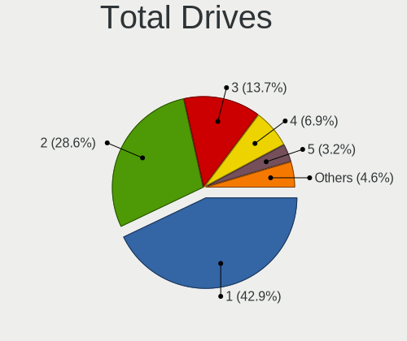
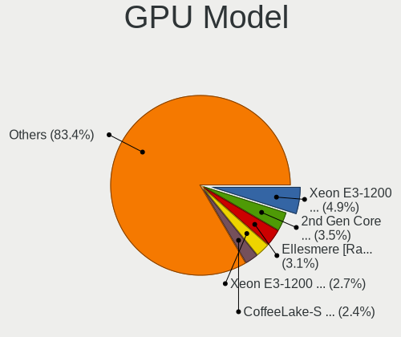
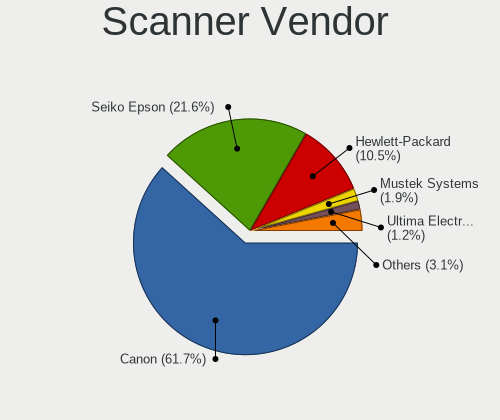

Ubuntu - Tested Hardware & Statistics (Desktops)
------------------------------------------------

A project to collect tested hardware configurations for Ubuntu.

Anyone can contribute to this report by the [hw-probe](https://github.com/linuxhw/hw-probe) tool:

    sudo -E hw-probe -all -upload

Please contribute! Especially if your hardware is rare.

Contents
--------

* [ Test Cases ](#test-cases)

* [ System ](#system)
  - [ OS                       ](#os)
  - [ OS Family                ](#os-family)
  - [ Kernel                   ](#kernel)
  - [ Kernel Family            ](#kernel-family)
  - [ Kernel Major Ver.        ](#kernel-major-ver)
  - [ Arch                     ](#arch)
  - [ DE                       ](#de)
  - [ Display Server           ](#display-server)
  - [ Display Manager          ](#display-manager)
  - [ OS Lang                  ](#os-lang)
  - [ Boot Mode                ](#boot-mode)
  - [ Filesystem               ](#filesystem)
  - [ Part. scheme             ](#part-scheme)
  - [ Dual Boot with Linux/BSD ](#dual-boot-with-linuxbsd)
  - [ Dual Boot (Win)          ](#dual-boot-win)

* [ Board ](#board)
  - [ Vendor                   ](#vendor)
  - [ Model                    ](#model)
  - [ Model Family             ](#model-family)
  - [ MFG Year                 ](#mfg-year)
  - [ Form Factor              ](#form-factor)
  - [ Secure Boot              ](#secure-boot)
  - [ Coreboot                 ](#coreboot)
  - [ RAM Size                 ](#ram-size)
  - [ RAM Used                 ](#ram-used)
  - [ Total Drives             ](#total-drives)
  - [ Has CD-ROM               ](#has-cd-rom)
  - [ Has Ethernet             ](#has-ethernet)
  - [ Has WiFi                 ](#has-wifi)
  - [ Has Bluetooth            ](#has-bluetooth)

* [ Location ](#location)
  - [ Country                  ](#country)
  - [ City                     ](#city)

* [ Drives ](#drives)
  - [ Drive Vendor             ](#drive-vendor)
  - [ Drive Model              ](#drive-model)
  - [ HDD Vendor               ](#hdd-vendor)
  - [ SSD Vendor               ](#ssd-vendor)
  - [ Drive Kind               ](#drive-kind)
  - [ Drive Connector          ](#drive-connector)
  - [ Drive Size               ](#drive-size)
  - [ Space Total              ](#space-total)
  - [ Space Used               ](#space-used)
  - [ Malfunc. Drives          ](#malfunc-drives)
  - [ Malfunc. Drive Vendor    ](#malfunc-drive-vendor)
  - [ Malfunc. HDD Vendor      ](#malfunc-hdd-vendor)
  - [ Malfunc. Drive Kind      ](#malfunc-drive-kind)
  - [ Failed Drives            ](#failed-drives)
  - [ Failed Drive Vendor      ](#failed-drive-vendor)
  - [ Drive Status             ](#drive-status)

* [ Storage controller ](#storage-controller)
  - [ Storage Vendor           ](#storage-vendor)
  - [ Storage Model            ](#storage-model)
  - [ Storage Kind             ](#storage-kind)

* [ Processor ](#processor)
  - [ CPU Vendor               ](#cpu-vendor)
  - [ CPU Model                ](#cpu-model)
  - [ CPU Model Family         ](#cpu-model-family)
  - [ CPU Cores                ](#cpu-cores)
  - [ CPU Sockets              ](#cpu-sockets)
  - [ CPU Threads              ](#cpu-threads)
  - [ CPU Op-Modes             ](#cpu-op-modes)
  - [ CPU Microcode            ](#cpu-microcode)
  - [ CPU Microarch            ](#cpu-microarch)

* [ Graphics ](#graphics)
  - [ GPU Vendor               ](#gpu-vendor)
  - [ GPU Model                ](#gpu-model)
  - [ GPU Combo                ](#gpu-combo)
  - [ GPU Driver               ](#gpu-driver)
  - [ GPU Memory               ](#gpu-memory)

* [ Monitor ](#monitor)
  - [ Monitor Vendor           ](#monitor-vendor)
  - [ Monitor Model            ](#monitor-model)
  - [ Monitor Resolution       ](#monitor-resolution)
  - [ Monitor Diagonal         ](#monitor-diagonal)
  - [ Monitor Width            ](#monitor-width)
  - [ Aspect Ratio             ](#aspect-ratio)
  - [ Monitor Area             ](#monitor-area)
  - [ Pixel Density            ](#pixel-density)
  - [ Multiple Monitors        ](#multiple-monitors)

* [ Network ](#network)
  - [ Net Controller Vendor    ](#net-controller-vendor)
  - [ Net Controller Model     ](#net-controller-model)
  - [ Wireless Vendor          ](#wireless-vendor)
  - [ Wireless Model           ](#wireless-model)
  - [ Ethernet Vendor          ](#ethernet-vendor)
  - [ Ethernet Model           ](#ethernet-model)
  - [ Net Controller Kind      ](#net-controller-kind)
  - [ Used Controller          ](#used-controller)
  - [ NICs                     ](#nics)
  - [ IPv6                     ](#ipv6)

* [ Bluetooth ](#bluetooth)
  - [ Bluetooth Vendor         ](#bluetooth-vendor)
  - [ Bluetooth Model          ](#bluetooth-model)

* [ Sound ](#sound)
  - [ Sound Vendor             ](#sound-vendor)
  - [ Sound Model              ](#sound-model)

* [ Memory ](#memory)
  - [ Memory Vendor            ](#memory-vendor)
  - [ Memory Model             ](#memory-model)
  - [ Memory Kind              ](#memory-kind)
  - [ Memory Form Factor       ](#memory-form-factor)
  - [ Memory Size              ](#memory-size)
  - [ Memory Speed             ](#memory-speed)

* [ Printers & scanners ](#printers--scanners)
  - [ Printer Vendor           ](#printer-vendor)
  - [ Printer Model            ](#printer-model)
  - [ Scanner Vendor           ](#scanner-vendor)
  - [ Scanner Model            ](#scanner-model)

* [ Camera ](#camera)
  - [ Camera Vendor            ](#camera-vendor)
  - [ Camera Model             ](#camera-model)

* [ Security ](#security)
  - [ Fingerprint Vendor       ](#fingerprint-vendor)
  - [ Fingerprint Model        ](#fingerprint-model)
  - [ Chipcard Vendor          ](#chipcard-vendor)
  - [ Chipcard Model           ](#chipcard-model)

* [ Unsupported ](#unsupported)
  - [ Unsupported Devices      ](#unsupported-devices)
  - [ Unsupported Device Types ](#unsupported-device-types)

Test Cases
----------

Total: 37277

| Vendor        | Model                       | Probe                                                      | Date         |
|---------------|-----------------------------|------------------------------------------------------------|--------------|
| GMKtec        | NucBox K2                   | [a88d491579](https://linux-hardware.org/?probe=a88d491579) | Nov 06, 2023 |
| ASUSTek       | TUF Gaming B550M-PLUS       | [df52b675c8](https://linux-hardware.org/?probe=df52b675c8) | Nov 06, 2023 |
| HP            | 8594                        | [d51c507511](https://linux-hardware.org/?probe=d51c507511) | Nov 06, 2023 |
| Gigabyte      | Z390 AORUS PRO WIFI-CF      | [cee650aa5a](https://linux-hardware.org/?probe=cee650aa5a) | Nov 06, 2023 |
| ASUSTek       | PRIME X299-A                | [8d9bbb07dd](https://linux-hardware.org/?probe=8d9bbb07dd) | Nov 06, 2023 |
| Dell          | OptiPlex 5050               | [6c4a08354b](https://linux-hardware.org/?probe=6c4a08354b) | Nov 06, 2023 |
| Gigabyte      | B450M GAMING                | [7974075b64](https://linux-hardware.org/?probe=7974075b64) | Nov 06, 2023 |
| MSI           | MPG B650 CARBON WIFI        | [fcd42a2056](https://linux-hardware.org/?probe=fcd42a2056) | Nov 06, 2023 |
| MSI           | B560M PRO-E                 | [89a24ae9fa](https://linux-hardware.org/?probe=89a24ae9fa) | Nov 06, 2023 |
| ASUSTek       | SABERTOOTH X79              | [c46040087a](https://linux-hardware.org/?probe=c46040087a) | Nov 06, 2023 |
| Shuttle       | XS35V3                      | [0c51d541de](https://linux-hardware.org/?probe=0c51d541de) | Nov 06, 2023 |
| ASUSTek       | TUF Gaming B560M-PLUS       | [9655bf2db1](https://linux-hardware.org/?probe=9655bf2db1) | Nov 06, 2023 |
| Biostar       | A10N-8800E                  | [35b7407efb](https://linux-hardware.org/?probe=35b7407efb) | Nov 05, 2023 |
| ASUSTek       | P30AD                       | [63322c386f](https://linux-hardware.org/?probe=63322c386f) | Nov 05, 2023 |
| HP            | 2B05                        | [eb343bd373](https://linux-hardware.org/?probe=eb343bd373) | Nov 05, 2023 |
| Gigabyte      | B250M-DS3H-CF               | [25b39b698c](https://linux-hardware.org/?probe=25b39b698c) | Nov 05, 2023 |
| Dell          | 0JCTF8 A00                  | [b3669f73a8](https://linux-hardware.org/?probe=b3669f73a8) | Nov 05, 2023 |
| Dell          | 0J1C3P A01                  | [8aefbb37f5](https://linux-hardware.org/?probe=8aefbb37f5) | Nov 05, 2023 |
| MSI           | MAG X670E TOMAHAWK WIFI     | [d95f04dd2c](https://linux-hardware.org/?probe=d95f04dd2c) | Nov 05, 2023 |
| HP            | 1495                        | [fe18b89530](https://linux-hardware.org/?probe=fe18b89530) | Nov 05, 2023 |
| ASUSTek       | PRIME X470-PRO              | [692601dd3b](https://linux-hardware.org/?probe=692601dd3b) | Nov 05, 2023 |
| MSI           | MEG Z590 UNIFY              | [1f84fe45f8](https://linux-hardware.org/?probe=1f84fe45f8) | Nov 05, 2023 |
| Dell          | 0WMJ54 A01                  | [5cff6ffdfc](https://linux-hardware.org/?probe=5cff6ffdfc) | Nov 05, 2023 |
| MSI           | NIGHTBLADE Z97              | [3da62b47b3](https://linux-hardware.org/?probe=3da62b47b3) | Nov 05, 2023 |
| Gigabyte      | B450M GAMING-CF             | [247cc16161](https://linux-hardware.org/?probe=247cc16161) | Nov 05, 2023 |
| ASUSTek       | P5G41T-M LX2/GB             | [5196f9303d](https://linux-hardware.org/?probe=5196f9303d) | Nov 05, 2023 |
| ASUSTek       | P5Q-PRO                     | [a1500e2e9c](https://linux-hardware.org/?probe=a1500e2e9c) | Nov 05, 2023 |
| Dell          | 062TCH A00                  | [b82fbd03d5](https://linux-hardware.org/?probe=b82fbd03d5) | Nov 05, 2023 |
| Gigabyte      | Z97M-DS3H                   | [2cbd472a6e](https://linux-hardware.org/?probe=2cbd472a6e) | Nov 05, 2023 |
| GEEKOM        | A5                          | [d3dd0e1aca](https://linux-hardware.org/?probe=d3dd0e1aca) | Nov 05, 2023 |
| MSI           | B560M PRO-E                 | [1488a8a70f](https://linux-hardware.org/?probe=1488a8a70f) | Nov 05, 2023 |
| ASRockRack    | EPC602D8A                   | [c1b6c06dc5](https://linux-hardware.org/?probe=c1b6c06dc5) | Nov 05, 2023 |
| Lenovo        | SKYBAY NOK                  | [534fcded19](https://linux-hardware.org/?probe=534fcded19) | Nov 05, 2023 |
| MSI           | X470 GAMING PLUS MAX        | [4e3cd50b3f](https://linux-hardware.org/?probe=4e3cd50b3f) | Nov 04, 2023 |
| Medion        | H110H4-EM                   | [9fe03aa296](https://linux-hardware.org/?probe=9fe03aa296) | Nov 04, 2023 |
| ASUSTek       | PRIME X470-PRO              | [c1523fb6a1](https://linux-hardware.org/?probe=c1523fb6a1) | Nov 04, 2023 |
| ASRock        | H470M-STX                   | [5a50d371b8](https://linux-hardware.org/?probe=5a50d371b8) | Nov 04, 2023 |
| Gigabyte      | GA-MA78LMT-S2               | [1636a231b2](https://linux-hardware.org/?probe=1636a231b2) | Nov 04, 2023 |
| ASUSTek       | M4N68T-M                    | [582304a8c5](https://linux-hardware.org/?probe=582304a8c5) | Nov 04, 2023 |
| HP            | 0A9Ch                       | [95415dec13](https://linux-hardware.org/?probe=95415dec13) | Nov 04, 2023 |
| ASUSTek       | M5A97 R2.0                  | [905d699d4d](https://linux-hardware.org/?probe=905d699d4d) | Nov 04, 2023 |
| Dell          | 062TCH A00                  | [b964b2c6be](https://linux-hardware.org/?probe=b964b2c6be) | Nov 04, 2023 |
| ASUSTek       | PRIME H510M-E               | [cd2b005e61](https://linux-hardware.org/?probe=cd2b005e61) | Nov 04, 2023 |
| Dell          | 018D1Y A00                  | [2135015e09](https://linux-hardware.org/?probe=2135015e09) | Nov 04, 2023 |
| MSI           | A68HM-E33 V2                | [f029848e7d](https://linux-hardware.org/?probe=f029848e7d) | Nov 03, 2023 |
| Intel         | DG41RQ AAE54511-203         | [dff06d88c5](https://linux-hardware.org/?probe=dff06d88c5) | Nov 03, 2023 |
| Supermicro    | X9DRW                       | [d9bb198389](https://linux-hardware.org/?probe=d9bb198389) | Nov 03, 2023 |
| ASUSTek       | PRIME X570-PRO              | [62a859fb72](https://linux-hardware.org/?probe=62a859fb72) | Nov 03, 2023 |
| ASRock        | TRX40 Creator               | [05304710e4](https://linux-hardware.org/?probe=05304710e4) | Nov 03, 2023 |
| ASRock        | TRX40 Creator               | [62f85af4b5](https://linux-hardware.org/?probe=62f85af4b5) | Nov 03, 2023 |
| Supermicro    | X10DRL-i                    | [cada5224ab](https://linux-hardware.org/?probe=cada5224ab) | Nov 03, 2023 |
| Gigabyte      | B550M DS3H                  | [49ec48adb9](https://linux-hardware.org/?probe=49ec48adb9) | Nov 03, 2023 |
| MSI           | B550M PRO-VDH WIFI          | [baf30122ca](https://linux-hardware.org/?probe=baf30122ca) | Nov 03, 2023 |
| Gigabyte      | B550M DS3H                  | [3c4533c5a9](https://linux-hardware.org/?probe=3c4533c5a9) | Nov 03, 2023 |
| Biostar       | A10N-8800E                  | [76374cbbfe](https://linux-hardware.org/?probe=76374cbbfe) | Nov 03, 2023 |
| Colorful T... | CVN X570M GAMING PRO V14    | [65b9bad459](https://linux-hardware.org/?probe=65b9bad459) | Nov 03, 2023 |
| Dell          | 0427JK A00                  | [ac631c05bc](https://linux-hardware.org/?probe=ac631c05bc) | Nov 03, 2023 |
| ASUSTek       | ROG STRIX X570-F GAMING     | [d8ceb3854c](https://linux-hardware.org/?probe=d8ceb3854c) | Nov 03, 2023 |
| ASUSTek       | PRIME X299-A                | [387194bdf6](https://linux-hardware.org/?probe=387194bdf6) | Nov 03, 2023 |
| Intel         | X99                         | [cb3515efba](https://linux-hardware.org/?probe=cb3515efba) | Nov 03, 2023 |
| Dell          | 0TDG4V A01                  | [9d9b09db51](https://linux-hardware.org/?probe=9d9b09db51) | Nov 03, 2023 |
| MSI           | B350 PC MATE                | [9c089ed10c](https://linux-hardware.org/?probe=9c089ed10c) | Nov 03, 2023 |
| Supermicro    | X10DRU-i+B                  | [305ce5bbcc](https://linux-hardware.org/?probe=305ce5bbcc) | Nov 03, 2023 |
| Supermicro    | X10DDW-i                    | [8a0ff875f1](https://linux-hardware.org/?probe=8a0ff875f1) | Nov 03, 2023 |
| Supermicro    | X10DDW-i                    | [3138fbde8e](https://linux-hardware.org/?probe=3138fbde8e) | Nov 03, 2023 |
| Supermicro    | X10DDW-i                    | [f3023a2a6f](https://linux-hardware.org/?probe=f3023a2a6f) | Nov 03, 2023 |
| Supermicro    | X10DDW-i                    | [d9dcb6003e](https://linux-hardware.org/?probe=d9dcb6003e) | Nov 03, 2023 |
| ASUSTek       | PRIME H370M-PLUS            | [328a40f6fe](https://linux-hardware.org/?probe=328a40f6fe) | Nov 03, 2023 |
| NEC Comput... | MS-7770MH                   | [9d2ab645d4](https://linux-hardware.org/?probe=9d2ab645d4) | Nov 03, 2023 |
| HP            | 0AECh D                     | [2ddad2bbf2](https://linux-hardware.org/?probe=2ddad2bbf2) | Nov 03, 2023 |
| Alienware     | 0GWM1Y A00                  | [01d536cc44](https://linux-hardware.org/?probe=01d536cc44) | Nov 03, 2023 |
| Fujitsu Si... | G31T-M2 V3.02               | [d069c6012d](https://linux-hardware.org/?probe=d069c6012d) | Nov 03, 2023 |
| MACHINIST     | H81M-PRO S1 V2.0            | [98b382243b](https://linux-hardware.org/?probe=98b382243b) | Nov 03, 2023 |
| Dell          | 0X8DXD A00                  | [e972336105](https://linux-hardware.org/?probe=e972336105) | Nov 03, 2023 |
| ASUSTek       | Z97M-PLUS                   | [b0d77e36b1](https://linux-hardware.org/?probe=b0d77e36b1) | Nov 03, 2023 |
| Dell          | 0R6PCT A01                  | [c561f87237](https://linux-hardware.org/?probe=c561f87237) | Nov 02, 2023 |
| ASRock        | B450M Steel Legend          | [dafce26ef5](https://linux-hardware.org/?probe=dafce26ef5) | Nov 02, 2023 |
| Dell          | 0VHWTR A01                  | [7d589af687](https://linux-hardware.org/?probe=7d589af687) | Nov 02, 2023 |
| Dell          | 0VHWTR A01                  | [b5c8e35523](https://linux-hardware.org/?probe=b5c8e35523) | Nov 02, 2023 |
| ASUSTek       | P5KPL-AM SE                 | [ea92d94742](https://linux-hardware.org/?probe=ea92d94742) | Nov 02, 2023 |
| ASUSTek       | TUF Gaming Z690-PLUS        | [99b1ce4372](https://linux-hardware.org/?probe=99b1ce4372) | Nov 02, 2023 |
| Acer          | Nitro N50-600 V:1.1         | [b2c5bb3ed9](https://linux-hardware.org/?probe=b2c5bb3ed9) | Nov 02, 2023 |
| Gigabyte      | X570 AORUS PRO WIFI         | [bf075c47d2](https://linux-hardware.org/?probe=bf075c47d2) | Nov 02, 2023 |
| Intel         | X99                         | [b740510fc0](https://linux-hardware.org/?probe=b740510fc0) | Nov 02, 2023 |
| ASUSTek       | ProArt Z690-CREATOR WIFI    | [41d5ec4633](https://linux-hardware.org/?probe=41d5ec4633) | Nov 02, 2023 |
| Supermicro    | X10DRU-i+A                  | [2eee634512](https://linux-hardware.org/?probe=2eee634512) | Nov 02, 2023 |
| Supermicro    | X9DRW                       | [406a1425ae](https://linux-hardware.org/?probe=406a1425ae) | Nov 02, 2023 |
| Supermicro    | X10DRL-i                    | [7d77c86bc5](https://linux-hardware.org/?probe=7d77c86bc5) | Nov 02, 2023 |
| Dell          | 0FXD80 A00                  | [d9b51a3a36](https://linux-hardware.org/?probe=d9b51a3a36) | Nov 02, 2023 |
| AOpen         | D2644 S26361-D2644          | [db682d636c](https://linux-hardware.org/?probe=db682d636c) | Nov 02, 2023 |
| BESSTAR Te... | TH50                        | [fc3a35871e](https://linux-hardware.org/?probe=fc3a35871e) | Nov 02, 2023 |
| MSI           | H110M PRO-VH PLUS           | [128a0a94c7](https://linux-hardware.org/?probe=128a0a94c7) | Nov 02, 2023 |
| ASUSTek       | ROG STRIX X570-F GAMING     | [aec8690672](https://linux-hardware.org/?probe=aec8690672) | Nov 02, 2023 |
| Gigabyte      | B560M AORUS ELITE           | [3de1d3a50f](https://linux-hardware.org/?probe=3de1d3a50f) | Nov 02, 2023 |
| Gigabyte      | B560M AORUS ELITE           | [64a57926cf](https://linux-hardware.org/?probe=64a57926cf) | Nov 02, 2023 |
| ASUSTek       | P8B75-M LX                  | [77d328e8b9](https://linux-hardware.org/?probe=77d328e8b9) | Nov 02, 2023 |
| MSI           | Z170A GAMING M7             | [9ba4f50201](https://linux-hardware.org/?probe=9ba4f50201) | Nov 02, 2023 |
| MSI           | B450M-A PRO MAX             | [97ef2a8173](https://linux-hardware.org/?probe=97ef2a8173) | Nov 02, 2023 |
| ASUSTek       | PRIME A320M-K               | [1b1df273f9](https://linux-hardware.org/?probe=1b1df273f9) | Nov 01, 2023 |
| MSI           | A320M-A PRO MAX             | [f1e35faa1a](https://linux-hardware.org/?probe=f1e35faa1a) | Nov 01, 2023 |
| MSI           | Z170A GAMING M7             | [a613aa5a0f](https://linux-hardware.org/?probe=a613aa5a0f) | Nov 01, 2023 |
| ASRock        | Z690 Taichi                 | [b736058f88](https://linux-hardware.org/?probe=b736058f88) | Nov 01, 2023 |
| HP            | 0A58h                       | [9dd3c3fdfb](https://linux-hardware.org/?probe=9dd3c3fdfb) | Nov 01, 2023 |
| ASUSTek       | TUF Z370-PLUS GAMING        | [70365949d8](https://linux-hardware.org/?probe=70365949d8) | Nov 01, 2023 |
| Pegatron      | Benicia                     | [b253f40dc7](https://linux-hardware.org/?probe=b253f40dc7) | Nov 01, 2023 |
| Pegatron      | Benicia                     | [a3378fce47](https://linux-hardware.org/?probe=a3378fce47) | Nov 01, 2023 |
| Gigabyte      | Z370N WIFI-CF               | [1ab426a7ed](https://linux-hardware.org/?probe=1ab426a7ed) | Nov 01, 2023 |
| ASUSTek       | H81I-PLUS                   | [28c1330071](https://linux-hardware.org/?probe=28c1330071) | Nov 01, 2023 |
| Lenovo        | 3704 SDK0J40700 WIN 3258... | [3987d09af3](https://linux-hardware.org/?probe=3987d09af3) | Nov 01, 2023 |
| ASUSTek       | Z97-AR                      | [39741158bc](https://linux-hardware.org/?probe=39741158bc) | Nov 01, 2023 |
| Gateway       | FX6840                      | [3c391c7868](https://linux-hardware.org/?probe=3c391c7868) | Nov 01, 2023 |
| ASUSTek       | PRIME A320M-K               | [4881df8aec](https://linux-hardware.org/?probe=4881df8aec) | Nov 01, 2023 |
| ASUSTek       | Z170M-PLUS                  | [92b5f4172e](https://linux-hardware.org/?probe=92b5f4172e) | Nov 01, 2023 |
| Gigabyte      | AX370M-Gaming 3-CF          | [3e5415671f](https://linux-hardware.org/?probe=3e5415671f) | Nov 01, 2023 |
| Gigabyte      | A520M K V2                  | [10670f1068](https://linux-hardware.org/?probe=10670f1068) | Nov 01, 2023 |
| Dell          | 09KPNV A01                  | [2477bc3b6a](https://linux-hardware.org/?probe=2477bc3b6a) | Nov 01, 2023 |
| ASUSTek       | PRIME B450M-A               | [8f885b5a65](https://linux-hardware.org/?probe=8f885b5a65) | Nov 01, 2023 |
| ASUSTek       | P8Z77-I DELUXE              | [ea285340e0](https://linux-hardware.org/?probe=ea285340e0) | Nov 01, 2023 |
| HP            | 8054                        | [b667e30b0e](https://linux-hardware.org/?probe=b667e30b0e) | Nov 01, 2023 |
| Gigabyte      | GA-MA770-DS3                | [968cf90d9a](https://linux-hardware.org/?probe=968cf90d9a) | Nov 01, 2023 |
| ASRock        | Z790 Taichi                 | [01ba7dff2f](https://linux-hardware.org/?probe=01ba7dff2f) | Oct 31, 2023 |
| ASUSTek       | M5A97 R2.0                  | [8c9a8c3bcc](https://linux-hardware.org/?probe=8c9a8c3bcc) | Oct 31, 2023 |
| ASRock        | H310CM-HDV                  | [b24b974555](https://linux-hardware.org/?probe=b24b974555) | Oct 31, 2023 |
| ASUSTek       | TUF Gaming Z690-PLUS WIF... | [f1d5844389](https://linux-hardware.org/?probe=f1d5844389) | Oct 31, 2023 |
| Unknown       | Unknown                     | [4aa5e757eb](https://linux-hardware.org/?probe=4aa5e757eb) | Oct 31, 2023 |
| HP            | 0A58h                       | [f7c62b9410](https://linux-hardware.org/?probe=f7c62b9410) | Oct 31, 2023 |
| MSI           | H81M-E34                    | [0babe23a9d](https://linux-hardware.org/?probe=0babe23a9d) | Oct 31, 2023 |
| ASUSTek       | ROG STRIX B660-I GAMING ... | [5787618dae](https://linux-hardware.org/?probe=5787618dae) | Oct 31, 2023 |
| MSI           | B85-G43 GAMING              | [5d218dd764](https://linux-hardware.org/?probe=5d218dd764) | Oct 31, 2023 |
| Unknown       | Unknown                     | [4e9f4aa1ab](https://linux-hardware.org/?probe=4e9f4aa1ab) | Oct 31, 2023 |
| ASRock        | Z370 Pro4                   | [55f20f6750](https://linux-hardware.org/?probe=55f20f6750) | Oct 31, 2023 |
| MSI           | MPG B650 CARBON WIFI        | [fdc23b8b95](https://linux-hardware.org/?probe=fdc23b8b95) | Oct 31, 2023 |
| ASRock        | Z170 Extreme4               | [90fc87e07a](https://linux-hardware.org/?probe=90fc87e07a) | Oct 31, 2023 |
| ASRock        | Z170 Extreme4               | [5d99367248](https://linux-hardware.org/?probe=5d99367248) | Oct 31, 2023 |
| ASUSTek       | ROG CROSSHAIR VI HERO       | [dd9715f35d](https://linux-hardware.org/?probe=dd9715f35d) | Oct 31, 2023 |
| ASUSTek       | H81T                        | [7986b7269f](https://linux-hardware.org/?probe=7986b7269f) | Oct 31, 2023 |
| Dell          | 0P01GV A03                  | [c77bed1e18](https://linux-hardware.org/?probe=c77bed1e18) | Oct 31, 2023 |
| ASUSTek       | PRIME B360M-C               | [874efda598](https://linux-hardware.org/?probe=874efda598) | Oct 31, 2023 |
| Gigabyte      | B450M GAMING                | [ac709dc975](https://linux-hardware.org/?probe=ac709dc975) | Oct 31, 2023 |
| ASUSTek       | PRIME B360M-C               | [16da68741a](https://linux-hardware.org/?probe=16da68741a) | Oct 31, 2023 |
| Gigabyte      | GA-970A-UD3                 | [98b1bd5970](https://linux-hardware.org/?probe=98b1bd5970) | Oct 31, 2023 |
| Win elemen... | M600                        | [205389ccc2](https://linux-hardware.org/?probe=205389ccc2) | Oct 31, 2023 |
| Win elemen... | M600                        | [f1a08307c8](https://linux-hardware.org/?probe=f1a08307c8) | Oct 31, 2023 |
| HP            | 1589                        | [2161dc3754](https://linux-hardware.org/?probe=2161dc3754) | Oct 31, 2023 |
| ASRock        | B450 Steel Legend           | [5e090f5c32](https://linux-hardware.org/?probe=5e090f5c32) | Oct 31, 2023 |
| ASUSTek       | PRIME X399-A                | [69f596f456](https://linux-hardware.org/?probe=69f596f456) | Oct 30, 2023 |
| MSI           | H97 GAMING 3                | [f59457f708](https://linux-hardware.org/?probe=f59457f708) | Oct 30, 2023 |
| Biostar       | H61MHV2                     | [e8472e117d](https://linux-hardware.org/?probe=e8472e117d) | Oct 30, 2023 |
| ASUSTek       | TUF Gaming B550M-PLUS       | [daffd3cd06](https://linux-hardware.org/?probe=daffd3cd06) | Oct 30, 2023 |
| AZW           | MINI S 10                   | [9695f9bec4](https://linux-hardware.org/?probe=9695f9bec4) | Oct 30, 2023 |
| Pegatron      | 2AB6                        | [7bcf41bb9f](https://linux-hardware.org/?probe=7bcf41bb9f) | Oct 30, 2023 |
| Gigabyte      | GA-970A-D3                  | [38ae588910](https://linux-hardware.org/?probe=38ae588910) | Oct 30, 2023 |
| MSI           | MAG Z490 TOMAHAWK           | [771ada77a7](https://linux-hardware.org/?probe=771ada77a7) | Oct 30, 2023 |
| ASUSTek       | STRIX H270F GAMING          | [b4f34c54ae](https://linux-hardware.org/?probe=b4f34c54ae) | Oct 30, 2023 |
| ASUSTek       | GA35DX                      | [c1e204e6b1](https://linux-hardware.org/?probe=c1e204e6b1) | Oct 30, 2023 |
| ASUSTek       | STRIX H270F GAMING          | [1c1290e065](https://linux-hardware.org/?probe=1c1290e065) | Oct 30, 2023 |
| ASRock        | FM2A88X+ Killer             | [2310075f2d](https://linux-hardware.org/?probe=2310075f2d) | Oct 30, 2023 |
| MSI           | B85-G43 GAMING              | [fa91d8044f](https://linux-hardware.org/?probe=fa91d8044f) | Oct 30, 2023 |
| HP            | 8436                        | [4fe5c2e03c](https://linux-hardware.org/?probe=4fe5c2e03c) | Oct 30, 2023 |
| Supermicro    | X10DRU-i+B                  | [516d10eb4d](https://linux-hardware.org/?probe=516d10eb4d) | Oct 30, 2023 |
| Supermicro    | X10DRU-i+A                  | [87881094e7](https://linux-hardware.org/?probe=87881094e7) | Oct 30, 2023 |
| Supermicro    | X10DDW-i                    | [175f00718f](https://linux-hardware.org/?probe=175f00718f) | Oct 30, 2023 |
| Supermicro    | X10DDW-i                    | [a3b51e3697](https://linux-hardware.org/?probe=a3b51e3697) | Oct 30, 2023 |
| Gigabyte      | X299 AORUS Gaming 3 Pro-... | [ed34df5e34](https://linux-hardware.org/?probe=ed34df5e34) | Oct 30, 2023 |
| Dell          | 018D1Y A00                  | [ce361a7112](https://linux-hardware.org/?probe=ce361a7112) | Oct 30, 2023 |
| ASRock        | Z690 Taichi                 | [a9e193be90](https://linux-hardware.org/?probe=a9e193be90) | Oct 30, 2023 |
| ASUSTek       | PRIME X370-PRO              | [394ab5dbff](https://linux-hardware.org/?probe=394ab5dbff) | Oct 30, 2023 |
| ASUSTek       | ROG STRIX Z390-E GAMING     | [102224106e](https://linux-hardware.org/?probe=102224106e) | Oct 30, 2023 |
| Intel         | H61                         | [0f282da58e](https://linux-hardware.org/?probe=0f282da58e) | Oct 30, 2023 |
| Gigabyte      | X299 AORUS Gaming 3 Pro-... | [6e367fa914](https://linux-hardware.org/?probe=6e367fa914) | Oct 30, 2023 |
| AZW           | SEi                         | [aa8ba45b77](https://linux-hardware.org/?probe=aa8ba45b77) | Oct 30, 2023 |
| ASUSTek       | ROG STRIX Z590-A GAMING ... | [af90750bac](https://linux-hardware.org/?probe=af90750bac) | Oct 30, 2023 |
| Acer          | Veriton X2631G V:1.0        | [c2c4828db8](https://linux-hardware.org/?probe=c2c4828db8) | Oct 30, 2023 |
| ASUSTek       | TUF Gaming Z490-PLUS        | [186a763d8a](https://linux-hardware.org/?probe=186a763d8a) | Oct 29, 2023 |
| Dell          | 02YYK5 A00                  | [bda6b9ff10](https://linux-hardware.org/?probe=bda6b9ff10) | Oct 29, 2023 |
| Gigabyte      | GA-770TA-UD3                | [f1a5d466cd](https://linux-hardware.org/?probe=f1a5d466cd) | Oct 29, 2023 |
| Medion        | H110H4-EM                   | [1a2d0e5ed4](https://linux-hardware.org/?probe=1a2d0e5ed4) | Oct 29, 2023 |
| MSI           | X299 TOMAHAWK AC            | [b878ce40e7](https://linux-hardware.org/?probe=b878ce40e7) | Oct 29, 2023 |
| ASUSTek       | TUF Gaming Z790-PLUS WIF... | [4e093f6544](https://linux-hardware.org/?probe=4e093f6544) | Oct 29, 2023 |
| Gigabyte      | B550M AORUS ELITE           | [3ea0191175](https://linux-hardware.org/?probe=3ea0191175) | Oct 29, 2023 |
| Biostar       | G31D-M7                     | [192416033b](https://linux-hardware.org/?probe=192416033b) | Oct 28, 2023 |
| MSI           | B360 GAMING PLUS            | [bb17f05c7f](https://linux-hardware.org/?probe=bb17f05c7f) | Oct 28, 2023 |
| ASUSTek       | P5Q-PRO                     | [2722dd43f2](https://linux-hardware.org/?probe=2722dd43f2) | Oct 28, 2023 |
| Dell          | 076VHM A02                  | [456e31167b](https://linux-hardware.org/?probe=456e31167b) | Oct 28, 2023 |
| MSI           | B450M-A PRO MAX             | [84c2a8040c](https://linux-hardware.org/?probe=84c2a8040c) | Oct 28, 2023 |
| HP            | 1589                        | [fe31fa1d5e](https://linux-hardware.org/?probe=fe31fa1d5e) | Oct 28, 2023 |
| HP            | 1589                        | [5d14d38ded](https://linux-hardware.org/?probe=5d14d38ded) | Oct 28, 2023 |
| ASUSTek       | TUF Gaming Z790-PLUS WIF... | [8157e9bd12](https://linux-hardware.org/?probe=8157e9bd12) | Oct 28, 2023 |
| Gateway       | WG43M                       | [8f0cb70746](https://linux-hardware.org/?probe=8f0cb70746) | Oct 28, 2023 |
| Gigabyte      | B75M-D3H                    | [97d8cfe6f0](https://linux-hardware.org/?probe=97d8cfe6f0) | Oct 28, 2023 |
| Gigabyte      | X58A-UD3R                   | [7c4b363241](https://linux-hardware.org/?probe=7c4b363241) | Oct 28, 2023 |
| Gigabyte      | Z97X-Gaming 7               | [c5c758e202](https://linux-hardware.org/?probe=c5c758e202) | Oct 28, 2023 |
| HP            | 2B05                        | [a32b598fb9](https://linux-hardware.org/?probe=a32b598fb9) | Oct 28, 2023 |
| HP            | 158A                        | [f8fe5be681](https://linux-hardware.org/?probe=f8fe5be681) | Oct 28, 2023 |
| HP            | 2AF3                        | [f7c7d92cea](https://linux-hardware.org/?probe=f7c7d92cea) | Oct 28, 2023 |
| Biostar       | A960D+V2                    | [8631ec3b22](https://linux-hardware.org/?probe=8631ec3b22) | Oct 27, 2023 |
| Intel         | H61                         | [1496665abb](https://linux-hardware.org/?probe=1496665abb) | Oct 27, 2023 |
| Lenovo        | SDK0J40700 WIN              | [09f4736f4f](https://linux-hardware.org/?probe=09f4736f4f) | Oct 27, 2023 |
| ASUSTek       | H81M-PLUS                   | [509c70e6c1](https://linux-hardware.org/?probe=509c70e6c1) | Oct 27, 2023 |
| ASRock        | Z790 PG SONIC               | [3d8af896cc](https://linux-hardware.org/?probe=3d8af896cc) | Oct 27, 2023 |
| Gigabyte      | H97-D3H-CF                  | [e248fcb770](https://linux-hardware.org/?probe=e248fcb770) | Oct 27, 2023 |
| Supermicro    | X10DDW-i                    | [4ae7cd098c](https://linux-hardware.org/?probe=4ae7cd098c) | Oct 27, 2023 |
| Supermicro    | X10DDW-i                    | [27eeb454c8](https://linux-hardware.org/?probe=27eeb454c8) | Oct 27, 2023 |
| Supermicro    | X10DDW-i                    | [a822fb4575](https://linux-hardware.org/?probe=a822fb4575) | Oct 27, 2023 |
| Fujitsu       | D3233-A1 S26361-D3233-A1    | [05961f3f8d](https://linux-hardware.org/?probe=05961f3f8d) | Oct 27, 2023 |
| Supermicro    | X10DDW-i                    | [7b1a0dde51](https://linux-hardware.org/?probe=7b1a0dde51) | Oct 27, 2023 |
| Dell          | 0JCTF8 A00                  | [3cc39678ff](https://linux-hardware.org/?probe=3cc39678ff) | Oct 27, 2023 |
| Gateway       | FX6840                      | [7acd4709ef](https://linux-hardware.org/?probe=7acd4709ef) | Oct 27, 2023 |
| Gigabyte      | Z790 GAMING X AX            | [8555f763b4](https://linux-hardware.org/?probe=8555f763b4) | Oct 27, 2023 |
| Gigabyte      | Z390 DESIGNARE-CF           | [2aaa180afa](https://linux-hardware.org/?probe=2aaa180afa) | Oct 27, 2023 |
| Intel         | DB85FL AAG89861-201         | [44b772393d](https://linux-hardware.org/?probe=44b772393d) | Oct 27, 2023 |
| MSI           | 2A9Ch                       | [3e7da65a41](https://linux-hardware.org/?probe=3e7da65a41) | Oct 27, 2023 |
| MSI           | 2A9Ch                       | [6b9e5b921c](https://linux-hardware.org/?probe=6b9e5b921c) | Oct 27, 2023 |
| ASUSTek       | Pro WS X570-ACE             | [2021aa6173](https://linux-hardware.org/?probe=2021aa6173) | Oct 27, 2023 |
| Supermicro    | X10DDW-i                    | [6afb6d264d](https://linux-hardware.org/?probe=6afb6d264d) | Oct 27, 2023 |
| Supermicro    | X10DDW-i                    | [36fadbfb7a](https://linux-hardware.org/?probe=36fadbfb7a) | Oct 27, 2023 |
| HP            | 8433 11                     | [f4b0e9190f](https://linux-hardware.org/?probe=f4b0e9190f) | Oct 27, 2023 |
| Dell          | 0D24M8 A01                  | [5e52949030](https://linux-hardware.org/?probe=5e52949030) | Oct 27, 2023 |
| ASUSTek       | ROG CROSSHAIR VIII HERO     | [f7c6d6e17e](https://linux-hardware.org/?probe=f7c6d6e17e) | Oct 27, 2023 |
| HP            | 2AF7                        | [3143f79dcd](https://linux-hardware.org/?probe=3143f79dcd) | Oct 27, 2023 |
| HP            | 0A9Ch                       | [f24350a95c](https://linux-hardware.org/?probe=f24350a95c) | Oct 27, 2023 |
| HP            | 1998                        | [4701148920](https://linux-hardware.org/?probe=4701148920) | Oct 26, 2023 |
| Gigabyte      | 965P-S3                     | [ae3a4e206c](https://linux-hardware.org/?probe=ae3a4e206c) | Oct 26, 2023 |
| ASUSTek       | PRIME Z370-A                | [75fcf950c2](https://linux-hardware.org/?probe=75fcf950c2) | Oct 26, 2023 |
| Lenovo        | SHARKBAY SDK0E50510 WIN     | [bcbce33659](https://linux-hardware.org/?probe=bcbce33659) | Oct 26, 2023 |
| Gigabyte      | H110M-H-CF                  | [b64c6bb72a](https://linux-hardware.org/?probe=b64c6bb72a) | Oct 26, 2023 |
| Gigabyte      | GA-MA78GM-S2H               | [6c7a32d339](https://linux-hardware.org/?probe=6c7a32d339) | Oct 26, 2023 |
| MSI           | MAG Z490 TOMAHAWK           | [f3802ecf63](https://linux-hardware.org/?probe=f3802ecf63) | Oct 26, 2023 |
| ASUSTek       | ROG STRIX B650E-E GAMING... | [f43adee740](https://linux-hardware.org/?probe=f43adee740) | Oct 26, 2023 |
| Gigabyte      | GA-770TA-UD3                | [6944656466](https://linux-hardware.org/?probe=6944656466) | Oct 26, 2023 |
| ASUSTek       | Z170-A                      | [7d69a76c23](https://linux-hardware.org/?probe=7d69a76c23) | Oct 26, 2023 |
| Foxconn       | 2AA9h                       | [dade54701d](https://linux-hardware.org/?probe=dade54701d) | Oct 26, 2023 |
| Dell          | 06D7TR A00                  | [a7097bd7f1](https://linux-hardware.org/?probe=a7097bd7f1) | Oct 26, 2023 |
| ASUSTek       | CROSSHAIR V FORMULA-Z       | [da8b82a004](https://linux-hardware.org/?probe=da8b82a004) | Oct 26, 2023 |
| Dell          | 03KWTV A00                  | [46ddef2a0f](https://linux-hardware.org/?probe=46ddef2a0f) | Oct 26, 2023 |
| ASUSTek       | ROG STRIX Z790-A GAMING ... | [534c2c528c](https://linux-hardware.org/?probe=534c2c528c) | Oct 26, 2023 |
| ASUSTek       | TUF Gaming B550M-PLUS       | [bb6c63a5b3](https://linux-hardware.org/?probe=bb6c63a5b3) | Oct 26, 2023 |
| ASUSTek       | Maximus VII HERO            | [87c313ac06](https://linux-hardware.org/?probe=87c313ac06) | Oct 26, 2023 |
| MSI           | MAG Z490 TOMAHAWK           | [1ad6c144a3](https://linux-hardware.org/?probe=1ad6c144a3) | Oct 26, 2023 |
| ASUSTek       | Maximus VII HERO            | [a0e6502d94](https://linux-hardware.org/?probe=a0e6502d94) | Oct 26, 2023 |
| HP            | 158A                        | [86f988197b](https://linux-hardware.org/?probe=86f988197b) | Oct 26, 2023 |
| ASUSTek       | TUF Gaming X670E-PLUS WI... | [6709fab81c](https://linux-hardware.org/?probe=6709fab81c) | Oct 26, 2023 |
| ASUSTek       | TUF Gaming X670E-PLUS WI... | [c041582324](https://linux-hardware.org/?probe=c041582324) | Oct 26, 2023 |
| HP            | 8265                        | [25dfe4d311](https://linux-hardware.org/?probe=25dfe4d311) | Oct 26, 2023 |
| ASUSTek       | P6X58-E-WS                  | [abb9f306b8](https://linux-hardware.org/?probe=abb9f306b8) | Oct 25, 2023 |
| HP            | 822A                        | [4d1e3ee1f2](https://linux-hardware.org/?probe=4d1e3ee1f2) | Oct 25, 2023 |
| GEEKOM        | A5                          | [2a6fe744c1](https://linux-hardware.org/?probe=2a6fe744c1) | Oct 25, 2023 |
| ASRock        | A520M-ITX/ac                | [8a5e0bd9d6](https://linux-hardware.org/?probe=8a5e0bd9d6) | Oct 25, 2023 |
| Gigabyte      | F2A88X-D3H                  | [e0591a946d](https://linux-hardware.org/?probe=e0591a946d) | Oct 25, 2023 |
| Acer          | Aspire GX-281               | [63c928a75f](https://linux-hardware.org/?probe=63c928a75f) | Oct 25, 2023 |
| ASRock        | X570 Phantom Gaming 4       | [25c0172035](https://linux-hardware.org/?probe=25c0172035) | Oct 25, 2023 |
| MSI           | MPG B550 GAMING PLUS        | [fc849b0e23](https://linux-hardware.org/?probe=fc849b0e23) | Oct 25, 2023 |
| MSI           | MPG B550 GAMING PLUS        | [3a0c166a2f](https://linux-hardware.org/?probe=3a0c166a2f) | Oct 25, 2023 |
| Dell          | 0D24M8 A01                  | [74e623d263](https://linux-hardware.org/?probe=74e623d263) | Oct 25, 2023 |
| Lenovo        | SHARKBAY 0B98401 WIN        | [b38766677c](https://linux-hardware.org/?probe=b38766677c) | Oct 25, 2023 |
| ASUSTek       | ROG STRIX B550-F GAMING     | [e090fa6279](https://linux-hardware.org/?probe=e090fa6279) | Oct 25, 2023 |
| Acer          | Veriton S2680G              | [da9a811b04](https://linux-hardware.org/?probe=da9a811b04) | Oct 25, 2023 |
| ASUSTek       | PRIME B450M-A               | [deac292d7d](https://linux-hardware.org/?probe=deac292d7d) | Oct 25, 2023 |
| Unknown       | Unknown                     | [49baeb0911](https://linux-hardware.org/?probe=49baeb0911) | Oct 25, 2023 |
| ASUSTek       | Q87M-E                      | [69e78c6a85](https://linux-hardware.org/?probe=69e78c6a85) | Oct 25, 2023 |
| System76      | Thelio Mira                 | [3bb1924402](https://linux-hardware.org/?probe=3bb1924402) | Oct 25, 2023 |
| MSI           | 2A9C                        | [d87ee22b95](https://linux-hardware.org/?probe=d87ee22b95) | Oct 24, 2023 |
| Lenovo        | SHARKBAY 31900058 STD       | [b8ac729343](https://linux-hardware.org/?probe=b8ac729343) | Oct 24, 2023 |
| Lenovo        | SHARKBAY SDK0E50510 WIN     | [e622e81e16](https://linux-hardware.org/?probe=e622e81e16) | Oct 24, 2023 |
| Dell          | 06FW8P A02                  | [4efc493619](https://linux-hardware.org/?probe=4efc493619) | Oct 24, 2023 |
| ASUSTek       | P8P67 EVO                   | [3baa020480](https://linux-hardware.org/?probe=3baa020480) | Oct 24, 2023 |
| MSI           | X470 GAMING PLUS MAX        | [61ec26bc75](https://linux-hardware.org/?probe=61ec26bc75) | Oct 24, 2023 |
| Acer          | Aspire XC-1760              | [8a5c420847](https://linux-hardware.org/?probe=8a5c420847) | Oct 24, 2023 |
| Lenovo        | SHARKBAY 0B98401 PRO        | [54a6d9d5d0](https://linux-hardware.org/?probe=54a6d9d5d0) | Oct 24, 2023 |
| Unknown       | 1.1                         | [c006e77646](https://linux-hardware.org/?probe=c006e77646) | Oct 24, 2023 |
| HP            | 1589                        | [1a61614ad2](https://linux-hardware.org/?probe=1a61614ad2) | Oct 24, 2023 |
| ASUSTek       | PRIME A320M-K               | [d09253d43a](https://linux-hardware.org/?probe=d09253d43a) | Oct 24, 2023 |
| Gigabyte      | B450M DS3H-CF               | [9b0be83ecc](https://linux-hardware.org/?probe=9b0be83ecc) | Oct 24, 2023 |
| ASUSTek       | Crosshair IV Formula        | [9664d44f1e](https://linux-hardware.org/?probe=9664d44f1e) | Oct 24, 2023 |
| Unknown       | Unknown                     | [03fbe0b1a4](https://linux-hardware.org/?probe=03fbe0b1a4) | Oct 24, 2023 |
| MSI           | MAG B550 TOMAHAWK           | [2d6bcd74d8](https://linux-hardware.org/?probe=2d6bcd74d8) | Oct 24, 2023 |
| HP            | 339A                        | [2e0eb78de2](https://linux-hardware.org/?probe=2e0eb78de2) | Oct 24, 2023 |
| Google        | Teemo                       | [ae5140ac26](https://linux-hardware.org/?probe=ae5140ac26) | Oct 24, 2023 |
| Lenovo        | 0B98409 STD                 | [b89f42b23f](https://linux-hardware.org/?probe=b89f42b23f) | Oct 24, 2023 |
| Dell          | 097YXY A00                  | [31dc22d5af](https://linux-hardware.org/?probe=31dc22d5af) | Oct 24, 2023 |
| ASUSTek       | TUF Z370-PLUS GAMING        | [6c35175e9c](https://linux-hardware.org/?probe=6c35175e9c) | Oct 24, 2023 |
| MSI           | PRO Z690-A WIFI DDR4        | [cb6b644cdf](https://linux-hardware.org/?probe=cb6b644cdf) | Oct 24, 2023 |
| ASRock        | 880GMH/USB3                 | [4d3fcc56ec](https://linux-hardware.org/?probe=4d3fcc56ec) | Oct 24, 2023 |
| MSI           | PRO Z690-A WIFI DDR4        | [c228949ab3](https://linux-hardware.org/?probe=c228949ab3) | Oct 23, 2023 |
| Lenovo        | MAHOBAY NOK                 | [5936f87a0e](https://linux-hardware.org/?probe=5936f87a0e) | Oct 23, 2023 |
| MSI           | Z270-A PRO                  | [a7f2b637ca](https://linux-hardware.org/?probe=a7f2b637ca) | Oct 23, 2023 |
| Inventec      | D CLASS A02                 | [41bf70ff0b](https://linux-hardware.org/?probe=41bf70ff0b) | Oct 23, 2023 |
| HP            | 83EF                        | [9a8026df67](https://linux-hardware.org/?probe=9a8026df67) | Oct 23, 2023 |
| Acer          | Aspire GX-281               | [0d96eb845d](https://linux-hardware.org/?probe=0d96eb845d) | Oct 23, 2023 |
| Dell          | 0VD5HY A07                  | [5e68194dd0](https://linux-hardware.org/?probe=5e68194dd0) | Oct 23, 2023 |
| ASUSTek       | Z97-A                       | [c715f1ecb0](https://linux-hardware.org/?probe=c715f1ecb0) | Oct 23, 2023 |
| ASRock        | 970 Extreme4                | [e1786f278d](https://linux-hardware.org/?probe=e1786f278d) | Oct 23, 2023 |
| ASUSTek       | H110M-A                     | [a721fea460](https://linux-hardware.org/?probe=a721fea460) | Oct 23, 2023 |
| Gigabyte      | H310M H x.x                 | [d8c12e782e](https://linux-hardware.org/?probe=d8c12e782e) | Oct 23, 2023 |
| Dell          | 0TDG4V A01                  | [932adc1d60](https://linux-hardware.org/?probe=932adc1d60) | Oct 23, 2023 |
| Acer          | WG43M                       | [0580e7ab1b](https://linux-hardware.org/?probe=0580e7ab1b) | Oct 23, 2023 |
| Gigabyte      | Z390 AORUS PRO WIFI-CF      | [9ab95fedc6](https://linux-hardware.org/?probe=9ab95fedc6) | Oct 23, 2023 |
| ASRock        | H81M-DG4                    | [3c73dc5daa](https://linux-hardware.org/?probe=3c73dc5daa) | Oct 23, 2023 |
| Intel         | DB65AL AAG12530-307         | [09cf560035](https://linux-hardware.org/?probe=09cf560035) | Oct 23, 2023 |
| Gigabyte      | B450 AORUS M                | [e756845de4](https://linux-hardware.org/?probe=e756845de4) | Oct 23, 2023 |
| HP            | 18E7                        | [eec2c6a2fd](https://linux-hardware.org/?probe=eec2c6a2fd) | Oct 23, 2023 |
| Lenovo        | 3716 SDK0J40709 WIN 3259... | [4887277f57](https://linux-hardware.org/?probe=4887277f57) | Oct 23, 2023 |
| MSI           | X58 Pro SLI                 | [e127c69a3f](https://linux-hardware.org/?probe=e127c69a3f) | Oct 23, 2023 |
| MSI           | 970 GAMING                  | [dfcfacf8d5](https://linux-hardware.org/?probe=dfcfacf8d5) | Oct 23, 2023 |
| Shenzhen M... | F6BFC                       | [04dd8d9baf](https://linux-hardware.org/?probe=04dd8d9baf) | Oct 23, 2023 |
| ASRock        | Z490M-ITX/ac                | [98a9374798](https://linux-hardware.org/?probe=98a9374798) | Oct 22, 2023 |
| HP            | 3399                        | [3dca1c2950](https://linux-hardware.org/?probe=3dca1c2950) | Oct 22, 2023 |
| Fujitsu       | D3313-B1 S26361-D3313-B1    | [fb66b6579d](https://linux-hardware.org/?probe=fb66b6579d) | Oct 22, 2023 |
| Dell          | 0MF24N A03                  | [97aaded00d](https://linux-hardware.org/?probe=97aaded00d) | Oct 22, 2023 |
| HP            | 18E7                        | [18f7dbf492](https://linux-hardware.org/?probe=18f7dbf492) | Oct 22, 2023 |
| Fujitsu       | D3601-A1 S26361-D3601-A1    | [dba9cc7689](https://linux-hardware.org/?probe=dba9cc7689) | Oct 22, 2023 |
| Trigkey       | Green G5                    | [a0cb634fc5](https://linux-hardware.org/?probe=a0cb634fc5) | Oct 22, 2023 |
| Packard Be... | FIH57                       | [322f0cceaa](https://linux-hardware.org/?probe=322f0cceaa) | Oct 22, 2023 |
| Gigabyte      | B450M DS3H-CF               | [b6df3ae720](https://linux-hardware.org/?probe=b6df3ae720) | Oct 22, 2023 |
| Intel         | HURONRIVER                  | [81a0160338](https://linux-hardware.org/?probe=81a0160338) | Oct 22, 2023 |
| ASUSTek       | ROG STRIX Z790-A GAMING ... | [b3397c9aa2](https://linux-hardware.org/?probe=b3397c9aa2) | Oct 22, 2023 |
| ASUSTek       | P8H67                       | [5e8558b08d](https://linux-hardware.org/?probe=5e8558b08d) | Oct 22, 2023 |
| MSI           | X470 GAMING PLUS MAX        | [918cd67301](https://linux-hardware.org/?probe=918cd67301) | Oct 22, 2023 |
| Gigabyte      | GA-78LMT-USB3 SEx           | [d38a6fb326](https://linux-hardware.org/?probe=d38a6fb326) | Oct 22, 2023 |
| ASUSTek       | P8Z77-V PREMIUM             | [81aa6d13b3](https://linux-hardware.org/?probe=81aa6d13b3) | Oct 22, 2023 |
| MSI           | MS-7309                     | [b747d8e3a3](https://linux-hardware.org/?probe=b747d8e3a3) | Oct 22, 2023 |
| Dell          | 0YXT71 A00                  | [5f04088965](https://linux-hardware.org/?probe=5f04088965) | Oct 22, 2023 |
| HP            | 18E5                        | [95cc2c3a9c](https://linux-hardware.org/?probe=95cc2c3a9c) | Oct 22, 2023 |
| Intel         | H81                         | [f9351663fb](https://linux-hardware.org/?probe=f9351663fb) | Oct 21, 2023 |
| Gigabyte      | B450M DS3H-CF               | [428cf5b8dc](https://linux-hardware.org/?probe=428cf5b8dc) | Oct 21, 2023 |
| Gigabyte      | GA-MA790XT-UD4P             | [ad17620d9f](https://linux-hardware.org/?probe=ad17620d9f) | Oct 21, 2023 |
| ASRock        | H61M-HVS                    | [cd365d2e35](https://linux-hardware.org/?probe=cd365d2e35) | Oct 21, 2023 |
| Acer          | Veriton X2631G V:1.0        | [22402b17d1](https://linux-hardware.org/?probe=22402b17d1) | Oct 21, 2023 |
| Dell          | OptiPlex 5050               | [e9f94566ba](https://linux-hardware.org/?probe=e9f94566ba) | Oct 21, 2023 |
| Lenovo        | ThinkServer TS140           | [b52eba9a1b](https://linux-hardware.org/?probe=b52eba9a1b) | Oct 21, 2023 |
| Gigabyte      | B450M DS3H-CF               | [30d9002099](https://linux-hardware.org/?probe=30d9002099) | Oct 21, 2023 |
| HP            | ML150 G3                    | [eb5a4bfed8](https://linux-hardware.org/?probe=eb5a4bfed8) | Oct 21, 2023 |
| MSI           | B450 TOMAHAWK MAX           | [e145bc3637](https://linux-hardware.org/?probe=e145bc3637) | Oct 21, 2023 |
| Gigabyte      | B85M-D2V                    | [f7b3792e3e](https://linux-hardware.org/?probe=f7b3792e3e) | Oct 21, 2023 |
| ASUSTek       | Rampage III Extreme         | [36827ef46c](https://linux-hardware.org/?probe=36827ef46c) | Oct 21, 2023 |
| ASUSTek       | P9X79                       | [3df64c6ee4](https://linux-hardware.org/?probe=3df64c6ee4) | Oct 21, 2023 |
| ASRock        | 870 Extreme3 R2.0           | [a625868a25](https://linux-hardware.org/?probe=a625868a25) | Oct 21, 2023 |
| Gigabyte      | Z77M-D3H                    | [0dcc624a0d](https://linux-hardware.org/?probe=0dcc624a0d) | Oct 21, 2023 |
| Packard Be... | FIH57                       | [b16d87199a](https://linux-hardware.org/?probe=b16d87199a) | Oct 21, 2023 |
| Gigabyte      | GA-MA790XT-UD4P             | [9286fa6477](https://linux-hardware.org/?probe=9286fa6477) | Oct 21, 2023 |
| MSI           | B450 TOMAHAWK MAX II        | [20f6750372](https://linux-hardware.org/?probe=20f6750372) | Oct 21, 2023 |
| Intel         | X79G V2.x                   | [49d37b87cf](https://linux-hardware.org/?probe=49d37b87cf) | Oct 21, 2023 |
| HP            | 1825                        | [8a3ff4566a](https://linux-hardware.org/?probe=8a3ff4566a) | Oct 21, 2023 |
| ASUSTek       | PRIME H310M-E R2.0          | [673aa81f04](https://linux-hardware.org/?probe=673aa81f04) | Oct 21, 2023 |
| ASRock        | Z690 Taichi                 | [b249afcf52](https://linux-hardware.org/?probe=b249afcf52) | Oct 21, 2023 |
| ASUSTek       | H110M-A                     | [2ad6656255](https://linux-hardware.org/?probe=2ad6656255) | Oct 21, 2023 |
| Fujitsu       | D3233-A1 S26361-D3233-A1    | [a3af824c75](https://linux-hardware.org/?probe=a3af824c75) | Oct 20, 2023 |
| ASRock        | X570 Pro4                   | [f350ad7b18](https://linux-hardware.org/?probe=f350ad7b18) | Oct 20, 2023 |
| HP            | 83E9                        | [20501a2966](https://linux-hardware.org/?probe=20501a2966) | Oct 20, 2023 |
| ASUSTek       | H110M-A                     | [4aaa66c7bc](https://linux-hardware.org/?probe=4aaa66c7bc) | Oct 20, 2023 |
| Intel         | D53427RKE G87971-406        | [01b0785dea](https://linux-hardware.org/?probe=01b0785dea) | Oct 20, 2023 |
| ASRock        | Z690 Taichi                 | [a49686cc23](https://linux-hardware.org/?probe=a49686cc23) | Oct 20, 2023 |
| ASRock        | B450 Steel Legend           | [d3036ca319](https://linux-hardware.org/?probe=d3036ca319) | Oct 20, 2023 |
| Intel         | D33217CK G76541-300         | [967b9f4bbe](https://linux-hardware.org/?probe=967b9f4bbe) | Oct 20, 2023 |
| Lenovo        | SHARKBAY SDK0E50510 WIN     | [ed9af05f78](https://linux-hardware.org/?probe=ed9af05f78) | Oct 20, 2023 |
| Gigabyte      | 990XA-UD3 R5                | [c7d22a23d2](https://linux-hardware.org/?probe=c7d22a23d2) | Oct 20, 2023 |
| Gigabyte      | B450 I AORUS PRO WIFI-CF    | [bae930bd47](https://linux-hardware.org/?probe=bae930bd47) | Oct 20, 2023 |
| Gigabyte      | Z97M-DS3H                   | [2ca3451a04](https://linux-hardware.org/?probe=2ca3451a04) | Oct 20, 2023 |
| ASUSTek       | PRIME A320M-K               | [feee3cfca0](https://linux-hardware.org/?probe=feee3cfca0) | Oct 20, 2023 |
| MSI           | PRO B760M-P DDR4            | [87f50ecd22](https://linux-hardware.org/?probe=87f50ecd22) | Oct 20, 2023 |
| ASUSTek       | Z170-P                      | [4f6fad364d](https://linux-hardware.org/?probe=4f6fad364d) | Oct 20, 2023 |
| MSI           | PRO B760M-P DDR4            | [23f0d88b97](https://linux-hardware.org/?probe=23f0d88b97) | Oct 20, 2023 |
| ASRock        | B660-ITX                    | [b3a7dac908](https://linux-hardware.org/?probe=b3a7dac908) | Oct 20, 2023 |
| HP            | 0AA0h                       | [4175b0f530](https://linux-hardware.org/?probe=4175b0f530) | Oct 20, 2023 |
| Gigabyte      | Z390 AORUS PRO WIFI-CF      | [c123099547](https://linux-hardware.org/?probe=c123099547) | Oct 20, 2023 |
| MSI           | B85M-E45                    | [faedd980e0](https://linux-hardware.org/?probe=faedd980e0) | Oct 20, 2023 |
| ASUSTek       | UN62                        | [a1cb1227bf](https://linux-hardware.org/?probe=a1cb1227bf) | Oct 20, 2023 |
| ASUSTek       | UN62                        | [48e1c6f6e2](https://linux-hardware.org/?probe=48e1c6f6e2) | Oct 20, 2023 |
| HP            | 3397                        | [7622910000](https://linux-hardware.org/?probe=7622910000) | Oct 20, 2023 |
| HP            | 2B4B                        | [d23d9f0e33](https://linux-hardware.org/?probe=d23d9f0e33) | Oct 20, 2023 |
| ASRock        | X570 Pro4                   | [47886b22ba](https://linux-hardware.org/?probe=47886b22ba) | Oct 20, 2023 |
| Gigabyte      | B550 AORUS MASTER           | [4d1d3bb840](https://linux-hardware.org/?probe=4d1d3bb840) | Oct 19, 2023 |
| Gigabyte      | B660M DS3H DDR4             | [82633fd1ef](https://linux-hardware.org/?probe=82633fd1ef) | Oct 19, 2023 |
| ASUSTek       | P9X79 WS                    | [7e902aa7b4](https://linux-hardware.org/?probe=7e902aa7b4) | Oct 19, 2023 |
| ASUSTek       | H110M-A/M.2                 | [8b06221698](https://linux-hardware.org/?probe=8b06221698) | Oct 19, 2023 |
| ASUSTek       | ROG STRIX X570-I GAMING     | [0fa5f53ce0](https://linux-hardware.org/?probe=0fa5f53ce0) | Oct 19, 2023 |
| Supermicro    | X10DDW-i                    | [7f765cc00f](https://linux-hardware.org/?probe=7f765cc00f) | Oct 19, 2023 |
| Lenovo        | MAHOBAY                     | [56477ae2bb](https://linux-hardware.org/?probe=56477ae2bb) | Oct 19, 2023 |
| Supermicro    | X10DDW-i                    | [fbe57c97ea](https://linux-hardware.org/?probe=fbe57c97ea) | Oct 19, 2023 |
| Supermicro    | X10DRL-i                    | [3ff4f4f39b](https://linux-hardware.org/?probe=3ff4f4f39b) | Oct 19, 2023 |
| Supermicro    | X10DDW-i                    | [bc6515ee92](https://linux-hardware.org/?probe=bc6515ee92) | Oct 19, 2023 |
| Supermicro    | X10DDW-i                    | [2d8d01b0df](https://linux-hardware.org/?probe=2d8d01b0df) | Oct 19, 2023 |
| Supermicro    | X10DDW-i                    | [494b45d07d](https://linux-hardware.org/?probe=494b45d07d) | Oct 19, 2023 |
| Supermicro    | X10DRL-i                    | [f25155c26d](https://linux-hardware.org/?probe=f25155c26d) | Oct 19, 2023 |
| Supermicro    | X10DRL-i                    | [78fdf3830c](https://linux-hardware.org/?probe=78fdf3830c) | Oct 19, 2023 |
| Acer          | Aspire TC-330               | [99424bb03e](https://linux-hardware.org/?probe=99424bb03e) | Oct 19, 2023 |
| Dell          | 0J3C2F A00                  | [eb391611f3](https://linux-hardware.org/?probe=eb391611f3) | Oct 19, 2023 |
| Gigabyte      | B550M K                     | [2167b15aa8](https://linux-hardware.org/?probe=2167b15aa8) | Oct 19, 2023 |
| MSI           | H81M-E34                    | [18c6eb940d](https://linux-hardware.org/?probe=18c6eb940d) | Oct 19, 2023 |
| Dell          | 0NDYHG A01                  | [ec0feda9df](https://linux-hardware.org/?probe=ec0feda9df) | Oct 19, 2023 |
| HP            | 1496                        | [c0c1d4b920](https://linux-hardware.org/?probe=c0c1d4b920) | Oct 19, 2023 |
| ASRock        | Z370 Taichi                 | [ca57155c40](https://linux-hardware.org/?probe=ca57155c40) | Oct 19, 2023 |
| HP            | 3397                        | [555ad3c716](https://linux-hardware.org/?probe=555ad3c716) | Oct 19, 2023 |
| Acer          | Aspire TC-330               | [ddabdcc2b7](https://linux-hardware.org/?probe=ddabdcc2b7) | Oct 19, 2023 |
| Gigabyte      | B450M DS3H WIFI-CF          | [821b9544cf](https://linux-hardware.org/?probe=821b9544cf) | Oct 19, 2023 |
| Dell          | 00V62H A01                  | [2d236543fb](https://linux-hardware.org/?probe=2d236543fb) | Oct 19, 2023 |
| Foxconn       | 2AB1                        | [ce52d37a5f](https://linux-hardware.org/?probe=ce52d37a5f) | Oct 19, 2023 |
| MSI           | FM2-A75MA-E35               | [868a2c328d](https://linux-hardware.org/?probe=868a2c328d) | Oct 19, 2023 |
| ASUSTek       | PRIME B650M-A WIFI          | [0c6accd4fc](https://linux-hardware.org/?probe=0c6accd4fc) | Oct 19, 2023 |
| ASUSTek       | PRIME B650M-A WIFI          | [c05a67e739](https://linux-hardware.org/?probe=c05a67e739) | Oct 19, 2023 |
| Dell          | 0T10XW A02                  | [359e8bb86f](https://linux-hardware.org/?probe=359e8bb86f) | Oct 18, 2023 |
| Gigabyte      | B450M DS3H-CF               | [b73212b85e](https://linux-hardware.org/?probe=b73212b85e) | Oct 18, 2023 |
| Gigabyte      | M52L-S3P                    | [6c4a10bf6e](https://linux-hardware.org/?probe=6c4a10bf6e) | Oct 18, 2023 |
| Fujitsu       | D2991-A1 S26361-D2991-A1    | [9ad763d3a1](https://linux-hardware.org/?probe=9ad763d3a1) | Oct 18, 2023 |
| MSI           | MS-7380                     | [e7b8523a2f](https://linux-hardware.org/?probe=e7b8523a2f) | Oct 18, 2023 |
| Gigabyte      | A320M-S2H-CF                | [3745e48bdc](https://linux-hardware.org/?probe=3745e48bdc) | Oct 18, 2023 |
| Gigabyte      | Z370N WIFI-CF               | [df8d309418](https://linux-hardware.org/?probe=df8d309418) | Oct 18, 2023 |
| MSI           | B450 TOMAHAWK MAX II        | [fc8b87bfe0](https://linux-hardware.org/?probe=fc8b87bfe0) | Oct 18, 2023 |
| Supermicro    | X10DDW-i                    | [b3685de812](https://linux-hardware.org/?probe=b3685de812) | Oct 18, 2023 |
| Supermicro    | X10DDW-i                    | [a84fa735c7](https://linux-hardware.org/?probe=a84fa735c7) | Oct 18, 2023 |
| HP            | 18E7                        | [3beee97f8b](https://linux-hardware.org/?probe=3beee97f8b) | Oct 18, 2023 |
| Dell          | 0J3C2F A00                  | [df408e2203](https://linux-hardware.org/?probe=df408e2203) | Oct 18, 2023 |
| Gigabyte      | G1.Sniper A88X-CF           | [534b565ca1](https://linux-hardware.org/?probe=534b565ca1) | Oct 18, 2023 |
| Supermicro    | X10DRU-i+B                  | [f2e360b8e4](https://linux-hardware.org/?probe=f2e360b8e4) | Oct 18, 2023 |
| Supermicro    | X10DRU-i+A                  | [1245e9bcc8](https://linux-hardware.org/?probe=1245e9bcc8) | Oct 18, 2023 |
| Supermicro    | X9DRW                       | [c57bad94cc](https://linux-hardware.org/?probe=c57bad94cc) | Oct 18, 2023 |
| ASRock        | 970 Pro3 R2.0               | [dbb30ccac0](https://linux-hardware.org/?probe=dbb30ccac0) | Oct 18, 2023 |
| Supermicro    | X10DRU-i+A                  | [8f574baa5b](https://linux-hardware.org/?probe=8f574baa5b) | Oct 18, 2023 |
| HP            | 2B29                        | [70d4194832](https://linux-hardware.org/?probe=70d4194832) | Oct 18, 2023 |
| HP            | 2B29                        | [b4da4bf11d](https://linux-hardware.org/?probe=b4da4bf11d) | Oct 18, 2023 |
| HP            | 1825                        | [76470d1fa6](https://linux-hardware.org/?probe=76470d1fa6) | Oct 18, 2023 |
| ASUSTek       | ROG STRIX B550-F GAMING     | [b28a7b8c25](https://linux-hardware.org/?probe=b28a7b8c25) | Oct 17, 2023 |
| Dell          | 0DR845                      | [4363cfd864](https://linux-hardware.org/?probe=4363cfd864) | Oct 17, 2023 |
| Lenovo        | SHARKBAY NOK                | [15064c45a9](https://linux-hardware.org/?probe=15064c45a9) | Oct 17, 2023 |
| Foxconn       | 2ADA                        | [da4ea80916](https://linux-hardware.org/?probe=da4ea80916) | Oct 17, 2023 |
| ASUSTek       | TUF Gaming B450M-PLUS II    | [200b756e67](https://linux-hardware.org/?probe=200b756e67) | Oct 17, 2023 |
| Gigabyte      | H110M-D2P-WG-CF             | [113b3d362d](https://linux-hardware.org/?probe=113b3d362d) | Oct 17, 2023 |
| ASUSTek       | UN42                        | [53267f9960](https://linux-hardware.org/?probe=53267f9960) | Oct 17, 2023 |
| AMI           | IB70 V202                   | [712b29d6db](https://linux-hardware.org/?probe=712b29d6db) | Oct 17, 2023 |
| MSI           | PRO X670-P WIFI             | [9d4c7bd9ba](https://linux-hardware.org/?probe=9d4c7bd9ba) | Oct 17, 2023 |
| MSI           | PRO X670-P WIFI             | [47378e3400](https://linux-hardware.org/?probe=47378e3400) | Oct 17, 2023 |
| Gigabyte      | H310M H x.x                 | [98b06c3d78](https://linux-hardware.org/?probe=98b06c3d78) | Oct 17, 2023 |
| ASUSTek       | Maximus IX HERO             | [58e17c747d](https://linux-hardware.org/?probe=58e17c747d) | Oct 17, 2023 |
| ASRock        | FM2A68M-HD+                 | [3597183b2f](https://linux-hardware.org/?probe=3597183b2f) | Oct 17, 2023 |
| ASUSTek       | Maximus IX HERO             | [fcd9389f36](https://linux-hardware.org/?probe=fcd9389f36) | Oct 17, 2023 |
| ASUSTek       | P8H67-M PRO                 | [7ebf44d28b](https://linux-hardware.org/?probe=7ebf44d28b) | Oct 17, 2023 |
| Unknown       | Unknown                     | [4e34e33eee](https://linux-hardware.org/?probe=4e34e33eee) | Oct 17, 2023 |
| Unknown       | Unknown                     | [fc0368a716](https://linux-hardware.org/?probe=fc0368a716) | Oct 17, 2023 |
| ASUSTek       | H81M-K                      | [0875e69e22](https://linux-hardware.org/?probe=0875e69e22) | Oct 17, 2023 |
| Intel         | DH77KC AAG39641-401         | [abfbdc1640](https://linux-hardware.org/?probe=abfbdc1640) | Oct 17, 2023 |
| Intel         | DP35DP AAD81073-208         | [f7059ece0c](https://linux-hardware.org/?probe=f7059ece0c) | Oct 17, 2023 |
| Dell          | 0JJW8N A03                  | [c76545a7d0](https://linux-hardware.org/?probe=c76545a7d0) | Oct 17, 2023 |
| ASRock        | B460M Pro4                  | [f368a56c3e](https://linux-hardware.org/?probe=f368a56c3e) | Oct 17, 2023 |
| Unknown       | Intel X79                   | [d2553e6cbd](https://linux-hardware.org/?probe=d2553e6cbd) | Oct 17, 2023 |
| HP            | 843B                        | [4f8aa79674](https://linux-hardware.org/?probe=4f8aa79674) | Oct 17, 2023 |
| Gigabyte      | MFLP3CP-00                  | [e2ddb858a9](https://linux-hardware.org/?probe=e2ddb858a9) | Oct 16, 2023 |
| ASRock        | A320M-HDV R3.0              | [95642179a1](https://linux-hardware.org/?probe=95642179a1) | Oct 16, 2023 |
| Dell          | 051FJ8 A00                  | [60bea2da11](https://linux-hardware.org/?probe=60bea2da11) | Oct 16, 2023 |
| Dell          | 0CRH6C A00                  | [861e34ac85](https://linux-hardware.org/?probe=861e34ac85) | Oct 16, 2023 |
| MACHINIST     | X99-MR9A PRO MAX V1.2       | [abace10ada](https://linux-hardware.org/?probe=abace10ada) | Oct 16, 2023 |
| ASUSTek       | TUF X299 MARK 2             | [52a3f75a39](https://linux-hardware.org/?probe=52a3f75a39) | Oct 16, 2023 |
| MSI           | 2A9Ch                       | [81c485dfbe](https://linux-hardware.org/?probe=81c485dfbe) | Oct 16, 2023 |
| Unknown       | Unknown                     | [90af9ca939](https://linux-hardware.org/?probe=90af9ca939) | Oct 16, 2023 |
| Gigabyte      | B450M DS3H-CF               | [f12bcba44c](https://linux-hardware.org/?probe=f12bcba44c) | Oct 16, 2023 |
| ASUSTek       | Z170-A                      | [9671bbc29b](https://linux-hardware.org/?probe=9671bbc29b) | Oct 16, 2023 |
| HP            | 0AE4h                       | [a31dd4463f](https://linux-hardware.org/?probe=a31dd4463f) | Oct 16, 2023 |
| HP            | 0AE4h                       | [4ebaa677df](https://linux-hardware.org/?probe=4ebaa677df) | Oct 16, 2023 |
| ASUSTek       | PRIME H510M-A               | [8f5d44a983](https://linux-hardware.org/?probe=8f5d44a983) | Oct 16, 2023 |
| MSI           | A520M-A PRO                 | [478d753363](https://linux-hardware.org/?probe=478d753363) | Oct 16, 2023 |
| ASUSTek       | ROG STRIX Z790-A GAMING ... | [e83fde9360](https://linux-hardware.org/?probe=e83fde9360) | Oct 16, 2023 |
| MSI           | B85M-E45                    | [acc8588daa](https://linux-hardware.org/?probe=acc8588daa) | Oct 16, 2023 |
| AZW           | GTR V21                     | [e90b0c01be](https://linux-hardware.org/?probe=e90b0c01be) | Oct 16, 2023 |
| MSI           | 2A9Ch                       | [6b86dab25f](https://linux-hardware.org/?probe=6b86dab25f) | Oct 16, 2023 |
| HP            | 8433 11                     | [24fdb6f03a](https://linux-hardware.org/?probe=24fdb6f03a) | Oct 16, 2023 |
| HP            | ProLiant ML350 Gen9         | [468a686a40](https://linux-hardware.org/?probe=468a686a40) | Oct 15, 2023 |
| Dell          | 0D28YY A01                  | [a69ebf1645](https://linux-hardware.org/?probe=a69ebf1645) | Oct 15, 2023 |
| MSI           | A320M-A PRO MAX             | [3c6ab62b00](https://linux-hardware.org/?probe=3c6ab62b00) | Oct 15, 2023 |
| Gigabyte      | GA-78LMT-USB3 SEx           | [c0446b13ce](https://linux-hardware.org/?probe=c0446b13ce) | Oct 15, 2023 |
| Lenovo        | SHARKBAY 0B98401 PRO        | [c84dd6e4ea](https://linux-hardware.org/?probe=c84dd6e4ea) | Oct 15, 2023 |
| Dell          | 0HN7XN A01                  | [6ca94363be](https://linux-hardware.org/?probe=6ca94363be) | Oct 15, 2023 |
| Dell          | 0HN7XN A01                  | [de23701ea4](https://linux-hardware.org/?probe=de23701ea4) | Oct 15, 2023 |
| MSI           | MAG B460M MORTAR WIFI       | [dd3eca03df](https://linux-hardware.org/?probe=dd3eca03df) | Oct 15, 2023 |
| Gigabyte      | H61M-S2V-B3                 | [3a8e72ab3b](https://linux-hardware.org/?probe=3a8e72ab3b) | Oct 15, 2023 |
| Intel         | X79 V3.0                    | [525be51dcd](https://linux-hardware.org/?probe=525be51dcd) | Oct 15, 2023 |
| ASUSTek       | H81-GAMER                   | [4db3cdfdca](https://linux-hardware.org/?probe=4db3cdfdca) | Oct 15, 2023 |
| ASUSTek       | PRIME B450-PLUS             | [4b5e14f452](https://linux-hardware.org/?probe=4b5e14f452) | Oct 15, 2023 |
| Dell          | 0WR7PY A01                  | [9dbe237209](https://linux-hardware.org/?probe=9dbe237209) | Oct 15, 2023 |
| ASUSTek       | H61M-K                      | [dfee331121](https://linux-hardware.org/?probe=dfee331121) | Oct 15, 2023 |
| Gigabyte      | B760 GAMING X DDR4          | [1f718e54bf](https://linux-hardware.org/?probe=1f718e54bf) | Oct 15, 2023 |
| ASRock        | B85M                        | [1712e16d1c](https://linux-hardware.org/?probe=1712e16d1c) | Oct 15, 2023 |
| SZMZ          | X99M-G2                     | [1b0f7ae9a7](https://linux-hardware.org/?probe=1b0f7ae9a7) | Oct 15, 2023 |
| MSI           | FM2-A75MA-E35               | [445403f24d](https://linux-hardware.org/?probe=445403f24d) | Oct 15, 2023 |
| Dell          | 02K9CR A02                  | [47ca1834f0](https://linux-hardware.org/?probe=47ca1834f0) | Oct 15, 2023 |
| ASRock        | A320M-HDV R4.0              | [70c2a81f9f](https://linux-hardware.org/?probe=70c2a81f9f) | Oct 14, 2023 |
| Intel         | DN2820FYK H24582-204        | [721e07849a](https://linux-hardware.org/?probe=721e07849a) | Oct 14, 2023 |
| Acer          | FIH57                       | [5146d9ed8a](https://linux-hardware.org/?probe=5146d9ed8a) | Oct 14, 2023 |
| Gigabyte      | AB350-Gaming 3-CF           | [3d6223857b](https://linux-hardware.org/?probe=3d6223857b) | Oct 14, 2023 |
| Dell          | 0D28YY A01                  | [39ea3f0798](https://linux-hardware.org/?probe=39ea3f0798) | Oct 14, 2023 |
| Gateway       | SX2370                      | [d0cb14bfc9](https://linux-hardware.org/?probe=d0cb14bfc9) | Oct 14, 2023 |
| ASRock        | X399 Taichi                 | [10b572c94a](https://linux-hardware.org/?probe=10b572c94a) | Oct 14, 2023 |
| Lenovo        | 3111 SDK0J40697 WIN 3305... | [1d1e26c1fe](https://linux-hardware.org/?probe=1d1e26c1fe) | Oct 14, 2023 |
| Dell          | 0XR1GT A00                  | [13ff920688](https://linux-hardware.org/?probe=13ff920688) | Oct 14, 2023 |
| Gigabyte      | Z390 AORUS ELITE-CF         | [8ee594360c](https://linux-hardware.org/?probe=8ee594360c) | Oct 14, 2023 |
| ASUSTek       | ROG STRIX X670E-E GAMING... | [4de3d352fb](https://linux-hardware.org/?probe=4de3d352fb) | Oct 14, 2023 |
| Gigabyte      | X58A-UD7                    | [1a722caeea](https://linux-hardware.org/?probe=1a722caeea) | Oct 14, 2023 |
| ASUSTek       | ROG STRIX B350-F GAMING     | [1853003ff7](https://linux-hardware.org/?probe=1853003ff7) | Oct 14, 2023 |
| Dell          | 0MWYPT A01                  | [67933e3dd7](https://linux-hardware.org/?probe=67933e3dd7) | Oct 14, 2023 |
| Dell          | 0K3CM7 A00                  | [35d569ea79](https://linux-hardware.org/?probe=35d569ea79) | Oct 14, 2023 |
| HP            | 3031h                       | [7c4f54cef2](https://linux-hardware.org/?probe=7c4f54cef2) | Oct 14, 2023 |
| HP            | 3031h                       | [d8968fefa9](https://linux-hardware.org/?probe=d8968fefa9) | Oct 14, 2023 |
| ASRock        | H610M-ITX/ac                | [6bfc83ddf0](https://linux-hardware.org/?probe=6bfc83ddf0) | Oct 14, 2023 |
| Dell          | 042P49 A02                  | [dd056a62d3](https://linux-hardware.org/?probe=dd056a62d3) | Oct 14, 2023 |
| Dell          | 0T7D40 A01                  | [e412659bb3](https://linux-hardware.org/?probe=e412659bb3) | Oct 14, 2023 |
| ASUSTek       | P9X79 PRO                   | [d9361064fd](https://linux-hardware.org/?probe=d9361064fd) | Oct 13, 2023 |
| ASUSTek       | P6X58D-E                    | [7ea9a3052d](https://linux-hardware.org/?probe=7ea9a3052d) | Oct 13, 2023 |
| ASUSTek       | P9X79                       | [93898c0a2b](https://linux-hardware.org/?probe=93898c0a2b) | Oct 13, 2023 |
| ASUSTek       | P6X58D-E                    | [15804b8850](https://linux-hardware.org/?probe=15804b8850) | Oct 13, 2023 |
| Lenovo        | ThinkCentre M58p 6234AE5    | [67c11d3d06](https://linux-hardware.org/?probe=67c11d3d06) | Oct 13, 2023 |
| ASRockRack    | EPC602D8A                   | [a47c7098c0](https://linux-hardware.org/?probe=a47c7098c0) | Oct 13, 2023 |
| MSI           | MPG X570S CARBON MAX WIF... | [84680f44cd](https://linux-hardware.org/?probe=84680f44cd) | Oct 13, 2023 |
| MSI           | H110M PRO-VH PLUS           | [7d186ff304](https://linux-hardware.org/?probe=7d186ff304) | Oct 13, 2023 |
| Dell          | 0C96W1 A03                  | [27c8806b89](https://linux-hardware.org/?probe=27c8806b89) | Oct 13, 2023 |
| Dell          | 0T7D40 A01                  | [cc370e5d02](https://linux-hardware.org/?probe=cc370e5d02) | Oct 13, 2023 |
| Inventec      | D CLASS A02                 | [4a80e43244](https://linux-hardware.org/?probe=4a80e43244) | Oct 13, 2023 |
| Dell          | 0HN7XN A00                  | [d4a17eb118](https://linux-hardware.org/?probe=d4a17eb118) | Oct 13, 2023 |
| ASRock        | 990FX Extreme3              | [662b1d3228](https://linux-hardware.org/?probe=662b1d3228) | Oct 13, 2023 |
| MSI           | B450 GAMING PLUS MAX        | [805de64f39](https://linux-hardware.org/?probe=805de64f39) | Oct 13, 2023 |
| MSI           | B450 GAMING PLUS MAX        | [7287dcbe60](https://linux-hardware.org/?probe=7287dcbe60) | Oct 13, 2023 |
| HP            | 83EC                        | [5a68f90404](https://linux-hardware.org/?probe=5a68f90404) | Oct 13, 2023 |
| Dell          | 0DT5WX A01                  | [8d935c84d1](https://linux-hardware.org/?probe=8d935c84d1) | Oct 13, 2023 |
| ASUSTek       | P8B75-M                     | [7fba4999fa](https://linux-hardware.org/?probe=7fba4999fa) | Oct 12, 2023 |
| Gigabyte      | B360HD3                     | [df89a7b20b](https://linux-hardware.org/?probe=df89a7b20b) | Oct 12, 2023 |
| Gigabyte      | X570 I AORUS PRO WIFI       | [1cf16b0a10](https://linux-hardware.org/?probe=1cf16b0a10) | Oct 12, 2023 |
| Inventec      | DQ Class A02                | [675695eef9](https://linux-hardware.org/?probe=675695eef9) | Oct 12, 2023 |
| HP            | 1998                        | [e8d3c2b8ef](https://linux-hardware.org/?probe=e8d3c2b8ef) | Oct 12, 2023 |
| Intel         | X99-P4 V1.0                 | [afe1fd91c2](https://linux-hardware.org/?probe=afe1fd91c2) | Oct 12, 2023 |
| MSI           | MAG B650 TOMAHAWK WIFI      | [2869814e7d](https://linux-hardware.org/?probe=2869814e7d) | Oct 12, 2023 |
| ECS           | H61H2-M2                    | [a06a09b119](https://linux-hardware.org/?probe=a06a09b119) | Oct 12, 2023 |
| MSI           | MAG Z690 TOMAHAWK WIFI D... | [8845aff9cd](https://linux-hardware.org/?probe=8845aff9cd) | Oct 12, 2023 |
| Gigabyte      | H81M-HD3                    | [32ffcc827b](https://linux-hardware.org/?probe=32ffcc827b) | Oct 12, 2023 |
| Acer          | Aspire XC-780               | [b92c12a77d](https://linux-hardware.org/?probe=b92c12a77d) | Oct 12, 2023 |
| Gigabyte      | H81M-HD3                    | [c3992a85f0](https://linux-hardware.org/?probe=c3992a85f0) | Oct 12, 2023 |
| ASUSTek       | Q170M-C                     | [07a8a2d89f](https://linux-hardware.org/?probe=07a8a2d89f) | Oct 12, 2023 |
| HP            | 0AA0h                       | [090c8b2beb](https://linux-hardware.org/?probe=090c8b2beb) | Oct 12, 2023 |
| HP            | 2B5E                        | [9dff375d05](https://linux-hardware.org/?probe=9dff375d05) | Oct 12, 2023 |
| MSI           | MAG Z690 TOMAHAWK WIFI D... | [ee17b03d04](https://linux-hardware.org/?probe=ee17b03d04) | Oct 12, 2023 |
| Gigabyte      | A320M-H-CF                  | [a549a213f1](https://linux-hardware.org/?probe=a549a213f1) | Oct 12, 2023 |
| MSI           | PRO H610M-G DDR4            | [c698bae21a](https://linux-hardware.org/?probe=c698bae21a) | Oct 12, 2023 |
| MSI           | PRO H610M-G DDR4            | [167f75f814](https://linux-hardware.org/?probe=167f75f814) | Oct 12, 2023 |
| Samsung       | DT1234567890 SAMSUNG_SW_... | [bf515bb1b4](https://linux-hardware.org/?probe=bf515bb1b4) | Oct 12, 2023 |
| HP            | 805D                        | [8fb0d8213e](https://linux-hardware.org/?probe=8fb0d8213e) | Oct 12, 2023 |
| Fujitsu       | D3062-A1 S26361-D3062-A1    | [93499e6693](https://linux-hardware.org/?probe=93499e6693) | Oct 12, 2023 |
| HP            | 2AF7                        | [662f056de9](https://linux-hardware.org/?probe=662f056de9) | Oct 12, 2023 |
| Lenovo        | ThinkCentre M90 5485AK7     | [02e02dbca5](https://linux-hardware.org/?probe=02e02dbca5) | Oct 11, 2023 |
| AZW           | SEi                         | [9190ba6157](https://linux-hardware.org/?probe=9190ba6157) | Oct 11, 2023 |
| ASRock        | Z370 SLI Xtreme             | [1e0b981aae](https://linux-hardware.org/?probe=1e0b981aae) | Oct 11, 2023 |
| Gigabyte      | Z790 AORUS ELITE AX         | [632725bc85](https://linux-hardware.org/?probe=632725bc85) | Oct 11, 2023 |
| Fujitsu       | D2991-A1 S26361-D2991-A1    | [9ca6bc0b08](https://linux-hardware.org/?probe=9ca6bc0b08) | Oct 11, 2023 |
| Gigabyte      | MC12-LE0-00 01000100        | [c95171af54](https://linux-hardware.org/?probe=c95171af54) | Oct 11, 2023 |
| Online Lab... | SR 42                       | [905b8dc78b](https://linux-hardware.org/?probe=905b8dc78b) | Oct 11, 2023 |
| HP            | 1850                        | [668a4e16d7](https://linux-hardware.org/?probe=668a4e16d7) | Oct 11, 2023 |
| Gigabyte      | HA65M-UD3H-B3               | [8e445c2bc4](https://linux-hardware.org/?probe=8e445c2bc4) | Oct 11, 2023 |
| ASUSTek       | P9X79 PRO                   | [27ada8bd88](https://linux-hardware.org/?probe=27ada8bd88) | Oct 11, 2023 |
| ASUSTek       | H61M-K                      | [77ff5b185a](https://linux-hardware.org/?probe=77ff5b185a) | Oct 11, 2023 |
| Dell          | 0496JX A01                  | [3f7da0905d](https://linux-hardware.org/?probe=3f7da0905d) | Oct 11, 2023 |
| ASUSTek       | H81-GAMER                   | [d0271d3735](https://linux-hardware.org/?probe=d0271d3735) | Oct 11, 2023 |
| Fujitsu       | D3233-A1 S26361-D3233-A1    | [b3fedf98f7](https://linux-hardware.org/?probe=b3fedf98f7) | Oct 11, 2023 |
| Acer          | Aspire TC-885 V:1.1         | [d5b9290117](https://linux-hardware.org/?probe=d5b9290117) | Oct 11, 2023 |
| Lenovo        | MAHOBAY NOK                 | [83ed978b53](https://linux-hardware.org/?probe=83ed978b53) | Oct 11, 2023 |
| HP            | 18E7                        | [fd71ca186e](https://linux-hardware.org/?probe=fd71ca186e) | Oct 11, 2023 |
| Gigabyte      | B360HD3                     | [8ad88c7253](https://linux-hardware.org/?probe=8ad88c7253) | Oct 11, 2023 |
| Gigabyte      | M52L-S3P                    | [a3b9e5b40c](https://linux-hardware.org/?probe=a3b9e5b40c) | Oct 11, 2023 |
| Dell          | 0XJ8C4 A00                  | [c95c8a8a2e](https://linux-hardware.org/?probe=c95c8a8a2e) | Oct 11, 2023 |
| Intel         | H61 V1.5                    | [ed796dbba7](https://linux-hardware.org/?probe=ed796dbba7) | Oct 11, 2023 |
| Quanta        | 2ABB 101                    | [1ae3a7098e](https://linux-hardware.org/?probe=1ae3a7098e) | Oct 11, 2023 |
| ASUSTek       | ROG Maximus XII APEX        | [87e8226d3a](https://linux-hardware.org/?probe=87e8226d3a) | Oct 10, 2023 |
| Gigabyte      | Z68X-UD3H-B3                | [3ede3525c2](https://linux-hardware.org/?probe=3ede3525c2) | Oct 10, 2023 |
| AZW           | Green G5                    | [cb5efe1873](https://linux-hardware.org/?probe=cb5efe1873) | Oct 10, 2023 |
| Positivo      | POS-PIH110DV                | [f45f2f425b](https://linux-hardware.org/?probe=f45f2f425b) | Oct 10, 2023 |
| Lenovo        | 3106 SDK0J40709 WIN 3259... | [22d9a872fe](https://linux-hardware.org/?probe=22d9a872fe) | Oct 10, 2023 |
| ASRock        | J5040-ITX                   | [8ed86b8780](https://linux-hardware.org/?probe=8ed86b8780) | Oct 10, 2023 |
| Gigabyte      | Z690 UD AX DDR4             | [78f21c3253](https://linux-hardware.org/?probe=78f21c3253) | Oct 10, 2023 |
| Gigabyte      | H81M-S                      | [9799f9f959](https://linux-hardware.org/?probe=9799f9f959) | Oct 10, 2023 |
| ASUSTek       | H81M-PLUS                   | [00f69fbe6c](https://linux-hardware.org/?probe=00f69fbe6c) | Oct 10, 2023 |
| MSI           | MS-7125                     | [2e6837be6d](https://linux-hardware.org/?probe=2e6837be6d) | Oct 10, 2023 |
| ASUSTek       | M4A89GTD-PRO/USB3           | [9e03b4745f](https://linux-hardware.org/?probe=9e03b4745f) | Oct 10, 2023 |
| Lenovo        | SHARKBAY NOK                | [b14d9fc84b](https://linux-hardware.org/?probe=b14d9fc84b) | Oct 10, 2023 |
| ASUSTek       | PRIME B450M-K               | [89b9e4e457](https://linux-hardware.org/?probe=89b9e4e457) | Oct 10, 2023 |
| MSI           | MS-7380                     | [b2c3a106ca](https://linux-hardware.org/?probe=b2c3a106ca) | Oct 10, 2023 |
| ASUSTek       | K30AD_M31AD_M51AD_M32AD     | [333535db5f](https://linux-hardware.org/?probe=333535db5f) | Oct 10, 2023 |
| MSI           | A320M-A PRO MAX             | [21bc791bbd](https://linux-hardware.org/?probe=21bc791bbd) | Oct 10, 2023 |
| HP            | 0B4Ch D                     | [463f078fb3](https://linux-hardware.org/?probe=463f078fb3) | Oct 10, 2023 |
| Acer          | Aspire TC-885 V:1.1         | [d7922ca9bd](https://linux-hardware.org/?probe=d7922ca9bd) | Oct 09, 2023 |
| Gigabyte      | Z790 AORUS ELITE AX         | [cffe6a5c47](https://linux-hardware.org/?probe=cffe6a5c47) | Oct 09, 2023 |
| Gigabyte      | H81M-S1                     | [3dc549dba2](https://linux-hardware.org/?probe=3dc549dba2) | Oct 09, 2023 |
| HP            | 2187 A01                    | [8d63ab7986](https://linux-hardware.org/?probe=8d63ab7986) | Oct 09, 2023 |
| ASUSTek       | PRIME B365M-K               | [e5e897e96a](https://linux-hardware.org/?probe=e5e897e96a) | Oct 09, 2023 |
| HP            | 82A2                        | [91032b3166](https://linux-hardware.org/?probe=91032b3166) | Oct 09, 2023 |
| MSI           | Boston                      | [9558e2f4d6](https://linux-hardware.org/?probe=9558e2f4d6) | Oct 09, 2023 |
| ASRock        | H81M-DGS R2.0               | [4bb18fddab](https://linux-hardware.org/?probe=4bb18fddab) | Oct 09, 2023 |
| MSI           | MAG B550 TOMAHAWK           | [165a7d4ae1](https://linux-hardware.org/?probe=165a7d4ae1) | Oct 09, 2023 |
| HP            | 2820h                       | [282e09636e](https://linux-hardware.org/?probe=282e09636e) | Oct 09, 2023 |
| ASUSTek       | H81M-A                      | [38a83d68e5](https://linux-hardware.org/?probe=38a83d68e5) | Oct 09, 2023 |
| ASUSTek       | H81M-A                      | [fd663ca7fa](https://linux-hardware.org/?probe=fd663ca7fa) | Oct 09, 2023 |
| HP            | 845A                        | [b3bd3f3036](https://linux-hardware.org/?probe=b3bd3f3036) | Oct 09, 2023 |
| HP            | 81BB                        | [7679aff629](https://linux-hardware.org/?probe=7679aff629) | Oct 08, 2023 |
| Acer          | RL100                       | [7b56b1bc11](https://linux-hardware.org/?probe=7b56b1bc11) | Oct 08, 2023 |
| Gigabyte      | B660M DS3H AX DDR4          | [d8cf994cfe](https://linux-hardware.org/?probe=d8cf994cfe) | Oct 08, 2023 |
| Acer          | Aspire TC-1760              | [c9e56d83be](https://linux-hardware.org/?probe=c9e56d83be) | Oct 08, 2023 |
| ASUSTek       | ROG STRIX B760-G GAMING ... | [21c1a0fa63](https://linux-hardware.org/?probe=21c1a0fa63) | Oct 08, 2023 |
| ASUSTek       | ROG STRIX B450-E GAMING     | [a07ec0ee55](https://linux-hardware.org/?probe=a07ec0ee55) | Oct 08, 2023 |
| Gigabyte      | Z87MX-D3H-CF                | [e95641d18d](https://linux-hardware.org/?probe=e95641d18d) | Oct 08, 2023 |
| MSI           | B550M PRO-VDH WIFI          | [687287904f](https://linux-hardware.org/?probe=687287904f) | Oct 08, 2023 |
| ASUSTek       | P8Z77-V DELUXE              | [8ea6db3dbb](https://linux-hardware.org/?probe=8ea6db3dbb) | Oct 08, 2023 |
| Gigabyte      | EP43T-UD3L                  | [335b7035bc](https://linux-hardware.org/?probe=335b7035bc) | Oct 08, 2023 |
| ASRock        | A320M-HD                    | [c59dc86e48](https://linux-hardware.org/?probe=c59dc86e48) | Oct 08, 2023 |
| GIADA         | Braswell JHS60S             | [ed113a0bc0](https://linux-hardware.org/?probe=ed113a0bc0) | Oct 08, 2023 |
| Dell          | 042P49 A02                  | [5e51e3dabc](https://linux-hardware.org/?probe=5e51e3dabc) | Oct 08, 2023 |
| Unknown       | Phitronics G31VS-M          | [7b7ac9e326](https://linux-hardware.org/?probe=7b7ac9e326) | Oct 07, 2023 |
| ASUSTek       | PRIME B550M-A               | [5324f47bcf](https://linux-hardware.org/?probe=5324f47bcf) | Oct 07, 2023 |
| Biostar       | A58MD                       | [4a953dc846](https://linux-hardware.org/?probe=4a953dc846) | Oct 07, 2023 |
| HP            | 0B4Ch D                     | [b3ff1abfc0](https://linux-hardware.org/?probe=b3ff1abfc0) | Oct 07, 2023 |
| Lenovo        | SHARKBAY NOK                | [71ab2a6c8b](https://linux-hardware.org/?probe=71ab2a6c8b) | Oct 07, 2023 |
| Samsung       | DT1234567890 SAMSUNG_SW_... | [38e3f527a6](https://linux-hardware.org/?probe=38e3f527a6) | Oct 07, 2023 |
| Dell          | 0X9M3X A01                  | [59c96d1008](https://linux-hardware.org/?probe=59c96d1008) | Oct 07, 2023 |
| Dell          | 0WG860                      | [122cbed188](https://linux-hardware.org/?probe=122cbed188) | Oct 07, 2023 |
| Lenovo        | 361A SDK0J40700 WIN 3258... | [9dcc3f1734](https://linux-hardware.org/?probe=9dcc3f1734) | Oct 07, 2023 |
| ASUSTek       | Z170 PRO GAMING             | [6cb7b5e3e7](https://linux-hardware.org/?probe=6cb7b5e3e7) | Oct 07, 2023 |
| Gigabyte      | H61M-D2H-USB3               | [00fa623097](https://linux-hardware.org/?probe=00fa623097) | Oct 07, 2023 |
| HP            | 18E7                        | [4d548e9668](https://linux-hardware.org/?probe=4d548e9668) | Oct 06, 2023 |
| Gigabyte      | B75M-D3H                    | [5181895f59](https://linux-hardware.org/?probe=5181895f59) | Oct 06, 2023 |
| Gigabyte      | H61M-S2PV                   | [8437cd6631](https://linux-hardware.org/?probe=8437cd6631) | Oct 06, 2023 |
| Dell          | 0XJ5V0 A01                  | [db35d96d14](https://linux-hardware.org/?probe=db35d96d14) | Oct 06, 2023 |
| ASRock        | B550 Phantom Gaming-ITX/... | [423d2de75a](https://linux-hardware.org/?probe=423d2de75a) | Oct 06, 2023 |
| Supermicro    | X9DRW                       | [e593458a23](https://linux-hardware.org/?probe=e593458a23) | Oct 06, 2023 |
| Supermicro    | X10DRL-i                    | [ef056af977](https://linux-hardware.org/?probe=ef056af977) | Oct 06, 2023 |
| Unknown       | Unknown                     | [efca13a476](https://linux-hardware.org/?probe=efca13a476) | Oct 06, 2023 |
| MSI           | X570-A PRO                  | [fbd07d95c2](https://linux-hardware.org/?probe=fbd07d95c2) | Oct 06, 2023 |
| Dell          | 0NK5PH A01                  | [abf0015687](https://linux-hardware.org/?probe=abf0015687) | Oct 06, 2023 |
| ASUSTek       | Z170-P                      | [634ca46a18](https://linux-hardware.org/?probe=634ca46a18) | Oct 06, 2023 |
| ASRock        | B550M Steel Legend          | [507ea98953](https://linux-hardware.org/?probe=507ea98953) | Oct 06, 2023 |
| ASUSTek       | PRIME B650M-A AX II         | [09dad77f31](https://linux-hardware.org/?probe=09dad77f31) | Oct 06, 2023 |
| ASUSTek       | PRIME B450M-A               | [4b7adf3cf6](https://linux-hardware.org/?probe=4b7adf3cf6) | Oct 06, 2023 |
| Dell          | 0DR845                      | [d8acff336a](https://linux-hardware.org/?probe=d8acff336a) | Oct 05, 2023 |
| Gigabyte      | Z97M-DS3H                   | [f496e4dfff](https://linux-hardware.org/?probe=f496e4dfff) | Oct 05, 2023 |
| HP            | 198E                        | [a586865b3d](https://linux-hardware.org/?probe=a586865b3d) | Oct 05, 2023 |
| Lenovo        | 1057 SDK0T76530 WIN 3556... | [07ca15b6ab](https://linux-hardware.org/?probe=07ca15b6ab) | Oct 05, 2023 |
| Dell          | 0YXT71 A03                  | [afcc6fb467](https://linux-hardware.org/?probe=afcc6fb467) | Oct 05, 2023 |
| Apple         | Mac-F42C88C8 Proto1         | [b00d1d81e3](https://linux-hardware.org/?probe=b00d1d81e3) | Oct 05, 2023 |
| HP            | 18E7                        | [4b6af4b657](https://linux-hardware.org/?probe=4b6af4b657) | Oct 05, 2023 |
| Gigabyte      | H81M-H                      | [a775bc4b08](https://linux-hardware.org/?probe=a775bc4b08) | Oct 05, 2023 |
| Gigabyte      | A520 AORUS ELITE            | [60c7927b3f](https://linux-hardware.org/?probe=60c7927b3f) | Oct 05, 2023 |
| Biostar       | H510MHP                     | [f562c8f7d7](https://linux-hardware.org/?probe=f562c8f7d7) | Oct 05, 2023 |
| AZW           | SEi                         | [011c26cb33](https://linux-hardware.org/?probe=011c26cb33) | Oct 05, 2023 |
| Gigabyte      | B550M DS3H                  | [ccd7cf5f34](https://linux-hardware.org/?probe=ccd7cf5f34) | Oct 05, 2023 |
| MSI           | H310M PRO-VDH PLUS          | [6a56e8a819](https://linux-hardware.org/?probe=6a56e8a819) | Oct 05, 2023 |
| Gigabyte      | H61M-D2H-USB3               | [7849b5efb5](https://linux-hardware.org/?probe=7849b5efb5) | Oct 05, 2023 |
| Dell          | 0R790T A00                  | [06e6c33346](https://linux-hardware.org/?probe=06e6c33346) | Oct 05, 2023 |
| AZW           | T4 PRO                      | [6d08ccbaf2](https://linux-hardware.org/?probe=6d08ccbaf2) | Oct 05, 2023 |
| AZW           | T4 PRO                      | [f435cc8ab2](https://linux-hardware.org/?probe=f435cc8ab2) | Oct 05, 2023 |
| Positivo      | POS-EINM70CS POSITIVO       | [fc6322811e](https://linux-hardware.org/?probe=fc6322811e) | Oct 04, 2023 |
| Pegatron      | H81-M1                      | [a2af980b4f](https://linux-hardware.org/?probe=a2af980b4f) | Oct 04, 2023 |
| Gigabyte      | GA-78LMT-USB3 x.x           | [75ab3aaf01](https://linux-hardware.org/?probe=75ab3aaf01) | Oct 04, 2023 |
| ASRock        | P4i945GC                    | [9e7c1b2d58](https://linux-hardware.org/?probe=9e7c1b2d58) | Oct 04, 2023 |
| Dell          | 0GXM1W A00                  | [529f4a7005](https://linux-hardware.org/?probe=529f4a7005) | Oct 04, 2023 |
| Intel         | X79M-S                      | [a62dc4f931](https://linux-hardware.org/?probe=a62dc4f931) | Oct 04, 2023 |
| HP            | 8350                        | [28bfb834e4](https://linux-hardware.org/?probe=28bfb834e4) | Oct 04, 2023 |
| AZW           | MINI S 10                   | [258d450bc9](https://linux-hardware.org/?probe=258d450bc9) | Oct 04, 2023 |
| ASRock        | B550AM Gaming               | [3ca07820c5](https://linux-hardware.org/?probe=3ca07820c5) | Oct 04, 2023 |
| ASUSTek       | H170-PRO                    | [fd43a8ef45](https://linux-hardware.org/?probe=fd43a8ef45) | Oct 04, 2023 |
| ASUSTek       | A88XM-E                     | [cef182f4e0](https://linux-hardware.org/?probe=cef182f4e0) | Oct 04, 2023 |
| ASUSTek       | PRIME B450-PLUS             | [aff7f22110](https://linux-hardware.org/?probe=aff7f22110) | Oct 04, 2023 |
| Dell          | 0VNM11 A00                  | [127d9678c2](https://linux-hardware.org/?probe=127d9678c2) | Oct 04, 2023 |
| ASUSTek       | H87I-PLUS                   | [34c7858d89](https://linux-hardware.org/?probe=34c7858d89) | Oct 04, 2023 |
| SHANGZHAOY... | H97M-PRO V1.0               | [0056cb50c2](https://linux-hardware.org/?probe=0056cb50c2) | Oct 04, 2023 |
| Dell          | 0HY9JP A02                  | [e7b2bada83](https://linux-hardware.org/?probe=e7b2bada83) | Oct 04, 2023 |
| Dell          | 0HY9JP A02                  | [57b66fc6eb](https://linux-hardware.org/?probe=57b66fc6eb) | Oct 04, 2023 |
| Gigabyte      | Z390 AORUS PRO WIFI-CF      | [672cd8ce20](https://linux-hardware.org/?probe=672cd8ce20) | Oct 04, 2023 |
| ASUSTek       | TUF Gaming X670E-PLUS WI... | [e590e7eb2c](https://linux-hardware.org/?probe=e590e7eb2c) | Oct 04, 2023 |
| ASRock        | 4X4-4000 Series             | [bc62bcfec1](https://linux-hardware.org/?probe=bc62bcfec1) | Oct 04, 2023 |
| Lenovo        | 3708 SDK0T76465 WIN 3422... | [d1efe97f1a](https://linux-hardware.org/?probe=d1efe97f1a) | Oct 04, 2023 |
| Gigabyte      | B250M-DS3H-CF               | [f93ae6a15c](https://linux-hardware.org/?probe=f93ae6a15c) | Oct 03, 2023 |
| PCChips       | A51G                        | [307e9880cb](https://linux-hardware.org/?probe=307e9880cb) | Oct 03, 2023 |
| Lenovo        | 30D2 SDK0J40697 WIN 3305... | [74c8e5eadf](https://linux-hardware.org/?probe=74c8e5eadf) | Oct 03, 2023 |
| Unknown       | T3 MRD                      | [88040b34ef](https://linux-hardware.org/?probe=88040b34ef) | Oct 03, 2023 |
| ASUSTek       | M2A-VM                      | [d82974f452](https://linux-hardware.org/?probe=d82974f452) | Oct 03, 2023 |
| Gigabyte      | GA-MA780G-UD3H              | [f4f3555c2b](https://linux-hardware.org/?probe=f4f3555c2b) | Oct 03, 2023 |
| PCChips       | A51G                        | [da68aae4b8](https://linux-hardware.org/?probe=da68aae4b8) | Oct 03, 2023 |
| HP            | 0A80h                       | [61205eb89a](https://linux-hardware.org/?probe=61205eb89a) | Oct 03, 2023 |
| MSI           | PRO B650-P WIFI             | [b4c43b115b](https://linux-hardware.org/?probe=b4c43b115b) | Oct 03, 2023 |
| Biostar       | G41 DVI                     | [6eeec57cc9](https://linux-hardware.org/?probe=6eeec57cc9) | Oct 03, 2023 |
| ECS           | GF8100VM-M5                 | [4534c53242](https://linux-hardware.org/?probe=4534c53242) | Oct 03, 2023 |
| Dell          | 096JG8 A01                  | [8076ad493d](https://linux-hardware.org/?probe=8076ad493d) | Oct 03, 2023 |
| HP            | 83EF                        | [fc4526b206](https://linux-hardware.org/?probe=fc4526b206) | Oct 03, 2023 |
| MSI           | MPG B650I EDGE WIFI         | [30ff6af03d](https://linux-hardware.org/?probe=30ff6af03d) | Oct 03, 2023 |
| Gigabyte      | A520M DS3H                  | [fa2c7e0da1](https://linux-hardware.org/?probe=fa2c7e0da1) | Oct 03, 2023 |
| ASUSTek       | PRIME H610M-K D4            | [5ff17db8f9](https://linux-hardware.org/?probe=5ff17db8f9) | Oct 03, 2023 |
| Fujitsu Si... | G31T-M2 V3.02               | [8a0f0948e0](https://linux-hardware.org/?probe=8a0f0948e0) | Oct 03, 2023 |
| Gigabyte      | EP45T-UD3R                  | [a9fd86c33d](https://linux-hardware.org/?probe=a9fd86c33d) | Oct 03, 2023 |
| Dell          | 0P0MXR A00                  | [9b4bfad0cc](https://linux-hardware.org/?probe=9b4bfad0cc) | Oct 03, 2023 |
| Unknown       | Phitronics G31VS-M          | [a30a4e0d2e](https://linux-hardware.org/?probe=a30a4e0d2e) | Oct 03, 2023 |
| ASUSTek       | Pro Q670M-C                 | [8bbc915322](https://linux-hardware.org/?probe=8bbc915322) | Oct 03, 2023 |
| MSI           | H110M PRO-VH PLUS           | [669ef91cce](https://linux-hardware.org/?probe=669ef91cce) | Oct 03, 2023 |
| Unknown       | Unknown                     | [ac0dd2e06f](https://linux-hardware.org/?probe=ac0dd2e06f) | Oct 03, 2023 |
| Gigabyte      | B760 GAMING X DDR4          | [d7108a55e5](https://linux-hardware.org/?probe=d7108a55e5) | Oct 02, 2023 |
| ECS           | H67H2-EM                    | [15b851571b](https://linux-hardware.org/?probe=15b851571b) | Oct 02, 2023 |
| MSI           | Boston                      | [bcd0c19145](https://linux-hardware.org/?probe=bcd0c19145) | Oct 02, 2023 |
| Unknown       | Unknown                     | [6734445a84](https://linux-hardware.org/?probe=6734445a84) | Oct 02, 2023 |
| ASUSTek       | PRIME X570-PRO              | [f80a538f2a](https://linux-hardware.org/?probe=f80a538f2a) | Oct 02, 2023 |
| ASUSTek       | PRIME X570-PRO              | [76f023476d](https://linux-hardware.org/?probe=76f023476d) | Oct 02, 2023 |
| ASUSTek       | M4A78T-E                    | [0d82fee8df](https://linux-hardware.org/?probe=0d82fee8df) | Oct 02, 2023 |
| ASUSTek       | ROG STRIX X670E-F GAMING... | [06f658c722](https://linux-hardware.org/?probe=06f658c722) | Oct 02, 2023 |
| ASUSTek       | PRIME B550M-A AC            | [46af7f9ad3](https://linux-hardware.org/?probe=46af7f9ad3) | Oct 02, 2023 |
| Dell          | 084J0R A00                  | [93abdf2d50](https://linux-hardware.org/?probe=93abdf2d50) | Oct 02, 2023 |
| MSI           | B450M GAMING PLUS           | [8a780dd81c](https://linux-hardware.org/?probe=8a780dd81c) | Oct 02, 2023 |
| ASUSTek       | PRIME H610M-K D4            | [ea8a9b855a](https://linux-hardware.org/?probe=ea8a9b855a) | Oct 02, 2023 |
| ASUSTek       | A88X-PLUS                   | [8c7e1a3205](https://linux-hardware.org/?probe=8c7e1a3205) | Oct 02, 2023 |
| ASUSTek       | ROG Maximus XII APEX        | [c64f4643c6](https://linux-hardware.org/?probe=c64f4643c6) | Oct 02, 2023 |
| Dell          | 018D1Y A00                  | [e012a21ee4](https://linux-hardware.org/?probe=e012a21ee4) | Oct 02, 2023 |
| Lenovo        | ThinkStation S20 4157E87    | [ef8fcbec51](https://linux-hardware.org/?probe=ef8fcbec51) | Oct 02, 2023 |
| Intel         | DP45SG AAE27733-404         | [2b0868267b](https://linux-hardware.org/?probe=2b0868267b) | Oct 02, 2023 |
| Gigabyte      | X570 I AORUS PRO WIFI       | [33ee93b524](https://linux-hardware.org/?probe=33ee93b524) | Oct 02, 2023 |
| Intel         | DP45SG AAE27733-404         | [d8e6101d6d](https://linux-hardware.org/?probe=d8e6101d6d) | Oct 02, 2023 |
| AZW           | SEi                         | [5237eb8692](https://linux-hardware.org/?probe=5237eb8692) | Oct 02, 2023 |
| Lenovo        | Dory CRB                    | [99cdae8bfc](https://linux-hardware.org/?probe=99cdae8bfc) | Oct 02, 2023 |
| Foxconn       | 2ADA                        | [be587ff5b8](https://linux-hardware.org/?probe=be587ff5b8) | Oct 02, 2023 |
| ASUSTek       | M5A97 R2.0                  | [93dfd6b0c3](https://linux-hardware.org/?probe=93dfd6b0c3) | Oct 02, 2023 |
| ASUSTek       | M5A97 R2.0                  | [282519a418](https://linux-hardware.org/?probe=282519a418) | Oct 02, 2023 |
| Dell          | 0C27VV A02                  | [d9036379e7](https://linux-hardware.org/?probe=d9036379e7) | Oct 01, 2023 |
| ASUSTek       | ROG STRIX B650E-F GAMING... | [0236b6af15](https://linux-hardware.org/?probe=0236b6af15) | Oct 01, 2023 |
| HP            | 3397                        | [fac50277cc](https://linux-hardware.org/?probe=fac50277cc) | Oct 01, 2023 |
| Dell          | 0JP3NX A00                  | [4a6751299d](https://linux-hardware.org/?probe=4a6751299d) | Oct 01, 2023 |
| Gigabyte      | H310M H x.x                 | [3c76ca2934](https://linux-hardware.org/?probe=3c76ca2934) | Oct 01, 2023 |
| Acer          | Aspire X3400                | [9bdfd8cfd2](https://linux-hardware.org/?probe=9bdfd8cfd2) | Oct 01, 2023 |
| Pegatron      | SM3330 0112                 | [290983ac13](https://linux-hardware.org/?probe=290983ac13) | Oct 01, 2023 |
| Colorful T... | BATTLE-AX B365M-D V20       | [0beb9e9e28](https://linux-hardware.org/?probe=0beb9e9e28) | Oct 01, 2023 |
| Sapphire      | PI-AM3RS760G2               | [06371cc0f7](https://linux-hardware.org/?probe=06371cc0f7) | Oct 01, 2023 |
| Colorful T... | BATTLE-AX B365M-D V20       | [f8c7c20100](https://linux-hardware.org/?probe=f8c7c20100) | Oct 01, 2023 |
| Colorful T... | BATTLE-AX B365M-D V20       | [c118982282](https://linux-hardware.org/?probe=c118982282) | Oct 01, 2023 |
| Dell          | 09KPNV A01                  | [38dba6ab76](https://linux-hardware.org/?probe=38dba6ab76) | Oct 01, 2023 |
| Gigabyte      | Z68XP-UD3                   | [98fd6eb7c8](https://linux-hardware.org/?probe=98fd6eb7c8) | Oct 01, 2023 |
| ASRock        | FM2A55M-VG3+                | [6faa4fd636](https://linux-hardware.org/?probe=6faa4fd636) | Oct 01, 2023 |
| Acer          | H57M01                      | [77fd0bf30a](https://linux-hardware.org/?probe=77fd0bf30a) | Sep 30, 2023 |
| NZXT          | N7 B550                     | [53a99b69e6](https://linux-hardware.org/?probe=53a99b69e6) | Sep 30, 2023 |
| Foxconn       | 2ADA                        | [da117a4e6a](https://linux-hardware.org/?probe=da117a4e6a) | Sep 30, 2023 |
| ASUSTek       | ROG STRIX B450-F GAMING     | [0b4432877e](https://linux-hardware.org/?probe=0b4432877e) | Sep 30, 2023 |
| Colorful T... | BATTLE-AX B365M-D V20       | [e212af9208](https://linux-hardware.org/?probe=e212af9208) | Sep 30, 2023 |
| MSI           | MPG Z390M GAMING EDGE AC    | [04432690a4](https://linux-hardware.org/?probe=04432690a4) | Sep 30, 2023 |
| ASUSTek       | CG8480                      | [dc174e8f73](https://linux-hardware.org/?probe=dc174e8f73) | Sep 30, 2023 |
| Gigabyte      | X99-UD3-CF                  | [f1cc7e5a93](https://linux-hardware.org/?probe=f1cc7e5a93) | Sep 30, 2023 |
| Lenovo        | ThinkCentre M58e 7514A2U    | [68f162bf42](https://linux-hardware.org/?probe=68f162bf42) | Sep 30, 2023 |
| Gigabyte      | X99-UD3-CF                  | [51d10770c6](https://linux-hardware.org/?probe=51d10770c6) | Sep 30, 2023 |
| MSI           | B550M PRO-VDH WIFI          | [770e7037d3](https://linux-hardware.org/?probe=770e7037d3) | Sep 30, 2023 |
| MSI           | P67A-C43                    | [22492f6d47](https://linux-hardware.org/?probe=22492f6d47) | Sep 30, 2023 |
| ASRock        | A300M-STX                   | [d8c97108ad](https://linux-hardware.org/?probe=d8c97108ad) | Sep 30, 2023 |
| Acer          | H57M01                      | [d506730eed](https://linux-hardware.org/?probe=d506730eed) | Sep 30, 2023 |
| ASRock        | A300M-STX                   | [bcbf0e5bfd](https://linux-hardware.org/?probe=bcbf0e5bfd) | Sep 30, 2023 |
| Foxconn       | 2AB1                        | [28ef0f3fbc](https://linux-hardware.org/?probe=28ef0f3fbc) | Sep 29, 2023 |
| Acer          | H57M01                      | [ad7b1bf379](https://linux-hardware.org/?probe=ad7b1bf379) | Sep 29, 2023 |
| Acer          | Nitro N50-610               | [a91f602e4a](https://linux-hardware.org/?probe=a91f602e4a) | Sep 29, 2023 |
| Apple         | Mac-F221BEC8                | [7b4a0099a9](https://linux-hardware.org/?probe=7b4a0099a9) | Sep 29, 2023 |
| Dell          | 0PRR48 A00                  | [52fd06666a](https://linux-hardware.org/?probe=52fd06666a) | Sep 29, 2023 |
| Intel         | B75                         | [a30fa8031b](https://linux-hardware.org/?probe=a30fa8031b) | Sep 29, 2023 |
| ASUSTek       | ROG STRIX B550-F GAMING ... | [6177caee37](https://linux-hardware.org/?probe=6177caee37) | Sep 29, 2023 |
| GEEKOM        | Mini IT 8                   | [fc5d6092da](https://linux-hardware.org/?probe=fc5d6092da) | Sep 29, 2023 |
| ASUSTek       | H81M-K                      | [16dabb2f6e](https://linux-hardware.org/?probe=16dabb2f6e) | Sep 29, 2023 |
| ASUSTek       | ROG STRIX Z790-A GAMING ... | [a5467c367d](https://linux-hardware.org/?probe=a5467c367d) | Sep 29, 2023 |
| Gigabyte      | Z390 AORUS PRO WIFI-CF      | [8724efb686](https://linux-hardware.org/?probe=8724efb686) | Sep 29, 2023 |
| Gigabyte      | Z390 AORUS PRO WIFI-CF      | [76fc0d8239](https://linux-hardware.org/?probe=76fc0d8239) | Sep 29, 2023 |
| Foxconn       | 2ADA                        | [0c29af254c](https://linux-hardware.org/?probe=0c29af254c) | Sep 29, 2023 |
| ASUSTek       | M5A97 R2.0                  | [2c2f49b6bf](https://linux-hardware.org/?probe=2c2f49b6bf) | Sep 29, 2023 |
| Lenovo        | 1031 SBB0J05441 WIN 3305... | [26580dc672](https://linux-hardware.org/?probe=26580dc672) | Sep 29, 2023 |
| Gigabyte      | GA-MA780G-UD3H              | [9b86a89bf4](https://linux-hardware.org/?probe=9b86a89bf4) | Sep 29, 2023 |
| ASUSTek       | ROG STRIX B550-A GAMING     | [cce7c03059](https://linux-hardware.org/?probe=cce7c03059) | Sep 29, 2023 |
| ASUSTek       | H81M-E                      | [0137140cae](https://linux-hardware.org/?probe=0137140cae) | Sep 28, 2023 |
| Gigabyte      | B150M-D3V-CF                | [75b228c5fb](https://linux-hardware.org/?probe=75b228c5fb) | Sep 28, 2023 |
| ASUSTek       | X99-DELUXE                  | [c608038795](https://linux-hardware.org/?probe=c608038795) | Sep 28, 2023 |
| HP            | 0AA8h                       | [7c8c8fbb40](https://linux-hardware.org/?probe=7c8c8fbb40) | Sep 28, 2023 |
| ASUSTek       | P7P55 LX                    | [6e4c4376c5](https://linux-hardware.org/?probe=6e4c4376c5) | Sep 28, 2023 |
| MSI           | A520M-A PRO                 | [27d7959e57](https://linux-hardware.org/?probe=27d7959e57) | Sep 28, 2023 |
| Gigabyte      | B360M DS3H                  | [1308430981](https://linux-hardware.org/?probe=1308430981) | Sep 28, 2023 |
| MSI           | B550M PRO-VDH WIFI          | [ce357bee14](https://linux-hardware.org/?probe=ce357bee14) | Sep 28, 2023 |
| Gigabyte      | EX58-EXTREME                | [4a1a75d0e3](https://linux-hardware.org/?probe=4a1a75d0e3) | Sep 28, 2023 |
| GMKtec        | NucBox3                     | [c99750febd](https://linux-hardware.org/?probe=c99750febd) | Sep 28, 2023 |
| Gigabyte      | EX58-EXTREME                | [bc2a9ecc6a](https://linux-hardware.org/?probe=bc2a9ecc6a) | Sep 28, 2023 |
| HP            | 1496                        | [3867e7af58](https://linux-hardware.org/?probe=3867e7af58) | Sep 28, 2023 |
| Wistron       | ProLiant ML110 G6           | [4284ef7737](https://linux-hardware.org/?probe=4284ef7737) | Sep 28, 2023 |
| Acer          | Aspire TC-885 V:1.1         | [7aef46e946](https://linux-hardware.org/?probe=7aef46e946) | Sep 28, 2023 |
| Wistron       | ProLiant ML110 G6           | [6282804553](https://linux-hardware.org/?probe=6282804553) | Sep 28, 2023 |
| Dell          | 00V62H A01                  | [f46006f6ce](https://linux-hardware.org/?probe=f46006f6ce) | Sep 28, 2023 |
| Lenovo        | ThinkServer TS140           | [0e08685628](https://linux-hardware.org/?probe=0e08685628) | Sep 28, 2023 |
| Gigabyte      | 970A-DS3P FX                | [627751c21a](https://linux-hardware.org/?probe=627751c21a) | Sep 28, 2023 |
| ASRock        | Z370 Pro4                   | [a70543ae67](https://linux-hardware.org/?probe=a70543ae67) | Sep 28, 2023 |
| Lenovo        | ThinkCentre M57 6075Y3W     | [8e39080ed3](https://linux-hardware.org/?probe=8e39080ed3) | Sep 28, 2023 |
| MiTAC         | PD10EHI                     | [29716ecb18](https://linux-hardware.org/?probe=29716ecb18) | Sep 27, 2023 |
| Gigabyte      | X570 AORUS PRO WIFI         | [e15856c8f1](https://linux-hardware.org/?probe=e15856c8f1) | Sep 27, 2023 |
| HP            | 8594                        | [374067df48](https://linux-hardware.org/?probe=374067df48) | Sep 27, 2023 |
| ASUSTek       | PRIME X370-PRO              | [e5cd50e4ea](https://linux-hardware.org/?probe=e5cd50e4ea) | Sep 27, 2023 |
| Unknown       | Unknown                     | [cb12d6c853](https://linux-hardware.org/?probe=cb12d6c853) | Sep 27, 2023 |
| MSI           | Z77A-S01                    | [277586f152](https://linux-hardware.org/?probe=277586f152) | Sep 27, 2023 |
| ASUSTek       | M5A78L-M PLUS/USB3          | [f47347fb9b](https://linux-hardware.org/?probe=f47347fb9b) | Sep 27, 2023 |
| ASUSTek       | PRO H410M-C                 | [6554d255c3](https://linux-hardware.org/?probe=6554d255c3) | Sep 27, 2023 |
| AAEON         | MIX-H310D1 V1.0             | [7a3b3d3b2d](https://linux-hardware.org/?probe=7a3b3d3b2d) | Sep 27, 2023 |
| ASUSTek       | M5A99FX PRO R2.0            | [500909194e](https://linux-hardware.org/?probe=500909194e) | Sep 27, 2023 |
| Intel         | X79F1 V2.0                  | [919b208284](https://linux-hardware.org/?probe=919b208284) | Sep 27, 2023 |
| ASRock        | Z790 Taichi                 | [949be6194e](https://linux-hardware.org/?probe=949be6194e) | Sep 27, 2023 |
| MSI           | B550-A PRO                  | [c60600b4f0](https://linux-hardware.org/?probe=c60600b4f0) | Sep 27, 2023 |
| Gigabyte      | B450M DS3H-CF               | [812b06784e](https://linux-hardware.org/?probe=812b06784e) | Sep 27, 2023 |
| ASRock        | Z790 Taichi                 | [50ff8d28e4](https://linux-hardware.org/?probe=50ff8d28e4) | Sep 26, 2023 |
| MSI           | MAG B550M MORTAR            | [5a2571575f](https://linux-hardware.org/?probe=5a2571575f) | Sep 26, 2023 |
| ASUSTek       | ProArt X670E-CREATOR WIF... | [9fcff9b281](https://linux-hardware.org/?probe=9fcff9b281) | Sep 26, 2023 |
| Supermicro    | X9DRL-3F/iF                 | [07543468b6](https://linux-hardware.org/?probe=07543468b6) | Sep 26, 2023 |
| Supermicro    | X10DRL-i                    | [4215bb2639](https://linux-hardware.org/?probe=4215bb2639) | Sep 26, 2023 |
| ASUSTek       | ROG CROSSHAIR VIII HERO     | [ac6d6574e9](https://linux-hardware.org/?probe=ac6d6574e9) | Sep 26, 2023 |
| Medion        | D3F3-EM                     | [82989a21af](https://linux-hardware.org/?probe=82989a21af) | Sep 26, 2023 |
| MSI           | MAG B550M MORTAR            | [efee605c17](https://linux-hardware.org/?probe=efee605c17) | Sep 26, 2023 |
| Colorful T... | BATTLE-AX B365M-D V20       | [dfdb4a33bd](https://linux-hardware.org/?probe=dfdb4a33bd) | Sep 26, 2023 |
| Gateway       | FX6840                      | [613810c0ed](https://linux-hardware.org/?probe=613810c0ed) | Sep 26, 2023 |
| MSI           | X299 RAIDER 2018-10-08      | [8bccf1be8d](https://linux-hardware.org/?probe=8bccf1be8d) | Sep 26, 2023 |
| ASUSTek       | M2N-VM DVI                  | [7b8649cccc](https://linux-hardware.org/?probe=7b8649cccc) | Sep 26, 2023 |
| HP            | 3397                        | [e0396e65c6](https://linux-hardware.org/?probe=e0396e65c6) | Sep 26, 2023 |
| Lenovo        | ThinkServer TS140           | [461eeadd52](https://linux-hardware.org/?probe=461eeadd52) | Sep 26, 2023 |
| ASRock        | B450 Gaming K4              | [dcd5422d31](https://linux-hardware.org/?probe=dcd5422d31) | Sep 26, 2023 |
| MSI           | MPG B650I EDGE WIFI         | [fc79d63b87](https://linux-hardware.org/?probe=fc79d63b87) | Sep 26, 2023 |
| Supermicro    | X9DRL-3F/iF                 | [cac5990658](https://linux-hardware.org/?probe=cac5990658) | Sep 25, 2023 |
| Apple         | Mac-F60DEB81FF30ACF6 Mac... | [d59518d612](https://linux-hardware.org/?probe=d59518d612) | Sep 25, 2023 |
| Dell          | 0KRC95 A02                  | [c0f2f5244b](https://linux-hardware.org/?probe=c0f2f5244b) | Sep 25, 2023 |
| ASUSTek       | G10DK                       | [882b029219](https://linux-hardware.org/?probe=882b029219) | Sep 25, 2023 |
| ASUSTek       | M51AC                       | [b4bd7fad24](https://linux-hardware.org/?probe=b4bd7fad24) | Sep 25, 2023 |
| Dell          | 05GD68 A00                  | [7112169fc8](https://linux-hardware.org/?probe=7112169fc8) | Sep 25, 2023 |
| ASRock        | H81M-DG6                    | [ac6944c3df](https://linux-hardware.org/?probe=ac6944c3df) | Sep 25, 2023 |
| MSI           | Z490-A PRO                  | [7ff4162cbb](https://linux-hardware.org/?probe=7ff4162cbb) | Sep 25, 2023 |
| MSI           | Z490-A PRO                  | [55f54a0aeb](https://linux-hardware.org/?probe=55f54a0aeb) | Sep 25, 2023 |
| Gigabyte      | Z97M-DS3H                   | [2881d9e4ec](https://linux-hardware.org/?probe=2881d9e4ec) | Sep 25, 2023 |
| HP            | 1589                        | [3d151e09bb](https://linux-hardware.org/?probe=3d151e09bb) | Sep 25, 2023 |
| Dell          | 0JP3NX A01                  | [d42f0f6791](https://linux-hardware.org/?probe=d42f0f6791) | Sep 25, 2023 |
| ASRock        | 970 Extreme4                | [4b78e93dff](https://linux-hardware.org/?probe=4b78e93dff) | Sep 25, 2023 |
| ASRock        | 970 Extreme4                | [e05aa71be7](https://linux-hardware.org/?probe=e05aa71be7) | Sep 25, 2023 |
| MSI           | B250M BAZOOKA               | [425bd32230](https://linux-hardware.org/?probe=425bd32230) | Sep 25, 2023 |
| Acer          | RL100                       | [13755a17ee](https://linux-hardware.org/?probe=13755a17ee) | Sep 25, 2023 |
| Gigabyte      | P55-UD4                     | [45d1ad03f8](https://linux-hardware.org/?probe=45d1ad03f8) | Sep 25, 2023 |
| ASUSTek       | PRIME B450-PLUS             | [739be981d6](https://linux-hardware.org/?probe=739be981d6) | Sep 24, 2023 |
| Supermicro    | X9DRL-3F/iF                 | [e9f47778b4](https://linux-hardware.org/?probe=e9f47778b4) | Sep 24, 2023 |
| ASUSTek       | ROG STRIX X670E-F GAMING... | [7a121f2a9e](https://linux-hardware.org/?probe=7a121f2a9e) | Sep 24, 2023 |
| HP            | 3047h                       | [03fd91188a](https://linux-hardware.org/?probe=03fd91188a) | Sep 24, 2023 |
| ASUSTek       | B85M-E                      | [25c109d366](https://linux-hardware.org/?probe=25c109d366) | Sep 24, 2023 |
| Biostar       | A68N-2100K                  | [38a92e23c8](https://linux-hardware.org/?probe=38a92e23c8) | Sep 24, 2023 |
| Gigabyte      | H77-D3H                     | [3d7d389342](https://linux-hardware.org/?probe=3d7d389342) | Sep 24, 2023 |
| Dell          | 0T10XW A02                  | [5df1a942d9](https://linux-hardware.org/?probe=5df1a942d9) | Sep 24, 2023 |
| Foxconn       | 2ADA                        | [8a1af94640](https://linux-hardware.org/?probe=8a1af94640) | Sep 24, 2023 |
| MSI           | A78M-E35                    | [894b759057](https://linux-hardware.org/?probe=894b759057) | Sep 24, 2023 |
| HOUTER        | OROPC                       | [96625070be](https://linux-hardware.org/?probe=96625070be) | Sep 24, 2023 |
| Positivo      | POS-EIBTPDC                 | [3c2427ba03](https://linux-hardware.org/?probe=3c2427ba03) | Sep 23, 2023 |
| MSI           | MAG B550 TOMAHAWK           | [54ed40361d](https://linux-hardware.org/?probe=54ed40361d) | Sep 23, 2023 |
| Positivo      | POS-EIBTPDC                 | [586c05976a](https://linux-hardware.org/?probe=586c05976a) | Sep 23, 2023 |
| Fujitsu       | D2990-A1 S26361-D2990-A1    | [19757abbb8](https://linux-hardware.org/?probe=19757abbb8) | Sep 23, 2023 |
| HOUTER        | OROPC                       | [3f78fb9290](https://linux-hardware.org/?probe=3f78fb9290) | Sep 23, 2023 |
| MSI           | B450M MORTAR MAX            | [da277c4d5a](https://linux-hardware.org/?probe=da277c4d5a) | Sep 23, 2023 |
| Gigabyte      | H110N-CF                    | [7655a31997](https://linux-hardware.org/?probe=7655a31997) | Sep 23, 2023 |
| Gigabyte      | F2A88XM-D3H                 | [f597ec9360](https://linux-hardware.org/?probe=f597ec9360) | Sep 23, 2023 |
| Gigabyte      | X570 AORUS PRO              | [45c1c156af](https://linux-hardware.org/?probe=45c1c156af) | Sep 23, 2023 |
| Dell          | 0C2KJT A00                  | [a6fcc5eb53](https://linux-hardware.org/?probe=a6fcc5eb53) | Sep 23, 2023 |
| Acer          | Aspire TC-895 V:1.0         | [6f3c1fed91](https://linux-hardware.org/?probe=6f3c1fed91) | Sep 23, 2023 |
| Pegatron      | 2AB6                        | [9b814d0254](https://linux-hardware.org/?probe=9b814d0254) | Sep 23, 2023 |
| ASUSTek       | H81M-K                      | [30a324bad7](https://linux-hardware.org/?probe=30a324bad7) | Sep 23, 2023 |
| ASUSTek       | PRIME X370-PRO              | [1f987f4720](https://linux-hardware.org/?probe=1f987f4720) | Sep 23, 2023 |
| MACHINIST     | E5-D8-MAX V1.0              | [41ac03cc3a](https://linux-hardware.org/?probe=41ac03cc3a) | Sep 23, 2023 |
| Gigabyte      | B450M DS3H-CF               | [898219c64a](https://linux-hardware.org/?probe=898219c64a) | Sep 23, 2023 |
| MSI           | PRO H410M-B                 | [dd6815e149](https://linux-hardware.org/?probe=dd6815e149) | Sep 23, 2023 |
| ASUSTek       | ROG STRIX B650E-I GAMING... | [2a0c1d15f9](https://linux-hardware.org/?probe=2a0c1d15f9) | Sep 23, 2023 |
| Foxconn       | 2ABF                        | [b566fc3ff3](https://linux-hardware.org/?probe=b566fc3ff3) | Sep 23, 2023 |
| ASUSTek       | F1A75-V PRO                 | [ce054bb837](https://linux-hardware.org/?probe=ce054bb837) | Sep 22, 2023 |
| Centerm       | C92                         | [022344ea10](https://linux-hardware.org/?probe=022344ea10) | Sep 22, 2023 |
| MSI           | MPG Z390 GAMING PRO CARB... | [312172129f](https://linux-hardware.org/?probe=312172129f) | Sep 22, 2023 |
| ASUSTek       | P5G41T-M LX                 | [988711772b](https://linux-hardware.org/?probe=988711772b) | Sep 22, 2023 |
| ASUSTek       | PRIME Z370-P                | [fb3ade25c0](https://linux-hardware.org/?probe=fb3ade25c0) | Sep 22, 2023 |
| ASUSTek       | A88X-PLUS                   | [4e3033c305](https://linux-hardware.org/?probe=4e3033c305) | Sep 22, 2023 |
| ASUSTek       | Z170-K                      | [4f3d36e0bd](https://linux-hardware.org/?probe=4f3d36e0bd) | Sep 22, 2023 |
| ASUSTek       | Z170-K                      | [be3d2f3d77](https://linux-hardware.org/?probe=be3d2f3d77) | Sep 22, 2023 |
| Dell          | 02YYK5 A01                  | [a204305d1e](https://linux-hardware.org/?probe=a204305d1e) | Sep 22, 2023 |
| AZW           | GTR V21                     | [c3da1f2fd5](https://linux-hardware.org/?probe=c3da1f2fd5) | Sep 22, 2023 |
| Dell          | 02YYK5 A01                  | [d43d654621](https://linux-hardware.org/?probe=d43d654621) | Sep 22, 2023 |
| ASRock        | Z790 Taichi                 | [d1a889a811](https://linux-hardware.org/?probe=d1a889a811) | Sep 21, 2023 |
| ASRock        | AM1B-ITX                    | [95b1c6332b](https://linux-hardware.org/?probe=95b1c6332b) | Sep 21, 2023 |
| MSI           | Boston                      | [a9fe9241ec](https://linux-hardware.org/?probe=a9fe9241ec) | Sep 21, 2023 |
| Gigabyte      | P55-UD4                     | [16f768ab94](https://linux-hardware.org/?probe=16f768ab94) | Sep 21, 2023 |
| ASUSTek       | Z87-A                       | [97747fb973](https://linux-hardware.org/?probe=97747fb973) | Sep 21, 2023 |
| Acer          | Nitro N50-600 V:1.1         | [34d899f825](https://linux-hardware.org/?probe=34d899f825) | Sep 21, 2023 |
| Dell          | 0XHGV1 A01                  | [eeae4a837e](https://linux-hardware.org/?probe=eeae4a837e) | Sep 21, 2023 |
| MSI           | PRO B650M-A WIFI            | [8e60d0df9c](https://linux-hardware.org/?probe=8e60d0df9c) | Sep 21, 2023 |
| ASUSTek       | ROG STRIX X670E-E GAMING... | [08989d4bba](https://linux-hardware.org/?probe=08989d4bba) | Sep 21, 2023 |
| Acer          | Nitro N50-600 V:1.1         | [b1fd4a61ae](https://linux-hardware.org/?probe=b1fd4a61ae) | Sep 21, 2023 |
| DFI           | CH960                       | [a6514c3301](https://linux-hardware.org/?probe=a6514c3301) | Sep 21, 2023 |
| Gigabyte      | B85M-DS3H-A                 | [6d0e6a863d](https://linux-hardware.org/?probe=6d0e6a863d) | Sep 21, 2023 |
| Dell          | 0GY6Y8 A02                  | [92b6ccd3ad](https://linux-hardware.org/?probe=92b6ccd3ad) | Sep 21, 2023 |
| Fujitsu       | D3233-A1 S26361-D3233-A1    | [c933105cd8](https://linux-hardware.org/?probe=c933105cd8) | Sep 21, 2023 |
| ASUSTek       | PRIME Z370-A II             | [d348acd6c8](https://linux-hardware.org/?probe=d348acd6c8) | Sep 21, 2023 |
| ASUSTek       | P9X79 PRO                   | [b58de0bed0](https://linux-hardware.org/?probe=b58de0bed0) | Sep 21, 2023 |
| ASUSTek       | P8Z77-M PRO                 | [6fd5940c85](https://linux-hardware.org/?probe=6fd5940c85) | Sep 21, 2023 |
| AZW           | MINI S 10                   | [4e2cc1421f](https://linux-hardware.org/?probe=4e2cc1421f) | Sep 21, 2023 |
| ASUSTek       | B150M-A                     | [d2e741051e](https://linux-hardware.org/?probe=d2e741051e) | Sep 21, 2023 |
| HP            | 8027                        | [e8568c8f9b](https://linux-hardware.org/?probe=e8568c8f9b) | Sep 20, 2023 |
| ASUSTek       | H81M-K                      | [03c9da6c46](https://linux-hardware.org/?probe=03c9da6c46) | Sep 20, 2023 |
| Gigabyte      | X570 I AORUS PRO WIFI       | [0f28c5cddd](https://linux-hardware.org/?probe=0f28c5cddd) | Sep 20, 2023 |
| Acer          | Veriton S2680G              | [76f872c7bb](https://linux-hardware.org/?probe=76f872c7bb) | Sep 20, 2023 |
| Dell          | 03NVJ6 A00                  | [af48b03e82](https://linux-hardware.org/?probe=af48b03e82) | Sep 20, 2023 |
| ASUSTek       | M5A78L-M PLUS/USB3          | [f7629203e7](https://linux-hardware.org/?probe=f7629203e7) | Sep 20, 2023 |
| Gigabyte      | B450M DS3H-CF               | [f65b051dc9](https://linux-hardware.org/?probe=f65b051dc9) | Sep 20, 2023 |
| Dell          | 0NK5PH A01                  | [eb3f293f98](https://linux-hardware.org/?probe=eb3f293f98) | Sep 20, 2023 |
| HP            | 1998                        | [27c06c8617](https://linux-hardware.org/?probe=27c06c8617) | Sep 20, 2023 |
| Intel         | H61                         | [82a94f86d2](https://linux-hardware.org/?probe=82a94f86d2) | Sep 20, 2023 |
| Gigabyte      | B250M-HD3-CF                | [f7280def0d](https://linux-hardware.org/?probe=f7280def0d) | Sep 20, 2023 |
| MSI           | X399 GAMING PRO CARBON A... | [040189d6dc](https://linux-hardware.org/?probe=040189d6dc) | Sep 20, 2023 |
| HP            | 1497                        | [8ea04759fc](https://linux-hardware.org/?probe=8ea04759fc) | Sep 20, 2023 |
| Dell          | 09KPNV A01                  | [4ce81f3886](https://linux-hardware.org/?probe=4ce81f3886) | Sep 20, 2023 |
| Dell          | 0GDG8Y A00                  | [9e6874d35c](https://linux-hardware.org/?probe=9e6874d35c) | Sep 20, 2023 |
| Gigabyte      | B365M DS3H                  | [b66d6be0cf](https://linux-hardware.org/?probe=b66d6be0cf) | Sep 19, 2023 |
| Gateway       | DX4850                      | [ebd6fd7a33](https://linux-hardware.org/?probe=ebd6fd7a33) | Sep 19, 2023 |
| Supermicro    | X9DRL-3F/iF                 | [419c68293c](https://linux-hardware.org/?probe=419c68293c) | Sep 19, 2023 |
| Gigabyte      | B75M-HD3                    | [fe4ef48e82](https://linux-hardware.org/?probe=fe4ef48e82) | Sep 19, 2023 |
| Medion        | D3F3-EM                     | [6fe93a02c7](https://linux-hardware.org/?probe=6fe93a02c7) | Sep 19, 2023 |
| Huanan        | X99-F8 V2.0                 | [f832424d90](https://linux-hardware.org/?probe=f832424d90) | Sep 19, 2023 |
| Supermicro    | X9DRW                       | [6f4a97a40b](https://linux-hardware.org/?probe=6f4a97a40b) | Sep 19, 2023 |
| Medion        | MS-7848                     | [acbe0e1821](https://linux-hardware.org/?probe=acbe0e1821) | Sep 19, 2023 |
| ASUSTek       | PRIME B460-PLUS             | [1ac41cc2e4](https://linux-hardware.org/?probe=1ac41cc2e4) | Sep 19, 2023 |
| HP            | 1998                        | [d65f099f06](https://linux-hardware.org/?probe=d65f099f06) | Sep 19, 2023 |
| Apple         | Mac-7BA5B2D9E42DDD94 iMa... | [7c74dca781](https://linux-hardware.org/?probe=7c74dca781) | Sep 19, 2023 |
| ASUSTek       | P8H61-M LE/USB3             | [8ea05ba99b](https://linux-hardware.org/?probe=8ea05ba99b) | Sep 18, 2023 |
| Lenovo        | IdeaCentre K320 10031       | [35cbc95f9e](https://linux-hardware.org/?probe=35cbc95f9e) | Sep 18, 2023 |
| ASUSTek       | TUF Gaming B650-PLUS WIF... | [bb285c7da5](https://linux-hardware.org/?probe=bb285c7da5) | Sep 18, 2023 |
| Lenovo        | IdeaCentre K320 10031       | [bc9d2f6691](https://linux-hardware.org/?probe=bc9d2f6691) | Sep 18, 2023 |
| Gateway       | SX2865 V1.0                 | [5966c7d7e3](https://linux-hardware.org/?probe=5966c7d7e3) | Sep 18, 2023 |
| HP            | 339A                        | [bb4819d02f](https://linux-hardware.org/?probe=bb4819d02f) | Sep 18, 2023 |
| Dell          | 076VHM A02                  | [518361bbc5](https://linux-hardware.org/?probe=518361bbc5) | Sep 18, 2023 |
| ASUSTek       | PRIME X670-P                | [766c0407a2](https://linux-hardware.org/?probe=766c0407a2) | Sep 18, 2023 |
| ASUSTek       | PRIME B550M-A               | [c6abc7bdf4](https://linux-hardware.org/?probe=c6abc7bdf4) | Sep 18, 2023 |
| MSI           | H61M-P22                    | [4c32887473](https://linux-hardware.org/?probe=4c32887473) | Sep 18, 2023 |
| Biostar       | A68N-2100K                  | [56340d8ed4](https://linux-hardware.org/?probe=56340d8ed4) | Sep 18, 2023 |
| ASRock        | X570 Extreme4               | [18bc19acdf](https://linux-hardware.org/?probe=18bc19acdf) | Sep 18, 2023 |
| Dell          | 0PTTT9 A01                  | [35248efbaf](https://linux-hardware.org/?probe=35248efbaf) | Sep 18, 2023 |
| ASUSTek       | ROG CROSSHAIR VII HERO      | [111652ff69](https://linux-hardware.org/?probe=111652ff69) | Sep 18, 2023 |
| HP            | 8767 A                      | [7698226e84](https://linux-hardware.org/?probe=7698226e84) | Sep 18, 2023 |
| Dell          | 0NNNCT A01                  | [33ba22818a](https://linux-hardware.org/?probe=33ba22818a) | Sep 18, 2023 |
| Dell          | 0GM819                      | [48495ce23e](https://linux-hardware.org/?probe=48495ce23e) | Sep 18, 2023 |
| ASRock        | B650M PG Riptide            | [8dd27c1671](https://linux-hardware.org/?probe=8dd27c1671) | Sep 18, 2023 |
| ASRock        | B650M PG Riptide            | [06b00c7739](https://linux-hardware.org/?probe=06b00c7739) | Sep 18, 2023 |
| ASUSTek       | TUF X299 MARK 1             | [502aab1a11](https://linux-hardware.org/?probe=502aab1a11) | Sep 17, 2023 |
| Gigabyte      | B450M DS3H V2               | [45c70e0bf9](https://linux-hardware.org/?probe=45c70e0bf9) | Sep 17, 2023 |
| Shenzhen M... | F6BFC                       | [b45825033c](https://linux-hardware.org/?probe=b45825033c) | Sep 17, 2023 |
| Shenzhen M... | F6BFC                       | [3dae667762](https://linux-hardware.org/?probe=3dae667762) | Sep 17, 2023 |
| Acer          | RL100                       | [803bd98e9f](https://linux-hardware.org/?probe=803bd98e9f) | Sep 17, 2023 |
| ASUSTek       | TUF Gaming B650-PLUS WIF... | [c323f31788](https://linux-hardware.org/?probe=c323f31788) | Sep 17, 2023 |
| ASRock        | A320M-HDV R4.0              | [4cd954351c](https://linux-hardware.org/?probe=4cd954351c) | Sep 17, 2023 |
| ASRock        | Z77 Pro4                    | [13f3de6336](https://linux-hardware.org/?probe=13f3de6336) | Sep 17, 2023 |
| Acer          | Veriton L4630G V:1.0        | [4ee96f70b9](https://linux-hardware.org/?probe=4ee96f70b9) | Sep 17, 2023 |
| Acer          | Veriton L4630G V:1.0        | [1a0448ff84](https://linux-hardware.org/?probe=1a0448ff84) | Sep 17, 2023 |
| ASUSTek       | Z87-PLUS                    | [ae6215005e](https://linux-hardware.org/?probe=ae6215005e) | Sep 17, 2023 |
| HC Technol... | HCAR5000-MI                 | [eb9e6551ac](https://linux-hardware.org/?probe=eb9e6551ac) | Sep 17, 2023 |
| HC Technol... | HCAR5000-MI                 | [f3a4ce70fb](https://linux-hardware.org/?probe=f3a4ce70fb) | Sep 17, 2023 |
| ASUSTek       | Z87-PLUS                    | [613d6735a3](https://linux-hardware.org/?probe=613d6735a3) | Sep 17, 2023 |
| Unknown       | Unknown                     | [bd72d25583](https://linux-hardware.org/?probe=bd72d25583) | Sep 17, 2023 |
| Apple         | Mac-F42C88C8 Proto1         | [e418aa4e21](https://linux-hardware.org/?probe=e418aa4e21) | Sep 17, 2023 |
| ASUSTek       | TUF Gaming B550M-PLUS       | [88a398f990](https://linux-hardware.org/?probe=88a398f990) | Sep 17, 2023 |
| ASUSTek       | P8Z68-V LX                  | [bc7f403188](https://linux-hardware.org/?probe=bc7f403188) | Sep 16, 2023 |
| Gigabyte      | B650 AORUS ELITE AX         | [bc002722a7](https://linux-hardware.org/?probe=bc002722a7) | Sep 16, 2023 |
| Gigabyte      | B650 AORUS ELITE AX         | [45cfc84d3e](https://linux-hardware.org/?probe=45cfc84d3e) | Sep 16, 2023 |
| Dell          | 0VHWTR A02                  | [c34520d1c2](https://linux-hardware.org/?probe=c34520d1c2) | Sep 16, 2023 |
| Lenovo        | NOK                         | [ead85a1003](https://linux-hardware.org/?probe=ead85a1003) | Sep 16, 2023 |
| ASUSTek       | TUF Gaming B550M-PLUS       | [0c7cb04f38](https://linux-hardware.org/?probe=0c7cb04f38) | Sep 16, 2023 |
| MSI           | H510I PRO WIFI              | [e8f9c86131](https://linux-hardware.org/?probe=e8f9c86131) | Sep 16, 2023 |
| Acer          | Veriton N4640G              | [73af90ca23](https://linux-hardware.org/?probe=73af90ca23) | Sep 16, 2023 |
| ASUSTek       | ROG STRIX B650E-F GAMING... | [c47a157971](https://linux-hardware.org/?probe=c47a157971) | Sep 16, 2023 |
| HC Technol... | HCAR5000-MI                 | [14ec27ff9d](https://linux-hardware.org/?probe=14ec27ff9d) | Sep 16, 2023 |
| ASUSTek       | CM1740                      | [96b9168216](https://linux-hardware.org/?probe=96b9168216) | Sep 16, 2023 |
| Gigabyte      | Z390 AORUS PRO WIFI-CF      | [87e9bbfef5](https://linux-hardware.org/?probe=87e9bbfef5) | Sep 16, 2023 |
| Gigabyte      | B250M-HD3-CF                | [8bc40fd9f1](https://linux-hardware.org/?probe=8bc40fd9f1) | Sep 16, 2023 |
| ASUSTek       | A88XM-E                     | [2dae5fb442](https://linux-hardware.org/?probe=2dae5fb442) | Sep 16, 2023 |
| Gigabyte      | B450M DS3H V2               | [91ab2c03a2](https://linux-hardware.org/?probe=91ab2c03a2) | Sep 15, 2023 |
| Lenovo        | SHARKBAY SDK0E50510 PRO     | [02bd43e898](https://linux-hardware.org/?probe=02bd43e898) | Sep 15, 2023 |
| ASRock        | B650E Steel Legend WiFi     | [0f87ffad72](https://linux-hardware.org/?probe=0f87ffad72) | Sep 15, 2023 |
| ASUSTek       | ROG STRIX X370-F GAMING     | [c8c55eb300](https://linux-hardware.org/?probe=c8c55eb300) | Sep 15, 2023 |
| Gigabyte      | 970A-DS3P                   | [708a3e1ceb](https://linux-hardware.org/?probe=708a3e1ceb) | Sep 15, 2023 |
| Acer          | Aspire XC-780               | [1019ced6e5](https://linux-hardware.org/?probe=1019ced6e5) | Sep 15, 2023 |
| Dell          | 0YXT71 A00                  | [49f912aad2](https://linux-hardware.org/?probe=49f912aad2) | Sep 15, 2023 |
| Supermicro    | X10DRU-i+A                  | [d0cee7fa36](https://linux-hardware.org/?probe=d0cee7fa36) | Sep 15, 2023 |
| ASUSTek       | PRIME B660-PLUS D4          | [b6a802c0ac](https://linux-hardware.org/?probe=b6a802c0ac) | Sep 15, 2023 |
| Dell          | 0TDG4V A01                  | [7c2d7aeafa](https://linux-hardware.org/?probe=7c2d7aeafa) | Sep 15, 2023 |
| ASUSTek       | A88XM-E                     | [a3d82edc9c](https://linux-hardware.org/?probe=a3d82edc9c) | Sep 15, 2023 |
| ASRock        | B450 Pro4                   | [8f1762e098](https://linux-hardware.org/?probe=8f1762e098) | Sep 15, 2023 |
| Gigabyte      | B450M DS3H-CF               | [f48f6375b2](https://linux-hardware.org/?probe=f48f6375b2) | Sep 15, 2023 |
| ASUSTek       | P8B75-M LX                  | [cdbfe7dc54](https://linux-hardware.org/?probe=cdbfe7dc54) | Sep 15, 2023 |
| Gigabyte      | Z97-HD3                     | [f9e5e93aba](https://linux-hardware.org/?probe=f9e5e93aba) | Sep 15, 2023 |
| Gigabyte      | Z97-HD3                     | [994cdaee5b](https://linux-hardware.org/?probe=994cdaee5b) | Sep 15, 2023 |
| Dell          | 0YXT71 A00                  | [e857239d67](https://linux-hardware.org/?probe=e857239d67) | Sep 15, 2023 |
| Lenovo        | SHARKBAY 0B98401 PRO        | [c424e240c8](https://linux-hardware.org/?probe=c424e240c8) | Sep 15, 2023 |
| ASUSTek       | PRIME B660M-A D4            | [a44de9f197](https://linux-hardware.org/?probe=a44de9f197) | Sep 15, 2023 |
| AZW           | N4                          | [4237228bca](https://linux-hardware.org/?probe=4237228bca) | Sep 15, 2023 |
| Apple         | Mac-F42C88C8 Proto1         | [f87050479d](https://linux-hardware.org/?probe=f87050479d) | Sep 15, 2023 |
| Gigabyte      | B450M DS3H-CF               | [27d7589428](https://linux-hardware.org/?probe=27d7589428) | Sep 15, 2023 |
| MSI           | B450 GAMING PLUS MAX        | [5fae508d12](https://linux-hardware.org/?probe=5fae508d12) | Sep 14, 2023 |
| Dell          | 0XJ8C4 A00                  | [35d0557ca0](https://linux-hardware.org/?probe=35d0557ca0) | Sep 14, 2023 |
| Dell          | OptiPlex 7010               | [37edc6416e](https://linux-hardware.org/?probe=37edc6416e) | Sep 14, 2023 |
| Gigabyte      | A320M-S2H-CF                | [e484eea129](https://linux-hardware.org/?probe=e484eea129) | Sep 14, 2023 |
| Dell          | 09WH54 A00                  | [128763445e](https://linux-hardware.org/?probe=128763445e) | Sep 14, 2023 |
| Gigabyte      | 970A-DS3P                   | [3958b55e0e](https://linux-hardware.org/?probe=3958b55e0e) | Sep 14, 2023 |
| ASRock        | N68-S3 UCC                  | [4164e2d7c7](https://linux-hardware.org/?probe=4164e2d7c7) | Sep 14, 2023 |
| Acer          | Veriton N2620G              | [c98439f473](https://linux-hardware.org/?probe=c98439f473) | Sep 14, 2023 |
| MSI           | B85-G43 GAMING              | [44d14cb672](https://linux-hardware.org/?probe=44d14cb672) | Sep 14, 2023 |
| ASUSTek       | PRIME H310M-E R2.0          | [160685ce41](https://linux-hardware.org/?probe=160685ce41) | Sep 14, 2023 |
| MSI           | MAG B550 TOMAHAWK MAX WI... | [14874e9d32](https://linux-hardware.org/?probe=14874e9d32) | Sep 14, 2023 |
| ASUSTek       | PRIME Z690-P D4             | [3c09b49188](https://linux-hardware.org/?probe=3c09b49188) | Sep 14, 2023 |

...

See full list of test cases in the file [Test_Cases.md](</Dist/Ubuntu/Desktop/Test_Cases.md>).

System
------

OS
--

Installed operating systems

| Name           | Desktops | Percent |
|----------------|----------|---------|
| Ubuntu 20.04   | 9719     | 39.04%  |
| Ubuntu 18.04   | 5412     | 21.74%  |
| Ubuntu 22.04   | 4324     | 17.37%  |
| Ubuntu 19.04   | 745      | 2.99%   |
| Ubuntu 19.10   | 742      | 2.98%   |
| Ubuntu 20.10   | 737      | 2.96%   |
| Ubuntu 21.10   | 711      | 2.86%   |
| Ubuntu 21.04   | 614      | 2.47%   |
| Ubuntu 22.10   | 531      | 2.13%   |
| Ubuntu 23.04   | 488      | 1.96%   |
| Ubuntu 16.04   | 356      | 1.43%   |
| Ubuntu 18.10   | 352      | 1.41%   |
| Ubuntu 23.10   | 55       | 0.22%   |
| Ubuntu 17.10   | 25       | 0.1%    |
| Ubuntu         | 21       | 0.08%   |
| Ubuntu Core 18 | 15       | 0.06%   |
| Ubuntu Core 16 | 13       | 0.05%   |
| Ubuntu 14.04   | 9        | 0.04%   |
| Ubuntu Core 22 | 7        | 0.03%   |
| Ubuntu 18.08   | 3        | 0.01%   |
| Ubuntu 17.04   | 3        | 0.01%   |
| Ubuntu 16.10   | 2        | 0.01%   |
| Ubuntu 12.04   | 2        | 0.01%   |
| Ubuntu 9.5     | 1        | 0.004%  |
| Ubuntu 6.1     | 1        | 0.004%  |
| Ubuntu 6       | 1        | 0.004%  |
| Ubuntu 21.12   | 1        | 0.004%  |
| Ubuntu 20.08.3 | 1        | 0.004%  |
| Ubuntu 20.04.3 | 1        | 0.004%  |
| Ubuntu 10.04   | 1        | 0.004%  |

OS Family
---------

OS without a version

| Name   | Desktops | Percent |
|--------|----------|---------|
| Ubuntu | 23560    | 100%    |

Kernel
------

Version of the Linux kernel

| Version           | Desktops | Percent |
|-------------------|----------|---------|
| 5.4.0-42-generic  | 981      | 3.43%   |
| 5.4.0-48-generic  | 410      | 1.44%   |
| 5.4.0-52-generic  | 400      | 1.4%    |
| 5.4.0-26-generic  | 391      | 1.37%   |
| 5.4.0-29-generic  | 361      | 1.26%   |
| 5.4.0-40-generic  | 355      | 1.24%   |
| 5.4.0-58-generic  | 338      | 1.18%   |
| 5.15.0-56-generic | 336      | 1.18%   |
| 5.4.0-37-generic  | 333      | 1.17%   |
| 5.8.0-43-generic  | 311      | 1.09%   |
| 5.15.0-52-generic | 286      | 1%      |
| 5.15.0-58-generic | 280      | 0.98%   |
| 5.3.0-40-generic  | 271      | 0.95%   |
| 5.19.0-35-generic | 269      | 0.94%   |
| 5.4.0-33-generic  | 264      | 0.92%   |
| 5.4.0-54-generic  | 261      | 0.91%   |
| 5.8.0-44-generic  | 258      | 0.9%    |
| 5.8.0-50-generic  | 246      | 0.86%   |
| 5.11.0-27-generic | 243      | 0.85%   |
| 5.4.0-31-generic  | 237      | 0.83%   |
| 5.15.0-48-generic | 232      | 0.81%   |
| 5.15.0-46-generic | 227      | 0.79%   |
| 5.3.0-46-generic  | 226      | 0.79%   |
| 5.11.0-37-generic | 226      | 0.79%   |
| 5.15.0-43-generic | 225      | 0.79%   |
| 5.4.0-47-generic  | 218      | 0.76%   |
| 5.19.0-38-generic | 213      | 0.75%   |
| 5.8.0-48-generic  | 209      | 0.73%   |
| 5.0.0-23-generic  | 202      | 0.71%   |
| 6.2.0-26-generic  | 200      | 0.7%    |
| 5.11.0-40-generic | 197      | 0.69%   |
| 5.15.0-47-generic | 196      | 0.69%   |
| 5.13.0-39-generic | 196      | 0.69%   |
| 5.8.0-53-generic  | 195      | 0.68%   |
| 5.11.0-38-generic | 195      | 0.68%   |
| 4.18.0-15-generic | 195      | 0.68%   |
| 5.8.0-59-generic  | 192      | 0.67%   |
| 5.19.0-46-generic | 190      | 0.67%   |
| 5.19.0-32-generic | 188      | 0.66%   |
| 5.8.0-41-generic  | 185      | 0.65%   |

Kernel Family
-------------

Linux kernel without a distro release

| Version | Desktops | Percent |
|---------|----------|---------|
| 5.4.0   | 6351     | 24.65%  |
| 5.15.0  | 3214     | 12.47%  |
| 4.15.0  | 2745     | 10.65%  |
| 5.8.0   | 2478     | 9.62%   |
| 5.11.0  | 1848     | 7.17%   |
| 5.19.0  | 1646     | 6.39%   |
| 5.3.0   | 1613     | 6.26%   |
| 5.13.0  | 1496     | 5.81%   |
| 5.0.0   | 1493     | 5.79%   |
| 4.18.0  | 1077     | 4.18%   |
| 6.2.0   | 1062     | 4.12%   |
| 4.4.0   | 116      | 0.45%   |
| 6.5.0   | 49       | 0.19%   |
| 4.13.0  | 47       | 0.18%   |
| 5.10.0  | 25       | 0.1%    |
| 5.17.0  | 22       | 0.09%   |
| 5.6.0   | 17       | 0.07%   |
| 5.14.0  | 16       | 0.06%   |
| 4.10.0  | 12       | 0.05%   |
| 6.1.0   | 10       | 0.04%   |
| 5.9.0   | 10       | 0.04%   |
| 6.0.0   | 9        | 0.03%   |
| 4.8.0   | 9        | 0.03%   |
| 5.2.0   | 8        | 0.03%   |
| 4.19.0  | 8        | 0.03%   |
| 3.13.0  | 7        | 0.03%   |
| 5.7.1   | 6        | 0.02%   |
| 5.7.0   | 6        | 0.02%   |
| 5.18.0  | 6        | 0.02%   |
| 4.15.18 | 6        | 0.02%   |
| 6.2.16  | 5        | 0.02%   |
| 6.0.9   | 5        | 0.02%   |
| 5.9.10  | 5        | 0.02%   |
| 5.9.1   | 5        | 0.02%   |
| 5.16.0  | 5        | 0.02%   |
| 5.15.2  | 5        | 0.02%   |
| 6.3.4   | 4        | 0.02%   |
| 6.3.0   | 4        | 0.02%   |
| 5.19.5  | 4        | 0.02%   |
| 5.12.0  | 4        | 0.02%   |

Kernel Major Ver.
-----------------

Linux kernel major version

| Version | Desktops | Percent |
|---------|----------|---------|
| 5.4     | 6366     | 24.72%  |
| 5.15    | 3228     | 12.54%  |
| 4.15    | 2750     | 10.68%  |
| 5.8     | 2492     | 9.68%   |
| 5.11    | 1860     | 7.22%   |
| 5.19    | 1653     | 6.42%   |
| 5.3     | 1616     | 6.28%   |
| 5.0     | 1506     | 5.85%   |
| 5.13    | 1505     | 5.84%   |
| 4.18    | 1082     | 4.2%    |
| 6.2     | 1077     | 4.18%   |
| 4.4     | 116      | 0.45%   |
| 6.5     | 54       | 0.21%   |
| 5.10    | 50       | 0.19%   |
| 4.13    | 50       | 0.19%   |
| 5.17    | 35       | 0.14%   |
| 5.6     | 28       | 0.11%   |
| 5.9     | 27       | 0.1%    |
| 5.14    | 23       | 0.09%   |
| 5.7     | 22       | 0.09%   |
| 6.1     | 21       | 0.08%   |
| 6.0     | 20       | 0.08%   |
| 5.2     | 16       | 0.06%   |
| 5.18    | 16       | 0.06%   |
| 6.3     | 15       | 0.06%   |
| 4.19    | 15       | 0.06%   |
| 5.16    | 13       | 0.05%   |
| 5.1     | 13       | 0.05%   |
| 4.10    | 13       | 0.05%   |
| 6.4     | 11       | 0.04%   |
| 5.12    | 10       | 0.04%   |
| 5.5     | 9        | 0.03%   |
| 4.8     | 9        | 0.03%   |
| 3.13    | 7        | 0.03%   |
| 4.20    | 4        | 0.02%   |
| 4.9     | 3        | 0.01%   |
| 4.14    | 3        | 0.01%   |
| 4.2     | 2        | 0.01%   |
| 4.16    | 2        | 0.01%   |
| 6.6     | 1        | 0.004%  |

Arch
----

OS architecture (x86_64, i586, etc.)

| Name    | Desktops | Percent |
|---------|----------|---------|
| x86_64  | 23168    | 98.32%  |
| i686    | 390      | 1.66%   |
| aarch64 | 2        | 0.01%   |
| s390x   | 1        | 0.004%  |
| riscv64 | 1        | 0.004%  |
| i586    | 1        | 0.004%  |
| armv7l  | 1        | 0.004%  |

DE
--

Desktop Environment

| Name              | Desktops | Percent |
|-------------------|----------|---------|
| GNOME             | 17741    | 73.76%  |
| Unknown           | 5696     | 23.68%  |
| X-Cinnamon        | 201      | 0.84%   |
| GNOME Flashback   | 134      | 0.56%   |
| GNUstep           | 124      | 0.52%   |
| Cinnamon          | 43       | 0.18%   |
| GNOME Classic     | 31       | 0.13%   |
| i3                | 21       | 0.09%   |
| Enlightenment     | 18       | 0.07%   |
| openbox           | 8        | 0.03%   |
| awesome           | 7        | 0.03%   |
| Pantheon          | 4        | 0.02%   |
| Yaru:ubuntu:GNOME | 3        | 0.01%   |
| xmonad            | 2        | 0.01%   |
| ubuntustudio      | 2        | 0.01%   |
| sway              | 2        | 0.01%   |
| Lubuntu           | 2        | 0.01%   |
| fvwm              | 2        | 0.01%   |
| xubuntu           | 1        | 0.004%  |
| ubuntu=GNOME      | 1        | 0.004%  |
| ubuntu            | 1        | 0.004%  |
| Trinity           | 1        | 0.004%  |
| mwm               | 1        | 0.004%  |
| kde               | 1        | 0.004%  |
| INPT              | 1        | 0.004%  |
| i3-with-shmlog    | 1        | 0.004%  |
| fluxbox           | 1        | 0.004%  |
| Deepin            | 1        | 0.004%  |
| Core              | 1        | 0.004%  |
| bspwm             | 1        | 0.004%  |

Display Server
--------------

X11 or Wayland

| Name        | Desktops | Percent |
|-------------|----------|---------|
| X11         | 16846    | 68.96%  |
| Wayland     | 3949     | 16.16%  |
| Unknown     | 3046     | 12.47%  |
| Tty         | 584      | 2.39%   |
| Web         | 4        | 0.02%   |
| Unspecified | 1        | 0.004%  |

Display Manager
---------------

SDDM, LightDM, etc.

| Name    | Desktops | Percent |
|---------|----------|---------|
| Unknown | 14366    | 59.06%  |
| GDM3    | 6937     | 28.52%  |
| GDM     | 2492     | 10.24%  |
| LightDM | 385      | 1.58%   |
| TDM     | 96       | 0.39%   |
| SDDM    | 37       | 0.15%   |
| SLiM    | 7        | 0.03%   |
| XDM     | 3        | 0.01%   |
| LXDM    | 3        | 0.01%   |

OS Lang
-------

Language

| Lang    | Desktops | Percent |
|---------|----------|---------|
| en_US   | 7864     | 32.75%  |
| Unknown | 4297     | 17.9%   |
| de_DE   | 2053     | 8.55%   |
| fr_FR   | 1195     | 4.98%   |
| en_GB   | 981      | 4.09%   |
| pt_BR   | 929      | 3.87%   |
| it_IT   | 701      | 2.92%   |
| en_CA   | 562      | 2.34%   |
| ru_RU   | 537      | 2.24%   |
| es_ES   | 518      | 2.16%   |
| C       | 446      | 1.86%   |
| en_AU   | 352      | 1.47%   |
| pl_PL   | 342      | 1.42%   |
| en_IN   | 330      | 1.37%   |
| nl_NL   | 223      | 0.93%   |
| ja_JP   | 167      | 0.7%    |
| es_AR   | 159      | 0.66%   |
| hu_HU   | 145      | 0.6%    |
| de_AT   | 128      | 0.53%   |
| cs_CZ   | 126      | 0.52%   |
| en_ZA   | 116      | 0.48%   |
| es_MX   | 112      | 0.47%   |
| zh_CN   | 101      | 0.42%   |
| sv_SE   | 97       | 0.4%    |
| pt_PT   | 78       | 0.32%   |
| fi_FI   | 70       | 0.29%   |
| en_NZ   | 68       | 0.28%   |
| el_GR   | 65       | 0.27%   |
| de_CH   | 64       | 0.27%   |
| tr_TR   | 63       | 0.26%   |
| fr_CA   | 59       | 0.25%   |
| zh_TW   | 57       | 0.24%   |
| ru_UA   | 55       | 0.23%   |
| fr_BE   | 54       | 0.22%   |
| nl_BE   | 46       | 0.19%   |
| ko_KR   | 46       | 0.19%   |
| en_IL   | 45       | 0.19%   |
| ro_RO   | 43       | 0.18%   |
| es_CO   | 41       | 0.17%   |
| sk_SK   | 37       | 0.15%   |

Boot Mode
---------

EFI or BIOS

| Mode | Desktops | Percent |
|------|----------|---------|
| BIOS | 15797    | 65.71%  |
| EFI  | 8244     | 34.29%  |

Filesystem
----------

Type of filesystem

| Type          | Desktops | Percent |
|---------------|----------|---------|
| Ext4          | 20376    | 84.95%  |
| Tmpfs         | 1324     | 5.52%   |
| Overlay       | 725      | 3.02%   |
| Unknown       | 599      | 2.5%    |
| Zfs           | 336      | 1.4%    |
| Btrfs         | 280      | 1.17%   |
| Ext2          | 124      | 0.52%   |
| Xfs           | 117      | 0.49%   |
| Ext3          | 86       | 0.36%   |
| Jfs           | 7        | 0.03%   |
| Reiserfs      | 4        | 0.02%   |
| Aufs          | 4        | 0.02%   |
| XXXX          | 1        | 0.004%  |
| SquXshfs      | 1        | 0.004%  |
| Fuse.snapfuse | 1        | 0.004%  |

Part. scheme
------------

Scheme of partitioning

| Type    | Desktops | Percent |
|---------|----------|---------|
| Unknown | 16219    | 67.22%  |
| GPT     | 6363     | 26.37%  |
| MBR     | 1548     | 6.42%   |

Dual Boot with Linux/BSD
------------------------

Hosting more than one Linux/BSD

| Dual boot | Desktops | Percent |
|-----------|----------|---------|
| No        | 19687    | 81.68%  |
| Yes       | 4415     | 18.32%  |

Dual Boot (Win)
---------------

Hosting Linux and Windows

| Dual boot | Desktops | Percent |
|-----------|----------|---------|
| No        | 13763    | 57.26%  |
| Yes       | 10275    | 42.74%  |

Board
-----

Vendor
------

Motherboard manufacturer

| Name                | Desktops | Percent |
|---------------------|----------|---------|
| ASUSTek Computer    | 6109     | 25.93%  |
| Gigabyte Technology | 3743     | 15.89%  |
| MSI                 | 2575     | 10.93%  |
| Dell                | 2287     | 9.71%   |
| ASRock              | 1918     | 8.14%   |
| Hewlett-Packard     | 1728     | 7.33%   |
| Lenovo              | 853      | 3.62%   |
| Intel               | 721      | 3.06%   |
| Acer                | 454      | 1.93%   |
| Unknown             | 315      | 1.34%   |
| Fujitsu             | 293      | 1.24%   |
| Pegatron            | 266      | 1.13%   |
| Foxconn             | 255      | 1.08%   |
| Biostar             | 214      | 0.91%   |
| ECS                 | 166      | 0.7%    |
| Medion              | 149      | 0.63%   |
| Supermicro          | 107      | 0.45%   |
| Apple               | 100      | 0.42%   |
| Packard Bell        | 80       | 0.34%   |
| Fujitsu Siemens     | 66       | 0.28%   |
| Alienware           | 65       | 0.28%   |
| Positivo            | 62       | 0.26%   |
| Shuttle             | 59       | 0.25%   |
| Huanan              | 57       | 0.24%   |
| Gateway             | 56       | 0.24%   |
| eMachines           | 44       | 0.19%   |
| PCWare              | 39       | 0.17%   |
| AZW                 | 36       | 0.15%   |
| AMI                 | 31       | 0.13%   |
| EVGA                | 27       | 0.11%   |
| OEM                 | 25       | 0.11%   |
| ASRockRack          | 24       | 0.1%    |
| ABIT                | 20       | 0.08%   |
| Google              | 17       | 0.07%   |
| BESSTAR Tech        | 17       | 0.07%   |
| Wistron             | 16       | 0.07%   |
| IBM                 | 16       | 0.07%   |
| AAEON               | 14       | 0.06%   |
| TYAN Computer       | 13       | 0.06%   |
| NEC Computers       | 13       | 0.06%   |

Model
-----

Motherboard model

| Name                         | Desktops | Percent |
|------------------------------|----------|---------|
| ASUS All Series              | 626      | 2.66%   |
| Unknown                      | 349      | 1.48%   |
| Dell OptiPlex 7010           | 158      | 0.67%   |
| ASUS PRIME A320M-K           | 113      | 0.48%   |
| Dell OptiPlex 9020           | 99       | 0.42%   |
| Dell OptiPlex 790            | 97       | 0.41%   |
| MSI MS-7C37                  | 93       | 0.39%   |
| Gigabyte B450M DS3H          | 89       | 0.38%   |
| Dell OptiPlex 780            | 83       | 0.35%   |
| MSI MS-7C02                  | 82       | 0.35%   |
| MSI MS-7721                  | 78       | 0.33%   |
| ASUS TUF Gaming X570-PLUS    | 76       | 0.32%   |
| ASUS M5A78L-M/USB3           | 76       | 0.32%   |
| Dell OptiPlex 3020           | 73       | 0.31%   |
| HP Compaq Elite 8300 SFF     | 72       | 0.31%   |
| MSI MS-7693                  | 68       | 0.29%   |
| Dell OptiPlex 990            | 66       | 0.28%   |
| MSI MS-7817                  | 64       | 0.27%   |
| MSI MS-7A38                  | 63       | 0.27%   |
| MSI MS-7B86                  | 60       | 0.25%   |
| Gigabyte 970A-DS3P           | 60       | 0.25%   |
| Dell OptiPlex 3010           | 58       | 0.25%   |
| ASRock B450M Pro4            | 58       | 0.25%   |
| ASUS M5A97 R2.0              | 55       | 0.23%   |
| HP EliteDesk 800 G1 SFF      | 52       | 0.22%   |
| Gigabyte B75M-D3H            | 52       | 0.22%   |
| Dell OptiPlex 755            | 52       | 0.22%   |
| ASUS ROG STRIX B450-F GAMING | 52       | 0.22%   |
| Gigabyte A320M-S2H           | 50       | 0.21%   |
| MSI MS-7B79                  | 47       | 0.2%    |
| MSI MS-7A34                  | 46       | 0.2%    |
| Dell OptiPlex 745            | 46       | 0.2%    |
| ASUS PRIME B450M-A           | 46       | 0.2%    |
| HP Compaq 8200 Elite SFF PC  | 45       | 0.19%   |
| Dell OptiPlex 9010           | 45       | 0.19%   |
| ASUS M5A97 LE R2.0           | 45       | 0.19%   |
| Dell OptiPlex 390            | 43       | 0.18%   |
| ASUS ROG STRIX X299-E GAMING | 43       | 0.18%   |
| MSI MS-7C91                  | 42       | 0.18%   |
| Dell OptiPlex 760            | 41       | 0.17%   |

Model Family
------------

Motherboard model prefix

| Name                   | Desktops | Percent |
|------------------------|----------|---------|
| Dell OptiPlex          | 1285     | 5.45%   |
| ASUS PRIME             | 1014     | 4.3%    |
| HP Compaq              | 651      | 2.76%   |
| ASUS All               | 626      | 2.66%   |
| ASUS ROG               | 581      | 2.47%   |
| Lenovo ThinkCentre     | 528      | 2.24%   |
| Dell Precision         | 375      | 1.59%   |
| ASUS TUF               | 357      | 1.52%   |
| Unknown                | 349      | 1.48%   |
| Acer Aspire            | 283      | 1.2%    |
| Dell Inspiron          | 255      | 1.08%   |
| ASUS M5A78L-M          | 217      | 0.92%   |
| HP EliteDesk           | 192      | 0.81%   |
| Fujitsu ESPRIMO        | 184      | 0.78%   |
| HP ProDesk             | 156      | 0.66%   |
| Gigabyte B450M         | 141      | 0.6%    |
| ASUS M5A97             | 140      | 0.59%   |
| Gigabyte X570          | 133      | 0.56%   |
| Dell Vostro            | 121      | 0.51%   |
| Dell XPS               | 120      | 0.51%   |
| Gigabyte B450          | 118      | 0.5%    |
| ASUS P8H61-M           | 115      | 0.49%   |
| ASRock B450M           | 100      | 0.42%   |
| Gigabyte Z390          | 97       | 0.41%   |
| Acer Veriton           | 97       | 0.41%   |
| Lenovo ThinkStation    | 96       | 0.41%   |
| ASUS SABERTOOTH        | 96       | 0.41%   |
| ASUS P8Z77-V           | 96       | 0.41%   |
| MSI MS-7C37            | 93       | 0.39%   |
| Gigabyte GA-78LMT-USB3 | 91       | 0.39%   |
| Lenovo IdeaCentre      | 85       | 0.36%   |
| MSI MS-7C02            | 82       | 0.35%   |
| MSI MS-7721            | 78       | 0.33%   |
| HP ProLiant            | 77       | 0.33%   |
| HP Pavilion            | 71       | 0.3%    |
| MSI MS-7693            | 68       | 0.29%   |
| Gigabyte 970A-DS3P     | 68       | 0.29%   |
| ASUS Maximus           | 65       | 0.28%   |
| MSI MS-7817            | 64       | 0.27%   |
| ASRock 970             | 64       | 0.27%   |

MFG Year
--------

Motherboard manufacture year

| Year    | Desktops | Percent |
|---------|----------|---------|
| 2012    | 2470     | 10.48%  |
| 2018    | 2303     | 9.78%   |
| 2013    | 2076     | 8.81%   |
| 2011    | 1942     | 8.24%   |
| 2014    | 1640     | 6.96%   |
| 2010    | 1531     | 6.5%    |
| 2017    | 1530     | 6.49%   |
| 2009    | 1503     | 6.38%   |
| 2019    | 1482     | 6.29%   |
| 2020    | 1177     | 5%      |
| 2008    | 1109     | 4.71%   |
| 2015    | 1106     | 4.69%   |
| 2016    | 967      | 4.1%    |
| 2007    | 886      | 3.76%   |
| 2021    | 718      | 3.05%   |
| 2006    | 400      | 1.7%    |
| 2022    | 377      | 1.6%    |
| 2005    | 161      | 0.68%   |
| 2023    | 105      | 0.45%   |
| 2004    | 38       | 0.16%   |
| Unknown | 25       | 0.11%   |
| 2003    | 5        | 0.02%   |
| 2002    | 4        | 0.02%   |
| 2001    | 4        | 0.02%   |
| 2000    | 1        | 0.004%  |

Form Factor
-----------

Physical design of the computer

| Name    | Desktops | Percent |
|---------|----------|---------|
| Desktop | 23560    | 100%    |

Secure Boot
-----------

Enabled or disabled

| State    | Desktops | Percent |
|----------|----------|---------|
| Disabled | 22789    | 96.34%  |
| Enabled  | 866      | 3.66%   |

Coreboot
--------

Have coreboot on board

| Used | Desktops | Percent |
|------|----------|---------|
| No   | 23528    | 99.86%  |
| Yes  | 32       | 0.14%   |

RAM Size
--------

Total RAM memory

| Size in GB      | Desktops | Percent |
|-----------------|----------|---------|
| 16.01-24.0      | 5415     | 22.53%  |
| 8.01-16.0       | 4798     | 19.96%  |
| 3.01-4.0        | 4212     | 17.52%  |
| 4.01-8.0        | 3771     | 15.69%  |
| 32.01-64.0      | 2816     | 11.72%  |
| 64.01-256.0     | 1207     | 5.02%   |
| 1.01-2.0        | 832      | 3.46%   |
| 24.01-32.0      | 555      | 2.31%   |
| 2.01-3.0        | 275      | 1.14%   |
| 0.51-1.0        | 78       | 0.32%   |
| More than 256.0 | 66       | 0.27%   |
| 0.01-0.5        | 9        | 0.04%   |
| Unknown         | 2        | 0.01%   |

RAM Used
--------

Used RAM memory

| Used GB     | Desktops | Percent |
|-------------|----------|---------|
| 1.01-2.0    | 10505    | 40.41%  |
| 2.01-3.0    | 6976     | 26.84%  |
| 4.01-8.0    | 3122     | 12.01%  |
| 3.01-4.0    | 3039     | 11.69%  |
| 8.01-16.0   | 936      | 3.6%    |
| 0.51-1.0    | 883      | 3.4%    |
| 16.01-24.0  | 174      | 0.67%   |
| 0.01-0.5    | 149      | 0.57%   |
| 32.01-64.0  | 89       | 0.34%   |
| 24.01-32.0  | 77       | 0.3%    |
| 64.01-256.0 | 30       | 0.12%   |
| Unknown     | 12       | 0.05%   |
| 0           | 1        | 0.004%  |

Total Drives
------------

Number of drives on board

| Drives  | Desktops | Percent |
|---------|----------|---------|
| 1       | 10535    | 42.96%  |
| 2       | 7064     | 28.8%   |
| 3       | 3354     | 13.68%  |
| 4       | 1680     | 6.85%   |
| 5       | 775      | 3.16%   |
| 6       | 374      | 1.53%   |
| 0       | 316      | 1.29%   |
| 7       | 186      | 0.76%   |
| 8       | 76       | 0.31%   |
| 9       | 57       | 0.23%   |
| 10      | 31       | 0.13%   |
| 11      | 23       | 0.09%   |
| 13      | 13       | 0.05%   |
| Unknown | 12       | 0.05%   |
| 12      | 7        | 0.03%   |
| 25      | 4        | 0.02%   |
| 20      | 4        | 0.02%   |
| 16      | 4        | 0.02%   |
| 21      | 2        | 0.01%   |
| 17      | 2        | 0.01%   |
| 45      | 1        | 0.004%  |
| 38      | 1        | 0.004%  |
| 32      | 1        | 0.004%  |
| 23      | 1        | 0.004%  |
| 14      | 1        | 0.004%  |

Has CD-ROM
----------

Has CD-ROM on board

| Presented | Desktops | Percent |
|-----------|----------|---------|
| Yes       | 12160    | 50.94%  |
| No        | 11709    | 49.06%  |

Has Ethernet
------------

Has Ethernet on board

| Presented | Desktops | Percent |
|-----------|----------|---------|
| Yes       | 23332    | 99.02%  |
| No        | 231      | 0.98%   |

Has WiFi
--------

Has WiFi module

| Presented | Desktops | Percent |
|-----------|----------|---------|
| No        | 13978    | 58.44%  |
| Yes       | 9940     | 41.56%  |

Has Bluetooth
-------------

Has Bluetooth module

| Presented | Desktops | Percent |
|-----------|----------|---------|
| No        | 17885    | 74.88%  |
| Yes       | 6000     | 25.12%  |

Location
--------

Country
-------

Geographic location (country)

| Country      | Desktops | Percent |
|--------------|----------|---------|
| USA          | 4631     | 19.6%   |
| Germany      | 2837     | 12.01%  |
| Brazil       | 1523     | 6.44%   |
| France       | 1415     | 5.99%   |
| UK           | 1125     | 4.76%   |
| Italy        | 1037     | 4.39%   |
| Canada       | 887      | 3.75%   |
| Russia       | 870      | 3.68%   |
| Spain        | 737      | 3.12%   |
| Netherlands  | 525      | 2.22%   |
| Poland       | 482      | 2.04%   |
| India        | 447      | 1.89%   |
| Australia    | 439      | 1.86%   |
| Switzerland  | 408      | 1.73%   |
| Argentina    | 266      | 1.13%   |
| Sweden       | 264      | 1.12%   |
| Belgium      | 260      | 1.1%    |
| Austria      | 257      | 1.09%   |
| Japan        | 242      | 1.02%   |
| Mexico       | 237      | 1%      |
| Ukraine      | 236      | 1%      |
| Hungary      | 230      | 0.97%   |
| Czechia      | 230      | 0.97%   |
| Greece       | 190      | 0.8%    |
| Finland      | 190      | 0.8%    |
| China        | 187      | 0.79%   |
| Turkey       | 162      | 0.69%   |
| Portugal     | 162      | 0.69%   |
| South Africa | 152      | 0.64%   |
| Romania      | 151      | 0.64%   |
| New Zealand  | 122      | 0.52%   |
| Taiwan       | 119      | 0.5%    |
| Bulgaria     | 118      | 0.5%    |
| Norway       | 114      | 0.48%   |
| Denmark      | 113      | 0.48%   |
| Israel       | 111      | 0.47%   |
| Serbia       | 105      | 0.44%   |
| Indonesia    | 101      | 0.43%   |
| South Korea  | 99       | 0.42%   |
| Slovakia     | 89       | 0.38%   |

City
----

Geographic location (city)

| City              | Desktops | Percent |
|-------------------|----------|---------|
| Berlin            | 242      | 0.96%   |
| Moscow            | 217      | 0.86%   |
| Sao Paulo         | 209      | 0.83%   |
| Paris             | 185      | 0.74%   |
| Zurich            | 168      | 0.67%   |
| Vienna            | 142      | 0.57%   |
| Hamburg           | 136      | 0.54%   |
| Madrid            | 131      | 0.52%   |
| Sydney            | 129      | 0.51%   |
| Milan             | 126      | 0.5%    |
| Rome              | 125      | 0.5%    |
| Munich            | 121      | 0.48%   |
| Athens            | 108      | 0.43%   |
| St Petersburg     | 107      | 0.43%   |
| Warsaw            | 106      | 0.42%   |
| Rio de Janeiro    | 97       | 0.39%   |
| Toronto           | 95       | 0.38%   |
| Budapest          | 92       | 0.37%   |
| Amsterdam         | 92       | 0.37%   |
| Montreal          | 87       | 0.35%   |
| Prague            | 86       | 0.34%   |
| Melbourne         | 86       | 0.34%   |
| Barcelona         | 85       | 0.34%   |
| Helsinki          | 84       | 0.33%   |
| Kyiv              | 83       | 0.33%   |
| New York          | 80       | 0.32%   |
| Frankfurt am Main | 79       | 0.31%   |
| Buenos Aires      | 79       | 0.31%   |
| Unknown           | 75       | 0.3%    |
| Chicago           | 67       | 0.27%   |
| London            | 66       | 0.26%   |
| Brisbane          | 66       | 0.26%   |
| Istanbul          | 64       | 0.25%   |
| Auckland          | 62       | 0.25%   |
| Stuttgart         | 59       | 0.23%   |
| Belo Horizonte    | 59       | 0.23%   |
| Dallas            | 58       | 0.23%   |
| Tehran            | 55       | 0.22%   |
| Cologne           | 55       | 0.22%   |
| Bucharest         | 55       | 0.22%   |

Drives
------

Drive Vendor
------------

Hard drive vendors

| Vendor                      | Desktops | Drives | Percent |
|-----------------------------|----------|--------|---------|
| Seagate                     | 8295     | 13777  | 20.88%  |
| WDC                         | 8170     | 13668  | 20.57%  |
| Samsung Electronics         | 5802     | 9371   | 14.61%  |
| Kingston                    | 2314     | 3108   | 5.83%   |
| Toshiba                     | 2001     | 2865   | 5.04%   |
| SanDisk                     | 1588     | 2219   | 4%      |
| Hitachi                     | 1528     | 2128   | 3.85%   |
| Crucial                     | 1446     | 2095   | 3.64%   |
| Intel                       | 638      | 886    | 1.61%   |
| A-DATA Technology           | 553      | 723    | 1.39%   |
| Unknown                     | 496      | 763    | 1.25%   |
| Maxtor                      | 405      | 550    | 1.02%   |
| HGST                        | 378      | 591    | 0.95%   |
| Phison                      | 351      | 490    | 0.88%   |
| China                       | 336      | 400    | 0.85%   |
| PNY                         | 271      | 338    | 0.68%   |
| OCZ                         | 263      | 340    | 0.66%   |
| SK hynix                    | 232      | 296    | 0.58%   |
| Intenso                     | 229      | 325    | 0.58%   |
| Silicon Motion              | 223      | 306    | 0.56%   |
| SPCC                        | 220      | 310    | 0.55%   |
| Corsair                     | 188      | 250    | 0.47%   |
| Micron/Crucial Technology   | 181      | 250    | 0.46%   |
| Micron Technology           | 181      | 238    | 0.46%   |
| Transcend                   | 161      | 195    | 0.41%   |
| Patriot                     | 159      | 203    | 0.4%    |
| Phison Electronics          | 127      | 175    | 0.32%   |
| Hewlett-Packard             | 119      | 196    | 0.3%    |
| GOODRAM                     | 109      | 169    | 0.27%   |
| Team                        | 95       | 131    | 0.24%   |
| JMicron Technology          | 93       | 113    | 0.23%   |
| Realtek Semiconductor       | 84       | 108    | 0.21%   |
| Fujitsu                     | 78       | 105    | 0.2%    |
| ASMT                        | 78       | 116    | 0.2%    |
| Gigabyte Technology         | 77       | 107    | 0.19%   |
| Kingston Technology Company | 75       | 97     | 0.19%   |
| Lexar                       | 72       | 81     | 0.18%   |
| Apacer                      | 72       | 86     | 0.18%   |
| Plextor                     | 67       | 89     | 0.17%   |
| XPG                         | 65       | 80     | 0.16%   |

Drive Model
-----------

Hard drive models

| Model                                             | Desktops | Percent |
|---------------------------------------------------|----------|---------|
| Seagate ST500DM002-1BD142 500GB                   | 722      | 1.57%   |
| Kingston SA400S37240G 240GB SSD                   | 499      | 1.09%   |
| Seagate ST1000DM010-2EP102 1TB                    | 497      | 1.08%   |
| Samsung SSD 860 EVO 500GB                         | 433      | 0.94%   |
| Samsung SSD 850 EVO 250GB                         | 431      | 0.94%   |
| Toshiba DT01ACA100 1TB                            | 393      | 0.86%   |
| Seagate ST2000DM008-2FR102 2TB                    | 374      | 0.82%   |
| WDC WD10EZEX-08WN4A0 1TB                          | 363      | 0.79%   |
| Kingston SA400S37120G 120GB SSD                   | 353      | 0.77%   |
| Seagate ST1000DM003-1CH162 1TB                    | 319      | 0.7%    |
| Seagate ST3500418AS 500GB                         | 301      | 0.66%   |
| Samsung SSD 850 EVO 500GB                         | 282      | 0.61%   |
| Samsung NVMe SSD Drive 500GB                      | 272      | 0.59%   |
| Kingston SA400S37480G 480GB SSD                   | 263      | 0.57%   |
| Seagate ST1000DM003-1ER162 1TB                    | 262      | 0.57%   |
| Kingston SV300S37A120G 120GB SSD                  | 251      | 0.55%   |
| Samsung SSD 860 EVO 250GB                         | 218      | 0.48%   |
| Seagate ST2000DM001-1ER164 2TB                    | 215      | 0.47%   |
| Samsung SSD 860 EVO 1TB                           | 215      | 0.47%   |
| Seagate ST2000DM001-1CH164 2TB                    | 213      | 0.46%   |
| Seagate ST2000DM006-2DM164 2TB                    | 208      | 0.45%   |
| Seagate ST31000528AS 1TB                          | 203      | 0.44%   |
| Seagate ST4000DM004-2CV104 4TB                    | 197      | 0.43%   |
| Toshiba DT01ACA050 500GB                          | 195      | 0.42%   |
| Crucial CT500MX500SSD1 500GB                      | 194      | 0.42%   |
| Toshiba HDWD110 1TB                               | 190      | 0.41%   |
| WDC WD10EZEX-00BN5A0 1TB                          | 187      | 0.41%   |
| Toshiba DT01ACA200 2TB                            | 182      | 0.4%    |
| Samsung NVMe SSD Controller SM981/PM981/PM983 1TB | 176      | 0.38%   |
| Seagate ST31000524AS 1TB                          | 173      | 0.38%   |
| Samsung NVMe SSD Drive 1TB                        | 165      | 0.36%   |
| Seagate ST1000DM003-1SB102 1TB                    | 163      | 0.36%   |
| Crucial CT240BX500SSD1 240GB                      | 160      | 0.35%   |
| Unknown SD/MMC/MS PRO 16GB                        | 157      | 0.34%   |
| WDC WD20EZRZ-00Z5HB0 2TB                          | 150      | 0.33%   |
| Crucial CT1000MX500SSD1 1TB                       | 150      | 0.33%   |
| Samsung SSD 840 EVO 250GB                         | 145      | 0.32%   |
| Seagate Expansion 1TB                             | 142      | 0.31%   |
| Samsung HD103SJ 1TB                               | 142      | 0.31%   |
| WDC WDS240G2G0A-00JH30 240GB SSD                  | 141      | 0.31%   |

HDD Vendor
----------

Hard disk drive vendors

| Vendor              | Desktops | Drives | Percent |
|---------------------|----------|--------|---------|
| Seagate             | 8175     | 13533  | 37.59%  |
| WDC                 | 7420     | 12351  | 34.11%  |
| Toshiba             | 1799     | 2541   | 8.27%   |
| Hitachi             | 1526     | 2126   | 7.02%   |
| Samsung Electronics | 1479     | 2124   | 6.8%    |
| Maxtor              | 394      | 520    | 1.81%   |
| HGST                | 377      | 585    | 1.73%   |
| Unknown             | 173      | 234    | 0.8%    |
| Fujitsu             | 76       | 100    | 0.35%   |
| Hewlett-Packard     | 57       | 89     | 0.26%   |
| Intenso             | 35       | 49     | 0.16%   |
| Apple               | 32       | 33     | 0.15%   |
| ExcelStor           | 21       | 23     | 0.1%    |
| ASMT                | 21       | 38     | 0.1%    |
| WD MediaMax         | 12       | 13     | 0.06%   |
| MARVELL             | 12       | 16     | 0.06%   |
| JMicron Technology  | 11       | 15     | 0.05%   |
| HPE                 | 11       | 18     | 0.05%   |
| External            | 11       | 11     | 0.05%   |
| ASMT109x            | 10       | 18     | 0.05%   |
| USB3.0              | 9        | 10     | 0.04%   |
| LaCie               | 9        | 11     | 0.04%   |
| USB                 | 7        | 8      | 0.03%   |
| Quantum             | 7        | 8      | 0.03%   |
| SABRENT             | 6        | 11     | 0.03%   |
| HGST HTS            | 6        | 6      | 0.03%   |
| KESU                | 5        | 9      | 0.02%   |
| ASMedia             | 4        | 4      | 0.02%   |
| Unknown             | 4        | 6      | 0.02%   |
| SSK                 | 3        | 3      | 0.01%   |
| Magnetic Data       | 3        | 3      | 0.01%   |
| IBM/Hitachi         | 3        | 3      | 0.01%   |
| Fantom              | 3        | 3      | 0.01%   |
| TDAS                | 2        | 11     | 0.01%   |
| Synology            | 2        | 10     | 0.01%   |
| SAGE                | 2        | 2      | 0.01%   |
| RSH-339             | 2        | 2      | 0.01%   |
| Maxone              | 2        | 2      | 0.01%   |
| Initio              | 2        | 1      | 0.01%   |
| USB 3.0             | 1        | 1      | 0.005%  |

SSD Vendor
----------

Solid state drive vendors

| Vendor              | Desktops | Drives | Percent |
|---------------------|----------|--------|---------|
| Samsung Electronics | 3153     | 4675   | 23.79%  |
| Kingston            | 2072     | 2772   | 15.64%  |
| Crucial             | 1337     | 1938   | 10.09%  |
| SanDisk             | 1152     | 1595   | 8.69%   |
| WDC                 | 851      | 1081   | 6.42%   |
| A-DATA Technology   | 492      | 650    | 3.71%   |
| Intel               | 390      | 553    | 2.94%   |
| China               | 331      | 394    | 2.5%    |
| OCZ                 | 256      | 316    | 1.93%   |
| PNY                 | 255      | 316    | 1.92%   |
| SPCC                | 209      | 295    | 1.58%   |
| Toshiba             | 171      | 232    | 1.29%   |
| Transcend           | 154      | 188    | 1.16%   |
| Patriot             | 154      | 198    | 1.16%   |
| Intenso             | 152      | 217    | 1.15%   |
| Micron Technology   | 138      | 191    | 1.04%   |
| Corsair             | 138      | 187    | 1.04%   |
| GOODRAM             | 108      | 167    | 0.81%   |
| Team                | 92       | 125    | 0.69%   |
| SK hynix            | 92       | 121    | 0.69%   |
| Apacer              | 69       | 83     | 0.52%   |
| Plextor             | 63       | 85     | 0.48%   |
| LITEON              | 60       | 75     | 0.45%   |
| Lexar               | 59       | 66     | 0.45%   |
| Gigabyte Technology | 57       | 86     | 0.43%   |
| KingSpec            | 55       | 70     | 0.42%   |
| ASMT                | 55       | 76     | 0.42%   |
| Hewlett-Packard     | 54       | 72     | 0.41%   |
| SABRENT             | 51       | 72     | 0.38%   |
| LITEONIT            | 50       | 54     | 0.38%   |
| KingDian            | 50       | 55     | 0.38%   |
| Seagate             | 49       | 59     | 0.37%   |
| Mushkin             | 46       | 77     | 0.35%   |
| Unknown             | 33       | 36     | 0.25%   |
| Unknown             | 27       | 34     | 0.2%    |
| Verbatim            | 25       | 35     | 0.19%   |
| Netac               | 23       | 34     | 0.17%   |
| Emtec               | 22       | 25     | 0.17%   |
| Apple               | 22       | 23     | 0.17%   |
| KIOXIA-EXCERIA      | 20       | 27     | 0.15%   |

Drive Kind
----------

HDD or SSD

| Kind    | Desktops | Drives | Percent |
|---------|----------|--------|---------|
| HDD     | 16969    | 34584  | 50.74%  |
| SSD     | 11268    | 18208  | 33.7%   |
| NVMe    | 4380     | 6768   | 13.1%   |
| Unknown | 692      | 1013   | 2.07%   |
| MMC     | 131      | 169    | 0.39%   |

Drive Connector
---------------

SATA, SAS, NVMe, etc.

| Type | Desktops | Drives | Percent |
|------|----------|--------|---------|
| SATA | 21604    | 51207  | 78.09%  |
| NVMe | 4341     | 6695   | 15.69%  |
| SAS  | 1591     | 2671   | 5.75%   |
| MMC  | 131      | 169    | 0.47%   |

Drive Size
----------

Size of hard drive

| Size in TB      | Desktops | Drives | Percent |
|-----------------|----------|--------|---------|
| 0.01-0.5        | 16106    | 28183  | 52.27%  |
| 0.51-1.0        | 8411     | 13397  | 27.3%   |
| 1.01-2.0        | 3324     | 5376   | 10.79%  |
| 3.01-4.0        | 1100     | 1930   | 3.57%   |
| 2.01-3.0        | 992      | 1772   | 3.22%   |
| 4.01-10.0       | 702      | 1660   | 2.28%   |
| 10.01-20.0      | 172      | 470    | 0.56%   |
| More than 100.0 | 2        | 2      | 0.01%   |
| 0               | 2        | 2      | 0.01%   |

Space Total
-----------

Amount of disk space available on the file system

| Size in GB     | Desktops | Percent |
|----------------|----------|---------|
| 101-250        | 6376     | 25.55%  |
| 251-500        | 4869     | 19.51%  |
| 501-1000       | 4118     | 16.5%   |
| 1001-2000      | 2588     | 10.37%  |
| More than 3000 | 1885     | 7.55%   |
| 51-100         | 1523     | 6.1%    |
| 2001-3000      | 1158     | 4.64%   |
| 1-20           | 1084     | 4.34%   |
| 21-50          | 841      | 3.37%   |
| Unknown        | 515      | 2.06%   |

Space Used
----------

Amount of used disk space

| Used GB        | Desktops | Percent |
|----------------|----------|---------|
| 1-20           | 10148    | 39.21%  |
| 21-50          | 4126     | 15.94%  |
| 101-250        | 2766     | 10.69%  |
| 51-100         | 2624     | 10.14%  |
| 251-500        | 1823     | 7.04%   |
| 501-1000       | 1664     | 6.43%   |
| 1001-2000      | 1077     | 4.16%   |
| More than 3000 | 707      | 2.73%   |
| Unknown        | 515      | 1.99%   |
| 2001-3000      | 426      | 1.65%   |
| 0              | 3        | 0.01%   |

Malfunc. Drives
---------------

Drive models with a malfunction

| Model                                 | Desktops | Drives | Percent |
|---------------------------------------|----------|--------|---------|
| Seagate ST500DM002-1BD142 500GB       | 35       | 38     | 2.33%   |
| Seagate ST3500418AS 500GB             | 24       | 29     | 1.6%    |
| Seagate ST1000DM003-1CH162 1TB        | 19       | 21     | 1.26%   |
| Seagate ST31000528AS 1TB              | 14       | 16     | 0.93%   |
| Kingston SV300S37A120G 120GB SSD      | 13       | 14     | 0.87%   |
| WDC WD10EARS-00Y5B1 1TB               | 12       | 16     | 0.8%    |
| WDC WD40EFRX-68WT0N0 4TB              | 11       | 15     | 0.73%   |
| Kingston SA400S37240G 240GB SSD       | 11       | 14     | 0.73%   |
| WDC WD5000AAKX-001CA0 500GB           | 10       | 13     | 0.67%   |
| WDC WD10EZEX-60ZF5A0 1TB              | 10       | 11     | 0.67%   |
| Seagate ST1000DM010-2EP102 1TB        | 10       | 11     | 0.67%   |
| Seagate ST1000DM003-9YN162 1TB        | 10       | 10     | 0.67%   |
| Hitachi HDS721010CLA332 1TB           | 10       | 12     | 0.67%   |
| WDC WDS240G2G0A-00JH30 240GB SSD      | 9        | 9      | 0.6%    |
| WDC WD20EARS-00MVWB0 2TB              | 9        | 9      | 0.6%    |
| Toshiba DT01ACA100 1TB                | 9        | 11     | 0.6%    |
| Toshiba DT01ACA050 500GB              | 9        | 12     | 0.6%    |
| Seagate ST2000DM001-1CH164 2TB        | 9        | 9      | 0.6%    |
| WDC WD5000AAKX-00ERMA0 500GB          | 8        | 10     | 0.53%   |
| WDC WD10EADS-00M2B0 1TB               | 8        | 8      | 0.53%   |
| Seagate ST3250310AS 250GB             | 8        | 8      | 0.53%   |
| Samsung Electronics SSD 870 EVO 500GB | 8        | 8      | 0.53%   |
| Seagate ST9500325AS 500GB             | 7        | 7      | 0.47%   |
| Seagate ST31500341AS 1TB              | 7        | 11     | 0.47%   |
| Seagate ST31000524AS 1TB              | 7        | 7      | 0.47%   |
| Seagate ST1000LM024 HN-M101MBB 1TB    | 7        | 8      | 0.47%   |
| Samsung Electronics HD501LJ 500GB     | 7        | 9      | 0.47%   |
| Kingston SUV400S37240G 240GB SSD      | 7        | 8      | 0.47%   |
| Kingston SA400S37480G 480GB SSD       | 7        | 10     | 0.47%   |
| Kingston SA400S37120G 120GB SSD       | 7        | 7      | 0.47%   |
| Intel SSDSC2CW120A3 120GB             | 7        | 7      | 0.47%   |
| WDC WD5000AADS-00S9B0 500GB           | 6        | 6      | 0.4%    |
| WDC WD40EFRX-68N32N0 4TB              | 6        | 7      | 0.4%    |
| WDC WD30EFRX-68EUZN0 3TB              | 6        | 8      | 0.4%    |
| Seagate ST3500413AS 500GB             | 6        | 8      | 0.4%    |
| Seagate ST3500320AS 500GB             | 6        | 7      | 0.4%    |
| Seagate ST3250410AS 250GB             | 6        | 6      | 0.4%    |
| Seagate ST3250318AS 250GB             | 6        | 6      | 0.4%    |
| Seagate ST2000DM008-2FR102 2TB        | 6        | 7      | 0.4%    |
| SanDisk SSD PLUS 480GB                | 6        | 6      | 0.4%    |

Malfunc. Drive Vendor
---------------------

Vendors of faulty drives

| Vendor              | Desktops | Drives | Percent |
|---------------------|----------|--------|---------|
| WDC                 | 421      | 507    | 29.22%  |
| Seagate             | 403      | 507    | 27.97%  |
| Samsung Electronics | 129      | 147    | 8.95%   |
| Hitachi             | 91       | 100    | 6.32%   |
| Kingston            | 58       | 71     | 4.02%   |
| Toshiba             | 56       | 64     | 3.89%   |
| Intel               | 40       | 51     | 2.78%   |
| Crucial             | 31       | 36     | 2.15%   |
| SanDisk             | 28       | 34     | 1.94%   |
| Maxtor              | 24       | 34     | 1.67%   |
| A-DATA Technology   | 21       | 26     | 1.46%   |
| HGST                | 16       | 17     | 1.11%   |
| Corsair             | 10       | 11     | 0.69%   |
| Micron Technology   | 9        | 18     | 0.62%   |
| SK hynix            | 8        | 11     | 0.56%   |
| OCZ                 | 8        | 9      | 0.56%   |
| Hewlett-Packard     | 6        | 6      | 0.42%   |
| China               | 6        | 6      | 0.42%   |
| LITEONIT            | 5        | 5      | 0.35%   |
| Fujitsu             | 5        | 5      | 0.35%   |
| Unknown             | 4        | 6      | 0.28%   |
| Patriot             | 4        | 4      | 0.28%   |
| Mushkin             | 4        | 4      | 0.28%   |
| LDLC                | 4        | 4      | 0.28%   |
| Intenso             | 4        | 5      | 0.28%   |
| XPG                 | 3        | 3      | 0.21%   |
| Transcend           | 3        | 3      | 0.21%   |
| SPCC                | 3        | 3      | 0.21%   |
| KingSpec            | 3        | 3      | 0.21%   |
| ASMT                | 3        | 3      | 0.21%   |
| Unknown             | 3        | 3      | 0.21%   |
| WD MediaMax         | 2        | 2      | 0.14%   |
| Plextor             | 2        | 2      | 0.14%   |
| Neo                 | 2        | 4      | 0.14%   |
| Gigabyte Technology | 2        | 2      | 0.14%   |
| YS                  | 1        | 1      | 0.07%   |
| SSD-S400            | 1        | 1      | 0.07%   |
| Silicon Motion      | 1        | 1      | 0.07%   |
| Ramsta              | 1        | 1      | 0.07%   |
| PNY                 | 1        | 1      | 0.07%   |

Malfunc. HDD Vendor
-------------------

Vendors of faulty HDD drives

| Vendor              | Desktops | Drives | Percent |
|---------------------|----------|--------|---------|
| WDC                 | 406      | 490    | 37.38%  |
| Seagate             | 403      | 507    | 37.11%  |
| Hitachi             | 91       | 100    | 8.38%   |
| Samsung Electronics | 75       | 87     | 6.91%   |
| Toshiba             | 53       | 61     | 4.88%   |
| Maxtor              | 24       | 34     | 2.21%   |
| HGST                | 16       | 17     | 1.47%   |
| Fujitsu             | 5        | 5      | 0.46%   |
| Unknown             | 4        | 6      | 0.37%   |
| Hewlett-Packard     | 3        | 3      | 0.28%   |
| WD MediaMax         | 2        | 2      | 0.18%   |
| ASMT                | 2        | 2      | 0.18%   |
| HPE                 | 1        | 1      | 0.09%   |
| Apple               | 1        | 1      | 0.09%   |

Malfunc. Drive Kind
-------------------

Kinds of faulty drives

| Kind | Desktops | Drives | Percent |
|------|----------|--------|---------|
| HDD  | 994      | 1316   | 73.9%   |
| SSD  | 305      | 370    | 22.68%  |
| NVMe | 46       | 51     | 3.42%   |

Failed Drives
-------------

Failed drive models

| Model                                      | Desktops | Drives | Percent |
|--------------------------------------------|----------|--------|---------|
| Samsung Electronics SSD 980 500GB          | 2        | 2      | 7.41%   |
| WDC WD800BB-00FJA0 80GB                    | 1        | 1      | 3.7%    |
| WDC WD3200BEKT-60PVMT0 320GB               | 1        | 1      | 3.7%    |
| WDC WD3200AAJS-22VWA0 320GB                | 1        | 1      | 3.7%    |
| Unknown 00000  16GB                        | 1        | 1      | 3.7%    |
| Toshiba NVMe SSD Drive 256GB               | 1        | 1      | 3.7%    |
| Toshiba DT01ACA200 2TB                     | 1        | 1      | 3.7%    |
| Seagate ST3500630AS 500GB                  | 1        | 1      | 3.7%    |
| Seagate ST3500418AS 500GB                  | 1        | 1      | 3.7%    |
| Seagate ST31000520AS 1TB                   | 1        | 1      | 3.7%    |
| Seagate ST31000340NS 1TB                   | 1        | 1      | 3.7%    |
| Seagate ST2000DM001-1CH164 2TB             | 1        | 1      | 3.7%    |
| Samsung Electronics SSD 960 EVO 250GB      | 1        | 1      | 3.7%    |
| Samsung Electronics MZVLB1T0HALR-00000 1TB | 1        | 2      | 3.7%    |
| Samsung Electronics HD161GJ 160GB          | 1        | 1      | 3.7%    |
| Samsung Electronics HD160JJ 160GB          | 1        | 1      | 3.7%    |
| Samsung Electronics HD103SJ 1TB            | 1        | 1      | 3.7%    |
| Mushkin MKNSSDCR120GB-7                    | 1        | 1      | 3.7%    |
| Maxtor STM380211AS 80GB                    | 1        | 1      | 3.7%    |
| Intel SSDSC2BB480G7 480GB                  | 1        | 4      | 3.7%    |
| Intel SSDPEKKW256G7 256GB                  | 1        | 1      | 3.7%    |
| Hitachi HUS724040ALE640 4TB                | 1        | 1      | 3.7%    |
| HGST HUS724040ALA640 4TB                   | 1        | 1      | 3.7%    |
| Hewlett-Packard EF0450FARMV 450GB          | 1        | 4      | 3.7%    |
| Crucial CT500P2SSD8 500GB                  | 1        | 1      | 3.7%    |
| Apple HDD HTS541010A9E662 1TB              | 1        | 1      | 3.7%    |

Failed Drive Vendor
-------------------

Failed drive vendors

| Vendor              | Desktops | Drives | Percent |
|---------------------|----------|--------|---------|
| Samsung Electronics | 7        | 8      | 25.93%  |
| Seagate             | 5        | 5      | 18.52%  |
| WDC                 | 3        | 3      | 11.11%  |
| Toshiba             | 2        | 2      | 7.41%   |
| Intel               | 2        | 5      | 7.41%   |
| Unknown             | 1        | 1      | 3.7%    |
| Mushkin             | 1        | 1      | 3.7%    |
| Maxtor              | 1        | 1      | 3.7%    |
| Hitachi             | 1        | 1      | 3.7%    |
| HGST                | 1        | 1      | 3.7%    |
| Hewlett-Packard     | 1        | 4      | 3.7%    |
| Crucial             | 1        | 1      | 3.7%    |
| Apple               | 1        | 1      | 3.7%    |

Drive Status
------------

Number of failed and malfunc. drives

| Status   | Desktops | Drives | Percent |
|----------|----------|--------|---------|
| Detected | 18537    | 47469  | 74.41%  |
| Works    | 5075     | 11502  | 20.37%  |
| Malfunc  | 1273     | 1737   | 5.11%   |
| Failed   | 27       | 34     | 0.11%   |

Storage controller
------------------

Storage Vendor
--------------

Storage controller vendors

| Vendor                           | Desktops | Percent |
|----------------------------------|----------|---------|
| Intel                            | 15819    | 49.7%   |
| AMD                              | 6683     | 21%     |
| Samsung Electronics              | 1836     | 5.77%   |
| ASMedia Technology               | 1101     | 3.46%   |
| JMicron Technology               | 969      | 3.04%   |
| Marvell Technology Group         | 945      | 2.97%   |
| Nvidia                           | 859      | 2.7%    |
| SanDisk                          | 622      | 1.95%   |
| Phison Electronics               | 542      | 1.7%    |
| Kingston Technology Company      | 336      | 1.06%   |
| Micron/Crucial Technology        | 297      | 0.93%   |
| Silicon Motion                   | 262      | 0.82%   |
| VIA Technologies                 | 190      | 0.6%    |
| ADATA Technology                 | 149      | 0.47%   |
| LSI Logic / Symbios Logic        | 144      | 0.45%   |
| SK hynix                         | 142      | 0.45%   |
| Broadcom / LSI                   | 127      | 0.4%    |
| Realtek Semiconductor            | 118      | 0.37%   |
| Silicon Image                    | 111      | 0.35%   |
| Adaptec                          | 72       | 0.23%   |
| Toshiba America Info Systems     | 66       | 0.21%   |
| Seagate Technology               | 53       | 0.17%   |
| KIOXIA                           | 51       | 0.16%   |
| Micron Technology                | 45       | 0.14%   |
| MAXIO Technology (Hangzhou)      | 41       | 0.13%   |
| Integrated Technology Express    | 31       | 0.1%    |
| Silicon Integrated Systems [SiS] | 27       | 0.08%   |
| Lite-On Technology               | 25       | 0.08%   |
| Hewlett-Packard                  | 23       | 0.07%   |
| Shenzhen Longsys Electronics     | 20       | 0.06%   |
| INNOGRIT                         | 12       | 0.04%   |
| HighPoint Technologies           | 12       | 0.04%   |
| OCZ Technology Group             | 10       | 0.03%   |
| Solid State Storage Technology   | 7        | 0.02%   |
| Promise Technology               | 6        | 0.02%   |
| Apple                            | 6        | 0.02%   |
| 3ware                            | 6        | 0.02%   |
| Union Memory (Shenzhen)          | 5        | 0.02%   |
| Advanced System Products         | 5        | 0.02%   |
| ULi Electronics                  | 4        | 0.01%   |

Storage Model
-------------

Storage controller models

| Model                                                                                   | Desktops | Percent |
|-----------------------------------------------------------------------------------------|----------|---------|
| AMD FCH SATA Controller [AHCI mode]                                                     | 3652     | 8.81%   |
| Intel 8 Series/C220 Series Chipset Family 6-port SATA Controller 1 [AHCI mode]          | 1812     | 4.37%   |
| AMD SB7x0/SB8x0/SB9x0 IDE Controller                                                    | 1385     | 3.34%   |
| Intel 6 Series/C200 Series Chipset Family 6 port Desktop SATA AHCI Controller           | 1360     | 3.28%   |
| Intel NM10/ICH7 Family SATA Controller [IDE mode]                                       | 1225     | 2.96%   |
| AMD 400 Series Chipset SATA Controller                                                  | 1219     | 2.94%   |
| Intel Q170/Q150/B150/H170/H110/Z170/CM236 Chipset SATA Controller [AHCI Mode]           | 1164     | 2.81%   |
| Samsung NVMe SSD Controller SM981/PM981/PM983                                           | 1091     | 2.63%   |
| Intel 7 Series/C210 Series Chipset Family 6-port SATA Controller [AHCI mode]            | 1075     | 2.59%   |
| Intel SATA Controller [RAID mode]                                                       | 1067     | 2.57%   |
| AMD SB7x0/SB8x0/SB9x0 SATA Controller [AHCI mode]                                       | 1042     | 2.51%   |
| Intel 200 Series PCH SATA controller [AHCI mode]                                        | 1032     | 2.49%   |
| ASMedia ASM1062 Serial ATA Controller                                                   | 1023     | 2.47%   |
| AMD SB7x0/SB8x0/SB9x0 SATA Controller [IDE mode]                                        | 972      | 2.35%   |
| Intel 82801G (ICH7 Family) IDE Controller                                               | 941      | 2.27%   |
| Intel Cannon Lake PCH SATA AHCI Controller                                              | 742      | 1.79%   |
| Intel 6 Series/C200 Series Chipset Family Desktop SATA Controller (IDE mode, ports 4-5) | 628      | 1.52%   |
| Intel 6 Series/C200 Series Chipset Family Desktop SATA Controller (IDE mode, ports 0-3) | 625      | 1.51%   |
| JMicron JMB363 SATA/IDE Controller                                                      | 532      | 1.28%   |
| AMD 500 Series Chipset SATA Controller                                                  | 516      | 1.25%   |
| Intel 9 Series Chipset Family SATA Controller [AHCI Mode]                               | 432      | 1.04%   |
| Nvidia MCP61 SATA Controller                                                            | 427      | 1.03%   |
| AMD FCH SATA Controller D                                                               | 405      | 0.98%   |
| Intel 82801I (ICH9 Family) 2 port SATA Controller [IDE mode]                            | 384      | 0.93%   |
| Nvidia MCP61 IDE                                                                        | 347      | 0.84%   |
| Intel 82801JI (ICH10 Family) 4 port SATA IDE Controller #1                              | 347      | 0.84%   |
| Intel 82801JI (ICH10 Family) SATA AHCI Controller                                       | 341      | 0.82%   |
| Intel 82801JI (ICH10 Family) 2 port SATA IDE Controller #2                              | 330      | 0.8%    |
| AMD 300 Series Chipset SATA Controller                                                  | 330      | 0.8%    |
| Intel 5 Series/3400 Series Chipset 4 port SATA IDE Controller                           | 322      | 0.78%   |
| Intel 5 Series/3400 Series Chipset 2 port SATA IDE Controller                           | 309      | 0.75%   |
| Samsung NVMe SSD Controller PM9A1/PM9A3/980PRO                                          | 302      | 0.73%   |
| Samsung NVMe SSD Controller SM961/PM961/SM963                                           | 284      | 0.69%   |
| Intel 82801IR/IO/IH (ICH9R/DO/DH) 4 port SATA Controller [IDE mode]                     | 282      | 0.68%   |
| Intel 4 Series Chipset PT IDER Controller                                               | 274      | 0.66%   |
| Intel 5 Series/3400 Series Chipset 6 port SATA AHCI Controller                          | 272      | 0.66%   |
| Intel C600/X79 series chipset 6-Port SATA AHCI Controller                               | 268      | 0.65%   |
| Intel C610/X99 series chipset 6-Port SATA Controller [AHCI mode]                        | 267      | 0.64%   |
| Intel 500 Series Chipset Family SATA AHCI Controller                                    | 261      | 0.63%   |
| Phison E12 NVMe Controller                                                              | 259      | 0.62%   |

Storage Kind
------------

Kind of storage controller (IDE, SATA, NVMe, SAS, ...)

| Kind | Desktops | Percent |
|------|----------|---------|
| SATA | 17764    | 56.01%  |
| IDE  | 7266     | 22.91%  |
| NVMe | 4440     | 14%     |
| RAID | 1878     | 5.92%   |
| SAS  | 219      | 0.69%   |
| SCSI | 148      | 0.47%   |

Processor
---------

CPU Vendor
----------

Processor vendors

| Vendor        | Desktops | Percent |
|---------------|----------|---------|
| Intel         | 16118    | 68.41%  |
| AMD           | 7436     | 31.56%  |
| CentaurHauls  | 3        | 0.01%   |
| Unknown       | 2        | 0.01%   |
| sifive,u74-mc | 1        | 0.004%  |
| IBM/S390      | 1        | 0.004%  |
| ARM           | 1        | 0.004%  |

CPU Model
---------

Processor models

| Model                                       | Desktops | Percent |
|---------------------------------------------|----------|---------|
| Intel Core i5-3470 CPU @ 3.20GHz            | 327      | 1.38%   |
| AMD Ryzen 5 3600 6-Core Processor           | 322      | 1.36%   |
| Intel Core i7-3770 CPU @ 3.40GHz            | 314      | 1.33%   |
| Intel Core i5-2400 CPU @ 3.10GHz            | 297      | 1.26%   |
| Intel Core 2 Duo CPU E8400 @ 3.00GHz        | 286      | 1.21%   |
| Intel Core i7-4790 CPU @ 3.60GHz            | 261      | 1.1%    |
| Intel Core i7-2600 CPU @ 3.40GHz            | 250      | 1.06%   |
| AMD Ryzen 7 3700X 8-Core Processor          | 240      | 1.01%   |
| AMD FX-8350 Eight-Core Processor            | 230      | 0.97%   |
| Intel Core i3-2120 CPU @ 3.30GHz            | 216      | 0.91%   |
| AMD FX-6300 Six-Core Processor              | 215      | 0.91%   |
| AMD Ryzen 5 2600 Six-Core Processor         | 210      | 0.89%   |
| Intel Core 2 Quad CPU Q6600 @ 2.40GHz       | 195      | 0.82%   |
| Intel Core i5-4460 CPU @ 3.20GHz            | 191      | 0.81%   |
| Intel Core i7-6700 CPU @ 3.40GHz            | 181      | 0.77%   |
| Intel Core i5-4570 CPU @ 3.20GHz            | 174      | 0.74%   |
| Intel Core i7-4790K CPU @ 4.00GHz           | 173      | 0.73%   |
| Intel Core i5-4590 CPU @ 3.30GHz            | 173      | 0.73%   |
| Intel Core i7-6700K CPU @ 4.00GHz           | 172      | 0.73%   |
| Intel Core 2 Duo CPU E7500 @ 2.93GHz        | 168      | 0.71%   |
| AMD Ryzen 9 3900X 12-Core Processor         | 166      | 0.7%    |
| Intel Core i7-4770 CPU @ 3.40GHz            | 164      | 0.69%   |
| AMD Ryzen 7 2700X Eight-Core Processor      | 163      | 0.69%   |
| Intel Core i5-6500 CPU @ 3.20GHz            | 161      | 0.68%   |
| Intel Core i3-3220 CPU @ 3.30GHz            | 160      | 0.68%   |
| Intel Core i7-8700 CPU @ 3.20GHz            | 153      | 0.65%   |
| Intel Core i3-2100 CPU @ 3.10GHz            | 149      | 0.63%   |
| Intel Core i5-8400 CPU @ 2.80GHz            | 147      | 0.62%   |
| AMD Ryzen 5 1600 Six-Core Processor         | 146      | 0.62%   |
| AMD Ryzen 3 2200G with Radeon Vega Graphics | 141      | 0.6%    |
| Intel Core i5 CPU 650 @ 3.20GHz             | 132      | 0.56%   |
| AMD Ryzen 5 3400G with Radeon Vega Graphics | 132      | 0.56%   |
| Intel Core i5-7400 CPU @ 3.00GHz            | 125      | 0.53%   |
| Intel Core i7-7700 CPU @ 3.60GHz            | 124      | 0.52%   |
| Intel Core i5-3570 CPU @ 3.40GHz            | 122      | 0.52%   |
| Intel Core i5-2500 CPU @ 3.30GHz            | 122      | 0.52%   |
| AMD Ryzen 3 3200G with Radeon Vega Graphics | 121      | 0.51%   |
| Intel Core i7-8700K CPU @ 3.70GHz           | 118      | 0.5%    |
| Intel Core i7-7700K CPU @ 4.20GHz           | 113      | 0.48%   |
| AMD Ryzen 5 5600X 6-Core Processor          | 111      | 0.47%   |

CPU Model Family
----------------

Processor model prefix

| Model                   | Desktops | Percent |
|-------------------------|----------|---------|
| Intel Core i5           | 4319     | 18.28%  |
| Intel Core i7           | 3529     | 14.93%  |
| Intel Core i3           | 1814     | 7.68%   |
| AMD Ryzen 5             | 1463     | 6.19%   |
| Intel Xeon              | 1325     | 5.61%   |
| AMD FX                  | 1002     | 4.24%   |
| Intel Core 2 Duo        | 987      | 4.18%   |
| AMD Ryzen 7             | 957      | 4.05%   |
| Intel Celeron           | 696      | 2.95%   |
| Intel Core 2 Quad       | 649      | 2.75%   |
| Intel Pentium           | 578      | 2.45%   |
| Other                   | 551      | 2.33%   |
| Intel Pentium Dual-Core | 507      | 2.15%   |
| AMD Ryzen 9             | 466      | 1.97%   |
| AMD Ryzen 3             | 368      | 1.56%   |
| AMD Phenom II X4        | 364      | 1.54%   |
| AMD Athlon II X2        | 327      | 1.38%   |
| AMD Athlon 64 X2        | 291      | 1.23%   |
| AMD A10                 | 253      | 1.07%   |
| Intel Core i9           | 243      | 1.03%   |
| AMD A8                  | 235      | 0.99%   |
| Intel Core 2            | 227      | 0.96%   |
| Intel Pentium 4         | 188      | 0.8%    |
| AMD Athlon II X4        | 167      | 0.71%   |
| Intel Pentium Dual      | 162      | 0.69%   |
| Intel Atom              | 158      | 0.67%   |
| AMD Ryzen Threadripper  | 157      | 0.66%   |
| AMD A4                  | 155      | 0.66%   |
| AMD Phenom II X6        | 153      | 0.65%   |
| AMD A6                  | 149      | 0.63%   |
| Intel Pentium D         | 124      | 0.52%   |
| AMD Athlon              | 119      | 0.5%    |
| AMD Phenom              | 101      | 0.43%   |
| AMD Sempron             | 72       | 0.3%    |
| AMD Phenom II X2        | 64       | 0.27%   |
| AMD Athlon II X3        | 61       | 0.26%   |
| Intel Pentium Gold      | 49       | 0.21%   |
| AMD Athlon 64           | 49       | 0.21%   |
| AMD E                   | 47       | 0.2%    |
| AMD Athlon X4           | 45       | 0.19%   |

CPU Cores
---------

Number of processor cores

| Number  | Desktops | Percent |
|---------|----------|---------|
| 4       | 9793     | 41.44%  |
| 2       | 6676     | 28.25%  |
| 6       | 2863     | 12.12%  |
| 8       | 1831     | 7.75%   |
| 1       | 692      | 2.93%   |
| 12      | 569      | 2.41%   |
| 3       | 438      | 1.85%   |
| 16      | 332      | 1.4%    |
| 10      | 166      | 0.7%    |
| 24      | 100      | 0.42%   |
| 14      | 39       | 0.17%   |
| 32      | 37       | 0.16%   |
| 28      | 20       | 0.08%   |
| 20      | 20       | 0.08%   |
| 18      | 17       | 0.07%   |
| 64      | 7        | 0.03%   |
| 5       | 7        | 0.03%   |
| 36      | 5        | 0.02%   |
| Unknown | 4        | 0.02%   |
| 44      | 3        | 0.01%   |
| 40      | 3        | 0.01%   |
| 128     | 2        | 0.01%   |
| 48      | 2        | 0.01%   |
| 22      | 2        | 0.01%   |
| 15      | 1        | 0.004%  |
| 7       | 1        | 0.004%  |

CPU Sockets
-----------

Number of sockets

| Number  | Desktops | Percent |
|---------|----------|---------|
| 1       | 23125    | 98.15%  |
| 2       | 433      | 1.84%   |
| Unknown | 2        | 0.01%   |
| 6       | 1        | 0.004%  |
| 4       | 1        | 0.004%  |

CPU Threads
-----------

Threads per core (Hyper-Threading)

| Number  | Desktops | Percent |
|---------|----------|---------|
| 2       | 12157    | 51.5%   |
| 1       | 11441    | 48.47%  |
| Unknown | 4        | 0.02%   |
| 6       | 1        | 0.004%  |
| 4       | 1        | 0.004%  |

CPU Op-Modes
------------

CPU Operation Modes (32-bit, 64-bit)

| Op mode        | Desktops | Percent |
|----------------|----------|---------|
| 32-bit, 64-bit | 23394    | 99.26%  |
| Unknown        | 100      | 0.42%   |
| 32-bit         | 75       | 0.32%   |

CPU Microcode
-------------

Microcode number

| Number     | Desktops | Percent |
|------------|----------|---------|
| Unknown    | 6594     | 26.89%  |
| 0x306c3    | 1842     | 7.51%   |
| 0x206a7    | 1389     | 5.66%   |
| 0x306a9    | 1387     | 5.66%   |
| 0x1067a    | 1171     | 4.77%   |
| 0x506e3    | 793      | 3.23%   |
| 0x06000852 | 608      | 2.48%   |
| 0x906ea    | 592      | 2.41%   |
| 0x906e9    | 559      | 2.28%   |
| 0x010000c8 | 529      | 2.16%   |
| 0x08701021 | 399      | 1.63%   |
| 0x0800820d | 353      | 1.44%   |
| 0x6fb      | 333      | 1.36%   |
| 0x06001119 | 330      | 1.35%   |
| 0x08701013 | 310      | 1.26%   |
| 0x106e5    | 251      | 1.02%   |
| 0x6fd      | 245      | 1%      |
| 0x906ed    | 226      | 0.92%   |
| 0x10676    | 222      | 0.91%   |
| 0x08108109 | 219      | 0.89%   |
| 0x106a5    | 196      | 0.8%    |
| 0x306f2    | 195      | 0.8%    |
| 0x010000db | 180      | 0.73%   |
| 0x0600063e | 171      | 0.7%    |
| 0x206d7    | 169      | 0.69%   |
| 0xa0655    | 166      | 0.68%   |
| 0x20655    | 166      | 0.68%   |
| 0xa0653    | 146      | 0.6%    |
| 0x206c2    | 145      | 0.59%   |
| 0x0810100b | 143      | 0.58%   |
| 0x08001137 | 140      | 0.57%   |
| 0x20652    | 138      | 0.56%   |
| 0x08001138 | 138      | 0.56%   |
| 0x06003106 | 137      | 0.56%   |
| 0x50654    | 136      | 0.55%   |
| 0x010000dc | 135      | 0.55%   |
| 0x906eb    | 131      | 0.53%   |
| 0x6f6      | 130      | 0.53%   |
| 0x306e4    | 115      | 0.47%   |
| 0xa0671    | 103      | 0.42%   |

CPU Microarch
-------------

Microarchitecture

| Name             | Desktops | Percent |
|------------------|----------|---------|
| Haswell          | 2772     | 11.74%  |
| KabyLake         | 2140     | 9.06%   |
| SandyBridge      | 1957     | 8.29%   |
| IvyBridge        | 1940     | 8.22%   |
| Penryn           | 1830     | 7.75%   |
| K10              | 1380     | 5.84%   |
| Skylake          | 1293     | 5.48%   |
| Piledriver       | 1219     | 5.16%   |
| Zen 2            | 1127     | 4.77%   |
| Core             | 1002     | 4.24%   |
| Zen+             | 925      | 3.92%   |
| Zen              | 818      | 3.46%   |
| Zen 3            | 591      | 2.5%    |
| Nehalem          | 582      | 2.47%   |
| Westmere         | 579      | 2.45%   |
| CometLake        | 467      | 1.98%   |
| K8 Hammer        | 433      | 1.83%   |
| Unknown          | 409      | 1.73%   |
| NetBurst         | 361      | 1.53%   |
| Silvermont       | 251      | 1.06%   |
| Steamroller      | 206      | 0.87%   |
| Bulldozer        | 202      | 0.86%   |
| Broadwell        | 154      | 0.65%   |
| Excavator        | 144      | 0.61%   |
| Alderlake Hybrid | 141      | 0.6%    |
| Goldmont plus    | 104      | 0.44%   |
| K10 Llano        | 94       | 0.4%    |
| Icelake          | 93       | 0.39%   |
| Bonnell          | 85       | 0.36%   |
| Bobcat           | 77       | 0.33%   |
| Jaguar           | 76       | 0.32%   |
| Goldmont         | 66       | 0.28%   |
| Puma             | 40       | 0.17%   |
| Tremont          | 18       | 0.08%   |
| TigerLake        | 18       | 0.08%   |
| K6               | 6        | 0.03%   |
| P6               | 4        | 0.02%   |
| Gracemont        | 4        | 0.02%   |
| K8 & K10 hybrid  | 1        | 0.004%  |
| Geode            | 1        | 0.004%  |

Graphics
--------

GPU Vendor
----------

Vendors of graphics cards

| Vendor                                       | Desktops | Percent |
|----------------------------------------------|----------|---------|
| Nvidia                                       | 9883     | 39.1%   |
| Intel                                        | 8014     | 31.71%  |
| AMD                                          | 7074     | 27.99%  |
| ASPEED Technology                            | 103      | 0.41%   |
| Matrox Electronics Systems                   | 98       | 0.39%   |
| VIA Technologies                             | 33       | 0.13%   |
| XGI Technology (eXtreme Graphics Innovation) | 23       | 0.09%   |
| Silicon Integrated Systems [SiS]             | 20       | 0.08%   |
| ATI Technologies                             | 20       | 0.08%   |
| Silicon Motion                               | 3        | 0.01%   |
| S3 Graphics                                  | 2        | 0.01%   |
| NVidia / SGS Thomson (Joint Venture)         | 1        | 0.004%  |
| Moore Threads Technology                     | 1        | 0.004%  |

GPU Model
---------

Graphics card models

| Model                                                                                    | Desktops | Percent |
|------------------------------------------------------------------------------------------|----------|---------|
| Intel Xeon E3-1200 v3/4th Gen Core Processor Integrated Graphics Controller              | 1263     | 4.86%   |
| Intel 2nd Generation Core Processor Family Integrated Graphics Controller                | 952      | 3.66%   |
| AMD Ellesmere [Radeon RX 470/480/570/570X/580/580X/590]                                  | 845      | 3.25%   |
| Intel Xeon E3-1200 v2/3rd Gen Core processor Graphics Controller                         | 730      | 2.81%   |
| Nvidia GK208B [GeForce GT 710]                                                           | 627      | 2.41%   |
| Intel 4 Series Chipset Integrated Graphics Controller                                    | 616      | 2.37%   |
| Intel CoffeeLake-S GT2 [UHD Graphics 630]                                                | 611      | 2.35%   |
| Intel HD Graphics 530                                                                    | 516      | 1.99%   |
| Nvidia GP107 [GeForce GTX 1050 Ti]                                                       | 463      | 1.78%   |
| Nvidia GT218 [GeForce 210]                                                               | 429      | 1.65%   |
| AMD Cedar [Radeon HD 5000/6000/7350/8350 Series]                                         | 346      | 1.33%   |
| Intel HD Graphics 630                                                                    | 336      | 1.29%   |
| Nvidia GP106 [GeForce GTX 1060 6GB]                                                      | 311      | 1.2%    |
| Intel IvyBridge GT2 [HD Graphics 4000]                                                   | 301      | 1.16%   |
| Intel 4th Generation Core Processor Family Integrated Graphics Controller                | 291      | 1.12%   |
| Nvidia GP108 [GeForce GT 1030]                                                           | 281      | 1.08%   |
| Intel 82G33/G31 Express Integrated Graphics Controller                                   | 279      | 1.07%   |
| AMD Raven Ridge [Radeon Vega Series / Radeon Vega Mobile Series]                         | 269      | 1.04%   |
| AMD Picasso/Raven 2 [Radeon Vega Series / Radeon Vega Mobile Series]                     | 265      | 1.02%   |
| AMD Caicos [Radeon HD 6450/7450/8450 / R5 230 OEM]                                       | 254      | 0.98%   |
| Intel CometLake-S GT2 [UHD Graphics 630]                                                 | 246      | 0.95%   |
| Nvidia GK208B [GeForce GT 730]                                                           | 230      | 0.88%   |
| AMD RS780L [Radeon 3000]                                                                 | 229      | 0.88%   |
| Nvidia GF119 [GeForce GT 610]                                                            | 223      | 0.86%   |
| Nvidia GM107 [GeForce GTX 750 Ti]                                                        | 208      | 0.8%    |
| Nvidia GM204 [GeForce GTX 970]                                                           | 207      | 0.8%    |
| Nvidia GM206 [GeForce GTX 960]                                                           | 203      | 0.78%   |
| Nvidia GP104 [GeForce GTX 1070]                                                          | 199      | 0.77%   |
| Intel Core Processor Integrated Graphics Controller                                      | 193      | 0.74%   |
| Nvidia GP104 [GeForce GTX 1080]                                                          | 192      | 0.74%   |
| AMD Navi 10 [Radeon RX 5600 OEM/5600 XT / 5700/5700 XT]                                  | 173      | 0.67%   |
| Nvidia GP102 [GeForce GTX 1080 Ti]                                                       | 166      | 0.64%   |
| Intel 82945G/GZ Integrated Graphics Controller                                           | 163      | 0.63%   |
| Nvidia GP107 [GeForce GTX 1050]                                                          | 161      | 0.62%   |
| Nvidia GP106 [GeForce GTX 1060 3GB]                                                      | 158      | 0.61%   |
| AMD Kaveri [Radeon R7 Graphics]                                                          | 138      | 0.53%   |
| AMD Cezanne [Radeon Vega Series / Radeon Vega Mobile Series]                             | 138      | 0.53%   |
| AMD Lexa PRO [Radeon 540/540X/550/550X / RX 540X/550/550X]                               | 133      | 0.51%   |
| Nvidia G96C [GeForce 9500 GT]                                                            | 131      | 0.5%    |
| Intel Atom/Celeron/Pentium Processor x5-E8000/J3xxx/N3xxx Integrated Graphics Controller | 125      | 0.48%   |

GPU Combo
---------

Combinations of graphics cards

| Name                                     | Desktops | Percent |
|------------------------------------------|----------|---------|
| 1 x Nvidia                               | 9019     | 37.81%  |
| 1 x Intel                                | 6863     | 28.77%  |
| 1 x AMD                                  | 6329     | 26.53%  |
| Intel + Nvidia                           | 396      | 1.66%   |
| 2 x AMD                                  | 316      | 1.32%   |
| AMD + Nvidia                             | 212      | 0.89%   |
| Intel + AMD                              | 174      | 0.73%   |
| 2 x Nvidia                               | 155      | 0.65%   |
| 1 x Matrox                               | 80       | 0.34%   |
| 1 x ASPEED                               | 74       | 0.31%   |
| Other                                    | 33       | 0.14%   |
| 1 x VIA                                  | 32       | 0.13%   |
| Nvidia + ASPEED                          | 23       | 0.1%    |
| 1 x XGI                                  | 21       | 0.09%   |
| 1 x SiS                                  | 19       | 0.08%   |
| Intel + 2 x Nvidia                       | 15       | 0.06%   |
| Nvidia + Matrox                          | 14       | 0.06%   |
| Intel + AMD + 1 x Nvidia                 | 10       | 0.04%   |
| Intel + 2 x AMD                          | 9        | 0.04%   |
| 3 x AMD                                  | 6        | 0.03%   |
| 3 x Nvidia                               | 5        | 0.02%   |
| 2 x AMD + 1 x Nvidia                     | 5        | 0.02%   |
| 1 x Intel + 3 x Nvidia                   | 4        | 0.02%   |
| AMD + ASPEED                             | 4        | 0.02%   |
| AMD + 2 x Nvidia                         | 3        | 0.01%   |
| AMD + Matrox                             | 3        | 0.01%   |
| 2 x Intel                                | 2        | 0.01%   |
| 1 x Silicon Motion                       | 2        | 0.01%   |
| 1 x Intel + 4 x Nvidia                   | 2        | 0.01%   |
| 1 x Intel + 3 x AMD                      | 2        | 0.01%   |
| 6 x Nvidia                               | 1        | 0.004%  |
| 5 x AMD                                  | 1        | 0.004%  |
| 4 x Nvidia                               | 1        | 0.004%  |
| 3 x AMD + 1 x Nvidia                     | 1        | 0.004%  |
| 2 x Intel + 1 x AMD                      | 1        | 0.004%  |
| 2 x AMD + 3 x Nvidia                     | 1        | 0.004%  |
| 2 x AMD + 1 x Nvidia + 1 x ASPEED        | 1        | 0.004%  |
| 2 x AMD + 1 x ASPEED                     | 1        | 0.004%  |
| 1 x S3 Graphics                          | 1        | 0.004%  |
| 1 x NVidia / SGS Thomson (Joint Venture) | 1        | 0.004%  |

GPU Driver
----------

Free vs proprietary

| Driver      | Desktops | Percent |
|-------------|----------|---------|
| Free        | 17149    | 71.34%  |
| Proprietary | 5699     | 23.71%  |
| Unknown     | 1191     | 4.95%   |

GPU Memory
----------

Total video memory

| Size in GB | Desktops | Percent |
|------------|----------|---------|
| Unknown    | 11084    | 45.29%  |
| 1.01-2.0   | 3361     | 13.73%  |
| 0.51-1.0   | 3047     | 12.45%  |
| 0.01-0.5   | 2598     | 10.62%  |
| 3.01-4.0   | 1640     | 6.7%    |
| 7.01-8.0   | 1381     | 5.64%   |
| 5.01-6.0   | 558      | 2.28%   |
| 8.01-16.0  | 431      | 1.76%   |
| 2.01-3.0   | 267      | 1.09%   |
| 16.01-24.0 | 78       | 0.32%   |
| 4.01-5.0   | 21       | 0.09%   |
| 32.01-64.0 | 4        | 0.02%   |
| 24.01-32.0 | 2        | 0.01%   |

Monitor
-------

Monitor Vendor
--------------

Monitor vendors

| Vendor               | Desktops | Percent |
|----------------------|----------|---------|
| Samsung Electronics  | 4097     | 17.13%  |
| Dell                 | 2743     | 11.47%  |
| Goldstar             | 2306     | 9.64%   |
| Hewlett-Packard      | 1763     | 7.37%   |
| Acer                 | 1703     | 7.12%   |
| Ancor Communications | 1131     | 4.73%   |
| AOC                  | 1094     | 4.57%   |
| BenQ                 | 1026     | 4.29%   |
| Philips              | 1017     | 4.25%   |
| ViewSonic            | 519      | 2.17%   |
| LG Electronics       | 478      | 2%      |
| Iiyama               | 466      | 1.95%   |
| Unknown              | 459      | 1.92%   |
| Sony                 | 351      | 1.47%   |
| Lenovo               | 341      | 1.43%   |
| ASUSTek Computer     | 250      | 1.05%   |
| Fujitsu Siemens      | 191      | 0.8%    |
| NEC Computers        | 188      | 0.79%   |
| Vizio                | 170      | 0.71%   |
| Eizo                 | 168      | 0.7%    |
| HannStar             | 141      | 0.59%   |
| Medion               | 132      | 0.55%   |
| Panasonic            | 114      | 0.48%   |
| Sceptre Tech         | 106      | 0.44%   |
| Toshiba              | 98       | 0.41%   |
| MSI                  | 86       | 0.36%   |
| Idek Iiyama          | 70       | 0.29%   |
| Sharp                | 64       | 0.27%   |
| Belinea              | 63       | 0.26%   |
| Hitachi              | 58       | 0.24%   |
| Vestel Elektronik    | 57       | 0.24%   |
| Apple                | 57       | 0.24%   |
| Packard Bell         | 56       | 0.23%   |
| RTK                  | 52       | 0.22%   |
| HPN                  | 48       | 0.2%    |
| HKC                  | 48       | 0.2%    |
| Plain Tree Systems   | 47       | 0.2%    |
| Insignia             | 46       | 0.19%   |
| ___                  | 45       | 0.19%   |
| Gateway              | 45       | 0.19%   |

Monitor Model
-------------

Monitor models

| Model                                                                 | Desktops | Percent |
|-----------------------------------------------------------------------|----------|---------|
| Goldstar FULL HD GSM5B55 1920x1080 480x270mm 21.7-inch                | 92       | 0.36%   |
| Goldstar LG ULTRAWIDE GSM59F1 2560x1080 800x340mm 34.2-inch           | 88       | 0.34%   |
| Dell U2412M DELA07A 1920x1200 518x324mm 24.1-inch                     | 81       | 0.32%   |
| Goldstar LG IPS FULLHD GSM5AB8 1920x1080 480x270mm 21.7-inch          | 79       | 0.31%   |
| Samsung Electronics S24F350 SAM0D20 1920x1080 521x293mm 23.5-inch     | 65       | 0.25%   |
| Samsung Electronics C27F390 SAM0D32 1920x1080 598x336mm 27.0-inch     | 65       | 0.25%   |
| Unknown LCD Monitor SAMSUNG 1920x1080                                 | 63       | 0.25%   |
| Samsung Electronics C24F390 SAM0D2C 1920x1080 521x293mm 23.5-inch     | 62       | 0.24%   |
| Vestel Elektronik 42 FHD_LCD-TV VES3700 1920x540                      | 57       | 0.22%   |
| Goldstar Ultra HD GSM5B09 3840x2160 600x340mm 27.2-inch               | 54       | 0.21%   |
| Ancor Communications ASUS VS247 ACI249A 1920x1080 521x293mm 23.5-inch | 51       | 0.2%    |
| BenQ GL2460 BNQ78CE 1920x1080 531x299mm 24.0-inch                     | 48       | 0.19%   |
| Philips PHL 243V5 PHLC0D1 1920x1080 521x293mm 23.5-inch               | 46       | 0.18%   |
| Unknown                                                               | 45       | 0.18%   |
| Samsung Electronics LCD Monitor SyncMaster 1920x1080                  | 42       | 0.16%   |
| Philips PHL 223V5 PHLC0CF 1920x1080 477x268mm 21.5-inch               | 40       | 0.16%   |
| Hewlett-Packard w1907 HWP26A2 1440x900 408x255mm 18.9-inch            | 40       | 0.16%   |
| Goldstar W1943 GSM4BAD 1360x768 406x229mm 18.4-inch                   | 40       | 0.16%   |
| AOC 24B2W1G5 AOC2402 1920x1080 527x296mm 23.8-inch                    | 40       | 0.16%   |
| Samsung Electronics U28E590 SAM0C4D 3840x2160 610x350mm 27.7-inch     | 39       | 0.15%   |
| BenQ GL2450H BNQ78A7 1920x1080 531x298mm 24.0-inch                    | 39       | 0.15%   |
| Goldstar ULTRAWIDE GSM76F9 2560x1080 531x298mm 24.0-inch              | 37       | 0.14%   |
| Philips PHL 243V7 PHLC155 1920x1080 530x300mm 24.0-inch               | 36       | 0.14%   |
| Ancor Communications ASUS VS228 ACI22FD 1920x1080 476x268mm 21.5-inch | 36       | 0.14%   |
| Ancor Communications VS248 ACI2498 1920x1080 531x299mm 24.0-inch      | 35       | 0.14%   |
| Samsung Electronics LCD Monitor SyncMaster 1680x1050                  | 34       | 0.13%   |
| Goldstar HDR 4K GSM7706 3840x2160 600x340mm 27.2-inch                 | 34       | 0.13%   |
| Samsung Electronics LCD Monitor SyncMaster                            | 33       | 0.13%   |
| Samsung Electronics C32F391 SAM0D34 1920x1080 698x393mm 31.5-inch     | 33       | 0.13%   |
| LG Electronics LCD Monitor LG ULTRAWIDE 2560x1080                     | 33       | 0.13%   |
| Samsung Electronics LCD Monitor SyncMaster 1280x1024                  | 32       | 0.12%   |
| Panasonic TV MEIA296 1920x1080 698x392mm 31.5-inch                    | 32       | 0.12%   |
| Goldstar Ultra HD GSM5B08 3840x2160 600x340mm 27.2-inch               | 32       | 0.12%   |
| BenQ GW2270 BNQ78DB 1920x1080 476x268mm 21.5-inch                     | 32       | 0.12%   |
| Ancor Communications VE228 ACI22FA 1920x1080 477x268mm 21.5-inch      | 32       | 0.12%   |
| Goldstar HD GSM5ACB 1366x768 410x230mm 18.5-inch                      | 31       | 0.12%   |
| AOC 1970W AOC1970 1366x768 410x230mm 18.5-inch                        | 31       | 0.12%   |
| Ancor Communications VE247 ACI2493 1920x1080 531x299mm 24.0-inch      | 31       | 0.12%   |
| Samsung Electronics S22F350 SAM0D1A 1920x1080 477x268mm 21.5-inch     | 30       | 0.12%   |
| AOC 24B1W1 AOC2401 1920x1080 527x296mm 23.8-inch                      | 30       | 0.12%   |

Monitor Resolution
------------------

Monitor screen resolution

| Resolution         | Desktops | Percent |
|--------------------|----------|---------|
| 1920x1080 (FHD)    | 10426    | 44.13%  |
| 1280x1024 (SXGA)   | 2012     | 8.52%   |
| 3840x2160 (4K)     | 1706     | 7.22%   |
| 1680x1050 (WSXGA+) | 1432     | 6.06%   |
| 2560x1440 (QHD)    | 1136     | 4.81%   |
| 1366x768 (WXGA)    | 989      | 4.19%   |
| 1440x900 (WXGA+)   | 928      | 3.93%   |
| Unknown            | 798      | 3.38%   |
| 1600x900 (HD+)     | 770      | 3.26%   |
| 1920x1200 (WUXGA)  | 695      | 2.94%   |
| 1360x768           | 451      | 1.91%   |
| 3840x1080          | 329      | 1.39%   |
| 2560x1080          | 298      | 1.26%   |
| 3440x1440          | 244      | 1.03%   |
| 1024x768 (XGA)     | 230      | 0.97%   |
| 1920x540           | 174      | 0.74%   |
| 1600x1200          | 135      | 0.57%   |
| 1280x720 (HD)      | 90       | 0.38%   |
| 2560x1600          | 49       | 0.21%   |
| 4480x1440          | 38       | 0.16%   |
| 3840x1200          | 34       | 0.14%   |
| 2048x1152          | 32       | 0.14%   |
| 5760x1080          | 31       | 0.13%   |
| 1400x1050          | 29       | 0.12%   |
| 2288x1287          | 28       | 0.12%   |
| 3840x1600          | 27       | 0.11%   |
| 3200x1080          | 27       | 0.11%   |
| 5120x1440          | 26       | 0.11%   |
| 5760x2160          | 25       | 0.11%   |
| 3600x1080          | 25       | 0.11%   |
| 1280x960           | 23       | 0.1%    |
| 7680x2160          | 16       | 0.07%   |
| 4480x1080          | 16       | 0.07%   |
| 3360x1080          | 15       | 0.06%   |
| 1280x768           | 14       | 0.06%   |
| 3520x1080          | 12       | 0.05%   |
| 3286x1080          | 12       | 0.05%   |
| 2960x1050          | 11       | 0.05%   |
| 2560x1024          | 11       | 0.05%   |
| 1280x800 (WXGA)    | 9        | 0.04%   |

Monitor Diagonal
----------------

Diagonal size in inches

| Inches  | Desktops | Percent |
|---------|----------|---------|
| Unknown | 3409     | 14.38%  |
| 24      | 2773     | 11.7%   |
| 23      | 2743     | 11.57%  |
| 27      | 2520     | 10.63%  |
| 21      | 2482     | 10.47%  |
| 19      | 1810     | 7.64%   |
| 18      | 1017     | 4.29%   |
| 17      | 981      | 4.14%   |
| 22      | 932      | 3.93%   |
| 20      | 890      | 3.75%   |
| 31      | 753      | 3.18%   |
| 34      | 408      | 1.72%   |
| 15      | 381      | 1.61%   |
| 84      | 302      | 1.27%   |
| 72      | 252      | 1.06%   |
| 32      | 226      | 0.95%   |
| 40      | 223      | 0.94%   |
| 54      | 199      | 0.84%   |
| 25      | 155      | 0.65%   |
| 26      | 98       | 0.41%   |
| 46      | 85       | 0.36%   |
| 28      | 83       | 0.35%   |
| 52      | 67       | 0.28%   |
| 48      | 67       | 0.28%   |
| 42      | 67       | 0.28%   |
| 37      | 63       | 0.27%   |
| 65      | 60       | 0.25%   |
| 29      | 46       | 0.19%   |
| 16      | 45       | 0.19%   |
| 33      | 44       | 0.19%   |
| 49      | 42       | 0.18%   |
| 39      | 42       | 0.18%   |
| 12      | 40       | 0.17%   |
| 14      | 37       | 0.16%   |
| 36      | 34       | 0.14%   |
| 43      | 33       | 0.14%   |
| 55      | 24       | 0.1%    |
| 38      | 22       | 0.09%   |
| 35      | 21       | 0.09%   |
| 50      | 20       | 0.08%   |

Monitor Width
-------------

Physical width

| Width in mm    | Desktops | Percent |
|----------------|----------|---------|
| 501-600        | 7520     | 32.46%  |
| 401-500        | 6066     | 26.18%  |
| Unknown        | 3409     | 14.71%  |
| 301-350        | 1305     | 5.63%   |
| 601-700        | 1201     | 5.18%   |
| 351-400        | 1122     | 4.84%   |
| 701-800        | 712      | 3.07%   |
| 1001-1500      | 646      | 2.79%   |
| 1501-2000      | 592      | 2.56%   |
| 801-900        | 370      | 1.6%    |
| 901-1000       | 115      | 0.5%    |
| 201-300        | 88       | 0.38%   |
| More than 2000 | 16       | 0.07%   |
| 101-200        | 3        | 0.01%   |
| 1-100          | 2        | 0.01%   |

Aspect Ratio
------------

Proportional relationship between the width and the height

| Ratio   | Desktops | Percent |
|---------|----------|---------|
| 16/9    | 13136    | 58.73%  |
| Unknown | 3099     | 13.85%  |
| 16/10   | 2954     | 13.21%  |
| 5/4     | 1824     | 8.15%   |
| 4/3     | 488      | 2.18%   |
| 21/9    | 487      | 2.18%   |
| 3/2     | 135      | 0.6%    |
| 32/9    | 99       | 0.44%   |
| 6/5     | 88       | 0.39%   |
| 1.00    | 19       | 0.08%   |
| 1.96    | 18       | 0.08%   |
| 0.56    | 8        | 0.04%   |
| 3.20    | 4        | 0.02%   |
| 2.00    | 3        | 0.01%   |
| 2.12    | 2        | 0.01%   |
| 11/10   | 2        | 0.01%   |
| 3.76    | 1        | 0.004%  |
| 0.89    | 1        | 0.004%  |

Monitor Area
------------

Area in inch

| Area in inch | Desktops | Percent |
|----------------|----------|---------|
| 201-250        | 7179     | 30.79%  |
| 151-200        | 3498     | 15%     |
| Unknown        | 3409     | 14.62%  |
| 301-350        | 2579     | 11.06%  |
| 141-150        | 1694     | 7.26%   |
| 351-500        | 1513     | 6.49%   |
| More than 1000 | 1088     | 4.67%   |
| 251-300        | 1085     | 4.65%   |
| 501-1000       | 671      | 2.88%   |
| 101-110        | 330      | 1.42%   |
| 131-140        | 82       | 0.35%   |
| 111-120        | 67       | 0.29%   |
| 71-80          | 44       | 0.19%   |
| 81-90          | 26       | 0.11%   |
| 121-130        | 24       | 0.1%    |
| 91-100         | 15       | 0.06%   |
| 41-50          | 5        | 0.02%   |
| 1-40           | 4        | 0.02%   |
| 61-70          | 3        | 0.01%   |
| 51-60          | 2        | 0.01%   |

Pixel Density
-------------

Pixels per inch

| Density       | Desktops | Percent |
|---------------|----------|---------|
| 51-100        | 13539    | 60.29%  |
| 101-120       | 3452     | 15.37%  |
| Unknown       | 3409     | 15.18%  |
| 1-50          | 1085     | 4.83%   |
| 121-160       | 657      | 2.93%   |
| 161-240       | 309      | 1.38%   |
| More than 240 | 6        | 0.03%   |

Multiple Monitors
-----------------

Total monitors connected

| Total | Desktops | Percent |
|-------|----------|---------|
| 1     | 18700    | 77.52%  |
| 2     | 3277     | 13.58%  |
| 0     | 1779     | 7.37%   |
| 3     | 327      | 1.36%   |
| 4     | 37       | 0.15%   |
| 5     | 2        | 0.01%   |
| 6     | 1        | 0.004%  |

Network
-------

Net Controller Vendor
---------------------

Controller vendors

| Vendor                                | Desktops | Percent |
|---------------------------------------|----------|---------|
| Realtek Semiconductor                 | 13949    | 41.86%  |
| Intel                                 | 9285     | 27.86%  |
| Qualcomm Atheros                      | 2275     | 6.83%   |
| Broadcom                              | 1231     | 3.69%   |
| Ralink Technology                     | 926      | 2.78%   |
| Nvidia                                | 718      | 2.15%   |
| TP-Link                               | 621      | 1.86%   |
| Ralink                                | 453      | 1.36%   |
| Marvell Technology Group              | 302      | 0.91%   |
| Qualcomm Atheros Communications       | 248      | 0.74%   |
| NetGear                               | 243      | 0.73%   |
| Broadcom Limited                      | 216      | 0.65%   |
| MediaTek                              | 197      | 0.59%   |
| Samsung Electronics                   | 193      | 0.58%   |
| D-Link System                         | 187      | 0.56%   |
| D-Link                                | 179      | 0.54%   |
| ASUSTek Computer                      | 142      | 0.43%   |
| Aquantia                              | 137      | 0.41%   |
| Microsoft                             | 121      | 0.36%   |
| Xiaomi                                | 108      | 0.32%   |
| Edimax Technology                     | 100      | 0.3%    |
| VIA Technologies                      | 94       | 0.28%   |
| ASIX Electronics                      | 87       | 0.26%   |
| Belkin Components                     | 84       | 0.25%   |
| Huawei Technologies                   | 82       | 0.25%   |
| Linksys                               | 79       | 0.24%   |
| IMC Networks                          | 63       | 0.19%   |
| AVM                                   | 44       | 0.13%   |
| Motorola PCS                          | 41       | 0.12%   |
| Arduino SA                            | 37       | 0.11%   |
| DisplayLink                           | 34       | 0.1%    |
| Qualcomm                              | 27       | 0.08%   |
| 802.11g Adapter [Linksys WUSB54GC v3] | 26       | 0.08%   |
| 3Com                                  | 26       | 0.08%   |
| ZyDAS                                 | 25       | 0.08%   |
| Gemtek                                | 24       | 0.07%   |
| Sitecom Europe                        | 23       | 0.07%   |
| Google                                | 22       | 0.07%   |
| OPPO Electronics                      | 21       | 0.06%   |
| Mellanox Technologies                 | 21       | 0.06%   |

Net Controller Model
--------------------

Controller models

| Model                                                             | Desktops | Percent |
|-------------------------------------------------------------------|----------|---------|
| Realtek RTL8111/8168/8411 PCI Express Gigabit Ethernet Controller | 11173    | 29.97%  |
| Intel 82579LM Gigabit Network Connection (Lewisville)             | 1087     | 2.92%   |
| Intel I211 Gigabit Network Connection                             | 1073     | 2.88%   |
| Intel Ethernet Connection (2) I219-V                              | 956      | 2.56%   |
| Realtek RTL8125 2.5GbE Controller                                 | 709      | 1.9%    |
| Intel Wi-Fi 6 AX200                                               | 654      | 1.75%   |
| Realtek RTL810xE PCI Express Fast Ethernet controller             | 579      | 1.55%   |
| Intel Ethernet Connection I217-LM                                 | 569      | 1.53%   |
| Intel 82579V Gigabit Network Connection                           | 516      | 1.38%   |
| Intel Ethernet Connection (7) I219-V                              | 413      | 1.11%   |
| Ralink MT7601U Wireless Adapter                                   | 377      | 1.01%   |
| Nvidia MCP61 Ethernet                                             | 372      | 1%      |
| Realtek RTL8188EUS 802.11n Wireless Network Adapter               | 345      | 0.93%   |
| Intel Ethernet Controller I225-V                                  | 340      | 0.91%   |
| Intel 82567LM-3 Gigabit Network Connection                        | 328      | 0.88%   |
| Intel Dual Band Wireless-AC 3168NGW [Stone Peak]                  | 326      | 0.87%   |
| Intel Ethernet Connection (2) I218-V                              | 297      | 0.8%    |
| Intel Ethernet Connection I217-V                                  | 291      | 0.78%   |
| Realtek RTL88x2bu [AC1200 Techkey]                                | 289      | 0.78%   |
| Intel 82574L Gigabit Network Connection                           | 256      | 0.69%   |
| Intel Ethernet Connection (2) I219-LM                             | 243      | 0.65%   |
| Realtek 802.11ac NIC                                              | 241      | 0.65%   |
| Realtek RTL-8100/8101L/8139 PCI Fast Ethernet Adapter             | 240      | 0.64%   |
| Qualcomm Atheros AR9485 Wireless Network Adapter                  | 223      | 0.6%    |
| Intel I210 Gigabit Network Connection                             | 209      | 0.56%   |
| Qualcomm Atheros AR9271 802.11n                                   | 208      | 0.56%   |
| Qualcomm Atheros Killer E220x Gigabit Ethernet Controller         | 199      | 0.53%   |
| Intel Wireless-AC 9260                                            | 189      | 0.51%   |
| Broadcom BCM4360 802.11ac Dual Band Wireless Network Adapter      | 178      | 0.48%   |
| Qualcomm Atheros AR8151 v2.0 Gigabit Ethernet                     | 177      | 0.47%   |
| Intel Wi-Fi 6 AX210/AX211/AX411 160MHz                            | 174      | 0.47%   |
| Intel Cannon Lake PCH CNVi WiFi                                   | 170      | 0.46%   |
| Ralink RT5370 Wireless Adapter                                    | 163      | 0.44%   |
| Intel Wireless 7260                                               | 158      | 0.42%   |
| Intel 82566DM-2 Gigabit Network Connection                        | 157      | 0.42%   |
| Marvell Group 88E8056 PCI-E Gigabit Ethernet Controller           | 156      | 0.42%   |
| Qualcomm Atheros AR8161 Gigabit Ethernet                          | 155      | 0.42%   |
| TP-Link TL-WN823N v2/v3 [Realtek RTL8192EU]                       | 154      | 0.41%   |
| Realtek RTL8169 PCI Gigabit Ethernet Controller                   | 142      | 0.38%   |
| Realtek RTL8153 Gigabit Ethernet Adapter                          | 142      | 0.38%   |

Wireless Vendor
---------------

Wireless vendors

| Vendor                                | Desktops | Percent |
|---------------------------------------|----------|---------|
| Intel                                 | 2562     | 24.04%  |
| Realtek Semiconductor                 | 2554     | 23.96%  |
| Qualcomm Atheros                      | 1187     | 11.14%  |
| Ralink Technology                     | 926      | 8.69%   |
| TP-Link                               | 603      | 5.66%   |
| Broadcom                              | 461      | 4.33%   |
| Ralink                                | 451      | 4.23%   |
| Qualcomm Atheros Communications       | 248      | 2.33%   |
| NetGear                               | 241      | 2.26%   |
| D-Link                                | 176      | 1.65%   |
| MediaTek                              | 163      | 1.53%   |
| ASUSTek Computer                      | 136      | 1.28%   |
| Microsoft                             | 120      | 1.13%   |
| D-Link System                         | 119      | 1.12%   |
| Edimax Technology                     | 100      | 0.94%   |
| Belkin Components                     | 83       | 0.78%   |
| Linksys                               | 71       | 0.67%   |
| Broadcom Limited                      | 69       | 0.65%   |
| IMC Networks                          | 63       | 0.59%   |
| AVM                                   | 44       | 0.41%   |
| 802.11g Adapter [Linksys WUSB54GC v3] | 26       | 0.24%   |
| ZyDAS                                 | 25       | 0.23%   |
| Gemtek                                | 24       | 0.23%   |
| Sitecom Europe                        | 23       | 0.22%   |
| BUFFALO                               | 18       | 0.17%   |
| ZyXEL Communications                  | 17       | 0.16%   |
| Micro Star International              | 17       | 0.16%   |
| Wilocity                              | 14       | 0.13%   |
| Marvell Technology Group              | 13       | 0.12%   |
| Mercucys                              | 10       | 0.09%   |
| Wacom                                 | 8        | 0.08%   |
| Guillemot                             | 7        | 0.07%   |
| Xiaomi                                | 6        | 0.06%   |
| Texas Instruments                     | 6        | 0.06%   |
| Tenda                                 | 6        | 0.06%   |
| PLANEX                                | 6        | 0.06%   |
| TRENDnet                              | 5        | 0.05%   |
| Accton Technology                     | 5        | 0.05%   |
| Sagem                                 | 3        | 0.03%   |
| Philips (or NXP)                      | 3        | 0.03%   |

Wireless Model
--------------

Wireless models

| Model                                                          | Desktops | Percent |
|----------------------------------------------------------------|----------|---------|
| Intel Wi-Fi 6 AX200                                            | 654      | 6.05%   |
| Ralink MT7601U Wireless Adapter                                | 377      | 3.49%   |
| Realtek RTL8188EUS 802.11n Wireless Network Adapter            | 345      | 3.19%   |
| Intel Dual Band Wireless-AC 3168NGW [Stone Peak]               | 326      | 3.01%   |
| Realtek RTL88x2bu [AC1200 Techkey]                             | 289      | 2.67%   |
| Realtek 802.11ac NIC                                           | 241      | 2.23%   |
| Qualcomm Atheros AR9485 Wireless Network Adapter               | 223      | 2.06%   |
| Qualcomm Atheros AR9271 802.11n                                | 208      | 1.92%   |
| Intel Wireless-AC 9260                                         | 189      | 1.75%   |
| Broadcom BCM4360 802.11ac Dual Band Wireless Network Adapter   | 178      | 1.65%   |
| Intel Wi-Fi 6 AX210/AX211/AX411 160MHz                         | 174      | 1.61%   |
| Intel Cannon Lake PCH CNVi WiFi                                | 170      | 1.57%   |
| Ralink RT5370 Wireless Adapter                                 | 163      | 1.51%   |
| Intel Wireless 7260                                            | 158      | 1.46%   |
| TP-Link TL-WN823N v2/v3 [Realtek RTL8192EU]                    | 154      | 1.42%   |
| Ralink RT2870/RT3070 Wireless Adapter                          | 141      | 1.3%    |
| Realtek RTL8192CU 802.11n WLAN Adapter                         | 135      | 1.25%   |
| Intel Wireless 3165                                            | 134      | 1.24%   |
| Realtek RTL8188FTV 802.11b/g/n 1T1R 2.4G WLAN Adapter          | 131      | 1.21%   |
| Realtek RTL8821CE 802.11ac PCIe Wireless Network Adapter       | 128      | 1.18%   |
| Realtek RTL8192EE PCIe Wireless Network Adapter                | 121      | 1.12%   |
| Realtek RTL8188CUS 802.11n WLAN Adapter                        | 119      | 1.1%    |
| Realtek RTL8822BE 802.11a/b/g/n/ac WiFi adapter                | 115      | 1.06%   |
| Qualcomm Atheros AR93xx Wireless Network Adapter               | 114      | 1.05%   |
| Qualcomm Atheros QCA6174 802.11ac Wireless Network Adapter     | 108      | 1%      |
| Qualcomm Atheros AR9287 Wireless Network Adapter (PCI-Express) | 108      | 1%      |
| Intel Wireless 7265                                            | 106      | 0.98%   |
| Realtek RTL8192EU 802.11b/g/n WLAN Adapter                     | 101      | 0.93%   |
| Intel Alder Lake-S PCH CNVi WiFi                               | 100      | 0.92%   |
| Intel Wireless 8260                                            | 97       | 0.9%    |
| Qualcomm Atheros AR9227 Wireless Network Adapter               | 95       | 0.88%   |
| Qualcomm Atheros QCA9565 / AR9565 Wireless Network Adapter     | 94       | 0.87%   |
| Realtek RTL8821AE 802.11ac PCIe Wireless Network Adapter       | 90       | 0.83%   |
| TP-Link TL-WN722N v2/v3 [Realtek RTL8188EUS]                   | 88       | 0.81%   |
| Ralink RT3090 Wireless 802.11n 1T/1R PCIe                      | 87       | 0.8%    |
| Qualcomm Atheros AR9462 Wireless Network Adapter               | 87       | 0.8%    |
| Intel Comet Lake PCH CNVi WiFi                                 | 87       | 0.8%    |
| Realtek RTL8192CE PCIe Wireless Network Adapter                | 81       | 0.75%   |
| Realtek RTL8188EE Wireless Network Adapter                     | 75       | 0.69%   |
| Realtek RTL8812AE 802.11ac PCIe Wireless Network Adapter       | 72       | 0.67%   |

Ethernet Vendor
---------------

Ethernet vendors

| Vendor                                 | Desktops | Percent |
|----------------------------------------|----------|---------|
| Realtek Semiconductor                  | 12874    | 50.91%  |
| Intel                                  | 8021     | 31.72%  |
| Qualcomm Atheros                       | 1209     | 4.78%   |
| Broadcom                               | 800      | 3.16%   |
| Nvidia                                 | 715      | 2.83%   |
| Marvell Technology Group               | 290      | 1.15%   |
| Samsung Electronics                    | 192      | 0.76%   |
| Broadcom Limited                       | 147      | 0.58%   |
| Aquantia                               | 137      | 0.54%   |
| Xiaomi                                 | 102      | 0.4%    |
| VIA Technologies                       | 91       | 0.36%   |
| ASIX Electronics                       | 87       | 0.34%   |
| D-Link System                          | 68       | 0.27%   |
| Huawei Technologies                    | 66       | 0.26%   |
| DisplayLink                            | 34       | 0.13%   |
| MediaTek                               | 31       | 0.12%   |
| Motorola PCS                           | 28       | 0.11%   |
| 3Com                                   | 26       | 0.1%    |
| Qualcomm                               | 23       | 0.09%   |
| Google                                 | 21       | 0.08%   |
| OPPO Electronics                       | 20       | 0.08%   |
| TP-Link                                | 19       | 0.08%   |
| Silicon Integrated Systems [SiS]       | 19       | 0.08%   |
| Sundance Technology Inc / IC Plus      | 18       | 0.07%   |
| Mellanox Technologies                  | 17       | 0.07%   |
| JMicron Technology                     | 17       | 0.07%   |
| Apple                                  | 14       | 0.06%   |
| OnePlus Technology (Shenzhen)          | 12       | 0.05%   |
| American Megatrends                    | 12       | 0.05%   |
| ADMtek                                 | 10       | 0.04%   |
| HMD Global                             | 9        | 0.04%   |
| ZTE WCDMA Technologies MSM             | 8        | 0.03%   |
| Tehuti Networks                        | 8        | 0.03%   |
| Sony Ericsson Mobile Communications AB | 8        | 0.03%   |
| Linksys                                | 8        | 0.03%   |
| LG Electronics                         | 8        | 0.03%   |
| ICS Advent                             | 7        | 0.03%   |
| Accton Technology                      | 7        | 0.03%   |
| Lenovo                                 | 6        | 0.02%   |
| HTC (High Tech Computer)               | 6        | 0.02%   |

Ethernet Model
--------------

Ethernet models

| Model                                                             | Desktops | Percent |
|-------------------------------------------------------------------|----------|---------|
| Realtek RTL8111/8168/8411 PCI Express Gigabit Ethernet Controller | 11173    | 42.74%  |
| Intel 82579LM Gigabit Network Connection (Lewisville)             | 1087     | 4.16%   |
| Intel I211 Gigabit Network Connection                             | 1073     | 4.1%    |
| Intel Ethernet Connection (2) I219-V                              | 956      | 3.66%   |
| Realtek RTL8125 2.5GbE Controller                                 | 709      | 2.71%   |
| Realtek RTL810xE PCI Express Fast Ethernet controller             | 579      | 2.21%   |
| Intel Ethernet Connection I217-LM                                 | 569      | 2.18%   |
| Intel 82579V Gigabit Network Connection                           | 516      | 1.97%   |
| Intel Ethernet Connection (7) I219-V                              | 413      | 1.58%   |
| Nvidia MCP61 Ethernet                                             | 372      | 1.42%   |
| Intel Ethernet Controller I225-V                                  | 340      | 1.3%    |
| Intel 82567LM-3 Gigabit Network Connection                        | 328      | 1.25%   |
| Intel Ethernet Connection (2) I218-V                              | 297      | 1.14%   |
| Intel Ethernet Connection I217-V                                  | 291      | 1.11%   |
| Intel 82574L Gigabit Network Connection                           | 256      | 0.98%   |
| Intel Ethernet Connection (2) I219-LM                             | 243      | 0.93%   |
| Realtek RTL-8100/8101L/8139 PCI Fast Ethernet Adapter             | 240      | 0.92%   |
| Intel I210 Gigabit Network Connection                             | 209      | 0.8%    |
| Qualcomm Atheros Killer E220x Gigabit Ethernet Controller         | 199      | 0.76%   |
| Qualcomm Atheros AR8151 v2.0 Gigabit Ethernet                     | 177      | 0.68%   |
| Intel 82566DM-2 Gigabit Network Connection                        | 157      | 0.6%    |
| Marvell Group 88E8056 PCI-E Gigabit Ethernet Controller           | 156      | 0.6%    |
| Qualcomm Atheros AR8161 Gigabit Ethernet                          | 155      | 0.59%   |
| Realtek RTL8169 PCI Gigabit Ethernet Controller                   | 142      | 0.54%   |
| Realtek RTL8153 Gigabit Ethernet Adapter                          | 142      | 0.54%   |
| Samsung Galaxy series, misc. (tethering mode)                     | 137      | 0.52%   |
| Broadcom NetXtreme BCM5761 Gigabit Ethernet PCIe                  | 131      | 0.5%    |
| Qualcomm Atheros AR8121/AR8113/AR8114 Gigabit or Fast Ethernet    | 127      | 0.49%   |
| Intel Ethernet Connection (7) I219-LM                             | 122      | 0.47%   |
| Intel 82578DM Gigabit Network Connection                          | 118      | 0.45%   |
| Broadcom NetXtreme BCM5754 Gigabit Ethernet PCI Express           | 101      | 0.39%   |
| Aquantia AQC107 NBase-T/IEEE 802.3bz Ethernet Controller [AQtion] | 96       | 0.37%   |
| Qualcomm Atheros Killer E2400 Gigabit Ethernet Controller         | 93       | 0.36%   |
| Intel 82578DC Gigabit Network Connection                          | 91       | 0.35%   |
| Qualcomm Atheros Attansic L1 Gigabit Ethernet                     | 88       | 0.34%   |
| Nvidia MCP77 Ethernet                                             | 86       | 0.33%   |
| Intel Ethernet Connection (5) I219-LM                             | 85       | 0.33%   |
| Intel 82562V-2 10/100 Network Connection                          | 85       | 0.33%   |
| Qualcomm Atheros AR8131 Gigabit Ethernet                          | 83       | 0.32%   |
| Xiaomi Mi/Redmi series (RNDIS)                                    | 81       | 0.31%   |

Net Controller Kind
-------------------

Ethernet, WiFi or modem

| Kind     | Desktops | Percent |
|----------|----------|---------|
| Ethernet | 23331    | 69.52%  |
| WiFi     | 9919     | 29.56%  |
| Modem    | 240      | 0.72%   |
| Unknown  | 71       | 0.21%   |

Used Controller
---------------

Currently used network controller

| Kind     | Desktops | Percent |
|----------|----------|---------|
| Ethernet | 18405    | 75.68%  |
| WiFi     | 5899     | 24.26%  |
| Unknown  | 12       | 0.05%   |
| Modem    | 2        | 0.01%   |

NICs
----

Total network controllers on board

| Total | Desktops | Percent |
|-------|----------|---------|
| 1     | 15896    | 67.01%  |
| 2     | 6491     | 27.36%  |
| 3     | 875      | 3.69%   |
| 0     | 193      | 0.81%   |
| 4     | 163      | 0.69%   |
| 5     | 61       | 0.26%   |
| 6     | 23       | 0.1%    |
| 7     | 9        | 0.04%   |
| 8     | 4        | 0.02%   |
| 18    | 2        | 0.01%   |
| 13    | 2        | 0.01%   |
| 32    | 1        | 0.004%  |
| 17    | 1        | 0.004%  |
| 11    | 1        | 0.004%  |
| 9     | 1        | 0.004%  |

IPv6
----

IPv6 vs IPv4

| Used    | Desktops | Percent |
|---------|----------|---------|
| No      | 20162    | 84.09%  |
| Yes     | 3812     | 15.9%   |
| Unknown | 4        | 0.02%   |

Bluetooth
---------

Bluetooth Vendor
----------------

Controller vendors

| Vendor                          | Desktops | Percent |
|---------------------------------|----------|---------|
| Intel                           | 2289     | 37.09%  |
| Cambridge Silicon Radio         | 1594     | 25.83%  |
| ASUSTek Computer                | 442      | 7.16%   |
| Realtek Semiconductor           | 393      | 6.37%   |
| Broadcom                        | 354      | 5.74%   |
| Qualcomm Atheros Communications | 343      | 5.56%   |
| IMC Networks                    | 131      | 2.12%   |
| Apple                           | 122      | 1.98%   |
| MediaTek                        | 78       | 1.26%   |
| Lite-On Technology              | 49       | 0.79%   |
| TP-Link                         | 42       | 0.68%   |
| Integrated System Solution      | 40       | 0.65%   |
| Belkin Components               | 39       | 0.63%   |
| Dynex                           | 36       | 0.58%   |
| Micro Star International        | 23       | 0.37%   |
| Foxconn / Hon Hai               | 22       | 0.36%   |
| Edimax Technology               | 20       | 0.32%   |
| Dell                            | 18       | 0.29%   |
| Logitech                        | 16       | 0.26%   |
| Ralink                          | 13       | 0.21%   |
| HTC (High Tech Computer)        | 12       | 0.19%   |
| Hewlett-Packard                 | 12       | 0.19%   |
| Conwise Technology              | 12       | 0.19%   |
| Realtek                         | 11       | 0.18%   |
| D-Link System                   | 8        | 0.13%   |
| Toshiba                         | 6        | 0.1%    |
| ISSC                            | 6        | 0.1%    |
| Primax Electronics              | 5        | 0.08%   |
| Roper                           | 4        | 0.06%   |
| Unknown                         | 4        | 0.06%   |
| Mobile Action Technology        | 3        | 0.05%   |
| D-Link                          | 3        | 0.05%   |
| Actions                         | 3        | 0.05%   |
| TRENDnet                        | 2        | 0.03%   |
| Motorola PCS                    | 2        | 0.03%   |
| Accel Semiconductor             | 2        | 0.03%   |
| Zeevo                           | 1        | 0.02%   |
| Unknown                         | 1        | 0.02%   |
| Taiyo Yuden                     | 1        | 0.02%   |
| Qcom                            | 1        | 0.02%   |

Bluetooth Model
---------------

Controller models

| Model                                                    | Desktops | Percent |
|----------------------------------------------------------|----------|---------|
| Cambridge Silicon Radio Bluetooth Dongle (HCI mode)      | 1594     | 25.79%  |
| Intel AX200 Bluetooth                                    | 573      | 9.27%   |
| Intel Bluetooth wireless interface                       | 569      | 9.21%   |
| Intel Wireless-AC 3168 Bluetooth                         | 316      | 5.11%   |
| Realtek Bluetooth Radio                                  | 263      | 4.25%   |
| Intel Bluetooth 9460/9560 Jefferson Peak (JfP)           | 198      | 3.2%    |
| Broadcom BCM20702A0 Bluetooth 4.0                        | 196      | 3.17%   |
| Intel AX201 Bluetooth                                    | 185      | 2.99%   |
| Intel Wireless-AC 9260 Bluetooth Adapter                 | 184      | 2.98%   |
| Intel AX210 Bluetooth                                    | 164      | 2.65%   |
| ASUS Broadcom BCM20702A0 Bluetooth                       | 128      | 2.07%   |
| ASUS Bluetooth Radio                                     | 109      | 1.76%   |
| Qualcomm Atheros  Bluetooth Device                       | 108      | 1.75%   |
| Qualcomm Atheros AR3011 Bluetooth                        | 103      | 1.67%   |
| Realtek  Bluetooth 4.2 Adapter                           | 87       | 1.41%   |
| MediaTek Wireless_Device                                 | 78       | 1.26%   |
| IMC Networks Bluetooth Radio                             | 75       | 1.21%   |
| Intel Bluetooth Device                                   | 65       | 1.05%   |
| ASUS ASUS USB-BT500                                      | 49       | 0.79%   |
| Apple Bluetooth Host Controller                          | 49       | 0.79%   |
| ASUS BCM20702A0                                          | 45       | 0.73%   |
| Qualcomm Atheros Bluetooth USB Host Controller           | 44       | 0.71%   |
| TP-Link UB500 Adapter                                    | 42       | 0.68%   |
| Qualcomm Atheros AR9462 Bluetooth                        | 42       | 0.68%   |
| Intel Centrino Bluetooth Wireless Transceiver            | 41       | 0.66%   |
| ASUS Qualcomm Bluetooth 4.1                              | 37       | 0.6%    |
| Dynex Bluetooth 4.0 Adapter [Broadcom, 1.12, BCM20702A0] | 36       | 0.58%   |
| Apple Built-in Bluetooth 2.0+EDR HCI                     | 36       | 0.58%   |
| ASUS Bluetooth Device                                    | 32       | 0.52%   |
| Qualcomm Atheros QCA61x4 Bluetooth 4.0                   | 31       | 0.5%    |
| Realtek RTL8821A Bluetooth                               | 30       | 0.49%   |
| Lite-On Bluetooth Device                                 | 30       | 0.49%   |
| Apple Bluetooth HCI                                      | 29       | 0.47%   |
| ASUS Broadcom BCM20702 Single-Chip Bluetooth 4.0 + LE    | 27       | 0.44%   |
| Broadcom BCM2045 Bluetooth                               | 23       | 0.37%   |
| IMC Networks Bluetooth Device                            | 22       | 0.36%   |
| Integrated System Solution KY-BT100 Bluetooth Adapter    | 20       | 0.32%   |
| Integrated System Solution Bluetooth Device              | 20       | 0.32%   |
| Micro Star International Bluetooth Device                | 18       | 0.29%   |
| Foxconn / Hon Hai Wireless_Device                        | 18       | 0.29%   |

Sound
-----

Sound Vendor
------------

Sound card vendors

| Vendor                           | Desktops | Percent |
|----------------------------------|----------|---------|
| Intel                            | 15204    | 40.31%  |
| AMD                              | 9206     | 24.41%  |
| Nvidia                           | 9103     | 24.13%  |
| C-Media Electronics              | 783      | 2.08%   |
| Creative Labs                    | 450      | 1.19%   |
| Logitech                         | 345      | 0.91%   |
| Texas Instruments                | 159      | 0.42%   |
| ASUSTek Computer                 | 138      | 0.37%   |
| VIA Technologies                 | 128      | 0.34%   |
| GN Netcom                        | 112      | 0.3%    |
| JMTek                            | 109      | 0.29%   |
| Kingston Technology              | 99       | 0.26%   |
| Generalplus Technology           | 98       | 0.26%   |
| Focusrite-Novation               | 91       | 0.24%   |
| Creative Technology              | 91       | 0.24%   |
| Corsair                          | 90       | 0.24%   |
| Plantronics                      | 75       | 0.2%    |
| Razer USA                        | 74       | 0.2%    |
| SteelSeries ApS                  | 64       | 0.17%   |
| Micro Star International         | 63       | 0.17%   |
| Tenx Technology                  | 60       | 0.16%   |
| Blue Microphones                 | 44       | 0.12%   |
| Dell                             | 37       | 0.1%    |
| Sennheiser Communications        | 35       | 0.09%   |
| Realtek Semiconductor            | 34       | 0.09%   |
| M-Audio                          | 34       | 0.09%   |
| Microsoft                        | 32       | 0.08%   |
| Samson Technologies              | 28       | 0.07%   |
| Giga-Byte Technology             | 27       | 0.07%   |
| BEHRINGER International          | 26       | 0.07%   |
| XMOS                             | 25       | 0.07%   |
| Silicon Integrated Systems [SiS] | 24       | 0.06%   |
| GYROCOM C&C                      | 24       | 0.06%   |
| Yamaha                           | 22       | 0.06%   |
| Sony                             | 21       | 0.06%   |
| Astro Gaming                     | 21       | 0.06%   |
| Cambridge Silicon Radio          | 20       | 0.05%   |
| ATI Technologies                 | 20       | 0.05%   |
| Hewlett-Packard                  | 18       | 0.05%   |
| Ensoniq                          | 18       | 0.05%   |

Sound Model
-----------

Sound card models

| Model                                                                             | Desktops | Percent |
|-----------------------------------------------------------------------------------|----------|---------|
| AMD SBx00 Azalia (Intel HDA)                                                      | 2046     | 4.7%    |
| Intel 6 Series/C200 Series Chipset Family High Definition Audio Controller        | 2037     | 4.68%   |
| Intel 8 Series/C220 Series Chipset High Definition Audio Controller               | 1967     | 4.52%   |
| AMD Starship/Matisse HD Audio Controller                                          | 1436     | 3.3%    |
| Intel Xeon E3-1200 v3/4th Gen Core Processor HD Audio Controller                  | 1422     | 3.26%   |
| Intel 7 Series/C216 Chipset Family High Definition Audio Controller               | 1401     | 3.22%   |
| Intel NM10/ICH7 Family High Definition Audio Controller                           | 1226     | 2.81%   |
| Intel 100 Series/C230 Series Chipset Family HD Audio Controller                   | 1216     | 2.79%   |
| Intel 200 Series PCH HD Audio                                                     | 1164     | 2.67%   |
| AMD Family 17h (Models 00h-0fh) HD Audio Controller                               | 1078     | 2.48%   |
| AMD Family 17h/19h HD Audio Controller                                            | 941      | 2.16%   |
| Nvidia GK208 HDMI/DP Audio Controller                                             | 923      | 2.12%   |
| AMD Ellesmere HDMI Audio [Radeon RX 470/480 / 570/580/590]                        | 866      | 1.99%   |
| Intel Cannon Lake PCH cAVS                                                        | 834      | 1.91%   |
| AMD FCH Azalia Controller                                                         | 833      | 1.91%   |
| Intel 82801JI (ICH10 Family) HD Audio Controller                                  | 752      | 1.73%   |
| Nvidia GP107GL High Definition Audio Controller                                   | 711      | 1.63%   |
| AMD Oland/Hainan/Cape Verde/Pitcairn HDMI Audio [Radeon HD 7000 Series]           | 680      | 1.56%   |
| Intel 5 Series/3400 Series Chipset High Definition Audio                          | 649      | 1.49%   |
| Nvidia High Definition Audio Controller                                           | 646      | 1.48%   |
| Intel 82801I (ICH9 Family) HD Audio Controller                                    | 557      | 1.28%   |
| AMD Raven/Raven2/Fenghuang HDMI/DP Audio Controller                               | 533      | 1.22%   |
| Nvidia GP106 High Definition Audio Controller                                     | 496      | 1.14%   |
| Nvidia GP104 High Definition Audio Controller                                     | 492      | 1.13%   |
| Intel 9 Series Chipset Family HD Audio Controller                                 | 456      | 1.05%   |
| Nvidia MCP61 High Definition Audio                                                | 414      | 0.95%   |
| AMD Cedar HDMI Audio [Radeon HD 5400/6300/7300 Series]                            | 411      | 0.94%   |
| Nvidia GM107 High Definition Audio Controller [GeForce 940MX]                     | 407      | 0.93%   |
| Nvidia GF119 HDMI Audio Controller                                                | 406      | 0.93%   |
| AMD Caicos HDMI Audio [Radeon HD 6450 / 7450/8450/8490 OEM / R5 230/235/235X OEM] | 391      | 0.9%    |
| Nvidia GF108 High Definition Audio Controller                                     | 377      | 0.87%   |
| AMD Baffin HDMI/DP Audio [Radeon RX 550 640SP / RX 560/560X]                      | 365      | 0.84%   |
| Nvidia GK107 HDMI Audio Controller                                                | 357      | 0.82%   |
| Nvidia TU116 High Definition Audio Controller                                     | 348      | 0.8%    |
| Intel 82801JD/DO (ICH10 Family) HD Audio Controller                               | 346      | 0.79%   |
| Intel C610/X99 series chipset HD Audio Controller                                 | 330      | 0.76%   |
| Intel C600/X79 series chipset High Definition Audio Controller                    | 324      | 0.74%   |
| Nvidia GM204 High Definition Audio Controller                                     | 280      | 0.64%   |
| Nvidia GP108 High Definition Audio Controller                                     | 279      | 0.64%   |
| Nvidia GK104 HDMI Audio Controller                                                | 276      | 0.63%   |

Memory
------

Memory Vendor
-------------

Memory module vendors

| Vendor                       | Desktops | Percent |
|------------------------------|----------|---------|
| Kingston                     | 1755     | 17.96%  |
| Unknown                      | 1334     | 13.65%  |
| Corsair                      | 1323     | 13.54%  |
| Samsung Electronics          | 1021     | 10.45%  |
| SK hynix                     | 821      | 8.4%    |
| Crucial                      | 786      | 8.04%   |
| G.Skill                      | 778      | 7.96%   |
| Micron Technology            | 478      | 4.89%   |
| A-DATA Technology            | 212      | 2.17%   |
| Team                         | 131      | 1.34%   |
| Patriot                      | 121      | 1.24%   |
| Nanya Technology             | 119      | 1.22%   |
| Unknown                      | 75       | 0.77%   |
| Transcend                    | 72       | 0.74%   |
| Ramaxel Technology           | 64       | 0.65%   |
| Elpida                       | 63       | 0.64%   |
| Smart                        | 38       | 0.39%   |
| Unknown (ABCD)               | 36       | 0.37%   |
| Apacer                       | 36       | 0.37%   |
| GOODRAM                      | 33       | 0.34%   |
| PNY                          | 29       | 0.3%    |
| Silicon Power                | 21       | 0.21%   |
| AMD                          | 20       | 0.2%    |
| GeIL                         | 19       | 0.19%   |
| ASint Technology             | 19       | 0.19%   |
| Hewlett-Packard              | 16       | 0.16%   |
| Unifosa                      | 15       | 0.15%   |
| Avant                        | 14       | 0.14%   |
| Qimonda                      | 12       | 0.12%   |
| Atermiter                    | 12       | 0.12%   |
| Innodisk                     | 11       | 0.11%   |
| Neo Forza                    | 10       | 0.1%    |
| Kingmax                      | 10       | 0.1%    |
| Timetec                      | 8        | 0.08%   |
| Patriot Memory (PDP Systems) | 7        | 0.07%   |
| KLEVV                        | 7        | 0.07%   |
| Goldkey                      | 7        | 0.07%   |
| Super Talent                 | 6        | 0.06%   |
| Sesame                       | 5        | 0.05%   |
| Mushkin                      | 5        | 0.05%   |

Memory Model
------------

Memory module models

| Model                                                          | Desktops | Percent |
|----------------------------------------------------------------|----------|---------|
| Corsair RAM CMK16GX4M2B3200C16 8GB DIMM DDR4 3600MT/s          | 93       | 0.87%   |
| Unknown RAM Module 4096MB DIMM 1333MT/s                        | 81       | 0.76%   |
| Unknown                                                        | 75       | 0.7%    |
| Corsair RAM CMK16GX4M2B3000C15 8GB DIMM DDR4 3533MT/s          | 74       | 0.69%   |
| G.Skill RAM F4-3200C16-8GVKB 8GB DIMM DDR4 3866MT/s            | 64       | 0.6%    |
| G.Skill RAM F4-3200C16-16GVK 16GB DIMM DDR4 3600MT/s           | 61       | 0.57%   |
| Unknown RAM Module 2048MB DIMM 1333MT/s                        | 58       | 0.54%   |
| Kingston RAM KHX1600C10D3/8G 8GB DIMM DDR3 1648MT/s            | 56       | 0.52%   |
| Kingston RAM KHX2666C16/8G 8GB DIMM DDR4 3466MT/s              | 52       | 0.49%   |
| Micron RAM 8JTF51264AZ-1G6E1 4GB DIMM DDR3 1600MT/s            | 45       | 0.42%   |
| Kingston RAM KHX1600C9D3/4GX 4GB DIMM DDR3 1600MT/s            | 45       | 0.42%   |
| Corsair RAM Module 16GB DIMM DDR4 2133MT/s                     | 45       | 0.42%   |
| Kingston RAM KHX1866C10D3/8G 8GB DIMM DDR3 2133MT/s            | 44       | 0.41%   |
| G.Skill RAM F4-3000C16-8GISB 8GB DIMM DDR4 3200MT/s            | 43       | 0.4%    |
| Corsair RAM CMK32GX4M2B3200C16 16GB DIMM DDR4 3400MT/s         | 42       | 0.39%   |
| Unknown RAM Module 4GB DIMM 1333MT/s                           | 41       | 0.38%   |
| Samsung RAM M378B5173DB0-CK0 4GB DIMM DDR3 1600MT/s            | 39       | 0.36%   |
| SK hynix RAM HMT351U6CFR8C-PB 4GB DIMM DDR3 1800MT/s           | 38       | 0.36%   |
| Kingston RAM KHX2400C15/8G 8GB DIMM DDR4 3400MT/s              | 38       | 0.36%   |
| Unknown RAM Module 4096MB DIMM DDR3 1333MT/s                   | 37       | 0.35%   |
| Kingston RAM KHX3200C16D4/8GX 8GB DIMM DDR4 3733MT/s           | 37       | 0.35%   |
| Unknown (ABCD) RAM 123456789012345678 2GB DIMM LPDDR4 2400MT/s | 36       | 0.34%   |
| SK hynix RAM HMT451U6AFR8C-PB 4GB DIMM DDR3 1600MT/s           | 36       | 0.34%   |
| Crucial RAM BLS8G3D1609DS1S00. 8GB DIMM DDR3 1800MT/s          | 36       | 0.34%   |
| Unknown RAM Module 2GB DIMM DDR2 800MT/s                       | 35       | 0.33%   |
| Unknown RAM Module 2048MB DIMM 800MT/s                         | 34       | 0.32%   |
| Corsair RAM CMZ8GX3M2A1600C9 4096MB DIMM DDR3 1800MT/s         | 34       | 0.32%   |
| Corsair RAM CMK32GX4M2E3200C16 16GB DIMM DDR4 3534MT/s         | 34       | 0.32%   |
| Unknown RAM Module 2048MB DIMM SDRAM                           | 31       | 0.29%   |
| Unknown RAM Module 2048MB DIMM DDR2 800MT/s                    | 31       | 0.29%   |
| A-DATA RAM DDR4 3200 8GB DIMM DDR4 3600MT/s                    | 31       | 0.29%   |
| Samsung RAM M378B5273DH0-CH9 4096MB DIMM DDR3 2133MT/s         | 30       | 0.28%   |
| Samsung RAM M378B5173QH0-CK0 4GB DIMM DDR3 1600MT/s            | 29       | 0.27%   |
| Kingston RAM KHX3200C16D4/16GX 16GB DIMM DDR4 3600MT/s         | 28       | 0.26%   |
| Corsair RAM CMK16GX4M2A2666C16 8GB DIMM DDR4 3400MT/s          | 28       | 0.26%   |
| Team RAM TEAMGROUP-UD4-3200 16GB DIMM DDR4 3800MT/s            | 27       | 0.25%   |
| SK hynix RAM HMA41GU6AFR8N-TF 8GB DIMM DDR4 2465MT/s           | 27       | 0.25%   |
| Crucial RAM BLS4G3D1609DS1S00. 4GB DIMM DDR3 1600MT/s          | 27       | 0.25%   |
| Unknown RAM Module 4GB DIMM DDR3 1333MT/s                      | 26       | 0.24%   |
| Unknown RAM Module 2GB DIMM 800MT/s                            | 26       | 0.24%   |

Memory Kind
-----------

Memory module kinds

| Kind         | Desktops | Percent |
|--------------|----------|---------|
| DDR4         | 4017     | 45.98%  |
| DDR3         | 3014     | 34.5%   |
| Unknown      | 540      | 6.18%   |
| DDR2         | 455      | 5.21%   |
| SDRAM        | 377      | 4.31%   |
| DDR5         | 154      | 1.76%   |
| DDR          | 101      | 1.16%   |
| LPDDR4       | 54       | 0.62%   |
| DRAM         | 16       | 0.18%   |
| LPDDR3       | 6        | 0.07%   |
| LPDDR5       | 2        | 0.02%   |
| DDR2 FB-DIMM | 1        | 0.01%   |

Memory Form Factor
------------------

Physical design of the memory module

| Name            | Desktops | Percent |
|-----------------|----------|---------|
| DIMM            | 7972     | 93.08%  |
| SODIMM          | 505      | 5.9%    |
| RIMM            | 35       | 0.41%   |
| FB-DIMM         | 31       | 0.36%   |
| Row Of Chips    | 15       | 0.18%   |
| Unknown         | 6        | 0.07%   |
| Proprietary Car | 1        | 0.01%   |

Memory Size
-----------

Memory module size

| Size    | Desktops | Percent |
|---------|----------|---------|
| 8192    | 3305     | 35.11%  |
| 4096    | 2251     | 23.92%  |
| 16384   | 1651     | 17.54%  |
| 2048    | 1283     | 13.63%  |
| 32768   | 503      | 5.34%   |
| 1024    | 345      | 3.67%   |
| 512     | 53       | 0.56%   |
| 65536   | 8        | 0.08%   |
| 256     | 7        | 0.07%   |
| 49152   | 2        | 0.02%   |
| 131072  | 1        | 0.01%   |
| 1536    | 1        | 0.01%   |
| 64      | 1        | 0.01%   |
| Unknown | 1        | 0.01%   |

Memory Speed
------------

Memory module speed

| Speed   | Desktops | Percent |
|---------|----------|---------|
| 1600    | 1701     | 17.8%   |
| 1333    | 1160     | 12.14%  |
| 3200    | 856      | 8.96%   |
| 2400    | 676      | 7.07%   |
| 2133    | 541      | 5.66%   |
| 3600    | 528      | 5.52%   |
| 2667    | 497      | 5.2%    |
| 800     | 353      | 3.69%   |
| 667     | 235      | 2.46%   |
| 1867    | 209      | 2.19%   |
| 3000    | 185      | 1.94%   |
| 2666    | 178      | 1.86%   |
| Unknown | 171      | 1.79%   |
| 1800    | 155      | 1.62%   |
| 3400    | 146      | 1.53%   |
| 1866    | 142      | 1.49%   |
| 2933    | 134      | 1.4%    |
| 1066    | 124      | 1.3%    |
| 3733    | 118      | 1.23%   |
| 3866    | 79       | 0.83%   |
| 3533    | 78       | 0.82%   |
| 2800    | 78       | 0.82%   |
| 3800    | 77       | 0.81%   |
| 3466    | 75       | 0.78%   |
| 400     | 64       | 0.67%   |
| 1067    | 61       | 0.64%   |
| 4800    | 57       | 0.6%    |
| 3266    | 55       | 0.58%   |
| 3666    | 38       | 0.4%    |
| 2048    | 37       | 0.39%   |
| 1334    | 37       | 0.39%   |
| 533     | 35       | 0.37%   |
| 3534    | 34       | 0.36%   |
| 2000    | 32       | 0.33%   |
| 2465    | 27       | 0.28%   |
| 333     | 27       | 0.28%   |
| 5600    | 25       | 0.26%   |
| 3500    | 25       | 0.26%   |
| 1648    | 25       | 0.26%   |
| 2733    | 24       | 0.25%   |

Printers & scanners
-------------------

Printer Vendor
--------------

Printer device vendors

| Vendor                             | Desktops | Percent |
|------------------------------------|----------|---------|
| Hewlett-Packard                    | 482      | 35.44%  |
| Brother Industries                 | 239      | 17.57%  |
| Canon                              | 218      | 16.03%  |
| Samsung Electronics                | 149      | 10.96%  |
| Seiko Epson                        | 114      | 8.38%   |
| Prolific Technology                | 28       | 2.06%   |
| Dymo-CoStar                        | 21       | 1.54%   |
| Lexmark International              | 17       | 1.25%   |
| Xerox                              | 14       | 1.03%   |
| QinHeng Electronics                | 13       | 0.96%   |
| Pantum                             | 9        | 0.66%   |
| Kyocera                            | 9        | 0.66%   |
| Zebra                              | 6        | 0.44%   |
| Oki Data                           | 6        | 0.44%   |
| Dell                               | 6        | 0.44%   |
| Fuji Xerox                         | 4        | 0.29%   |
| STMicroelectronics                 | 3        | 0.22%   |
| Ricoh                              | 3        | 0.22%   |
| Citizen                            | 3        | 0.22%   |
| Apple                              | 3        | 0.22%   |
| BESTEASY                           | 2        | 0.15%   |
| ATEN International                 | 2        | 0.15%   |
| Zhuhai Poskey Technology           | 1        | 0.07%   |
| Star Micronics                     | 1        | 0.07%   |
| MIIIW                              | 1        | 0.07%   |
| Konica Minolta                     | 1        | 0.07%   |
| GODEX INTERNATIONAL                | 1        | 0.07%   |
| Datamax-O'Neil                     | 1        | 0.07%   |
| Custom Engineering SPA             | 1        | 0.07%   |
| BeiJing LanXum Computer Technology | 1        | 0.07%   |
| ARGOX                              | 1        | 0.07%   |

Printer Model
-------------

Printer device models

| Model                                | Desktops | Percent |
|--------------------------------------|----------|---------|
| Prolific PL2305 Parallel Port        | 28       | 2.03%   |
| HP DeskJet 2600 series               | 22       | 1.59%   |
| Brother Printer                      | 19       | 1.37%   |
| HP ENVY 4520 series                  | 15       | 1.09%   |
| HP DeskJet 3630 series               | 15       | 1.09%   |
| HP DeskJet 2130 series               | 15       | 1.09%   |
| Canon PIXMA MX920 Series             | 15       | 1.09%   |
| Canon PIXMA MG2500 Series            | 15       | 1.09%   |
| Brother HL-2030 Laser Printer        | 15       | 1.09%   |
| HP LaserJet 1020                     | 14       | 1.01%   |
| HP DeskJet 3700 series               | 14       | 1.01%   |
| HP Deskjet 2540 series               | 14       | 1.01%   |
| QinHeng CH340S                       | 13       | 0.94%   |
| Canon PIXMA MG3600 Series            | 13       | 0.94%   |
| Samsung M2020 Series                 | 12       | 0.87%   |
| Samsung ML-216x Series Laser Printer | 11       | 0.8%    |
| Samsung M2070 Series                 | 11       | 0.8%    |
| HP LaserJet 1018                     | 10       | 0.72%   |
| Seiko Epson Printer                  | 9        | 0.65%   |
| HP Deskjet 2050 J510                 | 9        | 0.65%   |
| Canon LiDE 300                       | 9        | 0.65%   |
| Samsung SCX-3400 Series              | 8        | 0.58%   |
| Samsung C48x Series                  | 8        | 0.58%   |
| HP ENVY 5000 series                  | 8        | 0.58%   |
| Dymo-CoStar LabelWriter 400          | 8        | 0.58%   |
| Canon iP7200 series                  | 8        | 0.58%   |
| Samsung Composite Device             | 7        | 0.51%   |
| HP Printing Support                  | 7        | 0.51%   |
| HP OfficeJet 5200 series             | 7        | 0.51%   |
| HP OfficeJet 3830 series             | 7        | 0.51%   |
| HP LaserJet Professional P1102w      | 7        | 0.51%   |
| Dymo-CoStar LabelWriter 450          | 7        | 0.51%   |
| Canon PIXMA MP280                    | 7        | 0.51%   |
| Brother HL-2270DW Laser Printer      | 7        | 0.51%   |
| Seiko Epson XP-240 Series            | 6        | 0.43%   |
| Samsung ML-2250 Series               | 6        | 0.43%   |
| HP OfficeJet 6950                    | 6        | 0.43%   |
| HP Officejet 4500 G510n-z            | 6        | 0.43%   |
| HP Officejet 4500 G510g-m            | 6        | 0.43%   |
| HP LaserJet P2055 series             | 6        | 0.43%   |

Scanner Vendor
--------------

Scanner device vendors

| Vendor                      | Desktops | Percent |
|-----------------------------|----------|---------|
| Canon                       | 181      | 62.63%  |
| Seiko Epson                 | 60       | 20.76%  |
| Hewlett-Packard             | 32       | 11.07%  |
| Ultima Electronics          | 4        | 1.38%   |
| Mustek Systems              | 4        | 1.38%   |
| Plustek                     | 3        | 1.04%   |
| Syscan                      | 1        | 0.35%   |
| Nikon                       | 1        | 0.35%   |
| Minolta                     | 1        | 0.35%   |
| AGFA-Gevaert NV             | 1        | 0.35%   |
| Acer Peripherals (now BenQ) | 1        | 0.35%   |

Scanner Model
-------------

Scanner device models

| Model                                                                                 | Desktops | Percent |
|---------------------------------------------------------------------------------------|----------|---------|
| Canon CanoScan LiDE 210                                                               | 28       | 9.62%   |
| Canon CanoScan LiDE 110                                                               | 23       | 7.9%    |
| Canon CanoScan LiDE 220                                                               | 20       | 6.87%   |
| Canon CanoScan N670U/N676U/LiDE 20                                                    | 17       | 5.84%   |
| Canon CanoScan LIDE 25                                                                | 17       | 5.84%   |
| Canon CanoScan N1240U/LiDE 30                                                         | 13       | 4.47%   |
| Canon CanoScan LiDE 120                                                               | 13       | 4.47%   |
| Canon CanoScan LiDE 100                                                               | 12       | 4.12%   |
| Seiko Epson GT-X770 [Perfection V500]                                                 | 8        | 2.75%   |
| Seiko Epson GT-F520/GT-F570 [Perfection 3590 PHOTO]                                   | 8        | 2.75%   |
| Canon CanoScan LiDE 200                                                               | 7        | 2.41%   |
| Seiko Epson GT-X820 [Perfection V600 Photo]                                           | 6        | 2.06%   |
| Canon CanoScan LiDE 50/LiDE 35/LiDE 40                                                | 6        | 2.06%   |
| Canon CanoScan 9000F Mark II                                                          | 5        | 1.72%   |
| Ultima Artec Ultima 2000 (GT6801 based)/Lifetec LT9385/ScanMagic 1200 UB Plus Scanner | 4        | 1.37%   |
| Seiko Epson Scanner                                                                   | 4        | 1.37%   |
| Seiko Epson GT-X750 [Perfection 4490 Photo]                                           | 4        | 1.37%   |
| Seiko Epson GT-F720 [GT-S620/Perfection V30/V300 Photo]                               | 4        | 1.37%   |
| Seiko Epson GT-8400UF [Perfection 1670/1670 PHOTO]                                    | 4        | 1.37%   |
| Seiko Epson GT-7700U [Perfection 1240U]                                               | 4        | 1.37%   |
| Seiko Epson GT-F700 [Perfection V350]                                                 | 3        | 1.03%   |
| Seiko Epson GT-F500/GT-F550 [Perfection 2480/2580 PHOTO]                              | 3        | 1.03%   |
| HP ScanJet G4050                                                                      | 3        | 1.03%   |
| HP ScanJet 3970c                                                                      | 3        | 1.03%   |
| HP ScanJet 3300c                                                                      | 3        | 1.03%   |
| Canon CanoScan LiDE 700F                                                              | 3        | 1.03%   |
| Plustek 600dpi USB Scanner                                                            | 2        | 0.69%   |
| HP Scanjet N6010                                                                      | 2        | 0.69%   |
| HP ScanJet 5470c/5490c                                                                | 2        | 0.69%   |
| HP ScanJet 4850C/4890C                                                                | 2        | 0.69%   |
| HP Scanjet 300                                                                        | 2        | 0.69%   |
| HP ScanJet 2400c                                                                      | 2        | 0.69%   |
| Canon CanoScan N650U/N656U                                                            | 2        | 0.69%   |
| Canon CanoScan LiDE 90                                                                | 2        | 0.69%   |
| Canon CanoScan LiDE 600F                                                              | 2        | 0.69%   |
| Canon CanoScan 4400F                                                                  | 2        | 0.69%   |
| Canon CanoScan 4200F                                                                  | 2        | 0.69%   |
| Syscan TravelScan 460/464                                                             | 1        | 0.34%   |
| Seiko Epson GT-X900 [Perfection V700/V750 Photo]                                      | 1        | 0.34%   |
| Seiko Epson GT-X800 [Perfection 4990 PHOTO]                                           | 1        | 0.34%   |

Camera
------

Camera Vendor
-------------

Camera device vendors

| Vendor                        | Desktops | Percent |
|-------------------------------|----------|---------|
| Logitech                      | 1406     | 37.04%  |
| Microdia                      | 304      | 8.01%   |
| Microsoft                     | 259      | 6.82%   |
| Samsung Electronics           | 161      | 4.24%   |
| Apple                         | 146      | 3.85%   |
| Sunplus Innovation Technology | 115      | 3.03%   |
| Chicony Electronics           | 103      | 2.71%   |
| Z-Star Microelectronics       | 101      | 2.66%   |
| Realtek Semiconductor         | 88       | 2.32%   |
| Generalplus Technology        | 86       | 2.27%   |
| Creative Technology           | 70       | 1.84%   |
| ARC International             | 65       | 1.71%   |
| Cubeternet                    | 63       | 1.66%   |
| KYE Systems (Mouse Systems)   | 48       | 1.26%   |
| GEMBIRD                       | 47       | 1.24%   |
| Aveo Technology               | 39       | 1.03%   |
| Jieli Technology              | 36       | 0.95%   |
| MacroSilicon                  | 34       | 0.9%    |
| Hewlett-Packard               | 34       | 0.9%    |
| Trust                         | 29       | 0.76%   |
| Arkmicro Technologies         | 29       | 0.76%   |
| Alcor Micro                   | 28       | 0.74%   |
| HD 2MP WEBCAM                 | 25       | 0.66%   |
| LG Electronics                | 24       | 0.63%   |
| Huawei Technologies           | 23       | 0.61%   |
| Pixart Imaging                | 21       | 0.55%   |
| Sonix Technology              | 17       | 0.45%   |
| Razer USA                     | 17       | 0.45%   |
| Genesys Logic                 | 17       | 0.45%   |
| OmniVision Technologies       | 16       | 0.42%   |
| Guillemot                     | 15       | 0.4%    |
| IMC Networks                  | 14       | 0.37%   |
| AVerMedia Technologies        | 13       | 0.34%   |
| Philips (or NXP)              | 12       | 0.32%   |
| WaveRider Communications      | 10       | 0.26%   |
| SunplusIT                     | 10       | 0.26%   |
| Unknown                       | 8        | 0.21%   |
| Novatek Microelectronics      | 8        | 0.21%   |
| Linux Foundation              | 8        | 0.21%   |
| Bison Electronics             | 8        | 0.21%   |

Camera Model
------------

Camera device models

| Model                                    | Desktops | Percent |
|------------------------------------------|----------|---------|
| Logitech Webcam C270                     | 336      | 8.8%    |
| Logitech HD Pro Webcam C920              | 201      | 5.27%   |
| Samsung Galaxy series, misc. (MTP mode)  | 156      | 4.09%   |
| Apple iPhone 5/5C/5S/6/SE/7/8/X          | 124      | 3.25%   |
| Microsoft LifeCam HD-3000                | 92       | 2.41%   |
| Microdia Webcam Vitade AF                | 81       | 2.12%   |
| Logitech C922 Pro Stream Webcam          | 78       | 2.04%   |
| Logitech HD Webcam C525                  | 76       | 1.99%   |
| Logitech Webcam C310                     | 75       | 1.96%   |
| Logitech HD Webcam C615                  | 65       | 1.7%    |
| ARC International Camera                 | 64       | 1.68%   |
| Logitech Webcam C170                     | 62       | 1.62%   |
| Microdia Camera                          | 58       | 1.52%   |
| Microdia USB 2.0 Camera                  | 52       | 1.36%   |
| Generalplus GENERAL WEBCAM               | 46       | 1.21%   |
| Microdia Sonix USB 2.0 Camera            | 44       | 1.15%   |
| Logitech QuickCam Pro 9000               | 44       | 1.15%   |
| Logitech HD Webcam C910                  | 41       | 1.07%   |
| Logitech BRIO Ultra HD Webcam            | 41       | 1.07%   |
| Z-Star Venus USB2.0 Camera               | 40       | 1.05%   |
| Sunplus Full HD webcam                   | 39       | 1.02%   |
| Jieli USB PHY 2.0                        | 36       | 0.94%   |
| Sunplus MTD Camera                       | 33       | 0.86%   |
| Microsoft LifeCam Cinema                 | 32       | 0.84%   |
| Generalplus 808 Camera #9 (web-cam mode) | 32       | 0.84%   |
| Logitech Webcam C930e                    | 31       | 0.81%   |
| Logitech Webcam Pro 9000                 | 29       | 0.76%   |
| Logitech C920 PRO HD Webcam              | 29       | 0.76%   |
| Realtek Full HD webcam                   | 28       | 0.73%   |
| GEMBIRD USB2.0 PC CAMERA                 | 28       | 0.73%   |
| Logitech HD Webcam C510                  | 25       | 0.65%   |
| HD 2MP WEBCAM HD 2MP WEBCAM              | 25       | 0.65%   |
| MacroSilicon USB Video                   | 24       | 0.63%   |
| Huawei UVC Camera                        | 23       | 0.6%    |
| Cubeternet USB2.0 Camera                 | 22       | 0.58%   |
| Arkmicro USB2.0 PC CAMERA                | 22       | 0.58%   |
| Cubeternet GL-UPC822 UVC WebCam          | 21       | 0.55%   |
| Microdia Integrated Camera               | 20       | 0.52%   |
| Logitech Webcam C250                     | 20       | 0.52%   |
| Alcor Micro USB 2.0 PC Camera            | 20       | 0.52%   |

Security
--------

Fingerprint Vendor
------------------

Fingerprint sensor vendors

| Vendor                     | Desktops | Percent |
|----------------------------|----------|---------|
| Elan Microelectronics      | 14       | 30.43%  |
| Synaptics                  | 5        | 10.87%  |
| STMicroelectronics         | 5        | 10.87%  |
| Shenzhen Goodix Technology | 4        | 8.7%    |
| AuthenTec                  | 4        | 8.7%    |
| Upek                       | 3        | 6.52%   |
| Dell                       | 3        | 6.52%   |
| Microsoft                  | 2        | 4.35%   |
| LighTuning Technology      | 2        | 4.35%   |
| Validity Sensors           | 1        | 2.17%   |
| Suprema                    | 1        | 2.17%   |
| Futronic Technology        | 1        | 2.17%   |
| DigitalPersona             | 1        | 2.17%   |

Fingerprint Model
-----------------

Fingerprint sensor models

| Model                                                       | Desktops | Percent |
|-------------------------------------------------------------|----------|---------|
| Elan fingerprint sensor [FeinTech FPS00200]                 | 14       | 30.43%  |
| Synaptics  WBDI Fingerprint Reader - USB 052                | 5        | 10.87%  |
| STMicroelectronics Fingerprint Reader                       | 5        | 10.87%  |
| Shenzhen Goodix  Fingerprint Device                         | 3        | 6.52%   |
| Dell MS819 Wired Mouse With Fingerprint Reader              | 3        | 6.52%   |
| Upek Biometric Touchchip/Touchstrip Fingerprint Sensor      | 2        | 4.35%   |
| Microsoft Fingerprint Reader                                | 2        | 4.35%   |
| LighTuning Fingerprint Sensor                               | 2        | 4.35%   |
| AuthenTec AES2501 Fingerprint Sensor                        | 2        | 4.35%   |
| Validity Sensors Synaptics VFS7552 Touch Fingerprint Sensor | 1        | 2.17%   |
| Upek TCS1C EIM/STM32 Fingerprint sensor                     | 1        | 2.17%   |
| Suprema SUP-SFR400(A) BioMini Fingerprint Reader            | 1        | 2.17%   |
| Shenzhen Goodix Fingerprint Reader                          | 1        | 2.17%   |
| Futronic FS81 Fingerprint Scanner Module                    | 1        | 2.17%   |
| DigitalPersona Fingerprint Reader                           | 1        | 2.17%   |
| AuthenTec Fingerprint Sensor                                | 1        | 2.17%   |
| AuthenTec AES1600                                           | 1        | 2.17%   |

Chipcard Vendor
---------------

Chipcard module vendors

| Vendor                            | Desktops | Percent |
|-----------------------------------|----------|---------|
| Advanced Card Systems             | 28       | 16.87%  |
| Alcor Micro                       | 23       | 13.86%  |
| SCM Microsystems                  | 19       | 11.45%  |
| Gemalto (was Gemplus)             | 17       | 10.24%  |
| Realtek Semiconductor             | 12       | 7.23%   |
| OmniKey                           | 11       | 6.63%   |
| Reiner SCT Kartensysteme          | 9        | 5.42%   |
| Chicony Electronics               | 7        | 4.22%   |
| Bit4id                            | 7        | 4.22%   |
| VASCO Data Security International | 5        | 3.01%   |
| Fujitsu Siemens Computers         | 5        | 3.01%   |
| Aladdin Knowledge Systems         | 5        | 3.01%   |
| Hewlett-Packard                   | 4        | 2.41%   |
| Cherry                            | 3        | 1.81%   |
| Giesecke & Devrient               | 2        | 1.2%    |
| Aladdin R.D.                      | 2        | 1.2%    |
| Yubico.com                        | 1        | 0.6%    |
| Watchdata                         | 1        | 0.6%    |
| Lenovo                            | 1        | 0.6%    |
| Clay Logic                        | 1        | 0.6%    |
| C3PO                              | 1        | 0.6%    |
| Athena Smartcard Solutions        | 1        | 0.6%    |
| Aktiv                             | 1        | 0.6%    |

Chipcard Model
--------------

Chipcard module models

| Model                                                                      | Desktops | Percent |
|----------------------------------------------------------------------------|----------|---------|
| Advanced Card Systems ACR38 SmartCard Reader                               | 19       | 11.38%  |
| Gemalto (was Gemplus) GemPC Twin SmartCard Reader                          | 16       | 9.58%   |
| Alcor Micro AU9540 Smartcard Reader                                        | 16       | 9.58%   |
| Realtek Semiconductor Smart Card Reader Interface                          | 12       | 7.19%   |
| SCM Microsystems SCR331-LC1 / SCR3310 SmartCard Reader                     | 11       | 6.59%   |
| Chicony Electronics HP Skylab USB Smartcard Keyboard                       | 7        | 4.19%   |
| Alcor Micro Watchdata W 1981                                               | 7        | 4.19%   |
| Bit4id miniLector EVO                                                      | 6        | 3.59%   |
| OmniKey CardMan 3021 / 3121                                                | 5        | 2.99%   |
| Aladdin Knowledge Systems Token JC                                         | 5        | 2.99%   |
| Advanced Card Systems ACR122U                                              | 5        | 2.99%   |
| VASCO Data Security International Digipass 905 SmartCard Reader            | 4        | 2.4%    |
| Reiner SCT Kartensysteme cyberJack RFID basis contactless smartcard reader | 4        | 2.4%    |
| Reiner SCT Kartensysteme cyberJack one                                     | 4        | 2.4%    |
| Hewlett-Packard SC Keyboard - Apollo (Liteon)                              | 4        | 2.4%    |
| Fujitsu Siemens Computers SmartCard Reader 2A                              | 4        | 2.4%    |
| SCM Microsystems SCR335 SmartCard Reader                                   | 3        | 1.8%    |
| Cherry SmartCard Reader Keyboard KC 1000 SC                                | 3        | 1.8%    |
| Advanced Card Systems ACR1281 1S Dual Reader                               | 3        | 1.8%    |
| SCM Microsystems SCR35xx Smart Card Reader                                 | 2        | 1.2%    |
| SCM Microsystems SCR331 SmartCard Reader                                   | 2        | 1.2%    |
| OmniKey CardMan 3121 (HID Technologies)                                    | 2        | 1.2%    |
| OmniKey CardMan 1021                                                       | 2        | 1.2%    |
| Giesecke & Devrient StarSign CUT S                                         | 2        | 1.2%    |
| Aladdin R.D. JaCarta                                                       | 2        | 1.2%    |
| Advanced Card Systems ACR39U                                               | 2        | 1.2%    |
| Yubico.com Yubikey 4/5 U2F+CCID                                            | 1        | 0.6%    |
| Watchdata USB Key                                                          | 1        | 0.6%    |
| VASCO Data Security International DIGIPASS 870                             | 1        | 0.6%    |
| SCM Microsystems SCR333 SmartCard Reader                                   | 1        | 0.6%    |
| Reiner SCT Kartensysteme cyberJack e-com/pinpad                            | 1        | 0.6%    |
| OmniKey Smart Card Reader USB                                              | 1        | 0.6%    |
| OmniKey 3x21 Smart Card Reader                                             | 1        | 0.6%    |
| Lenovo Smartcard Keyboard                                                  | 1        | 0.6%    |
| Gemalto (was Gemplus) GemPC Key SmartCard Reader                           | 1        | 0.6%    |
| Fujitsu Siemens Computers Keyboard KB SCR                                  | 1        | 0.6%    |
| Clay Logic Nitrokey Pro                                                    | 1        | 0.6%    |
| C3PO LTC31v2                                                               | 1        | 0.6%    |
| Bit4id miniLector-s                                                        | 1        | 0.6%    |
| Athena Smartcard Solutions ASEDrive CCID                                   | 1        | 0.6%    |

Unsupported
-----------

Unsupported Devices
-------------------

Total unsupported devices on board

| Total | Desktops | Percent |
|-------|----------|---------|
| 0     | 19884    | 82.62%  |
| 1     | 3498     | 14.53%  |
| 2     | 445      | 1.85%   |
| 3     | 104      | 0.43%   |
| 4     | 69       | 0.29%   |
| 5     | 35       | 0.15%   |
| 6     | 18       | 0.07%   |
| 7     | 8        | 0.03%   |
| 8     | 6        | 0.02%   |
| 9     | 1        | 0.004%  |

Unsupported Device Types
------------------------

Types of unsupported devices

| Type                     | Desktops | Percent |
|--------------------------|----------|---------|
| Graphics card            | 1764     | 35.88%  |
| Net/wireless             | 1214     | 24.69%  |
| Communication controller | 454      | 9.24%   |
| Unassigned class         | 431      | 8.77%   |
| Sound                    | 202      | 4.11%   |
| Multimedia controller    | 176      | 3.58%   |
| Chipcard                 | 113      | 2.3%    |
| Net/ethernet             | 96       | 1.95%   |
| Bluetooth                | 85       | 1.73%   |
| Camera                   | 78       | 1.59%   |
| Storage/raid             | 67       | 1.36%   |
| Card reader              | 50       | 1.02%   |
| Network                  | 47       | 0.96%   |
| Fingerprint reader       | 39       | 0.79%   |
| Modem                    | 32       | 0.65%   |
| Dvb card                 | 19       | 0.39%   |
| Tv card                  | 9        | 0.18%   |
| Storage                  | 9        | 0.18%   |
| Storage/ide              | 8        | 0.16%   |
| Firewire controller      | 7        | 0.14%   |
| Storage/ata              | 6        | 0.12%   |
| Video                    | 5        | 0.1%    |
| Storage/nvme             | 4        | 0.08%   |
| Wireless                 | 1        | 0.02%   |

