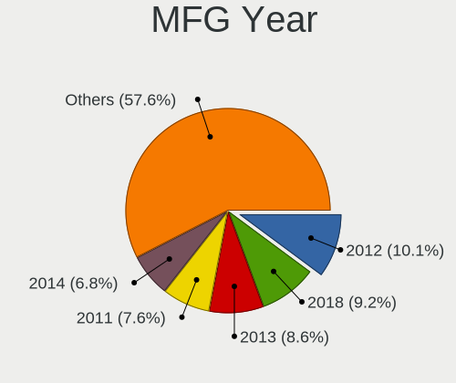
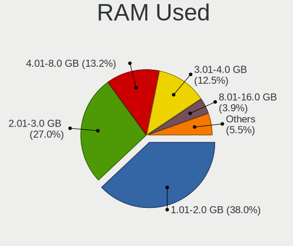
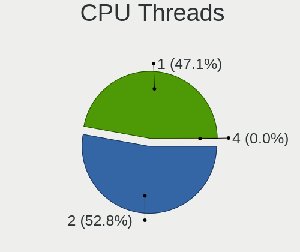
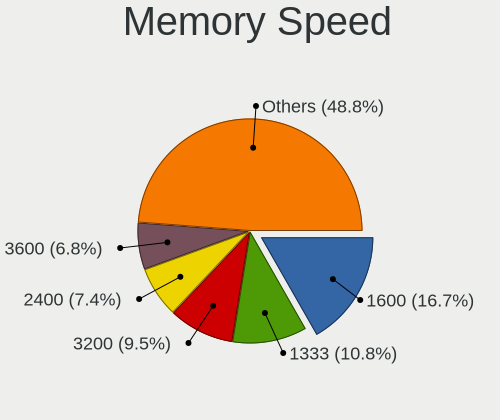

Ubuntu - Tested Hardware & Statistics (Desktops)
------------------------------------------------

A project to collect tested hardware configurations for Ubuntu.

Anyone can contribute to this report by the [hw-probe](https://github.com/linuxhw/hw-probe) tool:

    sudo -E hw-probe -all -upload

Please contribute! Especially if your hardware is rare.

Contents
--------

* [ Test Cases ](#test-cases)

* [ System ](#system)
  - [ OS                       ](#os)
  - [ OS Family                ](#os-family)
  - [ Kernel                   ](#kernel)
  - [ Kernel Family            ](#kernel-family)
  - [ Kernel Major Ver.        ](#kernel-major-ver)
  - [ Arch                     ](#arch)
  - [ DE                       ](#de)
  - [ Display Server           ](#display-server)
  - [ Display Manager          ](#display-manager)
  - [ OS Lang                  ](#os-lang)
  - [ Boot Mode                ](#boot-mode)
  - [ Filesystem               ](#filesystem)
  - [ Part. scheme             ](#part-scheme)
  - [ Dual Boot with Linux/BSD ](#dual-boot-with-linuxbsd)
  - [ Dual Boot (Win)          ](#dual-boot-win)

* [ Board ](#board)
  - [ Vendor                   ](#vendor)
  - [ Model                    ](#model)
  - [ Model Family             ](#model-family)
  - [ MFG Year                 ](#mfg-year)
  - [ Form Factor              ](#form-factor)
  - [ Secure Boot              ](#secure-boot)
  - [ Coreboot                 ](#coreboot)
  - [ RAM Size                 ](#ram-size)
  - [ RAM Used                 ](#ram-used)
  - [ Total Drives             ](#total-drives)
  - [ Has CD-ROM               ](#has-cd-rom)
  - [ Has Ethernet             ](#has-ethernet)
  - [ Has WiFi                 ](#has-wifi)
  - [ Has Bluetooth            ](#has-bluetooth)

* [ Location ](#location)
  - [ Country                  ](#country)
  - [ City                     ](#city)

* [ Drives ](#drives)
  - [ Drive Vendor             ](#drive-vendor)
  - [ Drive Model              ](#drive-model)
  - [ HDD Vendor               ](#hdd-vendor)
  - [ SSD Vendor               ](#ssd-vendor)
  - [ Drive Kind               ](#drive-kind)
  - [ Drive Connector          ](#drive-connector)
  - [ Drive Size               ](#drive-size)
  - [ Space Total              ](#space-total)
  - [ Space Used               ](#space-used)
  - [ Malfunc. Drives          ](#malfunc-drives)
  - [ Malfunc. Drive Vendor    ](#malfunc-drive-vendor)
  - [ Malfunc. HDD Vendor      ](#malfunc-hdd-vendor)
  - [ Malfunc. Drive Kind      ](#malfunc-drive-kind)
  - [ Failed Drives            ](#failed-drives)
  - [ Failed Drive Vendor      ](#failed-drive-vendor)
  - [ Drive Status             ](#drive-status)

* [ Storage controller ](#storage-controller)
  - [ Storage Vendor           ](#storage-vendor)
  - [ Storage Model            ](#storage-model)
  - [ Storage Kind             ](#storage-kind)

* [ Processor ](#processor)
  - [ CPU Vendor               ](#cpu-vendor)
  - [ CPU Model                ](#cpu-model)
  - [ CPU Model Family         ](#cpu-model-family)
  - [ CPU Cores                ](#cpu-cores)
  - [ CPU Sockets              ](#cpu-sockets)
  - [ CPU Threads              ](#cpu-threads)
  - [ CPU Op-Modes             ](#cpu-op-modes)
  - [ CPU Microcode            ](#cpu-microcode)
  - [ CPU Microarch            ](#cpu-microarch)

* [ Graphics ](#graphics)
  - [ GPU Vendor               ](#gpu-vendor)
  - [ GPU Model                ](#gpu-model)
  - [ GPU Combo                ](#gpu-combo)
  - [ GPU Driver               ](#gpu-driver)
  - [ GPU Memory               ](#gpu-memory)

* [ Monitor ](#monitor)
  - [ Monitor Vendor           ](#monitor-vendor)
  - [ Monitor Model            ](#monitor-model)
  - [ Monitor Resolution       ](#monitor-resolution)
  - [ Monitor Diagonal         ](#monitor-diagonal)
  - [ Monitor Width            ](#monitor-width)
  - [ Aspect Ratio             ](#aspect-ratio)
  - [ Monitor Area             ](#monitor-area)
  - [ Pixel Density            ](#pixel-density)
  - [ Multiple Monitors        ](#multiple-monitors)

* [ Network ](#network)
  - [ Net Controller Vendor    ](#net-controller-vendor)
  - [ Net Controller Model     ](#net-controller-model)
  - [ Wireless Vendor          ](#wireless-vendor)
  - [ Wireless Model           ](#wireless-model)
  - [ Ethernet Vendor          ](#ethernet-vendor)
  - [ Ethernet Model           ](#ethernet-model)
  - [ Net Controller Kind      ](#net-controller-kind)
  - [ Used Controller          ](#used-controller)
  - [ NICs                     ](#nics)
  - [ IPv6                     ](#ipv6)

* [ Bluetooth ](#bluetooth)
  - [ Bluetooth Vendor         ](#bluetooth-vendor)
  - [ Bluetooth Model          ](#bluetooth-model)

* [ Sound ](#sound)
  - [ Sound Vendor             ](#sound-vendor)
  - [ Sound Model              ](#sound-model)

* [ Memory ](#memory)
  - [ Memory Vendor            ](#memory-vendor)
  - [ Memory Model             ](#memory-model)
  - [ Memory Kind              ](#memory-kind)
  - [ Memory Form Factor       ](#memory-form-factor)
  - [ Memory Size              ](#memory-size)
  - [ Memory Speed             ](#memory-speed)

* [ Printers & scanners ](#printers--scanners)
  - [ Printer Vendor           ](#printer-vendor)
  - [ Printer Model            ](#printer-model)
  - [ Scanner Vendor           ](#scanner-vendor)
  - [ Scanner Model            ](#scanner-model)

* [ Camera ](#camera)
  - [ Camera Vendor            ](#camera-vendor)
  - [ Camera Model             ](#camera-model)

* [ Security ](#security)
  - [ Fingerprint Vendor       ](#fingerprint-vendor)
  - [ Fingerprint Model        ](#fingerprint-model)
  - [ Chipcard Vendor          ](#chipcard-vendor)
  - [ Chipcard Model           ](#chipcard-model)

* [ Unsupported ](#unsupported)
  - [ Unsupported Devices      ](#unsupported-devices)
  - [ Unsupported Device Types ](#unsupported-device-types)

Test Cases
----------

Total: 36548

| Vendor        | Model                       | Probe                                                      | Date         |
|---------------|-----------------------------|------------------------------------------------------------|--------------|
| Colorful T... | BATTLE-AX B365M-D V20       | [f8c7c20100](https://linux-hardware.org/?probe=f8c7c20100) | Oct 01, 2023 |
| Colorful T... | BATTLE-AX B365M-D V20       | [c118982282](https://linux-hardware.org/?probe=c118982282) | Oct 01, 2023 |
| Dell          | 09KPNV A01                  | [38dba6ab76](https://linux-hardware.org/?probe=38dba6ab76) | Oct 01, 2023 |
| Gigabyte      | Z68XP-UD3                   | [98fd6eb7c8](https://linux-hardware.org/?probe=98fd6eb7c8) | Oct 01, 2023 |
| ASRock        | FM2A55M-VG3+                | [6faa4fd636](https://linux-hardware.org/?probe=6faa4fd636) | Oct 01, 2023 |
| Acer          | H57M01                      | [77fd0bf30a](https://linux-hardware.org/?probe=77fd0bf30a) | Sep 30, 2023 |
| NZXT          | N7 B550                     | [53a99b69e6](https://linux-hardware.org/?probe=53a99b69e6) | Sep 30, 2023 |
| Foxconn       | 2ADA                        | [da117a4e6a](https://linux-hardware.org/?probe=da117a4e6a) | Sep 30, 2023 |
| ASUSTek       | ROG STRIX B450-F GAMING     | [0b4432877e](https://linux-hardware.org/?probe=0b4432877e) | Sep 30, 2023 |
| Colorful T... | BATTLE-AX B365M-D V20       | [e212af9208](https://linux-hardware.org/?probe=e212af9208) | Sep 30, 2023 |
| MSI           | MPG Z390M GAMING EDGE AC    | [04432690a4](https://linux-hardware.org/?probe=04432690a4) | Sep 30, 2023 |
| ASUSTek       | CG8480                      | [dc174e8f73](https://linux-hardware.org/?probe=dc174e8f73) | Sep 30, 2023 |
| Gigabyte      | X99-UD3-CF                  | [f1cc7e5a93](https://linux-hardware.org/?probe=f1cc7e5a93) | Sep 30, 2023 |
| Lenovo        | ThinkCentre M58e 7514A2U    | [68f162bf42](https://linux-hardware.org/?probe=68f162bf42) | Sep 30, 2023 |
| Gigabyte      | X99-UD3-CF                  | [51d10770c6](https://linux-hardware.org/?probe=51d10770c6) | Sep 30, 2023 |
| MSI           | B550M PRO-VDH WIFI          | [770e7037d3](https://linux-hardware.org/?probe=770e7037d3) | Sep 30, 2023 |
| MSI           | P67A-C43                    | [22492f6d47](https://linux-hardware.org/?probe=22492f6d47) | Sep 30, 2023 |
| ASRock        | A300M-STX                   | [d8c97108ad](https://linux-hardware.org/?probe=d8c97108ad) | Sep 30, 2023 |
| Acer          | H57M01                      | [d506730eed](https://linux-hardware.org/?probe=d506730eed) | Sep 30, 2023 |
| ASRock        | A300M-STX                   | [bcbf0e5bfd](https://linux-hardware.org/?probe=bcbf0e5bfd) | Sep 30, 2023 |
| Foxconn       | 2AB1                        | [28ef0f3fbc](https://linux-hardware.org/?probe=28ef0f3fbc) | Sep 29, 2023 |
| Acer          | H57M01                      | [ad7b1bf379](https://linux-hardware.org/?probe=ad7b1bf379) | Sep 29, 2023 |
| Acer          | Nitro N50-610               | [a91f602e4a](https://linux-hardware.org/?probe=a91f602e4a) | Sep 29, 2023 |
| Apple         | Mac-F221BEC8                | [7b4a0099a9](https://linux-hardware.org/?probe=7b4a0099a9) | Sep 29, 2023 |
| Dell          | 0PRR48 A00                  | [52fd06666a](https://linux-hardware.org/?probe=52fd06666a) | Sep 29, 2023 |
| Intel         | B75                         | [a30fa8031b](https://linux-hardware.org/?probe=a30fa8031b) | Sep 29, 2023 |
| ASUSTek       | ROG STRIX B550-F GAMING ... | [6177caee37](https://linux-hardware.org/?probe=6177caee37) | Sep 29, 2023 |
| GEEKOM        | Mini IT 8                   | [fc5d6092da](https://linux-hardware.org/?probe=fc5d6092da) | Sep 29, 2023 |
| ASUSTek       | H81M-K                      | [16dabb2f6e](https://linux-hardware.org/?probe=16dabb2f6e) | Sep 29, 2023 |
| ASUSTek       | ROG STRIX Z790-A GAMING ... | [a5467c367d](https://linux-hardware.org/?probe=a5467c367d) | Sep 29, 2023 |
| Gigabyte      | Z390 AORUS PRO WIFI-CF      | [8724efb686](https://linux-hardware.org/?probe=8724efb686) | Sep 29, 2023 |
| Gigabyte      | Z390 AORUS PRO WIFI-CF      | [76fc0d8239](https://linux-hardware.org/?probe=76fc0d8239) | Sep 29, 2023 |
| Foxconn       | 2ADA                        | [0c29af254c](https://linux-hardware.org/?probe=0c29af254c) | Sep 29, 2023 |
| ASUSTek       | M5A97 R2.0                  | [2c2f49b6bf](https://linux-hardware.org/?probe=2c2f49b6bf) | Sep 29, 2023 |
| Lenovo        | 1031 SBB0J05441 WIN 3305... | [26580dc672](https://linux-hardware.org/?probe=26580dc672) | Sep 29, 2023 |
| Gigabyte      | GA-MA780G-UD3H              | [9b86a89bf4](https://linux-hardware.org/?probe=9b86a89bf4) | Sep 29, 2023 |
| ASUSTek       | ROG STRIX B550-A GAMING     | [cce7c03059](https://linux-hardware.org/?probe=cce7c03059) | Sep 29, 2023 |
| ASUSTek       | H81M-E                      | [0137140cae](https://linux-hardware.org/?probe=0137140cae) | Sep 28, 2023 |
| Gigabyte      | B150M-D3V-CF                | [75b228c5fb](https://linux-hardware.org/?probe=75b228c5fb) | Sep 28, 2023 |
| ASUSTek       | X99-DELUXE                  | [c608038795](https://linux-hardware.org/?probe=c608038795) | Sep 28, 2023 |
| HP            | 0AA8h                       | [7c8c8fbb40](https://linux-hardware.org/?probe=7c8c8fbb40) | Sep 28, 2023 |
| ASUSTek       | P7P55 LX                    | [6e4c4376c5](https://linux-hardware.org/?probe=6e4c4376c5) | Sep 28, 2023 |
| MSI           | A520M-A PRO                 | [27d7959e57](https://linux-hardware.org/?probe=27d7959e57) | Sep 28, 2023 |
| Gigabyte      | B360M DS3H                  | [1308430981](https://linux-hardware.org/?probe=1308430981) | Sep 28, 2023 |
| MSI           | B550M PRO-VDH WIFI          | [ce357bee14](https://linux-hardware.org/?probe=ce357bee14) | Sep 28, 2023 |
| Gigabyte      | EX58-EXTREME                | [4a1a75d0e3](https://linux-hardware.org/?probe=4a1a75d0e3) | Sep 28, 2023 |
| GMKtec        | NucBox3                     | [c99750febd](https://linux-hardware.org/?probe=c99750febd) | Sep 28, 2023 |
| Gigabyte      | EX58-EXTREME                | [bc2a9ecc6a](https://linux-hardware.org/?probe=bc2a9ecc6a) | Sep 28, 2023 |
| HP            | 1496                        | [3867e7af58](https://linux-hardware.org/?probe=3867e7af58) | Sep 28, 2023 |
| Wistron       | ProLiant ML110 G6           | [4284ef7737](https://linux-hardware.org/?probe=4284ef7737) | Sep 28, 2023 |
| Acer          | Aspire TC-885 V:1.1         | [7aef46e946](https://linux-hardware.org/?probe=7aef46e946) | Sep 28, 2023 |
| Wistron       | ProLiant ML110 G6           | [6282804553](https://linux-hardware.org/?probe=6282804553) | Sep 28, 2023 |
| Dell          | 00V62H A01                  | [f46006f6ce](https://linux-hardware.org/?probe=f46006f6ce) | Sep 28, 2023 |
| Lenovo        | ThinkServer TS140           | [0e08685628](https://linux-hardware.org/?probe=0e08685628) | Sep 28, 2023 |
| Gigabyte      | 970A-DS3P FX                | [627751c21a](https://linux-hardware.org/?probe=627751c21a) | Sep 28, 2023 |
| ASRock        | Z370 Pro4                   | [a70543ae67](https://linux-hardware.org/?probe=a70543ae67) | Sep 28, 2023 |
| Lenovo        | ThinkCentre M57 6075Y3W     | [8e39080ed3](https://linux-hardware.org/?probe=8e39080ed3) | Sep 28, 2023 |
| MiTAC         | PD10EHI                     | [29716ecb18](https://linux-hardware.org/?probe=29716ecb18) | Sep 27, 2023 |
| Gigabyte      | X570 AORUS PRO WIFI         | [e15856c8f1](https://linux-hardware.org/?probe=e15856c8f1) | Sep 27, 2023 |
| HP            | 8594                        | [374067df48](https://linux-hardware.org/?probe=374067df48) | Sep 27, 2023 |
| ASUSTek       | PRIME X370-PRO              | [e5cd50e4ea](https://linux-hardware.org/?probe=e5cd50e4ea) | Sep 27, 2023 |
| Unknown       | Unknown                     | [cb12d6c853](https://linux-hardware.org/?probe=cb12d6c853) | Sep 27, 2023 |
| MSI           | Z77A-S01                    | [277586f152](https://linux-hardware.org/?probe=277586f152) | Sep 27, 2023 |
| ASUSTek       | M5A78L-M PLUS/USB3          | [f47347fb9b](https://linux-hardware.org/?probe=f47347fb9b) | Sep 27, 2023 |
| ASUSTek       | PRO H410M-C                 | [6554d255c3](https://linux-hardware.org/?probe=6554d255c3) | Sep 27, 2023 |
| AAEON         | MIX-H310D1 V1.0             | [7a3b3d3b2d](https://linux-hardware.org/?probe=7a3b3d3b2d) | Sep 27, 2023 |
| ASUSTek       | M5A99FX PRO R2.0            | [500909194e](https://linux-hardware.org/?probe=500909194e) | Sep 27, 2023 |
| Intel         | X79F1 V2.0                  | [919b208284](https://linux-hardware.org/?probe=919b208284) | Sep 27, 2023 |
| ASRock        | Z790 Taichi                 | [949be6194e](https://linux-hardware.org/?probe=949be6194e) | Sep 27, 2023 |
| MSI           | B550-A PRO                  | [c60600b4f0](https://linux-hardware.org/?probe=c60600b4f0) | Sep 27, 2023 |
| Gigabyte      | B450M DS3H-CF               | [812b06784e](https://linux-hardware.org/?probe=812b06784e) | Sep 27, 2023 |
| ASRock        | Z790 Taichi                 | [50ff8d28e4](https://linux-hardware.org/?probe=50ff8d28e4) | Sep 26, 2023 |
| MSI           | MAG B550M MORTAR            | [5a2571575f](https://linux-hardware.org/?probe=5a2571575f) | Sep 26, 2023 |
| ASUSTek       | ProArt X670E-CREATOR WIF... | [9fcff9b281](https://linux-hardware.org/?probe=9fcff9b281) | Sep 26, 2023 |
| Supermicro    | X9DRL-3F/iF                 | [07543468b6](https://linux-hardware.org/?probe=07543468b6) | Sep 26, 2023 |
| Supermicro    | X10DRL-i                    | [4215bb2639](https://linux-hardware.org/?probe=4215bb2639) | Sep 26, 2023 |
| ASUSTek       | ROG CROSSHAIR VIII HERO     | [ac6d6574e9](https://linux-hardware.org/?probe=ac6d6574e9) | Sep 26, 2023 |
| Medion        | D3F3-EM                     | [82989a21af](https://linux-hardware.org/?probe=82989a21af) | Sep 26, 2023 |
| MSI           | MAG B550M MORTAR            | [efee605c17](https://linux-hardware.org/?probe=efee605c17) | Sep 26, 2023 |
| Colorful T... | BATTLE-AX B365M-D V20       | [dfdb4a33bd](https://linux-hardware.org/?probe=dfdb4a33bd) | Sep 26, 2023 |
| Gateway       | FX6840                      | [613810c0ed](https://linux-hardware.org/?probe=613810c0ed) | Sep 26, 2023 |
| MSI           | X299 RAIDER 2018-10-08      | [8bccf1be8d](https://linux-hardware.org/?probe=8bccf1be8d) | Sep 26, 2023 |
| ASUSTek       | M2N-VM DVI                  | [7b8649cccc](https://linux-hardware.org/?probe=7b8649cccc) | Sep 26, 2023 |
| HP            | 3397                        | [e0396e65c6](https://linux-hardware.org/?probe=e0396e65c6) | Sep 26, 2023 |
| Lenovo        | ThinkServer TS140           | [461eeadd52](https://linux-hardware.org/?probe=461eeadd52) | Sep 26, 2023 |
| ASRock        | B450 Gaming K4              | [dcd5422d31](https://linux-hardware.org/?probe=dcd5422d31) | Sep 26, 2023 |
| MSI           | MPG B650I EDGE WIFI         | [fc79d63b87](https://linux-hardware.org/?probe=fc79d63b87) | Sep 26, 2023 |
| Supermicro    | X9DRL-3F/iF                 | [cac5990658](https://linux-hardware.org/?probe=cac5990658) | Sep 25, 2023 |
| Apple         | Mac-F60DEB81FF30ACF6 Mac... | [d59518d612](https://linux-hardware.org/?probe=d59518d612) | Sep 25, 2023 |
| Dell          | 0KRC95 A02                  | [c0f2f5244b](https://linux-hardware.org/?probe=c0f2f5244b) | Sep 25, 2023 |
| ASUSTek       | G10DK                       | [882b029219](https://linux-hardware.org/?probe=882b029219) | Sep 25, 2023 |
| ASUSTek       | M51AC                       | [b4bd7fad24](https://linux-hardware.org/?probe=b4bd7fad24) | Sep 25, 2023 |
| Dell          | 05GD68 A00                  | [7112169fc8](https://linux-hardware.org/?probe=7112169fc8) | Sep 25, 2023 |
| ASRock        | H81M-DG6                    | [ac6944c3df](https://linux-hardware.org/?probe=ac6944c3df) | Sep 25, 2023 |
| MSI           | Z490-A PRO                  | [7ff4162cbb](https://linux-hardware.org/?probe=7ff4162cbb) | Sep 25, 2023 |
| MSI           | Z490-A PRO                  | [55f54a0aeb](https://linux-hardware.org/?probe=55f54a0aeb) | Sep 25, 2023 |
| Gigabyte      | Z97M-DS3H                   | [2881d9e4ec](https://linux-hardware.org/?probe=2881d9e4ec) | Sep 25, 2023 |
| HP            | 1589                        | [3d151e09bb](https://linux-hardware.org/?probe=3d151e09bb) | Sep 25, 2023 |
| Dell          | 0JP3NX A01                  | [d42f0f6791](https://linux-hardware.org/?probe=d42f0f6791) | Sep 25, 2023 |
| ASRock        | 970 Extreme4                | [4b78e93dff](https://linux-hardware.org/?probe=4b78e93dff) | Sep 25, 2023 |
| ASRock        | 970 Extreme4                | [e05aa71be7](https://linux-hardware.org/?probe=e05aa71be7) | Sep 25, 2023 |
| MSI           | B250M BAZOOKA               | [425bd32230](https://linux-hardware.org/?probe=425bd32230) | Sep 25, 2023 |
| Acer          | RL100                       | [13755a17ee](https://linux-hardware.org/?probe=13755a17ee) | Sep 25, 2023 |
| Gigabyte      | P55-UD4                     | [45d1ad03f8](https://linux-hardware.org/?probe=45d1ad03f8) | Sep 25, 2023 |
| ASUSTek       | PRIME B450-PLUS             | [739be981d6](https://linux-hardware.org/?probe=739be981d6) | Sep 24, 2023 |
| Supermicro    | X9DRL-3F/iF                 | [e9f47778b4](https://linux-hardware.org/?probe=e9f47778b4) | Sep 24, 2023 |
| ASUSTek       | ROG STRIX X670E-F GAMING... | [7a121f2a9e](https://linux-hardware.org/?probe=7a121f2a9e) | Sep 24, 2023 |
| HP            | 3047h                       | [03fd91188a](https://linux-hardware.org/?probe=03fd91188a) | Sep 24, 2023 |
| ASUSTek       | B85M-E                      | [25c109d366](https://linux-hardware.org/?probe=25c109d366) | Sep 24, 2023 |
| Biostar       | A68N-2100K                  | [38a92e23c8](https://linux-hardware.org/?probe=38a92e23c8) | Sep 24, 2023 |
| Gigabyte      | H77-D3H                     | [3d7d389342](https://linux-hardware.org/?probe=3d7d389342) | Sep 24, 2023 |
| Dell          | 0T10XW A02                  | [5df1a942d9](https://linux-hardware.org/?probe=5df1a942d9) | Sep 24, 2023 |
| Foxconn       | 2ADA                        | [8a1af94640](https://linux-hardware.org/?probe=8a1af94640) | Sep 24, 2023 |
| MSI           | A78M-E35                    | [894b759057](https://linux-hardware.org/?probe=894b759057) | Sep 24, 2023 |
| HOUTER        | OROPC                       | [96625070be](https://linux-hardware.org/?probe=96625070be) | Sep 24, 2023 |
| Positivo      | POS-EIBTPDC                 | [3c2427ba03](https://linux-hardware.org/?probe=3c2427ba03) | Sep 23, 2023 |
| MSI           | MAG B550 TOMAHAWK           | [54ed40361d](https://linux-hardware.org/?probe=54ed40361d) | Sep 23, 2023 |
| Positivo      | POS-EIBTPDC                 | [586c05976a](https://linux-hardware.org/?probe=586c05976a) | Sep 23, 2023 |
| Fujitsu       | D2990-A1 S26361-D2990-A1    | [19757abbb8](https://linux-hardware.org/?probe=19757abbb8) | Sep 23, 2023 |
| HOUTER        | OROPC                       | [3f78fb9290](https://linux-hardware.org/?probe=3f78fb9290) | Sep 23, 2023 |
| MSI           | B450M MORTAR MAX            | [da277c4d5a](https://linux-hardware.org/?probe=da277c4d5a) | Sep 23, 2023 |
| Gigabyte      | H110N-CF                    | [7655a31997](https://linux-hardware.org/?probe=7655a31997) | Sep 23, 2023 |
| Gigabyte      | F2A88XM-D3H                 | [f597ec9360](https://linux-hardware.org/?probe=f597ec9360) | Sep 23, 2023 |
| Gigabyte      | X570 AORUS PRO              | [45c1c156af](https://linux-hardware.org/?probe=45c1c156af) | Sep 23, 2023 |
| Dell          | 0C2KJT A00                  | [a6fcc5eb53](https://linux-hardware.org/?probe=a6fcc5eb53) | Sep 23, 2023 |
| Acer          | Aspire TC-895 V:1.0         | [6f3c1fed91](https://linux-hardware.org/?probe=6f3c1fed91) | Sep 23, 2023 |
| Pegatron      | 2AB6                        | [9b814d0254](https://linux-hardware.org/?probe=9b814d0254) | Sep 23, 2023 |
| ASUSTek       | H81M-K                      | [30a324bad7](https://linux-hardware.org/?probe=30a324bad7) | Sep 23, 2023 |
| ASUSTek       | PRIME X370-PRO              | [1f987f4720](https://linux-hardware.org/?probe=1f987f4720) | Sep 23, 2023 |
| MACHINIST     | E5-D8-MAX V1.0              | [41ac03cc3a](https://linux-hardware.org/?probe=41ac03cc3a) | Sep 23, 2023 |
| Gigabyte      | B450M DS3H-CF               | [898219c64a](https://linux-hardware.org/?probe=898219c64a) | Sep 23, 2023 |
| MSI           | PRO H410M-B                 | [dd6815e149](https://linux-hardware.org/?probe=dd6815e149) | Sep 23, 2023 |
| ASUSTek       | ROG STRIX B650E-I GAMING... | [2a0c1d15f9](https://linux-hardware.org/?probe=2a0c1d15f9) | Sep 23, 2023 |
| Foxconn       | 2ABF                        | [b566fc3ff3](https://linux-hardware.org/?probe=b566fc3ff3) | Sep 23, 2023 |
| ASUSTek       | F1A75-V PRO                 | [ce054bb837](https://linux-hardware.org/?probe=ce054bb837) | Sep 22, 2023 |
| Centerm       | C92                         | [022344ea10](https://linux-hardware.org/?probe=022344ea10) | Sep 22, 2023 |
| MSI           | MPG Z390 GAMING PRO CARB... | [312172129f](https://linux-hardware.org/?probe=312172129f) | Sep 22, 2023 |
| ASUSTek       | P5G41T-M LX                 | [988711772b](https://linux-hardware.org/?probe=988711772b) | Sep 22, 2023 |
| ASUSTek       | PRIME Z370-P                | [fb3ade25c0](https://linux-hardware.org/?probe=fb3ade25c0) | Sep 22, 2023 |
| ASUSTek       | A88X-PLUS                   | [4e3033c305](https://linux-hardware.org/?probe=4e3033c305) | Sep 22, 2023 |
| ASUSTek       | Z170-K                      | [4f3d36e0bd](https://linux-hardware.org/?probe=4f3d36e0bd) | Sep 22, 2023 |
| ASUSTek       | Z170-K                      | [be3d2f3d77](https://linux-hardware.org/?probe=be3d2f3d77) | Sep 22, 2023 |
| Dell          | 02YYK5 A01                  | [a204305d1e](https://linux-hardware.org/?probe=a204305d1e) | Sep 22, 2023 |
| AZW           | GTR V21                     | [c3da1f2fd5](https://linux-hardware.org/?probe=c3da1f2fd5) | Sep 22, 2023 |
| Dell          | 02YYK5 A01                  | [d43d654621](https://linux-hardware.org/?probe=d43d654621) | Sep 22, 2023 |
| ASRock        | Z790 Taichi                 | [d1a889a811](https://linux-hardware.org/?probe=d1a889a811) | Sep 21, 2023 |
| ASRock        | AM1B-ITX                    | [95b1c6332b](https://linux-hardware.org/?probe=95b1c6332b) | Sep 21, 2023 |
| MSI           | Boston                      | [a9fe9241ec](https://linux-hardware.org/?probe=a9fe9241ec) | Sep 21, 2023 |
| Gigabyte      | P55-UD4                     | [16f768ab94](https://linux-hardware.org/?probe=16f768ab94) | Sep 21, 2023 |
| ASUSTek       | Z87-A                       | [97747fb973](https://linux-hardware.org/?probe=97747fb973) | Sep 21, 2023 |
| Acer          | Nitro N50-600 V:1.1         | [34d899f825](https://linux-hardware.org/?probe=34d899f825) | Sep 21, 2023 |
| Dell          | 0XHGV1 A01                  | [eeae4a837e](https://linux-hardware.org/?probe=eeae4a837e) | Sep 21, 2023 |
| MSI           | PRO B650M-A WIFI            | [8e60d0df9c](https://linux-hardware.org/?probe=8e60d0df9c) | Sep 21, 2023 |
| ASUSTek       | ROG STRIX X670E-E GAMING... | [08989d4bba](https://linux-hardware.org/?probe=08989d4bba) | Sep 21, 2023 |
| Acer          | Nitro N50-600 V:1.1         | [b1fd4a61ae](https://linux-hardware.org/?probe=b1fd4a61ae) | Sep 21, 2023 |
| DFI           | CH960                       | [a6514c3301](https://linux-hardware.org/?probe=a6514c3301) | Sep 21, 2023 |
| Gigabyte      | B85M-DS3H-A                 | [6d0e6a863d](https://linux-hardware.org/?probe=6d0e6a863d) | Sep 21, 2023 |
| Dell          | 0GY6Y8 A02                  | [92b6ccd3ad](https://linux-hardware.org/?probe=92b6ccd3ad) | Sep 21, 2023 |
| Fujitsu       | D3233-A1 S26361-D3233-A1    | [c933105cd8](https://linux-hardware.org/?probe=c933105cd8) | Sep 21, 2023 |
| ASUSTek       | PRIME Z370-A II             | [d348acd6c8](https://linux-hardware.org/?probe=d348acd6c8) | Sep 21, 2023 |
| ASUSTek       | P9X79 PRO                   | [b58de0bed0](https://linux-hardware.org/?probe=b58de0bed0) | Sep 21, 2023 |
| ASUSTek       | P8Z77-M PRO                 | [6fd5940c85](https://linux-hardware.org/?probe=6fd5940c85) | Sep 21, 2023 |
| AZW           | MINI S 10                   | [4e2cc1421f](https://linux-hardware.org/?probe=4e2cc1421f) | Sep 21, 2023 |
| ASUSTek       | B150M-A                     | [d2e741051e](https://linux-hardware.org/?probe=d2e741051e) | Sep 21, 2023 |
| HP            | 8027                        | [e8568c8f9b](https://linux-hardware.org/?probe=e8568c8f9b) | Sep 20, 2023 |
| ASUSTek       | H81M-K                      | [03c9da6c46](https://linux-hardware.org/?probe=03c9da6c46) | Sep 20, 2023 |
| Gigabyte      | X570 I AORUS PRO WIFI       | [0f28c5cddd](https://linux-hardware.org/?probe=0f28c5cddd) | Sep 20, 2023 |
| Acer          | Veriton S2680G              | [76f872c7bb](https://linux-hardware.org/?probe=76f872c7bb) | Sep 20, 2023 |
| Dell          | 03NVJ6 A00                  | [af48b03e82](https://linux-hardware.org/?probe=af48b03e82) | Sep 20, 2023 |
| ASUSTek       | M5A78L-M PLUS/USB3          | [f7629203e7](https://linux-hardware.org/?probe=f7629203e7) | Sep 20, 2023 |
| Gigabyte      | B450M DS3H-CF               | [f65b051dc9](https://linux-hardware.org/?probe=f65b051dc9) | Sep 20, 2023 |
| Dell          | 0NK5PH A01                  | [eb3f293f98](https://linux-hardware.org/?probe=eb3f293f98) | Sep 20, 2023 |
| HP            | 1998                        | [27c06c8617](https://linux-hardware.org/?probe=27c06c8617) | Sep 20, 2023 |
| Intel         | H61                         | [82a94f86d2](https://linux-hardware.org/?probe=82a94f86d2) | Sep 20, 2023 |
| Gigabyte      | B250M-HD3-CF                | [f7280def0d](https://linux-hardware.org/?probe=f7280def0d) | Sep 20, 2023 |
| MSI           | X399 GAMING PRO CARBON A... | [040189d6dc](https://linux-hardware.org/?probe=040189d6dc) | Sep 20, 2023 |
| HP            | 1497                        | [8ea04759fc](https://linux-hardware.org/?probe=8ea04759fc) | Sep 20, 2023 |
| Dell          | 09KPNV A01                  | [4ce81f3886](https://linux-hardware.org/?probe=4ce81f3886) | Sep 20, 2023 |
| Dell          | 0GDG8Y A00                  | [9e6874d35c](https://linux-hardware.org/?probe=9e6874d35c) | Sep 20, 2023 |
| Gigabyte      | B365M DS3H                  | [b66d6be0cf](https://linux-hardware.org/?probe=b66d6be0cf) | Sep 19, 2023 |
| Gateway       | DX4850                      | [ebd6fd7a33](https://linux-hardware.org/?probe=ebd6fd7a33) | Sep 19, 2023 |
| Supermicro    | X9DRL-3F/iF                 | [419c68293c](https://linux-hardware.org/?probe=419c68293c) | Sep 19, 2023 |
| Gigabyte      | B75M-HD3                    | [fe4ef48e82](https://linux-hardware.org/?probe=fe4ef48e82) | Sep 19, 2023 |
| Medion        | D3F3-EM                     | [6fe93a02c7](https://linux-hardware.org/?probe=6fe93a02c7) | Sep 19, 2023 |
| Huanan        | X99-F8 V2.0                 | [f832424d90](https://linux-hardware.org/?probe=f832424d90) | Sep 19, 2023 |
| Supermicro    | X9DRW                       | [6f4a97a40b](https://linux-hardware.org/?probe=6f4a97a40b) | Sep 19, 2023 |
| Medion        | MS-7848                     | [acbe0e1821](https://linux-hardware.org/?probe=acbe0e1821) | Sep 19, 2023 |
| ASUSTek       | PRIME B460-PLUS             | [1ac41cc2e4](https://linux-hardware.org/?probe=1ac41cc2e4) | Sep 19, 2023 |
| HP            | 1998                        | [d65f099f06](https://linux-hardware.org/?probe=d65f099f06) | Sep 19, 2023 |
| Apple         | Mac-7BA5B2D9E42DDD94 iMa... | [7c74dca781](https://linux-hardware.org/?probe=7c74dca781) | Sep 19, 2023 |
| ASUSTek       | P8H61-M LE/USB3             | [8ea05ba99b](https://linux-hardware.org/?probe=8ea05ba99b) | Sep 18, 2023 |
| Lenovo        | IdeaCentre K320 10031       | [35cbc95f9e](https://linux-hardware.org/?probe=35cbc95f9e) | Sep 18, 2023 |
| ASUSTek       | TUF Gaming B650-PLUS WIF... | [bb285c7da5](https://linux-hardware.org/?probe=bb285c7da5) | Sep 18, 2023 |
| Lenovo        | IdeaCentre K320 10031       | [bc9d2f6691](https://linux-hardware.org/?probe=bc9d2f6691) | Sep 18, 2023 |
| Gateway       | SX2865 V1.0                 | [5966c7d7e3](https://linux-hardware.org/?probe=5966c7d7e3) | Sep 18, 2023 |
| HP            | 339A                        | [bb4819d02f](https://linux-hardware.org/?probe=bb4819d02f) | Sep 18, 2023 |
| Dell          | 076VHM A02                  | [518361bbc5](https://linux-hardware.org/?probe=518361bbc5) | Sep 18, 2023 |
| ASUSTek       | PRIME X670-P                | [766c0407a2](https://linux-hardware.org/?probe=766c0407a2) | Sep 18, 2023 |
| ASUSTek       | PRIME B550M-A               | [c6abc7bdf4](https://linux-hardware.org/?probe=c6abc7bdf4) | Sep 18, 2023 |
| MSI           | H61M-P22                    | [4c32887473](https://linux-hardware.org/?probe=4c32887473) | Sep 18, 2023 |
| Biostar       | A68N-2100K                  | [56340d8ed4](https://linux-hardware.org/?probe=56340d8ed4) | Sep 18, 2023 |
| ASRock        | X570 Extreme4               | [18bc19acdf](https://linux-hardware.org/?probe=18bc19acdf) | Sep 18, 2023 |
| Dell          | 0PTTT9 A01                  | [35248efbaf](https://linux-hardware.org/?probe=35248efbaf) | Sep 18, 2023 |
| ASUSTek       | ROG CROSSHAIR VII HERO      | [111652ff69](https://linux-hardware.org/?probe=111652ff69) | Sep 18, 2023 |
| HP            | 8767 A                      | [7698226e84](https://linux-hardware.org/?probe=7698226e84) | Sep 18, 2023 |
| Dell          | 0NNNCT A01                  | [33ba22818a](https://linux-hardware.org/?probe=33ba22818a) | Sep 18, 2023 |
| Dell          | 0GM819                      | [48495ce23e](https://linux-hardware.org/?probe=48495ce23e) | Sep 18, 2023 |
| ASRock        | B650M PG Riptide            | [8dd27c1671](https://linux-hardware.org/?probe=8dd27c1671) | Sep 18, 2023 |
| ASRock        | B650M PG Riptide            | [06b00c7739](https://linux-hardware.org/?probe=06b00c7739) | Sep 18, 2023 |
| ASUSTek       | TUF X299 MARK 1             | [502aab1a11](https://linux-hardware.org/?probe=502aab1a11) | Sep 17, 2023 |
| Gigabyte      | B450M DS3H V2               | [45c70e0bf9](https://linux-hardware.org/?probe=45c70e0bf9) | Sep 17, 2023 |
| Shenzhen M... | F6BFC                       | [b45825033c](https://linux-hardware.org/?probe=b45825033c) | Sep 17, 2023 |
| Shenzhen M... | F6BFC                       | [3dae667762](https://linux-hardware.org/?probe=3dae667762) | Sep 17, 2023 |
| Acer          | RL100                       | [803bd98e9f](https://linux-hardware.org/?probe=803bd98e9f) | Sep 17, 2023 |
| ASUSTek       | TUF Gaming B650-PLUS WIF... | [c323f31788](https://linux-hardware.org/?probe=c323f31788) | Sep 17, 2023 |
| ASRock        | A320M-HDV R4.0              | [4cd954351c](https://linux-hardware.org/?probe=4cd954351c) | Sep 17, 2023 |
| ASRock        | Z77 Pro4                    | [13f3de6336](https://linux-hardware.org/?probe=13f3de6336) | Sep 17, 2023 |
| Acer          | Veriton L4630G V:1.0        | [4ee96f70b9](https://linux-hardware.org/?probe=4ee96f70b9) | Sep 17, 2023 |
| Acer          | Veriton L4630G V:1.0        | [1a0448ff84](https://linux-hardware.org/?probe=1a0448ff84) | Sep 17, 2023 |
| ASUSTek       | Z87-PLUS                    | [ae6215005e](https://linux-hardware.org/?probe=ae6215005e) | Sep 17, 2023 |
| HC Technol... | HCAR5000-MI                 | [eb9e6551ac](https://linux-hardware.org/?probe=eb9e6551ac) | Sep 17, 2023 |
| HC Technol... | HCAR5000-MI                 | [f3a4ce70fb](https://linux-hardware.org/?probe=f3a4ce70fb) | Sep 17, 2023 |
| ASUSTek       | Z87-PLUS                    | [613d6735a3](https://linux-hardware.org/?probe=613d6735a3) | Sep 17, 2023 |
| Unknown       | Unknown                     | [bd72d25583](https://linux-hardware.org/?probe=bd72d25583) | Sep 17, 2023 |
| Apple         | Mac-F42C88C8 Proto1         | [e418aa4e21](https://linux-hardware.org/?probe=e418aa4e21) | Sep 17, 2023 |
| ASUSTek       | TUF Gaming B550M-PLUS       | [88a398f990](https://linux-hardware.org/?probe=88a398f990) | Sep 17, 2023 |
| ASUSTek       | P8Z68-V LX                  | [bc7f403188](https://linux-hardware.org/?probe=bc7f403188) | Sep 16, 2023 |
| Gigabyte      | B650 AORUS ELITE AX         | [bc002722a7](https://linux-hardware.org/?probe=bc002722a7) | Sep 16, 2023 |
| Gigabyte      | B650 AORUS ELITE AX         | [45cfc84d3e](https://linux-hardware.org/?probe=45cfc84d3e) | Sep 16, 2023 |
| Dell          | 0VHWTR A02                  | [c34520d1c2](https://linux-hardware.org/?probe=c34520d1c2) | Sep 16, 2023 |
| Lenovo        | NOK                         | [ead85a1003](https://linux-hardware.org/?probe=ead85a1003) | Sep 16, 2023 |
| ASUSTek       | TUF Gaming B550M-PLUS       | [0c7cb04f38](https://linux-hardware.org/?probe=0c7cb04f38) | Sep 16, 2023 |
| MSI           | H510I PRO WIFI              | [e8f9c86131](https://linux-hardware.org/?probe=e8f9c86131) | Sep 16, 2023 |
| Acer          | Veriton N4640G              | [73af90ca23](https://linux-hardware.org/?probe=73af90ca23) | Sep 16, 2023 |
| ASUSTek       | ROG STRIX B650E-F GAMING... | [c47a157971](https://linux-hardware.org/?probe=c47a157971) | Sep 16, 2023 |
| HC Technol... | HCAR5000-MI                 | [14ec27ff9d](https://linux-hardware.org/?probe=14ec27ff9d) | Sep 16, 2023 |
| ASUSTek       | CM1740                      | [96b9168216](https://linux-hardware.org/?probe=96b9168216) | Sep 16, 2023 |
| Gigabyte      | Z390 AORUS PRO WIFI-CF      | [87e9bbfef5](https://linux-hardware.org/?probe=87e9bbfef5) | Sep 16, 2023 |
| Gigabyte      | B250M-HD3-CF                | [8bc40fd9f1](https://linux-hardware.org/?probe=8bc40fd9f1) | Sep 16, 2023 |
| ASUSTek       | A88XM-E                     | [2dae5fb442](https://linux-hardware.org/?probe=2dae5fb442) | Sep 16, 2023 |
| Gigabyte      | B450M DS3H V2               | [91ab2c03a2](https://linux-hardware.org/?probe=91ab2c03a2) | Sep 15, 2023 |
| Lenovo        | SHARKBAY SDK0E50510 PRO     | [02bd43e898](https://linux-hardware.org/?probe=02bd43e898) | Sep 15, 2023 |
| ASRock        | B650E Steel Legend WiFi     | [0f87ffad72](https://linux-hardware.org/?probe=0f87ffad72) | Sep 15, 2023 |
| ASUSTek       | ROG STRIX X370-F GAMING     | [c8c55eb300](https://linux-hardware.org/?probe=c8c55eb300) | Sep 15, 2023 |
| Gigabyte      | 970A-DS3P                   | [708a3e1ceb](https://linux-hardware.org/?probe=708a3e1ceb) | Sep 15, 2023 |
| Acer          | Aspire XC-780               | [1019ced6e5](https://linux-hardware.org/?probe=1019ced6e5) | Sep 15, 2023 |
| Dell          | 0YXT71 A00                  | [49f912aad2](https://linux-hardware.org/?probe=49f912aad2) | Sep 15, 2023 |
| Supermicro    | X10DRU-i+A                  | [d0cee7fa36](https://linux-hardware.org/?probe=d0cee7fa36) | Sep 15, 2023 |
| ASUSTek       | PRIME B660-PLUS D4          | [b6a802c0ac](https://linux-hardware.org/?probe=b6a802c0ac) | Sep 15, 2023 |
| Dell          | 0TDG4V A01                  | [7c2d7aeafa](https://linux-hardware.org/?probe=7c2d7aeafa) | Sep 15, 2023 |
| ASUSTek       | A88XM-E                     | [a3d82edc9c](https://linux-hardware.org/?probe=a3d82edc9c) | Sep 15, 2023 |
| ASRock        | B450 Pro4                   | [8f1762e098](https://linux-hardware.org/?probe=8f1762e098) | Sep 15, 2023 |
| Gigabyte      | B450M DS3H-CF               | [f48f6375b2](https://linux-hardware.org/?probe=f48f6375b2) | Sep 15, 2023 |
| ASUSTek       | P8B75-M LX                  | [cdbfe7dc54](https://linux-hardware.org/?probe=cdbfe7dc54) | Sep 15, 2023 |
| Gigabyte      | Z97-HD3                     | [f9e5e93aba](https://linux-hardware.org/?probe=f9e5e93aba) | Sep 15, 2023 |
| Gigabyte      | Z97-HD3                     | [994cdaee5b](https://linux-hardware.org/?probe=994cdaee5b) | Sep 15, 2023 |
| Dell          | 0YXT71 A00                  | [e857239d67](https://linux-hardware.org/?probe=e857239d67) | Sep 15, 2023 |
| Lenovo        | SHARKBAY 0B98401 PRO        | [c424e240c8](https://linux-hardware.org/?probe=c424e240c8) | Sep 15, 2023 |
| ASUSTek       | PRIME B660M-A D4            | [a44de9f197](https://linux-hardware.org/?probe=a44de9f197) | Sep 15, 2023 |
| AZW           | N4                          | [4237228bca](https://linux-hardware.org/?probe=4237228bca) | Sep 15, 2023 |
| Apple         | Mac-F42C88C8 Proto1         | [f87050479d](https://linux-hardware.org/?probe=f87050479d) | Sep 15, 2023 |
| Gigabyte      | B450M DS3H-CF               | [27d7589428](https://linux-hardware.org/?probe=27d7589428) | Sep 15, 2023 |
| MSI           | B450 GAMING PLUS MAX        | [5fae508d12](https://linux-hardware.org/?probe=5fae508d12) | Sep 14, 2023 |
| Dell          | 0XJ8C4 A00                  | [35d0557ca0](https://linux-hardware.org/?probe=35d0557ca0) | Sep 14, 2023 |
| Dell          | OptiPlex 7010               | [37edc6416e](https://linux-hardware.org/?probe=37edc6416e) | Sep 14, 2023 |
| Gigabyte      | A320M-S2H-CF                | [e484eea129](https://linux-hardware.org/?probe=e484eea129) | Sep 14, 2023 |
| Dell          | 09WH54 A00                  | [128763445e](https://linux-hardware.org/?probe=128763445e) | Sep 14, 2023 |
| Gigabyte      | 970A-DS3P                   | [3958b55e0e](https://linux-hardware.org/?probe=3958b55e0e) | Sep 14, 2023 |
| ASRock        | N68-S3 UCC                  | [4164e2d7c7](https://linux-hardware.org/?probe=4164e2d7c7) | Sep 14, 2023 |
| Acer          | Veriton N2620G              | [c98439f473](https://linux-hardware.org/?probe=c98439f473) | Sep 14, 2023 |
| MSI           | B85-G43 GAMING              | [44d14cb672](https://linux-hardware.org/?probe=44d14cb672) | Sep 14, 2023 |
| ASUSTek       | PRIME H310M-E R2.0          | [160685ce41](https://linux-hardware.org/?probe=160685ce41) | Sep 14, 2023 |
| MSI           | MAG B550 TOMAHAWK MAX WI... | [14874e9d32](https://linux-hardware.org/?probe=14874e9d32) | Sep 14, 2023 |
| ASUSTek       | PRIME Z690-P D4             | [3c09b49188](https://linux-hardware.org/?probe=3c09b49188) | Sep 14, 2023 |
| Dell          | 0XJ8C4 A00                  | [4f9a4f7031](https://linux-hardware.org/?probe=4f9a4f7031) | Sep 14, 2023 |
| Dell          | 0KRC95 A00                  | [0489e3cb95](https://linux-hardware.org/?probe=0489e3cb95) | Sep 14, 2023 |
| Dell          | 0GWHMW A00                  | [dd4a374003](https://linux-hardware.org/?probe=dd4a374003) | Sep 13, 2023 |
| Supermicro    | X10DRU-i+B                  | [3650d44342](https://linux-hardware.org/?probe=3650d44342) | Sep 13, 2023 |
| Fujitsu       | D3400-A1 S26361-D3400-A1    | [d405b46cb7](https://linux-hardware.org/?probe=d405b46cb7) | Sep 13, 2023 |
| ASUSTek       | K30BF_M32BF_A_F_K31BF_6     | [38f062407d](https://linux-hardware.org/?probe=38f062407d) | Sep 13, 2023 |
| ASUSTek       | K30BF_M32BF_A_F_K31BF_6     | [177a3dcef5](https://linux-hardware.org/?probe=177a3dcef5) | Sep 13, 2023 |
| Unknown       | Unknown                     | [2035ddd158](https://linux-hardware.org/?probe=2035ddd158) | Sep 13, 2023 |
| ASRock        | H97 Anniversary             | [37014ea895](https://linux-hardware.org/?probe=37014ea895) | Sep 13, 2023 |
| Fujitsu       | FujitsuTP7000 -1            | [e4a4c070c5](https://linux-hardware.org/?probe=e4a4c070c5) | Sep 13, 2023 |
| Intel         | X99H                        | [e38e67a30c](https://linux-hardware.org/?probe=e38e67a30c) | Sep 13, 2023 |
| HP            | 0A9Ch                       | [f18d5b9584](https://linux-hardware.org/?probe=f18d5b9584) | Sep 13, 2023 |
| Dell          | 0TDG4V A01                  | [7d79af3d22](https://linux-hardware.org/?probe=7d79af3d22) | Sep 13, 2023 |
| ASUSTek       | P8H61-M LX2 R2.0            | [8b55f7f82a](https://linux-hardware.org/?probe=8b55f7f82a) | Sep 13, 2023 |
| ASRock        | B660-ITX                    | [9d3d4b479e](https://linux-hardware.org/?probe=9d3d4b479e) | Sep 13, 2023 |
| HOUTER        | OROPC                       | [711d8f8d80](https://linux-hardware.org/?probe=711d8f8d80) | Sep 13, 2023 |
| AZW           | MINI S                      | [b29be994f6](https://linux-hardware.org/?probe=b29be994f6) | Sep 13, 2023 |
| Gateway       | SX2865 V1.0                 | [6a3aadc121](https://linux-hardware.org/?probe=6a3aadc121) | Sep 13, 2023 |
| ASUSTek       | P5K                         | [e27562d8d0](https://linux-hardware.org/?probe=e27562d8d0) | Sep 12, 2023 |
| Dell          | 0HY9JP A02                  | [ef0bc2bd79](https://linux-hardware.org/?probe=ef0bc2bd79) | Sep 12, 2023 |
| Google        | Tricky                      | [1adc816fcb](https://linux-hardware.org/?probe=1adc816fcb) | Sep 12, 2023 |
| Intel         | H61                         | [513ebd18a2](https://linux-hardware.org/?probe=513ebd18a2) | Sep 12, 2023 |
| Lenovo        | 310B SDK0J40705 WIN 3425... | [863317803b](https://linux-hardware.org/?probe=863317803b) | Sep 12, 2023 |
| Gigabyte      | B365M H                     | [b57846d1cb](https://linux-hardware.org/?probe=b57846d1cb) | Sep 12, 2023 |
| ASUSTek       | PRIME X570-P                | [efc20753cd](https://linux-hardware.org/?probe=efc20753cd) | Sep 12, 2023 |
| Google        | Tricky                      | [369d9cc69f](https://linux-hardware.org/?probe=369d9cc69f) | Sep 12, 2023 |
| Biostar       | TB360-BTC Expert            | [4ab8e8a944](https://linux-hardware.org/?probe=4ab8e8a944) | Sep 12, 2023 |
| ASUSTek       | M3N78-VM                    | [79e5a35fa4](https://linux-hardware.org/?probe=79e5a35fa4) | Sep 12, 2023 |
| Dell          | 0GM819                      | [10c8f8313f](https://linux-hardware.org/?probe=10c8f8313f) | Sep 12, 2023 |
| ASRock        | J5005-ITX                   | [1ef1e0a2cb](https://linux-hardware.org/?probe=1ef1e0a2cb) | Sep 12, 2023 |
| Lenovo        | 3102 SDK0J40697 WIN 3305... | [40df085797](https://linux-hardware.org/?probe=40df085797) | Sep 12, 2023 |
| Lenovo        | 3102 SDK0J40697 WIN 3305... | [78f326afa5](https://linux-hardware.org/?probe=78f326afa5) | Sep 12, 2023 |
| HP            | 18E5                        | [0706e3225c](https://linux-hardware.org/?probe=0706e3225c) | Sep 12, 2023 |
| Dell          | 0N185P A02                  | [36318c6f09](https://linux-hardware.org/?probe=36318c6f09) | Sep 11, 2023 |
| HP            | 1632                        | [b59eee52a7](https://linux-hardware.org/?probe=b59eee52a7) | Sep 11, 2023 |
| Gigabyte      | B250M-DS3H-CF               | [951faca7d0](https://linux-hardware.org/?probe=951faca7d0) | Sep 11, 2023 |
| Dell          | 0N185P A02                  | [2a5e66fcbe](https://linux-hardware.org/?probe=2a5e66fcbe) | Sep 11, 2023 |
| Pegatron      | 2AB6                        | [752a87de3b](https://linux-hardware.org/?probe=752a87de3b) | Sep 11, 2023 |
| Gigabyte      | GA-MA78LMT-S2               | [fc808572da](https://linux-hardware.org/?probe=fc808572da) | Sep 11, 2023 |
| ASUSTek       | P8H77-M                     | [61dc55f063](https://linux-hardware.org/?probe=61dc55f063) | Sep 11, 2023 |
| Intel         | X79 (INTEL Xeon E5/Corei... | [c780b34220](https://linux-hardware.org/?probe=c780b34220) | Sep 11, 2023 |
| Gigabyte      | H610M H DDR4                | [e3e2a65f4a](https://linux-hardware.org/?probe=e3e2a65f4a) | Sep 11, 2023 |
| ASUSTek       | Z170-P                      | [4070a28418](https://linux-hardware.org/?probe=4070a28418) | Sep 11, 2023 |
| Medion        | D3F3-EM                     | [93d5b4643d](https://linux-hardware.org/?probe=93d5b4643d) | Sep 11, 2023 |
| ASUSTek       | Z170-P                      | [3abcd33b9c](https://linux-hardware.org/?probe=3abcd33b9c) | Sep 11, 2023 |
| ASRock        | B360M-HDV                   | [d4b0ae4d0c](https://linux-hardware.org/?probe=d4b0ae4d0c) | Sep 11, 2023 |
| Gigabyte      | Z390 AORUS PRO WIFI-CF      | [510f627c91](https://linux-hardware.org/?probe=510f627c91) | Sep 11, 2023 |
| Intel         | DH67BL AAG10189-213         | [305dbf2be1](https://linux-hardware.org/?probe=305dbf2be1) | Sep 11, 2023 |
| Lenovo        | SHARKBAY NOK                | [dc3c32cc6a](https://linux-hardware.org/?probe=dc3c32cc6a) | Sep 11, 2023 |
| Login Info... | LOG-H61H2-M2                | [fa6e51b9bf](https://linux-hardware.org/?probe=fa6e51b9bf) | Sep 11, 2023 |
| ASUSTek       | TUF Gaming B550M-PLUS WI... | [772c3204b4](https://linux-hardware.org/?probe=772c3204b4) | Sep 10, 2023 |
| Acer          | Veriton N4640G              | [4ad00f4c17](https://linux-hardware.org/?probe=4ad00f4c17) | Sep 10, 2023 |
| ASUSTek       | ROG STRIX TRX40-E GAMING    | [0562141e37](https://linux-hardware.org/?probe=0562141e37) | Sep 10, 2023 |
| MSI           | B450M PRO-M2 V2             | [7340842ec5](https://linux-hardware.org/?probe=7340842ec5) | Sep 10, 2023 |
| Dell          | 0HY9JP A00                  | [3b642be7da](https://linux-hardware.org/?probe=3b642be7da) | Sep 10, 2023 |
| MSI           | B350M MORTAR                | [71f9c8579d](https://linux-hardware.org/?probe=71f9c8579d) | Sep 10, 2023 |
| MSI           | MAG B550M MORTAR MAX WIF... | [5cb0ed682a](https://linux-hardware.org/?probe=5cb0ed682a) | Sep 10, 2023 |
| ASRock        | H81 Pro BTC                 | [33891eebf8](https://linux-hardware.org/?probe=33891eebf8) | Sep 10, 2023 |
| ASRock        | B450M Pro4                  | [c8e3010177](https://linux-hardware.org/?probe=c8e3010177) | Sep 10, 2023 |
| HP            | 0B54h D                     | [9c7a19a9c6](https://linux-hardware.org/?probe=9c7a19a9c6) | Sep 10, 2023 |
| ASUSTek       | M51AC                       | [3408573237](https://linux-hardware.org/?probe=3408573237) | Sep 09, 2023 |
| Intel         | H61                         | [f8eaac6637](https://linux-hardware.org/?probe=f8eaac6637) | Sep 09, 2023 |
| ASUSTek       | P8H77-M                     | [0916725ace](https://linux-hardware.org/?probe=0916725ace) | Sep 09, 2023 |
| ASUSTek       | ROG STRIX B550-E GAMING     | [3e5c4db7aa](https://linux-hardware.org/?probe=3e5c4db7aa) | Sep 09, 2023 |
| Dell          | 0J3C2F A00                  | [8027340ed2](https://linux-hardware.org/?probe=8027340ed2) | Sep 09, 2023 |
| MSI           | B450M MORTAR MAX            | [6526a9d926](https://linux-hardware.org/?probe=6526a9d926) | Sep 09, 2023 |
| ONDA          | H61V Ver:4.01               | [7423e0ce99](https://linux-hardware.org/?probe=7423e0ce99) | Sep 09, 2023 |
| ASRock        | X399 Taichi                 | [0c2dda2476](https://linux-hardware.org/?probe=0c2dda2476) | Sep 09, 2023 |
| Lenovo        | SHARKBAY SDK0E50510 PRO     | [72bc6278d3](https://linux-hardware.org/?probe=72bc6278d3) | Sep 09, 2023 |
| ASRock        | B550M-ITX/ac                | [cdf1a3f17b](https://linux-hardware.org/?probe=cdf1a3f17b) | Sep 09, 2023 |
| Dell          | 0GX297                      | [c7619d7897](https://linux-hardware.org/?probe=c7619d7897) | Sep 09, 2023 |
| Dell          | 00V62H A01                  | [7b02c70750](https://linux-hardware.org/?probe=7b02c70750) | Sep 09, 2023 |
| Intel         | DN2820FYK H24582-204        | [625b62078a](https://linux-hardware.org/?probe=625b62078a) | Sep 09, 2023 |
| Intel         | DN2820FYK H24582-204        | [440c9854ff](https://linux-hardware.org/?probe=440c9854ff) | Sep 09, 2023 |
| ASUSTek       | M5A78L-M PLUS/USB3          | [2b74633199](https://linux-hardware.org/?probe=2b74633199) | Sep 09, 2023 |
| ASUSTek       | P8B75-M                     | [d64063efa5](https://linux-hardware.org/?probe=d64063efa5) | Sep 09, 2023 |
| ASUSTek       | M5A78L-M PLUS/USB3          | [3bb12f9fa5](https://linux-hardware.org/?probe=3bb12f9fa5) | Sep 09, 2023 |
| MSI           | Z170A PC MATE               | [8ef6db8e31](https://linux-hardware.org/?probe=8ef6db8e31) | Sep 09, 2023 |
| MSI           | Boston                      | [865959d898](https://linux-hardware.org/?probe=865959d898) | Sep 08, 2023 |
| ASRock        | A520M-ITX/ac                | [0429117716](https://linux-hardware.org/?probe=0429117716) | Sep 08, 2023 |
| Fujitsu       | D3427-A1 S26361-D3427-A1    | [cd4215585d](https://linux-hardware.org/?probe=cd4215585d) | Sep 08, 2023 |
| Gigabyte      | B550M AORUS ELITE           | [0c30921512](https://linux-hardware.org/?probe=0c30921512) | Sep 08, 2023 |
| ASUSTek       | P6T                         | [50079d9e1d](https://linux-hardware.org/?probe=50079d9e1d) | Sep 08, 2023 |
| Dell          | 0F642F A00                  | [e8c0c5c274](https://linux-hardware.org/?probe=e8c0c5c274) | Sep 08, 2023 |
| Dell          | 06X1TJ A00                  | [2c4e147992](https://linux-hardware.org/?probe=2c4e147992) | Sep 08, 2023 |
| Biostar       | TB360-BTC Expert            | [e392e78b0d](https://linux-hardware.org/?probe=e392e78b0d) | Sep 08, 2023 |
| HP            | 82B4                        | [e702194024](https://linux-hardware.org/?probe=e702194024) | Sep 08, 2023 |
| HP            | 82B4                        | [5c85d3bf3c](https://linux-hardware.org/?probe=5c85d3bf3c) | Sep 08, 2023 |
| Gateway       | DX4850                      | [6f2e112b3f](https://linux-hardware.org/?probe=6f2e112b3f) | Sep 08, 2023 |
| ASRock        | B550M Steel Legend          | [ecd59bd254](https://linux-hardware.org/?probe=ecd59bd254) | Sep 08, 2023 |
| ASUSTek       | P8H61-I R2.0                | [16e39e16a0](https://linux-hardware.org/?probe=16e39e16a0) | Sep 08, 2023 |
| ASUSTek       | TUF Gaming X570-PLUS_BR     | [edf1e3f8c4](https://linux-hardware.org/?probe=edf1e3f8c4) | Sep 08, 2023 |
| Gigabyte      | 970A-DS3P FX                | [c0785a953a](https://linux-hardware.org/?probe=c0785a953a) | Sep 08, 2023 |
| EVGA          | Z690 CLASSIFIED.0           | [573a3152c0](https://linux-hardware.org/?probe=573a3152c0) | Sep 08, 2023 |
| EVGA          | Z690 CLASSIFIED.0           | [b5d0d5fcf1](https://linux-hardware.org/?probe=b5d0d5fcf1) | Sep 08, 2023 |
| Intel         | H61                         | [929cfae9af](https://linux-hardware.org/?probe=929cfae9af) | Sep 08, 2023 |
| Dell          | 077RRV A00                  | [5ebc4171ff](https://linux-hardware.org/?probe=5ebc4171ff) | Sep 08, 2023 |
| ASUSTek       | P5K-VM                      | [9b8cb6e3f6](https://linux-hardware.org/?probe=9b8cb6e3f6) | Sep 07, 2023 |
| Dell          | 00V62H A01                  | [88eba1ea14](https://linux-hardware.org/?probe=88eba1ea14) | Sep 07, 2023 |
| ASUSTek       | M51AC                       | [2cd8d3959a](https://linux-hardware.org/?probe=2cd8d3959a) | Sep 07, 2023 |
| Supermicro    | X10DRU-i+A                  | [abdec86bab](https://linux-hardware.org/?probe=abdec86bab) | Sep 07, 2023 |
| ASUSTek       | TUF Gaming X570-PLUS_BR     | [2b734c4a23](https://linux-hardware.org/?probe=2b734c4a23) | Sep 07, 2023 |
| Shenzhen M... | AHBAA OEM                   | [d4e6f24af3](https://linux-hardware.org/?probe=d4e6f24af3) | Sep 07, 2023 |
| Dell          | 0WMJ54 A01                  | [034ff4bc7e](https://linux-hardware.org/?probe=034ff4bc7e) | Sep 07, 2023 |
| MSI           | MAG B550 TOMAHAWK           | [f8453df937](https://linux-hardware.org/?probe=f8453df937) | Sep 07, 2023 |
| Unknown       | Unknown                     | [59544c398a](https://linux-hardware.org/?probe=59544c398a) | Sep 07, 2023 |
| HP            | 0B4Ch D                     | [1a2a0eef04](https://linux-hardware.org/?probe=1a2a0eef04) | Sep 06, 2023 |
| HP            | 0B4Ch D                     | [e6c990ad64](https://linux-hardware.org/?probe=e6c990ad64) | Sep 06, 2023 |
| ASUSTek       | P7H55-M PRO                 | [26a5d8b449](https://linux-hardware.org/?probe=26a5d8b449) | Sep 06, 2023 |
| ASUSTek       | PRIME X370-PRO              | [d095848fec](https://linux-hardware.org/?probe=d095848fec) | Sep 06, 2023 |
| ASUSTek       | ROG STRIX B550-A GAMING     | [9d45d79cb0](https://linux-hardware.org/?probe=9d45d79cb0) | Sep 06, 2023 |
| Dell          | 0NK5PH A01                  | [49e0ac3e09](https://linux-hardware.org/?probe=49e0ac3e09) | Sep 06, 2023 |
| Gigabyte      | B650 AORUS ELITE AX         | [97bacd8975](https://linux-hardware.org/?probe=97bacd8975) | Sep 06, 2023 |
| ASUSTek       | P8H77-M                     | [ebc8d3e851](https://linux-hardware.org/?probe=ebc8d3e851) | Sep 06, 2023 |
| HP            | 844C                        | [6f4911cda7](https://linux-hardware.org/?probe=6f4911cda7) | Sep 06, 2023 |
| Unknown       | Unknown                     | [c4829899c3](https://linux-hardware.org/?probe=c4829899c3) | Sep 06, 2023 |
| Intel         | H81                         | [5a16cea30a](https://linux-hardware.org/?probe=5a16cea30a) | Sep 06, 2023 |
| DFI           | CH960                       | [f0caeeeae0](https://linux-hardware.org/?probe=f0caeeeae0) | Sep 06, 2023 |
| ASUSTek       | B150M-PLUS                  | [a5a6f0acfb](https://linux-hardware.org/?probe=a5a6f0acfb) | Sep 06, 2023 |
| Supermicro    | X9DRW                       | [01d640708d](https://linux-hardware.org/?probe=01d640708d) | Sep 06, 2023 |
| Biostar       | TB360-BTC Expert            | [7bfb24d8e3](https://linux-hardware.org/?probe=7bfb24d8e3) | Sep 06, 2023 |
| ASUSTek       | ROG STRIX B550-F GAMING ... | [586f1d2fa7](https://linux-hardware.org/?probe=586f1d2fa7) | Sep 06, 2023 |
| ASUSTek       | PRIME B550-PLUS             | [7fa390fcc4](https://linux-hardware.org/?probe=7fa390fcc4) | Sep 06, 2023 |
| Dell          | 0VNP2H A00                  | [04e5805a67](https://linux-hardware.org/?probe=04e5805a67) | Sep 06, 2023 |
| MSI           | MPG X570 GAMING PLUS        | [f04f6fc2a6](https://linux-hardware.org/?probe=f04f6fc2a6) | Sep 06, 2023 |
| MSI           | B550M PRO-VDH WIFI          | [17702812ba](https://linux-hardware.org/?probe=17702812ba) | Sep 06, 2023 |
| MSI           | X79A-GD65                   | [5efb1e3e55](https://linux-hardware.org/?probe=5efb1e3e55) | Sep 06, 2023 |
| Gigabyte      | H110M-Gaming3-CF            | [8985e6b1d9](https://linux-hardware.org/?probe=8985e6b1d9) | Sep 05, 2023 |
| ASUSTek       | X99-DELUXE                  | [0035cdf446](https://linux-hardware.org/?probe=0035cdf446) | Sep 05, 2023 |
| GMKtec        | NucBox G2                   | [8c03fc694f](https://linux-hardware.org/?probe=8c03fc694f) | Sep 05, 2023 |
| Gigabyte      | B550M S2H                   | [54556adb0b](https://linux-hardware.org/?probe=54556adb0b) | Sep 05, 2023 |
| Biostar       | A320MH                      | [1907707516](https://linux-hardware.org/?probe=1907707516) | Sep 05, 2023 |
| ASRock        | N68C-S UCC                  | [c2e1fe7134](https://linux-hardware.org/?probe=c2e1fe7134) | Sep 05, 2023 |
| GMKtec        | NucBox G2                   | [ba313b48f8](https://linux-hardware.org/?probe=ba313b48f8) | Sep 05, 2023 |
| Biostar       | A320MH                      | [f13f5f9fe9](https://linux-hardware.org/?probe=f13f5f9fe9) | Sep 05, 2023 |
| DFI           | CH960                       | [29c9bcf1ed](https://linux-hardware.org/?probe=29c9bcf1ed) | Sep 05, 2023 |
| ASUSTek       | SABERTOOTH X58              | [9139773ff9](https://linux-hardware.org/?probe=9139773ff9) | Sep 05, 2023 |
| Biostar       | TB360-BTC Expert            | [650e71b107](https://linux-hardware.org/?probe=650e71b107) | Sep 05, 2023 |
| ASUSTek       | PRIME B450M-GAMING/BR       | [190675e9f1](https://linux-hardware.org/?probe=190675e9f1) | Sep 05, 2023 |
| Gigabyte      | X570 AORUS ELITE WIFI       | [7c5a59da7b](https://linux-hardware.org/?probe=7c5a59da7b) | Sep 05, 2023 |
| Gigabyte      | X570 AORUS ELITE WIFI       | [b595dd4436](https://linux-hardware.org/?probe=b595dd4436) | Sep 05, 2023 |
| ASRock        | FM2A68M-HD+                 | [5971b283b6](https://linux-hardware.org/?probe=5971b283b6) | Sep 05, 2023 |
| Dell          | 0PTTT9 A01                  | [2c7accd18e](https://linux-hardware.org/?probe=2c7accd18e) | Sep 05, 2023 |
| Dell          | 073MMW A02                  | [5b5728ae8d](https://linux-hardware.org/?probe=5b5728ae8d) | Sep 05, 2023 |
| AZW           | MINI S                      | [a2a1414ea6](https://linux-hardware.org/?probe=a2a1414ea6) | Sep 05, 2023 |
| ASUSTek       | M4A785-M                    | [0e073fb229](https://linux-hardware.org/?probe=0e073fb229) | Sep 05, 2023 |
| MSI           | B350 GAMING PRO CARBON      | [c2257ed5b8](https://linux-hardware.org/?probe=c2257ed5b8) | Sep 04, 2023 |
| ASUSTek       | PRIME B450M-GAMING/BR       | [bcd06888e4](https://linux-hardware.org/?probe=bcd06888e4) | Sep 04, 2023 |
| MSI           | Boston                      | [5e1b8aa70b](https://linux-hardware.org/?probe=5e1b8aa70b) | Sep 04, 2023 |
| Gigabyte      | Z390 AORUS PRO-CF           | [a9321ea88e](https://linux-hardware.org/?probe=a9321ea88e) | Sep 04, 2023 |
| ASUSTek       | TUF Gaming X570-PLUS        | [f1888930f8](https://linux-hardware.org/?probe=f1888930f8) | Sep 04, 2023 |
| ASUSTek       | ProArt X670E-CREATOR WIF... | [cda189c68a](https://linux-hardware.org/?probe=cda189c68a) | Sep 04, 2023 |
| MSI           | Boston                      | [5ad763345c](https://linux-hardware.org/?probe=5ad763345c) | Sep 04, 2023 |
| Gigabyte      | B450 AORUS PRO WIFI-CF      | [834b31e663](https://linux-hardware.org/?probe=834b31e663) | Sep 04, 2023 |
| Medion        | H110H4-EM                   | [e4752c330e](https://linux-hardware.org/?probe=e4752c330e) | Sep 04, 2023 |
| Dell          | 06X1TJ A00                  | [f24368d776](https://linux-hardware.org/?probe=f24368d776) | Sep 04, 2023 |
| Dell          | 06X1TJ A00                  | [f4fbaa8dd1](https://linux-hardware.org/?probe=f4fbaa8dd1) | Sep 04, 2023 |
| Gigabyte      | B360HD3                     | [1242798344](https://linux-hardware.org/?probe=1242798344) | Sep 04, 2023 |
| ASUSTek       | VM42                        | [2869496e53](https://linux-hardware.org/?probe=2869496e53) | Sep 04, 2023 |
| Acer          | Veriton S2680G              | [e1fdce5232](https://linux-hardware.org/?probe=e1fdce5232) | Sep 04, 2023 |
| ECS           | Nettle2                     | [8492f01e46](https://linux-hardware.org/?probe=8492f01e46) | Sep 04, 2023 |
| ASUSTek       | A88XM-E                     | [464ff29a95](https://linux-hardware.org/?probe=464ff29a95) | Sep 04, 2023 |
| ASUSTek       | SABERTOOTH X58              | [edc8896f06](https://linux-hardware.org/?probe=edc8896f06) | Sep 04, 2023 |
| MSI           | B450M BAZOOKA MAX WIFI      | [06571c70a0](https://linux-hardware.org/?probe=06571c70a0) | Sep 04, 2023 |
| ASRock        | A520M-HDV                   | [8da6b89260](https://linux-hardware.org/?probe=8da6b89260) | Sep 04, 2023 |
| ASUSTek       | M5A78L-M/USB3               | [15826e3d9e](https://linux-hardware.org/?probe=15826e3d9e) | Sep 04, 2023 |
| ASUSTek       | TUF Gaming X670E-PLUS       | [0eff1074a1](https://linux-hardware.org/?probe=0eff1074a1) | Sep 03, 2023 |
| Gigabyte      | B550M DS3H                  | [b8a2b22a6c](https://linux-hardware.org/?probe=b8a2b22a6c) | Sep 03, 2023 |
| ASUSTek       | A88XM-PLUS                  | [16eb26e2bc](https://linux-hardware.org/?probe=16eb26e2bc) | Sep 03, 2023 |
| ASUSTek       | M5A97 EVO R2.0              | [493d16ff67](https://linux-hardware.org/?probe=493d16ff67) | Sep 03, 2023 |
| ASUSTek       | PRIME X470-PRO              | [35e2cffa7f](https://linux-hardware.org/?probe=35e2cffa7f) | Sep 03, 2023 |
| Fujitsu       | D3223-C1 S26361-D3223-C1    | [75c1744e6f](https://linux-hardware.org/?probe=75c1744e6f) | Sep 03, 2023 |
| ASUSTek       | PRIME H610M-A WIFI D4       | [499d13e212](https://linux-hardware.org/?probe=499d13e212) | Sep 03, 2023 |
| ASUSTek       | ROG STRIX Z690-E GAMING ... | [93b9808859](https://linux-hardware.org/?probe=93b9808859) | Sep 03, 2023 |
| AZW           | U59                         | [98e1e109a5](https://linux-hardware.org/?probe=98e1e109a5) | Sep 03, 2023 |
| Intel         | DG31PR AAD97573-301         | [359e7817c3](https://linux-hardware.org/?probe=359e7817c3) | Sep 03, 2023 |
| Gigabyte      | Z690 AORUS ELITE DDR4       | [7e7d27d9f2](https://linux-hardware.org/?probe=7e7d27d9f2) | Sep 03, 2023 |
| ASRock        | Z77 Extreme4                | [1115c7ff24](https://linux-hardware.org/?probe=1115c7ff24) | Sep 03, 2023 |
| Dell          | 0G679R A00                  | [30755bff92](https://linux-hardware.org/?probe=30755bff92) | Sep 03, 2023 |
| HP            | ProLiant MicroServer        | [b312bca31d](https://linux-hardware.org/?probe=b312bca31d) | Sep 03, 2023 |
| HP            | ProLiant MicroServer        | [734d6a99e7](https://linux-hardware.org/?probe=734d6a99e7) | Sep 03, 2023 |
| Gigabyte      | P67A-UD3P-B3                | [cf62b3f40c](https://linux-hardware.org/?probe=cf62b3f40c) | Sep 02, 2023 |
| ASRock        | Z790 PG SONIC               | [72f1cf1ac0](https://linux-hardware.org/?probe=72f1cf1ac0) | Sep 02, 2023 |
| ASUSTek       | PRIME B760M-A WIFI D4       | [f2eccf0aa8](https://linux-hardware.org/?probe=f2eccf0aa8) | Sep 02, 2023 |
| MSI           | MAG B650M MORTAR WIFI       | [1b5109eb83](https://linux-hardware.org/?probe=1b5109eb83) | Sep 02, 2023 |
| ASUSTek       | Acacia                      | [78b7252269](https://linux-hardware.org/?probe=78b7252269) | Sep 02, 2023 |
| Lenovo        | SDK0E50510 WIN              | [84cd7c1a93](https://linux-hardware.org/?probe=84cd7c1a93) | Sep 02, 2023 |
| ASUSTek       | Z97-A                       | [b9d50bc865](https://linux-hardware.org/?probe=b9d50bc865) | Sep 02, 2023 |
| ASUSTek       | ROG Maximus XII EXTREME     | [7cfd1c36d1](https://linux-hardware.org/?probe=7cfd1c36d1) | Sep 02, 2023 |
| ASRock        | Z370M Pro4                  | [b50da6446a](https://linux-hardware.org/?probe=b50da6446a) | Sep 02, 2023 |
| Gigabyte      | GA-970A-D3                  | [193a173166](https://linux-hardware.org/?probe=193a173166) | Sep 02, 2023 |
| ASUSTek       | SABERTOOTH X58              | [0c99b66fde](https://linux-hardware.org/?probe=0c99b66fde) | Sep 02, 2023 |
| ASUSTek       | H110M-R                     | [ab9746582a](https://linux-hardware.org/?probe=ab9746582a) | Sep 02, 2023 |
| ASUSTek       | H110M-R                     | [091c787432](https://linux-hardware.org/?probe=091c787432) | Sep 02, 2023 |
| Lenovo        | SHARKBAY NOK                | [6fb1aaaab8](https://linux-hardware.org/?probe=6fb1aaaab8) | Sep 02, 2023 |
| Dell          | 06X1TJ A00                  | [ef4c22cc94](https://linux-hardware.org/?probe=ef4c22cc94) | Sep 01, 2023 |
| Pegatron      | 2AD5                        | [644b70347e](https://linux-hardware.org/?probe=644b70347e) | Sep 01, 2023 |
| MSI           | MPG Z390 GAMING PLUS        | [2c9f663c14](https://linux-hardware.org/?probe=2c9f663c14) | Sep 01, 2023 |
| MSI           | MAG Z790 TOMAHAWK WIFI      | [da16406c15](https://linux-hardware.org/?probe=da16406c15) | Sep 01, 2023 |
| Dell          | 0G679R A00                  | [cc4b4ad10d](https://linux-hardware.org/?probe=cc4b4ad10d) | Sep 01, 2023 |
| ASRock        | Z490M-ITX/ac                | [681020d244](https://linux-hardware.org/?probe=681020d244) | Sep 01, 2023 |
| MSI           | A320M PRO-M2 V2             | [35a0110255](https://linux-hardware.org/?probe=35a0110255) | Sep 01, 2023 |
| HP            | 82F1                        | [2b601bfc6a](https://linux-hardware.org/?probe=2b601bfc6a) | Sep 01, 2023 |
| HP            | 82F1                        | [fe3e193418](https://linux-hardware.org/?probe=fe3e193418) | Sep 01, 2023 |
| ASUSTek       | PRIME B350-PLUS             | [238b7ca83d](https://linux-hardware.org/?probe=238b7ca83d) | Sep 01, 2023 |
| Huanan        | X99-QD4 V1.0                | [45c37720b0](https://linux-hardware.org/?probe=45c37720b0) | Sep 01, 2023 |
| Gigabyte      | B450M DS3H-CF               | [7940f23184](https://linux-hardware.org/?probe=7940f23184) | Sep 01, 2023 |
| ASRock        | B450M-HDV                   | [3b02e0db71](https://linux-hardware.org/?probe=3b02e0db71) | Sep 01, 2023 |
| ASUSTek       | P5Q SE                      | [288078e39e](https://linux-hardware.org/?probe=288078e39e) | Sep 01, 2023 |
| Acer          | Veriton S2680G              | [17206d19f9](https://linux-hardware.org/?probe=17206d19f9) | Sep 01, 2023 |
| Dell          | 0GDG8Y A00                  | [19bf85f553](https://linux-hardware.org/?probe=19bf85f553) | Sep 01, 2023 |
| Dell          | 00V62H A01                  | [f3c99a0cc5](https://linux-hardware.org/?probe=f3c99a0cc5) | Sep 01, 2023 |
| Dell          | 09KPNV A01                  | [2d7e76e864](https://linux-hardware.org/?probe=2d7e76e864) | Sep 01, 2023 |
| ASUSTek       | PRIME B550M-A AC            | [da19202792](https://linux-hardware.org/?probe=da19202792) | Sep 01, 2023 |
| ASUSTek       | PRIME B550M-A AC            | [e65f42e0d6](https://linux-hardware.org/?probe=e65f42e0d6) | Sep 01, 2023 |
| Gigabyte      | B150M-D3H-CF                | [b37d00fb4d](https://linux-hardware.org/?probe=b37d00fb4d) | Sep 01, 2023 |
| ASUSTek       | M2N68-AM SE2                | [78cb25f581](https://linux-hardware.org/?probe=78cb25f581) | Aug 31, 2023 |
| Maxtang       | BYT30                       | [6f7fa1fde6](https://linux-hardware.org/?probe=6f7fa1fde6) | Aug 31, 2023 |
| ASUSTek       | ROG STRIX B660-F GAMING ... | [d0a3fefd23](https://linux-hardware.org/?probe=d0a3fefd23) | Aug 31, 2023 |
| Lenovo        | NOK                         | [3b2d750004](https://linux-hardware.org/?probe=3b2d750004) | Aug 31, 2023 |
| Lenovo        | NOK                         | [0e10fff36a](https://linux-hardware.org/?probe=0e10fff36a) | Aug 31, 2023 |
| ASUSTek       | ROG STRIX B660-F GAMING ... | [710315c4f1](https://linux-hardware.org/?probe=710315c4f1) | Aug 31, 2023 |
| ASUSTek       | TUF Z390-PRO GAMING         | [b1571fcf3b](https://linux-hardware.org/?probe=b1571fcf3b) | Aug 31, 2023 |
| MACHINIST     | E5-D8-MAX V1.0              | [339734178a](https://linux-hardware.org/?probe=339734178a) | Aug 31, 2023 |
| Dell          | 0M5DCD A00                  | [dbc3edd473](https://linux-hardware.org/?probe=dbc3edd473) | Aug 31, 2023 |
| HP            | 339A                        | [6c323fe4d4](https://linux-hardware.org/?probe=6c323fe4d4) | Aug 31, 2023 |
| Dell          | 0D6H9T A00                  | [9830dce088](https://linux-hardware.org/?probe=9830dce088) | Aug 31, 2023 |
| ASRock        | NUC-8265U                   | [6f9f173920](https://linux-hardware.org/?probe=6f9f173920) | Aug 31, 2023 |
| ASUSTek       | PRIME A320M-K               | [8c1eeceddd](https://linux-hardware.org/?probe=8c1eeceddd) | Aug 31, 2023 |
| ASUSTek       | P5N-E SLI                   | [04688c03ea](https://linux-hardware.org/?probe=04688c03ea) | Aug 31, 2023 |
| ASUSTek       | P8B75-M                     | [4f8c86072b](https://linux-hardware.org/?probe=4f8c86072b) | Aug 31, 2023 |
| HP            | 89B5 A                      | [1364f50166](https://linux-hardware.org/?probe=1364f50166) | Aug 31, 2023 |
| HP            | 82B4                        | [28155e6336](https://linux-hardware.org/?probe=28155e6336) | Aug 30, 2023 |
| Supermicro    | X9DRW                       | [a71700e059](https://linux-hardware.org/?probe=a71700e059) | Aug 30, 2023 |
| ASUSTek       | PRIME B660M-A D4            | [d4f09e50b2](https://linux-hardware.org/?probe=d4f09e50b2) | Aug 30, 2023 |
| Alienware     | 0PGRP5 A02                  | [9a95d4ab16](https://linux-hardware.org/?probe=9a95d4ab16) | Aug 30, 2023 |
| ASUSTek       | TUF Z270 MARK 2             | [2d74d46701](https://linux-hardware.org/?probe=2d74d46701) | Aug 30, 2023 |
| Fujitsu       | D3061-B1 S26361-D3061-B1    | [5de56db01e](https://linux-hardware.org/?probe=5de56db01e) | Aug 30, 2023 |
| ASUSTek       | M5A78L-M LE                 | [58446213e2](https://linux-hardware.org/?probe=58446213e2) | Aug 30, 2023 |
| Supermicro    | X9DRW                       | [1ff3234fa5](https://linux-hardware.org/?probe=1ff3234fa5) | Aug 30, 2023 |
| Pegatron      | 2AB6                        | [272508eb60](https://linux-hardware.org/?probe=272508eb60) | Aug 30, 2023 |
| ASUSTek       | P8P67 PRO                   | [3740c90267](https://linux-hardware.org/?probe=3740c90267) | Aug 30, 2023 |
| ASRock        | B450M-HDV                   | [047f752404](https://linux-hardware.org/?probe=047f752404) | Aug 30, 2023 |
| Gigabyte      | EP35-DS3                    | [c317e9aa3a](https://linux-hardware.org/?probe=c317e9aa3a) | Aug 30, 2023 |
| ASUSTek       | D540MA-C                    | [67eb1455a6](https://linux-hardware.org/?probe=67eb1455a6) | Aug 30, 2023 |
| ASUSTek       | M5A97 R2.0                  | [c1514e209a](https://linux-hardware.org/?probe=c1514e209a) | Aug 30, 2023 |
| Intel         | DH67CL AAG10212-206         | [e3f4b109ff](https://linux-hardware.org/?probe=e3f4b109ff) | Aug 30, 2023 |
| Dell          | 0RW203 A00                  | [0c76c5a1a7](https://linux-hardware.org/?probe=0c76c5a1a7) | Aug 30, 2023 |
| Pegatron      | 2AB6                        | [ed71da8f69](https://linux-hardware.org/?probe=ed71da8f69) | Aug 29, 2023 |
| Dell          | 0XHGV1 A01                  | [a5f30ecf01](https://linux-hardware.org/?probe=a5f30ecf01) | Aug 29, 2023 |
| HP            | 83EE                        | [d558afff67](https://linux-hardware.org/?probe=d558afff67) | Aug 29, 2023 |
| Dell          | 0X75JG A01                  | [bdf9baca2f](https://linux-hardware.org/?probe=bdf9baca2f) | Aug 29, 2023 |
| Huanan        | X99-4MT V1.0                | [b1ebbd0661](https://linux-hardware.org/?probe=b1ebbd0661) | Aug 29, 2023 |
| Dell          | 0GDG8Y A00                  | [577d9d5dc1](https://linux-hardware.org/?probe=577d9d5dc1) | Aug 29, 2023 |
| Colorful T... | CVN X570M GAMING PRO V14    | [187d930341](https://linux-hardware.org/?probe=187d930341) | Aug 29, 2023 |
| Gigabyte      | Z390 AORUS PRO WIFI-CF      | [2b9741ce87](https://linux-hardware.org/?probe=2b9741ce87) | Aug 29, 2023 |
| Dell          | 0KWVT8 A03                  | [04ee67e1ad](https://linux-hardware.org/?probe=04ee67e1ad) | Aug 29, 2023 |
| Dell          | 0GXM1W A01                  | [00207aee12](https://linux-hardware.org/?probe=00207aee12) | Aug 29, 2023 |
| MSI           | MAG B460M BAZOOKA           | [dcd9ab0f79](https://linux-hardware.org/?probe=dcd9ab0f79) | Aug 29, 2023 |
| ASUSTek       | PRIME H310M-A R2.0          | [c3065668c8](https://linux-hardware.org/?probe=c3065668c8) | Aug 29, 2023 |
| Gigabyte      | X470 AORUS ULTRA GAMING-... | [d97cedcf3c](https://linux-hardware.org/?probe=d97cedcf3c) | Aug 28, 2023 |
| ASUSTek       | PRIME H310M-A R2.0          | [3c4c019ee5](https://linux-hardware.org/?probe=3c4c019ee5) | Aug 28, 2023 |
| Huanan        | H97-ZD3 V2.1                | [0587a85214](https://linux-hardware.org/?probe=0587a85214) | Aug 28, 2023 |
| Gigabyte      | B550 AORUS ELITE AX V2      | [fe9f235c26](https://linux-hardware.org/?probe=fe9f235c26) | Aug 28, 2023 |
| Intel         | DX79SR AAG57199-200         | [418a709636](https://linux-hardware.org/?probe=418a709636) | Aug 28, 2023 |
| ASUSTek       | ROG CROSSHAIR VIII IMPAC... | [b70096c6f9](https://linux-hardware.org/?probe=b70096c6f9) | Aug 28, 2023 |
| Gigabyte      | H81M-S2H                    | [c04be07d75](https://linux-hardware.org/?probe=c04be07d75) | Aug 28, 2023 |
| Dell          | 0D24M8 A00                  | [08229cf960](https://linux-hardware.org/?probe=08229cf960) | Aug 28, 2023 |
| Acer          | Aspire TC-330               | [d8182593c2](https://linux-hardware.org/?probe=d8182593c2) | Aug 28, 2023 |
| ASUSTek       | PRIME B360-PLUS             | [f54073855c](https://linux-hardware.org/?probe=f54073855c) | Aug 28, 2023 |
| ASUSTek       | PRIME B360-PLUS             | [4bcfe8de49](https://linux-hardware.org/?probe=4bcfe8de49) | Aug 28, 2023 |
| HP            | 83EF                        | [05c3bcb04f](https://linux-hardware.org/?probe=05c3bcb04f) | Aug 28, 2023 |
| ASUSTek       | Maximus VII RANGER          | [79803f8898](https://linux-hardware.org/?probe=79803f8898) | Aug 28, 2023 |
| ASRock        | AM1B-M                      | [d35e6acf9a](https://linux-hardware.org/?probe=d35e6acf9a) | Aug 28, 2023 |
| Gigabyte      | B560 DS3H AC-Y1             | [1838cb8b9f](https://linux-hardware.org/?probe=1838cb8b9f) | Aug 28, 2023 |
| Dell          | 00V62H A01                  | [714c46e2fd](https://linux-hardware.org/?probe=714c46e2fd) | Aug 28, 2023 |
| Intel         | X79 (INTEL Xeon E5/Corei... | [c9935dab6b](https://linux-hardware.org/?probe=c9935dab6b) | Aug 27, 2023 |
| Dell          | 0XHGV1 A01                  | [d03180d370](https://linux-hardware.org/?probe=d03180d370) | Aug 27, 2023 |
| Packard Be... | IMEDIA S3730                | [88e192b5f0](https://linux-hardware.org/?probe=88e192b5f0) | Aug 27, 2023 |
| Gigabyte      | H110M-S2-CF                 | [08f577f854](https://linux-hardware.org/?probe=08f577f854) | Aug 27, 2023 |
| HP            | 843C                        | [6ad21e7d94](https://linux-hardware.org/?probe=6ad21e7d94) | Aug 27, 2023 |
| ASRock        | X399 Taichi                 | [3d8f7e9e00](https://linux-hardware.org/?probe=3d8f7e9e00) | Aug 27, 2023 |
| MSI           | B450 TOMAHAWK MAX           | [d76b06bfd3](https://linux-hardware.org/?probe=d76b06bfd3) | Aug 27, 2023 |
| MSI           | MPG Z490 GAMING EDGE WIF... | [d03d50ea3c](https://linux-hardware.org/?probe=d03d50ea3c) | Aug 27, 2023 |
| Lenovo        | 36D5 SDK0J40700 WIN 3258... | [595afb8cf0](https://linux-hardware.org/?probe=595afb8cf0) | Aug 27, 2023 |
| ASUSTek       | TUF Gaming X670E-PLUS       | [f108558763](https://linux-hardware.org/?probe=f108558763) | Aug 27, 2023 |
| ASUSTek       | PRIME A320M-K               | [9a571d0670](https://linux-hardware.org/?probe=9a571d0670) | Aug 27, 2023 |
| ASUSTek       | ROG CROSSHAIR VIII IMPAC... | [7a67556942](https://linux-hardware.org/?probe=7a67556942) | Aug 27, 2023 |
| MSI           | H110I PRO                   | [49da08efbd](https://linux-hardware.org/?probe=49da08efbd) | Aug 26, 2023 |
| Gigabyte      | A320M-S2H-CF                | [4ea7c3580b](https://linux-hardware.org/?probe=4ea7c3580b) | Aug 26, 2023 |
| MSI           | MAG B550 TOMAHAWK           | [036ad179d7](https://linux-hardware.org/?probe=036ad179d7) | Aug 26, 2023 |
| Packard Be... | IMEDIA S3730                | [fc3a889045](https://linux-hardware.org/?probe=fc3a889045) | Aug 26, 2023 |
| ASUSTek       | Z10PE-D8 WS                 | [206043f3a7](https://linux-hardware.org/?probe=206043f3a7) | Aug 26, 2023 |
| ASUSTek       | M3N WS                      | [da41c8a755](https://linux-hardware.org/?probe=da41c8a755) | Aug 26, 2023 |
| Dell          | 088DT1 A01                  | [b69a80ea82](https://linux-hardware.org/?probe=b69a80ea82) | Aug 26, 2023 |
| Dell          | 07PR60 A00                  | [6f26d24018](https://linux-hardware.org/?probe=6f26d24018) | Aug 26, 2023 |
| HP            | 1905                        | [c1758c3a05](https://linux-hardware.org/?probe=c1758c3a05) | Aug 26, 2023 |
| ASUSTek       | PRIME B650M-A WIFI          | [6a55471f69](https://linux-hardware.org/?probe=6a55471f69) | Aug 26, 2023 |
| Lenovo        | SHARKBAY SDK0E50510 PRO     | [6a38c0266f](https://linux-hardware.org/?probe=6a38c0266f) | Aug 26, 2023 |
| HP            | ProLiant ML10 v2            | [86cb962a7d](https://linux-hardware.org/?probe=86cb962a7d) | Aug 26, 2023 |
| Acer          | Aspire TC-780               | [70d914b85a](https://linux-hardware.org/?probe=70d914b85a) | Aug 26, 2023 |
| Unknown       | Unknown                     | [e78b6b1077](https://linux-hardware.org/?probe=e78b6b1077) | Aug 26, 2023 |
| Dell          | 03NVJ6 A01                  | [6bbb1d2e62](https://linux-hardware.org/?probe=6bbb1d2e62) | Aug 26, 2023 |
| Dell          | 03NVJ6 A01                  | [ccfb67648a](https://linux-hardware.org/?probe=ccfb67648a) | Aug 26, 2023 |
| Lenovo        | 36D5 SDK0J40700 WIN 3258... | [7a89f9b5a7](https://linux-hardware.org/?probe=7a89f9b5a7) | Aug 26, 2023 |
| ASUSTek       | P8Z77-V LK                  | [ddc22c204d](https://linux-hardware.org/?probe=ddc22c204d) | Aug 25, 2023 |
| ASUSTek       | PRIME B450M-A II            | [607925cb89](https://linux-hardware.org/?probe=607925cb89) | Aug 25, 2023 |
| ASUSTek       | ROG STRIX B550-F GAMING ... | [04426b4b83](https://linux-hardware.org/?probe=04426b4b83) | Aug 25, 2023 |
| MSI           | B150 GAMING M3              | [5a1ef4b710](https://linux-hardware.org/?probe=5a1ef4b710) | Aug 25, 2023 |
| ASUSTek       | PRIME X370-PRO              | [fd03f60906](https://linux-hardware.org/?probe=fd03f60906) | Aug 25, 2023 |
| ASUSTek       | X99-DELUXE                  | [d4d9345d6f](https://linux-hardware.org/?probe=d4d9345d6f) | Aug 25, 2023 |
| ASUSTek       | M32CD4-K                    | [2a4c3a0031](https://linux-hardware.org/?probe=2a4c3a0031) | Aug 25, 2023 |
| ASUSTek       | H97I-PLUS                   | [2c9e75e34a](https://linux-hardware.org/?probe=2c9e75e34a) | Aug 25, 2023 |
| Gigabyte      | GA-770TA-UD3                | [6bd78c519f](https://linux-hardware.org/?probe=6bd78c519f) | Aug 25, 2023 |
| Gigabyte      | Z170X-Gaming 7              | [3ddae42f27](https://linux-hardware.org/?probe=3ddae42f27) | Aug 25, 2023 |
| Unknown       | Unknown                     | [1ebb1de535](https://linux-hardware.org/?probe=1ebb1de535) | Aug 25, 2023 |
| ASRock        | A320M-HDV R4.0              | [ccc34d5a51](https://linux-hardware.org/?probe=ccc34d5a51) | Aug 25, 2023 |
| ASUSTek       | P5G41T-M LX                 | [a45010b5bb](https://linux-hardware.org/?probe=a45010b5bb) | Aug 25, 2023 |
| ASRock        | AM1B-M                      | [fe8df93529](https://linux-hardware.org/?probe=fe8df93529) | Aug 25, 2023 |
| Dell          | 0P096C A01                  | [3efa99668a](https://linux-hardware.org/?probe=3efa99668a) | Aug 24, 2023 |
| Dell          | 0P096C A01                  | [1f67d435b7](https://linux-hardware.org/?probe=1f67d435b7) | Aug 24, 2023 |
| Gigabyte      | H61M-S1                     | [09db81cde4](https://linux-hardware.org/?probe=09db81cde4) | Aug 24, 2023 |
| Gigabyte      | P35-DS3R                    | [798717deb6](https://linux-hardware.org/?probe=798717deb6) | Aug 24, 2023 |
| Acer          | Aspire XC-705               | [abb2a529c7](https://linux-hardware.org/?probe=abb2a529c7) | Aug 24, 2023 |
| ASRock        | B550M Pro4                  | [6554eecc36](https://linux-hardware.org/?probe=6554eecc36) | Aug 24, 2023 |
| Acer          | Aspire XC-705               | [1e42c10a2f](https://linux-hardware.org/?probe=1e42c10a2f) | Aug 24, 2023 |
| HP            | 0A9Ch                       | [f5d07e235d](https://linux-hardware.org/?probe=f5d07e235d) | Aug 24, 2023 |
| HP            | 1497                        | [8bb03862e2](https://linux-hardware.org/?probe=8bb03862e2) | Aug 24, 2023 |
| HP            | 1589                        | [cd1492c33d](https://linux-hardware.org/?probe=cd1492c33d) | Aug 24, 2023 |
| Gigabyte      | Z390 AORUS PRO WIFI-CF      | [8b76616574](https://linux-hardware.org/?probe=8b76616574) | Aug 24, 2023 |
| Lenovo        | 103D SDK0J40697 WIN 3305... | [18fdc0c2a2](https://linux-hardware.org/?probe=18fdc0c2a2) | Aug 24, 2023 |
| Dell          | 0T7D40 A00                  | [85e74676ed](https://linux-hardware.org/?probe=85e74676ed) | Aug 24, 2023 |
| ASUSTek       | TUF Gaming B550M-PLUS       | [9a98c147d4](https://linux-hardware.org/?probe=9a98c147d4) | Aug 24, 2023 |
| ASUSTek       | TUF Gaming B550M-PLUS       | [3723979edb](https://linux-hardware.org/?probe=3723979edb) | Aug 24, 2023 |
| ASUSTek       | M5A78L-M LX3                | [b96cc7270e](https://linux-hardware.org/?probe=b96cc7270e) | Aug 24, 2023 |
| ASUSTek       | ROG STRIX B550-F GAMING ... | [c63d6cfab0](https://linux-hardware.org/?probe=c63d6cfab0) | Aug 24, 2023 |
| ASUSTek       | ROG Maximus XII FORMULA     | [69df93b6b4](https://linux-hardware.org/?probe=69df93b6b4) | Aug 24, 2023 |
| ASUSTek       | ROG Maximus XII FORMULA     | [8cd328af00](https://linux-hardware.org/?probe=8cd328af00) | Aug 24, 2023 |
| MSI           | H110I PRO                   | [12891f2138](https://linux-hardware.org/?probe=12891f2138) | Aug 24, 2023 |
| Gigabyte      | AB350M-DS3H V2-CF           | [083700ba74](https://linux-hardware.org/?probe=083700ba74) | Aug 23, 2023 |
| ASUSTek       | P7H55-USB3                  | [86ca529583](https://linux-hardware.org/?probe=86ca529583) | Aug 23, 2023 |
| Gigabyte      | A520M DS3H                  | [f8990a10d8](https://linux-hardware.org/?probe=f8990a10d8) | Aug 23, 2023 |
| Gigabyte      | A520M DS3H                  | [a09e28d1d6](https://linux-hardware.org/?probe=a09e28d1d6) | Aug 23, 2023 |
| Pegatron      | 2AC2                        | [7b0af9060e](https://linux-hardware.org/?probe=7b0af9060e) | Aug 23, 2023 |
| Positivo      | POS-PIH110DV                | [75f0f78d6c](https://linux-hardware.org/?probe=75f0f78d6c) | Aug 23, 2023 |
| ASRock        | B450 Pro4                   | [5057058532](https://linux-hardware.org/?probe=5057058532) | Aug 23, 2023 |
| ASUSTek       | EX-A320M-GAMING             | [a28ee4ea6b](https://linux-hardware.org/?probe=a28ee4ea6b) | Aug 23, 2023 |
| HP            | 870C                        | [e0f1f3de1f](https://linux-hardware.org/?probe=e0f1f3de1f) | Aug 23, 2023 |
| MiTAC         | PD10EHI                     | [972fe64be0](https://linux-hardware.org/?probe=972fe64be0) | Aug 23, 2023 |
| Dell          | 0NK5PH A01                  | [3a15964324](https://linux-hardware.org/?probe=3a15964324) | Aug 23, 2023 |
| Dell          | 0NK5PH A00                  | [e0770fc916](https://linux-hardware.org/?probe=e0770fc916) | Aug 23, 2023 |
| Dell          | 0NK5PH A00                  | [7ab825e697](https://linux-hardware.org/?probe=7ab825e697) | Aug 23, 2023 |
| ASRock        | 990FX Killer                | [20a65c4f0d](https://linux-hardware.org/?probe=20a65c4f0d) | Aug 23, 2023 |
| Lenovo        | 313C SDK0J40697 WIN 3305... | [536f3c29b6](https://linux-hardware.org/?probe=536f3c29b6) | Aug 23, 2023 |
| ASUSTek       | PRIME A320M-K               | [824c7b257e](https://linux-hardware.org/?probe=824c7b257e) | Aug 23, 2023 |
| ASRock        | TRX40 Creator               | [6c3b3d9727](https://linux-hardware.org/?probe=6c3b3d9727) | Aug 23, 2023 |
| MSI           | PRO Z690-A WIFI DDR4        | [3a0ddb0171](https://linux-hardware.org/?probe=3a0ddb0171) | Aug 23, 2023 |
| Dell          | 0M858N A01                  | [f8f62c1afb](https://linux-hardware.org/?probe=f8f62c1afb) | Aug 23, 2023 |
| ASUSTek       | Pro WS WRX80E-SAGE SE WI... | [2bb217b4df](https://linux-hardware.org/?probe=2bb217b4df) | Aug 23, 2023 |
| Supermicro    | X10DRG-Q                    | [45ef204e3e](https://linux-hardware.org/?probe=45ef204e3e) | Aug 23, 2023 |
| ASUSTek       | PRIME X570-PRO              | [bbae205fe2](https://linux-hardware.org/?probe=bbae205fe2) | Aug 23, 2023 |
| Dell          | 0215PR A02                  | [dd5966ce9b](https://linux-hardware.org/?probe=dd5966ce9b) | Aug 23, 2023 |
| ASUSTek       | Z10PG-D24 Series            | [127be55832](https://linux-hardware.org/?probe=127be55832) | Aug 23, 2023 |
| Biostar       | B450MH                      | [21f8924d2c](https://linux-hardware.org/?probe=21f8924d2c) | Aug 23, 2023 |
| ASRock        | H310CM-ITX/ac               | [5725adebf5](https://linux-hardware.org/?probe=5725adebf5) | Aug 22, 2023 |
| ASRock        | Z490M-ITX/ac                | [a554b5fcd4](https://linux-hardware.org/?probe=a554b5fcd4) | Aug 22, 2023 |
| Gigabyte      | 990FXA-UD5                  | [5e141011cd](https://linux-hardware.org/?probe=5e141011cd) | Aug 22, 2023 |
| ASUSTek       | ROG STRIX X670E-E GAMING... | [80c67a4432](https://linux-hardware.org/?probe=80c67a4432) | Aug 22, 2023 |
| Fujitsu       | D3162-A1 S26361-D3162-A1    | [888f62077c](https://linux-hardware.org/?probe=888f62077c) | Aug 22, 2023 |
| Dell          | 06D7TR A00                  | [6e44011ff7](https://linux-hardware.org/?probe=6e44011ff7) | Aug 22, 2023 |
| Dell          | 06D7TR A00                  | [f80faa8301](https://linux-hardware.org/?probe=f80faa8301) | Aug 22, 2023 |
| ASUSTek       | Pro WS X570-ACE             | [236b200fd8](https://linux-hardware.org/?probe=236b200fd8) | Aug 22, 2023 |
| ASUSTek       | Pro WS X570-ACE             | [16d770ddb1](https://linux-hardware.org/?probe=16d770ddb1) | Aug 22, 2023 |
| Supermicro    | X10DRG-Q                    | [ea3995e7d5](https://linux-hardware.org/?probe=ea3995e7d5) | Aug 22, 2023 |
| GMKtec        | NucBox K2                   | [3cc85b0145](https://linux-hardware.org/?probe=3cc85b0145) | Aug 22, 2023 |
| Intel         | X79G V2.x                   | [658431c5b8](https://linux-hardware.org/?probe=658431c5b8) | Aug 22, 2023 |
| HP            | 845A                        | [4a8699daad](https://linux-hardware.org/?probe=4a8699daad) | Aug 22, 2023 |
| Dell          | 088DT1 A01                  | [15020bffbb](https://linux-hardware.org/?probe=15020bffbb) | Aug 22, 2023 |
| HP            | 18E5                        | [c17629e422](https://linux-hardware.org/?probe=c17629e422) | Aug 22, 2023 |
| Gigabyte      | B150M-D3H-CF                | [a662b29087](https://linux-hardware.org/?probe=a662b29087) | Aug 21, 2023 |
| Apple         | Mac-F221BEC8                | [907a1d574b](https://linux-hardware.org/?probe=907a1d574b) | Aug 21, 2023 |
| ASUSTek       | P8H61-I R2.0                | [510cd25b0e](https://linux-hardware.org/?probe=510cd25b0e) | Aug 21, 2023 |
| HP            | 18E7                        | [49957c261d](https://linux-hardware.org/?probe=49957c261d) | Aug 21, 2023 |
| Intel         | X99                         | [785fcd2a1d](https://linux-hardware.org/?probe=785fcd2a1d) | Aug 21, 2023 |
| Intel         | X99                         | [b54ecfbbc3](https://linux-hardware.org/?probe=b54ecfbbc3) | Aug 21, 2023 |
| HP            | 158A                        | [4b006f4db6](https://linux-hardware.org/?probe=4b006f4db6) | Aug 21, 2023 |
| Foxconn       | G31MXP FAB:1.1              | [c16bd959dc](https://linux-hardware.org/?probe=c16bd959dc) | Aug 21, 2023 |
| Shuttle       | FH170                       | [f96106ab4c](https://linux-hardware.org/?probe=f96106ab4c) | Aug 21, 2023 |
| HP            | 822A                        | [1bb168776a](https://linux-hardware.org/?probe=1bb168776a) | Aug 21, 2023 |
| HP            | 212B                        | [ee20bd40d8](https://linux-hardware.org/?probe=ee20bd40d8) | Aug 21, 2023 |
| Fujitsu       | D3233-A1 S26361-D3233-A1    | [a7cd220563](https://linux-hardware.org/?probe=a7cd220563) | Aug 21, 2023 |
| Dell          | 0VNM11 A00                  | [e448e177d3](https://linux-hardware.org/?probe=e448e177d3) | Aug 21, 2023 |
| Dell          | 088DT1 A01                  | [762f9cfed0](https://linux-hardware.org/?probe=762f9cfed0) | Aug 21, 2023 |
| ASUSTek       | ROG STRIX B650E-I GAMING... | [f19c5a2bde](https://linux-hardware.org/?probe=f19c5a2bde) | Aug 21, 2023 |
| ASUSTek       | X99-DELUXE II               | [d59b79adfe](https://linux-hardware.org/?probe=d59b79adfe) | Aug 21, 2023 |
| ASUSTek       | Benicia                     | [29f90f4d18](https://linux-hardware.org/?probe=29f90f4d18) | Aug 20, 2023 |
| MSI           | MAG B550M MORTAR            | [1c177ea7e4](https://linux-hardware.org/?probe=1c177ea7e4) | Aug 20, 2023 |
| Intel         | D915GAV AAC64134-400        | [c7cad9e093](https://linux-hardware.org/?probe=c7cad9e093) | Aug 20, 2023 |
| ASUSTek       | ROG CROSSHAIR VIII HERO     | [f8f877ce04](https://linux-hardware.org/?probe=f8f877ce04) | Aug 20, 2023 |
| Fujitsu       | D3223-C1 S26361-D3223-C1    | [bca7b6990c](https://linux-hardware.org/?probe=bca7b6990c) | Aug 20, 2023 |
| Fujitsu       | D3430-A1 S26361-D3430-A1    | [9f7605c000](https://linux-hardware.org/?probe=9f7605c000) | Aug 20, 2023 |
| ASUSTek       | ROG STRIX B650E-E GAMING... | [b9701cd43c](https://linux-hardware.org/?probe=b9701cd43c) | Aug 20, 2023 |
| ASUSTek       | P8H61-M LE/USB3             | [49289df595](https://linux-hardware.org/?probe=49289df595) | Aug 20, 2023 |
| ASUSTek       | B85M-E                      | [158cc5fe6f](https://linux-hardware.org/?probe=158cc5fe6f) | Aug 20, 2023 |
| Medion        | D3F3-EM                     | [3a91d248b9](https://linux-hardware.org/?probe=3a91d248b9) | Aug 20, 2023 |
| Fujitsu       | D3233-A1 S26361-D3233-A1    | [fee22676ae](https://linux-hardware.org/?probe=fee22676ae) | Aug 20, 2023 |
| Intel         | H81                         | [70d2da2312](https://linux-hardware.org/?probe=70d2da2312) | Aug 20, 2023 |
| Gigabyte      | B550M DS3H                  | [b50e7eb542](https://linux-hardware.org/?probe=b50e7eb542) | Aug 20, 2023 |
| HP            | 339A                        | [fe5a02e559](https://linux-hardware.org/?probe=fe5a02e559) | Aug 20, 2023 |
| ASUSTek       | PRIME H370M-PLUS            | [73ae467f5d](https://linux-hardware.org/?probe=73ae467f5d) | Aug 20, 2023 |
| HP            | 158A                        | [ba0211611f](https://linux-hardware.org/?probe=ba0211611f) | Aug 19, 2023 |
| HP            | 158A                        | [25e8725a35](https://linux-hardware.org/?probe=25e8725a35) | Aug 19, 2023 |
| Medion        | D3F3-EM                     | [ccd1591521](https://linux-hardware.org/?probe=ccd1591521) | Aug 19, 2023 |
| ASRock        | Q1900M                      | [1e1e781c93](https://linux-hardware.org/?probe=1e1e781c93) | Aug 19, 2023 |
| Unknown       | Unknown                     | [c642878288](https://linux-hardware.org/?probe=c642878288) | Aug 19, 2023 |
| Intel         | D53427RKE G87971-406        | [f3510370a9](https://linux-hardware.org/?probe=f3510370a9) | Aug 19, 2023 |
| Foxconn       | A74MX-S/A74MX-K             | [1cd8a1d54a](https://linux-hardware.org/?probe=1cd8a1d54a) | Aug 19, 2023 |
| ASUSTek       | ROG STRIX X570-F GAMING     | [b52dbe962f](https://linux-hardware.org/?probe=b52dbe962f) | Aug 19, 2023 |
| ASRock        | B450M Pro4                  | [12ec49f019](https://linux-hardware.org/?probe=12ec49f019) | Aug 19, 2023 |
| ECS           | 7AT-3LB                     | [fe545a2a23](https://linux-hardware.org/?probe=fe545a2a23) | Aug 19, 2023 |
| ASRock        | B550M-ITX/ac                | [53a81617e7](https://linux-hardware.org/?probe=53a81617e7) | Aug 19, 2023 |
| Acer          | Predator G3610              | [008082be63](https://linux-hardware.org/?probe=008082be63) | Aug 19, 2023 |
| Acer          | Predator G3610              | [d362c81682](https://linux-hardware.org/?probe=d362c81682) | Aug 19, 2023 |
| Acer          | Veriton M2611G v1.0         | [1527c20b46](https://linux-hardware.org/?probe=1527c20b46) | Aug 19, 2023 |
| HPE           | ProLiant MicroServer Gen... | [467b1475ec](https://linux-hardware.org/?probe=467b1475ec) | Aug 19, 2023 |
| Dell          | 0VNP2H A00                  | [3f5b46c0f1](https://linux-hardware.org/?probe=3f5b46c0f1) | Aug 19, 2023 |
| Intel         | DH67CL AAG10212-205         | [329cfbcae1](https://linux-hardware.org/?probe=329cfbcae1) | Aug 18, 2023 |
| Dell          | 0CT017                      | [3bb33d455c](https://linux-hardware.org/?probe=3bb33d455c) | Aug 18, 2023 |
| Dell          | 0X8582                      | [c9661782e6](https://linux-hardware.org/?probe=c9661782e6) | Aug 18, 2023 |
| Dell          | 0P03DX A04                  | [be211c5305](https://linux-hardware.org/?probe=be211c5305) | Aug 18, 2023 |
| Dell          | 06X1TJ A00                  | [e0a9b4c86f](https://linux-hardware.org/?probe=e0a9b4c86f) | Aug 18, 2023 |
| Gigabyte      | H77N-WIFI                   | [687a84cc8b](https://linux-hardware.org/?probe=687a84cc8b) | Aug 18, 2023 |
| ASUSTek       | PRIME Z270-A                | [c6918bacbd](https://linux-hardware.org/?probe=c6918bacbd) | Aug 18, 2023 |
| Gigabyte      | Z77-D3H                     | [49d0f197aa](https://linux-hardware.org/?probe=49d0f197aa) | Aug 18, 2023 |
| Supermicro    | X10DRi-T4+                  | [2d10353983](https://linux-hardware.org/?probe=2d10353983) | Aug 18, 2023 |
| ASUSTek       | M5A78L-M PLUS/USB3          | [024d9028bb](https://linux-hardware.org/?probe=024d9028bb) | Aug 18, 2023 |
| ASUSTek       | ROG STRIX Z390-E GAMING     | [92ae579bec](https://linux-hardware.org/?probe=92ae579bec) | Aug 18, 2023 |
| Supermicro    | X9DRW                       | [eb0dd75419](https://linux-hardware.org/?probe=eb0dd75419) | Aug 17, 2023 |
| Gateway       | FX6840                      | [b0b3962785](https://linux-hardware.org/?probe=b0b3962785) | Aug 17, 2023 |
| Dell          | 0CT017                      | [5f628eeffa](https://linux-hardware.org/?probe=5f628eeffa) | Aug 17, 2023 |
| ASUSTek       | PRIME Z790-P WIFI           | [cb98230ea1](https://linux-hardware.org/?probe=cb98230ea1) | Aug 17, 2023 |
| ASUSTek       | PRIME Z790-P WIFI           | [a2ff8100b0](https://linux-hardware.org/?probe=a2ff8100b0) | Aug 17, 2023 |
| ASUSTek       | F2A55-M LK                  | [c2acb99219](https://linux-hardware.org/?probe=c2acb99219) | Aug 17, 2023 |
| Dell          | 0HN7XN A01                  | [6376619639](https://linux-hardware.org/?probe=6376619639) | Aug 17, 2023 |
| AMI           | Cherry Trail CR             | [59385e7c8b](https://linux-hardware.org/?probe=59385e7c8b) | Aug 17, 2023 |
| ASRock        | Q1900-ITX                   | [2c60ec2f95](https://linux-hardware.org/?probe=2c60ec2f95) | Aug 17, 2023 |
| Apple         | Mac-27AD2F918AE68F61 Mac... | [2dcf46780c](https://linux-hardware.org/?probe=2dcf46780c) | Aug 17, 2023 |
| HP            | 1496                        | [19743e6f33](https://linux-hardware.org/?probe=19743e6f33) | Aug 17, 2023 |
| Fujitsu       | D2828-A2 S26361-D2828-A2    | [bfc46e751d](https://linux-hardware.org/?probe=bfc46e751d) | Aug 17, 2023 |
| MSI           | H310M PRO-M2 PLUS           | [e4fe24b00a](https://linux-hardware.org/?probe=e4fe24b00a) | Aug 16, 2023 |
| Gigabyte      | H81M-D2V                    | [68639ddf06](https://linux-hardware.org/?probe=68639ddf06) | Aug 16, 2023 |
| Gigabyte      | X570S AERO G                | [e5618417ed](https://linux-hardware.org/?probe=e5618417ed) | Aug 16, 2023 |
| ASUSTek       | M3A76-CM                    | [031a6edf78](https://linux-hardware.org/?probe=031a6edf78) | Aug 16, 2023 |
| ASUSTek       | PRIME X670-P WIFI           | [12f64c8222](https://linux-hardware.org/?probe=12f64c8222) | Aug 16, 2023 |
| Dell          | 0F642F A00                  | [910bc81fd1](https://linux-hardware.org/?probe=910bc81fd1) | Aug 16, 2023 |
| ASUSTek       | F2A55-M LK                  | [e14c769e1b](https://linux-hardware.org/?probe=e14c769e1b) | Aug 16, 2023 |
| MSI           | B450M PRO-VDH PLUS          | [c3d834a0df](https://linux-hardware.org/?probe=c3d834a0df) | Aug 16, 2023 |
| Intel         | X99                         | [64c64eec64](https://linux-hardware.org/?probe=64c64eec64) | Aug 16, 2023 |
| ASRock        | Z270 Killer SLI             | [10d0229ef0](https://linux-hardware.org/?probe=10d0229ef0) | Aug 16, 2023 |
| Huanan        | X99-F8 GAMING V5.0          | [25279b238a](https://linux-hardware.org/?probe=25279b238a) | Aug 16, 2023 |
| Dell          | 0WR7PY A03                  | [91509a6450](https://linux-hardware.org/?probe=91509a6450) | Aug 15, 2023 |
| ASRock        | EP2C602                     | [26c37b5dfa](https://linux-hardware.org/?probe=26c37b5dfa) | Aug 15, 2023 |
| ASUSTek       | ROG STRIX B660-F GAMING ... | [2412623eac](https://linux-hardware.org/?probe=2412623eac) | Aug 15, 2023 |
| Supermicro    | X9DRW                       | [0fdb533afb](https://linux-hardware.org/?probe=0fdb533afb) | Aug 15, 2023 |
| Alienware     | 0XJKKD A01                  | [1b0f880002](https://linux-hardware.org/?probe=1b0f880002) | Aug 15, 2023 |
| ASUSTek       | PRIME H510M-K               | [b0c33014c5](https://linux-hardware.org/?probe=b0c33014c5) | Aug 15, 2023 |
| Gigabyte      | Z270M-D3H-CF                | [74d96ec17a](https://linux-hardware.org/?probe=74d96ec17a) | Aug 15, 2023 |
| Gigabyte      | Z270M-D3H-CF                | [8e4f3bf14e](https://linux-hardware.org/?probe=8e4f3bf14e) | Aug 15, 2023 |
| ASUSTek       | PRIME H510M-K               | [4b88db67fc](https://linux-hardware.org/?probe=4b88db67fc) | Aug 15, 2023 |
| ASRock        | FM2A68M-DG3+                | [fd5dd48ab1](https://linux-hardware.org/?probe=fd5dd48ab1) | Aug 15, 2023 |
| ASUSTek       | STRIX Z270H GAMING          | [8f183fbb2d](https://linux-hardware.org/?probe=8f183fbb2d) | Aug 15, 2023 |
| ASUSTek       | A88XM-E/USB                 | [e4b403ad5a](https://linux-hardware.org/?probe=e4b403ad5a) | Aug 15, 2023 |
| Intel         | DH61CR AAG14064-207         | [25d122723f](https://linux-hardware.org/?probe=25d122723f) | Aug 15, 2023 |
| Intel         | DH61CR AAG14064-207         | [ae4eca1596](https://linux-hardware.org/?probe=ae4eca1596) | Aug 15, 2023 |
| Apple         | Mac-27AD2F918AE68F61 Mac... | [5002915fe5](https://linux-hardware.org/?probe=5002915fe5) | Aug 15, 2023 |
| Alienware     | 0CPDXD A00                  | [d732dfbf3b](https://linux-hardware.org/?probe=d732dfbf3b) | Aug 15, 2023 |
| MSI           | B450-A PRO MAX              | [bf2f7b52d1](https://linux-hardware.org/?probe=bf2f7b52d1) | Aug 15, 2023 |
| MSI           | B450-A PRO MAX              | [7b94897e1a](https://linux-hardware.org/?probe=7b94897e1a) | Aug 15, 2023 |
| HP            | 3047h                       | [4c2aba9453](https://linux-hardware.org/?probe=4c2aba9453) | Aug 14, 2023 |
| Gigabyte      | Z97M-DS3H                   | [69deac32bd](https://linux-hardware.org/?probe=69deac32bd) | Aug 14, 2023 |
| ASUSTek       | P8B75-M                     | [aa3414ebdc](https://linux-hardware.org/?probe=aa3414ebdc) | Aug 14, 2023 |
| AK3V          | 1.0                         | [02b6f071a6](https://linux-hardware.org/?probe=02b6f071a6) | Aug 14, 2023 |
| MSI           | MS-7380                     | [519b55fb5d](https://linux-hardware.org/?probe=519b55fb5d) | Aug 14, 2023 |
| HP            | 21F5 0A                     | [7a8b1ea89a](https://linux-hardware.org/?probe=7a8b1ea89a) | Aug 14, 2023 |
| ASUSTek       | PRIME Z390-P                | [013e2fdac5](https://linux-hardware.org/?probe=013e2fdac5) | Aug 14, 2023 |
| ASRock        | Q1900-ITX                   | [b4a64727f4](https://linux-hardware.org/?probe=b4a64727f4) | Aug 14, 2023 |
| Gigabyte      | H81M-S2PV                   | [0e51f02009](https://linux-hardware.org/?probe=0e51f02009) | Aug 14, 2023 |
| Gigabyte      | P35-DS3R                    | [4bb45d75da](https://linux-hardware.org/?probe=4bb45d75da) | Aug 14, 2023 |
| ASRock        | EP2C602                     | [c152c5a2f9](https://linux-hardware.org/?probe=c152c5a2f9) | Aug 14, 2023 |
| Gigabyte      | H61N-D2V                    | [19259c73ab](https://linux-hardware.org/?probe=19259c73ab) | Aug 14, 2023 |
| Gigabyte      | Z390 AORUS PRO WIFI-CF      | [9dcf480eb8](https://linux-hardware.org/?probe=9dcf480eb8) | Aug 14, 2023 |
| ASUSTek       | X99-A II                    | [4587b7ff26](https://linux-hardware.org/?probe=4587b7ff26) | Aug 14, 2023 |
| HP            | 0AACh                       | [f65fb50f69](https://linux-hardware.org/?probe=f65fb50f69) | Aug 14, 2023 |
| Dell          | 0D24M8 A01                  | [042b081b3c](https://linux-hardware.org/?probe=042b081b3c) | Aug 14, 2023 |
| Lenovo        | ThinkCentre Edge71 1577K... | [8127e491dc](https://linux-hardware.org/?probe=8127e491dc) | Aug 14, 2023 |
| Gigabyte      | Z77-D3H                     | [94fe342785](https://linux-hardware.org/?probe=94fe342785) | Aug 14, 2023 |
| Gigabyte      | B450M GAMING                | [495c01f301](https://linux-hardware.org/?probe=495c01f301) | Aug 14, 2023 |
| ASRock        | H71M-DGS                    | [c200c4f848](https://linux-hardware.org/?probe=c200c4f848) | Aug 14, 2023 |
| ASUSTek       | ROG STRIX B550-A GAMING     | [c711cf46d7](https://linux-hardware.org/?probe=c711cf46d7) | Aug 14, 2023 |
| ASUSTek       | ROG CROSSHAIR VIII DARK ... | [540f880508](https://linux-hardware.org/?probe=540f880508) | Aug 13, 2023 |
| Gigabyte      | G41MT-S2                    | [da23ffa8ca](https://linux-hardware.org/?probe=da23ffa8ca) | Aug 13, 2023 |
| Fujitsu       | D3223-A1 S26361-D3223-A1    | [9862e96420](https://linux-hardware.org/?probe=9862e96420) | Aug 13, 2023 |
| ASUSTek       | M5A78L-M PLUS/USB3          | [3decac5b92](https://linux-hardware.org/?probe=3decac5b92) | Aug 13, 2023 |
| ASUSTek       | PRIME X670-P WIFI           | [1de4045fb5](https://linux-hardware.org/?probe=1de4045fb5) | Aug 13, 2023 |
| Gigabyte      | Z97X-Gaming 5               | [74e54546c6](https://linux-hardware.org/?probe=74e54546c6) | Aug 13, 2023 |
| HP            | 2820h                       | [da18f4cb19](https://linux-hardware.org/?probe=da18f4cb19) | Aug 13, 2023 |
| Intel         | Alder Lake-H PCH E1.0G      | [ffc38858d0](https://linux-hardware.org/?probe=ffc38858d0) | Aug 13, 2023 |
| Intel         | Alder Lake-H PCH E1.0G      | [4737e7eee7](https://linux-hardware.org/?probe=4737e7eee7) | Aug 13, 2023 |
| ASUSTek       | TUF Gaming B550-PLUS        | [8a4aefedae](https://linux-hardware.org/?probe=8a4aefedae) | Aug 13, 2023 |
| Dell          | 0VNM11 A00                  | [71cd1ddbf5](https://linux-hardware.org/?probe=71cd1ddbf5) | Aug 13, 2023 |
| ASUSTek       | PRIME B550-PLUS             | [396327d1fa](https://linux-hardware.org/?probe=396327d1fa) | Aug 13, 2023 |
| Gigabyte      | B450M DS3H-CF               | [b232e62577](https://linux-hardware.org/?probe=b232e62577) | Aug 13, 2023 |
| HP            | 3048h                       | [482d637e99](https://linux-hardware.org/?probe=482d637e99) | Aug 13, 2023 |
| ASRock        | 970 Extreme3 R2.0           | [cf233e5568](https://linux-hardware.org/?probe=cf233e5568) | Aug 13, 2023 |
| Unknown       | Unknown                     | [e52e8ee5df](https://linux-hardware.org/?probe=e52e8ee5df) | Aug 13, 2023 |
| ASRock        | X300M-STX                   | [dc72ce1b47](https://linux-hardware.org/?probe=dc72ce1b47) | Aug 13, 2023 |
| MSI           | A78M-E45                    | [2affb76a98](https://linux-hardware.org/?probe=2affb76a98) | Aug 13, 2023 |
| Intel         | H55                         | [9eb68ebabb](https://linux-hardware.org/?probe=9eb68ebabb) | Aug 13, 2023 |
| Gigabyte      | H81M-D2V                    | [2996bc5d6c](https://linux-hardware.org/?probe=2996bc5d6c) | Aug 13, 2023 |
| Gigabyte      | 990FXA-UD5                  | [e4f4812b8c](https://linux-hardware.org/?probe=e4f4812b8c) | Aug 13, 2023 |
| ASRock        | B550M-C                     | [69cda8cb24](https://linux-hardware.org/?probe=69cda8cb24) | Aug 12, 2023 |
| Dell          | 08NPPY A00                  | [e15632468b](https://linux-hardware.org/?probe=e15632468b) | Aug 12, 2023 |
| ASUSTek       | Z170-K                      | [689401dab4](https://linux-hardware.org/?probe=689401dab4) | Aug 12, 2023 |
| MSI           | B450M PRO-VDH MAX           | [151c51f46f](https://linux-hardware.org/?probe=151c51f46f) | Aug 12, 2023 |
| ASRock        | 960GM/U3S3 FX               | [c2e2948843](https://linux-hardware.org/?probe=c2e2948843) | Aug 12, 2023 |
| ASRock        | 960GM/U3S3 FX               | [807a844b61](https://linux-hardware.org/?probe=807a844b61) | Aug 12, 2023 |
| ASUSTek       | PRIME B550-PLUS             | [a4f97e45f1](https://linux-hardware.org/?probe=a4f97e45f1) | Aug 12, 2023 |
| ECS           | H61H2-M6                    | [b9b9ef9f84](https://linux-hardware.org/?probe=b9b9ef9f84) | Aug 12, 2023 |
| MSI           | P67A-GD65                   | [1024e95ca9](https://linux-hardware.org/?probe=1024e95ca9) | Aug 12, 2023 |
| Fujitsu       | D2990-A1 S26361-D2990-A1    | [ae7ae594f1](https://linux-hardware.org/?probe=ae7ae594f1) | Aug 12, 2023 |
| ASUSTek       | M5A78L-M LE                 | [a68db843ea](https://linux-hardware.org/?probe=a68db843ea) | Aug 12, 2023 |
| Gigabyte      | Z390 AORUS PRO WIFI-CF      | [7298d533c9](https://linux-hardware.org/?probe=7298d533c9) | Aug 12, 2023 |
| Gigabyte      | Z390 AORUS PRO WIFI-CF      | [13e0e622f3](https://linux-hardware.org/?probe=13e0e622f3) | Aug 12, 2023 |
| HP            | 0A04h                       | [61b0d9bc15](https://linux-hardware.org/?probe=61b0d9bc15) | Aug 12, 2023 |
| Intel         | B85 V5.56                   | [7fb2d45505](https://linux-hardware.org/?probe=7fb2d45505) | Aug 12, 2023 |
| Fujitsu       | JIQ87Y                      | [b11d99014e](https://linux-hardware.org/?probe=b11d99014e) | Aug 12, 2023 |
| ASUSTek       | H81M-PLUS                   | [af419fe003](https://linux-hardware.org/?probe=af419fe003) | Aug 12, 2023 |
| ASUSTek       | H81M-PLUS                   | [16cd37e4fe](https://linux-hardware.org/?probe=16cd37e4fe) | Aug 12, 2023 |
| Dell          | 0Y2MRG A00                  | [04ce264a3e](https://linux-hardware.org/?probe=04ce264a3e) | Aug 12, 2023 |
| Intel         | DG31PR AAE58249-301         | [28bc891b6d](https://linux-hardware.org/?probe=28bc891b6d) | Aug 12, 2023 |
| ASUSTek       | J1800I-C/BR                 | [5226916c20](https://linux-hardware.org/?probe=5226916c20) | Aug 12, 2023 |
| ASUSTek       | J1800I-C/BR                 | [f59a93f116](https://linux-hardware.org/?probe=f59a93f116) | Aug 12, 2023 |
| Dell          | 0HD5W2 A01                  | [be4514c366](https://linux-hardware.org/?probe=be4514c366) | Aug 12, 2023 |
| Intel         | DG31PR AAE58249-301         | [3050db3fbf](https://linux-hardware.org/?probe=3050db3fbf) | Aug 12, 2023 |
| MSI           | Boston                      | [62ad275a7d](https://linux-hardware.org/?probe=62ad275a7d) | Aug 11, 2023 |
| Intel         | B85 V5.56                   | [f278787ab5](https://linux-hardware.org/?probe=f278787ab5) | Aug 11, 2023 |
| MSI           | Boston                      | [a34a89c083](https://linux-hardware.org/?probe=a34a89c083) | Aug 11, 2023 |
| ASUSTek       | PRIME B550-PLUS             | [76078461ae](https://linux-hardware.org/?probe=76078461ae) | Aug 11, 2023 |
| Intel         | B75                         | [17641de345](https://linux-hardware.org/?probe=17641de345) | Aug 11, 2023 |
| ASUSTek       | ROG STRIX X570-E GAMING     | [483fc71762](https://linux-hardware.org/?probe=483fc71762) | Aug 11, 2023 |
| Lenovo        | SHARKBAY SDK0E50510 WIN     | [ab2473ff49](https://linux-hardware.org/?probe=ab2473ff49) | Aug 11, 2023 |
| Unknown       | Unknown                     | [62ef56dbab](https://linux-hardware.org/?probe=62ef56dbab) | Aug 11, 2023 |
| ASRock        | B450M Pro4                  | [65d55091fa](https://linux-hardware.org/?probe=65d55091fa) | Aug 11, 2023 |
| Intel         | D915GEV AAC63667-501        | [4d65f6d8fa](https://linux-hardware.org/?probe=4d65f6d8fa) | Aug 11, 2023 |
| Gigabyte      | B250-HD3P-CF                | [b347883be2](https://linux-hardware.org/?probe=b347883be2) | Aug 11, 2023 |
| Gigabyte      | B85M-D2V                    | [d8d7d7bad7](https://linux-hardware.org/?probe=d8d7d7bad7) | Aug 11, 2023 |
| ASRock        | B550M-ITX/ac                | [e6624cc619](https://linux-hardware.org/?probe=e6624cc619) | Aug 11, 2023 |
| ASUSTek       | PRIME B550-PLUS             | [7f2903e1a4](https://linux-hardware.org/?probe=7f2903e1a4) | Aug 11, 2023 |
| ASUSTek       | PRIME X670-P WIFI           | [7d31344218](https://linux-hardware.org/?probe=7d31344218) | Aug 11, 2023 |
| Dell          | 0HY9JP A01                  | [48d92d85c7](https://linux-hardware.org/?probe=48d92d85c7) | Aug 11, 2023 |
| Acer          | Aspire G7713                | [cb79bdce06](https://linux-hardware.org/?probe=cb79bdce06) | Aug 11, 2023 |
| Gigabyte      | Z77-D3H                     | [e71fc09944](https://linux-hardware.org/?probe=e71fc09944) | Aug 11, 2023 |
| ASUSTek       | PRIME H510M-K               | [3c239efc46](https://linux-hardware.org/?probe=3c239efc46) | Aug 11, 2023 |
| AZW           | Green G4 10                 | [a574280172](https://linux-hardware.org/?probe=a574280172) | Aug 11, 2023 |
| MSI           | MS-7380                     | [584074ca03](https://linux-hardware.org/?probe=584074ca03) | Aug 11, 2023 |
| Alienware     | Area-51 R2                  | [07a6f57292](https://linux-hardware.org/?probe=07a6f57292) | Aug 11, 2023 |
| ASRock        | Z97 Killer                  | [f055a15ccb](https://linux-hardware.org/?probe=f055a15ccb) | Aug 11, 2023 |
| Gigabyte      | GA-78LMT-USB3               | [6a1d87f2aa](https://linux-hardware.org/?probe=6a1d87f2aa) | Aug 10, 2023 |
| ASUSTek       | P8P67 PRO                   | [c0d6900ba3](https://linux-hardware.org/?probe=c0d6900ba3) | Aug 10, 2023 |
| ASUSTek       | PRIME B450-PLUS             | [44fe085499](https://linux-hardware.org/?probe=44fe085499) | Aug 10, 2023 |
| Fujitsu Si... | G31T-M2 V3.02               | [1c32da7aed](https://linux-hardware.org/?probe=1c32da7aed) | Aug 10, 2023 |
| Lenovo        | ThinkStation S30 056848U    | [e6bc23d815](https://linux-hardware.org/?probe=e6bc23d815) | Aug 10, 2023 |
| ASUSTek       | ROG STRIX B650-A GAMING ... | [6bf6a38fba](https://linux-hardware.org/?probe=6bf6a38fba) | Aug 10, 2023 |
| Gigabyte      | H270N-WIFI-CF               | [bd9c532bbc](https://linux-hardware.org/?probe=bd9c532bbc) | Aug 10, 2023 |
| ASUSTek       | M4A87TD/USB3                | [c7c0f2ad91](https://linux-hardware.org/?probe=c7c0f2ad91) | Aug 10, 2023 |
| Dell          | 04YP6J A02                  | [5d5ce952b3](https://linux-hardware.org/?probe=5d5ce952b3) | Aug 10, 2023 |
| Gigabyte      | B560M DS3H                  | [96d3419a5f](https://linux-hardware.org/?probe=96d3419a5f) | Aug 10, 2023 |
| ASUSTek       | M4A87TD/USB3                | [6aaa92df1c](https://linux-hardware.org/?probe=6aaa92df1c) | Aug 10, 2023 |
| Gigabyte      | Z390 AORUS ULTRA-CF         | [5264c46571](https://linux-hardware.org/?probe=5264c46571) | Aug 10, 2023 |
| YANYU         | EPIC-C57                    | [6d42c0f9af](https://linux-hardware.org/?probe=6d42c0f9af) | Aug 10, 2023 |
| MSI           | A320M PRO-VD/S              | [7f7c988470](https://linux-hardware.org/?probe=7f7c988470) | Aug 10, 2023 |
| Gigabyte      | Z390 AORUS PRO WIFI-CF      | [307c7bbe9c](https://linux-hardware.org/?probe=307c7bbe9c) | Aug 10, 2023 |
| ASUSTek       | PRIME X570-PRO              | [f7fe8fc7f3](https://linux-hardware.org/?probe=f7fe8fc7f3) | Aug 10, 2023 |
| ASRock        | B450M-HDV R4.0              | [ab3503021a](https://linux-hardware.org/?probe=ab3503021a) | Aug 10, 2023 |
| Dell          | 0JP3NX A01                  | [a9c4812d66](https://linux-hardware.org/?probe=a9c4812d66) | Aug 09, 2023 |
| ASUSTek       | PRIME Z270-A                | [a6eabbbfef](https://linux-hardware.org/?probe=a6eabbbfef) | Aug 09, 2023 |
| MSI           | 970 GAMING                  | [a499728742](https://linux-hardware.org/?probe=a499728742) | Aug 09, 2023 |
| Dell          | 0WR7PY A03                  | [b97d54f6d8](https://linux-hardware.org/?probe=b97d54f6d8) | Aug 09, 2023 |
| MSI           | Z590-A PRO                  | [4448c9f2e1](https://linux-hardware.org/?probe=4448c9f2e1) | Aug 09, 2023 |
| Gigabyte      | B150M-D3H DDR3-CF           | [5df6fee2f9](https://linux-hardware.org/?probe=5df6fee2f9) | Aug 09, 2023 |
| MSI           | Z590-A PRO                  | [6e1d11025a](https://linux-hardware.org/?probe=6e1d11025a) | Aug 09, 2023 |
| MSI           | Z97-G45 GAMING              | [65d491c109](https://linux-hardware.org/?probe=65d491c109) | Aug 09, 2023 |
| ASRock        | H77M-ITX                    | [01dc3bfc4b](https://linux-hardware.org/?probe=01dc3bfc4b) | Aug 09, 2023 |
| HP            | 894D                        | [e1c397df93](https://linux-hardware.org/?probe=e1c397df93) | Aug 09, 2023 |
| MSI           | A78M-E45                    | [d39f224497](https://linux-hardware.org/?probe=d39f224497) | Aug 09, 2023 |
| MSI           | 970 GAMING                  | [4751920c96](https://linux-hardware.org/?probe=4751920c96) | Aug 09, 2023 |
| Dell          | 08HPGT A01                  | [273e794a99](https://linux-hardware.org/?probe=273e794a99) | Aug 09, 2023 |
| Lenovo        | 30C1                        | [dda7ed4e8b](https://linux-hardware.org/?probe=dda7ed4e8b) | Aug 09, 2023 |
| Dell          | 02YYK5 A00                  | [14382141e9](https://linux-hardware.org/?probe=14382141e9) | Aug 09, 2023 |
| MSI           | MAG B760 TOMAHAWK WIFI      | [64fbeeca5e](https://linux-hardware.org/?probe=64fbeeca5e) | Aug 08, 2023 |
| Dell          | 0NK5PH A01                  | [eb06b6713d](https://linux-hardware.org/?probe=eb06b6713d) | Aug 08, 2023 |
| Fujitsu       | D2990-A1 S26361-D2990-A1    | [c48e0220d8](https://linux-hardware.org/?probe=c48e0220d8) | Aug 08, 2023 |
| Intel         | D33217GKE G76540-203        | [fa0fbda262](https://linux-hardware.org/?probe=fa0fbda262) | Aug 08, 2023 |
| Dell          | 0GWHMW A03                  | [ce5dea2bc6](https://linux-hardware.org/?probe=ce5dea2bc6) | Aug 08, 2023 |
| Dell          | 0GWHMW A03                  | [1ba2de9148](https://linux-hardware.org/?probe=1ba2de9148) | Aug 08, 2023 |
| Intel         | D33217GKE G76540-203        | [f75916b7c7](https://linux-hardware.org/?probe=f75916b7c7) | Aug 08, 2023 |
| Dell          | 08HPGT A01                  | [616f6ba289](https://linux-hardware.org/?probe=616f6ba289) | Aug 08, 2023 |
| Lenovo        | Bantry CRB SDK0E50510 WI... | [6ffda81a5e](https://linux-hardware.org/?probe=6ffda81a5e) | Aug 08, 2023 |
| HP            | 2129                        | [f005bdb494](https://linux-hardware.org/?probe=f005bdb494) | Aug 08, 2023 |
| Gigabyte      | Z97M-DS3H                   | [f2547c0339](https://linux-hardware.org/?probe=f2547c0339) | Aug 08, 2023 |
| HP            | 8456                        | [fa8ea86591](https://linux-hardware.org/?probe=fa8ea86591) | Aug 08, 2023 |
| ASUSTek       | PRIME X670-P WIFI           | [2335e10b59](https://linux-hardware.org/?probe=2335e10b59) | Aug 08, 2023 |
| ASUSTek       | PRIME B760M-A D4            | [b477184f03](https://linux-hardware.org/?probe=b477184f03) | Aug 08, 2023 |
| Pegatron      | 2AB5                        | [9579022e6f](https://linux-hardware.org/?probe=9579022e6f) | Aug 07, 2023 |
| ASRock        | H610M-ITX/ac                | [205fab2707](https://linux-hardware.org/?probe=205fab2707) | Aug 07, 2023 |
| Gigabyte      | B450M DS3H-CF               | [40b0ea74b1](https://linux-hardware.org/?probe=40b0ea74b1) | Aug 07, 2023 |
| Fujitsu       | D3062-A1 S26361-D3062-A1    | [873825c261](https://linux-hardware.org/?probe=873825c261) | Aug 07, 2023 |
| ASUSTek       | M5A97 R2.0                  | [783906b878](https://linux-hardware.org/?probe=783906b878) | Aug 07, 2023 |
| HP            | 8055                        | [5124119ce1](https://linux-hardware.org/?probe=5124119ce1) | Aug 07, 2023 |
| Gigabyte      | Z97M-DS3H                   | [beecacb434](https://linux-hardware.org/?probe=beecacb434) | Aug 07, 2023 |
| Gigabyte      | Z390 AORUS PRO WIFI-CF      | [002014034b](https://linux-hardware.org/?probe=002014034b) | Aug 07, 2023 |
| ASUSTek       | P5N-E SLI                   | [d552e347f5](https://linux-hardware.org/?probe=d552e347f5) | Aug 07, 2023 |
| AZW           | SEi                         | [b38e4eec2e](https://linux-hardware.org/?probe=b38e4eec2e) | Aug 07, 2023 |
| Gigabyte      | Z390 AORUS PRO WIFI-CF      | [fbfc0c60bd](https://linux-hardware.org/?probe=fbfc0c60bd) | Aug 07, 2023 |
| ASUSTek       | PRIME B560M-K               | [a5ae5a237a](https://linux-hardware.org/?probe=a5ae5a237a) | Aug 06, 2023 |
| MSI           | Z97 GAMING 5                | [d076b394d9](https://linux-hardware.org/?probe=d076b394d9) | Aug 06, 2023 |
| ASUSTek       | ROG STRIX X570-E GAMING     | [fe4aa817e1](https://linux-hardware.org/?probe=fe4aa817e1) | Aug 06, 2023 |
| Dell          | 0WMJ54 A01                  | [7f6aa0ed0c](https://linux-hardware.org/?probe=7f6aa0ed0c) | Aug 06, 2023 |
| ASUSTek       | M5A97 R2.0                  | [1d8737323b](https://linux-hardware.org/?probe=1d8737323b) | Aug 06, 2023 |
| ASUSTek       | P8H61-M LX3                 | [6875c17337](https://linux-hardware.org/?probe=6875c17337) | Aug 06, 2023 |
| Foxconn       | 2AAF                        | [e0b2d4efb6](https://linux-hardware.org/?probe=e0b2d4efb6) | Aug 06, 2023 |
| ASUSTek       | M5A97 EVO R2.0              | [80c705f1a7](https://linux-hardware.org/?probe=80c705f1a7) | Aug 06, 2023 |
| MSI           | 2AE0                        | [9d3b59de32](https://linux-hardware.org/?probe=9d3b59de32) | Aug 06, 2023 |
| MSI           | H81M-P33                    | [ebed30097f](https://linux-hardware.org/?probe=ebed30097f) | Aug 06, 2023 |
| Fujitsu       | D3062-A1 S26361-D3062-A1    | [28ee020bed](https://linux-hardware.org/?probe=28ee020bed) | Aug 06, 2023 |
| HP            | 805D                        | [672e431e69](https://linux-hardware.org/?probe=672e431e69) | Aug 06, 2023 |
| Intel         | B85 V5.56                   | [9c9e999e7f](https://linux-hardware.org/?probe=9c9e999e7f) | Aug 06, 2023 |
| Intel         | B85 V5.56                   | [54f0bde318](https://linux-hardware.org/?probe=54f0bde318) | Aug 06, 2023 |
| MSI           | MPG X570S EDGE MAX WIFI     | [ffa55735b6](https://linux-hardware.org/?probe=ffa55735b6) | Aug 06, 2023 |
| ASUSTek       | PRIME H410M-E               | [8618a7051f](https://linux-hardware.org/?probe=8618a7051f) | Aug 06, 2023 |
| Lenovo        | 110536U ThinkServer TS13... | [5084897812](https://linux-hardware.org/?probe=5084897812) | Aug 05, 2023 |
| HP            | 1791                        | [4a89aab3d6](https://linux-hardware.org/?probe=4a89aab3d6) | Aug 05, 2023 |
| HP            | 198E                        | [34023c0d62](https://linux-hardware.org/?probe=34023c0d62) | Aug 05, 2023 |
| Gigabyte      | A320M-S2H V2-CF             | [ac7079fac9](https://linux-hardware.org/?probe=ac7079fac9) | Aug 05, 2023 |
| MSI           | B450 GAMING PLUS MAX        | [8cc106746a](https://linux-hardware.org/?probe=8cc106746a) | Aug 05, 2023 |
| ASRock        | B450M Pro4                  | [1e157ae535](https://linux-hardware.org/?probe=1e157ae535) | Aug 05, 2023 |
| ASUSTek       | Z97-K                       | [5ca4ca286b](https://linux-hardware.org/?probe=5ca4ca286b) | Aug 05, 2023 |
| MSI           | A78M-E45                    | [988c1f5878](https://linux-hardware.org/?probe=988c1f5878) | Aug 05, 2023 |
| GMKtec        | NucBox K4                   | [64b27a1390](https://linux-hardware.org/?probe=64b27a1390) | Aug 05, 2023 |
| MSI           | B450 GAMING PLUS MAX        | [4f2449c578](https://linux-hardware.org/?probe=4f2449c578) | Aug 05, 2023 |
| Fujitsu       | D3011-A1 S26361-D3011-A1    | [597856f529](https://linux-hardware.org/?probe=597856f529) | Aug 05, 2023 |
| Gigabyte      | G31M-S2C                    | [9cda5ca576](https://linux-hardware.org/?probe=9cda5ca576) | Aug 05, 2023 |
| ASUSTek       | P5QD TURBO                  | [50be5e5725](https://linux-hardware.org/?probe=50be5e5725) | Aug 05, 2023 |
| ASUSTek       | ROG Maximus XII EXTREME     | [f5ebaad3b1](https://linux-hardware.org/?probe=f5ebaad3b1) | Aug 05, 2023 |
| Gigabyte      | H110M-H-CF                  | [17ea53b0c6](https://linux-hardware.org/?probe=17ea53b0c6) | Aug 05, 2023 |
| ASUSTek       | PRIME B450M-K II            | [fed2da6500](https://linux-hardware.org/?probe=fed2da6500) | Aug 05, 2023 |
| ASUSTek       | PRIME B450M-K II            | [2531b9d0db](https://linux-hardware.org/?probe=2531b9d0db) | Aug 05, 2023 |
| ASUSTek       | ROG STRIX Z690-A GAMING ... | [67cea35f6d](https://linux-hardware.org/?probe=67cea35f6d) | Aug 04, 2023 |
| ASUSTek       | TUF Z390-PLUS GAMING        | [cc0ea700cc](https://linux-hardware.org/?probe=cc0ea700cc) | Aug 04, 2023 |
| Dell          | 00V62H A00                  | [bb98dda003](https://linux-hardware.org/?probe=bb98dda003) | Aug 04, 2023 |
| Biostar       | B350GTN                     | [5ae18cae6c](https://linux-hardware.org/?probe=5ae18cae6c) | Aug 04, 2023 |
| ASRock        | B450 Gaming-ITX/ac          | [af4ef366cf](https://linux-hardware.org/?probe=af4ef366cf) | Aug 04, 2023 |
| ASUSTek       | ROG STRIX B450-E GAMING     | [724beebcb2](https://linux-hardware.org/?probe=724beebcb2) | Aug 04, 2023 |
| Gigabyte      | GA-MA69VM-S2                | [197a9b0139](https://linux-hardware.org/?probe=197a9b0139) | Aug 03, 2023 |
| MSI           | MS-7380                     | [98aa00b9e1](https://linux-hardware.org/?probe=98aa00b9e1) | Aug 03, 2023 |
| ASUSTek       | M3A78-T                     | [e97447ea9d](https://linux-hardware.org/?probe=e97447ea9d) | Aug 03, 2023 |
| Medion        | MS-7616                     | [7b9dae91ad](https://linux-hardware.org/?probe=7b9dae91ad) | Aug 03, 2023 |
| Dell          | 0F642F A00                  | [b2c444dc4f](https://linux-hardware.org/?probe=b2c444dc4f) | Aug 03, 2023 |
| Gigabyte      | GA-78LMT-USB3 SEx           | [39e2c1bfad](https://linux-hardware.org/?probe=39e2c1bfad) | Aug 03, 2023 |
| Dell          | 0CRH6C A02                  | [79d26043a0](https://linux-hardware.org/?probe=79d26043a0) | Aug 03, 2023 |
| Supermicro    | X7DWU                       | [beddea6e34](https://linux-hardware.org/?probe=beddea6e34) | Aug 03, 2023 |
| Supermicro    | X7DWN+                      | [92bf3762f2](https://linux-hardware.org/?probe=92bf3762f2) | Aug 03, 2023 |
| Supermicro    | X7DWU                       | [37ebe498c2](https://linux-hardware.org/?probe=37ebe498c2) | Aug 03, 2023 |
| Supermicro    | X7DWN+                      | [53edc778db](https://linux-hardware.org/?probe=53edc778db) | Aug 03, 2023 |
| Supermicro    | X7DWU                       | [dc1c75a471](https://linux-hardware.org/?probe=dc1c75a471) | Aug 03, 2023 |
| MSI           | Z97 GAMING 3                | [caac03a431](https://linux-hardware.org/?probe=caac03a431) | Aug 03, 2023 |
| Gigabyte      | F2A88XM-D3HP                | [42ac042892](https://linux-hardware.org/?probe=42ac042892) | Aug 03, 2023 |
| MSI           | PRO Z790-P WIFI             | [8f3eaca764](https://linux-hardware.org/?probe=8f3eaca764) | Aug 03, 2023 |
| Dell          | 0GTK4K A10                  | [b6586709f2](https://linux-hardware.org/?probe=b6586709f2) | Aug 03, 2023 |
| HP            | 843E                        | [dbbfb83ae4](https://linux-hardware.org/?probe=dbbfb83ae4) | Aug 03, 2023 |
| HP            | 843E                        | [952db006c3](https://linux-hardware.org/?probe=952db006c3) | Aug 03, 2023 |
| Gigabyte      | Z390 AORUS PRO WIFI-CF      | [6b22568f3f](https://linux-hardware.org/?probe=6b22568f3f) | Aug 03, 2023 |
| Lenovo        | 3102 SDK0J40697 WIN 3305... | [9dcbf7b10c](https://linux-hardware.org/?probe=9dcbf7b10c) | Aug 03, 2023 |
| ASUSTek       | ROG STRIX B760-A GAMING ... | [f629b6e16e](https://linux-hardware.org/?probe=f629b6e16e) | Aug 03, 2023 |
| Win elemen... | M600                        | [b9537c621c](https://linux-hardware.org/?probe=b9537c621c) | Aug 02, 2023 |
| MSI           | A320M-A PRO MAX             | [881ac0a0e0](https://linux-hardware.org/?probe=881ac0a0e0) | Aug 02, 2023 |
| ASUSTek       | TUF H310M-PLUS GAMING/BR    | [11d27dea01](https://linux-hardware.org/?probe=11d27dea01) | Aug 02, 2023 |
| Gigabyte      | B450 AORUS M                | [518512fe78](https://linux-hardware.org/?probe=518512fe78) | Aug 02, 2023 |
| MSI           | A320M-A PRO MAX             | [c3beec95b8](https://linux-hardware.org/?probe=c3beec95b8) | Aug 02, 2023 |
| Gigabyte      | Z690 AORUS ELITE AX         | [0e28c2aae2](https://linux-hardware.org/?probe=0e28c2aae2) | Aug 02, 2023 |
| Intel         | DH67BL AAG10189-211         | [db043e1572](https://linux-hardware.org/?probe=db043e1572) | Aug 02, 2023 |
| ECS           | H61H2-M6                    | [12990c5c80](https://linux-hardware.org/?probe=12990c5c80) | Aug 02, 2023 |
| Supermicro    | X9DAi                       | [d7390704d8](https://linux-hardware.org/?probe=d7390704d8) | Aug 02, 2023 |
| Dell          | 0CRH6C A02                  | [141928d8e2](https://linux-hardware.org/?probe=141928d8e2) | Aug 02, 2023 |
| Dell          | 0FR6WH A01                  | [38feb4d1f7](https://linux-hardware.org/?probe=38feb4d1f7) | Aug 02, 2023 |
| Dell          | 0R038D A00                  | [fd5fe120fa](https://linux-hardware.org/?probe=fd5fe120fa) | Aug 02, 2023 |
| Gigabyte      | Z97M-DS3H                   | [8bc1531bf6](https://linux-hardware.org/?probe=8bc1531bf6) | Aug 02, 2023 |
| HP            | 8653 A                      | [09f876ab04](https://linux-hardware.org/?probe=09f876ab04) | Aug 02, 2023 |
| Lenovo        | Bantry CRB SDK0E50510 WI... | [69cd0aae71](https://linux-hardware.org/?probe=69cd0aae71) | Aug 02, 2023 |
| Gigabyte      | B450 AORUS M                | [0ced83ffed](https://linux-hardware.org/?probe=0ced83ffed) | Aug 02, 2023 |
| Dell          | 0GRJJ9 A01                  | [dca7ee3fdc](https://linux-hardware.org/?probe=dca7ee3fdc) | Aug 02, 2023 |
| Pegatron      | Benicia                     | [5db4c563c6](https://linux-hardware.org/?probe=5db4c563c6) | Aug 01, 2023 |
| MSI           | MS-7380                     | [6f3e83e5a2](https://linux-hardware.org/?probe=6f3e83e5a2) | Aug 01, 2023 |
| ASRock        | B365M-HDV                   | [994853ef26](https://linux-hardware.org/?probe=994853ef26) | Aug 01, 2023 |
| ASUSTek       | ROG STRIX Z690-E GAMING ... | [9b314ec48b](https://linux-hardware.org/?probe=9b314ec48b) | Aug 01, 2023 |
| Gigabyte      | P35-DS4                     | [9116e4042c](https://linux-hardware.org/?probe=9116e4042c) | Aug 01, 2023 |
| HP            | 18E4                        | [20ebffd9a8](https://linux-hardware.org/?probe=20ebffd9a8) | Aug 01, 2023 |
| ECS           | H61H2-M6                    | [836267e5f7](https://linux-hardware.org/?probe=836267e5f7) | Aug 01, 2023 |
| HP            | 2B2C                        | [3f0b3f8811](https://linux-hardware.org/?probe=3f0b3f8811) | Aug 01, 2023 |
| Dell          | 06NWYK A00                  | [1c3a3db0ec](https://linux-hardware.org/?probe=1c3a3db0ec) | Aug 01, 2023 |
| ASUSTek       | M5A78L-M PLUS/USB3          | [668eb36a4a](https://linux-hardware.org/?probe=668eb36a4a) | Aug 01, 2023 |
| ASUSTek       | TUF Gaming X570-PLUS        | [66000207b0](https://linux-hardware.org/?probe=66000207b0) | Aug 01, 2023 |
| Lenovo        | 1066 SDK0T76528 WIN 3556... | [df0702afb0](https://linux-hardware.org/?probe=df0702afb0) | Aug 01, 2023 |
| Lenovo        | 1066 SDK0T76528 WIN 3556... | [0ac623dd70](https://linux-hardware.org/?probe=0ac623dd70) | Aug 01, 2023 |
| Dell          | 09KPNV A01                  | [1768a6834a](https://linux-hardware.org/?probe=1768a6834a) | Aug 01, 2023 |
| Dell          | OptiPlex 980                | [7ec85c3865](https://linux-hardware.org/?probe=7ec85c3865) | Aug 01, 2023 |
| Itautec       | ST 4271 ST-4271 Padrao 0... | [2e4793aa6c](https://linux-hardware.org/?probe=2e4793aa6c) | Aug 01, 2023 |
| HP            | 3048h                       | [02df08e8ab](https://linux-hardware.org/?probe=02df08e8ab) | Jul 31, 2023 |
| HP            | 3398                        | [c271d5d40e](https://linux-hardware.org/?probe=c271d5d40e) | Jul 31, 2023 |
| MSI           | H97 PC Mate                 | [3e200ead3c](https://linux-hardware.org/?probe=3e200ead3c) | Jul 31, 2023 |
| Gigabyte      | B85M-D3H                    | [9ddb5c2ea3](https://linux-hardware.org/?probe=9ddb5c2ea3) | Jul 31, 2023 |
| ASRock        | FM2A55M-VG3+                | [ce76d8b410](https://linux-hardware.org/?probe=ce76d8b410) | Jul 31, 2023 |
| Positivo      | POS-PIH110DV                | [faa5c5cda0](https://linux-hardware.org/?probe=faa5c5cda0) | Jul 31, 2023 |
| MSI           | H81M-P33                    | [d5cb55a484](https://linux-hardware.org/?probe=d5cb55a484) | Jul 31, 2023 |
| Fujitsu       | D3401-H2 S26361-D3401-H2    | [36c7268653](https://linux-hardware.org/?probe=36c7268653) | Jul 31, 2023 |
| ASUSTek       | TUF Gaming X570-PLUS        | [4e4e6cd3eb](https://linux-hardware.org/?probe=4e4e6cd3eb) | Jul 31, 2023 |
| Gigabyte      | Z77-DS3H                    | [cd96592ef8](https://linux-hardware.org/?probe=cd96592ef8) | Jul 31, 2023 |

...

See full list of test cases in the file [Test_Cases.md](</Dist/Ubuntu/Desktop/Test_Cases.md>).

System
------

OS
--

Installed operating systems

| Name           | Desktops | Percent |
|----------------|----------|---------|
| Ubuntu 20.04   | 9676     | 39.65%  |
| Ubuntu 18.04   | 5405     | 22.15%  |
| Ubuntu 22.04   | 4019     | 16.47%  |
| Ubuntu 19.04   | 745      | 3.05%   |
| Ubuntu 19.10   | 742      | 3.04%   |
| Ubuntu 20.10   | 737      | 3.02%   |
| Ubuntu 21.10   | 711      | 2.91%   |
| Ubuntu 21.04   | 614      | 2.52%   |
| Ubuntu 22.10   | 526      | 2.16%   |
| Ubuntu 23.04   | 411      | 1.68%   |
| Ubuntu 16.04   | 355      | 1.45%   |
| Ubuntu 18.10   | 352      | 1.44%   |
| Ubuntu 17.10   | 25       | 0.1%    |
| Ubuntu         | 21       | 0.09%   |
| Ubuntu Core 18 | 15       | 0.06%   |
| Ubuntu Core 16 | 13       | 0.05%   |
| Ubuntu 14.04   | 9        | 0.04%   |
| Ubuntu 23.10   | 7        | 0.03%   |
| Ubuntu Core 22 | 6        | 0.02%   |
| Ubuntu 18.08   | 3        | 0.01%   |
| Ubuntu 17.04   | 3        | 0.01%   |
| Ubuntu 16.10   | 2        | 0.01%   |
| Ubuntu 12.04   | 2        | 0.01%   |
| Ubuntu 9.5     | 1        | 0.004%  |
| Ubuntu 6.1     | 1        | 0.004%  |
| Ubuntu 6       | 1        | 0.004%  |
| Ubuntu 21.12   | 1        | 0.004%  |
| Ubuntu 20.08.3 | 1        | 0.004%  |
| Ubuntu 20.04.3 | 1        | 0.004%  |
| Ubuntu 10.04   | 1        | 0.004%  |

OS Family
---------

OS without a version

| Name   | Desktops | Percent |
|--------|----------|---------|
| Ubuntu | 23119    | 100%    |

Kernel
------

Version of the Linux kernel

| Version           | Desktops | Percent |
|-------------------|----------|---------|
| 5.4.0-42-generic  | 981      | 3.5%    |
| 5.4.0-48-generic  | 410      | 1.46%   |
| 5.4.0-52-generic  | 398      | 1.42%   |
| 5.4.0-26-generic  | 391      | 1.4%    |
| 5.4.0-29-generic  | 361      | 1.29%   |
| 5.4.0-40-generic  | 355      | 1.27%   |
| 5.4.0-58-generic  | 338      | 1.21%   |
| 5.15.0-56-generic | 336      | 1.2%    |
| 5.4.0-37-generic  | 333      | 1.19%   |
| 5.8.0-43-generic  | 311      | 1.11%   |
| 5.15.0-52-generic | 286      | 1.02%   |
| 5.15.0-58-generic | 277      | 0.99%   |
| 5.3.0-40-generic  | 271      | 0.97%   |
| 5.19.0-35-generic | 269      | 0.96%   |
| 5.4.0-33-generic  | 264      | 0.94%   |
| 5.4.0-54-generic  | 260      | 0.93%   |
| 5.8.0-44-generic  | 258      | 0.92%   |
| 5.8.0-50-generic  | 245      | 0.88%   |
| 5.11.0-27-generic | 242      | 0.86%   |
| 5.4.0-31-generic  | 237      | 0.85%   |
| 5.15.0-48-generic | 232      | 0.83%   |
| 5.15.0-46-generic | 227      | 0.81%   |
| 5.3.0-46-generic  | 226      | 0.81%   |
| 5.11.0-37-generic | 226      | 0.81%   |
| 5.15.0-43-generic | 223      | 0.8%    |
| 5.4.0-47-generic  | 218      | 0.78%   |
| 5.8.0-48-generic  | 209      | 0.75%   |
| 5.0.0-23-generic  | 202      | 0.72%   |
| 5.11.0-40-generic | 197      | 0.7%    |
| 5.15.0-47-generic | 196      | 0.7%    |
| 5.13.0-39-generic | 196      | 0.7%    |
| 5.8.0-53-generic  | 195      | 0.7%    |
| 5.19.0-38-generic | 195      | 0.7%    |
| 5.11.0-38-generic | 195      | 0.7%    |
| 4.18.0-15-generic | 195      | 0.7%    |
| 5.8.0-59-generic  | 192      | 0.69%   |
| 5.19.0-32-generic | 187      | 0.67%   |
| 5.19.0-46-generic | 186      | 0.66%   |
| 5.8.0-41-generic  | 185      | 0.66%   |
| 5.3.0-28-generic  | 185      | 0.66%   |

Kernel Family
-------------

Linux kernel without a distro release

| Version | Desktops | Percent |
|---------|----------|---------|
| 5.4.0   | 6335     | 25.09%  |
| 5.15.0  | 3142     | 12.44%  |
| 4.15.0  | 2740     | 10.85%  |
| 5.8.0   | 2477     | 9.81%   |
| 5.11.0  | 1847     | 7.31%   |
| 5.19.0  | 1621     | 6.42%   |
| 5.3.0   | 1613     | 6.39%   |
| 5.13.0  | 1496     | 5.92%   |
| 5.0.0   | 1493     | 5.91%   |
| 4.18.0  | 1077     | 4.27%   |
| 6.2.0   | 725      | 2.87%   |
| 4.4.0   | 116      | 0.46%   |
| 4.13.0  | 47       | 0.19%   |
| 5.10.0  | 25       | 0.1%    |
| 5.17.0  | 22       | 0.09%   |
| 5.6.0   | 17       | 0.07%   |
| 5.14.0  | 16       | 0.06%   |
| 4.10.0  | 12       | 0.05%   |
| 5.9.0   | 10       | 0.04%   |
| 6.1.0   | 9        | 0.04%   |
| 6.0.0   | 9        | 0.04%   |
| 4.8.0   | 9        | 0.04%   |
| 5.2.0   | 8        | 0.03%   |
| 4.19.0  | 8        | 0.03%   |
| 3.13.0  | 7        | 0.03%   |
| 5.7.1   | 6        | 0.02%   |
| 5.7.0   | 6        | 0.02%   |
| 5.18.0  | 6        | 0.02%   |
| 4.15.18 | 6        | 0.02%   |
| 6.0.9   | 5        | 0.02%   |
| 5.9.10  | 5        | 0.02%   |
| 5.9.1   | 5        | 0.02%   |
| 5.16.0  | 5        | 0.02%   |
| 5.15.2  | 5        | 0.02%   |
| 6.3.4   | 4        | 0.02%   |
| 6.3.0   | 4        | 0.02%   |
| 5.19.5  | 4        | 0.02%   |
| 5.12.0  | 4        | 0.02%   |
| 5.10.60 | 4        | 0.02%   |
| 5.10.1  | 4        | 0.02%   |

Kernel Major Ver.
-----------------

Linux kernel major version

| Version | Desktops | Percent |
|---------|----------|---------|
| 5.4     | 6350     | 25.16%  |
| 5.15    | 3155     | 12.5%   |
| 4.15    | 2745     | 10.88%  |
| 5.8     | 2491     | 9.87%   |
| 5.11    | 1859     | 7.37%   |
| 5.19    | 1628     | 6.45%   |
| 5.3     | 1616     | 6.4%    |
| 5.0     | 1506     | 5.97%   |
| 5.13    | 1505     | 5.96%   |
| 4.18    | 1082     | 4.29%   |
| 6.2     | 737      | 2.92%   |
| 4.4     | 116      | 0.46%   |
| 5.10    | 50       | 0.2%    |
| 4.13    | 50       | 0.2%    |
| 5.17    | 35       | 0.14%   |
| 5.6     | 28       | 0.11%   |
| 5.9     | 27       | 0.11%   |
| 5.14    | 23       | 0.09%   |
| 5.7     | 22       | 0.09%   |
| 6.1     | 20       | 0.08%   |
| 6.0     | 20       | 0.08%   |
| 5.2     | 16       | 0.06%   |
| 5.18    | 16       | 0.06%   |
| 4.19    | 15       | 0.06%   |
| 6.3     | 14       | 0.06%   |
| 5.16    | 13       | 0.05%   |
| 5.1     | 13       | 0.05%   |
| 4.10    | 13       | 0.05%   |
| 6.4     | 11       | 0.04%   |
| 5.12    | 10       | 0.04%   |
| 5.5     | 9        | 0.04%   |
| 4.8     | 9        | 0.04%   |
| 6.5     | 7        | 0.03%   |
| 3.13    | 7        | 0.03%   |
| 4.20    | 4        | 0.02%   |
| 4.9     | 3        | 0.01%   |
| 4.14    | 3        | 0.01%   |
| 4.2     | 2        | 0.01%   |
| 4.16    | 2        | 0.01%   |
| 4.7     | 1        | 0.004%  |

Arch
----

OS architecture (x86_64, i586, etc.)

| Name    | Desktops | Percent |
|---------|----------|---------|
| x86_64  | 22728    | 98.29%  |
| i686    | 389      | 1.68%   |
| aarch64 | 2        | 0.01%   |
| s390x   | 1        | 0.004%  |
| riscv64 | 1        | 0.004%  |
| i586    | 1        | 0.004%  |
| armv7l  | 1        | 0.004%  |

DE
--

Desktop Environment

| Name              | Desktops | Percent |
|-------------------|----------|---------|
| GNOME             | 17350    | 73.49%  |
| Unknown           | 5650     | 23.93%  |
| X-Cinnamon        | 197      | 0.83%   |
| GNOME Flashback   | 134      | 0.57%   |
| GNUstep           | 124      | 0.53%   |
| Cinnamon          | 42       | 0.18%   |
| GNOME Classic     | 30       | 0.13%   |
| i3                | 21       | 0.09%   |
| enlightenment     | 17       | 0.07%   |
| Openbox           | 8        | 0.03%   |
| awesome           | 7        | 0.03%   |
| Pantheon          | 4        | 0.02%   |
| Yaru:ubuntu:GNOME | 3        | 0.01%   |
| xmonad            | 2        | 0.01%   |
| ubuntustudio      | 2        | 0.01%   |
| sway              | 2        | 0.01%   |
| Lubuntu           | 2        | 0.01%   |
| fvwm              | 2        | 0.01%   |
| xubuntu           | 1        | 0.004%  |
| ubuntu=GNOME      | 1        | 0.004%  |
| ubuntu            | 1        | 0.004%  |
| Trinity           | 1        | 0.004%  |
| mwm               | 1        | 0.004%  |
| kde               | 1        | 0.004%  |
| INPT              | 1        | 0.004%  |
| i3-with-shmlog    | 1        | 0.004%  |
| fluxbox           | 1        | 0.004%  |
| Deepin            | 1        | 0.004%  |
| Core              | 1        | 0.004%  |
| bspwm             | 1        | 0.004%  |

Display Server
--------------

X11 or Wayland

| Name        | Desktops | Percent |
|-------------|----------|---------|
| X11         | 16663    | 69.52%  |
| Wayland     | 3724     | 15.54%  |
| Unknown     | 3018     | 12.59%  |
| Tty         | 557      | 2.32%   |
| Web         | 4        | 0.02%   |
| Unspecified | 1        | 0.004%  |

Display Manager
---------------

SDDM, LightDM, etc.

| Name    | Desktops | Percent |
|---------|----------|---------|
| Unknown | 14299    | 59.91%  |
| GDM3    | 6575     | 27.55%  |
| GDM     | 2475     | 10.37%  |
| LightDM | 376      | 1.58%   |
| TDM     | 96       | 0.4%    |
| SDDM    | 33       | 0.14%   |
| SLiM    | 7        | 0.03%   |
| LXDM    | 3        | 0.01%   |
| XDM     | 2        | 0.01%   |

OS Lang
-------

Language

| Lang    | Desktops | Percent |
|---------|----------|---------|
| en_US   | 7674     | 32.57%  |
| Unknown | 4289     | 18.2%   |
| de_DE   | 2012     | 8.54%   |
| fr_FR   | 1167     | 4.95%   |
| en_GB   | 961      | 4.08%   |
| pt_BR   | 922      | 3.91%   |
| it_IT   | 687      | 2.92%   |
| en_CA   | 554      | 2.35%   |
| ru_RU   | 529      | 2.25%   |
| es_ES   | 507      | 2.15%   |
| C       | 424      | 1.8%    |
| en_AU   | 347      | 1.47%   |
| pl_PL   | 332      | 1.41%   |
| en_IN   | 320      | 1.36%   |
| nl_NL   | 219      | 0.93%   |
| ja_JP   | 160      | 0.68%   |
| es_AR   | 155      | 0.66%   |
| hu_HU   | 143      | 0.61%   |
| de_AT   | 126      | 0.53%   |
| cs_CZ   | 124      | 0.53%   |
| en_ZA   | 112      | 0.48%   |
| es_MX   | 109      | 0.46%   |
| sv_SE   | 97       | 0.41%   |
| zh_CN   | 96       | 0.41%   |
| pt_PT   | 76       | 0.32%   |
| fi_FI   | 69       | 0.29%   |
| en_NZ   | 67       | 0.28%   |
| el_GR   | 65       | 0.28%   |
| de_CH   | 63       | 0.27%   |
| tr_TR   | 60       | 0.25%   |
| fr_CA   | 58       | 0.25%   |
| ru_UA   | 54       | 0.23%   |
| fr_BE   | 54       | 0.23%   |
| zh_TW   | 53       | 0.22%   |
| nl_BE   | 46       | 0.2%    |
| en_IL   | 45       | 0.19%   |
| ko_KR   | 44       | 0.19%   |
| ro_RO   | 43       | 0.18%   |
| es_CO   | 39       | 0.17%   |
| sk_SK   | 35       | 0.15%   |

Boot Mode
---------

EFI or BIOS

| Mode | Desktops | Percent |
|------|----------|---------|
| BIOS | 15494    | 65.71%  |
| EFI  | 8087     | 34.29%  |

Filesystem
----------

Type of filesystem

| Type          | Desktops | Percent |
|---------------|----------|---------|
| Ext4          | 20198    | 85.99%  |
| Tmpfs         | 1037     | 4.41%   |
| Overlay       | 703      | 2.99%   |
| Unknown       | 598      | 2.55%   |
| Zfs           | 336      | 1.43%   |
| Btrfs         | 276      | 1.17%   |
| Ext2          | 123      | 0.52%   |
| Xfs           | 116      | 0.49%   |
| Ext3          | 85       | 0.36%   |
| Jfs           | 7        | 0.03%   |
| Reiserfs      | 4        | 0.02%   |
| Aufs          | 4        | 0.02%   |
| XXXX          | 1        | 0.004%  |
| SquXshfs      | 1        | 0.004%  |
| Fuse.snapfuse | 1        | 0.004%  |

Part. scheme
------------

Scheme of partitioning

| Type    | Desktops | Percent |
|---------|----------|---------|
| Unknown | 16177    | 68.37%  |
| GPT     | 5979     | 25.27%  |
| MBR     | 1505     | 6.36%   |

Dual Boot with Linux/BSD
------------------------

Hosting more than one Linux/BSD

| Dual boot | Desktops | Percent |
|-----------|----------|---------|
| No        | 19313    | 81.67%  |
| Yes       | 4334     | 18.33%  |

Dual Boot (Win)
---------------

Hosting Linux and Windows

| Dual boot | Desktops | Percent |
|-----------|----------|---------|
| No        | 13482    | 57.15%  |
| Yes       | 10107    | 42.85%  |

Board
-----

Vendor
------

Motherboard manufacturer

| Name                | Desktops | Percent |
|---------------------|----------|---------|
| ASUSTek Computer    | 6007     | 25.98%  |
| Gigabyte Technology | 3681     | 15.92%  |
| MSI                 | 2533     | 10.96%  |
| Dell                | 2240     | 9.69%   |
| ASRock              | 1888     | 8.17%   |
| Hewlett-Packard     | 1684     | 7.28%   |
| Lenovo              | 837      | 3.62%   |
| Intel               | 705      | 3.05%   |
| Acer                | 446      | 1.93%   |
| Unknown             | 305      | 1.32%   |
| Fujitsu             | 291      | 1.26%   |
| Pegatron            | 264      | 1.14%   |
| Foxconn             | 254      | 1.1%    |
| Biostar             | 209      | 0.9%    |
| ECS                 | 164      | 0.71%   |
| Medion              | 148      | 0.64%   |
| Apple               | 99       | 0.43%   |
| Supermicro          | 94       | 0.41%   |
| Packard Bell        | 80       | 0.35%   |
| Fujitsu Siemens     | 65       | 0.28%   |
| Alienware           | 65       | 0.28%   |
| Positivo            | 61       | 0.26%   |
| Shuttle             | 58       | 0.25%   |
| Huanan              | 57       | 0.25%   |
| Gateway             | 55       | 0.24%   |
| eMachines           | 44       | 0.19%   |
| PCWare              | 39       | 0.17%   |
| AMI                 | 30       | 0.13%   |
| EVGA                | 27       | 0.12%   |
| AZW                 | 27       | 0.12%   |
| OEM                 | 25       | 0.11%   |
| ASRockRack          | 24       | 0.1%    |
| ABIT                | 20       | 0.09%   |
| Wistron             | 16       | 0.07%   |
| IBM                 | 16       | 0.07%   |
| Google              | 16       | 0.07%   |
| BESSTAR Tech        | 16       | 0.07%   |
| AAEON               | 14       | 0.06%   |
| TYAN Computer       | 13       | 0.06%   |
| NEC Computers       | 12       | 0.05%   |

Model
-----

Motherboard model

| Name                         | Desktops | Percent |
|------------------------------|----------|---------|
| ASUS All Series              | 615      | 2.66%   |
| Unknown                      | 339      | 1.47%   |
| Dell OptiPlex 7010           | 155      | 0.67%   |
| ASUS PRIME A320M-K           | 111      | 0.48%   |
| Dell OptiPlex 9020           | 98       | 0.42%   |
| Dell OptiPlex 790            | 93       | 0.4%    |
| MSI MS-7C37                  | 92       | 0.4%    |
| Gigabyte B450M DS3H          | 88       | 0.38%   |
| Dell OptiPlex 780            | 82       | 0.35%   |
| MSI MS-7C02                  | 80       | 0.35%   |
| MSI MS-7721                  | 77       | 0.33%   |
| ASUS TUF Gaming X570-PLUS    | 76       | 0.33%   |
| ASUS M5A78L-M/USB3           | 76       | 0.33%   |
| Dell OptiPlex 3020           | 72       | 0.31%   |
| HP Compaq Elite 8300 SFF     | 70       | 0.3%    |
| MSI MS-7693                  | 67       | 0.29%   |
| Dell OptiPlex 990            | 65       | 0.28%   |
| MSI MS-7A38                  | 63       | 0.27%   |
| MSI MS-7817                  | 62       | 0.27%   |
| Gigabyte 970A-DS3P           | 60       | 0.26%   |
| MSI MS-7B86                  | 59       | 0.26%   |
| ASRock B450M Pro4            | 58       | 0.25%   |
| Dell OptiPlex 3010           | 57       | 0.25%   |
| ASUS M5A97 R2.0              | 54       | 0.23%   |
| ASUS ROG STRIX B450-F GAMING | 52       | 0.22%   |
| HP EliteDesk 800 G1 SFF      | 51       | 0.22%   |
| Dell OptiPlex 755            | 51       | 0.22%   |
| Gigabyte B75M-D3H            | 50       | 0.22%   |
| Gigabyte A320M-S2H           | 49       | 0.21%   |
| Dell OptiPlex 745            | 46       | 0.2%    |
| MSI MS-7B79                  | 45       | 0.19%   |
| MSI MS-7A34                  | 45       | 0.19%   |
| ASUS M5A97 LE R2.0           | 45       | 0.19%   |
| HP Compaq 8200 Elite SFF PC  | 44       | 0.19%   |
| Dell OptiPlex 9010           | 44       | 0.19%   |
| ASUS PRIME B450M-A           | 44       | 0.19%   |
| Dell OptiPlex 390            | 43       | 0.19%   |
| ASUS ROG STRIX X299-E GAMING | 43       | 0.19%   |
| MSI MS-7C91                  | 41       | 0.18%   |
| Dell OptiPlex 760            | 41       | 0.18%   |

Model Family
------------

Motherboard model prefix

| Name                   | Desktops | Percent |
|------------------------|----------|---------|
| Dell OptiPlex          | 1256     | 5.43%   |
| ASUS PRIME             | 994      | 4.3%    |
| HP Compaq              | 642      | 2.78%   |
| ASUS All               | 615      | 2.66%   |
| ASUS ROG               | 564      | 2.44%   |
| Lenovo ThinkCentre     | 517      | 2.24%   |
| Dell Precision         | 368      | 1.59%   |
| ASUS TUF               | 344      | 1.49%   |
| Unknown                | 339      | 1.47%   |
| Acer Aspire            | 276      | 1.19%   |
| Dell Inspiron          | 252      | 1.09%   |
| ASUS M5A78L-M          | 217      | 0.94%   |
| HP EliteDesk           | 184      | 0.8%    |
| Fujitsu ESPRIMO        | 182      | 0.79%   |
| HP ProDesk             | 149      | 0.64%   |
| ASUS M5A97             | 139      | 0.6%    |
| Gigabyte B450M         | 138      | 0.6%    |
| Gigabyte X570          | 132      | 0.57%   |
| Dell Vostro            | 119      | 0.51%   |
| Gigabyte B450          | 116      | 0.5%    |
| Dell XPS               | 116      | 0.5%    |
| ASUS P8H61-M           | 115      | 0.5%    |
| ASRock B450M           | 99       | 0.43%   |
| Acer Veriton           | 97       | 0.42%   |
| Gigabyte Z390          | 96       | 0.42%   |
| ASUS SABERTOOTH        | 95       | 0.41%   |
| Lenovo ThinkStation    | 94       | 0.41%   |
| ASUS P8Z77-V           | 94       | 0.41%   |
| MSI MS-7C37            | 92       | 0.4%    |
| Gigabyte GA-78LMT-USB3 | 90       | 0.39%   |
| Lenovo IdeaCentre      | 83       | 0.36%   |
| MSI MS-7C02            | 80       | 0.35%   |
| MSI MS-7721            | 77       | 0.33%   |
| HP ProLiant            | 75       | 0.32%   |
| HP Pavilion            | 68       | 0.29%   |
| Gigabyte 970A-DS3P     | 68       | 0.29%   |
| MSI MS-7693            | 67       | 0.29%   |
| ASUS Maximus           | 64       | 0.28%   |
| MSI MS-7A38            | 63       | 0.27%   |
| MSI MS-7817            | 62       | 0.27%   |

MFG Year
--------

Motherboard manufacture year

| Year    | Desktops | Percent |
|---------|----------|---------|
| 2012    | 2443     | 10.57%  |
| 2018    | 2264     | 9.79%   |
| 2013    | 2039     | 8.82%   |
| 2011    | 1922     | 8.31%   |
| 2014    | 1612     | 6.97%   |
| 2010    | 1522     | 6.58%   |
| 2017    | 1502     | 6.5%    |
| 2009    | 1479     | 6.4%    |
| 2019    | 1452     | 6.28%   |
| 2020    | 1147     | 4.96%   |
| 2008    | 1083     | 4.68%   |
| 2015    | 1074     | 4.65%   |
| 2016    | 957      | 4.14%   |
| 2007    | 879      | 3.8%    |
| 2021    | 698      | 3.02%   |
| 2006    | 398      | 1.72%   |
| 2022    | 344      | 1.49%   |
| 2005    | 160      | 0.69%   |
| 2023    | 67       | 0.29%   |
| 2004    | 38       | 0.16%   |
| Unknown | 25       | 0.11%   |
| 2003    | 5        | 0.02%   |
| 2002    | 4        | 0.02%   |
| 2001    | 4        | 0.02%   |
| 2000    | 1        | 0.004%  |

Form Factor
-----------

Physical design of the computer

| Name    | Desktops | Percent |
|---------|----------|---------|
| Desktop | 23119    | 100%    |

Secure Boot
-----------

Enabled or disabled

| State    | Desktops | Percent |
|----------|----------|---------|
| Disabled | 22365    | 96.36%  |
| Enabled  | 845      | 3.64%   |

Coreboot
--------

Have coreboot on board

| Used | Desktops | Percent |
|------|----------|---------|
| No   | 23088    | 99.87%  |
| Yes  | 31       | 0.13%   |

RAM Size
--------

Total RAM memory

| Size in GB      | Desktops | Percent |
|-----------------|----------|---------|
| 16.01-24.0      | 5281     | 22.4%   |
| 8.01-16.0       | 4726     | 20.04%  |
| 3.01-4.0        | 4164     | 17.66%  |
| 4.01-8.0        | 3706     | 15.72%  |
| 32.01-64.0      | 2745     | 11.64%  |
| 64.01-256.0     | 1171     | 4.97%   |
| 1.01-2.0        | 829      | 3.52%   |
| 24.01-32.0      | 536      | 2.27%   |
| 2.01-3.0        | 271      | 1.15%   |
| 0.51-1.0        | 78       | 0.33%   |
| More than 256.0 | 59       | 0.25%   |
| 0.01-0.5        | 9        | 0.04%   |
| Unknown         | 2        | 0.01%   |

RAM Used
--------

Used RAM memory

| Used GB     | Desktops | Percent |
|-------------|----------|---------|
| 1.01-2.0    | 10369    | 40.68%  |
| 2.01-3.0    | 6837     | 26.82%  |
| 4.01-8.0    | 3030     | 11.89%  |
| 3.01-4.0    | 2952     | 11.58%  |
| 8.01-16.0   | 907      | 3.56%   |
| 0.51-1.0    | 876      | 3.44%   |
| 16.01-24.0  | 167      | 0.66%   |
| 0.01-0.5    | 146      | 0.57%   |
| 32.01-64.0  | 88       | 0.35%   |
| 24.01-32.0  | 75       | 0.29%   |
| 64.01-256.0 | 29       | 0.11%   |
| Unknown     | 11       | 0.04%   |
| 0           | 1        | 0.004%  |

Total Drives
------------

Number of drives on board

| Drives  | Desktops | Percent |
|---------|----------|---------|
| 1       | 10335    | 42.96%  |
| 2       | 6938     | 28.84%  |
| 3       | 3280     | 13.63%  |
| 4       | 1645     | 6.84%   |
| 5       | 763      | 3.17%   |
| 6       | 366      | 1.52%   |
| 0       | 313      | 1.3%    |
| 7       | 180      | 0.75%   |
| 8       | 74       | 0.31%   |
| 9       | 55       | 0.23%   |
| 10      | 31       | 0.13%   |
| 11      | 23       | 0.1%    |
| 13      | 13       | 0.05%   |
| Unknown | 12       | 0.05%   |
| 12      | 7        | 0.03%   |
| 25      | 4        | 0.02%   |
| 20      | 4        | 0.02%   |
| 16      | 4        | 0.02%   |
| 21      | 2        | 0.01%   |
| 17      | 2        | 0.01%   |
| 45      | 1        | 0.004%  |
| 38      | 1        | 0.004%  |
| 32      | 1        | 0.004%  |
| 23      | 1        | 0.004%  |
| 14      | 1        | 0.004%  |

Has CD-ROM
----------

Has CD-ROM on board

| Presented | Desktops | Percent |
|-----------|----------|---------|
| Yes       | 12051    | 51.44%  |
| No        | 11377    | 48.56%  |

Has Ethernet
------------

Has Ethernet on board

| Presented | Desktops | Percent |
|-----------|----------|---------|
| Yes       | 22895    | 99.02%  |
| No        | 227      | 0.98%   |

Has WiFi
--------

Has WiFi module

| Presented | Desktops | Percent |
|-----------|----------|---------|
| No        | 13749    | 58.59%  |
| Yes       | 9719     | 41.41%  |

Has Bluetooth
-------------

Has Bluetooth module

| Presented | Desktops | Percent |
|-----------|----------|---------|
| No        | 17601    | 75.1%   |
| Yes       | 5837     | 24.9%   |

Location
--------

Country
-------

Geographic location (country)

| Country      | Desktops | Percent |
|--------------|----------|---------|
| USA          | 4531     | 19.54%  |
| Germany      | 2791     | 12.04%  |
| Brazil       | 1509     | 6.51%   |
| France       | 1384     | 5.97%   |
| UK           | 1104     | 4.76%   |
| Italy        | 1021     | 4.4%    |
| Canada       | 871      | 3.76%   |
| Russia       | 843      | 3.64%   |
| Spain        | 721      | 3.11%   |
| Netherlands  | 518      | 2.23%   |
| Poland       | 473      | 2.04%   |
| India        | 435      | 1.88%   |
| Australia    | 433      | 1.87%   |
| Switzerland  | 401      | 1.73%   |
| Sweden       | 261      | 1.13%   |
| Argentina    | 260      | 1.12%   |
| Belgium      | 257      | 1.11%   |
| Austria      | 253      | 1.09%   |
| Ukraine      | 235      | 1.01%   |
| Japan        | 235      | 1.01%   |
| Mexico       | 231      | 1%      |
| Hungary      | 227      | 0.98%   |
| Czechia      | 226      | 0.97%   |
| Greece       | 189      | 0.82%   |
| Finland      | 187      | 0.81%   |
| China        | 182      | 0.78%   |
| Portugal     | 160      | 0.69%   |
| Turkey       | 153      | 0.66%   |
| South Africa | 148      | 0.64%   |
| Romania      | 147      | 0.63%   |
| New Zealand  | 121      | 0.52%   |
| Bulgaria     | 116      | 0.5%    |
| Taiwan       | 115      | 0.5%    |
| Denmark      | 111      | 0.48%   |
| Israel       | 110      | 0.47%   |
| Norway       | 109      | 0.47%   |
| Serbia       | 103      | 0.44%   |
| Indonesia    | 100      | 0.43%   |
| South Korea  | 96       | 0.41%   |
| Slovakia     | 86       | 0.37%   |

City
----

Geographic location (city)

| City              | Desktops | Percent |
|-------------------|----------|---------|
| Berlin            | 235      | 0.95%   |
| Sao Paulo         | 209      | 0.85%   |
| Moscow            | 202      | 0.82%   |
| Paris             | 181      | 0.74%   |
| Zurich            | 166      | 0.67%   |
| Vienna            | 141      | 0.57%   |
| Hamburg           | 133      | 0.54%   |
| Sydney            | 128      | 0.52%   |
| Madrid            | 127      | 0.52%   |
| Milan             | 125      | 0.51%   |
| Rome              | 121      | 0.49%   |
| Munich            | 118      | 0.48%   |
| Athens            | 107      | 0.43%   |
| St Petersburg     | 103      | 0.42%   |
| Warsaw            | 102      | 0.41%   |
| Rio de Janeiro    | 97       | 0.39%   |
| Toronto           | 91       | 0.37%   |
| Budapest          | 91       | 0.37%   |
| Amsterdam         | 91       | 0.37%   |
| Prague            | 85       | 0.35%   |
| Melbourne         | 85       | 0.35%   |
| Montreal          | 84       | 0.34%   |
| Helsinki          | 84       | 0.34%   |
| Kyiv              | 83       | 0.34%   |
| Barcelona         | 82       | 0.33%   |
| Frankfurt am Main | 79       | 0.32%   |
| New York          | 77       | 0.31%   |
| Buenos Aires      | 77       | 0.31%   |
| Unknown           | 75       | 0.3%    |
| Brisbane          | 66       | 0.27%   |
| Chicago           | 65       | 0.26%   |
| London            | 64       | 0.26%   |
| Auckland          | 62       | 0.25%   |
| Istanbul          | 60       | 0.24%   |
| Stuttgart         | 59       | 0.24%   |
| Belo Horizonte    | 59       | 0.24%   |
| Dallas            | 57       | 0.23%   |
| Tehran            | 55       | 0.22%   |
| Bucharest         | 55       | 0.22%   |
| Sofia             | 54       | 0.22%   |

Drives
------

Drive Vendor
------------

Hard drive vendors

| Vendor                      | Desktops | Drives | Percent |
|-----------------------------|----------|--------|---------|
| Seagate                     | 8179     | 13573  | 20.99%  |
| WDC                         | 8051     | 13446  | 20.66%  |
| Samsung Electronics         | 5683     | 9155   | 14.59%  |
| Kingston                    | 2284     | 3061   | 5.86%   |
| Toshiba                     | 1966     | 2816   | 5.05%   |
| SanDisk                     | 1549     | 2156   | 3.98%   |
| Hitachi                     | 1509     | 2106   | 3.87%   |
| Crucial                     | 1408     | 2046   | 3.61%   |
| Intel                       | 626      | 832    | 1.61%   |
| A-DATA Technology           | 545      | 711    | 1.4%    |
| Unknown                     | 484      | 744    | 1.24%   |
| Maxtor                      | 402      | 545    | 1.03%   |
| HGST                        | 369      | 567    | 0.95%   |
| Phison                      | 348      | 487    | 0.89%   |
| China                       | 326      | 387    | 0.84%   |
| PNY                         | 262      | 322    | 0.67%   |
| OCZ                         | 260      | 337    | 0.67%   |
| Intenso                     | 222      | 318    | 0.57%   |
| Silicon Motion              | 221      | 302    | 0.57%   |
| SK hynix                    | 218      | 277    | 0.56%   |
| SPCC                        | 213      | 296    | 0.55%   |
| Corsair                     | 186      | 238    | 0.48%   |
| Micron Technology           | 177      | 231    | 0.45%   |
| Micron/Crucial Technology   | 165      | 230    | 0.42%   |
| Transcend                   | 159      | 193    | 0.41%   |
| Patriot                     | 156      | 198    | 0.4%    |
| Hewlett-Packard             | 115      | 192    | 0.3%    |
| Phison Electronics          | 114      | 157    | 0.29%   |
| GOODRAM                     | 107      | 164    | 0.27%   |
| Team                        | 94       | 129    | 0.24%   |
| JMicron Technology          | 93       | 113    | 0.24%   |
| Realtek Semiconductor       | 84       | 107    | 0.22%   |
| Fujitsu                     | 77       | 99     | 0.2%    |
| ASMT                        | 77       | 115    | 0.2%    |
| Gigabyte Technology         | 74       | 104    | 0.19%   |
| Kingston Technology Company | 71       | 89     | 0.18%   |
| Apacer                      | 70       | 84     | 0.18%   |
| Plextor                     | 67       | 89     | 0.17%   |
| Lexar                       | 67       | 75     | 0.17%   |
| XPG                         | 64       | 79     | 0.16%   |

Drive Model
-----------

Hard drive models

| Model                                               | Desktops | Percent |
|-----------------------------------------------------|----------|---------|
| Seagate ST500DM002-1BD142 500GB                     | 716      | 1.59%   |
| Kingston SA400S37240G 240GB SSD                     | 494      | 1.1%    |
| Seagate ST1000DM010-2EP102 1TB                      | 491      | 1.09%   |
| Samsung SSD 860 EVO 500GB                           | 428      | 0.95%   |
| Samsung SSD 850 EVO 250GB                           | 422      | 0.94%   |
| Toshiba DT01ACA100 1TB                              | 386      | 0.86%   |
| Seagate ST2000DM008-2FR102 2TB                      | 366      | 0.81%   |
| WDC WD10EZEX-08WN4A0 1TB                            | 353      | 0.78%   |
| Kingston SA400S37120G 120GB SSD                     | 350      | 0.78%   |
| Seagate ST1000DM003-1CH162 1TB                      | 314      | 0.7%    |
| Seagate ST3500418AS 500GB                           | 298      | 0.66%   |
| Samsung SSD 850 EVO 500GB                           | 279      | 0.62%   |
| Samsung NVMe SSD Drive 500GB                        | 272      | 0.6%    |
| Seagate ST1000DM003-1ER162 1TB                      | 262      | 0.58%   |
| Kingston SA400S37480G 480GB SSD                     | 254      | 0.56%   |
| Kingston SV300S37A120G 120GB SSD                    | 248      | 0.55%   |
| Samsung SSD 860 EVO 250GB                           | 214      | 0.48%   |
| Samsung SSD 860 EVO 1TB                             | 213      | 0.47%   |
| Seagate ST2000DM001-1ER164 2TB                      | 212      | 0.47%   |
| Seagate ST2000DM001-1CH164 2TB                      | 210      | 0.47%   |
| Seagate ST2000DM006-2DM164 2TB                      | 207      | 0.46%   |
| Seagate ST31000528AS 1TB                            | 201      | 0.45%   |
| Seagate ST4000DM004-2CV104 4TB                      | 194      | 0.43%   |
| Toshiba DT01ACA050 500GB                            | 192      | 0.43%   |
| Toshiba HDWD110 1TB                                 | 188      | 0.42%   |
| Crucial CT500MX500SSD1 500GB                        | 188      | 0.42%   |
| WDC WD10EZEX-00BN5A0 1TB                            | 184      | 0.41%   |
| Toshiba DT01ACA200 2TB                              | 180      | 0.4%    |
| Seagate ST31000524AS 1TB                            | 173      | 0.38%   |
| Samsung NVMe SSD Drive 1TB                          | 165      | 0.37%   |
| Seagate ST1000DM003-1SB102 1TB                      | 161      | 0.36%   |
| Samsung NVMe SSD Controller SM981/PM981/PM983 256GB | 161      | 0.36%   |
| Crucial CT240BX500SSD1 240GB                        | 155      | 0.34%   |
| Unknown SD/MMC/MS PRO 128GB                         | 152      | 0.34%   |
| WDC WD20EZRZ-00Z5HB0 2TB                            | 146      | 0.32%   |
| Crucial CT1000MX500SSD1 1TB                         | 143      | 0.32%   |
| Samsung SSD 840 EVO 250GB                           | 142      | 0.32%   |
| Samsung HD103SJ 1TB                                 | 140      | 0.31%   |
| WDC WDS240G2G0A-00JH30 240GB SSD                    | 138      | 0.31%   |
| Seagate Expansion 1TB                               | 138      | 0.31%   |

HDD Vendor
----------

Hard disk drive vendors

| Vendor              | Desktops | Drives | Percent |
|---------------------|----------|--------|---------|
| Seagate             | 8063     | 13334  | 37.5%   |
| WDC                 | 7317     | 12167  | 34.03%  |
| Toshiba             | 1770     | 2499   | 8.23%   |
| Hitachi             | 1507     | 2104   | 7.01%   |
| Samsung Electronics | 1465     | 2100   | 6.81%   |
| Maxtor              | 391      | 515    | 1.82%   |
| HGST                | 368      | 561    | 1.71%   |
| Unknown             | 168      | 225    | 0.78%   |
| Fujitsu             | 75       | 94     | 0.35%   |
| Hewlett-Packard     | 56       | 88     | 0.26%   |
| SABRENT             | 51       | 77     | 0.24%   |
| Intenso             | 35       | 49     | 0.16%   |
| Apple               | 32       | 33     | 0.15%   |
| ExcelStor           | 21       | 23     | 0.1%    |
| ASMT                | 21       | 38     | 0.1%    |
| WD MediaMax         | 12       | 13     | 0.06%   |
| MARVELL             | 12       | 16     | 0.06%   |
| JMicron Technology  | 11       | 15     | 0.05%   |
| HPE                 | 11       | 18     | 0.05%   |
| External            | 11       | 11     | 0.05%   |
| ASMT109x            | 10       | 18     | 0.05%   |
| LaCie               | 9        | 11     | 0.04%   |
| USB3.0              | 8        | 9      | 0.04%   |
| ASMedia             | 8        | 11     | 0.04%   |
| USB                 | 7        | 8      | 0.03%   |
| QUANTUM             | 7        | 8      | 0.03%   |
| HGST HTS            | 6        | 6      | 0.03%   |
| KESU                | 5        | 9      | 0.02%   |
| Unknown             | 4        | 6      | 0.02%   |
| Magnetic Data       | 3        | 3      | 0.01%   |
| IBM/Hitachi         | 3        | 3      | 0.01%   |
| Fantom              | 3        | 3      | 0.01%   |
| TDAS                | 2        | 11     | 0.01%   |
| Synology            | 2        | 10     | 0.01%   |
| SSK                 | 2        | 2      | 0.01%   |
| SAGE                | 2        | 2      | 0.01%   |
| RSH-339             | 2        | 2      | 0.01%   |
| Maxone              | 2        | 2      | 0.01%   |
| Initio              | 2        | 1      | 0.01%   |
| USB 3.0             | 1        | 1      | 0.005%  |

SSD Vendor
----------

Solid state drive vendors

| Vendor              | Desktops | Drives | Percent |
|---------------------|----------|--------|---------|
| Samsung Electronics | 3090     | 4577   | 23.82%  |
| Kingston            | 2047     | 2734   | 15.78%  |
| Crucial             | 1307     | 1901   | 10.07%  |
| SanDisk             | 1139     | 1569   | 8.78%   |
| WDC                 | 826      | 1049   | 6.37%   |
| A-DATA Technology   | 485      | 639    | 3.74%   |
| Intel               | 383      | 506    | 2.95%   |
| China               | 321      | 381    | 2.47%   |
| OCZ                 | 253      | 313    | 1.95%   |
| PNY                 | 247      | 304    | 1.9%    |
| SPCC                | 203      | 283    | 1.56%   |
| Toshiba             | 168      | 229    | 1.29%   |
| Transcend           | 152      | 186    | 1.17%   |
| Patriot             | 151      | 193    | 1.16%   |
| Intenso             | 146      | 211    | 1.13%   |
| Corsair             | 136      | 175    | 1.05%   |
| Micron Technology   | 135      | 185    | 1.04%   |
| GOODRAM             | 106      | 162    | 0.82%   |
| Team                | 91       | 123    | 0.7%    |
| SK hynix            | 87       | 113    | 0.67%   |
| Apacer              | 67       | 81     | 0.52%   |
| Plextor             | 63       | 85     | 0.49%   |
| LITEON              | 59       | 73     | 0.45%   |
| Lexar               | 58       | 65     | 0.45%   |
| Gigabyte Technology | 55       | 84     | 0.42%   |
| JMicron Technology  | 54       | 62     | 0.42%   |
| ASMT                | 54       | 75     | 0.42%   |
| KingSpec            | 52       | 67     | 0.4%    |
| Hewlett-Packard     | 52       | 70     | 0.4%    |
| Seagate             | 49       | 59     | 0.38%   |
| LITEONIT            | 49       | 52     | 0.38%   |
| KingDian            | 49       | 54     | 0.38%   |
| Mushkin             | 45       | 76     | 0.35%   |
| Unknown             | 32       | 35     | 0.25%   |
| Unknown             | 27       | 34     | 0.21%   |
| Verbatim            | 24       | 34     | 0.18%   |
| Apple               | 22       | 23     | 0.17%   |
| Netac               | 21       | 32     | 0.16%   |
| Emtec               | 20       | 23     | 0.15%   |
| TO Exter            | 19       | 22     | 0.15%   |

Drive Kind
----------

HDD or SSD

| Kind    | Desktops | Drives | Percent |
|---------|----------|--------|---------|
| HDD     | 16759    | 34139  | 51.12%  |
| SSD     | 11045    | 17755  | 33.69%  |
| NVMe    | 4182     | 6432   | 12.76%  |
| Unknown | 671      | 987    | 2.05%   |
| MMC     | 128      | 165    | 0.39%   |

Drive Connector
---------------

SATA, SAS, NVMe, etc.

| Type | Desktops | Drives | Percent |
|------|----------|--------|---------|
| SATA | 21240    | 50303  | 78.39%  |
| NVMe | 4182     | 6419   | 15.43%  |
| SAS  | 1547     | 2591   | 5.71%   |
| MMC  | 128      | 165    | 0.47%   |

Drive Size
----------

Size of hard drive

| Size in TB      | Desktops | Drives | Percent |
|-----------------|----------|--------|---------|
| 0.01-0.5        | 15895    | 27796  | 52.55%  |
| 0.51-1.0        | 8262     | 13162  | 27.31%  |
| 1.01-2.0        | 3207     | 5221   | 10.6%   |
| 3.01-4.0        | 1061     | 1871   | 3.51%   |
| 2.01-3.0        | 861      | 1556   | 2.85%   |
| 4.01-10.0       | 788      | 1817   | 2.6%    |
| 10.01-20.0      | 172      | 467    | 0.57%   |
| More than 100.0 | 2        | 2      | 0.01%   |
| 0               | 2        | 2      | 0.01%   |

Space Total
-----------

Amount of disk space available on the file system

| Size in GB     | Desktops | Percent |
|----------------|----------|---------|
| 101-250        | 6268     | 25.61%  |
| 251-500        | 4781     | 19.53%  |
| 501-1000       | 4024     | 16.44%  |
| 1001-2000      | 2543     | 10.39%  |
| More than 3000 | 1840     | 7.52%   |
| 51-100         | 1500     | 6.13%   |
| 2001-3000      | 1131     | 4.62%   |
| 1-20           | 1069     | 4.37%   |
| 21-50          | 831      | 3.39%   |
| Unknown        | 492      | 2.01%   |

Space Used
----------

Amount of used disk space

| Used GB        | Desktops | Percent |
|----------------|----------|---------|
| 1-20           | 10015    | 39.46%  |
| 21-50          | 4032     | 15.88%  |
| 101-250        | 2697     | 10.63%  |
| 51-100         | 2563     | 10.1%   |
| 251-500        | 1790     | 7.05%   |
| 501-1000       | 1627     | 6.41%   |
| 1001-2000      | 1059     | 4.17%   |
| More than 3000 | 689      | 2.71%   |
| Unknown        | 492      | 1.94%   |
| 2001-3000      | 416      | 1.64%   |
| 0              | 3        | 0.01%   |

Malfunc. Drives
---------------

Drive models with a malfunction

| Model                                 | Desktops | Drives | Percent |
|---------------------------------------|----------|--------|---------|
| Seagate ST500DM002-1BD142 500GB       | 35       | 38     | 2.38%   |
| Seagate ST3500418AS 500GB             | 24       | 29     | 1.63%   |
| Seagate ST1000DM003-1CH162 1TB        | 19       | 21     | 1.29%   |
| Seagate ST31000528AS 1TB              | 13       | 15     | 0.88%   |
| Kingston SV300S37A120G 120GB SSD      | 13       | 14     | 0.88%   |
| WDC WD10EARS-00Y5B1 1TB               | 12       | 16     | 0.82%   |
| WDC WD40EFRX-68WT0N0 4TB              | 11       | 15     | 0.75%   |
| Kingston SA400S37240G 240GB SSD       | 11       | 14     | 0.75%   |
| WDC WD5000AAKX-001CA0 500GB           | 10       | 13     | 0.68%   |
| WDC WD10EZEX-60ZF5A0 1TB              | 10       | 11     | 0.68%   |
| Seagate ST1000DM003-9YN162 1TB        | 10       | 10     | 0.68%   |
| Hitachi HDS721010CLA332 1TB           | 10       | 12     | 0.68%   |
| WDC WD20EARS-00MVWB0 2TB              | 9        | 9      | 0.61%   |
| Toshiba DT01ACA100 1TB                | 9        | 11     | 0.61%   |
| Toshiba DT01ACA050 500GB              | 9        | 12     | 0.61%   |
| Seagate ST2000DM001-1CH164 2TB        | 9        | 9      | 0.61%   |
| Seagate ST1000DM010-2EP102 1TB        | 9        | 10     | 0.61%   |
| WDC WD5000AAKX-00ERMA0 500GB          | 8        | 10     | 0.54%   |
| WDC WD10EADS-00M2B0 1TB               | 8        | 8      | 0.54%   |
| Seagate ST3250310AS 250GB             | 8        | 8      | 0.54%   |
| WDC WDS240G2G0A-00JH30 240GB SSD      | 7        | 7      | 0.48%   |
| Seagate ST9500325AS 500GB             | 7        | 7      | 0.48%   |
| Seagate ST31500341AS 1TB              | 7        | 11     | 0.48%   |
| Seagate ST31000524AS 1TB              | 7        | 7      | 0.48%   |
| Seagate ST1000LM024 HN-M101MBB 1TB    | 7        | 8      | 0.48%   |
| Samsung Electronics SSD 870 EVO 500GB | 7        | 7      | 0.48%   |
| Samsung Electronics HD501LJ 500GB     | 7        | 9      | 0.48%   |
| Kingston SUV400S37240G 240GB SSD      | 7        | 8      | 0.48%   |
| Kingston SA400S37480G 480GB SSD       | 7        | 10     | 0.48%   |
| Kingston SA400S37120G 120GB SSD       | 7        | 7      | 0.48%   |
| Intel SSDSC2CW120A3 120GB             | 7        | 7      | 0.48%   |
| WDC WD5000AADS-00S9B0 500GB           | 6        | 6      | 0.41%   |
| WDC WD40EFRX-68N32N0 4TB              | 6        | 7      | 0.41%   |
| WDC WD30EFRX-68EUZN0 3TB              | 6        | 8      | 0.41%   |
| Seagate ST3500413AS 500GB             | 6        | 8      | 0.41%   |
| Seagate ST3500320AS 500GB             | 6        | 7      | 0.41%   |
| Seagate ST3250410AS 250GB             | 6        | 6      | 0.41%   |
| Seagate ST3250318AS 250GB             | 6        | 6      | 0.41%   |
| SanDisk SSD PLUS 480GB                | 6        | 6      | 0.41%   |
| Samsung Electronics HD502HJ 500GB     | 6        | 7      | 0.41%   |

Malfunc. Drive Vendor
---------------------

Vendors of faulty drives

| Vendor              | Desktops | Drives | Percent |
|---------------------|----------|--------|---------|
| WDC                 | 412      | 497    | 29.22%  |
| Seagate             | 392      | 492    | 27.8%   |
| Samsung Electronics | 127      | 145    | 9.01%   |
| Hitachi             | 90       | 99     | 6.38%   |
| Kingston            | 58       | 71     | 4.11%   |
| Toshiba             | 55       | 63     | 3.9%    |
| Intel               | 37       | 42     | 2.62%   |
| Crucial             | 31       | 36     | 2.2%    |
| SanDisk             | 28       | 34     | 1.99%   |
| Maxtor              | 24       | 33     | 1.7%    |
| A-DATA Technology   | 21       | 26     | 1.49%   |
| HGST                | 16       | 17     | 1.13%   |
| Micron Technology   | 9        | 18     | 0.64%   |
| SK hynix            | 8        | 11     | 0.57%   |
| OCZ                 | 8        | 9      | 0.57%   |
| Corsair             | 8        | 9      | 0.57%   |
| Hewlett-Packard     | 6        | 6      | 0.43%   |
| China               | 6        | 6      | 0.43%   |
| LITEONIT            | 5        | 5      | 0.35%   |
| Fujitsu             | 5        | 5      | 0.35%   |
| Unknown             | 4        | 6      | 0.28%   |
| Patriot             | 4        | 4      | 0.28%   |
| Mushkin             | 4        | 4      | 0.28%   |
| LDLC                | 4        | 4      | 0.28%   |
| Intenso             | 4        | 5      | 0.28%   |
| XPG                 | 3        | 3      | 0.21%   |
| Transcend           | 3        | 3      | 0.21%   |
| SPCC                | 3        | 3      | 0.21%   |
| KingSpec            | 3        | 3      | 0.21%   |
| ASMT                | 3        | 3      | 0.21%   |
| Unknown             | 3        | 3      | 0.21%   |
| WD MediaMax         | 2        | 2      | 0.14%   |
| Plextor             | 2        | 2      | 0.14%   |
| Gigabyte Technology | 2        | 2      | 0.14%   |
| YS                  | 1        | 1      | 0.07%   |
| SSD-S400            | 1        | 1      | 0.07%   |
| Silicon Motion      | 1        | 1      | 0.07%   |
| Ramsta              | 1        | 1      | 0.07%   |
| PNY                 | 1        | 1      | 0.07%   |
| OCZ-VERTEX2         | 1        | 1      | 0.07%   |

Malfunc. HDD Vendor
-------------------

Vendors of faulty HDD drives

| Vendor              | Desktops | Drives | Percent |
|---------------------|----------|--------|---------|
| WDC                 | 401      | 484    | 37.51%  |
| Seagate             | 392      | 492    | 36.67%  |
| Hitachi             | 90       | 99     | 8.42%   |
| Samsung Electronics | 75       | 87     | 7.02%   |
| Toshiba             | 53       | 61     | 4.96%   |
| Maxtor              | 24       | 33     | 2.25%   |
| HGST                | 16       | 17     | 1.5%    |
| Fujitsu             | 5        | 5      | 0.47%   |
| Unknown             | 4        | 6      | 0.37%   |
| Hewlett-Packard     | 3        | 3      | 0.28%   |
| WD MediaMax         | 2        | 2      | 0.19%   |
| ASMT                | 2        | 2      | 0.19%   |
| HPE                 | 1        | 1      | 0.09%   |
| Apple               | 1        | 1      | 0.09%   |

Malfunc. Drive Kind
-------------------

Kinds of faulty drives

| Kind | Desktops | Drives | Percent |
|------|----------|--------|---------|
| HDD  | 977      | 1293   | 74.35%  |
| SSD  | 292      | 351    | 22.22%  |
| NVMe | 45       | 50     | 3.42%   |

Failed Drives
-------------

Failed drive models

| Model                                      | Desktops | Drives | Percent |
|--------------------------------------------|----------|--------|---------|
| Samsung Electronics SSD 980 500GB          | 2        | 2      | 8%      |
| WDC WD800BB-00FJA0 80GB                    | 1        | 1      | 4%      |
| WDC WD3200BEKT-60PVMT0 320GB               | 1        | 1      | 4%      |
| WDC WD3200AAJS-22VWA0 320GB                | 1        | 1      | 4%      |
| Unknown 00000  16GB                        | 1        | 1      | 4%      |
| Toshiba KBG30ZMS128G 128GB NVMe SSD        | 1        | 1      | 4%      |
| Toshiba DT01ACA200 2TB                     | 1        | 1      | 4%      |
| Seagate ST3500630AS 500GB                  | 1        | 1      | 4%      |
| Seagate ST3500418AS 500GB                  | 1        | 1      | 4%      |
| Seagate ST31000520AS 1TB                   | 1        | 1      | 4%      |
| Seagate ST31000340NS 1TB                   | 1        | 1      | 4%      |
| Seagate ST2000DM001-1CH164 2TB             | 1        | 1      | 4%      |
| Samsung Electronics SSD 960 EVO 250GB      | 1        | 1      | 4%      |
| Samsung Electronics MZVLB1T0HALR-00000 1TB | 1        | 2      | 4%      |
| Samsung Electronics HD161GJ 160GB          | 1        | 1      | 4%      |
| Samsung Electronics HD160JJ/ 160GB         | 1        | 1      | 4%      |
| Samsung Electronics HD103SJ 1TB            | 1        | 1      | 4%      |
| Mushkin MKNSSDCR120GB-7                    | 1        | 1      | 4%      |
| Maxtor STM380211AS 80GB                    | 1        | 1      | 4%      |
| Intel SSDPEKKW256G7 256GB                  | 1        | 1      | 4%      |
| HGST HUS724040ALA640 4TB                   | 1        | 1      | 4%      |
| Hewlett-Packard EF0450FARMV 450GB          | 1        | 4      | 4%      |
| Crucial CT500P2SSD8 500GB                  | 1        | 1      | 4%      |
| Apple HDD HTS541010A9E662 1TB              | 1        | 1      | 4%      |

Failed Drive Vendor
-------------------

Failed drive vendors

| Vendor              | Desktops | Drives | Percent |
|---------------------|----------|--------|---------|
| Samsung Electronics | 7        | 8      | 28%     |
| Seagate             | 5        | 5      | 20%     |
| WDC                 | 3        | 3      | 12%     |
| Toshiba             | 2        | 2      | 8%      |
| Unknown             | 1        | 1      | 4%      |
| Mushkin             | 1        | 1      | 4%      |
| Maxtor              | 1        | 1      | 4%      |
| Intel               | 1        | 1      | 4%      |
| HGST                | 1        | 1      | 4%      |
| Hewlett-Packard     | 1        | 4      | 4%      |
| Crucial             | 1        | 1      | 4%      |
| Apple               | 1        | 1      | 4%      |

Drive Status
------------

Number of failed and malfunc. drives

| Status   | Desktops | Drives | Percent |
|----------|----------|--------|---------|
| Detected | 18244    | 46614  | 74.68%  |
| Works    | 4917     | 11141  | 20.13%  |
| Malfunc  | 1245     | 1694   | 5.1%    |
| Failed   | 25       | 29     | 0.1%    |

Storage controller
------------------

Storage Vendor
--------------

Storage controller vendors

| Vendor                           | Desktops | Percent |
|----------------------------------|----------|---------|
| Intel                            | 15512    | 49.78%  |
| AMD                              | 6560     | 21.05%  |
| Samsung Electronics              | 1785     | 5.73%   |
| ASMedia Technology               | 1082     | 3.47%   |
| JMicron Technology               | 961      | 3.08%   |
| Marvell Technology Group         | 926      | 2.97%   |
| Nvidia                           | 854      | 2.74%   |
| SanDisk                          | 590      | 1.89%   |
| Phison Electronics               | 525      | 1.68%   |
| Kingston Technology Company      | 327      | 1.05%   |
| Micron/Crucial Technology        | 272      | 0.87%   |
| Silicon Motion                   | 259      | 0.83%   |
| VIA Technologies                 | 189      | 0.61%   |
| ADATA Technology                 | 146      | 0.47%   |
| LSI Logic / Symbios Logic        | 139      | 0.45%   |
| SK hynix                         | 133      | 0.43%   |
| Broadcom / LSI                   | 125      | 0.4%    |
| Realtek Semiconductor            | 117      | 0.38%   |
| Silicon Image                    | 110      | 0.35%   |
| Adaptec                          | 72       | 0.23%   |
| Toshiba America Info Systems     | 62       | 0.2%    |
| Seagate Technology               | 50       | 0.16%   |
| KIOXIA                           | 50       | 0.16%   |
| Micron Technology                | 44       | 0.14%   |
| MAXIO Technology (Hangzhou)      | 32       | 0.1%    |
| Integrated Technology Express    | 31       | 0.1%    |
| Silicon Integrated Systems [SiS] | 27       | 0.09%   |
| Lite-On Technology               | 25       | 0.08%   |
| Hewlett-Packard                  | 23       | 0.07%   |
| Shenzhen Longsys Electronics     | 18       | 0.06%   |
| HighPoint Technologies           | 12       | 0.04%   |
| INNOGRIT                         | 11       | 0.04%   |
| OCZ Technology Group             | 10       | 0.03%   |
| Solid State Storage Technology   | 6        | 0.02%   |
| Promise Technology               | 6        | 0.02%   |
| Apple                            | 6        | 0.02%   |
| 3ware                            | 6        | 0.02%   |
| Advanced System Products         | 5        | 0.02%   |
| Union Memory (Shenzhen)          | 4        | 0.01%   |
| ULi Electronics                  | 4        | 0.01%   |

Storage Model
-------------

Storage controller models

| Model                                                                                   | Desktops | Percent |
|-----------------------------------------------------------------------------------------|----------|---------|
| AMD FCH SATA Controller [AHCI mode]                                                     | 3583     | 8.82%   |
| Intel 8 Series/C220 Series Chipset Family 6-port SATA Controller 1 [AHCI mode]          | 1771     | 4.36%   |
| AMD SB7x0/SB8x0/SB9x0 IDE Controller                                                    | 1370     | 3.37%   |
| Intel 6 Series/C200 Series Chipset Family 6 port Desktop SATA AHCI Controller           | 1339     | 3.29%   |
| Intel NM10/ICH7 Family SATA Controller [IDE mode]                                       | 1217     | 2.99%   |
| AMD 400 Series Chipset SATA Controller                                                  | 1197     | 2.95%   |
| Intel Q170/Q150/B150/H170/H110/Z170/CM236 Chipset SATA Controller [AHCI Mode]           | 1145     | 2.82%   |
| Samsung NVMe SSD Controller SM981/PM981/PM983                                           | 1072     | 2.64%   |
| Intel 7 Series/C210 Series Chipset Family 6-port SATA Controller [AHCI mode]            | 1060     | 2.61%   |
| Intel SATA Controller [RAID mode]                                                       | 1046     | 2.57%   |
| AMD SB7x0/SB8x0/SB9x0 SATA Controller [AHCI mode]                                       | 1031     | 2.54%   |
| Intel 200 Series PCH SATA controller [AHCI mode]                                        | 1011     | 2.49%   |
| ASMedia ASM1062 Serial ATA Controller                                                   | 1005     | 2.47%   |
| AMD SB7x0/SB8x0/SB9x0 SATA Controller [IDE mode]                                        | 960      | 2.36%   |
| Intel 82801G (ICH7 Family) IDE Controller                                               | 933      | 2.3%    |
| Intel Cannon Lake PCH SATA AHCI Controller                                              | 729      | 1.79%   |
| Intel 6 Series/C200 Series Chipset Family Desktop SATA Controller (IDE mode, ports 4-5) | 622      | 1.53%   |
| Intel 6 Series/C200 Series Chipset Family Desktop SATA Controller (IDE mode, ports 0-3) | 619      | 1.52%   |
| JMicron JMB363 SATA/IDE Controller                                                      | 527      | 1.3%    |
| AMD 500 Series Chipset SATA Controller                                                  | 495      | 1.22%   |
| Nvidia MCP61 SATA Controller                                                            | 424      | 1.04%   |
| Intel 9 Series Chipset Family SATA Controller [AHCI Mode]                               | 424      | 1.04%   |
| AMD FCH SATA Controller D                                                               | 398      | 0.98%   |
| Intel 82801I (ICH9 Family) 2 port SATA Controller [IDE mode]                            | 382      | 0.94%   |
| Nvidia MCP61 IDE                                                                        | 344      | 0.85%   |
| Intel 82801JI (ICH10 Family) 4 port SATA IDE Controller #1                              | 338      | 0.83%   |
| Intel 82801JI (ICH10 Family) SATA AHCI Controller                                       | 331      | 0.81%   |
| AMD 300 Series Chipset SATA Controller                                                  | 323      | 0.79%   |
| Intel 82801JI (ICH10 Family) 2 port SATA IDE Controller #2                              | 322      | 0.79%   |
| Intel 5 Series/3400 Series Chipset 4 port SATA IDE Controller                           | 322      | 0.79%   |
| Intel 5 Series/3400 Series Chipset 2 port SATA IDE Controller                           | 309      | 0.76%   |
| Samsung NVMe SSD Controller PM9A1/PM9A3/980PRO                                          | 280      | 0.69%   |
| Intel 82801IR/IO/IH (ICH9R/DO/DH) 4 port SATA Controller [IDE mode]                     | 280      | 0.69%   |
| Samsung NVMe SSD Controller SM961/PM961/SM963                                           | 279      | 0.69%   |
| Intel 4 Series Chipset PT IDER Controller                                               | 273      | 0.67%   |
| Intel 5 Series/3400 Series Chipset 6 port SATA AHCI Controller                          | 268      | 0.66%   |
| Intel C600/X79 series chipset 6-Port SATA AHCI Controller                               | 264      | 0.65%   |
| Phison E12 NVMe Controller                                                              | 257      | 0.63%   |
| Intel 500 Series Chipset Family SATA AHCI Controller                                    | 253      | 0.62%   |
| Intel C610/X99 series chipset 6-Port SATA Controller [AHCI mode]                        | 252      | 0.62%   |

Storage Kind
------------

Kind of storage controller (IDE, SATA, NVMe, SAS, ...)

| Kind | Desktops | Percent |
|------|----------|---------|
| SATA | 17392    | 55.97%  |
| IDE  | 7202     | 23.18%  |
| NVMe | 4282     | 13.78%  |
| RAID | 1838     | 5.91%   |
| SAS  | 217      | 0.7%    |
| SCSI | 145      | 0.47%   |

Processor
---------

CPU Vendor
----------

Processor vendors

| Vendor        | Desktops | Percent |
|---------------|----------|---------|
| Intel         | 15810    | 68.38%  |
| AMD           | 7302     | 31.58%  |
| CentaurHauls  | 3        | 0.01%   |
| Unknown       | 2        | 0.01%   |
| sifive,u74-mc | 1        | 0.004%  |
| IBM/S390      | 1        | 0.004%  |
| ARM           | 1        | 0.004%  |

CPU Model
---------

Processor models

| Model                                       | Desktops | Percent |
|---------------------------------------------|----------|---------|
| Intel Core i5-3470 CPU @ 3.20GHz            | 323      | 1.39%   |
| AMD Ryzen 5 3600 6-Core Processor           | 317      | 1.37%   |
| Intel Core i7-3770 CPU @ 3.40GHz            | 310      | 1.34%   |
| Intel Core i5-2400 CPU @ 3.10GHz            | 293      | 1.26%   |
| Intel Core 2 Duo CPU E8400 @ 3.00GHz        | 281      | 1.21%   |
| Intel Core i7-4790 CPU @ 3.60GHz            | 255      | 1.1%    |
| Intel Core i7-2600 CPU @ 3.40GHz            | 245      | 1.06%   |
| AMD Ryzen 7 3700X 8-Core Processor          | 236      | 1.02%   |
| AMD FX-8350 Eight-Core Processor            | 226      | 0.97%   |
| Intel Core i3-2120 CPU @ 3.30GHz            | 215      | 0.93%   |
| AMD FX-6300 Six-Core Processor              | 215      | 0.93%   |
| AMD Ryzen 5 2600 Six-Core Processor         | 208      | 0.9%    |
| Intel Core 2 Quad CPU Q6600 @ 2.40GHz       | 193      | 0.83%   |
| Intel Core i5-4460 CPU @ 3.20GHz            | 187      | 0.81%   |
| Intel Core i7-6700 CPU @ 3.40GHz            | 176      | 0.76%   |
| Intel Core i7-4790K CPU @ 4.00GHz           | 171      | 0.74%   |
| Intel Core i5-4570 CPU @ 3.20GHz            | 171      | 0.74%   |
| Intel Core i7-6700K CPU @ 4.00GHz           | 170      | 0.73%   |
| Intel Core 2 Duo CPU E7500 @ 2.93GHz        | 167      | 0.72%   |
| Intel Core i5-4590 CPU @ 3.30GHz            | 166      | 0.71%   |
| Intel Core i7-4770 CPU @ 3.40GHz            | 162      | 0.7%    |
| AMD Ryzen 9 3900X 12-Core Processor         | 161      | 0.69%   |
| AMD Ryzen 7 2700X Eight-Core Processor      | 161      | 0.69%   |
| Intel Core i3-3220 CPU @ 3.30GHz            | 159      | 0.68%   |
| Intel Core i5-6500 CPU @ 3.20GHz            | 155      | 0.67%   |
| Intel Core i7-8700 CPU @ 3.20GHz            | 150      | 0.65%   |
| Intel Core i3-2100 CPU @ 3.10GHz            | 146      | 0.63%   |
| Intel Core i5-8400 CPU @ 2.80GHz            | 144      | 0.62%   |
| AMD Ryzen 5 1600 Six-Core Processor         | 143      | 0.62%   |
| AMD Ryzen 3 2200G with Radeon Vega Graphics | 140      | 0.6%    |
| Intel Core i5 CPU 650 @ 3.20GHz             | 132      | 0.57%   |
| AMD Ryzen 5 3400G with Radeon Vega Graphics | 132      | 0.57%   |
| Intel Core i7-7700 CPU @ 3.60GHz            | 124      | 0.53%   |
| Intel Core i5-7400 CPU @ 3.00GHz            | 123      | 0.53%   |
| Intel Core i5-3570 CPU @ 3.40GHz            | 120      | 0.52%   |
| Intel Core i5-2500 CPU @ 3.30GHz            | 118      | 0.51%   |
| Intel Core i7-8700K CPU @ 3.70GHz           | 116      | 0.5%    |
| AMD Ryzen 3 3200G with Radeon Vega Graphics | 116      | 0.5%    |
| Intel Core i7-7700K CPU @ 4.20GHz           | 110      | 0.47%   |
| AMD Ryzen 5 5600X 6-Core Processor          | 110      | 0.47%   |

CPU Model Family
----------------

Processor model prefix

| Model                   | Desktops | Percent |
|-------------------------|----------|---------|
| Intel Core i5           | 4242     | 18.29%  |
| Intel Core i7           | 3460     | 14.92%  |
| Intel Core i3           | 1784     | 7.69%   |
| AMD Ryzen 5             | 1432     | 6.18%   |
| Intel Xeon              | 1292     | 5.57%   |
| AMD FX                  | 994      | 4.29%   |
| Intel Core 2 Duo        | 976      | 4.21%   |
| AMD Ryzen 7             | 934      | 4.03%   |
| Intel Celeron           | 687      | 2.96%   |
| Intel Core 2 Quad       | 643      | 2.77%   |
| Intel Pentium           | 569      | 2.45%   |
| Other                   | 506      | 2.18%   |
| Intel Pentium Dual-Core | 502      | 2.16%   |
| AMD Ryzen 9             | 443      | 1.91%   |
| AMD Phenom II X4        | 362      | 1.56%   |
| AMD Ryzen 3             | 359      | 1.55%   |
| AMD Athlon II X2        | 325      | 1.4%    |
| AMD Athlon 64 X2        | 289      | 1.25%   |
| AMD A10                 | 252      | 1.09%   |
| Intel Core i9           | 238      | 1.03%   |
| AMD A8                  | 235      | 1.01%   |
| Intel Core 2            | 224      | 0.97%   |
| Intel Pentium 4         | 188      | 0.81%   |
| AMD Athlon II X4        | 165      | 0.71%   |
| Intel Pentium Dual      | 160      | 0.69%   |
| AMD Ryzen Threadripper  | 155      | 0.67%   |
| AMD A4                  | 154      | 0.66%   |
| Intel Atom              | 153      | 0.66%   |
| AMD Phenom II X6        | 151      | 0.65%   |
| AMD A6                  | 145      | 0.63%   |
| Intel Pentium D         | 124      | 0.53%   |
| AMD Athlon              | 118      | 0.51%   |
| AMD Phenom              | 100      | 0.43%   |
| AMD Sempron             | 72       | 0.31%   |
| AMD Athlon II X3        | 61       | 0.26%   |
| AMD Phenom II X2        | 60       | 0.26%   |
| Intel Pentium Gold      | 49       | 0.21%   |
| AMD Athlon 64           | 49       | 0.21%   |
| AMD E                   | 47       | 0.2%    |
| AMD Athlon X4           | 44       | 0.19%   |

CPU Cores
---------

Number of processor cores

| Number  | Desktops | Percent |
|---------|----------|---------|
| 4       | 9633     | 41.54%  |
| 2       | 6587     | 28.41%  |
| 6       | 2795     | 12.05%  |
| 8       | 1785     | 7.7%    |
| 1       | 686      | 2.96%   |
| 12      | 543      | 2.34%   |
| 3       | 435      | 1.88%   |
| 16      | 311      | 1.34%   |
| 10      | 161      | 0.69%   |
| 24      | 90       | 0.39%   |
| 32      | 36       | 0.16%   |
| 14      | 36       | 0.16%   |
| 20      | 20       | 0.09%   |
| 28      | 19       | 0.08%   |
| 18      | 17       | 0.07%   |
| 64      | 7        | 0.03%   |
| 5       | 7        | 0.03%   |
| Unknown | 4        | 0.02%   |
| 44      | 3        | 0.01%   |
| 40      | 3        | 0.01%   |
| 36      | 3        | 0.01%   |
| 48      | 2        | 0.01%   |
| 22      | 2        | 0.01%   |
| 128     | 1        | 0.004%  |
| 15      | 1        | 0.004%  |
| 7       | 1        | 0.004%  |

CPU Sockets
-----------

Number of sockets

| Number  | Desktops | Percent |
|---------|----------|---------|
| 1       | 22706    | 98.21%  |
| 2       | 410      | 1.77%   |
| Unknown | 2        | 0.01%   |
| 6       | 1        | 0.004%  |
| 4       | 1        | 0.004%  |

CPU Threads
-----------

Threads per core (Hyper-Threading)

| Number  | Desktops | Percent |
|---------|----------|---------|
| 2       | 11904    | 51.39%  |
| 1       | 11253    | 48.58%  |
| Unknown | 4        | 0.02%   |
| 6       | 1        | 0.004%  |
| 4       | 1        | 0.004%  |

CPU Op-Modes
------------

CPU Operation Modes (32-bit, 64-bit)

| Op mode        | Desktops | Percent |
|----------------|----------|---------|
| 32-bit, 64-bit | 22953    | 99.24%  |
| Unknown        | 100      | 0.43%   |
| 32-bit         | 75       | 0.32%   |

CPU Microcode
-------------

Microcode number

| Number     | Desktops | Percent |
|------------|----------|---------|
| Unknown    | 6260     | 26.02%  |
| 0x306c3    | 1837     | 7.64%   |
| 0x206a7    | 1386     | 5.76%   |
| 0x306a9    | 1382     | 5.74%   |
| 0x1067a    | 1168     | 4.85%   |
| 0x506e3    | 791      | 3.29%   |
| 0x06000852 | 604      | 2.51%   |
| 0x906ea    | 589      | 2.45%   |
| 0x906e9    | 556      | 2.31%   |
| 0x010000c8 | 524      | 2.18%   |
| 0x08701021 | 395      | 1.64%   |
| 0x0800820d | 351      | 1.46%   |
| 0x6fb      | 333      | 1.38%   |
| 0x06001119 | 329      | 1.37%   |
| 0x08701013 | 309      | 1.28%   |
| 0x106e5    | 250      | 1.04%   |
| 0x6fd      | 244      | 1.01%   |
| 0x906ed    | 225      | 0.94%   |
| 0x10676    | 222      | 0.92%   |
| 0x08108109 | 215      | 0.89%   |
| 0x106a5    | 196      | 0.81%   |
| 0x306f2    | 189      | 0.79%   |
| 0x010000db | 178      | 0.74%   |
| 0x0600063e | 170      | 0.71%   |
| 0x206d7    | 168      | 0.7%    |
| 0xa0655    | 166      | 0.69%   |
| 0x20655    | 165      | 0.69%   |
| 0xa0653    | 146      | 0.61%   |
| 0x206c2    | 143      | 0.59%   |
| 0x0810100b | 142      | 0.59%   |
| 0x08001137 | 140      | 0.58%   |
| 0x20652    | 137      | 0.57%   |
| 0x06003106 | 137      | 0.57%   |
| 0x50654    | 135      | 0.56%   |
| 0x08001138 | 135      | 0.56%   |
| 0x010000dc | 134      | 0.56%   |
| 0x906eb    | 131      | 0.54%   |
| 0x6f6      | 130      | 0.54%   |
| 0x306e4    | 115      | 0.48%   |
| 0xa0671    | 101      | 0.42%   |

CPU Microarch
-------------

Microarchitecture

| Name             | Desktops | Percent |
|------------------|----------|---------|
| Haswell          | 2711     | 11.7%   |
| KabyLake         | 2100     | 9.07%   |
| SandyBridge      | 1925     | 8.31%   |
| IvyBridge        | 1913     | 8.26%   |
| Penryn           | 1811     | 7.82%   |
| K10              | 1365     | 5.89%   |
| Skylake          | 1268     | 5.47%   |
| Piledriver       | 1210     | 5.22%   |
| Zen 2            | 1104     | 4.77%   |
| Core             | 991      | 4.28%   |
| Zen+             | 909      | 3.92%   |
| Zen              | 809      | 3.49%   |
| Nehalem          | 574      | 2.48%   |
| Westmere         | 571      | 2.46%   |
| Zen 3            | 563      | 2.43%   |
| CometLake        | 458      | 1.98%   |
| K8 Hammer        | 429      | 1.85%   |
| Unknown          | 368      | 1.59%   |
| NetBurst         | 361      | 1.56%   |
| Silvermont       | 246      | 1.06%   |
| Steamroller      | 205      | 0.88%   |
| Bulldozer        | 199      | 0.86%   |
| Broadwell        | 143      | 0.62%   |
| Excavator        | 141      | 0.61%   |
| Alderlake Hybrid | 127      | 0.55%   |
| Goldmont plus    | 103      | 0.44%   |
| K10 Llano        | 94       | 0.41%   |
| Icelake          | 87       | 0.38%   |
| Bonnell          | 84       | 0.36%   |
| Bobcat           | 75       | 0.32%   |
| Jaguar           | 72       | 0.31%   |
| Goldmont         | 64       | 0.28%   |
| Puma             | 39       | 0.17%   |
| Tremont          | 17       | 0.07%   |
| TigerLake        | 15       | 0.06%   |
| K6               | 6        | 0.03%   |
| P6               | 4        | 0.02%   |
| Gracemont        | 3        | 0.01%   |
| K8 & K10 hybrid  | 1        | 0.004%  |
| Geode            | 1        | 0.004%  |

Graphics
--------

GPU Vendor
----------

Vendors of graphics cards

| Vendor                                       | Desktops | Percent |
|----------------------------------------------|----------|---------|
| Nvidia                                       | 9710     | 39.18%  |
| Intel                                        | 7838     | 31.62%  |
| AMD                                          | 6950     | 28.04%  |
| Matrox Electronics Systems                   | 95       | 0.38%   |
| ASPEED Technology                            | 89       | 0.36%   |
| VIA Technologies                             | 33       | 0.13%   |
| XGI Technology (eXtreme Graphics Innovation) | 23       | 0.09%   |
| Silicon Integrated Systems [SiS]             | 20       | 0.08%   |
| ATI Technologies                             | 20       | 0.08%   |
| Silicon Motion                               | 3        | 0.01%   |
| S3 Graphics                                  | 2        | 0.01%   |
| NVidia / SGS Thomson (Joint Venture)         | 1        | 0.004%  |
| Moore Threads Technology                     | 1        | 0.004%  |

GPU Model
---------

Graphics card models

| Model                                                                       | Desktops | Percent |
|-----------------------------------------------------------------------------|----------|---------|
| Intel Xeon E3-1200 v3/4th Gen Core Processor Integrated Graphics Controller | 1232     | 4.83%   |
| Intel 2nd Generation Core Processor Family Integrated Graphics Controller   | 937      | 3.68%   |
| AMD Ellesmere [Radeon RX 470/480/570/570X/580/580X/590]                     | 831      | 3.26%   |
| Intel Xeon E3-1200 v2/3rd Gen Core processor Graphics Controller            | 720      | 2.82%   |
| Nvidia GK208B [GeForce GT 710]                                              | 617      | 2.42%   |
| Intel 4 Series Chipset Integrated Graphics Controller                       | 607      | 2.38%   |
| Intel CoffeeLake-S GT2 [UHD Graphics 630]                                   | 592      | 2.32%   |
| Intel HD Graphics 530                                                       | 500      | 1.96%   |
| Nvidia GP107 [GeForce GTX 1050 Ti]                                          | 455      | 1.78%   |
| Nvidia GT218 [GeForce 210]                                                  | 426      | 1.67%   |
| AMD Cedar [Radeon HD 5000/6000/7350/8350 Series]                            | 344      | 1.35%   |
| Intel HD Graphics 630                                                       | 331      | 1.3%    |
| Nvidia GP106 [GeForce GTX 1060 6GB]                                         | 306      | 1.2%    |
| Intel IvyBridge GT2 [HD Graphics 4000]                                      | 294      | 1.15%   |
| Intel 4th Generation Core Processor Family Integrated Graphics Controller   | 288      | 1.13%   |
| Intel 82G33/G31 Express Integrated Graphics Controller                      | 277      | 1.09%   |
| Nvidia GP108 [GeForce GT 1030]                                              | 276      | 1.08%   |
| AMD Raven Ridge [Radeon Vega Series / Radeon Vega Mobile Series]            | 266      | 1.04%   |
| AMD Picasso/Raven 2 [Radeon Vega Series / Radeon Vega Mobile Series]        | 259      | 1.02%   |
| AMD Caicos [Radeon HD 6450/7450/8450 / R5 230 OEM]                          | 253      | 0.99%   |
| Intel CometLake-S GT2 [UHD Graphics 630]                                    | 242      | 0.95%   |
| AMD RS780L [Radeon 3000]                                                    | 227      | 0.89%   |
| Nvidia GK208B [GeForce GT 730]                                              | 226      | 0.89%   |
| Nvidia GF119 [GeForce GT 610]                                               | 218      | 0.86%   |
| Nvidia GM107 [GeForce GTX 750 Ti]                                           | 205      | 0.8%    |
| Nvidia GM204 [GeForce GTX 970]                                              | 202      | 0.79%   |
| Nvidia GM206 [GeForce GTX 960]                                              | 200      | 0.78%   |
| Nvidia GP104 [GeForce GTX 1070]                                             | 198      | 0.78%   |
| Intel Core Processor Integrated Graphics Controller                         | 191      | 0.75%   |
| Nvidia GP104 [GeForce GTX 1080]                                             | 190      | 0.75%   |
| AMD Navi 10 [Radeon RX 5600 OEM/5600 XT / 5700/5700 XT]                     | 171      | 0.67%   |
| Nvidia GP102 [GeForce GTX 1080 Ti]                                          | 166      | 0.65%   |
| Intel 82945G/GZ Integrated Graphics Controller                              | 163      | 0.64%   |
| Nvidia GP106 [GeForce GTX 1060 3GB]                                         | 158      | 0.62%   |
| Nvidia GP107 [GeForce GTX 1050]                                             | 157      | 0.62%   |
| AMD Kaveri [Radeon R7 Graphics]                                             | 137      | 0.54%   |
| AMD Cezanne [Radeon Vega Series / Radeon Vega Mobile Series]                | 132      | 0.52%   |
| Nvidia G96C [GeForce 9500 GT]                                               | 131      | 0.51%   |
| AMD Lexa PRO [Radeon 540/540X/550/550X / RX 540X/550/550X]                  | 130      | 0.51%   |
| Nvidia TU117 [GeForce GTX 1650]                                             | 124      | 0.49%   |

GPU Combo
---------

Combinations of graphics cards

| Name                                     | Desktops | Percent |
|------------------------------------------|----------|---------|
| 1 x Nvidia                               | 8872     | 37.91%  |
| 1 x Intel                                | 6717     | 28.7%   |
| 1 x AMD                                  | 6222     | 26.59%  |
| Intel + Nvidia                           | 380      | 1.62%   |
| 2 x AMD                                  | 311      | 1.33%   |
| AMD + Nvidia                             | 203      | 0.87%   |
| Intel + AMD                              | 172      | 0.73%   |
| 2 x Nvidia                               | 154      | 0.66%   |
| 1 x Matrox                               | 78       | 0.33%   |
| 1 x ASPEED                               | 61       | 0.26%   |
| 1 x VIA                                  | 32       | 0.14%   |
| Other                                    | 30       | 0.13%   |
| Nvidia + ASPEED                          | 22       | 0.09%   |
| 1 x XGI                                  | 21       | 0.09%   |
| 1 x SiS                                  | 19       | 0.08%   |
| Intel + 2 x Nvidia                       | 15       | 0.06%   |
| Nvidia + Matrox                          | 14       | 0.06%   |
| Intel + AMD + 1 x Nvidia                 | 10       | 0.04%   |
| Intel + 2 x AMD                          | 9        | 0.04%   |
| 3 x AMD                                  | 6        | 0.03%   |
| 3 x Nvidia                               | 5        | 0.02%   |
| 2 x AMD + 1 x Nvidia                     | 5        | 0.02%   |
| 1 x Intel + 3 x Nvidia                   | 4        | 0.02%   |
| AMD + ASPEED                             | 4        | 0.02%   |
| AMD + 2 x Nvidia                         | 3        | 0.01%   |
| 2 x Intel                                | 2        | 0.01%   |
| 1 x Silicon Motion                       | 2        | 0.01%   |
| 1 x Intel + 4 x Nvidia                   | 2        | 0.01%   |
| 1 x Intel + 3 x AMD                      | 2        | 0.01%   |
| AMD + Matrox                             | 2        | 0.01%   |
| 6 x Nvidia                               | 1        | 0.004%  |
| 5 x AMD                                  | 1        | 0.004%  |
| 4 x Nvidia                               | 1        | 0.004%  |
| 3 x AMD + 1 x Nvidia                     | 1        | 0.004%  |
| 2 x Intel + 1 x AMD                      | 1        | 0.004%  |
| 2 x AMD + 3 x Nvidia                     | 1        | 0.004%  |
| 2 x AMD + 1 x Nvidia + 1 x ASPEED        | 1        | 0.004%  |
| 2 x AMD + 1 x ASPEED                     | 1        | 0.004%  |
| 1 x S3 Graphics                          | 1        | 0.004%  |
| 1 x NVidia / SGS Thomson (Joint Venture) | 1        | 0.004%  |

GPU Driver
----------

Free vs proprietary

| Driver      | Desktops | Percent |
|-------------|----------|---------|
| Free        | 16854    | 71.47%  |
| Proprietary | 5572     | 23.63%  |
| Unknown     | 1155     | 4.9%    |

GPU Memory
----------

Total video memory

| Size in GB | Desktops | Percent |
|------------|----------|---------|
| Unknown    | 10760    | 44.81%  |
| 1.01-2.0   | 3338     | 13.9%   |
| 0.51-1.0   | 3027     | 12.61%  |
| 0.01-0.5   | 2571     | 10.71%  |
| 3.01-4.0   | 1622     | 6.76%   |
| 7.01-8.0   | 1359     | 5.66%   |
| 5.01-6.0   | 545      | 2.27%   |
| 8.01-16.0  | 425      | 1.77%   |
| 2.01-3.0   | 266      | 1.11%   |
| 16.01-24.0 | 72       | 0.3%    |
| 4.01-5.0   | 21       | 0.09%   |
| 32.01-64.0 | 3        | 0.01%   |
| 24.01-32.0 | 2        | 0.01%   |

Monitor
-------

Monitor Vendor
--------------

Monitor vendors

| Vendor               | Desktops | Percent |
|----------------------|----------|---------|
| Samsung Electronics  | 4028     | 17.15%  |
| Dell                 | 2677     | 11.4%   |
| Goldstar             | 2257     | 9.61%   |
| Hewlett-Packard      | 1729     | 7.36%   |
| Acer                 | 1678     | 7.14%   |
| Ancor Communications | 1113     | 4.74%   |
| AOC                  | 1072     | 4.56%   |
| BenQ                 | 1012     | 4.31%   |
| Philips              | 1000     | 4.26%   |
| ViewSonic            | 509      | 2.17%   |
| LG Electronics       | 477      | 2.03%   |
| Iiyama               | 457      | 1.95%   |
| Unknown              | 455      | 1.94%   |
| Sony                 | 348      | 1.48%   |
| Lenovo               | 330      | 1.41%   |
| ASUSTek Computer     | 246      | 1.05%   |
| Fujitsu Siemens      | 188      | 0.8%    |
| NEC Computers        | 186      | 0.79%   |
| Vizio                | 167      | 0.71%   |
| Eizo                 | 163      | 0.69%   |
| HannStar             | 138      | 0.59%   |
| Medion               | 130      | 0.55%   |
| Panasonic            | 112      | 0.48%   |
| Sceptre Tech         | 104      | 0.44%   |
| Toshiba              | 96       | 0.41%   |
| MSI                  | 80       | 0.34%   |
| Idek Iiyama          | 70       | 0.3%    |
| Sharp                | 64       | 0.27%   |
| Belinea              | 63       | 0.27%   |
| Vestel Elektronik    | 57       | 0.24%   |
| Hitachi              | 57       | 0.24%   |
| Apple                | 56       | 0.24%   |
| Packard Bell         | 55       | 0.23%   |
| RTK                  | 48       | 0.2%    |
| HPN                  | 48       | 0.2%    |
| Insignia             | 46       | 0.2%    |
| ___                  | 45       | 0.19%   |
| Plain Tree Systems   | 45       | 0.19%   |
| HKC                  | 45       | 0.19%   |
| Gateway              | 45       | 0.19%   |

Monitor Model
-------------

Monitor models

| Model                                                                 | Desktops | Percent |
|-----------------------------------------------------------------------|----------|---------|
| Goldstar FULL HD GSM5B55 1920x1080 480x270mm 21.7-inch                | 89       | 0.35%   |
| Goldstar ULTRAWIDE GSM59F1 2560x1080 673x284mm 28.8-inch              | 86       | 0.34%   |
| Goldstar IPS FULLHD GSM5AB8 1920x1080 480x270mm 21.7-inch             | 79       | 0.31%   |
| Dell U2412M DELA07A 1920x1200 518x324mm 24.1-inch                     | 78       | 0.31%   |
| Samsung Electronics S24F350 SAM0D20 1920x1080 521x293mm 23.5-inch     | 65       | 0.26%   |
| Samsung Electronics C27F390 SAM0D32 1920x1080 598x336mm 27.0-inch     | 63       | 0.25%   |
| Samsung Electronics C24F390 SAM0D2C 1920x1080 521x293mm 23.5-inch     | 61       | 0.24%   |
| Unknown LCD Monitor SAMSUNG 1920x1080                                 | 60       | 0.24%   |
| Vestel Elektronik 32W_LCD_TV VES3700 1920x1080 710x400mm 32.1-inch    | 57       | 0.23%   |
| Goldstar Ultra HD GSM5B09 3840x2160 600x340mm 27.2-inch               | 54       | 0.21%   |
| Ancor Communications ASUS VS247 ACI249A 1920x1080 521x293mm 23.5-inch | 51       | 0.2%    |
| BenQ GL2460 BNQ78CE 1920x1080 531x299mm 24.0-inch                     | 48       | 0.19%   |
| Philips PHL 243V5 PHLC0D1 1920x1080 521x293mm 23.5-inch               | 46       | 0.18%   |
| Unknown                                                               | 43       | 0.17%   |
| Samsung Electronics LCD Monitor SyncMaster 1920x1080                  | 41       | 0.16%   |
| Philips PHL 223V5 PHLC0CF 1920x1080 477x268mm 21.5-inch               | 40       | 0.16%   |
| Samsung Electronics U28E590 SAM0C4D 3840x2160 610x350mm 27.7-inch     | 39       | 0.16%   |
| Hewlett-Packard w1907 HWP26A2 1440x900 408x255mm 18.9-inch            | 39       | 0.16%   |
| Goldstar W1943 GSM4BAD 1360x768 406x229mm 18.4-inch                   | 39       | 0.16%   |
| BenQ GL2450H BNQ78A7 1920x1080 531x298mm 24.0-inch                    | 39       | 0.16%   |
| AOC 24V2W1G5 AOC2402 1920x1080 527x296mm 23.8-inch                    | 38       | 0.15%   |
| Goldstar ULTRAWIDE GSM76F9 2560x1080 798x334mm 34.1-inch              | 36       | 0.14%   |
| Philips PHL 243V7 PHLC155 1920x1080 527x296mm 23.8-inch               | 35       | 0.14%   |
| Ancor Communications VS248 ACI2498 1920x1080 531x299mm 24.0-inch      | 35       | 0.14%   |
| Ancor Communications ASUS VS228 ACI22FD 1920x1080 476x268mm 21.5-inch | 35       | 0.14%   |
| Samsung Electronics LCD Monitor SyncMaster 1680x1050                  | 34       | 0.14%   |
| Samsung Electronics C32F391 SAM0D34 1920x1080 698x393mm 31.5-inch     | 33       | 0.13%   |
| LG Electronics LCD Monitor LG ULTRAWIDE 2560x1080                     | 33       | 0.13%   |
| Goldstar HDR 4K GSM7706 3840x2160 600x340mm 27.2-inch                 | 33       | 0.13%   |
| Samsung Electronics LCD Monitor SyncMaster 1280x1024                  | 32       | 0.13%   |
| Samsung Electronics LCD Monitor SyncMaster                            | 32       | 0.13%   |
| Ancor Communications VE228 ACI22FA 1920x1080 531x299mm 24.0-inch      | 32       | 0.13%   |
| Panasonic TV MEIA296 3840x2160 698x392mm 31.5-inch                    | 31       | 0.12%   |
| BenQ GW2270 BNQ78DB 1920x1080 476x268mm 21.5-inch                     | 31       | 0.12%   |
| AOC 1970W AOC1970 1366x768 410x230mm 18.5-inch                        | 31       | 0.12%   |
| Goldstar Ultra HD GSM5B08 3840x2160 600x340mm 27.2-inch               | 30       | 0.12%   |
| Goldstar HD GSM5ACB 1366x768 410x230mm 18.5-inch                      | 30       | 0.12%   |
| Samsung Electronics S22F350 SAM0D1A 1920x1080 477x268mm 21.5-inch     | 29       | 0.12%   |
| AOC 2270W AOC2270 1920x1080 477x268mm 21.5-inch                       | 29       | 0.12%   |
| Ancor Communications VE247 ACI2493 1920x1080 531x299mm 24.0-inch      | 29       | 0.12%   |

Monitor Resolution
------------------

Monitor screen resolution

| Resolution         | Desktops | Percent |
|--------------------|----------|---------|
| 1920x1080 (FHD)    | 10212    | 44.01%  |
| 1280x1024 (SXGA)   | 1995     | 8.6%    |
| 3840x2160 (4K)     | 1652     | 7.12%   |
| 1680x1050 (WSXGA+) | 1415     | 6.1%    |
| 2560x1440 (QHD)    | 1097     | 4.73%   |
| 1366x768 (WXGA)    | 976      | 4.21%   |
| 1440x900 (WXGA+)   | 919      | 3.96%   |
| Unknown            | 793      | 3.42%   |
| 1600x900 (HD+)     | 761      | 3.28%   |
| 1920x1200 (WUXGA)  | 681      | 2.94%   |
| 1360x768           | 448      | 1.93%   |
| 3840x1080          | 326      | 1.41%   |
| 2560x1080          | 294      | 1.27%   |
| 3440x1440          | 238      | 1.03%   |
| 1024x768 (XGA)     | 226      | 0.97%   |
| 1920x540           | 173      | 0.75%   |
| 1600x1200          | 135      | 0.58%   |
| 1280x720 (HD)      | 89       | 0.38%   |
| 2560x1600          | 47       | 0.2%    |
| 4480x1440          | 37       | 0.16%   |
| 3840x1200          | 34       | 0.15%   |
| 2048x1152          | 32       | 0.14%   |
| 5760x1080          | 31       | 0.13%   |
| 1400x1050          | 29       | 0.12%   |
| 3200x1080          | 27       | 0.12%   |
| 2288x1287          | 27       | 0.12%   |
| 5120x1440          | 26       | 0.11%   |
| 3840x1600          | 26       | 0.11%   |
| 5760x2160          | 25       | 0.11%   |
| 3600x1080          | 25       | 0.11%   |
| 1280x960           | 23       | 0.1%    |
| 7680x2160          | 16       | 0.07%   |
| 4480x1080          | 16       | 0.07%   |
| 3360x1080          | 14       | 0.06%   |
| 1280x768           | 14       | 0.06%   |
| 3520x1080          | 12       | 0.05%   |
| 3286x1080          | 12       | 0.05%   |
| 2960x1050          | 11       | 0.05%   |
| 2560x1024          | 10       | 0.04%   |
| 1280x800 (WXGA)    | 9        | 0.04%   |

Monitor Diagonal
----------------

Diagonal size in inches

| Inches  | Desktops | Percent |
|---------|----------|---------|
| Unknown | 3385     | 14.55%  |
| 24      | 2702     | 11.61%  |
| 23      | 2683     | 11.53%  |
| 27      | 2454     | 10.55%  |
| 21      | 2432     | 10.45%  |
| 19      | 1787     | 7.68%   |
| 18      | 1008     | 4.33%   |
| 17      | 974      | 4.19%   |
| 22      | 919      | 3.95%   |
| 20      | 881      | 3.79%   |
| 31      | 725      | 3.12%   |
| 34      | 398      | 1.71%   |
| 15      | 379      | 1.63%   |
| 84      | 293      | 1.26%   |
| 72      | 249      | 1.07%   |
| 32      | 226      | 0.97%   |
| 40      | 204      | 0.88%   |
| 54      | 185      | 0.8%    |
| 25      | 153      | 0.66%   |
| 26      | 92       | 0.4%    |
| 46      | 84       | 0.36%   |
| 28      | 81       | 0.35%   |
| 42      | 67       | 0.29%   |
| 48      | 65       | 0.28%   |
| 52      | 64       | 0.28%   |
| 37      | 62       | 0.27%   |
| 65      | 60       | 0.26%   |
| 49      | 50       | 0.21%   |
| 29      | 44       | 0.19%   |
| 16      | 44       | 0.19%   |
| 33      | 43       | 0.18%   |
| 39      | 42       | 0.18%   |
| 12      | 40       | 0.17%   |
| 14      | 37       | 0.16%   |
| 43      | 33       | 0.14%   |
| 36      | 32       | 0.14%   |
| 35      | 24       | 0.1%    |
| 55      | 22       | 0.09%   |
| 38      | 22       | 0.09%   |
| 50      | 20       | 0.09%   |

Monitor Width
-------------

Physical width

| Width in mm    | Desktops | Percent |
|----------------|----------|---------|
| 501-600        | 7337     | 32.25%  |
| 401-500        | 5978     | 26.27%  |
| Unknown        | 3385     | 14.88%  |
| 301-350        | 1299     | 5.71%   |
| 601-700        | 1163     | 5.11%   |
| 351-400        | 1107     | 4.87%   |
| 701-800        | 699      | 3.07%   |
| 1001-1500      | 632      | 2.78%   |
| 1501-2000      | 578      | 2.54%   |
| 801-900        | 353      | 1.55%   |
| 901-1000       | 115      | 0.51%   |
| 201-300        | 86       | 0.38%   |
| More than 2000 | 16       | 0.07%   |
| 101-200        | 3        | 0.01%   |
| 1-100          | 2        | 0.01%   |

Aspect Ratio
------------

Proportional relationship between the width and the height

| Ratio   | Desktops | Percent |
|---------|----------|---------|
| 16/9    | 12838    | 58.44%  |
| Unknown | 3077     | 14.01%  |
| 16/10   | 2906     | 13.23%  |
| 5/4     | 1807     | 8.23%   |
| 4/3     | 484      | 2.2%    |
| 21/9    | 479      | 2.18%   |
| 3/2     | 135      | 0.61%   |
| 32/9    | 94       | 0.43%   |
| 6/5     | 88       | 0.4%    |
| 1.00    | 19       | 0.09%   |
| 1.96    | 18       | 0.08%   |
| 0.56    | 8        | 0.04%   |
| 3.20    | 4        | 0.02%   |
| 2.00    | 3        | 0.01%   |
| 2.12    | 2        | 0.01%   |
| 11/10   | 2        | 0.01%   |
| 3.76    | 1        | 0.005%  |
| 0.89    | 1        | 0.005%  |

Monitor Area
------------

Area in inch

| Area in inch | Desktops | Percent |
|----------------|----------|---------|
| 201-250        | 7029     | 30.7%   |
| 151-200        | 3459     | 15.11%  |
| Unknown        | 3385     | 14.78%  |
| 301-350        | 2512     | 10.97%  |
| 141-150        | 1677     | 7.32%   |
| 351-500        | 1474     | 6.44%   |
| More than 1000 | 1066     | 4.66%   |
| 251-300        | 1058     | 4.62%   |
| 501-1000       | 643      | 2.81%   |
| 101-110        | 329      | 1.44%   |
| 131-140        | 80       | 0.35%   |
| 111-120        | 65       | 0.28%   |
| 71-80          | 43       | 0.19%   |
| 81-90          | 25       | 0.11%   |
| 121-130        | 24       | 0.1%    |
| 91-100         | 15       | 0.07%   |
| 41-50          | 5        | 0.02%   |
| 1-40           | 4        | 0.02%   |
| 61-70          | 3        | 0.01%   |
| 51-60          | 2        | 0.01%   |

Pixel Density
-------------

Pixels per inch

| Density       | Desktops | Percent |
|---------------|----------|---------|
| 51-100        | 13282    | 60.24%  |
| Unknown       | 3385     | 15.35%  |
| 101-120       | 3378     | 15.32%  |
| 1-50          | 1070     | 4.85%   |
| 121-160       | 633      | 2.87%   |
| 161-240       | 297      | 1.35%   |
| More than 240 | 5        | 0.02%   |

Multiple Monitors
-----------------

Total monitors connected

| Total | Desktops | Percent |
|-------|----------|---------|
| 1     | 18380    | 77.67%  |
| 2     | 3206     | 13.55%  |
| 0     | 1722     | 7.28%   |
| 3     | 316      | 1.34%   |
| 4     | 37       | 0.16%   |
| 5     | 2        | 0.01%   |
| 6     | 1        | 0.004%  |

Network
-------

Net Controller Vendor
---------------------

Controller vendors

| Vendor                                | Desktops | Percent |
|---------------------------------------|----------|---------|
| Realtek Semiconductor                 | 13702    | 41.9%   |
| Intel                                 | 9058     | 27.7%   |
| Qualcomm Atheros                      | 2252     | 6.89%   |
| Broadcom                              | 1212     | 3.71%   |
| Ralink Technology                     | 914      | 2.8%    |
| Nvidia                                | 713      | 2.18%   |
| TP-Link                               | 610      | 1.87%   |
| Ralink                                | 451      | 1.38%   |
| Marvell Technology Group              | 299      | 0.91%   |
| Qualcomm Atheros Communications       | 247      | 0.76%   |
| NetGear                               | 236      | 0.72%   |
| Broadcom Limited                      | 212      | 0.65%   |
| Samsung Electronics                   | 191      | 0.58%   |
| D-Link System                         | 183      | 0.56%   |
| D-Link                                | 177      | 0.54%   |
| MediaTek                              | 176      | 0.54%   |
| ASUSTek Computer                      | 142      | 0.43%   |
| Aquantia                              | 133      | 0.41%   |
| Microsoft                             | 120      | 0.37%   |
| Xiaomi                                | 106      | 0.32%   |
| Edimax Technology                     | 99       | 0.3%    |
| VIA Technologies                      | 94       | 0.29%   |
| Belkin Components                     | 84       | 0.26%   |
| ASIX Electronics                      | 84       | 0.26%   |
| Huawei Technologies                   | 82       | 0.25%   |
| Linksys                               | 78       | 0.24%   |
| IMC Networks                          | 61       | 0.19%   |
| AVM                                   | 43       | 0.13%   |
| Motorola PCS                          | 41       | 0.13%   |
| Arduino SA                            | 36       | 0.11%   |
| DisplayLink                           | 33       | 0.1%    |
| Qualcomm                              | 27       | 0.08%   |
| 3Com                                  | 26       | 0.08%   |
| 802.11g Adapter [Linksys WUSB54GC v3] | 25       | 0.08%   |
| ZyDAS                                 | 24       | 0.07%   |
| Gemtek                                | 24       | 0.07%   |
| Sitecom Europe                        | 23       | 0.07%   |
| OPPO Electronics                      | 21       | 0.06%   |
| Google                                | 21       | 0.06%   |
| Mellanox Technologies                 | 20       | 0.06%   |

Net Controller Model
--------------------

Controller models

| Model                                                             | Desktops | Percent |
|-------------------------------------------------------------------|----------|---------|
| Realtek RTL8111/8168/8411 PCI Express Gigabit Ethernet Controller | 10998    | 30.09%  |
| Intel 82579LM Gigabit Network Connection (Lewisville)             | 1067     | 2.92%   |
| Intel I211 Gigabit Network Connection                             | 1056     | 2.89%   |
| Intel Ethernet Connection (2) I219-V                              | 937      | 2.56%   |
| Realtek RTL8125 2.5GbE Controller                                 | 676      | 1.85%   |
| Intel Wi-Fi 6 AX200                                               | 639      | 1.75%   |
| Realtek RTL810xE PCI Express Fast Ethernet controller             | 569      | 1.56%   |
| Intel Ethernet Connection I217-LM                                 | 557      | 1.52%   |
| Intel 82579V Gigabit Network Connection                           | 505      | 1.38%   |
| Intel Ethernet Connection (7) I219-V                              | 408      | 1.12%   |
| Ralink MT7601U Wireless Adapter                                   | 372      | 1.02%   |
| Nvidia MCP61 Ethernet                                             | 369      | 1.01%   |
| Realtek RTL8188EUS 802.11n Wireless Network Adapter               | 333      | 0.91%   |
| Intel 82567LM-3 Gigabit Network Connection                        | 325      | 0.89%   |
| Intel Ethernet Controller I225-V                                  | 322      | 0.88%   |
| Intel Dual Band Wireless-AC 3168NGW [Stone Peak]                  | 320      | 0.88%   |
| Intel Ethernet Connection (2) I218-V                              | 292      | 0.8%    |
| Intel Ethernet Connection I217-V                                  | 285      | 0.78%   |
| Realtek RTL88x2bu [AC1200 Techkey]                                | 282      | 0.77%   |
| Intel 82574L Gigabit Network Connection                           | 253      | 0.69%   |
| Realtek RTL-8100/8101L/8139 PCI Fast Ethernet Adapter             | 240      | 0.66%   |
| Intel Ethernet Connection (2) I219-LM                             | 236      | 0.65%   |
| Realtek 802.11ac NIC                                              | 234      | 0.64%   |
| Qualcomm Atheros AR9485 Wireless Network Adapter                  | 218      | 0.6%    |
| Qualcomm Atheros AR9271 802.11n                                   | 207      | 0.57%   |
| Intel I210 Gigabit Network Connection                             | 200      | 0.55%   |
| Qualcomm Atheros Killer E220x Gigabit Ethernet Controller         | 195      | 0.53%   |
| Intel Wireless-AC 9260                                            | 186      | 0.51%   |
| Broadcom BCM4360 802.11ac Wireless Network Adapter                | 178      | 0.49%   |
| Qualcomm Atheros AR8151 v2.0 Gigabit Ethernet                     | 173      | 0.47%   |
| Intel Cannon Lake PCH CNVi WiFi                                   | 163      | 0.45%   |
| Ralink RT5370 Wireless Adapter                                    | 161      | 0.44%   |
| Intel Wi-Fi 6 AX210/AX211/AX411 160MHz                            | 160      | 0.44%   |
| Intel 82566DM-2 Gigabit Network Connection                        | 156      | 0.43%   |
| Qualcomm Atheros AR8161 Gigabit Ethernet                          | 155      | 0.42%   |
| Marvell Group 88E8056 PCI-E Gigabit Ethernet Controller           | 155      | 0.42%   |
| TP-Link TL-WN823N v2/v3 [Realtek RTL8192EU]                       | 153      | 0.42%   |
| Intel Wireless 7260                                               | 153      | 0.42%   |
| Realtek RTL8169 PCI Gigabit Ethernet Controller                   | 142      | 0.39%   |
| Realtek RTL8153 Gigabit Ethernet Adapter                          | 137      | 0.37%   |

Wireless Vendor
---------------

Wireless vendors

| Vendor                                | Desktops | Percent |
|---------------------------------------|----------|---------|
| Realtek Semiconductor                 | 2493     | 23.92%  |
| Intel                                 | 2477     | 23.76%  |
| Qualcomm Atheros                      | 1175     | 11.27%  |
| Ralink Technology                     | 914      | 8.77%   |
| TP-Link                               | 592      | 5.68%   |
| Broadcom                              | 455      | 4.36%   |
| Ralink                                | 449      | 4.31%   |
| Qualcomm Atheros Communications       | 247      | 2.37%   |
| NetGear                               | 234      | 2.24%   |
| D-Link                                | 174      | 1.67%   |
| MediaTek                              | 144      | 1.38%   |
| ASUSTek Computer                      | 136      | 1.3%    |
| Microsoft                             | 119      | 1.14%   |
| D-Link System                         | 117      | 1.12%   |
| Edimax Technology                     | 99       | 0.95%   |
| Belkin Components                     | 83       | 0.8%    |
| Linksys                               | 70       | 0.67%   |
| Broadcom Limited                      | 68       | 0.65%   |
| IMC Networks                          | 61       | 0.59%   |
| AVM                                   | 43       | 0.41%   |
| 802.11g Adapter [Linksys WUSB54GC v3] | 25       | 0.24%   |
| ZyDAS                                 | 24       | 0.23%   |
| Gemtek                                | 24       | 0.23%   |
| Sitecom Europe                        | 23       | 0.22%   |
| ZyXEL Communications                  | 17       | 0.16%   |
| Micro Star International              | 17       | 0.16%   |
| BUFFALO                               | 16       | 0.15%   |
| Wilocity                              | 14       | 0.13%   |
| Marvell Technology Group              | 13       | 0.12%   |
| Mercucys                              | 10       | 0.1%    |
| Wacom                                 | 7        | 0.07%   |
| Guillemot                             | 7        | 0.07%   |
| Texas Instruments                     | 6        | 0.06%   |
| Tenda                                 | 6        | 0.06%   |
| PLANEX                                | 6        | 0.06%   |
| Xiaomi                                | 5        | 0.05%   |
| TRENDnet                              | 5        | 0.05%   |
| Accton Technology                     | 5        | 0.05%   |
| Sagem                                 | 3        | 0.03%   |
| Philips (or NXP)                      | 3        | 0.03%   |

Wireless Model
--------------

Wireless models

| Model                                                          | Desktops | Percent |
|----------------------------------------------------------------|----------|---------|
| Intel Wi-Fi 6 AX200                                            | 639      | 6.04%   |
| Ralink MT7601U Wireless Adapter                                | 372      | 3.52%   |
| Realtek RTL8188EUS 802.11n Wireless Network Adapter            | 333      | 3.15%   |
| Intel Dual Band Wireless-AC 3168NGW [Stone Peak]               | 320      | 3.03%   |
| Realtek RTL88x2bu [AC1200 Techkey]                             | 282      | 2.67%   |
| Realtek 802.11ac NIC                                           | 234      | 2.21%   |
| Qualcomm Atheros AR9485 Wireless Network Adapter               | 218      | 2.06%   |
| Qualcomm Atheros AR9271 802.11n                                | 207      | 1.96%   |
| Intel Wireless-AC 9260                                         | 186      | 1.76%   |
| Broadcom BCM4360 802.11ac Wireless Network Adapter             | 178      | 1.68%   |
| Intel Cannon Lake PCH CNVi WiFi                                | 163      | 1.54%   |
| Ralink RT5370 Wireless Adapter                                 | 161      | 1.52%   |
| Intel Wi-Fi 6 AX210/AX211/AX411 160MHz                         | 160      | 1.51%   |
| TP-Link TL-WN823N v2/v3 [Realtek RTL8192EU]                    | 153      | 1.45%   |
| Intel Wireless 7260                                            | 153      | 1.45%   |
| Ralink RT2870/RT3070 Wireless Adapter                          | 137      | 1.3%    |
| Realtek RTL8192CU 802.11n WLAN Adapter                         | 132      | 1.25%   |
| Intel Wireless 3165                                            | 132      | 1.25%   |
| Realtek RTL8188FTV 802.11b/g/n 1T1R 2.4G WLAN Adapter          | 128      | 1.21%   |
| Realtek RTL8821CE 802.11ac PCIe Wireless Network Adapter       | 123      | 1.16%   |
| Realtek RTL8188CUS 802.11n WLAN Adapter                        | 118      | 1.12%   |
| Realtek RTL8192EE PCIe Wireless Network Adapter                | 117      | 1.11%   |
| Realtek RTL8822BE 802.11a/b/g/n/ac WiFi adapter                | 115      | 1.09%   |
| Qualcomm Atheros AR93xx Wireless Network Adapter               | 114      | 1.08%   |
| Qualcomm Atheros QCA6174 802.11ac Wireless Network Adapter     | 107      | 1.01%   |
| Qualcomm Atheros AR9287 Wireless Network Adapter (PCI-Express) | 107      | 1.01%   |
| Realtek RTL8192EU 802.11b/g/n WLAN Adapter                     | 100      | 0.95%   |
| Intel Wireless 7265                                            | 100      | 0.95%   |
| Intel Wireless 8260                                            | 95       | 0.9%    |
| Qualcomm Atheros QCA9565 / AR9565 Wireless Network Adapter     | 94       | 0.89%   |
| Qualcomm Atheros AR9227 Wireless Network Adapter               | 94       | 0.89%   |
| Intel Alder Lake-S PCH CNVi WiFi                               | 92       | 0.87%   |
| Realtek RTL8821AE 802.11ac PCIe Wireless Network Adapter       | 88       | 0.83%   |
| Ralink RT3090 Wireless 802.11n 1T/1R PCIe                      | 87       | 0.82%   |
| Qualcomm Atheros AR9462 Wireless Network Adapter               | 87       | 0.82%   |
| TP-Link TL-WN722N v2/v3 [Realtek RTL8188EUS]                   | 86       | 0.81%   |
| Intel Comet Lake PCH CNVi WiFi                                 | 84       | 0.79%   |
| Realtek RTL8192CE PCIe Wireless Network Adapter                | 80       | 0.76%   |
| Realtek RTL8188EE Wireless Network Adapter                     | 73       | 0.69%   |
| Realtek RTL8812AE 802.11ac PCIe Wireless Network Adapter       | 71       | 0.67%   |

Ethernet Vendor
---------------

Ethernet vendors

| Vendor                                 | Desktops | Percent |
|----------------------------------------|----------|---------|
| Realtek Semiconductor                  | 12651    | 50.97%  |
| Intel                                  | 7835     | 31.57%  |
| Qualcomm Atheros                       | 1195     | 4.81%   |
| Broadcom                               | 787      | 3.17%   |
| Nvidia                                 | 710      | 2.86%   |
| Marvell Technology Group               | 287      | 1.16%   |
| Samsung Electronics                    | 190      | 0.77%   |
| Broadcom Limited                       | 144      | 0.58%   |
| Aquantia                               | 133      | 0.54%   |
| Xiaomi                                 | 101      | 0.41%   |
| VIA Technologies                       | 91       | 0.37%   |
| ASIX Electronics                       | 84       | 0.34%   |
| Huawei Technologies                    | 66       | 0.27%   |
| D-Link System                          | 66       | 0.27%   |
| DisplayLink                            | 33       | 0.13%   |
| MediaTek                               | 29       | 0.12%   |
| Motorola PCS                           | 28       | 0.11%   |
| 3Com                                   | 26       | 0.1%    |
| Qualcomm                               | 23       | 0.09%   |
| OPPO Electronics                       | 20       | 0.08%   |
| Google                                 | 20       | 0.08%   |
| TP-Link                                | 19       | 0.08%   |
| Silicon Integrated Systems [SiS]       | 19       | 0.08%   |
| Sundance Technology Inc / IC Plus      | 18       | 0.07%   |
| Mellanox Technologies                  | 16       | 0.06%   |
| JMicron Technology                     | 16       | 0.06%   |
| Apple                                  | 14       | 0.06%   |
| OnePlus Technology (Shenzhen)          | 12       | 0.05%   |
| American Megatrends                    | 11       | 0.04%   |
| ADMtek                                 | 10       | 0.04%   |
| HMD Global                             | 9        | 0.04%   |
| Tehuti Networks                        | 8        | 0.03%   |
| Sony Ericsson Mobile Communications AB | 8        | 0.03%   |
| Linksys                                | 8        | 0.03%   |
| LG Electronics                         | 8        | 0.03%   |
| ZTE WCDMA Technologies MSM             | 7        | 0.03%   |
| ICS Advent                             | 7        | 0.03%   |
| Accton Technology                      | 7        | 0.03%   |
| HTC (High Tech Computer)               | 6        | 0.02%   |
| ASUSTek Computer                       | 6        | 0.02%   |

Ethernet Model
--------------

Ethernet models

| Model                                                             | Desktops | Percent |
|-------------------------------------------------------------------|----------|---------|
| Realtek RTL8111/8168/8411 PCI Express Gigabit Ethernet Controller | 10998    | 42.87%  |
| Intel 82579LM Gigabit Network Connection (Lewisville)             | 1067     | 4.16%   |
| Intel I211 Gigabit Network Connection                             | 1056     | 4.12%   |
| Intel Ethernet Connection (2) I219-V                              | 937      | 3.65%   |
| Realtek RTL8125 2.5GbE Controller                                 | 676      | 2.64%   |
| Realtek RTL810xE PCI Express Fast Ethernet controller             | 569      | 2.22%   |
| Intel Ethernet Connection I217-LM                                 | 557      | 2.17%   |
| Intel 82579V Gigabit Network Connection                           | 505      | 1.97%   |
| Intel Ethernet Connection (7) I219-V                              | 408      | 1.59%   |
| Nvidia MCP61 Ethernet                                             | 369      | 1.44%   |
| Intel 82567LM-3 Gigabit Network Connection                        | 325      | 1.27%   |
| Intel Ethernet Controller I225-V                                  | 322      | 1.26%   |
| Intel Ethernet Connection (2) I218-V                              | 292      | 1.14%   |
| Intel Ethernet Connection I217-V                                  | 285      | 1.11%   |
| Intel 82574L Gigabit Network Connection                           | 253      | 0.99%   |
| Realtek RTL-8100/8101L/8139 PCI Fast Ethernet Adapter             | 240      | 0.94%   |
| Intel Ethernet Connection (2) I219-LM                             | 236      | 0.92%   |
| Intel I210 Gigabit Network Connection                             | 200      | 0.78%   |
| Qualcomm Atheros Killer E220x Gigabit Ethernet Controller         | 195      | 0.76%   |
| Qualcomm Atheros AR8151 v2.0 Gigabit Ethernet                     | 173      | 0.67%   |
| Intel 82566DM-2 Gigabit Network Connection                        | 156      | 0.61%   |
| Qualcomm Atheros AR8161 Gigabit Ethernet                          | 155      | 0.6%    |
| Marvell Group 88E8056 PCI-E Gigabit Ethernet Controller           | 155      | 0.6%    |
| Realtek RTL8169 PCI Gigabit Ethernet Controller                   | 142      | 0.55%   |
| Realtek RTL8153 Gigabit Ethernet Adapter                          | 137      | 0.53%   |
| Samsung Galaxy series, misc. (tethering mode)                     | 135      | 0.53%   |
| Broadcom NetXtreme BCM5761 Gigabit Ethernet PCIe                  | 129      | 0.5%    |
| Qualcomm Atheros AR8121/AR8113/AR8114 Gigabit or Fast Ethernet    | 124      | 0.48%   |
| Intel 82578DM Gigabit Network Connection                          | 117      | 0.46%   |
| Intel Ethernet Connection (7) I219-LM                             | 115      | 0.45%   |
| Broadcom NetXtreme BCM5754 Gigabit Ethernet PCI Express           | 101      | 0.39%   |
| Aquantia AQC107 NBase-T/IEEE 802.3bz Ethernet Controller [AQtion] | 93       | 0.36%   |
| Qualcomm Atheros Killer E2400 Gigabit Ethernet Controller         | 91       | 0.35%   |
| Intel 82578DC Gigabit Network Connection                          | 90       | 0.35%   |
| Qualcomm Atheros Attansic L1 Gigabit Ethernet                     | 88       | 0.34%   |
| Nvidia MCP77 Ethernet                                             | 85       | 0.33%   |
| Intel 82562V-2 10/100 Network Connection                          | 85       | 0.33%   |
| Intel Ethernet Connection (5) I219-LM                             | 84       | 0.33%   |
| Qualcomm Atheros AR8131 Gigabit Ethernet                          | 83       | 0.32%   |
| Xiaomi Mi/Redmi series (RNDIS)                                    | 80       | 0.31%   |

Net Controller Kind
-------------------

Ethernet, WiFi or modem

| Kind     | Desktops | Percent |
|----------|----------|---------|
| Ethernet | 22894    | 69.59%  |
| WiFi     | 9698     | 29.48%  |
| Modem    | 235      | 0.71%   |
| Unknown  | 70       | 0.21%   |

Used Controller
---------------

Currently used network controller

| Kind     | Desktops | Percent |
|----------|----------|---------|
| Ethernet | 18071    | 75.73%  |
| WiFi     | 5778     | 24.21%  |
| Unknown  | 12       | 0.05%   |
| Modem    | 2        | 0.01%   |

NICs
----

Total network controllers on board

| Total | Desktops | Percent |
|-------|----------|---------|
| 1     | 15636    | 67.17%  |
| 2     | 6339     | 27.23%  |
| 3     | 851      | 3.66%   |
| 0     | 190      | 0.82%   |
| 4     | 159      | 0.68%   |
| 5     | 60       | 0.26%   |
| 6     | 23       | 0.1%    |
| 7     | 9        | 0.04%   |
| 8     | 4        | 0.02%   |
| 18    | 2        | 0.01%   |
| 32    | 1        | 0.004%  |
| 17    | 1        | 0.004%  |
| 13    | 1        | 0.004%  |
| 9     | 1        | 0.004%  |

IPv6
----

IPv6 vs IPv4

| Used    | Desktops | Percent |
|---------|----------|---------|
| No      | 19870    | 84.47%  |
| Yes     | 3649     | 15.51%  |
| Unknown | 4        | 0.02%   |

Bluetooth
---------

Bluetooth Vendor
----------------

Controller vendors

| Vendor                          | Desktops | Percent |
|---------------------------------|----------|---------|
| Intel                           | 2211     | 36.84%  |
| Cambridge Silicon Radio         | 1567     | 26.11%  |
| ASUSTek Computer                | 428      | 7.13%   |
| Realtek Semiconductor           | 379      | 6.32%   |
| Broadcom                        | 348      | 5.8%    |
| Qualcomm Atheros Communications | 339      | 5.65%   |
| IMC Networks                    | 125      | 2.08%   |
| Apple                           | 121      | 2.02%   |
| MediaTek                        | 64       | 1.07%   |
| Lite-On Technology              | 49       | 0.82%   |
| Integrated System Solution      | 40       | 0.67%   |
| TP-Link                         | 39       | 0.65%   |
| Belkin Components               | 39       | 0.65%   |
| Dynex                           | 36       | 0.6%    |
| Micro Star International        | 23       | 0.38%   |
| Foxconn / Hon Hai               | 21       | 0.35%   |
| Edimax Technology               | 19       | 0.32%   |
| Dell                            | 18       | 0.3%    |
| Logitech                        | 16       | 0.27%   |
| Ralink                          | 13       | 0.22%   |
| HTC (High Tech Computer)        | 12       | 0.2%    |
| Hewlett-Packard                 | 12       | 0.2%    |
| Conwise Technology              | 12       | 0.2%    |
| Realtek                         | 11       | 0.18%   |
| D-Link System                   | 8        | 0.13%   |
| Toshiba                         | 6        | 0.1%    |
| ISSC                            | 6        | 0.1%    |
| Primax Electronics              | 5        | 0.08%   |
| Roper                           | 4        | 0.07%   |
| Mobile Action Technology        | 3        | 0.05%   |
| D-Link                          | 3        | 0.05%   |
| Actions                         | 3        | 0.05%   |
| Unknown                         | 3        | 0.05%   |
| TRENDnet                        | 2        | 0.03%   |
| Motorola PCS                    | 2        | 0.03%   |
| Accel Semiconductor             | 2        | 0.03%   |
| Zeevo                           | 1        | 0.02%   |
| Unknown                         | 1        | 0.02%   |
| Taiyo Yuden                     | 1        | 0.02%   |
| Qcom                            | 1        | 0.02%   |

Bluetooth Model
---------------

Controller models

| Model                                                    | Desktops | Percent |
|----------------------------------------------------------|----------|---------|
| Cambridge Silicon Radio Bluetooth Dongle (HCI mode)      | 1567     | 26.07%  |
| Intel AX200 Bluetooth                                    | 559      | 9.3%    |
| Intel Bluetooth wireless interface                       | 555      | 9.23%   |
| Intel Wireless-AC 3168 Bluetooth                         | 310      | 5.16%   |
| Realtek Bluetooth Radio                                  | 253      | 4.21%   |
| Broadcom BCM20702A0 Bluetooth 4.0                        | 192      | 3.19%   |
| Intel Bluetooth 9460/9560 Jefferson Peak (JfP)           | 189      | 3.14%   |
| Intel Wireless-AC 9260 Bluetooth Adapter                 | 181      | 3.01%   |
| Intel AX201 Bluetooth                                    | 171      | 2.84%   |
| Intel AX210 Bluetooth                                    | 153      | 2.55%   |
| ASUS Broadcom BCM20702A0 Bluetooth                       | 125      | 2.08%   |
| Qualcomm Atheros  Bluetooth Device                       | 107      | 1.78%   |
| ASUS Bluetooth Radio                                     | 107      | 1.78%   |
| Qualcomm Atheros AR3011 Bluetooth                        | 101      | 1.68%   |
| Realtek  Bluetooth 4.2 Adapter                           | 84       | 1.4%    |
| IMC Networks Bluetooth Radio                             | 70       | 1.16%   |
| MediaTek Wireless_Device                                 | 64       | 1.06%   |
| Intel Bluetooth Device                                   | 57       | 0.95%   |
| Apple Bluetooth Host Controller                          | 49       | 0.82%   |
| Qualcomm Atheros Bluetooth USB Host Controller           | 44       | 0.73%   |
| ASUS ASUS USB-BT500                                      | 44       | 0.73%   |
| Qualcomm Atheros AR9462 Bluetooth                        | 42       | 0.7%    |
| ASUS BCM20702A0                                          | 42       | 0.7%    |
| TP-Link UB5A Adapter                                     | 39       | 0.65%   |
| Intel Centrino Bluetooth Wireless Transceiver            | 39       | 0.65%   |
| Dynex Bluetooth 4.0 Adapter [Broadcom, 1.12, BCM20702A0] | 36       | 0.6%    |
| ASUS Qualcomm Bluetooth 4.1                              | 36       | 0.6%    |
| Apple Built-in Bluetooth 2.0+EDR HCI                     | 36       | 0.6%    |
| ASUS Bluetooth Device                                    | 32       | 0.53%   |
| Qualcomm Atheros QCA61x4 Bluetooth 4.0                   | 31       | 0.52%   |
| Realtek RTL8821A Bluetooth                               | 30       | 0.5%    |
| Lite-On Bluetooth Device                                 | 30       | 0.5%    |
| Apple Bluetooth HCI                                      | 28       | 0.47%   |
| ASUS Broadcom BCM20702 Single-Chip Bluetooth 4.0 + LE    | 27       | 0.45%   |
| Broadcom BCM2045 Bluetooth                               | 23       | 0.38%   |
| IMC Networks Bluetooth Device                            | 22       | 0.37%   |
| Integrated System Solution KY-BT100 Bluetooth Adapter    | 20       | 0.33%   |
| Integrated System Solution Bluetooth Device              | 20       | 0.33%   |
| Micro Star International Bluetooth Device                | 18       | 0.3%    |
| Foxconn / Hon Hai Wireless_Device                        | 16       | 0.27%   |

Sound
-----

Sound Vendor
------------

Sound card vendors

| Vendor                           | Desktops | Percent |
|----------------------------------|----------|---------|
| Intel                            | 14920    | 40.31%  |
| AMD                              | 9044     | 24.43%  |
| Nvidia                           | 8940     | 24.15%  |
| C-Media Electronics              | 767      | 2.07%   |
| Creative Labs                    | 448      | 1.21%   |
| Logitech                         | 338      | 0.91%   |
| Texas Instruments                | 155      | 0.42%   |
| ASUSTek Computer                 | 132      | 0.36%   |
| VIA Technologies                 | 128      | 0.35%   |
| GN Netcom                        | 109      | 0.29%   |
| JMTek                            | 105      | 0.28%   |
| Kingston Technology              | 96       | 0.26%   |
| Generalplus Technology           | 96       | 0.26%   |
| Creative Technology              | 90       | 0.24%   |
| Focusrite-Novation               | 89       | 0.24%   |
| Corsair                          | 86       | 0.23%   |
| Plantronics                      | 75       | 0.2%    |
| Razer USA                        | 72       | 0.19%   |
| SteelSeries ApS                  | 63       | 0.17%   |
| Tenx Technology                  | 60       | 0.16%   |
| Micro Star International         | 57       | 0.15%   |
| Blue Microphones                 | 44       | 0.12%   |
| Dell                             | 36       | 0.1%    |
| Sennheiser Communications        | 33       | 0.09%   |
| Realtek Semiconductor            | 33       | 0.09%   |
| M-Audio                          | 33       | 0.09%   |
| Microsoft                        | 31       | 0.08%   |
| Samson Technologies              | 27       | 0.07%   |
| Giga-Byte Technology             | 27       | 0.07%   |
| BEHRINGER International          | 26       | 0.07%   |
| XMOS                             | 24       | 0.06%   |
| Silicon Integrated Systems [SiS] | 24       | 0.06%   |
| GYROCOM C&C                      | 24       | 0.06%   |
| Yamaha                           | 21       | 0.06%   |
| Sony                             | 21       | 0.06%   |
| Cambridge Silicon Radio          | 20       | 0.05%   |
| ATI Technologies                 | 20       | 0.05%   |
| Astro Gaming                     | 20       | 0.05%   |
| Ensoniq                          | 18       | 0.05%   |
| Hewlett-Packard                  | 17       | 0.05%   |

Sound Model
-----------

Sound card models

| Model                                                                             | Desktops | Percent |
|-----------------------------------------------------------------------------------|----------|---------|
| AMD SBx00 Azalia (Intel HDA)                                                      | 2022     | 4.73%   |
| Intel 6 Series/C200 Series Chipset Family High Definition Audio Controller        | 2008     | 4.7%    |
| Intel 8 Series/C220 Series Chipset High Definition Audio Controller               | 1923     | 4.5%    |
| AMD Starship/Matisse HD Audio Controller                                          | 1401     | 3.28%   |
| Intel Xeon E3-1200 v3/4th Gen Core Processor HD Audio Controller                  | 1392     | 3.26%   |
| Intel 7 Series/C216 Chipset Family High Definition Audio Controller               | 1377     | 3.22%   |
| Intel NM10/ICH7 Family High Definition Audio Controller                           | 1217     | 2.85%   |
| Intel 100 Series/C230 Series Chipset Family HD Audio Controller                   | 1193     | 2.79%   |
| Intel 200 Series PCH HD Audio                                                     | 1141     | 2.67%   |
| AMD Family 17h (Models 00h-0fh) HD Audio Controller                               | 1062     | 2.49%   |
| Nvidia GK208 HDMI/DP Audio Controller                                             | 907      | 2.12%   |
| AMD Family 17h/19h HD Audio Controller                                            | 904      | 2.12%   |
| AMD Ellesmere HDMI Audio [Radeon RX 470/480 / 570/580/590]                        | 848      | 1.98%   |
| AMD FCH Azalia Controller                                                         | 823      | 1.93%   |
| Intel Cannon Lake PCH cAVS                                                        | 818      | 1.91%   |
| Intel 82801JI (ICH10 Family) HD Audio Controller                                  | 735      | 1.72%   |
| Nvidia GP107GL High Definition Audio Controller                                   | 697      | 1.63%   |
| AMD Oland/Hainan/Cape Verde/Pitcairn HDMI Audio [Radeon HD 7000 Series]           | 667      | 1.56%   |
| Intel 5 Series/3400 Series Chipset High Definition Audio                          | 645      | 1.51%   |
| Nvidia High Definition Audio Controller                                           | 643      | 1.5%    |
| Intel 82801I (ICH9 Family) HD Audio Controller                                    | 552      | 1.29%   |
| AMD Raven/Raven2/Fenghuang HDMI/DP Audio Controller                               | 524      | 1.23%   |
| Nvidia GP106 High Definition Audio Controller                                     | 490      | 1.15%   |
| Nvidia GP104 High Definition Audio Controller                                     | 486      | 1.14%   |
| Intel 9 Series Chipset Family HD Audio Controller                                 | 447      | 1.05%   |
| Nvidia MCP61 High Definition Audio                                                | 411      | 0.96%   |
| AMD Cedar HDMI Audio [Radeon HD 5400/6300/7300 Series]                            | 408      | 0.95%   |
| Nvidia GM107 High Definition Audio Controller [GeForce 940MX]                     | 403      | 0.94%   |
| Nvidia GF119 HDMI Audio Controller                                                | 401      | 0.94%   |
| AMD Caicos HDMI Audio [Radeon HD 6450 / 7450/8450/8490 OEM / R5 230/235/235X OEM] | 389      | 0.91%   |
| Nvidia GF108 High Definition Audio Controller                                     | 371      | 0.87%   |
| AMD Baffin HDMI/DP Audio [Radeon RX 550 640SP / RX 560/560X]                      | 360      | 0.84%   |
| Nvidia GK107 HDMI Audio Controller                                                | 350      | 0.82%   |
| Intel 82801JD/DO (ICH10 Family) HD Audio Controller                               | 344      | 0.81%   |
| Nvidia TU116 High Definition Audio Controller                                     | 337      | 0.79%   |
| Intel C610/X99 series chipset HD Audio Controller                                 | 328      | 0.77%   |
| Intel C600/X79 series chipset High Definition Audio Controller                    | 318      | 0.74%   |
| Nvidia GP108 High Definition Audio Controller                                     | 274      | 0.64%   |
| Nvidia GM204 High Definition Audio Controller                                     | 274      | 0.64%   |
| Nvidia GK104 HDMI Audio Controller                                                | 272      | 0.64%   |

Memory
------

Memory Vendor
-------------

Memory module vendors

| Vendor                       | Desktops | Percent |
|------------------------------|----------|---------|
| Kingston                     | 1702     | 17.87%  |
| Unknown                      | 1314     | 13.8%   |
| Corsair                      | 1291     | 13.55%  |
| Samsung Electronics          | 985      | 10.34%  |
| SK hynix                     | 803      | 8.43%   |
| Crucial                      | 772      | 8.1%    |
| G.Skill                      | 769      | 8.07%   |
| Micron Technology            | 454      | 4.77%   |
| A-DATA Technology            | 210      | 2.2%    |
| Team                         | 125      | 1.31%   |
| Patriot                      | 120      | 1.26%   |
| Nanya Technology             | 116      | 1.22%   |
| Transcend                    | 70       | 0.73%   |
| Unknown                      | 65       | 0.68%   |
| Ramaxel Technology           | 63       | 0.66%   |
| Elpida                       | 59       | 0.62%   |
| Smart                        | 38       | 0.4%    |
| Apacer                       | 36       | 0.38%   |
| Unknown (ABCD)               | 35       | 0.37%   |
| GOODRAM                      | 33       | 0.35%   |
| PNY                          | 29       | 0.3%    |
| Silicon Power                | 21       | 0.22%   |
| AMD                          | 20       | 0.21%   |
| GeIL                         | 19       | 0.2%    |
| ASint Technology             | 19       | 0.2%    |
| Unifosa                      | 15       | 0.16%   |
| Hewlett-Packard              | 15       | 0.16%   |
| Avant                        | 14       | 0.15%   |
| Qimonda                      | 12       | 0.13%   |
| Atermiter                    | 12       | 0.13%   |
| Innodisk                     | 11       | 0.12%   |
| Kingmax                      | 10       | 0.1%    |
| Neo Forza                    | 9        | 0.09%   |
| Timetec                      | 8        | 0.08%   |
| Patriot Memory (PDP Systems) | 7        | 0.07%   |
| KLEVV                        | 7        | 0.07%   |
| Goldkey                      | 7        | 0.07%   |
| Super Talent                 | 6        | 0.06%   |
| Mushkin                      | 5        | 0.05%   |
| KETECH                       | 5        | 0.05%   |

Memory Model
------------

Memory module models

| Model                                                          | Desktops | Percent |
|----------------------------------------------------------------|----------|---------|
| Corsair RAM CMK16GX4M2B3200C16 8GB DIMM DDR4 3600MT/s          | 92       | 0.88%   |
| Unknown RAM Module 4096MB DIMM 1333MT/s                        | 81       | 0.78%   |
| Corsair RAM CMK16GX4M2B3000C15 8GB DIMM DDR4 3533MT/s          | 73       | 0.7%    |
| Unknown                                                        | 65       | 0.62%   |
| G.Skill RAM F4-3200C16-8GVKB 8GB DIMM DDR4 3866MT/s            | 64       | 0.61%   |
| G.Skill RAM F4-3200C16-16GVK 16GB DIMM DDR4 3600MT/s           | 61       | 0.58%   |
| Unknown RAM Module 2048MB DIMM 1333MT/s                        | 58       | 0.56%   |
| Kingston RAM KHX1600C10D3/8G 8GB DIMM DDR3 1648MT/s            | 53       | 0.51%   |
| Kingston RAM KHX2666C16/8G 8GB DIMM DDR4 3466MT/s              | 50       | 0.48%   |
| Micron RAM 8JTF51264AZ-1G6E1 4GB DIMM DDR3 1600MT/s            | 45       | 0.43%   |
| Kingston RAM KHX1600C9D3/4GX 4GB DIMM DDR3 1600MT/s            | 45       | 0.43%   |
| Corsair RAM Module 16GB DIMM DDR4 2133MT/s                     | 44       | 0.42%   |
| Kingston RAM KHX1866C10D3/8G 8GB DIMM DDR3 2133MT/s            | 43       | 0.41%   |
| G.Skill RAM F4-3000C16-8GISB 8192MB DIMM DDR4 3200MT/s         | 42       | 0.4%    |
| Corsair RAM CMK32GX4M2B3200C16 16GB DIMM DDR4 3400MT/s         | 42       | 0.4%    |
| Unknown RAM Module 4GB DIMM 1333MT/s                           | 40       | 0.38%   |
| Samsung RAM M378B5173DB0-CK0 4GB DIMM DDR3 1600MT/s            | 39       | 0.37%   |
| SK hynix RAM HMT351U6CFR8C-PB 4GB DIMM DDR3 1800MT/s           | 38       | 0.36%   |
| Unknown RAM Module 4096MB DIMM DDR3 1333MT/s                   | 37       | 0.35%   |
| Kingston RAM KHX3200C16D4/8GX 8GB DIMM DDR4 3600MT/s           | 37       | 0.35%   |
| Kingston RAM KHX2400C15/8G 8GB DIMM DDR4 3400MT/s              | 37       | 0.35%   |
| SK hynix RAM HMT451U6AFR8C-PB 4GB DIMM DDR3 1600MT/s           | 36       | 0.35%   |
| Crucial RAM BLS8G3D1609DS1S00. 8GB DIMM DDR3 1800MT/s          | 36       | 0.35%   |
| Unknown RAM Module 2GB DIMM DDR2 800MT/s                       | 35       | 0.34%   |
| Unknown (ABCD) RAM 123456789012345678 4GB DIMM LPDDR4 2400MT/s | 35       | 0.34%   |
| Unknown RAM Module 2048MB DIMM 800MT/s                         | 34       | 0.33%   |
| Corsair RAM CMZ8GX3M2A1600C9 4GB DIMM DDR3 1800MT/s            | 33       | 0.32%   |
| Corsair RAM CMK32GX4M2E3200C16 16GB DIMM DDR4 3534MT/s         | 32       | 0.31%   |
| Unknown RAM Module 2048MB DIMM SDRAM                           | 31       | 0.3%    |
| Unknown RAM Module 2048MB DIMM DDR2 800MT/s                    | 31       | 0.3%    |
| A-DATA RAM DDR4 3200 8GB DIMM DDR4 3600MT/s                    | 31       | 0.3%    |
| Samsung RAM M378B5273DH0-CH9 4GB DIMM DDR3 2133MT/s            | 30       | 0.29%   |
| Samsung RAM M378B5173QH0-CK0 4GB DIMM DDR3 1600MT/s            | 29       | 0.28%   |
| Kingston RAM KHX3200C16D4/16GX 16GB DIMM DDR4 3600MT/s         | 28       | 0.27%   |
| Corsair RAM CMK16GX4M2A2666C16 8GB DIMM DDR4 3400MT/s          | 28       | 0.27%   |
| Team RAM TEAMGROUP-UD4-3200 8GB DIMM DDR4 3800MT/s             | 27       | 0.26%   |
| SK hynix RAM HMA41GU6AFR8N-TF 8GB DIMM DDR4 2465MT/s           | 27       | 0.26%   |
| Crucial RAM BLS4G3D1609DS1S00. 4GB DIMM DDR3 1600MT/s          | 27       | 0.26%   |
| Unknown RAM Module 4GB DIMM DDR3 1333MT/s                      | 26       | 0.25%   |
| Unknown RAM Module 2GB DIMM 800MT/s                            | 26       | 0.25%   |

Memory Kind
-----------

Memory module kinds

| Kind         | Desktops | Percent |
|--------------|----------|---------|
| DDR4         | 3912     | 45.93%  |
| DDR3         | 2946     | 34.59%  |
| Unknown      | 531      | 6.23%   |
| DDR2         | 450      | 5.28%   |
| SDRAM        | 371      | 4.36%   |
| DDR5         | 134      | 1.57%   |
| DDR          | 98       | 1.15%   |
| LPDDR4       | 52       | 0.61%   |
| DRAM         | 15       | 0.18%   |
| LPDDR3       | 6        | 0.07%   |
| LPDDR5       | 2        | 0.02%   |
| DDR2 FB-DIMM | 1        | 0.01%   |

Memory Form Factor
------------------

Physical design of the memory module

| Name            | Desktops | Percent |
|-----------------|----------|---------|
| DIMM            | 7791     | 93.33%  |
| SODIMM          | 471      | 5.64%   |
| RIMM            | 35       | 0.42%   |
| FB-DIMM         | 30       | 0.36%   |
| Row Of Chips    | 14       | 0.17%   |
| Unknown         | 6        | 0.07%   |
| Proprietary Car | 1        | 0.01%   |

Memory Size
-----------

Memory module size

| Size    | Desktops | Percent |
|---------|----------|---------|
| 8192    | 3235     | 35.26%  |
| 4096    | 2199     | 23.97%  |
| 16384   | 1594     | 17.38%  |
| 2048    | 1261     | 13.75%  |
| 32768   | 473      | 5.16%   |
| 1024    | 339      | 3.7%    |
| 512     | 53       | 0.58%   |
| 65536   | 8        | 0.09%   |
| 256     | 7        | 0.08%   |
| 131072  | 1        | 0.01%   |
| 49152   | 1        | 0.01%   |
| 1536    | 1        | 0.01%   |
| 64      | 1        | 0.01%   |
| Unknown | 1        | 0.01%   |

Memory Speed
------------

Memory module speed

| Speed   | Desktops | Percent |
|---------|----------|---------|
| 1600    | 1648     | 17.69%  |
| 1333    | 1142     | 12.26%  |
| 3200    | 827      | 8.88%   |
| 2400    | 677      | 7.27%   |
| 3600    | 552      | 5.93%   |
| 2133    | 530      | 5.69%   |
| 2667    | 486      | 5.22%   |
| 800     | 350      | 3.76%   |
| 667     | 232      | 2.49%   |
| 1867    | 198      | 2.13%   |
| 3000    | 183      | 1.96%   |
| Unknown | 170      | 1.83%   |
| 1800    | 153      | 1.64%   |
| 2666    | 148      | 1.59%   |
| 3400    | 145      | 1.56%   |
| 1866    | 141      | 1.51%   |
| 2933    | 125      | 1.34%   |
| 1066    | 120      | 1.29%   |
| 3733    | 82       | 0.88%   |
| 3866    | 79       | 0.85%   |
| 2800    | 78       | 0.84%   |
| 3533    | 77       | 0.83%   |
| 3800    | 76       | 0.82%   |
| 3466    | 73       | 0.78%   |
| 400     | 63       | 0.68%   |
| 1067    | 61       | 0.65%   |
| 3266    | 55       | 0.59%   |
| 4800    | 54       | 0.58%   |
| 3666    | 38       | 0.41%   |
| 2048    | 37       | 0.4%    |
| 1334    | 36       | 0.39%   |
| 533     | 35       | 0.38%   |
| 3534    | 32       | 0.34%   |
| 2000    | 32       | 0.34%   |
| 2465    | 27       | 0.29%   |
| 333     | 26       | 0.28%   |
| 3500    | 25       | 0.27%   |
| 2733    | 24       | 0.26%   |
| 1648    | 24       | 0.26%   |
| 3100    | 22       | 0.24%   |

Printers & scanners
-------------------

Printer Vendor
--------------

Printer device vendors

| Vendor                             | Desktops | Percent |
|------------------------------------|----------|---------|
| Hewlett-Packard                    | 480      | 35.77%  |
| Brother Industries                 | 235      | 17.51%  |
| Canon                              | 214      | 15.95%  |
| Samsung Electronics                | 147      | 10.95%  |
| Seiko Epson                        | 112      | 8.35%   |
| Prolific Technology                | 28       | 2.09%   |
| Dymo-CoStar                        | 19       | 1.42%   |
| Lexmark International              | 16       | 1.19%   |
| Xerox                              | 13       | 0.97%   |
| QinHeng Electronics                | 13       | 0.97%   |
| Pantum                             | 9        | 0.67%   |
| Kyocera                            | 9        | 0.67%   |
| Zebra                              | 6        | 0.45%   |
| Oki Data                           | 6        | 0.45%   |
| Dell                               | 6        | 0.45%   |
| Fuji Xerox                         | 4        | 0.3%    |
| STMicroelectronics                 | 3        | 0.22%   |
| Ricoh                              | 3        | 0.22%   |
| Citizen                            | 3        | 0.22%   |
| Apple                              | 3        | 0.22%   |
| BESTEASY                           | 2        | 0.15%   |
| ATEN International                 | 2        | 0.15%   |
| Zhuhai Poskey Technology           | 1        | 0.07%   |
| Star Micronics                     | 1        | 0.07%   |
| MIIIW                              | 1        | 0.07%   |
| Konica Minolta                     | 1        | 0.07%   |
| GODEX INTERNATIONAL                | 1        | 0.07%   |
| Datamax-O'Neil                     | 1        | 0.07%   |
| Custom Engineering SPA             | 1        | 0.07%   |
| BeiJing LanXum Computer Technology | 1        | 0.07%   |
| ARGOX                              | 1        | 0.07%   |

Printer Model
-------------

Printer device models

| Model                                | Desktops | Percent |
|--------------------------------------|----------|---------|
| Prolific PL2305 Parallel Port        | 28       | 2.05%   |
| HP DeskJet 2600 series               | 22       | 1.61%   |
| Brother Printer                      | 19       | 1.39%   |
| HP ENVY 4520 series                  | 15       | 1.1%    |
| HP DeskJet 3630 series               | 15       | 1.1%    |
| HP DeskJet 2130 series               | 15       | 1.1%    |
| Canon PIXMA MX920 Series             | 15       | 1.1%    |
| Canon PIXMA MG2500 Series            | 15       | 1.1%    |
| Brother HL-2030 Laser Printer        | 15       | 1.1%    |
| HP LaserJet 1020                     | 14       | 1.03%   |
| HP DeskJet 3700 series               | 14       | 1.03%   |
| HP Deskjet 2540 series               | 14       | 1.03%   |
| QinHeng CH340S                       | 13       | 0.95%   |
| Canon PIXMA MG3600 Series            | 13       | 0.95%   |
| Samsung M2020 Series                 | 12       | 0.88%   |
| Samsung ML-216x Series Laser Printer | 11       | 0.81%   |
| Samsung M2070 Series                 | 11       | 0.81%   |
| HP LaserJet 1018                     | 10       | 0.73%   |
| Seiko Epson Printer                  | 9        | 0.66%   |
| HP Deskjet 2050 J510                 | 9        | 0.66%   |
| Canon LiDE 300                       | 9        | 0.66%   |
| Samsung SCX-3400 Series              | 8        | 0.59%   |
| Samsung C48x Series                  | 8        | 0.59%   |
| HP ENVY 5000 series                  | 8        | 0.59%   |
| Canon iP7200 series                  | 8        | 0.59%   |
| Samsung Composite Device             | 7        | 0.51%   |
| HP Printing Support                  | 7        | 0.51%   |
| HP OfficeJet 5200 series             | 7        | 0.51%   |
| HP LaserJet Professional P1102w      | 7        | 0.51%   |
| Dymo-CoStar LabelWriter 450          | 7        | 0.51%   |
| Dymo-CoStar LabelWriter 400          | 7        | 0.51%   |
| Canon PIXMA MP280                    | 7        | 0.51%   |
| Brother HL-2270DW Laser Printer      | 7        | 0.51%   |
| Seiko Epson XP-240 Series            | 6        | 0.44%   |
| HP OfficeJet 6950                    | 6        | 0.44%   |
| HP Officejet 4500 G510n-z            | 6        | 0.44%   |
| HP Officejet 4500 G510g-m            | 6        | 0.44%   |
| HP OfficeJet 3830 series             | 6        | 0.44%   |
| HP LaserJet P2055 series             | 6        | 0.44%   |
| HP LaserJet P1005                    | 6        | 0.44%   |

Scanner Vendor
--------------

Scanner device vendors

| Vendor                      | Desktops | Percent |
|-----------------------------|----------|---------|
| Canon                       | 178      | 62.68%  |
| Seiko Epson                 | 59       | 20.77%  |
| Hewlett-Packard             | 31       | 10.92%  |
| Ultima Electronics          | 4        | 1.41%   |
| Mustek Systems              | 4        | 1.41%   |
| Plustek                     | 3        | 1.06%   |
| Syscan                      | 1        | 0.35%   |
| Nikon                       | 1        | 0.35%   |
| Minolta                     | 1        | 0.35%   |
| AGFA-Gevaert NV             | 1        | 0.35%   |
| Acer Peripherals (now BenQ) | 1        | 0.35%   |

Scanner Model
-------------

Scanner device models

| Model                                                                                 | Desktops | Percent |
|---------------------------------------------------------------------------------------|----------|---------|
| Canon CanoScan LiDE 210                                                               | 27       | 9.44%   |
| Canon CanoScan LiDE 110                                                               | 23       | 8.04%   |
| Canon CanoScan LiDE 220                                                               | 19       | 6.64%   |
| Canon CanoScan N670U/N676U/LiDE 20                                                    | 17       | 5.94%   |
| Canon CanoScan LIDE 25                                                                | 17       | 5.94%   |
| Canon CanoScan N1240U/LiDE 30                                                         | 13       | 4.55%   |
| Canon CanoScan LiDE 120                                                               | 13       | 4.55%   |
| Canon CanoScan LiDE 100                                                               | 12       | 4.2%    |
| Seiko Epson GT-X770 [Perfection V500]                                                 | 8        | 2.8%    |
| Seiko Epson GT-F520/GT-F570 [Perfection 3590 PHOTO]                                   | 8        | 2.8%    |
| Canon CanoScan LiDE 200                                                               | 7        | 2.45%   |
| Seiko Epson GT-X820 [Perfection V600 Photo]                                           | 6        | 2.1%    |
| Canon CanoScan LiDE 50/LiDE 35/LiDE 40                                                | 6        | 2.1%    |
| Canon CanoScan 9000F Mark II                                                          | 5        | 1.75%   |
| Ultima Artec Ultima 2000 (GT6801 based)/Lifetec LT9385/ScanMagic 1200 UB Plus Scanner | 4        | 1.4%    |
| Seiko Epson Scanner                                                                   | 4        | 1.4%    |
| Seiko Epson GT-X750 [Perfection 4490 Photo]                                           | 4        | 1.4%    |
| Seiko Epson GT-F720 [GT-S620/Perfection V30/V300 Photo]                               | 4        | 1.4%    |
| Seiko Epson GT-8400UF [Perfection 1670/1670 PHOTO]                                    | 4        | 1.4%    |
| Seiko Epson GT-7700U [Perfection 1240U]                                               | 4        | 1.4%    |
| Seiko Epson GT-F500/GT-F550 [Perfection 2480/2580 PHOTO]                              | 3        | 1.05%   |
| HP ScanJet 3970c                                                                      | 3        | 1.05%   |
| HP ScanJet 3300c                                                                      | 3        | 1.05%   |
| Canon CanoScan LiDE 700F                                                              | 3        | 1.05%   |
| Seiko Epson GT-F700 [Perfection V350]                                                 | 2        | 0.7%    |
| Plustek 600dpi USB Scanner                                                            | 2        | 0.7%    |
| HP Scanjet N6010                                                                      | 2        | 0.7%    |
| HP ScanJet G4050                                                                      | 2        | 0.7%    |
| HP ScanJet 5470c/5490c                                                                | 2        | 0.7%    |
| HP ScanJet 4850C/4890C                                                                | 2        | 0.7%    |
| HP Scanjet 300                                                                        | 2        | 0.7%    |
| HP ScanJet 2400c                                                                      | 2        | 0.7%    |
| Canon CanoScan N650U/N656U                                                            | 2        | 0.7%    |
| Canon CanoScan LiDE 90                                                                | 2        | 0.7%    |
| Canon CanoScan LiDE 600F                                                              | 2        | 0.7%    |
| Canon CanoScan 4400F                                                                  | 2        | 0.7%    |
| Canon CanoScan 4200F                                                                  | 2        | 0.7%    |
| Syscan TravelScan 460/464                                                             | 1        | 0.35%   |
| Seiko Epson GT-X900 [Perfection V700/V750 Photo]                                      | 1        | 0.35%   |
| Seiko Epson GT-X800 [Perfection 4990 PHOTO]                                           | 1        | 0.35%   |

Camera
------

Camera Vendor
-------------

Camera device vendors

| Vendor                        | Desktops | Percent |
|-------------------------------|----------|---------|
| Logitech                      | 1379     | 37.08%  |
| Microdia                      | 299      | 8.04%   |
| Microsoft                     | 255      | 6.86%   |
| Samsung Electronics           | 157      | 4.22%   |
| Apple                         | 143      | 3.85%   |
| Sunplus Innovation Technology | 107      | 2.88%   |
| Chicony Electronics           | 101      | 2.72%   |
| Z-Star Microelectronics       | 100      | 2.69%   |
| Realtek Semiconductor         | 88       | 2.37%   |
| Generalplus Technology        | 83       | 2.23%   |
| Creative Technology           | 69       | 1.86%   |
| ARC International             | 63       | 1.69%   |
| Cubeternet                    | 62       | 1.67%   |
| GEMBIRD                       | 46       | 1.24%   |
| KYE Systems (Mouse Systems)   | 45       | 1.21%   |
| Aveo Technology               | 39       | 1.05%   |
| Jieli Technology              | 35       | 0.94%   |
| MacroSilicon                  | 34       | 0.91%   |
| Hewlett-Packard               | 33       | 0.89%   |
| Arkmicro Technologies         | 29       | 0.78%   |
| Trust                         | 28       | 0.75%   |
| Alcor Micro                   | 28       | 0.75%   |
| webcamvendor                  | 25       | 0.67%   |
| LG Electronics                | 23       | 0.62%   |
| Huawei Technologies           | 23       | 0.62%   |
| Pixart Imaging                | 21       | 0.56%   |
| Sonix Technology              | 17       | 0.46%   |
| Razer USA                     | 17       | 0.46%   |
| Genesys Logic                 | 17       | 0.46%   |
| OmniVision Technologies       | 16       | 0.43%   |
| Guillemot                     | 15       | 0.4%    |
| IMC Networks                  | 14       | 0.38%   |
| AVerMedia Technologies        | 13       | 0.35%   |
| Philips (or NXP)              | 12       | 0.32%   |
| WaveRider Communications      | 10       | 0.27%   |
| SunplusIT                     | 10       | 0.27%   |
| Unknown                       | 8        | 0.22%   |
| Novatek Microelectronics      | 8        | 0.22%   |
| Linux Foundation              | 8        | 0.22%   |
| Bison Electronics             | 8        | 0.22%   |

Camera Model
------------

Camera device models

| Model                                                 | Desktops | Percent |
|-------------------------------------------------------|----------|---------|
| Logitech Webcam C270                                  | 330      | 8.83%   |
| Logitech HD Pro Webcam C920                           | 225      | 6.02%   |
| Samsung Galaxy series, misc. (MTP mode)               | 152      | 4.07%   |
| Apple iPhone 5/5C/5S/6/SE/7/8/X/XR                    | 121      | 3.24%   |
| Microsoft LifeCam HD-3000                             | 90       | 2.41%   |
| Microdia Webcam Vitade AF                             | 80       | 2.14%   |
| Logitech Webcam C310                                  | 75       | 2.01%   |
| Logitech HD Webcam C525                               | 75       | 2.01%   |
| Logitech C922 Pro Stream Webcam                       | 73       | 1.95%   |
| Logitech HD Webcam C615                               | 63       | 1.69%   |
| ARC International Camera                              | 62       | 1.66%   |
| Microdia USB 2.0 Camera                               | 61       | 1.63%   |
| Logitech Webcam C170                                  | 61       | 1.63%   |
| Microdia Camera                                       | 56       | 1.5%    |
| Microdia Sonix USB 2.0 Camera                         | 44       | 1.18%   |
| Logitech QuickCam Pro 9000                            | 44       | 1.18%   |
| Generalplus CAMERA - UVC                              | 44       | 1.18%   |
| Logitech BRIO                                         | 40       | 1.07%   |
| Z-Star Venus USB2.0 Camera                            | 39       | 1.04%   |
| Logitech HD Webcam C910                               | 39       | 1.04%   |
| Jieli USB PHY 2.0                                     | 35       | 0.94%   |
| Microsoft LifeCam Cinema                              | 32       | 0.86%   |
| Generalplus 808 Camera                                | 32       | 0.86%   |
| Sunplus Integrated_Webcam_HD                          | 30       | 0.8%    |
| Logitech Webcam Pro 9000                              | 29       | 0.78%   |
| Logitech Webcam C930e                                 | 29       | 0.78%   |
| Realtek Full HD webcam                                | 28       | 0.75%   |
| GEMBIRD USB2.0 PC CAMERA                              | 27       | 0.72%   |
| Logitech HD Webcam C510                               | 25       | 0.67%   |
| webcamvendor webcamproduct                            | 24       | 0.64%   |
| MacroSilicon USB3. 0 capture                          | 24       | 0.64%   |
| Huawei HiCamera                                       | 23       | 0.62%   |
| Sunplus Full HD webcam                                | 22       | 0.59%   |
| Arkmicro USB2.0 PC CAMERA                             | 22       | 0.59%   |
| Cubeternet USB2.0 Camera                              | 21       | 0.56%   |
| Cubeternet GL-UPC822 UVC WebCam                       | 21       | 0.56%   |
| Microdia Integrated Camera                            | 20       | 0.54%   |
| Logitech Webcam C250                                  | 20       | 0.54%   |
| Alcor Micro USB 2.0 PC Camera                         | 20       | 0.54%   |
| LG LM-X420xxx/G2/G3 Android Phone (MTP/download mode) | 19       | 0.51%   |

Security
--------

Fingerprint Vendor
------------------

Fingerprint sensor vendors

| Vendor                     | Desktops | Percent |
|----------------------------|----------|---------|
| Elan Microelectronics      | 14       | 31.11%  |
| Synaptics                  | 5        | 11.11%  |
| STMicroelectronics         | 5        | 11.11%  |
| Shenzhen Goodix Technology | 4        | 8.89%   |
| AuthenTec                  | 4        | 8.89%   |
| Upek                       | 3        | 6.67%   |
| Dell                       | 3        | 6.67%   |
| Microsoft                  | 2        | 4.44%   |
| Validity Sensors           | 1        | 2.22%   |
| Suprema                    | 1        | 2.22%   |
| LighTuning Technology      | 1        | 2.22%   |
| Futronic Technology        | 1        | 2.22%   |
| DigitalPersona             | 1        | 2.22%   |

Fingerprint Model
-----------------

Fingerprint sensor models

| Model                                                       | Desktops | Percent |
|-------------------------------------------------------------|----------|---------|
| Elan fingerprint sensor [FeinTech FPS00200]                 | 14       | 31.11%  |
| Synaptics  WBDI Fingerprint Reader - USB 052                | 5        | 11.11%  |
| STMicroelectronics Fingerprint Reader                       | 5        | 11.11%  |
| Shenzhen Goodix  Fingerprint Device                         | 3        | 6.67%   |
| Dell MS819 Wired Mouse With Fingerprint Reader              | 3        | 6.67%   |
| Upek Biometric Touchchip/Touchstrip Fingerprint Sensor      | 2        | 4.44%   |
| Microsoft Fingerprint Reader                                | 2        | 4.44%   |
| AuthenTec AES2501 Fingerprint Sensor                        | 2        | 4.44%   |
| Validity Sensors Synaptics VFS7552 Touch Fingerprint Sensor | 1        | 2.22%   |
| Upek TCS1C EIM/STM32 Fingerprint sensor                     | 1        | 2.22%   |
| Suprema SUP-SFR400(A) BioMini Fingerprint Reader            | 1        | 2.22%   |
| Shenzhen Goodix Fingerprint Reader                          | 1        | 2.22%   |
| LighTuning Fingerprint Sensor                               | 1        | 2.22%   |
| Futronic FS81 Fingerprint Scanner Module                    | 1        | 2.22%   |
| DigitalPersona Fingerprint Reader                           | 1        | 2.22%   |
| AuthenTec Fingerprint Sensor                                | 1        | 2.22%   |
| AuthenTec AES1600                                           | 1        | 2.22%   |

Chipcard Vendor
---------------

Chipcard module vendors

| Vendor                            | Desktops | Percent |
|-----------------------------------|----------|---------|
| Advanced Card Systems             | 28       | 17.28%  |
| Alcor Micro                       | 21       | 12.96%  |
| SCM Microsystems                  | 19       | 11.73%  |
| Gemalto (was Gemplus)             | 17       | 10.49%  |
| Realtek Semiconductor             | 11       | 6.79%   |
| OmniKey                           | 11       | 6.79%   |
| Reiner SCT Kartensysteme          | 9        | 5.56%   |
| Chicony Electronics               | 7        | 4.32%   |
| BIT4ID                            | 6        | 3.7%    |
| VASCO Data Security International | 5        | 3.09%   |
| Fujitsu Siemens Computers         | 5        | 3.09%   |
| Aladdin Knowledge Systems         | 5        | 3.09%   |
| Hewlett-Packard                   | 4        | 2.47%   |
| Cherry                            | 3        | 1.85%   |
| Giesecke & Devrient               | 2        | 1.23%   |
| Aladdin R.D.                      | 2        | 1.23%   |
| Yubico.com                        | 1        | 0.62%   |
| Watchdata                         | 1        | 0.62%   |
| Lenovo                            | 1        | 0.62%   |
| Clay Logic                        | 1        | 0.62%   |
| C3PO                              | 1        | 0.62%   |
| Athena Smartcard Solutions        | 1        | 0.62%   |
| Aktiv                             | 1        | 0.62%   |

Chipcard Model
--------------

Chipcard module models

| Model                                                                      | Desktops | Percent |
|----------------------------------------------------------------------------|----------|---------|
| Advanced Card Systems ACR38 SmartCard Reader                               | 19       | 11.66%  |
| Gemalto (was Gemplus) GemPC Twin SmartCard Reader                          | 16       | 9.82%   |
| Alcor Micro AU9540 Smartcard Reader                                        | 14       | 8.59%   |
| SCM Microsystems SCR331-LC1 / SCR3310 SmartCard Reader                     | 11       | 6.75%   |
| Realtek Semiconductor Smart Card Reader Interface                          | 11       | 6.75%   |
| Chicony Electronics HP Skylab USB Smartcard Keyboard                       | 7        | 4.29%   |
| Alcor Micro Watchdata W 1981                                               | 7        | 4.29%   |
| BIT4ID miniLector EVO                                                      | 6        | 3.68%   |
| OmniKey CardMan 3021 / 3121                                                | 5        | 3.07%   |
| Aladdin Knowledge Systems Token JC                                         | 5        | 3.07%   |
| Advanced Card Systems ACR122U                                              | 5        | 3.07%   |
| VASCO Data Security International Digipass 905 SmartCard Reader            | 4        | 2.45%   |
| Reiner SCT Kartensysteme cyberJack RFID basis contactless smartcard reader | 4        | 2.45%   |
| Reiner SCT Kartensysteme cyberJack one                                     | 4        | 2.45%   |
| Hewlett-Packard SC Keyboard - Apollo (Liteon)                              | 4        | 2.45%   |
| Fujitsu Siemens Computers SmartCard Reader 2A                              | 4        | 2.45%   |
| SCM Microsystems SCR335 SmartCard Reader                                   | 3        | 1.84%   |
| Cherry SmartCard Reader Keyboard KC 1000 SC                                | 3        | 1.84%   |
| Advanced Card Systems ACR1281 1S Dual Reader                               | 3        | 1.84%   |
| SCM Microsystems SCR35xx Smart Card Reader                                 | 2        | 1.23%   |
| SCM Microsystems SCR331 SmartCard Reader                                   | 2        | 1.23%   |
| OmniKey CardMan 3121 (HID Technologies)                                    | 2        | 1.23%   |
| OmniKey CardMan 1021                                                       | 2        | 1.23%   |
| Giesecke & Devrient StarSign CUT S                                         | 2        | 1.23%   |
| Aladdin R.D. JaCarta                                                       | 2        | 1.23%   |
| Advanced Card Systems ACR39U                                               | 2        | 1.23%   |
| Yubico.com Yubikey 4/5 U2F+CCID                                            | 1        | 0.61%   |
| Watchdata USB Key                                                          | 1        | 0.61%   |
| VASCO Data Security International DIGIPASS 870                             | 1        | 0.61%   |
| SCM Microsystems SCR333 SmartCard Reader                                   | 1        | 0.61%   |
| Reiner SCT Kartensysteme cyberJack e-com/pinpad                            | 1        | 0.61%   |
| OmniKey Smart Card Reader USB                                              | 1        | 0.61%   |
| OmniKey 3x21 Smart Card Reader                                             | 1        | 0.61%   |
| Lenovo Smartcard Keyboard                                                  | 1        | 0.61%   |
| Gemalto (was Gemplus) GemPC Key SmartCard Reader                           | 1        | 0.61%   |
| Fujitsu Siemens Computers Keyboard KB SCR                                  | 1        | 0.61%   |
| Clay Logic Nitrokey Pro                                                    | 1        | 0.61%   |
| C3PO LTC31v2                                                               | 1        | 0.61%   |
| Athena Smartcard Solutions ASEDrive CCID                                   | 1        | 0.61%   |
| Aktiv Rutoken lite                                                         | 1        | 0.61%   |

Unsupported
-----------

Unsupported Devices
-------------------

Total unsupported devices on board

| Total | Desktops | Percent |
|-------|----------|---------|
| 0     | 19515    | 82.67%  |
| 1     | 3434     | 14.55%  |
| 2     | 435      | 1.84%   |
| 3     | 105      | 0.44%   |
| 4     | 54       | 0.23%   |
| 5     | 33       | 0.14%   |
| 6     | 16       | 0.07%   |
| 7     | 8        | 0.03%   |
| 8     | 6        | 0.03%   |
| 9     | 1        | 0.004%  |

Unsupported Device Types
------------------------

Types of unsupported devices

| Type                     | Desktops | Percent |
|--------------------------|----------|---------|
| Graphics card            | 1710     | 35.83%  |
| Net/wireless             | 1201     | 25.16%  |
| Communication controller | 431      | 9.03%   |
| Unassigned class         | 414      | 8.67%   |
| Sound                    | 190      | 3.98%   |
| Multimedia controller    | 173      | 3.62%   |
| Chipcard                 | 109      | 2.28%   |
| Net/ethernet             | 94       | 1.97%   |
| Bluetooth                | 81       | 1.7%    |
| Camera                   | 76       | 1.59%   |
| Storage/raid             | 64       | 1.34%   |
| Card reader              | 49       | 1.03%   |
| Network                  | 46       | 0.96%   |
| Fingerprint reader       | 38       | 0.8%    |
| Modem                    | 32       | 0.67%   |
| Dvb card                 | 19       | 0.4%    |
| Tv card                  | 9        | 0.19%   |
| Storage                  | 8        | 0.17%   |
| Storage/ide              | 7        | 0.15%   |
| Firewire controller      | 7        | 0.15%   |
| Video                    | 5        | 0.1%    |
| Storage/ata              | 5        | 0.1%    |
| Storage/nvme             | 4        | 0.08%   |
| Wireless                 | 1        | 0.02%   |

