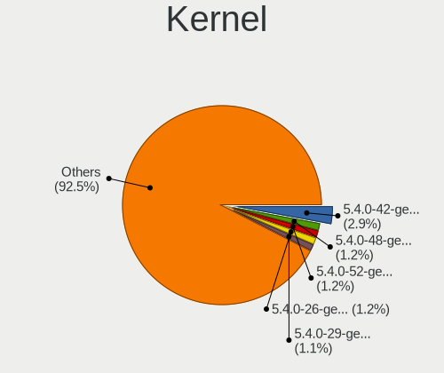
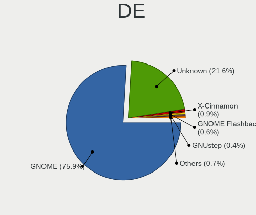
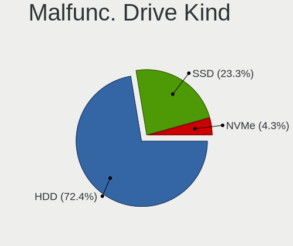
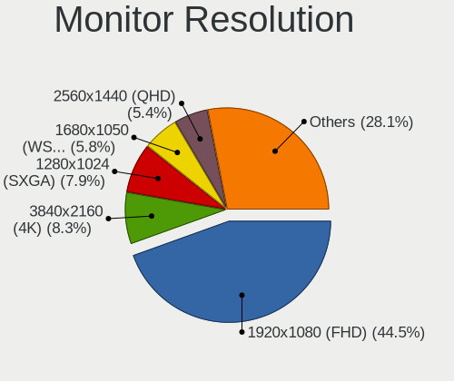
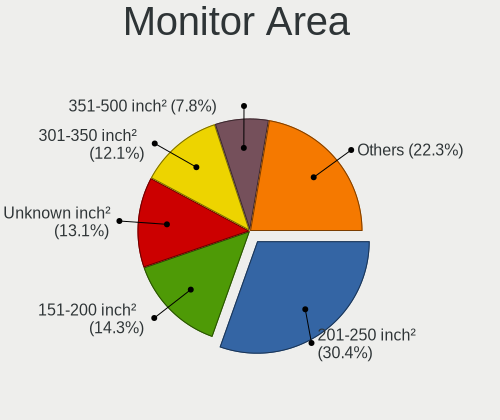
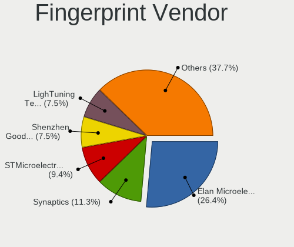

Ubuntu - Tested Hardware & Statistics (Desktops)
------------------------------------------------

A project to collect tested hardware configurations for Ubuntu.

Anyone can contribute to this report by the [hw-probe](https://github.com/linuxhw/hw-probe) tool:

    sudo -E hw-probe -all -upload

Please contribute! Especially if your hardware is rare.

Contents
--------

* [ Test Cases ](#test-cases)

* [ System ](#system)
  - [ OS                       ](#os)
  - [ OS Family                ](#os-family)
  - [ Kernel                   ](#kernel)
  - [ Kernel Family            ](#kernel-family)
  - [ Kernel Major Ver.        ](#kernel-major-ver)
  - [ Arch                     ](#arch)
  - [ DE                       ](#de)
  - [ Display Server           ](#display-server)
  - [ Display Manager          ](#display-manager)
  - [ OS Lang                  ](#os-lang)
  - [ Boot Mode                ](#boot-mode)
  - [ Filesystem               ](#filesystem)
  - [ Part. scheme             ](#part-scheme)
  - [ Dual Boot with Linux/BSD ](#dual-boot-with-linuxbsd)
  - [ Dual Boot (Win)          ](#dual-boot-win)

* [ Board ](#board)
  - [ Vendor                   ](#vendor)
  - [ Model                    ](#model)
  - [ Model Family             ](#model-family)
  - [ MFG Year                 ](#mfg-year)
  - [ Form Factor              ](#form-factor)
  - [ Secure Boot              ](#secure-boot)
  - [ Coreboot                 ](#coreboot)
  - [ RAM Size                 ](#ram-size)
  - [ RAM Used                 ](#ram-used)
  - [ Total Drives             ](#total-drives)
  - [ Has CD-ROM               ](#has-cd-rom)
  - [ Has Ethernet             ](#has-ethernet)
  - [ Has WiFi                 ](#has-wifi)
  - [ Has Bluetooth            ](#has-bluetooth)

* [ Location ](#location)
  - [ Country                  ](#country)
  - [ City                     ](#city)

* [ Drives ](#drives)
  - [ Drive Vendor             ](#drive-vendor)
  - [ Drive Model              ](#drive-model)
  - [ HDD Vendor               ](#hdd-vendor)
  - [ SSD Vendor               ](#ssd-vendor)
  - [ Drive Kind               ](#drive-kind)
  - [ Drive Connector          ](#drive-connector)
  - [ Drive Size               ](#drive-size)
  - [ Space Total              ](#space-total)
  - [ Space Used               ](#space-used)
  - [ Malfunc. Drives          ](#malfunc-drives)
  - [ Malfunc. Drive Vendor    ](#malfunc-drive-vendor)
  - [ Malfunc. HDD Vendor      ](#malfunc-hdd-vendor)
  - [ Malfunc. Drive Kind      ](#malfunc-drive-kind)
  - [ Failed Drives            ](#failed-drives)
  - [ Failed Drive Vendor      ](#failed-drive-vendor)
  - [ Drive Status             ](#drive-status)

* [ Storage controller ](#storage-controller)
  - [ Storage Vendor           ](#storage-vendor)
  - [ Storage Model            ](#storage-model)
  - [ Storage Kind             ](#storage-kind)

* [ Processor ](#processor)
  - [ CPU Vendor               ](#cpu-vendor)
  - [ CPU Model                ](#cpu-model)
  - [ CPU Model Family         ](#cpu-model-family)
  - [ CPU Cores                ](#cpu-cores)
  - [ CPU Sockets              ](#cpu-sockets)
  - [ CPU Threads              ](#cpu-threads)
  - [ CPU Op-Modes             ](#cpu-op-modes)
  - [ CPU Microcode            ](#cpu-microcode)
  - [ CPU Microarch            ](#cpu-microarch)

* [ Graphics ](#graphics)
  - [ GPU Vendor               ](#gpu-vendor)
  - [ GPU Model                ](#gpu-model)
  - [ GPU Combo                ](#gpu-combo)
  - [ GPU Driver               ](#gpu-driver)
  - [ GPU Memory               ](#gpu-memory)

* [ Monitor ](#monitor)
  - [ Monitor Vendor           ](#monitor-vendor)
  - [ Monitor Model            ](#monitor-model)
  - [ Monitor Resolution       ](#monitor-resolution)
  - [ Monitor Diagonal         ](#monitor-diagonal)
  - [ Monitor Width            ](#monitor-width)
  - [ Aspect Ratio             ](#aspect-ratio)
  - [ Monitor Area             ](#monitor-area)
  - [ Pixel Density            ](#pixel-density)
  - [ Multiple Monitors        ](#multiple-monitors)

* [ Network ](#network)
  - [ Net Controller Vendor    ](#net-controller-vendor)
  - [ Net Controller Model     ](#net-controller-model)
  - [ Wireless Vendor          ](#wireless-vendor)
  - [ Wireless Model           ](#wireless-model)
  - [ Ethernet Vendor          ](#ethernet-vendor)
  - [ Ethernet Model           ](#ethernet-model)
  - [ Net Controller Kind      ](#net-controller-kind)
  - [ Used Controller          ](#used-controller)
  - [ NICs                     ](#nics)
  - [ IPv6                     ](#ipv6)

* [ Bluetooth ](#bluetooth)
  - [ Bluetooth Vendor         ](#bluetooth-vendor)
  - [ Bluetooth Model          ](#bluetooth-model)

* [ Sound ](#sound)
  - [ Sound Vendor             ](#sound-vendor)
  - [ Sound Model              ](#sound-model)

* [ Memory ](#memory)
  - [ Memory Vendor            ](#memory-vendor)
  - [ Memory Model             ](#memory-model)
  - [ Memory Kind              ](#memory-kind)
  - [ Memory Form Factor       ](#memory-form-factor)
  - [ Memory Size              ](#memory-size)
  - [ Memory Speed             ](#memory-speed)

* [ Printers & scanners ](#printers--scanners)
  - [ Printer Vendor           ](#printer-vendor)
  - [ Printer Model            ](#printer-model)
  - [ Scanner Vendor           ](#scanner-vendor)
  - [ Scanner Model            ](#scanner-model)

* [ Camera ](#camera)
  - [ Camera Vendor            ](#camera-vendor)
  - [ Camera Model             ](#camera-model)

* [ Security ](#security)
  - [ Fingerprint Vendor       ](#fingerprint-vendor)
  - [ Fingerprint Model        ](#fingerprint-model)
  - [ Chipcard Vendor          ](#chipcard-vendor)
  - [ Chipcard Model           ](#chipcard-model)

* [ Unsupported ](#unsupported)
  - [ Unsupported Devices      ](#unsupported-devices)
  - [ Unsupported Device Types ](#unsupported-device-types)

Test Cases
----------

Total: 29486

| Vendor        | Model                       | Probe                                                      | Date         |
|---------------|-----------------------------|------------------------------------------------------------|--------------|
| ASRock        | Z97 Anniversary             | [558ca4b56e](https://linux-hardware.org/?probe=558ca4b56e) | Oct 01, 2022 |
| ASUSTek       | A78M-A                      | [5ad2e5f2a6](https://linux-hardware.org/?probe=5ad2e5f2a6) | Oct 01, 2022 |
| ASUSTek       | ROG STRIX B550-E GAMING     | [8a75a2c50b](https://linux-hardware.org/?probe=8a75a2c50b) | Oct 01, 2022 |
| MSI           | MAG B550 TOMAHAWK           | [a7268f8fba](https://linux-hardware.org/?probe=a7268f8fba) | Oct 01, 2022 |
| Medion        | MS-7366                     | [c8138f4ffe](https://linux-hardware.org/?probe=c8138f4ffe) | Oct 01, 2022 |
| Medion        | MS-7366                     | [c25c10b259](https://linux-hardware.org/?probe=c25c10b259) | Oct 01, 2022 |
| Gigabyte      | 990FXA-UD3                  | [cb25964ddb](https://linux-hardware.org/?probe=cb25964ddb) | Oct 01, 2022 |
| Unknown       | Unknown                     | [0c82fc9806](https://linux-hardware.org/?probe=0c82fc9806) | Oct 01, 2022 |
| MSI           | MAG B550 TOMAHAWK           | [151510a184](https://linux-hardware.org/?probe=151510a184) | Oct 01, 2022 |
| MSI           | X370 GAMING PLUS            | [2aa92cb043](https://linux-hardware.org/?probe=2aa92cb043) | Oct 01, 2022 |
| ASUSTek       | M5A99X EVO                  | [4c5134b8fc](https://linux-hardware.org/?probe=4c5134b8fc) | Oct 01, 2022 |
| MSI           | PRO X670-P WIFI             | [64299c7b4a](https://linux-hardware.org/?probe=64299c7b4a) | Oct 01, 2022 |
| ASUSTek       | M4N72-E                     | [c1c308be2a](https://linux-hardware.org/?probe=c1c308be2a) | Oct 01, 2022 |
| Gigabyte      | 990FXA-UD3                  | [36398ba3b9](https://linux-hardware.org/?probe=36398ba3b9) | Oct 01, 2022 |
| ASUSTek       | P8Z68-V                     | [c6e67f7643](https://linux-hardware.org/?probe=c6e67f7643) | Oct 01, 2022 |
| ASRock        | Z77 Extreme3                | [c92633e1ee](https://linux-hardware.org/?probe=c92633e1ee) | Oct 01, 2022 |
| ASRock        | Z77 Extreme3                | [ada9e56162](https://linux-hardware.org/?probe=ada9e56162) | Oct 01, 2022 |
| MSI           | A55M-E33                    | [13bd049f55](https://linux-hardware.org/?probe=13bd049f55) | Sep 30, 2022 |
| OEM           | Unknown                     | [e5a425c399](https://linux-hardware.org/?probe=e5a425c399) | Sep 30, 2022 |
| ASUSTek       | M5A78L LE                   | [1b2683c634](https://linux-hardware.org/?probe=1b2683c634) | Sep 30, 2022 |
| ASUSTek       | PHOENIX                     | [55d76f8846](https://linux-hardware.org/?probe=55d76f8846) | Sep 30, 2022 |
| ASUSTek       | PHOENIX                     | [6c28fed25f](https://linux-hardware.org/?probe=6c28fed25f) | Sep 30, 2022 |
| HP            | 3398                        | [8ef4543254](https://linux-hardware.org/?probe=8ef4543254) | Sep 30, 2022 |
| ASUSTek       | M5A78L LE                   | [8762386a2b](https://linux-hardware.org/?probe=8762386a2b) | Sep 30, 2022 |
| ASUSTek       | M5A78L-M LX3                | [938523ed34](https://linux-hardware.org/?probe=938523ed34) | Sep 30, 2022 |
| Pegatron      | 2A94                        | [6425f7a434](https://linux-hardware.org/?probe=6425f7a434) | Sep 30, 2022 |
| Gigabyte      | G41M-Combo                  | [aa49a31777](https://linux-hardware.org/?probe=aa49a31777) | Sep 30, 2022 |
| HP            | 83EF                        | [f508131396](https://linux-hardware.org/?probe=f508131396) | Sep 30, 2022 |
| ASUSTek       | PRIME B660M-K D4            | [7efad28576](https://linux-hardware.org/?probe=7efad28576) | Sep 30, 2022 |
| ASUSTek       | Z170-P                      | [996d72bd1e](https://linux-hardware.org/?probe=996d72bd1e) | Sep 30, 2022 |
| ASUSTek       | Z170-P                      | [8394fca38a](https://linux-hardware.org/?probe=8394fca38a) | Sep 30, 2022 |
| ASUSTek       | EX-A320M-GAMING             | [33d5d34654](https://linux-hardware.org/?probe=33d5d34654) | Sep 30, 2022 |
| Pegatron      | IPMSB-GS                    | [5e38213b3b](https://linux-hardware.org/?probe=5e38213b3b) | Sep 30, 2022 |
| ECS           | A320AM4-M3D/3.x/5.x         | [570ff509ac](https://linux-hardware.org/?probe=570ff509ac) | Sep 30, 2022 |
| ASUSTek       | TUF Gaming Z490-PLUS        | [2c08befa41](https://linux-hardware.org/?probe=2c08befa41) | Sep 30, 2022 |
| Positivo      | POS-PIQ67CG POSITIVO        | [5cdce489b9](https://linux-hardware.org/?probe=5cdce489b9) | Sep 30, 2022 |
| Gigabyte      | Z97M-DS3H                   | [fcf7e031e3](https://linux-hardware.org/?probe=fcf7e031e3) | Sep 30, 2022 |
| Positivo      | POS-PIQ67CG POSITIVO        | [3bfbb3744e](https://linux-hardware.org/?probe=3bfbb3744e) | Sep 30, 2022 |
| HP            | 3398                        | [2f7b1d28b4](https://linux-hardware.org/?probe=2f7b1d28b4) | Sep 30, 2022 |
| HP            | 1496                        | [e89f06542b](https://linux-hardware.org/?probe=e89f06542b) | Sep 30, 2022 |
| Unknown       | 775VM8                      | [114c84d76c](https://linux-hardware.org/?probe=114c84d76c) | Sep 30, 2022 |
| Unknown       | 775VM8                      | [903649eae9](https://linux-hardware.org/?probe=903649eae9) | Sep 30, 2022 |
| MSI           | H110 PC MATE                | [ac97c636a5](https://linux-hardware.org/?probe=ac97c636a5) | Sep 30, 2022 |
| Gigabyte      | H61M-S2PV                   | [cd06f54882](https://linux-hardware.org/?probe=cd06f54882) | Sep 30, 2022 |
| Gigabyte      | H510M H                     | [51a7f36a69](https://linux-hardware.org/?probe=51a7f36a69) | Sep 29, 2022 |
| OEM           | Unknown                     | [21b3a0929b](https://linux-hardware.org/?probe=21b3a0929b) | Sep 29, 2022 |
| MSI           | A68HM-E33 V2                | [3e8f63475d](https://linux-hardware.org/?probe=3e8f63475d) | Sep 29, 2022 |
| ASRock        | Q1900M                      | [e6804dc6b7](https://linux-hardware.org/?probe=e6804dc6b7) | Sep 29, 2022 |
| ASUSTek       | PHOENIX                     | [ea3a9cf5b4](https://linux-hardware.org/?probe=ea3a9cf5b4) | Sep 29, 2022 |
| ASUSTek       | M5A97 LE R2.0               | [e35b86c3b7](https://linux-hardware.org/?probe=e35b86c3b7) | Sep 29, 2022 |
| Gigabyte      | B75M-D3H                    | [a7d5bbb754](https://linux-hardware.org/?probe=a7d5bbb754) | Sep 29, 2022 |
| Gigabyte      | B75M-D3H                    | [5f261094bf](https://linux-hardware.org/?probe=5f261094bf) | Sep 29, 2022 |
| OEM           | Unknown                     | [68b7e03b06](https://linux-hardware.org/?probe=68b7e03b06) | Sep 29, 2022 |
| ASUSTek       | P8Z68-V                     | [f0d1b90e89](https://linux-hardware.org/?probe=f0d1b90e89) | Sep 29, 2022 |
| ASUSTek       | TUF Gaming B560M-PLUS WI... | [a686f595ee](https://linux-hardware.org/?probe=a686f595ee) | Sep 29, 2022 |
| Dell          | 0G3HR7 A00                  | [547cffd8dd](https://linux-hardware.org/?probe=547cffd8dd) | Sep 29, 2022 |
| ASUSTek       | PRO H410M-C                 | [2448bfc706](https://linux-hardware.org/?probe=2448bfc706) | Sep 29, 2022 |
| Acer          | Predator G6-710             | [12fd4575f7](https://linux-hardware.org/?probe=12fd4575f7) | Sep 29, 2022 |
| Dell          | 06D7TR A02                  | [7ad0e3e5f4](https://linux-hardware.org/?probe=7ad0e3e5f4) | Sep 29, 2022 |
| Lenovo        | 1031 SBB0J05441 WIN 3305... | [75c8af47c2](https://linux-hardware.org/?probe=75c8af47c2) | Sep 29, 2022 |
| Gigabyte      | Z370 HD3-CF                 | [715a83eaa1](https://linux-hardware.org/?probe=715a83eaa1) | Sep 29, 2022 |
| Biostar       | H410MH S2                   | [b03e32f37d](https://linux-hardware.org/?probe=b03e32f37d) | Sep 29, 2022 |
| ASUSTek       | P8Z68-V                     | [36ff9b8bcb](https://linux-hardware.org/?probe=36ff9b8bcb) | Sep 29, 2022 |
| Gigabyte      | F2A55M-DS2                  | [c17c689217](https://linux-hardware.org/?probe=c17c689217) | Sep 28, 2022 |
| ASRock        | Z68 Pro3-M                  | [7ba6677453](https://linux-hardware.org/?probe=7ba6677453) | Sep 28, 2022 |
| Medion        | MS-7707                     | [240ac993dc](https://linux-hardware.org/?probe=240ac993dc) | Sep 28, 2022 |
| MSI           | Z87-GD65 GAMING             | [fe6539c021](https://linux-hardware.org/?probe=fe6539c021) | Sep 28, 2022 |
| Gigabyte      | B450 I AORUS PRO WIFI-CF    | [d5185ee60b](https://linux-hardware.org/?probe=d5185ee60b) | Sep 28, 2022 |
| ASUSTek       | F2A85-M PRO                 | [571cb4bb05](https://linux-hardware.org/?probe=571cb4bb05) | Sep 28, 2022 |
| ASUSTek       | M5A97 LE R2.0               | [f9e71e7e05](https://linux-hardware.org/?probe=f9e71e7e05) | Sep 28, 2022 |
| HP            | 18E5                        | [bcc9927d20](https://linux-hardware.org/?probe=bcc9927d20) | Sep 28, 2022 |
| Intel         | DH55TC AAE70932-206         | [ac93c3912d](https://linux-hardware.org/?probe=ac93c3912d) | Sep 28, 2022 |
| MSI           | 2A9Ch                       | [16d3df803b](https://linux-hardware.org/?probe=16d3df803b) | Sep 28, 2022 |
| MSI           | X570-A PRO                  | [345959e0ed](https://linux-hardware.org/?probe=345959e0ed) | Sep 28, 2022 |
| ASUSTek       | PRIME Z370-A                | [5d789a1783](https://linux-hardware.org/?probe=5d789a1783) | Sep 28, 2022 |
| HP            | 212B                        | [38aa6e5478](https://linux-hardware.org/?probe=38aa6e5478) | Sep 28, 2022 |
| ASRock        | H61M-HVS                    | [660419ed49](https://linux-hardware.org/?probe=660419ed49) | Sep 27, 2022 |
| HP            | 2AF7                        | [d6889fef8d](https://linux-hardware.org/?probe=d6889fef8d) | Sep 27, 2022 |
| ASUSTek       | PRIME X470-PRO              | [1bdf72d415](https://linux-hardware.org/?probe=1bdf72d415) | Sep 27, 2022 |
| ASRock        | B450 Pro4                   | [9053250a2c](https://linux-hardware.org/?probe=9053250a2c) | Sep 27, 2022 |
| ASUSTek       | PHOENIX                     | [3c5f24bbb1](https://linux-hardware.org/?probe=3c5f24bbb1) | Sep 27, 2022 |
| MSI           | B450M GAMING PLUS           | [265d059992](https://linux-hardware.org/?probe=265d059992) | Sep 27, 2022 |
| ASRock        | Z97 Anniversary             | [6132513116](https://linux-hardware.org/?probe=6132513116) | Sep 27, 2022 |
| ASRock        | X470 Gaming-ITX/ac          | [fdafecf7b0](https://linux-hardware.org/?probe=fdafecf7b0) | Sep 27, 2022 |
| Packard Be... | IMEDIA L4875 v1.0           | [bb57b80866](https://linux-hardware.org/?probe=bb57b80866) | Sep 27, 2022 |
| ASUSTek       | P5B-Deluxe                  | [cf179c716e](https://linux-hardware.org/?probe=cf179c716e) | Sep 27, 2022 |
| Gigabyte      | MZBAYAP-00                  | [2fccc9ec66](https://linux-hardware.org/?probe=2fccc9ec66) | Sep 27, 2022 |
| Medion        | MS-7707                     | [a88f6ba4da](https://linux-hardware.org/?probe=a88f6ba4da) | Sep 27, 2022 |
| Lenovo        | ThinkStation S30 056839G    | [427d10a5ca](https://linux-hardware.org/?probe=427d10a5ca) | Sep 27, 2022 |
| Medion        | MS-7713                     | [36ca6b7f38](https://linux-hardware.org/?probe=36ca6b7f38) | Sep 27, 2022 |
| Gigabyte      | B450 I AORUS PRO WIFI-CF    | [9f85096ed9](https://linux-hardware.org/?probe=9f85096ed9) | Sep 27, 2022 |
| Dell          | 0M5DCD A00                  | [5168af6134](https://linux-hardware.org/?probe=5168af6134) | Sep 27, 2022 |
| ASUSTek       | Z170-K                      | [5048b5bef9](https://linux-hardware.org/?probe=5048b5bef9) | Sep 27, 2022 |
| HP            | 3031h                       | [8aa316f69f](https://linux-hardware.org/?probe=8aa316f69f) | Sep 27, 2022 |
| HP            | 3031h                       | [8e4696435d](https://linux-hardware.org/?probe=8e4696435d) | Sep 27, 2022 |
| MSI           | X570-A PRO                  | [8e872a0556](https://linux-hardware.org/?probe=8e872a0556) | Sep 27, 2022 |
| ASUSTek       | H97I-PLUS                   | [31036cd828](https://linux-hardware.org/?probe=31036cd828) | Sep 27, 2022 |
| ASUSTek       | H97I-PLUS                   | [fa2a23dff8](https://linux-hardware.org/?probe=fa2a23dff8) | Sep 27, 2022 |
| ASUSTek       | M5A97 PRO                   | [255a0a928a](https://linux-hardware.org/?probe=255a0a928a) | Sep 27, 2022 |
| Medion        | MS-7728                     | [82da4b643b](https://linux-hardware.org/?probe=82da4b643b) | Sep 27, 2022 |
| Acer          | Aspire XC-830               | [c8ff01ad2e](https://linux-hardware.org/?probe=c8ff01ad2e) | Sep 27, 2022 |
| Acer          | Aspire XC-830               | [4175b74d7a](https://linux-hardware.org/?probe=4175b74d7a) | Sep 27, 2022 |
| NU591         | 1.0                         | [6be5a78c90](https://linux-hardware.org/?probe=6be5a78c90) | Sep 27, 2022 |
| Dell          | 03NVJ6 A03                  | [2241dbc067](https://linux-hardware.org/?probe=2241dbc067) | Sep 26, 2022 |
| Dell          | 03NVJ6 A03                  | [2deb1ce174](https://linux-hardware.org/?probe=2deb1ce174) | Sep 26, 2022 |
| ASUSTek       | H81M-K                      | [badc988393](https://linux-hardware.org/?probe=badc988393) | Sep 26, 2022 |
| ASRock        | 960GM-VGS3 FX               | [45bf4d54bf](https://linux-hardware.org/?probe=45bf4d54bf) | Sep 26, 2022 |
| HP            | 0A9Ch                       | [2bf0c02966](https://linux-hardware.org/?probe=2bf0c02966) | Sep 26, 2022 |
| Foxconn       | Napa HP P/N                 | [15d8037255](https://linux-hardware.org/?probe=15d8037255) | Sep 26, 2022 |
| Foxconn       | Napa HP P/N                 | [ca0edb7c6a](https://linux-hardware.org/?probe=ca0edb7c6a) | Sep 26, 2022 |
| ASUSTek       | Z87-A                       | [3cdcc8b18d](https://linux-hardware.org/?probe=3cdcc8b18d) | Sep 26, 2022 |
| ASUSTek       | M5A78L-M/USB3               | [d166d32749](https://linux-hardware.org/?probe=d166d32749) | Sep 26, 2022 |
| ASRock        | Z68 Pro3-M                  | [48400b0487](https://linux-hardware.org/?probe=48400b0487) | Sep 26, 2022 |
| Gigabyte      | B75M-D3V                    | [291b07ce5f](https://linux-hardware.org/?probe=291b07ce5f) | Sep 26, 2022 |
| ASUSTek       | M5A78L-M/USB3               | [bce9addcca](https://linux-hardware.org/?probe=bce9addcca) | Sep 26, 2022 |
| MSI           | B560M PRO                   | [5949440926](https://linux-hardware.org/?probe=5949440926) | Sep 26, 2022 |
| Acer          | Aspire XC-603               | [efa89b9ac1](https://linux-hardware.org/?probe=efa89b9ac1) | Sep 26, 2022 |
| MSI           | MPG Z690 FORCE WIFI         | [95da21d9a8](https://linux-hardware.org/?probe=95da21d9a8) | Sep 26, 2022 |
| Gigabyte      | Z370 HD3-CF                 | [2a86fee784](https://linux-hardware.org/?probe=2a86fee784) | Sep 26, 2022 |
| Dell          | 00V62H A01                  | [43a06cb552](https://linux-hardware.org/?probe=43a06cb552) | Sep 26, 2022 |
| MSI           | C847IS-P33                  | [9b2205d329](https://linux-hardware.org/?probe=9b2205d329) | Sep 25, 2022 |
| Protectli     | FW2B                        | [55ead162b2](https://linux-hardware.org/?probe=55ead162b2) | Sep 25, 2022 |
| ASUSTek       | PRIME B350-PLUS             | [53c469011c](https://linux-hardware.org/?probe=53c469011c) | Sep 25, 2022 |
| ASRock        | B550 Pro4                   | [d17f3c7447](https://linux-hardware.org/?probe=d17f3c7447) | Sep 25, 2022 |
| Gigabyte      | A520I AC                    | [61bf9d5e84](https://linux-hardware.org/?probe=61bf9d5e84) | Sep 25, 2022 |
| Packard Be... | IMEDIA L4875 v1.0           | [4ed673ff1a](https://linux-hardware.org/?probe=4ed673ff1a) | Sep 25, 2022 |
| HP            | 2B35                        | [724e0d61e3](https://linux-hardware.org/?probe=724e0d61e3) | Sep 25, 2022 |
| ASUSTek       | G10AJ                       | [bf77a2476d](https://linux-hardware.org/?probe=bf77a2476d) | Sep 25, 2022 |
| ASUSTek       | PRIME A320M-K               | [bc6b161dc9](https://linux-hardware.org/?probe=bc6b161dc9) | Sep 25, 2022 |
| Dell          | 0Y2MRG A00                  | [af1ab104ed](https://linux-hardware.org/?probe=af1ab104ed) | Sep 25, 2022 |
| ASRock        | B450M-HDV                   | [a1639d1654](https://linux-hardware.org/?probe=a1639d1654) | Sep 25, 2022 |
| ASUSTek       | Pro WS WRX80E-SAGE SE WI... | [72e3bbaa93](https://linux-hardware.org/?probe=72e3bbaa93) | Sep 25, 2022 |
| Gigabyte      | A520M H                     | [acf2f9d381](https://linux-hardware.org/?probe=acf2f9d381) | Sep 25, 2022 |
| ASUSTek       | P8H61-M LX                  | [164f5bfea2](https://linux-hardware.org/?probe=164f5bfea2) | Sep 25, 2022 |
| HP            | 843B                        | [b811caca3b](https://linux-hardware.org/?probe=b811caca3b) | Sep 24, 2022 |
| HP            | 843B                        | [85d2c6fe18](https://linux-hardware.org/?probe=85d2c6fe18) | Sep 24, 2022 |
| Dell          | 0PC5F7 A01                  | [d3735721af](https://linux-hardware.org/?probe=d3735721af) | Sep 24, 2022 |
| ASUSTek       | P8Z77-V DELUXE              | [cd57bfa69c](https://linux-hardware.org/?probe=cd57bfa69c) | Sep 24, 2022 |
| ASUSTek       | P8Z77-V DELUXE              | [bad1de13cc](https://linux-hardware.org/?probe=bad1de13cc) | Sep 24, 2022 |
| Medion        | MS-7616                     | [72af7b904f](https://linux-hardware.org/?probe=72af7b904f) | Sep 24, 2022 |
| ASUSTek       | TUF Gaming B550-PLUS WIF... | [0daf5c5df5](https://linux-hardware.org/?probe=0daf5c5df5) | Sep 24, 2022 |
| MiTAC         | UltraPoint                  | [d7a35bf89c](https://linux-hardware.org/?probe=d7a35bf89c) | Sep 24, 2022 |
| ASRock        | H570M Pro4                  | [8c344be191](https://linux-hardware.org/?probe=8c344be191) | Sep 24, 2022 |
| Dell          | 0NW73C A00                  | [77cf7277d5](https://linux-hardware.org/?probe=77cf7277d5) | Sep 24, 2022 |
| HP            | 843B                        | [c1530c1c99](https://linux-hardware.org/?probe=c1530c1c99) | Sep 24, 2022 |
| Dell          | 0NW73C A00                  | [80835077a4](https://linux-hardware.org/?probe=80835077a4) | Sep 24, 2022 |
| Gigabyte      | B85M-D3H                    | [8de01689b6](https://linux-hardware.org/?probe=8de01689b6) | Sep 24, 2022 |
| Gigabyte      | Z270X-Ultra Gaming-CF       | [e0eae2efbd](https://linux-hardware.org/?probe=e0eae2efbd) | Sep 24, 2022 |
| ASUSTek       | P7H55D-M PRO                | [9ff56b2438](https://linux-hardware.org/?probe=9ff56b2438) | Sep 24, 2022 |
| ASUSTek       | TUF B450-PLUS GAMING        | [d603e07087](https://linux-hardware.org/?probe=d603e07087) | Sep 24, 2022 |
| ASUSTek       | P7H55D-M PRO                | [3ba342d57a](https://linux-hardware.org/?probe=3ba342d57a) | Sep 24, 2022 |
| HP            | ProLiant ML110 G7           | [716b4feed2](https://linux-hardware.org/?probe=716b4feed2) | Sep 24, 2022 |
| Gigabyte      | Z270P-D3-CF                 | [bdf21fb597](https://linux-hardware.org/?probe=bdf21fb597) | Sep 24, 2022 |
| Dell          | 0JP3NX A01                  | [03e5ac4a78](https://linux-hardware.org/?probe=03e5ac4a78) | Sep 24, 2022 |
| ASUSTek       | TUF B450-PLUS GAMING        | [a2ebf20cd0](https://linux-hardware.org/?probe=a2ebf20cd0) | Sep 24, 2022 |
| Gigabyte      | H81M-H                      | [68c4f74a37](https://linux-hardware.org/?probe=68c4f74a37) | Sep 24, 2022 |
| Gigabyte      | Z270X-Ultra Gaming-CF       | [165b95bd2c](https://linux-hardware.org/?probe=165b95bd2c) | Sep 24, 2022 |
| Gigabyte      | 970A-DS3P                   | [1e9a7dd793](https://linux-hardware.org/?probe=1e9a7dd793) | Sep 24, 2022 |
| MSI           | MPG X570 GAMING PLUS        | [fd43d92335](https://linux-hardware.org/?probe=fd43d92335) | Sep 23, 2022 |
| MSI           | MS-7358                     | [29d88b0c3b](https://linux-hardware.org/?probe=29d88b0c3b) | Sep 23, 2022 |
| Dell          | 0KWVT8 A02                  | [2e6e30cd8b](https://linux-hardware.org/?probe=2e6e30cd8b) | Sep 23, 2022 |
| Dell          | 0NW73C A00                  | [7d50214415](https://linux-hardware.org/?probe=7d50214415) | Sep 23, 2022 |
| Foxconn       | Q77M                        | [63d0fe0c57](https://linux-hardware.org/?probe=63d0fe0c57) | Sep 23, 2022 |
| ASRock        | G31M-S                      | [76d9b33c76](https://linux-hardware.org/?probe=76d9b33c76) | Sep 23, 2022 |
| ASUSTek       | WS X299 SAGE/10G            | [b0ed796de0](https://linux-hardware.org/?probe=b0ed796de0) | Sep 23, 2022 |
| Gigabyte      | X570S AORUS ELITE AX        | [1553f6266c](https://linux-hardware.org/?probe=1553f6266c) | Sep 23, 2022 |
| ASRock        | Z490 PG Velocita            | [eac045585b](https://linux-hardware.org/?probe=eac045585b) | Sep 23, 2022 |
| Acer          | Veriton N4680G              | [a68d3f20eb](https://linux-hardware.org/?probe=a68d3f20eb) | Sep 23, 2022 |
| Shuttle       | DH470                       | [d00d31309a](https://linux-hardware.org/?probe=d00d31309a) | Sep 23, 2022 |
| Shuttle       | DH470                       | [cb519b4bfe](https://linux-hardware.org/?probe=cb519b4bfe) | Sep 23, 2022 |
| HP            | 3032h                       | [efb6671159](https://linux-hardware.org/?probe=efb6671159) | Sep 23, 2022 |
| ASUSTek       | Pro WS WRX80E-SAGE SE WI... | [45a8669840](https://linux-hardware.org/?probe=45a8669840) | Sep 23, 2022 |
| Dell          | 0KV62T A01                  | [d8d21241de](https://linux-hardware.org/?probe=d8d21241de) | Sep 23, 2022 |
| Alienware     | 0GWM1Y A00                  | [8ea516fe4b](https://linux-hardware.org/?probe=8ea516fe4b) | Sep 23, 2022 |
| Gigabyte      | EX58-UD3R                   | [9b5329758f](https://linux-hardware.org/?probe=9b5329758f) | Sep 23, 2022 |
| HP            | 339A                        | [884e94fb23](https://linux-hardware.org/?probe=884e94fb23) | Sep 23, 2022 |
| HP            | 339A                        | [cd68752844](https://linux-hardware.org/?probe=cd68752844) | Sep 23, 2022 |
| Gigabyte      | B75M-D3H                    | [e7b218bc37](https://linux-hardware.org/?probe=e7b218bc37) | Sep 23, 2022 |
| MSI           | H110 PC MATE                | [006830e521](https://linux-hardware.org/?probe=006830e521) | Sep 23, 2022 |
| Lenovo        | 3098 SDK0E50510 WIN 2625... | [6458e6c55f](https://linux-hardware.org/?probe=6458e6c55f) | Sep 22, 2022 |
| HP            | 8309                        | [118f235878](https://linux-hardware.org/?probe=118f235878) | Sep 22, 2022 |
| ASRock        | A320M-DVS R4.0              | [0dca3e500c](https://linux-hardware.org/?probe=0dca3e500c) | Sep 22, 2022 |
| MSI           | X570-A PRO                  | [0306edc8ba](https://linux-hardware.org/?probe=0306edc8ba) | Sep 22, 2022 |
| Fujitsu Si... | P5LD2-FM-DH-VP              | [0c6cbcc99d](https://linux-hardware.org/?probe=0c6cbcc99d) | Sep 22, 2022 |
| MSI           | X570-A PRO                  | [56d6df17b5](https://linux-hardware.org/?probe=56d6df17b5) | Sep 22, 2022 |
| Gigabyte      | H110M-S2H DDR3-CF           | [fef79bcff4](https://linux-hardware.org/?probe=fef79bcff4) | Sep 22, 2022 |
| ASUSTek       | VM40B                       | [67cc53f766](https://linux-hardware.org/?probe=67cc53f766) | Sep 22, 2022 |
| ASUSTek       | VM40B                       | [229a66ae16](https://linux-hardware.org/?probe=229a66ae16) | Sep 22, 2022 |
| Dell          | 0478VN A00                  | [6a3572966a](https://linux-hardware.org/?probe=6a3572966a) | Sep 22, 2022 |
| Dell          | 0478VN A00                  | [fe270718e7](https://linux-hardware.org/?probe=fe270718e7) | Sep 22, 2022 |
| MSI           | X470 GAMING PRO             | [a48daa11cd](https://linux-hardware.org/?probe=a48daa11cd) | Sep 22, 2022 |
| HP            | 8053                        | [d46ac6d7db](https://linux-hardware.org/?probe=d46ac6d7db) | Sep 22, 2022 |
| Dell          | 0YU822 A00                  | [034dbdc359](https://linux-hardware.org/?probe=034dbdc359) | Sep 22, 2022 |
| ASUSTek       | M5A99X EVO                  | [48f4738047](https://linux-hardware.org/?probe=48f4738047) | Sep 22, 2022 |
| ASUSTek       | M5A99X EVO                  | [a484071017](https://linux-hardware.org/?probe=a484071017) | Sep 22, 2022 |
| Gigabyte      | 990FXA-UD3                  | [5c2eac6d83](https://linux-hardware.org/?probe=5c2eac6d83) | Sep 22, 2022 |
| Lenovo        | SHARKBAY SDK0J40700 WIN     | [a4ab03ccc4](https://linux-hardware.org/?probe=a4ab03ccc4) | Sep 22, 2022 |
| Gigabyte      | X99-Ultra Gaming-CF         | [568bffc355](https://linux-hardware.org/?probe=568bffc355) | Sep 22, 2022 |
| Acer          | Veriton N4680G              | [5ed0ffde54](https://linux-hardware.org/?probe=5ed0ffde54) | Sep 22, 2022 |
| Gigabyte      | EP45-UD3R                   | [920bf9a750](https://linux-hardware.org/?probe=920bf9a750) | Sep 22, 2022 |
| HP            | 3647h                       | [7c54133b32](https://linux-hardware.org/?probe=7c54133b32) | Sep 22, 2022 |
| ASUSTek       | TUF Gaming X570-PLUS        | [581e08e365](https://linux-hardware.org/?probe=581e08e365) | Sep 22, 2022 |
| MSI           | H81M-P33                    | [05d5a24774](https://linux-hardware.org/?probe=05d5a24774) | Sep 22, 2022 |
| MSI           | 2A9C                        | [0c026ab669](https://linux-hardware.org/?probe=0c026ab669) | Sep 21, 2022 |
| MSI           | MAG B550 TOMAHAWK           | [3fd067abd9](https://linux-hardware.org/?probe=3fd067abd9) | Sep 21, 2022 |
| Acer          | Aspire M3450                | [ff7d0a2394](https://linux-hardware.org/?probe=ff7d0a2394) | Sep 21, 2022 |
| MSI           | 970A-G46                    | [e7f3600d16](https://linux-hardware.org/?probe=e7f3600d16) | Sep 21, 2022 |
| Dell          | 0D28YY A03                  | [24230f3e30](https://linux-hardware.org/?probe=24230f3e30) | Sep 21, 2022 |
| MSI           | 970A-G46                    | [425eb466e5](https://linux-hardware.org/?probe=425eb466e5) | Sep 21, 2022 |
| Gigabyte      | H310M H                     | [1ec0fcefa2](https://linux-hardware.org/?probe=1ec0fcefa2) | Sep 21, 2022 |
| ASUSTek       | M3N78-VM                    | [edaab96cde](https://linux-hardware.org/?probe=edaab96cde) | Sep 21, 2022 |
| Acer          | Aspire XC-830               | [6fc7e7025c](https://linux-hardware.org/?probe=6fc7e7025c) | Sep 21, 2022 |
| Gigabyte      | A520M H                     | [21407ce4a8](https://linux-hardware.org/?probe=21407ce4a8) | Sep 21, 2022 |
| ASUSTek       | A8N-SLI                     | [95d20defd7](https://linux-hardware.org/?probe=95d20defd7) | Sep 21, 2022 |
| ASUSTek       | M5A97 R2.0                  | [b35ec1a833](https://linux-hardware.org/?probe=b35ec1a833) | Sep 21, 2022 |
| ASUSTek       | PRIME B360-PLUS             | [49b3253936](https://linux-hardware.org/?probe=49b3253936) | Sep 21, 2022 |
| MSI           | X470 GAMING PRO             | [5c64c61090](https://linux-hardware.org/?probe=5c64c61090) | Sep 21, 2022 |
| Huanan        | X99-TF                      | [657d78e891](https://linux-hardware.org/?probe=657d78e891) | Sep 21, 2022 |
| ASRock        | H81M-GL                     | [fe7e5bbc9c](https://linux-hardware.org/?probe=fe7e5bbc9c) | Sep 21, 2022 |
| NU591         | 1.0                         | [6e29ae977f](https://linux-hardware.org/?probe=6e29ae977f) | Sep 21, 2022 |
| HP            | 3647h                       | [64cc139cac](https://linux-hardware.org/?probe=64cc139cac) | Sep 21, 2022 |
| Gigabyte      | Z77-DS3H                    | [ea8ea96269](https://linux-hardware.org/?probe=ea8ea96269) | Sep 21, 2022 |
| Fujitsu       | D3400-A1 S26361-D3400-A1    | [5cf5ac2512](https://linux-hardware.org/?probe=5cf5ac2512) | Sep 21, 2022 |
| Dell          | 0D883F A06                  | [01c50a7a4c](https://linux-hardware.org/?probe=01c50a7a4c) | Sep 21, 2022 |
| ASRock        | Z77 Extreme3                | [deb21d492d](https://linux-hardware.org/?probe=deb21d492d) | Sep 21, 2022 |
| Gigabyte      | X570 UD                     | [85bee019c9](https://linux-hardware.org/?probe=85bee019c9) | Sep 21, 2022 |
| HP            | 339A                        | [bc2a08f514](https://linux-hardware.org/?probe=bc2a08f514) | Sep 21, 2022 |
| ASUSTek       | PRIME A520M-K               | [6b528465e2](https://linux-hardware.org/?probe=6b528465e2) | Sep 20, 2022 |
| Gigabyte      | GA-78LMT-S2                 | [5175ba7e7c](https://linux-hardware.org/?probe=5175ba7e7c) | Sep 20, 2022 |
| ASUSTek       | M5A99X EVO                  | [c59de2d375](https://linux-hardware.org/?probe=c59de2d375) | Sep 20, 2022 |
| Dell          | 042P49 A02                  | [180561f253](https://linux-hardware.org/?probe=180561f253) | Sep 20, 2022 |
| ASUSTek       | M5A99X EVO                  | [c93edfa02c](https://linux-hardware.org/?probe=c93edfa02c) | Sep 20, 2022 |
| Lenovo        | SHARKBAY SDK0E50510 WIN     | [88b0561dbc](https://linux-hardware.org/?probe=88b0561dbc) | Sep 20, 2022 |
| ASRock        | E3V5 Performance Gaming/... | [3653dbd804](https://linux-hardware.org/?probe=3653dbd804) | Sep 20, 2022 |
| ASUSTek       | PRIME A320M-K               | [70a7e5cad3](https://linux-hardware.org/?probe=70a7e5cad3) | Sep 20, 2022 |
| MSI           | H410M-A PRO                 | [76c03610be](https://linux-hardware.org/?probe=76c03610be) | Sep 20, 2022 |
| Lenovo        | SBB0J05441 WIN 330500871... | [2e5434cf1f](https://linux-hardware.org/?probe=2e5434cf1f) | Sep 20, 2022 |
| ASUSTek       | PRIME B350-PLUS             | [0c7b33b15f](https://linux-hardware.org/?probe=0c7b33b15f) | Sep 20, 2022 |
| Dell          | 0D883F A06                  | [55f97310c8](https://linux-hardware.org/?probe=55f97310c8) | Sep 20, 2022 |
| Gigabyte      | B450 AORUS ELITE            | [bb0b1764e0](https://linux-hardware.org/?probe=bb0b1764e0) | Sep 19, 2022 |
| ASUSTek       | ROG CROSSHAIR VIII HERO     | [14fe25593d](https://linux-hardware.org/?probe=14fe25593d) | Sep 19, 2022 |
| Acer          | Aspire M3970                | [d135989361](https://linux-hardware.org/?probe=d135989361) | Sep 19, 2022 |
| ASUSTek       | ROG CROSSHAIR VIII HERO     | [952190141c](https://linux-hardware.org/?probe=952190141c) | Sep 19, 2022 |
| ASUSTek       | TUF Gaming X570-PLUS        | [92d0d41e58](https://linux-hardware.org/?probe=92d0d41e58) | Sep 19, 2022 |
| Dell          | 0GX297                      | [57e334a0c2](https://linux-hardware.org/?probe=57e334a0c2) | Sep 19, 2022 |
| ASUSTek       | ROG STRIX B450-F GAMING     | [841474a64b](https://linux-hardware.org/?probe=841474a64b) | Sep 19, 2022 |
| HP            | 82B4                        | [f4b85399b3](https://linux-hardware.org/?probe=f4b85399b3) | Sep 19, 2022 |
| Supermicro    | C7P67                       | [16bff71d62](https://linux-hardware.org/?probe=16bff71d62) | Sep 19, 2022 |
| ASUSTek       | Z97-A                       | [d984474cba](https://linux-hardware.org/?probe=d984474cba) | Sep 19, 2022 |
| ASUSTek       | P5K-VM                      | [d90ca77597](https://linux-hardware.org/?probe=d90ca77597) | Sep 19, 2022 |
| Lenovo        | SHARKBAY SDK0J40700 WIN     | [1abf3ddee3](https://linux-hardware.org/?probe=1abf3ddee3) | Sep 19, 2022 |
| Foxconn       | 2ADA                        | [736a1c0eec](https://linux-hardware.org/?probe=736a1c0eec) | Sep 19, 2022 |
| ASRock        | AB350M-HDV                  | [22b753798c](https://linux-hardware.org/?probe=22b753798c) | Sep 19, 2022 |
| ASRock        | Z97 Anniversary             | [8c308a3e22](https://linux-hardware.org/?probe=8c308a3e22) | Sep 19, 2022 |
| ASUSTek       | M5A78L-M PLUS/USB3          | [908ad5ef27](https://linux-hardware.org/?probe=908ad5ef27) | Sep 19, 2022 |
| MSI           | Z370-A PRO                  | [43fbf9fec9](https://linux-hardware.org/?probe=43fbf9fec9) | Sep 19, 2022 |
| Gigabyte      | G41MT-S2P                   | [d8be5e602a](https://linux-hardware.org/?probe=d8be5e602a) | Sep 19, 2022 |
| MSI           | Z370-A PRO                  | [850e17ede5](https://linux-hardware.org/?probe=850e17ede5) | Sep 19, 2022 |
| ASUSTek       | TUF Gaming B550-PLUS        | [ca1b76cefe](https://linux-hardware.org/?probe=ca1b76cefe) | Sep 19, 2022 |
| Gigabyte      | EP45-UD3                    | [3a6ef7d23b](https://linux-hardware.org/?probe=3a6ef7d23b) | Sep 19, 2022 |
| Gigabyte      | X58A-UD7                    | [b7f881a109](https://linux-hardware.org/?probe=b7f881a109) | Sep 19, 2022 |
| Gigabyte      | X58A-UD7                    | [59e7485a11](https://linux-hardware.org/?probe=59e7485a11) | Sep 19, 2022 |
| Intel         | HURONRIVER                  | [e4e09c23e5](https://linux-hardware.org/?probe=e4e09c23e5) | Sep 19, 2022 |
| HP            | 3647h                       | [63d5e6ee6a](https://linux-hardware.org/?probe=63d5e6ee6a) | Sep 19, 2022 |
| ASUSTek       | F2A85-V PRO                 | [943bb9e023](https://linux-hardware.org/?probe=943bb9e023) | Sep 19, 2022 |
| Gigabyte      | H97M-D3H                    | [a63fe17f47](https://linux-hardware.org/?probe=a63fe17f47) | Sep 19, 2022 |
| ASUSTek       | M5A78L-M PLUS/USB3          | [25f87932c7](https://linux-hardware.org/?probe=25f87932c7) | Sep 19, 2022 |
| ASUSTek       | Rampage II Extreme          | [c996a3c4dd](https://linux-hardware.org/?probe=c996a3c4dd) | Sep 19, 2022 |
| MSI           | H61M-P23                    | [8719bdc05a](https://linux-hardware.org/?probe=8719bdc05a) | Sep 18, 2022 |
| MSI           | A68HM-E33                   | [2905913e7e](https://linux-hardware.org/?probe=2905913e7e) | Sep 18, 2022 |
| ASUSTek       | M5A97 R2.0                  | [a7b0a5d6f3](https://linux-hardware.org/?probe=a7b0a5d6f3) | Sep 18, 2022 |
| Dell          | 0Y2MRG A00                  | [f523e394ba](https://linux-hardware.org/?probe=f523e394ba) | Sep 18, 2022 |
| ASUSTek       | P7H55-M LX/USB3             | [76eedbf647](https://linux-hardware.org/?probe=76eedbf647) | Sep 18, 2022 |
| ASUSTek       | H110M-D                     | [7ea35cc80a](https://linux-hardware.org/?probe=7ea35cc80a) | Sep 18, 2022 |
| Gigabyte      | 990FXA-UD3                  | [c9e0203e64](https://linux-hardware.org/?probe=c9e0203e64) | Sep 18, 2022 |
| ASUSTek       | P7H55-M LX/USB3             | [95015c9edb](https://linux-hardware.org/?probe=95015c9edb) | Sep 18, 2022 |
| Acer          | Aspire M3970                | [e366f1be3b](https://linux-hardware.org/?probe=e366f1be3b) | Sep 18, 2022 |
| Medion        | MS-7707                     | [df4472374c](https://linux-hardware.org/?probe=df4472374c) | Sep 18, 2022 |
| Medion        | MS-7707                     | [248b893ed4](https://linux-hardware.org/?probe=248b893ed4) | Sep 18, 2022 |
| ASUSTek       | M4A785-M                    | [411449bc6d](https://linux-hardware.org/?probe=411449bc6d) | Sep 18, 2022 |
| Gigabyte      | 990FXA-UD3                  | [ea7d5b0424](https://linux-hardware.org/?probe=ea7d5b0424) | Sep 18, 2022 |
| Lenovo        | ThinkStation D20 4158F76    | [d6b369855e](https://linux-hardware.org/?probe=d6b369855e) | Sep 18, 2022 |
| Gigabyte      | G31M-ES2L                   | [e074efb108](https://linux-hardware.org/?probe=e074efb108) | Sep 18, 2022 |
| ASRock        | 960GC-GS FX                 | [2432fca2f8](https://linux-hardware.org/?probe=2432fca2f8) | Sep 18, 2022 |
| ASUSTek       | PRIME B550M-K               | [b3cb8fc82e](https://linux-hardware.org/?probe=b3cb8fc82e) | Sep 18, 2022 |
| Gigabyte      | G31M-ES2L                   | [4b8841b706](https://linux-hardware.org/?probe=4b8841b706) | Sep 18, 2022 |
| Dell          | 0Y2MRG A00                  | [38a87b4cda](https://linux-hardware.org/?probe=38a87b4cda) | Sep 18, 2022 |
| Lenovo        | 3642 SDK0J40700 WIN 3258... | [ebdbec3427](https://linux-hardware.org/?probe=ebdbec3427) | Sep 17, 2022 |
| ASUSTek       | M5A99X EVO                  | [5653a39e40](https://linux-hardware.org/?probe=5653a39e40) | Sep 17, 2022 |
| ASUSTek       | GA35DX                      | [c123fdbb81](https://linux-hardware.org/?probe=c123fdbb81) | Sep 17, 2022 |
| HP            | 0AECh D                     | [23adee752f](https://linux-hardware.org/?probe=23adee752f) | Sep 17, 2022 |
| Fujitsu       | D3617-A1 S26361-D3617-A1    | [51d9d832b7](https://linux-hardware.org/?probe=51d9d832b7) | Sep 17, 2022 |
| ASUSTek       | M5A78L-M PLUS/USB3          | [0e007748d1](https://linux-hardware.org/?probe=0e007748d1) | Sep 17, 2022 |
| HP            | 3398                        | [9add0a56b5](https://linux-hardware.org/?probe=9add0a56b5) | Sep 17, 2022 |
| ASUSTek       | K30AM-J                     | [c583746579](https://linux-hardware.org/?probe=c583746579) | Sep 17, 2022 |
| Gigabyte      | A320M-S2H-CF                | [90871c217b](https://linux-hardware.org/?probe=90871c217b) | Sep 17, 2022 |
| ASUSTek       | P5B-Deluxe                  | [0b32a9e842](https://linux-hardware.org/?probe=0b32a9e842) | Sep 17, 2022 |
| MSI           | Boston                      | [b884bd8c03](https://linux-hardware.org/?probe=b884bd8c03) | Sep 17, 2022 |
| Gigabyte      | Z77-DS3H                    | [b5a0c6309d](https://linux-hardware.org/?probe=b5a0c6309d) | Sep 17, 2022 |
| Gigabyte      | H97M-D3H                    | [aca70e9485](https://linux-hardware.org/?probe=aca70e9485) | Sep 17, 2022 |
| HP            | 3647h                       | [0e821515bd](https://linux-hardware.org/?probe=0e821515bd) | Sep 17, 2022 |
| ASUSTek       | H110M-K                     | [a15d189c98](https://linux-hardware.org/?probe=a15d189c98) | Sep 17, 2022 |
| ASUSTek       | ROG STRIX B450-F GAMING     | [1b40e531b5](https://linux-hardware.org/?probe=1b40e531b5) | Sep 17, 2022 |
| Gigabyte      | H270M-DS3H-CF               | [0f8111d187](https://linux-hardware.org/?probe=0f8111d187) | Sep 16, 2022 |
| HP            | 8768 A                      | [dd63bfb225](https://linux-hardware.org/?probe=dd63bfb225) | Sep 16, 2022 |
| Gigabyte      | Z97-D3H-CF                  | [4d7948b375](https://linux-hardware.org/?probe=4d7948b375) | Sep 16, 2022 |
| ASUSTek       | PRIME B560M-A               | [fab04fe2c7](https://linux-hardware.org/?probe=fab04fe2c7) | Sep 16, 2022 |
| Gigabyte      | 970A-DS3P                   | [c362a2f06e](https://linux-hardware.org/?probe=c362a2f06e) | Sep 16, 2022 |
| Lenovo        | MAHOBAY Win8 Pro DPK TPG    | [07d731bb3e](https://linux-hardware.org/?probe=07d731bb3e) | Sep 16, 2022 |
| Dell          | 0X8582                      | [3498499960](https://linux-hardware.org/?probe=3498499960) | Sep 16, 2022 |
| Dell          | 0NC2VH A01                  | [cba8ef504c](https://linux-hardware.org/?probe=cba8ef504c) | Sep 16, 2022 |
| Biostar       | A10N-8800E                  | [4a06fb8bfa](https://linux-hardware.org/?probe=4a06fb8bfa) | Sep 16, 2022 |
| MSI           | MPG Z690 FORCE WIFI         | [8eab5a5824](https://linux-hardware.org/?probe=8eab5a5824) | Sep 16, 2022 |
| ASUSTek       | CM6330_CM6630_CM6730_CM6... | [dbe024bea9](https://linux-hardware.org/?probe=dbe024bea9) | Sep 16, 2022 |
| ASUSTek       | CM6330_CM6630_CM6730_CM6... | [64f8beea8f](https://linux-hardware.org/?probe=64f8beea8f) | Sep 16, 2022 |
| Lenovo        | ThinkStation D20 4158F76    | [45a3f96ced](https://linux-hardware.org/?probe=45a3f96ced) | Sep 16, 2022 |
| ASUSTek       | ROG STRIX B450-I GAMING     | [31f9854044](https://linux-hardware.org/?probe=31f9854044) | Sep 16, 2022 |
| ASUSTek       | Z170-E                      | [80deeff510](https://linux-hardware.org/?probe=80deeff510) | Sep 16, 2022 |
| MSI           | A320M-A PRO MAX             | [eed790913e](https://linux-hardware.org/?probe=eed790913e) | Sep 16, 2022 |
| Lenovo        | 30D2 SDK0J40705 WIN 3425... | [4d4809282a](https://linux-hardware.org/?probe=4d4809282a) | Sep 16, 2022 |
| Lenovo        | 30D2 SDK0J40705 WIN 3425... | [54588ca345](https://linux-hardware.org/?probe=54588ca345) | Sep 16, 2022 |
| ASUSTek       | P5K-VM                      | [b0242689c2](https://linux-hardware.org/?probe=b0242689c2) | Sep 16, 2022 |
| Gigabyte      | Z97-D3H-CF                  | [1e4d0a6189](https://linux-hardware.org/?probe=1e4d0a6189) | Sep 15, 2022 |
| ASUSTek       | ROG STRIX B450-I GAMING     | [52fd47ee14](https://linux-hardware.org/?probe=52fd47ee14) | Sep 15, 2022 |
| ASUSTek       | CROSSHAIR V FORMULA-Z       | [68749016d1](https://linux-hardware.org/?probe=68749016d1) | Sep 15, 2022 |
| ASRock        | X570M Pro4                  | [afe355a3f4](https://linux-hardware.org/?probe=afe355a3f4) | Sep 15, 2022 |
| MSI           | MPG B550I GAMING EDGE WI... | [a803a04b1f](https://linux-hardware.org/?probe=a803a04b1f) | Sep 15, 2022 |
| MSI           | MPG B550I GAMING EDGE WI... | [50f0cfbfad](https://linux-hardware.org/?probe=50f0cfbfad) | Sep 15, 2022 |
| MSI           | Z370-A PRO                  | [d923c9e35f](https://linux-hardware.org/?probe=d923c9e35f) | Sep 15, 2022 |
| Foxconn       | 2ADA                        | [812586d5e3](https://linux-hardware.org/?probe=812586d5e3) | Sep 15, 2022 |
| ASUSTek       | ROG CROSSHAIR VIII FORMU... | [805d4161a8](https://linux-hardware.org/?probe=805d4161a8) | Sep 15, 2022 |
| Acer          | FMP55                       | [6721345b03](https://linux-hardware.org/?probe=6721345b03) | Sep 15, 2022 |
| Acer          | FMP55                       | [450dc952d1](https://linux-hardware.org/?probe=450dc952d1) | Sep 15, 2022 |
| ASUSTek       | TUF Gaming B550M-E          | [600ef31484](https://linux-hardware.org/?probe=600ef31484) | Sep 15, 2022 |
| AMI           | Cherry Trail CR             | [3519121da4](https://linux-hardware.org/?probe=3519121da4) | Sep 15, 2022 |
| ASUSTek       | Benicia                     | [f5f4102401](https://linux-hardware.org/?probe=f5f4102401) | Sep 15, 2022 |
| IBT.ca (IB... | MI836                       | [a180af0292](https://linux-hardware.org/?probe=a180af0292) | Sep 15, 2022 |
| IBT.ca (IB... | MI836                       | [a6d16593cc](https://linux-hardware.org/?probe=a6d16593cc) | Sep 15, 2022 |
| ASUSTek       | H97I-PLUS                   | [5269bfb990](https://linux-hardware.org/?probe=5269bfb990) | Sep 14, 2022 |
| MSI           | B450-A PRO MAX              | [f1c8ae3891](https://linux-hardware.org/?probe=f1c8ae3891) | Sep 14, 2022 |
| Dell          | 0WR7PY A02                  | [0a587d6fee](https://linux-hardware.org/?probe=0a587d6fee) | Sep 14, 2022 |
| ASRock        | X470 Gaming-ITX/ac          | [f0a87cc2ef](https://linux-hardware.org/?probe=f0a87cc2ef) | Sep 14, 2022 |
| Gigabyte      | Z590 VISION G               | [ec15390099](https://linux-hardware.org/?probe=ec15390099) | Sep 14, 2022 |
| Fujitsu       | D3162-A1 S26361-D3162-A1    | [e620df9580](https://linux-hardware.org/?probe=e620df9580) | Sep 14, 2022 |
| Lenovo        | 1036 NO DPK                 | [1b7cb7f0d2](https://linux-hardware.org/?probe=1b7cb7f0d2) | Sep 14, 2022 |
| Lenovo        | 1036 NO DPK                 | [0ac056f016](https://linux-hardware.org/?probe=0ac056f016) | Sep 14, 2022 |
| Medion        | MS-7857                     | [98a978898c](https://linux-hardware.org/?probe=98a978898c) | Sep 14, 2022 |
| Medion        | MS-7857                     | [54237e3276](https://linux-hardware.org/?probe=54237e3276) | Sep 14, 2022 |
| ASUSTek       | M5A78L-M PLUS/USB3          | [64d4d4b3bc](https://linux-hardware.org/?probe=64d4d4b3bc) | Sep 14, 2022 |
| HP            | 81C5 MVB                    | [e274dcadcd](https://linux-hardware.org/?probe=e274dcadcd) | Sep 14, 2022 |
| ASUSTek       | PRIME B250-PRO              | [98422dda65](https://linux-hardware.org/?probe=98422dda65) | Sep 14, 2022 |
| ASRock        | B450M Pro4-F                | [af402f9448](https://linux-hardware.org/?probe=af402f9448) | Sep 14, 2022 |
| ASUSTek       | TUF Gaming X570-PLUS        | [039ae21470](https://linux-hardware.org/?probe=039ae21470) | Sep 14, 2022 |
| Lenovo        | 1031 SBB0J05441 WIN 3305... | [f614aa6ae7](https://linux-hardware.org/?probe=f614aa6ae7) | Sep 14, 2022 |
| Lenovo        | 1031 SBB0J05441 WIN 3305... | [fc1d1cb3bc](https://linux-hardware.org/?probe=fc1d1cb3bc) | Sep 14, 2022 |
| Dell          | 0PC5F7 A03                  | [161958a208](https://linux-hardware.org/?probe=161958a208) | Sep 14, 2022 |
| Dell          | 0HN7XN A01                  | [1bf2e6de0e](https://linux-hardware.org/?probe=1bf2e6de0e) | Sep 14, 2022 |
| ASUSTek       | ROG STRIX B450-F GAMING     | [4155fc10fa](https://linux-hardware.org/?probe=4155fc10fa) | Sep 14, 2022 |
| ASUSTek       | TUF Gaming Z590-PLUS WIF... | [848861f263](https://linux-hardware.org/?probe=848861f263) | Sep 13, 2022 |
| ASUSTek       | P5K-E                       | [ddac4b0175](https://linux-hardware.org/?probe=ddac4b0175) | Sep 13, 2022 |
| Dell          | 0F5C5X A00                  | [e84764db17](https://linux-hardware.org/?probe=e84764db17) | Sep 13, 2022 |
| Dell          | 0M5DCD A00                  | [d15e18c17e](https://linux-hardware.org/?probe=d15e18c17e) | Sep 13, 2022 |
| ASUSTek       | ROG STRIX X570-E GAMING ... | [72655619f3](https://linux-hardware.org/?probe=72655619f3) | Sep 13, 2022 |
| ASRock        | B450M Pro4                  | [9ad0fabe3d](https://linux-hardware.org/?probe=9ad0fabe3d) | Sep 13, 2022 |
| HP            | 3648h                       | [8ed24fd9d4](https://linux-hardware.org/?probe=8ed24fd9d4) | Sep 13, 2022 |
| MSI           | MPG Z390 GAMING PLUS        | [9a3cc70094](https://linux-hardware.org/?probe=9a3cc70094) | Sep 13, 2022 |
| ASUSTek       | M5A99X EVO                  | [a27df20eda](https://linux-hardware.org/?probe=a27df20eda) | Sep 13, 2022 |
| ASUSTek       | M5A99X EVO                  | [ae9712f9b3](https://linux-hardware.org/?probe=ae9712f9b3) | Sep 13, 2022 |
| HP            | 3647h                       | [e94712a856](https://linux-hardware.org/?probe=e94712a856) | Sep 13, 2022 |
| HP            | 3031h                       | [9312c20d49](https://linux-hardware.org/?probe=9312c20d49) | Sep 13, 2022 |
| ASUSTek       | Z97-A                       | [9de0254ab0](https://linux-hardware.org/?probe=9de0254ab0) | Sep 13, 2022 |
| Medion        | MS-7707                     | [68428aab84](https://linux-hardware.org/?probe=68428aab84) | Sep 13, 2022 |
| Positivo      | POS-PQ45AU                  | [0879f8d9ce](https://linux-hardware.org/?probe=0879f8d9ce) | Sep 13, 2022 |
| HP            | 1497                        | [7d44fed5d5](https://linux-hardware.org/?probe=7d44fed5d5) | Sep 13, 2022 |
| HP            | 1497                        | [3afd83b18b](https://linux-hardware.org/?probe=3afd83b18b) | Sep 13, 2022 |
| ASRock        | Z170 Gaming K6+             | [39027cdb44](https://linux-hardware.org/?probe=39027cdb44) | Sep 13, 2022 |
| HP            | 3048h                       | [e25d0d8a10](https://linux-hardware.org/?probe=e25d0d8a10) | Sep 13, 2022 |
| ASUSTek       | ROG STRIX B660-A GAMING ... | [34c1beb103](https://linux-hardware.org/?probe=34c1beb103) | Sep 13, 2022 |
| Gigabyte      | B85M-D3H                    | [19eb66af9e](https://linux-hardware.org/?probe=19eb66af9e) | Sep 13, 2022 |
| MSI           | H110M PRO-VD PLUS           | [e61fe6932b](https://linux-hardware.org/?probe=e61fe6932b) | Sep 13, 2022 |
| ASUSTek       | Z170-P                      | [bec58f880f](https://linux-hardware.org/?probe=bec58f880f) | Sep 13, 2022 |
| ASUSTek       | Z170-P                      | [182bb36928](https://linux-hardware.org/?probe=182bb36928) | Sep 13, 2022 |
| MSI           | PRESTIGE X570 CREATION      | [5e67e25052](https://linux-hardware.org/?probe=5e67e25052) | Sep 13, 2022 |
| ASRock        | A320M-HDV R4.0              | [dc2c5a0bfb](https://linux-hardware.org/?probe=dc2c5a0bfb) | Sep 13, 2022 |
| HP            | 3647h                       | [c40ded9736](https://linux-hardware.org/?probe=c40ded9736) | Sep 13, 2022 |
| HP            | 3031h                       | [1bbfd867b0](https://linux-hardware.org/?probe=1bbfd867b0) | Sep 13, 2022 |
| ASRock        | B75M R2.0                   | [d1e62450d4](https://linux-hardware.org/?probe=d1e62450d4) | Sep 13, 2022 |
| ASUSTek       | M5A78L-M PLUS/USB3          | [ac722c6dcc](https://linux-hardware.org/?probe=ac722c6dcc) | Sep 13, 2022 |
| Dell          | 060K5C A00                  | [a64a44387b](https://linux-hardware.org/?probe=a64a44387b) | Sep 13, 2022 |
| ASUSTek       | P5LD2-VM DH                 | [a16bc87810](https://linux-hardware.org/?probe=a16bc87810) | Sep 12, 2022 |
| Gigabyte      | Z97M-DS3H                   | [edbc81cc67](https://linux-hardware.org/?probe=edbc81cc67) | Sep 12, 2022 |
| ASUSTek       | PHOENIX                     | [853cff5648](https://linux-hardware.org/?probe=853cff5648) | Sep 12, 2022 |
| MSI           | Z97M-G43                    | [706804a4e2](https://linux-hardware.org/?probe=706804a4e2) | Sep 12, 2022 |
| DFI           | HD631-Q87CRM                | [b7ed9b1d64](https://linux-hardware.org/?probe=b7ed9b1d64) | Sep 12, 2022 |
| ASUSTek       | TUF Gaming X570-PLUS        | [864a5abac7](https://linux-hardware.org/?probe=864a5abac7) | Sep 12, 2022 |
| ASUSTek       | CROSSHAIR V FORMULA-Z       | [717942ca91](https://linux-hardware.org/?probe=717942ca91) | Sep 12, 2022 |
| Intel         | H61                         | [d805e24841](https://linux-hardware.org/?probe=d805e24841) | Sep 12, 2022 |
| ASUSTek       | TUF B450M-PLUS GAMING       | [743af62b4c](https://linux-hardware.org/?probe=743af62b4c) | Sep 12, 2022 |
| ASUSTek       | PRIME B360-PLUS             | [c5b53f9f74](https://linux-hardware.org/?probe=c5b53f9f74) | Sep 12, 2022 |
| ASUSTek       | ROG STRIX Z690-F GAMING ... | [d2ed0e3000](https://linux-hardware.org/?probe=d2ed0e3000) | Sep 12, 2022 |
| Gigabyte      | X570 UD                     | [7e840fc9d0](https://linux-hardware.org/?probe=7e840fc9d0) | Sep 12, 2022 |
| MSI           | AM1I                        | [3278b971fd](https://linux-hardware.org/?probe=3278b971fd) | Sep 12, 2022 |
| ASUSTek       | P5KPL-CM                    | [ebd7ab6202](https://linux-hardware.org/?probe=ebd7ab6202) | Sep 12, 2022 |
| Gigabyte      | GA-78LMT-USB3               | [b389a760a8](https://linux-hardware.org/?probe=b389a760a8) | Sep 12, 2022 |
| Acer          | E415SM                      | [bc9ef15cab](https://linux-hardware.org/?probe=bc9ef15cab) | Sep 11, 2022 |
| ASUSTek       | Maximus VII GENE            | [3ae7faf18d](https://linux-hardware.org/?probe=3ae7faf18d) | Sep 11, 2022 |
| ASUSTek       | Maximus VII GENE            | [4f27034766](https://linux-hardware.org/?probe=4f27034766) | Sep 11, 2022 |
| Apple         | Mac-F221BEC8                | [f42abdfa94](https://linux-hardware.org/?probe=f42abdfa94) | Sep 11, 2022 |
| Acer          | E415SM                      | [4f8a53c667](https://linux-hardware.org/?probe=4f8a53c667) | Sep 11, 2022 |
| Dell          | 0KV62T A02                  | [129a142c44](https://linux-hardware.org/?probe=129a142c44) | Sep 11, 2022 |
| Apple         | Mac-F221BEC8                | [b719798d79](https://linux-hardware.org/?probe=b719798d79) | Sep 11, 2022 |
| Dell          | 0KV62T A02                  | [f509669af7](https://linux-hardware.org/?probe=f509669af7) | Sep 11, 2022 |
| Dell          | 0VD92X A00                  | [2b699a677b](https://linux-hardware.org/?probe=2b699a677b) | Sep 11, 2022 |
| Dell          | 0PU052                      | [7c3d2fb849](https://linux-hardware.org/?probe=7c3d2fb849) | Sep 11, 2022 |
| ASUSTek       | PRIME Z390-P                | [80a20ec3fe](https://linux-hardware.org/?probe=80a20ec3fe) | Sep 11, 2022 |
| Dell          | 0HD5W2 A01                  | [1bb8ad599d](https://linux-hardware.org/?probe=1bb8ad599d) | Sep 11, 2022 |
| Pegatron      | Narra6                      | [a0793488f1](https://linux-hardware.org/?probe=a0793488f1) | Sep 11, 2022 |
| Gigabyte      | 970A-DS3P                   | [581cd5c8f3](https://linux-hardware.org/?probe=581cd5c8f3) | Sep 11, 2022 |
| Colorful T... | H510M-D M.2 V20 V20         | [9b25859acf](https://linux-hardware.org/?probe=9b25859acf) | Sep 11, 2022 |
| HP            | 82B4                        | [855d078f26](https://linux-hardware.org/?probe=855d078f26) | Sep 11, 2022 |
| HP            | 82B4                        | [e39fbcb897](https://linux-hardware.org/?probe=e39fbcb897) | Sep 11, 2022 |
| Fujitsu Si... | P5LD2-FM-DH-VP              | [ad6a16f658](https://linux-hardware.org/?probe=ad6a16f658) | Sep 11, 2022 |
| Dell          | 0GY6Y8 A03                  | [675c43f981](https://linux-hardware.org/?probe=675c43f981) | Sep 11, 2022 |
| Gigabyte      | G41MT-ES2L                  | [74ee0e38a3](https://linux-hardware.org/?probe=74ee0e38a3) | Sep 11, 2022 |
| Gigabyte      | Z77X-UP7                    | [3bdc70035e](https://linux-hardware.org/?probe=3bdc70035e) | Sep 11, 2022 |
| ASUSTek       | M5A78L-M PLUS/USB3          | [aa4d90c7e7](https://linux-hardware.org/?probe=aa4d90c7e7) | Sep 11, 2022 |
| Pegatron      | JESSE                       | [62cb5a8b2a](https://linux-hardware.org/?probe=62cb5a8b2a) | Sep 11, 2022 |
| ASUSTek       | PHOENIX                     | [c8bccb82ad](https://linux-hardware.org/?probe=c8bccb82ad) | Sep 10, 2022 |
| ASRock        | B75M R2.0                   | [a2c7fda288](https://linux-hardware.org/?probe=a2c7fda288) | Sep 10, 2022 |
| ASUSTek       | P5L-VM 1394                 | [a7931f2026](https://linux-hardware.org/?probe=a7931f2026) | Sep 10, 2022 |
| Dell          | 09M8Y8 A02                  | [216f2bf110](https://linux-hardware.org/?probe=216f2bf110) | Sep 10, 2022 |
| Lenovo        | 314F SDK0J40697 WIN 3305... | [0caf1e7324](https://linux-hardware.org/?probe=0caf1e7324) | Sep 10, 2022 |
| ASRock        | J3455B-ITX                  | [41d44c11cc](https://linux-hardware.org/?probe=41d44c11cc) | Sep 10, 2022 |
| ASUSTek       | Maximus VII GENE            | [2097faef20](https://linux-hardware.org/?probe=2097faef20) | Sep 10, 2022 |
| HP            | 3647h                       | [a6a28c7e12](https://linux-hardware.org/?probe=a6a28c7e12) | Sep 10, 2022 |
| ASUSTek       | PRIME H270-PRO              | [4ad8216bf8](https://linux-hardware.org/?probe=4ad8216bf8) | Sep 10, 2022 |
| ASUSTek       | PRIME H270-PRO              | [bfaebac5d4](https://linux-hardware.org/?probe=bfaebac5d4) | Sep 10, 2022 |
| ASRock        | H370 Pro4                   | [f6b34cb2b6](https://linux-hardware.org/?probe=f6b34cb2b6) | Sep 10, 2022 |
| Gigabyte      | Z77X-D3H                    | [a81bea8a93](https://linux-hardware.org/?probe=a81bea8a93) | Sep 10, 2022 |
| ASUSTek       | Maximus VII GENE            | [4799406c7d](https://linux-hardware.org/?probe=4799406c7d) | Sep 10, 2022 |
| Gigabyte      | Z77X-D3H                    | [aea58c6ced](https://linux-hardware.org/?probe=aea58c6ced) | Sep 10, 2022 |
| Intel         | Unknown                     | [74059aa424](https://linux-hardware.org/?probe=74059aa424) | Sep 10, 2022 |
| ASRock        | B450M Pro4                  | [9ce6958b9c](https://linux-hardware.org/?probe=9ce6958b9c) | Sep 09, 2022 |
| Dell          | 00V62H A01                  | [b0d7a2a7af](https://linux-hardware.org/?probe=b0d7a2a7af) | Sep 09, 2022 |
| Apple         | Mac-F42C88C8 Proto1         | [7c5a6e51dc](https://linux-hardware.org/?probe=7c5a6e51dc) | Sep 09, 2022 |
| IBT.ca (IB... | MI836                       | [6155d5bd47](https://linux-hardware.org/?probe=6155d5bd47) | Sep 09, 2022 |
| Gigabyte      | H110M-S2V-CF                | [944fa39fb6](https://linux-hardware.org/?probe=944fa39fb6) | Sep 09, 2022 |
| Intel         | X79G V2.x                   | [8efdbea978](https://linux-hardware.org/?probe=8efdbea978) | Sep 09, 2022 |
| Gigabyte      | H110M-S2V-CF                | [c716a6bba5](https://linux-hardware.org/?probe=c716a6bba5) | Sep 09, 2022 |
| Medion        | B250H4-EM                   | [857e841fb7](https://linux-hardware.org/?probe=857e841fb7) | Sep 09, 2022 |
| Avalue        | EBM-TGLS E9697AAO006R       | [9113e830cd](https://linux-hardware.org/?probe=9113e830cd) | Sep 09, 2022 |
| Lenovo        | 361A SDK0K17763 WIN         | [6d476dcc8c](https://linux-hardware.org/?probe=6d476dcc8c) | Sep 09, 2022 |
| MSI           | Z77A-G45                    | [e26581d20e](https://linux-hardware.org/?probe=e26581d20e) | Sep 09, 2022 |
| Lenovo        | 314F SDK0J40697 WIN 3305... | [06d3f051d1](https://linux-hardware.org/?probe=06d3f051d1) | Sep 09, 2022 |
| ASRock        | H77M                        | [354323cb34](https://linux-hardware.org/?probe=354323cb34) | Sep 09, 2022 |
| ASUSTek       | Z87-K                       | [8051a7c1dc](https://linux-hardware.org/?probe=8051a7c1dc) | Sep 09, 2022 |
| ASRock        | B450M Pro4                  | [90b89510ba](https://linux-hardware.org/?probe=90b89510ba) | Sep 09, 2022 |
| Medion        | MS-7707                     | [b8489db42b](https://linux-hardware.org/?probe=b8489db42b) | Sep 08, 2022 |
| Dell          | 00V62H A01                  | [ae1a9f37a7](https://linux-hardware.org/?probe=ae1a9f37a7) | Sep 08, 2022 |
| MSI           | MPG X570 GAMING EDGE WIF... | [69216092ab](https://linux-hardware.org/?probe=69216092ab) | Sep 08, 2022 |
| ASRock        | B560 Steel Legend           | [1e26c1ce80](https://linux-hardware.org/?probe=1e26c1ce80) | Sep 08, 2022 |
| Gigabyte      | Z97M-DS3H                   | [90973f12a8](https://linux-hardware.org/?probe=90973f12a8) | Sep 08, 2022 |
| ASRock        | X570 Phantom Gaming 4       | [248f47cae7](https://linux-hardware.org/?probe=248f47cae7) | Sep 08, 2022 |
| Lenovo        | 361A SDK0K17763 WIN         | [aa113eb71b](https://linux-hardware.org/?probe=aa113eb71b) | Sep 08, 2022 |
| Gigabyte      | H110M-S2H DDR3-CF           | [4942b09228](https://linux-hardware.org/?probe=4942b09228) | Sep 08, 2022 |
| ASUSTek       | P8Z68-V GEN3                | [677554ca4b](https://linux-hardware.org/?probe=677554ca4b) | Sep 08, 2022 |
| ASUSTek       | X99-E WS                    | [c76dceef8e](https://linux-hardware.org/?probe=c76dceef8e) | Sep 08, 2022 |
| Dell          | 0F5C5X A00                  | [85a944b571](https://linux-hardware.org/?probe=85a944b571) | Sep 07, 2022 |
| Biostar       | G41D3C                      | [2825db69bf](https://linux-hardware.org/?probe=2825db69bf) | Sep 07, 2022 |
| ASUSTek       | PRIME A320M-K               | [c750440eb3](https://linux-hardware.org/?probe=c750440eb3) | Sep 07, 2022 |
| Unknown       | Unknown                     | [52aa19ef2a](https://linux-hardware.org/?probe=52aa19ef2a) | Sep 07, 2022 |
| Unknown       | Unknown                     | [d5044204f0](https://linux-hardware.org/?probe=d5044204f0) | Sep 07, 2022 |
| MSI           | B250M PRO-VDH               | [6c5483e3f5](https://linux-hardware.org/?probe=6c5483e3f5) | Sep 07, 2022 |
| MSI           | Z77IA-E53                   | [b906901dd1](https://linux-hardware.org/?probe=b906901dd1) | Sep 07, 2022 |
| MSI           | Z77IA-E53                   | [3f33f46a9f](https://linux-hardware.org/?probe=3f33f46a9f) | Sep 07, 2022 |
| Pegatron      | Narra6                      | [b2a70f42a0](https://linux-hardware.org/?probe=b2a70f42a0) | Sep 07, 2022 |
| ASUSTek       | P8Z68-V LX                  | [d5f8ee494a](https://linux-hardware.org/?probe=d5f8ee494a) | Sep 07, 2022 |
| ASUSTek       | PRIME H370-PLUS             | [14a3a316d5](https://linux-hardware.org/?probe=14a3a316d5) | Sep 07, 2022 |
| Lenovo        | SHARKBAY 0B98401 WIN        | [4380eefb15](https://linux-hardware.org/?probe=4380eefb15) | Sep 07, 2022 |
| ASUSTek       | X99-E WS/USB                | [56357e3cc7](https://linux-hardware.org/?probe=56357e3cc7) | Sep 07, 2022 |
| ASUSTek       | X99-E WS/USB                | [3432790e95](https://linux-hardware.org/?probe=3432790e95) | Sep 07, 2022 |
| Gigabyte      | Z390 AORUS PRO WIFI-CF      | [f547e07cca](https://linux-hardware.org/?probe=f547e07cca) | Sep 07, 2022 |
| MSI           | A78M-E35                    | [d3b27051d5](https://linux-hardware.org/?probe=d3b27051d5) | Sep 07, 2022 |
| Gigabyte      | H310M S2H                   | [9a5564db94](https://linux-hardware.org/?probe=9a5564db94) | Sep 06, 2022 |
| Dell          | 0GY6Y8 A02                  | [10ac4ee2cb](https://linux-hardware.org/?probe=10ac4ee2cb) | Sep 06, 2022 |
| Gigabyte      | G41MT-S2                    | [1441e1783d](https://linux-hardware.org/?probe=1441e1783d) | Sep 06, 2022 |
| Gigabyte      | H110M-DS2-CF                | [ecc2f4c975](https://linux-hardware.org/?probe=ecc2f4c975) | Sep 06, 2022 |
| ASRock        | Q1900M                      | [05cf506f57](https://linux-hardware.org/?probe=05cf506f57) | Sep 06, 2022 |
| ASUSTek       | STRIKER II EXTREME          | [42e666abe1](https://linux-hardware.org/?probe=42e666abe1) | Sep 06, 2022 |
| Gigabyte      | H110M-S2H DDR3-CF           | [ad861a3bb2](https://linux-hardware.org/?probe=ad861a3bb2) | Sep 06, 2022 |
| MSI           | MAG B460 TOMAHAWK           | [29eaefa02d](https://linux-hardware.org/?probe=29eaefa02d) | Sep 06, 2022 |
| HP            | 3047h                       | [006da2a93b](https://linux-hardware.org/?probe=006da2a93b) | Sep 06, 2022 |
| HP            | 843B                        | [55206c17b9](https://linux-hardware.org/?probe=55206c17b9) | Sep 06, 2022 |
| ASUSTek       | P9X79 PRO                   | [7e53f87cc4](https://linux-hardware.org/?probe=7e53f87cc4) | Sep 06, 2022 |
| ASUSTek       | TUF Gaming B450M-PRO II     | [b1bdd1703e](https://linux-hardware.org/?probe=b1bdd1703e) | Sep 06, 2022 |
| Unknown       | Unknown                     | [b88c3e55b5](https://linux-hardware.org/?probe=b88c3e55b5) | Sep 06, 2022 |
| Unknown       | Unknown                     | [cc2c8ef4c8](https://linux-hardware.org/?probe=cc2c8ef4c8) | Sep 06, 2022 |
| Dell          | 048DY8 A01                  | [5e49734852](https://linux-hardware.org/?probe=5e49734852) | Sep 06, 2022 |
| MSI           | MS-98H3                     | [41ad960dd6](https://linux-hardware.org/?probe=41ad960dd6) | Sep 06, 2022 |
| Gigabyte      | B560M DS3H V2               | [0612f13b64](https://linux-hardware.org/?probe=0612f13b64) | Sep 06, 2022 |
| HP            | 0B4Ch D                     | [87c4023810](https://linux-hardware.org/?probe=87c4023810) | Sep 05, 2022 |
| Intel         | H61                         | [b2d888f266](https://linux-hardware.org/?probe=b2d888f266) | Sep 05, 2022 |
| ASUSTek       | KGPE-D16                    | [75e6c71399](https://linux-hardware.org/?probe=75e6c71399) | Sep 05, 2022 |
| Gigabyte      | H510M S2H V2                | [16567e6e92](https://linux-hardware.org/?probe=16567e6e92) | Sep 05, 2022 |
| Gigabyte      | Z690 UD DDR4                | [322fd169c2](https://linux-hardware.org/?probe=322fd169c2) | Sep 05, 2022 |
| ASRock        | Q1900M                      | [6b53538e90](https://linux-hardware.org/?probe=6b53538e90) | Sep 05, 2022 |
| Dell          | 0MWYPT A01                  | [57b81c35c1](https://linux-hardware.org/?probe=57b81c35c1) | Sep 05, 2022 |
| ASUSTek       | STRIKER II EXTREME          | [502995e6f3](https://linux-hardware.org/?probe=502995e6f3) | Sep 05, 2022 |
| Medion        | H61H2-LM3 V1.0              | [96b497db35](https://linux-hardware.org/?probe=96b497db35) | Sep 05, 2022 |
| MSI           | MAG B460 TOMAHAWK           | [4ca1a490f8](https://linux-hardware.org/?probe=4ca1a490f8) | Sep 05, 2022 |
| Dell          | 06JWJY A00                  | [a5f1112e93](https://linux-hardware.org/?probe=a5f1112e93) | Sep 05, 2022 |
| Lenovo        | SHARKBAY 0B98401 PRO        | [cbb8ba307c](https://linux-hardware.org/?probe=cbb8ba307c) | Sep 05, 2022 |
| Dell          | 0GN6JF A01                  | [390fbaaca7](https://linux-hardware.org/?probe=390fbaaca7) | Sep 05, 2022 |
| Gigabyte      | PH67A-D3-B3                 | [8373c5268a](https://linux-hardware.org/?probe=8373c5268a) | Sep 05, 2022 |
| Gigabyte      | Z690 UD DDR4                | [8ff56070e0](https://linux-hardware.org/?probe=8ff56070e0) | Sep 05, 2022 |
| ASUSTek       | PRIME X299-A                | [b580e2e636](https://linux-hardware.org/?probe=b580e2e636) | Sep 05, 2022 |
| ASUSTek       | PRIME X570-P                | [6810a0954f](https://linux-hardware.org/?probe=6810a0954f) | Sep 05, 2022 |
| ASUSTek       | CROSSHAIR V FORMULA-Z       | [fb0488a00a](https://linux-hardware.org/?probe=fb0488a00a) | Sep 05, 2022 |
| ASUSTek       | ROG STRIX H370-F GAMING     | [a61798e4d3](https://linux-hardware.org/?probe=a61798e4d3) | Sep 05, 2022 |
| ASUSTek       | ROG STRIX H370-F GAMING     | [0ba66b6e07](https://linux-hardware.org/?probe=0ba66b6e07) | Sep 05, 2022 |
| ASUSTek       | ROG STRIX H370-F GAMING     | [169df470a6](https://linux-hardware.org/?probe=169df470a6) | Sep 05, 2022 |
| HP            | 805A                        | [78b10fb63d](https://linux-hardware.org/?probe=78b10fb63d) | Sep 04, 2022 |
| Gigabyte      | G31M-S2C                    | [91001df765](https://linux-hardware.org/?probe=91001df765) | Sep 04, 2022 |
| Gigabyte      | G31M-S2C                    | [9281a357e0](https://linux-hardware.org/?probe=9281a357e0) | Sep 04, 2022 |
| Gigabyte      | G31M-S2C                    | [ac5ecfc107](https://linux-hardware.org/?probe=ac5ecfc107) | Sep 04, 2022 |
| Gigabyte      | B450M DS3H-CF               | [008133bf59](https://linux-hardware.org/?probe=008133bf59) | Sep 04, 2022 |
| Gigabyte      | B560M AORUS ELITE           | [078680a25d](https://linux-hardware.org/?probe=078680a25d) | Sep 04, 2022 |
| ASUSTek       | Q170M-C                     | [6710f3ecd0](https://linux-hardware.org/?probe=6710f3ecd0) | Sep 04, 2022 |
| MSI           | MPG X570 GAMING PLUS        | [59922cd3bc](https://linux-hardware.org/?probe=59922cd3bc) | Sep 04, 2022 |
| Fujitsu       | D3061-A1 S26361-D3061-A1    | [889306ad51](https://linux-hardware.org/?probe=889306ad51) | Sep 04, 2022 |
| ASUSTek       | P5P43TD                     | [cca9e79d90](https://linux-hardware.org/?probe=cca9e79d90) | Sep 04, 2022 |
| Fujitsu       | D3061-A1 S26361-D3061-A1    | [319c882b9f](https://linux-hardware.org/?probe=319c882b9f) | Sep 04, 2022 |
| Gigabyte      | GA-970A-UD3                 | [670953f8b3](https://linux-hardware.org/?probe=670953f8b3) | Sep 04, 2022 |
| ASUSTek       | PRIME X570-P                | [57e1ced53d](https://linux-hardware.org/?probe=57e1ced53d) | Sep 04, 2022 |
| ASUSTek       | PRIME X570-P                | [b704a0ae67](https://linux-hardware.org/?probe=b704a0ae67) | Sep 04, 2022 |
| ASUSTek       | PRIME X570-P                | [5065144435](https://linux-hardware.org/?probe=5065144435) | Sep 04, 2022 |
| ASUSTek       | PRIME H610M-E D4            | [a8d726946f](https://linux-hardware.org/?probe=a8d726946f) | Sep 04, 2022 |
| ASUSTek       | UN45                        | [87eca02296](https://linux-hardware.org/?probe=87eca02296) | Sep 04, 2022 |
| ASUSTek       | PRIME H610M-E D4            | [ed02565650](https://linux-hardware.org/?probe=ed02565650) | Sep 04, 2022 |
| HP            | 3397                        | [c66c292876](https://linux-hardware.org/?probe=c66c292876) | Sep 04, 2022 |
| ASUSTek       | H81M-E                      | [ebceb9b949](https://linux-hardware.org/?probe=ebceb9b949) | Sep 04, 2022 |
| Gigabyte      | H110M-S2H DDR3-CF           | [d7bb9415b1](https://linux-hardware.org/?probe=d7bb9415b1) | Sep 04, 2022 |
| ASUSTek       | H81M-E                      | [d7c48b7007](https://linux-hardware.org/?probe=d7c48b7007) | Sep 04, 2022 |
| Gigabyte      | M68MT-S2                    | [b3b173a476](https://linux-hardware.org/?probe=b3b173a476) | Sep 04, 2022 |
| ASUSTek       | PRIME H470-PLUS             | [e80ac4d271](https://linux-hardware.org/?probe=e80ac4d271) | Sep 03, 2022 |
| ASRock        | 760GM-HDV                   | [ebf696b876](https://linux-hardware.org/?probe=ebf696b876) | Sep 03, 2022 |
| MSI           | B450-A PRO MAX              | [2be7ac6aad](https://linux-hardware.org/?probe=2be7ac6aad) | Sep 03, 2022 |
| ASRock        | X399 Taichi                 | [4080f853b6](https://linux-hardware.org/?probe=4080f853b6) | Sep 03, 2022 |
| ASUSTek       | M4A785TD-V EVO              | [ba1027940d](https://linux-hardware.org/?probe=ba1027940d) | Sep 03, 2022 |
| Dell          | 0CRH6C A01                  | [d4a37f016b](https://linux-hardware.org/?probe=d4a37f016b) | Sep 03, 2022 |
| Gigabyte      | GA-970A-UD3                 | [f4c465d47c](https://linux-hardware.org/?probe=f4c465d47c) | Sep 03, 2022 |
| ASUSTek       | H61M-A/USB3                 | [7801ef775b](https://linux-hardware.org/?probe=7801ef775b) | Sep 03, 2022 |
| BESSTAR Te... | TH50                        | [8ae8ae6929](https://linux-hardware.org/?probe=8ae8ae6929) | Sep 03, 2022 |
| ASUSTek       | P5KC                        | [602e22310b](https://linux-hardware.org/?probe=602e22310b) | Sep 03, 2022 |
| ASUSTek       | P7P55D                      | [ad2b0a0a89](https://linux-hardware.org/?probe=ad2b0a0a89) | Sep 03, 2022 |
| ASRock        | H310CM-HDV                  | [df5d5f2e7f](https://linux-hardware.org/?probe=df5d5f2e7f) | Sep 03, 2022 |
| Gigabyte      | Z97X-UD5H-BK                | [97a21d48e0](https://linux-hardware.org/?probe=97a21d48e0) | Sep 03, 2022 |
| Intel         | H61                         | [af78b53f51](https://linux-hardware.org/?probe=af78b53f51) | Sep 03, 2022 |
| Gigabyte      | H77-D3H                     | [2d14cae483](https://linux-hardware.org/?probe=2d14cae483) | Sep 03, 2022 |
| Gigabyte      | H77-D3H                     | [b0b601dba0](https://linux-hardware.org/?probe=b0b601dba0) | Sep 03, 2022 |
| Gigabyte      | B450 AORUS PRO-CF           | [982df83fdf](https://linux-hardware.org/?probe=982df83fdf) | Sep 03, 2022 |
| MSI           | MPG B550 GAMING PLUS        | [32d39c8b65](https://linux-hardware.org/?probe=32d39c8b65) | Sep 03, 2022 |
| Fujitsu       | D3162-A1 S26361-D3162-A1    | [a591a1fecf](https://linux-hardware.org/?probe=a591a1fecf) | Sep 03, 2022 |
| MSI           | H81M-E34                    | [0fa7f79fdc](https://linux-hardware.org/?probe=0fa7f79fdc) | Sep 03, 2022 |
| Gigabyte      | X570 I AORUS PRO WIFI       | [8ad79e614e](https://linux-hardware.org/?probe=8ad79e614e) | Sep 03, 2022 |
| Gigabyte      | X570 I AORUS PRO WIFI       | [0d25d0b504](https://linux-hardware.org/?probe=0d25d0b504) | Sep 03, 2022 |
| ASUSTek       | PRIME A320M-K               | [acfa42b951](https://linux-hardware.org/?probe=acfa42b951) | Sep 03, 2022 |
| ASUSTek       | PRIME H310M-E R2.0          | [a138be9eb6](https://linux-hardware.org/?probe=a138be9eb6) | Sep 03, 2022 |
| MSI           | Z170A GAMING M5             | [8f502f30ee](https://linux-hardware.org/?probe=8f502f30ee) | Sep 03, 2022 |
| Gigabyte      | 970A-DS3P                   | [47a080e25c](https://linux-hardware.org/?probe=47a080e25c) | Sep 03, 2022 |
| Dell          | 0F5C5X A00                  | [7ace6808a8](https://linux-hardware.org/?probe=7ace6808a8) | Sep 02, 2022 |
| ECS           | H61H2-M2                    | [11dd923e56](https://linux-hardware.org/?probe=11dd923e56) | Sep 02, 2022 |
| ASUSTek       | H110M-A/M.2                 | [6ae0da8d36](https://linux-hardware.org/?probe=6ae0da8d36) | Sep 02, 2022 |
| HP            | ProLiant MicroServer        | [b7aa18986d](https://linux-hardware.org/?probe=b7aa18986d) | Sep 02, 2022 |
| HP            | ProLiant MicroServer        | [7ab65a419a](https://linux-hardware.org/?probe=7ab65a419a) | Sep 02, 2022 |
| AMI           | T3 MRD                      | [d0a254e1b7](https://linux-hardware.org/?probe=d0a254e1b7) | Sep 02, 2022 |
| ASUSTek       | STRIKER II EXTREME          | [97b982b909](https://linux-hardware.org/?probe=97b982b909) | Sep 02, 2022 |
| Gigabyte      | F2A68HM-HD2                 | [d798ebf303](https://linux-hardware.org/?probe=d798ebf303) | Sep 02, 2022 |
| Gigabyte      | GA-970A-D3                  | [5ee4e3aec0](https://linux-hardware.org/?probe=5ee4e3aec0) | Sep 02, 2022 |
| ASUSTek       | STRIKER II EXTREME          | [5485918ea2](https://linux-hardware.org/?probe=5485918ea2) | Sep 02, 2022 |
| Gigabyte      | B550 GAMING X V2            | [756431d18d](https://linux-hardware.org/?probe=756431d18d) | Sep 02, 2022 |
| Gigabyte      | Z590 AORUS ELITE AX         | [e03d937610](https://linux-hardware.org/?probe=e03d937610) | Sep 02, 2022 |
| MSI           | MPG B550 GAMING EDGE WIF... | [4c7f501c2b](https://linux-hardware.org/?probe=4c7f501c2b) | Sep 02, 2022 |
| ASUSTek       | H87-PLUS                    | [04ccc2e007](https://linux-hardware.org/?probe=04ccc2e007) | Sep 02, 2022 |
| Gigabyte      | H110M-S2H DDR3-CF           | [9525064f53](https://linux-hardware.org/?probe=9525064f53) | Sep 02, 2022 |
| ASUSTek       | PRIME B250M-PLUS            | [888ed47bbe](https://linux-hardware.org/?probe=888ed47bbe) | Sep 02, 2022 |
| Acer          | Aspire TC-605               | [fa13174432](https://linux-hardware.org/?probe=fa13174432) | Sep 02, 2022 |
| Supermicro    | X9SCL/X9SCMA                | [fa0d296a6d](https://linux-hardware.org/?probe=fa0d296a6d) | Sep 01, 2022 |
| ASRockRack    | X470D4U2/1N1                | [2b524b9c24](https://linux-hardware.org/?probe=2b524b9c24) | Sep 01, 2022 |
| Acer          | Aspire TC-605               | [5ff2a41fcd](https://linux-hardware.org/?probe=5ff2a41fcd) | Sep 01, 2022 |
| Dell          | 0R6PCT A01                  | [02af50752e](https://linux-hardware.org/?probe=02af50752e) | Sep 01, 2022 |
| Lenovo        | SHARKBAY 31900058 STD       | [f113f959b7](https://linux-hardware.org/?probe=f113f959b7) | Sep 01, 2022 |
| Acer          | Aspire TC-605               | [fdc6b95d8b](https://linux-hardware.org/?probe=fdc6b95d8b) | Sep 01, 2022 |
| Dell          | 042P49 A02                  | [3b1c07d561](https://linux-hardware.org/?probe=3b1c07d561) | Sep 01, 2022 |
| ASUSTek       | M2N32-SLI DELUXE            | [d1bb81241c](https://linux-hardware.org/?probe=d1bb81241c) | Sep 01, 2022 |
| Lenovo        | 3168 NOK                    | [58c82b01e2](https://linux-hardware.org/?probe=58c82b01e2) | Sep 01, 2022 |
| Intel         | D34010WYB H14771-304        | [47d9609ba8](https://linux-hardware.org/?probe=47d9609ba8) | Sep 01, 2022 |
| Intel         | D34010WYB H14771-304        | [fd34481bf8](https://linux-hardware.org/?probe=fd34481bf8) | Sep 01, 2022 |
| Gigabyte      | H81M-WW                     | [2a56f256a3](https://linux-hardware.org/?probe=2a56f256a3) | Sep 01, 2022 |
| Gigabyte      | X150M-PRO ECC-CF            | [6db003ed3a](https://linux-hardware.org/?probe=6db003ed3a) | Sep 01, 2022 |
| Gigabyte      | X150M-PRO ECC-CF            | [2f21cd30ff](https://linux-hardware.org/?probe=2f21cd30ff) | Sep 01, 2022 |
| Lenovo        | 36D5 SDK0J40700 WIN 3258... | [87dfd12899](https://linux-hardware.org/?probe=87dfd12899) | Sep 01, 2022 |
| MSI           | B450M-A PRO MAX             | [6462d2370f](https://linux-hardware.org/?probe=6462d2370f) | Aug 31, 2022 |
| ASUSTek       | PRIME H510T2/CSM            | [12033c4a8b](https://linux-hardware.org/?probe=12033c4a8b) | Aug 31, 2022 |
| HP            | 1906                        | [a23cef9946](https://linux-hardware.org/?probe=a23cef9946) | Aug 31, 2022 |
| MSI           | MPG B550I GAMING EDGE WI... | [aacd965d80](https://linux-hardware.org/?probe=aacd965d80) | Aug 31, 2022 |
| HP            | 81B4                        | [b81985e04e](https://linux-hardware.org/?probe=b81985e04e) | Aug 31, 2022 |
| Pegatron      | 2AB6                        | [c4ca3989e0](https://linux-hardware.org/?probe=c4ca3989e0) | Aug 31, 2022 |
| Gigabyte      | P85-D3                      | [71ce0b707c](https://linux-hardware.org/?probe=71ce0b707c) | Aug 31, 2022 |
| ASUSTek       | Z170-K                      | [544582fd23](https://linux-hardware.org/?probe=544582fd23) | Aug 31, 2022 |
| OEM           | Intel H81                   | [4b45e6dc61](https://linux-hardware.org/?probe=4b45e6dc61) | Aug 31, 2022 |
| MSI           | Z390-A PRO                  | [368eff381c](https://linux-hardware.org/?probe=368eff381c) | Aug 31, 2022 |
| Gigabyte      | H110M-S2-CF                 | [6f3bb6200f](https://linux-hardware.org/?probe=6f3bb6200f) | Aug 31, 2022 |
| ASRock        | Z77 Pro4-M                  | [d7c9a106e7](https://linux-hardware.org/?probe=d7c9a106e7) | Aug 31, 2022 |
| HP            | 83E0                        | [af9b15b8e7](https://linux-hardware.org/?probe=af9b15b8e7) | Aug 31, 2022 |
| ASUSTek       | ROG STRIX X299-E GAMING     | [fc3200b967](https://linux-hardware.org/?probe=fc3200b967) | Aug 31, 2022 |
| Packard Be... | WMCP78M                     | [93ead8d396](https://linux-hardware.org/?probe=93ead8d396) | Aug 31, 2022 |
| ASRock        | B550M-ITX/ac                | [685e484cbd](https://linux-hardware.org/?probe=685e484cbd) | Aug 31, 2022 |
| ASUSTek       | PRIME X299-DELUXE           | [a76390d5fc](https://linux-hardware.org/?probe=a76390d5fc) | Aug 31, 2022 |
| HP            | 18E9                        | [2dff78f303](https://linux-hardware.org/?probe=2dff78f303) | Aug 31, 2022 |
| ASUSTek       | Z170 PRO GAMING             | [555e7c0745](https://linux-hardware.org/?probe=555e7c0745) | Aug 30, 2022 |
| Foxconn       | 2AAF                        | [a23b1b0822](https://linux-hardware.org/?probe=a23b1b0822) | Aug 30, 2022 |
| Gigabyte      | B550 AORUS ELITE AX V2      | [98e0a08e65](https://linux-hardware.org/?probe=98e0a08e65) | Aug 30, 2022 |
| MSI           | MPG B550I GAMING EDGE WI... | [e770273b10](https://linux-hardware.org/?probe=e770273b10) | Aug 30, 2022 |
| MSI           | X79A-GD45                   | [bb940d6220](https://linux-hardware.org/?probe=bb940d6220) | Aug 30, 2022 |
| ASUSTek       | ROG STRIX B550-I GAMING     | [2fd4ef02b3](https://linux-hardware.org/?probe=2fd4ef02b3) | Aug 30, 2022 |
| ASUSTek       | P5KPL-CM                    | [dc62f3b267](https://linux-hardware.org/?probe=dc62f3b267) | Aug 30, 2022 |
| ASRockRack    | ROMED8-2T                   | [a034a83f72](https://linux-hardware.org/?probe=a034a83f72) | Aug 30, 2022 |
| Dell          | 0J3C2F A00                  | [276ac60713](https://linux-hardware.org/?probe=276ac60713) | Aug 30, 2022 |
| HP            | 2B38                        | [40428ed239](https://linux-hardware.org/?probe=40428ed239) | Aug 30, 2022 |
| ASUSTek       | P8P67 PRO                   | [aa43ab7091](https://linux-hardware.org/?probe=aa43ab7091) | Aug 29, 2022 |
| ASUSTek       | PRIME B450-PLUS             | [a01239fd83](https://linux-hardware.org/?probe=a01239fd83) | Aug 29, 2022 |
| ASUSTek       | P8P67 PRO                   | [4882cfb195](https://linux-hardware.org/?probe=4882cfb195) | Aug 29, 2022 |
| Dell          | 0773VG A00                  | [576dfabbf6](https://linux-hardware.org/?probe=576dfabbf6) | Aug 29, 2022 |
| ASRock        | X470 Gaming-ITX/ac          | [b65fff0f51](https://linux-hardware.org/?probe=b65fff0f51) | Aug 29, 2022 |
| Supermicro    | X10SLL-F                    | [c3b5857c26](https://linux-hardware.org/?probe=c3b5857c26) | Aug 29, 2022 |
| Lenovo        | Bantry CRB SDK0J40709 WI... | [4ba4105869](https://linux-hardware.org/?probe=4ba4105869) | Aug 29, 2022 |
| HP            | 304Ah                       | [3f370524f3](https://linux-hardware.org/?probe=3f370524f3) | Aug 29, 2022 |
| HP            | 18E5                        | [c40ab0e3e3](https://linux-hardware.org/?probe=c40ab0e3e3) | Aug 29, 2022 |
| HP            | ProLiant MicroServer Gen... | [b613af8e42](https://linux-hardware.org/?probe=b613af8e42) | Aug 29, 2022 |
| MSI           | H310M PRO-M2 PLUS           | [a561fb6354](https://linux-hardware.org/?probe=a561fb6354) | Aug 29, 2022 |
| Lenovo        | MAHOBAY NO DPK              | [2d013c60ed](https://linux-hardware.org/?probe=2d013c60ed) | Aug 29, 2022 |
| MSI           | MAG B550 TORPEDO            | [58f0ba95c3](https://linux-hardware.org/?probe=58f0ba95c3) | Aug 29, 2022 |
| MSI           | B450M MORTAR MAX            | [25e7e97937](https://linux-hardware.org/?probe=25e7e97937) | Aug 29, 2022 |
| ASRock        | A320M-DVS R4.0              | [5140e742a9](https://linux-hardware.org/?probe=5140e742a9) | Aug 29, 2022 |
| Gigabyte      | B550 AORUS ELITE AX V2      | [81bc767d5b](https://linux-hardware.org/?probe=81bc767d5b) | Aug 29, 2022 |
| Gigabyte      | Z97M-DS3H                   | [72c01f3cf1](https://linux-hardware.org/?probe=72c01f3cf1) | Aug 29, 2022 |
| Dell          | 0HY9JP A01                  | [b87b0407d9](https://linux-hardware.org/?probe=b87b0407d9) | Aug 29, 2022 |
| Dell          | 05XGC8 A01                  | [73ac4cc88d](https://linux-hardware.org/?probe=73ac4cc88d) | Aug 29, 2022 |
| Dell          | 0HY9JP A01                  | [fbb579a5d6](https://linux-hardware.org/?probe=fbb579a5d6) | Aug 29, 2022 |
| Dell          | 0HY9JP A00                  | [811e87f60b](https://linux-hardware.org/?probe=811e87f60b) | Aug 28, 2022 |
| Dell          | 0NW6H5 A00                  | [40a706292c](https://linux-hardware.org/?probe=40a706292c) | Aug 28, 2022 |
| ASRock        | B450M Pro4                  | [8f0f345242](https://linux-hardware.org/?probe=8f0f345242) | Aug 28, 2022 |
| MSI           | B450M MORTAR MAX            | [9b0e2c480f](https://linux-hardware.org/?probe=9b0e2c480f) | Aug 28, 2022 |
| MSI           | B450M PRO-M2 MAX            | [5e6e789346](https://linux-hardware.org/?probe=5e6e789346) | Aug 28, 2022 |
| Pegatron      | IPMSB-GS                    | [9edb57e041](https://linux-hardware.org/?probe=9edb57e041) | Aug 28, 2022 |
| ASUSTek       | B85M-E                      | [a0f47aaaa7](https://linux-hardware.org/?probe=a0f47aaaa7) | Aug 28, 2022 |
| Gigabyte      | F2A68HM-S1                  | [420036f4d6](https://linux-hardware.org/?probe=420036f4d6) | Aug 28, 2022 |
| Dell          | 020M3P A00                  | [424ea42e17](https://linux-hardware.org/?probe=424ea42e17) | Aug 28, 2022 |
| Dell          | OptiPlex 3020M              | [84f424cfb7](https://linux-hardware.org/?probe=84f424cfb7) | Aug 28, 2022 |
| Lenovo        | SHARKBAY NOK                | [8571fd0486](https://linux-hardware.org/?probe=8571fd0486) | Aug 27, 2022 |
| HP            | 3647h                       | [c83122d4d4](https://linux-hardware.org/?probe=c83122d4d4) | Aug 27, 2022 |
| Dell          | 0G3HR7 A00                  | [500cf5a2b4](https://linux-hardware.org/?probe=500cf5a2b4) | Aug 27, 2022 |
| Dell          | 0G3HR7 A00                  | [f9671d44ad](https://linux-hardware.org/?probe=f9671d44ad) | Aug 27, 2022 |
| HP            | 18E7                        | [613d55d0e9](https://linux-hardware.org/?probe=613d55d0e9) | Aug 27, 2022 |
| Intel         | DH87RL AAG74240-401         | [814718547c](https://linux-hardware.org/?probe=814718547c) | Aug 27, 2022 |
| MSI           | MPG Z690 FORCE WIFI         | [e476312c10](https://linux-hardware.org/?probe=e476312c10) | Aug 27, 2022 |
| Dell          | 020M3P A00                  | [fea059fea0](https://linux-hardware.org/?probe=fea059fea0) | Aug 27, 2022 |
| ASUSTek       | A68HM-PLUS                  | [f585d57226](https://linux-hardware.org/?probe=f585d57226) | Aug 27, 2022 |
| ASUSTek       | PRIME H310M-E R2.0          | [43fdfb3cf8](https://linux-hardware.org/?probe=43fdfb3cf8) | Aug 27, 2022 |
| ASUSTek       | PRIME H310M-E R2.0          | [a1f434a97c](https://linux-hardware.org/?probe=a1f434a97c) | Aug 27, 2022 |
| Gigabyte      | G41M-Combo                  | [353da69160](https://linux-hardware.org/?probe=353da69160) | Aug 26, 2022 |
| Gigabyte      | GA-78LMT-USB3               | [04474401fc](https://linux-hardware.org/?probe=04474401fc) | Aug 26, 2022 |
| ASRock        | B450M-HDV R4.0              | [a180ab604a](https://linux-hardware.org/?probe=a180ab604a) | Aug 26, 2022 |
| Foxconn       | A6VMX 0A                    | [f31fcbf60d](https://linux-hardware.org/?probe=f31fcbf60d) | Aug 26, 2022 |
| Gigabyte      | Z390 AORUS PRO WIFI-CF      | [d0e8962ad5](https://linux-hardware.org/?probe=d0e8962ad5) | Aug 26, 2022 |
| Dell          | 0WG860                      | [989ed2a988](https://linux-hardware.org/?probe=989ed2a988) | Aug 26, 2022 |
| HP            | 8299                        | [37b30a10c2](https://linux-hardware.org/?probe=37b30a10c2) | Aug 26, 2022 |
| Intel         | D2550MUD2 AAG81497-700      | [a181512016](https://linux-hardware.org/?probe=a181512016) | Aug 26, 2022 |
| Biostar       | B660MX-E                    | [4fa9d132c2](https://linux-hardware.org/?probe=4fa9d132c2) | Aug 26, 2022 |
| ASUSTek       | PRIME A520M-K               | [1b322f14b7](https://linux-hardware.org/?probe=1b322f14b7) | Aug 26, 2022 |
| ASUSTek       | P8Z68-V LE                  | [9839e8eeff](https://linux-hardware.org/?probe=9839e8eeff) | Aug 26, 2022 |
| ASUSTek       | Pro WS X570-ACE             | [96a87ada26](https://linux-hardware.org/?probe=96a87ada26) | Aug 26, 2022 |
| ASUSTek       | P8H77-V LE                  | [4bd2fabdc7](https://linux-hardware.org/?probe=4bd2fabdc7) | Aug 26, 2022 |
| Intel         | DQ965GF AAD41676-601        | [a163a7fc6d](https://linux-hardware.org/?probe=a163a7fc6d) | Aug 25, 2022 |
| Foxconn       | P35A01                      | [fa220f1ce6](https://linux-hardware.org/?probe=fa220f1ce6) | Aug 25, 2022 |
| Dell          | 0YXT71 A03                  | [176c458f3a](https://linux-hardware.org/?probe=176c458f3a) | Aug 25, 2022 |
| Dell          | 0F642F A00                  | [832cf31a6f](https://linux-hardware.org/?probe=832cf31a6f) | Aug 25, 2022 |
| Gigabyte      | X58A-UD3R                   | [3ab6c59d4f](https://linux-hardware.org/?probe=3ab6c59d4f) | Aug 25, 2022 |
| HP            | 2AF7                        | [7605e926c4](https://linux-hardware.org/?probe=7605e926c4) | Aug 25, 2022 |
| Foxconn       | 2ABF                        | [b19844ee21](https://linux-hardware.org/?probe=b19844ee21) | Aug 25, 2022 |
| Dell          | 0GY6Y8 A03                  | [cb1949a84c](https://linux-hardware.org/?probe=cb1949a84c) | Aug 25, 2022 |
| MSI           | MAG B550 TOMAHAWK           | [a380176da4](https://linux-hardware.org/?probe=a380176da4) | Aug 25, 2022 |
| MSI           | X370 GAMING PRO CARBON      | [cddae2a9cd](https://linux-hardware.org/?probe=cddae2a9cd) | Aug 25, 2022 |
| ASUSTek       | TUF B365-PLUS GAMING        | [83e59cf9a5](https://linux-hardware.org/?probe=83e59cf9a5) | Aug 25, 2022 |
| HP            | 3397                        | [f65d0fdb85](https://linux-hardware.org/?probe=f65d0fdb85) | Aug 24, 2022 |
| ECS           | Asterope3                   | [624bd10b6f](https://linux-hardware.org/?probe=624bd10b6f) | Aug 24, 2022 |
| ASRock        | X470 Gaming-ITX/ac          | [e600ec0f73](https://linux-hardware.org/?probe=e600ec0f73) | Aug 24, 2022 |
| ASUSTek       | B85M-E                      | [fda9abd530](https://linux-hardware.org/?probe=fda9abd530) | Aug 24, 2022 |
| Dell          | 073MMW A03                  | [b41e0fcad5](https://linux-hardware.org/?probe=b41e0fcad5) | Aug 24, 2022 |
| ASUSTek       | PRIME A320M-K               | [a096217ea3](https://linux-hardware.org/?probe=a096217ea3) | Aug 24, 2022 |
| ASUSTek       | H61M-K                      | [26c9be116e](https://linux-hardware.org/?probe=26c9be116e) | Aug 24, 2022 |
| Gigabyte      | A320M-H-CF                  | [476ca6c833](https://linux-hardware.org/?probe=476ca6c833) | Aug 24, 2022 |
| HP            | 1905                        | [6693a2b3c7](https://linux-hardware.org/?probe=6693a2b3c7) | Aug 24, 2022 |
| Dell          | 0F5C5X A00                  | [5e62f9adde](https://linux-hardware.org/?probe=5e62f9adde) | Aug 24, 2022 |
| ASRock        | H110M-DVS R2.0              | [adae304d62](https://linux-hardware.org/?probe=adae304d62) | Aug 24, 2022 |
| Dell          | 0200DY A03                  | [9da770b898](https://linux-hardware.org/?probe=9da770b898) | Aug 24, 2022 |
| Gigabyte      | GA-MA770T-UD3               | [4ed5107048](https://linux-hardware.org/?probe=4ed5107048) | Aug 24, 2022 |
| Acer          | Predator G3620              | [b79ed7b47b](https://linux-hardware.org/?probe=b79ed7b47b) | Aug 23, 2022 |
| ASUSTek       | M5A97 R2.0                  | [fdc1bb0c75](https://linux-hardware.org/?probe=fdc1bb0c75) | Aug 23, 2022 |
| ASUSTek       | PRIME B450-PLUS             | [6e5a434d0d](https://linux-hardware.org/?probe=6e5a434d0d) | Aug 23, 2022 |
| Dell          | 0WR7PY A03                  | [1dd7e73006](https://linux-hardware.org/?probe=1dd7e73006) | Aug 23, 2022 |
| Dell          | 0WR7PY A03                  | [071889c1b4](https://linux-hardware.org/?probe=071889c1b4) | Aug 23, 2022 |
| Supermicro    | X7SBi-LN4                   | [ec37ffcc15](https://linux-hardware.org/?probe=ec37ffcc15) | Aug 23, 2022 |
| ASRock        | X470 Gaming-ITX/ac          | [90117da22c](https://linux-hardware.org/?probe=90117da22c) | Aug 23, 2022 |
| MSI           | B450-A PRO MAX              | [47257deb9b](https://linux-hardware.org/?probe=47257deb9b) | Aug 23, 2022 |
| ASUSTek       | H61M-K                      | [1f4f742288](https://linux-hardware.org/?probe=1f4f742288) | Aug 23, 2022 |
| MSI           | H310M PRO-VH PLUS           | [b177563e19](https://linux-hardware.org/?probe=b177563e19) | Aug 23, 2022 |
| AMI           | Cherry Trail Tablet         | [8cdf70d6e3](https://linux-hardware.org/?probe=8cdf70d6e3) | Aug 23, 2022 |
| MSI           | 2AE0                        | [e8f1be4de4](https://linux-hardware.org/?probe=e8f1be4de4) | Aug 23, 2022 |
| ASRock        | G41M-VS3                    | [97772a7cb6](https://linux-hardware.org/?probe=97772a7cb6) | Aug 23, 2022 |
| ASRock        | B450 Gaming-ITX/ac          | [fca17b512f](https://linux-hardware.org/?probe=fca17b512f) | Aug 23, 2022 |
| Pegatron      | E60                         | [c1aba90f51](https://linux-hardware.org/?probe=c1aba90f51) | Aug 23, 2022 |
| Gigabyte      | 970A-DS3P                   | [79bc344d85](https://linux-hardware.org/?probe=79bc344d85) | Aug 23, 2022 |
| ASUSTek       | P5Q-PRO                     | [622dac7a01](https://linux-hardware.org/?probe=622dac7a01) | Aug 22, 2022 |
| ASUSTek       | PRIME H410M-E               | [5270930555](https://linux-hardware.org/?probe=5270930555) | Aug 22, 2022 |
| ASRock        | A320M-HDV R4.0              | [3cca56dc74](https://linux-hardware.org/?probe=3cca56dc74) | Aug 22, 2022 |
| Dell          | 0J3C2F A00                  | [0ff24f8d0a](https://linux-hardware.org/?probe=0ff24f8d0a) | Aug 22, 2022 |
| Biostar       | H81MHV3 5.0                 | [161cae6726](https://linux-hardware.org/?probe=161cae6726) | Aug 22, 2022 |
| ASRock        | A320M-HDV R4.0              | [82481d6225](https://linux-hardware.org/?probe=82481d6225) | Aug 22, 2022 |
| Intel         | H61                         | [f2a42b45ca](https://linux-hardware.org/?probe=f2a42b45ca) | Aug 22, 2022 |
| ASUSTek       | A78M-E                      | [594e3ae5f4](https://linux-hardware.org/?probe=594e3ae5f4) | Aug 22, 2022 |
| MSI           | FM2-A55M-P33                | [3ff97d9be5](https://linux-hardware.org/?probe=3ff97d9be5) | Aug 22, 2022 |
| MSI           | 2A9C                        | [4f15bcded6](https://linux-hardware.org/?probe=4f15bcded6) | Aug 22, 2022 |
| ASUSTek       | P5B SE                      | [f8291aad0a](https://linux-hardware.org/?probe=f8291aad0a) | Aug 22, 2022 |
| ASUSTek       | Pro WS WRX80E-SAGE SE WI... | [a332f284ab](https://linux-hardware.org/?probe=a332f284ab) | Aug 22, 2022 |
| Dell          | 0427JK A00                  | [8f6a2c8d0b](https://linux-hardware.org/?probe=8f6a2c8d0b) | Aug 22, 2022 |
| Dell          | 0PC5F7 A01                  | [141b155ee9](https://linux-hardware.org/?probe=141b155ee9) | Aug 22, 2022 |
| Dell          | 0T1D10 A01                  | [8c4bf9344a](https://linux-hardware.org/?probe=8c4bf9344a) | Aug 21, 2022 |
| Dell          | 02M8NY A01                  | [b9fd5fc489](https://linux-hardware.org/?probe=b9fd5fc489) | Aug 21, 2022 |
| Gigabyte      | P35-DS3L                    | [1ee42449ed](https://linux-hardware.org/?probe=1ee42449ed) | Aug 21, 2022 |
| Shuttle       | FS81                        | [4c3be1b1a6](https://linux-hardware.org/?probe=4c3be1b1a6) | Aug 21, 2022 |
| HP            | 3047h                       | [4b36895c4f](https://linux-hardware.org/?probe=4b36895c4f) | Aug 21, 2022 |
| Unknown       | X79A                        | [5c545069e2](https://linux-hardware.org/?probe=5c545069e2) | Aug 21, 2022 |
| ASUSTek       | B150M-A                     | [0dac247b92](https://linux-hardware.org/?probe=0dac247b92) | Aug 21, 2022 |
| Biostar       | G31-M7 TE                   | [aaacebef4a](https://linux-hardware.org/?probe=aaacebef4a) | Aug 21, 2022 |
| OEM           | G41 775 ICH7 8712           | [71bfa72a22](https://linux-hardware.org/?probe=71bfa72a22) | Aug 21, 2022 |
| Dell          | 09M8Y8 A02                  | [0fbe4d3ee0](https://linux-hardware.org/?probe=0fbe4d3ee0) | Aug 21, 2022 |
| Gigabyte      | Z370 AORUS Gaming K3-CF     | [8047eeecb4](https://linux-hardware.org/?probe=8047eeecb4) | Aug 20, 2022 |
| ASUSTek       | P7P55D-E                    | [7c83845247](https://linux-hardware.org/?probe=7c83845247) | Aug 20, 2022 |
| ASRock        | H310CM-DVS                  | [17f6682bf3](https://linux-hardware.org/?probe=17f6682bf3) | Aug 20, 2022 |
| MSI           | A55M-E33                    | [80d29c4f23](https://linux-hardware.org/?probe=80d29c4f23) | Aug 20, 2022 |
| ASUSTek       | Maximus III GENE            | [a82adf90dc](https://linux-hardware.org/?probe=a82adf90dc) | Aug 20, 2022 |
| ASUSTek       | Maximus III GENE            | [9cbc8d9f88](https://linux-hardware.org/?probe=9cbc8d9f88) | Aug 20, 2022 |
| Packard Be... | WMCP78M                     | [f9cb5cf0a8](https://linux-hardware.org/?probe=f9cb5cf0a8) | Aug 20, 2022 |
| HP            | 81C5 MVB                    | [86a0520dc6](https://linux-hardware.org/?probe=86a0520dc6) | Aug 20, 2022 |
| Supermicro    | X10DRT-PT                   | [748c44c44c](https://linux-hardware.org/?probe=748c44c44c) | Aug 20, 2022 |
| ASUSTek       | A88X-PRO                    | [f3eacd2075](https://linux-hardware.org/?probe=f3eacd2075) | Aug 20, 2022 |
| ASUSTek       | ROG STRIX B450-F GAMING     | [1f85d6a1b9](https://linux-hardware.org/?probe=1f85d6a1b9) | Aug 20, 2022 |
| MSI           | Boston                      | [4a10f122a2](https://linux-hardware.org/?probe=4a10f122a2) | Aug 19, 2022 |
| ASUSTek       | TUF Gaming B450-PLUS II     | [223ee72525](https://linux-hardware.org/?probe=223ee72525) | Aug 19, 2022 |
| ASUSTek       | TUF H310M-PLUS GAMING/BR    | [2e1445b2c8](https://linux-hardware.org/?probe=2e1445b2c8) | Aug 19, 2022 |
| Dell          | 0RY206                      | [faf3aaf7b6](https://linux-hardware.org/?probe=faf3aaf7b6) | Aug 19, 2022 |
| HP            | 8184 X4                     | [2dcf653d17](https://linux-hardware.org/?probe=2dcf653d17) | Aug 19, 2022 |
| HP            | 8184 X4                     | [080aadafd7](https://linux-hardware.org/?probe=080aadafd7) | Aug 19, 2022 |
| ASUSTek       | F2A55                       | [fbeb34e877](https://linux-hardware.org/?probe=fbeb34e877) | Aug 19, 2022 |
| Dell          | 0478VN A00                  | [8f1c3bf1aa](https://linux-hardware.org/?probe=8f1c3bf1aa) | Aug 19, 2022 |
| Dell          | 0WR7PY A03                  | [81f6e6a93d](https://linux-hardware.org/?probe=81f6e6a93d) | Aug 19, 2022 |
| HP            | 1497                        | [580e1a6efe](https://linux-hardware.org/?probe=580e1a6efe) | Aug 19, 2022 |
| MSI           | Z77A-G45                    | [ff3c734303](https://linux-hardware.org/?probe=ff3c734303) | Aug 19, 2022 |
| Lenovo        | 3100 SDK0J40700 WIN 3258... | [d39161dc13](https://linux-hardware.org/?probe=d39161dc13) | Aug 19, 2022 |
| ASUSTek       | A88XM-E                     | [04d716a25d](https://linux-hardware.org/?probe=04d716a25d) | Aug 19, 2022 |
| Gigabyte      | B450 GAMING X               | [699e2fb2ee](https://linux-hardware.org/?probe=699e2fb2ee) | Aug 19, 2022 |
| LattePanda    | Delta CDJQ-BI-7-S70GR200... | [78e2d2b06a](https://linux-hardware.org/?probe=78e2d2b06a) | Aug 19, 2022 |
| LattePanda    | Delta CDJQ-BI-7-S70GR200... | [8720690695](https://linux-hardware.org/?probe=8720690695) | Aug 19, 2022 |
| Dell          | 06D7TR A00                  | [70876fab99](https://linux-hardware.org/?probe=70876fab99) | Aug 19, 2022 |
| ASUSTek       | ROG STRIX B450-F GAMING     | [ccea67d380](https://linux-hardware.org/?probe=ccea67d380) | Aug 19, 2022 |
| Dell          | 06D7TR A00                  | [beaf0daf5a](https://linux-hardware.org/?probe=beaf0daf5a) | Aug 19, 2022 |
| ASUSTek       | X99-A/USB                   | [4bfbe43f55](https://linux-hardware.org/?probe=4bfbe43f55) | Aug 19, 2022 |
| ASUSTek       | X99-A/USB                   | [b723cf0362](https://linux-hardware.org/?probe=b723cf0362) | Aug 19, 2022 |
| Intel         | X79M-S                      | [b6746f7b8d](https://linux-hardware.org/?probe=b6746f7b8d) | Aug 18, 2022 |
| Acer          | Veriton X2631G V:1.0        | [de98920808](https://linux-hardware.org/?probe=de98920808) | Aug 18, 2022 |
| ASUSTek       | ROG STRIX B550-F GAMING     | [6d2502dc07](https://linux-hardware.org/?probe=6d2502dc07) | Aug 18, 2022 |
| ASRock        | A785GM-LE                   | [139f85aee5](https://linux-hardware.org/?probe=139f85aee5) | Aug 18, 2022 |
| Intel         | D54250WYK H13922-302        | [ba78bd360c](https://linux-hardware.org/?probe=ba78bd360c) | Aug 18, 2022 |
| Gigabyte      | Z370 HD3P-CF                | [410c71e7ef](https://linux-hardware.org/?probe=410c71e7ef) | Aug 18, 2022 |
| ECS           | GF8100VM-M5                 | [0dcfde6fc6](https://linux-hardware.org/?probe=0dcfde6fc6) | Aug 18, 2022 |
| MSI           | 760GM-P23                   | [42245b8fc8](https://linux-hardware.org/?probe=42245b8fc8) | Aug 18, 2022 |
| ASUSTek       | Z97-E                       | [aa95967c03](https://linux-hardware.org/?probe=aa95967c03) | Aug 18, 2022 |
| MSI           | MPG Z690 FORCE WIFI         | [df94820d80](https://linux-hardware.org/?probe=df94820d80) | Aug 18, 2022 |
| ASUSTek       | ProArt B660-CREATOR D4      | [f9f180ac3a](https://linux-hardware.org/?probe=f9f180ac3a) | Aug 18, 2022 |
| ASUSTek       | PRIME Z590M-PLUS            | [bd7c6f361d](https://linux-hardware.org/?probe=bd7c6f361d) | Aug 18, 2022 |
| Intel         | Unknown                     | [23f3bdae8a](https://linux-hardware.org/?probe=23f3bdae8a) | Aug 18, 2022 |
| Dell          | 0FDY5C A00                  | [4cd1658b87](https://linux-hardware.org/?probe=4cd1658b87) | Aug 17, 2022 |
| Dell          | 054KM3 A01                  | [3f966fdafa](https://linux-hardware.org/?probe=3f966fdafa) | Aug 17, 2022 |
| ASUSTek       | P7H55-M                     | [7596762e80](https://linux-hardware.org/?probe=7596762e80) | Aug 17, 2022 |
| Foxconn       | 2ABF                        | [eaea01215e](https://linux-hardware.org/?probe=eaea01215e) | Aug 17, 2022 |
| LattePanda    | Alpha                       | [b4438af1e7](https://linux-hardware.org/?probe=b4438af1e7) | Aug 17, 2022 |
| Dell          | 00V62H A01                  | [34b4c61308](https://linux-hardware.org/?probe=34b4c61308) | Aug 17, 2022 |
| Lenovo        | SHARKBAY SDK0E50510 WIN     | [8911aeaaaf](https://linux-hardware.org/?probe=8911aeaaaf) | Aug 17, 2022 |
| Dell          | 0RY206                      | [5dd1ce5c96](https://linux-hardware.org/?probe=5dd1ce5c96) | Aug 17, 2022 |
| Gigabyte      | Z590 UD AC                  | [5ee622e6da](https://linux-hardware.org/?probe=5ee622e6da) | Aug 17, 2022 |
| MSI           | MPG Z390M GAMING EDGE AC    | [d81b4dec2a](https://linux-hardware.org/?probe=d81b4dec2a) | Aug 17, 2022 |
| Acer          | Aspire TC-885 V:1.1         | [1ab8003e04](https://linux-hardware.org/?probe=1ab8003e04) | Aug 17, 2022 |
| Acer          | Aspire TC-885 V:1.1         | [2a3c6446e5](https://linux-hardware.org/?probe=2a3c6446e5) | Aug 17, 2022 |
| Acer          | Veriton X2631G V:1.0        | [a7af0ea5e7](https://linux-hardware.org/?probe=a7af0ea5e7) | Aug 17, 2022 |
| MSI           | MAG B660M MORTAR WIFI DD... | [56ba58f5d0](https://linux-hardware.org/?probe=56ba58f5d0) | Aug 16, 2022 |
| Dell          | 0U880P A00                  | [926c7c752c](https://linux-hardware.org/?probe=926c7c752c) | Aug 16, 2022 |
| Dell          | 0U880P A00                  | [bce1a6b1fd](https://linux-hardware.org/?probe=bce1a6b1fd) | Aug 16, 2022 |
| LattePanda    | Alpha                       | [30545049c3](https://linux-hardware.org/?probe=30545049c3) | Aug 16, 2022 |
| Dell          | 0RW199                      | [b3537a967a](https://linux-hardware.org/?probe=b3537a967a) | Aug 16, 2022 |
| Pegatron      | 2A86E01                     | [f726627661](https://linux-hardware.org/?probe=f726627661) | Aug 16, 2022 |
| ASUSTek       | PRIME B365M-K               | [bd808084a5](https://linux-hardware.org/?probe=bd808084a5) | Aug 16, 2022 |
| Lenovo        | 370A SDK0J40700 WIN 3258... | [ed6155d213](https://linux-hardware.org/?probe=ed6155d213) | Aug 16, 2022 |
| ASUSTek       | P7H55-M                     | [bbcdb246aa](https://linux-hardware.org/?probe=bbcdb246aa) | Aug 16, 2022 |
| ASUSTek       | F2A85-V                     | [cc26af3a41](https://linux-hardware.org/?probe=cc26af3a41) | Aug 16, 2022 |
| Gigabyte      | GA-880GMA-UD2H              | [4dae42f9b2](https://linux-hardware.org/?probe=4dae42f9b2) | Aug 16, 2022 |
| HP            | 1497                        | [c0b6759020](https://linux-hardware.org/?probe=c0b6759020) | Aug 16, 2022 |
| Lenovo        | 3102 SDK0L77767 WIN 3423... | [5d884c320f](https://linux-hardware.org/?probe=5d884c320f) | Aug 16, 2022 |
| Intel         | DG33BU AAD79951-408         | [1880ca91f1](https://linux-hardware.org/?probe=1880ca91f1) | Aug 16, 2022 |
| Fujitsu       | D3219-A1 S26361-D3219-A1    | [79b28d4c5f](https://linux-hardware.org/?probe=79b28d4c5f) | Aug 16, 2022 |
| Gigabyte      | B660M DS3H AX DDR4          | [171a797c22](https://linux-hardware.org/?probe=171a797c22) | Aug 16, 2022 |
| Gigabyte      | B660M DS3H AX DDR4          | [f882fcbe3a](https://linux-hardware.org/?probe=f882fcbe3a) | Aug 16, 2022 |
| Intel         | B75                         | [8eb918ea53](https://linux-hardware.org/?probe=8eb918ea53) | Aug 16, 2022 |
| Pegatron      | 2A86E01                     | [7ccdbf571b](https://linux-hardware.org/?probe=7ccdbf571b) | Aug 16, 2022 |
| Protectli     | FW4B Ver                    | [7720d8187e](https://linux-hardware.org/?probe=7720d8187e) | Aug 16, 2022 |
| ASUSTek       | TUF Gaming X570-PLUS        | [d37152db50](https://linux-hardware.org/?probe=d37152db50) | Aug 16, 2022 |
| ASRock        | A785GM-LE                   | [8cc0923273](https://linux-hardware.org/?probe=8cc0923273) | Aug 15, 2022 |
| HP            | 2AB6                        | [bf0c915ea8](https://linux-hardware.org/?probe=bf0c915ea8) | Aug 15, 2022 |
| ASUSTek       | PRIME B450-PLUS             | [d01ce7811a](https://linux-hardware.org/?probe=d01ce7811a) | Aug 15, 2022 |
| HP            | 2AB6                        | [2fe34984da](https://linux-hardware.org/?probe=2fe34984da) | Aug 15, 2022 |
| Gigabyte      | B75M-D3V                    | [cdea2e0afd](https://linux-hardware.org/?probe=cdea2e0afd) | Aug 15, 2022 |
| Gigabyte      | B75M-D3V                    | [87f8cc8553](https://linux-hardware.org/?probe=87f8cc8553) | Aug 15, 2022 |
| ASRock        | H55M                        | [8d0bd0d2d2](https://linux-hardware.org/?probe=8d0bd0d2d2) | Aug 15, 2022 |
| MSI           | MAG B560 TORPEDO            | [4a2ce50049](https://linux-hardware.org/?probe=4a2ce50049) | Aug 15, 2022 |
| ASUSTek       | Z87-PLUS                    | [63d41691ef](https://linux-hardware.org/?probe=63d41691ef) | Aug 15, 2022 |
| Lenovo        | 1046 SDK0T08861 WIN 3305... | [ef66f662b1](https://linux-hardware.org/?probe=ef66f662b1) | Aug 15, 2022 |
| HP            | 1495                        | [34b69b08b1](https://linux-hardware.org/?probe=34b69b08b1) | Aug 15, 2022 |
| MSI           | A320M-A PRO MAX             | [bf211d4e64](https://linux-hardware.org/?probe=bf211d4e64) | Aug 15, 2022 |
| HP            | 1495                        | [1ace6c9868](https://linux-hardware.org/?probe=1ace6c9868) | Aug 15, 2022 |
| HP            | 1495                        | [af820eee7e](https://linux-hardware.org/?probe=af820eee7e) | Aug 15, 2022 |
| HP            | 1495                        | [6db4307c50](https://linux-hardware.org/?probe=6db4307c50) | Aug 15, 2022 |
| MSI           | Z490-A PRO                  | [b69d60f568](https://linux-hardware.org/?probe=b69d60f568) | Aug 15, 2022 |
| HP            | 1495                        | [c122ce06ab](https://linux-hardware.org/?probe=c122ce06ab) | Aug 15, 2022 |
| ASUSTek       | Z170 PRO GAMING             | [3d2bd6d842](https://linux-hardware.org/?probe=3d2bd6d842) | Aug 15, 2022 |
| HP            | 0B4Ch D                     | [98ea1068a3](https://linux-hardware.org/?probe=98ea1068a3) | Aug 15, 2022 |
| ASUSTek       | P7H55-M                     | [5106d4eda8](https://linux-hardware.org/?probe=5106d4eda8) | Aug 15, 2022 |
| Lenovo        | 3098 0B98401 WIN            | [769802c689](https://linux-hardware.org/?probe=769802c689) | Aug 15, 2022 |
| ASUSTek       | Pro WS WRX80E-SAGE SE WI... | [e322338b55](https://linux-hardware.org/?probe=e322338b55) | Aug 15, 2022 |
| MACHINIST     | X99-K9 V2.0                 | [9193936bdf](https://linux-hardware.org/?probe=9193936bdf) | Aug 15, 2022 |
| Pegatron      | 2A86E01                     | [b8ae9ba2da](https://linux-hardware.org/?probe=b8ae9ba2da) | Aug 15, 2022 |
| ASUSTek       | M3A79-T DELUXE              | [6d42c46a57](https://linux-hardware.org/?probe=6d42c46a57) | Aug 15, 2022 |
| ASUSTek       | PRIME Z390-P                | [8e915fc02e](https://linux-hardware.org/?probe=8e915fc02e) | Aug 15, 2022 |
| Acer          | Aspire TC-780A              | [e035957365](https://linux-hardware.org/?probe=e035957365) | Aug 15, 2022 |
| ASUSTek       | K30AD_M31AD_M51AD_M32AD     | [239daef655](https://linux-hardware.org/?probe=239daef655) | Aug 15, 2022 |
| ASUSTek       | TUF H370-PRO GAMING         | [5cd8255ceb](https://linux-hardware.org/?probe=5cd8255ceb) | Aug 15, 2022 |
| Dell          | 088DT1 A01                  | [913a24ece3](https://linux-hardware.org/?probe=913a24ece3) | Aug 15, 2022 |
| HP            | 2AFB                        | [7d4ca16239](https://linux-hardware.org/?probe=7d4ca16239) | Aug 15, 2022 |
| HP            | 0B4Ch D                     | [deaaa5c32c](https://linux-hardware.org/?probe=deaaa5c32c) | Aug 15, 2022 |
| ASUSTek       | Z87-C                       | [e4ee5f823e](https://linux-hardware.org/?probe=e4ee5f823e) | Aug 15, 2022 |
| Dell          | 0RY206                      | [b6288fd6c7](https://linux-hardware.org/?probe=b6288fd6c7) | Aug 14, 2022 |
| Dell          | 0J3C2F A00                  | [3574cfa833](https://linux-hardware.org/?probe=3574cfa833) | Aug 14, 2022 |
| ASUSTek       | ProArt Z690-CREATOR WIFI    | [3bdf8d4582](https://linux-hardware.org/?probe=3bdf8d4582) | Aug 14, 2022 |
| MSI           | Z170A PC MATE               | [97f14bc24c](https://linux-hardware.org/?probe=97f14bc24c) | Aug 14, 2022 |
| Acer          | Aspire XC-605               | [125a8c791a](https://linux-hardware.org/?probe=125a8c791a) | Aug 14, 2022 |
| ASUSTek       | ROG STRIX X570-E GAMING     | [bd26ce6aa4](https://linux-hardware.org/?probe=bd26ce6aa4) | Aug 14, 2022 |
| ASUSTek       | H61M-A/BR                   | [4443a6c129](https://linux-hardware.org/?probe=4443a6c129) | Aug 14, 2022 |
| ASUSTek       | H61M-A/BR                   | [082a5297bd](https://linux-hardware.org/?probe=082a5297bd) | Aug 14, 2022 |
| Gigabyte      | B460 AORUS PRO AC           | [ab9e6d26d6](https://linux-hardware.org/?probe=ab9e6d26d6) | Aug 14, 2022 |
| Pegatron      | 2A94                        | [81b0cdd377](https://linux-hardware.org/?probe=81b0cdd377) | Aug 14, 2022 |
| ASRock        | 970 Pro3 R2.0               | [3c5d50938d](https://linux-hardware.org/?probe=3c5d50938d) | Aug 14, 2022 |
| ASUSTek       | TUF B450M-PRO GAMING        | [7cd120b2e1](https://linux-hardware.org/?probe=7cd120b2e1) | Aug 14, 2022 |
| ASRock        | B450M Pro4                  | [ac9e2d3187](https://linux-hardware.org/?probe=ac9e2d3187) | Aug 14, 2022 |
| HP            | 1493                        | [e5d0f16bbc](https://linux-hardware.org/?probe=e5d0f16bbc) | Aug 14, 2022 |
| Gigabyte      | Z77M-D3H                    | [15633ed7b1](https://linux-hardware.org/?probe=15633ed7b1) | Aug 14, 2022 |
| Dell          | 088DT1 A01                  | [6394733d05](https://linux-hardware.org/?probe=6394733d05) | Aug 14, 2022 |
| Biostar       | G31-M7 TE                   | [c5737e52bd](https://linux-hardware.org/?probe=c5737e52bd) | Aug 14, 2022 |
| ASUSTek       | B85M-G                      | [c92d457cd6](https://linux-hardware.org/?probe=c92d457cd6) | Aug 13, 2022 |
| Dell          | 0KP561                      | [38f01be008](https://linux-hardware.org/?probe=38f01be008) | Aug 13, 2022 |
| Dell          | 0KP561                      | [293f6f95bb](https://linux-hardware.org/?probe=293f6f95bb) | Aug 13, 2022 |
| Gigabyte      | Z370 HD3P-CF                | [2162cafc91](https://linux-hardware.org/?probe=2162cafc91) | Aug 13, 2022 |
| MSI           | MAG B660M MORTAR WIFI       | [4e1b75908c](https://linux-hardware.org/?probe=4e1b75908c) | Aug 13, 2022 |
| MSI           | MPG Z690 FORCE WIFI         | [73af2996db](https://linux-hardware.org/?probe=73af2996db) | Aug 13, 2022 |
| MSI           | MPG Z690 FORCE WIFI         | [144b7c2cf1](https://linux-hardware.org/?probe=144b7c2cf1) | Aug 13, 2022 |
| ASUSTek       | P7P55D-E PRO                | [d65110d0e3](https://linux-hardware.org/?probe=d65110d0e3) | Aug 13, 2022 |
| Dell          | 04YP6J A01                  | [c402ff86c1](https://linux-hardware.org/?probe=c402ff86c1) | Aug 13, 2022 |
| Fujitsu       | D3219-A1 S26361-D3219-A1    | [e59ee250ad](https://linux-hardware.org/?probe=e59ee250ad) | Aug 13, 2022 |
| ASUSTek       | PRIME A320M-K               | [44f3f1991f](https://linux-hardware.org/?probe=44f3f1991f) | Aug 13, 2022 |
| ASRock        | H67M                        | [c09d83ca79](https://linux-hardware.org/?probe=c09d83ca79) | Aug 13, 2022 |
| ASUSTek       | ProArt Z690-CREATOR WIFI    | [507fa4d8dc](https://linux-hardware.org/?probe=507fa4d8dc) | Aug 13, 2022 |
| ASUSTek       | ProArt Z690-CREATOR WIFI    | [bc105e1507](https://linux-hardware.org/?probe=bc105e1507) | Aug 13, 2022 |
| ASUSTek       | TUF Gaming B450M-PRO II     | [f17b91fcb8](https://linux-hardware.org/?probe=f17b91fcb8) | Aug 13, 2022 |
| Dell          | 0DFRFW A01                  | [9e59d35488](https://linux-hardware.org/?probe=9e59d35488) | Aug 12, 2022 |
| MSI           | MPG X570 GAMING PLUS        | [05cf267a48](https://linux-hardware.org/?probe=05cf267a48) | Aug 12, 2022 |
| Dell          | 0KWVT8 A02                  | [248a425322](https://linux-hardware.org/?probe=248a425322) | Aug 12, 2022 |
| MSI           | Z97M-G43                    | [6e7d79dac7](https://linux-hardware.org/?probe=6e7d79dac7) | Aug 12, 2022 |
| Dell          | 0DFRFW A01                  | [4a9c41e3fd](https://linux-hardware.org/?probe=4a9c41e3fd) | Aug 12, 2022 |
| ASRock        | B450M Pro4                  | [57c63e8fb9](https://linux-hardware.org/?probe=57c63e8fb9) | Aug 12, 2022 |
| HP            | 304Ah                       | [bc1242ecf9](https://linux-hardware.org/?probe=bc1242ecf9) | Aug 12, 2022 |
| HP            | 304Ah                       | [82db2a1b27](https://linux-hardware.org/?probe=82db2a1b27) | Aug 12, 2022 |
| Gigabyte      | B365M DS3H                  | [fd9bae65fa](https://linux-hardware.org/?probe=fd9bae65fa) | Aug 12, 2022 |
| Intel         | DQ67SW AAG12527-309         | [ca6a3b3fba](https://linux-hardware.org/?probe=ca6a3b3fba) | Aug 12, 2022 |
| Dell          | 07PR60 A02                  | [7ed59c8c10](https://linux-hardware.org/?probe=7ed59c8c10) | Aug 12, 2022 |
| BESSTAR Te... | TH50                        | [03159c112c](https://linux-hardware.org/?probe=03159c112c) | Aug 12, 2022 |
| Fujitsu       | D3219-A1 S26361-D3219-A1    | [4ec9a5896d](https://linux-hardware.org/?probe=4ec9a5896d) | Aug 12, 2022 |
| ASUSTek       | A88X-PRO                    | [b7d681fafd](https://linux-hardware.org/?probe=b7d681fafd) | Aug 12, 2022 |
| ASUSTek       | PRIME A320M-K               | [1f75df3828](https://linux-hardware.org/?probe=1f75df3828) | Aug 12, 2022 |
| ASUSTek       | P8H61-M LX3 R2.0            | [98cc4a3075](https://linux-hardware.org/?probe=98cc4a3075) | Aug 12, 2022 |
| Lenovo        | ThinkCentre A58 76117MG     | [d55fd9912c](https://linux-hardware.org/?probe=d55fd9912c) | Aug 12, 2022 |
| Gigabyte      | Z270-Gaming K3              | [792065e2eb](https://linux-hardware.org/?probe=792065e2eb) | Aug 12, 2022 |
| Gigabyte      | Z270-Gaming K3              | [9f4802971d](https://linux-hardware.org/?probe=9f4802971d) | Aug 12, 2022 |
| Nvidia        | FN68PT V10                  | [41303a45d7](https://linux-hardware.org/?probe=41303a45d7) | Aug 11, 2022 |
| Pegatron      | IPMSB-GS                    | [7d2cd4cc35](https://linux-hardware.org/?probe=7d2cd4cc35) | Aug 11, 2022 |
| Pegatron      | IPMSB-GS                    | [7e2bf60517](https://linux-hardware.org/?probe=7e2bf60517) | Aug 11, 2022 |
| Dell          | 04YP6J A01                  | [43257ffabd](https://linux-hardware.org/?probe=43257ffabd) | Aug 11, 2022 |
| Lenovo        | ThinkStation C20 4263BA7    | [e5e5d0d3a3](https://linux-hardware.org/?probe=e5e5d0d3a3) | Aug 11, 2022 |
| Lenovo        | ThinkStation C20 4263BA7    | [93ecf84dcf](https://linux-hardware.org/?probe=93ecf84dcf) | Aug 11, 2022 |
| Protectli     | VP2410 10                   | [1638b9914e](https://linux-hardware.org/?probe=1638b9914e) | Aug 11, 2022 |
| ASUSTek       | PRIME B250-PRO              | [0b8d707dbe](https://linux-hardware.org/?probe=0b8d707dbe) | Aug 11, 2022 |
| Foxconn       | 45GM/45CM/45CM-S            | [a6b418356a](https://linux-hardware.org/?probe=a6b418356a) | Aug 11, 2022 |
| HP            | 87D6 SMVB                   | [8c0df7e19f](https://linux-hardware.org/?probe=8c0df7e19f) | Aug 11, 2022 |
| Pegatron      | Benicia                     | [8b8224cb4b](https://linux-hardware.org/?probe=8b8224cb4b) | Aug 11, 2022 |
| HP            | 87D6 SMVB                   | [948aa1d638](https://linux-hardware.org/?probe=948aa1d638) | Aug 11, 2022 |
| MSI           | Z170A GAMING PRO CARBON     | [3cfba5bad8](https://linux-hardware.org/?probe=3cfba5bad8) | Aug 11, 2022 |
| ASUSTek       | M5A78L-M LX/BR              | [c66de39c4c](https://linux-hardware.org/?probe=c66de39c4c) | Aug 11, 2022 |
| ASUSTek       | H170M-PLUS/BR               | [d081204e0a](https://linux-hardware.org/?probe=d081204e0a) | Aug 10, 2022 |
| ASRock        | G41M-VS3                    | [4185ab0f97](https://linux-hardware.org/?probe=4185ab0f97) | Aug 10, 2022 |
| Dell          | 0J3C2F A00                  | [dc5cc9ef0c](https://linux-hardware.org/?probe=dc5cc9ef0c) | Aug 10, 2022 |
| Dell          | 042P49 A00                  | [6556e46383](https://linux-hardware.org/?probe=6556e46383) | Aug 10, 2022 |
| Unknown       | Unknown                     | [dc354e0b4f](https://linux-hardware.org/?probe=dc354e0b4f) | Aug 10, 2022 |
| Lenovo        | SHARKBAY NOK                | [9a77cf2f22](https://linux-hardware.org/?probe=9a77cf2f22) | Aug 10, 2022 |
| Fujitsu       | D3162-A1 S26361-D3162-A1    | [2696ad6f3e](https://linux-hardware.org/?probe=2696ad6f3e) | Aug 10, 2022 |
| Foxconn       | 2A8C                        | [747ba68b28](https://linux-hardware.org/?probe=747ba68b28) | Aug 10, 2022 |
| MSI           | B365M PRO-VDH               | [213778bd3c](https://linux-hardware.org/?probe=213778bd3c) | Aug 10, 2022 |
| Dell          | 0J3C2F A00                  | [650bca22c4](https://linux-hardware.org/?probe=650bca22c4) | Aug 10, 2022 |
| ASUSTek       | PRIME B450M-K               | [ed054f1da7](https://linux-hardware.org/?probe=ed054f1da7) | Aug 10, 2022 |
| HP            | 3048h                       | [9055fb67c5](https://linux-hardware.org/?probe=9055fb67c5) | Aug 09, 2022 |
| Gigabyte      | B550M DS3H                  | [f3aa8208de](https://linux-hardware.org/?probe=f3aa8208de) | Aug 09, 2022 |
| Gigabyte      | A320M-S2H-CF                | [613aea18b5](https://linux-hardware.org/?probe=613aea18b5) | Aug 09, 2022 |
| MSI           | MPG B550I GAMING EDGE WI... | [77396822d3](https://linux-hardware.org/?probe=77396822d3) | Aug 09, 2022 |
| ASUSTek       | TUF Gaming X570-PLUS        | [e54e09e3cf](https://linux-hardware.org/?probe=e54e09e3cf) | Aug 09, 2022 |
| ASUSTek       | PRIME B450M-A               | [d5ddfb6210](https://linux-hardware.org/?probe=d5ddfb6210) | Aug 09, 2022 |
| ASUSTek       | TUF Gaming X570-PLUS        | [5a84fd5a16](https://linux-hardware.org/?probe=5a84fd5a16) | Aug 09, 2022 |
| ASUSTek       | PRIME B660M-K D4            | [be80ebda16](https://linux-hardware.org/?probe=be80ebda16) | Aug 09, 2022 |
| Dell          | 088DT1 A01                  | [eab28163ce](https://linux-hardware.org/?probe=eab28163ce) | Aug 09, 2022 |
| SHARKBAY      | Unknown                     | [a35fff735f](https://linux-hardware.org/?probe=a35fff735f) | Aug 09, 2022 |
| Gigabyte      | X58A-UD3R                   | [a2a0eab4fb](https://linux-hardware.org/?probe=a2a0eab4fb) | Aug 09, 2022 |
| Gigabyte      | X58A-UD3R                   | [fa0d5bccf4](https://linux-hardware.org/?probe=fa0d5bccf4) | Aug 09, 2022 |
| Gigabyte      | H81M-HD3                    | [ce65c3436f](https://linux-hardware.org/?probe=ce65c3436f) | Aug 09, 2022 |
| ASUSTek       | Z87-C                       | [7427172180](https://linux-hardware.org/?probe=7427172180) | Aug 09, 2022 |
| Protectli     | FW4B                        | [4d37296ebb](https://linux-hardware.org/?probe=4d37296ebb) | Aug 08, 2022 |
| Lenovo        | SHARKBAY NOK                | [c9bb066a9b](https://linux-hardware.org/?probe=c9bb066a9b) | Aug 08, 2022 |
| Lenovo        | SHARKBAY NOK                | [7bc9d5090f](https://linux-hardware.org/?probe=7bc9d5090f) | Aug 08, 2022 |
| ASRock        | B450M Pro4                  | [2cef8942ab](https://linux-hardware.org/?probe=2cef8942ab) | Aug 08, 2022 |
| ASUSTek       | A88XM-E                     | [f496954b96](https://linux-hardware.org/?probe=f496954b96) | Aug 08, 2022 |
| ASRock        | H55M-LE                     | [841c63de14](https://linux-hardware.org/?probe=841c63de14) | Aug 08, 2022 |
| ASRock        | N68-VGS3 FX                 | [18d8a04343](https://linux-hardware.org/?probe=18d8a04343) | Aug 08, 2022 |
| ASUSTek       | A88XM-E                     | [84dcf54ab8](https://linux-hardware.org/?probe=84dcf54ab8) | Aug 08, 2022 |
| MSI           | A320M-A PRO MAX             | [9ee274e581](https://linux-hardware.org/?probe=9ee274e581) | Aug 08, 2022 |
| Lenovo        | MAHOBAY NOK                 | [6018df068b](https://linux-hardware.org/?probe=6018df068b) | Aug 08, 2022 |
| ASUSTek       | ROG STRIX Z390-E GAMING     | [7b8b4b5616](https://linux-hardware.org/?probe=7b8b4b5616) | Aug 08, 2022 |
| ASUSTek       | TUF Gaming X570-PRO WIFI... | [2d41c9a29f](https://linux-hardware.org/?probe=2d41c9a29f) | Aug 08, 2022 |
| ASUSTek       | P7P55D-E PRO                | [b40679a81e](https://linux-hardware.org/?probe=b40679a81e) | Aug 08, 2022 |
| MSI           | B450M GAMING PLUS           | [6208b6c1ef](https://linux-hardware.org/?probe=6208b6c1ef) | Aug 08, 2022 |
| ASUSTek       | PRIME B450M-A II            | [336573c4c8](https://linux-hardware.org/?probe=336573c4c8) | Aug 08, 2022 |
| Acer          | FMP55                       | [89d529dd4b](https://linux-hardware.org/?probe=89d529dd4b) | Aug 07, 2022 |
| Gigabyte      | H77N-WIFI                   | [7a37d5e6a5](https://linux-hardware.org/?probe=7a37d5e6a5) | Aug 07, 2022 |
| Foxconn       | 2ACA                        | [2ede4f1763](https://linux-hardware.org/?probe=2ede4f1763) | Aug 07, 2022 |
| Dell          | 0JP3NX A00                  | [531e4340a6](https://linux-hardware.org/?probe=531e4340a6) | Aug 07, 2022 |
| Alienware     | 0PGRP5 A01                  | [305bf6182f](https://linux-hardware.org/?probe=305bf6182f) | Aug 07, 2022 |
| Gigabyte      | A320M-S2H-CF                | [5ddb15f201](https://linux-hardware.org/?probe=5ddb15f201) | Aug 07, 2022 |
| ASUSTek       | Rampage V EXTREME           | [d04d31476f](https://linux-hardware.org/?probe=d04d31476f) | Aug 07, 2022 |
| ASUSTek       | TUF Gaming B450M-PRO S      | [3b8f0ef40a](https://linux-hardware.org/?probe=3b8f0ef40a) | Aug 07, 2022 |
| MSI           | MAG X570S TOMAHAWK MAX W... | [61e317887a](https://linux-hardware.org/?probe=61e317887a) | Aug 07, 2022 |
| Gigabyte      | H77N-WIFI                   | [db237c843c](https://linux-hardware.org/?probe=db237c843c) | Aug 06, 2022 |
| Gigabyte      | H77N-WIFI                   | [5251e7868a](https://linux-hardware.org/?probe=5251e7868a) | Aug 06, 2022 |
| MSI           | 2A9C                        | [e279622ca6](https://linux-hardware.org/?probe=e279622ca6) | Aug 06, 2022 |
| MSI           | FM2-A55M-P33                | [d7a868f0af](https://linux-hardware.org/?probe=d7a868f0af) | Aug 06, 2022 |
| Gigabyte      | B550 GAMING X               | [b158696344](https://linux-hardware.org/?probe=b158696344) | Aug 06, 2022 |
| ASUSTek       | Rampage V EXTREME           | [000a2985cc](https://linux-hardware.org/?probe=000a2985cc) | Aug 06, 2022 |
| Dell          | 0VHWTR A02                  | [61b30cfde0](https://linux-hardware.org/?probe=61b30cfde0) | Aug 06, 2022 |
| ASUSTek       | H110M-C/PS                  | [b633163f9f](https://linux-hardware.org/?probe=b633163f9f) | Aug 06, 2022 |
| Gigabyte      | X570 AORUS MASTER           | [dca6f9dfbd](https://linux-hardware.org/?probe=dca6f9dfbd) | Aug 06, 2022 |
| Gigabyte      | F2A55M-S1                   | [cf3ed2131f](https://linux-hardware.org/?probe=cf3ed2131f) | Aug 06, 2022 |
| ASUSTek       | M52BC_M32BC                 | [e99d1cb05b](https://linux-hardware.org/?probe=e99d1cb05b) | Aug 06, 2022 |
| MSI           | X570-A PRO                  | [68a62d4152](https://linux-hardware.org/?probe=68a62d4152) | Aug 06, 2022 |
| ASUSTek       | B85M-G                      | [616c57c367](https://linux-hardware.org/?probe=616c57c367) | Aug 06, 2022 |
| Acer          | Veriton N4680G              | [a0f4d75db6](https://linux-hardware.org/?probe=a0f4d75db6) | Aug 06, 2022 |
| Alienware     | 0TYR0X A01                  | [09956ee517](https://linux-hardware.org/?probe=09956ee517) | Aug 05, 2022 |
| Dell          | 0YXT71 A02                  | [fbba125591](https://linux-hardware.org/?probe=fbba125591) | Aug 05, 2022 |
| MSI           | MPG B550I GAMING EDGE WI... | [255c2dd960](https://linux-hardware.org/?probe=255c2dd960) | Aug 05, 2022 |
| ASUSTek       | M4A88T-V EVO/USB3           | [cb4144185f](https://linux-hardware.org/?probe=cb4144185f) | Aug 05, 2022 |
| ASUSTek       | M4A88T-V EVO/USB3           | [157246e96d](https://linux-hardware.org/?probe=157246e96d) | Aug 05, 2022 |
| Alienware     | 0TYR0X A01                  | [8e35cff272](https://linux-hardware.org/?probe=8e35cff272) | Aug 05, 2022 |
| MSI           | MAG X570 TOMAHAWK WIFI      | [71949e9f0c](https://linux-hardware.org/?probe=71949e9f0c) | Aug 05, 2022 |
| Fujitsu Si... | MS-7504VP-PV                | [03f6cbc20a](https://linux-hardware.org/?probe=03f6cbc20a) | Aug 05, 2022 |
| Gigabyte      | B550 GAMING X V2            | [5e1b4032ae](https://linux-hardware.org/?probe=5e1b4032ae) | Aug 05, 2022 |
| Unknown       | 1.0                         | [4394243123](https://linux-hardware.org/?probe=4394243123) | Aug 05, 2022 |
| Pegatron      | 2AED                        | [8edd69e862](https://linux-hardware.org/?probe=8edd69e862) | Aug 05, 2022 |
| MSI           | 2A9C                        | [d125bcbfe9](https://linux-hardware.org/?probe=d125bcbfe9) | Aug 05, 2022 |
| Foxconn       | 17A0                        | [e5ee3b9531](https://linux-hardware.org/?probe=e5ee3b9531) | Aug 05, 2022 |

...

See full list of test cases in the file [Test_Cases.md](</Dist/Ubuntu/Desktop/Test_Cases.md>).

System
------

OS
--

Installed operating systems

| Name           | Desktops | Percent |
|----------------|----------|---------|
| Ubuntu 20.04   | 9190     | 46.16%  |
| Ubuntu 18.04   | 5267     | 26.46%  |
| Ubuntu 22.04   | 1160     | 5.83%   |
| Ubuntu 19.04   | 745      | 3.74%   |
| Ubuntu 19.10   | 742      | 3.73%   |
| Ubuntu 20.10   | 734      | 3.69%   |
| Ubuntu 21.10   | 705      | 3.54%   |
| Ubuntu 21.04   | 608      | 3.05%   |
| Ubuntu 18.10   | 352      | 1.77%   |
| Ubuntu 16.04   | 301      | 1.51%   |
| Ubuntu 17.10   | 25       | 0.13%   |
| Ubuntu         | 21       | 0.11%   |
| Ubuntu Core 16 | 13       | 0.07%   |
| Ubuntu 22.10   | 12       | 0.06%   |
| Ubuntu Core 18 | 8        | 0.04%   |
| Ubuntu 14.04   | 8        | 0.04%   |
| Ubuntu 18.08   | 3        | 0.02%   |
| Ubuntu 17.04   | 3        | 0.02%   |
| Ubuntu 16.10   | 2        | 0.01%   |
| Ubuntu 12.04   | 2        | 0.01%   |
| Ubuntu 6.1     | 1        | 0.01%   |
| Ubuntu 6       | 1        | 0.01%   |
| Ubuntu 21.12   | 1        | 0.01%   |
| Ubuntu 20.08.3 | 1        | 0.01%   |
| Ubuntu 20.04.3 | 1        | 0.01%   |
| Ubuntu 10.04   | 1        | 0.01%   |

OS Family
---------

OS without a version

| Name   | Desktops | Percent |
|--------|----------|---------|
| Ubuntu | 19026    | 100%    |

Kernel
------

Version of the Linux kernel

| Version           | Desktops | Percent |
|-------------------|----------|---------|
| 5.4.0-42-generic  | 973      | 4.28%   |
| 5.4.0-48-generic  | 409      | 1.8%    |
| 5.4.0-52-generic  | 398      | 1.75%   |
| 5.4.0-26-generic  | 388      | 1.71%   |
| 5.4.0-29-generic  | 361      | 1.59%   |
| 5.4.0-40-generic  | 355      | 1.56%   |
| 5.4.0-58-generic  | 338      | 1.49%   |
| 5.4.0-37-generic  | 333      | 1.46%   |
| 5.8.0-43-generic  | 308      | 1.35%   |
| 5.3.0-40-generic  | 271      | 1.19%   |
| 5.4.0-33-generic  | 263      | 1.16%   |
| 5.4.0-54-generic  | 258      | 1.13%   |
| 5.8.0-44-generic  | 257      | 1.13%   |
| 5.8.0-50-generic  | 245      | 1.08%   |
| 5.4.0-31-generic  | 237      | 1.04%   |
| 5.11.0-27-generic | 235      | 1.03%   |
| 5.3.0-46-generic  | 226      | 0.99%   |
| 5.11.0-37-generic | 226      | 0.99%   |
| 5.4.0-47-generic  | 217      | 0.95%   |
| 5.8.0-48-generic  | 209      | 0.92%   |
| 5.15.0-46-generic | 207      | 0.91%   |
| 5.0.0-23-generic  | 202      | 0.89%   |
| 5.11.0-40-generic | 197      | 0.87%   |
| 5.8.0-53-generic  | 195      | 0.86%   |
| 4.18.0-15-generic | 195      | 0.86%   |
| 5.11.0-38-generic | 194      | 0.85%   |
| 5.8.0-59-generic  | 192      | 0.84%   |
| 5.13.0-39-generic | 192      | 0.84%   |
| 5.15.0-47-generic | 189      | 0.83%   |
| 5.8.0-41-generic  | 185      | 0.81%   |
| 5.4.0-28-generic  | 184      | 0.81%   |
| 5.3.0-28-generic  | 184      | 0.81%   |
| 5.0.0-37-generic  | 183      | 0.8%    |
| 4.18.0-25-generic | 176      | 0.77%   |
| 5.13.0-30-generic | 171      | 0.75%   |
| 5.11.0-25-generic | 159      | 0.7%    |
| 5.0.0-25-generic  | 158      | 0.69%   |
| 5.4.0-56-generic  | 153      | 0.67%   |
| 4.18.0-17-generic | 153      | 0.67%   |
| 5.11.0-41-generic | 152      | 0.67%   |

Kernel Family
-------------

Linux kernel without a distro release

| Version | Desktops | Percent |
|---------|----------|---------|
| 5.4.0   | 6114     | 29.73%  |
| 4.15.0  | 2646     | 12.87%  |
| 5.8.0   | 2467     | 12%     |
| 5.11.0  | 1831     | 8.9%    |
| 5.3.0   | 1612     | 7.84%   |
| 5.0.0   | 1492     | 7.26%   |
| 5.13.0  | 1470     | 7.15%   |
| 5.15.0  | 1281     | 6.23%   |
| 4.18.0  | 1076     | 5.23%   |
| 4.4.0   | 113      | 0.55%   |
| 4.13.0  | 46       | 0.22%   |
| 5.10.0  | 24       | 0.12%   |
| 5.6.0   | 17       | 0.08%   |
| 5.17.0  | 15       | 0.07%   |
| 4.10.0  | 12       | 0.06%   |
| 5.14.0  | 11       | 0.05%   |
| 5.9.0   | 10       | 0.05%   |
| 4.8.0   | 9        | 0.04%   |
| 5.2.0   | 8        | 0.04%   |
| 5.19.0  | 8        | 0.04%   |
| 4.19.0  | 8        | 0.04%   |
| 3.13.0  | 7        | 0.03%   |
| 5.7.0   | 6        | 0.03%   |
| 5.9.10  | 5        | 0.02%   |
| 5.7.1   | 5        | 0.02%   |
| 5.16.0  | 5        | 0.02%   |
| 5.15.2  | 5        | 0.02%   |
| 5.9.1   | 4        | 0.02%   |
| 5.18.0  | 4        | 0.02%   |
| 5.12.0  | 4        | 0.02%   |
| 5.10.1  | 4        | 0.02%   |
| 4.15.18 | 4        | 0.02%   |
| 6.0.0   | 3        | 0.01%   |
| 5.9.12  | 3        | 0.01%   |
| 5.8.13  | 3        | 0.01%   |
| 5.7.15  | 3        | 0.01%   |
| 5.4.65  | 3        | 0.01%   |
| 5.2.3   | 3        | 0.01%   |
| 5.17.9  | 3        | 0.01%   |
| 5.15.13 | 3        | 0.01%   |

Kernel Major Ver.
-----------------

Linux kernel major version

| Version | Desktops | Percent |
|---------|----------|---------|
| 5.4     | 6128     | 29.82%  |
| 4.15    | 2649     | 12.89%  |
| 5.8     | 2481     | 12.07%  |
| 5.11    | 1843     | 8.97%   |
| 5.3     | 1615     | 7.86%   |
| 5.0     | 1505     | 7.32%   |
| 5.13    | 1479     | 7.2%    |
| 5.15    | 1294     | 6.3%    |
| 4.18    | 1081     | 5.26%   |
| 4.4     | 113      | 0.55%   |
| 4.13    | 49       | 0.24%   |
| 5.10    | 45       | 0.22%   |
| 5.6     | 28       | 0.14%   |
| 5.17    | 27       | 0.13%   |
| 5.9     | 26       | 0.13%   |
| 5.7     | 21       | 0.1%    |
| 5.14    | 18       | 0.09%   |
| 5.2     | 16       | 0.08%   |
| 4.19    | 15       | 0.07%   |
| 5.16    | 13       | 0.06%   |
| 5.1     | 13       | 0.06%   |
| 4.10    | 13       | 0.06%   |
| 5.18    | 12       | 0.06%   |
| 5.19    | 10       | 0.05%   |
| 5.12    | 10       | 0.05%   |
| 5.5     | 9        | 0.04%   |
| 4.8     | 9        | 0.04%   |
| 3.13    | 7        | 0.03%   |
| 4.20    | 4        | 0.02%   |
| 6.0     | 3        | 0.01%   |
| 4.9     | 3        | 0.01%   |
| 4.14    | 3        | 0.01%   |
| 4.2     | 2        | 0.01%   |
| 4.16    | 2        | 0.01%   |
| 4.7     | 1        | 0.005%  |
| 4.17    | 1        | 0.005%  |
| 4.12    | 1        | 0.005%  |
| 3.2     | 1        | 0.005%  |
| 2.6     | 1        | 0.005%  |

Arch
----

OS architecture (x86_64, i586, etc.)

| Name    | Desktops | Percent |
|---------|----------|---------|
| x86_64  | 18648    | 98%     |
| i686    | 376      | 1.98%   |
| aarch64 | 2        | 0.01%   |
| s390x   | 1        | 0.01%   |
| i586    | 1        | 0.01%   |
| armv7l  | 1        | 0.01%   |

DE
--

Desktop Environment

| Name              | Desktops | Percent |
|-------------------|----------|---------|
| GNOME             | 13696    | 70.31%  |
| Unknown           | 5314     | 27.28%  |
| X-Cinnamon        | 148      | 0.76%   |
| GNOME Flashback   | 113      | 0.58%   |
| GNUstep           | 90       | 0.46%   |
| Cinnamon          | 36       | 0.18%   |
| GNOME Classic     | 23       | 0.12%   |
| i3                | 16       | 0.08%   |
| enlightenment     | 9        | 0.05%   |
| Openbox           | 7        | 0.04%   |
| awesome           | 6        | 0.03%   |
| Pantheon          | 3        | 0.02%   |
| Yaru:ubuntu:GNOME | 2        | 0.01%   |
| xmonad            | 2        | 0.01%   |
| ubuntustudio      | 2        | 0.01%   |
| sway              | 2        | 0.01%   |
| Lubuntu           | 2        | 0.01%   |
| fvwm              | 2        | 0.01%   |
| xubuntu           | 1        | 0.01%   |
| Trinity           | 1        | 0.01%   |
| kde               | 1        | 0.01%   |
| fluxbox           | 1        | 0.01%   |
| Deepin            | 1        | 0.01%   |
| Core              | 1        | 0.01%   |
| bspwm             | 1        | 0.01%   |

Display Server
--------------

X11 or Wayland

| Name        | Desktops | Percent |
|-------------|----------|---------|
| X11         | 14751    | 75.24%  |
| Unknown     | 2862     | 14.6%   |
| Wayland     | 1680     | 8.57%   |
| Tty         | 308      | 1.57%   |
| Web         | 3        | 0.02%   |
| Unspecified | 1        | 0.01%   |

Display Manager
---------------

SDDM, LightDM, etc.

| Name    | Desktops | Percent |
|---------|----------|---------|
| Unknown | 13766    | 70.23%  |
| GDM3    | 3209     | 16.37%  |
| GDM     | 2255     | 11.51%  |
| LightDM | 242      | 1.23%   |
| TDM     | 96       | 0.49%   |
| SDDM    | 23       | 0.12%   |
| SLiM    | 5        | 0.03%   |
| XDM     | 2        | 0.01%   |
| LXDM    | 2        | 0.01%   |

OS Lang
-------

Language

| Lang    | Desktops | Percent |
|---------|----------|---------|
| en_US   | 5789     | 29.85%  |
| Unknown | 4158     | 21.44%  |
| de_DE   | 1634     | 8.43%   |
| fr_FR   | 896      | 4.62%   |
| en_GB   | 806      | 4.16%   |
| pt_BR   | 771      | 3.98%   |
| it_IT   | 553      | 2.85%   |
| en_CA   | 451      | 2.33%   |
| ru_RU   | 430      | 2.22%   |
| es_ES   | 421      | 2.17%   |
| C       | 322      | 1.66%   |
| en_AU   | 286      | 1.47%   |
| pl_PL   | 285      | 1.47%   |
| en_IN   | 261      | 1.35%   |
| nl_NL   | 178      | 0.92%   |
| es_AR   | 137      | 0.71%   |
| ja_JP   | 136      | 0.7%    |
| hu_HU   | 128      | 0.66%   |
| cs_CZ   | 97       | 0.5%    |
| en_ZA   | 96       | 0.49%   |
| de_AT   | 96       | 0.49%   |
| es_MX   | 85       | 0.44%   |
| sv_SE   | 83       | 0.43%   |
| zh_CN   | 67       | 0.35%   |
| pt_PT   | 64       | 0.33%   |
| ru_UA   | 54       | 0.28%   |
| de_CH   | 53       | 0.27%   |
| en_NZ   | 52       | 0.27%   |
| el_GR   | 52       | 0.27%   |
| tr_TR   | 51       | 0.26%   |
| fi_FI   | 50       | 0.26%   |
| fr_CA   | 46       | 0.24%   |
| fr_BE   | 44       | 0.23%   |
| zh_TW   | 43       | 0.22%   |
| ro_RO   | 39       | 0.2%    |
| en_IL   | 37       | 0.19%   |
| ko_KR   | 36       | 0.19%   |
| nl_BE   | 35       | 0.18%   |
| es_CO   | 30       | 0.15%   |
| sk_SK   | 29       | 0.15%   |

Boot Mode
---------

EFI or BIOS

| Mode | Desktops | Percent |
|------|----------|---------|
| BIOS | 12766    | 65.95%  |
| EFI  | 6591     | 34.05%  |

Filesystem
----------

Type of filesystem

| Type     | Desktops | Percent |
|----------|----------|---------|
| Ext4     | 17205    | 89.91%  |
| Unknown  | 595      | 3.11%   |
| Overlay  | 588      | 3.07%   |
| Zfs      | 262      | 1.37%   |
| Btrfs    | 175      | 0.91%   |
| Ext2     | 119      | 0.62%   |
| Xfs      | 100      | 0.52%   |
| Ext3     | 78       | 0.41%   |
| Jfs      | 5        | 0.03%   |
| Reiserfs | 4        | 0.02%   |
| Aufs     | 4        | 0.02%   |
| SquXshfs | 1        | 0.01%   |

Part. scheme
------------

Scheme of partitioning

| Type    | Desktops | Percent |
|---------|----------|---------|
| Unknown | 15912    | 83.28%  |
| GPT     | 2400     | 12.56%  |
| MBR     | 795      | 4.16%   |

Dual Boot with Linux/BSD
------------------------

Hosting more than one Linux/BSD

| Dual boot | Desktops | Percent |
|-----------|----------|---------|
| No        | 15890    | 81.81%  |
| Yes       | 3534     | 18.19%  |

Dual Boot (Win)
---------------

Hosting Linux and Windows

| Dual boot | Desktops | Percent |
|-----------|----------|---------|
| No        | 11003    | 56.68%  |
| Yes       | 8411     | 43.32%  |

Board
-----

Vendor
------

Motherboard manufacturer

| Name                | Desktops | Percent |
|---------------------|----------|---------|
| ASUSTek Computer    | 4948     | 26.01%  |
| Gigabyte Technology | 3112     | 16.36%  |
| MSI                 | 2062     | 10.84%  |
| Dell                | 1791     | 9.41%   |
| ASRock              | 1570     | 8.25%   |
| Hewlett-Packard     | 1350     | 7.1%    |
| Lenovo              | 667      | 3.51%   |
| Intel               | 585      | 3.07%   |
| Acer                | 388      | 2.04%   |
| Unknown             | 248      | 1.3%    |
| Pegatron            | 232      | 1.22%   |
| Foxconn             | 230      | 1.21%   |
| Fujitsu             | 227      | 1.19%   |
| Biostar             | 170      | 0.89%   |
| ECS                 | 150      | 0.79%   |
| Medion              | 129      | 0.68%   |
| Apple               | 78       | 0.41%   |
| Supermicro          | 73       | 0.38%   |
| Packard Bell        | 72       | 0.38%   |
| Fujitsu Siemens     | 63       | 0.33%   |
| Positivo            | 54       | 0.28%   |
| Alienware           | 51       | 0.27%   |
| Shuttle             | 50       | 0.26%   |
| Huanan              | 43       | 0.23%   |
| Gateway             | 42       | 0.22%   |
| eMachines           | 38       | 0.2%    |
| PCWare              | 34       | 0.18%   |
| EVGA                | 26       | 0.14%   |
| AMI                 | 25       | 0.13%   |
| OEM                 | 21       | 0.11%   |
| ABIT                | 20       | 0.11%   |
| ASRockRack          | 17       | 0.09%   |
| IBM                 | 14       | 0.07%   |
| TYAN Computer       | 13       | 0.07%   |
| Wistron             | 12       | 0.06%   |
| NEC Computers       | 11       | 0.06%   |
| Google              | 11       | 0.06%   |
| AOpen               | 11       | 0.06%   |
| PCChips             | 10       | 0.05%   |
| Megaware            | 10       | 0.05%   |

Model
-----

Motherboard model

| Name                         | Desktops | Percent |
|------------------------------|----------|---------|
| ASUS All Series              | 525      | 2.76%   |
| Unknown                      | 277      | 1.46%   |
| Dell OptiPlex 7010           | 123      | 0.65%   |
| ASUS PRIME A320M-K           | 91       | 0.48%   |
| MSI MS-7C37                  | 80       | 0.42%   |
| Dell OptiPlex 790            | 79       | 0.42%   |
| Gigabyte B450M DS3H          | 73       | 0.38%   |
| Dell OptiPlex 780            | 72       | 0.38%   |
| Dell OptiPlex 9020           | 71       | 0.37%   |
| MSI MS-7C02                  | 70       | 0.37%   |
| ASUS M5A78L-M/USB3           | 69       | 0.36%   |
| MSI MS-7721                  | 68       | 0.36%   |
| HP Compaq Elite 8300 SFF     | 58       | 0.3%    |
| MSI MS-7A38                  | 57       | 0.3%    |
| MSI MS-7693                  | 57       | 0.3%    |
| ASUS TUF Gaming X570-PLUS    | 55       | 0.29%   |
| Dell OptiPlex 3020           | 54       | 0.28%   |
| MSI MS-7817                  | 53       | 0.28%   |
| Gigabyte 970A-DS3P           | 53       | 0.28%   |
| Dell OptiPlex 990            | 50       | 0.26%   |
| ASRock B450M Pro4            | 49       | 0.26%   |
| Dell OptiPlex 3010           | 48       | 0.25%   |
| MSI MS-7B86                  | 47       | 0.25%   |
| ASUS M5A97 R2.0              | 46       | 0.24%   |
| ASUS ROG STRIX B450-F GAMING | 44       | 0.23%   |
| HP EliteDesk 800 G1 SFF      | 43       | 0.23%   |
| Gigabyte A320M-S2H           | 43       | 0.23%   |
| Gigabyte B75M-D3H            | 41       | 0.22%   |
| Dell OptiPlex 9010           | 41       | 0.22%   |
| Dell OptiPlex 755            | 41       | 0.22%   |
| Dell OptiPlex 745            | 41       | 0.22%   |
| ASUS M5A97 LE R2.0           | 39       | 0.2%    |
| ASUS M5A78L-M PLUS/USB3      | 39       | 0.2%    |
| MSI MS-7A34                  | 38       | 0.2%    |
| ASUS PRIME B450M-A           | 38       | 0.2%    |
| Gigabyte GA-78LMT-USB3       | 36       | 0.19%   |
| Dell OptiPlex 760            | 36       | 0.19%   |
| Dell OptiPlex 390            | 36       | 0.19%   |
| MSI MS-7B79                  | 35       | 0.18%   |
| Gigabyte GA-78LMT-USB3 6.0   | 34       | 0.18%   |

Model Family
------------

Motherboard model prefix

| Name                   | Desktops | Percent |
|------------------------|----------|---------|
| Dell OptiPlex          | 984      | 5.17%   |
| ASUS PRIME             | 738      | 3.88%   |
| HP Compaq              | 545      | 2.86%   |
| ASUS All               | 525      | 2.76%   |
| Lenovo ThinkCentre     | 418      | 2.2%    |
| ASUS ROG               | 375      | 1.97%   |
| Dell Precision         | 286      | 1.5%    |
| Unknown                | 277      | 1.46%   |
| Acer Aspire            | 246      | 1.29%   |
| ASUS TUF               | 241      | 1.27%   |
| Dell Inspiron          | 208      | 1.09%   |
| ASUS M5A78L-M          | 194      | 1.02%   |
| Fujitsu ESPRIMO        | 136      | 0.71%   |
| HP EliteDesk           | 135      | 0.71%   |
| ASUS M5A97             | 122      | 0.64%   |
| Gigabyte X570          | 114      | 0.6%    |
| HP ProDesk             | 111      | 0.58%   |
| Gigabyte B450M         | 109      | 0.57%   |
| Gigabyte B450          | 103      | 0.54%   |
| Dell Vostro            | 100      | 0.53%   |
| Dell XPS               | 99       | 0.52%   |
| ASUS P8H61-M           | 97       | 0.51%   |
| Gigabyte GA-78LMT-USB3 | 86       | 0.45%   |
| ASUS SABERTOOTH        | 84       | 0.44%   |
| ASRock B450M           | 84       | 0.44%   |
| Acer Veriton           | 82       | 0.43%   |
| MSI MS-7C37            | 80       | 0.42%   |
| Gigabyte Z390          | 79       | 0.42%   |
| ASUS P8Z77-V           | 79       | 0.42%   |
| Lenovo ThinkStation    | 71       | 0.37%   |
| MSI MS-7C02            | 70       | 0.37%   |
| MSI MS-7721            | 68       | 0.36%   |
| Lenovo IdeaCentre      | 62       | 0.33%   |
| HP ProLiant            | 60       | 0.32%   |
| Gigabyte 970A-DS3P     | 58       | 0.3%    |
| MSI MS-7A38            | 57       | 0.3%    |
| MSI MS-7693            | 57       | 0.3%    |
| ASUS Maximus           | 57       | 0.3%    |
| ASUS P6T               | 56       | 0.29%   |
| ASUS P5G41T-M          | 56       | 0.29%   |

MFG Year
--------

Motherboard manufacture year

| Year    | Desktops | Percent |
|---------|----------|---------|
| 2012    | 2087     | 10.97%  |
| 2018    | 1911     | 10.04%  |
| 2013    | 1722     | 9.05%   |
| 2011    | 1637     | 8.6%    |
| 2010    | 1373     | 7.22%   |
| 2014    | 1325     | 6.96%   |
| 2009    | 1299     | 6.83%   |
| 2017    | 1221     | 6.42%   |
| 2019    | 1186     | 6.23%   |
| 2008    | 968      | 5.09%   |
| 2015    | 850      | 4.47%   |
| 2020    | 821      | 4.32%   |
| 2007    | 820      | 4.31%   |
| 2016    | 780      | 4.1%    |
| 2021    | 386      | 2.03%   |
| 2006    | 367      | 1.93%   |
| 2005    | 150      | 0.79%   |
| 2022    | 54       | 0.28%   |
| 2004    | 37       | 0.19%   |
| Unknown | 20       | 0.11%   |
| 2003    | 4        | 0.02%   |
| 2001    | 4        | 0.02%   |
| 2002    | 3        | 0.02%   |
| 2000    | 1        | 0.01%   |

Form Factor
-----------

Physical design of the computer

| Name    | Desktops | Percent |
|---------|----------|---------|
| Desktop | 19026    | 100%    |

Secure Boot
-----------

Enabled or disabled

| State    | Desktops | Percent |
|----------|----------|---------|
| Disabled | 18418    | 96.45%  |
| Enabled  | 677      | 3.55%   |

Coreboot
--------

Have coreboot on board

| Used | Desktops | Percent |
|------|----------|---------|
| No   | 19000    | 99.86%  |
| Yes  | 26       | 0.14%   |

RAM Size
--------

Total RAM memory

| Size in GB      | Desktops | Percent |
|-----------------|----------|---------|
| 16.01-24.0      | 4236     | 21.87%  |
| 8.01-16.0       | 4087     | 21.1%   |
| 3.01-4.0        | 3717     | 19.19%  |
| 4.01-8.0        | 3038     | 15.69%  |
| 32.01-64.0      | 2007     | 10.36%  |
| 1.01-2.0        | 777      | 4.01%   |
| 64.01-256.0     | 752      | 3.88%   |
| 24.01-32.0      | 392      | 2.02%   |
| 2.01-3.0        | 243      | 1.25%   |
| 0.51-1.0        | 76       | 0.39%   |
| More than 256.0 | 33       | 0.17%   |
| 0.01-0.5        | 7        | 0.04%   |
| Unknown         | 2        | 0.01%   |

RAM Used
--------

Used RAM memory

| Used GB     | Desktops | Percent |
|-------------|----------|---------|
| 1.01-2.0    | 9116     | 43.76%  |
| 2.01-3.0    | 5442     | 26.12%  |
| 3.01-4.0    | 2279     | 10.94%  |
| 4.01-8.0    | 2216     | 10.64%  |
| 0.51-1.0    | 778      | 3.73%   |
| 8.01-16.0   | 653      | 3.13%   |
| 0.01-0.5    | 125      | 0.6%    |
| 16.01-24.0  | 117      | 0.56%   |
| 24.01-32.0  | 48       | 0.23%   |
| 32.01-64.0  | 36       | 0.17%   |
| Unknown     | 11       | 0.05%   |
| 64.01-256.0 | 10       | 0.05%   |
| 0           | 1        | 0.005%  |

Total Drives
------------

Number of drives on board

| Drives  | Desktops | Percent |
|---------|----------|---------|
| 1       | 8568     | 43.41%  |
| 2       | 5703     | 28.9%   |
| 3       | 2619     | 13.27%  |
| 4       | 1328     | 6.73%   |
| 5       | 623      | 3.16%   |
| 6       | 292      | 1.48%   |
| 0       | 281      | 1.42%   |
| 7       | 138      | 0.7%    |
| 8       | 62       | 0.31%   |
| 9       | 39       | 0.2%    |
| 10      | 22       | 0.11%   |
| 11      | 18       | 0.09%   |
| 13      | 12       | 0.06%   |
| Unknown | 12       | 0.06%   |
| 20      | 4        | 0.02%   |
| 16      | 4        | 0.02%   |
| 12      | 3        | 0.02%   |
| 25      | 2        | 0.01%   |
| 21      | 2        | 0.01%   |
| 45      | 1        | 0.01%   |
| 32      | 1        | 0.01%   |
| 23      | 1        | 0.01%   |
| 17      | 1        | 0.01%   |

Has CD-ROM
----------

Has CD-ROM on board

| Presented | Desktops | Percent |
|-----------|----------|---------|
| Yes       | 10313    | 53.56%  |
| No        | 8942     | 46.44%  |

Has Ethernet
------------

Has Ethernet on board

| Presented | Desktops | Percent |
|-----------|----------|---------|
| Yes       | 18834    | 98.99%  |
| No        | 193      | 1.01%   |

Has WiFi
--------

Has WiFi module

| Presented | Desktops | Percent |
|-----------|----------|---------|
| No        | 11527    | 59.74%  |
| Yes       | 7769     | 40.26%  |

Has Bluetooth
-------------

Has Bluetooth module

| Presented | Desktops | Percent |
|-----------|----------|---------|
| No        | 14862    | 77.21%  |
| Yes       | 4387     | 22.79%  |

Location
--------

Country
-------

Geographic location (country)

| Country      | Desktops | Percent |
|--------------|----------|---------|
| USA          | 3628     | 19.02%  |
| Germany      | 2325     | 12.19%  |
| Brazil       | 1295     | 6.79%   |
| France       | 1079     | 5.66%   |
| UK           | 946      | 4.96%   |
| Italy        | 851      | 4.46%   |
| Canada       | 708      | 3.71%   |
| Russia       | 696      | 3.65%   |
| Spain        | 628      | 3.29%   |
| Netherlands  | 436      | 2.29%   |
| Poland       | 412      | 2.16%   |
| India        | 362      | 1.9%    |
| Australia    | 356      | 1.87%   |
| Switzerland  | 301      | 1.58%   |
| Argentina    | 230      | 1.21%   |
| Ukraine      | 225      | 1.18%   |
| Belgium      | 216      | 1.13%   |
| Sweden       | 215      | 1.13%   |
| Japan        | 201      | 1.05%   |
| Austria      | 200      | 1.05%   |
| Hungary      | 197      | 1.03%   |
| Czechia      | 185      | 0.97%   |
| Mexico       | 184      | 0.96%   |
| Greece       | 160      | 0.84%   |
| Finland      | 153      | 0.8%    |
| Portugal     | 137      | 0.72%   |
| China        | 133      | 0.7%    |
| South Africa | 126      | 0.66%   |
| Romania      | 125      | 0.66%   |
| Turkey       | 124      | 0.65%   |
| New Zealand  | 98       | 0.51%   |
| Taiwan       | 95       | 0.5%    |
| Norway       | 94       | 0.49%   |
| Bulgaria     | 94       | 0.49%   |
| Israel       | 93       | 0.49%   |
| Denmark      | 91       | 0.48%   |
| Serbia       | 86       | 0.45%   |
| Indonesia    | 84       | 0.44%   |
| South Korea  | 76       | 0.4%    |
| Iran         | 74       | 0.39%   |

City
----

Geographic location (city)

| City              | Desktops | Percent |
|-------------------|----------|---------|
| Berlin            | 201      | 1%      |
| Sao Paulo         | 181      | 0.9%    |
| Moscow            | 163      | 0.81%   |
| Paris             | 144      | 0.72%   |
| Zurich            | 118      | 0.59%   |
| Hamburg           | 109      | 0.54%   |
| Vienna            | 108      | 0.54%   |
| Madrid            | 108      | 0.54%   |
| Rome              | 103      | 0.51%   |
| Munich            | 102      | 0.51%   |
| Sydney            | 101      | 0.5%    |
| Milan             | 98       | 0.49%   |
| Athens            | 92       | 0.46%   |
| Warsaw            | 83       | 0.41%   |
| St Petersburg     | 80       | 0.4%    |
| Kyiv              | 79       | 0.39%   |
| Barcelona         | 76       | 0.38%   |
| Rio de Janeiro    | 74       | 0.37%   |
| Budapest          | 74       | 0.37%   |
| Amsterdam         | 74       | 0.37%   |
| Toronto           | 73       | 0.36%   |
| Montreal          | 72       | 0.36%   |
| Melbourne         | 70       | 0.35%   |
| Buenos Aires      | 70       | 0.35%   |
| Prague            | 67       | 0.33%   |
| Helsinki          | 66       | 0.33%   |
| Frankfurt am Main | 66       | 0.33%   |
| Chicago           | 55       | 0.27%   |
| Brisbane          | 53       | 0.26%   |
| Stuttgart         | 52       | 0.26%   |
| Belo Horizonte    | 52       | 0.26%   |
| Auckland          | 52       | 0.26%   |
| New York          | 50       | 0.25%   |
| Istanbul          | 48       | 0.24%   |
| Dallas            | 47       | 0.23%   |
| Bucharest         | 47       | 0.23%   |
| London            | 46       | 0.23%   |
| Tehran            | 45       | 0.22%   |
| Sofia             | 44       | 0.22%   |
| Curitiba          | 44       | 0.22%   |

Drives
------

Drive Vendor
------------

Hard drive vendors

| Vendor                    | Desktops | Drives | Percent |
|---------------------------|----------|--------|---------|
| Seagate                   | 6834     | 11076  | 21.65%  |
| WDC                       | 6809     | 11178  | 21.57%  |
| Samsung Electronics       | 4518     | 7134   | 14.32%  |
| Kingston                  | 1807     | 2409   | 5.73%   |
| Toshiba                   | 1663     | 2379   | 5.27%   |
| Hitachi                   | 1295     | 1761   | 4.1%    |
| SanDisk                   | 1184     | 1602   | 3.75%   |
| Crucial                   | 1092     | 1537   | 3.46%   |
| Intel                     | 508      | 677    | 1.61%   |
| A-DATA Technology         | 435      | 564    | 1.38%   |
| Unknown                   | 398      | 609    | 1.26%   |
| Maxtor                    | 374      | 492    | 1.19%   |
| Phison                    | 322      | 451    | 1.02%   |
| HGST                      | 302      | 456    | 0.96%   |
| OCZ                       | 232      | 296    | 0.74%   |
| China                     | 219      | 255    | 0.69%   |
| PNY                       | 207      | 255    | 0.66%   |
| SPCC                      | 165      | 207    | 0.52%   |
| Corsair                   | 161      | 205    | 0.51%   |
| Intenso                   | 159      | 229    | 0.5%    |
| Silicon Motion            | 157      | 204    | 0.5%    |
| SK hynix                  | 141      | 179    | 0.45%   |
| Micron Technology         | 138      | 169    | 0.44%   |
| Transcend                 | 134      | 162    | 0.42%   |
| Patriot                   | 122      | 156    | 0.39%   |
| Micron/Crucial Technology | 94       | 133    | 0.3%    |
| GOODRAM                   | 93       | 135    | 0.29%   |
| Hewlett-Packard           | 87       | 126    | 0.28%   |
| JMicron Technology        | 75       | 93     | 0.24%   |
| Realtek Semiconductor     | 73       | 93     | 0.23%   |
| Team                      | 70       | 97     | 0.22%   |
| Plextor                   | 63       | 83     | 0.2%    |
| Fujitsu                   | 62       | 79     | 0.2%    |
| ASMT                      | 56       | 78     | 0.18%   |
| Apacer                    | 55       | 68     | 0.17%   |
| Gigabyte Technology       | 53       | 73     | 0.17%   |
| XPG                       | 52       | 64     | 0.16%   |
| LITEON                    | 51       | 61     | 0.16%   |
| KingDian                  | 44       | 49     | 0.14%   |
| Lexar                     | 43       | 46     | 0.14%   |

Drive Model
-----------

Hard drive models

| Model                            | Desktops | Percent |
|----------------------------------|----------|---------|
| Seagate ST500DM002-1BD142 500GB  | 626      | 1.72%   |
| Kingston SA400S37240G 240GB SSD  | 392      | 1.08%   |
| Seagate ST1000DM010-2EP102 1TB   | 390      | 1.07%   |
| Samsung SSD 850 EVO 250GB        | 358      | 0.98%   |
| Toshiba DT01ACA100 1TB           | 334      | 0.92%   |
| Samsung SSD 860 EVO 500GB        | 325      | 0.89%   |
| Kingston SA400S37120G 120GB SSD  | 313      | 0.86%   |
| WDC WD10EZEX-08WN4A0 1TB         | 291      | 0.8%    |
| Seagate ST2000DM008-2FR102 2TB   | 284      | 0.78%   |
| Samsung NVMe SSD Drive 500GB     | 271      | 0.74%   |
| Seagate ST3500418AS 500GB        | 269      | 0.74%   |
| Seagate ST1000DM003-1CH162 1TB   | 266      | 0.73%   |
| Seagate ST1000DM003-1ER162 1TB   | 227      | 0.62%   |
| Samsung SSD 850 EVO 500GB        | 225      | 0.62%   |
| Kingston SV300S37A120G 120GB SSD | 217      | 0.6%    |
| Samsung SSD 860 EVO 1TB          | 189      | 0.52%   |
| Samsung SSD 860 EVO 250GB        | 186      | 0.51%   |
| Seagate ST31000528AS 1TB         | 182      | 0.5%    |
| Seagate ST2000DM001-1ER164 2TB   | 181      | 0.5%    |
| Seagate ST2000DM001-1CH164 2TB   | 181      | 0.5%    |
| Seagate ST2000DM006-2DM164 2TB   | 177      | 0.49%   |
| WDC WD10EZEX-00BN5A0 1TB         | 166      | 0.46%   |
| Kingston SA400S37480G 480GB SSD  | 163      | 0.45%   |
| Toshiba HDWD110 1TB              | 160      | 0.44%   |
| Toshiba DT01ACA050 500GB         | 160      | 0.44%   |
| Toshiba DT01ACA200 2TB           | 153      | 0.42%   |
| Seagate ST31000524AS 1TB         | 153      | 0.42%   |
| Samsung NVMe SSD Drive 1TB       | 153      | 0.42%   |
| Crucial CT500MX500SSD1 500GB     | 149      | 0.41%   |
| Seagate ST4000DM004-2CV104 4TB   | 139      | 0.38%   |
| Seagate ST1000DM003-1SB102 1TB   | 129      | 0.35%   |
| Samsung SSD 840 EVO 250GB        | 128      | 0.35%   |
| WDC WD20EZRZ-00Z5HB0 2TB         | 126      | 0.35%   |
| Unknown SD/MMC/MS PRO 2GB        | 125      | 0.34%   |
| Samsung HD103SJ 1TB              | 125      | 0.34%   |
| Crucial CT240BX500SSD1 240GB     | 123      | 0.34%   |
| Seagate ST3500413AS 500GB        | 117      | 0.32%   |
| Seagate Expansion 1TB            | 116      | 0.32%   |
| WDC WDS240G2G0A-00JH30 240GB SSD | 115      | 0.32%   |
| Seagate ST3500312CS 500GB        | 114      | 0.31%   |

HDD Vendor
----------

Hard disk drive vendors

| Vendor              | Desktops | Drives | Percent |
|---------------------|----------|--------|---------|
| Seagate             | 6749     | 10901  | 37.15%  |
| WDC                 | 6215     | 10145  | 34.21%  |
| Toshiba             | 1502     | 2116   | 8.27%   |
| Samsung Electronics | 1297     | 1823   | 7.14%   |
| Hitachi             | 1295     | 1761   | 7.13%   |
| Maxtor              | 363      | 469    | 2%      |
| HGST                | 302      | 456    | 1.66%   |
| Unknown             | 138      | 182    | 0.76%   |
| Fujitsu             | 60       | 74     | 0.33%   |
| Hewlett-Packard     | 45       | 66     | 0.25%   |
| Apple               | 23       | 23     | 0.13%   |
| Intenso             | 22       | 36     | 0.12%   |
| ExcelStor           | 20       | 22     | 0.11%   |
| ASMT                | 18       | 33     | 0.1%    |
| MARVELL             | 11       | 15     | 0.06%   |
| JMicron Technology  | 11       | 15     | 0.06%   |
| ASMT109x            | 10       | 18     | 0.06%   |
| WD MediaMax         | 9        | 10     | 0.05%   |
| HPE                 | 6        | 6      | 0.03%   |
| USB3.0              | 5        | 5      | 0.03%   |
| USB                 | 5        | 6      | 0.03%   |
| Quantum             | 5        | 6      | 0.03%   |
| LaCie               | 5        | 5      | 0.03%   |
| KESU                | 5        | 9      | 0.03%   |
| ASMedia             | 5        | 8      | 0.03%   |
| HGST HTS            | 4        | 4      | 0.02%   |
| IBM/Hitachi         | 3        | 3      | 0.02%   |
| Fantom              | 3        | 3      | 0.02%   |
| Synology            | 2        | 10     | 0.01%   |
| SATAFIRM            | 2        | 3      | 0.01%   |
| SABRENT             | 2        | 5      | 0.01%   |
| PHD 3.0             | 2        | 2      | 0.01%   |
| Maxone              | 2        | 2      | 0.01%   |
| Magnetic Data       | 2        | 2      | 0.01%   |
| Inateck             | 2        | 2      | 0.01%   |
| Unknown             | 2        | 3      | 0.01%   |
| USB 3.0             | 1        | 1      | 0.01%   |
| SINTECHI            | 1        | 1      | 0.01%   |
| RSH-339             | 1        | 1      | 0.01%   |
| RSH-319             | 1        | 1      | 0.01%   |

SSD Vendor
----------

Solid state drive vendors

| Vendor              | Desktops | Drives | Percent |
|---------------------|----------|--------|---------|
| Samsung Electronics | 2489     | 3632   | 24.03%  |
| Kingston            | 1662     | 2197   | 16.05%  |
| Crucial             | 1035     | 1461   | 9.99%   |
| SanDisk             | 951      | 1279   | 9.18%   |
| WDC                 | 678      | 861    | 6.55%   |
| A-DATA Technology   | 390      | 508    | 3.77%   |
| Intel               | 317      | 417    | 3.06%   |
| OCZ                 | 225      | 272    | 2.17%   |
| China               | 214      | 250    | 2.07%   |
| PNY                 | 196      | 243    | 1.89%   |
| SPCC                | 160      | 200    | 1.54%   |
| Toshiba             | 148      | 196    | 1.43%   |
| Transcend           | 130      | 158    | 1.26%   |
| Corsair             | 125      | 162    | 1.21%   |
| Patriot             | 119      | 153    | 1.15%   |
| Micron Technology   | 111      | 140    | 1.07%   |
| Intenso             | 106      | 146    | 1.02%   |
| GOODRAM             | 92       | 133    | 0.89%   |
| Team                | 69       | 93     | 0.67%   |
| SK hynix            | 64       | 79     | 0.62%   |
| Plextor             | 59       | 79     | 0.57%   |
| Apacer              | 53       | 66     | 0.51%   |
| LITEON              | 49       | 59     | 0.47%   |
| Lexar               | 43       | 46     | 0.42%   |
| KingDian            | 43       | 48     | 0.42%   |
| Gigabyte Technology | 42       | 61     | 0.41%   |
| LITEONIT            | 41       | 44     | 0.4%    |
| Mushkin             | 40       | 66     | 0.39%   |
| Seagate             | 38       | 45     | 0.37%   |
| Hewlett-Packard     | 38       | 52     | 0.37%   |
| KingSpec            | 36       | 47     | 0.35%   |
| ASMT                | 35       | 41     | 0.34%   |
| Unknown             | 25       | 32     | 0.24%   |
| Verbatim            | 19       | 23     | 0.18%   |
| Apple               | 19       | 20     | 0.18%   |
| Netac               | 18       | 26     | 0.17%   |
| Unknown             | 17       | 20     | 0.16%   |
| TO Exter            | 15       | 18     | 0.14%   |
| TCSUNBOW            | 15       | 23     | 0.14%   |
| KIOXIA-EXCERIA      | 15       | 19     | 0.14%   |

Drive Kind
----------

HDD or SSD

| Kind    | Desktops | Drives | Percent |
|---------|----------|--------|---------|
| HDD     | 14180    | 28275  | 53.35%  |
| SSD     | 8868     | 13951  | 33.37%  |
| NVMe    | 2879     | 4319   | 10.83%  |
| Unknown | 555      | 804    | 2.09%   |
| MMC     | 96       | 126    | 0.36%   |

Drive Connector
---------------

SATA, SAS, NVMe, etc.

| Type | Desktops | Drives | Percent |
|------|----------|--------|---------|
| SATA | 17742    | 41174  | 81.23%  |
| NVMe | 2823     | 4223   | 12.92%  |
| SAS  | 1182     | 1952   | 5.41%   |
| MMC  | 96       | 126    | 0.44%   |

Drive Size
----------

Size of hard drive

| Size in TB | Desktops | Drives | Percent |
|------------|----------|--------|---------|
| 0.01-0.5   | 13456    | 23227  | 53.76%  |
| 0.51-1.0   | 6777     | 10564  | 27.08%  |
| 1.01-2.0   | 2729     | 4351   | 10.9%   |
| 3.01-4.0   | 798      | 1388   | 3.19%   |
| 2.01-3.0   | 712      | 1303   | 2.84%   |
| 4.01-10.0  | 473      | 1138   | 1.89%   |
| 10.01-20.0 | 84       | 254    | 0.34%   |
| 0          | 1        | 1      | 0.004%  |

Space Total
-----------

Amount of disk space available on the file system

| Size in GB     | Desktops | Percent |
|----------------|----------|---------|
| 101-250        | 5266     | 26.23%  |
| 251-500        | 3952     | 19.69%  |
| 501-1000       | 3248     | 16.18%  |
| 1001-2000      | 2018     | 10.05%  |
| More than 3000 | 1423     | 7.09%   |
| 51-100         | 1291     | 6.43%   |
| 2001-3000      | 910      | 4.53%   |
| 1-20           | 904      | 4.5%    |
| 21-50          | 745      | 3.71%   |
| Unknown        | 317      | 1.58%   |

Space Used
----------

Amount of used disk space

| Used GB        | Desktops | Percent |
|----------------|----------|---------|
| 1-20           | 8669     | 41.71%  |
| 21-50          | 3213     | 15.46%  |
| 101-250        | 2143     | 10.31%  |
| 51-100         | 2017     | 9.7%    |
| 251-500        | 1416     | 6.81%   |
| 501-1000       | 1294     | 6.23%   |
| 1001-2000      | 855      | 4.11%   |
| More than 3000 | 525      | 2.53%   |
| 2001-3000      | 332      | 1.6%    |
| Unknown        | 317      | 1.53%   |
| 0              | 3        | 0.01%   |

Malfunc. Drives
---------------

Drive models with a malfunction

| Model                              | Desktops | Drives | Percent |
|------------------------------------|----------|--------|---------|
| Seagate ST500DM002-1BD142 500GB    | 28       | 30     | 2.63%   |
| Seagate ST3500418AS 500GB          | 18       | 22     | 1.69%   |
| Seagate ST1000DM003-1CH162 1TB     | 15       | 16     | 1.41%   |
| Seagate ST31000528AS 1TB           | 11       | 13     | 1.03%   |
| Kingston SV300S37A120G 120GB SSD   | 9        | 10     | 0.85%   |
| Hitachi HDS721010CLA332 1TB        | 9        | 11     | 0.85%   |
| WDC WD5000AAKX-001CA0 500GB        | 8        | 10     | 0.75%   |
| WDC WD20EARS-00MVWB0 2TB           | 8        | 8      | 0.75%   |
| WDC WD10EZEX-60ZF5A0 1TB           | 8        | 9      | 0.75%   |
| WDC WD10EARS-00Y5B1 1TB            | 8        | 11     | 0.75%   |
| Seagate ST1000DM003-9YN162 1TB     | 8        | 8      | 0.75%   |
| WDC WD5000AAKX-00ERMA0 500GB       | 7        | 8      | 0.66%   |
| Seagate ST9500325AS 500GB          | 7        | 7      | 0.66%   |
| Seagate ST31500341AS 1TB           | 7        | 11     | 0.66%   |
| Seagate ST1000DM010-2EP102 1TB     | 7        | 8      | 0.66%   |
| WDC WD10EADS-00M2B0 1TB            | 6        | 6      | 0.56%   |
| Toshiba DT01ACA100 1TB             | 6        | 8      | 0.56%   |
| Toshiba DT01ACA050 500GB           | 6        | 8      | 0.56%   |
| Seagate ST3500320AS 500GB          | 6        | 7      | 0.56%   |
| Seagate ST3250410AS 250GB          | 6        | 6      | 0.56%   |
| Seagate ST3250318AS 250GB          | 6        | 6      | 0.56%   |
| Seagate ST3250310AS 250GB          | 6        | 6      | 0.56%   |
| Seagate ST31000524AS 1TB           | 6        | 6      | 0.56%   |
| Seagate ST2000DM001-1CH164 2TB     | 6        | 6      | 0.56%   |
| Kingston SA400S37120G 120GB SSD    | 6        | 6      | 0.56%   |
| WDC WD5000AADS-00S9B0 500GB        | 5        | 5      | 0.47%   |
| WDC WD40EFRX-68WT0N0 4TB           | 5        | 8      | 0.47%   |
| WDC WD30EFRX-68EUZN0 3TB           | 5        | 7      | 0.47%   |
| WDC WD10EZEX-00BN5A0 1TB           | 5        | 5      | 0.47%   |
| WDC WD10EADS-00L5B1 1TB            | 5        | 5      | 0.47%   |
| Toshiba MQ01ABD100 1TB             | 5        | 8      | 0.47%   |
| Seagate ST1000LM024 HN-M101MBB 1TB | 5        | 6      | 0.47%   |
| Samsung Electronics HD642JJ 640GB  | 5        | 5      | 0.47%   |
| Samsung Electronics HD502HJ 500GB  | 5        | 6      | 0.47%   |
| Maxtor STM3250310AS 250GB          | 5        | 6      | 0.47%   |
| Kingston SUV400S37240G 240GB SSD   | 5        | 6      | 0.47%   |
| Kingston SA400S37240G 240GB SSD    | 5        | 5      | 0.47%   |
| Crucial CT525MX300SSD1 528GB       | 5        | 5      | 0.47%   |
| WDC WD5000AAKX-003CA0 500GB        | 4        | 4      | 0.38%   |
| WDC WD40EFRX-68N32N0 4TB           | 4        | 5      | 0.38%   |

Malfunc. Drive Vendor
---------------------

Vendors of faulty drives

| Vendor              | Desktops | Drives | Percent |
|---------------------|----------|--------|---------|
| Seagate             | 298      | 372    | 29.39%  |
| WDC                 | 289      | 345    | 28.5%   |
| Samsung Electronics | 85       | 98     | 8.38%   |
| Hitachi             | 70       | 77     | 6.9%    |
| Kingston            | 39       | 45     | 3.85%   |
| Toshiba             | 36       | 43     | 3.55%   |
| Intel               | 24       | 27     | 2.37%   |
| Maxtor              | 21       | 27     | 2.07%   |
| Crucial             | 21       | 25     | 2.07%   |
| SanDisk             | 20       | 24     | 1.97%   |
| A-DATA Technology   | 15       | 20     | 1.48%   |
| HGST                | 13       | 14     | 1.28%   |
| Micron Technology   | 7        | 9      | 0.69%   |
| Corsair             | 7        | 8      | 0.69%   |
| SK hynix            | 6        | 9      | 0.59%   |
| OCZ                 | 6        | 7      | 0.59%   |
| Hewlett-Packard     | 6        | 6      | 0.59%   |
| Fujitsu             | 5        | 5      | 0.49%   |
| Unknown             | 4        | 6      | 0.39%   |
| LITEONIT            | 4        | 4      | 0.39%   |
| Transcend           | 3        | 3      | 0.3%    |
| Mushkin             | 3        | 3      | 0.3%    |
| WD MediaMax         | 2        | 2      | 0.2%    |
| Plextor             | 2        | 2      | 0.2%    |
| Patriot             | 2        | 2      | 0.2%    |
| KingSpec            | 2        | 2      | 0.2%    |
| Intenso             | 2        | 2      | 0.2%    |
| ASMT                | 2        | 2      | 0.2%    |
| Unknown             | 2        | 2      | 0.2%    |
| YS                  | 1        | 1      | 0.1%    |
| XPG                 | 1        | 1      | 0.1%    |
| SSD-S400            | 1        | 1      | 0.1%    |
| SPCC                | 1        | 1      | 0.1%    |
| PNY                 | 1        | 1      | 0.1%    |
| OCZ-VERTEX2         | 1        | 1      | 0.1%    |
| OCZ-VERTEX          | 1        | 1      | 0.1%    |
| LITEON              | 1        | 1      | 0.1%    |
| LDLC                | 1        | 1      | 0.1%    |
| Innodisk            | 1        | 1      | 0.1%    |
| HPE                 | 1        | 1      | 0.1%    |

Malfunc. HDD Vendor
-------------------

Vendors of faulty HDD drives

| Vendor              | Desktops | Drives | Percent |
|---------------------|----------|--------|---------|
| Seagate             | 298      | 372    | 37.48%  |
| WDC                 | 286      | 341    | 35.97%  |
| Hitachi             | 70       | 77     | 8.81%   |
| Samsung Electronics | 55       | 64     | 6.92%   |
| Toshiba             | 35       | 42     | 4.4%    |
| Maxtor              | 21       | 27     | 2.64%   |
| HGST                | 13       | 14     | 1.64%   |
| Fujitsu             | 5        | 5      | 0.63%   |
| Unknown             | 4        | 6      | 0.5%    |
| Hewlett-Packard     | 3        | 3      | 0.38%   |
| WD MediaMax         | 2        | 2      | 0.25%   |
| HPE                 | 1        | 1      | 0.13%   |
| ASMT                | 1        | 1      | 0.13%   |
| Apple               | 1        | 1      | 0.13%   |

Malfunc. Drive Kind
-------------------

Kinds of faulty drives

| Kind | Desktops | Drives | Percent |
|------|----------|--------|---------|
| HDD  | 723      | 956    | 77.08%  |
| SSD  | 189      | 223    | 20.15%  |
| NVMe | 26       | 30     | 2.77%   |

Failed Drives
-------------

Failed drive models

| Model                                      | Desktops | Drives | Percent |
|--------------------------------------------|----------|--------|---------|
| WDC WD3200BEKT-60PVMT0 320GB               | 1        | 1      | 7.14%   |
| Unknown 00000  16GB                        | 1        | 1      | 7.14%   |
| Toshiba DT01ACA200 2TB                     | 1        | 1      | 7.14%   |
| Seagate ST3500418AS 500GB                  | 1        | 1      | 7.14%   |
| Seagate ST31000520AS 1TB                   | 1        | 1      | 7.14%   |
| Seagate ST31000340NS 1TB                   | 1        | 1      | 7.14%   |
| Seagate ST2000DM001-1CH164 2TB             | 1        | 1      | 7.14%   |
| Samsung Electronics MZVLB1T0HALR-00000 1TB | 1        | 2      | 7.14%   |
| Samsung Electronics HD160JJ 160GB          | 1        | 1      | 7.14%   |
| Samsung Electronics HD103SJ 1TB            | 1        | 1      | 7.14%   |
| Mushkin MKNSSDCR120GB-7                    | 1        | 1      | 7.14%   |
| Maxtor STM380211AS 80GB                    | 1        | 1      | 7.14%   |
| HGST HUS724040ALA640 4TB                   | 1        | 1      | 7.14%   |
| Crucial CT500P2SSD8 500GB                  | 1        | 1      | 7.14%   |

Failed Drive Vendor
-------------------

Failed drive vendors

| Vendor              | Desktops | Drives | Percent |
|---------------------|----------|--------|---------|
| Seagate             | 4        | 4      | 28.57%  |
| Samsung Electronics | 3        | 4      | 21.43%  |
| WDC                 | 1        | 1      | 7.14%   |
| Unknown             | 1        | 1      | 7.14%   |
| Toshiba             | 1        | 1      | 7.14%   |
| Mushkin             | 1        | 1      | 7.14%   |
| Maxtor              | 1        | 1      | 7.14%   |
| HGST                | 1        | 1      | 7.14%   |
| Crucial             | 1        | 1      | 7.14%   |

Drive Status
------------

Number of failed and malfunc. drives

| Status   | Desktops | Drives | Percent |
|----------|----------|--------|---------|
| Detected | 15576    | 38761  | 78.52%  |
| Works    | 3356     | 7490   | 16.92%  |
| Malfunc  | 892      | 1209   | 4.5%    |
| Failed   | 14       | 15     | 0.07%   |

Storage controller
------------------

Storage Vendor
--------------

Storage controller vendors

| Vendor                           | Desktops | Percent |
|----------------------------------|----------|---------|
| Intel                            | 12741    | 50.8%   |
| AMD                              | 5357     | 21.36%  |
| Samsung Electronics              | 1278     | 5.1%    |
| JMicron Technology               | 862      | 3.44%   |
| ASMedia Technology               | 861      | 3.43%   |
| Marvell Technology Group         | 821      | 3.27%   |
| Nvidia                           | 784      | 3.13%   |
| Phison Electronics               | 392      | 1.56%   |
| SanDisk                          | 357      | 1.42%   |
| Silicon Motion                   | 182      | 0.73%   |
| VIA Technologies                 | 175      | 0.7%    |
| Kingston Technology Company      | 167      | 0.67%   |
| Micron/Crucial Technology        | 153      | 0.61%   |
| LSI Logic / Symbios Logic        | 118      | 0.47%   |
| ADATA Technology                 | 101      | 0.4%    |
| Silicon Image                    | 95       | 0.38%   |
| Realtek Semiconductor            | 94       | 0.37%   |
| Broadcom / LSI                   | 87       | 0.35%   |
| SK hynix                         | 80       | 0.32%   |
| Adaptec                          | 58       | 0.23%   |
| Toshiba America Info Systems     | 46       | 0.18%   |
| Seagate Technology               | 29       | 0.12%   |
| Integrated Technology Express    | 29       | 0.12%   |
| Micron Technology                | 28       | 0.11%   |
| Silicon Integrated Systems [SiS] | 26       | 0.1%    |
| KIOXIA                           | 25       | 0.1%    |
| Lite-On Technology               | 23       | 0.09%   |
| Hewlett-Packard                  | 19       | 0.08%   |
| HighPoint Technologies           | 12       | 0.05%   |
| OCZ Technology Group             | 9        | 0.04%   |
| Shenzhen Longsys Electronics     | 8        | 0.03%   |
| Unknown                          | 6        | 0.02%   |
| Promise Technology               | 6        | 0.02%   |
| 3ware                            | 5        | 0.02%   |
| ULi Electronics                  | 4        | 0.02%   |
| Lite-On IT Corp. / Plextor       | 4        | 0.02%   |
| Broadcom                         | 4        | 0.02%   |
| Areca Technology                 | 4        | 0.02%   |
| Advanced System Products         | 4        | 0.02%   |
| Union Memory (Shenzhen)          | 3        | 0.01%   |

Storage Model
-------------

Storage controller models

| Model                                                                                   | Desktops | Percent |
|-----------------------------------------------------------------------------------------|----------|---------|
| AMD FCH SATA Controller [AHCI mode]                                                     | 2911     | 8.73%   |
| Intel 8 Series/C220 Series Chipset Family 6-port SATA Controller 1 [AHCI mode]          | 1457     | 4.37%   |
| AMD SB7x0/SB8x0/SB9x0 IDE Controller                                                    | 1228     | 3.68%   |
| Intel 6 Series/C200 Series Chipset Family 6 port Desktop SATA AHCI Controller           | 1143     | 3.43%   |
| Intel NM10/ICH7 Family SATA Controller [IDE mode]                                       | 1132     | 3.4%    |
| AMD 400 Series Chipset SATA Controller                                                  | 997      | 2.99%   |
| Intel Q170/Q150/B150/H170/H110/Z170/CM236 Chipset SATA Controller [AHCI Mode]           | 923      | 2.77%   |
| AMD SB7x0/SB8x0/SB9x0 SATA Controller [AHCI mode]                                       | 913      | 2.74%   |
| Intel 7 Series/C210 Series Chipset Family 6-port SATA Controller [AHCI mode]            | 883      | 2.65%   |
| Intel 82801G (ICH7 Family) IDE Controller                                               | 872      | 2.62%   |
| AMD SB7x0/SB8x0/SB9x0 SATA Controller [IDE mode]                                        | 862      | 2.59%   |
| Samsung NVMe SSD Controller SM981/PM981/PM983                                           | 836      | 2.51%   |
| Intel SATA Controller [RAID mode]                                                       | 834      | 2.5%    |
| ASMedia ASM1062 Serial ATA Controller                                                   | 807      | 2.42%   |
| Intel 200 Series PCH SATA controller [AHCI mode]                                        | 758      | 2.27%   |
| Intel Cannon Lake PCH SATA AHCI Controller                                              | 593      | 1.78%   |
| Intel 6 Series/C200 Series Chipset Family Desktop SATA Controller (IDE mode, ports 4-5) | 536      | 1.61%   |
| Intel 6 Series/C200 Series Chipset Family Desktop SATA Controller (IDE mode, ports 0-3) | 534      | 1.6%    |
| JMicron JMB363 SATA/IDE Controller                                                      | 479      | 1.44%   |
| Nvidia MCP61 SATA Controller                                                            | 389      | 1.17%   |
| Intel 9 Series Chipset Family SATA Controller [AHCI Mode]                               | 355      | 1.07%   |
| Intel 82801I (ICH9 Family) 2 port SATA Controller [IDE mode]                            | 347      | 1.04%   |
| AMD FCH SATA Controller D                                                               | 330      | 0.99%   |
| Nvidia MCP61 IDE                                                                        | 317      | 0.95%   |
| Intel 82801JI (ICH10 Family) SATA AHCI Controller                                       | 296      | 0.89%   |
| Intel 82801JI (ICH10 Family) 4 port SATA IDE Controller #1                              | 294      | 0.88%   |
| Intel 5 Series/3400 Series Chipset 4 port SATA IDE Controller                           | 290      | 0.87%   |
| AMD 300 Series Chipset SATA Controller                                                  | 284      | 0.85%   |
| Intel 82801JI (ICH10 Family) 2 port SATA IDE Controller #2                              | 281      | 0.84%   |
| Intel 5 Series/3400 Series Chipset 2 port SATA IDE Controller                           | 279      | 0.84%   |
| AMD 500 Series Chipset SATA Controller                                                  | 277      | 0.83%   |
| Intel 82801IR/IO/IH (ICH9R/DO/DH) 4 port SATA Controller [IDE mode]                     | 255      | 0.77%   |
| Intel 4 Series Chipset PT IDER Controller                                               | 251      | 0.75%   |
| Samsung NVMe SSD Controller SM961/PM961/SM963                                           | 234      | 0.7%    |
| Intel 5 Series/3400 Series Chipset 6 port SATA AHCI Controller                          | 230      | 0.69%   |
| Intel C600/X79 series chipset 6-Port SATA AHCI Controller                               | 222      | 0.67%   |
| JMicron JMB368 IDE controller                                                           | 219      | 0.66%   |
| Phison E12 NVMe Controller                                                              | 209      | 0.63%   |
| Intel 7 Series/C210 Series Chipset Family 4-port SATA Controller [IDE mode]             | 200      | 0.6%    |
| Intel 7 Series/C210 Series Chipset Family 2-port SATA Controller [IDE mode]             | 200      | 0.6%    |

Storage Kind
------------

Kind of storage controller (IDE, SATA, NVMe, SAS, ...)

| Kind | Desktops | Percent |
|------|----------|---------|
| SATA | 14023    | 55.78%  |
| IDE  | 6476     | 25.76%  |
| NVMe | 2936     | 11.68%  |
| RAID | 1420     | 5.65%   |
| SAS  | 157      | 0.62%   |
| SCSI | 128      | 0.51%   |

Processor
---------

CPU Vendor
----------

Processor vendors

| Vendor       | Desktops | Percent |
|--------------|----------|---------|
| Intel        | 12993    | 68.29%  |
| AMD          | 6026     | 31.67%  |
| CentaurHauls | 3        | 0.02%   |
| Unknown      | 2        | 0.01%   |
| IBM/S390     | 1        | 0.01%   |
| ARM          | 1        | 0.01%   |

CPU Model
---------

Processor models

| Model                                       | Desktops | Percent |
|---------------------------------------------|----------|---------|
| Intel Core i5-3470 CPU @ 3.20GHz            | 270      | 1.41%   |
| Intel Core 2 Duo CPU E8400 @ 3.00GHz        | 256      | 1.34%   |
| AMD Ryzen 5 3600 6-Core Processor           | 256      | 1.34%   |
| Intel Core i7-3770 CPU @ 3.40GHz            | 247      | 1.29%   |
| Intel Core i5-2400 CPU @ 3.10GHz            | 245      | 1.28%   |
| Intel Core i7-4790 CPU @ 3.60GHz            | 215      | 1.13%   |
| Intel Core i7-2600 CPU @ 3.40GHz            | 212      | 1.11%   |
| AMD Ryzen 7 3700X 8-Core Processor          | 200      | 1.05%   |
| AMD FX-8350 Eight-Core Processor            | 199      | 1.04%   |
| AMD FX-6300 Six-Core Processor              | 193      | 1.01%   |
| Intel Core i3-2120 CPU @ 3.30GHz            | 190      | 1%      |
| Intel Core 2 Quad CPU Q6600 @ 2.40GHz       | 178      | 0.93%   |
| AMD Ryzen 5 2600 Six-Core Processor         | 174      | 0.91%   |
| Intel Core i5-4460 CPU @ 3.20GHz            | 161      | 0.84%   |
| Intel Core 2 Duo CPU E7500 @ 2.93GHz        | 150      | 0.79%   |
| Intel Core i7-4790K CPU @ 4.00GHz           | 146      | 0.76%   |
| AMD Ryzen 7 2700X Eight-Core Processor      | 145      | 0.76%   |
| Intel Core i7-6700 CPU @ 3.40GHz            | 140      | 0.73%   |
| Intel Core i7-6700K CPU @ 4.00GHz           | 139      | 0.73%   |
| Intel Core i5-4570 CPU @ 3.20GHz            | 134      | 0.7%    |
| Intel Core i3-3220 CPU @ 3.30GHz            | 134      | 0.7%    |
| AMD Ryzen 9 3900X 12-Core Processor         | 134      | 0.7%    |
| Intel Core i3-2100 CPU @ 3.10GHz            | 131      | 0.69%   |
| Intel Core i5-4590 CPU @ 3.30GHz            | 130      | 0.68%   |
| AMD Ryzen 5 1600 Six-Core Processor         | 128      | 0.67%   |
| Intel Core i7-4770 CPU @ 3.40GHz            | 127      | 0.67%   |
| AMD Ryzen 3 2200G with Radeon Vega Graphics | 127      | 0.67%   |
| Intel Core i7-8700 CPU @ 3.20GHz            | 123      | 0.64%   |
| Intel Core i5-8400 CPU @ 2.80GHz            | 120      | 0.63%   |
| AMD Ryzen 5 3400G with Radeon Vega Graphics | 114      | 0.6%    |
| Intel Core i5 CPU 650 @ 3.20GHz             | 111      | 0.58%   |
| Intel Core i5-6500 CPU @ 3.20GHz            | 108      | 0.57%   |
| Intel Core i5-7400 CPU @ 3.00GHz            | 103      | 0.54%   |
| Intel Core i5-3570 CPU @ 3.40GHz            | 103      | 0.54%   |
| Intel Core i7-8700K CPU @ 3.70GHz           | 101      | 0.53%   |
| Intel Core i7-7700 CPU @ 3.60GHz            | 101      | 0.53%   |
| Intel Core i5-2500 CPU @ 3.30GHz            | 97       | 0.51%   |
| AMD Phenom II X4 955 Processor              | 97       | 0.51%   |
| AMD Ryzen 3 3200G with Radeon Vega Graphics | 95       | 0.5%    |
| AMD Ryzen 5 2400G with Radeon Vega Graphics | 93       | 0.49%   |

CPU Model Family
----------------

Processor model prefix

| Model                   | Desktops | Percent |
|-------------------------|----------|---------|
| Intel Core i5           | 3440     | 18.04%  |
| Intel Core i7           | 2804     | 14.7%   |
| Intel Core i3           | 1496     | 7.85%   |
| AMD Ryzen 5             | 1089     | 5.71%   |
| Intel Xeon              | 1006     | 5.28%   |
| AMD FX                  | 887      | 4.65%   |
| Intel Core 2 Duo        | 885      | 4.64%   |
| AMD Ryzen 7             | 720      | 3.78%   |
| Intel Core 2 Quad       | 567      | 2.97%   |
| Intel Celeron           | 559      | 2.93%   |
| Intel Pentium           | 494      | 2.59%   |
| Intel Pentium Dual-Core | 467      | 2.45%   |
| AMD Phenom II X4        | 334      | 1.75%   |
| AMD Ryzen 3             | 305      | 1.6%    |
| AMD Athlon II X2        | 288      | 1.51%   |
| AMD Athlon 64 X2        | 271      | 1.42%   |
| AMD Ryzen 9             | 270      | 1.42%   |
| Intel Core 2            | 211      | 1.11%   |
| AMD A10                 | 211      | 1.11%   |
| AMD A8                  | 207      | 1.09%   |
| Other                   | 203      | 1.06%   |
| Intel Core i9           | 200      | 1.05%   |
| Intel Pentium 4         | 181      | 0.95%   |
| Intel Pentium Dual      | 153      | 0.8%    |
| AMD Athlon II X4        | 151      | 0.79%   |
| AMD A4                  | 138      | 0.72%   |
| AMD Phenom II X6        | 135      | 0.71%   |
| Intel Atom              | 131      | 0.69%   |
| Intel Pentium D         | 119      | 0.62%   |
| AMD A6                  | 117      | 0.61%   |
| AMD Ryzen Threadripper  | 110      | 0.58%   |
| AMD Athlon              | 102      | 0.53%   |
| AMD Phenom              | 93       | 0.49%   |
| AMD Sempron             | 65       | 0.34%   |
| AMD Phenom II X2        | 51       | 0.27%   |
| AMD Athlon II X3        | 51       | 0.27%   |
| AMD Athlon 64           | 46       | 0.24%   |
| AMD E                   | 43       | 0.23%   |
| Intel Pentium Gold      | 42       | 0.22%   |
| AMD Athlon X4           | 34       | 0.18%   |

CPU Cores
---------

Number of processor cores

| Number  | Desktops | Percent |
|---------|----------|---------|
| 4       | 8024     | 42.07%  |
| 2       | 5801     | 30.42%  |
| 6       | 2096     | 10.99%  |
| 8       | 1343     | 7.04%   |
| 1       | 629      | 3.3%    |
| 3       | 379      | 1.99%   |
| 12      | 367      | 1.92%   |
| 16      | 175      | 0.92%   |
| 10      | 117      | 0.61%   |
| 24      | 38       | 0.2%    |
| 32      | 29       | 0.15%   |
| 20      | 15       | 0.08%   |
| 14      | 15       | 0.08%   |
| 28      | 10       | 0.05%   |
| 18      | 10       | 0.05%   |
| 5       | 7        | 0.04%   |
| 64      | 5        | 0.03%   |
| Unknown | 3        | 0.02%   |
| 48      | 2        | 0.01%   |
| 40      | 2        | 0.01%   |
| 22      | 2        | 0.01%   |
| 44      | 1        | 0.01%   |
| 36      | 1        | 0.01%   |
| 15      | 1        | 0.01%   |

CPU Sockets
-----------

Number of sockets

| Number  | Desktops | Percent |
|---------|----------|---------|
| 1       | 18701    | 98.29%  |
| 2       | 323      | 1.7%    |
| 6       | 1        | 0.01%   |
| 4       | 1        | 0.01%   |
| Unknown | 1        | 0.01%   |

CPU Threads
-----------

Threads per core (Hyper-Threading)

| Number  | Desktops | Percent |
|---------|----------|---------|
| 1       | 9595     | 50.34%  |
| 2       | 9461     | 49.64%  |
| Unknown | 3        | 0.02%   |

CPU Op-Modes
------------

CPU Operation Modes (32-bit, 64-bit)

| Op mode        | Desktops | Percent |
|----------------|----------|---------|
| 32-bit, 64-bit | 18865    | 99.11%  |
| Unknown        | 98       | 0.51%   |
| 32-bit         | 72       | 0.38%   |

CPU Microcode
-------------

Microcode number

| Number     | Desktops | Percent |
|------------|----------|---------|
| Unknown    | 3812     | 19.36%  |
| 0x306c3    | 1662     | 8.44%   |
| 0x206a7    | 1285     | 6.53%   |
| 0x306a9    | 1257     | 6.38%   |
| 0x1067a    | 1116     | 5.67%   |
| 0x506e3    | 683      | 3.47%   |
| 0x06000852 | 570      | 2.89%   |
| 0x906ea    | 512      | 2.6%    |
| 0x906e9    | 500      | 2.54%   |
| 0x010000c8 | 497      | 2.52%   |
| 0x08701021 | 327      | 1.66%   |
| 0x6fb      | 321      | 1.63%   |
| 0x0800820d | 312      | 1.58%   |
| 0x06001119 | 311      | 1.58%   |
| 0x08701013 | 291      | 1.48%   |
| 0x6fd      | 238      | 1.21%   |
| 0x106e5    | 236      | 1.2%    |
| 0x10676    | 214      | 1.09%   |
| 0x906ed    | 197      | 1%      |
| 0x08108109 | 188      | 0.95%   |
| 0x106a5    | 183      | 0.93%   |
| 0x010000db | 172      | 0.87%   |
| 0x206d7    | 159      | 0.81%   |
| 0x0600063e | 158      | 0.8%    |
| 0x20655    | 154      | 0.78%   |
| 0x306f2    | 153      | 0.78%   |
| 0xa0655    | 135      | 0.69%   |
| 0x20652    | 133      | 0.68%   |
| 0x206c2    | 131      | 0.67%   |
| 0x08001137 | 130      | 0.66%   |
| 0x0810100b | 129      | 0.66%   |
| 0x6f6      | 128      | 0.65%   |
| 0x010000dc | 127      | 0.64%   |
| 0x06003106 | 124      | 0.63%   |
| 0x08001138 | 121      | 0.61%   |
| 0x906eb    | 119      | 0.6%    |
| 0xa0653    | 111      | 0.56%   |
| 0x306e4    | 104      | 0.53%   |
| 0x0800820b | 96       | 0.49%   |
| 0x10677    | 95       | 0.48%   |

CPU Microarch
-------------

Microarchitecture

| Name             | Desktops | Percent |
|------------------|----------|---------|
| Haswell          | 2209     | 11.6%   |
| KabyLake         | 1709     | 8.97%   |
| SandyBridge      | 1658     | 8.7%    |
| Penryn           | 1630     | 8.56%   |
| IvyBridge        | 1590     | 8.35%   |
| K10              | 1229     | 6.45%   |
| Piledriver       | 1071     | 5.62%   |
| Skylake          | 928      | 4.87%   |
| Core             | 916      | 4.81%   |
| Zen 2            | 877      | 4.6%    |
| Zen+             | 774      | 4.06%   |
| Zen              | 710      | 3.73%   |
| Nehalem          | 507      | 2.66%   |
| Westmere         | 485      | 2.55%   |
| K8 Hammer        | 401      | 2.1%    |
| NetBurst         | 346      | 1.82%   |
| CometLake        | 327      | 1.72%   |
| Zen 3            | 264      | 1.39%   |
| Silvermont       | 206      | 1.08%   |
| Bulldozer        | 176      | 0.92%   |
| Steamroller      | 169      | 0.89%   |
| Excavator        | 115      | 0.6%    |
| Broadwell        | 102      | 0.54%   |
| Unknown          | 99       | 0.52%   |
| K10 Llano        | 81       | 0.43%   |
| Goldmont plus    | 81       | 0.43%   |
| Bonnell          | 77       | 0.4%    |
| Bobcat           | 67       | 0.35%   |
| Jaguar           | 60       | 0.31%   |
| Goldmont         | 47       | 0.25%   |
| Alderlake Hybrid | 42       | 0.22%   |
| Icelake          | 41       | 0.22%   |
| Puma             | 33       | 0.17%   |
| TigerLake        | 8        | 0.04%   |
| K6               | 6        | 0.03%   |
| Tremont          | 4        | 0.02%   |
| P6               | 4        | 0.02%   |
| K8 & K10 hybrid  | 1        | 0.01%   |
| Geode            | 1        | 0.01%   |

Graphics
--------

GPU Vendor
----------

Vendors of graphics cards

| Vendor                                       | Desktops | Percent |
|----------------------------------------------|----------|---------|
| Nvidia                                       | 7929     | 39.08%  |
| Intel                                        | 6360     | 31.35%  |
| AMD                                          | 5762     | 28.4%   |
| Matrox Electronics Systems                   | 73       | 0.36%   |
| ASPEED Technology                            | 68       | 0.34%   |
| VIA Technologies                             | 31       | 0.15%   |
| XGI Technology (eXtreme Graphics Innovation) | 23       | 0.11%   |
| Silicon Integrated Systems [SiS]             | 20       | 0.1%    |
| ATI Technologies                             | 18       | 0.09%   |
| Silicon Motion                               | 3        | 0.01%   |
| S3 Graphics                                  | 2        | 0.01%   |
| NVidia / SGS Thomson (Joint Venture)         | 1        | 0.005%  |

GPU Model
---------

Graphics card models

| Model                                                                                    | Desktops | Percent |
|------------------------------------------------------------------------------------------|----------|---------|
| Intel Xeon E3-1200 v3/4th Gen Core Processor Integrated Graphics Controller              | 1008     | 4.84%   |
| Intel 2nd Generation Core Processor Family Integrated Graphics Controller                | 791      | 3.79%   |
| AMD Ellesmere [Radeon RX 470/480/570/570X/580/580X/590]                                  | 708      | 3.4%    |
| Intel Xeon E3-1200 v2/3rd Gen Core processor Graphics Controller                         | 586      | 2.81%   |
| Intel 4 Series Chipset Integrated Graphics Controller                                    | 552      | 2.65%   |
| Nvidia GK208B [GeForce GT 710]                                                           | 485      | 2.33%   |
| Intel CoffeeLake-S GT2 [UHD Graphics 630]                                                | 475      | 2.28%   |
| Nvidia GP107 [GeForce GTX 1050 Ti]                                                       | 377      | 1.81%   |
| Nvidia GT218 [GeForce 210]                                                               | 373      | 1.79%   |
| Intel HD Graphics 530                                                                    | 348      | 1.67%   |
| AMD Cedar [Radeon HD 5000/6000/7350/8350 Series]                                         | 300      | 1.44%   |
| Nvidia GP106 [GeForce GTX 1060 6GB]                                                      | 258      | 1.24%   |
| Intel HD Graphics 630                                                                    | 258      | 1.24%   |
| Intel 82G33/G31 Express Integrated Graphics Controller                                   | 254      | 1.22%   |
| Intel IvyBridge GT2 [HD Graphics 4000]                                                   | 243      | 1.17%   |
| Intel 4th Generation Core Processor Family Integrated Graphics Controller                | 239      | 1.15%   |
| AMD Raven Ridge [Radeon Vega Series / Radeon Vega Mobile Series]                         | 234      | 1.12%   |
| Nvidia GP108 [GeForce GT 1030]                                                           | 215      | 1.03%   |
| AMD Picasso/Raven 2 [Radeon Vega Series / Radeon Vega Mobile Series]                     | 214      | 1.03%   |
| AMD RS780L [Radeon 3000]                                                                 | 203      | 0.97%   |
| AMD Caicos [Radeon HD 6450/7450/8450 / R5 230 OEM]                                       | 195      | 0.94%   |
| Nvidia GK208B [GeForce GT 730]                                                           | 184      | 0.88%   |
| Nvidia GF119 [GeForce GT 610]                                                            | 183      | 0.88%   |
| Intel CometLake-S GT2 [UHD Graphics 630]                                                 | 182      | 0.87%   |
| Nvidia GM107 [GeForce GTX 750 Ti]                                                        | 175      | 0.84%   |
| Nvidia GM204 [GeForce GTX 970]                                                           | 173      | 0.83%   |
| Nvidia GM206 [GeForce GTX 960]                                                           | 171      | 0.82%   |
| Intel Core Processor Integrated Graphics Controller                                      | 167      | 0.8%    |
| Nvidia GP104 [GeForce GTX 1070]                                                          | 163      | 0.78%   |
| Nvidia GP104 [GeForce GTX 1080]                                                          | 158      | 0.76%   |
| Intel 82945G/GZ Integrated Graphics Controller                                           | 157      | 0.75%   |
| Nvidia GP102 [GeForce GTX 1080 Ti]                                                       | 148      | 0.71%   |
| AMD Navi 10 [Radeon RX 5600 OEM/5600 XT / 5700/5700 XT]                                  | 146      | 0.7%    |
| Nvidia GP106 [GeForce GTX 1060 3GB]                                                      | 137      | 0.66%   |
| Nvidia GP107 [GeForce GTX 1050]                                                          | 129      | 0.62%   |
| Nvidia G96C [GeForce 9500 GT]                                                            | 124      | 0.59%   |
| AMD Kaveri [Radeon R7 Graphics]                                                          | 114      | 0.55%   |
| Intel Atom/Celeron/Pentium Processor x5-E8000/J3xxx/N3xxx Integrated Graphics Controller | 103      | 0.49%   |
| AMD Lexa PRO [Radeon 540/540X/550/550X / RX 540X/550/550X]                               | 99       | 0.47%   |
| Intel Atom Processor Z36xxx/Z37xxx Series Graphics & Display                             | 97       | 0.47%   |

GPU Combo
---------

Combinations of graphics cards

| Name                                     | Desktops | Percent |
|------------------------------------------|----------|---------|
| 1 x Nvidia                               | 7310     | 37.99%  |
| 1 x Intel                                | 5486     | 28.51%  |
| 1 x AMD                                  | 5194     | 26.99%  |
| Intel + Nvidia                           | 285      | 1.48%   |
| 2 x AMD                                  | 257      | 1.34%   |
| Intel + AMD                              | 148      | 0.77%   |
| 2 x Nvidia                               | 127      | 0.66%   |
| AMD + Nvidia                             | 125      | 0.65%   |
| 1 x Matrox                               | 61       | 0.32%   |
| 1 x ASPEED                               | 47       | 0.24%   |
| 1 x VIA                                  | 30       | 0.16%   |
| Other                                    | 28       | 0.15%   |
| 1 x XGI                                  | 21       | 0.11%   |
| 1 x SiS                                  | 19       | 0.1%    |
| Nvidia + ASPEED                          | 16       | 0.08%   |
| Nvidia + Matrox                          | 11       | 0.06%   |
| Intel + 2 x Nvidia                       | 11       | 0.06%   |
| Intel + AMD + 1 x Nvidia                 | 9        | 0.05%   |
| Intel + 2 x AMD                          | 8        | 0.04%   |
| 3 x Nvidia                               | 5        | 0.03%   |
| 3 x AMD                                  | 5        | 0.03%   |
| 2 x AMD + 1 x Nvidia                     | 5        | 0.03%   |
| AMD + ASPEED                             | 4        | 0.02%   |
| 1 x Intel + 3 x Nvidia                   | 3        | 0.02%   |
| 1 x Silicon Motion                       | 2        | 0.01%   |
| 1 x Intel + 4 x Nvidia                   | 2        | 0.01%   |
| 1 x Intel + 3 x AMD                      | 2        | 0.01%   |
| AMD + 2 x Nvidia                         | 2        | 0.01%   |
| 6 x Nvidia                               | 1        | 0.01%   |
| 5 x AMD                                  | 1        | 0.01%   |
| 4 x Nvidia                               | 1        | 0.01%   |
| 3 x AMD + 1 x Nvidia                     | 1        | 0.01%   |
| 2 x AMD + 3 x Nvidia                     | 1        | 0.01%   |
| 2 x AMD + 1 x Nvidia + 1 x ASPEED        | 1        | 0.01%   |
| 1 x S3 Graphics                          | 1        | 0.01%   |
| 1 x NVidia / SGS Thomson (Joint Venture) | 1        | 0.01%   |
| Nvidia + XGI                             | 1        | 0.01%   |
| Nvidia + VIA                             | 1        | 0.01%   |
| 1 x Intel + 7 x Nvidia                   | 1        | 0.01%   |
| Intel + 5 x AMD + Nvidia                 | 1        | 0.01%   |

GPU Driver
----------

Free vs proprietary

| Driver      | Desktops | Percent |
|-------------|----------|---------|
| Free        | 13970    | 72.17%  |
| Proprietary | 4477     | 23.13%  |
| Unknown     | 910      | 4.7%    |

GPU Memory
----------

Total video memory

| Size in GB | Desktops | Percent |
|------------|----------|---------|
| Unknown    | 7802     | 39.61%  |
| 1.01-2.0   | 3049     | 15.48%  |
| 0.51-1.0   | 2754     | 13.98%  |
| 0.01-0.5   | 2389     | 12.13%  |
| 3.01-4.0   | 1452     | 7.37%   |
| 7.01-8.0   | 1164     | 5.91%   |
| 5.01-6.0   | 482      | 2.45%   |
| 8.01-16.0  | 317      | 1.61%   |
| 2.01-3.0   | 236      | 1.2%    |
| 16.01-24.0 | 30       | 0.15%   |
| 4.01-5.0   | 17       | 0.09%   |
| 32.01-64.0 | 3        | 0.02%   |
| 24.01-32.0 | 2        | 0.01%   |

Monitor
-------

Monitor Vendor
--------------

Monitor vendors

| Vendor               | Desktops | Percent |
|----------------------|----------|---------|
| Samsung Electronics  | 3384     | 17.39%  |
| Dell                 | 2189     | 11.25%  |
| Goldstar             | 1897     | 9.75%   |
| Hewlett-Packard      | 1428     | 7.34%   |
| Acer                 | 1399     | 7.19%   |
| Ancor Communications | 956      | 4.91%   |
| AOC                  | 867      | 4.46%   |
| BenQ                 | 842      | 4.33%   |
| Philips              | 833      | 4.28%   |
| LG Electronics       | 454      | 2.33%   |
| Unknown              | 434      | 2.23%   |
| ViewSonic            | 433      | 2.23%   |
| Iiyama               | 352      | 1.81%   |
| Sony                 | 292      | 1.5%    |
| Lenovo               | 240      | 1.23%   |
| ASUSTek Computer     | 159      | 0.82%   |
| NEC Computers        | 154      | 0.79%   |
| Fujitsu Siemens      | 154      | 0.79%   |
| Eizo                 | 131      | 0.67%   |
| Vizio                | 130      | 0.67%   |
| HannStar             | 115      | 0.59%   |
| Medion               | 113      | 0.58%   |
| Panasonic            | 86       | 0.44%   |
| Toshiba              | 79       | 0.41%   |
| Sceptre Tech         | 76       | 0.39%   |
| Idek Iiyama          | 68       | 0.35%   |
| Belinea              | 55       | 0.28%   |
| Sharp                | 51       | 0.26%   |
| Packard Bell         | 47       | 0.24%   |
| Hitachi              | 47       | 0.24%   |
| Vestel Elektronik    | 46       | 0.24%   |
| MSI                  | 45       | 0.23%   |
| Apple                | 45       | 0.23%   |
| HPN                  | 43       | 0.22%   |
| Insignia             | 39       | 0.2%    |
| ___                  | 38       | 0.2%    |
| Gateway              | 38       | 0.2%    |
| RTK                  | 37       | 0.19%   |
| Plain Tree Systems   | 37       | 0.19%   |
| MStar                | 37       | 0.19%   |

Monitor Model
-------------

Monitor models

| Model                                                                 | Desktops | Percent |
|-----------------------------------------------------------------------|----------|---------|
| Goldstar ULTRAWIDE GSM59F1 2560x1080 673x284mm 28.8-inch              | 74       | 0.36%   |
| Goldstar IPS FULLHD GSM5AB8 1920x1080 480x270mm 21.7-inch             | 68       | 0.33%   |
| Goldstar FULL HD GSM5B55 1920x1080 480x270mm 21.7-inch                | 67       | 0.32%   |
| Dell U2412M DELA07A 1920x1200 518x324mm 24.1-inch                     | 63       | 0.3%    |
| Unknown LCD Monitor SAMSUNG 1920x1080                                 | 59       | 0.28%   |
| Samsung Electronics C27F390 SAM0D32 1920x1080 600x340mm 27.2-inch     | 51       | 0.25%   |
| Samsung Electronics S24F350 SAM0D20 1920x1080 521x293mm 23.5-inch     | 47       | 0.23%   |
| Vestel Elektronik 24W_LCD_TV VES3700 1920x1080 706x398mm 31.9-inch    | 46       | 0.22%   |
| Samsung Electronics C24F390 SAM0D2C 1920x1080 521x293mm 23.5-inch     | 46       | 0.22%   |
| Ancor Communications ASUS VS247 ACI249A 1920x1080 521x293mm 23.5-inch | 43       | 0.21%   |
| Philips PHL 243V5 PHLC0D1 1920x1080 521x293mm 23.5-inch               | 42       | 0.2%    |
| BenQ GL2460 BNQ78CE 1920x1080 531x299mm 24.0-inch                     | 39       | 0.19%   |
| Samsung Electronics LCD Monitor SyncMaster 1920x1080                  | 38       | 0.18%   |
| Goldstar W1943 GSM4BAD 1360x768 406x229mm 18.4-inch                   | 37       | 0.18%   |
| Goldstar Ultra HD GSM5B09 3840x2160 600x340mm 27.2-inch               | 37       | 0.18%   |
| Hewlett-Packard w1907 HWP26A2 1440x900 408x255mm 18.9-inch            | 35       | 0.17%   |
| Samsung Electronics LCD Monitor SyncMaster 1680x1050                  | 34       | 0.16%   |
| Philips PHL 223V5 PHLC0CF 1920x1080 477x268mm 21.5-inch               | 34       | 0.16%   |
| Samsung Electronics LCD Monitor SyncMaster 1280x1024                  | 32       | 0.15%   |
| LG Electronics LCD Monitor LG ULTRAWIDE 2560x1080                     | 32       | 0.15%   |
| Dell U2412M DELA07B 1920x1200 518x324mm 24.1-inch                     | 32       | 0.15%   |
| Samsung Electronics LCD Monitor SyncMaster                            | 30       | 0.14%   |
| BenQ GL2450H BNQ78A7 1920x1080 530x300mm 24.0-inch                    | 30       | 0.14%   |
| Ancor Communications ASUS VS228 ACI22FD 1920x1080 476x268mm 21.5-inch | 30       | 0.14%   |
| Samsung Electronics U28E590 SAM0C4D 3840x2160 607x345mm 27.5-inch     | 29       | 0.14%   |
| Ancor Communications VE228 ACI22FA 1920x1080 477x268mm 21.5-inch      | 29       | 0.14%   |
| Goldstar HDR 4K GSM7707 3840x2160 600x340mm 27.2-inch                 | 28       | 0.13%   |
| AOC 1970W AOC1970 1366x768 410x230mm 18.5-inch                        | 28       | 0.13%   |
| Ancor Communications VS248 ACI2498 1920x1080 531x299mm 24.0-inch      | 28       | 0.13%   |
| Unknown LCD Monitor SAMSUNG                                           | 27       | 0.13%   |
| LG Electronics LCD Monitor LG TV 1920x1080                            | 27       | 0.13%   |
| Goldstar LG ULTRAWIDE GSM76F9 2560x1080 800x340mm 34.2-inch           | 27       | 0.13%   |
| Goldstar Ultra HD GSM5B08 3840x2160 600x340mm 27.2-inch               | 26       | 0.12%   |
| Goldstar HD GSM5ACB 1366x768 410x230mm 18.5-inch                      | 26       | 0.12%   |
| Unknown                                                               | 25       | 0.12%   |
| Samsung Electronics S22F350 SAM0D1A 1920x1080 477x268mm 21.5-inch     | 24       | 0.12%   |
| Philips PHL 243V7 PHLC155 1920x1080 527x296mm 23.8-inch               | 24       | 0.12%   |
| MStar Demo MST0030 1920x1080 708x398mm 32.0-inch                      | 24       | 0.12%   |
| Samsung Electronics S24D300 SAM0B43 1920x1080 531x299mm 24.0-inch     | 23       | 0.11%   |
| Samsung Electronics C32F391 SAM0D34 1920x1080 698x393mm 31.5-inch     | 23       | 0.11%   |

Monitor Resolution
------------------

Monitor screen resolution

| Resolution         | Desktops | Percent |
|--------------------|----------|---------|
| 1920x1080 (FHD)    | 8386     | 43.57%  |
| 1280x1024 (SXGA)   | 1764     | 9.16%   |
| 1680x1050 (WSXGA+) | 1228     | 6.38%   |
| 3840x2160 (4K)     | 1218     | 6.33%   |
| 1366x768 (WXGA)    | 830      | 4.31%   |
| 1440x900 (WXGA+)   | 793      | 4.12%   |
| 2560x1440 (QHD)    | 785      | 4.08%   |
| Unknown            | 734      | 3.81%   |
| 1600x900 (HD+)     | 642      | 3.34%   |
| 1920x1200 (WUXGA)  | 572      | 2.97%   |
| 1360x768           | 401      | 2.08%   |
| 3840x1080          | 287      | 1.49%   |
| 2560x1080          | 234      | 1.22%   |
| 1024x768 (XGA)     | 197      | 1.02%   |
| 3440x1440          | 165      | 0.86%   |
| 1920x540           | 139      | 0.72%   |
| 1600x1200          | 117      | 0.61%   |
| 1280x720 (HD)      | 73       | 0.38%   |
| 4480x1440          | 34       | 0.18%   |
| 2560x1600          | 29       | 0.15%   |
| 2048x1152          | 29       | 0.15%   |
| 5760x1080          | 28       | 0.15%   |
| 3840x1200          | 27       | 0.14%   |
| 3200x1080          | 26       | 0.14%   |
| 1400x1050          | 25       | 0.13%   |
| 5760x2160          | 24       | 0.12%   |
| 5120x1440          | 24       | 0.12%   |
| 3600x1080          | 24       | 0.12%   |
| 2288x1287          | 21       | 0.11%   |
| 1280x960           | 20       | 0.1%    |
| 4480x1080          | 16       | 0.08%   |
| 7680x2160          | 15       | 0.08%   |
| 3840x1600          | 13       | 0.07%   |
| 3360x1080          | 13       | 0.07%   |
| 1280x768           | 13       | 0.07%   |
| 3520x1080          | 11       | 0.06%   |
| 3286x1080          | 11       | 0.06%   |
| 2960x1050          | 11       | 0.06%   |
| 2560x1024          | 10       | 0.05%   |
| 1280x800 (WXGA)    | 8        | 0.04%   |

Monitor Diagonal
----------------

Diagonal size in inches

| Inches  | Desktops | Percent |
|---------|----------|---------|
| Unknown | 3119     | 16.24%  |
| 23      | 2179     | 11.35%  |
| 24      | 2135     | 11.12%  |
| 21      | 1977     | 10.29%  |
| 27      | 1939     | 10.1%   |
| 19      | 1527     | 7.95%   |
| 18      | 875      | 4.56%   |
| 17      | 855      | 4.45%   |
| 22      | 795      | 4.14%   |
| 20      | 748      | 3.89%   |
| 31      | 512      | 2.67%   |
| 15      | 328      | 1.71%   |
| 34      | 292      | 1.52%   |
| 84      | 216      | 1.12%   |
| 72      | 202      | 1.05%   |
| 32      | 177      | 0.92%   |
| 54      | 143      | 0.74%   |
| 40      | 127      | 0.66%   |
| 25      | 119      | 0.62%   |
| 26      | 77       | 0.4%    |
| 46      | 65       | 0.34%   |
| 28      | 57       | 0.3%    |
| 48      | 51       | 0.27%   |
| 52      | 50       | 0.26%   |
| 42      | 50       | 0.26%   |
| 37      | 49       | 0.26%   |
| 65      | 42       | 0.22%   |
| 49      | 42       | 0.22%   |
| 33      | 36       | 0.19%   |
| 16      | 35       | 0.18%   |
| 39      | 33       | 0.17%   |
| 12      | 32       | 0.17%   |
| 14      | 29       | 0.15%   |
| 29      | 28       | 0.15%   |
| 47      | 25       | 0.13%   |
| 43      | 25       | 0.13%   |
| 55      | 18       | 0.09%   |
| 50      | 18       | 0.09%   |
| 36      | 15       | 0.08%   |
| 13      | 14       | 0.07%   |

Monitor Width
-------------

Physical width

| Width in mm    | Desktops | Percent |
|----------------|----------|---------|
| 501-600        | 5862     | 31.18%  |
| 401-500        | 5007     | 26.63%  |
| Unknown        | 3119     | 16.59%  |
| 301-350        | 1136     | 6.04%   |
| 351-400        | 968      | 5.15%   |
| 601-700        | 843      | 4.48%   |
| 701-800        | 515      | 2.74%   |
| 1001-1500      | 502      | 2.67%   |
| 1501-2000      | 446      | 2.37%   |
| 801-900        | 230      | 1.22%   |
| 901-1000       | 90       | 0.48%   |
| 201-300        | 66       | 0.35%   |
| More than 2000 | 14       | 0.07%   |
| 101-200        | 3        | 0.02%   |
| 1-100          | 2        | 0.01%   |

Aspect Ratio
------------

Proportional relationship between the width and the height

| Ratio   | Desktops | Percent |
|---------|----------|---------|
| 16/9    | 10293    | 56.48%  |
| Unknown | 2861     | 15.7%   |
| 16/10   | 2437     | 13.37%  |
| 5/4     | 1578     | 8.66%   |
| 4/3     | 417      | 2.29%   |
| 21/9    | 336      | 1.84%   |
| 3/2     | 117      | 0.64%   |
| 6/5     | 79       | 0.43%   |
| 32/9    | 69       | 0.38%   |
| 1.96    | 16       | 0.09%   |
| 1.00    | 15       | 0.08%   |
| 3.20    | 2        | 0.01%   |
| 11/10   | 2        | 0.01%   |
| 3.76    | 1        | 0.01%   |
| 0.56    | 1        | 0.01%   |

Monitor Area
------------

Area in inch

| Area in inch | Desktops | Percent |
|----------------|----------|---------|
| 201-250        | 5682     | 30.03%  |
| Unknown        | 3119     | 16.49%  |
| 151-200        | 2974     | 15.72%  |
| 301-350        | 1986     | 10.5%   |
| 141-150        | 1453     | 7.68%   |
| 351-500        | 1059     | 5.6%    |
| 251-300        | 841      | 4.45%   |
| More than 1000 | 821      | 4.34%   |
| 501-1000       | 470      | 2.48%   |
| 101-110        | 279      | 1.47%   |
| 131-140        | 78       | 0.41%   |
| 111-120        | 53       | 0.28%   |
| 71-80          | 32       | 0.17%   |
| 81-90          | 24       | 0.13%   |
| 121-130        | 22       | 0.12%   |
| 91-100         | 14       | 0.07%   |
| 1-40           | 5        | 0.03%   |
| 61-70          | 2        | 0.01%   |
| 51-60          | 2        | 0.01%   |
| 41-50          | 2        | 0.01%   |

Pixel Density
-------------

Pixels per inch

| Density       | Desktops | Percent |
|---------------|----------|---------|
| 51-100        | 10891    | 59.65%  |
| Unknown       | 3119     | 17.08%  |
| 101-120       | 2682     | 14.69%  |
| 1-50          | 878      | 4.81%   |
| 121-160       | 452      | 2.48%   |
| 161-240       | 231      | 1.27%   |
| More than 240 | 4        | 0.02%   |

Multiple Monitors
-----------------

Total monitors connected

| Total | Desktops | Percent |
|-------|----------|---------|
| 1     | 15342    | 79.08%  |
| 2     | 2532     | 13.05%  |
| 0     | 1253     | 6.46%   |
| 3     | 245      | 1.26%   |
| 4     | 27       | 0.14%   |
| 6     | 1        | 0.01%   |
| 5     | 1        | 0.01%   |

Network
-------

Net Controller Vendor
---------------------

Controller vendors

| Vendor                            | Desktops | Percent |
|-----------------------------------|----------|---------|
| Realtek Semiconductor             | 11314    | 42.24%  |
| Intel                             | 7060     | 26.36%  |
| Qualcomm Atheros                  | 1949     | 7.28%   |
| Broadcom                          | 1036     | 3.87%   |
| Ralink Technology                 | 809      | 3.02%   |
| Nvidia                            | 657      | 2.45%   |
| TP-Link                           | 470      | 1.75%   |
| Ralink                            | 395      | 1.47%   |
| Marvell Technology Group          | 273      | 1.02%   |
| Qualcomm Atheros Communications   | 216      | 0.81%   |
| NetGear                           | 198      | 0.74%   |
| Broadcom Limited                  | 183      | 0.68%   |
| D-Link System                     | 160      | 0.6%    |
| Samsung Electronics               | 158      | 0.59%   |
| D-Link                            | 152      | 0.57%   |
| ASUSTek Computer                  | 125      | 0.47%   |
| Microsoft                         | 93       | 0.35%   |
| VIA Technologies                  | 89       | 0.33%   |
| Aquantia                          | 85       | 0.32%   |
| Xiaomi                            | 83       | 0.31%   |
| Edimax Technology                 | 79       | 0.29%   |
| Belkin Components                 | 78       | 0.29%   |
| Linksys                           | 75       | 0.28%   |
| Huawei Technologies               | 75       | 0.28%   |
| MediaTek                          | 74       | 0.28%   |
| IMC Networks                      | 57       | 0.21%   |
| ASIX Electronics                  | 52       | 0.19%   |
| Motorola PCS                      | 38       | 0.14%   |
| AVM                               | 35       | 0.13%   |
| Arduino SA                        | 32       | 0.12%   |
| 3Com                              | 23       | 0.09%   |
| Qualcomm                          | 22       | 0.08%   |
| Gemtek                            | 22       | 0.08%   |
| ZyDAS                             | 20       | 0.07%   |
| DisplayLink                       | 20       | 0.07%   |
| Silicon Integrated Systems [SiS]  | 19       | 0.07%   |
| Sitecom Europe                    | 18       | 0.07%   |
| Sundance Technology Inc / IC Plus | 17       | 0.06%   |
| Micro Star International          | 16       | 0.06%   |
| Mellanox Technologies             | 16       | 0.06%   |

Net Controller Model
--------------------

Controller models

| Model                                                             | Desktops | Percent |
|-------------------------------------------------------------------|----------|---------|
| Realtek RTL8111/8168/8411 PCI Express Gigabit Ethernet Controller | 9210     | 30.98%  |
| Intel 82579LM Gigabit Network Connection (Lewisville)             | 881      | 2.96%   |
| Intel I211 Gigabit Network Connection                             | 851      | 2.86%   |
| Intel Ethernet Connection (2) I219-V                              | 732      | 2.46%   |
| Realtek RTL810xE PCI Express Fast Ethernet controller             | 502      | 1.69%   |
| Intel Wi-Fi 6 AX200                                               | 478      | 1.61%   |
| Intel 82579V Gigabit Network Connection                           | 429      | 1.44%   |
| Intel Ethernet Connection I217-LM                                 | 409      | 1.38%   |
| Realtek RTL8125 2.5GbE Controller                                 | 383      | 1.29%   |
| Realtek 802.11ac NIC                                              | 377      | 1.27%   |
| Nvidia MCP61 Ethernet                                             | 339      | 1.14%   |
| Intel Ethernet Connection (7) I219-V                              | 335      | 1.13%   |
| Ralink MT7601U Wireless Adapter                                   | 328      | 1.1%    |
| Intel 82567LM-3 Gigabit Network Connection                        | 294      | 0.99%   |
| Realtek RTL8188EUS 802.11n Wireless Network Adapter               | 286      | 0.96%   |
| Intel Dual Band Wireless-AC 3168NGW [Stone Peak]                  | 251      | 0.84%   |
| Intel Ethernet Connection (2) I218-V                              | 242      | 0.81%   |
| Intel Ethernet Connection I217-V                                  | 241      | 0.81%   |
| Realtek RTL-8100/8101L/8139 PCI Fast Ethernet Adapter             | 224      | 0.75%   |
| Intel 82574L Gigabit Network Connection                           | 219      | 0.74%   |
| Qualcomm Atheros AR9485 Wireless Network Adapter                  | 187      | 0.63%   |
| Qualcomm Atheros AR9271 802.11n                                   | 181      | 0.61%   |
| Intel Ethernet Connection (2) I219-LM                             | 168      | 0.57%   |
| Intel Ethernet Controller I225-V                                  | 159      | 0.53%   |
| Intel I210 Gigabit Network Connection                             | 158      | 0.53%   |
| Qualcomm Atheros Killer E220x Gigabit Ethernet Controller         | 155      | 0.52%   |
| Broadcom BCM4360 802.11ac Wireless Network Adapter                | 153      | 0.51%   |
| Qualcomm Atheros AR8151 v2.0 Gigabit Ethernet                     | 150      | 0.5%    |
| Intel Wireless-AC 9260                                            | 150      | 0.5%    |
| Marvell Group 88E8056 PCI-E Gigabit Ethernet Controller           | 142      | 0.48%   |
| Ralink RT5370 Wireless Adapter                                    | 138      | 0.46%   |
| Qualcomm Atheros AR8161 Gigabit Ethernet                          | 138      | 0.46%   |
| Intel 82566DM-2 Gigabit Network Connection                        | 136      | 0.46%   |
| Realtek RTL8169 PCI Gigabit Ethernet Controller                   | 130      | 0.44%   |
| TP-Link TL-WN823N v2/v3 [Realtek RTL8192EU]                       | 129      | 0.43%   |
| Ralink RT2870/RT3070 Wireless Adapter                             | 123      | 0.41%   |
| Intel Cannon Lake PCH CNVi WiFi                                   | 121      | 0.41%   |
| Qualcomm Atheros AR8121/AR8113/AR8114 Gigabit or Fast Ethernet    | 118      | 0.4%    |
| Intel Wireless 7260                                               | 116      | 0.39%   |
| Realtek RTL8192CU 802.11n WLAN Adapter                            | 115      | 0.39%   |

Wireless Vendor
---------------

Wireless vendors

| Vendor                                | Desktops | Percent |
|---------------------------------------|----------|---------|
| Realtek Semiconductor                 | 1981     | 23.74%  |
| Intel                                 | 1782     | 21.35%  |
| Qualcomm Atheros                      | 1009     | 12.09%  |
| Ralink Technology                     | 809      | 9.69%   |
| TP-Link                               | 456      | 5.46%   |
| Ralink                                | 393      | 4.71%   |
| Broadcom                              | 387      | 4.64%   |
| Qualcomm Atheros Communications       | 216      | 2.59%   |
| NetGear                               | 196      | 2.35%   |
| D-Link                                | 150      | 1.8%    |
| ASUSTek Computer                      | 121      | 1.45%   |
| D-Link System                         | 104      | 1.25%   |
| Microsoft                             | 92       | 1.1%    |
| Edimax Technology                     | 79       | 0.95%   |
| Belkin Components                     | 77       | 0.92%   |
| Linksys                               | 69       | 0.83%   |
| Broadcom Limited                      | 58       | 0.69%   |
| IMC Networks                          | 57       | 0.68%   |
| MediaTek                              | 49       | 0.59%   |
| AVM                                   | 35       | 0.42%   |
| Gemtek                                | 22       | 0.26%   |
| ZyDAS                                 | 20       | 0.24%   |
| Sitecom Europe                        | 18       | 0.22%   |
| Micro Star International              | 16       | 0.19%   |
| BUFFALO                               | 15       | 0.18%   |
| ZyXEL Communications                  | 14       | 0.17%   |
| Marvell Technology Group              | 13       | 0.16%   |
| 802.11g Adapter [Linksys WUSB54GC v3] | 13       | 0.16%   |
| Wilocity                              | 11       | 0.13%   |
| Mercucys                              | 7        | 0.08%   |
| Texas Instruments                     | 6        | 0.07%   |
| Tenda                                 | 6        | 0.07%   |
| Xiaomi                                | 5        | 0.06%   |
| Wacom                                 | 5        | 0.06%   |
| PLANEX                                | 5        | 0.06%   |
| Guillemot                             | 5        | 0.06%   |
| Accton Technology                     | 5        | 0.06%   |
| TRENDnet                              | 3        | 0.04%   |
| Sagem                                 | 3        | 0.04%   |
| Encore Electronics                    | 3        | 0.04%   |

Wireless Model
--------------

Wireless models

| Model                                                          | Desktops | Percent |
|----------------------------------------------------------------|----------|---------|
| Intel Wi-Fi 6 AX200                                            | 478      | 5.65%   |
| Realtek 802.11ac NIC                                           | 377      | 4.46%   |
| Ralink MT7601U Wireless Adapter                                | 328      | 3.88%   |
| Realtek RTL8188EUS 802.11n Wireless Network Adapter            | 286      | 3.38%   |
| Intel Dual Band Wireless-AC 3168NGW [Stone Peak]               | 251      | 2.97%   |
| Qualcomm Atheros AR9485 Wireless Network Adapter               | 187      | 2.21%   |
| Qualcomm Atheros AR9271 802.11n                                | 181      | 2.14%   |
| Broadcom BCM4360 802.11ac Wireless Network Adapter             | 153      | 1.81%   |
| Intel Wireless-AC 9260                                         | 150      | 1.77%   |
| Ralink RT5370 Wireless Adapter                                 | 138      | 1.63%   |
| TP-Link TL-WN823N v2/v3 [Realtek RTL8192EU]                    | 129      | 1.53%   |
| Ralink RT2870/RT3070 Wireless Adapter                          | 123      | 1.45%   |
| Intel Cannon Lake PCH CNVi WiFi                                | 121      | 1.43%   |
| Intel Wireless 7260                                            | 116      | 1.37%   |
| Realtek RTL8192CU 802.11n WLAN Adapter                         | 115      | 1.36%   |
| Realtek RTL8188CUS 802.11n WLAN Adapter                        | 109      | 1.29%   |
| Realtek RTL8188FTV 802.11b/g/n 1T1R 2.4G WLAN Adapter          | 103      | 1.22%   |
| Intel Wireless 3165                                            | 100      | 1.18%   |
| Qualcomm Atheros AR9287 Wireless Network Adapter (PCI-Express) | 97       | 1.15%   |
| Qualcomm Atheros AR93xx Wireless Network Adapter               | 94       | 1.11%   |
| Realtek RTL8192EE PCIe Wireless Network Adapter                | 90       | 1.06%   |
| Qualcomm Atheros QCA6174 802.11ac Wireless Network Adapter     | 88       | 1.04%   |
| Realtek RTL8821CE 802.11ac PCIe Wireless Network Adapter       | 86       | 1.02%   |
| Qualcomm Atheros AR9227 Wireless Network Adapter               | 85       | 1.01%   |
| Realtek RTL8192EU 802.11b/g/n WLAN Adapter                     | 81       | 0.96%   |
| Ralink RT3090 Wireless 802.11n 1T/1R PCIe                      | 81       | 0.96%   |
| Intel Wireless 8260                                            | 79       | 0.93%   |
| Qualcomm Atheros QCA9565 / AR9565 Wireless Network Adapter     | 78       | 0.92%   |
| Qualcomm Atheros AR9462 Wireless Network Adapter               | 71       | 0.84%   |
| Intel Wireless 7265                                            | 69       | 0.82%   |
| Realtek RTL8821AE 802.11ac PCIe Wireless Network Adapter       | 67       | 0.79%   |
| TP-Link TL-WN722N v2/v3 [Realtek RTL8188EUS]                   | 66       | 0.78%   |
| Realtek RTL8188EE Wireless Network Adapter                     | 66       | 0.78%   |
| Intel Wi-Fi 6 AX210/AX211/AX411 160MHz                         | 64       | 0.76%   |
| Realtek RTL8822BE 802.11a/b/g/n/ac WiFi adapter                | 62       | 0.73%   |
| Realtek RTL8192CE PCIe Wireless Network Adapter                | 62       | 0.73%   |
| Realtek RTL8812AE 802.11ac PCIe Wireless Network Adapter       | 61       | 0.72%   |
| Qualcomm Atheros AR9285 Wireless Network Adapter (PCI-Express) | 59       | 0.7%    |
| Intel Comet Lake PCH CNVi WiFi                                 | 59       | 0.7%    |
| Intel Wireless 8265 / 8275                                     | 57       | 0.67%   |

Ethernet Vendor
---------------

Ethernet vendors

| Vendor                                 | Desktops | Percent |
|----------------------------------------|----------|---------|
| Realtek Semiconductor                  | 10469    | 51.42%  |
| Intel                                  | 6185     | 30.38%  |
| Qualcomm Atheros                       | 1034     | 5.08%   |
| Broadcom                               | 674      | 3.31%   |
| Nvidia                                 | 654      | 3.21%   |
| Marvell Technology Group               | 261      | 1.28%   |
| Samsung Electronics                    | 157      | 0.77%   |
| Broadcom Limited                       | 125      | 0.61%   |
| VIA Technologies                       | 87       | 0.43%   |
| Aquantia                               | 85       | 0.42%   |
| Xiaomi                                 | 78       | 0.38%   |
| Huawei Technologies                    | 63       | 0.31%   |
| D-Link System                          | 56       | 0.28%   |
| ASIX Electronics                       | 52       | 0.26%   |
| Motorola PCS                           | 25       | 0.12%   |
| 3Com                                   | 23       | 0.11%   |
| MediaTek                               | 22       | 0.11%   |
| DisplayLink                            | 20       | 0.1%    |
| Silicon Integrated Systems [SiS]       | 19       | 0.09%   |
| Qualcomm                               | 18       | 0.09%   |
| Sundance Technology Inc / IC Plus      | 17       | 0.08%   |
| TP-Link                                | 15       | 0.07%   |
| JMicron Technology                     | 13       | 0.06%   |
| OPPO Electronics                       | 12       | 0.06%   |
| Mellanox Technologies                  | 12       | 0.06%   |
| Google                                 | 12       | 0.06%   |
| Apple                                  | 11       | 0.05%   |
| ADMtek                                 | 10       | 0.05%   |
| Sony Ericsson Mobile Communications AB | 8        | 0.04%   |
| OnePlus Technology (Shenzhen)          | 8        | 0.04%   |
| LG Electronics                         | 8        | 0.04%   |
| HMD Global                             | 8        | 0.04%   |
| American Megatrends                    | 8        | 0.04%   |
| Tehuti Networks                        | 6        | 0.03%   |
| Linksys                                | 6        | 0.03%   |
| Accton Technology                      | 6        | 0.03%   |
| Emulex                                 | 5        | 0.02%   |
| ZTE WCDMA Technologies MSM             | 4        | 0.02%   |
| Solarflare Communications              | 4        | 0.02%   |
| Netchip Technology                     | 4        | 0.02%   |

Ethernet Model
--------------

Ethernet models

| Model                                                             | Desktops | Percent |
|-------------------------------------------------------------------|----------|---------|
| Realtek RTL8111/8168/8411 PCI Express Gigabit Ethernet Controller | 9210     | 43.83%  |
| Intel 82579LM Gigabit Network Connection (Lewisville)             | 881      | 4.19%   |
| Intel I211 Gigabit Network Connection                             | 851      | 4.05%   |
| Intel Ethernet Connection (2) I219-V                              | 732      | 3.48%   |
| Realtek RTL810xE PCI Express Fast Ethernet controller             | 502      | 2.39%   |
| Intel 82579V Gigabit Network Connection                           | 429      | 2.04%   |
| Intel Ethernet Connection I217-LM                                 | 409      | 1.95%   |
| Realtek RTL8125 2.5GbE Controller                                 | 382      | 1.82%   |
| Nvidia MCP61 Ethernet                                             | 339      | 1.61%   |
| Intel Ethernet Connection (7) I219-V                              | 335      | 1.59%   |
| Intel 82567LM-3 Gigabit Network Connection                        | 294      | 1.4%    |
| Intel Ethernet Connection (2) I218-V                              | 242      | 1.15%   |
| Intel Ethernet Connection I217-V                                  | 241      | 1.15%   |
| Realtek RTL-8100/8101L/8139 PCI Fast Ethernet Adapter             | 224      | 1.07%   |
| Intel 82574L Gigabit Network Connection                           | 219      | 1.04%   |
| Intel Ethernet Connection (2) I219-LM                             | 168      | 0.8%    |
| Intel Ethernet Controller I225-V                                  | 159      | 0.76%   |
| Intel I210 Gigabit Network Connection                             | 158      | 0.75%   |
| Qualcomm Atheros Killer E220x Gigabit Ethernet Controller         | 155      | 0.74%   |
| Qualcomm Atheros AR8151 v2.0 Gigabit Ethernet                     | 150      | 0.71%   |
| Marvell Group 88E8056 PCI-E Gigabit Ethernet Controller           | 142      | 0.68%   |
| Qualcomm Atheros AR8161 Gigabit Ethernet                          | 138      | 0.66%   |
| Intel 82566DM-2 Gigabit Network Connection                        | 136      | 0.65%   |
| Realtek RTL8169 PCI Gigabit Ethernet Controller                   | 130      | 0.62%   |
| Qualcomm Atheros AR8121/AR8113/AR8114 Gigabit or Fast Ethernet    | 118      | 0.56%   |
| Samsung Galaxy series, misc. (tethering mode)                     | 111      | 0.53%   |
| Realtek RTL8153 Gigabit Ethernet Adapter                          | 102      | 0.49%   |
| Broadcom NetXtreme BCM5761 Gigabit Ethernet PCIe                  | 102      | 0.49%   |
| Intel 82578DM Gigabit Network Connection                          | 100      | 0.48%   |
| Broadcom NetXtreme BCM5754 Gigabit Ethernet PCI Express           | 90       | 0.43%   |
| Qualcomm Atheros Attansic L1 Gigabit Ethernet                     | 82       | 0.39%   |
| Intel Ethernet Connection (7) I219-LM                             | 77       | 0.37%   |
| Qualcomm Atheros AR8131 Gigabit Ethernet                          | 75       | 0.36%   |
| Nvidia MCP77 Ethernet                                             | 75       | 0.36%   |
| Intel 82562V-2 10/100 Network Connection                          | 75       | 0.36%   |
| Qualcomm Atheros Killer E2400 Gigabit Ethernet Controller         | 73       | 0.35%   |
| Intel 82578DC Gigabit Network Connection                          | 72       | 0.34%   |
| Realtek RTL-8110SC/8169SC Gigabit Ethernet                        | 70       | 0.33%   |
| Nvidia MCP55 Ethernet                                             | 66       | 0.31%   |
| Qualcomm Atheros QCA8171 Gigabit Ethernet                         | 65       | 0.31%   |

Net Controller Kind
-------------------

Ethernet, WiFi or modem

| Kind     | Desktops | Percent |
|----------|----------|---------|
| Ethernet | 18834    | 70.15%  |
| WiFi     | 7763     | 28.91%  |
| Modem    | 185      | 0.69%   |
| Unknown  | 67       | 0.25%   |

Used Controller
---------------

Currently used network controller

| Kind     | Desktops | Percent |
|----------|----------|---------|
| Ethernet | 14785    | 75.64%  |
| WiFi     | 4746     | 24.28%  |
| Unknown  | 12       | 0.06%   |
| Modem    | 4        | 0.02%   |

NICs
----

Total network controllers on board

| Total | Desktops | Percent |
|-------|----------|---------|
| 1     | 13155    | 68.75%  |
| 2     | 4965     | 25.95%  |
| 3     | 652      | 3.41%   |
| 0     | 164      | 0.86%   |
| 4     | 121      | 0.63%   |
| 5     | 46       | 0.24%   |
| 6     | 17       | 0.09%   |
| 7     | 6        | 0.03%   |
| 8     | 3        | 0.02%   |
| 18    | 2        | 0.01%   |
| 32    | 1        | 0.01%   |
| 17    | 1        | 0.01%   |
| 13    | 1        | 0.01%   |

IPv6
----

IPv6 vs IPv4

| Used    | Desktops | Percent |
|---------|----------|---------|
| No      | 17037    | 88.15%  |
| Yes     | 2286     | 11.83%  |
| Unknown | 4        | 0.02%   |

Bluetooth
---------

Bluetooth Vendor
----------------

Controller vendors

| Vendor                          | Desktops | Percent |
|---------------------------------|----------|---------|
| Intel                           | 1558     | 34.65%  |
| Cambridge Silicon Radio         | 1292     | 28.73%  |
| Broadcom                        | 312      | 6.94%   |
| ASUSTek Computer                | 305      | 6.78%   |
| Qualcomm Atheros Communications | 285      | 6.34%   |
| Realtek Semiconductor           | 253      | 5.63%   |
| Apple                           | 98       | 2.18%   |
| IMC Networks                    | 88       | 1.96%   |
| Integrated System Solution      | 37       | 0.82%   |
| Lite-On Technology              | 33       | 0.73%   |
| Dynex                           | 31       | 0.69%   |
| Belkin Components               | 29       | 0.64%   |
| Micro Star International        | 21       | 0.47%   |
| Dell                            | 18       | 0.4%    |
| Logitech                        | 14       | 0.31%   |
| Edimax Technology               | 14       | 0.31%   |
| MediaTek                        | 13       | 0.29%   |
| Ralink                          | 11       | 0.24%   |
| Hewlett-Packard                 | 11       | 0.24%   |
| Conwise Technology              | 11       | 0.24%   |
| HTC (High Tech Computer)        | 10       | 0.22%   |
| TP-Link                         | 7        | 0.16%   |
| D-Link System                   | 7        | 0.16%   |
| Toshiba                         | 4        | 0.09%   |
| Roper                           | 4        | 0.09%   |
| Realtek                         | 4        | 0.09%   |
| Primax Electronics              | 4        | 0.09%   |
| Unknown                         | 3        | 0.07%   |
| Mobile Action Technology        | 3        | 0.07%   |
| TRENDnet                        | 2        | 0.04%   |
| Motorola PCS                    | 2        | 0.04%   |
| Foxconn / Hon Hai               | 2        | 0.04%   |
| D-Link                          | 2        | 0.04%   |
| Zeevo                           | 1        | 0.02%   |
| Taiyo Yuden                     | 1        | 0.02%   |
| Qcom                            | 1        | 0.02%   |
| Marvell Semiconductor           | 1        | 0.02%   |
| Kensington                      | 1        | 0.02%   |
| Fujitsu Siemens Computers       | 1        | 0.02%   |
| Cypress Semiconductor           | 1        | 0.02%   |

Bluetooth Model
---------------

Controller models

| Model                                                 | Desktops | Percent |
|-------------------------------------------------------|----------|---------|
| Cambridge Silicon Radio Bluetooth Dongle (HCI mode)   | 1292     | 28.69%  |
| Intel Bluetooth wireless interface                    | 429      | 9.53%   |
| Intel AX200 Bluetooth                                 | 415      | 9.22%   |
| Intel Wireless-AC 3168 Bluetooth                      | 240      | 5.33%   |
| Realtek Bluetooth Radio                               | 178      | 3.95%   |
| Broadcom BCM20702A0 Bluetooth 4.0                     | 171      | 3.8%    |
| Intel Wireless-AC 9260 Bluetooth Adapter              | 145      | 3.22%   |
| Intel Bluetooth 9460/9560 Jefferson Peak (JfP)        | 140      | 3.11%   |
| ASUS Broadcom BCM20702A0 Bluetooth                    | 108      | 2.4%    |
| Qualcomm Atheros AR3011 Bluetooth                     | 92       | 2.04%   |
| Intel AX201 Bluetooth                                 | 89       | 1.98%   |
| Qualcomm Atheros  Bluetooth Device                    | 88       | 1.95%   |
| Realtek  Bluetooth 4.2 Adapter                        | 66       | 1.47%   |
| Intel AX210 Bluetooth                                 | 59       | 1.31%   |
| ASUS Bluetooth Radio                                  | 52       | 1.15%   |
| IMC Networks Bluetooth Radio                          | 47       | 1.04%   |
| Qualcomm Atheros Bluetooth USB Host Controller        | 38       | 0.84%   |
| Qualcomm Atheros AR9462 Bluetooth                     | 33       | 0.73%   |
| Apple Bluetooth USB Host Controller                   | 33       | 0.73%   |
| ASUS Qualcomm Bluetooth 4.1                           | 32       | 0.71%   |
| ASUS BCM20702A0                                       | 32       | 0.71%   |
| Apple Built-in Bluetooth 2.0+EDR HCI                  | 32       | 0.71%   |
| Intel Centrino Bluetooth Wireless Transceiver         | 31       | 0.69%   |
| Dynex BCM20702A0                                      | 31       | 0.69%   |
| ASUS Bluetooth Device                                 | 27       | 0.6%    |
| Apple Bluetooth HCI                                   | 24       | 0.53%   |
| Qualcomm Atheros QCA61x4 Bluetooth 4.0                | 23       | 0.51%   |
| Lite-On Bluetooth Device                              | 22       | 0.49%   |
| ASUS Broadcom BCM20702 Single-Chip Bluetooth 4.0 + LE | 22       | 0.49%   |
| Integrated System Solution Bluetooth Device           | 19       | 0.42%   |
| Broadcom BCM2045 Bluetooth                            | 19       | 0.42%   |
| ASUS ASUS USB-BT500                                   | 19       | 0.42%   |
| Integrated System Solution KY-BT100 Bluetooth Adapter | 18       | 0.4%    |
| IMC Networks Bluetooth Device                         | 18       | 0.4%    |
| Micro Star International Bluetooth Device             | 16       | 0.36%   |
| MediaTek Wireless_Device                              | 13       | 0.29%   |
| Logitech BT Mini-Receiver (HCI mode)                  | 13       | 0.29%   |
| Ralink RT3290 Bluetooth                               | 11       | 0.24%   |
| Conwise CW6622                                        | 11       | 0.24%   |
| Broadcom HP Portable Bumble Bee                       | 11       | 0.24%   |

Sound
-----

Sound Vendor
------------

Sound card vendors

| Vendor                           | Desktops | Percent |
|----------------------------------|----------|---------|
| Intel                            | 12221    | 40.63%  |
| AMD                              | 7434     | 24.71%  |
| Nvidia                           | 7233     | 24.05%  |
| C-Media Electronics              | 632      | 2.1%    |
| Creative Labs                    | 395      | 1.31%   |
| Logitech                         | 257      | 0.85%   |
| Texas Instruments                | 126      | 0.42%   |
| VIA Technologies                 | 119      | 0.4%    |
| JMTek                            | 81       | 0.27%   |
| GN Netcom                        | 73       | 0.24%   |
| Generalplus Technology           | 72       | 0.24%   |
| Creative Technology              | 72       | 0.24%   |
| Corsair                          | 68       | 0.23%   |
| Focusrite-Novation               | 67       | 0.22%   |
| Kingston Technology              | 66       | 0.22%   |
| Plantronics                      | 62       | 0.21%   |
| ASUSTek Computer                 | 60       | 0.2%    |
| Razer USA                        | 53       | 0.18%   |
| Tenx Technology                  | 50       | 0.17%   |
| SteelSeries ApS                  | 47       | 0.16%   |
| Blue Microphones                 | 36       | 0.12%   |
| Dell                             | 30       | 0.1%    |
| Microsoft                        | 28       | 0.09%   |
| M-Audio                          | 28       | 0.09%   |
| Realtek Semiconductor            | 25       | 0.08%   |
| Silicon Integrated Systems [SiS] | 23       | 0.08%   |
| Sennheiser Communications        | 22       | 0.07%   |
| BEHRINGER International          | 21       | 0.07%   |
| Samson Technologies              | 20       | 0.07%   |
| Micro Star International         | 20       | 0.07%   |
| GYROCOM C&C                      | 19       | 0.06%   |
| Cambridge Silicon Radio          | 19       | 0.06%   |
| Yamaha                           | 18       | 0.06%   |
| XMOS                             | 18       | 0.06%   |
| DSEA A/S                         | 18       | 0.06%   |
| ATI Technologies                 | 18       | 0.06%   |
| Astro Gaming                     | 17       | 0.06%   |
| Unknown                          | 16       | 0.05%   |
| Ensoniq                          | 16       | 0.05%   |
| Turtle Beach                     | 13       | 0.04%   |

Sound Model
-----------

Sound card models

| Model                                                                             | Desktops | Percent |
|-----------------------------------------------------------------------------------|----------|---------|
| AMD SBx00 Azalia (Intel HDA)                                                      | 1811     | 5.22%   |
| Intel 6 Series/C200 Series Chipset Family High Definition Audio Controller        | 1718     | 4.95%   |
| Intel 8 Series/C220 Series Chipset High Definition Audio Controller               | 1570     | 4.53%   |
| Intel 7 Series/C216 Chipset Family High Definition Audio Controller               | 1153     | 3.32%   |
| Intel Xeon E3-1200 v3/4th Gen Core Processor HD Audio Controller                  | 1141     | 3.29%   |
| Intel NM10/ICH7 Family High Definition Audio Controller                           | 1131     | 3.26%   |
| AMD Starship/Matisse HD Audio Controller                                          | 1013     | 2.92%   |
| Intel 100 Series/C230 Series Chipset Family HD Audio Controller                   | 957      | 2.76%   |
| AMD Family 17h (Models 00h-0fh) HD Audio Controller                               | 920      | 2.65%   |
| Intel 200 Series PCH HD Audio                                                     | 853      | 2.46%   |
| Nvidia GK208 HDMI/DP Audio Controller                                             | 726      | 2.09%   |
| AMD Ellesmere HDMI Audio [Radeon RX 470/480 / 570/580/590]                        | 714      | 2.06%   |
| AMD FCH Azalia Controller                                                         | 698      | 2.01%   |
| Intel Cannon Lake PCH cAVS                                                        | 655      | 1.89%   |
| Intel 82801JI (ICH10 Family) HD Audio Controller                                  | 642      | 1.85%   |
| AMD Family 17h/19h HD Audio Controller                                            | 623      | 1.8%    |
| Nvidia GP107GL High Definition Audio Controller                                   | 563      | 1.62%   |
| Intel 5 Series/3400 Series Chipset High Definition Audio                          | 561      | 1.62%   |
| Nvidia High Definition Audio Controller                                           | 559      | 1.61%   |
| AMD Oland/Hainan/Cape Verde/Pitcairn HDMI Audio [Radeon HD 7000 Series]           | 559      | 1.61%   |
| Intel 82801I (ICH9 Family) HD Audio Controller                                    | 493      | 1.42%   |
| AMD Raven/Raven2/Fenghuang HDMI/DP Audio Controller                               | 447      | 1.29%   |
| Nvidia GP106 High Definition Audio Controller                                     | 412      | 1.19%   |
| Nvidia GP104 High Definition Audio Controller                                     | 402      | 1.16%   |
| Nvidia MCP61 High Definition Audio                                                | 377      | 1.09%   |
| Intel 9 Series Chipset Family HD Audio Controller                                 | 374      | 1.08%   |
| AMD Cedar HDMI Audio [Radeon HD 5400/6300/7300 Series]                            | 357      | 1.03%   |
| Nvidia GF119 HDMI Audio Controller                                                | 345      | 0.99%   |
| Nvidia GM107 High Definition Audio Controller [GeForce 940MX]                     | 336      | 0.97%   |
| Nvidia GF108 High Definition Audio Controller                                     | 335      | 0.97%   |
| AMD Caicos HDMI Audio [Radeon HD 6450 / 7450/8450/8490 OEM / R5 230/235/235X OEM] | 317      | 0.91%   |
| Intel 82801JD/DO (ICH10 Family) HD Audio Controller                               | 309      | 0.89%   |
| AMD Baffin HDMI/DP Audio [Radeon RX 550 640SP / RX 560/560X]                      | 299      | 0.86%   |
| Nvidia GK107 HDMI Audio Controller                                                | 288      | 0.83%   |
| Intel C600/X79 series chipset High Definition Audio Controller                    | 265      | 0.76%   |
| Nvidia TU116 High Definition Audio Controller                                     | 251      | 0.72%   |
| Intel C610/X99 series chipset HD Audio Controller                                 | 243      | 0.7%    |
| Nvidia GM204 High Definition Audio Controller                                     | 232      | 0.67%   |
| Nvidia GK104 HDMI Audio Controller                                                | 227      | 0.65%   |
| Nvidia GM206 High Definition Audio Controller                                     | 226      | 0.65%   |

Memory
------

Memory Vendor
-------------

Memory module vendors

| Vendor              | Desktops | Percent |
|---------------------|----------|---------|
| Kingston            | 1275     | 17.83%  |
| Unknown             | 1116     | 15.6%   |
| Corsair             | 931      | 13.02%  |
| Samsung Electronics | 715      | 10%     |
| Crucial             | 592      | 8.28%   |
| SK hynix            | 586      | 8.19%   |
| G.Skill             | 574      | 8.03%   |
| Micron Technology   | 332      | 4.64%   |
| A-DATA Technology   | 145      | 2.03%   |
| Team                | 92       | 1.29%   |
| Nanya Technology    | 90       | 1.26%   |
| Patriot             | 87       | 1.22%   |
| Transcend           | 56       | 0.78%   |
| Elpida              | 46       | 0.64%   |
| Ramaxel Technology  | 43       | 0.6%    |
| Unknown             | 36       | 0.5%    |
| Smart               | 30       | 0.42%   |
| Apacer              | 28       | 0.39%   |
| PNY                 | 27       | 0.38%   |
| GOODRAM             | 21       | 0.29%   |
| Unknown (ABCD)      | 20       | 0.28%   |
| Silicon Power       | 15       | 0.21%   |
| Unifosa             | 14       | 0.2%    |
| GeIL                | 14       | 0.2%    |
| ASint Technology    | 13       | 0.18%   |
| AMD                 | 12       | 0.17%   |
| Hewlett-Packard     | 11       | 0.15%   |
| Avant               | 11       | 0.15%   |
| Qimonda             | 10       | 0.14%   |
| Kingmax             | 9        | 0.13%   |
| Neo Forza           | 8        | 0.11%   |
| Innodisk            | 7        | 0.1%    |
| Atermiter           | 7        | 0.1%    |
| Timetec             | 5        | 0.07%   |
| Super Talent        | 5        | 0.07%   |
| Mushkin             | 5        | 0.07%   |
| KETECH              | 5        | 0.07%   |
| Sesame              | 4        | 0.06%   |
| Ramos Technology    | 4        | 0.06%   |
| Multilaser          | 4        | 0.06%   |

Memory Model
------------

Memory module models

| Model                                                  | Desktops | Percent |
|--------------------------------------------------------|----------|---------|
| Unknown RAM Module 4096MB DIMM 1333MT/s                | 78       | 0.99%   |
| Corsair RAM CMK16GX4M2B3200C16 8GB DIMM DDR4 3600MT/s  | 71       | 0.9%    |
| Unknown RAM Module 2048MB DIMM 1333MT/s                | 56       | 0.71%   |
| Corsair RAM CMK16GX4M2B3000C15 8GB DIMM DDR4 3200MT/s  | 55       | 0.7%    |
| G.Skill RAM F4-3200C16-8GVKB 8GB DIMM DDR4 3200MT/s    | 52       | 0.66%   |
| G.Skill RAM F4-3200C16-16GVK 16GB DIMM DDR4 3600MT/s   | 47       | 0.6%    |
| Kingston RAM KHX2666C16/8G 8GB DIMM DDR4 3466MT/s      | 42       | 0.53%   |
| Kingston RAM KHX1600C10D3/8G 8GB DIMM DDR3 1600MT/s    | 40       | 0.51%   |
| Kingston RAM KHX1866C10D3/8G 8GB DIMM DDR3 2133MT/s    | 38       | 0.48%   |
| Kingston RAM KHX1600C9D3/4GX 4GB DIMM DDR3 2400MT/s    | 37       | 0.47%   |
| Unknown RAM Module 4096MB DIMM DDR3 1333MT/s           | 36       | 0.46%   |
| G.Skill RAM F4-3000C16-8GISB 8GB DIMM DDR4 3200MT/s    | 36       | 0.46%   |
| Unknown                                                | 36       | 0.46%   |
| Unknown RAM Module 4GB DIMM 1333MT/s                   | 35       | 0.44%   |
| Unknown RAM Module 2048MB DIMM 800MT/s                 | 34       | 0.43%   |
| Crucial RAM BLS8G3D1609DS1S00. 8GB DIMM DDR3 1600MT/s  | 34       | 0.43%   |
| Corsair RAM CMK32GX4M2B3200C16 16GB DIMM DDR4 3400MT/s | 34       | 0.43%   |
| Micron RAM 8JTF51264AZ-1G6E1 4GB DIMM DDR3 1600MT/s    | 33       | 0.42%   |
| Unknown RAM Module 2048MB DIMM DDR2 800MT/s            | 31       | 0.39%   |
| Kingston RAM KHX2400C15/8G 8GB DIMM DDR4 2933MT/s      | 31       | 0.39%   |
| Unknown RAM Module 2048MB DIMM SDRAM                   | 29       | 0.37%   |
| SK hynix RAM HMT351U6CFR8C-PB 4GB DIMM DDR3 1800MT/s   | 29       | 0.37%   |
| Kingston RAM KHX3200C16D4/8GX 8GB DIMM DDR4 3600MT/s   | 29       | 0.37%   |
| Unknown RAM Module 2GB DIMM DDR2 800MT/s               | 26       | 0.33%   |
| Samsung RAM M378B5173DB0-CK0 4GB DIMM DDR3 1600MT/s    | 25       | 0.32%   |
| Kingston RAM KHX3200C16D4/16GX 16GB DIMM DDR4 3600MT/s | 25       | 0.32%   |
| Corsair RAM CMK16GX4M2A2666C16 8GB DIMM DDR4 3400MT/s  | 25       | 0.32%   |
| SK hynix RAM HMT451U6AFR8C-PB 4GB DIMM DDR3 1600MT/s   | 24       | 0.31%   |
| Corsair RAM CMZ8GX3M2A1600C9 4096MB DIMM DDR3 1600MT/s | 24       | 0.31%   |
| Crucial RAM BLS4G3D1609DS1S00. 4GB DIMM DDR3 1600MT/s  | 23       | 0.29%   |
| Corsair RAM CMK16GX4M2A2400C16 8GB DIMM DDR4 2933MT/s  | 23       | 0.29%   |
| Unknown RAM Module 4096MB DIMM 1600MT/s                | 22       | 0.28%   |
| Samsung RAM M378B5773CH0-CH9 2GB DIMM DDR3 1867MT/s    | 22       | 0.28%   |
| Samsung RAM M378B5673FH0-CH9 2GB DIMM DDR3 1600MT/s    | 22       | 0.28%   |
| Samsung RAM M378B5273DH0-CH9 4GB DIMM DDR3 2133MT/s    | 22       | 0.28%   |
| Kingston RAM KHX1600C10D3/8GX 8GB DIMM DDR3 1600MT/s   | 22       | 0.28%   |
| Corsair RAM CMK32GX4M2E3200C16 16GB DIMM DDR4 3200MT/s | 22       | 0.28%   |
| SK hynix RAM HMA41GU6AFR8N-TF 8GB DIMM DDR4 2465MT/s   | 21       | 0.27%   |
| Samsung RAM M378B5173QH0-CK0 4GB DIMM DDR3 1866MT/s    | 21       | 0.27%   |
| Unknown RAM Module 2GB DIMM 800MT/s                    | 20       | 0.25%   |

Memory Kind
-----------

Memory module kinds

| Kind    | Desktops | Percent |
|---------|----------|---------|
| DDR4    | 2770     | 43.39%  |
| DDR3    | 2331     | 36.51%  |
| Unknown | 467      | 7.32%   |
| DDR2    | 402      | 6.3%    |
| SDRAM   | 284      | 4.45%   |
| DDR     | 89       | 1.39%   |
| LPDDR4  | 30       | 0.47%   |
| DRAM    | 8        | 0.13%   |
| DDR5    | 2        | 0.03%   |
| LPDDR3  | 1        | 0.02%   |

Memory Form Factor
------------------

Physical design of the memory module

| Name            | Desktops | Percent |
|-----------------|----------|---------|
| DIMM            | 5898     | 94.2%   |
| SODIMM          | 302      | 4.82%   |
| FB-DIMM         | 26       | 0.42%   |
| RIMM            | 24       | 0.38%   |
| Unknown         | 6        | 0.1%    |
| Row Of Chips    | 4        | 0.06%   |
| Proprietary Car | 1        | 0.02%   |

Memory Size
-----------

Memory module size

| Size    | Desktops | Percent |
|---------|----------|---------|
| 8192    | 2446     | 35.31%  |
| 4096    | 1765     | 25.48%  |
| 2048    | 1060     | 15.3%   |
| 16384   | 1040     | 15.01%  |
| 1024    | 311      | 4.49%   |
| 32768   | 240      | 3.46%   |
| 512     | 50       | 0.72%   |
| 256     | 7        | 0.1%    |
| 65536   | 5        | 0.07%   |
| 131072  | 1        | 0.01%   |
| 1536    | 1        | 0.01%   |
| 64      | 1        | 0.01%   |
| Unknown | 1        | 0.01%   |

Memory Speed
------------

Memory module speed

| Speed   | Desktops | Percent |
|---------|----------|---------|
| 1600    | 1318     | 18.99%  |
| 1333    | 962      | 13.86%  |
| 3200    | 569      | 8.2%    |
| 2400    | 508      | 7.32%   |
| 3600    | 399      | 5.75%   |
| 2133    | 388      | 5.59%   |
| 2667    | 341      | 4.91%   |
| 800     | 299      | 4.31%   |
| 667     | 203      | 2.93%   |
| 3466    | 166      | 2.39%   |
| Unknown | 150      | 2.16%   |
| 3000    | 149      | 2.15%   |
| 1867    | 143      | 2.06%   |
| 2666    | 125      | 1.8%    |
| 1866    | 112      | 1.61%   |
| 2933    | 110      | 1.59%   |
| 1066    | 105      | 1.51%   |
| 3400    | 92       | 1.33%   |
| 1800    | 65       | 0.94%   |
| 2800    | 62       | 0.89%   |
| 1067    | 53       | 0.76%   |
| 400     | 52       | 0.75%   |
| 3733    | 36       | 0.52%   |
| 533     | 32       | 0.46%   |
| 2048    | 31       | 0.45%   |
| 1334    | 27       | 0.39%   |
| 3266    | 26       | 0.37%   |
| 2000    | 24       | 0.35%   |
| 333     | 22       | 0.32%   |
| 2465    | 21       | 0.3%    |
| 3100    | 19       | 0.27%   |
| 2733    | 19       | 0.27%   |
| 2200    | 18       | 0.26%   |
| 266     | 18       | 0.26%   |
| 3800    | 17       | 0.24%   |
| 49926   | 16       | 0.23%   |
| 3333    | 16       | 0.23%   |
| 3500    | 14       | 0.2%    |
| 3334    | 13       | 0.19%   |
| 3151    | 13       | 0.19%   |

Printers & scanners
-------------------

Printer Vendor
--------------

Printer device vendors

| Vendor                             | Desktops | Percent |
|------------------------------------|----------|---------|
| Hewlett-Packard                    | 407      | 36.02%  |
| Canon                              | 190      | 16.81%  |
| Brother Industries                 | 189      | 16.73%  |
| Samsung Electronics                | 125      | 11.06%  |
| Seiko Epson                        | 93       | 8.23%   |
| Prolific Technology                | 26       | 2.3%    |
| Lexmark International              | 13       | 1.15%   |
| Xerox                              | 12       | 1.06%   |
| Dymo-CoStar                        | 12       | 1.06%   |
| QinHeng Electronics                | 11       | 0.97%   |
| Kyocera                            | 8        | 0.71%   |
| Pantum                             | 6        | 0.53%   |
| Dell                               | 6        | 0.53%   |
| Zebra                              | 5        | 0.44%   |
| Oki Data                           | 5        | 0.44%   |
| Ricoh                              | 3        | 0.27%   |
| Fuji Xerox                         | 3        | 0.27%   |
| Citizen                            | 2        | 0.18%   |
| ATEN International                 | 2        | 0.18%   |
| Apple                              | 2        | 0.18%   |
| Zhuhai Poskey Technology           | 1        | 0.09%   |
| STMicroelectronics                 | 1        | 0.09%   |
| Star Micronics                     | 1        | 0.09%   |
| SAT                                | 1        | 0.09%   |
| MIIIW                              | 1        | 0.09%   |
| Konica Minolta                     | 1        | 0.09%   |
| GODEX INTERNATIONAL                | 1        | 0.09%   |
| Datamax-O'Neil                     | 1        | 0.09%   |
| BeiJing LanXum Computer Technology | 1        | 0.09%   |
| ARGOX                              | 1        | 0.09%   |

Printer Model
-------------

Printer device models

| Model                                                      | Desktops | Percent |
|------------------------------------------------------------|----------|---------|
| Prolific PL2305 Parallel Port                              | 26       | 2.26%   |
| HP DeskJet 2620 All-in-One Printer                         | 19       | 1.66%   |
| Brother Printer                                            | 16       | 1.39%   |
| HP LaserJet 1020                                           | 14       | 1.22%   |
| HP DeskJet 3630 series                                     | 14       | 1.22%   |
| HP Deskjet 2540 series                                     | 14       | 1.22%   |
| Canon PIXMA MX920 Series                                   | 14       | 1.22%   |
| Brother HL-2030 Laser Printer                              | 14       | 1.22%   |
| HP ENVY 4520 series                                        | 13       | 1.13%   |
| Canon PIXMA MG3600 Series                                  | 13       | 1.13%   |
| Canon PIXMA MG2500 Series                                  | 13       | 1.13%   |
| Samsung M2020 Series                                       | 11       | 0.96%   |
| QinHeng CH340S                                             | 11       | 0.96%   |
| HP DeskJet 3700 series                                     | 11       | 0.96%   |
| Samsung ML-216x Series Laser Printer                       | 10       | 0.87%   |
| HP DeskJet 2130 series                                     | 10       | 0.87%   |
| Seiko Epson Printer                                        | 9        | 0.78%   |
| Samsung M2070 Series                                       | 9        | 0.78%   |
| HP LaserJet 1018                                           | 9        | 0.78%   |
| HP Deskjet 2050 J510                                       | 9        | 0.78%   |
| Samsung C48x Series Color Laser Multifunction Printer      | 8        | 0.7%    |
| Canon LiDE 300                                             | 8        | 0.7%    |
| Canon iP7200 series                                        | 8        | 0.7%    |
| Samsung SCX-3400 Series                                    | 7        | 0.61%   |
| Samsung Composite Device                                   | 7        | 0.61%   |
| HP LaserJet Professional P1102w                            | 7        | 0.61%   |
| Seiko Epson XP-243 245 247 Series                          | 6        | 0.52%   |
| HP Printing Support                                        | 6        | 0.52%   |
| HP OfficeJet 6950                                          | 6        | 0.52%   |
| HP OfficeJet 5200 series                                   | 6        | 0.52%   |
| HP Officejet 4500 G510g-m                                  | 6        | 0.52%   |
| HP ENVY 5000 series                                        | 6        | 0.52%   |
| HP Deskjet 3050 J610 series                                | 6        | 0.52%   |
| Canon PIXMA MP280                                          | 6        | 0.52%   |
| Canon MG5600 series                                        | 6        | 0.52%   |
| Brother HL-L2300D series                                   | 6        | 0.52%   |
| Seiko Epson WF-2510 Series                                 | 5        | 0.44%   |
| Seiko Epson ET-4750 [WorkForce ET-4750 EcoTank All-in-One] | 5        | 0.44%   |
| Samsung M267x 287x Series                                  | 5        | 0.44%   |
| Samsung CLX-3180 Series                                    | 5        | 0.44%   |

Scanner Vendor
--------------

Scanner device vendors

| Vendor                      | Desktops | Percent |
|-----------------------------|----------|---------|
| Canon                       | 159      | 62.85%  |
| Seiko Epson                 | 53       | 20.95%  |
| Hewlett-Packard             | 26       | 10.28%  |
| Ultima Electronics          | 4        | 1.58%   |
| Mustek Systems              | 4        | 1.58%   |
| Plustek                     | 2        | 0.79%   |
| Syscan                      | 1        | 0.4%    |
| Nikon                       | 1        | 0.4%    |
| Minolta                     | 1        | 0.4%    |
| AGFA-Gevaert NV             | 1        | 0.4%    |
| Acer Peripherals (now BenQ) | 1        | 0.4%    |

Scanner Model
-------------

Scanner device models

| Model                                                                                 | Desktops | Percent |
|---------------------------------------------------------------------------------------|----------|---------|
| Canon CanoScan LiDE 210                                                               | 27       | 10.59%  |
| Canon CanoScan LiDE 110                                                               | 22       | 8.63%   |
| Canon CanoScan LiDE 220                                                               | 18       | 7.06%   |
| Canon CanoScan N670U/N676U/LiDE 20                                                    | 15       | 5.88%   |
| Canon CanoScan LIDE 25                                                                | 15       | 5.88%   |
| Canon CanoScan N1240U/LiDE 30                                                         | 12       | 4.71%   |
| Canon CanoScan LiDE 120                                                               | 10       | 3.92%   |
| Seiko Epson GT-X770 [Perfection V500]                                                 | 8        | 3.14%   |
| Canon CanoScan LiDE 100                                                               | 8        | 3.14%   |
| Seiko Epson GT-F520/GT-F570 [Perfection 3590 PHOTO]                                   | 7        | 2.75%   |
| Seiko Epson GT-X820 [Perfection V600 Photo]                                           | 6        | 2.35%   |
| Canon CanoScan LiDE 200                                                               | 6        | 2.35%   |
| Canon CanoScan LiDE 50/LiDE 35/LiDE 40                                                | 5        | 1.96%   |
| Ultima Artec Ultima 2000 (GT6801 based)/Lifetec LT9385/ScanMagic 1200 UB Plus Scanner | 4        | 1.57%   |
| Seiko Epson Scanner                                                                   | 4        | 1.57%   |
| Seiko Epson GT-X750 [Perfection 4490 Photo]                                           | 4        | 1.57%   |
| Seiko Epson GT-F720 [GT-S620/Perfection V30/V300 Photo]                               | 4        | 1.57%   |
| Seiko Epson GT-8400UF [Perfection 1670/1670 PHOTO]                                    | 4        | 1.57%   |
| Canon CanoScan 9000F Mark II                                                          | 4        | 1.57%   |
| Seiko Epson GT-7700U [Perfection 1240U]                                               | 3        | 1.18%   |
| HP ScanJet 3300c                                                                      | 3        | 1.18%   |
| Canon CanoScan LiDE 700F                                                              | 3        | 1.18%   |
| Seiko Epson GT-F500/GT-F550 [Perfection 2480/2580 PHOTO]                              | 2        | 0.78%   |
| HP ScanJet G4050                                                                      | 2        | 0.78%   |
| HP ScanJet 5470c/5490c                                                                | 2        | 0.78%   |
| HP ScanJet 3970c                                                                      | 2        | 0.78%   |
| HP Scanjet 300                                                                        | 2        | 0.78%   |
| HP ScanJet 2400c                                                                      | 2        | 0.78%   |
| Canon CanoScan N650U/N656U                                                            | 2        | 0.78%   |
| Canon CanoScan LiDE 90                                                                | 2        | 0.78%   |
| Canon CanoScan LiDE 600F                                                              | 2        | 0.78%   |
| Canon CanoScan 4400F                                                                  | 2        | 0.78%   |
| Syscan TravelScan 460/464                                                             | 1        | 0.39%   |
| Seiko Epson GT-X900 [Perfection V700/V750 Photo]                                      | 1        | 0.39%   |
| Seiko Epson GT-X800 [Perfection 4990 PHOTO]                                           | 1        | 0.39%   |
| Seiko Epson GT-F730 [GT-S630/Perfection V33/V330 Photo]                               | 1        | 0.39%   |
| Seiko Epson GT-F700 [Perfection V350]                                                 | 1        | 0.39%   |
| Seiko Epson GT-9800F [Perfection 3200]                                                | 1        | 0.39%   |
| Seiko Epson GT-9700F [Perfection 2450 PHOTO]                                          | 1        | 0.39%   |
| Seiko Epson GT-9400UF [Perfection 3170]                                               | 1        | 0.39%   |

Camera
------

Camera Vendor
-------------

Camera device vendors

| Vendor                        | Desktops | Percent |
|-------------------------------|----------|---------|
| Logitech                      | 1116     | 37.56%  |
| Microdia                      | 227      | 7.64%   |
| Microsoft                     | 208      | 7%      |
| Samsung Electronics           | 132      | 4.44%   |
| Apple                         | 116      | 3.9%    |
| Z-Star Microelectronics       | 86       | 2.89%   |
| Chicony Electronics           | 85       | 2.86%   |
| Sunplus Innovation Technology | 75       | 2.52%   |
| Realtek Semiconductor         | 66       | 2.22%   |
| Creative Technology           | 64       | 2.15%   |
| Generalplus Technology        | 63       | 2.12%   |
| Cubeternet                    | 53       | 1.78%   |
| GEMBIRD                       | 43       | 1.45%   |
| ARC International             | 42       | 1.41%   |
| KYE Systems (Mouse Systems)   | 38       | 1.28%   |
| Aveo Technology               | 36       | 1.21%   |
| Jieli Technology              | 28       | 0.94%   |
| MacroSilicon                  | 27       | 0.91%   |
| Hewlett-Packard               | 27       | 0.91%   |
| Arkmicro Technologies         | 27       | 0.91%   |
| Alcor Micro                   | 27       | 0.91%   |
| Trust                         | 22       | 0.74%   |
| LG Electronics                | 21       | 0.71%   |
| Huawei Technologies           | 21       | 0.71%   |
| Pixart Imaging                | 20       | 0.67%   |
| 2M UVC CAMERA                 | 20       | 0.67%   |
| Guillemot                     | 15       | 0.5%    |
| OmniVision Technologies       | 14       | 0.47%   |
| Genesys Logic                 | 13       | 0.44%   |
| Sonix Technology              | 12       | 0.4%    |
| IMC Networks                  | 12       | 0.4%    |
| Razer USA                     | 11       | 0.37%   |
| Philips (or NXP)              | 9        | 0.3%    |
| Unknown                       | 7        | 0.24%   |
| Sony                          | 7        | 0.24%   |
| Novatek Microelectronics      | 7        | 0.24%   |
| AVerMedia Technologies        | 7        | 0.24%   |
| Acer                          | 7        | 0.24%   |
| Quanta                        | 6        | 0.2%    |
| Intel                         | 6        | 0.2%    |

Camera Model
------------

Camera device models

| Model                                                 | Desktops | Percent |
|-------------------------------------------------------|----------|---------|
| Logitech Webcam C270                                  | 254      | 8.5%    |
| Logitech HD Pro Webcam C920                           | 169      | 5.66%   |
| Samsung Galaxy A5 (MTP)                               | 128      | 4.29%   |
| Apple iPhone5/5C/5S/6                                 | 97       | 3.25%   |
| Microsoft LifeCam HD-3000                             | 75       | 2.51%   |
| Logitech HD Webcam C525                               | 67       | 2.24%   |
| Logitech Webcam C310                                  | 66       | 2.21%   |
| Microdia Webcam Vitade AF                             | 59       | 1.98%   |
| Logitech C922 Pro Stream Webcam                       | 58       | 1.94%   |
| Logitech Webcam C170                                  | 53       | 1.77%   |
| Logitech HD Webcam C615                               | 51       | 1.71%   |
| Microdia Camera                                       | 46       | 1.54%   |
| ARC International Camera                              | 42       | 1.41%   |
| Logitech QuickCam Pro 9000                            | 40       | 1.34%   |
| Generalplus GENERAL WEBCAM                            | 38       | 1.27%   |
| Microdia Sonix USB 2.0 Camera                         | 37       | 1.24%   |
| Z-Star Venus USB2.0 Camera                            | 34       | 1.14%   |
| Logitech HD Webcam C910                               | 33       | 1.1%    |
| Microsoft LifeCam Cinema                              | 28       | 0.94%   |
| Jieli USB PHY 2.0                                     | 28       | 0.94%   |
| Logitech Webcam Pro 9000                              | 26       | 0.87%   |
| Logitech Webcam C930e                                 | 25       | 0.84%   |
| Logitech BRIO Ultra HD Webcam                         | 25       | 0.84%   |
| Generalplus 808 Camera #9 (web-cam mode)              | 25       | 0.84%   |
| GEMBIRD USB2.0 PC CAMERA                              | 25       | 0.84%   |
| Creative Live! Cam Chat HD [VF0700]                   | 24       | 0.8%    |
| Realtek FULL HD 1080P Webcam                          | 22       | 0.74%   |
| Logitech HD Webcam C510                               | 22       | 0.74%   |
| Microdia CameraA                                      | 21       | 0.7%    |
| Huawei HiCamera                                       | 21       | 0.7%    |
| Arkmicro USB2.0 PC CAMERA                             | 20       | 0.67%   |
| 2M UVC CAMERA NexiGo N60 FHD Webcam                   | 20       | 0.67%   |
| Sunplus PAPALOOK_229AF                                | 19       | 0.64%   |
| Sunplus HK 1080P K20Pro                               | 19       | 0.64%   |
| Microdia USB 2.0 Camera                               | 18       | 0.6%    |
| MacroSilicon USB Video                                | 18       | 0.6%    |
| LG LM-X420xxx/G2/G3 Android Phone (MTP/download mode) | 17       | 0.57%   |
| GEMBIRD Generic UVC 1.00 camera [AppoTech AX2311]     | 17       | 0.57%   |
| Cubeternet USB2.0 Camera                              | 17       | 0.57%   |
| Microdia Integrated Camera                            | 16       | 0.54%   |

Security
--------

Fingerprint Vendor
------------------

Fingerprint sensor vendors

| Vendor                     | Desktops | Percent |
|----------------------------|----------|---------|
| Elan Microelectronics      | 14       | 33.33%  |
| Synaptics                  | 5        | 11.9%   |
| STMicroelectronics         | 5        | 11.9%   |
| Shenzhen Goodix Technology | 4        | 9.52%   |
| AuthenTec                  | 4        | 9.52%   |
| Upek                       | 3        | 7.14%   |
| Dell                       | 3        | 7.14%   |
| Validity Sensors           | 1        | 2.38%   |
| Suprema                    | 1        | 2.38%   |
| Microsoft                  | 1        | 2.38%   |
| Futronic Technology        | 1        | 2.38%   |

Fingerprint Model
-----------------

Fingerprint sensor models

| Model                                                       | Desktops | Percent |
|-------------------------------------------------------------|----------|---------|
| Elan fingerprint sensor [FeinTech FPS00200]                 | 14       | 33.33%  |
| Synaptics  WBDI Fingerprint Reader - USB 052                | 5        | 11.9%   |
| STMicroelectronics Fingerprint Reader                       | 5        | 11.9%   |
| Shenzhen Goodix  Fingerprint Device                         | 3        | 7.14%   |
| Dell MS819 Wired Mouse With Fingerprint Reader              | 3        | 7.14%   |
| Upek Biometric Touchchip/Touchstrip Fingerprint Sensor      | 2        | 4.76%   |
| AuthenTec AES2501 Fingerprint Sensor                        | 2        | 4.76%   |
| Validity Sensors Synaptics VFS7552 Touch Fingerprint Sensor | 1        | 2.38%   |
| Upek TCS1C EIM/STM32 Fingerprint sensor                     | 1        | 2.38%   |
| Suprema SUP-SFR400(A) BioMini Fingerprint Reader            | 1        | 2.38%   |
| Shenzhen Goodix Fingerprint Reader                          | 1        | 2.38%   |
| Microsoft Fingerprint Reader                                | 1        | 2.38%   |
| Futronic FS81 Fingerprint Scanner Module                    | 1        | 2.38%   |
| AuthenTec Fingerprint Sensor                                | 1        | 2.38%   |
| AuthenTec AES1600                                           | 1        | 2.38%   |

Chipcard Vendor
---------------

Chipcard module vendors

| Vendor                            | Desktops | Percent |
|-----------------------------------|----------|---------|
| Advanced Card Systems             | 23       | 17.56%  |
| SCM Microsystems                  | 16       | 12.21%  |
| Alcor Micro                       | 16       | 12.21%  |
| Gemalto (was Gemplus)             | 14       | 10.69%  |
| OmniKey                           | 10       | 7.63%   |
| Reiner SCT Kartensysteme          | 8        | 6.11%   |
| Realtek Semiconductor             | 8        | 6.11%   |
| VASCO Data Security International | 5        | 3.82%   |
| Fujitsu Siemens Computers         | 5        | 3.82%   |
| Bit4id                            | 5        | 3.82%   |
| Hewlett-Packard                   | 4        | 3.05%   |
| Chicony Electronics               | 4        | 3.05%   |
| Cherry                            | 2        | 1.53%   |
| Aladdin R.D.                      | 2        | 1.53%   |
| Aladdin Knowledge Systems         | 2        | 1.53%   |
| Yubico.com                        | 1        | 0.76%   |
| Watchdata                         | 1        | 0.76%   |
| Giesecke & Devrient               | 1        | 0.76%   |
| Clay Logic                        | 1        | 0.76%   |
| C3PO                              | 1        | 0.76%   |
| Athena Smartcard Solutions        | 1        | 0.76%   |
| Aktiv                             | 1        | 0.76%   |

Chipcard Model
--------------

Chipcard module models

| Model                                                                      | Desktops | Percent |
|----------------------------------------------------------------------------|----------|---------|
| Advanced Card Systems ACR38 SmartCard Reader                               | 15       | 11.36%  |
| Gemalto (was Gemplus) GemPC Twin SmartCard Reader                          | 13       | 9.85%   |
| Alcor Micro AU9540 Smartcard Reader                                        | 10       | 7.58%   |
| SCM Microsystems SCR331-LC1 / SCR3310 SmartCard Reader                     | 8        | 6.06%   |
| Realtek Semiconductor Smart Card Reader Interface                          | 8        | 6.06%   |
| Alcor Micro Watchdata W 1981                                               | 6        | 4.55%   |
| OmniKey CardMan 3021 / 3121                                                | 5        | 3.79%   |
| Bit4id miniLector EVO                                                      | 5        | 3.79%   |
| VASCO Data Security International Digipass 905 SmartCard Reader            | 4        | 3.03%   |
| Reiner SCT Kartensysteme cyberJack one                                     | 4        | 3.03%   |
| Hewlett-Packard SC Keyboard - Apollo (Liteon)                              | 4        | 3.03%   |
| Fujitsu Siemens Computers SmartCard Reader 2A                              | 4        | 3.03%   |
| Chicony Electronics HP Skylab USB Smartcard Keyboard                       | 4        | 3.03%   |
| Advanced Card Systems ACR122U                                              | 4        | 3.03%   |
| SCM Microsystems SCR335 SmartCard Reader                                   | 3        | 2.27%   |
| Reiner SCT Kartensysteme cyberJack RFID basis contactless smartcard reader | 3        | 2.27%   |
| Advanced Card Systems ACR1281 1S Dual Reader                               | 3        | 2.27%   |
| SCM Microsystems SCR35xx Smart Card Reader                                 | 2        | 1.52%   |
| SCM Microsystems SCR331 SmartCard Reader                                   | 2        | 1.52%   |
| OmniKey CardMan 1021                                                       | 2        | 1.52%   |
| Cherry SmartCard Reader Keyboard KC 1000 SC                                | 2        | 1.52%   |
| Aladdin R.D. JaCarta                                                       | 2        | 1.52%   |
| Aladdin Knowledge Systems Token JC                                         | 2        | 1.52%   |
| Advanced Card Systems ACR39U                                               | 2        | 1.52%   |
| Yubico.com Yubikey 4/5 U2F+CCID                                            | 1        | 0.76%   |
| Watchdata USB Key                                                          | 1        | 0.76%   |
| VASCO Data Security International DIGIPASS 870                             | 1        | 0.76%   |
| SCM Microsystems SCR333 SmartCard Reader                                   | 1        | 0.76%   |
| Reiner SCT Kartensysteme cyberJack e-com/pinpad                            | 1        | 0.76%   |
| OmniKey Smart Card Reader USB                                              | 1        | 0.76%   |
| OmniKey CardMan 3121 (HID Technologies)                                    | 1        | 0.76%   |
| OmniKey 3x21 Smart Card Reader                                             | 1        | 0.76%   |
| Giesecke & Devrient StarSign CUT S                                         | 1        | 0.76%   |
| Gemalto (was Gemplus) GemPC Key SmartCard Reader                           | 1        | 0.76%   |
| Fujitsu Siemens Computers Keyboard KB SCR                                  | 1        | 0.76%   |
| Clay Logic Nitrokey Pro                                                    | 1        | 0.76%   |
| C3PO LTC31v2                                                               | 1        | 0.76%   |
| Athena Smartcard Solutions ASEDrive CCID                                   | 1        | 0.76%   |
| Aktiv Rutoken lite                                                         | 1        | 0.76%   |

Unsupported
-----------

Unsupported Devices
-------------------

Total unsupported devices on board

| Total | Desktops | Percent |
|-------|----------|---------|
| 0     | 16225    | 83.72%  |
| 1     | 2682     | 13.84%  |
| 2     | 322      | 1.66%   |
| 3     | 77       | 0.4%    |
| 4     | 34       | 0.18%   |
| 5     | 20       | 0.1%    |
| 6     | 9        | 0.05%   |
| 7     | 6        | 0.03%   |
| 8     | 4        | 0.02%   |
| 9     | 1        | 0.01%   |

Unsupported Device Types
------------------------

Types of unsupported devices

| Type                     | Desktops | Percent |
|--------------------------|----------|---------|
| Graphics card            | 1228     | 33.8%   |
| Net/wireless             | 983      | 27.06%  |
| Communication controller | 327      | 9%      |
| Unassigned class         | 311      | 8.56%   |
| Multimedia controller    | 150      | 4.13%   |
| Sound                    | 138      | 3.8%    |
| Chipcard                 | 89       | 2.45%   |
| Net/ethernet             | 67       | 1.84%   |
| Bluetooth                | 57       | 1.57%   |
| Camera                   | 51       | 1.4%    |
| Card reader              | 44       | 1.21%   |
| Storage/raid             | 40       | 1.1%    |
| Fingerprint reader       | 35       | 0.96%   |
| Network                  | 32       | 0.88%   |
| Modem                    | 29       | 0.8%    |
| Dvb card                 | 15       | 0.41%   |
| Tv card                  | 7        | 0.19%   |
| Storage/ide              | 7        | 0.19%   |
| Storage                  | 7        | 0.19%   |
| Video                    | 5        | 0.14%   |
| Firewire controller      | 5        | 0.14%   |
| Storage/ata              | 3        | 0.08%   |
| Storage/nvme             | 2        | 0.06%   |
| Unclassified device      | 1        | 0.03%   |

