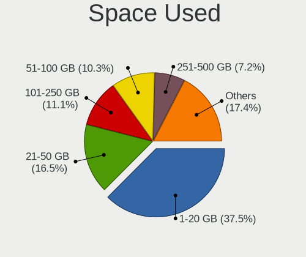
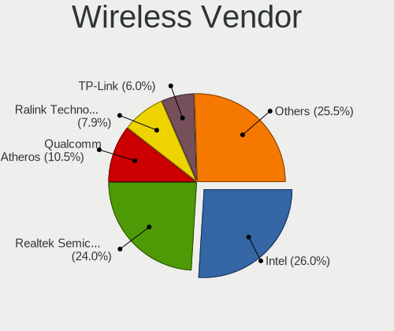

Ubuntu - Tested Hardware & Statistics (Desktops)
------------------------------------------------

A project to collect tested hardware configurations for Ubuntu.

Anyone can contribute to this report by the [hw-probe](https://github.com/linuxhw/hw-probe) tool:

    sudo -E hw-probe -all -upload

Please contribute! Especially if your hardware is rare.

Contents
--------

* [ Test Cases ](#test-cases)

* [ System ](#system)
  - [ OS                       ](#os)
  - [ OS Family                ](#os-family)
  - [ Kernel                   ](#kernel)
  - [ Kernel Family            ](#kernel-family)
  - [ Kernel Major Ver.        ](#kernel-major-ver)
  - [ Arch                     ](#arch)
  - [ DE                       ](#de)
  - [ Display Server           ](#display-server)
  - [ Display Manager          ](#display-manager)
  - [ OS Lang                  ](#os-lang)
  - [ Boot Mode                ](#boot-mode)
  - [ Filesystem               ](#filesystem)
  - [ Part. scheme             ](#part-scheme)
  - [ Dual Boot with Linux/BSD ](#dual-boot-with-linuxbsd)
  - [ Dual Boot (Win)          ](#dual-boot-win)

* [ Board ](#board)
  - [ Vendor                   ](#vendor)
  - [ Model                    ](#model)
  - [ Model Family             ](#model-family)
  - [ MFG Year                 ](#mfg-year)
  - [ Form Factor              ](#form-factor)
  - [ Secure Boot              ](#secure-boot)
  - [ Coreboot                 ](#coreboot)
  - [ RAM Size                 ](#ram-size)
  - [ RAM Used                 ](#ram-used)
  - [ Total Drives             ](#total-drives)
  - [ Has CD-ROM               ](#has-cd-rom)
  - [ Has Ethernet             ](#has-ethernet)
  - [ Has WiFi                 ](#has-wifi)
  - [ Has Bluetooth            ](#has-bluetooth)

* [ Location ](#location)
  - [ Country                  ](#country)
  - [ City                     ](#city)

* [ Drives ](#drives)
  - [ Drive Vendor             ](#drive-vendor)
  - [ Drive Model              ](#drive-model)
  - [ HDD Vendor               ](#hdd-vendor)
  - [ SSD Vendor               ](#ssd-vendor)
  - [ Drive Kind               ](#drive-kind)
  - [ Drive Connector          ](#drive-connector)
  - [ Drive Size               ](#drive-size)
  - [ Space Total              ](#space-total)
  - [ Space Used               ](#space-used)
  - [ Malfunc. Drives          ](#malfunc-drives)
  - [ Malfunc. Drive Vendor    ](#malfunc-drive-vendor)
  - [ Malfunc. HDD Vendor      ](#malfunc-hdd-vendor)
  - [ Malfunc. Drive Kind      ](#malfunc-drive-kind)
  - [ Failed Drives            ](#failed-drives)
  - [ Failed Drive Vendor      ](#failed-drive-vendor)
  - [ Drive Status             ](#drive-status)

* [ Storage controller ](#storage-controller)
  - [ Storage Vendor           ](#storage-vendor)
  - [ Storage Model            ](#storage-model)
  - [ Storage Kind             ](#storage-kind)

* [ Processor ](#processor)
  - [ CPU Vendor               ](#cpu-vendor)
  - [ CPU Model                ](#cpu-model)
  - [ CPU Model Family         ](#cpu-model-family)
  - [ CPU Cores                ](#cpu-cores)
  - [ CPU Sockets              ](#cpu-sockets)
  - [ CPU Threads              ](#cpu-threads)
  - [ CPU Op-Modes             ](#cpu-op-modes)
  - [ CPU Microcode            ](#cpu-microcode)
  - [ CPU Microarch            ](#cpu-microarch)

* [ Graphics ](#graphics)
  - [ GPU Vendor               ](#gpu-vendor)
  - [ GPU Model                ](#gpu-model)
  - [ GPU Combo                ](#gpu-combo)
  - [ GPU Driver               ](#gpu-driver)
  - [ GPU Memory               ](#gpu-memory)

* [ Monitor ](#monitor)
  - [ Monitor Vendor           ](#monitor-vendor)
  - [ Monitor Model            ](#monitor-model)
  - [ Monitor Resolution       ](#monitor-resolution)
  - [ Monitor Diagonal         ](#monitor-diagonal)
  - [ Monitor Width            ](#monitor-width)
  - [ Aspect Ratio             ](#aspect-ratio)
  - [ Monitor Area             ](#monitor-area)
  - [ Pixel Density            ](#pixel-density)
  - [ Multiple Monitors        ](#multiple-monitors)

* [ Network ](#network)
  - [ Net Controller Vendor    ](#net-controller-vendor)
  - [ Net Controller Model     ](#net-controller-model)
  - [ Wireless Vendor          ](#wireless-vendor)
  - [ Wireless Model           ](#wireless-model)
  - [ Ethernet Vendor          ](#ethernet-vendor)
  - [ Ethernet Model           ](#ethernet-model)
  - [ Net Controller Kind      ](#net-controller-kind)
  - [ Used Controller          ](#used-controller)
  - [ NICs                     ](#nics)
  - [ IPv6                     ](#ipv6)

* [ Bluetooth ](#bluetooth)
  - [ Bluetooth Vendor         ](#bluetooth-vendor)
  - [ Bluetooth Model          ](#bluetooth-model)

* [ Sound ](#sound)
  - [ Sound Vendor             ](#sound-vendor)
  - [ Sound Model              ](#sound-model)

* [ Memory ](#memory)
  - [ Memory Vendor            ](#memory-vendor)
  - [ Memory Model             ](#memory-model)
  - [ Memory Kind              ](#memory-kind)
  - [ Memory Form Factor       ](#memory-form-factor)
  - [ Memory Size              ](#memory-size)
  - [ Memory Speed             ](#memory-speed)

* [ Printers & scanners ](#printers--scanners)
  - [ Printer Vendor           ](#printer-vendor)
  - [ Printer Model            ](#printer-model)
  - [ Scanner Vendor           ](#scanner-vendor)
  - [ Scanner Model            ](#scanner-model)

* [ Camera ](#camera)
  - [ Camera Vendor            ](#camera-vendor)
  - [ Camera Model             ](#camera-model)

* [ Security ](#security)
  - [ Fingerprint Vendor       ](#fingerprint-vendor)
  - [ Fingerprint Model        ](#fingerprint-model)
  - [ Chipcard Vendor          ](#chipcard-vendor)
  - [ Chipcard Model           ](#chipcard-model)

* [ Unsupported ](#unsupported)
  - [ Unsupported Devices      ](#unsupported-devices)
  - [ Unsupported Device Types ](#unsupported-device-types)

Test Cases
----------

Total: 38198

| Vendor        | Model                       | Probe                                                      | Date         |
|---------------|-----------------------------|------------------------------------------------------------|--------------|
| HP            | 8918                        | [4b922c3362](https://linux-hardware.org/?probe=4b922c3362) | Dec 24, 2023 |
| Intel         | B85                         | [5b462c9ed1](https://linux-hardware.org/?probe=5b462c9ed1) | Dec 24, 2023 |
| ASUSTek       | P7P55D-E PRO                | [ef61ad2663](https://linux-hardware.org/?probe=ef61ad2663) | Dec 24, 2023 |
| AZW           | EQ                          | [a04c9735a7](https://linux-hardware.org/?probe=a04c9735a7) | Dec 23, 2023 |
| Acer          | Veriton X2631G V:1.0        | [a57f2ee15f](https://linux-hardware.org/?probe=a57f2ee15f) | Dec 23, 2023 |
| AZW           | EQ                          | [9b3d265cd1](https://linux-hardware.org/?probe=9b3d265cd1) | Dec 23, 2023 |
| Acer          | Veriton X2631G V:1.0        | [c9555a34f2](https://linux-hardware.org/?probe=c9555a34f2) | Dec 23, 2023 |
| Dell          | 0J1C3P A01                  | [faea7a3006](https://linux-hardware.org/?probe=faea7a3006) | Dec 23, 2023 |
| ASUSTek       | TUF B360-PLUS GAMING        | [b1c3408d24](https://linux-hardware.org/?probe=b1c3408d24) | Dec 23, 2023 |
| ASRock        | H310CM-HDV/M.2              | [76d95ab75c](https://linux-hardware.org/?probe=76d95ab75c) | Dec 23, 2023 |
| Gigabyte      | GA-78LMT-S2P                | [6f36390142](https://linux-hardware.org/?probe=6f36390142) | Dec 23, 2023 |
| ASRock        | AMCP7A-ION                  | [fb0acc2d50](https://linux-hardware.org/?probe=fb0acc2d50) | Dec 23, 2023 |
| MACHINIST     | X99-K9 V2.0                 | [7f4061fd49](https://linux-hardware.org/?probe=7f4061fd49) | Dec 23, 2023 |
| HP            | 1497                        | [9d5244b557](https://linux-hardware.org/?probe=9d5244b557) | Dec 23, 2023 |
| Lenovo        | ThinkCentre M58 7373AJ5     | [201981bc3f](https://linux-hardware.org/?probe=201981bc3f) | Dec 23, 2023 |
| Foxconn       | 2ADA                        | [f30aec24c2](https://linux-hardware.org/?probe=f30aec24c2) | Dec 23, 2023 |
| ASRock        | AMCP7A-ION                  | [7d19dec574](https://linux-hardware.org/?probe=7d19dec574) | Dec 23, 2023 |
| Lenovo        | SHARKBAY SDK0E50510 WIN     | [ab3cc8a89c](https://linux-hardware.org/?probe=ab3cc8a89c) | Dec 23, 2023 |
| MSI           | A88XM-E35                   | [dce385e94b](https://linux-hardware.org/?probe=dce385e94b) | Dec 23, 2023 |
| MSI           | PRO Z790-A WIFI             | [9b8ad6a3f1](https://linux-hardware.org/?probe=9b8ad6a3f1) | Dec 23, 2023 |
| Lenovo        | 30C0 SDK0J40697 WIN 3305... | [da46ad37d3](https://linux-hardware.org/?probe=da46ad37d3) | Dec 23, 2023 |
| eMachines     | EL1360                      | [af31609559](https://linux-hardware.org/?probe=af31609559) | Dec 23, 2023 |
| ASUSTek       | P6T                         | [d90adb3a12](https://linux-hardware.org/?probe=d90adb3a12) | Dec 23, 2023 |
| Gigabyte      | Z97M-DS3H                   | [da051b693c](https://linux-hardware.org/?probe=da051b693c) | Dec 23, 2023 |
| Dell          | 0FDY5C A00                  | [a3fc39604c](https://linux-hardware.org/?probe=a3fc39604c) | Dec 22, 2023 |
| HP            | 8643 SMVB                   | [bbdb2204d8](https://linux-hardware.org/?probe=bbdb2204d8) | Dec 22, 2023 |
| Dell          | 0D6H9T A00                  | [84275b737e](https://linux-hardware.org/?probe=84275b737e) | Dec 22, 2023 |
| ASUSTek       | PRIME B450-PLUS             | [c9bee45423](https://linux-hardware.org/?probe=c9bee45423) | Dec 22, 2023 |
| Intel         | H61                         | [72c7724ef0](https://linux-hardware.org/?probe=72c7724ef0) | Dec 22, 2023 |
| HP            | 212B                        | [8fa44a703b](https://linux-hardware.org/?probe=8fa44a703b) | Dec 22, 2023 |
| ASUSTek       | ROG STRIX B650E-F GAMING... | [ff8ded7ff8](https://linux-hardware.org/?probe=ff8ded7ff8) | Dec 22, 2023 |
| MSI           | X570-A PRO                  | [27a132c185](https://linux-hardware.org/?probe=27a132c185) | Dec 22, 2023 |
| HP            | 8643 SMVB                   | [03ddd69e34](https://linux-hardware.org/?probe=03ddd69e34) | Dec 22, 2023 |
| MSI           | PRO Z790-A WIFI             | [8e38fb94ba](https://linux-hardware.org/?probe=8e38fb94ba) | Dec 22, 2023 |
| Dell          | 0WR7PY A03                  | [9ff527cfd0](https://linux-hardware.org/?probe=9ff527cfd0) | Dec 22, 2023 |
| HP            | 8626                        | [b04d9fcad9](https://linux-hardware.org/?probe=b04d9fcad9) | Dec 22, 2023 |
| Dell          | 0HY9JP A02                  | [6f47019169](https://linux-hardware.org/?probe=6f47019169) | Dec 22, 2023 |
| Dell          | 0D4MD1 A00                  | [858b84769f](https://linux-hardware.org/?probe=858b84769f) | Dec 22, 2023 |
| Gigabyte      | Z390 AORUS PRO WIFI-CF      | [8a2d46dced](https://linux-hardware.org/?probe=8a2d46dced) | Dec 22, 2023 |
| LattePanda    | Sigma                       | [09cb864933](https://linux-hardware.org/?probe=09cb864933) | Dec 22, 2023 |
| ASUSTek       | STRIX X99 GAMING            | [2af66f541d](https://linux-hardware.org/?probe=2af66f541d) | Dec 22, 2023 |
| ASUSTek       | M5A97 R2.0                  | [3ff2f289b9](https://linux-hardware.org/?probe=3ff2f289b9) | Dec 22, 2023 |
| Gigabyte      | B450M GAMING                | [1767c5b291](https://linux-hardware.org/?probe=1767c5b291) | Dec 21, 2023 |
| Gigabyte      | GA-78LMT-S2P                | [dbc2e93666](https://linux-hardware.org/?probe=dbc2e93666) | Dec 21, 2023 |
| ASRock        | A520M-HDV                   | [918677a1da](https://linux-hardware.org/?probe=918677a1da) | Dec 21, 2023 |
| MSI           | MPG X570 GAMING EDGE WIF... | [628ca02992](https://linux-hardware.org/?probe=628ca02992) | Dec 21, 2023 |
| ASRock        | A520M-HDV                   | [7136ba3916](https://linux-hardware.org/?probe=7136ba3916) | Dec 21, 2023 |
| Gigabyte      | Z87-HD3                     | [49e514e9c4](https://linux-hardware.org/?probe=49e514e9c4) | Dec 21, 2023 |
| Acer          | Aspire XC-1760              | [ac3910a453](https://linux-hardware.org/?probe=ac3910a453) | Dec 21, 2023 |
| Supermicro    | H13DSG-O-CPU                | [1ba9d3bc0c](https://linux-hardware.org/?probe=1ba9d3bc0c) | Dec 21, 2023 |
| Gigabyte      | B550M S2H                   | [0cf7feafe8](https://linux-hardware.org/?probe=0cf7feafe8) | Dec 21, 2023 |
| Supermicro    | H13DSG-O-CPU                | [066ebdde5b](https://linux-hardware.org/?probe=066ebdde5b) | Dec 21, 2023 |
| Lenovo        | 318E SDK0J40697 WIN 3305... | [191d4913cd](https://linux-hardware.org/?probe=191d4913cd) | Dec 21, 2023 |
| Dell          | OptiPlex 5050               | [c1cffe744f](https://linux-hardware.org/?probe=c1cffe744f) | Dec 21, 2023 |
| Foxconn       | 2ADA                        | [735572694e](https://linux-hardware.org/?probe=735572694e) | Dec 21, 2023 |
| HP            | 18E7                        | [ad6cf02d18](https://linux-hardware.org/?probe=ad6cf02d18) | Dec 21, 2023 |
| HP            | 18E7                        | [fdb8b2d229](https://linux-hardware.org/?probe=fdb8b2d229) | Dec 21, 2023 |
| Gigabyte      | Z390 AORUS PRO WIFI-CF      | [8eca3c15e7](https://linux-hardware.org/?probe=8eca3c15e7) | Dec 21, 2023 |
| ASRock        | Z77 Pro4                    | [d8d81bc3e2](https://linux-hardware.org/?probe=d8d81bc3e2) | Dec 21, 2023 |
| ASUSTek       | Z10PG-D16 Series            | [6b3c6c4099](https://linux-hardware.org/?probe=6b3c6c4099) | Dec 21, 2023 |
| MSI           | NF725M-P43                  | [43756d6fad](https://linux-hardware.org/?probe=43756d6fad) | Dec 21, 2023 |
| ASUSTek       | M5A97 R2.0                  | [93a7029d22](https://linux-hardware.org/?probe=93a7029d22) | Dec 21, 2023 |
| Acer          | Veriton X2631G V:1.0        | [8116f31329](https://linux-hardware.org/?probe=8116f31329) | Dec 21, 2023 |
| Acer          | Veriton X2631G V:1.0        | [7597019eca](https://linux-hardware.org/?probe=7597019eca) | Dec 21, 2023 |
| ASRock        | H610M-HVS                   | [25b5c11ccc](https://linux-hardware.org/?probe=25b5c11ccc) | Dec 20, 2023 |
| ASUSTek       | VM40B                       | [8deb79e86e](https://linux-hardware.org/?probe=8deb79e86e) | Dec 20, 2023 |
| Gigabyte      | B560M H                     | [6e7f8b2300](https://linux-hardware.org/?probe=6e7f8b2300) | Dec 20, 2023 |
| Gigabyte      | H81M-DS2                    | [1da522781e](https://linux-hardware.org/?probe=1da522781e) | Dec 20, 2023 |
| Gigabyte      | B550M DS3H                  | [35547b20b3](https://linux-hardware.org/?probe=35547b20b3) | Dec 20, 2023 |
| MSI           | B450-A PRO MAX              | [f46e034f2c](https://linux-hardware.org/?probe=f46e034f2c) | Dec 20, 2023 |
| Dell          | 09KPNV A00                  | [e696fd9ae0](https://linux-hardware.org/?probe=e696fd9ae0) | Dec 20, 2023 |
| Gigabyte      | H81M-S                      | [5583555782](https://linux-hardware.org/?probe=5583555782) | Dec 20, 2023 |
| Gigabyte      | H81M-S                      | [eded3a5ce4](https://linux-hardware.org/?probe=eded3a5ce4) | Dec 20, 2023 |
| Dell          | 0C522T A03                  | [7cd9f2379e](https://linux-hardware.org/?probe=7cd9f2379e) | Dec 20, 2023 |
| ASUSTek       | Z97-PRO                     | [917d636ff9](https://linux-hardware.org/?probe=917d636ff9) | Dec 20, 2023 |
| MSI           | H61M-E33                    | [ab39035cef](https://linux-hardware.org/?probe=ab39035cef) | Dec 20, 2023 |
| ASUSTek       | P8Z77-M PRO                 | [58517da295](https://linux-hardware.org/?probe=58517da295) | Dec 20, 2023 |
| Intel         | DH55TC AAE70932-206         | [3003aeb5a9](https://linux-hardware.org/?probe=3003aeb5a9) | Dec 20, 2023 |
| Supermicro    | X9DRD-7LN4F                 | [56a303c264](https://linux-hardware.org/?probe=56a303c264) | Dec 20, 2023 |
| ASUSTek       | TUF Gaming Z790-PLUS WIF... | [b45e149ce8](https://linux-hardware.org/?probe=b45e149ce8) | Dec 20, 2023 |
| ASRock        | AB350 Pro4                  | [bb15070eb2](https://linux-hardware.org/?probe=bb15070eb2) | Dec 19, 2023 |
| ASUSTek       | TUF Gaming Z790-PLUS WIF... | [10470437db](https://linux-hardware.org/?probe=10470437db) | Dec 19, 2023 |
| ASRock        | FM2A58M-HD+                 | [09ab03cdcd](https://linux-hardware.org/?probe=09ab03cdcd) | Dec 19, 2023 |
| ANGXUN        | X79-VG2 V1.3                | [532c5b5ddc](https://linux-hardware.org/?probe=532c5b5ddc) | Dec 19, 2023 |
| Gigabyte      | Z790 UD                     | [94a40a476d](https://linux-hardware.org/?probe=94a40a476d) | Dec 19, 2023 |
| MSI           | B85-G43                     | [2c855d2376](https://linux-hardware.org/?probe=2c855d2376) | Dec 19, 2023 |
| Dell          | 042P49 A02                  | [11f6da5848](https://linux-hardware.org/?probe=11f6da5848) | Dec 19, 2023 |
| Fujitsu       | D3221-A1 S26361-D3221-A1    | [843515c201](https://linux-hardware.org/?probe=843515c201) | Dec 19, 2023 |
| Dell          | 0C522T A03                  | [35b8611349](https://linux-hardware.org/?probe=35b8611349) | Dec 19, 2023 |
| ASUSTek       | H81-PLUS                    | [359af07cb2](https://linux-hardware.org/?probe=359af07cb2) | Dec 19, 2023 |
| ASUSTek       | H81-PLUS                    | [b4b91802b5](https://linux-hardware.org/?probe=b4b91802b5) | Dec 19, 2023 |
| MSI           | X570-A PRO                  | [3cf8d970f8](https://linux-hardware.org/?probe=3cf8d970f8) | Dec 19, 2023 |
| Dell          | 0PJDGF A02                  | [cfdd125cd5](https://linux-hardware.org/?probe=cfdd125cd5) | Dec 19, 2023 |
| Dell          | 0PJDGF A02                  | [edcd06b95f](https://linux-hardware.org/?probe=edcd06b95f) | Dec 19, 2023 |
| Unknown       | X79                         | [167cf0a87f](https://linux-hardware.org/?probe=167cf0a87f) | Dec 19, 2023 |
| Unknown       | X79                         | [3961be9cb6](https://linux-hardware.org/?probe=3961be9cb6) | Dec 19, 2023 |
| MSI           | A520M-A PRO                 | [5781ca34c8](https://linux-hardware.org/?probe=5781ca34c8) | Dec 19, 2023 |
| Dell          | 0Y7WYT A00                  | [705321d0b6](https://linux-hardware.org/?probe=705321d0b6) | Dec 19, 2023 |
| HP            | 3647h                       | [0e741d6d7c](https://linux-hardware.org/?probe=0e741d6d7c) | Dec 18, 2023 |
| Supermicro    | X7DWA                       | [2ea00dfda4](https://linux-hardware.org/?probe=2ea00dfda4) | Dec 18, 2023 |
| Supermicro    | X7DWA                       | [6357637f80](https://linux-hardware.org/?probe=6357637f80) | Dec 18, 2023 |
| Gigabyte      | Z77-D3H                     | [8f34c208f2](https://linux-hardware.org/?probe=8f34c208f2) | Dec 18, 2023 |
| Packard Be... | Veriton M275                | [2263820deb](https://linux-hardware.org/?probe=2263820deb) | Dec 18, 2023 |
| Dell          | 0NV0M7 A02                  | [577e6d8d0e](https://linux-hardware.org/?probe=577e6d8d0e) | Dec 18, 2023 |
| Fujitsu       | D3233-A1 S26361-D3233-A1    | [f93e198dd4](https://linux-hardware.org/?probe=f93e198dd4) | Dec 18, 2023 |
| Dell          | 0NC2VH A01                  | [5976f16a69](https://linux-hardware.org/?probe=5976f16a69) | Dec 18, 2023 |
| Gigabyte      | H410M S2H V3                | [498141a78c](https://linux-hardware.org/?probe=498141a78c) | Dec 18, 2023 |
| HC Technol... | HCAR5000-MI                 | [0cf5577833](https://linux-hardware.org/?probe=0cf5577833) | Dec 18, 2023 |
| ASUSTek       | ROG STRIX X670E-E GAMING... | [2b7376d8a1](https://linux-hardware.org/?probe=2b7376d8a1) | Dec 18, 2023 |
| Dell          | 06FW8P A02                  | [7b66e504eb](https://linux-hardware.org/?probe=7b66e504eb) | Dec 18, 2023 |
| HC Technol... | HCAR5000-MI                 | [2bee7533b2](https://linux-hardware.org/?probe=2bee7533b2) | Dec 18, 2023 |
| Gigabyte      | B550 GAMING X               | [6ecd3ce2c3](https://linux-hardware.org/?probe=6ecd3ce2c3) | Dec 18, 2023 |
| Gigabyte      | H61M-S2PV                   | [bad7f51319](https://linux-hardware.org/?probe=bad7f51319) | Dec 18, 2023 |
| Gigabyte      | H61M-S2PV                   | [c3968eb521](https://linux-hardware.org/?probe=c3968eb521) | Dec 18, 2023 |
| Lenovo        | SHARKBAY 0B98401 WIN        | [ad8a2053bc](https://linux-hardware.org/?probe=ad8a2053bc) | Dec 17, 2023 |
| Biostar       | B550MH                      | [32131b6631](https://linux-hardware.org/?probe=32131b6631) | Dec 17, 2023 |
| ASRock        | Z370M-ITX/ac                | [0f7c6a7383](https://linux-hardware.org/?probe=0f7c6a7383) | Dec 17, 2023 |
| ASRock        | Z390 Extreme4               | [4067f8d4cb](https://linux-hardware.org/?probe=4067f8d4cb) | Dec 17, 2023 |
| ASUSTek       | PRIME B450M-K II            | [8425b10899](https://linux-hardware.org/?probe=8425b10899) | Dec 17, 2023 |
| Biostar       | B550MH                      | [97d9affd9d](https://linux-hardware.org/?probe=97d9affd9d) | Dec 17, 2023 |
| Dell          | 05DN3X A00                  | [d14a1553b4](https://linux-hardware.org/?probe=d14a1553b4) | Dec 17, 2023 |
| Dell          | 0J1C3P A01                  | [99eb1f88a4](https://linux-hardware.org/?probe=99eb1f88a4) | Dec 17, 2023 |
| Dell          | 07N90W A02                  | [0c471e8b44](https://linux-hardware.org/?probe=0c471e8b44) | Dec 17, 2023 |
| ASRock        | Z77 Extreme4                | [ead1dfb3ae](https://linux-hardware.org/?probe=ead1dfb3ae) | Dec 17, 2023 |
| ASRock        | H61M-VG4                    | [a845742a42](https://linux-hardware.org/?probe=a845742a42) | Dec 17, 2023 |
| ASUSTek       | ROG CROSSHAIR VIII HERO     | [def7de5871](https://linux-hardware.org/?probe=def7de5871) | Dec 17, 2023 |
| Dell          | 02K9CR A02                  | [aeb868db71](https://linux-hardware.org/?probe=aeb868db71) | Dec 17, 2023 |
| ASRock        | Z390 Extreme4               | [5db549dd99](https://linux-hardware.org/?probe=5db549dd99) | Dec 17, 2023 |
| Gigabyte      | Z790 UD                     | [bfe9651fbd](https://linux-hardware.org/?probe=bfe9651fbd) | Dec 17, 2023 |
| MSI           | 2A9C                        | [342d099a7f](https://linux-hardware.org/?probe=342d099a7f) | Dec 17, 2023 |
| ASUSTek       | PRIME H510M-A WIFI          | [2335d46852](https://linux-hardware.org/?probe=2335d46852) | Dec 17, 2023 |
| ASUSTek       | PRIME A320M-K               | [1f0e0f04f8](https://linux-hardware.org/?probe=1f0e0f04f8) | Dec 17, 2023 |
| HP            | 1790                        | [2d8c859110](https://linux-hardware.org/?probe=2d8c859110) | Dec 17, 2023 |
| ASUSTek       | M4A89GTD-PRO/USB3           | [8adfc82dc5](https://linux-hardware.org/?probe=8adfc82dc5) | Dec 17, 2023 |
| Dell          | 0KWVT8 A03                  | [d5632292b6](https://linux-hardware.org/?probe=d5632292b6) | Dec 17, 2023 |
| Dell          | 0KWVT8 A03                  | [6745d8d399](https://linux-hardware.org/?probe=6745d8d399) | Dec 17, 2023 |
| ASUSTek       | TUF B450-PLUS GAMING        | [a5e443e89c](https://linux-hardware.org/?probe=a5e443e89c) | Dec 17, 2023 |
| Gigabyte      | H77M-D3H                    | [de9dcb40ba](https://linux-hardware.org/?probe=de9dcb40ba) | Dec 17, 2023 |
| Dell          | 0PC5F7 A03                  | [b280c267db](https://linux-hardware.org/?probe=b280c267db) | Dec 17, 2023 |
| Shenzhen M... | TH80                        | [1ad9ee524d](https://linux-hardware.org/?probe=1ad9ee524d) | Dec 16, 2023 |
| Dell          | 0GXM1W A00                  | [476c368866](https://linux-hardware.org/?probe=476c368866) | Dec 16, 2023 |
| Inventec      | DQ Class A02                | [73df6dfb3b](https://linux-hardware.org/?probe=73df6dfb3b) | Dec 16, 2023 |
| ASRock        | Z77 Pro4                    | [15ce6626f3](https://linux-hardware.org/?probe=15ce6626f3) | Dec 16, 2023 |
| Gigabyte      | B85-HD3-A                   | [e3d139cdb3](https://linux-hardware.org/?probe=e3d139cdb3) | Dec 16, 2023 |
| ASUSTek       | PRIME B760-PLUS             | [a7dd86011c](https://linux-hardware.org/?probe=a7dd86011c) | Dec 16, 2023 |
| Intel         | SHARKBAY                    | [efe58ba5df](https://linux-hardware.org/?probe=efe58ba5df) | Dec 16, 2023 |
| MSI           | MPG X570 GAMING PLUS        | [57a64ca85e](https://linux-hardware.org/?probe=57a64ca85e) | Dec 16, 2023 |
| ASUSTek       | PRIME H510M-A WIFI          | [e97f16f34e](https://linux-hardware.org/?probe=e97f16f34e) | Dec 16, 2023 |
| Gigabyte      | 970A-DS3P                   | [e6019b847e](https://linux-hardware.org/?probe=e6019b847e) | Dec 16, 2023 |
| HP            | 2B05                        | [81e68a1fb8](https://linux-hardware.org/?probe=81e68a1fb8) | Dec 16, 2023 |
| HP            | 2B05                        | [2063743d90](https://linux-hardware.org/?probe=2063743d90) | Dec 16, 2023 |
| ASUSTek       | Z97-PRO                     | [383682bb1f](https://linux-hardware.org/?probe=383682bb1f) | Dec 16, 2023 |
| Acer          | EG43M                       | [62c8e8acf8](https://linux-hardware.org/?probe=62c8e8acf8) | Dec 16, 2023 |
| HP            | 1790                        | [9bb2d6fcb4](https://linux-hardware.org/?probe=9bb2d6fcb4) | Dec 16, 2023 |
| ASUSTek       | PRIME A320M-A               | [862ce85408](https://linux-hardware.org/?probe=862ce85408) | Dec 16, 2023 |
| ASUSTek       | Z97-PRO                     | [a0e9f7ca57](https://linux-hardware.org/?probe=a0e9f7ca57) | Dec 16, 2023 |
| Dell          | 0RT6HT A01                  | [3509be8560](https://linux-hardware.org/?probe=3509be8560) | Dec 16, 2023 |
| ASRock        | X570 Taichi                 | [6458d64d28](https://linux-hardware.org/?probe=6458d64d28) | Dec 16, 2023 |
| MSI           | PRO Z790-A MAX WIFI         | [2832959c86](https://linux-hardware.org/?probe=2832959c86) | Dec 16, 2023 |
| MSI           | PRO Z790-A MAX WIFI         | [01f18b5c6f](https://linux-hardware.org/?probe=01f18b5c6f) | Dec 16, 2023 |
| Dell          | 0RY007                      | [162add826a](https://linux-hardware.org/?probe=162add826a) | Dec 16, 2023 |
| ASRock        | Z790 Taichi                 | [a27506c744](https://linux-hardware.org/?probe=a27506c744) | Dec 16, 2023 |
| ASRock        | Z790 Taichi                 | [9a257410d4](https://linux-hardware.org/?probe=9a257410d4) | Dec 16, 2023 |
| ASUSTek       | ROG STRIX B760-F GAMING ... | [f3938de13a](https://linux-hardware.org/?probe=f3938de13a) | Dec 16, 2023 |
| VIA Techno... | AMOS-3005                   | [10cf5bf932](https://linux-hardware.org/?probe=10cf5bf932) | Dec 15, 2023 |
| VIA Techno... | AMOS-3005                   | [0af62d144a](https://linux-hardware.org/?probe=0af62d144a) | Dec 15, 2023 |
| Gigabyte      | B85-HD3-A                   | [b60d191f59](https://linux-hardware.org/?probe=b60d191f59) | Dec 15, 2023 |
| Shenzhen M... | AHBNB OEM                   | [1fae1d3423](https://linux-hardware.org/?probe=1fae1d3423) | Dec 15, 2023 |
| Shenzhen M... | AHBNB OEM                   | [1a70a13ff4](https://linux-hardware.org/?probe=1a70a13ff4) | Dec 15, 2023 |
| Shenzhen M... | AHBNB OEM                   | [8be30808ec](https://linux-hardware.org/?probe=8be30808ec) | Dec 15, 2023 |
| Shenzhen M... | AHBNB OEM                   | [1e0ba866f7](https://linux-hardware.org/?probe=1e0ba866f7) | Dec 15, 2023 |
| MSI           | X470 GAMING PLUS MAX        | [20a11e4c01](https://linux-hardware.org/?probe=20a11e4c01) | Dec 15, 2023 |
| Google        | Guado                       | [e981ac3399](https://linux-hardware.org/?probe=e981ac3399) | Dec 15, 2023 |
| ASRock        | H570 Phantom Gaming 4       | [b942870c3a](https://linux-hardware.org/?probe=b942870c3a) | Dec 15, 2023 |
| Gigabyte      | Z790 UD                     | [77da8f68cd](https://linux-hardware.org/?probe=77da8f68cd) | Dec 15, 2023 |
| Gigabyte      | MZAPLBP-00                  | [3935358dce](https://linux-hardware.org/?probe=3935358dce) | Dec 15, 2023 |
| XDO.AI        | Pantera Pico PC             | [6358b586ac](https://linux-hardware.org/?probe=6358b586ac) | Dec 15, 2023 |
| ASRock        | H310CM-HDV/M.2              | [c3604a3f0d](https://linux-hardware.org/?probe=c3604a3f0d) | Dec 15, 2023 |
| Gigabyte      | Z790 AORUS MASTER           | [6af7c135e1](https://linux-hardware.org/?probe=6af7c135e1) | Dec 15, 2023 |
| Dell          | 0NW6H5 A00                  | [eb487bbab2](https://linux-hardware.org/?probe=eb487bbab2) | Dec 14, 2023 |
| TECHNOPC      | NANO 5                      | [3ac9d2eb32](https://linux-hardware.org/?probe=3ac9d2eb32) | Dec 14, 2023 |
| Unknown       | Unknown                     | [9fb745d9fe](https://linux-hardware.org/?probe=9fb745d9fe) | Dec 14, 2023 |
| Lenovo        | SDK0J40700 WIN              | [48c963a11d](https://linux-hardware.org/?probe=48c963a11d) | Dec 14, 2023 |
| Google        | Guado                       | [50ceaa2515](https://linux-hardware.org/?probe=50ceaa2515) | Dec 14, 2023 |
| Fujitsu       | D3432-A1 S26361-D3432-A1    | [742681b576](https://linux-hardware.org/?probe=742681b576) | Dec 14, 2023 |
| Fujitsu       | D3432-A1 S26361-D3432-A1    | [72cd581273](https://linux-hardware.org/?probe=72cd581273) | Dec 14, 2023 |
| XDO.AI        | Pantera Pico PC             | [fabfe15230](https://linux-hardware.org/?probe=fabfe15230) | Dec 14, 2023 |
| HC Technol... | HCAR5000-MI                 | [d4d42016ea](https://linux-hardware.org/?probe=d4d42016ea) | Dec 14, 2023 |
| Gigabyte      | H410M S2H V3                | [101f8237e0](https://linux-hardware.org/?probe=101f8237e0) | Dec 14, 2023 |
| Dell          | 0TDG4V A01                  | [6da01d5871](https://linux-hardware.org/?probe=6da01d5871) | Dec 14, 2023 |
| ASRock        | B550M Pro4                  | [9d0aff4b01](https://linux-hardware.org/?probe=9d0aff4b01) | Dec 13, 2023 |
| HP            | 83EF                        | [e2a7a03e4c](https://linux-hardware.org/?probe=e2a7a03e4c) | Dec 13, 2023 |
| HP            | 83EF                        | [d5d568c47c](https://linux-hardware.org/?probe=d5d568c47c) | Dec 13, 2023 |
| ASUSTek       | TUF Gaming Z690-PLUS WIF... | [ab0ac93be6](https://linux-hardware.org/?probe=ab0ac93be6) | Dec 13, 2023 |
| HP            | 18E9                        | [ab47a5d40b](https://linux-hardware.org/?probe=ab47a5d40b) | Dec 13, 2023 |
| ASRock        | B550M Pro4                  | [e196db2480](https://linux-hardware.org/?probe=e196db2480) | Dec 13, 2023 |
| Gigabyte      | H410M S2H V3                | [e198c73fa2](https://linux-hardware.org/?probe=e198c73fa2) | Dec 13, 2023 |
| HP            | 2129                        | [3a95965680](https://linux-hardware.org/?probe=3a95965680) | Dec 13, 2023 |
| Dell          | 0K240Y A01                  | [227af40d05](https://linux-hardware.org/?probe=227af40d05) | Dec 13, 2023 |
| ASUSTek       | Basswood3G                  | [f686ec5ba9](https://linux-hardware.org/?probe=f686ec5ba9) | Dec 13, 2023 |
| HP            | 8459                        | [e4480089d7](https://linux-hardware.org/?probe=e4480089d7) | Dec 13, 2023 |
| Unknown       | Unknown                     | [fd405f79f2](https://linux-hardware.org/?probe=fd405f79f2) | Dec 13, 2023 |
| ASRock        | 970 Extreme4                | [ce858f7f7c](https://linux-hardware.org/?probe=ce858f7f7c) | Dec 13, 2023 |
| Gigabyte      | GA-990X-Gaming SLI-CF       | [01f7be08ae](https://linux-hardware.org/?probe=01f7be08ae) | Dec 13, 2023 |
| ASUSTek       | TUF Gaming Z690-PLUS WIF... | [4f1419b521](https://linux-hardware.org/?probe=4f1419b521) | Dec 12, 2023 |
| Gigabyte      | MZAPLBP-00                  | [fdb303e7e6](https://linux-hardware.org/?probe=fdb303e7e6) | Dec 12, 2023 |
| TECHNOPC      | NANO 5                      | [5b9044ceb2](https://linux-hardware.org/?probe=5b9044ceb2) | Dec 12, 2023 |
| HP            | 3048h                       | [bb95017425](https://linux-hardware.org/?probe=bb95017425) | Dec 12, 2023 |
| ASUSTek       | PRIME Z790M-PLUS D4         | [eadc049e56](https://linux-hardware.org/?probe=eadc049e56) | Dec 12, 2023 |
| Gigabyte      | Z790 UD                     | [44f9c5ad81](https://linux-hardware.org/?probe=44f9c5ad81) | Dec 12, 2023 |
| Gigabyte      | H310M H x.x                 | [bcf9fba46f](https://linux-hardware.org/?probe=bcf9fba46f) | Dec 12, 2023 |
| ASRock        | X470 Master SLI             | [2f96568c78](https://linux-hardware.org/?probe=2f96568c78) | Dec 12, 2023 |
| ASRock        | X470 Master SLI             | [68fe94d3be](https://linux-hardware.org/?probe=68fe94d3be) | Dec 12, 2023 |
| Dell          | 0M5DCD A00                  | [98f2d76ef0](https://linux-hardware.org/?probe=98f2d76ef0) | Dec 12, 2023 |
| Gigabyte      | B85M-DS3H-A                 | [c4de324273](https://linux-hardware.org/?probe=c4de324273) | Dec 12, 2023 |
| ASUSTek       | P5E WS Pro                  | [9c68d265b1](https://linux-hardware.org/?probe=9c68d265b1) | Dec 12, 2023 |
| MSI           | A320M PRO-VD/S              | [c2a6947086](https://linux-hardware.org/?probe=c2a6947086) | Dec 12, 2023 |
| Gigabyte      | H510M H                     | [5d637d06a3](https://linux-hardware.org/?probe=5d637d06a3) | Dec 12, 2023 |
| HC Technol... | HCAR5000-MI                 | [d5cb60727d](https://linux-hardware.org/?probe=d5cb60727d) | Dec 12, 2023 |
| ASUSTek       | Maximus V GENE              | [fb88caee81](https://linux-hardware.org/?probe=fb88caee81) | Dec 12, 2023 |
| MSI           | B450 TOMAHAWK               | [8e66dfbc28](https://linux-hardware.org/?probe=8e66dfbc28) | Dec 12, 2023 |
| HP            | 0AECh D                     | [b1856b493c](https://linux-hardware.org/?probe=b1856b493c) | Dec 12, 2023 |
| Acer          | Aspire XC-705               | [c9193baaf8](https://linux-hardware.org/?probe=c9193baaf8) | Dec 12, 2023 |
| ASUSTek       | PRIME H570M-PLUS            | [06f64404ec](https://linux-hardware.org/?probe=06f64404ec) | Dec 12, 2023 |
| Dell          | 0Y2YM6 A00                  | [f985ca6bbb](https://linux-hardware.org/?probe=f985ca6bbb) | Dec 12, 2023 |
| Dell          | OptiPlex 5050               | [fa9f59a97f](https://linux-hardware.org/?probe=fa9f59a97f) | Dec 12, 2023 |
| ASUSTek       | PRIME Z370-A                | [aee95db4a5](https://linux-hardware.org/?probe=aee95db4a5) | Dec 12, 2023 |
| ASUSTek       | PRIME B550-PLUS             | [a63b270aa6](https://linux-hardware.org/?probe=a63b270aa6) | Dec 12, 2023 |
| ASUSTek       | PRIME B550-PLUS             | [4429714e47](https://linux-hardware.org/?probe=4429714e47) | Dec 12, 2023 |
| Gigabyte      | A520M H                     | [e72a787933](https://linux-hardware.org/?probe=e72a787933) | Dec 12, 2023 |
| ASUSTek       | K30BF_M32BF_A_F_K31BF_6     | [cb2d82c5ba](https://linux-hardware.org/?probe=cb2d82c5ba) | Dec 12, 2023 |
| HP            | 81B4                        | [2fae3abc45](https://linux-hardware.org/?probe=2fae3abc45) | Dec 12, 2023 |
| ASUSTek       | M4N68T-M-LE-V2              | [785864b944](https://linux-hardware.org/?probe=785864b944) | Dec 11, 2023 |
| ASUSTek       | M4N68T-M-LE-V2              | [a00282d994](https://linux-hardware.org/?probe=a00282d994) | Dec 11, 2023 |
| ASRock        | B450M-HDV R4.0              | [ee39e0724c](https://linux-hardware.org/?probe=ee39e0724c) | Dec 11, 2023 |
| Gigabyte      | 990FXA-UD3                  | [0d3866e04a](https://linux-hardware.org/?probe=0d3866e04a) | Dec 11, 2023 |
| MSI           | MPG B550I GAMING EDGE WI... | [8b80683b06](https://linux-hardware.org/?probe=8b80683b06) | Dec 11, 2023 |
| Dell          | 0Y2YM6 A01                  | [c3fee04c74](https://linux-hardware.org/?probe=c3fee04c74) | Dec 11, 2023 |
| Entroware     | Poseidon                    | [88c52d72cc](https://linux-hardware.org/?probe=88c52d72cc) | Dec 11, 2023 |
| Dell          | 07VWPG A01                  | [a9ad39cd38](https://linux-hardware.org/?probe=a9ad39cd38) | Dec 11, 2023 |
| Huanan        | X99-F8 V2.0                 | [7ac710e7da](https://linux-hardware.org/?probe=7ac710e7da) | Dec 11, 2023 |
| Lenovo        | 3102 SDK0J40705 WIN 3425... | [e3afd2e002](https://linux-hardware.org/?probe=e3afd2e002) | Dec 11, 2023 |
| Lenovo        | 3102 SDK0J40705 WIN 3425... | [656bfe20f4](https://linux-hardware.org/?probe=656bfe20f4) | Dec 11, 2023 |
| Lenovo        | 3102 SDK0J40705 WIN 3425... | [b1c994920c](https://linux-hardware.org/?probe=b1c994920c) | Dec 11, 2023 |
| Lenovo        | 312A SDK0J40697 WIN 3305... | [cc7c14dd72](https://linux-hardware.org/?probe=cc7c14dd72) | Dec 11, 2023 |
| MSI           | Z490-A PRO                  | [bd1772e0a0](https://linux-hardware.org/?probe=bd1772e0a0) | Dec 11, 2023 |
| Lenovo        | 312A SDK0J40697 WIN 3305... | [b7c06bf365](https://linux-hardware.org/?probe=b7c06bf365) | Dec 11, 2023 |
| Lenovo        | 3102 SDK0J40705 WIN 3425... | [8badd81a74](https://linux-hardware.org/?probe=8badd81a74) | Dec 11, 2023 |
| ASRock        | B85M Pro4                   | [8a11fe8107](https://linux-hardware.org/?probe=8a11fe8107) | Dec 11, 2023 |
| Lenovo        | 312A SDK0J40697 WIN 3305... | [448dc8ed72](https://linux-hardware.org/?probe=448dc8ed72) | Dec 11, 2023 |
| Intel         | X99                         | [6988251bb1](https://linux-hardware.org/?probe=6988251bb1) | Dec 11, 2023 |
| Lenovo        | 312A SDK0J40697 WIN 3305... | [472c013f53](https://linux-hardware.org/?probe=472c013f53) | Dec 11, 2023 |
| Lenovo        | 3102 SDK0J40705 WIN 3425... | [8cb24408c9](https://linux-hardware.org/?probe=8cb24408c9) | Dec 11, 2023 |
| Lenovo        | 3102 SDK0J40705 WIN 3425... | [df2e9cf858](https://linux-hardware.org/?probe=df2e9cf858) | Dec 11, 2023 |
| Lenovo        | 3102 SDK0J40705 WIN 3425... | [c8d223020d](https://linux-hardware.org/?probe=c8d223020d) | Dec 11, 2023 |
| Lenovo        | 3102 SDK0J40705 WIN 3425... | [70364f28ab](https://linux-hardware.org/?probe=70364f28ab) | Dec 11, 2023 |
| Gigabyte      | D-700                       | [18e3ee84cc](https://linux-hardware.org/?probe=18e3ee84cc) | Dec 11, 2023 |
| ASUSTek       | ROG STRIX B550-F GAMING     | [473e3f7093](https://linux-hardware.org/?probe=473e3f7093) | Dec 11, 2023 |
| Dell          | 0J4NFV A01                  | [11207ddb80](https://linux-hardware.org/?probe=11207ddb80) | Dec 11, 2023 |
| Dell          | 0Y2YM6 A00                  | [0b11b5e28f](https://linux-hardware.org/?probe=0b11b5e28f) | Dec 11, 2023 |
| ASUSTek       | PRIME B250M-A               | [74c10ca70c](https://linux-hardware.org/?probe=74c10ca70c) | Dec 11, 2023 |
| ASUSTek       | PRIME B250M-A               | [40cbcb37ea](https://linux-hardware.org/?probe=40cbcb37ea) | Dec 11, 2023 |
| ASUSTek       | A88XM-E                     | [ef34073e18](https://linux-hardware.org/?probe=ef34073e18) | Dec 11, 2023 |
| Intel         | H61                         | [611b51b6c1](https://linux-hardware.org/?probe=611b51b6c1) | Dec 11, 2023 |
| ASUSTek       | TUF Gaming Z590-PLUS        | [4b2be67e0f](https://linux-hardware.org/?probe=4b2be67e0f) | Dec 11, 2023 |
| Gigabyte      | Z390 AORUS ULTRA-CF         | [32d436e221](https://linux-hardware.org/?probe=32d436e221) | Dec 11, 2023 |
| Gigabyte      | EP41-UD3L                   | [9b40e5889d](https://linux-hardware.org/?probe=9b40e5889d) | Dec 10, 2023 |
| Dell          | 0C522T A03                  | [11f857231b](https://linux-hardware.org/?probe=11f857231b) | Dec 10, 2023 |
| Acer          | Predator G3610              | [0a8a3e6bc5](https://linux-hardware.org/?probe=0a8a3e6bc5) | Dec 10, 2023 |
| Gigabyte      | F2A68HM-HD2                 | [237db70b40](https://linux-hardware.org/?probe=237db70b40) | Dec 10, 2023 |
| ASRock        | A520M-HVS                   | [5d07d03602](https://linux-hardware.org/?probe=5d07d03602) | Dec 10, 2023 |
| Pegatron      | IPMH61P1                    | [0d0474a798](https://linux-hardware.org/?probe=0d0474a798) | Dec 10, 2023 |
| MSI           | MS-7516                     | [bafee6f86e](https://linux-hardware.org/?probe=bafee6f86e) | Dec 10, 2023 |
| ASUSTek       | PRIME B250M-A               | [1eaf3dd454](https://linux-hardware.org/?probe=1eaf3dd454) | Dec 10, 2023 |
| Dell          | 0TP406                      | [1b81a10a36](https://linux-hardware.org/?probe=1b81a10a36) | Dec 10, 2023 |
| Gigabyte      | Z390 AORUS PRO WIFI-CF      | [aa1aa7d695](https://linux-hardware.org/?probe=aa1aa7d695) | Dec 10, 2023 |
| Pegatron      | 2AC3                        | [3831586b47](https://linux-hardware.org/?probe=3831586b47) | Dec 10, 2023 |
| Lenovo        | SKYBAY SDK0J40705 WIN 34... | [e87dcf9ee2](https://linux-hardware.org/?probe=e87dcf9ee2) | Dec 10, 2023 |
| HP            | 3029h                       | [f7d6a9e2d4](https://linux-hardware.org/?probe=f7d6a9e2d4) | Dec 10, 2023 |
| ASRock        | H61M-DGS                    | [d49b26fe0c](https://linux-hardware.org/?probe=d49b26fe0c) | Dec 10, 2023 |
| Inventec      | DQ Class A02                | [8e1c466924](https://linux-hardware.org/?probe=8e1c466924) | Dec 09, 2023 |
| ASRock        | H61M-DGS                    | [f8bd255155](https://linux-hardware.org/?probe=f8bd255155) | Dec 09, 2023 |
| Acer          | Veriton X2631G V:1.0        | [1465cf0eac](https://linux-hardware.org/?probe=1465cf0eac) | Dec 09, 2023 |
| Gigabyte      | P55A-UD4                    | [f7a1a6172f](https://linux-hardware.org/?probe=f7a1a6172f) | Dec 09, 2023 |
| Lenovo        | 36C7 SDK0J40697 WIN 3305... | [af3f6d16ac](https://linux-hardware.org/?probe=af3f6d16ac) | Dec 09, 2023 |
| ASUSTek       | D540MA-C                    | [a5beb93a51](https://linux-hardware.org/?probe=a5beb93a51) | Dec 09, 2023 |
| MSI           | H61M-E33                    | [ed1dc1d923](https://linux-hardware.org/?probe=ed1dc1d923) | Dec 09, 2023 |
| ASUSTek       | ROG STRIX B560-A GAMING ... | [5121b6a20c](https://linux-hardware.org/?probe=5121b6a20c) | Dec 09, 2023 |
| MSI           | B150M PRO-VDH               | [e35af0e70a](https://linux-hardware.org/?probe=e35af0e70a) | Dec 09, 2023 |
| ASUSTek       | PRIME A320M-K               | [237110c8c0](https://linux-hardware.org/?probe=237110c8c0) | Dec 09, 2023 |
| MSI           | MPG Z790 CARBON WIFI        | [e8520b5d0c](https://linux-hardware.org/?probe=e8520b5d0c) | Dec 09, 2023 |
| Biostar       | A10N-8800E                  | [283ae39c42](https://linux-hardware.org/?probe=283ae39c42) | Dec 09, 2023 |
| Lenovo        | ThinkCentre M58 7359AW5     | [71d7e25b16](https://linux-hardware.org/?probe=71d7e25b16) | Dec 09, 2023 |
| Gigabyte      | B550M K                     | [bbf66f105d](https://linux-hardware.org/?probe=bbf66f105d) | Dec 09, 2023 |
| Gigabyte      | B550M K                     | [e44ea6cf67](https://linux-hardware.org/?probe=e44ea6cf67) | Dec 09, 2023 |
| Gigabyte      | Z87-HD3                     | [9f3fb37b64](https://linux-hardware.org/?probe=9f3fb37b64) | Dec 09, 2023 |
| Lenovo        | ThinkCentre M58p 6234AE5    | [4cf3efef96](https://linux-hardware.org/?probe=4cf3efef96) | Dec 09, 2023 |
| ASUSTek       | Pro WS WRX80E-SAGE SE WI... | [23bba9929e](https://linux-hardware.org/?probe=23bba9929e) | Dec 09, 2023 |
| Gigabyte      | Z87-HD3                     | [26c99ed573](https://linux-hardware.org/?probe=26c99ed573) | Dec 09, 2023 |
| ASUSTek       | CROSSHAIR VI HERO           | [22d34b64f2](https://linux-hardware.org/?probe=22d34b64f2) | Dec 09, 2023 |
| MSI           | B150M PRO-VDH               | [634d1d56b8](https://linux-hardware.org/?probe=634d1d56b8) | Dec 09, 2023 |
| Pegatron      | JESSE                       | [275f0407f8](https://linux-hardware.org/?probe=275f0407f8) | Dec 09, 2023 |
| Dell          | 0C522T A03                  | [3c06d9b7a8](https://linux-hardware.org/?probe=3c06d9b7a8) | Dec 09, 2023 |
| HP            | 1495                        | [b83e5e390a](https://linux-hardware.org/?probe=b83e5e390a) | Dec 08, 2023 |
| Intel         | DH67CL AAG10212-206         | [957289310d](https://linux-hardware.org/?probe=957289310d) | Dec 08, 2023 |
| ASUSTek       | PRIME B760M-A WIFI          | [968b8ae2d9](https://linux-hardware.org/?probe=968b8ae2d9) | Dec 08, 2023 |
| MSI           | MPG Z790 CARBON WIFI        | [dff716bcac](https://linux-hardware.org/?probe=dff716bcac) | Dec 08, 2023 |
| ASRock        | H510M-ITX/ac                | [4850c05764](https://linux-hardware.org/?probe=4850c05764) | Dec 08, 2023 |
| ASUSTek       | Pro WS WRX80E-SAGE SE WI... | [69df0251d9](https://linux-hardware.org/?probe=69df0251d9) | Dec 08, 2023 |
| Lenovo        | SHARKBAY 0B98401 WIN        | [56eae53402](https://linux-hardware.org/?probe=56eae53402) | Dec 08, 2023 |
| MSI           | B450 TOMAHAWK               | [254b936002](https://linux-hardware.org/?probe=254b936002) | Dec 08, 2023 |
| MSI           | PRO B650-P WIFI             | [78d5ceaa4b](https://linux-hardware.org/?probe=78d5ceaa4b) | Dec 08, 2023 |
| ASUSTek       | ROG STRIX B560-A GAMING ... | [8198e47786](https://linux-hardware.org/?probe=8198e47786) | Dec 08, 2023 |
| ASUSTek       | PRIME H470M-PLUS            | [5d51e97a7a](https://linux-hardware.org/?probe=5d51e97a7a) | Dec 08, 2023 |
| Unknown       | Unknown                     | [dd97dbccbd](https://linux-hardware.org/?probe=dd97dbccbd) | Dec 08, 2023 |
| Dell          | 0NK5PH A00                  | [8787bbe470](https://linux-hardware.org/?probe=8787bbe470) | Dec 08, 2023 |
| Gigabyte      | Z790 AERO G                 | [783eeb6b56](https://linux-hardware.org/?probe=783eeb6b56) | Dec 08, 2023 |
| MSI           | 2A9C                        | [f7229302d9](https://linux-hardware.org/?probe=f7229302d9) | Dec 08, 2023 |
| MSI           | 2A9C                        | [8b9c64bc7a](https://linux-hardware.org/?probe=8b9c64bc7a) | Dec 08, 2023 |
| Gigabyte      | B85M-HD3                    | [b4da4c1d8a](https://linux-hardware.org/?probe=b4da4c1d8a) | Dec 07, 2023 |
| Biostar       | A10N-8800E                  | [b56d3e163b](https://linux-hardware.org/?probe=b56d3e163b) | Dec 07, 2023 |
| ASUSTek       | H110M-K                     | [12186f9887](https://linux-hardware.org/?probe=12186f9887) | Dec 07, 2023 |
| HP            | 8184 X4                     | [bad08bc9a0](https://linux-hardware.org/?probe=bad08bc9a0) | Dec 07, 2023 |
| Lenovo        | SHARKBAY 0B98401 WIN        | [16b14ad0a7](https://linux-hardware.org/?probe=16b14ad0a7) | Dec 07, 2023 |
| HP            | 18E9                        | [80f4acdcfd](https://linux-hardware.org/?probe=80f4acdcfd) | Dec 07, 2023 |
| ASUSTek       | TUF Gaming B650-PLUS WIF... | [04dd7cde77](https://linux-hardware.org/?probe=04dd7cde77) | Dec 07, 2023 |
| HP            | 1495                        | [361c8f4360](https://linux-hardware.org/?probe=361c8f4360) | Dec 07, 2023 |
| Dell          | 0NK5PH A00                  | [d96cb11edc](https://linux-hardware.org/?probe=d96cb11edc) | Dec 07, 2023 |
| Pegatron      | IPMH61P1                    | [264229998e](https://linux-hardware.org/?probe=264229998e) | Dec 07, 2023 |
| Gigabyte      | GA-MA770-DS3                | [66917779ad](https://linux-hardware.org/?probe=66917779ad) | Dec 07, 2023 |
| HP            | 09F8h                       | [c988ff1e96](https://linux-hardware.org/?probe=c988ff1e96) | Dec 07, 2023 |
| ASUSTek       | CROSSHAIR V FORMULA-Z       | [5f96473345](https://linux-hardware.org/?probe=5f96473345) | Dec 07, 2023 |
| Dell          | 0GWHMW A00                  | [7843d89bd3](https://linux-hardware.org/?probe=7843d89bd3) | Dec 07, 2023 |
| ASUSTek       | PRIME B650M-A AX II         | [68ae754b57](https://linux-hardware.org/?probe=68ae754b57) | Dec 07, 2023 |
| Gigabyte      | G1.Sniper M3                | [d81e8e0452](https://linux-hardware.org/?probe=d81e8e0452) | Dec 07, 2023 |
| Gigabyte      | G1.Sniper M3                | [ac25bf99a5](https://linux-hardware.org/?probe=ac25bf99a5) | Dec 07, 2023 |
| Dell          | 0DFRFW A01                  | [766521b0e1](https://linux-hardware.org/?probe=766521b0e1) | Dec 06, 2023 |
| HP            | 0AECh D                     | [d58cc2f609](https://linux-hardware.org/?probe=d58cc2f609) | Dec 06, 2023 |
| ASUSTek       | ROG STRIX B650-A GAMING ... | [2d3f4ca82c](https://linux-hardware.org/?probe=2d3f4ca82c) | Dec 06, 2023 |
| Gigabyte      | B450M DS3H V2               | [d1337f45be](https://linux-hardware.org/?probe=d1337f45be) | Dec 06, 2023 |
| Gigabyte      | B450M DS3H V2               | [f2a72d7b29](https://linux-hardware.org/?probe=f2a72d7b29) | Dec 06, 2023 |
| MSI           | B450 GAMING PLUS MAX        | [bd9d40cd17](https://linux-hardware.org/?probe=bd9d40cd17) | Dec 06, 2023 |
| ALDO          | C2016-BSWI-D2               | [4dec414c2e](https://linux-hardware.org/?probe=4dec414c2e) | Dec 06, 2023 |
| Dell          | 0RY007                      | [2c93573995](https://linux-hardware.org/?probe=2c93573995) | Dec 06, 2023 |
| Supermicro    | X10DDW-i                    | [30c6080de4](https://linux-hardware.org/?probe=30c6080de4) | Dec 06, 2023 |
| Supermicro    | X10DDW-i                    | [0226f5545c](https://linux-hardware.org/?probe=0226f5545c) | Dec 06, 2023 |
| Supermicro    | X10DDW-i                    | [cf63284103](https://linux-hardware.org/?probe=cf63284103) | Dec 06, 2023 |
| Supermicro    | X10DDW-i                    | [6d0a010766](https://linux-hardware.org/?probe=6d0a010766) | Dec 06, 2023 |
| Supermicro    | X9DRW                       | [485f869e9b](https://linux-hardware.org/?probe=485f869e9b) | Dec 06, 2023 |
| MSI           | B450 GAMING PLUS MAX        | [6aaaa355d3](https://linux-hardware.org/?probe=6aaaa355d3) | Dec 06, 2023 |
| HP            | 82F1                        | [3a292e8aaa](https://linux-hardware.org/?probe=3a292e8aaa) | Dec 06, 2023 |
| Dell          | 0P42M6 A01                  | [2deb37f773](https://linux-hardware.org/?probe=2deb37f773) | Dec 06, 2023 |
| Supermicro    | X10DRL-i                    | [f30d1a0a40](https://linux-hardware.org/?probe=f30d1a0a40) | Dec 06, 2023 |
| Supermicro    | X10DRL-i                    | [7f6c70bab0](https://linux-hardware.org/?probe=7f6c70bab0) | Dec 06, 2023 |
| Gigabyte      | Z690 UD                     | [d73ebb5e8c](https://linux-hardware.org/?probe=d73ebb5e8c) | Dec 06, 2023 |
| Dell          | 0F642F A00                  | [72a8f53afa](https://linux-hardware.org/?probe=72a8f53afa) | Dec 06, 2023 |
| Supermicro    | X9SCL/X9SCMA                | [c7a3277bfa](https://linux-hardware.org/?probe=c7a3277bfa) | Dec 06, 2023 |
| Gigabyte      | Z370 HD3-CF                 | [1b3a42caac](https://linux-hardware.org/?probe=1b3a42caac) | Dec 06, 2023 |
| ASUSTek       | M5A97 R2.0                  | [9b6cdd96f4](https://linux-hardware.org/?probe=9b6cdd96f4) | Dec 06, 2023 |
| Supermicro    | X9SCL/X9SCMA                | [3176cf1b45](https://linux-hardware.org/?probe=3176cf1b45) | Dec 06, 2023 |
| Gigabyte      | Z790 AERO G                 | [e49aeaf1a8](https://linux-hardware.org/?probe=e49aeaf1a8) | Dec 06, 2023 |
| Dell          | 0D24M8 A01                  | [aebf78de41](https://linux-hardware.org/?probe=aebf78de41) | Dec 06, 2023 |
| Lenovo        | SDK0E50510 WIN              | [63230727b9](https://linux-hardware.org/?probe=63230727b9) | Dec 06, 2023 |
| HP            | 2AF7                        | [4d98ac755f](https://linux-hardware.org/?probe=4d98ac755f) | Dec 06, 2023 |
| Intel         | X79M-S                      | [2cec7d970f](https://linux-hardware.org/?probe=2cec7d970f) | Dec 06, 2023 |
| Unknown       | G-GLK01                     | [5c5efbafff](https://linux-hardware.org/?probe=5c5efbafff) | Dec 06, 2023 |
| Dell          | 0Y7WYT A00                  | [a59c9d08c1](https://linux-hardware.org/?probe=a59c9d08c1) | Dec 06, 2023 |
| ASUSTek       | PRIME B660M-A D4            | [12c6da7b14](https://linux-hardware.org/?probe=12c6da7b14) | Dec 05, 2023 |
| NEC Infron... | MS-9888 10h                 | [8a1a2b9976](https://linux-hardware.org/?probe=8a1a2b9976) | Dec 05, 2023 |
| HC Technol... | HCAR5000-MI                 | [3f2a30851e](https://linux-hardware.org/?probe=3f2a30851e) | Dec 05, 2023 |
| ASUSTek       | PRIME Z690M-PLUS D4         | [4176a611d6](https://linux-hardware.org/?probe=4176a611d6) | Dec 05, 2023 |
| ASUSTek       | ROG STRIX X370-F GAMING     | [5e59f15fed](https://linux-hardware.org/?probe=5e59f15fed) | Dec 05, 2023 |
| EVGA          | E685 $                      | [05a5af7dbd](https://linux-hardware.org/?probe=05a5af7dbd) | Dec 05, 2023 |
| HP            | 3646h                       | [df62144cda](https://linux-hardware.org/?probe=df62144cda) | Dec 05, 2023 |
| HP            | 339A                        | [53b6aa6808](https://linux-hardware.org/?probe=53b6aa6808) | Dec 05, 2023 |
| Gigabyte      | Z97M-DS3H                   | [6d790b9d8c](https://linux-hardware.org/?probe=6d790b9d8c) | Dec 05, 2023 |
| Acer          | Veriton M4630G V:1.0        | [6e74b5d77f](https://linux-hardware.org/?probe=6e74b5d77f) | Dec 05, 2023 |
| MSI           | H510I PRO WIFI              | [b0e2df98b4](https://linux-hardware.org/?probe=b0e2df98b4) | Dec 05, 2023 |
| ASUSTek       | ROG STRIX B550-A GAMING     | [fa61806ea8](https://linux-hardware.org/?probe=fa61806ea8) | Dec 05, 2023 |
| ASUSTek       | ROG STRIX Z790-E GAMING ... | [a491b437f3](https://linux-hardware.org/?probe=a491b437f3) | Dec 05, 2023 |
| Acer          | Veriton X2631G V:1.0        | [022c234330](https://linux-hardware.org/?probe=022c234330) | Dec 05, 2023 |
| Apple         | Mac-F4208DC8 PVT            | [ee36539c94](https://linux-hardware.org/?probe=ee36539c94) | Dec 05, 2023 |
| Lenovo        | 312A SDK0J40697 WIN 3305... | [599d20e4ef](https://linux-hardware.org/?probe=599d20e4ef) | Dec 04, 2023 |
| MSI           | MPG X670E CARBON WIFI       | [bab7262ca5](https://linux-hardware.org/?probe=bab7262ca5) | Dec 04, 2023 |
| Supermicro    | X10DRG-Q                    | [5844ee0f43](https://linux-hardware.org/?probe=5844ee0f43) | Dec 04, 2023 |
| ASUSTek       | M4A78LT-M                   | [9edd2d878e](https://linux-hardware.org/?probe=9edd2d878e) | Dec 04, 2023 |
| Supermicro    | X10DRG-Q                    | [175bbb55cb](https://linux-hardware.org/?probe=175bbb55cb) | Dec 04, 2023 |
| Foxconn       | 2AB1                        | [93bbf17266](https://linux-hardware.org/?probe=93bbf17266) | Dec 04, 2023 |
| MSI           | Z97 GAMING 7                | [887cbb52f3](https://linux-hardware.org/?probe=887cbb52f3) | Dec 04, 2023 |
| HP            | 1497                        | [d6ef1fa27d](https://linux-hardware.org/?probe=d6ef1fa27d) | Dec 04, 2023 |
| ASUSTek       | PRIME X370-PRO              | [cea029e467](https://linux-hardware.org/?probe=cea029e467) | Dec 04, 2023 |
| ZOTAC         | NM10                        | [a567bbf0a7](https://linux-hardware.org/?probe=a567bbf0a7) | Dec 04, 2023 |
| Gigabyte      | B650M AORUS ELITE AX        | [1c38809a61](https://linux-hardware.org/?probe=1c38809a61) | Dec 04, 2023 |
| ASRock        | H97 Performance             | [dc36b5ee77](https://linux-hardware.org/?probe=dc36b5ee77) | Dec 04, 2023 |
| Foxconn       | 2ADA                        | [836d94ae63](https://linux-hardware.org/?probe=836d94ae63) | Dec 04, 2023 |
| Lenovo        | Bantry CRB SDK0E50515 ST... | [09d4a641d9](https://linux-hardware.org/?probe=09d4a641d9) | Dec 04, 2023 |
| Unknown       | Unknown                     | [18e4bdaa86](https://linux-hardware.org/?probe=18e4bdaa86) | Dec 04, 2023 |
| MSI           | H270 PC MATE                | [d1f25d8eb8](https://linux-hardware.org/?probe=d1f25d8eb8) | Dec 03, 2023 |
| ASUSTek       | ROG STRIX B550-F GAMING     | [6c24e26ef9](https://linux-hardware.org/?probe=6c24e26ef9) | Dec 03, 2023 |
| Huanan        | X99-F8 GAMING V5.0          | [6e9e9a487a](https://linux-hardware.org/?probe=6e9e9a487a) | Dec 03, 2023 |
| MSI           | A75MA-G55                   | [02a8179117](https://linux-hardware.org/?probe=02a8179117) | Dec 03, 2023 |
| MSI           | X470 GAMING PLUS MAX        | [8d6b25d674](https://linux-hardware.org/?probe=8d6b25d674) | Dec 03, 2023 |
| MSI           | X470 GAMING PLUS MAX        | [595ed9849e](https://linux-hardware.org/?probe=595ed9849e) | Dec 03, 2023 |
| HP            | 2B46                        | [5bfce44b96](https://linux-hardware.org/?probe=5bfce44b96) | Dec 03, 2023 |
| Google        | Wukong                      | [e665343907](https://linux-hardware.org/?probe=e665343907) | Dec 03, 2023 |
| Dell          | 05XGC8 A01                  | [619cda09d0](https://linux-hardware.org/?probe=619cda09d0) | Dec 03, 2023 |
| Gigabyte      | Z77X-UD5H                   | [4cb46d807d](https://linux-hardware.org/?probe=4cb46d807d) | Dec 03, 2023 |
| Gigabyte      | Z77X-UD5H                   | [0c74d4b343](https://linux-hardware.org/?probe=0c74d4b343) | Dec 03, 2023 |
| HP            | ProLiant ML110 Gen9         | [c5f6a282c6](https://linux-hardware.org/?probe=c5f6a282c6) | Dec 03, 2023 |
| ASUSTek       | CM6330_CM6630_CM6730_CM6... | [6ed556a0a1](https://linux-hardware.org/?probe=6ed556a0a1) | Dec 03, 2023 |
| Gigabyte      | Z590 AORUS ELITE AX         | [f5c5b429eb](https://linux-hardware.org/?probe=f5c5b429eb) | Dec 03, 2023 |
| MSI           | MPG X570 GAMING EDGE WIF... | [1d3323974f](https://linux-hardware.org/?probe=1d3323974f) | Dec 03, 2023 |
| Huanan        | X99-F8D PLUS V1.3           | [848f3c01c3](https://linux-hardware.org/?probe=848f3c01c3) | Dec 03, 2023 |
| Shuttle       | DS10U                       | [4e3fa0f845](https://linux-hardware.org/?probe=4e3fa0f845) | Dec 02, 2023 |
| Gigabyte      | B75M-D3V                    | [62a3456f1c](https://linux-hardware.org/?probe=62a3456f1c) | Dec 02, 2023 |
| Gigabyte      | Z490M GAMING X              | [39640ce07b](https://linux-hardware.org/?probe=39640ce07b) | Dec 02, 2023 |
| Dell          | 0JP3NX A01                  | [bb746b7506](https://linux-hardware.org/?probe=bb746b7506) | Dec 02, 2023 |
| Gigabyte      | B550M DS3H AC               | [62cff9080d](https://linux-hardware.org/?probe=62cff9080d) | Dec 02, 2023 |
| HP            | 18E4                        | [7db0d4b187](https://linux-hardware.org/?probe=7db0d4b187) | Dec 02, 2023 |
| ASUSTek       | P9X79                       | [9cdf3ecc77](https://linux-hardware.org/?probe=9cdf3ecc77) | Dec 02, 2023 |
| Lenovo        | 30BD NOK                    | [0bc5f46c93](https://linux-hardware.org/?probe=0bc5f46c93) | Dec 02, 2023 |
| ONDA          | H81M                        | [76c44af7fc](https://linux-hardware.org/?probe=76c44af7fc) | Dec 02, 2023 |
| ASUSTek       | P8H67-M PRO                 | [5923988290](https://linux-hardware.org/?probe=5923988290) | Dec 02, 2023 |
| ASUSTek       | P6X58D PREMIUM              | [28312db8a0](https://linux-hardware.org/?probe=28312db8a0) | Dec 02, 2023 |
| ASRock        | AB350 Pro4                  | [61e9871a33](https://linux-hardware.org/?probe=61e9871a33) | Dec 02, 2023 |
| HP            | 82B4                        | [fae1e016be](https://linux-hardware.org/?probe=fae1e016be) | Dec 02, 2023 |
| ASUSTek       | TUF Gaming X570-PLUS        | [16215b0c85](https://linux-hardware.org/?probe=16215b0c85) | Dec 02, 2023 |
| HP            | 18E4                        | [a5bd7f8e05](https://linux-hardware.org/?probe=a5bd7f8e05) | Dec 01, 2023 |
| Dell          | 0NW73C A00                  | [380639dd58](https://linux-hardware.org/?probe=380639dd58) | Dec 01, 2023 |
| HP            | 3398                        | [26c9b1fa25](https://linux-hardware.org/?probe=26c9b1fa25) | Dec 01, 2023 |
| ASUSTek       | PRIME H510M-K               | [cd95525dd4](https://linux-hardware.org/?probe=cd95525dd4) | Dec 01, 2023 |
| ASRock        | 970 Extreme4                | [4cbc340e7c](https://linux-hardware.org/?probe=4cbc340e7c) | Dec 01, 2023 |
| Gigabyte      | B150M-DS3H-CF               | [50332d509a](https://linux-hardware.org/?probe=50332d509a) | Dec 01, 2023 |
| Gigabyte      | B550M DS3H AC               | [bc4ff37548](https://linux-hardware.org/?probe=bc4ff37548) | Dec 01, 2023 |
| Medion        | MS-7501                     | [4380c6e022](https://linux-hardware.org/?probe=4380c6e022) | Dec 01, 2023 |
| Dell          | 09KPNV A01                  | [e7cb2d834a](https://linux-hardware.org/?probe=e7cb2d834a) | Dec 01, 2023 |
| ASUSTek       | TUF Gaming X570-PLUS        | [89ec59d64e](https://linux-hardware.org/?probe=89ec59d64e) | Dec 01, 2023 |
| HP            | 2B0B 100                    | [48cb125554](https://linux-hardware.org/?probe=48cb125554) | Dec 01, 2023 |
| ASRock        | B450M-HDV                   | [d59279f095](https://linux-hardware.org/?probe=d59279f095) | Dec 01, 2023 |
| Shenzhen M... | F6BFC                       | [d18d77b15f](https://linux-hardware.org/?probe=d18d77b15f) | Dec 01, 2023 |
| Dell          | 0VRWRC A00                  | [55c38cfaa9](https://linux-hardware.org/?probe=55c38cfaa9) | Dec 01, 2023 |
| ASUSTek       | M5A78L-M LX3                | [41ae74c0ef](https://linux-hardware.org/?probe=41ae74c0ef) | Dec 01, 2023 |
| ASUSTek       | M5A97 R2.0                  | [dd82ddf299](https://linux-hardware.org/?probe=dd82ddf299) | Dec 01, 2023 |
| Gigabyte      | B550 AORUS ELITE V2         | [cba20469ce](https://linux-hardware.org/?probe=cba20469ce) | Nov 30, 2023 |
| Dell          | 0C522T A03                  | [988e96f53c](https://linux-hardware.org/?probe=988e96f53c) | Nov 30, 2023 |
| Dell          | 0HD5W2 A00                  | [81368d48fb](https://linux-hardware.org/?probe=81368d48fb) | Nov 30, 2023 |
| Gigabyte      | H270-HD3-CF                 | [b18e30be2d](https://linux-hardware.org/?probe=b18e30be2d) | Nov 30, 2023 |
| HP            | 2AF7                        | [78514a9009](https://linux-hardware.org/?probe=78514a9009) | Nov 30, 2023 |
| ASUSTek       | TUF Gaming X570-PRO         | [96a30d5a91](https://linux-hardware.org/?probe=96a30d5a91) | Nov 30, 2023 |
| ASUSTek       | PRIME Z790-P WIFI           | [6169504543](https://linux-hardware.org/?probe=6169504543) | Nov 30, 2023 |
| ASUSTek       | STRIX Z270I GAMING          | [67f4d1ef37](https://linux-hardware.org/?probe=67f4d1ef37) | Nov 30, 2023 |
| ASUSTek       | PRIME Z790-P WIFI           | [a28950ea38](https://linux-hardware.org/?probe=a28950ea38) | Nov 30, 2023 |
| Gigabyte      | GA-73PVM-S2H                | [0d85f5e172](https://linux-hardware.org/?probe=0d85f5e172) | Nov 30, 2023 |
| HP            | 339A                        | [4fcb99cea8](https://linux-hardware.org/?probe=4fcb99cea8) | Nov 30, 2023 |
| HP            | 339A                        | [54a6ec2199](https://linux-hardware.org/?probe=54a6ec2199) | Nov 30, 2023 |
| HP            | 18E7                        | [845881d2cd](https://linux-hardware.org/?probe=845881d2cd) | Nov 30, 2023 |
| Google        | Teemo                       | [053cc086af](https://linux-hardware.org/?probe=053cc086af) | Nov 30, 2023 |
| HP            | 18E7                        | [f09d697221](https://linux-hardware.org/?probe=f09d697221) | Nov 30, 2023 |
| MSI           | B450 GAMING PLUS            | [8b41445765](https://linux-hardware.org/?probe=8b41445765) | Nov 30, 2023 |
| Kllisre       | X79 V2.72S                  | [cd66ba8786](https://linux-hardware.org/?probe=cd66ba8786) | Nov 30, 2023 |
| HP            | 8860 A                      | [997e48505b](https://linux-hardware.org/?probe=997e48505b) | Nov 30, 2023 |
| ASUSTek       | CG5275                      | [13c8d80b5d](https://linux-hardware.org/?probe=13c8d80b5d) | Nov 29, 2023 |
| MSI           | B550-A PRO                  | [3bbd848840](https://linux-hardware.org/?probe=3bbd848840) | Nov 29, 2023 |
| Shenzhen M... | F6BFC                       | [1074904ba9](https://linux-hardware.org/?probe=1074904ba9) | Nov 29, 2023 |
| Foxconn       | nT-330i                     | [e20a015b3a](https://linux-hardware.org/?probe=e20a015b3a) | Nov 29, 2023 |
| HP            | 1905                        | [8d1dfc94c1](https://linux-hardware.org/?probe=8d1dfc94c1) | Nov 29, 2023 |
| ASUSTek       | PRIME X299-A                | [64f654aa34](https://linux-hardware.org/?probe=64f654aa34) | Nov 29, 2023 |
| Gigabyte      | F2A88X-D3H                  | [15c78cff63](https://linux-hardware.org/?probe=15c78cff63) | Nov 29, 2023 |
| HP            | 8860 A                      | [ce6ad4189c](https://linux-hardware.org/?probe=ce6ad4189c) | Nov 29, 2023 |
| ASUSTek       | ROG Maximus XII EXTREME     | [e6c589b9b0](https://linux-hardware.org/?probe=e6c589b9b0) | Nov 29, 2023 |
| Dell          | 02YYK5 A01                  | [0a0c58e2a4](https://linux-hardware.org/?probe=0a0c58e2a4) | Nov 29, 2023 |
| ASUSTek       | B85M-E                      | [028d79b006](https://linux-hardware.org/?probe=028d79b006) | Nov 29, 2023 |
| Intel         | SKYBAY                      | [f802b552c5](https://linux-hardware.org/?probe=f802b552c5) | Nov 29, 2023 |
| ASUSTek       | ROG Maximus XII EXTREME     | [62cb0079ed](https://linux-hardware.org/?probe=62cb0079ed) | Nov 29, 2023 |
| Acer          | Veriton X2631G V:1.0        | [32c908c896](https://linux-hardware.org/?probe=32c908c896) | Nov 29, 2023 |
| Dell          | 0D02VH A01                  | [ac602aa026](https://linux-hardware.org/?probe=ac602aa026) | Nov 29, 2023 |
| IceWhale T... | ZimaBoard 432 ZMB           | [da395dd09e](https://linux-hardware.org/?probe=da395dd09e) | Nov 28, 2023 |
| ASRock        | X370 Pro4                   | [c4f19bc722](https://linux-hardware.org/?probe=c4f19bc722) | Nov 28, 2023 |
| ASUSTek       | PRIME B365M-A               | [90384037e8](https://linux-hardware.org/?probe=90384037e8) | Nov 28, 2023 |
| Pegatron      | EVANS                       | [0d15cfcfb2](https://linux-hardware.org/?probe=0d15cfcfb2) | Nov 28, 2023 |
| Intel         | JSL MRD                     | [70d1c012c2](https://linux-hardware.org/?probe=70d1c012c2) | Nov 28, 2023 |
| HP            | 8768 A                      | [6060bd7e32](https://linux-hardware.org/?probe=6060bd7e32) | Nov 28, 2023 |
| MSI           | A88XM-E35                   | [c12fd28b60](https://linux-hardware.org/?probe=c12fd28b60) | Nov 28, 2023 |
| Gigabyte      | B660M DS3H DDR4             | [ee5fe89209](https://linux-hardware.org/?probe=ee5fe89209) | Nov 28, 2023 |
| HP            | 18E5                        | [a078eaa1d4](https://linux-hardware.org/?probe=a078eaa1d4) | Nov 28, 2023 |
| ASRock        | H310CM-HDV/M.2              | [72f7a18db5](https://linux-hardware.org/?probe=72f7a18db5) | Nov 28, 2023 |
| Intel         | SKYBAY                      | [914eab8268](https://linux-hardware.org/?probe=914eab8268) | Nov 28, 2023 |
| HP            | 8055                        | [a35b553ba1](https://linux-hardware.org/?probe=a35b553ba1) | Nov 28, 2023 |
| ASUSTek       | TUF Gaming B550M-PLUS       | [33388f794b](https://linux-hardware.org/?probe=33388f794b) | Nov 28, 2023 |
| ASUSTek       | TUF Gaming B650M-PLUS WI... | [12a35cc75d](https://linux-hardware.org/?probe=12a35cc75d) | Nov 28, 2023 |
| Unknown       | Unknown                     | [34cbcf6478](https://linux-hardware.org/?probe=34cbcf6478) | Nov 28, 2023 |
| Dell          | 02YYK5 A01                  | [44dd5b984b](https://linux-hardware.org/?probe=44dd5b984b) | Nov 28, 2023 |
| Dell          | 06X1TJ A00                  | [4819314a84](https://linux-hardware.org/?probe=4819314a84) | Nov 27, 2023 |
| Intel         | JSL MRD                     | [6c635f4665](https://linux-hardware.org/?probe=6c635f4665) | Nov 27, 2023 |
| ASUSTek       | TUF Gaming B550M-PLUS       | [330921f980](https://linux-hardware.org/?probe=330921f980) | Nov 27, 2023 |
| ASRock        | X570M Pro4                  | [0f0711188b](https://linux-hardware.org/?probe=0f0711188b) | Nov 27, 2023 |
| ASRock        | B450M Steel Legend          | [67a80483fe](https://linux-hardware.org/?probe=67a80483fe) | Nov 27, 2023 |
| MSI           | Z97 PC Mate                 | [3bc66597b8](https://linux-hardware.org/?probe=3bc66597b8) | Nov 27, 2023 |
| Gigabyte      | Z590I VISION D              | [cb4704c5ba](https://linux-hardware.org/?probe=cb4704c5ba) | Nov 27, 2023 |
| ASUSTek       | ROG STRIX B560-I GAMING ... | [42fe7e0273](https://linux-hardware.org/?probe=42fe7e0273) | Nov 27, 2023 |
| Gigabyte      | X570 I AORUS PRO WIFI       | [85217c44b9](https://linux-hardware.org/?probe=85217c44b9) | Nov 27, 2023 |
| ASUSTek       | ROG STRIX B560-I GAMING ... | [55eda30366](https://linux-hardware.org/?probe=55eda30366) | Nov 27, 2023 |
| Biostar       | A78MD                       | [c7e8dd6939](https://linux-hardware.org/?probe=c7e8dd6939) | Nov 27, 2023 |
| Intel         | HM570                       | [69eb6aa616](https://linux-hardware.org/?probe=69eb6aa616) | Nov 27, 2023 |
| ASUSTek       | PRIME A520M-K               | [ee15ee1e1a](https://linux-hardware.org/?probe=ee15ee1e1a) | Nov 27, 2023 |
| Supermicro    | X10DRL-i                    | [5ef70291dd](https://linux-hardware.org/?probe=5ef70291dd) | Nov 27, 2023 |
| Supermicro    | X10DRU-i+A                  | [1dc89f1473](https://linux-hardware.org/?probe=1dc89f1473) | Nov 27, 2023 |
| Supermicro    | X9DRW                       | [86356d229c](https://linux-hardware.org/?probe=86356d229c) | Nov 27, 2023 |
| Supermicro    | X10DRL-i                    | [258e338541](https://linux-hardware.org/?probe=258e338541) | Nov 27, 2023 |
| Supermicro    | X10DDW-i                    | [dd750184ff](https://linux-hardware.org/?probe=dd750184ff) | Nov 27, 2023 |
| Supermicro    | X10DDW-i                    | [275dfaabe4](https://linux-hardware.org/?probe=275dfaabe4) | Nov 27, 2023 |
| Supermicro    | X10DDW-i                    | [7a9789da62](https://linux-hardware.org/?probe=7a9789da62) | Nov 27, 2023 |
| Supermicro    | X10DDW-i                    | [792780c033](https://linux-hardware.org/?probe=792780c033) | Nov 27, 2023 |
| Supermicro    | X9DRW                       | [c764c8a98e](https://linux-hardware.org/?probe=c764c8a98e) | Nov 27, 2023 |
| ASUSTek       | PRIME Z790-P WIFI           | [7d36a1431f](https://linux-hardware.org/?probe=7d36a1431f) | Nov 27, 2023 |
| ASUSTek       | PRIME Z790-P WIFI           | [c594f5ae7a](https://linux-hardware.org/?probe=c594f5ae7a) | Nov 27, 2023 |
| Gigabyte      | Z490 UD                     | [38d2e85b40](https://linux-hardware.org/?probe=38d2e85b40) | Nov 27, 2023 |
| Dell          | 0DR845                      | [e09cfb8e7a](https://linux-hardware.org/?probe=e09cfb8e7a) | Nov 27, 2023 |
| ASUSTek       | P6T SE                      | [caddbf7d43](https://linux-hardware.org/?probe=caddbf7d43) | Nov 27, 2023 |
| Intel         | SKYBAY                      | [3e3de1a647](https://linux-hardware.org/?probe=3e3de1a647) | Nov 27, 2023 |
| Intel         | SKYBAY                      | [9d55b4f75f](https://linux-hardware.org/?probe=9d55b4f75f) | Nov 27, 2023 |
| Dell          | 0VNM11 A01                  | [63c8ac9339](https://linux-hardware.org/?probe=63c8ac9339) | Nov 27, 2023 |
| Dell          | 05XGC8 A01                  | [08a2ba3613](https://linux-hardware.org/?probe=08a2ba3613) | Nov 27, 2023 |
| Acer          | Aspire XC-705               | [bb68899722](https://linux-hardware.org/?probe=bb68899722) | Nov 27, 2023 |
| MSI           | MPG B560I GAMING EDGE WI... | [59d1928371](https://linux-hardware.org/?probe=59d1928371) | Nov 27, 2023 |
| ASUSTek       | CM6330_CM6630_CM6730_CM6... | [15c6e07487](https://linux-hardware.org/?probe=15c6e07487) | Nov 27, 2023 |
| Gigabyte      | Z370N WIFI-CF               | [9704afc74e](https://linux-hardware.org/?probe=9704afc74e) | Nov 27, 2023 |
| MSI           | MPG B650 CARBON WIFI        | [eda83a98f2](https://linux-hardware.org/?probe=eda83a98f2) | Nov 27, 2023 |
| Unknown       | Unknown                     | [3ccba31903](https://linux-hardware.org/?probe=3ccba31903) | Nov 27, 2023 |
| ASRock        | A320M-HD                    | [1138c4c71b](https://linux-hardware.org/?probe=1138c4c71b) | Nov 27, 2023 |
| Intel         | HM570                       | [1cb9f8c891](https://linux-hardware.org/?probe=1cb9f8c891) | Nov 27, 2023 |
| Dell          | 03NVJ6 A02                  | [8c5fe91ce9](https://linux-hardware.org/?probe=8c5fe91ce9) | Nov 27, 2023 |
| Intel         | H61                         | [5146767aa6](https://linux-hardware.org/?probe=5146767aa6) | Nov 26, 2023 |
| ASUSTek       | ROG CROSSHAIR VI HERO       | [c090300c01](https://linux-hardware.org/?probe=c090300c01) | Nov 26, 2023 |
| Gigabyte      | GA-970A-UD3                 | [203375fd6b](https://linux-hardware.org/?probe=203375fd6b) | Nov 26, 2023 |
| Intel         | B75                         | [fab278b6c3](https://linux-hardware.org/?probe=fab278b6c3) | Nov 26, 2023 |
| Gigabyte      | X570 AORUS MASTER           | [9ad0ef5810](https://linux-hardware.org/?probe=9ad0ef5810) | Nov 26, 2023 |
| ASUSTek       | PRIME X470-PRO              | [47ec694370](https://linux-hardware.org/?probe=47ec694370) | Nov 26, 2023 |
| Dell          | 0NK5PH A00                  | [ed6b4827c0](https://linux-hardware.org/?probe=ed6b4827c0) | Nov 26, 2023 |
| BCM           | RX67Q                       | [59c8825b99](https://linux-hardware.org/?probe=59c8825b99) | Nov 26, 2023 |
| ASUSTek       | ROG CROSSHAIR VIII FORMU... | [d3e69f25a6](https://linux-hardware.org/?probe=d3e69f25a6) | Nov 26, 2023 |
| ASUSTek       | B85M-G                      | [dac97296b0](https://linux-hardware.org/?probe=dac97296b0) | Nov 26, 2023 |
| ASUSTek       | B85M-G                      | [be36e8725c](https://linux-hardware.org/?probe=be36e8725c) | Nov 26, 2023 |
| Gigabyte      | Z390 AORUS PRO WIFI-CF      | [06a2e5b5a8](https://linux-hardware.org/?probe=06a2e5b5a8) | Nov 26, 2023 |
| Dell          | 0K240Y A01                  | [ac50bb87af](https://linux-hardware.org/?probe=ac50bb87af) | Nov 26, 2023 |
| Dell          | 0GYT9V A00                  | [a0fe7b3987](https://linux-hardware.org/?probe=a0fe7b3987) | Nov 26, 2023 |
| AZW           | MINI S 10                   | [32c65d600d](https://linux-hardware.org/?probe=32c65d600d) | Nov 26, 2023 |
| ASUSTek       | M5A97 R2.0                  | [a41a3d9679](https://linux-hardware.org/?probe=a41a3d9679) | Nov 26, 2023 |
| Gigabyte      | GA-970A-UD3                 | [6505e0c278](https://linux-hardware.org/?probe=6505e0c278) | Nov 26, 2023 |
| ASUSTek       | PRIME B450M-A II            | [e05084a6aa](https://linux-hardware.org/?probe=e05084a6aa) | Nov 26, 2023 |
| Gigabyte      | Z170X-Gaming 5              | [555e8e34b6](https://linux-hardware.org/?probe=555e8e34b6) | Nov 26, 2023 |
| ASUSTek       | PRIME A520M-E               | [b8c7347da7](https://linux-hardware.org/?probe=b8c7347da7) | Nov 26, 2023 |
| Gigabyte      | Z170X-Gaming 5              | [b153aa9661](https://linux-hardware.org/?probe=b153aa9661) | Nov 26, 2023 |
| Foxconn       | H61MXT1/F2/-S/-V            | [0529750c82](https://linux-hardware.org/?probe=0529750c82) | Nov 25, 2023 |
| Dell          | 03NVJ6 A02                  | [bff926c147](https://linux-hardware.org/?probe=bff926c147) | Nov 25, 2023 |
| Gigabyte      | X58A-UD3R                   | [91001125ab](https://linux-hardware.org/?probe=91001125ab) | Nov 25, 2023 |
| Gigabyte      | X58A-UD3R                   | [c22007e726](https://linux-hardware.org/?probe=c22007e726) | Nov 25, 2023 |
| ASUSTek       | PRIME A320M-K               | [3ff2b07867](https://linux-hardware.org/?probe=3ff2b07867) | Nov 25, 2023 |
| Gigabyte      | Z170N-WIFI-CF               | [3a618c08d4](https://linux-hardware.org/?probe=3a618c08d4) | Nov 25, 2023 |
| Gigabyte      | Z170N-WIFI-CF               | [eedfbc7a80](https://linux-hardware.org/?probe=eedfbc7a80) | Nov 25, 2023 |
| Dell          | 0RT6HT A01                  | [aedd0fa212](https://linux-hardware.org/?probe=aedd0fa212) | Nov 25, 2023 |
| MSI           | Z87-G41 PC Mate             | [cff699d67d](https://linux-hardware.org/?probe=cff699d67d) | Nov 25, 2023 |
| Dell          | 0TDG4V A01                  | [f8200e619a](https://linux-hardware.org/?probe=f8200e619a) | Nov 25, 2023 |
| ASUSTek       | ROG Maximus XI HERO         | [e7d72eaf1d](https://linux-hardware.org/?probe=e7d72eaf1d) | Nov 25, 2023 |
| ASUSTek       | TUF Gaming X570-PLUS        | [a727d2b744](https://linux-hardware.org/?probe=a727d2b744) | Nov 25, 2023 |
| Dell          | 0R6PCT A01                  | [8ddf8c0581](https://linux-hardware.org/?probe=8ddf8c0581) | Nov 25, 2023 |
| SZMZ          | X99 DUAL Z8                 | [d218c8ce18](https://linux-hardware.org/?probe=d218c8ce18) | Nov 25, 2023 |
| ASRock        | AB350 Pro4                  | [0a3b2f3f70](https://linux-hardware.org/?probe=0a3b2f3f70) | Nov 25, 2023 |
| Gigabyte      | Z370 AORUS Ultra Gaming-... | [22bbe29da3](https://linux-hardware.org/?probe=22bbe29da3) | Nov 25, 2023 |
| Gigabyte      | Z370 AORUS Ultra Gaming-... | [62033adcb7](https://linux-hardware.org/?probe=62033adcb7) | Nov 25, 2023 |
| Gigabyte      | B450M DS3H-CF               | [436499a8a7](https://linux-hardware.org/?probe=436499a8a7) | Nov 25, 2023 |
| Positivo      | POS-PIH55BX POSITIVO        | [5dd3b907da](https://linux-hardware.org/?probe=5dd3b907da) | Nov 25, 2023 |
| ASRock        | TRX40 Creator               | [268acfb942](https://linux-hardware.org/?probe=268acfb942) | Nov 24, 2023 |
| Dell          | 0WMJ54 A01                  | [0c52ef42c9](https://linux-hardware.org/?probe=0c52ef42c9) | Nov 24, 2023 |
| Dell          | 0WMJ54 A01                  | [8ff45d7c99](https://linux-hardware.org/?probe=8ff45d7c99) | Nov 24, 2023 |
| ASRock        | Z370 Killer SLI/ac          | [c2d9f4aefb](https://linux-hardware.org/?probe=c2d9f4aefb) | Nov 24, 2023 |
| Gigabyte      | Z490I AORUS ULTRA           | [e02ad6b382](https://linux-hardware.org/?probe=e02ad6b382) | Nov 24, 2023 |
| Gigabyte      | Z97M-DS3H                   | [fb9766adc5](https://linux-hardware.org/?probe=fb9766adc5) | Nov 24, 2023 |
| ASUSTek       | Z170 PRO GAMING             | [dcc7dca975](https://linux-hardware.org/?probe=dcc7dca975) | Nov 24, 2023 |
| MSI           | H510I PRO WIFI              | [e7d054d239](https://linux-hardware.org/?probe=e7d054d239) | Nov 24, 2023 |
| MSI           | H510I PRO WIFI              | [a56bfd4a49](https://linux-hardware.org/?probe=a56bfd4a49) | Nov 24, 2023 |
| MSI           | H510I PRO WIFI              | [ffc6733484](https://linux-hardware.org/?probe=ffc6733484) | Nov 24, 2023 |
| ASUSTek       | P8Z77-V LX                  | [f4a77c64b0](https://linux-hardware.org/?probe=f4a77c64b0) | Nov 24, 2023 |
| Lenovo        | MAHOBAY NO DPK              | [8dc63a4fe7](https://linux-hardware.org/?probe=8dc63a4fe7) | Nov 24, 2023 |
| Intel         | SKYBAY                      | [21f1b67acc](https://linux-hardware.org/?probe=21f1b67acc) | Nov 24, 2023 |
| ASUSTek       | ROG STRIX X299-E GAMING ... | [ebf074490a](https://linux-hardware.org/?probe=ebf074490a) | Nov 24, 2023 |
| Unknown       | Unknown                     | [47bf46db9d](https://linux-hardware.org/?probe=47bf46db9d) | Nov 24, 2023 |
| Unknown       | Unknown                     | [e62a5fc1bc](https://linux-hardware.org/?probe=e62a5fc1bc) | Nov 24, 2023 |
| Intel         | SKYBAY                      | [03d84cbd00](https://linux-hardware.org/?probe=03d84cbd00) | Nov 24, 2023 |
| HP            | 2B0B 100                    | [908fb46664](https://linux-hardware.org/?probe=908fb46664) | Nov 24, 2023 |
| HP            | 339A                        | [3168ba2168](https://linux-hardware.org/?probe=3168ba2168) | Nov 24, 2023 |
| Dell          | 0TP406                      | [cc0c592ca4](https://linux-hardware.org/?probe=cc0c592ca4) | Nov 24, 2023 |
| Gigabyte      | X570 AORUS ELITE            | [5417165a43](https://linux-hardware.org/?probe=5417165a43) | Nov 24, 2023 |
| Supermicro    | X10DAI                      | [00b8c3c935](https://linux-hardware.org/?probe=00b8c3c935) | Nov 23, 2023 |
| AZW           | SEi V1.0                    | [d18296a25c](https://linux-hardware.org/?probe=d18296a25c) | Nov 23, 2023 |
| MSI           | MAG B550 TOMAHAWK           | [b98f204f02](https://linux-hardware.org/?probe=b98f204f02) | Nov 23, 2023 |
| POSIFLEX      | KS7215                      | [039745b752](https://linux-hardware.org/?probe=039745b752) | Nov 23, 2023 |
| MSI           | Z87-G41 PC Mate             | [ae2a4ee822](https://linux-hardware.org/?probe=ae2a4ee822) | Nov 23, 2023 |
| ASUSTek       | ROG STRIX Z390-E GAMING     | [d4a222fa3e](https://linux-hardware.org/?probe=d4a222fa3e) | Nov 23, 2023 |
| Dell          | 0F642F A00                  | [2c0a966390](https://linux-hardware.org/?probe=2c0a966390) | Nov 23, 2023 |
| ASUSTek       | P6T SE                      | [60e24166f1](https://linux-hardware.org/?probe=60e24166f1) | Nov 23, 2023 |
| Dell          | 0R6PCT A01                  | [00d54ba978](https://linux-hardware.org/?probe=00d54ba978) | Nov 23, 2023 |
| Lenovo        | MAHOBAY 0B98401 PRO         | [31b35710ab](https://linux-hardware.org/?probe=31b35710ab) | Nov 23, 2023 |
| Gigabyte      | H310M H x.x                 | [b1d5cf3254](https://linux-hardware.org/?probe=b1d5cf3254) | Nov 23, 2023 |
| Gigabyte      | X99-UD4-CF                  | [d71110004d](https://linux-hardware.org/?probe=d71110004d) | Nov 23, 2023 |
| AZW           | Green G4 10                 | [e41477f9c4](https://linux-hardware.org/?probe=e41477f9c4) | Nov 23, 2023 |
| ASUSTek       | Q87T                        | [9f4fa65adc](https://linux-hardware.org/?probe=9f4fa65adc) | Nov 23, 2023 |
| ASUSTek       | Q87T                        | [2b57cf5c8e](https://linux-hardware.org/?probe=2b57cf5c8e) | Nov 23, 2023 |
| ASUSTek       | TUF Gaming X570-PLUS        | [70c262ab30](https://linux-hardware.org/?probe=70c262ab30) | Nov 23, 2023 |
| Gigabyte      | Z68AP-D3                    | [38521acb5a](https://linux-hardware.org/?probe=38521acb5a) | Nov 23, 2023 |
| ASUSTek       | TUF Gaming B550-PLUS        | [3db158a813](https://linux-hardware.org/?probe=3db158a813) | Nov 23, 2023 |
| Dell          | 03NVJ6 A02                  | [f3b9df8912](https://linux-hardware.org/?probe=f3b9df8912) | Nov 23, 2023 |
| ASRock        | Z690M-ITX/ax                | [94ad5ba24d](https://linux-hardware.org/?probe=94ad5ba24d) | Nov 23, 2023 |
| ASUSTek       | H81T                        | [fa69af34be](https://linux-hardware.org/?probe=fa69af34be) | Nov 23, 2023 |
| ASRock        | B450M Pro4                  | [e9faa52e9c](https://linux-hardware.org/?probe=e9faa52e9c) | Nov 23, 2023 |
| MSI           | H81M-E33                    | [590f44bb87](https://linux-hardware.org/?probe=590f44bb87) | Nov 22, 2023 |
| ASRock        | J4105-ITX                   | [d5a155c906](https://linux-hardware.org/?probe=d5a155c906) | Nov 22, 2023 |
| Fujitsu       | D2990-A2 S26361-D2990-A2    | [67293d8013](https://linux-hardware.org/?probe=67293d8013) | Nov 22, 2023 |
| Gigabyte      | 970A-DS3P                   | [5546fbf0d2](https://linux-hardware.org/?probe=5546fbf0d2) | Nov 22, 2023 |
| ASUSTek       | ROG STRIX X370-F GAMING     | [60b99664ff](https://linux-hardware.org/?probe=60b99664ff) | Nov 22, 2023 |
| ASRock        | FM2A58M-VG3+                | [df8c7b0bdb](https://linux-hardware.org/?probe=df8c7b0bdb) | Nov 22, 2023 |
| Biostar       | H81MHV3 5.0                 | [3643a6597c](https://linux-hardware.org/?probe=3643a6597c) | Nov 22, 2023 |
| ASRock        | A520M-HVS                   | [b240b18174](https://linux-hardware.org/?probe=b240b18174) | Nov 22, 2023 |
| ASRock        | A320M-HDV R4.0              | [794cc91e17](https://linux-hardware.org/?probe=794cc91e17) | Nov 22, 2023 |
| Inspur        | H110H4-EM                   | [cd9931b178](https://linux-hardware.org/?probe=cd9931b178) | Nov 22, 2023 |
| HP            | 1998                        | [260f73efb3](https://linux-hardware.org/?probe=260f73efb3) | Nov 22, 2023 |
| Shuttle       | FH170                       | [3c63771810](https://linux-hardware.org/?probe=3c63771810) | Nov 22, 2023 |
| Gigabyte      | GB-BRR3H-4300               | [5850b8f7b8](https://linux-hardware.org/?probe=5850b8f7b8) | Nov 22, 2023 |
| MSI           | PRO Z790-A WIFI             | [4949a4bc03](https://linux-hardware.org/?probe=4949a4bc03) | Nov 22, 2023 |
| MSI           | PRO Z790-A WIFI             | [e5b0fd761f](https://linux-hardware.org/?probe=e5b0fd761f) | Nov 22, 2023 |
| HP            | 1998                        | [cc59ee230b](https://linux-hardware.org/?probe=cc59ee230b) | Nov 22, 2023 |
| ASUSTek       | ROG STRIX X570-F GAMING     | [205b0b2438](https://linux-hardware.org/?probe=205b0b2438) | Nov 22, 2023 |
| ASRock        | B550M-C                     | [da15b130b2](https://linux-hardware.org/?probe=da15b130b2) | Nov 22, 2023 |
| AZW           | Green G5                    | [ad48753316](https://linux-hardware.org/?probe=ad48753316) | Nov 22, 2023 |
| MSI           | MAG X570 TOMAHAWK WIFI      | [d1eeb55299](https://linux-hardware.org/?probe=d1eeb55299) | Nov 22, 2023 |
| HP            | 1825                        | [78c3833b1a](https://linux-hardware.org/?probe=78c3833b1a) | Nov 21, 2023 |
| Supermicro    | X10DRU-i+A                  | [bcefaeb3bc](https://linux-hardware.org/?probe=bcefaeb3bc) | Nov 21, 2023 |
| ASUSTek       | ROG STRIX TRX40-E GAMING    | [c69c8e4cbd](https://linux-hardware.org/?probe=c69c8e4cbd) | Nov 21, 2023 |
| Foxconn       | 2ABF                        | [c05c0dccd3](https://linux-hardware.org/?probe=c05c0dccd3) | Nov 21, 2023 |
| Foxconn       | 2ABF                        | [043a7040bc](https://linux-hardware.org/?probe=043a7040bc) | Nov 21, 2023 |
| Intel         | DH67CL AAG10212-210         | [700d0d389d](https://linux-hardware.org/?probe=700d0d389d) | Nov 21, 2023 |
| Gigabyte      | B550M DS3H                  | [c1f0bdaf54](https://linux-hardware.org/?probe=c1f0bdaf54) | Nov 21, 2023 |
| Shenzhen M... | F6BFC                       | [a77d63b7e0](https://linux-hardware.org/?probe=a77d63b7e0) | Nov 21, 2023 |
| Dell          | 062TCH A00                  | [6df960f264](https://linux-hardware.org/?probe=6df960f264) | Nov 21, 2023 |
| Pegatron      | 2ACF                        | [0bfb285cba](https://linux-hardware.org/?probe=0bfb285cba) | Nov 21, 2023 |
| ASUSTek       | B150M-ET M2 SERIES          | [a999563329](https://linux-hardware.org/?probe=a999563329) | Nov 21, 2023 |
| ASUSTek       | PRIME X299-A                | [8295e7e21e](https://linux-hardware.org/?probe=8295e7e21e) | Nov 20, 2023 |
| ASUSTek       | PRIME A320M-K               | [b29d72095f](https://linux-hardware.org/?probe=b29d72095f) | Nov 20, 2023 |
| HP            | 1905                        | [7f22b93c4b](https://linux-hardware.org/?probe=7f22b93c4b) | Nov 20, 2023 |
| Medion        | H81H3-EM2 H81EM2W08.309     | [5372788890](https://linux-hardware.org/?probe=5372788890) | Nov 20, 2023 |
| Dell          | 062TCH A00                  | [895c93e639](https://linux-hardware.org/?probe=895c93e639) | Nov 20, 2023 |
| Biostar       | Z790 VALKYRIE               | [b052717bb5](https://linux-hardware.org/?probe=b052717bb5) | Nov 20, 2023 |
| ASRock        | H81M-ITX/WiFi               | [e4b1bf4519](https://linux-hardware.org/?probe=e4b1bf4519) | Nov 20, 2023 |
| MSI           | PRO B550M-VC WIFI           | [6d0e282cad](https://linux-hardware.org/?probe=6d0e282cad) | Nov 20, 2023 |
| MSI           | PRO B550M-VC WIFI           | [5df0fefadc](https://linux-hardware.org/?probe=5df0fefadc) | Nov 20, 2023 |
| Gigabyte      | H81M-HD2                    | [a89f5cdc65](https://linux-hardware.org/?probe=a89f5cdc65) | Nov 20, 2023 |
| eMachines     | EL1360G                     | [5b2ab65e0a](https://linux-hardware.org/?probe=5b2ab65e0a) | Nov 20, 2023 |
| MSI           | MPG X570 GAMING PLUS        | [6e37b34a47](https://linux-hardware.org/?probe=6e37b34a47) | Nov 20, 2023 |
| Gigabyte      | F2A88XM-HD3                 | [d5a1fce5c0](https://linux-hardware.org/?probe=d5a1fce5c0) | Nov 19, 2023 |
| Intel         | B75                         | [f184a18fb9](https://linux-hardware.org/?probe=f184a18fb9) | Nov 19, 2023 |
| Gigabyte      | GA-790XTA-UD4               | [142c93b927](https://linux-hardware.org/?probe=142c93b927) | Nov 19, 2023 |
| Apple         | Mac-F221BEC8                | [272424d78c](https://linux-hardware.org/?probe=272424d78c) | Nov 19, 2023 |
| HP            | 0AECh D                     | [208a7b27ab](https://linux-hardware.org/?probe=208a7b27ab) | Nov 19, 2023 |
| ASRock        | X570 Pro4                   | [9bf1dda551](https://linux-hardware.org/?probe=9bf1dda551) | Nov 19, 2023 |
| Foxconn       | 2ADA                        | [994d5af41c](https://linux-hardware.org/?probe=994d5af41c) | Nov 19, 2023 |
| ASUSTek       | M4A87TD/USB3                | [1c63aea539](https://linux-hardware.org/?probe=1c63aea539) | Nov 19, 2023 |
| Lenovo        | 30C7 SDK0K13468 WIN 3273... | [27b54b9945](https://linux-hardware.org/?probe=27b54b9945) | Nov 19, 2023 |
| Gigabyte      | B450 AORUS PRO-CF           | [8f389f95a6](https://linux-hardware.org/?probe=8f389f95a6) | Nov 19, 2023 |
| Gigabyte      | B450 AORUS PRO-CF           | [8f99d241f8](https://linux-hardware.org/?probe=8f99d241f8) | Nov 19, 2023 |
| ASUSTek       | TUF B450-PLUS GAMING        | [e50540f1a0](https://linux-hardware.org/?probe=e50540f1a0) | Nov 19, 2023 |
| ASUSTek       | TUF Gaming Z790-PLUS WIF... | [e5d2cc7fcd](https://linux-hardware.org/?probe=e5d2cc7fcd) | Nov 19, 2023 |
| Dell          | 0TDG4V A01                  | [737ddab002](https://linux-hardware.org/?probe=737ddab002) | Nov 19, 2023 |
| ASUSTek       | TUF Gaming B550M-E          | [ab7e55f5b9](https://linux-hardware.org/?probe=ab7e55f5b9) | Nov 19, 2023 |
| Dell          | 0NW6H5 A00                  | [b34fe79afa](https://linux-hardware.org/?probe=b34fe79afa) | Nov 19, 2023 |
| ASUSTek       | TUF Gaming B760-PLUS WIF... | [891cfac8cd](https://linux-hardware.org/?probe=891cfac8cd) | Nov 19, 2023 |
| HP            | 1905                        | [19cc0187db](https://linux-hardware.org/?probe=19cc0187db) | Nov 19, 2023 |
| ASUSTek       | P7H55                       | [cd5e7b0924](https://linux-hardware.org/?probe=cd5e7b0924) | Nov 18, 2023 |
| Gigabyte      | B360HD3                     | [281c4b4ac5](https://linux-hardware.org/?probe=281c4b4ac5) | Nov 18, 2023 |
| Acer          | Veriton X2631G V:1.0        | [cac6e2da21](https://linux-hardware.org/?probe=cac6e2da21) | Nov 18, 2023 |
| Dell          | 0J3C2F A00                  | [28440e547a](https://linux-hardware.org/?probe=28440e547a) | Nov 18, 2023 |
| ASUSTek       | A88X-PRO                    | [3fb9313a57](https://linux-hardware.org/?probe=3fb9313a57) | Nov 18, 2023 |
| AZW           | EQ                          | [19fa22ee5a](https://linux-hardware.org/?probe=19fa22ee5a) | Nov 18, 2023 |
| Inventec      | D CLASS A02                 | [ac41b7769d](https://linux-hardware.org/?probe=ac41b7769d) | Nov 18, 2023 |
| ASUSTek       | M2N68 Plus                  | [881ae0051a](https://linux-hardware.org/?probe=881ae0051a) | Nov 18, 2023 |
| ONDA          | H61V Ver:4.01               | [9686807789](https://linux-hardware.org/?probe=9686807789) | Nov 18, 2023 |
| MSI           | MAG B550 TOMAHAWK           | [37139a6fd4](https://linux-hardware.org/?probe=37139a6fd4) | Nov 18, 2023 |
| ASRock        | AB350 Gaming K4             | [281925660d](https://linux-hardware.org/?probe=281925660d) | Nov 18, 2023 |
| ASUSTek       | P5G41T-M LX2/GB             | [bfbed17470](https://linux-hardware.org/?probe=bfbed17470) | Nov 18, 2023 |
| Dell          | 0VRWRC A00                  | [b43ea86bfc](https://linux-hardware.org/?probe=b43ea86bfc) | Nov 18, 2023 |
| MSI           | B75MA-E33                   | [87132187f5](https://linux-hardware.org/?probe=87132187f5) | Nov 18, 2023 |
| MSI           | B75MA-E33                   | [ed47d2c01d](https://linux-hardware.org/?probe=ed47d2c01d) | Nov 18, 2023 |
| Lenovo        | 3111 SDK0J40697 WIN 3305... | [010f3a3380](https://linux-hardware.org/?probe=010f3a3380) | Nov 18, 2023 |
| AZW           | EQ                          | [a5a8046409](https://linux-hardware.org/?probe=a5a8046409) | Nov 18, 2023 |
| HP            | 83E1                        | [8c2a7b3183](https://linux-hardware.org/?probe=8c2a7b3183) | Nov 18, 2023 |
| HP            | 83E1                        | [8b8d3394a8](https://linux-hardware.org/?probe=8b8d3394a8) | Nov 18, 2023 |
| ASRock        | 970 Performance             | [7b106f5305](https://linux-hardware.org/?probe=7b106f5305) | Nov 18, 2023 |
| ASRock        | B360M IB-R1                 | [fce9bc6ebe](https://linux-hardware.org/?probe=fce9bc6ebe) | Nov 18, 2023 |
| Gigabyte      | Z790 GAMING X AX            | [0ebd3e6dd0](https://linux-hardware.org/?probe=0ebd3e6dd0) | Nov 17, 2023 |
| MSI           | A320M PRO-VD/S              | [2b5bf0b25f](https://linux-hardware.org/?probe=2b5bf0b25f) | Nov 17, 2023 |
| Gigabyte      | H61M-D2-B3                  | [358c0e28e9](https://linux-hardware.org/?probe=358c0e28e9) | Nov 17, 2023 |
| Acer          | Veriton X490G               | [70b7224a38](https://linux-hardware.org/?probe=70b7224a38) | Nov 17, 2023 |
| Dell          | 0NV0M7 A01                  | [f5ced375d8](https://linux-hardware.org/?probe=f5ced375d8) | Nov 17, 2023 |
| MSI           | MAG B550 TOMAHAWK           | [57d850fe75](https://linux-hardware.org/?probe=57d850fe75) | Nov 17, 2023 |
| MSI           | B450 TOMAHAWK MAX           | [6b4903cbb7](https://linux-hardware.org/?probe=6b4903cbb7) | Nov 17, 2023 |
| ASRock        | B450M Pro4 R2.0             | [5383dca9b2](https://linux-hardware.org/?probe=5383dca9b2) | Nov 17, 2023 |
| ASRock        | B450M Pro4 R2.0             | [66c6f85ec1](https://linux-hardware.org/?probe=66c6f85ec1) | Nov 17, 2023 |
| Medion        | H110H4-EM                   | [e6ca6d6e19](https://linux-hardware.org/?probe=e6ca6d6e19) | Nov 17, 2023 |
| HP            | 83E2                        | [89267eedbb](https://linux-hardware.org/?probe=89267eedbb) | Nov 17, 2023 |
| ASUSTek       | PRIME A320M-K               | [7adb8abf2c](https://linux-hardware.org/?probe=7adb8abf2c) | Nov 17, 2023 |
| Gigabyte      | Z390 AORUS PRO WIFI-CF      | [a1a2303573](https://linux-hardware.org/?probe=a1a2303573) | Nov 17, 2023 |
| Gigabyte      | A520M H                     | [079ab24f27](https://linux-hardware.org/?probe=079ab24f27) | Nov 17, 2023 |
| Gigabyte      | A520M H                     | [1a59332837](https://linux-hardware.org/?probe=1a59332837) | Nov 17, 2023 |
| Huanan        | X99-8M-F V1.3               | [58b38ab609](https://linux-hardware.org/?probe=58b38ab609) | Nov 17, 2023 |
| Huanan        | X99-8M-F V1.3               | [db7291c1da](https://linux-hardware.org/?probe=db7291c1da) | Nov 17, 2023 |
| ASUSTek       | P8H67-M                     | [5a6066ab8c](https://linux-hardware.org/?probe=5a6066ab8c) | Nov 17, 2023 |
| Dell          | 0F428D A00                  | [7111aa0bdb](https://linux-hardware.org/?probe=7111aa0bdb) | Nov 17, 2023 |
| AMI           | Intel                       | [36c0765b5c](https://linux-hardware.org/?probe=36c0765b5c) | Nov 17, 2023 |
| ASUSTek       | TUF Gaming X570-PLUS        | [3204f2ad9f](https://linux-hardware.org/?probe=3204f2ad9f) | Nov 17, 2023 |
| Dell          | 0GXM1W A00                  | [da8f5fa2e5](https://linux-hardware.org/?probe=da8f5fa2e5) | Nov 17, 2023 |
| ASUSTek       | Z170-K                      | [8d6d23926d](https://linux-hardware.org/?probe=8d6d23926d) | Nov 17, 2023 |
| Dell          | 0HHV7N A00                  | [9bb04e6b68](https://linux-hardware.org/?probe=9bb04e6b68) | Nov 17, 2023 |
| ASUSTek       | P8H67-M                     | [663c18d823](https://linux-hardware.org/?probe=663c18d823) | Nov 16, 2023 |
| Gigabyte      | P85-D3                      | [a6742c43a4](https://linux-hardware.org/?probe=a6742c43a4) | Nov 16, 2023 |
| Unknown       | Unknown                     | [f5e4b8400a](https://linux-hardware.org/?probe=f5e4b8400a) | Nov 16, 2023 |
| Supermicro    | X10DRU-i+A                  | [507da23117](https://linux-hardware.org/?probe=507da23117) | Nov 16, 2023 |
| Intel         | X99-P4 V1.0                 | [b4caa65027](https://linux-hardware.org/?probe=b4caa65027) | Nov 16, 2023 |
| Gigabyte      | H310M H x.x                 | [a95e23a38b](https://linux-hardware.org/?probe=a95e23a38b) | Nov 16, 2023 |
| Lenovo        | NOK                         | [1126fee720](https://linux-hardware.org/?probe=1126fee720) | Nov 16, 2023 |
| Gigabyte      | Z68AP-D3                    | [e1f0981231](https://linux-hardware.org/?probe=e1f0981231) | Nov 16, 2023 |
| Foxconn       | 2ADA                        | [8c2c121a61](https://linux-hardware.org/?probe=8c2c121a61) | Nov 16, 2023 |
| MSI           | MPG B650 CARBON WIFI        | [6ca61734e4](https://linux-hardware.org/?probe=6ca61734e4) | Nov 16, 2023 |
| Gigabyte      | F2A68HM-HD2                 | [389f2adb17](https://linux-hardware.org/?probe=389f2adb17) | Nov 16, 2023 |
| HP            | 895C                        | [cbc2a3c2ae](https://linux-hardware.org/?probe=cbc2a3c2ae) | Nov 16, 2023 |
| Dell          | 062TCH A00                  | [5e674f81ca](https://linux-hardware.org/?probe=5e674f81ca) | Nov 15, 2023 |
| ASUSTek       | M5A99X EVO R2.0             | [9aa2678591](https://linux-hardware.org/?probe=9aa2678591) | Nov 15, 2023 |
| ASUSTek       | M5A99X EVO R2.0             | [6c51a94d03](https://linux-hardware.org/?probe=6c51a94d03) | Nov 15, 2023 |
| Lenovo        | MAHOBAY NO DPK              | [fe31319dba](https://linux-hardware.org/?probe=fe31319dba) | Nov 15, 2023 |
| ASUSTek       | PRIME X299-A                | [2118effdd4](https://linux-hardware.org/?probe=2118effdd4) | Nov 15, 2023 |
| Gigabyte      | B550M K                     | [7415f68bac](https://linux-hardware.org/?probe=7415f68bac) | Nov 15, 2023 |
| MACHINIST     | E5-RS9 V1.11                | [13df1b5b7e](https://linux-hardware.org/?probe=13df1b5b7e) | Nov 15, 2023 |
| HP            | 3031h                       | [41814a3ce4](https://linux-hardware.org/?probe=41814a3ce4) | Nov 15, 2023 |
| Gigabyte      | B450 AORUS PRO WIFI-CF      | [814bbf2544](https://linux-hardware.org/?probe=814bbf2544) | Nov 15, 2023 |
| ASUSTek       | H81-GAMER                   | [c5a2208642](https://linux-hardware.org/?probe=c5a2208642) | Nov 15, 2023 |
| ASUSTek       | H81-GAMER                   | [8891aedb5d](https://linux-hardware.org/?probe=8891aedb5d) | Nov 15, 2023 |
| ASUSTek       | Pro H610T D4                | [efbbe2e3e0](https://linux-hardware.org/?probe=efbbe2e3e0) | Nov 15, 2023 |
| Dell          | 0DFRFW A01                  | [dc42526823](https://linux-hardware.org/?probe=dc42526823) | Nov 15, 2023 |
| Gigabyte      | Z390 AORUS PRO WIFI-CF      | [27fcb76b4a](https://linux-hardware.org/?probe=27fcb76b4a) | Nov 15, 2023 |
| Dell          | 0D6H9T A02                  | [943ffbe22c](https://linux-hardware.org/?probe=943ffbe22c) | Nov 15, 2023 |
| ASUSTek       | TUF Gaming B760M-PLUS WI... | [5397010d08](https://linux-hardware.org/?probe=5397010d08) | Nov 15, 2023 |
| Dell          | 0HX555                      | [ca73b21791](https://linux-hardware.org/?probe=ca73b21791) | Nov 15, 2023 |
| Gigabyte      | B450M DS3H-CF               | [cdc5e8d8dc](https://linux-hardware.org/?probe=cdc5e8d8dc) | Nov 15, 2023 |
| Gigabyte      | B450M DS3H-CF               | [b740ed00c5](https://linux-hardware.org/?probe=b740ed00c5) | Nov 15, 2023 |
| Fujitsu       | D3162-A1 S26361-D3162-A1    | [193b97cc55](https://linux-hardware.org/?probe=193b97cc55) | Nov 15, 2023 |
| ASUSTek       | M5A97 R2.0                  | [1200e8253b](https://linux-hardware.org/?probe=1200e8253b) | Nov 14, 2023 |
| Gigabyte      | B550M AORUS ELITE           | [09ef1df759](https://linux-hardware.org/?probe=09ef1df759) | Nov 14, 2023 |
| ASUSTek       | P8Z77-V LK                  | [28752519e6](https://linux-hardware.org/?probe=28752519e6) | Nov 14, 2023 |
| HP            | 0A64h                       | [db072ebaed](https://linux-hardware.org/?probe=db072ebaed) | Nov 14, 2023 |
| Dell          | 0YNVJG A02                  | [7c23854d23](https://linux-hardware.org/?probe=7c23854d23) | Nov 14, 2023 |
| Dell          | 0PGKWF A02                  | [3025cd2250](https://linux-hardware.org/?probe=3025cd2250) | Nov 14, 2023 |
| Dell          | 0YNVJG A02                  | [a641eb99bf](https://linux-hardware.org/?probe=a641eb99bf) | Nov 14, 2023 |
| Dell          | 05WXFV A03                  | [ecab18e943](https://linux-hardware.org/?probe=ecab18e943) | Nov 14, 2023 |
| Gigabyte      | B85M-HD3                    | [6cd89560fd](https://linux-hardware.org/?probe=6cd89560fd) | Nov 14, 2023 |
| ASUSTek       | Crosshair V Formula         | [81264f0e4e](https://linux-hardware.org/?probe=81264f0e4e) | Nov 14, 2023 |
| Intel         | AlderLake-S ADP-S DDR5 U... | [b3e7f8ab5c](https://linux-hardware.org/?probe=b3e7f8ab5c) | Nov 14, 2023 |
| Dell          | 0M9KCM A01                  | [ba119b89ec](https://linux-hardware.org/?probe=ba119b89ec) | Nov 14, 2023 |
| ASUSTek       | P8B75-M LE                  | [d4baa90ad5](https://linux-hardware.org/?probe=d4baa90ad5) | Nov 14, 2023 |
| ASUSTek       | H110M-A                     | [d2b8ae9725](https://linux-hardware.org/?probe=d2b8ae9725) | Nov 13, 2023 |
| ASUSTek       | P8B75-M LE                  | [5dd5ed8025](https://linux-hardware.org/?probe=5dd5ed8025) | Nov 13, 2023 |
| ASUSTek       | M5A97 R2.0                  | [05e0b7749a](https://linux-hardware.org/?probe=05e0b7749a) | Nov 13, 2023 |
| ASRock        | X570 Phantom Gaming 4       | [6f0d8ee5da](https://linux-hardware.org/?probe=6f0d8ee5da) | Nov 13, 2023 |
| ASUSTek       | P8Z77-I DELUXE              | [3c2d452ee0](https://linux-hardware.org/?probe=3c2d452ee0) | Nov 13, 2023 |
| ASUSTek       | P8B75-M LX                  | [8b4b1d263d](https://linux-hardware.org/?probe=8b4b1d263d) | Nov 13, 2023 |
| Shenzhen M... | F7BSC                       | [23cc4e28d3](https://linux-hardware.org/?probe=23cc4e28d3) | Nov 13, 2023 |
| HP            | 2215                        | [452b632947](https://linux-hardware.org/?probe=452b632947) | Nov 13, 2023 |
| ASUSTek       | ROG STRIX Z690-G GAMING ... | [b7788fefa0](https://linux-hardware.org/?probe=b7788fefa0) | Nov 13, 2023 |
| Lenovo        | 310B SDK0J40705 WIN 3425... | [15f3bc5d7e](https://linux-hardware.org/?probe=15f3bc5d7e) | Nov 13, 2023 |
| HP            | 0AA0h                       | [6d11e8b4d5](https://linux-hardware.org/?probe=6d11e8b4d5) | Nov 13, 2023 |
| Gigabyte      | GB-BRR3H-4300               | [13950e752d](https://linux-hardware.org/?probe=13950e752d) | Nov 13, 2023 |
| ASUSTek       | H81M-C                      | [b3c22e6ea8](https://linux-hardware.org/?probe=b3c22e6ea8) | Nov 13, 2023 |
| ASUSTek       | ROG STRIX B760-I GAMING ... | [8f52e4ab47](https://linux-hardware.org/?probe=8f52e4ab47) | Nov 13, 2023 |
| Dell          | 0TDG4V A01                  | [f886eb50fa](https://linux-hardware.org/?probe=f886eb50fa) | Nov 13, 2023 |
| ASRock        | B365M Pro4                  | [f7be9f5c7b](https://linux-hardware.org/?probe=f7be9f5c7b) | Nov 13, 2023 |
| ASUSTek       | M5A97 R2.0                  | [0020161387](https://linux-hardware.org/?probe=0020161387) | Nov 13, 2023 |
| HP            | 198E                        | [ea1760ddb6](https://linux-hardware.org/?probe=ea1760ddb6) | Nov 13, 2023 |
| Google        | Tricky                      | [bd2af6ba92](https://linux-hardware.org/?probe=bd2af6ba92) | Nov 13, 2023 |
| Intel         | B75                         | [5ecbc90751](https://linux-hardware.org/?probe=5ecbc90751) | Nov 13, 2023 |
| ASUSTek       | PRIME Z390-A                | [597d1856ab](https://linux-hardware.org/?probe=597d1856ab) | Nov 12, 2023 |
| Medion        | MS-7707                     | [a6971454a0](https://linux-hardware.org/?probe=a6971454a0) | Nov 12, 2023 |
| OEM           | B75 Ver:1.41                | [a706806180](https://linux-hardware.org/?probe=a706806180) | Nov 12, 2023 |
| AZW           | MINI S 10                   | [c04c560e12](https://linux-hardware.org/?probe=c04c560e12) | Nov 12, 2023 |
| ASUSTek       | ROG STRIX Z690-G GAMING ... | [de08a9140e](https://linux-hardware.org/?probe=de08a9140e) | Nov 12, 2023 |
| Lenovo        | SHARKBAY SDK0E50510 PRO     | [cd6a15e082](https://linux-hardware.org/?probe=cd6a15e082) | Nov 12, 2023 |
| Acer          | Aspire X3950                | [b5f08e00c9](https://linux-hardware.org/?probe=b5f08e00c9) | Nov 12, 2023 |
| ASUSTek       | PRIME X570-PRO              | [bee917829a](https://linux-hardware.org/?probe=bee917829a) | Nov 12, 2023 |
| Fujitsu       | D2990-A1 S26361-D2990-A1    | [82ac0e505a](https://linux-hardware.org/?probe=82ac0e505a) | Nov 12, 2023 |
| Fujitsu       | D3603-A1 S26361-D3603-A1    | [8f08acd434](https://linux-hardware.org/?probe=8f08acd434) | Nov 12, 2023 |
| Lenovo        | ThinkCentre M58p 9964ABU    | [974a8acf17](https://linux-hardware.org/?probe=974a8acf17) | Nov 12, 2023 |
| HP            | 2129                        | [77deb2e6c8](https://linux-hardware.org/?probe=77deb2e6c8) | Nov 12, 2023 |
| Apple         | Mac-F221BEC8                | [780bd6bbc0](https://linux-hardware.org/?probe=780bd6bbc0) | Nov 11, 2023 |
| ASUSTek       | TUF Gaming X570-PLUS        | [09793144fa](https://linux-hardware.org/?probe=09793144fa) | Nov 11, 2023 |
| ASUSTek       | TUF Gaming X570-PLUS        | [65de1ebfe2](https://linux-hardware.org/?probe=65de1ebfe2) | Nov 11, 2023 |
| HP            | 845A                        | [95fbc211ec](https://linux-hardware.org/?probe=95fbc211ec) | Nov 11, 2023 |
| ASRock        | X570 Phantom Gaming 4       | [bedc6fd7f0](https://linux-hardware.org/?probe=bedc6fd7f0) | Nov 11, 2023 |
| ASUSTek       | TUF B450-PLUS GAMING        | [874094cf2c](https://linux-hardware.org/?probe=874094cf2c) | Nov 11, 2023 |
| HP            | 339A                        | [b72bafad26](https://linux-hardware.org/?probe=b72bafad26) | Nov 11, 2023 |
| ASUSTek       | TUF Gaming Z790-PLUS WIF... | [c0932e879f](https://linux-hardware.org/?probe=c0932e879f) | Nov 11, 2023 |
| ZX            | H610ITXG                    | [89891cb41b](https://linux-hardware.org/?probe=89891cb41b) | Nov 11, 2023 |
| MSI           | MS-B0A21                    | [c9d19c0810](https://linux-hardware.org/?probe=c9d19c0810) | Nov 11, 2023 |
| ASUSTek       | Pro H610T D4                | [3e803b61d3](https://linux-hardware.org/?probe=3e803b61d3) | Nov 11, 2023 |
| ASUSTek       | PRIME X470-PRO              | [64cbcfd219](https://linux-hardware.org/?probe=64cbcfd219) | Nov 11, 2023 |
| ASUSTek       | SABERTOOTH Z97 MARK 1       | [e82ee1d840](https://linux-hardware.org/?probe=e82ee1d840) | Nov 11, 2023 |
| ASUSTek       | Z170-A                      | [332413e83b](https://linux-hardware.org/?probe=332413e83b) | Nov 11, 2023 |
| Intel         | DH67CL AAG10212-210         | [bac4e43eff](https://linux-hardware.org/?probe=bac4e43eff) | Nov 11, 2023 |
| ASUSTek       | PRIME B550M-A AC            | [f709168fa7](https://linux-hardware.org/?probe=f709168fa7) | Nov 11, 2023 |
| HP            | 8054                        | [66fa2fd8c5](https://linux-hardware.org/?probe=66fa2fd8c5) | Nov 11, 2023 |
| MSI           | MAG B550 TOMAHAWK           | [145330a105](https://linux-hardware.org/?probe=145330a105) | Nov 11, 2023 |
| HP            | 8054                        | [91d4d659b4](https://linux-hardware.org/?probe=91d4d659b4) | Nov 11, 2023 |
| MSI           | MAG B550 TOMAHAWK           | [cf0d635016](https://linux-hardware.org/?probe=cf0d635016) | Nov 11, 2023 |
| ASUSTek       | P8H67-I DELUXE              | [2e8ed5d14f](https://linux-hardware.org/?probe=2e8ed5d14f) | Nov 11, 2023 |
| Gigabyte      | G31M-ES2C                   | [6de52fa703](https://linux-hardware.org/?probe=6de52fa703) | Nov 11, 2023 |
| Gigabyte      | G31M-ES2C                   | [70755c93a9](https://linux-hardware.org/?probe=70755c93a9) | Nov 10, 2023 |
| AZW           | T4 PRO                      | [16bdb6f56c](https://linux-hardware.org/?probe=16bdb6f56c) | Nov 10, 2023 |
| Gigabyte      | H610M H V2 DDR4             | [bafab6bf21](https://linux-hardware.org/?probe=bafab6bf21) | Nov 10, 2023 |
| HP            | 339A                        | [a89c7d0d5f](https://linux-hardware.org/?probe=a89c7d0d5f) | Nov 10, 2023 |
| HP            | 1998                        | [3843c1d8d9](https://linux-hardware.org/?probe=3843c1d8d9) | Nov 10, 2023 |
| ASUSTek       | PRIME H310M-E R2.0          | [2788382d20](https://linux-hardware.org/?probe=2788382d20) | Nov 10, 2023 |
| Gigabyte      | H67MA-USB3-B3               | [a6a53a60f0](https://linux-hardware.org/?probe=a6a53a60f0) | Nov 10, 2023 |
| ASUSTek       | H110M-D                     | [6e0b13392e](https://linux-hardware.org/?probe=6e0b13392e) | Nov 10, 2023 |
| Lenovo        | 318E SDK0J40697 WIN 3305... | [947bd85c63](https://linux-hardware.org/?probe=947bd85c63) | Nov 10, 2023 |
| Gigabyte      | H61M-D2-B3                  | [f63e590b7d](https://linux-hardware.org/?probe=f63e590b7d) | Nov 10, 2023 |
| ASUSTek       | P7H55-M                     | [cee33b1be4](https://linux-hardware.org/?probe=cee33b1be4) | Nov 10, 2023 |
| HP            | 3397                        | [342621474e](https://linux-hardware.org/?probe=342621474e) | Nov 10, 2023 |
| TYAN Compu... | S8030GM2NE 5411T6180004     | [8d9e3d8367](https://linux-hardware.org/?probe=8d9e3d8367) | Nov 10, 2023 |
| Lenovo        | 3102 SDK0J40697 WIN 3305... | [5145a1ee65](https://linux-hardware.org/?probe=5145a1ee65) | Nov 10, 2023 |
| Unknown       | Unknown                     | [2a03c8f49d](https://linux-hardware.org/?probe=2a03c8f49d) | Nov 10, 2023 |
| ASUSTek       | ROG STRIX B550-E GAMING     | [8db3107f3f](https://linux-hardware.org/?probe=8db3107f3f) | Nov 10, 2023 |
| MouseCompu... | H61MU-S01                   | [f887cc4eb6](https://linux-hardware.org/?probe=f887cc4eb6) | Nov 10, 2023 |
| Gigabyte      | GA-970A-UD3                 | [338ee14ca9](https://linux-hardware.org/?probe=338ee14ca9) | Nov 10, 2023 |
| Gigabyte      | GA-970A-UD3                 | [cb0c56c416](https://linux-hardware.org/?probe=cb0c56c416) | Nov 10, 2023 |
| ASUSTek       | H170-PLUS D3                | [64c6fbdbdd](https://linux-hardware.org/?probe=64c6fbdbdd) | Nov 10, 2023 |
| Pegatron      | 2AD5                        | [d30af2f74e](https://linux-hardware.org/?probe=d30af2f74e) | Nov 09, 2023 |
| ASRock        | N68C-GS FX                  | [fae6b5df26](https://linux-hardware.org/?probe=fae6b5df26) | Nov 09, 2023 |
| Dell          | 08NPPY A00                  | [921976d885](https://linux-hardware.org/?probe=921976d885) | Nov 09, 2023 |
| ASUSTek       | Maximus VI HERO             | [5d5c032d3a](https://linux-hardware.org/?probe=5d5c032d3a) | Nov 09, 2023 |
| Dell          | 0TY565                      | [9bf6328f12](https://linux-hardware.org/?probe=9bf6328f12) | Nov 09, 2023 |
| ASUSTek       | TUF Gaming B550-PLUS WIF... | [c8cbd7f579](https://linux-hardware.org/?probe=c8cbd7f579) | Nov 09, 2023 |
| ASUSTek       | A78M-E                      | [cc1b2dd9fd](https://linux-hardware.org/?probe=cc1b2dd9fd) | Nov 09, 2023 |
| MSI           | X299 RAIDER                 | [3f714787ff](https://linux-hardware.org/?probe=3f714787ff) | Nov 09, 2023 |
| ASUSTek       | Z170-K                      | [8bdabebc5b](https://linux-hardware.org/?probe=8bdabebc5b) | Nov 09, 2023 |
| Dell          | OptiPlex 5050               | [60a7067b29](https://linux-hardware.org/?probe=60a7067b29) | Nov 09, 2023 |
| Lenovo        | ThinkCentre M71e 5033A21    | [61d14476fe](https://linux-hardware.org/?probe=61d14476fe) | Nov 09, 2023 |
| ASUSTek       | Z170 PRO GAMING             | [27571092d5](https://linux-hardware.org/?probe=27571092d5) | Nov 09, 2023 |
| Dell          | 0YJPT1 A00                  | [8c4ff2532c](https://linux-hardware.org/?probe=8c4ff2532c) | Nov 09, 2023 |
| MSI           | 2AE0                        | [9186439c3f](https://linux-hardware.org/?probe=9186439c3f) | Nov 09, 2023 |
| MSI           | 2AE0                        | [0f52bd5340](https://linux-hardware.org/?probe=0f52bd5340) | Nov 09, 2023 |
| ASUSTek       | Pro A520M-C II              | [79bcc584f6](https://linux-hardware.org/?probe=79bcc584f6) | Nov 09, 2023 |
| ASUSTek       | ROG Maximus XII APEX        | [41e12dd4b8](https://linux-hardware.org/?probe=41e12dd4b8) | Nov 09, 2023 |
| ASUSTek       | Z87-A                       | [669cb641ab](https://linux-hardware.org/?probe=669cb641ab) | Nov 09, 2023 |
| Lenovo        | ThinkCentre M58e 7514A2U    | [59554fada7](https://linux-hardware.org/?probe=59554fada7) | Nov 09, 2023 |
| Gigabyte      | Z690 UD DDR4                | [ed2a5b5b45](https://linux-hardware.org/?probe=ed2a5b5b45) | Nov 09, 2023 |
| Supermicro    | X10DDW-i                    | [0e4c00f6cc](https://linux-hardware.org/?probe=0e4c00f6cc) | Nov 08, 2023 |
| Supermicro    | X10DDW-i                    | [a9857525ee](https://linux-hardware.org/?probe=a9857525ee) | Nov 08, 2023 |
| Supermicro    | X10DDW-i                    | [675f3cc7a6](https://linux-hardware.org/?probe=675f3cc7a6) | Nov 08, 2023 |
| Supermicro    | X10DDW-i                    | [5458cc44c1](https://linux-hardware.org/?probe=5458cc44c1) | Nov 08, 2023 |
| Supermicro    | X10DDW-i                    | [d303acb833](https://linux-hardware.org/?probe=d303acb833) | Nov 08, 2023 |
| Gigabyte      | H61M-D2-B3                  | [ddf4e5c8ba](https://linux-hardware.org/?probe=ddf4e5c8ba) | Nov 08, 2023 |
| MSI           | H110M PRO-VD                | [6795a19ca5](https://linux-hardware.org/?probe=6795a19ca5) | Nov 08, 2023 |
| ASUSTek       | Z170 PRO GAMING             | [47bd2b5230](https://linux-hardware.org/?probe=47bd2b5230) | Nov 08, 2023 |
| Supermicro    | X10DDW-i                    | [9e7421405d](https://linux-hardware.org/?probe=9e7421405d) | Nov 08, 2023 |
| Supermicro    | X10DDW-i                    | [2dbce05146](https://linux-hardware.org/?probe=2dbce05146) | Nov 08, 2023 |
| Supermicro    | X10DDW-i                    | [72b1e3ca13](https://linux-hardware.org/?probe=72b1e3ca13) | Nov 08, 2023 |
| Supermicro    | X10DDW-i                    | [c0c649585d](https://linux-hardware.org/?probe=c0c649585d) | Nov 08, 2023 |
| Supermicro    | X10DDW-i                    | [9cdae7f88f](https://linux-hardware.org/?probe=9cdae7f88f) | Nov 08, 2023 |
| Unknown       | ADL-N Prod                  | [c3e54c030c](https://linux-hardware.org/?probe=c3e54c030c) | Nov 08, 2023 |
| Unknown       | ADL-N Prod                  | [023eb019ba](https://linux-hardware.org/?probe=023eb019ba) | Nov 08, 2023 |
| Dell          | 0C96W1 A03                  | [e33b75f1f2](https://linux-hardware.org/?probe=e33b75f1f2) | Nov 08, 2023 |
| ASRock        | X570 Phantom Gaming 4       | [741dbb7024](https://linux-hardware.org/?probe=741dbb7024) | Nov 08, 2023 |
| Gigabyte      | H310M H x.x                 | [5c1aced8cf](https://linux-hardware.org/?probe=5c1aced8cf) | Nov 08, 2023 |
| Pegatron      | 2AB6                        | [2b43be31f6](https://linux-hardware.org/?probe=2b43be31f6) | Nov 08, 2023 |
| Gigabyte      | B85M-D3H                    | [c035e0367f](https://linux-hardware.org/?probe=c035e0367f) | Nov 08, 2023 |
| ASUSTek       | B85M-E                      | [cf1d5863ed](https://linux-hardware.org/?probe=cf1d5863ed) | Nov 08, 2023 |
| ASUSTek       | B85M-E                      | [fa4f95f3e2](https://linux-hardware.org/?probe=fa4f95f3e2) | Nov 08, 2023 |
| MSI           | B550-A PRO                  | [13fbc97a18](https://linux-hardware.org/?probe=13fbc97a18) | Nov 08, 2023 |
| Fujitsu       | D3061-B1 S26361-D3061-B1    | [50e28f0f9b](https://linux-hardware.org/?probe=50e28f0f9b) | Nov 08, 2023 |
| HP            | 2129                        | [90beadd5c1](https://linux-hardware.org/?probe=90beadd5c1) | Nov 08, 2023 |
| ASRock        | 970 Extreme3                | [a3c812c28b](https://linux-hardware.org/?probe=a3c812c28b) | Nov 08, 2023 |
| ASRock        | 970 Extreme3                | [1795f98739](https://linux-hardware.org/?probe=1795f98739) | Nov 08, 2023 |
| Gigabyte      | 970A-DS3P                   | [c81bc71fdb](https://linux-hardware.org/?probe=c81bc71fdb) | Nov 08, 2023 |
| MSI           | H81M-E34                    | [f4fc84f8f0](https://linux-hardware.org/?probe=f4fc84f8f0) | Nov 07, 2023 |
| ASUSTek       | ROG Maximus XII APEX        | [8cee9bbb27](https://linux-hardware.org/?probe=8cee9bbb27) | Nov 07, 2023 |
| Dell          | 0HHV7N A00                  | [2be7c3b6d6](https://linux-hardware.org/?probe=2be7c3b6d6) | Nov 07, 2023 |
| Gigabyte      | H61M-DS2                    | [5a6cfb8bce](https://linux-hardware.org/?probe=5a6cfb8bce) | Nov 07, 2023 |
| HP            | 82B4                        | [495ab5bbad](https://linux-hardware.org/?probe=495ab5bbad) | Nov 07, 2023 |
| ASUSTek       | ROG STRIX Z790-F GAMING ... | [479317e80f](https://linux-hardware.org/?probe=479317e80f) | Nov 07, 2023 |
| Gigabyte      | B250M-D3H-CF                | [cb1c24030f](https://linux-hardware.org/?probe=cb1c24030f) | Nov 07, 2023 |
| Dell          | 0TY565                      | [1597a5eaf7](https://linux-hardware.org/?probe=1597a5eaf7) | Nov 07, 2023 |
| HP            | 8437                        | [818f52c6f0](https://linux-hardware.org/?probe=818f52c6f0) | Nov 07, 2023 |
| Dell          | 062TCH A00                  | [ac7ca2b01b](https://linux-hardware.org/?probe=ac7ca2b01b) | Nov 07, 2023 |
| Lenovo        | SHARKBAY NOK                | [8ab4453aad](https://linux-hardware.org/?probe=8ab4453aad) | Nov 07, 2023 |
| Gigabyte      | Z270N-WIFI-CF               | [27efb1bfd6](https://linux-hardware.org/?probe=27efb1bfd6) | Nov 07, 2023 |
| Dell          | 0JCTF8 A00                  | [1f3f493cb1](https://linux-hardware.org/?probe=1f3f493cb1) | Nov 07, 2023 |
| Supermicro    | X10DRU-i+B                  | [5e4205720d](https://linux-hardware.org/?probe=5e4205720d) | Nov 07, 2023 |
| HP            | 2AF3                        | [19333e743d](https://linux-hardware.org/?probe=19333e743d) | Nov 07, 2023 |
| ASUSTek       | PRIME X470-PRO              | [9a4e137e6c](https://linux-hardware.org/?probe=9a4e137e6c) | Nov 07, 2023 |
| ASRock        | Z77 Pro4                    | [275fbaee75](https://linux-hardware.org/?probe=275fbaee75) | Nov 07, 2023 |
| ASUSTek       | A88X-PRO                    | [174012b81c](https://linux-hardware.org/?probe=174012b81c) | Nov 07, 2023 |
| HP            | 1495                        | [b68e830ee6](https://linux-hardware.org/?probe=b68e830ee6) | Nov 07, 2023 |
| Acer          | Veriton X2631G V:1.0        | [8c4cb5939b](https://linux-hardware.org/?probe=8c4cb5939b) | Nov 07, 2023 |
| ASUSTek       | CG8350                      | [af4ec07f3b](https://linux-hardware.org/?probe=af4ec07f3b) | Nov 06, 2023 |
| AZW           | EQ                          | [50c0310d2e](https://linux-hardware.org/?probe=50c0310d2e) | Nov 06, 2023 |
| ASUSTek       | P8Z68-V PRO GEN3            | [50747bc510](https://linux-hardware.org/?probe=50747bc510) | Nov 06, 2023 |
| HP            | 0A64h                       | [ad021b1397](https://linux-hardware.org/?probe=ad021b1397) | Nov 06, 2023 |
| AZW           | EQ                          | [161d2abf24](https://linux-hardware.org/?probe=161d2abf24) | Nov 06, 2023 |
| BESSTAR Te... | HM90                        | [5ce37cedf9](https://linux-hardware.org/?probe=5ce37cedf9) | Nov 06, 2023 |
| Intel         | DH67CL AAG10212-210         | [e2d5b50ae3](https://linux-hardware.org/?probe=e2d5b50ae3) | Nov 06, 2023 |
| GMKtec        | NucBox K2                   | [a88d491579](https://linux-hardware.org/?probe=a88d491579) | Nov 06, 2023 |
| ASUSTek       | TUF Gaming B550M-PLUS       | [df52b675c8](https://linux-hardware.org/?probe=df52b675c8) | Nov 06, 2023 |
| HP            | 8594                        | [d51c507511](https://linux-hardware.org/?probe=d51c507511) | Nov 06, 2023 |
| Gigabyte      | Z390 AORUS PRO WIFI-CF      | [cee650aa5a](https://linux-hardware.org/?probe=cee650aa5a) | Nov 06, 2023 |
| ASUSTek       | PRIME X299-A                | [8d9bbb07dd](https://linux-hardware.org/?probe=8d9bbb07dd) | Nov 06, 2023 |
| Dell          | OptiPlex 5050               | [6c4a08354b](https://linux-hardware.org/?probe=6c4a08354b) | Nov 06, 2023 |
| Gigabyte      | B450M GAMING                | [7974075b64](https://linux-hardware.org/?probe=7974075b64) | Nov 06, 2023 |
| MSI           | MPG B650 CARBON WIFI        | [fcd42a2056](https://linux-hardware.org/?probe=fcd42a2056) | Nov 06, 2023 |
| MSI           | B560M PRO-E                 | [89a24ae9fa](https://linux-hardware.org/?probe=89a24ae9fa) | Nov 06, 2023 |
| ASUSTek       | SABERTOOTH X79              | [c46040087a](https://linux-hardware.org/?probe=c46040087a) | Nov 06, 2023 |
| Shuttle       | XS35V3                      | [0c51d541de](https://linux-hardware.org/?probe=0c51d541de) | Nov 06, 2023 |
| ASUSTek       | TUF Gaming B560M-PLUS       | [9655bf2db1](https://linux-hardware.org/?probe=9655bf2db1) | Nov 06, 2023 |
| Biostar       | A10N-8800E                  | [35b7407efb](https://linux-hardware.org/?probe=35b7407efb) | Nov 05, 2023 |
| ASUSTek       | P30AD                       | [63322c386f](https://linux-hardware.org/?probe=63322c386f) | Nov 05, 2023 |
| HP            | 2B05                        | [eb343bd373](https://linux-hardware.org/?probe=eb343bd373) | Nov 05, 2023 |
| Gigabyte      | B250M-DS3H-CF               | [25b39b698c](https://linux-hardware.org/?probe=25b39b698c) | Nov 05, 2023 |
| Dell          | 0JCTF8 A00                  | [b3669f73a8](https://linux-hardware.org/?probe=b3669f73a8) | Nov 05, 2023 |
| Dell          | 0J1C3P A01                  | [8aefbb37f5](https://linux-hardware.org/?probe=8aefbb37f5) | Nov 05, 2023 |
| MSI           | MAG X670E TOMAHAWK WIFI     | [d95f04dd2c](https://linux-hardware.org/?probe=d95f04dd2c) | Nov 05, 2023 |
| HP            | 1495                        | [fe18b89530](https://linux-hardware.org/?probe=fe18b89530) | Nov 05, 2023 |
| ASUSTek       | PRIME X470-PRO              | [692601dd3b](https://linux-hardware.org/?probe=692601dd3b) | Nov 05, 2023 |
| MSI           | MEG Z590 UNIFY              | [1f84fe45f8](https://linux-hardware.org/?probe=1f84fe45f8) | Nov 05, 2023 |
| Dell          | 0WMJ54 A01                  | [5cff6ffdfc](https://linux-hardware.org/?probe=5cff6ffdfc) | Nov 05, 2023 |
| MSI           | NIGHTBLADE Z97              | [3da62b47b3](https://linux-hardware.org/?probe=3da62b47b3) | Nov 05, 2023 |
| Gigabyte      | B450M GAMING-CF             | [247cc16161](https://linux-hardware.org/?probe=247cc16161) | Nov 05, 2023 |
| ASUSTek       | P5G41T-M LX2/GB             | [5196f9303d](https://linux-hardware.org/?probe=5196f9303d) | Nov 05, 2023 |
| ASUSTek       | P5Q-PRO                     | [a1500e2e9c](https://linux-hardware.org/?probe=a1500e2e9c) | Nov 05, 2023 |
| Dell          | 062TCH A00                  | [b82fbd03d5](https://linux-hardware.org/?probe=b82fbd03d5) | Nov 05, 2023 |
| Gigabyte      | Z97M-DS3H                   | [2cbd472a6e](https://linux-hardware.org/?probe=2cbd472a6e) | Nov 05, 2023 |
| GEEKOM        | A5                          | [d3dd0e1aca](https://linux-hardware.org/?probe=d3dd0e1aca) | Nov 05, 2023 |
| MSI           | B560M PRO-E                 | [1488a8a70f](https://linux-hardware.org/?probe=1488a8a70f) | Nov 05, 2023 |
| ASRockRack    | EPC602D8A                   | [c1b6c06dc5](https://linux-hardware.org/?probe=c1b6c06dc5) | Nov 05, 2023 |
| Lenovo        | SKYBAY NOK                  | [534fcded19](https://linux-hardware.org/?probe=534fcded19) | Nov 05, 2023 |
| MSI           | X470 GAMING PLUS MAX        | [4e3cd50b3f](https://linux-hardware.org/?probe=4e3cd50b3f) | Nov 04, 2023 |
| Medion        | H110H4-EM                   | [9fe03aa296](https://linux-hardware.org/?probe=9fe03aa296) | Nov 04, 2023 |
| ASUSTek       | PRIME X470-PRO              | [c1523fb6a1](https://linux-hardware.org/?probe=c1523fb6a1) | Nov 04, 2023 |
| ASRock        | H470M-STX                   | [5a50d371b8](https://linux-hardware.org/?probe=5a50d371b8) | Nov 04, 2023 |
| Gigabyte      | GA-MA78LMT-S2               | [1636a231b2](https://linux-hardware.org/?probe=1636a231b2) | Nov 04, 2023 |
| ASUSTek       | M4N68T-M                    | [582304a8c5](https://linux-hardware.org/?probe=582304a8c5) | Nov 04, 2023 |
| HP            | 0A9Ch                       | [95415dec13](https://linux-hardware.org/?probe=95415dec13) | Nov 04, 2023 |
| ASUSTek       | M5A97 R2.0                  | [905d699d4d](https://linux-hardware.org/?probe=905d699d4d) | Nov 04, 2023 |
| Dell          | 062TCH A00                  | [b964b2c6be](https://linux-hardware.org/?probe=b964b2c6be) | Nov 04, 2023 |
| ASUSTek       | PRIME H510M-E               | [cd2b005e61](https://linux-hardware.org/?probe=cd2b005e61) | Nov 04, 2023 |
| Dell          | 018D1Y A00                  | [2135015e09](https://linux-hardware.org/?probe=2135015e09) | Nov 04, 2023 |
| MSI           | A68HM-E33 V2                | [f029848e7d](https://linux-hardware.org/?probe=f029848e7d) | Nov 03, 2023 |
| Intel         | DG41RQ AAE54511-203         | [dff06d88c5](https://linux-hardware.org/?probe=dff06d88c5) | Nov 03, 2023 |
| Supermicro    | X9DRW                       | [d9bb198389](https://linux-hardware.org/?probe=d9bb198389) | Nov 03, 2023 |
| ASUSTek       | PRIME X570-PRO              | [62a859fb72](https://linux-hardware.org/?probe=62a859fb72) | Nov 03, 2023 |
| ASRock        | TRX40 Creator               | [05304710e4](https://linux-hardware.org/?probe=05304710e4) | Nov 03, 2023 |
| ASRock        | TRX40 Creator               | [62f85af4b5](https://linux-hardware.org/?probe=62f85af4b5) | Nov 03, 2023 |
| Supermicro    | X10DRL-i                    | [cada5224ab](https://linux-hardware.org/?probe=cada5224ab) | Nov 03, 2023 |
| Gigabyte      | B550M DS3H                  | [49ec48adb9](https://linux-hardware.org/?probe=49ec48adb9) | Nov 03, 2023 |
| MSI           | B550M PRO-VDH WIFI          | [baf30122ca](https://linux-hardware.org/?probe=baf30122ca) | Nov 03, 2023 |
| Gigabyte      | B550M DS3H                  | [3c4533c5a9](https://linux-hardware.org/?probe=3c4533c5a9) | Nov 03, 2023 |
| Biostar       | A10N-8800E                  | [76374cbbfe](https://linux-hardware.org/?probe=76374cbbfe) | Nov 03, 2023 |
| Colorful T... | CVN X570M GAMING PRO V14    | [65b9bad459](https://linux-hardware.org/?probe=65b9bad459) | Nov 03, 2023 |
| Dell          | 0427JK A00                  | [ac631c05bc](https://linux-hardware.org/?probe=ac631c05bc) | Nov 03, 2023 |
| ASUSTek       | ROG STRIX X570-F GAMING     | [d8ceb3854c](https://linux-hardware.org/?probe=d8ceb3854c) | Nov 03, 2023 |
| ASUSTek       | PRIME X299-A                | [387194bdf6](https://linux-hardware.org/?probe=387194bdf6) | Nov 03, 2023 |
| Intel         | X99                         | [cb3515efba](https://linux-hardware.org/?probe=cb3515efba) | Nov 03, 2023 |
| Dell          | 0TDG4V A01                  | [9d9b09db51](https://linux-hardware.org/?probe=9d9b09db51) | Nov 03, 2023 |
| MSI           | B350 PC MATE                | [9c089ed10c](https://linux-hardware.org/?probe=9c089ed10c) | Nov 03, 2023 |
| Supermicro    | X10DRU-i+B                  | [305ce5bbcc](https://linux-hardware.org/?probe=305ce5bbcc) | Nov 03, 2023 |
| Supermicro    | X10DDW-i                    | [8a0ff875f1](https://linux-hardware.org/?probe=8a0ff875f1) | Nov 03, 2023 |
| Supermicro    | X10DDW-i                    | [3138fbde8e](https://linux-hardware.org/?probe=3138fbde8e) | Nov 03, 2023 |
| Supermicro    | X10DDW-i                    | [f3023a2a6f](https://linux-hardware.org/?probe=f3023a2a6f) | Nov 03, 2023 |
| Supermicro    | X10DDW-i                    | [d9dcb6003e](https://linux-hardware.org/?probe=d9dcb6003e) | Nov 03, 2023 |
| ASUSTek       | PRIME H370M-PLUS            | [328a40f6fe](https://linux-hardware.org/?probe=328a40f6fe) | Nov 03, 2023 |
| NEC Comput... | MS-7770MH                   | [9d2ab645d4](https://linux-hardware.org/?probe=9d2ab645d4) | Nov 03, 2023 |
| HP            | 0AECh D                     | [2ddad2bbf2](https://linux-hardware.org/?probe=2ddad2bbf2) | Nov 03, 2023 |
| Alienware     | 0GWM1Y A00                  | [01d536cc44](https://linux-hardware.org/?probe=01d536cc44) | Nov 03, 2023 |
| Fujitsu Si... | G31T-M2 V3.02               | [d069c6012d](https://linux-hardware.org/?probe=d069c6012d) | Nov 03, 2023 |
| MACHINIST     | H81M-PRO S1 V2.0            | [98b382243b](https://linux-hardware.org/?probe=98b382243b) | Nov 03, 2023 |
| Dell          | 0X8DXD A00                  | [e972336105](https://linux-hardware.org/?probe=e972336105) | Nov 03, 2023 |
| ASUSTek       | Z97M-PLUS                   | [b0d77e36b1](https://linux-hardware.org/?probe=b0d77e36b1) | Nov 03, 2023 |
| Dell          | 0R6PCT A01                  | [c561f87237](https://linux-hardware.org/?probe=c561f87237) | Nov 02, 2023 |
| ASRock        | B450M Steel Legend          | [dafce26ef5](https://linux-hardware.org/?probe=dafce26ef5) | Nov 02, 2023 |
| Dell          | 0VHWTR A01                  | [7d589af687](https://linux-hardware.org/?probe=7d589af687) | Nov 02, 2023 |
| Dell          | 0VHWTR A01                  | [b5c8e35523](https://linux-hardware.org/?probe=b5c8e35523) | Nov 02, 2023 |
| ASUSTek       | P5KPL-AM SE                 | [ea92d94742](https://linux-hardware.org/?probe=ea92d94742) | Nov 02, 2023 |
| ASUSTek       | TUF Gaming Z690-PLUS        | [99b1ce4372](https://linux-hardware.org/?probe=99b1ce4372) | Nov 02, 2023 |
| Acer          | Nitro N50-600 V:1.1         | [b2c5bb3ed9](https://linux-hardware.org/?probe=b2c5bb3ed9) | Nov 02, 2023 |
| Gigabyte      | X570 AORUS PRO WIFI         | [bf075c47d2](https://linux-hardware.org/?probe=bf075c47d2) | Nov 02, 2023 |
| Intel         | X99                         | [b740510fc0](https://linux-hardware.org/?probe=b740510fc0) | Nov 02, 2023 |
| ASUSTek       | ProArt Z690-CREATOR WIFI    | [41d5ec4633](https://linux-hardware.org/?probe=41d5ec4633) | Nov 02, 2023 |
| Supermicro    | X10DRU-i+A                  | [2eee634512](https://linux-hardware.org/?probe=2eee634512) | Nov 02, 2023 |

...

See full list of test cases in the file [Test_Cases.md](</Dist/Ubuntu/Desktop/Test_Cases.md>).

System
------

OS
--

Installed operating systems

| Name           | Desktops | Percent |
|----------------|----------|---------|
| Ubuntu 20.04   | 9780     | 38.4%   |
| Ubuntu 18.04   | 5422     | 21.29%  |
| Ubuntu 22.04   | 4663     | 18.31%  |
| Ubuntu 19.04   | 745      | 2.92%   |
| Ubuntu 19.10   | 742      | 2.91%   |
| Ubuntu 20.10   | 740      | 2.91%   |
| Ubuntu 21.10   | 712      | 2.8%    |
| Ubuntu 21.04   | 614      | 2.41%   |
| Ubuntu 22.10   | 535      | 2.1%    |
| Ubuntu 23.04   | 511      | 2.01%   |
| Ubuntu 16.04   | 362      | 1.42%   |
| Ubuntu 18.10   | 352      | 1.38%   |
| Ubuntu 23.10   | 182      | 0.71%   |
| Ubuntu 17.10   | 25       | 0.1%    |
| Ubuntu         | 21       | 0.08%   |
| Ubuntu Core 18 | 15       | 0.06%   |
| Ubuntu Core 16 | 13       | 0.05%   |
| Ubuntu 14.04   | 9        | 0.04%   |
| Ubuntu Core 22 | 8        | 0.03%   |
| Ubuntu 24.04   | 4        | 0.02%   |
| Ubuntu 18.08   | 3        | 0.01%   |
| Ubuntu 17.04   | 3        | 0.01%   |
| Ubuntu 16.10   | 2        | 0.01%   |
| Ubuntu 12.04   | 2        | 0.01%   |
| Ubuntu 9.5     | 1        | 0.004%  |
| Ubuntu 6.1     | 1        | 0.004%  |
| Ubuntu 6       | 1        | 0.004%  |
| Ubuntu 21.12   | 1        | 0.004%  |
| Ubuntu 20.08.3 | 1        | 0.004%  |
| Ubuntu 20.04.3 | 1        | 0.004%  |
| Ubuntu 10.04   | 1        | 0.004%  |

OS Family
---------

OS without a version

| Name   | Desktops | Percent |
|--------|----------|---------|
| Ubuntu | 24096    | 100%    |

Kernel
------

Version of the Linux kernel

| Version           | Desktops | Percent |
|-------------------|----------|---------|
| 5.4.0-42-generic  | 981      | 3.36%   |
| 5.4.0-48-generic  | 410      | 1.4%    |
| 5.4.0-52-generic  | 400      | 1.37%   |
| 5.4.0-26-generic  | 391      | 1.34%   |
| 5.4.0-29-generic  | 361      | 1.23%   |
| 5.4.0-40-generic  | 355      | 1.21%   |
| 5.4.0-58-generic  | 338      | 1.16%   |
| 5.15.0-56-generic | 338      | 1.16%   |
| 5.4.0-37-generic  | 333      | 1.14%   |
| 5.8.0-43-generic  | 313      | 1.07%   |
| 5.15.0-52-generic | 286      | 0.98%   |
| 5.15.0-58-generic | 280      | 0.96%   |
| 5.3.0-40-generic  | 271      | 0.93%   |
| 5.19.0-35-generic | 270      | 0.92%   |
| 5.4.0-33-generic  | 264      | 0.9%    |
| 5.4.0-54-generic  | 261      | 0.89%   |
| 5.8.0-44-generic  | 258      | 0.88%   |
| 5.8.0-50-generic  | 246      | 0.84%   |
| 5.11.0-27-generic | 243      | 0.83%   |
| 5.4.0-31-generic  | 237      | 0.81%   |
| 5.15.0-48-generic | 232      | 0.79%   |
| 5.15.0-43-generic | 228      | 0.78%   |
| 5.15.0-46-generic | 227      | 0.78%   |
| 5.3.0-46-generic  | 226      | 0.77%   |
| 5.11.0-37-generic | 226      | 0.77%   |
| 5.19.0-38-generic | 221      | 0.76%   |
| 6.2.0-26-generic  | 220      | 0.75%   |
| 5.4.0-47-generic  | 218      | 0.75%   |
| 5.8.0-48-generic  | 209      | 0.71%   |
| 5.0.0-23-generic  | 202      | 0.69%   |
| 5.11.0-40-generic | 197      | 0.67%   |
| 5.19.0-32-generic | 196      | 0.67%   |
| 5.15.0-47-generic | 196      | 0.67%   |
| 5.13.0-39-generic | 196      | 0.67%   |
| 5.8.0-53-generic  | 195      | 0.67%   |
| 5.11.0-38-generic | 195      | 0.67%   |
| 4.18.0-15-generic | 195      | 0.67%   |
| 5.8.0-59-generic  | 192      | 0.66%   |
| 5.19.0-46-generic | 191      | 0.65%   |
| 6.2.0-20-generic  | 185      | 0.63%   |

Kernel Family
-------------

Linux kernel without a distro release

| Version | Desktops | Percent |
|---------|----------|---------|
| 5.4.0   | 6365     | 24.13%  |
| 5.15.0  | 3320     | 12.59%  |
| 4.15.0  | 2755     | 10.44%  |
| 5.8.0   | 2483     | 9.41%   |
| 5.11.0  | 1849     | 7.01%   |
| 5.19.0  | 1670     | 6.33%   |
| 5.3.0   | 1613     | 6.11%   |
| 5.13.0  | 1497     | 5.67%   |
| 5.0.0   | 1494     | 5.66%   |
| 6.2.0   | 1373     | 5.2%    |
| 4.18.0  | 1077     | 4.08%   |
| 6.5.0   | 175      | 0.66%   |
| 4.4.0   | 116      | 0.44%   |
| 4.13.0  | 47       | 0.18%   |
| 5.10.0  | 25       | 0.09%   |
| 5.17.0  | 22       | 0.08%   |
| 5.6.0   | 17       | 0.06%   |
| 5.14.0  | 16       | 0.06%   |
| 4.10.0  | 12       | 0.05%   |
| 6.1.0   | 11       | 0.04%   |
| 6.0.0   | 10       | 0.04%   |
| 5.9.0   | 10       | 0.04%   |
| 4.8.0   | 9        | 0.03%   |
| 5.2.0   | 8        | 0.03%   |
| 4.19.0  | 8        | 0.03%   |
| 3.13.0  | 7        | 0.03%   |
| 5.7.1   | 6        | 0.02%   |
| 5.7.0   | 6        | 0.02%   |
| 5.18.0  | 6        | 0.02%   |
| 4.15.18 | 6        | 0.02%   |
| 6.2.16  | 5        | 0.02%   |
| 6.0.9   | 5        | 0.02%   |
| 5.9.10  | 5        | 0.02%   |
| 5.9.1   | 5        | 0.02%   |
| 5.16.0  | 5        | 0.02%   |
| 5.15.2  | 5        | 0.02%   |
| 6.3.4   | 4        | 0.02%   |
| 6.3.0   | 4        | 0.02%   |
| 5.19.5  | 4        | 0.02%   |
| 5.12.0  | 4        | 0.02%   |

Kernel Major Ver.
-----------------

Linux kernel major version

| Version | Desktops | Percent |
|---------|----------|---------|
| 5.4     | 6380     | 24.2%   |
| 5.15    | 3336     | 12.65%  |
| 4.15    | 2760     | 10.47%  |
| 5.8     | 2497     | 9.47%   |
| 5.11    | 1862     | 7.06%   |
| 5.19    | 1677     | 6.36%   |
| 5.3     | 1617     | 6.13%   |
| 5.0     | 1507     | 5.72%   |
| 5.13    | 1506     | 5.71%   |
| 6.2     | 1388     | 5.26%   |
| 4.18    | 1082     | 4.1%    |
| 6.5     | 182      | 0.69%   |
| 4.4     | 116      | 0.44%   |
| 5.10    | 50       | 0.19%   |
| 4.13    | 50       | 0.19%   |
| 5.17    | 36       | 0.14%   |
| 5.6     | 28       | 0.11%   |
| 5.9     | 27       | 0.1%    |
| 5.14    | 23       | 0.09%   |
| 6.1     | 22       | 0.08%   |
| 5.7     | 22       | 0.08%   |
| 6.0     | 21       | 0.08%   |
| 5.2     | 16       | 0.06%   |
| 5.18    | 16       | 0.06%   |
| 6.3     | 15       | 0.06%   |
| 4.19    | 15       | 0.06%   |
| 5.16    | 13       | 0.05%   |
| 5.1     | 13       | 0.05%   |
| 4.10    | 13       | 0.05%   |
| 6.4     | 11       | 0.04%   |
| 5.12    | 10       | 0.04%   |
| 5.5     | 9        | 0.03%   |
| 4.8     | 9        | 0.03%   |
| 3.13    | 7        | 0.03%   |
| 6.6     | 6        | 0.02%   |
| 4.20    | 4        | 0.02%   |
| 6.7     | 3        | 0.01%   |
| 4.9     | 3        | 0.01%   |
| 4.14    | 3        | 0.01%   |
| 4.2     | 2        | 0.01%   |

Arch
----

OS architecture (x86_64, i586, etc.)

| Name    | Desktops | Percent |
|---------|----------|---------|
| x86_64  | 23702    | 98.35%  |
| i686    | 392      | 1.63%   |
| aarch64 | 2        | 0.01%   |
| s390x   | 1        | 0.004%  |
| riscv64 | 1        | 0.004%  |
| i586    | 1        | 0.004%  |
| armv7l  | 1        | 0.004%  |

DE
--

Desktop Environment

| Name              | Desktops | Percent |
|-------------------|----------|---------|
| GNOME             | 18226    | 74.11%  |
| Unknown           | 5736     | 23.32%  |
| X-Cinnamon        | 209      | 0.85%   |
| GNOME Flashback   | 138      | 0.56%   |
| GNUstep           | 124      | 0.5%    |
| Cinnamon          | 43       | 0.17%   |
| GNOME Classic     | 31       | 0.13%   |
| i3                | 23       | 0.09%   |
| Enlightenment     | 18       | 0.07%   |
| openbox           | 8        | 0.03%   |
| awesome           | 7        | 0.03%   |
| Pantheon          | 4        | 0.02%   |
| Yaru:ubuntu:GNOME | 3        | 0.01%   |
| xmonad            | 2        | 0.01%   |
| ubuntustudio      | 2        | 0.01%   |
| sway              | 2        | 0.01%   |
| Lubuntu           | 2        | 0.01%   |
| fvwm              | 2        | 0.01%   |
| xubuntu           | 1        | 0.004%  |
| ubuntu=GNOME      | 1        | 0.004%  |
| ubuntu            | 1        | 0.004%  |
| Trinity           | 1        | 0.004%  |
| mwm               | 1        | 0.004%  |
| kde               | 1        | 0.004%  |
| INPT              | 1        | 0.004%  |
| i3-with-shmlog    | 1        | 0.004%  |
| fluxbox           | 1        | 0.004%  |
| Deepin            | 1        | 0.004%  |
| Core              | 1        | 0.004%  |
| bspwm             | 1        | 0.004%  |

Display Server
--------------

X11 or Wayland

| Name        | Desktops | Percent |
|-------------|----------|---------|
| X11         | 17128    | 68.52%  |
| Wayland     | 4195     | 16.78%  |
| Unknown     | 3068     | 12.27%  |
| Tty         | 602      | 2.41%   |
| Web         | 4        | 0.02%   |
| Unspecified | 1        | 0.004%  |

Display Manager
---------------

SDDM, LightDM, etc.

| Name    | Desktops | Percent |
|---------|----------|---------|
| Unknown | 14426    | 57.98%  |
| GDM3    | 7377     | 29.65%  |
| GDM     | 2526     | 10.15%  |
| LightDM | 406      | 1.63%   |
| TDM     | 96       | 0.39%   |
| SDDM    | 37       | 0.15%   |
| SLiM    | 8        | 0.03%   |
| XDM     | 3        | 0.01%   |
| LXDM    | 3        | 0.01%   |

OS Lang
-------

Language

| Lang    | Desktops | Percent |
|---------|----------|---------|
| en_US   | 8121     | 33.08%  |
| Unknown | 4309     | 17.55%  |
| de_DE   | 2094     | 8.53%   |
| fr_FR   | 1237     | 5.04%   |
| en_GB   | 1001     | 4.08%   |
| pt_BR   | 952      | 3.88%   |
| it_IT   | 716      | 2.92%   |
| en_CA   | 573      | 2.33%   |
| ru_RU   | 550      | 2.24%   |
| es_ES   | 530      | 2.16%   |
| C       | 466      | 1.9%    |
| en_AU   | 363      | 1.48%   |
| pl_PL   | 350      | 1.43%   |
| en_IN   | 338      | 1.38%   |
| nl_NL   | 227      | 0.92%   |
| ja_JP   | 169      | 0.69%   |
| es_AR   | 160      | 0.65%   |
| hu_HU   | 147      | 0.6%    |
| de_AT   | 131      | 0.53%   |
| cs_CZ   | 127      | 0.52%   |
| en_ZA   | 118      | 0.48%   |
| es_MX   | 113      | 0.46%   |
| zh_CN   | 104      | 0.42%   |
| sv_SE   | 99       | 0.4%    |
| pt_PT   | 80       | 0.33%   |
| fi_FI   | 70       | 0.29%   |
| en_NZ   | 68       | 0.28%   |
| de_CH   | 66       | 0.27%   |
| tr_TR   | 65       | 0.26%   |
| el_GR   | 65       | 0.26%   |
| fr_CA   | 61       | 0.25%   |
| zh_TW   | 59       | 0.24%   |
| ru_UA   | 55       | 0.22%   |
| fr_BE   | 54       | 0.22%   |
| nl_BE   | 46       | 0.19%   |
| ko_KR   | 46       | 0.19%   |
| en_IL   | 45       | 0.18%   |
| ro_RO   | 44       | 0.18%   |
| es_CO   | 42       | 0.17%   |
| sk_SK   | 38       | 0.15%   |

Boot Mode
---------

EFI or BIOS

| Mode | Desktops | Percent |
|------|----------|---------|
| BIOS | 16150    | 65.67%  |
| EFI  | 8441     | 34.33%  |

Filesystem
----------

Type of filesystem

| Type          | Desktops | Percent |
|---------------|----------|---------|
| Ext4          | 20596    | 83.88%  |
| Tmpfs         | 1654     | 6.74%   |
| Overlay       | 739      | 3.01%   |
| Unknown       | 599      | 2.44%   |
| Zfs           | 337      | 1.37%   |
| Btrfs         | 283      | 1.15%   |
| Ext2          | 125      | 0.51%   |
| Xfs           | 118      | 0.48%   |
| Ext3          | 86       | 0.35%   |
| Jfs           | 7        | 0.03%   |
| Reiserfs      | 4        | 0.02%   |
| Aufs          | 4        | 0.02%   |
| XXXX          | 1        | 0.004%  |
| SquXshfs      | 1        | 0.004%  |
| Fuse.snapfuse | 1        | 0.004%  |

Part. scheme
------------

Scheme of partitioning

| Type    | Desktops | Percent |
|---------|----------|---------|
| Unknown | 16255    | 65.84%  |
| GPT     | 6822     | 27.63%  |
| MBR     | 1610     | 6.52%   |

Dual Boot with Linux/BSD
------------------------

Hosting more than one Linux/BSD

| Dual boot | Desktops | Percent |
|-----------|----------|---------|
| No        | 20152    | 81.76%  |
| Yes       | 4495     | 18.24%  |

Dual Boot (Win)
---------------

Hosting Linux and Windows

| Dual boot | Desktops | Percent |
|-----------|----------|---------|
| No        | 14110    | 57.4%   |
| Yes       | 10474    | 42.6%   |

Board
-----

Vendor
------

Motherboard manufacturer

| Name                | Desktops | Percent |
|---------------------|----------|---------|
| ASUSTek Computer    | 6221     | 25.82%  |
| Gigabyte Technology | 3821     | 15.86%  |
| MSI                 | 2618     | 10.86%  |
| Dell                | 2350     | 9.75%   |
| ASRock              | 1956     | 8.12%   |
| Hewlett-Packard     | 1775     | 7.37%   |
| Lenovo              | 885      | 3.67%   |
| Intel               | 739      | 3.07%   |
| Acer                | 463      | 1.92%   |
| Unknown             | 325      | 1.35%   |
| Fujitsu             | 300      | 1.25%   |
| Pegatron            | 272      | 1.13%   |
| Foxconn             | 262      | 1.09%   |
| Biostar             | 218      | 0.9%    |
| ECS                 | 166      | 0.69%   |
| Medion              | 152      | 0.63%   |
| Supermicro          | 117      | 0.49%   |
| Apple               | 102      | 0.42%   |
| Packard Bell        | 81       | 0.34%   |
| Fujitsu Siemens     | 66       | 0.27%   |
| Alienware           | 65       | 0.27%   |
| Positivo            | 63       | 0.26%   |
| Shuttle             | 60       | 0.25%   |
| Huanan              | 59       | 0.24%   |
| Gateway             | 56       | 0.23%   |
| eMachines           | 45       | 0.19%   |
| AZW                 | 43       | 0.18%   |
| PCWare              | 39       | 0.16%   |
| AMI                 | 32       | 0.13%   |
| EVGA                | 28       | 0.12%   |
| OEM                 | 26       | 0.11%   |
| ASRockRack          | 24       | 0.1%    |
| Google              | 20       | 0.08%   |
| ABIT                | 20       | 0.08%   |
| BESSTAR Tech        | 18       | 0.07%   |
| Wistron             | 16       | 0.07%   |
| IBM                 | 16       | 0.07%   |
| TYAN Computer       | 14       | 0.06%   |
| AAEON               | 14       | 0.06%   |
| NEC Computers       | 13       | 0.05%   |

Model
-----

Motherboard model

| Name                         | Desktops | Percent |
|------------------------------|----------|---------|
| ASUS All Series              | 635      | 2.64%   |
| Unknown                      | 359      | 1.49%   |
| Dell OptiPlex 7010           | 160      | 0.66%   |
| ASUS PRIME A320M-K           | 113      | 0.47%   |
| Dell OptiPlex 9020           | 100      | 0.42%   |
| Dell OptiPlex 790            | 98       | 0.41%   |
| MSI MS-7C37                  | 96       | 0.4%    |
| Gigabyte B450M DS3H          | 90       | 0.37%   |
| Dell OptiPlex 780            | 86       | 0.36%   |
| MSI MS-7C02                  | 83       | 0.34%   |
| ASUS TUF Gaming X570-PLUS    | 79       | 0.33%   |
| MSI MS-7721                  | 78       | 0.32%   |
| ASUS M5A78L-M/USB3           | 76       | 0.32%   |
| Dell OptiPlex 3020           | 74       | 0.31%   |
| HP Compaq Elite 8300 SFF     | 73       | 0.3%    |
| MSI MS-7693                  | 68       | 0.28%   |
| Dell OptiPlex 990            | 68       | 0.28%   |
| MSI MS-7817                  | 65       | 0.27%   |
| MSI MS-7B86                  | 63       | 0.26%   |
| MSI MS-7A38                  | 63       | 0.26%   |
| Gigabyte 970A-DS3P           | 61       | 0.25%   |
| Dell OptiPlex 3010           | 59       | 0.24%   |
| ASRock B450M Pro4            | 58       | 0.24%   |
| ASUS M5A97 R2.0              | 56       | 0.23%   |
| HP EliteDesk 800 G1 SFF      | 54       | 0.22%   |
| Dell OptiPlex 755            | 54       | 0.22%   |
| Gigabyte B75M-D3H            | 52       | 0.22%   |
| ASUS ROG STRIX B450-F GAMING | 52       | 0.22%   |
| Gigabyte A320M-S2H           | 50       | 0.21%   |
| MSI MS-7B79                  | 49       | 0.2%    |
| HP Compaq 8200 Elite SFF PC  | 48       | 0.2%    |
| Dell OptiPlex 745            | 47       | 0.2%    |
| MSI MS-7A34                  | 46       | 0.19%   |
| Dell OptiPlex 9010           | 46       | 0.19%   |
| ASUS PRIME B450M-A           | 46       | 0.19%   |
| ASUS M5A97 LE R2.0           | 45       | 0.19%   |
| Dell OptiPlex 390            | 44       | 0.18%   |
| MSI MS-7C91                  | 43       | 0.18%   |
| ASUS ROG STRIX X299-E GAMING | 43       | 0.18%   |
| Dell OptiPlex 760            | 41       | 0.17%   |

Model Family
------------

Motherboard model prefix

| Name                   | Desktops | Percent |
|------------------------|----------|---------|
| Dell OptiPlex          | 1326     | 5.5%    |
| ASUS PRIME             | 1038     | 4.31%   |
| HP Compaq              | 666      | 2.76%   |
| ASUS All               | 635      | 2.64%   |
| ASUS ROG               | 602      | 2.5%    |
| Lenovo ThinkCentre     | 557      | 2.31%   |
| Dell Precision         | 382      | 1.59%   |
| ASUS TUF               | 375      | 1.56%   |
| Unknown                | 359      | 1.49%   |
| Acer Aspire            | 287      | 1.19%   |
| Dell Inspiron          | 257      | 1.07%   |
| ASUS M5A78L-M          | 218      | 0.9%    |
| HP EliteDesk           | 202      | 0.84%   |
| Fujitsu ESPRIMO        | 191      | 0.79%   |
| HP ProDesk             | 160      | 0.66%   |
| Gigabyte B450M         | 143      | 0.59%   |
| ASUS M5A97             | 141      | 0.59%   |
| Gigabyte X570          | 135      | 0.56%   |
| Dell Vostro            | 128      | 0.53%   |
| Dell XPS               | 123      | 0.51%   |
| Gigabyte B450          | 119      | 0.49%   |
| ASUS P8H61-M           | 115      | 0.48%   |
| ASRock B450M           | 102      | 0.42%   |
| Acer Veriton           | 101      | 0.42%   |
| Lenovo ThinkStation    | 98       | 0.41%   |
| Gigabyte Z390          | 98       | 0.41%   |
| ASUS P8Z77-V           | 97       | 0.4%    |
| MSI MS-7C37            | 96       | 0.4%    |
| ASUS SABERTOOTH        | 96       | 0.4%    |
| Gigabyte GA-78LMT-USB3 | 91       | 0.38%   |
| Lenovo IdeaCentre      | 86       | 0.36%   |
| MSI MS-7C02            | 83       | 0.34%   |
| MSI MS-7721            | 78       | 0.32%   |
| HP ProLiant            | 77       | 0.32%   |
| HP Pavilion            | 72       | 0.3%    |
| Gigabyte 970A-DS3P     | 69       | 0.29%   |
| MSI MS-7693            | 68       | 0.28%   |
| ASRock 970             | 66       | 0.27%   |
| MSI MS-7817            | 65       | 0.27%   |
| ASUS Maximus           | 65       | 0.27%   |

MFG Year
--------

Motherboard manufacture year

| Year    | Desktops | Percent |
|---------|----------|---------|
| 2012    | 2532     | 10.51%  |
| 2018    | 2327     | 9.66%   |
| 2013    | 2104     | 8.73%   |
| 2011    | 1973     | 8.19%   |
| 2014    | 1676     | 6.96%   |
| 2017    | 1585     | 6.58%   |
| 2010    | 1548     | 6.42%   |
| 2009    | 1528     | 6.34%   |
| 2019    | 1525     | 6.33%   |
| 2020    | 1216     | 5.05%   |
| 2015    | 1124     | 4.66%   |
| 2008    | 1116     | 4.63%   |
| 2016    | 983      | 4.08%   |
| 2007    | 894      | 3.71%   |
| 2021    | 752      | 3.12%   |
| 2022    | 420      | 1.74%   |
| 2006    | 400      | 1.66%   |
| 2005    | 162      | 0.67%   |
| 2023    | 154      | 0.64%   |
| 2004    | 38       | 0.16%   |
| Unknown | 25       | 0.1%    |
| 2003    | 5        | 0.02%   |
| 2002    | 4        | 0.02%   |
| 2001    | 4        | 0.02%   |
| 2000    | 1        | 0.004%  |

Form Factor
-----------

Physical design of the computer

| Name    | Desktops | Percent |
|---------|----------|---------|
| Desktop | 24096    | 100%    |

Secure Boot
-----------

Enabled or disabled

| State    | Desktops | Percent |
|----------|----------|---------|
| Disabled | 23301    | 96.31%  |
| Enabled  | 892      | 3.69%   |

Coreboot
--------

Have coreboot on board

| Used | Desktops | Percent |
|------|----------|---------|
| No   | 24061    | 99.85%  |
| Yes  | 35       | 0.15%   |

RAM Size
--------

Total RAM memory

| Size in GB      | Desktops | Percent |
|-----------------|----------|---------|
| 16.01-24.0      | 5540     | 22.53%  |
| 8.01-16.0       | 4870     | 19.81%  |
| 3.01-4.0        | 4273     | 17.38%  |
| 4.01-8.0        | 3871     | 15.74%  |
| 32.01-64.0      | 2926     | 11.9%   |
| 64.01-256.0     | 1266     | 5.15%   |
| 1.01-2.0        | 835      | 3.4%    |
| 24.01-32.0      | 572      | 2.33%   |
| 2.01-3.0        | 276      | 1.12%   |
| 0.51-1.0        | 78       | 0.32%   |
| More than 256.0 | 71       | 0.29%   |
| 0.01-0.5        | 9        | 0.04%   |
| Unknown         | 2        | 0.01%   |

RAM Used
--------

Used RAM memory

| Used GB     | Desktops | Percent |
|-------------|----------|---------|
| 1.01-2.0    | 10665    | 40.09%  |
| 2.01-3.0    | 7148     | 26.87%  |
| 4.01-8.0    | 3235     | 12.16%  |
| 3.01-4.0    | 3144     | 11.82%  |
| 8.01-16.0   | 971      | 3.65%   |
| 0.51-1.0    | 891      | 3.35%   |
| 16.01-24.0  | 183      | 0.69%   |
| 0.01-0.5    | 151      | 0.57%   |
| 32.01-64.0  | 90       | 0.34%   |
| 24.01-32.0  | 79       | 0.3%    |
| 64.01-256.0 | 34       | 0.13%   |
| Unknown     | 12       | 0.05%   |
| 0           | 1        | 0.004%  |

Total Drives
------------

Number of drives on board

| Drives  | Desktops | Percent |
|---------|----------|---------|
| 1       | 10796    | 43.03%  |
| 2       | 7213     | 28.75%  |
| 3       | 3419     | 13.63%  |
| 4       | 1718     | 6.85%   |
| 5       | 793      | 3.16%   |
| 6       | 385      | 1.53%   |
| 0       | 326      | 1.3%    |
| 7       | 192      | 0.77%   |
| 8       | 78       | 0.31%   |
| 9       | 60       | 0.24%   |
| 10      | 32       | 0.13%   |
| 11      | 24       | 0.1%    |
| 13      | 13       | 0.05%   |
| Unknown | 12       | 0.05%   |
| 12      | 8        | 0.03%   |
| 25      | 4        | 0.02%   |
| 20      | 4        | 0.02%   |
| 16      | 4        | 0.02%   |
| 21      | 2        | 0.01%   |
| 17      | 2        | 0.01%   |
| 101     | 1        | 0.004%  |
| 45      | 1        | 0.004%  |
| 38      | 1        | 0.004%  |
| 32      | 1        | 0.004%  |
| 23      | 1        | 0.004%  |
| 14      | 1        | 0.004%  |

Has CD-ROM
----------

Has CD-ROM on board

| Presented | Desktops | Percent |
|-----------|----------|---------|
| Yes       | 12498    | 51.14%  |
| No        | 11939    | 48.86%  |

Has Ethernet
------------

Has Ethernet on board

| Presented | Desktops | Percent |
|-----------|----------|---------|
| Yes       | 23858    | 99%     |
| No        | 241      | 1%      |

Has WiFi
--------

Has WiFi module

| Presented | Desktops | Percent |
|-----------|----------|---------|
| No        | 14255    | 58.28%  |
| Yes       | 10206    | 41.72%  |

Has Bluetooth
-------------

Has Bluetooth module

| Presented | Desktops | Percent |
|-----------|----------|---------|
| No        | 18215    | 74.55%  |
| Yes       | 6218     | 25.45%  |

Location
--------

Country
-------

Geographic location (country)

| Country      | Desktops | Percent |
|--------------|----------|---------|
| USA          | 4757     | 19.68%  |
| Germany      | 2888     | 11.95%  |
| Brazil       | 1555     | 6.43%   |
| France       | 1466     | 6.06%   |
| UK           | 1147     | 4.75%   |
| Italy        | 1063     | 4.4%    |
| Canada       | 908      | 3.76%   |
| Russia       | 900      | 3.72%   |
| Spain        | 756      | 3.13%   |
| Netherlands  | 535      | 2.21%   |
| Poland       | 492      | 2.04%   |
| India        | 457      | 1.89%   |
| Australia    | 451      | 1.87%   |
| Switzerland  | 416      | 1.72%   |
| Sweden       | 269      | 1.11%   |
| Argentina    | 268      | 1.11%   |
| Belgium      | 262      | 1.08%   |
| Austria      | 261      | 1.08%   |
| Mexico       | 245      | 1.01%   |
| Japan        | 245      | 1.01%   |
| Ukraine      | 237      | 0.98%   |
| Hungary      | 236      | 0.98%   |
| Czechia      | 232      | 0.96%   |
| China        | 198      | 0.82%   |
| Greece       | 192      | 0.79%   |
| Finland      | 192      | 0.79%   |
| Turkey       | 166      | 0.69%   |
| Portugal     | 164      | 0.68%   |
| Romania      | 156      | 0.65%   |
| South Africa | 155      | 0.64%   |
| New Zealand  | 122      | 0.5%    |
| Taiwan       | 121      | 0.5%    |
| Bulgaria     | 120      | 0.5%    |
| Norway       | 115      | 0.48%   |
| Israel       | 113      | 0.47%   |
| Denmark      | 113      | 0.47%   |
| Serbia       | 107      | 0.44%   |
| South Korea  | 101      | 0.42%   |
| Indonesia    | 101      | 0.42%   |
| Slovakia     | 92       | 0.38%   |

City
----

Geographic location (city)

| City              | Desktops | Percent |
|-------------------|----------|---------|
| Berlin            | 248      | 0.97%   |
| Moscow            | 232      | 0.9%    |
| Sao Paulo         | 213      | 0.83%   |
| Paris             | 196      | 0.76%   |
| Zurich            | 168      | 0.65%   |
| Vienna            | 143      | 0.56%   |
| Hamburg           | 136      | 0.53%   |
| Madrid            | 134      | 0.52%   |
| Sydney            | 130      | 0.51%   |
| Rome              | 130      | 0.51%   |
| Milan             | 127      | 0.49%   |
| Munich            | 122      | 0.48%   |
| St Petersburg     | 111      | 0.43%   |
| Athens            | 110      | 0.43%   |
| Warsaw            | 107      | 0.42%   |
| Rio de Janeiro    | 101      | 0.39%   |
| Toronto           | 98       | 0.38%   |
| Amsterdam         | 94       | 0.37%   |
| Budapest          | 93       | 0.36%   |
| Melbourne         | 91       | 0.35%   |
| Montreal          | 90       | 0.35%   |
| Barcelona         | 90       | 0.35%   |
| Prague            | 86       | 0.33%   |
| Helsinki          | 86       | 0.33%   |
| Kyiv              | 83       | 0.32%   |
| New York          | 82       | 0.32%   |
| Frankfurt am Main | 80       | 0.31%   |
| Buenos Aires      | 80       | 0.31%   |
| Unknown           | 75       | 0.29%   |
| Chicago           | 69       | 0.27%   |
| Brisbane          | 69       | 0.27%   |
| London            | 66       | 0.26%   |
| Istanbul          | 64       | 0.25%   |
| Auckland          | 62       | 0.24%   |
| Belo Horizonte    | 60       | 0.23%   |
| Tehran            | 59       | 0.23%   |
| Stuttgart         | 59       | 0.23%   |
| Dallas            | 59       | 0.23%   |
| Cologne           | 56       | 0.22%   |
| Bucharest         | 56       | 0.22%   |

Drives
------

Drive Vendor
------------

Hard drive vendors

| Vendor                      | Desktops | Drives | Percent |
|-----------------------------|----------|--------|---------|
| Seagate                     | 8447     | 14049  | 20.79%  |
| WDC                         | 8317     | 13962  | 20.47%  |
| Samsung Electronics         | 5940     | 9613   | 14.62%  |
| Kingston                    | 2360     | 3167   | 5.81%   |
| Toshiba                     | 2035     | 2917   | 5.01%   |
| SanDisk                     | 1629     | 2282   | 4.01%   |
| Hitachi                     | 1546     | 2161   | 3.81%   |
| Crucial                     | 1486     | 2167   | 3.66%   |
| Intel                       | 653      | 929    | 1.61%   |
| A-DATA Technology           | 567      | 741    | 1.4%    |
| Unknown                     | 514      | 799    | 1.27%   |
| Maxtor                      | 406      | 552    | 1%      |
| HGST                        | 386      | 635    | 0.95%   |
| Phison                      | 352      | 494    | 0.87%   |
| China                       | 352      | 423    | 0.87%   |
| PNY                         | 274      | 342    | 0.67%   |
| OCZ                         | 266      | 344    | 0.65%   |
| SK hynix                    | 236      | 302    | 0.58%   |
| Silicon Motion              | 236      | 319    | 0.58%   |
| Intenso                     | 233      | 335    | 0.57%   |
| SPCC                        | 225      | 318    | 0.55%   |
| Corsair                     | 192      | 257    | 0.47%   |
| Micron/Crucial Technology   | 190      | 265    | 0.47%   |
| Micron Technology           | 188      | 249    | 0.46%   |
| Patriot                     | 164      | 209    | 0.4%    |
| Transcend                   | 163      | 198    | 0.4%    |
| Phison Electronics          | 149      | 201    | 0.37%   |
| Hewlett-Packard             | 122      | 199    | 0.3%    |
| GOODRAM                     | 113      | 174    | 0.28%   |
| Team                        | 98       | 137    | 0.24%   |
| JMicron Technology          | 93       | 113    | 0.23%   |
| Realtek Semiconductor       | 88       | 112    | 0.22%   |
| Kingston Technology Company | 87       | 115    | 0.21%   |
| Fujitsu                     | 83       | 111    | 0.2%    |
| ASMT                        | 81       | 119    | 0.2%    |
| Gigabyte Technology         | 80       | 111    | 0.2%    |
| Lexar                       | 76       | 85     | 0.19%   |
| Unknown                     | 75       | 86     | 0.18%   |
| Apacer                      | 74       | 88     | 0.18%   |
| Plextor                     | 68       | 90     | 0.17%   |

Drive Model
-----------

Hard drive models

| Model                                               | Desktops | Percent |
|-----------------------------------------------------|----------|---------|
| Seagate ST500DM002-1BD142 500GB                     | 731      | 1.56%   |
| Kingston SA400S37240G 240GB SSD                     | 511      | 1.09%   |
| Seagate ST1000DM010-2EP102 1TB                      | 506      | 1.08%   |
| Samsung SSD 860 EVO 500GB                           | 441      | 0.94%   |
| Samsung SSD 850 EVO 250GB                           | 436      | 0.93%   |
| Toshiba DT01ACA100 1TB                              | 401      | 0.85%   |
| Seagate ST2000DM008-2FR102 2TB                      | 382      | 0.81%   |
| WDC WD10EZEX-08WN4A0 1TB                            | 369      | 0.79%   |
| Kingston SA400S37120G 120GB SSD                     | 356      | 0.76%   |
| Seagate ST1000DM003-1CH162 1TB                      | 321      | 0.68%   |
| Seagate ST3500418AS 500GB                           | 305      | 0.65%   |
| Samsung SSD 850 EVO 500GB                           | 293      | 0.62%   |
| Samsung NVMe SSD Drive 500GB                        | 272      | 0.58%   |
| Kingston SA400S37480G 480GB SSD                     | 272      | 0.58%   |
| Seagate ST1000DM003-1ER162 1TB                      | 264      | 0.56%   |
| Kingston SV300S37A120G 120GB SSD                    | 255      | 0.54%   |
| Samsung SSD 860 EVO 250GB                           | 222      | 0.47%   |
| Samsung SSD 860 EVO 1TB                             | 220      | 0.47%   |
| Seagate ST2000DM001-1ER164 2TB                      | 215      | 0.46%   |
| Seagate ST2000DM001-1CH164 2TB                      | 215      | 0.46%   |
| Seagate ST2000DM006-2DM164 2TB                      | 212      | 0.45%   |
| Seagate ST31000528AS 1TB                            | 206      | 0.44%   |
| Seagate ST4000DM004-2CV104 4TB                      | 204      | 0.43%   |
| Crucial CT500MX500SSD1 500GB                        | 200      | 0.43%   |
| Toshiba DT01ACA050 500GB                            | 197      | 0.42%   |
| Samsung NVMe SSD Controller SM981/PM981/PM983 250GB | 195      | 0.42%   |
| WDC WD10EZEX-00BN5A0 1TB                            | 190      | 0.4%    |
| Toshiba HDWD110 1TB                                 | 190      | 0.4%    |
| Toshiba DT01ACA200 2TB                              | 183      | 0.39%   |
| Seagate ST31000524AS 1TB                            | 176      | 0.37%   |
| Seagate ST1000DM003-1SB102 1TB                      | 174      | 0.37%   |
| Samsung NVMe SSD Drive 1TB                          | 165      | 0.35%   |
| Crucial CT240BX500SSD1 240GB                        | 163      | 0.35%   |
| Unknown SD/MMC/MS PRO 128GB                         | 160      | 0.34%   |
| Crucial CT1000MX500SSD1 1TB                         | 157      | 0.33%   |
| WDC WD20EZRZ-00Z5HB0 2TB                            | 153      | 0.33%   |
| Samsung SSD 840 EVO 250GB                           | 146      | 0.31%   |
| Seagate Expansion 1TB                               | 144      | 0.31%   |
| Samsung HD103SJ 1TB                                 | 143      | 0.3%    |
| WDC WDS240G2G0A-00JH30 240GB SSD                    | 142      | 0.3%    |

HDD Vendor
----------

Hard disk drive vendors

| Vendor              | Desktops | Drives | Percent |
|---------------------|----------|--------|---------|
| Seagate             | 8324     | 13800  | 37.57%  |
| WDC                 | 7553     | 12610  | 34.09%  |
| Toshiba             | 1829     | 2589   | 8.25%   |
| Hitachi             | 1544     | 2159   | 6.97%   |
| Samsung Electronics | 1489     | 2144   | 6.72%   |
| Maxtor              | 395      | 522    | 1.78%   |
| HGST                | 385      | 607    | 1.74%   |
| Unknown             | 179      | 241    | 0.81%   |
| Fujitsu             | 81       | 106    | 0.37%   |
| Hewlett-Packard     | 57       | 89     | 0.26%   |
| Intenso             | 36       | 50     | 0.16%   |
| Apple               | 32       | 33     | 0.14%   |
| ASMT                | 27       | 45     | 0.12%   |
| ExcelStor           | 22       | 25     | 0.1%    |
| TO Exter            | 20       | 23     | 0.09%   |
| WD MediaMax         | 12       | 13     | 0.05%   |
| MARVELL             | 12       | 16     | 0.05%   |
| External            | 12       | 12     | 0.05%   |
| JMicron Technology  | 11       | 15     | 0.05%   |
| HPE                 | 11       | 18     | 0.05%   |
| USB3.0              | 10       | 11     | 0.05%   |
| ASMT109x            | 10       | 18     | 0.05%   |
| LaCie               | 9        | 11     | 0.04%   |
| USB                 | 7        | 8      | 0.03%   |
| SABRENT             | 7        | 12     | 0.03%   |
| QUANTUM             | 7        | 8      | 0.03%   |
| HGST HTS            | 7        | 7      | 0.03%   |
| StoreJet            | 6        | 6      | 0.03%   |
| KESU                | 5        | 9      | 0.02%   |
| Inateck             | 5        | 5      | 0.02%   |
| Unknown             | 5        | 7      | 0.02%   |
| ASMedia             | 4        | 4      | 0.02%   |
| TDAS                | 3        | 14     | 0.01%   |
| SSK                 | 3        | 3      | 0.01%   |
| Magnetic Data       | 3        | 3      | 0.01%   |
| IBM/Hitachi         | 3        | 3      | 0.01%   |
| Fantom              | 3        | 3      | 0.01%   |
| Synology            | 2        | 10     | 0.01%   |
| SAGE                | 2        | 2      | 0.01%   |
| RSH-339             | 2        | 2      | 0.01%   |

SSD Vendor
----------

Solid state drive vendors

| Vendor              | Desktops | Drives | Percent |
|---------------------|----------|--------|---------|
| Samsung Electronics | 3220     | 4779   | 23.84%  |
| Kingston            | 2108     | 2818   | 15.6%   |
| Crucial             | 1372     | 1996   | 10.16%  |
| SanDisk             | 1172     | 1626   | 8.68%   |
| WDC                 | 868      | 1103   | 6.43%   |
| A-DATA Technology   | 502      | 664    | 3.72%   |
| Intel               | 400      | 589    | 2.96%   |
| China               | 347      | 417    | 2.57%   |
| OCZ                 | 259      | 320    | 1.92%   |
| PNY                 | 258      | 320    | 1.91%   |
| SPCC                | 213      | 302    | 1.58%   |
| Toshiba             | 173      | 234    | 1.28%   |
| Patriot             | 159      | 204    | 1.18%   |
| Transcend           | 156      | 191    | 1.15%   |
| Intenso             | 154      | 225    | 1.14%   |
| Micron Technology   | 144      | 200    | 1.07%   |
| Corsair             | 140      | 191    | 1.04%   |
| GOODRAM             | 112      | 172    | 0.83%   |
| Team                | 94       | 130    | 0.7%    |
| SK hynix            | 94       | 123    | 0.7%    |
| Apacer              | 71       | 85     | 0.53%   |
| Plextor             | 64       | 86     | 0.47%   |
| LITEON              | 62       | 77     | 0.46%   |
| Lexar               | 62       | 69     | 0.46%   |
| Gigabyte Technology | 59       | 89     | 0.44%   |
| KingSpec            | 56       | 71     | 0.41%   |
| Hewlett-Packard     | 56       | 74     | 0.41%   |
| JMicron Technology  | 54       | 62     | 0.4%    |
| ASMT                | 53       | 72     | 0.39%   |
| LITEONIT            | 50       | 54     | 0.37%   |
| KingDian            | 50       | 56     | 0.37%   |
| Seagate             | 49       | 59     | 0.36%   |
| Mushkin             | 47       | 78     | 0.35%   |
| Unknown             | 34       | 37     | 0.25%   |
| Unknown             | 27       | 34     | 0.2%    |
| Verbatim            | 25       | 35     | 0.19%   |
| Netac               | 24       | 35     | 0.18%   |
| Emtec               | 22       | 25     | 0.16%   |
| Apple               | 22       | 23     | 0.16%   |
| Dogfish             | 21       | 37     | 0.16%   |

Drive Kind
----------

HDD or SSD

| Kind    | Desktops | Drives | Percent |
|---------|----------|--------|---------|
| HDD     | 17284    | 35313  | 50.5%   |
| SSD     | 11507    | 18604  | 33.62%  |
| NVMe    | 4578     | 7114   | 13.38%  |
| Unknown | 725      | 1089   | 2.12%   |
| MMC     | 132      | 171    | 0.39%   |

Drive Connector
---------------

SATA, SAS, NVMe, etc.

| Type | Desktops | Drives | Percent |
|------|----------|--------|---------|
| SATA | 22034    | 52286  | 77.73%  |
| NVMe | 4543     | 7024   | 16.03%  |
| SAS  | 1639     | 2810   | 5.78%   |
| MMC  | 132      | 171    | 0.47%   |

Drive Size
----------

Size of hard drive

| Size in TB      | Desktops | Drives | Percent |
|-----------------|----------|--------|---------|
| 0.01-0.5        | 16348    | 28668  | 52.19%  |
| 0.51-1.0        | 8619     | 13808  | 27.52%  |
| 1.01-2.0        | 3353     | 5454   | 10.7%   |
| 3.01-4.0        | 1132     | 1987   | 3.61%   |
| 2.01-3.0        | 871      | 1592   | 2.78%   |
| 4.01-10.0       | 821      | 1889   | 2.62%   |
| 10.01-20.0      | 176      | 515    | 0.56%   |
| More than 100.0 | 2        | 2      | 0.01%   |
| 0               | 2        | 2      | 0.01%   |

Space Total
-----------

Amount of disk space available on the file system

| Size in GB     | Desktops | Percent |
|----------------|----------|---------|
| 101-250        | 6495     | 25.44%  |
| 251-500        | 4981     | 19.51%  |
| 501-1000       | 4227     | 16.56%  |
| 1001-2000      | 2653     | 10.39%  |
| More than 3000 | 1944     | 7.61%   |
| 51-100         | 1547     | 6.06%   |
| 2001-3000      | 1184     | 4.64%   |
| 1-20           | 1109     | 4.34%   |
| 21-50          | 856      | 3.35%   |
| Unknown        | 535      | 2.1%    |

Space Used
----------

Amount of used disk space

| Used GB        | Desktops | Percent |
|----------------|----------|---------|
| 1-20           | 10323    | 38.97%  |
| 21-50          | 4237     | 15.99%  |
| 101-250        | 2844     | 10.74%  |
| 51-100         | 2705     | 10.21%  |
| 251-500        | 1863     | 7.03%   |
| 501-1000       | 1711     | 6.46%   |
| 1001-2000      | 1107     | 4.18%   |
| More than 3000 | 724      | 2.73%   |
| Unknown        | 535      | 2.02%   |
| 2001-3000      | 440      | 1.66%   |
| 0              | 3        | 0.01%   |

Malfunc. Drives
---------------

Drive models with a malfunction

| Model                                 | Desktops | Drives | Percent |
|---------------------------------------|----------|--------|---------|
| Seagate ST500DM002-1BD142 500GB       | 35       | 38     | 2.26%   |
| Seagate ST3500418AS 500GB             | 26       | 32     | 1.68%   |
| Seagate ST1000DM003-1CH162 1TB        | 19       | 21     | 1.23%   |
| Seagate ST31000528AS 1TB              | 14       | 16     | 0.91%   |
| Seagate ST1000DM010-2EP102 1TB        | 13       | 14     | 0.84%   |
| Kingston SV300S37A120G 120GB SSD      | 13       | 14     | 0.84%   |
| WDC WD10EARS-00Y5B1 1TB               | 12       | 16     | 0.78%   |
| WDC WD5000AAKX-001CA0 500GB           | 11       | 14     | 0.71%   |
| WDC WD40EFRX-68WT0N0 4TB              | 11       | 15     | 0.71%   |
| Kingston SA400S37240G 240GB SSD       | 11       | 14     | 0.71%   |
| WDC WD10EZEX-60ZF5A0 1TB              | 10       | 11     | 0.65%   |
| Toshiba DT01ACA100 1TB                | 10       | 12     | 0.65%   |
| Seagate ST1000DM003-9YN162 1TB        | 10       | 10     | 0.65%   |
| Hitachi HDS721010CLA332 1TB           | 10       | 12     | 0.65%   |
| WDC WDS240G2G0A-00JH30 240GB SSD      | 9        | 9      | 0.58%   |
| WDC WD20EARS-00MVWB0 2TB              | 9        | 9      | 0.58%   |
| Toshiba DT01ACA050 500GB              | 9        | 12     | 0.58%   |
| Seagate ST2000DM001-1CH164 2TB        | 9        | 9      | 0.58%   |
| WDC WD5000AAKX-00ERMA0 500GB          | 8        | 10     | 0.52%   |
| WDC WD10EADS-00M2B0 1TB               | 8        | 8      | 0.52%   |
| Seagate ST3250310AS 250GB             | 8        | 8      | 0.52%   |
| Seagate ST1000LM024 HN-M101MBB 1TB    | 8        | 9      | 0.52%   |
| Samsung Electronics SSD 870 EVO 500GB | 8        | 8      | 0.52%   |
| Kingston SA400S37120G 120GB SSD       | 8        | 8      | 0.52%   |
| WDC WD5000AADS-00S9B0 500GB           | 7        | 7      | 0.45%   |
| Seagate ST9500325AS 500GB             | 7        | 7      | 0.45%   |
| Seagate ST31500341AS 1TB              | 7        | 11     | 0.45%   |
| Seagate ST31000524AS 1TB              | 7        | 7      | 0.45%   |
| Samsung Electronics HD501LJ 500GB     | 7        | 9      | 0.45%   |
| Kingston SUV400S37240G 240GB SSD      | 7        | 8      | 0.45%   |
| Kingston SA400S37480G 480GB SSD       | 7        | 10     | 0.45%   |
| Intel SSDSC2CW120A3 120GB             | 7        | 7      | 0.45%   |
| WDC WD40EFRX-68N32N0 4TB              | 6        | 7      | 0.39%   |
| WDC WD30EFRX-68EUZN0 3TB              | 6        | 8      | 0.39%   |
| Seagate ST500LM021-1KJ152 500GB       | 6        | 8      | 0.39%   |
| Seagate ST3500413AS 500GB             | 6        | 8      | 0.39%   |
| Seagate ST3500320AS 500GB             | 6        | 7      | 0.39%   |
| Seagate ST3250410AS 250GB             | 6        | 6      | 0.39%   |
| Seagate ST3250318AS 250GB             | 6        | 6      | 0.39%   |
| Seagate ST2000DM008-2FR102 2TB        | 6        | 7      | 0.39%   |

Malfunc. Drive Vendor
---------------------

Vendors of faulty drives

| Vendor              | Desktops | Drives | Percent |
|---------------------|----------|--------|---------|
| WDC                 | 434      | 524    | 29.25%  |
| Seagate             | 415      | 528    | 27.96%  |
| Samsung Electronics | 133      | 151    | 8.96%   |
| Hitachi             | 92       | 104    | 6.2%    |
| Kingston            | 59       | 72     | 3.98%   |
| Toshiba             | 57       | 65     | 3.84%   |
| Intel               | 43       | 61     | 2.9%    |
| Crucial             | 32       | 37     | 2.16%   |
| SanDisk             | 28       | 35     | 1.89%   |
| Maxtor              | 24       | 34     | 1.62%   |
| A-DATA Technology   | 23       | 28     | 1.55%   |
| HGST                | 16       | 17     | 1.08%   |
| SK hynix            | 10       | 13     | 0.67%   |
| Corsair             | 10       | 11     | 0.67%   |
| Micron Technology   | 9        | 18     | 0.61%   |
| OCZ                 | 8        | 9      | 0.54%   |
| China               | 7        | 7      | 0.47%   |
| Hewlett-Packard     | 6        | 6      | 0.4%    |
| Unknown             | 5        | 7      | 0.34%   |
| LITEONIT            | 5        | 5      | 0.34%   |
| LDLC                | 5        | 5      | 0.34%   |
| Fujitsu             | 5        | 5      | 0.34%   |
| Patriot             | 4        | 4      | 0.27%   |
| Mushkin             | 4        | 4      | 0.27%   |
| Intenso             | 4        | 5      | 0.27%   |
| XPG                 | 3        | 3      | 0.2%    |
| Transcend           | 3        | 3      | 0.2%    |
| SPCC                | 3        | 3      | 0.2%    |
| KingSpec            | 3        | 3      | 0.2%    |
| ASMT                | 3        | 3      | 0.2%    |
| Unknown             | 3        | 3      | 0.2%    |
| WD MediaMax         | 2        | 2      | 0.13%   |
| Plextor             | 2        | 2      | 0.13%   |
| Neo                 | 2        | 4      | 0.13%   |
| Gigabyte Technology | 2        | 2      | 0.13%   |
| YS                  | 1        | 1      | 0.07%   |
| SSD-S400            | 1        | 1      | 0.07%   |
| Silicon Motion      | 1        | 1      | 0.07%   |
| Ramsta              | 1        | 1      | 0.07%   |
| PNY                 | 1        | 1      | 0.07%   |

Malfunc. HDD Vendor
-------------------

Vendors of faulty HDD drives

| Vendor              | Desktops | Drives | Percent |
|---------------------|----------|--------|---------|
| WDC                 | 419      | 507    | 37.61%  |
| Seagate             | 415      | 528    | 37.25%  |
| Hitachi             | 92       | 104    | 8.26%   |
| Samsung Electronics | 75       | 87     | 6.73%   |
| Toshiba             | 54       | 62     | 4.85%   |
| Maxtor              | 24       | 34     | 2.15%   |
| HGST                | 16       | 17     | 1.44%   |
| Unknown             | 5        | 7      | 0.45%   |
| Fujitsu             | 5        | 5      | 0.45%   |
| Hewlett-Packard     | 3        | 3      | 0.27%   |
| WD MediaMax         | 2        | 2      | 0.18%   |
| ASMT                | 2        | 2      | 0.18%   |
| HPE                 | 1        | 1      | 0.09%   |
| Apple               | 1        | 1      | 0.09%   |

Malfunc. Drive Kind
-------------------

Kinds of faulty drives

| Kind | Desktops | Drives | Percent |
|------|----------|--------|---------|
| HDD  | 1021     | 1360   | 73.61%  |
| SSD  | 316      | 389    | 22.78%  |
| NVMe | 50       | 55     | 3.6%    |

Failed Drives
-------------

Failed drive models

| Model                                      | Desktops | Drives | Percent |
|--------------------------------------------|----------|--------|---------|
| Samsung Electronics SSD 980 500GB          | 2        | 2      | 7.41%   |
| WDC WD800BB-00FJA0 80GB                    | 1        | 1      | 3.7%    |
| WDC WD3200BEKT-60PVMT0 320GB               | 1        | 1      | 3.7%    |
| WDC WD3200AAJS-22VWA0 320GB                | 1        | 1      | 3.7%    |
| Unknown 00000  16GB                        | 1        | 1      | 3.7%    |
| Toshiba NVMe SSD Drive 256GB               | 1        | 1      | 3.7%    |
| Toshiba DT01ACA200 2TB                     | 1        | 1      | 3.7%    |
| Seagate ST3500630AS 500GB                  | 1        | 1      | 3.7%    |
| Seagate ST3500418AS 500GB                  | 1        | 1      | 3.7%    |
| Seagate ST31000520AS 1TB                   | 1        | 1      | 3.7%    |
| Seagate ST31000340NS 1TB                   | 1        | 1      | 3.7%    |
| Seagate ST2000DM001-1CH164 2TB             | 1        | 1      | 3.7%    |
| Samsung Electronics SSD 960 EVO 250GB      | 1        | 1      | 3.7%    |
| Samsung Electronics MZVLB1T0HALR-00000 1TB | 1        | 2      | 3.7%    |
| Samsung Electronics HD161GJ 160GB          | 1        | 1      | 3.7%    |
| Samsung Electronics HD160JJ/ 160GB         | 1        | 1      | 3.7%    |
| Samsung Electronics HD103SJ 1TB            | 1        | 1      | 3.7%    |
| Mushkin MKNSSDCR120GB-7                    | 1        | 1      | 3.7%    |
| Maxtor STM380211AS 80GB                    | 1        | 1      | 3.7%    |
| Intel SSDSC2BB480G7 480GB                  | 1        | 4      | 3.7%    |
| Intel SSDPEKKW256G7 256GB                  | 1        | 1      | 3.7%    |
| Hitachi HUS724040ALE640 4TB                | 1        | 1      | 3.7%    |
| HGST HUS724040ALA640 4TB                   | 1        | 1      | 3.7%    |
| Hewlett-Packard EF0450FARMV 450GB          | 1        | 4      | 3.7%    |
| Crucial CT500P2SSD8 500GB                  | 1        | 1      | 3.7%    |
| Apple HDD HTS541010A9E662 1TB              | 1        | 1      | 3.7%    |

Failed Drive Vendor
-------------------

Failed drive vendors

| Vendor              | Desktops | Drives | Percent |
|---------------------|----------|--------|---------|
| Samsung Electronics | 7        | 8      | 25.93%  |
| Seagate             | 5        | 5      | 18.52%  |
| WDC                 | 3        | 3      | 11.11%  |
| Toshiba             | 2        | 2      | 7.41%   |
| Intel               | 2        | 5      | 7.41%   |
| Unknown             | 1        | 1      | 3.7%    |
| Mushkin             | 1        | 1      | 3.7%    |
| Maxtor              | 1        | 1      | 3.7%    |
| Hitachi             | 1        | 1      | 3.7%    |
| HGST                | 1        | 1      | 3.7%    |
| Hewlett-Packard     | 1        | 4      | 3.7%    |
| Crucial             | 1        | 1      | 3.7%    |
| Apple               | 1        | 1      | 3.7%    |

Drive Status
------------

Number of failed and malfunc. drives

| Status   | Desktops | Drives | Percent |
|----------|----------|--------|---------|
| Detected | 18896    | 48487  | 74.13%  |
| Works    | 5254     | 11966  | 20.61%  |
| Malfunc  | 1314     | 1804   | 5.15%   |
| Failed   | 27       | 34     | 0.11%   |

Storage controller
------------------

Storage Vendor
--------------

Storage controller vendors

| Vendor                           | Desktops | Percent |
|----------------------------------|----------|---------|
| Intel                            | 16214    | 49.64%  |
| AMD                              | 6807     | 20.84%  |
| Samsung Electronics              | 1912     | 5.85%   |
| ASMedia Technology               | 1133     | 3.47%   |
| JMicron Technology               | 977      | 2.99%   |
| Marvell Technology Group         | 957      | 2.93%   |
| Nvidia                           | 865      | 2.65%   |
| SanDisk                          | 650      | 1.99%   |
| Phison Electronics               | 569      | 1.74%   |
| Kingston Technology Company      | 360      | 1.1%    |
| Micron/Crucial Technology        | 312      | 0.96%   |
| Silicon Motion                   | 277      | 0.85%   |
| VIA Technologies                 | 196      | 0.6%    |
| ADATA Technology                 | 159      | 0.49%   |
| LSI Logic / Symbios Logic        | 146      | 0.45%   |
| SK hynix                         | 144      | 0.44%   |
| Broadcom / LSI                   | 134      | 0.41%   |
| Realtek Semiconductor            | 124      | 0.38%   |
| Silicon Image                    | 112      | 0.34%   |
| Adaptec                          | 79       | 0.24%   |
| Toshiba America Info Systems     | 68       | 0.21%   |
| Seagate Technology               | 54       | 0.17%   |
| KIOXIA                           | 54       | 0.17%   |
| MAXIO Technology (Hangzhou)      | 51       | 0.16%   |
| Micron Technology                | 46       | 0.14%   |
| Integrated Technology Express    | 32       | 0.1%    |
| Silicon Integrated Systems [SiS] | 27       | 0.08%   |
| Lite-On Technology               | 25       | 0.08%   |
| Shenzhen Longsys Electronics     | 23       | 0.07%   |
| Hewlett-Packard                  | 23       | 0.07%   |
| INNOGRIT                         | 13       | 0.04%   |
| HighPoint Technologies           | 12       | 0.04%   |
| OCZ Technology Group             | 10       | 0.03%   |
| Solid State Storage Technology   | 7        | 0.02%   |
| Promise Technology               | 6        | 0.02%   |
| Netac Technology                 | 6        | 0.02%   |
| Apple                            | 6        | 0.02%   |
| 3ware                            | 6        | 0.02%   |
| Union Memory (Shenzhen)          | 5        | 0.02%   |
| Lite-On IT Corp. / Plextor       | 5        | 0.02%   |

Storage Model
-------------

Storage controller models

| Model                                                                                   | Desktops | Percent |
|-----------------------------------------------------------------------------------------|----------|---------|
| AMD FCH SATA Controller [AHCI mode]                                                     | 3720     | 8.77%   |
| Intel 8 Series/C220 Series Chipset Family 6-port SATA Controller 1 [AHCI mode]          | 1855     | 4.37%   |
| Intel 6 Series/C200 Series Chipset Family 6 port Desktop SATA AHCI Controller           | 1394     | 3.29%   |
| AMD SB7x0/SB8x0/SB9x0 IDE Controller                                                    | 1393     | 3.28%   |
| AMD 400 Series Chipset SATA Controller                                                  | 1237     | 2.92%   |
| Intel NM10/ICH7 Family SATA Controller [IDE mode]                                       | 1232     | 2.9%    |
| Intel Q170/Q150/B150/H170/H110/Z170/CM236 Chipset SATA Controller [AHCI Mode]           | 1200     | 2.83%   |
| Samsung NVMe SSD Controller SM981/PM981/PM983                                           | 1126     | 2.65%   |
| Intel 7 Series/C210 Series Chipset Family 6-port SATA Controller [AHCI mode]            | 1101     | 2.6%    |
| Intel SATA Controller [RAID mode]                                                       | 1093     | 2.58%   |
| Intel 200 Series PCH SATA controller [AHCI mode]                                        | 1066     | 2.51%   |
| AMD SB7x0/SB8x0/SB9x0 SATA Controller [AHCI mode]                                       | 1054     | 2.48%   |
| ASMedia ASM1062 Serial ATA Controller                                                   | 1051     | 2.48%   |
| AMD SB7x0/SB8x0/SB9x0 SATA Controller [IDE mode]                                        | 977      | 2.3%    |
| Intel 82801G (ICH7 Family) IDE Controller                                               | 944      | 2.23%   |
| Intel Cannon Lake PCH SATA AHCI Controller                                              | 760      | 1.79%   |
| Intel 6 Series/C200 Series Chipset Family Desktop SATA Controller (IDE mode, ports 4-5) | 637      | 1.5%    |
| Intel 6 Series/C200 Series Chipset Family Desktop SATA Controller (IDE mode, ports 0-3) | 634      | 1.49%   |
| AMD 500 Series Chipset SATA Controller                                                  | 551      | 1.3%    |
| JMicron JMB363 SATA/IDE Controller                                                      | 538      | 1.27%   |
| Intel 9 Series Chipset Family SATA Controller [AHCI Mode]                               | 437      | 1.03%   |
| Nvidia MCP61 SATA Controller                                                            | 431      | 1.02%   |
| AMD FCH SATA Controller D                                                               | 407      | 0.96%   |
| Intel 82801I (ICH9 Family) 2 port SATA Controller [IDE mode]                            | 386      | 0.91%   |
| Nvidia MCP61 IDE                                                                        | 351      | 0.83%   |
| Intel 82801JI (ICH10 Family) 4 port SATA IDE Controller #1                              | 350      | 0.83%   |
| Intel 82801JI (ICH10 Family) SATA AHCI Controller                                       | 345      | 0.81%   |
| AMD 300 Series Chipset SATA Controller                                                  | 335      | 0.79%   |
| Intel 82801JI (ICH10 Family) 2 port SATA IDE Controller #2                              | 333      | 0.79%   |
| Intel 5 Series/3400 Series Chipset 4 port SATA IDE Controller                           | 328      | 0.77%   |
| Samsung NVMe SSD Controller PM9A1/PM9A3/980PRO                                          | 318      | 0.75%   |
| Intel 5 Series/3400 Series Chipset 2 port SATA IDE Controller                           | 315      | 0.74%   |
| Samsung NVMe SSD Controller SM961/PM961/SM963                                           | 289      | 0.68%   |
| Intel 82801IR/IO/IH (ICH9R/DO/DH) 4 port SATA Controller [IDE mode]                     | 284      | 0.67%   |
| Intel 4 Series Chipset PT IDER Controller                                               | 281      | 0.66%   |
| Intel 500 Series Chipset Family SATA AHCI Controller                                    | 280      | 0.66%   |
| Intel C610/X99 series chipset 6-Port SATA Controller [AHCI mode]                        | 278      | 0.66%   |
| Intel 5 Series/3400 Series Chipset 6 port SATA AHCI Controller                          | 276      | 0.65%   |
| Intel C600/X79 series chipset 6-Port SATA AHCI Controller                               | 270      | 0.64%   |
| Phison E12 NVMe Controller                                                              | 267      | 0.63%   |

Storage Kind
------------

Kind of storage controller (IDE, SATA, NVMe, SAS, ...)

| Kind | Desktops | Percent |
|------|----------|---------|
| SATA | 18228    | 56.01%  |
| IDE  | 7325     | 22.51%  |
| NVMe | 4657     | 14.31%  |
| RAID | 1959     | 6.02%   |
| SAS  | 223      | 0.69%   |
| SCSI | 153      | 0.47%   |

Processor
---------

CPU Vendor
----------

Processor vendors

| Vendor        | Desktops | Percent |
|---------------|----------|---------|
| Intel         | 16522    | 68.56%  |
| AMD           | 7567     | 31.4%   |
| CentaurHauls  | 4        | 0.02%   |
| Unknown       | 2        | 0.01%   |
| sifive,u74-mc | 1        | 0.004%  |
| IBM/S390      | 1        | 0.004%  |
| ARM           | 1        | 0.004%  |

CPU Model
---------

Processor models

| Model                                       | Desktops | Percent |
|---------------------------------------------|----------|---------|
| Intel Core i5-3470 CPU @ 3.20GHz            | 336      | 1.39%   |
| AMD Ryzen 5 3600 6-Core Processor           | 325      | 1.34%   |
| Intel Core i7-3770 CPU @ 3.40GHz            | 321      | 1.33%   |
| Intel Core i5-2400 CPU @ 3.10GHz            | 303      | 1.25%   |
| Intel Core 2 Duo CPU E8400 @ 3.00GHz        | 292      | 1.21%   |
| Intel Core i7-4790 CPU @ 3.60GHz            | 264      | 1.09%   |
| Intel Core i7-2600 CPU @ 3.40GHz            | 258      | 1.07%   |
| AMD Ryzen 7 3700X 8-Core Processor          | 242      | 1%      |
| AMD FX-8350 Eight-Core Processor            | 232      | 0.96%   |
| AMD FX-6300 Six-Core Processor              | 219      | 0.9%    |
| Intel Core i3-2120 CPU @ 3.30GHz            | 218      | 0.9%    |
| AMD Ryzen 5 2600 Six-Core Processor         | 213      | 0.88%   |
| Intel Core 2 Quad CPU Q6600 @ 2.40GHz       | 197      | 0.81%   |
| Intel Core i5-4460 CPU @ 3.20GHz            | 195      | 0.81%   |
| Intel Core i7-6700 CPU @ 3.40GHz            | 190      | 0.79%   |
| Intel Core i5-4570 CPU @ 3.20GHz            | 179      | 0.74%   |
| Intel Core i7-4790K CPU @ 4.00GHz           | 176      | 0.73%   |
| Intel Core i7-6700K CPU @ 4.00GHz           | 175      | 0.72%   |
| Intel Core i5-4590 CPU @ 3.30GHz            | 174      | 0.72%   |
| Intel Core 2 Duo CPU E7500 @ 2.93GHz        | 170      | 0.7%    |
| AMD Ryzen 9 3900X 12-Core Processor         | 170      | 0.7%    |
| Intel Core i7-4770 CPU @ 3.40GHz            | 169      | 0.7%    |
| Intel Core i5-6500 CPU @ 3.20GHz            | 166      | 0.69%   |
| AMD Ryzen 7 2700X Eight-Core Processor      | 166      | 0.69%   |
| Intel Core i3-3220 CPU @ 3.30GHz            | 162      | 0.67%   |
| Intel Core i7-8700 CPU @ 3.20GHz            | 155      | 0.64%   |
| Intel Core i3-2100 CPU @ 3.10GHz            | 153      | 0.63%   |
| Intel Core i5-8400 CPU @ 2.80GHz            | 152      | 0.63%   |
| AMD Ryzen 5 1600 Six-Core Processor         | 148      | 0.61%   |
| AMD Ryzen 3 2200G with Radeon Vega Graphics | 141      | 0.58%   |
| Intel Core i5 CPU 650 @ 3.20GHz             | 135      | 0.56%   |
| AMD Ryzen 5 3400G with Radeon Vega Graphics | 134      | 0.55%   |
| Intel Core i5-7400 CPU @ 3.00GHz            | 129      | 0.53%   |
| Intel Core i5-3570 CPU @ 3.40GHz            | 126      | 0.52%   |
| Intel Core i7-7700 CPU @ 3.60GHz            | 125      | 0.52%   |
| Intel Core i7-8700K CPU @ 3.70GHz           | 124      | 0.51%   |
| Intel Core i5-2500 CPU @ 3.30GHz            | 124      | 0.51%   |
| AMD Ryzen 3 3200G with Radeon Vega Graphics | 122      | 0.5%    |
| AMD Ryzen 5 5600X 6-Core Processor          | 117      | 0.48%   |
| Intel Core i7-7700K CPU @ 4.20GHz           | 114      | 0.47%   |

CPU Model Family
----------------

Processor model prefix

| Model                   | Desktops | Percent |
|-------------------------|----------|---------|
| Intel Core i5           | 4425     | 18.31%  |
| Intel Core i7           | 3608     | 14.93%  |
| Intel Core i3           | 1861     | 7.7%    |
| AMD Ryzen 5             | 1499     | 6.2%    |
| Intel Xeon              | 1364     | 5.64%   |
| AMD FX                  | 1013     | 4.19%   |
| Intel Core 2 Duo        | 997      | 4.13%   |
| AMD Ryzen 7             | 983      | 4.07%   |
| Intel Celeron           | 711      | 2.94%   |
| Intel Core 2 Quad       | 655      | 2.71%   |
| Other                   | 606      | 2.51%   |
| Intel Pentium           | 593      | 2.45%   |
| Intel Pentium Dual-Core | 512      | 2.12%   |
| AMD Ryzen 9             | 491      | 2.03%   |
| AMD Ryzen 3             | 371      | 1.54%   |
| AMD Phenom II X4        | 368      | 1.52%   |
| AMD Athlon II X2        | 330      | 1.37%   |
| AMD Athlon 64 X2        | 291      | 1.2%    |
| Intel Core i9           | 261      | 1.08%   |
| AMD A10                 | 255      | 1.06%   |
| AMD A8                  | 238      | 0.98%   |
| Intel Core 2            | 228      | 0.94%   |
| Intel Pentium 4         | 189      | 0.78%   |
| AMD Athlon II X4        | 167      | 0.69%   |
| Intel Pentium Dual      | 162      | 0.67%   |
| Intel Atom              | 162      | 0.67%   |
| AMD Ryzen Threadripper  | 158      | 0.65%   |
| AMD A4                  | 156      | 0.65%   |
| AMD Phenom II X6        | 153      | 0.63%   |
| AMD A6                  | 152      | 0.63%   |
| Intel Pentium D         | 124      | 0.51%   |
| AMD Athlon              | 120      | 0.5%    |
| AMD Phenom              | 101      | 0.42%   |
| AMD Sempron             | 72       | 0.3%    |
| AMD Phenom II X2        | 64       | 0.26%   |
| AMD Athlon II X3        | 61       | 0.25%   |
| Intel Pentium Gold      | 52       | 0.22%   |
| AMD Athlon 64           | 49       | 0.2%    |
| AMD E                   | 48       | 0.2%    |
| AMD Athlon X4           | 45       | 0.19%   |

CPU Cores
---------

Number of processor cores

| Number  | Desktops | Percent |
|---------|----------|---------|
| 4       | 10001    | 41.38%  |
| 2       | 6782     | 28.06%  |
| 6       | 2931     | 12.13%  |
| 8       | 1882     | 7.79%   |
| 1       | 695      | 2.88%   |
| 12      | 602      | 2.49%   |
| 3       | 443      | 1.83%   |
| 16      | 350      | 1.45%   |
| 10      | 183      | 0.76%   |
| 24      | 115      | 0.48%   |
| 14      | 42       | 0.17%   |
| 32      | 39       | 0.16%   |
| 28      | 24       | 0.1%    |
| 20      | 24       | 0.1%    |
| 18      | 18       | 0.07%   |
| 64      | 8        | 0.03%   |
| 5       | 7        | 0.03%   |
| 36      | 6        | 0.02%   |
| Unknown | 4        | 0.02%   |
| 44      | 3        | 0.01%   |
| 40      | 3        | 0.01%   |
| 22      | 3        | 0.01%   |
| 128     | 2        | 0.01%   |
| 48      | 2        | 0.01%   |
| 15      | 1        | 0.004%  |
| 7       | 1        | 0.004%  |

CPU Sockets
-----------

Number of sockets

| Number  | Desktops | Percent |
|---------|----------|---------|
| 1       | 23639    | 98.1%   |
| 2       | 455      | 1.89%   |
| Unknown | 2        | 0.01%   |
| 6       | 1        | 0.004%  |
| 4       | 1        | 0.004%  |

CPU Threads
-----------

Threads per core (Hyper-Threading)

| Number  | Desktops | Percent |
|---------|----------|---------|
| 2       | 12488    | 51.73%  |
| 1       | 11646    | 48.24%  |
| Unknown | 4        | 0.02%   |
| 6       | 1        | 0.004%  |
| 4       | 1        | 0.004%  |

CPU Op-Modes
------------

CPU Operation Modes (32-bit, 64-bit)

| Op mode        | Desktops | Percent |
|----------------|----------|---------|
| 32-bit, 64-bit | 23930    | 99.27%  |
| Unknown        | 100      | 0.41%   |
| 32-bit         | 75       | 0.31%   |

CPU Microcode
-------------

Microcode number

| Number     | Desktops | Percent |
|------------|----------|---------|
| Unknown    | 6999     | 27.91%  |
| 0x306c3    | 1851     | 7.38%   |
| 0x306a9    | 1396     | 5.57%   |
| 0x206a7    | 1391     | 5.55%   |
| 0x1067a    | 1176     | 4.69%   |
| 0x506e3    | 802      | 3.2%    |
| 0x06000852 | 613      | 2.44%   |
| 0x906ea    | 593      | 2.36%   |
| 0x906e9    | 572      | 2.28%   |
| 0x010000c8 | 529      | 2.11%   |
| 0x08701021 | 401      | 1.6%    |
| 0x0800820d | 357      | 1.42%   |
| 0x6fb      | 335      | 1.34%   |
| 0x06001119 | 331      | 1.32%   |
| 0x08701013 | 313      | 1.25%   |
| 0x106e5    | 251      | 1%      |
| 0x6fd      | 246      | 0.98%   |
| 0x906ed    | 227      | 0.91%   |
| 0x10676    | 222      | 0.89%   |
| 0x08108109 | 221      | 0.88%   |
| 0x306f2    | 201      | 0.8%    |
| 0x106a5    | 197      | 0.79%   |
| 0x010000db | 181      | 0.72%   |
| 0xa0655    | 174      | 0.69%   |
| 0x0600063e | 172      | 0.69%   |
| 0x206d7    | 169      | 0.67%   |
| 0x20655    | 167      | 0.67%   |
| 0xa0653    | 146      | 0.58%   |
| 0x206c2    | 145      | 0.58%   |
| 0x0810100b | 143      | 0.57%   |
| 0x08001138 | 140      | 0.56%   |
| 0x08001137 | 140      | 0.56%   |
| 0x20652    | 139      | 0.55%   |
| 0x06003106 | 137      | 0.55%   |
| 0x50654    | 136      | 0.54%   |
| 0x010000dc | 136      | 0.54%   |
| 0x906eb    | 133      | 0.53%   |
| 0x6f6      | 130      | 0.52%   |
| 0x306e4    | 115      | 0.46%   |
| 0xa0671    | 104      | 0.41%   |

CPU Microarch
-------------

Microarchitecture

| Name             | Desktops | Percent |
|------------------|----------|---------|
| Haswell          | 2840     | 11.76%  |
| KabyLake         | 2199     | 9.11%   |
| SandyBridge      | 2000     | 8.28%   |
| IvyBridge        | 1978     | 8.19%   |
| Penryn           | 1848     | 7.65%   |
| K10              | 1389     | 5.75%   |
| Skylake          | 1337     | 5.54%   |
| Piledriver       | 1232     | 5.1%    |
| Zen 2            | 1150     | 4.76%   |
| Core             | 1010     | 4.18%   |
| Zen+             | 936      | 3.88%   |
| Zen              | 825      | 3.42%   |
| Zen 3            | 634      | 2.63%   |
| Westmere         | 591      | 2.45%   |
| Nehalem          | 591      | 2.45%   |
| CometLake        | 488      | 2.02%   |
| Unknown          | 452      | 1.87%   |
| K8 Hammer        | 434      | 1.8%    |
| NetBurst         | 362      | 1.5%    |
| Silvermont       | 253      | 1.05%   |
| Steamroller      | 208      | 0.86%   |
| Bulldozer        | 204      | 0.84%   |
| Alderlake Hybrid | 164      | 0.68%   |
| Broadwell        | 163      | 0.68%   |
| Excavator        | 146      | 0.6%    |
| Goldmont plus    | 107      | 0.44%   |
| Icelake          | 98       | 0.41%   |
| K10 Llano        | 96       | 0.4%    |
| Bonnell          | 89       | 0.37%   |
| Jaguar           | 78       | 0.32%   |
| Bobcat           | 78       | 0.32%   |
| Goldmont         | 67       | 0.28%   |
| Puma             | 40       | 0.17%   |
| TigerLake        | 21       | 0.09%   |
| Tremont          | 19       | 0.08%   |
| Gracemont        | 8        | 0.03%   |
| K6               | 6        | 0.02%   |
| P6               | 4        | 0.02%   |
| K8 & K10 hybrid  | 1        | 0.004%  |
| Geode            | 1        | 0.004%  |

Graphics
--------

GPU Vendor
----------

Vendors of graphics cards

| Vendor                                       | Desktops | Percent |
|----------------------------------------------|----------|---------|
| Nvidia                                       | 10092    | 39.02%  |
| Intel                                        | 8255     | 31.92%  |
| AMD                                          | 7203     | 27.85%  |
| ASPEED Technology                            | 111      | 0.43%   |
| Matrox Electronics Systems                   | 100      | 0.39%   |
| VIA Technologies                             | 34       | 0.13%   |
| XGI Technology (eXtreme Graphics Innovation) | 23       | 0.09%   |
| Silicon Integrated Systems [SiS]             | 20       | 0.08%   |
| ATI Technologies                             | 20       | 0.08%   |
| Silicon Motion                               | 3        | 0.01%   |
| S3 Graphics                                  | 2        | 0.01%   |
| NVidia / SGS Thomson (Joint Venture)         | 1        | 0.004%  |
| Moore Threads Technology                     | 1        | 0.004%  |

GPU Model
---------

Graphics card models

| Model                                                                       | Desktops | Percent |
|-----------------------------------------------------------------------------|----------|---------|
| Intel Xeon E3-1200 v3/4th Gen Core Processor Integrated Graphics Controller | 1301     | 4.89%   |
| Intel 2nd Generation Core Processor Family Integrated Graphics Controller   | 975      | 3.67%   |
| AMD Ellesmere [Radeon RX 470/480/570/570X/580/580X/590]                     | 861      | 3.24%   |
| Intel Xeon E3-1200 v2/3rd Gen Core processor Graphics Controller            | 745      | 2.8%    |
| Nvidia GK208B [GeForce GT 710]                                              | 638      | 2.4%    |
| Intel CoffeeLake-S GT2 [UHD Graphics 630]                                   | 630      | 2.37%   |
| Intel 4 Series Chipset Integrated Graphics Controller                       | 625      | 2.35%   |
| Intel HD Graphics 530                                                       | 546      | 2.05%   |
| Nvidia GP107 [GeForce GTX 1050 Ti]                                          | 472      | 1.77%   |
| Nvidia GT218 [GeForce 210]                                                  | 434      | 1.63%   |
| Intel HD Graphics 630                                                       | 349      | 1.31%   |
| AMD Cedar [Radeon HD 5000/6000/7350/8350 Series]                            | 349      | 1.31%   |
| Nvidia GP106 [GeForce GTX 1060 6GB]                                         | 317      | 1.19%   |
| Intel IvyBridge GT2 [HD Graphics 4000]                                      | 306      | 1.15%   |
| Intel 4th Generation Core Processor Family Integrated Graphics Controller   | 293      | 1.1%    |
| Nvidia GP108 [GeForce GT 1030]                                              | 286      | 1.08%   |
| Intel 82G33/G31 Express Integrated Graphics Controller                      | 280      | 1.05%   |
| AMD Raven Ridge [Radeon Vega Series / Radeon Vega Mobile Series]            | 273      | 1.03%   |
| AMD Picasso/Raven 2 [Radeon Vega Series / Radeon Vega Mobile Series]        | 268      | 1.01%   |
| AMD Caicos [Radeon HD 6450/7450/8450 / R5 230 OEM]                          | 256      | 0.96%   |
| Intel CometLake-S GT2 [UHD Graphics 630]                                    | 253      | 0.95%   |
| Nvidia GK208B [GeForce GT 730]                                              | 235      | 0.88%   |
| AMD RS780L [Radeon 3000]                                                    | 229      | 0.86%   |
| Nvidia GF119 [GeForce GT 610]                                               | 225      | 0.85%   |
| Nvidia GM107 [GeForce GTX 750 Ti]                                           | 211      | 0.79%   |
| Nvidia GM204 [GeForce GTX 970]                                              | 209      | 0.79%   |
| Nvidia GM206 [GeForce GTX 960]                                              | 208      | 0.78%   |
| Nvidia GP104 [GeForce GTX 1070]                                             | 203      | 0.76%   |
| Intel Core Processor Integrated Graphics Controller                         | 197      | 0.74%   |
| Nvidia GP104 [GeForce GTX 1080]                                             | 193      | 0.73%   |
| AMD Navi 10 [Radeon RX 5600 OEM/5600 XT / 5700/5700 XT]                     | 177      | 0.67%   |
| Nvidia GP102 [GeForce GTX 1080 Ti]                                          | 171      | 0.64%   |
| Nvidia GP107 [GeForce GTX 1050]                                             | 166      | 0.62%   |
| Intel 82945G/GZ Integrated Graphics Controller                              | 164      | 0.62%   |
| Nvidia GP106 [GeForce GTX 1060 3GB]                                         | 160      | 0.6%    |
| AMD Cezanne [Radeon Vega Series / Radeon Vega Mobile Series]                | 153      | 0.58%   |
| AMD Kaveri [Radeon R7 Graphics]                                             | 140      | 0.53%   |
| AMD Lexa PRO [Radeon 540/540X/550/550X / RX 540X/550/550X]                  | 136      | 0.51%   |
| Nvidia G96C [GeForce 9500 GT]                                               | 133      | 0.5%    |
| Nvidia TU117 [GeForce GTX 1650]                                             | 128      | 0.48%   |

GPU Combo
---------

Combinations of graphics cards

| Name                              | Desktops | Percent |
|-----------------------------------|----------|---------|
| 1 x Nvidia                        | 9203     | 37.71%  |
| 1 x Intel                         | 7063     | 28.94%  |
| 1 x AMD                           | 6441     | 26.39%  |
| Intel + Nvidia                    | 412      | 1.69%   |
| 2 x AMD                           | 324      | 1.33%   |
| AMD + Nvidia                      | 219      | 0.9%    |
| Intel + AMD                       | 180      | 0.74%   |
| 2 x Nvidia                        | 157      | 0.64%   |
| 1 x Matrox                        | 82       | 0.34%   |
| 1 x ASPEED                        | 78       | 0.32%   |
| Other                             | 34       | 0.14%   |
| 1 x VIA                           | 33       | 0.14%   |
| Nvidia + ASPEED                   | 25       | 0.1%    |
| 1 x XGI                           | 21       | 0.09%   |
| 1 x SiS                           | 19       | 0.08%   |
| Intel + 2 x Nvidia                | 16       | 0.07%   |
| Nvidia + Matrox                   | 14       | 0.06%   |
| Intel + AMD + 1 x Nvidia          | 10       | 0.04%   |
| Intel + 2 x AMD                   | 9        | 0.04%   |
| 3 x AMD                           | 6        | 0.02%   |
| 3 x Nvidia                        | 5        | 0.02%   |
| 2 x AMD + 1 x Nvidia              | 5        | 0.02%   |
| 1 x Intel + 3 x Nvidia            | 5        | 0.02%   |
| AMD + ASPEED                      | 5        | 0.02%   |
| AMD + 2 x Nvidia                  | 3        | 0.01%   |
| AMD + Matrox                      | 3        | 0.01%   |
| 2 x Intel                         | 2        | 0.01%   |
| 1 x Silicon Motion                | 2        | 0.01%   |
| 1 x Intel + 4 x Nvidia            | 2        | 0.01%   |
| 1 x Intel + 3 x AMD               | 2        | 0.01%   |
| 6 x Nvidia                        | 1        | 0.004%  |
| 5 x AMD                           | 1        | 0.004%  |
| 4 x Nvidia                        | 1        | 0.004%  |
| 3 x Nvidia + 1 x ASPEED           | 1        | 0.004%  |
| 3 x AMD + 1 x Nvidia              | 1        | 0.004%  |
| 2 x Intel + 1 x AMD               | 1        | 0.004%  |
| 2 x AMD + 3 x Nvidia              | 1        | 0.004%  |
| 2 x AMD + 1 x Nvidia + 1 x ASPEED | 1        | 0.004%  |
| 2 x AMD + 1 x ASPEED              | 1        | 0.004%  |
| 1 x S3 Graphics                   | 1        | 0.004%  |

GPU Driver
----------

Free vs proprietary

| Driver      | Desktops | Percent |
|-------------|----------|---------|
| Free        | 17524    | 71.26%  |
| Proprietary | 5845     | 23.77%  |
| Unknown     | 1221     | 4.97%   |

GPU Memory
----------

Total video memory

| Size in GB | Desktops | Percent |
|------------|----------|---------|
| Unknown    | 11476    | 45.86%  |
| 1.01-2.0   | 3397     | 13.57%  |
| 0.51-1.0   | 3063     | 12.24%  |
| 0.01-0.5   | 2619     | 10.47%  |
| 3.01-4.0   | 1667     | 6.66%   |
| 7.01-8.0   | 1401     | 5.6%    |
| 5.01-6.0   | 565      | 2.26%   |
| 8.01-16.0  | 454      | 1.81%   |
| 2.01-3.0   | 268      | 1.07%   |
| 16.01-24.0 | 86       | 0.34%   |
| 4.01-5.0   | 22       | 0.09%   |
| 32.01-64.0 | 4        | 0.02%   |
| 24.01-32.0 | 2        | 0.01%   |

Monitor
-------

Monitor Vendor
--------------

Monitor vendors

| Vendor               | Desktops | Percent |
|----------------------|----------|---------|
| Samsung Electronics  | 4170     | 17.04%  |
| Dell                 | 2829     | 11.56%  |
| Goldstar             | 2363     | 9.65%   |
| Hewlett-Packard      | 1798     | 7.35%   |
| Acer                 | 1735     | 7.09%   |
| Ancor Communications | 1151     | 4.7%    |
| AOC                  | 1115     | 4.56%   |
| Philips              | 1053     | 4.3%    |
| BenQ                 | 1039     | 4.25%   |
| ViewSonic            | 528      | 2.16%   |
| LG Electronics       | 484      | 1.98%   |
| Iiyama               | 481      | 1.97%   |
| Unknown              | 463      | 1.89%   |
| Lenovo               | 360      | 1.47%   |
| Sony                 | 358      | 1.46%   |
| ASUSTek Computer     | 261      | 1.07%   |
| Fujitsu Siemens      | 195      | 0.8%    |
| NEC Computers        | 188      | 0.77%   |
| Vizio                | 174      | 0.71%   |
| Eizo                 | 170      | 0.69%   |
| HannStar             | 143      | 0.58%   |
| Medion               | 132      | 0.54%   |
| Panasonic            | 119      | 0.49%   |
| Sceptre Tech         | 110      | 0.45%   |
| Toshiba              | 102      | 0.42%   |
| MSI                  | 92       | 0.38%   |
| Idek Iiyama          | 70       | 0.29%   |
| Sharp                | 66       | 0.27%   |
| Belinea              | 65       | 0.27%   |
| Hitachi              | 58       | 0.24%   |
| Apple                | 58       | 0.24%   |
| Vestel Elektronik    | 57       | 0.23%   |
| Packard Bell         | 56       | 0.23%   |
| RTK                  | 53       | 0.22%   |
| HKC                  | 50       | 0.2%    |
| Plain Tree Systems   | 48       | 0.2%    |
| HPN                  | 48       | 0.2%    |
| Unknown              | 48       | 0.2%    |
| Insignia             | 47       | 0.19%   |
| ___                  | 46       | 0.19%   |

Monitor Model
-------------

Monitor models

| Model                                                                 | Desktops | Percent |
|-----------------------------------------------------------------------|----------|---------|
| Goldstar FULL HD GSM5B55 1920x1080 480x270mm 21.7-inch                | 99       | 0.38%   |
| Goldstar ULTRAWIDE GSM59F1 2560x1080 798x334mm 34.1-inch              | 89       | 0.34%   |
| Goldstar LG IPS FULLHD GSM5AB8 1920x1080 480x270mm 21.7-inch          | 83       | 0.32%   |
| Dell U2412M DELA07A 1920x1200 518x324mm 24.1-inch                     | 81       | 0.31%   |
| Samsung Electronics S24F350 SAM0D20 1920x1080 521x293mm 23.5-inch     | 65       | 0.25%   |
| Samsung Electronics C27F390 SAM0D32 1920x1080 598x336mm 27.0-inch     | 65       | 0.25%   |
| Samsung Electronics C24F390 SAM0D2C 1920x1080 521x293mm 23.5-inch     | 64       | 0.24%   |
| Unknown LCD Monitor SAMSUNG 1920x1080                                 | 63       | 0.24%   |
| Vestel Elektronik 32W_LCD_TV VES3700 1920x1080 706x398mm 31.9-inch    | 57       | 0.22%   |
| Goldstar LG Ultra HD GSM5B09 3840x2160 600x340mm 27.2-inch            | 54       | 0.21%   |
| Ancor Communications ASUS VS247 ACI249A 1920x1080 521x293mm 23.5-inch | 52       | 0.2%    |
| BenQ GL2460 BNQ78CE 1920x1080 531x299mm 24.0-inch                     | 50       | 0.19%   |
| Unknown                                                               | 48       | 0.18%   |
| Philips PHL 243V5 PHLC0D1 1920x1080 521x293mm 23.5-inch               | 46       | 0.18%   |
| Samsung Electronics LCD Monitor SyncMaster 1920x1080                  | 42       | 0.16%   |
| AOC 24G2W1G4 AOC2402 1920x1080 527x296mm 23.8-inch                    | 42       | 0.16%   |
| Samsung Electronics U28E590 SAM0C4D 3840x2160 610x350mm 27.7-inch     | 41       | 0.16%   |
| Hewlett-Packard w1907 HWP26A2 1440x900 408x255mm 18.9-inch            | 41       | 0.16%   |
| Philips PHL 223V5 PHLC0CF 1920x1080 477x268mm 21.5-inch               | 40       | 0.15%   |
| Goldstar W1943 GSM4BAD 1360x768 406x229mm 18.4-inch                   | 40       | 0.15%   |
| BenQ GL2450H BNQ78A7 1920x1080 530x300mm 24.0-inch                    | 40       | 0.15%   |
| Ancor Communications ASUS VS228 ACI22FD 1920x1080 480x270mm 21.7-inch | 40       | 0.15%   |
| Goldstar ULTRAWIDE GSM76F9 2560x1080 531x298mm 24.0-inch              | 38       | 0.15%   |
| Philips PHL 243V7 PHLC155 1920x1080 527x296mm 23.8-inch               | 36       | 0.14%   |
| Samsung Electronics C32F391 SAM0D34 1920x1080 698x393mm 31.5-inch     | 35       | 0.13%   |
| Goldstar HDR 4K GSM7706 3840x2160 600x340mm 27.2-inch                 | 35       | 0.13%   |
| AOC 24B1W AOC2401 1920x1080 521x293mm 23.5-inch                       | 35       | 0.13%   |
| Ancor Communications VS248 ACI2498 1920x1080 531x299mm 24.0-inch      | 35       | 0.13%   |
| Samsung Electronics LCD Monitor SyncMaster 1680x1050                  | 34       | 0.13%   |
| Panasonic TV MEIA296 1920x1080 698x392mm 31.5-inch                    | 34       | 0.13%   |
| Goldstar Ultra HD GSM5B08 3840x2160 600x340mm 27.2-inch               | 34       | 0.13%   |
| Samsung Electronics LCD Monitor SyncMaster                            | 33       | 0.13%   |
| LG Electronics LCD Monitor LG ULTRAWIDE 2560x1080                     | 33       | 0.13%   |
| Ancor Communications VE228 ACI22FA 1920x1080 477x268mm 21.5-inch      | 33       | 0.13%   |
| Samsung Electronics LCD Monitor SyncMaster 1280x1024                  | 32       | 0.12%   |
| BenQ GW2270 BNQ78DB 1920x1080 476x268mm 21.5-inch                     | 32       | 0.12%   |
| Goldstar HD GSM5ACB 1366x768 410x230mm 18.5-inch                      | 31       | 0.12%   |
| AOC 1970W AOC1970 1366x768 410x230mm 18.5-inch                        | 31       | 0.12%   |
| Ancor Communications VE247 ACI2493 1920x1080 531x299mm 24.0-inch      | 31       | 0.12%   |
| Samsung Electronics S22F350 SAM0D1A 1920x1080 477x268mm 21.5-inch     | 30       | 0.11%   |

Monitor Resolution
------------------

Monitor screen resolution

| Resolution         | Desktops | Percent |
|--------------------|----------|---------|
| 1920x1080 (FHD)    | 10672    | 44.17%  |
| 1280x1024 (SXGA)   | 2036     | 8.43%   |
| 3840x2160 (4K)     | 1773     | 7.34%   |
| 1680x1050 (WSXGA+) | 1458     | 6.03%   |
| 2560x1440 (QHD)    | 1175     | 4.86%   |
| 1366x768 (WXGA)    | 1015     | 4.2%    |
| 1440x900 (WXGA+)   | 953      | 3.94%   |
| Unknown            | 804      | 3.33%   |
| 1600x900 (HD+)     | 782      | 3.24%   |
| 1920x1200 (WUXGA)  | 707      | 2.93%   |
| 1360x768           | 459      | 1.9%    |
| 3840x1080          | 333      | 1.38%   |
| 2560x1080          | 302      | 1.25%   |
| 3440x1440          | 255      | 1.06%   |
| 1024x768 (XGA)     | 233      | 0.96%   |
| 1920x540           | 176      | 0.73%   |
| 1600x1200          | 138      | 0.57%   |
| 1280x720 (HD)      | 92       | 0.38%   |
| 2560x1600          | 56       | 0.23%   |
| 4480x1440          | 38       | 0.16%   |
| 3840x1200          | 34       | 0.14%   |
| 2048x1152          | 32       | 0.13%   |
| 5760x1080          | 31       | 0.13%   |
| 2288x1287          | 30       | 0.12%   |
| 3200x1080          | 29       | 0.12%   |
| 1400x1050          | 29       | 0.12%   |
| 3840x1600          | 28       | 0.12%   |
| 5120x1440          | 27       | 0.11%   |
| 5760x2160          | 25       | 0.1%    |
| 3600x1080          | 25       | 0.1%    |
| 1280x960           | 23       | 0.1%    |
| 7680x2160          | 16       | 0.07%   |
| 4480x1080          | 16       | 0.07%   |
| 3360x1080          | 15       | 0.06%   |
| 1280x768           | 14       | 0.06%   |
| 3520x1080          | 12       | 0.05%   |
| 3286x1080          | 12       | 0.05%   |
| 2960x1050          | 11       | 0.05%   |
| 2560x1024          | 11       | 0.05%   |
| 1280x800 (WXGA)    | 9        | 0.04%   |

Monitor Diagonal
----------------

Diagonal size in inches

| Inches  | Desktops | Percent |
|---------|----------|---------|
| Unknown | 3447     | 14.21%  |
| 24      | 2876     | 11.86%  |
| 23      | 2793     | 11.52%  |
| 27      | 2608     | 10.75%  |
| 21      | 2545     | 10.49%  |
| 19      | 1841     | 7.59%   |
| 18      | 1043     | 4.3%    |
| 17      | 994      | 4.1%    |
| 22      | 950      | 3.92%   |
| 20      | 906      | 3.74%   |
| 31      | 772      | 3.18%   |
| 34      | 420      | 1.73%   |
| 15      | 386      | 1.59%   |
| 84      | 312      | 1.29%   |
| 72      | 259      | 1.07%   |
| 32      | 233      | 0.96%   |
| 40      | 227      | 0.94%   |
| 54      | 207      | 0.85%   |
| 25      | 158      | 0.65%   |
| 26      | 101      | 0.42%   |
| 46      | 85       | 0.35%   |
| 28      | 85       | 0.35%   |
| 48      | 69       | 0.28%   |
| 42      | 69       | 0.28%   |
| 52      | 67       | 0.28%   |
| 37      | 65       | 0.27%   |
| 65      | 60       | 0.25%   |
| 29      | 46       | 0.19%   |
| 49      | 45       | 0.19%   |
| 16      | 45       | 0.19%   |
| 33      | 44       | 0.18%   |
| 39      | 42       | 0.17%   |
| 12      | 41       | 0.17%   |
| 14      | 37       | 0.15%   |
| 43      | 36       | 0.15%   |
| 36      | 34       | 0.14%   |
| 13      | 26       | 0.11%   |
| 55      | 24       | 0.1%    |
| 38      | 22       | 0.09%   |
| 35      | 21       | 0.09%   |

Monitor Width
-------------

Physical width

| Width in mm    | Desktops | Percent |
|----------------|----------|---------|
| 501-600        | 7737     | 32.65%  |
| 401-500        | 6206     | 26.19%  |
| Unknown        | 3447     | 14.54%  |
| 301-350        | 1322     | 5.58%   |
| 601-700        | 1234     | 5.21%   |
| 351-400        | 1134     | 4.79%   |
| 701-800        | 731      | 3.08%   |
| 1001-1500      | 660      | 2.78%   |
| 1501-2000      | 613      | 2.59%   |
| 801-900        | 376      | 1.59%   |
| 901-1000       | 121      | 0.51%   |
| 201-300        | 95       | 0.4%    |
| More than 2000 | 18       | 0.08%   |
| 101-200        | 3        | 0.01%   |
| 1-100          | 2        | 0.01%   |

Aspect Ratio
------------

Proportional relationship between the width and the height

| Ratio   | Desktops | Percent |
|---------|----------|---------|
| 16/9    | 13483    | 58.95%  |
| Unknown | 3128     | 13.68%  |
| 16/10   | 3024     | 13.22%  |
| 5/4     | 1847     | 8.08%   |
| 21/9    | 503      | 2.2%    |
| 4/3     | 498      | 2.18%   |
| 3/2     | 136      | 0.59%   |
| 32/9    | 104      | 0.45%   |
| 6/5     | 89       | 0.39%   |
| 1.00    | 21       | 0.09%   |
| 1.96    | 18       | 0.08%   |
| 0.56    | 8        | 0.03%   |
| 3.20    | 4        | 0.02%   |
| 2.00    | 3        | 0.01%   |
| 2.12    | 2        | 0.01%   |
| 11/10   | 2        | 0.01%   |
| 3.76    | 1        | 0.004%  |
| 0.89    | 1        | 0.004%  |

Monitor Area
------------

Area in inch

| Area in inch | Desktops | Percent |
|----------------|----------|---------|
| 201-250        | 7356     | 30.83%  |
| 151-200        | 3558     | 14.91%  |
| Unknown        | 3447     | 14.45%  |
| 301-350        | 2670     | 11.19%  |
| 141-150        | 1727     | 7.24%   |
| 351-500        | 1548     | 6.49%   |
| 251-300        | 1126     | 4.72%   |
| More than 1000 | 1119     | 4.69%   |
| 501-1000       | 692      | 2.9%    |
| 101-110        | 334      | 1.4%    |
| 131-140        | 83       | 0.35%   |
| 111-120        | 67       | 0.28%   |
| 71-80          | 51       | 0.21%   |
| 81-90          | 26       | 0.11%   |
| 121-130        | 24       | 0.1%    |
| 91-100         | 16       | 0.07%   |
| 41-50          | 5        | 0.02%   |
| 1-40           | 4        | 0.02%   |
| 61-70          | 3        | 0.01%   |
| 51-60          | 2        | 0.01%   |

Pixel Density
-------------

Pixels per inch

| Density       | Desktops | Percent |
|---------------|----------|---------|
| 51-100        | 13852    | 60.28%  |
| 101-120       | 3550     | 15.45%  |
| Unknown       | 3447     | 15%     |
| 1-50          | 1107     | 4.82%   |
| 121-160       | 689      | 3%      |
| 161-240       | 329      | 1.43%   |
| More than 240 | 6        | 0.03%   |

Multiple Monitors
-----------------

Total monitors connected

| Total | Desktops | Percent |
|-------|----------|---------|
| 1     | 19123    | 77.49%  |
| 2     | 3341     | 13.54%  |
| 0     | 1831     | 7.42%   |
| 3     | 341      | 1.38%   |
| 4     | 38       | 0.15%   |
| 5     | 2        | 0.01%   |
| 6     | 1        | 0.004%  |

Network
-------

Net Controller Vendor
---------------------

Controller vendors

| Vendor                                | Desktops | Percent |
|---------------------------------------|----------|---------|
| Realtek Semiconductor                 | 14278    | 41.84%  |
| Intel                                 | 9567     | 28.03%  |
| Qualcomm Atheros                      | 2313     | 6.78%   |
| Broadcom                              | 1246     | 3.65%   |
| Ralink Technology                     | 937      | 2.75%   |
| Nvidia                                | 722      | 2.12%   |
| TP-Link                               | 636      | 1.86%   |
| Ralink                                | 460      | 1.35%   |
| Marvell Technology Group              | 303      | 0.89%   |
| Qualcomm Atheros Communications       | 252      | 0.74%   |
| NetGear                               | 247      | 0.72%   |
| Broadcom Limited                      | 221      | 0.65%   |
| MediaTek                              | 214      | 0.63%   |
| Samsung Electronics                   | 197      | 0.58%   |
| D-Link System                         | 190      | 0.56%   |
| D-Link                                | 184      | 0.54%   |
| ASUSTek Computer                      | 144      | 0.42%   |
| Aquantia                              | 138      | 0.4%    |
| Microsoft                             | 127      | 0.37%   |
| Xiaomi                                | 108      | 0.32%   |
| Edimax Technology                     | 104      | 0.3%    |
| VIA Technologies                      | 94       | 0.28%   |
| ASIX Electronics                      | 89       | 0.26%   |
| Huawei Technologies                   | 85       | 0.25%   |
| Belkin Components                     | 84       | 0.25%   |
| Linksys                               | 80       | 0.23%   |
| IMC Networks                          | 64       | 0.19%   |
| AVM                                   | 45       | 0.13%   |
| DisplayLink                           | 42       | 0.12%   |
| Motorola PCS                          | 41       | 0.12%   |
| Arduino SA                            | 38       | 0.11%   |
| Qualcomm                              | 28       | 0.08%   |
| 802.11g Adapter [Linksys WUSB54GC v3] | 26       | 0.08%   |
| 3Com                                  | 26       | 0.08%   |
| ZyDAS                                 | 25       | 0.07%   |
| Gemtek                                | 24       | 0.07%   |
| Sitecom Europe                        | 23       | 0.07%   |
| Mellanox Technologies                 | 23       | 0.07%   |
| Google                                | 23       | 0.07%   |
| OPPO Electronics                      | 22       | 0.06%   |

Net Controller Model
--------------------

Controller models

| Model                                                             | Desktops | Percent |
|-------------------------------------------------------------------|----------|---------|
| Realtek RTL8111/8168/8411 PCI Express Gigabit Ethernet Controller | 11431    | 29.92%  |
| Intel 82579LM Gigabit Network Connection (Lewisville)             | 1108     | 2.9%    |
| Intel I211 Gigabit Network Connection                             | 1089     | 2.85%   |
| Intel Ethernet Connection (2) I219-V                              | 975      | 2.55%   |
| Realtek RTL8125 2.5GbE Controller                                 | 750      | 1.96%   |
| Intel Wi-Fi 6 AX200                                               | 676      | 1.77%   |
| Intel Ethernet Connection I217-LM                                 | 586      | 1.53%   |
| Realtek RTL810xE PCI Express Fast Ethernet controller             | 585      | 1.53%   |
| Intel 82579V Gigabit Network Connection                           | 523      | 1.37%   |
| Intel Ethernet Connection (7) I219-V                              | 422      | 1.1%    |
| Ralink MT7601U Wireless Adapter                                   | 380      | 0.99%   |
| Nvidia MCP61 Ethernet                                             | 375      | 0.98%   |
| Intel Ethernet Controller I225-V                                  | 366      | 0.96%   |
| Realtek RTL8188EUS 802.11n Wireless Network Adapter               | 349      | 0.91%   |
| Intel 82567LM-3 Gigabit Network Connection                        | 337      | 0.88%   |
| Intel Dual Band Wireless-AC 3168NGW [Stone Peak]                  | 331      | 0.87%   |
| Intel Ethernet Connection (2) I218-V                              | 302      | 0.79%   |
| Realtek RTL88x2bu [AC1200 Techkey]                                | 295      | 0.77%   |
| Intel Ethernet Connection I217-V                                  | 294      | 0.77%   |
| Intel 82574L Gigabit Network Connection                           | 260      | 0.68%   |
| Intel Ethernet Connection (2) I219-LM                             | 254      | 0.66%   |
| Realtek 802.11ac NIC                                              | 252      | 0.66%   |
| Realtek RTL-8100/8101L/8139 PCI Fast Ethernet Adapter             | 242      | 0.63%   |
| Qualcomm Atheros AR9485 Wireless Network Adapter                  | 227      | 0.59%   |
| Intel I210 Gigabit Network Connection                             | 218      | 0.57%   |
| Qualcomm Atheros AR9271 802.11n                                   | 211      | 0.55%   |
| Qualcomm Atheros Killer E220x Gigabit Ethernet Controller         | 200      | 0.52%   |
| Intel Wireless-AC 9260                                            | 194      | 0.51%   |
| Intel Wi-Fi 6 AX210/AX211/AX411 160MHz                            | 193      | 0.51%   |
| Broadcom BCM4360 802.11ac Dual Band Wireless Network Adapter      | 181      | 0.47%   |
| Qualcomm Atheros AR8151 v2.0 Gigabit Ethernet                     | 178      | 0.47%   |
| Intel Cannon Lake PCH CNVi WiFi                                   | 173      | 0.45%   |
| Ralink RT5370 Wireless Adapter                                    | 163      | 0.43%   |
| Intel Wireless 7260                                               | 162      | 0.42%   |
| Qualcomm Atheros AR8161 Gigabit Ethernet                          | 160      | 0.42%   |
| Intel 82566DM-2 Gigabit Network Connection                        | 159      | 0.42%   |
| TP-Link TL-WN823N v2/v3 [Realtek RTL8192EU]                       | 158      | 0.41%   |
| Marvell Group 88E8056 PCI-E Gigabit Ethernet Controller           | 156      | 0.41%   |
| Realtek RTL8153 Gigabit Ethernet Adapter                          | 148      | 0.39%   |
| Realtek RTL8169 PCI Gigabit Ethernet Controller                   | 143      | 0.37%   |

Wireless Vendor
---------------

Wireless vendors

| Vendor                                | Desktops | Percent |
|---------------------------------------|----------|---------|
| Intel                                 | 2676     | 24.45%  |
| Realtek Semiconductor                 | 2606     | 23.81%  |
| Qualcomm Atheros                      | 1216     | 11.11%  |
| Ralink Technology                     | 937      | 8.56%   |
| TP-Link                               | 618      | 5.65%   |
| Broadcom                              | 467      | 4.27%   |
| Ralink                                | 458      | 4.19%   |
| Qualcomm Atheros Communications       | 252      | 2.3%    |
| NetGear                               | 245      | 2.24%   |
| D-Link                                | 181      | 1.65%   |
| MediaTek                              | 177      | 1.62%   |
| ASUSTek Computer                      | 138      | 1.26%   |
| Microsoft                             | 126      | 1.15%   |
| D-Link System                         | 120      | 1.1%    |
| Edimax Technology                     | 104      | 0.95%   |
| Belkin Components                     | 83       | 0.76%   |
| Linksys                               | 72       | 0.66%   |
| Broadcom Limited                      | 71       | 0.65%   |
| IMC Networks                          | 64       | 0.58%   |
| AVM                                   | 45       | 0.41%   |
| 802.11g Adapter [Linksys WUSB54GC v3] | 26       | 0.24%   |
| ZyDAS                                 | 25       | 0.23%   |
| Gemtek                                | 24       | 0.22%   |
| Sitecom Europe                        | 23       | 0.21%   |
| BUFFALO                               | 19       | 0.17%   |
| ZyXEL Communications                  | 17       | 0.16%   |
| Micro Star International              | 17       | 0.16%   |
| Wilocity                              | 14       | 0.13%   |
| Mercucys                              | 14       | 0.13%   |
| Marvell Technology Group              | 13       | 0.12%   |
| Wacom                                 | 8        | 0.07%   |
| Texas Instruments                     | 7        | 0.06%   |
| Guillemot                             | 7        | 0.06%   |
| Xiaomi                                | 6        | 0.05%   |
| Tenda                                 | 6        | 0.05%   |
| PLANEX                                | 6        | 0.05%   |
| TRENDnet                              | 5        | 0.05%   |
| Accton Technology                     | 5        | 0.05%   |
| Sagem                                 | 3        | 0.03%   |
| Philips (or NXP)                      | 3        | 0.03%   |

Wireless Model
--------------

Wireless models

| Model                                                          | Desktops | Percent |
|----------------------------------------------------------------|----------|---------|
| Intel Wi-Fi 6 AX200                                            | 676      | 6.08%   |
| Ralink MT7601U Wireless Adapter                                | 380      | 3.42%   |
| Realtek RTL8188EUS 802.11n Wireless Network Adapter            | 349      | 3.14%   |
| Intel Dual Band Wireless-AC 3168NGW [Stone Peak]               | 331      | 2.98%   |
| Realtek RTL88x2bu [AC1200 Techkey]                             | 295      | 2.65%   |
| Realtek 802.11ac NIC                                           | 252      | 2.27%   |
| Qualcomm Atheros AR9485 Wireless Network Adapter               | 227      | 2.04%   |
| Qualcomm Atheros AR9271 802.11n                                | 211      | 1.9%    |
| Intel Wireless-AC 9260                                         | 194      | 1.75%   |
| Intel Wi-Fi 6 AX210/AX211/AX411 160MHz                         | 193      | 1.74%   |
| Broadcom BCM4360 802.11ac Dual Band Wireless Network Adapter   | 181      | 1.63%   |
| Intel Cannon Lake PCH CNVi WiFi                                | 173      | 1.56%   |
| Ralink RT5370 Wireless Adapter                                 | 163      | 1.47%   |
| Intel Wireless 7260                                            | 162      | 1.46%   |
| TP-Link TL-WN823N v2/v3 [Realtek RTL8192EU]                    | 158      | 1.42%   |
| Ralink RT2870/RT3070 Wireless Adapter                          | 143      | 1.29%   |
| Intel Wireless 3165                                            | 137      | 1.23%   |
| Realtek RTL8192CU 802.11n WLAN Adapter                         | 136      | 1.22%   |
| Realtek RTL8821CE 802.11ac PCIe Wireless Network Adapter       | 134      | 1.21%   |
| Realtek RTL8188FTV 802.11b/g/n 1T1R 2.4G WLAN Adapter          | 133      | 1.2%    |
| Realtek RTL8192EE PCIe Wireless Network Adapter                | 125      | 1.12%   |
| Realtek RTL8188CUS 802.11n WLAN Adapter                        | 121      | 1.09%   |
| Realtek RTL8822BE 802.11a/b/g/n/ac WiFi adapter                | 116      | 1.04%   |
| Qualcomm Atheros AR93xx Wireless Network Adapter               | 115      | 1.03%   |
| Intel Wireless 7265                                            | 113      | 1.02%   |
| Qualcomm Atheros QCA6174 802.11ac Wireless Network Adapter     | 112      | 1.01%   |
| Qualcomm Atheros AR9287 Wireless Network Adapter (PCI-Express) | 109      | 0.98%   |
| Realtek RTL8192EU 802.11b/g/n WLAN Adapter                     | 107      | 0.96%   |
| Intel Alder Lake-S PCH CNVi WiFi                               | 104      | 0.94%   |
| Qualcomm Atheros QCA9565 / AR9565 Wireless Network Adapter     | 101      | 0.91%   |
| Intel Wireless 8260                                            | 97       | 0.87%   |
| Qualcomm Atheros AR9227 Wireless Network Adapter               | 96       | 0.86%   |
| Realtek RTL8821AE 802.11ac PCIe Wireless Network Adapter       | 92       | 0.83%   |
| TP-Link TL-WN722N v2/v3 [Realtek RTL8188EUS]                   | 89       | 0.8%    |
| Qualcomm Atheros AR9462 Wireless Network Adapter               | 89       | 0.8%    |
| Intel Comet Lake PCH CNVi WiFi                                 | 89       | 0.8%    |
| Ralink RT3090 Wireless 802.11n 1T/1R PCIe                      | 87       | 0.78%   |
| Realtek RTL8192CE PCIe Wireless Network Adapter                | 83       | 0.75%   |
| Realtek RTL8188EE Wireless Network Adapter                     | 77       | 0.69%   |
| Realtek RTL8812AE 802.11ac PCIe Wireless Network Adapter       | 75       | 0.67%   |

Ethernet Vendor
---------------

Ethernet vendors

| Vendor                                 | Desktops | Percent |
|----------------------------------------|----------|---------|
| Realtek Semiconductor                  | 13182    | 51.05%  |
| Intel                                  | 8240     | 31.91%  |
| Qualcomm Atheros                       | 1219     | 4.72%   |
| Broadcom                               | 809      | 3.13%   |
| Nvidia                                 | 719      | 2.78%   |
| Marvell Technology Group               | 291      | 1.13%   |
| Broadcom Limited                       | 150      | 0.58%   |
| Samsung Electronics                    | 140      | 0.54%   |
| Aquantia                               | 138      | 0.53%   |
| Xiaomi                                 | 102      | 0.4%    |
| VIA Technologies                       | 91       | 0.35%   |
| ASIX Electronics                       | 89       | 0.34%   |
| D-Link System                          | 70       | 0.27%   |
| Huawei Technologies                    | 69       | 0.27%   |
| DisplayLink                            | 42       | 0.16%   |
| MediaTek                               | 33       | 0.13%   |
| Motorola PCS                           | 28       | 0.11%   |
| 3Com                                   | 26       | 0.1%    |
| Qualcomm                               | 24       | 0.09%   |
| Google                                 | 22       | 0.09%   |
| OPPO Electronics                       | 21       | 0.08%   |
| TP-Link                                | 19       | 0.07%   |
| Silicon Integrated Systems [SiS]       | 19       | 0.07%   |
| Sundance Technology Inc / IC Plus      | 18       | 0.07%   |
| Mellanox Technologies                  | 18       | 0.07%   |
| JMicron Technology                     | 17       | 0.07%   |
| Apple                                  | 14       | 0.05%   |
| American Megatrends                    | 13       | 0.05%   |
| OnePlus Technology (Shenzhen)          | 12       | 0.05%   |
| ADMtek                                 | 10       | 0.04%   |
| HMD Global                             | 9        | 0.03%   |
| ZTE WCDMA Technologies MSM             | 8        | 0.03%   |
| Tehuti Networks                        | 8        | 0.03%   |
| Sony Ericsson Mobile Communications AB | 8        | 0.03%   |
| Linksys                                | 8        | 0.03%   |
| LG Electronics                         | 8        | 0.03%   |
| ICS Advent                             | 8        | 0.03%   |
| Accton Technology                      | 7        | 0.03%   |
| Lenovo                                 | 6        | 0.02%   |
| HTC (High Tech Computer)               | 6        | 0.02%   |

Ethernet Model
--------------

Ethernet models

| Model                                                             | Desktops | Percent |
|-------------------------------------------------------------------|----------|---------|
| Realtek RTL8111/8168/8411 PCI Express Gigabit Ethernet Controller | 11431    | 42.81%  |
| Intel 82579LM Gigabit Network Connection (Lewisville)             | 1108     | 4.15%   |
| Intel I211 Gigabit Network Connection                             | 1089     | 4.08%   |
| Intel Ethernet Connection (2) I219-V                              | 975      | 3.65%   |
| Realtek RTL8125 2.5GbE Controller                                 | 750      | 2.81%   |
| Intel Ethernet Connection I217-LM                                 | 586      | 2.19%   |
| Realtek RTL810xE PCI Express Fast Ethernet controller             | 585      | 2.19%   |
| Intel 82579V Gigabit Network Connection                           | 523      | 1.96%   |
| Intel Ethernet Connection (7) I219-V                              | 422      | 1.58%   |
| Nvidia MCP61 Ethernet                                             | 375      | 1.4%    |
| Intel Ethernet Controller I225-V                                  | 366      | 1.37%   |
| Intel 82567LM-3 Gigabit Network Connection                        | 337      | 1.26%   |
| Intel Ethernet Connection (2) I218-V                              | 302      | 1.13%   |
| Intel Ethernet Connection I217-V                                  | 294      | 1.1%    |
| Intel 82574L Gigabit Network Connection                           | 260      | 0.97%   |
| Intel Ethernet Connection (2) I219-LM                             | 254      | 0.95%   |
| Realtek RTL-8100/8101L/8139 PCI Fast Ethernet Adapter             | 242      | 0.91%   |
| Intel I210 Gigabit Network Connection                             | 218      | 0.82%   |
| Qualcomm Atheros Killer E220x Gigabit Ethernet Controller         | 200      | 0.75%   |
| Qualcomm Atheros AR8151 v2.0 Gigabit Ethernet                     | 178      | 0.67%   |
| Qualcomm Atheros AR8161 Gigabit Ethernet                          | 160      | 0.6%    |
| Intel 82566DM-2 Gigabit Network Connection                        | 159      | 0.6%    |
| Marvell Group 88E8056 PCI-E Gigabit Ethernet Controller           | 156      | 0.58%   |
| Realtek RTL8153 Gigabit Ethernet Adapter                          | 148      | 0.55%   |
| Realtek RTL8169 PCI Gigabit Ethernet Controller                   | 143      | 0.54%   |
| Samsung Galaxy series, misc. (tethering mode)                     | 139      | 0.52%   |
| Broadcom NetXtreme BCM5761 Gigabit Ethernet PCIe                  | 132      | 0.49%   |
| Intel Ethernet Connection (7) I219-LM                             | 129      | 0.48%   |
| Qualcomm Atheros AR8121/AR8113/AR8114 Gigabit or Fast Ethernet    | 127      | 0.48%   |
| Intel 82578DM Gigabit Network Connection                          | 120      | 0.45%   |
| Broadcom NetXtreme BCM5754 Gigabit Ethernet PCI Express           | 102      | 0.38%   |
| Aquantia AQC107 NBase-T/IEEE 802.3bz Ethernet Controller [AQtion] | 96       | 0.36%   |
| Qualcomm Atheros Killer E2400 Gigabit Ethernet Controller         | 94       | 0.35%   |
| Intel 82578DC Gigabit Network Connection                          | 93       | 0.35%   |
| Intel Ethernet Connection (5) I219-LM                             | 89       | 0.33%   |
| Qualcomm Atheros Attansic L1 Gigabit Ethernet                     | 88       | 0.33%   |
| Nvidia MCP77 Ethernet                                             | 86       | 0.32%   |
| Intel 82562V-2 10/100 Network Connection                          | 86       | 0.32%   |
| Qualcomm Atheros AR8131 Gigabit Ethernet                          | 84       | 0.31%   |
| Intel I350 Gigabit Network Connection                             | 83       | 0.31%   |

Net Controller Kind
-------------------

Ethernet, WiFi or modem

| Kind     | Desktops | Percent |
|----------|----------|---------|
| Ethernet | 23857    | 69.3%   |
| WiFi     | 10185    | 29.59%  |
| Modem    | 308      | 0.89%   |
| Unknown  | 76       | 0.22%   |

Used Controller
---------------

Currently used network controller

| Kind     | Desktops | Percent |
|----------|----------|---------|
| Ethernet | 18827    | 75.62%  |
| WiFi     | 6051     | 24.3%   |
| Unknown  | 12       | 0.05%   |
| Modem    | 7        | 0.03%   |

NICs
----

Total network controllers on board

| Total | Desktops | Percent |
|-------|----------|---------|
| 1     | 16189    | 66.72%  |
| 2     | 6698     | 27.6%   |
| 3     | 899      | 3.7%    |
| 0     | 199      | 0.82%   |
| 4     | 167      | 0.69%   |
| 5     | 65       | 0.27%   |
| 6     | 24       | 0.1%    |
| 7     | 11       | 0.05%   |
| 8     | 4        | 0.02%   |
| 18    | 2        | 0.01%   |
| 13    | 2        | 0.01%   |
| 32    | 1        | 0.004%  |
| 17    | 1        | 0.004%  |
| 11    | 1        | 0.004%  |
| 10    | 1        | 0.004%  |
| 9     | 1        | 0.004%  |

IPv6
----

IPv6 vs IPv4

| Used    | Desktops | Percent |
|---------|----------|---------|
| No      | 20530    | 83.69%  |
| Yes     | 3996     | 16.29%  |
| Unknown | 4        | 0.02%   |

Bluetooth
---------

Bluetooth Vendor
----------------

Controller vendors

| Vendor                          | Desktops | Percent |
|---------------------------------|----------|---------|
| Intel                           | 2396     | 37.44%  |
| Cambridge Silicon Radio         | 1627     | 25.43%  |
| ASUSTek Computer                | 450      | 7.03%   |
| Realtek Semiconductor           | 414      | 6.47%   |
| Broadcom                        | 366      | 5.72%   |
| Qualcomm Atheros Communications | 354      | 5.53%   |
| IMC Networks                    | 137      | 2.14%   |
| Apple                           | 124      | 1.94%   |
| MediaTek                        | 86       | 1.34%   |
| TP-Link                         | 51       | 0.8%    |
| Lite-On Technology              | 51       | 0.8%    |
| Integrated System Solution      | 42       | 0.66%   |
| Belkin Components               | 39       | 0.61%   |
| Dynex                           | 37       | 0.58%   |
| Foxconn / Hon Hai               | 25       | 0.39%   |
| Micro Star International        | 23       | 0.36%   |
| Edimax Technology               | 21       | 0.33%   |
| Dell                            | 19       | 0.3%    |
| Logitech                        | 16       | 0.25%   |
| Realtek                         | 14       | 0.22%   |
| Ralink                          | 13       | 0.2%    |
| HTC (High Tech Computer)        | 13       | 0.2%    |
| Hewlett-Packard                 | 12       | 0.19%   |
| Conwise Technology              | 12       | 0.19%   |
| D-Link System                   | 8        | 0.13%   |
| Toshiba                         | 6        | 0.09%   |
| Primax Electronics              | 5        | 0.08%   |
| Actions                         | 5        | 0.08%   |
| Roper                           | 4        | 0.06%   |
| Unknown                         | 4        | 0.06%   |
| Mobile Action Technology        | 3        | 0.05%   |
| D-Link                          | 3        | 0.05%   |
| TRENDnet                        | 2        | 0.03%   |
| Motorola PCS                    | 2        | 0.03%   |
| Kensington                      | 2        | 0.03%   |
| Accel Semiconductor             | 2        | 0.03%   |
| Zeevo                           | 1        | 0.02%   |
| Unknown                         | 1        | 0.02%   |
| Taiyo Yuden                     | 1        | 0.02%   |
| Qcom                            | 1        | 0.02%   |

Bluetooth Model
---------------

Controller models

| Model                                                    | Desktops | Percent |
|----------------------------------------------------------|----------|---------|
| Cambridge Silicon Radio Bluetooth Dongle (HCI mode)      | 1627     | 25.38%  |
| Intel AX200 Bluetooth                                    | 594      | 9.27%   |
| Intel Bluetooth wireless interface                       | 585      | 9.13%   |
| Intel Wireless-AC 3168 Bluetooth                         | 321      | 5.01%   |
| Realtek Bluetooth Radio                                  | 294      | 4.59%   |
| Intel AX201 Bluetooth                                    | 209      | 3.26%   |
| Intel Bluetooth 9460/9560 Jefferson Peak (JfP)           | 203      | 3.17%   |
| Broadcom BCM20702A0 Bluetooth 4.0                        | 198      | 3.09%   |
| Intel Wireless-AC 9260 Bluetooth Adapter                 | 189      | 2.95%   |
| Intel AX210 Bluetooth                                    | 181      | 2.82%   |
| ASUS Broadcom BCM20702A0 Bluetooth                       | 130      | 2.03%   |
| Qualcomm Atheros  Bluetooth Device                       | 115      | 1.79%   |
| ASUS Bluetooth Radio                                     | 111      | 1.73%   |
| Qualcomm Atheros AR3011 Bluetooth                        | 105      | 1.64%   |
| Realtek  Bluetooth 4.2 Adapter                           | 90       | 1.4%    |
| MediaTek Wireless_Device                                 | 86       | 1.34%   |
| IMC Networks Bluetooth Radio                             | 79       | 1.23%   |
| Intel Bluetooth Device                                   | 77       | 1.2%    |
| TP-Link TP-Cdj+ UB5A Adapter                             | 51       | 0.8%    |
| ASUS ASUS USB-BT500                                      | 50       | 0.78%   |
| Apple Bluetooth Host Controller                          | 50       | 0.78%   |
| Qualcomm Atheros Bluetooth USB Host Controller           | 46       | 0.72%   |
| ASUS BCM20702A0                                          | 45       | 0.7%    |
| Qualcomm Atheros AR9462 Bluetooth                        | 42       | 0.66%   |
| Intel Centrino Bluetooth Wireless Transceiver            | 41       | 0.64%   |
| ASUS Qualcomm Bluetooth 4.1                              | 40       | 0.62%   |
| Dynex Bluetooth 4.0 Adapter [Broadcom, 1.12, BCM20702A0] | 37       | 0.58%   |
| Apple Built-in Bluetooth 2.0+EDR HCI                     | 37       | 0.58%   |
| ASUS Bluetooth Device                                    | 32       | 0.5%    |
| Qualcomm Atheros QCA61x4 Bluetooth 4.0                   | 31       | 0.48%   |
| Lite-On Bluetooth Device                                 | 30       | 0.47%   |
| Apple Bluetooth HCI                                      | 29       | 0.45%   |
| ASUS Broadcom BCM20702 Single-Chip Bluetooth 4.0 + LE    | 27       | 0.42%   |
| Broadcom BCM2045 Bluetooth                               | 24       | 0.37%   |
| IMC Networks Bluetooth Device                            | 22       | 0.34%   |
| Integrated System Solution KY-BT100 Bluetooth Adapter    | 21       | 0.33%   |
| Integrated System Solution Bluetooth Device              | 21       | 0.33%   |
| Micro Star International Bluetooth Device                | 18       | 0.28%   |
| Foxconn / Hon Hai Wireless_Device                        | 18       | 0.28%   |
| Logitech BT Mini-Receiver (HCI mode)                     | 15       | 0.23%   |

Sound
-----

Sound Vendor
------------

Sound card vendors

| Vendor                                       | Desktops | Percent |
|----------------------------------------------|----------|---------|
| Intel                                        | 15586    | 40.4%   |
| AMD                                          | 9372     | 24.29%  |
| Nvidia                                       | 9302     | 24.11%  |
| C-Media Electronics                          | 797      | 2.07%   |
| Creative Labs                                | 461      | 1.19%   |
| Logitech                                     | 356      | 0.92%   |
| Texas Instruments                            | 162      | 0.42%   |
| ASUSTek Computer                             | 149      | 0.39%   |
| VIA Technologies                             | 129      | 0.33%   |
| GN Netcom                                    | 113      | 0.29%   |
| JMTek                                        | 112      | 0.29%   |
| Kingston Technology                          | 102      | 0.26%   |
| Generalplus Technology                       | 102      | 0.26%   |
| Creative Technology                          | 93       | 0.24%   |
| Corsair                                      | 93       | 0.24%   |
| Focusrite-Novation                           | 92       | 0.24%   |
| Plantronics                                  | 79       | 0.2%    |
| Razer USA                                    | 75       | 0.19%   |
| Micro Star International                     | 68       | 0.18%   |
| SteelSeries ApS                              | 65       | 0.17%   |
| Tenx Technology                              | 60       | 0.16%   |
| Blue Microphones                             | 45       | 0.12%   |
| DSEA A/S                                     | 39       | 0.1%    |
| Dell                                         | 39       | 0.1%    |
| Realtek Semiconductor                        | 35       | 0.09%   |
| M-Audio                                      | 34       | 0.09%   |
| Microsoft                                    | 32       | 0.08%   |
| Samson Technologies                          | 28       | 0.07%   |
| Giga-Byte Technology                         | 28       | 0.07%   |
| BEHRINGER International                      | 27       | 0.07%   |
| XMOS                                         | 25       | 0.06%   |
| Silicon Integrated Systems [SiS]             | 24       | 0.06%   |
| GYROCOM C&C                                  | 24       | 0.06%   |
| Yamaha                                       | 23       | 0.06%   |
| Sony                                         | 21       | 0.05%   |
| Astro Gaming                                 | 21       | 0.05%   |
| Cambridge Silicon Radio                      | 20       | 0.05%   |
| ATI Technologies                             | 20       | 0.05%   |
| Zoran Co. Personal Media Division (Nogatech) | 18       | 0.05%   |
| Hewlett-Packard                              | 18       | 0.05%   |

Sound Model
-----------

Sound card models

| Model                                                                             | Desktops | Percent |
|-----------------------------------------------------------------------------------|----------|---------|
| Intel 6 Series/C200 Series Chipset Family High Definition Audio Controller        | 2081     | 4.67%   |
| AMD SBx00 Azalia (Intel HDA)                                                      | 2063     | 4.63%   |
| Intel 8 Series/C220 Series Chipset High Definition Audio Controller               | 2016     | 4.53%   |
| AMD Starship/Matisse HD Audio Controller                                          | 1474     | 3.31%   |
| Intel Xeon E3-1200 v3/4th Gen Core Processor HD Audio Controller                  | 1461     | 3.28%   |
| Intel 7 Series/C216 Chipset Family High Definition Audio Controller               | 1434     | 3.22%   |
| Intel 100 Series/C230 Series Chipset Family HD Audio Controller                   | 1252     | 2.81%   |
| Intel NM10/ICH7 Family High Definition Audio Controller                           | 1234     | 2.77%   |
| Intel 200 Series PCH HD Audio                                                     | 1201     | 2.7%    |
| AMD Family 17h (Models 00h-0fh) HD Audio Controller                               | 1090     | 2.45%   |
| AMD Family 17h/19h HD Audio Controller                                            | 979      | 2.2%    |
| Nvidia GK208 HDMI/DP Audio Controller                                             | 940      | 2.11%   |
| AMD Ellesmere HDMI Audio [Radeon RX 470/480 / 570/580/590]                        | 886      | 1.99%   |
| Intel Cannon Lake PCH cAVS                                                        | 856      | 1.92%   |
| AMD FCH Azalia Controller                                                         | 844      | 1.89%   |
| Intel 82801JI (ICH10 Family) HD Audio Controller                                  | 763      | 1.71%   |
| Nvidia GP107GL High Definition Audio Controller                                   | 724      | 1.63%   |
| AMD Oland/Hainan/Cape Verde/Pitcairn HDMI Audio [Radeon HD 7000 Series]           | 687      | 1.54%   |
| Intel 5 Series/3400 Series Chipset High Definition Audio                          | 659      | 1.48%   |
| Nvidia High Definition Audio Controller                                           | 655      | 1.47%   |
| Intel 82801I (ICH9 Family) HD Audio Controller                                    | 561      | 1.26%   |
| AMD Raven/Raven2/Fenghuang HDMI/DP Audio Controller                               | 540      | 1.21%   |
| Nvidia GP106 High Definition Audio Controller                                     | 505      | 1.13%   |
| Nvidia GP104 High Definition Audio Controller                                     | 501      | 1.12%   |
| Intel 9 Series Chipset Family HD Audio Controller                                 | 462      | 1.04%   |
| Nvidia MCP61 High Definition Audio                                                | 418      | 0.94%   |
| Nvidia GM107 High Definition Audio Controller [GeForce 940MX]                     | 416      | 0.93%   |
| Nvidia GF119 HDMI Audio Controller                                                | 414      | 0.93%   |
| AMD Cedar HDMI Audio [Radeon HD 5400/6300/7300 Series]                            | 414      | 0.93%   |
| AMD Caicos HDMI Audio [Radeon HD 6450 / 7450/8450/8490 OEM / R5 230/235/235X OEM] | 395      | 0.89%   |
| Nvidia GF108 High Definition Audio Controller                                     | 384      | 0.86%   |
| AMD Baffin HDMI/DP Audio [Radeon RX 550 640SP / RX 560/560X]                      | 370      | 0.83%   |
| Nvidia GK107 HDMI Audio Controller                                                | 358      | 0.8%    |
| Nvidia TU116 High Definition Audio Controller                                     | 354      | 0.79%   |
| Intel 82801JD/DO (ICH10 Family) HD Audio Controller                               | 354      | 0.79%   |
| Intel C610/X99 series chipset HD Audio Controller                                 | 343      | 0.77%   |
| Intel C600/X79 series chipset High Definition Audio Controller                    | 325      | 0.73%   |
| Nvidia GM204 High Definition Audio Controller                                     | 285      | 0.64%   |
| Nvidia GP108 High Definition Audio Controller                                     | 284      | 0.64%   |
| Nvidia GK104 HDMI Audio Controller                                                | 283      | 0.64%   |

Memory
------

Memory Vendor
-------------

Memory module vendors

| Vendor                       | Desktops | Percent |
|------------------------------|----------|---------|
| Kingston                     | 1803     | 17.91%  |
| Corsair                      | 1370     | 13.61%  |
| Unknown                      | 1351     | 13.42%  |
| Samsung Electronics          | 1062     | 10.55%  |
| SK hynix                     | 845      | 8.39%   |
| Crucial                      | 807      | 8.02%   |
| G.Skill                      | 805      | 8%      |
| Micron Technology            | 492      | 4.89%   |
| A-DATA Technology            | 223      | 2.22%   |
| Team                         | 138      | 1.37%   |
| Patriot                      | 122      | 1.21%   |
| Nanya Technology             | 121      | 1.2%    |
| Unknown                      | 80       | 0.79%   |
| Transcend                    | 73       | 0.73%   |
| Ramaxel Technology           | 67       | 0.67%   |
| Elpida                       | 63       | 0.63%   |
| Smart                        | 40       | 0.4%    |
| Unknown (ABCD)               | 37       | 0.37%   |
| Apacer                       | 37       | 0.37%   |
| GOODRAM                      | 34       | 0.34%   |
| PNY                          | 29       | 0.29%   |
| Silicon Power                | 22       | 0.22%   |
| ASint Technology             | 20       | 0.2%    |
| AMD                          | 20       | 0.2%    |
| GeIL                         | 19       | 0.19%   |
| Unifosa                      | 17       | 0.17%   |
| Hewlett-Packard              | 16       | 0.16%   |
| Avant                        | 15       | 0.15%   |
| Atermiter                    | 13       | 0.13%   |
| Qimonda                      | 12       | 0.12%   |
| Innodisk                     | 11       | 0.11%   |
| Neo Forza                    | 10       | 0.1%    |
| Kingmax                      | 10       | 0.1%    |
| Timetec                      | 8        | 0.08%   |
| Patriot Memory (PDP Systems) | 8        | 0.08%   |
| KLEVV                        | 8        | 0.08%   |
| Goldkey                      | 8        | 0.08%   |
| Super Talent                 | 6        | 0.06%   |
| Sesame                       | 6        | 0.06%   |
| Lexar                        | 6        | 0.06%   |

Memory Model
------------

Memory module models

| Model                                                             | Desktops | Percent |
|-------------------------------------------------------------------|----------|---------|
| Corsair RAM CMK16GX4M2B3200C16 8GB DIMM DDR4 3600MT/s             | 99       | 0.9%    |
| Unknown RAM Module 4096MB DIMM 1333MT/s                           | 81       | 0.74%   |
| Unknown                                                           | 80       | 0.73%   |
| Corsair RAM CMK16GX4M2B3000C15 8GB DIMM DDR4 3533MT/s             | 76       | 0.69%   |
| G.Skill RAM F4-3200C16-8GVKB 8GB DIMM DDR4 3866MT/s               | 66       | 0.6%    |
| G.Skill RAM F4-3200C16-16GVK 16GB DIMM DDR4 3600MT/s              | 64       | 0.58%   |
| Unknown RAM Module 2048MB DIMM 1333MT/s                           | 58       | 0.53%   |
| Kingston RAM KHX1600C10D3/8G 4GB DIMM DDR3 1648MT/s               | 56       | 0.51%   |
| Kingston RAM KHX2666C16/8G 8GB DIMM DDR4 3466MT/s                 | 52       | 0.47%   |
| Micron RAM 8JTF51264AZ-1G6E1 4GB DIMM DDR3 1600MT/s               | 49       | 0.44%   |
| Kingston RAM KHX1600C9D3/4GX 4GB DIMM DDR3 1600MT/s               | 46       | 0.42%   |
| Corsair RAM Module 16GB DIMM DDR4 2133MT/s                        | 45       | 0.41%   |
| Kingston RAM KHX1866C10D3/8G 8GB DIMM DDR3 2133MT/s               | 44       | 0.4%    |
| SK hynix RAM HMT351U6CFR8C-PB 4GB DIMM DDR3 1800MT/s              | 43       | 0.39%   |
| G.Skill RAM F4-3000C16-8GISB 8192MB DIMM DDR4 3200MT/s            | 43       | 0.39%   |
| Unknown RAM Module 4GB DIMM 1333MT/s                              | 42       | 0.38%   |
| Corsair RAM CMK32GX4M2B3200C16 16GB DIMM DDR4 3400MT/s            | 42       | 0.38%   |
| Samsung RAM M378B5173DB0-CK0 4GB DIMM DDR3 1600MT/s               | 39       | 0.35%   |
| Kingston RAM KHX2400C15/8G 8GB DIMM DDR4 3400MT/s                 | 39       | 0.35%   |
| Corsair RAM CMK32GX4M2E3200C16 16GB DIMM DDR4 3534MT/s            | 39       | 0.35%   |
| Unknown RAM Module 4096MB DIMM DDR3 1333MT/s                      | 37       | 0.34%   |
| Unknown (ABCD) RAM 123456789012345678 1536MB DIMM LPDDR4 2400MT/s | 37       | 0.34%   |
| Kingston RAM KHX3200C16D4/8GX 8GB DIMM DDR4 3733MT/s              | 37       | 0.34%   |
| Crucial RAM BLS8G3D1609DS1S00. 8GB DIMM DDR3 1800MT/s             | 37       | 0.34%   |
| Unknown RAM Module 2GB DIMM DDR2 800MT/s                          | 36       | 0.33%   |
| SK hynix RAM HMT451U6AFR8C-PB 4GB DIMM DDR3 1600MT/s              | 36       | 0.33%   |
| Unknown RAM Module 2048MB DIMM 800MT/s                            | 34       | 0.31%   |
| Corsair RAM CMZ8GX3M2A1600C9 4GB DIMM DDR3 1800MT/s               | 34       | 0.31%   |
| A-DATA RAM DDR4 3200 8GB DIMM DDR4 3600MT/s                       | 33       | 0.3%    |
| Unknown RAM Module 2048MB DIMM SDRAM                              | 31       | 0.28%   |
| Unknown RAM Module 2048MB DIMM DDR2 800MT/s                       | 31       | 0.28%   |
| Samsung RAM M378B5273DH0-CH9 4GB DIMM DDR3 2133MT/s               | 31       | 0.28%   |
| Kingston RAM KHX3200C16D4/16GX 16GB DIMM DDR4 3600MT/s            | 30       | 0.27%   |
| Team RAM TEAMGROUP-UD4-3200 16GB DIMM DDR4 3800MT/s               | 29       | 0.26%   |
| Samsung RAM M378B5173QH0-CK0 4GB DIMM DDR3 1600MT/s               | 29       | 0.26%   |
| Corsair RAM CMK16GX4M2A2666C16 8GB DIMM DDR4 3400MT/s             | 28       | 0.25%   |
| Unknown RAM Module 4GB DIMM DDR3 1333MT/s                         | 27       | 0.25%   |
| SK hynix RAM HMA41GU6AFR8N-TF 8GB DIMM DDR4 2465MT/s              | 27       | 0.25%   |
| Crucial RAM BLS4G3D1609DS1S00. 4GB DIMM DDR3 1600MT/s             | 27       | 0.25%   |
| Unknown RAM Module 2GB DIMM 800MT/s                               | 26       | 0.24%   |

Memory Kind
-----------

Memory module kinds

| Kind         | Desktops | Percent |
|--------------|----------|---------|
| DDR4         | 4155     | 46.19%  |
| DDR3         | 3082     | 34.26%  |
| Unknown      | 552      | 6.14%   |
| DDR2         | 463      | 5.15%   |
| SDRAM        | 379      | 4.21%   |
| DDR5         | 182      | 2.02%   |
| DDR          | 101      | 1.12%   |
| LPDDR4       | 55       | 0.61%   |
| DRAM         | 17       | 0.19%   |
| LPDDR3       | 6        | 0.07%   |
| LPDDR5       | 2        | 0.02%   |
| DDR2 FB-DIMM | 1        | 0.01%   |

Memory Form Factor
------------------

Physical design of the memory module

| Name            | Desktops | Percent |
|-----------------|----------|---------|
| DIMM            | 8193     | 92.89%  |
| SODIMM          | 537      | 6.09%   |
| RIMM            | 37       | 0.42%   |
| FB-DIMM         | 31       | 0.35%   |
| Row Of Chips    | 15       | 0.17%   |
| Unknown         | 6        | 0.07%   |
| Proprietary Car | 1        | 0.01%   |

Memory Size
-----------

Memory module size

| Size    | Desktops | Percent |
|---------|----------|---------|
| 8192    | 3382     | 34.89%  |
| 4096    | 2323     | 23.97%  |
| 16384   | 1725     | 17.8%   |
| 2048    | 1297     | 13.38%  |
| 32768   | 537      | 5.54%   |
| 1024    | 349      | 3.6%    |
| 512     | 54       | 0.56%   |
| 65536   | 9        | 0.09%   |
| 256     | 7        | 0.07%   |
| 49152   | 5        | 0.05%   |
| 131072  | 1        | 0.01%   |
| 1536    | 1        | 0.01%   |
| 64      | 1        | 0.01%   |
| Unknown | 1        | 0.01%   |

Memory Speed
------------

Memory module speed

| Speed   | Desktops | Percent |
|---------|----------|---------|
| 1600    | 1739     | 17.67%  |
| 1333    | 1181     | 12%     |
| 3200    | 889      | 9.03%   |
| 2400    | 695      | 7.06%   |
| 3600    | 563      | 5.72%   |
| 2133    | 557      | 5.66%   |
| 2667    | 511      | 5.19%   |
| 800     | 356      | 3.62%   |
| 667     | 237      | 2.41%   |
| 1867    | 214      | 2.17%   |
| 2666    | 178      | 1.81%   |
| 3000    | 177      | 1.8%    |
| Unknown | 172      | 1.75%   |
| 3400    | 168      | 1.71%   |
| 1800    | 162      | 1.65%   |
| 1866    | 146      | 1.48%   |
| 2933    | 138      | 1.4%    |
| 1066    | 127      | 1.29%   |
| 3733    | 124      | 1.26%   |
| 3800    | 84       | 0.85%   |
| 3866    | 82       | 0.83%   |
| 3533    | 80       | 0.81%   |
| 3466    | 75       | 0.76%   |
| 2800    | 75       | 0.76%   |
| 4800    | 67       | 0.68%   |
| 400     | 65       | 0.66%   |
| 1067    | 63       | 0.64%   |
| 3534    | 39       | 0.4%    |
| 3666    | 38       | 0.39%   |
| 2048    | 38       | 0.39%   |
| 3266    | 37       | 0.38%   |
| 1334    | 37       | 0.38%   |
| 533     | 35       | 0.36%   |
| 2000    | 34       | 0.35%   |
| 5600    | 31       | 0.31%   |
| 3066    | 29       | 0.29%   |
| 2465    | 27       | 0.27%   |
| 333     | 27       | 0.27%   |
| 2733    | 26       | 0.26%   |
| 1648    | 26       | 0.26%   |

Printers & scanners
-------------------

Printer Vendor
--------------

Printer device vendors

| Vendor                             | Desktops | Percent |
|------------------------------------|----------|---------|
| Hewlett-Packard                    | 488      | 35.47%  |
| Brother Industries                 | 244      | 17.73%  |
| Canon                              | 220      | 15.99%  |
| Samsung Electronics                | 149      | 10.83%  |
| Seiko Epson                        | 116      | 8.43%   |
| Prolific Technology                | 28       | 2.03%   |
| Dymo-CoStar                        | 21       | 1.53%   |
| Lexmark International              | 17       | 1.24%   |
| Xerox                              | 14       | 1.02%   |
| QinHeng Electronics                | 14       | 1.02%   |
| Pantum                             | 9        | 0.65%   |
| Kyocera                            | 9        | 0.65%   |
| Zebra                              | 6        | 0.44%   |
| Oki Data                           | 6        | 0.44%   |
| Dell                               | 6        | 0.44%   |
| Fuji Xerox                         | 4        | 0.29%   |
| STMicroelectronics                 | 3        | 0.22%   |
| Ricoh                              | 3        | 0.22%   |
| Citizen                            | 3        | 0.22%   |
| Apple                              | 3        | 0.22%   |
| BESTEASY                           | 2        | 0.15%   |
| ATEN International                 | 2        | 0.15%   |
| Zhuhai Poskey Technology           | 1        | 0.07%   |
| Star Micronics                     | 1        | 0.07%   |
| MIIIW                              | 1        | 0.07%   |
| Konica Minolta                     | 1        | 0.07%   |
| GODEX INTERNATIONAL                | 1        | 0.07%   |
| Datamax-O'Neil                     | 1        | 0.07%   |
| Custom Engineering SPA             | 1        | 0.07%   |
| BeiJing LanXum Computer Technology | 1        | 0.07%   |
| ARGOX                              | 1        | 0.07%   |

Printer Model
-------------

Printer device models

| Model                                                 | Desktops | Percent |
|-------------------------------------------------------|----------|---------|
| Prolific PL2305 Parallel Port                         | 28       | 2%      |
| HP DeskJet 2620 All-in-One Printer                    | 22       | 1.57%   |
| Brother Printer                                       | 19       | 1.36%   |
| HP ENVY 4520 series                                   | 15       | 1.07%   |
| HP DeskJet 3630 series                                | 15       | 1.07%   |
| HP DeskJet 2130 series                                | 15       | 1.07%   |
| Canon PIXMA MX920 Series                              | 15       | 1.07%   |
| Canon PIXMA MG2500 Series                             | 15       | 1.07%   |
| Brother HL-2030 Laser Printer                         | 15       | 1.07%   |
| QinHeng CH340S                                        | 14       | 1%      |
| HP LaserJet 1020                                      | 14       | 1%      |
| HP DeskJet 3700 series                                | 14       | 1%      |
| HP Deskjet 2540 series                                | 14       | 1%      |
| Canon PIXMA MG3600 Series                             | 13       | 0.93%   |
| Samsung M2020 Series                                  | 12       | 0.86%   |
| Samsung ML-216x Series Laser Printer                  | 11       | 0.79%   |
| Samsung M2070 Series                                  | 11       | 0.79%   |
| HP LaserJet 1018                                      | 10       | 0.72%   |
| Seiko Epson Printer                                   | 9        | 0.64%   |
| HP Deskjet 2050 J510                                  | 9        | 0.64%   |
| Canon CanoScan LiDE 300                               | 9        | 0.64%   |
| Samsung SCX-3400 Series                               | 8        | 0.57%   |
| Samsung C48x Series Color Laser Multifunction Printer | 8        | 0.57%   |
| HP ENVY 5540 series                                   | 8        | 0.57%   |
| HP ENVY 5000 series                                   | 8        | 0.57%   |
| Dymo-CoStar LabelWriter 400                           | 8        | 0.57%   |
| Canon iP7200 series                                   | 8        | 0.57%   |
| Samsung Composite Device                              | 7        | 0.5%    |
| HP Printing Support                                   | 7        | 0.5%    |
| HP OfficeJet 5200 series                              | 7        | 0.5%    |
| HP OfficeJet 3830 series                              | 7        | 0.5%    |
| HP LaserJet Professional P1102w                       | 7        | 0.5%    |
| HP LaserJet P2055 series                              | 7        | 0.5%    |
| Dymo-CoStar LabelWriter 450                           | 7        | 0.5%    |
| Canon PIXMA MP280                                     | 7        | 0.5%    |
| Brother HL-2270DW Laser Printer                       | 7        | 0.5%    |
| Seiko Epson XP-240 Series                             | 6        | 0.43%   |
| Samsung ML-2250 Series                                | 6        | 0.43%   |
| HP OfficeJet 6950                                     | 6        | 0.43%   |
| HP Officejet 4500 G510n-z                             | 6        | 0.43%   |

Scanner Vendor
--------------

Scanner device vendors

| Vendor                      | Desktops | Percent |
|-----------------------------|----------|---------|
| Canon                       | 182      | 62.33%  |
| Seiko Epson                 | 61       | 20.89%  |
| Hewlett-Packard             | 32       | 10.96%  |
| Ultima Electronics          | 4        | 1.37%   |
| Mustek Systems              | 4        | 1.37%   |
| Plustek                     | 3        | 1.03%   |
| UMAX                        | 1        | 0.34%   |
| Syscan                      | 1        | 0.34%   |
| Nikon                       | 1        | 0.34%   |
| Minolta                     | 1        | 0.34%   |
| AGFA-Gevaert NV             | 1        | 0.34%   |
| Acer Peripherals (now BenQ) | 1        | 0.34%   |

Scanner Model
-------------

Scanner device models

| Model                                                                                 | Desktops | Percent |
|---------------------------------------------------------------------------------------|----------|---------|
| Canon CanoScan LiDE 210                                                               | 28       | 9.52%   |
| Canon CanoScan LiDE 110                                                               | 23       | 7.82%   |
| Canon CanoScan LiDE 220                                                               | 21       | 7.14%   |
| Canon CanoScan N670U/N676U/LiDE 20                                                    | 17       | 5.78%   |
| Canon CanoScan LIDE 25                                                                | 17       | 5.78%   |
| Canon CanoScan N1240U/LiDE 30                                                         | 13       | 4.42%   |
| Canon CanoScan LiDE 120                                                               | 13       | 4.42%   |
| Canon CanoScan LiDE 100                                                               | 12       | 4.08%   |
| Seiko Epson GT-X770 [Perfection V500]                                                 | 8        | 2.72%   |
| Seiko Epson GT-F520/GT-F570 [Perfection 3590 PHOTO]                                   | 8        | 2.72%   |
| Canon CanoScan LiDE 200                                                               | 7        | 2.38%   |
| Seiko Epson GT-X820 [Perfection V600 Photo]                                           | 6        | 2.04%   |
| Canon CanoScan LiDE 50/LiDE 35/LiDE 40                                                | 6        | 2.04%   |
| Canon CanoScan 9000F Mark II                                                          | 5        | 1.7%    |
| Ultima Artec Ultima 2000 (GT6801 based)/Lifetec LT9385/ScanMagic 1200 UB Plus Scanner | 4        | 1.36%   |
| Seiko Epson Scanner                                                                   | 4        | 1.36%   |
| Seiko Epson GT-X750 [Perfection 4490 Photo]                                           | 4        | 1.36%   |
| Seiko Epson GT-F720 [GT-S620/Perfection V30/V300 Photo]                               | 4        | 1.36%   |
| Seiko Epson GT-8400UF [Perfection 1670/1670 PHOTO]                                    | 4        | 1.36%   |
| Seiko Epson GT-7700U [Perfection 1240U]                                               | 4        | 1.36%   |
| Seiko Epson GT-F700 [Perfection V350]                                                 | 3        | 1.02%   |
| Seiko Epson GT-F500/GT-F550 [Perfection 2480/2580 PHOTO]                              | 3        | 1.02%   |
| HP ScanJet G4050                                                                      | 3        | 1.02%   |
| HP ScanJet 3970c                                                                      | 3        | 1.02%   |
| HP ScanJet 3300c                                                                      | 3        | 1.02%   |
| Canon CanoScan LiDE 700F                                                              | 3        | 1.02%   |
| Seiko Epson GT-9300UF [Perfection 2400 PHOTO]                                         | 2        | 0.68%   |
| Plustek 600dpi USB Scanner                                                            | 2        | 0.68%   |
| HP Scanjet N6010                                                                      | 2        | 0.68%   |
| HP ScanJet 5470c/5490c                                                                | 2        | 0.68%   |
| HP ScanJet 4850C/4890C                                                                | 2        | 0.68%   |
| HP Scanjet 300                                                                        | 2        | 0.68%   |
| HP ScanJet 2400c                                                                      | 2        | 0.68%   |
| Canon CanoScan N650U/N656U                                                            | 2        | 0.68%   |
| Canon CanoScan LiDE 90                                                                | 2        | 0.68%   |
| Canon CanoScan LiDE 600F                                                              | 2        | 0.68%   |
| Canon CanoScan 4400F                                                                  | 2        | 0.68%   |
| Canon CanoScan 4200F                                                                  | 2        | 0.68%   |
| UMAX Astra 2200/2200SU                                                                | 1        | 0.34%   |
| Syscan TravelScan 460/464                                                             | 1        | 0.34%   |

Camera
------

Camera Vendor
-------------

Camera device vendors

| Vendor                        | Desktops | Percent |
|-------------------------------|----------|---------|
| Logitech                      | 1442     | 37.15%  |
| Microdia                      | 311      | 8.01%   |
| Microsoft                     | 264      | 6.8%    |
| Samsung Electronics           | 164      | 4.22%   |
| Apple                         | 147      | 3.79%   |
| Sunplus Innovation Technology | 117      | 3.01%   |
| Chicony Electronics           | 106      | 2.73%   |
| Z-Star Microelectronics       | 103      | 2.65%   |
| Realtek Semiconductor         | 90       | 2.32%   |
| Generalplus Technology        | 87       | 2.24%   |
| Creative Technology           | 70       | 1.8%    |
| ARC International             | 66       | 1.7%    |
| Cubeternet                    | 63       | 1.62%   |
| KYE Systems (Mouse Systems)   | 50       | 1.29%   |
| GEMBIRD                       | 48       | 1.24%   |
| Aveo Technology               | 40       | 1.03%   |
| Hewlett-Packard               | 37       | 0.95%   |
| Jieli Technology              | 36       | 0.93%   |
| MacroSilicon                  | 34       | 0.88%   |
| Trust                         | 29       | 0.75%   |
| Arkmicro Technologies         | 29       | 0.75%   |
| Alcor Micro                   | 28       | 0.72%   |
| HDR webcam                    | 27       | 0.7%    |
| LG Electronics                | 24       | 0.62%   |
| Huawei Technologies           | 23       | 0.59%   |
| Pixart Imaging                | 21       | 0.54%   |
| Razer USA                     | 18       | 0.46%   |
| Sonix Technology              | 17       | 0.44%   |
| Genesys Logic                 | 17       | 0.44%   |
| OmniVision Technologies       | 16       | 0.41%   |
| Guillemot                     | 15       | 0.39%   |
| IMC Networks                  | 14       | 0.36%   |
| AVerMedia Technologies        | 13       | 0.33%   |
| Philips (or NXP)              | 12       | 0.31%   |
| WaveRider Communications      | 11       | 0.28%   |
| SunplusIT                     | 10       | 0.26%   |
| Unknown                       | 8        | 0.21%   |
| Novatek Microelectronics      | 8        | 0.21%   |
| Linux Foundation              | 8        | 0.21%   |
| Asuscom Network               | 8        | 0.21%   |

Camera Model
------------

Camera device models

| Model                                    | Desktops | Percent |
|------------------------------------------|----------|---------|
| Logitech Webcam C270                     | 347      | 8.89%   |
| Logitech HD Pro Webcam C920              | 207      | 5.3%    |
| Samsung Galaxy series, misc. (MTP mode)  | 159      | 4.07%   |
| Apple iPhone 5/5C/5S/6/SE/7/8/X/XR       | 125      | 3.2%    |
| Microsoft LifeCam HD-3000                | 95       | 2.43%   |
| Microdia Webcam Vitade AF                | 82       | 2.1%    |
| Logitech C922 Pro Stream Webcam          | 79       | 2.02%   |
| Logitech HD Webcam C525                  | 78       | 2%      |
| Logitech Webcam C310                     | 75       | 1.92%   |
| Logitech HD Webcam C615                  | 67       | 1.72%   |
| Logitech Webcam C170                     | 65       | 1.66%   |
| ARC International Camera                 | 65       | 1.66%   |
| Microdia Camera                          | 59       | 1.51%   |
| Microdia USB Camera                      | 48       | 1.23%   |
| Logitech QuickCam Pro 9000               | 46       | 1.18%   |
| Generalplus GENERAL WEBCAM               | 46       | 1.18%   |
| Microdia Sonix USB 2.0 Camera            | 45       | 1.15%   |
| Logitech BRIO Ultra HD Webcam            | 43       | 1.1%    |
| Logitech HD Webcam C910                  | 41       | 1.05%   |
| Z-Star Venus USB2.0 Camera               | 40       | 1.02%   |
| Jieli USB PHY 2.0                        | 36       | 0.92%   |
| Sunplus FHD Camera Microphone            | 34       | 0.87%   |
| Realtek FULL HD 1080P Webcam             | 33       | 0.85%   |
| Microsoft LifeCam Cinema                 | 33       | 0.85%   |
| Microdia USB 2.0 Camera                  | 32       | 0.82%   |
| Logitech Webcam C930e                    | 32       | 0.82%   |
| Generalplus 808 Camera #9 (web-cam mode) | 32       | 0.82%   |
| Logitech C920 PRO HD Webcam              | 30       | 0.77%   |
| Logitech Webcam Pro 9000                 | 29       | 0.74%   |
| GEMBIRD USB2.0 PC CAMERA                 | 29       | 0.74%   |
| HDR webcam HDR webcam                    | 27       | 0.69%   |
| Logitech HD Webcam C510                  | 25       | 0.64%   |
| MacroSilicon USB Video                   | 24       | 0.61%   |
| Sunplus WEBCAM ESSENTIELB W1             | 23       | 0.59%   |
| Huawei UVC Camera                        | 23       | 0.59%   |
| Cubeternet USB2.0 Camera                 | 22       | 0.56%   |
| Microdia Integrated Camera               | 21       | 0.54%   |
| Cubeternet GL-UPC822 UVC WebCam          | 21       | 0.54%   |
| Logitech Webcam C250                     | 20       | 0.51%   |
| Alcor Micro USB 2.0 PC Camera            | 20       | 0.51%   |

Security
--------

Fingerprint Vendor
------------------

Fingerprint sensor vendors

| Vendor                     | Desktops | Percent |
|----------------------------|----------|---------|
| Elan Microelectronics      | 14       | 30.43%  |
| Synaptics                  | 5        | 10.87%  |
| STMicroelectronics         | 5        | 10.87%  |
| Shenzhen Goodix Technology | 4        | 8.7%    |
| AuthenTec                  | 4        | 8.7%    |
| Upek                       | 3        | 6.52%   |
| Dell                       | 3        | 6.52%   |
| Microsoft                  | 2        | 4.35%   |
| LighTuning Technology      | 2        | 4.35%   |
| Validity Sensors           | 1        | 2.17%   |
| Suprema                    | 1        | 2.17%   |
| Futronic Technology        | 1        | 2.17%   |
| DigitalPersona             | 1        | 2.17%   |

Fingerprint Model
-----------------

Fingerprint sensor models

| Model                                                       | Desktops | Percent |
|-------------------------------------------------------------|----------|---------|
| Elan fingerprint sensor [FeinTech FPS00200]                 | 14       | 30.43%  |
| Synaptics  WBDI Fingerprint Reader - USB 052                | 5        | 10.87%  |
| STMicroelectronics Fingerprint Reader                       | 5        | 10.87%  |
| Shenzhen Goodix  Fingerprint Device                         | 3        | 6.52%   |
| Dell MS819 Wired Mouse With Fingerprint Reader              | 3        | 6.52%   |
| Upek Biometric Touchchip/Touchstrip Fingerprint Sensor      | 2        | 4.35%   |
| Microsoft Fingerprint Reader                                | 2        | 4.35%   |
| LighTuning Fingerprint Sensor                               | 2        | 4.35%   |
| AuthenTec AES2501 Fingerprint Sensor                        | 2        | 4.35%   |
| Validity Sensors Synaptics VFS7552 Touch Fingerprint Sensor | 1        | 2.17%   |
| Upek TCS1C EIM/STM32 Fingerprint sensor                     | 1        | 2.17%   |
| Suprema SUP-SFR400(A) BioMini Fingerprint Reader            | 1        | 2.17%   |
| Shenzhen Goodix Fingerprint Reader                          | 1        | 2.17%   |
| Futronic FS81 Fingerprint Scanner Module                    | 1        | 2.17%   |
| DigitalPersona Fingerprint Reader                           | 1        | 2.17%   |
| AuthenTec Fingerprint Sensor                                | 1        | 2.17%   |
| AuthenTec AES1600                                           | 1        | 2.17%   |

Chipcard Vendor
---------------

Chipcard module vendors

| Vendor                            | Desktops | Percent |
|-----------------------------------|----------|---------|
| Advanced Card Systems             | 29       | 17.26%  |
| Alcor Micro                       | 23       | 13.69%  |
| SCM Microsystems                  | 19       | 11.31%  |
| Gemalto (was Gemplus)             | 17       | 10.12%  |
| Realtek Semiconductor             | 12       | 7.14%   |
| OmniKey                           | 12       | 7.14%   |
| Reiner SCT Kartensysteme          | 9        | 5.36%   |
| Chicony Electronics               | 7        | 4.17%   |
| Bit4id                            | 7        | 4.17%   |
| VASCO Data Security International | 5        | 2.98%   |
| Fujitsu Siemens Computers         | 5        | 2.98%   |
| Aladdin Knowledge Systems         | 5        | 2.98%   |
| Hewlett-Packard                   | 4        | 2.38%   |
| Cherry                            | 3        | 1.79%   |
| Giesecke & Devrient               | 2        | 1.19%   |
| Aladdin R.D.                      | 2        | 1.19%   |
| Yubico.com                        | 1        | 0.6%    |
| Watchdata                         | 1        | 0.6%    |
| Lenovo                            | 1        | 0.6%    |
| Clay Logic                        | 1        | 0.6%    |
| C3PO                              | 1        | 0.6%    |
| Athena Smartcard Solutions        | 1        | 0.6%    |
| Aktiv                             | 1        | 0.6%    |

Chipcard Model
--------------

Chipcard module models

| Model                                                                      | Desktops | Percent |
|----------------------------------------------------------------------------|----------|---------|
| Advanced Card Systems ACR38 SmartCard Reader                               | 20       | 11.83%  |
| Gemalto (was Gemplus) GemPC Twin SmartCard Reader                          | 16       | 9.47%   |
| Alcor Micro AU9540 Smartcard Reader                                        | 16       | 9.47%   |
| Realtek Semiconductor Smart Card Reader Interface                          | 12       | 7.1%    |
| SCM Microsystems SCR331-LC1 / SCR3310 SmartCard Reader                     | 11       | 6.51%   |
| Chicony Electronics HP Skylab USB Smartcard Keyboard                       | 7        | 4.14%   |
| Alcor Micro Watchdata W 1981                                               | 7        | 4.14%   |
| OmniKey CardMan 3021 / 3121                                                | 6        | 3.55%   |
| Bit4id miniLector EVO                                                      | 6        | 3.55%   |
| Aladdin Knowledge Systems Token JC                                         | 5        | 2.96%   |
| Advanced Card Systems ACR122U                                              | 5        | 2.96%   |
| VASCO Data Security International Digipass 905 SmartCard Reader            | 4        | 2.37%   |
| Reiner SCT Kartensysteme cyberJack RFID basis contactless smartcard reader | 4        | 2.37%   |
| Reiner SCT Kartensysteme cyberJack one                                     | 4        | 2.37%   |
| Hewlett-Packard SC Keyboard - Apollo (Liteon)                              | 4        | 2.37%   |
| Fujitsu Siemens Computers SmartCard Reader 2A                              | 4        | 2.37%   |
| SCM Microsystems SCR335 SmartCard Reader                                   | 3        | 1.78%   |
| Cherry SmartCard Reader Keyboard KC 1000 SC                                | 3        | 1.78%   |
| Advanced Card Systems ACR1281 1S Dual Reader                               | 3        | 1.78%   |
| SCM Microsystems SCR35xx Smart Card Reader                                 | 2        | 1.18%   |
| SCM Microsystems SCR331 SmartCard Reader                                   | 2        | 1.18%   |
| OmniKey CardMan 3121 (HID Technologies)                                    | 2        | 1.18%   |
| OmniKey CardMan 1021                                                       | 2        | 1.18%   |
| Giesecke & Devrient StarSign CUT S                                         | 2        | 1.18%   |
| Aladdin R.D. JaCarta                                                       | 2        | 1.18%   |
| Advanced Card Systems ACR39U                                               | 2        | 1.18%   |
| Yubico.com Yubikey 4/5 U2F+CCID                                            | 1        | 0.59%   |
| Watchdata USB Key                                                          | 1        | 0.59%   |
| VASCO Data Security International DIGIPASS 870                             | 1        | 0.59%   |
| SCM Microsystems SCR333 SmartCard Reader                                   | 1        | 0.59%   |
| Reiner SCT Kartensysteme cyberJack e-com/pinpad                            | 1        | 0.59%   |
| OmniKey Smart Card Reader USB                                              | 1        | 0.59%   |
| OmniKey 3x21 Smart Card Reader                                             | 1        | 0.59%   |
| Lenovo Smartcard Keyboard                                                  | 1        | 0.59%   |
| Gemalto (was Gemplus) GemPC Key SmartCard Reader                           | 1        | 0.59%   |
| Fujitsu Siemens Computers Keyboard KB SCR                                  | 1        | 0.59%   |
| Clay Logic Nitrokey Pro                                                    | 1        | 0.59%   |
| C3PO LTC31v2                                                               | 1        | 0.59%   |
| Bit4id miniLector-s                                                        | 1        | 0.59%   |
| Athena Smartcard Solutions ASEDrive CCID                                   | 1        | 0.59%   |

Unsupported
-----------

Unsupported Devices
-------------------

Total unsupported devices on board

| Total | Desktops | Percent |
|-------|----------|---------|
| 0     | 20274    | 82.35%  |
| 1     | 3614     | 14.68%  |
| 2     | 478      | 1.94%   |
| 3     | 105      | 0.43%   |
| 4     | 76       | 0.31%   |
| 5     | 36       | 0.15%   |
| 6     | 19       | 0.08%   |
| 7     | 8        | 0.03%   |
| 8     | 6        | 0.02%   |
| 10    | 1        | 0.004%  |
| 9     | 1        | 0.004%  |

Unsupported Device Types
------------------------

Types of unsupported devices

| Type                     | Desktops | Percent |
|--------------------------|----------|---------|
| Graphics card            | 1886     | 36.83%  |
| Net/wireless             | 1242     | 24.25%  |
| Communication controller | 467      | 9.12%   |
| Unassigned class         | 452      | 8.83%   |
| Sound                    | 205      | 4%      |
| Multimedia controller    | 181      | 3.53%   |
| Chipcard                 | 115      | 2.25%   |
| Net/ethernet             | 97       | 1.89%   |
| Bluetooth                | 86       | 1.68%   |
| Camera                   | 79       | 1.54%   |
| Storage/raid             | 73       | 1.43%   |
| Card reader              | 50       | 0.98%   |
| Network                  | 48       | 0.94%   |
| Fingerprint reader       | 39       | 0.76%   |
| Modem                    | 33       | 0.64%   |
| Dvb card                 | 19       | 0.37%   |
| Tv card                  | 9        | 0.18%   |
| Storage                  | 9        | 0.18%   |
| Storage/ide              | 8        | 0.16%   |
| Firewire controller      | 7        | 0.14%   |
| Storage/ata              | 6        | 0.12%   |
| Video                    | 5        | 0.1%    |
| Storage/nvme             | 4        | 0.08%   |
| Wireless                 | 1        | 0.02%   |

