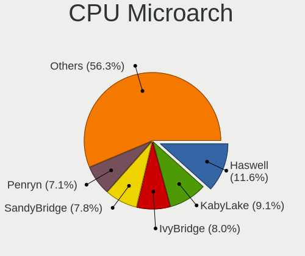

Ubuntu - Tested Hardware & Statistics (Desktops)
------------------------------------------------

A project to collect tested hardware configurations for Ubuntu.

Anyone can contribute to this report by the [hw-probe](https://github.com/linuxhw/hw-probe) tool:

    sudo -E hw-probe -all -upload

Please contribute! Especially if your hardware is rare.

Contents
--------

* [ Test Cases ](#test-cases)

* [ System ](#system)
  - [ OS                       ](#os)
  - [ OS Family                ](#os-family)
  - [ Kernel                   ](#kernel)
  - [ Kernel Family            ](#kernel-family)
  - [ Kernel Major Ver.        ](#kernel-major-ver)
  - [ Arch                     ](#arch)
  - [ DE                       ](#de)
  - [ Display Server           ](#display-server)
  - [ Display Manager          ](#display-manager)
  - [ OS Lang                  ](#os-lang)
  - [ Boot Mode                ](#boot-mode)
  - [ Filesystem               ](#filesystem)
  - [ Part. scheme             ](#part-scheme)
  - [ Dual Boot with Linux/BSD ](#dual-boot-with-linuxbsd)
  - [ Dual Boot (Win)          ](#dual-boot-win)

* [ Board ](#board)
  - [ Vendor                   ](#vendor)
  - [ Model                    ](#model)
  - [ Model Family             ](#model-family)
  - [ MFG Year                 ](#mfg-year)
  - [ Form Factor              ](#form-factor)
  - [ Secure Boot              ](#secure-boot)
  - [ Coreboot                 ](#coreboot)
  - [ RAM Size                 ](#ram-size)
  - [ RAM Used                 ](#ram-used)
  - [ Total Drives             ](#total-drives)
  - [ Has CD-ROM               ](#has-cd-rom)
  - [ Has Ethernet             ](#has-ethernet)
  - [ Has WiFi                 ](#has-wifi)
  - [ Has Bluetooth            ](#has-bluetooth)

* [ Location ](#location)
  - [ Country                  ](#country)
  - [ City                     ](#city)

* [ Drives ](#drives)
  - [ Drive Vendor             ](#drive-vendor)
  - [ Drive Model              ](#drive-model)
  - [ HDD Vendor               ](#hdd-vendor)
  - [ SSD Vendor               ](#ssd-vendor)
  - [ Drive Kind               ](#drive-kind)
  - [ Drive Connector          ](#drive-connector)
  - [ Drive Size               ](#drive-size)
  - [ Space Total              ](#space-total)
  - [ Space Used               ](#space-used)
  - [ Malfunc. Drives          ](#malfunc-drives)
  - [ Malfunc. Drive Vendor    ](#malfunc-drive-vendor)
  - [ Malfunc. HDD Vendor      ](#malfunc-hdd-vendor)
  - [ Malfunc. Drive Kind      ](#malfunc-drive-kind)
  - [ Failed Drives            ](#failed-drives)
  - [ Failed Drive Vendor      ](#failed-drive-vendor)
  - [ Drive Status             ](#drive-status)

* [ Storage controller ](#storage-controller)
  - [ Storage Vendor           ](#storage-vendor)
  - [ Storage Model            ](#storage-model)
  - [ Storage Kind             ](#storage-kind)

* [ Processor ](#processor)
  - [ CPU Vendor               ](#cpu-vendor)
  - [ CPU Model                ](#cpu-model)
  - [ CPU Model Family         ](#cpu-model-family)
  - [ CPU Cores                ](#cpu-cores)
  - [ CPU Sockets              ](#cpu-sockets)
  - [ CPU Threads              ](#cpu-threads)
  - [ CPU Op-Modes             ](#cpu-op-modes)
  - [ CPU Microcode            ](#cpu-microcode)
  - [ CPU Microarch            ](#cpu-microarch)

* [ Graphics ](#graphics)
  - [ GPU Vendor               ](#gpu-vendor)
  - [ GPU Model                ](#gpu-model)
  - [ GPU Combo                ](#gpu-combo)
  - [ GPU Driver               ](#gpu-driver)
  - [ GPU Memory               ](#gpu-memory)

* [ Monitor ](#monitor)
  - [ Monitor Vendor           ](#monitor-vendor)
  - [ Monitor Model            ](#monitor-model)
  - [ Monitor Resolution       ](#monitor-resolution)
  - [ Monitor Diagonal         ](#monitor-diagonal)
  - [ Monitor Width            ](#monitor-width)
  - [ Aspect Ratio             ](#aspect-ratio)
  - [ Monitor Area             ](#monitor-area)
  - [ Pixel Density            ](#pixel-density)
  - [ Multiple Monitors        ](#multiple-monitors)

* [ Network ](#network)
  - [ Net Controller Vendor    ](#net-controller-vendor)
  - [ Net Controller Model     ](#net-controller-model)
  - [ Wireless Vendor          ](#wireless-vendor)
  - [ Wireless Model           ](#wireless-model)
  - [ Ethernet Vendor          ](#ethernet-vendor)
  - [ Ethernet Model           ](#ethernet-model)
  - [ Net Controller Kind      ](#net-controller-kind)
  - [ Used Controller          ](#used-controller)
  - [ NICs                     ](#nics)
  - [ IPv6                     ](#ipv6)

* [ Bluetooth ](#bluetooth)
  - [ Bluetooth Vendor         ](#bluetooth-vendor)
  - [ Bluetooth Model          ](#bluetooth-model)

* [ Sound ](#sound)
  - [ Sound Vendor             ](#sound-vendor)
  - [ Sound Model              ](#sound-model)

* [ Memory ](#memory)
  - [ Memory Vendor            ](#memory-vendor)
  - [ Memory Model             ](#memory-model)
  - [ Memory Kind              ](#memory-kind)
  - [ Memory Form Factor       ](#memory-form-factor)
  - [ Memory Size              ](#memory-size)
  - [ Memory Speed             ](#memory-speed)

* [ Printers & scanners ](#printers--scanners)
  - [ Printer Vendor           ](#printer-vendor)
  - [ Printer Model            ](#printer-model)
  - [ Scanner Vendor           ](#scanner-vendor)
  - [ Scanner Model            ](#scanner-model)

* [ Camera ](#camera)
  - [ Camera Vendor            ](#camera-vendor)
  - [ Camera Model             ](#camera-model)

* [ Security ](#security)
  - [ Fingerprint Vendor       ](#fingerprint-vendor)
  - [ Fingerprint Model        ](#fingerprint-model)
  - [ Chipcard Vendor          ](#chipcard-vendor)
  - [ Chipcard Model           ](#chipcard-model)

* [ Unsupported ](#unsupported)
  - [ Unsupported Devices      ](#unsupported-devices)
  - [ Unsupported Device Types ](#unsupported-device-types)

Test Cases
----------

Total: 32753

| Vendor        | Model                       | Probe                                                      | Date         |
|---------------|-----------------------------|------------------------------------------------------------|--------------|
| Gigabyte      | H61M-S2PV                   | [319d6a8bc3](https://linux-hardware.org/?probe=319d6a8bc3) | Mar 01, 2023 |
| Gigabyte      | H61M-S2PV                   | [ce63d81075](https://linux-hardware.org/?probe=ce63d81075) | Mar 01, 2023 |
| ASUSTek       | ROG STRIX X370-F GAMING     | [1f4ca7d119](https://linux-hardware.org/?probe=1f4ca7d119) | Feb 28, 2023 |
| ASUSTek       | Z170-A                      | [a4d77f98eb](https://linux-hardware.org/?probe=a4d77f98eb) | Feb 28, 2023 |
| ASUSTek       | ROG STRIX X370-F GAMING     | [a634d23a20](https://linux-hardware.org/?probe=a634d23a20) | Feb 28, 2023 |
| MSI           | MAG B365M MORTAR            | [26f53549dd](https://linux-hardware.org/?probe=26f53549dd) | Feb 28, 2023 |
| ASUSTek       | ROG STRIX Z590-E GAMING ... | [5fa0193c44](https://linux-hardware.org/?probe=5fa0193c44) | Feb 28, 2023 |
| Lenovo        | 36F7 SDK0J40700 WIN 3258... | [48e150f274](https://linux-hardware.org/?probe=48e150f274) | Feb 28, 2023 |
| Dell          | 0KWVT8 A02                  | [4340c1d7c4](https://linux-hardware.org/?probe=4340c1d7c4) | Feb 28, 2023 |
| ASRockRack    | E3C246D4U2-2T               | [1ad2cb5102](https://linux-hardware.org/?probe=1ad2cb5102) | Feb 28, 2023 |
| ASRock        | KBL-NUC                     | [cb504c5fa0](https://linux-hardware.org/?probe=cb504c5fa0) | Feb 28, 2023 |
| Gigabyte      | B550M DS3H AC               | [64b2c8d5b9](https://linux-hardware.org/?probe=64b2c8d5b9) | Feb 28, 2023 |
| MSI           | A320M PRO-VD PLUS           | [6677ab11b2](https://linux-hardware.org/?probe=6677ab11b2) | Feb 28, 2023 |
| ASUSTek       | PRIME X570-P                | [dda5eec4b9](https://linux-hardware.org/?probe=dda5eec4b9) | Feb 28, 2023 |
| Lenovo        | 3102 NOK                    | [17a2e663e1](https://linux-hardware.org/?probe=17a2e663e1) | Feb 28, 2023 |
| Lenovo        | 3102 NOK                    | [6dabaffa28](https://linux-hardware.org/?probe=6dabaffa28) | Feb 28, 2023 |
| Gigabyte      | H61M-S2V-B3                 | [aefca0b663](https://linux-hardware.org/?probe=aefca0b663) | Feb 28, 2023 |
| Gigabyte      | H61M-S2V-B3                 | [12ccf2fe8b](https://linux-hardware.org/?probe=12ccf2fe8b) | Feb 28, 2023 |
| Dell          | 0HD5W2 A01                  | [f30a31a8ee](https://linux-hardware.org/?probe=f30a31a8ee) | Feb 28, 2023 |
| Gigabyte      | Z370 AORUS Gaming 5-CF      | [cb687f4572](https://linux-hardware.org/?probe=cb687f4572) | Feb 28, 2023 |
| Acer          | TDPS05                      | [c4a636fb79](https://linux-hardware.org/?probe=c4a636fb79) | Feb 28, 2023 |
| Acer          | TDPS05                      | [114e21597f](https://linux-hardware.org/?probe=114e21597f) | Feb 28, 2023 |
| Gigabyte      | X58A-UD5                    | [4cff35f888](https://linux-hardware.org/?probe=4cff35f888) | Feb 27, 2023 |
| HP            | 802E                        | [d24bb98294](https://linux-hardware.org/?probe=d24bb98294) | Feb 27, 2023 |
| Gigabyte      | Z97M-D3H                    | [d93d9bff7f](https://linux-hardware.org/?probe=d93d9bff7f) | Feb 27, 2023 |
| ASUSTek       | PRIME B360M-A               | [5860f51cd8](https://linux-hardware.org/?probe=5860f51cd8) | Feb 27, 2023 |
| Gigabyte      | EX58-UD5                    | [eaec9511de](https://linux-hardware.org/?probe=eaec9511de) | Feb 27, 2023 |
| ASRock        | G41M-S                      | [8802d04f08](https://linux-hardware.org/?probe=8802d04f08) | Feb 27, 2023 |
| HP            | 339A                        | [308d8dfac0](https://linux-hardware.org/?probe=308d8dfac0) | Feb 27, 2023 |
| Dell          | 01TN68 A02                  | [4acd4aa811](https://linux-hardware.org/?probe=4acd4aa811) | Feb 27, 2023 |
| Casper        | H510 001 G10a               | [95a9cfbf0b](https://linux-hardware.org/?probe=95a9cfbf0b) | Feb 27, 2023 |
| Gigabyte      | A320M-H-CF                  | [409bb06e5e](https://linux-hardware.org/?probe=409bb06e5e) | Feb 27, 2023 |
| Gigabyte      | H87-D3H-CF                  | [ea8bb4c0e4](https://linux-hardware.org/?probe=ea8bb4c0e4) | Feb 27, 2023 |
| Gigabyte      | H110M-S2V-CF                | [509c2a6e57](https://linux-hardware.org/?probe=509c2a6e57) | Feb 27, 2023 |
| AMI           | Cherry Trail CR             | [24952b3b19](https://linux-hardware.org/?probe=24952b3b19) | Feb 27, 2023 |
| Gigabyte      | Z690M AORUS ELITE AX DDR... | [686c8d56c4](https://linux-hardware.org/?probe=686c8d56c4) | Feb 27, 2023 |
| ASRock        | A320M-HDV R4.0              | [37d2aab670](https://linux-hardware.org/?probe=37d2aab670) | Feb 27, 2023 |
| ASUSTek       | B150 PRO GAMING/AURA        | [618e3d30fc](https://linux-hardware.org/?probe=618e3d30fc) | Feb 27, 2023 |
| Gigabyte      | Z690 AERO D                 | [68b84cc1eb](https://linux-hardware.org/?probe=68b84cc1eb) | Feb 27, 2023 |
| Lenovo        | 36F7 SDK0J40700 WIN 3258... | [580db05e08](https://linux-hardware.org/?probe=580db05e08) | Feb 27, 2023 |
| ASUSTek       | ROG STRIX X570-I GAMING     | [49f3238d4a](https://linux-hardware.org/?probe=49f3238d4a) | Feb 26, 2023 |
| HP            | 81B4 01                     | [bc06df8d32](https://linux-hardware.org/?probe=bc06df8d32) | Feb 26, 2023 |
| Gigabyte      | Z390 UD                     | [b40f9ce0d1](https://linux-hardware.org/?probe=b40f9ce0d1) | Feb 26, 2023 |
| MSI           | B450M PRO-M2 MAX            | [0c5f9a10dd](https://linux-hardware.org/?probe=0c5f9a10dd) | Feb 26, 2023 |
| MSI           | PRO Z690-A DDR4             | [3ab842532b](https://linux-hardware.org/?probe=3ab842532b) | Feb 26, 2023 |
| Pegatron      | NARRA5                      | [fbff48e326](https://linux-hardware.org/?probe=fbff48e326) | Feb 26, 2023 |
| Lenovo        | Annapurna CRB NOK           | [77122f785f](https://linux-hardware.org/?probe=77122f785f) | Feb 26, 2023 |
| Lenovo        | Annapurna CRB NOK           | [0e521e12aa](https://linux-hardware.org/?probe=0e521e12aa) | Feb 26, 2023 |
| ASUSTek       | PRIME B350M-A               | [4cd492ee3e](https://linux-hardware.org/?probe=4cd492ee3e) | Feb 26, 2023 |
| ASRock        | B85 Pro4                    | [0b4daba4fb](https://linux-hardware.org/?probe=0b4daba4fb) | Feb 26, 2023 |
| Foxconn       | 2ABF                        | [ead0312777](https://linux-hardware.org/?probe=ead0312777) | Feb 26, 2023 |
| ASUSTek       | ROG STRIX B450-E GAMING     | [2088ba9df6](https://linux-hardware.org/?probe=2088ba9df6) | Feb 26, 2023 |
| ASUSTek       | PRIME B250-PLUS             | [49b1cd5754](https://linux-hardware.org/?probe=49b1cd5754) | Feb 26, 2023 |
| ASUSTek       | PRIME B350M-A               | [9471b0f763](https://linux-hardware.org/?probe=9471b0f763) | Feb 26, 2023 |
| Gigabyte      | B560M DS3H V2               | [31f6d9e11d](https://linux-hardware.org/?probe=31f6d9e11d) | Feb 26, 2023 |
| Dell          | 0WMJ54 A01                  | [f9cae700c7](https://linux-hardware.org/?probe=f9cae700c7) | Feb 26, 2023 |
| Gigabyte      | GA-MA78LMT-US2H             | [df54545112](https://linux-hardware.org/?probe=df54545112) | Feb 26, 2023 |
| HP            | 1632                        | [394b988862](https://linux-hardware.org/?probe=394b988862) | Feb 26, 2023 |
| MSI           | MAG Z490 TOMAHAWK           | [f24a3027d0](https://linux-hardware.org/?probe=f24a3027d0) | Feb 26, 2023 |
| ASUSTek       | ProArt B550-CREATOR         | [a2a7defd24](https://linux-hardware.org/?probe=a2a7defd24) | Feb 26, 2023 |
| Dell          | 0J584C A00                  | [c16b58c7ce](https://linux-hardware.org/?probe=c16b58c7ce) | Feb 26, 2023 |
| Dell          | 0J584C A00                  | [9d8016f80e](https://linux-hardware.org/?probe=9d8016f80e) | Feb 26, 2023 |
| ASUSTek       | M4A87TD/USB3                | [8184285a7d](https://linux-hardware.org/?probe=8184285a7d) | Feb 26, 2023 |
| Dell          | 0HR330                      | [9110acd156](https://linux-hardware.org/?probe=9110acd156) | Feb 26, 2023 |
| Gigabyte      | H370 AORUS GAMING 3-CF      | [59d082bd5f](https://linux-hardware.org/?probe=59d082bd5f) | Feb 26, 2023 |
| ASUSTek       | PRIME H670-PLUS D4          | [3887cb1418](https://linux-hardware.org/?probe=3887cb1418) | Feb 26, 2023 |
| ASUSTek       | H87-PLUS                    | [f56bb767fd](https://linux-hardware.org/?probe=f56bb767fd) | Feb 26, 2023 |
| ASUSTek       | H87-PLUS                    | [98e70b4028](https://linux-hardware.org/?probe=98e70b4028) | Feb 26, 2023 |
| BESSTAR Te... | B550                        | [6a77bfec73](https://linux-hardware.org/?probe=6a77bfec73) | Feb 26, 2023 |
| Gigabyte      | Z68MA-D2H-B3                | [c863d76de9](https://linux-hardware.org/?probe=c863d76de9) | Feb 25, 2023 |
| Dell          | 0F428D A00                  | [7d01f8893e](https://linux-hardware.org/?probe=7d01f8893e) | Feb 25, 2023 |
| ASRock        | Z97 Pro4                    | [451c626830](https://linux-hardware.org/?probe=451c626830) | Feb 25, 2023 |
| ASUSTek       | P7P55D EVO                  | [336a7cad31](https://linux-hardware.org/?probe=336a7cad31) | Feb 25, 2023 |
| eMachines     | EL1850                      | [81741a438a](https://linux-hardware.org/?probe=81741a438a) | Feb 25, 2023 |
| HP            | 3398                        | [5e7ae4c866](https://linux-hardware.org/?probe=5e7ae4c866) | Feb 25, 2023 |
| Gigabyte      | Z170X-Gaming 7              | [0620aa7f6f](https://linux-hardware.org/?probe=0620aa7f6f) | Feb 25, 2023 |
| Gigabyte      | B550M DS3H                  | [0ac3b49261](https://linux-hardware.org/?probe=0ac3b49261) | Feb 25, 2023 |
| MSI           | 970 GAMING                  | [37bcb5eb45](https://linux-hardware.org/?probe=37bcb5eb45) | Feb 25, 2023 |
| BESSTAR Te... | B550                        | [d3e84076c7](https://linux-hardware.org/?probe=d3e84076c7) | Feb 25, 2023 |
| ASUSTek       | M5A78L-M PLUS/USB3          | [30afdb56c5](https://linux-hardware.org/?probe=30afdb56c5) | Feb 25, 2023 |
| Protectli     | VP2420                      | [ea5f851cf3](https://linux-hardware.org/?probe=ea5f851cf3) | Feb 25, 2023 |
| Quanta        | 2AC7 011                    | [3505fadb68](https://linux-hardware.org/?probe=3505fadb68) | Feb 25, 2023 |
| ASUSTek       | M5A78L-M PLUS/USB3          | [bfa5623f15](https://linux-hardware.org/?probe=bfa5623f15) | Feb 25, 2023 |
| Acer          | Aspire X3990                | [c83e31d66b](https://linux-hardware.org/?probe=c83e31d66b) | Feb 25, 2023 |
| Acer          | Aspire X3990                | [4be9f68049](https://linux-hardware.org/?probe=4be9f68049) | Feb 25, 2023 |
| Lenovo        | 30D2 SDK0J40697 WIN 3305... | [7864921f8d](https://linux-hardware.org/?probe=7864921f8d) | Feb 25, 2023 |
| Dell          | 051FJ8 A02                  | [05f5f23fbb](https://linux-hardware.org/?probe=05f5f23fbb) | Feb 25, 2023 |
| ASRock        | Z390 Phantom Gaming-ITX/... | [d78e737aaf](https://linux-hardware.org/?probe=d78e737aaf) | Feb 25, 2023 |
| Dell          | 0XCR8D A02                  | [6053547fd3](https://linux-hardware.org/?probe=6053547fd3) | Feb 25, 2023 |
| Gigabyte      | Z170X-Gaming 7              | [df734c276f](https://linux-hardware.org/?probe=df734c276f) | Feb 25, 2023 |
| ASUSTek       | P7P55D EVO                  | [3f931a7600](https://linux-hardware.org/?probe=3f931a7600) | Feb 25, 2023 |
| ASRock        | X300M-STX                   | [97a1558878](https://linux-hardware.org/?probe=97a1558878) | Feb 25, 2023 |
| ASUSTek       | TUF Gaming X570-PLUS        | [d8b9174fba](https://linux-hardware.org/?probe=d8b9174fba) | Feb 25, 2023 |
| Gigabyte      | H310M S2 x.x                | [99b5c2f7f9](https://linux-hardware.org/?probe=99b5c2f7f9) | Feb 24, 2023 |
| MSI           | MAG X570 TOMAHAWK WIFI      | [2e7905f753](https://linux-hardware.org/?probe=2e7905f753) | Feb 24, 2023 |
| Gigabyte      | H310M S2 x.x                | [0bb7bc3713](https://linux-hardware.org/?probe=0bb7bc3713) | Feb 24, 2023 |
| Gigabyte      | GA-MA78LMT-US2H             | [b2681528bd](https://linux-hardware.org/?probe=b2681528bd) | Feb 24, 2023 |
| ASUSTek       | PRIME B360M-A               | [6d7221488b](https://linux-hardware.org/?probe=6d7221488b) | Feb 24, 2023 |
| Pegatron      | NARRA5                      | [af6be34173](https://linux-hardware.org/?probe=af6be34173) | Feb 24, 2023 |
| Dell          | 0VRWRC A00                  | [7089ab33b3](https://linux-hardware.org/?probe=7089ab33b3) | Feb 24, 2023 |
| Fujitsu       | D3501-A1 S26361-D3501-A1    | [7031bb977d](https://linux-hardware.org/?probe=7031bb977d) | Feb 24, 2023 |
| MSI           | K9N6PGM2-V2                 | [e88df81d6f](https://linux-hardware.org/?probe=e88df81d6f) | Feb 24, 2023 |
| MSI           | H310M PRO-VDH PLUS          | [c7bb2ebe8b](https://linux-hardware.org/?probe=c7bb2ebe8b) | Feb 24, 2023 |
| ASRock        | 970A-G                      | [bfdb227a9d](https://linux-hardware.org/?probe=bfdb227a9d) | Feb 24, 2023 |
| HP            | 8433 11                     | [e8663b2a0c](https://linux-hardware.org/?probe=e8663b2a0c) | Feb 24, 2023 |
| Gigabyte      | H310M S2 x.x                | [f4e2bfd7a0](https://linux-hardware.org/?probe=f4e2bfd7a0) | Feb 24, 2023 |
| Gigabyte      | H61M-S2V-B3                 | [916f372721](https://linux-hardware.org/?probe=916f372721) | Feb 24, 2023 |
| Gigabyte      | H61M-S2V-B3                 | [6e82a5c5d6](https://linux-hardware.org/?probe=6e82a5c5d6) | Feb 24, 2023 |
| ASRock        | Q1900-ITX                   | [874cbd6e13](https://linux-hardware.org/?probe=874cbd6e13) | Feb 24, 2023 |
| ASRock        | Z77 Extreme3                | [e257e205bf](https://linux-hardware.org/?probe=e257e205bf) | Feb 24, 2023 |
| ASRock        | B550M-C                     | [96edee86aa](https://linux-hardware.org/?probe=96edee86aa) | Feb 24, 2023 |
| ASRock        | B550M-C                     | [454c89b4eb](https://linux-hardware.org/?probe=454c89b4eb) | Feb 24, 2023 |
| Pegatron      | NARRA5                      | [ca884f817b](https://linux-hardware.org/?probe=ca884f817b) | Feb 24, 2023 |
| ASUSTek       | Q87M-E                      | [e31da94f7b](https://linux-hardware.org/?probe=e31da94f7b) | Feb 24, 2023 |
| ASUSTek       | PRIME X470-PRO              | [69e1d23d85](https://linux-hardware.org/?probe=69e1d23d85) | Feb 24, 2023 |
| MSI           | H310M PRO-VDH PLUS          | [a458effa12](https://linux-hardware.org/?probe=a458effa12) | Feb 24, 2023 |
| ASUSTek       | PRIME B460M-A R2.0          | [0ccac8edb4](https://linux-hardware.org/?probe=0ccac8edb4) | Feb 24, 2023 |
| ASRock        | H510M/ac                    | [b7d570e46c](https://linux-hardware.org/?probe=b7d570e46c) | Feb 24, 2023 |
| ASUSTek       | PRIME Z390-P                | [cdced725a6](https://linux-hardware.org/?probe=cdced725a6) | Feb 24, 2023 |
| Dell          | 0M5DCD A00                  | [88b0bf49fd](https://linux-hardware.org/?probe=88b0bf49fd) | Feb 24, 2023 |
| ASUSTek       | PRIME Z270-P                | [fa08c93ecd](https://linux-hardware.org/?probe=fa08c93ecd) | Feb 24, 2023 |
| Dell          | 0MWYPT A02                  | [2491b0e5eb](https://linux-hardware.org/?probe=2491b0e5eb) | Feb 23, 2023 |
| HP            | 8433 11                     | [9aa13c1fa5](https://linux-hardware.org/?probe=9aa13c1fa5) | Feb 23, 2023 |
| Gigabyte      | Z390 UD                     | [5a6ab06c02](https://linux-hardware.org/?probe=5a6ab06c02) | Feb 23, 2023 |
| Intel         | SKYBAY                      | [a3d9851893](https://linux-hardware.org/?probe=a3d9851893) | Feb 23, 2023 |
| Dell          | 0NW6H5 A00                  | [8f307a87e5](https://linux-hardware.org/?probe=8f307a87e5) | Feb 23, 2023 |
| ASUSTek       | LEONITE                     | [2739b3325c](https://linux-hardware.org/?probe=2739b3325c) | Feb 23, 2023 |
| Dell          | 0NW6H5 A00                  | [781c058256](https://linux-hardware.org/?probe=781c058256) | Feb 23, 2023 |
| Fujitsu       | D3062-A1 S26361-D3062-A1    | [3288bf6604](https://linux-hardware.org/?probe=3288bf6604) | Feb 23, 2023 |
| ASUSTek       | P5K                         | [2fb7f1713b](https://linux-hardware.org/?probe=2fb7f1713b) | Feb 23, 2023 |
| ASUSTek       | ROG STRIX X570-E GAMING     | [6bdb8ada9c](https://linux-hardware.org/?probe=6bdb8ada9c) | Feb 23, 2023 |
| Acer          | FX58M                       | [dd80460a7d](https://linux-hardware.org/?probe=dd80460a7d) | Feb 23, 2023 |
| ASUSTek       | TUF X299 MARK 2             | [d0a45881e1](https://linux-hardware.org/?probe=d0a45881e1) | Feb 23, 2023 |
| ASUSTek       | Maximus VI HERO             | [16618052ef](https://linux-hardware.org/?probe=16618052ef) | Feb 23, 2023 |
| ASUSTek       | B85M-E                      | [8a09d5e812](https://linux-hardware.org/?probe=8a09d5e812) | Feb 23, 2023 |
| Gigabyte      | B660M AORUS PRO AX DDR4     | [523ab73c43](https://linux-hardware.org/?probe=523ab73c43) | Feb 23, 2023 |
| Gigabyte      | GA-880GM-USB3               | [bb5da28703](https://linux-hardware.org/?probe=bb5da28703) | Feb 23, 2023 |
| Gigabyte      | Z170X-Gaming 7              | [00e573a880](https://linux-hardware.org/?probe=00e573a880) | Feb 23, 2023 |
| Gigabyte      | Z97M-DS3H                   | [821d952d15](https://linux-hardware.org/?probe=821d952d15) | Feb 23, 2023 |
| Dell          | 0WG855                      | [49c149cff7](https://linux-hardware.org/?probe=49c149cff7) | Feb 23, 2023 |
| Gigabyte      | F2A88XM-D3H                 | [7b27b03f4a](https://linux-hardware.org/?probe=7b27b03f4a) | Feb 23, 2023 |
| HP            | 3397                        | [e714a7b19d](https://linux-hardware.org/?probe=e714a7b19d) | Feb 23, 2023 |
| T-bao         | MINI PC                     | [68ba9fc610](https://linux-hardware.org/?probe=68ba9fc610) | Feb 23, 2023 |
| MSI           | MPG Z790 CARBON WIFI        | [e0687d11bb](https://linux-hardware.org/?probe=e0687d11bb) | Feb 23, 2023 |
| MSI           | MPG Z790 CARBON WIFI        | [49e71eb5b4](https://linux-hardware.org/?probe=49e71eb5b4) | Feb 22, 2023 |
| MSI           | Z370 GAMING PRO CARBON      | [fc86b476d7](https://linux-hardware.org/?probe=fc86b476d7) | Feb 22, 2023 |
| MSI           | B550M PRO-VDH WIFI          | [ce8874cff4](https://linux-hardware.org/?probe=ce8874cff4) | Feb 22, 2023 |
| MSI           | B350 TOMAHAWK               | [71aa647a28](https://linux-hardware.org/?probe=71aa647a28) | Feb 22, 2023 |
| ASRock        | B450 Pro4                   | [87600137b2](https://linux-hardware.org/?probe=87600137b2) | Feb 22, 2023 |
| Dell          | 040DDP A01                  | [c2117fed20](https://linux-hardware.org/?probe=c2117fed20) | Feb 22, 2023 |
| ASUSTek       | PRO H410M-C                 | [d6edc5401d](https://linux-hardware.org/?probe=d6edc5401d) | Feb 22, 2023 |
| Gigabyte      | H81M-S2H                    | [d8bafec2da](https://linux-hardware.org/?probe=d8bafec2da) | Feb 22, 2023 |
| ASRock        | FM2A68M-HD+                 | [4468c0fcb9](https://linux-hardware.org/?probe=4468c0fcb9) | Feb 22, 2023 |
| Acer          | FX58M                       | [6d689fa44b](https://linux-hardware.org/?probe=6d689fa44b) | Feb 22, 2023 |
| MSI           | B550-A PRO                  | [11d4db7a00](https://linux-hardware.org/?probe=11d4db7a00) | Feb 22, 2023 |
| Dell          | 0WMJ54 A01                  | [49a53e4b1d](https://linux-hardware.org/?probe=49a53e4b1d) | Feb 22, 2023 |
| ASUSTek       | Maximus VI HERO             | [754e37e18d](https://linux-hardware.org/?probe=754e37e18d) | Feb 22, 2023 |
| CWWK          | CW-J6-6L                    | [7599e919d9](https://linux-hardware.org/?probe=7599e919d9) | Feb 22, 2023 |
| CWWK          | CW-J6-6L                    | [d003c3ed81](https://linux-hardware.org/?probe=d003c3ed81) | Feb 22, 2023 |
| Unknown       | 1.0                         | [b7475435a7](https://linux-hardware.org/?probe=b7475435a7) | Feb 22, 2023 |
| ASUSTek       | PRIME X470-PRO              | [adb9b895c8](https://linux-hardware.org/?probe=adb9b895c8) | Feb 22, 2023 |
| ASUSTek       | P5Q-E                       | [3362226081](https://linux-hardware.org/?probe=3362226081) | Feb 22, 2023 |
| ASUSTek       | P5Q-E                       | [8230de4836](https://linux-hardware.org/?probe=8230de4836) | Feb 22, 2023 |
| HP            | 18E5                        | [46c0f34886](https://linux-hardware.org/?probe=46c0f34886) | Feb 22, 2023 |
| Gigabyte      | GA-MA78LMT-US2H             | [39e6d492c4](https://linux-hardware.org/?probe=39e6d492c4) | Feb 22, 2023 |
| Apple         | Mac-F4208DC8 PVT            | [adc8d2fb16](https://linux-hardware.org/?probe=adc8d2fb16) | Feb 22, 2023 |
| MSI           | MEG X570 UNIFY              | [edc30b8a22](https://linux-hardware.org/?probe=edc30b8a22) | Feb 22, 2023 |
| MSI           | B350 TOMAHAWK ARCTIC        | [9bd1823913](https://linux-hardware.org/?probe=9bd1823913) | Feb 22, 2023 |
| ASUSTek       | P8B75-M LE                  | [fa3e62fdef](https://linux-hardware.org/?probe=fa3e62fdef) | Feb 22, 2023 |
| Gigabyte      | GA-MA78LMT-US2H             | [40bc5397ea](https://linux-hardware.org/?probe=40bc5397ea) | Feb 22, 2023 |
| Acer          | Aspire TC-605               | [7234bd12f6](https://linux-hardware.org/?probe=7234bd12f6) | Feb 22, 2023 |
| ASUSTek       | PRIME B550M-A WIFI II       | [cb79c0ad47](https://linux-hardware.org/?probe=cb79c0ad47) | Feb 22, 2023 |
| Gigabyte      | EP43-UD3L                   | [52c293dde6](https://linux-hardware.org/?probe=52c293dde6) | Feb 21, 2023 |
| ASRock        | X570 Phantom Gaming 4       | [6b883f967d](https://linux-hardware.org/?probe=6b883f967d) | Feb 21, 2023 |
| Gigabyte      | B365M DS3H                  | [8049beda96](https://linux-hardware.org/?probe=8049beda96) | Feb 21, 2023 |
| MSI           | MPG X570S EDGE MAX WIFI     | [d9a5611225](https://linux-hardware.org/?probe=d9a5611225) | Feb 21, 2023 |
| ASUSTek       | TUF B450-PLUS GAMING        | [50261acb6b](https://linux-hardware.org/?probe=50261acb6b) | Feb 21, 2023 |
| ASUSTek       | TUF Gaming Z790-PLUS WIF... | [e2470a52d6](https://linux-hardware.org/?probe=e2470a52d6) | Feb 21, 2023 |
| Dell          | 0HY9JP A01                  | [8c1473e111](https://linux-hardware.org/?probe=8c1473e111) | Feb 21, 2023 |
| Gigabyte      | Z97X-Gaming 3               | [e293e73518](https://linux-hardware.org/?probe=e293e73518) | Feb 21, 2023 |
| Acer          | FIH57                       | [294e04e054](https://linux-hardware.org/?probe=294e04e054) | Feb 21, 2023 |
| MSI           | B550 GAMING GEN3            | [d92a4239ee](https://linux-hardware.org/?probe=d92a4239ee) | Feb 21, 2023 |
| ASRock        | B760M PG SONIC WiFi         | [060f57c123](https://linux-hardware.org/?probe=060f57c123) | Feb 21, 2023 |
| HP            | 18E7                        | [913411cd18](https://linux-hardware.org/?probe=913411cd18) | Feb 21, 2023 |
| Acer          | Aspire X1935                | [8c4f88db47](https://linux-hardware.org/?probe=8c4f88db47) | Feb 21, 2023 |
| Dell          | 0CK520 A01                  | [6e92aa0096](https://linux-hardware.org/?probe=6e92aa0096) | Feb 20, 2023 |
| ASUSTek       | H170-PRO                    | [011dc701c1](https://linux-hardware.org/?probe=011dc701c1) | Feb 20, 2023 |
| Dell          | 0F642F A00                  | [b4b47b728d](https://linux-hardware.org/?probe=b4b47b728d) | Feb 20, 2023 |
| Alienware     | 07W25T A01                  | [0ce3af1e23](https://linux-hardware.org/?probe=0ce3af1e23) | Feb 20, 2023 |
| Alienware     | 07W25T A01                  | [f965f4658b](https://linux-hardware.org/?probe=f965f4658b) | Feb 20, 2023 |
| Dell          | 0H4VK7 A01                  | [19ded2f15b](https://linux-hardware.org/?probe=19ded2f15b) | Feb 20, 2023 |
| ASUSTek       | H81M-PLUS                   | [796ba78b54](https://linux-hardware.org/?probe=796ba78b54) | Feb 20, 2023 |
| Win elemen... | M600                        | [76c26f5ebb](https://linux-hardware.org/?probe=76c26f5ebb) | Feb 20, 2023 |
| ASUSTek       | ROG STRIX B450-I GAMING     | [04130aaf41](https://linux-hardware.org/?probe=04130aaf41) | Feb 20, 2023 |
| ASUSTek       | ROG STRIX B760-I GAMING ... | [40ae7724b9](https://linux-hardware.org/?probe=40ae7724b9) | Feb 20, 2023 |
| Supermicro    | X10DRiB                     | [8e6438214d](https://linux-hardware.org/?probe=8e6438214d) | Feb 20, 2023 |
| Lenovo        | 3138 NO DPK                 | [2beb8f24f3](https://linux-hardware.org/?probe=2beb8f24f3) | Feb 20, 2023 |
| Lenovo        | 3138 NO DPK                 | [992af7508c](https://linux-hardware.org/?probe=992af7508c) | Feb 20, 2023 |
| ASUSTek       | VM62N                       | [5cab7f5b88](https://linux-hardware.org/?probe=5cab7f5b88) | Feb 20, 2023 |
| ASRock        | H61M-DGS R2.0               | [3d8b32f453](https://linux-hardware.org/?probe=3d8b32f453) | Feb 20, 2023 |
| Intel         | H55                         | [6102979c67](https://linux-hardware.org/?probe=6102979c67) | Feb 20, 2023 |
| HP            | 158B                        | [4d6199df48](https://linux-hardware.org/?probe=4d6199df48) | Feb 20, 2023 |
| Gigabyte      | A320M-H-CF                  | [b184665592](https://linux-hardware.org/?probe=b184665592) | Feb 20, 2023 |
| Gigabyte      | B550M DS3H                  | [9930856d67](https://linux-hardware.org/?probe=9930856d67) | Feb 20, 2023 |
| Dell          | 0D24M8 A01                  | [924264cbec](https://linux-hardware.org/?probe=924264cbec) | Feb 20, 2023 |
| AZW           | GK mini                     | [6fc9af1346](https://linux-hardware.org/?probe=6fc9af1346) | Feb 20, 2023 |
| MSI           | MPG X570 GAMING PLUS        | [a47920e014](https://linux-hardware.org/?probe=a47920e014) | Feb 20, 2023 |
| Dell          | 0WMJ54 A01                  | [59ce46dfe2](https://linux-hardware.org/?probe=59ce46dfe2) | Feb 20, 2023 |
| Pegatron      | NARRA5                      | [6d0714a928](https://linux-hardware.org/?probe=6d0714a928) | Feb 20, 2023 |
| MSI           | Z170A GAMING M5             | [5aa73f71fd](https://linux-hardware.org/?probe=5aa73f71fd) | Feb 20, 2023 |
| HP            | 18E7                        | [c59f4fb1ab](https://linux-hardware.org/?probe=c59f4fb1ab) | Feb 20, 2023 |
| ASRock        | B760M PG SONIC WiFi         | [db1047e063](https://linux-hardware.org/?probe=db1047e063) | Feb 20, 2023 |
| Gigabyte      | H81M-S2H                    | [a4b049c92b](https://linux-hardware.org/?probe=a4b049c92b) | Feb 20, 2023 |
| ASRock        | H81M-HDS R2.0               | [32b47345a6](https://linux-hardware.org/?probe=32b47345a6) | Feb 20, 2023 |
| Dell          | 0D24M8 A02                  | [a9e9dae786](https://linux-hardware.org/?probe=a9e9dae786) | Feb 19, 2023 |
| ASUSTek       | TUF Gaming X570-PLUS        | [8ab5bffea6](https://linux-hardware.org/?probe=8ab5bffea6) | Feb 19, 2023 |
| ASUSTek       | H81M-PLUS                   | [86f16da5e8](https://linux-hardware.org/?probe=86f16da5e8) | Feb 19, 2023 |
| ASUSTek       | M5A97 LE R2.0               | [fccba081d1](https://linux-hardware.org/?probe=fccba081d1) | Feb 19, 2023 |
| HP            | 18E5                        | [ba623dea72](https://linux-hardware.org/?probe=ba623dea72) | Feb 19, 2023 |
| Partner       | S1-J1900                    | [0dd4327553](https://linux-hardware.org/?probe=0dd4327553) | Feb 19, 2023 |
| ASUSTek       | M5A99X EVO R2.0             | [8c8ae38704](https://linux-hardware.org/?probe=8c8ae38704) | Feb 19, 2023 |
| HP            | 0AECh D                     | [e844a614ec](https://linux-hardware.org/?probe=e844a614ec) | Feb 19, 2023 |
| Lenovo        | MAHOBAY NO DPK              | [e7e9625ffc](https://linux-hardware.org/?probe=e7e9625ffc) | Feb 19, 2023 |
| MSI           | B450 TOMAHAWK               | [50b693cc98](https://linux-hardware.org/?probe=50b693cc98) | Feb 19, 2023 |
| ASRock        | 870 Extreme3 R2.0           | [68c2299161](https://linux-hardware.org/?probe=68c2299161) | Feb 19, 2023 |
| Medion        | H110H4-EM                   | [71da47e860](https://linux-hardware.org/?probe=71da47e860) | Feb 19, 2023 |
| Gigabyte      | X670 AORUS ELITE AX         | [ee4e2b3cde](https://linux-hardware.org/?probe=ee4e2b3cde) | Feb 19, 2023 |
| HP            | 339A                        | [07001c3589](https://linux-hardware.org/?probe=07001c3589) | Feb 19, 2023 |
| HP            | 339A                        | [0d7bb8b04a](https://linux-hardware.org/?probe=0d7bb8b04a) | Feb 19, 2023 |
| ASRock        | X99 Extreme4                | [cbfb58fc3c](https://linux-hardware.org/?probe=cbfb58fc3c) | Feb 19, 2023 |
| Gigabyte      | H77-DS3H                    | [3f26c5e55c](https://linux-hardware.org/?probe=3f26c5e55c) | Feb 19, 2023 |
| ASUSTek       | Maximus VIII RANGER         | [e3852ecb78](https://linux-hardware.org/?probe=e3852ecb78) | Feb 19, 2023 |
| Dell          | 0F5C5X A00                  | [0496d0bbcf](https://linux-hardware.org/?probe=0496d0bbcf) | Feb 18, 2023 |
| ASUSTek       | A78M-E                      | [3b2adbff33](https://linux-hardware.org/?probe=3b2adbff33) | Feb 18, 2023 |
| HP            | 1905                        | [abc0c09cdf](https://linux-hardware.org/?probe=abc0c09cdf) | Feb 18, 2023 |
| Gigabyte      | X79-UD3                     | [f8dfa838b7](https://linux-hardware.org/?probe=f8dfa838b7) | Feb 18, 2023 |
| Dell          | 0PY127 A02                  | [2be7133f11](https://linux-hardware.org/?probe=2be7133f11) | Feb 18, 2023 |
| MSI           | B75A-G43                    | [bf426ce3c3](https://linux-hardware.org/?probe=bf426ce3c3) | Feb 18, 2023 |
| ASUSTek       | PRIME A320M-K               | [105ea39c82](https://linux-hardware.org/?probe=105ea39c82) | Feb 18, 2023 |
| Dell          | 0PU052                      | [a460806b91](https://linux-hardware.org/?probe=a460806b91) | Feb 18, 2023 |
| Gigabyte      | Q87M-D2H                    | [3c0c91cfd4](https://linux-hardware.org/?probe=3c0c91cfd4) | Feb 18, 2023 |
| MSI           | MPG Z390 GAMING EDGE AC     | [28965259ad](https://linux-hardware.org/?probe=28965259ad) | Feb 18, 2023 |
| MSI           | B450M-A PRO MAX             | [47db699ed6](https://linux-hardware.org/?probe=47db699ed6) | Feb 18, 2023 |
| Login Info... | LOG-H61H2-M2                | [889231ad64](https://linux-hardware.org/?probe=889231ad64) | Feb 18, 2023 |
| Gateway       | IPISB-VR                    | [f67f11a59e](https://linux-hardware.org/?probe=f67f11a59e) | Feb 18, 2023 |
| ASUSTek       | PRIME B550M-A               | [8a8696cdb1](https://linux-hardware.org/?probe=8a8696cdb1) | Feb 18, 2023 |
| ASRock        | H510M/ac                    | [ab77c84805](https://linux-hardware.org/?probe=ab77c84805) | Feb 18, 2023 |
| HP            | 8299                        | [458683cdc0](https://linux-hardware.org/?probe=458683cdc0) | Feb 18, 2023 |
| Dell          | 0WMJ54 A01                  | [c154817077](https://linux-hardware.org/?probe=c154817077) | Feb 18, 2023 |
| Dell          | 0C2XKD A01                  | [5fcdbd2986](https://linux-hardware.org/?probe=5fcdbd2986) | Feb 18, 2023 |
| Dell          | 0C2XKD A01                  | [6d786baedd](https://linux-hardware.org/?probe=6d786baedd) | Feb 18, 2023 |
| Dell          | 0F5C5X A00                  | [ba5a46ec10](https://linux-hardware.org/?probe=ba5a46ec10) | Feb 18, 2023 |
| Alienware     | 07W25T A01                  | [f9427f609d](https://linux-hardware.org/?probe=f9427f609d) | Feb 17, 2023 |
| Gigabyte      | GA-MA69VM-S2                | [b01f6d7a1f](https://linux-hardware.org/?probe=b01f6d7a1f) | Feb 17, 2023 |
| ASUSTek       | PRIME Z690-P D4             | [9f6834d4a9](https://linux-hardware.org/?probe=9f6834d4a9) | Feb 17, 2023 |
| OEM           | Unknown                     | [90c705ee6b](https://linux-hardware.org/?probe=90c705ee6b) | Feb 17, 2023 |
| ASUSTek       | PRIME Z690-P D4             | [131f8f99a2](https://linux-hardware.org/?probe=131f8f99a2) | Feb 17, 2023 |
| ASUSTek       | TUF Gaming X570-PLUS_BR     | [f3c66a583b](https://linux-hardware.org/?probe=f3c66a583b) | Feb 17, 2023 |
| MSI           | MPG Z390 GAMING EDGE AC     | [6f0e4158a4](https://linux-hardware.org/?probe=6f0e4158a4) | Feb 17, 2023 |
| Casper        | H510 001 G10a               | [56402bade6](https://linux-hardware.org/?probe=56402bade6) | Feb 17, 2023 |
| IP3 Tech      | Cherry Trail CR             | [0ff2dc2202](https://linux-hardware.org/?probe=0ff2dc2202) | Feb 17, 2023 |
| Intel         | DH77DF AAG40293-301         | [f44579d8b4](https://linux-hardware.org/?probe=f44579d8b4) | Feb 17, 2023 |
| ASUSTek       | TUF X470-PLUS GAMING        | [271ad0ffe2](https://linux-hardware.org/?probe=271ad0ffe2) | Feb 17, 2023 |
| Lenovo        | 36C5 SDK0K17763 WIN 1801... | [fa1e14d3d5](https://linux-hardware.org/?probe=fa1e14d3d5) | Feb 17, 2023 |
| Lenovo        | 36C5 SDK0K17763 WIN 1801... | [b6217420cc](https://linux-hardware.org/?probe=b6217420cc) | Feb 17, 2023 |
| Lenovo        | 1046 SDK0T08861 WIN 3305... | [b9c30fbaf8](https://linux-hardware.org/?probe=b9c30fbaf8) | Feb 17, 2023 |
| MSI           | B350 TOMAHAWK               | [de9c98193e](https://linux-hardware.org/?probe=de9c98193e) | Feb 17, 2023 |
| ASUSTek       | TUF Gaming X570-PLUS_BR     | [9d88e03390](https://linux-hardware.org/?probe=9d88e03390) | Feb 17, 2023 |
| Gigabyte      | H81M-S2H                    | [db4fef5830](https://linux-hardware.org/?probe=db4fef5830) | Feb 17, 2023 |
| ASUSTek       | ROG STRIX B550-F GAMING     | [8fa990093e](https://linux-hardware.org/?probe=8fa990093e) | Feb 17, 2023 |
| Lenovo        | 312A SDK0J40697 WIN 3305... | [4a3d5fee69](https://linux-hardware.org/?probe=4a3d5fee69) | Feb 17, 2023 |
| Gigabyte      | B450 AORUS PRO-CF           | [9cd5183878](https://linux-hardware.org/?probe=9cd5183878) | Feb 17, 2023 |
| Gigabyte      | B450 AORUS PRO-CF           | [7e44f9e4ff](https://linux-hardware.org/?probe=7e44f9e4ff) | Feb 17, 2023 |
| ASUSTek       | ROG STRIX X299-E GAMING     | [103bbf25bb](https://linux-hardware.org/?probe=103bbf25bb) | Feb 17, 2023 |
| ASUSTek       | ROG STRIX X299-E GAMING     | [8da708a154](https://linux-hardware.org/?probe=8da708a154) | Feb 17, 2023 |
| ASUSTek       | PRIME TRX40-PRO             | [b72dfb5a1b](https://linux-hardware.org/?probe=b72dfb5a1b) | Feb 17, 2023 |
| ASUSTek       | PRIME TRX40-PRO             | [8d8bb70778](https://linux-hardware.org/?probe=8d8bb70778) | Feb 17, 2023 |
| ASUSTek       | ROG STRIX X299-E GAMING     | [5d9c52684e](https://linux-hardware.org/?probe=5d9c52684e) | Feb 17, 2023 |
| ASUSTek       | PRIME TRX40-PRO             | [30acba4ccd](https://linux-hardware.org/?probe=30acba4ccd) | Feb 17, 2023 |
| Gigabyte      | X299 AORUS Gaming 7         | [cd5fcc7d4c](https://linux-hardware.org/?probe=cd5fcc7d4c) | Feb 17, 2023 |
| Gigabyte      | X299 AORUS Gaming 7         | [8ef4a011f7](https://linux-hardware.org/?probe=8ef4a011f7) | Feb 17, 2023 |
| ASUSTek       | ROG STRIX X299-E GAMING     | [5160909d57](https://linux-hardware.org/?probe=5160909d57) | Feb 17, 2023 |
| Gigabyte      | X299 UD4 Pro-CF             | [2c3699dc3c](https://linux-hardware.org/?probe=2c3699dc3c) | Feb 17, 2023 |
| ASUSTek       | ROG STRIX X299-E GAMING     | [21ef26978d](https://linux-hardware.org/?probe=21ef26978d) | Feb 17, 2023 |
| ASUSTek       | ROG STRIX X299-E GAMING     | [ba50ff27b1](https://linux-hardware.org/?probe=ba50ff27b1) | Feb 17, 2023 |
| Gigabyte      | X299 AORUS Gaming 7         | [ad9381188b](https://linux-hardware.org/?probe=ad9381188b) | Feb 17, 2023 |
| Gigabyte      | X299 UD4 Pro-CF             | [96e79838f4](https://linux-hardware.org/?probe=96e79838f4) | Feb 17, 2023 |
| ASUSTek       | TUF X299 MARK 2             | [ce59554e19](https://linux-hardware.org/?probe=ce59554e19) | Feb 17, 2023 |
| ASUSTek       | TUF X299 MARK 2             | [d72f3f4fcf](https://linux-hardware.org/?probe=d72f3f4fcf) | Feb 17, 2023 |
| Gigabyte      | X299 UD4 Pro-CF             | [751ef5b264](https://linux-hardware.org/?probe=751ef5b264) | Feb 17, 2023 |
| MSI           | X99S SLI PLUS               | [a459849bf7](https://linux-hardware.org/?probe=a459849bf7) | Feb 17, 2023 |
| ASUSTek       | TUF X299 MARK 2             | [c45e157ba0](https://linux-hardware.org/?probe=c45e157ba0) | Feb 17, 2023 |
| ASUSTek       | ROG STRIX X299-E GAMING     | [efe2cbc2cc](https://linux-hardware.org/?probe=efe2cbc2cc) | Feb 17, 2023 |
| MSI           | X99S SLI PLUS               | [fa5ed6bcb5](https://linux-hardware.org/?probe=fa5ed6bcb5) | Feb 17, 2023 |
| ASUSTek       | TUF X299 MARK 2             | [16784e69a8](https://linux-hardware.org/?probe=16784e69a8) | Feb 17, 2023 |
| ASUSTek       | TUF X299 MARK 2             | [986e5bfea4](https://linux-hardware.org/?probe=986e5bfea4) | Feb 17, 2023 |
| ASUSTek       | ROG STRIX X299-E GAMING     | [1d64be3020](https://linux-hardware.org/?probe=1d64be3020) | Feb 17, 2023 |
| ASUSTek       | ROG STRIX X299-E GAMING     | [015922d413](https://linux-hardware.org/?probe=015922d413) | Feb 17, 2023 |
| ASUSTek       | ROG STRIX X299-E GAMING     | [177c3c24be](https://linux-hardware.org/?probe=177c3c24be) | Feb 17, 2023 |
| ASUSTek       | ROG STRIX X299-E GAMING     | [169dc931c3](https://linux-hardware.org/?probe=169dc931c3) | Feb 17, 2023 |
| ASUSTek       | ROG STRIX X299-E GAMING     | [20c37220b7](https://linux-hardware.org/?probe=20c37220b7) | Feb 17, 2023 |
| ASUSTek       | ROG STRIX X299-E GAMING     | [f131178d62](https://linux-hardware.org/?probe=f131178d62) | Feb 17, 2023 |
| ASUSTek       | ROG STRIX X299-E GAMING     | [7558f5b7df](https://linux-hardware.org/?probe=7558f5b7df) | Feb 17, 2023 |
| ASUSTek       | ROG STRIX X299-E GAMING     | [463f293b51](https://linux-hardware.org/?probe=463f293b51) | Feb 17, 2023 |
| ASUSTek       | ROG STRIX X299-E GAMING     | [061f8f9850](https://linux-hardware.org/?probe=061f8f9850) | Feb 17, 2023 |
| ASUSTek       | ROG STRIX X299-E GAMING     | [b7f834a93d](https://linux-hardware.org/?probe=b7f834a93d) | Feb 17, 2023 |
| ASUSTek       | ROG STRIX X299-E GAMING     | [83d5b853cd](https://linux-hardware.org/?probe=83d5b853cd) | Feb 17, 2023 |
| ASUSTek       | PRIME TRX40-PRO             | [1e4e8369a0](https://linux-hardware.org/?probe=1e4e8369a0) | Feb 17, 2023 |
| ASUSTek       | PRIME TRX40-PRO             | [d9d83d8ea6](https://linux-hardware.org/?probe=d9d83d8ea6) | Feb 17, 2023 |
| ASUSTek       | PRIME TRX40-PRO             | [32f6542157](https://linux-hardware.org/?probe=32f6542157) | Feb 17, 2023 |
| ASUSTek       | PRIME TRX40-PRO             | [ea985ff971](https://linux-hardware.org/?probe=ea985ff971) | Feb 17, 2023 |
| ASUSTek       | ROG STRIX X299-E GAMING     | [2a73d2e224](https://linux-hardware.org/?probe=2a73d2e224) | Feb 17, 2023 |
| ASUSTek       | PRIME TRX40-PRO             | [ed43412282](https://linux-hardware.org/?probe=ed43412282) | Feb 17, 2023 |
| ASUSTek       | ROG STRIX X299-E GAMING     | [61c70f6656](https://linux-hardware.org/?probe=61c70f6656) | Feb 17, 2023 |
| ASUSTek       | ROG STRIX X299-E GAMING     | [34faa4711b](https://linux-hardware.org/?probe=34faa4711b) | Feb 17, 2023 |
| ASUSTek       | ROG STRIX X299-E GAMING     | [558afff0f6](https://linux-hardware.org/?probe=558afff0f6) | Feb 17, 2023 |
| Gigabyte      | TRX40 AORUS PRO WIFI        | [9dfde374d4](https://linux-hardware.org/?probe=9dfde374d4) | Feb 17, 2023 |
| Gigabyte      | X299 AORUS Gaming 3-CF      | [e57056c64d](https://linux-hardware.org/?probe=e57056c64d) | Feb 17, 2023 |
| ASUSTek       | ROG STRIX X299-E GAMING     | [794f8c899b](https://linux-hardware.org/?probe=794f8c899b) | Feb 17, 2023 |
| Gigabyte      | X299 AORUS Gaming 7         | [e1fcb6fe64](https://linux-hardware.org/?probe=e1fcb6fe64) | Feb 17, 2023 |
| Gigabyte      | X299 AORUS Gaming 3-CF      | [c8c405a4eb](https://linux-hardware.org/?probe=c8c405a4eb) | Feb 17, 2023 |
| ASUSTek       | ROG STRIX X299-E GAMING     | [08b9776245](https://linux-hardware.org/?probe=08b9776245) | Feb 17, 2023 |
| ASUSTek       | PRIME TRX40-PRO             | [977ef3f7ba](https://linux-hardware.org/?probe=977ef3f7ba) | Feb 17, 2023 |
| ASUSTek       | ROG STRIX X299-E GAMING     | [4daa0847fe](https://linux-hardware.org/?probe=4daa0847fe) | Feb 17, 2023 |
| Gigabyte      | X299 AORUS Gaming 3-CF      | [825d1d03a8](https://linux-hardware.org/?probe=825d1d03a8) | Feb 17, 2023 |
| ASUSTek       | ROG STRIX X299-E GAMING     | [a397f47325](https://linux-hardware.org/?probe=a397f47325) | Feb 17, 2023 |
| Gigabyte      | X299 AORUS Gaming 7         | [65a2d7b349](https://linux-hardware.org/?probe=65a2d7b349) | Feb 17, 2023 |
| ASUSTek       | ROG STRIX X299-E GAMING     | [d019d6d168](https://linux-hardware.org/?probe=d019d6d168) | Feb 17, 2023 |
| ASUSTek       | ROG STRIX X299-E GAMING     | [2e58e94034](https://linux-hardware.org/?probe=2e58e94034) | Feb 17, 2023 |
| ASUSTek       | ROG STRIX X299-E GAMING     | [0e0920372f](https://linux-hardware.org/?probe=0e0920372f) | Feb 17, 2023 |
| Gigabyte      | X299 AORUS Gaming 3 Pro-... | [c51ede0f5f](https://linux-hardware.org/?probe=c51ede0f5f) | Feb 17, 2023 |
| ASUSTek       | ROG STRIX X299-E GAMING     | [ebbf9fa48f](https://linux-hardware.org/?probe=ebbf9fa48f) | Feb 17, 2023 |
| ASUSTek       | ROG STRIX X299-E GAMING     | [f8f9ca6c0b](https://linux-hardware.org/?probe=f8f9ca6c0b) | Feb 17, 2023 |
| ASUSTek       | ROG STRIX X299-E GAMING     | [52a008d6d0](https://linux-hardware.org/?probe=52a008d6d0) | Feb 17, 2023 |
| ASUSTek       | ROG STRIX X299-E GAMING     | [8d5d38fefd](https://linux-hardware.org/?probe=8d5d38fefd) | Feb 17, 2023 |
| ASUSTek       | ROG STRIX X299-E GAMING     | [321d2a28b5](https://linux-hardware.org/?probe=321d2a28b5) | Feb 17, 2023 |
| ASUSTek       | ROG STRIX X299-E GAMING     | [14b5ac286d](https://linux-hardware.org/?probe=14b5ac286d) | Feb 17, 2023 |
| Gigabyte      | X299 AORUS Gaming 7         | [5539487715](https://linux-hardware.org/?probe=5539487715) | Feb 17, 2023 |
| ASUSTek       | ROG STRIX X299-E GAMING     | [168d1f8ffc](https://linux-hardware.org/?probe=168d1f8ffc) | Feb 17, 2023 |
| ASUSTek       | ROG STRIX X299-E GAMING     | [a7f93e4fc7](https://linux-hardware.org/?probe=a7f93e4fc7) | Feb 17, 2023 |
| ASUSTek       | ROG STRIX X299-E GAMING     | [b7c183c4e9](https://linux-hardware.org/?probe=b7c183c4e9) | Feb 17, 2023 |
| ASUSTek       | ROG STRIX X299-E GAMING     | [0d909bd44b](https://linux-hardware.org/?probe=0d909bd44b) | Feb 17, 2023 |
| ASUSTek       | ROG STRIX X299-E GAMING     | [4e4bdf05bc](https://linux-hardware.org/?probe=4e4bdf05bc) | Feb 17, 2023 |
| Gigabyte      | X299 UD4 Pro-CF             | [cea77a0e55](https://linux-hardware.org/?probe=cea77a0e55) | Feb 17, 2023 |
| ASUSTek       | TUF X299 MARK 2             | [458ec0164b](https://linux-hardware.org/?probe=458ec0164b) | Feb 17, 2023 |
| Gigabyte      | X299 UD4 Pro-CF             | [37c3fabf34](https://linux-hardware.org/?probe=37c3fabf34) | Feb 17, 2023 |
| Gigabyte      | X299 UD4 Pro-CF             | [f8c519361b](https://linux-hardware.org/?probe=f8c519361b) | Feb 17, 2023 |
| ASUSTek       | TUF X299 MARK 2             | [ddafe146cc](https://linux-hardware.org/?probe=ddafe146cc) | Feb 17, 2023 |
| HP            | 1998                        | [24a633610d](https://linux-hardware.org/?probe=24a633610d) | Feb 17, 2023 |
| ASUSTek       | TUF B360-PLUS GAMING        | [01355a0714](https://linux-hardware.org/?probe=01355a0714) | Feb 17, 2023 |
| ASRock        | B360M Xtreme                | [0804d226b0](https://linux-hardware.org/?probe=0804d226b0) | Feb 17, 2023 |
| Dell          | 0C27VV A04                  | [581f38496e](https://linux-hardware.org/?probe=581f38496e) | Feb 17, 2023 |
| HP            | 82A2                        | [16aeaa4b92](https://linux-hardware.org/?probe=16aeaa4b92) | Feb 17, 2023 |
| MSI           | 890FXA-GD65                 | [f52cfe6e0d](https://linux-hardware.org/?probe=f52cfe6e0d) | Feb 17, 2023 |
| Unknown       | Unknown                     | [6241b349b5](https://linux-hardware.org/?probe=6241b349b5) | Feb 17, 2023 |
| HP            | 1825                        | [858ebd3baf](https://linux-hardware.org/?probe=858ebd3baf) | Feb 17, 2023 |
| ASUSTek       | PRIME B450M-A               | [a6ebba79c9](https://linux-hardware.org/?probe=a6ebba79c9) | Feb 17, 2023 |
| ASUSTek       | ROG STRIX X299-E GAMING     | [c3bd5342dd](https://linux-hardware.org/?probe=c3bd5342dd) | Feb 17, 2023 |
| ASUSTek       | ROG STRIX X299-E GAMING     | [4e1346d666](https://linux-hardware.org/?probe=4e1346d666) | Feb 17, 2023 |
| ASUSTek       | PRIME TRX40-PRO             | [190617974a](https://linux-hardware.org/?probe=190617974a) | Feb 17, 2023 |
| Gigabyte      | X299 AORUS Gaming 7         | [386273f2fc](https://linux-hardware.org/?probe=386273f2fc) | Feb 17, 2023 |
| ASUSTek       | PRIME TRX40-PRO             | [566f9d3cb5](https://linux-hardware.org/?probe=566f9d3cb5) | Feb 17, 2023 |
| ASUSTek       | ROG STRIX X299-E GAMING     | [be1c4df1e4](https://linux-hardware.org/?probe=be1c4df1e4) | Feb 17, 2023 |
| ASUSTek       | PRIME TRX40-PRO             | [8435a53c7f](https://linux-hardware.org/?probe=8435a53c7f) | Feb 17, 2023 |
| Gigabyte      | X299 AORUS Gaming 7         | [1a9e50653b](https://linux-hardware.org/?probe=1a9e50653b) | Feb 17, 2023 |
| ASUSTek       | ROG STRIX X299-E GAMING     | [d97f8e5a87](https://linux-hardware.org/?probe=d97f8e5a87) | Feb 17, 2023 |
| Gigabyte      | X299 UD4 Pro-CF             | [a8816819e2](https://linux-hardware.org/?probe=a8816819e2) | Feb 17, 2023 |
| ASUSTek       | ROG STRIX X299-E GAMING     | [38223114be](https://linux-hardware.org/?probe=38223114be) | Feb 17, 2023 |
| ASUSTek       | ROG STRIX X299-E GAMING     | [afe7d688f2](https://linux-hardware.org/?probe=afe7d688f2) | Feb 17, 2023 |
| Gigabyte      | X299 UD4 Pro-CF             | [cbc7919c26](https://linux-hardware.org/?probe=cbc7919c26) | Feb 17, 2023 |
| Gigabyte      | X299 AORUS Gaming 7         | [4a97ea8e7a](https://linux-hardware.org/?probe=4a97ea8e7a) | Feb 17, 2023 |
| ASUSTek       | TUF X299 MARK 2             | [b0d883f7f7](https://linux-hardware.org/?probe=b0d883f7f7) | Feb 17, 2023 |
| Gigabyte      | X299 UD4 Pro-CF             | [17155397c1](https://linux-hardware.org/?probe=17155397c1) | Feb 17, 2023 |
| ASUSTek       | TUF X299 MARK 2             | [c987c1da01](https://linux-hardware.org/?probe=c987c1da01) | Feb 17, 2023 |
| ASUSTek       | TUF X299 MARK 2             | [9fd985174f](https://linux-hardware.org/?probe=9fd985174f) | Feb 17, 2023 |
| MSI           | X99S SLI PLUS               | [ad92169f05](https://linux-hardware.org/?probe=ad92169f05) | Feb 17, 2023 |
| ASUSTek       | TUF X299 MARK 2             | [60e4b2aedc](https://linux-hardware.org/?probe=60e4b2aedc) | Feb 17, 2023 |
| ASUSTek       | ROG STRIX X299-E GAMING     | [86ea98a0e7](https://linux-hardware.org/?probe=86ea98a0e7) | Feb 17, 2023 |
| ASUSTek       | TUF X299 MARK 2             | [fa5e4a264f](https://linux-hardware.org/?probe=fa5e4a264f) | Feb 17, 2023 |
| MSI           | X99S SLI PLUS               | [4f5bf533ca](https://linux-hardware.org/?probe=4f5bf533ca) | Feb 17, 2023 |
| ASUSTek       | ROG STRIX X299-E GAMING     | [56529d2bf5](https://linux-hardware.org/?probe=56529d2bf5) | Feb 17, 2023 |
| ASUSTek       | ROG STRIX X299-E GAMING     | [341b692130](https://linux-hardware.org/?probe=341b692130) | Feb 17, 2023 |
| ASUSTek       | ROG STRIX X299-E GAMING     | [03b80ec187](https://linux-hardware.org/?probe=03b80ec187) | Feb 17, 2023 |
| ASUSTek       | ROG STRIX X299-E GAMING     | [30e8db5f8f](https://linux-hardware.org/?probe=30e8db5f8f) | Feb 17, 2023 |
| ASUSTek       | ROG STRIX X299-E GAMING     | [8566630af0](https://linux-hardware.org/?probe=8566630af0) | Feb 17, 2023 |
| ASUSTek       | ROG STRIX X299-E GAMING     | [dd7ea3d415](https://linux-hardware.org/?probe=dd7ea3d415) | Feb 17, 2023 |
| ASUSTek       | ROG STRIX X299-E GAMING     | [c4b09ecf9f](https://linux-hardware.org/?probe=c4b09ecf9f) | Feb 17, 2023 |
| ASUSTek       | ROG STRIX X299-E GAMING     | [431e5a9e02](https://linux-hardware.org/?probe=431e5a9e02) | Feb 17, 2023 |
| ASUSTek       | ROG STRIX X299-E GAMING     | [0dbcc2a6dc](https://linux-hardware.org/?probe=0dbcc2a6dc) | Feb 17, 2023 |
| ASUSTek       | ROG STRIX X299-E GAMING     | [3b0dc9e3b5](https://linux-hardware.org/?probe=3b0dc9e3b5) | Feb 17, 2023 |
| ASUSTek       | ROG STRIX X299-E GAMING     | [ea95e0aa57](https://linux-hardware.org/?probe=ea95e0aa57) | Feb 17, 2023 |
| ASUSTek       | PRIME TRX40-PRO             | [7455c37e30](https://linux-hardware.org/?probe=7455c37e30) | Feb 17, 2023 |
| ASUSTek       | PRIME TRX40-PRO             | [0ddb50bbe2](https://linux-hardware.org/?probe=0ddb50bbe2) | Feb 17, 2023 |
| ASUSTek       | ROG STRIX X299-E GAMING     | [4753848c45](https://linux-hardware.org/?probe=4753848c45) | Feb 17, 2023 |
| ASUSTek       | PRIME TRX40-PRO             | [a975eff9e0](https://linux-hardware.org/?probe=a975eff9e0) | Feb 17, 2023 |
| ASUSTek       | PRIME TRX40-PRO             | [1d927e64a5](https://linux-hardware.org/?probe=1d927e64a5) | Feb 17, 2023 |
| ASUSTek       | ROG STRIX X299-E GAMING     | [c9b47d5620](https://linux-hardware.org/?probe=c9b47d5620) | Feb 17, 2023 |
| ASUSTek       | ROG STRIX X299-E GAMING     | [f523e1ffab](https://linux-hardware.org/?probe=f523e1ffab) | Feb 17, 2023 |
| ASUSTek       | PRIME TRX40-PRO             | [326e3459e8](https://linux-hardware.org/?probe=326e3459e8) | Feb 17, 2023 |
| ASUSTek       | ROG STRIX X299-E GAMING     | [aab3f5617e](https://linux-hardware.org/?probe=aab3f5617e) | Feb 17, 2023 |
| Gigabyte      | TRX40 AORUS PRO WIFI        | [5c0654393b](https://linux-hardware.org/?probe=5c0654393b) | Feb 17, 2023 |
| Gigabyte      | X299 AORUS Gaming 3-CF      | [88bc73819d](https://linux-hardware.org/?probe=88bc73819d) | Feb 17, 2023 |
| Gigabyte      | X299 AORUS Gaming 7         | [6274e2d55b](https://linux-hardware.org/?probe=6274e2d55b) | Feb 17, 2023 |
| ASUSTek       | ROG STRIX X299-E GAMING     | [61b1247606](https://linux-hardware.org/?probe=61b1247606) | Feb 17, 2023 |
| Gigabyte      | X299 AORUS Gaming 3-CF      | [1b4ecdedb8](https://linux-hardware.org/?probe=1b4ecdedb8) | Feb 17, 2023 |
| ASUSTek       | ROG STRIX X299-E GAMING     | [2da1683ec3](https://linux-hardware.org/?probe=2da1683ec3) | Feb 17, 2023 |
| ASUSTek       | PRIME TRX40-PRO             | [4a273ee4b1](https://linux-hardware.org/?probe=4a273ee4b1) | Feb 17, 2023 |
| ASUSTek       | ROG STRIX X299-E GAMING     | [4721192533](https://linux-hardware.org/?probe=4721192533) | Feb 17, 2023 |
| Gigabyte      | X299 AORUS Gaming 3-CF      | [09f864286b](https://linux-hardware.org/?probe=09f864286b) | Feb 17, 2023 |
| ASUSTek       | ROG STRIX X299-E GAMING     | [a83916b0bb](https://linux-hardware.org/?probe=a83916b0bb) | Feb 17, 2023 |
| ASUSTek       | ROG STRIX X299-E GAMING     | [1d178255ae](https://linux-hardware.org/?probe=1d178255ae) | Feb 17, 2023 |
| Gigabyte      | X299 AORUS Gaming 7         | [819744ba26](https://linux-hardware.org/?probe=819744ba26) | Feb 17, 2023 |
| ASUSTek       | ROG STRIX X299-E GAMING     | [c2fb37fef1](https://linux-hardware.org/?probe=c2fb37fef1) | Feb 17, 2023 |
| ASUSTek       | ROG STRIX X299-E GAMING     | [723e320842](https://linux-hardware.org/?probe=723e320842) | Feb 17, 2023 |
| ASUSTek       | ROG STRIX X299-E GAMING     | [a5c3bb0ba8](https://linux-hardware.org/?probe=a5c3bb0ba8) | Feb 17, 2023 |
| Gigabyte      | X299 AORUS Gaming 3 Pro-... | [d03be270ad](https://linux-hardware.org/?probe=d03be270ad) | Feb 17, 2023 |
| ASUSTek       | ROG STRIX X299-E GAMING     | [1edfe05e1a](https://linux-hardware.org/?probe=1edfe05e1a) | Feb 17, 2023 |
| ASUSTek       | ROG STRIX X299-E GAMING     | [7339bb6056](https://linux-hardware.org/?probe=7339bb6056) | Feb 17, 2023 |
| ASUSTek       | ROG STRIX X299-E GAMING     | [19e2a50be1](https://linux-hardware.org/?probe=19e2a50be1) | Feb 17, 2023 |
| ASUSTek       | ROG STRIX X299-E GAMING     | [19bea66996](https://linux-hardware.org/?probe=19bea66996) | Feb 17, 2023 |
| ASUSTek       | ROG STRIX X299-E GAMING     | [f56c2e0792](https://linux-hardware.org/?probe=f56c2e0792) | Feb 17, 2023 |
| ASUSTek       | ROG STRIX X299-E GAMING     | [8345d9c1d4](https://linux-hardware.org/?probe=8345d9c1d4) | Feb 17, 2023 |
| Gigabyte      | X299 AORUS Gaming 7         | [0f4f4960ca](https://linux-hardware.org/?probe=0f4f4960ca) | Feb 17, 2023 |
| ASUSTek       | ROG STRIX X299-E GAMING     | [740154191f](https://linux-hardware.org/?probe=740154191f) | Feb 17, 2023 |
| ASUSTek       | ROG STRIX X299-E GAMING     | [708713567b](https://linux-hardware.org/?probe=708713567b) | Feb 17, 2023 |
| ASUSTek       | ROG STRIX X299-E GAMING     | [c3a8a965ba](https://linux-hardware.org/?probe=c3a8a965ba) | Feb 17, 2023 |
| ASUSTek       | ROG STRIX X299-E GAMING     | [931673bc80](https://linux-hardware.org/?probe=931673bc80) | Feb 17, 2023 |
| ASUSTek       | TUF X299 MARK 2             | [0e751f995b](https://linux-hardware.org/?probe=0e751f995b) | Feb 17, 2023 |
| Gigabyte      | X299 UD4 Pro-CF             | [bb314baf47](https://linux-hardware.org/?probe=bb314baf47) | Feb 17, 2023 |
| Gigabyte      | X299 UD4 Pro-CF             | [9af81d1db6](https://linux-hardware.org/?probe=9af81d1db6) | Feb 17, 2023 |
| Gigabyte      | X299 UD4 Pro-CF             | [9a11ecb966](https://linux-hardware.org/?probe=9a11ecb966) | Feb 17, 2023 |
| ASUSTek       | TUF X299 MARK 2             | [976a71dfac](https://linux-hardware.org/?probe=976a71dfac) | Feb 17, 2023 |
| Gigabyte      | Z68MA-D2H-B3                | [395a5da0fb](https://linux-hardware.org/?probe=395a5da0fb) | Feb 17, 2023 |
| Gigabyte      | Z390 AORUS PRO WIFI-CF      | [00568fe98a](https://linux-hardware.org/?probe=00568fe98a) | Feb 17, 2023 |
| Biostar       | H61MGV3                     | [ab98de146d](https://linux-hardware.org/?probe=ab98de146d) | Feb 17, 2023 |
| Biostar       | G41U3G                      | [9d534d5d74](https://linux-hardware.org/?probe=9d534d5d74) | Feb 16, 2023 |
| MSI           | MPG B550I GAMING EDGE WI... | [078d55d158](https://linux-hardware.org/?probe=078d55d158) | Feb 16, 2023 |
| SiS Techno... | 741                         | [4f8996911c](https://linux-hardware.org/?probe=4f8996911c) | Feb 16, 2023 |
| DIEBOLD       | H55H-CM                     | [fdfc5c5e92](https://linux-hardware.org/?probe=fdfc5c5e92) | Feb 16, 2023 |
| ASUSTek       | H61M-K                      | [b66ca441a7](https://linux-hardware.org/?probe=b66ca441a7) | Feb 16, 2023 |
| ASRock        | FM2A68M-HD+                 | [3dbfa09166](https://linux-hardware.org/?probe=3dbfa09166) | Feb 16, 2023 |
| MSI           | MPG Z490 GAMING PLUS        | [7603784fce](https://linux-hardware.org/?probe=7603784fce) | Feb 16, 2023 |
| Lenovo        | 3098 SDK0E50510 WIN 2625... | [6b6b62f26d](https://linux-hardware.org/?probe=6b6b62f26d) | Feb 16, 2023 |
| ASRock        | Q1900M                      | [2fc7d5968a](https://linux-hardware.org/?probe=2fc7d5968a) | Feb 16, 2023 |
| MSI           | B350 TOMAHAWK ARCTIC        | [7dfab1047b](https://linux-hardware.org/?probe=7dfab1047b) | Feb 16, 2023 |
| ASUSTek       | TUF Gaming B550-PLUS        | [d9b6d0ba02](https://linux-hardware.org/?probe=d9b6d0ba02) | Feb 16, 2023 |
| Pegatron      | 2AD5                        | [5065063fa1](https://linux-hardware.org/?probe=5065063fa1) | Feb 16, 2023 |
| MSI           | H81M-P33                    | [b6f84341dc](https://linux-hardware.org/?probe=b6f84341dc) | Feb 15, 2023 |
| MSI           | Z97 GAMING 5                | [e29c56eb10](https://linux-hardware.org/?probe=e29c56eb10) | Feb 15, 2023 |
| HP            | 870C                        | [76ae5c62cf](https://linux-hardware.org/?probe=76ae5c62cf) | Feb 15, 2023 |
| ASUSTek       | P8H67-M                     | [ae4f47209a](https://linux-hardware.org/?probe=ae4f47209a) | Feb 15, 2023 |
| ASRock        | H570M Pro4                  | [8a4a38554f](https://linux-hardware.org/?probe=8a4a38554f) | Feb 15, 2023 |
| Acer          | Veriton X2610G              | [22c65bbb88](https://linux-hardware.org/?probe=22c65bbb88) | Feb 15, 2023 |
| ASUSTek       | P8H67-M                     | [f1c6e21bfb](https://linux-hardware.org/?probe=f1c6e21bfb) | Feb 15, 2023 |
| Biostar       | H61MHB                      | [c8d5686c80](https://linux-hardware.org/?probe=c8d5686c80) | Feb 15, 2023 |
| Supermicro    | X7DCL                       | [49e545591c](https://linux-hardware.org/?probe=49e545591c) | Feb 15, 2023 |
| ASUSTek       | Z170-PRO                    | [bd408485b0](https://linux-hardware.org/?probe=bd408485b0) | Feb 15, 2023 |
| Biostar       | H61MHB                      | [565eeeb040](https://linux-hardware.org/?probe=565eeeb040) | Feb 15, 2023 |
| ASRock        | X570 Phantom Gaming 4       | [f91712ea02](https://linux-hardware.org/?probe=f91712ea02) | Feb 15, 2023 |
| Biostar       | B450MH                      | [34591a7516](https://linux-hardware.org/?probe=34591a7516) | Feb 15, 2023 |
| AWOW          | AK41                        | [ab39f15cc9](https://linux-hardware.org/?probe=ab39f15cc9) | Feb 15, 2023 |
| Biostar       | B450MH                      | [12142a9f86](https://linux-hardware.org/?probe=12142a9f86) | Feb 15, 2023 |
| ASRock        | Z75 Pro3                    | [7ffb26b7dd](https://linux-hardware.org/?probe=7ffb26b7dd) | Feb 15, 2023 |
| SiS Techno... | 741                         | [9eb58ae6c0](https://linux-hardware.org/?probe=9eb58ae6c0) | Feb 15, 2023 |
| Gigabyte      | Z77X-D3H                    | [85d374c1b4](https://linux-hardware.org/?probe=85d374c1b4) | Feb 14, 2023 |
| Dell          | 0WMJ54 A01                  | [5ebabab1c5](https://linux-hardware.org/?probe=5ebabab1c5) | Feb 14, 2023 |
| ASRock        | N68-S3 FX                   | [a401dfe086](https://linux-hardware.org/?probe=a401dfe086) | Feb 14, 2023 |
| ASRock        | Z77 Extreme6/TB4            | [cbcb53dec3](https://linux-hardware.org/?probe=cbcb53dec3) | Feb 14, 2023 |
| ASUSTek       | H110M-A                     | [d2d359be39](https://linux-hardware.org/?probe=d2d359be39) | Feb 14, 2023 |
| ASRock        | N68-S3 FX                   | [5fefbd2419](https://linux-hardware.org/?probe=5fefbd2419) | Feb 14, 2023 |
| ASRock        | H81M-HDS                    | [b744809cc2](https://linux-hardware.org/?probe=b744809cc2) | Feb 14, 2023 |
| ASRock        | H510M/ac                    | [73161b2a1e](https://linux-hardware.org/?probe=73161b2a1e) | Feb 14, 2023 |
| Gigabyte      | H310M S2 x.x                | [0206821577](https://linux-hardware.org/?probe=0206821577) | Feb 14, 2023 |
| Gigabyte      | H310M S2 x.x                | [fcbd0e4770](https://linux-hardware.org/?probe=fcbd0e4770) | Feb 14, 2023 |
| Lenovo        | 312A NOK                    | [4785d6d596](https://linux-hardware.org/?probe=4785d6d596) | Feb 14, 2023 |
| Lenovo        | 312A NOK                    | [60794bd7c3](https://linux-hardware.org/?probe=60794bd7c3) | Feb 14, 2023 |
| HP            | 18E7                        | [b81cc64550](https://linux-hardware.org/?probe=b81cc64550) | Feb 14, 2023 |
| Lenovo        | 30BE SDK0K17763 WIN 1801... | [837c0bcb6a](https://linux-hardware.org/?probe=837c0bcb6a) | Feb 14, 2023 |
| Novatte       | M20                         | [f3b00d12f2](https://linux-hardware.org/?probe=f3b00d12f2) | Feb 14, 2023 |
| Dell          | 0GXM1W A01                  | [b79a508ddd](https://linux-hardware.org/?probe=b79a508ddd) | Feb 14, 2023 |
| Gigabyte      | X299 AORUS Gaming 7         | [63a1a75985](https://linux-hardware.org/?probe=63a1a75985) | Feb 14, 2023 |
| Gigabyte      | X299 AORUS Gaming 7         | [b1d0b59ec2](https://linux-hardware.org/?probe=b1d0b59ec2) | Feb 14, 2023 |
| ASUSTek       | ROG STRIX X299-E GAMING     | [7c15b6acdf](https://linux-hardware.org/?probe=7c15b6acdf) | Feb 14, 2023 |
| ASUSTek       | ROG STRIX X299-E GAMING     | [9e6adb8535](https://linux-hardware.org/?probe=9e6adb8535) | Feb 14, 2023 |
| Gigabyte      | X299 AORUS Gaming 7         | [df0ce521b3](https://linux-hardware.org/?probe=df0ce521b3) | Feb 14, 2023 |
| ASUSTek       | ROG STRIX X299-E GAMING     | [f427323448](https://linux-hardware.org/?probe=f427323448) | Feb 14, 2023 |
| Gigabyte      | X299 UD4 Pro-CF             | [c62c075365](https://linux-hardware.org/?probe=c62c075365) | Feb 14, 2023 |
| Gigabyte      | X299 UD4 Pro-CF             | [2bde59c923](https://linux-hardware.org/?probe=2bde59c923) | Feb 14, 2023 |
| ASUSTek       | Maximus VII HERO            | [ef3ee2ebf2](https://linux-hardware.org/?probe=ef3ee2ebf2) | Feb 14, 2023 |
| ASUSTek       | M5A99X EVO R2.0             | [43d2279955](https://linux-hardware.org/?probe=43d2279955) | Feb 14, 2023 |
| Gigabyte      | X299 AORUS Gaming 7         | [5edbfe3475](https://linux-hardware.org/?probe=5edbfe3475) | Feb 14, 2023 |
| ASUSTek       | ROG STRIX X299-E GAMING     | [fcfd501920](https://linux-hardware.org/?probe=fcfd501920) | Feb 14, 2023 |
| ASUSTek       | ROG STRIX X299-E GAMING     | [8fd45e228e](https://linux-hardware.org/?probe=8fd45e228e) | Feb 14, 2023 |
| ASUSTek       | PRIME TRX40-PRO             | [c349d8f33b](https://linux-hardware.org/?probe=c349d8f33b) | Feb 14, 2023 |
| ASUSTek       | PRIME TRX40-PRO             | [e0c9f8f0c8](https://linux-hardware.org/?probe=e0c9f8f0c8) | Feb 14, 2023 |
| ASUSTek       | ROG STRIX X299-E GAMING     | [681c6eb438](https://linux-hardware.org/?probe=681c6eb438) | Feb 14, 2023 |
| ASUSTek       | PRIME TRX40-PRO             | [25bda1b022](https://linux-hardware.org/?probe=25bda1b022) | Feb 14, 2023 |
| ASUSTek       | TUF X299 MARK 2             | [0833fe4ee3](https://linux-hardware.org/?probe=0833fe4ee3) | Feb 14, 2023 |
| ASUSTek       | TUF X299 MARK 2             | [a5ff658cc1](https://linux-hardware.org/?probe=a5ff658cc1) | Feb 14, 2023 |
| ASUSTek       | TUF X299 MARK 2             | [c117422f32](https://linux-hardware.org/?probe=c117422f32) | Feb 14, 2023 |
| Gigabyte      | X299 UD4 Pro-CF             | [583813ddb9](https://linux-hardware.org/?probe=583813ddb9) | Feb 14, 2023 |
| ASUSTek       | TUF X299 MARK 2             | [130cc3a20e](https://linux-hardware.org/?probe=130cc3a20e) | Feb 14, 2023 |
| ASUSTek       | TUF X299 MARK 2             | [915877238d](https://linux-hardware.org/?probe=915877238d) | Feb 14, 2023 |
| MSI           | X99S SLI PLUS               | [3d63ebe03e](https://linux-hardware.org/?probe=3d63ebe03e) | Feb 14, 2023 |
| MSI           | X99S SLI PLUS               | [fa72ff0f67](https://linux-hardware.org/?probe=fa72ff0f67) | Feb 14, 2023 |
| ASUSTek       | ROG STRIX X299-E GAMING     | [78a07a64af](https://linux-hardware.org/?probe=78a07a64af) | Feb 14, 2023 |
| ASUSTek       | ROG STRIX X299-E GAMING     | [3a3da22647](https://linux-hardware.org/?probe=3a3da22647) | Feb 14, 2023 |
| ASUSTek       | ROG STRIX X299-E GAMING     | [0bbeb229e8](https://linux-hardware.org/?probe=0bbeb229e8) | Feb 14, 2023 |
| ASUSTek       | ROG STRIX X299-E GAMING     | [af3fb923f9](https://linux-hardware.org/?probe=af3fb923f9) | Feb 14, 2023 |
| ASUSTek       | ROG STRIX X299-E GAMING     | [5c4de2df9d](https://linux-hardware.org/?probe=5c4de2df9d) | Feb 14, 2023 |
| ASUSTek       | ROG STRIX X299-E GAMING     | [7ef9607053](https://linux-hardware.org/?probe=7ef9607053) | Feb 14, 2023 |
| ASUSTek       | ROG STRIX X299-E GAMING     | [4c3707069d](https://linux-hardware.org/?probe=4c3707069d) | Feb 14, 2023 |
| ASUSTek       | ROG STRIX X299-E GAMING     | [516626d9e2](https://linux-hardware.org/?probe=516626d9e2) | Feb 14, 2023 |
| ASUSTek       | ROG STRIX X299-E GAMING     | [69f023e057](https://linux-hardware.org/?probe=69f023e057) | Feb 14, 2023 |
| ASUSTek       | ROG STRIX X299-E GAMING     | [5e385cabc6](https://linux-hardware.org/?probe=5e385cabc6) | Feb 14, 2023 |
| ASUSTek       | ROG STRIX X299-E GAMING     | [3218268e1c](https://linux-hardware.org/?probe=3218268e1c) | Feb 14, 2023 |
| ASUSTek       | ROG STRIX X299-E GAMING     | [bf1f415515](https://linux-hardware.org/?probe=bf1f415515) | Feb 14, 2023 |
| ASUSTek       | PRIME TRX40-PRO             | [189895f1b2](https://linux-hardware.org/?probe=189895f1b2) | Feb 14, 2023 |
| ASUSTek       | PRIME TRX40-PRO             | [b7e7fa5e3b](https://linux-hardware.org/?probe=b7e7fa5e3b) | Feb 14, 2023 |
| ASUSTek       | ROG STRIX X299-E GAMING     | [010c4509da](https://linux-hardware.org/?probe=010c4509da) | Feb 14, 2023 |
| ASUSTek       | ROG STRIX X299-E GAMING     | [9ac3c5585a](https://linux-hardware.org/?probe=9ac3c5585a) | Feb 14, 2023 |
| ASUSTek       | ROG STRIX X299-E GAMING     | [160fdc557c](https://linux-hardware.org/?probe=160fdc557c) | Feb 14, 2023 |
| ASUSTek       | PRIME TRX40-PRO             | [6a1aee0782](https://linux-hardware.org/?probe=6a1aee0782) | Feb 14, 2023 |
| ASUSTek       | PRIME TRX40-PRO             | [f0a3cc511b](https://linux-hardware.org/?probe=f0a3cc511b) | Feb 14, 2023 |
| ASUSTek       | ROG STRIX X299-E GAMING     | [c8dc75d2f5](https://linux-hardware.org/?probe=c8dc75d2f5) | Feb 14, 2023 |
| ASUSTek       | PRIME TRX40-PRO             | [46ffaf4575](https://linux-hardware.org/?probe=46ffaf4575) | Feb 14, 2023 |
| Gigabyte      | X299 AORUS Gaming 3-CF      | [de2d6db995](https://linux-hardware.org/?probe=de2d6db995) | Feb 14, 2023 |
| Gigabyte      | TRX40 AORUS PRO WIFI        | [1927305a58](https://linux-hardware.org/?probe=1927305a58) | Feb 14, 2023 |
| ASUSTek       | ROG STRIX X299-E GAMING     | [aaca3f7402](https://linux-hardware.org/?probe=aaca3f7402) | Feb 14, 2023 |
| Gigabyte      | X299 AORUS Gaming 3-CF      | [9525fe5edb](https://linux-hardware.org/?probe=9525fe5edb) | Feb 14, 2023 |
| ASUSTek       | PRIME TRX40-PRO             | [231cfe419b](https://linux-hardware.org/?probe=231cfe419b) | Feb 14, 2023 |
| ASUSTek       | ROG STRIX X299-E GAMING     | [358dcd194b](https://linux-hardware.org/?probe=358dcd194b) | Feb 14, 2023 |
| Gigabyte      | X299 AORUS Gaming 7         | [d1d525ba91](https://linux-hardware.org/?probe=d1d525ba91) | Feb 14, 2023 |
| Gigabyte      | X299 AORUS Gaming 3-CF      | [ff99306f15](https://linux-hardware.org/?probe=ff99306f15) | Feb 14, 2023 |
| ASUSTek       | ROG STRIX X299-E GAMING     | [85669f0799](https://linux-hardware.org/?probe=85669f0799) | Feb 14, 2023 |
| ASUSTek       | ROG STRIX X299-E GAMING     | [a1beecc631](https://linux-hardware.org/?probe=a1beecc631) | Feb 14, 2023 |
| ASUSTek       | ROG STRIX X299-E GAMING     | [49851d9a01](https://linux-hardware.org/?probe=49851d9a01) | Feb 14, 2023 |
| ASUSTek       | ROG STRIX X299-E GAMING     | [bb11fd41ae](https://linux-hardware.org/?probe=bb11fd41ae) | Feb 14, 2023 |
| ASUSTek       | ROG STRIX X299-E GAMING     | [4ccc9eeb9f](https://linux-hardware.org/?probe=4ccc9eeb9f) | Feb 14, 2023 |
| ASUSTek       | ROG STRIX X299-E GAMING     | [5277848428](https://linux-hardware.org/?probe=5277848428) | Feb 14, 2023 |
| Gigabyte      | X299 AORUS Gaming 3 Pro-... | [43fff26f4f](https://linux-hardware.org/?probe=43fff26f4f) | Feb 14, 2023 |
| ASUSTek       | ROG STRIX X299-E GAMING     | [e4e3a8109b](https://linux-hardware.org/?probe=e4e3a8109b) | Feb 14, 2023 |
| Gigabyte      | X299 AORUS Gaming 7         | [39b8fd3f81](https://linux-hardware.org/?probe=39b8fd3f81) | Feb 14, 2023 |
| ASUSTek       | ROG STRIX X299-E GAMING     | [d2e4f1560e](https://linux-hardware.org/?probe=d2e4f1560e) | Feb 14, 2023 |
| ASUSTek       | ROG STRIX X299-E GAMING     | [d039f83b2b](https://linux-hardware.org/?probe=d039f83b2b) | Feb 14, 2023 |
| ASUSTek       | ROG STRIX X299-E GAMING     | [79f1d7ff6b](https://linux-hardware.org/?probe=79f1d7ff6b) | Feb 14, 2023 |
| Gigabyte      | X299 UD4 Pro-CF             | [e32fa6a0f6](https://linux-hardware.org/?probe=e32fa6a0f6) | Feb 14, 2023 |
| ASUSTek       | ROG STRIX X299-E GAMING     | [62392b7c82](https://linux-hardware.org/?probe=62392b7c82) | Feb 14, 2023 |
| ASUSTek       | TUF X299 MARK 2             | [4f660d4071](https://linux-hardware.org/?probe=4f660d4071) | Feb 14, 2023 |
| ASUSTek       | ROG STRIX X299-E GAMING     | [04d5ef3a54](https://linux-hardware.org/?probe=04d5ef3a54) | Feb 14, 2023 |
| Gigabyte      | X299 UD4 Pro-CF             | [424ad80c01](https://linux-hardware.org/?probe=424ad80c01) | Feb 14, 2023 |
| Gigabyte      | X299 UD4 Pro-CF             | [43a434be10](https://linux-hardware.org/?probe=43a434be10) | Feb 14, 2023 |
| ASUSTek       | ROG STRIX X299-E GAMING     | [d236354389](https://linux-hardware.org/?probe=d236354389) | Feb 14, 2023 |
| ASUSTek       | ROG STRIX X299-E GAMING     | [7e8920e6a5](https://linux-hardware.org/?probe=7e8920e6a5) | Feb 14, 2023 |
| ASUSTek       | ROG STRIX X299-E GAMING     | [cd0ce68cb4](https://linux-hardware.org/?probe=cd0ce68cb4) | Feb 14, 2023 |
| ASUSTek       | ROG STRIX X299-E GAMING     | [586591f564](https://linux-hardware.org/?probe=586591f564) | Feb 14, 2023 |
| ASUSTek       | TUF X299 MARK 2             | [745ac39390](https://linux-hardware.org/?probe=745ac39390) | Feb 14, 2023 |
| ASUSTek       | ROG STRIX Z370-E GAMING     | [801855af79](https://linux-hardware.org/?probe=801855af79) | Feb 14, 2023 |
| ASRock        | FM2A55M-HD+ R2.0            | [39564bbf72](https://linux-hardware.org/?probe=39564bbf72) | Feb 13, 2023 |
| ASUSTek       | P5Q DELUXE                  | [f9a6865c0d](https://linux-hardware.org/?probe=f9a6865c0d) | Feb 13, 2023 |
| Alienware     | 07JNH0 A02                  | [0be6f8fe33](https://linux-hardware.org/?probe=0be6f8fe33) | Feb 13, 2023 |
| HP            | 1493                        | [641106a383](https://linux-hardware.org/?probe=641106a383) | Feb 13, 2023 |
| Dell          | 0GM819                      | [a055c74e36](https://linux-hardware.org/?probe=a055c74e36) | Feb 13, 2023 |
| Gigabyte      | X299 AORUS Gaming 3 Pro-... | [24d20958ab](https://linux-hardware.org/?probe=24d20958ab) | Feb 13, 2023 |
| ASUSTek       | Maximus VII HERO            | [cdd9011e76](https://linux-hardware.org/?probe=cdd9011e76) | Feb 13, 2023 |
| ASRock        | H310CM-HDV/M.2              | [dd433b9dcf](https://linux-hardware.org/?probe=dd433b9dcf) | Feb 13, 2023 |
| Medion        | Cattle24 1M                 | [2a14385869](https://linux-hardware.org/?probe=2a14385869) | Feb 13, 2023 |
| MSI           | B550-A PRO                  | [b563d8f052](https://linux-hardware.org/?probe=b563d8f052) | Feb 13, 2023 |
| Foxconn       | 2ABF                        | [2573ae3149](https://linux-hardware.org/?probe=2573ae3149) | Feb 13, 2023 |
| Gigabyte      | GA-770TA-UD3                | [ea169af948](https://linux-hardware.org/?probe=ea169af948) | Feb 13, 2023 |
| Gigabyte      | Z77M-D3H                    | [6d428a3fb9](https://linux-hardware.org/?probe=6d428a3fb9) | Feb 13, 2023 |
| ASUSTek       | M5A88-M                     | [e4b1d6656b](https://linux-hardware.org/?probe=e4b1d6656b) | Feb 13, 2023 |
| Gigabyte      | H81M-S2H                    | [7458415afe](https://linux-hardware.org/?probe=7458415afe) | Feb 13, 2023 |
| Lenovo        | NOK                         | [f2fdf17bc6](https://linux-hardware.org/?probe=f2fdf17bc6) | Feb 13, 2023 |
| ASUSTek       | P8Z68-V LX                  | [f406efb6bb](https://linux-hardware.org/?probe=f406efb6bb) | Feb 13, 2023 |
| ASUSTek       | ROG Maximus X HERO          | [65815ad972](https://linux-hardware.org/?probe=65815ad972) | Feb 13, 2023 |
| ASRock        | X570 Phantom Gaming 4       | [c7d5effbbc](https://linux-hardware.org/?probe=c7d5effbbc) | Feb 13, 2023 |
| Gigabyte      | H55-UD3H                    | [0d0c742e0e](https://linux-hardware.org/?probe=0d0c742e0e) | Feb 12, 2023 |
| MSI           | MPG Z390 GAMING EDGE AC     | [d7316db223](https://linux-hardware.org/?probe=d7316db223) | Feb 12, 2023 |
| Gigabyte      | GA-MA785GM-US2H             | [4863b5361f](https://linux-hardware.org/?probe=4863b5361f) | Feb 12, 2023 |
| Gigabyte      | H110M-S2HP-CF               | [928f0b0e2e](https://linux-hardware.org/?probe=928f0b0e2e) | Feb 12, 2023 |
| ASRock        | Z370M Pro4                  | [6dfaa1ed56](https://linux-hardware.org/?probe=6dfaa1ed56) | Feb 12, 2023 |
| Gigabyte      | B75M-D3H                    | [954221ff64](https://linux-hardware.org/?probe=954221ff64) | Feb 12, 2023 |
| MSI           | 970A-G43                    | [06cc8e9889](https://linux-hardware.org/?probe=06cc8e9889) | Feb 12, 2023 |
| Lenovo        | 36C8 SDK0J40700 WIN 3258... | [68db95ee9b](https://linux-hardware.org/?probe=68db95ee9b) | Feb 12, 2023 |
| ASUSTek       | F2A55-M LK2                 | [01ab687841](https://linux-hardware.org/?probe=01ab687841) | Feb 12, 2023 |
| Lenovo        | 4030                        | [a0052fd936](https://linux-hardware.org/?probe=a0052fd936) | Feb 12, 2023 |
| MSI           | Z97 U3 PLUS                 | [12ed284f81](https://linux-hardware.org/?probe=12ed284f81) | Feb 12, 2023 |
| Acer          | H57M01                      | [4efe549cf2](https://linux-hardware.org/?probe=4efe549cf2) | Feb 12, 2023 |
| ASRock        | B450 Pro4                   | [4fa0ea0e04](https://linux-hardware.org/?probe=4fa0ea0e04) | Feb 12, 2023 |
| ASRock        | B550M Steel Legend          | [b180c67964](https://linux-hardware.org/?probe=b180c67964) | Feb 12, 2023 |
| Lenovo        | IdeaCentre K330B            | [862bd68d6f](https://linux-hardware.org/?probe=862bd68d6f) | Feb 12, 2023 |
| ASUSTek       | PRIME Z590-P                | [575dc82b32](https://linux-hardware.org/?probe=575dc82b32) | Feb 12, 2023 |
| ASUSTek       | ROG STRIX X570-E GAMING     | [de144d5025](https://linux-hardware.org/?probe=de144d5025) | Feb 12, 2023 |
| ASUSTek       | PRIME X399-A                | [8fbc5cca8e](https://linux-hardware.org/?probe=8fbc5cca8e) | Feb 12, 2023 |
| Fujitsu       | D3233-A1 S26361-D3233-A1    | [343d75e9d7](https://linux-hardware.org/?probe=343d75e9d7) | Feb 12, 2023 |
| ASUSTek       | M5A88-M                     | [f1b285512e](https://linux-hardware.org/?probe=f1b285512e) | Feb 12, 2023 |
| Gigabyte      | B450M DS3H-CF               | [fb58e751aa](https://linux-hardware.org/?probe=fb58e751aa) | Feb 12, 2023 |
| Pegatron      | SM3330B 0500B               | [d2fec952ae](https://linux-hardware.org/?probe=d2fec952ae) | Feb 12, 2023 |
| Lenovo        | NOK                         | [c58a69a8c6](https://linux-hardware.org/?probe=c58a69a8c6) | Feb 12, 2023 |
| ASUSTek       | ROG STRIX H470-I GAMING     | [3a18e2226c](https://linux-hardware.org/?probe=3a18e2226c) | Feb 12, 2023 |
| MSI           | Z490-A PRO                  | [08ef3591e8](https://linux-hardware.org/?probe=08ef3591e8) | Feb 11, 2023 |
| ASUSTek       | PRIME X399-A                | [45f4900aa5](https://linux-hardware.org/?probe=45f4900aa5) | Feb 11, 2023 |
| ASRock        | X99 Professional Gaming ... | [56a6b8bb0f](https://linux-hardware.org/?probe=56a6b8bb0f) | Feb 11, 2023 |
| Dell          | 0WMJ54 A01                  | [350850e668](https://linux-hardware.org/?probe=350850e668) | Feb 11, 2023 |
| Gigabyte      | Z370 HD3P-CF                | [86ca7a4821](https://linux-hardware.org/?probe=86ca7a4821) | Feb 11, 2023 |
| ASRock        | X99 Professional Gaming ... | [975e99c02f](https://linux-hardware.org/?probe=975e99c02f) | Feb 11, 2023 |
| Gigabyte      | Z370M DS3H-CF               | [2194ea605a](https://linux-hardware.org/?probe=2194ea605a) | Feb 11, 2023 |
| Quanta        | 2AF5 011                    | [ef6cd0ebce](https://linux-hardware.org/?probe=ef6cd0ebce) | Feb 11, 2023 |
| Quanta        | 2AF5 011                    | [72898b983a](https://linux-hardware.org/?probe=72898b983a) | Feb 11, 2023 |
| ASRock        | 880GMH/USB3                 | [55a9c9fd6c](https://linux-hardware.org/?probe=55a9c9fd6c) | Feb 11, 2023 |
| ASRock        | 880GMH/USB3                 | [39017e9de9](https://linux-hardware.org/?probe=39017e9de9) | Feb 11, 2023 |
| Intel         | DB85FL AAG89861-203         | [4403212f84](https://linux-hardware.org/?probe=4403212f84) | Feb 11, 2023 |
| HP            | 212B                        | [d3ac338cb9](https://linux-hardware.org/?probe=d3ac338cb9) | Feb 11, 2023 |
| Fujitsu       | D3041-A1 S26361-D3041-A1    | [2b4f9e9f21](https://linux-hardware.org/?probe=2b4f9e9f21) | Feb 11, 2023 |
| MSI           | B450 TOMAHAWK               | [692e06bfca](https://linux-hardware.org/?probe=692e06bfca) | Feb 11, 2023 |
| Dell          | 0NC2VH A01                  | [665041c4c5](https://linux-hardware.org/?probe=665041c4c5) | Feb 11, 2023 |
| HP            | 1850                        | [54f5b16151](https://linux-hardware.org/?probe=54f5b16151) | Feb 11, 2023 |
| ASUSTek       | TUF Gaming X570-PLUS        | [d2098e4161](https://linux-hardware.org/?probe=d2098e4161) | Feb 11, 2023 |
| AZW           | U59                         | [db63601638](https://linux-hardware.org/?probe=db63601638) | Feb 11, 2023 |
| ASRock        | Z75 Pro3                    | [3dce5774ce](https://linux-hardware.org/?probe=3dce5774ce) | Feb 11, 2023 |
| Gigabyte      | F2A88X-UP4                  | [4c46cabf03](https://linux-hardware.org/?probe=4c46cabf03) | Feb 11, 2023 |
| ASUSTek       | STRIX Z270E GAMING          | [50e0d40c4f](https://linux-hardware.org/?probe=50e0d40c4f) | Feb 11, 2023 |
| ASUSTek       | ROG STRIX B450-I GAMING     | [266a3eff3f](https://linux-hardware.org/?probe=266a3eff3f) | Feb 10, 2023 |
| ASUSTek       | ROG STRIX B450-I GAMING     | [18b84d9ea2](https://linux-hardware.org/?probe=18b84d9ea2) | Feb 10, 2023 |
| Gigabyte      | Z77X-D3H                    | [620ed89dca](https://linux-hardware.org/?probe=620ed89dca) | Feb 10, 2023 |
| Gigabyte      | GA-990FXA-UD3               | [fabdd92407](https://linux-hardware.org/?probe=fabdd92407) | Feb 10, 2023 |
| MSI           | PRO B660M-A CEC WIFI DDR... | [54a5198274](https://linux-hardware.org/?probe=54a5198274) | Feb 10, 2023 |
| Gigabyte      | H310M H x.x                 | [a166b37ae5](https://linux-hardware.org/?probe=a166b37ae5) | Feb 10, 2023 |
| ASRock        | KBL-NUC                     | [1093cfff1a](https://linux-hardware.org/?probe=1093cfff1a) | Feb 10, 2023 |
| MSI           | PRO B660M-A CEC WIFI DDR... | [26d146ba3f](https://linux-hardware.org/?probe=26d146ba3f) | Feb 10, 2023 |
| Gigabyte      | GB-BSi5-1135G7              | [93002e901f](https://linux-hardware.org/?probe=93002e901f) | Feb 10, 2023 |
| ASUSTek       | PRIME B550-PLUS             | [453e95e775](https://linux-hardware.org/?probe=453e95e775) | Feb 10, 2023 |
| HP            | 8299                        | [adfbdeb133](https://linux-hardware.org/?probe=adfbdeb133) | Feb 10, 2023 |
| AWOW          | AK41                        | [811f8d2f4b](https://linux-hardware.org/?probe=811f8d2f4b) | Feb 10, 2023 |
| Alienware     | 07W25T A01                  | [e0606ee910](https://linux-hardware.org/?probe=e0606ee910) | Feb 10, 2023 |
| Dell          | 03NVJ6 A00                  | [f7df102318](https://linux-hardware.org/?probe=f7df102318) | Feb 10, 2023 |
| Gigabyte      | G41M-ES2L                   | [ea2304bdfe](https://linux-hardware.org/?probe=ea2304bdfe) | Feb 10, 2023 |
| ASUSTek       | ROG STRIX X570-E GAMING     | [c717ebeb51](https://linux-hardware.org/?probe=c717ebeb51) | Feb 10, 2023 |
| Lenovo        | 310B SDK0J40705 WIN 3425... | [2fafc493ce](https://linux-hardware.org/?probe=2fafc493ce) | Feb 10, 2023 |
| ASUSTek       | PRIME Z270-P                | [ed180eeb68](https://linux-hardware.org/?probe=ed180eeb68) | Feb 09, 2023 |
| Gigabyte      | B550M DS3H AC               | [54773207c9](https://linux-hardware.org/?probe=54773207c9) | Feb 09, 2023 |
| HP            | 843B                        | [990b099595](https://linux-hardware.org/?probe=990b099595) | Feb 09, 2023 |
| Gigabyte      | B550M DS3H AC               | [3b6a3b2645](https://linux-hardware.org/?probe=3b6a3b2645) | Feb 09, 2023 |
| ASUSTek       | PRIME Z270-P                | [fff827c027](https://linux-hardware.org/?probe=fff827c027) | Feb 09, 2023 |
| ASRock        | FM2A68M-HD+                 | [e6b6ee0c57](https://linux-hardware.org/?probe=e6b6ee0c57) | Feb 09, 2023 |
| Dell          | 0WG855                      | [ef27c0f1fd](https://linux-hardware.org/?probe=ef27c0f1fd) | Feb 09, 2023 |
| ASUSTek       | PRIME B350M-A               | [287544d374](https://linux-hardware.org/?probe=287544d374) | Feb 09, 2023 |
| Gigabyte      | X570 I AORUS PRO WIFI       | [fdcac99f8d](https://linux-hardware.org/?probe=fdcac99f8d) | Feb 09, 2023 |
| HP            | 212B                        | [cc32aa2d27](https://linux-hardware.org/?probe=cc32aa2d27) | Feb 09, 2023 |
| ASRock        | H81M-GL                     | [059a818847](https://linux-hardware.org/?probe=059a818847) | Feb 09, 2023 |
| ASUSTek       | M5A97 LE R2.0               | [8e52ea763d](https://linux-hardware.org/?probe=8e52ea763d) | Feb 09, 2023 |
| ASUSTek       | PRIME Z690-P WIFI           | [fff70a8d2c](https://linux-hardware.org/?probe=fff70a8d2c) | Feb 09, 2023 |
| MSI           | MPG Z690 EDGE WIFI          | [da8cc0446d](https://linux-hardware.org/?probe=da8cc0446d) | Feb 09, 2023 |
| Foxconn       | 2AA9                        | [1ef39c5d1f](https://linux-hardware.org/?probe=1ef39c5d1f) | Feb 09, 2023 |
| Foxconn       | 2AA9                        | [20ea684766](https://linux-hardware.org/?probe=20ea684766) | Feb 09, 2023 |
| ASUSTek       | SABERTOOTH P67              | [148b3b0adc](https://linux-hardware.org/?probe=148b3b0adc) | Feb 09, 2023 |
| Dell          | 0M1GJ6 A00                  | [870a5b842b](https://linux-hardware.org/?probe=870a5b842b) | Feb 09, 2023 |
| ASRock        | B550 Pro4                   | [9d947022b0](https://linux-hardware.org/?probe=9d947022b0) | Feb 09, 2023 |
| ASUSTek       | PRIME B560M-A               | [4cbc76a733](https://linux-hardware.org/?probe=4cbc76a733) | Feb 09, 2023 |
| ASUSTek       | M5A78L-M PLUS/USB3          | [fe84bf2bc9](https://linux-hardware.org/?probe=fe84bf2bc9) | Feb 09, 2023 |
| Dell          | 0HD5W2 A00                  | [ec4dc9e48c](https://linux-hardware.org/?probe=ec4dc9e48c) | Feb 08, 2023 |
| ASUSTek       | P5QL PRO                    | [65ebc31f26](https://linux-hardware.org/?probe=65ebc31f26) | Feb 08, 2023 |
| ASUSTek       | P8Z68-V PRO                 | [7b17cbd936](https://linux-hardware.org/?probe=7b17cbd936) | Feb 08, 2023 |
| ASUSTek       | P5QL PRO                    | [9f2664ae2a](https://linux-hardware.org/?probe=9f2664ae2a) | Feb 08, 2023 |
| Dell          | 0VRWRC A00                  | [c864613b40](https://linux-hardware.org/?probe=c864613b40) | Feb 08, 2023 |
| Acer          | FX58M                       | [2e7718be04](https://linux-hardware.org/?probe=2e7718be04) | Feb 08, 2023 |
| Dell          | 0NC2VH A01                  | [85ab2e4223](https://linux-hardware.org/?probe=85ab2e4223) | Feb 08, 2023 |
| Lenovo        | MAHOBAY NOK                 | [a2729c9880](https://linux-hardware.org/?probe=a2729c9880) | Feb 08, 2023 |
| Fujitsu       | D3501-A1 S26361-D3501-A1    | [91050a6f99](https://linux-hardware.org/?probe=91050a6f99) | Feb 08, 2023 |
| MSI           | MPG X570 GAMING PLUS        | [38a5652498](https://linux-hardware.org/?probe=38a5652498) | Feb 08, 2023 |
| Medion        | Cattle24 1M                 | [997020aeb0](https://linux-hardware.org/?probe=997020aeb0) | Feb 08, 2023 |
| Medion        | Cattle24 1M                 | [c90f2404df](https://linux-hardware.org/?probe=c90f2404df) | Feb 08, 2023 |
| MSI           | MPG X570 GAMING PLUS        | [bb3f563900](https://linux-hardware.org/?probe=bb3f563900) | Feb 08, 2023 |
| MSI           | Z390-A PRO                  | [bb851866ac](https://linux-hardware.org/?probe=bb851866ac) | Feb 08, 2023 |
| ASUSTek       | H61M-K                      | [5fc600ad0c](https://linux-hardware.org/?probe=5fc600ad0c) | Feb 08, 2023 |
| Dell          | 06JWJY A01                  | [ee53c6f627](https://linux-hardware.org/?probe=ee53c6f627) | Feb 08, 2023 |
| ASUSTek       | H81-PLUS                    | [c01a8b01f0](https://linux-hardware.org/?probe=c01a8b01f0) | Feb 08, 2023 |
| ASUSTek       | TUF Gaming Z790-PLUS WIF... | [58c350814d](https://linux-hardware.org/?probe=58c350814d) | Feb 08, 2023 |
| ASRock        | B550AM Gaming               | [8669f943e2](https://linux-hardware.org/?probe=8669f943e2) | Feb 08, 2023 |
| Dell          | 0NW6H5 A00                  | [6316345fe1](https://linux-hardware.org/?probe=6316345fe1) | Feb 08, 2023 |
| Gigabyte      | X79-UP4                     | [f2d4900223](https://linux-hardware.org/?probe=f2d4900223) | Feb 08, 2023 |
| Gigabyte      | X79-UP4                     | [1c26b64afb](https://linux-hardware.org/?probe=1c26b64afb) | Feb 08, 2023 |
| HP            | 3047h                       | [bdb6af834f](https://linux-hardware.org/?probe=bdb6af834f) | Feb 08, 2023 |
| ASUSTek       | B150 PRO GAMING D3          | [8178f6bf56](https://linux-hardware.org/?probe=8178f6bf56) | Feb 08, 2023 |
| ASRock        | B550AM Gaming               | [19644a12bc](https://linux-hardware.org/?probe=19644a12bc) | Feb 07, 2023 |
| ECS           | GF8100VM-M5                 | [9b536f16be](https://linux-hardware.org/?probe=9b536f16be) | Feb 07, 2023 |
| Supermicro    | X9SCI/X9SCA                 | [cd48778589](https://linux-hardware.org/?probe=cd48778589) | Feb 07, 2023 |
| ASUSTek       | PRIME X399-A                | [22ba7d722f](https://linux-hardware.org/?probe=22ba7d722f) | Feb 07, 2023 |
| Dell          | 0T568R A00                  | [b4cafb34f7](https://linux-hardware.org/?probe=b4cafb34f7) | Feb 07, 2023 |
| ASUSTek       | P5B-Deluxe                  | [3fce6d5f05](https://linux-hardware.org/?probe=3fce6d5f05) | Feb 07, 2023 |
| ASUSTek       | P5G41-M SI/DVI              | [d7568a0cef](https://linux-hardware.org/?probe=d7568a0cef) | Feb 07, 2023 |
| MSI           | Z97 GAMING 5                | [4d716306f0](https://linux-hardware.org/?probe=4d716306f0) | Feb 07, 2023 |
| MSI           | B550-A PRO                  | [cc856dafad](https://linux-hardware.org/?probe=cc856dafad) | Feb 07, 2023 |
| HP            | 0AA0h                       | [66fbdc0d26](https://linux-hardware.org/?probe=66fbdc0d26) | Feb 07, 2023 |
| Gigabyte      | B550M DS3H AC               | [0677b143ac](https://linux-hardware.org/?probe=0677b143ac) | Feb 07, 2023 |
| Acer          | Aspire TC-1760              | [b7fdb6cd73](https://linux-hardware.org/?probe=b7fdb6cd73) | Feb 06, 2023 |
| Lenovo        | 3102 NOK                    | [2a34c65a5d](https://linux-hardware.org/?probe=2a34c65a5d) | Feb 06, 2023 |
| Cisco Syst... | UCSC-C220-M3S 74-10442-0... | [0acd344463](https://linux-hardware.org/?probe=0acd344463) | Feb 06, 2023 |
| Lenovo        | 3102 NOK                    | [0b35653efd](https://linux-hardware.org/?probe=0b35653efd) | Feb 06, 2023 |
| ASUSTek       | EB1501P                     | [687e52dcb1](https://linux-hardware.org/?probe=687e52dcb1) | Feb 06, 2023 |
| Dell          | 0DFRFW A01                  | [b715b202c7](https://linux-hardware.org/?probe=b715b202c7) | Feb 06, 2023 |
| Dell          | 0DFRFW A01                  | [3871eeccac](https://linux-hardware.org/?probe=3871eeccac) | Feb 06, 2023 |
| ASUSTek       | PRIME B350-PLUS             | [0374aed4ef](https://linux-hardware.org/?probe=0374aed4ef) | Feb 06, 2023 |
| Dell          | 0HD5W2 A01                  | [02260ca8b3](https://linux-hardware.org/?probe=02260ca8b3) | Feb 06, 2023 |
| ASUSTek       | PRIME B350-PLUS             | [1031465bf3](https://linux-hardware.org/?probe=1031465bf3) | Feb 06, 2023 |
| MSI           | A320M-A PRO MAX             | [40ba1db546](https://linux-hardware.org/?probe=40ba1db546) | Feb 06, 2023 |
| Dell          | 06JWJY A00                  | [9745edaf8e](https://linux-hardware.org/?probe=9745edaf8e) | Feb 06, 2023 |
| ASUSTek       | M5A78L-M LX3                | [6519e2ca2f](https://linux-hardware.org/?probe=6519e2ca2f) | Feb 06, 2023 |
| Fujitsu       | D3233-A1 S26361-D3233-A1    | [d0fc8bac6c](https://linux-hardware.org/?probe=d0fc8bac6c) | Feb 06, 2023 |
| MSI           | 0A90                        | [9210981559](https://linux-hardware.org/?probe=9210981559) | Feb 06, 2023 |
| MSI           | 0A90                        | [aedd414dbf](https://linux-hardware.org/?probe=aedd414dbf) | Feb 06, 2023 |
| ASUSTek       | P8P67 WS REVOLUTION         | [c0190f8f57](https://linux-hardware.org/?probe=c0190f8f57) | Feb 06, 2023 |
| HP            | 339A                        | [b3f42d1e4c](https://linux-hardware.org/?probe=b3f42d1e4c) | Feb 06, 2023 |
| Lenovo        | ThinkServer TS140           | [62c720768e](https://linux-hardware.org/?probe=62c720768e) | Feb 06, 2023 |
| Dell          | 0NW6H5 A00                  | [5adc441a9a](https://linux-hardware.org/?probe=5adc441a9a) | Feb 06, 2023 |
| Dell          | 0NW6H5 A00                  | [8715d15e13](https://linux-hardware.org/?probe=8715d15e13) | Feb 06, 2023 |
| Dell          | 0C8810                      | [1df9a88e4a](https://linux-hardware.org/?probe=1df9a88e4a) | Feb 06, 2023 |
| HP            | 1495                        | [1843e738b9](https://linux-hardware.org/?probe=1843e738b9) | Feb 06, 2023 |
| ASRock        | K10N78D                     | [f8bf09228c](https://linux-hardware.org/?probe=f8bf09228c) | Feb 06, 2023 |
| ASRock        | K10N78D                     | [8ac073e470](https://linux-hardware.org/?probe=8ac073e470) | Feb 06, 2023 |
| ASUSTek       | H81M-PLUS                   | [2e581dc622](https://linux-hardware.org/?probe=2e581dc622) | Feb 06, 2023 |
| ASUSTek       | H81M-PLUS                   | [3b4320a91a](https://linux-hardware.org/?probe=3b4320a91a) | Feb 06, 2023 |
| MSI           | PRO X670-P WIFI             | [bb4a49ad8d](https://linux-hardware.org/?probe=bb4a49ad8d) | Feb 06, 2023 |
| ASUSTek       | P8H61-M LE/CSM R2.0         | [7340382218](https://linux-hardware.org/?probe=7340382218) | Feb 06, 2023 |
| ASUSTek       | M5A78L LE                   | [0e0bd23571](https://linux-hardware.org/?probe=0e0bd23571) | Feb 05, 2023 |
| Dell          | 0TTDMJ A00                  | [6dd8a1b58a](https://linux-hardware.org/?probe=6dd8a1b58a) | Feb 05, 2023 |
| Dell          | 0C113J A00                  | [2852e8c500](https://linux-hardware.org/?probe=2852e8c500) | Feb 05, 2023 |
| ASRock        | Z270 Taichi                 | [1232bc8781](https://linux-hardware.org/?probe=1232bc8781) | Feb 05, 2023 |
| ASUSTek       | ROG STRIX B450-F GAMING     | [e7fd395c49](https://linux-hardware.org/?probe=e7fd395c49) | Feb 05, 2023 |
| ASRock        | Z77 Pro3                    | [897fe5b70f](https://linux-hardware.org/?probe=897fe5b70f) | Feb 05, 2023 |
| MSI           | H410M-A PRO                 | [6ac747c27e](https://linux-hardware.org/?probe=6ac747c27e) | Feb 05, 2023 |
| ASUSTek       | M5A78L LE                   | [5c63c52fd4](https://linux-hardware.org/?probe=5c63c52fd4) | Feb 05, 2023 |
| ASRock        | Z77 Pro3                    | [a5d1048918](https://linux-hardware.org/?probe=a5d1048918) | Feb 05, 2023 |
| Fujitsu       | D3413-A1 S26361-D3413-A1    | [384a4f7da2](https://linux-hardware.org/?probe=384a4f7da2) | Feb 05, 2023 |
| MSI           | MPG B550 GAMING PLUS        | [ba0666ad0b](https://linux-hardware.org/?probe=ba0666ad0b) | Feb 05, 2023 |
| MSI           | X570-A PRO                  | [aeab6dd32b](https://linux-hardware.org/?probe=aeab6dd32b) | Feb 05, 2023 |
| ASUSTek       | TUF Gaming X570-PLUS        | [e13f9ef899](https://linux-hardware.org/?probe=e13f9ef899) | Feb 05, 2023 |
| Fujitsu       | D3233-A1 S26361-D3233-A1    | [e5707e3ff0](https://linux-hardware.org/?probe=e5707e3ff0) | Feb 05, 2023 |
| ASRock        | X570 Extreme4               | [73e37c2b14](https://linux-hardware.org/?probe=73e37c2b14) | Feb 05, 2023 |
| HPE           | ProLiant MicroServer Gen... | [9a9b3eed69](https://linux-hardware.org/?probe=9a9b3eed69) | Feb 05, 2023 |
| Gigabyte      | B450M DS3H V2               | [cc91f98d69](https://linux-hardware.org/?probe=cc91f98d69) | Feb 05, 2023 |
| Lenovo        | SHARKBAY SDK0E50510 WIN     | [83a5201a65](https://linux-hardware.org/?probe=83a5201a65) | Feb 05, 2023 |
| ASRock        | H61M-HP4                    | [826a81ae2e](https://linux-hardware.org/?probe=826a81ae2e) | Feb 05, 2023 |
| Cisco Syst... | UCSC-C220-M3S 74-10442-0... | [9e8c261333](https://linux-hardware.org/?probe=9e8c261333) | Feb 05, 2023 |
| ASUSTek       | SABERTOOTH Z77              | [104a086d29](https://linux-hardware.org/?probe=104a086d29) | Feb 05, 2023 |
| ASUSTek       | PRIME A320M-K               | [23d1d4e169](https://linux-hardware.org/?probe=23d1d4e169) | Feb 05, 2023 |
| Lenovo        | 30D2 SDK0J40697 WIN 3305... | [bede5aa93c](https://linux-hardware.org/?probe=bede5aa93c) | Feb 05, 2023 |
| Dell          | 02YYK5 A01                  | [493b4dec73](https://linux-hardware.org/?probe=493b4dec73) | Feb 05, 2023 |
| ASUSTek       | SABERTOOTH Z77              | [578b166faa](https://linux-hardware.org/?probe=578b166faa) | Feb 05, 2023 |
| Gigabyte      | Z270N-WIFI-CF               | [5755b9feb0](https://linux-hardware.org/?probe=5755b9feb0) | Feb 05, 2023 |
| Gigabyte      | Z270N-WIFI-CF               | [bb6bee6af9](https://linux-hardware.org/?probe=bb6bee6af9) | Feb 05, 2023 |
| MSI           | Z170A GAMING M5             | [1e80232772](https://linux-hardware.org/?probe=1e80232772) | Feb 04, 2023 |
| ASUSTek       | P8Z68-V PRO                 | [0c6df9267b](https://linux-hardware.org/?probe=0c6df9267b) | Feb 04, 2023 |
| ASUSTek       | TUF Gaming X570-PLUS_BR     | [7cd8292c5f](https://linux-hardware.org/?probe=7cd8292c5f) | Feb 04, 2023 |
| MSI           | MS-7376                     | [5f62748624](https://linux-hardware.org/?probe=5f62748624) | Feb 04, 2023 |
| ASRock        | B450M Pro4                  | [187414de1f](https://linux-hardware.org/?probe=187414de1f) | Feb 04, 2023 |
| ASUSTek       | ROG STRIX B550-F GAMING     | [1a75c9d014](https://linux-hardware.org/?probe=1a75c9d014) | Feb 04, 2023 |
| MSI           | MS-7376                     | [33fa767f72](https://linux-hardware.org/?probe=33fa767f72) | Feb 04, 2023 |
| Gigabyte      | GA-78LMT-USB3 SEx           | [f319fe6763](https://linux-hardware.org/?probe=f319fe6763) | Feb 04, 2023 |
| MSI           | Z77A-G43                    | [b85e438d00](https://linux-hardware.org/?probe=b85e438d00) | Feb 04, 2023 |
| MSI           | Z170-A PRO                  | [564a19c004](https://linux-hardware.org/?probe=564a19c004) | Feb 04, 2023 |
| Fujitsu       | D3161-A1 S26361-D3161-A1    | [07d496ada9](https://linux-hardware.org/?probe=07d496ada9) | Feb 04, 2023 |
| ASUSTek       | PRIME A320M-K               | [a1b3ef275a](https://linux-hardware.org/?probe=a1b3ef275a) | Feb 04, 2023 |
| Lenovo        | 3328 SDK0T76479 WIN 3423... | [8667299d04](https://linux-hardware.org/?probe=8667299d04) | Feb 04, 2023 |
| ASUSTek       | PRIME A320M-K               | [6a67c722de](https://linux-hardware.org/?probe=6a67c722de) | Feb 04, 2023 |
| ASUSTek       | Maximus VII HERO            | [81a833cf8e](https://linux-hardware.org/?probe=81a833cf8e) | Feb 04, 2023 |
| Gigabyte      | Z170-HD3P-CF                | [7f895dc97f](https://linux-hardware.org/?probe=7f895dc97f) | Feb 04, 2023 |
| Lenovo        | 3328 SDK0T76479 WIN 3423... | [7862a9afc7](https://linux-hardware.org/?probe=7862a9afc7) | Feb 04, 2023 |
| MSI           | MPG Z690 EDGE WIFI DDR4     | [47ee59b026](https://linux-hardware.org/?probe=47ee59b026) | Feb 04, 2023 |
| Dell          | 0D28YY A03                  | [ae7eeb7487](https://linux-hardware.org/?probe=ae7eeb7487) | Feb 04, 2023 |
| Gigabyte      | B560M DS3H V2               | [c73b66a241](https://linux-hardware.org/?probe=c73b66a241) | Feb 04, 2023 |
| Dell          | 0D28YY A03                  | [0fe32fbdc2](https://linux-hardware.org/?probe=0fe32fbdc2) | Feb 04, 2023 |
| ASUSTek       | P8B75-M LE                  | [93ee4435a2](https://linux-hardware.org/?probe=93ee4435a2) | Feb 03, 2023 |
| Gigabyte      | M68MT-S2P                   | [5c7d71b636](https://linux-hardware.org/?probe=5c7d71b636) | Feb 03, 2023 |
| Intel         | D33217GKE G76540-203        | [0f43f169d1](https://linux-hardware.org/?probe=0f43f169d1) | Feb 03, 2023 |
| MSI           | B550-A PRO                  | [dc4a285d49](https://linux-hardware.org/?probe=dc4a285d49) | Feb 03, 2023 |
| Gigabyte      | B560M DS3H V2               | [53c49f808e](https://linux-hardware.org/?probe=53c49f808e) | Feb 03, 2023 |
| ASUSTek       | PRIME X570-PRO              | [348a044239](https://linux-hardware.org/?probe=348a044239) | Feb 03, 2023 |
| HP            | 8055                        | [77735e9a90](https://linux-hardware.org/?probe=77735e9a90) | Feb 03, 2023 |
| ASUSTek       | Z97-A                       | [a630801a13](https://linux-hardware.org/?probe=a630801a13) | Feb 03, 2023 |
| ASUSTek       | B85M-G R2.0                 | [749df590bc](https://linux-hardware.org/?probe=749df590bc) | Feb 03, 2023 |
| ASUSTek       | B85M-G R2.0                 | [4e5c031e2e](https://linux-hardware.org/?probe=4e5c031e2e) | Feb 03, 2023 |
| Acer          | Aspire XC-603               | [fff64928e8](https://linux-hardware.org/?probe=fff64928e8) | Feb 03, 2023 |
| Acer          | Aspire XC-603               | [2cd1d2f51f](https://linux-hardware.org/?probe=2cd1d2f51f) | Feb 03, 2023 |
| ASRock        | Z68 Pro3-M                  | [f72aaf6ef9](https://linux-hardware.org/?probe=f72aaf6ef9) | Feb 03, 2023 |
| Gigabyte      | B560M DS3H V2               | [1a9042435b](https://linux-hardware.org/?probe=1a9042435b) | Feb 03, 2023 |
| Gigabyte      | EP45-DS3                    | [b9e4e36496](https://linux-hardware.org/?probe=b9e4e36496) | Feb 03, 2023 |
| MSI           | MPG X570 GAMING PRO CARB... | [afadbdee59](https://linux-hardware.org/?probe=afadbdee59) | Feb 03, 2023 |
| Gigabyte      | EP45-DS3                    | [ac1f8787af](https://linux-hardware.org/?probe=ac1f8787af) | Feb 03, 2023 |
| HP            | 802F                        | [b36a46a944](https://linux-hardware.org/?probe=b36a46a944) | Feb 03, 2023 |
| Dell          | 00V62H A01                  | [5b3fa12024](https://linux-hardware.org/?probe=5b3fa12024) | Feb 03, 2023 |
| Unknown       | 1.0                         | [402bce9e43](https://linux-hardware.org/?probe=402bce9e43) | Feb 03, 2023 |
| Lenovo        | MAHOBAY 0B98401 PRO         | [93630ab2ea](https://linux-hardware.org/?probe=93630ab2ea) | Feb 03, 2023 |
| HP            | 3047h                       | [c18d309312](https://linux-hardware.org/?probe=c18d309312) | Feb 03, 2023 |
| ASUSTek       | P8H61-M LE/CSM R2.0         | [22c7c21b25](https://linux-hardware.org/?probe=22c7c21b25) | Feb 03, 2023 |
| HP            | 2B28                        | [19c05992eb](https://linux-hardware.org/?probe=19c05992eb) | Feb 03, 2023 |
| HP            | 212B                        | [f27b5c4aa0](https://linux-hardware.org/?probe=f27b5c4aa0) | Feb 03, 2023 |
| ASRock        | H510M-HVS                   | [c2bdc49f09](https://linux-hardware.org/?probe=c2bdc49f09) | Feb 03, 2023 |
| ASRock        | Q1900M                      | [872fb866c6](https://linux-hardware.org/?probe=872fb866c6) | Feb 02, 2023 |
| ASUSTek       | P8H61-M LE/CSM R2.0         | [df1a88f3fd](https://linux-hardware.org/?probe=df1a88f3fd) | Feb 02, 2023 |
| ASUSTek       | P8Z68-V PRO                 | [fac45201b3](https://linux-hardware.org/?probe=fac45201b3) | Feb 02, 2023 |
| Gigabyte      | G31M-ES2C                   | [135dcf2c12](https://linux-hardware.org/?probe=135dcf2c12) | Feb 02, 2023 |
| MSI           | H110M PRO-VD                | [b35d6e3a08](https://linux-hardware.org/?probe=b35d6e3a08) | Feb 02, 2023 |
| MSI           | H110M PRO-VD                | [cc717bffbe](https://linux-hardware.org/?probe=cc717bffbe) | Feb 02, 2023 |
| HP            | 2ADE                        | [b3735eb6c9](https://linux-hardware.org/?probe=b3735eb6c9) | Feb 02, 2023 |
| ASUSTek       | M5A97 LE R2.0               | [5cf5d890a2](https://linux-hardware.org/?probe=5cf5d890a2) | Feb 02, 2023 |
| ASUSTek       | M5A78L-M LE                 | [dab3550ce4](https://linux-hardware.org/?probe=dab3550ce4) | Feb 02, 2023 |
| Gigabyte      | B365M DS3H                  | [f04d195965](https://linux-hardware.org/?probe=f04d195965) | Feb 02, 2023 |
| Lenovo        | NOK                         | [c159b0565a](https://linux-hardware.org/?probe=c159b0565a) | Feb 02, 2023 |
| ASUSTek       | ROG STRIX X299-E GAMING     | [62460612f3](https://linux-hardware.org/?probe=62460612f3) | Feb 02, 2023 |
| ASRock        | 970DE3/U3S3                 | [6cc09ef701](https://linux-hardware.org/?probe=6cc09ef701) | Feb 02, 2023 |
| Wistron       | ProLiant ML110 G5           | [4af666d5b3](https://linux-hardware.org/?probe=4af666d5b3) | Feb 02, 2023 |
| MSI           | X399 SLI PLUS               | [33f2d92922](https://linux-hardware.org/?probe=33f2d92922) | Feb 02, 2023 |
| HP            | 8436                        | [01c0c7e212](https://linux-hardware.org/?probe=01c0c7e212) | Feb 01, 2023 |
| HP            | 8436                        | [636618ef58](https://linux-hardware.org/?probe=636618ef58) | Feb 01, 2023 |
| ASUSTek       | Q87M-E                      | [860c79e1aa](https://linux-hardware.org/?probe=860c79e1aa) | Feb 01, 2023 |
| Supermicro    | X10DRi-T4+                  | [afde7db629](https://linux-hardware.org/?probe=afde7db629) | Feb 01, 2023 |
| Dell          | 09M8Y8 A01                  | [6df318e1d4](https://linux-hardware.org/?probe=6df318e1d4) | Feb 01, 2023 |
| ASUSTek       | A8N-SLI Premium             | [faf81c22ae](https://linux-hardware.org/?probe=faf81c22ae) | Feb 01, 2023 |
| Fujitsu       | D3400-A1 S26361-D3400-A1    | [b792043acd](https://linux-hardware.org/?probe=b792043acd) | Feb 01, 2023 |
| Biostar       | A68N-5000                   | [96e9f6ff35](https://linux-hardware.org/?probe=96e9f6ff35) | Feb 01, 2023 |
| Gigabyte      | G31M-ES2C                   | [ec3d16bb4e](https://linux-hardware.org/?probe=ec3d16bb4e) | Feb 01, 2023 |
| Gigabyte      | B365M DS3H                  | [d515d5d9f7](https://linux-hardware.org/?probe=d515d5d9f7) | Feb 01, 2023 |
| ASUSTek       | TUF Gaming X570-PRO WIFI... | [48bccd4f38](https://linux-hardware.org/?probe=48bccd4f38) | Feb 01, 2023 |
| Pegatron      | 2A94                        | [58961a542f](https://linux-hardware.org/?probe=58961a542f) | Feb 01, 2023 |
| Foxconn       | G41MXE/G41MXE-K             | [50c552026e](https://linux-hardware.org/?probe=50c552026e) | Feb 01, 2023 |
| Dell          | 09KPNV A01                  | [5dcda0d3e5](https://linux-hardware.org/?probe=5dcda0d3e5) | Feb 01, 2023 |
| Lenovo        | SHARKBAY 0B98401 WIN        | [1668f1f69f](https://linux-hardware.org/?probe=1668f1f69f) | Feb 01, 2023 |
| Dell          | 06D7TR A00                  | [d040bfd5cc](https://linux-hardware.org/?probe=d040bfd5cc) | Feb 01, 2023 |
| MSI           | MAG Z790 TOMAHAWK WIFI      | [b9fb1c5111](https://linux-hardware.org/?probe=b9fb1c5111) | Feb 01, 2023 |
| ASUSTek       | PRIME B550M-A               | [2e458676e4](https://linux-hardware.org/?probe=2e458676e4) | Feb 01, 2023 |
| MSI           | X470 GAMING PLUS MAX        | [f1fecf5447](https://linux-hardware.org/?probe=f1fecf5447) | Feb 01, 2023 |
| ASUSTek       | M4A89TD PRO USB3            | [9010e03a18](https://linux-hardware.org/?probe=9010e03a18) | Feb 01, 2023 |
| HP            | 1790                        | [d0d3ca5e7c](https://linux-hardware.org/?probe=d0d3ca5e7c) | Feb 01, 2023 |
| Dell          | 0VHWTR A02                  | [4820c0216f](https://linux-hardware.org/?probe=4820c0216f) | Feb 01, 2023 |
| Huanan        | X99-F8D PLUS V1.1           | [e68a009e8f](https://linux-hardware.org/?probe=e68a009e8f) | Feb 01, 2023 |
| Gigabyte      | GA-MA69VM-S2                | [72dae43046](https://linux-hardware.org/?probe=72dae43046) | Feb 01, 2023 |
| Gigabyte      | H510M H                     | [298b411767](https://linux-hardware.org/?probe=298b411767) | Jan 31, 2023 |
| Dell          | 0Y7WYT A00                  | [77909a2fa1](https://linux-hardware.org/?probe=77909a2fa1) | Jan 31, 2023 |
| MSI           | B450 TOMAHAWK MAX           | [3f9519f358](https://linux-hardware.org/?probe=3f9519f358) | Jan 31, 2023 |
| Dell          | 0Y7WYT A00                  | [d299b4befd](https://linux-hardware.org/?probe=d299b4befd) | Jan 31, 2023 |
| NCR           | Pocono                      | [1a1c878e10](https://linux-hardware.org/?probe=1a1c878e10) | Jan 31, 2023 |
| ASUSTek       | ROG STRIX Z590-A GAMING ... | [b54f170a86](https://linux-hardware.org/?probe=b54f170a86) | Jan 31, 2023 |
| Dell          | 0NKW6Y A02                  | [4a63357651](https://linux-hardware.org/?probe=4a63357651) | Jan 31, 2023 |
| ASUSTek       | ROG STRIX B450-I GAMING     | [d59770af38](https://linux-hardware.org/?probe=d59770af38) | Jan 31, 2023 |
| ASUSTek       | ROG STRIX B450-I GAMING     | [3a5ae3d1e8](https://linux-hardware.org/?probe=3a5ae3d1e8) | Jan 31, 2023 |
| Intel         | DH77DF AAG40293-301         | [1a0f7653e3](https://linux-hardware.org/?probe=1a0f7653e3) | Jan 31, 2023 |
| Dell          | 0XHGV1 A00                  | [05a6fd1857](https://linux-hardware.org/?probe=05a6fd1857) | Jan 31, 2023 |
| Dell          | 06HR05 A00                  | [b80c55d90d](https://linux-hardware.org/?probe=b80c55d90d) | Jan 31, 2023 |
| Unknown       | Unknown                     | [66b96d9a0f](https://linux-hardware.org/?probe=66b96d9a0f) | Jan 31, 2023 |
| Lenovo        | 36C8 SDK0J40700 WIN 3258... | [01c7dbecde](https://linux-hardware.org/?probe=01c7dbecde) | Jan 31, 2023 |
| Gigabyte      | Z97M-DS3H                   | [360dc83e04](https://linux-hardware.org/?probe=360dc83e04) | Jan 31, 2023 |
| Unknown       | Unknown                     | [4dbe55873b](https://linux-hardware.org/?probe=4dbe55873b) | Jan 31, 2023 |
| Medion        | MS-7728                     | [60cf9e4948](https://linux-hardware.org/?probe=60cf9e4948) | Jan 31, 2023 |
| Maxtang       | EHL30 V1.0                  | [d104ad1307](https://linux-hardware.org/?probe=d104ad1307) | Jan 31, 2023 |
| Dell          | 040DDP A01                  | [6094b799d7](https://linux-hardware.org/?probe=6094b799d7) | Jan 31, 2023 |
| Gigabyte      | H270-Gaming 3               | [e64a1e0a5a](https://linux-hardware.org/?probe=e64a1e0a5a) | Jan 31, 2023 |
| Gigabyte      | F2A88XM-D3H                 | [846f831269](https://linux-hardware.org/?probe=846f831269) | Jan 31, 2023 |
| Gigabyte      | Z170-HD3P-CF                | [9e9deedf0d](https://linux-hardware.org/?probe=9e9deedf0d) | Jan 31, 2023 |
| Dell          | 0NW6H5 A00                  | [6296345ebb](https://linux-hardware.org/?probe=6296345ebb) | Jan 31, 2023 |
| Lenovo        | 30D0 SDK0J40697 WIN 3305... | [f018b74ad8](https://linux-hardware.org/?probe=f018b74ad8) | Jan 31, 2023 |
| Acer          | Unknown                     | [05de2b4244](https://linux-hardware.org/?probe=05de2b4244) | Jan 30, 2023 |
| Gigabyte      | X570 AORUS ELITE            | [034ae066aa](https://linux-hardware.org/?probe=034ae066aa) | Jan 30, 2023 |
| MSI           | MPG X570 GAMING EDGE WIF... | [353272e0d2](https://linux-hardware.org/?probe=353272e0d2) | Jan 30, 2023 |
| ASUSTek       | ROG STRIX X570-E GAMING     | [e3f96394c0](https://linux-hardware.org/?probe=e3f96394c0) | Jan 30, 2023 |
| Dell          | 0GDG8Y A00                  | [8ba7e25b58](https://linux-hardware.org/?probe=8ba7e25b58) | Jan 30, 2023 |
| Dell          | 0GDG8Y A00                  | [759e9a48d1](https://linux-hardware.org/?probe=759e9a48d1) | Jan 30, 2023 |
| MSI           | 970 GAMING                  | [7bc39da7c1](https://linux-hardware.org/?probe=7bc39da7c1) | Jan 30, 2023 |
| Intel         | DH77DF AAG40293-301         | [1c91d911d7](https://linux-hardware.org/?probe=1c91d911d7) | Jan 30, 2023 |
| Lenovo        | 36C8 SDK0J40700 WIN 3258... | [529b411b46](https://linux-hardware.org/?probe=529b411b46) | Jan 30, 2023 |
| ASUSTek       | E3 PRO GAMING V5            | [b7917146d8](https://linux-hardware.org/?probe=b7917146d8) | Jan 30, 2023 |
| ASUSTek       | ROG STRIX Z390-E GAMING     | [7983249b4c](https://linux-hardware.org/?probe=7983249b4c) | Jan 30, 2023 |
| Gateway       | IPIMB-ARA                   | [253b58b2a4](https://linux-hardware.org/?probe=253b58b2a4) | Jan 30, 2023 |
| HP            | 8054                        | [f2367fdcda](https://linux-hardware.org/?probe=f2367fdcda) | Jan 30, 2023 |
| MSI           | X370 SLI PLUS               | [bb20465703](https://linux-hardware.org/?probe=bb20465703) | Jan 30, 2023 |
| HP            | 18E7                        | [db4ef3e5f4](https://linux-hardware.org/?probe=db4ef3e5f4) | Jan 30, 2023 |
| Gigabyte      | H270-Gaming 3               | [4427845ac1](https://linux-hardware.org/?probe=4427845ac1) | Jan 30, 2023 |
| Lenovo        | 3704 SDK0J40700 WIN 3258... | [aff06e830e](https://linux-hardware.org/?probe=aff06e830e) | Jan 30, 2023 |
| ASUSTek       | PRIME Z690-P WIFI           | [d2f9eb15f5](https://linux-hardware.org/?probe=d2f9eb15f5) | Jan 30, 2023 |
| ASRock        | FM2A68M-DG3+                | [7fb4a85c09](https://linux-hardware.org/?probe=7fb4a85c09) | Jan 30, 2023 |
| Intel         | B75                         | [6597bed6da](https://linux-hardware.org/?probe=6597bed6da) | Jan 29, 2023 |
| ASUSTek       | Z97-PRO                     | [0e241538c1](https://linux-hardware.org/?probe=0e241538c1) | Jan 29, 2023 |
| ASUSTek       | H81M-CS/BR                  | [ca82a3e5a7](https://linux-hardware.org/?probe=ca82a3e5a7) | Jan 29, 2023 |
| ASUSTek       | ROG STRIX B550-F GAMING     | [4fb612b680](https://linux-hardware.org/?probe=4fb612b680) | Jan 29, 2023 |
| ASUSTek       | P6T SE                      | [04ed0bd8b1](https://linux-hardware.org/?probe=04ed0bd8b1) | Jan 29, 2023 |
| MSI           | MPG B550I GAMING EDGE MA... | [ff186606cd](https://linux-hardware.org/?probe=ff186606cd) | Jan 29, 2023 |
| Gigabyte      | Z370 HD3-CF                 | [1721760555](https://linux-hardware.org/?probe=1721760555) | Jan 29, 2023 |
| ASRock        | B460M Pro4                  | [7af163f694](https://linux-hardware.org/?probe=7af163f694) | Jan 29, 2023 |
| Gigabyte      | B250M-HD3-CF                | [f8630776ca](https://linux-hardware.org/?probe=f8630776ca) | Jan 29, 2023 |
| MSI           | Z77A-G43                    | [873725bb74](https://linux-hardware.org/?probe=873725bb74) | Jan 29, 2023 |
| MSI           | Z77A-G43                    | [f489fe4f5d](https://linux-hardware.org/?probe=f489fe4f5d) | Jan 29, 2023 |
| MSI           | 760GM-P23                   | [34fab6626e](https://linux-hardware.org/?probe=34fab6626e) | Jan 29, 2023 |
| ASUSTek       | PRIME B450M-K II            | [d4a5012f93](https://linux-hardware.org/?probe=d4a5012f93) | Jan 29, 2023 |
| Dell          | 0VRWRC A01                  | [0e6a170715](https://linux-hardware.org/?probe=0e6a170715) | Jan 29, 2023 |
| HP            | 81B4                        | [01229ad5ec](https://linux-hardware.org/?probe=01229ad5ec) | Jan 29, 2023 |
| Fujitsu Si... | D2587-A1 S26361-D2587-A1    | [6378111bbd](https://linux-hardware.org/?probe=6378111bbd) | Jan 29, 2023 |
| Gigabyte      | X570 I AORUS PRO WIFI       | [e6fedcdbb0](https://linux-hardware.org/?probe=e6fedcdbb0) | Jan 29, 2023 |
| ASRock        | Z97E-ITX/ac                 | [80d82e6be6](https://linux-hardware.org/?probe=80d82e6be6) | Jan 29, 2023 |
| ASRock        | 970M Pro3                   | [e0a5d6512f](https://linux-hardware.org/?probe=e0a5d6512f) | Jan 29, 2023 |
| ASRock        | Z97E-ITX/ac                 | [4d092eb96c](https://linux-hardware.org/?probe=4d092eb96c) | Jan 29, 2023 |
| ASRock        | B450M Pro4 R2.0             | [9f2e4066f6](https://linux-hardware.org/?probe=9f2e4066f6) | Jan 29, 2023 |
| Foxconn       | A74MX-S/A74MX-K             | [9daeb7adc3](https://linux-hardware.org/?probe=9daeb7adc3) | Jan 29, 2023 |
| Lenovo        | SHARKBAY SDK0J40700 WIN     | [75027cfa77](https://linux-hardware.org/?probe=75027cfa77) | Jan 29, 2023 |
| ASRock        | B460M Pro4                  | [37c0fb77f5](https://linux-hardware.org/?probe=37c0fb77f5) | Jan 29, 2023 |
| Apple         | Mac-F221BEC8                | [d8de82d8c4](https://linux-hardware.org/?probe=d8de82d8c4) | Jan 29, 2023 |
| ASRock        | B450M Pro4 R2.0             | [f2bf9c3c82](https://linux-hardware.org/?probe=f2bf9c3c82) | Jan 28, 2023 |
| HP            | 18E7                        | [01cbafc241](https://linux-hardware.org/?probe=01cbafc241) | Jan 28, 2023 |
| ASUSTek       | F2A55-M LK2                 | [8bf2fa8d9b](https://linux-hardware.org/?probe=8bf2fa8d9b) | Jan 28, 2023 |
| ASUSTek       | H81M-A/BR                   | [ca72045652](https://linux-hardware.org/?probe=ca72045652) | Jan 28, 2023 |
| ASUSTek       | M5A97 R2.0                  | [845b3c6990](https://linux-hardware.org/?probe=845b3c6990) | Jan 28, 2023 |
| ASUSTek       | M5A97 R2.0                  | [d7469767f6](https://linux-hardware.org/?probe=d7469767f6) | Jan 28, 2023 |
| Dell          | 0HD5W2 A00                  | [890cad48c3](https://linux-hardware.org/?probe=890cad48c3) | Jan 28, 2023 |
| ASUSTek       | F2A85-V                     | [d528677cfd](https://linux-hardware.org/?probe=d528677cfd) | Jan 28, 2023 |
| Gigabyte      | B660M GAMING DDR4           | [c7fc79b5f1](https://linux-hardware.org/?probe=c7fc79b5f1) | Jan 28, 2023 |
| BESSTAR Te... | UM350                       | [1ec2f78884](https://linux-hardware.org/?probe=1ec2f78884) | Jan 28, 2023 |
| ASUSTek       | P8H77-V LE                  | [fb0dcf8d7e](https://linux-hardware.org/?probe=fb0dcf8d7e) | Jan 28, 2023 |
| ASUSTek       | PRIME A320M-K               | [11586188ad](https://linux-hardware.org/?probe=11586188ad) | Jan 28, 2023 |
| Gigabyte      | H510M H                     | [d25a13d2c4](https://linux-hardware.org/?probe=d25a13d2c4) | Jan 28, 2023 |
| Gigabyte      | B450M DS3H-CF               | [8f6ea9ffff](https://linux-hardware.org/?probe=8f6ea9ffff) | Jan 28, 2023 |
| ASUSTek       | A58M-A/BR                   | [2e6e55e6ea](https://linux-hardware.org/?probe=2e6e55e6ea) | Jan 28, 2023 |
| ASRock        | 970M Pro3                   | [58366ca3d1](https://linux-hardware.org/?probe=58366ca3d1) | Jan 28, 2023 |
| Dell          | 0HY9JP A00                  | [f4aefcd670](https://linux-hardware.org/?probe=f4aefcd670) | Jan 28, 2023 |
| ASRock        | Z370 Extreme4               | [8c6abbc491](https://linux-hardware.org/?probe=8c6abbc491) | Jan 28, 2023 |
| Lenovo        | 364F SDK0J40700 WIN 3258... | [cad690676c](https://linux-hardware.org/?probe=cad690676c) | Jan 28, 2023 |
| ASUSTek       | H61M-K                      | [312e07a824](https://linux-hardware.org/?probe=312e07a824) | Jan 28, 2023 |
| ASUSTek       | P8Z77-M                     | [22d53e86e0](https://linux-hardware.org/?probe=22d53e86e0) | Jan 28, 2023 |
| ASUSTek       | P8H67-M PRO                 | [97d1ab1b7d](https://linux-hardware.org/?probe=97d1ab1b7d) | Jan 28, 2023 |
| ASUSTek       | M5A78L-M LE                 | [a4c0ee5753](https://linux-hardware.org/?probe=a4c0ee5753) | Jan 27, 2023 |
| Gigabyte      | B75M-D3H                    | [3ee2e6ab56](https://linux-hardware.org/?probe=3ee2e6ab56) | Jan 27, 2023 |
| MSI           | TRX40 PRO WIFI              | [d9508d5b22](https://linux-hardware.org/?probe=d9508d5b22) | Jan 27, 2023 |
| ASUSTek       | ROG STRIX B360-I GAMING     | [8f81628b59](https://linux-hardware.org/?probe=8f81628b59) | Jan 27, 2023 |
| Dell          | 057FFP A01                  | [ec0e3da69d](https://linux-hardware.org/?probe=ec0e3da69d) | Jan 27, 2023 |
| Acer          | Predator G3620              | [0fdd7e30ce](https://linux-hardware.org/?probe=0fdd7e30ce) | Jan 27, 2023 |
| ASUSTek       | P8H61-M LX R2.0             | [6d2e490a23](https://linux-hardware.org/?probe=6d2e490a23) | Jan 27, 2023 |
| Dell          | 0CU409                      | [5da09834b4](https://linux-hardware.org/?probe=5da09834b4) | Jan 27, 2023 |
| Dell          | 0CU409                      | [06b8ea0f8e](https://linux-hardware.org/?probe=06b8ea0f8e) | Jan 27, 2023 |
| ASUSTek       | Z170-K                      | [a1f535bfca](https://linux-hardware.org/?probe=a1f535bfca) | Jan 27, 2023 |
| Gigabyte      | G31M-ES2C                   | [8a5dee0d52](https://linux-hardware.org/?probe=8a5dee0d52) | Jan 27, 2023 |
| Gigabyte      | X670 AORUS ELITE AX         | [06c6af6032](https://linux-hardware.org/?probe=06c6af6032) | Jan 27, 2023 |
| ASUSTek       | P5K                         | [6d496e6965](https://linux-hardware.org/?probe=6d496e6965) | Jan 27, 2023 |
| Dell          | 0GM819                      | [f5810a0a61](https://linux-hardware.org/?probe=f5810a0a61) | Jan 27, 2023 |
| Gigabyte      | GA-890GPA-UD3H              | [e660f922a4](https://linux-hardware.org/?probe=e660f922a4) | Jan 27, 2023 |
| Gigabyte      | Z390 DESIGNARE-CF           | [74635968fa](https://linux-hardware.org/?probe=74635968fa) | Jan 27, 2023 |
| Acer          | Aspire X1700                | [beab94f1ee](https://linux-hardware.org/?probe=beab94f1ee) | Jan 27, 2023 |
| Lenovo        | 0B98401 PRO                 | [06086e6112](https://linux-hardware.org/?probe=06086e6112) | Jan 27, 2023 |
| Dell          | 0RY206                      | [822d0f1c17](https://linux-hardware.org/?probe=822d0f1c17) | Jan 27, 2023 |
| Gigabyte      | X670 AORUS ELITE AX         | [38e4843e09](https://linux-hardware.org/?probe=38e4843e09) | Jan 27, 2023 |
| Dell          | 042P49 A00                  | [041e30ac67](https://linux-hardware.org/?probe=041e30ac67) | Jan 27, 2023 |
| ASUSTek       | H61M-E                      | [0ebd68a086](https://linux-hardware.org/?probe=0ebd68a086) | Jan 27, 2023 |
| Medion        | MS-7675                     | [1d9d209dbf](https://linux-hardware.org/?probe=1d9d209dbf) | Jan 27, 2023 |
| Gigabyte      | 970A-D3P                    | [f01366b131](https://linux-hardware.org/?probe=f01366b131) | Jan 27, 2023 |
| Gigabyte      | GA-MA770-UD3                | [6766a92ee5](https://linux-hardware.org/?probe=6766a92ee5) | Jan 27, 2023 |
| HP            | Compaq 8200 Elite SFF PC    | [73f629ca61](https://linux-hardware.org/?probe=73f629ca61) | Jan 27, 2023 |
| ASUSTek       | ROG STRIX X570-E GAMING     | [edfd032f00](https://linux-hardware.org/?probe=edfd032f00) | Jan 26, 2023 |
| Gigabyte      | X570 UD                     | [75e92725f5](https://linux-hardware.org/?probe=75e92725f5) | Jan 26, 2023 |
| Gigabyte      | H81M-S2PV                   | [4910cfdfcd](https://linux-hardware.org/?probe=4910cfdfcd) | Jan 26, 2023 |
| ASUSTek       | PRIME A320M-K               | [6f449734a9](https://linux-hardware.org/?probe=6f449734a9) | Jan 26, 2023 |
| Positivo      | POS-PIB150DT                | [5a333d4e71](https://linux-hardware.org/?probe=5a333d4e71) | Jan 26, 2023 |
| Gigabyte      | B450 AORUS M                | [3e65f42529](https://linux-hardware.org/?probe=3e65f42529) | Jan 26, 2023 |
| Dell          | 0CRH6C A01                  | [d06248a310](https://linux-hardware.org/?probe=d06248a310) | Jan 26, 2023 |
| ASUSTek       | M4N78 PRO                   | [e547b297b0](https://linux-hardware.org/?probe=e547b297b0) | Jan 26, 2023 |
| Unknown       | 1.0                         | [85d36881c1](https://linux-hardware.org/?probe=85d36881c1) | Jan 26, 2023 |
| Unknown       | 1.0                         | [a25e1d1008](https://linux-hardware.org/?probe=a25e1d1008) | Jan 26, 2023 |
| HP            | 843B                        | [98d0f20b21](https://linux-hardware.org/?probe=98d0f20b21) | Jan 26, 2023 |
| ASUSTek       | PRIME X570-P                | [b2c04ca4b9](https://linux-hardware.org/?probe=b2c04ca4b9) | Jan 26, 2023 |
| HP            | 8299                        | [d73eaeeb81](https://linux-hardware.org/?probe=d73eaeeb81) | Jan 26, 2023 |
| HP            | 18E4                        | [1f51508eeb](https://linux-hardware.org/?probe=1f51508eeb) | Jan 26, 2023 |
| ASUSTek       | TUF X299 MARK 2             | [fb83192f84](https://linux-hardware.org/?probe=fb83192f84) | Jan 26, 2023 |
| HP            | 8299                        | [47b5f3fdef](https://linux-hardware.org/?probe=47b5f3fdef) | Jan 26, 2023 |
| MSI           | Z270 GAMING M5              | [218f278cab](https://linux-hardware.org/?probe=218f278cab) | Jan 26, 2023 |
| Intel         | Q3XXG4-P V1.0               | [72a508a4ad](https://linux-hardware.org/?probe=72a508a4ad) | Jan 26, 2023 |
| ASRock        | Z690 Taichi                 | [adba499f59](https://linux-hardware.org/?probe=adba499f59) | Jan 26, 2023 |
| ASUSTek       | PRIME Z390-A                | [1c536042d4](https://linux-hardware.org/?probe=1c536042d4) | Jan 26, 2023 |
| Gigabyte      | GA-770TA-UD3                | [b5cb34ea4d](https://linux-hardware.org/?probe=b5cb34ea4d) | Jan 26, 2023 |
| ASUSTek       | ROG Maximus Z690 FORMULA    | [a9775027ed](https://linux-hardware.org/?probe=a9775027ed) | Jan 26, 2023 |
| ASUSTek       | Basswood3G                  | [0728a59863](https://linux-hardware.org/?probe=0728a59863) | Jan 25, 2023 |
| Fujitsu       | D3233-A1 S26361-D3233-A1    | [d30b7c1657](https://linux-hardware.org/?probe=d30b7c1657) | Jan 25, 2023 |
| MSI           | MS-7383                     | [d47659fcf8](https://linux-hardware.org/?probe=d47659fcf8) | Jan 25, 2023 |
| MSI           | MS-7383                     | [b848100b0e](https://linux-hardware.org/?probe=b848100b0e) | Jan 25, 2023 |
| HP            | 1495                        | [d600418bf6](https://linux-hardware.org/?probe=d600418bf6) | Jan 25, 2023 |
| Apple         | Mac-F221BEC8                | [73b7cfc152](https://linux-hardware.org/?probe=73b7cfc152) | Jan 25, 2023 |
| Gigabyte      | M68MT-S2P                   | [5e044ca68b](https://linux-hardware.org/?probe=5e044ca68b) | Jan 25, 2023 |
| MSI           | H110M GAMING                | [2622dcb32e](https://linux-hardware.org/?probe=2622dcb32e) | Jan 25, 2023 |
| Dell          | 0NK5PH A00                  | [fc7e90e419](https://linux-hardware.org/?probe=fc7e90e419) | Jan 25, 2023 |
| MSI           | 2A9C                        | [cea7204c4b](https://linux-hardware.org/?probe=cea7204c4b) | Jan 25, 2023 |
| ASUSTek       | G20AJ                       | [ff9bda6922](https://linux-hardware.org/?probe=ff9bda6922) | Jan 25, 2023 |
| Gigabyte      | Z490M                       | [a53147a5e7](https://linux-hardware.org/?probe=a53147a5e7) | Jan 25, 2023 |
| ASUSTek       | B85M-G                      | [73bef1464f](https://linux-hardware.org/?probe=73bef1464f) | Jan 25, 2023 |
| Dell          | 0KRC95 A01                  | [9580da1eb5](https://linux-hardware.org/?probe=9580da1eb5) | Jan 25, 2023 |
| Gigabyte      | H310M H x.x                 | [64ccdd32f5](https://linux-hardware.org/?probe=64ccdd32f5) | Jan 25, 2023 |
| ASUSTek       | M5A78L-M/USB3               | [596316a81c](https://linux-hardware.org/?probe=596316a81c) | Jan 25, 2023 |
| ASRock        | H110 Pro BTC+               | [4fab0cb4c4](https://linux-hardware.org/?probe=4fab0cb4c4) | Jan 25, 2023 |
| Gigabyte      | B560M AORUS PRO             | [a145217706](https://linux-hardware.org/?probe=a145217706) | Jan 25, 2023 |
| Gigabyte      | H310M M.2                   | [2fbe64570f](https://linux-hardware.org/?probe=2fbe64570f) | Jan 25, 2023 |
| Gigabyte      | B550I AORUS PRO AX          | [b6afa43240](https://linux-hardware.org/?probe=b6afa43240) | Jan 24, 2023 |
| SiS Techno... | 741                         | [b3c09fc029](https://linux-hardware.org/?probe=b3c09fc029) | Jan 24, 2023 |
| Gigabyte      | B550I AORUS PRO AX          | [141c9ffa73](https://linux-hardware.org/?probe=141c9ffa73) | Jan 24, 2023 |
| HP            | 8597                        | [8cc851783e](https://linux-hardware.org/?probe=8cc851783e) | Jan 24, 2023 |
| ASRock        | X99 Professional Gaming ... | [74054f4cb8](https://linux-hardware.org/?probe=74054f4cb8) | Jan 24, 2023 |
| SiS Techno... | 741                         | [d7084eb5a4](https://linux-hardware.org/?probe=d7084eb5a4) | Jan 24, 2023 |

...

See full list of test cases in the file [Test_Cases.md](</Dist/Ubuntu/Desktop/Test_Cases.md>).

System
------

OS
--

Installed operating systems

| Name           | Desktops | Percent |
|----------------|----------|---------|
| Ubuntu 20.04   | 9446     | 43.04%  |
| Ubuntu 18.04   | 5355     | 24.4%   |
| Ubuntu 22.04   | 2452     | 11.17%  |
| Ubuntu 19.04   | 745      | 3.39%   |
| Ubuntu 19.10   | 742      | 3.38%   |
| Ubuntu 20.10   | 735      | 3.35%   |
| Ubuntu 21.10   | 711      | 3.24%   |
| Ubuntu 21.04   | 610      | 2.78%   |
| Ubuntu 16.04   | 355      | 1.62%   |
| Ubuntu 18.10   | 352      | 1.6%    |
| Ubuntu 22.10   | 342      | 1.56%   |
| Ubuntu 17.10   | 25       | 0.11%   |
| Ubuntu         | 21       | 0.1%    |
| Ubuntu Core 18 | 13       | 0.06%   |
| Ubuntu Core 16 | 13       | 0.06%   |
| Ubuntu 14.04   | 9        | 0.04%   |
| Ubuntu 23.04   | 6        | 0.03%   |
| Ubuntu 18.08   | 3        | 0.01%   |
| Ubuntu 17.04   | 3        | 0.01%   |
| Ubuntu 16.10   | 2        | 0.01%   |
| Ubuntu 12.04   | 2        | 0.01%   |
| Ubuntu 6.1     | 1        | 0.005%  |
| Ubuntu 6       | 1        | 0.005%  |
| Ubuntu 21.12   | 1        | 0.005%  |
| Ubuntu 20.08.3 | 1        | 0.005%  |
| Ubuntu 20.04.3 | 1        | 0.005%  |
| Ubuntu 10.04   | 1        | 0.005%  |

OS Family
---------

OS without a version

| Name   | Desktops | Percent |
|--------|----------|---------|
| Ubuntu | 20886    | 100%    |

Kernel
------

Version of the Linux kernel

| Version           | Desktops | Percent |
|-------------------|----------|---------|
| 5.4.0-42-generic  | 978      | 3.9%    |
| 5.4.0-48-generic  | 409      | 1.63%   |
| 5.4.0-52-generic  | 398      | 1.59%   |
| 5.4.0-26-generic  | 390      | 1.56%   |
| 5.4.0-29-generic  | 361      | 1.44%   |
| 5.4.0-40-generic  | 355      | 1.42%   |
| 5.4.0-58-generic  | 338      | 1.35%   |
| 5.4.0-37-generic  | 333      | 1.33%   |
| 5.15.0-56-generic | 328      | 1.31%   |
| 5.8.0-43-generic  | 310      | 1.24%   |
| 5.15.0-52-generic | 286      | 1.14%   |
| 5.3.0-40-generic  | 271      | 1.08%   |
| 5.4.0-33-generic  | 264      | 1.05%   |
| 5.4.0-54-generic  | 258      | 1.03%   |
| 5.8.0-44-generic  | 257      | 1.02%   |
| 5.15.0-58-generic | 246      | 0.98%   |
| 5.8.0-50-generic  | 245      | 0.98%   |
| 5.11.0-27-generic | 240      | 0.96%   |
| 5.4.0-31-generic  | 237      | 0.95%   |
| 5.15.0-48-generic | 229      | 0.91%   |
| 5.3.0-46-generic  | 226      | 0.9%    |
| 5.11.0-37-generic | 226      | 0.9%    |
| 5.4.0-47-generic  | 217      | 0.87%   |
| 5.15.0-46-generic | 216      | 0.86%   |
| 5.8.0-48-generic  | 209      | 0.83%   |
| 5.0.0-23-generic  | 202      | 0.81%   |
| 5.15.0-43-generic | 201      | 0.8%    |
| 5.11.0-40-generic | 197      | 0.79%   |
| 5.15.0-47-generic | 196      | 0.78%   |
| 5.8.0-53-generic  | 195      | 0.78%   |
| 5.13.0-39-generic | 195      | 0.78%   |
| 5.11.0-38-generic | 195      | 0.78%   |
| 4.18.0-15-generic | 195      | 0.78%   |
| 5.8.0-59-generic  | 192      | 0.77%   |
| 5.8.0-41-generic  | 185      | 0.74%   |
| 5.4.0-28-generic  | 184      | 0.73%   |
| 5.3.0-28-generic  | 184      | 0.73%   |
| 5.0.0-37-generic  | 183      | 0.73%   |
| 4.18.0-25-generic | 176      | 0.7%    |
| 5.13.0-30-generic | 175      | 0.7%    |

Kernel Family
-------------

Linux kernel without a distro release

| Version | Desktops | Percent |
|---------|----------|---------|
| 5.4.0   | 6237     | 27.55%  |
| 4.15.0  | 2728     | 12.05%  |
| 5.15.0  | 2644     | 11.68%  |
| 5.8.0   | 2473     | 10.92%  |
| 5.11.0  | 1840     | 8.13%   |
| 5.3.0   | 1612     | 7.12%   |
| 5.0.0   | 1492     | 6.59%   |
| 5.13.0  | 1488     | 6.57%   |
| 4.18.0  | 1077     | 4.76%   |
| 5.19.0  | 429      | 1.9%    |
| 4.4.0   | 115      | 0.51%   |
| 4.13.0  | 47       | 0.21%   |
| 5.10.0  | 24       | 0.11%   |
| 5.17.0  | 22       | 0.1%    |
| 5.6.0   | 17       | 0.08%   |
| 5.14.0  | 13       | 0.06%   |
| 4.10.0  | 12       | 0.05%   |
| 5.9.0   | 10       | 0.04%   |
| 4.8.0   | 9        | 0.04%   |
| 6.0.0   | 8        | 0.04%   |
| 5.2.0   | 8        | 0.04%   |
| 4.19.0  | 8        | 0.04%   |
| 3.13.0  | 7        | 0.03%   |
| 5.7.1   | 6        | 0.03%   |
| 5.7.0   | 6        | 0.03%   |
| 4.15.18 | 6        | 0.03%   |
| 6.0.9   | 5        | 0.02%   |
| 5.9.10  | 5        | 0.02%   |
| 5.9.1   | 5        | 0.02%   |
| 5.18.0  | 5        | 0.02%   |
| 5.16.0  | 5        | 0.02%   |
| 5.15.2  | 5        | 0.02%   |
| 5.12.0  | 4        | 0.02%   |
| 5.10.1  | 4        | 0.02%   |
| 6.2.0   | 3        | 0.01%   |
| 5.9.12  | 3        | 0.01%   |
| 5.8.13  | 3        | 0.01%   |
| 5.7.15  | 3        | 0.01%   |
| 5.4.65  | 3        | 0.01%   |
| 5.2.3   | 3        | 0.01%   |

Kernel Major Ver.
-----------------

Linux kernel major version

| Version | Desktops | Percent |
|---------|----------|---------|
| 5.4     | 6252     | 27.63%  |
| 4.15    | 2733     | 12.08%  |
| 5.15    | 2657     | 11.74%  |
| 5.8     | 2487     | 10.99%  |
| 5.11    | 1852     | 8.19%   |
| 5.3     | 1615     | 7.14%   |
| 5.0     | 1505     | 6.65%   |
| 5.13    | 1497     | 6.62%   |
| 4.18    | 1082     | 4.78%   |
| 5.19    | 435      | 1.92%   |
| 4.4     | 115      | 0.51%   |
| 4.13    | 50       | 0.22%   |
| 5.10    | 47       | 0.21%   |
| 5.17    | 35       | 0.15%   |
| 5.6     | 28       | 0.12%   |
| 5.9     | 27       | 0.12%   |
| 5.7     | 22       | 0.1%    |
| 5.14    | 20       | 0.09%   |
| 6.0     | 16       | 0.07%   |
| 5.2     | 16       | 0.07%   |
| 4.19    | 15       | 0.07%   |
| 5.18    | 14       | 0.06%   |
| 5.16    | 13       | 0.06%   |
| 5.1     | 13       | 0.06%   |
| 4.10    | 13       | 0.06%   |
| 5.12    | 10       | 0.04%   |
| 5.5     | 9        | 0.04%   |
| 4.8     | 9        | 0.04%   |
| 3.13    | 7        | 0.03%   |
| 6.1     | 6        | 0.03%   |
| 6.2     | 4        | 0.02%   |
| 4.20    | 4        | 0.02%   |
| 4.9     | 3        | 0.01%   |
| 4.14    | 3        | 0.01%   |
| 4.2     | 2        | 0.01%   |
| 4.16    | 2        | 0.01%   |
| 4.7     | 1        | 0.004%  |
| 4.17    | 1        | 0.004%  |
| 4.12    | 1        | 0.004%  |
| 3.2     | 1        | 0.004%  |

Arch
----

OS architecture (x86_64, i586, etc.)

| Name    | Desktops | Percent |
|---------|----------|---------|
| x86_64  | 20500    | 98.14%  |
| i686    | 383      | 1.83%   |
| aarch64 | 2        | 0.01%   |
| s390x   | 1        | 0.005%  |
| riscv64 | 1        | 0.005%  |
| i586    | 1        | 0.005%  |
| armv7l  | 1        | 0.005%  |

DE
--

Desktop Environment

| Name              | Desktops | Percent |
|-------------------|----------|---------|
| GNOME             | 15337    | 71.82%  |
| Unknown           | 5505     | 25.78%  |
| X-Cinnamon        | 168      | 0.79%   |
| GNOME Flashback   | 120      | 0.56%   |
| GNUstep           | 90       | 0.42%   |
| Cinnamon          | 40       | 0.19%   |
| GNOME Classic     | 24       | 0.11%   |
| i3                | 19       | 0.09%   |
| Enlightenment     | 11       | 0.05%   |
| Openbox           | 8        | 0.04%   |
| awesome           | 7        | 0.03%   |
| Pantheon          | 4        | 0.02%   |
| Yaru:ubuntu:GNOME | 3        | 0.01%   |
| xmonad            | 2        | 0.01%   |
| ubuntustudio      | 2        | 0.01%   |
| sway              | 2        | 0.01%   |
| Lubuntu           | 2        | 0.01%   |
| fvwm              | 2        | 0.01%   |
| xubuntu           | 1        | 0.005%  |
| ubuntu=GNOME      | 1        | 0.005%  |
| ubuntu            | 1        | 0.005%  |
| Trinity           | 1        | 0.005%  |
| kde               | 1        | 0.005%  |
| i3-with-shmlog    | 1        | 0.005%  |
| fluxbox           | 1        | 0.005%  |
| Deepin            | 1        | 0.005%  |
| Core              | 1        | 0.005%  |
| bspwm             | 1        | 0.005%  |

Display Server
--------------

X11 or Wayland

| Name        | Desktops | Percent |
|-------------|----------|---------|
| X11         | 15672    | 72.62%  |
| Unknown     | 2941     | 13.63%  |
| Wayland     | 2573     | 11.92%  |
| Tty         | 389      | 1.8%    |
| Web         | 4        | 0.02%   |
| Unspecified | 1        | 0.005%  |

Display Manager
---------------

SDDM, LightDM, etc.

| Name    | Desktops | Percent |
|---------|----------|---------|
| Unknown | 14023    | 65.08%  |
| GDM3    | 4743     | 22.01%  |
| GDM     | 2362     | 10.96%  |
| LightDM | 285      | 1.32%   |
| TDM     | 96       | 0.45%   |
| SDDM    | 29       | 0.13%   |
| SLiM    | 6        | 0.03%   |
| XDM     | 2        | 0.01%   |
| LXDM    | 2        | 0.01%   |

OS Lang
-------

Language

| Lang    | Desktops | Percent |
|---------|----------|---------|
| en_US   | 6604     | 31.04%  |
| Unknown | 4256     | 20%     |
| de_DE   | 1790     | 8.41%   |
| fr_FR   | 1017     | 4.78%   |
| en_GB   | 879      | 4.13%   |
| pt_BR   | 834      | 3.92%   |
| it_IT   | 633      | 2.98%   |
| en_CA   | 497      | 2.34%   |
| ru_RU   | 482      | 2.27%   |
| es_ES   | 463      | 2.18%   |
| C       | 355      | 1.67%   |
| pl_PL   | 311      | 1.46%   |
| en_AU   | 307      | 1.44%   |
| en_IN   | 290      | 1.36%   |
| nl_NL   | 199      | 0.94%   |
| ja_JP   | 145      | 0.68%   |
| es_AR   | 143      | 0.67%   |
| hu_HU   | 133      | 0.63%   |
| cs_CZ   | 112      | 0.53%   |
| en_ZA   | 106      | 0.5%    |
| de_AT   | 106      | 0.5%    |
| es_MX   | 93       | 0.44%   |
| sv_SE   | 90       | 0.42%   |
| zh_CN   | 80       | 0.38%   |
| pt_PT   | 68       | 0.32%   |
| fi_FI   | 60       | 0.28%   |
| de_CH   | 60       | 0.28%   |
| el_GR   | 59       | 0.28%   |
| en_NZ   | 57       | 0.27%   |
| ru_UA   | 54       | 0.25%   |
| fr_CA   | 54       | 0.25%   |
| tr_TR   | 53       | 0.25%   |
| fr_BE   | 51       | 0.24%   |
| zh_TW   | 43       | 0.2%    |
| ro_RO   | 40       | 0.19%   |
| nl_BE   | 40       | 0.19%   |
| en_IL   | 40       | 0.19%   |
| ko_KR   | 39       | 0.18%   |
| es_CO   | 34       | 0.16%   |
| sk_SK   | 31       | 0.15%   |

Boot Mode
---------

EFI or BIOS

| Mode | Desktops | Percent |
|------|----------|---------|
| BIOS | 14028    | 65.93%  |
| EFI  | 7248     | 34.07%  |

Filesystem
----------

Type of filesystem

| Type          | Desktops | Percent |
|---------------|----------|---------|
| Ext4          | 18926    | 90.08%  |
| Overlay       | 639      | 3.04%   |
| Unknown       | 595      | 2.83%   |
| Zfs           | 305      | 1.45%   |
| Btrfs         | 208      | 0.99%   |
| Ext2          | 122      | 0.58%   |
| Xfs           | 114      | 0.54%   |
| Ext3          | 82       | 0.39%   |
| Jfs           | 7        | 0.03%   |
| Reiserfs      | 4        | 0.02%   |
| Aufs          | 4        | 0.02%   |
| Tmpfs         | 2        | 0.01%   |
| XXXX          | 1        | 0.005%  |
| SquXshfs      | 1        | 0.005%  |
| Fuse.snapfuse | 1        | 0.005%  |

Part. scheme
------------

Scheme of partitioning

| Type    | Desktops | Percent |
|---------|----------|---------|
| Unknown | 15995    | 75.26%  |
| GPT     | 4079     | 19.19%  |
| MBR     | 1179     | 5.55%   |

Dual Boot with Linux/BSD
------------------------

Hosting more than one Linux/BSD

| Dual boot | Desktops | Percent |
|-----------|----------|---------|
| No        | 17404    | 81.57%  |
| Yes       | 3932     | 18.43%  |

Dual Boot (Win)
---------------

Hosting Linux and Windows

| Dual boot | Desktops | Percent |
|-----------|----------|---------|
| No        | 12115    | 56.84%  |
| Yes       | 9199     | 43.16%  |

Board
-----

Vendor
------

Motherboard manufacturer

| Name                | Desktops | Percent |
|---------------------|----------|---------|
| ASUSTek Computer    | 5439     | 26.04%  |
| Gigabyte Technology | 3385     | 16.21%  |
| MSI                 | 2294     | 10.98%  |
| Dell                | 2007     | 9.61%   |
| ASRock              | 1711     | 8.19%   |
| Hewlett-Packard     | 1503     | 7.2%    |
| Lenovo              | 743      | 3.56%   |
| Intel               | 624      | 2.99%   |
| Acer                | 416      | 1.99%   |
| Unknown             | 268      | 1.28%   |
| Fujitsu             | 255      | 1.22%   |
| Pegatron            | 246      | 1.18%   |
| Foxconn             | 240      | 1.15%   |
| Biostar             | 187      | 0.9%    |
| ECS                 | 153      | 0.73%   |
| Medion              | 139      | 0.67%   |
| Apple               | 83       | 0.4%    |
| Supermicro          | 78       | 0.37%   |
| Packard Bell        | 74       | 0.35%   |
| Fujitsu Siemens     | 64       | 0.31%   |
| Alienware           | 59       | 0.28%   |
| Positivo            | 56       | 0.27%   |
| Shuttle             | 52       | 0.25%   |
| Huanan              | 49       | 0.23%   |
| Gateway             | 47       | 0.23%   |
| eMachines           | 41       | 0.2%    |
| PCWare              | 35       | 0.17%   |
| AMI                 | 27       | 0.13%   |
| EVGA                | 26       | 0.12%   |
| OEM                 | 23       | 0.11%   |
| ASRockRack          | 21       | 0.1%    |
| ABIT                | 20       | 0.1%    |
| IBM                 | 15       | 0.07%   |
| BESSTAR Tech        | 14       | 0.07%   |
| AZW                 | 14       | 0.07%   |
| Wistron             | 13       | 0.06%   |
| TYAN Computer       | 13       | 0.06%   |
| Google              | 13       | 0.06%   |
| AOpen               | 12       | 0.06%   |
| NEC Computers       | 11       | 0.05%   |

Model
-----

Motherboard model

| Name                         | Desktops | Percent |
|------------------------------|----------|---------|
| ASUS All Series              | 576      | 2.76%   |
| Unknown                      | 299      | 1.43%   |
| Dell OptiPlex 7010           | 140      | 0.67%   |
| ASUS PRIME A320M-K           | 101      | 0.48%   |
| MSI MS-7C37                  | 86       | 0.41%   |
| Dell OptiPlex 790            | 86       | 0.41%   |
| Gigabyte B450M DS3H          | 82       | 0.39%   |
| Dell OptiPlex 9020           | 78       | 0.37%   |
| Dell OptiPlex 780            | 76       | 0.36%   |
| MSI MS-7C02                  | 75       | 0.36%   |
| ASUS M5A78L-M/USB3           | 74       | 0.35%   |
| MSI MS-7721                  | 71       | 0.34%   |
| Dell OptiPlex 3020           | 67       | 0.32%   |
| ASUS TUF Gaming X570-PLUS    | 66       | 0.32%   |
| MSI MS-7693                  | 64       | 0.31%   |
| HP Compaq Elite 8300 SFF     | 62       | 0.3%    |
| MSI MS-7A38                  | 59       | 0.28%   |
| MSI MS-7817                  | 59       | 0.28%   |
| Dell OptiPlex 990            | 58       | 0.28%   |
| Gigabyte 970A-DS3P           | 56       | 0.27%   |
| MSI MS-7B86                  | 55       | 0.26%   |
| Dell OptiPlex 3010           | 53       | 0.25%   |
| ASRock B450M Pro4            | 51       | 0.24%   |
| ASUS ROG STRIX B450-F GAMING | 49       | 0.23%   |
| ASUS M5A97 R2.0              | 49       | 0.23%   |
| HP EliteDesk 800 G1 SFF      | 46       | 0.22%   |
| Gigabyte B75M-D3H            | 46       | 0.22%   |
| Dell OptiPlex 755            | 46       | 0.22%   |
| Gigabyte A320M-S2H           | 43       | 0.21%   |
| Dell OptiPlex 9010           | 43       | 0.21%   |
| Dell OptiPlex 745            | 43       | 0.21%   |
| ASUS ROG STRIX X299-E GAMING | 43       | 0.21%   |
| ASUS M5A97 LE R2.0           | 43       | 0.21%   |
| MSI MS-7A34                  | 42       | 0.2%    |
| HP Compaq 8200 Elite SFF PC  | 42       | 0.2%    |
| ASUS PRIME B450M-A           | 41       | 0.2%    |
| MSI MS-7B79                  | 40       | 0.19%   |
| Dell OptiPlex 760            | 39       | 0.19%   |
| Dell OptiPlex 390            | 39       | 0.19%   |
| ASUS M5A78L-M PLUS/USB3      | 39       | 0.19%   |

Model Family
------------

Motherboard model prefix

| Name                   | Desktops | Percent |
|------------------------|----------|---------|
| Dell OptiPlex          | 1114     | 5.33%   |
| ASUS PRIME             | 836      | 4%      |
| HP Compaq              | 590      | 2.82%   |
| ASUS All               | 576      | 2.76%   |
| ASUS ROG               | 463      | 2.22%   |
| Lenovo ThinkCentre     | 460      | 2.2%    |
| Dell Precision         | 325      | 1.56%   |
| Unknown                | 299      | 1.43%   |
| ASUS TUF               | 291      | 1.39%   |
| Acer Aspire            | 262      | 1.25%   |
| Dell Inspiron          | 226      | 1.08%   |
| ASUS M5A78L-M          | 207      | 0.99%   |
| Fujitsu ESPRIMO        | 157      | 0.75%   |
| HP EliteDesk           | 155      | 0.74%   |
| ASUS M5A97             | 130      | 0.62%   |
| HP ProDesk             | 126      | 0.6%    |
| Gigabyte X570          | 123      | 0.59%   |
| Gigabyte B450M         | 122      | 0.58%   |
| Gigabyte B450          | 110      | 0.53%   |
| Dell XPS               | 109      | 0.52%   |
| Dell Vostro            | 108      | 0.52%   |
| ASUS P8H61-M           | 102      | 0.49%   |
| ASRock B450M           | 91       | 0.44%   |
| ASUS SABERTOOTH        | 89       | 0.43%   |
| Acer Veriton           | 89       | 0.43%   |
| Gigabyte Z390          | 88       | 0.42%   |
| ASUS P8Z77-V           | 87       | 0.42%   |
| MSI MS-7C37            | 86       | 0.41%   |
| Gigabyte GA-78LMT-USB3 | 86       | 0.41%   |
| Lenovo ThinkStation    | 83       | 0.4%    |
| MSI MS-7C02            | 75       | 0.36%   |
| Lenovo IdeaCentre      | 72       | 0.34%   |
| MSI MS-7721            | 71       | 0.34%   |
| HP ProLiant            | 69       | 0.33%   |
| MSI MS-7693            | 64       | 0.31%   |
| HP Pavilion            | 63       | 0.3%    |
| Gigabyte 970A-DS3P     | 62       | 0.3%    |
| ASUS Maximus           | 60       | 0.29%   |
| MSI MS-7A38            | 59       | 0.28%   |
| MSI MS-7817            | 59       | 0.28%   |

MFG Year
--------

Motherboard manufacture year

| Year    | Desktops | Percent |
|---------|----------|---------|
| 2012    | 2262     | 10.83%  |
| 2018    | 2063     | 9.88%   |
| 2013    | 1853     | 8.87%   |
| 2011    | 1774     | 8.49%   |
| 2014    | 1441     | 6.9%    |
| 2010    | 1433     | 6.86%   |
| 2017    | 1401     | 6.71%   |
| 2009    | 1390     | 6.66%   |
| 2019    | 1337     | 6.4%    |
| 2008    | 1026     | 4.91%   |
| 2015    | 967      | 4.63%   |
| 2020    | 939      | 4.5%    |
| 2016    | 856      | 4.1%    |
| 2007    | 852      | 4.08%   |
| 2021    | 525      | 2.51%   |
| 2006    | 384      | 1.84%   |
| 2005    | 159      | 0.76%   |
| 2022    | 150      | 0.72%   |
| 2004    | 37       | 0.18%   |
| Unknown | 22       | 0.11%   |
| 2003    | 4        | 0.02%   |
| 2002    | 4        | 0.02%   |
| 2001    | 4        | 0.02%   |
| 2023    | 2        | 0.01%   |
| 2000    | 1        | 0.005%  |

Form Factor
-----------

Physical design of the computer

| Name    | Desktops | Percent |
|---------|----------|---------|
| Desktop | 20886    | 100%    |

Secure Boot
-----------

Enabled or disabled

| State    | Desktops | Percent |
|----------|----------|---------|
| Disabled | 20213    | 96.41%  |
| Enabled  | 753      | 3.59%   |

Coreboot
--------

Have coreboot on board

| Used | Desktops | Percent |
|------|----------|---------|
| No   | 20858    | 99.87%  |
| Yes  | 28       | 0.13%   |

RAM Size
--------

Total RAM memory

| Size in GB      | Desktops | Percent |
|-----------------|----------|---------|
| 16.01-24.0      | 4720     | 22.19%  |
| 8.01-16.0       | 4379     | 20.59%  |
| 3.01-4.0        | 3943     | 18.54%  |
| 4.01-8.0        | 3335     | 15.68%  |
| 32.01-64.0      | 2331     | 10.96%  |
| 64.01-256.0     | 930      | 4.37%   |
| 1.01-2.0        | 808      | 3.8%    |
| 24.01-32.0      | 440      | 2.07%   |
| 2.01-3.0        | 252      | 1.18%   |
| 0.51-1.0        | 78       | 0.37%   |
| More than 256.0 | 45       | 0.21%   |
| 0.01-0.5        | 8        | 0.04%   |
| Unknown         | 2        | 0.01%   |

RAM Used
--------

Used RAM memory

| Used GB     | Desktops | Percent |
|-------------|----------|---------|
| 1.01-2.0    | 9699     | 42.27%  |
| 2.01-3.0    | 6072     | 26.46%  |
| 3.01-4.0    | 2580     | 11.24%  |
| 4.01-8.0    | 2561     | 11.16%  |
| 0.51-1.0    | 830      | 3.62%   |
| 8.01-16.0   | 752      | 3.28%   |
| 16.01-24.0  | 146      | 0.64%   |
| 0.01-0.5    | 134      | 0.58%   |
| 32.01-64.0  | 76       | 0.33%   |
| 24.01-32.0  | 57       | 0.25%   |
| 64.01-256.0 | 27       | 0.12%   |
| Unknown     | 12       | 0.05%   |
| 0           | 1        | 0.004%  |

Total Drives
------------

Number of drives on board

| Drives  | Desktops | Percent |
|---------|----------|---------|
| 1       | 9358     | 43.15%  |
| 2       | 6244     | 28.79%  |
| 3       | 2924     | 13.48%  |
| 4       | 1476     | 6.81%   |
| 5       | 694      | 3.2%    |
| 6       | 323      | 1.49%   |
| 0       | 296      | 1.36%   |
| 7       | 161      | 0.74%   |
| 8       | 69       | 0.32%   |
| 9       | 46       | 0.21%   |
| 10      | 26       | 0.12%   |
| 11      | 22       | 0.1%    |
| 13      | 12       | 0.06%   |
| Unknown | 12       | 0.06%   |
| 12      | 5        | 0.02%   |
| 20      | 4        | 0.02%   |
| 16      | 4        | 0.02%   |
| 25      | 2        | 0.01%   |
| 21      | 2        | 0.01%   |
| 17      | 2        | 0.01%   |
| 45      | 1        | 0.005%  |
| 38      | 1        | 0.005%  |
| 32      | 1        | 0.005%  |
| 23      | 1        | 0.005%  |

Has CD-ROM
----------

Has CD-ROM on board

| Presented | Desktops | Percent |
|-----------|----------|---------|
| Yes       | 11162    | 52.8%   |
| No        | 9980     | 47.2%   |

Has Ethernet
------------

Has Ethernet on board

| Presented | Desktops | Percent |
|-----------|----------|---------|
| Yes       | 20678    | 99%     |
| No        | 209      | 1%      |

Has WiFi
--------

Has WiFi module

| Presented | Desktops | Percent |
|-----------|----------|---------|
| No        | 12543    | 59.17%  |
| Yes       | 8656     | 40.83%  |

Has Bluetooth
-------------

Has Bluetooth module

| Presented | Desktops | Percent |
|-----------|----------|---------|
| No        | 16136    | 76.24%  |
| Yes       | 5030     | 23.76%  |

Location
--------

Country
-------

Geographic location (country)

| Country      | Desktops | Percent |
|--------------|----------|---------|
| USA          | 4053     | 19.35%  |
| Germany      | 2524     | 12.05%  |
| Brazil       | 1375     | 6.57%   |
| France       | 1213     | 5.79%   |
| UK           | 1017     | 4.86%   |
| Italy        | 948      | 4.53%   |
| Canada       | 786      | 3.75%   |
| Russia       | 767      | 3.66%   |
| Spain        | 672      | 3.21%   |
| Netherlands  | 474      | 2.26%   |
| Poland       | 442      | 2.11%   |
| India        | 392      | 1.87%   |
| Australia    | 381      | 1.82%   |
| Switzerland  | 317      | 1.51%   |
| Belgium      | 238      | 1.14%   |
| Argentina    | 238      | 1.14%   |
| Sweden       | 232      | 1.11%   |
| Ukraine      | 227      | 1.08%   |
| Austria      | 219      | 1.05%   |
| Japan        | 215      | 1.03%   |
| Hungary      | 208      | 0.99%   |
| Czechia      | 205      | 0.98%   |
| Mexico       | 204      | 0.97%   |
| Greece       | 176      | 0.84%   |
| Finland      | 167      | 0.8%    |
| China        | 162      | 0.77%   |
| Portugal     | 147      | 0.7%    |
| South Africa | 140      | 0.67%   |
| Turkey       | 136      | 0.65%   |
| Romania      | 134      | 0.64%   |
| Bulgaria     | 106      | 0.51%   |
| New Zealand  | 103      | 0.49%   |
| Taiwan       | 102      | 0.49%   |
| Norway       | 102      | 0.49%   |
| Denmark      | 101      | 0.48%   |
| Serbia       | 98       | 0.47%   |
| Israel       | 97       | 0.46%   |
| Indonesia    | 92       | 0.44%   |
| South Korea  | 84       | 0.4%    |
| Slovakia     | 78       | 0.37%   |

City
----

Geographic location (city)

| City              | Desktops | Percent |
|-------------------|----------|---------|
| Berlin            | 211      | 0.95%   |
| Sao Paulo         | 191      | 0.86%   |
| Moscow            | 178      | 0.8%    |
| Paris             | 160      | 0.72%   |
| Vienna            | 122      | 0.55%   |
| Zurich            | 121      | 0.55%   |
| Hamburg           | 121      | 0.55%   |
| Milan             | 118      | 0.53%   |
| Rome              | 115      | 0.52%   |
| Madrid            | 115      | 0.52%   |
| Sydney            | 111      | 0.5%    |
| Munich            | 109      | 0.49%   |
| Athens            | 100      | 0.45%   |
| Warsaw            | 88       | 0.4%    |
| St Petersburg     | 88       | 0.4%    |
| Rio de Janeiro    | 88       | 0.4%    |
| Toronto           | 85       | 0.38%   |
| Amsterdam         | 84       | 0.38%   |
| Budapest          | 81       | 0.37%   |
| Kyiv              | 80       | 0.36%   |
| Barcelona         | 77       | 0.35%   |
| Montreal          | 76       | 0.34%   |
| Unknown           | 75       | 0.34%   |
| Prague            | 74       | 0.33%   |
| Frankfurt am Main | 74       | 0.33%   |
| Melbourne         | 73       | 0.33%   |
| Helsinki          | 73       | 0.33%   |
| Buenos Aires      | 73       | 0.33%   |
| New York          | 63       | 0.28%   |
| London            | 60       | 0.27%   |
| Chicago           | 59       | 0.27%   |
| Brisbane          | 58       | 0.26%   |
| Stuttgart         | 55       | 0.25%   |
| Dallas            | 55       | 0.25%   |
| Auckland          | 55       | 0.25%   |
| Istanbul          | 54       | 0.24%   |
| Belo Horizonte    | 53       | 0.24%   |
| Sofia             | 49       | 0.22%   |
| Bucharest         | 49       | 0.22%   |
| Tehran            | 48       | 0.22%   |

Drives
------

Drive Vendor
------------

Hard drive vendors

| Vendor                    | Desktops | Drives | Percent |
|---------------------------|----------|--------|---------|
| Seagate                   | 7492     | 12359  | 21.42%  |
| WDC                       | 7408     | 12257  | 21.18%  |
| Samsung Electronics       | 5053     | 8033   | 14.45%  |
| Kingston                  | 2031     | 2726   | 5.81%   |
| Toshiba                   | 1809     | 2593   | 5.17%   |
| Hitachi                   | 1397     | 1924   | 3.99%   |
| SanDisk                   | 1329     | 1829   | 3.8%    |
| Crucial                   | 1226     | 1743   | 3.51%   |
| Intel                     | 561      | 746    | 1.6%    |
| A-DATA Technology         | 494      | 637    | 1.41%   |
| Unknown                   | 442      | 683    | 1.26%   |
| Maxtor                    | 390      | 521    | 1.12%   |
| Phison                    | 335      | 470    | 0.96%   |
| HGST                      | 332      | 512    | 0.95%   |
| China                     | 263      | 311    | 0.75%   |
| OCZ                       | 241      | 310    | 0.69%   |
| PNY                       | 229      | 280    | 0.65%   |
| Silicon Motion            | 198      | 266    | 0.57%   |
| SPCC                      | 194      | 253    | 0.55%   |
| Intenso                   | 193      | 269    | 0.55%   |
| Corsair                   | 173      | 221    | 0.49%   |
| SK hynix                  | 167      | 213    | 0.48%   |
| Micron Technology         | 159      | 201    | 0.45%   |
| Transcend                 | 142      | 173    | 0.41%   |
| Patriot                   | 139      | 177    | 0.4%    |
| Micron/Crucial Technology | 113      | 157    | 0.32%   |
| Hewlett-Packard           | 101      | 150    | 0.29%   |
| GOODRAM                   | 99       | 151    | 0.28%   |
| JMicron Technology        | 82       | 100    | 0.23%   |
| Team                      | 81       | 112    | 0.23%   |
| Realtek Semiconductor     | 75       | 96     | 0.21%   |
| Phison Electronics        | 68       | 92     | 0.19%   |
| Plextor                   | 66       | 87     | 0.19%   |
| Fujitsu                   | 66       | 84     | 0.19%   |
| ASMT                      | 64       | 89     | 0.18%   |
| Gigabyte Technology       | 61       | 83     | 0.17%   |
| Apacer                    | 61       | 74     | 0.17%   |
| XPG                       | 59       | 73     | 0.17%   |
| Lexar                     | 57       | 62     | 0.16%   |
| LITEON                    | 55       | 66     | 0.16%   |

Drive Model
-----------

Hard drive models

| Model                            | Desktops | Percent |
|----------------------------------|----------|---------|
| Seagate ST500DM002-1BD142 500GB  | 671      | 1.66%   |
| Kingston SA400S37240G 240GB SSD  | 443      | 1.1%    |
| Seagate ST1000DM010-2EP102 1TB   | 439      | 1.09%   |
| Samsung SSD 860 EVO 500GB        | 392      | 0.97%   |
| Samsung SSD 850 EVO 250GB        | 388      | 0.96%   |
| Toshiba DT01ACA100 1TB           | 359      | 0.89%   |
| Kingston SA400S37120G 120GB SSD  | 329      | 0.81%   |
| WDC WD10EZEX-08WN4A0 1TB         | 327      | 0.81%   |
| Seagate ST2000DM008-2FR102 2TB   | 310      | 0.77%   |
| Seagate ST1000DM003-1CH162 1TB   | 287      | 0.71%   |
| Seagate ST3500418AS 500GB        | 279      | 0.69%   |
| Samsung NVMe SSD Drive 500GB     | 271      | 0.67%   |
| Samsung SSD 850 EVO 500GB        | 256      | 0.63%   |
| Seagate ST1000DM003-1ER162 1TB   | 238      | 0.59%   |
| Kingston SV300S37A120G 120GB SSD | 231      | 0.57%   |
| Kingston SA400S37480G 480GB SSD  | 211      | 0.52%   |
| Samsung SSD 860 EVO 1TB          | 201      | 0.5%    |
| Samsung SSD 860 EVO 250GB        | 200      | 0.49%   |
| Seagate ST31000528AS 1TB         | 192      | 0.47%   |
| Seagate ST2000DM006-2DM164 2TB   | 192      | 0.47%   |
| Seagate ST2000DM001-1CH164 2TB   | 192      | 0.47%   |
| Seagate ST2000DM001-1ER164 2TB   | 191      | 0.47%   |
| Toshiba DT01ACA050 500GB         | 178      | 0.44%   |
| Toshiba HDWD110 1TB              | 176      | 0.44%   |
| WDC WD10EZEX-00BN5A0 1TB         | 172      | 0.43%   |
| Crucial CT500MX500SSD1 500GB     | 166      | 0.41%   |
| Seagate ST4000DM004-2CV104 4TB   | 165      | 0.41%   |
| Seagate ST31000524AS 1TB         | 164      | 0.41%   |
| Toshiba DT01ACA200 2TB           | 163      | 0.4%    |
| Samsung NVMe SSD Drive 1TB       | 153      | 0.38%   |
| Seagate ST1000DM003-1SB102 1TB   | 146      | 0.36%   |
| Unknown SD/MMC/MS PRO 16GB       | 139      | 0.34%   |
| WDC WD20EZRZ-00Z5HB0 2TB         | 138      | 0.34%   |
| Crucial CT240BX500SSD1 240GB     | 138      | 0.34%   |
| Samsung SSD 840 EVO 250GB        | 137      | 0.34%   |
| Samsung HD103SJ 1TB              | 133      | 0.33%   |
| Seagate Expansion 1TB            | 129      | 0.32%   |
| Seagate ST3500413AS 500GB        | 127      | 0.31%   |
| WDC WDS240G2G0A-00JH30 240GB SSD | 126      | 0.31%   |
| Seagate Expansion Desk 5TB       | 120      | 0.3%    |

HDD Vendor
----------

Hard disk drive vendors

| Vendor              | Desktops | Drives | Percent |
|---------------------|----------|--------|---------|
| Seagate             | 7394     | 12153  | 37.26%  |
| WDC                 | 6740     | 11101  | 33.96%  |
| Toshiba             | 1637     | 2308   | 8.25%   |
| Hitachi             | 1397     | 1924   | 7.04%   |
| Samsung Electronics | 1384     | 1958   | 6.97%   |
| Maxtor              | 379      | 493    | 1.91%   |
| HGST                | 331      | 506    | 1.67%   |
| Unknown             | 154      | 206    | 0.78%   |
| Fujitsu             | 64       | 79     | 0.32%   |
| JMicron Technology  | 57       | 68     | 0.29%   |
| Hewlett-Packard     | 51       | 79     | 0.26%   |
| SABRENT             | 37       | 52     | 0.19%   |
| Intenso             | 28       | 41     | 0.14%   |
| ASMT                | 27       | 45     | 0.14%   |
| Apple               | 25       | 25     | 0.13%   |
| ExcelStor           | 20       | 22     | 0.1%    |
| MARVELL             | 12       | 16     | 0.06%   |
| WD MediaMax         | 11       | 12     | 0.06%   |
| ASMT109x            | 10       | 18     | 0.05%   |
| ASMedia             | 9        | 12     | 0.05%   |
| HPE                 | 8        | 13     | 0.04%   |
| USB3.0              | 6        | 7      | 0.03%   |
| USB                 | 6        | 7      | 0.03%   |
| Quantum             | 6        | 7      | 0.03%   |
| HGST HTS            | 6        | 6      | 0.03%   |
| LaCie               | 5        | 5      | 0.03%   |
| KESU                | 5        | 9      | 0.03%   |
| PHD 3.0             | 3        | 3      | 0.02%   |
| Magnetic Data       | 3        | 3      | 0.02%   |
| IBM/Hitachi         | 3        | 3      | 0.02%   |
| Fantom              | 3        | 3      | 0.02%   |
| Unknown             | 3        | 5      | 0.02%   |
| Synology            | 2        | 10     | 0.01%   |
| Maxone              | 2        | 2      | 0.01%   |
| External            | 2        | 2      | 0.01%   |
| USB 3.0             | 1        | 1      | 0.01%   |
| SINTECHI            | 1        | 1      | 0.01%   |
| RSH-339             | 1        | 1      | 0.01%   |
| RSH-319             | 1        | 1      | 0.01%   |
| QNAP                | 1        | 6      | 0.01%   |

SSD Vendor
----------

Solid state drive vendors

| Vendor              | Desktops | Drives | Percent |
|---------------------|----------|--------|---------|
| Samsung Electronics | 2790     | 4097   | 24.14%  |
| Kingston            | 1850     | 2469   | 16.01%  |
| Crucial             | 1152     | 1644   | 9.97%   |
| SanDisk             | 1040     | 1412   | 9%      |
| WDC                 | 753      | 953    | 6.51%   |
| A-DATA Technology   | 444      | 576    | 3.84%   |
| Intel               | 347      | 454    | 3%      |
| China               | 258      | 306    | 2.23%   |
| OCZ                 | 234      | 286    | 2.02%   |
| PNY                 | 217      | 267    | 1.88%   |
| SPCC                | 187      | 244    | 1.62%   |
| Toshiba             | 154      | 209    | 1.33%   |
| Transcend           | 138      | 169    | 1.19%   |
| Patriot             | 136      | 174    | 1.18%   |
| Corsair             | 131      | 170    | 1.13%   |
| Intenso             | 127      | 174    | 1.1%    |
| Micron Technology   | 124      | 164    | 1.07%   |
| GOODRAM             | 98       | 149    | 0.85%   |
| Team                | 80       | 108    | 0.69%   |
| SK hynix            | 76       | 96     | 0.66%   |
| Plextor             | 62       | 83     | 0.54%   |
| Apacer              | 58       | 71     | 0.5%    |
| LITEON              | 53       | 64     | 0.46%   |
| Lexar               | 52       | 56     | 0.45%   |
| Gigabyte Technology | 48       | 69     | 0.42%   |
| KingDian            | 47       | 52     | 0.41%   |
| Hewlett-Packard     | 46       | 63     | 0.4%    |
| LITEONIT            | 43       | 46     | 0.37%   |
| Seagate             | 42       | 52     | 0.36%   |
| Mushkin             | 42       | 70     | 0.36%   |
| KingSpec            | 42       | 53     | 0.36%   |
| ASMT                | 35       | 42     | 0.3%    |
| Unknown             | 27       | 34     | 0.23%   |
| Unknown             | 23       | 26     | 0.2%    |
| Verbatim            | 22       | 27     | 0.19%   |
| Netac               | 19       | 27     | 0.16%   |
| Apple               | 19       | 20     | 0.16%   |
| Dogfish             | 18       | 32     | 0.16%   |
| TO Exter            | 17       | 20     | 0.15%   |
| KIOXIA-EXCERIA      | 16       | 20     | 0.14%   |

Drive Kind
----------

HDD or SSD

| Kind    | Desktops | Drives | Percent |
|---------|----------|--------|---------|
| HDD     | 15453    | 31229  | 52.5%   |
| SSD     | 9879     | 15673  | 33.56%  |
| NVMe    | 3373     | 5096   | 11.46%  |
| Unknown | 615      | 883    | 2.09%   |
| MMC     | 113      | 148    | 0.38%   |

Drive Connector
---------------

SATA, SAS, NVMe, etc.

| Type | Desktops | Drives | Percent |
|------|----------|--------|---------|
| SATA | 19385    | 45571  | 80.06%  |
| NVMe | 3366     | 5083   | 13.9%   |
| SAS  | 1350     | 2227   | 5.58%   |
| MMC  | 113      | 148    | 0.47%   |

Drive Size
----------

Size of hard drive

| Size in TB      | Desktops | Drives | Percent |
|-----------------|----------|--------|---------|
| 0.01-0.5        | 14645    | 25441  | 53.15%  |
| 0.51-1.0        | 7460     | 11724  | 27.07%  |
| 1.01-2.0        | 2875     | 4637   | 10.43%  |
| 3.01-4.0        | 915      | 1598   | 3.32%   |
| 2.01-3.0        | 794      | 1440   | 2.88%   |
| 4.01-10.0       | 720      | 1645   | 2.61%   |
| 10.01-20.0      | 139      | 400    | 0.5%    |
| More than 100.0 | 5        | 16     | 0.02%   |
| 0               | 1        | 1      | 0.004%  |

Space Total
-----------

Amount of disk space available on the file system

| Size in GB     | Desktops | Percent |
|----------------|----------|---------|
| 101-250        | 5714     | 25.92%  |
| 251-500        | 4293     | 19.47%  |
| 501-1000       | 3588     | 16.27%  |
| 1001-2000      | 2238     | 10.15%  |
| More than 3000 | 1610     | 7.3%    |
| 51-100         | 1400     | 6.35%   |
| 2001-3000      | 1017     | 4.61%   |
| 1-20           | 980      | 4.44%   |
| 21-50          | 786      | 3.56%   |
| Unknown        | 422      | 1.91%   |

Space Used
----------

Amount of used disk space

| Used GB        | Desktops | Percent |
|----------------|----------|---------|
| 1-20           | 9300     | 40.73%  |
| 21-50          | 3555     | 15.57%  |
| 101-250        | 2359     | 10.33%  |
| 51-100         | 2244     | 9.83%   |
| 251-500        | 1590     | 6.96%   |
| 501-1000       | 1449     | 6.35%   |
| 1001-2000      | 944      | 4.13%   |
| More than 3000 | 598      | 2.62%   |
| Unknown        | 422      | 1.85%   |
| 2001-3000      | 367      | 1.61%   |
| 0              | 3        | 0.01%   |

Malfunc. Drives
---------------

Drive models with a malfunction

| Model                              | Desktops | Drives | Percent |
|------------------------------------|----------|--------|---------|
| Seagate ST500DM002-1BD142 500GB    | 30       | 32     | 2.41%   |
| Seagate ST3500418AS 500GB          | 20       | 24     | 1.61%   |
| Seagate ST1000DM003-1CH162 1TB     | 16       | 17     | 1.28%   |
| Seagate ST31000528AS 1TB           | 12       | 14     | 0.96%   |
| WDC WD10EARS-00Y5B1 1TB            | 11       | 15     | 0.88%   |
| WDC WD10EZEX-60ZF5A0 1TB           | 10       | 11     | 0.8%    |
| Seagate ST1000DM003-9YN162 1TB     | 10       | 10     | 0.8%    |
| Kingston SV300S37A120G 120GB SSD   | 10       | 11     | 0.8%    |
| Kingston SA400S37240G 240GB SSD    | 10       | 13     | 0.8%    |
| WDC WD5000AAKX-001CA0 500GB        | 9        | 11     | 0.72%   |
| Seagate ST1000DM010-2EP102 1TB     | 9        | 10     | 0.72%   |
| Hitachi HDS721010CLA332 1TB        | 9        | 11     | 0.72%   |
| WDC WD20EARS-00MVWB0 2TB           | 8        | 8      | 0.64%   |
| Toshiba DT01ACA100 1TB             | 8        | 10     | 0.64%   |
| Seagate ST2000DM001-1CH164 2TB     | 8        | 8      | 0.64%   |
| WDC WD5000AAKX-00ERMA0 500GB       | 7        | 8      | 0.56%   |
| WDC WD40EFRX-68WT0N0 4TB           | 7        | 10     | 0.56%   |
| WDC WD10EADS-00M2B0 1TB            | 7        | 7      | 0.56%   |
| Toshiba DT01ACA050 500GB           | 7        | 9      | 0.56%   |
| Seagate ST9500325AS 500GB          | 7        | 7      | 0.56%   |
| Seagate ST3250310AS 250GB          | 7        | 7      | 0.56%   |
| Seagate ST31500341AS 1TB           | 7        | 11     | 0.56%   |
| Seagate ST31000524AS 1TB           | 7        | 7      | 0.56%   |
| Kingston SA400S37480G 480GB SSD    | 7        | 10     | 0.56%   |
| WDC WDS240G2G0A-00JH30 240GB SSD   | 6        | 6      | 0.48%   |
| WDC WD5000AADS-00S9B0 500GB        | 6        | 6      | 0.48%   |
| WDC WD40EFRX-68N32N0 4TB           | 6        | 7      | 0.48%   |
| Seagate ST3500320AS 500GB          | 6        | 7      | 0.48%   |
| Seagate ST3250410AS 250GB          | 6        | 6      | 0.48%   |
| Seagate ST3250318AS 250GB          | 6        | 6      | 0.48%   |
| Seagate ST1000LM024 HN-M101MBB 1TB | 6        | 7      | 0.48%   |
| Samsung Electronics HD501LJ 500GB  | 6        | 7      | 0.48%   |
| Kingston SUV400S37240G 240GB SSD   | 6        | 7      | 0.48%   |
| Kingston SA400S37120G 120GB SSD    | 6        | 6      | 0.48%   |
| Intel SSDSC2CW120A3 120GB          | 6        | 6      | 0.48%   |
| WDC WD30EFRX-68EUZN0 3TB           | 5        | 7      | 0.4%    |
| WDC WD10EZEX-00BN5A0 1TB           | 5        | 5      | 0.4%    |
| WDC WD10EADS-00L5B1 1TB            | 5        | 5      | 0.4%    |
| Toshiba MQ01ABD100 1TB             | 5        | 8      | 0.4%    |
| SanDisk SSD PLUS 480GB             | 5        | 5      | 0.4%    |

Malfunc. Drive Vendor
---------------------

Vendors of faulty drives

| Vendor              | Desktops | Drives | Percent |
|---------------------|----------|--------|---------|
| WDC                 | 345      | 414    | 28.99%  |
| Seagate             | 340      | 423    | 28.57%  |
| Samsung Electronics | 101      | 116    | 8.49%   |
| Hitachi             | 81       | 88     | 6.81%   |
| Kingston            | 51       | 64     | 4.29%   |
| Toshiba             | 43       | 50     | 3.61%   |
| Intel               | 30       | 33     | 2.52%   |
| Crucial             | 25       | 29     | 2.1%    |
| Maxtor              | 24       | 30     | 2.02%   |
| SanDisk             | 22       | 26     | 1.85%   |
| A-DATA Technology   | 18       | 23     | 1.51%   |
| HGST                | 13       | 14     | 1.09%   |
| Micron Technology   | 8        | 16     | 0.67%   |
| SK hynix            | 7        | 10     | 0.59%   |
| Corsair             | 7        | 8      | 0.59%   |
| OCZ                 | 6        | 7      | 0.5%    |
| Hewlett-Packard     | 6        | 6      | 0.5%    |
| LITEONIT            | 5        | 5      | 0.42%   |
| Fujitsu             | 5        | 5      | 0.42%   |
| Unknown             | 4        | 6      | 0.34%   |
| Intenso             | 4        | 5      | 0.34%   |
| Transcend           | 3        | 3      | 0.25%   |
| Mushkin             | 3        | 3      | 0.25%   |
| China               | 3        | 3      | 0.25%   |
| Unknown             | 3        | 3      | 0.25%   |
| XPG                 | 2        | 2      | 0.17%   |
| WD MediaMax         | 2        | 2      | 0.17%   |
| SPCC                | 2        | 2      | 0.17%   |
| Plextor             | 2        | 2      | 0.17%   |
| Patriot             | 2        | 2      | 0.17%   |
| LDLC                | 2        | 2      | 0.17%   |
| KingSpec            | 2        | 2      | 0.17%   |
| ASMT                | 2        | 2      | 0.17%   |
| YS                  | 1        | 1      | 0.08%   |
| SSD-S400            | 1        | 1      | 0.08%   |
| PNY                 | 1        | 1      | 0.08%   |
| OCZ-VERTEX2         | 1        | 1      | 0.08%   |
| OCZ-VERTEX          | 1        | 1      | 0.08%   |
| Netac               | 1        | 1      | 0.08%   |
| Neo                 | 1        | 1      | 0.08%   |

Malfunc. HDD Vendor
-------------------

Vendors of faulty HDD drives

| Vendor              | Desktops | Drives | Percent |
|---------------------|----------|--------|---------|
| Seagate             | 340      | 423    | 37.12%  |
| WDC                 | 336      | 403    | 36.68%  |
| Hitachi             | 81       | 88     | 8.84%   |
| Samsung Electronics | 63       | 73     | 6.88%   |
| Toshiba             | 42       | 49     | 4.59%   |
| Maxtor              | 24       | 30     | 2.62%   |
| HGST                | 13       | 14     | 1.42%   |
| Fujitsu             | 5        | 5      | 0.55%   |
| Unknown             | 4        | 6      | 0.44%   |
| Hewlett-Packard     | 3        | 3      | 0.33%   |
| WD MediaMax         | 2        | 2      | 0.22%   |
| HPE                 | 1        | 1      | 0.11%   |
| ASMT                | 1        | 1      | 0.11%   |
| Apple               | 1        | 1      | 0.11%   |

Malfunc. Drive Kind
-------------------

Kinds of faulty drives

| Kind | Desktops | Drives | Percent |
|------|----------|--------|---------|
| HDD  | 840      | 1099   | 75.61%  |
| SSD  | 240      | 288    | 21.6%   |
| NVMe | 31       | 36     | 2.79%   |

Failed Drives
-------------

Failed drive models

| Model                                      | Desktops | Drives | Percent |
|--------------------------------------------|----------|--------|---------|
| WDC WD3200BEKT-60PVMT0 320GB               | 1        | 1      | 5.88%   |
| Unknown 00000  16GB                        | 1        | 1      | 5.88%   |
| Toshiba DT01ACA200 2TB                     | 1        | 1      | 5.88%   |
| Seagate ST3500418AS 500GB                  | 1        | 1      | 5.88%   |
| Seagate ST31000520AS 1TB                   | 1        | 1      | 5.88%   |
| Seagate ST31000340NS 1TB                   | 1        | 1      | 5.88%   |
| Seagate ST2000DM001-1CH164 2TB             | 1        | 1      | 5.88%   |
| Samsung Electronics SSD 980 500GB          | 1        | 1      | 5.88%   |
| Samsung Electronics MZVLB1T0HALR-00000 1TB | 1        | 2      | 5.88%   |
| Samsung Electronics HD160JJ/ 160GB         | 1        | 1      | 5.88%   |
| Samsung Electronics HD103SJ 1TB            | 1        | 1      | 5.88%   |
| Mushkin MKNSSDCR120GB-7                    | 1        | 1      | 5.88%   |
| Maxtor STM380211AS 80GB                    | 1        | 1      | 5.88%   |
| Intel SSDPEKKW256G7 256GB                  | 1        | 1      | 5.88%   |
| HGST HUS724040ALA640 4TB                   | 1        | 1      | 5.88%   |
| Hewlett-Packard EF0450FARMV 450GB          | 1        | 4      | 5.88%   |
| Crucial CT500P2SSD8 500GB                  | 1        | 1      | 5.88%   |

Failed Drive Vendor
-------------------

Failed drive vendors

| Vendor              | Desktops | Drives | Percent |
|---------------------|----------|--------|---------|
| Seagate             | 4        | 4      | 23.53%  |
| Samsung Electronics | 4        | 5      | 23.53%  |
| WDC                 | 1        | 1      | 5.88%   |
| Unknown             | 1        | 1      | 5.88%   |
| Toshiba             | 1        | 1      | 5.88%   |
| Mushkin             | 1        | 1      | 5.88%   |
| Maxtor              | 1        | 1      | 5.88%   |
| Intel               | 1        | 1      | 5.88%   |
| HGST                | 1        | 1      | 5.88%   |
| Hewlett-Packard     | 1        | 4      | 5.88%   |
| Crucial             | 1        | 1      | 5.88%   |

Drive Status
------------

Number of failed and malfunc. drives

| Status   | Desktops | Drives | Percent |
|----------|----------|--------|---------|
| Detected | 16757    | 42256  | 76.52%  |
| Works    | 4071     | 9329   | 18.59%  |
| Malfunc  | 1055     | 1423   | 4.82%   |
| Failed   | 17       | 21     | 0.08%   |

Storage controller
------------------

Storage Vendor
--------------

Storage controller vendors

| Vendor                           | Desktops | Percent |
|----------------------------------|----------|---------|
| Intel                            | 14025    | 50.54%  |
| AMD                              | 5876     | 21.17%  |
| Samsung Electronics              | 1471     | 5.3%    |
| ASMedia Technology               | 958      | 3.45%   |
| JMicron Technology               | 912      | 3.29%   |
| Marvell Technology Group         | 873      | 3.15%   |
| Nvidia                           | 828      | 2.98%   |
| Phison Electronics               | 451      | 1.63%   |
| Sandisk                          | 441      | 1.59%   |
| Kingston Technology Company      | 228      | 0.82%   |
| Silicon Motion                   | 226      | 0.81%   |
| Micron/Crucial Technology        | 190      | 0.68%   |
| VIA Technologies                 | 183      | 0.66%   |
| LSI Logic / Symbios Logic        | 129      | 0.46%   |
| ADATA Technology                 | 122      | 0.44%   |
| Silicon Image                    | 105      | 0.38%   |
| Broadcom / LSI                   | 102      | 0.37%   |
| Realtek Semiconductor            | 99       | 0.36%   |
| SK hynix                         | 94       | 0.34%   |
| Adaptec                          | 63       | 0.23%   |
| Toshiba America Info Systems     | 51       | 0.18%   |
| Seagate Technology               | 38       | 0.14%   |
| KIOXIA                           | 38       | 0.14%   |
| Micron Technology                | 37       | 0.13%   |
| Integrated Technology Express    | 31       | 0.11%   |
| Silicon Integrated Systems [SiS] | 27       | 0.1%    |
| Lite-On Technology               | 25       | 0.09%   |
| Hewlett-Packard                  | 21       | 0.08%   |
| HighPoint Technologies           | 12       | 0.04%   |
| Shenzhen Longsys Electronics     | 11       | 0.04%   |
| OCZ Technology Group             | 9        | 0.03%   |
| MAXIO Technology (Hangzhou)      | 9        | 0.03%   |
| Promise Technology               | 6        | 0.02%   |
| 3ware                            | 6        | 0.02%   |
| INNOGRIT                         | 5        | 0.02%   |
| ULi Electronics                  | 4        | 0.01%   |
| Solid State Storage Technology   | 4        | 0.01%   |
| Lite-On IT Corp. / Plextor       | 4        | 0.01%   |
| Broadcom                         | 4        | 0.01%   |
| Areca Technology                 | 4        | 0.01%   |

Storage Model
-------------

Storage controller models

| Model                                                                                   | Desktops | Percent |
|-----------------------------------------------------------------------------------------|----------|---------|
| AMD FCH SATA Controller [AHCI mode]                                                     | 3184     | 8.71%   |
| Intel 8 Series/C220 Series Chipset Family 6-port SATA Controller 1 [AHCI mode]          | 1604     | 4.39%   |
| AMD SB7x0/SB8x0/SB9x0 IDE Controller                                                    | 1301     | 3.56%   |
| Intel 6 Series/C200 Series Chipset Family 6 port Desktop SATA AHCI Controller           | 1233     | 3.37%   |
| Intel NM10/ICH7 Family SATA Controller [IDE mode]                                       | 1166     | 3.19%   |
| AMD 400 Series Chipset SATA Controller                                                  | 1088     | 2.98%   |
| Intel Q170/Q150/B150/H170/H110/Z170/CM236 Chipset SATA Controller [AHCI Mode]           | 1026     | 2.81%   |
| Intel 7 Series/C210 Series Chipset Family 6-port SATA Controller [AHCI mode]            | 970      | 2.65%   |
| AMD SB7x0/SB8x0/SB9x0 SATA Controller [AHCI mode]                                       | 969      | 2.65%   |
| Samsung NVMe SSD Controller SM981/PM981/PM983                                           | 936      | 2.56%   |
| Intel SATA Controller [RAID mode]                                                       | 936      | 2.56%   |
| AMD SB7x0/SB8x0/SB9x0 SATA Controller [IDE mode]                                        | 916      | 2.5%    |
| Intel 200 Series PCH SATA controller [AHCI mode]                                        | 903      | 2.47%   |
| ASMedia ASM1062 Serial ATA Controller                                                   | 898      | 2.46%   |
| Intel 82801G (ICH7 Family) IDE Controller                                               | 895      | 2.45%   |
| Intel Cannon Lake PCH SATA AHCI Controller                                              | 661      | 1.81%   |
| Intel 6 Series/C200 Series Chipset Family Desktop SATA Controller (IDE mode, ports 4-5) | 572      | 1.56%   |
| Intel 6 Series/C200 Series Chipset Family Desktop SATA Controller (IDE mode, ports 0-3) | 570      | 1.56%   |
| JMicron JMB363 SATA/IDE Controller                                                      | 503      | 1.38%   |
| Nvidia MCP61 SATA Controller                                                            | 412      | 1.13%   |
| Intel 9 Series Chipset Family SATA Controller [AHCI Mode]                               | 387      | 1.06%   |
| Intel 82801I (ICH9 Family) 2 port SATA Controller [IDE mode]                            | 365      | 1%      |
| AMD FCH SATA Controller D                                                               | 362      | 0.99%   |
| AMD 500 Series Chipset SATA Controller                                                  | 359      | 0.98%   |
| Nvidia MCP61 IDE                                                                        | 334      | 0.91%   |
| Intel 82801JI (ICH10 Family) 4 port SATA IDE Controller #1                              | 319      | 0.87%   |
| Intel 82801JI (ICH10 Family) SATA AHCI Controller                                       | 312      | 0.85%   |
| Intel 82801JI (ICH10 Family) 2 port SATA IDE Controller #2                              | 304      | 0.83%   |
| Intel 5 Series/3400 Series Chipset 4 port SATA IDE Controller                           | 303      | 0.83%   |
| AMD 300 Series Chipset SATA Controller                                                  | 301      | 0.82%   |
| Intel 5 Series/3400 Series Chipset 2 port SATA IDE Controller                           | 291      | 0.8%    |
| Intel 82801IR/IO/IH (ICH9R/DO/DH) 4 port SATA Controller [IDE mode]                     | 269      | 0.74%   |
| Intel 4 Series Chipset PT IDER Controller                                               | 260      | 0.71%   |
| Samsung NVMe SSD Controller SM961/PM961/SM963                                           | 251      | 0.69%   |
| Intel 5 Series/3400 Series Chipset 6 port SATA AHCI Controller                          | 246      | 0.67%   |
| Intel C600/X79 series chipset 6-Port SATA AHCI Controller                               | 241      | 0.66%   |
| Phison E12 NVMe Controller                                                              | 233      | 0.64%   |
| JMicron JMB368 IDE controller                                                           | 232      | 0.63%   |
| Intel 7 Series/C210 Series Chipset Family 4-port SATA Controller [IDE mode]             | 219      | 0.6%    |
| Intel 7 Series/C210 Series Chipset Family 2-port SATA Controller [IDE mode]             | 219      | 0.6%    |

Storage Kind
------------

Kind of storage controller (IDE, SATA, NVMe, SAS, ...)

| Kind | Desktops | Percent |
|------|----------|---------|
| SATA | 15547    | 55.92%  |
| IDE  | 6831     | 24.57%  |
| NVMe | 3479     | 12.51%  |
| RAID | 1622     | 5.83%   |
| SAS  | 186      | 0.67%   |
| SCSI | 136      | 0.49%   |

Processor
---------

CPU Vendor
----------

Processor vendors

| Vendor        | Desktops | Percent |
|---------------|----------|---------|
| Intel         | 14295    | 68.44%  |
| AMD           | 6584     | 31.52%  |
| CentaurHauls  | 3        | 0.01%   |
| Unknown       | 2        | 0.01%   |
| sifive,u74-mc | 1        | 0.005%  |
| IBM/S390      | 1        | 0.005%  |
| ARM           | 1        | 0.005%  |

CPU Model
---------

Processor models

| Model                                       | Desktops | Percent |
|---------------------------------------------|----------|---------|
| Intel Core i5-3470 CPU @ 3.20GHz            | 298      | 1.42%   |
| AMD Ryzen 5 3600 6-Core Processor           | 284      | 1.35%   |
| Intel Core i7-3770 CPU @ 3.40GHz            | 272      | 1.3%    |
| Intel Core 2 Duo CPU E8400 @ 3.00GHz        | 270      | 1.29%   |
| Intel Core i5-2400 CPU @ 3.10GHz            | 268      | 1.28%   |
| Intel Core i7-4790 CPU @ 3.60GHz            | 229      | 1.09%   |
| Intel Core i7-2600 CPU @ 3.40GHz            | 225      | 1.07%   |
| AMD Ryzen 7 3700X 8-Core Processor          | 222      | 1.06%   |
| AMD FX-8350 Eight-Core Processor            | 215      | 1.03%   |
| AMD FX-6300 Six-Core Processor              | 206      | 0.98%   |
| Intel Core i3-2120 CPU @ 3.30GHz            | 202      | 0.96%   |
| AMD Ryzen 5 2600 Six-Core Processor         | 190      | 0.91%   |
| Intel Core 2 Quad CPU Q6600 @ 2.40GHz       | 187      | 0.89%   |
| Intel Core i5-4460 CPU @ 3.20GHz            | 172      | 0.82%   |
| Intel Core i7-6700K CPU @ 4.00GHz           | 160      | 0.76%   |
| Intel Core i7-6700 CPU @ 3.40GHz            | 159      | 0.76%   |
| Intel Core i7-4790K CPU @ 4.00GHz           | 158      | 0.75%   |
| Intel Core i5-4570 CPU @ 3.20GHz            | 155      | 0.74%   |
| Intel Core 2 Duo CPU E7500 @ 2.93GHz        | 154      | 0.73%   |
| AMD Ryzen 7 2700X Eight-Core Processor      | 151      | 0.72%   |
| AMD Ryzen 9 3900X 12-Core Processor         | 145      | 0.69%   |
| Intel Core i7-4770 CPU @ 3.40GHz            | 143      | 0.68%   |
| Intel Core i5-4590 CPU @ 3.30GHz            | 143      | 0.68%   |
| Intel Core i3-3220 CPU @ 3.30GHz            | 142      | 0.68%   |
| Intel Core i3-2100 CPU @ 3.10GHz            | 138      | 0.66%   |
| Intel Core i7-8700 CPU @ 3.20GHz            | 135      | 0.64%   |
| AMD Ryzen 3 2200G with Radeon Vega Graphics | 134      | 0.64%   |
| Intel Core i5-6500 CPU @ 3.20GHz            | 132      | 0.63%   |
| AMD Ryzen 5 1600 Six-Core Processor         | 132      | 0.63%   |
| Intel Core i5-8400 CPU @ 2.80GHz            | 131      | 0.62%   |
| AMD Ryzen 5 3400G with Radeon Vega Graphics | 123      | 0.59%   |
| Intel Core i5 CPU 650 @ 3.20GHz             | 121      | 0.58%   |
| Intel Core i5-3570 CPU @ 3.40GHz            | 112      | 0.53%   |
| Intel Core i5-7400 CPU @ 3.00GHz            | 111      | 0.53%   |
| Intel Core i7-8700K CPU @ 3.70GHz           | 110      | 0.52%   |
| Intel Core i7-7700 CPU @ 3.60GHz            | 109      | 0.52%   |
| AMD Ryzen 3 3200G with Radeon Vega Graphics | 106      | 0.51%   |
| Intel Core i5-2500 CPU @ 3.30GHz            | 105      | 0.5%    |
| AMD Phenom II X4 955 Processor              | 102      | 0.49%   |
| Intel Core i7-2600K CPU @ 3.40GHz           | 99       | 0.47%   |

CPU Model Family
----------------

Processor model prefix

| Model                   | Desktops | Percent |
|-------------------------|----------|---------|
| Intel Core i5           | 3822     | 18.25%  |
| Intel Core i7           | 3129     | 14.94%  |
| Intel Core i3           | 1621     | 7.74%   |
| AMD Ryzen 5             | 1231     | 5.88%   |
| Intel Xeon              | 1127     | 5.38%   |
| AMD FX                  | 947      | 4.52%   |
| Intel Core 2 Duo        | 930      | 4.44%   |
| AMD Ryzen 7             | 802      | 3.83%   |
| Intel Celeron           | 618      | 2.95%   |
| Intel Core 2 Quad       | 598      | 2.86%   |
| Intel Pentium           | 535      | 2.55%   |
| Intel Pentium Dual-Core | 483      | 2.31%   |
| AMD Phenom II X4        | 349      | 1.67%   |
| AMD Ryzen 3             | 331      | 1.58%   |
| AMD Ryzen 9             | 328      | 1.57%   |
| Other                   | 317      | 1.51%   |
| AMD Athlon II X2        | 307      | 1.47%   |
| AMD Athlon 64 X2        | 282      | 1.35%   |
| AMD A10                 | 226      | 1.08%   |
| Intel Core i9           | 220      | 1.05%   |
| AMD A8                  | 220      | 1.05%   |
| Intel Core 2            | 219      | 1.05%   |
| Intel Pentium 4         | 184      | 0.88%   |
| AMD Athlon II X4        | 159      | 0.76%   |
| Intel Pentium Dual      | 158      | 0.75%   |
| AMD A4                  | 147      | 0.7%    |
| AMD Phenom II X6        | 145      | 0.69%   |
| Intel Atom              | 143      | 0.68%   |
| AMD Ryzen Threadripper  | 134      | 0.64%   |
| AMD A6                  | 132      | 0.63%   |
| Intel Pentium D         | 123      | 0.59%   |
| AMD Athlon              | 107      | 0.51%   |
| AMD Phenom              | 97       | 0.46%   |
| AMD Sempron             | 72       | 0.34%   |
| AMD Athlon II X3        | 55       | 0.26%   |
| AMD Phenom II X2        | 54       | 0.26%   |
| AMD Athlon 64           | 48       | 0.23%   |
| Intel Pentium Gold      | 45       | 0.21%   |
| AMD E                   | 44       | 0.21%   |
| AMD Athlon X4           | 39       | 0.19%   |

CPU Cores
---------

Number of processor cores

| Number  | Desktops | Percent |
|---------|----------|---------|
| 4       | 8785     | 41.95%  |
| 2       | 6167     | 29.45%  |
| 6       | 2414     | 11.53%  |
| 8       | 1526     | 7.29%   |
| 1       | 664      | 3.17%   |
| 12      | 429      | 2.05%   |
| 3       | 409      | 1.95%   |
| 16      | 237      | 1.13%   |
| 10      | 132      | 0.63%   |
| 24      | 61       | 0.29%   |
| 32      | 32       | 0.15%   |
| 14      | 19       | 0.09%   |
| 20      | 18       | 0.09%   |
| 28      | 11       | 0.05%   |
| 18      | 11       | 0.05%   |
| 5       | 7        | 0.03%   |
| 64      | 5        | 0.02%   |
| Unknown | 4        | 0.02%   |
| 40      | 3        | 0.01%   |
| 48      | 2        | 0.01%   |
| 22      | 2        | 0.01%   |
| 44      | 1        | 0.005%  |
| 36      | 1        | 0.005%  |
| 15      | 1        | 0.005%  |

CPU Sockets
-----------

Number of sockets

| Number  | Desktops | Percent |
|---------|----------|---------|
| 1       | 20527    | 98.28%  |
| 2       | 356      | 1.7%    |
| Unknown | 2        | 0.01%   |
| 6       | 1        | 0.005%  |
| 4       | 1        | 0.005%  |

CPU Threads
-----------

Threads per core (Hyper-Threading)

| Number  | Desktops | Percent |
|---------|----------|---------|
| 2       | 10532    | 50.34%  |
| 1       | 10385    | 49.64%  |
| Unknown | 4        | 0.02%   |
| 6       | 1        | 0.005%  |

CPU Op-Modes
------------

CPU Operation Modes (32-bit, 64-bit)

| Op mode        | Desktops | Percent |
|----------------|----------|---------|
| 32-bit, 64-bit | 20722    | 99.17%  |
| Unknown        | 99       | 0.47%   |
| 32-bit         | 74       | 0.35%   |

CPU Microcode
-------------

Microcode number

| Number     | Desktops | Percent |
|------------|----------|---------|
| Unknown    | 4846     | 22.36%  |
| 0x306c3    | 1754     | 8.09%   |
| 0x206a7    | 1336     | 6.16%   |
| 0x306a9    | 1331     | 6.14%   |
| 0x1067a    | 1141     | 5.26%   |
| 0x506e3    | 747      | 3.45%   |
| 0x06000852 | 590      | 2.72%   |
| 0x906ea    | 555      | 2.56%   |
| 0x906e9    | 526      | 2.43%   |
| 0x010000c8 | 510      | 2.35%   |
| 0x08701021 | 359      | 1.66%   |
| 0x0800820d | 332      | 1.53%   |
| 0x6fb      | 329      | 1.52%   |
| 0x06001119 | 320      | 1.48%   |
| 0x08701013 | 299      | 1.38%   |
| 0x6fd      | 243      | 1.12%   |
| 0x106e5    | 240      | 1.11%   |
| 0x10676    | 217      | 1%      |
| 0x906ed    | 210      | 0.97%   |
| 0x08108109 | 202      | 0.93%   |
| 0x106a5    | 192      | 0.89%   |
| 0x010000db | 176      | 0.81%   |
| 0x306f2    | 173      | 0.8%    |
| 0x0600063e | 165      | 0.76%   |
| 0x206d7    | 164      | 0.76%   |
| 0x20655    | 161      | 0.74%   |
| 0xa0655    | 148      | 0.68%   |
| 0x206c2    | 137      | 0.63%   |
| 0x0810100b | 136      | 0.63%   |
| 0x20652    | 135      | 0.62%   |
| 0x08001137 | 134      | 0.62%   |
| 0x50654    | 132      | 0.61%   |
| 0x010000dc | 132      | 0.61%   |
| 0x06003106 | 130      | 0.6%    |
| 0xa0653    | 129      | 0.6%    |
| 0x6f6      | 129      | 0.6%    |
| 0x08001138 | 127      | 0.59%   |
| 0x906eb    | 123      | 0.57%   |
| 0x306e4    | 108      | 0.5%    |
| 0x10677    | 96       | 0.44%   |

CPU Microarch
-------------

Microarchitecture

| Name             | Desktops | Percent |
|------------------|----------|---------|
| Haswell          | 2439     | 11.66%  |
| KabyLake         | 1881     | 8.99%   |
| SandyBridge      | 1782     | 8.52%   |
| IvyBridge        | 1743     | 8.33%   |
| Penryn           | 1702     | 8.14%   |
| K10              | 1302     | 6.22%   |
| Piledriver       | 1142     | 5.46%   |
| Skylake          | 1127     | 5.39%   |
| Zen 2            | 978      | 4.68%   |
| Core             | 958      | 4.58%   |
| Zen+             | 842      | 4.03%   |
| Zen              | 755      | 3.61%   |
| Nehalem          | 538      | 2.57%   |
| Westmere         | 525      | 2.51%   |
| K8 Hammer        | 420      | 2.01%   |
| CometLake        | 385      | 1.84%   |
| Zen 3            | 376      | 1.8%    |
| NetBurst         | 355      | 1.7%    |
| Silvermont       | 225      | 1.08%   |
| Steamroller      | 188      | 0.9%    |
| Bulldozer        | 188      | 0.9%    |
| Unknown          | 177      | 0.85%   |
| Excavator        | 130      | 0.62%   |
| Broadwell        | 112      | 0.54%   |
| Goldmont plus    | 94       | 0.45%   |
| K10 Llano        | 86       | 0.41%   |
| Bonnell          | 80       | 0.38%   |
| Alderlake Hybrid | 76       | 0.36%   |
| Bobcat           | 69       | 0.33%   |
| Jaguar           | 66       | 0.32%   |
| Goldmont         | 56       | 0.27%   |
| Icelake          | 53       | 0.25%   |
| Puma             | 34       | 0.16%   |
| Tremont          | 12       | 0.06%   |
| TigerLake        | 10       | 0.05%   |
| K6               | 6        | 0.03%   |
| P6               | 4        | 0.02%   |
| K8 & K10 hybrid  | 1        | 0.005%  |
| Geode            | 1        | 0.005%  |

Graphics
--------

GPU Vendor
----------

Vendors of graphics cards

| Vendor                                       | Desktops | Percent |
|----------------------------------------------|----------|---------|
| Nvidia                                       | 8767     | 39.29%  |
| Intel                                        | 7040     | 31.55%  |
| AMD                                          | 6246     | 27.99%  |
| Matrox Electronics Systems                   | 85       | 0.38%   |
| ASPEED Technology                            | 74       | 0.33%   |
| VIA Technologies                             | 32       | 0.14%   |
| XGI Technology (eXtreme Graphics Innovation) | 23       | 0.1%    |
| Silicon Integrated Systems [SiS]             | 20       | 0.09%   |
| ATI Technologies                             | 20       | 0.09%   |
| Silicon Motion                               | 3        | 0.01%   |
| S3 Graphics                                  | 2        | 0.01%   |
| NVidia / SGS Thomson (Joint Venture)         | 1        | 0.004%  |
| Moore Threads Technology                     | 1        | 0.004%  |

GPU Model
---------

Graphics card models

| Model                                                                                    | Desktops | Percent |
|------------------------------------------------------------------------------------------|----------|---------|
| Intel Xeon E3-1200 v3/4th Gen Core Processor Integrated Graphics Controller              | 1124     | 4.9%    |
| Intel 2nd Generation Core Processor Family Integrated Graphics Controller                | 867      | 3.78%   |
| AMD Ellesmere [Radeon RX 470/480/570/570X/580/580X/590]                                  | 768      | 3.35%   |
| Intel Xeon E3-1200 v2/3rd Gen Core processor Graphics Controller                         | 649      | 2.83%   |
| Nvidia GK208B [GeForce GT 710]                                                           | 572      | 2.49%   |
| Intel 4 Series Chipset Integrated Graphics Controller                                    | 570      | 2.49%   |
| Intel CoffeeLake-S GT2 [UHD Graphics 630]                                                | 522      | 2.28%   |
| Nvidia GP107 [GeForce GTX 1050 Ti]                                                       | 417      | 1.82%   |
| Intel HD Graphics 530                                                                    | 416      | 1.81%   |
| Nvidia GT218 [GeForce 210]                                                               | 401      | 1.75%   |
| AMD Cedar [Radeon HD 5000/6000/7350/8350 Series]                                         | 318      | 1.39%   |
| Intel HD Graphics 630                                                                    | 289      | 1.26%   |
| Nvidia GP106 [GeForce GTX 1060 6GB]                                                      | 285      | 1.24%   |
| Intel IvyBridge GT2 [HD Graphics 4000]                                                   | 267      | 1.16%   |
| Intel 82G33/G31 Express Integrated Graphics Controller                                   | 266      | 1.16%   |
| Intel 4th Generation Core Processor Family Integrated Graphics Controller                | 259      | 1.13%   |
| AMD Raven Ridge [Radeon Vega Series / Radeon Vega Mobile Series]                         | 248      | 1.08%   |
| Nvidia GP108 [GeForce GT 1030]                                                           | 245      | 1.07%   |
| AMD Caicos [Radeon HD 6450/7450/8450 / R5 230 OEM]                                       | 238      | 1.04%   |
| AMD Picasso/Raven 2 [Radeon Vega Series / Radeon Vega Mobile Series]                     | 235      | 1.02%   |
| AMD RS780L [Radeon 3000]                                                                 | 212      | 0.92%   |
| Intel CometLake-S GT2 [UHD Graphics 630]                                                 | 206      | 0.9%    |
| Nvidia GK208B [GeForce GT 730]                                                           | 201      | 0.88%   |
| Nvidia GF119 [GeForce GT 610]                                                            | 199      | 0.87%   |
| Nvidia GM206 [GeForce GTX 960]                                                           | 191      | 0.83%   |
| Nvidia GM204 [GeForce GTX 970]                                                           | 183      | 0.8%    |
| Nvidia GM107 [GeForce GTX 750 Ti]                                                        | 183      | 0.8%    |
| Intel Core Processor Integrated Graphics Controller                                      | 180      | 0.79%   |
| Nvidia GP104 [GeForce GTX 1070]                                                          | 179      | 0.78%   |
| Nvidia GP104 [GeForce GTX 1080]                                                          | 169      | 0.74%   |
| Intel 82945G/GZ Integrated Graphics Controller                                           | 161      | 0.7%    |
| AMD Navi 10 [Radeon RX 5600 OEM/5600 XT / 5700/5700 XT]                                  | 157      | 0.68%   |
| Nvidia GP102 [GeForce GTX 1080 Ti]                                                       | 154      | 0.67%   |
| Nvidia GP106 [GeForce GTX 1060 3GB]                                                      | 146      | 0.64%   |
| Nvidia GP107 [GeForce GTX 1050]                                                          | 145      | 0.63%   |
| Nvidia G96C [GeForce 9500 GT]                                                            | 129      | 0.56%   |
| AMD Kaveri [Radeon R7 Graphics]                                                          | 124      | 0.54%   |
| Intel Atom/Celeron/Pentium Processor x5-E8000/J3xxx/N3xxx Integrated Graphics Controller | 113      | 0.49%   |
| AMD Lexa PRO [Radeon 540/540X/550/550X / RX 540X/550/550X]                               | 111      | 0.48%   |
| Intel Atom Processor Z36xxx/Z37xxx Series Graphics & Display                             | 106      | 0.46%   |

GPU Combo
---------

Combinations of graphics cards

| Name                                     | Desktops | Percent |
|------------------------------------------|----------|---------|
| 1 x Nvidia                               | 8066     | 38.17%  |
| 1 x Intel                                | 6055     | 28.65%  |
| 1 x AMD                                  | 5634     | 26.66%  |
| Intel + Nvidia                           | 321      | 1.52%   |
| 2 x AMD                                  | 275      | 1.3%    |
| Intel + AMD                              | 158      | 0.75%   |
| 2 x Nvidia                               | 144      | 0.68%   |
| AMD + Nvidia                             | 144      | 0.68%   |
| 1 x Matrox                               | 70       | 0.33%   |
| 1 x ASPEED                               | 52       | 0.25%   |
| 1 x VIA                                  | 31       | 0.15%   |
| Other                                    | 30       | 0.14%   |
| 1 x XGI                                  | 21       | 0.1%    |
| 1 x SiS                                  | 19       | 0.09%   |
| Nvidia + ASPEED                          | 17       | 0.08%   |
| Nvidia + Matrox                          | 13       | 0.06%   |
| Intel + 2 x Nvidia                       | 12       | 0.06%   |
| Intel + AMD + 1 x Nvidia                 | 9        | 0.04%   |
| Intel + 2 x AMD                          | 8        | 0.04%   |
| 3 x AMD                                  | 6        | 0.03%   |
| 3 x Nvidia                               | 5        | 0.02%   |
| 2 x AMD + 1 x Nvidia                     | 5        | 0.02%   |
| AMD + ASPEED                             | 4        | 0.02%   |
| 1 x Intel + 3 x Nvidia                   | 3        | 0.01%   |
| 1 x Silicon Motion                       | 2        | 0.01%   |
| 1 x Intel + 4 x Nvidia                   | 2        | 0.01%   |
| 1 x Intel + 3 x AMD                      | 2        | 0.01%   |
| AMD + 2 x Nvidia                         | 2        | 0.01%   |
| 6 x Nvidia                               | 1        | 0.005%  |
| 5 x AMD                                  | 1        | 0.005%  |
| 4 x Nvidia                               | 1        | 0.005%  |
| 3 x AMD + 1 x Nvidia                     | 1        | 0.005%  |
| 2 x Intel                                | 1        | 0.005%  |
| 2 x AMD + 3 x Nvidia                     | 1        | 0.005%  |
| 2 x AMD + 1 x Nvidia + 1 x ASPEED        | 1        | 0.005%  |
| 1 x S3 Graphics                          | 1        | 0.005%  |
| 1 x NVidia / SGS Thomson (Joint Venture) | 1        | 0.005%  |
| Nvidia + XGI                             | 1        | 0.005%  |
| Nvidia + VIA                             | 1        | 0.005%  |
| 1 x Moore Threads Technology             | 1        | 0.005%  |

GPU Driver
----------

Free vs proprietary

| Driver      | Desktops | Percent |
|-------------|----------|---------|
| Free        | 15293    | 71.83%  |
| Proprietary | 4960     | 23.3%   |
| Unknown     | 1037     | 4.87%   |

GPU Memory
----------

Total video memory

| Size in GB | Desktops | Percent |
|------------|----------|---------|
| Unknown    | 9129     | 42.14%  |
| 1.01-2.0   | 3195     | 14.75%  |
| 0.51-1.0   | 2914     | 13.45%  |
| 0.01-0.5   | 2458     | 11.35%  |
| 3.01-4.0   | 1540     | 7.11%   |
| 7.01-8.0   | 1239     | 5.72%   |
| 5.01-6.0   | 511      | 2.36%   |
| 8.01-16.0  | 364      | 1.68%   |
| 2.01-3.0   | 251      | 1.16%   |
| 16.01-24.0 | 41       | 0.19%   |
| 4.01-5.0   | 18       | 0.08%   |
| 32.01-64.0 | 3        | 0.01%   |
| 24.01-32.0 | 2        | 0.01%   |

Monitor
-------

Monitor Vendor
--------------

Monitor vendors

| Vendor               | Desktops | Percent |
|----------------------|----------|---------|
| Samsung Electronics  | 3670     | 17.23%  |
| Dell                 | 2409     | 11.31%  |
| Goldstar             | 2061     | 9.68%   |
| Hewlett-Packard      | 1573     | 7.39%   |
| Acer                 | 1535     | 7.21%   |
| Ancor Communications | 1035     | 4.86%   |
| AOC                  | 951      | 4.47%   |
| BenQ                 | 919      | 4.31%   |
| Philips              | 904      | 4.24%   |
| ViewSonic            | 474      | 2.23%   |
| LG Electronics       | 464      | 2.18%   |
| Unknown              | 440      | 2.07%   |
| Iiyama               | 394      | 1.85%   |
| Sony                 | 318      | 1.49%   |
| Lenovo               | 282      | 1.32%   |
| ASUSTek Computer     | 204      | 0.96%   |
| Fujitsu Siemens      | 168      | 0.79%   |
| NEC Computers        | 166      | 0.78%   |
| Vizio                | 150      | 0.7%    |
| Eizo                 | 146      | 0.69%   |
| HannStar             | 131      | 0.62%   |
| Medion               | 122      | 0.57%   |
| Panasonic            | 99       | 0.46%   |
| Toshiba              | 89       | 0.42%   |
| Sceptre Tech         | 86       | 0.4%    |
| Idek Iiyama          | 70       | 0.33%   |
| MSI                  | 60       | 0.28%   |
| Belinea              | 59       | 0.28%   |
| Sharp                | 58       | 0.27%   |
| Packard Bell         | 51       | 0.24%   |
| Hitachi              | 51       | 0.24%   |
| Vestel Elektronik    | 50       | 0.23%   |
| Apple                | 48       | 0.23%   |
| HPN                  | 45       | 0.21%   |
| Gateway              | 44       | 0.21%   |
| RTK                  | 42       | 0.2%    |
| Plain Tree Systems   | 42       | 0.2%    |
| Insignia             | 42       | 0.2%    |
| ___                  | 41       | 0.19%   |
| MStar                | 40       | 0.19%   |

Monitor Model
-------------

Monitor models

| Model                                                                 | Desktops | Percent |
|-----------------------------------------------------------------------|----------|---------|
| Goldstar ULTRAWIDE GSM59F1 2560x1080 798x334mm 34.1-inch              | 77       | 0.34%   |
| Goldstar FULL HD GSM5B55 1920x1080 480x270mm 21.7-inch                | 76       | 0.33%   |
| Goldstar IPS FULLHD GSM5AB8 1920x1080 480x270mm 21.7-inch             | 73       | 0.32%   |
| Dell U2412M DELA07A 1920x1200 518x324mm 24.1-inch                     | 70       | 0.31%   |
| Unknown LCD Monitor SAMSUNG 1920x1080                                 | 59       | 0.26%   |
| Samsung Electronics S24F350 SAM0D20 1920x1080 521x293mm 23.5-inch     | 53       | 0.23%   |
| Samsung Electronics C27F390 SAM0D32 1920x1080 598x336mm 27.0-inch     | 53       | 0.23%   |
| Samsung Electronics C24F390 SAM0D2C 1920x1080 521x293mm 23.5-inch     | 52       | 0.23%   |
| Vestel Elektronik 42 FHD_LCD-TV VES3700 1920x540                      | 50       | 0.22%   |
| Goldstar Ultra HD GSM5B09 3840x2160 600x340mm 27.2-inch               | 46       | 0.2%    |
| Ancor Communications ASUS VS247 ACI249A 1920x1080 521x293mm 23.5-inch | 46       | 0.2%    |
| Philips PHL 243V5 PHLC0D1 1920x1080 521x293mm 23.5-inch               | 45       | 0.2%    |
| BenQ GL2460 BNQ78CE 1920x1080 531x299mm 24.0-inch                     | 45       | 0.2%    |
| Samsung Electronics LCD Monitor SyncMaster 1920x1080                  | 39       | 0.17%   |
| Hewlett-Packard w1907 HWP26A2 1440x900 408x255mm 18.9-inch            | 38       | 0.17%   |
| Goldstar W1943 GSM4BAD 1360x768 406x229mm 18.4-inch                   | 38       | 0.17%   |
| Samsung Electronics LCD Monitor SyncMaster 1680x1050                  | 34       | 0.15%   |
| Philips PHL 223V5 PHLC0CF 1920x1080 477x268mm 21.5-inch               | 34       | 0.15%   |
| BenQ GL2450H BNQ78A7 1920x1080 531x298mm 24.0-inch                    | 34       | 0.15%   |
| Unknown                                                               | 34       | 0.15%   |
| Samsung Electronics U28E590 SAM0C4D 3840x2160 607x345mm 27.5-inch     | 33       | 0.14%   |
| Dell U2412M DELA07B 1920x1200 518x324mm 24.1-inch                     | 33       | 0.14%   |
| Ancor Communications ASUS VS228 ACI22FD 1920x1080 476x268mm 21.5-inch | 33       | 0.14%   |
| Samsung Electronics LCD Monitor SyncMaster 1280x1024                  | 32       | 0.14%   |
| LG Electronics LCD Monitor LG ULTRAWIDE 2560x1080                     | 32       | 0.14%   |
| Samsung Electronics LCD Monitor SyncMaster                            | 31       | 0.14%   |
| Goldstar ULTRAWIDE GSM76F9 2560x1080 531x298mm 24.0-inch              | 30       | 0.13%   |
| AOC 24B2W1G5 AOC2402 1920x1080 527x296mm 23.8-inch                    | 30       | 0.13%   |
| AOC 1970W AOC1970 1366x768 410x230mm 18.5-inch                        | 30       | 0.13%   |
| Ancor Communications VS248 ACI2498 1920x1080 531x299mm 24.0-inch      | 30       | 0.13%   |
| Ancor Communications VE228 ACI22FA 1920x1080 477x268mm 21.5-inch      | 30       | 0.13%   |
| Philips PHL 243V7 PHLC155 1920x1080 527x296mm 23.8-inch               | 28       | 0.12%   |
| Goldstar Ultra HD GSM5B08 3780x2160 600x340mm 27.2-inch               | 28       | 0.12%   |
| Goldstar HDR 4K GSM7707 3840x2160 600x340mm 27.2-inch                 | 28       | 0.12%   |
| Unknown LCD Monitor SAMSUNG                                           | 27       | 0.12%   |
| Samsung Electronics C32F391 SAM0D34 1920x1080 698x393mm 31.5-inch     | 27       | 0.12%   |
| Panasonic TV MEIA296 3840x2160 1872x1053mm 84.6-inch                  | 27       | 0.12%   |
| MStar Demo MST0030 1920x540 708x398mm 32.0-inch                       | 27       | 0.12%   |
| LG Electronics LCD Monitor LG TV 1920x1080                            | 27       | 0.12%   |
| Samsung Electronics S24F350 SAM0D21 1920x1080 521x293mm 23.5-inch     | 26       | 0.11%   |

Monitor Resolution
------------------

Monitor screen resolution

| Resolution         | Desktops | Percent |
|--------------------|----------|---------|
| 1920x1080 (FHD)    | 9222     | 43.83%  |
| 1280x1024 (SXGA)   | 1882     | 8.95%   |
| 3840x2160 (4K)     | 1394     | 6.63%   |
| 1680x1050 (WSXGA+) | 1316     | 6.26%   |
| 2560x1440 (QHD)    | 926      | 4.4%    |
| 1366x768 (WXGA)    | 893      | 4.24%   |
| 1440x900 (WXGA+)   | 860      | 4.09%   |
| Unknown            | 756      | 3.59%   |
| 1600x900 (HD+)     | 697      | 3.31%   |
| 1920x1200 (WUXGA)  | 623      | 2.96%   |
| 1360x768           | 422      | 2.01%   |
| 3840x1080          | 301      | 1.43%   |
| 2560x1080          | 255      | 1.21%   |
| 1024x768 (XGA)     | 211      | 1%      |
| 3440x1440          | 192      | 0.91%   |
| 1920x540           | 158      | 0.75%   |
| 1600x1200          | 124      | 0.59%   |
| 1280x720 (HD)      | 83       | 0.39%   |
| 2560x1600          | 38       | 0.18%   |
| 4480x1440          | 36       | 0.17%   |
| 2048x1152          | 30       | 0.14%   |
| 5760x1080          | 29       | 0.14%   |
| 3840x1200          | 28       | 0.13%   |
| 3200x1080          | 27       | 0.13%   |
| 1400x1050          | 27       | 0.13%   |
| 2288x1287          | 26       | 0.12%   |
| 5760x2160          | 24       | 0.11%   |
| 5120x1440          | 24       | 0.11%   |
| 3600x1080          | 24       | 0.11%   |
| 1280x960           | 21       | 0.1%    |
| 3840x1600          | 17       | 0.08%   |
| 4480x1080          | 16       | 0.08%   |
| 7680x2160          | 15       | 0.07%   |
| 3360x1080          | 14       | 0.07%   |
| 1280x768           | 13       | 0.06%   |
| 3520x1080          | 12       | 0.06%   |
| 3286x1080          | 11       | 0.05%   |
| 2960x1050          | 11       | 0.05%   |
| 2560x1024          | 10       | 0.05%   |
| 1280x800 (WXGA)    | 8        | 0.04%   |

Monitor Diagonal
----------------

Diagonal size in inches

| Inches  | Desktops | Percent |
|---------|----------|---------|
| Unknown | 3231     | 15.34%  |
| 23      | 2410     | 11.44%  |
| 24      | 2388     | 11.34%  |
| 21      | 2186     | 10.38%  |
| 27      | 2166     | 10.28%  |
| 19      | 1657     | 7.87%   |
| 18      | 936      | 4.44%   |
| 17      | 915      | 4.34%   |
| 22      | 857      | 4.07%   |
| 20      | 811      | 3.85%   |
| 31      | 609      | 2.89%   |
| 15      | 351      | 1.67%   |
| 34      | 332      | 1.58%   |
| 84      | 245      | 1.16%   |
| 72      | 225      | 1.07%   |
| 32      | 201      | 0.95%   |
| 40      | 187      | 0.89%   |
| 54      | 155      | 0.74%   |
| 25      | 137      | 0.65%   |
| 26      | 78       | 0.37%   |
| 28      | 64       | 0.3%    |
| 46      | 62       | 0.29%   |
| 52      | 55       | 0.26%   |
| 48      | 55       | 0.26%   |
| 37      | 55       | 0.26%   |
| 42      | 53       | 0.25%   |
| 49      | 47       | 0.22%   |
| 65      | 45       | 0.21%   |
| 39      | 40       | 0.19%   |
| 33      | 39       | 0.19%   |
| 16      | 39       | 0.19%   |
| 29      | 38       | 0.18%   |
| 12      | 37       | 0.18%   |
| 14      | 34       | 0.16%   |
| 47      | 31       | 0.15%   |
| 43      | 31       | 0.15%   |
| 50      | 21       | 0.1%    |
| 55      | 20       | 0.09%   |
| 38      | 20       | 0.09%   |
| 36      | 20       | 0.09%   |

Monitor Width
-------------

Physical width

| Width in mm    | Desktops | Percent |
|----------------|----------|---------|
| 501-600        | 6520     | 31.65%  |
| 401-500        | 5455     | 26.48%  |
| Unknown        | 3231     | 15.68%  |
| 301-350        | 1212     | 5.88%   |
| 351-400        | 1042     | 5.06%   |
| 601-700        | 986      | 4.79%   |
| 701-800        | 592      | 2.87%   |
| 1001-1500      | 551      | 2.67%   |
| 1501-2000      | 503      | 2.44%   |
| 801-900        | 314      | 1.52%   |
| 901-1000       | 100      | 0.49%   |
| 201-300        | 76       | 0.37%   |
| More than 2000 | 16       | 0.08%   |
| 101-200        | 2        | 0.01%   |
| 1-100          | 2        | 0.01%   |

Aspect Ratio
------------

Proportional relationship between the width and the height

| Ratio   | Desktops | Percent |
|---------|----------|---------|
| 16/9    | 11458    | 57.49%  |
| Unknown | 2949     | 14.8%   |
| 16/10   | 2666     | 13.38%  |
| 5/4     | 1694     | 8.5%    |
| 4/3     | 446      | 2.24%   |
| 21/9    | 388      | 1.95%   |
| 3/2     | 121      | 0.61%   |
| 6/5     | 84       | 0.42%   |
| 32/9    | 79       | 0.4%    |
| 1.00    | 19       | 0.1%    |
| 1.96    | 17       | 0.09%   |
| 0.56    | 6        | 0.03%   |
| 3.20    | 2        | 0.01%   |
| 11/10   | 2        | 0.01%   |
| 3.76    | 1        | 0.01%   |

Monitor Area
------------

Area in inch

| Area in inch | Desktops | Percent |
|----------------|----------|---------|
| 201-250        | 6283     | 30.3%   |
| Unknown        | 3231     | 15.58%  |
| 151-200        | 3217     | 15.51%  |
| 301-350        | 2221     | 10.71%  |
| 141-150        | 1557     | 7.51%   |
| 351-500        | 1232     | 5.94%   |
| 251-300        | 943      | 4.55%   |
| More than 1000 | 925      | 4.46%   |
| 501-1000       | 578      | 2.79%   |
| 101-110        | 301      | 1.45%   |
| 131-140        | 82       | 0.4%    |
| 111-120        | 60       | 0.29%   |
| 71-80          | 36       | 0.17%   |
| 81-90          | 24       | 0.12%   |
| 121-130        | 23       | 0.11%   |
| 91-100         | 15       | 0.07%   |
| 1-40           | 4        | 0.02%   |
| 61-70          | 3        | 0.01%   |
| 51-60          | 2        | 0.01%   |
| 41-50          | 2        | 0.01%   |

Pixel Density
-------------

Pixels per inch

| Density       | Desktops | Percent |
|---------------|----------|---------|
| 51-100        | 11987    | 59.96%  |
| Unknown       | 3231     | 16.16%  |
| 101-120       | 2997     | 14.99%  |
| 1-50          | 976      | 4.88%   |
| 121-160       | 535      | 2.68%   |
| 161-240       | 262      | 1.31%   |
| More than 240 | 5        | 0.03%   |

Multiple Monitors
-----------------

Total monitors connected

| Total | Desktops | Percent |
|-------|----------|---------|
| 1     | 16706    | 78.32%  |
| 2     | 2812     | 13.18%  |
| 0     | 1509     | 7.07%   |
| 3     | 273      | 1.28%   |
| 4     | 28       | 0.13%   |
| 5     | 2        | 0.01%   |
| 6     | 1        | 0.005%  |

Network
-------

Net Controller Vendor
---------------------

Controller vendors

| Vendor                                | Desktops | Percent |
|---------------------------------------|----------|---------|
| Realtek Semiconductor                 | 12375    | 41.99%  |
| Intel                                 | 7984     | 27.09%  |
| Qualcomm Atheros                      | 2092     | 7.1%    |
| Broadcom                              | 1110     | 3.77%   |
| Ralink Technology                     | 863      | 2.93%   |
| Nvidia                                | 695      | 2.36%   |
| TP-Link                               | 542      | 1.84%   |
| Ralink                                | 429      | 1.46%   |
| Marvell Technology Group              | 286      | 0.97%   |
| Qualcomm Atheros Communications       | 232      | 0.79%   |
| NetGear                               | 215      | 0.73%   |
| Broadcom Limited                      | 199      | 0.68%   |
| Samsung Electronics                   | 175      | 0.59%   |
| D-Link System                         | 170      | 0.58%   |
| D-Link                                | 160      | 0.54%   |
| ASUSTek Computer                      | 130      | 0.44%   |
| Microsoft                             | 102      | 0.35%   |
| Aquantia                              | 102      | 0.35%   |
| MediaTek                              | 98       | 0.33%   |
| Xiaomi                                | 92       | 0.31%   |
| VIA Technologies                      | 92       | 0.31%   |
| Edimax Technology                     | 92       | 0.31%   |
| Belkin Components                     | 82       | 0.28%   |
| Huawei Technologies                   | 77       | 0.26%   |
| Linksys                               | 73       | 0.25%   |
| ASIX Electronics                      | 62       | 0.21%   |
| IMC Networks                          | 60       | 0.2%    |
| Motorola PCS                          | 40       | 0.14%   |
| AVM                                   | 38       | 0.13%   |
| Arduino SA                            | 34       | 0.12%   |
| DisplayLink                           | 26       | 0.09%   |
| Qualcomm                              | 24       | 0.08%   |
| 3Com                                  | 24       | 0.08%   |
| Gemtek                                | 23       | 0.08%   |
| ZyDAS                                 | 22       | 0.07%   |
| Sitecom Europe                        | 21       | 0.07%   |
| 802.11g Adapter [Linksys WUSB54GC v3] | 20       | 0.07%   |
| Silicon Integrated Systems [SiS]      | 19       | 0.06%   |
| Sundance Technology Inc / IC Plus     | 18       | 0.06%   |
| Micro Star International              | 16       | 0.05%   |

Net Controller Model
--------------------

Controller models

| Model                                                             | Desktops | Percent |
|-------------------------------------------------------------------|----------|---------|
| Realtek RTL8111/8168/8411 PCI Express Gigabit Ethernet Controller | 10009    | 30.5%   |
| Intel 82579LM Gigabit Network Connection (Lewisville)             | 970      | 2.96%   |
| Intel I211 Gigabit Network Connection                             | 948      | 2.89%   |
| Intel Ethernet Connection (2) I219-V                              | 861      | 2.62%   |
| Intel Wi-Fi 6 AX200                                               | 554      | 1.69%   |
| Realtek RTL810xE PCI Express Fast Ethernet controller             | 528      | 1.61%   |
| Realtek RTL8125 2.5GbE Controller                                 | 487      | 1.48%   |
| Intel Ethernet Connection I217-LM                                 | 472      | 1.44%   |
| Intel 82579V Gigabit Network Connection                           | 466      | 1.42%   |
| Intel Ethernet Connection (7) I219-V                              | 377      | 1.15%   |
| Nvidia MCP61 Ethernet                                             | 359      | 1.09%   |
| Ralink MT7601U Wireless Adapter                                   | 353      | 1.08%   |
| Realtek RTL8188EUS 802.11n Wireless Network Adapter               | 311      | 0.95%   |
| Intel 82567LM-3 Gigabit Network Connection                        | 307      | 0.94%   |
| Intel Dual Band Wireless-AC 3168NGW [Stone Peak]                  | 276      | 0.84%   |
| Intel Ethernet Connection (2) I218-V                              | 267      | 0.81%   |
| Intel Ethernet Connection I217-V                                  | 264      | 0.8%    |
| Realtek RTL88x2bu [AC1200 Techkey]                                | 251      | 0.76%   |
| Intel 82574L Gigabit Network Connection                           | 239      | 0.73%   |
| Realtek RTL-8100/8101L/8139 PCI Fast Ethernet Adapter             | 233      | 0.71%   |
| Intel Ethernet Controller I225-V                                  | 225      | 0.69%   |
| Qualcomm Atheros AR9485 Wireless Network Adapter                  | 202      | 0.62%   |
| Intel Ethernet Connection (2) I219-LM                             | 202      | 0.62%   |
| Realtek 802.11ac NIC                                              | 196      | 0.6%    |
| Qualcomm Atheros AR9271 802.11n                                   | 195      | 0.59%   |
| Intel I210 Gigabit Network Connection                             | 173      | 0.53%   |
| Qualcomm Atheros Killer E220x Gigabit Ethernet Controller         | 170      | 0.52%   |
| Intel Wireless-AC 9260                                            | 163      | 0.5%    |
| Broadcom BCM4360 802.11ac Wireless Network Adapter                | 161      | 0.49%   |
| Qualcomm Atheros AR8151 v2.0 Gigabit Ethernet                     | 157      | 0.48%   |
| Ralink RT5370 Wireless Adapter                                    | 150      | 0.46%   |
| Marvell Group 88E8056 PCI-E Gigabit Ethernet Controller           | 148      | 0.45%   |
| Qualcomm Atheros AR8161 Gigabit Ethernet                          | 147      | 0.45%   |
| Intel 82566DM-2 Gigabit Network Connection                        | 145      | 0.44%   |
| Intel Cannon Lake PCH CNVi WiFi                                   | 141      | 0.43%   |
| TP-Link TL-WN823N v2/v3 [Realtek RTL8192EU]                       | 138      | 0.42%   |
| Intel Wireless 7260                                               | 135      | 0.41%   |
| Realtek RTL8169 PCI Gigabit Ethernet Controller                   | 134      | 0.41%   |
| Ralink RT2870/RT3070 Wireless Adapter                             | 128      | 0.39%   |
| Samsung Galaxy series, misc. (tethering mode)                     | 123      | 0.37%   |

Wireless Vendor
---------------

Wireless vendors

| Vendor                                | Desktops | Percent |
|---------------------------------------|----------|---------|
| Realtek Semiconductor                 | 2224     | 23.97%  |
| Intel                                 | 2075     | 22.36%  |
| Qualcomm Atheros                      | 1095     | 11.8%   |
| Ralink Technology                     | 863      | 9.3%    |
| TP-Link                               | 525      | 5.66%   |
| Ralink                                | 427      | 4.6%    |
| Broadcom                              | 413      | 4.45%   |
| Qualcomm Atheros Communications       | 232      | 2.5%    |
| NetGear                               | 213      | 2.3%    |
| D-Link                                | 158      | 1.7%    |
| ASUSTek Computer                      | 126      | 1.36%   |
| D-Link System                         | 110      | 1.19%   |
| Microsoft                             | 101      | 1.09%   |
| Edimax Technology                     | 92       | 0.99%   |
| Belkin Components                     | 81       | 0.87%   |
| MediaTek                              | 68       | 0.73%   |
| Linksys                               | 67       | 0.72%   |
| Broadcom Limited                      | 61       | 0.66%   |
| IMC Networks                          | 60       | 0.65%   |
| AVM                                   | 38       | 0.41%   |
| Gemtek                                | 23       | 0.25%   |
| ZyDAS                                 | 22       | 0.24%   |
| Sitecom Europe                        | 21       | 0.23%   |
| 802.11g Adapter [Linksys WUSB54GC v3] | 20       | 0.22%   |
| Micro Star International              | 16       | 0.17%   |
| ZyXEL Communications                  | 15       | 0.16%   |
| BUFFALO                               | 15       | 0.16%   |
| Wilocity                              | 13       | 0.14%   |
| Marvell Technology Group              | 13       | 0.14%   |
| Mercucys                              | 9        | 0.1%    |
| Texas Instruments                     | 6        | 0.06%   |
| Tenda                                 | 6        | 0.06%   |
| PLANEX                                | 6        | 0.06%   |
| Xiaomi                                | 5        | 0.05%   |
| Wacom                                 | 5        | 0.05%   |
| Guillemot                             | 5        | 0.05%   |
| Accton Technology                     | 5        | 0.05%   |
| TRENDnet                              | 4        | 0.04%   |
| Sagem                                 | 3        | 0.03%   |
| Encore Electronics                    | 3        | 0.03%   |

Wireless Model
--------------

Wireless models

| Model                                                          | Desktops | Percent |
|----------------------------------------------------------------|----------|---------|
| Intel Wi-Fi 6 AX200                                            | 554      | 5.89%   |
| Ralink MT7601U Wireless Adapter                                | 353      | 3.75%   |
| Realtek RTL8188EUS 802.11n Wireless Network Adapter            | 311      | 3.3%    |
| Intel Dual Band Wireless-AC 3168NGW [Stone Peak]               | 276      | 2.93%   |
| Realtek RTL88x2bu [AC1200 Techkey]                             | 251      | 2.67%   |
| Qualcomm Atheros AR9485 Wireless Network Adapter               | 202      | 2.15%   |
| Realtek 802.11ac NIC                                           | 196      | 2.08%   |
| Qualcomm Atheros AR9271 802.11n                                | 195      | 2.07%   |
| Intel Wireless-AC 9260                                         | 163      | 1.73%   |
| Broadcom BCM4360 802.11ac Wireless Network Adapter             | 161      | 1.71%   |
| Ralink RT5370 Wireless Adapter                                 | 150      | 1.59%   |
| Intel Cannon Lake PCH CNVi WiFi                                | 141      | 1.5%    |
| TP-Link TL-WN823N v2/v3 [Realtek RTL8192EU]                    | 138      | 1.47%   |
| Intel Wireless 7260                                            | 135      | 1.43%   |
| Ralink RT2870/RT3070 Wireless Adapter                          | 128      | 1.36%   |
| Realtek RTL8192CU 802.11n WLAN Adapter                         | 120      | 1.27%   |
| Intel Wireless 3165                                            | 117      | 1.24%   |
| Realtek RTL8188CUS 802.11n WLAN Adapter                        | 111      | 1.18%   |
| Realtek RTL8822BE 802.11a/b/g/n/ac WiFi adapter                | 109      | 1.16%   |
| Realtek RTL8188FTV 802.11b/g/n 1T1R 2.4G WLAN Adapter          | 109      | 1.16%   |
| Realtek RTL8192EE PCIe Wireless Network Adapter                | 104      | 1.1%    |
| Qualcomm Atheros AR93xx Wireless Network Adapter               | 102      | 1.08%   |
| Qualcomm Atheros AR9287 Wireless Network Adapter (PCI-Express) | 101      | 1.07%   |
| Realtek RTL8821CE 802.11ac PCIe Wireless Network Adapter       | 100      | 1.06%   |
| Qualcomm Atheros QCA6174 802.11ac Wireless Network Adapter     | 100      | 1.06%   |
| Intel Wi-Fi 6 AX210/AX211/AX411 160MHz                         | 96       | 1.02%   |
| Qualcomm Atheros AR9227 Wireless Network Adapter               | 92       | 0.98%   |
| Realtek RTL8192EU 802.11b/g/n WLAN Adapter                     | 91       | 0.97%   |
| Intel Wireless 8260                                            | 88       | 0.93%   |
| Ralink RT3090 Wireless 802.11n 1T/1R PCIe                      | 87       | 0.92%   |
| Qualcomm Atheros QCA9565 / AR9565 Wireless Network Adapter     | 86       | 0.91%   |
| Qualcomm Atheros AR9462 Wireless Network Adapter               | 80       | 0.85%   |
| Intel Wireless 7265                                            | 80       | 0.85%   |
| Realtek RTL8821AE 802.11ac PCIe Wireless Network Adapter       | 77       | 0.82%   |
| TP-Link TL-WN722N v2/v3 [Realtek RTL8188EUS]                   | 76       | 0.81%   |
| Intel Comet Lake PCH CNVi WiFi                                 | 72       | 0.76%   |
| Realtek RTL8192CE PCIe Wireless Network Adapter                | 71       | 0.75%   |
| Realtek RTL8188EE Wireless Network Adapter                     | 71       | 0.75%   |
| Realtek RTL8812AE 802.11ac PCIe Wireless Network Adapter       | 65       | 0.69%   |
| Qualcomm Atheros AR9285 Wireless Network Adapter (PCI-Express) | 64       | 0.68%   |

Ethernet Vendor
---------------

Ethernet vendors

| Vendor                                 | Desktops | Percent |
|----------------------------------------|----------|---------|
| Realtek Semiconductor                  | 11417    | 51.03%  |
| Intel                                  | 6968     | 31.14%  |
| Qualcomm Atheros                       | 1102     | 4.93%   |
| Broadcom                               | 722      | 3.23%   |
| Nvidia                                 | 692      | 3.09%   |
| Marvell Technology Group               | 274      | 1.22%   |
| Samsung Electronics                    | 174      | 0.78%   |
| Broadcom Limited                       | 138      | 0.62%   |
| Aquantia                               | 102      | 0.46%   |
| VIA Technologies                       | 90       | 0.4%    |
| Xiaomi                                 | 87       | 0.39%   |
| Huawei Technologies                    | 63       | 0.28%   |
| ASIX Electronics                       | 62       | 0.28%   |
| D-Link System                          | 60       | 0.27%   |
| Motorola PCS                           | 27       | 0.12%   |
| MediaTek                               | 27       | 0.12%   |
| DisplayLink                            | 26       | 0.12%   |
| 3Com                                   | 24       | 0.11%   |
| Qualcomm                               | 20       | 0.09%   |
| Silicon Integrated Systems [SiS]       | 19       | 0.08%   |
| TP-Link                                | 18       | 0.08%   |
| Sundance Technology Inc / IC Plus      | 18       | 0.08%   |
| Google                                 | 15       | 0.07%   |
| OPPO                                   | 14       | 0.06%   |
| JMicron Technology                     | 13       | 0.06%   |
| Apple                                  | 13       | 0.06%   |
| OnePlus Technology (Shenzhen)          | 12       | 0.05%   |
| Mellanox Technologies                  | 12       | 0.05%   |
| American Megatrends                    | 10       | 0.04%   |
| ADMtek                                 | 10       | 0.04%   |
| HMD Global                             | 9        | 0.04%   |
| Tehuti Networks                        | 8        | 0.04%   |
| Sony Ericsson Mobile Communications AB | 8        | 0.04%   |
| LG Electronics                         | 8        | 0.04%   |
| Linksys                                | 6        | 0.03%   |
| ICS Advent                             | 6        | 0.03%   |
| HTC (High Tech Computer)               | 6        | 0.03%   |
| Accton Technology                      | 6        | 0.03%   |
| Emulex                                 | 5        | 0.02%   |
| ZTE WCDMA Technologies MSM             | 4        | 0.02%   |

Ethernet Model
--------------

Ethernet models

| Model                                                             | Desktops | Percent |
|-------------------------------------------------------------------|----------|---------|
| Realtek RTL8111/8168/8411 PCI Express Gigabit Ethernet Controller | 10009    | 43.31%  |
| Intel 82579LM Gigabit Network Connection (Lewisville)             | 970      | 4.2%    |
| Intel I211 Gigabit Network Connection                             | 948      | 4.1%    |
| Intel Ethernet Connection (2) I219-V                              | 861      | 3.73%   |
| Realtek RTL810xE PCI Express Fast Ethernet controller             | 528      | 2.28%   |
| Realtek RTL8125 2.5GbE Controller                                 | 486      | 2.1%    |
| Intel Ethernet Connection I217-LM                                 | 472      | 2.04%   |
| Intel 82579V Gigabit Network Connection                           | 466      | 2.02%   |
| Intel Ethernet Connection (7) I219-V                              | 377      | 1.63%   |
| Nvidia MCP61 Ethernet                                             | 359      | 1.55%   |
| Intel 82567LM-3 Gigabit Network Connection                        | 307      | 1.33%   |
| Intel Ethernet Connection (2) I218-V                              | 267      | 1.16%   |
| Intel Ethernet Connection I217-V                                  | 264      | 1.14%   |
| Intel 82574L Gigabit Network Connection                           | 239      | 1.03%   |
| Realtek RTL-8100/8101L/8139 PCI Fast Ethernet Adapter             | 233      | 1.01%   |
| Intel Ethernet Controller I225-V                                  | 225      | 0.97%   |
| Intel Ethernet Connection (2) I219-LM                             | 202      | 0.87%   |
| Intel I210 Gigabit Network Connection                             | 173      | 0.75%   |
| Qualcomm Atheros Killer E220x Gigabit Ethernet Controller         | 170      | 0.74%   |
| Qualcomm Atheros AR8151 v2.0 Gigabit Ethernet                     | 157      | 0.68%   |
| Marvell Group 88E8056 PCI-E Gigabit Ethernet Controller           | 148      | 0.64%   |
| Qualcomm Atheros AR8161 Gigabit Ethernet                          | 147      | 0.64%   |
| Intel 82566DM-2 Gigabit Network Connection                        | 145      | 0.63%   |
| Realtek RTL8169 PCI Gigabit Ethernet Controller                   | 134      | 0.58%   |
| Samsung Galaxy series, misc. (tethering mode)                     | 123      | 0.53%   |
| Qualcomm Atheros AR8121/AR8113/AR8114 Gigabit or Fast Ethernet    | 121      | 0.52%   |
| Realtek RTL8153 Gigabit Ethernet Adapter                          | 115      | 0.5%    |
| Broadcom NetXtreme BCM5761 Gigabit Ethernet PCIe                  | 113      | 0.49%   |
| Intel 82578DM Gigabit Network Connection                          | 109      | 0.47%   |
| Broadcom NetXtreme BCM5754 Gigabit Ethernet PCI Express           | 95       | 0.41%   |
| Intel Ethernet Connection (7) I219-LM                             | 93       | 0.4%    |
| Qualcomm Atheros Killer E2400 Gigabit Ethernet Controller         | 84       | 0.36%   |
| Qualcomm Atheros Attansic L1 Gigabit Ethernet                     | 84       | 0.36%   |
| Nvidia MCP77 Ethernet                                             | 82       | 0.35%   |
| Intel 82562V-2 10/100 Network Connection                          | 80       | 0.35%   |
| Intel 82578DC Gigabit Network Connection                          | 78       | 0.34%   |
| Qualcomm Atheros AR8131 Gigabit Ethernet                          | 76       | 0.33%   |
| Realtek RTL-8110SC/8169SC Gigabit Ethernet                        | 74       | 0.32%   |
| Qualcomm Atheros Killer E2500 Gigabit Ethernet Controller         | 73       | 0.32%   |
| Qualcomm Atheros QCA8171 Gigabit Ethernet                         | 72       | 0.31%   |

Net Controller Kind
-------------------

Ethernet, WiFi or modem

| Kind     | Desktops | Percent |
|----------|----------|---------|
| Ethernet | 20678    | 69.88%  |
| WiFi     | 8637     | 29.19%  |
| Modem    | 205      | 0.69%   |
| Unknown  | 71       | 0.24%   |

Used Controller
---------------

Currently used network controller

| Kind     | Desktops | Percent |
|----------|----------|---------|
| Ethernet | 16292    | 75.78%  |
| WiFi     | 5194     | 24.16%  |
| Unknown  | 12       | 0.06%   |
| Modem    | 2        | 0.01%   |

NICs
----

Total network controllers on board

| Total | Desktops | Percent |
|-------|----------|---------|
| 1     | 14294    | 68.02%  |
| 2     | 5579     | 26.55%  |
| 3     | 738      | 3.51%   |
| 0     | 178      | 0.85%   |
| 4     | 137      | 0.65%   |
| 5     | 52       | 0.25%   |
| 6     | 20       | 0.1%    |
| 7     | 8        | 0.04%   |
| 8     | 3        | 0.01%   |
| 18    | 2        | 0.01%   |
| 32    | 1        | 0.005%  |
| 17    | 1        | 0.005%  |
| 13    | 1        | 0.005%  |

IPv6
----

IPv6 vs IPv4

| Used    | Desktops | Percent |
|---------|----------|---------|
| No      | 18360    | 86.49%  |
| Yes     | 2865     | 13.5%   |
| Unknown | 4        | 0.02%   |

Bluetooth
---------

Bluetooth Vendor
----------------

Controller vendors

| Vendor                          | Desktops | Percent |
|---------------------------------|----------|---------|
| Intel                           | 1830     | 35.49%  |
| Cambridge Silicon Radio         | 1423     | 27.59%  |
| ASUSTek Computer                | 385      | 7.47%   |
| Broadcom                        | 327      | 6.34%   |
| Qualcomm Atheros Communications | 316      | 6.13%   |
| Realtek Semiconductor           | 312      | 6.05%   |
| Apple                           | 105      | 2.04%   |
| IMC Networks                    | 99       | 1.92%   |
| Lite-On Technology              | 40       | 0.78%   |
| Integrated System Solution      | 38       | 0.74%   |
| Dynex                           | 33       | 0.64%   |
| Belkin Components               | 31       | 0.6%    |
| MediaTek                        | 24       | 0.47%   |
| Micro Star International        | 22       | 0.43%   |
| Dell                            | 18       | 0.35%   |
| TP-Link                         | 17       | 0.33%   |
| Edimax Technology               | 17       | 0.33%   |
| Logitech                        | 16       | 0.31%   |
| Hewlett-Packard                 | 12       | 0.23%   |
| Conwise Technology              | 12       | 0.23%   |
| Ralink                          | 11       | 0.21%   |
| HTC (High Tech Computer)        | 11       | 0.21%   |
| Realtek                         | 8        | 0.16%   |
| D-Link System                   | 8        | 0.16%   |
| Toshiba                         | 5        | 0.1%    |
| Foxconn / Hon Hai               | 5        | 0.1%    |
| Roper                           | 4        | 0.08%   |
| Primax Electronics              | 4        | 0.08%   |
| Unknown                         | 3        | 0.06%   |
| Mobile Action Technology        | 3        | 0.06%   |
| TRENDnet                        | 2        | 0.04%   |
| Motorola PCS                    | 2        | 0.04%   |
| D-Link                          | 2        | 0.04%   |
| Zeevo                           | 1        | 0.02%   |
| Taiyo Yuden                     | 1        | 0.02%   |
| Qcom                            | 1        | 0.02%   |
| Nintendo                        | 1        | 0.02%   |
| Marvell Semiconductor           | 1        | 0.02%   |
| Kensington                      | 1        | 0.02%   |
| Fujitsu Siemens Computers       | 1        | 0.02%   |

Bluetooth Model
---------------

Controller models

| Model                                                    | Desktops | Percent |
|----------------------------------------------------------|----------|---------|
| Cambridge Silicon Radio Bluetooth Dongle (HCI mode)      | 1423     | 27.55%  |
| Intel Bluetooth wireless interface                       | 486      | 9.41%   |
| Intel AX200 Bluetooth                                    | 482      | 9.33%   |
| Intel Wireless-AC 3168 Bluetooth                         | 264      | 5.11%   |
| Realtek Bluetooth Radio                                  | 198      | 3.83%   |
| Broadcom BCM20702A0 Bluetooth 4.0                        | 179      | 3.46%   |
| Intel Bluetooth 9460/9560 Jefferson Peak (JfP)           | 164      | 3.17%   |
| Intel Wireless-AC 9260 Bluetooth Adapter                 | 158      | 3.06%   |
| Intel AX201 Bluetooth                                    | 128      | 2.48%   |
| ASUS Broadcom BCM20702A0 Bluetooth                       | 116      | 2.25%   |
| Qualcomm Atheros AR3011 Bluetooth                        | 98       | 1.9%    |
| Qualcomm Atheros  Bluetooth Device                       | 97       | 1.88%   |
| ASUS Bluetooth Radio                                     | 95       | 1.84%   |
| Intel AX210 Bluetooth                                    | 94       | 1.82%   |
| Realtek  Bluetooth 4.2 Adapter                           | 75       | 1.45%   |
| IMC Networks Bluetooth Radio                             | 52       | 1.01%   |
| Qualcomm Atheros Bluetooth USB Host Controller           | 42       | 0.81%   |
| Qualcomm Atheros AR9462 Bluetooth                        | 38       | 0.74%   |
| ASUS BCM20702A0                                          | 38       | 0.74%   |
| Apple Bluetooth USB Host Controller                      | 37       | 0.72%   |
| ASUS Qualcomm Bluetooth 4.1                              | 34       | 0.66%   |
| Intel Centrino Bluetooth Wireless Transceiver            | 33       | 0.64%   |
| Dynex Bluetooth 4.0 Adapter [Broadcom, 1.12, BCM20702A0] | 33       | 0.64%   |
| ASUS ASUS USB-BT500                                      | 33       | 0.64%   |
| Apple Built-in Bluetooth 2.0+EDR HCI                     | 33       | 0.64%   |
| ASUS Bluetooth Device                                    | 31       | 0.6%    |
| Qualcomm Atheros QCA61x4 Bluetooth 4.0                   | 30       | 0.58%   |
| Realtek RTL8821A Bluetooth                               | 27       | 0.52%   |
| Lite-On Bluetooth Device                                 | 26       | 0.5%    |
| Apple Bluetooth HCI                                      | 26       | 0.5%    |
| MediaTek Wireless_Device                                 | 24       | 0.46%   |
| ASUS Broadcom BCM20702 Single-Chip Bluetooth 4.0 + LE    | 24       | 0.46%   |
| Intel Bluetooth Device                                   | 23       | 0.45%   |
| IMC Networks Bluetooth Device                            | 22       | 0.43%   |
| Broadcom BCM2045 Bluetooth                               | 21       | 0.41%   |
| Integrated System Solution Bluetooth Device              | 20       | 0.39%   |
| Integrated System Solution KY-BT100 Bluetooth Adapter    | 18       | 0.35%   |
| TP-Link TPuLink UB500 Adapter                            | 17       | 0.33%   |
| Micro Star International Bluetooth Device                | 17       | 0.33%   |
| Logitech BT Mini-Receiver (HCI mode)                     | 15       | 0.29%   |

Sound
-----

Sound Vendor
------------

Sound card vendors

| Vendor                           | Desktops | Percent |
|----------------------------------|----------|---------|
| Intel                            | 13471    | 40.58%  |
| AMD                              | 8125     | 24.48%  |
| Nvidia                           | 8034     | 24.2%   |
| C-Media Electronics              | 684      | 2.06%   |
| Creative Labs                    | 423      | 1.27%   |
| Logitech                         | 293      | 0.88%   |
| Texas Instruments                | 137      | 0.41%   |
| VIA Technologies                 | 121      | 0.36%   |
| JMTek                            | 90       | 0.27%   |
| GN Netcom                        | 88       | 0.27%   |
| Creative Technology              | 82       | 0.25%   |
| Kingston Technology              | 81       | 0.24%   |
| Generalplus Technology           | 80       | 0.24%   |
| Corsair                          | 80       | 0.24%   |
| ASUSTek Computer                 | 80       | 0.24%   |
| Focusrite-Novation               | 78       | 0.23%   |
| Plantronics                      | 69       | 0.21%   |
| Razer USA                        | 61       | 0.18%   |
| Tenx Technology                  | 57       | 0.17%   |
| SteelSeries ApS                  | 52       | 0.16%   |
| Blue Microphones                 | 39       | 0.12%   |
| Micro Star International         | 36       | 0.11%   |
| Dell                             | 31       | 0.09%   |
| M-Audio                          | 30       | 0.09%   |
| Realtek Semiconductor            | 29       | 0.09%   |
| Microsoft                        | 29       | 0.09%   |
| DSEA A/S                         | 29       | 0.09%   |
| Silicon Integrated Systems [SiS] | 24       | 0.07%   |
| BEHRINGER International          | 24       | 0.07%   |
| Samson Technologies              | 21       | 0.06%   |
| Giga-Byte Technology             | 21       | 0.06%   |
| XMOS                             | 20       | 0.06%   |
| GYROCOM C&C                      | 20       | 0.06%   |
| Cambridge Silicon Radio          | 20       | 0.06%   |
| ATI Technologies                 | 20       | 0.06%   |
| Yamaha                           | 18       | 0.05%   |
| Astro Gaming                     | 18       | 0.05%   |
| Unknown                          | 17       | 0.05%   |
| Sennheiser Communications        | 17       | 0.05%   |
| Ensoniq                          | 17       | 0.05%   |

Sound Model
-----------

Sound card models

| Model                                                                             | Desktops | Percent |
|-----------------------------------------------------------------------------------|----------|---------|
| AMD SBx00 Azalia (Intel HDA)                                                      | 1922     | 5.03%   |
| Intel 6 Series/C200 Series Chipset Family High Definition Audio Controller        | 1848     | 4.83%   |
| Intel 8 Series/C220 Series Chipset High Definition Audio Controller               | 1733     | 4.53%   |
| Intel 7 Series/C216 Chipset Family High Definition Audio Controller               | 1266     | 3.31%   |
| Intel Xeon E3-1200 v3/4th Gen Core Processor HD Audio Controller                  | 1265     | 3.31%   |
| AMD Starship/Matisse HD Audio Controller                                          | 1180     | 3.09%   |
| Intel NM10/ICH7 Family High Definition Audio Controller                           | 1166     | 3.05%   |
| Intel 100 Series/C230 Series Chipset Family HD Audio Controller                   | 1071     | 2.8%    |
| Intel 200 Series PCH HD Audio                                                     | 1016     | 2.66%   |
| AMD Family 17h (Models 00h-0fh) HD Audio Controller                               | 990      | 2.59%   |
| Nvidia GK208 HDMI/DP Audio Controller                                             | 834      | 2.18%   |
| AMD Ellesmere HDMI Audio [Radeon RX 470/480 / 570/580/590]                        | 777      | 2.03%   |
| AMD FCH Azalia Controller                                                         | 751      | 1.96%   |
| Intel Cannon Lake PCH cAVS                                                        | 735      | 1.92%   |
| AMD Family 17h/19h HD Audio Controller                                            | 709      | 1.85%   |
| Intel 82801JI (ICH10 Family) HD Audio Controller                                  | 687      | 1.8%    |
| Nvidia GP107GL High Definition Audio Controller                                   | 630      | 1.65%   |
| Nvidia High Definition Audio Controller                                           | 600      | 1.57%   |
| Intel 5 Series/3400 Series Chipset High Definition Audio                          | 600      | 1.57%   |
| AMD Oland/Hainan/Cape Verde/Pitcairn HDMI Audio [Radeon HD 7000 Series]           | 592      | 1.55%   |
| Intel 82801I (ICH9 Family) HD Audio Controller                                    | 525      | 1.37%   |
| AMD Raven/Raven2/Fenghuang HDMI/DP Audio Controller                               | 482      | 1.26%   |
| Nvidia GP106 High Definition Audio Controller                                     | 453      | 1.18%   |
| Nvidia GP104 High Definition Audio Controller                                     | 436      | 1.14%   |
| Intel 9 Series Chipset Family HD Audio Controller                                 | 408      | 1.07%   |
| Nvidia MCP61 High Definition Audio                                                | 399      | 1.04%   |
| AMD Cedar HDMI Audio [Radeon HD 5400/6300/7300 Series]                            | 377      | 0.99%   |
| Nvidia GF119 HDMI Audio Controller                                                | 371      | 0.97%   |
| AMD Caicos HDMI Audio [Radeon HD 6450 / 7450/8450/8490 OEM / R5 230/235/235X OEM] | 363      | 0.95%   |
| Nvidia GM107 High Definition Audio Controller [GeForce 940MX]                     | 359      | 0.94%   |
| Nvidia GF108 High Definition Audio Controller                                     | 359      | 0.94%   |
| Intel 82801JD/DO (ICH10 Family) HD Audio Controller                               | 324      | 0.85%   |
| AMD Baffin HDMI/DP Audio [Radeon RX 550 640SP / RX 560/560X]                      | 323      | 0.84%   |
| Nvidia GK107 HDMI Audio Controller                                                | 319      | 0.83%   |
| Intel C600/X79 series chipset High Definition Audio Controller                    | 288      | 0.75%   |
| Nvidia TU116 High Definition Audio Controller                                     | 287      | 0.75%   |
| Intel C610/X99 series chipset HD Audio Controller                                 | 272      | 0.71%   |
| Nvidia GK104 HDMI Audio Controller                                                | 254      | 0.66%   |
| Nvidia GM206 High Definition Audio Controller                                     | 252      | 0.66%   |
| Nvidia GM204 High Definition Audio Controller                                     | 246      | 0.64%   |

Memory
------

Memory Vendor
-------------

Memory module vendors

| Vendor                       | Desktops | Percent |
|------------------------------|----------|---------|
| Kingston                     | 1471     | 17.86%  |
| Unknown                      | 1229     | 14.93%  |
| Corsair                      | 1105     | 13.42%  |
| Samsung Electronics          | 833      | 10.12%  |
| SK hynix                     | 686      | 8.33%   |
| Crucial                      | 662      | 8.04%   |
| G.Skill                      | 647      | 7.86%   |
| Micron Technology            | 379      | 4.6%    |
| A-DATA Technology            | 174      | 2.11%   |
| Team                         | 108      | 1.31%   |
| Patriot                      | 105      | 1.28%   |
| Nanya Technology             | 105      | 1.28%   |
| Transcend                    | 65       | 0.79%   |
| Unknown                      | 58       | 0.7%    |
| Elpida                       | 52       | 0.63%   |
| Ramaxel Technology           | 51       | 0.62%   |
| Smart                        | 35       | 0.43%   |
| Apacer                       | 30       | 0.36%   |
| Unknown (ABCD)               | 27       | 0.33%   |
| PNY                          | 27       | 0.33%   |
| Goodram                      | 25       | 0.3%    |
| GeIL                         | 19       | 0.23%   |
| Silicon Power                | 18       | 0.22%   |
| ASint Technology             | 15       | 0.18%   |
| Unifosa                      | 14       | 0.17%   |
| AMD                          | 14       | 0.17%   |
| Hewlett-Packard              | 13       | 0.16%   |
| Qimonda                      | 12       | 0.15%   |
| Avant                        | 11       | 0.13%   |
| Atermiter                    | 11       | 0.13%   |
| Neo Forza                    | 9        | 0.11%   |
| Kingmax                      | 9        | 0.11%   |
| Innodisk                     | 8        | 0.1%    |
| Timetec                      | 7        | 0.09%   |
| Super Talent                 | 6        | 0.07%   |
| KLEVV                        | 6        | 0.07%   |
| Patriot Memory (PDP Systems) | 5        | 0.06%   |
| Mushkin                      | 5        | 0.06%   |
| KETECH                       | 5        | 0.06%   |
| Goldkey                      | 5        | 0.06%   |

Memory Model
------------

Memory module models

| Model                                                          | Desktops | Percent |
|----------------------------------------------------------------|----------|---------|
| Corsair RAM CMK16GX4M2B3200C16 8GB DIMM DDR4 3600MT/s          | 81       | 0.9%    |
| Unknown RAM Module 4096MB DIMM 1333MT/s                        | 80       | 0.89%   |
| Corsair RAM CMK16GX4M2B3000C15 8GB DIMM DDR4 3200MT/s          | 68       | 0.75%   |
| Unknown RAM Module 2048MB DIMM 1333MT/s                        | 58       | 0.64%   |
| Unknown                                                        | 58       | 0.64%   |
| G.Skill RAM F4-3200C16-8GVKB 8GB DIMM DDR4 3866MT/s            | 57       | 0.63%   |
| G.Skill RAM F4-3200C16-16GVK 16GB DIMM DDR4 3600MT/s           | 53       | 0.59%   |
| Kingston RAM KHX2666C16/8G 8GB DIMM DDR4 3466MT/s              | 48       | 0.53%   |
| Kingston RAM KHX1600C10D3/8G 8GB DIMM DDR3 1600MT/s            | 45       | 0.5%    |
| Corsair RAM Module 16GB DIMM DDR4 2133MT/s                     | 44       | 0.49%   |
| Kingston RAM KHX1600C9D3/4GX 4GB DIMM DDR3 1600MT/s            | 43       | 0.48%   |
| Kingston RAM KHX1866C10D3/8G 8GB DIMM DDR3 2133MT/s            | 41       | 0.45%   |
| G.Skill RAM F4-3000C16-8GISB 8GB DIMM DDR4 3200MT/s            | 38       | 0.42%   |
| Corsair RAM CMK32GX4M2B3200C16 16GB DIMM DDR4 3400MT/s         | 38       | 0.42%   |
| Unknown RAM Module 4GB DIMM 1333MT/s                           | 37       | 0.41%   |
| Micron RAM 8JTF51264AZ-1G6E1 4GB DIMM DDR3 1600MT/s            | 37       | 0.41%   |
| Unknown RAM Module 4096MB DIMM DDR3 1333MT/s                   | 36       | 0.4%    |
| SK hynix RAM HMT351U6CFR8C-PB 4GB DIMM DDR3 1800MT/s           | 35       | 0.39%   |
| Unknown RAM Module 2048MB DIMM 800MT/s                         | 34       | 0.38%   |
| Kingston RAM KHX3200C16D4/8GX 8GB DIMM DDR4 3600MT/s           | 34       | 0.38%   |
| Crucial RAM BLS8G3D1609DS1S00. 8GB DIMM DDR3 1600MT/s          | 34       | 0.38%   |
| Unknown RAM Module 2GB DIMM DDR2 800MT/s                       | 33       | 0.37%   |
| SK hynix RAM HMT451U6AFR8C-PB 4096MB DIMM DDR3 1600MT/s        | 33       | 0.37%   |
| Samsung RAM M378B5173DB0-CK0 4096MB DIMM DDR3 1600MT/s         | 33       | 0.37%   |
| Kingston RAM KHX2400C15/8G 8GB DIMM DDR4 3400MT/s              | 33       | 0.37%   |
| Unknown RAM Module 2048MB DIMM DDR2 800MT/s                    | 31       | 0.34%   |
| Unknown RAM Module 2048MB DIMM SDRAM                           | 30       | 0.33%   |
| Unknown (ABCD) RAM 123456789012345678 2GB DIMM LPDDR4 2400MT/s | 27       | 0.3%    |
| Kingston RAM KHX3200C16D4/16GX 16GB DIMM DDR4 3600MT/s         | 27       | 0.3%    |
| Corsair RAM CMK16GX4M2A2666C16 8GB DIMM DDR4 3400MT/s          | 27       | 0.3%    |
| Samsung RAM M378B5273DH0-CH9 4096MB DIMM DDR3 2133MT/s         | 26       | 0.29%   |
| Crucial RAM BLS4G3D1609DS1S00. 4GB DIMM DDR3 1600MT/s          | 26       | 0.29%   |
| Corsair RAM CMZ8GX3M2A1600C9 4GB DIMM DDR3 1600MT/s            | 26       | 0.29%   |
| Corsair RAM CMK32GX4M2E3200C16 16GB DIMM DDR4 3534MT/s         | 25       | 0.28%   |
| Unknown RAM Module 2GB DIMM 1333MT/s                           | 24       | 0.27%   |
| Samsung RAM M378B5773CH0-CH9 2GB DIMM DDR3 1867MT/s            | 24       | 0.27%   |
| Samsung RAM M378B5173QH0-CK0 4GB DIMM DDR3 1600MT/s            | 24       | 0.27%   |
| Unknown RAM Module 2GB DIMM 800MT/s                            | 23       | 0.25%   |
| SK hynix RAM HMA81GU6AFR8N-UH 8GB DIMM DDR4 2400MT/s           | 23       | 0.25%   |
| SK hynix RAM HMA41GU6AFR8N-TF 8GB DIMM DDR4 2465MT/s           | 23       | 0.25%   |

Memory Kind
-----------

Memory module kinds

| Kind    | Desktops | Percent |
|---------|----------|---------|
| DDR4    | 3298     | 44.91%  |
| DDR3    | 2619     | 35.66%  |
| Unknown | 505      | 6.88%   |
| DDR2    | 425      | 5.79%   |
| SDRAM   | 320      | 4.36%   |
| DDR     | 95       | 1.29%   |
| LPDDR4  | 41       | 0.56%   |
| DDR5    | 30       | 0.41%   |
| DRAM    | 9        | 0.12%   |
| LPDDR3  | 2        | 0.03%   |

Memory Form Factor
------------------

Physical design of the memory module

| Name            | Desktops | Percent |
|-----------------|----------|---------|
| DIMM            | 6764     | 94%     |
| SODIMM          | 362      | 5.03%   |
| RIMM            | 28       | 0.39%   |
| FB-DIMM         | 27       | 0.38%   |
| Row Of Chips    | 8        | 0.11%   |
| Unknown         | 6        | 0.08%   |
| Proprietary Car | 1        | 0.01%   |

Memory Size
-----------

Memory module size

| Size    | Desktops | Percent |
|---------|----------|---------|
| 8192    | 2803     | 35.32%  |
| 4096    | 1968     | 24.8%   |
| 16384   | 1298     | 16.36%  |
| 2048    | 1163     | 14.66%  |
| 1024    | 329      | 4.15%   |
| 32768   | 307      | 3.87%   |
| 512     | 51       | 0.64%   |
| 256     | 7        | 0.09%   |
| 65536   | 5        | 0.06%   |
| 131072  | 1        | 0.01%   |
| 1536    | 1        | 0.01%   |
| 64      | 1        | 0.01%   |
| Unknown | 1        | 0.01%   |

Memory Speed
------------

Memory module speed

| Speed   | Desktops | Percent |
|---------|----------|---------|
| 1600    | 1501     | 18.75%  |
| 1333    | 1052     | 13.14%  |
| 3200    | 618      | 7.72%   |
| 2400    | 597      | 7.46%   |
| 2133    | 492      | 6.15%   |
| 3600    | 448      | 5.6%    |
| 2667    | 396      | 4.95%   |
| 800     | 324      | 4.05%   |
| 667     | 220      | 2.75%   |
| 1867    | 172      | 2.15%   |
| 3000    | 162      | 2.02%   |
| Unknown | 154      | 1.92%   |
| 3400    | 146      | 1.82%   |
| 3466    | 135      | 1.69%   |
| 2666    | 130      | 1.62%   |
| 1866    | 126      | 1.57%   |
| 1066    | 111      | 1.39%   |
| 2933    | 104      | 1.3%    |
| 1800    | 75       | 0.94%   |
| 2800    | 71       | 0.89%   |
| 3866    | 70       | 0.87%   |
| 3733    | 68       | 0.85%   |
| 400     | 60       | 0.75%   |
| 3800    | 57       | 0.71%   |
| 1067    | 54       | 0.67%   |
| 3266    | 50       | 0.62%   |
| 533     | 35       | 0.44%   |
| 2048    | 34       | 0.42%   |
| 1334    | 28       | 0.35%   |
| 2000    | 27       | 0.34%   |
| 3666    | 25       | 0.31%   |
| 3534    | 25       | 0.31%   |
| 333     | 25       | 0.31%   |
| 2465    | 23       | 0.29%   |
| 3100    | 21       | 0.26%   |
| 2733    | 21       | 0.26%   |
| 4800    | 20       | 0.25%   |
| 2200    | 19       | 0.24%   |
| 1648    | 19       | 0.24%   |
| 3500    | 18       | 0.22%   |

Printers & scanners
-------------------

Printer Vendor
--------------

Printer device vendors

| Vendor                             | Desktops | Percent |
|------------------------------------|----------|---------|
| Hewlett-Packard                    | 442      | 35.82%  |
| Brother Industries                 | 212      | 17.18%  |
| Canon                              | 203      | 16.45%  |
| Samsung Electronics                | 137      | 11.1%   |
| Seiko Epson                        | 103      | 8.35%   |
| Prolific Technology                | 27       | 2.19%   |
| Lexmark International              | 14       | 1.13%   |
| Dymo-CoStar                        | 14       | 1.13%   |
| Xerox                              | 12       | 0.97%   |
| QinHeng Electronics                | 12       | 0.97%   |
| Pantum                             | 8        | 0.65%   |
| Kyocera                            | 8        | 0.65%   |
| Zebra                              | 6        | 0.49%   |
| Oki Data                           | 6        | 0.49%   |
| Dell                               | 6        | 0.49%   |
| Ricoh                              | 3        | 0.24%   |
| Fuji Xerox                         | 3        | 0.24%   |
| Apple                              | 3        | 0.24%   |
| Citizen                            | 2        | 0.16%   |
| BESTEASY                           | 2        | 0.16%   |
| ATEN International                 | 2        | 0.16%   |
| Zhuhai Poskey Technology           | 1        | 0.08%   |
| STMicroelectronics                 | 1        | 0.08%   |
| Star Micronics                     | 1        | 0.08%   |
| MIIIW                              | 1        | 0.08%   |
| Konica Minolta                     | 1        | 0.08%   |
| GODEX INTERNATIONAL                | 1        | 0.08%   |
| Datamax-O'Neil                     | 1        | 0.08%   |
| BeiJing LanXum Computer Technology | 1        | 0.08%   |
| ARGOX                              | 1        | 0.08%   |

Printer Model
-------------

Printer device models

| Model                                | Desktops | Percent |
|--------------------------------------|----------|---------|
| Prolific PL2305 Parallel Port        | 27       | 2.15%   |
| HP DeskJet 2620 All-in-One Printer   | 20       | 1.6%    |
| Brother Printer                      | 18       | 1.44%   |
| Canon PIXMA MX920 Series             | 15       | 1.2%    |
| HP LaserJet 1020                     | 14       | 1.12%   |
| HP DeskJet 3630 series               | 14       | 1.12%   |
| HP Deskjet 2540 series               | 14       | 1.12%   |
| Canon PIXMA MG2500 Series            | 14       | 1.12%   |
| Brother HL-2030 Laser Printer        | 14       | 1.12%   |
| HP ENVY 4520 series                  | 13       | 1.04%   |
| HP DeskJet 2130 series               | 13       | 1.04%   |
| Canon PIXMA MG3600 Series            | 13       | 1.04%   |
| QinHeng CH340S                       | 12       | 0.96%   |
| HP DeskJet 3700 series               | 12       | 0.96%   |
| Samsung M2070 Series                 | 11       | 0.88%   |
| Samsung M2020 Series                 | 11       | 0.88%   |
| Samsung ML-216x Series Laser Printer | 10       | 0.8%    |
| HP LaserJet 1018                     | 10       | 0.8%    |
| Seiko Epson Printer                  | 9        | 0.72%   |
| HP Deskjet 2050 J510                 | 9        | 0.72%   |
| Canon CanoScan LiDE 300              | 9        | 0.72%   |
| Samsung SCX-3400 Series              | 8        | 0.64%   |
| Samsung C48x Series                  | 8        | 0.64%   |
| Canon iP7200 series                  | 8        | 0.64%   |
| Samsung Composite Device             | 7        | 0.56%   |
| HP OfficeJet 5200 series             | 7        | 0.56%   |
| HP LaserJet Professional P1102w      | 7        | 0.56%   |
| HP ENVY 5000 series                  | 7        | 0.56%   |
| Canon PIXMA MP280                    | 7        | 0.56%   |
| Brother HL-2270DW Laser Printer      | 7        | 0.56%   |
| Seiko Epson XP-243 245 247 Series    | 6        | 0.48%   |
| HP Printing Support                  | 6        | 0.48%   |
| HP OfficeJet 6950                    | 6        | 0.48%   |
| HP Officejet 4500 G510g-m            | 6        | 0.48%   |
| HP OfficeJet 3830 series             | 6        | 0.48%   |
| HP LaserJet P1005                    | 6        | 0.48%   |
| HP Deskjet 3050 J610 series          | 6        | 0.48%   |
| Dymo-CoStar LabelWriter 450          | 6        | 0.48%   |
| Canon MG5600 series                  | 6        | 0.48%   |
| Brother HL-L2300D series             | 6        | 0.48%   |

Scanner Vendor
--------------

Scanner device vendors

| Vendor                      | Desktops | Percent |
|-----------------------------|----------|---------|
| Canon                       | 167      | 62.78%  |
| Seiko Epson                 | 55       | 20.68%  |
| Hewlett-Packard             | 29       | 10.9%   |
| Ultima Electronics          | 4        | 1.5%    |
| Mustek Systems              | 4        | 1.5%    |
| Plustek                     | 2        | 0.75%   |
| Syscan                      | 1        | 0.38%   |
| Nikon                       | 1        | 0.38%   |
| Minolta                     | 1        | 0.38%   |
| AGFA-Gevaert NV             | 1        | 0.38%   |
| Acer Peripherals (now BenQ) | 1        | 0.38%   |

Scanner Model
-------------

Scanner device models

| Model                                                                                 | Desktops | Percent |
|---------------------------------------------------------------------------------------|----------|---------|
| Canon CanoScan LiDE 210                                                               | 27       | 10.07%  |
| Canon CanoScan LiDE 110                                                               | 23       | 8.58%   |
| Canon CanoScan LiDE 220                                                               | 18       | 6.72%   |
| Canon CanoScan LIDE 25                                                                | 16       | 5.97%   |
| Canon CanoScan N670U/N676U/LiDE 20                                                    | 15       | 5.6%    |
| Canon CanoScan N1240U/LiDE 30                                                         | 13       | 4.85%   |
| Canon CanoScan LiDE 120                                                               | 12       | 4.48%   |
| Seiko Epson GT-X770 [Perfection V500]                                                 | 8        | 2.99%   |
| Canon CanoScan LiDE 100                                                               | 8        | 2.99%   |
| Seiko Epson GT-F520/GT-F570 [Perfection 3590 PHOTO]                                   | 7        | 2.61%   |
| Canon CanoScan LiDE 200                                                               | 7        | 2.61%   |
| Seiko Epson GT-X820 [Perfection V600 Photo]                                           | 6        | 2.24%   |
| Canon CanoScan LiDE 50/LiDE 35/LiDE 40                                                | 6        | 2.24%   |
| Canon CanoScan 9000F Mark II                                                          | 5        | 1.87%   |
| Ultima Artec Ultima 2000 (GT6801 based)/Lifetec LT9385/ScanMagic 1200 UB Plus Scanner | 4        | 1.49%   |
| Seiko Epson Scanner                                                                   | 4        | 1.49%   |
| Seiko Epson GT-X750 [Perfection 4490 Photo]                                           | 4        | 1.49%   |
| Seiko Epson GT-F720 [GT-S620/Perfection V30/V300 Photo]                               | 4        | 1.49%   |
| Seiko Epson GT-8400UF [Perfection 1670/1670 PHOTO]                                    | 4        | 1.49%   |
| Seiko Epson GT-7700U [Perfection 1240U]                                               | 4        | 1.49%   |
| HP ScanJet 3300c                                                                      | 3        | 1.12%   |
| Canon CanoScan LiDE 700F                                                              | 3        | 1.12%   |
| Seiko Epson GT-F500/GT-F550 [Perfection 2480/2580 PHOTO]                              | 2        | 0.75%   |
| HP Scanjet N6010                                                                      | 2        | 0.75%   |
| HP ScanJet G4050                                                                      | 2        | 0.75%   |
| HP ScanJet 5470c/5490c                                                                | 2        | 0.75%   |
| HP ScanJet 4850C/4890C                                                                | 2        | 0.75%   |
| HP ScanJet 3970c                                                                      | 2        | 0.75%   |
| HP Scanjet 300                                                                        | 2        | 0.75%   |
| HP ScanJet 2400c                                                                      | 2        | 0.75%   |
| Canon CanoScan N650U/N656U                                                            | 2        | 0.75%   |
| Canon CanoScan LiDE 90                                                                | 2        | 0.75%   |
| Canon CanoScan LiDE 600F                                                              | 2        | 0.75%   |
| Canon CanoScan 4400F                                                                  | 2        | 0.75%   |
| Syscan TravelScan 460/464                                                             | 1        | 0.37%   |
| Seiko Epson GT-X900 [Perfection V700/V750 Photo]                                      | 1        | 0.37%   |
| Seiko Epson GT-X800 [Perfection 4990 PHOTO]                                           | 1        | 0.37%   |
| Seiko Epson GT-F730 [GT-S630/Perfection V33/V330 Photo]                               | 1        | 0.37%   |
| Seiko Epson GT-F700 [Perfection V350]                                                 | 1        | 0.37%   |
| Seiko Epson GT-9800F [Perfection 3200]                                                | 1        | 0.37%   |

Camera
------

Camera Vendor
-------------

Camera device vendors

| Vendor                        | Desktops | Percent |
|-------------------------------|----------|---------|
| Logitech                      | 1232     | 37.39%  |
| Microdia                      | 265      | 8.04%   |
| Microsoft                     | 229      | 6.95%   |
| Samsung Electronics           | 142      | 4.31%   |
| Apple                         | 127      | 3.85%   |
| Z-Star Microelectronics       | 93       | 2.82%   |
| Chicony Electronics           | 93       | 2.82%   |
| Sunplus Innovation Technology | 89       | 2.7%    |
| Realtek Semiconductor         | 79       | 2.4%    |
| Generalplus Technology        | 69       | 2.09%   |
| Creative Technology           | 65       | 1.97%   |
| Cubeternet                    | 56       | 1.7%    |
| ARC International             | 48       | 1.46%   |
| GEMBIRD                       | 45       | 1.37%   |
| KYE Systems (Mouse Systems)   | 42       | 1.27%   |
| Aveo Technology               | 37       | 1.12%   |
| Hewlett-Packard               | 30       | 0.91%   |
| Jieli Technology              | 29       | 0.88%   |
| MacroSilicon                  | 28       | 0.85%   |
| Alcor Micro                   | 28       | 0.85%   |
| Arkmicro Technologies         | 27       | 0.82%   |
| Trust                         | 24       | 0.73%   |
| LG Electronics                | 22       | 0.67%   |
| Huawei Technologies           | 22       | 0.67%   |
| 2M UVC CAMERA                 | 21       | 0.64%   |
| Pixart Imaging                | 20       | 0.61%   |
| Guillemot                     | 15       | 0.46%   |
| Sonix Technology              | 14       | 0.42%   |
| OmniVision Technologies       | 14       | 0.42%   |
| Razer USA                     | 13       | 0.39%   |
| IMC Networks                  | 13       | 0.39%   |
| Genesys Logic                 | 13       | 0.39%   |
| Philips (or NXP)              | 11       | 0.33%   |
| AVerMedia Technologies        | 9        | 0.27%   |
| WaveRider Communications      | 8        | 0.24%   |
| Unknown                       | 8        | 0.24%   |
| Acer                          | 8        | 0.24%   |
| Sony                          | 7        | 0.21%   |
| Novatek Microelectronics      | 7        | 0.21%   |
| Asuscom Network               | 7        | 0.21%   |

Camera Model
------------

Camera device models

| Model                                                 | Desktops | Percent |
|-------------------------------------------------------|----------|---------|
| Logitech Webcam C270                                  | 280      | 8.45%   |
| Logitech HD Pro Webcam C920                           | 182      | 5.49%   |
| Samsung Galaxy A5 (MTP)                               | 138      | 4.17%   |
| Apple iPhone 5/5C/5S/6/SE                             | 108      | 3.26%   |
| Microsoft LifeCam HD-3000                             | 82       | 2.48%   |
| Microdia Webcam Vitade AF                             | 72       | 2.17%   |
| Logitech HD Webcam C525                               | 72       | 2.17%   |
| Logitech Webcam C310                                  | 71       | 2.14%   |
| Logitech C922 Pro Stream Webcam                       | 65       | 1.96%   |
| Logitech HD Webcam C615                               | 60       | 1.81%   |
| Logitech Webcam C170                                  | 58       | 1.75%   |
| Microdia Camera                                       | 52       | 1.57%   |
| ARC International Camera                              | 48       | 1.45%   |
| Logitech QuickCam Pro 9000                            | 42       | 1.27%   |
| Microdia Sonix USB 2.0 Camera                         | 41       | 1.24%   |
| Z-Star Venus USB2.0 Camera                            | 37       | 1.12%   |
| Generalplus GENERAL WEBCAM                            | 37       | 1.12%   |
| Logitech HD Webcam C910                               | 36       | 1.09%   |
| Realtek FULL HD 1080P Webcam                          | 32       | 0.97%   |
| Microdia USB 2.0 Camera                               | 30       | 0.91%   |
| Logitech BRIO Ultra HD Webcam                         | 30       | 0.91%   |
| Microsoft LifeCam Cinema                              | 29       | 0.88%   |
| Jieli USB PHY 2.0                                     | 29       | 0.88%   |
| Logitech Webcam Pro 9000                              | 27       | 0.81%   |
| Microdia CameraA                                      | 26       | 0.78%   |
| Logitech Webcam C930e                                 | 26       | 0.78%   |
| Generalplus 808 Camera                                | 26       | 0.78%   |
| GEMBIRD USB2.0 PC CAMERA                              | 26       | 0.78%   |
| Creative Live! Cam Chat HD [VF0700]                   | 24       | 0.72%   |
| Logitech HD Webcam C510                               | 23       | 0.69%   |
| Huawei HD Webcam                                      | 22       | 0.66%   |
| Sunplus FHD Camera Microphone                         | 21       | 0.63%   |
| 2M UVC CAMERA NexiGo N660 FHD Webcam                  | 21       | 0.63%   |
| Sunplus Full HD webcam                                | 20       | 0.6%    |
| Logitech C920 PRO HD Webcam                           | 20       | 0.6%    |
| Arkmicro USB2.0 PC CAMERA                             | 20       | 0.6%    |
| Alcor Micro USB 2.0 PC Camera                         | 20       | 0.6%    |
| MacroSilicon USB Video                                | 19       | 0.57%   |
| LG LM-X420xxx/G2/G3 Android Phone (MTP/download mode) | 18       | 0.54%   |
| GEMBIRD Generic UVC 1.00 camera [AppoTech AX2311]     | 18       | 0.54%   |

Security
--------

Fingerprint Vendor
------------------

Fingerprint sensor vendors

| Vendor                     | Desktops | Percent |
|----------------------------|----------|---------|
| Elan Microelectronics      | 14       | 32.56%  |
| Synaptics                  | 5        | 11.63%  |
| STMicroelectronics         | 5        | 11.63%  |
| Shenzhen Goodix Technology | 4        | 9.3%    |
| AuthenTec                  | 4        | 9.3%    |
| Upek                       | 3        | 6.98%   |
| Dell                       | 3        | 6.98%   |
| Microsoft                  | 2        | 4.65%   |
| Validity Sensors           | 1        | 2.33%   |
| Suprema                    | 1        | 2.33%   |
| Futronic Technology        | 1        | 2.33%   |

Fingerprint Model
-----------------

Fingerprint sensor models

| Model                                                       | Desktops | Percent |
|-------------------------------------------------------------|----------|---------|
| Elan fingerprint sensor [FeinTech FPS00200]                 | 14       | 32.56%  |
| Synaptics  WBDI Fingerprint Reader - USB 052                | 5        | 11.63%  |
| STMicroelectronics Fingerprint Reader                       | 5        | 11.63%  |
| Shenzhen Goodix  Fingerprint Device                         | 3        | 6.98%   |
| Dell MS819 Wired Mouse With Fingerprint Reader              | 3        | 6.98%   |
| Upek Biometric Touchchip/Touchstrip Fingerprint Sensor      | 2        | 4.65%   |
| Microsoft Fingerprint Reader                                | 2        | 4.65%   |
| AuthenTec AES2501 Fingerprint Sensor                        | 2        | 4.65%   |
| Validity Sensors Synaptics VFS7552 Touch Fingerprint Sensor | 1        | 2.33%   |
| Upek TCS1C EIM/STM32 Fingerprint sensor                     | 1        | 2.33%   |
| Suprema SUP-SFR400(A) BioMini Fingerprint Reader            | 1        | 2.33%   |
| Shenzhen Goodix Fingerprint Reader                          | 1        | 2.33%   |
| Futronic FS81 Fingerprint Scanner Module                    | 1        | 2.33%   |
| AuthenTec Fingerprint Sensor                                | 1        | 2.33%   |
| AuthenTec AES1600                                           | 1        | 2.33%   |

Chipcard Vendor
---------------

Chipcard module vendors

| Vendor                            | Desktops | Percent |
|-----------------------------------|----------|---------|
| Advanced Card Systems             | 26       | 17.33%  |
| SCM Microsystems                  | 19       | 12.67%  |
| Alcor Micro                       | 19       | 12.67%  |
| Gemalto (was Gemplus)             | 15       | 10%     |
| OmniKey                           | 10       | 6.67%   |
| Reiner SCT Kartensysteme          | 9        | 6%      |
| Realtek Semiconductor             | 9        | 6%      |
| Chicony Electronics               | 7        | 4.67%   |
| VASCO Data Security International | 5        | 3.33%   |
| Fujitsu Siemens Computers         | 5        | 3.33%   |
| BIT4ID                            | 5        | 3.33%   |
| Hewlett-Packard                   | 4        | 2.67%   |
| Aladdin Knowledge Systems         | 4        | 2.67%   |
| Cherry                            | 3        | 2%      |
| Aladdin R.D.                      | 2        | 1.33%   |
| Yubico.com                        | 1        | 0.67%   |
| Watchdata                         | 1        | 0.67%   |
| Lenovo                            | 1        | 0.67%   |
| Giesecke & Devrient               | 1        | 0.67%   |
| Clay Logic                        | 1        | 0.67%   |
| C3PO                              | 1        | 0.67%   |
| Athena Smartcard Solutions        | 1        | 0.67%   |
| Aktiv                             | 1        | 0.67%   |

Chipcard Model
--------------

Chipcard module models

| Model                                                                      | Desktops | Percent |
|----------------------------------------------------------------------------|----------|---------|
| Advanced Card Systems ACR38 SmartCard Reader                               | 17       | 11.26%  |
| Gemalto (was Gemplus) GemPC Twin SmartCard Reader                          | 14       | 9.27%   |
| Alcor Micro AU9540 Smartcard Reader                                        | 12       | 7.95%   |
| SCM Microsystems SCR331-LC1 / SCR3310 SmartCard Reader                     | 11       | 7.28%   |
| Realtek Semiconductor Smart Card Reader Interface                          | 9        | 5.96%   |
| Chicony Electronics HP Skylab USB Smartcard Keyboard                       | 7        | 4.64%   |
| Alcor Micro Watchdata W 1981                                               | 7        | 4.64%   |
| OmniKey CardMan 3021 / 3121                                                | 5        | 3.31%   |
| BIT4ID miniLector EVO                                                      | 5        | 3.31%   |
| Advanced Card Systems ACR122U                                              | 5        | 3.31%   |
| VASCO Data Security International Digipass 905 SmartCard Reader            | 4        | 2.65%   |
| Reiner SCT Kartensysteme cyberJack RFID basis contactless smartcard reader | 4        | 2.65%   |
| Reiner SCT Kartensysteme cyberJack one                                     | 4        | 2.65%   |
| Hewlett-Packard SC Keyboard - Apollo (Liteon)                              | 4        | 2.65%   |
| Fujitsu Siemens Computers SmartCard Reader 2A                              | 4        | 2.65%   |
| Aladdin Knowledge Systems Token JC                                         | 4        | 2.65%   |
| SCM Microsystems SCR335 SmartCard Reader                                   | 3        | 1.99%   |
| Cherry SmartCard Reader Keyboard KC 1000 SC                                | 3        | 1.99%   |
| Advanced Card Systems ACR1281 1S Dual Reader                               | 3        | 1.99%   |
| SCM Microsystems SCR35xx Smart Card Reader                                 | 2        | 1.32%   |
| SCM Microsystems SCR331 SmartCard Reader                                   | 2        | 1.32%   |
| OmniKey CardMan 1021                                                       | 2        | 1.32%   |
| Aladdin R.D. JaCarta                                                       | 2        | 1.32%   |
| Advanced Card Systems ACR39U                                               | 2        | 1.32%   |
| Yubico.com Yubikey 4 U2F+CCID                                              | 1        | 0.66%   |
| Watchdata USB Key                                                          | 1        | 0.66%   |
| VASCO Data Security International DIGIPASS 870                             | 1        | 0.66%   |
| SCM Microsystems SCR333 SmartCard Reader                                   | 1        | 0.66%   |
| Reiner SCT Kartensysteme cyberJack e-com/pinpad                            | 1        | 0.66%   |
| OmniKey Smart Card Reader USB                                              | 1        | 0.66%   |
| OmniKey CardMan 3121 (HID Technologies)                                    | 1        | 0.66%   |
| OmniKey 3x21 Smart Card Reader                                             | 1        | 0.66%   |
| Lenovo Smartcard Keyboard                                                  | 1        | 0.66%   |
| Giesecke & Devrient StarSign CUT S                                         | 1        | 0.66%   |
| Gemalto (was Gemplus) GemPC Key SmartCard Reader                           | 1        | 0.66%   |
| Fujitsu Siemens Computers Keyboard KB SCR                                  | 1        | 0.66%   |
| Clay Logic Nitrokey Pro                                                    | 1        | 0.66%   |
| C3PO LTC31v2                                                               | 1        | 0.66%   |
| Athena Smartcard Solutions ASEDrive CCID                                   | 1        | 0.66%   |
| Aktiv Rutoken lite                                                         | 1        | 0.66%   |

Unsupported
-----------

Unsupported Devices
-------------------

Total unsupported devices on board

| Total | Desktops | Percent |
|-------|----------|---------|
| 0     | 17758    | 83.34%  |
| 1     | 3004     | 14.1%   |
| 2     | 361      | 1.69%   |
| 3     | 92       | 0.43%   |
| 4     | 39       | 0.18%   |
| 5     | 27       | 0.13%   |
| 6     | 12       | 0.06%   |
| 7     | 8        | 0.04%   |
| 8     | 5        | 0.02%   |
| 9     | 1        | 0.005%  |

Unsupported Device Types
------------------------

Types of unsupported devices

| Type                     | Desktops | Percent |
|--------------------------|----------|---------|
| Graphics card            | 1412     | 34.3%   |
| Net/wireless             | 1088     | 26.43%  |
| Communication controller | 376      | 9.13%   |
| Unassigned class         | 346      | 8.4%    |
| Multimedia controller    | 163      | 3.96%   |
| Sound                    | 162      | 3.93%   |
| Chipcard                 | 100      | 2.43%   |
| Net/ethernet             | 83       | 2.02%   |
| Bluetooth                | 69       | 1.68%   |
| Camera                   | 61       | 1.48%   |
| Storage/raid             | 49       | 1.19%   |
| Card reader              | 46       | 1.12%   |
| Network                  | 38       | 0.92%   |
| Fingerprint reader       | 36       | 0.87%   |
| Modem                    | 30       | 0.73%   |
| Dvb card                 | 17       | 0.41%   |
| Tv card                  | 9        | 0.22%   |
| Storage/ide              | 7        | 0.17%   |
| Storage                  | 7        | 0.17%   |
| Video                    | 5        | 0.12%   |
| Firewire controller      | 5        | 0.12%   |
| Storage/ata              | 4        | 0.1%    |
| Storage/nvme             | 3        | 0.07%   |
| Wireless                 | 1        | 0.02%   |

