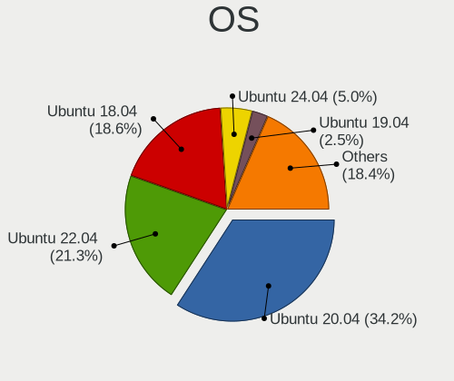
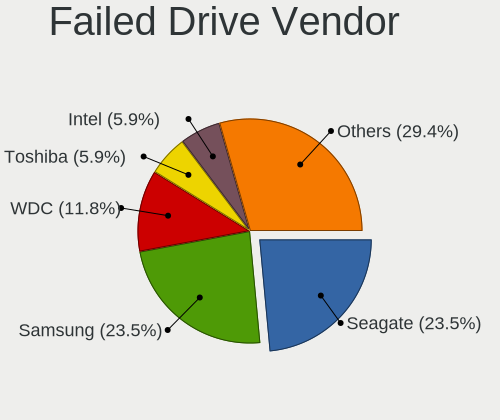
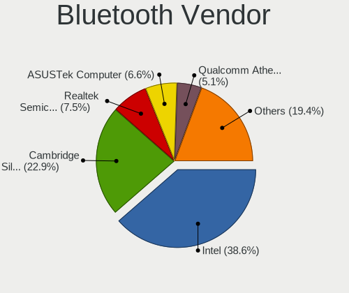
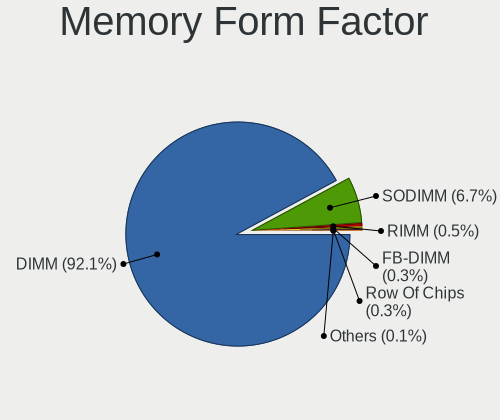
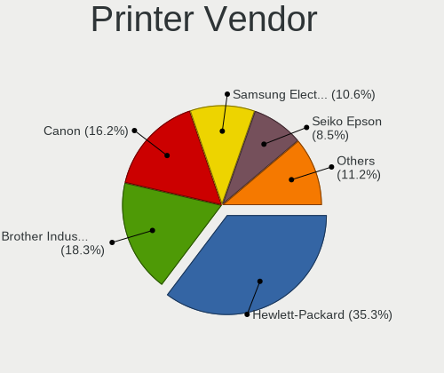

Ubuntu - Tested Hardware & Statistics (Desktops)
------------------------------------------------

A project to collect tested hardware configurations for Ubuntu.

Anyone can contribute to this report by the [hw-probe](https://github.com/linuxhw/hw-probe) tool:

    sudo -E hw-probe -all -upload

Please contribute! Especially if your hardware is rare.

Contents
--------

* [ Test Cases ](#test-cases)

* [ System ](#system)
  - [ OS                       ](#os)
  - [ OS Family                ](#os-family)
  - [ Kernel                   ](#kernel)
  - [ Kernel Family            ](#kernel-family)
  - [ Kernel Major Ver.        ](#kernel-major-ver)
  - [ Arch                     ](#arch)
  - [ DE                       ](#de)
  - [ Display Server           ](#display-server)
  - [ Display Manager          ](#display-manager)
  - [ OS Lang                  ](#os-lang)
  - [ Boot Mode                ](#boot-mode)
  - [ Filesystem               ](#filesystem)
  - [ Part. scheme             ](#part-scheme)
  - [ Dual Boot with Linux/BSD ](#dual-boot-with-linuxbsd)
  - [ Dual Boot (Win)          ](#dual-boot-win)

* [ Board ](#board)
  - [ Vendor                   ](#vendor)
  - [ Model                    ](#model)
  - [ Model Family             ](#model-family)
  - [ MFG Year                 ](#mfg-year)
  - [ Form Factor              ](#form-factor)
  - [ Secure Boot              ](#secure-boot)
  - [ Coreboot                 ](#coreboot)
  - [ RAM Size                 ](#ram-size)
  - [ RAM Used                 ](#ram-used)
  - [ Total Drives             ](#total-drives)
  - [ Has CD-ROM               ](#has-cd-rom)
  - [ Has Ethernet             ](#has-ethernet)
  - [ Has WiFi                 ](#has-wifi)
  - [ Has Bluetooth            ](#has-bluetooth)

* [ Location ](#location)
  - [ Country                  ](#country)
  - [ City                     ](#city)

* [ Drives ](#drives)
  - [ Drive Vendor             ](#drive-vendor)
  - [ Drive Model              ](#drive-model)
  - [ HDD Vendor               ](#hdd-vendor)
  - [ SSD Vendor               ](#ssd-vendor)
  - [ Drive Kind               ](#drive-kind)
  - [ Drive Connector          ](#drive-connector)
  - [ Drive Size               ](#drive-size)
  - [ Space Total              ](#space-total)
  - [ Space Used               ](#space-used)
  - [ Malfunc. Drives          ](#malfunc-drives)
  - [ Malfunc. Drive Vendor    ](#malfunc-drive-vendor)
  - [ Malfunc. HDD Vendor      ](#malfunc-hdd-vendor)
  - [ Malfunc. Drive Kind      ](#malfunc-drive-kind)
  - [ Failed Drives            ](#failed-drives)
  - [ Failed Drive Vendor      ](#failed-drive-vendor)
  - [ Drive Status             ](#drive-status)

* [ Storage controller ](#storage-controller)
  - [ Storage Vendor           ](#storage-vendor)
  - [ Storage Model            ](#storage-model)
  - [ Storage Kind             ](#storage-kind)

* [ Processor ](#processor)
  - [ CPU Vendor               ](#cpu-vendor)
  - [ CPU Model                ](#cpu-model)
  - [ CPU Model Family         ](#cpu-model-family)
  - [ CPU Cores                ](#cpu-cores)
  - [ CPU Sockets              ](#cpu-sockets)
  - [ CPU Threads              ](#cpu-threads)
  - [ CPU Op-Modes             ](#cpu-op-modes)
  - [ CPU Microcode            ](#cpu-microcode)
  - [ CPU Microarch            ](#cpu-microarch)

* [ Graphics ](#graphics)
  - [ GPU Vendor               ](#gpu-vendor)
  - [ GPU Model                ](#gpu-model)
  - [ GPU Combo                ](#gpu-combo)
  - [ GPU Driver               ](#gpu-driver)
  - [ GPU Memory               ](#gpu-memory)

* [ Monitor ](#monitor)
  - [ Monitor Vendor           ](#monitor-vendor)
  - [ Monitor Model            ](#monitor-model)
  - [ Monitor Resolution       ](#monitor-resolution)
  - [ Monitor Diagonal         ](#monitor-diagonal)
  - [ Monitor Width            ](#monitor-width)
  - [ Aspect Ratio             ](#aspect-ratio)
  - [ Monitor Area             ](#monitor-area)
  - [ Pixel Density            ](#pixel-density)
  - [ Multiple Monitors        ](#multiple-monitors)

* [ Network ](#network)
  - [ Net Controller Vendor    ](#net-controller-vendor)
  - [ Net Controller Model     ](#net-controller-model)
  - [ Wireless Vendor          ](#wireless-vendor)
  - [ Wireless Model           ](#wireless-model)
  - [ Ethernet Vendor          ](#ethernet-vendor)
  - [ Ethernet Model           ](#ethernet-model)
  - [ Net Controller Kind      ](#net-controller-kind)
  - [ Used Controller          ](#used-controller)
  - [ NICs                     ](#nics)
  - [ IPv6                     ](#ipv6)

* [ Bluetooth ](#bluetooth)
  - [ Bluetooth Vendor         ](#bluetooth-vendor)
  - [ Bluetooth Model          ](#bluetooth-model)

* [ Sound ](#sound)
  - [ Sound Vendor             ](#sound-vendor)
  - [ Sound Model              ](#sound-model)

* [ Memory ](#memory)
  - [ Memory Vendor            ](#memory-vendor)
  - [ Memory Model             ](#memory-model)
  - [ Memory Kind              ](#memory-kind)
  - [ Memory Form Factor       ](#memory-form-factor)
  - [ Memory Size              ](#memory-size)
  - [ Memory Speed             ](#memory-speed)

* [ Printers & scanners ](#printers--scanners)
  - [ Printer Vendor           ](#printer-vendor)
  - [ Printer Model            ](#printer-model)
  - [ Scanner Vendor           ](#scanner-vendor)
  - [ Scanner Model            ](#scanner-model)

* [ Camera ](#camera)
  - [ Camera Vendor            ](#camera-vendor)
  - [ Camera Model             ](#camera-model)

* [ Security ](#security)
  - [ Fingerprint Vendor       ](#fingerprint-vendor)
  - [ Fingerprint Model        ](#fingerprint-model)
  - [ Chipcard Vendor          ](#chipcard-vendor)
  - [ Chipcard Model           ](#chipcard-model)

* [ Unsupported ](#unsupported)
  - [ Unsupported Devices      ](#unsupported-devices)
  - [ Unsupported Device Types ](#unsupported-device-types)

Test Cases
----------

Total: 31267

| Vendor        | Model                       | Probe                                                      | Date         |
|---------------|-----------------------------|------------------------------------------------------------|--------------|
| MSI           | MS-B0A41                    | [c69ab6fbe8](https://linux-hardware.org/?probe=c69ab6fbe8) | Jan 01, 2023 |
| HP            | 802F                        | [22444b4b2c](https://linux-hardware.org/?probe=22444b4b2c) | Dec 31, 2022 |
| Fujitsu Si... | D2420 S26361-D2420          | [9e8c937daa](https://linux-hardware.org/?probe=9e8c937daa) | Dec 31, 2022 |
| ASUSTek       | P5KPL-AM SE                 | [c6c0626dd1](https://linux-hardware.org/?probe=c6c0626dd1) | Dec 31, 2022 |
| Dell          | 0VR8V9 A01                  | [0e7d4ac326](https://linux-hardware.org/?probe=0e7d4ac326) | Dec 31, 2022 |
| Dell          | 0GWHMW A01                  | [59287847c9](https://linux-hardware.org/?probe=59287847c9) | Dec 31, 2022 |
| MSI           | B250M PRO-VDH               | [0a4b320a9e](https://linux-hardware.org/?probe=0a4b320a9e) | Dec 31, 2022 |
| ASUSTek       | M5A78L-M/USB3               | [e18f6635d3](https://linux-hardware.org/?probe=e18f6635d3) | Dec 31, 2022 |
| MSI           | Z170A GAMING PRO CARBON     | [7c96c6776e](https://linux-hardware.org/?probe=7c96c6776e) | Dec 31, 2022 |
| Medion        | MS-7728                     | [3d6078552c](https://linux-hardware.org/?probe=3d6078552c) | Dec 31, 2022 |
| HP            | 840A                        | [ad51866fe9](https://linux-hardware.org/?probe=ad51866fe9) | Dec 31, 2022 |
| AZW           | U59                         | [39f0dfe71f](https://linux-hardware.org/?probe=39f0dfe71f) | Dec 31, 2022 |
| ASRock        | X99 Extreme3                | [565f486b7f](https://linux-hardware.org/?probe=565f486b7f) | Dec 31, 2022 |
| ASRock        | X99 Extreme3                | [eaf8cc0ed5](https://linux-hardware.org/?probe=eaf8cc0ed5) | Dec 31, 2022 |
| Intel         | DB75EN AAG39650-400         | [086831bbca](https://linux-hardware.org/?probe=086831bbca) | Dec 31, 2022 |
| MSI           | MPG Z490 GAMING PLUS        | [b4aecf5fa1](https://linux-hardware.org/?probe=b4aecf5fa1) | Dec 31, 2022 |
| ASRock        | B450 Gaming-ITX/ac          | [afdda0ad31](https://linux-hardware.org/?probe=afdda0ad31) | Dec 31, 2022 |
| ASRock        | B450 Gaming-ITX/ac          | [3659d7377d](https://linux-hardware.org/?probe=3659d7377d) | Dec 31, 2022 |
| ASUSTek       | P5Q-PRO                     | [cec0830928](https://linux-hardware.org/?probe=cec0830928) | Dec 31, 2022 |
| Gigabyte      | GA-MA785GMT-UD2H            | [c4059f2954](https://linux-hardware.org/?probe=c4059f2954) | Dec 31, 2022 |
| Dell          | 0GDG8Y A00                  | [8c8e9d66e7](https://linux-hardware.org/?probe=8c8e9d66e7) | Dec 30, 2022 |
| Dell          | 0XPDFK A01                  | [37d47ff0dc](https://linux-hardware.org/?probe=37d47ff0dc) | Dec 30, 2022 |
| ASUSTek       | Z170M-PLUS                  | [858fd62d74](https://linux-hardware.org/?probe=858fd62d74) | Dec 30, 2022 |
| Gigabyte      | A320M-H-CF                  | [b4511daea8](https://linux-hardware.org/?probe=b4511daea8) | Dec 30, 2022 |
| MSI           | Z87-G45 GAMING              | [c2d592a9e5](https://linux-hardware.org/?probe=c2d592a9e5) | Dec 30, 2022 |
| Acer          | Aspire XC-1660 V:1.1        | [9c4b578c67](https://linux-hardware.org/?probe=9c4b578c67) | Dec 30, 2022 |
| HP            | ProLiant MicroServer        | [03b6f5a97d](https://linux-hardware.org/?probe=03b6f5a97d) | Dec 30, 2022 |
| Intel         | H61                         | [b294748570](https://linux-hardware.org/?probe=b294748570) | Dec 30, 2022 |
| ASUSTek       | PRIME B560M-A               | [ee7c086eb6](https://linux-hardware.org/?probe=ee7c086eb6) | Dec 30, 2022 |
| MSI           | H61M-P22                    | [23b5356c0a](https://linux-hardware.org/?probe=23b5356c0a) | Dec 30, 2022 |
| ASRock        | 960GM-GS3 FX                | [1d8b5f0509](https://linux-hardware.org/?probe=1d8b5f0509) | Dec 30, 2022 |
| Acer          | Aspire XC-1660 V:1.1        | [c352c59c64](https://linux-hardware.org/?probe=c352c59c64) | Dec 30, 2022 |
| ASUSTek       | UN65U                       | [b7f1365865](https://linux-hardware.org/?probe=b7f1365865) | Dec 30, 2022 |
| ASUSTek       | G10DK                       | [5a5172ad44](https://linux-hardware.org/?probe=5a5172ad44) | Dec 30, 2022 |
| ASUSTek       | ROG STRIX B360-F GAMING     | [aa6b264eb4](https://linux-hardware.org/?probe=aa6b264eb4) | Dec 30, 2022 |
| Gigabyte      | B450M DS3H-CF               | [47f838ca34](https://linux-hardware.org/?probe=47f838ca34) | Dec 30, 2022 |
| ASUSTek       | ROG STRIX X570-I GAMING     | [a634defd54](https://linux-hardware.org/?probe=a634defd54) | Dec 30, 2022 |
| ASUSTek       | PRIME Z690M-PLUS D4         | [b1bfc3d1ff](https://linux-hardware.org/?probe=b1bfc3d1ff) | Dec 30, 2022 |
| Intel         | X99                         | [ad6b288b38](https://linux-hardware.org/?probe=ad6b288b38) | Dec 30, 2022 |
| ASUSTek       | PRIME X399-A                | [d8ae46ad2b](https://linux-hardware.org/?probe=d8ae46ad2b) | Dec 30, 2022 |
| ASUSTek       | TUF Gaming X570-PLUS        | [da829c6683](https://linux-hardware.org/?probe=da829c6683) | Dec 30, 2022 |
| BESSTAR Te... | C-J34 Pro                   | [1b54a52c3c](https://linux-hardware.org/?probe=1b54a52c3c) | Dec 30, 2022 |
| Fujitsu Si... | D2420 S26361-D2420          | [019236854d](https://linux-hardware.org/?probe=019236854d) | Dec 30, 2022 |
| Fujitsu Si... | D2420 S26361-D2420          | [d6f064e643](https://linux-hardware.org/?probe=d6f064e643) | Dec 30, 2022 |
| MSI           | MAG B660M MORTAR WIFI DD... | [d689576b2d](https://linux-hardware.org/?probe=d689576b2d) | Dec 29, 2022 |
| MSI           | A320M-A PRO MAX             | [6a419b06d6](https://linux-hardware.org/?probe=6a419b06d6) | Dec 29, 2022 |
| ASRock        | P67 Pro3                    | [47ea7331f5](https://linux-hardware.org/?probe=47ea7331f5) | Dec 29, 2022 |
| ASUSTek       | G10DK                       | [26e2460b8d](https://linux-hardware.org/?probe=26e2460b8d) | Dec 29, 2022 |
| ASUSTek       | H81M-A                      | [10f0b28589](https://linux-hardware.org/?probe=10f0b28589) | Dec 29, 2022 |
| HP            | 0AE8h                       | [b23a6da065](https://linux-hardware.org/?probe=b23a6da065) | Dec 29, 2022 |
| ASUSTek       | ROG STRIX B650E-I GAMING... | [e4c8909f2c](https://linux-hardware.org/?probe=e4c8909f2c) | Dec 29, 2022 |
| Gigabyte      | Z97M-DS3H                   | [9b264f00f0](https://linux-hardware.org/?probe=9b264f00f0) | Dec 29, 2022 |
| HP            | ProLiant ML110 Gen9         | [ea9aef1e8d](https://linux-hardware.org/?probe=ea9aef1e8d) | Dec 29, 2022 |
| HP            | 158A                        | [bfd338cf36](https://linux-hardware.org/?probe=bfd338cf36) | Dec 29, 2022 |
| HP            | ProLiant ML110 Gen9         | [728793a92a](https://linux-hardware.org/?probe=728793a92a) | Dec 29, 2022 |
| Pegatron      | 2AC2                        | [adc3978bcc](https://linux-hardware.org/?probe=adc3978bcc) | Dec 29, 2022 |
| Dell          | 0T10XW A01                  | [8b16a66b73](https://linux-hardware.org/?probe=8b16a66b73) | Dec 29, 2022 |
| Acer          | Aspire M3920                | [49cb4f51a8](https://linux-hardware.org/?probe=49cb4f51a8) | Dec 28, 2022 |
| Dell          | 0JP3NX A01                  | [3b094471e0](https://linux-hardware.org/?probe=3b094471e0) | Dec 28, 2022 |
| Intel         | X99                         | [eb6babb799](https://linux-hardware.org/?probe=eb6babb799) | Dec 28, 2022 |
| ASUSTek       | G10DK                       | [1ffb248d93](https://linux-hardware.org/?probe=1ffb248d93) | Dec 28, 2022 |
| Fujitsu       | D3161-A1 S26361-D3161-A1    | [efa2d6986f](https://linux-hardware.org/?probe=efa2d6986f) | Dec 28, 2022 |
| Lanix         | P55M-UD2 LNXACT             | [5575ce838c](https://linux-hardware.org/?probe=5575ce838c) | Dec 28, 2022 |
| HP            | 840A                        | [85b8b7f9b1](https://linux-hardware.org/?probe=85b8b7f9b1) | Dec 28, 2022 |
| MSI           | PRO Z690-A WIFI DDR4        | [a4292b855d](https://linux-hardware.org/?probe=a4292b855d) | Dec 28, 2022 |
| HP            | 0A54h                       | [7f1e1152d9](https://linux-hardware.org/?probe=7f1e1152d9) | Dec 28, 2022 |
| MSI           | Z270 PC MATE                | [08186ccafe](https://linux-hardware.org/?probe=08186ccafe) | Dec 28, 2022 |
| ASRock        | B75 Pro3-M                  | [108f0c24de](https://linux-hardware.org/?probe=108f0c24de) | Dec 28, 2022 |
| HP            | 0AE4h                       | [c44d06efa6](https://linux-hardware.org/?probe=c44d06efa6) | Dec 28, 2022 |
| Biostar       | TZ68K+                      | [7bb1d349cc](https://linux-hardware.org/?probe=7bb1d349cc) | Dec 28, 2022 |
| Biostar       | TZ68K+                      | [1d200fa462](https://linux-hardware.org/?probe=1d200fa462) | Dec 28, 2022 |
| ASUSTek       | ROG STRIX B550-F GAMING     | [6297565fda](https://linux-hardware.org/?probe=6297565fda) | Dec 28, 2022 |
| MSI           | Z370 PC PRO                 | [367bcf2d16](https://linux-hardware.org/?probe=367bcf2d16) | Dec 28, 2022 |
| Dell          | 0HY9JP A01                  | [97a3e6ce9d](https://linux-hardware.org/?probe=97a3e6ce9d) | Dec 28, 2022 |
| ASUSTek       | PRIME A320M-K               | [20c0841830](https://linux-hardware.org/?probe=20c0841830) | Dec 28, 2022 |
| HP            | 1905                        | [5c576316f8](https://linux-hardware.org/?probe=5c576316f8) | Dec 28, 2022 |
| Gigabyte      | A320M-H-CF                  | [aff2b93aa5](https://linux-hardware.org/?probe=aff2b93aa5) | Dec 28, 2022 |
| Gigabyte      | Z590 AORUS PRO AX           | [d680b8dd2a](https://linux-hardware.org/?probe=d680b8dd2a) | Dec 28, 2022 |
| Gigabyte      | GB-BRR3H-4300               | [241d631981](https://linux-hardware.org/?probe=241d631981) | Dec 28, 2022 |
| ASRock        | B450M Pro4                  | [fcaf938a12](https://linux-hardware.org/?probe=fcaf938a12) | Dec 28, 2022 |
| ASUSTek       | TUF Gaming X570-PLUS        | [3ba397a9f4](https://linux-hardware.org/?probe=3ba397a9f4) | Dec 27, 2022 |
| HP            | 0AE8h                       | [c1bd1ff073](https://linux-hardware.org/?probe=c1bd1ff073) | Dec 27, 2022 |
| ASRock        | N68-GE3 UCC                 | [57a42cabf6](https://linux-hardware.org/?probe=57a42cabf6) | Dec 27, 2022 |
| Acer          | Aspire M3970                | [c2232f44d6](https://linux-hardware.org/?probe=c2232f44d6) | Dec 27, 2022 |
| ASRock        | H61M-HG4                    | [cf7ba71c5e](https://linux-hardware.org/?probe=cf7ba71c5e) | Dec 27, 2022 |
| ASUSTek       | H97I-PLUS                   | [8f039f1be9](https://linux-hardware.org/?probe=8f039f1be9) | Dec 27, 2022 |
| Gigabyte      | H510M S2H V2                | [a47cb3fa7c](https://linux-hardware.org/?probe=a47cb3fa7c) | Dec 27, 2022 |
| Gigabyte      | H510M S2H V2                | [7ddc3d0292](https://linux-hardware.org/?probe=7ddc3d0292) | Dec 27, 2022 |
| ASUSTek       | ROG STRIX B550-F GAMING     | [41b062ea94](https://linux-hardware.org/?probe=41b062ea94) | Dec 27, 2022 |
| Gigabyte      | H270-HD3-CF                 | [031a62faa8](https://linux-hardware.org/?probe=031a62faa8) | Dec 27, 2022 |
| HP            | ProLiant ML110 G7           | [7b4b133211](https://linux-hardware.org/?probe=7b4b133211) | Dec 27, 2022 |
| ASUSTek       | TUF Gaming X570-PLUS        | [6db0562083](https://linux-hardware.org/?probe=6db0562083) | Dec 27, 2022 |
| MSI           | B450 GAMING PLUS MAX        | [bfec1ebd66](https://linux-hardware.org/?probe=bfec1ebd66) | Dec 27, 2022 |
| Dell          | 0PTTT9 A01                  | [78512365ca](https://linux-hardware.org/?probe=78512365ca) | Dec 26, 2022 |
| NCR           | Pocono                      | [d50ad710fb](https://linux-hardware.org/?probe=d50ad710fb) | Dec 26, 2022 |
| Dell          | 05DN3X A00                  | [f8fe045913](https://linux-hardware.org/?probe=f8fe045913) | Dec 26, 2022 |
| ASUSTek       | A88XM-A                     | [8633f00865](https://linux-hardware.org/?probe=8633f00865) | Dec 26, 2022 |
| Gigabyte      | M61SME-S2                   | [5d0485ba40](https://linux-hardware.org/?probe=5d0485ba40) | Dec 26, 2022 |
| ASUSTek       | G10DK                       | [30007c6ff0](https://linux-hardware.org/?probe=30007c6ff0) | Dec 26, 2022 |
| Gigabyte      | M61SME-S2                   | [d68451099d](https://linux-hardware.org/?probe=d68451099d) | Dec 26, 2022 |
| ASUSTek       | Crosshair IV Formula        | [77ee14ad98](https://linux-hardware.org/?probe=77ee14ad98) | Dec 26, 2022 |
| BESSTAR Te... | HM90                        | [01cd4c50dd](https://linux-hardware.org/?probe=01cd4c50dd) | Dec 26, 2022 |
| ASUSTek       | Crosshair IV Formula        | [1c022f7ff8](https://linux-hardware.org/?probe=1c022f7ff8) | Dec 26, 2022 |
| ASUSTek       | M5A78L-M LX3                | [aef3959b18](https://linux-hardware.org/?probe=aef3959b18) | Dec 26, 2022 |
| Gigabyte      | GB-BRR7H-4700               | [43c2d92e5f](https://linux-hardware.org/?probe=43c2d92e5f) | Dec 26, 2022 |
| ASUSTek       | TUF Gaming X570-PLUS        | [eda96539d7](https://linux-hardware.org/?probe=eda96539d7) | Dec 26, 2022 |
| ASUSTek       | A88XM-A                     | [802e7982de](https://linux-hardware.org/?probe=802e7982de) | Dec 26, 2022 |
| HP            | 1495                        | [b8e1dc67eb](https://linux-hardware.org/?probe=b8e1dc67eb) | Dec 26, 2022 |
| ASUSTek       | TUF Gaming B550M-PLUS WI... | [b181e9e5a3](https://linux-hardware.org/?probe=b181e9e5a3) | Dec 26, 2022 |
| Unknown       | HX90                        | [d4265ad971](https://linux-hardware.org/?probe=d4265ad971) | Dec 26, 2022 |
| Gigabyte      | Z97M-DS3H                   | [02f55ff55b](https://linux-hardware.org/?probe=02f55ff55b) | Dec 26, 2022 |
| HP            | 304Ah                       | [6106d55390](https://linux-hardware.org/?probe=6106d55390) | Dec 26, 2022 |
| MSI           | B350 KRAIT GAMING           | [896aebf101](https://linux-hardware.org/?probe=896aebf101) | Dec 25, 2022 |
| Gigabyte      | H61M-S1                     | [384000d018](https://linux-hardware.org/?probe=384000d018) | Dec 25, 2022 |
| ASRock        | H110 Pro BTC+               | [29311fe64c](https://linux-hardware.org/?probe=29311fe64c) | Dec 25, 2022 |
| Gateway       | G33M05G1 MP                 | [8a495d2b75](https://linux-hardware.org/?probe=8a495d2b75) | Dec 25, 2022 |
| Lenovo        | 102F SBB0J05441 WIN 3305... | [fee0a76158](https://linux-hardware.org/?probe=fee0a76158) | Dec 25, 2022 |
| MSI           | Boston                      | [5ffbd4e9a5](https://linux-hardware.org/?probe=5ffbd4e9a5) | Dec 25, 2022 |
| Dell          | 0MN1TX A02                  | [513af674c0](https://linux-hardware.org/?probe=513af674c0) | Dec 25, 2022 |
| HP            | ProLiant ML110 Gen9         | [90bb379f4e](https://linux-hardware.org/?probe=90bb379f4e) | Dec 25, 2022 |
| ASRock        | Z390 Phantom Gaming 6       | [61be8271df](https://linux-hardware.org/?probe=61be8271df) | Dec 25, 2022 |
| Foxconn       | 2ADA                        | [7a7d8227ee](https://linux-hardware.org/?probe=7a7d8227ee) | Dec 25, 2022 |
| ASUSTek       | PRIME A320M-K               | [1762f53462](https://linux-hardware.org/?probe=1762f53462) | Dec 25, 2022 |
| ASRock        | H110 Pro BTC+               | [90f3fd2f80](https://linux-hardware.org/?probe=90f3fd2f80) | Dec 25, 2022 |
| ASUSTek       | G10DK                       | [13379a69a6](https://linux-hardware.org/?probe=13379a69a6) | Dec 25, 2022 |
| ASUSTek       | P7H55-M PRO                 | [b445490856](https://linux-hardware.org/?probe=b445490856) | Dec 25, 2022 |
| ASUSTek       | PRIME B450M-GAMING/BR       | [e12a45a65f](https://linux-hardware.org/?probe=e12a45a65f) | Dec 25, 2022 |
| ASUSTek       | PRIME B450M-GAMING/BR       | [4f28247dcb](https://linux-hardware.org/?probe=4f28247dcb) | Dec 25, 2022 |
| Lenovo        | SHARKBAY 0B98401 WIN        | [0900400806](https://linux-hardware.org/?probe=0900400806) | Dec 25, 2022 |
| Dell          | 040DDP A01                  | [2fc87b6525](https://linux-hardware.org/?probe=2fc87b6525) | Dec 25, 2022 |
| Supermicro    | C2SBX                       | [1b275899d5](https://linux-hardware.org/?probe=1b275899d5) | Dec 25, 2022 |
| ASRock        | Q1900M                      | [051ff70bc8](https://linux-hardware.org/?probe=051ff70bc8) | Dec 25, 2022 |
| ASUSTek       | TUF Gaming X570-PLUS        | [571019b4b2](https://linux-hardware.org/?probe=571019b4b2) | Dec 25, 2022 |
| Dell          | 0D6H9T A00                  | [778c642778](https://linux-hardware.org/?probe=778c642778) | Dec 25, 2022 |
| Dell          | 0D6H9T A00                  | [ef62b12cdb](https://linux-hardware.org/?probe=ef62b12cdb) | Dec 24, 2022 |
| ASUSTek       | PRIME B450M-A               | [1fc8c5a4d4](https://linux-hardware.org/?probe=1fc8c5a4d4) | Dec 24, 2022 |
| ASUSTek       | P8H67-M LE                  | [892d40f349](https://linux-hardware.org/?probe=892d40f349) | Dec 24, 2022 |
| ASUSTek       | ROG STRIX X570-E GAMING     | [2e23d15c25](https://linux-hardware.org/?probe=2e23d15c25) | Dec 24, 2022 |
| Gigabyte      | Z390 M GAMING-CF            | [7edfc4df26](https://linux-hardware.org/?probe=7edfc4df26) | Dec 24, 2022 |
| Gigabyte      | Z390 M GAMING-CF            | [7f19b0ef63](https://linux-hardware.org/?probe=7f19b0ef63) | Dec 24, 2022 |
| ASUSTek       | P8H67-M LE                  | [7517437358](https://linux-hardware.org/?probe=7517437358) | Dec 24, 2022 |
| Intel         | JSL MRD                     | [f567ba0a06](https://linux-hardware.org/?probe=f567ba0a06) | Dec 24, 2022 |
| Gigabyte      | B550 AORUS ELITE AX V2      | [5047d29893](https://linux-hardware.org/?probe=5047d29893) | Dec 24, 2022 |
| ASUSTek       | TUF Gaming B550M-PLUS       | [8df9791e32](https://linux-hardware.org/?probe=8df9791e32) | Dec 24, 2022 |
| MSI           | TRX40 PRO 10G               | [f83cf989ef](https://linux-hardware.org/?probe=f83cf989ef) | Dec 24, 2022 |
| ASUSTek       | Maximus VI EXTREME          | [f1dc299d0c](https://linux-hardware.org/?probe=f1dc299d0c) | Dec 24, 2022 |
| ASUSTek       | M5A78L-M/USB3               | [3dce1a76e7](https://linux-hardware.org/?probe=3dce1a76e7) | Dec 24, 2022 |
| Gigabyte      | A520M S2H                   | [eb7bb6fb36](https://linux-hardware.org/?probe=eb7bb6fb36) | Dec 24, 2022 |
| Dell          | 08HPGT A01                  | [0411078911](https://linux-hardware.org/?probe=0411078911) | Dec 24, 2022 |
| Gigabyte      | F2A68HM-DS2                 | [ba498df129](https://linux-hardware.org/?probe=ba498df129) | Dec 23, 2022 |
| Dell          | 0T656F A02                  | [35aa2eee2a](https://linux-hardware.org/?probe=35aa2eee2a) | Dec 23, 2022 |
| Dell          | 0NW6H5 A00                  | [6c7eeae2e3](https://linux-hardware.org/?probe=6c7eeae2e3) | Dec 23, 2022 |
| Gigabyte      | H510M H                     | [7de172c3b1](https://linux-hardware.org/?probe=7de172c3b1) | Dec 23, 2022 |
| Dell          | 0PTTT9 A01                  | [4618f09759](https://linux-hardware.org/?probe=4618f09759) | Dec 23, 2022 |
| MSI           | Z270 TOMAHAWK               | [b721ac26e2](https://linux-hardware.org/?probe=b721ac26e2) | Dec 23, 2022 |
| ASRock        | H270 Pro4                   | [548ba72d05](https://linux-hardware.org/?probe=548ba72d05) | Dec 23, 2022 |
| MSI           | B450-A PRO                  | [ee92214342](https://linux-hardware.org/?probe=ee92214342) | Dec 23, 2022 |
| ASUSTek       | ROG STRIX Z690-A GAMING ... | [7fe5933133](https://linux-hardware.org/?probe=7fe5933133) | Dec 23, 2022 |
| ASUSTek       | ROG Maximus Z790 HERO       | [6ca59441d7](https://linux-hardware.org/?probe=6ca59441d7) | Dec 23, 2022 |
| ASUSTek       | M5A78L-M LE/USB3            | [c5cc33f2c6](https://linux-hardware.org/?probe=c5cc33f2c6) | Dec 23, 2022 |
| Dell          | 0WMJ54 A01                  | [b0b07249ae](https://linux-hardware.org/?probe=b0b07249ae) | Dec 23, 2022 |
| ASRock        | N68-GE3 UCC                 | [2892951c9c](https://linux-hardware.org/?probe=2892951c9c) | Dec 23, 2022 |
| MSI           | H510M BOMBER                | [bb7a4c8457](https://linux-hardware.org/?probe=bb7a4c8457) | Dec 23, 2022 |
| Dell          | 07N90W A00                  | [4fef96ef97](https://linux-hardware.org/?probe=4fef96ef97) | Dec 23, 2022 |
| MSI           | A78M-E35                    | [8eeb54e414](https://linux-hardware.org/?probe=8eeb54e414) | Dec 23, 2022 |
| ASUSTek       | M5A78L-M LE/USB3            | [ffbf35fd33](https://linux-hardware.org/?probe=ffbf35fd33) | Dec 23, 2022 |
| ASRock        | Z97 Anniversary             | [c4e60094f3](https://linux-hardware.org/?probe=c4e60094f3) | Dec 23, 2022 |
| Dell          | 05GD68 A00                  | [a868fc6557](https://linux-hardware.org/?probe=a868fc6557) | Dec 23, 2022 |
| ASUSTek       | ROG CROSSHAIR VIII HERO     | [23f2e15649](https://linux-hardware.org/?probe=23f2e15649) | Dec 22, 2022 |
| ASUSTek       | PRIME A320M-K               | [61b7eaac72](https://linux-hardware.org/?probe=61b7eaac72) | Dec 22, 2022 |
| Acer          | Predator PO3-600 V:1.1      | [4a49555de6](https://linux-hardware.org/?probe=4a49555de6) | Dec 22, 2022 |
| Acer          | Predator PO3-600 V:1.1      | [8cb7f41543](https://linux-hardware.org/?probe=8cb7f41543) | Dec 22, 2022 |
| Lenovo        | SHARKBAY 0B98401 PRO        | [08d715eaea](https://linux-hardware.org/?probe=08d715eaea) | Dec 22, 2022 |
| ASRock        | A320M-HD                    | [5307c53c91](https://linux-hardware.org/?probe=5307c53c91) | Dec 22, 2022 |
| Lenovo        | SHARKBAY SDK0E50510 WIN     | [877545dd5c](https://linux-hardware.org/?probe=877545dd5c) | Dec 22, 2022 |
| ASUSTek       | ROG Maximus Z790 HERO       | [e486047e83](https://linux-hardware.org/?probe=e486047e83) | Dec 22, 2022 |
| Dell          | 00V62H A01                  | [296edfbde5](https://linux-hardware.org/?probe=296edfbde5) | Dec 22, 2022 |
| ASRock        | A320M Pro4-F                | [4f2abe0c64](https://linux-hardware.org/?probe=4f2abe0c64) | Dec 22, 2022 |
| ASUSTek       | M3A78-EM                    | [b1fb2ae232](https://linux-hardware.org/?probe=b1fb2ae232) | Dec 22, 2022 |
| ASRock        | B450 Pro4                   | [61f064d35f](https://linux-hardware.org/?probe=61f064d35f) | Dec 22, 2022 |
| ASRock        | B450 Pro4                   | [d387b553bd](https://linux-hardware.org/?probe=d387b553bd) | Dec 22, 2022 |
| ASUSTek       | PRIME Z690M-HZ              | [4a8c08c437](https://linux-hardware.org/?probe=4a8c08c437) | Dec 22, 2022 |
| Lenovo        | 310B SDK0J40705 WIN 3425... | [abb4201228](https://linux-hardware.org/?probe=abb4201228) | Dec 22, 2022 |
| MSI           | B550M PRO-VDH WIFI          | [d5b04a241c](https://linux-hardware.org/?probe=d5b04a241c) | Dec 22, 2022 |
| ASRock        | N68-GE3 UCC                 | [ddc35a5b0d](https://linux-hardware.org/?probe=ddc35a5b0d) | Dec 22, 2022 |
| Gigabyte      | AX370-Gaming K5-CF          | [4d83f18afd](https://linux-hardware.org/?probe=4d83f18afd) | Dec 22, 2022 |
| HP            | 2AF8                        | [54bf4b18ba](https://linux-hardware.org/?probe=54bf4b18ba) | Dec 22, 2022 |
| ASRock        | FM2A75 Pro4                 | [88062c13c8](https://linux-hardware.org/?probe=88062c13c8) | Dec 22, 2022 |
| Dell          | 09KPNV A01                  | [534f769938](https://linux-hardware.org/?probe=534f769938) | Dec 22, 2022 |
| PERTOSA       | IPMSBA                      | [8cd4fff2ce](https://linux-hardware.org/?probe=8cd4fff2ce) | Dec 22, 2022 |
| HP            | 212B                        | [3df121c98b](https://linux-hardware.org/?probe=3df121c98b) | Dec 21, 2022 |
| Dell          | 05GD68 A00                  | [4589f84dfd](https://linux-hardware.org/?probe=4589f84dfd) | Dec 21, 2022 |
| MSI           | H97M-G43                    | [a34bd69442](https://linux-hardware.org/?probe=a34bd69442) | Dec 21, 2022 |
| Gigabyte      | Z97M-DS3H                   | [9ada5592f6](https://linux-hardware.org/?probe=9ada5592f6) | Dec 21, 2022 |
| eMachines     | ET1331                      | [0f9b49ac6e](https://linux-hardware.org/?probe=0f9b49ac6e) | Dec 21, 2022 |
| MSI           | A320M-A PRO                 | [88eb56085f](https://linux-hardware.org/?probe=88eb56085f) | Dec 21, 2022 |
| ASRock        | B450 Pro4 R2.0              | [90aaabb4b2](https://linux-hardware.org/?probe=90aaabb4b2) | Dec 21, 2022 |
| Gigabyte      | H170M-DS3H-CF               | [714dafad38](https://linux-hardware.org/?probe=714dafad38) | Dec 21, 2022 |
| ASUSTek       | M4A88T-M                    | [c646f359b8](https://linux-hardware.org/?probe=c646f359b8) | Dec 21, 2022 |
| MSI           | MAG B560M MORTAR            | [9b1e668d0a](https://linux-hardware.org/?probe=9b1e668d0a) | Dec 21, 2022 |
| ASUSTek       | PRIME B250-PLUS             | [4d24d45918](https://linux-hardware.org/?probe=4d24d45918) | Dec 21, 2022 |
| ASUSTek       | P5KPL-AM EPU                | [fc162d4cb2](https://linux-hardware.org/?probe=fc162d4cb2) | Dec 21, 2022 |
| ASUSTek       | P5KPL-AM EPU                | [1cdb02c6db](https://linux-hardware.org/?probe=1cdb02c6db) | Dec 21, 2022 |
| Gigabyte      | B550 AORUS PRO AC           | [cfeb9545a3](https://linux-hardware.org/?probe=cfeb9545a3) | Dec 21, 2022 |
| Dell          | 0HY9JP A01                  | [618484d726](https://linux-hardware.org/?probe=618484d726) | Dec 21, 2022 |
| MSI           | B250M GAMING PRO            | [76fd6916b6](https://linux-hardware.org/?probe=76fd6916b6) | Dec 21, 2022 |
| ASUSTek       | M5A99FX PRO R2.0            | [a7602bb40c](https://linux-hardware.org/?probe=a7602bb40c) | Dec 21, 2022 |
| Lenovo        | ThinkCentre A62 9486E4S     | [cb7cb7b7d7](https://linux-hardware.org/?probe=cb7cb7b7d7) | Dec 21, 2022 |
| MSI           | B250M GAMING PRO            | [9ae81949ed](https://linux-hardware.org/?probe=9ae81949ed) | Dec 21, 2022 |
| MSI           | B250M GAMING PRO            | [15f51cd9d9](https://linux-hardware.org/?probe=15f51cd9d9) | Dec 21, 2022 |
| Dell          | 0HY9JP A01                  | [997bfbe676](https://linux-hardware.org/?probe=997bfbe676) | Dec 21, 2022 |
| ASUSTek       | ROG ZENITH II EXTREME       | [19c80082a1](https://linux-hardware.org/?probe=19c80082a1) | Dec 20, 2022 |
| MSI           | H81M-P33                    | [5d91d96949](https://linux-hardware.org/?probe=5d91d96949) | Dec 20, 2022 |
| ASUSTek       | P4S533VX                    | [b6ffda4f06](https://linux-hardware.org/?probe=b6ffda4f06) | Dec 20, 2022 |
| Dell          | 0T7495                      | [c729382738](https://linux-hardware.org/?probe=c729382738) | Dec 20, 2022 |
| ASRock        | X58 Extreme                 | [deac73631d](https://linux-hardware.org/?probe=deac73631d) | Dec 20, 2022 |
| ASRock        | X58 Extreme                 | [c7e538f7b3](https://linux-hardware.org/?probe=c7e538f7b3) | Dec 20, 2022 |
| Gigabyte      | B75M-D3H                    | [77bf96f401](https://linux-hardware.org/?probe=77bf96f401) | Dec 20, 2022 |
| ASUSTek       | P8P67 PRO                   | [51c1da3d29](https://linux-hardware.org/?probe=51c1da3d29) | Dec 20, 2022 |
| ASUSTek       | ROG CROSSHAIR VIII HERO     | [17630a4351](https://linux-hardware.org/?probe=17630a4351) | Dec 20, 2022 |
| ASRock        | Z87 Extreme4                | [60683b36c2](https://linux-hardware.org/?probe=60683b36c2) | Dec 20, 2022 |
| ASUSTek       | Maximus VIII RANGER         | [8a09a51987](https://linux-hardware.org/?probe=8a09a51987) | Dec 20, 2022 |
| MSI           | Z270 SLI PLUS               | [caaac44bac](https://linux-hardware.org/?probe=caaac44bac) | Dec 20, 2022 |
| Alienware     | 07JNH0 A02                  | [558828391f](https://linux-hardware.org/?probe=558828391f) | Dec 20, 2022 |
| ASUSTek       | H81M-C                      | [9ae92c3b1e](https://linux-hardware.org/?probe=9ae92c3b1e) | Dec 20, 2022 |
| Dell          | 0Y2K8N A00                  | [840fbab6e4](https://linux-hardware.org/?probe=840fbab6e4) | Dec 20, 2022 |
| Gigabyte      | H61M-S2V-B3                 | [1f8d567742](https://linux-hardware.org/?probe=1f8d567742) | Dec 20, 2022 |
| HP            | 3048h                       | [4535cf0f5a](https://linux-hardware.org/?probe=4535cf0f5a) | Dec 20, 2022 |
| Gigabyte      | Z690 AORUS PRO              | [dd024e0315](https://linux-hardware.org/?probe=dd024e0315) | Dec 20, 2022 |
| MSI           | Z370 PC PRO                 | [e048dd7a4e](https://linux-hardware.org/?probe=e048dd7a4e) | Dec 20, 2022 |
| ASUSTek       | PRIME X570-PRO              | [6a731c5c9b](https://linux-hardware.org/?probe=6a731c5c9b) | Dec 20, 2022 |
| Lenovo        | 3000 8702z                  | [68bc77cd5f](https://linux-hardware.org/?probe=68bc77cd5f) | Dec 19, 2022 |
| Dell          | 0D6H9T A03                  | [835cdeea5e](https://linux-hardware.org/?probe=835cdeea5e) | Dec 19, 2022 |
| HP            | 0AA8h                       | [f04f3c4d42](https://linux-hardware.org/?probe=f04f3c4d42) | Dec 19, 2022 |
| HP            | 3048h                       | [1d795fdd33](https://linux-hardware.org/?probe=1d795fdd33) | Dec 19, 2022 |
| ASUSTek       | Maximus VI EXTREME          | [e3aee1c90e](https://linux-hardware.org/?probe=e3aee1c90e) | Dec 19, 2022 |
| Gigabyte      | Z170X-Gaming 7              | [d7a2fa6abf](https://linux-hardware.org/?probe=d7a2fa6abf) | Dec 19, 2022 |
| Gigabyte      | B85-HD3                     | [a8d78baa67](https://linux-hardware.org/?probe=a8d78baa67) | Dec 19, 2022 |
| ASUSTek       | PRIME A320M-K               | [3b38fc673c](https://linux-hardware.org/?probe=3b38fc673c) | Dec 19, 2022 |
| ASRock        | Z170 Extreme6+              | [74b4357180](https://linux-hardware.org/?probe=74b4357180) | Dec 19, 2022 |
| MSI           | B350 PC MATE                | [9bdee62034](https://linux-hardware.org/?probe=9bdee62034) | Dec 19, 2022 |
| ASUSTek       | PRIME X570-PRO              | [cc8dd14279](https://linux-hardware.org/?probe=cc8dd14279) | Dec 19, 2022 |
| Lenovo        | ThinkCentre A62 9486E4S     | [fcd0306cd3](https://linux-hardware.org/?probe=fcd0306cd3) | Dec 19, 2022 |
| MSI           | X399 SLI PLUS               | [fdf00892eb](https://linux-hardware.org/?probe=fdf00892eb) | Dec 19, 2022 |
| Gigabyte      | 970A-UD3P                   | [7d5ca26325](https://linux-hardware.org/?probe=7d5ca26325) | Dec 19, 2022 |
| MSI           | MPG B550I GAMING EDGE WI... | [1e7aff6742](https://linux-hardware.org/?probe=1e7aff6742) | Dec 19, 2022 |
| Gigabyte      | 970A-UD3P                   | [0690e94fd6](https://linux-hardware.org/?probe=0690e94fd6) | Dec 19, 2022 |
| ASUSTek       | Z170 PRO GAMING             | [e964534175](https://linux-hardware.org/?probe=e964534175) | Dec 19, 2022 |
| Gigabyte      | B75M-D3H                    | [ad506ad64e](https://linux-hardware.org/?probe=ad506ad64e) | Dec 19, 2022 |
| ASUSTek       | Z170 PRO GAMING             | [d367461182](https://linux-hardware.org/?probe=d367461182) | Dec 19, 2022 |
| Dell          | OptiPlex 7010               | [dd934b17d2](https://linux-hardware.org/?probe=dd934b17d2) | Dec 19, 2022 |
| ASUSTek       | H170-PRO                    | [3d866a7ec8](https://linux-hardware.org/?probe=3d866a7ec8) | Dec 19, 2022 |
| ASRock        | H110 Pro BTC+               | [b44ba7da8e](https://linux-hardware.org/?probe=b44ba7da8e) | Dec 19, 2022 |
| HP            | 8597                        | [5a7ae7c6d7](https://linux-hardware.org/?probe=5a7ae7c6d7) | Dec 19, 2022 |
| Gigabyte      | B650M GAMING X AX           | [01b7250cea](https://linux-hardware.org/?probe=01b7250cea) | Dec 19, 2022 |
| Gigabyte      | B650M GAMING X AX           | [999cbfe9f7](https://linux-hardware.org/?probe=999cbfe9f7) | Dec 19, 2022 |
| HP            | 18E7                        | [9f601a9f1a](https://linux-hardware.org/?probe=9f601a9f1a) | Dec 19, 2022 |
| ASUSTek       | Z87-A                       | [17c2f5c3b2](https://linux-hardware.org/?probe=17c2f5c3b2) | Dec 19, 2022 |
| Gigabyte      | Z490 AORUS XTREME WF        | [7020686bc7](https://linux-hardware.org/?probe=7020686bc7) | Dec 19, 2022 |
| Gigabyte      | G31M-ES2C                   | [5de13fdffa](https://linux-hardware.org/?probe=5de13fdffa) | Dec 19, 2022 |
| Intel         | DH61BE AAG14062-206         | [88125550fb](https://linux-hardware.org/?probe=88125550fb) | Dec 19, 2022 |
| HP            | 0AA8h                       | [0c11d6bb2a](https://linux-hardware.org/?probe=0c11d6bb2a) | Dec 18, 2022 |
| Gigabyte      | 970A-DS3P                   | [6870f7c47f](https://linux-hardware.org/?probe=6870f7c47f) | Dec 18, 2022 |
| Dell          | 0M858N A00                  | [2eb73cbb7a](https://linux-hardware.org/?probe=2eb73cbb7a) | Dec 18, 2022 |
| Intel         | HM570                       | [627a39bc3f](https://linux-hardware.org/?probe=627a39bc3f) | Dec 18, 2022 |
| Alienware     | 02XRCM A02                  | [ece4e302f1](https://linux-hardware.org/?probe=ece4e302f1) | Dec 18, 2022 |
| Intel         | HM570                       | [303e68f585](https://linux-hardware.org/?probe=303e68f585) | Dec 18, 2022 |
| ASUSTek       | ProArt Z690-CREATOR WIFI    | [bdea23d60e](https://linux-hardware.org/?probe=bdea23d60e) | Dec 18, 2022 |
| MSI           | X470 GAMING PLUS MAX        | [41da62e6ca](https://linux-hardware.org/?probe=41da62e6ca) | Dec 18, 2022 |
| ASRock        | AM1H-ITX                    | [88fc771e47](https://linux-hardware.org/?probe=88fc771e47) | Dec 18, 2022 |
| MSI           | B250M PRO-VDH               | [14ea50f3b2](https://linux-hardware.org/?probe=14ea50f3b2) | Dec 18, 2022 |
| ASUSTek       | ROG Maximus XI HERO         | [0d4ba683ce](https://linux-hardware.org/?probe=0d4ba683ce) | Dec 18, 2022 |
| HP            | ProLiant ML350 G6           | [58113862ee](https://linux-hardware.org/?probe=58113862ee) | Dec 18, 2022 |
| Gigabyte      | B85M-D3H                    | [a4aed5865b](https://linux-hardware.org/?probe=a4aed5865b) | Dec 18, 2022 |
| Gigabyte      | B85M-D3H                    | [532dc55c4b](https://linux-hardware.org/?probe=532dc55c4b) | Dec 18, 2022 |
| HP            | 8054                        | [98d0f316b3](https://linux-hardware.org/?probe=98d0f316b3) | Dec 18, 2022 |
| ASUSTek       | TUF Gaming B550M-PLUS       | [caaddcd344](https://linux-hardware.org/?probe=caaddcd344) | Dec 18, 2022 |
| Intel         | DH55TC AAE70932-303         | [631f80f725](https://linux-hardware.org/?probe=631f80f725) | Dec 18, 2022 |
| Intel         | DG31PR AAD97573-206         | [3684f593d4](https://linux-hardware.org/?probe=3684f593d4) | Dec 18, 2022 |
| Lenovo        | 3716 SDK0T76461 WIN 3422... | [15f724ada5](https://linux-hardware.org/?probe=15f724ada5) | Dec 18, 2022 |
| HP            | 8054                        | [a43a5ed0ec](https://linux-hardware.org/?probe=a43a5ed0ec) | Dec 18, 2022 |
| MSI           | H310M PRO-VDH PLUS          | [694e433518](https://linux-hardware.org/?probe=694e433518) | Dec 18, 2022 |
| MSI           | H310M PRO-VDH PLUS          | [801a4e21c6](https://linux-hardware.org/?probe=801a4e21c6) | Dec 18, 2022 |
| MSI           | MS-7360                     | [2f5a9baf11](https://linux-hardware.org/?probe=2f5a9baf11) | Dec 18, 2022 |
| MSI           | A78M-E35                    | [e67bafe6b9](https://linux-hardware.org/?probe=e67bafe6b9) | Dec 18, 2022 |
| ASUSTek       | P8Z77-V LK                  | [c106327357](https://linux-hardware.org/?probe=c106327357) | Dec 18, 2022 |
| ASUSTek       | PRIME H370M-PLUS            | [784f59e142](https://linux-hardware.org/?probe=784f59e142) | Dec 18, 2022 |
| Foxconn       | A76GMV                      | [722a9911f8](https://linux-hardware.org/?probe=722a9911f8) | Dec 18, 2022 |
| Dell          | 0Y2MRG A00                  | [e5525b45b5](https://linux-hardware.org/?probe=e5525b45b5) | Dec 18, 2022 |
| ASUSTek       | ProArt Z690-CREATOR WIFI    | [a69cb4caca](https://linux-hardware.org/?probe=a69cb4caca) | Dec 17, 2022 |
| ASUSTek       | F1A55-M LE                  | [c2db38b403](https://linux-hardware.org/?probe=c2db38b403) | Dec 17, 2022 |
| Dell          | 0CRH6C A02                  | [4072754835](https://linux-hardware.org/?probe=4072754835) | Dec 17, 2022 |
| ASUSTek       | ROG CROSSHAIR VIII FORMU... | [fa03fe621a](https://linux-hardware.org/?probe=fa03fe621a) | Dec 17, 2022 |
| ASUSTek       | ROG CROSSHAIR VIII FORMU... | [8480834751](https://linux-hardware.org/?probe=8480834751) | Dec 17, 2022 |
| Dell          | 0J1C3P A00                  | [1bd9b328b2](https://linux-hardware.org/?probe=1bd9b328b2) | Dec 17, 2022 |
| ASUSTek       | ROG STRIX X470-F GAMING     | [67d1ddeefb](https://linux-hardware.org/?probe=67d1ddeefb) | Dec 17, 2022 |
| ASRock        | Z77 Pro4                    | [42cd781d07](https://linux-hardware.org/?probe=42cd781d07) | Dec 17, 2022 |
| Gigabyte      | F2A55M-DS2                  | [a38c2f49be](https://linux-hardware.org/?probe=a38c2f49be) | Dec 17, 2022 |
| Gigabyte      | G31M-ES2C                   | [98fe52d91e](https://linux-hardware.org/?probe=98fe52d91e) | Dec 17, 2022 |
| ASUSTek       | PRIME Q270M-C               | [7dca31fdef](https://linux-hardware.org/?probe=7dca31fdef) | Dec 17, 2022 |
| ASRock        | B365M Pro4                  | [3e9ee47a4a](https://linux-hardware.org/?probe=3e9ee47a4a) | Dec 17, 2022 |
| MSI           | PRO B660M-E DDR4            | [3f4e01746b](https://linux-hardware.org/?probe=3f4e01746b) | Dec 17, 2022 |
| HP            | 18E6                        | [62ae9ced0f](https://linux-hardware.org/?probe=62ae9ced0f) | Dec 16, 2022 |
| HP            | 8906 SMVB                   | [2f27a6ddd3](https://linux-hardware.org/?probe=2f27a6ddd3) | Dec 16, 2022 |
| MSI           | B550-A PRO                  | [3a9c3088c9](https://linux-hardware.org/?probe=3a9c3088c9) | Dec 16, 2022 |
| MSI           | B550-A PRO                  | [7c5cc51ed4](https://linux-hardware.org/?probe=7c5cc51ed4) | Dec 16, 2022 |
| ASRock        | B360M IB-R1                 | [71d1752363](https://linux-hardware.org/?probe=71d1752363) | Dec 16, 2022 |
| ASUSTek       | PRIME A320M-K               | [de0a127527](https://linux-hardware.org/?probe=de0a127527) | Dec 16, 2022 |
| Fujitsu       | D3221-A1 S26361-D3221-A1    | [25ba267a65](https://linux-hardware.org/?probe=25ba267a65) | Dec 16, 2022 |
| POSIFLEX      | KK-3703 D0                  | [8ce9910b00](https://linux-hardware.org/?probe=8ce9910b00) | Dec 16, 2022 |
| ASUSTek       | PRIME A320M-K               | [515785c9c4](https://linux-hardware.org/?probe=515785c9c4) | Dec 16, 2022 |
| HP            | 18E5                        | [528d66c15d](https://linux-hardware.org/?probe=528d66c15d) | Dec 16, 2022 |
| Acer          | Veriton X2631G V:1.0        | [14d39a67c2](https://linux-hardware.org/?probe=14d39a67c2) | Dec 16, 2022 |
| Acer          | Veriton X2631G V:1.0        | [fc99e84afd](https://linux-hardware.org/?probe=fc99e84afd) | Dec 16, 2022 |
| MSI           | B450 TOMAHAWK MAX           | [10a60af5c6](https://linux-hardware.org/?probe=10a60af5c6) | Dec 16, 2022 |
| ASUSTek       | ROG STRIX X299-E GAMING     | [ba3bf68c7f](https://linux-hardware.org/?probe=ba3bf68c7f) | Dec 16, 2022 |
| MSI           | B450I GAMING PLUS AC        | [59a22369a1](https://linux-hardware.org/?probe=59a22369a1) | Dec 16, 2022 |
| ASUSTek       | PRIME TRX40-PRO             | [34c326e371](https://linux-hardware.org/?probe=34c326e371) | Dec 16, 2022 |
| Gigabyte      | TRX40 AORUS PRO WIFI        | [852a6a072d](https://linux-hardware.org/?probe=852a6a072d) | Dec 16, 2022 |
| Dell          | 0JP3NX A00                  | [42e507bf45](https://linux-hardware.org/?probe=42e507bf45) | Dec 16, 2022 |
| ASUSTek       | M5A99X EVO                  | [7139cd000e](https://linux-hardware.org/?probe=7139cd000e) | Dec 16, 2022 |
| Pegatron      | IPXSB-H61                   | [84c0b45a3b](https://linux-hardware.org/?probe=84c0b45a3b) | Dec 15, 2022 |
| ASUSTek       | PRIME B365M-A               | [a4386f932e](https://linux-hardware.org/?probe=a4386f932e) | Dec 15, 2022 |
| Dell          | 0MWYPT A00                  | [c98325eaf6](https://linux-hardware.org/?probe=c98325eaf6) | Dec 15, 2022 |
| ASRock        | H110 Pro BTC+               | [9821ed300c](https://linux-hardware.org/?probe=9821ed300c) | Dec 15, 2022 |
| ASRock        | FM2A78 Pro4+                | [51ea57e65f](https://linux-hardware.org/?probe=51ea57e65f) | Dec 15, 2022 |
| Dell          | 0T10XW A02                  | [fc500e5a8a](https://linux-hardware.org/?probe=fc500e5a8a) | Dec 15, 2022 |
| Fujitsu       | D3161-A1 S26361-D3161-A1    | [70436ae3c3](https://linux-hardware.org/?probe=70436ae3c3) | Dec 15, 2022 |
| HP            | 3048h                       | [63f57e3458](https://linux-hardware.org/?probe=63f57e3458) | Dec 15, 2022 |
| Fujitsu       | D3161-A1 S26361-D3161-A1    | [4c5bac90eb](https://linux-hardware.org/?probe=4c5bac90eb) | Dec 15, 2022 |
| HP            | 18E7                        | [73089d9a48](https://linux-hardware.org/?probe=73089d9a48) | Dec 15, 2022 |
| Acer          | Veriton Series              | [1bd09d0c08](https://linux-hardware.org/?probe=1bd09d0c08) | Dec 15, 2022 |
| Lenovo        | 36D5 SDK0J40700 WIN 3258... | [989f3b31ed](https://linux-hardware.org/?probe=989f3b31ed) | Dec 15, 2022 |
| ASUSTek       | TUF Gaming X570-PLUS        | [d872d58e4c](https://linux-hardware.org/?probe=d872d58e4c) | Dec 15, 2022 |
| MSI           | A88X-G45 GAMING             | [7b92a8398f](https://linux-hardware.org/?probe=7b92a8398f) | Dec 15, 2022 |
| Gigabyte      | 970A-D3P                    | [d09b578699](https://linux-hardware.org/?probe=d09b578699) | Dec 15, 2022 |
| Dell          | 04YP6J A02                  | [8753f49245](https://linux-hardware.org/?probe=8753f49245) | Dec 15, 2022 |
| Dell          | 0P01GV A03                  | [c93a41cd19](https://linux-hardware.org/?probe=c93a41cd19) | Dec 15, 2022 |
| Dell          | 0P01GV A03                  | [36fe86fce6](https://linux-hardware.org/?probe=36fe86fce6) | Dec 15, 2022 |
| MiTAC         | PD10EHI                     | [d62826c4b8](https://linux-hardware.org/?probe=d62826c4b8) | Dec 15, 2022 |
| ASRock        | A320M-HDV R4.0              | [b90d5cfed0](https://linux-hardware.org/?probe=b90d5cfed0) | Dec 14, 2022 |
| MSI           | B450 GAMING PLUS MAX        | [a303a5f509](https://linux-hardware.org/?probe=a303a5f509) | Dec 14, 2022 |
| ASRock        | H310CM-HDV                  | [8f21b4e9c9](https://linux-hardware.org/?probe=8f21b4e9c9) | Dec 14, 2022 |
| ASRock        | H310CM-HDV                  | [b3c5f73f5a](https://linux-hardware.org/?probe=b3c5f73f5a) | Dec 14, 2022 |
| Fujitsu       | D3544-A1 S26361-D3544-A1... | [75180b50a8](https://linux-hardware.org/?probe=75180b50a8) | Dec 14, 2022 |
| Dell          | 0HY9JP A00                  | [121d71b379](https://linux-hardware.org/?probe=121d71b379) | Dec 14, 2022 |
| HP            | ProLiant ML110 Gen9         | [3326c90617](https://linux-hardware.org/?probe=3326c90617) | Dec 14, 2022 |
| Dell          | 0GX297                      | [dbc7c02e0c](https://linux-hardware.org/?probe=dbc7c02e0c) | Dec 14, 2022 |
| ASRock        | Z490M Pro4                  | [2ace77f72c](https://linux-hardware.org/?probe=2ace77f72c) | Dec 14, 2022 |
| Gigabyte      | B560M AORUS PRO AX          | [32a9ae4611](https://linux-hardware.org/?probe=32a9ae4611) | Dec 14, 2022 |
| ASRock        | Z490M Pro4                  | [0b91c8c70f](https://linux-hardware.org/?probe=0b91c8c70f) | Dec 14, 2022 |
| Biostar       | B460GTQ                     | [7f3836bddf](https://linux-hardware.org/?probe=7f3836bddf) | Dec 14, 2022 |
| ASUSTek       | TUF Gaming B460M-PLUS       | [bed03c8f85](https://linux-hardware.org/?probe=bed03c8f85) | Dec 14, 2022 |
| ASUSTek       | TUF Gaming B460M-PLUS       | [d6244def87](https://linux-hardware.org/?probe=d6244def87) | Dec 14, 2022 |
| Foxconn       | 17A0                        | [4518247b07](https://linux-hardware.org/?probe=4518247b07) | Dec 14, 2022 |
| Dell          | 0R6PCT A01                  | [c0c28e38d0](https://linux-hardware.org/?probe=c0c28e38d0) | Dec 14, 2022 |
| ASRock        | FM2A78 Pro4+                | [cb63c9ad7f](https://linux-hardware.org/?probe=cb63c9ad7f) | Dec 14, 2022 |
| HP            | 2AF7                        | [089612dee6](https://linux-hardware.org/?probe=089612dee6) | Dec 14, 2022 |
| Dell          | 0KJCC5 A00                  | [7d1ece638c](https://linux-hardware.org/?probe=7d1ece638c) | Dec 14, 2022 |
| Gigabyte      | B460M DS3H                  | [8a381fe525](https://linux-hardware.org/?probe=8a381fe525) | Dec 14, 2022 |
| Gigabyte      | B460M DS3H                  | [90b4e5f1b2](https://linux-hardware.org/?probe=90b4e5f1b2) | Dec 14, 2022 |
| HP            | 2AF7                        | [2c6c08c8b8](https://linux-hardware.org/?probe=2c6c08c8b8) | Dec 14, 2022 |
| ASUSTek       | P8B75-M                     | [936608196d](https://linux-hardware.org/?probe=936608196d) | Dec 14, 2022 |
| ASUSTek       | PRIME Z590-A                | [2d1d10e6b9](https://linux-hardware.org/?probe=2d1d10e6b9) | Dec 14, 2022 |
| ASUSTek       | M5A78L-M/USB3               | [a03fec17bf](https://linux-hardware.org/?probe=a03fec17bf) | Dec 14, 2022 |
| HP            | 18E7                        | [72653a6543](https://linux-hardware.org/?probe=72653a6543) | Dec 14, 2022 |
| MSI           | H310M PRO-VDH PLUS          | [b689ad7485](https://linux-hardware.org/?probe=b689ad7485) | Dec 14, 2022 |
| ASUSTek       | M4N78 SE                    | [e37cb274ff](https://linux-hardware.org/?probe=e37cb274ff) | Dec 14, 2022 |
| MSI           | H310M PRO-VDH PLUS          | [77122db3dc](https://linux-hardware.org/?probe=77122db3dc) | Dec 14, 2022 |
| MSI           | B450 GAMING PLUS MAX        | [d2390a9db1](https://linux-hardware.org/?probe=d2390a9db1) | Dec 14, 2022 |
| MSI           | B450 GAMING PLUS MAX        | [0a5e642184](https://linux-hardware.org/?probe=0a5e642184) | Dec 13, 2022 |
| Gigabyte      | B75M-D3H                    | [f522fb6cbd](https://linux-hardware.org/?probe=f522fb6cbd) | Dec 13, 2022 |
| Gigabyte      | B75M-D3H                    | [4de5804244](https://linux-hardware.org/?probe=4de5804244) | Dec 13, 2022 |
| ASUSTek       | P8H77-M                     | [32901a2ae5](https://linux-hardware.org/?probe=32901a2ae5) | Dec 13, 2022 |
| Intel         | DH61AG AAG23736-505         | [352a377398](https://linux-hardware.org/?probe=352a377398) | Dec 13, 2022 |
| ASUSTek       | F1A75-M                     | [8fe89ad793](https://linux-hardware.org/?probe=8fe89ad793) | Dec 13, 2022 |
| Medion        | TJ4125                      | [6e2f722d4c](https://linux-hardware.org/?probe=6e2f722d4c) | Dec 13, 2022 |
| MSI           | B360M BAZOOKA               | [6091ee3b8c](https://linux-hardware.org/?probe=6091ee3b8c) | Dec 13, 2022 |
| MSI           | B550-A PRO                  | [47d6df705b](https://linux-hardware.org/?probe=47d6df705b) | Dec 13, 2022 |
| ASUSTek       | Z170 PRO GAMING             | [9b056bc9ff](https://linux-hardware.org/?probe=9b056bc9ff) | Dec 13, 2022 |
| Gigabyte      | Z370M DS3H-CF               | [238bda76a3](https://linux-hardware.org/?probe=238bda76a3) | Dec 13, 2022 |
| MSI           | B450 GAMING PLUS MAX        | [6dec5de4a9](https://linux-hardware.org/?probe=6dec5de4a9) | Dec 13, 2022 |
| ASRock        | 990FX Extreme9              | [b7dfe9210e](https://linux-hardware.org/?probe=b7dfe9210e) | Dec 13, 2022 |
| Gigabyte      | TRX40 AORUS PRO WIFI        | [164b3a5a96](https://linux-hardware.org/?probe=164b3a5a96) | Dec 13, 2022 |
| Dell          | 0X9M3X A04                  | [c3ad967780](https://linux-hardware.org/?probe=c3ad967780) | Dec 13, 2022 |
| Dell          | 0X9M3X A04                  | [a6ca46d45a](https://linux-hardware.org/?probe=a6ca46d45a) | Dec 13, 2022 |
| Dell          | 0X9M3X A04                  | [4059f02137](https://linux-hardware.org/?probe=4059f02137) | Dec 13, 2022 |
| Dell          | 0X9M3X A04                  | [f89f577056](https://linux-hardware.org/?probe=f89f577056) | Dec 13, 2022 |
| Dell          | 0X9M3X A04                  | [667ee69b40](https://linux-hardware.org/?probe=667ee69b40) | Dec 13, 2022 |
| Dell          | 0PP150 A00                  | [8e2cef1dbb](https://linux-hardware.org/?probe=8e2cef1dbb) | Dec 13, 2022 |
| Pegatron      | Maureen                     | [5d16ea82b7](https://linux-hardware.org/?probe=5d16ea82b7) | Dec 13, 2022 |
| ASRock        | Z390 Phantom Gaming 6       | [51ddf66bff](https://linux-hardware.org/?probe=51ddf66bff) | Dec 12, 2022 |
| Foxconn       | 2ABF                        | [48f3c01650](https://linux-hardware.org/?probe=48f3c01650) | Dec 12, 2022 |
| Medion        | H61H2-LM3                   | [af98dc76b3](https://linux-hardware.org/?probe=af98dc76b3) | Dec 12, 2022 |
| HP            | ProLiant ML110 Gen9         | [7924d2f347](https://linux-hardware.org/?probe=7924d2f347) | Dec 12, 2022 |
| Gigabyte      | P35-DS4                     | [3f787740f8](https://linux-hardware.org/?probe=3f787740f8) | Dec 12, 2022 |
| ASUSTek       | PRIME B350M-A               | [349781adbb](https://linux-hardware.org/?probe=349781adbb) | Dec 12, 2022 |
| MSI           | H310M PRO-M2                | [b470ff0f63](https://linux-hardware.org/?probe=b470ff0f63) | Dec 12, 2022 |
| Lenovo        | 3140 NO DPK                 | [4a114b9cc1](https://linux-hardware.org/?probe=4a114b9cc1) | Dec 12, 2022 |
| Lenovo        | 3140 NO DPK                 | [d4abe79f4f](https://linux-hardware.org/?probe=d4abe79f4f) | Dec 12, 2022 |
| HP            | 2B35                        | [49700c5653](https://linux-hardware.org/?probe=49700c5653) | Dec 12, 2022 |
| Dell          | 0MGK50 A01                  | [439311be3e](https://linux-hardware.org/?probe=439311be3e) | Dec 12, 2022 |
| ASUSTek       | B85M-E                      | [6c3fcfbb13](https://linux-hardware.org/?probe=6c3fcfbb13) | Dec 12, 2022 |
| Dell          | 0NK5PH A00                  | [08b0ff8839](https://linux-hardware.org/?probe=08b0ff8839) | Dec 12, 2022 |
| Dell          | 06D7TR A00                  | [b3a9b6f765](https://linux-hardware.org/?probe=b3a9b6f765) | Dec 12, 2022 |
| Dell          | 06D7TR A00                  | [c100a1f11e](https://linux-hardware.org/?probe=c100a1f11e) | Dec 12, 2022 |
| Gigabyte      | X299 UD4 Pro-CF             | [89da872b13](https://linux-hardware.org/?probe=89da872b13) | Dec 12, 2022 |
| ASRock        | X299 Taichi XE              | [55975a644e](https://linux-hardware.org/?probe=55975a644e) | Dec 12, 2022 |
| ASRock        | X299 Taichi XE              | [718d5994e6](https://linux-hardware.org/?probe=718d5994e6) | Dec 12, 2022 |
| Gigabyte      | Z97-HD3                     | [7870cee549](https://linux-hardware.org/?probe=7870cee549) | Dec 12, 2022 |
| ASRock        | G31M-GS                     | [2e1fc34b39](https://linux-hardware.org/?probe=2e1fc34b39) | Dec 11, 2022 |
| Dell          | 0WPMFG A00                  | [a730e5e3b9](https://linux-hardware.org/?probe=a730e5e3b9) | Dec 11, 2022 |
| Gigabyte      | B550M DS3H                  | [cc2d9043d9](https://linux-hardware.org/?probe=cc2d9043d9) | Dec 11, 2022 |
| ASUSTek       | PRIME B350M-A               | [25e5e8d887](https://linux-hardware.org/?probe=25e5e8d887) | Dec 11, 2022 |
| IBM           | M97IP SIT                   | [c4041b26f3](https://linux-hardware.org/?probe=c4041b26f3) | Dec 11, 2022 |
| MSI           | Boston                      | [4cc25e826f](https://linux-hardware.org/?probe=4cc25e826f) | Dec 11, 2022 |
| Dell          | 0Y5DDC A00                  | [22f4cdc5d7](https://linux-hardware.org/?probe=22f4cdc5d7) | Dec 11, 2022 |
| MSI           | Z97-G43 GAMING              | [982bf94727](https://linux-hardware.org/?probe=982bf94727) | Dec 11, 2022 |
| HP            | ProLiant ML110 Gen9         | [37b8d2824f](https://linux-hardware.org/?probe=37b8d2824f) | Dec 11, 2022 |
| MSI           | Z77A-G43                    | [0c43dd8581](https://linux-hardware.org/?probe=0c43dd8581) | Dec 11, 2022 |
| Dell          | 0WR7PY A01                  | [54aa620599](https://linux-hardware.org/?probe=54aa620599) | Dec 11, 2022 |
| MSI           | B550-A PRO                  | [d198c7fc5e](https://linux-hardware.org/?probe=d198c7fc5e) | Dec 11, 2022 |
| Lenovo        | NOK                         | [44724c32b4](https://linux-hardware.org/?probe=44724c32b4) | Dec 11, 2022 |
| Gigabyte      | Z77-DS3H                    | [dbd992f05e](https://linux-hardware.org/?probe=dbd992f05e) | Dec 11, 2022 |
| ASUSTek       | M5A97 R2.0                  | [dc7f794753](https://linux-hardware.org/?probe=dc7f794753) | Dec 11, 2022 |
| ASUSTek       | P5K                         | [7cef6adb1e](https://linux-hardware.org/?probe=7cef6adb1e) | Dec 11, 2022 |
| ASUSTek       | M5A97 R2.0                  | [951b5a453d](https://linux-hardware.org/?probe=951b5a453d) | Dec 11, 2022 |
| MSI           | MAG Z490 TOMAHAWK           | [cad0c3e4ce](https://linux-hardware.org/?probe=cad0c3e4ce) | Dec 11, 2022 |
| Gigabyte      | B650 GAMING X AX            | [2473215632](https://linux-hardware.org/?probe=2473215632) | Dec 10, 2022 |
| Medion        | H81H3-EM2 H81EM2W08.309     | [f6341e7afb](https://linux-hardware.org/?probe=f6341e7afb) | Dec 10, 2022 |
| ASUSTek       | TUF Gaming B560M-PLUS WI... | [537579cc55](https://linux-hardware.org/?probe=537579cc55) | Dec 10, 2022 |
| ASUSTek       | TUF Gaming B560M-PLUS WI... | [252a3f2893](https://linux-hardware.org/?probe=252a3f2893) | Dec 10, 2022 |
| Dell          | 0VYXHD A00                  | [5682c67d50](https://linux-hardware.org/?probe=5682c67d50) | Dec 10, 2022 |
| ASUSTek       | PRIME B450M-GAMING/BR       | [a64decb842](https://linux-hardware.org/?probe=a64decb842) | Dec 10, 2022 |
| HP            | 3048h                       | [c2fd939c1f](https://linux-hardware.org/?probe=c2fd939c1f) | Dec 10, 2022 |
| ASUSTek       | ProArt B550-CREATOR         | [2934d1f7a3](https://linux-hardware.org/?probe=2934d1f7a3) | Dec 10, 2022 |
| Gigabyte      | Q87M-D2H                    | [0b6bf86b5e](https://linux-hardware.org/?probe=0b6bf86b5e) | Dec 10, 2022 |
| ASUSTek       | P8Z77-V LX                  | [5625437112](https://linux-hardware.org/?probe=5625437112) | Dec 10, 2022 |
| Huanan        | X58-RX3.0 V110              | [32e6a4d219](https://linux-hardware.org/?probe=32e6a4d219) | Dec 10, 2022 |
| ASUSTek       | PRIME X570-P                | [6466139b57](https://linux-hardware.org/?probe=6466139b57) | Dec 10, 2022 |
| Lenovo        | 3100 SDK0J40700 WIN 3258... | [ffb030fbbf](https://linux-hardware.org/?probe=ffb030fbbf) | Dec 10, 2022 |
| MSI           | H310M PRO-VDH PLUS          | [d11e502254](https://linux-hardware.org/?probe=d11e502254) | Dec 10, 2022 |
| Lenovo        | SHARKBAY NOK                | [746c717d34](https://linux-hardware.org/?probe=746c717d34) | Dec 10, 2022 |
| Dell          | 0FDY5C A00                  | [1a2a4d7270](https://linux-hardware.org/?probe=1a2a4d7270) | Dec 10, 2022 |
| ASUSTek       | ProArt B550-CREATOR         | [a29c375445](https://linux-hardware.org/?probe=a29c375445) | Dec 10, 2022 |
| ASUSTek       | CM1630                      | [7dc1d65578](https://linux-hardware.org/?probe=7dc1d65578) | Dec 10, 2022 |
| MSI           | X370 SLI PLUS               | [14d45dc72c](https://linux-hardware.org/?probe=14d45dc72c) | Dec 10, 2022 |
| Intel         | Los Lunas 2 FAB             | [a6b8e30388](https://linux-hardware.org/?probe=a6b8e30388) | Dec 10, 2022 |
| ASRock        | Z390 Phantom Gaming 6       | [fc58d30c61](https://linux-hardware.org/?probe=fc58d30c61) | Dec 10, 2022 |
| ASRock        | Z790M-ITX WiFi              | [32b3218ae1](https://linux-hardware.org/?probe=32b3218ae1) | Dec 10, 2022 |
| ASUSTek       | P5K                         | [9db010e6f2](https://linux-hardware.org/?probe=9db010e6f2) | Dec 10, 2022 |
| ASUSTek       | P5KPL-AM/PS                 | [1fb1bc61c1](https://linux-hardware.org/?probe=1fb1bc61c1) | Dec 10, 2022 |
| ASUSTek       | P5KPL-AM/PS                 | [4cfe094684](https://linux-hardware.org/?probe=4cfe094684) | Dec 10, 2022 |
| Huanan        | X99-T8D V1.0                | [e4bd42a26b](https://linux-hardware.org/?probe=e4bd42a26b) | Dec 09, 2022 |
| Fujitsu       | D2628-C1 S26361-D2628-C1    | [fe9424a1f0](https://linux-hardware.org/?probe=fe9424a1f0) | Dec 09, 2022 |
| ASUSTek       | ROG STRIX X570-E GAMING     | [499627a7b9](https://linux-hardware.org/?probe=499627a7b9) | Dec 09, 2022 |
| Medion        | Cattle24 1M                 | [d1b6c31805](https://linux-hardware.org/?probe=d1b6c31805) | Dec 09, 2022 |
| Gigabyte      | Z87X-UD4H-CF                | [590f44f43b](https://linux-hardware.org/?probe=590f44f43b) | Dec 09, 2022 |
| ASUSTek       | M5A99X EVO                  | [62e7c35465](https://linux-hardware.org/?probe=62e7c35465) | Dec 09, 2022 |
| ASUSTek       | H170 PRO GAMING             | [130d5ec0ea](https://linux-hardware.org/?probe=130d5ec0ea) | Dec 09, 2022 |
| Gigabyte      | H77M-D3H                    | [5a6ebebd51](https://linux-hardware.org/?probe=5a6ebebd51) | Dec 09, 2022 |
| MSI           | PRO B660M-E DDR4            | [4cd728ccfe](https://linux-hardware.org/?probe=4cd728ccfe) | Dec 09, 2022 |
| Gigabyte      | F2A68HM-H                   | [9e08552e9f](https://linux-hardware.org/?probe=9e08552e9f) | Dec 09, 2022 |
| Fujitsu       | D3430-U1 S26361-D3430-U1    | [5db82eb3e7](https://linux-hardware.org/?probe=5db82eb3e7) | Dec 09, 2022 |
| ASUSTek       | B85M-G                      | [6f5a8e2f58](https://linux-hardware.org/?probe=6f5a8e2f58) | Dec 09, 2022 |
| Lenovo        | SHARKBAY NOK                | [1fa604271c](https://linux-hardware.org/?probe=1fa604271c) | Dec 09, 2022 |
| Lenovo        | SHARKBAY NOK                | [7caa4582fb](https://linux-hardware.org/?probe=7caa4582fb) | Dec 09, 2022 |
| ASUSTek       | ROG STRIX X299-E GAMING     | [80ae3ac1b2](https://linux-hardware.org/?probe=80ae3ac1b2) | Dec 09, 2022 |
| ASRock        | H110M-DGS                   | [2311fd9c2f](https://linux-hardware.org/?probe=2311fd9c2f) | Dec 09, 2022 |
| Gigabyte      | Z97X-UD3H-CF                | [6fa7a23e9a](https://linux-hardware.org/?probe=6fa7a23e9a) | Dec 09, 2022 |
| Dell          | 0YJPT1 A00                  | [7dcfa4a696](https://linux-hardware.org/?probe=7dcfa4a696) | Dec 09, 2022 |
| Gateway       | IPISB-VR                    | [16c9980413](https://linux-hardware.org/?probe=16c9980413) | Dec 09, 2022 |
| Dell          | 0WR7PY A03                  | [1dd7524638](https://linux-hardware.org/?probe=1dd7524638) | Dec 09, 2022 |
| ASUSTek       | M2N-X                       | [63a0188273](https://linux-hardware.org/?probe=63a0188273) | Dec 09, 2022 |
| MSI           | MAG Z490 TOMAHAWK           | [c22c7dfa5c](https://linux-hardware.org/?probe=c22c7dfa5c) | Dec 09, 2022 |
| ASUSTek       | TUF B450M-PLUS GAMING       | [3832c3e444](https://linux-hardware.org/?probe=3832c3e444) | Dec 09, 2022 |
| Pegatron      | Maureen                     | [caa285f61e](https://linux-hardware.org/?probe=caa285f61e) | Dec 09, 2022 |
| ASUSTek       | P7H55-M PRO                 | [4eafe5618a](https://linux-hardware.org/?probe=4eafe5618a) | Dec 08, 2022 |
| MSI           | 970 GAMING                  | [6269ce6b15](https://linux-hardware.org/?probe=6269ce6b15) | Dec 08, 2022 |
| MSI           | X370 GAMING PRO CARBON      | [bf01a239b1](https://linux-hardware.org/?probe=bf01a239b1) | Dec 08, 2022 |
| Fujitsu       | D3233-A1 S26361-D3233-A1    | [f8e4c21cce](https://linux-hardware.org/?probe=f8e4c21cce) | Dec 08, 2022 |
| ASUSTek       | P8Z77-V LX                  | [1a61a83764](https://linux-hardware.org/?probe=1a61a83764) | Dec 08, 2022 |
| Fujitsu       | D3233-A1 S26361-D3233-A1    | [7a0988dc52](https://linux-hardware.org/?probe=7a0988dc52) | Dec 08, 2022 |
| HP            | 339A                        | [64e1121397](https://linux-hardware.org/?probe=64e1121397) | Dec 08, 2022 |
| ASUSTek       | M5A99FX PRO R2.0            | [c47fbb323b](https://linux-hardware.org/?probe=c47fbb323b) | Dec 08, 2022 |
| HP            | 3047h                       | [223495dbab](https://linux-hardware.org/?probe=223495dbab) | Dec 08, 2022 |
| BESSTAR Te... | HM80                        | [ca1b93abed](https://linux-hardware.org/?probe=ca1b93abed) | Dec 08, 2022 |
| ASUSTek       | H81M-R                      | [0858714315](https://linux-hardware.org/?probe=0858714315) | Dec 08, 2022 |
| ASUSTek       | P5K                         | [832ef547a1](https://linux-hardware.org/?probe=832ef547a1) | Dec 08, 2022 |
| Gigabyte      | X58A-UD3R                   | [969406ce12](https://linux-hardware.org/?probe=969406ce12) | Dec 08, 2022 |
| Gigabyte      | Z690 AERO G                 | [1bd5929c16](https://linux-hardware.org/?probe=1bd5929c16) | Dec 07, 2022 |
| HP            | ProLiant MicroServer Gen... | [c5c0e6d78a](https://linux-hardware.org/?probe=c5c0e6d78a) | Dec 07, 2022 |
| MSI           | B450M PRO-VDH MAX           | [4158e5b80f](https://linux-hardware.org/?probe=4158e5b80f) | Dec 07, 2022 |
| MSI           | 790GX-G65                   | [da21f71d74](https://linux-hardware.org/?probe=da21f71d74) | Dec 07, 2022 |
| ASUSTek       | ROG STRIX Z370-F GAMING     | [768329e263](https://linux-hardware.org/?probe=768329e263) | Dec 07, 2022 |
| ASRock        | Z170 Extreme7+              | [15f86800ee](https://linux-hardware.org/?probe=15f86800ee) | Dec 07, 2022 |
| MSI           | X399 SLI PLUS               | [c97bfe2139](https://linux-hardware.org/?probe=c97bfe2139) | Dec 07, 2022 |
| AZW           | U59                         | [ba4e2d8f5d](https://linux-hardware.org/?probe=ba4e2d8f5d) | Dec 07, 2022 |
| ASRock        | X299 Taichi XE              | [c90ed7cbcc](https://linux-hardware.org/?probe=c90ed7cbcc) | Dec 07, 2022 |
| ASRock        | N68-GE3 UCC                 | [fd65cfedda](https://linux-hardware.org/?probe=fd65cfedda) | Dec 07, 2022 |
| Unknown       | PCWARE APMCP68              | [bf85f27d83](https://linux-hardware.org/?probe=bf85f27d83) | Dec 07, 2022 |
| Gigabyte      | B450M DS3H-CF               | [9789efe96c](https://linux-hardware.org/?probe=9789efe96c) | Dec 07, 2022 |
| ASRock        | B660M-ITX/ac                | [5c2c801ad1](https://linux-hardware.org/?probe=5c2c801ad1) | Dec 07, 2022 |
| Gigabyte      | B450M DS3H-CF               | [9b5a24a1a2](https://linux-hardware.org/?probe=9b5a24a1a2) | Dec 07, 2022 |
| MSI           | MPG B550 GAMING PLUS        | [1c0068995b](https://linux-hardware.org/?probe=1c0068995b) | Dec 06, 2022 |
| ASRock        | H110 Pro BTC+               | [c4f63ee5a1](https://linux-hardware.org/?probe=c4f63ee5a1) | Dec 06, 2022 |
| ASUSTek       | P7H55D-M PRO                | [dfe2221b21](https://linux-hardware.org/?probe=dfe2221b21) | Dec 06, 2022 |
| Gigabyte      | B75M-D3H                    | [33472ea902](https://linux-hardware.org/?probe=33472ea902) | Dec 06, 2022 |
| Gigabyte      | B75M-D3H                    | [f4f7580aff](https://linux-hardware.org/?probe=f4f7580aff) | Dec 06, 2022 |
| Gigabyte      | Z390 M GAMING-CF            | [0327ae6d81](https://linux-hardware.org/?probe=0327ae6d81) | Dec 06, 2022 |
| Gigabyte      | B85M-D3H                    | [1550136432](https://linux-hardware.org/?probe=1550136432) | Dec 06, 2022 |
| ASRock        | Z370 Pro4                   | [769fed352d](https://linux-hardware.org/?probe=769fed352d) | Dec 06, 2022 |
| ASUSTek       | Z170 PRO GAMING             | [54fffddad1](https://linux-hardware.org/?probe=54fffddad1) | Dec 06, 2022 |
| ASUSTek       | H170-PRO                    | [37cf939cbd](https://linux-hardware.org/?probe=37cf939cbd) | Dec 06, 2022 |
| ASUSTek       | CROSSHAIR V FORMULA-Z       | [3a458bc7c5](https://linux-hardware.org/?probe=3a458bc7c5) | Dec 06, 2022 |
| ASUSTek       | P7P55D DELUXE               | [a0864dbdc7](https://linux-hardware.org/?probe=a0864dbdc7) | Dec 06, 2022 |
| ASUSTek       | P7P55D DELUXE               | [ecb93d2406](https://linux-hardware.org/?probe=ecb93d2406) | Dec 06, 2022 |
| Gigabyte      | Z97M-DS3H                   | [798cf690c5](https://linux-hardware.org/?probe=798cf690c5) | Dec 06, 2022 |
| HP            | 18E5                        | [9158a7ab6b](https://linux-hardware.org/?probe=9158a7ab6b) | Dec 06, 2022 |
| HP            | 81B3                        | [7aa4bda274](https://linux-hardware.org/?probe=7aa4bda274) | Dec 06, 2022 |
| Gigabyte      | B250M-DS3H-CF               | [3fb8809375](https://linux-hardware.org/?probe=3fb8809375) | Dec 06, 2022 |
| HP            | 81B3                        | [9a2e408cc4](https://linux-hardware.org/?probe=9a2e408cc4) | Dec 06, 2022 |
| Dell          | 0RY007                      | [9636ae36cf](https://linux-hardware.org/?probe=9636ae36cf) | Dec 06, 2022 |
| Dell          | 02YRK5 A02                  | [53689d832d](https://linux-hardware.org/?probe=53689d832d) | Dec 06, 2022 |
| Gigabyte      | Z790 AERO G                 | [b779cd6c2f](https://linux-hardware.org/?probe=b779cd6c2f) | Dec 06, 2022 |
| ASRock        | Z390 Phantom Gaming 6       | [cda3502c1e](https://linux-hardware.org/?probe=cda3502c1e) | Dec 06, 2022 |
| HP            | 0A64h                       | [58658d8b61](https://linux-hardware.org/?probe=58658d8b61) | Dec 06, 2022 |
| Shuttle       | FX79R                       | [c76f83b011](https://linux-hardware.org/?probe=c76f83b011) | Dec 06, 2022 |
| Gigabyte      | 970A-UD3P                   | [5ff0fd5395](https://linux-hardware.org/?probe=5ff0fd5395) | Dec 06, 2022 |
| Gigabyte      | 970A-UD3P                   | [e2ffdfc5a8](https://linux-hardware.org/?probe=e2ffdfc5a8) | Dec 06, 2022 |
| ASUSTek       | P5G41T-M LX V2              | [da0d74a201](https://linux-hardware.org/?probe=da0d74a201) | Dec 05, 2022 |
| ASUSTek       | PRIME B450M-GAMING/BR       | [97595fe5a1](https://linux-hardware.org/?probe=97595fe5a1) | Dec 05, 2022 |
| ASUSTek       | PRIME B360-PLUS             | [091b8a3a8a](https://linux-hardware.org/?probe=091b8a3a8a) | Dec 05, 2022 |
| Acer          | H57M01                      | [581e6bfb75](https://linux-hardware.org/?probe=581e6bfb75) | Dec 05, 2022 |
| ASUSTek       | PRIME B360-PLUS             | [aadffecf5b](https://linux-hardware.org/?probe=aadffecf5b) | Dec 05, 2022 |
| Intel         | DH77DF AAG40293-301         | [5d439662b0](https://linux-hardware.org/?probe=5d439662b0) | Dec 05, 2022 |
| Alienware     | 0VDT73 A00                  | [89da950dd6](https://linux-hardware.org/?probe=89da950dd6) | Dec 05, 2022 |
| HP            | 3047h                       | [8d023ce0c3](https://linux-hardware.org/?probe=8d023ce0c3) | Dec 05, 2022 |
| MSI           | Boston                      | [fd25ac3a2e](https://linux-hardware.org/?probe=fd25ac3a2e) | Dec 05, 2022 |
| HP            | 8643 SMVB                   | [d62b2d754f](https://linux-hardware.org/?probe=d62b2d754f) | Dec 05, 2022 |
| Lenovo        | 370A NOK                    | [b06728a8bf](https://linux-hardware.org/?probe=b06728a8bf) | Dec 05, 2022 |
| Dell          | 00D7V6 A00                  | [6047fbcb06](https://linux-hardware.org/?probe=6047fbcb06) | Dec 05, 2022 |
| Dell          | 00D7V6 A00                  | [9aebb424cc](https://linux-hardware.org/?probe=9aebb424cc) | Dec 05, 2022 |
| Dell          | 0PP150 A00                  | [008b003dc5](https://linux-hardware.org/?probe=008b003dc5) | Dec 05, 2022 |
| ASUSTek       | Z8NA-D6                     | [1cd6da46f3](https://linux-hardware.org/?probe=1cd6da46f3) | Dec 05, 2022 |
| ASRock        | A320M-HDV R4.0              | [eeb0795100](https://linux-hardware.org/?probe=eeb0795100) | Dec 05, 2022 |
| Gigabyte      | GA-880GA-UD3H               | [0a028304a1](https://linux-hardware.org/?probe=0a028304a1) | Dec 05, 2022 |
| Acer          | Veriton X2631G V:1.0        | [363d58e88d](https://linux-hardware.org/?probe=363d58e88d) | Dec 05, 2022 |
| ASUSTek       | PRIME A320M-K               | [a656b96d5f](https://linux-hardware.org/?probe=a656b96d5f) | Dec 05, 2022 |
| Gigabyte      | Z690 AORUS PRO              | [ee9c9e919b](https://linux-hardware.org/?probe=ee9c9e919b) | Dec 05, 2022 |
| Acer          | Veriton X2631G V:1.0        | [f8607ccc53](https://linux-hardware.org/?probe=f8607ccc53) | Dec 05, 2022 |
| Packard Be... | FIH57                       | [a98f4adbab](https://linux-hardware.org/?probe=a98f4adbab) | Dec 05, 2022 |
| MSI           | MPG Z690 CARBON WIFI        | [7a88ea16d8](https://linux-hardware.org/?probe=7a88ea16d8) | Dec 04, 2022 |
| Gigabyte      | GA-990X-Gaming SLI-CF       | [a0ff47f000](https://linux-hardware.org/?probe=a0ff47f000) | Dec 04, 2022 |
| MSI           | MAG B460 TOMAHAWK           | [9289635a09](https://linux-hardware.org/?probe=9289635a09) | Dec 04, 2022 |
| Dell          | 0TDG4V A01                  | [1129691459](https://linux-hardware.org/?probe=1129691459) | Dec 04, 2022 |
| ASRock        | 970 Extreme3 R2.0           | [688fd5eed6](https://linux-hardware.org/?probe=688fd5eed6) | Dec 04, 2022 |
| ASUSTek       | ROG STRIX Z690-G GAMING ... | [6b2389329d](https://linux-hardware.org/?probe=6b2389329d) | Dec 04, 2022 |
| ASUSTek       | TUF X470-PLUS GAMING        | [185bfcb7fa](https://linux-hardware.org/?probe=185bfcb7fa) | Dec 04, 2022 |
| MSI           | X58 PLATINUM SLI            | [010d1d2a87](https://linux-hardware.org/?probe=010d1d2a87) | Dec 04, 2022 |
| MSI           | X58 PLATINUM SLI            | [c24998b299](https://linux-hardware.org/?probe=c24998b299) | Dec 04, 2022 |
| ASUSTek       | ROG CROSSHAIR VIII FORMU... | [2b34016cad](https://linux-hardware.org/?probe=2b34016cad) | Dec 04, 2022 |
| Gigabyte      | X570 I AORUS PRO WIFI       | [b43b3227de](https://linux-hardware.org/?probe=b43b3227de) | Dec 04, 2022 |
| Lenovo        | Kabini CRB 31900058 STD     | [4e1e3965a1](https://linux-hardware.org/?probe=4e1e3965a1) | Dec 04, 2022 |
| ASUSTek       | A55BM-PLUS                  | [ae8127fd3b](https://linux-hardware.org/?probe=ae8127fd3b) | Dec 04, 2022 |
| ASUSTek       | P8H67-M PRO                 | [a57440ec11](https://linux-hardware.org/?probe=a57440ec11) | Dec 04, 2022 |
| Gigabyte      | F2A88XM-D3H                 | [297f93b000](https://linux-hardware.org/?probe=297f93b000) | Dec 04, 2022 |
| ASUSTek       | PRIME A320M-K               | [a15aba2f94](https://linux-hardware.org/?probe=a15aba2f94) | Dec 04, 2022 |
| Gigabyte      | F2A88XM-D3H                 | [b1747da62b](https://linux-hardware.org/?probe=b1747da62b) | Dec 04, 2022 |
| HP            | 1850                        | [b2ecff8eb0](https://linux-hardware.org/?probe=b2ecff8eb0) | Dec 04, 2022 |
| MiTAC         | PD10EHI                     | [fe6117c822](https://linux-hardware.org/?probe=fe6117c822) | Dec 04, 2022 |
| MSI           | Z170A GAMING M5             | [e39fc8485a](https://linux-hardware.org/?probe=e39fc8485a) | Dec 04, 2022 |
| ASUSTek       | A8N32-SLI-Deluxe            | [831d9e3a99](https://linux-hardware.org/?probe=831d9e3a99) | Dec 04, 2022 |
| ASUSTek       | A8N32-SLI-Deluxe            | [6ac526e02a](https://linux-hardware.org/?probe=6ac526e02a) | Dec 04, 2022 |
| ASUSTek       | Maximus VII RANGER          | [9a0718a60f](https://linux-hardware.org/?probe=9a0718a60f) | Dec 04, 2022 |
| MSI           | MAG B560M MORTAR            | [1725274555](https://linux-hardware.org/?probe=1725274555) | Dec 03, 2022 |
| ASUSTek       | P5K                         | [c05392b19e](https://linux-hardware.org/?probe=c05392b19e) | Dec 03, 2022 |
| MiTAC         | PD10EHI                     | [02780973f0](https://linux-hardware.org/?probe=02780973f0) | Dec 03, 2022 |
| MSI           | MPG Z390 GAMING PLUS        | [6c694b8c98](https://linux-hardware.org/?probe=6c694b8c98) | Dec 03, 2022 |
| ASUSTek       | PRIME Z590-P                | [1ac2f6908a](https://linux-hardware.org/?probe=1ac2f6908a) | Dec 03, 2022 |
| MSI           | 2A9C                        | [d7b2898f42](https://linux-hardware.org/?probe=d7b2898f42) | Dec 03, 2022 |
| MSI           | MAG B550 TOMAHAWK           | [eb95cbbbe0](https://linux-hardware.org/?probe=eb95cbbbe0) | Dec 03, 2022 |
| ASUSTek       | PRIME A320M-K               | [84bc78ebb6](https://linux-hardware.org/?probe=84bc78ebb6) | Dec 03, 2022 |
| MSI           | 2A9C                        | [52ab7bcdde](https://linux-hardware.org/?probe=52ab7bcdde) | Dec 03, 2022 |
| Lenovo        | SKYBAY NOK                  | [10315500be](https://linux-hardware.org/?probe=10315500be) | Dec 03, 2022 |
| ASRock        | H77M-ITX                    | [b2b1b1649a](https://linux-hardware.org/?probe=b2b1b1649a) | Dec 03, 2022 |
| Pegatron      | 2ACF                        | [f2d1d7fb3d](https://linux-hardware.org/?probe=f2d1d7fb3d) | Dec 03, 2022 |
| ASUSTek       | PRIME A320M-K               | [7d42d3210f](https://linux-hardware.org/?probe=7d42d3210f) | Dec 03, 2022 |
| ASUSTek       | PRIME B450M-A II            | [f8dacfeca3](https://linux-hardware.org/?probe=f8dacfeca3) | Dec 03, 2022 |
| ASRock        | Z390 Phantom Gaming 6       | [bee1776fbf](https://linux-hardware.org/?probe=bee1776fbf) | Dec 03, 2022 |
| Intel         | DH55PJ AAE93812-302         | [de105b99e4](https://linux-hardware.org/?probe=de105b99e4) | Dec 03, 2022 |
| Unknown       | DH61BR G32662-203           | [c22d1caae4](https://linux-hardware.org/?probe=c22d1caae4) | Dec 03, 2022 |
| ASRock        | H110 Pro BTC+               | [d485a9f321](https://linux-hardware.org/?probe=d485a9f321) | Dec 03, 2022 |
| ASUSTek       | H61M-K                      | [a36bc95406](https://linux-hardware.org/?probe=a36bc95406) | Dec 03, 2022 |
| ASUSTek       | TUF Z390-PLUS GAMING        | [d5ada57985](https://linux-hardware.org/?probe=d5ada57985) | Dec 03, 2022 |
| MSI           | MPG B550 GAMING PLUS        | [6c05e05a15](https://linux-hardware.org/?probe=6c05e05a15) | Dec 03, 2022 |
| ASUSTek       | Z97-K                       | [52aaeb537b](https://linux-hardware.org/?probe=52aaeb537b) | Dec 03, 2022 |
| Gigabyte      | B550 AORUS ELITE V2         | [6578471259](https://linux-hardware.org/?probe=6578471259) | Dec 03, 2022 |
| HP            | 1494                        | [d9dd7b9fc1](https://linux-hardware.org/?probe=d9dd7b9fc1) | Dec 03, 2022 |
| ASRock        | Z68 Extreme4 Gen3           | [c2a68eb192](https://linux-hardware.org/?probe=c2a68eb192) | Dec 03, 2022 |
| Gigabyte      | GA-MA785GT-UD3H             | [5ab13c42b3](https://linux-hardware.org/?probe=5ab13c42b3) | Dec 03, 2022 |
| Gigabyte      | GA-MA785GT-UD3H             | [b3ab0684c5](https://linux-hardware.org/?probe=b3ab0684c5) | Dec 03, 2022 |
| ASUSTek       | ROG STRIX B350-F GAMING     | [490ab2a095](https://linux-hardware.org/?probe=490ab2a095) | Dec 03, 2022 |
| ASUSTek       | PRIME X370-PRO              | [9990900d63](https://linux-hardware.org/?probe=9990900d63) | Dec 03, 2022 |
| ASUSTek       | ROG CROSSHAIR VIII FORMU... | [790ae8be94](https://linux-hardware.org/?probe=790ae8be94) | Dec 02, 2022 |
| ASRock        | H110M-DVS R3.0              | [373dac5bbb](https://linux-hardware.org/?probe=373dac5bbb) | Dec 02, 2022 |
| Dell          | 02YRK5 A02                  | [b28f5fee52](https://linux-hardware.org/?probe=b28f5fee52) | Dec 02, 2022 |
| Intel         | DH77DF AAG40293-301         | [89fd3c1f5a](https://linux-hardware.org/?probe=89fd3c1f5a) | Dec 02, 2022 |
| Gigabyte      | X58A-UD3R                   | [7e188d7537](https://linux-hardware.org/?probe=7e188d7537) | Dec 02, 2022 |
| NCR           | Pocono BIOS.6.0             | [c50a7c24d0](https://linux-hardware.org/?probe=c50a7c24d0) | Dec 02, 2022 |
| ASUSTek       | H110M-A                     | [d7694493c0](https://linux-hardware.org/?probe=d7694493c0) | Dec 02, 2022 |
| Gigabyte      | H81M-S                      | [bdb8b7f059](https://linux-hardware.org/?probe=bdb8b7f059) | Dec 02, 2022 |
| HP            | 8643 SMVB                   | [d451bf5089](https://linux-hardware.org/?probe=d451bf5089) | Dec 02, 2022 |
| Dell          | 0RY206                      | [f8dd1a7755](https://linux-hardware.org/?probe=f8dd1a7755) | Dec 02, 2022 |
| Dell          | 0RY007                      | [76e90b1001](https://linux-hardware.org/?probe=76e90b1001) | Dec 02, 2022 |
| ASUSTek       | PRIME B360M-A               | [e28a13071a](https://linux-hardware.org/?probe=e28a13071a) | Dec 02, 2022 |
| ASUSTek       | PRIME B360M-A               | [44a7c01e06](https://linux-hardware.org/?probe=44a7c01e06) | Dec 02, 2022 |
| Lenovo        | 3102 NOK                    | [8bfdcedec6](https://linux-hardware.org/?probe=8bfdcedec6) | Dec 02, 2022 |
| Dell          | 0RY206                      | [eadd856f21](https://linux-hardware.org/?probe=eadd856f21) | Dec 02, 2022 |
| ASRock        | Z68 Extreme4 Gen3           | [717d165f0e](https://linux-hardware.org/?probe=717d165f0e) | Dec 02, 2022 |
| ASUSTek       | PRIME A320M-K               | [6275a6ee8f](https://linux-hardware.org/?probe=6275a6ee8f) | Dec 02, 2022 |
| ASUSTek       | H110M-R                     | [6d0d8627fb](https://linux-hardware.org/?probe=6d0d8627fb) | Dec 02, 2022 |
| Gigabyte      | B75M-D3H                    | [39557e6703](https://linux-hardware.org/?probe=39557e6703) | Dec 02, 2022 |
| ASRock        | K10N78D                     | [b5e2e7a024](https://linux-hardware.org/?probe=b5e2e7a024) | Dec 02, 2022 |
| MSI           | Z170A GAMING M3             | [e4fd5dfa0e](https://linux-hardware.org/?probe=e4fd5dfa0e) | Dec 01, 2022 |
| ASUSTek       | PRIME B450M-A II            | [8a25bf4545](https://linux-hardware.org/?probe=8a25bf4545) | Dec 01, 2022 |
| ASRock        | H110M-DVS R3.0              | [01dfdc071e](https://linux-hardware.org/?probe=01dfdc071e) | Dec 01, 2022 |
| Acer          | Aspire XC-705               | [86a503df2a](https://linux-hardware.org/?probe=86a503df2a) | Dec 01, 2022 |
| Gigabyte      | B450M DS3H-CF               | [5e7bc65683](https://linux-hardware.org/?probe=5e7bc65683) | Dec 01, 2022 |
| Gigabyte      | B450M DS3H-CF               | [660b9b7529](https://linux-hardware.org/?probe=660b9b7529) | Dec 01, 2022 |
| Medion        | H81H3-EM2 H81EM2W08.309     | [9aa4880856](https://linux-hardware.org/?probe=9aa4880856) | Dec 01, 2022 |
| Gigabyte      | B450M DS3H-CF               | [9d7fdf83b6](https://linux-hardware.org/?probe=9d7fdf83b6) | Dec 01, 2022 |
| Dell          | 0G254H A00                  | [473fb8a09a](https://linux-hardware.org/?probe=473fb8a09a) | Dec 01, 2022 |
| Gigabyte      | GA-MA790FXT-UD5P            | [010349b87b](https://linux-hardware.org/?probe=010349b87b) | Dec 01, 2022 |
| Lenovo        | SHARKBAY SDK0E50510 WIN     | [2f59960e11](https://linux-hardware.org/?probe=2f59960e11) | Dec 01, 2022 |
| Fujitsu       | D3128-A1 S26361-D3128-A1    | [ad24dc05a0](https://linux-hardware.org/?probe=ad24dc05a0) | Dec 01, 2022 |
| Lenovo        | SHARKBAY SDK0E50510 WIN     | [c155b94a47](https://linux-hardware.org/?probe=c155b94a47) | Dec 01, 2022 |
| Fujitsu       | D3128-A1 S26361-D3128-A1    | [0e38c9a3be](https://linux-hardware.org/?probe=0e38c9a3be) | Dec 01, 2022 |
| Medion        | H81H3-EM2 H81EM2W08.309     | [c1f5a1f413](https://linux-hardware.org/?probe=c1f5a1f413) | Dec 01, 2022 |
| MSI           | MEG X570 UNIFY              | [df74bf8e13](https://linux-hardware.org/?probe=df74bf8e13) | Dec 01, 2022 |
| ASRock        | Z68 Extreme4 Gen3           | [c14e2149eb](https://linux-hardware.org/?probe=c14e2149eb) | Dec 01, 2022 |
| ASUSTek       | H97-PLUS                    | [e8d75cbeed](https://linux-hardware.org/?probe=e8d75cbeed) | Dec 01, 2022 |
| HP            | 1495                        | [138b5bb823](https://linux-hardware.org/?probe=138b5bb823) | Dec 01, 2022 |
| ASUSTek       | P7H55-M                     | [b461d54421](https://linux-hardware.org/?probe=b461d54421) | Dec 01, 2022 |
| ASUSTek       | TUF Gaming X570-PLUS        | [f7b40a75f6](https://linux-hardware.org/?probe=f7b40a75f6) | Dec 01, 2022 |
| Dell          | 0R6PCT A01                  | [c8ef04b4b2](https://linux-hardware.org/?probe=c8ef04b4b2) | Dec 01, 2022 |
| ASUSTek       | PRIME A320M-K               | [e1a4335a71](https://linux-hardware.org/?probe=e1a4335a71) | Dec 01, 2022 |
| Fujitsu       | D2917-A1 S26361-D2917-A1    | [dd124e3579](https://linux-hardware.org/?probe=dd124e3579) | Nov 30, 2022 |
| Gigabyte      | H170-HD3-CF                 | [1d293c6d72](https://linux-hardware.org/?probe=1d293c6d72) | Nov 30, 2022 |
| HP            | 1825                        | [5f8bff315d](https://linux-hardware.org/?probe=5f8bff315d) | Nov 30, 2022 |
| ASUSTek       | ROG STRIX X570-I GAMING     | [ac84964c19](https://linux-hardware.org/?probe=ac84964c19) | Nov 30, 2022 |
| Lenovo        | SHARKBAY SDK0E50510 WIN     | [475ad82d2b](https://linux-hardware.org/?probe=475ad82d2b) | Nov 30, 2022 |
| Dell          | 0NDYHG A01                  | [5dd9f4dea9](https://linux-hardware.org/?probe=5dd9f4dea9) | Nov 30, 2022 |
| ASUSTek       | PRIME B450M-A II            | [a5b34b67f2](https://linux-hardware.org/?probe=a5b34b67f2) | Nov 30, 2022 |
| MSI           | Boston                      | [0564f7ed2d](https://linux-hardware.org/?probe=0564f7ed2d) | Nov 30, 2022 |
| MSI           | Z170A GAMING M3             | [dfe92c80c1](https://linux-hardware.org/?probe=dfe92c80c1) | Nov 30, 2022 |
| Dell          | 0WR7PY A03                  | [ba1e414d62](https://linux-hardware.org/?probe=ba1e414d62) | Nov 30, 2022 |
| ASUSTek       | H81M-PLUS                   | [8d98938198](https://linux-hardware.org/?probe=8d98938198) | Nov 30, 2022 |
| ASUSTek       | TUF Gaming X670E-PLUS WI... | [9282404406](https://linux-hardware.org/?probe=9282404406) | Nov 30, 2022 |
| Gigabyte      | GB-BRR7H-4700               | [8398d00a16](https://linux-hardware.org/?probe=8398d00a16) | Nov 30, 2022 |
| ASUSTek       | M5A78L-M LE/USB3            | [dd3801095f](https://linux-hardware.org/?probe=dd3801095f) | Nov 30, 2022 |
| ASUSTek       | P7H55-M                     | [729bb4ef87](https://linux-hardware.org/?probe=729bb4ef87) | Nov 30, 2022 |
| Dell          | 0XJ5V0 A03                  | [b954e4c174](https://linux-hardware.org/?probe=b954e4c174) | Nov 30, 2022 |
| Dell          | 0C3YXR A01                  | [95fbd0e6b4](https://linux-hardware.org/?probe=95fbd0e6b4) | Nov 30, 2022 |
| HP            | 1825                        | [a3f8ec5423](https://linux-hardware.org/?probe=a3f8ec5423) | Nov 30, 2022 |
| ASUSTek       | ROG STRIX B450-E GAMING     | [abcc431f9f](https://linux-hardware.org/?probe=abcc431f9f) | Nov 30, 2022 |
| Gigabyte      | 970A-DS3P                   | [22c7db0e68](https://linux-hardware.org/?probe=22c7db0e68) | Nov 30, 2022 |
| Gigabyte      | 970A-DS3P                   | [65493a981c](https://linux-hardware.org/?probe=65493a981c) | Nov 30, 2022 |
| Dell          | 0NDYHG A01                  | [a3191b9bfe](https://linux-hardware.org/?probe=a3191b9bfe) | Nov 30, 2022 |
| Medion        | D3F3-EM                     | [ae428a6a6a](https://linux-hardware.org/?probe=ae428a6a6a) | Nov 29, 2022 |
| ASUSTek       | PRIME B450M-A II            | [f0dfa48048](https://linux-hardware.org/?probe=f0dfa48048) | Nov 29, 2022 |
| ASUSTek       | TUF Gaming X570-PLUS        | [2e35df903f](https://linux-hardware.org/?probe=2e35df903f) | Nov 29, 2022 |
| MSI           | MPG X570 GAMING EDGE WIF... | [c01a10b89d](https://linux-hardware.org/?probe=c01a10b89d) | Nov 29, 2022 |
| Gigabyte      | B250M-DS3H-CF               | [efacbf6215](https://linux-hardware.org/?probe=efacbf6215) | Nov 29, 2022 |
| Gigabyte      | B250M-DS3H-CF               | [85ac938c0c](https://linux-hardware.org/?probe=85ac938c0c) | Nov 29, 2022 |
| Foxconn       | G41MXE/G41MXE-K             | [4f13d9a2cc](https://linux-hardware.org/?probe=4f13d9a2cc) | Nov 29, 2022 |
| Lenovo        | 364F SDK0J40700 WIN 3258... | [481a664e0a](https://linux-hardware.org/?probe=481a664e0a) | Nov 29, 2022 |
| ASUSTek       | P5KPL-AM SE                 | [719921de81](https://linux-hardware.org/?probe=719921de81) | Nov 29, 2022 |
| HP            | 339A                        | [ea5cacd50e](https://linux-hardware.org/?probe=ea5cacd50e) | Nov 29, 2022 |
| ASUSTek       | P5KPL-AM SE                 | [f998b6a0d9](https://linux-hardware.org/?probe=f998b6a0d9) | Nov 29, 2022 |
| Gigabyte      | TRX40 AORUS PRO WIFI        | [d5702f8b2d](https://linux-hardware.org/?probe=d5702f8b2d) | Nov 29, 2022 |
| Gigabyte      | TRX40 AORUS PRO WIFI        | [640a031786](https://linux-hardware.org/?probe=640a031786) | Nov 29, 2022 |
| ASRock        | 960GM-GS3 FX                | [1474b9ee78](https://linux-hardware.org/?probe=1474b9ee78) | Nov 29, 2022 |
| Dell          | 0J8G6F A03                  | [1424a94eb0](https://linux-hardware.org/?probe=1424a94eb0) | Nov 29, 2022 |
| Gigabyte      | Z490 AORUS XTREME WF        | [6d4f229020](https://linux-hardware.org/?probe=6d4f229020) | Nov 29, 2022 |
| Medion        | H110H4-EM2                  | [38b9e166f2](https://linux-hardware.org/?probe=38b9e166f2) | Nov 29, 2022 |
| ASRock        | Z77 Extreme3                | [e473c1c45c](https://linux-hardware.org/?probe=e473c1c45c) | Nov 29, 2022 |
| Dell          | 0FDY5C A00                  | [3cba0b32b1](https://linux-hardware.org/?probe=3cba0b32b1) | Nov 29, 2022 |
| Lenovo        | 1031 SBB0J05441 WIN 3305... | [cc75562371](https://linux-hardware.org/?probe=cc75562371) | Nov 29, 2022 |
| Supermicro    | X10DRU-i+B                  | [e55edce907](https://linux-hardware.org/?probe=e55edce907) | Nov 29, 2022 |
| ASRock        | FM2A78 Pro4+                | [7eae5fad47](https://linux-hardware.org/?probe=7eae5fad47) | Nov 29, 2022 |
| HP            | 1850                        | [1d0a3a4461](https://linux-hardware.org/?probe=1d0a3a4461) | Nov 29, 2022 |
| Lenovo        | 1031 SBB0J05441 WIN 3305... | [a6ea0d5259](https://linux-hardware.org/?probe=a6ea0d5259) | Nov 29, 2022 |
| MSI           | Z370 GAMING PRO CARBON      | [96b383097b](https://linux-hardware.org/?probe=96b383097b) | Nov 29, 2022 |
| ASRock        | B550 Phantom Gaming 4/ac    | [66525e5501](https://linux-hardware.org/?probe=66525e5501) | Nov 29, 2022 |
| MSI           | MAG X570S TOMAHAWK MAX W... | [04d2eea487](https://linux-hardware.org/?probe=04d2eea487) | Nov 28, 2022 |
| Lenovo        | ThinkCentre M57 6072AZ3     | [9d794b4d38](https://linux-hardware.org/?probe=9d794b4d38) | Nov 28, 2022 |
| Intel         | DH67BL AAG10189-213         | [11252af398](https://linux-hardware.org/?probe=11252af398) | Nov 28, 2022 |
| ASRock        | B450M Pro4                  | [219a616346](https://linux-hardware.org/?probe=219a616346) | Nov 28, 2022 |
| Gigabyte      | H410M H                     | [09129dad50](https://linux-hardware.org/?probe=09129dad50) | Nov 28, 2022 |
| Dell          | 0NK5PH A00                  | [d889c3c50a](https://linux-hardware.org/?probe=d889c3c50a) | Nov 28, 2022 |
| Intel         | H61                         | [42f943bc9c](https://linux-hardware.org/?probe=42f943bc9c) | Nov 28, 2022 |
| ASRock        | Q1900M                      | [0a90a5d3a5](https://linux-hardware.org/?probe=0a90a5d3a5) | Nov 28, 2022 |
| Gigabyte      | Z97X-SLI-CF                 | [ae01075720](https://linux-hardware.org/?probe=ae01075720) | Nov 28, 2022 |
| HP            | 18E5                        | [e336f0ac13](https://linux-hardware.org/?probe=e336f0ac13) | Nov 28, 2022 |
| MSI           | MPG B550 GAMING PLUS        | [341bca1753](https://linux-hardware.org/?probe=341bca1753) | Nov 28, 2022 |
| HP            | 843B                        | [19bd35484c](https://linux-hardware.org/?probe=19bd35484c) | Nov 28, 2022 |
| Gigabyte      | H410M H                     | [88ca303518](https://linux-hardware.org/?probe=88ca303518) | Nov 28, 2022 |
| Gigabyte      | H81M-S                      | [fab21fa561](https://linux-hardware.org/?probe=fab21fa561) | Nov 28, 2022 |
| Dell          | 0773VG A00                  | [a21b1834c2](https://linux-hardware.org/?probe=a21b1834c2) | Nov 28, 2022 |
| Pegatron      | VIOLET                      | [f0f25e6854](https://linux-hardware.org/?probe=f0f25e6854) | Nov 28, 2022 |
| PCWare        | IPMH61R1                    | [7872d8f10f](https://linux-hardware.org/?probe=7872d8f10f) | Nov 28, 2022 |
| Dell          | 0773VG A00                  | [04125afb72](https://linux-hardware.org/?probe=04125afb72) | Nov 28, 2022 |
| Dell          | 0WMJ54 A01                  | [778a84af28](https://linux-hardware.org/?probe=778a84af28) | Nov 28, 2022 |
| ASRock        | H87M Pro4                   | [c0511f2d46](https://linux-hardware.org/?probe=c0511f2d46) | Nov 28, 2022 |
| ASRock        | FM2A78 Pro4+                | [908283c378](https://linux-hardware.org/?probe=908283c378) | Nov 28, 2022 |
| Shuttle       | FS35V4                      | [46923496a3](https://linux-hardware.org/?probe=46923496a3) | Nov 28, 2022 |
| Dell          | 0T10XW A02                  | [e97a065fa8](https://linux-hardware.org/?probe=e97a065fa8) | Nov 28, 2022 |
| ASUSTek       | SABERTOOTH 990FX R2.0       | [bc515374ae](https://linux-hardware.org/?probe=bc515374ae) | Nov 27, 2022 |
| ASUSTek       | PRIME X570-PRO              | [8f8f53c15b](https://linux-hardware.org/?probe=8f8f53c15b) | Nov 27, 2022 |
| ASUSTek       | P8Z68 DELUXE/GEN3           | [cbd36eefe1](https://linux-hardware.org/?probe=cbd36eefe1) | Nov 27, 2022 |
| Gateway       | G33M05G1 MP                 | [193a69e5ee](https://linux-hardware.org/?probe=193a69e5ee) | Nov 27, 2022 |
| Acer          | Veriton X4620G V1.0         | [37be4a2bf8](https://linux-hardware.org/?probe=37be4a2bf8) | Nov 27, 2022 |
| Gigabyte      | B450M DS3H-CF               | [54d005e599](https://linux-hardware.org/?probe=54d005e599) | Nov 27, 2022 |
| ASUSTek       | PRIME A320M-K               | [37b51f19ef](https://linux-hardware.org/?probe=37b51f19ef) | Nov 27, 2022 |
| Gateway       | G33M05G1 MP                 | [291e32a741](https://linux-hardware.org/?probe=291e32a741) | Nov 27, 2022 |
| Dell          | 042P49 A01                  | [8f510e55e2](https://linux-hardware.org/?probe=8f510e55e2) | Nov 27, 2022 |
| ASRock        | H87M Pro4                   | [8d15aa84d6](https://linux-hardware.org/?probe=8d15aa84d6) | Nov 27, 2022 |
| ASUSTek       | ROG STRIX B450-F GAMING ... | [a60076a8c2](https://linux-hardware.org/?probe=a60076a8c2) | Nov 27, 2022 |
| HP            | 1589                        | [4e67735055](https://linux-hardware.org/?probe=4e67735055) | Nov 27, 2022 |
| Koloe         | X58                         | [8b80e1a74c](https://linux-hardware.org/?probe=8b80e1a74c) | Nov 27, 2022 |
| ASUSTek       | PRIME B365M-A               | [4f3216dfdc](https://linux-hardware.org/?probe=4f3216dfdc) | Nov 27, 2022 |
| ASUSTek       | PRIME B365M-A               | [498f0a31dc](https://linux-hardware.org/?probe=498f0a31dc) | Nov 27, 2022 |
| ASRock        | H110M-DGS                   | [6667ba2bc2](https://linux-hardware.org/?probe=6667ba2bc2) | Nov 27, 2022 |
| MSI           | B450M PRO-VDH PLUS          | [f168cc5b93](https://linux-hardware.org/?probe=f168cc5b93) | Nov 27, 2022 |
| HP            | 843B                        | [50065e4a79](https://linux-hardware.org/?probe=50065e4a79) | Nov 27, 2022 |
| Dell          | 0GXM1W A02                  | [3a801841e6](https://linux-hardware.org/?probe=3a801841e6) | Nov 27, 2022 |
| Gigabyte      | H81M-DS2                    | [f278eb7e59](https://linux-hardware.org/?probe=f278eb7e59) | Nov 27, 2022 |
| Dell          | 0C2XKD A01                  | [b17b635fcb](https://linux-hardware.org/?probe=b17b635fcb) | Nov 27, 2022 |
| ASUSTek       | P8Z68 DELUXE/GEN3           | [508e04de6e](https://linux-hardware.org/?probe=508e04de6e) | Nov 27, 2022 |
| Gigabyte      | B450 AORUS ELITE            | [b72ddeccb4](https://linux-hardware.org/?probe=b72ddeccb4) | Nov 27, 2022 |
| Foxconn       | A74ML-K                     | [438e3ff761](https://linux-hardware.org/?probe=438e3ff761) | Nov 27, 2022 |
| MSI           | MPG X570 GAMING EDGE WIF... | [2813bdf250](https://linux-hardware.org/?probe=2813bdf250) | Nov 26, 2022 |
| ASUSTek       | H81M-K                      | [4de72d3d12](https://linux-hardware.org/?probe=4de72d3d12) | Nov 26, 2022 |
| ASUSTek       | P7P55D-E LX                 | [8b913d5510](https://linux-hardware.org/?probe=8b913d5510) | Nov 26, 2022 |
| ASUSTek       | Rampage IV EXTREME          | [e70ff25b31](https://linux-hardware.org/?probe=e70ff25b31) | Nov 26, 2022 |
| LattePanda    | 3 Delta CDJQ-BS-7-S70JR1... | [da7904dda2](https://linux-hardware.org/?probe=da7904dda2) | Nov 26, 2022 |
| HP            | 0AA8h                       | [dba59690d7](https://linux-hardware.org/?probe=dba59690d7) | Nov 26, 2022 |
| Lenovo        | BRASWELL SDK0J40705 WIN ... | [fd73688b5c](https://linux-hardware.org/?probe=fd73688b5c) | Nov 26, 2022 |
| ASUSTek       | PRIME A320M-K               | [be12141830](https://linux-hardware.org/?probe=be12141830) | Nov 26, 2022 |
| ASUSTek       | PRIME A320M-K               | [f34d75bde0](https://linux-hardware.org/?probe=f34d75bde0) | Nov 26, 2022 |
| ASUSTek       | B150M-C                     | [bbbdc2b291](https://linux-hardware.org/?probe=bbbdc2b291) | Nov 26, 2022 |
| Lenovo        | ThinkCentre M58 6258AP4     | [54d4e3a0ae](https://linux-hardware.org/?probe=54d4e3a0ae) | Nov 26, 2022 |
| Lenovo        | BRASWELL SDK0J40705 WIN ... | [cdc1c32b09](https://linux-hardware.org/?probe=cdc1c32b09) | Nov 26, 2022 |
| MSI           | A78M-E35                    | [cf80d76e53](https://linux-hardware.org/?probe=cf80d76e53) | Nov 26, 2022 |
| Dell          | 0FDY5C A00                  | [05216bc44f](https://linux-hardware.org/?probe=05216bc44f) | Nov 26, 2022 |
| Fujitsu       | D3221-A1 S26361-D3221-A1    | [a787a49407](https://linux-hardware.org/?probe=a787a49407) | Nov 25, 2022 |
| Intel         | Unknown                     | [bcf46201bc](https://linux-hardware.org/?probe=bcf46201bc) | Nov 25, 2022 |
| MSI           | Z170A GAMING M3             | [982d7f7d0b](https://linux-hardware.org/?probe=982d7f7d0b) | Nov 25, 2022 |
| ASRock        | Z77 Extreme4                | [40b3f85de8](https://linux-hardware.org/?probe=40b3f85de8) | Nov 25, 2022 |
| Gigabyte      | 970A-DS3P                   | [2787600567](https://linux-hardware.org/?probe=2787600567) | Nov 25, 2022 |
| Dell          | OptiPlex 3020               | [2adcd09348](https://linux-hardware.org/?probe=2adcd09348) | Nov 25, 2022 |
| ASUSTek       | P5WD2-Premium               | [aad7343998](https://linux-hardware.org/?probe=aad7343998) | Nov 25, 2022 |
| ASUSTek       | PRIME A320M-K               | [906ad9a3c1](https://linux-hardware.org/?probe=906ad9a3c1) | Nov 25, 2022 |
| ASUSTek       | P8B75-M LX                  | [8522486d64](https://linux-hardware.org/?probe=8522486d64) | Nov 25, 2022 |
| MSI           | 970 GAMING                  | [de56ed9d3f](https://linux-hardware.org/?probe=de56ed9d3f) | Nov 25, 2022 |
| HP            | 198E                        | [9d22530b3c](https://linux-hardware.org/?probe=9d22530b3c) | Nov 25, 2022 |
| Gigabyte      | Z97M-DS3H                   | [a17a108297](https://linux-hardware.org/?probe=a17a108297) | Nov 25, 2022 |
| MSI           | B350 GAMING PLUS            | [2b7bb89689](https://linux-hardware.org/?probe=2b7bb89689) | Nov 25, 2022 |
| Positivo      | P5VD2-MX                    | [c9d4c5ea2b](https://linux-hardware.org/?probe=c9d4c5ea2b) | Nov 25, 2022 |
| ASUSTek       | X99-PRO                     | [6906303697](https://linux-hardware.org/?probe=6906303697) | Nov 25, 2022 |
| HP            | 18E9                        | [dab5e242fd](https://linux-hardware.org/?probe=dab5e242fd) | Nov 25, 2022 |
| ASUSTek       | PRIME Z590-P                | [a301b498bb](https://linux-hardware.org/?probe=a301b498bb) | Nov 25, 2022 |
| ASUSTek       | J1800I-C/BR                 | [9cfe40fa0b](https://linux-hardware.org/?probe=9cfe40fa0b) | Nov 25, 2022 |
| Gigabyte      | X299 UD4 Pro-CF             | [4ef7a46399](https://linux-hardware.org/?probe=4ef7a46399) | Nov 25, 2022 |
| Dell          | 088DT1 A01                  | [eb243079e8](https://linux-hardware.org/?probe=eb243079e8) | Nov 25, 2022 |
| ASUSTek       | ROG STRIX Z790-E GAMING ... | [1817579f89](https://linux-hardware.org/?probe=1817579f89) | Nov 25, 2022 |
| Unknown       | T3 MRD                      | [bec511830c](https://linux-hardware.org/?probe=bec511830c) | Nov 24, 2022 |
| ASUSTek       | PRIME B560M-A AC            | [51a24ed190](https://linux-hardware.org/?probe=51a24ed190) | Nov 24, 2022 |
| ASRock        | X570 Pro4                   | [dad186aa07](https://linux-hardware.org/?probe=dad186aa07) | Nov 24, 2022 |
| HP            | 0AE8h                       | [c49d643fae](https://linux-hardware.org/?probe=c49d643fae) | Nov 24, 2022 |
| HP            | 213D A01                    | [b0c45fb200](https://linux-hardware.org/?probe=b0c45fb200) | Nov 24, 2022 |
| PCWare        | APM-A320G                   | [a56cdcbd3b](https://linux-hardware.org/?probe=a56cdcbd3b) | Nov 24, 2022 |
| Gigabyte      | B75M-D3H                    | [d70a6e41ba](https://linux-hardware.org/?probe=d70a6e41ba) | Nov 24, 2022 |
| ASRock        | 960GM-GS3 FX                | [1af92d9936](https://linux-hardware.org/?probe=1af92d9936) | Nov 24, 2022 |
| Dell          | 0R230R A00                  | [157e450aa2](https://linux-hardware.org/?probe=157e450aa2) | Nov 24, 2022 |
| Biostar       | H61MGV3                     | [b252a902f4](https://linux-hardware.org/?probe=b252a902f4) | Nov 24, 2022 |
| ASRock        | 960GC-GS FX                 | [30081f61ca](https://linux-hardware.org/?probe=30081f61ca) | Nov 24, 2022 |
| ASRock        | 960GC-GS FX                 | [9e33d3b8f1](https://linux-hardware.org/?probe=9e33d3b8f1) | Nov 24, 2022 |
| Dell          | 06D7TR A00                  | [4f4bd45786](https://linux-hardware.org/?probe=4f4bd45786) | Nov 24, 2022 |
| ASUSTek       | PRIME H610M-A WIFI D4       | [7917cbbd8c](https://linux-hardware.org/?probe=7917cbbd8c) | Nov 24, 2022 |
| MSI           | MPG X570 GAMING EDGE WIF... | [b70689b098](https://linux-hardware.org/?probe=b70689b098) | Nov 24, 2022 |
| Fujitsu       | D3222-A1 S26361-D3222-A1    | [00f8658ee8](https://linux-hardware.org/?probe=00f8658ee8) | Nov 24, 2022 |
| MSI           | MPG X570 GAMING EDGE WIF... | [62c027aa0e](https://linux-hardware.org/?probe=62c027aa0e) | Nov 24, 2022 |
| ASUSTek       | PRIME A320M-K               | [5ea9d52f04](https://linux-hardware.org/?probe=5ea9d52f04) | Nov 24, 2022 |
| ASRock        | B560M-ITX/ac                | [3e1bbe410c](https://linux-hardware.org/?probe=3e1bbe410c) | Nov 24, 2022 |
| Dell          | 0GXM1W A02                  | [8bb6ca52d6](https://linux-hardware.org/?probe=8bb6ca52d6) | Nov 24, 2022 |
| Lenovo        | ThinkCentre M58e 7514A2U    | [ba4f47be1a](https://linux-hardware.org/?probe=ba4f47be1a) | Nov 24, 2022 |
| Dell          | 0WPMFG A00                  | [606cc8badf](https://linux-hardware.org/?probe=606cc8badf) | Nov 24, 2022 |
| Dell          | 0Y2MRG A00                  | [581cd43952](https://linux-hardware.org/?probe=581cd43952) | Nov 24, 2022 |
| MSI           | B560M-A PRO                 | [e2a8d64086](https://linux-hardware.org/?probe=e2a8d64086) | Nov 24, 2022 |
| ASRock        | B550 Extreme4               | [b59180988d](https://linux-hardware.org/?probe=b59180988d) | Nov 24, 2022 |
| MSI           | X99S SLI PLUS               | [6d9f5c0e18](https://linux-hardware.org/?probe=6d9f5c0e18) | Nov 24, 2022 |
| ASUSTek       | Z87-PRO                     | [95ebdc23ea](https://linux-hardware.org/?probe=95ebdc23ea) | Nov 24, 2022 |
| AZW           | Green G1                    | [762182d13c](https://linux-hardware.org/?probe=762182d13c) | Nov 24, 2022 |
| Lenovo        | 310B SDK0J40705 WIN 3425... | [7265ce493e](https://linux-hardware.org/?probe=7265ce493e) | Nov 23, 2022 |
| ASUSTek       | ROG STRIX B450-F GAMING     | [d1d85cefdb](https://linux-hardware.org/?probe=d1d85cefdb) | Nov 23, 2022 |
| Gigabyte      | M61PME-S2                   | [4768ab429e](https://linux-hardware.org/?probe=4768ab429e) | Nov 23, 2022 |
| ASUSTek       | P8Z77-V LX                  | [62e12083b5](https://linux-hardware.org/?probe=62e12083b5) | Nov 23, 2022 |
| HP            | 0AACh                       | [9e37ad4151](https://linux-hardware.org/?probe=9e37ad4151) | Nov 23, 2022 |
| Biostar       | X470GTA                     | [83dcb407ba](https://linux-hardware.org/?probe=83dcb407ba) | Nov 23, 2022 |
| ASUSTek       | ROG STRIX X299-E GAMING     | [aea7b4c016](https://linux-hardware.org/?probe=aea7b4c016) | Nov 23, 2022 |
| Gateway       | DX4840                      | [e2a4cbcd27](https://linux-hardware.org/?probe=e2a4cbcd27) | Nov 23, 2022 |
| Dell          | 0NDYHG A01                  | [0e693ae457](https://linux-hardware.org/?probe=0e693ae457) | Nov 23, 2022 |
| HP            | 0266                        | [13e2e10478](https://linux-hardware.org/?probe=13e2e10478) | Nov 23, 2022 |
| ASUSTek       | M5A97 R2.0                  | [495d972ae3](https://linux-hardware.org/?probe=495d972ae3) | Nov 23, 2022 |
| Gigabyte      | X299 AORUS Gaming 7         | [e2fab75aab](https://linux-hardware.org/?probe=e2fab75aab) | Nov 23, 2022 |
| ASUSTek       | ROG STRIX X299-E GAMING     | [d1964dc9fe](https://linux-hardware.org/?probe=d1964dc9fe) | Nov 23, 2022 |
| ASUSTek       | ROG STRIX X299-E GAMING     | [51c74fea62](https://linux-hardware.org/?probe=51c74fea62) | Nov 23, 2022 |
| Gigabyte      | X299 UD4 Pro-CF             | [debc899d1c](https://linux-hardware.org/?probe=debc899d1c) | Nov 23, 2022 |
| ASUSTek       | TUF X299 MARK 2             | [78464e70fd](https://linux-hardware.org/?probe=78464e70fd) | Nov 23, 2022 |
| ASUSTek       | TUF X299 MARK 2             | [5f09b5dd61](https://linux-hardware.org/?probe=5f09b5dd61) | Nov 23, 2022 |
| ASUSTek       | TUF X299 MARK 2             | [1243da63d2](https://linux-hardware.org/?probe=1243da63d2) | Nov 23, 2022 |
| MSI           | X99S SLI PLUS               | [2d963fa11c](https://linux-hardware.org/?probe=2d963fa11c) | Nov 23, 2022 |
| ASUSTek       | ROG STRIX X299-E GAMING     | [1d63610a6e](https://linux-hardware.org/?probe=1d63610a6e) | Nov 23, 2022 |
| ASUSTek       | TUF X299 MARK 2             | [e8320a209e](https://linux-hardware.org/?probe=e8320a209e) | Nov 23, 2022 |
| ASUSTek       | TUF X299 MARK 2             | [5d076782dd](https://linux-hardware.org/?probe=5d076782dd) | Nov 23, 2022 |
| ASUSTek       | ROG STRIX X299-E GAMING     | [3d3bcc098f](https://linux-hardware.org/?probe=3d3bcc098f) | Nov 23, 2022 |
| ASUSTek       | ROG STRIX X299-E GAMING     | [fdda0626c6](https://linux-hardware.org/?probe=fdda0626c6) | Nov 23, 2022 |
| ASUSTek       | ROG STRIX X299-E GAMING     | [024cc2358b](https://linux-hardware.org/?probe=024cc2358b) | Nov 23, 2022 |
| ASUSTek       | ROG STRIX X299-E GAMING     | [3ba7a6c4fb](https://linux-hardware.org/?probe=3ba7a6c4fb) | Nov 23, 2022 |
| ASUSTek       | ROG STRIX X299-E GAMING     | [53f5e0cbab](https://linux-hardware.org/?probe=53f5e0cbab) | Nov 23, 2022 |
| ASUSTek       | ROG STRIX X299-E GAMING     | [be9451323c](https://linux-hardware.org/?probe=be9451323c) | Nov 23, 2022 |
| ASUSTek       | ROG STRIX X299-E GAMING     | [92749e81a5](https://linux-hardware.org/?probe=92749e81a5) | Nov 23, 2022 |
| ASUSTek       | PRIME TRX40-PRO             | [381a68d120](https://linux-hardware.org/?probe=381a68d120) | Nov 23, 2022 |
| ASUSTek       | PRIME TRX40-PRO             | [3be504a047](https://linux-hardware.org/?probe=3be504a047) | Nov 23, 2022 |
| ASUSTek       | ROG STRIX X299-E GAMING     | [4454e583d5](https://linux-hardware.org/?probe=4454e583d5) | Nov 23, 2022 |
| ASUSTek       | ROG STRIX X299-E GAMING     | [94d163a5e3](https://linux-hardware.org/?probe=94d163a5e3) | Nov 23, 2022 |
| ASUSTek       | ROG STRIX X299-E GAMING     | [c5556663da](https://linux-hardware.org/?probe=c5556663da) | Nov 23, 2022 |
| ASUSTek       | ROG STRIX X299-E GAMING     | [5d243ef557](https://linux-hardware.org/?probe=5d243ef557) | Nov 23, 2022 |
| ASUSTek       | ROG STRIX X299-E GAMING     | [bf3b52bfe6](https://linux-hardware.org/?probe=bf3b52bfe6) | Nov 23, 2022 |
| ASUSTek       | PRIME TRX40-PRO             | [b19ba11402](https://linux-hardware.org/?probe=b19ba11402) | Nov 23, 2022 |
| ASUSTek       | PRIME TRX40-PRO             | [6f5deb0299](https://linux-hardware.org/?probe=6f5deb0299) | Nov 23, 2022 |
| ASUSTek       | PRIME TRX40-PRO             | [9e8c153e90](https://linux-hardware.org/?probe=9e8c153e90) | Nov 23, 2022 |
| ASUSTek       | PRIME TRX40-PRO             | [6c783906c1](https://linux-hardware.org/?probe=6c783906c1) | Nov 23, 2022 |
| ASUSTek       | ROG STRIX X299-E GAMING     | [c402fa3c44](https://linux-hardware.org/?probe=c402fa3c44) | Nov 23, 2022 |
| ASUSTek       | PRIME TRX40-PRO             | [3259ef0e33](https://linux-hardware.org/?probe=3259ef0e33) | Nov 23, 2022 |
| ASUSTek       | PRIME TRX40-PRO             | [c4dc771020](https://linux-hardware.org/?probe=c4dc771020) | Nov 23, 2022 |
| ASUSTek       | ROG STRIX X299-E GAMING     | [df21e0adc4](https://linux-hardware.org/?probe=df21e0adc4) | Nov 23, 2022 |
| ASUSTek       | ROG STRIX X299-E GAMING     | [3b5ce9af70](https://linux-hardware.org/?probe=3b5ce9af70) | Nov 23, 2022 |
| ASUSTek       | ROG STRIX X299-E GAMING     | [f4fec03d9c](https://linux-hardware.org/?probe=f4fec03d9c) | Nov 23, 2022 |
| Gigabyte      | X299 AORUS Gaming 3-CF      | [a1f9ebba9a](https://linux-hardware.org/?probe=a1f9ebba9a) | Nov 23, 2022 |
| Gigabyte      | TRX40 AORUS PRO WIFI        | [02d368333c](https://linux-hardware.org/?probe=02d368333c) | Nov 23, 2022 |
| ASUSTek       | ROG STRIX X299-E GAMING     | [00ac46707a](https://linux-hardware.org/?probe=00ac46707a) | Nov 23, 2022 |
| ASUSTek       | ROG STRIX X299-E GAMING     | [7ad21c7e06](https://linux-hardware.org/?probe=7ad21c7e06) | Nov 23, 2022 |
| Gigabyte      | X299 AORUS Gaming 3-CF      | [a774e894f9](https://linux-hardware.org/?probe=a774e894f9) | Nov 23, 2022 |
| ASUSTek       | PRIME TRX40-PRO             | [730d937b9f](https://linux-hardware.org/?probe=730d937b9f) | Nov 23, 2022 |
| Gigabyte      | X299 AORUS Gaming 7         | [d65cb5d9ce](https://linux-hardware.org/?probe=d65cb5d9ce) | Nov 23, 2022 |
| Gigabyte      | X299 AORUS Gaming 3-CF      | [04808e6de2](https://linux-hardware.org/?probe=04808e6de2) | Nov 23, 2022 |
| ASUSTek       | ROG STRIX X299-E GAMING     | [72d4e9d9bc](https://linux-hardware.org/?probe=72d4e9d9bc) | Nov 23, 2022 |
| ASUSTek       | ROG STRIX X299-E GAMING     | [23d3b880b6](https://linux-hardware.org/?probe=23d3b880b6) | Nov 23, 2022 |
| ASUSTek       | ROG STRIX X299-E GAMING     | [99e0dd17d1](https://linux-hardware.org/?probe=99e0dd17d1) | Nov 23, 2022 |
| ASUSTek       | ROG STRIX X299-E GAMING     | [65eabfee0b](https://linux-hardware.org/?probe=65eabfee0b) | Nov 23, 2022 |
| ASUSTek       | ROG STRIX X299-E GAMING     | [74de10fddd](https://linux-hardware.org/?probe=74de10fddd) | Nov 23, 2022 |
| Gigabyte      | X299 AORUS Gaming 3 Pro-... | [12de405786](https://linux-hardware.org/?probe=12de405786) | Nov 23, 2022 |
| ASUSTek       | ROG STRIX X299-E GAMING     | [9e93a52eda](https://linux-hardware.org/?probe=9e93a52eda) | Nov 23, 2022 |
| ASUSTek       | ROG STRIX X299-E GAMING     | [2abc1244ad](https://linux-hardware.org/?probe=2abc1244ad) | Nov 23, 2022 |
| ASUSTek       | ROG STRIX X299-E GAMING     | [76ffa1f693](https://linux-hardware.org/?probe=76ffa1f693) | Nov 23, 2022 |
| Gigabyte      | X299 AORUS Gaming 7         | [7b34fa4192](https://linux-hardware.org/?probe=7b34fa4192) | Nov 23, 2022 |
| ASUSTek       | ROG STRIX X299-E GAMING     | [66ce12d0d2](https://linux-hardware.org/?probe=66ce12d0d2) | Nov 23, 2022 |
| Gigabyte      | X299 UD4 Pro-CF             | [5891e5cde4](https://linux-hardware.org/?probe=5891e5cde4) | Nov 23, 2022 |
| Gigabyte      | X299 UD4 Pro-CF             | [258249ab1c](https://linux-hardware.org/?probe=258249ab1c) | Nov 23, 2022 |
| ASUSTek       | ROG STRIX X299-E GAMING     | [0ab20e04f2](https://linux-hardware.org/?probe=0ab20e04f2) | Nov 23, 2022 |
| ASUSTek       | ROG STRIX X299-E GAMING     | [9c02c58912](https://linux-hardware.org/?probe=9c02c58912) | Nov 23, 2022 |
| ASUSTek       | ROG STRIX X299-E GAMING     | [ef443c849d](https://linux-hardware.org/?probe=ef443c849d) | Nov 23, 2022 |
| ASUSTek       | ROG STRIX X299-E GAMING     | [f4548fa173](https://linux-hardware.org/?probe=f4548fa173) | Nov 23, 2022 |
| Gigabyte      | X299 UD4 Pro-CF             | [5ca4ee91e6](https://linux-hardware.org/?probe=5ca4ee91e6) | Nov 23, 2022 |
| ASUSTek       | ROG STRIX X299-E GAMING     | [76d286b795](https://linux-hardware.org/?probe=76d286b795) | Nov 23, 2022 |
| ASUSTek       | ROG STRIX X299-E GAMING     | [2dfad1d7c9](https://linux-hardware.org/?probe=2dfad1d7c9) | Nov 23, 2022 |
| ASUSTek       | ROG STRIX X299-E GAMING     | [c2c9781b34](https://linux-hardware.org/?probe=c2c9781b34) | Nov 23, 2022 |
| ASUSTek       | TUF X299 MARK 2             | [54441a8f2e](https://linux-hardware.org/?probe=54441a8f2e) | Nov 23, 2022 |
| ASUSTek       | TUF X299 MARK 2             | [d742abf044](https://linux-hardware.org/?probe=d742abf044) | Nov 23, 2022 |
| MSI           | 2A9C                        | [57c14b82bd](https://linux-hardware.org/?probe=57c14b82bd) | Nov 23, 2022 |
| Acer          | FIH57                       | [008bcadcd9](https://linux-hardware.org/?probe=008bcadcd9) | Nov 23, 2022 |
| MSI           | H61M-E33                    | [d0277334cf](https://linux-hardware.org/?probe=d0277334cf) | Nov 23, 2022 |
| MSI           | B85-G43                     | [a8f28d3f69](https://linux-hardware.org/?probe=a8f28d3f69) | Nov 23, 2022 |
| Gigabyte      | B365M DS3H                  | [d3bf10a8f0](https://linux-hardware.org/?probe=d3bf10a8f0) | Nov 23, 2022 |
| ASUSTek       | ROG STRIX X299-E GAMING     | [f6f45cbcb1](https://linux-hardware.org/?probe=f6f45cbcb1) | Nov 23, 2022 |
| ASUSTek       | ROG STRIX X299-E GAMING     | [9f94810ecf](https://linux-hardware.org/?probe=9f94810ecf) | Nov 23, 2022 |
| ASUSTek       | ROG STRIX X299-E GAMING     | [c6f0b4425b](https://linux-hardware.org/?probe=c6f0b4425b) | Nov 23, 2022 |
| HP            | 339A                        | [13c1a4b520](https://linux-hardware.org/?probe=13c1a4b520) | Nov 23, 2022 |
| ASUSTek       | PRIME X570-PRO              | [30482f42d7](https://linux-hardware.org/?probe=30482f42d7) | Nov 22, 2022 |
| ASUSTek       | B85M-E                      | [ce01aee504](https://linux-hardware.org/?probe=ce01aee504) | Nov 22, 2022 |
| Lenovo        | Bantry CRB SDK0E50510 WI... | [14c0f082d8](https://linux-hardware.org/?probe=14c0f082d8) | Nov 22, 2022 |
| Gigabyte      | A320M-S2H-CF                | [5d3424245f](https://linux-hardware.org/?probe=5d3424245f) | Nov 22, 2022 |
| ASRock        | 960GC-GS FX                 | [d0bd92a5e0](https://linux-hardware.org/?probe=d0bd92a5e0) | Nov 22, 2022 |
| ASRock        | 960GC-GS FX                 | [b4cc2dc00b](https://linux-hardware.org/?probe=b4cc2dc00b) | Nov 22, 2022 |
| HP            | 1495                        | [f8a70f9386](https://linux-hardware.org/?probe=f8a70f9386) | Nov 22, 2022 |
| Gigabyte      | B550 AORUS ELITE V2         | [76ac354e17](https://linux-hardware.org/?probe=76ac354e17) | Nov 22, 2022 |
| ASUSTek       | B85M-E                      | [12aac56052](https://linux-hardware.org/?probe=12aac56052) | Nov 22, 2022 |
| Dell          | 0HJ054                      | [0e3d082d5a](https://linux-hardware.org/?probe=0e3d082d5a) | Nov 22, 2022 |
| Gigabyte      | 970A-DS3P FX                | [d4d9cadf9f](https://linux-hardware.org/?probe=d4d9cadf9f) | Nov 22, 2022 |
| ASUSTek       | H81M2                       | [f06b4252d7](https://linux-hardware.org/?probe=f06b4252d7) | Nov 22, 2022 |
| ASUSTek       | H81M-V3                     | [f6be8306c7](https://linux-hardware.org/?probe=f6be8306c7) | Nov 22, 2022 |
| Gigabyte      | B360 AORUS GAMING 3 WIFI... | [b8379d261b](https://linux-hardware.org/?probe=b8379d261b) | Nov 22, 2022 |
| ASUSTek       | Pro WS C246-ACE             | [1a38780da8](https://linux-hardware.org/?probe=1a38780da8) | Nov 22, 2022 |
| AAEON         | MF-001 V1.0                 | [ccc82b748a](https://linux-hardware.org/?probe=ccc82b748a) | Nov 22, 2022 |
| ASUSTek       | TUF Gaming B450-PLUS II     | [b66300c607](https://linux-hardware.org/?probe=b66300c607) | Nov 22, 2022 |
| ASUSTek       | P5GC-MX/1333                | [dd85fb5c80](https://linux-hardware.org/?probe=dd85fb5c80) | Nov 22, 2022 |
| Dell          | 0GXM1W A02                  | [50ed928fa5](https://linux-hardware.org/?probe=50ed928fa5) | Nov 22, 2022 |
| Lenovo        | SKYBAY NOK                  | [24d16fa5df](https://linux-hardware.org/?probe=24d16fa5df) | Nov 22, 2022 |
| Acer          | Veriton X2631G V:1.0        | [af2a85dd3c](https://linux-hardware.org/?probe=af2a85dd3c) | Nov 22, 2022 |
| ASUSTek       | X99-DELUXE                  | [224156b7ea](https://linux-hardware.org/?probe=224156b7ea) | Nov 22, 2022 |
| ASUSTek       | X99-DELUXE                  | [1a67a40a2f](https://linux-hardware.org/?probe=1a67a40a2f) | Nov 21, 2022 |
| Dell          | 0PU052                      | [b54afc7e1a](https://linux-hardware.org/?probe=b54afc7e1a) | Nov 21, 2022 |
| Biostar       | A320MH                      | [79eeacd665](https://linux-hardware.org/?probe=79eeacd665) | Nov 21, 2022 |
| Dell          | 0F3KHR A00                  | [72406b1647](https://linux-hardware.org/?probe=72406b1647) | Nov 21, 2022 |
| Acer          | MCP73VE NVIDIA MCP73        | [c6b206401a](https://linux-hardware.org/?probe=c6b206401a) | Nov 21, 2022 |
| Gigabyte      | Z590 UD AC                  | [4fc70b9ddc](https://linux-hardware.org/?probe=4fc70b9ddc) | Nov 21, 2022 |
| MSI           | B350 TOMAHAWK               | [d300e0c9cf](https://linux-hardware.org/?probe=d300e0c9cf) | Nov 21, 2022 |
| MSI           | MAG B560M MORTAR            | [18a3c1f2bf](https://linux-hardware.org/?probe=18a3c1f2bf) | Nov 21, 2022 |
| Gigabyte      | Z690 GAMING X DDR4          | [89e6ad23e9](https://linux-hardware.org/?probe=89e6ad23e9) | Nov 21, 2022 |
| Intel         | SKYBAY                      | [7c0566f0ba](https://linux-hardware.org/?probe=7c0566f0ba) | Nov 21, 2022 |
| ASUSTek       | PRIME A320M-E               | [5f50e13ad0](https://linux-hardware.org/?probe=5f50e13ad0) | Nov 21, 2022 |
| Acer          | FIH57                       | [70bcc47286](https://linux-hardware.org/?probe=70bcc47286) | Nov 21, 2022 |
| Shuttle       | FX79R                       | [76651bc71c](https://linux-hardware.org/?probe=76651bc71c) | Nov 21, 2022 |
| Gigabyte      | X299 AORUS Gaming 7         | [c68cd0e0ed](https://linux-hardware.org/?probe=c68cd0e0ed) | Nov 21, 2022 |
| ASUSTek       | ROG STRIX X299-E GAMING     | [be0e656975](https://linux-hardware.org/?probe=be0e656975) | Nov 21, 2022 |
| ASUSTek       | ROG STRIX X299-E GAMING     | [f8a1bd0bc1](https://linux-hardware.org/?probe=f8a1bd0bc1) | Nov 21, 2022 |
| ASUSTek       | TUF X299 MARK 2             | [dc7f196efa](https://linux-hardware.org/?probe=dc7f196efa) | Nov 21, 2022 |
| Gigabyte      | X299 UD4 Pro-CF             | [6faf0e06b0](https://linux-hardware.org/?probe=6faf0e06b0) | Nov 21, 2022 |
| ASUSTek       | TUF X299 MARK 2             | [042724a34a](https://linux-hardware.org/?probe=042724a34a) | Nov 21, 2022 |
| MSI           | X99S SLI PLUS               | [f687da406c](https://linux-hardware.org/?probe=f687da406c) | Nov 21, 2022 |
| ASUSTek       | ROG STRIX X299-E GAMING     | [0b17362c54](https://linux-hardware.org/?probe=0b17362c54) | Nov 21, 2022 |
| ASUSTek       | TUF X299 MARK 2             | [5d1f9ebb62](https://linux-hardware.org/?probe=5d1f9ebb62) | Nov 21, 2022 |
| MSI           | X99S SLI PLUS               | [9ea2ef9176](https://linux-hardware.org/?probe=9ea2ef9176) | Nov 21, 2022 |
| ASUSTek       | TUF X299 MARK 2             | [fb11b1ddfa](https://linux-hardware.org/?probe=fb11b1ddfa) | Nov 21, 2022 |
| ASUSTek       | ROG STRIX X299-E GAMING     | [6926de1256](https://linux-hardware.org/?probe=6926de1256) | Nov 21, 2022 |
| ASUSTek       | ROG STRIX X299-E GAMING     | [a326d7e371](https://linux-hardware.org/?probe=a326d7e371) | Nov 21, 2022 |
| ASUSTek       | ROG STRIX X299-E GAMING     | [f46d8f75e3](https://linux-hardware.org/?probe=f46d8f75e3) | Nov 21, 2022 |
| ASUSTek       | ROG STRIX X299-E GAMING     | [87745b9d00](https://linux-hardware.org/?probe=87745b9d00) | Nov 21, 2022 |
| ASUSTek       | ROG STRIX X299-E GAMING     | [d11706d48d](https://linux-hardware.org/?probe=d11706d48d) | Nov 21, 2022 |
| ASUSTek       | PRIME TRX40-PRO             | [3628139500](https://linux-hardware.org/?probe=3628139500) | Nov 21, 2022 |
| ASUSTek       | PRIME TRX40-PRO             | [611cf6b7da](https://linux-hardware.org/?probe=611cf6b7da) | Nov 21, 2022 |
| ASUSTek       | ROG STRIX X299-E GAMING     | [9f4d07f720](https://linux-hardware.org/?probe=9f4d07f720) | Nov 21, 2022 |
| ASUSTek       | ROG STRIX X299-E GAMING     | [21b7e771ac](https://linux-hardware.org/?probe=21b7e771ac) | Nov 21, 2022 |
| ASUSTek       | ROG STRIX X299-E GAMING     | [0590cf9bc1](https://linux-hardware.org/?probe=0590cf9bc1) | Nov 21, 2022 |
| ASUSTek       | ROG STRIX X299-E GAMING     | [6a916bbcd8](https://linux-hardware.org/?probe=6a916bbcd8) | Nov 21, 2022 |
| ASUSTek       | ROG STRIX X299-E GAMING     | [c28e70aa46](https://linux-hardware.org/?probe=c28e70aa46) | Nov 21, 2022 |
| ASUSTek       | PRIME TRX40-PRO             | [086fdf9712](https://linux-hardware.org/?probe=086fdf9712) | Nov 21, 2022 |
| ASUSTek       | PRIME TRX40-PRO             | [e1ed8485f0](https://linux-hardware.org/?probe=e1ed8485f0) | Nov 21, 2022 |
| ASUSTek       | PRIME TRX40-PRO             | [a499473102](https://linux-hardware.org/?probe=a499473102) | Nov 21, 2022 |
| ASUSTek       | ROG STRIX X299-E GAMING     | [c0746b74d1](https://linux-hardware.org/?probe=c0746b74d1) | Nov 21, 2022 |
| ASUSTek       | PRIME TRX40-PRO             | [9bdc5c8110](https://linux-hardware.org/?probe=9bdc5c8110) | Nov 21, 2022 |
| ASUSTek       | PRIME TRX40-PRO             | [8dd9cd733f](https://linux-hardware.org/?probe=8dd9cd733f) | Nov 21, 2022 |
| ASUSTek       | PRIME TRX40-PRO             | [85403d43db](https://linux-hardware.org/?probe=85403d43db) | Nov 21, 2022 |
| ASUSTek       | ROG STRIX X299-E GAMING     | [bfd63f5386](https://linux-hardware.org/?probe=bfd63f5386) | Nov 21, 2022 |
| ASUSTek       | ROG STRIX X299-E GAMING     | [9dcdb774b6](https://linux-hardware.org/?probe=9dcdb774b6) | Nov 21, 2022 |
| ASUSTek       | ROG STRIX X299-E GAMING     | [19068d4fef](https://linux-hardware.org/?probe=19068d4fef) | Nov 21, 2022 |
| Gigabyte      | X299 AORUS Gaming 3-CF      | [afc64b311e](https://linux-hardware.org/?probe=afc64b311e) | Nov 21, 2022 |
| Gigabyte      | TRX40 AORUS PRO WIFI        | [a285e3777c](https://linux-hardware.org/?probe=a285e3777c) | Nov 21, 2022 |
| Gigabyte      | X299 AORUS Gaming 3-CF      | [a49d85e35f](https://linux-hardware.org/?probe=a49d85e35f) | Nov 21, 2022 |
| ASUSTek       | ROG STRIX X299-E GAMING     | [b9b4713b36](https://linux-hardware.org/?probe=b9b4713b36) | Nov 21, 2022 |
| ASUSTek       | ROG STRIX X299-E GAMING     | [b2926d4f6c](https://linux-hardware.org/?probe=b2926d4f6c) | Nov 21, 2022 |
| Gigabyte      | X299 AORUS Gaming 3-CF      | [3a559cb238](https://linux-hardware.org/?probe=3a559cb238) | Nov 21, 2022 |
| ASUSTek       | PRIME TRX40-PRO             | [0338e2fba1](https://linux-hardware.org/?probe=0338e2fba1) | Nov 21, 2022 |
| ASUSTek       | ROG STRIX X299-E GAMING     | [a0280fe47a](https://linux-hardware.org/?probe=a0280fe47a) | Nov 21, 2022 |
| ASUSTek       | ROG STRIX X299-E GAMING     | [68f8b71ee7](https://linux-hardware.org/?probe=68f8b71ee7) | Nov 21, 2022 |
| Gigabyte      | X299 AORUS Gaming 7         | [a1626313a4](https://linux-hardware.org/?probe=a1626313a4) | Nov 21, 2022 |
| ASUSTek       | ROG STRIX X299-E GAMING     | [e7cfb38f44](https://linux-hardware.org/?probe=e7cfb38f44) | Nov 21, 2022 |
| Gigabyte      | X299 AORUS Gaming 3 Pro-... | [06900ad09f](https://linux-hardware.org/?probe=06900ad09f) | Nov 21, 2022 |
| ASUSTek       | ROG STRIX X299-E GAMING     | [efd81601cc](https://linux-hardware.org/?probe=efd81601cc) | Nov 21, 2022 |
| ASUSTek       | ROG STRIX X299-E GAMING     | [84aedc03ee](https://linux-hardware.org/?probe=84aedc03ee) | Nov 21, 2022 |
| ASUSTek       | ROG STRIX X299-E GAMING     | [d17f85a1e1](https://linux-hardware.org/?probe=d17f85a1e1) | Nov 21, 2022 |
| ASUSTek       | ROG STRIX X299-E GAMING     | [cf5b795bea](https://linux-hardware.org/?probe=cf5b795bea) | Nov 21, 2022 |
| ASUSTek       | ROG STRIX X299-E GAMING     | [22eb9a87e2](https://linux-hardware.org/?probe=22eb9a87e2) | Nov 21, 2022 |
| ASUSTek       | TUF X299 MARK 2             | [cac488b207](https://linux-hardware.org/?probe=cac488b207) | Nov 21, 2022 |
| ASUSTek       | ROG STRIX X299-E GAMING     | [1cfead4c7e](https://linux-hardware.org/?probe=1cfead4c7e) | Nov 21, 2022 |
| Gigabyte      | X299 UD4 Pro-CF             | [64320fba35](https://linux-hardware.org/?probe=64320fba35) | Nov 21, 2022 |
| Gigabyte      | X299 UD4 Pro-CF             | [9af85b8bf7](https://linux-hardware.org/?probe=9af85b8bf7) | Nov 21, 2022 |
| Gigabyte      | X299 AORUS Gaming 7         | [2c15e84741](https://linux-hardware.org/?probe=2c15e84741) | Nov 21, 2022 |
| ASUSTek       | ROG STRIX X299-E GAMING     | [0dbc148c51](https://linux-hardware.org/?probe=0dbc148c51) | Nov 21, 2022 |
| ASUSTek       | ROG STRIX X299-E GAMING     | [01c4e76bc0](https://linux-hardware.org/?probe=01c4e76bc0) | Nov 21, 2022 |
| ASUSTek       | ROG STRIX X299-E GAMING     | [0e593ef104](https://linux-hardware.org/?probe=0e593ef104) | Nov 21, 2022 |
| Gigabyte      | X299 UD4 Pro-CF             | [5cbb00cbb9](https://linux-hardware.org/?probe=5cbb00cbb9) | Nov 21, 2022 |
| ASUSTek       | ROG STRIX X299-E GAMING     | [7d096ec764](https://linux-hardware.org/?probe=7d096ec764) | Nov 21, 2022 |
| ASUSTek       | ROG STRIX X299-E GAMING     | [2fc979ce73](https://linux-hardware.org/?probe=2fc979ce73) | Nov 21, 2022 |
| ASUSTek       | ROG STRIX X299-E GAMING     | [e5dd2c288c](https://linux-hardware.org/?probe=e5dd2c288c) | Nov 21, 2022 |
| ASUSTek       | TUF X299 MARK 2             | [adcdabe7eb](https://linux-hardware.org/?probe=adcdabe7eb) | Nov 21, 2022 |
| ASUSTek       | P8H67-M PRO                 | [d7f34b8543](https://linux-hardware.org/?probe=d7f34b8543) | Nov 21, 2022 |
| ASRock        | X570 Phantom Gaming 4       | [148271ed6d](https://linux-hardware.org/?probe=148271ed6d) | Nov 21, 2022 |
| HP            | 1998                        | [7290e58261](https://linux-hardware.org/?probe=7290e58261) | Nov 21, 2022 |
| ASUSTek       | TUF X299 MARK 2             | [bd378d1fae](https://linux-hardware.org/?probe=bd378d1fae) | Nov 21, 2022 |
| Gigabyte      | H110M-S2-CF                 | [a5af222fa3](https://linux-hardware.org/?probe=a5af222fa3) | Nov 21, 2022 |
| ASUSTek       | PRIME A320M-E               | [81c02af38c](https://linux-hardware.org/?probe=81c02af38c) | Nov 21, 2022 |
| ASUSTek       | H81M-C                      | [8b44a7deaa](https://linux-hardware.org/?probe=8b44a7deaa) | Nov 21, 2022 |
| ASRock        | 960GM-VGS3 FX               | [c5ecd06a6f](https://linux-hardware.org/?probe=c5ecd06a6f) | Nov 21, 2022 |
| Apple         | Mac-7BA5B2D9E42DDD94 iMa... | [fcf670d981](https://linux-hardware.org/?probe=fcf670d981) | Nov 21, 2022 |
| Acer          | Veriton X2631G V:1.0        | [df71eef5cb](https://linux-hardware.org/?probe=df71eef5cb) | Nov 21, 2022 |
| Gigabyte      | B450M DS3H-CF               | [ba7b519890](https://linux-hardware.org/?probe=ba7b519890) | Nov 20, 2022 |
| Lenovo        | Bantry CRB SDK0E50510 WI... | [07ca09898f](https://linux-hardware.org/?probe=07ca09898f) | Nov 20, 2022 |

...

See full list of test cases in the file [Test_Cases.md](</Dist/Ubuntu/Desktop/Test_Cases.md>).

System
------

OS
--

Installed operating systems

| Name           | Desktops | Percent |
|----------------|----------|---------|
| Ubuntu 20.04   | 9356     | 44.25%  |
| Ubuntu 18.04   | 5328     | 25.2%   |
| Ubuntu 22.04   | 1940     | 9.18%   |
| Ubuntu 19.04   | 745      | 3.52%   |
| Ubuntu 19.10   | 742      | 3.51%   |
| Ubuntu 20.10   | 735      | 3.48%   |
| Ubuntu 21.10   | 709      | 3.35%   |
| Ubuntu 21.04   | 609      | 2.88%   |
| Ubuntu 18.10   | 352      | 1.66%   |
| Ubuntu 16.04   | 349      | 1.65%   |
| Ubuntu 22.10   | 179      | 0.85%   |
| Ubuntu 17.10   | 25       | 0.12%   |
| Ubuntu         | 21       | 0.1%    |
| Ubuntu Core 16 | 13       | 0.06%   |
| Ubuntu Core 18 | 12       | 0.06%   |
| Ubuntu 14.04   | 8        | 0.04%   |
| Ubuntu 23.04   | 3        | 0.01%   |
| Ubuntu 18.08   | 3        | 0.01%   |
| Ubuntu 17.04   | 3        | 0.01%   |
| Ubuntu 16.10   | 2        | 0.01%   |
| Ubuntu 12.04   | 2        | 0.01%   |
| Ubuntu 6.1     | 1        | 0.005%  |
| Ubuntu 6       | 1        | 0.005%  |
| Ubuntu 21.12   | 1        | 0.005%  |
| Ubuntu 20.08.3 | 1        | 0.005%  |
| Ubuntu 20.04.3 | 1        | 0.005%  |
| Ubuntu 10.04   | 1        | 0.005%  |

OS Family
---------

OS without a version

| Name   | Desktops | Percent |
|--------|----------|---------|
| Ubuntu | 20153    | 100%    |

Kernel
------

Version of the Linux kernel

| Version           | Desktops | Percent |
|-------------------|----------|---------|
| 5.4.0-42-generic  | 975      | 4.04%   |
| 5.4.0-48-generic  | 409      | 1.69%   |
| 5.4.0-52-generic  | 398      | 1.65%   |
| 5.4.0-26-generic  | 390      | 1.62%   |
| 5.4.0-29-generic  | 361      | 1.5%    |
| 5.4.0-40-generic  | 355      | 1.47%   |
| 5.4.0-58-generic  | 338      | 1.4%    |
| 5.4.0-37-generic  | 333      | 1.38%   |
| 5.8.0-43-generic  | 308      | 1.28%   |
| 5.15.0-52-generic | 282      | 1.17%   |
| 5.3.0-40-generic  | 271      | 1.12%   |
| 5.15.0-56-generic | 267      | 1.11%   |
| 5.4.0-33-generic  | 263      | 1.09%   |
| 5.4.0-54-generic  | 258      | 1.07%   |
| 5.8.0-44-generic  | 257      | 1.06%   |
| 5.8.0-50-generic  | 245      | 1.01%   |
| 5.11.0-27-generic | 239      | 0.99%   |
| 5.4.0-31-generic  | 237      | 0.98%   |
| 5.15.0-48-generic | 229      | 0.95%   |
| 5.3.0-46-generic  | 226      | 0.94%   |
| 5.11.0-37-generic | 226      | 0.94%   |
| 5.4.0-47-generic  | 217      | 0.9%    |
| 5.15.0-46-generic | 212      | 0.88%   |
| 5.8.0-48-generic  | 209      | 0.87%   |
| 5.0.0-23-generic  | 202      | 0.84%   |
| 5.11.0-40-generic | 197      | 0.82%   |
| 5.15.0-47-generic | 196      | 0.81%   |
| 5.8.0-53-generic  | 195      | 0.81%   |
| 5.13.0-39-generic | 195      | 0.81%   |
| 5.11.0-38-generic | 195      | 0.81%   |
| 4.18.0-15-generic | 195      | 0.81%   |
| 5.8.0-59-generic  | 192      | 0.8%    |
| 5.8.0-41-generic  | 185      | 0.77%   |
| 5.4.0-28-generic  | 184      | 0.76%   |
| 5.3.0-28-generic  | 184      | 0.76%   |
| 5.0.0-37-generic  | 183      | 0.76%   |
| 4.18.0-25-generic | 176      | 0.73%   |
| 5.13.0-30-generic | 173      | 0.72%   |
| 5.15.0-53-generic | 170      | 0.7%    |
| 5.15.0-43-generic | 164      | 0.68%   |

Kernel Family
-------------

Linux kernel without a distro release

| Version | Desktops | Percent |
|---------|----------|---------|
| 5.4.0   | 6186     | 28.37%  |
| 4.15.0  | 2720     | 12.47%  |
| 5.8.0   | 2470     | 11.33%  |
| 5.15.0  | 2165     | 9.93%   |
| 5.11.0  | 1839     | 8.43%   |
| 5.3.0   | 1612     | 7.39%   |
| 5.0.0   | 1492     | 6.84%   |
| 5.13.0  | 1483     | 6.8%    |
| 4.18.0  | 1077     | 4.94%   |
| 5.19.0  | 172      | 0.79%   |
| 4.4.0   | 114      | 0.52%   |
| 4.13.0  | 47       | 0.22%   |
| 5.10.0  | 24       | 0.11%   |
| 5.17.0  | 18       | 0.08%   |
| 5.6.0   | 17       | 0.08%   |
| 5.14.0  | 12       | 0.06%   |
| 4.10.0  | 12       | 0.06%   |
| 5.9.0   | 10       | 0.05%   |
| 4.8.0   | 9        | 0.04%   |
| 5.2.0   | 8        | 0.04%   |
| 4.19.0  | 8        | 0.04%   |
| 3.13.0  | 7        | 0.03%   |
| 5.7.1   | 6        | 0.03%   |
| 5.7.0   | 6        | 0.03%   |
| 4.15.18 | 6        | 0.03%   |
| 6.0.0   | 5        | 0.02%   |
| 5.9.10  | 5        | 0.02%   |
| 5.9.1   | 5        | 0.02%   |
| 5.18.0  | 5        | 0.02%   |
| 5.15.2  | 5        | 0.02%   |
| 6.0.9   | 4        | 0.02%   |
| 5.16.0  | 4        | 0.02%   |
| 5.12.0  | 4        | 0.02%   |
| 5.10.1  | 4        | 0.02%   |
| 5.9.12  | 3        | 0.01%   |
| 5.8.13  | 3        | 0.01%   |
| 5.7.15  | 3        | 0.01%   |
| 5.4.65  | 3        | 0.01%   |
| 5.2.3   | 3        | 0.01%   |
| 5.18.10 | 3        | 0.01%   |

Kernel Major Ver.
-----------------

Linux kernel major version

| Version | Desktops | Percent |
|---------|----------|---------|
| 5.4     | 6200     | 28.45%  |
| 4.15    | 2725     | 12.51%  |
| 5.8     | 2484     | 11.4%   |
| 5.15    | 2178     | 9.99%   |
| 5.11    | 1851     | 8.49%   |
| 5.3     | 1615     | 7.41%   |
| 5.0     | 1505     | 6.91%   |
| 5.13    | 1491     | 6.84%   |
| 4.18    | 1082     | 4.97%   |
| 5.19    | 175      | 0.8%    |
| 4.4     | 114      | 0.52%   |
| 4.13    | 50       | 0.23%   |
| 5.10    | 47       | 0.22%   |
| 5.17    | 31       | 0.14%   |
| 5.6     | 28       | 0.13%   |
| 5.9     | 27       | 0.12%   |
| 5.7     | 22       | 0.1%    |
| 5.14    | 18       | 0.08%   |
| 5.2     | 16       | 0.07%   |
| 4.19    | 15       | 0.07%   |
| 5.18    | 14       | 0.06%   |
| 5.1     | 13       | 0.06%   |
| 4.10    | 13       | 0.06%   |
| 6.0     | 12       | 0.06%   |
| 5.16    | 12       | 0.06%   |
| 5.5     | 9        | 0.04%   |
| 5.12    | 9        | 0.04%   |
| 4.8     | 9        | 0.04%   |
| 3.13    | 7        | 0.03%   |
| 4.20    | 4        | 0.02%   |
| 4.9     | 3        | 0.01%   |
| 4.14    | 3        | 0.01%   |
| 4.2     | 2        | 0.01%   |
| 4.16    | 2        | 0.01%   |
| 4.7     | 1        | 0.005%  |
| 4.17    | 1        | 0.005%  |
| 4.12    | 1        | 0.005%  |
| 3.2     | 1        | 0.005%  |
| 2.6     | 1        | 0.005%  |

Arch
----

OS architecture (x86_64, i586, etc.)

| Name    | Desktops | Percent |
|---------|----------|---------|
| x86_64  | 19770    | 98.08%  |
| i686    | 381      | 1.89%   |
| aarch64 | 2        | 0.01%   |
| s390x   | 1        | 0.005%  |
| i586    | 1        | 0.005%  |
| armv7l  | 1        | 0.005%  |

DE
--

Desktop Environment

| Name              | Desktops | Percent |
|-------------------|----------|---------|
| GNOME             | 14659    | 71.1%   |
| Unknown           | 5460     | 26.48%  |
| X-Cinnamon        | 160      | 0.78%   |
| GNOME Flashback   | 118      | 0.57%   |
| GNUstep           | 90       | 0.44%   |
| Cinnamon          | 39       | 0.19%   |
| GNOME Classic     | 24       | 0.12%   |
| i3                | 17       | 0.08%   |
| Enlightenment     | 10       | 0.05%   |
| openbox           | 8        | 0.04%   |
| awesome           | 7        | 0.03%   |
| Yaru:ubuntu:GNOME | 3        | 0.01%   |
| Pantheon          | 3        | 0.01%   |
| xmonad            | 2        | 0.01%   |
| ubuntustudio      | 2        | 0.01%   |
| sway              | 2        | 0.01%   |
| Lubuntu           | 2        | 0.01%   |
| fvwm              | 2        | 0.01%   |
| xubuntu           | 1        | 0.005%  |
| ubuntu=GNOME      | 1        | 0.005%  |
| ubuntu            | 1        | 0.005%  |
| Trinity           | 1        | 0.005%  |
| kde               | 1        | 0.005%  |
| i3-with-shmlog    | 1        | 0.005%  |
| fluxbox           | 1        | 0.005%  |
| Deepin            | 1        | 0.005%  |
| Core              | 1        | 0.005%  |
| bspwm             | 1        | 0.005%  |

Display Server
--------------

X11 or Wayland

| Name        | Desktops | Percent |
|-------------|----------|---------|
| X11         | 15313    | 73.62%  |
| Unknown     | 2916     | 14.02%  |
| Wayland     | 2206     | 10.61%  |
| Tty         | 360      | 1.73%   |
| Web         | 4        | 0.02%   |
| Unspecified | 1        | 0.005%  |

Display Manager
---------------

SDDM, LightDM, etc.

| Name    | Desktops | Percent |
|---------|----------|---------|
| Unknown | 13949    | 67.15%  |
| GDM3    | 4104     | 19.76%  |
| GDM     | 2324     | 11.19%  |
| LightDM | 265      | 1.28%   |
| TDM     | 95       | 0.46%   |
| SDDM    | 26       | 0.13%   |
| SLiM    | 5        | 0.02%   |
| XDM     | 2        | 0.01%   |
| LXDM    | 2        | 0.01%   |

OS Lang
-------

Language

| Lang    | Desktops | Percent |
|---------|----------|---------|
| en_US   | 6271     | 30.55%  |
| Unknown | 4238     | 20.64%  |
| de_DE   | 1725     | 8.4%    |
| fr_FR   | 973      | 4.74%   |
| en_GB   | 848      | 4.13%   |
| pt_BR   | 803      | 3.91%   |
| it_IT   | 610      | 2.97%   |
| en_CA   | 474      | 2.31%   |
| ru_RU   | 462      | 2.25%   |
| es_ES   | 442      | 2.15%   |
| C       | 341      | 1.66%   |
| en_AU   | 299      | 1.46%   |
| pl_PL   | 298      | 1.45%   |
| en_IN   | 280      | 1.36%   |
| nl_NL   | 191      | 0.93%   |
| ja_JP   | 143      | 0.7%    |
| es_AR   | 142      | 0.69%   |
| hu_HU   | 128      | 0.62%   |
| cs_CZ   | 108      | 0.53%   |
| en_ZA   | 103      | 0.5%    |
| de_AT   | 99       | 0.48%   |
| es_MX   | 90       | 0.44%   |
| sv_SE   | 86       | 0.42%   |
| zh_CN   | 76       | 0.37%   |
| pt_PT   | 66       | 0.32%   |
| el_GR   | 56       | 0.27%   |
| en_NZ   | 55       | 0.27%   |
| de_CH   | 55       | 0.27%   |
| ru_UA   | 54       | 0.26%   |
| fi_FI   | 54       | 0.26%   |
| tr_TR   | 52       | 0.25%   |
| fr_CA   | 50       | 0.24%   |
| fr_BE   | 46       | 0.22%   |
| zh_TW   | 43       | 0.21%   |
| ro_RO   | 39       | 0.19%   |
| ko_KR   | 39       | 0.19%   |
| en_IL   | 39       | 0.19%   |
| nl_BE   | 38       | 0.19%   |
| es_CO   | 33       | 0.16%   |
| sk_SK   | 31       | 0.15%   |

Boot Mode
---------

EFI or BIOS

| Mode | Desktops | Percent |
|------|----------|---------|
| BIOS | 13521    | 65.9%   |
| EFI  | 6998     | 34.1%   |

Filesystem
----------

Type of filesystem

| Type          | Desktops | Percent |
|---------------|----------|---------|
| Ext4          | 18254    | 90.05%  |
| Overlay       | 620      | 3.06%   |
| Unknown       | 595      | 2.94%   |
| Zfs           | 291      | 1.44%   |
| Btrfs         | 189      | 0.93%   |
| Ext2          | 119      | 0.59%   |
| Xfs           | 104      | 0.51%   |
| Ext3          | 81       | 0.4%    |
| Jfs           | 6        | 0.03%   |
| Reiserfs      | 4        | 0.02%   |
| Aufs          | 4        | 0.02%   |
| XXXX          | 1        | 0.005%  |
| SquXshfs      | 1        | 0.005%  |
| Fuse.snapfuse | 1        | 0.005%  |

Part. scheme
------------

Scheme of partitioning

| Type    | Desktops | Percent |
|---------|----------|---------|
| Unknown | 15958    | 78.08%  |
| GPT     | 3435     | 16.81%  |
| MBR     | 1044     | 5.11%   |

Dual Boot with Linux/BSD
------------------------

Hosting more than one Linux/BSD

| Dual boot | Desktops | Percent |
|-----------|----------|---------|
| No        | 16782    | 81.56%  |
| Yes       | 3794     | 18.44%  |

Dual Boot (Win)
---------------

Hosting Linux and Windows

| Dual boot | Desktops | Percent |
|-----------|----------|---------|
| No        | 11681    | 56.81%  |
| Yes       | 8880     | 43.19%  |

Board
-----

Vendor
------

Motherboard manufacturer

| Name                | Desktops | Percent |
|---------------------|----------|---------|
| ASUSTek Computer    | 5255     | 26.08%  |
| Gigabyte Technology | 3274     | 16.25%  |
| MSI                 | 2191     | 10.87%  |
| Dell                | 1921     | 9.53%   |
| ASRock              | 1651     | 8.19%   |
| Hewlett-Packard     | 1454     | 7.21%   |
| Lenovo              | 706      | 3.5%    |
| Intel               | 614      | 3.05%   |
| Acer                | 402      | 1.99%   |
| Unknown             | 259      | 1.29%   |
| Fujitsu             | 245      | 1.22%   |
| Pegatron            | 241      | 1.2%    |
| Foxconn             | 236      | 1.17%   |
| Biostar             | 181      | 0.9%    |
| ECS                 | 152      | 0.75%   |
| Medion              | 137      | 0.68%   |
| Apple               | 80       | 0.4%    |
| Supermicro          | 75       | 0.37%   |
| Packard Bell        | 74       | 0.37%   |
| Fujitsu Siemens     | 64       | 0.32%   |
| Alienware           | 57       | 0.28%   |
| Positivo            | 55       | 0.27%   |
| Shuttle             | 52       | 0.26%   |
| Huanan              | 48       | 0.24%   |
| Gateway             | 46       | 0.23%   |
| eMachines           | 40       | 0.2%    |
| PCWare              | 35       | 0.17%   |
| EVGA                | 26       | 0.13%   |
| AMI                 | 26       | 0.13%   |
| OEM                 | 22       | 0.11%   |
| ABIT                | 20       | 0.1%    |
| ASRockRack          | 18       | 0.09%   |
| IBM                 | 15       | 0.07%   |
| TYAN Computer       | 13       | 0.06%   |
| Google              | 13       | 0.06%   |
| Wistron             | 12       | 0.06%   |
| BESSTAR Tech        | 12       | 0.06%   |
| AOpen               | 12       | 0.06%   |
| NEC Computers       | 11       | 0.05%   |
| AZW                 | 11       | 0.05%   |

Model
-----

Motherboard model

| Name                         | Desktops | Percent |
|------------------------------|----------|---------|
| ASUS All Series              | 555      | 2.75%   |
| Unknown                      | 288      | 1.43%   |
| Dell OptiPlex 7010           | 137      | 0.68%   |
| ASUS PRIME A320M-K           | 97       | 0.48%   |
| Dell OptiPlex 790            | 83       | 0.41%   |
| MSI MS-7C37                  | 82       | 0.41%   |
| Gigabyte B450M DS3H          | 79       | 0.39%   |
| Dell OptiPlex 9020           | 75       | 0.37%   |
| MSI MS-7C02                  | 73       | 0.36%   |
| Dell OptiPlex 780            | 73       | 0.36%   |
| ASUS M5A78L-M/USB3           | 73       | 0.36%   |
| MSI MS-7721                  | 71       | 0.35%   |
| ASUS TUF Gaming X570-PLUS    | 62       | 0.31%   |
| HP Compaq Elite 8300 SFF     | 61       | 0.3%    |
| MSI MS-7693                  | 60       | 0.3%    |
| Dell OptiPlex 3020           | 60       | 0.3%    |
| MSI MS-7A38                  | 59       | 0.29%   |
| Dell OptiPlex 990            | 58       | 0.29%   |
| MSI MS-7817                  | 57       | 0.28%   |
| Gigabyte 970A-DS3P           | 55       | 0.27%   |
| MSI MS-7B86                  | 53       | 0.26%   |
| Dell OptiPlex 3010           | 51       | 0.25%   |
| ASRock B450M Pro4            | 51       | 0.25%   |
| ASUS ROG STRIX B450-F GAMING | 48       | 0.24%   |
| ASUS M5A97 R2.0              | 48       | 0.24%   |
| Gigabyte B75M-D3H            | 46       | 0.23%   |
| HP EliteDesk 800 G1 SFF      | 45       | 0.22%   |
| Gigabyte A320M-S2H           | 43       | 0.21%   |
| Dell OptiPlex 755            | 43       | 0.21%   |
| Dell OptiPlex 9010           | 42       | 0.21%   |
| Dell OptiPlex 745            | 42       | 0.21%   |
| MSI MS-7A34                  | 41       | 0.2%    |
| HP Compaq 8200 Elite SFF PC  | 40       | 0.2%    |
| ASUS ROG STRIX X299-E GAMING | 40       | 0.2%    |
| ASUS PRIME B450M-A           | 40       | 0.2%    |
| ASUS M5A97 LE R2.0           | 40       | 0.2%    |
| Dell OptiPlex 760            | 39       | 0.19%   |
| ASUS M5A78L-M PLUS/USB3      | 39       | 0.19%   |
| MSI MS-7B79                  | 37       | 0.18%   |
| Gigabyte GA-78LMT-USB3       | 36       | 0.18%   |

Model Family
------------

Motherboard model prefix

| Name                   | Desktops | Percent |
|------------------------|----------|---------|
| Dell OptiPlex          | 1057     | 5.24%   |
| ASUS PRIME             | 794      | 3.94%   |
| HP Compaq              | 579      | 2.87%   |
| ASUS All               | 555      | 2.75%   |
| Lenovo ThinkCentre     | 445      | 2.21%   |
| ASUS ROG               | 440      | 2.18%   |
| Dell Precision         | 313      | 1.55%   |
| Unknown                | 288      | 1.43%   |
| ASUS TUF               | 273      | 1.35%   |
| Acer Aspire            | 254      | 1.26%   |
| Dell Inspiron          | 220      | 1.09%   |
| ASUS M5A78L-M          | 203      | 1.01%   |
| Fujitsu ESPRIMO        | 148      | 0.73%   |
| HP EliteDesk           | 145      | 0.72%   |
| ASUS M5A97             | 125      | 0.62%   |
| HP ProDesk             | 121      | 0.6%    |
| Gigabyte X570          | 121      | 0.6%    |
| Gigabyte B450M         | 117      | 0.58%   |
| Gigabyte B450          | 107      | 0.53%   |
| Dell Vostro            | 105      | 0.52%   |
| Dell XPS               | 104      | 0.52%   |
| ASUS P8H61-M           | 99       | 0.49%   |
| ASRock B450M           | 90       | 0.45%   |
| ASUS SABERTOOTH        | 87       | 0.43%   |
| Gigabyte GA-78LMT-USB3 | 86       | 0.43%   |
| Acer Veriton           | 86       | 0.43%   |
| Gigabyte Z390          | 83       | 0.41%   |
| ASUS P8Z77-V           | 83       | 0.41%   |
| MSI MS-7C37            | 82       | 0.41%   |
| MSI MS-7C02            | 73       | 0.36%   |
| Lenovo ThinkStation    | 73       | 0.36%   |
| MSI MS-7721            | 71       | 0.35%   |
| HP ProLiant            | 67       | 0.33%   |
| Lenovo IdeaCentre      | 65       | 0.32%   |
| Gigabyte 970A-DS3P     | 61       | 0.3%    |
| MSI MS-7693            | 60       | 0.3%    |
| HP Pavilion            | 60       | 0.3%    |
| MSI MS-7A38            | 59       | 0.29%   |
| ASUS Maximus           | 59       | 0.29%   |
| MSI MS-7817            | 57       | 0.28%   |

MFG Year
--------

Motherboard manufacture year

| Year    | Desktops | Percent |
|---------|----------|---------|
| 2012    | 2193     | 10.88%  |
| 2018    | 1995     | 9.9%    |
| 2013    | 1805     | 8.96%   |
| 2011    | 1731     | 8.59%   |
| 2010    | 1400     | 6.95%   |
| 2014    | 1385     | 6.87%   |
| 2009    | 1360     | 6.75%   |
| 2017    | 1351     | 6.7%    |
| 2019    | 1281     | 6.36%   |
| 2008    | 1004     | 4.98%   |
| 2015    | 917      | 4.55%   |
| 2020    | 895      | 4.44%   |
| 2007    | 837      | 4.15%   |
| 2016    | 819      | 4.06%   |
| 2021    | 468      | 2.32%   |
| 2006    | 382      | 1.9%    |
| 2005    | 156      | 0.77%   |
| 2022    | 103      | 0.51%   |
| 2004    | 37       | 0.18%   |
| Unknown | 21       | 0.1%    |
| 2003    | 4        | 0.02%   |
| 2002    | 4        | 0.02%   |
| 2001    | 4        | 0.02%   |
| 2000    | 1        | 0.005%  |

Form Factor
-----------

Physical design of the computer

| Name    | Desktops | Percent |
|---------|----------|---------|
| Desktop | 20153    | 100%    |

Secure Boot
-----------

Enabled or disabled

| State    | Desktops | Percent |
|----------|----------|---------|
| Disabled | 19507    | 96.44%  |
| Enabled  | 721      | 3.56%   |

Coreboot
--------

Have coreboot on board

| Used | Desktops | Percent |
|------|----------|---------|
| No   | 20125    | 99.86%  |
| Yes  | 28       | 0.14%   |

RAM Size
--------

Total RAM memory

| Size in GB      | Desktops | Percent |
|-----------------|----------|---------|
| 16.01-24.0      | 4525     | 22.06%  |
| 8.01-16.0       | 4264     | 20.78%  |
| 3.01-4.0        | 3861     | 18.82%  |
| 4.01-8.0        | 3200     | 15.6%   |
| 32.01-64.0      | 2195     | 10.7%   |
| 64.01-256.0     | 870      | 4.24%   |
| 1.01-2.0        | 799      | 3.89%   |
| 24.01-32.0      | 422      | 2.06%   |
| 2.01-3.0        | 248      | 1.21%   |
| 0.51-1.0        | 78       | 0.38%   |
| More than 256.0 | 44       | 0.21%   |
| 0.01-0.5        | 8        | 0.04%   |
| Unknown         | 2        | 0.01%   |

RAM Used
--------

Used RAM memory

| Used GB     | Desktops | Percent |
|-------------|----------|---------|
| 1.01-2.0    | 9459     | 42.85%  |
| 2.01-3.0    | 5808     | 26.31%  |
| 3.01-4.0    | 2458     | 11.13%  |
| 4.01-8.0    | 2410     | 10.92%  |
| 0.51-1.0    | 805      | 3.65%   |
| 8.01-16.0   | 715      | 3.24%   |
| 16.01-24.0  | 134      | 0.61%   |
| 0.01-0.5    | 133      | 0.6%    |
| 32.01-64.0  | 70       | 0.32%   |
| 24.01-32.0  | 52       | 0.24%   |
| 64.01-256.0 | 20       | 0.09%   |
| Unknown     | 11       | 0.05%   |
| 0           | 1        | 0.005%  |

Total Drives
------------

Number of drives on board

| Drives  | Desktops | Percent |
|---------|----------|---------|
| 1       | 9024     | 43.15%  |
| 2       | 6038     | 28.87%  |
| 3       | 2811     | 13.44%  |
| 4       | 1419     | 6.79%   |
| 5       | 666      | 3.18%   |
| 6       | 312      | 1.49%   |
| 0       | 290      | 1.39%   |
| 7       | 150      | 0.72%   |
| 8       | 67       | 0.32%   |
| 9       | 44       | 0.21%   |
| 10      | 24       | 0.11%   |
| 11      | 21       | 0.1%    |
| 13      | 12       | 0.06%   |
| Unknown | 12       | 0.06%   |
| 12      | 5        | 0.02%   |
| 20      | 4        | 0.02%   |
| 16      | 4        | 0.02%   |
| 25      | 2        | 0.01%   |
| 21      | 2        | 0.01%   |
| 17      | 2        | 0.01%   |
| 45      | 1        | 0.005%  |
| 32      | 1        | 0.005%  |
| 23      | 1        | 0.005%  |

Has CD-ROM
----------

Has CD-ROM on board

| Presented | Desktops | Percent |
|-----------|----------|---------|
| Yes       | 10833    | 53.12%  |
| No        | 9560     | 46.88%  |

Has Ethernet
------------

Has Ethernet on board

| Presented | Desktops | Percent |
|-----------|----------|---------|
| Yes       | 19950    | 98.99%  |
| No        | 204      | 1.01%   |

Has WiFi
--------

Has WiFi module

| Presented | Desktops | Percent |
|-----------|----------|---------|
| No        | 12156    | 59.46%  |
| Yes       | 8287     | 40.54%  |

Has Bluetooth
-------------

Has Bluetooth module

| Presented | Desktops | Percent |
|-----------|----------|---------|
| No        | 15641    | 76.69%  |
| Yes       | 4753     | 23.31%  |

Location
--------

Country
-------

Geographic location (country)

| Country      | Desktops | Percent |
|--------------|----------|---------|
| USA          | 3862     | 19.11%  |
| Germany      | 2444     | 12.1%   |
| Brazil       | 1340     | 6.63%   |
| France       | 1161     | 5.75%   |
| UK           | 990      | 4.9%    |
| Italy        | 920      | 4.55%   |
| Canada       | 749      | 3.71%   |
| Russia       | 741      | 3.67%   |
| Spain        | 652      | 3.23%   |
| Netherlands  | 455      | 2.25%   |
| Poland       | 430      | 2.13%   |
| India        | 382      | 1.89%   |
| Australia    | 371      | 1.84%   |
| Switzerland  | 311      | 1.54%   |
| Argentina    | 235      | 1.16%   |
| Belgium      | 228      | 1.13%   |
| Ukraine      | 226      | 1.12%   |
| Sweden       | 226      | 1.12%   |
| Japan        | 212      | 1.05%   |
| Austria      | 211      | 1.04%   |
| Hungary      | 202      | 1%      |
| Czechia      | 201      | 0.99%   |
| Mexico       | 190      | 0.94%   |
| Greece       | 172      | 0.85%   |
| Finland      | 159      | 0.79%   |
| China        | 151      | 0.75%   |
| Portugal     | 143      | 0.71%   |
| South Africa | 136      | 0.67%   |
| Turkey       | 130      | 0.64%   |
| Romania      | 128      | 0.63%   |
| Bulgaria     | 102      | 0.5%    |
| Taiwan       | 101      | 0.5%    |
| New Zealand  | 101      | 0.5%    |
| Norway       | 98       | 0.49%   |
| Serbia       | 96       | 0.48%   |
| Israel       | 96       | 0.48%   |
| Denmark      | 96       | 0.48%   |
| Indonesia    | 90       | 0.45%   |
| South Korea  | 83       | 0.41%   |
| Iran         | 77       | 0.38%   |

City
----

Geographic location (city)

| City              | Desktops | Percent |
|-------------------|----------|---------|
| Berlin            | 206      | 0.96%   |
| Sao Paulo         | 187      | 0.88%   |
| Moscow            | 173      | 0.81%   |
| Paris             | 152      | 0.71%   |
| Zurich            | 119      | 0.56%   |
| Vienna            | 116      | 0.54%   |
| Hamburg           | 115      | 0.54%   |
| Milan             | 111      | 0.52%   |
| Rome              | 110      | 0.52%   |
| Madrid            | 110      | 0.52%   |
| Sydney            | 109      | 0.51%   |
| Munich            | 106      | 0.5%    |
| Athens            | 98       | 0.46%   |
| St Petersburg     | 88       | 0.41%   |
| Warsaw            | 86       | 0.4%    |
| Rio de Janeiro    | 83       | 0.39%   |
| Toronto           | 80       | 0.37%   |
| Kyiv              | 79       | 0.37%   |
| Budapest          | 79       | 0.37%   |
| Amsterdam         | 79       | 0.37%   |
| Barcelona         | 76       | 0.36%   |
| Montreal          | 75       | 0.35%   |
| Unknown           | 75       | 0.35%   |
| Prague            | 72       | 0.34%   |
| Melbourne         | 72       | 0.34%   |
| Frankfurt am Main | 72       | 0.34%   |
| Buenos Aires      | 72       | 0.34%   |
| Helsinki          | 69       | 0.32%   |
| Chicago           | 57       | 0.27%   |
| New York          | 55       | 0.26%   |
| Brisbane          | 55       | 0.26%   |
| Stuttgart         | 54       | 0.25%   |
| Auckland          | 54       | 0.25%   |
| London            | 53       | 0.25%   |
| Belo Horizonte    | 52       | 0.24%   |
| Dallas            | 51       | 0.24%   |
| Istanbul          | 50       | 0.23%   |
| Sofia             | 48       | 0.22%   |
| Bucharest         | 48       | 0.22%   |
| Tehran            | 47       | 0.22%   |

Drives
------

Drive Vendor
------------

Hard drive vendors

| Vendor                    | Desktops | Drives | Percent |
|---------------------------|----------|--------|---------|
| Seagate                   | 7256     | 11824  | 21.57%  |
| WDC                       | 7168     | 11809  | 21.31%  |
| Samsung Electronics       | 4852     | 7649   | 14.42%  |
| Kingston                  | 1951     | 2594   | 5.8%    |
| Toshiba                   | 1751     | 2514   | 5.21%   |
| Hitachi                   | 1362     | 1870   | 4.05%   |
| SanDisk                   | 1263     | 1727   | 3.75%   |
| Crucial                   | 1173     | 1653   | 3.49%   |
| Intel                     | 533      | 711    | 1.58%   |
| A-DATA Technology         | 473      | 613    | 1.41%   |
| Unknown                   | 423      | 647    | 1.26%   |
| Maxtor                    | 384      | 507    | 1.14%   |
| Phison                    | 331      | 461    | 0.98%   |
| HGST                      | 319      | 488    | 0.95%   |
| China                     | 242      | 286    | 0.72%   |
| OCZ                       | 240      | 307    | 0.71%   |
| PNY                       | 220      | 270    | 0.65%   |
| Silicon Motion            | 189      | 241    | 0.56%   |
| SPCC                      | 176      | 226    | 0.52%   |
| Intenso                   | 176      | 247    | 0.52%   |
| Corsair                   | 167      | 213    | 0.5%    |
| SK hynix                  | 156      | 197    | 0.46%   |
| Micron Technology         | 153      | 187    | 0.45%   |
| Transcend                 | 138      | 168    | 0.41%   |
| Patriot                   | 134      | 170    | 0.4%    |
| Micron/Crucial Technology | 106      | 147    | 0.32%   |
| Hewlett-Packard           | 97       | 145    | 0.29%   |
| GOODRAM                   | 96       | 143    | 0.29%   |
| JMicron Technology        | 80       | 98     | 0.24%   |
| Team                      | 77       | 106    | 0.23%   |
| Realtek Semiconductor     | 74       | 95     | 0.22%   |
| Plextor                   | 64       | 84     | 0.19%   |
| Fujitsu                   | 64       | 81     | 0.19%   |
| Apacer                    | 59       | 72     | 0.18%   |
| Gigabyte Technology       | 58       | 79     | 0.17%   |
| ASMT                      | 58       | 80     | 0.17%   |
| XPG                       | 56       | 70     | 0.17%   |
| LITEON                    | 53       | 64     | 0.16%   |
| Lexar                     | 51       | 56     | 0.15%   |
| Phison Electronics        | 49       | 67     | 0.15%   |

Drive Model
-----------

Hard drive models

| Model                            | Desktops | Percent |
|----------------------------------|----------|---------|
| Seagate ST500DM002-1BD142 500GB  | 656      | 1.69%   |
| Kingston SA400S37240G 240GB SSD  | 425      | 1.09%   |
| Seagate ST1000DM010-2EP102 1TB   | 417      | 1.07%   |
| Samsung SSD 860 EVO 500GB        | 378      | 0.97%   |
| Samsung SSD 850 EVO 250GB        | 374      | 0.96%   |
| Toshiba DT01ACA100 1TB           | 351      | 0.9%    |
| Kingston SA400S37120G 120GB SSD  | 324      | 0.83%   |
| WDC WD10EZEX-08WN4A0 1TB         | 316      | 0.81%   |
| Seagate ST2000DM008-2FR102 2TB   | 296      | 0.76%   |
| Seagate ST1000DM003-1CH162 1TB   | 279      | 0.72%   |
| Seagate ST3500418AS 500GB        | 273      | 0.7%    |
| Samsung NVMe SSD Drive 500GB     | 271      | 0.7%    |
| Samsung SSD 850 EVO 500GB        | 242      | 0.62%   |
| Seagate ST1000DM003-1ER162 1TB   | 233      | 0.6%    |
| Kingston SV300S37A120G 120GB SSD | 225      | 0.58%   |
| Samsung SSD 860 EVO 1TB          | 197      | 0.51%   |
| Kingston SA400S37480G 480GB SSD  | 197      | 0.51%   |
| Samsung SSD 860 EVO 250GB        | 194      | 0.5%    |
| Seagate ST2000DM006-2DM164 2TB   | 191      | 0.49%   |
| Seagate ST2000DM001-1CH164 2TB   | 189      | 0.49%   |
| Seagate ST31000528AS 1TB         | 188      | 0.48%   |
| Seagate ST2000DM001-1ER164 2TB   | 188      | 0.48%   |
| WDC WD10EZEX-00BN5A0 1TB         | 171      | 0.44%   |
| Toshiba DT01ACA050 500GB         | 171      | 0.44%   |
| Toshiba HDWD110 1TB              | 170      | 0.44%   |
| Crucial CT500MX500SSD1 500GB     | 162      | 0.42%   |
| Seagate ST31000524AS 1TB         | 160      | 0.41%   |
| Toshiba DT01ACA200 2TB           | 158      | 0.41%   |
| Samsung NVMe SSD Drive 1TB       | 153      | 0.39%   |
| Seagate ST4000DM004-2CV104 4TB   | 152      | 0.39%   |
| Seagate ST1000DM003-1SB102 1TB   | 139      | 0.36%   |
| Unknown SD/MMC/MS PRO 64GB       | 134      | 0.34%   |
| Samsung SSD 840 EVO 250GB        | 134      | 0.34%   |
| WDC WD20EZRZ-00Z5HB0 2TB         | 132      | 0.34%   |
| Samsung HD103SJ 1TB              | 131      | 0.34%   |
| Crucial CT240BX500SSD1 240GB     | 131      | 0.34%   |
| Seagate Expansion 4TB            | 125      | 0.32%   |
| WDC WDS240G2G0A-00JH30 240GB SSD | 123      | 0.32%   |
| Seagate ST3500413AS 500GB        | 123      | 0.32%   |
| Seagate ST3500312CS 500GB        | 117      | 0.3%    |

HDD Vendor
----------

Hard disk drive vendors

| Vendor              | Desktops | Drives | Percent |
|---------------------|----------|--------|---------|
| Seagate             | 7160     | 11627  | 37.31%  |
| WDC                 | 6534     | 10708  | 34.05%  |
| Toshiba             | 1587     | 2238   | 8.27%   |
| Hitachi             | 1362     | 1870   | 7.1%    |
| Samsung Electronics | 1351     | 1906   | 7.04%   |
| Maxtor              | 373      | 481    | 1.94%   |
| HGST                | 318      | 482    | 1.66%   |
| Unknown             | 148      | 195    | 0.77%   |
| Fujitsu             | 62       | 76     | 0.32%   |
| Hewlett-Packard     | 50       | 78     | 0.26%   |
| ASMT                | 48       | 69     | 0.25%   |
| Intenso             | 24       | 37     | 0.13%   |
| Apple               | 23       | 23     | 0.12%   |
| ExcelStor           | 20       | 22     | 0.1%    |
| MARVELL             | 11       | 15     | 0.06%   |
| JMicron Technology  | 11       | 15     | 0.06%   |
| WD MediaMax         | 10       | 11     | 0.05%   |
| ASMT109x            | 10       | 18     | 0.05%   |
| USB3.0              | 6        | 7      | 0.03%   |
| Quantum             | 6        | 7      | 0.03%   |
| HPE                 | 6        | 6      | 0.03%   |
| HGST HTS            | 6        | 6      | 0.03%   |
| ASMedia             | 6        | 9      | 0.03%   |
| USB                 | 5        | 6      | 0.03%   |
| LaCie               | 5        | 5      | 0.03%   |
| KESU                | 5        | 9      | 0.03%   |
| SABRENT             | 3        | 7      | 0.02%   |
| Magnetic Data       | 3        | 3      | 0.02%   |
| IBM/Hitachi         | 3        | 3      | 0.02%   |
| Fantom              | 3        | 3      | 0.02%   |
| Unknown             | 3        | 5      | 0.02%   |
| Synology            | 2        | 10     | 0.01%   |
| PHD 3.0             | 2        | 2      | 0.01%   |
| Maxone              | 2        | 2      | 0.01%   |
| Inateck             | 2        | 2      | 0.01%   |
| External            | 2        | 2      | 0.01%   |
| USB 3.0             | 1        | 1      | 0.01%   |
| SINTECHI            | 1        | 1      | 0.01%   |
| RSH-339             | 1        | 1      | 0.01%   |
| RSH-319             | 1        | 1      | 0.01%   |

SSD Vendor
----------

Solid state drive vendors

| Vendor              | Desktops | Drives | Percent |
|---------------------|----------|--------|---------|
| Samsung Electronics | 2676     | 3889   | 24.09%  |
| Kingston            | 1788     | 2358   | 16.1%   |
| Crucial             | 1108     | 1566   | 9.98%   |
| SanDisk             | 1000     | 1353   | 9%      |
| WDC                 | 719      | 912    | 6.47%   |
| A-DATA Technology   | 426      | 555    | 3.84%   |
| Intel               | 331      | 435    | 2.98%   |
| China               | 237      | 281    | 2.13%   |
| OCZ                 | 233      | 283    | 2.1%    |
| PNY                 | 208      | 257    | 1.87%   |
| SPCC                | 170      | 218    | 1.53%   |
| Toshiba             | 151      | 205    | 1.36%   |
| Transcend           | 134      | 164    | 1.21%   |
| Patriot             | 131      | 167    | 1.18%   |
| Corsair             | 127      | 165    | 1.14%   |
| Micron Technology   | 121      | 153    | 1.09%   |
| Intenso             | 119      | 161    | 1.07%   |
| GOODRAM             | 95       | 141    | 0.86%   |
| Team                | 76       | 102    | 0.68%   |
| SK hynix            | 72       | 89     | 0.65%   |
| Plextor             | 60       | 80     | 0.54%   |
| Apacer              | 57       | 70     | 0.51%   |
| LITEON              | 51       | 62     | 0.46%   |
| Lexar               | 49       | 53     | 0.44%   |
| Gigabyte Technology | 46       | 66     | 0.41%   |
| JMicron Technology  | 45       | 52     | 0.41%   |
| KingDian            | 44       | 49     | 0.4%    |
| Hewlett-Packard     | 43       | 59     | 0.39%   |
| Mushkin             | 42       | 69     | 0.38%   |
| LITEONIT            | 42       | 45     | 0.38%   |
| KingSpec            | 41       | 52     | 0.37%   |
| Seagate             | 40       | 48     | 0.36%   |
| Unknown             | 27       | 34     | 0.24%   |
| Unknown             | 22       | 25     | 0.2%    |
| Verbatim            | 21       | 26     | 0.19%   |
| Netac               | 19       | 27     | 0.17%   |
| Apple               | 19       | 20     | 0.17%   |
| TO Exter            | 16       | 19     | 0.14%   |
| KIOXIA-EXCERIA      | 16       | 20     | 0.14%   |
| Drevo               | 16       | 21     | 0.14%   |

Drive Kind
----------

HDD or SSD

| Kind    | Desktops | Drives | Percent |
|---------|----------|--------|---------|
| HDD     | 14960    | 29992  | 52.85%  |
| SSD     | 9496     | 14960  | 33.54%  |
| NVMe    | 3168     | 4766   | 11.19%  |
| Unknown | 577      | 843    | 2.04%   |
| MMC     | 108      | 142    | 0.38%   |

Drive Connector
---------------

SATA, SAS, NVMe, etc.

| Type | Desktops | Drives | Percent |
|------|----------|--------|---------|
| SATA | 18750    | 43725  | 80.58%  |
| NVMe | 3138     | 4709   | 13.49%  |
| SAS  | 1273     | 2127   | 5.47%   |
| MMC  | 108      | 142    | 0.46%   |

Drive Size
----------

Size of hard drive

| Size in TB | Desktops | Drives | Percent |
|------------|----------|--------|---------|
| 0.01-0.5   | 14199    | 24489  | 53.27%  |
| 0.51-1.0   | 7147     | 11156  | 26.81%  |
| 1.01-2.0   | 2756     | 4438   | 10.34%  |
| 3.01-4.0   | 1016     | 1713   | 3.81%   |
| 2.01-3.0   | 750      | 1375   | 2.81%   |
| 4.01-10.0  | 646      | 1427   | 2.42%   |
| 10.01-20.0 | 139      | 347    | 0.52%   |
| 20.01-50.0 | 1        | 6      | 0.004%  |
| 0          | 1        | 1      | 0.004%  |

Space Total
-----------

Amount of disk space available on the file system

| Size in GB     | Desktops | Percent |
|----------------|----------|---------|
| 101-250        | 5529     | 26%     |
| 251-500        | 4156     | 19.54%  |
| 501-1000       | 3444     | 16.19%  |
| 1001-2000      | 2148     | 10.1%   |
| More than 3000 | 1534     | 7.21%   |
| 51-100         | 1359     | 6.39%   |
| 2001-3000      | 978      | 4.6%    |
| 1-20           | 953      | 4.48%   |
| 21-50          | 765      | 3.6%    |
| Unknown        | 401      | 1.89%   |

Space Used
----------

Amount of used disk space

| Used GB        | Desktops | Percent |
|----------------|----------|---------|
| 1-20           | 9042     | 41.06%  |
| 21-50          | 3415     | 15.51%  |
| 101-250        | 2263     | 10.28%  |
| 51-100         | 2162     | 9.82%   |
| 251-500        | 1524     | 6.92%   |
| 501-1000       | 1380     | 6.27%   |
| 1001-2000      | 907      | 4.12%   |
| More than 3000 | 575      | 2.61%   |
| Unknown        | 401      | 1.82%   |
| 2001-3000      | 350      | 1.59%   |
| 0              | 3        | 0.01%   |

Malfunc. Drives
---------------

Drive models with a malfunction

| Model                              | Desktops | Drives | Percent |
|------------------------------------|----------|--------|---------|
| Seagate ST500DM002-1BD142 500GB    | 30       | 32     | 2.56%   |
| Seagate ST3500418AS 500GB          | 19       | 23     | 1.62%   |
| Seagate ST1000DM003-1CH162 1TB     | 16       | 17     | 1.37%   |
| Seagate ST31000528AS 1TB           | 12       | 14     | 1.03%   |
| WDC WD5000AAKX-001CA0 500GB        | 9        | 11     | 0.77%   |
| WDC WD10EARS-00Y5B1 1TB            | 9        | 13     | 0.77%   |
| Seagate ST1000DM003-9YN162 1TB     | 9        | 9      | 0.77%   |
| Kingston SV300S37A120G 120GB SSD   | 9        | 10     | 0.77%   |
| Kingston SA400S37240G 240GB SSD    | 9        | 9      | 0.77%   |
| Hitachi HDS721010CLA332 1TB        | 9        | 11     | 0.77%   |
| WDC WD20EARS-00MVWB0 2TB           | 8        | 8      | 0.68%   |
| WDC WD10EZEX-60ZF5A0 1TB           | 8        | 9      | 0.68%   |
| Seagate ST2000DM001-1CH164 2TB     | 8        | 8      | 0.68%   |
| Seagate ST1000DM010-2EP102 1TB     | 8        | 9      | 0.68%   |
| WDC WD5000AAKX-00ERMA0 500GB       | 7        | 8      | 0.6%    |
| WDC WD40EFRX-68WT0N0 4TB           | 7        | 10     | 0.6%    |
| WDC WD10EADS-00M2B0 1TB            | 7        | 7      | 0.6%    |
| Toshiba DT01ACA100 1TB             | 7        | 9      | 0.6%    |
| Toshiba DT01ACA050 500GB           | 7        | 9      | 0.6%    |
| Seagate ST9500325AS 500GB          | 7        | 7      | 0.6%    |
| Seagate ST3250310AS 250GB          | 7        | 7      | 0.6%    |
| Seagate ST31500341AS 1TB           | 7        | 11     | 0.6%    |
| Kingston SA400S37480G 480GB SSD    | 7        | 7      | 0.6%    |
| WDC WD40EFRX-68N32N0 4TB           | 6        | 7      | 0.51%   |
| Seagate ST3500320AS 500GB          | 6        | 7      | 0.51%   |
| Seagate ST3250410AS 250GB          | 6        | 6      | 0.51%   |
| Seagate ST3250318AS 250GB          | 6        | 6      | 0.51%   |
| Seagate ST31000524AS 1TB           | 6        | 6      | 0.51%   |
| Kingston SA400S37120G 120GB SSD    | 6        | 6      | 0.51%   |
| Intel SSDSC2CW120A3 120GB          | 6        | 6      | 0.51%   |
| WDC WDS240G2G0A-00JH30 240GB SSD   | 5        | 5      | 0.43%   |
| WDC WD5000AADS-00S9B0 500GB        | 5        | 5      | 0.43%   |
| WDC WD30EFRX-68EUZN0 3TB           | 5        | 7      | 0.43%   |
| WDC WD10EZEX-00BN5A0 1TB           | 5        | 5      | 0.43%   |
| WDC WD10EADS-00L5B1 1TB            | 5        | 5      | 0.43%   |
| Toshiba MQ01ABD100 1TB             | 5        | 8      | 0.43%   |
| Seagate ST1000LM024 HN-M101MBB 1TB | 5        | 6      | 0.43%   |
| Samsung Electronics HD642JJ 640GB  | 5        | 5      | 0.43%   |
| Samsung Electronics HD502HJ 500GB  | 5        | 6      | 0.43%   |
| Samsung Electronics HD501LJ 500GB  | 5        | 6      | 0.43%   |

Malfunc. Drive Vendor
---------------------

Vendors of faulty drives

| Vendor              | Desktops | Drives | Percent |
|---------------------|----------|--------|---------|
| Seagate             | 325      | 402    | 29.04%  |
| WDC                 | 322      | 384    | 28.78%  |
| Samsung Electronics | 92       | 106    | 8.22%   |
| Hitachi             | 78       | 85     | 6.97%   |
| Kingston            | 47       | 53     | 4.2%    |
| Toshiba             | 40       | 47     | 3.57%   |
| Intel               | 27       | 30     | 2.41%   |
| Crucial             | 23       | 27     | 2.06%   |
| Maxtor              | 22       | 28     | 1.97%   |
| SanDisk             | 21       | 25     | 1.88%   |
| A-DATA Technology   | 17       | 22     | 1.52%   |
| HGST                | 13       | 14     | 1.16%   |
| Micron Technology   | 7        | 9      | 0.63%   |
| Corsair             | 7        | 8      | 0.63%   |
| SK hynix            | 6        | 9      | 0.54%   |
| OCZ                 | 6        | 7      | 0.54%   |
| Hewlett-Packard     | 6        | 6      | 0.54%   |
| LITEONIT            | 5        | 5      | 0.45%   |
| Fujitsu             | 5        | 5      | 0.45%   |
| Unknown             | 4        | 6      | 0.36%   |
| Intenso             | 4        | 5      | 0.36%   |
| Transcend           | 3        | 3      | 0.27%   |
| Mushkin             | 3        | 3      | 0.27%   |
| Unknown             | 3        | 3      | 0.27%   |
| WD MediaMax         | 2        | 2      | 0.18%   |
| SPCC                | 2        | 2      | 0.18%   |
| Plextor             | 2        | 2      | 0.18%   |
| Patriot             | 2        | 2      | 0.18%   |
| KingSpec            | 2        | 2      | 0.18%   |
| China               | 2        | 2      | 0.18%   |
| ASMT                | 2        | 2      | 0.18%   |
| YS                  | 1        | 1      | 0.09%   |
| XPG                 | 1        | 1      | 0.09%   |
| SSD-S400            | 1        | 1      | 0.09%   |
| PNY                 | 1        | 1      | 0.09%   |
| OCZ-VERTEX2         | 1        | 1      | 0.09%   |
| OCZ-VERTEX          | 1        | 1      | 0.09%   |
| Netac               | 1        | 1      | 0.09%   |
| Neo                 | 1        | 1      | 0.09%   |
| LITEON              | 1        | 1      | 0.09%   |

Malfunc. HDD Vendor
-------------------

Vendors of faulty HDD drives

| Vendor              | Desktops | Drives | Percent |
|---------------------|----------|--------|---------|
| Seagate             | 325      | 402    | 37.49%  |
| WDC                 | 315      | 376    | 36.33%  |
| Hitachi             | 78       | 85     | 9%      |
| Samsung Electronics | 58       | 68     | 6.69%   |
| Toshiba             | 39       | 46     | 4.5%    |
| Maxtor              | 22       | 28     | 2.54%   |
| HGST                | 13       | 14     | 1.5%    |
| Fujitsu             | 5        | 5      | 0.58%   |
| Unknown             | 4        | 6      | 0.46%   |
| Hewlett-Packard     | 3        | 3      | 0.35%   |
| WD MediaMax         | 2        | 2      | 0.23%   |
| HPE                 | 1        | 1      | 0.12%   |
| ASMT                | 1        | 1      | 0.12%   |
| Apple               | 1        | 1      | 0.12%   |

Malfunc. Drive Kind
-------------------

Kinds of faulty drives

| Kind | Desktops | Drives | Percent |
|------|----------|--------|---------|
| HDD  | 792      | 1038   | 76.15%  |
| SSD  | 220      | 255    | 21.15%  |
| NVMe | 28       | 32     | 2.69%   |

Failed Drives
-------------

Failed drive models

| Model                                      | Desktops | Drives | Percent |
|--------------------------------------------|----------|--------|---------|
| WDC WD3200BEKT-60PVMT0 320GB               | 1        | 1      | 6.25%   |
| Unknown 00000  16GB                        | 1        | 1      | 6.25%   |
| Toshiba DT01ACA200 2TB                     | 1        | 1      | 6.25%   |
| Seagate ST3500418AS 500GB                  | 1        | 1      | 6.25%   |
| Seagate ST31000520AS 1TB                   | 1        | 1      | 6.25%   |
| Seagate ST31000340NS 1TB                   | 1        | 1      | 6.25%   |
| Seagate ST2000DM001-1CH164 2TB             | 1        | 1      | 6.25%   |
| Samsung Electronics SSD 980 500GB          | 1        | 1      | 6.25%   |
| Samsung Electronics MZVLB1T0HALR-00000 1TB | 1        | 2      | 6.25%   |
| Samsung Electronics HD160JJ/ 160GB         | 1        | 1      | 6.25%   |
| Samsung Electronics HD103SJ 1TB            | 1        | 1      | 6.25%   |
| Mushkin MKNSSDCR120GB-7                    | 1        | 1      | 6.25%   |
| Maxtor STM380211AS 80GB                    | 1        | 1      | 6.25%   |
| HGST HUS724040ALA640 4TB                   | 1        | 1      | 6.25%   |
| Hewlett-Packard EF0450FARMV 450GB          | 1        | 4      | 6.25%   |
| Crucial CT500P2SSD8 500GB                  | 1        | 1      | 6.25%   |

Failed Drive Vendor
-------------------

Failed drive vendors

| Vendor              | Desktops | Drives | Percent |
|---------------------|----------|--------|---------|
| Seagate             | 4        | 4      | 25%     |
| Samsung Electronics | 4        | 5      | 25%     |
| WDC                 | 1        | 1      | 6.25%   |
| Unknown             | 1        | 1      | 6.25%   |
| Toshiba             | 1        | 1      | 6.25%   |
| Mushkin             | 1        | 1      | 6.25%   |
| Maxtor              | 1        | 1      | 6.25%   |
| HGST                | 1        | 1      | 6.25%   |
| Hewlett-Packard     | 1        | 4      | 6.25%   |
| Crucial             | 1        | 1      | 6.25%   |

Drive Status
------------

Number of failed and malfunc. drives

| Status   | Desktops | Drives | Percent |
|----------|----------|--------|---------|
| Detected | 16256    | 40828  | 77.13%  |
| Works    | 3816     | 8530   | 18.11%  |
| Malfunc  | 988      | 1325   | 4.69%   |
| Failed   | 16       | 20     | 0.08%   |

Storage controller
------------------

Storage Vendor
--------------

Storage controller vendors

| Vendor                           | Desktops | Percent |
|----------------------------------|----------|---------|
| Intel                            | 13519    | 50.68%  |
| AMD                              | 5671     | 21.26%  |
| Samsung Electronics              | 1395     | 5.23%   |
| ASMedia Technology               | 918      | 3.44%   |
| JMicron Technology               | 892      | 3.34%   |
| Marvell Technology Group         | 851      | 3.19%   |
| Nvidia                           | 808      | 3.03%   |
| Phison Electronics               | 427      | 1.6%    |
| SanDisk                          | 402      | 1.51%   |
| Silicon Motion                   | 214      | 0.8%    |
| Kingston Technology Company      | 199      | 0.75%   |
| VIA Technologies                 | 181      | 0.68%   |
| Micron/Crucial Technology        | 173      | 0.65%   |
| LSI Logic / Symbios Logic        | 124      | 0.46%   |
| ADATA Technology                 | 112      | 0.42%   |
| Silicon Image                    | 101      | 0.38%   |
| Realtek Semiconductor            | 97       | 0.36%   |
| Broadcom / LSI                   | 95       | 0.36%   |
| SK hynix                         | 87       | 0.33%   |
| Adaptec                          | 61       | 0.23%   |
| Toshiba America Info Systems     | 48       | 0.18%   |
| Seagate Technology               | 37       | 0.14%   |
| Micron Technology                | 34       | 0.13%   |
| KIOXIA                           | 31       | 0.12%   |
| Integrated Technology Express    | 29       | 0.11%   |
| Silicon Integrated Systems [SiS] | 27       | 0.1%    |
| Lite-On Technology               | 23       | 0.09%   |
| Hewlett-Packard                  | 21       | 0.08%   |
| HighPoint Technologies           | 12       | 0.04%   |
| Shenzhen Longsys Electronics     | 9        | 0.03%   |
| OCZ Technology Group             | 9        | 0.03%   |
| Promise Technology               | 6        | 0.02%   |
| MAXIO Technology (Hangzhou)      | 5        | 0.02%   |
| 3ware                            | 5        | 0.02%   |
| ULi Electronics                  | 4        | 0.01%   |
| Lite-On IT Corp. / Plextor       | 4        | 0.01%   |
| INNOGRIT                         | 4        | 0.01%   |
| Broadcom                         | 4        | 0.01%   |
| Areca Technology                 | 4        | 0.01%   |
| Advanced System Products         | 4        | 0.01%   |

Storage Model
-------------

Storage controller models

| Model                                                                                   | Desktops | Percent |
|-----------------------------------------------------------------------------------------|----------|---------|
| AMD FCH SATA Controller [AHCI mode]                                                     | 3080     | 8.73%   |
| Intel 8 Series/C220 Series Chipset Family 6-port SATA Controller 1 [AHCI mode]          | 1546     | 4.38%   |
| AMD SB7x0/SB8x0/SB9x0 IDE Controller                                                    | 1272     | 3.61%   |
| Intel 6 Series/C200 Series Chipset Family 6 port Desktop SATA AHCI Controller           | 1197     | 3.39%   |
| Intel NM10/ICH7 Family SATA Controller [IDE mode]                                       | 1153     | 3.27%   |
| AMD 400 Series Chipset SATA Controller                                                  | 1059     | 3%      |
| Intel Q170/Q150/B150/H170/H110/Z170/CM236 Chipset SATA Controller [AHCI Mode]           | 981      | 2.78%   |
| AMD SB7x0/SB8x0/SB9x0 SATA Controller [AHCI mode]                                       | 945      | 2.68%   |
| Intel 7 Series/C210 Series Chipset Family 6-port SATA Controller [AHCI mode]            | 939      | 2.66%   |
| Intel SATA Controller [RAID mode]                                                       | 897      | 2.54%   |
| Samsung NVMe SSD Controller SM981/PM981/PM983                                           | 895      | 2.54%   |
| AMD SB7x0/SB8x0/SB9x0 SATA Controller [IDE mode]                                        | 895      | 2.54%   |
| Intel 82801G (ICH7 Family) IDE Controller                                               | 887      | 2.51%   |
| Intel 200 Series PCH SATA controller [AHCI mode]                                        | 859      | 2.43%   |
| ASMedia ASM1062 Serial ATA Controller                                                   | 859      | 2.43%   |
| Intel Cannon Lake PCH SATA AHCI Controller                                              | 620      | 1.76%   |
| Intel 6 Series/C200 Series Chipset Family Desktop SATA Controller (IDE mode, ports 4-5) | 560      | 1.59%   |
| Intel 6 Series/C200 Series Chipset Family Desktop SATA Controller (IDE mode, ports 0-3) | 558      | 1.58%   |
| JMicron JMB363 SATA/IDE Controller                                                      | 491      | 1.39%   |
| Nvidia MCP61 SATA Controller                                                            | 404      | 1.15%   |
| Intel 9 Series Chipset Family SATA Controller [AHCI Mode]                               | 371      | 1.05%   |
| Intel 82801I (ICH9 Family) 2 port SATA Controller [IDE mode]                            | 361      | 1.02%   |
| AMD FCH SATA Controller D                                                               | 349      | 0.99%   |
| Nvidia MCP61 IDE                                                                        | 330      | 0.94%   |
| AMD 500 Series Chipset SATA Controller                                                  | 323      | 0.92%   |
| Intel 82801JI (ICH10 Family) 4 port SATA IDE Controller #1                              | 310      | 0.88%   |
| Intel 82801JI (ICH10 Family) SATA AHCI Controller                                       | 304      | 0.86%   |
| Intel 5 Series/3400 Series Chipset 4 port SATA IDE Controller                           | 299      | 0.85%   |
| Intel 82801JI (ICH10 Family) 2 port SATA IDE Controller #2                              | 296      | 0.84%   |
| AMD 300 Series Chipset SATA Controller                                                  | 294      | 0.83%   |
| Intel 5 Series/3400 Series Chipset 2 port SATA IDE Controller                           | 288      | 0.82%   |
| Intel 82801IR/IO/IH (ICH9R/DO/DH) 4 port SATA Controller [IDE mode]                     | 265      | 0.75%   |
| Intel 4 Series Chipset PT IDER Controller                                               | 258      | 0.73%   |
| Samsung NVMe SSD Controller SM961/PM961/SM963                                           | 247      | 0.7%    |
| Intel 5 Series/3400 Series Chipset 6 port SATA AHCI Controller                          | 244      | 0.69%   |
| Intel C600/X79 series chipset 6-Port SATA AHCI Controller                               | 232      | 0.66%   |
| JMicron JMB368 IDE controller                                                           | 228      | 0.65%   |
| Phison E12 NVMe Controller                                                              | 224      | 0.63%   |
| Intel 7 Series/C210 Series Chipset Family 4-port SATA Controller [IDE mode]             | 211      | 0.6%    |
| Intel 7 Series/C210 Series Chipset Family 2-port SATA Controller [IDE mode]             | 211      | 0.6%    |

Storage Kind
------------

Kind of storage controller (IDE, SATA, NVMe, SAS, ...)

| Kind | Desktops | Percent |
|------|----------|---------|
| SATA | 14946    | 55.9%   |
| IDE  | 6696     | 25.04%  |
| NVMe | 3252     | 12.16%  |
| RAID | 1542     | 5.77%   |
| SAS  | 170      | 0.64%   |
| SCSI | 132      | 0.49%   |

Processor
---------

CPU Vendor
----------

Processor vendors

| Vendor       | Desktops | Percent |
|--------------|----------|---------|
| Intel        | 13783    | 68.39%  |
| AMD          | 6363     | 31.57%  |
| CentaurHauls | 3        | 0.01%   |
| Unknown      | 2        | 0.01%   |
| IBM/S390     | 1        | 0.005%  |
| ARM          | 1        | 0.005%  |

CPU Model
---------

Processor models

| Model                                       | Desktops | Percent |
|---------------------------------------------|----------|---------|
| Intel Core i5-3470 CPU @ 3.20GHz            | 287      | 1.42%   |
| AMD Ryzen 5 3600 6-Core Processor           | 269      | 1.33%   |
| Intel Core 2 Duo CPU E8400 @ 3.00GHz        | 264      | 1.31%   |
| Intel Core i7-3770 CPU @ 3.40GHz            | 263      | 1.3%    |
| Intel Core i5-2400 CPU @ 3.10GHz            | 262      | 1.3%    |
| Intel Core i7-4790 CPU @ 3.60GHz            | 224      | 1.11%   |
| Intel Core i7-2600 CPU @ 3.40GHz            | 222      | 1.1%    |
| AMD Ryzen 7 3700X 8-Core Processor          | 211      | 1.04%   |
| AMD FX-8350 Eight-Core Processor            | 209      | 1.03%   |
| AMD FX-6300 Six-Core Processor              | 201      | 0.99%   |
| Intel Core i3-2120 CPU @ 3.30GHz            | 199      | 0.98%   |
| AMD Ryzen 5 2600 Six-Core Processor         | 184      | 0.91%   |
| Intel Core 2 Quad CPU Q6600 @ 2.40GHz       | 183      | 0.91%   |
| Intel Core i5-4460 CPU @ 3.20GHz            | 166      | 0.82%   |
| Intel Core 2 Duo CPU E7500 @ 2.93GHz        | 154      | 0.76%   |
| Intel Core i7-6700K CPU @ 4.00GHz           | 152      | 0.75%   |
| Intel Core i7-4790K CPU @ 4.00GHz           | 152      | 0.75%   |
| AMD Ryzen 7 2700X Eight-Core Processor      | 149      | 0.74%   |
| Intel Core i7-6700 CPU @ 3.40GHz            | 148      | 0.73%   |
| Intel Core i5-4570 CPU @ 3.20GHz            | 148      | 0.73%   |
| AMD Ryzen 9 3900X 12-Core Processor         | 138      | 0.68%   |
| Intel Core i3-3220 CPU @ 3.30GHz            | 137      | 0.68%   |
| Intel Core i7-4770 CPU @ 3.40GHz            | 136      | 0.67%   |
| Intel Core i5-4590 CPU @ 3.30GHz            | 135      | 0.67%   |
| Intel Core i3-2100 CPU @ 3.10GHz            | 135      | 0.67%   |
| AMD Ryzen 5 1600 Six-Core Processor         | 131      | 0.65%   |
| AMD Ryzen 3 2200G with Radeon Vega Graphics | 131      | 0.65%   |
| Intel Core i7-8700 CPU @ 3.20GHz            | 127      | 0.63%   |
| Intel Core i5-8400 CPU @ 2.80GHz            | 123      | 0.61%   |
| AMD Ryzen 5 3400G with Radeon Vega Graphics | 121      | 0.6%    |
| Intel Core i5-6500 CPU @ 3.20GHz            | 120      | 0.59%   |
| Intel Core i5 CPU 650 @ 3.20GHz             | 120      | 0.59%   |
| Intel Core i5-7400 CPU @ 3.00GHz            | 109      | 0.54%   |
| Intel Core i5-3570 CPU @ 3.40GHz            | 109      | 0.54%   |
| Intel Core i7-7700 CPU @ 3.60GHz            | 107      | 0.53%   |
| AMD Ryzen 3 3200G with Radeon Vega Graphics | 105      | 0.52%   |
| Intel Core i7-8700K CPU @ 3.70GHz           | 103      | 0.51%   |
| Intel Core i5-2500 CPU @ 3.30GHz            | 103      | 0.51%   |
| AMD Phenom II X4 955 Processor              | 100      | 0.49%   |
| AMD Ryzen 5 2400G with Radeon Vega Graphics | 96       | 0.47%   |

CPU Model Family
----------------

Processor model prefix

| Model                   | Desktops | Percent |
|-------------------------|----------|---------|
| Intel Core i5           | 3668     | 18.16%  |
| Intel Core i7           | 3012     | 14.91%  |
| Intel Core i3           | 1568     | 7.76%   |
| AMD Ryzen 5             | 1174     | 5.81%   |
| Intel Xeon              | 1081     | 5.35%   |
| AMD FX                  | 924      | 4.57%   |
| Intel Core 2 Duo        | 916      | 4.53%   |
| AMD Ryzen 7             | 767      | 3.8%    |
| Intel Celeron           | 594      | 2.94%   |
| Intel Core 2 Quad       | 584      | 2.89%   |
| Intel Pentium           | 518      | 2.56%   |
| Intel Pentium Dual-Core | 478      | 2.37%   |
| AMD Phenom II X4        | 342      | 1.69%   |
| AMD Ryzen 3             | 325      | 1.61%   |
| AMD Ryzen 9             | 300      | 1.49%   |
| AMD Athlon II X2        | 298      | 1.48%   |
| AMD Athlon 64 X2        | 276      | 1.37%   |
| Other                   | 263      | 1.3%    |
| AMD A10                 | 223      | 1.1%    |
| AMD A8                  | 218      | 1.08%   |
| Intel Core 2            | 214      | 1.06%   |
| Intel Core i9           | 212      | 1.05%   |
| Intel Pentium 4         | 183      | 0.91%   |
| AMD Athlon II X4        | 157      | 0.78%   |
| Intel Pentium Dual      | 154      | 0.76%   |
| AMD A4                  | 143      | 0.71%   |
| Intel Atom              | 138      | 0.68%   |
| AMD Phenom II X6        | 138      | 0.68%   |
| AMD Ryzen Threadripper  | 129      | 0.64%   |
| AMD A6                  | 128      | 0.63%   |
| Intel Pentium D         | 122      | 0.6%    |
| AMD Athlon              | 106      | 0.52%   |
| AMD Phenom              | 97       | 0.48%   |
| AMD Sempron             | 69       | 0.34%   |
| AMD Athlon II X3        | 55       | 0.27%   |
| AMD Phenom II X2        | 52       | 0.26%   |
| AMD Athlon 64           | 46       | 0.23%   |
| Intel Pentium Gold      | 43       | 0.21%   |
| AMD E                   | 43       | 0.21%   |
| AMD Athlon X4           | 35       | 0.17%   |

CPU Cores
---------

Number of processor cores

| Number  | Desktops | Percent |
|---------|----------|---------|
| 4       | 8478     | 41.96%  |
| 2       | 6028     | 29.84%  |
| 6       | 2288     | 11.32%  |
| 8       | 1455     | 7.2%    |
| 1       | 650      | 3.22%   |
| 12      | 405      | 2%      |
| 3       | 399      | 1.97%   |
| 16      | 210      | 1.04%   |
| 10      | 126      | 0.62%   |
| 24      | 56       | 0.28%   |
| 32      | 30       | 0.15%   |
| 20      | 17       | 0.08%   |
| 14      | 16       | 0.08%   |
| 18      | 11       | 0.05%   |
| 28      | 10       | 0.05%   |
| 5       | 7        | 0.03%   |
| 64      | 5        | 0.02%   |
| 40      | 3        | 0.01%   |
| Unknown | 3        | 0.01%   |
| 48      | 2        | 0.01%   |
| 22      | 2        | 0.01%   |
| 44      | 1        | 0.005%  |
| 36      | 1        | 0.005%  |
| 15      | 1        | 0.005%  |

CPU Sockets
-----------

Number of sockets

| Number  | Desktops | Percent |
|---------|----------|---------|
| 1       | 19807    | 98.28%  |
| 2       | 344      | 1.71%   |
| 6       | 1        | 0.005%  |
| 4       | 1        | 0.005%  |
| Unknown | 1        | 0.005%  |

CPU Threads
-----------

Threads per core (Hyper-Threading)

| Number  | Desktops | Percent |
|---------|----------|---------|
| 2       | 10120    | 50.13%  |
| 1       | 10063    | 49.85%  |
| Unknown | 3        | 0.01%   |
| 6       | 1        | 0.005%  |

CPU Op-Modes
------------

CPU Operation Modes (32-bit, 64-bit)

| Op mode        | Desktops | Percent |
|----------------|----------|---------|
| 32-bit, 64-bit | 19990    | 99.15%  |
| Unknown        | 98       | 0.49%   |
| 32-bit         | 74       | 0.37%   |

CPU Microcode
-------------

Microcode number

| Number     | Desktops | Percent |
|------------|----------|---------|
| Unknown    | 4411     | 21.12%  |
| 0x306c3    | 1717     | 8.22%   |
| 0x206a7    | 1316     | 6.3%    |
| 0x306a9    | 1305     | 6.25%   |
| 0x1067a    | 1133     | 5.42%   |
| 0x506e3    | 719      | 3.44%   |
| 0x06000852 | 582      | 2.79%   |
| 0x906ea    | 530      | 2.54%   |
| 0x906e9    | 514      | 2.46%   |
| 0x010000c8 | 504      | 2.41%   |
| 0x08701021 | 344      | 1.65%   |
| 0x6fb      | 326      | 1.56%   |
| 0x0800820d | 325      | 1.56%   |
| 0x06001119 | 318      | 1.52%   |
| 0x08701013 | 293      | 1.4%    |
| 0x6fd      | 242      | 1.16%   |
| 0x106e5    | 239      | 1.14%   |
| 0x10676    | 216      | 1.03%   |
| 0x906ed    | 205      | 0.98%   |
| 0x08108109 | 198      | 0.95%   |
| 0x106a5    | 191      | 0.91%   |
| 0x010000db | 175      | 0.84%   |
| 0x306f2    | 169      | 0.81%   |
| 0x206d7    | 164      | 0.79%   |
| 0x0600063e | 162      | 0.78%   |
| 0x20655    | 160      | 0.77%   |
| 0xa0655    | 143      | 0.68%   |
| 0x206c2    | 136      | 0.65%   |
| 0x0810100b | 135      | 0.65%   |
| 0x20652    | 134      | 0.64%   |
| 0x08001137 | 133      | 0.64%   |
| 0x010000dc | 130      | 0.62%   |
| 0x6f6      | 128      | 0.61%   |
| 0x06003106 | 127      | 0.61%   |
| 0x08001138 | 124      | 0.59%   |
| 0x50654    | 123      | 0.59%   |
| 0xa0653    | 122      | 0.58%   |
| 0x906eb    | 121      | 0.58%   |
| 0x306e4    | 104      | 0.5%    |
| 0x10677    | 96       | 0.46%   |

CPU Microarch
-------------

Microarchitecture

| Name             | Desktops | Percent |
|------------------|----------|---------|
| Haswell          | 2348     | 11.64%  |
| KabyLake         | 1795     | 8.89%   |
| SandyBridge      | 1739     | 8.62%   |
| IvyBridge        | 1681     | 8.33%   |
| Penryn           | 1676     | 8.31%   |
| K10              | 1271     | 6.3%    |
| Piledriver       | 1115     | 5.53%   |
| Skylake          | 1057     | 5.24%   |
| Core             | 939      | 4.65%   |
| Zen 2            | 936      | 4.64%   |
| Zen+             | 820      | 4.06%   |
| Zen              | 738      | 3.66%   |
| Nehalem          | 528      | 2.62%   |
| Westmere         | 516      | 2.56%   |
| K8 Hammer        | 410      | 2.03%   |
| CometLake        | 365      | 1.81%   |
| NetBurst         | 353      | 1.75%   |
| Zen 3            | 329      | 1.63%   |
| Silvermont       | 217      | 1.08%   |
| Steamroller      | 183      | 0.91%   |
| Bulldozer        | 183      | 0.91%   |
| Unknown          | 138      | 0.68%   |
| Excavator        | 124      | 0.61%   |
| Broadwell        | 109      | 0.54%   |
| Goldmont plus    | 90       | 0.45%   |
| K10 Llano        | 86       | 0.43%   |
| Bonnell          | 77       | 0.38%   |
| Bobcat           | 67       | 0.33%   |
| Jaguar           | 63       | 0.31%   |
| Alderlake Hybrid | 62       | 0.31%   |
| Goldmont         | 51       | 0.25%   |
| Icelake          | 50       | 0.25%   |
| Puma             | 34       | 0.17%   |
| Tremont          | 9        | 0.04%   |
| TigerLake        | 9        | 0.04%   |
| K6               | 6        | 0.03%   |
| P6               | 4        | 0.02%   |
| K8 & K10 hybrid  | 1        | 0.005%  |
| Geode            | 1        | 0.005%  |

Graphics
--------

GPU Vendor
----------

Vendors of graphics cards

| Vendor                                       | Desktops | Percent |
|----------------------------------------------|----------|---------|
| Nvidia                                       | 8430     | 39.19%  |
| Intel                                        | 6759     | 31.42%  |
| AMD                                          | 6071     | 28.22%  |
| Matrox Electronics Systems                   | 79       | 0.37%   |
| ASPEED Technology                            | 70       | 0.33%   |
| VIA Technologies                             | 32       | 0.15%   |
| XGI Technology (eXtreme Graphics Innovation) | 23       | 0.11%   |
| Silicon Integrated Systems [SiS]             | 20       | 0.09%   |
| ATI Technologies                             | 19       | 0.09%   |
| Silicon Motion                               | 3        | 0.01%   |
| S3 Graphics                                  | 2        | 0.01%   |
| NVidia / SGS Thomson (Joint Venture)         | 1        | 0.005%  |
| Moore Threads Technology                     | 1        | 0.005%  |

GPU Model
---------

Graphics card models

| Model                                                                                    | Desktops | Percent |
|------------------------------------------------------------------------------------------|----------|---------|
| Intel Xeon E3-1200 v3/4th Gen Core Processor Integrated Graphics Controller              | 1077     | 4.87%   |
| Intel 2nd Generation Core Processor Family Integrated Graphics Controller                | 843      | 3.82%   |
| AMD Ellesmere [Radeon RX 470/480/570/570X/580/580X/590]                                  | 742      | 3.36%   |
| Intel Xeon E3-1200 v2/3rd Gen Core processor Graphics Controller                         | 626      | 2.83%   |
| Intel 4 Series Chipset Integrated Graphics Controller                                    | 564      | 2.55%   |
| Nvidia GK208B [GeForce GT 710]                                                           | 555      | 2.51%   |
| Intel CoffeeLake-S GT2 [UHD Graphics 630]                                                | 494      | 2.24%   |
| Nvidia GP107 [GeForce GTX 1050 Ti]                                                       | 398      | 1.8%    |
| Nvidia GT218 [GeForce 210]                                                               | 391      | 1.77%   |
| Intel HD Graphics 530                                                                    | 375      | 1.7%    |
| AMD Cedar [Radeon HD 5000/6000/7350/8350 Series]                                         | 313      | 1.42%   |
| Intel HD Graphics 630                                                                    | 279      | 1.26%   |
| Nvidia GP106 [GeForce GTX 1060 6GB]                                                      | 272      | 1.23%   |
| Intel 82G33/G31 Express Integrated Graphics Controller                                   | 263      | 1.19%   |
| Intel IvyBridge GT2 [HD Graphics 4000]                                                   | 259      | 1.17%   |
| Intel 4th Generation Core Processor Family Integrated Graphics Controller                | 251      | 1.14%   |
| AMD Raven Ridge [Radeon Vega Series / Radeon Vega Mobile Series]                         | 244      | 1.1%    |
| Nvidia GP108 [GeForce GT 1030]                                                           | 234      | 1.06%   |
| AMD Caicos [Radeon HD 6450/7450/8450 / R5 230 OEM]                                       | 232      | 1.05%   |
| AMD Picasso/Raven 2 [Radeon Vega Series / Radeon Vega Mobile Series]                     | 229      | 1.04%   |
| AMD RS780L [Radeon 3000]                                                                 | 210      | 0.95%   |
| Intel CometLake-S GT2 [UHD Graphics 630]                                                 | 200      | 0.91%   |
| Nvidia GF119 [GeForce GT 610]                                                            | 196      | 0.89%   |
| Nvidia GK208B [GeForce GT 730]                                                           | 194      | 0.88%   |
| Nvidia GM206 [GeForce GTX 960]                                                           | 179      | 0.81%   |
| Nvidia GM204 [GeForce GTX 970]                                                           | 179      | 0.81%   |
| Intel Core Processor Integrated Graphics Controller                                      | 178      | 0.81%   |
| Nvidia GM107 [GeForce GTX 750 Ti]                                                        | 177      | 0.8%    |
| Nvidia GP104 [GeForce GTX 1070]                                                          | 173      | 0.78%   |
| Nvidia GP104 [GeForce GTX 1080]                                                          | 165      | 0.75%   |
| Intel 82945G/GZ Integrated Graphics Controller                                           | 160      | 0.72%   |
| AMD Navi 10 [Radeon RX 5600 OEM/5600 XT / 5700/5700 XT]                                  | 151      | 0.68%   |
| Nvidia GP102 [GeForce GTX 1080 Ti]                                                       | 150      | 0.68%   |
| Nvidia GP106 [GeForce GTX 1060 3GB]                                                      | 143      | 0.65%   |
| Nvidia GP107 [GeForce GTX 1050]                                                          | 139      | 0.63%   |
| Nvidia G96C [GeForce 9500 GT]                                                            | 127      | 0.57%   |
| AMD Kaveri [Radeon R7 Graphics]                                                          | 123      | 0.56%   |
| Intel Atom/Celeron/Pentium Processor x5-E8000/J3xxx/N3xxx Integrated Graphics Controller | 110      | 0.5%    |
| AMD Lexa PRO [Radeon 540/540X/550/550X / RX 540X/550/550X]                               | 107      | 0.48%   |
| Intel Atom Processor Z36xxx/Z37xxx Series Graphics & Display                             | 101      | 0.46%   |

GPU Combo
---------

Combinations of graphics cards

| Name                                     | Desktops | Percent |
|------------------------------------------|----------|---------|
| 1 x Nvidia                               | 7769     | 38.11%  |
| 1 x Intel                                | 5823     | 28.56%  |
| 1 x AMD                                  | 5473     | 26.85%  |
| Intel + Nvidia                           | 301      | 1.48%   |
| 2 x AMD                                  | 269      | 1.32%   |
| Intel + AMD                              | 157      | 0.77%   |
| AMD + Nvidia                             | 137      | 0.67%   |
| 2 x Nvidia                               | 134      | 0.66%   |
| 1 x Matrox                               | 66       | 0.32%   |
| 1 x ASPEED                               | 48       | 0.24%   |
| 1 x VIA                                  | 31       | 0.15%   |
| Other                                    | 29       | 0.14%   |
| 1 x XGI                                  | 21       | 0.1%    |
| 1 x SiS                                  | 19       | 0.09%   |
| Nvidia + ASPEED                          | 17       | 0.08%   |
| Nvidia + Matrox                          | 12       | 0.06%   |
| Intel + 2 x Nvidia                       | 12       | 0.06%   |
| Intel + AMD + 1 x Nvidia                 | 9        | 0.04%   |
| Intel + 2 x AMD                          | 8        | 0.04%   |
| 3 x AMD                                  | 6        | 0.03%   |
| 3 x Nvidia                               | 5        | 0.02%   |
| 2 x AMD + 1 x Nvidia                     | 5        | 0.02%   |
| AMD + ASPEED                             | 4        | 0.02%   |
| 1 x Intel + 3 x Nvidia                   | 3        | 0.01%   |
| 1 x Silicon Motion                       | 2        | 0.01%   |
| 1 x Intel + 4 x Nvidia                   | 2        | 0.01%   |
| 1 x Intel + 3 x AMD                      | 2        | 0.01%   |
| AMD + 2 x Nvidia                         | 2        | 0.01%   |
| 6 x Nvidia                               | 1        | 0.005%  |
| 5 x AMD                                  | 1        | 0.005%  |
| 4 x Nvidia                               | 1        | 0.005%  |
| 3 x AMD + 1 x Nvidia                     | 1        | 0.005%  |
| 2 x Intel                                | 1        | 0.005%  |
| 2 x AMD + 3 x Nvidia                     | 1        | 0.005%  |
| 2 x AMD + 1 x Nvidia + 1 x ASPEED        | 1        | 0.005%  |
| 1 x S3 Graphics                          | 1        | 0.005%  |
| 1 x NVidia / SGS Thomson (Joint Venture) | 1        | 0.005%  |
| Nvidia + XGI                             | 1        | 0.005%  |
| Nvidia + VIA                             | 1        | 0.005%  |
| 1 x Moore Threads Technology             | 1        | 0.005%  |

GPU Driver
----------

Free vs proprietary

| Driver      | Desktops | Percent |
|-------------|----------|---------|
| Free        | 14777    | 71.99%  |
| Proprietary | 4758     | 23.18%  |
| Unknown     | 992      | 4.83%   |

GPU Memory
----------

Total video memory

| Size in GB | Desktops | Percent |
|------------|----------|---------|
| Unknown    | 8571     | 41.04%  |
| 1.01-2.0   | 3146     | 15.06%  |
| 0.51-1.0   | 2870     | 13.74%  |
| 0.01-0.5   | 2431     | 11.64%  |
| 3.01-4.0   | 1507     | 7.22%   |
| 7.01-8.0   | 1213     | 5.81%   |
| 5.01-6.0   | 498      | 2.38%   |
| 8.01-16.0  | 344      | 1.65%   |
| 2.01-3.0   | 245      | 1.17%   |
| 16.01-24.0 | 38       | 0.18%   |
| 4.01-5.0   | 17       | 0.08%   |
| 32.01-64.0 | 3        | 0.01%   |
| 24.01-32.0 | 2        | 0.01%   |

Monitor
-------

Monitor Vendor
--------------

Monitor vendors

| Vendor               | Desktops | Percent |
|----------------------|----------|---------|
| Samsung Electronics  | 3538     | 17.21%  |
| Dell                 | 2321     | 11.29%  |
| Goldstar             | 1997     | 9.71%   |
| Hewlett-Packard      | 1520     | 7.39%   |
| Acer                 | 1486     | 7.23%   |
| Ancor Communications | 1006     | 4.89%   |
| AOC                  | 918      | 4.46%   |
| BenQ                 | 901      | 4.38%   |
| Philips              | 879      | 4.27%   |
| ViewSonic            | 461      | 2.24%   |
| LG Electronics       | 459      | 2.23%   |
| Unknown              | 438      | 2.13%   |
| Iiyama               | 374      | 1.82%   |
| Sony                 | 308      | 1.5%    |
| Lenovo               | 266      | 1.29%   |
| ASUSTek Computer     | 182      | 0.89%   |
| Fujitsu Siemens      | 165      | 0.8%    |
| NEC Computers        | 162      | 0.79%   |
| Vizio                | 142      | 0.69%   |
| Eizo                 | 137      | 0.67%   |
| HannStar             | 123      | 0.6%    |
| Medion               | 120      | 0.58%   |
| Panasonic            | 94       | 0.46%   |
| Toshiba              | 83       | 0.4%    |
| Sceptre Tech         | 81       | 0.39%   |
| Idek Iiyama          | 68       | 0.33%   |
| MSI                  | 56       | 0.27%   |
| Belinea              | 56       | 0.27%   |
| Sharp                | 55       | 0.27%   |
| Hitachi              | 50       | 0.24%   |
| Vestel Elektronik    | 49       | 0.24%   |
| Packard Bell         | 49       | 0.24%   |
| Apple                | 47       | 0.23%   |
| HPN                  | 44       | 0.21%   |
| Gateway              | 43       | 0.21%   |
| ___                  | 40       | 0.19%   |
| Plain Tree Systems   | 40       | 0.19%   |
| RTK                  | 39       | 0.19%   |
| MStar                | 39       | 0.19%   |
| Insignia             | 39       | 0.19%   |

Monitor Model
-------------

Monitor models

| Model                                                                 | Desktops | Percent |
|-----------------------------------------------------------------------|----------|---------|
| Goldstar ULTRAWIDE GSM59F1 2560x1080 798x334mm 34.1-inch              | 75       | 0.34%   |
| Goldstar FULL HD GSM5B55 1920x1080 480x270mm 21.7-inch                | 75       | 0.34%   |
| Goldstar IPS FULLHD GSM5AB8 1920x1080 480x270mm 21.7-inch             | 69       | 0.31%   |
| Dell U2412M DELA07A 1920x1200 518x324mm 24.1-inch                     | 68       | 0.31%   |
| Unknown LCD Monitor SAMSUNG 1920x1080                                 | 59       | 0.27%   |
| Samsung Electronics S24F350 SAM0D20 1920x1080 520x290mm 23.4-inch     | 52       | 0.24%   |
| Samsung Electronics C27F390 SAM0D32 1920x1080 598x336mm 27.0-inch     | 52       | 0.24%   |
| Samsung Electronics C24F390 SAM0D2C 1920x1080 521x293mm 23.5-inch     | 51       | 0.23%   |
| Vestel Elektronik 40UHD_LCD_TV VES3700 3840x2160 890x500mm 40.2-inch  | 49       | 0.22%   |
| Ancor Communications ASUS VS247 ACI249A 1920x1080 521x293mm 23.5-inch | 46       | 0.21%   |
| Philips PHL 243V5 PHLC0D1 1920x1080 521x293mm 23.5-inch               | 45       | 0.2%    |
| BenQ GL2460 BNQ78CE 1920x1080 531x299mm 24.0-inch                     | 43       | 0.2%    |
| Goldstar Ultra HD GSM5B09 3840x2160 600x340mm 27.2-inch               | 41       | 0.19%   |
| Samsung Electronics LCD Monitor SyncMaster 1920x1080                  | 38       | 0.17%   |
| Hewlett-Packard w1907 HWP26A2 1440x900 410x260mm 19.1-inch            | 38       | 0.17%   |
| Goldstar W1943 GSM4BAD 1360x768 406x229mm 18.4-inch                   | 38       | 0.17%   |
| Samsung Electronics LCD Monitor SyncMaster 1680x1050                  | 34       | 0.15%   |
| Philips PHL 223V5 PHLC0CF 1920x1080 477x268mm 21.5-inch               | 34       | 0.15%   |
| BenQ GL2450H BNQ78A7 1920x1080 531x298mm 24.0-inch                    | 34       | 0.15%   |
| Dell U2412M DELA07B 1920x1200 518x324mm 24.1-inch                     | 33       | 0.15%   |
| Ancor Communications ASUS VS228 ACI22FD 1920x1080 476x268mm 21.5-inch | 33       | 0.15%   |
| Samsung Electronics LCD Monitor SyncMaster 1280x1024                  | 32       | 0.15%   |
| LG Electronics LCD Monitor LG ULTRAWIDE 2560x1080                     | 32       | 0.15%   |
| Samsung Electronics U28E590 SAM0C4D 3840x2160 607x345mm 27.5-inch     | 30       | 0.14%   |
| Samsung Electronics LCD Monitor SyncMaster                            | 30       | 0.14%   |
| AOC 1970W AOC1970 1366x768 410x230mm 18.5-inch                        | 30       | 0.14%   |
| Ancor Communications VS248 ACI2498 1920x1080 531x299mm 24.0-inch      | 30       | 0.14%   |
| Ancor Communications VE228 ACI22FA 1920x1080 477x268mm 21.5-inch      | 30       | 0.14%   |
| Goldstar HDR 4K GSM7707 3840x2160 600x340mm 27.2-inch                 | 28       | 0.13%   |
| Unknown                                                               | 28       | 0.13%   |
| Unknown LCD Monitor SAMSUNG                                           | 27       | 0.12%   |
| LG Electronics LCD Monitor LG TV 1920x1080                            | 27       | 0.12%   |
| Goldstar ULTRAWIDE GSM76F9 2560x1080 531x298mm 24.0-inch              | 27       | 0.12%   |
| Goldstar Ultra HD GSM5B08 3840x2160 600x340mm 27.2-inch               | 27       | 0.12%   |
| Samsung Electronics C32F391 SAM0D34 1920x1080 698x393mm 31.5-inch     | 26       | 0.12%   |
| Philips PHL 243V7 PHLC155 1920x1080 527x296mm 23.8-inch               | 26       | 0.12%   |
| MStar TV MST0030 1920x1080 708x398mm 32.0-inch                        | 26       | 0.12%   |
| Goldstar HD GSM5ACB 1366x768 410x230mm 18.5-inch                      | 26       | 0.12%   |
| Ancor Communications VE247 ACI2493 1920x1080 530x300mm 24.0-inch      | 26       | 0.12%   |
| Samsung Electronics S22F350 SAM0D1A 1920x1080 477x268mm 21.5-inch     | 25       | 0.11%   |

Monitor Resolution
------------------

Monitor screen resolution

| Resolution         | Desktops | Percent |
|--------------------|----------|---------|
| 1920x1080 (FHD)    | 8902     | 43.81%  |
| 1280x1024 (SXGA)   | 1839     | 9.05%   |
| 3840x2160 (4K)     | 1316     | 6.48%   |
| 1680x1050 (WSXGA+) | 1285     | 6.32%   |
| 1366x768 (WXGA)    | 869      | 4.28%   |
| 2560x1440 (QHD)    | 863      | 4.25%   |
| 1440x900 (WXGA+)   | 833      | 4.1%    |
| Unknown            | 744      | 3.66%   |
| 1600x900 (HD+)     | 677      | 3.33%   |
| 1920x1200 (WUXGA)  | 602      | 2.96%   |
| 1360x768           | 413      | 2.03%   |
| 3840x1080          | 292      | 1.44%   |
| 2560x1080          | 248      | 1.22%   |
| 1024x768 (XGA)     | 205      | 1.01%   |
| 3440x1440          | 181      | 0.89%   |
| 1920x540           | 151      | 0.74%   |
| 1600x1200          | 120      | 0.59%   |
| 1280x720 (HD)      | 78       | 0.38%   |
| 4480x1440          | 35       | 0.17%   |
| 2560x1600          | 33       | 0.16%   |
| 2048x1152          | 30       | 0.15%   |
| 5760x1080          | 29       | 0.14%   |
| 3840x1200          | 27       | 0.13%   |
| 3200x1080          | 27       | 0.13%   |
| 1400x1050          | 25       | 0.12%   |
| 5760x2160          | 24       | 0.12%   |
| 5120x1440          | 24       | 0.12%   |
| 3600x1080          | 24       | 0.12%   |
| 2288x1287          | 24       | 0.12%   |
| 1280x960           | 20       | 0.1%    |
| 4480x1080          | 16       | 0.08%   |
| 7680x2160          | 15       | 0.07%   |
| 3840x1600          | 14       | 0.07%   |
| 3360x1080          | 13       | 0.06%   |
| 1280x768           | 13       | 0.06%   |
| 3520x1080          | 11       | 0.05%   |
| 3286x1080          | 11       | 0.05%   |
| 2960x1050          | 11       | 0.05%   |
| 2560x1024          | 10       | 0.05%   |
| 1280x800 (WXGA)    | 8        | 0.04%   |

Monitor Diagonal
----------------

Diagonal size in inches

| Inches  | Desktops | Percent |
|---------|----------|---------|
| Unknown | 3183     | 15.66%  |
| 23      | 2324     | 11.43%  |
| 24      | 2295     | 11.29%  |
| 21      | 2109     | 10.38%  |
| 27      | 2103     | 10.35%  |
| 19      | 1608     | 7.91%   |
| 18      | 917      | 4.51%   |
| 17      | 890      | 4.38%   |
| 22      | 835      | 4.11%   |
| 20      | 785      | 3.86%   |
| 31      | 575      | 2.83%   |
| 15      | 343      | 1.69%   |
| 34      | 314      | 1.54%   |
| 84      | 231      | 1.14%   |
| 72      | 215      | 1.06%   |
| 32      | 187      | 0.92%   |
| 54      | 147      | 0.72%   |
| 40      | 128      | 0.63%   |
| 25      | 128      | 0.63%   |
| 26      | 80       | 0.39%   |
| 46      | 62       | 0.31%   |
| 28      | 61       | 0.3%    |
| 52      | 53       | 0.26%   |
| 48      | 52       | 0.26%   |
| 42      | 52       | 0.26%   |
| 37      | 51       | 0.25%   |
| 65      | 44       | 0.22%   |
| 49      | 43       | 0.21%   |
| 33      | 39       | 0.19%   |
| 39      | 38       | 0.19%   |
| 16      | 37       | 0.18%   |
| 12      | 36       | 0.18%   |
| 29      | 33       | 0.16%   |
| 14      | 30       | 0.15%   |
| 43      | 28       | 0.14%   |
| 47      | 26       | 0.13%   |
| 50      | 21       | 0.1%    |
| 55      | 19       | 0.09%   |
| 36      | 18       | 0.09%   |
| 60      | 14       | 0.07%   |

Monitor Width
-------------

Physical width

| Width in mm    | Desktops | Percent |
|----------------|----------|---------|
| 501-600        | 6302     | 31.69%  |
| 401-500        | 5289     | 26.6%   |
| Unknown        | 3183     | 16.01%  |
| 301-350        | 1183     | 5.95%   |
| 351-400        | 1013     | 5.09%   |
| 601-700        | 927      | 4.66%   |
| 701-800        | 557      | 2.8%    |
| 1001-1500      | 524      | 2.64%   |
| 1501-2000      | 477      | 2.4%    |
| 801-900        | 241      | 1.21%   |
| 901-1000       | 97       | 0.49%   |
| 201-300        | 71       | 0.36%   |
| More than 2000 | 15       | 0.08%   |
| 101-200        | 3        | 0.02%   |
| 1-100          | 2        | 0.01%   |

Aspect Ratio
------------

Proportional relationship between the width and the height

| Ratio   | Desktops | Percent |
|---------|----------|---------|
| 16/9    | 10998    | 57.13%  |
| Unknown | 2910     | 15.12%  |
| 16/10   | 2570     | 13.35%  |
| 5/4     | 1651     | 8.58%   |
| 4/3     | 435      | 2.26%   |
| 21/9    | 367      | 1.91%   |
| 3/2     | 120      | 0.62%   |
| 6/5     | 83       | 0.43%   |
| 32/9    | 73       | 0.38%   |
| 1.96    | 17       | 0.09%   |
| 1.00    | 16       | 0.08%   |
| 0.56    | 5        | 0.03%   |
| 3.20    | 2        | 0.01%   |
| 11/10   | 2        | 0.01%   |
| 3.76    | 1        | 0.01%   |

Monitor Area
------------

Area in inch

| Area in inch | Desktops | Percent |
|----------------|----------|---------|
| 201-250        | 6073     | 30.35%  |
| Unknown        | 3183     | 15.91%  |
| 151-200        | 3119     | 15.59%  |
| 301-350        | 2156     | 10.77%  |
| 141-150        | 1518     | 7.59%   |
| 351-500        | 1159     | 5.79%   |
| 251-300        | 900      | 4.5%    |
| More than 1000 | 879      | 4.39%   |
| 501-1000       | 490      | 2.45%   |
| 101-110        | 291      | 1.45%   |
| 131-140        | 79       | 0.39%   |
| 111-120        | 58       | 0.29%   |
| 71-80          | 35       | 0.17%   |
| 81-90          | 24       | 0.12%   |
| 121-130        | 22       | 0.11%   |
| 91-100         | 14       | 0.07%   |
| 1-40           | 5        | 0.02%   |
| 61-70          | 3        | 0.01%   |
| 51-60          | 2        | 0.01%   |
| 41-50          | 2        | 0.01%   |

Pixel Density
-------------

Pixels per inch

| Density       | Desktops | Percent |
|---------------|----------|---------|
| 51-100        | 11559    | 59.9%   |
| Unknown       | 3183     | 16.5%   |
| 101-120       | 2869     | 14.87%  |
| 1-50          | 930      | 4.82%   |
| 121-160       | 499      | 2.59%   |
| 161-240       | 252      | 1.31%   |
| More than 240 | 4        | 0.02%   |

Multiple Monitors
-----------------

Total monitors connected

| Total | Desktops | Percent |
|-------|----------|---------|
| 1     | 16145    | 78.51%  |
| 2     | 2699     | 13.12%  |
| 0     | 1428     | 6.94%   |
| 3     | 263      | 1.28%   |
| 4     | 28       | 0.14%   |
| 6     | 1        | 0.005%  |
| 5     | 1        | 0.005%  |

Network
-------

Net Controller Vendor
---------------------

Controller vendors

| Vendor                            | Desktops | Percent |
|-----------------------------------|----------|---------|
| Realtek Semiconductor             | 11951    | 42.05%  |
| Intel                             | 7635     | 26.86%  |
| Qualcomm Atheros                  | 2038     | 7.17%   |
| Broadcom                          | 1087     | 3.82%   |
| Ralink Technology                 | 838      | 2.95%   |
| Nvidia                            | 678      | 2.39%   |
| TP-Link                           | 514      | 1.81%   |
| Ralink                            | 413      | 1.45%   |
| Marvell Technology Group          | 282      | 0.99%   |
| Qualcomm Atheros Communications   | 224      | 0.79%   |
| NetGear                           | 209      | 0.74%   |
| Broadcom Limited                  | 192      | 0.68%   |
| D-Link System                     | 168      | 0.59%   |
| Samsung Electronics               | 167      | 0.59%   |
| D-Link                            | 156      | 0.55%   |
| ASUSTek Computer                  | 128      | 0.45%   |
| Microsoft                         | 98       | 0.34%   |
| Aquantia                          | 97       | 0.34%   |
| VIA Technologies                  | 92       | 0.32%   |
| Edimax Technology                 | 88       | 0.31%   |
| Xiaomi                            | 87       | 0.31%   |
| MediaTek                          | 87       | 0.31%   |
| Belkin Components                 | 80       | 0.28%   |
| Linksys                           | 77       | 0.27%   |
| Huawei Technologies               | 76       | 0.27%   |
| ASIX Electronics                  | 60       | 0.21%   |
| IMC Networks                      | 59       | 0.21%   |
| Motorola PCS                      | 39       | 0.14%   |
| AVM                               | 35       | 0.12%   |
| Arduino SA                        | 34       | 0.12%   |
| DisplayLink                       | 24       | 0.08%   |
| 3Com                              | 24       | 0.08%   |
| Qualcomm                          | 23       | 0.08%   |
| Gemtek                            | 22       | 0.08%   |
| ZyDAS                             | 20       | 0.07%   |
| Sitecom Europe                    | 20       | 0.07%   |
| Silicon Integrated Systems [SiS]  | 19       | 0.07%   |
| Sundance Technology Inc / IC Plus | 18       | 0.06%   |
| Micro Star International          | 16       | 0.06%   |
| Mellanox Technologies             | 16       | 0.06%   |

Net Controller Model
--------------------

Controller models

| Model                                                             | Desktops | Percent |
|-------------------------------------------------------------------|----------|---------|
| Realtek RTL8111/8168/8411 PCI Express Gigabit Ethernet Controller | 9681     | 30.65%  |
| Intel 82579LM Gigabit Network Connection (Lewisville)             | 943      | 2.99%   |
| Intel I211 Gigabit Network Connection                             | 917      | 2.9%    |
| Intel Ethernet Connection (2) I219-V                              | 829      | 2.62%   |
| Intel Wi-Fi 6 AX200                                               | 526      | 1.67%   |
| Realtek RTL810xE PCI Express Fast Ethernet controller             | 516      | 1.63%   |
| Intel 82579V Gigabit Network Connection                           | 451      | 1.43%   |
| Intel Ethernet Connection I217-LM                                 | 450      | 1.42%   |
| Realtek RTL8125 2.5GbE Controller                                 | 446      | 1.41%   |
| Intel Ethernet Connection (7) I219-V                              | 354      | 1.12%   |
| Nvidia MCP61 Ethernet                                             | 351      | 1.11%   |
| Ralink MT7601U Wireless Adapter                                   | 344      | 1.09%   |
| Intel 82567LM-3 Gigabit Network Connection                        | 303      | 0.96%   |
| Realtek RTL8188EUS 802.11n Wireless Network Adapter               | 297      | 0.94%   |
| Intel Dual Band Wireless-AC 3168NGW [Stone Peak]                  | 265      | 0.84%   |
| Intel Ethernet Connection I217-V                                  | 256      | 0.81%   |
| Intel Ethernet Connection (2) I218-V                              | 255      | 0.81%   |
| Realtek RTL88x2bu [AC1200 Techkey]                                | 235      | 0.74%   |
| Realtek RTL-8100/8101L/8139 PCI Fast Ethernet Adapter             | 230      | 0.73%   |
| Intel 82574L Gigabit Network Connection                           | 229      | 0.73%   |
| Qualcomm Atheros AR9485 Wireless Network Adapter                  | 196      | 0.62%   |
| Intel Ethernet Controller I225-V                                  | 195      | 0.62%   |
| Qualcomm Atheros AR9271 802.11n                                   | 189      | 0.6%    |
| Intel Ethernet Connection (2) I219-LM                             | 184      | 0.58%   |
| Intel I210 Gigabit Network Connection                             | 168      | 0.53%   |
| Realtek 802.11ac NIC                                              | 166      | 0.53%   |
| Qualcomm Atheros Killer E220x Gigabit Ethernet Controller         | 163      | 0.52%   |
| Broadcom BCM4360 802.11ac Wireless Network Adapter                | 159      | 0.5%    |
| Intel Wireless-AC 9260                                            | 157      | 0.5%    |
| Qualcomm Atheros AR8151 v2.0 Gigabit Ethernet                     | 154      | 0.49%   |
| Marvell Group 88E8056 PCI-E Gigabit Ethernet Controller           | 145      | 0.46%   |
| Ralink RT5370 Wireless Adapter                                    | 143      | 0.45%   |
| Qualcomm Atheros AR8161 Gigabit Ethernet                          | 142      | 0.45%   |
| Intel 82566DM-2 Gigabit Network Connection                        | 142      | 0.45%   |
| TP-Link TL-WN823N v2/v3 [Realtek RTL8192EU]                       | 136      | 0.43%   |
| Realtek RTL8169 PCI Gigabit Ethernet Controller                   | 132      | 0.42%   |
| Intel Wireless 7260                                               | 127      | 0.4%    |
| Intel Cannon Lake PCH CNVi WiFi                                   | 126      | 0.4%    |
| Ralink RT2870/RT3070 Wireless Adapter                             | 124      | 0.39%   |
| Qualcomm Atheros AR8121/AR8113/AR8114 Gigabit or Fast Ethernet    | 120      | 0.38%   |

Wireless Vendor
---------------

Wireless vendors

| Vendor                                | Desktops | Percent |
|---------------------------------------|----------|---------|
| Realtek Semiconductor                 | 2128     | 23.93%  |
| Intel                                 | 1949     | 21.92%  |
| Qualcomm Atheros                      | 1066     | 11.99%  |
| Ralink Technology                     | 838      | 9.42%   |
| TP-Link                               | 497      | 5.59%   |
| Ralink                                | 411      | 4.62%   |
| Broadcom                              | 407      | 4.58%   |
| Qualcomm Atheros Communications       | 224      | 2.52%   |
| NetGear                               | 207      | 2.33%   |
| D-Link                                | 150      | 1.69%   |
| ASUSTek Computer                      | 124      | 1.39%   |
| D-Link System                         | 109      | 1.23%   |
| Microsoft                             | 97       | 1.09%   |
| Edimax Technology                     | 88       | 0.99%   |
| Belkin Components                     | 79       | 0.89%   |
| Linksys                               | 71       | 0.8%    |
| Broadcom Limited                      | 60       | 0.67%   |
| MediaTek                              | 59       | 0.66%   |
| IMC Networks                          | 59       | 0.66%   |
| AVM                                   | 35       | 0.39%   |
| Gemtek                                | 22       | 0.25%   |
| ZyDAS                                 | 20       | 0.22%   |
| Sitecom Europe                        | 20       | 0.22%   |
| Micro Star International              | 16       | 0.18%   |
| BUFFALO                               | 15       | 0.17%   |
| ZyXEL Communications                  | 14       | 0.16%   |
| Wilocity                              | 13       | 0.15%   |
| Marvell Technology Group              | 13       | 0.15%   |
| 802.11g Adapter [Linksys WUSB54GC v3] | 13       | 0.15%   |
| Mercucys                              | 8        | 0.09%   |
| Texas Instruments                     | 6        | 0.07%   |
| Tenda                                 | 6        | 0.07%   |
| PLANEX                                | 6        | 0.07%   |
| Xiaomi                                | 5        | 0.06%   |
| Wacom                                 | 5        | 0.06%   |
| Guillemot                             | 5        | 0.06%   |
| Accton Technology                     | 5        | 0.06%   |
| TRENDnet                              | 4        | 0.04%   |
| Sagem                                 | 3        | 0.03%   |
| Encore Electronics                    | 3        | 0.03%   |

Wireless Model
--------------

Wireless models

| Model                                                          | Desktops | Percent |
|----------------------------------------------------------------|----------|---------|
| Intel Wi-Fi 6 AX200                                            | 526      | 5.84%   |
| Ralink MT7601U Wireless Adapter                                | 344      | 3.82%   |
| Realtek RTL8188EUS 802.11n Wireless Network Adapter            | 297      | 3.29%   |
| Intel Dual Band Wireless-AC 3168NGW [Stone Peak]               | 265      | 2.94%   |
| Realtek RTL88x2bu [AC1200 Techkey]                             | 235      | 2.61%   |
| Qualcomm Atheros AR9485 Wireless Network Adapter               | 196      | 2.17%   |
| Qualcomm Atheros AR9271 802.11n                                | 189      | 2.1%    |
| Realtek 802.11ac NIC                                           | 166      | 1.84%   |
| Broadcom BCM4360 802.11ac Wireless Network Adapter             | 159      | 1.76%   |
| Intel Wireless-AC 9260                                         | 157      | 1.74%   |
| Ralink RT5370 Wireless Adapter                                 | 143      | 1.59%   |
| TP-Link TL-WN823N v2/v3 [Realtek RTL8192EU]                    | 136      | 1.51%   |
| Intel Wireless 7260                                            | 127      | 1.41%   |
| Intel Cannon Lake PCH CNVi WiFi                                | 126      | 1.4%    |
| Ralink RT2870/RT3070 Wireless Adapter                          | 124      | 1.38%   |
| Realtek RTL8192CU 802.11n WLAN Adapter                         | 118      | 1.31%   |
| Intel Wireless 3165                                            | 112      | 1.24%   |
| Realtek RTL8188CUS 802.11n WLAN Adapter                        | 111      | 1.23%   |
| Realtek RTL8188FTV 802.11b/g/n 1T1R 2.4G WLAN Adapter          | 106      | 1.18%   |
| Realtek RTL8822BE 802.11a/b/g/n/ac WiFi adapter                | 104      | 1.15%   |
| Qualcomm Atheros AR9287 Wireless Network Adapter (PCI-Express) | 101      | 1.12%   |
| Qualcomm Atheros AR93xx Wireless Network Adapter               | 99       | 1.1%    |
| Realtek RTL8821CE 802.11ac PCIe Wireless Network Adapter       | 94       | 1.04%   |
| Realtek RTL8192EE PCIe Wireless Network Adapter                | 94       | 1.04%   |
| Qualcomm Atheros QCA6174 802.11ac Wireless Network Adapter     | 94       | 1.04%   |
| Qualcomm Atheros AR9227 Wireless Network Adapter               | 90       | 1%      |
| Realtek RTL8192EU 802.11b/g/n WLAN Adapter                     | 84       | 0.93%   |
| Ralink RT3090 Wireless 802.11n 1T/1R PCIe                      | 84       | 0.93%   |
| Qualcomm Atheros QCA9565 / AR9565 Wireless Network Adapter     | 84       | 0.93%   |
| Intel Wireless 8260                                            | 84       | 0.93%   |
| Intel Wi-Fi 6 AX210/AX211/AX411 160MHz                         | 84       | 0.93%   |
| Qualcomm Atheros AR9462 Wireless Network Adapter               | 78       | 0.87%   |
| Intel Wireless 7265                                            | 74       | 0.82%   |
| TP-Link TL-WN722N v2/v3 [Realtek RTL8188EUS]                   | 72       | 0.8%    |
| Realtek RTL8821AE 802.11ac PCIe Wireless Network Adapter       | 72       | 0.8%    |
| Realtek RTL8188EE Wireless Network Adapter                     | 70       | 0.78%   |
| Intel Comet Lake PCH CNVi WiFi                                 | 68       | 0.75%   |
| Realtek RTL8192CE PCIe Wireless Network Adapter                | 67       | 0.74%   |
| Realtek RTL8812AE 802.11ac PCIe Wireless Network Adapter       | 65       | 0.72%   |
| Qualcomm Atheros AR9285 Wireless Network Adapter (PCI-Express) | 60       | 0.67%   |

Ethernet Vendor
---------------

Ethernet vendors

| Vendor                                 | Desktops | Percent |
|----------------------------------------|----------|---------|
| Realtek Semiconductor                  | 11029    | 51.09%  |
| Intel                                  | 6676     | 30.92%  |
| Qualcomm Atheros                       | 1072     | 4.97%   |
| Broadcom                               | 705      | 3.27%   |
| Nvidia                                 | 675      | 3.13%   |
| Marvell Technology Group               | 270      | 1.25%   |
| Samsung Electronics                    | 166      | 0.77%   |
| Broadcom Limited                       | 132      | 0.61%   |
| Aquantia                               | 97       | 0.45%   |
| VIA Technologies                       | 90       | 0.42%   |
| Xiaomi                                 | 82       | 0.38%   |
| Huawei Technologies                    | 63       | 0.29%   |
| ASIX Electronics                       | 60       | 0.28%   |
| D-Link System                          | 59       | 0.27%   |
| Motorola PCS                           | 26       | 0.12%   |
| MediaTek                               | 25       | 0.12%   |
| DisplayLink                            | 24       | 0.11%   |
| 3Com                                   | 24       | 0.11%   |
| Silicon Integrated Systems [SiS]       | 19       | 0.09%   |
| Qualcomm                               | 19       | 0.09%   |
| TP-Link                                | 18       | 0.08%   |
| Sundance Technology Inc / IC Plus      | 18       | 0.08%   |
| OPPO Electronics                       | 14       | 0.06%   |
| Google                                 | 14       | 0.06%   |
| JMicron Technology                     | 13       | 0.06%   |
| Mellanox Technologies                  | 12       | 0.06%   |
| Apple                                  | 12       | 0.06%   |
| OnePlus Technology (Shenzhen)          | 11       | 0.05%   |
| ADMtek                                 | 10       | 0.05%   |
| Sony Ericsson Mobile Communications AB | 8        | 0.04%   |
| LG Electronics                         | 8        | 0.04%   |
| HMD Global                             | 8        | 0.04%   |
| American Megatrends                    | 8        | 0.04%   |
| Tehuti Networks                        | 7        | 0.03%   |
| Linksys                                | 6        | 0.03%   |
| HTC (High Tech Computer)               | 6        | 0.03%   |
| D-Link                                 | 6        | 0.03%   |
| Accton Technology                      | 6        | 0.03%   |
| ICS Advent                             | 5        | 0.02%   |
| Emulex                                 | 5        | 0.02%   |

Ethernet Model
--------------

Ethernet models

| Model                                                             | Desktops | Percent |
|-------------------------------------------------------------------|----------|---------|
| Realtek RTL8111/8168/8411 PCI Express Gigabit Ethernet Controller | 9681     | 43.43%  |
| Intel 82579LM Gigabit Network Connection (Lewisville)             | 943      | 4.23%   |
| Intel I211 Gigabit Network Connection                             | 917      | 4.11%   |
| Intel Ethernet Connection (2) I219-V                              | 829      | 3.72%   |
| Realtek RTL810xE PCI Express Fast Ethernet controller             | 516      | 2.31%   |
| Intel 82579V Gigabit Network Connection                           | 451      | 2.02%   |
| Intel Ethernet Connection I217-LM                                 | 450      | 2.02%   |
| Realtek RTL8125 2.5GbE Controller                                 | 445      | 2%      |
| Intel Ethernet Connection (7) I219-V                              | 354      | 1.59%   |
| Nvidia MCP61 Ethernet                                             | 351      | 1.57%   |
| Intel 82567LM-3 Gigabit Network Connection                        | 303      | 1.36%   |
| Intel Ethernet Connection I217-V                                  | 256      | 1.15%   |
| Intel Ethernet Connection (2) I218-V                              | 255      | 1.14%   |
| Realtek RTL-8100/8101L/8139 PCI Fast Ethernet Adapter             | 230      | 1.03%   |
| Intel 82574L Gigabit Network Connection                           | 229      | 1.03%   |
| Intel Ethernet Controller I225-V                                  | 195      | 0.87%   |
| Intel Ethernet Connection (2) I219-LM                             | 184      | 0.83%   |
| Intel I210 Gigabit Network Connection                             | 168      | 0.75%   |
| Qualcomm Atheros Killer E220x Gigabit Ethernet Controller         | 163      | 0.73%   |
| Qualcomm Atheros AR8151 v2.0 Gigabit Ethernet                     | 154      | 0.69%   |
| Marvell Group 88E8056 PCI-E Gigabit Ethernet Controller           | 145      | 0.65%   |
| Qualcomm Atheros AR8161 Gigabit Ethernet                          | 142      | 0.64%   |
| Intel 82566DM-2 Gigabit Network Connection                        | 142      | 0.64%   |
| Realtek RTL8169 PCI Gigabit Ethernet Controller                   | 132      | 0.59%   |
| Qualcomm Atheros AR8121/AR8113/AR8114 Gigabit or Fast Ethernet    | 120      | 0.54%   |
| Samsung Galaxy series, misc. (tethering mode)                     | 118      | 0.53%   |
| Realtek RTL8153 Gigabit Ethernet Adapter                          | 111      | 0.5%    |
| Broadcom NetXtreme BCM5761 Gigabit Ethernet PCIe                  | 110      | 0.49%   |
| Intel 82578DM Gigabit Network Connection                          | 109      | 0.49%   |
| Broadcom NetXtreme BCM5754 Gigabit Ethernet PCI Express           | 91       | 0.41%   |
| Qualcomm Atheros Attansic L1 Gigabit Ethernet                     | 84       | 0.38%   |
| Intel Ethernet Connection (7) I219-LM                             | 83       | 0.37%   |
| Qualcomm Atheros Killer E2400 Gigabit Ethernet Controller         | 78       | 0.35%   |
| Nvidia MCP77 Ethernet                                             | 78       | 0.35%   |
| Intel 82562V-2 10/100 Network Connection                          | 78       | 0.35%   |
| Intel 82578DC Gigabit Network Connection                          | 76       | 0.34%   |
| Qualcomm Atheros AR8131 Gigabit Ethernet                          | 75       | 0.34%   |
| Realtek RTL-8110SC/8169SC Gigabit Ethernet                        | 71       | 0.32%   |
| Qualcomm Atheros QCA8171 Gigabit Ethernet                         | 70       | 0.31%   |
| Qualcomm Atheros Killer E2500 Gigabit Ethernet Controller         | 68       | 0.31%   |

Net Controller Kind
-------------------

Ethernet, WiFi or modem

| Kind     | Desktops | Percent |
|----------|----------|---------|
| Ethernet | 19950    | 70.01%  |
| WiFi     | 8280     | 29.06%  |
| Modem    | 197      | 0.69%   |
| Unknown  | 69       | 0.24%   |

Used Controller
---------------

Currently used network controller

| Kind     | Desktops | Percent |
|----------|----------|---------|
| Ethernet | 15706    | 75.8%   |
| WiFi     | 5000     | 24.13%  |
| Unknown  | 12       | 0.06%   |
| Modem    | 2        | 0.01%   |

NICs
----

Total network controllers on board

| Total | Desktops | Percent |
|-------|----------|---------|
| 1     | 13837    | 68.26%  |
| 2     | 5352     | 26.4%   |
| 3     | 698      | 3.44%   |
| 0     | 174      | 0.86%   |
| 4     | 129      | 0.64%   |
| 5     | 50       | 0.25%   |
| 6     | 18       | 0.09%   |
| 7     | 6        | 0.03%   |
| 8     | 3        | 0.01%   |
| 18    | 2        | 0.01%   |
| 32    | 1        | 0.005%  |
| 17    | 1        | 0.005%  |
| 13    | 1        | 0.005%  |

IPv6
----

IPv6 vs IPv4

| Used    | Desktops | Percent |
|---------|----------|---------|
| No      | 17859    | 87.22%  |
| Yes     | 2612     | 12.76%  |
| Unknown | 4        | 0.02%   |

Bluetooth
---------

Bluetooth Vendor
----------------

Controller vendors

| Vendor                          | Desktops | Percent |
|---------------------------------|----------|---------|
| Intel                           | 1713     | 35.14%  |
| Cambridge Silicon Radio         | 1373     | 28.16%  |
| ASUSTek Computer                | 339      | 6.95%   |
| Broadcom                        | 322      | 6.61%   |
| Qualcomm Atheros Communications | 302      | 6.19%   |
| Realtek Semiconductor           | 290      | 5.95%   |
| Apple                           | 101      | 2.07%   |
| IMC Networks                    | 96       | 1.97%   |
| Lite-On Technology              | 39       | 0.8%    |
| Integrated System Solution      | 38       | 0.78%   |
| Dynex                           | 31       | 0.64%   |
| Belkin Components               | 29       | 0.59%   |
| Micro Star International        | 22       | 0.45%   |
| MediaTek                        | 18       | 0.37%   |
| Dell                            | 18       | 0.37%   |
| Edimax Technology               | 16       | 0.33%   |
| Logitech                        | 15       | 0.31%   |
| TP-Link                         | 13       | 0.27%   |
| Hewlett-Packard                 | 12       | 0.25%   |
| Ralink                          | 11       | 0.23%   |
| HTC (High Tech Computer)        | 11       | 0.23%   |
| Conwise Technology              | 11       | 0.23%   |
| Realtek                         | 8        | 0.16%   |
| D-Link System                   | 8        | 0.16%   |
| Toshiba                         | 5        | 0.1%    |
| Roper                           | 4        | 0.08%   |
| Primax Electronics              | 4        | 0.08%   |
| Foxconn / Hon Hai               | 4        | 0.08%   |
| Unknown                         | 3        | 0.06%   |
| Mobile Action Technology        | 3        | 0.06%   |
| TRENDnet                        | 2        | 0.04%   |
| Motorola PCS                    | 2        | 0.04%   |
| D-Link                          | 2        | 0.04%   |
| Zeevo                           | 1        | 0.02%   |
| Taiyo Yuden                     | 1        | 0.02%   |
| Qcom                            | 1        | 0.02%   |
| Marvell Semiconductor           | 1        | 0.02%   |
| Kensington                      | 1        | 0.02%   |
| Fujitsu Siemens Computers       | 1        | 0.02%   |
| Cypress Semiconductor           | 1        | 0.02%   |

Bluetooth Model
---------------

Controller models

| Model                                                    | Desktops | Percent |
|----------------------------------------------------------|----------|---------|
| Cambridge Silicon Radio Bluetooth Dongle (HCI mode)      | 1373     | 28.13%  |
| Intel Bluetooth wireless interface                       | 461      | 9.44%   |
| Intel AX200 Bluetooth                                    | 457      | 9.36%   |
| Intel Wireless-AC 3168 Bluetooth                         | 253      | 5.18%   |
| Realtek Bluetooth Radio                                  | 186      | 3.81%   |
| Broadcom BCM20702A0 Bluetooth 4.0                        | 175      | 3.59%   |
| Intel Wireless-AC 9260 Bluetooth Adapter                 | 152      | 3.11%   |
| Intel Bluetooth 9460/9560 Jefferson Peak (JfP)           | 149      | 3.05%   |
| ASUS Broadcom BCM20702A0 Bluetooth                       | 112      | 2.29%   |
| Intel AX201 Bluetooth                                    | 111      | 2.27%   |
| Qualcomm Atheros AR3011 Bluetooth                        | 95       | 1.95%   |
| Qualcomm Atheros  Bluetooth Device                       | 93       | 1.91%   |
| Intel AX210 Bluetooth                                    | 80       | 1.64%   |
| Realtek  Bluetooth 4.2 Adapter                           | 71       | 1.45%   |
| ASUS Bluetooth Radio                                     | 62       | 1.27%   |
| ASUS Bluetooth Device                                    | 58       | 1.19%   |
| IMC Networks Bluetooth Radio                             | 50       | 1.02%   |
| Qualcomm Atheros Bluetooth USB Host Controller           | 40       | 0.82%   |
| Qualcomm Atheros AR9462 Bluetooth                        | 38       | 0.78%   |
| ASUS BCM20702A0                                          | 36       | 0.74%   |
| Apple Bluetooth USB Host Controller                      | 35       | 0.72%   |
| Intel Centrino Bluetooth Wireless Transceiver            | 33       | 0.68%   |
| ASUS Qualcomm Bluetooth 4.1                              | 33       | 0.68%   |
| Apple Built-in Bluetooth 2.0+EDR HCI                     | 32       | 0.66%   |
| Dynex Bluetooth 4.0 Adapter [Broadcom, 1.12, BCM20702A0] | 31       | 0.64%   |
| Qualcomm Atheros QCA61x4 Bluetooth 4.0                   | 25       | 0.51%   |
| Lite-On Bluetooth Device                                 | 25       | 0.51%   |
| Apple Bluetooth HCI                                      | 25       | 0.51%   |
| Realtek RTL8821A Bluetooth                               | 24       | 0.49%   |
| ASUS Broadcom BCM20702 Single-Chip Bluetooth 4.0 + LE    | 24       | 0.49%   |
| IMC Networks Bluetooth Device                            | 22       | 0.45%   |
| Broadcom BCM2045 Bluetooth                               | 21       | 0.43%   |
| Integrated System Solution Bluetooth Device              | 20       | 0.41%   |
| MediaTek Wireless_Device                                 | 18       | 0.37%   |
| Integrated System Solution KY-BT100 Bluetooth Adapter    | 18       | 0.37%   |
| Micro Star International Bluetooth Device                | 17       | 0.35%   |
| Intel Bluetooth Device                                   | 16       | 0.33%   |
| Logitech BT Mini-Receiver (HCI mode)                     | 14       | 0.29%   |
| TP-Link UB500 Adapter                                    | 13       | 0.27%   |
| Broadcom HP Portable Bumble Bee                          | 12       | 0.25%   |

Sound
-----

Sound Vendor
------------

Sound card vendors

| Vendor                           | Desktops | Percent |
|----------------------------------|----------|---------|
| Intel                            | 12980    | 40.61%  |
| AMD                              | 7866     | 24.61%  |
| Nvidia                           | 7720     | 24.15%  |
| C-Media Electronics              | 658      | 2.06%   |
| Creative Labs                    | 412      | 1.29%   |
| Logitech                         | 274      | 0.86%   |
| Texas Instruments                | 131      | 0.41%   |
| VIA Technologies                 | 121      | 0.38%   |
| JMTek                            | 87       | 0.27%   |
| GN Netcom                        | 82       | 0.26%   |
| Kingston Technology              | 76       | 0.24%   |
| Creative Technology              | 76       | 0.24%   |
| Generalplus Technology           | 75       | 0.23%   |
| Corsair                          | 75       | 0.23%   |
| ASUSTek Computer                 | 75       | 0.23%   |
| Focusrite-Novation               | 73       | 0.23%   |
| Plantronics                      | 62       | 0.19%   |
| Razer USA                        | 56       | 0.18%   |
| Tenx Technology                  | 53       | 0.17%   |
| SteelSeries ApS                  | 48       | 0.15%   |
| Blue Microphones                 | 38       | 0.12%   |
| Dell                             | 31       | 0.1%    |
| Microsoft                        | 29       | 0.09%   |
| M-Audio                          | 29       | 0.09%   |
| Sennheiser Communications        | 28       | 0.09%   |
| Micro Star International         | 27       | 0.08%   |
| Realtek Semiconductor            | 26       | 0.08%   |
| Silicon Integrated Systems [SiS] | 24       | 0.08%   |
| BEHRINGER International          | 22       | 0.07%   |
| Samson Technologies              | 21       | 0.07%   |
| XMOS                             | 20       | 0.06%   |
| GYROCOM C&C                      | 20       | 0.06%   |
| Giga-Byte Technology             | 20       | 0.06%   |
| Cambridge Silicon Radio          | 19       | 0.06%   |
| ATI Technologies                 | 19       | 0.06%   |
| Yamaha                           | 18       | 0.06%   |
| Ensoniq                          | 17       | 0.05%   |
| Astro Gaming                     | 17       | 0.05%   |
| Unknown                          | 16       | 0.05%   |
| DSEA A/S                         | 16       | 0.05%   |

Sound Model
-----------

Sound card models

| Model                                                                             | Desktops | Percent |
|-----------------------------------------------------------------------------------|----------|---------|
| AMD SBx00 Azalia (Intel HDA)                                                      | 1874     | 5.09%   |
| Intel 6 Series/C200 Series Chipset Family High Definition Audio Controller        | 1803     | 4.9%    |
| Intel 8 Series/C220 Series Chipset High Definition Audio Controller               | 1668     | 4.53%   |
| Intel 7 Series/C216 Chipset Family High Definition Audio Controller               | 1223     | 3.32%   |
| Intel Xeon E3-1200 v3/4th Gen Core Processor HD Audio Controller                  | 1212     | 3.29%   |
| Intel NM10/ICH7 Family High Definition Audio Controller                           | 1152     | 3.13%   |
| AMD Starship/Matisse HD Audio Controller                                          | 1108     | 3.01%   |
| Intel 100 Series/C230 Series Chipset Family HD Audio Controller                   | 1019     | 2.77%   |
| Intel 200 Series PCH HD Audio                                                     | 963      | 2.62%   |
| AMD Family 17h (Models 00h-0fh) HD Audio Controller                               | 963      | 2.62%   |
| Nvidia GK208 HDMI/DP Audio Controller                                             | 808      | 2.19%   |
| AMD Ellesmere HDMI Audio [Radeon RX 470/480 / 570/580/590]                        | 749      | 2.03%   |
| AMD FCH Azalia Controller                                                         | 734      | 1.99%   |
| Intel Cannon Lake PCH cAVS                                                        | 689      | 1.87%   |
| AMD Family 17h/19h HD Audio Controller                                            | 680      | 1.85%   |
| Intel 82801JI (ICH10 Family) HD Audio Controller                                  | 670      | 1.82%   |
| Nvidia GP107GL High Definition Audio Controller                                   | 599      | 1.63%   |
| Intel 5 Series/3400 Series Chipset High Definition Audio                          | 591      | 1.6%    |
| Nvidia High Definition Audio Controller                                           | 585      | 1.59%   |
| AMD Oland/Hainan/Cape Verde/Pitcairn HDMI Audio [Radeon HD 7000 Series]           | 578      | 1.57%   |
| Intel 82801I (ICH9 Family) HD Audio Controller                                    | 516      | 1.4%    |
| AMD Raven/Raven2/Fenghuang HDMI/DP Audio Controller                               | 472      | 1.28%   |
| Nvidia GP106 High Definition Audio Controller                                     | 433      | 1.18%   |
| Nvidia GP104 High Definition Audio Controller                                     | 422      | 1.15%   |
| Nvidia MCP61 High Definition Audio                                                | 391      | 1.06%   |
| Intel 9 Series Chipset Family HD Audio Controller                                 | 390      | 1.06%   |
| AMD Cedar HDMI Audio [Radeon HD 5400/6300/7300 Series]                            | 371      | 1.01%   |
| Nvidia GF119 HDMI Audio Controller                                                | 363      | 0.99%   |
| AMD Caicos HDMI Audio [Radeon HD 6450 / 7450/8450/8490 OEM / R5 230/235/235X OEM] | 356      | 0.97%   |
| Nvidia GF108 High Definition Audio Controller                                     | 351      | 0.95%   |
| Nvidia GM107 High Definition Audio Controller [GeForce 940MX]                     | 347      | 0.94%   |
| Intel 82801JD/DO (ICH10 Family) HD Audio Controller                               | 319      | 0.87%   |
| AMD Baffin HDMI/DP Audio [Radeon RX 550 640SP / RX 560/560X]                      | 315      | 0.86%   |
| Nvidia GK107 HDMI Audio Controller                                                | 308      | 0.84%   |
| Intel C600/X79 series chipset High Definition Audio Controller                    | 278      | 0.75%   |
| Nvidia TU116 High Definition Audio Controller                                     | 273      | 0.74%   |
| Intel C610/X99 series chipset HD Audio Controller                                 | 266      | 0.72%   |
| Nvidia GK104 HDMI Audio Controller                                                | 247      | 0.67%   |
| Nvidia GM204 High Definition Audio Controller                                     | 240      | 0.65%   |
| Nvidia GM206 High Definition Audio Controller                                     | 236      | 0.64%   |

Memory
------

Memory Vendor
-------------

Memory module vendors

| Vendor              | Desktops | Percent |
|---------------------|----------|---------|
| Kingston            | 1402     | 17.89%  |
| Unknown             | 1185     | 15.12%  |
| Corsair             | 1042     | 13.3%   |
| Samsung Electronics | 792      | 10.11%  |
| SK hynix            | 650      | 8.3%    |
| Crucial             | 635      | 8.1%    |
| G.Skill             | 612      | 7.81%   |
| Micron Technology   | 357      | 4.56%   |
| A-DATA Technology   | 160      | 2.04%   |
| Team                | 104      | 1.33%   |
| Patriot             | 100      | 1.28%   |
| Nanya Technology    | 100      | 1.28%   |
| Transcend           | 63       | 0.8%    |
| Unknown             | 53       | 0.68%   |
| Elpida              | 51       | 0.65%   |
| Ramaxel Technology  | 48       | 0.61%   |
| Smart               | 34       | 0.43%   |
| Apacer              | 29       | 0.37%   |
| PNY                 | 27       | 0.34%   |
| Unknown (ABCD)      | 26       | 0.33%   |
| GOODRAM             | 23       | 0.29%   |
| GeIL                | 18       | 0.23%   |
| Silicon Power       | 16       | 0.2%    |
| Unifosa             | 14       | 0.18%   |
| ASint Technology    | 14       | 0.18%   |
| AMD                 | 14       | 0.18%   |
| Hewlett-Packard     | 13       | 0.17%   |
| Qimonda             | 12       | 0.15%   |
| Avant               | 11       | 0.14%   |
| Atermiter           | 10       | 0.13%   |
| Kingmax             | 9        | 0.11%   |
| Neo Forza           | 8        | 0.1%    |
| Innodisk            | 7        | 0.09%   |
| Timetec             | 6        | 0.08%   |
| Super Talent        | 6        | 0.08%   |
| Mushkin             | 5        | 0.06%   |
| KLEVV               | 5        | 0.06%   |
| KETECH              | 5        | 0.06%   |
| Goldkey             | 5        | 0.06%   |
| Sesame              | 4        | 0.05%   |

Memory Model
------------

Memory module models

| Model                                                        | Desktops | Percent |
|--------------------------------------------------------------|----------|---------|
| Unknown RAM Module 4096MB DIMM 1333MT/s                      | 79       | 0.92%   |
| Corsair RAM CMK16GX4M2B3200C16 8GB DIMM DDR4 3600MT/s        | 79       | 0.92%   |
| Corsair RAM CMK16GX4M2B3000C15 8GB DIMM DDR4 3200MT/s        | 60       | 0.7%    |
| Unknown RAM Module 2048MB DIMM 1333MT/s                      | 58       | 0.67%   |
| G.Skill RAM F4-3200C16-8GVKB 8GB DIMM DDR4 3866MT/s          | 54       | 0.63%   |
| Unknown                                                      | 53       | 0.62%   |
| G.Skill RAM F4-3200C16-16GVK 16GB DIMM DDR4 3600MT/s         | 49       | 0.57%   |
| Kingston RAM KHX2666C16/8G 8GB DIMM DDR4 3466MT/s            | 47       | 0.55%   |
| Kingston RAM KHX1600C10D3/8G 8192MB DIMM DDR3 1600MT/s       | 45       | 0.52%   |
| Corsair RAM Module 16GB DIMM DDR4 2133MT/s                   | 41       | 0.48%   |
| Kingston RAM KHX1866C10D3/8G 8GB DIMM DDR3 2133MT/s          | 39       | 0.45%   |
| Kingston RAM KHX1600C9D3/4GX 4GB DIMM DDR3 2400MT/s          | 39       | 0.45%   |
| G.Skill RAM F4-3000C16-8GISB 8GB DIMM DDR4 3200MT/s          | 38       | 0.44%   |
| Unknown RAM Module 4096MB DIMM DDR3 1333MT/s                 | 36       | 0.42%   |
| Micron RAM 8JTF51264AZ-1G6E1 4GB DIMM DDR3 1600MT/s          | 36       | 0.42%   |
| Unknown RAM Module 4GB DIMM 1333MT/s                         | 35       | 0.41%   |
| Corsair RAM CMK32GX4M2B3200C16 16GB DIMM DDR4 3400MT/s       | 35       | 0.41%   |
| Unknown RAM Module 2048MB DIMM 800MT/s                       | 34       | 0.4%    |
| Crucial RAM BLS8G3D1609DS1S00. 8GB DIMM DDR3 1600MT/s        | 34       | 0.4%    |
| SK hynix RAM HMT351U6CFR8C-PB 4096MB DIMM DDR3 1800MT/s      | 33       | 0.38%   |
| Kingston RAM KHX3200C16D4/8GX 8GB DIMM DDR4 3600MT/s         | 32       | 0.37%   |
| Kingston RAM KHX2400C15/8G 8192MB DIMM DDR4 3400MT/s         | 32       | 0.37%   |
| Unknown RAM Module 2048MB DIMM DDR2 800MT/s                  | 31       | 0.36%   |
| Samsung RAM M378B5173DB0-CK0 4GB DIMM DDR3 1600MT/s          | 30       | 0.35%   |
| Unknown RAM Module 2GB DIMM DDR2 800MT/s                     | 29       | 0.34%   |
| Unknown RAM Module 2048MB DIMM SDRAM                         | 29       | 0.34%   |
| SK hynix RAM HMT451U6AFR8C-PB 4GB DIMM DDR3 1600MT/s         | 29       | 0.34%   |
| Kingston RAM KHX3200C16D4/16GX 16GB DIMM DDR4 3600MT/s       | 27       | 0.31%   |
| Unknown (ABCD) RAM 123456789012345678 4GB DIMM DDR4 2400MT/s | 26       | 0.3%    |
| Corsair RAM CMZ8GX3M2A1600C9 4GB DIMM DDR3 1600MT/s          | 26       | 0.3%    |
| Corsair RAM CMK16GX4M2A2666C16 8GB DIMM DDR4 3400MT/s        | 26       | 0.3%    |
| Crucial RAM BLS4G3D1609DS1S00. 4GB DIMM DDR3 1600MT/s        | 25       | 0.29%   |
| Samsung RAM M378B5773CH0-CH9 2GB DIMM DDR3 1867MT/s          | 24       | 0.28%   |
| Samsung RAM M378B5273DH0-CH9 4096MB DIMM DDR3 2133MT/s       | 24       | 0.28%   |
| Corsair RAM CMK32GX4M2E3200C16 16384MB DIMM DDR4 3200MT/s    | 24       | 0.28%   |
| Samsung RAM M378B5173QH0-CK0 4GB DIMM DDR3 1600MT/s          | 23       | 0.27%   |
| Corsair RAM CMK16GX4M2A2400C16 8GB DIMM DDR4 2933MT/s        | 23       | 0.27%   |
| Unknown RAM Module 4096MB DIMM 1600MT/s                      | 22       | 0.26%   |
| Unknown RAM Module 2GB DIMM 800MT/s                          | 22       | 0.26%   |
| Unknown RAM Module 2GB DIMM 1333MT/s                         | 22       | 0.26%   |

Memory Kind
-----------

Memory module kinds

| Kind    | Desktops | Percent |
|---------|----------|---------|
| DDR4    | 3101     | 44.38%  |
| DDR3    | 2518     | 36.03%  |
| Unknown | 484      | 6.93%   |
| DDR2    | 424      | 6.07%   |
| SDRAM   | 296      | 4.24%   |
| DDR     | 94       | 1.35%   |
| LPDDR4  | 39       | 0.56%   |
| DDR5    | 21       | 0.3%    |
| DRAM    | 9        | 0.13%   |
| LPDDR3  | 2        | 0.03%   |

Memory Form Factor
------------------

Physical design of the memory module

| Name            | Desktops | Percent |
|-----------------|----------|---------|
| DIMM            | 6451     | 94.15%  |
| SODIMM          | 333      | 4.86%   |
| RIMM            | 28       | 0.41%   |
| FB-DIMM         | 26       | 0.38%   |
| Row Of Chips    | 7        | 0.1%    |
| Unknown         | 6        | 0.09%   |
| Proprietary Car | 1        | 0.01%   |

Memory Size
-----------

Memory module size

| Size    | Desktops | Percent |
|---------|----------|---------|
| 8192    | 2662     | 35.2%   |
| 4096    | 1889     | 24.98%  |
| 16384   | 1212     | 16.03%  |
| 2048    | 1121     | 14.82%  |
| 1024    | 328      | 4.34%   |
| 32768   | 282      | 3.73%   |
| 512     | 52       | 0.69%   |
| 256     | 7        | 0.09%   |
| 65536   | 5        | 0.07%   |
| 131072  | 1        | 0.01%   |
| 6144    | 1        | 0.01%   |
| 1536    | 1        | 0.01%   |
| 64      | 1        | 0.01%   |
| Unknown | 1        | 0.01%   |

Memory Speed
------------

Memory module speed

| Speed   | Desktops | Percent |
|---------|----------|---------|
| 1600    | 1428     | 18.75%  |
| 1333    | 1019     | 13.38%  |
| 3200    | 651      | 8.55%   |
| 2400    | 560      | 7.35%   |
| 2133    | 469      | 6.16%   |
| 3600    | 433      | 5.69%   |
| 2667    | 360      | 4.73%   |
| 800     | 315      | 4.14%   |
| 667     | 221      | 2.9%    |
| 1867    | 168      | 2.21%   |
| 3000    | 155      | 2.04%   |
| Unknown | 150      | 1.97%   |
| 2666    | 136      | 1.79%   |
| 3400    | 132      | 1.73%   |
| 3466    | 126      | 1.65%   |
| 1866    | 116      | 1.52%   |
| 1066    | 108      | 1.42%   |
| 2933    | 96       | 1.26%   |
| 1800    | 72       | 0.95%   |
| 3866    | 66       | 0.87%   |
| 2800    | 66       | 0.87%   |
| 3733    | 65       | 0.85%   |
| 400     | 56       | 0.74%   |
| 1067    | 54       | 0.71%   |
| 3800    | 38       | 0.5%    |
| 533     | 35       | 0.46%   |
| 2048    | 33       | 0.43%   |
| 1334    | 28       | 0.37%   |
| 2000    | 26       | 0.34%   |
| 333     | 24       | 0.32%   |
| 2465    | 22       | 0.29%   |
| 3100    | 20       | 0.26%   |
| 2733    | 20       | 0.26%   |
| 2200    | 19       | 0.25%   |
| 1648    | 19       | 0.25%   |
| 4800    | 18       | 0.24%   |
| 266     | 18       | 0.24%   |
| 49926   | 17       | 0.22%   |
| 3500    | 17       | 0.22%   |
| 3334    | 17       | 0.22%   |

Printers & scanners
-------------------

Printer Vendor
--------------

Printer device vendors

| Vendor                             | Desktops | Percent |
|------------------------------------|----------|---------|
| Hewlett-Packard                    | 428      | 35.85%  |
| Brother Industries                 | 205      | 17.17%  |
| Canon                              | 199      | 16.67%  |
| Samsung Electronics                | 133      | 11.14%  |
| Seiko Epson                        | 98       | 8.21%   |
| Prolific Technology                | 26       | 2.18%   |
| Lexmark International              | 14       | 1.17%   |
| Dymo-CoStar                        | 13       | 1.09%   |
| Xerox                              | 12       | 1.01%   |
| QinHeng Electronics                | 11       | 0.92%   |
| Pantum                             | 8        | 0.67%   |
| Kyocera                            | 8        | 0.67%   |
| Dell                               | 6        | 0.5%    |
| Zebra                              | 5        | 0.42%   |
| Oki Data                           | 5        | 0.42%   |
| Ricoh                              | 3        | 0.25%   |
| Fuji Xerox                         | 3        | 0.25%   |
| Apple                              | 3        | 0.25%   |
| Citizen                            | 2        | 0.17%   |
| ATEN International                 | 2        | 0.17%   |
| Zhuhai Poskey Technology           | 1        | 0.08%   |
| STMicroelectronics                 | 1        | 0.08%   |
| Star Micronics                     | 1        | 0.08%   |
| SAT                                | 1        | 0.08%   |
| MIIIW                              | 1        | 0.08%   |
| Konica Minolta                     | 1        | 0.08%   |
| GODEX INTERNATIONAL                | 1        | 0.08%   |
| Datamax-O'Neil                     | 1        | 0.08%   |
| BeiJing LanXum Computer Technology | 1        | 0.08%   |
| ARGOX                              | 1        | 0.08%   |

Printer Model
-------------

Printer device models

| Model                                | Desktops | Percent |
|--------------------------------------|----------|---------|
| Prolific PL2305 Parallel Port        | 26       | 2.14%   |
| HP DeskJet 2620 All-in-One Printer   | 20       | 1.65%   |
| Brother Printer                      | 17       | 1.4%    |
| HP LaserJet 1020                     | 14       | 1.15%   |
| HP DeskJet 3630 series               | 14       | 1.15%   |
| HP Deskjet 2540 series               | 14       | 1.15%   |
| Canon PIXMA MX920 Series             | 14       | 1.15%   |
| Brother HL-2030 Laser Printer        | 14       | 1.15%   |
| HP ENVY 4520 series                  | 13       | 1.07%   |
| Canon PIXMA MG3600 Series            | 13       | 1.07%   |
| Canon PIXMA MG2500 Series            | 13       | 1.07%   |
| HP DeskJet 2130 series               | 12       | 0.99%   |
| Samsung M2070 Series                 | 11       | 0.91%   |
| Samsung M2020 Series                 | 11       | 0.91%   |
| QinHeng CH340S                       | 11       | 0.91%   |
| HP DeskJet 3700 series               | 11       | 0.91%   |
| Samsung ML-216x Series Laser Printer | 10       | 0.82%   |
| Seiko Epson Printer                  | 9        | 0.74%   |
| HP LaserJet 1018                     | 9        | 0.74%   |
| HP Deskjet 2050 J510                 | 9        | 0.74%   |
| Canon CanoScan LiDE 300              | 9        | 0.74%   |
| Samsung SCX-3400 Series              | 8        | 0.66%   |
| Samsung C48x Series                  | 8        | 0.66%   |
| Canon iP7200 series                  | 8        | 0.66%   |
| Samsung Composite Device             | 7        | 0.58%   |
| HP LaserJet Professional P1102w      | 7        | 0.58%   |
| HP ENVY 5000 series                  | 7        | 0.58%   |
| Canon PIXMA MP280                    | 7        | 0.58%   |
| Seiko Epson XP-243 245 247 Series    | 6        | 0.49%   |
| HP Printing Support                  | 6        | 0.49%   |
| HP OfficeJet 6950                    | 6        | 0.49%   |
| HP OfficeJet 5200 series             | 6        | 0.49%   |
| HP Officejet 4500 G510g-m            | 6        | 0.49%   |
| HP OfficeJet 3830 series             | 6        | 0.49%   |
| HP Deskjet 3050 J610 series          | 6        | 0.49%   |
| Dymo-CoStar LabelWriter 450          | 6        | 0.49%   |
| Canon MG5600 series                  | 6        | 0.49%   |
| Brother HL-L2300D series             | 6        | 0.49%   |
| Brother HL-2270DW Laser Printer      | 6        | 0.49%   |
| Brother HL-2130 series               | 6        | 0.49%   |

Scanner Vendor
--------------

Scanner device vendors

| Vendor                      | Desktops | Percent |
|-----------------------------|----------|---------|
| Canon                       | 163      | 62.93%  |
| Seiko Epson                 | 54       | 20.85%  |
| Hewlett-Packard             | 27       | 10.42%  |
| Ultima Electronics          | 4        | 1.54%   |
| Mustek Systems              | 4        | 1.54%   |
| Plustek                     | 2        | 0.77%   |
| Syscan                      | 1        | 0.39%   |
| Nikon                       | 1        | 0.39%   |
| Minolta                     | 1        | 0.39%   |
| AGFA-Gevaert NV             | 1        | 0.39%   |
| Acer Peripherals (now BenQ) | 1        | 0.39%   |

Scanner Model
-------------

Scanner device models

| Model                                                                                 | Desktops | Percent |
|---------------------------------------------------------------------------------------|----------|---------|
| Canon CanoScan LiDE 210                                                               | 27       | 10.34%  |
| Canon CanoScan LiDE 110                                                               | 22       | 8.43%   |
| Canon CanoScan LiDE 220                                                               | 18       | 6.9%    |
| Canon CanoScan LIDE 25                                                                | 16       | 6.13%   |
| Canon CanoScan N670U/N676U/LiDE 20                                                    | 15       | 5.75%   |
| Canon CanoScan N1240U/LiDE 30                                                         | 13       | 4.98%   |
| Canon CanoScan LiDE 120                                                               | 11       | 4.21%   |
| Seiko Epson GT-X770 [Perfection V500]                                                 | 8        | 3.07%   |
| Canon CanoScan LiDE 100                                                               | 8        | 3.07%   |
| Seiko Epson GT-F520/GT-F570 [Perfection 3590 PHOTO]                                   | 7        | 2.68%   |
| Seiko Epson GT-X820 [Perfection V600 Photo]                                           | 6        | 2.3%    |
| Canon CanoScan LiDE 200                                                               | 6        | 2.3%    |
| Canon CanoScan LiDE 50/LiDE 35/LiDE 40                                                | 5        | 1.92%   |
| Canon CanoScan 9000F Mark II                                                          | 5        | 1.92%   |
| Ultima Artec Ultima 2000 (GT6801 based)/Lifetec LT9385/ScanMagic 1200 UB Plus Scanner | 4        | 1.53%   |
| Seiko Epson Scanner                                                                   | 4        | 1.53%   |
| Seiko Epson GT-X750 [Perfection 4490 Photo]                                           | 4        | 1.53%   |
| Seiko Epson GT-F720 [GT-S620/Perfection V30/V300 Photo]                               | 4        | 1.53%   |
| Seiko Epson GT-8400UF [Perfection 1670/1670 PHOTO]                                    | 4        | 1.53%   |
| Seiko Epson GT-7700U [Perfection 1240U]                                               | 4        | 1.53%   |
| HP ScanJet 3300c                                                                      | 3        | 1.15%   |
| Canon CanoScan LiDE 700F                                                              | 3        | 1.15%   |
| Seiko Epson GT-F500/GT-F550 [Perfection 2480/2580 PHOTO]                              | 2        | 0.77%   |
| HP ScanJet G4050                                                                      | 2        | 0.77%   |
| HP ScanJet 5470c/5490c                                                                | 2        | 0.77%   |
| HP ScanJet 4850C/4890C                                                                | 2        | 0.77%   |
| HP ScanJet 3970c                                                                      | 2        | 0.77%   |
| HP Scanjet 300                                                                        | 2        | 0.77%   |
| HP ScanJet 2400c                                                                      | 2        | 0.77%   |
| Canon CanoScan N650U/N656U                                                            | 2        | 0.77%   |
| Canon CanoScan LiDE 90                                                                | 2        | 0.77%   |
| Canon CanoScan LiDE 600F                                                              | 2        | 0.77%   |
| Canon CanoScan 4400F                                                                  | 2        | 0.77%   |
| Syscan TravelScan 460/464                                                             | 1        | 0.38%   |
| Seiko Epson GT-X900 [Perfection V700/V750 Photo]                                      | 1        | 0.38%   |
| Seiko Epson GT-X800 [Perfection 4990 PHOTO]                                           | 1        | 0.38%   |
| Seiko Epson GT-F730 [GT-S630/Perfection V33/V330 Photo]                               | 1        | 0.38%   |
| Seiko Epson GT-F700 [Perfection V350]                                                 | 1        | 0.38%   |
| Seiko Epson GT-9800F [Perfection 3200]                                                | 1        | 0.38%   |
| Seiko Epson GT-9700F [Perfection 2450 PHOTO]                                          | 1        | 0.38%   |

Camera
------

Camera Vendor
-------------

Camera device vendors

| Vendor                        | Desktops | Percent |
|-------------------------------|----------|---------|
| Logitech                      | 1181     | 37.41%  |
| Microdia                      | 254      | 8.05%   |
| Microsoft                     | 220      | 6.97%   |
| Samsung Electronics           | 135      | 4.28%   |
| Apple                         | 124      | 3.93%   |
| Z-Star Microelectronics       | 91       | 2.88%   |
| Chicony Electronics           | 91       | 2.88%   |
| Sunplus Innovation Technology | 83       | 2.63%   |
| Realtek Semiconductor         | 76       | 2.41%   |
| Generalplus Technology        | 67       | 2.12%   |
| Creative Technology           | 65       | 2.06%   |
| Cubeternet                    | 55       | 1.74%   |
| GEMBIRD                       | 45       | 1.43%   |
| ARC International             | 44       | 1.39%   |
| KYE Systems (Mouse Systems)   | 40       | 1.27%   |
| Aveo Technology               | 36       | 1.14%   |
| Jieli Technology              | 29       | 0.92%   |
| Hewlett-Packard               | 29       | 0.92%   |
| MacroSilicon                  | 28       | 0.89%   |
| Alcor Micro                   | 28       | 0.89%   |
| Arkmicro Technologies         | 27       | 0.86%   |
| Trust                         | 23       | 0.73%   |
| LG Electronics                | 22       | 0.7%    |
| Huawei Technologies           | 22       | 0.7%    |
| HD 2MP WEBCAM                 | 21       | 0.67%   |
| Pixart Imaging                | 20       | 0.63%   |
| Guillemot                     | 15       | 0.48%   |
| OmniVision Technologies       | 14       | 0.44%   |
| Genesys Logic                 | 13       | 0.41%   |
| Sonix Technology              | 12       | 0.38%   |
| IMC Networks                  | 12       | 0.38%   |
| Razer USA                     | 11       | 0.35%   |
| Philips (or NXP)              | 10       | 0.32%   |
| Unknown                       | 8        | 0.25%   |
| AVerMedia Technologies        | 8        | 0.25%   |
| Acer                          | 8        | 0.25%   |
| Sony                          | 7        | 0.22%   |
| Novatek Microelectronics      | 7        | 0.22%   |
| Syntek                        | 6        | 0.19%   |
| Quanta                        | 6        | 0.19%   |

Camera Model
------------

Camera device models

| Model                                                 | Desktops | Percent |
|-------------------------------------------------------|----------|---------|
| Logitech Webcam C270                                  | 269      | 8.48%   |
| Logitech HD Pro Webcam C920                           | 177      | 5.58%   |
| Samsung Galaxy A5 (MTP)                               | 131      | 4.13%   |
| Apple iPhone5/5C/5S/6                                 | 105      | 3.31%   |
| Microsoft LifeCam HD-3000                             | 82       | 2.58%   |
| Logitech Webcam C310                                  | 70       | 2.21%   |
| Logitech HD Webcam C525                               | 70       | 2.21%   |
| Microdia Webcam Vitade AF                             | 68       | 2.14%   |
| Logitech C922 Pro Stream Webcam                       | 63       | 1.98%   |
| Microdia USB 2.0 Camera                               | 58       | 1.83%   |
| Logitech Webcam C170                                  | 56       | 1.76%   |
| Logitech HD Webcam C615                               | 55       | 1.73%   |
| Microdia Camera                                       | 51       | 1.61%   |
| ARC International Camera                              | 44       | 1.39%   |
| Logitech QuickCam Pro 9000                            | 40       | 1.26%   |
| Microdia Sonix USB 2.0 Camera                         | 39       | 1.23%   |
| Z-Star Venus USB2.0 Camera                            | 35       | 1.1%    |
| Generalplus GENERAL WEBCAM                            | 35       | 1.1%    |
| Logitech HD Webcam C910                               | 34       | 1.07%   |
| Jieli USB PHY 2.0                                     | 29       | 0.91%   |
| Microsoft LifeCam Cinema                              | 28       | 0.88%   |
| Logitech Webcam Pro 9000                              | 27       | 0.85%   |
| Logitech BRIO Ultra HD Webcam                         | 27       | 0.85%   |
| Realtek Full HD webcam                                | 26       | 0.82%   |
| Logitech Webcam C930e                                 | 26       | 0.82%   |
| Generalplus 808 Camera #9 (web-cam mode)              | 26       | 0.82%   |
| GEMBIRD USB2.0 PC CAMERA                              | 26       | 0.82%   |
| Creative Live! Cam Chat HD [VF0700]                   | 24       | 0.76%   |
| Logitech HD Webcam C510                               | 22       | 0.69%   |
| Huawei UVC Camera                                     | 22       | 0.69%   |
| HD 2MP WEBCAM HD 2MP WEBCAM                           | 21       | 0.66%   |
| Alcor Micro USB 2.0 PC Camera                         | 21       | 0.66%   |
| Sunplus Full HD webcam                                | 20       | 0.63%   |
| Arkmicro USB2.0 PC CAMERA                             | 20       | 0.63%   |
| Sunplus SPCA2650 AV Camera                            | 19       | 0.6%    |
| MacroSilicon USB Video                                | 19       | 0.6%    |
| LG LM-X420xxx/G2/G3 Android Phone (MTP/download mode) | 18       | 0.57%   |
| GEMBIRD Generic UVC 1.00 camera [AppoTech AX2311]     | 18       | 0.57%   |
| Cubeternet USB2.0 Camera                              | 18       | 0.57%   |
| Logitech Webcam C250                                  | 17       | 0.54%   |

Security
--------

Fingerprint Vendor
------------------

Fingerprint sensor vendors

| Vendor                     | Desktops | Percent |
|----------------------------|----------|---------|
| Elan Microelectronics      | 14       | 33.33%  |
| Synaptics                  | 5        | 11.9%   |
| STMicroelectronics         | 5        | 11.9%   |
| Shenzhen Goodix Technology | 4        | 9.52%   |
| AuthenTec                  | 4        | 9.52%   |
| Upek                       | 3        | 7.14%   |
| Dell                       | 3        | 7.14%   |
| Validity Sensors           | 1        | 2.38%   |
| Suprema                    | 1        | 2.38%   |
| Microsoft                  | 1        | 2.38%   |
| Futronic Technology        | 1        | 2.38%   |

Fingerprint Model
-----------------

Fingerprint sensor models

| Model                                                       | Desktops | Percent |
|-------------------------------------------------------------|----------|---------|
| Elan fingerprint sensor [FeinTech FPS00200]                 | 14       | 33.33%  |
| Synaptics  WBDI Fingerprint Reader - USB 052                | 5        | 11.9%   |
| STMicroelectronics Fingerprint Reader                       | 5        | 11.9%   |
| Shenzhen Goodix  Fingerprint Device                         | 3        | 7.14%   |
| Dell MS819 Wired Mouse With Fingerprint Reader              | 3        | 7.14%   |
| Upek Biometric Touchchip/Touchstrip Fingerprint Sensor      | 2        | 4.76%   |
| AuthenTec AES2501 Fingerprint Sensor                        | 2        | 4.76%   |
| Validity Sensors Synaptics VFS7552 Touch Fingerprint Sensor | 1        | 2.38%   |
| Upek TCS1C EIM/STM32 Fingerprint sensor                     | 1        | 2.38%   |
| Suprema SUP-SFR400(A) BioMini Fingerprint Reader            | 1        | 2.38%   |
| Shenzhen Goodix Fingerprint Reader                          | 1        | 2.38%   |
| Microsoft Fingerprint Reader                                | 1        | 2.38%   |
| Futronic FS81 Fingerprint Scanner Module                    | 1        | 2.38%   |
| AuthenTec Fingerprint Sensor                                | 1        | 2.38%   |
| AuthenTec AES1600                                           | 1        | 2.38%   |

Chipcard Vendor
---------------

Chipcard module vendors

| Vendor                            | Desktops | Percent |
|-----------------------------------|----------|---------|
| Advanced Card Systems             | 24       | 17.02%  |
| Alcor Micro                       | 19       | 13.48%  |
| SCM Microsystems                  | 17       | 12.06%  |
| Gemalto (was Gemplus)             | 15       | 10.64%  |
| OmniKey                           | 10       | 7.09%   |
| Realtek Semiconductor             | 9        | 6.38%   |
| Reiner SCT Kartensysteme          | 8        | 5.67%   |
| VASCO Data Security International | 5        | 3.55%   |
| Fujitsu Siemens Computers         | 5        | 3.55%   |
| Chicony Electronics               | 5        | 3.55%   |
| BIT4ID                            | 5        | 3.55%   |
| Hewlett-Packard                   | 4        | 2.84%   |
| Aladdin Knowledge Systems         | 3        | 2.13%   |
| Cherry                            | 2        | 1.42%   |
| Aladdin R.D.                      | 2        | 1.42%   |
| Yubico.com                        | 1        | 0.71%   |
| Watchdata                         | 1        | 0.71%   |
| Lenovo                            | 1        | 0.71%   |
| Giesecke & Devrient               | 1        | 0.71%   |
| Clay Logic                        | 1        | 0.71%   |
| C3PO                              | 1        | 0.71%   |
| Athena Smartcard Solutions        | 1        | 0.71%   |
| Aktiv                             | 1        | 0.71%   |

Chipcard Model
--------------

Chipcard module models

| Model                                                                      | Desktops | Percent |
|----------------------------------------------------------------------------|----------|---------|
| Advanced Card Systems ACR38 SmartCard Reader                               | 16       | 11.27%  |
| Gemalto (was Gemplus) GemPC Twin SmartCard Reader                          | 14       | 9.86%   |
| Alcor Micro AU9540 Smartcard Reader                                        | 12       | 8.45%   |
| SCM Microsystems SCR331-LC1 / SCR3310 SmartCard Reader                     | 9        | 6.34%   |
| Realtek Semiconductor Smart Card Reader Interface                          | 9        | 6.34%   |
| Alcor Micro Watchdata W 1981                                               | 7        | 4.93%   |
| OmniKey CardMan 3021 / 3121                                                | 5        | 3.52%   |
| Chicony Electronics HP Skylab USB Smartcard Keyboard                       | 5        | 3.52%   |
| BIT4ID miniLector EVO                                                      | 5        | 3.52%   |
| VASCO Data Security International Digipass 905 SmartCard Reader            | 4        | 2.82%   |
| Reiner SCT Kartensysteme cyberJack one                                     | 4        | 2.82%   |
| Hewlett-Packard SC Keyboard - Apollo (Liteon)                              | 4        | 2.82%   |
| Fujitsu Siemens Computers SmartCard Reader 2A                              | 4        | 2.82%   |
| Advanced Card Systems ACR122U                                              | 4        | 2.82%   |
| SCM Microsystems SCR335 SmartCard Reader                                   | 3        | 2.11%   |
| Reiner SCT Kartensysteme cyberJack RFID basis contactless smartcard reader | 3        | 2.11%   |
| Aladdin Knowledge Systems Token JC                                         | 3        | 2.11%   |
| Advanced Card Systems ACR1281 1S Dual Reader                               | 3        | 2.11%   |
| SCM Microsystems SCR35xx Smart Card Reader                                 | 2        | 1.41%   |
| SCM Microsystems SCR331 SmartCard Reader                                   | 2        | 1.41%   |
| OmniKey CardMan 1021                                                       | 2        | 1.41%   |
| Cherry SmartCard Reader Keyboard KC 1000 SC                                | 2        | 1.41%   |
| Aladdin R.D. JaCarta                                                       | 2        | 1.41%   |
| Advanced Card Systems ACR39U                                               | 2        | 1.41%   |
| Yubico.com Yubikey 4/5 U2F+CCID                                            | 1        | 0.7%    |
| Watchdata USB Key                                                          | 1        | 0.7%    |
| VASCO Data Security International DIGIPASS 870                             | 1        | 0.7%    |
| SCM Microsystems SCR333 SmartCard Reader                                   | 1        | 0.7%    |
| Reiner SCT Kartensysteme cyberJack e-com/pinpad                            | 1        | 0.7%    |
| OmniKey Smart Card Reader USB                                              | 1        | 0.7%    |
| OmniKey CardMan 3121 (HID Technologies)                                    | 1        | 0.7%    |
| OmniKey 3x21 Smart Card Reader                                             | 1        | 0.7%    |
| Lenovo Smartcard Keyboard                                                  | 1        | 0.7%    |
| Giesecke & Devrient StarSign CUT S                                         | 1        | 0.7%    |
| Gemalto (was Gemplus) GemPC Key SmartCard Reader                           | 1        | 0.7%    |
| Fujitsu Siemens Computers Keyboard KB SCR                                  | 1        | 0.7%    |
| Clay Logic Nitrokey Pro                                                    | 1        | 0.7%    |
| C3PO LTC31v2                                                               | 1        | 0.7%    |
| Athena Smartcard Solutions ASEDrive CCID                                   | 1        | 0.7%    |
| Aktiv Rutoken lite                                                         | 1        | 0.7%    |

Unsupported
-----------

Unsupported Devices
-------------------

Total unsupported devices on board

| Total | Desktops | Percent |
|-------|----------|---------|
| 0     | 17154    | 83.52%  |
| 1     | 2869     | 13.97%  |
| 2     | 347      | 1.69%   |
| 3     | 83       | 0.4%    |
| 4     | 36       | 0.18%   |
| 5     | 26       | 0.13%   |
| 6     | 10       | 0.05%   |
| 7     | 8        | 0.04%   |
| 8     | 5        | 0.02%   |
| 9     | 1        | 0.005%  |

Unsupported Device Types
------------------------

Types of unsupported devices

| Type                     | Desktops | Percent |
|--------------------------|----------|---------|
| Graphics card            | 1342     | 34.22%  |
| Net/wireless             | 1039     | 26.49%  |
| Communication controller | 356      | 9.08%   |
| Unassigned class         | 338      | 8.62%   |
| Multimedia controller    | 155      | 3.95%   |
| Sound                    | 150      | 3.82%   |
| Chipcard                 | 96       | 2.45%   |
| Net/ethernet             | 78       | 1.99%   |
| Bluetooth                | 65       | 1.66%   |
| Camera                   | 56       | 1.43%   |
| Card reader              | 46       | 1.17%   |
| Storage/raid             | 45       | 1.15%   |
| Network                  | 37       | 0.94%   |
| Fingerprint reader       | 35       | 0.89%   |
| Modem                    | 30       | 0.76%   |
| Dvb card                 | 16       | 0.41%   |
| Tv card                  | 8        | 0.2%    |
| Storage/ide              | 7        | 0.18%   |
| Storage                  | 7        | 0.18%   |
| Video                    | 5        | 0.13%   |
| Firewire controller      | 5        | 0.13%   |
| Storage/ata              | 4        | 0.1%    |
| Storage/nvme             | 2        | 0.05%   |

