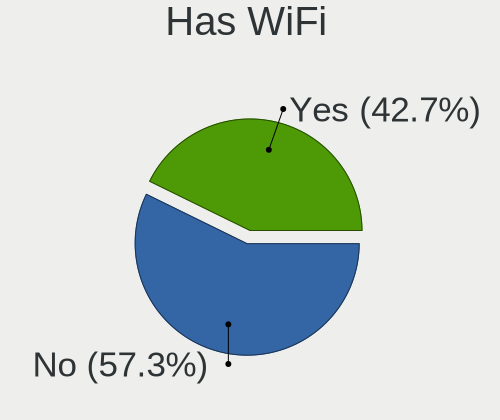
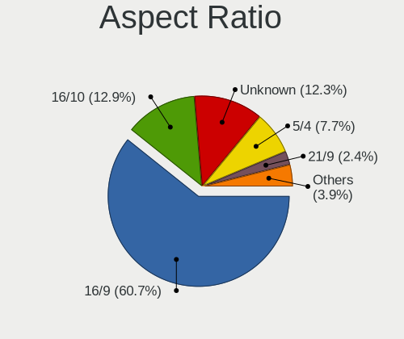

Ubuntu - Tested Hardware & Statistics (Desktops)
------------------------------------------------

A project to collect tested hardware configurations for Ubuntu.

Anyone can contribute to this report by the [hw-probe](https://github.com/linuxhw/hw-probe) tool:

    sudo -E hw-probe -all -upload

Please contribute! Especially if your hardware is rare.

Contents
--------

* [ Test Cases ](#test-cases)

* [ System ](#system)
  - [ OS                       ](#os)
  - [ OS Family                ](#os-family)
  - [ Kernel                   ](#kernel)
  - [ Kernel Family            ](#kernel-family)
  - [ Kernel Major Ver.        ](#kernel-major-ver)
  - [ Arch                     ](#arch)
  - [ DE                       ](#de)
  - [ Display Server           ](#display-server)
  - [ Display Manager          ](#display-manager)
  - [ OS Lang                  ](#os-lang)
  - [ Boot Mode                ](#boot-mode)
  - [ Filesystem               ](#filesystem)
  - [ Part. scheme             ](#part-scheme)
  - [ Dual Boot with Linux/BSD ](#dual-boot-with-linuxbsd)
  - [ Dual Boot (Win)          ](#dual-boot-win)

* [ Board ](#board)
  - [ Vendor                   ](#vendor)
  - [ Model                    ](#model)
  - [ Model Family             ](#model-family)
  - [ MFG Year                 ](#mfg-year)
  - [ Form Factor              ](#form-factor)
  - [ Secure Boot              ](#secure-boot)
  - [ Coreboot                 ](#coreboot)
  - [ RAM Size                 ](#ram-size)
  - [ RAM Used                 ](#ram-used)
  - [ Total Drives             ](#total-drives)
  - [ Has CD-ROM               ](#has-cd-rom)
  - [ Has Ethernet             ](#has-ethernet)
  - [ Has WiFi                 ](#has-wifi)
  - [ Has Bluetooth            ](#has-bluetooth)

* [ Location ](#location)
  - [ Country                  ](#country)
  - [ City                     ](#city)

* [ Drives ](#drives)
  - [ Drive Vendor             ](#drive-vendor)
  - [ Drive Model              ](#drive-model)
  - [ HDD Vendor               ](#hdd-vendor)
  - [ SSD Vendor               ](#ssd-vendor)
  - [ Drive Kind               ](#drive-kind)
  - [ Drive Connector          ](#drive-connector)
  - [ Drive Size               ](#drive-size)
  - [ Space Total              ](#space-total)
  - [ Space Used               ](#space-used)
  - [ Malfunc. Drives          ](#malfunc-drives)
  - [ Malfunc. Drive Vendor    ](#malfunc-drive-vendor)
  - [ Malfunc. HDD Vendor      ](#malfunc-hdd-vendor)
  - [ Malfunc. Drive Kind      ](#malfunc-drive-kind)
  - [ Failed Drives            ](#failed-drives)
  - [ Failed Drive Vendor      ](#failed-drive-vendor)
  - [ Drive Status             ](#drive-status)

* [ Storage controller ](#storage-controller)
  - [ Storage Vendor           ](#storage-vendor)
  - [ Storage Model            ](#storage-model)
  - [ Storage Kind             ](#storage-kind)

* [ Processor ](#processor)
  - [ CPU Vendor               ](#cpu-vendor)
  - [ CPU Model                ](#cpu-model)
  - [ CPU Model Family         ](#cpu-model-family)
  - [ CPU Cores                ](#cpu-cores)
  - [ CPU Sockets              ](#cpu-sockets)
  - [ CPU Threads              ](#cpu-threads)
  - [ CPU Op-Modes             ](#cpu-op-modes)
  - [ CPU Microcode            ](#cpu-microcode)
  - [ CPU Microarch            ](#cpu-microarch)

* [ Graphics ](#graphics)
  - [ GPU Vendor               ](#gpu-vendor)
  - [ GPU Model                ](#gpu-model)
  - [ GPU Combo                ](#gpu-combo)
  - [ GPU Driver               ](#gpu-driver)
  - [ GPU Memory               ](#gpu-memory)

* [ Monitor ](#monitor)
  - [ Monitor Vendor           ](#monitor-vendor)
  - [ Monitor Model            ](#monitor-model)
  - [ Monitor Resolution       ](#monitor-resolution)
  - [ Monitor Diagonal         ](#monitor-diagonal)
  - [ Monitor Width            ](#monitor-width)
  - [ Aspect Ratio             ](#aspect-ratio)
  - [ Monitor Area             ](#monitor-area)
  - [ Pixel Density            ](#pixel-density)
  - [ Multiple Monitors        ](#multiple-monitors)

* [ Network ](#network)
  - [ Net Controller Vendor    ](#net-controller-vendor)
  - [ Net Controller Model     ](#net-controller-model)
  - [ Wireless Vendor          ](#wireless-vendor)
  - [ Wireless Model           ](#wireless-model)
  - [ Ethernet Vendor          ](#ethernet-vendor)
  - [ Ethernet Model           ](#ethernet-model)
  - [ Net Controller Kind      ](#net-controller-kind)
  - [ Used Controller          ](#used-controller)
  - [ NICs                     ](#nics)
  - [ IPv6                     ](#ipv6)

* [ Bluetooth ](#bluetooth)
  - [ Bluetooth Vendor         ](#bluetooth-vendor)
  - [ Bluetooth Model          ](#bluetooth-model)

* [ Sound ](#sound)
  - [ Sound Vendor             ](#sound-vendor)
  - [ Sound Model              ](#sound-model)

* [ Memory ](#memory)
  - [ Memory Vendor            ](#memory-vendor)
  - [ Memory Model             ](#memory-model)
  - [ Memory Kind              ](#memory-kind)
  - [ Memory Form Factor       ](#memory-form-factor)
  - [ Memory Size              ](#memory-size)
  - [ Memory Speed             ](#memory-speed)

* [ Printers & scanners ](#printers--scanners)
  - [ Printer Vendor           ](#printer-vendor)
  - [ Printer Model            ](#printer-model)
  - [ Scanner Vendor           ](#scanner-vendor)
  - [ Scanner Model            ](#scanner-model)

* [ Camera ](#camera)
  - [ Camera Vendor            ](#camera-vendor)
  - [ Camera Model             ](#camera-model)

* [ Security ](#security)
  - [ Fingerprint Vendor       ](#fingerprint-vendor)
  - [ Fingerprint Model        ](#fingerprint-model)
  - [ Chipcard Vendor          ](#chipcard-vendor)
  - [ Chipcard Model           ](#chipcard-model)

* [ Unsupported ](#unsupported)
  - [ Unsupported Devices      ](#unsupported-devices)
  - [ Unsupported Device Types ](#unsupported-device-types)

Test Cases
----------

Total: 30646

| Vendor        | Model                       | Probe                                                      | Date         |
|---------------|-----------------------------|------------------------------------------------------------|--------------|
| Acer          | Aspire XC-705               | [86a503df2a](https://linux-hardware.org/?probe=86a503df2a) | Dec 01, 2022 |
| Gigabyte      | B450M DS3H-CF               | [5e7bc65683](https://linux-hardware.org/?probe=5e7bc65683) | Dec 01, 2022 |
| Gigabyte      | B450M DS3H-CF               | [660b9b7529](https://linux-hardware.org/?probe=660b9b7529) | Dec 01, 2022 |
| Medion        | H81H3-EM2 H81EM2W08.309     | [9aa4880856](https://linux-hardware.org/?probe=9aa4880856) | Dec 01, 2022 |
| Gigabyte      | B450M DS3H-CF               | [9d7fdf83b6](https://linux-hardware.org/?probe=9d7fdf83b6) | Dec 01, 2022 |
| Dell          | 0G254H A00                  | [473fb8a09a](https://linux-hardware.org/?probe=473fb8a09a) | Dec 01, 2022 |
| Gigabyte      | GA-MA790FXT-UD5P            | [010349b87b](https://linux-hardware.org/?probe=010349b87b) | Dec 01, 2022 |
| Lenovo        | SHARKBAY SDK0E50510 WIN     | [2f59960e11](https://linux-hardware.org/?probe=2f59960e11) | Dec 01, 2022 |
| Fujitsu       | D3128-A1 S26361-D3128-A1    | [ad24dc05a0](https://linux-hardware.org/?probe=ad24dc05a0) | Dec 01, 2022 |
| Lenovo        | SHARKBAY SDK0E50510 WIN     | [c155b94a47](https://linux-hardware.org/?probe=c155b94a47) | Dec 01, 2022 |
| Fujitsu       | D3128-A1 S26361-D3128-A1    | [0e38c9a3be](https://linux-hardware.org/?probe=0e38c9a3be) | Dec 01, 2022 |
| Medion        | H81H3-EM2 H81EM2W08.309     | [c1f5a1f413](https://linux-hardware.org/?probe=c1f5a1f413) | Dec 01, 2022 |
| MSI           | MEG X570 UNIFY              | [df74bf8e13](https://linux-hardware.org/?probe=df74bf8e13) | Dec 01, 2022 |
| ASRock        | Z68 Extreme4 Gen3           | [c14e2149eb](https://linux-hardware.org/?probe=c14e2149eb) | Dec 01, 2022 |
| ASUSTek       | H97-PLUS                    | [e8d75cbeed](https://linux-hardware.org/?probe=e8d75cbeed) | Dec 01, 2022 |
| HP            | 1495                        | [138b5bb823](https://linux-hardware.org/?probe=138b5bb823) | Dec 01, 2022 |
| ASUSTek       | P7H55-M                     | [b461d54421](https://linux-hardware.org/?probe=b461d54421) | Dec 01, 2022 |
| ASUSTek       | TUF Gaming X570-PLUS        | [f7b40a75f6](https://linux-hardware.org/?probe=f7b40a75f6) | Dec 01, 2022 |
| Dell          | 0R6PCT A01                  | [c8ef04b4b2](https://linux-hardware.org/?probe=c8ef04b4b2) | Dec 01, 2022 |
| ASUSTek       | PRIME A320M-K               | [e1a4335a71](https://linux-hardware.org/?probe=e1a4335a71) | Dec 01, 2022 |
| Fujitsu       | D2917-A1 S26361-D2917-A1    | [dd124e3579](https://linux-hardware.org/?probe=dd124e3579) | Nov 30, 2022 |
| Gigabyte      | H170-HD3-CF                 | [1d293c6d72](https://linux-hardware.org/?probe=1d293c6d72) | Nov 30, 2022 |
| HP            | 1825                        | [5f8bff315d](https://linux-hardware.org/?probe=5f8bff315d) | Nov 30, 2022 |
| ASUSTek       | ROG STRIX X570-I GAMING     | [ac84964c19](https://linux-hardware.org/?probe=ac84964c19) | Nov 30, 2022 |
| Lenovo        | SHARKBAY SDK0E50510 WIN     | [475ad82d2b](https://linux-hardware.org/?probe=475ad82d2b) | Nov 30, 2022 |
| Dell          | 0NDYHG A01                  | [5dd9f4dea9](https://linux-hardware.org/?probe=5dd9f4dea9) | Nov 30, 2022 |
| ASUSTek       | PRIME B450M-A II            | [a5b34b67f2](https://linux-hardware.org/?probe=a5b34b67f2) | Nov 30, 2022 |
| MSI           | Boston                      | [0564f7ed2d](https://linux-hardware.org/?probe=0564f7ed2d) | Nov 30, 2022 |
| MSI           | Z170A GAMING M3             | [dfe92c80c1](https://linux-hardware.org/?probe=dfe92c80c1) | Nov 30, 2022 |
| Dell          | 0WR7PY A03                  | [ba1e414d62](https://linux-hardware.org/?probe=ba1e414d62) | Nov 30, 2022 |
| ASUSTek       | H81M-PLUS                   | [8d98938198](https://linux-hardware.org/?probe=8d98938198) | Nov 30, 2022 |
| ASUSTek       | TUF Gaming X670E-PLUS WI... | [9282404406](https://linux-hardware.org/?probe=9282404406) | Nov 30, 2022 |
| Gigabyte      | GB-BRR7H-4700               | [8398d00a16](https://linux-hardware.org/?probe=8398d00a16) | Nov 30, 2022 |
| ASUSTek       | M5A78L-M LE/USB3            | [dd3801095f](https://linux-hardware.org/?probe=dd3801095f) | Nov 30, 2022 |
| ASUSTek       | P7H55-M                     | [729bb4ef87](https://linux-hardware.org/?probe=729bb4ef87) | Nov 30, 2022 |
| Dell          | 0XJ5V0 A03                  | [b954e4c174](https://linux-hardware.org/?probe=b954e4c174) | Nov 30, 2022 |
| Dell          | 0C3YXR A01                  | [95fbd0e6b4](https://linux-hardware.org/?probe=95fbd0e6b4) | Nov 30, 2022 |
| HP            | 1825                        | [a3f8ec5423](https://linux-hardware.org/?probe=a3f8ec5423) | Nov 30, 2022 |
| ASUSTek       | ROG STRIX B450-E GAMING     | [abcc431f9f](https://linux-hardware.org/?probe=abcc431f9f) | Nov 30, 2022 |
| Gigabyte      | 970A-DS3P                   | [22c7db0e68](https://linux-hardware.org/?probe=22c7db0e68) | Nov 30, 2022 |
| Gigabyte      | 970A-DS3P                   | [65493a981c](https://linux-hardware.org/?probe=65493a981c) | Nov 30, 2022 |
| Dell          | 0NDYHG A01                  | [a3191b9bfe](https://linux-hardware.org/?probe=a3191b9bfe) | Nov 30, 2022 |
| Medion        | D3F3-EM                     | [ae428a6a6a](https://linux-hardware.org/?probe=ae428a6a6a) | Nov 29, 2022 |
| ASUSTek       | PRIME B450M-A II            | [f0dfa48048](https://linux-hardware.org/?probe=f0dfa48048) | Nov 29, 2022 |
| ASUSTek       | TUF Gaming X570-PLUS        | [2e35df903f](https://linux-hardware.org/?probe=2e35df903f) | Nov 29, 2022 |
| MSI           | MPG X570 GAMING EDGE WIF... | [c01a10b89d](https://linux-hardware.org/?probe=c01a10b89d) | Nov 29, 2022 |
| Gigabyte      | B250M-DS3H-CF               | [efacbf6215](https://linux-hardware.org/?probe=efacbf6215) | Nov 29, 2022 |
| Gigabyte      | B250M-DS3H-CF               | [85ac938c0c](https://linux-hardware.org/?probe=85ac938c0c) | Nov 29, 2022 |
| Foxconn       | G41MXE/G41MXE-K             | [4f13d9a2cc](https://linux-hardware.org/?probe=4f13d9a2cc) | Nov 29, 2022 |
| Lenovo        | 364F SDK0J40700 WIN 3258... | [481a664e0a](https://linux-hardware.org/?probe=481a664e0a) | Nov 29, 2022 |
| ASUSTek       | P5KPL-AM SE                 | [719921de81](https://linux-hardware.org/?probe=719921de81) | Nov 29, 2022 |
| HP            | 339A                        | [ea5cacd50e](https://linux-hardware.org/?probe=ea5cacd50e) | Nov 29, 2022 |
| ASUSTek       | P5KPL-AM SE                 | [f998b6a0d9](https://linux-hardware.org/?probe=f998b6a0d9) | Nov 29, 2022 |
| Gigabyte      | TRX40 AORUS PRO WIFI        | [d5702f8b2d](https://linux-hardware.org/?probe=d5702f8b2d) | Nov 29, 2022 |
| Gigabyte      | TRX40 AORUS PRO WIFI        | [640a031786](https://linux-hardware.org/?probe=640a031786) | Nov 29, 2022 |
| ASRock        | 960GM-GS3 FX                | [1474b9ee78](https://linux-hardware.org/?probe=1474b9ee78) | Nov 29, 2022 |
| Dell          | 0J8G6F A03                  | [1424a94eb0](https://linux-hardware.org/?probe=1424a94eb0) | Nov 29, 2022 |
| Gigabyte      | Z490 AORUS XTREME WF        | [6d4f229020](https://linux-hardware.org/?probe=6d4f229020) | Nov 29, 2022 |
| Medion        | H110H4-EM2                  | [38b9e166f2](https://linux-hardware.org/?probe=38b9e166f2) | Nov 29, 2022 |
| ASRock        | Z77 Extreme3                | [e473c1c45c](https://linux-hardware.org/?probe=e473c1c45c) | Nov 29, 2022 |
| Dell          | 0FDY5C A00                  | [3cba0b32b1](https://linux-hardware.org/?probe=3cba0b32b1) | Nov 29, 2022 |
| Lenovo        | 1031 SBB0J05441 WIN 3305... | [cc75562371](https://linux-hardware.org/?probe=cc75562371) | Nov 29, 2022 |
| Supermicro    | X10DRU-i+B                  | [e55edce907](https://linux-hardware.org/?probe=e55edce907) | Nov 29, 2022 |
| ASRock        | FM2A78 Pro4+                | [7eae5fad47](https://linux-hardware.org/?probe=7eae5fad47) | Nov 29, 2022 |
| HP            | 1850                        | [1d0a3a4461](https://linux-hardware.org/?probe=1d0a3a4461) | Nov 29, 2022 |
| Lenovo        | 1031 SBB0J05441 WIN 3305... | [a6ea0d5259](https://linux-hardware.org/?probe=a6ea0d5259) | Nov 29, 2022 |
| MSI           | Z370 GAMING PRO CARBON      | [96b383097b](https://linux-hardware.org/?probe=96b383097b) | Nov 29, 2022 |
| ASRock        | B550 Phantom Gaming 4/ac    | [66525e5501](https://linux-hardware.org/?probe=66525e5501) | Nov 29, 2022 |
| MSI           | MAG X570S TOMAHAWK MAX W... | [04d2eea487](https://linux-hardware.org/?probe=04d2eea487) | Nov 28, 2022 |
| Lenovo        | ThinkCentre M57 6072AZ3     | [9d794b4d38](https://linux-hardware.org/?probe=9d794b4d38) | Nov 28, 2022 |
| Intel         | DH67BL AAG10189-213         | [11252af398](https://linux-hardware.org/?probe=11252af398) | Nov 28, 2022 |
| ASRock        | B450M Pro4                  | [219a616346](https://linux-hardware.org/?probe=219a616346) | Nov 28, 2022 |
| Gigabyte      | H410M H                     | [09129dad50](https://linux-hardware.org/?probe=09129dad50) | Nov 28, 2022 |
| Dell          | 0NK5PH A00                  | [d889c3c50a](https://linux-hardware.org/?probe=d889c3c50a) | Nov 28, 2022 |
| Intel         | H61                         | [42f943bc9c](https://linux-hardware.org/?probe=42f943bc9c) | Nov 28, 2022 |
| ASRock        | Q1900M                      | [0a90a5d3a5](https://linux-hardware.org/?probe=0a90a5d3a5) | Nov 28, 2022 |
| Gigabyte      | Z97X-SLI-CF                 | [ae01075720](https://linux-hardware.org/?probe=ae01075720) | Nov 28, 2022 |
| HP            | 18E5                        | [e336f0ac13](https://linux-hardware.org/?probe=e336f0ac13) | Nov 28, 2022 |
| MSI           | MPG B550 GAMING PLUS        | [341bca1753](https://linux-hardware.org/?probe=341bca1753) | Nov 28, 2022 |
| HP            | 843B                        | [19bd35484c](https://linux-hardware.org/?probe=19bd35484c) | Nov 28, 2022 |
| Gigabyte      | H410M H                     | [88ca303518](https://linux-hardware.org/?probe=88ca303518) | Nov 28, 2022 |
| Gigabyte      | H81M-S                      | [fab21fa561](https://linux-hardware.org/?probe=fab21fa561) | Nov 28, 2022 |
| Dell          | 0773VG A00                  | [a21b1834c2](https://linux-hardware.org/?probe=a21b1834c2) | Nov 28, 2022 |
| Pegatron      | VIOLET                      | [f0f25e6854](https://linux-hardware.org/?probe=f0f25e6854) | Nov 28, 2022 |
| PCWare        | IPMH61R1                    | [7872d8f10f](https://linux-hardware.org/?probe=7872d8f10f) | Nov 28, 2022 |
| Dell          | 0773VG A00                  | [04125afb72](https://linux-hardware.org/?probe=04125afb72) | Nov 28, 2022 |
| Dell          | 0WMJ54 A01                  | [778a84af28](https://linux-hardware.org/?probe=778a84af28) | Nov 28, 2022 |
| ASRock        | H87M Pro4                   | [c0511f2d46](https://linux-hardware.org/?probe=c0511f2d46) | Nov 28, 2022 |
| ASRock        | FM2A78 Pro4+                | [908283c378](https://linux-hardware.org/?probe=908283c378) | Nov 28, 2022 |
| Shuttle       | FS35V4                      | [46923496a3](https://linux-hardware.org/?probe=46923496a3) | Nov 28, 2022 |
| Dell          | 0T10XW A02                  | [e97a065fa8](https://linux-hardware.org/?probe=e97a065fa8) | Nov 28, 2022 |
| ASUSTek       | SABERTOOTH 990FX R2.0       | [bc515374ae](https://linux-hardware.org/?probe=bc515374ae) | Nov 27, 2022 |
| ASUSTek       | PRIME X570-PRO              | [8f8f53c15b](https://linux-hardware.org/?probe=8f8f53c15b) | Nov 27, 2022 |
| ASUSTek       | P8Z68 DELUXE/GEN3           | [cbd36eefe1](https://linux-hardware.org/?probe=cbd36eefe1) | Nov 27, 2022 |
| Gateway       | G33M05G1 MP                 | [193a69e5ee](https://linux-hardware.org/?probe=193a69e5ee) | Nov 27, 2022 |
| Acer          | Veriton X4620G V1.0         | [37be4a2bf8](https://linux-hardware.org/?probe=37be4a2bf8) | Nov 27, 2022 |
| Gigabyte      | B450M DS3H-CF               | [54d005e599](https://linux-hardware.org/?probe=54d005e599) | Nov 27, 2022 |
| ASUSTek       | PRIME A320M-K               | [37b51f19ef](https://linux-hardware.org/?probe=37b51f19ef) | Nov 27, 2022 |
| Gateway       | G33M05G1 MP                 | [291e32a741](https://linux-hardware.org/?probe=291e32a741) | Nov 27, 2022 |
| Dell          | 042P49 A01                  | [8f510e55e2](https://linux-hardware.org/?probe=8f510e55e2) | Nov 27, 2022 |
| ASRock        | H87M Pro4                   | [8d15aa84d6](https://linux-hardware.org/?probe=8d15aa84d6) | Nov 27, 2022 |
| ASUSTek       | ROG STRIX B450-F GAMING ... | [a60076a8c2](https://linux-hardware.org/?probe=a60076a8c2) | Nov 27, 2022 |
| HP            | 1589                        | [4e67735055](https://linux-hardware.org/?probe=4e67735055) | Nov 27, 2022 |
| Koloe         | X58                         | [8b80e1a74c](https://linux-hardware.org/?probe=8b80e1a74c) | Nov 27, 2022 |
| ASUSTek       | PRIME B365M-A               | [4f3216dfdc](https://linux-hardware.org/?probe=4f3216dfdc) | Nov 27, 2022 |
| ASUSTek       | PRIME B365M-A               | [498f0a31dc](https://linux-hardware.org/?probe=498f0a31dc) | Nov 27, 2022 |
| ASRock        | H110M-DGS                   | [6667ba2bc2](https://linux-hardware.org/?probe=6667ba2bc2) | Nov 27, 2022 |
| MSI           | B450M PRO-VDH PLUS          | [f168cc5b93](https://linux-hardware.org/?probe=f168cc5b93) | Nov 27, 2022 |
| HP            | 843B                        | [50065e4a79](https://linux-hardware.org/?probe=50065e4a79) | Nov 27, 2022 |
| Dell          | 0GXM1W A02                  | [3a801841e6](https://linux-hardware.org/?probe=3a801841e6) | Nov 27, 2022 |
| Gigabyte      | H81M-DS2                    | [f278eb7e59](https://linux-hardware.org/?probe=f278eb7e59) | Nov 27, 2022 |
| Dell          | 0C2XKD A01                  | [b17b635fcb](https://linux-hardware.org/?probe=b17b635fcb) | Nov 27, 2022 |
| ASUSTek       | P8Z68 DELUXE/GEN3           | [508e04de6e](https://linux-hardware.org/?probe=508e04de6e) | Nov 27, 2022 |
| Gigabyte      | B450 AORUS ELITE            | [b72ddeccb4](https://linux-hardware.org/?probe=b72ddeccb4) | Nov 27, 2022 |
| Foxconn       | A74ML-K                     | [438e3ff761](https://linux-hardware.org/?probe=438e3ff761) | Nov 27, 2022 |
| MSI           | MPG X570 GAMING EDGE WIF... | [2813bdf250](https://linux-hardware.org/?probe=2813bdf250) | Nov 26, 2022 |
| ASUSTek       | H81M-K                      | [4de72d3d12](https://linux-hardware.org/?probe=4de72d3d12) | Nov 26, 2022 |
| ASUSTek       | P7P55D-E LX                 | [8b913d5510](https://linux-hardware.org/?probe=8b913d5510) | Nov 26, 2022 |
| ASUSTek       | Rampage IV EXTREME          | [e70ff25b31](https://linux-hardware.org/?probe=e70ff25b31) | Nov 26, 2022 |
| LattePanda    | 3 Delta CDJQ-BS-7-S70JR1... | [da7904dda2](https://linux-hardware.org/?probe=da7904dda2) | Nov 26, 2022 |
| HP            | 0AA8h                       | [dba59690d7](https://linux-hardware.org/?probe=dba59690d7) | Nov 26, 2022 |
| Lenovo        | BRASWELL SDK0J40705 WIN ... | [fd73688b5c](https://linux-hardware.org/?probe=fd73688b5c) | Nov 26, 2022 |
| ASUSTek       | PRIME A320M-K               | [be12141830](https://linux-hardware.org/?probe=be12141830) | Nov 26, 2022 |
| ASUSTek       | PRIME A320M-K               | [f34d75bde0](https://linux-hardware.org/?probe=f34d75bde0) | Nov 26, 2022 |
| ASUSTek       | B150M-C                     | [bbbdc2b291](https://linux-hardware.org/?probe=bbbdc2b291) | Nov 26, 2022 |
| Lenovo        | ThinkCentre M58 6258AP4     | [54d4e3a0ae](https://linux-hardware.org/?probe=54d4e3a0ae) | Nov 26, 2022 |
| Lenovo        | BRASWELL SDK0J40705 WIN ... | [cdc1c32b09](https://linux-hardware.org/?probe=cdc1c32b09) | Nov 26, 2022 |
| MSI           | A78M-E35                    | [cf80d76e53](https://linux-hardware.org/?probe=cf80d76e53) | Nov 26, 2022 |
| Dell          | 0FDY5C A00                  | [05216bc44f](https://linux-hardware.org/?probe=05216bc44f) | Nov 26, 2022 |
| Fujitsu       | D3221-A1 S26361-D3221-A1    | [a787a49407](https://linux-hardware.org/?probe=a787a49407) | Nov 25, 2022 |
| Intel         | Unknown                     | [bcf46201bc](https://linux-hardware.org/?probe=bcf46201bc) | Nov 25, 2022 |
| MSI           | Z170A GAMING M3             | [982d7f7d0b](https://linux-hardware.org/?probe=982d7f7d0b) | Nov 25, 2022 |
| ASRock        | Z77 Extreme4                | [40b3f85de8](https://linux-hardware.org/?probe=40b3f85de8) | Nov 25, 2022 |
| Gigabyte      | 970A-DS3P                   | [2787600567](https://linux-hardware.org/?probe=2787600567) | Nov 25, 2022 |
| Dell          | OptiPlex 3020               | [2adcd09348](https://linux-hardware.org/?probe=2adcd09348) | Nov 25, 2022 |
| ASUSTek       | P5WD2-Premium               | [aad7343998](https://linux-hardware.org/?probe=aad7343998) | Nov 25, 2022 |
| ASUSTek       | PRIME A320M-K               | [906ad9a3c1](https://linux-hardware.org/?probe=906ad9a3c1) | Nov 25, 2022 |
| ASUSTek       | P8B75-M LX                  | [8522486d64](https://linux-hardware.org/?probe=8522486d64) | Nov 25, 2022 |
| MSI           | 970 GAMING                  | [de56ed9d3f](https://linux-hardware.org/?probe=de56ed9d3f) | Nov 25, 2022 |
| HP            | 198E                        | [9d22530b3c](https://linux-hardware.org/?probe=9d22530b3c) | Nov 25, 2022 |
| Gigabyte      | Z97M-DS3H                   | [a17a108297](https://linux-hardware.org/?probe=a17a108297) | Nov 25, 2022 |
| MSI           | B350 GAMING PLUS            | [2b7bb89689](https://linux-hardware.org/?probe=2b7bb89689) | Nov 25, 2022 |
| Positivo      | P5VD2-MX                    | [c9d4c5ea2b](https://linux-hardware.org/?probe=c9d4c5ea2b) | Nov 25, 2022 |
| ASUSTek       | X99-PRO                     | [6906303697](https://linux-hardware.org/?probe=6906303697) | Nov 25, 2022 |
| HP            | 18E9                        | [dab5e242fd](https://linux-hardware.org/?probe=dab5e242fd) | Nov 25, 2022 |
| ASUSTek       | PRIME Z590-P                | [a301b498bb](https://linux-hardware.org/?probe=a301b498bb) | Nov 25, 2022 |
| ASUSTek       | J1800I-C/BR                 | [9cfe40fa0b](https://linux-hardware.org/?probe=9cfe40fa0b) | Nov 25, 2022 |
| Gigabyte      | X299 UD4 Pro-CF             | [4ef7a46399](https://linux-hardware.org/?probe=4ef7a46399) | Nov 25, 2022 |
| Dell          | 088DT1 A01                  | [eb243079e8](https://linux-hardware.org/?probe=eb243079e8) | Nov 25, 2022 |
| ASUSTek       | ROG STRIX Z790-E GAMING ... | [1817579f89](https://linux-hardware.org/?probe=1817579f89) | Nov 25, 2022 |
| Unknown       | T3 MRD                      | [bec511830c](https://linux-hardware.org/?probe=bec511830c) | Nov 24, 2022 |
| ASUSTek       | PRIME B560M-A AC            | [51a24ed190](https://linux-hardware.org/?probe=51a24ed190) | Nov 24, 2022 |
| ASRock        | X570 Pro4                   | [dad186aa07](https://linux-hardware.org/?probe=dad186aa07) | Nov 24, 2022 |
| HP            | 0AE8h                       | [c49d643fae](https://linux-hardware.org/?probe=c49d643fae) | Nov 24, 2022 |
| HP            | 213D A01                    | [b0c45fb200](https://linux-hardware.org/?probe=b0c45fb200) | Nov 24, 2022 |
| PCWare        | APM-A320G                   | [a56cdcbd3b](https://linux-hardware.org/?probe=a56cdcbd3b) | Nov 24, 2022 |
| Gigabyte      | B75M-D3H                    | [d70a6e41ba](https://linux-hardware.org/?probe=d70a6e41ba) | Nov 24, 2022 |
| ASRock        | 960GM-GS3 FX                | [1af92d9936](https://linux-hardware.org/?probe=1af92d9936) | Nov 24, 2022 |
| Dell          | 0R230R A00                  | [157e450aa2](https://linux-hardware.org/?probe=157e450aa2) | Nov 24, 2022 |
| Biostar       | H61MGV3                     | [b252a902f4](https://linux-hardware.org/?probe=b252a902f4) | Nov 24, 2022 |
| ASRock        | 960GC-GS FX                 | [30081f61ca](https://linux-hardware.org/?probe=30081f61ca) | Nov 24, 2022 |
| ASRock        | 960GC-GS FX                 | [9e33d3b8f1](https://linux-hardware.org/?probe=9e33d3b8f1) | Nov 24, 2022 |
| Dell          | 06D7TR A00                  | [4f4bd45786](https://linux-hardware.org/?probe=4f4bd45786) | Nov 24, 2022 |
| ASUSTek       | PRIME H610M-A WIFI D4       | [7917cbbd8c](https://linux-hardware.org/?probe=7917cbbd8c) | Nov 24, 2022 |
| MSI           | MPG X570 GAMING EDGE WIF... | [b70689b098](https://linux-hardware.org/?probe=b70689b098) | Nov 24, 2022 |
| Fujitsu       | D3222-A1 S26361-D3222-A1    | [00f8658ee8](https://linux-hardware.org/?probe=00f8658ee8) | Nov 24, 2022 |
| MSI           | MPG X570 GAMING EDGE WIF... | [62c027aa0e](https://linux-hardware.org/?probe=62c027aa0e) | Nov 24, 2022 |
| ASUSTek       | PRIME A320M-K               | [5ea9d52f04](https://linux-hardware.org/?probe=5ea9d52f04) | Nov 24, 2022 |
| ASRock        | B560M-ITX/ac                | [3e1bbe410c](https://linux-hardware.org/?probe=3e1bbe410c) | Nov 24, 2022 |
| Dell          | 0GXM1W A02                  | [8bb6ca52d6](https://linux-hardware.org/?probe=8bb6ca52d6) | Nov 24, 2022 |
| Lenovo        | ThinkCentre M58e 7514A2U    | [ba4f47be1a](https://linux-hardware.org/?probe=ba4f47be1a) | Nov 24, 2022 |
| Dell          | 0WPMFG A00                  | [606cc8badf](https://linux-hardware.org/?probe=606cc8badf) | Nov 24, 2022 |
| Dell          | 0Y2MRG A00                  | [581cd43952](https://linux-hardware.org/?probe=581cd43952) | Nov 24, 2022 |
| MSI           | B560M-A PRO                 | [e2a8d64086](https://linux-hardware.org/?probe=e2a8d64086) | Nov 24, 2022 |
| ASRock        | B550 Extreme4               | [b59180988d](https://linux-hardware.org/?probe=b59180988d) | Nov 24, 2022 |
| MSI           | X99S SLI PLUS               | [6d9f5c0e18](https://linux-hardware.org/?probe=6d9f5c0e18) | Nov 24, 2022 |
| ASUSTek       | Z87-PRO                     | [95ebdc23ea](https://linux-hardware.org/?probe=95ebdc23ea) | Nov 24, 2022 |
| AZW           | Green G1                    | [762182d13c](https://linux-hardware.org/?probe=762182d13c) | Nov 24, 2022 |
| Lenovo        | 310B SDK0J40705 WIN 3425... | [7265ce493e](https://linux-hardware.org/?probe=7265ce493e) | Nov 23, 2022 |
| ASUSTek       | ROG STRIX B450-F GAMING     | [d1d85cefdb](https://linux-hardware.org/?probe=d1d85cefdb) | Nov 23, 2022 |
| Gigabyte      | M61PME-S2                   | [4768ab429e](https://linux-hardware.org/?probe=4768ab429e) | Nov 23, 2022 |
| ASUSTek       | P8Z77-V LX                  | [62e12083b5](https://linux-hardware.org/?probe=62e12083b5) | Nov 23, 2022 |
| HP            | 0AACh                       | [9e37ad4151](https://linux-hardware.org/?probe=9e37ad4151) | Nov 23, 2022 |
| Biostar       | X470GTA                     | [83dcb407ba](https://linux-hardware.org/?probe=83dcb407ba) | Nov 23, 2022 |
| ASUSTek       | ROG STRIX X299-E GAMING     | [aea7b4c016](https://linux-hardware.org/?probe=aea7b4c016) | Nov 23, 2022 |
| Gateway       | DX4840                      | [e2a4cbcd27](https://linux-hardware.org/?probe=e2a4cbcd27) | Nov 23, 2022 |
| Dell          | 0NDYHG A01                  | [0e693ae457](https://linux-hardware.org/?probe=0e693ae457) | Nov 23, 2022 |
| HP            | 0266                        | [13e2e10478](https://linux-hardware.org/?probe=13e2e10478) | Nov 23, 2022 |
| ASUSTek       | M5A97 R2.0                  | [495d972ae3](https://linux-hardware.org/?probe=495d972ae3) | Nov 23, 2022 |
| Gigabyte      | X299 AORUS Gaming 7         | [e2fab75aab](https://linux-hardware.org/?probe=e2fab75aab) | Nov 23, 2022 |
| ASUSTek       | ROG STRIX X299-E GAMING     | [d1964dc9fe](https://linux-hardware.org/?probe=d1964dc9fe) | Nov 23, 2022 |
| ASUSTek       | ROG STRIX X299-E GAMING     | [51c74fea62](https://linux-hardware.org/?probe=51c74fea62) | Nov 23, 2022 |
| Gigabyte      | X299 UD4 Pro-CF             | [debc899d1c](https://linux-hardware.org/?probe=debc899d1c) | Nov 23, 2022 |
| ASUSTek       | TUF X299 MARK 2             | [78464e70fd](https://linux-hardware.org/?probe=78464e70fd) | Nov 23, 2022 |
| ASUSTek       | TUF X299 MARK 2             | [5f09b5dd61](https://linux-hardware.org/?probe=5f09b5dd61) | Nov 23, 2022 |
| ASUSTek       | TUF X299 MARK 2             | [1243da63d2](https://linux-hardware.org/?probe=1243da63d2) | Nov 23, 2022 |
| MSI           | X99S SLI PLUS               | [2d963fa11c](https://linux-hardware.org/?probe=2d963fa11c) | Nov 23, 2022 |
| ASUSTek       | ROG STRIX X299-E GAMING     | [1d63610a6e](https://linux-hardware.org/?probe=1d63610a6e) | Nov 23, 2022 |
| ASUSTek       | TUF X299 MARK 2             | [e8320a209e](https://linux-hardware.org/?probe=e8320a209e) | Nov 23, 2022 |
| ASUSTek       | TUF X299 MARK 2             | [5d076782dd](https://linux-hardware.org/?probe=5d076782dd) | Nov 23, 2022 |
| ASUSTek       | ROG STRIX X299-E GAMING     | [3d3bcc098f](https://linux-hardware.org/?probe=3d3bcc098f) | Nov 23, 2022 |
| ASUSTek       | ROG STRIX X299-E GAMING     | [fdda0626c6](https://linux-hardware.org/?probe=fdda0626c6) | Nov 23, 2022 |
| ASUSTek       | ROG STRIX X299-E GAMING     | [024cc2358b](https://linux-hardware.org/?probe=024cc2358b) | Nov 23, 2022 |
| ASUSTek       | ROG STRIX X299-E GAMING     | [3ba7a6c4fb](https://linux-hardware.org/?probe=3ba7a6c4fb) | Nov 23, 2022 |
| ASUSTek       | ROG STRIX X299-E GAMING     | [53f5e0cbab](https://linux-hardware.org/?probe=53f5e0cbab) | Nov 23, 2022 |
| ASUSTek       | ROG STRIX X299-E GAMING     | [be9451323c](https://linux-hardware.org/?probe=be9451323c) | Nov 23, 2022 |
| ASUSTek       | ROG STRIX X299-E GAMING     | [92749e81a5](https://linux-hardware.org/?probe=92749e81a5) | Nov 23, 2022 |
| ASUSTek       | PRIME TRX40-PRO             | [381a68d120](https://linux-hardware.org/?probe=381a68d120) | Nov 23, 2022 |
| ASUSTek       | PRIME TRX40-PRO             | [3be504a047](https://linux-hardware.org/?probe=3be504a047) | Nov 23, 2022 |
| ASUSTek       | ROG STRIX X299-E GAMING     | [4454e583d5](https://linux-hardware.org/?probe=4454e583d5) | Nov 23, 2022 |
| ASUSTek       | ROG STRIX X299-E GAMING     | [94d163a5e3](https://linux-hardware.org/?probe=94d163a5e3) | Nov 23, 2022 |
| ASUSTek       | ROG STRIX X299-E GAMING     | [c5556663da](https://linux-hardware.org/?probe=c5556663da) | Nov 23, 2022 |
| ASUSTek       | ROG STRIX X299-E GAMING     | [5d243ef557](https://linux-hardware.org/?probe=5d243ef557) | Nov 23, 2022 |
| ASUSTek       | ROG STRIX X299-E GAMING     | [bf3b52bfe6](https://linux-hardware.org/?probe=bf3b52bfe6) | Nov 23, 2022 |
| ASUSTek       | PRIME TRX40-PRO             | [b19ba11402](https://linux-hardware.org/?probe=b19ba11402) | Nov 23, 2022 |
| ASUSTek       | PRIME TRX40-PRO             | [6f5deb0299](https://linux-hardware.org/?probe=6f5deb0299) | Nov 23, 2022 |
| ASUSTek       | PRIME TRX40-PRO             | [9e8c153e90](https://linux-hardware.org/?probe=9e8c153e90) | Nov 23, 2022 |
| ASUSTek       | PRIME TRX40-PRO             | [6c783906c1](https://linux-hardware.org/?probe=6c783906c1) | Nov 23, 2022 |
| ASUSTek       | ROG STRIX X299-E GAMING     | [c402fa3c44](https://linux-hardware.org/?probe=c402fa3c44) | Nov 23, 2022 |
| ASUSTek       | PRIME TRX40-PRO             | [3259ef0e33](https://linux-hardware.org/?probe=3259ef0e33) | Nov 23, 2022 |
| ASUSTek       | PRIME TRX40-PRO             | [c4dc771020](https://linux-hardware.org/?probe=c4dc771020) | Nov 23, 2022 |
| ASUSTek       | ROG STRIX X299-E GAMING     | [df21e0adc4](https://linux-hardware.org/?probe=df21e0adc4) | Nov 23, 2022 |
| ASUSTek       | ROG STRIX X299-E GAMING     | [3b5ce9af70](https://linux-hardware.org/?probe=3b5ce9af70) | Nov 23, 2022 |
| ASUSTek       | ROG STRIX X299-E GAMING     | [f4fec03d9c](https://linux-hardware.org/?probe=f4fec03d9c) | Nov 23, 2022 |
| Gigabyte      | X299 AORUS Gaming 3-CF      | [a1f9ebba9a](https://linux-hardware.org/?probe=a1f9ebba9a) | Nov 23, 2022 |
| Gigabyte      | TRX40 AORUS PRO WIFI        | [02d368333c](https://linux-hardware.org/?probe=02d368333c) | Nov 23, 2022 |
| ASUSTek       | ROG STRIX X299-E GAMING     | [00ac46707a](https://linux-hardware.org/?probe=00ac46707a) | Nov 23, 2022 |
| ASUSTek       | ROG STRIX X299-E GAMING     | [7ad21c7e06](https://linux-hardware.org/?probe=7ad21c7e06) | Nov 23, 2022 |
| Gigabyte      | X299 AORUS Gaming 3-CF      | [a774e894f9](https://linux-hardware.org/?probe=a774e894f9) | Nov 23, 2022 |
| ASUSTek       | PRIME TRX40-PRO             | [730d937b9f](https://linux-hardware.org/?probe=730d937b9f) | Nov 23, 2022 |
| Gigabyte      | X299 AORUS Gaming 7         | [d65cb5d9ce](https://linux-hardware.org/?probe=d65cb5d9ce) | Nov 23, 2022 |
| Gigabyte      | X299 AORUS Gaming 3-CF      | [04808e6de2](https://linux-hardware.org/?probe=04808e6de2) | Nov 23, 2022 |
| ASUSTek       | ROG STRIX X299-E GAMING     | [72d4e9d9bc](https://linux-hardware.org/?probe=72d4e9d9bc) | Nov 23, 2022 |
| ASUSTek       | ROG STRIX X299-E GAMING     | [23d3b880b6](https://linux-hardware.org/?probe=23d3b880b6) | Nov 23, 2022 |
| ASUSTek       | ROG STRIX X299-E GAMING     | [99e0dd17d1](https://linux-hardware.org/?probe=99e0dd17d1) | Nov 23, 2022 |
| ASUSTek       | ROG STRIX X299-E GAMING     | [65eabfee0b](https://linux-hardware.org/?probe=65eabfee0b) | Nov 23, 2022 |
| ASUSTek       | ROG STRIX X299-E GAMING     | [74de10fddd](https://linux-hardware.org/?probe=74de10fddd) | Nov 23, 2022 |
| Gigabyte      | X299 AORUS Gaming 3 Pro-... | [12de405786](https://linux-hardware.org/?probe=12de405786) | Nov 23, 2022 |
| ASUSTek       | ROG STRIX X299-E GAMING     | [9e93a52eda](https://linux-hardware.org/?probe=9e93a52eda) | Nov 23, 2022 |
| ASUSTek       | ROG STRIX X299-E GAMING     | [2abc1244ad](https://linux-hardware.org/?probe=2abc1244ad) | Nov 23, 2022 |
| ASUSTek       | ROG STRIX X299-E GAMING     | [76ffa1f693](https://linux-hardware.org/?probe=76ffa1f693) | Nov 23, 2022 |
| Gigabyte      | X299 AORUS Gaming 7         | [7b34fa4192](https://linux-hardware.org/?probe=7b34fa4192) | Nov 23, 2022 |
| ASUSTek       | ROG STRIX X299-E GAMING     | [66ce12d0d2](https://linux-hardware.org/?probe=66ce12d0d2) | Nov 23, 2022 |
| Gigabyte      | X299 UD4 Pro-CF             | [5891e5cde4](https://linux-hardware.org/?probe=5891e5cde4) | Nov 23, 2022 |
| Gigabyte      | X299 UD4 Pro-CF             | [258249ab1c](https://linux-hardware.org/?probe=258249ab1c) | Nov 23, 2022 |
| ASUSTek       | ROG STRIX X299-E GAMING     | [0ab20e04f2](https://linux-hardware.org/?probe=0ab20e04f2) | Nov 23, 2022 |
| ASUSTek       | ROG STRIX X299-E GAMING     | [9c02c58912](https://linux-hardware.org/?probe=9c02c58912) | Nov 23, 2022 |
| ASUSTek       | ROG STRIX X299-E GAMING     | [ef443c849d](https://linux-hardware.org/?probe=ef443c849d) | Nov 23, 2022 |
| ASUSTek       | ROG STRIX X299-E GAMING     | [f4548fa173](https://linux-hardware.org/?probe=f4548fa173) | Nov 23, 2022 |
| Gigabyte      | X299 UD4 Pro-CF             | [5ca4ee91e6](https://linux-hardware.org/?probe=5ca4ee91e6) | Nov 23, 2022 |
| ASUSTek       | ROG STRIX X299-E GAMING     | [76d286b795](https://linux-hardware.org/?probe=76d286b795) | Nov 23, 2022 |
| ASUSTek       | ROG STRIX X299-E GAMING     | [2dfad1d7c9](https://linux-hardware.org/?probe=2dfad1d7c9) | Nov 23, 2022 |
| ASUSTek       | ROG STRIX X299-E GAMING     | [c2c9781b34](https://linux-hardware.org/?probe=c2c9781b34) | Nov 23, 2022 |
| ASUSTek       | TUF X299 MARK 2             | [54441a8f2e](https://linux-hardware.org/?probe=54441a8f2e) | Nov 23, 2022 |
| ASUSTek       | TUF X299 MARK 2             | [d742abf044](https://linux-hardware.org/?probe=d742abf044) | Nov 23, 2022 |
| MSI           | 2A9C                        | [57c14b82bd](https://linux-hardware.org/?probe=57c14b82bd) | Nov 23, 2022 |
| Acer          | FIH57                       | [008bcadcd9](https://linux-hardware.org/?probe=008bcadcd9) | Nov 23, 2022 |
| MSI           | H61M-E33                    | [d0277334cf](https://linux-hardware.org/?probe=d0277334cf) | Nov 23, 2022 |
| MSI           | B85-G43                     | [a8f28d3f69](https://linux-hardware.org/?probe=a8f28d3f69) | Nov 23, 2022 |
| Gigabyte      | B365M DS3H                  | [d3bf10a8f0](https://linux-hardware.org/?probe=d3bf10a8f0) | Nov 23, 2022 |
| ASUSTek       | ROG STRIX X299-E GAMING     | [f6f45cbcb1](https://linux-hardware.org/?probe=f6f45cbcb1) | Nov 23, 2022 |
| ASUSTek       | ROG STRIX X299-E GAMING     | [9f94810ecf](https://linux-hardware.org/?probe=9f94810ecf) | Nov 23, 2022 |
| ASUSTek       | ROG STRIX X299-E GAMING     | [c6f0b4425b](https://linux-hardware.org/?probe=c6f0b4425b) | Nov 23, 2022 |
| HP            | 339A                        | [13c1a4b520](https://linux-hardware.org/?probe=13c1a4b520) | Nov 23, 2022 |
| ASUSTek       | PRIME X570-PRO              | [30482f42d7](https://linux-hardware.org/?probe=30482f42d7) | Nov 22, 2022 |
| ASUSTek       | B85M-E                      | [ce01aee504](https://linux-hardware.org/?probe=ce01aee504) | Nov 22, 2022 |
| Lenovo        | Bantry CRB SDK0E50510 WI... | [14c0f082d8](https://linux-hardware.org/?probe=14c0f082d8) | Nov 22, 2022 |
| Gigabyte      | A320M-S2H-CF                | [5d3424245f](https://linux-hardware.org/?probe=5d3424245f) | Nov 22, 2022 |
| ASRock        | 960GC-GS FX                 | [d0bd92a5e0](https://linux-hardware.org/?probe=d0bd92a5e0) | Nov 22, 2022 |
| ASRock        | 960GC-GS FX                 | [b4cc2dc00b](https://linux-hardware.org/?probe=b4cc2dc00b) | Nov 22, 2022 |
| HP            | 1495                        | [f8a70f9386](https://linux-hardware.org/?probe=f8a70f9386) | Nov 22, 2022 |
| Gigabyte      | B550 AORUS ELITE V2         | [76ac354e17](https://linux-hardware.org/?probe=76ac354e17) | Nov 22, 2022 |
| ASUSTek       | B85M-E                      | [12aac56052](https://linux-hardware.org/?probe=12aac56052) | Nov 22, 2022 |
| Dell          | 0HJ054                      | [0e3d082d5a](https://linux-hardware.org/?probe=0e3d082d5a) | Nov 22, 2022 |
| Gigabyte      | 970A-DS3P FX                | [d4d9cadf9f](https://linux-hardware.org/?probe=d4d9cadf9f) | Nov 22, 2022 |
| ASUSTek       | H81M2                       | [f06b4252d7](https://linux-hardware.org/?probe=f06b4252d7) | Nov 22, 2022 |
| ASUSTek       | H81M-V3                     | [f6be8306c7](https://linux-hardware.org/?probe=f6be8306c7) | Nov 22, 2022 |
| Gigabyte      | B360 AORUS GAMING 3 WIFI... | [b8379d261b](https://linux-hardware.org/?probe=b8379d261b) | Nov 22, 2022 |
| ASUSTek       | Pro WS C246-ACE             | [1a38780da8](https://linux-hardware.org/?probe=1a38780da8) | Nov 22, 2022 |
| AAEON         | MF-001 V1.0                 | [ccc82b748a](https://linux-hardware.org/?probe=ccc82b748a) | Nov 22, 2022 |
| ASUSTek       | TUF Gaming B450-PLUS II     | [b66300c607](https://linux-hardware.org/?probe=b66300c607) | Nov 22, 2022 |
| ASUSTek       | P5GC-MX/1333                | [dd85fb5c80](https://linux-hardware.org/?probe=dd85fb5c80) | Nov 22, 2022 |
| Dell          | 0GXM1W A02                  | [50ed928fa5](https://linux-hardware.org/?probe=50ed928fa5) | Nov 22, 2022 |
| Lenovo        | SKYBAY NOK                  | [24d16fa5df](https://linux-hardware.org/?probe=24d16fa5df) | Nov 22, 2022 |
| Acer          | Veriton X2631G V:1.0        | [af2a85dd3c](https://linux-hardware.org/?probe=af2a85dd3c) | Nov 22, 2022 |
| ASUSTek       | X99-DELUXE                  | [224156b7ea](https://linux-hardware.org/?probe=224156b7ea) | Nov 22, 2022 |
| ASUSTek       | X99-DELUXE                  | [1a67a40a2f](https://linux-hardware.org/?probe=1a67a40a2f) | Nov 21, 2022 |
| Dell          | 0PU052                      | [b54afc7e1a](https://linux-hardware.org/?probe=b54afc7e1a) | Nov 21, 2022 |
| Biostar       | A320MH                      | [79eeacd665](https://linux-hardware.org/?probe=79eeacd665) | Nov 21, 2022 |
| Dell          | 0F3KHR A00                  | [72406b1647](https://linux-hardware.org/?probe=72406b1647) | Nov 21, 2022 |
| Acer          | MCP73VE NVIDIA MCP73        | [c6b206401a](https://linux-hardware.org/?probe=c6b206401a) | Nov 21, 2022 |
| Gigabyte      | Z590 UD AC                  | [4fc70b9ddc](https://linux-hardware.org/?probe=4fc70b9ddc) | Nov 21, 2022 |
| MSI           | B350 TOMAHAWK               | [d300e0c9cf](https://linux-hardware.org/?probe=d300e0c9cf) | Nov 21, 2022 |
| MSI           | MAG B560M MORTAR            | [18a3c1f2bf](https://linux-hardware.org/?probe=18a3c1f2bf) | Nov 21, 2022 |
| Gigabyte      | Z690 GAMING X DDR4          | [89e6ad23e9](https://linux-hardware.org/?probe=89e6ad23e9) | Nov 21, 2022 |
| Intel         | SKYBAY                      | [7c0566f0ba](https://linux-hardware.org/?probe=7c0566f0ba) | Nov 21, 2022 |
| ASUSTek       | PRIME A320M-E               | [5f50e13ad0](https://linux-hardware.org/?probe=5f50e13ad0) | Nov 21, 2022 |
| Acer          | FIH57                       | [70bcc47286](https://linux-hardware.org/?probe=70bcc47286) | Nov 21, 2022 |
| Shuttle       | FX79R                       | [76651bc71c](https://linux-hardware.org/?probe=76651bc71c) | Nov 21, 2022 |
| Gigabyte      | X299 AORUS Gaming 7         | [c68cd0e0ed](https://linux-hardware.org/?probe=c68cd0e0ed) | Nov 21, 2022 |
| ASUSTek       | ROG STRIX X299-E GAMING     | [be0e656975](https://linux-hardware.org/?probe=be0e656975) | Nov 21, 2022 |
| ASUSTek       | ROG STRIX X299-E GAMING     | [f8a1bd0bc1](https://linux-hardware.org/?probe=f8a1bd0bc1) | Nov 21, 2022 |
| ASUSTek       | TUF X299 MARK 2             | [dc7f196efa](https://linux-hardware.org/?probe=dc7f196efa) | Nov 21, 2022 |
| Gigabyte      | X299 UD4 Pro-CF             | [6faf0e06b0](https://linux-hardware.org/?probe=6faf0e06b0) | Nov 21, 2022 |
| ASUSTek       | TUF X299 MARK 2             | [042724a34a](https://linux-hardware.org/?probe=042724a34a) | Nov 21, 2022 |
| MSI           | X99S SLI PLUS               | [f687da406c](https://linux-hardware.org/?probe=f687da406c) | Nov 21, 2022 |
| ASUSTek       | ROG STRIX X299-E GAMING     | [0b17362c54](https://linux-hardware.org/?probe=0b17362c54) | Nov 21, 2022 |
| ASUSTek       | TUF X299 MARK 2             | [5d1f9ebb62](https://linux-hardware.org/?probe=5d1f9ebb62) | Nov 21, 2022 |
| MSI           | X99S SLI PLUS               | [9ea2ef9176](https://linux-hardware.org/?probe=9ea2ef9176) | Nov 21, 2022 |
| ASUSTek       | TUF X299 MARK 2             | [fb11b1ddfa](https://linux-hardware.org/?probe=fb11b1ddfa) | Nov 21, 2022 |
| ASUSTek       | ROG STRIX X299-E GAMING     | [6926de1256](https://linux-hardware.org/?probe=6926de1256) | Nov 21, 2022 |
| ASUSTek       | ROG STRIX X299-E GAMING     | [a326d7e371](https://linux-hardware.org/?probe=a326d7e371) | Nov 21, 2022 |
| ASUSTek       | ROG STRIX X299-E GAMING     | [f46d8f75e3](https://linux-hardware.org/?probe=f46d8f75e3) | Nov 21, 2022 |
| ASUSTek       | ROG STRIX X299-E GAMING     | [87745b9d00](https://linux-hardware.org/?probe=87745b9d00) | Nov 21, 2022 |
| ASUSTek       | ROG STRIX X299-E GAMING     | [d11706d48d](https://linux-hardware.org/?probe=d11706d48d) | Nov 21, 2022 |
| ASUSTek       | PRIME TRX40-PRO             | [3628139500](https://linux-hardware.org/?probe=3628139500) | Nov 21, 2022 |
| ASUSTek       | PRIME TRX40-PRO             | [611cf6b7da](https://linux-hardware.org/?probe=611cf6b7da) | Nov 21, 2022 |
| ASUSTek       | ROG STRIX X299-E GAMING     | [9f4d07f720](https://linux-hardware.org/?probe=9f4d07f720) | Nov 21, 2022 |
| ASUSTek       | ROG STRIX X299-E GAMING     | [21b7e771ac](https://linux-hardware.org/?probe=21b7e771ac) | Nov 21, 2022 |
| ASUSTek       | ROG STRIX X299-E GAMING     | [0590cf9bc1](https://linux-hardware.org/?probe=0590cf9bc1) | Nov 21, 2022 |
| ASUSTek       | ROG STRIX X299-E GAMING     | [6a916bbcd8](https://linux-hardware.org/?probe=6a916bbcd8) | Nov 21, 2022 |
| ASUSTek       | ROG STRIX X299-E GAMING     | [c28e70aa46](https://linux-hardware.org/?probe=c28e70aa46) | Nov 21, 2022 |
| ASUSTek       | PRIME TRX40-PRO             | [086fdf9712](https://linux-hardware.org/?probe=086fdf9712) | Nov 21, 2022 |
| ASUSTek       | PRIME TRX40-PRO             | [e1ed8485f0](https://linux-hardware.org/?probe=e1ed8485f0) | Nov 21, 2022 |
| ASUSTek       | PRIME TRX40-PRO             | [a499473102](https://linux-hardware.org/?probe=a499473102) | Nov 21, 2022 |
| ASUSTek       | ROG STRIX X299-E GAMING     | [c0746b74d1](https://linux-hardware.org/?probe=c0746b74d1) | Nov 21, 2022 |
| ASUSTek       | PRIME TRX40-PRO             | [9bdc5c8110](https://linux-hardware.org/?probe=9bdc5c8110) | Nov 21, 2022 |
| ASUSTek       | PRIME TRX40-PRO             | [8dd9cd733f](https://linux-hardware.org/?probe=8dd9cd733f) | Nov 21, 2022 |
| ASUSTek       | PRIME TRX40-PRO             | [85403d43db](https://linux-hardware.org/?probe=85403d43db) | Nov 21, 2022 |
| ASUSTek       | ROG STRIX X299-E GAMING     | [bfd63f5386](https://linux-hardware.org/?probe=bfd63f5386) | Nov 21, 2022 |
| ASUSTek       | ROG STRIX X299-E GAMING     | [9dcdb774b6](https://linux-hardware.org/?probe=9dcdb774b6) | Nov 21, 2022 |
| ASUSTek       | ROG STRIX X299-E GAMING     | [19068d4fef](https://linux-hardware.org/?probe=19068d4fef) | Nov 21, 2022 |
| Gigabyte      | X299 AORUS Gaming 3-CF      | [afc64b311e](https://linux-hardware.org/?probe=afc64b311e) | Nov 21, 2022 |
| Gigabyte      | TRX40 AORUS PRO WIFI        | [a285e3777c](https://linux-hardware.org/?probe=a285e3777c) | Nov 21, 2022 |
| Gigabyte      | X299 AORUS Gaming 3-CF      | [a49d85e35f](https://linux-hardware.org/?probe=a49d85e35f) | Nov 21, 2022 |
| ASUSTek       | ROG STRIX X299-E GAMING     | [b9b4713b36](https://linux-hardware.org/?probe=b9b4713b36) | Nov 21, 2022 |
| ASUSTek       | ROG STRIX X299-E GAMING     | [b2926d4f6c](https://linux-hardware.org/?probe=b2926d4f6c) | Nov 21, 2022 |
| Gigabyte      | X299 AORUS Gaming 3-CF      | [3a559cb238](https://linux-hardware.org/?probe=3a559cb238) | Nov 21, 2022 |
| ASUSTek       | PRIME TRX40-PRO             | [0338e2fba1](https://linux-hardware.org/?probe=0338e2fba1) | Nov 21, 2022 |
| ASUSTek       | ROG STRIX X299-E GAMING     | [a0280fe47a](https://linux-hardware.org/?probe=a0280fe47a) | Nov 21, 2022 |
| ASUSTek       | ROG STRIX X299-E GAMING     | [68f8b71ee7](https://linux-hardware.org/?probe=68f8b71ee7) | Nov 21, 2022 |
| Gigabyte      | X299 AORUS Gaming 7         | [a1626313a4](https://linux-hardware.org/?probe=a1626313a4) | Nov 21, 2022 |
| ASUSTek       | ROG STRIX X299-E GAMING     | [e7cfb38f44](https://linux-hardware.org/?probe=e7cfb38f44) | Nov 21, 2022 |
| Gigabyte      | X299 AORUS Gaming 3 Pro-... | [06900ad09f](https://linux-hardware.org/?probe=06900ad09f) | Nov 21, 2022 |
| ASUSTek       | ROG STRIX X299-E GAMING     | [efd81601cc](https://linux-hardware.org/?probe=efd81601cc) | Nov 21, 2022 |
| ASUSTek       | ROG STRIX X299-E GAMING     | [84aedc03ee](https://linux-hardware.org/?probe=84aedc03ee) | Nov 21, 2022 |
| ASUSTek       | ROG STRIX X299-E GAMING     | [d17f85a1e1](https://linux-hardware.org/?probe=d17f85a1e1) | Nov 21, 2022 |
| ASUSTek       | ROG STRIX X299-E GAMING     | [cf5b795bea](https://linux-hardware.org/?probe=cf5b795bea) | Nov 21, 2022 |
| ASUSTek       | ROG STRIX X299-E GAMING     | [22eb9a87e2](https://linux-hardware.org/?probe=22eb9a87e2) | Nov 21, 2022 |
| ASUSTek       | TUF X299 MARK 2             | [cac488b207](https://linux-hardware.org/?probe=cac488b207) | Nov 21, 2022 |
| ASUSTek       | ROG STRIX X299-E GAMING     | [1cfead4c7e](https://linux-hardware.org/?probe=1cfead4c7e) | Nov 21, 2022 |
| Gigabyte      | X299 UD4 Pro-CF             | [64320fba35](https://linux-hardware.org/?probe=64320fba35) | Nov 21, 2022 |
| Gigabyte      | X299 UD4 Pro-CF             | [9af85b8bf7](https://linux-hardware.org/?probe=9af85b8bf7) | Nov 21, 2022 |
| Gigabyte      | X299 AORUS Gaming 7         | [2c15e84741](https://linux-hardware.org/?probe=2c15e84741) | Nov 21, 2022 |
| ASUSTek       | ROG STRIX X299-E GAMING     | [0dbc148c51](https://linux-hardware.org/?probe=0dbc148c51) | Nov 21, 2022 |
| ASUSTek       | ROG STRIX X299-E GAMING     | [01c4e76bc0](https://linux-hardware.org/?probe=01c4e76bc0) | Nov 21, 2022 |
| ASUSTek       | ROG STRIX X299-E GAMING     | [0e593ef104](https://linux-hardware.org/?probe=0e593ef104) | Nov 21, 2022 |
| Gigabyte      | X299 UD4 Pro-CF             | [5cbb00cbb9](https://linux-hardware.org/?probe=5cbb00cbb9) | Nov 21, 2022 |
| ASUSTek       | ROG STRIX X299-E GAMING     | [7d096ec764](https://linux-hardware.org/?probe=7d096ec764) | Nov 21, 2022 |
| ASUSTek       | ROG STRIX X299-E GAMING     | [2fc979ce73](https://linux-hardware.org/?probe=2fc979ce73) | Nov 21, 2022 |
| ASUSTek       | ROG STRIX X299-E GAMING     | [e5dd2c288c](https://linux-hardware.org/?probe=e5dd2c288c) | Nov 21, 2022 |
| ASUSTek       | TUF X299 MARK 2             | [adcdabe7eb](https://linux-hardware.org/?probe=adcdabe7eb) | Nov 21, 2022 |
| ASUSTek       | P8H67-M PRO                 | [d7f34b8543](https://linux-hardware.org/?probe=d7f34b8543) | Nov 21, 2022 |
| ASRock        | X570 Phantom Gaming 4       | [148271ed6d](https://linux-hardware.org/?probe=148271ed6d) | Nov 21, 2022 |
| HP            | 1998                        | [7290e58261](https://linux-hardware.org/?probe=7290e58261) | Nov 21, 2022 |
| ASUSTek       | TUF X299 MARK 2             | [bd378d1fae](https://linux-hardware.org/?probe=bd378d1fae) | Nov 21, 2022 |
| Gigabyte      | H110M-S2-CF                 | [a5af222fa3](https://linux-hardware.org/?probe=a5af222fa3) | Nov 21, 2022 |
| ASUSTek       | PRIME A320M-E               | [81c02af38c](https://linux-hardware.org/?probe=81c02af38c) | Nov 21, 2022 |
| ASUSTek       | H81M-C                      | [8b44a7deaa](https://linux-hardware.org/?probe=8b44a7deaa) | Nov 21, 2022 |
| ASRock        | 960GM-VGS3 FX               | [c5ecd06a6f](https://linux-hardware.org/?probe=c5ecd06a6f) | Nov 21, 2022 |
| Apple         | Mac-7BA5B2D9E42DDD94 iMa... | [fcf670d981](https://linux-hardware.org/?probe=fcf670d981) | Nov 21, 2022 |
| Acer          | Veriton X2631G V:1.0        | [df71eef5cb](https://linux-hardware.org/?probe=df71eef5cb) | Nov 21, 2022 |
| Gigabyte      | B450M DS3H-CF               | [ba7b519890](https://linux-hardware.org/?probe=ba7b519890) | Nov 20, 2022 |
| Lenovo        | Bantry CRB SDK0E50510 WI... | [07ca09898f](https://linux-hardware.org/?probe=07ca09898f) | Nov 20, 2022 |
| Gigabyte      | B150M-D3H-CF                | [504222de34](https://linux-hardware.org/?probe=504222de34) | Nov 20, 2022 |
| ASUSTek       | PRIME Z590-P                | [ac1533973e](https://linux-hardware.org/?probe=ac1533973e) | Nov 20, 2022 |
| Gigabyte      | B150M-D3H-CF                | [f685fd9050](https://linux-hardware.org/?probe=f685fd9050) | Nov 20, 2022 |
| ASUSTek       | SABERTOOTH 990FX R2.0       | [8e65fdc84b](https://linux-hardware.org/?probe=8e65fdc84b) | Nov 20, 2022 |
| Dell          | 08WKV3 A00                  | [0f19755f25](https://linux-hardware.org/?probe=0f19755f25) | Nov 20, 2022 |
| HP            | 339A                        | [f5f01373e9](https://linux-hardware.org/?probe=f5f01373e9) | Nov 20, 2022 |
| ASUSTek       | PRIME B360-PLUS             | [faa15c49ae](https://linux-hardware.org/?probe=faa15c49ae) | Nov 20, 2022 |
| ASRock        | B450M Steel Legend          | [93bb909388](https://linux-hardware.org/?probe=93bb909388) | Nov 20, 2022 |
| ASUSTek       | H81M-C                      | [e60a1f8fc4](https://linux-hardware.org/?probe=e60a1f8fc4) | Nov 20, 2022 |
| ASUSTek       | SABERTOOTH 990FX R2.0       | [74187a44ae](https://linux-hardware.org/?probe=74187a44ae) | Nov 20, 2022 |
| Gigabyte      | X570 AORUS ELITE WIFI       | [363b962909](https://linux-hardware.org/?probe=363b962909) | Nov 20, 2022 |
| Gigabyte      | X570 AORUS ELITE WIFI       | [08d670b40b](https://linux-hardware.org/?probe=08d670b40b) | Nov 20, 2022 |
| Acer          | Aspire XC-780               | [bfc11805d9](https://linux-hardware.org/?probe=bfc11805d9) | Nov 20, 2022 |
| Acer          | Aspire XC-780               | [a992606b70](https://linux-hardware.org/?probe=a992606b70) | Nov 20, 2022 |
| ASUSTek       | P7H55-M PRO                 | [b25dd25478](https://linux-hardware.org/?probe=b25dd25478) | Nov 20, 2022 |
| Gigabyte      | GA-MA770T-UD3P              | [237b1cf2af](https://linux-hardware.org/?probe=237b1cf2af) | Nov 20, 2022 |
| ASRock        | 970 Extreme4                | [27756e9ad7](https://linux-hardware.org/?probe=27756e9ad7) | Nov 20, 2022 |
| Acer          | FX58M                       | [5e7abd5852](https://linux-hardware.org/?probe=5e7abd5852) | Nov 20, 2022 |
| ASUSTek       | P5QL-EM                     | [59925a7510](https://linux-hardware.org/?probe=59925a7510) | Nov 20, 2022 |
| Gigabyte      | Z68AP-D3                    | [f079712363](https://linux-hardware.org/?probe=f079712363) | Nov 20, 2022 |
| MSI           | H510M PRO                   | [182b91241d](https://linux-hardware.org/?probe=182b91241d) | Nov 20, 2022 |
| Unknown       | X99H                        | [1c931e307d](https://linux-hardware.org/?probe=1c931e307d) | Nov 20, 2022 |
| ASUSTek       | TUF Gaming X570-PLUS        | [835c000337](https://linux-hardware.org/?probe=835c000337) | Nov 20, 2022 |
| Unknown       | X99H                        | [06c69ccbcb](https://linux-hardware.org/?probe=06c69ccbcb) | Nov 20, 2022 |
| Gigabyte      | Z690 AORUS ELITE AX DDR4    | [97d20263a0](https://linux-hardware.org/?probe=97d20263a0) | Nov 19, 2022 |
| Dell          | 0C522T A01                  | [7a475c6f79](https://linux-hardware.org/?probe=7a475c6f79) | Nov 19, 2022 |
| Gigabyte      | Z690 AORUS ELITE AX DDR4    | [77dcbbbc76](https://linux-hardware.org/?probe=77dcbbbc76) | Nov 19, 2022 |
| Gigabyte      | B75M-D3H                    | [e5db58baec](https://linux-hardware.org/?probe=e5db58baec) | Nov 19, 2022 |
| MSI           | X299 RAIDER                 | [544b8ae2b7](https://linux-hardware.org/?probe=544b8ae2b7) | Nov 19, 2022 |
| ASUSTek       | ROG STRIX B550-F GAMING     | [ae7e261a01](https://linux-hardware.org/?probe=ae7e261a01) | Nov 19, 2022 |
| HP            | 1495                        | [3ac774a6d6](https://linux-hardware.org/?probe=3ac774a6d6) | Nov 19, 2022 |
| HP            | 1495                        | [659062ad1d](https://linux-hardware.org/?probe=659062ad1d) | Nov 19, 2022 |
| ASUSTek       | X99-S                       | [b0bb31d7d9](https://linux-hardware.org/?probe=b0bb31d7d9) | Nov 19, 2022 |
| Gigabyte      | EP45T-UD3R                  | [79119cca36](https://linux-hardware.org/?probe=79119cca36) | Nov 19, 2022 |
| Gigabyte      | EP45T-UD3R                  | [1b30c252bb](https://linux-hardware.org/?probe=1b30c252bb) | Nov 19, 2022 |
| Lenovo        | SHARKBAY 0B98401 WIN        | [4e04b1a51f](https://linux-hardware.org/?probe=4e04b1a51f) | Nov 19, 2022 |
| Lenovo        | SHARKBAY 0B98401 WIN        | [c7fe31050b](https://linux-hardware.org/?probe=c7fe31050b) | Nov 19, 2022 |
| ASUSTek       | V-P7H55E                    | [3b08108f59](https://linux-hardware.org/?probe=3b08108f59) | Nov 19, 2022 |
| HP            | 212B                        | [d5cc313fba](https://linux-hardware.org/?probe=d5cc313fba) | Nov 19, 2022 |
| MSI           | MEG Z490I UNIFY             | [89b7e22011](https://linux-hardware.org/?probe=89b7e22011) | Nov 19, 2022 |
| ASUSTek       | CROSSHAIR VI HERO           | [8babb97c89](https://linux-hardware.org/?probe=8babb97c89) | Nov 18, 2022 |
| Dell          | 0VD5HY A07                  | [0c30b1a1e9](https://linux-hardware.org/?probe=0c30b1a1e9) | Nov 18, 2022 |
| HP            | 0AECh D                     | [9e2ddc5dbd](https://linux-hardware.org/?probe=9e2ddc5dbd) | Nov 18, 2022 |
| HP            | 0AECh D                     | [95b36ddda4](https://linux-hardware.org/?probe=95b36ddda4) | Nov 18, 2022 |
| Gigabyte      | G31M-S2L                    | [bc588177c4](https://linux-hardware.org/?probe=bc588177c4) | Nov 18, 2022 |
| HP            | 8643 SMVB                   | [3556ffb814](https://linux-hardware.org/?probe=3556ffb814) | Nov 18, 2022 |
| Dell          | 0Y7WYT A00                  | [d5306443e9](https://linux-hardware.org/?probe=d5306443e9) | Nov 18, 2022 |
| Dell          | 0773VG A00                  | [754a16b847](https://linux-hardware.org/?probe=754a16b847) | Nov 18, 2022 |
| Dell          | 0Y7WYT A00                  | [516b201857](https://linux-hardware.org/?probe=516b201857) | Nov 18, 2022 |
| Dell          | 0CRH6C A02                  | [4966822105](https://linux-hardware.org/?probe=4966822105) | Nov 18, 2022 |
| ASUSTek       | PRIME B365-PLUS             | [14318910c1](https://linux-hardware.org/?probe=14318910c1) | Nov 18, 2022 |
| ASUSTek       | PRIME B365-PLUS             | [c4bf12a3e5](https://linux-hardware.org/?probe=c4bf12a3e5) | Nov 18, 2022 |
| AMD           | A88                         | [4f23ffbfe2](https://linux-hardware.org/?probe=4f23ffbfe2) | Nov 18, 2022 |
| Gigabyte      | 990FXA-UD3                  | [d5c76baafa](https://linux-hardware.org/?probe=d5c76baafa) | Nov 18, 2022 |
| Lenovo        | ThinkCentre M58 7373AJ5     | [ac213d4e52](https://linux-hardware.org/?probe=ac213d4e52) | Nov 18, 2022 |
| ASUSTek       | PRIME A320M-K               | [e6c324007b](https://linux-hardware.org/?probe=e6c324007b) | Nov 18, 2022 |
| ASUSTek       | PRIME Z690-P WIFI           | [763f309094](https://linux-hardware.org/?probe=763f309094) | Nov 18, 2022 |
| Lenovo        | ThinkCentre M58e 7514A2U    | [96ca5e0c1f](https://linux-hardware.org/?probe=96ca5e0c1f) | Nov 18, 2022 |
| HP            | 212B                        | [574a94ad86](https://linux-hardware.org/?probe=574a94ad86) | Nov 18, 2022 |
| HP            | 212B                        | [3995268826](https://linux-hardware.org/?probe=3995268826) | Nov 18, 2022 |
| ASUSTek       | P8H77-M LE                  | [42f0e4b33e](https://linux-hardware.org/?probe=42f0e4b33e) | Nov 18, 2022 |
| Dell          | 0VD5HY A07                  | [c0cd31b87f](https://linux-hardware.org/?probe=c0cd31b87f) | Nov 18, 2022 |
| HP            | 1850                        | [25c6e64b61](https://linux-hardware.org/?probe=25c6e64b61) | Nov 18, 2022 |
| Dell          | 0PC5F7 A01                  | [e30d0b204b](https://linux-hardware.org/?probe=e30d0b204b) | Nov 18, 2022 |
| MSI           | X570-A PRO                  | [891ed6f2dc](https://linux-hardware.org/?probe=891ed6f2dc) | Nov 18, 2022 |
| MSI           | A75MA-P35                   | [10016f0246](https://linux-hardware.org/?probe=10016f0246) | Nov 17, 2022 |
| MSI           | H310M PRO-M2 PLUS           | [c5a1b3e5ae](https://linux-hardware.org/?probe=c5a1b3e5ae) | Nov 17, 2022 |
| MSI           | H410M-A PRO                 | [36716fb1f4](https://linux-hardware.org/?probe=36716fb1f4) | Nov 17, 2022 |
| Lenovo        | 3102 SDK0J40697 WIN 3305... | [07b8a83017](https://linux-hardware.org/?probe=07b8a83017) | Nov 17, 2022 |
| ASUSTek       | Pro WS WRX80E-SAGE SE WI... | [58397aed9d](https://linux-hardware.org/?probe=58397aed9d) | Nov 17, 2022 |
| Intel         | Burnside                    | [5db283bd1f](https://linux-hardware.org/?probe=5db283bd1f) | Nov 17, 2022 |
| Login Info... | LOG-H61H2-M2                | [aff41de38e](https://linux-hardware.org/?probe=aff41de38e) | Nov 17, 2022 |
| ASUSTek       | B150M-A/M.2                 | [3e906bb29a](https://linux-hardware.org/?probe=3e906bb29a) | Nov 17, 2022 |
| XDO.AI        | Pantera Pico PC             | [9a588b78c3](https://linux-hardware.org/?probe=9a588b78c3) | Nov 16, 2022 |
| ASRock        | B450M Pro4                  | [39aedb7818](https://linux-hardware.org/?probe=39aedb7818) | Nov 16, 2022 |
| Fujitsu       | D3219-A1 S26361-D3219-A1    | [4ba72d9f3b](https://linux-hardware.org/?probe=4ba72d9f3b) | Nov 16, 2022 |
| XDO.AI        | Pantera Pico PC             | [70071adfb0](https://linux-hardware.org/?probe=70071adfb0) | Nov 16, 2022 |
| MSI           | MAG B550 TOMAHAWK           | [ec2e196f65](https://linux-hardware.org/?probe=ec2e196f65) | Nov 16, 2022 |
| HP            | 212B                        | [e1c7e7693e](https://linux-hardware.org/?probe=e1c7e7693e) | Nov 16, 2022 |
| ASUSTek       | PRIME X570-PRO              | [4c5a2a2f55](https://linux-hardware.org/?probe=4c5a2a2f55) | Nov 16, 2022 |
| ASUSTek       | PRIME Z690-P D4             | [c22dce3d23](https://linux-hardware.org/?probe=c22dce3d23) | Nov 16, 2022 |
| ASRock        | Z170M Extreme4              | [9e89945cec](https://linux-hardware.org/?probe=9e89945cec) | Nov 16, 2022 |
| ASUSTek       | A55BM-E                     | [9ed6d8ee1e](https://linux-hardware.org/?probe=9ed6d8ee1e) | Nov 16, 2022 |
| Samsung       | DeskTop System              | [215c10e649](https://linux-hardware.org/?probe=215c10e649) | Nov 16, 2022 |
| Intel         | D53427RKE G87971-406        | [e3bc504c6e](https://linux-hardware.org/?probe=e3bc504c6e) | Nov 15, 2022 |
| Gigabyte      | GA-MA74GM-S2H               | [5468f11c01](https://linux-hardware.org/?probe=5468f11c01) | Nov 15, 2022 |
| Dell          | 0PU052                      | [802c39b94f](https://linux-hardware.org/?probe=802c39b94f) | Nov 15, 2022 |
| HP            | 1495                        | [c4535d8ea8](https://linux-hardware.org/?probe=c4535d8ea8) | Nov 15, 2022 |
| Gigabyte      | H110M-DS2-CF                | [4adf740f59](https://linux-hardware.org/?probe=4adf740f59) | Nov 15, 2022 |
| Minix         | NEO Z83-4 V1.1              | [b371514101](https://linux-hardware.org/?probe=b371514101) | Nov 15, 2022 |
| Minix         | NEO Z83-4 V1.1              | [4f0c43a4d7](https://linux-hardware.org/?probe=4f0c43a4d7) | Nov 15, 2022 |
| Dell          | 0RY007                      | [84453b7c4b](https://linux-hardware.org/?probe=84453b7c4b) | Nov 15, 2022 |
| Dell          | 0RY007                      | [dc49babf5c](https://linux-hardware.org/?probe=dc49babf5c) | Nov 15, 2022 |
| Lenovo        | 3716 SDK0K17763 WIN 1801... | [93c2091f01](https://linux-hardware.org/?probe=93c2091f01) | Nov 15, 2022 |
| Dell          | 040DDP A01                  | [5be1770be6](https://linux-hardware.org/?probe=5be1770be6) | Nov 15, 2022 |
| ASUSTek       | PHOENIX                     | [e643437e04](https://linux-hardware.org/?probe=e643437e04) | Nov 15, 2022 |
| ASUSTek       | PRIME B560M-A               | [db1488b844](https://linux-hardware.org/?probe=db1488b844) | Nov 15, 2022 |
| Dell          | 040DDP A01                  | [6e0abbe24f](https://linux-hardware.org/?probe=6e0abbe24f) | Nov 15, 2022 |
| ASUSTek       | PRIME B560M-A               | [35f0fc8a5a](https://linux-hardware.org/?probe=35f0fc8a5a) | Nov 15, 2022 |
| Dell          | 0K240Y A03                  | [ef92c74ba4](https://linux-hardware.org/?probe=ef92c74ba4) | Nov 14, 2022 |
| Gigabyte      | B75M-D3H                    | [e7f0316884](https://linux-hardware.org/?probe=e7f0316884) | Nov 14, 2022 |
| Gigabyte      | Q87M-D2H                    | [e7c7b6c8a7](https://linux-hardware.org/?probe=e7c7b6c8a7) | Nov 14, 2022 |
| Gigabyte      | Q87M-D2H                    | [8224e059c6](https://linux-hardware.org/?probe=8224e059c6) | Nov 14, 2022 |
| HP            | 802F                        | [8e7dbc3f9f](https://linux-hardware.org/?probe=8e7dbc3f9f) | Nov 14, 2022 |
| HP            | 802F                        | [89441a53f7](https://linux-hardware.org/?probe=89441a53f7) | Nov 14, 2022 |
| ASUSTek       | ROG STRIX B550-E GAMING     | [2053688baa](https://linux-hardware.org/?probe=2053688baa) | Nov 14, 2022 |
| ASUSTek       | PRIME B360-PLUS             | [c3573fb12b](https://linux-hardware.org/?probe=c3573fb12b) | Nov 14, 2022 |
| ASUSTek       | ROG STRIX B550-E GAMING     | [15f6c6a1aa](https://linux-hardware.org/?probe=15f6c6a1aa) | Nov 14, 2022 |
| ASRock        | 960GM-GS3 FX                | [b47205075c](https://linux-hardware.org/?probe=b47205075c) | Nov 14, 2022 |
| Lenovo        | 3106 SDK0J40697 WIN 3305... | [92a9bbc9a0](https://linux-hardware.org/?probe=92a9bbc9a0) | Nov 14, 2022 |
| Biostar       | A320MH                      | [13a64b013b](https://linux-hardware.org/?probe=13a64b013b) | Nov 14, 2022 |
| Biostar       | A320MH                      | [d5135ec32f](https://linux-hardware.org/?probe=d5135ec32f) | Nov 14, 2022 |
| ASRock        | Z77 Extreme3                | [1485faa2cc](https://linux-hardware.org/?probe=1485faa2cc) | Nov 14, 2022 |
| Dell          | 0VNP2H A00                  | [8a9b31c73c](https://linux-hardware.org/?probe=8a9b31c73c) | Nov 14, 2022 |
| Gigabyte      | GA-78LMT-USB3               | [4a8a8314db](https://linux-hardware.org/?probe=4a8a8314db) | Nov 14, 2022 |
| Gigabyte      | B450 AORUS PRO WIFI-CF      | [25df2f9dc5](https://linux-hardware.org/?probe=25df2f9dc5) | Nov 14, 2022 |
| Fujitsu       | D2679-B1 S26361-D2679-Bx... | [b8da32bca0](https://linux-hardware.org/?probe=b8da32bca0) | Nov 14, 2022 |
| Dell          | 0VNP2H A00                  | [b49e089cbc](https://linux-hardware.org/?probe=b49e089cbc) | Nov 14, 2022 |
| ASUSTek       | P8P67 LE                    | [970f0b9990](https://linux-hardware.org/?probe=970f0b9990) | Nov 13, 2022 |
| ASUSTek       | PRIME B550M-A               | [8600d864a4](https://linux-hardware.org/?probe=8600d864a4) | Nov 13, 2022 |
| Gigabyte      | Z690 AERO G                 | [311a20e88f](https://linux-hardware.org/?probe=311a20e88f) | Nov 13, 2022 |
| Gigabyte      | H510M H                     | [83e4ef99fb](https://linux-hardware.org/?probe=83e4ef99fb) | Nov 13, 2022 |
| ASUSTek       | TUF B360-PLUS GAMING        | [d29245dafc](https://linux-hardware.org/?probe=d29245dafc) | Nov 13, 2022 |
| Dell          | 0GXM1W A02                  | [b6da53e29d](https://linux-hardware.org/?probe=b6da53e29d) | Nov 13, 2022 |
| ASUSTek       | M5A78L-M/USB3               | [851afe02f6](https://linux-hardware.org/?probe=851afe02f6) | Nov 13, 2022 |
| Dell          | 0GXM1W A02                  | [8d088bb873](https://linux-hardware.org/?probe=8d088bb873) | Nov 13, 2022 |
| ASUSTek       | PRIME B560-PLUS             | [09a8e21631](https://linux-hardware.org/?probe=09a8e21631) | Nov 13, 2022 |
| Gigabyte      | Z97M-DS3H                   | [220c131e59](https://linux-hardware.org/?probe=220c131e59) | Nov 13, 2022 |
| Gigabyte      | B550 AORUS ELITE V2         | [71c62efbb1](https://linux-hardware.org/?probe=71c62efbb1) | Nov 13, 2022 |
| Colorful T... | I-H110-SI1                  | [50c44868e2](https://linux-hardware.org/?probe=50c44868e2) | Nov 13, 2022 |
| Dell          | 04YP6J A02                  | [5ca546d877](https://linux-hardware.org/?probe=5ca546d877) | Nov 13, 2022 |
| Pegatron      | 2ACB                        | [fe088fdf62](https://linux-hardware.org/?probe=fe088fdf62) | Nov 13, 2022 |
| Dell          | 08NPPY A00                  | [0d10deec52](https://linux-hardware.org/?probe=0d10deec52) | Nov 13, 2022 |
| Gigabyte      | B150M-D3H-CF                | [3b46bafe87](https://linux-hardware.org/?probe=3b46bafe87) | Nov 13, 2022 |
| Gigabyte      | GA-MA785GT-UD3H             | [4e3e53f7bb](https://linux-hardware.org/?probe=4e3e53f7bb) | Nov 12, 2022 |
| MSI           | PRO B660M-A WIFI DDR4       | [7d72f2fa26](https://linux-hardware.org/?probe=7d72f2fa26) | Nov 12, 2022 |
| Gigabyte      | 970A-DS3                    | [7c25342680](https://linux-hardware.org/?probe=7c25342680) | Nov 12, 2022 |
| Gigabyte      | Q87M-D2H                    | [543c3778c3](https://linux-hardware.org/?probe=543c3778c3) | Nov 12, 2022 |
| Fujitsu       | D3230-A1 S26361-D3230-A1    | [091c048c2a](https://linux-hardware.org/?probe=091c048c2a) | Nov 12, 2022 |
| Lenovo        | 3704 SDK0R32862 WIN 3258... | [2c50d9e17e](https://linux-hardware.org/?probe=2c50d9e17e) | Nov 12, 2022 |
| Foxconn       | 2AAF                        | [8dee2ceeb0](https://linux-hardware.org/?probe=8dee2ceeb0) | Nov 12, 2022 |
| Lenovo        | 3704 SDK0R32862 WIN 3258... | [9089a0e312](https://linux-hardware.org/?probe=9089a0e312) | Nov 12, 2022 |
| Gigabyte      | EP45T-UD3R                  | [faf014b2e6](https://linux-hardware.org/?probe=faf014b2e6) | Nov 12, 2022 |
| ASUSTek       | P7P55D-E LX                 | [cef5f6aa9f](https://linux-hardware.org/?probe=cef5f6aa9f) | Nov 12, 2022 |
| Biostar       | A70MD PRO                   | [8c9796cb09](https://linux-hardware.org/?probe=8c9796cb09) | Nov 12, 2022 |
| ASUSTek       | M5A78L-M LX                 | [7998f1d9a3](https://linux-hardware.org/?probe=7998f1d9a3) | Nov 12, 2022 |
| Intel         | H61                         | [8b718d964b](https://linux-hardware.org/?probe=8b718d964b) | Nov 12, 2022 |
| ASRock        | B450 Steel Legend           | [48572e207b](https://linux-hardware.org/?probe=48572e207b) | Nov 12, 2022 |
| ASUSTek       | PHOENIX                     | [d2670bac16](https://linux-hardware.org/?probe=d2670bac16) | Nov 12, 2022 |
| MSI           | B75MA-P45                   | [3db5e45a80](https://linux-hardware.org/?probe=3db5e45a80) | Nov 12, 2022 |
| ASUSTek       | TUF Gaming B550M-PLUS       | [69bf8bfced](https://linux-hardware.org/?probe=69bf8bfced) | Nov 12, 2022 |
| Gigabyte      | H77M-D3H                    | [2382574dbd](https://linux-hardware.org/?probe=2382574dbd) | Nov 12, 2022 |
| ASUSTek       | P8H61-M LX                  | [60675a2cd5](https://linux-hardware.org/?probe=60675a2cd5) | Nov 11, 2022 |
| Pegatron      | Benicia                     | [f345c0beb9](https://linux-hardware.org/?probe=f345c0beb9) | Nov 11, 2022 |
| HP            | 3397                        | [424fb641ba](https://linux-hardware.org/?probe=424fb641ba) | Nov 11, 2022 |
| Gigabyte      | B550M S2H                   | [ea1d9a2fa4](https://linux-hardware.org/?probe=ea1d9a2fa4) | Nov 11, 2022 |
| Gigabyte      | Q87M-D2H                    | [f73ba4186b](https://linux-hardware.org/?probe=f73ba4186b) | Nov 11, 2022 |
| Lenovo        | SDK0E50510 WIN              | [d77bd1633c](https://linux-hardware.org/?probe=d77bd1633c) | Nov 11, 2022 |
| Alienware     | 07W25T A00                  | [f320cc2659](https://linux-hardware.org/?probe=f320cc2659) | Nov 11, 2022 |
| MSI           | H110M ECO                   | [f7a8135cee](https://linux-hardware.org/?probe=f7a8135cee) | Nov 11, 2022 |
| ASUSTek       | TUF Gaming X670E-PLUS WI... | [75ffcfaf88](https://linux-hardware.org/?probe=75ffcfaf88) | Nov 11, 2022 |
| Gigabyte      | Z77X-D3H                    | [a697dc0e99](https://linux-hardware.org/?probe=a697dc0e99) | Nov 11, 2022 |
| MSI           | B75A-G43                    | [75822f5ac0](https://linux-hardware.org/?probe=75822f5ac0) | Nov 11, 2022 |
| Intel         | DQ57TM AAE70931-403         | [1759cf3bec](https://linux-hardware.org/?probe=1759cf3bec) | Nov 11, 2022 |
| Silicom       | MinnowBoard Turbot          | [8fd6be3ee5](https://linux-hardware.org/?probe=8fd6be3ee5) | Nov 11, 2022 |
| Intel         | DP35DP AAD81073-207         | [c597415419](https://linux-hardware.org/?probe=c597415419) | Nov 11, 2022 |
| Dell          | 0D441T A00                  | [8825499c05](https://linux-hardware.org/?probe=8825499c05) | Nov 11, 2022 |
| Lenovo        | 314F NO DPK                 | [a069831b82](https://linux-hardware.org/?probe=a069831b82) | Nov 11, 2022 |
| Gigabyte      | H110M-S2H DDR3-CF           | [13f37888d5](https://linux-hardware.org/?probe=13f37888d5) | Nov 11, 2022 |
| ASUSTek       | M5A99FX PRO R2.0            | [5d014a639b](https://linux-hardware.org/?probe=5d014a639b) | Nov 11, 2022 |
| ASUSTek       | X99-DELUXE                  | [a1243611f4](https://linux-hardware.org/?probe=a1243611f4) | Nov 11, 2022 |
| Lenovo        | 310B SDK0J40705 WIN 3425... | [4c84942d2b](https://linux-hardware.org/?probe=4c84942d2b) | Nov 10, 2022 |
| ASUSTek       | PRIME X570-P                | [0e930e7a64](https://linux-hardware.org/?probe=0e930e7a64) | Nov 10, 2022 |
| Fujitsu       | D3222-A1 S26361-D3222-A1    | [fae66184f2](https://linux-hardware.org/?probe=fae66184f2) | Nov 10, 2022 |
| Dell          | 0NNNCT A01                  | [472bcb70c1](https://linux-hardware.org/?probe=472bcb70c1) | Nov 10, 2022 |
| ASUSTek       | X99-DELUXE                  | [784b2e30e1](https://linux-hardware.org/?probe=784b2e30e1) | Nov 10, 2022 |
| ASRock        | X470 Gaming-ITX/ac          | [d39ea05c32](https://linux-hardware.org/?probe=d39ea05c32) | Nov 10, 2022 |
| ASUSTek       | P8H67                       | [0ccbbf67e8](https://linux-hardware.org/?probe=0ccbbf67e8) | Nov 10, 2022 |
| MSI           | MPG Z690 FORCE WIFI         | [04701e62f2](https://linux-hardware.org/?probe=04701e62f2) | Nov 10, 2022 |
| ASRock        | B365 Pro4                   | [3069280223](https://linux-hardware.org/?probe=3069280223) | Nov 10, 2022 |
| ASUSTek       | P5Q-E                       | [a37be95e80](https://linux-hardware.org/?probe=a37be95e80) | Nov 10, 2022 |
| ASRock        | FM2A88X-ITX+                | [9347a32d59](https://linux-hardware.org/?probe=9347a32d59) | Nov 10, 2022 |
| Pegatron      | Benicia                     | [2dadd4e98d](https://linux-hardware.org/?probe=2dadd4e98d) | Nov 10, 2022 |
| Gigabyte      | H55M-UD2H                   | [d32e991d14](https://linux-hardware.org/?probe=d32e991d14) | Nov 10, 2022 |
| MSI           | MPG Z690 FORCE WIFI         | [e2a318b8d3](https://linux-hardware.org/?probe=e2a318b8d3) | Nov 10, 2022 |
| ASUSTek       | KCMA-D8                     | [3d9ad6b8b1](https://linux-hardware.org/?probe=3d9ad6b8b1) | Nov 10, 2022 |
| Dell          | 0FM586                      | [8cdb6d8669](https://linux-hardware.org/?probe=8cdb6d8669) | Nov 10, 2022 |
| Dell          | 0FM586                      | [ff7ce90f85](https://linux-hardware.org/?probe=ff7ce90f85) | Nov 10, 2022 |
| ASUSTek       | ROG STRIX B450-F GAMING     | [4e1661b8a8](https://linux-hardware.org/?probe=4e1661b8a8) | Nov 10, 2022 |
| MSI           | MAG Z490 TOMAHAWK           | [07a9b0efe0](https://linux-hardware.org/?probe=07a9b0efe0) | Nov 10, 2022 |
| PCWare        | IPMH61R1                    | [6a668c9151](https://linux-hardware.org/?probe=6a668c9151) | Nov 09, 2022 |
| MSI           | MS-B1711                    | [a80911f521](https://linux-hardware.org/?probe=a80911f521) | Nov 09, 2022 |
| Dell          | 0VNP2H A00                  | [dff6013531](https://linux-hardware.org/?probe=dff6013531) | Nov 09, 2022 |
| Dell          | 07KY25 A01                  | [4462494cd7](https://linux-hardware.org/?probe=4462494cd7) | Nov 09, 2022 |
| ASRock        | H570M Pro4                  | [ffc96fbbde](https://linux-hardware.org/?probe=ffc96fbbde) | Nov 09, 2022 |
| HP            | 3397                        | [a456668069](https://linux-hardware.org/?probe=a456668069) | Nov 09, 2022 |
| MSI           | MEG X570 UNIFY              | [f419558b59](https://linux-hardware.org/?probe=f419558b59) | Nov 09, 2022 |
| BESSTAR Te... | TH50                        | [9e0784517f](https://linux-hardware.org/?probe=9e0784517f) | Nov 09, 2022 |
| Dell          | 05842Y A00                  | [9619cbea2f](https://linux-hardware.org/?probe=9619cbea2f) | Nov 09, 2022 |
| MSI           | GF615M-P33                  | [1a298da454](https://linux-hardware.org/?probe=1a298da454) | Nov 09, 2022 |
| ASRock        | Z77 Extreme3                | [d8638412d9](https://linux-hardware.org/?probe=d8638412d9) | Nov 09, 2022 |
| HP            | 304Bh                       | [441e27ba6f](https://linux-hardware.org/?probe=441e27ba6f) | Nov 09, 2022 |
| HP            | 304Bh                       | [ec223d7334](https://linux-hardware.org/?probe=ec223d7334) | Nov 09, 2022 |
| Lenovo        | 364F SDK0J40700 WIN 3258... | [dbf32417df](https://linux-hardware.org/?probe=dbf32417df) | Nov 09, 2022 |
| Unknown       | 1.0                         | [23f2991c21](https://linux-hardware.org/?probe=23f2991c21) | Nov 09, 2022 |
| Acer          | Aspire X1930                | [9cdf367d20](https://linux-hardware.org/?probe=9cdf367d20) | Nov 08, 2022 |
| HP            | 806A                        | [e8bee1d38a](https://linux-hardware.org/?probe=e8bee1d38a) | Nov 08, 2022 |
| MSI           | A78-G41 PC Mate             | [8487f5d19c](https://linux-hardware.org/?probe=8487f5d19c) | Nov 08, 2022 |
| MSI           | MAG B560M MORTAR            | [d06c10f1cf](https://linux-hardware.org/?probe=d06c10f1cf) | Nov 08, 2022 |
| ASUSTek       | PRIME Z370-A                | [e8848bee9b](https://linux-hardware.org/?probe=e8848bee9b) | Nov 08, 2022 |
| Huanan        | X99-BD4 V1.3                | [e50441190a](https://linux-hardware.org/?probe=e50441190a) | Nov 08, 2022 |
| ASRock        | B450 Gaming K4              | [7eca97a8ef](https://linux-hardware.org/?probe=7eca97a8ef) | Nov 08, 2022 |
| AZW           | Gemini T34                  | [b8aee41f46](https://linux-hardware.org/?probe=b8aee41f46) | Nov 08, 2022 |
| HP            | 840A                        | [96a97a230e](https://linux-hardware.org/?probe=96a97a230e) | Nov 08, 2022 |
| MSI           | A68HM-E33 V2                | [7c473a4240](https://linux-hardware.org/?probe=7c473a4240) | Nov 08, 2022 |
| MSI           | A68HM-E33 V2                | [a6c90f4923](https://linux-hardware.org/?probe=a6c90f4923) | Nov 08, 2022 |
| Gigabyte      | B460M DS3H V2               | [bc5466e5ac](https://linux-hardware.org/?probe=bc5466e5ac) | Nov 08, 2022 |
| MSI           | 970 GAMING                  | [d2ab3af437](https://linux-hardware.org/?probe=d2ab3af437) | Nov 08, 2022 |
| ASRock        | X570 Steel Legend           | [638b6a52ff](https://linux-hardware.org/?probe=638b6a52ff) | Nov 08, 2022 |
| Medion        | MS-7797                     | [41ba0c8fdc](https://linux-hardware.org/?probe=41ba0c8fdc) | Nov 08, 2022 |
| Dell          | 06D7TR A00                  | [f87f518fa0](https://linux-hardware.org/?probe=f87f518fa0) | Nov 08, 2022 |
| ASUSTek       | ROG CROSSHAIR X670E HERO    | [9746d693c3](https://linux-hardware.org/?probe=9746d693c3) | Nov 08, 2022 |
| Fujitsu       | D2950-A1 S26361-D2950-A1    | [5a88973f7b](https://linux-hardware.org/?probe=5a88973f7b) | Nov 07, 2022 |
| Unknown       | Unknown                     | [be28c34da3](https://linux-hardware.org/?probe=be28c34da3) | Nov 07, 2022 |
| Gigabyte      | H110M-S2H-CF                | [da03d56b4e](https://linux-hardware.org/?probe=da03d56b4e) | Nov 07, 2022 |
| MSI           | MAG B560M MORTAR            | [5fe681b53d](https://linux-hardware.org/?probe=5fe681b53d) | Nov 07, 2022 |
| ASUSTek       | Maximus VII HERO            | [010836bb97](https://linux-hardware.org/?probe=010836bb97) | Nov 07, 2022 |
| ASRock        | 960GM-GS3 FX                | [ff0d4c2010](https://linux-hardware.org/?probe=ff0d4c2010) | Nov 07, 2022 |
| ASUSTek       | PRIME X299-DELUXE           | [92cf5ed7b4](https://linux-hardware.org/?probe=92cf5ed7b4) | Nov 07, 2022 |
| Dell          | 0X231R A01                  | [5846e23f06](https://linux-hardware.org/?probe=5846e23f06) | Nov 07, 2022 |
| ASUSTek       | ROG STRIX X570-E GAMING     | [a38da64b4f](https://linux-hardware.org/?probe=a38da64b4f) | Nov 07, 2022 |
| Gigabyte      | EP41-UD3L                   | [db0a79fbd9](https://linux-hardware.org/?probe=db0a79fbd9) | Nov 07, 2022 |
| Gigabyte      | B450M DS3H-CF               | [d71ebfae8b](https://linux-hardware.org/?probe=d71ebfae8b) | Nov 07, 2022 |
| ASUSTek       | PRIME X670-P WIFI           | [9f586bafd4](https://linux-hardware.org/?probe=9f586bafd4) | Nov 07, 2022 |
| ASUSTek       | PRIME X670-P WIFI           | [1d9cb16e2f](https://linux-hardware.org/?probe=1d9cb16e2f) | Nov 07, 2022 |
| ASUSTek       | P6X58D PREMIUM              | [ae581cab75](https://linux-hardware.org/?probe=ae581cab75) | Nov 07, 2022 |
| Gigabyte      | B450M DS3H-CF               | [605c859789](https://linux-hardware.org/?probe=605c859789) | Nov 06, 2022 |
| ASRock        | B365 Pro4                   | [6c37cfce25](https://linux-hardware.org/?probe=6c37cfce25) | Nov 06, 2022 |
| ASUSTek       | P8Z68-M PRO                 | [905a8c9fee](https://linux-hardware.org/?probe=905a8c9fee) | Nov 06, 2022 |
| Fujitsu       | D2991-A1 S26361-D2991-A1    | [c46066bcee](https://linux-hardware.org/?probe=c46066bcee) | Nov 06, 2022 |
| Gigabyte      | GA-990FX-GAMING             | [c383da71e1](https://linux-hardware.org/?probe=c383da71e1) | Nov 06, 2022 |
| Gigabyte      | A320M-HD2-CF                | [185fcc2c4f](https://linux-hardware.org/?probe=185fcc2c4f) | Nov 06, 2022 |
| T-bao         | MINI PC V1.0                | [f24987d1f0](https://linux-hardware.org/?probe=f24987d1f0) | Nov 06, 2022 |
| T-bao         | MINI PC V1.0                | [dfa8b217aa](https://linux-hardware.org/?probe=dfa8b217aa) | Nov 06, 2022 |
| Fujitsu       | D3222-A1 S26361-D3222-A1    | [99f14194db](https://linux-hardware.org/?probe=99f14194db) | Nov 06, 2022 |
| Gigabyte      | A320M-HD2-CF                | [7d038a7549](https://linux-hardware.org/?probe=7d038a7549) | Nov 06, 2022 |
| MSI           | Z97 GAMING 5                | [519c833f31](https://linux-hardware.org/?probe=519c833f31) | Nov 06, 2022 |
| ASUSTek       | M5A78L-M LX3 PLUS           | [4a3eefaf16](https://linux-hardware.org/?probe=4a3eefaf16) | Nov 06, 2022 |
| Huanan        | X99-F8D PLUS V1.1           | [a552bf9362](https://linux-hardware.org/?probe=a552bf9362) | Nov 06, 2022 |
| Lenovo        | ThinkStation S20 4157V4A    | [0d7a70be42](https://linux-hardware.org/?probe=0d7a70be42) | Nov 06, 2022 |
| ASUSTek       | M5A99X EVO R2.0             | [dd757fb650](https://linux-hardware.org/?probe=dd757fb650) | Nov 06, 2022 |
| Fujitsu       | D2991-A1 S26361-D2991-A1    | [c95e4aacac](https://linux-hardware.org/?probe=c95e4aacac) | Nov 06, 2022 |
| ASUSTek       | ROG STRIX B450-F GAMING     | [620fc76cb1](https://linux-hardware.org/?probe=620fc76cb1) | Nov 06, 2022 |
| ASUSTek       | TUF Gaming X570-PLUS        | [1a0fbb4d0d](https://linux-hardware.org/?probe=1a0fbb4d0d) | Nov 06, 2022 |
| Gigabyte      | X570 AORUS ELITE            | [2765ed4857](https://linux-hardware.org/?probe=2765ed4857) | Nov 05, 2022 |
| ASUSTek       | Z170-A                      | [88d81bee08](https://linux-hardware.org/?probe=88d81bee08) | Nov 05, 2022 |
| Dell          | 06D7TR A00                  | [c216436e80](https://linux-hardware.org/?probe=c216436e80) | Nov 05, 2022 |
| ASUSTek       | Z170-A                      | [0ced170b6a](https://linux-hardware.org/?probe=0ced170b6a) | Nov 05, 2022 |
| HP            | 0B4Ch D                     | [4f7462e06e](https://linux-hardware.org/?probe=4f7462e06e) | Nov 05, 2022 |
| HP            | 212B                        | [d2ccd70744](https://linux-hardware.org/?probe=d2ccd70744) | Nov 05, 2022 |
| HP            | 1850                        | [948d3612b1](https://linux-hardware.org/?probe=948d3612b1) | Nov 05, 2022 |
| Gigabyte      | Q87M-D2H                    | [143dc1e811](https://linux-hardware.org/?probe=143dc1e811) | Nov 05, 2022 |
| XDO.AI        | Pantera Pico PC             | [8c532d2ad0](https://linux-hardware.org/?probe=8c532d2ad0) | Nov 05, 2022 |
| ASUSTek       | M5A78L-M LE/USB3            | [82e39bdaf1](https://linux-hardware.org/?probe=82e39bdaf1) | Nov 05, 2022 |
| Gigabyte      | B450M GAMING-CF             | [4e35f6b15e](https://linux-hardware.org/?probe=4e35f6b15e) | Nov 05, 2022 |
| Acer          | Predator G3610              | [783c053a62](https://linux-hardware.org/?probe=783c053a62) | Nov 05, 2022 |
| Dell          | 0WN7Y6 A01                  | [b11a4a336d](https://linux-hardware.org/?probe=b11a4a336d) | Nov 05, 2022 |
| Dell          | 07C0H8 A00                  | [86194832b0](https://linux-hardware.org/?probe=86194832b0) | Nov 05, 2022 |
| Dell          | 07C0H8 A00                  | [2c03bdd98e](https://linux-hardware.org/?probe=2c03bdd98e) | Nov 05, 2022 |
| ASUSTek       | P7P55D-E LX                 | [2a79c24ee2](https://linux-hardware.org/?probe=2a79c24ee2) | Nov 05, 2022 |
| MSI           | MPG Z690 EDGE WIFI DDR4     | [04f017d941](https://linux-hardware.org/?probe=04f017d941) | Nov 05, 2022 |
| ASRock        | AB350M Pro4                 | [96bd39af33](https://linux-hardware.org/?probe=96bd39af33) | Nov 05, 2022 |
| ASRock        | B450M Steel Legend          | [0f6ca0628c](https://linux-hardware.org/?probe=0f6ca0628c) | Nov 05, 2022 |
| XDO.AI        | Pantera Pico PC             | [faf3c3a1ae](https://linux-hardware.org/?probe=faf3c3a1ae) | Nov 05, 2022 |
| Dell          | 0MN1TX A01                  | [a788e75812](https://linux-hardware.org/?probe=a788e75812) | Nov 05, 2022 |
| ASUSTek       | PRIME A320M-K               | [c7dc8f4eb6](https://linux-hardware.org/?probe=c7dc8f4eb6) | Nov 05, 2022 |
| ASUSTek       | ROG STRIX B550-F GAMING     | [517e3d0436](https://linux-hardware.org/?probe=517e3d0436) | Nov 05, 2022 |
| ASUSTek       | TUF Gaming X570-PLUS        | [6494c493cb](https://linux-hardware.org/?probe=6494c493cb) | Nov 04, 2022 |
| Gigabyte      | B550M AORUS ELITE           | [31234e156e](https://linux-hardware.org/?probe=31234e156e) | Nov 04, 2022 |
| Gigabyte      | B550M AORUS ELITE           | [787df838b7](https://linux-hardware.org/?probe=787df838b7) | Nov 04, 2022 |
| Dell          | 0GX297                      | [fab653cbbe](https://linux-hardware.org/?probe=fab653cbbe) | Nov 04, 2022 |
| Fujitsu       | D3061-B1 S26361-D3061-B1    | [0e897e5beb](https://linux-hardware.org/?probe=0e897e5beb) | Nov 04, 2022 |
| MSI           | H170 GAMING M3              | [b65108d66e](https://linux-hardware.org/?probe=b65108d66e) | Nov 04, 2022 |
| Gigabyte      | B450M GAMING-CF             | [0f4bdc1677](https://linux-hardware.org/?probe=0f4bdc1677) | Nov 04, 2022 |
| Unknown       | Unknown                     | [8493dcc5e8](https://linux-hardware.org/?probe=8493dcc5e8) | Nov 04, 2022 |
| HP            | 3029h                       | [2acf620628](https://linux-hardware.org/?probe=2acf620628) | Nov 04, 2022 |
| HP            | 8056                        | [1a0c34fb50](https://linux-hardware.org/?probe=1a0c34fb50) | Nov 04, 2022 |
| Dell          | 0JP3NX A01                  | [be9c357263](https://linux-hardware.org/?probe=be9c357263) | Nov 04, 2022 |
| Dell          | 0N0992 A01                  | [6f4decf3b2](https://linux-hardware.org/?probe=6f4decf3b2) | Nov 04, 2022 |
| BESSTAR Te... | T3 MRD                      | [146f9b896e](https://linux-hardware.org/?probe=146f9b896e) | Nov 04, 2022 |
| MSI           | MPG Z590 GAMING PLUS        | [96e0465554](https://linux-hardware.org/?probe=96e0465554) | Nov 04, 2022 |
| Gigabyte      | B450M GAMING-CF             | [ff19454b61](https://linux-hardware.org/?probe=ff19454b61) | Nov 04, 2022 |
| Gigabyte      | A320M-S2H-CF                | [2ff0e6e61e](https://linux-hardware.org/?probe=2ff0e6e61e) | Nov 04, 2022 |
| Dell          | 0GY6Y8 A03                  | [7ff8f0aecd](https://linux-hardware.org/?probe=7ff8f0aecd) | Nov 03, 2022 |
| Gigabyte      | B550M AORUS ELITE           | [0081f15a32](https://linux-hardware.org/?probe=0081f15a32) | Nov 03, 2022 |
| Gigabyte      | B550M AORUS ELITE           | [0f369008f6](https://linux-hardware.org/?probe=0f369008f6) | Nov 03, 2022 |
| ASUSTek       | PHOENIX                     | [f14fac0052](https://linux-hardware.org/?probe=f14fac0052) | Nov 03, 2022 |
| ASRock        | 960GM-GS3 FX                | [f0ba8ee881](https://linux-hardware.org/?probe=f0ba8ee881) | Nov 03, 2022 |
| MSI           | MAG B560M MORTAR            | [82a755ae03](https://linux-hardware.org/?probe=82a755ae03) | Nov 03, 2022 |
| ASRock        | Q1900M                      | [97544ca916](https://linux-hardware.org/?probe=97544ca916) | Nov 03, 2022 |
| Intel         | DG31PR AAD97573-300         | [b2006d028b](https://linux-hardware.org/?probe=b2006d028b) | Nov 03, 2022 |
| Gigabyte      | B75M-D3H                    | [6d8a634229](https://linux-hardware.org/?probe=6d8a634229) | Nov 03, 2022 |
| Dell          | 0W5363                      | [20c6f0d689](https://linux-hardware.org/?probe=20c6f0d689) | Nov 03, 2022 |
| HP            | 3646h                       | [e49a380102](https://linux-hardware.org/?probe=e49a380102) | Nov 03, 2022 |
| Dell          | 0X9M3X A04                  | [3bec3377a8](https://linux-hardware.org/?probe=3bec3377a8) | Nov 03, 2022 |
| Dell          | 0W5363                      | [7400a9beb1](https://linux-hardware.org/?probe=7400a9beb1) | Nov 03, 2022 |
| Gigabyte      | Z390 AORUS ELITE-CF         | [7007ab7df6](https://linux-hardware.org/?probe=7007ab7df6) | Nov 03, 2022 |
| ASUSTek       | P8Z77-V                     | [adb4579fb7](https://linux-hardware.org/?probe=adb4579fb7) | Nov 03, 2022 |
| Dell          | 07C0H8 A00                  | [e37cb102d3](https://linux-hardware.org/?probe=e37cb102d3) | Nov 03, 2022 |
| ASRock        | AB350 Gaming K4             | [2e09a301c4](https://linux-hardware.org/?probe=2e09a301c4) | Nov 03, 2022 |
| ASUSTek       | M5A78L-M LX3 PLUS           | [80dbb62739](https://linux-hardware.org/?probe=80dbb62739) | Nov 03, 2022 |
| ASUSTek       | TUF Gaming H570-PRO         | [573a028791](https://linux-hardware.org/?probe=573a028791) | Nov 03, 2022 |
| ASUSTek       | M5A78L-M LX3 PLUS           | [f942b801f7](https://linux-hardware.org/?probe=f942b801f7) | Nov 03, 2022 |
| ASUSTek       | PHOENIX                     | [5690cd422c](https://linux-hardware.org/?probe=5690cd422c) | Nov 03, 2022 |
| Gigabyte      | B550I AORUS PRO AX          | [e4206174ca](https://linux-hardware.org/?probe=e4206174ca) | Nov 03, 2022 |
| Acer          | H57M01                      | [bfbf74ff75](https://linux-hardware.org/?probe=bfbf74ff75) | Nov 03, 2022 |
| ASRock        | AB350 Gaming K4             | [0ce581961c](https://linux-hardware.org/?probe=0ce581961c) | Nov 02, 2022 |
| Medion        | MS-7707                     | [d02f67ee8f](https://linux-hardware.org/?probe=d02f67ee8f) | Nov 02, 2022 |
| MSI           | H81M-E35 V2                 | [db83c146a6](https://linux-hardware.org/?probe=db83c146a6) | Nov 02, 2022 |
| ASUSTek       | PRIME H410M-A               | [b3cac9f8b8](https://linux-hardware.org/?probe=b3cac9f8b8) | Nov 02, 2022 |
| HP            | 18E7                        | [c0d5c58895](https://linux-hardware.org/?probe=c0d5c58895) | Nov 02, 2022 |
| ASUSTek       | M5A78L-M LX3 PLUS           | [23a62c3509](https://linux-hardware.org/?probe=23a62c3509) | Nov 02, 2022 |
| Gigabyte      | B450 I AORUS PRO WIFI-CF    | [895a345eb9](https://linux-hardware.org/?probe=895a345eb9) | Nov 02, 2022 |
| Gigabyte      | B450 I AORUS PRO WIFI-CF    | [9d9d3a4967](https://linux-hardware.org/?probe=9d9d3a4967) | Nov 02, 2022 |
| Fujitsu       | D2628-C1 S26361-D2628-C1    | [a2af2980ad](https://linux-hardware.org/?probe=a2af2980ad) | Nov 02, 2022 |
| ASUSTek       | M5A78L-M LX3 PLUS           | [d34ccf5e7a](https://linux-hardware.org/?probe=d34ccf5e7a) | Nov 02, 2022 |
| ASUSTek       | M5A78L-M LX3 PLUS           | [eb06593b9e](https://linux-hardware.org/?probe=eb06593b9e) | Nov 02, 2022 |
| ASRock        | B450 Pro4                   | [5da1d76cd5](https://linux-hardware.org/?probe=5da1d76cd5) | Nov 02, 2022 |
| ASUSTek       | B85-PLUS                    | [dd24c26ffa](https://linux-hardware.org/?probe=dd24c26ffa) | Nov 02, 2022 |
| HP            | 18E5                        | [3df38ade7e](https://linux-hardware.org/?probe=3df38ade7e) | Nov 02, 2022 |
| Dell          | 0GWHMW A01                  | [732eaeede7](https://linux-hardware.org/?probe=732eaeede7) | Nov 02, 2022 |
| Lenovo        | 361A SDK0K17763 WIN         | [5d34d86be3](https://linux-hardware.org/?probe=5d34d86be3) | Nov 02, 2022 |
| Gigabyte      | B450M GAMING-CF             | [95e2a1e7d9](https://linux-hardware.org/?probe=95e2a1e7d9) | Nov 02, 2022 |
| ASRock        | Q1900B-ITX                  | [6305a98777](https://linux-hardware.org/?probe=6305a98777) | Nov 02, 2022 |
| HP            | 18E5                        | [8204df7795](https://linux-hardware.org/?probe=8204df7795) | Nov 02, 2022 |
| Gigabyte      | Q270M-D3H                   | [46874cc0a1](https://linux-hardware.org/?probe=46874cc0a1) | Nov 02, 2022 |
| Lenovo        | 312A SDK0J40697 WIN 3305... | [fe91c11062](https://linux-hardware.org/?probe=fe91c11062) | Nov 02, 2022 |
| HP            | 1905                        | [df0d192970](https://linux-hardware.org/?probe=df0d192970) | Nov 01, 2022 |
| ASRock        | AB350 Gaming K4             | [36387e4f11](https://linux-hardware.org/?probe=36387e4f11) | Nov 01, 2022 |
| Intel         | H61                         | [326fa40958](https://linux-hardware.org/?probe=326fa40958) | Nov 01, 2022 |
| ASUSTek       | H97I-PLUS                   | [13bf376807](https://linux-hardware.org/?probe=13bf376807) | Nov 01, 2022 |
| HP            | 3646h                       | [f88c9632b4](https://linux-hardware.org/?probe=f88c9632b4) | Nov 01, 2022 |
| Dell          | 06D7TR A02                  | [a27d97c026](https://linux-hardware.org/?probe=a27d97c026) | Nov 01, 2022 |
| Dell          | 06D7TR A02                  | [f8a4053db1](https://linux-hardware.org/?probe=f8a4053db1) | Nov 01, 2022 |
| ASUSTek       | Z97-PRO GAMER               | [4b9071c932](https://linux-hardware.org/?probe=4b9071c932) | Nov 01, 2022 |
| ASUSTek       | BM2AD_D510MT_D310MT         | [8f2b0bc926](https://linux-hardware.org/?probe=8f2b0bc926) | Nov 01, 2022 |
| ASUSTek       | Z170 PRO GAMING/AURA        | [f0db98f6bb](https://linux-hardware.org/?probe=f0db98f6bb) | Nov 01, 2022 |
| ASUSTek       | CROSSBLADE RANGER           | [5f92247b16](https://linux-hardware.org/?probe=5f92247b16) | Nov 01, 2022 |
| ASUSTek       | Z170 PRO GAMING/AURA        | [fc832e8881](https://linux-hardware.org/?probe=fc832e8881) | Nov 01, 2022 |
| Gigabyte      | H310M H                     | [115025ee59](https://linux-hardware.org/?probe=115025ee59) | Nov 01, 2022 |
| Gigabyte      | H310M H                     | [74af46599e](https://linux-hardware.org/?probe=74af46599e) | Nov 01, 2022 |
| Dell          | 07C0H8 A00                  | [1b2cb018d0](https://linux-hardware.org/?probe=1b2cb018d0) | Nov 01, 2022 |
| Fujitsu       | D2628-C1 S26361-D2628-C1    | [245ec71478](https://linux-hardware.org/?probe=245ec71478) | Nov 01, 2022 |
| Gigabyte      | Z170-HD3P-CF                | [5fd845ca54](https://linux-hardware.org/?probe=5fd845ca54) | Nov 01, 2022 |
| ASUSTek       | PRIME A320M-K               | [a14fa00a56](https://linux-hardware.org/?probe=a14fa00a56) | Nov 01, 2022 |
| ASUSTek       | PRIME A320M-K               | [bfa1db2eb1](https://linux-hardware.org/?probe=bfa1db2eb1) | Nov 01, 2022 |
| OEM           | H310MD4                     | [947bf0d86f](https://linux-hardware.org/?probe=947bf0d86f) | Nov 01, 2022 |
| ASUSTek       | H61M-K                      | [ca5a47c66a](https://linux-hardware.org/?probe=ca5a47c66a) | Nov 01, 2022 |
| ASRock        | AB350 Gaming K4             | [560d84828c](https://linux-hardware.org/?probe=560d84828c) | Nov 01, 2022 |
| MSI           | MAG B550 TOMAHAWK           | [24203a87c9](https://linux-hardware.org/?probe=24203a87c9) | Nov 01, 2022 |
| ASUSTek       | PRIME B360M-A               | [c46dd8d9b6](https://linux-hardware.org/?probe=c46dd8d9b6) | Nov 01, 2022 |
| ASUSTek       | SABERTOOTH Z87              | [d39c952932](https://linux-hardware.org/?probe=d39c952932) | Nov 01, 2022 |
| Dell          | 082WXT A03                  | [ab3dad5a31](https://linux-hardware.org/?probe=ab3dad5a31) | Nov 01, 2022 |
| ASUSTek       | TUF Gaming X570-PLUS        | [d729001115](https://linux-hardware.org/?probe=d729001115) | Nov 01, 2022 |
| AOpen         | aVKx-DE R1.03 55DEL10001... | [b487a7aee3](https://linux-hardware.org/?probe=b487a7aee3) | Oct 31, 2022 |
| HP            | 1850                        | [b39eac8f74](https://linux-hardware.org/?probe=b39eac8f74) | Oct 31, 2022 |
| Acer          | Aspire TC-280               | [68679c6495](https://linux-hardware.org/?probe=68679c6495) | Oct 31, 2022 |
| MSI           | B450 TOMAHAWK MAX           | [183545ed4e](https://linux-hardware.org/?probe=183545ed4e) | Oct 31, 2022 |
| ASUSTek       | Z97-P                       | [72467c5d61](https://linux-hardware.org/?probe=72467c5d61) | Oct 31, 2022 |
| MSI           | A320M-A PRO                 | [8769289ea5](https://linux-hardware.org/?probe=8769289ea5) | Oct 31, 2022 |
| Dell          | 03NVJ6 A03                  | [adebd09dc4](https://linux-hardware.org/?probe=adebd09dc4) | Oct 31, 2022 |
| ASUSTek       | VM60                        | [2cb5cc2932](https://linux-hardware.org/?probe=2cb5cc2932) | Oct 31, 2022 |
| ASUSTek       | M4A78                       | [8eb1316a14](https://linux-hardware.org/?probe=8eb1316a14) | Oct 31, 2022 |
| ASUSTek       | CG8480                      | [0f7c1dc1cf](https://linux-hardware.org/?probe=0f7c1dc1cf) | Oct 31, 2022 |
| Unknown       | Unknown                     | [7cce0a2867](https://linux-hardware.org/?probe=7cce0a2867) | Oct 31, 2022 |
| ASUSTek       | M4A78                       | [81374a561c](https://linux-hardware.org/?probe=81374a561c) | Oct 31, 2022 |
| HP            | Compaq 8000 Elite CMT PC    | [fbe835b8ef](https://linux-hardware.org/?probe=fbe835b8ef) | Oct 31, 2022 |
| Samsung       | DeskTop System              | [56b4bb00b0](https://linux-hardware.org/?probe=56b4bb00b0) | Oct 31, 2022 |
| MSI           | 990FXA-GD80                 | [baaa1111ec](https://linux-hardware.org/?probe=baaa1111ec) | Oct 31, 2022 |
| MSI           | AM1I                        | [30014de18a](https://linux-hardware.org/?probe=30014de18a) | Oct 31, 2022 |
| WTM           | W-N95 B0                    | [56611d3c8f](https://linux-hardware.org/?probe=56611d3c8f) | Oct 31, 2022 |
| Intel         | D33217GKE G76540-201        | [b3403874f4](https://linux-hardware.org/?probe=b3403874f4) | Oct 31, 2022 |
| ASUSTek       | P5Q-E                       | [0ef6be44d0](https://linux-hardware.org/?probe=0ef6be44d0) | Oct 31, 2022 |
| Gigabyte      | Z170-Gaming K3              | [d84f634b59](https://linux-hardware.org/?probe=d84f634b59) | Oct 31, 2022 |
| MSI           | MS-7309                     | [a6b1a7d329](https://linux-hardware.org/?probe=a6b1a7d329) | Oct 31, 2022 |
| MSI           | MS-7309                     | [3c519589ad](https://linux-hardware.org/?probe=3c519589ad) | Oct 30, 2022 |
| ASUSTek       | PHOENIX                     | [d4f8ae717d](https://linux-hardware.org/?probe=d4f8ae717d) | Oct 30, 2022 |
| ASUSTek       | A8N32-SLI-Deluxe            | [85389b6454](https://linux-hardware.org/?probe=85389b6454) | Oct 30, 2022 |
| ASRock        | FM2A88X-ITX+                | [08cf9e2ccd](https://linux-hardware.org/?probe=08cf9e2ccd) | Oct 30, 2022 |
| Gigabyte      | B550 AORUS ELITE V2         | [738569f811](https://linux-hardware.org/?probe=738569f811) | Oct 30, 2022 |
| ASRock        | B550M Pro4                  | [078fd46e0a](https://linux-hardware.org/?probe=078fd46e0a) | Oct 30, 2022 |
| Lenovo        | 0B98401 WIN                 | [25805a13b0](https://linux-hardware.org/?probe=25805a13b0) | Oct 30, 2022 |
| Biostar       | PE24                        | [57ad96c14e](https://linux-hardware.org/?probe=57ad96c14e) | Oct 30, 2022 |
| ASRock        | FM2A88X-ITX+                | [e28a25b18a](https://linux-hardware.org/?probe=e28a25b18a) | Oct 30, 2022 |
| ASRock        | 960GM-VGS3 FX               | [ac82c6bda9](https://linux-hardware.org/?probe=ac82c6bda9) | Oct 30, 2022 |
| ASUSTek       | PRIME X470-PRO              | [a8b08a47aa](https://linux-hardware.org/?probe=a8b08a47aa) | Oct 30, 2022 |
| ASUSTek       | A8N32-SLI-Deluxe            | [55be6f23ce](https://linux-hardware.org/?probe=55be6f23ce) | Oct 30, 2022 |
| Intel         | D33217GKE G76540-203        | [51a91ba41f](https://linux-hardware.org/?probe=51a91ba41f) | Oct 30, 2022 |
| Huanan        | H510-D4 V4.0                | [89b298973c](https://linux-hardware.org/?probe=89b298973c) | Oct 30, 2022 |
| Gigabyte      | X570S AORUS PRO AX          | [03d14141e4](https://linux-hardware.org/?probe=03d14141e4) | Oct 30, 2022 |
| MSI           | A320M-A PRO MAX             | [80d6d99bcf](https://linux-hardware.org/?probe=80d6d99bcf) | Oct 30, 2022 |
| Medion        | MS-7707                     | [4f018e8577](https://linux-hardware.org/?probe=4f018e8577) | Oct 30, 2022 |
| Dell          | 0WMJ54 A01                  | [3760efa49c](https://linux-hardware.org/?probe=3760efa49c) | Oct 30, 2022 |
| Dell          | 0WMJ54 A01                  | [1b614b2744](https://linux-hardware.org/?probe=1b614b2744) | Oct 30, 2022 |
| Dell          | 0G214D A00                  | [43b30d9a84](https://linux-hardware.org/?probe=43b30d9a84) | Oct 30, 2022 |
| Dell          | 0G214D A00                  | [2ee26099ae](https://linux-hardware.org/?probe=2ee26099ae) | Oct 30, 2022 |
| MSI           | MS-7358                     | [3ddf4b8fff](https://linux-hardware.org/?probe=3ddf4b8fff) | Oct 30, 2022 |
| ASUSTek       | H97-PLUS                    | [f22f67754e](https://linux-hardware.org/?probe=f22f67754e) | Oct 29, 2022 |
| ASRock        | 960GM-VGS3 FX               | [5769997d2a](https://linux-hardware.org/?probe=5769997d2a) | Oct 29, 2022 |
| MSI           | A320M-A PRO                 | [23ad30db1a](https://linux-hardware.org/?probe=23ad30db1a) | Oct 29, 2022 |
| ASUSTek       | M4A78                       | [d88d101a3c](https://linux-hardware.org/?probe=d88d101a3c) | Oct 29, 2022 |
| HP            | ProLiant ML310e Gen8 v2     | [768d0e85c9](https://linux-hardware.org/?probe=768d0e85c9) | Oct 29, 2022 |
| Gigabyte      | Z390 AORUS PRO-CF           | [05b5af2e63](https://linux-hardware.org/?probe=05b5af2e63) | Oct 29, 2022 |
| Dell          | 0NW6H5 A00                  | [d768cd4c66](https://linux-hardware.org/?probe=d768cd4c66) | Oct 29, 2022 |
| MSI           | B450M PRO-M2 MAX            | [6549416d9d](https://linux-hardware.org/?probe=6549416d9d) | Oct 29, 2022 |
| ASRock        | 890GX Extreme3              | [ff1af2eaf0](https://linux-hardware.org/?probe=ff1af2eaf0) | Oct 29, 2022 |
| HP            | 8653 A                      | [9c19089f51](https://linux-hardware.org/?probe=9c19089f51) | Oct 29, 2022 |
| ASUSTek       | P5KPL-AM SE                 | [95af9b0439](https://linux-hardware.org/?probe=95af9b0439) | Oct 29, 2022 |
| Dell          | 0WN7Y6 A01                  | [4a5527f98a](https://linux-hardware.org/?probe=4a5527f98a) | Oct 29, 2022 |
| ASUSTek       | PRIME Q270M-C               | [4440c6ed51](https://linux-hardware.org/?probe=4440c6ed51) | Oct 29, 2022 |
| Gigabyte      | B550M DS3H                  | [8a918b4739](https://linux-hardware.org/?probe=8a918b4739) | Oct 28, 2022 |
| ASUSTek       | PRIME X570-PRO              | [e51ca052ec](https://linux-hardware.org/?probe=e51ca052ec) | Oct 28, 2022 |
| ASUSTek       | CM1730,CM1830               | [0915c0bf5a](https://linux-hardware.org/?probe=0915c0bf5a) | Oct 28, 2022 |
| ASUSTek       | TUF H370-PRO GAMING WIFI    | [48cbfa7a78](https://linux-hardware.org/?probe=48cbfa7a78) | Oct 28, 2022 |
| MSI           | MAG B550 TOMAHAWK           | [f45ab957da](https://linux-hardware.org/?probe=f45ab957da) | Oct 28, 2022 |
| Dell          | 02M8NY A01                  | [47c0e65f02](https://linux-hardware.org/?probe=47c0e65f02) | Oct 28, 2022 |
| Intel         | D33217GKE G76540-203        | [9827bdf3f6](https://linux-hardware.org/?probe=9827bdf3f6) | Oct 28, 2022 |
| MSI           | H81M-P33                    | [16a78334cd](https://linux-hardware.org/?probe=16a78334cd) | Oct 28, 2022 |
| MSI           | Z370 KRAIT GAMING           | [cbf597cec1](https://linux-hardware.org/?probe=cbf597cec1) | Oct 28, 2022 |
| ASUSTek       | P8B75-V                     | [4783ed1083](https://linux-hardware.org/?probe=4783ed1083) | Oct 28, 2022 |
| ASUSTek       | ET2700I                     | [ce0d0e61eb](https://linux-hardware.org/?probe=ce0d0e61eb) | Oct 28, 2022 |
| Gigabyte      | Z97M-DS3H                   | [9914e4d771](https://linux-hardware.org/?probe=9914e4d771) | Oct 28, 2022 |
| MSI           | X470 GAMING PLUS            | [f296db20db](https://linux-hardware.org/?probe=f296db20db) | Oct 28, 2022 |
| ASUSTek       | X99-A/USB                   | [ca0810aab5](https://linux-hardware.org/?probe=ca0810aab5) | Oct 28, 2022 |
| Acer          | Aspire TC-710 V:1.1         | [b9c0f59afa](https://linux-hardware.org/?probe=b9c0f59afa) | Oct 28, 2022 |
| Dell          | 06D7TR A02                  | [42e2c69893](https://linux-hardware.org/?probe=42e2c69893) | Oct 28, 2022 |
| MSI           | Z97 GAMING 3                | [4488ff5b26](https://linux-hardware.org/?probe=4488ff5b26) | Oct 28, 2022 |
| ASUSTek       | ROG CROSSHAIR VII HERO      | [1759cbebe1](https://linux-hardware.org/?probe=1759cbebe1) | Oct 28, 2022 |
| Gigabyte      | H110M-A-CF                  | [54b0296df7](https://linux-hardware.org/?probe=54b0296df7) | Oct 28, 2022 |
| Alienware     | 07W25T A01                  | [107ec47dd5](https://linux-hardware.org/?probe=107ec47dd5) | Oct 28, 2022 |
| Alienware     | 07W25T A01                  | [0338285f54](https://linux-hardware.org/?probe=0338285f54) | Oct 28, 2022 |
| ASUSTek       | PHOENIX                     | [827dd1396b](https://linux-hardware.org/?probe=827dd1396b) | Oct 28, 2022 |
| Alienware     | 07W25T A01                  | [e320ad09bc](https://linux-hardware.org/?probe=e320ad09bc) | Oct 28, 2022 |
| Lenovo        | ThinkCentre M71e 3134C2U    | [a1cec3edba](https://linux-hardware.org/?probe=a1cec3edba) | Oct 28, 2022 |
| HP            | ProLiant MicroServer Gen... | [6cfd4bdb14](https://linux-hardware.org/?probe=6cfd4bdb14) | Oct 28, 2022 |
| Gigabyte      | X58A-UD3R                   | [560f96a33a](https://linux-hardware.org/?probe=560f96a33a) | Oct 28, 2022 |
| Alienware     | 046MHW A00                  | [5a5511a68b](https://linux-hardware.org/?probe=5a5511a68b) | Oct 27, 2022 |
| ASUSTek       | P9X79 DELUXE                | [210e6b1755](https://linux-hardware.org/?probe=210e6b1755) | Oct 27, 2022 |
| Packard Be... | IMEDIA S3810                | [f492fb9369](https://linux-hardware.org/?probe=f492fb9369) | Oct 27, 2022 |
| MSI           | B450M GAMING PLUS           | [b31400d1d1](https://linux-hardware.org/?probe=b31400d1d1) | Oct 27, 2022 |
| ASUSTek       | TUF Gaming X570-PLUS        | [0325c2200c](https://linux-hardware.org/?probe=0325c2200c) | Oct 27, 2022 |
| Lenovo        | 3102 NOK                    | [973ebfcf3e](https://linux-hardware.org/?probe=973ebfcf3e) | Oct 27, 2022 |
| Gigabyte      | H61N-USB3                   | [ff94581714](https://linux-hardware.org/?probe=ff94581714) | Oct 27, 2022 |
| Gigabyte      | F2A88X-D3H                  | [7290b40608](https://linux-hardware.org/?probe=7290b40608) | Oct 27, 2022 |
| ASUSTek       | TUF Gaming B550-PLUS        | [8948294711](https://linux-hardware.org/?probe=8948294711) | Oct 27, 2022 |
| HP            | 894B 10                     | [56afe0f581](https://linux-hardware.org/?probe=56afe0f581) | Oct 27, 2022 |
| Intel         | H410M-E                     | [854c3ec5b1](https://linux-hardware.org/?probe=854c3ec5b1) | Oct 27, 2022 |
| HP            | 8653 A                      | [92b68870ca](https://linux-hardware.org/?probe=92b68870ca) | Oct 27, 2022 |
| ASUSTek       | PRIME B660-PLUS D4          | [5b6d2d2922](https://linux-hardware.org/?probe=5b6d2d2922) | Oct 27, 2022 |
| HP            | 8425                        | [6d26af6597](https://linux-hardware.org/?probe=6d26af6597) | Oct 27, 2022 |
| ASUSTek       | V-P7H55E                    | [8e25520b70](https://linux-hardware.org/?probe=8e25520b70) | Oct 27, 2022 |
| Intel         | H55                         | [fb3cf518ac](https://linux-hardware.org/?probe=fb3cf518ac) | Oct 27, 2022 |
| Dell          | 0KWVT8 A02                  | [01613e9e80](https://linux-hardware.org/?probe=01613e9e80) | Oct 27, 2022 |
| HP            | 1494                        | [ce43cdfac1](https://linux-hardware.org/?probe=ce43cdfac1) | Oct 26, 2022 |
| HP            | 1494                        | [a23d74a9b3](https://linux-hardware.org/?probe=a23d74a9b3) | Oct 26, 2022 |
| Gigabyte      | GA-990FXA-UD5               | [6faf6b40b1](https://linux-hardware.org/?probe=6faf6b40b1) | Oct 26, 2022 |
| ASUSTek       | P9X79 DELUXE                | [a1125bf007](https://linux-hardware.org/?probe=a1125bf007) | Oct 26, 2022 |
| Gigabyte      | B450M DS3H V2               | [c2c9c1bb9b](https://linux-hardware.org/?probe=c2c9c1bb9b) | Oct 26, 2022 |
| Fujitsu       | D3498-A2 S26361-D3498-A2    | [d34926f87f](https://linux-hardware.org/?probe=d34926f87f) | Oct 26, 2022 |
| AMI           | Cherry Trail CR             | [8cf0d29214](https://linux-hardware.org/?probe=8cf0d29214) | Oct 26, 2022 |
| AMI           | Cherry Trail CR             | [e8f64c2c8c](https://linux-hardware.org/?probe=e8f64c2c8c) | Oct 26, 2022 |
| ASRock        | H470M-STX                   | [02f3177542](https://linux-hardware.org/?probe=02f3177542) | Oct 26, 2022 |
| Fujitsu       | D3161-A1 S26361-D3161-A1    | [06f33f301b](https://linux-hardware.org/?probe=06f33f301b) | Oct 26, 2022 |
| ASRock        | H77 Pro4/MVP                | [94d8bc13bb](https://linux-hardware.org/?probe=94d8bc13bb) | Oct 26, 2022 |
| Gigabyte      | EP43-DS3L                   | [f9e114a7e9](https://linux-hardware.org/?probe=f9e114a7e9) | Oct 26, 2022 |
| HP            | 3029h                       | [46c9e39101](https://linux-hardware.org/?probe=46c9e39101) | Oct 26, 2022 |
| ASRock        | B450 Pro4                   | [666aba57b3](https://linux-hardware.org/?probe=666aba57b3) | Oct 26, 2022 |
| MSI           | MPG Z490 GAMING EDGE WIF... | [ed68d3c49d](https://linux-hardware.org/?probe=ed68d3c49d) | Oct 26, 2022 |
| MSI           | MPG Z490 GAMING EDGE WIF... | [8248930fb7](https://linux-hardware.org/?probe=8248930fb7) | Oct 26, 2022 |
| ASRock        | FM2A78M-HD+                 | [2d0d5ac22b](https://linux-hardware.org/?probe=2d0d5ac22b) | Oct 26, 2022 |
| Intel         | H410M-E                     | [69d7d07e13](https://linux-hardware.org/?probe=69d7d07e13) | Oct 26, 2022 |
| HP            | 8509                        | [81bfb5a782](https://linux-hardware.org/?probe=81bfb5a782) | Oct 26, 2022 |
| MSI           | MEG X570 GODLIKE            | [6659cbf83d](https://linux-hardware.org/?probe=6659cbf83d) | Oct 26, 2022 |
| Intel         | D945GCNL AAD97184-102       | [a057daae25](https://linux-hardware.org/?probe=a057daae25) | Oct 26, 2022 |
| HP            | 1495                        | [64e8d1cff2](https://linux-hardware.org/?probe=64e8d1cff2) | Oct 26, 2022 |
| Alienware     | 0PGRP5 A02                  | [126f440ca7](https://linux-hardware.org/?probe=126f440ca7) | Oct 26, 2022 |
| MSI           | MS-7309                     | [fe0fae3528](https://linux-hardware.org/?probe=fe0fae3528) | Oct 26, 2022 |
| ASUSTek       | M4A87TD EVO                 | [c304ae4e48](https://linux-hardware.org/?probe=c304ae4e48) | Oct 25, 2022 |
| ASUSTek       | M4A87TD EVO                 | [1f62025135](https://linux-hardware.org/?probe=1f62025135) | Oct 25, 2022 |
| MSI           | MS-7309                     | [2db582d6dd](https://linux-hardware.org/?probe=2db582d6dd) | Oct 25, 2022 |
| HP            | 2AA2                        | [36f40353c8](https://linux-hardware.org/?probe=36f40353c8) | Oct 25, 2022 |
| Gigabyte      | GA-MA770-UD3                | [ef555f6161](https://linux-hardware.org/?probe=ef555f6161) | Oct 25, 2022 |
| Gigabyte      | P35-DS3L                    | [2f5cb804c0](https://linux-hardware.org/?probe=2f5cb804c0) | Oct 25, 2022 |
| Gigabyte      | 990FXA-UD3                  | [332886e612](https://linux-hardware.org/?probe=332886e612) | Oct 25, 2022 |
| ASUSTek       | P5K-VM                      | [cc1ae5c7f4](https://linux-hardware.org/?probe=cc1ae5c7f4) | Oct 25, 2022 |
| ASUSTek       | H110M-K                     | [06c00dc8d5](https://linux-hardware.org/?probe=06c00dc8d5) | Oct 25, 2022 |
| Techvision    | TVI7309X B0                 | [cf2d75ffa9](https://linux-hardware.org/?probe=cf2d75ffa9) | Oct 25, 2022 |
| Biostar       | H61MLV2                     | [5b6f2b76da](https://linux-hardware.org/?probe=5b6f2b76da) | Oct 25, 2022 |
| Gigabyte      | X58A-UD7                    | [6d3bf37ff3](https://linux-hardware.org/?probe=6d3bf37ff3) | Oct 25, 2022 |
| ASUSTek       | PRO H410M-C                 | [00e64f6075](https://linux-hardware.org/?probe=00e64f6075) | Oct 25, 2022 |
| ASUSTek       | PRIME B450-PLUS             | [3a10949e83](https://linux-hardware.org/?probe=3a10949e83) | Oct 25, 2022 |
| Dell          | 0HN7XN A01                  | [c512f7e4c8](https://linux-hardware.org/?probe=c512f7e4c8) | Oct 25, 2022 |
| Gigabyte      | B450 I AORUS PRO WIFI-CF    | [4e2d4383c0](https://linux-hardware.org/?probe=4e2d4383c0) | Oct 25, 2022 |
| MSI           | Z97-G55 SLI                 | [25ddd5274f](https://linux-hardware.org/?probe=25ddd5274f) | Oct 25, 2022 |
| ASUSTek       | TUF Gaming B550-PLUS        | [74ca211759](https://linux-hardware.org/?probe=74ca211759) | Oct 25, 2022 |
| Dell          | 0MWYPT A02                  | [cf186994cc](https://linux-hardware.org/?probe=cf186994cc) | Oct 25, 2022 |
| MSI           | MAG X570S TOMAHAWK MAX W... | [c05a08e1af](https://linux-hardware.org/?probe=c05a08e1af) | Oct 25, 2022 |
| ASUSTek       | ROG ZENITH EXTREME          | [13830bd661](https://linux-hardware.org/?probe=13830bd661) | Oct 25, 2022 |
| ASUSTek       | ROG ZENITH EXTREME          | [6c8e8f4707](https://linux-hardware.org/?probe=6c8e8f4707) | Oct 25, 2022 |
| ASUSTek       | ROG ZENITH EXTREME          | [5fa6c73455](https://linux-hardware.org/?probe=5fa6c73455) | Oct 25, 2022 |
| ASRock        | B450 Gaming K4              | [122a54b0c2](https://linux-hardware.org/?probe=122a54b0c2) | Oct 25, 2022 |
| ASRock        | N68-S                       | [f1f502f834](https://linux-hardware.org/?probe=f1f502f834) | Oct 25, 2022 |
| ASUSTek       | ROG STRIX B450-E GAMING     | [51cf8b4f9d](https://linux-hardware.org/?probe=51cf8b4f9d) | Oct 25, 2022 |
| Dell          | 0HY9JP A00                  | [ecbfb1ca5c](https://linux-hardware.org/?probe=ecbfb1ca5c) | Oct 25, 2022 |
| ASUSTek       | TUF Z390-PRO GAMING         | [2c4d63c9b2](https://linux-hardware.org/?probe=2c4d63c9b2) | Oct 24, 2022 |
| MSI           | H510M-A PRO                 | [02e8dbe21d](https://linux-hardware.org/?probe=02e8dbe21d) | Oct 24, 2022 |
| ASUSTek       | PRIME B350-PLUS             | [544988df6e](https://linux-hardware.org/?probe=544988df6e) | Oct 24, 2022 |
| MSI           | MAG X570S TOMAHAWK MAX W... | [936e43f0bc](https://linux-hardware.org/?probe=936e43f0bc) | Oct 24, 2022 |
| ASUSTek       | Maximus VI EXTREME          | [e5264df501](https://linux-hardware.org/?probe=e5264df501) | Oct 24, 2022 |
| ASUSTek       | H170 PRO GAMING             | [905f41afd6](https://linux-hardware.org/?probe=905f41afd6) | Oct 24, 2022 |
| ASUSTek       | TUF B450-PLUS GAMING        | [1dea808353](https://linux-hardware.org/?probe=1dea808353) | Oct 24, 2022 |
| Gigabyte      | B85M-D3H                    | [f4182ec2e9](https://linux-hardware.org/?probe=f4182ec2e9) | Oct 24, 2022 |
| ASUSTek       | H170M-PLUS/BR               | [31cae2266e](https://linux-hardware.org/?probe=31cae2266e) | Oct 24, 2022 |
| ASUSTek       | PRIME B450M-A               | [fb3feaef06](https://linux-hardware.org/?probe=fb3feaef06) | Oct 24, 2022 |
| ASUSTek       | M5A97 LE R2.0               | [93fdeacbba](https://linux-hardware.org/?probe=93fdeacbba) | Oct 24, 2022 |
| Acer          | Aspire XC-830               | [2692d8c0cd](https://linux-hardware.org/?probe=2692d8c0cd) | Oct 24, 2022 |
| Biostar       | PE24                        | [b8be82bb66](https://linux-hardware.org/?probe=b8be82bb66) | Oct 24, 2022 |
| ASUSTek       | PRIME H510M-K               | [af2163c4dd](https://linux-hardware.org/?probe=af2163c4dd) | Oct 24, 2022 |
| Gigabyte      | EP45-DS3L                   | [ee6005f3e7](https://linux-hardware.org/?probe=ee6005f3e7) | Oct 24, 2022 |
| Gigabyte      | EP45-DS3L                   | [b2a8d40905](https://linux-hardware.org/?probe=b2a8d40905) | Oct 24, 2022 |
| Dell          | 07N90W A00                  | [bde1361eae](https://linux-hardware.org/?probe=bde1361eae) | Oct 24, 2022 |
| HP            | 8055                        | [624dddbaec](https://linux-hardware.org/?probe=624dddbaec) | Oct 24, 2022 |
| Acer          | Aspire XC-830               | [8b6263dc68](https://linux-hardware.org/?probe=8b6263dc68) | Oct 24, 2022 |
| ASUSTek       | PRIME X570-PRO              | [8b0377a420](https://linux-hardware.org/?probe=8b0377a420) | Oct 24, 2022 |
| Gigabyte      | Z690 UD DDR4                | [8cc3ca1253](https://linux-hardware.org/?probe=8cc3ca1253) | Oct 24, 2022 |
| HP            | 225E                        | [7e246d254b](https://linux-hardware.org/?probe=7e246d254b) | Oct 24, 2022 |
| MSI           | MPG B550 GAMING EDGE WIF... | [ce143b473f](https://linux-hardware.org/?probe=ce143b473f) | Oct 24, 2022 |
| HP            | 3048h                       | [3d3f080f50](https://linux-hardware.org/?probe=3d3f080f50) | Oct 24, 2022 |
| Soyo          | SY-B250 BTC                 | [2be8fe0c55](https://linux-hardware.org/?probe=2be8fe0c55) | Oct 23, 2022 |
| Medion        | MS-7707                     | [e6d2f4c633](https://linux-hardware.org/?probe=e6d2f4c633) | Oct 23, 2022 |
| ASRock        | FM2A88X-ITX+                | [4865089bf5](https://linux-hardware.org/?probe=4865089bf5) | Oct 23, 2022 |
| ASUSTek       | Z97I-PLUS                   | [d7c07287bd](https://linux-hardware.org/?probe=d7c07287bd) | Oct 23, 2022 |
| HP            | 3648h                       | [ca842c5896](https://linux-hardware.org/?probe=ca842c5896) | Oct 23, 2022 |
| Gigabyte      | G31M-S2L                    | [0c7ba9c00c](https://linux-hardware.org/?probe=0c7ba9c00c) | Oct 23, 2022 |
| HP            | 8055                        | [27793140bf](https://linux-hardware.org/?probe=27793140bf) | Oct 23, 2022 |
| ASUSTek       | P9X79 WS                    | [86f91e4898](https://linux-hardware.org/?probe=86f91e4898) | Oct 23, 2022 |
| HP            | 0B40h                       | [981b4e9553](https://linux-hardware.org/?probe=981b4e9553) | Oct 23, 2022 |
| Biostar       | PE24                        | [fdff26d0b5](https://linux-hardware.org/?probe=fdff26d0b5) | Oct 23, 2022 |
| HP            | 3647h                       | [b65d5d4bff](https://linux-hardware.org/?probe=b65d5d4bff) | Oct 23, 2022 |
| Dell          | 0JP3NX A00                  | [8b457c11e8](https://linux-hardware.org/?probe=8b457c11e8) | Oct 23, 2022 |
| Dell          | 0HN7XN A01                  | [02ae77c047](https://linux-hardware.org/?probe=02ae77c047) | Oct 23, 2022 |
| Dell          | 08HPGT A01                  | [6f5cd6be2e](https://linux-hardware.org/?probe=6f5cd6be2e) | Oct 23, 2022 |
| ASUSTek       | PRIME B450M-A               | [19c3c8e1f6](https://linux-hardware.org/?probe=19c3c8e1f6) | Oct 23, 2022 |
| Unknown       | Unknown                     | [cd2e9dd7af](https://linux-hardware.org/?probe=cd2e9dd7af) | Oct 23, 2022 |
| Unknown       | Unknown                     | [5962a98f24](https://linux-hardware.org/?probe=5962a98f24) | Oct 23, 2022 |
| ASUSTek       | TUF Gaming B550M-PLUS       | [4adb8fc7ec](https://linux-hardware.org/?probe=4adb8fc7ec) | Oct 23, 2022 |
| LattePanda    | 3 Delta LP-BS-7-S70JR120... | [7b9901d0d3](https://linux-hardware.org/?probe=7b9901d0d3) | Oct 23, 2022 |
| ASUSTek       | TUF Gaming B550M-PLUS       | [9be4a6cba7](https://linux-hardware.org/?probe=9be4a6cba7) | Oct 23, 2022 |
| ASUSTek       | M32CD_A_F_K20CD_K31CD       | [9698cc927f](https://linux-hardware.org/?probe=9698cc927f) | Oct 22, 2022 |
| HP            | 2B2C                        | [7fc73befc9](https://linux-hardware.org/?probe=7fc73befc9) | Oct 22, 2022 |
| Gigabyte      | B560M H                     | [cce3979970](https://linux-hardware.org/?probe=cce3979970) | Oct 22, 2022 |
| Dell          | 0WR7PY A02                  | [07fb028e18](https://linux-hardware.org/?probe=07fb028e18) | Oct 22, 2022 |
| Gigabyte      | G31M-S2L                    | [8a9c9435e3](https://linux-hardware.org/?probe=8a9c9435e3) | Oct 22, 2022 |
| Dell          | 07PR60 A00                  | [a1cb6d4862](https://linux-hardware.org/?probe=a1cb6d4862) | Oct 22, 2022 |
| Dell          | 0773VG A01                  | [32d7c24c6d](https://linux-hardware.org/?probe=32d7c24c6d) | Oct 22, 2022 |
| HP            | 81C3                        | [8c2524a9ba](https://linux-hardware.org/?probe=8c2524a9ba) | Oct 22, 2022 |
| ASRock        | B450M Pro4-F                | [eb651764eb](https://linux-hardware.org/?probe=eb651764eb) | Oct 22, 2022 |
| HP            | 1850                        | [2b7d881086](https://linux-hardware.org/?probe=2b7d881086) | Oct 22, 2022 |
| Gigabyte      | X470 AORUS ULTRA GAMING-... | [9042357a86](https://linux-hardware.org/?probe=9042357a86) | Oct 22, 2022 |
| Dell          | 06D7TR A02                  | [cc9f0fae0e](https://linux-hardware.org/?probe=cc9f0fae0e) | Oct 22, 2022 |
| Dell          | 06D7TR A02                  | [8c5b1117a9](https://linux-hardware.org/?probe=8c5b1117a9) | Oct 22, 2022 |
| HP            | 304Bh                       | [c73d7e712d](https://linux-hardware.org/?probe=c73d7e712d) | Oct 22, 2022 |
| MSI           | PRO Z690-A                  | [9ea661d3b9](https://linux-hardware.org/?probe=9ea661d3b9) | Oct 22, 2022 |
| ASUSTek       | PRIME X470-PRO              | [c830caee45](https://linux-hardware.org/?probe=c830caee45) | Oct 21, 2022 |
| ASUSTek       | ROG STRIX B450-F GAMING     | [77463ad1d7](https://linux-hardware.org/?probe=77463ad1d7) | Oct 21, 2022 |
| MSI           | H310M PRO-M2 PLUS           | [85bbd08363](https://linux-hardware.org/?probe=85bbd08363) | Oct 21, 2022 |
| ASUSTek       | P8Z68-V GEN3                | [24a7381e8b](https://linux-hardware.org/?probe=24a7381e8b) | Oct 21, 2022 |
| Gigabyte      | B150M-D3H-CF                | [3d5bfd2ba5](https://linux-hardware.org/?probe=3d5bfd2ba5) | Oct 21, 2022 |
| Lenovo        | 310B SDK0J40705 WIN 3425... | [8a5ccf8170](https://linux-hardware.org/?probe=8a5ccf8170) | Oct 21, 2022 |
| ASUSTek       | M32CD4-K                    | [0b5131c630](https://linux-hardware.org/?probe=0b5131c630) | Oct 21, 2022 |
| HP            | 87D6 SMVB                   | [86740d9460](https://linux-hardware.org/?probe=86740d9460) | Oct 21, 2022 |
| ASUSTek       | H97I-PLUS                   | [b403dcc362](https://linux-hardware.org/?probe=b403dcc362) | Oct 21, 2022 |
| Gigabyte      | X570S AORUS ELITE           | [bc75d3cc30](https://linux-hardware.org/?probe=bc75d3cc30) | Oct 21, 2022 |
| Gigabyte      | Z370 HD3-CF                 | [a8b8079081](https://linux-hardware.org/?probe=a8b8079081) | Oct 21, 2022 |
| ASUSTek       | M5A78L LE                   | [88b0f5d5c3](https://linux-hardware.org/?probe=88b0f5d5c3) | Oct 21, 2022 |
| HP            | 304Bh                       | [b8b2e16db8](https://linux-hardware.org/?probe=b8b2e16db8) | Oct 20, 2022 |
| Fujitsu       | D3062-A1 S26361-D3062-A1    | [59f7d0820f](https://linux-hardware.org/?probe=59f7d0820f) | Oct 20, 2022 |
| Gigabyte      | H170N-WIFI-CF               | [b864fd7ffa](https://linux-hardware.org/?probe=b864fd7ffa) | Oct 20, 2022 |
| MSI           | MPG Z390 GAMING PLUS        | [d2fa2b9b63](https://linux-hardware.org/?probe=d2fa2b9b63) | Oct 20, 2022 |
| Acer          | Aspire XC-705               | [535cc5230e](https://linux-hardware.org/?probe=535cc5230e) | Oct 20, 2022 |
| HP            | 1850                        | [786fd367d5](https://linux-hardware.org/?probe=786fd367d5) | Oct 20, 2022 |
| Dell          | 0JP3NX A01                  | [db876946e0](https://linux-hardware.org/?probe=db876946e0) | Oct 20, 2022 |
| Apple         | Mac-F42C88C8 Proto1         | [7cd35141b3](https://linux-hardware.org/?probe=7cd35141b3) | Oct 20, 2022 |
| ASRock        | B550M-ITX/ac                | [6d5c1da4b7](https://linux-hardware.org/?probe=6d5c1da4b7) | Oct 20, 2022 |
| HP            | 2B1E                        | [1a79dbe66a](https://linux-hardware.org/?probe=1a79dbe66a) | Oct 20, 2022 |
| Dell          | 0K83V0 A00                  | [dde4cfd592](https://linux-hardware.org/?probe=dde4cfd592) | Oct 20, 2022 |
| Gigabyte      | X570 I AORUS PRO WIFI       | [e455bef105](https://linux-hardware.org/?probe=e455bef105) | Oct 20, 2022 |
| ASUSTek       | ROG STRIX B450-F GAMING     | [ac0380e724](https://linux-hardware.org/?probe=ac0380e724) | Oct 20, 2022 |
| Lenovo        | MAHOBAY 0B98401 PRO         | [a753c7bd58](https://linux-hardware.org/?probe=a753c7bd58) | Oct 20, 2022 |
| ASUSTek       | V-P7H55E                    | [51f4793383](https://linux-hardware.org/?probe=51f4793383) | Oct 20, 2022 |
| Dell          | 0YXT71 A03                  | [c37d6f2369](https://linux-hardware.org/?probe=c37d6f2369) | Oct 20, 2022 |
| ASUSTek       | PRIME Z390-P                | [f3ac5bf3df](https://linux-hardware.org/?probe=f3ac5bf3df) | Oct 20, 2022 |
| Gigabyte      | 970A-UD3P                   | [9dffa26de0](https://linux-hardware.org/?probe=9dffa26de0) | Oct 20, 2022 |
| Lenovo        | ThinkCentre M71e 3134C2U    | [e7fa8a9822](https://linux-hardware.org/?probe=e7fa8a9822) | Oct 19, 2022 |
| MSI           | MPG Z390 GAMING PLUS        | [18c1a4a04d](https://linux-hardware.org/?probe=18c1a4a04d) | Oct 19, 2022 |
| ASRock        | H110M-DVS R3.0              | [86b7c01699](https://linux-hardware.org/?probe=86b7c01699) | Oct 19, 2022 |
| MSI           | H81M-E33                    | [ff6334ee8f](https://linux-hardware.org/?probe=ff6334ee8f) | Oct 19, 2022 |
| Dell          | 0YXT71 A02                  | [137e154b2d](https://linux-hardware.org/?probe=137e154b2d) | Oct 19, 2022 |
| Lenovo        | 3102 NOK                    | [d46ae4e597](https://linux-hardware.org/?probe=d46ae4e597) | Oct 19, 2022 |
| Acer          | Veriton X2631G V:1.0        | [4becf50dac](https://linux-hardware.org/?probe=4becf50dac) | Oct 19, 2022 |
| Lenovo        | 3102 NOK                    | [e57ed46372](https://linux-hardware.org/?probe=e57ed46372) | Oct 19, 2022 |
| ASUSTek       | PRIME B360-PLUS             | [cd36bb86da](https://linux-hardware.org/?probe=cd36bb86da) | Oct 19, 2022 |
| Dell          | 0XJ8C4 A00                  | [83da6e6509](https://linux-hardware.org/?probe=83da6e6509) | Oct 19, 2022 |
| ASUSTek       | H81I-PLUS                   | [c30eaa0009](https://linux-hardware.org/?probe=c30eaa0009) | Oct 19, 2022 |
| Dell          | 0CRH6C A00                  | [457122aa94](https://linux-hardware.org/?probe=457122aa94) | Oct 19, 2022 |
| ASUSTek       | P8B75-M LX                  | [b97b4b3d9a](https://linux-hardware.org/?probe=b97b4b3d9a) | Oct 19, 2022 |
| ASUSTek       | P8B75-M LX                  | [827927ddce](https://linux-hardware.org/?probe=827927ddce) | Oct 19, 2022 |
| HP            | 339A                        | [bea86a9671](https://linux-hardware.org/?probe=bea86a9671) | Oct 19, 2022 |
| Fujitsu       | D3062-A1 S26361-D3062-A1    | [48d48d4c8e](https://linux-hardware.org/?probe=48d48d4c8e) | Oct 19, 2022 |
| Dell          | 0Y7WYT A00                  | [285952dd76](https://linux-hardware.org/?probe=285952dd76) | Oct 19, 2022 |
| HP            | 1905                        | [34b81558fc](https://linux-hardware.org/?probe=34b81558fc) | Oct 19, 2022 |
| Lenovo        | MAHOBAY 0B98401 PRO         | [f275b2167f](https://linux-hardware.org/?probe=f275b2167f) | Oct 19, 2022 |
| Gigabyte      | A320M-S2H-CF                | [a52d0f3c58](https://linux-hardware.org/?probe=a52d0f3c58) | Oct 19, 2022 |
| Gigabyte      | A320M-S2H-CF                | [62b055a110](https://linux-hardware.org/?probe=62b055a110) | Oct 18, 2022 |
| MSI           | MAG B550 TOMAHAWK           | [aa8a459961](https://linux-hardware.org/?probe=aa8a459961) | Oct 18, 2022 |
| ASRock        | 980DE3/U3S3                 | [d86abdf5b9](https://linux-hardware.org/?probe=d86abdf5b9) | Oct 18, 2022 |
| MSI           | H61M-E33                    | [7591f8fa5f](https://linux-hardware.org/?probe=7591f8fa5f) | Oct 18, 2022 |

...

See full list of test cases in the file [Test_Cases.md](</Dist/Ubuntu/Desktop/Test_Cases.md>).

System
------

OS
--

Installed operating systems

| Name           | Desktops | Percent |
|----------------|----------|---------|
| Ubuntu 20.04   | 9303     | 44.85%  |
| Ubuntu 18.04   | 5314     | 25.62%  |
| Ubuntu 22.04   | 1681     | 8.1%    |
| Ubuntu 19.04   | 745      | 3.59%   |
| Ubuntu 19.10   | 742      | 3.58%   |
| Ubuntu 20.10   | 734      | 3.54%   |
| Ubuntu 21.10   | 710      | 3.42%   |
| Ubuntu 21.04   | 609      | 2.94%   |
| Ubuntu 18.10   | 352      | 1.7%    |
| Ubuntu 16.04   | 349      | 1.68%   |
| Ubuntu 22.10   | 110      | 0.53%   |
| Ubuntu 17.10   | 25       | 0.12%   |
| Ubuntu         | 21       | 0.1%    |
| Ubuntu Core 16 | 13       | 0.06%   |
| Ubuntu Core 18 | 11       | 0.05%   |
| Ubuntu 14.04   | 8        | 0.04%   |
| Ubuntu 18.08   | 3        | 0.01%   |
| Ubuntu 17.04   | 3        | 0.01%   |
| Ubuntu 16.10   | 2        | 0.01%   |
| Ubuntu 12.04   | 2        | 0.01%   |
| Ubuntu 6.1     | 1        | 0.005%  |
| Ubuntu 6       | 1        | 0.005%  |
| Ubuntu 21.12   | 1        | 0.005%  |
| Ubuntu 20.08.3 | 1        | 0.005%  |
| Ubuntu 20.04.3 | 1        | 0.005%  |
| Ubuntu 10.04   | 1        | 0.005%  |

OS Family
---------

OS without a version

| Name   | Desktops | Percent |
|--------|----------|---------|
| Ubuntu | 19785    | 100%    |

Kernel
------

Version of the Linux kernel

| Version           | Desktops | Percent |
|-------------------|----------|---------|
| 5.4.0-42-generic  | 975      | 4.12%   |
| 5.4.0-48-generic  | 409      | 1.73%   |
| 5.4.0-52-generic  | 398      | 1.68%   |
| 5.4.0-26-generic  | 389      | 1.64%   |
| 5.4.0-29-generic  | 361      | 1.52%   |
| 5.4.0-40-generic  | 355      | 1.5%    |
| 5.4.0-58-generic  | 338      | 1.43%   |
| 5.4.0-37-generic  | 333      | 1.41%   |
| 5.8.0-43-generic  | 308      | 1.3%    |
| 5.15.0-52-generic | 277      | 1.17%   |
| 5.3.0-40-generic  | 271      | 1.14%   |
| 5.4.0-33-generic  | 263      | 1.11%   |
| 5.4.0-54-generic  | 258      | 1.09%   |
| 5.8.0-44-generic  | 257      | 1.09%   |
| 5.8.0-50-generic  | 245      | 1.03%   |
| 5.4.0-31-generic  | 237      | 1%      |
| 5.11.0-27-generic | 237      | 1%      |
| 5.15.0-48-generic | 227      | 0.96%   |
| 5.3.0-46-generic  | 226      | 0.95%   |
| 5.11.0-37-generic | 226      | 0.95%   |
| 5.4.0-47-generic  | 217      | 0.92%   |
| 5.15.0-46-generic | 210      | 0.89%   |
| 5.8.0-48-generic  | 209      | 0.88%   |
| 5.0.0-23-generic  | 202      | 0.85%   |
| 5.11.0-40-generic | 197      | 0.83%   |
| 5.8.0-53-generic  | 195      | 0.82%   |
| 5.15.0-47-generic | 195      | 0.82%   |
| 5.13.0-39-generic | 195      | 0.82%   |
| 4.18.0-15-generic | 195      | 0.82%   |
| 5.11.0-38-generic | 194      | 0.82%   |
| 5.8.0-59-generic  | 192      | 0.81%   |
| 5.8.0-41-generic  | 185      | 0.78%   |
| 5.4.0-28-generic  | 184      | 0.78%   |
| 5.3.0-28-generic  | 184      | 0.78%   |
| 5.0.0-37-generic  | 183      | 0.77%   |
| 4.18.0-25-generic | 176      | 0.74%   |
| 5.13.0-30-generic | 173      | 0.73%   |
| 5.11.0-25-generic | 160      | 0.68%   |
| 5.0.0-25-generic  | 158      | 0.67%   |
| 5.4.0-56-generic  | 153      | 0.65%   |

Kernel Family
-------------

Linux kernel without a distro release

| Version | Desktops | Percent |
|---------|----------|---------|
| 5.4.0   | 6171     | 28.83%  |
| 4.15.0  | 2709     | 12.66%  |
| 5.8.0   | 2469     | 11.54%  |
| 5.15.0  | 1873     | 8.75%   |
| 5.11.0  | 1835     | 8.57%   |
| 5.3.0   | 1612     | 7.53%   |
| 5.0.0   | 1492     | 6.97%   |
| 5.13.0  | 1482     | 6.92%   |
| 4.18.0  | 1076     | 5.03%   |
| 4.4.0   | 114      | 0.53%   |
| 5.19.0  | 104      | 0.49%   |
| 4.13.0  | 47       | 0.22%   |
| 5.10.0  | 24       | 0.11%   |
| 5.6.0   | 17       | 0.08%   |
| 5.17.0  | 17       | 0.08%   |
| 4.10.0  | 12       | 0.06%   |
| 5.14.0  | 11       | 0.05%   |
| 5.9.0   | 10       | 0.05%   |
| 4.8.0   | 9        | 0.04%   |
| 5.2.0   | 8        | 0.04%   |
| 4.19.0  | 8        | 0.04%   |
| 3.13.0  | 7        | 0.03%   |
| 5.7.1   | 6        | 0.03%   |
| 5.7.0   | 6        | 0.03%   |
| 4.15.18 | 6        | 0.03%   |
| 5.9.10  | 5        | 0.02%   |
| 5.9.1   | 5        | 0.02%   |
| 5.18.0  | 5        | 0.02%   |
| 5.16.0  | 5        | 0.02%   |
| 5.15.2  | 5        | 0.02%   |
| 6.0.0   | 4        | 0.02%   |
| 5.12.0  | 4        | 0.02%   |
| 5.10.1  | 4        | 0.02%   |
| 5.9.12  | 3        | 0.01%   |
| 5.8.13  | 3        | 0.01%   |
| 5.7.15  | 3        | 0.01%   |
| 5.4.65  | 3        | 0.01%   |
| 5.2.3   | 3        | 0.01%   |
| 5.17.9  | 3        | 0.01%   |
| 5.15.13 | 3        | 0.01%   |

Kernel Major Ver.
-----------------

Linux kernel major version

| Version | Desktops | Percent |
|---------|----------|---------|
| 5.4     | 6185     | 28.91%  |
| 4.15    | 2714     | 12.69%  |
| 5.8     | 2483     | 11.61%  |
| 5.15    | 1886     | 8.82%   |
| 5.11    | 1847     | 8.63%   |
| 5.3     | 1615     | 7.55%   |
| 5.0     | 1505     | 7.04%   |
| 5.13    | 1491     | 6.97%   |
| 4.18    | 1081     | 5.05%   |
| 4.4     | 114      | 0.53%   |
| 5.19    | 106      | 0.5%    |
| 4.13    | 50       | 0.23%   |
| 5.10    | 47       | 0.22%   |
| 5.17    | 29       | 0.14%   |
| 5.6     | 28       | 0.13%   |
| 5.9     | 27       | 0.13%   |
| 5.7     | 22       | 0.1%    |
| 5.14    | 18       | 0.08%   |
| 5.2     | 16       | 0.07%   |
| 4.19    | 15       | 0.07%   |
| 5.18    | 13       | 0.06%   |
| 5.16    | 13       | 0.06%   |
| 5.1     | 13       | 0.06%   |
| 4.10    | 13       | 0.06%   |
| 5.12    | 10       | 0.05%   |
| 5.5     | 9        | 0.04%   |
| 4.8     | 9        | 0.04%   |
| 3.13    | 7        | 0.03%   |
| 6.0     | 6        | 0.03%   |
| 4.20    | 4        | 0.02%   |
| 4.9     | 3        | 0.01%   |
| 4.14    | 3        | 0.01%   |
| 4.2     | 2        | 0.01%   |
| 4.16    | 2        | 0.01%   |
| 4.7     | 1        | 0.005%  |
| 4.17    | 1        | 0.005%  |
| 4.12    | 1        | 0.005%  |
| 3.2     | 1        | 0.005%  |
| 2.6     | 1        | 0.005%  |

Arch
----

OS architecture (x86_64, i586, etc.)

| Name    | Desktops | Percent |
|---------|----------|---------|
| x86_64  | 19405    | 98.06%  |
| i686    | 378      | 1.91%   |
| aarch64 | 2        | 0.01%   |
| s390x   | 1        | 0.01%   |
| i586    | 1        | 0.01%   |
| armv7l  | 1        | 0.01%   |

DE
--

Desktop Environment

| Name              | Desktops | Percent |
|-------------------|----------|---------|
| GNOME             | 14320    | 70.73%  |
| Unknown           | 5435     | 26.85%  |
| X-Cinnamon        | 155      | 0.77%   |
| GNOME Flashback   | 116      | 0.57%   |
| GNUstep           | 90       | 0.44%   |
| Cinnamon          | 38       | 0.19%   |
| GNOME Classic     | 23       | 0.11%   |
| i3                | 18       | 0.09%   |
| enlightenment     | 10       | 0.05%   |
| Openbox           | 8        | 0.04%   |
| awesome           | 6        | 0.03%   |
| Yaru:ubuntu:GNOME | 3        | 0.01%   |
| Pantheon          | 3        | 0.01%   |
| xmonad            | 2        | 0.01%   |
| ubuntustudio      | 2        | 0.01%   |
| sway              | 2        | 0.01%   |
| Lubuntu           | 2        | 0.01%   |
| fvwm              | 2        | 0.01%   |
| xubuntu           | 1        | 0.005%  |
| ubuntu=GNOME      | 1        | 0.005%  |
| ubuntu            | 1        | 0.005%  |
| Trinity           | 1        | 0.005%  |
| kde               | 1        | 0.005%  |
| i3-with-shmlog    | 1        | 0.005%  |
| fluxbox           | 1        | 0.005%  |
| Deepin            | 1        | 0.005%  |
| Core              | 1        | 0.005%  |
| bspwm             | 1        | 0.005%  |

Display Server
--------------

X11 or Wayland

| Name        | Desktops | Percent |
|-------------|----------|---------|
| X11         | 15141    | 74.16%  |
| Unknown     | 2904     | 14.22%  |
| Wayland     | 2027     | 9.93%   |
| Tty         | 339      | 1.66%   |
| Web         | 4        | 0.02%   |
| Unspecified | 1        | 0.005%  |

Display Manager
---------------

SDDM, LightDM, etc.

| Name    | Desktops | Percent |
|---------|----------|---------|
| Unknown | 13908    | 68.2%   |
| GDM3    | 3788     | 18.58%  |
| GDM     | 2303     | 11.29%  |
| LightDM | 262      | 1.28%   |
| TDM     | 96       | 0.47%   |
| SDDM    | 26       | 0.13%   |
| SLiM    | 5        | 0.02%   |
| XDM     | 2        | 0.01%   |
| LXDM    | 2        | 0.01%   |

OS Lang
-------

Language

| Lang    | Desktops | Percent |
|---------|----------|---------|
| en_US   | 6090     | 30.21%  |
| Unknown | 4235     | 21.01%  |
| de_DE   | 1690     | 8.38%   |
| fr_FR   | 954      | 4.73%   |
| en_GB   | 838      | 4.16%   |
| pt_BR   | 789      | 3.91%   |
| it_IT   | 591      | 2.93%   |
| en_CA   | 465      | 2.31%   |
| ru_RU   | 448      | 2.22%   |
| es_ES   | 436      | 2.16%   |
| C       | 334      | 1.66%   |
| en_AU   | 298      | 1.48%   |
| pl_PL   | 294      | 1.46%   |
| en_IN   | 274      | 1.36%   |
| nl_NL   | 187      | 0.93%   |
| es_AR   | 142      | 0.7%    |
| ja_JP   | 140      | 0.69%   |
| hu_HU   | 128      | 0.63%   |
| cs_CZ   | 104      | 0.52%   |
| en_ZA   | 100      | 0.5%    |
| de_AT   | 98       | 0.49%   |
| es_MX   | 89       | 0.44%   |
| sv_SE   | 86       | 0.43%   |
| zh_CN   | 73       | 0.36%   |
| pt_PT   | 64       | 0.32%   |
| en_NZ   | 55       | 0.27%   |
| el_GR   | 55       | 0.27%   |
| ru_UA   | 54       | 0.27%   |
| de_CH   | 54       | 0.27%   |
| fi_FI   | 53       | 0.26%   |
| tr_TR   | 51       | 0.25%   |
| fr_CA   | 50       | 0.25%   |
| fr_BE   | 45       | 0.22%   |
| zh_TW   | 43       | 0.21%   |
| ro_RO   | 39       | 0.19%   |
| en_IL   | 39       | 0.19%   |
| nl_BE   | 38       | 0.19%   |
| ko_KR   | 37       | 0.18%   |
| es_CO   | 32       | 0.16%   |
| sk_SK   | 31       | 0.15%   |

Boot Mode
---------

EFI or BIOS

| Mode | Desktops | Percent |
|------|----------|---------|
| BIOS | 13249    | 65.8%   |
| EFI  | 6886     | 34.2%   |

Filesystem
----------

Type of filesystem

| Type          | Desktops | Percent |
|---------------|----------|---------|
| Ext4          | 17918    | 90.04%  |
| Overlay       | 607      | 3.05%   |
| Unknown       | 595      | 2.99%   |
| Zfs           | 279      | 1.4%    |
| Btrfs         | 182      | 0.91%   |
| Ext2          | 119      | 0.6%    |
| Xfs           | 103      | 0.52%   |
| Ext3          | 79       | 0.4%    |
| Jfs           | 6        | 0.03%   |
| Reiserfs      | 4        | 0.02%   |
| Aufs          | 4        | 0.02%   |
| XXXX          | 1        | 0.01%   |
| SquXshfs      | 1        | 0.01%   |
| Fuse.snapfuse | 1        | 0.01%   |

Part. scheme
------------

Scheme of partitioning

| Type    | Desktops | Percent |
|---------|----------|---------|
| Unknown | 15940    | 79.64%  |
| GPT     | 3105     | 15.51%  |
| MBR     | 970      | 4.85%   |

Dual Boot with Linux/BSD
------------------------

Hosting more than one Linux/BSD

| Dual boot | Desktops | Percent |
|-----------|----------|---------|
| No        | 16469    | 81.53%  |
| Yes       | 3731     | 18.47%  |

Dual Boot (Win)
---------------

Hosting Linux and Windows

| Dual boot | Desktops | Percent |
|-----------|----------|---------|
| No        | 11471    | 56.83%  |
| Yes       | 8712     | 43.17%  |

Board
-----

Vendor
------

Motherboard manufacturer

| Name                | Desktops | Percent |
|---------------------|----------|---------|
| ASUSTek Computer    | 5163     | 26.1%   |
| Gigabyte Technology | 3228     | 16.32%  |
| MSI                 | 2138     | 10.81%  |
| Dell                | 1873     | 9.47%   |
| ASRock              | 1617     | 8.17%   |
| Hewlett-Packard     | 1426     | 7.21%   |
| Lenovo              | 694      | 3.51%   |
| Intel               | 603      | 3.05%   |
| Acer                | 397      | 2.01%   |
| Unknown             | 257      | 1.3%    |
| Fujitsu             | 240      | 1.21%   |
| Pegatron            | 238      | 1.2%    |
| Foxconn             | 234      | 1.18%   |
| Biostar             | 179      | 0.9%    |
| ECS                 | 152      | 0.77%   |
| Medion              | 134      | 0.68%   |
| Apple               | 80       | 0.4%    |
| Supermicro          | 74       | 0.37%   |
| Packard Bell        | 73       | 0.37%   |
| Fujitsu Siemens     | 63       | 0.32%   |
| Positivo            | 55       | 0.28%   |
| Alienware           | 55       | 0.28%   |
| Shuttle             | 52       | 0.26%   |
| Huanan              | 46       | 0.23%   |
| Gateway             | 44       | 0.22%   |
| eMachines           | 39       | 0.2%    |
| PCWare              | 35       | 0.18%   |
| EVGA                | 26       | 0.13%   |
| AMI                 | 26       | 0.13%   |
| OEM                 | 22       | 0.11%   |
| ABIT                | 20       | 0.1%    |
| ASRockRack          | 18       | 0.09%   |
| IBM                 | 14       | 0.07%   |
| TYAN Computer       | 13       | 0.07%   |
| Google              | 13       | 0.07%   |
| Wistron             | 12       | 0.06%   |
| AOpen               | 12       | 0.06%   |
| NEC Computers       | 11       | 0.06%   |
| AMD                 | 11       | 0.06%   |
| PCChips             | 10       | 0.05%   |

Model
-----

Motherboard model

| Name                         | Desktops | Percent |
|------------------------------|----------|---------|
| ASUS All Series              | 547      | 2.76%   |
| Unknown                      | 286      | 1.45%   |
| Dell OptiPlex 7010           | 133      | 0.67%   |
| ASUS PRIME A320M-K           | 95       | 0.48%   |
| MSI MS-7C37                  | 82       | 0.41%   |
| Dell OptiPlex 790            | 80       | 0.4%    |
| Gigabyte B450M DS3H          | 78       | 0.39%   |
| Dell OptiPlex 9020           | 74       | 0.37%   |
| Dell OptiPlex 780            | 73       | 0.37%   |
| MSI MS-7C02                  | 72       | 0.36%   |
| MSI MS-7721                  | 71       | 0.36%   |
| ASUS M5A78L-M/USB3           | 71       | 0.36%   |
| HP Compaq Elite 8300 SFF     | 61       | 0.31%   |
| MSI MS-7693                  | 60       | 0.3%    |
| Dell OptiPlex 3020           | 59       | 0.3%    |
| ASUS TUF Gaming X570-PLUS    | 59       | 0.3%    |
| MSI MS-7A38                  | 58       | 0.29%   |
| MSI MS-7817                  | 56       | 0.28%   |
| Dell OptiPlex 990            | 55       | 0.28%   |
| Gigabyte 970A-DS3P           | 54       | 0.27%   |
| Dell OptiPlex 3010           | 50       | 0.25%   |
| ASRock B450M Pro4            | 50       | 0.25%   |
| MSI MS-7B86                  | 49       | 0.25%   |
| ASUS ROG STRIX B450-F GAMING | 48       | 0.24%   |
| ASUS M5A97 R2.0              | 46       | 0.23%   |
| HP EliteDesk 800 G1 SFF      | 45       | 0.23%   |
| Gigabyte A320M-S2H           | 43       | 0.22%   |
| Dell OptiPlex 755            | 43       | 0.22%   |
| Gigabyte B75M-D3H            | 42       | 0.21%   |
| Dell OptiPlex 9010           | 42       | 0.21%   |
| Dell OptiPlex 745            | 42       | 0.21%   |
| MSI MS-7A34                  | 40       | 0.2%    |
| HP Compaq 8200 Elite SFF PC  | 40       | 0.2%    |
| ASUS ROG STRIX X299-E GAMING | 40       | 0.2%    |
| ASUS PRIME B450M-A           | 40       | 0.2%    |
| ASUS M5A97 LE R2.0           | 40       | 0.2%    |
| ASUS M5A78L-M PLUS/USB3      | 39       | 0.2%    |
| Dell OptiPlex 760            | 38       | 0.19%   |
| MSI MS-7B79                  | 36       | 0.18%   |
| Gigabyte GA-78LMT-USB3       | 36       | 0.18%   |

Model Family
------------

Motherboard model prefix

| Name                   | Desktops | Percent |
|------------------------|----------|---------|
| Dell OptiPlex          | 1035     | 5.23%   |
| ASUS PRIME             | 777      | 3.93%   |
| HP Compaq              | 572      | 2.89%   |
| ASUS All               | 547      | 2.76%   |
| Lenovo ThinkCentre     | 439      | 2.22%   |
| ASUS ROG               | 428      | 2.16%   |
| Dell Precision         | 300      | 1.52%   |
| Unknown                | 286      | 1.45%   |
| ASUS TUF               | 266      | 1.34%   |
| Acer Aspire            | 252      | 1.27%   |
| Dell Inspiron          | 215      | 1.09%   |
| ASUS M5A78L-M          | 199      | 1.01%   |
| HP EliteDesk           | 144      | 0.73%   |
| Fujitsu ESPRIMO        | 144      | 0.73%   |
| ASUS M5A97             | 123      | 0.62%   |
| Gigabyte X570          | 121      | 0.61%   |
| HP ProDesk             | 118      | 0.6%    |
| Gigabyte B450M         | 116      | 0.59%   |
| Gigabyte B450          | 107      | 0.54%   |
| Dell Vostro            | 102      | 0.52%   |
| Dell XPS               | 101      | 0.51%   |
| ASUS P8H61-M           | 99       | 0.5%    |
| ASRock B450M           | 89       | 0.45%   |
| ASUS SABERTOOTH        | 87       | 0.44%   |
| Gigabyte GA-78LMT-USB3 | 86       | 0.43%   |
| Acer Veriton           | 84       | 0.42%   |
| MSI MS-7C37            | 82       | 0.41%   |
| Gigabyte Z390          | 82       | 0.41%   |
| ASUS P8Z77-V           | 82       | 0.41%   |
| MSI MS-7C02            | 72       | 0.36%   |
| Lenovo ThinkStation    | 72       | 0.36%   |
| MSI MS-7721            | 71       | 0.36%   |
| Lenovo IdeaCentre      | 64       | 0.32%   |
| HP ProLiant            | 62       | 0.31%   |
| MSI MS-7693            | 60       | 0.3%    |
| Gigabyte 970A-DS3P     | 60       | 0.3%    |
| HP Pavilion            | 59       | 0.3%    |
| MSI MS-7A38            | 58       | 0.29%   |
| ASUS Maximus           | 58       | 0.29%   |
| MSI MS-7817            | 56       | 0.28%   |

MFG Year
--------

Motherboard manufacture year

| Year    | Desktops | Percent |
|---------|----------|---------|
| 2012    | 2154     | 10.89%  |
| 2018    | 1965     | 9.93%   |
| 2013    | 1773     | 8.96%   |
| 2011    | 1698     | 8.58%   |
| 2010    | 1401     | 7.08%   |
| 2014    | 1375     | 6.95%   |
| 2009    | 1323     | 6.69%   |
| 2017    | 1322     | 6.68%   |
| 2019    | 1249     | 6.31%   |
| 2008    | 994      | 5.02%   |
| 2015    | 896      | 4.53%   |
| 2020    | 879      | 4.44%   |
| 2007    | 828      | 4.18%   |
| 2016    | 805      | 4.07%   |
| 2021    | 436      | 2.2%    |
| 2006    | 380      | 1.92%   |
| 2005    | 154      | 0.78%   |
| 2022    | 83       | 0.42%   |
| 2004    | 37       | 0.19%   |
| Unknown | 21       | 0.11%   |
| 2003    | 4        | 0.02%   |
| 2001    | 4        | 0.02%   |
| 2002    | 3        | 0.02%   |
| 2000    | 1        | 0.01%   |

Form Factor
-----------

Physical design of the computer

| Name    | Desktops | Percent |
|---------|----------|---------|
| Desktop | 19785    | 100%    |

Secure Boot
-----------

Enabled or disabled

| State    | Desktops | Percent |
|----------|----------|---------|
| Disabled | 19149    | 96.43%  |
| Enabled  | 709      | 3.57%   |

Coreboot
--------

Have coreboot on board

| Used | Desktops | Percent |
|------|----------|---------|
| No   | 19757    | 99.86%  |
| Yes  | 28       | 0.14%   |

RAM Size
--------

Total RAM memory

| Size in GB      | Desktops | Percent |
|-----------------|----------|---------|
| 16.01-24.0      | 4435     | 22.02%  |
| 8.01-16.0       | 4196     | 20.83%  |
| 3.01-4.0        | 3819     | 18.96%  |
| 4.01-8.0        | 3137     | 15.57%  |
| 32.01-64.0      | 2131     | 10.58%  |
| 64.01-256.0     | 848      | 4.21%   |
| 1.01-2.0        | 790      | 3.92%   |
| 24.01-32.0      | 411      | 2.04%   |
| 2.01-3.0        | 247      | 1.23%   |
| 0.51-1.0        | 76       | 0.38%   |
| More than 256.0 | 44       | 0.22%   |
| 0.01-0.5        | 7        | 0.03%   |
| Unknown         | 2        | 0.01%   |

RAM Used
--------

Used RAM memory

| Used GB     | Desktops | Percent |
|-------------|----------|---------|
| 1.01-2.0    | 9344     | 43.11%  |
| 2.01-3.0    | 5679     | 26.2%   |
| 3.01-4.0    | 2408     | 11.11%  |
| 4.01-8.0    | 2348     | 10.83%  |
| 0.51-1.0    | 793      | 3.66%   |
| 8.01-16.0   | 694      | 3.2%    |
| 0.01-0.5    | 131      | 0.6%    |
| 16.01-24.0  | 127      | 0.59%   |
| 32.01-64.0  | 68       | 0.31%   |
| 24.01-32.0  | 51       | 0.24%   |
| 64.01-256.0 | 19       | 0.09%   |
| Unknown     | 11       | 0.05%   |
| 0           | 1        | 0.005%  |

Total Drives
------------

Number of drives on board

| Drives  | Desktops | Percent |
|---------|----------|---------|
| 1       | 8869     | 43.21%  |
| 2       | 5922     | 28.85%  |
| 3       | 2767     | 13.48%  |
| 4       | 1383     | 6.74%   |
| 5       | 653      | 3.18%   |
| 6       | 305      | 1.49%   |
| 0       | 287      | 1.4%    |
| 7       | 144      | 0.7%    |
| 8       | 65       | 0.32%   |
| 9       | 41       | 0.2%    |
| 10      | 23       | 0.11%   |
| 11      | 19       | 0.09%   |
| 13      | 12       | 0.06%   |
| Unknown | 12       | 0.06%   |
| 12      | 5        | 0.02%   |
| 20      | 4        | 0.02%   |
| 16      | 4        | 0.02%   |
| 25      | 2        | 0.01%   |
| 21      | 2        | 0.01%   |
| 17      | 2        | 0.01%   |
| 45      | 1        | 0.005%  |
| 32      | 1        | 0.005%  |
| 23      | 1        | 0.005%  |

Has CD-ROM
----------

Has CD-ROM on board

| Presented | Desktops | Percent |
|-----------|----------|---------|
| Yes       | 10675    | 53.31%  |
| No        | 9348     | 46.69%  |

Has Ethernet
------------

Has Ethernet on board

| Presented | Desktops | Percent |
|-----------|----------|---------|
| Yes       | 19586    | 98.99%  |
| No        | 200      | 1.01%   |

Has WiFi
--------

Has WiFi module

| Presented | Desktops | Percent |
|-----------|----------|---------|
| No        | 11954    | 59.55%  |
| Yes       | 8119     | 40.45%  |

Has Bluetooth
-------------

Has Bluetooth module

| Presented | Desktops | Percent |
|-----------|----------|---------|
| No        | 15397    | 76.91%  |
| Yes       | 4623     | 23.09%  |

Location
--------

Country
-------

Geographic location (country)

| Country      | Desktops | Percent |
|--------------|----------|---------|
| USA          | 3765     | 18.98%  |
| Germany      | 2397     | 12.08%  |
| Brazil       | 1325     | 6.68%   |
| France       | 1139     | 5.74%   |
| UK           | 976      | 4.92%   |
| Italy        | 902      | 4.55%   |
| Canada       | 732      | 3.69%   |
| Russia       | 722      | 3.64%   |
| Spain        | 644      | 3.25%   |
| Netherlands  | 451      | 2.27%   |
| Poland       | 422      | 2.13%   |
| India        | 375      | 1.89%   |
| Australia    | 370      | 1.87%   |
| Switzerland  | 308      | 1.55%   |
| Argentina    | 235      | 1.18%   |
| Ukraine      | 226      | 1.14%   |
| Belgium      | 226      | 1.14%   |
| Sweden       | 225      | 1.13%   |
| Japan        | 209      | 1.05%   |
| Austria      | 207      | 1.04%   |
| Hungary      | 200      | 1.01%   |
| Czechia      | 196      | 0.99%   |
| Mexico       | 189      | 0.95%   |
| Greece       | 170      | 0.86%   |
| Finland      | 158      | 0.8%    |
| China        | 145      | 0.73%   |
| Portugal     | 138      | 0.7%    |
| South Africa | 132      | 0.67%   |
| Turkey       | 128      | 0.65%   |
| Romania      | 127      | 0.64%   |
| Taiwan       | 100      | 0.5%    |
| New Zealand  | 100      | 0.5%    |
| Bulgaria     | 98       | 0.49%   |
| Israel       | 96       | 0.48%   |
| Norway       | 95       | 0.48%   |
| Denmark      | 93       | 0.47%   |
| Serbia       | 91       | 0.46%   |
| Indonesia    | 86       | 0.43%   |
| South Korea  | 79       | 0.4%    |
| Iran         | 76       | 0.38%   |

City
----

Geographic location (city)

| City              | Desktops | Percent |
|-------------------|----------|---------|
| Berlin            | 204      | 0.97%   |
| Sao Paulo         | 184      | 0.88%   |
| Moscow            | 169      | 0.81%   |
| Paris             | 150      | 0.72%   |
| Zurich            | 119      | 0.57%   |
| Vienna            | 112      | 0.53%   |
| Hamburg           | 112      | 0.53%   |
| Madrid            | 110      | 0.53%   |
| Sydney            | 108      | 0.52%   |
| Rome              | 108      | 0.52%   |
| Milan             | 106      | 0.51%   |
| Munich            | 103      | 0.49%   |
| Athens            | 98       | 0.47%   |
| St Petersburg     | 86       | 0.41%   |
| Warsaw            | 85       | 0.41%   |
| Rio de Janeiro    | 83       | 0.4%    |
| Kyiv              | 79       | 0.38%   |
| Budapest          | 76       | 0.36%   |
| Barcelona         | 76       | 0.36%   |
| Amsterdam         | 76       | 0.36%   |
| Toronto           | 75       | 0.36%   |
| Unknown           | 75       | 0.36%   |
| Montreal          | 74       | 0.35%   |
| Prague            | 72       | 0.34%   |
| Melbourne         | 72       | 0.34%   |
| Buenos Aires      | 72       | 0.34%   |
| Frankfurt am Main | 71       | 0.34%   |
| Helsinki          | 68       | 0.32%   |
| Chicago           | 56       | 0.27%   |
| Brisbane          | 55       | 0.26%   |
| Stuttgart         | 53       | 0.25%   |
| Auckland          | 53       | 0.25%   |
| New York          | 52       | 0.25%   |
| Belo Horizonte    | 52       | 0.25%   |
| London            | 51       | 0.24%   |
| Dallas            | 51       | 0.24%   |
| Istanbul          | 50       | 0.24%   |
| Tehran            | 47       | 0.22%   |
| Sofia             | 47       | 0.22%   |
| Bucharest         | 47       | 0.22%   |

Drives
------

Drive Vendor
------------

Hard drive vendors

| Vendor                    | Desktops | Drives | Percent |
|---------------------------|----------|--------|---------|
| Seagate                   | 7131     | 11589  | 21.63%  |
| WDC                       | 7045     | 11579  | 21.37%  |
| Samsung Electronics       | 4751     | 7478   | 14.41%  |
| Kingston                  | 1916     | 2539   | 5.81%   |
| Toshiba                   | 1730     | 2470   | 5.25%   |
| Hitachi                   | 1338     | 1819   | 4.06%   |
| SanDisk                   | 1236     | 1681   | 3.75%   |
| Crucial                   | 1144     | 1608   | 3.47%   |
| Intel                     | 522      | 696    | 1.58%   |
| A-DATA Technology         | 453      | 589    | 1.37%   |
| Unknown                   | 419      | 640    | 1.27%   |
| Maxtor                    | 379      | 501    | 1.15%   |
| Phison                    | 327      | 461    | 0.99%   |
| HGST                      | 311      | 471    | 0.94%   |
| OCZ                       | 239      | 305    | 0.72%   |
| China                     | 234      | 274    | 0.71%   |
| PNY                       | 218      | 268    | 0.66%   |
| Silicon Motion            | 180      | 229    | 0.55%   |
| SPCC                      | 172      | 219    | 0.52%   |
| Intenso                   | 171      | 241    | 0.52%   |
| Corsair                   | 165      | 210    | 0.5%    |
| SK hynix                  | 150      | 189    | 0.45%   |
| Micron Technology         | 149      | 183    | 0.45%   |
| Transcend                 | 138      | 167    | 0.42%   |
| Patriot                   | 132      | 166    | 0.4%    |
| Micron/Crucial Technology | 101      | 141    | 0.31%   |
| GOODRAM                   | 94       | 140    | 0.29%   |
| Hewlett-Packard           | 92       | 138    | 0.28%   |
| JMicron Technology        | 77       | 95     | 0.23%   |
| Realtek Semiconductor     | 74       | 95     | 0.22%   |
| Team                      | 72       | 100    | 0.22%   |
| Plextor                   | 64       | 84     | 0.19%   |
| Fujitsu                   | 64       | 81     | 0.19%   |
| Gigabyte Technology       | 57       | 78     | 0.17%   |
| ASMT                      | 57       | 79     | 0.17%   |
| XPG                       | 56       | 70     | 0.17%   |
| Apacer                    | 56       | 69     | 0.17%   |
| LITEON                    | 52       | 62     | 0.16%   |
| Lexar                     | 50       | 54     | 0.15%   |
| KingDian                  | 44       | 50     | 0.13%   |

Drive Model
-----------

Hard drive models

| Model                            | Desktops | Percent |
|----------------------------------|----------|---------|
| Seagate ST500DM002-1BD142 500GB  | 644      | 1.69%   |
| Kingston SA400S37240G 240GB SSD  | 415      | 1.09%   |
| Seagate ST1000DM010-2EP102 1TB   | 407      | 1.07%   |
| Samsung SSD 860 EVO 500GB        | 374      | 0.98%   |
| Samsung SSD 850 EVO 250GB        | 370      | 0.97%   |
| Toshiba DT01ACA100 1TB           | 347      | 0.91%   |
| Kingston SA400S37120G 120GB SSD  | 321      | 0.84%   |
| WDC WD10EZEX-08WN4A0 1TB         | 309      | 0.81%   |
| Seagate ST2000DM008-2FR102 2TB   | 294      | 0.77%   |
| Seagate ST1000DM003-1CH162 1TB   | 276      | 0.72%   |
| Seagate ST3500418AS 500GB        | 273      | 0.72%   |
| Samsung NVMe SSD Drive 500GB     | 271      | 0.71%   |
| Samsung SSD 850 EVO 500GB        | 233      | 0.61%   |
| Seagate ST1000DM003-1ER162 1TB   | 232      | 0.61%   |
| Kingston SV300S37A120G 120GB SSD | 222      | 0.58%   |
| Samsung SSD 860 EVO 1TB          | 194      | 0.51%   |
| Kingston SA400S37480G 480GB SSD  | 194      | 0.51%   |
| Samsung SSD 860 EVO 250GB        | 193      | 0.51%   |
| Seagate ST31000528AS 1TB         | 188      | 0.49%   |
| Seagate ST2000DM006-2DM164 2TB   | 188      | 0.49%   |
| Seagate ST2000DM001-1ER164 2TB   | 187      | 0.49%   |
| Seagate ST2000DM001-1CH164 2TB   | 186      | 0.49%   |
| WDC WD10EZEX-00BN5A0 1TB         | 170      | 0.45%   |
| Toshiba HDWD110 1TB              | 168      | 0.44%   |
| Toshiba DT01ACA050 500GB         | 168      | 0.44%   |
| Crucial CT500MX500SSD1 500GB     | 160      | 0.42%   |
| Seagate ST31000524AS 1TB         | 158      | 0.41%   |
| Toshiba DT01ACA200 2TB           | 157      | 0.41%   |
| Samsung NVMe SSD Drive 1TB       | 153      | 0.4%    |
| Seagate ST4000DM004-2CV104 4TB   | 150      | 0.39%   |
| Seagate ST1000DM003-1SB102 1TB   | 137      | 0.36%   |
| Samsung SSD 840 EVO 250GB        | 132      | 0.35%   |
| Unknown SD/MMC/MS PRO 8GB        | 131      | 0.34%   |
| WDC WD20EZRZ-00Z5HB0 2TB         | 130      | 0.34%   |
| Samsung HD103SJ 1TB              | 126      | 0.33%   |
| Crucial CT240BX500SSD1 240GB     | 124      | 0.33%   |
| Seagate ST3500413AS 500GB        | 122      | 0.32%   |
| Seagate Expansion 1TB            | 122      | 0.32%   |
| WDC WDS240G2G0A-00JH30 240GB SSD | 120      | 0.32%   |
| Seagate ST3500312CS 500GB        | 116      | 0.3%    |

HDD Vendor
----------

Hard disk drive vendors

| Vendor              | Desktops | Drives | Percent |
|---------------------|----------|--------|---------|
| Seagate             | 7038     | 11401  | 37.31%  |
| WDC                 | 6425     | 10505  | 34.06%  |
| Toshiba             | 1566     | 2197   | 8.3%    |
| Hitachi             | 1338     | 1819   | 7.09%   |
| Samsung Electronics | 1331     | 1878   | 7.06%   |
| Maxtor              | 368      | 475    | 1.95%   |
| HGST                | 311      | 471    | 1.65%   |
| Unknown             | 144      | 190    | 0.76%   |
| Fujitsu             | 62       | 76     | 0.33%   |
| ASMT                | 49       | 71     | 0.26%   |
| Hewlett-Packard     | 47       | 75     | 0.25%   |
| Apple               | 23       | 23     | 0.12%   |
| Intenso             | 22       | 35     | 0.12%   |
| ExcelStor           | 20       | 22     | 0.11%   |
| MARVELL             | 11       | 15     | 0.06%   |
| JMicron Technology  | 11       | 15     | 0.06%   |
| ASMT109x            | 10       | 18     | 0.05%   |
| WD MediaMax         | 9        | 10     | 0.05%   |
| Quantum             | 6        | 7      | 0.03%   |
| HPE                 | 6        | 6      | 0.03%   |
| USB                 | 5        | 6      | 0.03%   |
| LaCie               | 5        | 5      | 0.03%   |
| KESU                | 5        | 9      | 0.03%   |
| ASMedia             | 5        | 8      | 0.03%   |
| HGST HTS            | 4        | 4      | 0.02%   |
| USB3.0              | 3        | 4      | 0.02%   |
| SABRENT             | 3        | 7      | 0.02%   |
| Magnetic Data       | 3        | 3      | 0.02%   |
| IBM/Hitachi         | 3        | 3      | 0.02%   |
| Fantom              | 3        | 3      | 0.02%   |
| Unknown             | 3        | 5      | 0.02%   |
| Synology            | 2        | 10     | 0.01%   |
| PHD 3.0             | 2        | 2      | 0.01%   |
| Maxone              | 2        | 2      | 0.01%   |
| Inateck             | 2        | 2      | 0.01%   |
| External            | 2        | 2      | 0.01%   |
| USB 3.0             | 1        | 1      | 0.01%   |
| SINTECHI            | 1        | 1      | 0.01%   |
| RSH-339             | 1        | 1      | 0.01%   |
| RSH-319             | 1        | 1      | 0.01%   |

SSD Vendor
----------

Solid state drive vendors

| Vendor              | Desktops | Drives | Percent |
|---------------------|----------|--------|---------|
| Samsung Electronics | 2627     | 3820   | 24.18%  |
| Kingston            | 1757     | 2309   | 16.17%  |
| Crucial             | 1080     | 1524   | 9.94%   |
| SanDisk             | 980      | 1322   | 9.02%   |
| WDC                 | 702      | 891    | 6.46%   |
| A-DATA Technology   | 407      | 532    | 3.75%   |
| Intel               | 325      | 428    | 2.99%   |
| OCZ                 | 232      | 281    | 2.14%   |
| China               | 229      | 269    | 2.11%   |
| PNY                 | 206      | 255    | 1.9%    |
| SPCC                | 167      | 212    | 1.54%   |
| Toshiba             | 151      | 203    | 1.39%   |
| Transcend           | 134      | 163    | 1.23%   |
| Patriot             | 129      | 163    | 1.19%   |
| Corsair             | 126      | 163    | 1.16%   |
| Micron Technology   | 118      | 150    | 1.09%   |
| Intenso             | 116      | 157    | 1.07%   |
| Goodram             | 93       | 138    | 0.86%   |
| Team                | 71       | 96     | 0.65%   |
| SK hynix            | 70       | 86     | 0.64%   |
| Plextor             | 60       | 80     | 0.55%   |
| Apacer              | 54       | 67     | 0.5%    |
| LITEON              | 50       | 60     | 0.46%   |
| Lexar               | 48       | 52     | 0.44%   |
| Gigabyte Technology | 45       | 65     | 0.41%   |
| KingDian            | 43       | 48     | 0.4%    |
| LITEONIT            | 42       | 45     | 0.39%   |
| JMicron Technology  | 42       | 49     | 0.39%   |
| Hewlett-Packard     | 41       | 55     | 0.38%   |
| Mushkin             | 40       | 67     | 0.37%   |
| KingSpec            | 40       | 51     | 0.37%   |
| Seagate             | 39       | 46     | 0.36%   |
| Unknown             | 27       | 34     | 0.25%   |
| Verbatim            | 20       | 24     | 0.18%   |
| Netac               | 19       | 27     | 0.17%   |
| Apple               | 19       | 20     | 0.17%   |
| Unknown             | 18       | 21     | 0.17%   |
| Drevo               | 16       | 21     | 0.15%   |
| TO Exter            | 15       | 18     | 0.14%   |
| TCSUNBOW            | 15       | 23     | 0.14%   |

Drive Kind
----------

HDD or SSD

| Kind    | Desktops | Drives | Percent |
|---------|----------|--------|---------|
| HDD     | 14717    | 29410  | 53.03%  |
| SSD     | 9298     | 14620  | 33.5%   |
| NVMe    | 3060     | 4591   | 11.03%  |
| Unknown | 571      | 826    | 2.06%   |
| MMC     | 108      | 142    | 0.39%   |

Drive Connector
---------------

SATA, SAS, NVMe, etc.

| Type | Desktops | Drives | Percent |
|------|----------|--------|---------|
| SATA | 18420    | 42871  | 80.8%   |
| NVMe | 3029     | 4532   | 13.29%  |
| SAS  | 1240     | 2044   | 5.44%   |
| MMC  | 108      | 142    | 0.47%   |

Drive Size
----------

Size of hard drive

| Size in TB | Desktops | Drives | Percent |
|------------|----------|--------|---------|
| 0.01-0.5   | 13946    | 24018  | 53.35%  |
| 0.51-1.0   | 7087     | 11062  | 27.11%  |
| 1.01-2.0   | 2717     | 4358   | 10.39%  |
| 3.01-4.0   | 847      | 1467   | 3.24%   |
| 2.01-3.0   | 760      | 1380   | 2.91%   |
| 4.01-10.0  | 645      | 1407   | 2.47%   |
| 10.01-20.0 | 136      | 331    | 0.52%   |
| 20.01-50.0 | 1        | 6      | 0.004%  |
| 0          | 1        | 1      | 0.004%  |

Space Total
-----------

Amount of disk space available on the file system

| Size in GB     | Desktops | Percent |
|----------------|----------|---------|
| 101-250        | 5430     | 26.01%  |
| 251-500        | 4085     | 19.57%  |
| 501-1000       | 3378     | 16.18%  |
| 1001-2000      | 2105     | 10.08%  |
| More than 3000 | 1490     | 7.14%   |
| 51-100         | 1335     | 6.4%    |
| 2001-3000      | 964      | 4.62%   |
| 1-20           | 933      | 4.47%   |
| 21-50          | 758      | 3.63%   |
| Unknown        | 397      | 1.9%    |

Space Used
----------

Amount of used disk space

| Used GB        | Desktops | Percent |
|----------------|----------|---------|
| 1-20           | 8905     | 41.2%   |
| 21-50          | 3345     | 15.48%  |
| 101-250        | 2227     | 10.3%   |
| 51-100         | 2105     | 9.74%   |
| 251-500        | 1489     | 6.89%   |
| 501-1000       | 1350     | 6.25%   |
| 1001-2000      | 892      | 4.13%   |
| More than 3000 | 556      | 2.57%   |
| Unknown        | 397      | 1.84%   |
| 2001-3000      | 343      | 1.59%   |
| 0              | 3        | 0.01%   |

Malfunc. Drives
---------------

Drive models with a malfunction

| Model                              | Desktops | Drives | Percent |
|------------------------------------|----------|--------|---------|
| Seagate ST500DM002-1BD142 500GB    | 29       | 31     | 2.55%   |
| Seagate ST3500418AS 500GB          | 19       | 23     | 1.67%   |
| Seagate ST1000DM003-1CH162 1TB     | 16       | 17     | 1.4%    |
| Seagate ST31000528AS 1TB           | 12       | 14     | 1.05%   |
| Seagate ST1000DM003-9YN162 1TB     | 9        | 9      | 0.79%   |
| Kingston SV300S37A120G 120GB SSD   | 9        | 10     | 0.79%   |
| Hitachi HDS721010CLA332 1TB        | 9        | 11     | 0.79%   |
| WDC WD5000AAKX-001CA0 500GB        | 8        | 10     | 0.7%    |
| WDC WD20EARS-00MVWB0 2TB           | 8        | 8      | 0.7%    |
| WDC WD10EZEX-60ZF5A0 1TB           | 8        | 9      | 0.7%    |
| WDC WD10EARS-00Y5B1 1TB            | 8        | 11     | 0.7%    |
| Seagate ST2000DM001-1CH164 2TB     | 8        | 8      | 0.7%    |
| Kingston SA400S37240G 240GB SSD    | 8        | 8      | 0.7%    |
| WDC WD5000AAKX-00ERMA0 500GB       | 7        | 8      | 0.61%   |
| WDC WD40EFRX-68WT0N0 4TB           | 7        | 10     | 0.61%   |
| WDC WD10EADS-00M2B0 1TB            | 7        | 7      | 0.61%   |
| Toshiba DT01ACA100 1TB             | 7        | 9      | 0.61%   |
| Toshiba DT01ACA050 500GB           | 7        | 9      | 0.61%   |
| Seagate ST9500325AS 500GB          | 7        | 7      | 0.61%   |
| Seagate ST31500341AS 1TB           | 7        | 11     | 0.61%   |
| Seagate ST1000DM010-2EP102 1TB     | 7        | 8      | 0.61%   |
| Kingston SA400S37480G 480GB SSD    | 7        | 7      | 0.61%   |
| WDC WD40EFRX-68N32N0 4TB           | 6        | 7      | 0.53%   |
| Seagate ST3500320AS 500GB          | 6        | 7      | 0.53%   |
| Seagate ST3250410AS 250GB          | 6        | 6      | 0.53%   |
| Seagate ST3250318AS 250GB          | 6        | 6      | 0.53%   |
| Seagate ST3250310AS 250GB          | 6        | 6      | 0.53%   |
| Seagate ST31000524AS 1TB           | 6        | 6      | 0.53%   |
| Kingston SA400S37120G 120GB SSD    | 6        | 6      | 0.53%   |
| Intel SSDSC2CW120A3 120GB          | 6        | 6      | 0.53%   |
| WDC WD5000AADS-00S9B0 500GB        | 5        | 5      | 0.44%   |
| WDC WD30EFRX-68EUZN0 3TB           | 5        | 7      | 0.44%   |
| WDC WD10EZEX-00BN5A0 1TB           | 5        | 5      | 0.44%   |
| WDC WD10EADS-00L5B1 1TB            | 5        | 5      | 0.44%   |
| Toshiba MQ01ABD100 1TB             | 5        | 8      | 0.44%   |
| Seagate ST1000LM024 HN-M101MBB 1TB | 5        | 6      | 0.44%   |
| Samsung Electronics HD642JJ 640GB  | 5        | 5      | 0.44%   |
| Samsung Electronics HD502HJ 500GB  | 5        | 6      | 0.44%   |
| Samsung Electronics HD501LJ 500GB  | 5        | 6      | 0.44%   |
| Samsung Electronics HD103UJ 1TB    | 5        | 5      | 0.44%   |

Malfunc. Drive Vendor
---------------------

Vendors of faulty drives

| Vendor              | Desktops | Drives | Percent |
|---------------------|----------|--------|---------|
| Seagate             | 318      | 394    | 29.23%  |
| WDC                 | 311      | 371    | 28.58%  |
| Samsung Electronics | 90       | 103    | 8.27%   |
| Hitachi             | 75       | 82     | 6.89%   |
| Kingston            | 46       | 52     | 4.23%   |
| Toshiba             | 40       | 47     | 3.68%   |
| Intel               | 26       | 29     | 2.39%   |
| SanDisk             | 21       | 25     | 1.93%   |
| Maxtor              | 21       | 27     | 1.93%   |
| Crucial             | 21       | 25     | 1.93%   |
| A-DATA Technology   | 16       | 21     | 1.47%   |
| HGST                | 13       | 14     | 1.19%   |
| Micron Technology   | 7        | 9      | 0.64%   |
| Corsair             | 7        | 8      | 0.64%   |
| SK hynix            | 6        | 9      | 0.55%   |
| OCZ                 | 6        | 7      | 0.55%   |
| Hewlett-Packard     | 6        | 6      | 0.55%   |
| LITEONIT            | 5        | 5      | 0.46%   |
| Fujitsu             | 5        | 5      | 0.46%   |
| Unknown             | 4        | 6      | 0.37%   |
| Transcend           | 3        | 3      | 0.28%   |
| Mushkin             | 3        | 3      | 0.28%   |
| Intenso             | 3        | 3      | 0.28%   |
| WD MediaMax         | 2        | 2      | 0.18%   |
| SPCC                | 2        | 2      | 0.18%   |
| Plextor             | 2        | 2      | 0.18%   |
| Patriot             | 2        | 2      | 0.18%   |
| KingSpec            | 2        | 2      | 0.18%   |
| China               | 2        | 2      | 0.18%   |
| ASMT                | 2        | 2      | 0.18%   |
| Unknown             | 2        | 2      | 0.18%   |
| YS                  | 1        | 1      | 0.09%   |
| XPG                 | 1        | 1      | 0.09%   |
| SSD-S400            | 1        | 1      | 0.09%   |
| PNY                 | 1        | 1      | 0.09%   |
| OCZ-VERTEX2         | 1        | 1      | 0.09%   |
| OCZ-VERTEX          | 1        | 1      | 0.09%   |
| Netac               | 1        | 1      | 0.09%   |
| Neo                 | 1        | 1      | 0.09%   |
| LITEON              | 1        | 1      | 0.09%   |

Malfunc. HDD Vendor
-------------------

Vendors of faulty HDD drives

| Vendor              | Desktops | Drives | Percent |
|---------------------|----------|--------|---------|
| Seagate             | 318      | 394    | 37.54%  |
| WDC                 | 307      | 366    | 36.25%  |
| Hitachi             | 75       | 82     | 8.85%   |
| Samsung Electronics | 57       | 66     | 6.73%   |
| Toshiba             | 39       | 46     | 4.6%    |
| Maxtor              | 21       | 27     | 2.48%   |
| HGST                | 13       | 14     | 1.53%   |
| Fujitsu             | 5        | 5      | 0.59%   |
| Unknown             | 4        | 6      | 0.47%   |
| Hewlett-Packard     | 3        | 3      | 0.35%   |
| WD MediaMax         | 2        | 2      | 0.24%   |
| HPE                 | 1        | 1      | 0.12%   |
| ASMT                | 1        | 1      | 0.12%   |
| Apple               | 1        | 1      | 0.12%   |

Malfunc. Drive Kind
-------------------

Kinds of faulty drives

| Kind | Desktops | Drives | Percent |
|------|----------|--------|---------|
| HDD  | 773      | 1014   | 76.53%  |
| SSD  | 210      | 244    | 20.79%  |
| NVMe | 27       | 31     | 2.67%   |

Failed Drives
-------------

Failed drive models

| Model                                      | Desktops | Drives | Percent |
|--------------------------------------------|----------|--------|---------|
| WDC WD3200BEKT-60PVMT0 320GB               | 1        | 1      | 6.25%   |
| Unknown 00000  16GB                        | 1        | 1      | 6.25%   |
| Toshiba DT01ACA200 2TB                     | 1        | 1      | 6.25%   |
| Seagate ST3500418AS 500GB                  | 1        | 1      | 6.25%   |
| Seagate ST31000520AS 1TB                   | 1        | 1      | 6.25%   |
| Seagate ST31000340NS 1TB                   | 1        | 1      | 6.25%   |
| Seagate ST2000DM001-1CH164 2TB             | 1        | 1      | 6.25%   |
| Samsung Electronics SSD 980 500GB          | 1        | 1      | 6.25%   |
| Samsung Electronics MZVLB1T0HALR-00000 1TB | 1        | 2      | 6.25%   |
| Samsung Electronics HD160JJ 160GB          | 1        | 1      | 6.25%   |
| Samsung Electronics HD103SJ 1TB            | 1        | 1      | 6.25%   |
| Mushkin MKNSSDCR120GB-7                    | 1        | 1      | 6.25%   |
| Maxtor STM380211AS 80GB                    | 1        | 1      | 6.25%   |
| HGST HUS724040ALA640 4TB                   | 1        | 1      | 6.25%   |
| Hewlett-Packard EF0450FARMV 450GB          | 1        | 4      | 6.25%   |
| Crucial CT500P2SSD8 500GB                  | 1        | 1      | 6.25%   |

Failed Drive Vendor
-------------------

Failed drive vendors

| Vendor              | Desktops | Drives | Percent |
|---------------------|----------|--------|---------|
| Seagate             | 4        | 4      | 25%     |
| Samsung Electronics | 4        | 5      | 25%     |
| WDC                 | 1        | 1      | 6.25%   |
| Unknown             | 1        | 1      | 6.25%   |
| Toshiba             | 1        | 1      | 6.25%   |
| Mushkin             | 1        | 1      | 6.25%   |
| Maxtor              | 1        | 1      | 6.25%   |
| HGST                | 1        | 1      | 6.25%   |
| Hewlett-Packard     | 1        | 4      | 6.25%   |
| Crucial             | 1        | 1      | 6.25%   |

Drive Status
------------

Number of failed and malfunc. drives

| Status   | Desktops | Drives | Percent |
|----------|----------|--------|---------|
| Detected | 16016    | 40041  | 77.46%  |
| Works    | 3684     | 8239   | 17.82%  |
| Malfunc  | 960      | 1289   | 4.64%   |
| Failed   | 16       | 20     | 0.08%   |

Storage controller
------------------

Storage Vendor
--------------

Storage controller vendors

| Vendor                           | Desktops | Percent |
|----------------------------------|----------|---------|
| Intel                            | 13272    | 50.77%  |
| AMD                              | 5559     | 21.27%  |
| Samsung Electronics              | 1349     | 5.16%   |
| ASMedia Technology               | 896      | 3.43%   |
| JMicron Technology               | 881      | 3.37%   |
| Marvell Technology Group         | 840      | 3.21%   |
| Nvidia                           | 799      | 3.06%   |
| Phison Electronics               | 415      | 1.59%   |
| SanDisk                          | 389      | 1.49%   |
| Silicon Motion                   | 205      | 0.78%   |
| Kingston Technology Company      | 190      | 0.73%   |
| VIA Technologies                 | 179      | 0.68%   |
| Micron/Crucial Technology        | 167      | 0.64%   |
| LSI Logic / Symbios Logic        | 122      | 0.47%   |
| ADATA Technology                 | 110      | 0.42%   |
| Silicon Image                    | 98       | 0.37%   |
| Realtek Semiconductor            | 95       | 0.36%   |
| Broadcom / LSI                   | 91       | 0.35%   |
| SK hynix                         | 83       | 0.32%   |
| Adaptec                          | 59       | 0.23%   |
| Toshiba America Info Systems     | 48       | 0.18%   |
| Seagate Technology               | 34       | 0.13%   |
| Micron Technology                | 33       | 0.13%   |
| KIOXIA                           | 30       | 0.11%   |
| Integrated Technology Express    | 29       | 0.11%   |
| Silicon Integrated Systems [SiS] | 26       | 0.1%    |
| Lite-On Technology               | 23       | 0.09%   |
| Hewlett-Packard                  | 20       | 0.08%   |
| HighPoint Technologies           | 12       | 0.05%   |
| Shenzhen Longsys Electronics     | 9        | 0.03%   |
| OCZ Technology Group             | 9        | 0.03%   |
| Promise Technology               | 6        | 0.02%   |
| MAXIO Technology (Hangzhou)      | 5        | 0.02%   |
| 3ware                            | 5        | 0.02%   |
| ULi Electronics                  | 4        | 0.02%   |
| Lite-On IT Corp. / Plextor       | 4        | 0.02%   |
| INNOGRIT                         | 4        | 0.02%   |
| Broadcom                         | 4        | 0.02%   |
| Areca Technology                 | 4        | 0.02%   |
| Advanced System Products         | 4        | 0.02%   |

Storage Model
-------------

Storage controller models

| Model                                                                                   | Desktops | Percent |
|-----------------------------------------------------------------------------------------|----------|---------|
| AMD FCH SATA Controller [AHCI mode]                                                     | 3021     | 8.73%   |
| Intel 8 Series/C220 Series Chipset Family 6-port SATA Controller 1 [AHCI mode]          | 1519     | 4.39%   |
| AMD SB7x0/SB8x0/SB9x0 IDE Controller                                                    | 1252     | 3.62%   |
| Intel 6 Series/C200 Series Chipset Family 6 port Desktop SATA AHCI Controller           | 1178     | 3.4%    |
| Intel NM10/ICH7 Family SATA Controller [IDE mode]                                       | 1147     | 3.31%   |
| AMD 400 Series Chipset SATA Controller                                                  | 1040     | 3.01%   |
| Intel Q170/Q150/B150/H170/H110/Z170/CM236 Chipset SATA Controller [AHCI Mode]           | 961      | 2.78%   |
| AMD SB7x0/SB8x0/SB9x0 SATA Controller [AHCI mode]                                       | 931      | 2.69%   |
| Intel 7 Series/C210 Series Chipset Family 6-port SATA Controller [AHCI mode]            | 922      | 2.66%   |
| Intel 82801G (ICH7 Family) IDE Controller                                               | 882      | 2.55%   |
| AMD SB7x0/SB8x0/SB9x0 SATA Controller [IDE mode]                                        | 880      | 2.54%   |
| Intel SATA Controller [RAID mode]                                                       | 878      | 2.54%   |
| Samsung NVMe SSD Controller SM981/PM981/PM983                                           | 872      | 2.52%   |
| Intel 200 Series PCH SATA controller [AHCI mode]                                        | 839      | 2.42%   |
| ASMedia ASM1062 Serial ATA Controller                                                   | 839      | 2.42%   |
| Intel Cannon Lake PCH SATA AHCI Controller                                              | 608      | 1.76%   |
| Intel 6 Series/C200 Series Chipset Family Desktop SATA Controller (IDE mode, ports 4-5) | 551      | 1.59%   |
| Intel 6 Series/C200 Series Chipset Family Desktop SATA Controller (IDE mode, ports 0-3) | 549      | 1.59%   |
| JMicron JMB363 SATA/IDE Controller                                                      | 484      | 1.4%    |
| Nvidia MCP61 SATA Controller                                                            | 400      | 1.16%   |
| Intel 9 Series Chipset Family SATA Controller [AHCI Mode]                               | 366      | 1.06%   |
| Intel 82801I (ICH9 Family) 2 port SATA Controller [IDE mode]                            | 356      | 1.03%   |
| AMD FCH SATA Controller D                                                               | 341      | 0.99%   |
| Nvidia MCP61 IDE                                                                        | 327      | 0.94%   |
| AMD 500 Series Chipset SATA Controller                                                  | 311      | 0.9%    |
| Intel 82801JI (ICH10 Family) 4 port SATA IDE Controller #1                              | 304      | 0.88%   |
| Intel 82801JI (ICH10 Family) SATA AHCI Controller                                       | 301      | 0.87%   |
| Intel 5 Series/3400 Series Chipset 4 port SATA IDE Controller                           | 295      | 0.85%   |
| Intel 82801JI (ICH10 Family) 2 port SATA IDE Controller #2                              | 290      | 0.84%   |
| AMD 300 Series Chipset SATA Controller                                                  | 290      | 0.84%   |
| Intel 5 Series/3400 Series Chipset 2 port SATA IDE Controller                           | 284      | 0.82%   |
| Intel 82801IR/IO/IH (ICH9R/DO/DH) 4 port SATA Controller [IDE mode]                     | 262      | 0.76%   |
| Intel 4 Series Chipset PT IDER Controller                                               | 257      | 0.74%   |
| Intel 5 Series/3400 Series Chipset 6 port SATA AHCI Controller                          | 241      | 0.7%    |
| Samsung NVMe SSD Controller SM961/PM961/SM963                                           | 240      | 0.69%   |
| Intel C600/X79 series chipset 6-Port SATA AHCI Controller                               | 228      | 0.66%   |
| JMicron JMB368 IDE controller                                                           | 227      | 0.66%   |
| Phison E12 NVMe Controller                                                              | 220      | 0.64%   |
| Intel 7 Series/C210 Series Chipset Family 4-port SATA Controller [IDE mode]             | 208      | 0.6%    |
| Intel 7 Series/C210 Series Chipset Family 2-port SATA Controller [IDE mode]             | 208      | 0.6%    |

Storage Kind
------------

Kind of storage controller (IDE, SATA, NVMe, SAS, ...)

| Kind | Desktops | Percent |
|------|----------|---------|
| SATA | 14626    | 55.82%  |
| IDE  | 6628     | 25.29%  |
| NVMe | 3143     | 11.99%  |
| RAID | 1513     | 5.77%   |
| SAS  | 164      | 0.63%   |
| SCSI | 130      | 0.5%    |

Processor
---------

CPU Vendor
----------

Processor vendors

| Vendor       | Desktops | Percent |
|--------------|----------|---------|
| Intel        | 13535    | 68.41%  |
| AMD          | 6243     | 31.55%  |
| CentaurHauls | 3        | 0.02%   |
| Unknown      | 2        | 0.01%   |
| IBM/S390     | 1        | 0.01%   |
| ARM          | 1        | 0.01%   |

CPU Model
---------

Processor models

| Model                                       | Desktops | Percent |
|---------------------------------------------|----------|---------|
| Intel Core i5-3470 CPU @ 3.20GHz            | 283      | 1.43%   |
| AMD Ryzen 5 3600 6-Core Processor           | 267      | 1.35%   |
| Intel Core 2 Duo CPU E8400 @ 3.00GHz        | 262      | 1.32%   |
| Intel Core i7-3770 CPU @ 3.40GHz            | 259      | 1.3%    |
| Intel Core i5-2400 CPU @ 3.10GHz            | 255      | 1.28%   |
| Intel Core i7-4790 CPU @ 3.60GHz            | 222      | 1.12%   |
| Intel Core i7-2600 CPU @ 3.40GHz            | 219      | 1.1%    |
| AMD Ryzen 7 3700X 8-Core Processor          | 208      | 1.05%   |
| AMD FX-8350 Eight-Core Processor            | 205      | 1.03%   |
| AMD FX-6300 Six-Core Processor              | 198      | 1%      |
| Intel Core i3-2120 CPU @ 3.30GHz            | 196      | 0.99%   |
| AMD Ryzen 5 2600 Six-Core Processor         | 184      | 0.93%   |
| Intel Core 2 Quad CPU Q6600 @ 2.40GHz       | 182      | 0.92%   |
| Intel Core i5-4460 CPU @ 3.20GHz            | 166      | 0.84%   |
| Intel Core 2 Duo CPU E7500 @ 2.93GHz        | 154      | 0.78%   |
| Intel Core i7-4790K CPU @ 4.00GHz           | 151      | 0.76%   |
| Intel Core i7-6700 CPU @ 3.40GHz            | 147      | 0.74%   |
| AMD Ryzen 7 2700X Eight-Core Processor      | 147      | 0.74%   |
| Intel Core i7-6700K CPU @ 4.00GHz           | 146      | 0.74%   |
| Intel Core i5-4570 CPU @ 3.20GHz            | 144      | 0.73%   |
| AMD Ryzen 9 3900X 12-Core Processor         | 137      | 0.69%   |
| Intel Core i3-3220 CPU @ 3.30GHz            | 136      | 0.69%   |
| Intel Core i7-4770 CPU @ 3.40GHz            | 134      | 0.68%   |
| Intel Core i5-4590 CPU @ 3.30GHz            | 134      | 0.68%   |
| Intel Core i3-2100 CPU @ 3.10GHz            | 132      | 0.66%   |
| AMD Ryzen 5 1600 Six-Core Processor         | 128      | 0.64%   |
| AMD Ryzen 3 2200G with Radeon Vega Graphics | 128      | 0.64%   |
| Intel Core i7-8700 CPU @ 3.20GHz            | 125      | 0.63%   |
| Intel Core i5-8400 CPU @ 2.80GHz            | 123      | 0.62%   |
| AMD Ryzen 5 3400G with Radeon Vega Graphics | 119      | 0.6%    |
| Intel Core i5 CPU 650 @ 3.20GHz             | 118      | 0.59%   |
| Intel Core i5-6500 CPU @ 3.20GHz            | 115      | 0.58%   |
| Intel Core i5-7400 CPU @ 3.00GHz            | 108      | 0.54%   |
| Intel Core i5-3570 CPU @ 3.40GHz            | 108      | 0.54%   |
| Intel Core i7-7700 CPU @ 3.60GHz            | 104      | 0.52%   |
| Intel Core i5-2500 CPU @ 3.30GHz            | 103      | 0.52%   |
| Intel Core i7-8700K CPU @ 3.70GHz           | 102      | 0.51%   |
| AMD Ryzen 3 3200G with Radeon Vega Graphics | 102      | 0.51%   |
| AMD Phenom II X4 955 Processor              | 99       | 0.5%    |
| AMD Ryzen 5 2400G with Radeon Vega Graphics | 95       | 0.48%   |

CPU Model Family
----------------

Processor model prefix

| Model                   | Desktops | Percent |
|-------------------------|----------|---------|
| Intel Core i5           | 3590     | 18.1%   |
| Intel Core i7           | 2963     | 14.94%  |
| Intel Core i3           | 1543     | 7.78%   |
| AMD Ryzen 5             | 1149     | 5.79%   |
| Intel Xeon              | 1054     | 5.32%   |
| AMD FX                  | 909      | 4.58%   |
| Intel Core 2 Duo        | 908      | 4.58%   |
| AMD Ryzen 7             | 751      | 3.79%   |
| Intel Celeron           | 584      | 2.95%   |
| Intel Core 2 Quad       | 580      | 2.92%   |
| Intel Pentium           | 509      | 2.57%   |
| Intel Pentium Dual-Core | 472      | 2.38%   |
| AMD Phenom II X4        | 339      | 1.71%   |
| AMD Ryzen 3             | 317      | 1.6%    |
| AMD Athlon II X2        | 294      | 1.48%   |
| AMD Ryzen 9             | 290      | 1.46%   |
| AMD Athlon 64 X2        | 273      | 1.38%   |
| Other                   | 237      | 1.2%    |
| AMD A10                 | 218      | 1.1%    |
| AMD A8                  | 216      | 1.09%   |
| Intel Core 2            | 213      | 1.07%   |
| Intel Core i9           | 209      | 1.05%   |
| Intel Pentium 4         | 182      | 0.92%   |
| Intel Pentium Dual      | 154      | 0.78%   |
| AMD Athlon II X4        | 152      | 0.77%   |
| AMD A4                  | 139      | 0.7%    |
| Intel Atom              | 138      | 0.7%    |
| AMD Phenom II X6        | 136      | 0.69%   |
| AMD A6                  | 125      | 0.63%   |
| AMD Ryzen Threadripper  | 124      | 0.63%   |
| Intel Pentium D         | 122      | 0.62%   |
| AMD Athlon              | 105      | 0.53%   |
| AMD Phenom              | 94       | 0.47%   |
| AMD Sempron             | 67       | 0.34%   |
| AMD Athlon II X3        | 54       | 0.27%   |
| AMD Phenom II X2        | 52       | 0.26%   |
| AMD Athlon 64           | 46       | 0.23%   |
| Intel Pentium Gold      | 43       | 0.22%   |
| AMD E                   | 43       | 0.22%   |
| AMD Athlon X4           | 35       | 0.18%   |

CPU Cores
---------

Number of processor cores

| Number  | Desktops | Percent |
|---------|----------|---------|
| 4       | 8325     | 41.97%  |
| 2       | 5950     | 30%     |
| 6       | 2240     | 11.29%  |
| 8       | 1417     | 7.14%   |
| 1       | 642      | 3.24%   |
| 3       | 391      | 1.97%   |
| 12      | 390      | 1.97%   |
| 16      | 198      | 1%      |
| 10      | 124      | 0.63%   |
| 24      | 51       | 0.26%   |
| 32      | 29       | 0.15%   |
| 20      | 17       | 0.09%   |
| 14      | 15       | 0.08%   |
| 18      | 11       | 0.06%   |
| 28      | 10       | 0.05%   |
| 5       | 7        | 0.04%   |
| 64      | 5        | 0.03%   |
| Unknown | 3        | 0.02%   |
| 48      | 2        | 0.01%   |
| 40      | 2        | 0.01%   |
| 22      | 2        | 0.01%   |
| 44      | 1        | 0.01%   |
| 36      | 1        | 0.01%   |
| 15      | 1        | 0.01%   |

CPU Sockets
-----------

Number of sockets

| Number  | Desktops | Percent |
|---------|----------|---------|
| 1       | 19447    | 98.29%  |
| 2       | 336      | 1.7%    |
| 6       | 1        | 0.01%   |
| 4       | 1        | 0.01%   |
| Unknown | 1        | 0.01%   |

CPU Threads
-----------

Threads per core (Hyper-Threading)

| Number  | Desktops | Percent |
|---------|----------|---------|
| 2       | 9921     | 50.06%  |
| 1       | 9895     | 49.93%  |
| Unknown | 3        | 0.02%   |

CPU Op-Modes
------------

CPU Operation Modes (32-bit, 64-bit)

| Op mode        | Desktops | Percent |
|----------------|----------|---------|
| 32-bit, 64-bit | 19623    | 99.14%  |
| Unknown        | 98       | 0.5%    |
| 32-bit         | 73       | 0.37%   |

CPU Microcode
-------------

Microcode number

| Number     | Desktops | Percent |
|------------|----------|---------|
| Unknown    | 4203     | 20.51%  |
| 0x306c3    | 1702     | 8.3%    |
| 0x206a7    | 1306     | 6.37%   |
| 0x306a9    | 1289     | 6.29%   |
| 0x1067a    | 1127     | 5.5%    |
| 0x506e3    | 709      | 3.46%   |
| 0x06000852 | 576      | 2.81%   |
| 0x906ea    | 522      | 2.55%   |
| 0x906e9    | 506      | 2.47%   |
| 0x010000c8 | 501      | 2.44%   |
| 0x08701021 | 341      | 1.66%   |
| 0x6fb      | 326      | 1.59%   |
| 0x0800820d | 320      | 1.56%   |
| 0x06001119 | 315      | 1.54%   |
| 0x08701013 | 292      | 1.42%   |
| 0x6fd      | 241      | 1.18%   |
| 0x106e5    | 238      | 1.16%   |
| 0x10676    | 215      | 1.05%   |
| 0x906ed    | 201      | 0.98%   |
| 0x08108109 | 195      | 0.95%   |
| 0x106a5    | 185      | 0.9%    |
| 0x010000db | 174      | 0.85%   |
| 0x306f2    | 165      | 0.81%   |
| 0x206d7    | 161      | 0.79%   |
| 0x0600063e | 160      | 0.78%   |
| 0x20655    | 159      | 0.78%   |
| 0xa0655    | 141      | 0.69%   |
| 0x206c2    | 135      | 0.66%   |
| 0x20652    | 134      | 0.65%   |
| 0x0810100b | 133      | 0.65%   |
| 0x08001137 | 132      | 0.64%   |
| 0x010000dc | 129      | 0.63%   |
| 0x6f6      | 128      | 0.62%   |
| 0x06003106 | 125      | 0.61%   |
| 0x50654    | 122      | 0.6%    |
| 0x08001138 | 122      | 0.6%    |
| 0x906eb    | 120      | 0.59%   |
| 0xa0653    | 119      | 0.58%   |
| 0x306e4    | 104      | 0.51%   |
| 0x10677    | 96       | 0.47%   |

CPU Microarch
-------------

Microarchitecture

| Name             | Desktops | Percent |
|------------------|----------|---------|
| Haswell          | 2307     | 11.64%  |
| KabyLake         | 1754     | 8.85%   |
| SandyBridge      | 1709     | 8.63%   |
| Penryn           | 1662     | 8.39%   |
| IvyBridge        | 1654     | 8.35%   |
| K10              | 1252     | 6.32%   |
| Piledriver       | 1097     | 5.54%   |
| Skylake          | 1037     | 5.23%   |
| Core             | 933      | 4.71%   |
| Zen 2            | 921      | 4.65%   |
| Zen+             | 804      | 4.06%   |
| Zen              | 724      | 3.65%   |
| Nehalem          | 518      | 2.61%   |
| Westmere         | 506      | 2.55%   |
| K8 Hammer        | 406      | 2.05%   |
| CometLake        | 354      | 1.79%   |
| NetBurst         | 350      | 1.77%   |
| Zen 3            | 312      | 1.57%   |
| Silvermont       | 217      | 1.1%    |
| Bulldozer        | 181      | 0.91%   |
| Steamroller      | 179      | 0.9%    |
| Excavator        | 122      | 0.62%   |
| Unknown          | 120      | 0.61%   |
| Broadwell        | 107      | 0.54%   |
| Goldmont plus    | 88       | 0.44%   |
| K10 Llano        | 83       | 0.42%   |
| Bonnell          | 77       | 0.39%   |
| Bobcat           | 67       | 0.34%   |
| Jaguar           | 61       | 0.31%   |
| Alderlake Hybrid | 51       | 0.26%   |
| Goldmont         | 50       | 0.25%   |
| Icelake          | 48       | 0.24%   |
| Puma             | 33       | 0.17%   |
| TigerLake        | 9        | 0.05%   |
| Tremont          | 7        | 0.04%   |
| K6               | 6        | 0.03%   |
| P6               | 4        | 0.02%   |
| K8 & K10 hybrid  | 1        | 0.01%   |
| Geode            | 1        | 0.01%   |

Graphics
--------

GPU Vendor
----------

Vendors of graphics cards

| Vendor                                       | Desktops | Percent |
|----------------------------------------------|----------|---------|
| Nvidia                                       | 8283     | 39.24%  |
| Intel                                        | 6624     | 31.38%  |
| AMD                                          | 5956     | 28.22%  |
| Matrox Electronics Systems                   | 76       | 0.36%   |
| ASPEED Technology                            | 70       | 0.33%   |
| VIA Technologies                             | 32       | 0.15%   |
| XGI Technology (eXtreme Graphics Innovation) | 23       | 0.11%   |
| Silicon Integrated Systems [SiS]             | 20       | 0.09%   |
| ATI Technologies                             | 18       | 0.09%   |
| Silicon Motion                               | 3        | 0.01%   |
| S3 Graphics                                  | 2        | 0.01%   |
| NVidia / SGS Thomson (Joint Venture)         | 1        | 0.005%  |
| Moore Threads Technology                     | 1        | 0.005%  |

GPU Model
---------

Graphics card models

| Model                                                                                    | Desktops | Percent |
|------------------------------------------------------------------------------------------|----------|---------|
| Intel Xeon E3-1200 v3/4th Gen Core Processor Integrated Graphics Controller              | 1052     | 4.85%   |
| Intel 2nd Generation Core Processor Family Integrated Graphics Controller                | 825      | 3.8%    |
| AMD Ellesmere [Radeon RX 470/480/570/570X/580/580X/590]                                  | 729      | 3.36%   |
| Intel Xeon E3-1200 v2/3rd Gen Core processor Graphics Controller                         | 612      | 2.82%   |
| Intel 4 Series Chipset Integrated Graphics Controller                                    | 561      | 2.59%   |
| Nvidia GK208B [GeForce GT 710]                                                           | 548      | 2.53%   |
| Intel CoffeeLake-S GT2 [UHD Graphics 630]                                                | 483      | 2.23%   |
| Nvidia GP107 [GeForce GTX 1050 Ti]                                                       | 390      | 1.8%    |
| Nvidia GT218 [GeForce 210]                                                               | 386      | 1.78%   |
| Intel HD Graphics 530                                                                    | 367      | 1.69%   |
| AMD Cedar [Radeon HD 5000/6000/7350/8350 Series]                                         | 305      | 1.41%   |
| Nvidia GP106 [GeForce GTX 1060 6GB]                                                      | 270      | 1.25%   |
| Intel HD Graphics 630                                                                    | 269      | 1.24%   |
| Intel 82G33/G31 Express Integrated Graphics Controller                                   | 258      | 1.19%   |
| Intel IvyBridge GT2 [HD Graphics 4000]                                                   | 256      | 1.18%   |
| Intel 4th Generation Core Processor Family Integrated Graphics Controller                | 249      | 1.15%   |
| AMD Raven Ridge [Radeon Vega Series / Radeon Vega Mobile Series]                         | 240      | 1.11%   |
| Nvidia GP108 [GeForce GT 1030]                                                           | 230      | 1.06%   |
| AMD Caicos [Radeon HD 6450/7450/8450 / R5 230 OEM]                                       | 225      | 1.04%   |
| AMD Picasso/Raven 2 [Radeon Vega Series / Radeon Vega Mobile Series]                     | 224      | 1.03%   |
| AMD RS780L [Radeon 3000]                                                                 | 207      | 0.95%   |
| Nvidia GF119 [GeForce GT 610]                                                            | 195      | 0.9%    |
| Nvidia GK208B [GeForce GT 730]                                                           | 192      | 0.89%   |
| Intel CometLake-S GT2 [UHD Graphics 630]                                                 | 192      | 0.89%   |
| Nvidia GM107 [GeForce GTX 750 Ti]                                                        | 177      | 0.82%   |
| Nvidia GM204 [GeForce GTX 970]                                                           | 176      | 0.81%   |
| Nvidia GM206 [GeForce GTX 960]                                                           | 175      | 0.81%   |
| Intel Core Processor Integrated Graphics Controller                                      | 175      | 0.81%   |
| Nvidia GP104 [GeForce GTX 1070]                                                          | 169      | 0.78%   |
| Nvidia GP104 [GeForce GTX 1080]                                                          | 161      | 0.74%   |
| Intel 82945G/GZ Integrated Graphics Controller                                           | 160      | 0.74%   |
| AMD Navi 10 [Radeon RX 5600 OEM/5600 XT / 5700/5700 XT]                                  | 150      | 0.69%   |
| Nvidia GP102 [GeForce GTX 1080 Ti]                                                       | 149      | 0.69%   |
| Nvidia GP106 [GeForce GTX 1060 3GB]                                                      | 141      | 0.65%   |
| Nvidia GP107 [GeForce GTX 1050]                                                          | 135      | 0.62%   |
| Nvidia G96C [GeForce 9500 GT]                                                            | 126      | 0.58%   |
| AMD Kaveri [Radeon R7 Graphics]                                                          | 119      | 0.55%   |
| Intel Atom/Celeron/Pentium Processor x5-E8000/J3xxx/N3xxx Integrated Graphics Controller | 110      | 0.51%   |
| AMD Lexa PRO [Radeon 540/540X/550/550X / RX 540X/550/550X]                               | 104      | 0.48%   |
| Intel Atom Processor Z36xxx/Z37xxx Series Graphics & Display                             | 101      | 0.47%   |

GPU Combo
---------

Combinations of graphics cards

| Name                                     | Desktops | Percent |
|------------------------------------------|----------|---------|
| 1 x Nvidia                               | 7636     | 38.16%  |
| 1 x Intel                                | 5710     | 28.54%  |
| 1 x AMD                                  | 5372     | 26.85%  |
| Intel + Nvidia                           | 295      | 1.47%   |
| 2 x AMD                                  | 262      | 1.31%   |
| Intel + AMD                              | 152      | 0.76%   |
| AMD + Nvidia                             | 132      | 0.66%   |
| 2 x Nvidia                               | 131      | 0.65%   |
| 1 x Matrox                               | 64       | 0.32%   |
| 1 x ASPEED                               | 48       | 0.24%   |
| 1 x VIA                                  | 31       | 0.15%   |
| Other                                    | 28       | 0.14%   |
| 1 x XGI                                  | 21       | 0.1%    |
| 1 x SiS                                  | 19       | 0.09%   |
| Nvidia + ASPEED                          | 17       | 0.08%   |
| Intel + 2 x Nvidia                       | 12       | 0.06%   |
| Nvidia + Matrox                          | 11       | 0.05%   |
| Intel + AMD + 1 x Nvidia                 | 9        | 0.04%   |
| Intel + 2 x AMD                          | 8        | 0.04%   |
| 3 x AMD                                  | 6        | 0.03%   |
| 3 x Nvidia                               | 5        | 0.02%   |
| 2 x AMD + 1 x Nvidia                     | 5        | 0.02%   |
| AMD + ASPEED                             | 4        | 0.02%   |
| 1 x Intel + 3 x Nvidia                   | 3        | 0.01%   |
| 1 x Silicon Motion                       | 2        | 0.01%   |
| 1 x Intel + 4 x Nvidia                   | 2        | 0.01%   |
| 1 x Intel + 3 x AMD                      | 2        | 0.01%   |
| AMD + 2 x Nvidia                         | 2        | 0.01%   |
| 6 x Nvidia                               | 1        | 0.005%  |
| 5 x AMD                                  | 1        | 0.005%  |
| 4 x Nvidia                               | 1        | 0.005%  |
| 3 x AMD + 1 x Nvidia                     | 1        | 0.005%  |
| 2 x Intel                                | 1        | 0.005%  |
| 2 x AMD + 3 x Nvidia                     | 1        | 0.005%  |
| 2 x AMD + 1 x Nvidia + 1 x ASPEED        | 1        | 0.005%  |
| 1 x S3 Graphics                          | 1        | 0.005%  |
| 1 x NVidia / SGS Thomson (Joint Venture) | 1        | 0.005%  |
| Nvidia + XGI                             | 1        | 0.005%  |
| Nvidia + VIA                             | 1        | 0.005%  |
| 1 x Moore Threads Technology             | 1        | 0.005%  |

GPU Driver
----------

Free vs proprietary

| Driver      | Desktops | Percent |
|-------------|----------|---------|
| Free        | 14508    | 72.03%  |
| Proprietary | 4667     | 23.17%  |
| Unknown     | 966      | 4.8%    |

GPU Memory
----------

Total video memory

| Size in GB | Desktops | Percent |
|------------|----------|---------|
| Unknown    | 8313     | 40.56%  |
| 1.01-2.0   | 3115     | 15.2%   |
| 0.51-1.0   | 2846     | 13.89%  |
| 0.01-0.5   | 2418     | 11.8%   |
| 3.01-4.0   | 1482     | 7.23%   |
| 7.01-8.0   | 1197     | 5.84%   |
| 5.01-6.0   | 494      | 2.41%   |
| 8.01-16.0  | 334      | 1.63%   |
| 2.01-3.0   | 242      | 1.18%   |
| 16.01-24.0 | 33       | 0.16%   |
| 4.01-5.0   | 17       | 0.08%   |
| 32.01-64.0 | 3        | 0.01%   |
| 24.01-32.0 | 2        | 0.01%   |

Monitor
-------

Monitor Vendor
--------------

Monitor vendors

| Vendor               | Desktops | Percent |
|----------------------|----------|---------|
| Samsung Electronics  | 3468     | 17.19%  |
| Dell                 | 2279     | 11.3%   |
| Goldstar             | 1969     | 9.76%   |
| Hewlett-Packard      | 1485     | 7.36%   |
| Acer                 | 1454     | 7.21%   |
| Ancor Communications | 991      | 4.91%   |
| AOC                  | 903      | 4.48%   |
| BenQ                 | 878      | 4.35%   |
| Philips              | 862      | 4.27%   |
| LG Electronics       | 458      | 2.27%   |
| ViewSonic            | 454      | 2.25%   |
| Unknown              | 437      | 2.17%   |
| Iiyama               | 367      | 1.82%   |
| Sony                 | 302      | 1.5%    |
| Lenovo               | 258      | 1.28%   |
| ASUSTek Computer     | 178      | 0.88%   |
| Fujitsu Siemens      | 163      | 0.81%   |
| NEC Computers        | 158      | 0.78%   |
| Vizio                | 137      | 0.68%   |
| Eizo                 | 135      | 0.67%   |
| HannStar             | 122      | 0.6%    |
| Medion               | 119      | 0.59%   |
| Panasonic            | 92       | 0.46%   |
| Toshiba              | 82       | 0.41%   |
| Sceptre Tech         | 79       | 0.39%   |
| Idek Iiyama          | 68       | 0.34%   |
| Belinea              | 55       | 0.27%   |
| Sharp                | 53       | 0.26%   |
| MSI                  | 52       | 0.26%   |
| Hitachi              | 49       | 0.24%   |
| Packard Bell         | 48       | 0.24%   |
| Vestel Elektronik    | 47       | 0.23%   |
| Apple                | 47       | 0.23%   |
| HPN                  | 44       | 0.22%   |
| Gateway              | 43       | 0.21%   |
| Plain Tree Systems   | 40       | 0.2%    |
| ___                  | 39       | 0.19%   |
| MStar                | 39       | 0.19%   |
| Insignia             | 39       | 0.19%   |
| RTK                  | 38       | 0.19%   |

Monitor Model
-------------

Monitor models

| Model                                                                  | Desktops | Percent |
|------------------------------------------------------------------------|----------|---------|
| Goldstar LG ULTRAWIDE GSM59F1 2560x1080 670x280mm 28.6-inch            | 74       | 0.34%   |
| Goldstar FULL HD GSM5B55 1920x1080 480x270mm 21.7-inch                 | 73       | 0.34%   |
| Goldstar IPS FULLHD GSM5AB8 1920x1080 480x270mm 21.7-inch              | 69       | 0.32%   |
| Dell U2412M DELA07A 1920x1200 518x324mm 24.1-inch                      | 66       | 0.31%   |
| Unknown LCD Monitor SAMSUNG 1920x1080                                  | 59       | 0.27%   |
| Samsung Electronics C27F390 SAM0D32 1920x1080 598x336mm 27.0-inch      | 52       | 0.24%   |
| Samsung Electronics C24F390 SAM0D2C 1920x1080 520x290mm 23.4-inch      | 51       | 0.24%   |
| Samsung Electronics S24F350 SAM0D20 1920x1080 521x293mm 23.5-inch      | 50       | 0.23%   |
| Vestel Elektronik 55UHD_LCD_TV VES3700 3840x2160 1872x1053mm 84.6-inch | 47       | 0.22%   |
| Ancor Communications ASUS VS247 ACI249A 1920x1080 520x290mm 23.4-inch  | 46       | 0.21%   |
| Philips PHL 243V5 PHLC0D1 1920x1080 521x293mm 23.5-inch                | 44       | 0.2%    |
| BenQ GL2460 BNQ78CE 1920x1080 531x299mm 24.0-inch                      | 42       | 0.19%   |
| Goldstar Ultra HD GSM5B09 3840x2160 600x340mm 27.2-inch                | 39       | 0.18%   |
| Samsung Electronics LCD Monitor SyncMaster 1920x1080                   | 38       | 0.18%   |
| Goldstar W1943 GSM4BAD 1360x768 406x229mm 18.4-inch                    | 38       | 0.18%   |
| Hewlett-Packard w1907 HWP26A2 1440x900 408x255mm 18.9-inch             | 37       | 0.17%   |
| Samsung Electronics LCD Monitor SyncMaster 1680x1050                   | 34       | 0.16%   |
| Philips PHL 223V5 PHLC0CF 1920x1080 477x268mm 21.5-inch                | 34       | 0.16%   |
| Dell U2412M DELA07B 1920x1200 518x324mm 24.1-inch                      | 33       | 0.15%   |
| Samsung Electronics LCD Monitor SyncMaster 1280x1024                   | 32       | 0.15%   |
| LG Electronics LCD Monitor LG ULTRAWIDE 2560x1080                      | 32       | 0.15%   |
| BenQ GL2450H BNQ78A7 1920x1080 531x298mm 24.0-inch                     | 32       | 0.15%   |
| Ancor Communications ASUS VS228 ACI22FD 1920x1080 476x268mm 21.5-inch  | 32       | 0.15%   |
| Samsung Electronics LCD Monitor SyncMaster                             | 30       | 0.14%   |
| AOC 1970W AOC1970 1366x768 410x230mm 18.5-inch                         | 30       | 0.14%   |
| Ancor Communications VE228 ACI22FA 1920x1080 531x299mm 24.0-inch       | 30       | 0.14%   |
| Samsung Electronics U28E590 SAM0C4D 3840x2160 610x350mm 27.7-inch      | 29       | 0.13%   |
| Ancor Communications VS248 ACI2498 1920x1080 530x300mm 24.0-inch       | 29       | 0.13%   |
| Goldstar HDR 4K GSM7707 3840x2160 600x340mm 27.2-inch                  | 28       | 0.13%   |
| Unknown LCD Monitor SAMSUNG                                            | 27       | 0.13%   |
| LG Electronics LCD Monitor LG TV 1920x1080                             | 27       | 0.13%   |
| Goldstar ULTRAWIDE GSM76F9 2560x1080 531x298mm 24.0-inch               | 27       | 0.13%   |
| Goldstar Ultra HD GSM5B08 3840x2160 600x340mm 27.2-inch                | 27       | 0.13%   |
| Philips PHL 243V7 PHLC155 1920x1080 527x296mm 23.8-inch                | 26       | 0.12%   |
| MStar Demo MST0030 1920x1080 1150x650mm 52.0-inch                      | 26       | 0.12%   |
| Goldstar HD GSM5ACB 1366x768 410x230mm 18.5-inch                       | 26       | 0.12%   |
| Unknown                                                                | 26       | 0.12%   |
| Samsung Electronics C32F391 SAM0D34 1920x1080 698x393mm 31.5-inch      | 25       | 0.12%   |
| Samsung Electronics S22F350 SAM0D1A 1920x1080 477x268mm 21.5-inch      | 24       | 0.11%   |
| AOC 2270W AOC2270 1920x1080 477x268mm 21.5-inch                        | 24       | 0.11%   |

Monitor Resolution
------------------

Monitor screen resolution

| Resolution         | Desktops | Percent |
|--------------------|----------|---------|
| 1920x1080 (FHD)    | 8723     | 43.72%  |
| 1280x1024 (SXGA)   | 1815     | 9.1%    |
| 3840x2160 (4K)     | 1273     | 6.38%   |
| 1680x1050 (WSXGA+) | 1269     | 6.36%   |
| 1366x768 (WXGA)    | 853      | 4.28%   |
| 2560x1440 (QHD)    | 839      | 4.21%   |
| 1440x900 (WXGA+)   | 819      | 4.11%   |
| Unknown            | 739      | 3.7%    |
| 1600x900 (HD+)     | 662      | 3.32%   |
| 1920x1200 (WUXGA)  | 593      | 2.97%   |
| 1360x768           | 409      | 2.05%   |
| 3840x1080          | 290      | 1.45%   |
| 2560x1080          | 244      | 1.22%   |
| 1024x768 (XGA)     | 203      | 1.02%   |
| 3440x1440          | 177      | 0.89%   |
| 1920x540           | 147      | 0.74%   |
| 1600x1200          | 119      | 0.6%    |
| 1280x720 (HD)      | 78       | 0.39%   |
| 4480x1440          | 35       | 0.18%   |
| 2560x1600          | 34       | 0.17%   |
| 2048x1152          | 30       | 0.15%   |
| 5760x1080          | 28       | 0.14%   |
| 3840x1200          | 27       | 0.14%   |
| 3200x1080          | 26       | 0.13%   |
| 1400x1050          | 25       | 0.13%   |
| 5760x2160          | 24       | 0.12%   |
| 5120x1440          | 24       | 0.12%   |
| 3600x1080          | 24       | 0.12%   |
| 2288x1287          | 23       | 0.12%   |
| 1280x960           | 20       | 0.1%    |
| 4480x1080          | 16       | 0.08%   |
| 7680x2160          | 15       | 0.08%   |
| 3840x1600          | 13       | 0.07%   |
| 3360x1080          | 13       | 0.07%   |
| 1280x768           | 13       | 0.07%   |
| 3520x1080          | 11       | 0.06%   |
| 3286x1080          | 11       | 0.06%   |
| 2960x1050          | 11       | 0.06%   |
| 2560x1024          | 10       | 0.05%   |
| 1280x800 (WXGA)    | 8        | 0.04%   |

Monitor Diagonal
----------------

Diagonal size in inches

| Inches  | Desktops | Percent |
|---------|----------|---------|
| Unknown | 3160     | 15.85%  |
| 23      | 2278     | 11.43%  |
| 24      | 2242     | 11.25%  |
| 21      | 2059     | 10.33%  |
| 27      | 2045     | 10.26%  |
| 19      | 1581     | 7.93%   |
| 18      | 902      | 4.53%   |
| 17      | 878      | 4.4%    |
| 22      | 826      | 4.14%   |
| 20      | 766      | 3.84%   |
| 31      | 551      | 2.76%   |
| 15      | 337      | 1.69%   |
| 34      | 308      | 1.55%   |
| 84      | 223      | 1.12%   |
| 72      | 209      | 1.05%   |
| 32      | 186      | 0.93%   |
| 54      | 145      | 0.73%   |
| 40      | 124      | 0.62%   |
| 25      | 124      | 0.62%   |
| 26      | 77       | 0.39%   |
| 46      | 65       | 0.33%   |
| 28      | 60       | 0.3%    |
| 52      | 52       | 0.26%   |
| 48      | 52       | 0.26%   |
| 42      | 52       | 0.26%   |
| 37      | 49       | 0.25%   |
| 65      | 44       | 0.22%   |
| 49      | 43       | 0.22%   |
| 33      | 39       | 0.2%    |
| 16      | 36       | 0.18%   |
| 39      | 35       | 0.18%   |
| 12      | 35       | 0.18%   |
| 29      | 32       | 0.16%   |
| 14      | 30       | 0.15%   |
| 43      | 27       | 0.14%   |
| 47      | 25       | 0.13%   |
| 50      | 20       | 0.1%    |
| 55      | 19       | 0.1%    |
| 36      | 17       | 0.09%   |
| 13      | 14       | 0.07%   |

Monitor Width
-------------

Physical width

| Width in mm    | Desktops | Percent |
|----------------|----------|---------|
| 501-600        | 6153     | 31.55%  |
| 401-500        | 5186     | 26.59%  |
| Unknown        | 3160     | 16.2%   |
| 301-350        | 1165     | 5.97%   |
| 351-400        | 999      | 5.12%   |
| 601-700        | 895      | 4.59%   |
| 701-800        | 545      | 2.79%   |
| 1001-1500      | 520      | 2.67%   |
| 1501-2000      | 462      | 2.37%   |
| 801-900        | 232      | 1.19%   |
| 901-1000       | 96       | 0.49%   |
| 201-300        | 70       | 0.36%   |
| More than 2000 | 15       | 0.08%   |
| 101-200        | 3        | 0.02%   |
| 1-100          | 2        | 0.01%   |

Aspect Ratio
------------

Proportional relationship between the width and the height

| Ratio   | Desktops | Percent |
|---------|----------|---------|
| 16/9    | 10744    | 56.87%  |
| Unknown | 2893     | 15.31%  |
| 16/10   | 2530     | 13.39%  |
| 5/4     | 1626     | 8.61%   |
| 4/3     | 430      | 2.28%   |
| 21/9    | 358      | 1.89%   |
| 3/2     | 119      | 0.63%   |
| 6/5     | 82       | 0.43%   |
| 32/9    | 71       | 0.38%   |
| 1.96    | 17       | 0.09%   |
| 1.00    | 16       | 0.08%   |
| 3.20    | 2        | 0.01%   |
| 11/10   | 2        | 0.01%   |
| 3.76    | 1        | 0.01%   |
| 0.56    | 1        | 0.01%   |

Monitor Area
------------

Area in inch

| Area in inch | Desktops | Percent |
|----------------|----------|---------|
| 201-250        | 5930     | 30.21%  |
| Unknown        | 3160     | 16.1%   |
| 151-200        | 3079     | 15.69%  |
| 301-350        | 2095     | 10.67%  |
| 141-150        | 1494     | 7.61%   |
| 351-500        | 1129     | 5.75%   |
| 251-300        | 880      | 4.48%   |
| More than 1000 | 854      | 4.35%   |
| 501-1000       | 481      | 2.45%   |
| 101-110        | 287      | 1.46%   |
| 131-140        | 78       | 0.4%    |
| 111-120        | 56       | 0.29%   |
| 71-80          | 34       | 0.17%   |
| 81-90          | 24       | 0.12%   |
| 121-130        | 22       | 0.11%   |
| 91-100         | 14       | 0.07%   |
| 1-40           | 5        | 0.03%   |
| 61-70          | 3        | 0.02%   |
| 51-60          | 2        | 0.01%   |
| 41-50          | 2        | 0.01%   |

Pixel Density
-------------

Pixels per inch

| Density       | Desktops | Percent |
|---------------|----------|---------|
| 51-100        | 11326    | 59.83%  |
| Unknown       | 3160     | 16.69%  |
| 101-120       | 2803     | 14.81%  |
| 1-50          | 915      | 4.83%   |
| 121-160       | 479      | 2.53%   |
| 161-240       | 243      | 1.28%   |
| More than 240 | 4        | 0.02%   |

Multiple Monitors
-----------------

Total monitors connected

| Total | Desktops | Percent |
|-------|----------|---------|
| 1     | 15869    | 78.64%  |
| 2     | 2645     | 13.11%  |
| 0     | 1384     | 6.86%   |
| 3     | 251      | 1.24%   |
| 4     | 28       | 0.14%   |
| 6     | 1        | 0.005%  |
| 5     | 1        | 0.005%  |

Network
-------

Net Controller Vendor
---------------------

Controller vendors

| Vendor                            | Desktops | Percent |
|-----------------------------------|----------|---------|
| Realtek Semiconductor             | 11747    | 42.11%  |
| Intel                             | 7462     | 26.75%  |
| Qualcomm Atheros                  | 2010     | 7.2%    |
| Broadcom                          | 1064     | 3.81%   |
| Ralink Technology                 | 834      | 2.99%   |
| Nvidia                            | 670      | 2.4%    |
| TP-Link                           | 500      | 1.79%   |
| Ralink                            | 405      | 1.45%   |
| Marvell Technology Group          | 279      | 1%      |
| Qualcomm Atheros Communications   | 221      | 0.79%   |
| NetGear                           | 204      | 0.73%   |
| Broadcom Limited                  | 190      | 0.68%   |
| D-Link System                     | 166      | 0.6%    |
| Samsung Electronics               | 162      | 0.58%   |
| D-Link                            | 154      | 0.55%   |
| ASUSTek Computer                  | 127      | 0.46%   |
| Microsoft                         | 98       | 0.35%   |
| Aquantia                          | 96       | 0.34%   |
| VIA Technologies                  | 91       | 0.33%   |
| Xiaomi                            | 85       | 0.3%    |
| Edimax Technology                 | 82       | 0.29%   |
| Belkin Components                 | 80       | 0.29%   |
| MediaTek                          | 78       | 0.28%   |
| Linksys                           | 77       | 0.28%   |
| Huawei Technologies               | 76       | 0.27%   |
| ASIX Electronics                  | 60       | 0.22%   |
| IMC Networks                      | 58       | 0.21%   |
| Motorola PCS                      | 38       | 0.14%   |
| AVM                               | 35       | 0.13%   |
| Arduino SA                        | 34       | 0.12%   |
| DisplayLink                       | 24       | 0.09%   |
| 3Com                              | 23       | 0.08%   |
| Qualcomm                          | 22       | 0.08%   |
| Gemtek                            | 22       | 0.08%   |
| ZyDAS                             | 20       | 0.07%   |
| Sitecom Europe                    | 20       | 0.07%   |
| Silicon Integrated Systems [SiS]  | 19       | 0.07%   |
| Sundance Technology Inc / IC Plus | 18       | 0.06%   |
| Micro Star International          | 16       | 0.06%   |
| Mellanox Technologies             | 16       | 0.06%   |

Net Controller Model
--------------------

Controller models

| Model                                                             | Desktops | Percent |
|-------------------------------------------------------------------|----------|---------|
| Realtek RTL8111/8168/8411 PCI Express Gigabit Ethernet Controller | 9514     | 30.71%  |
| Intel 82579LM Gigabit Network Connection (Lewisville)             | 924      | 2.98%   |
| Intel I211 Gigabit Network Connection                             | 900      | 2.9%    |
| Intel Ethernet Connection (2) I219-V                              | 809      | 2.61%   |
| Intel Wi-Fi 6 AX200                                               | 513      | 1.66%   |
| Realtek RTL810xE PCI Express Fast Ethernet controller             | 511      | 1.65%   |
| Intel 82579V Gigabit Network Connection                           | 444      | 1.43%   |
| Intel Ethernet Connection I217-LM                                 | 436      | 1.41%   |
| Realtek RTL8125 2.5GbE Controller                                 | 433      | 1.4%    |
| Nvidia MCP61 Ethernet                                             | 348      | 1.12%   |
| Intel Ethernet Connection (7) I219-V                              | 345      | 1.11%   |
| Ralink MT7601U Wireless Adapter                                   | 342      | 1.1%    |
| Intel 82567LM-3 Gigabit Network Connection                        | 301      | 0.97%   |
| Realtek RTL8188EUS 802.11n Wireless Network Adapter               | 292      | 0.94%   |
| Intel Dual Band Wireless-AC 3168NGW [Stone Peak]                  | 261      | 0.84%   |
| Intel Ethernet Connection (2) I218-V                              | 253      | 0.82%   |
| Intel Ethernet Connection I217-V                                  | 252      | 0.81%   |
| Realtek RTL88x2bu [AC1200 Techkey]                                | 230      | 0.74%   |
| Realtek RTL-8100/8101L/8139 PCI Fast Ethernet Adapter             | 225      | 0.73%   |
| Intel 82574L Gigabit Network Connection                           | 225      | 0.73%   |
| Qualcomm Atheros AR9485 Wireless Network Adapter                  | 192      | 0.62%   |
| Qualcomm Atheros AR9271 802.11n                                   | 186      | 0.6%    |
| Intel Ethernet Connection (2) I219-LM                             | 181      | 0.58%   |
| Intel Ethernet Controller I225-V                                  | 178      | 0.57%   |
| Realtek 802.11ac NIC                                              | 174      | 0.56%   |
| Intel I210 Gigabit Network Connection                             | 166      | 0.54%   |
| Qualcomm Atheros Killer E220x Gigabit Ethernet Controller         | 161      | 0.52%   |
| Broadcom BCM4360 802.11ac Wireless Network Adapter                | 157      | 0.51%   |
| Intel Wireless-AC 9260                                            | 154      | 0.5%    |
| Qualcomm Atheros AR8151 v2.0 Gigabit Ethernet                     | 153      | 0.49%   |
| Marvell Group 88E8056 PCI-E Gigabit Ethernet Controller           | 145      | 0.47%   |
| Ralink RT5370 Wireless Adapter                                    | 143      | 0.46%   |
| Qualcomm Atheros AR8161 Gigabit Ethernet                          | 141      | 0.46%   |
| Intel 82566DM-2 Gigabit Network Connection                        | 141      | 0.46%   |
| TP-Link TL-WN823N v2/v3 [Realtek RTL8192EU]                       | 135      | 0.44%   |
| Realtek RTL8169 PCI Gigabit Ethernet Controller                   | 132      | 0.43%   |
| Ralink RT2870/RT3070 Wireless Adapter                             | 124      | 0.4%    |
| Intel Cannon Lake PCH CNVi WiFi                                   | 124      | 0.4%    |
| Intel Wireless 7260                                               | 121      | 0.39%   |
| Realtek RTL8192CU 802.11n WLAN Adapter                            | 118      | 0.38%   |

Wireless Vendor
---------------

Wireless vendors

| Vendor                                | Desktops | Percent |
|---------------------------------------|----------|---------|
| Realtek Semiconductor                 | 2092     | 24%     |
| Intel                                 | 1891     | 21.69%  |
| Qualcomm Atheros                      | 1047     | 12.01%  |
| Ralink Technology                     | 834      | 9.57%   |
| TP-Link                               | 485      | 5.56%   |
| Ralink                                | 403      | 4.62%   |
| Broadcom                              | 400      | 4.59%   |
| Qualcomm Atheros Communications       | 221      | 2.53%   |
| NetGear                               | 202      | 2.32%   |
| D-Link                                | 148      | 1.7%    |
| ASUSTek Computer                      | 123      | 1.41%   |
| D-Link System                         | 108      | 1.24%   |
| Microsoft                             | 97       | 1.11%   |
| Edimax Technology                     | 82       | 0.94%   |
| Belkin Components                     | 79       | 0.91%   |
| Linksys                               | 71       | 0.81%   |
| Broadcom Limited                      | 59       | 0.68%   |
| IMC Networks                          | 58       | 0.67%   |
| MediaTek                              | 51       | 0.58%   |
| AVM                                   | 35       | 0.4%    |
| Gemtek                                | 22       | 0.25%   |
| ZyDAS                                 | 20       | 0.23%   |
| Sitecom Europe                        | 20       | 0.23%   |
| Micro Star International              | 16       | 0.18%   |
| BUFFALO                               | 15       | 0.17%   |
| ZyXEL Communications                  | 14       | 0.16%   |
| Wilocity                              | 13       | 0.15%   |
| Marvell Technology Group              | 13       | 0.15%   |
| 802.11g Adapter [Linksys WUSB54GC v3] | 13       | 0.15%   |
| Mercucys                              | 7        | 0.08%   |
| Texas Instruments                     | 6        | 0.07%   |
| Tenda                                 | 6        | 0.07%   |
| PLANEX                                | 6        | 0.07%   |
| Xiaomi                                | 5        | 0.06%   |
| Wacom                                 | 5        | 0.06%   |
| Guillemot                             | 5        | 0.06%   |
| Accton Technology                     | 5        | 0.06%   |
| TRENDnet                              | 3        | 0.03%   |
| Sagem                                 | 3        | 0.03%   |
| Encore Electronics                    | 3        | 0.03%   |

Wireless Model
--------------

Wireless models

| Model                                                          | Desktops | Percent |
|----------------------------------------------------------------|----------|---------|
| Intel Wi-Fi 6 AX200                                            | 513      | 5.81%   |
| Ralink MT7601U Wireless Adapter                                | 342      | 3.87%   |
| Realtek RTL8188EUS 802.11n Wireless Network Adapter            | 292      | 3.3%    |
| Intel Dual Band Wireless-AC 3168NGW [Stone Peak]               | 261      | 2.95%   |
| Realtek RTL88x2bu [AC1200 Techkey]                             | 230      | 2.6%    |
| Qualcomm Atheros AR9485 Wireless Network Adapter               | 192      | 2.17%   |
| Qualcomm Atheros AR9271 802.11n                                | 186      | 2.1%    |
| Realtek 802.11ac NIC                                           | 174      | 1.97%   |
| Broadcom BCM4360 802.11ac Wireless Network Adapter             | 157      | 1.78%   |
| Intel Wireless-AC 9260                                         | 154      | 1.74%   |
| Ralink RT5370 Wireless Adapter                                 | 143      | 1.62%   |
| TP-Link TL-WN823N v2/v3 [Realtek RTL8192EU]                    | 135      | 1.53%   |
| Ralink RT2870/RT3070 Wireless Adapter                          | 124      | 1.4%    |
| Intel Cannon Lake PCH CNVi WiFi                                | 124      | 1.4%    |
| Intel Wireless 7260                                            | 121      | 1.37%   |
| Realtek RTL8192CU 802.11n WLAN Adapter                         | 118      | 1.34%   |
| Realtek RTL8188CUS 802.11n WLAN Adapter                        | 111      | 1.26%   |
| Intel Wireless 3165                                            | 106      | 1.2%    |
| Realtek 802.11n                                                | 105      | 1.19%   |
| Realtek RTL8822BE 802.11a/b/g/n/ac WiFi adapter                | 104      | 1.18%   |
| Qualcomm Atheros AR9287 Wireless Network Adapter (PCI-Express) | 99       | 1.12%   |
| Qualcomm Atheros AR93xx Wireless Network Adapter               | 98       | 1.11%   |
| Qualcomm Atheros QCA6174 802.11ac Wireless Network Adapter     | 93       | 1.05%   |
| Realtek RTL8821CE 802.11ac PCIe Wireless Network Adapter       | 91       | 1.03%   |
| Realtek RTL8192EE PCIe Wireless Network Adapter                | 91       | 1.03%   |
| Qualcomm Atheros AR9227 Wireless Network Adapter               | 88       | 1%      |
| Ralink RT3090 Wireless 802.11n 1T/1R PCIe                      | 84       | 0.95%   |
| Intel Wireless 8260                                            | 84       | 0.95%   |
| Realtek RTL8192EU 802.11b/g/n WLAN Adapter                     | 83       | 0.94%   |
| Qualcomm Atheros QCA9565 / AR9565 Wireless Network Adapter     | 82       | 0.93%   |
| TP-Link 802.11ac WLAN Adapter                                  | 80       | 0.91%   |
| Intel Wi-Fi 6 AX210/AX211/AX411 160MHz                         | 76       | 0.86%   |
| Qualcomm Atheros AR9462 Wireless Network Adapter               | 75       | 0.85%   |
| Realtek RTL8821AE 802.11ac PCIe Wireless Network Adapter       | 72       | 0.81%   |
| TP-Link TL-WN722N v2/v3 [Realtek RTL8188EUS]                   | 71       | 0.8%    |
| Intel Wireless 7265                                            | 71       | 0.8%    |
| Realtek RTL8188EE Wireless Network Adapter                     | 68       | 0.77%   |
| Intel Comet Lake PCH CNVi WiFi                                 | 67       | 0.76%   |
| Realtek RTL8192CE PCIe Wireless Network Adapter                | 65       | 0.74%   |
| Realtek RTL8812AE 802.11ac PCIe Wireless Network Adapter       | 63       | 0.71%   |

Ethernet Vendor
---------------

Ethernet vendors

| Vendor                                 | Desktops | Percent |
|----------------------------------------|----------|---------|
| Realtek Semiconductor                  | 10835    | 51.15%  |
| Intel                                  | 6529     | 30.82%  |
| Qualcomm Atheros                       | 1061     | 5.01%   |
| Broadcom                               | 689      | 3.25%   |
| Nvidia                                 | 667      | 3.15%   |
| Marvell Technology Group               | 267      | 1.26%   |
| Samsung Electronics                    | 161      | 0.76%   |
| Broadcom Limited                       | 131      | 0.62%   |
| Aquantia                               | 96       | 0.45%   |
| VIA Technologies                       | 89       | 0.42%   |
| Xiaomi                                 | 80       | 0.38%   |
| Huawei Technologies                    | 63       | 0.3%    |
| ASIX Electronics                       | 60       | 0.28%   |
| D-Link System                          | 58       | 0.27%   |
| Motorola PCS                           | 25       | 0.12%   |
| MediaTek                               | 24       | 0.11%   |
| DisplayLink                            | 24       | 0.11%   |
| 3Com                                   | 23       | 0.11%   |
| Silicon Integrated Systems [SiS]       | 19       | 0.09%   |
| Sundance Technology Inc / IC Plus      | 18       | 0.08%   |
| Qualcomm                               | 18       | 0.08%   |
| TP-Link                                | 16       | 0.08%   |
| OPPO Electronics                       | 13       | 0.06%   |
| JMicron Technology                     | 13       | 0.06%   |
| Google                                 | 13       | 0.06%   |
| Mellanox Technologies                  | 12       | 0.06%   |
| OnePlus Technology (Shenzhen)          | 11       | 0.05%   |
| Apple                                  | 11       | 0.05%   |
| ADMtek                                 | 10       | 0.05%   |
| Sony Ericsson Mobile Communications AB | 8        | 0.04%   |
| LG Electronics                         | 8        | 0.04%   |
| HMD Global                             | 8        | 0.04%   |
| American Megatrends                    | 8        | 0.04%   |
| Tehuti Networks                        | 7        | 0.03%   |
| Linksys                                | 6        | 0.03%   |
| D-Link                                 | 6        | 0.03%   |
| Accton Technology                      | 6        | 0.03%   |
| ICS Advent                             | 5        | 0.02%   |
| Emulex                                 | 5        | 0.02%   |
| ZTE WCDMA Technologies MSM             | 4        | 0.02%   |

Ethernet Model
--------------

Ethernet models

| Model                                                             | Desktops | Percent |
|-------------------------------------------------------------------|----------|---------|
| Realtek RTL8111/8168/8411 PCI Express Gigabit Ethernet Controller | 9514     | 43.5%   |
| Intel 82579LM Gigabit Network Connection (Lewisville)             | 924      | 4.22%   |
| Intel I211 Gigabit Network Connection                             | 900      | 4.12%   |
| Intel Ethernet Connection (2) I219-V                              | 809      | 3.7%    |
| Realtek RTL810xE PCI Express Fast Ethernet controller             | 511      | 2.34%   |
| Intel 82579V Gigabit Network Connection                           | 444      | 2.03%   |
| Intel Ethernet Connection I217-LM                                 | 436      | 1.99%   |
| Realtek RTL8125 2.5GbE Controller                                 | 432      | 1.98%   |
| Nvidia MCP61 Ethernet                                             | 348      | 1.59%   |
| Intel Ethernet Connection (7) I219-V                              | 345      | 1.58%   |
| Intel 82567LM-3 Gigabit Network Connection                        | 301      | 1.38%   |
| Intel Ethernet Connection (2) I218-V                              | 253      | 1.16%   |
| Intel Ethernet Connection I217-V                                  | 252      | 1.15%   |
| Realtek RTL-8100/8101L/8139 PCI Fast Ethernet Adapter             | 225      | 1.03%   |
| Intel 82574L Gigabit Network Connection                           | 225      | 1.03%   |
| Intel Ethernet Connection (2) I219-LM                             | 181      | 0.83%   |
| Intel Ethernet Controller I225-V                                  | 178      | 0.81%   |
| Intel I210 Gigabit Network Connection                             | 166      | 0.76%   |
| Qualcomm Atheros Killer E220x Gigabit Ethernet Controller         | 161      | 0.74%   |
| Qualcomm Atheros AR8151 v2.0 Gigabit Ethernet                     | 153      | 0.7%    |
| Marvell Group 88E8056 PCI-E Gigabit Ethernet Controller           | 145      | 0.66%   |
| Qualcomm Atheros AR8161 Gigabit Ethernet                          | 141      | 0.64%   |
| Intel 82566DM-2 Gigabit Network Connection                        | 141      | 0.64%   |
| Realtek RTL8169 PCI Gigabit Ethernet Controller                   | 132      | 0.6%    |
| Qualcomm Atheros AR8121/AR8113/AR8114 Gigabit or Fast Ethernet    | 118      | 0.54%   |
| Samsung Galaxy series, misc. (tethering mode)                     | 114      | 0.52%   |
| Intel 82578DM Gigabit Network Connection                          | 108      | 0.49%   |
| Broadcom NetXtreme BCM5761 Gigabit Ethernet PCIe                  | 106      | 0.48%   |
| Realtek RTL8153 Gigabit Ethernet Adapter                          | 105      | 0.48%   |
| Broadcom NetXtreme BCM5754 Gigabit Ethernet PCI Express           | 91       | 0.42%   |
| Qualcomm Atheros Attansic L1 Gigabit Ethernet                     | 83       | 0.38%   |
| Intel Ethernet Connection (7) I219-LM                             | 82       | 0.37%   |
| Qualcomm Atheros Killer E2400 Gigabit Ethernet Controller         | 77       | 0.35%   |
| Intel 82562V-2 10/100 Network Connection                          | 77       | 0.35%   |
| Nvidia MCP77 Ethernet                                             | 76       | 0.35%   |
| Qualcomm Atheros AR8131 Gigabit Ethernet                          | 75       | 0.34%   |
| Intel 82578DC Gigabit Network Connection                          | 73       | 0.33%   |
| Realtek RTL-8110SC/8169SC Gigabit Ethernet                        | 70       | 0.32%   |
| Qualcomm Atheros QCA8171 Gigabit Ethernet                         | 69       | 0.32%   |
| Qualcomm Atheros Killer E2500 Gigabit Ethernet Controller         | 66       | 0.3%    |

Net Controller Kind
-------------------

Ethernet, WiFi or modem

| Kind     | Desktops | Percent |
|----------|----------|---------|
| Ethernet | 19586    | 70.04%  |
| WiFi     | 8114     | 29.02%  |
| Modem    | 195      | 0.7%    |
| Unknown  | 69       | 0.25%   |

Used Controller
---------------

Currently used network controller

| Kind     | Desktops | Percent |
|----------|----------|---------|
| Ethernet | 15408    | 75.75%  |
| WiFi     | 4916     | 24.17%  |
| Unknown  | 12       | 0.06%   |
| Modem    | 4        | 0.02%   |

NICs
----

Total network controllers on board

| Total | Desktops | Percent |
|-------|----------|---------|
| 1     | 13618    | 68.43%  |
| 2     | 5221     | 26.23%  |
| 3     | 684      | 3.44%   |
| 0     | 171      | 0.86%   |
| 4     | 126      | 0.63%   |
| 5     | 49       | 0.25%   |
| 6     | 18       | 0.09%   |
| 7     | 6        | 0.03%   |
| 8     | 3        | 0.02%   |
| 18    | 2        | 0.01%   |
| 32    | 1        | 0.01%   |
| 17    | 1        | 0.01%   |
| 13    | 1        | 0.01%   |

IPv6
----

IPv6 vs IPv4

| Used    | Desktops | Percent |
|---------|----------|---------|
| No      | 17597    | 87.54%  |
| Yes     | 2501     | 12.44%  |
| Unknown | 4        | 0.02%   |

Bluetooth
---------

Bluetooth Vendor
----------------

Controller vendors

| Vendor                          | Desktops | Percent |
|---------------------------------|----------|---------|
| Intel                           | 1660     | 35.01%  |
| Cambridge Silicon Radio         | 1346     | 28.39%  |
| ASUSTek Computer                | 332      | 7%      |
| Broadcom                        | 318      | 6.71%   |
| Qualcomm Atheros Communications | 295      | 6.22%   |
| Realtek Semiconductor           | 273      | 5.76%   |
| Apple                           | 100      | 2.11%   |
| IMC Networks                    | 95       | 2%      |
| Integrated System Solution      | 38       | 0.8%    |
| Lite-On Technology              | 35       | 0.74%   |
| Dynex                           | 31       | 0.65%   |
| Belkin Components               | 29       | 0.61%   |
| Micro Star International        | 22       | 0.46%   |
| Dell                            | 18       | 0.38%   |
| MediaTek                        | 15       | 0.32%   |
| Edimax Technology               | 15       | 0.32%   |
| Logitech                        | 14       | 0.3%    |
| TP-Link                         | 11       | 0.23%   |
| Ralink                          | 11       | 0.23%   |
| Hewlett-Packard                 | 11       | 0.23%   |
| Conwise Technology              | 11       | 0.23%   |
| HTC (High Tech Computer)        | 10       | 0.21%   |
| Realtek                         | 8        | 0.17%   |
| D-Link System                   | 8        | 0.17%   |
| Toshiba                         | 4        | 0.08%   |
| Roper                           | 4        | 0.08%   |
| Primax Electronics              | 4        | 0.08%   |
| Unknown                         | 3        | 0.06%   |
| Mobile Action Technology        | 3        | 0.06%   |
| TRENDnet                        | 2        | 0.04%   |
| Motorola PCS                    | 2        | 0.04%   |
| Foxconn / Hon Hai               | 2        | 0.04%   |
| D-Link                          | 2        | 0.04%   |
| Zeevo                           | 1        | 0.02%   |
| Taiyo Yuden                     | 1        | 0.02%   |
| Qcom                            | 1        | 0.02%   |
| Marvell Semiconductor           | 1        | 0.02%   |
| Kensington                      | 1        | 0.02%   |
| Fujitsu Siemens Computers       | 1        | 0.02%   |
| Cypress Semiconductor           | 1        | 0.02%   |

Bluetooth Model
---------------

Controller models

| Model                                                    | Desktops | Percent |
|----------------------------------------------------------|----------|---------|
| Cambridge Silicon Radio Bluetooth Dongle (HCI mode)      | 1346     | 28.35%  |
| Intel Bluetooth wireless interface                       | 447      | 9.42%   |
| Intel AX200 Bluetooth                                    | 445      | 9.37%   |
| Intel Wireless-AC 3168 Bluetooth                         | 250      | 5.27%   |
| Broadcom BCM20702A0 Bluetooth 4.0                        | 173      | 3.64%   |
| Realtek Bluetooth Radio                                  | 171      | 3.6%    |
| Intel Wireless-AC 9260 Bluetooth Adapter                 | 149      | 3.14%   |
| Intel Bluetooth 9460/9560 Jefferson Peak (JfP)           | 147      | 3.1%    |
| ASUS Broadcom BCM20702A0 Bluetooth                       | 110      | 2.32%   |
| Intel AX201 Bluetooth                                    | 107      | 2.25%   |
| Qualcomm Atheros AR3011 Bluetooth                        | 94       | 1.98%   |
| Qualcomm Atheros  Bluetooth Device                       | 90       | 1.9%    |
| Intel AX210 Bluetooth                                    | 72       | 1.52%   |
| Realtek  Bluetooth 4.2 Adapter                           | 70       | 1.47%   |
| ASUS Bluetooth Radio                                     | 61       | 1.29%   |
| IMC Networks Bluetooth Radio                             | 50       | 1.05%   |
| Qualcomm Atheros Bluetooth USB Host Controller           | 39       | 0.82%   |
| Qualcomm Atheros AR9462 Bluetooth                        | 36       | 0.76%   |
| ASUS BCM20702A0                                          | 35       | 0.74%   |
| Apple Bluetooth USB Host Controller                      | 34       | 0.72%   |
| Intel Centrino Bluetooth Wireless Transceiver            | 33       | 0.7%    |
| ASUS Qualcomm Bluetooth 4.1                              | 33       | 0.7%    |
| Apple Built-in Bluetooth 2.0+EDR HCI                     | 32       | 0.67%   |
| Dynex Bluetooth 4.0 Adapter [Broadcom, 1.12, BCM20702A0] | 31       | 0.65%   |
| ASUS Bluetooth Device                                    | 30       | 0.63%   |
| Qualcomm Atheros QCA61x4 Bluetooth 4.0                   | 25       | 0.53%   |
| ASUS ASUS USB-BT500                                      | 25       | 0.53%   |
| Apple Bluetooth HCI                                      | 25       | 0.53%   |
| Realtek RTL8821A Bluetooth                               | 24       | 0.51%   |
| Lite-On Bluetooth Device                                 | 24       | 0.51%   |
| ASUS Broadcom BCM20702 Single-Chip Bluetooth 4.0 + LE    | 24       | 0.51%   |
| IMC Networks Bluetooth Device                            | 22       | 0.46%   |
| Integrated System Solution Bluetooth Device              | 20       | 0.42%   |
| Broadcom BCM2045 Bluetooth                               | 19       | 0.4%    |
| Integrated System Solution KY-BT100 Bluetooth Adapter    | 18       | 0.38%   |
| Micro Star International Bluetooth Device                | 17       | 0.36%   |
| MediaTek Wireless_Device                                 | 15       | 0.32%   |
| Logitech BT Mini-Receiver (HCI mode)                     | 13       | 0.27%   |
| Broadcom HP Portable Bumble Bee                          | 12       | 0.25%   |
| TP-Link UB500 Adapter                                    | 11       | 0.23%   |

Sound
-----

Sound Vendor
------------

Sound card vendors

| Vendor                           | Desktops | Percent |
|----------------------------------|----------|---------|
| Intel                            | 12745    | 40.66%  |
| AMD                              | 7715     | 24.61%  |
| Nvidia                           | 7571     | 24.15%  |
| C-Media Electronics              | 644      | 2.05%   |
| Creative Labs                    | 404      | 1.29%   |
| Logitech                         | 270      | 0.86%   |
| Texas Instruments                | 127      | 0.41%   |
| VIA Technologies                 | 121      | 0.39%   |
| JMTek                            | 84       | 0.27%   |
| GN Netcom                        | 77       | 0.25%   |
| Creative Technology              | 76       | 0.24%   |
| Generalplus Technology           | 74       | 0.24%   |
| Kingston Technology              | 72       | 0.23%   |
| Focusrite-Novation               | 72       | 0.23%   |
| Corsair                          | 72       | 0.23%   |
| ASUSTek Computer                 | 71       | 0.23%   |
| Plantronics                      | 62       | 0.2%    |
| Razer USA                        | 55       | 0.18%   |
| Tenx Technology                  | 52       | 0.17%   |
| SteelSeries ApS                  | 48       | 0.15%   |
| Sennheiser Communications        | 40       | 0.13%   |
| Blue Microphones                 | 38       | 0.12%   |
| Dell                             | 31       | 0.1%    |
| Microsoft                        | 28       | 0.09%   |
| M-Audio                          | 28       | 0.09%   |
| Realtek Semiconductor            | 26       | 0.08%   |
| Micro Star International         | 25       | 0.08%   |
| Silicon Integrated Systems [SiS] | 23       | 0.07%   |
| BEHRINGER International          | 22       | 0.07%   |
| XMOS                             | 20       | 0.06%   |
| Samson Technologies              | 20       | 0.06%   |
| GYROCOM C&C                      | 20       | 0.06%   |
| Cambridge Silicon Radio          | 19       | 0.06%   |
| Yamaha                           | 18       | 0.06%   |
| ATI Technologies                 | 18       | 0.06%   |
| Ensoniq                          | 17       | 0.05%   |
| Astro Gaming                     | 17       | 0.05%   |
| Unknown                          | 16       | 0.05%   |
| Giga-Byte Technology             | 16       | 0.05%   |
| Turtle Beach                     | 13       | 0.04%   |

Sound Model
-----------

Sound card models

| Model                                                                             | Desktops | Percent |
|-----------------------------------------------------------------------------------|----------|---------|
| AMD SBx00 Azalia (Intel HDA)                                                      | 1846     | 5.11%   |
| Intel 6 Series/C200 Series Chipset Family High Definition Audio Controller        | 1772     | 4.91%   |
| Intel 8 Series/C220 Series Chipset High Definition Audio Controller               | 1640     | 4.54%   |
| Intel 7 Series/C216 Chipset Family High Definition Audio Controller               | 1204     | 3.33%   |
| Intel Xeon E3-1200 v3/4th Gen Core Processor HD Audio Controller                  | 1188     | 3.29%   |
| Intel NM10/ICH7 Family High Definition Audio Controller                           | 1146     | 3.17%   |
| AMD Starship/Matisse HD Audio Controller                                          | 1086     | 3.01%   |
| Intel 100 Series/C230 Series Chipset Family HD Audio Controller                   | 997      | 2.76%   |
| AMD Family 17h (Models 00h-0fh) HD Audio Controller                               | 944      | 2.61%   |
| Intel 200 Series PCH HD Audio                                                     | 939      | 2.6%    |
| Nvidia GK208 HDMI/DP Audio Controller                                             | 799      | 2.21%   |
| AMD Ellesmere HDMI Audio [Radeon RX 470/480 / 570/580/590]                        | 735      | 2.03%   |
| AMD FCH Azalia Controller                                                         | 720      | 1.99%   |
| Intel Cannon Lake PCH cAVS                                                        | 676      | 1.87%   |
| Intel 82801JI (ICH10 Family) HD Audio Controller                                  | 660      | 1.83%   |
| AMD Family 17h/19h HD Audio Controller                                            | 660      | 1.83%   |
| Nvidia GP107GL High Definition Audio Controller                                   | 587      | 1.63%   |
| Intel 5 Series/3400 Series Chipset High Definition Audio                          | 583      | 1.61%   |
| Nvidia High Definition Audio Controller                                           | 577      | 1.6%    |
| AMD Oland/Hainan/Cape Verde/Pitcairn HDMI Audio [Radeon HD 7000 Series]           | 574      | 1.59%   |
| Intel 82801I (ICH9 Family) HD Audio Controller                                    | 508      | 1.41%   |
| AMD Raven/Raven2/Fenghuang HDMI/DP Audio Controller                               | 463      | 1.28%   |
| Nvidia GP106 High Definition Audio Controller                                     | 428      | 1.18%   |
| Nvidia GP104 High Definition Audio Controller                                     | 411      | 1.14%   |
| Nvidia MCP61 High Definition Audio                                                | 387      | 1.07%   |
| Intel 9 Series Chipset Family HD Audio Controller                                 | 385      | 1.07%   |
| AMD Cedar HDMI Audio [Radeon HD 5400/6300/7300 Series]                            | 364      | 1.01%   |
| Nvidia GF119 HDMI Audio Controller                                                | 360      | 1%      |
| AMD Caicos HDMI Audio [Radeon HD 6450 / 7450/8450/8490 OEM / R5 230/235/235X OEM] | 349      | 0.97%   |
| Nvidia GM107 High Definition Audio Controller [GeForce 940MX]                     | 346      | 0.96%   |
| Nvidia GF108 High Definition Audio Controller                                     | 345      | 0.96%   |
| Intel 82801JD/DO (ICH10 Family) HD Audio Controller                               | 317      | 0.88%   |
| AMD Baffin HDMI/DP Audio [Radeon RX 550 640SP / RX 560/560X]                      | 311      | 0.86%   |
| Nvidia GK107 HDMI Audio Controller                                                | 302      | 0.84%   |
| Intel C600/X79 series chipset High Definition Audio Controller                    | 274      | 0.76%   |
| Nvidia TU116 High Definition Audio Controller                                     | 267      | 0.74%   |
| Intel C610/X99 series chipset HD Audio Controller                                 | 259      | 0.72%   |
| Nvidia GK104 HDMI Audio Controller                                                | 237      | 0.66%   |
| Nvidia GM204 High Definition Audio Controller                                     | 236      | 0.65%   |
| Nvidia GM206 High Definition Audio Controller                                     | 232      | 0.64%   |

Memory
------

Memory Vendor
-------------

Memory module vendors

| Vendor              | Desktops | Percent |
|---------------------|----------|---------|
| Kingston            | 1359     | 17.82%  |
| Unknown             | 1159     | 15.2%   |
| Corsair             | 1014     | 13.3%   |
| Samsung Electronics | 769      | 10.09%  |
| SK hynix            | 630      | 8.26%   |
| Crucial             | 620      | 8.13%   |
| G.Skill             | 607      | 7.96%   |
| Micron Technology   | 351      | 4.6%    |
| A-DATA Technology   | 155      | 2.03%   |
| Team                | 99       | 1.3%    |
| Nanya Technology    | 96       | 1.26%   |
| Patriot             | 93       | 1.22%   |
| Transcend           | 61       | 0.8%    |
| Elpida              | 48       | 0.63%   |
| Unknown             | 47       | 0.62%   |
| Ramaxel Technology  | 46       | 0.6%    |
| Smart               | 34       | 0.45%   |
| Apacer              | 28       | 0.37%   |
| PNY                 | 27       | 0.35%   |
| Unknown (ABCD)      | 25       | 0.33%   |
| GOODRAM             | 23       | 0.3%    |
| GeIL                | 17       | 0.22%   |
| Silicon Power       | 16       | 0.21%   |
| Unifosa             | 14       | 0.18%   |
| ASint Technology    | 14       | 0.18%   |
| AMD                 | 13       | 0.17%   |
| Qimonda             | 12       | 0.16%   |
| Hewlett-Packard     | 12       | 0.16%   |
| Avant               | 11       | 0.14%   |
| Kingmax             | 9        | 0.12%   |
| Atermiter           | 9        | 0.12%   |
| Neo Forza           | 8        | 0.1%    |
| Innodisk            | 7        | 0.09%   |
| Timetec             | 6        | 0.08%   |
| Super Talent        | 5        | 0.07%   |
| Mushkin             | 5        | 0.07%   |
| KLEVV               | 5        | 0.07%   |
| KETECH              | 5        | 0.07%   |
| Goldkey             | 5        | 0.07%   |
| Sesame              | 4        | 0.05%   |

Memory Model
------------

Memory module models

| Model                                                        | Desktops | Percent |
|--------------------------------------------------------------|----------|---------|
| Unknown RAM Module 4096MB DIMM 1333MT/s                      | 78       | 0.93%   |
| Corsair RAM CMK16GX4M2B3200C16 8GB DIMM DDR4 3600MT/s        | 76       | 0.91%   |
| Corsair RAM CMK16GX4M2B3000C15 8GB DIMM DDR4 3200MT/s        | 58       | 0.69%   |
| Unknown RAM Module 2048MB DIMM 1333MT/s                      | 56       | 0.67%   |
| G.Skill RAM F4-3200C16-8GVKB 8GB DIMM DDR4 3866MT/s          | 54       | 0.65%   |
| G.Skill RAM F4-3200C16-16GVK 16GB DIMM DDR4 3600MT/s         | 49       | 0.59%   |
| Unknown                                                      | 47       | 0.56%   |
| Kingston RAM KHX2666C16/8G 8GB DIMM DDR4 3466MT/s            | 44       | 0.53%   |
| Kingston RAM KHX1600C10D3/8G 8192MB DIMM DDR3 1600MT/s       | 43       | 0.51%   |
| Corsair RAM Module 16GB DIMM DDR4 2133MT/s                   | 41       | 0.49%   |
| Kingston RAM KHX1866C10D3/8G 8GB DIMM DDR3 2133MT/s          | 39       | 0.47%   |
| Kingston RAM KHX1600C9D3/4GX 4GB DIMM DDR3 2400MT/s          | 38       | 0.45%   |
| G.Skill RAM F4-3000C16-8GISB 8GB DIMM DDR4 3200MT/s          | 37       | 0.44%   |
| Unknown RAM Module 4096MB DIMM DDR3 1333MT/s                 | 36       | 0.43%   |
| Unknown RAM Module 4GB DIMM 1333MT/s                         | 35       | 0.42%   |
| Unknown RAM Module 2048MB DIMM 800MT/s                       | 34       | 0.41%   |
| Crucial RAM BLS8G3D1609DS1S00. 8GB DIMM DDR3 1600MT/s        | 34       | 0.41%   |
| Corsair RAM CMK32GX4M2B3200C16 16GB DIMM DDR4 3400MT/s       | 34       | 0.41%   |
| Micron RAM 8JTF51264AZ-1G6E1 4GB DIMM DDR3 1600MT/s          | 33       | 0.39%   |
| SK hynix RAM HMT351U6CFR8C-PB 4096MB DIMM DDR3 1800MT/s      | 32       | 0.38%   |
| Unknown RAM Module 2048MB DIMM DDR2 800MT/s                  | 31       | 0.37%   |
| Kingston RAM KHX2400C15/8G 8GB DIMM DDR4 3400MT/s            | 31       | 0.37%   |
| Samsung RAM M378B5173DB0-CK0 4GB DIMM DDR3 1600MT/s          | 30       | 0.36%   |
| Kingston RAM KHX3200C16D4/8GX 8192MB DIMM DDR4 3600MT/s      | 30       | 0.36%   |
| Unknown RAM Module 2048MB DIMM SDRAM                         | 29       | 0.35%   |
| SK hynix RAM HMT451U6AFR8C-PB 4GB DIMM DDR3 1600MT/s         | 29       | 0.35%   |
| Unknown RAM Module 2GB DIMM DDR2 800MT/s                     | 28       | 0.33%   |
| Kingston RAM KHX3200C16D4/16GX 16GB DIMM DDR4 3600MT/s       | 26       | 0.31%   |
| Unknown (ABCD) RAM 123456789012345678 4GB DIMM DDR4 2400MT/s | 25       | 0.3%    |
| Corsair RAM CMK16GX4M2A2666C16 8GB DIMM DDR4 3400MT/s        | 25       | 0.3%    |
| Samsung RAM M378B5773CH0-CH9 2GB DIMM DDR3 1867MT/s          | 24       | 0.29%   |
| Samsung RAM M378B5273DH0-CH9 4GB DIMM DDR3 2133MT/s          | 24       | 0.29%   |
| Corsair RAM CMZ8GX3M2A1600C9 4GB DIMM DDR3 1600MT/s          | 24       | 0.29%   |
| Corsair RAM CMK32GX4M2E3200C16 16GB DIMM DDR4 3200MT/s       | 24       | 0.29%   |
| Samsung RAM M378B5173QH0-CK0 4096MB DIMM DDR3 1600MT/s       | 23       | 0.27%   |
| Crucial RAM BLS4G3D1609DS1S00. 4GB DIMM DDR3 1600MT/s        | 23       | 0.27%   |
| Corsair RAM CMK16GX4M2A2400C16 8GB DIMM DDR4 2933MT/s        | 23       | 0.27%   |
| Unknown RAM Module 4096MB DIMM 1600MT/s                      | 22       | 0.26%   |
| SK hynix RAM HMA41GU6AFR8N-TF 8192MB DIMM DDR4 2465MT/s      | 22       | 0.26%   |
| Samsung RAM M378B5673FH0-CH9 2GB DIMM 1600MT/s               | 22       | 0.26%   |

Memory Kind
-----------

Memory module kinds

| Kind    | Desktops | Percent |
|---------|----------|---------|
| DDR4    | 3012     | 44.28%  |
| DDR3    | 2452     | 36.05%  |
| Unknown | 475      | 6.98%   |
| DDR2    | 418      | 6.15%   |
| SDRAM   | 294      | 4.32%   |
| DDR     | 91       | 1.34%   |
| LPDDR4  | 37       | 0.54%   |
| DDR5    | 13       | 0.19%   |
| DRAM    | 8        | 0.12%   |
| LPDDR3  | 2        | 0.03%   |

Memory Form Factor
------------------

Physical design of the memory module

| Name            | Desktops | Percent |
|-----------------|----------|---------|
| DIMM            | 6282     | 94.2%   |
| SODIMM          | 322      | 4.83%   |
| RIMM            | 26       | 0.39%   |
| FB-DIMM         | 26       | 0.39%   |
| Row Of Chips    | 6        | 0.09%   |
| Unknown         | 6        | 0.09%   |
| Proprietary Car | 1        | 0.01%   |

Memory Size
-----------

Memory module size

| Size    | Desktops | Percent |
|---------|----------|---------|
| 8192    | 2586     | 35.13%  |
| 4096    | 1839     | 24.98%  |
| 16384   | 1174     | 15.95%  |
| 2048    | 1103     | 14.98%  |
| 1024    | 325      | 4.41%   |
| 32768   | 268      | 3.64%   |
| 512     | 51       | 0.69%   |
| 256     | 7        | 0.1%    |
| 65536   | 5        | 0.07%   |
| 131072  | 1        | 0.01%   |
| 1536    | 1        | 0.01%   |
| 64      | 1        | 0.01%   |
| Unknown | 1        | 0.01%   |

Memory Speed
------------

Memory module speed

| Speed   | Desktops | Percent |
|---------|----------|---------|
| 1600    | 1390     | 18.77%  |
| 1333    | 988      | 13.34%  |
| 3200    | 619      | 8.36%   |
| 2400    | 548      | 7.4%    |
| 2133    | 465      | 6.28%   |
| 3600    | 419      | 5.66%   |
| 2667    | 357      | 4.82%   |
| 800     | 310      | 4.19%   |
| 667     | 217      | 2.93%   |
| 1867    | 164      | 2.21%   |
| 3000    | 150      | 2.03%   |
| Unknown | 149      | 2.01%   |
| 2666    | 136      | 1.84%   |
| 3400    | 125      | 1.69%   |
| 3466    | 120      | 1.62%   |
| 1866    | 115      | 1.55%   |
| 1066    | 110      | 1.49%   |
| 2933    | 89       | 1.2%    |
| 1800    | 70       | 0.95%   |
| 3866    | 66       | 0.89%   |
| 2800    | 66       | 0.89%   |
| 3733    | 61       | 0.82%   |
| 1067    | 53       | 0.72%   |
| 400     | 53       | 0.72%   |
| 3800    | 35       | 0.47%   |
| 533     | 34       | 0.46%   |
| 2048    | 32       | 0.43%   |
| 1334    | 27       | 0.36%   |
| 2000    | 24       | 0.32%   |
| 333     | 24       | 0.32%   |
| 2465    | 22       | 0.3%    |
| 3100    | 20       | 0.27%   |
| 2733    | 20       | 0.27%   |
| 2200    | 19       | 0.26%   |
| 1648    | 19       | 0.26%   |
| 266     | 18       | 0.24%   |
| 49926   | 17       | 0.23%   |
| 4800    | 17       | 0.23%   |
| 3333    | 16       | 0.22%   |
| 3500    | 15       | 0.2%    |

Printers & scanners
-------------------

Printer Vendor
--------------

Printer device vendors

| Vendor                             | Desktops | Percent |
|------------------------------------|----------|---------|
| Hewlett-Packard                    | 423      | 35.94%  |
| Brother Industries                 | 203      | 17.25%  |
| Canon                              | 195      | 16.57%  |
| Samsung Electronics                | 129      | 10.96%  |
| Seiko Epson                        | 96       | 8.16%   |
| Prolific Technology                | 26       | 2.21%   |
| Lexmark International              | 14       | 1.19%   |
| Dymo-CoStar                        | 13       | 1.1%    |
| Xerox                              | 12       | 1.02%   |
| QinHeng Electronics                | 11       | 0.93%   |
| Pantum                             | 8        | 0.68%   |
| Kyocera                            | 8        | 0.68%   |
| Dell                               | 6        | 0.51%   |
| Zebra                              | 5        | 0.42%   |
| Oki Data                           | 5        | 0.42%   |
| Ricoh                              | 3        | 0.25%   |
| Fuji Xerox                         | 3        | 0.25%   |
| Apple                              | 3        | 0.25%   |
| Citizen                            | 2        | 0.17%   |
| ATEN International                 | 2        | 0.17%   |
| Zhuhai Poskey Technology           | 1        | 0.08%   |
| STMicroelectronics                 | 1        | 0.08%   |
| Star Micronics                     | 1        | 0.08%   |
| SAT                                | 1        | 0.08%   |
| MIIIW                              | 1        | 0.08%   |
| Konica Minolta                     | 1        | 0.08%   |
| GODEX INTERNATIONAL                | 1        | 0.08%   |
| Datamax-O'Neil                     | 1        | 0.08%   |
| BeiJing LanXum Computer Technology | 1        | 0.08%   |
| ARGOX                              | 1        | 0.08%   |

Printer Model
-------------

Printer device models

| Model                                | Desktops | Percent |
|--------------------------------------|----------|---------|
| Prolific PL2305 Parallel Port        | 26       | 2.17%   |
| HP DeskJet 2620 All-in-One Printer   | 20       | 1.67%   |
| Brother Printer                      | 17       | 1.42%   |
| HP LaserJet 1020                     | 14       | 1.17%   |
| HP DeskJet 3630 series               | 14       | 1.17%   |
| HP Deskjet 2540 series               | 14       | 1.17%   |
| Canon PIXMA MX920 Series             | 14       | 1.17%   |
| Brother HL-2030 Laser Printer        | 14       | 1.17%   |
| HP ENVY 4520 series                  | 13       | 1.09%   |
| Canon PIXMA MG3600 Series            | 13       | 1.09%   |
| Canon PIXMA MG2500 Series            | 13       | 1.09%   |
| HP DeskJet 2130 series               | 12       | 1%      |
| Samsung M2070 Series                 | 11       | 0.92%   |
| Samsung M2020 Series                 | 11       | 0.92%   |
| QinHeng CH340S                       | 11       | 0.92%   |
| HP DeskJet 3700 series               | 11       | 0.92%   |
| Samsung ML-216x Series Laser Printer | 10       | 0.84%   |
| Seiko Epson Printer                  | 9        | 0.75%   |
| HP LaserJet 1018                     | 9        | 0.75%   |
| HP Deskjet 2050 J510                 | 9        | 0.75%   |
| Canon CanoScan LiDE 300              | 9        | 0.75%   |
| Samsung C48x Series                  | 8        | 0.67%   |
| Canon iP7200 series                  | 8        | 0.67%   |
| Samsung SCX-3400 Series              | 7        | 0.59%   |
| Samsung Composite Device             | 7        | 0.59%   |
| HP LaserJet Professional P1102w      | 7        | 0.59%   |
| HP ENVY 5000 series                  | 7        | 0.59%   |
| Seiko Epson XP-243 245 247 Series    | 6        | 0.5%    |
| HP Printing Support                  | 6        | 0.5%    |
| HP OfficeJet 6950                    | 6        | 0.5%    |
| HP OfficeJet 5200 series             | 6        | 0.5%    |
| HP Officejet 4500 G510g-m            | 6        | 0.5%    |
| HP OfficeJet 3830 series             | 6        | 0.5%    |
| HP Deskjet 3050 J610 series          | 6        | 0.5%    |
| Dymo-CoStar LabelWriter 450          | 6        | 0.5%    |
| Canon PIXMA MP280                    | 6        | 0.5%    |
| Canon MG5600 series                  | 6        | 0.5%    |
| Brother HL-L2300D series             | 6        | 0.5%    |
| Brother HL-2270DW Laser Printer      | 6        | 0.5%    |
| Brother HL-2130 series               | 6        | 0.5%    |

Scanner Vendor
--------------

Scanner device vendors

| Vendor                      | Desktops | Percent |
|-----------------------------|----------|---------|
| Canon                       | 162      | 62.79%  |
| Seiko Epson                 | 54       | 20.93%  |
| Hewlett-Packard             | 27       | 10.47%  |
| Ultima Electronics          | 4        | 1.55%   |
| Mustek Systems              | 4        | 1.55%   |
| Plustek                     | 2        | 0.78%   |
| Syscan                      | 1        | 0.39%   |
| Nikon                       | 1        | 0.39%   |
| Minolta                     | 1        | 0.39%   |
| AGFA-Gevaert NV             | 1        | 0.39%   |
| Acer Peripherals (now BenQ) | 1        | 0.39%   |

Scanner Model
-------------

Scanner device models

| Model                                                                                 | Desktops | Percent |
|---------------------------------------------------------------------------------------|----------|---------|
| Canon CanoScan LiDE 210                                                               | 27       | 10.38%  |
| Canon CanoScan LiDE 110                                                               | 22       | 8.46%   |
| Canon CanoScan LiDE 220                                                               | 18       | 6.92%   |
| Canon CanoScan LIDE 25                                                                | 16       | 6.15%   |
| Canon CanoScan N670U/N676U/LiDE 20                                                    | 15       | 5.77%   |
| Canon CanoScan N1240U/LiDE 30                                                         | 13       | 5%      |
| Canon CanoScan LiDE 120                                                               | 11       | 4.23%   |
| Seiko Epson GT-X770 [Perfection V500]                                                 | 8        | 3.08%   |
| Canon CanoScan LiDE 100                                                               | 8        | 3.08%   |
| Seiko Epson GT-F520/GT-F570 [Perfection 3590 PHOTO]                                   | 7        | 2.69%   |
| Seiko Epson GT-X820 [Perfection V600 Photo]                                           | 6        | 2.31%   |
| Canon CanoScan LiDE 200                                                               | 6        | 2.31%   |
| Canon CanoScan LiDE 50/LiDE 35/LiDE 40                                                | 5        | 1.92%   |
| Ultima Artec Ultima 2000 (GT6801 based)/Lifetec LT9385/ScanMagic 1200 UB Plus Scanner | 4        | 1.54%   |
| Seiko Epson Scanner                                                                   | 4        | 1.54%   |
| Seiko Epson GT-X750 [Perfection 4490 Photo]                                           | 4        | 1.54%   |
| Seiko Epson GT-F720 [GT-S620/Perfection V30/V300 Photo]                               | 4        | 1.54%   |
| Seiko Epson GT-8400UF [Perfection 1670/1670 PHOTO]                                    | 4        | 1.54%   |
| Seiko Epson GT-7700U [Perfection 1240U]                                               | 4        | 1.54%   |
| Canon CanoScan 9000F Mark II                                                          | 4        | 1.54%   |
| HP ScanJet 3300c                                                                      | 3        | 1.15%   |
| Canon CanoScan LiDE 700F                                                              | 3        | 1.15%   |
| Seiko Epson GT-F500/GT-F550 [Perfection 2480/2580 PHOTO]                              | 2        | 0.77%   |
| HP ScanJet G4050                                                                      | 2        | 0.77%   |
| HP ScanJet 5470c/5490c                                                                | 2        | 0.77%   |
| HP ScanJet 4850C/4890C                                                                | 2        | 0.77%   |
| HP ScanJet 3970c                                                                      | 2        | 0.77%   |
| HP Scanjet 300                                                                        | 2        | 0.77%   |
| HP ScanJet 2400c                                                                      | 2        | 0.77%   |
| Canon CanoScan N650U/N656U                                                            | 2        | 0.77%   |
| Canon CanoScan LiDE 90                                                                | 2        | 0.77%   |
| Canon CanoScan LiDE 600F                                                              | 2        | 0.77%   |
| Canon CanoScan 4400F                                                                  | 2        | 0.77%   |
| Syscan TravelScan 460/464                                                             | 1        | 0.38%   |
| Seiko Epson GT-X900 [Perfection V700/V750 Photo]                                      | 1        | 0.38%   |
| Seiko Epson GT-X800 [Perfection 4990 PHOTO]                                           | 1        | 0.38%   |
| Seiko Epson GT-F730 [GT-S630/Perfection V33/V330 Photo]                               | 1        | 0.38%   |
| Seiko Epson GT-F700 [Perfection V350]                                                 | 1        | 0.38%   |
| Seiko Epson GT-9800F [Perfection 3200]                                                | 1        | 0.38%   |
| Seiko Epson GT-9700F [Perfection 2450 PHOTO]                                          | 1        | 0.38%   |

Camera
------

Camera Vendor
-------------

Camera device vendors

| Vendor                        | Desktops | Percent |
|-------------------------------|----------|---------|
| Logitech                      | 1161     | 37.57%  |
| Microdia                      | 244      | 7.9%    |
| Microsoft                     | 217      | 7.02%   |
| Samsung Electronics           | 133      | 4.3%    |
| Apple                         | 121      | 3.92%   |
| Z-Star Microelectronics       | 90       | 2.91%   |
| Chicony Electronics           | 90       | 2.91%   |
| Sunplus Innovation Technology | 81       | 2.62%   |
| Realtek Semiconductor         | 70       | 2.27%   |
| Generalplus Technology        | 65       | 2.1%    |
| Creative Technology           | 65       | 2.1%    |
| Cubeternet                    | 54       | 1.75%   |
| GEMBIRD                       | 45       | 1.46%   |
| ARC International             | 42       | 1.36%   |
| KYE Systems (Mouse Systems)   | 38       | 1.23%   |
| Aveo Technology               | 36       | 1.17%   |
| Jieli Technology              | 29       | 0.94%   |
| Hewlett-Packard               | 28       | 0.91%   |
| MacroSilicon                  | 27       | 0.87%   |
| Arkmicro Technologies         | 27       | 0.87%   |
| Alcor Micro                   | 27       | 0.87%   |
| Trust                         | 23       | 0.74%   |
| LG Electronics                | 22       | 0.71%   |
| Huawei Technologies           | 21       | 0.68%   |
| 2M UVC CAMERA                 | 21       | 0.68%   |
| Pixart Imaging                | 20       | 0.65%   |
| Guillemot                     | 15       | 0.49%   |
| OmniVision Technologies       | 14       | 0.45%   |
| Genesys Logic                 | 13       | 0.42%   |
| Sonix Technology              | 12       | 0.39%   |
| IMC Networks                  | 12       | 0.39%   |
| Razer USA                     | 11       | 0.36%   |
| Philips (or NXP)              | 10       | 0.32%   |
| AVerMedia Technologies        | 8        | 0.26%   |
| Acer                          | 8        | 0.26%   |
| Unknown                       | 7        | 0.23%   |
| Sony                          | 7        | 0.23%   |
| Novatek Microelectronics      | 7        | 0.23%   |
| Syntek                        | 6        | 0.19%   |
| Quanta                        | 6        | 0.19%   |

Camera Model
------------

Camera device models

| Model                                                 | Desktops | Percent |
|-------------------------------------------------------|----------|---------|
| Logitech Webcam C270                                  | 263      | 8.46%   |
| Logitech HD Pro Webcam C920                           | 173      | 5.57%   |
| Samsung Galaxy series, misc. (MTP mode)               | 129      | 4.15%   |
| Apple iPhone 5/5C/5S/6/SE                             | 102      | 3.28%   |
| Microsoft LifeCam HD-3000                             | 80       | 2.57%   |
| Logitech Webcam C310                                  | 69       | 2.22%   |
| Logitech HD Webcam C525                               | 69       | 2.22%   |
| Microdia Webcam Vitade AF                             | 65       | 2.09%   |
| Logitech C922 Pro Stream Webcam                       | 63       | 2.03%   |
| Logitech Webcam C170                                  | 56       | 1.8%    |
| Logitech HD Webcam C615                               | 52       | 1.67%   |
| Microdia Camera                                       | 50       | 1.61%   |
| ARC International Camera                              | 42       | 1.35%   |
| Logitech QuickCam Pro 9000                            | 40       | 1.29%   |
| Microdia Sonix USB 2.0 Camera                         | 38       | 1.22%   |
| Z-Star Venus USB2.0 Camera                            | 35       | 1.13%   |
| Logitech HD Webcam C910                               | 33       | 1.06%   |
| Generalplus GENERAL WEBCAM                            | 33       | 1.06%   |
| Microdia USB 2.0 Camera                               | 29       | 0.93%   |
| Jieli USB PHY 2.0                                     | 29       | 0.93%   |
| Microsoft LifeCam Cinema                              | 28       | 0.9%    |
| Logitech Webcam Pro 9000                              | 27       | 0.87%   |
| Logitech BRIO                                         | 27       | 0.87%   |
| Generalplus 808 Camera                                | 26       | 0.84%   |
| GEMBIRD USB2.0 PC CAMERA                              | 26       | 0.84%   |
| Logitech Webcam C930e                                 | 25       | 0.8%    |
| Creative Live! Cam Chat HD [VF0700]                   | 24       | 0.77%   |
| Microdia Hy-HD-Camera                                 | 23       | 0.74%   |
| Realtek HD webcam                                     | 22       | 0.71%   |
| Logitech HD Webcam C510                               | 22       | 0.71%   |
| Huawei HiCamera                                       | 21       | 0.68%   |
| Alcor Micro USB 2.0 PC Camera                         | 21       | 0.68%   |
| 2M UVC CAMERA NexiGo N60 FHD Webcam                   | 21       | 0.68%   |
| Sunplus Full HD webcam                                | 20       | 0.64%   |
| Arkmicro USB2.0 PC CAMERA                             | 20       | 0.64%   |
| Sunplus FHD Camera Microphone                         | 19       | 0.61%   |
| MacroSilicon USB Video                                | 18       | 0.58%   |
| LG LM-X420xxx/G2/G3 Android Phone (MTP/download mode) | 18       | 0.58%   |
| GEMBIRD Generic UVC 1.00 camera [AppoTech AX2311]     | 18       | 0.58%   |
| Logitech Webcam C250                                  | 17       | 0.55%   |

Security
--------

Fingerprint Vendor
------------------

Fingerprint sensor vendors

| Vendor                     | Desktops | Percent |
|----------------------------|----------|---------|
| Elan Microelectronics      | 14       | 33.33%  |
| Synaptics                  | 5        | 11.9%   |
| STMicroelectronics         | 5        | 11.9%   |
| Shenzhen Goodix Technology | 4        | 9.52%   |
| AuthenTec                  | 4        | 9.52%   |
| Upek                       | 3        | 7.14%   |
| Dell                       | 3        | 7.14%   |
| Validity Sensors           | 1        | 2.38%   |
| Suprema                    | 1        | 2.38%   |
| Microsoft                  | 1        | 2.38%   |
| Futronic Technology        | 1        | 2.38%   |

Fingerprint Model
-----------------

Fingerprint sensor models

| Model                                                       | Desktops | Percent |
|-------------------------------------------------------------|----------|---------|
| Elan fingerprint sensor [FeinTech FPS00200]                 | 14       | 33.33%  |
| Synaptics  WBDI Fingerprint Reader - USB 052                | 5        | 11.9%   |
| STMicroelectronics Fingerprint Reader                       | 5        | 11.9%   |
| Shenzhen Goodix  Fingerprint Device                         | 3        | 7.14%   |
| Dell MS819 Wired Mouse With Fingerprint Reader              | 3        | 7.14%   |
| Upek Biometric Touchchip/Touchstrip Fingerprint Sensor      | 2        | 4.76%   |
| AuthenTec AES2501 Fingerprint Sensor                        | 2        | 4.76%   |
| Validity Sensors Synaptics VFS7552 Touch Fingerprint Sensor | 1        | 2.38%   |
| Upek TCS1C EIM/STM32 Fingerprint sensor                     | 1        | 2.38%   |
| Suprema SUP-SFR400(A) BioMini Fingerprint Reader            | 1        | 2.38%   |
| Shenzhen Goodix Fingerprint Reader                          | 1        | 2.38%   |
| Microsoft Fingerprint Reader                                | 1        | 2.38%   |
| Futronic FS81 Fingerprint Scanner Module                    | 1        | 2.38%   |
| AuthenTec Fingerprint Sensor                                | 1        | 2.38%   |
| AuthenTec AES1600                                           | 1        | 2.38%   |

Chipcard Vendor
---------------

Chipcard module vendors

| Vendor                            | Desktops | Percent |
|-----------------------------------|----------|---------|
| Advanced Card Systems             | 23       | 17.04%  |
| SCM Microsystems                  | 17       | 12.59%  |
| Alcor Micro                       | 17       | 12.59%  |
| Gemalto (was Gemplus)             | 14       | 10.37%  |
| OmniKey                           | 10       | 7.41%   |
| Reiner SCT Kartensysteme          | 8        | 5.93%   |
| Realtek Semiconductor             | 8        | 5.93%   |
| VASCO Data Security International | 5        | 3.7%    |
| Fujitsu Siemens Computers         | 5        | 3.7%    |
| BIT4ID                            | 5        | 3.7%    |
| Hewlett-Packard                   | 4        | 2.96%   |
| Chicony Electronics               | 4        | 2.96%   |
| Aladdin Knowledge Systems         | 3        | 2.22%   |
| Cherry                            | 2        | 1.48%   |
| Aladdin R.D.                      | 2        | 1.48%   |
| Yubico.com                        | 1        | 0.74%   |
| Watchdata                         | 1        | 0.74%   |
| Lenovo                            | 1        | 0.74%   |
| Giesecke & Devrient               | 1        | 0.74%   |
| Clay Logic                        | 1        | 0.74%   |
| C3PO                              | 1        | 0.74%   |
| Athena Smartcard Solutions        | 1        | 0.74%   |
| Aktiv                             | 1        | 0.74%   |

Chipcard Model
--------------

Chipcard module models

| Model                                                                      | Desktops | Percent |
|----------------------------------------------------------------------------|----------|---------|
| Advanced Card Systems ACR38 SmartCard Reader                               | 15       | 11.03%  |
| Gemalto (was Gemplus) GemPC Twin SmartCard Reader                          | 13       | 9.56%   |
| Alcor Micro AU9540 Smartcard Reader                                        | 11       | 8.09%   |
| SCM Microsystems SCR331-LC1 / SCR3310 SmartCard Reader                     | 9        | 6.62%   |
| Realtek Semiconductor Smart Card Reader Interface                          | 8        | 5.88%   |
| Alcor Micro Watchdata W 1981                                               | 6        | 4.41%   |
| OmniKey CardMan 3021 / 3121                                                | 5        | 3.68%   |
| BIT4ID miniLector EVO                                                      | 5        | 3.68%   |
| VASCO Data Security International Digipass 905 SmartCard Reader            | 4        | 2.94%   |
| Reiner SCT Kartensysteme cyberJack one                                     | 4        | 2.94%   |
| Hewlett-Packard SC Keyboard - Apollo (Liteon)                              | 4        | 2.94%   |
| Fujitsu Siemens Computers SmartCard Reader 2A                              | 4        | 2.94%   |
| Chicony Electronics HP Skylab USB Smartcard Keyboard                       | 4        | 2.94%   |
| Advanced Card Systems ACR122U                                              | 4        | 2.94%   |
| SCM Microsystems SCR335 SmartCard Reader                                   | 3        | 2.21%   |
| Reiner SCT Kartensysteme cyberJack RFID basis contactless smartcard reader | 3        | 2.21%   |
| Aladdin Knowledge Systems Token JC                                         | 3        | 2.21%   |
| Advanced Card Systems ACR1281 1S Dual Reader                               | 3        | 2.21%   |
| SCM Microsystems SCR35xx Smart Card Reader                                 | 2        | 1.47%   |
| SCM Microsystems SCR331 SmartCard Reader                                   | 2        | 1.47%   |
| OmniKey CardMan 1021                                                       | 2        | 1.47%   |
| Cherry SmartCard Reader Keyboard KC 1000 SC                                | 2        | 1.47%   |
| Aladdin R.D. JaCarta                                                       | 2        | 1.47%   |
| Advanced Card Systems ACR39U                                               | 2        | 1.47%   |
| Yubico.com Yubikey 4/5 U2F+CCID                                            | 1        | 0.74%   |
| Watchdata USB Key                                                          | 1        | 0.74%   |
| VASCO Data Security International DIGIPASS 870                             | 1        | 0.74%   |
| SCM Microsystems SCR333 SmartCard Reader                                   | 1        | 0.74%   |
| Reiner SCT Kartensysteme cyberJack e-com/pinpad                            | 1        | 0.74%   |
| OmniKey Smart Card Reader USB                                              | 1        | 0.74%   |
| OmniKey CardMan 3121 (HID Technologies)                                    | 1        | 0.74%   |
| OmniKey 3x21 Smart Card Reader                                             | 1        | 0.74%   |
| Lenovo Smartcard Keyboard                                                  | 1        | 0.74%   |
| Giesecke & Devrient StarSign CUT S                                         | 1        | 0.74%   |
| Gemalto (was Gemplus) GemPC Key SmartCard Reader                           | 1        | 0.74%   |
| Fujitsu Siemens Computers Keyboard KB SCR                                  | 1        | 0.74%   |
| Clay Logic Nitrokey Pro                                                    | 1        | 0.74%   |
| C3PO LTC31v2                                                               | 1        | 0.74%   |
| Athena Smartcard Solutions ASEDrive CCID                                   | 1        | 0.74%   |
| Aktiv Rutoken lite                                                         | 1        | 0.74%   |

Unsupported
-----------

Unsupported Devices
-------------------

Total unsupported devices on board

| Total | Desktops | Percent |
|-------|----------|---------|
| 0     | 16860    | 83.64%  |
| 1     | 2797     | 13.88%  |
| 2     | 335      | 1.66%   |
| 3     | 83       | 0.41%   |
| 4     | 36       | 0.18%   |
| 5     | 23       | 0.11%   |
| 6     | 10       | 0.05%   |
| 7     | 7        | 0.03%   |
| 8     | 5        | 0.02%   |
| 9     | 1        | 0.005%  |

Unsupported Device Types
------------------------

Types of unsupported devices

| Type                     | Desktops | Percent |
|--------------------------|----------|---------|
| Graphics card            | 1300     | 34.14%  |
| Net/wireless             | 1015     | 26.65%  |
| Communication controller | 347      | 9.11%   |
| Unassigned class         | 329      | 8.64%   |
| Multimedia controller    | 152      | 3.99%   |
| Sound                    | 145      | 3.81%   |
| Chipcard                 | 92       | 2.42%   |
| Net/ethernet             | 75       | 1.97%   |
| Bluetooth                | 62       | 1.63%   |
| Camera                   | 55       | 1.44%   |
| Card reader              | 44       | 1.16%   |
| Storage/raid             | 42       | 1.1%    |
| Fingerprint reader       | 35       | 0.92%   |
| Network                  | 34       | 0.89%   |
| Modem                    | 29       | 0.76%   |
| Dvb card                 | 16       | 0.42%   |
| Tv card                  | 7        | 0.18%   |
| Storage/ide              | 7        | 0.18%   |
| Storage                  | 7        | 0.18%   |
| Video                    | 5        | 0.13%   |
| Firewire controller      | 5        | 0.13%   |
| Storage/ata              | 3        | 0.08%   |
| Storage/nvme             | 2        | 0.05%   |

