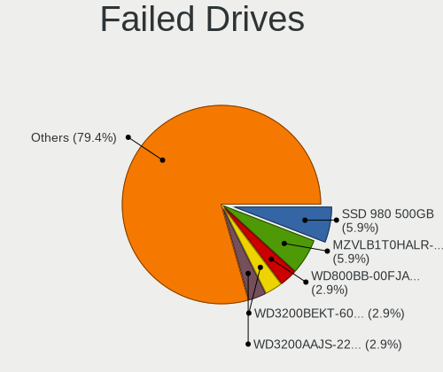
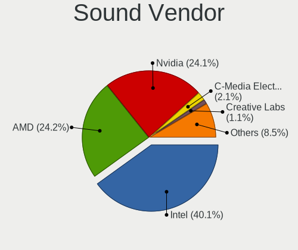
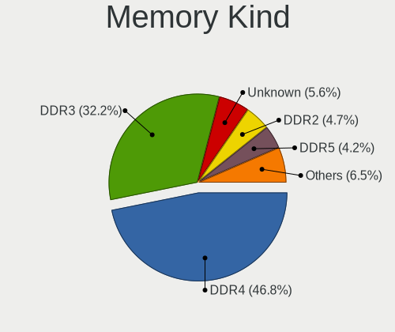

Ubuntu - Tested Hardware & Statistics (Desktops)
------------------------------------------------

A project to collect tested hardware configurations for Ubuntu.

Anyone can contribute to this report by the [hw-probe](https://github.com/linuxhw/hw-probe) tool:

    sudo -E hw-probe -all -upload

Please contribute! Especially if your hardware is rare.

Contents
--------

* [ Test Cases ](#test-cases)

* [ System ](#system)
  - [ OS                       ](#os)
  - [ OS Family                ](#os-family)
  - [ Kernel                   ](#kernel)
  - [ Kernel Family            ](#kernel-family)
  - [ Kernel Major Ver.        ](#kernel-major-ver)
  - [ Arch                     ](#arch)
  - [ DE                       ](#de)
  - [ Display Server           ](#display-server)
  - [ Display Manager          ](#display-manager)
  - [ OS Lang                  ](#os-lang)
  - [ Boot Mode                ](#boot-mode)
  - [ Filesystem               ](#filesystem)
  - [ Part. scheme             ](#part-scheme)
  - [ Dual Boot with Linux/BSD ](#dual-boot-with-linuxbsd)
  - [ Dual Boot (Win)          ](#dual-boot-win)

* [ Board ](#board)
  - [ Vendor                   ](#vendor)
  - [ Model                    ](#model)
  - [ Model Family             ](#model-family)
  - [ MFG Year                 ](#mfg-year)
  - [ Form Factor              ](#form-factor)
  - [ Secure Boot              ](#secure-boot)
  - [ Coreboot                 ](#coreboot)
  - [ RAM Size                 ](#ram-size)
  - [ RAM Used                 ](#ram-used)
  - [ Total Drives             ](#total-drives)
  - [ Has CD-ROM               ](#has-cd-rom)
  - [ Has Ethernet             ](#has-ethernet)
  - [ Has WiFi                 ](#has-wifi)
  - [ Has Bluetooth            ](#has-bluetooth)

* [ Location ](#location)
  - [ Country                  ](#country)
  - [ City                     ](#city)

* [ Drives ](#drives)
  - [ Drive Vendor             ](#drive-vendor)
  - [ Drive Model              ](#drive-model)
  - [ HDD Vendor               ](#hdd-vendor)
  - [ SSD Vendor               ](#ssd-vendor)
  - [ Drive Kind               ](#drive-kind)
  - [ Drive Connector          ](#drive-connector)
  - [ Drive Size               ](#drive-size)
  - [ Space Total              ](#space-total)
  - [ Space Used               ](#space-used)
  - [ Malfunc. Drives          ](#malfunc-drives)
  - [ Malfunc. Drive Vendor    ](#malfunc-drive-vendor)
  - [ Malfunc. HDD Vendor      ](#malfunc-hdd-vendor)
  - [ Malfunc. Drive Kind      ](#malfunc-drive-kind)
  - [ Failed Drives            ](#failed-drives)
  - [ Failed Drive Vendor      ](#failed-drive-vendor)
  - [ Drive Status             ](#drive-status)

* [ Storage controller ](#storage-controller)
  - [ Storage Vendor           ](#storage-vendor)
  - [ Storage Model            ](#storage-model)
  - [ Storage Kind             ](#storage-kind)

* [ Processor ](#processor)
  - [ CPU Vendor               ](#cpu-vendor)
  - [ CPU Model                ](#cpu-model)
  - [ CPU Model Family         ](#cpu-model-family)
  - [ CPU Cores                ](#cpu-cores)
  - [ CPU Sockets              ](#cpu-sockets)
  - [ CPU Threads              ](#cpu-threads)
  - [ CPU Op-Modes             ](#cpu-op-modes)
  - [ CPU Microcode            ](#cpu-microcode)
  - [ CPU Microarch            ](#cpu-microarch)

* [ Graphics ](#graphics)
  - [ GPU Vendor               ](#gpu-vendor)
  - [ GPU Model                ](#gpu-model)
  - [ GPU Combo                ](#gpu-combo)
  - [ GPU Driver               ](#gpu-driver)
  - [ GPU Memory               ](#gpu-memory)

* [ Monitor ](#monitor)
  - [ Monitor Vendor           ](#monitor-vendor)
  - [ Monitor Model            ](#monitor-model)
  - [ Monitor Resolution       ](#monitor-resolution)
  - [ Monitor Diagonal         ](#monitor-diagonal)
  - [ Monitor Width            ](#monitor-width)
  - [ Aspect Ratio             ](#aspect-ratio)
  - [ Monitor Area             ](#monitor-area)
  - [ Pixel Density            ](#pixel-density)
  - [ Multiple Monitors        ](#multiple-monitors)

* [ Network ](#network)
  - [ Net Controller Vendor    ](#net-controller-vendor)
  - [ Net Controller Model     ](#net-controller-model)
  - [ Wireless Vendor          ](#wireless-vendor)
  - [ Wireless Model           ](#wireless-model)
  - [ Ethernet Vendor          ](#ethernet-vendor)
  - [ Ethernet Model           ](#ethernet-model)
  - [ Net Controller Kind      ](#net-controller-kind)
  - [ Used Controller          ](#used-controller)
  - [ NICs                     ](#nics)
  - [ IPv6                     ](#ipv6)

* [ Bluetooth ](#bluetooth)
  - [ Bluetooth Vendor         ](#bluetooth-vendor)
  - [ Bluetooth Model          ](#bluetooth-model)

* [ Sound ](#sound)
  - [ Sound Vendor             ](#sound-vendor)
  - [ Sound Model              ](#sound-model)

* [ Memory ](#memory)
  - [ Memory Vendor            ](#memory-vendor)
  - [ Memory Model             ](#memory-model)
  - [ Memory Kind              ](#memory-kind)
  - [ Memory Form Factor       ](#memory-form-factor)
  - [ Memory Size              ](#memory-size)
  - [ Memory Speed             ](#memory-speed)

* [ Printers & scanners ](#printers--scanners)
  - [ Printer Vendor           ](#printer-vendor)
  - [ Printer Model            ](#printer-model)
  - [ Scanner Vendor           ](#scanner-vendor)
  - [ Scanner Model            ](#scanner-model)

* [ Camera ](#camera)
  - [ Camera Vendor            ](#camera-vendor)
  - [ Camera Model             ](#camera-model)

* [ Security ](#security)
  - [ Fingerprint Vendor       ](#fingerprint-vendor)
  - [ Fingerprint Model        ](#fingerprint-model)
  - [ Chipcard Vendor          ](#chipcard-vendor)
  - [ Chipcard Model           ](#chipcard-model)

* [ Unsupported ](#unsupported)
  - [ Unsupported Devices      ](#unsupported-devices)
  - [ Unsupported Device Types ](#unsupported-device-types)

Test Cases
----------

Total: 34704

| Vendor        | Model                       | Probe                                                      | Date         |
|---------------|-----------------------------|------------------------------------------------------------|--------------|
| ASUSTek       | F2A85-V PRO                 | [43991c533e](https://linux-hardware.org/?probe=43991c533e) | Jun 10, 2023 |
| Intel         | DP45SG AAE27733-404         | [7abba8629e](https://linux-hardware.org/?probe=7abba8629e) | Jun 10, 2023 |
| Intel         | DP45SG AAE27733-404         | [afaced265f](https://linux-hardware.org/?probe=afaced265f) | Jun 10, 2023 |
| Intel         | DH55TC AAE70932-302         | [6090a53f8a](https://linux-hardware.org/?probe=6090a53f8a) | Jun 10, 2023 |
| HP            | 81B4                        | [2d7748536f](https://linux-hardware.org/?probe=2d7748536f) | Jun 10, 2023 |
| Gigabyte      | B650M GAMING X AX           | [5affc12294](https://linux-hardware.org/?probe=5affc12294) | Jun 10, 2023 |
| ASRock        | B450M Pro4                  | [c23450b0df](https://linux-hardware.org/?probe=c23450b0df) | Jun 10, 2023 |
| ASUSTek       | PRIME Z690-P WIFI           | [63c110632a](https://linux-hardware.org/?probe=63c110632a) | Jun 10, 2023 |
| ASUSTek       | TUF B450M-PLUS GAMING       | [1f8c419c47](https://linux-hardware.org/?probe=1f8c419c47) | Jun 10, 2023 |
| ASUSTek       | PRIME B460M-K               | [873975925d](https://linux-hardware.org/?probe=873975925d) | Jun 10, 2023 |
| Pegatron      | Benicia                     | [c57fee6ea0](https://linux-hardware.org/?probe=c57fee6ea0) | Jun 10, 2023 |
| Gigabyte      | B450M S2H                   | [82adaa06b7](https://linux-hardware.org/?probe=82adaa06b7) | Jun 10, 2023 |
| ASUSTek       | ROG STRIX B650E-I GAMING... | [d58405f7c1](https://linux-hardware.org/?probe=d58405f7c1) | Jun 10, 2023 |
| ASUSTek       | ROG STRIX B650E-I GAMING... | [86b377710d](https://linux-hardware.org/?probe=86b377710d) | Jun 10, 2023 |
| ASRock        | X570 Phantom Gaming X       | [0c4db9b922](https://linux-hardware.org/?probe=0c4db9b922) | Jun 10, 2023 |
| Pegatron      | 2A99                        | [0a25cd49a5](https://linux-hardware.org/?probe=0a25cd49a5) | Jun 10, 2023 |
| HP            | 1496                        | [68db57fde8](https://linux-hardware.org/?probe=68db57fde8) | Jun 10, 2023 |
| MSI           | AM1M                        | [42a7d49c03](https://linux-hardware.org/?probe=42a7d49c03) | Jun 10, 2023 |
| Gigabyte      | H81M-H                      | [fc025a599d](https://linux-hardware.org/?probe=fc025a599d) | Jun 10, 2023 |
| Gigabyte      | H81M-H                      | [f32fbdf6ea](https://linux-hardware.org/?probe=f32fbdf6ea) | Jun 10, 2023 |
| HP            | 0B4Ch D                     | [672a491915](https://linux-hardware.org/?probe=672a491915) | Jun 09, 2023 |
| Intel         | H81                         | [6a51c76e81](https://linux-hardware.org/?probe=6a51c76e81) | Jun 09, 2023 |
| Dell          | 0PU052                      | [84db4b658c](https://linux-hardware.org/?probe=84db4b658c) | Jun 09, 2023 |
| Dell          | 0PU052                      | [145d296b59](https://linux-hardware.org/?probe=145d296b59) | Jun 09, 2023 |
| Dell          | 0WMJ54 A01                  | [a4d08407bb](https://linux-hardware.org/?probe=a4d08407bb) | Jun 09, 2023 |
| ASUSTek       | M5A97 LE R2.0               | [a1877cb5b3](https://linux-hardware.org/?probe=a1877cb5b3) | Jun 09, 2023 |
| ASUSTek       | P8P67 LE                    | [212ff65852](https://linux-hardware.org/?probe=212ff65852) | Jun 09, 2023 |
| ASUSTek       | ROG STRIX B650E-I GAMING... | [92fd36b27a](https://linux-hardware.org/?probe=92fd36b27a) | Jun 09, 2023 |
| ASUSTek       | ROG ZENITH EXTREME          | [b4de2ccda4](https://linux-hardware.org/?probe=b4de2ccda4) | Jun 09, 2023 |
| ASUSTek       | M2N68-AM SE2                | [4f69ba649a](https://linux-hardware.org/?probe=4f69ba649a) | Jun 09, 2023 |
| MSI           | H81I                        | [c7c19346a2](https://linux-hardware.org/?probe=c7c19346a2) | Jun 09, 2023 |
| MSI           | MPG X570S CARBON MAX WIF... | [5833483fe2](https://linux-hardware.org/?probe=5833483fe2) | Jun 09, 2023 |
| MSI           | MAG Z490 TOMAHAWK           | [40f18ae1f4](https://linux-hardware.org/?probe=40f18ae1f4) | Jun 09, 2023 |
| ECS           | H81H3-M4                    | [b457e63434](https://linux-hardware.org/?probe=b457e63434) | Jun 09, 2023 |
| ASUSTek       | P8H61-M LX                  | [28d0a897d3](https://linux-hardware.org/?probe=28d0a897d3) | Jun 09, 2023 |
| Unknown       | GSUO H61V10C                | [0daf816953](https://linux-hardware.org/?probe=0daf816953) | Jun 09, 2023 |
| HP            | 2B35                        | [5921b94b60](https://linux-hardware.org/?probe=5921b94b60) | Jun 09, 2023 |
| Dell          | 0KRC95 A02                  | [585c31e8d3](https://linux-hardware.org/?probe=585c31e8d3) | Jun 08, 2023 |
| Dell          | 0K83V0 A00                  | [fc7fa0850a](https://linux-hardware.org/?probe=fc7fa0850a) | Jun 08, 2023 |
| ASRock        | X670E Pro RS                | [9770971a47](https://linux-hardware.org/?probe=9770971a47) | Jun 08, 2023 |
| Gigabyte      | B75M-D3H                    | [8c84a543bf](https://linux-hardware.org/?probe=8c84a543bf) | Jun 08, 2023 |
| Gigabyte      | Z97M-DS3H                   | [5d8df77ade](https://linux-hardware.org/?probe=5d8df77ade) | Jun 08, 2023 |
| Dell          | 0GY6Y8 A02                  | [65f988a0c3](https://linux-hardware.org/?probe=65f988a0c3) | Jun 08, 2023 |
| HJS           | OPSH110D4                   | [bfb0ead991](https://linux-hardware.org/?probe=bfb0ead991) | Jun 08, 2023 |
| AZW           | SEi                         | [399b4a7add](https://linux-hardware.org/?probe=399b4a7add) | Jun 08, 2023 |
| Gigabyte      | H61M-DS2                    | [829912d683](https://linux-hardware.org/?probe=829912d683) | Jun 08, 2023 |
| Dell          | 0GDG8Y A00                  | [4789561d79](https://linux-hardware.org/?probe=4789561d79) | Jun 08, 2023 |
| Dell          | 088DT1 A01                  | [173e9a0e0c](https://linux-hardware.org/?probe=173e9a0e0c) | Jun 08, 2023 |
| Gigabyte      | H61M-DS2                    | [f995c68d61](https://linux-hardware.org/?probe=f995c68d61) | Jun 08, 2023 |
| Unknown       | Unknown                     | [2c3b00b1ae](https://linux-hardware.org/?probe=2c3b00b1ae) | Jun 08, 2023 |
| MSI           | MAG B650 TOMAHAWK WIFI      | [f4e1a7a712](https://linux-hardware.org/?probe=f4e1a7a712) | Jun 08, 2023 |
| MSI           | MAG X570 TOMAHAWK WIFI      | [744c44deca](https://linux-hardware.org/?probe=744c44deca) | Jun 08, 2023 |
| AZW           | Green G4 10                 | [326b499893](https://linux-hardware.org/?probe=326b499893) | Jun 08, 2023 |
| Gigabyte      | GA-A75M-D2H                 | [f78a07f792](https://linux-hardware.org/?probe=f78a07f792) | Jun 08, 2023 |
| BESSTAR Te... | UM700                       | [92645b42ac](https://linux-hardware.org/?probe=92645b42ac) | Jun 08, 2023 |
| ASUSTek       | PRIME X570-P                | [a91f24af7a](https://linux-hardware.org/?probe=a91f24af7a) | Jun 08, 2023 |
| ASUSTek       | PRIME X570-P                | [96e1e7ea7e](https://linux-hardware.org/?probe=96e1e7ea7e) | Jun 08, 2023 |
| Dell          | 0HN7XN A01                  | [c44abee9e7](https://linux-hardware.org/?probe=c44abee9e7) | Jun 08, 2023 |
| ASRock        | B85M-HDS                    | [e563fa3fe2](https://linux-hardware.org/?probe=e563fa3fe2) | Jun 07, 2023 |
| ASUSTek       | WS Z390 PRO                 | [7346eaf346](https://linux-hardware.org/?probe=7346eaf346) | Jun 07, 2023 |
| MSI           | A88XM-E35                   | [efe1285363](https://linux-hardware.org/?probe=efe1285363) | Jun 07, 2023 |
| ASUSTek       | B85M-E                      | [9ea0a82205](https://linux-hardware.org/?probe=9ea0a82205) | Jun 07, 2023 |
| ASUSTek       | PRIME B360-PLUS             | [8b82994313](https://linux-hardware.org/?probe=8b82994313) | Jun 07, 2023 |
| ECS           | GF8100VM-M5                 | [6aa065057f](https://linux-hardware.org/?probe=6aa065057f) | Jun 07, 2023 |
| MSI           | MPG B550 GAMING PLUS        | [793b86c807](https://linux-hardware.org/?probe=793b86c807) | Jun 07, 2023 |
| Lenovo        | 3704 SDK0J40700 WIN 3258... | [b18ffc5311](https://linux-hardware.org/?probe=b18ffc5311) | Jun 07, 2023 |
| Dell          | 0R6PCT A01                  | [e1623fbc8e](https://linux-hardware.org/?probe=e1623fbc8e) | Jun 07, 2023 |
| Foxconn       | H55M-S                      | [83b86844c0](https://linux-hardware.org/?probe=83b86844c0) | Jun 06, 2023 |
| Lenovo        | Kabini CRB 31900058 STD     | [8f3282c700](https://linux-hardware.org/?probe=8f3282c700) | Jun 06, 2023 |
| MSI           | B85-G43 GAMING              | [326a620bbd](https://linux-hardware.org/?probe=326a620bbd) | Jun 06, 2023 |
| ASRock        | H310M-HG4                   | [47b2817d31](https://linux-hardware.org/?probe=47b2817d31) | Jun 06, 2023 |
| MSI           | B85-G43 GAMING              | [9cfd61dae7](https://linux-hardware.org/?probe=9cfd61dae7) | Jun 06, 2023 |
| ASRock        | G41C-GS R2.0                | [6e4835c7bc](https://linux-hardware.org/?probe=6e4835c7bc) | Jun 06, 2023 |
| HP            | 2820h                       | [eb7322ad95](https://linux-hardware.org/?probe=eb7322ad95) | Jun 06, 2023 |
| Chuwi         | RZBOX                       | [f395c0f429](https://linux-hardware.org/?probe=f395c0f429) | Jun 06, 2023 |
| HP            | 3397                        | [f85e642ee3](https://linux-hardware.org/?probe=f85e642ee3) | Jun 06, 2023 |
| Gigabyte      | H310M M.2 x.x               | [602e1c8875](https://linux-hardware.org/?probe=602e1c8875) | Jun 06, 2023 |
| Intel         | DP55WB AAE64798-204         | [fe09edbecc](https://linux-hardware.org/?probe=fe09edbecc) | Jun 06, 2023 |
| Gigabyte      | Z590 VISION G               | [ee1abb360e](https://linux-hardware.org/?probe=ee1abb360e) | Jun 06, 2023 |
| Dell          | 0RY007                      | [49c7cbbfde](https://linux-hardware.org/?probe=49c7cbbfde) | Jun 06, 2023 |
| ASUSTek       | PRIME Z790-A WIFI           | [fe852e8a1d](https://linux-hardware.org/?probe=fe852e8a1d) | Jun 06, 2023 |
| Pegatron      | H81-M1                      | [2641e6773e](https://linux-hardware.org/?probe=2641e6773e) | Jun 05, 2023 |
| ASUSTek       | PRIME B550M-A AC            | [de614b2bc7](https://linux-hardware.org/?probe=de614b2bc7) | Jun 05, 2023 |
| MSI           | 990FXA GAMING               | [1c99e1316c](https://linux-hardware.org/?probe=1c99e1316c) | Jun 05, 2023 |
| MSI           | 990FXA GAMING               | [60fb09bf5e](https://linux-hardware.org/?probe=60fb09bf5e) | Jun 05, 2023 |
| HP            | 3397                        | [ea59ba572e](https://linux-hardware.org/?probe=ea59ba572e) | Jun 05, 2023 |
| Fujitsu       | D3061-A1 S26361-D3061-A1    | [cc575f0073](https://linux-hardware.org/?probe=cc575f0073) | Jun 05, 2023 |
| ASRock        | G41M-GS3                    | [f8789775fe](https://linux-hardware.org/?probe=f8789775fe) | Jun 05, 2023 |
| Dell          | 0DF42J A00                  | [c68dff0dd7](https://linux-hardware.org/?probe=c68dff0dd7) | Jun 05, 2023 |
| Gigabyte      | X299 AORUS Gaming 7         | [6f6ddfe780](https://linux-hardware.org/?probe=6f6ddfe780) | Jun 05, 2023 |
| ASUSTek       | PRIME Z790-P WIFI           | [4ba1a29c23](https://linux-hardware.org/?probe=4ba1a29c23) | Jun 05, 2023 |
| HP            | 83E2                        | [522273fe60](https://linux-hardware.org/?probe=522273fe60) | Jun 05, 2023 |
| MSI           | B250 GAMING PRO CARBON      | [32da3735d9](https://linux-hardware.org/?probe=32da3735d9) | Jun 05, 2023 |
| ASUSTek       | PRIME B550M-A AC            | [0cf4dfc5e4](https://linux-hardware.org/?probe=0cf4dfc5e4) | Jun 05, 2023 |
| ASUSTek       | Z170-K                      | [a2c31cdc69](https://linux-hardware.org/?probe=a2c31cdc69) | Jun 05, 2023 |
| HP            | 3397                        | [e9dd850e23](https://linux-hardware.org/?probe=e9dd850e23) | Jun 05, 2023 |
| Pegatron      | 2AC2                        | [6182103d25](https://linux-hardware.org/?probe=6182103d25) | Jun 05, 2023 |
| ASUSTek       | PRIME Z590-V                | [d0fd3fd90a](https://linux-hardware.org/?probe=d0fd3fd90a) | Jun 04, 2023 |
| ASUSTek       | PRIME Z590-V                | [bc93ac1588](https://linux-hardware.org/?probe=bc93ac1588) | Jun 04, 2023 |
| MSI           | Boston                      | [9f5efc29ad](https://linux-hardware.org/?probe=9f5efc29ad) | Jun 04, 2023 |
| Lenovo        | ThinkCentre Edge 91Z 707... | [a6804d8ca1](https://linux-hardware.org/?probe=a6804d8ca1) | Jun 04, 2023 |
| Lenovo        | MAHOBAY Win8 STD MM DPK ... | [d9dba3ffdf](https://linux-hardware.org/?probe=d9dba3ffdf) | Jun 04, 2023 |
| Intel         | DH55HC AAE70933-503         | [b3d5e112eb](https://linux-hardware.org/?probe=b3d5e112eb) | Jun 04, 2023 |
| Fujitsu       | D3233-A1 S26361-D3233-A1    | [ba0e7c7d59](https://linux-hardware.org/?probe=ba0e7c7d59) | Jun 04, 2023 |
| Gigabyte      | B450M DS3H-CF               | [4b162cac99](https://linux-hardware.org/?probe=4b162cac99) | Jun 04, 2023 |
| ASRock        | A75M-HVS                    | [69bc52dc4f](https://linux-hardware.org/?probe=69bc52dc4f) | Jun 04, 2023 |
| Acer          | Predator G3-710             | [7193d24262](https://linux-hardware.org/?probe=7193d24262) | Jun 04, 2023 |
| Acer          | Predator G3-710             | [96834ea12b](https://linux-hardware.org/?probe=96834ea12b) | Jun 04, 2023 |
| HP            | 83E2                        | [3684f8562d](https://linux-hardware.org/?probe=3684f8562d) | Jun 04, 2023 |
| Acer          | Predator G3-710             | [c200dbb9cf](https://linux-hardware.org/?probe=c200dbb9cf) | Jun 04, 2023 |
| ASRock        | X670E Taichi                | [6616151cda](https://linux-hardware.org/?probe=6616151cda) | Jun 04, 2023 |
| Dell          | 0Y5DDC A00                  | [5713168678](https://linux-hardware.org/?probe=5713168678) | Jun 04, 2023 |
| ASRock        | A320M-HDV R4.0              | [f472cba5a6](https://linux-hardware.org/?probe=f472cba5a6) | Jun 04, 2023 |
| ASUSTek       | H170-PRO                    | [b9fd75507c](https://linux-hardware.org/?probe=b9fd75507c) | Jun 04, 2023 |
| MSI           | Z270-A PRO                  | [1da4d78c3b](https://linux-hardware.org/?probe=1da4d78c3b) | Jun 04, 2023 |
| ASRock        | B550 PG Velocita            | [12833898d1](https://linux-hardware.org/?probe=12833898d1) | Jun 04, 2023 |
| ASUSTek       | PRIME X670-P WIFI           | [82542c4daa](https://linux-hardware.org/?probe=82542c4daa) | Jun 04, 2023 |
| ASUSTek       | ROG STRIX B360-I GAMING     | [0c8afa948b](https://linux-hardware.org/?probe=0c8afa948b) | Jun 04, 2023 |
| Unknown       | Unknown                     | [8c2d7ce6e2](https://linux-hardware.org/?probe=8c2d7ce6e2) | Jun 04, 2023 |
| MSI           | B450 TOMAHAWK               | [aaed1b39af](https://linux-hardware.org/?probe=aaed1b39af) | Jun 03, 2023 |
| Huanan        | X99-F8 GAMING V2.0          | [8b790b76a6](https://linux-hardware.org/?probe=8b790b76a6) | Jun 03, 2023 |
| Dell          | 0N4NF7 A00                  | [e1348eb2c2](https://linux-hardware.org/?probe=e1348eb2c2) | Jun 03, 2023 |
| Dell          | 0N4NF7 A00                  | [6ff177257b](https://linux-hardware.org/?probe=6ff177257b) | Jun 03, 2023 |
| Huanan        | X79 V7.11                   | [79bbc880ba](https://linux-hardware.org/?probe=79bbc880ba) | Jun 03, 2023 |
| Intel         | X99 V102                    | [ed5a67e8a5](https://linux-hardware.org/?probe=ed5a67e8a5) | Jun 03, 2023 |
| ASRock        | FM2A88X Extreme6+           | [2745284306](https://linux-hardware.org/?probe=2745284306) | Jun 03, 2023 |
| Gigabyte      | B450M AORUS ELITE           | [f17ae033ef](https://linux-hardware.org/?probe=f17ae033ef) | Jun 03, 2023 |
| MSI           | H97M-G43                    | [6bd1b61977](https://linux-hardware.org/?probe=6bd1b61977) | Jun 03, 2023 |
| ASUSTek       | Z97-PRO GAMER               | [8d783c6b00](https://linux-hardware.org/?probe=8d783c6b00) | Jun 03, 2023 |
| SZMZ          | X99M-G2                     | [e9b164885c](https://linux-hardware.org/?probe=e9b164885c) | Jun 03, 2023 |
| ASUSTek       | TUF Gaming Z590-PLUS WIF... | [51868dd3c8](https://linux-hardware.org/?probe=51868dd3c8) | Jun 03, 2023 |
| Dell          | 0D6H9T A01                  | [1ebbe353ba](https://linux-hardware.org/?probe=1ebbe353ba) | Jun 03, 2023 |
| Dell          | 0D6H9T A01                  | [0bb2080b31](https://linux-hardware.org/?probe=0bb2080b31) | Jun 03, 2023 |
| Gigabyte      | Z590 AORUS ULTRA            | [44571410f0](https://linux-hardware.org/?probe=44571410f0) | Jun 03, 2023 |
| Gigabyte      | Z590 AORUS ULTRA            | [d54d77b051](https://linux-hardware.org/?probe=d54d77b051) | Jun 03, 2023 |
| ASUSTek       | Maximus VIII HERO ALPHA     | [48eb50cc43](https://linux-hardware.org/?probe=48eb50cc43) | Jun 03, 2023 |
| Gigabyte      | X79-UD3                     | [e459d2654f](https://linux-hardware.org/?probe=e459d2654f) | Jun 03, 2023 |
| HP            | 3047h                       | [1825675e99](https://linux-hardware.org/?probe=1825675e99) | Jun 03, 2023 |
| MSI           | B250 GAMING PRO CARBON      | [ef7acf6baa](https://linux-hardware.org/?probe=ef7acf6baa) | Jun 03, 2023 |
| Apple         | Mac-F60DEB81FF30ACF6 Mac... | [c0f64d3436](https://linux-hardware.org/?probe=c0f64d3436) | Jun 03, 2023 |
| Dell          | 0M6C7G A00                  | [93bdbbdafb](https://linux-hardware.org/?probe=93bdbbdafb) | Jun 03, 2023 |
| ASUSTek       | PRIME Z790-A WIFI           | [4e17d7c6e8](https://linux-hardware.org/?probe=4e17d7c6e8) | Jun 03, 2023 |
| ASUSTek       | PRIME Z790-A WIFI           | [965de576c7](https://linux-hardware.org/?probe=965de576c7) | Jun 03, 2023 |
| ASUSTek       | PRIME B650M-A AX            | [983a81f19e](https://linux-hardware.org/?probe=983a81f19e) | Jun 03, 2023 |
| Dell          | 0RY007                      | [f3028ff55d](https://linux-hardware.org/?probe=f3028ff55d) | Jun 02, 2023 |
| Dell          | 08NPPY A00                  | [de331bfb5c](https://linux-hardware.org/?probe=de331bfb5c) | Jun 02, 2023 |
| Biostar       | TA970XE                     | [11936a0f0f](https://linux-hardware.org/?probe=11936a0f0f) | Jun 02, 2023 |
| ASUSTek       | ROG Maximus Z690 FORMULA    | [c8fca2b92d](https://linux-hardware.org/?probe=c8fca2b92d) | Jun 02, 2023 |
| ASRock        | B365 Pro4                   | [35fff15a30](https://linux-hardware.org/?probe=35fff15a30) | Jun 02, 2023 |
| ASRock        | B365 Pro4                   | [54fcb811b8](https://linux-hardware.org/?probe=54fcb811b8) | Jun 02, 2023 |
| Acer          | Aspire X3950                | [82aa882647](https://linux-hardware.org/?probe=82aa882647) | Jun 02, 2023 |
| Acer          | Aspire X3950                | [1c7f0f7567](https://linux-hardware.org/?probe=1c7f0f7567) | Jun 02, 2023 |
| Dell          | 06X1TJ A00                  | [16d662673f](https://linux-hardware.org/?probe=16d662673f) | Jun 02, 2023 |
| ASUSTek       | Maximus Formula             | [6a70fa0a86](https://linux-hardware.org/?probe=6a70fa0a86) | Jun 02, 2023 |
| Gigabyte      | Z97M-DS3H                   | [1a4437e831](https://linux-hardware.org/?probe=1a4437e831) | Jun 02, 2023 |
| ASUSTek       | Pro WS WRX80E-SAGE SE WI... | [8aab7c6536](https://linux-hardware.org/?probe=8aab7c6536) | Jun 01, 2023 |
| MSI           | H510M-A PRO                 | [f517c1893a](https://linux-hardware.org/?probe=f517c1893a) | Jun 01, 2023 |
| Gigabyte      | H61M-S2PV                   | [6c86bd69e0](https://linux-hardware.org/?probe=6c86bd69e0) | Jun 01, 2023 |
| ASRock        | Z77M                        | [eae1adee21](https://linux-hardware.org/?probe=eae1adee21) | Jun 01, 2023 |
| HP            | 18E5                        | [9d89c3065b](https://linux-hardware.org/?probe=9d89c3065b) | Jun 01, 2023 |
| HP            | 1906                        | [ac98480bd2](https://linux-hardware.org/?probe=ac98480bd2) | Jun 01, 2023 |
| HP            | 18E7                        | [a3f557389e](https://linux-hardware.org/?probe=a3f557389e) | Jun 01, 2023 |
| ASUSTek       | ROG STRIX X299-E GAMING     | [216bea3b6f](https://linux-hardware.org/?probe=216bea3b6f) | Jun 01, 2023 |
| ASRock        | N68C-S UCC                  | [ef4a96955c](https://linux-hardware.org/?probe=ef4a96955c) | Jun 01, 2023 |
| ASRock        | N68C-S UCC                  | [a106c6a98a](https://linux-hardware.org/?probe=a106c6a98a) | Jun 01, 2023 |
| HP            | 83E2                        | [eaf5f90360](https://linux-hardware.org/?probe=eaf5f90360) | Jun 01, 2023 |
| Dell          | 03NVJ6 A00                  | [1f295f3ec2](https://linux-hardware.org/?probe=1f295f3ec2) | Jun 01, 2023 |
| HP            | 8055                        | [ff75f76129](https://linux-hardware.org/?probe=ff75f76129) | Jun 01, 2023 |
| HP            | 8055                        | [f54c954f94](https://linux-hardware.org/?probe=f54c954f94) | Jun 01, 2023 |
| MSI           | H110M PRO-VH PLUS           | [cfabc605f7](https://linux-hardware.org/?probe=cfabc605f7) | Jun 01, 2023 |
| Gigabyte      | X570 AORUS ELITE            | [3b9639141c](https://linux-hardware.org/?probe=3b9639141c) | May 31, 2023 |
| Dell          | 0RY007                      | [b726df555b](https://linux-hardware.org/?probe=b726df555b) | May 31, 2023 |
| Dell          | 0RY007                      | [32e931c79b](https://linux-hardware.org/?probe=32e931c79b) | May 31, 2023 |
| Pegatron      | 2ACB                        | [cfd38fc71a](https://linux-hardware.org/?probe=cfd38fc71a) | May 31, 2023 |
| ASUSTek       | P8H61-M LX3 PLUS R2.0       | [953ee1ef05](https://linux-hardware.org/?probe=953ee1ef05) | May 31, 2023 |
| Gigabyte      | X99-UD7 WIFI-CF             | [955e65b76f](https://linux-hardware.org/?probe=955e65b76f) | May 31, 2023 |
| ASRock        | Z77 Extreme3                | [e45b1707bd](https://linux-hardware.org/?probe=e45b1707bd) | May 31, 2023 |
| Gigabyte      | F2A78M-HD2                  | [c76d767402](https://linux-hardware.org/?probe=c76d767402) | May 31, 2023 |
| ASRock        | X570 Phantom Gaming 4       | [6c3655186f](https://linux-hardware.org/?probe=6c3655186f) | May 31, 2023 |
| ZOTAC         | Unknown                     | [0626de1b2a](https://linux-hardware.org/?probe=0626de1b2a) | May 31, 2023 |
| ASUSTek       | G10DK                       | [75cde40262](https://linux-hardware.org/?probe=75cde40262) | May 31, 2023 |
| ASUSTek       | ROG STRIX B450-F GAMING     | [2c6c547437](https://linux-hardware.org/?probe=2c6c547437) | May 31, 2023 |
| MSI           | B450M MORTAR MAX            | [1d0c56937c](https://linux-hardware.org/?probe=1d0c56937c) | May 31, 2023 |
| ASUSTek       | PRIME B450M-K II            | [2703e7856e](https://linux-hardware.org/?probe=2703e7856e) | May 30, 2023 |
| System76      | Thelio Mira                 | [d5fe3a3749](https://linux-hardware.org/?probe=d5fe3a3749) | May 30, 2023 |
| ASUSTek       | TUF Gaming Z590-PLUS WIF... | [45e5adbb22](https://linux-hardware.org/?probe=45e5adbb22) | May 30, 2023 |
| Intel         | STK2M3W64CC H89289-504      | [a7e599b1f5](https://linux-hardware.org/?probe=a7e599b1f5) | May 30, 2023 |
| ASRock        | H110M-DS/Hyper              | [a29a16d74c](https://linux-hardware.org/?probe=a29a16d74c) | May 30, 2023 |
| Intel         | STK2M3W64CC H89289-504      | [c471536b99](https://linux-hardware.org/?probe=c471536b99) | May 30, 2023 |
| ASRock        | H110M-DS/Hyper              | [05e7ed23f3](https://linux-hardware.org/?probe=05e7ed23f3) | May 30, 2023 |
| MSI           | B450 GAMING PRO CARBON A... | [5271bd0b88](https://linux-hardware.org/?probe=5271bd0b88) | May 30, 2023 |
| Fujitsu       | D3233-A1 S26361-D3233-A1    | [de30e713bf](https://linux-hardware.org/?probe=de30e713bf) | May 30, 2023 |
| Intel         | DH61BF AAG81311-102         | [22123492ab](https://linux-hardware.org/?probe=22123492ab) | May 30, 2023 |
| Lenovo        | 3740 NOK                    | [c15d9d37c7](https://linux-hardware.org/?probe=c15d9d37c7) | May 30, 2023 |
| Dell          | 0H4VK7 A01                  | [35d979d6e9](https://linux-hardware.org/?probe=35d979d6e9) | May 30, 2023 |
| Gigabyte      | Z170X-Gaming 7              | [b2ae6cb140](https://linux-hardware.org/?probe=b2ae6cb140) | May 30, 2023 |
| ASRock        | Z77 Extreme3                | [67c96085bf](https://linux-hardware.org/?probe=67c96085bf) | May 30, 2023 |
| Pegatron      | 2AC2                        | [a8873fdeab](https://linux-hardware.org/?probe=a8873fdeab) | May 30, 2023 |
| Apple         | Mac-F42C88C8 Proto1         | [a335953c43](https://linux-hardware.org/?probe=a335953c43) | May 30, 2023 |
| Gigabyte      | B560M AORUS ELITE           | [944eb64f77](https://linux-hardware.org/?probe=944eb64f77) | May 30, 2023 |
| Gigabyte      | GA-970A-UD3                 | [3626919ffb](https://linux-hardware.org/?probe=3626919ffb) | May 30, 2023 |
| ASUSTek       | PRIME Z370-P                | [afb02cee29](https://linux-hardware.org/?probe=afb02cee29) | May 29, 2023 |
| Gigabyte      | B450 AORUS ELITE            | [d98102f69a](https://linux-hardware.org/?probe=d98102f69a) | May 29, 2023 |
| Gigabyte      | H410M H                     | [7a52f09646](https://linux-hardware.org/?probe=7a52f09646) | May 29, 2023 |
| Fujitsu       | D3402-A1 S26361-D3402-A1    | [0ae3ea958a](https://linux-hardware.org/?probe=0ae3ea958a) | May 29, 2023 |
| HP            | 1497                        | [5f1886622a](https://linux-hardware.org/?probe=5f1886622a) | May 29, 2023 |
| ASUSTek       | ROG STRIX Z790-H GAMING ... | [11432ddeb6](https://linux-hardware.org/?probe=11432ddeb6) | May 29, 2023 |
| ASUSTek       | PRIME H610M-A D4            | [312b05f0a4](https://linux-hardware.org/?probe=312b05f0a4) | May 29, 2023 |
| HP            | 2B43                        | [fb2841cfa4](https://linux-hardware.org/?probe=fb2841cfa4) | May 29, 2023 |
| ASUSTek       | M4A87TD/USB3                | [bf0674c0f0](https://linux-hardware.org/?probe=bf0674c0f0) | May 28, 2023 |
| ASRock        | 970 Pro3 R2.0               | [4ae997cf6b](https://linux-hardware.org/?probe=4ae997cf6b) | May 28, 2023 |
| Lenovo        | 3730 SDK0T76463 WIN 3422... | [7467436de2](https://linux-hardware.org/?probe=7467436de2) | May 28, 2023 |
| HP            | 1495                        | [15b94cba50](https://linux-hardware.org/?probe=15b94cba50) | May 28, 2023 |
| ECS           | H81H3-M4                    | [21261aa270](https://linux-hardware.org/?probe=21261aa270) | May 28, 2023 |
| Dell          | 048DY8 A01                  | [9bfe61714e](https://linux-hardware.org/?probe=9bfe61714e) | May 28, 2023 |
| HP            | 0B54h D                     | [f9634b51b9](https://linux-hardware.org/?probe=f9634b51b9) | May 28, 2023 |
| Gigabyte      | B550M AORUS PRO-P           | [dbb348e8bf](https://linux-hardware.org/?probe=dbb348e8bf) | May 28, 2023 |
| Pegatron      | 2ACB                        | [cc1c8b2941](https://linux-hardware.org/?probe=cc1c8b2941) | May 28, 2023 |
| Lenovo        | SHARKBAY SDK0E50512 STD     | [5a39bd1d78](https://linux-hardware.org/?probe=5a39bd1d78) | May 28, 2023 |
| Lenovo        | SHARKBAY SDK0E50512 STD     | [a36d2b541a](https://linux-hardware.org/?probe=a36d2b541a) | May 28, 2023 |
| Gigabyte      | X570 I AORUS PRO WIFI       | [bb842bc2d8](https://linux-hardware.org/?probe=bb842bc2d8) | May 28, 2023 |
| Gigabyte      | Z590 AORUS ELITE AX         | [183ee8e37a](https://linux-hardware.org/?probe=183ee8e37a) | May 27, 2023 |
| Lenovo        | 36C5 SDK0K17763 WIN 1801... | [ccf71ca66c](https://linux-hardware.org/?probe=ccf71ca66c) | May 27, 2023 |
| Lenovo        | 36C5 SDK0K17763 WIN 1801... | [1a3a921775](https://linux-hardware.org/?probe=1a3a921775) | May 27, 2023 |
| ASUSTek       | ROG CROSSHAIR VIII DARK ... | [7af2cff4d7](https://linux-hardware.org/?probe=7af2cff4d7) | May 27, 2023 |
| Gigabyte      | GA-970A-UD3                 | [2661b6520b](https://linux-hardware.org/?probe=2661b6520b) | May 27, 2023 |
| Gigabyte      | GA-970A-UD3                 | [bea3034b4e](https://linux-hardware.org/?probe=bea3034b4e) | May 27, 2023 |
| MSI           | A55M-E33                    | [c25cb7cbb6](https://linux-hardware.org/?probe=c25cb7cbb6) | May 27, 2023 |
| ASUSTek       | TUF Z390-PRO GAMING         | [449d13baa5](https://linux-hardware.org/?probe=449d13baa5) | May 27, 2023 |
| Gigabyte      | Z97M-DS3H                   | [8311d009bd](https://linux-hardware.org/?probe=8311d009bd) | May 27, 2023 |
| Lenovo        | 313A NOK                    | [a1ffbc1e1e](https://linux-hardware.org/?probe=a1ffbc1e1e) | May 27, 2023 |
| Dell          | 0TTDMJ A00                  | [e42949961b](https://linux-hardware.org/?probe=e42949961b) | May 27, 2023 |
| Dell          | 0TTDMJ A00                  | [19475cfdb0](https://linux-hardware.org/?probe=19475cfdb0) | May 27, 2023 |
| ASRock        | H110M-HDV R3.0              | [05a6cc11bb](https://linux-hardware.org/?probe=05a6cc11bb) | May 27, 2023 |
| Gigabyte      | B360M D2V                   | [7fce8e04b2](https://linux-hardware.org/?probe=7fce8e04b2) | May 27, 2023 |
| ASUSTek       | TUF Gaming B650-PLUS WIF... | [7e895c167b](https://linux-hardware.org/?probe=7e895c167b) | May 27, 2023 |
| ASUSTek       | TUF Gaming B650-PLUS WIF... | [526503fef7](https://linux-hardware.org/?probe=526503fef7) | May 27, 2023 |
| Gigabyte      | Z77MX-D3H                   | [9cb2973f2f](https://linux-hardware.org/?probe=9cb2973f2f) | May 27, 2023 |
| Lenovo        | 31900058 STD                | [d09ae4f1a2](https://linux-hardware.org/?probe=d09ae4f1a2) | May 27, 2023 |
| Gigabyte      | Z77MX-D3H                   | [2cea143017](https://linux-hardware.org/?probe=2cea143017) | May 26, 2023 |
| Gigabyte      | A320M-S2H V2-CF             | [b82f4b77f4](https://linux-hardware.org/?probe=b82f4b77f4) | May 26, 2023 |
| ASUSTek       | X99-DELUXE                  | [ebc73bb225](https://linux-hardware.org/?probe=ebc73bb225) | May 26, 2023 |
| Dell          | 0NDYHG A01                  | [07be92d6f3](https://linux-hardware.org/?probe=07be92d6f3) | May 26, 2023 |
| AAEON         | UP-CHCR1 V0.4               | [b77201e825](https://linux-hardware.org/?probe=b77201e825) | May 26, 2023 |
| Dell          | 0MGK50 A02                  | [4572d76da5](https://linux-hardware.org/?probe=4572d76da5) | May 26, 2023 |
| Gigabyte      | P43-ES3G                    | [9683a94030](https://linux-hardware.org/?probe=9683a94030) | May 26, 2023 |
| ASUSTek       | Z77-A                       | [0c22362cc0](https://linux-hardware.org/?probe=0c22362cc0) | May 26, 2023 |
| Dell          | 0XCR8D A03                  | [25867f7c36](https://linux-hardware.org/?probe=25867f7c36) | May 26, 2023 |
| Dell          | 0RY007                      | [6fb4081584](https://linux-hardware.org/?probe=6fb4081584) | May 25, 2023 |
| ASUSTek       | TUF Gaming B560M-PLUS       | [a49bd1dd26](https://linux-hardware.org/?probe=a49bd1dd26) | May 25, 2023 |
| Acer          | Aspire TC-895 V:1.0         | [936b06e11f](https://linux-hardware.org/?probe=936b06e11f) | May 25, 2023 |
| Gigabyte      | P43-ES3G                    | [b9af05a16f](https://linux-hardware.org/?probe=b9af05a16f) | May 25, 2023 |
| ASUSTek       | PRIME B460M-K               | [e55e554596](https://linux-hardware.org/?probe=e55e554596) | May 25, 2023 |
| ASUSTek       | A88XM-PLUS                  | [55790e804a](https://linux-hardware.org/?probe=55790e804a) | May 25, 2023 |
| ASUSTek       | M4A78LT-M                   | [7080c87654](https://linux-hardware.org/?probe=7080c87654) | May 25, 2023 |
| Fujitsu       | D3061-A1 S26361-D3061-A1    | [94da2a33fe](https://linux-hardware.org/?probe=94da2a33fe) | May 25, 2023 |
| PCWare        | IPMH110G                    | [33b6fce5ff](https://linux-hardware.org/?probe=33b6fce5ff) | May 25, 2023 |
| ASUSTek       | P5QPL-VM EPU                | [63ba811050](https://linux-hardware.org/?probe=63ba811050) | May 25, 2023 |
| ASUSTek       | P5QPL-VM EPU                | [380b9a5005](https://linux-hardware.org/?probe=380b9a5005) | May 25, 2023 |
| Dell          | 03KWTV A02                  | [60ade2d50f](https://linux-hardware.org/?probe=60ade2d50f) | May 25, 2023 |
| ASUSTek       | F2A85-V                     | [c166f91030](https://linux-hardware.org/?probe=c166f91030) | May 25, 2023 |
| ASUSTek       | CROSSHAIR VI HERO           | [6e9287cc5c](https://linux-hardware.org/?probe=6e9287cc5c) | May 25, 2023 |
| Gigabyte      | Z590 AORUS MASTER           | [6e78eaa344](https://linux-hardware.org/?probe=6e78eaa344) | May 25, 2023 |
| Gigabyte      | Z590 AORUS ULTRA            | [b291f783a2](https://linux-hardware.org/?probe=b291f783a2) | May 25, 2023 |
| Avalue        | NUC-TGU E9697JAO003R        | [585d89beea](https://linux-hardware.org/?probe=585d89beea) | May 25, 2023 |
| Avalue        | NUC-TGU E9697JAO003R        | [6590141653](https://linux-hardware.org/?probe=6590141653) | May 24, 2023 |
| ASRock        | X99E-ITX/ac                 | [9ebf93e4fb](https://linux-hardware.org/?probe=9ebf93e4fb) | May 24, 2023 |
| ASUSTek       | CM6330_CM6630_CM6730_CM6... | [a2a31dbbee](https://linux-hardware.org/?probe=a2a31dbbee) | May 24, 2023 |
| Dell          | 0654JC A01                  | [d3a2957b45](https://linux-hardware.org/?probe=d3a2957b45) | May 24, 2023 |
| HP            | 3647h                       | [c3d3f890ec](https://linux-hardware.org/?probe=c3d3f890ec) | May 24, 2023 |
| AZW           | SEi                         | [bc0c7a512f](https://linux-hardware.org/?probe=bc0c7a512f) | May 24, 2023 |
| ASRock        | A320M-HDV R4.0              | [bce76b90ef](https://linux-hardware.org/?probe=bce76b90ef) | May 24, 2023 |
| EPSON DIRE... | MR7200E-L                   | [a436b49a11](https://linux-hardware.org/?probe=a436b49a11) | May 24, 2023 |
| ASRock        | H61M-VS3                    | [3848568306](https://linux-hardware.org/?probe=3848568306) | May 24, 2023 |
| ASUSTek       | TUF Gaming B650M-PLUS WI... | [44861be08c](https://linux-hardware.org/?probe=44861be08c) | May 24, 2023 |
| Gigabyte      | H81M-S2V                    | [f0e96b17d7](https://linux-hardware.org/?probe=f0e96b17d7) | May 24, 2023 |
| Gigabyte      | H81M-S2V                    | [02d5fa9cc3](https://linux-hardware.org/?probe=02d5fa9cc3) | May 24, 2023 |
| Lenovo        | SHARKBAY 0B98401 PRO        | [21ee588e1c](https://linux-hardware.org/?probe=21ee588e1c) | May 24, 2023 |
| AZW           | SEi                         | [825fbaebcd](https://linux-hardware.org/?probe=825fbaebcd) | May 23, 2023 |
| ASUSTek       | Z87-DELUXE/DUAL             | [0f0c4f64ce](https://linux-hardware.org/?probe=0f0c4f64ce) | May 23, 2023 |
| Gigabyte      | 970A-DS3P                   | [af5b849c20](https://linux-hardware.org/?probe=af5b849c20) | May 23, 2023 |
| ASUSTek       | B85M-E/BR                   | [ed20b84824](https://linux-hardware.org/?probe=ed20b84824) | May 23, 2023 |
| Gigabyte      | X570 AORUS ELITE            | [ed936908c9](https://linux-hardware.org/?probe=ed936908c9) | May 23, 2023 |
| Gigabyte      | H77N-WIFI                   | [9e96bcdbef](https://linux-hardware.org/?probe=9e96bcdbef) | May 23, 2023 |
| ASUSTek       | TUF Gaming B550-PLUS        | [4e817c1abf](https://linux-hardware.org/?probe=4e817c1abf) | May 23, 2023 |
| Medion        | H110H4-EM                   | [218e19be02](https://linux-hardware.org/?probe=218e19be02) | May 23, 2023 |
| Intel         | DG31PR AAD97573-302         | [a36e076c17](https://linux-hardware.org/?probe=a36e076c17) | May 23, 2023 |
| ASUSTek       | ROG STRIX X470-I GAMING     | [362ad8bcaf](https://linux-hardware.org/?probe=362ad8bcaf) | May 23, 2023 |
| Intel         | D33217GKE G76540-204        | [ee11501e19](https://linux-hardware.org/?probe=ee11501e19) | May 23, 2023 |
| Dell          | 0JC6JH A00                  | [91d6d0d2da](https://linux-hardware.org/?probe=91d6d0d2da) | May 23, 2023 |
| Pegatron      | 2ACB                        | [e9c0ee4659](https://linux-hardware.org/?probe=e9c0ee4659) | May 23, 2023 |
| Gigabyte      | B75M-D3H                    | [00a6f60d75](https://linux-hardware.org/?probe=00a6f60d75) | May 23, 2023 |
| ASRock        | X399 Professional Gaming    | [72cd126fc6](https://linux-hardware.org/?probe=72cd126fc6) | May 23, 2023 |
| HP            | 0AECh D                     | [06f56df636](https://linux-hardware.org/?probe=06f56df636) | May 23, 2023 |
| Dell          | 0DFRFW A01                  | [c43c12f9f0](https://linux-hardware.org/?probe=c43c12f9f0) | May 22, 2023 |
| MSI           | MPG B650 CARBON WIFI        | [8b3acda484](https://linux-hardware.org/?probe=8b3acda484) | May 22, 2023 |
| eMachines     | EL1360                      | [0821a0d29b](https://linux-hardware.org/?probe=0821a0d29b) | May 22, 2023 |
| Biostar       | A880GZ                      | [097e118b3a](https://linux-hardware.org/?probe=097e118b3a) | May 22, 2023 |
| HP            | 1791                        | [7fa95d1b7b](https://linux-hardware.org/?probe=7fa95d1b7b) | May 22, 2023 |
| Gigabyte      | F2A55M-S1                   | [59ede76205](https://linux-hardware.org/?probe=59ede76205) | May 22, 2023 |
| Gigabyte      | F2A55M-S1                   | [a5c1b4eecd](https://linux-hardware.org/?probe=a5c1b4eecd) | May 22, 2023 |
| ASRock        | B450 Steel Legend           | [012c721256](https://linux-hardware.org/?probe=012c721256) | May 22, 2023 |
| Gigabyte      | B550 AORUS ELITE AX V2      | [406014a766](https://linux-hardware.org/?probe=406014a766) | May 22, 2023 |
| Gigabyte      | Z590 AORUS ULTRA            | [76bd19169a](https://linux-hardware.org/?probe=76bd19169a) | May 22, 2023 |
| ASUSTek       | F2A85-V PRO                 | [dc846ba2e5](https://linux-hardware.org/?probe=dc846ba2e5) | May 22, 2023 |
| Dell          | 06X1TJ A00                  | [2423a10706](https://linux-hardware.org/?probe=2423a10706) | May 22, 2023 |
| ASUSTek       | STRIX Z270F GAMING          | [11c329d15a](https://linux-hardware.org/?probe=11c329d15a) | May 22, 2023 |
| Medion        | B360H4-EM V1.0              | [ae4f01f58e](https://linux-hardware.org/?probe=ae4f01f58e) | May 22, 2023 |
| MSI           | Z87-G43                     | [2fa7c1d81d](https://linux-hardware.org/?probe=2fa7c1d81d) | May 21, 2023 |
| Unknown       | DT138IB                     | [130e17f9e3](https://linux-hardware.org/?probe=130e17f9e3) | May 21, 2023 |
| ASRock        | Z87 Extreme4                | [a7794f4f9e](https://linux-hardware.org/?probe=a7794f4f9e) | May 21, 2023 |
| Gigabyte      | B550M DS3H                  | [7db2aa27dc](https://linux-hardware.org/?probe=7db2aa27dc) | May 21, 2023 |
| Dell          | 0R230R A00                  | [686853fa76](https://linux-hardware.org/?probe=686853fa76) | May 21, 2023 |
| Dell          | 033FF6 A00                  | [086dd9367e](https://linux-hardware.org/?probe=086dd9367e) | May 21, 2023 |
| Gigabyte      | B450M S2H                   | [5309c41b94](https://linux-hardware.org/?probe=5309c41b94) | May 21, 2023 |
| Gigabyte      | Z590 AORUS ULTRA            | [f511a54601](https://linux-hardware.org/?probe=f511a54601) | May 21, 2023 |
| ASUSTek       | ROG STRIX B550-F GAMING     | [a6f95de398](https://linux-hardware.org/?probe=a6f95de398) | May 21, 2023 |
| ASUSTek       | TUF Gaming B550M-E          | [4a68db15c2](https://linux-hardware.org/?probe=4a68db15c2) | May 21, 2023 |
| ASUSTek       | P8B75-M                     | [313fb9c88a](https://linux-hardware.org/?probe=313fb9c88a) | May 21, 2023 |
| MSI           | PRO B760-P WIFI DDR4        | [c8c091e2d8](https://linux-hardware.org/?probe=c8c091e2d8) | May 21, 2023 |
| Gigabyte      | Z390 UD                     | [867806192a](https://linux-hardware.org/?probe=867806192a) | May 21, 2023 |
| ASUSTek       | ROG STRIX B450-I GAMING     | [dcb29a1ec2](https://linux-hardware.org/?probe=dcb29a1ec2) | May 21, 2023 |
| ASUSTek       | ROG CROSSHAIR VII HERO      | [62b86acadc](https://linux-hardware.org/?probe=62b86acadc) | May 21, 2023 |
| MSI           | MAG X570 TOMAHAWK WIFI      | [8952bab351](https://linux-hardware.org/?probe=8952bab351) | May 21, 2023 |
| Dell          | 0VNP2H A00                  | [298317e388](https://linux-hardware.org/?probe=298317e388) | May 21, 2023 |
| ASUSTek       | P8Z68-V LX                  | [27c48503ad](https://linux-hardware.org/?probe=27c48503ad) | May 21, 2023 |
| Gigabyte      | H77M-D3H                    | [88cf891056](https://linux-hardware.org/?probe=88cf891056) | May 21, 2023 |
| Unknown       | GSUO H61V10C                | [8e1037e4c1](https://linux-hardware.org/?probe=8e1037e4c1) | May 20, 2023 |
| MSI           | H110M PRO-VD PLUS           | [d549fb62db](https://linux-hardware.org/?probe=d549fb62db) | May 20, 2023 |
| Gigabyte      | F2A88X-D3H                  | [a547a22c01](https://linux-hardware.org/?probe=a547a22c01) | May 20, 2023 |
| ASUSTek       | TUF Gaming X570-PLUS        | [c242460e72](https://linux-hardware.org/?probe=c242460e72) | May 20, 2023 |
| HP            | 8055                        | [ddfca600c1](https://linux-hardware.org/?probe=ddfca600c1) | May 20, 2023 |
| Medion        | BTDD-LT                     | [3b5eac782c](https://linux-hardware.org/?probe=3b5eac782c) | May 20, 2023 |
| MSI           | H97M-G43                    | [2e31a2b7e0](https://linux-hardware.org/?probe=2e31a2b7e0) | May 20, 2023 |
| ASUSTek       | PRIME B460M-K               | [c6ce2f365a](https://linux-hardware.org/?probe=c6ce2f365a) | May 20, 2023 |
| ASUSTek       | PRIME B660M-A WIFI D4       | [5da7add39a](https://linux-hardware.org/?probe=5da7add39a) | May 20, 2023 |
| Dell          | 0JP3NX A01                  | [a4a766a9e1](https://linux-hardware.org/?probe=a4a766a9e1) | May 20, 2023 |
| HP            | 8055                        | [d7b466e881](https://linux-hardware.org/?probe=d7b466e881) | May 20, 2023 |
| ASRock        | Z77 Extreme3                | [b60db9bc14](https://linux-hardware.org/?probe=b60db9bc14) | May 20, 2023 |
| Daten Tecn... | DA320MXV DC                 | [0b7e1e51b9](https://linux-hardware.org/?probe=0b7e1e51b9) | May 20, 2023 |
| ASUSTek       | PRIME B560-PLUS             | [6f6b65d0ed](https://linux-hardware.org/?probe=6f6b65d0ed) | May 19, 2023 |
| Pegatron      | Benicia                     | [24fc512198](https://linux-hardware.org/?probe=24fc512198) | May 19, 2023 |
| Gigabyte      | B360M DS3H                  | [b6336515aa](https://linux-hardware.org/?probe=b6336515aa) | May 19, 2023 |
| Supermicro    | X5DPA                       | [0823a08bd8](https://linux-hardware.org/?probe=0823a08bd8) | May 19, 2023 |
| Acer          | TDPS05                      | [ed5384ee4d](https://linux-hardware.org/?probe=ed5384ee4d) | May 19, 2023 |
| Gigabyte      | B450M DS3H WIFI-CF          | [665ac2defe](https://linux-hardware.org/?probe=665ac2defe) | May 19, 2023 |
| Avalue        | NUC-TGU E9697JAO003R        | [9302012011](https://linux-hardware.org/?probe=9302012011) | May 19, 2023 |
| ASUSTek       | Z170-A                      | [e168b46b94](https://linux-hardware.org/?probe=e168b46b94) | May 19, 2023 |
| ASRock        | H110M-DS/Hyper              | [b208edbf01](https://linux-hardware.org/?probe=b208edbf01) | May 19, 2023 |
| Gigabyte      | Z97M-DS3H                   | [db9774a799](https://linux-hardware.org/?probe=db9774a799) | May 19, 2023 |
| ASRock        | H110M-DS/Hyper              | [c90642a42c](https://linux-hardware.org/?probe=c90642a42c) | May 19, 2023 |
| ASUSTek       | PRIME B450-PLUS             | [9f1830f264](https://linux-hardware.org/?probe=9f1830f264) | May 19, 2023 |
| ASUSTek       | PRIME H410M-R               | [09cc939f04](https://linux-hardware.org/?probe=09cc939f04) | May 19, 2023 |
| ASUSTek       | PRIME Z690-P WIFI           | [061e1e2aec](https://linux-hardware.org/?probe=061e1e2aec) | May 19, 2023 |
| Gigabyte      | H310M S2                    | [61f60c8a7d](https://linux-hardware.org/?probe=61f60c8a7d) | May 19, 2023 |
| ASUSTek       | PRIME B650M-A II            | [183b85c77c](https://linux-hardware.org/?probe=183b85c77c) | May 19, 2023 |
| Lenovo        | 3102 SDK0J40697 WIN 3305... | [9dbbfc6c8e](https://linux-hardware.org/?probe=9dbbfc6c8e) | May 19, 2023 |
| Gigabyte      | H67A-D3H-B3                 | [606bb335e6](https://linux-hardware.org/?probe=606bb335e6) | May 19, 2023 |
| Gigabyte      | B460M DS3H V2               | [0d337f6d69](https://linux-hardware.org/?probe=0d337f6d69) | May 19, 2023 |
| Dell          | 0MGK50 A02                  | [7b98244b73](https://linux-hardware.org/?probe=7b98244b73) | May 19, 2023 |
| ASUSTek       | PRIME B660-PLUS D4          | [f79cecb83e](https://linux-hardware.org/?probe=f79cecb83e) | May 19, 2023 |
| Pegatron      | Benicia                     | [6bb420fe9a](https://linux-hardware.org/?probe=6bb420fe9a) | May 19, 2023 |
| Fujitsu       | JIB75Y3                     | [1926915856](https://linux-hardware.org/?probe=1926915856) | May 19, 2023 |
| ASRock        | B365M Pro4                  | [0df5d6f44e](https://linux-hardware.org/?probe=0df5d6f44e) | May 19, 2023 |
| Gigabyte      | Z590 AORUS ULTRA            | [e4b87f1e56](https://linux-hardware.org/?probe=e4b87f1e56) | May 19, 2023 |
| Dell          | 0VNP2H A01                  | [6e51bd033e](https://linux-hardware.org/?probe=6e51bd033e) | May 19, 2023 |
| ASUSTek       | PRIME B550M-A AC            | [916931d01a](https://linux-hardware.org/?probe=916931d01a) | May 19, 2023 |
| MSI           | Z97-G55 SLI                 | [a17ed55b13](https://linux-hardware.org/?probe=a17ed55b13) | May 19, 2023 |
| MSI           | MS-B9311                    | [3cfc1fbb83](https://linux-hardware.org/?probe=3cfc1fbb83) | May 19, 2023 |
| Dell          | 0D881F A06                  | [2d5184956b](https://linux-hardware.org/?probe=2d5184956b) | May 18, 2023 |
| ASUSTek       | ROG STRIX Z790-E GAMING ... | [75ca7ed17e](https://linux-hardware.org/?probe=75ca7ed17e) | May 18, 2023 |
| ASUSTek       | ROG STRIX Z790-E GAMING ... | [839536ab43](https://linux-hardware.org/?probe=839536ab43) | May 18, 2023 |
| ASUSTek       | PRIME B450-PLUS             | [d8d391a609](https://linux-hardware.org/?probe=d8d391a609) | May 18, 2023 |
| MSI           | Z97-G55 SLI                 | [0883ceb18c](https://linux-hardware.org/?probe=0883ceb18c) | May 18, 2023 |
| MSI           | MAG Z790 TOMAHAWK WIFI      | [f4fce509ae](https://linux-hardware.org/?probe=f4fce509ae) | May 18, 2023 |
| ASUSTek       | CROSSBLADE RANGER           | [afd85b3621](https://linux-hardware.org/?probe=afd85b3621) | May 18, 2023 |
| Fujitsu       | D3222-A1 S26361-D3222-A1    | [87418d1634](https://linux-hardware.org/?probe=87418d1634) | May 18, 2023 |
| Dell          | 0VRWRC A00                  | [c7f7f8758b](https://linux-hardware.org/?probe=c7f7f8758b) | May 18, 2023 |
| ASUSTek       | PRIME B660M-A WIFI D4       | [c3626b71ae](https://linux-hardware.org/?probe=c3626b71ae) | May 18, 2023 |
| Gigabyte      | B550 AORUS ELITE AX V2      | [c09d32ebc2](https://linux-hardware.org/?probe=c09d32ebc2) | May 18, 2023 |
| Gigabyte      | GB-BRR7H-4700               | [215d88c8b6](https://linux-hardware.org/?probe=215d88c8b6) | May 18, 2023 |
| ASUSTek       | M4A77TD                     | [ccd791a9d4](https://linux-hardware.org/?probe=ccd791a9d4) | May 18, 2023 |
| Gigabyte      | GB-BRR7H-4700               | [d452669f4a](https://linux-hardware.org/?probe=d452669f4a) | May 18, 2023 |
| ASUSTek       | PRIME B560M-A               | [e33e3678c6](https://linux-hardware.org/?probe=e33e3678c6) | May 18, 2023 |
| Gateway       | DS10G                       | [556a92e56a](https://linux-hardware.org/?probe=556a92e56a) | May 18, 2023 |
| Gigabyte      | H310M S2                    | [b8a04e73b8](https://linux-hardware.org/?probe=b8a04e73b8) | May 18, 2023 |
| ASUSTek       | PRIME X370-PRO              | [2813f3d89f](https://linux-hardware.org/?probe=2813f3d89f) | May 18, 2023 |
| ASUSTek       | TUF Gaming X570-PLUS_BR     | [be46da6480](https://linux-hardware.org/?probe=be46da6480) | May 18, 2023 |
| ASUSTek       | M2N68-AM SE2                | [41971afc9c](https://linux-hardware.org/?probe=41971afc9c) | May 17, 2023 |
| Dell          | 0VNP2H A00                  | [85da02478a](https://linux-hardware.org/?probe=85da02478a) | May 17, 2023 |
| Dell          | 0RY007                      | [c2b8174064](https://linux-hardware.org/?probe=c2b8174064) | May 17, 2023 |
| Gigabyte      | GA-A75M-D2H                 | [ad477b9698](https://linux-hardware.org/?probe=ad477b9698) | May 17, 2023 |
| ASUSTek       | H81M-A/BR                   | [0982e8a637](https://linux-hardware.org/?probe=0982e8a637) | May 17, 2023 |
| Gigabyte      | H61M-DS2                    | [3c3f22e8c7](https://linux-hardware.org/?probe=3c3f22e8c7) | May 17, 2023 |
| Gigabyte      | Z370P D3-CF                 | [874dcebbaa](https://linux-hardware.org/?probe=874dcebbaa) | May 17, 2023 |
| Dell          | 0M3F6C A01                  | [d0fc9b65d0](https://linux-hardware.org/?probe=d0fc9b65d0) | May 17, 2023 |
| eMachines     | EMCP73VT-PM                 | [d17610915a](https://linux-hardware.org/?probe=d17610915a) | May 17, 2023 |
| Gigabyte      | Z370P D3-CF                 | [af16278f1e](https://linux-hardware.org/?probe=af16278f1e) | May 17, 2023 |
| ASUSTek       | P7H55D-M PRO                | [2c423cf3e9](https://linux-hardware.org/?probe=2c423cf3e9) | May 17, 2023 |
| Intel         | D54250WYK H13922-302        | [0829603c60](https://linux-hardware.org/?probe=0829603c60) | May 17, 2023 |
| ASRock        | Z97 Professional            | [7d0ecd3359](https://linux-hardware.org/?probe=7d0ecd3359) | May 17, 2023 |
| EPSON DIRE... | MR7200E-L                   | [fed1ba2b90](https://linux-hardware.org/?probe=fed1ba2b90) | May 17, 2023 |
| ASUSTek       | P5E WS Pro                  | [97a221407d](https://linux-hardware.org/?probe=97a221407d) | May 17, 2023 |
| Gigabyte      | Z690 AORUS MASTER           | [74b2c2122c](https://linux-hardware.org/?probe=74b2c2122c) | May 17, 2023 |
| Acer          | TDPS05                      | [2cfc303d36](https://linux-hardware.org/?probe=2cfc303d36) | May 17, 2023 |
| EPSON DIRE... | MR7200E-L                   | [b0710623f7](https://linux-hardware.org/?probe=b0710623f7) | May 17, 2023 |
| eMachines     | EMCP73VT-PM                 | [777f8ccab0](https://linux-hardware.org/?probe=777f8ccab0) | May 17, 2023 |
| Gigabyte      | X570 AORUS MASTER           | [5ad9d89f16](https://linux-hardware.org/?probe=5ad9d89f16) | May 16, 2023 |
| Gigabyte      | X570 AORUS MASTER           | [f0782a3413](https://linux-hardware.org/?probe=f0782a3413) | May 16, 2023 |
| ZOTAC         | Unknown                     | [5ae0ed6f5a](https://linux-hardware.org/?probe=5ae0ed6f5a) | May 16, 2023 |
| ASUSTek       | PRIME B650M-A AX            | [c7c487333a](https://linux-hardware.org/?probe=c7c487333a) | May 16, 2023 |
| Gigabyte      | Z390 AORUS PRO WIFI-CF      | [afbef25815](https://linux-hardware.org/?probe=afbef25815) | May 16, 2023 |
| ASUSTek       | M5A78L-M/USB3               | [546f6e95e9](https://linux-hardware.org/?probe=546f6e95e9) | May 16, 2023 |
| ASUSTek       | M5A78L-M/USB3               | [54fc8d0489](https://linux-hardware.org/?probe=54fc8d0489) | May 16, 2023 |
| HP            | 3397                        | [f9897b751d](https://linux-hardware.org/?probe=f9897b751d) | May 16, 2023 |
| MSI           | MAG B760M MORTAR WIFI       | [f7c208d0f0](https://linux-hardware.org/?probe=f7c208d0f0) | May 16, 2023 |
| ASUSTek       | PRIME B650-PLUS             | [212936564d](https://linux-hardware.org/?probe=212936564d) | May 16, 2023 |
| ASUSTek       | PRIME B660M-A D4            | [5553ae2ec9](https://linux-hardware.org/?probe=5553ae2ec9) | May 16, 2023 |
| ASUSTek       | PRIME B660M-A D4            | [f297fbda85](https://linux-hardware.org/?probe=f297fbda85) | May 16, 2023 |
| SHANGZHAOY... | X99-D8-MAX V1.0             | [b77555d36f](https://linux-hardware.org/?probe=b77555d36f) | May 16, 2023 |
| HP            | 339A                        | [72433c7d24](https://linux-hardware.org/?probe=72433c7d24) | May 16, 2023 |
| Gigabyte      | GA-78LMT-S2P                | [3f5bade9b8](https://linux-hardware.org/?probe=3f5bade9b8) | May 16, 2023 |
| Intel         | H61                         | [c54c89a4b1](https://linux-hardware.org/?probe=c54c89a4b1) | May 16, 2023 |
| Medion        | MS-7675                     | [4890b5bbf9](https://linux-hardware.org/?probe=4890b5bbf9) | May 16, 2023 |
| MSI           | PRO Z690-A WIFI DDR4        | [bdaec355df](https://linux-hardware.org/?probe=bdaec355df) | May 16, 2023 |
| MSI           | 3664h                       | [b45eee9c3a](https://linux-hardware.org/?probe=b45eee9c3a) | May 16, 2023 |
| HP            | 8055                        | [639cc3308f](https://linux-hardware.org/?probe=639cc3308f) | May 16, 2023 |
| HP            | 8055                        | [15c8401c45](https://linux-hardware.org/?probe=15c8401c45) | May 16, 2023 |
| ASUSTek       | X99-DELUXE                  | [d2fbc01926](https://linux-hardware.org/?probe=d2fbc01926) | May 15, 2023 |
| Supermicro    | H12DSU-iN                   | [05b2b86f35](https://linux-hardware.org/?probe=05b2b86f35) | May 15, 2023 |
| Lenovo        | 3168 NOK                    | [d541bf827b](https://linux-hardware.org/?probe=d541bf827b) | May 15, 2023 |
| HP            | 3397                        | [3cfe6e2812](https://linux-hardware.org/?probe=3cfe6e2812) | May 15, 2023 |
| ASUSTek       | PRIME X370-PRO              | [57a80e50d8](https://linux-hardware.org/?probe=57a80e50d8) | May 15, 2023 |
| MSI           | PRO B760M-A WIFI DDR4       | [6a8a2f481e](https://linux-hardware.org/?probe=6a8a2f481e) | May 15, 2023 |
| ASUSTek       | H97-PLUS                    | [e67567bd2a](https://linux-hardware.org/?probe=e67567bd2a) | May 15, 2023 |
| Fujitsu       | JIB75Y3                     | [31146fe86e](https://linux-hardware.org/?probe=31146fe86e) | May 15, 2023 |
| MSI           | Z87-G45 GAMING              | [06e1ef84b3](https://linux-hardware.org/?probe=06e1ef84b3) | May 15, 2023 |
| ASUSTek       | F2A85-V PRO                 | [b21029ef65](https://linux-hardware.org/?probe=b21029ef65) | May 15, 2023 |
| Medion        | B360H4-EM V1.0              | [1efefa9214](https://linux-hardware.org/?probe=1efefa9214) | May 15, 2023 |
| ASUSTek       | ROG CROSSHAIR VIII HERO     | [6e8f0dd2b9](https://linux-hardware.org/?probe=6e8f0dd2b9) | May 15, 2023 |
| ASUSTek       | P8B75-M LX                  | [a0632f2587](https://linux-hardware.org/?probe=a0632f2587) | May 15, 2023 |
| Gigabyte      | Z170X-Gaming 7              | [b23de8c64a](https://linux-hardware.org/?probe=b23de8c64a) | May 15, 2023 |
| Dell          | 0N4YC8 A00                  | [61eeca9cec](https://linux-hardware.org/?probe=61eeca9cec) | May 15, 2023 |
| Dell          | 0KV3RP A00                  | [d324b5e64d](https://linux-hardware.org/?probe=d324b5e64d) | May 15, 2023 |
| Dell          | 0J3C2F A00                  | [17b9d54da0](https://linux-hardware.org/?probe=17b9d54da0) | May 15, 2023 |
| SHANGZHAOY... | X99-D8-MAX V1.0             | [6e21010553](https://linux-hardware.org/?probe=6e21010553) | May 15, 2023 |
| Intel         | DX79SI AAG28808-600         | [d222ee2f89](https://linux-hardware.org/?probe=d222ee2f89) | May 14, 2023 |
| HP            | 0B4Ch D                     | [64b813a7dc](https://linux-hardware.org/?probe=64b813a7dc) | May 14, 2023 |
| Lenovo        | NOK                         | [9c6f0bae8f](https://linux-hardware.org/?probe=9c6f0bae8f) | May 14, 2023 |
| Lenovo        | 310B SDK0J40705 WIN 3425... | [94d901f023](https://linux-hardware.org/?probe=94d901f023) | May 14, 2023 |
| Pegatron      | IPXSB-H61                   | [c585628bc8](https://linux-hardware.org/?probe=c585628bc8) | May 14, 2023 |
| Pegatron      | 2AC2                        | [510047e597](https://linux-hardware.org/?probe=510047e597) | May 14, 2023 |
| Lenovo        | Dory CRB                    | [8e0efa6d0a](https://linux-hardware.org/?probe=8e0efa6d0a) | May 14, 2023 |
| Gigabyte      | H61M-DS2                    | [423359d677](https://linux-hardware.org/?probe=423359d677) | May 14, 2023 |
| eMachines     | EL1360                      | [74745ea02b](https://linux-hardware.org/?probe=74745ea02b) | May 14, 2023 |
| Biostar       | N61PB-M2S                   | [4ac75a003b](https://linux-hardware.org/?probe=4ac75a003b) | May 14, 2023 |
| Gigabyte      | GA-MA790XT-UD4P             | [dc1d9d7e15](https://linux-hardware.org/?probe=dc1d9d7e15) | May 14, 2023 |
| ASRock        | X299 Taichi                 | [59e43db209](https://linux-hardware.org/?probe=59e43db209) | May 14, 2023 |
| Gigabyte      | Z97M-DS3H                   | [091a42a1c0](https://linux-hardware.org/?probe=091a42a1c0) | May 14, 2023 |
| Gigabyte      | 970A-DS3                    | [97ef085eca](https://linux-hardware.org/?probe=97ef085eca) | May 14, 2023 |
| Intel         | DH77DF AAG40293-301         | [f35c753afd](https://linux-hardware.org/?probe=f35c753afd) | May 14, 2023 |
| ASUSTek       | P8Z77-V LX                  | [07bf228811](https://linux-hardware.org/?probe=07bf228811) | May 14, 2023 |
| Pegatron      | 2AB5                        | [2381fb0c55](https://linux-hardware.org/?probe=2381fb0c55) | May 14, 2023 |
| Intel         | DH77DF AAG40293-301         | [65ad7c5ad5](https://linux-hardware.org/?probe=65ad7c5ad5) | May 13, 2023 |
| Fujitsu       | D3011-A1 S26361-D3011-A1    | [ede664c4ca](https://linux-hardware.org/?probe=ede664c4ca) | May 13, 2023 |
| Fujitsu       | D3011-A1 S26361-D3011-A1    | [4849aadd59](https://linux-hardware.org/?probe=4849aadd59) | May 13, 2023 |
| MSI           | A68HM-E33 V2                | [a60326fa0a](https://linux-hardware.org/?probe=a60326fa0a) | May 13, 2023 |
| Dell          | 0GY6Y8 A02                  | [6a031fd8a6](https://linux-hardware.org/?probe=6a031fd8a6) | May 13, 2023 |
| Dell          | 0GWHMW A00                  | [d2dbc10885](https://linux-hardware.org/?probe=d2dbc10885) | May 13, 2023 |
| MSI           | MAG B550M BAZOOKA           | [bfff1b604f](https://linux-hardware.org/?probe=bfff1b604f) | May 13, 2023 |
| ASUSTek       | GL10CS                      | [270c5658e6](https://linux-hardware.org/?probe=270c5658e6) | May 13, 2023 |
| Dell          | 0D883F A05                  | [99e782e805](https://linux-hardware.org/?probe=99e782e805) | May 13, 2023 |
| Gateway       | DX4840                      | [b96adf8863](https://linux-hardware.org/?probe=b96adf8863) | May 13, 2023 |
| Intel         | B75                         | [da0a89cf17](https://linux-hardware.org/?probe=da0a89cf17) | May 13, 2023 |
| Gigabyte      | X570 AORUS XTREME           | [6d362f8c74](https://linux-hardware.org/?probe=6d362f8c74) | May 13, 2023 |
| Toshiba       | STI 007567                  | [579ec5bb2b](https://linux-hardware.org/?probe=579ec5bb2b) | May 13, 2023 |
| Dell          | 0NC2VH A01                  | [48c5ff757c](https://linux-hardware.org/?probe=48c5ff757c) | May 13, 2023 |
| ASUSTek       | M5A78L-M LX                 | [f720713dda](https://linux-hardware.org/?probe=f720713dda) | May 13, 2023 |
| Intel         | DG43GT AAE62768-303         | [4cc21b00e7](https://linux-hardware.org/?probe=4cc21b00e7) | May 12, 2023 |
| ASUSTek       | TUF B365M-PLUS GAMING       | [62aab97f35](https://linux-hardware.org/?probe=62aab97f35) | May 12, 2023 |
| Unknown       | T3 MRD                      | [c37c04d223](https://linux-hardware.org/?probe=c37c04d223) | May 12, 2023 |
| ASUSTek       | X99-DELUXE                  | [2acd6e02ea](https://linux-hardware.org/?probe=2acd6e02ea) | May 12, 2023 |
| ASRock        | H510M-ITX/ac                | [9a8da03c1e](https://linux-hardware.org/?probe=9a8da03c1e) | May 12, 2023 |
| Medion        | BTDD-LT                     | [86a5697c9c](https://linux-hardware.org/?probe=86a5697c9c) | May 12, 2023 |
| Gigabyte      | Z97M-DS3H                   | [29b8cfc7e6](https://linux-hardware.org/?probe=29b8cfc7e6) | May 12, 2023 |
| Gigabyte      | MW51-HP0-00                 | [ed263fdd1b](https://linux-hardware.org/?probe=ed263fdd1b) | May 12, 2023 |
| MSI           | MPG X570S CARBON MAX WIF... | [01b1668378](https://linux-hardware.org/?probe=01b1668378) | May 12, 2023 |
| Biostar       | A68N-5600E                  | [55db0c720e](https://linux-hardware.org/?probe=55db0c720e) | May 12, 2023 |
| Intel         | DH87RL AAG74240-403         | [888f0a2923](https://linux-hardware.org/?probe=888f0a2923) | May 12, 2023 |
| Gigabyte      | GA-78LMT-S2P                | [7b966568cc](https://linux-hardware.org/?probe=7b966568cc) | May 12, 2023 |
| Gigabyte      | Z590 GAMING X               | [c9ad858393](https://linux-hardware.org/?probe=c9ad858393) | May 12, 2023 |
| Acer          | Nitro N50-600 V:1.1         | [40d2790e0a](https://linux-hardware.org/?probe=40d2790e0a) | May 12, 2023 |
| ASUSTek       | P8P67 LE                    | [cae9bea146](https://linux-hardware.org/?probe=cae9bea146) | May 12, 2023 |
| MSI           | H61M-P20/W8                 | [b727300be6](https://linux-hardware.org/?probe=b727300be6) | May 11, 2023 |
| Biostar       | B450MH                      | [e5dac06f4e](https://linux-hardware.org/?probe=e5dac06f4e) | May 11, 2023 |
| ASUSTek       | ROG STRIX Z390-I GAMING     | [33f3e64e8f](https://linux-hardware.org/?probe=33f3e64e8f) | May 11, 2023 |
| ZOTAC         | Unknown                     | [9495c6ca84](https://linux-hardware.org/?probe=9495c6ca84) | May 11, 2023 |
| Biostar       | B450MH                      | [12659ad2e2](https://linux-hardware.org/?probe=12659ad2e2) | May 11, 2023 |
| Gigabyte      | B75M-D3H                    | [dbf711a2f5](https://linux-hardware.org/?probe=dbf711a2f5) | May 11, 2023 |
| Gigabyte      | Z270N-Gaming 5              | [c056fdd9a8](https://linux-hardware.org/?probe=c056fdd9a8) | May 11, 2023 |
| Dell          | 0GU083 A00                  | [eec8f60d12](https://linux-hardware.org/?probe=eec8f60d12) | May 11, 2023 |
| Dell          | 0J3C2F A02                  | [622dd024aa](https://linux-hardware.org/?probe=622dd024aa) | May 11, 2023 |
| Dell          | 0X8DXD A00                  | [1e8359a02c](https://linux-hardware.org/?probe=1e8359a02c) | May 11, 2023 |
| Dell          | 09M8Y8 A01                  | [6131eb37d1](https://linux-hardware.org/?probe=6131eb37d1) | May 11, 2023 |
| Dell          | 0T10XW A02                  | [a488bed661](https://linux-hardware.org/?probe=a488bed661) | May 11, 2023 |
| Lenovo        | 310B SDK0J40705 WIN 3425... | [53d9e318f6](https://linux-hardware.org/?probe=53d9e318f6) | May 11, 2023 |
| Biostar       | H110MHV3                    | [e1ce381308](https://linux-hardware.org/?probe=e1ce381308) | May 11, 2023 |
| Biostar       | H110MHV3                    | [5b0f8f8419](https://linux-hardware.org/?probe=5b0f8f8419) | May 11, 2023 |
| Gigabyte      | Z390 AORUS PRO WIFI-CF      | [3df5f7ec7e](https://linux-hardware.org/?probe=3df5f7ec7e) | May 11, 2023 |
| Dell          | 0Y958C A00                  | [fb1b987ad5](https://linux-hardware.org/?probe=fb1b987ad5) | May 10, 2023 |
| Gigabyte      | Z390 AORUS PRO WIFI-CF      | [1b20151b4c](https://linux-hardware.org/?probe=1b20151b4c) | May 10, 2023 |
| Dell          | 076VHM A02                  | [7f1984ec16](https://linux-hardware.org/?probe=7f1984ec16) | May 10, 2023 |
| Dell          | 0GDG8Y A00                  | [e9e13fa531](https://linux-hardware.org/?probe=e9e13fa531) | May 10, 2023 |
| ASRock        | H110M-HG4                   | [7995d3740a](https://linux-hardware.org/?probe=7995d3740a) | May 10, 2023 |
| ASUSTek       | ROG STRIX B550-F GAMING     | [554b258b3c](https://linux-hardware.org/?probe=554b258b3c) | May 10, 2023 |
| Gigabyte      | B450 AORUS ELITE            | [3ea46668c4](https://linux-hardware.org/?probe=3ea46668c4) | May 10, 2023 |
| ASRock        | H110M-HG4                   | [2864ff8227](https://linux-hardware.org/?probe=2864ff8227) | May 10, 2023 |
| Dell          | 0GM819                      | [ccd99ab6c3](https://linux-hardware.org/?probe=ccd99ab6c3) | May 10, 2023 |
| ASUSTek       | ROG STRIX B450-E GAMING     | [f53beea0c9](https://linux-hardware.org/?probe=f53beea0c9) | May 10, 2023 |
| Gigabyte      | B360N WIFI-CF               | [e4b3bba2b5](https://linux-hardware.org/?probe=e4b3bba2b5) | May 10, 2023 |
| ASRock        | B450M-HDV R4.0              | [297c4b54d4](https://linux-hardware.org/?probe=297c4b54d4) | May 10, 2023 |
| ASUSTek       | P8Z68-M PRO                 | [37b88384a5](https://linux-hardware.org/?probe=37b88384a5) | May 10, 2023 |
| AZW           | MINI S 10                   | [c64432906e](https://linux-hardware.org/?probe=c64432906e) | May 10, 2023 |
| MSI           | B450 GAMING PLUS            | [df94e4a72a](https://linux-hardware.org/?probe=df94e4a72a) | May 10, 2023 |
| ASUSTek       | P8H61-M LX3 R2.0            | [02c4a35621](https://linux-hardware.org/?probe=02c4a35621) | May 10, 2023 |
| Lenovo        | 364F SDK0J40700 WIN 3258... | [a9df4bc7fb](https://linux-hardware.org/?probe=a9df4bc7fb) | May 10, 2023 |
| MSI           | MAG B560 TOMAHAWK WIFI      | [6fd3dea188](https://linux-hardware.org/?probe=6fd3dea188) | May 10, 2023 |
| MSI           | MAG B560 TOMAHAWK WIFI      | [e55b8813e3](https://linux-hardware.org/?probe=e55b8813e3) | May 10, 2023 |
| MSI           | B350M PRO-VDH               | [9caca8f4cc](https://linux-hardware.org/?probe=9caca8f4cc) | May 10, 2023 |
| ASUSTek       | H170-PRO                    | [8f41b17a9b](https://linux-hardware.org/?probe=8f41b17a9b) | May 10, 2023 |
| Dell          | 03NVJ6 A02                  | [9f509a2647](https://linux-hardware.org/?probe=9f509a2647) | May 10, 2023 |
| ASUSTek       | X99-DELUXE II               | [966821ec0d](https://linux-hardware.org/?probe=966821ec0d) | May 10, 2023 |
| ASUSTek       | PRIME A320M-K/BR            | [6ddb2fa975](https://linux-hardware.org/?probe=6ddb2fa975) | May 10, 2023 |
| ASUSTek       | PRIME A320M-K/BR            | [16bdfe6490](https://linux-hardware.org/?probe=16bdfe6490) | May 10, 2023 |
| Gigabyte      | B450M AORUS ELITE           | [fbe7b6d2bf](https://linux-hardware.org/?probe=fbe7b6d2bf) | May 10, 2023 |
| ASUSTek       | M2N68-AM SE2                | [39b8aee709](https://linux-hardware.org/?probe=39b8aee709) | May 10, 2023 |
| Dell          | 0D883F A06                  | [18afa7a07b](https://linux-hardware.org/?probe=18afa7a07b) | May 10, 2023 |
| Intel         | DQ57TM AAE70931-402         | [df02c1cce7](https://linux-hardware.org/?probe=df02c1cce7) | May 09, 2023 |
| HP            | 18E5                        | [09eb27d0c5](https://linux-hardware.org/?probe=09eb27d0c5) | May 09, 2023 |
| ASUSTek       | ROG STRIX B650E-F GAMING... | [1e41703eca](https://linux-hardware.org/?probe=1e41703eca) | May 09, 2023 |
| Dell          | 0KC9NP A01                  | [575bffc7a9](https://linux-hardware.org/?probe=575bffc7a9) | May 09, 2023 |
| ASRock        | Z97 Extreme4                | [5803f15c1d](https://linux-hardware.org/?probe=5803f15c1d) | May 09, 2023 |
| ASUSTek       | M2N68-AM SE2                | [669dc67190](https://linux-hardware.org/?probe=669dc67190) | May 09, 2023 |
| HP            | 3398                        | [360aa1ac89](https://linux-hardware.org/?probe=360aa1ac89) | May 09, 2023 |
| Lenovo        | Dory CRB                    | [e7ffe2585f](https://linux-hardware.org/?probe=e7ffe2585f) | May 09, 2023 |
| Gigabyte      | Z97X-Gaming 5               | [588003adc9](https://linux-hardware.org/?probe=588003adc9) | May 09, 2023 |
| Lenovo        | 364F SDK0J40700 WIN 3258... | [58a9b45939](https://linux-hardware.org/?probe=58a9b45939) | May 09, 2023 |
| MSI           | MPG Z790 CARBON WIFI        | [bcccbb24de](https://linux-hardware.org/?probe=bcccbb24de) | May 09, 2023 |
| Dell          | 0KYJ8C A02                  | [ce4726c253](https://linux-hardware.org/?probe=ce4726c253) | May 09, 2023 |
| Lenovo        | ThinkCentre M71z 1782W14    | [f5a1b23281](https://linux-hardware.org/?probe=f5a1b23281) | May 09, 2023 |
| Acer          | Aspire TC-1760              | [24664f3383](https://linux-hardware.org/?probe=24664f3383) | May 09, 2023 |
| ASUSTek       | K30AD_M31AD_M51AD_M32AD     | [228e778389](https://linux-hardware.org/?probe=228e778389) | May 09, 2023 |
| ASRock        | B550 Phantom Gaming 4       | [de7b924fdb](https://linux-hardware.org/?probe=de7b924fdb) | May 08, 2023 |
| ASUSTek       | ROG STRIX Z590-F GAMING ... | [c8ab230418](https://linux-hardware.org/?probe=c8ab230418) | May 08, 2023 |
| Gigabyte      | F2A78M-HD2                  | [0a758d5a5d](https://linux-hardware.org/?probe=0a758d5a5d) | May 08, 2023 |
| Dell          | 0KRC95 A00                  | [f0f22d5d3f](https://linux-hardware.org/?probe=f0f22d5d3f) | May 08, 2023 |
| Gigabyte      | H310M H x.x                 | [e44f7dfac5](https://linux-hardware.org/?probe=e44f7dfac5) | May 08, 2023 |
| ASRock        | J4125M                      | [a702df382b](https://linux-hardware.org/?probe=a702df382b) | May 08, 2023 |
| MSI           | B350 PC MATE                | [cabb24b0e7](https://linux-hardware.org/?probe=cabb24b0e7) | May 08, 2023 |
| ASUSTek       | PRIME B450M-A               | [83c0648d66](https://linux-hardware.org/?probe=83c0648d66) | May 08, 2023 |
| Acer          | H57M01                      | [3cdf8244ef](https://linux-hardware.org/?probe=3cdf8244ef) | May 08, 2023 |
| Dell          | 096JG8 A01                  | [08df3c35ee](https://linux-hardware.org/?probe=08df3c35ee) | May 08, 2023 |
| ASUSTek       | D320SF                      | [bbfd29fb88](https://linux-hardware.org/?probe=bbfd29fb88) | May 08, 2023 |
| ASUSTek       | D320SF                      | [fdb3953309](https://linux-hardware.org/?probe=fdb3953309) | May 08, 2023 |
| ASUSTek       | TUF Gaming B550-PRO         | [dc43e4a7e3](https://linux-hardware.org/?probe=dc43e4a7e3) | May 08, 2023 |
| Dell          | 0VNP2H A00                  | [ec04c034d3](https://linux-hardware.org/?probe=ec04c034d3) | May 08, 2023 |
| HP            | 1998                        | [2ed500d3e9](https://linux-hardware.org/?probe=2ed500d3e9) | May 08, 2023 |
| Unknown       | Unknown                     | [19c318242f](https://linux-hardware.org/?probe=19c318242f) | May 08, 2023 |
| HP            | 1998                        | [558c305af2](https://linux-hardware.org/?probe=558c305af2) | May 08, 2023 |
| Gigabyte      | G41MT-S2                    | [0458d9f44b](https://linux-hardware.org/?probe=0458d9f44b) | May 08, 2023 |
| Gigabyte      | Z690 AERO G                 | [7673380766](https://linux-hardware.org/?probe=7673380766) | May 07, 2023 |
| NEC Comput... | IH81M                       | [407098c17f](https://linux-hardware.org/?probe=407098c17f) | May 07, 2023 |
| ASUSTek       | M5A88-V EVO                 | [c174fcc2d8](https://linux-hardware.org/?probe=c174fcc2d8) | May 07, 2023 |
| Dell          | 09KPNV A00                  | [6089dfdeab](https://linux-hardware.org/?probe=6089dfdeab) | May 07, 2023 |
| ASUSTek       | STRIX B250I GAMING          | [536e6e7cc9](https://linux-hardware.org/?probe=536e6e7cc9) | May 07, 2023 |
| Lenovo        | 30C0 SDK0J40697 WIN 3305... | [94ab5e431c](https://linux-hardware.org/?probe=94ab5e431c) | May 07, 2023 |
| Gigabyte      | Z590 AORUS ELITE AX         | [25c4b5fe60](https://linux-hardware.org/?probe=25c4b5fe60) | May 07, 2023 |
| MSI           | 2A9C                        | [4acb37f728](https://linux-hardware.org/?probe=4acb37f728) | May 07, 2023 |
| HP            | 0A64h                       | [eb257b146f](https://linux-hardware.org/?probe=eb257b146f) | May 07, 2023 |
| Datto         | SSD                         | [c086218bd4](https://linux-hardware.org/?probe=c086218bd4) | May 07, 2023 |
| ASUSTek       | Z77-A                       | [92b5951471](https://linux-hardware.org/?probe=92b5951471) | May 07, 2023 |
| ASRock        | J4125M                      | [57865d6cea](https://linux-hardware.org/?probe=57865d6cea) | May 07, 2023 |
| Intel         | H61                         | [cd89c5b708](https://linux-hardware.org/?probe=cd89c5b708) | May 06, 2023 |
| MSI           | MAG Z790 TOMAHAWK WIFI      | [abb92fef7d](https://linux-hardware.org/?probe=abb92fef7d) | May 06, 2023 |
| Lenovo        | NO DPK                      | [15e77c1f0a](https://linux-hardware.org/?probe=15e77c1f0a) | May 06, 2023 |
| Gateway       | DX4870                      | [dcd0bbb01a](https://linux-hardware.org/?probe=dcd0bbb01a) | May 06, 2023 |
| Gigabyte      | GA-880GMA-UD2H              | [087681f84e](https://linux-hardware.org/?probe=087681f84e) | May 06, 2023 |
| ASRock        | N3150-NUC                   | [5775b2c94f](https://linux-hardware.org/?probe=5775b2c94f) | May 06, 2023 |
| Gigabyte      | AB350-Gaming 3-CF           | [00794346db](https://linux-hardware.org/?probe=00794346db) | May 06, 2023 |
| ASUSTek       | M11BB                       | [35d2ca0280](https://linux-hardware.org/?probe=35d2ca0280) | May 06, 2023 |
| ASUSTek       | TUF Gaming X570-PLUS        | [6a4a95e86f](https://linux-hardware.org/?probe=6a4a95e86f) | May 06, 2023 |
| Google        | Zako                        | [5d6aa6c0df](https://linux-hardware.org/?probe=5d6aa6c0df) | May 06, 2023 |
| ASUSTek       | M4A78LT-M-LE                | [b561c005c5](https://linux-hardware.org/?probe=b561c005c5) | May 06, 2023 |
| ASUSTek       | M4A78LT-M-LE                | [b08872130e](https://linux-hardware.org/?probe=b08872130e) | May 06, 2023 |
| Gigabyte      | A320M-H-CF                  | [ee58ce6d9c](https://linux-hardware.org/?probe=ee58ce6d9c) | May 06, 2023 |
| Acer          | EG43M                       | [50ee9c3423](https://linux-hardware.org/?probe=50ee9c3423) | May 06, 2023 |
| ASUSTek       | SABERTOOTH X79              | [f9d2b57c91](https://linux-hardware.org/?probe=f9d2b57c91) | May 06, 2023 |
| ASRock        | 945GCM-S                    | [940d88bfce](https://linux-hardware.org/?probe=940d88bfce) | May 06, 2023 |
| HP            | 8055                        | [693d157be0](https://linux-hardware.org/?probe=693d157be0) | May 06, 2023 |
| HP            | 1998                        | [92772a7c11](https://linux-hardware.org/?probe=92772a7c11) | May 06, 2023 |
| ASRock        | Z97 Extreme4                | [7b83def3e1](https://linux-hardware.org/?probe=7b83def3e1) | May 06, 2023 |
| ASUSTek       | A88XM-PLUS                  | [870a49d90c](https://linux-hardware.org/?probe=870a49d90c) | May 05, 2023 |
| ASUSTek       | H110M-A/M.2                 | [45b0eb3060](https://linux-hardware.org/?probe=45b0eb3060) | May 05, 2023 |
| Gigabyte      | GA-MA785GMT-UD2H            | [50fba20da2](https://linux-hardware.org/?probe=50fba20da2) | May 05, 2023 |
| MSI           | H310M PRO-VDH PLUS          | [7cf447e261](https://linux-hardware.org/?probe=7cf447e261) | May 05, 2023 |
| Biostar       | G41D3C                      | [15680367e1](https://linux-hardware.org/?probe=15680367e1) | May 05, 2023 |
| ASUSTek       | P8H61-M LX                  | [6c96dbe3f3](https://linux-hardware.org/?probe=6c96dbe3f3) | May 05, 2023 |
| ASUSTek       | ROG STRIX Z390-F GAMING     | [14c71828ca](https://linux-hardware.org/?probe=14c71828ca) | May 05, 2023 |
| Gigabyte      | Z97M-DS3H                   | [8774a893d6](https://linux-hardware.org/?probe=8774a893d6) | May 05, 2023 |
| MSI           | H110M PRO-VD PLUS           | [af27e2497a](https://linux-hardware.org/?probe=af27e2497a) | May 05, 2023 |
| ASRock        | B560M Pro4                  | [5491fd5858](https://linux-hardware.org/?probe=5491fd5858) | May 05, 2023 |
| ASRock        | A320M-HDV R4.0              | [d27392828f](https://linux-hardware.org/?probe=d27392828f) | May 05, 2023 |
| ASRock        | B450 Gaming-ITX/ac          | [1afc75e3f5](https://linux-hardware.org/?probe=1afc75e3f5) | May 05, 2023 |
| ASUSTek       | P5KPL-AM/PS                 | [a5c1634444](https://linux-hardware.org/?probe=a5c1634444) | May 05, 2023 |
| MSI           | Z170A GAMING M5             | [3f515702d2](https://linux-hardware.org/?probe=3f515702d2) | May 05, 2023 |
| ASUSTek       | ROG STRIX Z390-F GAMING     | [867e98f955](https://linux-hardware.org/?probe=867e98f955) | May 05, 2023 |
| HP            | 21EF                        | [6dd5a8409e](https://linux-hardware.org/?probe=6dd5a8409e) | May 05, 2023 |
| HP            | 212B                        | [d71b834a1c](https://linux-hardware.org/?probe=d71b834a1c) | May 05, 2023 |
| ASUSTek       | P8H61-M LX3 R2.0            | [36de4a9de4](https://linux-hardware.org/?probe=36de4a9de4) | May 05, 2023 |
| ASUSTek       | PRIME A320M-K               | [a375533daa](https://linux-hardware.org/?probe=a375533daa) | May 05, 2023 |
| MSI           | MAG B550 TOMAHAWK           | [f0bc6ca2dd](https://linux-hardware.org/?probe=f0bc6ca2dd) | May 05, 2023 |
| ASRock        | Z77 Extreme3                | [0da080327f](https://linux-hardware.org/?probe=0da080327f) | May 05, 2023 |
| HP            | 1497                        | [3e285f4ae4](https://linux-hardware.org/?probe=3e285f4ae4) | May 05, 2023 |
| Dell          | 02YYK5 A01                  | [6ea350c49d](https://linux-hardware.org/?probe=6ea350c49d) | May 05, 2023 |
| Dell          | 02YYK5 A01                  | [f688c82ff2](https://linux-hardware.org/?probe=f688c82ff2) | May 05, 2023 |
| Dell          | 0J3C2F A00                  | [a8d4348329](https://linux-hardware.org/?probe=a8d4348329) | May 04, 2023 |
| Gigabyte      | B550 GAMING X V2            | [11a0e59867](https://linux-hardware.org/?probe=11a0e59867) | May 04, 2023 |
| YANYU         | EPIC-N56_I522E Ver          | [b2ff986f07](https://linux-hardware.org/?probe=b2ff986f07) | May 04, 2023 |
| MSI           | A68HM-E33 V2                | [14a87bc11a](https://linux-hardware.org/?probe=14a87bc11a) | May 04, 2023 |
| Gigabyte      | B550M DS3H                  | [e8c596445b](https://linux-hardware.org/?probe=e8c596445b) | May 04, 2023 |
| MSI           | A68HM-E33 V2                | [2f3264f25f](https://linux-hardware.org/?probe=2f3264f25f) | May 04, 2023 |
| Gigabyte      | B550M DS3H                  | [372a18076a](https://linux-hardware.org/?probe=372a18076a) | May 04, 2023 |
| ASUSTek       | PRIME H370M-PLUS            | [c7011d8c2a](https://linux-hardware.org/?probe=c7011d8c2a) | May 04, 2023 |
| Gigabyte      | B550 UD AC                  | [b668e7bfac](https://linux-hardware.org/?probe=b668e7bfac) | May 04, 2023 |
| Gigabyte      | B550 UD AC                  | [700e962833](https://linux-hardware.org/?probe=700e962833) | May 04, 2023 |
| ASRock        | 970M Pro3                   | [a68d009bd1](https://linux-hardware.org/?probe=a68d009bd1) | May 04, 2023 |
| Gigabyte      | Z590 AORUS ELITE AX         | [a2f3590a6a](https://linux-hardware.org/?probe=a2f3590a6a) | May 04, 2023 |
| ASRock        | 970M Pro3                   | [03505aa1f7](https://linux-hardware.org/?probe=03505aa1f7) | May 04, 2023 |
| MSI           | H61M-E33                    | [f8f3b7bfcd](https://linux-hardware.org/?probe=f8f3b7bfcd) | May 04, 2023 |
| Gigabyte      | G31M-ES2L                   | [cbcc5a5b9f](https://linux-hardware.org/?probe=cbcc5a5b9f) | May 04, 2023 |
| ASUSTek       | ROG CROSSHAIR VIII HERO     | [424f0dca9d](https://linux-hardware.org/?probe=424f0dca9d) | May 04, 2023 |
| HP            | 8055                        | [b17e451ea7](https://linux-hardware.org/?probe=b17e451ea7) | May 03, 2023 |
| ASRock        | H310CM-HDV                  | [788d950ad8](https://linux-hardware.org/?probe=788d950ad8) | May 03, 2023 |
| ASUSTek       | H81M-K                      | [e146c82a49](https://linux-hardware.org/?probe=e146c82a49) | May 03, 2023 |
| Dell          | 0RY007                      | [3ec4846de7](https://linux-hardware.org/?probe=3ec4846de7) | May 03, 2023 |
| ASUSTek       | CROSSHAIR II FORMULA        | [4b705b9dca](https://linux-hardware.org/?probe=4b705b9dca) | May 03, 2023 |
| Dell          | 08WKV3 A00                  | [ed0486cda1](https://linux-hardware.org/?probe=ed0486cda1) | May 03, 2023 |
| ASUSTek       | CROSSBLADE RANGER           | [99860cb84a](https://linux-hardware.org/?probe=99860cb84a) | May 03, 2023 |
| Lenovo        | 3730 SDK0T76463 WIN 3422... | [61873cde49](https://linux-hardware.org/?probe=61873cde49) | May 03, 2023 |
| Gigabyte      | H310M H x.x                 | [7996838ce9](https://linux-hardware.org/?probe=7996838ce9) | May 03, 2023 |
| ASUSTek       | B150M-A/M.2                 | [cd68a79e95](https://linux-hardware.org/?probe=cd68a79e95) | May 03, 2023 |
| Unknown       | Unknown                     | [bb8235da6a](https://linux-hardware.org/?probe=bb8235da6a) | May 03, 2023 |
| ASUSTek       | PRIME Z590-P                | [bbd9496296](https://linux-hardware.org/?probe=bbd9496296) | May 03, 2023 |
| ASUSTek       | P5NT WS                     | [70d5fd7a1d](https://linux-hardware.org/?probe=70d5fd7a1d) | May 03, 2023 |
| ASRock        | H81M-HDS R2.0               | [d0120d30ca](https://linux-hardware.org/?probe=d0120d30ca) | May 03, 2023 |
| Gigabyte      | X570 I AORUS PRO WIFI       | [169cbbf5a9](https://linux-hardware.org/?probe=169cbbf5a9) | May 03, 2023 |
| MSI           | B450 TOMAHAWK MAX           | [3a7e1532da](https://linux-hardware.org/?probe=3a7e1532da) | May 03, 2023 |
| ASUSTek       | TUF Gaming X570-PLUS        | [1e26913701](https://linux-hardware.org/?probe=1e26913701) | May 03, 2023 |
| ASUSTek       | CROSSBLADE RANGER           | [c64363305b](https://linux-hardware.org/?probe=c64363305b) | May 03, 2023 |
| Unknown       | Unknown                     | [b7eeb57e86](https://linux-hardware.org/?probe=b7eeb57e86) | May 03, 2023 |
| Intel         | PH10LU E13069-531           | [432b5e380d](https://linux-hardware.org/?probe=432b5e380d) | May 03, 2023 |
| Lenovo        | IdeaCentre K320 10031       | [86fc44372c](https://linux-hardware.org/?probe=86fc44372c) | May 03, 2023 |
| Intel         | PH10LU E13069-531           | [f34e545b00](https://linux-hardware.org/?probe=f34e545b00) | May 03, 2023 |
| ASUSTek       | P8B75-M LX                  | [48cd52c257](https://linux-hardware.org/?probe=48cd52c257) | May 03, 2023 |
| Gigabyte      | GA-78LMT-USB3 x.x           | [6873c6d2aa](https://linux-hardware.org/?probe=6873c6d2aa) | May 03, 2023 |
| ASUSTek       | P8B75-M LX                  | [6f581a5919](https://linux-hardware.org/?probe=6f581a5919) | May 03, 2023 |
| Dell          | 0RY007                      | [54e2c92bb9](https://linux-hardware.org/?probe=54e2c92bb9) | May 02, 2023 |
| ASUSTek       | H110M-A                     | [a99c9cd007](https://linux-hardware.org/?probe=a99c9cd007) | May 02, 2023 |
| HP            | 198E                        | [9c02a85763](https://linux-hardware.org/?probe=9c02a85763) | May 02, 2023 |
| Gigabyte      | X570 AORUS MASTER           | [0dd7d869b2](https://linux-hardware.org/?probe=0dd7d869b2) | May 02, 2023 |
| HP            | 86FC MVB                    | [de40052f4c](https://linux-hardware.org/?probe=de40052f4c) | May 02, 2023 |
| Dell          | 0NW6H5 A00                  | [11e8fb1ecd](https://linux-hardware.org/?probe=11e8fb1ecd) | May 02, 2023 |
| Dell          | 0NW6H5 A00                  | [2675aa56c4](https://linux-hardware.org/?probe=2675aa56c4) | May 02, 2023 |
| Unknown       | 1.0                         | [e3580544f1](https://linux-hardware.org/?probe=e3580544f1) | May 02, 2023 |
| HP            | 82B4                        | [5c0b7b180d](https://linux-hardware.org/?probe=5c0b7b180d) | May 02, 2023 |
| Gigabyte      | Z590 AORUS MASTER           | [2eb9c2cd08](https://linux-hardware.org/?probe=2eb9c2cd08) | May 02, 2023 |
| ASUSTek       | P8H67-M PRO                 | [1362f2e3df](https://linux-hardware.org/?probe=1362f2e3df) | May 02, 2023 |
| ASUSTek       | M5A78L-M LX3 PLUS           | [a41adc3f79](https://linux-hardware.org/?probe=a41adc3f79) | May 02, 2023 |
| Dell          | 03NVJ6 A01                  | [b585380bc4](https://linux-hardware.org/?probe=b585380bc4) | May 02, 2023 |
| HP            | 2AFB                        | [a2d8494867](https://linux-hardware.org/?probe=a2d8494867) | May 01, 2023 |
| ASUSTek       | ROG STRIX X399-E GAMING     | [fa93aff600](https://linux-hardware.org/?probe=fa93aff600) | May 01, 2023 |
| Gigabyte      | Z590 AORUS ELITE AX         | [bf317c9241](https://linux-hardware.org/?probe=bf317c9241) | May 01, 2023 |
| Dell          | 0D6H9T A00                  | [0e46a82cca](https://linux-hardware.org/?probe=0e46a82cca) | May 01, 2023 |
| Lenovo        | MAHOBAY                     | [97cc4e0a84](https://linux-hardware.org/?probe=97cc4e0a84) | May 01, 2023 |
| Gigabyte      | H110M-DS2-CF                | [211eb49a00](https://linux-hardware.org/?probe=211eb49a00) | May 01, 2023 |
| MSI           | MPG X570 GAMING PLUS        | [f3b0efc277](https://linux-hardware.org/?probe=f3b0efc277) | May 01, 2023 |
| Lenovo        | 36C5 SDK0K17763 WIN 1801... | [56c837b00f](https://linux-hardware.org/?probe=56c837b00f) | May 01, 2023 |
| Gigabyte      | Z370M D3H-CF                | [68e3e9ca66](https://linux-hardware.org/?probe=68e3e9ca66) | May 01, 2023 |
| Intel         | D54250WYK H13922-302        | [973f9c6467](https://linux-hardware.org/?probe=973f9c6467) | May 01, 2023 |
| Lenovo        | Dory CRB                    | [29636a9923](https://linux-hardware.org/?probe=29636a9923) | May 01, 2023 |
| Intel         | D54250WYK H13922-302        | [92f7217eb7](https://linux-hardware.org/?probe=92f7217eb7) | May 01, 2023 |
| Acer          | Aspire M3970                | [87a55abfa7](https://linux-hardware.org/?probe=87a55abfa7) | May 01, 2023 |
| MSI           | X99A GAMING 7               | [dfb285267c](https://linux-hardware.org/?probe=dfb285267c) | May 01, 2023 |
| ASUSTek       | PRIME X670-P WIFI           | [22cf2ddf02](https://linux-hardware.org/?probe=22cf2ddf02) | May 01, 2023 |
| Lenovo        | NO DPK                      | [6997ff96eb](https://linux-hardware.org/?probe=6997ff96eb) | May 01, 2023 |
| ASRock        | Z77 Extreme3                | [e89da96576](https://linux-hardware.org/?probe=e89da96576) | May 01, 2023 |
| Pegatron      | 2A94                        | [7dcdfa9b9f](https://linux-hardware.org/?probe=7dcdfa9b9f) | May 01, 2023 |
| ASRock        | Z77 Extreme3                | [0aa06876c7](https://linux-hardware.org/?probe=0aa06876c7) | May 01, 2023 |
| Acer          | EQ35M                       | [52de48d7c8](https://linux-hardware.org/?probe=52de48d7c8) | May 01, 2023 |
| ASRock        | 970 Pro3 R2.0               | [26681d2879](https://linux-hardware.org/?probe=26681d2879) | May 01, 2023 |
| ASUSTek       | PRIME H610M-E D4            | [56db7fc27f](https://linux-hardware.org/?probe=56db7fc27f) | May 01, 2023 |
| ASRock        | 970 Pro3 R2.0               | [577b5e8f51](https://linux-hardware.org/?probe=577b5e8f51) | May 01, 2023 |
| ASUSTek       | PRIME Z690M-PLUS D4         | [27fdafaf01](https://linux-hardware.org/?probe=27fdafaf01) | May 01, 2023 |
| Shuttle       | FS35V4                      | [137fda9bc6](https://linux-hardware.org/?probe=137fda9bc6) | May 01, 2023 |
| Gigabyte      | Z77MX-D3H                   | [fa4e32fe2c](https://linux-hardware.org/?probe=fa4e32fe2c) | May 01, 2023 |
| Dell          | 09KPNV A01                  | [45dad4b8e9](https://linux-hardware.org/?probe=45dad4b8e9) | May 01, 2023 |
| ASRock        | B660M-HDV                   | [a137e6ab62](https://linux-hardware.org/?probe=a137e6ab62) | May 01, 2023 |
| MSI           | A520M-A PRO                 | [aa8e8397f6](https://linux-hardware.org/?probe=aa8e8397f6) | May 01, 2023 |
| ASUSTek       | PRIME Z690-P WIFI           | [4f0b170b70](https://linux-hardware.org/?probe=4f0b170b70) | May 01, 2023 |
| ASUSTek       | PRIME B450-PLUS             | [56db3a6b44](https://linux-hardware.org/?probe=56db3a6b44) | May 01, 2023 |
| ASUSTek       | PRIME B550M-A AC            | [f10c443a56](https://linux-hardware.org/?probe=f10c443a56) | May 01, 2023 |
| PCWare        | IPMH410E                    | [9be4314a33](https://linux-hardware.org/?probe=9be4314a33) | May 01, 2023 |
| Dell          | 07PR60 A00                  | [e6f49bbe8a](https://linux-hardware.org/?probe=e6f49bbe8a) | Apr 30, 2023 |
| Lenovo        | 3111 SDK0J40697 WIN 3305... | [705ff684a9](https://linux-hardware.org/?probe=705ff684a9) | Apr 30, 2023 |
| ASUSTek       | H81-PLUS                    | [3b45144d62](https://linux-hardware.org/?probe=3b45144d62) | Apr 30, 2023 |
| Gigabyte      | EP45-UD3P                   | [8d99ef5cc7](https://linux-hardware.org/?probe=8d99ef5cc7) | Apr 30, 2023 |
| ASUSTek       | H81I-PLUS                   | [01578538eb](https://linux-hardware.org/?probe=01578538eb) | Apr 30, 2023 |
| ASRock        | Z77 Extreme3                | [1298b74530](https://linux-hardware.org/?probe=1298b74530) | Apr 30, 2023 |
| ASRock        | FM2A68M-HD+                 | [467bb5ded2](https://linux-hardware.org/?probe=467bb5ded2) | Apr 30, 2023 |
| MSI           | PRO Z690-A WIFI             | [bfa4eb5eda](https://linux-hardware.org/?probe=bfa4eb5eda) | Apr 30, 2023 |
| Apple         | Mac-F42C88C8 Proto1         | [ab7b403321](https://linux-hardware.org/?probe=ab7b403321) | Apr 30, 2023 |
| ASRock        | B550M Steel Legend          | [68d85dd28f](https://linux-hardware.org/?probe=68d85dd28f) | Apr 30, 2023 |
| ASRock        | B550M Steel Legend          | [5166f820a6](https://linux-hardware.org/?probe=5166f820a6) | Apr 30, 2023 |
| ASRock        | 960GM-GS3 FX                | [392492c032](https://linux-hardware.org/?probe=392492c032) | Apr 30, 2023 |
| Lenovo        | 370A SDK0J40700 WIN 3258... | [9a1d443928](https://linux-hardware.org/?probe=9a1d443928) | Apr 30, 2023 |
| Medion        | H81H3-EM2                   | [c85a3da4ab](https://linux-hardware.org/?probe=c85a3da4ab) | Apr 30, 2023 |
| ASRock        | N68-GS4 FX                  | [354f8689e7](https://linux-hardware.org/?probe=354f8689e7) | Apr 30, 2023 |
| Colorful T... | CVN B550M GAMING FROZEN ... | [233ea7cdd8](https://linux-hardware.org/?probe=233ea7cdd8) | Apr 30, 2023 |
| Colorful T... | CVN B550M GAMING FROZEN ... | [177fe2fc00](https://linux-hardware.org/?probe=177fe2fc00) | Apr 30, 2023 |
| Gigabyte      | TRX40 AORUS XTREME          | [a88277b7f9](https://linux-hardware.org/?probe=a88277b7f9) | Apr 30, 2023 |
| ASRock        | H110M-DGS R3.0              | [88e7444fa5](https://linux-hardware.org/?probe=88e7444fa5) | Apr 30, 2023 |
| ASRock        | H110M-DGS R3.0              | [763e7fa1b6](https://linux-hardware.org/?probe=763e7fa1b6) | Apr 30, 2023 |
| ASUSTek       | B85M-G R2.0                 | [243a170e5a](https://linux-hardware.org/?probe=243a170e5a) | Apr 30, 2023 |
| ASRock        | B450M Steel Legend          | [fed083feba](https://linux-hardware.org/?probe=fed083feba) | Apr 30, 2023 |
| HP            | ProLiant ML10 v2            | [3582be2f06](https://linux-hardware.org/?probe=3582be2f06) | Apr 30, 2023 |
| Dell          | 0T10XW A02                  | [2cd32d1efe](https://linux-hardware.org/?probe=2cd32d1efe) | Apr 30, 2023 |
| Dell          | 00V62H A00                  | [86cb104ceb](https://linux-hardware.org/?probe=86cb104ceb) | Apr 29, 2023 |
| ASUSTek       | PRIME X470-PRO              | [244cfe88a4](https://linux-hardware.org/?probe=244cfe88a4) | Apr 29, 2023 |
| Gigabyte      | GA-78LMT-USB3               | [f543ce6c65](https://linux-hardware.org/?probe=f543ce6c65) | Apr 29, 2023 |
| ASUSTek       | SABERTOOTH 990FX            | [4801547d54](https://linux-hardware.org/?probe=4801547d54) | Apr 29, 2023 |
| ASRock        | N68C-S UCC                  | [13628f3559](https://linux-hardware.org/?probe=13628f3559) | Apr 29, 2023 |
| HP            | 3647h                       | [a2776d5c24](https://linux-hardware.org/?probe=a2776d5c24) | Apr 29, 2023 |
| ASUSTek       | H110M-D                     | [81cff8a578](https://linux-hardware.org/?probe=81cff8a578) | Apr 29, 2023 |
| Gigabyte      | Z790 UD                     | [536a24a0e3](https://linux-hardware.org/?probe=536a24a0e3) | Apr 29, 2023 |
| ASRock        | N68C-S UCC                  | [f7f4643b8f](https://linux-hardware.org/?probe=f7f4643b8f) | Apr 29, 2023 |
| Gigabyte      | H310M H x.x                 | [6b44ad5061](https://linux-hardware.org/?probe=6b44ad5061) | Apr 29, 2023 |
| Gigabyte      | H310M H x.x                 | [ce73a703b6](https://linux-hardware.org/?probe=ce73a703b6) | Apr 29, 2023 |
| YANYU         | EPIC-N56_I522E Ver          | [4798ab5c06](https://linux-hardware.org/?probe=4798ab5c06) | Apr 29, 2023 |
| ASUSTek       | PRIME B450M-K               | [3592ce514a](https://linux-hardware.org/?probe=3592ce514a) | Apr 29, 2023 |
| Gigabyte      | G41MT-S2                    | [ba5c65f4e3](https://linux-hardware.org/?probe=ba5c65f4e3) | Apr 29, 2023 |
| Lenovo        | XXXX 3000 H210              | [96644846f5](https://linux-hardware.org/?probe=96644846f5) | Apr 29, 2023 |
| Dell          | 0HY9JP A02                  | [2ec196dd79](https://linux-hardware.org/?probe=2ec196dd79) | Apr 29, 2023 |
| Dell          | 0T0MHW A02                  | [4f08178f96](https://linux-hardware.org/?probe=4f08178f96) | Apr 29, 2023 |
| ECS           | H81H3-M4                    | [67da6cebd3](https://linux-hardware.org/?probe=67da6cebd3) | Apr 29, 2023 |
| Gigabyte      | GA-78LMT-S2                 | [16b28befee](https://linux-hardware.org/?probe=16b28befee) | Apr 28, 2023 |
| Dell          | 0773VG A02                  | [bd3dba564e](https://linux-hardware.org/?probe=bd3dba564e) | Apr 28, 2023 |
| Apple         | Mac-F221BEC8                | [033718212c](https://linux-hardware.org/?probe=033718212c) | Apr 28, 2023 |
| Dell          | 0773VG A02                  | [cab1aa59e0](https://linux-hardware.org/?probe=cab1aa59e0) | Apr 28, 2023 |
| MSI           | B550M PRO-VDH WIFI          | [e0367e684f](https://linux-hardware.org/?probe=e0367e684f) | Apr 28, 2023 |
| MSI           | B550M PRO-VDH WIFI          | [fed0a1a719](https://linux-hardware.org/?probe=fed0a1a719) | Apr 28, 2023 |
| Fujitsu       | D3500-A1 S26361-D3500-A1    | [77150d1166](https://linux-hardware.org/?probe=77150d1166) | Apr 28, 2023 |
| Gigabyte      | A520M S2H                   | [fa82c3b6ba](https://linux-hardware.org/?probe=fa82c3b6ba) | Apr 28, 2023 |
| ASUSTek       | Z87-PLUS                    | [7477be45f8](https://linux-hardware.org/?probe=7477be45f8) | Apr 28, 2023 |
| ASUSTek       | PRIME X370-PRO              | [ddb48a2def](https://linux-hardware.org/?probe=ddb48a2def) | Apr 28, 2023 |
| Lenovo        | 1048 SDK0Q40104 WIN 3915... | [43942fab0f](https://linux-hardware.org/?probe=43942fab0f) | Apr 28, 2023 |
| ASUSTek       | PRIME X670-P WIFI           | [d97d6d6dff](https://linux-hardware.org/?probe=d97d6d6dff) | Apr 28, 2023 |
| ASUSTek       | PRIME X670-P WIFI           | [a6eba14ab4](https://linux-hardware.org/?probe=a6eba14ab4) | Apr 28, 2023 |
| Dell          | 0WMJ54 A01                  | [01c8d89ab9](https://linux-hardware.org/?probe=01c8d89ab9) | Apr 28, 2023 |
| HP            | 158B                        | [ee0297b0ba](https://linux-hardware.org/?probe=ee0297b0ba) | Apr 28, 2023 |
| Lenovo        | NOK                         | [cf3db26781](https://linux-hardware.org/?probe=cf3db26781) | Apr 28, 2023 |
| Lenovo        | Dory CRB                    | [f8aee85cd4](https://linux-hardware.org/?probe=f8aee85cd4) | Apr 28, 2023 |
| Gigabyte      | H110M-S2-CF                 | [eb327f9dc8](https://linux-hardware.org/?probe=eb327f9dc8) | Apr 28, 2023 |
| HP            | 802F                        | [b314d41043](https://linux-hardware.org/?probe=b314d41043) | Apr 28, 2023 |
| Unknown       | G41                         | [2a6a185bec](https://linux-hardware.org/?probe=2a6a185bec) | Apr 28, 2023 |
| MSI           | H310M PRO-M2 PLUS           | [815dd8e866](https://linux-hardware.org/?probe=815dd8e866) | Apr 28, 2023 |
| Intel         | DZ68DB AAG27985-101         | [b3323dcc11](https://linux-hardware.org/?probe=b3323dcc11) | Apr 28, 2023 |
| ASUSTek       | P8H67-M PRO                 | [589810ee4b](https://linux-hardware.org/?probe=589810ee4b) | Apr 28, 2023 |
| Gigabyte      | H110M-S2-CF                 | [ca9179cae4](https://linux-hardware.org/?probe=ca9179cae4) | Apr 28, 2023 |
| Gigabyte      | Z490 AORUS ULTRA            | [96371860f5](https://linux-hardware.org/?probe=96371860f5) | Apr 28, 2023 |
| Lenovo        | SHARKBAY NO DPK             | [9a22f330c4](https://linux-hardware.org/?probe=9a22f330c4) | Apr 28, 2023 |
| Lenovo        | NO DPK                      | [d3442220b0](https://linux-hardware.org/?probe=d3442220b0) | Apr 28, 2023 |
| Apple         | Mac-F42C88C8 Proto1         | [7a3cce252f](https://linux-hardware.org/?probe=7a3cce252f) | Apr 28, 2023 |
| Apple         | Mac-F42C88C8 Proto1         | [60bf74f8f9](https://linux-hardware.org/?probe=60bf74f8f9) | Apr 28, 2023 |
| HP            | 21D0                        | [a26451e82c](https://linux-hardware.org/?probe=a26451e82c) | Apr 28, 2023 |
| ASUSTek       | TUF Gaming Z690-PLUS WIF... | [d138bfdf52](https://linux-hardware.org/?probe=d138bfdf52) | Apr 28, 2023 |
| ASRock        | A75M-HVS                    | [528362dfca](https://linux-hardware.org/?probe=528362dfca) | Apr 28, 2023 |
| Lenovo        | Dory CRB                    | [f4d7a6ed92](https://linux-hardware.org/?probe=f4d7a6ed92) | Apr 28, 2023 |
| Unknown       | RS780-SB700                 | [94f2408a63](https://linux-hardware.org/?probe=94f2408a63) | Apr 28, 2023 |
| Unknown       | RS780-SB700                 | [76c36882d9](https://linux-hardware.org/?probe=76c36882d9) | Apr 28, 2023 |
| Dell          | 0WMJ54 A01                  | [3d73e4cd7e](https://linux-hardware.org/?probe=3d73e4cd7e) | Apr 27, 2023 |
| Intel         | DH87RL AAG74240-403         | [54b1c509f2](https://linux-hardware.org/?probe=54b1c509f2) | Apr 27, 2023 |
| Apple         | Mac-F60DEB81FF30ACF6 Mac... | [49033dd76c](https://linux-hardware.org/?probe=49033dd76c) | Apr 27, 2023 |
| MSI           | X99A GAMING 9 ACK           | [3d79f67248](https://linux-hardware.org/?probe=3d79f67248) | Apr 27, 2023 |
| Gigabyte      | GA-880GMA-UD2H              | [7f2f7e75b7](https://linux-hardware.org/?probe=7f2f7e75b7) | Apr 27, 2023 |
| Dell          | 0HHV7N A00                  | [33517b7bfe](https://linux-hardware.org/?probe=33517b7bfe) | Apr 27, 2023 |
| ASUSTek       | CROSSBLADE RANGER           | [641d7d0398](https://linux-hardware.org/?probe=641d7d0398) | Apr 27, 2023 |
| Lenovo        | ThinkCentre M71e 3129B8G    | [2b6c3d498a](https://linux-hardware.org/?probe=2b6c3d498a) | Apr 27, 2023 |
| MSI           | PRO B760M-A WIFI DDR4       | [de581801e8](https://linux-hardware.org/?probe=de581801e8) | Apr 27, 2023 |
| Gigabyte      | Z97P-D3                     | [40b51d3cae](https://linux-hardware.org/?probe=40b51d3cae) | Apr 27, 2023 |
| HP            | 18E7                        | [c6a760cb50](https://linux-hardware.org/?probe=c6a760cb50) | Apr 27, 2023 |
| ASUSTek       | H110M-A                     | [1fa553ab02](https://linux-hardware.org/?probe=1fa553ab02) | Apr 27, 2023 |
| ASUSTek       | TUF Gaming X570-PLUS        | [3e8fe7fed4](https://linux-hardware.org/?probe=3e8fe7fed4) | Apr 27, 2023 |
| ASUSTek       | TUF Gaming B450M-PLUS II    | [9211d42ee3](https://linux-hardware.org/?probe=9211d42ee3) | Apr 27, 2023 |
| HP            | 3647h                       | [26d40c9fc3](https://linux-hardware.org/?probe=26d40c9fc3) | Apr 27, 2023 |
| HP            | 3047h                       | [3e6dada8a9](https://linux-hardware.org/?probe=3e6dada8a9) | Apr 26, 2023 |
| ECS           | G41T-R3                     | [fcbdd2737a](https://linux-hardware.org/?probe=fcbdd2737a) | Apr 26, 2023 |
| ASRock        | H61M-VG4                    | [a8e7de2e0b](https://linux-hardware.org/?probe=a8e7de2e0b) | Apr 26, 2023 |
| Gigabyte      | GA-770TA-UD3                | [6b17eb81f8](https://linux-hardware.org/?probe=6b17eb81f8) | Apr 26, 2023 |
| MSI           | MAG B550M MORTAR            | [f91ac46cfd](https://linux-hardware.org/?probe=f91ac46cfd) | Apr 26, 2023 |
| HP            | 1905                        | [7b15ec2d7d](https://linux-hardware.org/?probe=7b15ec2d7d) | Apr 26, 2023 |
| Gigabyte      | Z97X-UD3H-CF                | [eaac4c0ba0](https://linux-hardware.org/?probe=eaac4c0ba0) | Apr 26, 2023 |
| HP            | 1825                        | [5a26051aec](https://linux-hardware.org/?probe=5a26051aec) | Apr 26, 2023 |
| Gigabyte      | Z370M D3H-CF                | [ada8ff75dd](https://linux-hardware.org/?probe=ada8ff75dd) | Apr 26, 2023 |
| MSI           | B450-A PRO MAX              | [2d7c2dd8f9](https://linux-hardware.org/?probe=2d7c2dd8f9) | Apr 26, 2023 |
| ASUSTek       | TUF Gaming Z690-PLUS D4     | [8f417742d1](https://linux-hardware.org/?probe=8f417742d1) | Apr 26, 2023 |
| Gigabyte      | X58A-UD3R                   | [80d546064f](https://linux-hardware.org/?probe=80d546064f) | Apr 26, 2023 |
| IBM           | P4M900/VT8251/DME1737       | [8cbd1dce35](https://linux-hardware.org/?probe=8cbd1dce35) | Apr 26, 2023 |
| Lenovo        | 36C5 SDK0K17763 WIN 1801... | [45c453eb4e](https://linux-hardware.org/?probe=45c453eb4e) | Apr 26, 2023 |
| MSI           | H110M PRO-VD                | [d9decf6f0a](https://linux-hardware.org/?probe=d9decf6f0a) | Apr 26, 2023 |
| Lenovo        | 36C5 SDK0K17763 WIN 1801... | [b79a40ebdc](https://linux-hardware.org/?probe=b79a40ebdc) | Apr 26, 2023 |
| IBM           | P4M900/VT8251/DME1737       | [ef0df72346](https://linux-hardware.org/?probe=ef0df72346) | Apr 26, 2023 |
| ASUSTek       | X99-A                       | [6788eea8d2](https://linux-hardware.org/?probe=6788eea8d2) | Apr 26, 2023 |
| MSI           | PRO Z690-A WIFI             | [23c9be7614](https://linux-hardware.org/?probe=23c9be7614) | Apr 26, 2023 |
| ASUSTek       | H110-PLUS                   | [f8317bce7b](https://linux-hardware.org/?probe=f8317bce7b) | Apr 26, 2023 |
| Pegatron      | IPXSB-H61                   | [2b0ee4d542](https://linux-hardware.org/?probe=2b0ee4d542) | Apr 26, 2023 |
| Dell          | 0JP3NX A01                  | [2fa64e56ff](https://linux-hardware.org/?probe=2fa64e56ff) | Apr 25, 2023 |
| ASRock        | G31M-S                      | [98c2b2c382](https://linux-hardware.org/?probe=98c2b2c382) | Apr 25, 2023 |
| Lenovo        | MAHOBAY                     | [ef2dfc5068](https://linux-hardware.org/?probe=ef2dfc5068) | Apr 25, 2023 |
| ASUSTek       | PRIME B450M-A               | [d8c1be05af](https://linux-hardware.org/?probe=d8c1be05af) | Apr 25, 2023 |
| ASUSTek       | PRIME X570-P                | [290f3ebad7](https://linux-hardware.org/?probe=290f3ebad7) | Apr 25, 2023 |
| Acer          | Aspire X3995                | [877c9deb7a](https://linux-hardware.org/?probe=877c9deb7a) | Apr 25, 2023 |
| Biostar       | A68N-5600E                  | [ccaeaae27b](https://linux-hardware.org/?probe=ccaeaae27b) | Apr 25, 2023 |
| Gigabyte      | GA-78LMT-S2P                | [4668a2409b](https://linux-hardware.org/?probe=4668a2409b) | Apr 25, 2023 |
| Acer          | Predator G3-605             | [37cd92a7f0](https://linux-hardware.org/?probe=37cd92a7f0) | Apr 25, 2023 |
| Acer          | Predator G3-605             | [0b966e7b88](https://linux-hardware.org/?probe=0b966e7b88) | Apr 25, 2023 |
| Gigabyte      | GA-78LMT-S2P                | [7b091628e5](https://linux-hardware.org/?probe=7b091628e5) | Apr 25, 2023 |
| Gigabyte      | Z270X-UD3-CF                | [06fbe4d0b6](https://linux-hardware.org/?probe=06fbe4d0b6) | Apr 25, 2023 |
| ASRock        | X670E Pro RS                | [e36216c3c7](https://linux-hardware.org/?probe=e36216c3c7) | Apr 25, 2023 |
| ASUSTek       | PRIME Z790-P                | [c7fdbbb95b](https://linux-hardware.org/?probe=c7fdbbb95b) | Apr 25, 2023 |
| ASUSTek       | PRIME Z790-P                | [363bb28966](https://linux-hardware.org/?probe=363bb28966) | Apr 25, 2023 |
| Dell          | 0WR7PY A01                  | [6eeb692185](https://linux-hardware.org/?probe=6eeb692185) | Apr 25, 2023 |
| Dell          | 0K071D A01                  | [0c7edbd8ea](https://linux-hardware.org/?probe=0c7edbd8ea) | Apr 25, 2023 |
| OEM           | HN B85 Ver:1.4              | [1da5934b27](https://linux-hardware.org/?probe=1da5934b27) | Apr 25, 2023 |
| Gigabyte      | B450M DS3H WIFI-CF          | [1a58c88206](https://linux-hardware.org/?probe=1a58c88206) | Apr 25, 2023 |
| ASUSTek       | M4A78LT-M                   | [11f1e291a7](https://linux-hardware.org/?probe=11f1e291a7) | Apr 25, 2023 |
| ASUSTek       | M3A                         | [c16000b1e4](https://linux-hardware.org/?probe=c16000b1e4) | Apr 25, 2023 |
| ASUSTek       | Z170 PRO GAMING             | [7d7fd385cc](https://linux-hardware.org/?probe=7d7fd385cc) | Apr 25, 2023 |
| ASUSTek       | P8B75-V                     | [f60927a4d8](https://linux-hardware.org/?probe=f60927a4d8) | Apr 24, 2023 |
| ASUSTek       | ROG STRIX B550-A GAMING     | [cdfcab45e7](https://linux-hardware.org/?probe=cdfcab45e7) | Apr 24, 2023 |
| Lenovo        | SHARKBAY 0B98401 PRO        | [342918aa38](https://linux-hardware.org/?probe=342918aa38) | Apr 24, 2023 |
| Dell          | 0JP3NX A01                  | [609eeb8038](https://linux-hardware.org/?probe=609eeb8038) | Apr 24, 2023 |
| ASUSTek       | A88X-GAMER                  | [f61201c8a5](https://linux-hardware.org/?probe=f61201c8a5) | Apr 24, 2023 |
| MSI           | H81M PRO-VD                 | [00ade274cb](https://linux-hardware.org/?probe=00ade274cb) | Apr 24, 2023 |
| Lenovo        | 313A NOK                    | [34a521ebad](https://linux-hardware.org/?probe=34a521ebad) | Apr 24, 2023 |
| MSI           | H110M ECO                   | [bfa2b17374](https://linux-hardware.org/?probe=bfa2b17374) | Apr 24, 2023 |
| Intel         | DH55HC AAE70933-505         | [a1f92a019f](https://linux-hardware.org/?probe=a1f92a019f) | Apr 24, 2023 |
| Dell          | 0R790T A00                  | [7ca2bb8871](https://linux-hardware.org/?probe=7ca2bb8871) | Apr 24, 2023 |
| Dell          | 0VTJVC A00                  | [da7d66917d](https://linux-hardware.org/?probe=da7d66917d) | Apr 24, 2023 |
| Gigabyte      | GA-770TA-UD3                | [2337ae230f](https://linux-hardware.org/?probe=2337ae230f) | Apr 24, 2023 |
| Gigabyte      | Z97X-UD3H-CF                | [88c455761b](https://linux-hardware.org/?probe=88c455761b) | Apr 24, 2023 |
| ASUSTek       | STRIX B250I GAMING          | [beabf00341](https://linux-hardware.org/?probe=beabf00341) | Apr 24, 2023 |
| Fujitsu       | D3221-A1 S26361-D3221-A1    | [e18fd8d449](https://linux-hardware.org/?probe=e18fd8d449) | Apr 24, 2023 |
| ASUSTek       | PRIME B450M-K II            | [2d0269750e](https://linux-hardware.org/?probe=2d0269750e) | Apr 24, 2023 |
| Gigabyte      | Z590 AORUS ELITE AX         | [ed8414c493](https://linux-hardware.org/?probe=ed8414c493) | Apr 24, 2023 |
| MSI           | B460M PRO-VDH               | [f7709c23a1](https://linux-hardware.org/?probe=f7709c23a1) | Apr 24, 2023 |
| ASUSTek       | CROSSHAIR V FORMULA-Z       | [267c5b8075](https://linux-hardware.org/?probe=267c5b8075) | Apr 24, 2023 |
| ASUSTek       | PRIME X399-A                | [70d478e2eb](https://linux-hardware.org/?probe=70d478e2eb) | Apr 24, 2023 |
| ASUSTek       | PRIME X399-A                | [2931b721a3](https://linux-hardware.org/?probe=2931b721a3) | Apr 24, 2023 |
| Gigabyte      | Z590 AORUS ELITE AX         | [695220be38](https://linux-hardware.org/?probe=695220be38) | Apr 24, 2023 |
| Lenovo        | 32E9 SDK0T76463 WIN 3422... | [9f49daf25a](https://linux-hardware.org/?probe=9f49daf25a) | Apr 24, 2023 |
| Lenovo        | 32E9 SDK0T76463 WIN 3422... | [cc7a31d3d6](https://linux-hardware.org/?probe=cc7a31d3d6) | Apr 24, 2023 |
| ASUSTek       | PRIME X370-PRO              | [eb716c53fa](https://linux-hardware.org/?probe=eb716c53fa) | Apr 24, 2023 |
| MSI           | Z97S SLI Krait Edition      | [6ed93f8338](https://linux-hardware.org/?probe=6ed93f8338) | Apr 24, 2023 |
| Gigabyte      | G41MT-S2                    | [de1981f9e6](https://linux-hardware.org/?probe=de1981f9e6) | Apr 24, 2023 |
| Gigabyte      | GA-770TA-UD3                | [90db0063b0](https://linux-hardware.org/?probe=90db0063b0) | Apr 24, 2023 |
| Gigabyte      | B550M AORUS ELITE           | [39fd6ad31f](https://linux-hardware.org/?probe=39fd6ad31f) | Apr 24, 2023 |
| ASUSTek       | Z170 PRO GAMING             | [2a0ee71044](https://linux-hardware.org/?probe=2a0ee71044) | Apr 23, 2023 |
| ASUSTek       | P5G41T-M LX                 | [68d1859c93](https://linux-hardware.org/?probe=68d1859c93) | Apr 23, 2023 |
| Gigabyte      | Z370 HD3P-CF                | [7609d632a4](https://linux-hardware.org/?probe=7609d632a4) | Apr 23, 2023 |
| Gigabyte      | X570 AORUS XTREME           | [0dfc7cce7a](https://linux-hardware.org/?probe=0dfc7cce7a) | Apr 23, 2023 |
| ASUSTek       | M5A78L LE                   | [df70910ec6](https://linux-hardware.org/?probe=df70910ec6) | Apr 23, 2023 |
| Gigabyte      | X570 AORUS XTREME           | [4e664e5e26](https://linux-hardware.org/?probe=4e664e5e26) | Apr 23, 2023 |
| Gigabyte      | Z97P-D3                     | [5da4c37f75](https://linux-hardware.org/?probe=5da4c37f75) | Apr 23, 2023 |
| Lenovo        | 36C5 SDK0K17763 WIN 1801... | [e653a5dd45](https://linux-hardware.org/?probe=e653a5dd45) | Apr 23, 2023 |
| Lenovo        | 36C5 SDK0K17763 WIN 1801... | [95e77b87f5](https://linux-hardware.org/?probe=95e77b87f5) | Apr 23, 2023 |
| ASUSTek       | STRIX B250I GAMING          | [0e96ee4471](https://linux-hardware.org/?probe=0e96ee4471) | Apr 23, 2023 |
| Gigabyte      | GA-78LMT-S2P                | [793e094165](https://linux-hardware.org/?probe=793e094165) | Apr 23, 2023 |
| ASRock        | N68-GS4 FX                  | [58dfb135e4](https://linux-hardware.org/?probe=58dfb135e4) | Apr 23, 2023 |
| Gigabyte      | Z97X-UD3H-CF                | [a65124c792](https://linux-hardware.org/?probe=a65124c792) | Apr 23, 2023 |
| ASRock        | N68-GS4 FX                  | [6edcfed28d](https://linux-hardware.org/?probe=6edcfed28d) | Apr 23, 2023 |
| MSI           | A88XM-E35                   | [c26812e2e1](https://linux-hardware.org/?probe=c26812e2e1) | Apr 23, 2023 |
| Gigabyte      | TRX40 AORUS XTREME          | [eac9934073](https://linux-hardware.org/?probe=eac9934073) | Apr 23, 2023 |
| ASUSTek       | Maximus VII FORMULA         | [0d45b24479](https://linux-hardware.org/?probe=0d45b24479) | Apr 23, 2023 |
| Gigabyte      | Z97M-DS3H                   | [652e029529](https://linux-hardware.org/?probe=652e029529) | Apr 23, 2023 |
| MSI           | G41M-P26                    | [342a1163ab](https://linux-hardware.org/?probe=342a1163ab) | Apr 23, 2023 |
| Gigabyte      | GA-78LMT-S2P                | [b342cd8fe0](https://linux-hardware.org/?probe=b342cd8fe0) | Apr 23, 2023 |
| Intel         | DH61BE AAG14062-206         | [c1817da6ab](https://linux-hardware.org/?probe=c1817da6ab) | Apr 23, 2023 |
| ASUSTek       | TUF Gaming B550-PLUS WIF... | [658450824e](https://linux-hardware.org/?probe=658450824e) | Apr 23, 2023 |
| Gigabyte      | 970A-DS3P                   | [4a55a10fd0](https://linux-hardware.org/?probe=4a55a10fd0) | Apr 23, 2023 |
| HP            | 805D                        | [091e90cae0](https://linux-hardware.org/?probe=091e90cae0) | Apr 23, 2023 |
| Lenovo        | 1036 NO DPK                 | [f5b9a50e56](https://linux-hardware.org/?probe=f5b9a50e56) | Apr 23, 2023 |
| Lenovo        | 1036 NO DPK                 | [edcf4e959d](https://linux-hardware.org/?probe=edcf4e959d) | Apr 23, 2023 |
| Lenovo        | 1036 NO DPK                 | [d1ca2bb309](https://linux-hardware.org/?probe=d1ca2bb309) | Apr 23, 2023 |
| ASUSTek       | PRIME Z390-A                | [3fc4048a96](https://linux-hardware.org/?probe=3fc4048a96) | Apr 23, 2023 |
| ASUSTek       | Z87-PRO                     | [08ebdd71ab](https://linux-hardware.org/?probe=08ebdd71ab) | Apr 23, 2023 |
| ASRock        | A75M-HVS                    | [a4964506f7](https://linux-hardware.org/?probe=a4964506f7) | Apr 23, 2023 |
| Fujitsu       | D3161-A1 S26361-D3161-A1    | [67f15c6f4a](https://linux-hardware.org/?probe=67f15c6f4a) | Apr 22, 2023 |
| MSI           | MPG X570S CARBON MAX WIF... | [1c85c89b5d](https://linux-hardware.org/?probe=1c85c89b5d) | Apr 22, 2023 |
| ASRock        | Z77 Pro3                    | [2f4b412834](https://linux-hardware.org/?probe=2f4b412834) | Apr 22, 2023 |
| System76      | Thelio thelio-r1            | [d48efc62c4](https://linux-hardware.org/?probe=d48efc62c4) | Apr 22, 2023 |
| MSI           | MPG X570S CARBON MAX WIF... | [1404fc66cf](https://linux-hardware.org/?probe=1404fc66cf) | Apr 22, 2023 |
| Gigabyte      | Z390 UD                     | [c9e17ad011](https://linux-hardware.org/?probe=c9e17ad011) | Apr 22, 2023 |
| ASUSTek       | TUF Gaming X670E-PLUS WI... | [180784b3a2](https://linux-hardware.org/?probe=180784b3a2) | Apr 22, 2023 |
| ASUSTek       | P8Z77-M PRO                 | [2e828158e5](https://linux-hardware.org/?probe=2e828158e5) | Apr 22, 2023 |
| ASRock        | Z170 Gaming K4              | [8209f53171](https://linux-hardware.org/?probe=8209f53171) | Apr 22, 2023 |
| Intel         | H81                         | [fbc2766f35](https://linux-hardware.org/?probe=fbc2766f35) | Apr 22, 2023 |
| Dell          | 07N90W A00                  | [f6d15dbf35](https://linux-hardware.org/?probe=f6d15dbf35) | Apr 22, 2023 |
| Gigabyte      | Z790 UD                     | [8536a23081](https://linux-hardware.org/?probe=8536a23081) | Apr 22, 2023 |
| Gigabyte      | 990FXA-UD3                  | [bab80153bf](https://linux-hardware.org/?probe=bab80153bf) | Apr 22, 2023 |
| Gigabyte      | B660M GAMING DDR4           | [2afc5398b8](https://linux-hardware.org/?probe=2afc5398b8) | Apr 22, 2023 |
| ASRock        | Z97E-ITX/ac                 | [f916f697ed](https://linux-hardware.org/?probe=f916f697ed) | Apr 22, 2023 |
| MSI           | Z77A-G41                    | [9cd2294229](https://linux-hardware.org/?probe=9cd2294229) | Apr 22, 2023 |
| Biostar       | H410MH S2                   | [0f2593dc78](https://linux-hardware.org/?probe=0f2593dc78) | Apr 22, 2023 |
| ASUSTek       | PRIME X570-P                | [f23eeda727](https://linux-hardware.org/?probe=f23eeda727) | Apr 22, 2023 |
| ASUSTek       | ROG STRIX B650E-I GAMING... | [a60c54ec31](https://linux-hardware.org/?probe=a60c54ec31) | Apr 22, 2023 |
| MSI           | Z370M GAMING PRO AC         | [f22eccea8d](https://linux-hardware.org/?probe=f22eccea8d) | Apr 22, 2023 |
| ASUSTek       | H170-PRO                    | [f82191c9cb](https://linux-hardware.org/?probe=f82191c9cb) | Apr 22, 2023 |
| MSI           | B550-A PRO                  | [06bc639254](https://linux-hardware.org/?probe=06bc639254) | Apr 22, 2023 |
| Gigabyte      | TRX40 AORUS XTREME          | [d4d3e7f8d6](https://linux-hardware.org/?probe=d4d3e7f8d6) | Apr 21, 2023 |
| MSI           | IONA                        | [3820fb6576](https://linux-hardware.org/?probe=3820fb6576) | Apr 21, 2023 |
| Shuttle       | FG45 V10                    | [b5a9d7b1e4](https://linux-hardware.org/?probe=b5a9d7b1e4) | Apr 21, 2023 |
| ASRock        | H81M-HDS R2.0               | [eaf8476afd](https://linux-hardware.org/?probe=eaf8476afd) | Apr 21, 2023 |
| Unknown       | Unknown                     | [be207ea29f](https://linux-hardware.org/?probe=be207ea29f) | Apr 21, 2023 |
| HP            | 339A                        | [1be48a395d](https://linux-hardware.org/?probe=1be48a395d) | Apr 21, 2023 |
| HP            | 1825                        | [e586a2657b](https://linux-hardware.org/?probe=e586a2657b) | Apr 21, 2023 |
| HP            | 1494                        | [625373a1de](https://linux-hardware.org/?probe=625373a1de) | Apr 21, 2023 |
| ASUSTek       | PRIME B360M-A               | [61d7104ec4](https://linux-hardware.org/?probe=61d7104ec4) | Apr 21, 2023 |
| Dell          | 0RY206                      | [8290af518f](https://linux-hardware.org/?probe=8290af518f) | Apr 21, 2023 |
| HP            | 1905                        | [9e047f751d](https://linux-hardware.org/?probe=9e047f751d) | Apr 21, 2023 |
| MSI           | MAG Z490 TOMAHAWK           | [97eec10e18](https://linux-hardware.org/?probe=97eec10e18) | Apr 21, 2023 |
| MSI           | H310M PRO-VDH PLUS          | [f89cce4966](https://linux-hardware.org/?probe=f89cce4966) | Apr 21, 2023 |
| Lenovo        | 1048 SDK0J40697 WIN 3305... | [aa8e171e50](https://linux-hardware.org/?probe=aa8e171e50) | Apr 21, 2023 |
| ASUSTek       | PRIME TRX40-PRO S           | [b2ac72f8d9](https://linux-hardware.org/?probe=b2ac72f8d9) | Apr 20, 2023 |
| HP            | ProLiant MicroServer        | [ea76b8632f](https://linux-hardware.org/?probe=ea76b8632f) | Apr 20, 2023 |
| ASUSTek       | PRIME TRX40-PRO S           | [4748a2ce89](https://linux-hardware.org/?probe=4748a2ce89) | Apr 20, 2023 |
| ASRock        | G31M-S                      | [7c2bfcaeca](https://linux-hardware.org/?probe=7c2bfcaeca) | Apr 20, 2023 |
| Acer          | Aspire M3970                | [d43372f3fd](https://linux-hardware.org/?probe=d43372f3fd) | Apr 20, 2023 |
| Gigabyte      | Z97M-DS3H                   | [904089ce14](https://linux-hardware.org/?probe=904089ce14) | Apr 20, 2023 |
| Gigabyte      | X670 AORUS ELITE AX         | [170b38e40f](https://linux-hardware.org/?probe=170b38e40f) | Apr 20, 2023 |
| MSI           | MAG Z390 TOMAHAWK           | [9f81660d12](https://linux-hardware.org/?probe=9f81660d12) | Apr 20, 2023 |
| ASUSTek       | TUF Gaming B560M-PLUS       | [42ca23ca64](https://linux-hardware.org/?probe=42ca23ca64) | Apr 20, 2023 |
| ASUSTek       | TUF Gaming B560M-PLUS       | [e315ba7088](https://linux-hardware.org/?probe=e315ba7088) | Apr 20, 2023 |
| ASUSTek       | TUF Gaming B550M-PLUS       | [f5da23bee0](https://linux-hardware.org/?probe=f5da23bee0) | Apr 20, 2023 |
| ASUSTek       | ROG STRIX X670E-E GAMING... | [e367a9a4ab](https://linux-hardware.org/?probe=e367a9a4ab) | Apr 20, 2023 |
| Fujitsu       | D3498-A1 S26361-D3498-A1    | [f20338e169](https://linux-hardware.org/?probe=f20338e169) | Apr 20, 2023 |
| ASUSTek       | PRIME B550M-A               | [2c6da4e91f](https://linux-hardware.org/?probe=2c6da4e91f) | Apr 20, 2023 |
| ASUSTek       | H87M-PLUS                   | [472922fafd](https://linux-hardware.org/?probe=472922fafd) | Apr 20, 2023 |
| Intel         | DP67BA AAG10219-303         | [a1b9ea4fd9](https://linux-hardware.org/?probe=a1b9ea4fd9) | Apr 20, 2023 |
| Intel         | DX58SO2 AAG10925-207        | [4e31c5af6b](https://linux-hardware.org/?probe=4e31c5af6b) | Apr 20, 2023 |
| Intel         | DP67BA AAG10219-303         | [27a629fd15](https://linux-hardware.org/?probe=27a629fd15) | Apr 20, 2023 |
| ASUSTek       | PRIME B550M-A               | [f3a680d9bc](https://linux-hardware.org/?probe=f3a680d9bc) | Apr 20, 2023 |
| Fujitsu       | D3348-A1 S26361-D3348-A1    | [96d5a26185](https://linux-hardware.org/?probe=96d5a26185) | Apr 20, 2023 |
| Fujitsu       | D3417-A2 S26361-D3417-A2    | [b6306c2e97](https://linux-hardware.org/?probe=b6306c2e97) | Apr 20, 2023 |
| Fujitsu       | D3517-A1 S26361-D3517-A1    | [fbedbcb213](https://linux-hardware.org/?probe=fbedbcb213) | Apr 20, 2023 |
| ASUSTek       | X99-S                       | [6e77ac0ec9](https://linux-hardware.org/?probe=6e77ac0ec9) | Apr 20, 2023 |
| Fujitsu       | D3417-A2 S26361-D3417-A2    | [c1b2a75484](https://linux-hardware.org/?probe=c1b2a75484) | Apr 20, 2023 |
| Fujitsu       | D3617-A1 S26361-D3617-A1    | [756eccb961](https://linux-hardware.org/?probe=756eccb961) | Apr 20, 2023 |
| Gigabyte      | H97-HD3                     | [ef04208d0f](https://linux-hardware.org/?probe=ef04208d0f) | Apr 20, 2023 |
| Fujitsu       | D3417-A2 S26361-D3417-A2    | [c419c9200f](https://linux-hardware.org/?probe=c419c9200f) | Apr 20, 2023 |
| ASUSTek       | X99-S                       | [1be8dc273c](https://linux-hardware.org/?probe=1be8dc273c) | Apr 20, 2023 |
| ASUSTek       | PRIME Z490M-PLUS            | [244222ae5c](https://linux-hardware.org/?probe=244222ae5c) | Apr 20, 2023 |
| ASUSTek       | PRIME H270M-PLUS            | [f77fe53c69](https://linux-hardware.org/?probe=f77fe53c69) | Apr 20, 2023 |
| Dell          | 08NPPY A00                  | [7d49aa5207](https://linux-hardware.org/?probe=7d49aa5207) | Apr 20, 2023 |
| ASUSTek       | STRIX Z270F GAMING          | [d53ce13aa3](https://linux-hardware.org/?probe=d53ce13aa3) | Apr 20, 2023 |
| ASRock        | B550M Pro4                  | [ec13e17577](https://linux-hardware.org/?probe=ec13e17577) | Apr 20, 2023 |
| ASUSTek       | PRIME Z390-P                | [9fde2b21fc](https://linux-hardware.org/?probe=9fde2b21fc) | Apr 20, 2023 |
| ASUSTek       | G35CG                       | [ddc7ba8ccb](https://linux-hardware.org/?probe=ddc7ba8ccb) | Apr 20, 2023 |
| Fujitsu       | D3348-A2 S26361-D3348-A2    | [3dbd4f731c](https://linux-hardware.org/?probe=3dbd4f731c) | Apr 20, 2023 |
| ASUSTek       | PRIME X570-PRO              | [d46e9b11d5](https://linux-hardware.org/?probe=d46e9b11d5) | Apr 20, 2023 |
| ASUSTek       | PRIME X570-PRO              | [afbf28c15a](https://linux-hardware.org/?probe=afbf28c15a) | Apr 20, 2023 |
| ASUSTek       | PRIME Z370-A II             | [f185782be2](https://linux-hardware.org/?probe=f185782be2) | Apr 20, 2023 |
| ASUSTek       | PRIME X570-PRO              | [731671f1b8](https://linux-hardware.org/?probe=731671f1b8) | Apr 20, 2023 |
| ASUSTek       | PRIME X570-PRO              | [463c62da83](https://linux-hardware.org/?probe=463c62da83) | Apr 20, 2023 |
| Fujitsu       | D3517-A1 S26361-D3517-A1    | [0356125777](https://linux-hardware.org/?probe=0356125777) | Apr 20, 2023 |
| ASUSTek       | PRIME Z490M-PLUS            | [0a45e9e9af](https://linux-hardware.org/?probe=0a45e9e9af) | Apr 20, 2023 |
| ASUSTek       | PRIME X570-PRO              | [ccf2e2bbc3](https://linux-hardware.org/?probe=ccf2e2bbc3) | Apr 20, 2023 |
| ASUSTek       | PRIME B550M-A               | [3171099090](https://linux-hardware.org/?probe=3171099090) | Apr 20, 2023 |
| ASUSTek       | PRIME X570-PRO              | [032f3a72c6](https://linux-hardware.org/?probe=032f3a72c6) | Apr 20, 2023 |
| Intel         | DH87MC AAG74242-401         | [df7041b726](https://linux-hardware.org/?probe=df7041b726) | Apr 20, 2023 |
| ASUSTek       | P9X79 WS                    | [04e9cd2455](https://linux-hardware.org/?probe=04e9cd2455) | Apr 20, 2023 |
| Intel         | DP55WB AAE64798-207         | [0dd9e12f5a](https://linux-hardware.org/?probe=0dd9e12f5a) | Apr 20, 2023 |
| HP            | 870B                        | [ad6a3cc4d0](https://linux-hardware.org/?probe=ad6a3cc4d0) | Apr 20, 2023 |
| ASRock        | B760M Steel Legend WiFi     | [9e668ff813](https://linux-hardware.org/?probe=9e668ff813) | Apr 20, 2023 |
| Fujitsu       | D3417-A2 S26361-D3417-A2    | [5dc0cb1f28](https://linux-hardware.org/?probe=5dc0cb1f28) | Apr 20, 2023 |
| Medion        | GA-Z170X-Gaming 7           | [706cfb4c50](https://linux-hardware.org/?probe=706cfb4c50) | Apr 20, 2023 |
| Gigabyte      | H97-HD3                     | [b3b27e0fcf](https://linux-hardware.org/?probe=b3b27e0fcf) | Apr 20, 2023 |
| ASUSTek       | PRIME Z370-A II             | [bdbd8d06e2](https://linux-hardware.org/?probe=bdbd8d06e2) | Apr 20, 2023 |
| Fujitsu       | D3227-A1 S26361-D3227-A1    | [ff10999142](https://linux-hardware.org/?probe=ff10999142) | Apr 20, 2023 |
| ASUSTek       | PRIME B550M-A               | [11da8c5d96](https://linux-hardware.org/?probe=11da8c5d96) | Apr 20, 2023 |
| ASUSTek       | PRIME X570-PRO              | [128d16cf7f](https://linux-hardware.org/?probe=128d16cf7f) | Apr 20, 2023 |
| ASUSTek       | PRIME B550M-A               | [c2de2809a0](https://linux-hardware.org/?probe=c2de2809a0) | Apr 20, 2023 |

...

See full list of test cases in the file [Test_Cases.md](</Dist/Ubuntu/Desktop/Test_Cases.md>).

System
------

OS
--

Installed operating systems

| Name           | Desktops | Percent |
|----------------|----------|---------|
| Ubuntu 20.04   | 9562     | 41.14%  |
| Ubuntu 18.04   | 5379     | 23.14%  |
| Ubuntu 22.04   | 3293     | 14.17%  |
| Ubuntu 19.04   | 745      | 3.2%    |
| Ubuntu 19.10   | 742      | 3.19%   |
| Ubuntu 20.10   | 736      | 3.17%   |
| Ubuntu 21.10   | 711      | 3.06%   |
| Ubuntu 21.04   | 612      | 2.63%   |
| Ubuntu 22.10   | 486      | 2.09%   |
| Ubuntu 16.04   | 355      | 1.53%   |
| Ubuntu 18.10   | 352      | 1.51%   |
| Ubuntu 23.04   | 168      | 0.72%   |
| Ubuntu 17.10   | 25       | 0.11%   |
| Ubuntu         | 21       | 0.09%   |
| Ubuntu Core 18 | 15       | 0.06%   |
| Ubuntu Core 16 | 13       | 0.06%   |
| Ubuntu 14.04   | 9        | 0.04%   |
| Ubuntu Core 22 | 3        | 0.01%   |
| Ubuntu 18.08   | 3        | 0.01%   |
| Ubuntu 17.04   | 3        | 0.01%   |
| Ubuntu 16.10   | 2        | 0.01%   |
| Ubuntu 12.04   | 2        | 0.01%   |
| Ubuntu 9.5     | 1        | 0.004%  |
| Ubuntu 6.1     | 1        | 0.004%  |
| Ubuntu 6       | 1        | 0.004%  |
| Ubuntu 23.10   | 1        | 0.004%  |
| Ubuntu 21.12   | 1        | 0.004%  |
| Ubuntu 20.08.3 | 1        | 0.004%  |
| Ubuntu 20.04.3 | 1        | 0.004%  |
| Ubuntu 10.04   | 1        | 0.004%  |

OS Family
---------

OS without a version

| Name   | Desktops | Percent |
|--------|----------|---------|
| Ubuntu | 22046    | 100%    |

Kernel
------

Version of the Linux kernel

| Version           | Desktops | Percent |
|-------------------|----------|---------|
| 5.4.0-42-generic  | 978      | 3.68%   |
| 5.4.0-48-generic  | 409      | 1.54%   |
| 5.4.0-52-generic  | 398      | 1.5%    |
| 5.4.0-26-generic  | 390      | 1.47%   |
| 5.4.0-29-generic  | 361      | 1.36%   |
| 5.4.0-40-generic  | 355      | 1.33%   |
| 5.4.0-58-generic  | 338      | 1.27%   |
| 5.15.0-56-generic | 334      | 1.26%   |
| 5.4.0-37-generic  | 333      | 1.25%   |
| 5.8.0-43-generic  | 310      | 1.17%   |
| 5.15.0-52-generic | 286      | 1.08%   |
| 5.15.0-58-generic | 272      | 1.02%   |
| 5.3.0-40-generic  | 271      | 1.02%   |
| 5.19.0-35-generic | 270      | 1.02%   |
| 5.4.0-33-generic  | 264      | 0.99%   |
| 5.4.0-54-generic  | 258      | 0.97%   |
| 5.8.0-44-generic  | 257      | 0.97%   |
| 5.8.0-50-generic  | 245      | 0.92%   |
| 5.11.0-27-generic | 240      | 0.9%    |
| 5.4.0-31-generic  | 237      | 0.89%   |
| 5.15.0-48-generic | 231      | 0.87%   |
| 5.3.0-46-generic  | 226      | 0.85%   |
| 5.11.0-37-generic | 226      | 0.85%   |
| 5.15.0-46-generic | 225      | 0.85%   |
| 5.15.0-43-generic | 219      | 0.82%   |
| 5.4.0-47-generic  | 218      | 0.82%   |
| 5.8.0-48-generic  | 209      | 0.79%   |
| 5.0.0-23-generic  | 202      | 0.76%   |
| 5.11.0-40-generic | 197      | 0.74%   |
| 5.15.0-47-generic | 196      | 0.74%   |
| 5.13.0-39-generic | 196      | 0.74%   |
| 5.8.0-53-generic  | 195      | 0.73%   |
| 5.11.0-38-generic | 195      | 0.73%   |
| 4.18.0-15-generic | 195      | 0.73%   |
| 5.8.0-59-generic  | 192      | 0.72%   |
| 5.19.0-38-generic | 190      | 0.71%   |
| 5.8.0-41-generic  | 185      | 0.7%    |
| 5.3.0-28-generic  | 185      | 0.7%    |
| 5.4.0-28-generic  | 184      | 0.69%   |
| 5.0.0-37-generic  | 183      | 0.69%   |

Kernel Family
-------------

Linux kernel without a distro release

| Version | Desktops | Percent |
|---------|----------|---------|
| 5.4.0   | 6294     | 26.22%  |
| 5.15.0  | 2934     | 12.22%  |
| 4.15.0  | 2730     | 11.37%  |
| 5.8.0   | 2474     | 10.31%  |
| 5.11.0  | 1842     | 7.67%   |
| 5.3.0   | 1613     | 6.72%   |
| 5.13.0  | 1494     | 6.22%   |
| 5.0.0   | 1493     | 6.22%   |
| 5.19.0  | 1252     | 5.22%   |
| 4.18.0  | 1077     | 4.49%   |
| 6.2.0   | 161      | 0.67%   |
| 4.4.0   | 115      | 0.48%   |
| 4.13.0  | 47       | 0.2%    |
| 5.10.0  | 24       | 0.1%    |
| 5.17.0  | 22       | 0.09%   |
| 5.6.0   | 17       | 0.07%   |
| 5.14.0  | 15       | 0.06%   |
| 4.10.0  | 12       | 0.05%   |
| 5.9.0   | 10       | 0.04%   |
| 4.8.0   | 9        | 0.04%   |
| 6.0.0   | 8        | 0.03%   |
| 5.2.0   | 8        | 0.03%   |
| 4.19.0  | 8        | 0.03%   |
| 3.13.0  | 7        | 0.03%   |
| 5.7.1   | 6        | 0.02%   |
| 5.7.0   | 6        | 0.02%   |
| 5.18.0  | 6        | 0.02%   |
| 4.15.18 | 6        | 0.02%   |
| 6.1.0   | 5        | 0.02%   |
| 6.0.9   | 5        | 0.02%   |
| 5.9.10  | 5        | 0.02%   |
| 5.9.1   | 5        | 0.02%   |
| 5.16.0  | 5        | 0.02%   |
| 5.15.2  | 5        | 0.02%   |
| 5.12.0  | 4        | 0.02%   |
| 5.10.1  | 4        | 0.02%   |
| 6.3.2   | 3        | 0.01%   |
| 6.0.1   | 3        | 0.01%   |
| 5.9.12  | 3        | 0.01%   |
| 5.8.13  | 3        | 0.01%   |

Kernel Major Ver.
-----------------

Linux kernel major version

| Version | Desktops | Percent |
|---------|----------|---------|
| 5.4     | 6309     | 26.3%   |
| 5.15    | 2947     | 12.28%  |
| 4.15    | 2735     | 11.4%   |
| 5.8     | 2488     | 10.37%  |
| 5.11    | 1854     | 7.73%   |
| 5.3     | 1616     | 6.74%   |
| 5.0     | 1506     | 6.28%   |
| 5.13    | 1503     | 6.26%   |
| 5.19    | 1258     | 5.24%   |
| 4.18    | 1082     | 4.51%   |
| 6.2     | 168      | 0.7%    |
| 4.4     | 115      | 0.48%   |
| 4.13    | 50       | 0.21%   |
| 5.10    | 47       | 0.2%    |
| 5.17    | 35       | 0.15%   |
| 5.6     | 28       | 0.12%   |
| 5.9     | 27       | 0.11%   |
| 5.7     | 22       | 0.09%   |
| 5.14    | 22       | 0.09%   |
| 6.0     | 19       | 0.08%   |
| 5.2     | 16       | 0.07%   |
| 5.18    | 16       | 0.07%   |
| 6.1     | 15       | 0.06%   |
| 4.19    | 15       | 0.06%   |
| 5.16    | 13       | 0.05%   |
| 5.1     | 13       | 0.05%   |
| 4.10    | 13       | 0.05%   |
| 5.12    | 10       | 0.04%   |
| 5.5     | 9        | 0.04%   |
| 4.8     | 9        | 0.04%   |
| 3.13    | 7        | 0.03%   |
| 6.3     | 5        | 0.02%   |
| 4.20    | 4        | 0.02%   |
| 4.9     | 3        | 0.01%   |
| 4.14    | 3        | 0.01%   |
| 4.2     | 2        | 0.01%   |
| 4.16    | 2        | 0.01%   |
| 4.7     | 1        | 0.004%  |
| 4.17    | 1        | 0.004%  |
| 4.12    | 1        | 0.004%  |

Arch
----

OS architecture (x86_64, i586, etc.)

| Name    | Desktops | Percent |
|---------|----------|---------|
| x86_64  | 21657    | 98.22%  |
| i686    | 386      | 1.75%   |
| aarch64 | 2        | 0.01%   |
| s390x   | 1        | 0.005%  |
| riscv64 | 1        | 0.005%  |
| i586    | 1        | 0.005%  |
| armv7l  | 1        | 0.005%  |

DE
--

Desktop Environment

| Name              | Desktops | Percent |
|-------------------|----------|---------|
| GNOME             | 16376    | 72.7%   |
| Unknown           | 5572     | 24.74%  |
| X-Cinnamon        | 182      | 0.81%   |
| GNOME Flashback   | 126      | 0.56%   |
| GNUstep           | 124      | 0.55%   |
| Cinnamon          | 41       | 0.18%   |
| GNOME Classic     | 26       | 0.12%   |
| i3                | 20       | 0.09%   |
| Enlightenment     | 14       | 0.06%   |
| Openbox           | 8        | 0.04%   |
| awesome           | 7        | 0.03%   |
| Pantheon          | 4        | 0.02%   |
| Yaru:ubuntu:GNOME | 3        | 0.01%   |
| xmonad            | 2        | 0.01%   |
| ubuntustudio      | 2        | 0.01%   |
| sway              | 2        | 0.01%   |
| Lubuntu           | 2        | 0.01%   |
| fvwm              | 2        | 0.01%   |
| xubuntu           | 1        | 0.004%  |
| ubuntu=GNOME      | 1        | 0.004%  |
| ubuntu            | 1        | 0.004%  |
| Trinity           | 1        | 0.004%  |
| kde               | 1        | 0.004%  |
| INPT              | 1        | 0.004%  |
| i3-with-shmlog    | 1        | 0.004%  |
| fluxbox           | 1        | 0.004%  |
| Deepin            | 1        | 0.004%  |
| Core              | 1        | 0.004%  |
| bspwm             | 1        | 0.004%  |

Display Server
--------------

X11 or Wayland

| Name        | Desktops | Percent |
|-------------|----------|---------|
| X11         | 16192    | 70.92%  |
| Wayland     | 3167     | 13.87%  |
| Unknown     | 2966     | 12.99%  |
| Tty         | 502      | 2.2%    |
| Web         | 4        | 0.02%   |
| Unspecified | 1        | 0.004%  |

Display Manager
---------------

SDDM, LightDM, etc.

| Name    | Desktops | Percent |
|---------|----------|---------|
| Unknown | 14160    | 62.24%  |
| GDM3    | 5687     | 25%     |
| GDM     | 2419     | 10.63%  |
| LightDM | 346      | 1.52%   |
| TDM     | 96       | 0.42%   |
| SDDM    | 30       | 0.13%   |
| SLiM    | 7        | 0.03%   |
| LXDM    | 3        | 0.01%   |
| XDM     | 2        | 0.01%   |

OS Lang
-------

Language

| Lang    | Desktops | Percent |
|---------|----------|---------|
| en_US   | 7174     | 31.92%  |
| Unknown | 4276     | 19.03%  |
| de_DE   | 1912     | 8.51%   |
| fr_FR   | 1086     | 4.83%   |
| en_GB   | 922      | 4.1%    |
| pt_BR   | 879      | 3.91%   |
| it_IT   | 662      | 2.95%   |
| en_CA   | 525      | 2.34%   |
| ru_RU   | 509      | 2.27%   |
| es_ES   | 482      | 2.14%   |
| C       | 384      | 1.71%   |
| en_AU   | 327      | 1.46%   |
| pl_PL   | 321      | 1.43%   |
| en_IN   | 308      | 1.37%   |
| nl_NL   | 212      | 0.94%   |
| ja_JP   | 156      | 0.69%   |
| es_AR   | 150      | 0.67%   |
| hu_HU   | 137      | 0.61%   |
| cs_CZ   | 120      | 0.53%   |
| de_AT   | 119      | 0.53%   |
| en_ZA   | 109      | 0.49%   |
| es_MX   | 100      | 0.44%   |
| sv_SE   | 93       | 0.41%   |
| zh_CN   | 87       | 0.39%   |
| pt_PT   | 71       | 0.32%   |
| fi_FI   | 65       | 0.29%   |
| en_NZ   | 62       | 0.28%   |
| el_GR   | 62       | 0.28%   |
| de_CH   | 62       | 0.28%   |
| fr_CA   | 57       | 0.25%   |
| tr_TR   | 56       | 0.25%   |
| ru_UA   | 54       | 0.24%   |
| fr_BE   | 52       | 0.23%   |
| zh_TW   | 49       | 0.22%   |
| nl_BE   | 43       | 0.19%   |
| en_IL   | 43       | 0.19%   |
| ko_KR   | 42       | 0.19%   |
| ro_RO   | 41       | 0.18%   |
| es_CO   | 38       | 0.17%   |
| sk_SK   | 31       | 0.14%   |

Boot Mode
---------

EFI or BIOS

| Mode | Desktops | Percent |
|------|----------|---------|
| BIOS | 14754    | 65.66%  |
| EFI  | 7716     | 34.34%  |

Filesystem
----------

Type of filesystem

| Type          | Desktops | Percent |
|---------------|----------|---------|
| Ext4          | 19739    | 88.65%  |
| Overlay       | 670      | 3.01%   |
| Unknown       | 598      | 2.69%   |
| Tmpfs         | 351      | 1.58%   |
| Zfs           | 322      | 1.45%   |
| Btrfs         | 247      | 1.11%   |
| Ext2          | 122      | 0.55%   |
| Xfs           | 116      | 0.52%   |
| Ext3          | 84       | 0.38%   |
| Jfs           | 7        | 0.03%   |
| Reiserfs      | 4        | 0.02%   |
| Aufs          | 4        | 0.02%   |
| XXXX          | 1        | 0.004%  |
| SquXshfs      | 1        | 0.004%  |
| Fuse.snapfuse | 1        | 0.004%  |

Part. scheme
------------

Scheme of partitioning

| Type    | Desktops | Percent |
|---------|----------|---------|
| Unknown | 16073    | 71.41%  |
| GPT     | 5090     | 22.61%  |
| MBR     | 1345     | 5.98%   |

Dual Boot with Linux/BSD
------------------------

Hosting more than one Linux/BSD

| Dual boot | Desktops | Percent |
|-----------|----------|---------|
| No        | 18409    | 81.7%   |
| Yes       | 4124     | 18.3%   |

Dual Boot (Win)
---------------

Hosting Linux and Windows

| Dual boot | Desktops | Percent |
|-----------|----------|---------|
| No        | 12828    | 57.04%  |
| Yes       | 9661     | 42.96%  |

Board
-----

Vendor
------

Motherboard manufacturer

| Name                | Desktops | Percent |
|---------------------|----------|---------|
| ASUSTek Computer    | 5758     | 26.12%  |
| Gigabyte Technology | 3529     | 16.01%  |
| MSI                 | 2423     | 10.99%  |
| Dell                | 2124     | 9.63%   |
| ASRock              | 1803     | 8.18%   |
| Hewlett-Packard     | 1596     | 7.24%   |
| Lenovo              | 793      | 3.6%    |
| Intel               | 665      | 3.02%   |
| Acer                | 433      | 1.96%   |
| Unknown             | 281      | 1.27%   |
| Fujitsu             | 277      | 1.26%   |
| Pegatron            | 259      | 1.17%   |
| Foxconn             | 246      | 1.12%   |
| Biostar             | 201      | 0.91%   |
| ECS                 | 160      | 0.73%   |
| Medion              | 144      | 0.65%   |
| Apple               | 90       | 0.41%   |
| Supermicro          | 81       | 0.37%   |
| Packard Bell        | 78       | 0.35%   |
| Fujitsu Siemens     | 64       | 0.29%   |
| Alienware           | 59       | 0.27%   |
| Shuttle             | 57       | 0.26%   |
| Positivo            | 57       | 0.26%   |
| Huanan              | 51       | 0.23%   |
| Gateway             | 51       | 0.23%   |
| eMachines           | 44       | 0.2%    |
| PCWare              | 37       | 0.17%   |
| AMI                 | 28       | 0.13%   |
| EVGA                | 26       | 0.12%   |
| OEM                 | 24       | 0.11%   |
| ASRockRack          | 23       | 0.1%    |
| ABIT                | 20       | 0.09%   |
| AZW                 | 19       | 0.09%   |
| IBM                 | 16       | 0.07%   |
| BESSTAR Tech        | 16       | 0.07%   |
| Wistron             | 15       | 0.07%   |
| Google              | 15       | 0.07%   |
| TYAN Computer       | 13       | 0.06%   |
| AAEON               | 13       | 0.06%   |
| NEC Computers       | 12       | 0.05%   |

Model
-----

Motherboard model

| Name                         | Desktops | Percent |
|------------------------------|----------|---------|
| ASUS All Series              | 600      | 2.72%   |
| Unknown                      | 314      | 1.42%   |
| Dell OptiPlex 7010           | 146      | 0.66%   |
| ASUS PRIME A320M-K           | 106      | 0.48%   |
| MSI MS-7C37                  | 90       | 0.41%   |
| Dell OptiPlex 790            | 89       | 0.4%    |
| Dell OptiPlex 9020           | 86       | 0.39%   |
| Gigabyte B450M DS3H          | 84       | 0.38%   |
| Dell OptiPlex 780            | 81       | 0.37%   |
| MSI MS-7C02                  | 79       | 0.36%   |
| MSI MS-7721                  | 76       | 0.34%   |
| ASUS M5A78L-M/USB3           | 75       | 0.34%   |
| ASUS TUF Gaming X570-PLUS    | 73       | 0.33%   |
| HP Compaq Elite 8300 SFF     | 69       | 0.31%   |
| Dell OptiPlex 3020           | 68       | 0.31%   |
| MSI MS-7693                  | 66       | 0.3%    |
| Dell OptiPlex 990            | 63       | 0.29%   |
| MSI MS-7A38                  | 61       | 0.28%   |
| MSI MS-7817                  | 59       | 0.27%   |
| Gigabyte 970A-DS3P           | 58       | 0.26%   |
| MSI MS-7B86                  | 57       | 0.26%   |
| Dell OptiPlex 3010           | 56       | 0.25%   |
| ASRock B450M Pro4            | 53       | 0.24%   |
| ASUS ROG STRIX B450-F GAMING | 51       | 0.23%   |
| HP EliteDesk 800 G1 SFF      | 50       | 0.23%   |
| Gigabyte B75M-D3H            | 50       | 0.23%   |
| ASUS M5A97 R2.0              | 50       | 0.23%   |
| Dell OptiPlex 755            | 48       | 0.22%   |
| MSI MS-7A34                  | 45       | 0.2%    |
| Gigabyte A320M-S2H           | 45       | 0.2%    |
| ASUS M5A97 LE R2.0           | 45       | 0.2%    |
| MSI MS-7B79                  | 44       | 0.2%    |
| Dell OptiPlex 9010           | 44       | 0.2%    |
| Dell OptiPlex 745            | 44       | 0.2%    |
| HP Compaq 8200 Elite SFF PC  | 43       | 0.2%    |
| ASUS ROG STRIX X299-E GAMING | 43       | 0.2%    |
| ASUS PRIME B450M-A           | 42       | 0.19%   |
| Dell OptiPlex 390            | 41       | 0.19%   |
| Dell OptiPlex 760            | 40       | 0.18%   |
| ASUS M5A78L-M PLUS/USB3      | 39       | 0.18%   |

Model Family
------------

Motherboard model prefix

| Name                   | Desktops | Percent |
|------------------------|----------|---------|
| Dell OptiPlex          | 1188     | 5.39%   |
| ASUS PRIME             | 936      | 4.25%   |
| HP Compaq              | 617      | 2.8%    |
| ASUS All               | 600      | 2.72%   |
| ASUS ROG               | 514      | 2.33%   |
| Lenovo ThinkCentre     | 489      | 2.22%   |
| Dell Precision         | 346      | 1.57%   |
| ASUS TUF               | 323      | 1.47%   |
| Unknown                | 314      | 1.42%   |
| Acer Aspire            | 271      | 1.23%   |
| Dell Inspiron          | 238      | 1.08%   |
| ASUS M5A78L-M          | 212      | 0.96%   |
| HP EliteDesk           | 174      | 0.79%   |
| Fujitsu ESPRIMO        | 172      | 0.78%   |
| HP ProDesk             | 136      | 0.62%   |
| ASUS M5A97             | 134      | 0.61%   |
| Gigabyte B450M         | 131      | 0.59%   |
| Gigabyte X570          | 128      | 0.58%   |
| Dell Vostro            | 113      | 0.51%   |
| Dell XPS               | 112      | 0.51%   |
| Gigabyte B450          | 111      | 0.5%    |
| ASUS P8H61-M           | 111      | 0.5%    |
| ASRock B450M           | 94       | 0.43%   |
| ASUS SABERTOOTH        | 92       | 0.42%   |
| Acer Veriton           | 92       | 0.42%   |
| Gigabyte Z390          | 91       | 0.41%   |
| MSI MS-7C37            | 90       | 0.41%   |
| Lenovo ThinkStation    | 90       | 0.41%   |
| ASUS P8Z77-V           | 90       | 0.41%   |
| Gigabyte GA-78LMT-USB3 | 87       | 0.39%   |
| Lenovo IdeaCentre      | 81       | 0.37%   |
| MSI MS-7C02            | 79       | 0.36%   |
| MSI MS-7721            | 76       | 0.34%   |
| HP ProLiant            | 72       | 0.33%   |
| MSI MS-7693            | 66       | 0.3%    |
| HP Pavilion            | 65       | 0.29%   |
| Gigabyte 970A-DS3P     | 64       | 0.29%   |
| ASUS Maximus           | 64       | 0.29%   |
| MSI MS-7A38            | 61       | 0.28%   |
| ASUS P5G41T-M          | 61       | 0.28%   |

MFG Year
--------

Motherboard manufacture year

| Year    | Desktops | Percent |
|---------|----------|---------|
| 2012    | 2341     | 10.62%  |
| 2018    | 2173     | 9.86%   |
| 2013    | 1945     | 8.82%   |
| 2011    | 1857     | 8.42%   |
| 2014    | 1504     | 6.82%   |
| 2010    | 1484     | 6.73%   |
| 2017    | 1449     | 6.57%   |
| 2009    | 1435     | 6.51%   |
| 2019    | 1409     | 6.39%   |
| 2008    | 1060     | 4.81%   |
| 2020    | 1059     | 4.8%    |
| 2015    | 1057     | 4.79%   |
| 2016    | 898      | 4.07%   |
| 2007    | 859      | 3.9%    |
| 2021    | 629      | 2.85%   |
| 2006    | 394      | 1.79%   |
| 2022    | 238      | 1.08%   |
| 2005    | 159      | 0.72%   |
| 2004    | 37       | 0.17%   |
| Unknown | 23       | 0.1%    |
| 2023    | 22       | 0.1%    |
| 2003    | 5        | 0.02%   |
| 2002    | 4        | 0.02%   |
| 2001    | 4        | 0.02%   |
| 2000    | 1        | 0.005%  |

Form Factor
-----------

Physical design of the computer

| Name    | Desktops | Percent |
|---------|----------|---------|
| Desktop | 22046    | 100%    |

Secure Boot
-----------

Enabled or disabled

| State    | Desktops | Percent |
|----------|----------|---------|
| Disabled | 21325    | 96.36%  |
| Enabled  | 805      | 3.64%   |

Coreboot
--------

Have coreboot on board

| Used | Desktops | Percent |
|------|----------|---------|
| No   | 22016    | 99.86%  |
| Yes  | 30       | 0.14%   |

RAM Size
--------

Total RAM memory

| Size in GB      | Desktops | Percent |
|-----------------|----------|---------|
| 16.01-24.0      | 4994     | 22.23%  |
| 8.01-16.0       | 4581     | 20.39%  |
| 3.01-4.0        | 4053     | 18.04%  |
| 4.01-8.0        | 3528     | 15.7%   |
| 32.01-64.0      | 2560     | 11.39%  |
| 64.01-256.0     | 1050     | 4.67%   |
| 1.01-2.0        | 819      | 3.65%   |
| 24.01-32.0      | 481      | 2.14%   |
| 2.01-3.0        | 260      | 1.16%   |
| 0.51-1.0        | 78       | 0.35%   |
| More than 256.0 | 52       | 0.23%   |
| 0.01-0.5        | 8        | 0.04%   |
| Unknown         | 2        | 0.01%   |

RAM Used
--------

Used RAM memory

| Used GB     | Desktops | Percent |
|-------------|----------|---------|
| 1.01-2.0    | 10045    | 41.38%  |
| 2.01-3.0    | 6445     | 26.55%  |
| 4.01-8.0    | 2819     | 11.61%  |
| 3.01-4.0    | 2783     | 11.47%  |
| 0.51-1.0    | 855      | 3.52%   |
| 8.01-16.0   | 838      | 3.45%   |
| 16.01-24.0  | 159      | 0.66%   |
| 0.01-0.5    | 140      | 0.58%   |
| 32.01-64.0  | 82       | 0.34%   |
| 24.01-32.0  | 65       | 0.27%   |
| 64.01-256.0 | 29       | 0.12%   |
| Unknown     | 12       | 0.05%   |
| 0           | 1        | 0.004%  |

Total Drives
------------

Number of drives on board

| Drives  | Desktops | Percent |
|---------|----------|---------|
| 1       | 9856     | 43.01%  |
| 2       | 6602     | 28.81%  |
| 3       | 3118     | 13.61%  |
| 4       | 1567     | 6.84%   |
| 5       | 727      | 3.17%   |
| 6       | 345      | 1.51%   |
| 0       | 306      | 1.34%   |
| 7       | 169      | 0.74%   |
| 8       | 72       | 0.31%   |
| 9       | 53       | 0.23%   |
| 10      | 28       | 0.12%   |
| 11      | 22       | 0.1%    |
| 13      | 12       | 0.05%   |
| Unknown | 12       | 0.05%   |
| 12      | 7        | 0.03%   |
| 25      | 4        | 0.02%   |
| 20      | 4        | 0.02%   |
| 16      | 4        | 0.02%   |
| 21      | 2        | 0.01%   |
| 17      | 2        | 0.01%   |
| 45      | 1        | 0.004%  |
| 38      | 1        | 0.004%  |
| 32      | 1        | 0.004%  |
| 23      | 1        | 0.004%  |
| 14      | 1        | 0.004%  |

Has CD-ROM
----------

Has CD-ROM on board

| Presented | Desktops | Percent |
|-----------|----------|---------|
| Yes       | 11622    | 52.04%  |
| No        | 10711    | 47.96%  |

Has Ethernet
------------

Has Ethernet on board

| Presented | Desktops | Percent |
|-----------|----------|---------|
| Yes       | 21827    | 98.99%  |
| No        | 222      | 1.01%   |

Has WiFi
--------

Has WiFi module

| Presented | Desktops | Percent |
|-----------|----------|---------|
| No        | 13206    | 59.02%  |
| Yes       | 9169     | 40.98%  |

Has Bluetooth
-------------

Has Bluetooth module

| Presented | Desktops | Percent |
|-----------|----------|---------|
| No        | 16901    | 75.64%  |
| Yes       | 5444     | 24.36%  |

Location
--------

Country
-------

Geographic location (country)

| Country      | Desktops | Percent |
|--------------|----------|---------|
| USA          | 4305     | 19.47%  |
| Germany      | 2666     | 12.06%  |
| Brazil       | 1441     | 6.52%   |
| France       | 1298     | 5.87%   |
| UK           | 1064     | 4.81%   |
| Italy        | 984      | 4.45%   |
| Canada       | 828      | 3.75%   |
| Russia       | 802      | 3.63%   |
| Spain        | 696      | 3.15%   |
| Netherlands  | 501      | 2.27%   |
| Poland       | 458      | 2.07%   |
| India        | 415      | 1.88%   |
| Australia    | 407      | 1.84%   |
| Switzerland  | 386      | 1.75%   |
| Belgium      | 248      | 1.12%   |
| Argentina    | 248      | 1.12%   |
| Sweden       | 247      | 1.12%   |
| Austria      | 236      | 1.07%   |
| Ukraine      | 231      | 1.04%   |
| Japan        | 227      | 1.03%   |
| Mexico       | 217      | 0.98%   |
| Hungary      | 215      | 0.97%   |
| Czechia      | 215      | 0.97%   |
| Greece       | 184      | 0.83%   |
| Finland      | 178      | 0.81%   |
| China        | 169      | 0.76%   |
| Portugal     | 151      | 0.68%   |
| South Africa | 145      | 0.66%   |
| Turkey       | 144      | 0.65%   |
| Romania      | 140      | 0.63%   |
| Bulgaria     | 114      | 0.52%   |
| New Zealand  | 110      | 0.5%    |
| Denmark      | 109      | 0.49%   |
| Taiwan       | 108      | 0.49%   |
| Norway       | 104      | 0.47%   |
| Israel       | 103      | 0.47%   |
| Serbia       | 102      | 0.46%   |
| Indonesia    | 96       | 0.43%   |
| South Korea  | 91       | 0.41%   |
| Slovakia     | 80       | 0.36%   |

City
----

Geographic location (city)

| City              | Desktops | Percent |
|-------------------|----------|---------|
| Berlin            | 222      | 0.95%   |
| Sao Paulo         | 200      | 0.85%   |
| Moscow            | 186      | 0.79%   |
| Paris             | 172      | 0.73%   |
| Zurich            | 161      | 0.69%   |
| Vienna            | 133      | 0.57%   |
| Hamburg           | 126      | 0.54%   |
| Milan             | 122      | 0.52%   |
| Madrid            | 121      | 0.52%   |
| Rome              | 119      | 0.51%   |
| Sydney            | 117      | 0.5%    |
| Munich            | 112      | 0.48%   |
| Athens            | 105      | 0.45%   |
| Warsaw            | 96       | 0.41%   |
| St Petersburg     | 96       | 0.41%   |
| Rio de Janeiro    | 93       | 0.4%    |
| Toronto           | 89       | 0.38%   |
| Amsterdam         | 89       | 0.38%   |
| Budapest          | 86       | 0.37%   |
| Kyiv              | 81       | 0.35%   |
| Prague            | 80       | 0.34%   |
| Montreal          | 80       | 0.34%   |
| Barcelona         | 79       | 0.34%   |
| Melbourne         | 78       | 0.33%   |
| Frankfurt am Main | 78       | 0.33%   |
| Helsinki          | 76       | 0.32%   |
| Buenos Aires      | 75       | 0.32%   |
| Unknown           | 75       | 0.32%   |
| New York          | 69       | 0.29%   |
| Brisbane          | 63       | 0.27%   |
| Chicago           | 61       | 0.26%   |
| London            | 60       | 0.26%   |
| Istanbul          | 58       | 0.25%   |
| Dallas            | 57       | 0.24%   |
| Stuttgart         | 56       | 0.24%   |
| Belo Horizonte    | 56       | 0.24%   |
| Auckland          | 56       | 0.24%   |
| Sofia             | 54       | 0.23%   |
| Bucharest         | 53       | 0.23%   |
| Tehran            | 50       | 0.21%   |

Drives
------

Drive Vendor
------------

Hard drive vendors

| Vendor                    | Desktops | Drives | Percent |
|---------------------------|----------|--------|---------|
| Seagate                   | 7853     | 13018  | 21.2%   |
| WDC                       | 7767     | 12898  | 20.96%  |
| Samsung Electronics       | 5401     | 8648   | 14.58%  |
| Kingston                  | 2158     | 2884   | 5.82%   |
| Toshiba                   | 1897     | 2718   | 5.12%   |
| Hitachi                   | 1469     | 2034   | 3.97%   |
| SanDisk                   | 1435     | 1993   | 3.87%   |
| Crucial                   | 1317     | 1912   | 3.55%   |
| Intel                     | 597      | 796    | 1.61%   |
| A-DATA Technology         | 515      | 669    | 1.39%   |
| Unknown                   | 466      | 713    | 1.26%   |
| Maxtor                    | 392      | 527    | 1.06%   |
| HGST                      | 353      | 544    | 0.95%   |
| Phison                    | 339      | 477    | 0.92%   |
| China                     | 295      | 351    | 0.8%    |
| OCZ                       | 246      | 318    | 0.66%   |
| PNY                       | 243      | 298    | 0.66%   |
| Silicon Motion            | 211      | 283    | 0.57%   |
| Intenso                   | 207      | 288    | 0.56%   |
| SPCC                      | 200      | 274    | 0.54%   |
| SK hynix                  | 198      | 250    | 0.53%   |
| Corsair                   | 179      | 227    | 0.48%   |
| Micron Technology         | 168      | 217    | 0.45%   |
| Transcend                 | 151      | 182    | 0.41%   |
| Patriot                   | 147      | 187    | 0.4%    |
| Micron/Crucial Technology | 132      | 184    | 0.36%   |
| Hewlett-Packard           | 108      | 182    | 0.29%   |
| GOODRAM                   | 102      | 157    | 0.28%   |
| Phison Electronics        | 91       | 125    | 0.25%   |
| JMicron Technology        | 87       | 106    | 0.23%   |
| Team                      | 84       | 116    | 0.23%   |
| Realtek Semiconductor     | 82       | 105    | 0.22%   |
| ASMT                      | 72       | 109    | 0.19%   |
| Fujitsu                   | 69       | 89     | 0.19%   |
| Gigabyte Technology       | 67       | 95     | 0.18%   |
| Plextor                   | 66       | 87     | 0.18%   |
| Apacer                    | 66       | 79     | 0.18%   |
| Lexar                     | 64       | 69     | 0.17%   |
| XPG                       | 62       | 76     | 0.17%   |
| LITEON                    | 58       | 70     | 0.16%   |

Drive Model
-----------

Hard drive models

| Model                            | Desktops | Percent |
|----------------------------------|----------|---------|
| Seagate ST500DM002-1BD142 500GB  | 698      | 1.63%   |
| Kingston SA400S37240G 240GB SSD  | 471      | 1.1%    |
| Seagate ST1000DM010-2EP102 1TB   | 468      | 1.09%   |
| Samsung SSD 860 EVO 500GB        | 413      | 0.96%   |
| Samsung SSD 850 EVO 250GB        | 405      | 0.95%   |
| Toshiba DT01ACA100 1TB           | 375      | 0.88%   |
| WDC WD10EZEX-08WN4A0 1TB         | 344      | 0.8%    |
| Seagate ST2000DM008-2FR102 2TB   | 344      | 0.8%    |
| Kingston SA400S37120G 120GB SSD  | 339      | 0.79%   |
| Seagate ST1000DM003-1CH162 1TB   | 304      | 0.71%   |
| Seagate ST3500418AS 500GB        | 291      | 0.68%   |
| Samsung NVMe SSD Drive 500GB     | 272      | 0.64%   |
| Samsung SSD 850 EVO 500GB        | 270      | 0.63%   |
| Seagate ST1000DM003-1ER162 1TB   | 249      | 0.58%   |
| Kingston SV300S37A120G 120GB SSD | 240      | 0.56%   |
| Kingston SA400S37480G 480GB SSD  | 230      | 0.54%   |
| Samsung SSD 860 EVO 250GB        | 208      | 0.49%   |
| Samsung SSD 860 EVO 1TB          | 206      | 0.48%   |
| Seagate ST2000DM001-1CH164 2TB   | 201      | 0.47%   |
| Seagate ST2000DM006-2DM164 2TB   | 200      | 0.47%   |
| Seagate ST2000DM001-1ER164 2TB   | 199      | 0.46%   |
| Seagate ST31000528AS 1TB         | 194      | 0.45%   |
| Toshiba DT01ACA050 500GB         | 188      | 0.44%   |
| Toshiba HDWD110 1TB              | 183      | 0.43%   |
| Seagate ST4000DM004-2CV104 4TB   | 183      | 0.43%   |
| WDC WD10EZEX-00BN5A0 1TB         | 178      | 0.42%   |
| Crucial CT500MX500SSD1 500GB     | 178      | 0.42%   |
| Toshiba DT01ACA200 2TB           | 173      | 0.4%    |
| Seagate ST31000524AS 1TB         | 169      | 0.39%   |
| Samsung NVMe SSD Drive 1TB       | 165      | 0.39%   |
| Seagate ST1000DM003-1SB102 1TB   | 151      | 0.35%   |
| Unknown SD/MMC/MS PRO 64GB       | 147      | 0.34%   |
| Crucial CT240BX500SSD1 240GB     | 145      | 0.34%   |
| WDC WD20EZRZ-00Z5HB0 2TB         | 144      | 0.34%   |
| Samsung SSD 840 EVO 250GB        | 137      | 0.32%   |
| Samsung HD103SJ 1TB              | 136      | 0.32%   |
| Seagate Expansion 1TB            | 135      | 0.32%   |
| WDC WDS240G2G0A-00JH30 240GB SSD | 131      | 0.31%   |
| Seagate ST3500413AS 500GB        | 131      | 0.31%   |
| Crucial CT1000MX500SSD1 1TB      | 128      | 0.3%    |

HDD Vendor
----------

Hard disk drive vendors

| Vendor              | Desktops | Drives | Percent |
|---------------------|----------|--------|---------|
| Seagate             | 7745     | 12793  | 37.44%  |
| WDC                 | 7061     | 11678  | 34.13%  |
| Toshiba             | 1712     | 2418   | 8.28%   |
| Hitachi             | 1468     | 2033   | 7.1%    |
| Samsung Electronics | 1421     | 2030   | 6.87%   |
| Maxtor              | 381      | 498    | 1.84%   |
| HGST                | 352      | 538    | 1.7%    |
| Unknown             | 162      | 214    | 0.78%   |
| Fujitsu             | 67       | 84     | 0.32%   |
| Hewlett-Packard     | 53       | 82     | 0.26%   |
| Intenso             | 32       | 45     | 0.15%   |
| Apple               | 29       | 29     | 0.14%   |
| ASMT                | 23       | 40     | 0.11%   |
| ExcelStor           | 20       | 22     | 0.1%    |
| WD MediaMax         | 12       | 13     | 0.06%   |
| MARVELL             | 12       | 16     | 0.06%   |
| ASMedia             | 12       | 17     | 0.06%   |
| JMicron Technology  | 11       | 15     | 0.05%   |
| HPE                 | 10       | 16     | 0.05%   |
| External            | 10       | 10     | 0.05%   |
| ASMT109x            | 10       | 18     | 0.05%   |
| USB3.0              | 7        | 8      | 0.03%   |
| LaCie               | 7        | 8      | 0.03%   |
| Quantum             | 6        | 7      | 0.03%   |
| HGST HTS            | 6        | 6      | 0.03%   |
| USB                 | 5        | 6      | 0.02%   |
| KESU                | 5        | 9      | 0.02%   |
| Inateck             | 5        | 5      | 0.02%   |
| PHD 3.0             | 4        | 4      | 0.02%   |
| SABRENT             | 3        | 7      | 0.01%   |
| Magnetic Data       | 3        | 3      | 0.01%   |
| IBM/Hitachi         | 3        | 3      | 0.01%   |
| Fantom              | 3        | 3      | 0.01%   |
| Unknown             | 3        | 5      | 0.01%   |
| Synology            | 2        | 10     | 0.01%   |
| SSK                 | 2        | 2      | 0.01%   |
| SAGE                | 2        | 2      | 0.01%   |
| RSH-339             | 2        | 2      | 0.01%   |
| Maxone              | 2        | 2      | 0.01%   |
| USB 3.0             | 1        | 1      | 0.005%  |

SSD Vendor
----------

Solid state drive vendors

| Vendor              | Desktops | Drives | Percent |
|---------------------|----------|--------|---------|
| Samsung Electronics | 2951     | 4355   | 23.95%  |
| Kingston            | 1952     | 2596   | 15.85%  |
| Crucial             | 1232     | 1790   | 10%     |
| SanDisk             | 1087     | 1490   | 8.82%   |
| WDC                 | 789      | 999    | 6.4%    |
| A-DATA Technology   | 459      | 601    | 3.73%   |
| Intel               | 367      | 486    | 2.98%   |
| China               | 290      | 345    | 2.35%   |
| OCZ                 | 239      | 294    | 1.94%   |
| PNY                 | 229      | 282    | 1.86%   |
| SPCC                | 193      | 265    | 1.57%   |
| Toshiba             | 163      | 220    | 1.32%   |
| Transcend           | 146      | 177    | 1.19%   |
| Patriot             | 143      | 183    | 1.16%   |
| Intenso             | 135      | 186    | 1.1%    |
| Corsair             | 133      | 172    | 1.08%   |
| Micron Technology   | 129      | 176    | 1.05%   |
| GOODRAM             | 101      | 155    | 0.82%   |
| Team                | 83       | 112    | 0.67%   |
| SK hynix            | 82       | 105    | 0.67%   |
| Apacer              | 63       | 76     | 0.51%   |
| Plextor             | 62       | 83     | 0.5%    |
| LITEON              | 56       | 68     | 0.45%   |
| Lexar               | 56       | 60     | 0.45%   |
| Gigabyte Technology | 50       | 77     | 0.41%   |
| JMicron Technology  | 49       | 56     | 0.4%    |
| Hewlett-Packard     | 49       | 67     | 0.4%    |
| Seagate             | 47       | 57     | 0.38%   |
| LITEONIT            | 47       | 50     | 0.38%   |
| KingDian            | 47       | 52     | 0.38%   |
| ASMT                | 47       | 67     | 0.38%   |
| KingSpec            | 46       | 58     | 0.37%   |
| Mushkin             | 43       | 73     | 0.35%   |
| SABRENT             | 41       | 62     | 0.33%   |
| Unknown             | 28       | 31     | 0.23%   |
| Unknown             | 27       | 34     | 0.22%   |
| Verbatim            | 23       | 29     | 0.19%   |
| Netac               | 20       | 29     | 0.16%   |
| Apple               | 20       | 21     | 0.16%   |
| TO Exter            | 18       | 21     | 0.15%   |

Drive Kind
----------

HDD or SSD

| Kind    | Desktops | Drives | Percent |
|---------|----------|--------|---------|
| HDD     | 16145    | 32727  | 51.78%  |
| SSD     | 10480    | 16807  | 33.61%  |
| NVMe    | 3793     | 5781   | 12.17%  |
| Unknown | 639      | 956    | 2.05%   |
| MMC     | 122      | 158    | 0.39%   |

Drive Connector
---------------

SATA, SAS, NVMe, etc.

| Type | Desktops | Drives | Percent |
|------|----------|--------|---------|
| SATA | 20355    | 48068  | 79.15%  |
| NVMe | 3793     | 5774   | 14.75%  |
| SAS  | 1447     | 2429   | 5.63%   |
| MMC  | 122      | 158    | 0.47%   |

Drive Size
----------

Size of hard drive

| Size in TB | Desktops | Drives | Percent |
|------------|----------|--------|---------|
| 0.01-0.5   | 15272    | 26603  | 52.63%  |
| 0.51-1.0   | 7885     | 12467  | 27.17%  |
| 1.01-2.0   | 3069     | 4969   | 10.58%  |
| 3.01-4.0   | 1095     | 1909   | 3.77%   |
| 2.01-3.0   | 822      | 1488   | 2.83%   |
| 4.01-10.0  | 675      | 1600   | 2.33%   |
| 10.01-20.0 | 198      | 497    | 0.68%   |
| 0          | 1        | 1      | 0.003%  |

Space Total
-----------

Amount of disk space available on the file system

| Size in GB     | Desktops | Percent |
|----------------|----------|---------|
| 101-250        | 6009     | 25.78%  |
| 251-500        | 4558     | 19.56%  |
| 501-1000       | 3797     | 16.29%  |
| 1001-2000      | 2381     | 10.22%  |
| More than 3000 | 1727     | 7.41%   |
| 51-100         | 1452     | 6.23%   |
| 2001-3000      | 1083     | 4.65%   |
| 1-20           | 1026     | 4.4%    |
| 21-50          | 806      | 3.46%   |
| Unknown        | 466      | 2%      |

Space Used
----------

Amount of used disk space

| Used GB        | Desktops | Percent |
|----------------|----------|---------|
| 1-20           | 9658     | 40.01%  |
| 21-50          | 3800     | 15.74%  |
| 101-250        | 2544     | 10.54%  |
| 51-100         | 2419     | 10.02%  |
| 251-500        | 1678     | 6.95%   |
| 501-1000       | 1530     | 6.34%   |
| 1001-2000      | 996      | 4.13%   |
| More than 3000 | 650      | 2.69%   |
| Unknown        | 466      | 1.93%   |
| 2001-3000      | 396      | 1.64%   |
| 0              | 3        | 0.01%   |

Malfunc. Drives
---------------

Drive models with a malfunction

| Model                              | Desktops | Drives | Percent |
|------------------------------------|----------|--------|---------|
| Seagate ST500DM002-1BD142 500GB    | 34       | 37     | 2.49%   |
| Seagate ST3500418AS 500GB          | 22       | 27     | 1.61%   |
| Seagate ST1000DM003-1CH162 1TB     | 17       | 18     | 1.25%   |
| WDC WD10EARS-00Y5B1 1TB            | 12       | 16     | 0.88%   |
| Seagate ST31000528AS 1TB           | 12       | 14     | 0.88%   |
| WDC WD40EFRX-68WT0N0 4TB           | 10       | 13     | 0.73%   |
| WDC WD10EZEX-60ZF5A0 1TB           | 10       | 11     | 0.73%   |
| Seagate ST1000DM003-9YN162 1TB     | 10       | 10     | 0.73%   |
| Kingston SV300S37A120G 120GB SSD   | 10       | 11     | 0.73%   |
| Kingston SA400S37240G 240GB SSD    | 10       | 13     | 0.73%   |
| Hitachi HDS721010CLA332 1TB        | 10       | 12     | 0.73%   |
| WDC WD5000AAKX-001CA0 500GB        | 9        | 11     | 0.66%   |
| Toshiba DT01ACA100 1TB             | 9        | 11     | 0.66%   |
| Seagate ST2000DM001-1CH164 2TB     | 9        | 9      | 0.66%   |
| Seagate ST1000DM010-2EP102 1TB     | 9        | 10     | 0.66%   |
| WDC WD20EARS-00MVWB0 2TB           | 8        | 8      | 0.59%   |
| Toshiba DT01ACA050 500GB           | 8        | 11     | 0.59%   |
| Seagate ST3250310AS 250GB          | 8        | 8      | 0.59%   |
| WDC WD5000AAKX-00ERMA0 500GB       | 7        | 8      | 0.51%   |
| WDC WD10EADS-00M2B0 1TB            | 7        | 7      | 0.51%   |
| Seagate ST9500325AS 500GB          | 7        | 7      | 0.51%   |
| Seagate ST31500341AS 1TB           | 7        | 11     | 0.51%   |
| Seagate ST31000524AS 1TB           | 7        | 7      | 0.51%   |
| Seagate ST1000LM024 HN-M101MBB 1TB | 7        | 8      | 0.51%   |
| Kingston SA400S37480G 480GB SSD    | 7        | 10     | 0.51%   |
| Kingston SA400S37120G 120GB SSD    | 7        | 7      | 0.51%   |
| WDC WDS240G2G0A-00JH30 240GB SSD   | 6        | 6      | 0.44%   |
| WDC WD5000AADS-00S9B0 500GB        | 6        | 6      | 0.44%   |
| WDC WD40EFRX-68N32N0 4TB           | 6        | 7      | 0.44%   |
| Seagate ST3500413AS 500GB          | 6        | 8      | 0.44%   |
| Seagate ST3500320AS 500GB          | 6        | 7      | 0.44%   |
| Seagate ST3250410AS 250GB          | 6        | 6      | 0.44%   |
| Seagate ST3250318AS 250GB          | 6        | 6      | 0.44%   |
| SanDisk SSD PLUS 480GB             | 6        | 6      | 0.44%   |
| Samsung Electronics HD501LJ 500GB  | 6        | 7      | 0.44%   |
| Kingston SUV400S37240G 240GB SSD   | 6        | 7      | 0.44%   |
| Intel SSDSC2CW120A3 120GB          | 6        | 6      | 0.44%   |
| WDC WD3200AAJS-08L7A0 320GB        | 5        | 5      | 0.37%   |
| WDC WD30EFRX-68EUZN0 3TB           | 5        | 7      | 0.37%   |
| WDC WD10EZEX-00WN4A0 1TB           | 5        | 5      | 0.37%   |

Malfunc. Drive Vendor
---------------------

Vendors of faulty drives

| Vendor              | Desktops | Drives | Percent |
|---------------------|----------|--------|---------|
| WDC                 | 381      | 457    | 29.15%  |
| Seagate             | 371      | 462    | 28.39%  |
| Samsung Electronics | 113      | 130    | 8.65%   |
| Hitachi             | 86       | 94     | 6.58%   |
| Kingston            | 52       | 65     | 3.98%   |
| Toshiba             | 50       | 58     | 3.83%   |
| Intel               | 32       | 35     | 2.45%   |
| Crucial             | 26       | 30     | 1.99%   |
| SanDisk             | 24       | 29     | 1.84%   |
| Maxtor              | 24       | 30     | 1.84%   |
| A-DATA Technology   | 21       | 26     | 1.61%   |
| HGST                | 14       | 15     | 1.07%   |
| SK hynix            | 9        | 12     | 0.69%   |
| Micron Technology   | 8        | 17     | 0.61%   |
| Corsair             | 8        | 9      | 0.61%   |
| OCZ                 | 6        | 7      | 0.46%   |
| Hewlett-Packard     | 6        | 6      | 0.46%   |
| China               | 6        | 6      | 0.46%   |
| LITEONIT            | 5        | 5      | 0.38%   |
| Fujitsu             | 5        | 5      | 0.38%   |
| Unknown             | 4        | 6      | 0.31%   |
| Mushkin             | 4        | 4      | 0.31%   |
| LDLC                | 4        | 4      | 0.31%   |
| Intenso             | 4        | 5      | 0.31%   |
| XPG                 | 3        | 3      | 0.23%   |
| Transcend           | 3        | 3      | 0.23%   |
| Patriot             | 3        | 3      | 0.23%   |
| KingSpec            | 3        | 3      | 0.23%   |
| Unknown             | 3        | 3      | 0.23%   |
| WD MediaMax         | 2        | 2      | 0.15%   |
| SPCC                | 2        | 2      | 0.15%   |
| Plextor             | 2        | 2      | 0.15%   |
| Gigabyte Technology | 2        | 2      | 0.15%   |
| ASMT                | 2        | 2      | 0.15%   |
| YS                  | 1        | 1      | 0.08%   |
| SSD-S400            | 1        | 1      | 0.08%   |
| Silicon Motion      | 1        | 1      | 0.08%   |
| PNY                 | 1        | 1      | 0.08%   |
| OCZ-VERTEX2         | 1        | 1      | 0.08%   |
| OCZ-VERTEX          | 1        | 1      | 0.08%   |

Malfunc. HDD Vendor
-------------------

Vendors of faulty HDD drives

| Vendor              | Desktops | Drives | Percent |
|---------------------|----------|--------|---------|
| WDC                 | 372      | 446    | 37.16%  |
| Seagate             | 371      | 462    | 37.06%  |
| Hitachi             | 86       | 94     | 8.59%   |
| Samsung Electronics | 68       | 79     | 6.79%   |
| Toshiba             | 48       | 56     | 4.8%    |
| Maxtor              | 24       | 30     | 2.4%    |
| HGST                | 14       | 15     | 1.4%    |
| Fujitsu             | 5        | 5      | 0.5%    |
| Unknown             | 4        | 6      | 0.4%    |
| Hewlett-Packard     | 3        | 3      | 0.3%    |
| WD MediaMax         | 2        | 2      | 0.2%    |
| HPE                 | 1        | 1      | 0.1%    |
| ASMT                | 1        | 1      | 0.1%    |
| ASMedia             | 1        | 1      | 0.1%    |
| Apple               | 1        | 1      | 0.1%    |

Malfunc. Drive Kind
-------------------

Kinds of faulty drives

| Kind | Desktops | Drives | Percent |
|------|----------|--------|---------|
| HDD  | 915      | 1202   | 75.18%  |
| SSD  | 261      | 315    | 21.45%  |
| NVMe | 41       | 46     | 3.37%   |

Failed Drives
-------------

Failed drive models

| Model                                      | Desktops | Drives | Percent |
|--------------------------------------------|----------|--------|---------|
| Samsung Electronics SSD 980 500GB          | 2        | 2      | 9.52%   |
| WDC WD3200BEKT-60PVMT0 320GB               | 1        | 1      | 4.76%   |
| WDC WD3200AAJS-22VWA0 320GB                | 1        | 1      | 4.76%   |
| Unknown 00000  16GB                        | 1        | 1      | 4.76%   |
| Toshiba DT01ACA200 2TB                     | 1        | 1      | 4.76%   |
| Seagate ST3500418AS 500GB                  | 1        | 1      | 4.76%   |
| Seagate ST31000520AS 1TB                   | 1        | 1      | 4.76%   |
| Seagate ST31000340NS 1TB                   | 1        | 1      | 4.76%   |
| Seagate ST2000DM001-1CH164 2TB             | 1        | 1      | 4.76%   |
| Samsung Electronics SSD 960 EVO 250GB      | 1        | 1      | 4.76%   |
| Samsung Electronics MZVLB1T0HALR-00000 1TB | 1        | 2      | 4.76%   |
| Samsung Electronics HD161GJ 160GB          | 1        | 1      | 4.76%   |
| Samsung Electronics HD160JJ 160GB          | 1        | 1      | 4.76%   |
| Samsung Electronics HD103SJ 1TB            | 1        | 1      | 4.76%   |
| Mushkin MKNSSDCR120GB-7                    | 1        | 1      | 4.76%   |
| Maxtor STM380211AS 80GB                    | 1        | 1      | 4.76%   |
| Intel SSDPEKKW256G7 256GB                  | 1        | 1      | 4.76%   |
| HGST HUS724040ALA640 4TB                   | 1        | 1      | 4.76%   |
| Hewlett-Packard EF0450FARMV 450GB          | 1        | 4      | 4.76%   |
| Crucial CT500P2SSD8 500GB                  | 1        | 1      | 4.76%   |

Failed Drive Vendor
-------------------

Failed drive vendors

| Vendor              | Desktops | Drives | Percent |
|---------------------|----------|--------|---------|
| Samsung Electronics | 7        | 8      | 33.33%  |
| Seagate             | 4        | 4      | 19.05%  |
| WDC                 | 2        | 2      | 9.52%   |
| Unknown             | 1        | 1      | 4.76%   |
| Toshiba             | 1        | 1      | 4.76%   |
| Mushkin             | 1        | 1      | 4.76%   |
| Maxtor              | 1        | 1      | 4.76%   |
| Intel               | 1        | 1      | 4.76%   |
| HGST                | 1        | 1      | 4.76%   |
| Hewlett-Packard     | 1        | 4      | 4.76%   |
| Crucial             | 1        | 1      | 4.76%   |

Drive Status
------------

Number of failed and malfunc. drives

| Status   | Desktops | Drives | Percent |
|----------|----------|--------|---------|
| Detected | 17532    | 44530  | 75.49%  |
| Works    | 4515     | 10311  | 19.44%  |
| Malfunc  | 1155     | 1563   | 4.97%   |
| Failed   | 21       | 25     | 0.09%   |

Storage controller
------------------

Storage Vendor
--------------

Storage controller vendors

| Vendor                           | Desktops | Percent |
|----------------------------------|----------|---------|
| Intel                            | 14789    | 50.11%  |
| AMD                              | 6245     | 21.16%  |
| Samsung Electronics              | 1652     | 5.6%    |
| ASMedia Technology               | 1025     | 3.47%   |
| JMicron Technology               | 932      | 3.16%   |
| Marvell Technology Group         | 899      | 3.05%   |
| Nvidia                           | 842      | 2.85%   |
| SanDisk                          | 518      | 1.76%   |
| Phison Electronics               | 485      | 1.64%   |
| Kingston Technology Company      | 270      | 0.91%   |
| Silicon Motion                   | 244      | 0.83%   |
| Micron/Crucial Technology        | 223      | 0.76%   |
| VIA Technologies                 | 186      | 0.63%   |
| ADATA Technology                 | 137      | 0.46%   |
| LSI Logic / Symbios Logic        | 132      | 0.45%   |
| SK hynix                         | 119      | 0.4%    |
| Realtek Semiconductor            | 111      | 0.38%   |
| Broadcom / LSI                   | 110      | 0.37%   |
| Silicon Image                    | 108      | 0.37%   |
| Adaptec                          | 66       | 0.22%   |
| Toshiba America Info Systems     | 55       | 0.19%   |
| KIOXIA                           | 45       | 0.15%   |
| Seagate Technology               | 41       | 0.14%   |
| Micron Technology                | 41       | 0.14%   |
| Integrated Technology Express    | 31       | 0.11%   |
| Silicon Integrated Systems [SiS] | 27       | 0.09%   |
| Lite-On Technology               | 25       | 0.08%   |
| Hewlett-Packard                  | 23       | 0.08%   |
| MAXIO Technology (Hangzhou)      | 17       | 0.06%   |
| Shenzhen Longsys Electronics     | 14       | 0.05%   |
| HighPoint Technologies           | 12       | 0.04%   |
| OCZ Technology Group             | 9        | 0.03%   |
| INNOGRIT                         | 8        | 0.03%   |
| Promise Technology               | 6        | 0.02%   |
| 3ware                            | 6        | 0.02%   |
| Solid State Storage Technology   | 5        | 0.02%   |
| Union Memory (Shenzhen)          | 4        | 0.01%   |
| ULi Electronics                  | 4        | 0.01%   |
| Lite-On IT Corp. / Plextor       | 4        | 0.01%   |
| Broadcom                         | 4        | 0.01%   |

Storage Model
-------------

Storage controller models

| Model                                                                                   | Desktops | Percent |
|-----------------------------------------------------------------------------------------|----------|---------|
| AMD FCH SATA Controller [AHCI mode]                                                     | 3417     | 8.83%   |
| Intel 8 Series/C220 Series Chipset Family 6-port SATA Controller 1 [AHCI mode]          | 1686     | 4.36%   |
| AMD SB7x0/SB8x0/SB9x0 IDE Controller                                                    | 1333     | 3.45%   |
| Intel 6 Series/C200 Series Chipset Family 6 port Desktop SATA AHCI Controller           | 1282     | 3.31%   |
| Intel NM10/ICH7 Family SATA Controller [IDE mode]                                       | 1197     | 3.09%   |
| AMD 400 Series Chipset SATA Controller                                                  | 1150     | 2.97%   |
| Intel Q170/Q150/B150/H170/H110/Z170/CM236 Chipset SATA Controller [AHCI Mode]           | 1099     | 2.84%   |
| Intel 7 Series/C210 Series Chipset Family 6-port SATA Controller [AHCI mode]            | 1020     | 2.64%   |
| Samsung NVMe SSD Controller SM981/PM981/PM983                                           | 1019     | 2.63%   |
| Intel SATA Controller [RAID mode]                                                       | 1000     | 2.59%   |
| AMD SB7x0/SB8x0/SB9x0 SATA Controller [AHCI mode]                                       | 997      | 2.58%   |
| Intel 200 Series PCH SATA controller [AHCI mode]                                        | 956      | 2.47%   |
| ASMedia ASM1062 Serial ATA Controller                                                   | 956      | 2.47%   |
| AMD SB7x0/SB8x0/SB9x0 SATA Controller [IDE mode]                                        | 937      | 2.42%   |
| Intel 82801G (ICH7 Family) IDE Controller                                               | 918      | 2.37%   |
| Intel Cannon Lake PCH SATA AHCI Controller                                              | 694      | 1.79%   |
| Intel 6 Series/C200 Series Chipset Family Desktop SATA Controller (IDE mode, ports 4-5) | 597      | 1.54%   |
| Intel 6 Series/C200 Series Chipset Family Desktop SATA Controller (IDE mode, ports 0-3) | 594      | 1.54%   |
| JMicron JMB363 SATA/IDE Controller                                                      | 512      | 1.32%   |
| AMD 500 Series Chipset SATA Controller                                                  | 432      | 1.12%   |
| Nvidia MCP61 SATA Controller                                                            | 419      | 1.08%   |
| Intel 9 Series Chipset Family SATA Controller [AHCI Mode]                               | 405      | 1.05%   |
| AMD FCH SATA Controller D                                                               | 382      | 0.99%   |
| Intel 82801I (ICH9 Family) 2 port SATA Controller [IDE mode]                            | 374      | 0.97%   |
| Nvidia MCP61 IDE                                                                        | 340      | 0.88%   |
| Intel 82801JI (ICH10 Family) 4 port SATA IDE Controller #1                              | 328      | 0.85%   |
| Intel 82801JI (ICH10 Family) SATA AHCI Controller                                       | 321      | 0.83%   |
| Intel 5 Series/3400 Series Chipset 4 port SATA IDE Controller                           | 313      | 0.81%   |
| Intel 82801JI (ICH10 Family) 2 port SATA IDE Controller #2                              | 312      | 0.81%   |
| AMD 300 Series Chipset SATA Controller                                                  | 312      | 0.81%   |
| Intel 5 Series/3400 Series Chipset 2 port SATA IDE Controller                           | 301      | 0.78%   |
| Intel 82801IR/IO/IH (ICH9R/DO/DH) 4 port SATA Controller [IDE mode]                     | 275      | 0.71%   |
| Samsung NVMe SSD Controller SM961/PM961/SM963                                           | 268      | 0.69%   |
| Intel 4 Series Chipset PT IDER Controller                                               | 268      | 0.69%   |
| Intel 5 Series/3400 Series Chipset 6 port SATA AHCI Controller                          | 256      | 0.66%   |
| Intel C600/X79 series chipset 6-Port SATA AHCI Controller                               | 249      | 0.64%   |
| Phison E12 NVMe Controller                                                              | 244      | 0.63%   |
| Samsung NVMe SSD Controller PM9A1/PM9A3/980PRO                                          | 236      | 0.61%   |
| JMicron JMB368 IDE controller                                                           | 236      | 0.61%   |
| Intel 500 Series Chipset Family SATA AHCI Controller                                    | 232      | 0.6%    |

Storage Kind
------------

Kind of storage controller (IDE, SATA, NVMe, SAS, ...)

| Kind | Desktops | Percent |
|------|----------|---------|
| SATA | 16503    | 55.93%  |
| IDE  | 7023     | 23.8%   |
| NVMe | 3907     | 13.24%  |
| RAID | 1739     | 5.89%   |
| SAS  | 195      | 0.66%   |
| SCSI | 140      | 0.47%   |

Processor
---------

CPU Vendor
----------

Processor vendors

| Vendor        | Desktops | Percent |
|---------------|----------|---------|
| Intel         | 15072    | 68.36%  |
| AMD           | 6968     | 31.6%   |
| CentaurHauls  | 3        | 0.01%   |
| Unknown       | 2        | 0.01%   |
| sifive,u74-mc | 1        | 0.005%  |
| IBM/S390      | 1        | 0.005%  |
| ARM           | 1        | 0.005%  |

CPU Model
---------

Processor models

| Model                                       | Desktops | Percent |
|---------------------------------------------|----------|---------|
| Intel Core i5-3470 CPU @ 3.20GHz            | 312      | 1.41%   |
| AMD Ryzen 5 3600 6-Core Processor           | 301      | 1.36%   |
| Intel Core i7-3770 CPU @ 3.40GHz            | 293      | 1.32%   |
| Intel Core i5-2400 CPU @ 3.10GHz            | 285      | 1.29%   |
| Intel Core 2 Duo CPU E8400 @ 3.00GHz        | 277      | 1.25%   |
| Intel Core i7-4790 CPU @ 3.60GHz            | 240      | 1.08%   |
| Intel Core i7-2600 CPU @ 3.40GHz            | 233      | 1.05%   |
| AMD Ryzen 7 3700X 8-Core Processor          | 232      | 1.05%   |
| AMD FX-8350 Eight-Core Processor            | 218      | 0.98%   |
| Intel Core i3-2120 CPU @ 3.30GHz            | 212      | 0.96%   |
| AMD FX-6300 Six-Core Processor              | 211      | 0.95%   |
| AMD Ryzen 5 2600 Six-Core Processor         | 199      | 0.9%    |
| Intel Core 2 Quad CPU Q6600 @ 2.40GHz       | 189      | 0.85%   |
| Intel Core i5-4460 CPU @ 3.20GHz            | 178      | 0.8%    |
| Intel Core i7-6700 CPU @ 3.40GHz            | 170      | 0.77%   |
| Intel Core i7-6700K CPU @ 4.00GHz           | 165      | 0.75%   |
| Intel Core i5-4570 CPU @ 3.20GHz            | 164      | 0.74%   |
| Intel Core i7-4790K CPU @ 4.00GHz           | 162      | 0.73%   |
| Intel Core 2 Duo CPU E7500 @ 2.93GHz        | 162      | 0.73%   |
| AMD Ryzen 7 2700X Eight-Core Processor      | 155      | 0.7%    |
| Intel Core i5-4590 CPU @ 3.30GHz            | 153      | 0.69%   |
| Intel Core i3-3220 CPU @ 3.30GHz            | 152      | 0.69%   |
| AMD Ryzen 9 3900X 12-Core Processor         | 151      | 0.68%   |
| Intel Core i7-4770 CPU @ 3.40GHz            | 150      | 0.68%   |
| Intel Core i3-2100 CPU @ 3.10GHz            | 142      | 0.64%   |
| Intel Core i5-6500 CPU @ 3.20GHz            | 141      | 0.64%   |
| Intel Core i7-8700 CPU @ 3.20GHz            | 140      | 0.63%   |
| AMD Ryzen 5 1600 Six-Core Processor         | 140      | 0.63%   |
| Intel Core i5-8400 CPU @ 2.80GHz            | 138      | 0.62%   |
| AMD Ryzen 3 2200G with Radeon Vega Graphics | 137      | 0.62%   |
| AMD Ryzen 5 3400G with Radeon Vega Graphics | 130      | 0.59%   |
| Intel Core i5 CPU 650 @ 3.20GHz             | 126      | 0.57%   |
| Intel Core i7-7700 CPU @ 3.60GHz            | 117      | 0.53%   |
| Intel Core i5-3570 CPU @ 3.40GHz            | 117      | 0.53%   |
| Intel Core i7-8700K CPU @ 3.70GHz           | 115      | 0.52%   |
| Intel Core i5-7400 CPU @ 3.00GHz            | 114      | 0.52%   |
| Intel Core i5-2500 CPU @ 3.30GHz            | 111      | 0.5%    |
| AMD Ryzen 3 3200G with Radeon Vega Graphics | 110      | 0.5%    |
| Intel Core i7-7700K CPU @ 4.20GHz           | 104      | 0.47%   |
| AMD Phenom II X4 955 Processor              | 104      | 0.47%   |

CPU Model Family
----------------

Processor model prefix

| Model                   | Desktops | Percent |
|-------------------------|----------|---------|
| Intel Core i5           | 4032     | 18.24%  |
| Intel Core i7           | 3303     | 14.94%  |
| Intel Core i3           | 1715     | 7.76%   |
| AMD Ryzen 5             | 1339     | 6.06%   |
| Intel Xeon              | 1197     | 5.41%   |
| AMD FX                  | 968      | 4.38%   |
| Intel Core 2 Duo        | 957      | 4.33%   |
| AMD Ryzen 7             | 871      | 3.94%   |
| Intel Celeron           | 641      | 2.9%    |
| Intel Core 2 Quad       | 627      | 2.84%   |
| Intel Pentium           | 557      | 2.52%   |
| Intel Pentium Dual-Core | 495      | 2.24%   |
| Other                   | 420      | 1.9%    |
| AMD Ryzen 9             | 387      | 1.75%   |
| AMD Phenom II X4        | 355      | 1.61%   |
| AMD Ryzen 3             | 346      | 1.56%   |
| AMD Athlon II X2        | 314      | 1.42%   |
| AMD Athlon 64 X2        | 284      | 1.28%   |
| AMD A10                 | 239      | 1.08%   |
| Intel Core i9           | 229      | 1.04%   |
| AMD A8                  | 229      | 1.04%   |
| Intel Core 2            | 221      | 1%      |
| Intel Pentium 4         | 185      | 0.84%   |
| AMD Athlon II X4        | 165      | 0.75%   |
| Intel Pentium Dual      | 159      | 0.72%   |
| AMD A4                  | 153      | 0.69%   |
| Intel Atom              | 148      | 0.67%   |
| AMD Ryzen Threadripper  | 147      | 0.66%   |
| AMD Phenom II X6        | 146      | 0.66%   |
| AMD A6                  | 141      | 0.64%   |
| Intel Pentium D         | 123      | 0.56%   |
| AMD Athlon              | 113      | 0.51%   |
| AMD Phenom              | 99       | 0.45%   |
| AMD Sempron             | 72       | 0.33%   |
| AMD Athlon II X3        | 60       | 0.27%   |
| AMD Phenom II X2        | 57       | 0.26%   |
| AMD Athlon 64           | 48       | 0.22%   |
| Intel Pentium Gold      | 47       | 0.21%   |
| AMD E                   | 47       | 0.21%   |
| AMD Athlon X4           | 41       | 0.19%   |

CPU Cores
---------

Number of processor cores

| Number  | Desktops | Percent |
|---------|----------|---------|
| 4       | 9229     | 41.74%  |
| 2       | 6390     | 28.9%   |
| 6       | 2603     | 11.77%  |
| 8       | 1670     | 7.55%   |
| 1       | 678      | 3.07%   |
| 12      | 491      | 2.22%   |
| 3       | 425      | 1.92%   |
| 16      | 272      | 1.23%   |
| 10      | 145      | 0.66%   |
| 24      | 72       | 0.33%   |
| 32      | 35       | 0.16%   |
| 14      | 27       | 0.12%   |
| 20      | 18       | 0.08%   |
| 18      | 14       | 0.06%   |
| 28      | 12       | 0.05%   |
| 64      | 7        | 0.03%   |
| 5       | 7        | 0.03%   |
| Unknown | 4        | 0.02%   |
| 40      | 3        | 0.01%   |
| 128     | 2        | 0.01%   |
| 48      | 2        | 0.01%   |
| 22      | 2        | 0.01%   |
| 44      | 1        | 0.005%  |
| 36      | 1        | 0.005%  |
| 15      | 1        | 0.005%  |

CPU Sockets
-----------

Number of sockets

| Number  | Desktops | Percent |
|---------|----------|---------|
| 1       | 21672    | 98.29%  |
| 2       | 372      | 1.69%   |
| Unknown | 2        | 0.01%   |
| 6       | 1        | 0.005%  |
| 4       | 1        | 0.005%  |

CPU Threads
-----------

Threads per core (Hyper-Threading)

| Number  | Desktops | Percent |
|---------|----------|---------|
| 2       | 11245    | 50.92%  |
| 1       | 10834    | 49.06%  |
| Unknown | 4        | 0.02%   |
| 6       | 1        | 0.005%  |
| 4       | 1        | 0.005%  |

CPU Op-Modes
------------

CPU Operation Modes (32-bit, 64-bit)

| Op mode        | Desktops | Percent |
|----------------|----------|---------|
| 32-bit, 64-bit | 21880    | 99.21%  |
| Unknown        | 100      | 0.45%   |
| 32-bit         | 75       | 0.34%   |

CPU Microcode
-------------

Microcode number

| Number     | Desktops | Percent |
|------------|----------|---------|
| Unknown    | 5537     | 24.16%  |
| 0x306c3    | 1803     | 7.87%   |
| 0x306a9    | 1367     | 5.97%   |
| 0x206a7    | 1359     | 5.93%   |
| 0x1067a    | 1160     | 5.06%   |
| 0x506e3    | 778      | 3.4%    |
| 0x06000852 | 598      | 2.61%   |
| 0x906ea    | 576      | 2.51%   |
| 0x906e9    | 544      | 2.37%   |
| 0x010000c8 | 520      | 2.27%   |
| 0x08701021 | 379      | 1.65%   |
| 0x0800820d | 340      | 1.48%   |
| 0x6fb      | 330      | 1.44%   |
| 0x06001119 | 325      | 1.42%   |
| 0x08701013 | 308      | 1.34%   |
| 0x106e5    | 244      | 1.06%   |
| 0x6fd      | 243      | 1.06%   |
| 0x906ed    | 219      | 0.96%   |
| 0x10676    | 218      | 0.95%   |
| 0x08108109 | 211      | 0.92%   |
| 0x106a5    | 195      | 0.85%   |
| 0x306f2    | 180      | 0.79%   |
| 0x010000db | 177      | 0.77%   |
| 0x206d7    | 167      | 0.73%   |
| 0x0600063e | 166      | 0.72%   |
| 0x20655    | 164      | 0.72%   |
| 0xa0655    | 159      | 0.69%   |
| 0x0810100b | 141      | 0.62%   |
| 0xa0653    | 140      | 0.61%   |
| 0x206c2    | 139      | 0.61%   |
| 0x08001137 | 138      | 0.6%    |
| 0x20652    | 136      | 0.59%   |
| 0x50654    | 135      | 0.59%   |
| 0x06003106 | 133      | 0.58%   |
| 0x010000dc | 133      | 0.58%   |
| 0x08001138 | 132      | 0.58%   |
| 0x6f6      | 130      | 0.57%   |
| 0x906eb    | 128      | 0.56%   |
| 0x306e4    | 111      | 0.48%   |
| 0x10677    | 97       | 0.42%   |

CPU Microarch
-------------

Microarchitecture

| Name             | Desktops | Percent |
|------------------|----------|---------|
| Haswell          | 2573     | 11.65%  |
| KabyLake         | 1990     | 9.01%   |
| SandyBridge      | 1851     | 8.38%   |
| IvyBridge        | 1829     | 8.28%   |
| Penryn           | 1771     | 8.02%   |
| K10              | 1333     | 6.04%   |
| Skylake          | 1209     | 5.47%   |
| Piledriver       | 1180     | 5.34%   |
| Zen 2            | 1049     | 4.75%   |
| Core             | 973      | 4.41%   |
| Zen+             | 881      | 3.99%   |
| Zen              | 786      | 3.56%   |
| Nehalem          | 554      | 2.51%   |
| Westmere         | 549      | 2.49%   |
| Zen 3            | 477      | 2.16%   |
| CometLake        | 430      | 1.95%   |
| K8 Hammer        | 423      | 1.92%   |
| NetBurst         | 357      | 1.62%   |
| Unknown          | 270      | 1.22%   |
| Silvermont       | 232      | 1.05%   |
| Steamroller      | 195      | 0.88%   |
| Bulldozer        | 194      | 0.88%   |
| Excavator        | 135      | 0.61%   |
| Broadwell        | 125      | 0.57%   |
| Alderlake Hybrid | 98       | 0.44%   |
| Goldmont plus    | 96       | 0.43%   |
| K10 Llano        | 92       | 0.42%   |
| Bonnell          | 82       | 0.37%   |
| Icelake          | 75       | 0.34%   |
| Bobcat           | 74       | 0.34%   |
| Jaguar           | 69       | 0.31%   |
| Goldmont         | 58       | 0.26%   |
| Puma             | 38       | 0.17%   |
| Tremont          | 13       | 0.06%   |
| TigerLake        | 12       | 0.05%   |
| K6               | 6        | 0.03%   |
| P6               | 4        | 0.02%   |
| K8 & K10 hybrid  | 1        | 0.005%  |
| Gracemont        | 1        | 0.005%  |
| Geode            | 1        | 0.005%  |

Graphics
--------

GPU Vendor
----------

Vendors of graphics cards

| Vendor                                       | Desktops | Percent |
|----------------------------------------------|----------|---------|
| Nvidia                                       | 9280     | 39.34%  |
| Intel                                        | 7432     | 31.51%  |
| AMD                                          | 6605     | 28%     |
| Matrox Electronics Systems                   | 88       | 0.37%   |
| ASPEED Technology                            | 80       | 0.34%   |
| VIA Technologies                             | 33       | 0.14%   |
| XGI Technology (eXtreme Graphics Innovation) | 23       | 0.1%    |
| Silicon Integrated Systems [SiS]             | 20       | 0.08%   |
| ATI Technologies                             | 20       | 0.08%   |
| Silicon Motion                               | 3        | 0.01%   |
| S3 Graphics                                  | 2        | 0.01%   |
| NVidia / SGS Thomson (Joint Venture)         | 1        | 0.004%  |
| Moore Threads Technology                     | 1        | 0.004%  |

GPU Model
---------

Graphics card models

| Model                                                                                    | Desktops | Percent |
|------------------------------------------------------------------------------------------|----------|---------|
| Intel Xeon E3-1200 v3/4th Gen Core Processor Integrated Graphics Controller              | 1177     | 4.85%   |
| Intel 2nd Generation Core Processor Family Integrated Graphics Controller                | 908      | 3.74%   |
| AMD Ellesmere [Radeon RX 470/480/570/570X/580/580X/590]                                  | 804      | 3.32%   |
| Intel Xeon E3-1200 v2/3rd Gen Core processor Graphics Controller                         | 682      | 2.81%   |
| Nvidia GK208B [GeForce GT 710]                                                           | 599      | 2.47%   |
| Intel 4 Series Chipset Integrated Graphics Controller                                    | 591      | 2.44%   |
| Intel CoffeeLake-S GT2 [UHD Graphics 630]                                                | 556      | 2.29%   |
| Intel HD Graphics 530                                                                    | 462      | 1.91%   |
| Nvidia GP107 [GeForce GTX 1050 Ti]                                                       | 436      | 1.8%    |
| Nvidia GT218 [GeForce 210]                                                               | 413      | 1.7%    |
| AMD Cedar [Radeon HD 5000/6000/7350/8350 Series]                                         | 330      | 1.36%   |
| Intel HD Graphics 630                                                                    | 306      | 1.26%   |
| Nvidia GP106 [GeForce GTX 1060 6GB]                                                      | 299      | 1.23%   |
| Intel IvyBridge GT2 [HD Graphics 4000]                                                   | 282      | 1.16%   |
| Intel 82G33/G31 Express Integrated Graphics Controller                                   | 271      | 1.12%   |
| Intel 4th Generation Core Processor Family Integrated Graphics Controller                | 271      | 1.12%   |
| Nvidia GP108 [GeForce GT 1030]                                                           | 265      | 1.09%   |
| AMD Raven Ridge [Radeon Vega Series / Radeon Vega Mobile Series]                         | 256      | 1.06%   |
| AMD Picasso/Raven 2 [Radeon Vega Series / Radeon Vega Mobile Series]                     | 251      | 1.04%   |
| AMD Caicos [Radeon HD 6450/7450/8450 / R5 230 OEM]                                       | 247      | 1.02%   |
| Intel CometLake-S GT2 [UHD Graphics 630]                                                 | 226      | 0.93%   |
| AMD RS780L [Radeon 3000]                                                                 | 220      | 0.91%   |
| Nvidia GK208B [GeForce GT 730]                                                           | 215      | 0.89%   |
| Nvidia GF119 [GeForce GT 610]                                                            | 208      | 0.86%   |
| Nvidia GM107 [GeForce GTX 750 Ti]                                                        | 198      | 0.82%   |
| Nvidia GM206 [GeForce GTX 960]                                                           | 195      | 0.8%    |
| Nvidia GM204 [GeForce GTX 970]                                                           | 195      | 0.8%    |
| Intel Core Processor Integrated Graphics Controller                                      | 186      | 0.77%   |
| Nvidia GP104 [GeForce GTX 1070]                                                          | 183      | 0.75%   |
| Nvidia GP104 [GeForce GTX 1080]                                                          | 182      | 0.75%   |
| AMD Navi 10 [Radeon RX 5600 OEM/5600 XT / 5700/5700 XT]                                  | 164      | 0.68%   |
| Nvidia GP102 [GeForce GTX 1080 Ti]                                                       | 163      | 0.67%   |
| Intel 82945G/GZ Integrated Graphics Controller                                           | 161      | 0.66%   |
| Nvidia GP106 [GeForce GTX 1060 3GB]                                                      | 150      | 0.62%   |
| Nvidia GP107 [GeForce GTX 1050]                                                          | 149      | 0.61%   |
| Nvidia G96C [GeForce 9500 GT]                                                            | 130      | 0.54%   |
| AMD Kaveri [Radeon R7 Graphics]                                                          | 130      | 0.54%   |
| AMD Lexa PRO [Radeon 540/540X/550/550X / RX 540X/550/550X]                               | 126      | 0.52%   |
| Intel Atom/Celeron/Pentium Processor x5-E8000/J3xxx/N3xxx Integrated Graphics Controller | 118      | 0.49%   |
| Nvidia TU117 [GeForce GTX 1650]                                                          | 113      | 0.47%   |

GPU Combo
---------

Combinations of graphics cards

| Name                                     | Desktops | Percent |
|------------------------------------------|----------|---------|
| 1 x Nvidia                               | 8516     | 38.17%  |
| 1 x Intel                                | 6378     | 28.59%  |
| 1 x AMD                                  | 5940     | 26.62%  |
| Intel + Nvidia                           | 354      | 1.59%   |
| 2 x AMD                                  | 297      | 1.33%   |
| AMD + Nvidia                             | 167      | 0.75%   |
| Intel + AMD                              | 164      | 0.74%   |
| 2 x Nvidia                               | 147      | 0.66%   |
| 1 x Matrox                               | 73       | 0.33%   |
| 1 x ASPEED                               | 54       | 0.24%   |
| 1 x VIA                                  | 32       | 0.14%   |
| Other                                    | 30       | 0.13%   |
| 1 x XGI                                  | 21       | 0.09%   |
| Nvidia + ASPEED                          | 20       | 0.09%   |
| 1 x SiS                                  | 19       | 0.09%   |
| Nvidia + Matrox                          | 13       | 0.06%   |
| Intel + 2 x Nvidia                       | 13       | 0.06%   |
| Intel + AMD + 1 x Nvidia                 | 9        | 0.04%   |
| Intel + 2 x AMD                          | 8        | 0.04%   |
| 3 x AMD                                  | 6        | 0.03%   |
| 3 x Nvidia                               | 5        | 0.02%   |
| 2 x AMD + 1 x Nvidia                     | 5        | 0.02%   |
| AMD + ASPEED                             | 4        | 0.02%   |
| 1 x Intel + 3 x Nvidia                   | 3        | 0.01%   |
| AMD + 2 x Nvidia                         | 3        | 0.01%   |
| 1 x Silicon Motion                       | 2        | 0.01%   |
| 1 x Intel + 4 x Nvidia                   | 2        | 0.01%   |
| 1 x Intel + 3 x AMD                      | 2        | 0.01%   |
| 6 x Nvidia                               | 1        | 0.004%  |
| 5 x AMD                                  | 1        | 0.004%  |
| 4 x Nvidia                               | 1        | 0.004%  |
| 3 x AMD + 1 x Nvidia                     | 1        | 0.004%  |
| 2 x Intel                                | 1        | 0.004%  |
| 2 x AMD + 3 x Nvidia                     | 1        | 0.004%  |
| 2 x AMD + 1 x Nvidia + 1 x ASPEED        | 1        | 0.004%  |
| 2 x AMD + 1 x ASPEED                     | 1        | 0.004%  |
| 1 x S3 Graphics                          | 1        | 0.004%  |
| 1 x NVidia / SGS Thomson (Joint Venture) | 1        | 0.004%  |
| Nvidia + XGI                             | 1        | 0.004%  |
| Nvidia + VIA                             | 1        | 0.004%  |

GPU Driver
----------

Free vs proprietary

| Driver      | Desktops | Percent |
|-------------|----------|---------|
| Free        | 16083    | 71.55%  |
| Proprietary | 5309     | 23.62%  |
| Unknown     | 1086     | 4.83%   |

GPU Memory
----------

Total video memory

| Size in GB | Desktops | Percent |
|------------|----------|---------|
| Unknown    | 9952     | 43.5%   |
| 1.01-2.0   | 3279     | 14.33%  |
| 0.51-1.0   | 2977     | 13.01%  |
| 0.01-0.5   | 2506     | 10.95%  |
| 3.01-4.0   | 1586     | 6.93%   |
| 7.01-8.0   | 1306     | 5.71%   |
| 5.01-6.0   | 532      | 2.33%   |
| 8.01-16.0  | 396      | 1.73%   |
| 2.01-3.0   | 258      | 1.13%   |
| 16.01-24.0 | 62       | 0.27%   |
| 4.01-5.0   | 21       | 0.09%   |
| 32.01-64.0 | 3        | 0.01%   |
| 24.01-32.0 | 2        | 0.01%   |

Monitor
-------

Monitor Vendor
--------------

Monitor vendors

| Vendor               | Desktops | Percent |
|----------------------|----------|---------|
| Samsung Electronics  | 3850     | 17.21%  |
| Dell                 | 2539     | 11.35%  |
| Goldstar             | 2124     | 9.49%   |
| Hewlett-Packard      | 1649     | 7.37%   |
| Acer                 | 1611     | 7.2%    |
| Ancor Communications | 1075     | 4.8%    |
| AOC                  | 1023     | 4.57%   |
| Philips              | 964      | 4.31%   |
| BenQ                 | 963      | 4.3%    |
| ViewSonic            | 492      | 2.2%    |
| LG Electronics       | 471      | 2.11%   |
| Unknown              | 450      | 2.01%   |
| Iiyama               | 422      | 1.89%   |
| Sony                 | 331      | 1.48%   |
| Lenovo               | 307      | 1.37%   |
| ASUSTek Computer     | 217      | 0.97%   |
| NEC Computers        | 178      | 0.8%    |
| Fujitsu Siemens      | 177      | 0.79%   |
| Vizio                | 161      | 0.72%   |
| Eizo                 | 156      | 0.7%    |
| HannStar             | 136      | 0.61%   |
| Medion               | 129      | 0.58%   |
| Panasonic            | 104      | 0.46%   |
| Sceptre Tech         | 97       | 0.43%   |
| Toshiba              | 95       | 0.42%   |
| Idek Iiyama          | 70       | 0.31%   |
| MSI                  | 68       | 0.3%    |
| Belinea              | 61       | 0.27%   |
| Sharp                | 60       | 0.27%   |
| Hitachi              | 56       | 0.25%   |
| Vestel Elektronik    | 52       | 0.23%   |
| Packard Bell         | 52       | 0.23%   |
| Apple                | 52       | 0.23%   |
| HPN                  | 48       | 0.21%   |
| RTK                  | 45       | 0.2%    |
| Insignia             | 45       | 0.2%    |
| Gateway              | 45       | 0.2%    |
| ___                  | 44       | 0.2%    |
| Plain Tree Systems   | 43       | 0.19%   |
| MStar                | 41       | 0.18%   |

Monitor Model
-------------

Monitor models

| Model                                                                 | Desktops | Percent |
|-----------------------------------------------------------------------|----------|---------|
| Goldstar FULL HD GSM5B55 1920x1080 480x270mm 21.7-inch                | 83       | 0.35%   |
| Goldstar ULTRAWIDE GSM59F1 2560x1080 673x284mm 28.8-inch              | 81       | 0.34%   |
| Goldstar IPS FULLHD GSM5AB8 1920x1080 480x270mm 21.7-inch             | 76       | 0.32%   |
| Dell U2412M DELA07A 1920x1200 518x324mm 24.1-inch                     | 72       | 0.3%    |
| Unknown LCD Monitor SAMSUNG 1920x1080                                 | 59       | 0.25%   |
| Samsung Electronics S24F350 SAM0D20 1920x1080 521x293mm 23.5-inch     | 58       | 0.24%   |
| Samsung Electronics C24F390 SAM0D2C 1920x1080 521x293mm 23.5-inch     | 56       | 0.23%   |
| Samsung Electronics C27F390 SAM0D32 1920x1080 598x336mm 27.0-inch     | 55       | 0.23%   |
| Vestel Elektronik 43UHD_LCD_TV VES3700 3840x2160 950x540mm 43.0-inch  | 52       | 0.22%   |
| Goldstar Ultra HD GSM5B09 3840x2160 600x340mm 27.2-inch               | 49       | 0.2%    |
| Ancor Communications ASUS VS247 ACI249A 1920x1080 521x293mm 23.5-inch | 49       | 0.2%    |
| BenQ GL2460 BNQ78CE 1920x1080 531x299mm 24.0-inch                     | 47       | 0.2%    |
| Philips PHL 243V5 PHLC0D1 1920x1080 521x293mm 23.5-inch               | 45       | 0.19%   |
| Unknown                                                               | 41       | 0.17%   |
| Samsung Electronics LCD Monitor SyncMaster 1920x1080                  | 39       | 0.16%   |
| Hewlett-Packard w1907 HWP26A2 1440x900 408x255mm 18.9-inch            | 39       | 0.16%   |
| Philips PHL 223V5 PHLC0CF 1920x1080 477x268mm 21.5-inch               | 38       | 0.16%   |
| Goldstar W1943 GSM4BAD 1360x768 406x229mm 18.4-inch                   | 38       | 0.16%   |
| Samsung Electronics U28E590 SAM0C4D 1680x1050 610x350mm 27.7-inch     | 36       | 0.15%   |
| AOC 24B2W1G5 AOC2402 1920x1080 527x296mm 23.8-inch                    | 36       | 0.15%   |
| BenQ GL2450H BNQ78A7 1920x1080 531x298mm 24.0-inch                    | 35       | 0.15%   |
| Samsung Electronics LCD Monitor SyncMaster 1680x1050                  | 34       | 0.14%   |
| Ancor Communications VS248 ACI2498 1920x1080 531x299mm 24.0-inch      | 34       | 0.14%   |
| Ancor Communications ASUS VS228 ACI22FD 1920x1080 476x268mm 21.5-inch | 34       | 0.14%   |
| Philips PHL 243V7 PHLC155 1920x1080 527x296mm 23.8-inch               | 33       | 0.14%   |
| LG Electronics LCD Monitor LG ULTRAWIDE 2560x1080                     | 33       | 0.14%   |
| Goldstar ULTRAWIDE GSM76F9 2560x1080 531x298mm 24.0-inch              | 33       | 0.14%   |
| Samsung Electronics LCD Monitor SyncMaster 1280x1024                  | 32       | 0.13%   |
| Samsung Electronics LCD Monitor SyncMaster                            | 32       | 0.13%   |
| Samsung Electronics C32F391 SAM0D34 1920x1080 698x393mm 31.5-inch     | 31       | 0.13%   |
| AOC 1970W AOC1970 1366x768 410x230mm 18.5-inch                        | 31       | 0.13%   |
| Ancor Communications VE228 ACI22FA 1920x1080 531x299mm 24.0-inch      | 30       | 0.13%   |
| Goldstar LG Ultra HD GSM5B08 3840x2160 600x340mm 27.2-inch            | 29       | 0.12%   |
| Goldstar HDR 4K GSM7706 3840x2160 600x340mm 27.2-inch                 | 29       | 0.12%   |
| BenQ GW2270 BNQ78DB 1920x1080 480x270mm 21.7-inch                     | 29       | 0.12%   |
| Panasonic TV MEIA296 3840x2160 708x398mm 32.0-inch                    | 28       | 0.12%   |
| MStar TV MST0030 1920x1080 708x398mm 32.0-inch                        | 28       | 0.12%   |
| Goldstar HD GSM5ACB 1366x768 410x230mm 18.5-inch                      | 28       | 0.12%   |
| AOC 2270W AOC2270 1920x1080 477x268mm 21.5-inch                       | 28       | 0.12%   |
| Ancor Communications VE247 ACI2493 1920x1080 531x299mm 24.0-inch      | 28       | 0.12%   |

Monitor Resolution
------------------

Monitor screen resolution

| Resolution         | Desktops | Percent |
|--------------------|----------|---------|
| 1920x1080 (FHD)    | 9695     | 43.82%  |
| 1280x1024 (SXGA)   | 1942     | 8.78%   |
| 3840x2160 (4K)     | 1509     | 6.82%   |
| 1680x1050 (WSXGA+) | 1368     | 6.18%   |
| 2560x1440 (QHD)    | 1033     | 4.67%   |
| 1366x768 (WXGA)    | 934      | 4.22%   |
| 1440x900 (WXGA+)   | 884      | 4%      |
| Unknown            | 784      | 3.54%   |
| 1600x900 (HD+)     | 736      | 3.33%   |
| 1920x1200 (WUXGA)  | 642      | 2.9%    |
| 1360x768           | 439      | 1.98%   |
| 3840x1080          | 319      | 1.44%   |
| 2560x1080          | 275      | 1.24%   |
| 1024x768 (XGA)     | 222      | 1%      |
| 3440x1440          | 215      | 0.97%   |
| 1920x540           | 163      | 0.74%   |
| 1600x1200          | 130      | 0.59%   |
| 1280x720 (HD)      | 85       | 0.38%   |
| 2560x1600          | 43       | 0.19%   |
| 4480x1440          | 37       | 0.17%   |
| 3840x1200          | 33       | 0.15%   |
| 5760x1080          | 30       | 0.14%   |
| 2048x1152          | 30       | 0.14%   |
| 3200x1080          | 27       | 0.12%   |
| 2288x1287          | 27       | 0.12%   |
| 1400x1050          | 27       | 0.12%   |
| 5120x1440          | 26       | 0.12%   |
| 5760x2160          | 24       | 0.11%   |
| 3600x1080          | 24       | 0.11%   |
| 1280x960           | 22       | 0.1%    |
| 3840x1600          | 21       | 0.09%   |
| 4480x1080          | 16       | 0.07%   |
| 7680x2160          | 15       | 0.07%   |
| 3360x1080          | 14       | 0.06%   |
| 1280x768           | 14       | 0.06%   |
| 3520x1080          | 12       | 0.05%   |
| 3286x1080          | 12       | 0.05%   |
| 2960x1050          | 11       | 0.05%   |
| 2560x1024          | 10       | 0.05%   |
| 1280x800 (WXGA)    | 9        | 0.04%   |

Monitor Diagonal
----------------

Diagonal size in inches

| Inches  | Desktops | Percent |
|---------|----------|---------|
| Unknown | 3333     | 15.05%  |
| 23      | 2531     | 11.43%  |
| 24      | 2525     | 11.4%   |
| 21      | 2315     | 10.46%  |
| 27      | 2281     | 10.3%   |
| 19      | 1720     | 7.77%   |
| 18      | 974      | 4.4%    |
| 17      | 944      | 4.26%   |
| 22      | 883      | 3.99%   |
| 20      | 848      | 3.83%   |
| 31      | 668      | 3.02%   |
| 15      | 367      | 1.66%   |
| 34      | 364      | 1.64%   |
| 84      | 268      | 1.21%   |
| 72      | 242      | 1.09%   |
| 32      | 215      | 0.97%   |
| 40      | 198      | 0.89%   |
| 54      | 151      | 0.68%   |
| 25      | 147      | 0.66%   |
| 26      | 88       | 0.4%    |
| 28      | 74       | 0.33%   |
| 46      | 68       | 0.31%   |
| 52      | 62       | 0.28%   |
| 48      | 61       | 0.28%   |
| 42      | 59       | 0.27%   |
| 37      | 59       | 0.27%   |
| 65      | 55       | 0.25%   |
| 49      | 48       | 0.22%   |
| 29      | 42       | 0.19%   |
| 33      | 41       | 0.19%   |
| 16      | 41       | 0.19%   |
| 39      | 40       | 0.18%   |
| 12      | 38       | 0.17%   |
| 47      | 36       | 0.16%   |
| 14      | 35       | 0.16%   |
| 43      | 31       | 0.14%   |
| 36      | 30       | 0.14%   |
| 55      | 21       | 0.09%   |
| 38      | 21       | 0.09%   |
| 50      | 19       | 0.09%   |

Monitor Width
-------------

Physical width

| Width in mm    | Desktops | Percent |
|----------------|----------|---------|
| 501-600        | 6879     | 31.76%  |
| 401-500        | 5721     | 26.42%  |
| Unknown        | 3333     | 15.39%  |
| 301-350        | 1258     | 5.81%   |
| 601-700        | 1072     | 4.95%   |
| 351-400        | 1072     | 4.95%   |
| 701-800        | 651      | 3.01%   |
| 1001-1500      | 586      | 2.71%   |
| 1501-2000      | 543      | 2.51%   |
| 801-900        | 334      | 1.54%   |
| 901-1000       | 106      | 0.49%   |
| 201-300        | 81       | 0.37%   |
| More than 2000 | 16       | 0.07%   |
| 101-200        | 2        | 0.01%   |
| 1-100          | 2        | 0.01%   |

Aspect Ratio
------------

Proportional relationship between the width and the height

| Ratio   | Desktops | Percent |
|---------|----------|---------|
| 16/9    | 12114    | 57.87%  |
| Unknown | 3040     | 14.52%  |
| 16/10   | 2770     | 13.23%  |
| 5/4     | 1754     | 8.38%   |
| 4/3     | 467      | 2.23%   |
| 21/9    | 432      | 2.06%   |
| 3/2     | 132      | 0.63%   |
| 32/9    | 86       | 0.41%   |
| 6/5     | 84       | 0.4%    |
| 1.00    | 19       | 0.09%   |
| 1.96    | 18       | 0.09%   |
| 0.56    | 7        | 0.03%   |
| 3.20    | 3        | 0.01%   |
| 2.12    | 2        | 0.01%   |
| 11/10   | 2        | 0.01%   |
| 3.76    | 1        | 0.005%  |
| 2.00    | 1        | 0.005%  |
| 0.89    | 1        | 0.005%  |

Monitor Area
------------

Area in inch

| Area in inch | Desktops | Percent |
|----------------|----------|---------|
| 201-250        | 6633     | 30.43%  |
| 151-200        | 3346     | 15.35%  |
| Unknown        | 3333     | 15.29%  |
| 301-350        | 2339     | 10.73%  |
| 141-150        | 1623     | 7.45%   |
| 351-500        | 1355     | 6.22%   |
| 251-300        | 985      | 4.52%   |
| More than 1000 | 984      | 4.51%   |
| 501-1000       | 626      | 2.87%   |
| 101-110        | 316      | 1.45%   |
| 131-140        | 80       | 0.37%   |
| 111-120        | 63       | 0.29%   |
| 71-80          | 38       | 0.17%   |
| 81-90          | 24       | 0.11%   |
| 121-130        | 23       | 0.11%   |
| 91-100         | 15       | 0.07%   |
| 41-50          | 4        | 0.02%   |
| 1-40           | 4        | 0.02%   |
| 61-70          | 3        | 0.01%   |
| 51-60          | 3        | 0.01%   |

Pixel Density
-------------

Pixels per inch

| Density       | Desktops | Percent |
|---------------|----------|---------|
| 51-100        | 12612    | 60.06%  |
| Unknown       | 3333     | 15.87%  |
| 101-120       | 3183     | 15.16%  |
| 1-50          | 1021     | 4.86%   |
| 121-160       | 581      | 2.77%   |
| 161-240       | 265      | 1.26%   |
| More than 240 | 5        | 0.02%   |

Multiple Monitors
-----------------

Total monitors connected

| Total | Desktops | Percent |
|-------|----------|---------|
| 1     | 17558    | 77.87%  |
| 2     | 3039     | 13.48%  |
| 0     | 1611     | 7.15%   |
| 3     | 304      | 1.35%   |
| 4     | 32       | 0.14%   |
| 5     | 2        | 0.01%   |
| 6     | 1        | 0.004%  |

Network
-------

Net Controller Vendor
---------------------

Controller vendors

| Vendor                                | Desktops | Percent |
|---------------------------------------|----------|---------|
| Realtek Semiconductor                 | 13064    | 41.95%  |
| Intel                                 | 8540     | 27.42%  |
| Qualcomm Atheros                      | 2178     | 6.99%   |
| Broadcom                              | 1163     | 3.73%   |
| Ralink Technology                     | 893      | 2.87%   |
| Nvidia                                | 705      | 2.26%   |
| TP-Link                               | 572      | 1.84%   |
| Ralink                                | 442      | 1.42%   |
| Marvell Technology Group              | 293      | 0.94%   |
| Qualcomm Atheros Communications       | 238      | 0.76%   |
| NetGear                               | 225      | 0.72%   |
| Broadcom Limited                      | 209      | 0.67%   |
| Samsung Electronics                   | 184      | 0.59%   |
| D-Link System                         | 179      | 0.57%   |
| D-Link                                | 171      | 0.55%   |
| ASUSTek Computer                      | 137      | 0.44%   |
| MediaTek                              | 126      | 0.4%    |
| Aquantia                              | 115      | 0.37%   |
| Microsoft                             | 110      | 0.35%   |
| Xiaomi                                | 98       | 0.31%   |
| Edimax Technology                     | 96       | 0.31%   |
| VIA Technologies                      | 92       | 0.3%    |
| Belkin Components                     | 84       | 0.27%   |
| Huawei Technologies                   | 79       | 0.25%   |
| Linksys                               | 77       | 0.25%   |
| ASIX Electronics                      | 74       | 0.24%   |
| IMC Networks                          | 61       | 0.2%    |
| Motorola PCS                          | 40       | 0.13%   |
| AVM                                   | 40       | 0.13%   |
| Arduino SA                            | 35       | 0.11%   |
| DisplayLink                           | 32       | 0.1%    |
| Qualcomm                              | 25       | 0.08%   |
| 802.11g Adapter [Linksys WUSB54GC v3] | 25       | 0.08%   |
| 3Com                                  | 24       | 0.08%   |
| ZyDAS                                 | 23       | 0.07%   |
| Gemtek                                | 23       | 0.07%   |
| Sitecom Europe                        | 22       | 0.07%   |
| Google                                | 20       | 0.06%   |
| Silicon Integrated Systems [SiS]      | 19       | 0.06%   |
| OPPO Electronics                      | 19       | 0.06%   |

Net Controller Model
--------------------

Controller models

| Model                                                             | Desktops | Percent |
|-------------------------------------------------------------------|----------|---------|
| Realtek RTL8111/8168/8411 PCI Express Gigabit Ethernet Controller | 10511    | 30.25%  |
| Intel 82579LM Gigabit Network Connection (Lewisville)             | 1019     | 2.93%   |
| Intel I211 Gigabit Network Connection                             | 1010     | 2.91%   |
| Intel Ethernet Connection (2) I219-V                              | 905      | 2.6%    |
| Intel Wi-Fi 6 AX200                                               | 601      | 1.73%   |
| Realtek RTL8125 2.5GbE Controller                                 | 594      | 1.71%   |
| Realtek RTL810xE PCI Express Fast Ethernet controller             | 550      | 1.58%   |
| Intel Ethernet Connection I217-LM                                 | 518      | 1.49%   |
| Intel 82579V Gigabit Network Connection                           | 483      | 1.39%   |
| Intel Ethernet Connection (7) I219-V                              | 392      | 1.13%   |
| Ralink MT7601U Wireless Adapter                                   | 364      | 1.05%   |
| Nvidia MCP61 Ethernet                                             | 364      | 1.05%   |
| Realtek RTL8188EUS 802.11n Wireless Network Adapter               | 324      | 0.93%   |
| Intel 82567LM-3 Gigabit Network Connection                        | 319      | 0.92%   |
| Intel Dual Band Wireless-AC 3168NGW [Stone Peak]                  | 295      | 0.85%   |
| Intel Ethernet Connection (2) I218-V                              | 285      | 0.82%   |
| Intel Ethernet Connection I217-V                                  | 278      | 0.8%    |
| Intel Ethernet Controller I225-V                                  | 272      | 0.78%   |
| Realtek RTL88x2bu [AC1200 Techkey]                                | 268      | 0.77%   |
| Intel 82574L Gigabit Network Connection                           | 244      | 0.7%    |
| Realtek RTL-8100/8101L/8139 PCI Fast Ethernet Adapter             | 235      | 0.68%   |
| Intel Ethernet Connection (2) I219-LM                             | 219      | 0.63%   |
| Realtek 802.11ac NIC                                              | 218      | 0.63%   |
| Qualcomm Atheros AR9485 Wireless Network Adapter                  | 210      | 0.6%    |
| Qualcomm Atheros AR9271 802.11n                                   | 199      | 0.57%   |
| Intel I210 Gigabit Network Connection                             | 183      | 0.53%   |
| Qualcomm Atheros Killer E220x Gigabit Ethernet Controller         | 181      | 0.52%   |
| Intel Wireless-AC 9260                                            | 177      | 0.51%   |
| Broadcom BCM4360 802.11ac Wireless Network Adapter                | 171      | 0.49%   |
| Qualcomm Atheros AR8151 v2.0 Gigabit Ethernet                     | 165      | 0.47%   |
| Ralink RT5370 Wireless Adapter                                    | 154      | 0.44%   |
| Qualcomm Atheros AR8161 Gigabit Ethernet                          | 152      | 0.44%   |
| Marvell Group 88E8056 PCI-E Gigabit Ethernet Controller           | 152      | 0.44%   |
| Intel Cannon Lake PCH CNVi WiFi                                   | 152      | 0.44%   |
| Intel 82566DM-2 Gigabit Network Connection                        | 150      | 0.43%   |
| TP-Link TL-WN823N v2/v3 [Realtek RTL8192EU]                       | 145      | 0.42%   |
| Intel Wireless 7260                                               | 141      | 0.41%   |
| Realtek RTL8169 PCI Gigabit Ethernet Controller                   | 140      | 0.4%    |
| Ralink RT2870/RT3070 Wireless Adapter                             | 134      | 0.39%   |
| Intel Wi-Fi 6 AX210/AX211/AX411 160MHz                            | 134      | 0.39%   |

Wireless Vendor
---------------

Wireless vendors

| Vendor                                | Desktops | Percent |
|---------------------------------------|----------|---------|
| Realtek Semiconductor                 | 2363     | 24.06%  |
| Intel                                 | 2283     | 23.24%  |
| Qualcomm Atheros                      | 1140     | 11.61%  |
| Ralink Technology                     | 893      | 9.09%   |
| TP-Link                               | 512      | 5.21%   |
| Ralink                                | 440      | 4.48%   |
| Broadcom                              | 436      | 4.44%   |
| Qualcomm Atheros Communications       | 238      | 2.42%   |
| NetGear                               | 223      | 2.27%   |
| D-Link                                | 168      | 1.71%   |
| ASUSTek Computer                      | 132      | 1.34%   |
| D-Link System                         | 114      | 1.16%   |
| Microsoft                             | 109      | 1.11%   |
| Edimax Technology                     | 96       | 0.98%   |
| MediaTek                              | 95       | 0.97%   |
| Belkin Components                     | 83       | 0.84%   |
| Linksys                               | 69       | 0.7%    |
| Broadcom Limited                      | 65       | 0.66%   |
| IMC Networks                          | 61       | 0.62%   |
| AVM                                   | 40       | 0.41%   |
| 802.11g Adapter [Linksys WUSB54GC v3] | 25       | 0.25%   |
| ZyDAS                                 | 23       | 0.23%   |
| Gemtek                                | 23       | 0.23%   |
| Sitecom Europe                        | 22       | 0.22%   |
| Micro Star International              | 16       | 0.16%   |
| BUFFALO                               | 16       | 0.16%   |
| ZyXEL Communications                  | 15       | 0.15%   |
| Wilocity                              | 14       | 0.14%   |
| Marvell Technology Group              | 13       | 0.13%   |
| Mercucys                              | 9        | 0.09%   |
| Guillemot                             | 7        | 0.07%   |
| Wacom                                 | 6        | 0.06%   |
| Texas Instruments                     | 6        | 0.06%   |
| Realtek                               | 6        | 0.06%   |
| PLANEX                                | 6        | 0.06%   |
| Xiaomi                                | 5        | 0.05%   |
| Accton Technology                     | 5        | 0.05%   |
| TRENDnet                              | 4        | 0.04%   |
| Sagem                                 | 3        | 0.03%   |
| Encore Electronics                    | 3        | 0.03%   |

Wireless Model
--------------

Wireless models

| Model                                                          | Desktops | Percent |
|----------------------------------------------------------------|----------|---------|
| Intel Wi-Fi 6 AX200                                            | 601      | 6.03%   |
| Ralink MT7601U Wireless Adapter                                | 364      | 3.65%   |
| Realtek RTL8188EUS 802.11n Wireless Network Adapter            | 324      | 3.25%   |
| Intel Dual Band Wireless-AC 3168NGW [Stone Peak]               | 295      | 2.96%   |
| Realtek RTL88x2bu [AC1200 Techkey]                             | 268      | 2.69%   |
| Realtek 802.11ac NIC                                           | 218      | 2.19%   |
| Qualcomm Atheros AR9485 Wireless Network Adapter               | 210      | 2.11%   |
| Qualcomm Atheros AR9271 802.11n                                | 199      | 2%      |
| Intel Wireless-AC 9260                                         | 177      | 1.78%   |
| Broadcom BCM4360 802.11ac Wireless Network Adapter             | 171      | 1.72%   |
| Ralink RT5370 Wireless Adapter                                 | 154      | 1.55%   |
| Intel Cannon Lake PCH CNVi WiFi                                | 152      | 1.53%   |
| TP-Link TL-WN823N v2/v3 [Realtek RTL8192EU]                    | 145      | 1.45%   |
| Intel Wireless 7260                                            | 141      | 1.41%   |
| Ralink RT2870/RT3070 Wireless Adapter                          | 134      | 1.34%   |
| Intel Wi-Fi 6 AX210/AX211/AX411 160MHz                         | 134      | 1.34%   |
| Realtek RTL8192CU 802.11n WLAN Adapter                         | 128      | 1.28%   |
| Intel Wireless 3165                                            | 124      | 1.24%   |
| Realtek RTL8188FTV 802.11b/g/n 1T1R 2.4G WLAN Adapter          | 116      | 1.16%   |
| Realtek RTL8188CUS 802.11n WLAN Adapter                        | 115      | 1.15%   |
| Realtek RTL8821CE 802.11ac PCIe Wireless Network Adapter       | 113      | 1.13%   |
| Realtek RTL8822BE 802.11a/b/g/n/ac WiFi adapter                | 112      | 1.12%   |
| Realtek RTL8192EE PCIe Wireless Network Adapter                | 112      | 1.12%   |
| Qualcomm Atheros AR93xx Wireless Network Adapter               | 111      | 1.11%   |
| Qualcomm Atheros QCA6174 802.11ac Wireless Network Adapter     | 105      | 1.05%   |
| Qualcomm Atheros AR9287 Wireless Network Adapter (PCI-Express) | 105      | 1.05%   |
| Qualcomm Atheros AR9227 Wireless Network Adapter               | 94       | 0.94%   |
| Realtek RTL8192EU 802.11b/g/n WLAN Adapter                     | 93       | 0.93%   |
| Intel Wireless 8260                                            | 93       | 0.93%   |
| Intel Wireless 7265                                            | 91       | 0.91%   |
| Qualcomm Atheros QCA9565 / AR9565 Wireless Network Adapter     | 89       | 0.89%   |
| Ralink RT3090 Wireless 802.11n 1T/1R PCIe                      | 87       | 0.87%   |
| Realtek RTL8821AE 802.11ac PCIe Wireless Network Adapter       | 84       | 0.84%   |
| Qualcomm Atheros AR9462 Wireless Network Adapter               | 84       | 0.84%   |
| TP-Link TL-WN722N v2/v3 [Realtek RTL8188EUS]                   | 80       | 0.8%    |
| Intel Alder Lake-S PCH CNVi WiFi                               | 79       | 0.79%   |
| Realtek RTL8192CE PCIe Wireless Network Adapter                | 76       | 0.76%   |
| Intel Comet Lake PCH CNVi WiFi                                 | 76       | 0.76%   |
| Realtek RTL8188EE Wireless Network Adapter                     | 72       | 0.72%   |
| Realtek RTL8812AE 802.11ac PCIe Wireless Network Adapter       | 67       | 0.67%   |

Ethernet Vendor
---------------

Ethernet vendors

| Vendor                                 | Desktops | Percent |
|----------------------------------------|----------|---------|
| Realtek Semiconductor                  | 12056    | 51.01%  |
| Intel                                  | 7414     | 31.37%  |
| Qualcomm Atheros                       | 1149     | 4.86%   |
| Broadcom                               | 754      | 3.19%   |
| Nvidia                                 | 702      | 2.97%   |
| Marvell Technology Group               | 281      | 1.19%   |
| Broadcom Limited                       | 144      | 0.61%   |
| Samsung Electronics                    | 131      | 0.55%   |
| Aquantia                               | 115      | 0.49%   |
| Xiaomi                                 | 93       | 0.39%   |
| VIA Technologies                       | 90       | 0.38%   |
| ASIX Electronics                       | 74       | 0.31%   |
| D-Link System                          | 65       | 0.28%   |
| Huawei Technologies                    | 64       | 0.27%   |
| TP-Link                                | 62       | 0.26%   |
| DisplayLink                            | 32       | 0.14%   |
| MediaTek                               | 28       | 0.12%   |
| Motorola PCS                           | 27       | 0.11%   |
| 3Com                                   | 24       | 0.1%    |
| Qualcomm                               | 21       | 0.09%   |
| Silicon Integrated Systems [SiS]       | 19       | 0.08%   |
| Google                                 | 19       | 0.08%   |
| Sundance Technology Inc / IC Plus      | 18       | 0.08%   |
| OPPO Electronics                       | 18       | 0.08%   |
| JMicron Technology                     | 16       | 0.07%   |
| Mellanox Technologies                  | 15       | 0.06%   |
| Apple                                  | 14       | 0.06%   |
| OnePlus Technology (Shenzhen)          | 12       | 0.05%   |
| American Megatrends                    | 12       | 0.05%   |
| ADMtek                                 | 10       | 0.04%   |
| HMD Global                             | 9        | 0.04%   |
| Tehuti Networks                        | 8        | 0.03%   |
| Sony Ericsson Mobile Communications AB | 8        | 0.03%   |
| Linksys                                | 8        | 0.03%   |
| LG Electronics                         | 8        | 0.03%   |
| Accton Technology                      | 7        | 0.03%   |
| ICS Advent                             | 6        | 0.03%   |
| HTC (High Tech Computer)               | 6        | 0.03%   |
| ZTE WCDMA Technologies MSM             | 5        | 0.02%   |
| Emulex                                 | 5        | 0.02%   |

Ethernet Model
--------------

Ethernet models

| Model                                                             | Desktops | Percent |
|-------------------------------------------------------------------|----------|---------|
| Realtek RTL8111/8168/8411 PCI Express Gigabit Ethernet Controller | 10511    | 43.04%  |
| Intel 82579LM Gigabit Network Connection (Lewisville)             | 1019     | 4.17%   |
| Intel I211 Gigabit Network Connection                             | 1010     | 4.14%   |
| Intel Ethernet Connection (2) I219-V                              | 905      | 3.71%   |
| Realtek RTL8125 2.5GbE Controller                                 | 594      | 2.43%   |
| Realtek RTL810xE PCI Express Fast Ethernet controller             | 550      | 2.25%   |
| Intel Ethernet Connection I217-LM                                 | 518      | 2.12%   |
| Intel 82579V Gigabit Network Connection                           | 483      | 1.98%   |
| Intel Ethernet Connection (7) I219-V                              | 392      | 1.61%   |
| Nvidia MCP61 Ethernet                                             | 364      | 1.49%   |
| Intel 82567LM-3 Gigabit Network Connection                        | 319      | 1.31%   |
| Intel Ethernet Connection (2) I218-V                              | 285      | 1.17%   |
| Intel Ethernet Connection I217-V                                  | 278      | 1.14%   |
| Intel Ethernet Controller I225-V                                  | 272      | 1.11%   |
| Intel 82574L Gigabit Network Connection                           | 244      | 1%      |
| Realtek RTL-8100/8101L/8139 PCI Fast Ethernet Adapter             | 235      | 0.96%   |
| Intel Ethernet Connection (2) I219-LM                             | 219      | 0.9%    |
| Intel I210 Gigabit Network Connection                             | 183      | 0.75%   |
| Qualcomm Atheros Killer E220x Gigabit Ethernet Controller         | 181      | 0.74%   |
| Qualcomm Atheros AR8151 v2.0 Gigabit Ethernet                     | 165      | 0.68%   |
| Qualcomm Atheros AR8161 Gigabit Ethernet                          | 152      | 0.62%   |
| Marvell Group 88E8056 PCI-E Gigabit Ethernet Controller           | 152      | 0.62%   |
| Intel 82566DM-2 Gigabit Network Connection                        | 150      | 0.61%   |
| Realtek RTL8169 PCI Gigabit Ethernet Controller                   | 140      | 0.57%   |
| Samsung Galaxy series, misc. (tethering mode)                     | 130      | 0.53%   |
| Realtek RTL8153 Gigabit Ethernet Adapter                          | 127      | 0.52%   |
| Qualcomm Atheros AR8121/AR8113/AR8114 Gigabit or Fast Ethernet    | 123      | 0.5%    |
| Broadcom NetXtreme BCM5761 Gigabit Ethernet PCIe                  | 122      | 0.5%    |
| Intel 82578DM Gigabit Network Connection                          | 111      | 0.45%   |
| Intel Ethernet Connection (7) I219-LM                             | 103      | 0.42%   |
| Broadcom NetXtreme BCM5754 Gigabit Ethernet PCI Express           | 98       | 0.4%    |
| Qualcomm Atheros Killer E2400 Gigabit Ethernet Controller         | 87       | 0.36%   |
| Qualcomm Atheros Attansic L1 Gigabit Ethernet                     | 87       | 0.36%   |
| Intel 82578DC Gigabit Network Connection                          | 87       | 0.36%   |
| Nvidia MCP77 Ethernet                                             | 84       | 0.34%   |
| Intel 82562V-2 10/100 Network Connection                          | 83       | 0.34%   |
| Qualcomm Atheros AR8131 Gigabit Ethernet                          | 81       | 0.33%   |
| Aquantia AQC107 NBase-T/IEEE 802.3bz Ethernet Controller [AQtion] | 78       | 0.32%   |
| Intel Ethernet Connection (5) I219-LM                             | 77       | 0.32%   |
| Qualcomm Atheros QCA8171 Gigabit Ethernet                         | 76       | 0.31%   |

Net Controller Kind
-------------------

Ethernet, WiFi or modem

| Kind     | Desktops | Percent |
|----------|----------|---------|
| Ethernet | 21826    | 69.69%  |
| WiFi     | 9150     | 29.22%  |
| Modem    | 271      | 0.87%   |
| Unknown  | 71       | 0.23%   |

Used Controller
---------------

Currently used network controller

| Kind     | Desktops | Percent |
|----------|----------|---------|
| Ethernet | 17225    | 75.79%  |
| WiFi     | 5482     | 24.12%  |
| Unknown  | 12       | 0.05%   |
| Modem    | 7        | 0.03%   |

NICs
----

Total network controllers on board

| Total | Desktops | Percent |
|-------|----------|---------|
| 1     | 15014    | 67.66%  |
| 2     | 5959     | 26.85%  |
| 3     | 788      | 3.55%   |
| 0     | 185      | 0.83%   |
| 4     | 148      | 0.67%   |
| 5     | 56       | 0.25%   |
| 6     | 22       | 0.1%    |
| 7     | 9        | 0.04%   |
| 8     | 3        | 0.01%   |
| 18    | 2        | 0.01%   |
| 13    | 2        | 0.01%   |
| 32    | 1        | 0.005%  |
| 17    | 1        | 0.005%  |

IPv6
----

IPv6 vs IPv4

| Used    | Desktops | Percent |
|---------|----------|---------|
| No      | 19135    | 85.36%  |
| Yes     | 3278     | 14.62%  |
| Unknown | 4        | 0.02%   |

Bluetooth
---------

Bluetooth Vendor
----------------

Controller vendors

| Vendor                          | Desktops | Percent |
|---------------------------------|----------|---------|
| Intel                           | 2028     | 36.29%  |
| Cambridge Silicon Radio         | 1504     | 26.91%  |
| ASUSTek Computer                | 414      | 7.41%   |
| Realtek Semiconductor           | 347      | 6.21%   |
| Broadcom                        | 331      | 5.92%   |
| Qualcomm Atheros Communications | 328      | 5.87%   |
| IMC Networks                    | 115      | 2.06%   |
| Apple                           | 112      | 2%      |
| Lite-On Technology              | 44       | 0.79%   |
| MediaTek                        | 39       | 0.7%    |
| Integrated System Solution      | 39       | 0.7%    |
| Dynex                           | 34       | 0.61%   |
| Belkin Components               | 34       | 0.61%   |
| TP-Link                         | 27       | 0.48%   |
| Micro Star International        | 22       | 0.39%   |
| Edimax Technology               | 18       | 0.32%   |
| Dell                            | 18       | 0.32%   |
| Logitech                        | 16       | 0.29%   |
| Ralink                          | 12       | 0.21%   |
| Hewlett-Packard                 | 12       | 0.21%   |
| Conwise Technology              | 12       | 0.21%   |
| HTC (High Tech Computer)        | 11       | 0.2%    |
| Foxconn / Hon Hai               | 10       | 0.18%   |
| Realtek                         | 9        | 0.16%   |
| D-Link System                   | 8        | 0.14%   |
| ISSC                            | 6        | 0.11%   |
| Toshiba                         | 5        | 0.09%   |
| Roper                           | 4        | 0.07%   |
| Primax Electronics              | 4        | 0.07%   |
| Mobile Action Technology        | 3        | 0.05%   |
| TRENDnet                        | 2        | 0.04%   |
| Motorola PCS                    | 2        | 0.04%   |
| D-Link                          | 2        | 0.04%   |
| Actions                         | 2        | 0.04%   |
| Accel Semiconductor             | 2        | 0.04%   |
| Unknown                         | 2        | 0.04%   |
| Zeevo                           | 1        | 0.02%   |
| Unknown                         | 1        | 0.02%   |
| Taiyo Yuden                     | 1        | 0.02%   |
| Qcom                            | 1        | 0.02%   |

Bluetooth Model
---------------

Controller models

| Model                                                    | Desktops | Percent |
|----------------------------------------------------------|----------|---------|
| Cambridge Silicon Radio Bluetooth Dongle (HCI mode)      | 1504     | 26.87%  |
| Intel AX200 Bluetooth                                    | 525      | 9.38%   |
| Intel Bluetooth wireless interface                       | 523      | 9.34%   |
| Intel Wireless-AC 3168 Bluetooth                         | 283      | 5.06%   |
| Realtek Bluetooth Radio                                  | 224      | 4%      |
| Broadcom BCM20702A0 Bluetooth 4.0                        | 184      | 3.29%   |
| Intel Bluetooth 9460/9560 Jefferson Peak (JfP)           | 175      | 3.13%   |
| Intel Wireless-AC 9260 Bluetooth Adapter                 | 172      | 3.07%   |
| Intel AX201 Bluetooth                                    | 148      | 2.64%   |
| Intel AX210 Bluetooth                                    | 129      | 2.3%    |
| ASUS Broadcom BCM20702A0 Bluetooth                       | 120      | 2.14%   |
| Qualcomm Atheros  Bluetooth Device                       | 104      | 1.86%   |
| ASUS Bluetooth Radio                                     | 103      | 1.84%   |
| Qualcomm Atheros AR3011 Bluetooth                        | 99       | 1.77%   |
| Realtek  Bluetooth 4.2 Adapter                           | 78       | 1.39%   |
| IMC Networks Bluetooth Radio                             | 63       | 1.13%   |
| Qualcomm Atheros Bluetooth USB Host Controller           | 44       | 0.79%   |
| Apple Bluetooth Host Controller                          | 44       | 0.79%   |
| Intel Bluetooth Device                                   | 42       | 0.75%   |
| ASUS BCM20702A0                                          | 42       | 0.75%   |
| ASUS ASUS USB-BT500                                      | 41       | 0.73%   |
| MediaTek Wireless_Device                                 | 39       | 0.7%    |
| Qualcomm Atheros AR9462 Bluetooth                        | 38       | 0.68%   |
| Intel Centrino Bluetooth Wireless Transceiver            | 36       | 0.64%   |
| ASUS Qualcomm Bluetooth 4.1                              | 36       | 0.64%   |
| Dynex Bluetooth 4.0 Adapter [Broadcom, 1.12, BCM20702A0] | 34       | 0.61%   |
| Apple Built-in Bluetooth 2.0+EDR HCI                     | 34       | 0.61%   |
| ASUS Bluetooth Device                                    | 32       | 0.57%   |
| Qualcomm Atheros QCA61x4 Bluetooth 4.0                   | 30       | 0.54%   |
| Realtek RTL8821A Bluetooth                               | 29       | 0.52%   |
| Lite-On Bluetooth Device                                 | 28       | 0.5%    |
| TP-Link UB500 Adapter                                    | 27       | 0.48%   |
| Apple Bluetooth HCI                                      | 27       | 0.48%   |
| ASUS Broadcom BCM20702 Single-Chip Bluetooth 4.0 + LE    | 26       | 0.46%   |
| IMC Networks Bluetooth Device                            | 22       | 0.39%   |
| Broadcom BCM2045 Bluetooth                               | 21       | 0.38%   |
| Integrated System Solution Bluetooth Device              | 20       | 0.36%   |
| Integrated System Solution KY-BT100 Bluetooth Adapter    | 19       | 0.34%   |
| Micro Star International Bluetooth Device                | 17       | 0.3%    |
| Logitech BT Mini-Receiver (HCI mode)                     | 15       | 0.27%   |

Sound
-----

Sound Vendor
------------

Sound card vendors

| Vendor                           | Desktops | Percent |
|----------------------------------|----------|---------|
| Intel                            | 14217    | 40.37%  |
| AMD                              | 8616     | 24.47%  |
| Nvidia                           | 8525     | 24.21%  |
| C-Media Electronics              | 730      | 2.07%   |
| Creative Labs                    | 438      | 1.24%   |
| Logitech                         | 313      | 0.89%   |
| Texas Instruments                | 151      | 0.43%   |
| VIA Technologies                 | 124      | 0.35%   |
| ASUSTek Computer                 | 105      | 0.3%    |
| GN Netcom                        | 101      | 0.29%   |
| JMTek                            | 99       | 0.28%   |
| Generalplus Technology           | 88       | 0.25%   |
| Kingston Technology              | 86       | 0.24%   |
| Creative Technology              | 86       | 0.24%   |
| Corsair                          | 85       | 0.24%   |
| Focusrite-Novation               | 82       | 0.23%   |
| Plantronics                      | 71       | 0.2%    |
| Razer USA                        | 66       | 0.19%   |
| Tenx Technology                  | 59       | 0.17%   |
| SteelSeries ApS                  | 54       | 0.15%   |
| Micro Star International         | 48       | 0.14%   |
| Blue Microphones                 | 43       | 0.12%   |
| Dell                             | 35       | 0.1%    |
| M-Audio                          | 33       | 0.09%   |
| Realtek Semiconductor            | 32       | 0.09%   |
| Microsoft                        | 31       | 0.09%   |
| Giga-Byte Technology             | 26       | 0.07%   |
| BEHRINGER International          | 26       | 0.07%   |
| Samson Technologies              | 25       | 0.07%   |
| DSEA A/S                         | 25       | 0.07%   |
| Silicon Integrated Systems [SiS] | 24       | 0.07%   |
| XMOS                             | 22       | 0.06%   |
| Sennheiser Communications        | 21       | 0.06%   |
| GYROCOM C&C                      | 21       | 0.06%   |
| Cambridge Silicon Radio          | 20       | 0.06%   |
| ATI Technologies                 | 20       | 0.06%   |
| Astro Gaming                     | 20       | 0.06%   |
| Yamaha                           | 19       | 0.05%   |
| Ensoniq                          | 17       | 0.05%   |
| Sony                             | 16       | 0.05%   |

Sound Model
-----------

Sound card models

| Model                                                                             | Desktops | Percent |
|-----------------------------------------------------------------------------------|----------|---------|
| AMD SBx00 Azalia (Intel HDA)                                                      | 1971     | 4.85%   |
| Intel 6 Series/C200 Series Chipset Family High Definition Audio Controller        | 1925     | 4.74%   |
| Intel 8 Series/C220 Series Chipset High Definition Audio Controller               | 1827     | 4.5%    |
| Intel Xeon E3-1200 v3/4th Gen Core Processor HD Audio Controller                  | 1328     | 3.27%   |
| Intel 7 Series/C216 Chipset Family High Definition Audio Controller               | 1327     | 3.27%   |
| AMD Starship/Matisse HD Audio Controller                                          | 1310     | 3.23%   |
| Intel NM10/ICH7 Family High Definition Audio Controller                           | 1197     | 2.95%   |
| Intel 100 Series/C230 Series Chipset Family HD Audio Controller                   | 1145     | 2.82%   |
| Intel 200 Series PCH HD Audio                                                     | 1077     | 2.65%   |
| AMD Family 17h (Models 00h-0fh) HD Audio Controller                               | 1031     | 2.54%   |
| Nvidia GK208 HDMI/DP Audio Controller                                             | 878      | 2.16%   |
| AMD Ellesmere HDMI Audio [Radeon RX 470/480 / 570/580/590]                        | 817      | 2.01%   |
| AMD Family 17h/19h HD Audio Controller                                            | 803      | 1.98%   |
| AMD FCH Azalia Controller                                                         | 795      | 1.96%   |
| Intel Cannon Lake PCH cAVS                                                        | 777      | 1.91%   |
| Intel 82801JI (ICH10 Family) HD Audio Controller                                  | 712      | 1.75%   |
| Nvidia GP107GL High Definition Audio Controller                                   | 666      | 1.64%   |
| AMD Oland/Hainan/Cape Verde/Pitcairn HDMI Audio [Radeon HD 7000 Series]           | 634      | 1.56%   |
| Intel 5 Series/3400 Series Chipset High Definition Audio                          | 621      | 1.53%   |
| Nvidia High Definition Audio Controller                                           | 619      | 1.52%   |
| Intel 82801I (ICH9 Family) HD Audio Controller                                    | 541      | 1.33%   |
| AMD Raven/Raven2/Fenghuang HDMI/DP Audio Controller                               | 506      | 1.25%   |
| Nvidia GP106 High Definition Audio Controller                                     | 474      | 1.17%   |
| Nvidia GP104 High Definition Audio Controller                                     | 460      | 1.13%   |
| Intel 9 Series Chipset Family HD Audio Controller                                 | 427      | 1.05%   |
| Nvidia MCP61 High Definition Audio                                                | 406      | 1%      |
| AMD Cedar HDMI Audio [Radeon HD 5400/6300/7300 Series]                            | 391      | 0.96%   |
| Nvidia GF119 HDMI Audio Controller                                                | 386      | 0.95%   |
| Nvidia GM107 High Definition Audio Controller [GeForce 940MX]                     | 385      | 0.95%   |
| AMD Caicos HDMI Audio [Radeon HD 6450 / 7450/8450/8490 OEM / R5 230/235/235X OEM] | 379      | 0.93%   |
| Nvidia GF108 High Definition Audio Controller                                     | 363      | 0.89%   |
| AMD Baffin HDMI/DP Audio [Radeon RX 550 640SP / RX 560/560X]                      | 345      | 0.85%   |
| Intel 82801JD/DO (ICH10 Family) HD Audio Controller                               | 338      | 0.83%   |
| Nvidia GK107 HDMI Audio Controller                                                | 331      | 0.82%   |
| Nvidia TU116 High Definition Audio Controller                                     | 316      | 0.78%   |
| Intel C600/X79 series chipset High Definition Audio Controller                    | 302      | 0.74%   |
| Intel C610/X99 series chipset HD Audio Controller                                 | 299      | 0.74%   |
| Nvidia GM204 High Definition Audio Controller                                     | 264      | 0.65%   |
| Nvidia GP108 High Definition Audio Controller                                     | 263      | 0.65%   |
| Nvidia GK104 HDMI Audio Controller                                                | 261      | 0.64%   |

Memory
------

Memory Vendor
-------------

Memory module vendors

| Vendor                       | Desktops | Percent |
|------------------------------|----------|---------|
| Kingston                     | 1613     | 18.07%  |
| Unknown                      | 1268     | 14.21%  |
| Corsair                      | 1209     | 13.55%  |
| Samsung Electronics          | 915      | 10.25%  |
| SK hynix                     | 746      | 8.36%   |
| Crucial                      | 723      | 8.1%    |
| G.Skill                      | 713      | 7.99%   |
| Micron Technology            | 411      | 4.61%   |
| A-DATA Technology            | 189      | 2.12%   |
| Team                         | 118      | 1.32%   |
| Patriot                      | 113      | 1.27%   |
| Nanya Technology             | 109      | 1.22%   |
| Transcend                    | 69       | 0.77%   |
| Ramaxel Technology           | 59       | 0.66%   |
| Unknown                      | 58       | 0.65%   |
| Elpida                       | 55       | 0.62%   |
| Smart                        | 37       | 0.41%   |
| Apacer                       | 33       | 0.37%   |
| Goodram                      | 32       | 0.36%   |
| Unknown (ABCD)               | 31       | 0.35%   |
| PNY                          | 29       | 0.32%   |
| Silicon Power                | 20       | 0.22%   |
| GeIL                         | 19       | 0.21%   |
| AMD                          | 19       | 0.21%   |
| ASint Technology             | 17       | 0.19%   |
| Unifosa                      | 15       | 0.17%   |
| Hewlett-Packard              | 14       | 0.16%   |
| Qimonda                      | 12       | 0.13%   |
| Avant                        | 12       | 0.13%   |
| Atermiter                    | 12       | 0.13%   |
| Kingmax                      | 10       | 0.11%   |
| Neo Forza                    | 9        | 0.1%    |
| Timetec                      | 8        | 0.09%   |
| Innodisk                     | 8        | 0.09%   |
| KLEVV                        | 7        | 0.08%   |
| Super Talent                 | 6        | 0.07%   |
| Patriot Memory (PDP Systems) | 5        | 0.06%   |
| Mushkin                      | 5        | 0.06%   |
| KETECH                       | 5        | 0.06%   |
| Goldkey                      | 5        | 0.06%   |

Memory Model
------------

Memory module models

| Model                                                          | Desktops | Percent |
|----------------------------------------------------------------|----------|---------|
| Corsair RAM CMK16GX4M2B3200C16 8GB DIMM DDR4 3600MT/s          | 88       | 0.9%    |
| Unknown RAM Module 4096MB DIMM 1333MT/s                        | 80       | 0.82%   |
| Corsair RAM CMK16GX4M2B3000C15 8GB DIMM DDR4 3533MT/s          | 69       | 0.7%    |
| G.Skill RAM F4-3200C16-8GVKB 8GB DIMM DDR4 3866MT/s            | 60       | 0.61%   |
| Unknown RAM Module 2048MB DIMM 1333MT/s                        | 58       | 0.59%   |
| Unknown                                                        | 58       | 0.59%   |
| G.Skill RAM F4-3200C16-16GVK 16384MB DIMM DDR4 3600MT/s        | 56       | 0.57%   |
| Kingston RAM KHX1600C10D3/8G 8GB DIMM DDR3 1600MT/s            | 52       | 0.53%   |
| Kingston RAM KHX2666C16/8G 8GB DIMM DDR4 3466MT/s              | 49       | 0.5%    |
| Kingston RAM KHX1600C9D3/4GX 4GB DIMM DDR3 1600MT/s            | 44       | 0.45%   |
| Corsair RAM Module 16GB DIMM DDR4 2133MT/s                     | 44       | 0.45%   |
| Kingston RAM KHX1866C10D3/8G 8GB DIMM DDR3 2133MT/s            | 42       | 0.43%   |
| Micron RAM 8JTF51264AZ-1G6E1 4GB DIMM DDR3 1600MT/s            | 41       | 0.42%   |
| G.Skill RAM F4-3000C16-8GISB 8192MB DIMM DDR4 3200MT/s         | 41       | 0.42%   |
| Corsair RAM CMK32GX4M2B3200C16 16GB DIMM DDR4 3400MT/s         | 41       | 0.42%   |
| Unknown RAM Module 4GB DIMM 1333MT/s                           | 40       | 0.41%   |
| SK hynix RAM HMT351U6CFR8C-PB 4GB DIMM DDR3 1800MT/s           | 38       | 0.39%   |
| Kingston RAM KHX2400C15/8G 8192MB DIMM DDR4 3400MT/s           | 37       | 0.38%   |
| Unknown RAM Module 4096MB DIMM DDR3 1333MT/s                   | 36       | 0.37%   |
| SK hynix RAM HMT451U6AFR8C-PB 4GB DIMM DDR3 1600MT/s           | 36       | 0.37%   |
| Samsung RAM M378B5173DB0-CK0 4GB DIMM DDR3 1600MT/s            | 36       | 0.37%   |
| Kingston RAM KHX3200C16D4/8GX 8GB DIMM DDR4 3600MT/s           | 35       | 0.36%   |
| Unknown RAM Module 2GB DIMM DDR2 800MT/s                       | 34       | 0.35%   |
| Unknown RAM Module 2048MB DIMM 800MT/s                         | 34       | 0.35%   |
| Crucial RAM BLS8G3D1609DS1S00. 8GB DIMM DDR3 1800MT/s          | 34       | 0.35%   |
| Unknown RAM Module 2048MB DIMM SDRAM                           | 31       | 0.32%   |
| Unknown RAM Module 2048MB DIMM DDR2 800MT/s                    | 31       | 0.32%   |
| Unknown (ABCD) RAM 123456789012345678 2GB DIMM LPDDR4 2400MT/s | 31       | 0.32%   |
| Samsung RAM M378B5273DH0-CH9 4GB DIMM DDR3 2133MT/s            | 29       | 0.3%    |
| Kingston RAM KHX3200C16D4/16GX 16GB DIMM DDR4 3600MT/s         | 28       | 0.29%   |
| Corsair RAM CMK32GX4M2E3200C16 16GB DIMM DDR4 3534MT/s         | 28       | 0.29%   |
| Samsung RAM M378B5173QH0-CK0 4GB DIMM DDR3 1600MT/s            | 27       | 0.28%   |
| Crucial RAM BLS4G3D1609DS1S00. 4GB DIMM DDR3 1600MT/s          | 27       | 0.28%   |
| Corsair RAM CMZ8GX3M2A1600C9 4GB DIMM DDR3 1600MT/s            | 27       | 0.28%   |
| Corsair RAM CMK16GX4M2A2666C16 8GB DIMM DDR4 3400MT/s          | 27       | 0.28%   |
| A-DATA RAM DDR4 3200 8GB DIMM DDR4 3600MT/s                    | 27       | 0.28%   |
| Unknown RAM Module 2GB DIMM 800MT/s                            | 26       | 0.27%   |
| SK hynix RAM HMA41GU6AFR8N-TF 8GB DIMM DDR4 2465MT/s           | 26       | 0.27%   |
| Samsung RAM M378B5773DH0-CH9 2GB DIMM DDR3 1333MT/s            | 25       | 0.26%   |
| Unknown RAM Module 4GB DIMM DDR3 1333MT/s                      | 24       | 0.24%   |

Memory Kind
-----------

Memory module kinds

| Kind    | Desktops | Percent |
|---------|----------|---------|
| DDR4    | 3651     | 45.82%  |
| DDR3    | 2791     | 35.02%  |
| Unknown | 513      | 6.44%   |
| DDR2    | 437      | 5.48%   |
| SDRAM   | 340      | 4.27%   |
| DDR     | 95       | 1.19%   |
| DDR5    | 82       | 1.03%   |
| LPDDR4  | 46       | 0.58%   |
| DRAM    | 9        | 0.11%   |
| LPDDR3  | 5        | 0.06%   |

Memory Form Factor
------------------

Physical design of the memory module

| Name            | Desktops | Percent |
|-----------------|----------|---------|
| DIMM            | 7321     | 93.76%  |
| SODIMM          | 409      | 5.24%   |
| RIMM            | 33       | 0.42%   |
| FB-DIMM         | 28       | 0.36%   |
| Row Of Chips    | 10       | 0.13%   |
| Unknown         | 6        | 0.08%   |
| Proprietary Car | 1        | 0.01%   |

Memory Size
-----------

Memory module size

| Size    | Desktops | Percent |
|---------|----------|---------|
| 8192    | 3027     | 35.22%  |
| 4096    | 2093     | 24.35%  |
| 16384   | 1468     | 17.08%  |
| 2048    | 1208     | 14.05%  |
| 32768   | 392      | 4.56%   |
| 1024    | 337      | 3.92%   |
| 512     | 52       | 0.61%   |
| 65536   | 7        | 0.08%   |
| 256     | 7        | 0.08%   |
| 131072  | 1        | 0.01%   |
| 1536    | 1        | 0.01%   |
| 64      | 1        | 0.01%   |
| Unknown | 1        | 0.01%   |

Memory Speed
------------

Memory module speed

| Speed   | Desktops | Percent |
|---------|----------|---------|
| 1600    | 1579     | 18.12%  |
| 1333    | 1096     | 12.58%  |
| 3200    | 744      | 8.54%   |
| 2400    | 635      | 7.29%   |
| 3600    | 515      | 5.91%   |
| 2133    | 511      | 5.86%   |
| 2667    | 458      | 5.26%   |
| 800     | 338      | 3.88%   |
| 667     | 224      | 2.57%   |
| 1867    | 189      | 2.17%   |
| 3000    | 175      | 2.01%   |
| Unknown | 162      | 1.86%   |
| 2666    | 142      | 1.63%   |
| 3400    | 139      | 1.59%   |
| 1866    | 135      | 1.55%   |
| 1066    | 119      | 1.37%   |
| 2933    | 115      | 1.32%   |
| 1800    | 115      | 1.32%   |
| 3866    | 75       | 0.86%   |
| 3733    | 74       | 0.85%   |
| 3533    | 73       | 0.84%   |
| 2800    | 73       | 0.84%   |
| 3466    | 69       | 0.79%   |
| 3800    | 64       | 0.73%   |
| 400     | 60       | 0.69%   |
| 1067    | 59       | 0.68%   |
| 3266    | 48       | 0.55%   |
| 4800    | 35       | 0.4%    |
| 533     | 35       | 0.4%    |
| 2048    | 34       | 0.39%   |
| 1334    | 32       | 0.37%   |
| 2000    | 31       | 0.36%   |
| 3666    | 28       | 0.32%   |
| 3534    | 28       | 0.32%   |
| 2465    | 26       | 0.3%    |
| 333     | 25       | 0.29%   |
| 3500    | 24       | 0.28%   |
| 2733    | 23       | 0.26%   |
| 3100    | 22       | 0.25%   |
| 2200    | 21       | 0.24%   |

Printers & scanners
-------------------

Printer Vendor
--------------

Printer device vendors

| Vendor                             | Desktops | Percent |
|------------------------------------|----------|---------|
| Hewlett-Packard                    | 459      | 35.53%  |
| Brother Industries                 | 223      | 17.26%  |
| Canon                              | 209      | 16.18%  |
| Samsung Electronics                | 144      | 11.15%  |
| Seiko Epson                        | 108      | 8.36%   |
| Prolific Technology                | 28       | 2.17%   |
| Dymo-CoStar                        | 18       | 1.39%   |
| Lexmark International              | 15       | 1.16%   |
| QinHeng Electronics                | 13       | 1.01%   |
| Xerox                              | 12       | 0.93%   |
| Kyocera                            | 9        | 0.7%    |
| Pantum                             | 8        | 0.62%   |
| Zebra                              | 6        | 0.46%   |
| Oki Data                           | 6        | 0.46%   |
| Dell                               | 6        | 0.46%   |
| Fuji Xerox                         | 4        | 0.31%   |
| STMicroelectronics                 | 3        | 0.23%   |
| Ricoh                              | 3        | 0.23%   |
| Citizen                            | 3        | 0.23%   |
| Apple                              | 3        | 0.23%   |
| BESTEASY                           | 2        | 0.15%   |
| ATEN International                 | 2        | 0.15%   |
| Zhuhai Poskey Technology           | 1        | 0.08%   |
| Star Micronics                     | 1        | 0.08%   |
| MIIIW                              | 1        | 0.08%   |
| Konica Minolta                     | 1        | 0.08%   |
| GODEX INTERNATIONAL                | 1        | 0.08%   |
| Datamax-O'Neil                     | 1        | 0.08%   |
| BeiJing LanXum Computer Technology | 1        | 0.08%   |
| ARGOX                              | 1        | 0.08%   |

Printer Model
-------------

Printer device models

| Model                                | Desktops | Percent |
|--------------------------------------|----------|---------|
| Prolific PL2305 Parallel Port        | 28       | 2.13%   |
| HP DeskJet 2600 series               | 22       | 1.68%   |
| Brother Printer                      | 19       | 1.45%   |
| Canon PIXMA MX920 Series             | 15       | 1.14%   |
| HP LaserJet 1020                     | 14       | 1.07%   |
| HP ENVY 4520 series                  | 14       | 1.07%   |
| HP DeskJet 3630 series               | 14       | 1.07%   |
| HP Deskjet 2540 series               | 14       | 1.07%   |
| Canon PIXMA MG2500 Series            | 14       | 1.07%   |
| Brother HL-2030 Laser Printer        | 14       | 1.07%   |
| QinHeng CH340S                       | 13       | 0.99%   |
| HP DeskJet 2130 series               | 13       | 0.99%   |
| Canon PIXMA MG3600 Series            | 13       | 0.99%   |
| HP DeskJet 3700 series               | 12       | 0.91%   |
| Samsung ML-216x Series Laser Printer | 11       | 0.84%   |
| Samsung M2070 Series                 | 11       | 0.84%   |
| Samsung M2020 Series                 | 11       | 0.84%   |
| HP LaserJet 1018                     | 10       | 0.76%   |
| Seiko Epson Printer                  | 9        | 0.69%   |
| HP Deskjet 2050 J510                 | 9        | 0.69%   |
| Canon LiDE 300                       | 9        | 0.69%   |
| Samsung SCX-3400 Series              | 8        | 0.61%   |
| Samsung C48x Series                  | 8        | 0.61%   |
| Canon iP7200 series                  | 8        | 0.61%   |
| Samsung Composite Device             | 7        | 0.53%   |
| HP OfficeJet 5200 series             | 7        | 0.53%   |
| HP LaserJet Professional P1102w      | 7        | 0.53%   |
| HP ENVY 5000 series                  | 7        | 0.53%   |
| Dymo-CoStar LabelWriter 450          | 7        | 0.53%   |
| Canon PIXMA MP280                    | 7        | 0.53%   |
| Brother HL-2270DW Laser Printer      | 7        | 0.53%   |
| Seiko Epson XP-243 245 247 Series    | 6        | 0.46%   |
| HP Printing Support                  | 6        | 0.46%   |
| HP OfficeJet 6950                    | 6        | 0.46%   |
| HP Officejet 4500 G510n-z            | 6        | 0.46%   |
| HP Officejet 4500 G510g-m            | 6        | 0.46%   |
| HP OfficeJet 3830 series             | 6        | 0.46%   |
| HP LaserJet P1005                    | 6        | 0.46%   |
| HP Deskjet 3050 J610 series          | 6        | 0.46%   |
| HP Deskjet 1050 J410                 | 6        | 0.46%   |

Scanner Vendor
--------------

Scanner device vendors

| Vendor                      | Desktops | Percent |
|-----------------------------|----------|---------|
| Canon                       | 173      | 62.68%  |
| Seiko Epson                 | 57       | 20.65%  |
| Hewlett-Packard             | 31       | 11.23%  |
| Ultima Electronics          | 4        | 1.45%   |
| Mustek Systems              | 4        | 1.45%   |
| Plustek                     | 2        | 0.72%   |
| Syscan                      | 1        | 0.36%   |
| Nikon                       | 1        | 0.36%   |
| Minolta                     | 1        | 0.36%   |
| AGFA-Gevaert NV             | 1        | 0.36%   |
| Acer Peripherals (now BenQ) | 1        | 0.36%   |

Scanner Model
-------------

Scanner device models

| Model                                                                                 | Desktops | Percent |
|---------------------------------------------------------------------------------------|----------|---------|
| Canon CanoScan LiDE 210                                                               | 27       | 9.71%   |
| Canon CanoScan LiDE 110                                                               | 23       | 8.27%   |
| Canon CanoScan LiDE 220                                                               | 19       | 6.83%   |
| Canon CanoScan N670U/N676U/LiDE 20                                                    | 16       | 5.76%   |
| Canon CanoScan LIDE 25                                                                | 16       | 5.76%   |
| Canon CanoScan N1240U/LiDE 30                                                         | 13       | 4.68%   |
| Canon CanoScan LiDE 120                                                               | 13       | 4.68%   |
| Canon CanoScan LiDE 100                                                               | 10       | 3.6%    |
| Seiko Epson GT-X770 [Perfection V500]                                                 | 8        | 2.88%   |
| Seiko Epson GT-F520/GT-F570 [Perfection 3590 PHOTO]                                   | 7        | 2.52%   |
| Canon CanoScan LiDE 200                                                               | 7        | 2.52%   |
| Seiko Epson GT-X820 [Perfection V600 Photo]                                           | 6        | 2.16%   |
| Canon CanoScan LiDE 50/LiDE 35/LiDE 40                                                | 6        | 2.16%   |
| Canon CanoScan 9000F Mark II                                                          | 5        | 1.8%    |
| Ultima Artec Ultima 2000 (GT6801 based)/Lifetec LT9385/ScanMagic 1200 UB Plus Scanner | 4        | 1.44%   |
| Seiko Epson Scanner                                                                   | 4        | 1.44%   |
| Seiko Epson GT-X750 [Perfection 4490 Photo]                                           | 4        | 1.44%   |
| Seiko Epson GT-F720 [GT-S620/Perfection V30/V300 Photo]                               | 4        | 1.44%   |
| Seiko Epson GT-8400UF [Perfection 1670/1670 PHOTO]                                    | 4        | 1.44%   |
| Seiko Epson GT-7700U [Perfection 1240U]                                               | 4        | 1.44%   |
| HP ScanJet 3970c                                                                      | 3        | 1.08%   |
| HP ScanJet 3300c                                                                      | 3        | 1.08%   |
| Canon CanoScan LiDE 700F                                                              | 3        | 1.08%   |
| Seiko Epson GT-F700 [Perfection V350]                                                 | 2        | 0.72%   |
| Seiko Epson GT-F500/GT-F550 [Perfection 2480/2580 PHOTO]                              | 2        | 0.72%   |
| HP Scanjet N6010                                                                      | 2        | 0.72%   |
| HP ScanJet G4050                                                                      | 2        | 0.72%   |
| HP ScanJet 5470c/5490c                                                                | 2        | 0.72%   |
| HP ScanJet 4850C/4890C                                                                | 2        | 0.72%   |
| HP Scanjet 300                                                                        | 2        | 0.72%   |
| HP ScanJet 2400c                                                                      | 2        | 0.72%   |
| Canon CanoScan N650U/N656U                                                            | 2        | 0.72%   |
| Canon CanoScan LiDE 90                                                                | 2        | 0.72%   |
| Canon CanoScan LiDE 600F                                                              | 2        | 0.72%   |
| Canon CanoScan 4400F                                                                  | 2        | 0.72%   |
| Canon CanoScan 4200F                                                                  | 2        | 0.72%   |
| Syscan TravelScan 460/464                                                             | 1        | 0.36%   |
| Seiko Epson GT-X900 [Perfection V700/V750 Photo]                                      | 1        | 0.36%   |
| Seiko Epson GT-X800 [Perfection 4990 PHOTO]                                           | 1        | 0.36%   |
| Seiko Epson GT-F730 [GT-S630/Perfection V33/V330 Photo]                               | 1        | 0.36%   |

Camera
------

Camera Vendor
-------------

Camera device vendors

| Vendor                        | Desktops | Percent |
|-------------------------------|----------|---------|
| Logitech                      | 1316     | 37.32%  |
| Microdia                      | 281      | 7.97%   |
| Microsoft                     | 247      | 7.01%   |
| Samsung Electronics           | 151      | 4.28%   |
| Apple                         | 137      | 3.89%   |
| Z-Star Microelectronics       | 99       | 2.81%   |
| Sunplus Innovation Technology | 98       | 2.78%   |
| Chicony Electronics           | 97       | 2.75%   |
| Realtek Semiconductor         | 85       | 2.41%   |
| Generalplus Technology        | 75       | 2.13%   |
| Creative Technology           | 68       | 1.93%   |
| Cubeternet                    | 60       | 1.7%    |
| ARC International             | 56       | 1.59%   |
| GEMBIRD                       | 46       | 1.3%    |
| KYE Systems (Mouse Systems)   | 45       | 1.28%   |
| Aveo Technology               | 37       | 1.05%   |
| MacroSilicon                  | 32       | 0.91%   |
| Jieli Technology              | 31       | 0.88%   |
| Hewlett-Packard               | 31       | 0.88%   |
| Alcor Micro                   | 28       | 0.79%   |
| Arkmicro Technologies         | 27       | 0.77%   |
| Trust                         | 25       | 0.71%   |
| webcam                        | 22       | 0.62%   |
| LG Electronics                | 22       | 0.62%   |
| Huawei Technologies           | 22       | 0.62%   |
| Pixart Imaging                | 21       | 0.6%    |
| OmniVision Technologies       | 16       | 0.45%   |
| Sonix Technology              | 15       | 0.43%   |
| Razer USA                     | 15       | 0.43%   |
| Guillemot                     | 15       | 0.43%   |
| IMC Networks                  | 14       | 0.4%    |
| Genesys Logic                 | 14       | 0.4%    |
| AVerMedia Technologies        | 12       | 0.34%   |
| Philips (or NXP)              | 11       | 0.31%   |
| Sunplus IT                    | 9        | 0.26%   |
| WaveRider Communications      | 8        | 0.23%   |
| Unknown                       | 8        | 0.23%   |
| Sony                          | 7        | 0.2%    |
| Novatek Microelectronics      | 7        | 0.2%    |
| Asuscom Network               | 7        | 0.2%    |

Camera Model
------------

Camera device models

| Model                                      | Desktops | Percent |
|--------------------------------------------|----------|---------|
| Logitech Webcam C270                       | 315      | 8.89%   |
| Logitech HD Pro Webcam C920                | 213      | 6.01%   |
| Samsung Galaxy series, misc. (MTP mode)    | 147      | 4.15%   |
| Apple iPhone 5/5C/5S/6/SE/7/8/X            | 116      | 3.27%   |
| Microsoft LifeCam HD-3000                  | 89       | 2.51%   |
| Microdia Webcam Vitade AF                  | 76       | 2.14%   |
| Logitech Webcam C310                       | 73       | 2.06%   |
| Logitech HD Webcam C525                    | 72       | 2.03%   |
| Logitech C922 Pro Stream Webcam            | 70       | 1.98%   |
| Logitech HD Webcam C615                    | 62       | 1.75%   |
| Logitech Webcam C170                       | 59       | 1.66%   |
| ARC International Camera                   | 56       | 1.58%   |
| Microdia Camera                            | 55       | 1.55%   |
| Generalplus GENERAL WEBCAM                 | 45       | 1.27%   |
| Logitech QuickCam Pro 9000                 | 44       | 1.24%   |
| Microdia Sonix USB 2.0 Camera              | 41       | 1.16%   |
| Z-Star Venus USB2.0 Camera                 | 40       | 1.13%   |
| Logitech HD Webcam C910                    | 37       | 1.04%   |
| Logitech BRIO Ultra HD Webcam              | 35       | 0.99%   |
| Realtek FULL HD 1080P Webcam               | 32       | 0.9%    |
| Microsoft LifeCam Cinema                   | 31       | 0.87%   |
| Jieli USB PHY 2.0                          | 31       | 0.87%   |
| Microdia CameraA                           | 30       | 0.85%   |
| Generalplus 808 Camera #9 (web-cam mode)   | 30       | 0.85%   |
| Microdia USB 2.0 Camera                    | 29       | 0.82%   |
| Logitech Webcam Pro 9000                   | 28       | 0.79%   |
| Logitech Webcam C930e                      | 27       | 0.76%   |
| GEMBIRD USB2.0 PC CAMERA                   | 27       | 0.76%   |
| Sunplus FHD Camera Microphone              | 26       | 0.73%   |
| Logitech HD Webcam C510                    | 23       | 0.65%   |
| webcam webcam                              | 22       | 0.62%   |
| MacroSilicon usb video                     | 22       | 0.62%   |
| Huawei UVC Camera                          | 22       | 0.62%   |
| Sunplus Full HD webcam                     | 21       | 0.59%   |
| Cubeternet USB2.0 Camera                   | 20       | 0.56%   |
| Cubeternet GL-UPC822 UVC WebCam            | 20       | 0.56%   |
| Arkmicro USB2.0 PC CAMERA                  | 20       | 0.56%   |
| Alcor Micro USB 2.0 PC Camera              | 20       | 0.56%   |
| Microdia Integrated Camera                 | 19       | 0.54%   |
| Creative Live! Cam Chat HD [VF0700/VF0790] | 19       | 0.54%   |

Security
--------

Fingerprint Vendor
------------------

Fingerprint sensor vendors

| Vendor                     | Desktops | Percent |
|----------------------------|----------|---------|
| Elan Microelectronics      | 14       | 31.82%  |
| Synaptics                  | 5        | 11.36%  |
| STMicroelectronics         | 5        | 11.36%  |
| Shenzhen Goodix Technology | 4        | 9.09%   |
| AuthenTec                  | 4        | 9.09%   |
| Upek                       | 3        | 6.82%   |
| Dell                       | 3        | 6.82%   |
| Microsoft                  | 2        | 4.55%   |
| Validity Sensors           | 1        | 2.27%   |
| Suprema                    | 1        | 2.27%   |
| Futronic Technology        | 1        | 2.27%   |
| DigitalPersona             | 1        | 2.27%   |

Fingerprint Model
-----------------

Fingerprint sensor models

| Model                                                       | Desktops | Percent |
|-------------------------------------------------------------|----------|---------|
| Elan fingerprint sensor [FeinTech FPS00200]                 | 14       | 31.82%  |
| Synaptics  WBDI Fingerprint Reader - USB 052                | 5        | 11.36%  |
| STMicroelectronics Fingerprint Reader                       | 5        | 11.36%  |
| Shenzhen Goodix  Fingerprint Device                         | 3        | 6.82%   |
| Dell MS819 Wired Mouse With Fingerprint Reader              | 3        | 6.82%   |
| Upek Biometric Touchchip/Touchstrip Fingerprint Sensor      | 2        | 4.55%   |
| Microsoft Fingerprint Reader                                | 2        | 4.55%   |
| AuthenTec AES2501 Fingerprint Sensor                        | 2        | 4.55%   |
| Validity Sensors Synaptics VFS7552 Touch Fingerprint Sensor | 1        | 2.27%   |
| Upek TCS1C EIM/STM32 Fingerprint sensor                     | 1        | 2.27%   |
| Suprema SUP-SFR400(A) BioMini Fingerprint Reader            | 1        | 2.27%   |
| Shenzhen Goodix Fingerprint Reader                          | 1        | 2.27%   |
| Futronic FS81 Fingerprint Scanner Module                    | 1        | 2.27%   |
| DigitalPersona Fingerprint Reader                           | 1        | 2.27%   |
| AuthenTec Fingerprint Sensor                                | 1        | 2.27%   |
| AuthenTec AES1600                                           | 1        | 2.27%   |

Chipcard Vendor
---------------

Chipcard module vendors

| Vendor                            | Desktops | Percent |
|-----------------------------------|----------|---------|
| Advanced Card Systems             | 27       | 17.09%  |
| Alcor Micro                       | 20       | 12.66%  |
| SCM Microsystems                  | 19       | 12.03%  |
| Gemalto (was Gemplus)             | 17       | 10.76%  |
| Realtek Semiconductor             | 10       | 6.33%   |
| OmniKey                           | 10       | 6.33%   |
| Reiner SCT Kartensysteme          | 9        | 5.7%    |
| Chicony Electronics               | 7        | 4.43%   |
| BIT4ID                            | 6        | 3.8%    |
| VASCO Data Security International | 5        | 3.16%   |
| Fujitsu Siemens Computers         | 5        | 3.16%   |
| Aladdin Knowledge Systems         | 5        | 3.16%   |
| Hewlett-Packard                   | 4        | 2.53%   |
| Cherry                            | 3        | 1.9%    |
| Giesecke & Devrient               | 2        | 1.27%   |
| Aladdin R.D.                      | 2        | 1.27%   |
| Yubico.com                        | 1        | 0.63%   |
| Watchdata                         | 1        | 0.63%   |
| Lenovo                            | 1        | 0.63%   |
| Clay Logic                        | 1        | 0.63%   |
| C3PO                              | 1        | 0.63%   |
| Athena Smartcard Solutions        | 1        | 0.63%   |
| Aktiv                             | 1        | 0.63%   |

Chipcard Model
--------------

Chipcard module models

| Model                                                                      | Desktops | Percent |
|----------------------------------------------------------------------------|----------|---------|
| Advanced Card Systems ACR38 SmartCard Reader                               | 18       | 11.32%  |
| Gemalto (was Gemplus) GemPC Twin SmartCard Reader                          | 16       | 10.06%  |
| Alcor Micro AU9540 Smartcard Reader                                        | 13       | 8.18%   |
| SCM Microsystems SCR331-LC1 / SCR3310 SmartCard Reader                     | 11       | 6.92%   |
| Realtek Semiconductor Smart Card Reader Interface                          | 10       | 6.29%   |
| Chicony Electronics HP Skylab USB Smartcard Keyboard                       | 7        | 4.4%    |
| Alcor Micro Watchdata W 1981                                               | 7        | 4.4%    |
| BIT4ID miniLector EVO                                                      | 6        | 3.77%   |
| OmniKey CardMan 3021 / 3121                                                | 5        | 3.14%   |
| Aladdin Knowledge Systems Token JC                                         | 5        | 3.14%   |
| Advanced Card Systems ACR122U                                              | 5        | 3.14%   |
| VASCO Data Security International Digipass 905 SmartCard Reader            | 4        | 2.52%   |
| Reiner SCT Kartensysteme cyberJack RFID basis contactless smartcard reader | 4        | 2.52%   |
| Reiner SCT Kartensysteme cyberJack one                                     | 4        | 2.52%   |
| Hewlett-Packard SC Keyboard - Apollo (Liteon)                              | 4        | 2.52%   |
| Fujitsu Siemens Computers SmartCard Reader 2A                              | 4        | 2.52%   |
| SCM Microsystems SCR335 SmartCard Reader                                   | 3        | 1.89%   |
| Cherry SmartCard Reader Keyboard KC 1000 SC                                | 3        | 1.89%   |
| Advanced Card Systems ACR1281 1S Dual Reader                               | 3        | 1.89%   |
| SCM Microsystems SCR35xx Smart Card Reader                                 | 2        | 1.26%   |
| SCM Microsystems SCR331 SmartCard Reader                                   | 2        | 1.26%   |
| OmniKey CardMan 1021                                                       | 2        | 1.26%   |
| Giesecke & Devrient StarSign CUT S                                         | 2        | 1.26%   |
| Aladdin R.D. JaCarta                                                       | 2        | 1.26%   |
| Advanced Card Systems ACR39U                                               | 2        | 1.26%   |
| Yubico.com Yubikey 4/5 U2F+CCID                                            | 1        | 0.63%   |
| Watchdata USB Key                                                          | 1        | 0.63%   |
| VASCO Data Security International DIGIPASS 870                             | 1        | 0.63%   |
| SCM Microsystems SCR333 SmartCard Reader                                   | 1        | 0.63%   |
| Reiner SCT Kartensysteme cyberJack e-com/pinpad                            | 1        | 0.63%   |
| OmniKey Smart Card Reader USB                                              | 1        | 0.63%   |
| OmniKey CardMan 3121 (HID Technologies)                                    | 1        | 0.63%   |
| OmniKey 3x21 Smart Card Reader                                             | 1        | 0.63%   |
| Lenovo Smartcard Keyboard                                                  | 1        | 0.63%   |
| Gemalto (was Gemplus) GemPC Key SmartCard Reader                           | 1        | 0.63%   |
| Fujitsu Siemens Computers Keyboard KB SCR                                  | 1        | 0.63%   |
| Clay Logic Nitrokey Pro                                                    | 1        | 0.63%   |
| C3PO LTC31v2                                                               | 1        | 0.63%   |
| Athena Smartcard Solutions ASEDrive CCID                                   | 1        | 0.63%   |
| Aktiv Rutoken lite                                                         | 1        | 0.63%   |

Unsupported
-----------

Unsupported Devices
-------------------

Total unsupported devices on board

| Total | Desktops | Percent |
|-------|----------|---------|
| 0     | 18682    | 83.03%  |
| 1     | 3218     | 14.3%   |
| 2     | 398      | 1.77%   |
| 3     | 98       | 0.44%   |
| 4     | 44       | 0.2%    |
| 5     | 32       | 0.14%   |
| 6     | 12       | 0.05%   |
| 7     | 8        | 0.04%   |
| 8     | 6        | 0.03%   |
| 9     | 1        | 0.004%  |

Unsupported Device Types
------------------------

Types of unsupported devices

| Type                     | Desktops | Percent |
|--------------------------|----------|---------|
| Graphics card            | 1567     | 35.27%  |
| Net/wireless             | 1152     | 25.93%  |
| Communication controller | 393      | 8.85%   |
| Unassigned class         | 375      | 8.44%   |
| Sound                    | 175      | 3.94%   |
| Multimedia controller    | 168      | 3.78%   |
| Chipcard                 | 106      | 2.39%   |
| Net/ethernet             | 87       | 1.96%   |
| Bluetooth                | 75       | 1.69%   |
| Camera                   | 66       | 1.49%   |
| Storage/raid             | 56       | 1.26%   |
| Card reader              | 46       | 1.04%   |
| Network                  | 43       | 0.97%   |
| Fingerprint reader       | 37       | 0.83%   |
| Modem                    | 32       | 0.72%   |
| Dvb card                 | 18       | 0.41%   |
| Tv card                  | 9        | 0.2%    |
| Storage                  | 9        | 0.2%    |
| Storage/ide              | 7        | 0.16%   |
| Storage/ata              | 6        | 0.14%   |
| Firewire controller      | 6        | 0.14%   |
| Video                    | 5        | 0.11%   |
| Storage/nvme             | 4        | 0.09%   |
| Wireless                 | 1        | 0.02%   |

