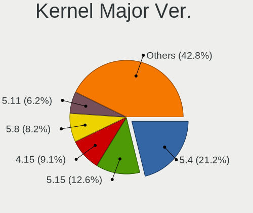
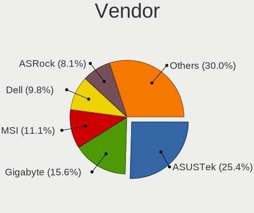
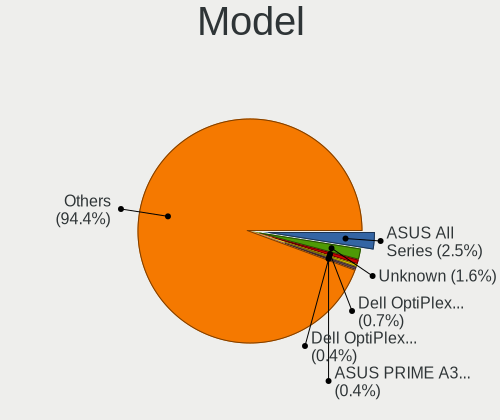
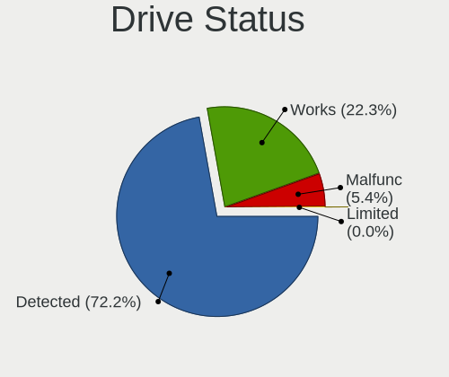
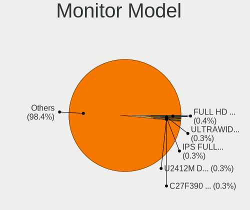
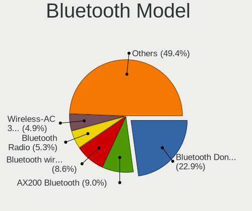
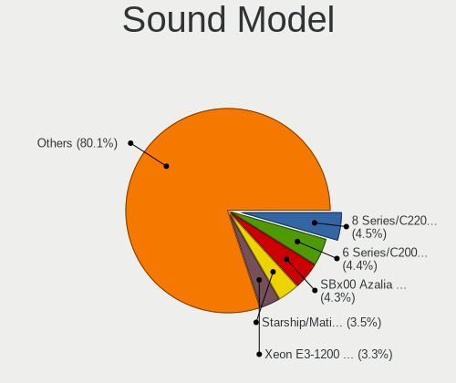

Ubuntu - Tested Hardware & Statistics (Desktops)
------------------------------------------------

A project to collect tested hardware configurations for Ubuntu.

Anyone can contribute to this report by the [hw-probe](https://github.com/linuxhw/hw-probe) tool:

    sudo -E hw-probe -all -upload

Please contribute! Especially if your hardware is rare.

Contents
--------

* [ Test Cases ](#test-cases)

* [ System ](#system)
  - [ OS                       ](#os)
  - [ OS Family                ](#os-family)
  - [ Kernel                   ](#kernel)
  - [ Kernel Family            ](#kernel-family)
  - [ Kernel Major Ver.        ](#kernel-major-ver)
  - [ Arch                     ](#arch)
  - [ DE                       ](#de)
  - [ Display Server           ](#display-server)
  - [ Display Manager          ](#display-manager)
  - [ OS Lang                  ](#os-lang)
  - [ Boot Mode                ](#boot-mode)
  - [ Filesystem               ](#filesystem)
  - [ Part. scheme             ](#part-scheme)
  - [ Dual Boot with Linux/BSD ](#dual-boot-with-linuxbsd)
  - [ Dual Boot (Win)          ](#dual-boot-win)

* [ Board ](#board)
  - [ Vendor                   ](#vendor)
  - [ Model                    ](#model)
  - [ Model Family             ](#model-family)
  - [ MFG Year                 ](#mfg-year)
  - [ Form Factor              ](#form-factor)
  - [ Secure Boot              ](#secure-boot)
  - [ Coreboot                 ](#coreboot)
  - [ RAM Size                 ](#ram-size)
  - [ RAM Used                 ](#ram-used)
  - [ Total Drives             ](#total-drives)
  - [ Has CD-ROM               ](#has-cd-rom)
  - [ Has Ethernet             ](#has-ethernet)
  - [ Has WiFi                 ](#has-wifi)
  - [ Has Bluetooth            ](#has-bluetooth)

* [ Location ](#location)
  - [ Country                  ](#country)
  - [ City                     ](#city)

* [ Drives ](#drives)
  - [ Drive Vendor             ](#drive-vendor)
  - [ Drive Model              ](#drive-model)
  - [ HDD Vendor               ](#hdd-vendor)
  - [ SSD Vendor               ](#ssd-vendor)
  - [ Drive Kind               ](#drive-kind)
  - [ Drive Connector          ](#drive-connector)
  - [ Drive Size               ](#drive-size)
  - [ Space Total              ](#space-total)
  - [ Space Used               ](#space-used)
  - [ Malfunc. Drives          ](#malfunc-drives)
  - [ Malfunc. Drive Vendor    ](#malfunc-drive-vendor)
  - [ Malfunc. HDD Vendor      ](#malfunc-hdd-vendor)
  - [ Malfunc. Drive Kind      ](#malfunc-drive-kind)
  - [ Failed Drives            ](#failed-drives)
  - [ Failed Drive Vendor      ](#failed-drive-vendor)
  - [ Drive Status             ](#drive-status)

* [ Storage controller ](#storage-controller)
  - [ Storage Vendor           ](#storage-vendor)
  - [ Storage Model            ](#storage-model)
  - [ Storage Kind             ](#storage-kind)

* [ Processor ](#processor)
  - [ CPU Vendor               ](#cpu-vendor)
  - [ CPU Model                ](#cpu-model)
  - [ CPU Model Family         ](#cpu-model-family)
  - [ CPU Cores                ](#cpu-cores)
  - [ CPU Sockets              ](#cpu-sockets)
  - [ CPU Threads              ](#cpu-threads)
  - [ CPU Op-Modes             ](#cpu-op-modes)
  - [ CPU Microcode            ](#cpu-microcode)
  - [ CPU Microarch            ](#cpu-microarch)

* [ Graphics ](#graphics)
  - [ GPU Vendor               ](#gpu-vendor)
  - [ GPU Model                ](#gpu-model)
  - [ GPU Combo                ](#gpu-combo)
  - [ GPU Driver               ](#gpu-driver)
  - [ GPU Memory               ](#gpu-memory)

* [ Monitor ](#monitor)
  - [ Monitor Vendor           ](#monitor-vendor)
  - [ Monitor Model            ](#monitor-model)
  - [ Monitor Resolution       ](#monitor-resolution)
  - [ Monitor Diagonal         ](#monitor-diagonal)
  - [ Monitor Width            ](#monitor-width)
  - [ Aspect Ratio             ](#aspect-ratio)
  - [ Monitor Area             ](#monitor-area)
  - [ Pixel Density            ](#pixel-density)
  - [ Multiple Monitors        ](#multiple-monitors)

* [ Network ](#network)
  - [ Net Controller Vendor    ](#net-controller-vendor)
  - [ Net Controller Model     ](#net-controller-model)
  - [ Wireless Vendor          ](#wireless-vendor)
  - [ Wireless Model           ](#wireless-model)
  - [ Ethernet Vendor          ](#ethernet-vendor)
  - [ Ethernet Model           ](#ethernet-model)
  - [ Net Controller Kind      ](#net-controller-kind)
  - [ Used Controller          ](#used-controller)
  - [ NICs                     ](#nics)
  - [ IPv6                     ](#ipv6)

* [ Bluetooth ](#bluetooth)
  - [ Bluetooth Vendor         ](#bluetooth-vendor)
  - [ Bluetooth Model          ](#bluetooth-model)

* [ Sound ](#sound)
  - [ Sound Vendor             ](#sound-vendor)
  - [ Sound Model              ](#sound-model)

* [ Memory ](#memory)
  - [ Memory Vendor            ](#memory-vendor)
  - [ Memory Model             ](#memory-model)
  - [ Memory Kind              ](#memory-kind)
  - [ Memory Form Factor       ](#memory-form-factor)
  - [ Memory Size              ](#memory-size)
  - [ Memory Speed             ](#memory-speed)

* [ Printers & scanners ](#printers--scanners)
  - [ Printer Vendor           ](#printer-vendor)
  - [ Printer Model            ](#printer-model)
  - [ Scanner Vendor           ](#scanner-vendor)
  - [ Scanner Model            ](#scanner-model)

* [ Camera ](#camera)
  - [ Camera Vendor            ](#camera-vendor)
  - [ Camera Model             ](#camera-model)

* [ Security ](#security)
  - [ Fingerprint Vendor       ](#fingerprint-vendor)
  - [ Fingerprint Model        ](#fingerprint-model)
  - [ Chipcard Vendor          ](#chipcard-vendor)
  - [ Chipcard Model           ](#chipcard-model)

* [ Unsupported ](#unsupported)
  - [ Unsupported Devices      ](#unsupported-devices)
  - [ Unsupported Device Types ](#unsupported-device-types)

Test Cases
----------

Total: 35748

| Vendor        | Model                       | Probe                                                      | Date         |
|---------------|-----------------------------|------------------------------------------------------------|--------------|
| MSI           | P67A-GD65                   | [1024e95ca9](https://linux-hardware.org/?probe=1024e95ca9) | Aug 12, 2023 |
| Fujitsu       | D2990-A1 S26361-D2990-A1    | [ae7ae594f1](https://linux-hardware.org/?probe=ae7ae594f1) | Aug 12, 2023 |
| ASUSTek       | M5A78L-M LE                 | [a68db843ea](https://linux-hardware.org/?probe=a68db843ea) | Aug 12, 2023 |
| Gigabyte      | Z390 AORUS PRO WIFI-CF      | [7298d533c9](https://linux-hardware.org/?probe=7298d533c9) | Aug 12, 2023 |
| Gigabyte      | Z390 AORUS PRO WIFI-CF      | [13e0e622f3](https://linux-hardware.org/?probe=13e0e622f3) | Aug 12, 2023 |
| HP            | 0A04h                       | [61b0d9bc15](https://linux-hardware.org/?probe=61b0d9bc15) | Aug 12, 2023 |
| Intel         | B85 V5.56                   | [7fb2d45505](https://linux-hardware.org/?probe=7fb2d45505) | Aug 12, 2023 |
| Fujitsu       | JIQ87Y                      | [b11d99014e](https://linux-hardware.org/?probe=b11d99014e) | Aug 12, 2023 |
| ASUSTek       | H81M-PLUS                   | [af419fe003](https://linux-hardware.org/?probe=af419fe003) | Aug 12, 2023 |
| ASUSTek       | H81M-PLUS                   | [16cd37e4fe](https://linux-hardware.org/?probe=16cd37e4fe) | Aug 12, 2023 |
| Dell          | 0Y2MRG A00                  | [04ce264a3e](https://linux-hardware.org/?probe=04ce264a3e) | Aug 12, 2023 |
| Intel         | DG31PR AAE58249-301         | [28bc891b6d](https://linux-hardware.org/?probe=28bc891b6d) | Aug 12, 2023 |
| ASUSTek       | J1800I-C/BR                 | [5226916c20](https://linux-hardware.org/?probe=5226916c20) | Aug 12, 2023 |
| ASUSTek       | J1800I-C/BR                 | [f59a93f116](https://linux-hardware.org/?probe=f59a93f116) | Aug 12, 2023 |
| Dell          | 0HD5W2 A01                  | [be4514c366](https://linux-hardware.org/?probe=be4514c366) | Aug 12, 2023 |
| Intel         | DG31PR AAE58249-301         | [3050db3fbf](https://linux-hardware.org/?probe=3050db3fbf) | Aug 12, 2023 |
| MSI           | Boston                      | [62ad275a7d](https://linux-hardware.org/?probe=62ad275a7d) | Aug 11, 2023 |
| Intel         | B85 V5.56                   | [f278787ab5](https://linux-hardware.org/?probe=f278787ab5) | Aug 11, 2023 |
| MSI           | Boston                      | [a34a89c083](https://linux-hardware.org/?probe=a34a89c083) | Aug 11, 2023 |
| ASUSTek       | PRIME B550-PLUS             | [76078461ae](https://linux-hardware.org/?probe=76078461ae) | Aug 11, 2023 |
| Intel         | B75                         | [17641de345](https://linux-hardware.org/?probe=17641de345) | Aug 11, 2023 |
| ASUSTek       | ROG STRIX X570-E GAMING     | [483fc71762](https://linux-hardware.org/?probe=483fc71762) | Aug 11, 2023 |
| Lenovo        | SHARKBAY SDK0E50510 WIN     | [ab2473ff49](https://linux-hardware.org/?probe=ab2473ff49) | Aug 11, 2023 |
| Unknown       | Unknown                     | [62ef56dbab](https://linux-hardware.org/?probe=62ef56dbab) | Aug 11, 2023 |
| ASRock        | B450M Pro4                  | [65d55091fa](https://linux-hardware.org/?probe=65d55091fa) | Aug 11, 2023 |
| Intel         | D915GEV AAC63667-501        | [4d65f6d8fa](https://linux-hardware.org/?probe=4d65f6d8fa) | Aug 11, 2023 |
| Gigabyte      | B250-HD3P-CF                | [b347883be2](https://linux-hardware.org/?probe=b347883be2) | Aug 11, 2023 |
| Gigabyte      | B85M-D2V                    | [d8d7d7bad7](https://linux-hardware.org/?probe=d8d7d7bad7) | Aug 11, 2023 |
| ASRock        | B550M-ITX/ac                | [e6624cc619](https://linux-hardware.org/?probe=e6624cc619) | Aug 11, 2023 |
| ASUSTek       | PRIME B550-PLUS             | [7f2903e1a4](https://linux-hardware.org/?probe=7f2903e1a4) | Aug 11, 2023 |
| ASUSTek       | PRIME X670-P WIFI           | [7d31344218](https://linux-hardware.org/?probe=7d31344218) | Aug 11, 2023 |
| Dell          | 0HY9JP A01                  | [48d92d85c7](https://linux-hardware.org/?probe=48d92d85c7) | Aug 11, 2023 |
| Acer          | Aspire G7713                | [cb79bdce06](https://linux-hardware.org/?probe=cb79bdce06) | Aug 11, 2023 |
| Gigabyte      | Z77-D3H                     | [e71fc09944](https://linux-hardware.org/?probe=e71fc09944) | Aug 11, 2023 |
| ASUSTek       | PRIME H510M-K               | [3c239efc46](https://linux-hardware.org/?probe=3c239efc46) | Aug 11, 2023 |
| AZW           | Green G4 10                 | [a574280172](https://linux-hardware.org/?probe=a574280172) | Aug 11, 2023 |
| MSI           | MS-7380                     | [584074ca03](https://linux-hardware.org/?probe=584074ca03) | Aug 11, 2023 |
| Alienware     | Area-51 R2                  | [07a6f57292](https://linux-hardware.org/?probe=07a6f57292) | Aug 11, 2023 |
| ASRock        | Z97 Killer                  | [f055a15ccb](https://linux-hardware.org/?probe=f055a15ccb) | Aug 11, 2023 |
| Gigabyte      | GA-78LMT-USB3               | [6a1d87f2aa](https://linux-hardware.org/?probe=6a1d87f2aa) | Aug 10, 2023 |
| ASUSTek       | P8P67 PRO                   | [c0d6900ba3](https://linux-hardware.org/?probe=c0d6900ba3) | Aug 10, 2023 |
| ASUSTek       | PRIME B450-PLUS             | [44fe085499](https://linux-hardware.org/?probe=44fe085499) | Aug 10, 2023 |
| Fujitsu Si... | G31T-M2 V3.02               | [1c32da7aed](https://linux-hardware.org/?probe=1c32da7aed) | Aug 10, 2023 |
| Lenovo        | ThinkStation S30 056848U    | [e6bc23d815](https://linux-hardware.org/?probe=e6bc23d815) | Aug 10, 2023 |
| ASUSTek       | ROG STRIX B650-A GAMING ... | [6bf6a38fba](https://linux-hardware.org/?probe=6bf6a38fba) | Aug 10, 2023 |
| Gigabyte      | H270N-WIFI-CF               | [bd9c532bbc](https://linux-hardware.org/?probe=bd9c532bbc) | Aug 10, 2023 |
| ASUSTek       | M4A87TD/USB3                | [c7c0f2ad91](https://linux-hardware.org/?probe=c7c0f2ad91) | Aug 10, 2023 |
| Dell          | 04YP6J A02                  | [5d5ce952b3](https://linux-hardware.org/?probe=5d5ce952b3) | Aug 10, 2023 |
| Gigabyte      | B560M DS3H                  | [96d3419a5f](https://linux-hardware.org/?probe=96d3419a5f) | Aug 10, 2023 |
| ASUSTek       | M4A87TD/USB3                | [6aaa92df1c](https://linux-hardware.org/?probe=6aaa92df1c) | Aug 10, 2023 |
| Gigabyte      | Z390 AORUS ULTRA-CF         | [5264c46571](https://linux-hardware.org/?probe=5264c46571) | Aug 10, 2023 |
| YANYU         | EPIC-C57                    | [6d42c0f9af](https://linux-hardware.org/?probe=6d42c0f9af) | Aug 10, 2023 |
| MSI           | A320M PRO-VD/S              | [7f7c988470](https://linux-hardware.org/?probe=7f7c988470) | Aug 10, 2023 |
| Gigabyte      | Z390 AORUS PRO WIFI-CF      | [307c7bbe9c](https://linux-hardware.org/?probe=307c7bbe9c) | Aug 10, 2023 |
| ASUSTek       | PRIME X570-PRO              | [f7fe8fc7f3](https://linux-hardware.org/?probe=f7fe8fc7f3) | Aug 10, 2023 |
| ASRock        | B450M-HDV R4.0              | [ab3503021a](https://linux-hardware.org/?probe=ab3503021a) | Aug 10, 2023 |
| Dell          | 0JP3NX A01                  | [a9c4812d66](https://linux-hardware.org/?probe=a9c4812d66) | Aug 09, 2023 |
| ASUSTek       | PRIME Z270-A                | [a6eabbbfef](https://linux-hardware.org/?probe=a6eabbbfef) | Aug 09, 2023 |
| MSI           | 970 GAMING                  | [a499728742](https://linux-hardware.org/?probe=a499728742) | Aug 09, 2023 |
| Dell          | 0WR7PY A03                  | [b97d54f6d8](https://linux-hardware.org/?probe=b97d54f6d8) | Aug 09, 2023 |
| MSI           | Z590-A PRO                  | [4448c9f2e1](https://linux-hardware.org/?probe=4448c9f2e1) | Aug 09, 2023 |
| Gigabyte      | B150M-D3H DDR3-CF           | [5df6fee2f9](https://linux-hardware.org/?probe=5df6fee2f9) | Aug 09, 2023 |
| MSI           | Z590-A PRO                  | [6e1d11025a](https://linux-hardware.org/?probe=6e1d11025a) | Aug 09, 2023 |
| MSI           | Z97-G45 GAMING              | [65d491c109](https://linux-hardware.org/?probe=65d491c109) | Aug 09, 2023 |
| ASRock        | H77M-ITX                    | [01dc3bfc4b](https://linux-hardware.org/?probe=01dc3bfc4b) | Aug 09, 2023 |
| HP            | 894D                        | [e1c397df93](https://linux-hardware.org/?probe=e1c397df93) | Aug 09, 2023 |
| MSI           | A78M-E45                    | [d39f224497](https://linux-hardware.org/?probe=d39f224497) | Aug 09, 2023 |
| MSI           | 970 GAMING                  | [4751920c96](https://linux-hardware.org/?probe=4751920c96) | Aug 09, 2023 |
| Dell          | 08HPGT A01                  | [273e794a99](https://linux-hardware.org/?probe=273e794a99) | Aug 09, 2023 |
| Lenovo        | 30C1                        | [dda7ed4e8b](https://linux-hardware.org/?probe=dda7ed4e8b) | Aug 09, 2023 |
| Dell          | 02YYK5 A00                  | [14382141e9](https://linux-hardware.org/?probe=14382141e9) | Aug 09, 2023 |
| MSI           | MAG B760 TOMAHAWK WIFI      | [64fbeeca5e](https://linux-hardware.org/?probe=64fbeeca5e) | Aug 08, 2023 |
| Dell          | 0NK5PH A01                  | [eb06b6713d](https://linux-hardware.org/?probe=eb06b6713d) | Aug 08, 2023 |
| Fujitsu       | D2990-A1 S26361-D2990-A1    | [c48e0220d8](https://linux-hardware.org/?probe=c48e0220d8) | Aug 08, 2023 |
| Intel         | D33217GKE G76540-203        | [fa0fbda262](https://linux-hardware.org/?probe=fa0fbda262) | Aug 08, 2023 |
| Dell          | 0GWHMW A03                  | [ce5dea2bc6](https://linux-hardware.org/?probe=ce5dea2bc6) | Aug 08, 2023 |
| Dell          | 0GWHMW A03                  | [1ba2de9148](https://linux-hardware.org/?probe=1ba2de9148) | Aug 08, 2023 |
| Intel         | D33217GKE G76540-203        | [f75916b7c7](https://linux-hardware.org/?probe=f75916b7c7) | Aug 08, 2023 |
| Dell          | 08HPGT A01                  | [616f6ba289](https://linux-hardware.org/?probe=616f6ba289) | Aug 08, 2023 |
| Lenovo        | Bantry CRB SDK0E50510 WI... | [6ffda81a5e](https://linux-hardware.org/?probe=6ffda81a5e) | Aug 08, 2023 |
| HP            | 2129                        | [f005bdb494](https://linux-hardware.org/?probe=f005bdb494) | Aug 08, 2023 |
| Gigabyte      | Z97M-DS3H                   | [f2547c0339](https://linux-hardware.org/?probe=f2547c0339) | Aug 08, 2023 |
| HP            | 8456                        | [fa8ea86591](https://linux-hardware.org/?probe=fa8ea86591) | Aug 08, 2023 |
| ASUSTek       | PRIME X670-P WIFI           | [2335e10b59](https://linux-hardware.org/?probe=2335e10b59) | Aug 08, 2023 |
| ASUSTek       | PRIME B760M-A D4            | [b477184f03](https://linux-hardware.org/?probe=b477184f03) | Aug 08, 2023 |
| Pegatron      | 2AB5                        | [9579022e6f](https://linux-hardware.org/?probe=9579022e6f) | Aug 07, 2023 |
| ASRock        | H610M-ITX/ac                | [205fab2707](https://linux-hardware.org/?probe=205fab2707) | Aug 07, 2023 |
| Gigabyte      | B450M DS3H-CF               | [40b0ea74b1](https://linux-hardware.org/?probe=40b0ea74b1) | Aug 07, 2023 |
| Fujitsu       | D3062-A1 S26361-D3062-A1    | [873825c261](https://linux-hardware.org/?probe=873825c261) | Aug 07, 2023 |
| ASUSTek       | M5A97 R2.0                  | [783906b878](https://linux-hardware.org/?probe=783906b878) | Aug 07, 2023 |
| HP            | 8055                        | [5124119ce1](https://linux-hardware.org/?probe=5124119ce1) | Aug 07, 2023 |
| Gigabyte      | Z97M-DS3H                   | [beecacb434](https://linux-hardware.org/?probe=beecacb434) | Aug 07, 2023 |
| Gigabyte      | Z390 AORUS PRO WIFI-CF      | [002014034b](https://linux-hardware.org/?probe=002014034b) | Aug 07, 2023 |
| ASUSTek       | P5N-E SLI                   | [d552e347f5](https://linux-hardware.org/?probe=d552e347f5) | Aug 07, 2023 |
| AZW           | SEi                         | [b38e4eec2e](https://linux-hardware.org/?probe=b38e4eec2e) | Aug 07, 2023 |
| Gigabyte      | Z390 AORUS PRO WIFI-CF      | [fbfc0c60bd](https://linux-hardware.org/?probe=fbfc0c60bd) | Aug 07, 2023 |
| ASUSTek       | PRIME B560M-K               | [a5ae5a237a](https://linux-hardware.org/?probe=a5ae5a237a) | Aug 06, 2023 |
| MSI           | Z97 GAMING 5                | [d076b394d9](https://linux-hardware.org/?probe=d076b394d9) | Aug 06, 2023 |
| ASUSTek       | ROG STRIX X570-E GAMING     | [fe4aa817e1](https://linux-hardware.org/?probe=fe4aa817e1) | Aug 06, 2023 |
| Dell          | 0WMJ54 A01                  | [7f6aa0ed0c](https://linux-hardware.org/?probe=7f6aa0ed0c) | Aug 06, 2023 |
| ASUSTek       | M5A97 R2.0                  | [1d8737323b](https://linux-hardware.org/?probe=1d8737323b) | Aug 06, 2023 |
| ASUSTek       | P8H61-M LX3                 | [6875c17337](https://linux-hardware.org/?probe=6875c17337) | Aug 06, 2023 |
| Foxconn       | 2AAF                        | [e0b2d4efb6](https://linux-hardware.org/?probe=e0b2d4efb6) | Aug 06, 2023 |
| ASUSTek       | M5A97 EVO R2.0              | [80c705f1a7](https://linux-hardware.org/?probe=80c705f1a7) | Aug 06, 2023 |
| MSI           | 2AE0                        | [9d3b59de32](https://linux-hardware.org/?probe=9d3b59de32) | Aug 06, 2023 |
| MSI           | H81M-P33                    | [ebed30097f](https://linux-hardware.org/?probe=ebed30097f) | Aug 06, 2023 |
| Fujitsu       | D3062-A1 S26361-D3062-A1    | [28ee020bed](https://linux-hardware.org/?probe=28ee020bed) | Aug 06, 2023 |
| HP            | 805D                        | [672e431e69](https://linux-hardware.org/?probe=672e431e69) | Aug 06, 2023 |
| Intel         | B85 V5.56                   | [9c9e999e7f](https://linux-hardware.org/?probe=9c9e999e7f) | Aug 06, 2023 |
| Intel         | B85 V5.56                   | [54f0bde318](https://linux-hardware.org/?probe=54f0bde318) | Aug 06, 2023 |
| MSI           | MPG X570S EDGE MAX WIFI     | [ffa55735b6](https://linux-hardware.org/?probe=ffa55735b6) | Aug 06, 2023 |
| ASUSTek       | PRIME H410M-E               | [8618a7051f](https://linux-hardware.org/?probe=8618a7051f) | Aug 06, 2023 |
| Lenovo        | 110536U ThinkServer TS13... | [5084897812](https://linux-hardware.org/?probe=5084897812) | Aug 05, 2023 |
| HP            | 1791                        | [4a89aab3d6](https://linux-hardware.org/?probe=4a89aab3d6) | Aug 05, 2023 |
| HP            | 198E                        | [34023c0d62](https://linux-hardware.org/?probe=34023c0d62) | Aug 05, 2023 |
| Gigabyte      | A320M-S2H V2-CF             | [ac7079fac9](https://linux-hardware.org/?probe=ac7079fac9) | Aug 05, 2023 |
| MSI           | B450 GAMING PLUS MAX        | [8cc106746a](https://linux-hardware.org/?probe=8cc106746a) | Aug 05, 2023 |
| ASRock        | B450M Pro4                  | [1e157ae535](https://linux-hardware.org/?probe=1e157ae535) | Aug 05, 2023 |
| ASUSTek       | Z97-K                       | [5ca4ca286b](https://linux-hardware.org/?probe=5ca4ca286b) | Aug 05, 2023 |
| MSI           | A78M-E45                    | [988c1f5878](https://linux-hardware.org/?probe=988c1f5878) | Aug 05, 2023 |
| GMKtec        | NucBox K4                   | [64b27a1390](https://linux-hardware.org/?probe=64b27a1390) | Aug 05, 2023 |
| MSI           | B450 GAMING PLUS MAX        | [4f2449c578](https://linux-hardware.org/?probe=4f2449c578) | Aug 05, 2023 |
| Fujitsu       | D3011-A1 S26361-D3011-A1    | [597856f529](https://linux-hardware.org/?probe=597856f529) | Aug 05, 2023 |
| Gigabyte      | G31M-S2C                    | [9cda5ca576](https://linux-hardware.org/?probe=9cda5ca576) | Aug 05, 2023 |
| ASUSTek       | P5QD TURBO                  | [50be5e5725](https://linux-hardware.org/?probe=50be5e5725) | Aug 05, 2023 |
| ASUSTek       | ROG Maximus XII EXTREME     | [f5ebaad3b1](https://linux-hardware.org/?probe=f5ebaad3b1) | Aug 05, 2023 |
| Gigabyte      | H110M-H-CF                  | [17ea53b0c6](https://linux-hardware.org/?probe=17ea53b0c6) | Aug 05, 2023 |
| ASUSTek       | PRIME B450M-K II            | [fed2da6500](https://linux-hardware.org/?probe=fed2da6500) | Aug 05, 2023 |
| ASUSTek       | PRIME B450M-K II            | [2531b9d0db](https://linux-hardware.org/?probe=2531b9d0db) | Aug 05, 2023 |
| ASUSTek       | ROG STRIX Z690-A GAMING ... | [67cea35f6d](https://linux-hardware.org/?probe=67cea35f6d) | Aug 04, 2023 |
| ASUSTek       | TUF Z390-PLUS GAMING        | [cc0ea700cc](https://linux-hardware.org/?probe=cc0ea700cc) | Aug 04, 2023 |
| Dell          | 00V62H A00                  | [bb98dda003](https://linux-hardware.org/?probe=bb98dda003) | Aug 04, 2023 |
| Biostar       | B350GTN                     | [5ae18cae6c](https://linux-hardware.org/?probe=5ae18cae6c) | Aug 04, 2023 |
| ASRock        | B450 Gaming-ITX/ac          | [af4ef366cf](https://linux-hardware.org/?probe=af4ef366cf) | Aug 04, 2023 |
| ASUSTek       | ROG STRIX B450-E GAMING     | [724beebcb2](https://linux-hardware.org/?probe=724beebcb2) | Aug 04, 2023 |
| Gigabyte      | GA-MA69VM-S2                | [197a9b0139](https://linux-hardware.org/?probe=197a9b0139) | Aug 03, 2023 |
| MSI           | MS-7380                     | [98aa00b9e1](https://linux-hardware.org/?probe=98aa00b9e1) | Aug 03, 2023 |
| ASUSTek       | M3A78-T                     | [e97447ea9d](https://linux-hardware.org/?probe=e97447ea9d) | Aug 03, 2023 |
| Medion        | MS-7616                     | [7b9dae91ad](https://linux-hardware.org/?probe=7b9dae91ad) | Aug 03, 2023 |
| Dell          | 0F642F A00                  | [b2c444dc4f](https://linux-hardware.org/?probe=b2c444dc4f) | Aug 03, 2023 |
| Gigabyte      | GA-78LMT-USB3 SEx           | [39e2c1bfad](https://linux-hardware.org/?probe=39e2c1bfad) | Aug 03, 2023 |
| Dell          | 0CRH6C A02                  | [79d26043a0](https://linux-hardware.org/?probe=79d26043a0) | Aug 03, 2023 |
| Supermicro    | X7DWU                       | [beddea6e34](https://linux-hardware.org/?probe=beddea6e34) | Aug 03, 2023 |
| Supermicro    | X7DWN+                      | [92bf3762f2](https://linux-hardware.org/?probe=92bf3762f2) | Aug 03, 2023 |
| Supermicro    | X7DWU                       | [37ebe498c2](https://linux-hardware.org/?probe=37ebe498c2) | Aug 03, 2023 |
| Supermicro    | X7DWN+                      | [53edc778db](https://linux-hardware.org/?probe=53edc778db) | Aug 03, 2023 |
| Supermicro    | X7DWU                       | [dc1c75a471](https://linux-hardware.org/?probe=dc1c75a471) | Aug 03, 2023 |
| MSI           | Z97 GAMING 3                | [caac03a431](https://linux-hardware.org/?probe=caac03a431) | Aug 03, 2023 |
| Gigabyte      | F2A88XM-D3HP                | [42ac042892](https://linux-hardware.org/?probe=42ac042892) | Aug 03, 2023 |
| MSI           | PRO Z790-P WIFI             | [8f3eaca764](https://linux-hardware.org/?probe=8f3eaca764) | Aug 03, 2023 |
| Dell          | 0GTK4K A10                  | [b6586709f2](https://linux-hardware.org/?probe=b6586709f2) | Aug 03, 2023 |
| HP            | 843E                        | [dbbfb83ae4](https://linux-hardware.org/?probe=dbbfb83ae4) | Aug 03, 2023 |
| HP            | 843E                        | [952db006c3](https://linux-hardware.org/?probe=952db006c3) | Aug 03, 2023 |
| Gigabyte      | Z390 AORUS PRO WIFI-CF      | [6b22568f3f](https://linux-hardware.org/?probe=6b22568f3f) | Aug 03, 2023 |
| Lenovo        | 3102 SDK0J40697 WIN 3305... | [9dcbf7b10c](https://linux-hardware.org/?probe=9dcbf7b10c) | Aug 03, 2023 |
| ASUSTek       | ROG STRIX B760-A GAMING ... | [f629b6e16e](https://linux-hardware.org/?probe=f629b6e16e) | Aug 03, 2023 |
| Win elemen... | M600                        | [b9537c621c](https://linux-hardware.org/?probe=b9537c621c) | Aug 02, 2023 |
| MSI           | A320M-A PRO MAX             | [881ac0a0e0](https://linux-hardware.org/?probe=881ac0a0e0) | Aug 02, 2023 |
| ASUSTek       | TUF H310M-PLUS GAMING/BR    | [11d27dea01](https://linux-hardware.org/?probe=11d27dea01) | Aug 02, 2023 |
| Gigabyte      | B450 AORUS M                | [518512fe78](https://linux-hardware.org/?probe=518512fe78) | Aug 02, 2023 |
| MSI           | A320M-A PRO MAX             | [c3beec95b8](https://linux-hardware.org/?probe=c3beec95b8) | Aug 02, 2023 |
| Gigabyte      | Z690 AORUS ELITE AX         | [0e28c2aae2](https://linux-hardware.org/?probe=0e28c2aae2) | Aug 02, 2023 |
| Intel         | DH67BL AAG10189-211         | [db043e1572](https://linux-hardware.org/?probe=db043e1572) | Aug 02, 2023 |
| ECS           | H61H2-M6                    | [12990c5c80](https://linux-hardware.org/?probe=12990c5c80) | Aug 02, 2023 |
| Supermicro    | X9DAi                       | [d7390704d8](https://linux-hardware.org/?probe=d7390704d8) | Aug 02, 2023 |
| Dell          | 0CRH6C A02                  | [141928d8e2](https://linux-hardware.org/?probe=141928d8e2) | Aug 02, 2023 |
| Dell          | 0FR6WH A01                  | [38feb4d1f7](https://linux-hardware.org/?probe=38feb4d1f7) | Aug 02, 2023 |
| Dell          | 0R038D A00                  | [fd5fe120fa](https://linux-hardware.org/?probe=fd5fe120fa) | Aug 02, 2023 |
| Gigabyte      | Z97M-DS3H                   | [8bc1531bf6](https://linux-hardware.org/?probe=8bc1531bf6) | Aug 02, 2023 |
| HP            | 8653 A                      | [09f876ab04](https://linux-hardware.org/?probe=09f876ab04) | Aug 02, 2023 |
| Lenovo        | Bantry CRB SDK0E50510 WI... | [69cd0aae71](https://linux-hardware.org/?probe=69cd0aae71) | Aug 02, 2023 |
| Gigabyte      | B450 AORUS M                | [0ced83ffed](https://linux-hardware.org/?probe=0ced83ffed) | Aug 02, 2023 |
| Dell          | 0GRJJ9 A01                  | [dca7ee3fdc](https://linux-hardware.org/?probe=dca7ee3fdc) | Aug 02, 2023 |
| Pegatron      | Benicia                     | [5db4c563c6](https://linux-hardware.org/?probe=5db4c563c6) | Aug 01, 2023 |
| MSI           | MS-7380                     | [6f3e83e5a2](https://linux-hardware.org/?probe=6f3e83e5a2) | Aug 01, 2023 |
| ASRock        | B365M-HDV                   | [994853ef26](https://linux-hardware.org/?probe=994853ef26) | Aug 01, 2023 |
| ASUSTek       | ROG STRIX Z690-E GAMING ... | [9b314ec48b](https://linux-hardware.org/?probe=9b314ec48b) | Aug 01, 2023 |
| Gigabyte      | P35-DS4                     | [9116e4042c](https://linux-hardware.org/?probe=9116e4042c) | Aug 01, 2023 |
| HP            | 18E4                        | [20ebffd9a8](https://linux-hardware.org/?probe=20ebffd9a8) | Aug 01, 2023 |
| ECS           | H61H2-M6                    | [836267e5f7](https://linux-hardware.org/?probe=836267e5f7) | Aug 01, 2023 |
| HP            | 2B2C                        | [3f0b3f8811](https://linux-hardware.org/?probe=3f0b3f8811) | Aug 01, 2023 |
| Dell          | 06NWYK A00                  | [1c3a3db0ec](https://linux-hardware.org/?probe=1c3a3db0ec) | Aug 01, 2023 |
| ASUSTek       | M5A78L-M PLUS/USB3          | [668eb36a4a](https://linux-hardware.org/?probe=668eb36a4a) | Aug 01, 2023 |
| ASUSTek       | TUF Gaming X570-PLUS        | [66000207b0](https://linux-hardware.org/?probe=66000207b0) | Aug 01, 2023 |
| Lenovo        | 1066 SDK0T76528 WIN 3556... | [df0702afb0](https://linux-hardware.org/?probe=df0702afb0) | Aug 01, 2023 |
| Lenovo        | 1066 SDK0T76528 WIN 3556... | [0ac623dd70](https://linux-hardware.org/?probe=0ac623dd70) | Aug 01, 2023 |
| Dell          | 09KPNV A01                  | [1768a6834a](https://linux-hardware.org/?probe=1768a6834a) | Aug 01, 2023 |
| Dell          | OptiPlex 980                | [7ec85c3865](https://linux-hardware.org/?probe=7ec85c3865) | Aug 01, 2023 |
| Itautec       | ST 4271 ST-4271 Padrao 0... | [2e4793aa6c](https://linux-hardware.org/?probe=2e4793aa6c) | Aug 01, 2023 |
| HP            | 3048h                       | [02df08e8ab](https://linux-hardware.org/?probe=02df08e8ab) | Jul 31, 2023 |
| HP            | 3398                        | [c271d5d40e](https://linux-hardware.org/?probe=c271d5d40e) | Jul 31, 2023 |
| MSI           | H97 PC Mate                 | [3e200ead3c](https://linux-hardware.org/?probe=3e200ead3c) | Jul 31, 2023 |
| Gigabyte      | B85M-D3H                    | [9ddb5c2ea3](https://linux-hardware.org/?probe=9ddb5c2ea3) | Jul 31, 2023 |
| ASRock        | FM2A55M-VG3+                | [ce76d8b410](https://linux-hardware.org/?probe=ce76d8b410) | Jul 31, 2023 |
| Positivo      | POS-PIH110DV                | [faa5c5cda0](https://linux-hardware.org/?probe=faa5c5cda0) | Jul 31, 2023 |
| MSI           | H81M-P33                    | [d5cb55a484](https://linux-hardware.org/?probe=d5cb55a484) | Jul 31, 2023 |
| Fujitsu       | D3401-H2 S26361-D3401-H2    | [36c7268653](https://linux-hardware.org/?probe=36c7268653) | Jul 31, 2023 |
| ASUSTek       | TUF Gaming X570-PLUS        | [4e4e6cd3eb](https://linux-hardware.org/?probe=4e4e6cd3eb) | Jul 31, 2023 |
| Gigabyte      | Z77-DS3H                    | [cd96592ef8](https://linux-hardware.org/?probe=cd96592ef8) | Jul 31, 2023 |
| Dell          | 08NPPY A00                  | [26acefc1b8](https://linux-hardware.org/?probe=26acefc1b8) | Jul 31, 2023 |
| ASUSTek       | P6T SE                      | [aead9f82b2](https://linux-hardware.org/?probe=aead9f82b2) | Jul 31, 2023 |
| ASUSTek       | P6T SE                      | [9e8f131101](https://linux-hardware.org/?probe=9e8f131101) | Jul 31, 2023 |
| ASRock        | FM2A75 Pro4                 | [831157a9ac](https://linux-hardware.org/?probe=831157a9ac) | Jul 31, 2023 |
| Gigabyte      | B550 AORUS ELITE AX V2      | [45405639f5](https://linux-hardware.org/?probe=45405639f5) | Jul 31, 2023 |
| MACHINIST     | E5 MR9A PRO MAX V1.1        | [42a2df4c91](https://linux-hardware.org/?probe=42a2df4c91) | Jul 30, 2023 |
| HP            | 212A                        | [4f81f09718](https://linux-hardware.org/?probe=4f81f09718) | Jul 30, 2023 |
| HP            | 3398                        | [444f9d27d5](https://linux-hardware.org/?probe=444f9d27d5) | Jul 30, 2023 |
| Dell          | 0CU409                      | [7b665ec8f2](https://linux-hardware.org/?probe=7b665ec8f2) | Jul 30, 2023 |
| Intel         | DH67BL AAG10189-211         | [33ac97b0c6](https://linux-hardware.org/?probe=33ac97b0c6) | Jul 30, 2023 |
| Gigabyte      | X58A-UD7                    | [98759e7a12](https://linux-hardware.org/?probe=98759e7a12) | Jul 30, 2023 |
| Acer          | Aspire G7713                | [e0624d410e](https://linux-hardware.org/?probe=e0624d410e) | Jul 30, 2023 |
| ASUSTek       | PRIME A320M-K               | [de6e904009](https://linux-hardware.org/?probe=de6e904009) | Jul 30, 2023 |
| ASUSTek       | PRIME A320M-K               | [6928788f05](https://linux-hardware.org/?probe=6928788f05) | Jul 30, 2023 |
| Lenovo        | SHARKBAY 31900058 STD       | [4ff0e84129](https://linux-hardware.org/?probe=4ff0e84129) | Jul 30, 2023 |
| ASUSTek       | M5A78L-M PLUS/USB3          | [fe48f2b4d4](https://linux-hardware.org/?probe=fe48f2b4d4) | Jul 30, 2023 |
| ASUSTek       | PRIME Z270-A                | [eb13fb97fb](https://linux-hardware.org/?probe=eb13fb97fb) | Jul 30, 2023 |
| Dell          | 0RF705                      | [9370437c75](https://linux-hardware.org/?probe=9370437c75) | Jul 30, 2023 |
| ASUSTek       | TUF Gaming B550-PLUS        | [d788283742](https://linux-hardware.org/?probe=d788283742) | Jul 30, 2023 |
| Lenovo        | 0C48431 WIN                 | [4e0d5538b2](https://linux-hardware.org/?probe=4e0d5538b2) | Jul 30, 2023 |
| Gigabyte      | B460M DS3H V2               | [42b35cd473](https://linux-hardware.org/?probe=42b35cd473) | Jul 30, 2023 |
| Dell          | 0RF705                      | [fe3118bd3c](https://linux-hardware.org/?probe=fe3118bd3c) | Jul 30, 2023 |
| MSI           | B85M-E45                    | [dfef6fcff5](https://linux-hardware.org/?probe=dfef6fcff5) | Jul 30, 2023 |
| ASUSTek       | PRIME A320M-K               | [a4d7919584](https://linux-hardware.org/?probe=a4d7919584) | Jul 29, 2023 |
| Gigabyte      | MZAPLBP-00                  | [b70677782d](https://linux-hardware.org/?probe=b70677782d) | Jul 29, 2023 |
| Gigabyte      | MZAPLBP-00                  | [ae8a9f3aaf](https://linux-hardware.org/?probe=ae8a9f3aaf) | Jul 29, 2023 |
| Gigabyte      | H97-Gaming 3                | [c15cd0e6c0](https://linux-hardware.org/?probe=c15cd0e6c0) | Jul 29, 2023 |
| MSI           | Z270 TOMAHAWK OPT BOOST     | [9cc0db1a3d](https://linux-hardware.org/?probe=9cc0db1a3d) | Jul 29, 2023 |
| ASUSTek       | H110M-R                     | [471516b82e](https://linux-hardware.org/?probe=471516b82e) | Jul 29, 2023 |
| Intel         | D33217GKE G76540-203        | [d551e6904d](https://linux-hardware.org/?probe=d551e6904d) | Jul 29, 2023 |
| MSI           | MPG Z490 GAMING EDGE WIF... | [f36740f05f](https://linux-hardware.org/?probe=f36740f05f) | Jul 29, 2023 |
| Medion        | H110H4-EM                   | [7c2b005f92](https://linux-hardware.org/?probe=7c2b005f92) | Jul 29, 2023 |
| Lenovo        | SHARKBAY NOK                | [6e89d2949a](https://linux-hardware.org/?probe=6e89d2949a) | Jul 29, 2023 |
| Positivo      | POS-EINM70CS POSITIVO       | [bee5e6175b](https://linux-hardware.org/?probe=bee5e6175b) | Jul 29, 2023 |
| ASUSTek       | Pro WS X570-ACE             | [3f09ac4cae](https://linux-hardware.org/?probe=3f09ac4cae) | Jul 29, 2023 |
| Apple         | Mac-F60DEB81FF30ACF6 Mac... | [a69e475106](https://linux-hardware.org/?probe=a69e475106) | Jul 29, 2023 |
| Lenovo        | 3132 NOK                    | [6ab9975946](https://linux-hardware.org/?probe=6ab9975946) | Jul 29, 2023 |
| HP            | 2B1B                        | [8454c98fbb](https://linux-hardware.org/?probe=8454c98fbb) | Jul 29, 2023 |
| Dell          | 0PC5F7 A02                  | [3a3477d4bc](https://linux-hardware.org/?probe=3a3477d4bc) | Jul 29, 2023 |
| Shuttle       | XS35V3                      | [1753d8ab39](https://linux-hardware.org/?probe=1753d8ab39) | Jul 29, 2023 |
| ASUSTek       | PRIME H510M-K R2.0          | [7b5aebd006](https://linux-hardware.org/?probe=7b5aebd006) | Jul 28, 2023 |
| Gigabyte      | X570S AERO G                | [d500093891](https://linux-hardware.org/?probe=d500093891) | Jul 28, 2023 |
| MSI           | MPG B550I GAMING EDGE WI... | [5473e8bab9](https://linux-hardware.org/?probe=5473e8bab9) | Jul 28, 2023 |
| ASUSTek       | PRIME H370M-PLUS            | [099c883745](https://linux-hardware.org/?probe=099c883745) | Jul 28, 2023 |
| Lenovo        | NO DPK                      | [15d3803dcc](https://linux-hardware.org/?probe=15d3803dcc) | Jul 28, 2023 |
| ASRock        | H81 Pro BTC R2.0            | [b322ef8e74](https://linux-hardware.org/?probe=b322ef8e74) | Jul 28, 2023 |
| MSI           | X370 GAMING PRO CARBON      | [d4774401e3](https://linux-hardware.org/?probe=d4774401e3) | Jul 28, 2023 |
| MSI           | X370 GAMING PRO CARBON      | [45c79840cc](https://linux-hardware.org/?probe=45c79840cc) | Jul 28, 2023 |
| ASUSTek       | TUF Gaming B550-PLUS        | [735d4f8f84](https://linux-hardware.org/?probe=735d4f8f84) | Jul 28, 2023 |
| Dell          | 0FR6WH A01                  | [d20434fd50](https://linux-hardware.org/?probe=d20434fd50) | Jul 28, 2023 |
| HP            | 2B0B 100                    | [586d94bacc](https://linux-hardware.org/?probe=586d94bacc) | Jul 28, 2023 |
| HP            | 2B0B 100                    | [da33776470](https://linux-hardware.org/?probe=da33776470) | Jul 28, 2023 |
| HP            | 0A04h                       | [aaf7bb9453](https://linux-hardware.org/?probe=aaf7bb9453) | Jul 28, 2023 |
| ASUSTek       | PRIME X470-PRO              | [f689c31a17](https://linux-hardware.org/?probe=f689c31a17) | Jul 28, 2023 |
| ASUSTek       | PRIME B450-PLUS             | [ccfe4b2234](https://linux-hardware.org/?probe=ccfe4b2234) | Jul 27, 2023 |
| Medion        | MS-7797                     | [734c2ae113](https://linux-hardware.org/?probe=734c2ae113) | Jul 27, 2023 |
| MSI           | H97 PC Mate                 | [6b32ba5f5d](https://linux-hardware.org/?probe=6b32ba5f5d) | Jul 27, 2023 |
| ASRock        | X570 Creator                | [892e61c4a5](https://linux-hardware.org/?probe=892e61c4a5) | Jul 27, 2023 |
| ASRock        | X670E Pro RS                | [27a13f80b2](https://linux-hardware.org/?probe=27a13f80b2) | Jul 27, 2023 |
| Medion        | MS-7616                     | [349360bcba](https://linux-hardware.org/?probe=349360bcba) | Jul 27, 2023 |
| MSI           | MS-B1831                    | [35f0e625f1](https://linux-hardware.org/?probe=35f0e625f1) | Jul 27, 2023 |
| Pegatron      | 2A99                        | [068f8c77fd](https://linux-hardware.org/?probe=068f8c77fd) | Jul 27, 2023 |
| MSI           | B250M PRO-VDH               | [5bcf13119e](https://linux-hardware.org/?probe=5bcf13119e) | Jul 27, 2023 |
| ASUSTek       | P5P43TD/USB3                | [60397b779b](https://linux-hardware.org/?probe=60397b779b) | Jul 27, 2023 |
| Medion        | H110H4-EM                   | [080a30ad72](https://linux-hardware.org/?probe=080a30ad72) | Jul 27, 2023 |
| Gigabyte      | Z490 UD                     | [370243099a](https://linux-hardware.org/?probe=370243099a) | Jul 27, 2023 |
| Gigabyte      | Z97M-DS3H                   | [f0bd5c3409](https://linux-hardware.org/?probe=f0bd5c3409) | Jul 27, 2023 |
| ASUSTek       | P6X58D PREMIUM              | [0a84eeb8e2](https://linux-hardware.org/?probe=0a84eeb8e2) | Jul 26, 2023 |
| ASUSTek       | ROG STRIX Z690-E GAMING ... | [d54ad601d0](https://linux-hardware.org/?probe=d54ad601d0) | Jul 26, 2023 |
| Alienware     | 04VWF2 A02                  | [e6c2096ce5](https://linux-hardware.org/?probe=e6c2096ce5) | Jul 26, 2023 |
| Intel         | D33217GKE G76540-203        | [b4089ed499](https://linux-hardware.org/?probe=b4089ed499) | Jul 26, 2023 |
| MSI           | AM1M                        | [408a5dd9fc](https://linux-hardware.org/?probe=408a5dd9fc) | Jul 26, 2023 |
| ASUSTek       | PRIME B450M-K II            | [87bb7b0b79](https://linux-hardware.org/?probe=87bb7b0b79) | Jul 26, 2023 |
| Cincoze       | DS-1300.00.001              | [e359107d20](https://linux-hardware.org/?probe=e359107d20) | Jul 26, 2023 |
| Gigabyte      | Z490 UD                     | [29aa67256f](https://linux-hardware.org/?probe=29aa67256f) | Jul 26, 2023 |
| Cincoze       | DS-1300.00.001              | [01309bf370](https://linux-hardware.org/?probe=01309bf370) | Jul 26, 2023 |
| AZW           | SEi                         | [115142c288](https://linux-hardware.org/?probe=115142c288) | Jul 26, 2023 |
| ASUSTek       | PRIME X370-PRO              | [45e8471971](https://linux-hardware.org/?probe=45e8471971) | Jul 26, 2023 |
| Gigabyte      | GA-78LMT-USB3 SEx           | [29ffe99ae1](https://linux-hardware.org/?probe=29ffe99ae1) | Jul 26, 2023 |
| ASUSTek       | PRIME H510M-R               | [8a30480f48](https://linux-hardware.org/?probe=8a30480f48) | Jul 26, 2023 |
| ASUSTek       | PRIME H510M-K R2.0          | [c7ec8db97e](https://linux-hardware.org/?probe=c7ec8db97e) | Jul 26, 2023 |
| HP            | 3646h                       | [fbc7ac7c08](https://linux-hardware.org/?probe=fbc7ac7c08) | Jul 26, 2023 |
| Gigabyte      | B650 AORUS ELITE AX         | [88dd1326f2](https://linux-hardware.org/?probe=88dd1326f2) | Jul 26, 2023 |
| HP            | 8169                        | [f2885ba2de](https://linux-hardware.org/?probe=f2885ba2de) | Jul 26, 2023 |
| Intel         | X79                         | [46434d0a2c](https://linux-hardware.org/?probe=46434d0a2c) | Jul 26, 2023 |
| Gigabyte      | Z390 AORUS PRO WIFI-CF      | [ded7cda68f](https://linux-hardware.org/?probe=ded7cda68f) | Jul 26, 2023 |
| Gigabyte      | B550M DS3H                  | [94a5fdec96](https://linux-hardware.org/?probe=94a5fdec96) | Jul 26, 2023 |
| ASUSTek       | PRIME B450M-K II            | [2fe1d4509a](https://linux-hardware.org/?probe=2fe1d4509a) | Jul 26, 2023 |
| Fujitsu       | D3401-H2 S26361-D3401-H2    | [4f809512a6](https://linux-hardware.org/?probe=4f809512a6) | Jul 26, 2023 |
| ASRock        | B560M Pro4                  | [d96478ff29](https://linux-hardware.org/?probe=d96478ff29) | Jul 25, 2023 |
| ASUSTek       | Rampage II GENE             | [c3df12e6ea](https://linux-hardware.org/?probe=c3df12e6ea) | Jul 25, 2023 |
| MSI           | A68HM-E33 V2                | [858b41037e](https://linux-hardware.org/?probe=858b41037e) | Jul 25, 2023 |
| Gigabyte      | F2A88XM-D3H                 | [86e9608516](https://linux-hardware.org/?probe=86e9608516) | Jul 25, 2023 |
| ASUSTek       | ROG STRIX B550-F GAMING ... | [5e77384bb8](https://linux-hardware.org/?probe=5e77384bb8) | Jul 25, 2023 |
| Lenovo        | MAHOBAY Win8 Pro DPK TPG    | [a08da8df65](https://linux-hardware.org/?probe=a08da8df65) | Jul 25, 2023 |
| ASUSTek       | PRIME B450M-K II            | [32707549f9](https://linux-hardware.org/?probe=32707549f9) | Jul 25, 2023 |
| Gigabyte      | B360M DS3H                  | [73f6f39c67](https://linux-hardware.org/?probe=73f6f39c67) | Jul 25, 2023 |
| Intel         | X79                         | [520788cdc8](https://linux-hardware.org/?probe=520788cdc8) | Jul 25, 2023 |
| Gigabyte      | B360M DS3H                  | [ab11ab8316](https://linux-hardware.org/?probe=ab11ab8316) | Jul 25, 2023 |
| Intel         | DQ965GF AAD41676-601        | [384577dee3](https://linux-hardware.org/?probe=384577dee3) | Jul 25, 2023 |
| Dell          | 0M5DCD A00                  | [f03fba3891](https://linux-hardware.org/?probe=f03fba3891) | Jul 25, 2023 |
| Gigabyte      | Z390 AORUS PRO WIFI-CF      | [b5380c8836](https://linux-hardware.org/?probe=b5380c8836) | Jul 25, 2023 |
| ASRock        | B450M Pro4                  | [ab5995e72d](https://linux-hardware.org/?probe=ab5995e72d) | Jul 25, 2023 |
| Gigabyte      | X570 AORUS XTREME           | [9b3ed16747](https://linux-hardware.org/?probe=9b3ed16747) | Jul 25, 2023 |
| ASUSTek       | UN45                        | [ea2bebc887](https://linux-hardware.org/?probe=ea2bebc887) | Jul 25, 2023 |
| MSI           | Z270 TOMAHAWK OPT BOOST     | [6417b2e0e3](https://linux-hardware.org/?probe=6417b2e0e3) | Jul 24, 2023 |
| Dell          | 0U880P A01                  | [91d0931125](https://linux-hardware.org/?probe=91d0931125) | Jul 24, 2023 |
| Pegatron      | Benicia                     | [ad8b67f72e](https://linux-hardware.org/?probe=ad8b67f72e) | Jul 24, 2023 |
| ASRock        | Z690 Phantom Gaming 4       | [0a334297a5](https://linux-hardware.org/?probe=0a334297a5) | Jul 24, 2023 |
| ASUSTek       | ROG CROSSHAIR VIII DARK ... | [ce1c4f4026](https://linux-hardware.org/?probe=ce1c4f4026) | Jul 24, 2023 |
| Unknown       | 1.2                         | [b18dd168dd](https://linux-hardware.org/?probe=b18dd168dd) | Jul 24, 2023 |
| Dell          | 088DT1 A01                  | [f796a78d27](https://linux-hardware.org/?probe=f796a78d27) | Jul 24, 2023 |
| Dell          | 088DT1 A01                  | [e130e8c0f2](https://linux-hardware.org/?probe=e130e8c0f2) | Jul 24, 2023 |
| ASUSTek       | PRIME H510M-K R2.0          | [ffee60fde7](https://linux-hardware.org/?probe=ffee60fde7) | Jul 24, 2023 |
| Gigabyte      | Z370 AORUS Gaming 7         | [01cfac81b4](https://linux-hardware.org/?probe=01cfac81b4) | Jul 24, 2023 |
| Gigabyte      | Z97M-DS3H                   | [816a8d70bb](https://linux-hardware.org/?probe=816a8d70bb) | Jul 24, 2023 |
| Intel         | X79                         | [c0c619638e](https://linux-hardware.org/?probe=c0c619638e) | Jul 24, 2023 |
| Lenovo        | MAHOBAY NOK                 | [e391e5bca6](https://linux-hardware.org/?probe=e391e5bca6) | Jul 24, 2023 |
| Gigabyte      | B450 AORUS M                | [858d935d25](https://linux-hardware.org/?probe=858d935d25) | Jul 24, 2023 |
| Fujitsu       | D3401-H2 S26361-D3401-H2    | [99352602c2](https://linux-hardware.org/?probe=99352602c2) | Jul 24, 2023 |
| Gigabyte      | X570 AORUS XTREME           | [955c69d2b2](https://linux-hardware.org/?probe=955c69d2b2) | Jul 24, 2023 |
| Fujitsu       | FujitsuTP7000 -1            | [96e8002856](https://linux-hardware.org/?probe=96e8002856) | Jul 24, 2023 |
| ASUSTek       | PRIME B450M-K II            | [010638f417](https://linux-hardware.org/?probe=010638f417) | Jul 24, 2023 |
| MSI           | X370 GAMING PRO CARBON      | [f6c6668305](https://linux-hardware.org/?probe=f6c6668305) | Jul 23, 2023 |
| Intel         | Unknown                     | [74d458db75](https://linux-hardware.org/?probe=74d458db75) | Jul 23, 2023 |
| ASUSTek       | PRIME X570-P                | [c052f51a67](https://linux-hardware.org/?probe=c052f51a67) | Jul 23, 2023 |
| Intel         | B75                         | [f6b0d91a50](https://linux-hardware.org/?probe=f6b0d91a50) | Jul 23, 2023 |
| Gigabyte      | Z97X-UD5H                   | [3511a9786a](https://linux-hardware.org/?probe=3511a9786a) | Jul 23, 2023 |
| ASUSTek       | TUF Gaming Z790-PLUS D4     | [4c4109b8f3](https://linux-hardware.org/?probe=4c4109b8f3) | Jul 23, 2023 |
| Gigabyte      | Z370P D3-CF                 | [5b4c2db6cf](https://linux-hardware.org/?probe=5b4c2db6cf) | Jul 23, 2023 |
| HP            | 81BB                        | [75973dea3f](https://linux-hardware.org/?probe=75973dea3f) | Jul 23, 2023 |
| ASUSTek       | TUF Gaming Z790-PLUS D4     | [d89bdeec87](https://linux-hardware.org/?probe=d89bdeec87) | Jul 23, 2023 |
| Gigabyte      | X570S AERO G                | [8e3dbf7ff9](https://linux-hardware.org/?probe=8e3dbf7ff9) | Jul 23, 2023 |
| ASUSTek       | CG8480                      | [2b839ca54f](https://linux-hardware.org/?probe=2b839ca54f) | Jul 23, 2023 |
| MSI           | B550M PRO-VDH WIFI          | [77ee44a9fe](https://linux-hardware.org/?probe=77ee44a9fe) | Jul 23, 2023 |
| ASRock        | 960GM-GS3 FX                | [3ddda4afa3](https://linux-hardware.org/?probe=3ddda4afa3) | Jul 23, 2023 |
| ASRock        | 4X4-4000 Series             | [d95040e760](https://linux-hardware.org/?probe=d95040e760) | Jul 23, 2023 |
| Dell          | 08NPPY A00                  | [63fb3abc69](https://linux-hardware.org/?probe=63fb3abc69) | Jul 23, 2023 |
| CWWK          | CW-AD4L-N V1                | [8d9ea8214d](https://linux-hardware.org/?probe=8d9ea8214d) | Jul 23, 2023 |
| MSI           | MPG X570 GAMING EDGE WIF... | [0e830a2330](https://linux-hardware.org/?probe=0e830a2330) | Jul 23, 2023 |
| Dell          | 02YYK5 A01                  | [13da37735a](https://linux-hardware.org/?probe=13da37735a) | Jul 23, 2023 |
| BESSTAR Te... | JB9                         | [ea014bad4f](https://linux-hardware.org/?probe=ea014bad4f) | Jul 22, 2023 |
| ASUSTek       | ROG STRIX X570-E GAMING     | [719e8b9ad3](https://linux-hardware.org/?probe=719e8b9ad3) | Jul 22, 2023 |
| Itautec       | ST 4271 ST-4271 Padrao 0... | [5e02d0f4e4](https://linux-hardware.org/?probe=5e02d0f4e4) | Jul 22, 2023 |
| MSI           | MEG Z490I UNIFY             | [9a414330bf](https://linux-hardware.org/?probe=9a414330bf) | Jul 22, 2023 |
| Fujitsu       | D3403-A1 S26361-D3403-A1    | [9f52ae219f](https://linux-hardware.org/?probe=9f52ae219f) | Jul 22, 2023 |
| Shenzhen M... | F7BFC                       | [a9639fb963](https://linux-hardware.org/?probe=a9639fb963) | Jul 22, 2023 |
| Itautec       | ST 4271 ST-4271 Padrao 0... | [a12700ebb8](https://linux-hardware.org/?probe=a12700ebb8) | Jul 22, 2023 |
| ASUSTek       | SABERTOOTH X58              | [8841163f3b](https://linux-hardware.org/?probe=8841163f3b) | Jul 22, 2023 |
| ASRock        | J3355B-ITX                  | [3edbf4710e](https://linux-hardware.org/?probe=3edbf4710e) | Jul 22, 2023 |
| ASUSTek       | ROG STRIX B450-F GAMING ... | [50641feb57](https://linux-hardware.org/?probe=50641feb57) | Jul 22, 2023 |
| Gigabyte      | B450 AORUS M                | [574d6f4393](https://linux-hardware.org/?probe=574d6f4393) | Jul 21, 2023 |
| Intel         | DH61WW AAG23116-206         | [9ab47777ca](https://linux-hardware.org/?probe=9ab47777ca) | Jul 21, 2023 |
| HP            | 18E7                        | [de29afa344](https://linux-hardware.org/?probe=de29afa344) | Jul 21, 2023 |
| HP            | 2B0B 100                    | [42df5ab3e8](https://linux-hardware.org/?probe=42df5ab3e8) | Jul 21, 2023 |
| Fujitsu       | D3223-C1 S26361-D3223-C1    | [e35d64a41b](https://linux-hardware.org/?probe=e35d64a41b) | Jul 21, 2023 |
| Gigabyte      | H270-HD3-CF                 | [73a56d2df7](https://linux-hardware.org/?probe=73a56d2df7) | Jul 21, 2023 |
| ASUSTek       | ROG STRIX B450-E GAMING     | [18c995e9a6](https://linux-hardware.org/?probe=18c995e9a6) | Jul 21, 2023 |
| Pegatron      | 2AB5                        | [0c95406e21](https://linux-hardware.org/?probe=0c95406e21) | Jul 21, 2023 |
| Pegatron      | 2AB5                        | [b3f1259905](https://linux-hardware.org/?probe=b3f1259905) | Jul 21, 2023 |
| Gigabyte      | 945GCMX-S2                  | [46e297492f](https://linux-hardware.org/?probe=46e297492f) | Jul 21, 2023 |
| Dell          | 00010C A00                  | [40543af7a5](https://linux-hardware.org/?probe=40543af7a5) | Jul 21, 2023 |
| Gigabyte      | B250M-DS3H-CF               | [a07f95cdcc](https://linux-hardware.org/?probe=a07f95cdcc) | Jul 21, 2023 |
| Intel         | DP67BG AAG10491-400         | [084b222fa7](https://linux-hardware.org/?probe=084b222fa7) | Jul 21, 2023 |
| MSI           | Z170A GAMING M7             | [0e79ff628d](https://linux-hardware.org/?probe=0e79ff628d) | Jul 21, 2023 |
| MW            | NAS-N5105                   | [1a5c7ab436](https://linux-hardware.org/?probe=1a5c7ab436) | Jul 20, 2023 |
| Intel         | DP67BG AAG10491-400         | [e0ff2f40fa](https://linux-hardware.org/?probe=e0ff2f40fa) | Jul 20, 2023 |
| HP            | 304Ah                       | [81682ebb2d](https://linux-hardware.org/?probe=81682ebb2d) | Jul 20, 2023 |
| ECS           | H61H2-MV                    | [69a0cd41e0](https://linux-hardware.org/?probe=69a0cd41e0) | Jul 20, 2023 |
| ASUSTek       | ROG Maximus XII FORMULA     | [a77eda6cc3](https://linux-hardware.org/?probe=a77eda6cc3) | Jul 20, 2023 |
| MSI           | MEG X570 UNIFY              | [62ab77a6f6](https://linux-hardware.org/?probe=62ab77a6f6) | Jul 20, 2023 |
| ASUSTek       | ROG Maximus XII FORMULA     | [ad0df808cb](https://linux-hardware.org/?probe=ad0df808cb) | Jul 20, 2023 |
| MSI           | B450M PRO-VDH MAX           | [b0efbdb752](https://linux-hardware.org/?probe=b0efbdb752) | Jul 20, 2023 |
| Dell          | 0D28YY A01                  | [6b01835487](https://linux-hardware.org/?probe=6b01835487) | Jul 20, 2023 |
| Gigabyte      | A520M DS3H                  | [3bd7501f03](https://linux-hardware.org/?probe=3bd7501f03) | Jul 20, 2023 |
| Gigabyte      | Z77MX-D3H                   | [044cf93e31](https://linux-hardware.org/?probe=044cf93e31) | Jul 20, 2023 |
| ASUSTek       | ROG STRIX B450-E GAMING     | [228c16fb0f](https://linux-hardware.org/?probe=228c16fb0f) | Jul 20, 2023 |
| ASRock        | X99M Extreme4               | [caf88d9f9d](https://linux-hardware.org/?probe=caf88d9f9d) | Jul 20, 2023 |
| Dell          | 0HN7XN A01                  | [567369da67](https://linux-hardware.org/?probe=567369da67) | Jul 20, 2023 |
| Gigabyte      | 990FXA-UD3                  | [8be5de827d](https://linux-hardware.org/?probe=8be5de827d) | Jul 20, 2023 |
| Altos         | BrainSphere P10 F7          | [8608df7a38](https://linux-hardware.org/?probe=8608df7a38) | Jul 20, 2023 |
| Dell          | 0PTTT9 A01                  | [271a79a78e](https://linux-hardware.org/?probe=271a79a78e) | Jul 20, 2023 |
| Dell          | 0PTTT9 A01                  | [bb113218fb](https://linux-hardware.org/?probe=bb113218fb) | Jul 20, 2023 |
| ASUSTek       | ROG CROSSHAIR X670E HERO    | [413194ce8c](https://linux-hardware.org/?probe=413194ce8c) | Jul 20, 2023 |
| ASRock        | B560M Pro4                  | [4c916e1300](https://linux-hardware.org/?probe=4c916e1300) | Jul 20, 2023 |
| Dell          | 0HD5W2 A01                  | [26c19ee81f](https://linux-hardware.org/?probe=26c19ee81f) | Jul 19, 2023 |
| ASUSTek       | H97I-PLUS                   | [d244fb3ef9](https://linux-hardware.org/?probe=d244fb3ef9) | Jul 19, 2023 |
| Unknown       | Unknown                     | [39d3820e1a](https://linux-hardware.org/?probe=39d3820e1a) | Jul 19, 2023 |
| Gigabyte      | H81M-S2V                    | [b380a59bd3](https://linux-hardware.org/?probe=b380a59bd3) | Jul 19, 2023 |
| Lenovo        | 310B SDK0J40705 WIN 3425... | [ececa8856a](https://linux-hardware.org/?probe=ececa8856a) | Jul 19, 2023 |
| Dell          | 0XC7MM A00                  | [8d7dd80fa4](https://linux-hardware.org/?probe=8d7dd80fa4) | Jul 19, 2023 |
| Gigabyte      | Z77-DS3H                    | [f99a99e95e](https://linux-hardware.org/?probe=f99a99e95e) | Jul 19, 2023 |
| ASUSTek       | ROG Maximus XII EXTREME     | [0f7fea54eb](https://linux-hardware.org/?probe=0f7fea54eb) | Jul 19, 2023 |
| MSI           | PRO B660M-E DDR4            | [62aa29ec8e](https://linux-hardware.org/?probe=62aa29ec8e) | Jul 19, 2023 |
| Lenovo        | 36C5 SDK0K17763 WIN 1801... | [290f64f841](https://linux-hardware.org/?probe=290f64f841) | Jul 19, 2023 |
| Dell          | 0HN7XN A01                  | [a7c167f16f](https://linux-hardware.org/?probe=a7c167f16f) | Jul 19, 2023 |
| MSI           | H81M-E33                    | [dc821e7080](https://linux-hardware.org/?probe=dc821e7080) | Jul 19, 2023 |
| Gigabyte      | H61M-DS2                    | [06e511f834](https://linux-hardware.org/?probe=06e511f834) | Jul 19, 2023 |
| ASUSTek       | H97M-E                      | [7171de16ea](https://linux-hardware.org/?probe=7171de16ea) | Jul 19, 2023 |
| Gigabyte      | H61M-DS2                    | [0c537839b2](https://linux-hardware.org/?probe=0c537839b2) | Jul 19, 2023 |
| ASUSTek       | PRIME Z390-A                | [94856d413f](https://linux-hardware.org/?probe=94856d413f) | Jul 19, 2023 |
| Gigabyte      | B450M DS3H V2               | [67db76ffed](https://linux-hardware.org/?probe=67db76ffed) | Jul 19, 2023 |
| ASUSTek       | P7P55D                      | [61c153902b](https://linux-hardware.org/?probe=61c153902b) | Jul 19, 2023 |
| Intel         | H61                         | [10428f5c68](https://linux-hardware.org/?probe=10428f5c68) | Jul 19, 2023 |
| Unknown       | G41 Series                  | [5890a777c5](https://linux-hardware.org/?probe=5890a777c5) | Jul 19, 2023 |
| Alienware     | 0VDT73 A00                  | [dfdf19c0f1](https://linux-hardware.org/?probe=dfdf19c0f1) | Jul 19, 2023 |
| ASUSTek       | ROG STRIX Z690-E GAMING ... | [140d426127](https://linux-hardware.org/?probe=140d426127) | Jul 18, 2023 |
| Dell          | 02YRK5 A02                  | [a09aa96e91](https://linux-hardware.org/?probe=a09aa96e91) | Jul 18, 2023 |
| HP            | 3047h                       | [a45f598a92](https://linux-hardware.org/?probe=a45f598a92) | Jul 18, 2023 |
| HP            | 18E7                        | [bddd22fb18](https://linux-hardware.org/?probe=bddd22fb18) | Jul 18, 2023 |
| ASUSTek       | PRIME Z370-A II             | [6ca4720242](https://linux-hardware.org/?probe=6ca4720242) | Jul 18, 2023 |
| HP            | 889C                        | [3124074b5a](https://linux-hardware.org/?probe=3124074b5a) | Jul 18, 2023 |
| AMI           | Intel                       | [fb562a8b94](https://linux-hardware.org/?probe=fb562a8b94) | Jul 18, 2023 |
| AMI           | Intel                       | [52cb51f3c6](https://linux-hardware.org/?probe=52cb51f3c6) | Jul 18, 2023 |
| Lenovo        | ThinkCentre M58e 7268C5F    | [e62367803c](https://linux-hardware.org/?probe=e62367803c) | Jul 18, 2023 |
| Lenovo        | ThinkCentre M58e 7268C5F    | [41e06d3720](https://linux-hardware.org/?probe=41e06d3720) | Jul 18, 2023 |
| HP            | 304Ah                       | [649b673c7e](https://linux-hardware.org/?probe=649b673c7e) | Jul 18, 2023 |
| HP            | 304Ah                       | [8cd2a48010](https://linux-hardware.org/?probe=8cd2a48010) | Jul 18, 2023 |
| ASRock        | A300M-STX                   | [2fd0158946](https://linux-hardware.org/?probe=2fd0158946) | Jul 17, 2023 |
| Packard Be... | IMEDIA S2885                | [fa20588062](https://linux-hardware.org/?probe=fa20588062) | Jul 17, 2023 |
| ASUSTek       | P8H61-M LE/BR               | [0d9c612141](https://linux-hardware.org/?probe=0d9c612141) | Jul 17, 2023 |
| Gigabyte      | GA-78LMT-S2                 | [a58b13cf37](https://linux-hardware.org/?probe=a58b13cf37) | Jul 17, 2023 |
| HP            | 3047h                       | [614b6a73e0](https://linux-hardware.org/?probe=614b6a73e0) | Jul 17, 2023 |
| MSI           | MAG B650 TOMAHAWK WIFI      | [0f497ef7f8](https://linux-hardware.org/?probe=0f497ef7f8) | Jul 17, 2023 |
| Dell          | 0GXM1W A00                  | [692ba8a4af](https://linux-hardware.org/?probe=692ba8a4af) | Jul 17, 2023 |
| MSI           | MAG B760 TOMAHAWK WIFI      | [e7e1588ebf](https://linux-hardware.org/?probe=e7e1588ebf) | Jul 17, 2023 |
| ASRock Ind... | NUC-1220P                   | [3b1cedb39d](https://linux-hardware.org/?probe=3b1cedb39d) | Jul 17, 2023 |
| Lenovo        | SHARKBAY SDK0E50510 WIN     | [60280e0708](https://linux-hardware.org/?probe=60280e0708) | Jul 17, 2023 |
| MSI           | MAG B760 TOMAHAWK WIFI      | [b729a884f0](https://linux-hardware.org/?probe=b729a884f0) | Jul 17, 2023 |
| Lenovo        | 36C5 SDK0K17763 WIN 1801... | [d4b5c25500](https://linux-hardware.org/?probe=d4b5c25500) | Jul 17, 2023 |
| MSI           | FM2-A85XA-G65               | [8e6741f497](https://linux-hardware.org/?probe=8e6741f497) | Jul 17, 2023 |
| ASUSTek       | P7H55-M                     | [19b0d02a1e](https://linux-hardware.org/?probe=19b0d02a1e) | Jul 17, 2023 |
| PCWare        | APM-A520G                   | [aefd780df7](https://linux-hardware.org/?probe=aefd780df7) | Jul 17, 2023 |
| ASUSTek       | SABERTOOTH X58              | [d206dfdfed](https://linux-hardware.org/?probe=d206dfdfed) | Jul 17, 2023 |
| Dell          | 0PC5F7 A02                  | [b6fe9245e4](https://linux-hardware.org/?probe=b6fe9245e4) | Jul 17, 2023 |
| ASRock Ind... | NUC-1220P                   | [8094cfcbe6](https://linux-hardware.org/?probe=8094cfcbe6) | Jul 16, 2023 |
| HP            | 82F2 A01                    | [d4033cf114](https://linux-hardware.org/?probe=d4033cf114) | Jul 16, 2023 |
| Dell          | 0FM586                      | [1ffc9e8c55](https://linux-hardware.org/?probe=1ffc9e8c55) | Jul 16, 2023 |
| ASRock        | FM2A68M-HD+                 | [5abf5fb1c3](https://linux-hardware.org/?probe=5abf5fb1c3) | Jul 16, 2023 |
| MSI           | Z97 GAMING 7                | [28c6cd48b8](https://linux-hardware.org/?probe=28c6cd48b8) | Jul 16, 2023 |
| MSI           | Z97 GAMING 7                | [9ef499d31f](https://linux-hardware.org/?probe=9ef499d31f) | Jul 16, 2023 |
| Gigabyte      | H61M-DS2                    | [5b68d7d6e2](https://linux-hardware.org/?probe=5b68d7d6e2) | Jul 16, 2023 |
| Intel         | DH61BF AAG81311-102         | [bc2e347565](https://linux-hardware.org/?probe=bc2e347565) | Jul 16, 2023 |
| MSI           | MAG Z690 TORPEDO            | [8f4a9f7202](https://linux-hardware.org/?probe=8f4a9f7202) | Jul 16, 2023 |
| Dell          | 0CRH6C A02                  | [abf1be3307](https://linux-hardware.org/?probe=abf1be3307) | Jul 16, 2023 |
| Acidanther... | Mac-27AD2F918AE68F61 Mac... | [20ee7f8016](https://linux-hardware.org/?probe=20ee7f8016) | Jul 16, 2023 |
| Unknown       | EMB-BT1                     | [90dbc847d2](https://linux-hardware.org/?probe=90dbc847d2) | Jul 16, 2023 |
| MSI           | PRESTIGE X570 CREATION      | [08d99231a6](https://linux-hardware.org/?probe=08d99231a6) | Jul 16, 2023 |
| Gigabyte      | Z690 GAMING X DDR4          | [7fe3a6b5b2](https://linux-hardware.org/?probe=7fe3a6b5b2) | Jul 16, 2023 |
| HP            | ProLiant MicroServer Gen... | [ec8fee15ed](https://linux-hardware.org/?probe=ec8fee15ed) | Jul 16, 2023 |
| Apple         | Mac-F42C88C8 Proto1         | [50309697db](https://linux-hardware.org/?probe=50309697db) | Jul 16, 2023 |
| MSI           | G41M4                       | [b7bda60261](https://linux-hardware.org/?probe=b7bda60261) | Jul 16, 2023 |
| MSI           | G41M4                       | [a3e5e23a49](https://linux-hardware.org/?probe=a3e5e23a49) | Jul 16, 2023 |
| Shenzhen M... | F7BFC                       | [a6bcd9758f](https://linux-hardware.org/?probe=a6bcd9758f) | Jul 15, 2023 |
| Shenzhen M... | F7BFC                       | [c7eadb3912](https://linux-hardware.org/?probe=c7eadb3912) | Jul 15, 2023 |
| ASUSTek       | PRIME Z790-A WIFI           | [79af0f54f4](https://linux-hardware.org/?probe=79af0f54f4) | Jul 15, 2023 |
| MSI           | MS-7369                     | [7cd5c6d6f0](https://linux-hardware.org/?probe=7cd5c6d6f0) | Jul 15, 2023 |
| ASUSTek       | PRIME A320M-K               | [e056c22283](https://linux-hardware.org/?probe=e056c22283) | Jul 15, 2023 |
| ASUSTek       | PRIME B650M-A II            | [bf4a6e7eea](https://linux-hardware.org/?probe=bf4a6e7eea) | Jul 15, 2023 |
| ASUSTek       | PRIME B450M-A               | [8296b2914a](https://linux-hardware.org/?probe=8296b2914a) | Jul 15, 2023 |
| Pegatron      | 2AB5                        | [f625288322](https://linux-hardware.org/?probe=f625288322) | Jul 15, 2023 |
| Dell          | 0D24M8 A01                  | [9e82c71281](https://linux-hardware.org/?probe=9e82c71281) | Jul 15, 2023 |
| MSI           | Z590-A PRO                  | [8c4fe85b51](https://linux-hardware.org/?probe=8c4fe85b51) | Jul 15, 2023 |
| ASUSTek       | PRIME B450M-A               | [7d3eea9c76](https://linux-hardware.org/?probe=7d3eea9c76) | Jul 15, 2023 |
| HP            | 212A                        | [5ed0059210](https://linux-hardware.org/?probe=5ed0059210) | Jul 15, 2023 |
| ASUSTek       | H81M-V3                     | [017671472c](https://linux-hardware.org/?probe=017671472c) | Jul 15, 2023 |
| ASUSTek       | AT3IONT-I                   | [f1a7e1dbb3](https://linux-hardware.org/?probe=f1a7e1dbb3) | Jul 15, 2023 |
| Unknown       | Unknown                     | [3820e840f0](https://linux-hardware.org/?probe=3820e840f0) | Jul 15, 2023 |
| ASUSTek       | PRIME Z490-P                | [9eff556aca](https://linux-hardware.org/?probe=9eff556aca) | Jul 15, 2023 |
| ASRock        | G41M-VS3                    | [f472934f38](https://linux-hardware.org/?probe=f472934f38) | Jul 15, 2023 |
| Intel         | DH67BL AAG10189-211         | [3ac8b2e91d](https://linux-hardware.org/?probe=3ac8b2e91d) | Jul 14, 2023 |
| ASRock        | A320M-HDV R4.0              | [8df4f1a098](https://linux-hardware.org/?probe=8df4f1a098) | Jul 14, 2023 |
| ASUSTek       | H81I-PLUS                   | [dc3bdab530](https://linux-hardware.org/?probe=dc3bdab530) | Jul 14, 2023 |
| ASUSTek       | P8Z77-V LX2                 | [eedcf805f7](https://linux-hardware.org/?probe=eedcf805f7) | Jul 14, 2023 |
| Gigabyte      | H510M H                     | [8771f0ddd0](https://linux-hardware.org/?probe=8771f0ddd0) | Jul 14, 2023 |
| ASRock        | B450M Pro4                  | [e184d4defb](https://linux-hardware.org/?probe=e184d4defb) | Jul 14, 2023 |
| Gigabyte      | Z97M-DS3H                   | [9e829a5538](https://linux-hardware.org/?probe=9e829a5538) | Jul 14, 2023 |
| Fujitsu       | D3223-C1 S26361-D3223-C1    | [e5357d4768](https://linux-hardware.org/?probe=e5357d4768) | Jul 14, 2023 |
| ASRock        | B450M Pro4                  | [7e64c82028](https://linux-hardware.org/?probe=7e64c82028) | Jul 14, 2023 |
| DFI           | WL051                       | [bfe00b9eeb](https://linux-hardware.org/?probe=bfe00b9eeb) | Jul 14, 2023 |
| Gigabyte      | H87M-D3H                    | [7590f7f557](https://linux-hardware.org/?probe=7590f7f557) | Jul 14, 2023 |
| Dell          | 0GXM1W A00                  | [cbdd93f7d6](https://linux-hardware.org/?probe=cbdd93f7d6) | Jul 14, 2023 |
| Gigabyte      | B450M DS3H-CF               | [e44fde4d59](https://linux-hardware.org/?probe=e44fde4d59) | Jul 14, 2023 |
| ASUSTek       | M5A78L LE                   | [5e2e7e4f4b](https://linux-hardware.org/?probe=5e2e7e4f4b) | Jul 14, 2023 |
| ASUSTek       | H81I-PLUS                   | [fc3514e9a6](https://linux-hardware.org/?probe=fc3514e9a6) | Jul 14, 2023 |
| ASRock        | B650M PG Riptide WiFi       | [62890116b3](https://linux-hardware.org/?probe=62890116b3) | Jul 14, 2023 |
| ASRock        | B650M PG Riptide WiFi       | [476c241a58](https://linux-hardware.org/?probe=476c241a58) | Jul 14, 2023 |
| Huanan        | X99-F8 V5.0 JX              | [a45c6e5f27](https://linux-hardware.org/?probe=a45c6e5f27) | Jul 14, 2023 |
| ASUSTek       | PRIME A320M-K               | [6776e11ac9](https://linux-hardware.org/?probe=6776e11ac9) | Jul 14, 2023 |
| Lenovo        | MAHOBAY NO DPK              | [538375bd43](https://linux-hardware.org/?probe=538375bd43) | Jul 14, 2023 |
| Unknown       | Unknown                     | [cdf60a9582](https://linux-hardware.org/?probe=cdf60a9582) | Jul 14, 2023 |
| ASUSTek       | J1800I-A                    | [ce7f031b0a](https://linux-hardware.org/?probe=ce7f031b0a) | Jul 14, 2023 |
| Gateway       | IPIMB-ARA                   | [ab9b5d1867](https://linux-hardware.org/?probe=ab9b5d1867) | Jul 14, 2023 |
| ASUSTek       | P5E-V HDMI                  | [460e520a69](https://linux-hardware.org/?probe=460e520a69) | Jul 13, 2023 |
| MSI           | MAG B550 TOMAHAWK           | [be97a731d4](https://linux-hardware.org/?probe=be97a731d4) | Jul 13, 2023 |
| MSI           | MAG B550 TOMAHAWK           | [a86a73b50c](https://linux-hardware.org/?probe=a86a73b50c) | Jul 13, 2023 |
| Shenzhen M... | F7BFC                       | [a0c045bcd6](https://linux-hardware.org/?probe=a0c045bcd6) | Jul 13, 2023 |
| MSI           | FM2-A85XA-G65               | [00b4b2f7b0](https://linux-hardware.org/?probe=00b4b2f7b0) | Jul 13, 2023 |
| Shenzhen M... | F7BFC                       | [c0c4f2abb6](https://linux-hardware.org/?probe=c0c4f2abb6) | Jul 13, 2023 |
| Acer          | Aspire TC-895 V:1.0         | [bc805d82a7](https://linux-hardware.org/?probe=bc805d82a7) | Jul 13, 2023 |
| ASUSTek       | PRIME H410M-K               | [0dbf02ef16](https://linux-hardware.org/?probe=0dbf02ef16) | Jul 13, 2023 |
| ASUSTek       | P8Z68-V LX                  | [7c9bb65c6a](https://linux-hardware.org/?probe=7c9bb65c6a) | Jul 13, 2023 |
| ASUSTek       | P8Z68-V LX                  | [3795772e96](https://linux-hardware.org/?probe=3795772e96) | Jul 13, 2023 |
| Unknown       | Unknown                     | [beea313884](https://linux-hardware.org/?probe=beea313884) | Jul 13, 2023 |
| ASUSTek       | AT3IONT-I                   | [773d5ee9aa](https://linux-hardware.org/?probe=773d5ee9aa) | Jul 13, 2023 |
| MSI           | Z87-G43                     | [86d9a28ae8](https://linux-hardware.org/?probe=86d9a28ae8) | Jul 13, 2023 |
| ASUSTek       | PRIME X370-PRO              | [3428c47b0c](https://linux-hardware.org/?probe=3428c47b0c) | Jul 13, 2023 |
| MSI           | G41M-P33 Combo              | [7c906518d1](https://linux-hardware.org/?probe=7c906518d1) | Jul 13, 2023 |
| Dell          | 00V62H A01                  | [7462f134fc](https://linux-hardware.org/?probe=7462f134fc) | Jul 13, 2023 |
| HP            | 1495                        | [fdbc0b7f33](https://linux-hardware.org/?probe=fdbc0b7f33) | Jul 13, 2023 |
| HP            | 0B40h                       | [12ebaf7420](https://linux-hardware.org/?probe=12ebaf7420) | Jul 13, 2023 |
| ASUSTek       | K8V-X                       | [7562568efe](https://linux-hardware.org/?probe=7562568efe) | Jul 13, 2023 |
| ASUSTek       | PRIME B250M-PLUS            | [d80699b846](https://linux-hardware.org/?probe=d80699b846) | Jul 13, 2023 |
| HP            | 83EE                        | [af63e7b8fd](https://linux-hardware.org/?probe=af63e7b8fd) | Jul 12, 2023 |
| Dell          | 00V62H A01                  | [f2878312b2](https://linux-hardware.org/?probe=f2878312b2) | Jul 12, 2023 |
| Biostar       | H61MGV                      | [4fadeeb5bd](https://linux-hardware.org/?probe=4fadeeb5bd) | Jul 12, 2023 |
| Gigabyte      | Z97MX-Gaming 5              | [f8ffcb4828](https://linux-hardware.org/?probe=f8ffcb4828) | Jul 12, 2023 |
| HP            | 2820h                       | [1d55685cb0](https://linux-hardware.org/?probe=1d55685cb0) | Jul 12, 2023 |
| HP            | 1495                        | [8fa2ff9487](https://linux-hardware.org/?probe=8fa2ff9487) | Jul 12, 2023 |
| Gigabyte      | Z270X-Gaming 5              | [949ca22bb2](https://linux-hardware.org/?probe=949ca22bb2) | Jul 12, 2023 |
| Lenovo        | 3102 SDK0J40697 WIN 3305... | [67ef58f2b3](https://linux-hardware.org/?probe=67ef58f2b3) | Jul 12, 2023 |
| Fujitsu       | D3061-A1 S26361-D3061-A1    | [40281279ab](https://linux-hardware.org/?probe=40281279ab) | Jul 12, 2023 |
| HP            | 81BB                        | [ae0ad9c6fb](https://linux-hardware.org/?probe=ae0ad9c6fb) | Jul 12, 2023 |
| ASUSTek       | P8Z68-V PRO                 | [077367f0bd](https://linux-hardware.org/?probe=077367f0bd) | Jul 12, 2023 |
| Gigabyte      | GA-78LMT-USB3 x.x           | [58c9a4c19c](https://linux-hardware.org/?probe=58c9a4c19c) | Jul 12, 2023 |
| Dell          | 0CRH6C A02                  | [333813fa10](https://linux-hardware.org/?probe=333813fa10) | Jul 11, 2023 |
| Dell          | 0CRH6C A02                  | [66fb93438f](https://linux-hardware.org/?probe=66fb93438f) | Jul 11, 2023 |
| Gigabyte      | B450 AORUS M                | [500fee1ce5](https://linux-hardware.org/?probe=500fee1ce5) | Jul 11, 2023 |
| ASUSTek       | PRIME B450M-A               | [6c541c67b9](https://linux-hardware.org/?probe=6c541c67b9) | Jul 11, 2023 |
| Dell          | 09M8Y8 A01                  | [7a6bfcf1a9](https://linux-hardware.org/?probe=7a6bfcf1a9) | Jul 11, 2023 |
| Dell          | 09M8Y8 A01                  | [2397913be3](https://linux-hardware.org/?probe=2397913be3) | Jul 11, 2023 |
| ASUSTek       | ROG STRIX B650E-E GAMING... | [6481c63fee](https://linux-hardware.org/?probe=6481c63fee) | Jul 11, 2023 |
| Gigabyte      | B650 AORUS ELITE AX         | [9b3b477b44](https://linux-hardware.org/?probe=9b3b477b44) | Jul 11, 2023 |
| Positivo      | POS-PIQ77CL POSITIVO        | [bad8c925e6](https://linux-hardware.org/?probe=bad8c925e6) | Jul 11, 2023 |
| Positivo      | POS-PIQ77CL POSITIVO        | [f754f1e59b](https://linux-hardware.org/?probe=f754f1e59b) | Jul 11, 2023 |
| ASRock        | H81M                        | [042e2e3b56](https://linux-hardware.org/?probe=042e2e3b56) | Jul 11, 2023 |
| ASRock        | H81M                        | [c4b398d08c](https://linux-hardware.org/?probe=c4b398d08c) | Jul 11, 2023 |
| Gigabyte      | B650I AORUS ULTRA           | [7dc652ae30](https://linux-hardware.org/?probe=7dc652ae30) | Jul 11, 2023 |
| MSI           | MAG Z690 TOMAHAWK WIFI      | [8131ccf070](https://linux-hardware.org/?probe=8131ccf070) | Jul 11, 2023 |
| HP            | 212A                        | [65b433407e](https://linux-hardware.org/?probe=65b433407e) | Jul 11, 2023 |
| MSI           | B450M MORTAR TITANIUM       | [59c50a4a34](https://linux-hardware.org/?probe=59c50a4a34) | Jul 11, 2023 |
| HP            | 3047h                       | [1a4c2d4702](https://linux-hardware.org/?probe=1a4c2d4702) | Jul 11, 2023 |
| ASUSTek       | H110M-A                     | [b2de29a3db](https://linux-hardware.org/?probe=b2de29a3db) | Jul 10, 2023 |
| ASRock        | X79 Extreme9                | [bfd488feb9](https://linux-hardware.org/?probe=bfd488feb9) | Jul 10, 2023 |
| Google        | Guado                       | [d14465ad06](https://linux-hardware.org/?probe=d14465ad06) | Jul 10, 2023 |
| MSI           | X99A GAMING 9 ACK           | [4a36d070b4](https://linux-hardware.org/?probe=4a36d070b4) | Jul 10, 2023 |
| Gigabyte      | B550I AORUS PRO AX          | [00e22b8fa7](https://linux-hardware.org/?probe=00e22b8fa7) | Jul 10, 2023 |
| ASUSTek       | TUF Gaming B550-PLUS WIF... | [f4f002c37a](https://linux-hardware.org/?probe=f4f002c37a) | Jul 10, 2023 |
| ASRock        | Z390 Phantom Gaming-ITX/... | [3aae868be2](https://linux-hardware.org/?probe=3aae868be2) | Jul 10, 2023 |
| ASRock        | Z390 Phantom Gaming-ITX/... | [08c3b18c08](https://linux-hardware.org/?probe=08c3b18c08) | Jul 10, 2023 |
| Gigabyte      | H61M-DS2 DVI                | [44f9b46596](https://linux-hardware.org/?probe=44f9b46596) | Jul 10, 2023 |
| Dell          | 0RW199                      | [4bf3fc746a](https://linux-hardware.org/?probe=4bf3fc746a) | Jul 10, 2023 |
| WeiBu         | ADL-N Prod                  | [23746411d7](https://linux-hardware.org/?probe=23746411d7) | Jul 10, 2023 |
| Avalue        | NUC-APL E9697JAI006R        | [8e289dc3f9](https://linux-hardware.org/?probe=8e289dc3f9) | Jul 10, 2023 |
| Avalue        | NUC-APL E9697JAI006R        | [8f7a02d8b5](https://linux-hardware.org/?probe=8f7a02d8b5) | Jul 10, 2023 |
| MSI           | MPG X570 GAMING PLUS        | [7c9b47b69f](https://linux-hardware.org/?probe=7c9b47b69f) | Jul 10, 2023 |
| HP            | 1496                        | [48292f90f9](https://linux-hardware.org/?probe=48292f90f9) | Jul 10, 2023 |
| ASRock        | Z77 Extreme3                | [1312271ad3](https://linux-hardware.org/?probe=1312271ad3) | Jul 10, 2023 |
| Dell          | 02YRK5 A02                  | [113d7e1853](https://linux-hardware.org/?probe=113d7e1853) | Jul 10, 2023 |
| Dell          | 0JP3NX A01                  | [fb5723d423](https://linux-hardware.org/?probe=fb5723d423) | Jul 10, 2023 |
| ASUSTek       | M5A78L-M/USB3               | [7c3e56e08a](https://linux-hardware.org/?probe=7c3e56e08a) | Jul 10, 2023 |
| Lenovo        | 3716 SDK0T76463 WIN 3422... | [fe6456ff43](https://linux-hardware.org/?probe=fe6456ff43) | Jul 09, 2023 |
| Gigabyte      | MZAPLBP-00                  | [8f57c74864](https://linux-hardware.org/?probe=8f57c74864) | Jul 09, 2023 |
| MSI           | B550-A PRO                  | [483109bdd9](https://linux-hardware.org/?probe=483109bdd9) | Jul 09, 2023 |
| Lenovo        | 30D2 SDK0J40697 WIN 3305... | [08ae4ea22e](https://linux-hardware.org/?probe=08ae4ea22e) | Jul 09, 2023 |
| ASUSTek       | P8Z77-V                     | [13ece994a6](https://linux-hardware.org/?probe=13ece994a6) | Jul 09, 2023 |
| Dell          | 0GXM1W A00                  | [b320d70c27](https://linux-hardware.org/?probe=b320d70c27) | Jul 09, 2023 |
| Gigabyte      | P55-USB3L                   | [b225c530bd](https://linux-hardware.org/?probe=b225c530bd) | Jul 09, 2023 |
| Unknown       | CoffeeLake                  | [b3f96a87d5](https://linux-hardware.org/?probe=b3f96a87d5) | Jul 09, 2023 |
| ASRock        | E3C224D4I-14S               | [bd2d074d07](https://linux-hardware.org/?probe=bd2d074d07) | Jul 09, 2023 |
| Gigabyte      | Z390 AORUS PRO WIFI-CF      | [549875a866](https://linux-hardware.org/?probe=549875a866) | Jul 09, 2023 |
| MSI           | MS-B9181                    | [4702ba374d](https://linux-hardware.org/?probe=4702ba374d) | Jul 09, 2023 |
| ECS           | A790GXM-AD3                 | [d88aa3d8d1](https://linux-hardware.org/?probe=d88aa3d8d1) | Jul 09, 2023 |
| Unknown       | X99-GT                      | [34c4fadab5](https://linux-hardware.org/?probe=34c4fadab5) | Jul 08, 2023 |
| ASUSTek       | BM2AD_D510MT_D310MT         | [d7f7dc2ef3](https://linux-hardware.org/?probe=d7f7dc2ef3) | Jul 08, 2023 |
| Lenovo        | 30D0 SDK0J40697 WIN 3305... | [8590628d0a](https://linux-hardware.org/?probe=8590628d0a) | Jul 08, 2023 |
| ASUSTek       | P5KC                        | [952e97925b](https://linux-hardware.org/?probe=952e97925b) | Jul 08, 2023 |
| HP            | 3399                        | [432d638098](https://linux-hardware.org/?probe=432d638098) | Jul 08, 2023 |
| Unknown       | X99-GT                      | [de745928b7](https://linux-hardware.org/?probe=de745928b7) | Jul 08, 2023 |
| Lenovo        | 3730 SDK0T76463 WIN 3422... | [2ef97a52b8](https://linux-hardware.org/?probe=2ef97a52b8) | Jul 08, 2023 |
| Lenovo        | IdeaCentre K330A            | [8d98ff8f86](https://linux-hardware.org/?probe=8d98ff8f86) | Jul 08, 2023 |
| Gigabyte      | Z390 AORUS PRO WIFI-CF      | [391ec4c6a8](https://linux-hardware.org/?probe=391ec4c6a8) | Jul 08, 2023 |
| Dell          | 0GXM1W A00                  | [91cab30323](https://linux-hardware.org/?probe=91cab30323) | Jul 08, 2023 |
| ASUSTek       | TUF B360-PLUS GAMING        | [e07a2eb978](https://linux-hardware.org/?probe=e07a2eb978) | Jul 08, 2023 |
| HP            | 3048h                       | [0058f6686a](https://linux-hardware.org/?probe=0058f6686a) | Jul 08, 2023 |
| ASUSTek       | M5A97 R2.0                  | [89a1894d2a](https://linux-hardware.org/?probe=89a1894d2a) | Jul 08, 2023 |
| Gigabyte      | A320M-S2H-CF                | [703f0e9012](https://linux-hardware.org/?probe=703f0e9012) | Jul 08, 2023 |
| MSI           | B550-A PRO                  | [9c6ce21357](https://linux-hardware.org/?probe=9c6ce21357) | Jul 07, 2023 |
| Gigabyte      | H61M-S2V-B3                 | [4b952291ac](https://linux-hardware.org/?probe=4b952291ac) | Jul 07, 2023 |
| ASUSTek       | PRIME B450M-GAMING/BR       | [901c7b45c2](https://linux-hardware.org/?probe=901c7b45c2) | Jul 07, 2023 |
| Unknown       | Unknown                     | [690678e4bd](https://linux-hardware.org/?probe=690678e4bd) | Jul 07, 2023 |
| Gigabyte      | H61M-S2PV                   | [8c816d8f1b](https://linux-hardware.org/?probe=8c816d8f1b) | Jul 07, 2023 |
| ASUSTek       | A8N-SLI Premium             | [a0c8acc9f2](https://linux-hardware.org/?probe=a0c8acc9f2) | Jul 07, 2023 |
| Lenovo        | SHARKBAY NOK                | [ab73e6cc7f](https://linux-hardware.org/?probe=ab73e6cc7f) | Jul 07, 2023 |
| ASUSTek       | ROG Maximus Z790 HERO       | [e0e1896cc3](https://linux-hardware.org/?probe=e0e1896cc3) | Jul 07, 2023 |
| ASUSTek       | ROG Maximus Z790 HERO       | [3908772779](https://linux-hardware.org/?probe=3908772779) | Jul 07, 2023 |
| Gigabyte      | A320M-S2H-CF                | [3401b425ae](https://linux-hardware.org/?probe=3401b425ae) | Jul 07, 2023 |
| HP            | 2129                        | [12a66801ad](https://linux-hardware.org/?probe=12a66801ad) | Jul 07, 2023 |
| MSI           | Z97S SLI Krait Edition      | [c353b62b15](https://linux-hardware.org/?probe=c353b62b15) | Jul 07, 2023 |
| ASUSTek       | PRIME X370-PRO              | [23c5c27995](https://linux-hardware.org/?probe=23c5c27995) | Jul 07, 2023 |
| Gigabyte      | Z97M-DS3H                   | [9ecae424ad](https://linux-hardware.org/?probe=9ecae424ad) | Jul 07, 2023 |
| ASUSTek       | M4A78-E                     | [c5e94d62b9](https://linux-hardware.org/?probe=c5e94d62b9) | Jul 06, 2023 |
| ASUSTek       | ROG STRIX B650E-I GAMING... | [7e3f6aabfb](https://linux-hardware.org/?probe=7e3f6aabfb) | Jul 06, 2023 |
| ASRock        | A320M-HD                    | [7eb9d089cf](https://linux-hardware.org/?probe=7eb9d089cf) | Jul 06, 2023 |
| ASRock        | A320M-HD                    | [2d20ffc659](https://linux-hardware.org/?probe=2d20ffc659) | Jul 06, 2023 |
| Apple         | Mac-F221BEC8                | [5e66adbc36](https://linux-hardware.org/?probe=5e66adbc36) | Jul 06, 2023 |
| HP            | 2B2C                        | [3989b4f642](https://linux-hardware.org/?probe=3989b4f642) | Jul 06, 2023 |
| ASUSTek       | Z170-A                      | [87a26e01e6](https://linux-hardware.org/?probe=87a26e01e6) | Jul 06, 2023 |
| HP            | 3398                        | [3124ceac21](https://linux-hardware.org/?probe=3124ceac21) | Jul 06, 2023 |
| MSI           | H110 PC MATE                | [cc74c165b7](https://linux-hardware.org/?probe=cc74c165b7) | Jul 06, 2023 |
| Gigabyte      | X670 AORUS ELITE AX         | [56c3cb8200](https://linux-hardware.org/?probe=56c3cb8200) | Jul 06, 2023 |
| Gigabyte      | Z68MA-D2H-B3                | [04d7534d9e](https://linux-hardware.org/?probe=04d7534d9e) | Jul 06, 2023 |
| Gigabyte      | F2A68HM-H                   | [e9b7499b4d](https://linux-hardware.org/?probe=e9b7499b4d) | Jul 06, 2023 |
| Dell          | 0N4YC8 A00                  | [b6c778034c](https://linux-hardware.org/?probe=b6c778034c) | Jul 06, 2023 |
| ASUSTek       | A88X-PRO                    | [6a20985072](https://linux-hardware.org/?probe=6a20985072) | Jul 05, 2023 |
| ASRock        | H81M-HDS                    | [80074bc9c4](https://linux-hardware.org/?probe=80074bc9c4) | Jul 05, 2023 |
| MSI           | 760GM-E51                   | [757eefb29d](https://linux-hardware.org/?probe=757eefb29d) | Jul 05, 2023 |
| MSI           | MAG B460 TOMAHAWK           | [a9f169ce16](https://linux-hardware.org/?probe=a9f169ce16) | Jul 05, 2023 |
| HP            | 0A80h                       | [54635d0b1b](https://linux-hardware.org/?probe=54635d0b1b) | Jul 05, 2023 |
| MSI           | PRO X670-P WIFI             | [12e2330b5a](https://linux-hardware.org/?probe=12e2330b5a) | Jul 05, 2023 |
| ASUSTek       | WS X299 SAGE                | [f97dafae6f](https://linux-hardware.org/?probe=f97dafae6f) | Jul 05, 2023 |
| Gateway       | SX2110GA                    | [1698b8292d](https://linux-hardware.org/?probe=1698b8292d) | Jul 05, 2023 |
| Gigabyte      | GA-78LMT-USB3 SEx           | [2e89ea0ccf](https://linux-hardware.org/?probe=2e89ea0ccf) | Jul 05, 2023 |
| ASUSTek       | PRIME B450M-GAMING/BR       | [3ec7b573fc](https://linux-hardware.org/?probe=3ec7b573fc) | Jul 05, 2023 |
| Dell          | 0WK833                      | [bf1756a33c](https://linux-hardware.org/?probe=bf1756a33c) | Jul 05, 2023 |
| HP            | 18E4                        | [6d3964fd1b](https://linux-hardware.org/?probe=6d3964fd1b) | Jul 05, 2023 |
| HP            | 18E4                        | [8a382f8911](https://linux-hardware.org/?probe=8a382f8911) | Jul 05, 2023 |
| MSI           | PRO X670-P WIFI             | [497e454852](https://linux-hardware.org/?probe=497e454852) | Jul 05, 2023 |
| MSI           | MAG B650 TOMAHAWK WIFI      | [44140c28bb](https://linux-hardware.org/?probe=44140c28bb) | Jul 05, 2023 |
| Lenovo        | SHARKBAY NOK                | [a89cd340ff](https://linux-hardware.org/?probe=a89cd340ff) | Jul 05, 2023 |
| MSI           | Indio                       | [b61c090b7e](https://linux-hardware.org/?probe=b61c090b7e) | Jul 05, 2023 |
| ASUSTek       | H81M-PLUS                   | [80ed1496a1](https://linux-hardware.org/?probe=80ed1496a1) | Jul 05, 2023 |
| HP            | 339A                        | [e746807776](https://linux-hardware.org/?probe=e746807776) | Jul 05, 2023 |
| Gigabyte      | B760M AORUS ELITE AX        | [8a5ddbbafc](https://linux-hardware.org/?probe=8a5ddbbafc) | Jul 05, 2023 |
| Gigabyte      | H110-D3A-CF                 | [bd9c7a22d6](https://linux-hardware.org/?probe=bd9c7a22d6) | Jul 05, 2023 |
| Biostar       | A880GZ                      | [4cb3e3a2ac](https://linux-hardware.org/?probe=4cb3e3a2ac) | Jul 05, 2023 |
| Megaware      | MW-H61H2-M2                 | [b86248bd97](https://linux-hardware.org/?probe=b86248bd97) | Jul 05, 2023 |
| Dell          | 0MWYPT A02                  | [bbfc788fae](https://linux-hardware.org/?probe=bbfc788fae) | Jul 05, 2023 |
| ASUSTek       | SABERTOOTH Z77              | [607d40a328](https://linux-hardware.org/?probe=607d40a328) | Jul 04, 2023 |
| HP            | 0B40h                       | [691de06e29](https://linux-hardware.org/?probe=691de06e29) | Jul 04, 2023 |
| Intel         | B85 V5.56                   | [f9688a073f](https://linux-hardware.org/?probe=f9688a073f) | Jul 04, 2023 |
| Intel         | DH61WW AAG23116-206         | [fceaf9bea9](https://linux-hardware.org/?probe=fceaf9bea9) | Jul 04, 2023 |
| Apple         | Mac-F4208DA9 PVT            | [6c2cdc1c76](https://linux-hardware.org/?probe=6c2cdc1c76) | Jul 04, 2023 |
| HP            | 83EF                        | [5f850e2bc1](https://linux-hardware.org/?probe=5f850e2bc1) | Jul 04, 2023 |
| Dell          | 0WMJ54 A01                  | [2f72e55d74](https://linux-hardware.org/?probe=2f72e55d74) | Jul 04, 2023 |
| HP            | 212A                        | [f936acf506](https://linux-hardware.org/?probe=f936acf506) | Jul 04, 2023 |
| ADLINK Tec... | ABX-5600 A1                 | [db376a9857](https://linux-hardware.org/?probe=db376a9857) | Jul 04, 2023 |
| Gigabyte      | Z790 GAMING X AX            | [4d8e159540](https://linux-hardware.org/?probe=4d8e159540) | Jul 04, 2023 |
| Gigabyte      | B550M AORUS PRO-P           | [5f1c0efa6b](https://linux-hardware.org/?probe=5f1c0efa6b) | Jul 04, 2023 |
| MSI           | PRO X670-P WIFI             | [a6658d55ff](https://linux-hardware.org/?probe=a6658d55ff) | Jul 04, 2023 |
| Dell          | 0TNDVR A00                  | [050573aef7](https://linux-hardware.org/?probe=050573aef7) | Jul 04, 2023 |
| ASRock        | A320M-HDV R3.0              | [df1fff149d](https://linux-hardware.org/?probe=df1fff149d) | Jul 04, 2023 |
| Intel         | B85 V5.56                   | [ed7caf91c0](https://linux-hardware.org/?probe=ed7caf91c0) | Jul 03, 2023 |
| Gigabyte      | B450M DS3H V2               | [7002d2d6a8](https://linux-hardware.org/?probe=7002d2d6a8) | Jul 03, 2023 |
| ASUSTek       | Pro WS WRX80E-SAGE SE WI... | [4b9e57acb0](https://linux-hardware.org/?probe=4b9e57acb0) | Jul 03, 2023 |
| HP            | 1791                        | [64fdea845b](https://linux-hardware.org/?probe=64fdea845b) | Jul 03, 2023 |
| HP            | 0A80h                       | [83691b49d2](https://linux-hardware.org/?probe=83691b49d2) | Jul 03, 2023 |
| Gigabyte      | GA-78LMT-USB3 SEx           | [1eb50d88d7](https://linux-hardware.org/?probe=1eb50d88d7) | Jul 03, 2023 |
| ASUSTek       | H170M-PLUS                  | [530d25db12](https://linux-hardware.org/?probe=530d25db12) | Jul 03, 2023 |
| MSI           | Z390-A PRO                  | [36ca0aa203](https://linux-hardware.org/?probe=36ca0aa203) | Jul 03, 2023 |
| ADLINK Tec... | ABX-5600 A1                 | [46dbe425b5](https://linux-hardware.org/?probe=46dbe425b5) | Jul 03, 2023 |
| ASUSTek       | PRIME A520M-K               | [9b1631574e](https://linux-hardware.org/?probe=9b1631574e) | Jul 03, 2023 |
| Medion        | BTDD-LT                     | [6c22cd4728](https://linux-hardware.org/?probe=6c22cd4728) | Jul 03, 2023 |
| ASUSTek       | PRIME X570-P                | [0302d7f3a8](https://linux-hardware.org/?probe=0302d7f3a8) | Jul 03, 2023 |
| ASUSTek       | PRIME B550M-A               | [1be2c32147](https://linux-hardware.org/?probe=1be2c32147) | Jul 03, 2023 |
| ASUSTek       | TUF Gaming B550M-PLUS       | [d17e5d7807](https://linux-hardware.org/?probe=d17e5d7807) | Jul 03, 2023 |
| ASUSTek       | TUF Gaming B550M-PLUS       | [29897719d5](https://linux-hardware.org/?probe=29897719d5) | Jul 03, 2023 |
| Gigabyte      | Z390 AORUS PRO WIFI-CF      | [231af0c684](https://linux-hardware.org/?probe=231af0c684) | Jul 03, 2023 |
| HP            | 2820h                       | [d9d0a885f9](https://linux-hardware.org/?probe=d9d0a885f9) | Jul 03, 2023 |
| Gigabyte      | X670E AORUS MASTER          | [5509c9dd07](https://linux-hardware.org/?probe=5509c9dd07) | Jul 03, 2023 |
| ASUSTek       | WS X299 PRO_SE              | [d31cedc2ad](https://linux-hardware.org/?probe=d31cedc2ad) | Jul 03, 2023 |
| Gigabyte      | Z790 GAMING X AX            | [6dbef58b31](https://linux-hardware.org/?probe=6dbef58b31) | Jul 02, 2023 |
| HP            | 2129                        | [cc9462c976](https://linux-hardware.org/?probe=cc9462c976) | Jul 02, 2023 |
| ASRock        | P67 Performance             | [5abbfdce39](https://linux-hardware.org/?probe=5abbfdce39) | Jul 02, 2023 |
| Gigabyte      | GA-H61M-S                   | [351a27ff5e](https://linux-hardware.org/?probe=351a27ff5e) | Jul 02, 2023 |
| Gigabyte      | B460M DS3H AC               | [71aa2fd160](https://linux-hardware.org/?probe=71aa2fd160) | Jul 02, 2023 |
| Gigabyte      | B150M-DS3H-CF               | [1a3056376b](https://linux-hardware.org/?probe=1a3056376b) | Jul 02, 2023 |
| Gigabyte      | B150M-DS3H-CF               | [648742f6d3](https://linux-hardware.org/?probe=648742f6d3) | Jul 02, 2023 |
| ASUSTek       | PRIME X570-P                | [40ab1ca8ab](https://linux-hardware.org/?probe=40ab1ca8ab) | Jul 02, 2023 |
| Intel         | H55                         | [446ffab057](https://linux-hardware.org/?probe=446ffab057) | Jul 02, 2023 |
| ASUSTek       | PRIME X570-P                | [5c7d4754d6](https://linux-hardware.org/?probe=5c7d4754d6) | Jul 02, 2023 |
| Medion        | BTDD-LT                     | [fb1c5c941c](https://linux-hardware.org/?probe=fb1c5c941c) | Jul 02, 2023 |
| Dell          | 01TKCC A00                  | [a3a9917544](https://linux-hardware.org/?probe=a3a9917544) | Jul 02, 2023 |
| Dell          | 0RW199                      | [3c885fe6f4](https://linux-hardware.org/?probe=3c885fe6f4) | Jul 02, 2023 |
| Dell          | 0RW199                      | [7c127bfa59](https://linux-hardware.org/?probe=7c127bfa59) | Jul 02, 2023 |
| Biostar       | A10N-8800E                  | [261bb38239](https://linux-hardware.org/?probe=261bb38239) | Jul 02, 2023 |
| MSI           | MPG B550 GAMING PLUS        | [8712050b69](https://linux-hardware.org/?probe=8712050b69) | Jul 02, 2023 |
| ASUSTek       | ROG STRIX B650E-E GAMING... | [669754af36](https://linux-hardware.org/?probe=669754af36) | Jul 02, 2023 |
| Dell          | 05XGC8 A00                  | [83da477284](https://linux-hardware.org/?probe=83da477284) | Jul 02, 2023 |
| Lenovo        | ThinkStation E30 782497U    | [f9376fd059](https://linux-hardware.org/?probe=f9376fd059) | Jul 02, 2023 |
| Lenovo        | ThinkStation E30 782497U    | [6dcf0eeb55](https://linux-hardware.org/?probe=6dcf0eeb55) | Jul 02, 2023 |
| ASUSTek       | PRIME B450M-A II            | [24b39db7e7](https://linux-hardware.org/?probe=24b39db7e7) | Jul 02, 2023 |
| Gigabyte      | Z790 GAMING X AX            | [4e2b34c387](https://linux-hardware.org/?probe=4e2b34c387) | Jul 02, 2023 |
| MSI           | B450M PRO-VDH MAX           | [b010348549](https://linux-hardware.org/?probe=b010348549) | Jul 02, 2023 |
| MSI           | Boston                      | [39a458d562](https://linux-hardware.org/?probe=39a458d562) | Jul 01, 2023 |
| Unknown       | Unknown                     | [1b8105097a](https://linux-hardware.org/?probe=1b8105097a) | Jul 01, 2023 |
| ASUSTek       | ROG STRIX B650E-E GAMING... | [46c52eedc1](https://linux-hardware.org/?probe=46c52eedc1) | Jul 01, 2023 |
| Lenovo        | 3716 SDK0T76463 WIN 3422... | [e0e64ac6a1](https://linux-hardware.org/?probe=e0e64ac6a1) | Jul 01, 2023 |
| Intel         | X99                         | [81dbd5c4f0](https://linux-hardware.org/?probe=81dbd5c4f0) | Jul 01, 2023 |
| Gigabyte      | GA-78LMT-USB3 SEx           | [b983ec2c57](https://linux-hardware.org/?probe=b983ec2c57) | Jul 01, 2023 |
| Acer          | TDPS05                      | [71cf03e3a2](https://linux-hardware.org/?probe=71cf03e3a2) | Jul 01, 2023 |
| Gigabyte      | B550 GAMING X V2            | [a0ffc60087](https://linux-hardware.org/?probe=a0ffc60087) | Jul 01, 2023 |
| Gigabyte      | GA-78LMT-USB3 SEx           | [b2fe1d1525](https://linux-hardware.org/?probe=b2fe1d1525) | Jul 01, 2023 |
| ASUSTek       | ROG STRIX Z390-F GAMING     | [dea1298c2e](https://linux-hardware.org/?probe=dea1298c2e) | Jul 01, 2023 |
| Gigabyte      | H61M-USB3V                  | [cebfe5c301](https://linux-hardware.org/?probe=cebfe5c301) | Jul 01, 2023 |
| Gigabyte      | H61M-USB3V                  | [715907e0c3](https://linux-hardware.org/?probe=715907e0c3) | Jul 01, 2023 |
| Unknown       | Unknown                     | [53eedfaac9](https://linux-hardware.org/?probe=53eedfaac9) | Jul 01, 2023 |
| Dell          | 09KPNV A01                  | [ca6243303f](https://linux-hardware.org/?probe=ca6243303f) | Jul 01, 2023 |
| Dell          | 0R230R A00                  | [368230f583](https://linux-hardware.org/?probe=368230f583) | Jul 01, 2023 |
| ASUSTek       | M4A78LT-M-LE                | [9564e74fb6](https://linux-hardware.org/?probe=9564e74fb6) | Jul 01, 2023 |
| ASRock        | H510M-HDV/M.2               | [ec9ab3662c](https://linux-hardware.org/?probe=ec9ab3662c) | Jul 01, 2023 |
| ZR            | A320M-F 1005                | [c32d8de777](https://linux-hardware.org/?probe=c32d8de777) | Jun 30, 2023 |
| ASUSTek       | PRIME Z790-A WIFI           | [fa055ceb7c](https://linux-hardware.org/?probe=fa055ceb7c) | Jun 30, 2023 |
| Supermicro    | X10DDW-i                    | [c43e65f1ae](https://linux-hardware.org/?probe=c43e65f1ae) | Jun 30, 2023 |
| ASUSTek       | ROG CROSSHAIR VII HERO      | [d42cdc8551](https://linux-hardware.org/?probe=d42cdc8551) | Jun 30, 2023 |
| Intel         | B85 V5.56                   | [a582972a5e](https://linux-hardware.org/?probe=a582972a5e) | Jun 30, 2023 |
| Gigabyte      | B760M DS3H AX DDR4          | [0d3ecc7c44](https://linux-hardware.org/?probe=0d3ecc7c44) | Jun 30, 2023 |
| Pegatron      | 2AB5                        | [f23fa01e43](https://linux-hardware.org/?probe=f23fa01e43) | Jun 30, 2023 |
| AZW           | SEi                         | [37527da518](https://linux-hardware.org/?probe=37527da518) | Jun 30, 2023 |
| Intel         | X99H                        | [8e8c7e8b20](https://linux-hardware.org/?probe=8e8c7e8b20) | Jun 30, 2023 |
| Gigabyte      | B550M AORUS PRO             | [08d14942e4](https://linux-hardware.org/?probe=08d14942e4) | Jun 30, 2023 |
| Gigabyte      | B650M AORUS ELITE AX        | [ffcfef2edb](https://linux-hardware.org/?probe=ffcfef2edb) | Jun 30, 2023 |
| AZW           | U59                         | [2b5d4dd033](https://linux-hardware.org/?probe=2b5d4dd033) | Jun 30, 2023 |
| Supermicro    | X9DRW                       | [cb955d7a58](https://linux-hardware.org/?probe=cb955d7a58) | Jun 30, 2023 |
| Lenovo        | 0B98401 WIN                 | [35871c9acc](https://linux-hardware.org/?probe=35871c9acc) | Jun 30, 2023 |
| HP            | 1497                        | [4dd582d288](https://linux-hardware.org/?probe=4dd582d288) | Jun 30, 2023 |
| Dell          | 0KYJ8C A02                  | [f4fff60df3](https://linux-hardware.org/?probe=f4fff60df3) | Jun 30, 2023 |
| ASUSTek       | M51AC                       | [d32d060e9c](https://linux-hardware.org/?probe=d32d060e9c) | Jun 30, 2023 |
| Dell          | 0KYJ8C A02                  | [c860545122](https://linux-hardware.org/?probe=c860545122) | Jun 30, 2023 |
| HP            | 2129                        | [73daf1de6b](https://linux-hardware.org/?probe=73daf1de6b) | Jun 30, 2023 |
| Medion        | Z370H4-EM                   | [b8327a4d00](https://linux-hardware.org/?probe=b8327a4d00) | Jun 30, 2023 |
| Gigabyte      | GA-MA770-DS3                | [5b7bc3205d](https://linux-hardware.org/?probe=5b7bc3205d) | Jun 29, 2023 |
| MSI           | P67A-G43                    | [8e5f71c975](https://linux-hardware.org/?probe=8e5f71c975) | Jun 29, 2023 |
| ASUSTek       | CM6330_CM6630_CM6730_CM6... | [42624c8bb1](https://linux-hardware.org/?probe=42624c8bb1) | Jun 29, 2023 |
| Intel         | B85 V5.56                   | [e8b15eb823](https://linux-hardware.org/?probe=e8b15eb823) | Jun 29, 2023 |
| Acer          | Aspire XC-840               | [76c750aae4](https://linux-hardware.org/?probe=76c750aae4) | Jun 29, 2023 |
| MSI           | MPG Z390 GAMING EDGE AC     | [5a6b149eb4](https://linux-hardware.org/?probe=5a6b149eb4) | Jun 29, 2023 |
| Dell          | 0T568R A00                  | [cf98a8a69b](https://linux-hardware.org/?probe=cf98a8a69b) | Jun 29, 2023 |
| ASUSTek       | TUF Gaming X570-PLUS        | [d6cb722f64](https://linux-hardware.org/?probe=d6cb722f64) | Jun 29, 2023 |
| ASRock        | Z690 Steel Legend WiFi 6... | [d09ee66df1](https://linux-hardware.org/?probe=d09ee66df1) | Jun 29, 2023 |
| Gigabyte      | Z390 AORUS PRO WIFI-CF      | [304ff06fc0](https://linux-hardware.org/?probe=304ff06fc0) | Jun 29, 2023 |
| MSI           | Z87 MPOWER                  | [e34420b76e](https://linux-hardware.org/?probe=e34420b76e) | Jun 29, 2023 |
| Fujitsu       | D3400-A1 S26361-D3400-A1    | [4ad54ee28d](https://linux-hardware.org/?probe=4ad54ee28d) | Jun 29, 2023 |
| ASUSTek       | PRIME Z590-P                | [6147d58cdf](https://linux-hardware.org/?probe=6147d58cdf) | Jun 29, 2023 |
| ASUSTek       | H170-PRO                    | [506c909e37](https://linux-hardware.org/?probe=506c909e37) | Jun 28, 2023 |
| Dell          | 0WK833                      | [fd4a07e088](https://linux-hardware.org/?probe=fd4a07e088) | Jun 28, 2023 |
| ASUSTek       | F2A85-M PRO                 | [a7617c12c5](https://linux-hardware.org/?probe=a7617c12c5) | Jun 28, 2023 |
| ZR            | A320M-F 1005                | [f70bb41b80](https://linux-hardware.org/?probe=f70bb41b80) | Jun 28, 2023 |
| ASUSTek       | M4N78                       | [03e5d24ba1](https://linux-hardware.org/?probe=03e5d24ba1) | Jun 28, 2023 |
| Lenovo        | NO DPK                      | [2f12ef933e](https://linux-hardware.org/?probe=2f12ef933e) | Jun 28, 2023 |
| ASUSTek       | SABERTOOTH X79              | [e39c7f5f6f](https://linux-hardware.org/?probe=e39c7f5f6f) | Jun 28, 2023 |
| HP            | 8459                        | [7b60320110](https://linux-hardware.org/?probe=7b60320110) | Jun 28, 2023 |
| Intel         | Unknown                     | [3c85a0c7b9](https://linux-hardware.org/?probe=3c85a0c7b9) | Jun 28, 2023 |
| Gigabyte      | B550M AORUS PRO-P           | [e29021ab76](https://linux-hardware.org/?probe=e29021ab76) | Jun 28, 2023 |
| ASRock        | X570 Taichi                 | [75cb221d91](https://linux-hardware.org/?probe=75cb221d91) | Jun 28, 2023 |
| ASUSTek       | PRIME B350M-A               | [1f5a11092b](https://linux-hardware.org/?probe=1f5a11092b) | Jun 28, 2023 |
| MSI           | MAG B550 TOMAHAWK           | [607da926f3](https://linux-hardware.org/?probe=607da926f3) | Jun 28, 2023 |
| ASUSTek       | F2A55-M LK                  | [0fcac8a0af](https://linux-hardware.org/?probe=0fcac8a0af) | Jun 28, 2023 |
| Intel         | Unknown                     | [dbfbe4b6aa](https://linux-hardware.org/?probe=dbfbe4b6aa) | Jun 27, 2023 |
| MSI           | Z390-A PRO                  | [638d6b4ef3](https://linux-hardware.org/?probe=638d6b4ef3) | Jun 27, 2023 |
| Gigabyte      | H61M-D2-B3                  | [7de1b2a03f](https://linux-hardware.org/?probe=7de1b2a03f) | Jun 27, 2023 |
| ASRock        | AB350M-HDV                  | [a055db3af3](https://linux-hardware.org/?probe=a055db3af3) | Jun 27, 2023 |
| Dell          | 0WK833                      | [39a5ca93a7](https://linux-hardware.org/?probe=39a5ca93a7) | Jun 27, 2023 |
| ASUSTek       | P8Z77-V                     | [177c923e5a](https://linux-hardware.org/?probe=177c923e5a) | Jun 27, 2023 |
| Dell          | 0KWVT8 A03                  | [8dcd3c3200](https://linux-hardware.org/?probe=8dcd3c3200) | Jun 27, 2023 |
| Gigabyte      | H310M M.2 x.x               | [6f9c836bb4](https://linux-hardware.org/?probe=6f9c836bb4) | Jun 27, 2023 |
| Lenovo        | 36C5 SDK0K17763 WIN 1801... | [708131b231](https://linux-hardware.org/?probe=708131b231) | Jun 27, 2023 |
| Lenovo        | 36C5 SDK0K17763 WIN 1801... | [ef8f76e9e1](https://linux-hardware.org/?probe=ef8f76e9e1) | Jun 27, 2023 |
| Dell          | 0FXD80 A00                  | [4427c2159c](https://linux-hardware.org/?probe=4427c2159c) | Jun 27, 2023 |
| MSI           | MAG Z790 TOMAHAWK WIFI      | [9450fc030e](https://linux-hardware.org/?probe=9450fc030e) | Jun 27, 2023 |
| ASUSTek       | EX-B250M-V3                 | [0746c8e92b](https://linux-hardware.org/?probe=0746c8e92b) | Jun 27, 2023 |
| Pegatron      | 2AB5                        | [8aaaef4a62](https://linux-hardware.org/?probe=8aaaef4a62) | Jun 27, 2023 |
| Dell          | 00010C A00                  | [f965b0f028](https://linux-hardware.org/?probe=f965b0f028) | Jun 27, 2023 |
| HP            | 0A9Ch                       | [08eccac462](https://linux-hardware.org/?probe=08eccac462) | Jun 27, 2023 |
| Dell          | 0NDYHG A01                  | [15e9b561e3](https://linux-hardware.org/?probe=15e9b561e3) | Jun 27, 2023 |
| ASRock        | 960GM-VGS3 FX               | [2cd4ef0e5d](https://linux-hardware.org/?probe=2cd4ef0e5d) | Jun 27, 2023 |
| ASUSTek       | ROG STRIX Z590-E GAMING ... | [962cd7b905](https://linux-hardware.org/?probe=962cd7b905) | Jun 27, 2023 |
| Fujitsu       | D3061-A1 S26361-D3061-A1    | [e1b714fdf1](https://linux-hardware.org/?probe=e1b714fdf1) | Jun 27, 2023 |
| Gigabyte      | AB350M-D3H-CF               | [c73458700f](https://linux-hardware.org/?probe=c73458700f) | Jun 27, 2023 |
| ASUSTek       | ROG ZENITH II EXTREME       | [51f9f56f44](https://linux-hardware.org/?probe=51f9f56f44) | Jun 26, 2023 |
| Gigabyte      | B550M AORUS PRO-P           | [91b5e02477](https://linux-hardware.org/?probe=91b5e02477) | Jun 26, 2023 |
| Biostar       | B550T-SILVER                | [bae0c9a5b0](https://linux-hardware.org/?probe=bae0c9a5b0) | Jun 26, 2023 |
| ASRock        | A320M-DVS R4.0              | [742d015edb](https://linux-hardware.org/?probe=742d015edb) | Jun 26, 2023 |
| ASRock        | X570 Phantom Gaming 4       | [309cb87000](https://linux-hardware.org/?probe=309cb87000) | Jun 26, 2023 |
| Intel         | DH55TC AAE70932-206         | [9ff872e2a3](https://linux-hardware.org/?probe=9ff872e2a3) | Jun 26, 2023 |
| ASRock        | A320M-DVS R4.0              | [6c659f8e1f](https://linux-hardware.org/?probe=6c659f8e1f) | Jun 26, 2023 |
| HP            | 21F5 0A                     | [dd990a6e99](https://linux-hardware.org/?probe=dd990a6e99) | Jun 26, 2023 |
| Lenovo        | MAHOBAY                     | [46ed210eb0](https://linux-hardware.org/?probe=46ed210eb0) | Jun 26, 2023 |
| ASUSTek       | B85M-G                      | [5a9f85740e](https://linux-hardware.org/?probe=5a9f85740e) | Jun 26, 2023 |
| Unknown       | Unknown                     | [7c0c11558d](https://linux-hardware.org/?probe=7c0c11558d) | Jun 26, 2023 |
| MSI           | B550M PRO-VDH WIFI          | [544c014552](https://linux-hardware.org/?probe=544c014552) | Jun 26, 2023 |
| Gigabyte      | Z390 AORUS PRO WIFI-CF      | [baeab145a2](https://linux-hardware.org/?probe=baeab145a2) | Jun 26, 2023 |
| Dell          | 0NDYHG A01                  | [34cf8e17a2](https://linux-hardware.org/?probe=34cf8e17a2) | Jun 26, 2023 |
| Lenovo        | 3102 NOK                    | [6277771b08](https://linux-hardware.org/?probe=6277771b08) | Jun 26, 2023 |
| Lenovo        | ThinkCentre M91p 7033A1G    | [a3ca410b6a](https://linux-hardware.org/?probe=a3ca410b6a) | Jun 26, 2023 |
| Gigabyte      | 970A-DS3P                   | [77e0f0541a](https://linux-hardware.org/?probe=77e0f0541a) | Jun 26, 2023 |
| Dell          | 0KJCC5 A00                  | [3ec1b71f5c](https://linux-hardware.org/?probe=3ec1b71f5c) | Jun 25, 2023 |
| Intel         | H61                         | [8af1bf1ada](https://linux-hardware.org/?probe=8af1bf1ada) | Jun 25, 2023 |
| Dell          | 0GY6Y8 A03                  | [a712129580](https://linux-hardware.org/?probe=a712129580) | Jun 25, 2023 |
| ASRock        | H61M-VG4                    | [7fbf9c4e53](https://linux-hardware.org/?probe=7fbf9c4e53) | Jun 25, 2023 |
| ASUSTek       | PRIME A320M-K               | [3505659de8](https://linux-hardware.org/?probe=3505659de8) | Jun 25, 2023 |
| Intel         | B75                         | [2456289bbd](https://linux-hardware.org/?probe=2456289bbd) | Jun 25, 2023 |
| ASUSTek       | PRIME B650-PLUS             | [9f89885724](https://linux-hardware.org/?probe=9f89885724) | Jun 25, 2023 |
| Dell          | 07N90W A01                  | [67a12e071e](https://linux-hardware.org/?probe=67a12e071e) | Jun 25, 2023 |
| ASRock        | X570 Extreme4               | [0ab63facb3](https://linux-hardware.org/?probe=0ab63facb3) | Jun 25, 2023 |
| Gigabyte      | Z390 AORUS PRO WIFI-CF      | [9aa214f70a](https://linux-hardware.org/?probe=9aa214f70a) | Jun 25, 2023 |
| Foxconn       | 945 7MC Series              | [dc2911bfae](https://linux-hardware.org/?probe=dc2911bfae) | Jun 25, 2023 |
| Foxconn       | 945 7MC Series              | [273bec93a4](https://linux-hardware.org/?probe=273bec93a4) | Jun 25, 2023 |
| ASUSTek       | P8B75-M LX                  | [5d7fd5b529](https://linux-hardware.org/?probe=5d7fd5b529) | Jun 25, 2023 |
| Gigabyte      | Z77MX-D3H                   | [ac084eba06](https://linux-hardware.org/?probe=ac084eba06) | Jun 24, 2023 |
| HP            | 805D                        | [d55246de23](https://linux-hardware.org/?probe=d55246de23) | Jun 24, 2023 |
| Intel         | DH55HC AAE70933-503         | [8dab0b7f0d](https://linux-hardware.org/?probe=8dab0b7f0d) | Jun 24, 2023 |
| Gigabyte      | A520M S2H                   | [cc2b3ff1ad](https://linux-hardware.org/?probe=cc2b3ff1ad) | Jun 24, 2023 |
| ASUSTek       | P5K                         | [c33ff02489](https://linux-hardware.org/?probe=c33ff02489) | Jun 24, 2023 |
| ASUSTek       | P5K                         | [c87e87b883](https://linux-hardware.org/?probe=c87e87b883) | Jun 24, 2023 |
| Gigabyte      | H61M-DS2                    | [1a8f2401f1](https://linux-hardware.org/?probe=1a8f2401f1) | Jun 24, 2023 |
| Gigabyte      | Z390 AORUS PRO WIFI-CF      | [a19fc9dde8](https://linux-hardware.org/?probe=a19fc9dde8) | Jun 24, 2023 |
| HP            | 0A9Ch                       | [4bd59bd633](https://linux-hardware.org/?probe=4bd59bd633) | Jun 24, 2023 |
| System76      | Desktop leox5               | [210eb3f1e8](https://linux-hardware.org/?probe=210eb3f1e8) | Jun 24, 2023 |
| Apple         | Mac-27AD2F918AE68F61 Mac... | [45575cf0cc](https://linux-hardware.org/?probe=45575cf0cc) | Jun 24, 2023 |
| ASUSTek       | TUF H310M-PLUS GAMING/BR    | [e3d196b0b5](https://linux-hardware.org/?probe=e3d196b0b5) | Jun 24, 2023 |
| Apple         | Mac-27AD2F918AE68F61 Mac... | [77d2d05995](https://linux-hardware.org/?probe=77d2d05995) | Jun 24, 2023 |
| ASUSTek       | TUF H310M-PLUS GAMING/BR    | [e5b4e8d2d4](https://linux-hardware.org/?probe=e5b4e8d2d4) | Jun 24, 2023 |
| Seeed Stud... | ODYSSEY-X86J41X5 CJ41GV2... | [79a2c321e8](https://linux-hardware.org/?probe=79a2c321e8) | Jun 24, 2023 |
| Gigabyte      | Z590 AORUS ELITE AX         | [0f64e88f33](https://linux-hardware.org/?probe=0f64e88f33) | Jun 23, 2023 |
| HP            | 304Bh                       | [234bedfab1](https://linux-hardware.org/?probe=234bedfab1) | Jun 23, 2023 |
| MSI           | H270-A PRO                  | [169bbe5f04](https://linux-hardware.org/?probe=169bbe5f04) | Jun 23, 2023 |
| Gigabyte      | H61M-DS2                    | [a9079161b0](https://linux-hardware.org/?probe=a9079161b0) | Jun 23, 2023 |
| ASUSTek       | Q87M-E                      | [f0ab10725e](https://linux-hardware.org/?probe=f0ab10725e) | Jun 23, 2023 |
| Dell          | 0CRH6C A02                  | [7ce8bcbc26](https://linux-hardware.org/?probe=7ce8bcbc26) | Jun 23, 2023 |
| Gigabyte      | B550M DS3H                  | [088398f2e7](https://linux-hardware.org/?probe=088398f2e7) | Jun 23, 2023 |
| ASRock        | B365M Pro4-F                | [16a5102512](https://linux-hardware.org/?probe=16a5102512) | Jun 23, 2023 |
| HP            | 2820h                       | [3406c7aac4](https://linux-hardware.org/?probe=3406c7aac4) | Jun 23, 2023 |
| HP            | 2820h                       | [cab2d08c26](https://linux-hardware.org/?probe=cab2d08c26) | Jun 23, 2023 |
| HP            | 3047h                       | [e60df0b6d1](https://linux-hardware.org/?probe=e60df0b6d1) | Jun 23, 2023 |
| ASUSTek       | PRIME B550M-A               | [3789bc7deb](https://linux-hardware.org/?probe=3789bc7deb) | Jun 23, 2023 |
| ASRock        | B550 Phantom Gaming-ITX/... | [c202144225](https://linux-hardware.org/?probe=c202144225) | Jun 23, 2023 |
| ASRock        | X570 Phantom Gaming 4       | [83eb8cda4a](https://linux-hardware.org/?probe=83eb8cda4a) | Jun 23, 2023 |
| ASUSTek       | P8P67 PRO                   | [7b33fc2cb8](https://linux-hardware.org/?probe=7b33fc2cb8) | Jun 23, 2023 |
| HP            | 0A9Ch                       | [2f48843246](https://linux-hardware.org/?probe=2f48843246) | Jun 23, 2023 |
| Foxconn       | ALOE X3                     | [ec9afb2155](https://linux-hardware.org/?probe=ec9afb2155) | Jun 23, 2023 |
| MSI           | MPG B550 GAMING PLUS        | [d08acec85f](https://linux-hardware.org/?probe=d08acec85f) | Jun 22, 2023 |
| MSI           | 760GM-E51                   | [078c1805bd](https://linux-hardware.org/?probe=078c1805bd) | Jun 22, 2023 |
| Supermicro    | X9DRW                       | [3b2f007f67](https://linux-hardware.org/?probe=3b2f007f67) | Jun 22, 2023 |
| Gigabyte      | H110M-A-CF                  | [e2ed397728](https://linux-hardware.org/?probe=e2ed397728) | Jun 22, 2023 |
| MSI           | 760GM -E51                  | [3f0c7f7d21](https://linux-hardware.org/?probe=3f0c7f7d21) | Jun 22, 2023 |
| Unknown       | Unknown                     | [3e25fc74a7](https://linux-hardware.org/?probe=3e25fc74a7) | Jun 22, 2023 |
| Acer          | WG43M                       | [b3eae58854](https://linux-hardware.org/?probe=b3eae58854) | Jun 22, 2023 |
| Unknown       | Unknown                     | [c2e0154437](https://linux-hardware.org/?probe=c2e0154437) | Jun 22, 2023 |
| ASRock        | X399 Taichi                 | [d9ca7c4369](https://linux-hardware.org/?probe=d9ca7c4369) | Jun 22, 2023 |
| ASUSTek       | PRIME Z790M-PLUS            | [ea7090722f](https://linux-hardware.org/?probe=ea7090722f) | Jun 22, 2023 |
| Gigabyte      | X570 AORUS ULTRA            | [d4d7534ac3](https://linux-hardware.org/?probe=d4d7534ac3) | Jun 22, 2023 |
| ASRock        | H61M-VG3                    | [955228e9e5](https://linux-hardware.org/?probe=955228e9e5) | Jun 22, 2023 |
| Gigabyte      | H77-D3H                     | [67f3cd78e2](https://linux-hardware.org/?probe=67f3cd78e2) | Jun 22, 2023 |
| ASUSTek       | PRIME X670-P WIFI           | [d3a63bb6aa](https://linux-hardware.org/?probe=d3a63bb6aa) | Jun 22, 2023 |
| Gigabyte      | F2A88XM-D3H                 | [6c43b99ec8](https://linux-hardware.org/?probe=6c43b99ec8) | Jun 22, 2023 |
| Dell          | 0YXG0N A00                  | [546af4a5d6](https://linux-hardware.org/?probe=546af4a5d6) | Jun 22, 2023 |
| ASRock        | B365 Pro4                   | [46dc8e10a8](https://linux-hardware.org/?probe=46dc8e10a8) | Jun 21, 2023 |
| Dell          | 0NKW6Y A01                  | [def5a35ba4](https://linux-hardware.org/?probe=def5a35ba4) | Jun 21, 2023 |
| Biostar       | H61MGV3                     | [109f8064f6](https://linux-hardware.org/?probe=109f8064f6) | Jun 21, 2023 |
| Dell          | 00V62H A01                  | [2e654ead73](https://linux-hardware.org/?probe=2e654ead73) | Jun 21, 2023 |
| Dell          | 00V62H A01                  | [2ebfd9c347](https://linux-hardware.org/?probe=2ebfd9c347) | Jun 21, 2023 |
| MSI           | B450-A PRO MAX              | [589e702758](https://linux-hardware.org/?probe=589e702758) | Jun 21, 2023 |
| ASUSTek       | PRIME Z270-K                | [c3961b2aa5](https://linux-hardware.org/?probe=c3961b2aa5) | Jun 21, 2023 |
| Lenovo        | 30C0 SDK0J40697 WIN 3305... | [8c4bd347a7](https://linux-hardware.org/?probe=8c4bd347a7) | Jun 21, 2023 |
| Gigabyte      | Z97M-D3H                    | [66e2a42098](https://linux-hardware.org/?probe=66e2a42098) | Jun 21, 2023 |
| Dell          | 09KPNV A01                  | [ff224b2f9d](https://linux-hardware.org/?probe=ff224b2f9d) | Jun 21, 2023 |
| Dell          | 09KPNV A01                  | [acbd33c5c8](https://linux-hardware.org/?probe=acbd33c5c8) | Jun 21, 2023 |
| Shenzhen M... | F7BFC                       | [f76394a58a](https://linux-hardware.org/?probe=f76394a58a) | Jun 21, 2023 |
| HP            | 339A                        | [960fd64baa](https://linux-hardware.org/?probe=960fd64baa) | Jun 21, 2023 |
| Gigabyte      | B550M AORUS PRO-P           | [9bcbbbd906](https://linux-hardware.org/?probe=9bcbbbd906) | Jun 21, 2023 |
| ASRock        | B550 Phantom Gaming-ITX/... | [63f5506bc3](https://linux-hardware.org/?probe=63f5506bc3) | Jun 21, 2023 |
| HP            | 339A                        | [60b0bff872](https://linux-hardware.org/?probe=60b0bff872) | Jun 21, 2023 |
| HP            | 339A                        | [420903b9cc](https://linux-hardware.org/?probe=420903b9cc) | Jun 21, 2023 |
| Dell          | 0GM819                      | [5823b51b38](https://linux-hardware.org/?probe=5823b51b38) | Jun 20, 2023 |
| Gigabyte      | Z270X-Gaming 7              | [84cab7b427](https://linux-hardware.org/?probe=84cab7b427) | Jun 20, 2023 |
| Gigabyte      | GA-78LMT-USB3               | [6f0b6969bf](https://linux-hardware.org/?probe=6f0b6969bf) | Jun 20, 2023 |
| Lenovo        | 36C5 SDK0K17763 WIN 1801... | [92f6324f8a](https://linux-hardware.org/?probe=92f6324f8a) | Jun 20, 2023 |
| ASUSTek       | PRIME X470-PRO              | [f1acdd3081](https://linux-hardware.org/?probe=f1acdd3081) | Jun 20, 2023 |
| MSI           | A68HM-E33 V2                | [8260bcf9b3](https://linux-hardware.org/?probe=8260bcf9b3) | Jun 20, 2023 |
| MSI           | MAG B550 TOMAHAWK           | [bbfb6ff07f](https://linux-hardware.org/?probe=bbfb6ff07f) | Jun 20, 2023 |
| HP            | 18E4                        | [9e2ad40fc3](https://linux-hardware.org/?probe=9e2ad40fc3) | Jun 20, 2023 |
| Lenovo        | MAHOBAY Win8 STD MM DPK ... | [19c5a44099](https://linux-hardware.org/?probe=19c5a44099) | Jun 20, 2023 |
| Shenzhen M... | F7BFC                       | [6840ce5f21](https://linux-hardware.org/?probe=6840ce5f21) | Jun 20, 2023 |
| ASRock        | X370 Killer SLI             | [10939cb152](https://linux-hardware.org/?probe=10939cb152) | Jun 20, 2023 |
| ASRock        | H270 Pro4                   | [e3b13a5c7f](https://linux-hardware.org/?probe=e3b13a5c7f) | Jun 20, 2023 |
| AMI           | Intel                       | [94c1b63cc6](https://linux-hardware.org/?probe=94c1b63cc6) | Jun 20, 2023 |
| Acer          | Veriton X490G               | [a181339180](https://linux-hardware.org/?probe=a181339180) | Jun 20, 2023 |
| Apple         | Mac-F221BEC8                | [05b8720dce](https://linux-hardware.org/?probe=05b8720dce) | Jun 19, 2023 |
| Gigabyte      | Z790 AORUS ELITE AX         | [d9d8f74eca](https://linux-hardware.org/?probe=d9d8f74eca) | Jun 19, 2023 |
| Lenovo        | ThinkServer TS140           | [9210e713ff](https://linux-hardware.org/?probe=9210e713ff) | Jun 19, 2023 |
| Gigabyte      | B150M-D3H DDR3-CF           | [3e5a0aac78](https://linux-hardware.org/?probe=3e5a0aac78) | Jun 19, 2023 |
| Dell          | 0CRH6C A02                  | [6ae5e917b4](https://linux-hardware.org/?probe=6ae5e917b4) | Jun 19, 2023 |
| Gigabyte      | B365 M AORUS ELITE-CF       | [320272d785](https://linux-hardware.org/?probe=320272d785) | Jun 19, 2023 |
| ASUSTek       | Z170-P                      | [39ed83a165](https://linux-hardware.org/?probe=39ed83a165) | Jun 19, 2023 |
| Dell          | 0DF42J A00                  | [c1db29329c](https://linux-hardware.org/?probe=c1db29329c) | Jun 19, 2023 |
| Shuttle       | SA76 V10                    | [fbcf156e7e](https://linux-hardware.org/?probe=fbcf156e7e) | Jun 19, 2023 |
| Gigabyte      | Z77MX-D3H                   | [c1aac2f0a4](https://linux-hardware.org/?probe=c1aac2f0a4) | Jun 19, 2023 |
| Gigabyte      | Z690 GAMING X DDR4          | [257c60290f](https://linux-hardware.org/?probe=257c60290f) | Jun 19, 2023 |
| HP            | 1497                        | [a922d11f63](https://linux-hardware.org/?probe=a922d11f63) | Jun 19, 2023 |
| Lenovo        | NO DPK                      | [fedcf5f651](https://linux-hardware.org/?probe=fedcf5f651) | Jun 19, 2023 |
| ASUSTek       | ROG STRIX Z690-A GAMING ... | [8a9a60ca4d](https://linux-hardware.org/?probe=8a9a60ca4d) | Jun 19, 2023 |
| Alienware     | 0CPDXD A00                  | [3e1923b97a](https://linux-hardware.org/?probe=3e1923b97a) | Jun 19, 2023 |
| Unknown       | T3 MRD                      | [0e766af6dd](https://linux-hardware.org/?probe=0e766af6dd) | Jun 19, 2023 |
| ASUSTek       | ROG STRIX Z690-A GAMING ... | [eaca61c801](https://linux-hardware.org/?probe=eaca61c801) | Jun 19, 2023 |
| Gigabyte      | Z690 GAMING X DDR4          | [fcec0ed2a4](https://linux-hardware.org/?probe=fcec0ed2a4) | Jun 19, 2023 |
| ASUSTek       | H110M-A                     | [22fc172f71](https://linux-hardware.org/?probe=22fc172f71) | Jun 18, 2023 |
| ASUSTek       | PRIME B660M-A D4            | [eb9aad2d45](https://linux-hardware.org/?probe=eb9aad2d45) | Jun 18, 2023 |
| Dell          | 0CRH6C A02                  | [3dc796f9d3](https://linux-hardware.org/?probe=3dc796f9d3) | Jun 18, 2023 |
| Gigabyte      | B365 M AORUS ELITE-CF       | [3dacc56dd5](https://linux-hardware.org/?probe=3dacc56dd5) | Jun 18, 2023 |
| Lenovo        | MAHOBAY Win8 STD MM DPK ... | [68e00c1869](https://linux-hardware.org/?probe=68e00c1869) | Jun 18, 2023 |
| ZR            | A320M-F 1005                | [e3c749da2a](https://linux-hardware.org/?probe=e3c749da2a) | Jun 18, 2023 |
| ASUSTek       | PRIME H510M-K               | [6ce49c3f6f](https://linux-hardware.org/?probe=6ce49c3f6f) | Jun 18, 2023 |
| Lenovo        | 30D9 SDK0J40697 WIN 3305... | [02de076b1c](https://linux-hardware.org/?probe=02de076b1c) | Jun 18, 2023 |
| ASUSTek       | TUF Gaming Z590-PLUS WIF... | [c867520de1](https://linux-hardware.org/?probe=c867520de1) | Jun 18, 2023 |
| Lenovo        | 0x36A017AA SDK0J40709 WI... | [c409de5ebd](https://linux-hardware.org/?probe=c409de5ebd) | Jun 18, 2023 |
| ASUSTek       | TUF Gaming Z590-PLUS WIF... | [bc9f4e0f09](https://linux-hardware.org/?probe=bc9f4e0f09) | Jun 18, 2023 |
| Dell          | 06NWYK A00                  | [5e065b17cf](https://linux-hardware.org/?probe=5e065b17cf) | Jun 18, 2023 |
| ASUSTek       | ROG STRIX B450-F GAMING     | [176bffae78](https://linux-hardware.org/?probe=176bffae78) | Jun 18, 2023 |
| ASUSTek       | F2A55-M LK                  | [961b50409f](https://linux-hardware.org/?probe=961b50409f) | Jun 18, 2023 |
| Gigabyte      | A320M-S2H-CF                | [7cefb01373](https://linux-hardware.org/?probe=7cefb01373) | Jun 18, 2023 |
| PCWare        | IPX1800E1                   | [59b9fa6ff9](https://linux-hardware.org/?probe=59b9fa6ff9) | Jun 17, 2023 |
| Gigabyte      | B450M DS3H V2               | [434d06d1ea](https://linux-hardware.org/?probe=434d06d1ea) | Jun 17, 2023 |
| AZW           | GTi                         | [0aaf2297b4](https://linux-hardware.org/?probe=0aaf2297b4) | Jun 17, 2023 |
| MSI           | B660M BOMBER DDR4           | [bebc7de8d4](https://linux-hardware.org/?probe=bebc7de8d4) | Jun 17, 2023 |
| ASUSTek       | A55BM-E                     | [98b3d14b06](https://linux-hardware.org/?probe=98b3d14b06) | Jun 17, 2023 |
| MSI           | B660M BOMBER DDR4           | [0a02c36bd6](https://linux-hardware.org/?probe=0a02c36bd6) | Jun 17, 2023 |
| Gigabyte      | B550M DS3H                  | [d40a2861ce](https://linux-hardware.org/?probe=d40a2861ce) | Jun 17, 2023 |
| HP            | 84FD                        | [968b4e287f](https://linux-hardware.org/?probe=968b4e287f) | Jun 17, 2023 |
| HP            | 84FD                        | [1711c65b62](https://linux-hardware.org/?probe=1711c65b62) | Jun 17, 2023 |
| Medion        | H110H4-EM                   | [d1cae28722](https://linux-hardware.org/?probe=d1cae28722) | Jun 17, 2023 |
| ZR            | A320M-F 1005                | [c190f4fcff](https://linux-hardware.org/?probe=c190f4fcff) | Jun 17, 2023 |
| HP            | 3397                        | [b9fa9f9e43](https://linux-hardware.org/?probe=b9fa9f9e43) | Jun 17, 2023 |
| Dell          | 0P301D A00                  | [91bec0952f](https://linux-hardware.org/?probe=91bec0952f) | Jun 17, 2023 |
| Dell          | 0PU052                      | [93bd9e7b0b](https://linux-hardware.org/?probe=93bd9e7b0b) | Jun 17, 2023 |
| ASUSTek       | ROG STRIX Z690-A GAMING ... | [a585caa218](https://linux-hardware.org/?probe=a585caa218) | Jun 17, 2023 |
| MSI           | Boston                      | [8bc41737a5](https://linux-hardware.org/?probe=8bc41737a5) | Jun 17, 2023 |
| Dell          | 0PU052                      | [36b0b1204f](https://linux-hardware.org/?probe=36b0b1204f) | Jun 17, 2023 |
| MSI           | B360M PRO-VH                | [e628906fc2](https://linux-hardware.org/?probe=e628906fc2) | Jun 16, 2023 |
| Dell          | 0MN1TX A02                  | [61343d72f2](https://linux-hardware.org/?probe=61343d72f2) | Jun 16, 2023 |
| Dell          | 0PU052                      | [d5d7c6ec90](https://linux-hardware.org/?probe=d5d7c6ec90) | Jun 16, 2023 |
| MSI           | X58 Pro-E                   | [abd2765191](https://linux-hardware.org/?probe=abd2765191) | Jun 16, 2023 |
| Gigabyte      | Z490I AORUS ULTRA           | [c5cea5f197](https://linux-hardware.org/?probe=c5cea5f197) | Jun 16, 2023 |
| Gigabyte      | Z97M-DS3H                   | [dc48180bc7](https://linux-hardware.org/?probe=dc48180bc7) | Jun 16, 2023 |
| ASUSTek       | TUF Gaming B550-PRO         | [2543c7b4c9](https://linux-hardware.org/?probe=2543c7b4c9) | Jun 16, 2023 |
| ASUSTek       | PRIME B550M-A WIFI II       | [c47a9a7bb8](https://linux-hardware.org/?probe=c47a9a7bb8) | Jun 16, 2023 |
| Gigabyte      | B760M DS3H DDR4             | [6a93f8d5d8](https://linux-hardware.org/?probe=6a93f8d5d8) | Jun 16, 2023 |
| ASUSTek       | PRIME B650M-A WIFI          | [2734ce8c5d](https://linux-hardware.org/?probe=2734ce8c5d) | Jun 16, 2023 |
| ASUSTek       | ROG CROSSHAIR VIII HERO     | [5844f8b39b](https://linux-hardware.org/?probe=5844f8b39b) | Jun 16, 2023 |
| OEM           | ALDER LAKE JHS64S           | [0eb1dc0b8e](https://linux-hardware.org/?probe=0eb1dc0b8e) | Jun 16, 2023 |
| MSI           | MS-7176                     | [952dc4b788](https://linux-hardware.org/?probe=952dc4b788) | Jun 16, 2023 |
| Biostar       | A880GZ                      | [0ab2ec8924](https://linux-hardware.org/?probe=0ab2ec8924) | Jun 16, 2023 |
| HP            | 1496                        | [ccc9943e2d](https://linux-hardware.org/?probe=ccc9943e2d) | Jun 16, 2023 |
| Gigabyte      | Z790 GAMING X AX            | [436b4c3ab9](https://linux-hardware.org/?probe=436b4c3ab9) | Jun 16, 2023 |
| ASUSTek       | ROG STRIX B650E-I GAMING... | [2a3068b835](https://linux-hardware.org/?probe=2a3068b835) | Jun 16, 2023 |
| Unknown       | G41 Series                  | [07122155fa](https://linux-hardware.org/?probe=07122155fa) | Jun 15, 2023 |
| ASUSTek       | ROG STRIX B450-F GAMING     | [96be22e98f](https://linux-hardware.org/?probe=96be22e98f) | Jun 15, 2023 |
| Unknown       | Unknown                     | [f94cf27a96](https://linux-hardware.org/?probe=f94cf27a96) | Jun 15, 2023 |
| Gigabyte      | B760M DS3H DDR4             | [02e4016a2f](https://linux-hardware.org/?probe=02e4016a2f) | Jun 15, 2023 |
| Gateway       | SX2110GA                    | [e47130d966](https://linux-hardware.org/?probe=e47130d966) | Jun 15, 2023 |
| Dell          | 0HMX8D A01                  | [e96dd04034](https://linux-hardware.org/?probe=e96dd04034) | Jun 15, 2023 |
| ASUSTek       | Rev                         | [6c5d91db68](https://linux-hardware.org/?probe=6c5d91db68) | Jun 15, 2023 |
| ASUSTek       | F2A55-M LK                  | [68965d8ed9](https://linux-hardware.org/?probe=68965d8ed9) | Jun 15, 2023 |
| ASUSTek       | TUF X470-PLUS GAMING        | [7df89b77f2](https://linux-hardware.org/?probe=7df89b77f2) | Jun 15, 2023 |
| ASUSTek       | TUF Gaming Z690-PLUS        | [05923edc6b](https://linux-hardware.org/?probe=05923edc6b) | Jun 15, 2023 |
| ASUSTek       | ROG STRIX Z490-F GAMING     | [95a5739eda](https://linux-hardware.org/?probe=95a5739eda) | Jun 14, 2023 |
| ASUSTek       | TUF Gaming X670E-PLUS       | [7ee7ee0f67](https://linux-hardware.org/?probe=7ee7ee0f67) | Jun 14, 2023 |
| Gigabyte      | B450M DS3H-CF               | [dcfab5627c](https://linux-hardware.org/?probe=dcfab5627c) | Jun 14, 2023 |
| Unknown       | Unknown                     | [e6ac28ac73](https://linux-hardware.org/?probe=e6ac28ac73) | Jun 14, 2023 |
| Unknown       | G41T-M7                     | [18a63d3a27](https://linux-hardware.org/?probe=18a63d3a27) | Jun 14, 2023 |
| Unknown       | Unknown                     | [ca27fe4c19](https://linux-hardware.org/?probe=ca27fe4c19) | Jun 14, 2023 |
| ASUSTek       | M5A99X EVO                  | [5732495ae1](https://linux-hardware.org/?probe=5732495ae1) | Jun 14, 2023 |
| Unknown       | Unknown                     | [613aa12940](https://linux-hardware.org/?probe=613aa12940) | Jun 14, 2023 |
| Shenzhen M... | F7BFC                       | [7ae905703c](https://linux-hardware.org/?probe=7ae905703c) | Jun 14, 2023 |
| Gigabyte      | Z77X-UD3H                   | [5cbee4094a](https://linux-hardware.org/?probe=5cbee4094a) | Jun 14, 2023 |
| Dell          | 0VNM11 A01                  | [a5143e68f8](https://linux-hardware.org/?probe=a5143e68f8) | Jun 14, 2023 |
| MSI           | Z97 GAMING 3                | [ff01549321](https://linux-hardware.org/?probe=ff01549321) | Jun 14, 2023 |
| Gigabyte      | G41MT-S2PT                  | [bb75cfba76](https://linux-hardware.org/?probe=bb75cfba76) | Jun 14, 2023 |
| ASUSTek       | M5A97 PRO                   | [a5cbd2e848](https://linux-hardware.org/?probe=a5cbd2e848) | Jun 14, 2023 |
| Gigabyte      | X79-UD3                     | [3781214e55](https://linux-hardware.org/?probe=3781214e55) | Jun 14, 2023 |
| ASUSTek       | P8B75-M LE                  | [2bc004d4b4](https://linux-hardware.org/?probe=2bc004d4b4) | Jun 14, 2023 |
| ASRock        | Z77 Extreme3                | [143672bf6c](https://linux-hardware.org/?probe=143672bf6c) | Jun 14, 2023 |
| Lenovo        | SHARKBAY 0B98401 WIN        | [c536181b6a](https://linux-hardware.org/?probe=c536181b6a) | Jun 14, 2023 |
| ASUSTek       | PRIME X670-P WIFI           | [993f00eca6](https://linux-hardware.org/?probe=993f00eca6) | Jun 14, 2023 |
| Dell          | 0WMJ54 A01                  | [3bf8d20351](https://linux-hardware.org/?probe=3bf8d20351) | Jun 14, 2023 |
| Dell          | 0VNM11 A01                  | [138e3687ac](https://linux-hardware.org/?probe=138e3687ac) | Jun 14, 2023 |
| Gigabyte      | Z390 AORUS PRO WIFI-CF      | [f4f3c59e6b](https://linux-hardware.org/?probe=f4f3c59e6b) | Jun 14, 2023 |
| Lenovo        | MAHOBAY Win8 Pro DPK TPG    | [bc10401eda](https://linux-hardware.org/?probe=bc10401eda) | Jun 14, 2023 |
| Gigabyte      | Z170-HD3P-CF                | [367c951ecf](https://linux-hardware.org/?probe=367c951ecf) | Jun 14, 2023 |
| ASUSTek       | P9X79 PRO                   | [4bab6db53f](https://linux-hardware.org/?probe=4bab6db53f) | Jun 14, 2023 |
| Lenovo        | MAHOBAY NOK                 | [39e2711f1f](https://linux-hardware.org/?probe=39e2711f1f) | Jun 13, 2023 |
| Medion        | Z370H4-EM                   | [e2df546273](https://linux-hardware.org/?probe=e2df546273) | Jun 13, 2023 |
| Medion        | Z370H4-EM                   | [bcfcd0b59d](https://linux-hardware.org/?probe=bcfcd0b59d) | Jun 13, 2023 |
| Chuwi         | RZBOX                       | [11bb40ef32](https://linux-hardware.org/?probe=11bb40ef32) | Jun 13, 2023 |
| Foxconn       | 2ABF                        | [61a0229bdd](https://linux-hardware.org/?probe=61a0229bdd) | Jun 13, 2023 |
| ASRock        | A520M-HVS                   | [0834ca7236](https://linux-hardware.org/?probe=0834ca7236) | Jun 13, 2023 |
| Gigabyte      | B450 AORUS M                | [aaef0bda82](https://linux-hardware.org/?probe=aaef0bda82) | Jun 13, 2023 |
| ASRock        | X570 Phantom Gaming 4       | [0f19266aaf](https://linux-hardware.org/?probe=0f19266aaf) | Jun 13, 2023 |
| HP            | 18E7                        | [1be1b42bb4](https://linux-hardware.org/?probe=1be1b42bb4) | Jun 13, 2023 |
| Gigabyte      | G41M-Combo                  | [a22e7ac3ea](https://linux-hardware.org/?probe=a22e7ac3ea) | Jun 13, 2023 |
| HP            | 18E7                        | [cbf4019da2](https://linux-hardware.org/?probe=cbf4019da2) | Jun 13, 2023 |
| ASRock        | X570 Phantom Gaming-ITX/... | [7689518326](https://linux-hardware.org/?probe=7689518326) | Jun 13, 2023 |

...

See full list of test cases in the file [Test_Cases.md](</Dist/Ubuntu/Desktop/Test_Cases.md>).

System
------

OS
--

Installed operating systems

| Name           | Desktops | Percent |
|----------------|----------|---------|
| Ubuntu 20.04   | 9625     | 40.27%  |
| Ubuntu 18.04   | 5396     | 22.58%  |
| Ubuntu 22.04   | 3697     | 15.47%  |
| Ubuntu 19.04   | 745      | 3.12%   |
| Ubuntu 19.10   | 742      | 3.1%    |
| Ubuntu 20.10   | 737      | 3.08%   |
| Ubuntu 21.10   | 711      | 2.97%   |
| Ubuntu 21.04   | 614      | 2.57%   |
| Ubuntu 22.10   | 514      | 2.15%   |
| Ubuntu 16.04   | 355      | 1.49%   |
| Ubuntu 18.10   | 352      | 1.47%   |
| Ubuntu 23.04   | 306      | 1.28%   |
| Ubuntu 17.10   | 25       | 0.1%    |
| Ubuntu         | 21       | 0.09%   |
| Ubuntu Core 18 | 15       | 0.06%   |
| Ubuntu Core 16 | 13       | 0.05%   |
| Ubuntu 14.04   | 9        | 0.04%   |
| Ubuntu Core 22 | 5        | 0.02%   |
| Ubuntu 23.10   | 3        | 0.01%   |
| Ubuntu 18.08   | 3        | 0.01%   |
| Ubuntu 17.04   | 3        | 0.01%   |
| Ubuntu 16.10   | 2        | 0.01%   |
| Ubuntu 12.04   | 2        | 0.01%   |
| Ubuntu 9.5     | 1        | 0.004%  |
| Ubuntu 6.1     | 1        | 0.004%  |
| Ubuntu 6       | 1        | 0.004%  |
| Ubuntu 21.12   | 1        | 0.004%  |
| Ubuntu 20.08.3 | 1        | 0.004%  |
| Ubuntu 20.04.3 | 1        | 0.004%  |
| Ubuntu 10.04   | 1        | 0.004%  |

OS Family
---------

OS without a version

| Name   | Desktops | Percent |
|--------|----------|---------|
| Ubuntu | 22673    | 100%    |

Kernel
------

Version of the Linux kernel

| Version           | Desktops | Percent |
|-------------------|----------|---------|
| 5.4.0-42-generic  | 981      | 3.58%   |
| 5.4.0-48-generic  | 409      | 1.49%   |
| 5.4.0-52-generic  | 398      | 1.45%   |
| 5.4.0-26-generic  | 390      | 1.42%   |
| 5.4.0-29-generic  | 361      | 1.32%   |
| 5.4.0-40-generic  | 355      | 1.3%    |
| 5.4.0-58-generic  | 338      | 1.23%   |
| 5.15.0-56-generic | 335      | 1.22%   |
| 5.4.0-37-generic  | 333      | 1.22%   |
| 5.8.0-43-generic  | 310      | 1.13%   |
| 5.15.0-52-generic | 286      | 1.04%   |
| 5.15.0-58-generic | 275      | 1%      |
| 5.3.0-40-generic  | 271      | 0.99%   |
| 5.19.0-35-generic | 269      | 0.98%   |
| 5.4.0-33-generic  | 264      | 0.96%   |
| 5.4.0-54-generic  | 259      | 0.95%   |
| 5.8.0-44-generic  | 258      | 0.94%   |
| 5.8.0-50-generic  | 245      | 0.89%   |
| 5.11.0-27-generic | 241      | 0.88%   |
| 5.4.0-31-generic  | 237      | 0.87%   |
| 5.15.0-48-generic | 232      | 0.85%   |
| 5.3.0-46-generic  | 226      | 0.83%   |
| 5.11.0-37-generic | 226      | 0.83%   |
| 5.15.0-46-generic | 225      | 0.82%   |
| 5.15.0-43-generic | 221      | 0.81%   |
| 5.4.0-47-generic  | 218      | 0.8%    |
| 5.8.0-48-generic  | 209      | 0.76%   |
| 5.0.0-23-generic  | 202      | 0.74%   |
| 5.11.0-40-generic | 197      | 0.72%   |
| 5.15.0-47-generic | 196      | 0.72%   |
| 5.13.0-39-generic | 196      | 0.72%   |
| 5.8.0-53-generic  | 195      | 0.71%   |
| 5.11.0-38-generic | 195      | 0.71%   |
| 4.18.0-15-generic | 195      | 0.71%   |
| 5.8.0-59-generic  | 192      | 0.7%    |
| 5.19.0-38-generic | 191      | 0.7%    |
| 5.8.0-41-generic  | 185      | 0.68%   |
| 5.3.0-28-generic  | 185      | 0.68%   |
| 5.4.0-28-generic  | 184      | 0.67%   |
| 5.0.0-37-generic  | 183      | 0.67%   |

Kernel Family
-------------

Linux kernel without a distro release

| Version | Desktops | Percent |
|---------|----------|---------|
| 5.4.0   | 6318     | 25.58%  |
| 5.15.0  | 3051     | 12.35%  |
| 4.15.0  | 2736     | 11.08%  |
| 5.8.0   | 2476     | 10.03%  |
| 5.11.0  | 1846     | 7.47%   |
| 5.3.0   | 1613     | 6.53%   |
| 5.19.0  | 1588     | 6.43%   |
| 5.13.0  | 1496     | 6.06%   |
| 5.0.0   | 1493     | 6.05%   |
| 4.18.0  | 1077     | 4.36%   |
| 6.2.0   | 335      | 1.36%   |
| 4.4.0   | 116      | 0.47%   |
| 4.13.0  | 47       | 0.19%   |
| 5.10.0  | 24       | 0.1%    |
| 5.17.0  | 22       | 0.09%   |
| 5.6.0   | 17       | 0.07%   |
| 5.14.0  | 16       | 0.06%   |
| 4.10.0  | 12       | 0.05%   |
| 5.9.0   | 10       | 0.04%   |
| 6.0.0   | 9        | 0.04%   |
| 4.8.0   | 9        | 0.04%   |
| 6.1.0   | 8        | 0.03%   |
| 5.2.0   | 8        | 0.03%   |
| 4.19.0  | 8        | 0.03%   |
| 3.13.0  | 7        | 0.03%   |
| 5.7.1   | 6        | 0.02%   |
| 5.7.0   | 6        | 0.02%   |
| 5.18.0  | 6        | 0.02%   |
| 4.15.18 | 6        | 0.02%   |
| 6.0.9   | 5        | 0.02%   |
| 5.9.10  | 5        | 0.02%   |
| 5.9.1   | 5        | 0.02%   |
| 5.16.0  | 5        | 0.02%   |
| 5.15.2  | 5        | 0.02%   |
| 6.3.4   | 4        | 0.02%   |
| 5.19.5  | 4        | 0.02%   |
| 5.12.0  | 4        | 0.02%   |
| 5.10.60 | 4        | 0.02%   |
| 5.10.1  | 4        | 0.02%   |
| 6.4.0   | 3        | 0.01%   |

Kernel Major Ver.
-----------------

Linux kernel major version

| Version | Desktops | Percent |
|---------|----------|---------|
| 5.4     | 6333     | 25.66%  |
| 5.15    | 3064     | 12.41%  |
| 4.15    | 2741     | 11.1%   |
| 5.8     | 2490     | 10.09%  |
| 5.11    | 1858     | 7.53%   |
| 5.3     | 1616     | 6.55%   |
| 5.19    | 1595     | 6.46%   |
| 5.0     | 1506     | 6.1%    |
| 5.13    | 1505     | 6.1%    |
| 4.18    | 1082     | 4.38%   |
| 6.2     | 346      | 1.4%    |
| 4.4     | 116      | 0.47%   |
| 4.13    | 50       | 0.2%    |
| 5.10    | 49       | 0.2%    |
| 5.17    | 35       | 0.14%   |
| 5.6     | 28       | 0.11%   |
| 5.9     | 27       | 0.11%   |
| 5.14    | 23       | 0.09%   |
| 5.7     | 22       | 0.09%   |
| 6.0     | 20       | 0.08%   |
| 6.1     | 18       | 0.07%   |
| 5.2     | 16       | 0.06%   |
| 5.18    | 16       | 0.06%   |
| 4.19    | 15       | 0.06%   |
| 5.16    | 13       | 0.05%   |
| 5.1     | 13       | 0.05%   |
| 4.10    | 13       | 0.05%   |
| 6.3     | 12       | 0.05%   |
| 5.12    | 10       | 0.04%   |
| 5.5     | 9        | 0.04%   |
| 4.8     | 9        | 0.04%   |
| 3.13    | 7        | 0.03%   |
| 6.4     | 6        | 0.02%   |
| 4.20    | 4        | 0.02%   |
| 4.9     | 3        | 0.01%   |
| 4.14    | 3        | 0.01%   |
| 4.2     | 2        | 0.01%   |
| 4.16    | 2        | 0.01%   |
| 4.7     | 1        | 0.004%  |
| 4.17    | 1        | 0.004%  |

Arch
----

OS architecture (x86_64, i586, etc.)

| Name    | Desktops | Percent |
|---------|----------|---------|
| x86_64  | 22282    | 98.26%  |
| i686    | 389      | 1.72%   |
| aarch64 | 2        | 0.01%   |
| s390x   | 1        | 0.004%  |
| riscv64 | 1        | 0.004%  |
| i586    | 1        | 0.004%  |
| armv7l  | 1        | 0.004%  |

DE
--

Desktop Environment

| Name              | Desktops | Percent |
|-------------------|----------|---------|
| GNOME             | 16948    | 73.19%  |
| Unknown           | 5616     | 24.25%  |
| X-Cinnamon        | 190      | 0.82%   |
| GNOME Flashback   | 131      | 0.57%   |
| GNUstep           | 124      | 0.54%   |
| Cinnamon          | 42       | 0.18%   |
| GNOME Classic     | 29       | 0.13%   |
| i3                | 20       | 0.09%   |
| Enlightenment     | 14       | 0.06%   |
| Openbox           | 8        | 0.03%   |
| awesome           | 7        | 0.03%   |
| Pantheon          | 4        | 0.02%   |
| Yaru:ubuntu:GNOME | 3        | 0.01%   |
| xmonad            | 2        | 0.01%   |
| ubuntustudio      | 2        | 0.01%   |
| sway              | 2        | 0.01%   |
| Lubuntu           | 2        | 0.01%   |
| fvwm              | 2        | 0.01%   |
| xubuntu           | 1        | 0.004%  |
| ubuntu=GNOME      | 1        | 0.004%  |
| ubuntu            | 1        | 0.004%  |
| Trinity           | 1        | 0.004%  |
| kde               | 1        | 0.004%  |
| INPT              | 1        | 0.004%  |
| i3-with-shmlog    | 1        | 0.004%  |
| fluxbox           | 1        | 0.004%  |
| Deepin            | 1        | 0.004%  |
| Core              | 1        | 0.004%  |
| bspwm             | 1        | 0.004%  |

Display Server
--------------

X11 or Wayland

| Name        | Desktops | Percent |
|-------------|----------|---------|
| X11         | 16467    | 70.12%  |
| Wayland     | 3484     | 14.84%  |
| Unknown     | 2997     | 12.76%  |
| Tty         | 532      | 2.27%   |
| Web         | 4        | 0.02%   |
| Unspecified | 1        | 0.004%  |

Display Manager
---------------

SDDM, LightDM, etc.

| Name    | Desktops | Percent |
|---------|----------|---------|
| Unknown | 14247    | 60.89%  |
| GDM3    | 6196     | 26.48%  |
| GDM     | 2453     | 10.48%  |
| LightDM | 363      | 1.55%   |
| TDM     | 96       | 0.41%   |
| SDDM    | 31       | 0.13%   |
| SLiM    | 7        | 0.03%   |
| LXDM    | 3        | 0.01%   |
| XDM     | 2        | 0.01%   |

OS Lang
-------

Language

| Lang    | Desktops | Percent |
|---------|----------|---------|
| en_US   | 7462     | 32.3%   |
| Unknown | 4284     | 18.54%  |
| de_DE   | 1965     | 8.5%    |
| fr_FR   | 1134     | 4.91%   |
| en_GB   | 946      | 4.09%   |
| pt_BR   | 905      | 3.92%   |
| it_IT   | 674      | 2.92%   |
| en_CA   | 541      | 2.34%   |
| ru_RU   | 522      | 2.26%   |
| es_ES   | 495      | 2.14%   |
| C       | 407      | 1.76%   |
| en_AU   | 342      | 1.48%   |
| pl_PL   | 328      | 1.42%   |
| en_IN   | 316      | 1.37%   |
| nl_NL   | 217      | 0.94%   |
| ja_JP   | 159      | 0.69%   |
| es_AR   | 152      | 0.66%   |
| hu_HU   | 140      | 0.61%   |
| de_AT   | 125      | 0.54%   |
| cs_CZ   | 123      | 0.53%   |
| en_ZA   | 110      | 0.48%   |
| es_MX   | 105      | 0.45%   |
| zh_CN   | 94       | 0.41%   |
| sv_SE   | 94       | 0.41%   |
| pt_PT   | 75       | 0.32%   |
| fi_FI   | 69       | 0.3%    |
| el_GR   | 65       | 0.28%   |
| en_NZ   | 64       | 0.28%   |
| de_CH   | 62       | 0.27%   |
| tr_TR   | 58       | 0.25%   |
| fr_CA   | 57       | 0.25%   |
| ru_UA   | 54       | 0.23%   |
| fr_BE   | 53       | 0.23%   |
| zh_TW   | 51       | 0.22%   |
| nl_BE   | 45       | 0.19%   |
| en_IL   | 44       | 0.19%   |
| ro_RO   | 42       | 0.18%   |
| ko_KR   | 42       | 0.18%   |
| es_CO   | 39       | 0.17%   |
| sk_SK   | 33       | 0.14%   |

Boot Mode
---------

EFI or BIOS

| Mode | Desktops | Percent |
|------|----------|---------|
| BIOS | 15181    | 65.68%  |
| EFI  | 7932     | 34.32%  |

Filesystem
----------

Type of filesystem

| Type          | Desktops | Percent |
|---------------|----------|---------|
| Ext4          | 20022    | 87.15%  |
| Tmpfs         | 729      | 3.17%   |
| Overlay       | 689      | 3%      |
| Unknown       | 598      | 2.6%    |
| Zfs           | 328      | 1.43%   |
| Btrfs         | 268      | 1.17%   |
| Ext2          | 123      | 0.54%   |
| Xfs           | 116      | 0.5%    |
| Ext3          | 84       | 0.37%   |
| Jfs           | 7        | 0.03%   |
| Reiserfs      | 4        | 0.02%   |
| Aufs          | 4        | 0.02%   |
| XXXX          | 1        | 0.004%  |
| SquXshfs      | 1        | 0.004%  |
| Fuse.snapfuse | 1        | 0.004%  |

Part. scheme
------------

Scheme of partitioning

| Type    | Desktops | Percent |
|---------|----------|---------|
| Unknown | 16140    | 69.65%  |
| GPT     | 5597     | 24.15%  |
| MBR     | 1436     | 6.2%    |

Dual Boot with Linux/BSD
------------------------

Hosting more than one Linux/BSD

| Dual boot | Desktops | Percent |
|-----------|----------|---------|
| No        | 18932    | 81.7%   |
| Yes       | 4241     | 18.3%   |

Dual Boot (Win)
---------------

Hosting Linux and Windows

| Dual boot | Desktops | Percent |
|-----------|----------|---------|
| No        | 13220    | 57.16%  |
| Yes       | 9910     | 42.84%  |

Board
-----

Vendor
------

Motherboard manufacturer

| Name                | Desktops | Percent |
|---------------------|----------|---------|
| ASUSTek Computer    | 5900     | 26.02%  |
| Gigabyte Technology | 3627     | 16%     |
| MSI                 | 2493     | 11%     |
| Dell                | 2198     | 9.69%   |
| ASRock              | 1845     | 8.14%   |
| Hewlett-Packard     | 1649     | 7.27%   |
| Lenovo              | 826      | 3.64%   |
| Intel               | 684      | 3.02%   |
| Acer                | 436      | 1.92%   |
| Unknown             | 299      | 1.32%   |
| Fujitsu             | 284      | 1.25%   |
| Pegatron            | 261      | 1.15%   |
| Foxconn             | 249      | 1.1%    |
| Biostar             | 205      | 0.9%    |
| ECS                 | 162      | 0.71%   |
| Medion              | 145      | 0.64%   |
| Apple               | 94       | 0.41%   |
| Supermicro          | 87       | 0.38%   |
| Packard Bell        | 79       | 0.35%   |
| Fujitsu Siemens     | 65       | 0.29%   |
| Alienware           | 63       | 0.28%   |
| Positivo            | 60       | 0.26%   |
| Shuttle             | 57       | 0.25%   |
| Huanan              | 52       | 0.23%   |
| Gateway             | 52       | 0.23%   |
| eMachines           | 44       | 0.19%   |
| PCWare              | 39       | 0.17%   |
| AMI                 | 29       | 0.13%   |
| EVGA                | 26       | 0.11%   |
| OEM                 | 25       | 0.11%   |
| ASRockRack          | 24       | 0.11%   |
| AZW                 | 23       | 0.1%    |
| ABIT                | 20       | 0.09%   |
| IBM                 | 16       | 0.07%   |
| Google              | 16       | 0.07%   |
| BESSTAR Tech        | 16       | 0.07%   |
| Wistron             | 15       | 0.07%   |
| TYAN Computer       | 13       | 0.06%   |
| AAEON               | 13       | 0.06%   |
| NEC Computers       | 12       | 0.05%   |

Model
-----

Motherboard model

| Name                         | Desktops | Percent |
|------------------------------|----------|---------|
| ASUS All Series              | 606      | 2.67%   |
| Unknown                      | 333      | 1.47%   |
| Dell OptiPlex 7010           | 151      | 0.67%   |
| ASUS PRIME A320M-K           | 110      | 0.49%   |
| Dell OptiPlex 9020           | 93       | 0.41%   |
| MSI MS-7C37                  | 92       | 0.41%   |
| Dell OptiPlex 790            | 92       | 0.41%   |
| Gigabyte B450M DS3H          | 86       | 0.38%   |
| Dell OptiPlex 780            | 81       | 0.36%   |
| MSI MS-7C02                  | 79       | 0.35%   |
| MSI MS-7721                  | 77       | 0.34%   |
| ASUS M5A78L-M/USB3           | 76       | 0.34%   |
| ASUS TUF Gaming X570-PLUS    | 75       | 0.33%   |
| Dell OptiPlex 3020           | 71       | 0.31%   |
| HP Compaq Elite 8300 SFF     | 69       | 0.3%    |
| MSI MS-7693                  | 67       | 0.3%    |
| Dell OptiPlex 990            | 63       | 0.28%   |
| MSI MS-7A38                  | 62       | 0.27%   |
| MSI MS-7817                  | 62       | 0.27%   |
| Gigabyte 970A-DS3P           | 59       | 0.26%   |
| MSI MS-7B86                  | 58       | 0.26%   |
| Dell OptiPlex 3010           | 56       | 0.25%   |
| ASRock B450M Pro4            | 56       | 0.25%   |
| ASUS M5A97 R2.0              | 52       | 0.23%   |
| ASUS ROG STRIX B450-F GAMING | 51       | 0.22%   |
| HP EliteDesk 800 G1 SFF      | 50       | 0.22%   |
| Gigabyte B75M-D3H            | 50       | 0.22%   |
| Dell OptiPlex 755            | 50       | 0.22%   |
| Gigabyte A320M-S2H           | 47       | 0.21%   |
| Dell OptiPlex 745            | 46       | 0.2%    |
| MSI MS-7B79                  | 45       | 0.2%    |
| MSI MS-7A34                  | 45       | 0.2%    |
| ASUS M5A97 LE R2.0           | 45       | 0.2%    |
| HP Compaq 8200 Elite SFF PC  | 44       | 0.19%   |
| Dell OptiPlex 9010           | 44       | 0.19%   |
| ASUS PRIME B450M-A           | 44       | 0.19%   |
| ASUS ROG STRIX X299-E GAMING | 43       | 0.19%   |
| Dell OptiPlex 390            | 42       | 0.19%   |
| Dell OptiPlex 760            | 40       | 0.18%   |
| Gigabyte B450 AORUS M        | 39       | 0.17%   |

Model Family
------------

Motherboard model prefix

| Name                   | Desktops | Percent |
|------------------------|----------|---------|
| Dell OptiPlex          | 1231     | 5.43%   |
| ASUS PRIME             | 972      | 4.29%   |
| HP Compaq              | 635      | 2.8%    |
| ASUS All               | 606      | 2.67%   |
| ASUS ROG               | 542      | 2.39%   |
| Lenovo ThinkCentre     | 509      | 2.24%   |
| Dell Precision         | 361      | 1.59%   |
| ASUS TUF               | 334      | 1.47%   |
| Unknown                | 333      | 1.47%   |
| Acer Aspire            | 273      | 1.2%    |
| Dell Inspiron          | 247      | 1.09%   |
| ASUS M5A78L-M          | 214      | 0.94%   |
| HP EliteDesk           | 178      | 0.79%   |
| Fujitsu ESPRIMO        | 176      | 0.78%   |
| HP ProDesk             | 144      | 0.64%   |
| ASUS M5A97             | 137      | 0.6%    |
| Gigabyte B450M         | 134      | 0.59%   |
| Gigabyte X570          | 129      | 0.57%   |
| Dell Vostro            | 116      | 0.51%   |
| Gigabyte B450          | 115      | 0.51%   |
| Dell XPS               | 115      | 0.51%   |
| ASUS P8H61-M           | 113      | 0.5%    |
| ASRock B450M           | 97       | 0.43%   |
| Gigabyte Z390          | 95       | 0.42%   |
| ASUS SABERTOOTH        | 95       | 0.42%   |
| Lenovo ThinkStation    | 93       | 0.41%   |
| ASUS P8Z77-V           | 93       | 0.41%   |
| Acer Veriton           | 93       | 0.41%   |
| MSI MS-7C37            | 92       | 0.41%   |
| Gigabyte GA-78LMT-USB3 | 90       | 0.4%    |
| Lenovo IdeaCentre      | 82       | 0.36%   |
| MSI MS-7C02            | 79       | 0.35%   |
| MSI MS-7721            | 77       | 0.34%   |
| HP ProLiant            | 73       | 0.32%   |
| MSI MS-7693            | 67       | 0.3%    |
| HP Pavilion            | 67       | 0.3%    |
| Gigabyte 970A-DS3P     | 65       | 0.29%   |
| ASUS Maximus           | 64       | 0.28%   |
| MSI MS-7A38            | 62       | 0.27%   |
| MSI MS-7817            | 62       | 0.27%   |

MFG Year
--------

Motherboard manufacture year

| Year    | Desktops | Percent |
|---------|----------|---------|
| 2012    | 2393     | 10.55%  |
| 2018    | 2234     | 9.85%   |
| 2013    | 2004     | 8.84%   |
| 2011    | 1901     | 8.38%   |
| 2014    | 1544     | 6.81%   |
| 2010    | 1509     | 6.66%   |
| 2017    | 1488     | 6.56%   |
| 2009    | 1456     | 6.42%   |
| 2019    | 1438     | 6.34%   |
| 2020    | 1110     | 4.9%    |
| 2008    | 1076     | 4.75%   |
| 2015    | 1069     | 4.71%   |
| 2016    | 926      | 4.08%   |
| 2007    | 870      | 3.84%   |
| 2021    | 677      | 2.99%   |
| 2006    | 398      | 1.76%   |
| 2022    | 297      | 1.31%   |
| 2005    | 160      | 0.71%   |
| 2023    | 47       | 0.21%   |
| 2004    | 37       | 0.16%   |
| Unknown | 25       | 0.11%   |
| 2003    | 5        | 0.02%   |
| 2002    | 4        | 0.02%   |
| 2001    | 4        | 0.02%   |
| 2000    | 1        | 0.004%  |

Form Factor
-----------

Physical design of the computer

| Name    | Desktops | Percent |
|---------|----------|---------|
| Desktop | 22673    | 100%    |

Secure Boot
-----------

Enabled or disabled

| State    | Desktops | Percent |
|----------|----------|---------|
| Disabled | 21933    | 96.37%  |
| Enabled  | 825      | 3.63%   |

Coreboot
--------

Have coreboot on board

| Used | Desktops | Percent |
|------|----------|---------|
| No   | 22642    | 99.86%  |
| Yes  | 31       | 0.14%   |

RAM Size
--------

Total RAM memory

| Size in GB      | Desktops | Percent |
|-----------------|----------|---------|
| 16.01-24.0      | 5153     | 22.29%  |
| 8.01-16.0       | 4658     | 20.15%  |
| 3.01-4.0        | 4124     | 17.84%  |
| 4.01-8.0        | 3633     | 15.72%  |
| 32.01-64.0      | 2680     | 11.59%  |
| 64.01-256.0     | 1121     | 4.85%   |
| 1.01-2.0        | 824      | 3.56%   |
| 24.01-32.0      | 511      | 2.21%   |
| 2.01-3.0        | 269      | 1.16%   |
| 0.51-1.0        | 78       | 0.34%   |
| More than 256.0 | 57       | 0.25%   |
| 0.01-0.5        | 8        | 0.03%   |
| Unknown         | 2        | 0.01%   |

RAM Used
--------

Used RAM memory

| Used GB     | Desktops | Percent |
|-------------|----------|---------|
| 1.01-2.0    | 10232    | 40.98%  |
| 2.01-3.0    | 6672     | 26.72%  |
| 4.01-8.0    | 2941     | 11.78%  |
| 3.01-4.0    | 2878     | 11.53%  |
| 8.01-16.0   | 876      | 3.51%   |
| 0.51-1.0    | 866      | 3.47%   |
| 16.01-24.0  | 165      | 0.66%   |
| 0.01-0.5    | 142      | 0.57%   |
| 32.01-64.0  | 85       | 0.34%   |
| 24.01-32.0  | 69       | 0.28%   |
| 64.01-256.0 | 29       | 0.12%   |
| Unknown     | 12       | 0.05%   |
| 0           | 1        | 0.004%  |

Total Drives
------------

Number of drives on board

| Drives  | Desktops | Percent |
|---------|----------|---------|
| 1       | 10145    | 43.03%  |
| 2       | 6785     | 28.78%  |
| 3       | 3208     | 13.61%  |
| 4       | 1615     | 6.85%   |
| 5       | 749      | 3.18%   |
| 6       | 362      | 1.54%   |
| 0       | 310      | 1.31%   |
| 7       | 175      | 0.74%   |
| 8       | 72       | 0.31%   |
| 9       | 53       | 0.22%   |
| 10      | 29       | 0.12%   |
| 11      | 22       | 0.09%   |
| 13      | 13       | 0.06%   |
| Unknown | 12       | 0.05%   |
| 12      | 7        | 0.03%   |
| 25      | 4        | 0.02%   |
| 20      | 4        | 0.02%   |
| 16      | 4        | 0.02%   |
| 21      | 2        | 0.01%   |
| 17      | 2        | 0.01%   |
| 45      | 1        | 0.004%  |
| 38      | 1        | 0.004%  |
| 32      | 1        | 0.004%  |
| 23      | 1        | 0.004%  |
| 14      | 1        | 0.004%  |

Has CD-ROM
----------

Has CD-ROM on board

| Presented | Desktops | Percent |
|-----------|----------|---------|
| Yes       | 11879    | 51.72%  |
| No        | 11089    | 48.28%  |

Has Ethernet
------------

Has Ethernet on board

| Presented | Desktops | Percent |
|-----------|----------|---------|
| Yes       | 22447    | 98.99%  |
| No        | 229      | 1.01%   |

Has WiFi
--------

Has WiFi module

| Presented | Desktops | Percent |
|-----------|----------|---------|
| No        | 13515    | 58.73%  |
| Yes       | 9497     | 41.27%  |

Has Bluetooth
-------------

Has Bluetooth module

| Presented | Desktops | Percent |
|-----------|----------|---------|
| No        | 17305    | 75.31%  |
| Yes       | 5674     | 24.69%  |

Location
--------

Country
-------

Geographic location (country)

| Country      | Desktops | Percent |
|--------------|----------|---------|
| USA          | 4439     | 19.52%  |
| Germany      | 2739     | 12.05%  |
| Brazil       | 1483     | 6.52%   |
| France       | 1353     | 5.95%   |
| UK           | 1089     | 4.79%   |
| Italy        | 1003     | 4.41%   |
| Canada       | 854      | 3.76%   |
| Russia       | 823      | 3.62%   |
| Spain        | 708      | 3.11%   |
| Netherlands  | 512      | 2.25%   |
| Poland       | 468      | 2.06%   |
| India        | 427      | 1.88%   |
| Australia    | 425      | 1.87%   |
| Switzerland  | 393      | 1.73%   |
| Sweden       | 254      | 1.12%   |
| Argentina    | 253      | 1.11%   |
| Belgium      | 252      | 1.11%   |
| Austria      | 248      | 1.09%   |
| Ukraine      | 233      | 1.02%   |
| Japan        | 232      | 1.02%   |
| Mexico       | 224      | 0.99%   |
| Hungary      | 220      | 0.97%   |
| Czechia      | 220      | 0.97%   |
| Greece       | 189      | 0.83%   |
| Finland      | 184      | 0.81%   |
| China        | 178      | 0.78%   |
| Portugal     | 158      | 0.69%   |
| Turkey       | 149      | 0.66%   |
| South Africa | 147      | 0.65%   |
| Romania      | 144      | 0.63%   |
| New Zealand  | 117      | 0.51%   |
| Bulgaria     | 115      | 0.51%   |
| Taiwan       | 113      | 0.5%    |
| Denmark      | 110      | 0.48%   |
| Norway       | 105      | 0.46%   |
| Israel       | 105      | 0.46%   |
| Serbia       | 103      | 0.45%   |
| Indonesia    | 99       | 0.44%   |
| South Korea  | 93       | 0.41%   |
| Iran         | 84       | 0.37%   |

City
----

Geographic location (city)

| City              | Desktops | Percent |
|-------------------|----------|---------|
| Berlin            | 232      | 0.96%   |
| Sao Paulo         | 204      | 0.85%   |
| Moscow            | 194      | 0.8%    |
| Paris             | 179      | 0.74%   |
| Zurich            | 163      | 0.68%   |
| Vienna            | 139      | 0.58%   |
| Hamburg           | 130      | 0.54%   |
| Madrid            | 124      | 0.51%   |
| Milan             | 123      | 0.51%   |
| Sydney            | 122      | 0.51%   |
| Rome              | 120      | 0.5%    |
| Munich            | 117      | 0.49%   |
| Athens            | 107      | 0.44%   |
| St Petersburg     | 102      | 0.42%   |
| Warsaw            | 100      | 0.41%   |
| Rio de Janeiro    | 95       | 0.39%   |
| Toronto           | 91       | 0.38%   |
| Amsterdam         | 89       | 0.37%   |
| Budapest          | 88       | 0.36%   |
| Melbourne         | 85       | 0.35%   |
| Prague            | 82       | 0.34%   |
| Montreal          | 82       | 0.34%   |
| Kyiv              | 82       | 0.34%   |
| Helsinki          | 81       | 0.34%   |
| Barcelona         | 81       | 0.34%   |
| Frankfurt am Main | 78       | 0.32%   |
| Buenos Aires      | 77       | 0.32%   |
| New York          | 75       | 0.31%   |
| Unknown           | 75       | 0.31%   |
| Brisbane          | 65       | 0.27%   |
| London            | 62       | 0.26%   |
| Chicago           | 62       | 0.26%   |
| Auckland          | 61       | 0.25%   |
| Istanbul          | 60       | 0.25%   |
| Belo Horizonte    | 58       | 0.24%   |
| Stuttgart         | 57       | 0.24%   |
| Dallas            | 57       | 0.24%   |
| Bucharest         | 55       | 0.23%   |
| Tehran            | 54       | 0.22%   |
| Sofia             | 54       | 0.22%   |

Drives
------

Drive Vendor
------------

Hard drive vendors

| Vendor                      | Desktops | Drives | Percent |
|-----------------------------|----------|--------|---------|
| Seagate                     | 8042     | 13333  | 21.08%  |
| WDC                         | 7930     | 13209  | 20.79%  |
| Samsung Electronics         | 5571     | 8952   | 14.6%   |
| Kingston                    | 2228     | 2984   | 5.84%   |
| Toshiba                     | 1932     | 2765   | 5.06%   |
| SanDisk                     | 1494     | 2074   | 3.92%   |
| Hitachi                     | 1492     | 2075   | 3.91%   |
| Crucial                     | 1378     | 1998   | 3.61%   |
| Intel                       | 612      | 813    | 1.6%    |
| A-DATA Technology           | 531      | 694    | 1.39%   |
| Unknown                     | 475      | 724    | 1.25%   |
| Maxtor                      | 400      | 540    | 1.05%   |
| HGST                        | 360      | 553    | 0.94%   |
| Phison                      | 344      | 482    | 0.9%    |
| China                       | 310      | 369    | 0.81%   |
| PNY                         | 255      | 313    | 0.67%   |
| OCZ                         | 255      | 329    | 0.67%   |
| Silicon Motion              | 219      | 296    | 0.57%   |
| Intenso                     | 217      | 303    | 0.57%   |
| SPCC                        | 210      | 289    | 0.55%   |
| SK hynix                    | 207      | 260    | 0.54%   |
| Corsair                     | 183      | 235    | 0.48%   |
| Micron Technology           | 173      | 224    | 0.45%   |
| Transcend                   | 155      | 187    | 0.41%   |
| Micron/Crucial Technology   | 153      | 212    | 0.4%    |
| Patriot                     | 152      | 192    | 0.4%    |
| Hewlett-Packard             | 110      | 184    | 0.29%   |
| GOODRAM                     | 106      | 161    | 0.28%   |
| Phison Electronics          | 103      | 141    | 0.27%   |
| Team                        | 90       | 125    | 0.24%   |
| JMicron Technology          | 90       | 110    | 0.24%   |
| Realtek Semiconductor       | 83       | 106    | 0.22%   |
| ASMT                        | 75       | 112    | 0.2%    |
| Fujitsu                     | 72       | 93     | 0.19%   |
| Gigabyte Technology         | 70       | 100    | 0.18%   |
| Plextor                     | 67       | 89     | 0.18%   |
| Apacer                      | 67       | 80     | 0.18%   |
| Lexar                       | 64       | 70     | 0.17%   |
| XPG                         | 63       | 77     | 0.17%   |
| Kingston Technology Company | 62       | 78     | 0.16%   |

Drive Model
-----------

Hard drive models

| Model                                               | Desktops | Percent |
|-----------------------------------------------------|----------|---------|
| Seagate ST500DM002-1BD142 500GB                     | 712      | 1.62%   |
| Seagate ST1000DM010-2EP102 1TB                      | 484      | 1.1%    |
| Kingston SA400S37240G 240GB SSD                     | 483      | 1.1%    |
| Samsung SSD 860 EVO 500GB                           | 419      | 0.95%   |
| Samsung SSD 850 EVO 250GB                           | 414      | 0.94%   |
| Toshiba DT01ACA100 1TB                              | 378      | 0.86%   |
| Seagate ST2000DM008-2FR102 2TB                      | 356      | 0.81%   |
| WDC WD10EZEX-08WN4A0 1TB                            | 351      | 0.8%    |
| Kingston SA400S37120G 120GB SSD                     | 343      | 0.78%   |
| Seagate ST1000DM003-1CH162 1TB                      | 309      | 0.7%    |
| Seagate ST3500418AS 500GB                           | 295      | 0.67%   |
| Samsung SSD 850 EVO 500GB                           | 275      | 0.62%   |
| Samsung NVMe SSD Drive 500GB                        | 272      | 0.62%   |
| Seagate ST1000DM003-1ER162 1TB                      | 256      | 0.58%   |
| Kingston SV300S37A120G 120GB SSD                    | 244      | 0.55%   |
| Kingston SA400S37480G 480GB SSD                     | 241      | 0.55%   |
| Samsung SSD 860 EVO 250GB                           | 211      | 0.48%   |
| Samsung SSD 860 EVO 1TB                             | 210      | 0.48%   |
| Seagate ST2000DM001-1ER164 2TB                      | 209      | 0.47%   |
| Seagate ST2000DM001-1CH164 2TB                      | 205      | 0.47%   |
| Seagate ST2000DM006-2DM164 2TB                      | 204      | 0.46%   |
| Seagate ST31000528AS 1TB                            | 200      | 0.45%   |
| Toshiba DT01ACA050 500GB                            | 192      | 0.44%   |
| Seagate ST4000DM004-2CV104 4TB                      | 188      | 0.43%   |
| Crucial CT500MX500SSD1 500GB                        | 186      | 0.42%   |
| Toshiba HDWD110 1TB                                 | 185      | 0.42%   |
| WDC WD10EZEX-00BN5A0 1TB                            | 181      | 0.41%   |
| Toshiba DT01ACA200 2TB                              | 178      | 0.4%    |
| Seagate ST31000524AS 1TB                            | 170      | 0.39%   |
| Samsung NVMe SSD Drive 1TB                          | 165      | 0.37%   |
| Seagate ST1000DM003-1SB102 1TB                      | 154      | 0.35%   |
| Crucial CT240BX500SSD1 240GB                        | 153      | 0.35%   |
| Unknown SD/MMC/MS PRO 128GB                         | 151      | 0.34%   |
| Samsung NVMe SSD Controller SM981/PM981/PM983 500GB | 147      | 0.33%   |
| WDC WD20EZRZ-00Z5HB0 2TB                            | 146      | 0.33%   |
| Samsung SSD 840 EVO 250GB                           | 139      | 0.32%   |
| Crucial CT1000MX500SSD1 1TB                         | 139      | 0.32%   |
| Samsung HD103SJ 1TB                                 | 138      | 0.31%   |
| Seagate Expansion 1TB                               | 137      | 0.31%   |
| WDC WDS240G2G0A-00JH30 240GB SSD                    | 136      | 0.31%   |

HDD Vendor
----------

Hard disk drive vendors

| Vendor              | Desktops | Drives | Percent |
|---------------------|----------|--------|---------|
| Seagate             | 7929     | 13101  | 37.37%  |
| WDC                 | 7206     | 11952  | 33.96%  |
| Toshiba             | 1742     | 2456   | 8.21%   |
| Hitachi             | 1491     | 2074   | 7.03%   |
| Samsung Electronics | 1446     | 2075   | 6.82%   |
| Maxtor              | 389      | 511    | 1.83%   |
| HGST                | 359      | 547    | 1.69%   |
| Unknown             | 166      | 219    | 0.78%   |
| Fujitsu             | 70       | 88     | 0.33%   |
| JMicron Technology  | 62       | 74     | 0.29%   |
| ASMT                | 58       | 84     | 0.27%   |
| Hewlett-Packard     | 53       | 82     | 0.25%   |
| Intenso             | 35       | 48     | 0.16%   |
| Apple               | 31       | 32     | 0.15%   |
| ExcelStor           | 20       | 22     | 0.09%   |
| WD MediaMax         | 12       | 13     | 0.06%   |
| MARVELL             | 12       | 16     | 0.06%   |
| ASMedia             | 12       | 17     | 0.06%   |
| External            | 11       | 11     | 0.05%   |
| HPE                 | 10       | 16     | 0.05%   |
| ASMT109x            | 10       | 18     | 0.05%   |
| LaCie               | 9        | 11     | 0.04%   |
| USB3.0              | 8        | 9      | 0.04%   |
| Quantum             | 7        | 8      | 0.03%   |
| HGST HTS            | 6        | 6      | 0.03%   |
| USB                 | 5        | 6      | 0.02%   |
| SABRENT             | 5        | 9      | 0.02%   |
| KESU                | 5        | 9      | 0.02%   |
| Inateck             | 5        | 5      | 0.02%   |
| PHD 3.0             | 4        | 4      | 0.02%   |
| Magnetic Data       | 3        | 3      | 0.01%   |
| IBM/Hitachi         | 3        | 3      | 0.01%   |
| Fantom              | 3        | 3      | 0.01%   |
| Unknown             | 3        | 5      | 0.01%   |
| Synology            | 2        | 10     | 0.01%   |
| SSK                 | 2        | 2      | 0.01%   |
| RSH-339             | 2        | 2      | 0.01%   |
| Maxone              | 2        | 2      | 0.01%   |
| Initio              | 2        | 1      | 0.01%   |
| USB 3.0             | 1        | 1      | 0.005%  |

SSD Vendor
----------

Solid state drive vendors

| Vendor              | Desktops | Drives | Percent |
|---------------------|----------|--------|---------|
| Samsung Electronics | 3039     | 4486   | 24.14%  |
| Kingston            | 2000     | 2672   | 15.89%  |
| Crucial             | 1284     | 1861   | 10.2%   |
| SanDisk             | 1117     | 1532   | 8.87%   |
| WDC                 | 809      | 1029   | 6.43%   |
| A-DATA Technology   | 473      | 624    | 3.76%   |
| Intel               | 376      | 497    | 2.99%   |
| China               | 305      | 363    | 2.42%   |
| OCZ                 | 248      | 305    | 1.97%   |
| PNY                 | 240      | 295    | 1.91%   |
| SPCC                | 201      | 277    | 1.6%    |
| Toshiba             | 164      | 223    | 1.3%    |
| Transcend           | 149      | 181    | 1.18%   |
| Patriot             | 147      | 187    | 1.17%   |
| Intenso             | 142      | 198    | 1.13%   |
| Corsair             | 134      | 173    | 1.06%   |
| Micron Technology   | 133      | 180    | 1.06%   |
| GOODRAM             | 105      | 159    | 0.83%   |
| Team                | 88       | 120    | 0.7%    |
| SK hynix            | 83       | 106    | 0.66%   |
| Apacer              | 64       | 77     | 0.51%   |
| Plextor             | 63       | 85     | 0.5%    |
| LITEON              | 58       | 71     | 0.46%   |
| Lexar               | 56       | 61     | 0.44%   |
| Hewlett-Packard     | 51       | 69     | 0.41%   |
| Gigabyte Technology | 51       | 80     | 0.41%   |
| LITEONIT            | 49       | 52     | 0.39%   |
| KingSpec            | 49       | 62     | 0.39%   |
| Seagate             | 48       | 58     | 0.38%   |
| KingDian            | 47       | 52     | 0.37%   |
| Mushkin             | 45       | 76     | 0.36%   |
| Unknown             | 31       | 34     | 0.25%   |
| Unknown             | 27       | 34     | 0.21%   |
| Verbatim            | 23       | 33     | 0.18%   |
| Netac               | 21       | 31     | 0.17%   |
| Apple               | 21       | 22     | 0.17%   |
| TO Exter            | 18       | 21     | 0.14%   |
| KIOXIA-EXCERIA      | 18       | 22     | 0.14%   |
| Emtec               | 18       | 21     | 0.14%   |
| Drevo               | 18       | 23     | 0.14%   |

Drive Kind
----------

HDD or SSD

| Kind    | Desktops | Drives | Percent |
|---------|----------|--------|---------|
| HDD     | 16513    | 33582  | 51.43%  |
| SSD     | 10761    | 17204  | 33.51%  |
| NVMe    | 4050     | 6221   | 12.61%  |
| Unknown | 661      | 981    | 2.06%   |
| MMC     | 124      | 161    | 0.39%   |

Drive Connector
---------------

SATA, SAS, NVMe, etc.

| Type | Desktops | Drives | Percent |
|------|----------|--------|---------|
| SATA | 20870    | 49322  | 78.69%  |
| NVMe | 4021     | 6147   | 15.16%  |
| SAS  | 1508     | 2519   | 5.69%   |
| MMC  | 124      | 161    | 0.47%   |

Drive Size
----------

Size of hard drive

| Size in TB      | Desktops | Drives | Percent |
|-----------------|----------|--------|---------|
| 0.01-0.5        | 15605    | 27179  | 52.47%  |
| 0.51-1.0        | 8150     | 12911  | 27.41%  |
| 1.01-2.0        | 3182     | 5153   | 10.7%   |
| 3.01-4.0        | 1031     | 1813   | 3.47%   |
| 2.01-3.0        | 829      | 1501   | 2.79%   |
| 4.01-10.0       | 777      | 1783   | 2.61%   |
| 10.01-20.0      | 161      | 442    | 0.54%   |
| More than 100.0 | 2        | 2      | 0.01%   |
| 0               | 2        | 2      | 0.01%   |

Space Total
-----------

Amount of disk space available on the file system

| Size in GB     | Desktops | Percent |
|----------------|----------|---------|
| 101-250        | 6156     | 25.67%  |
| 251-500        | 4685     | 19.54%  |
| 501-1000       | 3930     | 16.39%  |
| 1001-2000      | 2487     | 10.37%  |
| More than 3000 | 1793     | 7.48%   |
| 51-100         | 1476     | 6.16%   |
| 2001-3000      | 1103     | 4.6%    |
| 1-20           | 1048     | 4.37%   |
| 21-50          | 820      | 3.42%   |
| Unknown        | 482      | 2.01%   |

Space Used
----------

Amount of used disk space

| Used GB        | Desktops | Percent |
|----------------|----------|---------|
| 1-20           | 9854     | 39.64%  |
| 21-50          | 3947     | 15.88%  |
| 101-250        | 2631     | 10.58%  |
| 51-100         | 2498     | 10.05%  |
| 251-500        | 1743     | 7.01%   |
| 501-1000       | 1588     | 6.39%   |
| 1001-2000      | 1031     | 4.15%   |
| More than 3000 | 671      | 2.7%    |
| Unknown        | 482      | 1.94%   |
| 2001-3000      | 410      | 1.65%   |
| 0              | 3        | 0.01%   |

Malfunc. Drives
---------------

Drive models with a malfunction

| Model                                 | Desktops | Drives | Percent |
|---------------------------------------|----------|--------|---------|
| Seagate ST500DM002-1BD142 500GB       | 33       | 36     | 2.31%   |
| Seagate ST3500418AS 500GB             | 23       | 28     | 1.61%   |
| Seagate ST1000DM003-1CH162 1TB        | 18       | 19     | 1.26%   |
| Kingston SV300S37A120G 120GB SSD      | 13       | 14     | 0.91%   |
| WDC WD10EARS-00Y5B1 1TB               | 12       | 16     | 0.84%   |
| Seagate ST31000528AS 1TB              | 12       | 14     | 0.84%   |
| WDC WD40EFRX-68WT0N0 4TB              | 11       | 15     | 0.77%   |
| WDC WD5000AAKX-001CA0 500GB           | 10       | 12     | 0.7%    |
| WDC WD10EZEX-60ZF5A0 1TB              | 10       | 11     | 0.7%    |
| Seagate ST1000DM003-9YN162 1TB        | 10       | 10     | 0.7%    |
| Kingston SA400S37240G 240GB SSD       | 10       | 13     | 0.7%    |
| Hitachi HDS721010CLA332 1TB           | 10       | 12     | 0.7%    |
| Toshiba DT01ACA100 1TB                | 9        | 11     | 0.63%   |
| Toshiba DT01ACA050 500GB              | 9        | 12     | 0.63%   |
| Seagate ST2000DM001-1CH164 2TB        | 9        | 9      | 0.63%   |
| Seagate ST1000DM010-2EP102 1TB        | 9        | 10     | 0.63%   |
| WDC WD5000AAKX-00ERMA0 500GB          | 8        | 10     | 0.56%   |
| WDC WD20EARS-00MVWB0 2TB              | 8        | 8      | 0.56%   |
| WDC WD10EADS-00M2B0 1TB               | 8        | 8      | 0.56%   |
| Seagate ST3250310AS 250GB             | 8        | 8      | 0.56%   |
| Seagate ST9500325AS 500GB             | 7        | 7      | 0.49%   |
| Seagate ST31500341AS 1TB              | 7        | 11     | 0.49%   |
| Seagate ST31000524AS 1TB              | 7        | 7      | 0.49%   |
| Seagate ST1000LM024 HN-M101MBB 1TB    | 7        | 8      | 0.49%   |
| Samsung Electronics HD501LJ 500GB     | 7        | 9      | 0.49%   |
| Kingston SUV400S37240G 240GB SSD      | 7        | 8      | 0.49%   |
| Kingston SA400S37480G 480GB SSD       | 7        | 10     | 0.49%   |
| Kingston SA400S37120G 120GB SSD       | 7        | 7      | 0.49%   |
| WDC WDS240G2G0A-00JH30 240GB SSD      | 6        | 6      | 0.42%   |
| WDC WD5000AADS-00S9B0 500GB           | 6        | 6      | 0.42%   |
| WDC WD40EFRX-68N32N0 4TB              | 6        | 7      | 0.42%   |
| Seagate ST3500413AS 500GB             | 6        | 8      | 0.42%   |
| Seagate ST3500320AS 500GB             | 6        | 7      | 0.42%   |
| Seagate ST3250410AS 250GB             | 6        | 6      | 0.42%   |
| Seagate ST3250318AS 250GB             | 6        | 6      | 0.42%   |
| SanDisk SSD PLUS 480GB                | 6        | 6      | 0.42%   |
| Samsung Electronics SSD 870 EVO 500GB | 6        | 6      | 0.42%   |
| Samsung Electronics HD502HJ 500GB     | 6        | 7      | 0.42%   |
| Samsung Electronics HD103UJ 1TB       | 6        | 6      | 0.42%   |
| Intel SSDSC2CW120A3 120GB             | 6        | 6      | 0.42%   |

Malfunc. Drive Vendor
---------------------

Vendors of faulty drives

| Vendor              | Desktops | Drives | Percent |
|---------------------|----------|--------|---------|
| WDC                 | 400      | 481    | 29.22%  |
| Seagate             | 381      | 478    | 27.83%  |
| Samsung Electronics | 123      | 141    | 8.98%   |
| Hitachi             | 88       | 96     | 6.43%   |
| Kingston            | 57       | 70     | 4.16%   |
| Toshiba             | 55       | 63     | 4.02%   |
| Intel               | 34       | 38     | 2.48%   |
| Crucial             | 29       | 34     | 2.12%   |
| SanDisk             | 27       | 32     | 1.97%   |
| Maxtor              | 24       | 31     | 1.75%   |
| A-DATA Technology   | 21       | 26     | 1.53%   |
| HGST                | 15       | 16     | 1.1%    |
| SK hynix            | 8        | 11     | 0.58%   |
| Micron Technology   | 8        | 17     | 0.58%   |
| Corsair             | 8        | 9      | 0.58%   |
| OCZ                 | 7        | 8      | 0.51%   |
| Hewlett-Packard     | 6        | 6      | 0.44%   |
| China               | 6        | 6      | 0.44%   |
| LITEONIT            | 5        | 5      | 0.37%   |
| Fujitsu             | 5        | 5      | 0.37%   |
| Unknown             | 4        | 6      | 0.29%   |
| Mushkin             | 4        | 4      | 0.29%   |
| LDLC                | 4        | 4      | 0.29%   |
| Intenso             | 4        | 5      | 0.29%   |
| XPG                 | 3        | 3      | 0.22%   |
| Transcend           | 3        | 3      | 0.22%   |
| Patriot             | 3        | 3      | 0.22%   |
| KingSpec            | 3        | 3      | 0.22%   |
| ASMT                | 3        | 3      | 0.22%   |
| Unknown             | 3        | 3      | 0.22%   |
| WD MediaMax         | 2        | 2      | 0.15%   |
| SPCC                | 2        | 2      | 0.15%   |
| Plextor             | 2        | 2      | 0.15%   |
| Gigabyte Technology | 2        | 2      | 0.15%   |
| YS                  | 1        | 1      | 0.07%   |
| SSD-S400            | 1        | 1      | 0.07%   |
| Silicon Motion      | 1        | 1      | 0.07%   |
| Ramsta              | 1        | 1      | 0.07%   |
| PNY                 | 1        | 1      | 0.07%   |
| OCZ-VERTEX2         | 1        | 1      | 0.07%   |

Malfunc. HDD Vendor
-------------------

Vendors of faulty HDD drives

| Vendor              | Desktops | Drives | Percent |
|---------------------|----------|--------|---------|
| WDC                 | 390      | 469    | 37.39%  |
| Seagate             | 381      | 478    | 36.53%  |
| Hitachi             | 88       | 96     | 8.44%   |
| Samsung Electronics | 73       | 85     | 7%      |
| Toshiba             | 53       | 61     | 5.08%   |
| Maxtor              | 24       | 31     | 2.3%    |
| HGST                | 15       | 16     | 1.44%   |
| Fujitsu             | 5        | 5      | 0.48%   |
| Unknown             | 4        | 6      | 0.38%   |
| Hewlett-Packard     | 3        | 3      | 0.29%   |
| WD MediaMax         | 2        | 2      | 0.19%   |
| ASMT                | 2        | 2      | 0.19%   |
| HPE                 | 1        | 1      | 0.1%    |
| ASMedia             | 1        | 1      | 0.1%    |
| Apple               | 1        | 1      | 0.1%    |

Malfunc. Drive Kind
-------------------

Kinds of faulty drives

| Kind | Desktops | Drives | Percent |
|------|----------|--------|---------|
| HDD  | 952      | 1257   | 74.73%  |
| SSD  | 278      | 334    | 21.82%  |
| NVMe | 44       | 49     | 3.45%   |

Failed Drives
-------------

Failed drive models

| Model                                      | Desktops | Drives | Percent |
|--------------------------------------------|----------|--------|---------|
| Samsung Electronics SSD 980 500GB          | 2        | 2      | 8%      |
| WDC WD800BB-00FJA0 80GB                    | 1        | 1      | 4%      |
| WDC WD3200BEKT-60PVMT0 320GB               | 1        | 1      | 4%      |
| WDC WD3200AAJS-22VWA0 320GB                | 1        | 1      | 4%      |
| Unknown 00000  16GB                        | 1        | 1      | 4%      |
| Toshiba KBG30ZMS128G 128GB NVMe SSD        | 1        | 1      | 4%      |
| Toshiba DT01ACA200 2TB                     | 1        | 1      | 4%      |
| Seagate ST3500630AS 500GB                  | 1        | 1      | 4%      |
| Seagate ST3500418AS 500GB                  | 1        | 1      | 4%      |
| Seagate ST31000520AS 1TB                   | 1        | 1      | 4%      |
| Seagate ST31000340NS 1TB                   | 1        | 1      | 4%      |
| Seagate ST2000DM001-1CH164 2TB             | 1        | 1      | 4%      |
| Samsung Electronics SSD 960 EVO 250GB      | 1        | 1      | 4%      |
| Samsung Electronics MZVLB1T0HALR-00000 1TB | 1        | 2      | 4%      |
| Samsung Electronics HD161GJ 160GB          | 1        | 1      | 4%      |
| Samsung Electronics HD160JJ/ 160GB         | 1        | 1      | 4%      |
| Samsung Electronics HD103SJ 1TB            | 1        | 1      | 4%      |
| Mushkin MKNSSDCR120GB-7                    | 1        | 1      | 4%      |
| Maxtor STM380211AS 80GB                    | 1        | 1      | 4%      |
| Intel SSDPEKKW256G7 256GB                  | 1        | 1      | 4%      |
| HGST HUS724040ALA640 4TB                   | 1        | 1      | 4%      |
| Hewlett-Packard EF0450FARMV 450GB          | 1        | 4      | 4%      |
| Crucial CT500P2SSD8 500GB                  | 1        | 1      | 4%      |
| Apple HDD HTS541010A9E662 1TB              | 1        | 1      | 4%      |

Failed Drive Vendor
-------------------

Failed drive vendors

| Vendor              | Desktops | Drives | Percent |
|---------------------|----------|--------|---------|
| Samsung Electronics | 7        | 8      | 28%     |
| Seagate             | 5        | 5      | 20%     |
| WDC                 | 3        | 3      | 12%     |
| Toshiba             | 2        | 2      | 8%      |
| Unknown             | 1        | 1      | 4%      |
| Mushkin             | 1        | 1      | 4%      |
| Maxtor              | 1        | 1      | 4%      |
| Intel               | 1        | 1      | 4%      |
| HGST                | 1        | 1      | 4%      |
| Hewlett-Packard     | 1        | 4      | 4%      |
| Crucial             | 1        | 1      | 4%      |
| Apple               | 1        | 1      | 4%      |

Drive Status
------------

Number of failed and malfunc. drives

| Status   | Desktops | Drives | Percent |
|----------|----------|--------|---------|
| Detected | 17935    | 45673  | 74.98%  |
| Works    | 4753     | 10807  | 19.87%  |
| Malfunc  | 1208     | 1640   | 5.05%   |
| Failed   | 25       | 29     | 0.1%    |

Storage controller
------------------

Storage Vendor
--------------

Storage controller vendors

| Vendor                           | Desktops | Percent |
|----------------------------------|----------|---------|
| Intel                            | 15223    | 49.92%  |
| AMD                              | 6421     | 21.05%  |
| Samsung Electronics              | 1734     | 5.69%   |
| ASMedia Technology               | 1064     | 3.49%   |
| JMicron Technology               | 953      | 3.12%   |
| Marvell Technology Group         | 918      | 3.01%   |
| Nvidia                           | 846      | 2.77%   |
| SanDisk                          | 554      | 1.82%   |
| Phison Electronics               | 510      | 1.67%   |
| Kingston Technology Company      | 307      | 1.01%   |
| Silicon Motion                   | 254      | 0.83%   |
| Micron/Crucial Technology        | 254      | 0.83%   |
| VIA Technologies                 | 189      | 0.62%   |
| ADATA Technology                 | 142      | 0.47%   |
| LSI Logic / Symbios Logic        | 137      | 0.45%   |
| SK hynix                         | 126      | 0.41%   |
| Broadcom / LSI                   | 121      | 0.4%    |
| Realtek Semiconductor            | 114      | 0.37%   |
| Silicon Image                    | 109      | 0.36%   |
| Adaptec                          | 70       | 0.23%   |
| Toshiba America Info Systems     | 59       | 0.19%   |
| KIOXIA                           | 48       | 0.16%   |
| Seagate Technology               | 46       | 0.15%   |
| Micron Technology                | 42       | 0.14%   |
| Integrated Technology Express    | 31       | 0.1%    |
| Silicon Integrated Systems [SiS] | 27       | 0.09%   |
| MAXIO Technology (Hangzhou)      | 25       | 0.08%   |
| Lite-On Technology               | 25       | 0.08%   |
| Hewlett-Packard                  | 23       | 0.08%   |
| Shenzhen Longsys Electronics     | 14       | 0.05%   |
| HighPoint Technologies           | 12       | 0.04%   |
| INNOGRIT                         | 10       | 0.03%   |
| OCZ Technology Group             | 9        | 0.03%   |
| Promise Technology               | 6        | 0.02%   |
| 3ware                            | 6        | 0.02%   |
| Solid State Storage Technology   | 5        | 0.02%   |
| Advanced System Products         | 5        | 0.02%   |
| Union Memory (Shenzhen)          | 4        | 0.01%   |
| ULi Electronics                  | 4        | 0.01%   |
| Lite-On IT Corp. / Plextor       | 4        | 0.01%   |

Storage Model
-------------

Storage controller models

| Model                                                                                   | Desktops | Percent |
|-----------------------------------------------------------------------------------------|----------|---------|
| AMD FCH SATA Controller [AHCI mode]                                                     | 3508     | 8.81%   |
| Intel 8 Series/C220 Series Chipset Family 6-port SATA Controller 1 [AHCI mode]          | 1734     | 4.35%   |
| AMD SB7x0/SB8x0/SB9x0 IDE Controller                                                    | 1355     | 3.4%    |
| Intel 6 Series/C200 Series Chipset Family 6 port Desktop SATA AHCI Controller           | 1314     | 3.3%    |
| Intel NM10/ICH7 Family SATA Controller [IDE mode]                                       | 1213     | 3.04%   |
| AMD 400 Series Chipset SATA Controller                                                  | 1176     | 2.95%   |
| Intel Q170/Q150/B150/H170/H110/Z170/CM236 Chipset SATA Controller [AHCI Mode]           | 1127     | 2.83%   |
| Samsung NVMe SSD Controller SM981/PM981/PM983                                           | 1055     | 2.65%   |
| Intel 7 Series/C210 Series Chipset Family 6-port SATA Controller [AHCI mode]            | 1044     | 2.62%   |
| Intel SATA Controller [RAID mode]                                                       | 1023     | 2.57%   |
| AMD SB7x0/SB8x0/SB9x0 SATA Controller [AHCI mode]                                       | 1014     | 2.55%   |
| Intel 200 Series PCH SATA controller [AHCI mode]                                        | 989      | 2.48%   |
| ASMedia ASM1062 Serial ATA Controller                                                   | 989      | 2.48%   |
| AMD SB7x0/SB8x0/SB9x0 SATA Controller [IDE mode]                                        | 954      | 2.39%   |
| Intel 82801G (ICH7 Family) IDE Controller                                               | 930      | 2.33%   |
| Intel Cannon Lake PCH SATA AHCI Controller                                              | 714      | 1.79%   |
| Intel 6 Series/C200 Series Chipset Family Desktop SATA Controller (IDE mode, ports 4-5) | 612      | 1.54%   |
| Intel 6 Series/C200 Series Chipset Family Desktop SATA Controller (IDE mode, ports 0-3) | 609      | 1.53%   |
| JMicron JMB363 SATA/IDE Controller                                                      | 521      | 1.31%   |
| AMD 500 Series Chipset SATA Controller                                                  | 466      | 1.17%   |
| Nvidia MCP61 SATA Controller                                                            | 420      | 1.05%   |
| Intel 9 Series Chipset Family SATA Controller [AHCI Mode]                               | 419      | 1.05%   |
| AMD FCH SATA Controller D                                                               | 391      | 0.98%   |
| Intel 82801I (ICH9 Family) 2 port SATA Controller [IDE mode]                            | 377      | 0.95%   |
| Nvidia MCP61 IDE                                                                        | 340      | 0.85%   |
| Intel 82801JI (ICH10 Family) 4 port SATA IDE Controller #1                              | 337      | 0.85%   |
| Intel 82801JI (ICH10 Family) SATA AHCI Controller                                       | 327      | 0.82%   |
| Intel 82801JI (ICH10 Family) 2 port SATA IDE Controller #2                              | 321      | 0.81%   |
| Intel 5 Series/3400 Series Chipset 4 port SATA IDE Controller                           | 320      | 0.8%    |
| AMD 300 Series Chipset SATA Controller                                                  | 318      | 0.8%    |
| Intel 5 Series/3400 Series Chipset 2 port SATA IDE Controller                           | 308      | 0.77%   |
| Samsung NVMe SSD Controller SM961/PM961/SM963                                           | 276      | 0.69%   |
| Intel 82801IR/IO/IH (ICH9R/DO/DH) 4 port SATA Controller [IDE mode]                     | 276      | 0.69%   |
| Intel 4 Series Chipset PT IDER Controller                                               | 270      | 0.68%   |
| Intel 5 Series/3400 Series Chipset 6 port SATA AHCI Controller                          | 262      | 0.66%   |
| Samsung NVMe SSD Controller PM9A1/PM9A3/980PRO                                          | 260      | 0.65%   |
| Intel C600/X79 series chipset 6-Port SATA AHCI Controller                               | 257      | 0.65%   |
| Phison E12 NVMe Controller                                                              | 252      | 0.63%   |
| Intel 500 Series Chipset Family SATA AHCI Controller                                    | 249      | 0.63%   |
| JMicron JMB368 IDE controller                                                           | 240      | 0.6%    |

Storage Kind
------------

Kind of storage controller (IDE, SATA, NVMe, SAS, ...)

| Kind | Desktops | Percent |
|------|----------|---------|
| SATA | 17023    | 55.94%  |
| IDE  | 7135     | 23.44%  |
| NVMe | 4134     | 13.58%  |
| RAID | 1792     | 5.89%   |
| SAS  | 204      | 0.67%   |
| SCSI | 145      | 0.48%   |

Processor
---------

CPU Vendor
----------

Processor vendors

| Vendor        | Desktops | Percent |
|---------------|----------|---------|
| Intel         | 15516    | 68.43%  |
| AMD           | 7151     | 31.54%  |
| CentaurHauls  | 3        | 0.01%   |
| Unknown       | 2        | 0.01%   |
| sifive,u74-mc | 1        | 0.004%  |
| IBM/S390      | 1        | 0.004%  |
| ARM           | 1        | 0.004%  |

CPU Model
---------

Processor models

| Model                                       | Desktops | Percent |
|---------------------------------------------|----------|---------|
| Intel Core i5-3470 CPU @ 3.20GHz            | 320      | 1.41%   |
| AMD Ryzen 5 3600 6-Core Processor           | 309      | 1.36%   |
| Intel Core i7-3770 CPU @ 3.40GHz            | 303      | 1.33%   |
| Intel Core i5-2400 CPU @ 3.10GHz            | 288      | 1.26%   |
| Intel Core 2 Duo CPU E8400 @ 3.00GHz        | 278      | 1.22%   |
| Intel Core i7-4790 CPU @ 3.60GHz            | 250      | 1.1%    |
| Intel Core i7-2600 CPU @ 3.40GHz            | 239      | 1.05%   |
| AMD Ryzen 7 3700X 8-Core Processor          | 235      | 1.03%   |
| AMD FX-8350 Eight-Core Processor            | 223      | 0.98%   |
| Intel Core i3-2120 CPU @ 3.30GHz            | 213      | 0.94%   |
| AMD FX-6300 Six-Core Processor              | 212      | 0.93%   |
| AMD Ryzen 5 2600 Six-Core Processor         | 201      | 0.88%   |
| Intel Core 2 Quad CPU Q6600 @ 2.40GHz       | 192      | 0.84%   |
| Intel Core i5-4460 CPU @ 3.20GHz            | 186      | 0.82%   |
| Intel Core i7-6700 CPU @ 3.40GHz            | 173      | 0.76%   |
| Intel Core i7-6700K CPU @ 4.00GHz           | 169      | 0.74%   |
| Intel Core i5-4570 CPU @ 3.20GHz            | 169      | 0.74%   |
| Intel Core i7-4790K CPU @ 4.00GHz           | 167      | 0.73%   |
| Intel Core 2 Duo CPU E7500 @ 2.93GHz        | 167      | 0.73%   |
| AMD Ryzen 7 2700X Eight-Core Processor      | 160      | 0.7%    |
| Intel Core i7-4770 CPU @ 3.40GHz            | 158      | 0.69%   |
| Intel Core i5-4590 CPU @ 3.30GHz            | 157      | 0.69%   |
| AMD Ryzen 9 3900X 12-Core Processor         | 157      | 0.69%   |
| Intel Core i3-3220 CPU @ 3.30GHz            | 156      | 0.69%   |
| Intel Core i5-6500 CPU @ 3.20GHz            | 148      | 0.65%   |
| Intel Core i7-8700 CPU @ 3.20GHz            | 147      | 0.65%   |
| Intel Core i3-2100 CPU @ 3.10GHz            | 146      | 0.64%   |
| AMD Ryzen 5 1600 Six-Core Processor         | 142      | 0.62%   |
| Intel Core i5-8400 CPU @ 2.80GHz            | 141      | 0.62%   |
| AMD Ryzen 3 2200G with Radeon Vega Graphics | 139      | 0.61%   |
| Intel Core i5 CPU 650 @ 3.20GHz             | 131      | 0.58%   |
| AMD Ryzen 5 3400G with Radeon Vega Graphics | 130      | 0.57%   |
| Intel Core i7-7700 CPU @ 3.60GHz            | 122      | 0.54%   |
| Intel Core i5-3570 CPU @ 3.40GHz            | 119      | 0.52%   |
| Intel Core i7-8700K CPU @ 3.70GHz           | 116      | 0.51%   |
| Intel Core i5-7400 CPU @ 3.00GHz            | 116      | 0.51%   |
| Intel Core i5-2500 CPU @ 3.30GHz            | 115      | 0.51%   |
| AMD Ryzen 3 3200G with Radeon Vega Graphics | 113      | 0.5%    |
| Intel Core i7-7700K CPU @ 4.20GHz           | 107      | 0.47%   |
| Intel Core i3-4130 CPU @ 3.40GHz            | 107      | 0.47%   |

CPU Model Family
----------------

Processor model prefix

| Model                   | Desktops | Percent |
|-------------------------|----------|---------|
| Intel Core i5           | 4155     | 18.27%  |
| Intel Core i7           | 3398     | 14.94%  |
| Intel Core i3           | 1753     | 7.71%   |
| AMD Ryzen 5             | 1381     | 6.07%   |
| Intel Xeon              | 1247     | 5.48%   |
| AMD FX                  | 983      | 4.32%   |
| Intel Core 2 Duo        | 968      | 4.26%   |
| AMD Ryzen 7             | 909      | 4%      |
| Intel Celeron           | 670      | 2.95%   |
| Intel Core 2 Quad       | 637      | 2.8%    |
| Intel Pentium           | 567      | 2.49%   |
| Intel Pentium Dual-Core | 500      | 2.2%    |
| Other                   | 478      | 2.1%    |
| AMD Ryzen 9             | 421      | 1.85%   |
| AMD Phenom II X4        | 359      | 1.58%   |
| AMD Ryzen 3             | 355      | 1.56%   |
| AMD Athlon II X2        | 321      | 1.41%   |
| AMD Athlon 64 X2        | 284      | 1.25%   |
| AMD A10                 | 247      | 1.09%   |
| Intel Core i9           | 236      | 1.04%   |
| AMD A8                  | 233      | 1.02%   |
| Intel Core 2            | 223      | 0.98%   |
| Intel Pentium 4         | 187      | 0.82%   |
| AMD Athlon II X4        | 165      | 0.73%   |
| Intel Pentium Dual      | 160      | 0.7%    |
| AMD A4                  | 153      | 0.67%   |
| Intel Atom              | 151      | 0.66%   |
| AMD Ryzen Threadripper  | 150      | 0.66%   |
| AMD Phenom II X6        | 148      | 0.65%   |
| AMD A6                  | 144      | 0.63%   |
| Intel Pentium D         | 124      | 0.55%   |
| AMD Athlon              | 114      | 0.5%    |
| AMD Phenom              | 100      | 0.44%   |
| AMD Sempron             | 72       | 0.32%   |
| AMD Athlon II X3        | 61       | 0.27%   |
| AMD Phenom II X2        | 59       | 0.26%   |
| AMD Athlon 64           | 49       | 0.22%   |
| Intel Pentium Gold      | 48       | 0.21%   |
| AMD E                   | 47       | 0.21%   |
| AMD Athlon X4           | 41       | 0.18%   |

CPU Cores
---------

Number of processor cores

| Number  | Desktops | Percent |
|---------|----------|---------|
| 4       | 9471     | 41.65%  |
| 2       | 6507     | 28.61%  |
| 6       | 2709     | 11.91%  |
| 8       | 1744     | 7.67%   |
| 1       | 683      | 3%      |
| 12      | 517      | 2.27%   |
| 3       | 431      | 1.9%    |
| 16      | 293      | 1.29%   |
| 10      | 155      | 0.68%   |
| 24      | 81       | 0.36%   |
| 32      | 36       | 0.16%   |
| 14      | 33       | 0.15%   |
| 20      | 19       | 0.08%   |
| 18      | 16       | 0.07%   |
| 28      | 14       | 0.06%   |
| 64      | 7        | 0.03%   |
| 5       | 7        | 0.03%   |
| Unknown | 4        | 0.02%   |
| 40      | 3        | 0.01%   |
| 128     | 2        | 0.01%   |
| 48      | 2        | 0.01%   |
| 44      | 2        | 0.01%   |
| 22      | 2        | 0.01%   |
| 36      | 1        | 0.004%  |
| 15      | 1        | 0.004%  |
| 7       | 1        | 0.004%  |

CPU Sockets
-----------

Number of sockets

| Number  | Desktops | Percent |
|---------|----------|---------|
| 1       | 22280    | 98.26%  |
| 2       | 391      | 1.72%   |
| Unknown | 2        | 0.01%   |
| 6       | 1        | 0.004%  |
| 4       | 1        | 0.004%  |

CPU Threads
-----------

Threads per core (Hyper-Threading)

| Number  | Desktops | Percent |
|---------|----------|---------|
| 2       | 11623    | 51.17%  |
| 1       | 11086    | 48.8%   |
| Unknown | 4        | 0.02%   |
| 6       | 1        | 0.004%  |
| 4       | 1        | 0.004%  |

CPU Op-Modes
------------

CPU Operation Modes (32-bit, 64-bit)

| Op mode        | Desktops | Percent |
|----------------|----------|---------|
| 32-bit, 64-bit | 22507    | 99.23%  |
| Unknown        | 100      | 0.44%   |
| 32-bit         | 75       | 0.33%   |

CPU Microcode
-------------

Microcode number

| Number     | Desktops | Percent |
|------------|----------|---------|
| Unknown    | 5915     | 25.1%   |
| 0x306c3    | 1829     | 7.76%   |
| 0x306a9    | 1377     | 5.84%   |
| 0x206a7    | 1375     | 5.83%   |
| 0x1067a    | 1167     | 4.95%   |
| 0x506e3    | 790      | 3.35%   |
| 0x06000852 | 602      | 2.55%   |
| 0x906ea    | 587      | 2.49%   |
| 0x906e9    | 552      | 2.34%   |
| 0x010000c8 | 523      | 2.22%   |
| 0x08701021 | 388      | 1.65%   |
| 0x0800820d | 345      | 1.46%   |
| 0x6fb      | 333      | 1.41%   |
| 0x06001119 | 328      | 1.39%   |
| 0x08701013 | 308      | 1.31%   |
| 0x106e5    | 248      | 1.05%   |
| 0x6fd      | 244      | 1.04%   |
| 0x906ed    | 222      | 0.94%   |
| 0x10676    | 220      | 0.93%   |
| 0x08108109 | 213      | 0.9%    |
| 0x106a5    | 196      | 0.83%   |
| 0x306f2    | 185      | 0.78%   |
| 0x010000db | 178      | 0.76%   |
| 0x206d7    | 168      | 0.71%   |
| 0x0600063e | 168      | 0.71%   |
| 0xa0655    | 166      | 0.7%    |
| 0x20655    | 165      | 0.7%    |
| 0xa0653    | 144      | 0.61%   |
| 0x206c2    | 142      | 0.6%    |
| 0x0810100b | 142      | 0.6%    |
| 0x08001137 | 139      | 0.59%   |
| 0x20652    | 137      | 0.58%   |
| 0x50654    | 135      | 0.57%   |
| 0x08001138 | 134      | 0.57%   |
| 0x06003106 | 134      | 0.57%   |
| 0x010000dc | 133      | 0.56%   |
| 0x6f6      | 130      | 0.55%   |
| 0x906eb    | 129      | 0.55%   |
| 0x306e4    | 113      | 0.48%   |
| 0xa0671    | 101      | 0.43%   |

CPU Microarch
-------------

Microarchitecture

| Name             | Desktops | Percent |
|------------------|----------|---------|
| Haswell          | 2651     | 11.67%  |
| KabyLake         | 2054     | 9.04%   |
| SandyBridge      | 1891     | 8.32%   |
| IvyBridge        | 1878     | 8.27%   |
| Penryn           | 1796     | 7.91%   |
| K10              | 1351     | 5.95%   |
| Skylake          | 1243     | 5.47%   |
| Piledriver       | 1199     | 5.28%   |
| Zen 2            | 1083     | 4.77%   |
| Core             | 988      | 4.35%   |
| Zen+             | 894      | 3.94%   |
| Zen              | 802      | 3.53%   |
| Nehalem          | 568      | 2.5%    |
| Westmere         | 565      | 2.49%   |
| Zen 3            | 519      | 2.28%   |
| CometLake        | 448      | 1.97%   |
| K8 Hammer        | 424      | 1.87%   |
| NetBurst         | 360      | 1.58%   |
| Unknown          | 332      | 1.46%   |
| Silvermont       | 240      | 1.06%   |
| Steamroller      | 200      | 0.88%   |
| Bulldozer        | 197      | 0.87%   |
| Excavator        | 138      | 0.61%   |
| Broadwell        | 132      | 0.58%   |
| Alderlake Hybrid | 115      | 0.51%   |
| Goldmont plus    | 101      | 0.44%   |
| K10 Llano        | 92       | 0.4%    |
| Icelake          | 85       | 0.37%   |
| Bonnell          | 83       | 0.37%   |
| Bobcat           | 75       | 0.33%   |
| Jaguar           | 70       | 0.31%   |
| Goldmont         | 61       | 0.27%   |
| Puma             | 38       | 0.17%   |
| Tremont          | 16       | 0.07%   |
| TigerLake        | 13       | 0.06%   |
| K6               | 6        | 0.03%   |
| P6               | 4        | 0.02%   |
| Gracemont        | 3        | 0.01%   |
| K8 & K10 hybrid  | 1        | 0.004%  |
| Geode            | 1        | 0.004%  |

Graphics
--------

GPU Vendor
----------

Vendors of graphics cards

| Vendor                                       | Desktops | Percent |
|----------------------------------------------|----------|---------|
| Nvidia                                       | 9528     | 39.23%  |
| Intel                                        | 7683     | 31.64%  |
| AMD                                          | 6799     | 28%     |
| Matrox Electronics Systems                   | 90       | 0.37%   |
| ASPEED Technology                            | 83       | 0.34%   |
| VIA Technologies                             | 33       | 0.14%   |
| XGI Technology (eXtreme Graphics Innovation) | 23       | 0.09%   |
| Silicon Integrated Systems [SiS]             | 20       | 0.08%   |
| ATI Technologies                             | 20       | 0.08%   |
| Silicon Motion                               | 3        | 0.01%   |
| S3 Graphics                                  | 2        | 0.01%   |
| NVidia / SGS Thomson (Joint Venture)         | 1        | 0.004%  |
| Moore Threads Technology                     | 1        | 0.004%  |

GPU Model
---------

Graphics card models

| Model                                                                                    | Desktops | Percent |
|------------------------------------------------------------------------------------------|----------|---------|
| Intel Xeon E3-1200 v3/4th Gen Core Processor Integrated Graphics Controller              | 1209     | 4.84%   |
| Intel 2nd Generation Core Processor Family Integrated Graphics Controller                | 925      | 3.7%    |
| AMD Ellesmere [Radeon RX 470/480/570/570X/580/580X/590]                                  | 818      | 3.28%   |
| Intel Xeon E3-1200 v2/3rd Gen Core processor Graphics Controller                         | 705      | 2.82%   |
| Nvidia GK208B [GeForce GT 710]                                                           | 608      | 2.44%   |
| Intel 4 Series Chipset Integrated Graphics Controller                                    | 603      | 2.41%   |
| Intel CoffeeLake-S GT2 [UHD Graphics 630]                                                | 576      | 2.31%   |
| Intel HD Graphics 530                                                                    | 484      | 1.94%   |
| Nvidia GP107 [GeForce GTX 1050 Ti]                                                       | 448      | 1.79%   |
| Nvidia GT218 [GeForce 210]                                                               | 419      | 1.68%   |
| AMD Cedar [Radeon HD 5000/6000/7350/8350 Series]                                         | 338      | 1.35%   |
| Intel HD Graphics 630                                                                    | 324      | 1.3%    |
| Nvidia GP106 [GeForce GTX 1060 6GB]                                                      | 303      | 1.21%   |
| Intel IvyBridge GT2 [HD Graphics 4000]                                                   | 290      | 1.16%   |
| Intel 4th Generation Core Processor Family Integrated Graphics Controller                | 279      | 1.12%   |
| Intel 82G33/G31 Express Integrated Graphics Controller                                   | 273      | 1.09%   |
| Nvidia GP108 [GeForce GT 1030]                                                           | 272      | 1.09%   |
| AMD Raven Ridge [Radeon Vega Series / Radeon Vega Mobile Series]                         | 264      | 1.06%   |
| AMD Picasso/Raven 2 [Radeon Vega Series / Radeon Vega Mobile Series]                     | 254      | 1.02%   |
| AMD Caicos [Radeon HD 6450/7450/8450 / R5 230 OEM]                                       | 249      | 1%      |
| Intel CometLake-S GT2 [UHD Graphics 630]                                                 | 234      | 0.94%   |
| AMD RS780L [Radeon 3000]                                                                 | 225      | 0.9%    |
| Nvidia GK208B [GeForce GT 730]                                                           | 221      | 0.89%   |
| Nvidia GF119 [GeForce GT 610]                                                            | 214      | 0.86%   |
| Nvidia GM107 [GeForce GTX 750 Ti]                                                        | 203      | 0.81%   |
| Nvidia GM204 [GeForce GTX 970]                                                           | 201      | 0.8%    |
| Nvidia GM206 [GeForce GTX 960]                                                           | 197      | 0.79%   |
| Nvidia GP104 [GeForce GTX 1070]                                                          | 191      | 0.76%   |
| Intel Core Processor Integrated Graphics Controller                                      | 189      | 0.76%   |
| Nvidia GP104 [GeForce GTX 1080]                                                          | 185      | 0.74%   |
| AMD Navi 10 [Radeon RX 5600 OEM/5600 XT / 5700/5700 XT]                                  | 168      | 0.67%   |
| Nvidia GP102 [GeForce GTX 1080 Ti]                                                       | 163      | 0.65%   |
| Intel 82945G/GZ Integrated Graphics Controller                                           | 163      | 0.65%   |
| Nvidia GP107 [GeForce GTX 1050]                                                          | 155      | 0.62%   |
| Nvidia GP106 [GeForce GTX 1060 3GB]                                                      | 153      | 0.61%   |
| AMD Kaveri [Radeon R7 Graphics]                                                          | 135      | 0.54%   |
| Nvidia G96C [GeForce 9500 GT]                                                            | 131      | 0.52%   |
| AMD Lexa PRO [Radeon 540/540X/550/550X / RX 540X/550/550X]                               | 128      | 0.51%   |
| Intel Atom/Celeron/Pentium Processor x5-E8000/J3xxx/N3xxx Integrated Graphics Controller | 121      | 0.48%   |
| Nvidia TU117 [GeForce GTX 1650]                                                          | 119      | 0.48%   |

GPU Combo
---------

Combinations of graphics cards

| Name                                     | Desktops | Percent |
|------------------------------------------|----------|---------|
| 1 x Nvidia                               | 8722     | 38.02%  |
| 1 x Intel                                | 6585     | 28.7%   |
| 1 x AMD                                  | 6096     | 26.57%  |
| Intel + Nvidia                           | 369      | 1.61%   |
| 2 x AMD                                  | 304      | 1.33%   |
| AMD + Nvidia                             | 188      | 0.82%   |
| Intel + AMD                              | 170      | 0.74%   |
| 2 x Nvidia                               | 150      | 0.65%   |
| 1 x Matrox                               | 75       | 0.33%   |
| 1 x ASPEED                               | 57       | 0.25%   |
| 1 x VIA                                  | 32       | 0.14%   |
| Other                                    | 30       | 0.13%   |
| 1 x XGI                                  | 21       | 0.09%   |
| Nvidia + ASPEED                          | 20       | 0.09%   |
| 1 x SiS                                  | 19       | 0.08%   |
| Intel + 2 x Nvidia                       | 14       | 0.06%   |
| Nvidia + Matrox                          | 13       | 0.06%   |
| Intel + AMD + 1 x Nvidia                 | 10       | 0.04%   |
| Intel + 2 x AMD                          | 9        | 0.04%   |
| 3 x AMD                                  | 6        | 0.03%   |
| 3 x Nvidia                               | 5        | 0.02%   |
| 2 x AMD + 1 x Nvidia                     | 5        | 0.02%   |
| 1 x Intel + 3 x Nvidia                   | 4        | 0.02%   |
| AMD + ASPEED                             | 4        | 0.02%   |
| AMD + 2 x Nvidia                         | 3        | 0.01%   |
| 2 x Intel                                | 2        | 0.01%   |
| 1 x Silicon Motion                       | 2        | 0.01%   |
| 1 x Intel + 4 x Nvidia                   | 2        | 0.01%   |
| 1 x Intel + 3 x AMD                      | 2        | 0.01%   |
| 6 x Nvidia                               | 1        | 0.004%  |
| 5 x AMD                                  | 1        | 0.004%  |
| 4 x Nvidia                               | 1        | 0.004%  |
| 3 x AMD + 1 x Nvidia                     | 1        | 0.004%  |
| 2 x Intel + 1 x AMD                      | 1        | 0.004%  |
| 2 x AMD + 3 x Nvidia                     | 1        | 0.004%  |
| 2 x AMD + 1 x Nvidia + 1 x ASPEED        | 1        | 0.004%  |
| 2 x AMD + 1 x ASPEED                     | 1        | 0.004%  |
| 1 x S3 Graphics                          | 1        | 0.004%  |
| 1 x NVidia / SGS Thomson (Joint Venture) | 1        | 0.004%  |
| Nvidia + XGI                             | 1        | 0.004%  |

GPU Driver
----------

Free vs proprietary

| Driver      | Desktops | Percent |
|-------------|----------|---------|
| Free        | 16525    | 71.47%  |
| Proprietary | 5464     | 23.63%  |
| Unknown     | 1131     | 4.89%   |

GPU Memory
----------

Total video memory

| Size in GB | Desktops | Percent |
|------------|----------|---------|
| Unknown    | 10428    | 44.32%  |
| 1.01-2.0   | 3306     | 14.05%  |
| 0.51-1.0   | 3002     | 12.76%  |
| 0.01-0.5   | 2543     | 10.81%  |
| 3.01-4.0   | 1608     | 6.83%   |
| 7.01-8.0   | 1337     | 5.68%   |
| 5.01-6.0   | 540      | 2.29%   |
| 8.01-16.0  | 412      | 1.75%   |
| 2.01-3.0   | 261      | 1.11%   |
| 16.01-24.0 | 67       | 0.28%   |
| 4.01-5.0   | 21       | 0.09%   |
| 32.01-64.0 | 3        | 0.01%   |
| 24.01-32.0 | 2        | 0.01%   |

Monitor
-------

Monitor Vendor
--------------

Monitor vendors

| Vendor               | Desktops | Percent |
|----------------------|----------|---------|
| Samsung Electronics  | 3948     | 17.16%  |
| Dell                 | 2628     | 11.42%  |
| Goldstar             | 2194     | 9.54%   |
| Hewlett-Packard      | 1689     | 7.34%   |
| Acer                 | 1649     | 7.17%   |
| Ancor Communications | 1097     | 4.77%   |
| AOC                  | 1058     | 4.6%    |
| BenQ                 | 990      | 4.3%    |
| Philips              | 987      | 4.29%   |
| ViewSonic            | 501      | 2.18%   |
| LG Electronics       | 473      | 2.06%   |
| Unknown              | 452      | 1.96%   |
| Iiyama               | 446      | 1.94%   |
| Sony                 | 339      | 1.47%   |
| Lenovo               | 317      | 1.38%   |
| ASUSTek Computer     | 236      | 1.03%   |
| Fujitsu Siemens      | 183      | 0.8%    |
| NEC Computers        | 181      | 0.79%   |
| Vizio                | 164      | 0.71%   |
| Eizo                 | 162      | 0.7%    |
| HannStar             | 137      | 0.6%    |
| Medion               | 130      | 0.57%   |
| Panasonic            | 108      | 0.47%   |
| Sceptre Tech         | 100      | 0.43%   |
| Toshiba              | 96       | 0.42%   |
| MSI                  | 75       | 0.33%   |
| Idek Iiyama          | 70       | 0.3%    |
| Sharp                | 64       | 0.28%   |
| Belinea              | 63       | 0.27%   |
| Hitachi              | 57       | 0.25%   |
| Vestel Elektronik    | 55       | 0.24%   |
| Packard Bell         | 54       | 0.23%   |
| Apple                | 53       | 0.23%   |
| HPN                  | 48       | 0.21%   |
| RTK                  | 47       | 0.2%    |
| ___                  | 45       | 0.2%    |
| Plain Tree Systems   | 45       | 0.2%    |
| Insignia             | 45       | 0.2%    |
| Gateway              | 45       | 0.2%    |
| HKC                  | 42       | 0.18%   |

Monitor Model
-------------

Monitor models

| Model                                                                 | Desktops | Percent |
|-----------------------------------------------------------------------|----------|---------|
| Goldstar FULL HD GSM5B55 1920x1080 480x270mm 21.7-inch                | 86       | 0.35%   |
| Goldstar ULTRAWIDE GSM59F1 2560x1080 673x284mm 28.8-inch              | 83       | 0.34%   |
| Goldstar LG IPS FULLHD GSM5AB8 1920x1080 480x270mm 21.7-inch          | 77       | 0.31%   |
| Dell U2412M DELA07A 1920x1200 518x324mm 24.1-inch                     | 77       | 0.31%   |
| Samsung Electronics S24F350 SAM0D20 1920x1080 521x293mm 23.5-inch     | 62       | 0.25%   |
| Samsung Electronics C27F390 SAM0D32 1920x1080 598x336mm 27.0-inch     | 62       | 0.25%   |
| Unknown LCD Monitor SAMSUNG 1920x1080                                 | 59       | 0.24%   |
| Samsung Electronics C24F390 SAM0D2C 1920x1080 521x293mm 23.5-inch     | 58       | 0.24%   |
| Vestel Elektronik 42 FHD_LCD-TV VES3700 1920x540                      | 55       | 0.22%   |
| Goldstar Ultra HD GSM5B09 3840x2160 600x340mm 27.2-inch               | 52       | 0.21%   |
| Ancor Communications ASUS VS247 ACI249A 1920x1080 521x293mm 23.5-inch | 51       | 0.21%   |
| BenQ GL2460 BNQ78CE 1920x1080 531x299mm 24.0-inch                     | 47       | 0.19%   |
| Philips PHL 243V5 PHLC0D1 1920x1080 521x293mm 23.5-inch               | 45       | 0.18%   |
| Unknown                                                               | 42       | 0.17%   |
| Samsung Electronics LCD Monitor SyncMaster 1920x1080                  | 40       | 0.16%   |
| Hewlett-Packard w1907 HWP26A2 1440x900 408x255mm 18.9-inch            | 39       | 0.16%   |
| Philips PHL 223V5 PHLC0CF 1920x1080 477x268mm 21.5-inch               | 38       | 0.15%   |
| Goldstar W1943 GSM4BAD 1360x768 406x229mm 18.4-inch                   | 38       | 0.15%   |
| BenQ GL2450H BNQ78A7 1920x1080 531x298mm 24.0-inch                    | 38       | 0.15%   |
| AOC 24B2W1 AOC2402 1920x1080 527x296mm 23.8-inch                      | 37       | 0.15%   |
| Samsung Electronics U28E590 SAM0C4D 3840x2160 607x345mm 27.5-inch     | 36       | 0.15%   |
| Philips PHL 243V7 PHLC155 1920x1080 530x300mm 24.0-inch               | 35       | 0.14%   |
| Goldstar ULTRAWIDE GSM76F9 2560x1080 531x298mm 24.0-inch              | 35       | 0.14%   |
| Ancor Communications ASUS VS228 ACI22FD 1920x1080 476x268mm 21.5-inch | 35       | 0.14%   |
| Samsung Electronics LCD Monitor SyncMaster 1680x1050                  | 34       | 0.14%   |
| Ancor Communications VS248 ACI2498 1920x1080 531x299mm 24.0-inch      | 34       | 0.14%   |
| LG Electronics LCD Monitor LG ULTRAWIDE 2560x1080                     | 33       | 0.13%   |
| Samsung Electronics LCD Monitor SyncMaster 1280x1024                  | 32       | 0.13%   |
| Samsung Electronics LCD Monitor SyncMaster                            | 32       | 0.13%   |
| Samsung Electronics C32F391 SAM0D34 1920x1080 700x390mm 31.5-inch     | 32       | 0.13%   |
| Goldstar HDR 4K GSM7706 3840x2160 600x340mm 27.2-inch                 | 31       | 0.13%   |
| AOC 1970W AOC1970 1366x768 410x230mm 18.5-inch                        | 31       | 0.13%   |
| Ancor Communications VE228 ACI22FA 1920x1080 477x268mm 21.5-inch      | 31       | 0.13%   |
| Goldstar HD GSM5ACB 1366x768 410x230mm 18.5-inch                      | 30       | 0.12%   |
| Panasonic TV MEIA296 3840x2160 698x392mm 31.5-inch                    | 29       | 0.12%   |
| Goldstar Ultra HD GSM5B08 3840x2160 600x340mm 27.2-inch               | 29       | 0.12%   |
| BenQ GW2270 BNQ78DB 1920x1080 476x268mm 21.5-inch                     | 29       | 0.12%   |
| AOC 2270W AOC2270 1920x1080 477x268mm 21.5-inch                       | 29       | 0.12%   |
| Ancor Communications VE247 ACI2493 1920x1080 531x299mm 24.0-inch      | 29       | 0.12%   |
| Unknown LCD Monitor SAMSUNG                                           | 28       | 0.11%   |

Monitor Resolution
------------------

Monitor screen resolution

| Resolution         | Desktops | Percent |
|--------------------|----------|---------|
| 1920x1080 (FHD)    | 9994     | 43.96%  |
| 1280x1024 (SXGA)   | 1969     | 8.66%   |
| 3840x2160 (4K)     | 1601     | 7.04%   |
| 1680x1050 (WSXGA+) | 1392     | 6.12%   |
| 2560x1440 (QHD)    | 1063     | 4.68%   |
| 1366x768 (WXGA)    | 962      | 4.23%   |
| 1440x900 (WXGA+)   | 903      | 3.97%   |
| Unknown            | 789      | 3.47%   |
| 1600x900 (HD+)     | 751      | 3.3%    |
| 1920x1200 (WUXGA)  | 661      | 2.91%   |
| 1360x768           | 441      | 1.94%   |
| 3840x1080          | 319      | 1.4%    |
| 2560x1080          | 285      | 1.25%   |
| 3440x1440          | 228      | 1%      |
| 1024x768 (XGA)     | 225      | 0.99%   |
| 1920x540           | 169      | 0.74%   |
| 1600x1200          | 133      | 0.59%   |
| 1280x720 (HD)      | 87       | 0.38%   |
| 2560x1600          | 45       | 0.2%    |
| 4480x1440          | 37       | 0.16%   |
| 3840x1200          | 34       | 0.15%   |
| 5760x1080          | 31       | 0.14%   |
| 2048x1152          | 30       | 0.13%   |
| 3200x1080          | 27       | 0.12%   |
| 2288x1287          | 27       | 0.12%   |
| 1400x1050          | 27       | 0.12%   |
| 5120x1440          | 26       | 0.11%   |
| 5760x2160          | 25       | 0.11%   |
| 3600x1080          | 25       | 0.11%   |
| 3840x1600          | 24       | 0.11%   |
| 1280x960           | 22       | 0.1%    |
| 7680x2160          | 16       | 0.07%   |
| 4480x1080          | 16       | 0.07%   |
| 3360x1080          | 14       | 0.06%   |
| 1280x768           | 14       | 0.06%   |
| 3520x1080          | 12       | 0.05%   |
| 3286x1080          | 12       | 0.05%   |
| 2960x1050          | 11       | 0.05%   |
| 2560x1024          | 10       | 0.04%   |
| 1280x800 (WXGA)    | 9        | 0.04%   |

Monitor Diagonal
----------------

Diagonal size in inches

| Inches  | Desktops | Percent |
|---------|----------|---------|
| Unknown | 3361     | 14.76%  |
| 24      | 2631     | 11.55%  |
| 23      | 2620     | 11.5%   |
| 27      | 2378     | 10.44%  |
| 21      | 2376     | 10.43%  |
| 19      | 1761     | 7.73%   |
| 18      | 994      | 4.36%   |
| 17      | 955      | 4.19%   |
| 22      | 904      | 3.97%   |
| 20      | 863      | 3.79%   |
| 31      | 697      | 3.06%   |
| 34      | 382      | 1.68%   |
| 15      | 376      | 1.65%   |
| 84      | 285      | 1.25%   |
| 72      | 245      | 1.08%   |
| 32      | 221      | 0.97%   |
| 40      | 203      | 0.89%   |
| 54      | 151      | 0.66%   |
| 25      | 151      | 0.66%   |
| 26      | 90       | 0.4%    |
| 46      | 80       | 0.35%   |
| 28      | 77       | 0.34%   |
| 42      | 65       | 0.29%   |
| 52      | 63       | 0.28%   |
| 48      | 61       | 0.27%   |
| 37      | 61       | 0.27%   |
| 65      | 58       | 0.25%   |
| 49      | 48       | 0.21%   |
| 29      | 44       | 0.19%   |
| 33      | 43       | 0.19%   |
| 39      | 42       | 0.18%   |
| 16      | 42       | 0.18%   |
| 12      | 39       | 0.17%   |
| 47      | 38       | 0.17%   |
| 14      | 36       | 0.16%   |
| 43      | 33       | 0.14%   |
| 36      | 32       | 0.14%   |
| 38      | 22       | 0.1%    |
| 35      | 22       | 0.1%    |
| 55      | 21       | 0.09%   |

Monitor Width
-------------

Physical width

| Width in mm    | Desktops | Percent |
|----------------|----------|---------|
| 501-600        | 7154     | 32.11%  |
| 401-500        | 5861     | 26.31%  |
| Unknown        | 3361     | 15.09%  |
| 301-350        | 1278     | 5.74%   |
| 601-700        | 1115     | 5%      |
| 351-400        | 1092     | 4.9%    |
| 701-800        | 678      | 3.04%   |
| 1001-1500      | 607      | 2.72%   |
| 1501-2000      | 566      | 2.54%   |
| 801-900        | 349      | 1.57%   |
| 901-1000       | 113      | 0.51%   |
| 201-300        | 85       | 0.38%   |
| More than 2000 | 16       | 0.07%   |
| 101-200        | 2        | 0.01%   |
| 1-100          | 2        | 0.01%   |

Aspect Ratio
------------

Proportional relationship between the width and the height

| Ratio   | Desktops | Percent |
|---------|----------|---------|
| 16/9    | 12544    | 58.28%  |
| Unknown | 3058     | 14.21%  |
| 16/10   | 2844     | 13.21%  |
| 5/4     | 1782     | 8.28%   |
| 4/3     | 476      | 2.21%   |
| 21/9    | 458      | 2.13%   |
| 3/2     | 133      | 0.62%   |
| 32/9    | 88       | 0.41%   |
| 6/5     | 86       | 0.4%    |
| 1.00    | 19       | 0.09%   |
| 1.96    | 18       | 0.08%   |
| 0.56    | 7        | 0.03%   |
| 3.20    | 4        | 0.02%   |
| 2.12    | 2        | 0.01%   |
| 2.00    | 2        | 0.01%   |
| 11/10   | 2        | 0.01%   |
| 3.76    | 1        | 0.005%  |
| 0.89    | 1        | 0.005%  |

Monitor Area
------------

Area in inch

| Area in inch | Desktops | Percent |
|----------------|----------|---------|
| 201-250        | 6875     | 30.66%  |
| 151-200        | 3396     | 15.14%  |
| Unknown        | 3361     | 14.99%  |
| 301-350        | 2437     | 10.87%  |
| 141-150        | 1650     | 7.36%   |
| 351-500        | 1420     | 6.33%   |
| 251-300        | 1028     | 4.58%   |
| More than 1000 | 1013     | 4.52%   |
| 501-1000       | 657      | 2.93%   |
| 101-110        | 327      | 1.46%   |
| 131-140        | 80       | 0.36%   |
| 111-120        | 63       | 0.28%   |
| 71-80          | 42       | 0.19%   |
| 81-90          | 24       | 0.11%   |
| 121-130        | 23       | 0.1%    |
| 91-100         | 15       | 0.07%   |
| 41-50          | 4        | 0.02%   |
| 1-40           | 4        | 0.02%   |
| 61-70          | 3        | 0.01%   |
| 51-60          | 2        | 0.01%   |

Pixel Density
-------------

Pixels per inch

| Density       | Desktops | Percent |
|---------------|----------|---------|
| 51-100        | 12993    | 60.16%  |
| Unknown       | 3361     | 15.56%  |
| 101-120       | 3293     | 15.25%  |
| 1-50          | 1048     | 4.85%   |
| 121-160       | 610      | 2.82%   |
| 161-240       | 286      | 1.32%   |
| More than 240 | 5        | 0.02%   |

Multiple Monitors
-----------------

Total monitors connected

| Total | Desktops | Percent |
|-------|----------|---------|
| 1     | 18042    | 77.77%  |
| 2     | 3129     | 13.49%  |
| 0     | 1678     | 7.23%   |
| 3     | 312      | 1.34%   |
| 4     | 34       | 0.15%   |
| 5     | 2        | 0.01%   |
| 6     | 1        | 0.004%  |

Network
-------

Net Controller Vendor
---------------------

Controller vendors

| Vendor                                | Desktops | Percent |
|---------------------------------------|----------|---------|
| Realtek Semiconductor                 | 13420    | 41.88%  |
| Intel                                 | 8851     | 27.62%  |
| Qualcomm Atheros                      | 2223     | 6.94%   |
| Broadcom                              | 1193     | 3.72%   |
| Ralink Technology                     | 908      | 2.83%   |
| Nvidia                                | 708      | 2.21%   |
| TP-Link                               | 594      | 1.85%   |
| Ralink                                | 445      | 1.39%   |
| Marvell Technology Group              | 298      | 0.93%   |
| Qualcomm Atheros Communications       | 241      | 0.75%   |
| NetGear                               | 236      | 0.74%   |
| Broadcom Limited                      | 210      | 0.66%   |
| Samsung Electronics                   | 189      | 0.59%   |
| D-Link System                         | 181      | 0.56%   |
| D-Link                                | 175      | 0.55%   |
| MediaTek                              | 154      | 0.48%   |
| ASUSTek Computer                      | 139      | 0.43%   |
| Aquantia                              | 124      | 0.39%   |
| Microsoft                             | 115      | 0.36%   |
| Xiaomi                                | 102      | 0.32%   |
| Edimax Technology                     | 98       | 0.31%   |
| VIA Technologies                      | 93       | 0.29%   |
| Belkin Components                     | 84       | 0.26%   |
| Huawei Technologies                   | 81       | 0.25%   |
| ASIX Electronics                      | 80       | 0.25%   |
| Linksys                               | 78       | 0.24%   |
| IMC Networks                          | 61       | 0.19%   |
| AVM                                   | 42       | 0.13%   |
| Motorola PCS                          | 40       | 0.12%   |
| Arduino SA                            | 36       | 0.11%   |
| DisplayLink                           | 33       | 0.1%    |
| Qualcomm                              | 26       | 0.08%   |
| 3Com                                  | 26       | 0.08%   |
| 802.11g Adapter [Linksys WUSB54GC v3] | 25       | 0.08%   |
| ZyDAS                                 | 24       | 0.07%   |
| Gemtek                                | 23       | 0.07%   |
| Sitecom Europe                        | 22       | 0.07%   |
| OPPO Electronics                      | 21       | 0.07%   |
| Mellanox Technologies                 | 21       | 0.07%   |
| Google                                | 20       | 0.06%   |

Net Controller Model
--------------------

Controller models

| Model                                                             | Desktops | Percent |
|-------------------------------------------------------------------|----------|---------|
| Realtek RTL8111/8168/8411 PCI Express Gigabit Ethernet Controller | 10784    | 30.13%  |
| Intel 82579LM Gigabit Network Connection (Lewisville)             | 1049     | 2.93%   |
| Intel I211 Gigabit Network Connection                             | 1038     | 2.9%    |
| Intel Ethernet Connection (2) I219-V                              | 925      | 2.58%   |
| Realtek RTL8125 2.5GbE Controller                                 | 641      | 1.79%   |
| Intel Wi-Fi 6 AX200                                               | 625      | 1.75%   |
| Realtek RTL810xE PCI Express Fast Ethernet controller             | 559      | 1.56%   |
| Intel Ethernet Connection I217-LM                                 | 538      | 1.5%    |
| Intel 82579V Gigabit Network Connection                           | 496      | 1.39%   |
| Intel Ethernet Connection (7) I219-V                              | 403      | 1.13%   |
| Ralink MT7601U Wireless Adapter                                   | 369      | 1.03%   |
| Nvidia MCP61 Ethernet                                             | 365      | 1.02%   |
| Realtek RTL8188EUS 802.11n Wireless Network Adapter               | 328      | 0.92%   |
| Intel 82567LM-3 Gigabit Network Connection                        | 322      | 0.9%    |
| Intel Dual Band Wireless-AC 3168NGW [Stone Peak]                  | 307      | 0.86%   |
| Intel Ethernet Controller I225-V                                  | 304      | 0.85%   |
| Intel Ethernet Connection (2) I218-V                              | 287      | 0.8%    |
| Intel Ethernet Connection I217-V                                  | 280      | 0.78%   |
| Realtek RTL88x2bu [AC1200 Techkey]                                | 276      | 0.77%   |
| Intel 82574L Gigabit Network Connection                           | 247      | 0.69%   |
| Realtek RTL-8100/8101L/8139 PCI Fast Ethernet Adapter             | 239      | 0.67%   |
| Realtek 802.11ac NIC                                              | 232      | 0.65%   |
| Intel Ethernet Connection (2) I219-LM                             | 231      | 0.65%   |
| Qualcomm Atheros AR9485 Wireless Network Adapter                  | 214      | 0.6%    |
| Qualcomm Atheros AR9271 802.11n                                   | 202      | 0.56%   |
| Intel I210 Gigabit Network Connection                             | 197      | 0.55%   |
| Qualcomm Atheros Killer E220x Gigabit Ethernet Controller         | 193      | 0.54%   |
| Intel Wireless-AC 9260                                            | 183      | 0.51%   |
| Broadcom BCM4360 802.11ac Wireless Network Adapter                | 174      | 0.49%   |
| Qualcomm Atheros AR8151 v2.0 Gigabit Ethernet                     | 172      | 0.48%   |
| Ralink RT5370 Wireless Adapter                                    | 159      | 0.44%   |
| Intel Cannon Lake PCH CNVi WiFi                                   | 159      | 0.44%   |
| Marvell Group 88E8056 PCI-E Gigabit Ethernet Controller           | 154      | 0.43%   |
| Qualcomm Atheros AR8161 Gigabit Ethernet                          | 153      | 0.43%   |
| Intel 82566DM-2 Gigabit Network Connection                        | 153      | 0.43%   |
| TP-Link TL-WN823N v2/v3 [Realtek RTL8192EU]                       | 150      | 0.42%   |
| Intel Wi-Fi 6 AX210/AX211/AX411 160MHz                            | 148      | 0.41%   |
| Intel Wireless 7260                                               | 146      | 0.41%   |
| Realtek RTL8169 PCI Gigabit Ethernet Controller                   | 142      | 0.4%    |
| Ralink RT2870/RT3070 Wireless Adapter                             | 137      | 0.38%   |

Wireless Vendor
---------------

Wireless vendors

| Vendor                                | Desktops | Percent |
|---------------------------------------|----------|---------|
| Realtek Semiconductor                 | 2436     | 23.91%  |
| Intel                                 | 2401     | 23.57%  |
| Qualcomm Atheros                      | 1159     | 11.38%  |
| Ralink Technology                     | 908      | 8.91%   |
| TP-Link                               | 577      | 5.66%   |
| Broadcom                              | 446      | 4.38%   |
| Ralink                                | 443      | 4.35%   |
| Qualcomm Atheros Communications       | 241      | 2.37%   |
| NetGear                               | 234      | 2.3%    |
| D-Link                                | 172      | 1.69%   |
| ASUSTek Computer                      | 134      | 1.32%   |
| MediaTek                              | 123      | 1.21%   |
| D-Link System                         | 115      | 1.13%   |
| Microsoft                             | 114      | 1.12%   |
| Edimax Technology                     | 98       | 0.96%   |
| Belkin Components                     | 83       | 0.81%   |
| Linksys                               | 70       | 0.69%   |
| Broadcom Limited                      | 66       | 0.65%   |
| IMC Networks                          | 61       | 0.6%    |
| AVM                                   | 42       | 0.41%   |
| 802.11g Adapter [Linksys WUSB54GC v3] | 25       | 0.25%   |
| ZyDAS                                 | 24       | 0.24%   |
| Gemtek                                | 23       | 0.23%   |
| Sitecom Europe                        | 22       | 0.22%   |
| Micro Star International              | 17       | 0.17%   |
| BUFFALO                               | 16       | 0.16%   |
| ZyXEL Communications                  | 15       | 0.15%   |
| Wilocity                              | 14       | 0.14%   |
| Marvell Technology Group              | 13       | 0.13%   |
| Mercucys                              | 10       | 0.1%    |
| Wacom                                 | 7        | 0.07%   |
| Guillemot                             | 7        | 0.07%   |
| Texas Instruments                     | 6        | 0.06%   |
| PLANEX                                | 6        | 0.06%   |
| Xiaomi                                | 5        | 0.05%   |
| TRENDnet                              | 5        | 0.05%   |
| Accton Technology                     | 5        | 0.05%   |
| Sagem                                 | 3        | 0.03%   |
| Philips (or NXP)                      | 3        | 0.03%   |
| Encore Electronics                    | 3        | 0.03%   |

Wireless Model
--------------

Wireless models

| Model                                                          | Desktops | Percent |
|----------------------------------------------------------------|----------|---------|
| Intel Wi-Fi 6 AX200                                            | 625      | 6.05%   |
| Ralink MT7601U Wireless Adapter                                | 369      | 3.57%   |
| Realtek RTL8188EUS 802.11n Wireless Network Adapter            | 328      | 3.17%   |
| Intel Dual Band Wireless-AC 3168NGW [Stone Peak]               | 307      | 2.97%   |
| Realtek RTL88x2bu [AC1200 Techkey]                             | 276      | 2.67%   |
| Realtek 802.11ac NIC                                           | 232      | 2.25%   |
| Qualcomm Atheros AR9485 Wireless Network Adapter               | 214      | 2.07%   |
| Qualcomm Atheros AR9271 802.11n                                | 202      | 1.95%   |
| Intel Wireless-AC 9260                                         | 183      | 1.77%   |
| Broadcom BCM4360 802.11ac Wireless Network Adapter             | 174      | 1.68%   |
| Ralink RT5370 Wireless Adapter                                 | 159      | 1.54%   |
| Intel Cannon Lake PCH CNVi WiFi                                | 159      | 1.54%   |
| TP-Link TL-WN823N v2/v3 [Realtek RTL8192EU]                    | 150      | 1.45%   |
| Intel Wi-Fi 6 AX210/AX211/AX411 160MHz                         | 148      | 1.43%   |
| Intel Wireless 7260                                            | 146      | 1.41%   |
| Ralink RT2870/RT3070 Wireless Adapter                          | 137      | 1.33%   |
| Realtek RTL8192CU 802.11n WLAN Adapter                         | 130      | 1.26%   |
| Intel Wireless 3165                                            | 129      | 1.25%   |
| Realtek RTL8188FTV 802.11b/g/n 1T1R 2.4G WLAN Adapter          | 121      | 1.17%   |
| Realtek RTL8821CE 802.11ac PCIe Wireless Network Adapter       | 118      | 1.14%   |
| Realtek RTL8188CUS 802.11n WLAN Adapter                        | 117      | 1.13%   |
| Realtek RTL8192EE PCIe Wireless Network Adapter                | 114      | 1.1%    |
| Realtek RTL8822BE 802.11a/b/g/n/ac WiFi adapter                | 113      | 1.09%   |
| Qualcomm Atheros AR93xx Wireless Network Adapter               | 113      | 1.09%   |
| Qualcomm Atheros QCA6174 802.11ac Wireless Network Adapter     | 106      | 1.03%   |
| Qualcomm Atheros AR9287 Wireless Network Adapter (PCI-Express) | 105      | 1.02%   |
| Realtek RTL8192EU 802.11b/g/n WLAN Adapter                     | 99       | 0.96%   |
| Intel Wireless 8260                                            | 95       | 0.92%   |
| Qualcomm Atheros AR9227 Wireless Network Adapter               | 94       | 0.91%   |
| Intel Wireless 7265                                            | 94       | 0.91%   |
| Qualcomm Atheros QCA9565 / AR9565 Wireless Network Adapter     | 91       | 0.88%   |
| Ralink RT3090 Wireless 802.11n 1T/1R PCIe                      | 87       | 0.84%   |
| Intel Alder Lake-S PCH CNVi WiFi                               | 87       | 0.84%   |
| Qualcomm Atheros AR9462 Wireless Network Adapter               | 86       | 0.83%   |
| Realtek RTL8821AE 802.11ac PCIe Wireless Network Adapter       | 85       | 0.82%   |
| TP-Link TL-WN722N v2/v3 [Realtek RTL8188EUS]                   | 84       | 0.81%   |
| Intel Comet Lake PCH CNVi WiFi                                 | 82       | 0.79%   |
| Realtek RTL8192CE PCIe Wireless Network Adapter                | 80       | 0.77%   |
| Realtek RTL8188EE Wireless Network Adapter                     | 73       | 0.71%   |
| Realtek RTL8812AE 802.11ac PCIe Wireless Network Adapter       | 68       | 0.66%   |

Ethernet Vendor
---------------

Ethernet vendors

| Vendor                                 | Desktops | Percent |
|----------------------------------------|----------|---------|
| Realtek Semiconductor                  | 12389    | 51.02%  |
| Intel                                  | 7668     | 31.58%  |
| Qualcomm Atheros                       | 1179     | 4.86%   |
| Broadcom                               | 776      | 3.2%    |
| Nvidia                                 | 705      | 2.9%    |
| Marvell Technology Group               | 286      | 1.18%   |
| Broadcom Limited                       | 144      | 0.59%   |
| Samsung Electronics                    | 135      | 0.56%   |
| Aquantia                               | 124      | 0.51%   |
| Xiaomi                                 | 97       | 0.4%    |
| VIA Technologies                       | 90       | 0.37%   |
| ASIX Electronics                       | 80       | 0.33%   |
| D-Link System                          | 66       | 0.27%   |
| Huawei Technologies                    | 65       | 0.27%   |
| DisplayLink                            | 33       | 0.14%   |
| MediaTek                               | 28       | 0.12%   |
| Motorola PCS                           | 27       | 0.11%   |
| 3Com                                   | 26       | 0.11%   |
| Qualcomm                               | 22       | 0.09%   |
| OPPO Electronics                       | 20       | 0.08%   |
| Silicon Integrated Systems [SiS]       | 19       | 0.08%   |
| Google                                 | 19       | 0.08%   |
| TP-Link                                | 18       | 0.07%   |
| Sundance Technology Inc / IC Plus      | 18       | 0.07%   |
| Mellanox Technologies                  | 17       | 0.07%   |
| JMicron Technology                     | 16       | 0.07%   |
| Apple                                  | 14       | 0.06%   |
| OnePlus Technology (Shenzhen)          | 12       | 0.05%   |
| American Megatrends                    | 12       | 0.05%   |
| ADMtek                                 | 10       | 0.04%   |
| HMD Global                             | 9        | 0.04%   |
| Tehuti Networks                        | 8        | 0.03%   |
| Sony Ericsson Mobile Communications AB | 8        | 0.03%   |
| Linksys                                | 8        | 0.03%   |
| LG Electronics                         | 8        | 0.03%   |
| ZTE WCDMA Technologies MSM             | 7        | 0.03%   |
| ICS Advent                             | 7        | 0.03%   |
| Accton Technology                      | 7        | 0.03%   |
| Tenda                                  | 6        | 0.02%   |
| HTC (High Tech Computer)               | 6        | 0.02%   |

Ethernet Model
--------------

Ethernet models

| Model                                                             | Desktops | Percent |
|-------------------------------------------------------------------|----------|---------|
| Realtek RTL8111/8168/8411 PCI Express Gigabit Ethernet Controller | 10784    | 42.97%  |
| Intel 82579LM Gigabit Network Connection (Lewisville)             | 1049     | 4.18%   |
| Intel I211 Gigabit Network Connection                             | 1038     | 4.14%   |
| Intel Ethernet Connection (2) I219-V                              | 925      | 3.69%   |
| Realtek RTL8125 2.5GbE Controller                                 | 641      | 2.55%   |
| Realtek RTL810xE PCI Express Fast Ethernet controller             | 559      | 2.23%   |
| Intel Ethernet Connection I217-LM                                 | 538      | 2.14%   |
| Intel 82579V Gigabit Network Connection                           | 496      | 1.98%   |
| Intel Ethernet Connection (7) I219-V                              | 403      | 1.61%   |
| Nvidia MCP61 Ethernet                                             | 365      | 1.45%   |
| Intel 82567LM-3 Gigabit Network Connection                        | 322      | 1.28%   |
| Intel Ethernet Controller I225-V                                  | 304      | 1.21%   |
| Intel Ethernet Connection (2) I218-V                              | 287      | 1.14%   |
| Intel Ethernet Connection I217-V                                  | 280      | 1.12%   |
| Intel 82574L Gigabit Network Connection                           | 247      | 0.98%   |
| Realtek RTL-8100/8101L/8139 PCI Fast Ethernet Adapter             | 239      | 0.95%   |
| Intel Ethernet Connection (2) I219-LM                             | 231      | 0.92%   |
| Intel I210 Gigabit Network Connection                             | 197      | 0.78%   |
| Qualcomm Atheros Killer E220x Gigabit Ethernet Controller         | 193      | 0.77%   |
| Qualcomm Atheros AR8151 v2.0 Gigabit Ethernet                     | 172      | 0.69%   |
| Marvell Group 88E8056 PCI-E Gigabit Ethernet Controller           | 154      | 0.61%   |
| Qualcomm Atheros AR8161 Gigabit Ethernet                          | 153      | 0.61%   |
| Intel 82566DM-2 Gigabit Network Connection                        | 153      | 0.61%   |
| Realtek RTL8169 PCI Gigabit Ethernet Controller                   | 142      | 0.57%   |
| Samsung Galaxy series, misc. (tethering mode)                     | 134      | 0.53%   |
| Realtek RTL8153 Gigabit Ethernet Adapter                          | 133      | 0.53%   |
| Broadcom NetXtreme BCM5761 Gigabit Ethernet PCIe                  | 128      | 0.51%   |
| Qualcomm Atheros AR8121/AR8113/AR8114 Gigabit or Fast Ethernet    | 123      | 0.49%   |
| Intel 82578DM Gigabit Network Connection                          | 117      | 0.47%   |
| Intel Ethernet Connection (7) I219-LM                             | 110      | 0.44%   |
| Broadcom NetXtreme BCM5754 Gigabit Ethernet PCI Express           | 101      | 0.4%    |
| Intel 82578DC Gigabit Network Connection                          | 89       | 0.35%   |
| Qualcomm Atheros Killer E2400 Gigabit Ethernet Controller         | 88       | 0.35%   |
| Qualcomm Atheros Attansic L1 Gigabit Ethernet                     | 88       | 0.35%   |
| Aquantia AQC107 NBase-T/IEEE 802.3bz Ethernet Controller [AQtion] | 87       | 0.35%   |
| Nvidia MCP77 Ethernet                                             | 84       | 0.33%   |
| Intel 82562V-2 10/100 Network Connection                          | 84       | 0.33%   |
| Qualcomm Atheros AR8131 Gigabit Ethernet                          | 82       | 0.33%   |
| Qualcomm Atheros Killer E2500 Gigabit Ethernet Controller         | 80       | 0.32%   |
| Qualcomm Atheros QCA8171 Gigabit Ethernet                         | 78       | 0.31%   |

Net Controller Kind
-------------------

Ethernet, WiFi or modem

| Kind     | Desktops | Percent |
|----------|----------|---------|
| Ethernet | 22446    | 69.55%  |
| WiFi     | 9476     | 29.36%  |
| Modem    | 282      | 0.87%   |
| Unknown  | 70       | 0.22%   |

Used Controller
---------------

Currently used network controller

| Kind     | Desktops | Percent |
|----------|----------|---------|
| Ethernet | 17716    | 75.75%  |
| WiFi     | 5652     | 24.17%  |
| Unknown  | 12       | 0.05%   |
| Modem    | 7        | 0.03%   |

NICs
----

Total network controllers on board

| Total | Desktops | Percent |
|-------|----------|---------|
| 1     | 15376    | 67.37%  |
| 2     | 6179     | 27.07%  |
| 3     | 826      | 3.62%   |
| 0     | 189      | 0.83%   |
| 4     | 152      | 0.67%   |
| 5     | 59       | 0.26%   |
| 6     | 22       | 0.1%    |
| 7     | 9        | 0.04%   |
| 8     | 4        | 0.02%   |
| 18    | 2        | 0.01%   |
| 13    | 2        | 0.01%   |
| 32    | 1        | 0.004%  |
| 17    | 1        | 0.004%  |
| 9     | 1        | 0.004%  |

IPv6
----

IPv6 vs IPv4

| Used    | Desktops | Percent |
|---------|----------|---------|
| No      | 19556    | 84.82%  |
| Yes     | 3497     | 15.17%  |
| Unknown | 4        | 0.02%   |

Bluetooth
---------

Bluetooth Vendor
----------------

Controller vendors

| Vendor                          | Desktops | Percent |
|---------------------------------|----------|---------|
| Intel                           | 2143     | 36.78%  |
| Cambridge Silicon Radio         | 1541     | 26.45%  |
| ASUSTek Computer                | 418      | 7.17%   |
| Realtek Semiconductor           | 363      | 6.23%   |
| Broadcom                        | 344      | 5.9%    |
| Qualcomm Atheros Communications | 336      | 5.77%   |
| IMC Networks                    | 119      | 2.04%   |
| Apple                           | 117      | 2.01%   |
| MediaTek                        | 53       | 0.91%   |
| Lite-On Technology              | 46       | 0.79%   |
| Integrated System Solution      | 40       | 0.69%   |
| Dynex                           | 35       | 0.6%    |
| TP-Link                         | 34       | 0.58%   |
| Belkin Components               | 34       | 0.58%   |
| Micro Star International        | 23       | 0.39%   |
| Edimax Technology               | 18       | 0.31%   |
| Dell                            | 18       | 0.31%   |
| Foxconn / Hon Hai               | 17       | 0.29%   |
| Logitech                        | 16       | 0.27%   |
| Ralink                          | 12       | 0.21%   |
| Hewlett-Packard                 | 12       | 0.21%   |
| Conwise Technology              | 12       | 0.21%   |
| HTC (High Tech Computer)        | 11       | 0.19%   |
| Realtek                         | 9        | 0.15%   |
| D-Link System                   | 8        | 0.14%   |
| ISSC                            | 6        | 0.1%    |
| Toshiba                         | 5        | 0.09%   |
| Primax Electronics              | 5        | 0.09%   |
| Roper                           | 4        | 0.07%   |
| Mobile Action Technology        | 3        | 0.05%   |
| TRENDnet                        | 2        | 0.03%   |
| Motorola PCS                    | 2        | 0.03%   |
| D-Link                          | 2        | 0.03%   |
| Actions                         | 2        | 0.03%   |
| Accel Semiconductor             | 2        | 0.03%   |
| Unknown                         | 2        | 0.03%   |
| Zeevo                           | 1        | 0.02%   |
| Unknown                         | 1        | 0.02%   |
| Taiyo Yuden                     | 1        | 0.02%   |
| Qcom                            | 1        | 0.02%   |

Bluetooth Model
---------------

Controller models

| Model                                                    | Desktops | Percent |
|----------------------------------------------------------|----------|---------|
| Cambridge Silicon Radio Bluetooth Dongle (HCI mode)      | 1541     | 26.41%  |
| Intel AX200 Bluetooth                                    | 547      | 9.37%   |
| Intel Bluetooth wireless interface                       | 540      | 9.25%   |
| Intel Wireless-AC 3168 Bluetooth                         | 296      | 5.07%   |
| Realtek Bluetooth Radio                                  | 234      | 4.01%   |
| Broadcom BCM20702A0 Bluetooth 4.0                        | 190      | 3.26%   |
| Intel Bluetooth 9460/9560 Jefferson Peak (JfP)           | 184      | 3.15%   |
| Intel Wireless-AC 9260 Bluetooth Adapter                 | 179      | 3.07%   |
| Intel AX201 Bluetooth                                    | 164      | 2.81%   |
| Intel AX210 Bluetooth                                    | 143      | 2.45%   |
| ASUS Broadcom BCM20702A0 Bluetooth                       | 121      | 2.07%   |
| Qualcomm Atheros  Bluetooth Device                       | 107      | 1.83%   |
| ASUS Bluetooth Radio                                     | 103      | 1.77%   |
| Qualcomm Atheros AR3011 Bluetooth                        | 101      | 1.73%   |
| Realtek  Bluetooth 4.2 Adapter                           | 82       | 1.41%   |
| IMC Networks Bluetooth Radio                             | 65       | 1.11%   |
| Intel Bluetooth Device                                   | 54       | 0.93%   |
| MediaTek Wireless_Device                                 | 53       | 0.91%   |
| Apple Bluetooth USB Host Controller                      | 46       | 0.79%   |
| Qualcomm Atheros Bluetooth USB Host Controller           | 44       | 0.75%   |
| ASUS ASUS USB-BT500                                      | 44       | 0.75%   |
| ASUS BCM20702A0                                          | 42       | 0.72%   |
| Qualcomm Atheros AR9462 Bluetooth                        | 40       | 0.69%   |
| Intel Centrino Bluetooth Wireless Transceiver            | 38       | 0.65%   |
| ASUS Qualcomm Bluetooth 4.1                              | 36       | 0.62%   |
| Dynex Bluetooth 4.0 Adapter [Broadcom, 1.12, BCM20702A0] | 35       | 0.6%    |
| TP-Link UB500 Adapter                                    | 34       | 0.58%   |
| Apple Built-in Bluetooth 2.0+EDR HCI                     | 34       | 0.58%   |
| ASUS Bluetooth Device                                    | 32       | 0.55%   |
| Realtek RTL8821A Bluetooth                               | 30       | 0.51%   |
| Qualcomm Atheros QCA61x4 Bluetooth 4.0                   | 30       | 0.51%   |
| Lite-On Bluetooth Device                                 | 29       | 0.5%    |
| Apple Bluetooth HCI                                      | 28       | 0.48%   |
| ASUS Broadcom BCM20702 Single-Chip Bluetooth 4.0 + LE    | 26       | 0.45%   |
| IMC Networks Bluetooth Device                            | 22       | 0.38%   |
| Broadcom BCM2045 Bluetooth                               | 22       | 0.38%   |
| Integrated System Solution KY-BT100 Bluetooth Adapter    | 20       | 0.34%   |
| Integrated System Solution Bluetooth Device              | 20       | 0.34%   |
| Micro Star International Bluetooth Device                | 18       | 0.31%   |
| Logitech BT Mini-Receiver (HCI mode)                     | 15       | 0.26%   |

Sound
-----

Sound Vendor
------------

Sound card vendors

| Vendor                                          | Desktops | Percent |
|-------------------------------------------------|----------|---------|
| Intel                                           | 14643    | 40.37%  |
| AMD                                             | 8851     | 24.4%   |
| Nvidia                                          | 8764     | 24.16%  |
| C-Media Electronics                             | 753      | 2.08%   |
| Creative Labs                                   | 444      | 1.22%   |
| Logitech                                        | 331      | 0.91%   |
| Texas Instruments                               | 154      | 0.42%   |
| VIA Technologies                                | 126      | 0.35%   |
| ASUSTek Computer                                | 122      | 0.34%   |
| GN Netcom                                       | 107      | 0.3%    |
| JMTek                                           | 103      | 0.28%   |
| Generalplus Technology                          | 92       | 0.25%   |
| Kingston Technology                             | 91       | 0.25%   |
| Creative Technology                             | 90       | 0.25%   |
| Corsair                                         | 86       | 0.24%   |
| Plantronics                                     | 71       | 0.2%    |
| Focusrite-Novation                              | 71       | 0.2%    |
| Razer USA                                       | 68       | 0.19%   |
| Tenx Technology                                 | 60       | 0.17%   |
| SteelSeries ApS                                 | 60       | 0.17%   |
| Micro Star International                        | 55       | 0.15%   |
| Blue Microphones                                | 44       | 0.12%   |
| Dell                                            | 35       | 0.1%    |
| Sennheiser Communications                       | 34       | 0.09%   |
| M-Audio                                         | 33       | 0.09%   |
| Realtek Semiconductor                           | 32       | 0.09%   |
| Microsoft                                       | 31       | 0.09%   |
| Giga-Byte Technology                            | 27       | 0.07%   |
| Samson Technologies                             | 26       | 0.07%   |
| BEHRINGER International                         | 26       | 0.07%   |
| Silicon Integrated Systems [SiS]                | 24       | 0.07%   |
| GYROCOM C&C                                     | 24       | 0.07%   |
| XMOS                                            | 23       | 0.06%   |
| Yamaha                                          | 21       | 0.06%   |
| Cambridge Silicon Radio                         | 20       | 0.06%   |
| ATI Technologies                                | 20       | 0.06%   |
| Astro Gaming                                    | 20       | 0.06%   |
| Ensoniq                                         | 18       | 0.05%   |
| Sony                                            | 17       | 0.05%   |
| Licensed by Sony Computer Entertainment America | 16       | 0.04%   |

Sound Model
-----------

Sound card models

| Model                                                                             | Desktops | Percent |
|-----------------------------------------------------------------------------------|----------|---------|
| AMD SBx00 Azalia (Intel HDA)                                                      | 2002     | 4.79%   |
| Intel 6 Series/C200 Series Chipset Family High Definition Audio Controller        | 1972     | 4.71%   |
| Intel 8 Series/C220 Series Chipset High Definition Audio Controller               | 1881     | 4.5%    |
| Intel Xeon E3-1200 v3/4th Gen Core Processor HD Audio Controller                  | 1364     | 3.26%   |
| AMD Starship/Matisse HD Audio Controller                                          | 1363     | 3.26%   |
| Intel 7 Series/C216 Chipset Family High Definition Audio Controller               | 1355     | 3.24%   |
| Intel NM10/ICH7 Family High Definition Audio Controller                           | 1213     | 2.9%    |
| Intel 100 Series/C230 Series Chipset Family HD Audio Controller                   | 1172     | 2.8%    |
| Intel 200 Series PCH HD Audio                                                     | 1115     | 2.67%   |
| AMD Family 17h (Models 00h-0fh) HD Audio Controller                               | 1049     | 2.51%   |
| Nvidia GK208 HDMI/DP Audio Controller                                             | 893      | 2.13%   |
| AMD Family 17h/19h HD Audio Controller                                            | 857      | 2.05%   |
| AMD Ellesmere HDMI Audio [Radeon RX 470/480 / 570/580/590]                        | 834      | 1.99%   |
| AMD FCH Azalia Controller                                                         | 809      | 1.93%   |
| Intel Cannon Lake PCH cAVS                                                        | 800      | 1.91%   |
| Intel 82801JI (ICH10 Family) HD Audio Controller                                  | 729      | 1.74%   |
| Nvidia GP107GL High Definition Audio Controller                                   | 686      | 1.64%   |
| AMD Oland/Hainan/Cape Verde/Pitcairn HDMI Audio [Radeon HD 7000 Series]           | 649      | 1.55%   |
| Intel 5 Series/3400 Series Chipset High Definition Audio                          | 638      | 1.52%   |
| Nvidia High Definition Audio Controller                                           | 632      | 1.51%   |
| Intel 82801I (ICH9 Family) HD Audio Controller                                    | 546      | 1.31%   |
| AMD Raven/Raven2/Fenghuang HDMI/DP Audio Controller                               | 517      | 1.24%   |
| Nvidia GP106 High Definition Audio Controller                                     | 482      | 1.15%   |
| Nvidia GP104 High Definition Audio Controller                                     | 473      | 1.13%   |
| Intel 9 Series Chipset Family HD Audio Controller                                 | 441      | 1.05%   |
| Nvidia MCP61 High Definition Audio                                                | 407      | 0.97%   |
| AMD Cedar HDMI Audio [Radeon HD 5400/6300/7300 Series]                            | 401      | 0.96%   |
| Nvidia GM107 High Definition Audio Controller [GeForce 940MX]                     | 395      | 0.94%   |
| Nvidia GF119 HDMI Audio Controller                                                | 394      | 0.94%   |
| AMD Caicos HDMI Audio [Radeon HD 6450 / 7450/8450/8490 OEM / R5 230/235/235X OEM] | 384      | 0.92%   |
| Nvidia GF108 High Definition Audio Controller                                     | 366      | 0.87%   |
| AMD Baffin HDMI/DP Audio [Radeon RX 550 640SP / RX 560/560X]                      | 351      | 0.84%   |
| Nvidia GK107 HDMI Audio Controller                                                | 343      | 0.82%   |
| Intel 82801JD/DO (ICH10 Family) HD Audio Controller                               | 341      | 0.82%   |
| Nvidia TU116 High Definition Audio Controller                                     | 322      | 0.77%   |
| Intel C610/X99 series chipset HD Audio Controller                                 | 314      | 0.75%   |
| Intel C600/X79 series chipset High Definition Audio Controller                    | 310      | 0.74%   |
| Nvidia GM204 High Definition Audio Controller                                     | 273      | 0.65%   |
| Nvidia GP108 High Definition Audio Controller                                     | 270      | 0.65%   |
| Nvidia GK104 HDMI Audio Controller                                                | 267      | 0.64%   |

Memory
------

Memory Vendor
-------------

Memory module vendors

| Vendor                       | Desktops | Percent |
|------------------------------|----------|---------|
| Kingston                     | 1667     | 17.95%  |
| Unknown                      | 1294     | 13.93%  |
| Corsair                      | 1260     | 13.57%  |
| Samsung Electronics          | 960      | 10.34%  |
| SK hynix                     | 782      | 8.42%   |
| Crucial                      | 750      | 8.08%   |
| G.Skill                      | 745      | 8.02%   |
| Micron Technology            | 438      | 4.72%   |
| A-DATA Technology            | 197      | 2.12%   |
| Team                         | 124      | 1.34%   |
| Patriot                      | 118      | 1.27%   |
| Nanya Technology             | 113      | 1.22%   |
| Transcend                    | 70       | 0.75%   |
| Unknown                      | 62       | 0.67%   |
| Ramaxel Technology           | 60       | 0.65%   |
| Elpida                       | 59       | 0.64%   |
| Smart                        | 38       | 0.41%   |
| Apacer                       | 36       | 0.39%   |
| Unknown (ABCD)               | 34       | 0.37%   |
| GOODRAM                      | 33       | 0.36%   |
| PNY                          | 29       | 0.31%   |
| Silicon Power                | 20       | 0.22%   |
| AMD                          | 20       | 0.22%   |
| GeIL                         | 19       | 0.2%    |
| ASint Technology             | 17       | 0.18%   |
| Unifosa                      | 15       | 0.16%   |
| Hewlett-Packard              | 15       | 0.16%   |
| Avant                        | 14       | 0.15%   |
| Qimonda                      | 12       | 0.13%   |
| Atermiter                    | 12       | 0.13%   |
| Kingmax                      | 10       | 0.11%   |
| Innodisk                     | 10       | 0.11%   |
| Neo Forza                    | 9        | 0.1%    |
| Timetec                      | 8        | 0.09%   |
| Patriot Memory (PDP Systems) | 7        | 0.08%   |
| KLEVV                        | 7        | 0.08%   |
| Super Talent                 | 6        | 0.06%   |
| Goldkey                      | 6        | 0.06%   |
| Mushkin                      | 5        | 0.05%   |
| KETECH                       | 5        | 0.05%   |

Memory Model
------------

Memory module models

| Model                                                             | Desktops | Percent |
|-------------------------------------------------------------------|----------|---------|
| Corsair RAM CMK16GX4M2B3200C16 8GB DIMM DDR4 3600MT/s             | 91       | 0.89%   |
| Unknown RAM Module 4096MB DIMM 1333MT/s                           | 80       | 0.79%   |
| Corsair RAM CMK16GX4M2B3000C15 8GB DIMM DDR4 3533MT/s             | 71       | 0.7%    |
| G.Skill RAM F4-3200C16-8GVKB 8GB DIMM DDR4 3866MT/s               | 63       | 0.62%   |
| Unknown                                                           | 62       | 0.61%   |
| Unknown RAM Module 2048MB DIMM 1333MT/s                           | 58       | 0.57%   |
| G.Skill RAM F4-3200C16-16GVK 16GB DIMM DDR4 3600MT/s              | 58       | 0.57%   |
| Kingston RAM KHX1600C10D3/8G 8GB DIMM DDR3 1600MT/s               | 53       | 0.52%   |
| Kingston RAM KHX2666C16/8G 8GB DIMM DDR4 3466MT/s                 | 50       | 0.49%   |
| Micron RAM 8JTF51264AZ-1G6E1 4GB DIMM DDR3 1600MT/s               | 45       | 0.44%   |
| Kingston RAM KHX1600C9D3/4GX 4GB DIMM DDR3 1600MT/s               | 45       | 0.44%   |
| Corsair RAM Module 16GB DIMM DDR4 2133MT/s                        | 44       | 0.43%   |
| Kingston RAM KHX1866C10D3/8G 8GB DIMM DDR3 2133MT/s               | 43       | 0.42%   |
| G.Skill RAM F4-3000C16-8GISB 8GB DIMM DDR4 3200MT/s               | 42       | 0.41%   |
| Corsair RAM CMK32GX4M2B3200C16 16384MB DIMM DDR4 3400MT/s         | 41       | 0.4%    |
| Unknown RAM Module 4GB DIMM 1333MT/s                              | 40       | 0.39%   |
| Samsung RAM M378B5173DB0-CK0 4GB DIMM DDR3 1600MT/s               | 38       | 0.37%   |
| SK hynix RAM HMT351U6CFR8C-PB 4GB DIMM DDR3 1800MT/s              | 37       | 0.36%   |
| Kingston RAM KHX2400C15/8G 8GB DIMM DDR4 3400MT/s                 | 37       | 0.36%   |
| Unknown RAM Module 4096MB DIMM DDR3 1333MT/s                      | 36       | 0.35%   |
| SK hynix RAM HMT451U6AFR8C-PB 4GB DIMM DDR3 1600MT/s              | 36       | 0.35%   |
| Kingston RAM KHX3200C16D4/8GX 8GB DIMM DDR4 3600MT/s              | 35       | 0.34%   |
| Crucial RAM BLS8G3D1609DS1S00. 8GB DIMM DDR3 1800MT/s             | 35       | 0.34%   |
| Unknown RAM Module 2GB DIMM DDR2 800MT/s                          | 34       | 0.33%   |
| Unknown RAM Module 2048MB DIMM 800MT/s                            | 34       | 0.33%   |
| Unknown (ABCD) RAM 123456789012345678 1536MB DIMM LPDDR4 2400MT/s | 34       | 0.33%   |
| Corsair RAM CMK32GX4M2E3200C16 16GB DIMM DDR4 3534MT/s            | 32       | 0.31%   |
| Unknown RAM Module 2048MB DIMM SDRAM                              | 31       | 0.3%    |
| Unknown RAM Module 2048MB DIMM DDR2 800MT/s                       | 31       | 0.3%    |
| Samsung RAM M378B5273DH0-CH9 4GB DIMM DDR3 2133MT/s               | 29       | 0.28%   |
| Corsair RAM CMZ8GX3M2A1600C9 4GB DIMM DDR3 1800MT/s               | 29       | 0.28%   |
| Samsung RAM M378B5173QH0-CK0 4GB DIMM DDR3 1600MT/s               | 28       | 0.27%   |
| Kingston RAM KHX3200C16D4/16GX 16GB DIMM DDR4 3600MT/s            | 28       | 0.27%   |
| Corsair RAM CMK16GX4M2A2666C16 8GB DIMM DDR4 3400MT/s             | 28       | 0.27%   |
| A-DATA RAM DDR4 3200 16GB DIMM DDR4 3600MT/s                      | 28       | 0.27%   |
| SK hynix RAM HMA41GU6AFR8N-TF 8GB DIMM DDR4 2465MT/s              | 27       | 0.27%   |
| Crucial RAM BLS4G3D1609DS1S00. 4GB DIMM DDR3                      | 27       | 0.27%   |
| Unknown RAM Module 2GB DIMM 800MT/s                               | 26       | 0.26%   |
| Team RAM TEAMGROUP-UD4-3200 8GB DIMM DDR4 3800MT/s                | 26       | 0.26%   |
| Unknown RAM Module 4GB DIMM DDR3 1333MT/s                         | 25       | 0.25%   |

Memory Kind
-----------

Memory module kinds

| Kind         | Desktops | Percent |
|--------------|----------|---------|
| DDR4         | 3805     | 45.86%  |
| DDR3         | 2874     | 34.64%  |
| Unknown      | 525      | 6.33%   |
| DDR2         | 445      | 5.36%   |
| SDRAM        | 369      | 4.45%   |
| DDR5         | 115      | 1.39%   |
| DDR          | 96       | 1.16%   |
| LPDDR4       | 51       | 0.61%   |
| DRAM         | 9        | 0.11%   |
| LPDDR3       | 5        | 0.06%   |
| LPDDR5       | 2        | 0.02%   |
| DDR2 FB-DIMM | 1        | 0.01%   |

Memory Form Factor
------------------

Physical design of the memory module

| Name            | Desktops | Percent |
|-----------------|----------|---------|
| DIMM            | 7594     | 93.43%  |
| SODIMM          | 448      | 5.51%   |
| RIMM            | 35       | 0.43%   |
| FB-DIMM         | 30       | 0.37%   |
| Row Of Chips    | 14       | 0.17%   |
| Unknown         | 6        | 0.07%   |
| Proprietary Car | 1        | 0.01%   |

Memory Size
-----------

Memory module size

| Size    | Desktops | Percent |
|---------|----------|---------|
| 8192    | 3152     | 35.25%  |
| 4096    | 2153     | 24.07%  |
| 16384   | 1545     | 17.28%  |
| 2048    | 1248     | 13.96%  |
| 32768   | 437      | 4.89%   |
| 1024    | 337      | 3.77%   |
| 512     | 52       | 0.58%   |
| 65536   | 8        | 0.09%   |
| 256     | 7        | 0.08%   |
| 131072  | 1        | 0.01%   |
| 1536    | 1        | 0.01%   |
| 64      | 1        | 0.01%   |
| Unknown | 1        | 0.01%   |

Memory Speed
------------

Memory module speed

| Speed   | Desktops | Percent |
|---------|----------|---------|
| 1600    | 1613     | 17.78%  |
| 1333    | 1123     | 12.38%  |
| 3200    | 791      | 8.72%   |
| 2400    | 662      | 7.3%    |
| 3600    | 525      | 5.79%   |
| 2133    | 522      | 5.75%   |
| 2667    | 472      | 5.2%    |
| 800     | 345      | 3.8%    |
| 667     | 232      | 2.56%   |
| 1867    | 197      | 2.17%   |
| 3000    | 183      | 2.02%   |
| Unknown | 168      | 1.85%   |
| 2666    | 145      | 1.6%    |
| 1800    | 145      | 1.6%    |
| 3400    | 142      | 1.57%   |
| 1866    | 139      | 1.53%   |
| 2933    | 121      | 1.33%   |
| 1066    | 121      | 1.33%   |
| 3733    | 81       | 0.89%   |
| 3866    | 78       | 0.86%   |
| 2800    | 78       | 0.86%   |
| 3533    | 75       | 0.83%   |
| 3800    | 72       | 0.79%   |
| 3466    | 70       | 0.77%   |
| 400     | 63       | 0.69%   |
| 1067    | 61       | 0.67%   |
| 3266    | 53       | 0.58%   |
| 4800    | 47       | 0.52%   |
| 2048    | 36       | 0.4%    |
| 533     | 35       | 0.39%   |
| 3666    | 34       | 0.37%   |
| 1334    | 34       | 0.37%   |
| 3534    | 32       | 0.35%   |
| 2000    | 32       | 0.35%   |
| 2465    | 27       | 0.3%    |
| 333     | 25       | 0.28%   |
| 3500    | 24       | 0.26%   |
| 2733    | 23       | 0.25%   |
| 1648    | 23       | 0.25%   |
| 3100    | 22       | 0.24%   |

Printers & scanners
-------------------

Printer Vendor
--------------

Printer device vendors

| Vendor                             | Desktops | Percent |
|------------------------------------|----------|---------|
| Hewlett-Packard                    | 471      | 35.74%  |
| Brother Industries                 | 228      | 17.3%   |
| Canon                              | 212      | 16.08%  |
| Samsung Electronics                | 146      | 11.08%  |
| Seiko Epson                        | 110      | 8.35%   |
| Prolific Technology                | 28       | 2.12%   |
| Dymo-CoStar                        | 18       | 1.37%   |
| Lexmark International              | 16       | 1.21%   |
| QinHeng Electronics                | 13       | 0.99%   |
| Xerox                              | 12       | 0.91%   |
| Kyocera                            | 9        | 0.68%   |
| Pantum                             | 8        | 0.61%   |
| Zebra                              | 6        | 0.46%   |
| Oki Data                           | 6        | 0.46%   |
| Dell                               | 6        | 0.46%   |
| Fuji Xerox                         | 4        | 0.3%    |
| STMicroelectronics                 | 3        | 0.23%   |
| Ricoh                              | 3        | 0.23%   |
| Citizen                            | 3        | 0.23%   |
| Apple                              | 3        | 0.23%   |
| BESTEASY                           | 2        | 0.15%   |
| ATEN International                 | 2        | 0.15%   |
| Zhuhai Poskey Technology           | 1        | 0.08%   |
| Star Micronics                     | 1        | 0.08%   |
| MIIIW                              | 1        | 0.08%   |
| Konica Minolta                     | 1        | 0.08%   |
| GODEX INTERNATIONAL                | 1        | 0.08%   |
| Datamax-O'Neil                     | 1        | 0.08%   |
| Custom Engineering SPA             | 1        | 0.08%   |
| BeiJing LanXum Computer Technology | 1        | 0.08%   |
| ARGOX                              | 1        | 0.08%   |

Printer Model
-------------

Printer device models

| Model                                                 | Desktops | Percent |
|-------------------------------------------------------|----------|---------|
| Prolific PL2305 Parallel Port                         | 28       | 2.09%   |
| HP DeskJet 2620 All-in-One Printer                    | 22       | 1.64%   |
| Brother Printer                                       | 19       | 1.42%   |
| HP DeskJet 2130 series                                | 15       | 1.12%   |
| Canon PIXMA MX920 Series                              | 15       | 1.12%   |
| Brother HL-2030 Laser Printer                         | 15       | 1.12%   |
| HP LaserJet 1020                                      | 14       | 1.05%   |
| HP ENVY 4520 series                                   | 14       | 1.05%   |
| HP DeskJet 3700 series                                | 14       | 1.05%   |
| HP DeskJet 3630 series                                | 14       | 1.05%   |
| HP Deskjet 2540 series                                | 14       | 1.05%   |
| Canon PIXMA MG2500 Series                             | 14       | 1.05%   |
| QinHeng CH340S                                        | 13       | 0.97%   |
| Canon PIXMA MG3600 Series                             | 13       | 0.97%   |
| Samsung M2020 Series                                  | 12       | 0.9%    |
| Samsung ML-216x Series Laser Printer                  | 11       | 0.82%   |
| Samsung M2070 Series                                  | 11       | 0.82%   |
| HP LaserJet 1018                                      | 10       | 0.75%   |
| Seiko Epson Printer                                   | 9        | 0.67%   |
| HP Deskjet 2050 J510                                  | 9        | 0.67%   |
| Canon CanoScan LiDE 300                               | 9        | 0.67%   |
| Samsung SCX-3400 Series                               | 8        | 0.6%    |
| Samsung C48x Series Color Laser Multifunction Printer | 8        | 0.6%    |
| HP ENVY 5000 series                                   | 8        | 0.6%    |
| Canon iP7200 series                                   | 8        | 0.6%    |
| Samsung Composite Device                              | 7        | 0.52%   |
| HP Printing Support                                   | 7        | 0.52%   |
| HP OfficeJet 5200 series                              | 7        | 0.52%   |
| HP LaserJet Professional P1102w                       | 7        | 0.52%   |
| Dymo-CoStar LabelWriter 450                           | 7        | 0.52%   |
| Canon PIXMA MP280                                     | 7        | 0.52%   |
| Brother HL-2270DW Laser Printer                       | 7        | 0.52%   |
| Seiko Epson XP-240 Series                             | 6        | 0.45%   |
| HP OfficeJet 6950                                     | 6        | 0.45%   |
| HP Officejet 4500 G510n-z                             | 6        | 0.45%   |
| HP Officejet 4500 G510g-m                             | 6        | 0.45%   |
| HP OfficeJet 3830 series                              | 6        | 0.45%   |
| HP LaserJet P2055 series                              | 6        | 0.45%   |
| HP LaserJet P1005                                     | 6        | 0.45%   |
| HP ENVY 5540 series                                   | 6        | 0.45%   |

Scanner Vendor
--------------

Scanner device vendors

| Vendor                      | Desktops | Percent |
|-----------------------------|----------|---------|
| Canon                       | 175      | 62.28%  |
| Seiko Epson                 | 59       | 21%     |
| Hewlett-Packard             | 31       | 11.03%  |
| Ultima Electronics          | 4        | 1.42%   |
| Mustek Systems              | 4        | 1.42%   |
| Plustek                     | 3        | 1.07%   |
| Syscan                      | 1        | 0.36%   |
| Nikon                       | 1        | 0.36%   |
| Minolta                     | 1        | 0.36%   |
| AGFA-Gevaert NV             | 1        | 0.36%   |
| Acer Peripherals (now BenQ) | 1        | 0.36%   |

Scanner Model
-------------

Scanner device models

| Model                                                                                 | Desktops | Percent |
|---------------------------------------------------------------------------------------|----------|---------|
| Canon CanoScan LiDE 210                                                               | 27       | 9.54%   |
| Canon CanoScan LiDE 110                                                               | 23       | 8.13%   |
| Canon CanoScan LiDE 220                                                               | 19       | 6.71%   |
| Canon CanoScan N670U/N676U/LiDE 20                                                    | 16       | 5.65%   |
| Canon CanoScan LIDE 25                                                                | 16       | 5.65%   |
| Canon CanoScan N1240U/LiDE 30                                                         | 13       | 4.59%   |
| Canon CanoScan LiDE 120                                                               | 13       | 4.59%   |
| Canon CanoScan LiDE 100                                                               | 11       | 3.89%   |
| Seiko Epson GT-X770 [Perfection V500]                                                 | 8        | 2.83%   |
| Seiko Epson GT-F520/GT-F570 [Perfection 3590 PHOTO]                                   | 8        | 2.83%   |
| Canon CanoScan LiDE 200                                                               | 7        | 2.47%   |
| Seiko Epson GT-X820 [Perfection V600 Photo]                                           | 6        | 2.12%   |
| Canon CanoScan LiDE 50/LiDE 35/LiDE 40                                                | 6        | 2.12%   |
| Canon CanoScan 9000F Mark II                                                          | 5        | 1.77%   |
| Ultima Artec Ultima 2000 (GT6801 based)/Lifetec LT9385/ScanMagic 1200 UB Plus Scanner | 4        | 1.41%   |
| Seiko Epson Scanner                                                                   | 4        | 1.41%   |
| Seiko Epson GT-X750 [Perfection 4490 Photo]                                           | 4        | 1.41%   |
| Seiko Epson GT-F720 [GT-S620/Perfection V30/V300 Photo]                               | 4        | 1.41%   |
| Seiko Epson GT-8400UF [Perfection 1670/1670 PHOTO]                                    | 4        | 1.41%   |
| Seiko Epson GT-7700U [Perfection 1240U]                                               | 4        | 1.41%   |
| Seiko Epson GT-F500/GT-F550 [Perfection 2480/2580 PHOTO]                              | 3        | 1.06%   |
| HP ScanJet 3970c                                                                      | 3        | 1.06%   |
| HP ScanJet 3300c                                                                      | 3        | 1.06%   |
| Canon CanoScan LiDE 700F                                                              | 3        | 1.06%   |
| Seiko Epson GT-F700 [Perfection V350]                                                 | 2        | 0.71%   |
| Plustek 600dpi USB Scanner                                                            | 2        | 0.71%   |
| HP Scanjet N6010                                                                      | 2        | 0.71%   |
| HP ScanJet G4050                                                                      | 2        | 0.71%   |
| HP ScanJet 5470c/5490c                                                                | 2        | 0.71%   |
| HP ScanJet 4850C/4890C                                                                | 2        | 0.71%   |
| HP Scanjet 300                                                                        | 2        | 0.71%   |
| HP ScanJet 2400c                                                                      | 2        | 0.71%   |
| Canon CanoScan N650U/N656U                                                            | 2        | 0.71%   |
| Canon CanoScan LiDE 90                                                                | 2        | 0.71%   |
| Canon CanoScan LiDE 600F                                                              | 2        | 0.71%   |
| Canon CanoScan 4400F                                                                  | 2        | 0.71%   |
| Canon CanoScan 4200F                                                                  | 2        | 0.71%   |
| Syscan TravelScan 460/464                                                             | 1        | 0.35%   |
| Seiko Epson GT-X900 [Perfection V700/V750 Photo]                                      | 1        | 0.35%   |
| Seiko Epson GT-X800 [Perfection 4990 PHOTO]                                           | 1        | 0.35%   |

Camera
------

Camera Vendor
-------------

Camera device vendors

| Vendor                        | Desktops | Percent |
|-------------------------------|----------|---------|
| Logitech                      | 1351     | 37.16%  |
| Microdia                      | 293      | 8.06%   |
| Microsoft                     | 252      | 6.93%   |
| Samsung Electronics           | 155      | 4.26%   |
| Apple                         | 141      | 3.88%   |
| Sunplus Innovation Technology | 104      | 2.86%   |
| Z-Star Microelectronics       | 99       | 2.72%   |
| Chicony Electronics           | 99       | 2.72%   |
| Realtek Semiconductor         | 87       | 2.39%   |
| Generalplus Technology        | 77       | 2.12%   |
| Creative Technology           | 68       | 1.87%   |
| Cubeternet                    | 60       | 1.65%   |
| ARC International             | 60       | 1.65%   |
| GEMBIRD                       | 46       | 1.27%   |
| KYE Systems (Mouse Systems)   | 45       | 1.24%   |
| Aveo Technology               | 38       | 1.05%   |
| Jieli Technology              | 35       | 0.96%   |
| MacroSilicon                  | 33       | 0.91%   |
| Hewlett-Packard               | 31       | 0.85%   |
| Arkmicro Technologies         | 28       | 0.77%   |
| Alcor Micro                   | 28       | 0.77%   |
| Trust                         | 27       | 0.74%   |
| LG Electronics                | 23       | 0.63%   |
| 2M UVC CAMERA                 | 23       | 0.63%   |
| Huawei Technologies           | 22       | 0.61%   |
| Pixart Imaging                | 21       | 0.58%   |
| OmniVision Technologies       | 16       | 0.44%   |
| Sonix Technology              | 15       | 0.41%   |
| Razer USA                     | 15       | 0.41%   |
| Guillemot                     | 15       | 0.41%   |
| Genesys Logic                 | 15       | 0.41%   |
| IMC Networks                  | 14       | 0.39%   |
| Philips (or NXP)              | 12       | 0.33%   |
| AVerMedia Technologies        | 12       | 0.33%   |
| WaveRider Communications      | 9        | 0.25%   |
| Sunplus IT                    | 9        | 0.25%   |
| Unknown                       | 8        | 0.22%   |
| Novatek Microelectronics      | 8        | 0.22%   |
| Linux Foundation              | 8        | 0.22%   |
| Bison Electronics             | 8        | 0.22%   |

Camera Model
------------

Camera device models

| Model                                    | Desktops | Percent |
|------------------------------------------|----------|---------|
| Logitech Webcam C270                     | 325      | 8.89%   |
| Logitech HD Pro Webcam C920              | 194      | 5.3%    |
| Samsung Galaxy series, misc. (MTP mode)  | 150      | 4.1%    |
| Apple iPhone 5/5C/5S/6/SE/7/8/X          | 120      | 3.28%   |
| Microsoft LifeCam HD-3000                | 89       | 2.43%   |
| Microdia Webcam Vitade AF                | 79       | 2.16%   |
| Logitech Webcam C310                     | 74       | 2.02%   |
| Logitech HD Webcam C525                  | 74       | 2.02%   |
| Logitech C922 Pro Stream Webcam          | 71       | 1.94%   |
| Logitech HD Webcam C615                  | 63       | 1.72%   |
| Logitech Webcam C170                     | 60       | 1.64%   |
| ARC International Camera                 | 59       | 1.61%   |
| Microdia USB 2.0 Camera                  | 56       | 1.53%   |
| Microdia Camera                          | 56       | 1.53%   |
| Logitech QuickCam Pro 9000               | 44       | 1.2%    |
| Microdia Sonix USB 2.0 Camera            | 42       | 1.15%   |
| Generalplus GENERAL WEBCAM               | 40       | 1.09%   |
| Z-Star Venus USB2.0 Camera               | 39       | 1.07%   |
| Logitech BRIO Ultra HD Webcam            | 39       | 1.07%   |
| Logitech HD Webcam C910                  | 38       | 1.04%   |
| Jieli USB PHY 2.0                        | 35       | 0.96%   |
| Realtek FULL HD 1080P Webcam             | 32       | 0.88%   |
| Microsoft LifeCam Cinema                 | 32       | 0.88%   |
| Generalplus 808 Camera #9 (web-cam mode) | 31       | 0.85%   |
| Sunplus 1080P Webcam                     | 29       | 0.79%   |
| Logitech Webcam Pro 9000                 | 29       | 0.79%   |
| Logitech Webcam C930e                    | 28       | 0.77%   |
| GEMBIRD USB2.0 PC CAMERA                 | 27       | 0.74%   |
| Logitech HD Webcam C510                  | 24       | 0.66%   |
| Logitech C920 PRO HD Webcam              | 24       | 0.66%   |
| MacroSilicon USB Video                   | 23       | 0.63%   |
| 2M UVC CAMERA Web Camera                 | 23       | 0.63%   |
| Sunplus papalook AF 925                  | 22       | 0.6%    |
| Huawei HiCamera                          | 22       | 0.6%    |
| Microdia Integrated Camera               | 21       | 0.57%   |
| Arkmicro USB2.0 PC CAMERA                | 21       | 0.57%   |
| Logitech Webcam C250                     | 20       | 0.55%   |
| Cubeternet USB2.0 Camera                 | 20       | 0.55%   |
| Cubeternet GL-UPC822 UVC WebCam          | 20       | 0.55%   |
| Alcor Micro USB 2.0 PC Camera            | 20       | 0.55%   |

Security
--------

Fingerprint Vendor
------------------

Fingerprint sensor vendors

| Vendor                     | Desktops | Percent |
|----------------------------|----------|---------|
| Elan Microelectronics      | 14       | 31.82%  |
| Synaptics                  | 5        | 11.36%  |
| STMicroelectronics         | 5        | 11.36%  |
| Shenzhen Goodix Technology | 4        | 9.09%   |
| AuthenTec                  | 4        | 9.09%   |
| Upek                       | 3        | 6.82%   |
| Dell                       | 3        | 6.82%   |
| Microsoft                  | 2        | 4.55%   |
| Validity Sensors           | 1        | 2.27%   |
| Suprema                    | 1        | 2.27%   |
| Futronic Technology        | 1        | 2.27%   |
| DigitalPersona             | 1        | 2.27%   |

Fingerprint Model
-----------------

Fingerprint sensor models

| Model                                                       | Desktops | Percent |
|-------------------------------------------------------------|----------|---------|
| Elan fingerprint sensor [FeinTech FPS00200]                 | 14       | 31.82%  |
| Synaptics  WBDI Fingerprint Reader - USB 052                | 5        | 11.36%  |
| STMicroelectronics Fingerprint Reader                       | 5        | 11.36%  |
| Shenzhen Goodix  Fingerprint Device                         | 3        | 6.82%   |
| Dell MS819 Wired Mouse With Fingerprint Reader              | 3        | 6.82%   |
| Upek Biometric Touchchip/Touchstrip Fingerprint Sensor      | 2        | 4.55%   |
| Microsoft Fingerprint Reader                                | 2        | 4.55%   |
| AuthenTec AES2501 Fingerprint Sensor                        | 2        | 4.55%   |
| Validity Sensors Synaptics VFS7552 Touch Fingerprint Sensor | 1        | 2.27%   |
| Upek TCS1C EIM/STM32 Fingerprint sensor                     | 1        | 2.27%   |
| Suprema SUP-SFR400(A) BioMini Fingerprint Reader            | 1        | 2.27%   |
| Shenzhen Goodix Fingerprint Reader                          | 1        | 2.27%   |
| Futronic FS81 Fingerprint Scanner Module                    | 1        | 2.27%   |
| DigitalPersona Fingerprint Reader                           | 1        | 2.27%   |
| AuthenTec Fingerprint Sensor                                | 1        | 2.27%   |
| AuthenTec AES1600                                           | 1        | 2.27%   |

Chipcard Vendor
---------------

Chipcard module vendors

| Vendor                            | Desktops | Percent |
|-----------------------------------|----------|---------|
| Advanced Card Systems             | 27       | 16.88%  |
| Alcor Micro                       | 21       | 13.13%  |
| SCM Microsystems                  | 19       | 11.88%  |
| Gemalto (was Gemplus)             | 17       | 10.63%  |
| Realtek Semiconductor             | 11       | 6.88%   |
| OmniKey                           | 10       | 6.25%   |
| Reiner SCT Kartensysteme          | 9        | 5.63%   |
| Chicony Electronics               | 7        | 4.38%   |
| BIT4ID                            | 6        | 3.75%   |
| VASCO Data Security International | 5        | 3.13%   |
| Fujitsu Siemens Computers         | 5        | 3.13%   |
| Aladdin Knowledge Systems         | 5        | 3.13%   |
| Hewlett-Packard                   | 4        | 2.5%    |
| Cherry                            | 3        | 1.88%   |
| Giesecke & Devrient               | 2        | 1.25%   |
| Aladdin R.D.                      | 2        | 1.25%   |
| Yubico.com                        | 1        | 0.63%   |
| Watchdata                         | 1        | 0.63%   |
| Lenovo                            | 1        | 0.63%   |
| Clay Logic                        | 1        | 0.63%   |
| C3PO                              | 1        | 0.63%   |
| Athena Smartcard Solutions        | 1        | 0.63%   |
| Aktiv                             | 1        | 0.63%   |

Chipcard Model
--------------

Chipcard module models

| Model                                                                      | Desktops | Percent |
|----------------------------------------------------------------------------|----------|---------|
| Advanced Card Systems ACR38 SmartCard Reader                               | 18       | 11.18%  |
| Gemalto (was Gemplus) GemPC Twin SmartCard Reader                          | 16       | 9.94%   |
| Alcor Micro AU9540 Smartcard Reader                                        | 14       | 8.7%    |
| SCM Microsystems SCR331-LC1 / SCR3310 SmartCard Reader                     | 11       | 6.83%   |
| Realtek Semiconductor Smart Card Reader Interface                          | 11       | 6.83%   |
| Chicony Electronics HP Skylab USB Smartcard Keyboard                       | 7        | 4.35%   |
| Alcor Micro Watchdata W 1981                                               | 7        | 4.35%   |
| BIT4ID miniLector EVO                                                      | 6        | 3.73%   |
| OmniKey CardMan 3021 / 3121                                                | 5        | 3.11%   |
| Aladdin Knowledge Systems Token JC                                         | 5        | 3.11%   |
| Advanced Card Systems ACR122U                                              | 5        | 3.11%   |
| VASCO Data Security International Digipass 905 SmartCard Reader            | 4        | 2.48%   |
| Reiner SCT Kartensysteme cyberJack RFID basis contactless smartcard reader | 4        | 2.48%   |
| Reiner SCT Kartensysteme cyberJack one                                     | 4        | 2.48%   |
| Hewlett-Packard SC Keyboard - Apollo (Liteon)                              | 4        | 2.48%   |
| Fujitsu Siemens Computers SmartCard Reader 2A                              | 4        | 2.48%   |
| SCM Microsystems SCR335 SmartCard Reader                                   | 3        | 1.86%   |
| Cherry SmartCard Reader Keyboard KC 1000 SC                                | 3        | 1.86%   |
| Advanced Card Systems ACR1281 1S Dual Reader                               | 3        | 1.86%   |
| SCM Microsystems SCR35xx Smart Card Reader                                 | 2        | 1.24%   |
| SCM Microsystems SCR331 SmartCard Reader                                   | 2        | 1.24%   |
| OmniKey CardMan 1021                                                       | 2        | 1.24%   |
| Giesecke & Devrient StarSign CUT S                                         | 2        | 1.24%   |
| Aladdin R.D. JaCarta                                                       | 2        | 1.24%   |
| Advanced Card Systems ACR39U                                               | 2        | 1.24%   |
| Yubico.com Yubikey 4/5 U2F+CCID                                            | 1        | 0.62%   |
| Watchdata USB Key                                                          | 1        | 0.62%   |
| VASCO Data Security International DIGIPASS 870                             | 1        | 0.62%   |
| SCM Microsystems SCR333 SmartCard Reader                                   | 1        | 0.62%   |
| Reiner SCT Kartensysteme cyberJack e-com/pinpad                            | 1        | 0.62%   |
| OmniKey Smart Card Reader USB                                              | 1        | 0.62%   |
| OmniKey CardMan 3121 (HID Technologies)                                    | 1        | 0.62%   |
| OmniKey 3x21 Smart Card Reader                                             | 1        | 0.62%   |
| Lenovo Smartcard Keyboard                                                  | 1        | 0.62%   |
| Gemalto (was Gemplus) GemPC Key SmartCard Reader                           | 1        | 0.62%   |
| Fujitsu Siemens Computers Keyboard KB SCR                                  | 1        | 0.62%   |
| Clay Logic Nitrokey Pro                                                    | 1        | 0.62%   |
| C3PO LTC31v2                                                               | 1        | 0.62%   |
| Athena Smartcard Solutions ASEDrive CCID                                   | 1        | 0.62%   |
| Aktiv Rutoken lite                                                         | 1        | 0.62%   |

Unsupported
-----------

Unsupported Devices
-------------------

Total unsupported devices on board

| Total | Desktops | Percent |
|-------|----------|---------|
| 0     | 19224    | 83.07%  |
| 1     | 3296     | 14.24%  |
| 2     | 409      | 1.77%   |
| 3     | 99       | 0.43%   |
| 4     | 51       | 0.22%   |
| 5     | 33       | 0.14%   |
| 6     | 14       | 0.06%   |
| 7     | 8        | 0.03%   |
| 8     | 6        | 0.03%   |
| 9     | 1        | 0.004%  |

Unsupported Device Types
------------------------

Types of unsupported devices

| Type                     | Desktops | Percent |
|--------------------------|----------|---------|
| Graphics card            | 1585     | 34.7%   |
| Net/wireless             | 1183     | 25.9%   |
| Communication controller | 415      | 9.08%   |
| Unassigned class         | 394      | 8.63%   |
| Sound                    | 184      | 4.03%   |
| Multimedia controller    | 170      | 3.72%   |
| Chipcard                 | 108      | 2.36%   |
| Net/ethernet             | 92       | 2.01%   |
| Bluetooth                | 78       | 1.71%   |
| Camera                   | 73       | 1.6%    |
| Storage/raid             | 60       | 1.31%   |
| Card reader              | 48       | 1.05%   |
| Network                  | 44       | 0.96%   |
| Fingerprint reader       | 37       | 0.81%   |
| Modem                    | 32       | 0.7%    |
| Dvb card                 | 18       | 0.39%   |
| Tv card                  | 9        | 0.2%    |
| Storage                  | 9        | 0.2%    |
| Storage/ide              | 7        | 0.15%   |
| Storage/ata              | 6        | 0.13%   |
| Firewire controller      | 6        | 0.13%   |
| Video                    | 5        | 0.11%   |
| Storage/nvme             | 4        | 0.09%   |
| Wireless                 | 1        | 0.02%   |

