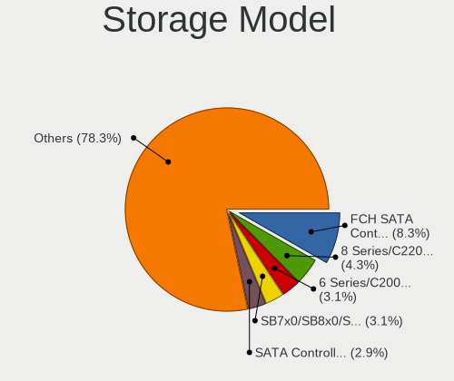
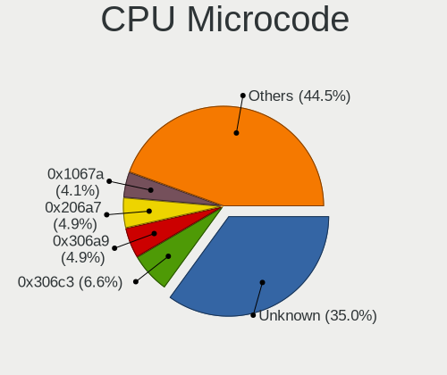

Ubuntu - Tested Hardware & Statistics (Desktops)
------------------------------------------------

A project to collect tested hardware configurations for Ubuntu.

Anyone can contribute to this report by the [hw-probe](https://github.com/linuxhw/hw-probe) tool:

    sudo -E hw-probe -all -upload

Please contribute! Especially if your hardware is rare.

Contents
--------

* [ Test Cases ](#test-cases)

* [ System ](#system)
  - [ OS                       ](#os)
  - [ OS Family                ](#os-family)
  - [ Kernel                   ](#kernel)
  - [ Kernel Family            ](#kernel-family)
  - [ Kernel Major Ver.        ](#kernel-major-ver)
  - [ Arch                     ](#arch)
  - [ DE                       ](#de)
  - [ Display Server           ](#display-server)
  - [ Display Manager          ](#display-manager)
  - [ OS Lang                  ](#os-lang)
  - [ Boot Mode                ](#boot-mode)
  - [ Filesystem               ](#filesystem)
  - [ Part. scheme             ](#part-scheme)
  - [ Dual Boot with Linux/BSD ](#dual-boot-with-linuxbsd)
  - [ Dual Boot (Win)          ](#dual-boot-win)

* [ Board ](#board)
  - [ Vendor                   ](#vendor)
  - [ Model                    ](#model)
  - [ Model Family             ](#model-family)
  - [ MFG Year                 ](#mfg-year)
  - [ Form Factor              ](#form-factor)
  - [ Secure Boot              ](#secure-boot)
  - [ Coreboot                 ](#coreboot)
  - [ RAM Size                 ](#ram-size)
  - [ RAM Used                 ](#ram-used)
  - [ Total Drives             ](#total-drives)
  - [ Has CD-ROM               ](#has-cd-rom)
  - [ Has Ethernet             ](#has-ethernet)
  - [ Has WiFi                 ](#has-wifi)
  - [ Has Bluetooth            ](#has-bluetooth)

* [ Location ](#location)
  - [ Country                  ](#country)
  - [ City                     ](#city)

* [ Drives ](#drives)
  - [ Drive Vendor             ](#drive-vendor)
  - [ Drive Model              ](#drive-model)
  - [ HDD Vendor               ](#hdd-vendor)
  - [ SSD Vendor               ](#ssd-vendor)
  - [ Drive Kind               ](#drive-kind)
  - [ Drive Connector          ](#drive-connector)
  - [ Drive Size               ](#drive-size)
  - [ Space Total              ](#space-total)
  - [ Space Used               ](#space-used)
  - [ Malfunc. Drives          ](#malfunc-drives)
  - [ Malfunc. Drive Vendor    ](#malfunc-drive-vendor)
  - [ Malfunc. HDD Vendor      ](#malfunc-hdd-vendor)
  - [ Malfunc. Drive Kind      ](#malfunc-drive-kind)
  - [ Failed Drives            ](#failed-drives)
  - [ Failed Drive Vendor      ](#failed-drive-vendor)
  - [ Drive Status             ](#drive-status)

* [ Storage controller ](#storage-controller)
  - [ Storage Vendor           ](#storage-vendor)
  - [ Storage Model            ](#storage-model)
  - [ Storage Kind             ](#storage-kind)

* [ Processor ](#processor)
  - [ CPU Vendor               ](#cpu-vendor)
  - [ CPU Model                ](#cpu-model)
  - [ CPU Model Family         ](#cpu-model-family)
  - [ CPU Cores                ](#cpu-cores)
  - [ CPU Sockets              ](#cpu-sockets)
  - [ CPU Threads              ](#cpu-threads)
  - [ CPU Op-Modes             ](#cpu-op-modes)
  - [ CPU Microcode            ](#cpu-microcode)
  - [ CPU Microarch            ](#cpu-microarch)

* [ Graphics ](#graphics)
  - [ GPU Vendor               ](#gpu-vendor)
  - [ GPU Model                ](#gpu-model)
  - [ GPU Combo                ](#gpu-combo)
  - [ GPU Driver               ](#gpu-driver)
  - [ GPU Memory               ](#gpu-memory)

* [ Monitor ](#monitor)
  - [ Monitor Vendor           ](#monitor-vendor)
  - [ Monitor Model            ](#monitor-model)
  - [ Monitor Resolution       ](#monitor-resolution)
  - [ Monitor Diagonal         ](#monitor-diagonal)
  - [ Monitor Width            ](#monitor-width)
  - [ Aspect Ratio             ](#aspect-ratio)
  - [ Monitor Area             ](#monitor-area)
  - [ Pixel Density            ](#pixel-density)
  - [ Multiple Monitors        ](#multiple-monitors)

* [ Network ](#network)
  - [ Net Controller Vendor    ](#net-controller-vendor)
  - [ Net Controller Model     ](#net-controller-model)
  - [ Wireless Vendor          ](#wireless-vendor)
  - [ Wireless Model           ](#wireless-model)
  - [ Ethernet Vendor          ](#ethernet-vendor)
  - [ Ethernet Model           ](#ethernet-model)
  - [ Net Controller Kind      ](#net-controller-kind)
  - [ Used Controller          ](#used-controller)
  - [ NICs                     ](#nics)
  - [ IPv6                     ](#ipv6)

* [ Bluetooth ](#bluetooth)
  - [ Bluetooth Vendor         ](#bluetooth-vendor)
  - [ Bluetooth Model          ](#bluetooth-model)

* [ Sound ](#sound)
  - [ Sound Vendor             ](#sound-vendor)
  - [ Sound Model              ](#sound-model)

* [ Memory ](#memory)
  - [ Memory Vendor            ](#memory-vendor)
  - [ Memory Model             ](#memory-model)
  - [ Memory Kind              ](#memory-kind)
  - [ Memory Form Factor       ](#memory-form-factor)
  - [ Memory Size              ](#memory-size)
  - [ Memory Speed             ](#memory-speed)

* [ Printers & scanners ](#printers--scanners)
  - [ Printer Vendor           ](#printer-vendor)
  - [ Printer Model            ](#printer-model)
  - [ Scanner Vendor           ](#scanner-vendor)
  - [ Scanner Model            ](#scanner-model)

* [ Camera ](#camera)
  - [ Camera Vendor            ](#camera-vendor)
  - [ Camera Model             ](#camera-model)

* [ Security ](#security)
  - [ Fingerprint Vendor       ](#fingerprint-vendor)
  - [ Fingerprint Model        ](#fingerprint-model)
  - [ Chipcard Vendor          ](#chipcard-vendor)
  - [ Chipcard Model           ](#chipcard-model)

* [ Unsupported ](#unsupported)
  - [ Unsupported Devices      ](#unsupported-devices)
  - [ Unsupported Device Types ](#unsupported-device-types)

Test Cases
----------

Total: 43945

| Vendor        | Model                       | Probe                                                      | Date         |
|---------------|-----------------------------|------------------------------------------------------------|--------------|
| ASUSTek       | P8Z68-V LX                  | [2b21c81822](https://linux-hardware.org/?probe=2b21c81822) | Jan 06, 2025 |
| Lenovo        | SHARKBAY SDK0J40700 WIN     | [262450ac44](https://linux-hardware.org/?probe=262450ac44) | Jan 06, 2025 |
| MSI           | B85M-E45                    | [ce0086ec71](https://linux-hardware.org/?probe=ce0086ec71) | Jan 06, 2025 |
| MSI           | B85M-E45                    | [a341da3c42](https://linux-hardware.org/?probe=a341da3c42) | Jan 06, 2025 |
| ASUSTek       | ROG STRIX B550-F GAMING ... | [88b1c0c262](https://linux-hardware.org/?probe=88b1c0c262) | Jan 06, 2025 |
| Lenovo        | SHARKBAY 31900058 STD       | [e1ab989081](https://linux-hardware.org/?probe=e1ab989081) | Jan 06, 2025 |
| ASRock        | B250 Gaming K4              | [dc5750e7fc](https://linux-hardware.org/?probe=dc5750e7fc) | Jan 06, 2025 |
| ASRock        | N100M                       | [231da8b814](https://linux-hardware.org/?probe=231da8b814) | Jan 06, 2025 |
| ASUSTek       | PRIME Z690-A                | [a2a616fa46](https://linux-hardware.org/?probe=a2a616fa46) | Jan 05, 2025 |
| MSI           | B650M GAMING PLUS WIFI      | [c7c27f65c6](https://linux-hardware.org/?probe=c7c27f65c6) | Jan 05, 2025 |
| ASUSTek       | PRIME Z690-A                | [17a75e1af5](https://linux-hardware.org/?probe=17a75e1af5) | Jan 05, 2025 |
| MSI           | B650M GAMING PLUS WIFI      | [945b45d496](https://linux-hardware.org/?probe=945b45d496) | Jan 05, 2025 |
| ASUSTek       | Z97-K                       | [ba47136806](https://linux-hardware.org/?probe=ba47136806) | Jan 05, 2025 |
| ASRock        | Z790 PG SONIC               | [8404feef08](https://linux-hardware.org/?probe=8404feef08) | Jan 05, 2025 |
| ASRock        | B450M Pro4                  | [f1b064f039](https://linux-hardware.org/?probe=f1b064f039) | Jan 05, 2025 |
| ASUSTek       | M5A78L-M LX V2              | [02a12f94e1](https://linux-hardware.org/?probe=02a12f94e1) | Jan 05, 2025 |
| ASUSTek       | Z97-PRO GAMER               | [cc569301fd](https://linux-hardware.org/?probe=cc569301fd) | Jan 05, 2025 |
| ASUSTek       | PRIME Z690M-PLUS D4         | [beaaf37101](https://linux-hardware.org/?probe=beaaf37101) | Jan 05, 2025 |
| Gigabyte      | G41MT-S2PT                  | [d4592a5f61](https://linux-hardware.org/?probe=d4592a5f61) | Jan 05, 2025 |
| Intel         | X99                         | [0179690cc0](https://linux-hardware.org/?probe=0179690cc0) | Jan 05, 2025 |
| MSI           | MPG B650I EDGE WIFI         | [e2c6dd2497](https://linux-hardware.org/?probe=e2c6dd2497) | Jan 05, 2025 |
| eMachines     | WMCP61M                     | [e98c249cfc](https://linux-hardware.org/?probe=e98c249cfc) | Jan 04, 2025 |
| ASRock        | B650M Pro RS WiFi           | [4624d90ffe](https://linux-hardware.org/?probe=4624d90ffe) | Jan 04, 2025 |
| Advantech     | MiC-770 v2                  | [1d7c3f988e](https://linux-hardware.org/?probe=1d7c3f988e) | Jan 04, 2025 |
| ASRock        | B650M Pro RS WiFi           | [490322b097](https://linux-hardware.org/?probe=490322b097) | Jan 04, 2025 |
| HP            | 8643 SMVB                   | [246d1f3f87](https://linux-hardware.org/?probe=246d1f3f87) | Jan 04, 2025 |
| ASUSTek       | M5A97 R2.0                  | [7eb3a63b51](https://linux-hardware.org/?probe=7eb3a63b51) | Jan 04, 2025 |
| ASUSTek       | TUF Gaming B550M-PLUS WI... | [bbc74e0c64](https://linux-hardware.org/?probe=bbc74e0c64) | Jan 04, 2025 |
| Dell          | 0F642F A00                  | [3ec5a43d19](https://linux-hardware.org/?probe=3ec5a43d19) | Jan 04, 2025 |
| HP            | 3397                        | [918fca6eda](https://linux-hardware.org/?probe=918fca6eda) | Jan 04, 2025 |
| HP            | 21EF                        | [f86b96338c](https://linux-hardware.org/?probe=f86b96338c) | Jan 04, 2025 |
| Dell          | 0VRWRC A00                  | [37a490b1e0](https://linux-hardware.org/?probe=37a490b1e0) | Jan 04, 2025 |
| HP            | 3397                        | [b9c57503ea](https://linux-hardware.org/?probe=b9c57503ea) | Jan 04, 2025 |
| ASRock        | 970 Pro3 R2.0               | [adb7b1fe9d](https://linux-hardware.org/?probe=adb7b1fe9d) | Jan 04, 2025 |
| Unknown       | HX90                        | [b4c4d726e4](https://linux-hardware.org/?probe=b4c4d726e4) | Jan 04, 2025 |
| ASUSTek       | P8H61-MX USB3               | [b3b2df2fe7](https://linux-hardware.org/?probe=b3b2df2fe7) | Jan 04, 2025 |
| ASUSTek       | P8H61-MX USB3               | [1600afa2eb](https://linux-hardware.org/?probe=1600afa2eb) | Jan 04, 2025 |
| HP            | 1998                        | [cccf71a69c](https://linux-hardware.org/?probe=cccf71a69c) | Jan 04, 2025 |
| Gigabyte      | Z790 AORUS ELITE AX         | [5e7dda5f4d](https://linux-hardware.org/?probe=5e7dda5f4d) | Jan 04, 2025 |
| ASUSTek       | H97-PLUS                    | [fd886041fc](https://linux-hardware.org/?probe=fd886041fc) | Jan 04, 2025 |
| ASUSTek       | H97-PLUS                    | [dc6f9929d7](https://linux-hardware.org/?probe=dc6f9929d7) | Jan 04, 2025 |
| ASUSTek       | PRIME B250M-C               | [deab95f2af](https://linux-hardware.org/?probe=deab95f2af) | Jan 03, 2025 |
| MSI           | X670E GAMING PLUS WIFI      | [fcdb536656](https://linux-hardware.org/?probe=fcdb536656) | Jan 03, 2025 |
| Gigabyte      | B550 AORUS ELITE V2         | [c841518658](https://linux-hardware.org/?probe=c841518658) | Jan 03, 2025 |
| HP            | 805D                        | [9dd735123b](https://linux-hardware.org/?probe=9dd735123b) | Jan 03, 2025 |
| Gigabyte      | B450 GAMING X               | [92b892fb46](https://linux-hardware.org/?probe=92b892fb46) | Jan 03, 2025 |
| ASRock        | X470 Taichi                 | [72c6b2bcbb](https://linux-hardware.org/?probe=72c6b2bcbb) | Jan 03, 2025 |
| ASRock        | X470 Taichi                 | [8cadf9a645](https://linux-hardware.org/?probe=8cadf9a645) | Jan 03, 2025 |
| ASRock        | B450M Pro4                  | [d8b50816f0](https://linux-hardware.org/?probe=d8b50816f0) | Jan 03, 2025 |
| ASUSTek       | PRIME X370-A                | [86c0b9c6d4](https://linux-hardware.org/?probe=86c0b9c6d4) | Jan 03, 2025 |
| ASUSTek       | H170 PRO GAMING             | [743efb1121](https://linux-hardware.org/?probe=743efb1121) | Jan 03, 2025 |
| Dell          | 033FF6 A00                  | [621ced80c1](https://linux-hardware.org/?probe=621ced80c1) | Jan 03, 2025 |
| HP            | 89D8 SMVB                   | [150bb83ca3](https://linux-hardware.org/?probe=150bb83ca3) | Jan 02, 2025 |
| MSI           | PRO B650-VC WIFI II         | [a86933b617](https://linux-hardware.org/?probe=a86933b617) | Jan 02, 2025 |
| Gigabyte      | B550M DS3H AC               | [1540589e08](https://linux-hardware.org/?probe=1540589e08) | Jan 02, 2025 |
| Dell          | 0Y7WYT A00                  | [3d1a88150a](https://linux-hardware.org/?probe=3d1a88150a) | Jan 02, 2025 |
| MSI           | MPG B550 GAMING PLUS        | [139667b28f](https://linux-hardware.org/?probe=139667b28f) | Jan 02, 2025 |
| ASUSTek       | M11BB                       | [55fb5769d0](https://linux-hardware.org/?probe=55fb5769d0) | Jan 02, 2025 |
| Intel         | 14650HX                     | [a9e917c056](https://linux-hardware.org/?probe=a9e917c056) | Jan 02, 2025 |
| ASRock        | B450 Gaming-ITX/ac          | [b487e51342](https://linux-hardware.org/?probe=b487e51342) | Jan 02, 2025 |
| HP            | 8619                        | [a916110ad9](https://linux-hardware.org/?probe=a916110ad9) | Jan 02, 2025 |
| HP            | 0AECh D                     | [9306b507f4](https://linux-hardware.org/?probe=9306b507f4) | Jan 02, 2025 |
| ASUSTek       | M4A89TD PRO USB3            | [ca1a55b77d](https://linux-hardware.org/?probe=ca1a55b77d) | Jan 02, 2025 |
| MSI           | Z170-A PRO                  | [b1b8d67385](https://linux-hardware.org/?probe=b1b8d67385) | Jan 02, 2025 |
| MSI           | MPG B760I EDGE WIFI         | [8d39826a67](https://linux-hardware.org/?probe=8d39826a67) | Jan 02, 2025 |
| ASUSTek       | PRIME B250M-PLUS            | [5e1c09c578](https://linux-hardware.org/?probe=5e1c09c578) | Jan 02, 2025 |
| HC Technol... | HCAR5000-MI                 | [1d85db58d0](https://linux-hardware.org/?probe=1d85db58d0) | Jan 02, 2025 |
| Fujitsu       | D3427-A1 S26361-D3427-A1    | [0cd4d1a295](https://linux-hardware.org/?probe=0cd4d1a295) | Jan 01, 2025 |
| ASUSTek       | PRIME Z790-P WIFI           | [74e1ede819](https://linux-hardware.org/?probe=74e1ede819) | Jan 01, 2025 |
| HP            | 0AECh D                     | [0827eed993](https://linux-hardware.org/?probe=0827eed993) | Jan 01, 2025 |
| ASRock        | H310CM-HG4                  | [ea045be01b](https://linux-hardware.org/?probe=ea045be01b) | Jan 01, 2025 |
| HP            | 8767 A                      | [186d8b894f](https://linux-hardware.org/?probe=186d8b894f) | Jan 01, 2025 |
| ASUSTek       | PRIME X370-A                | [1138447504](https://linux-hardware.org/?probe=1138447504) | Jan 01, 2025 |
| ASUSTek       | TUF Gaming X570-PLUS        | [0319b9ba0d](https://linux-hardware.org/?probe=0319b9ba0d) | Jan 01, 2025 |
| ASUSTek       | ROG STRIX B550-F GAMING     | [9802b59126](https://linux-hardware.org/?probe=9802b59126) | Jan 01, 2025 |
| AZW           | MINI S                      | [e05536561b](https://linux-hardware.org/?probe=e05536561b) | Dec 31, 2024 |
| Pegatron      | 2AD5                        | [1df79ca2a5](https://linux-hardware.org/?probe=1df79ca2a5) | Dec 31, 2024 |
| Pegatron      | 2AD5                        | [59fc90dfa9](https://linux-hardware.org/?probe=59fc90dfa9) | Dec 31, 2024 |
| HP            | 1850                        | [e75a7ec226](https://linux-hardware.org/?probe=e75a7ec226) | Dec 31, 2024 |
| HP            | 1850                        | [935c16c9b6](https://linux-hardware.org/?probe=935c16c9b6) | Dec 31, 2024 |
| Acer          | Veriton X490G               | [0ce5ae0e9c](https://linux-hardware.org/?probe=0ce5ae0e9c) | Dec 31, 2024 |
| ASUSTek       | ROG STRIX Z390-F GAMING     | [558ed56269](https://linux-hardware.org/?probe=558ed56269) | Dec 31, 2024 |
| ASUSTek       | PRIME X370-A                | [e7919fc318](https://linux-hardware.org/?probe=e7919fc318) | Dec 31, 2024 |
| ASUSTek       | Z97-K                       | [ead5b54010](https://linux-hardware.org/?probe=ead5b54010) | Dec 31, 2024 |
| Intel         | DH61WW AAG23116-302         | [d5dae00d07](https://linux-hardware.org/?probe=d5dae00d07) | Dec 31, 2024 |
| Seeed Stud... | ODYSSEY-X86J41X5 CJ41GV2... | [d506efc726](https://linux-hardware.org/?probe=d506efc726) | Dec 31, 2024 |
| Biostar       | H61MLV3                     | [22552600f9](https://linux-hardware.org/?probe=22552600f9) | Dec 31, 2024 |
| Biostar       | H61MLV3                     | [fb0d735a6e](https://linux-hardware.org/?probe=fb0d735a6e) | Dec 31, 2024 |
| ASUSTek       | M5A78L-M LX V2              | [d995e98eb4](https://linux-hardware.org/?probe=d995e98eb4) | Dec 31, 2024 |
| ASUSTek       | PRIME Z690-P WIFI D4        | [2f76eb574a](https://linux-hardware.org/?probe=2f76eb574a) | Dec 31, 2024 |
| ASUSTek       | PRIME Z690-P WIFI D4        | [5167e42219](https://linux-hardware.org/?probe=5167e42219) | Dec 31, 2024 |
| MSI           | MPG Z390 GAMING PLUS        | [7ecce10a98](https://linux-hardware.org/?probe=7ecce10a98) | Dec 31, 2024 |
| ASUSTek       | PRIME B560-PLUS             | [1cff6ff6dc](https://linux-hardware.org/?probe=1cff6ff6dc) | Dec 30, 2024 |
| HP            | 845A                        | [6dd10c7e63](https://linux-hardware.org/?probe=6dd10c7e63) | Dec 30, 2024 |
| HP            | 0A98h                       | [68e6a9636c](https://linux-hardware.org/?probe=68e6a9636c) | Dec 30, 2024 |
| HP            | 0A98h                       | [c82ec6e6ac](https://linux-hardware.org/?probe=c82ec6e6ac) | Dec 30, 2024 |
| HP            | 1495                        | [f9588cf3eb](https://linux-hardware.org/?probe=f9588cf3eb) | Dec 30, 2024 |
| ASUSTek       | P5GZ-MX                     | [62e974ebee](https://linux-hardware.org/?probe=62e974ebee) | Dec 30, 2024 |
| eMachines     | EMCP73VT-PM                 | [c71116cfb9](https://linux-hardware.org/?probe=c71116cfb9) | Dec 30, 2024 |
| ASUSTek       | PRIME X370-A                | [a5cec19b2d](https://linux-hardware.org/?probe=a5cec19b2d) | Dec 30, 2024 |
| ASUSTek       | ROG STRIX Z790-E GAMING ... | [5d24c0c43e](https://linux-hardware.org/?probe=5d24c0c43e) | Dec 30, 2024 |
| ASUSTek       | ROG CROSSHAIR X870E HERO    | [9ba5e6b3c0](https://linux-hardware.org/?probe=9ba5e6b3c0) | Dec 30, 2024 |
| Dell          | 0K240Y A02                  | [bf8d86985d](https://linux-hardware.org/?probe=bf8d86985d) | Dec 30, 2024 |
| HP            | 8592                        | [abf909ed60](https://linux-hardware.org/?probe=abf909ed60) | Dec 30, 2024 |
| MITSUBISHI    | MELSEC WinCPU               | [7a70e43e33](https://linux-hardware.org/?probe=7a70e43e33) | Dec 30, 2024 |
| ASUSTek       | M5A97 R2.0                  | [47ea215caf](https://linux-hardware.org/?probe=47ea215caf) | Dec 30, 2024 |
| Intel         | H81                         | [68678771e5](https://linux-hardware.org/?probe=68678771e5) | Dec 30, 2024 |
| ASUSTek       | ROG Maximus X HERO          | [be780cbd32](https://linux-hardware.org/?probe=be780cbd32) | Dec 30, 2024 |
| Intel         | H81                         | [523d01d6a7](https://linux-hardware.org/?probe=523d01d6a7) | Dec 30, 2024 |
| Lenovo        | 3111 SDK0J40697 WIN 3305... | [0f37219509](https://linux-hardware.org/?probe=0f37219509) | Dec 30, 2024 |
| Biostar       | B350GTX                     | [89a7676684](https://linux-hardware.org/?probe=89a7676684) | Dec 30, 2024 |
| MSI           | 970 GAMING                  | [25058a0a6c](https://linux-hardware.org/?probe=25058a0a6c) | Dec 29, 2024 |
| Dell          | 076VHM A02                  | [9bee0be731](https://linux-hardware.org/?probe=9bee0be731) | Dec 29, 2024 |
| HP            | 212B                        | [3ddbe304f3](https://linux-hardware.org/?probe=3ddbe304f3) | Dec 29, 2024 |
| ASUSTek       | ROG STRIX B550-E GAMING     | [8c5acc63ea](https://linux-hardware.org/?probe=8c5acc63ea) | Dec 29, 2024 |
| ASUSTek       | Maximus V GENE              | [a007041cbd](https://linux-hardware.org/?probe=a007041cbd) | Dec 29, 2024 |
| Dell          | 0XCR8D A03                  | [95826b99c5](https://linux-hardware.org/?probe=95826b99c5) | Dec 29, 2024 |
| HP            | 212B                        | [d64fe3acb0](https://linux-hardware.org/?probe=d64fe3acb0) | Dec 29, 2024 |
| ASUSTek       | P5E-VM HDMI                 | [241c643172](https://linux-hardware.org/?probe=241c643172) | Dec 29, 2024 |
| ASUSTek       | ProArt X670E-CREATOR WIF... | [f7f4de362e](https://linux-hardware.org/?probe=f7f4de362e) | Dec 29, 2024 |
| Lenovo        | No DPK                      | [0a59c75def](https://linux-hardware.org/?probe=0a59c75def) | Dec 28, 2024 |
| Gigabyte      | B450 AORUS ELITE            | [d122d7fcbd](https://linux-hardware.org/?probe=d122d7fcbd) | Dec 28, 2024 |
| ASUSTek       | M3A32-MVP DELUXE            | [94f08a5066](https://linux-hardware.org/?probe=94f08a5066) | Dec 28, 2024 |
| ASUSTek       | PRIME H310I-PLUS            | [d6a1f13ad7](https://linux-hardware.org/?probe=d6a1f13ad7) | Dec 28, 2024 |
| MSI           | MAG B550 TOMAHAWK           | [eba97e7b79](https://linux-hardware.org/?probe=eba97e7b79) | Dec 28, 2024 |
| MSI           | P67A-C45                    | [fd4f26fc74](https://linux-hardware.org/?probe=fd4f26fc74) | Dec 28, 2024 |
| Gigabyte      | X870E AORUS PRO             | [bb16650670](https://linux-hardware.org/?probe=bb16650670) | Dec 28, 2024 |
| ASUSTek       | Maximus VII RANGER          | [5a84bab0c3](https://linux-hardware.org/?probe=5a84bab0c3) | Dec 28, 2024 |
| ASUSTek       | ROG STRIX Z390-E GAMING     | [4e361461b4](https://linux-hardware.org/?probe=4e361461b4) | Dec 28, 2024 |
| ASRock        | B450M Pro4                  | [4392310d5c](https://linux-hardware.org/?probe=4392310d5c) | Dec 28, 2024 |
| MSI           | A88X-G45 GAMING             | [bf00d0c5cc](https://linux-hardware.org/?probe=bf00d0c5cc) | Dec 27, 2024 |
| Lenovo        | 3111 SDK0J40697 WIN 3305... | [6744d1aa53](https://linux-hardware.org/?probe=6744d1aa53) | Dec 27, 2024 |
| ASUSTek       | M4A785T-M                   | [f16618cedd](https://linux-hardware.org/?probe=f16618cedd) | Dec 27, 2024 |
| ASUSTek       | TUF B350M-PLUS GAMING       | [a4872cd0ec](https://linux-hardware.org/?probe=a4872cd0ec) | Dec 27, 2024 |
| ASUSTek       | TUF Gaming B450M-PLUS II    | [477041c5bc](https://linux-hardware.org/?probe=477041c5bc) | Dec 27, 2024 |
| ASUSTek       | ROG STRIX Z390-E GAMING     | [3ab8537cf8](https://linux-hardware.org/?probe=3ab8537cf8) | Dec 27, 2024 |
| Dell          | 0JP3NX A01                  | [b123c88223](https://linux-hardware.org/?probe=b123c88223) | Dec 27, 2024 |
| ASRock        | AB350M Pro4                 | [e7ad6f1e08](https://linux-hardware.org/?probe=e7ad6f1e08) | Dec 27, 2024 |
| MSI           | P67A-C45                    | [dcd52e5201](https://linux-hardware.org/?probe=dcd52e5201) | Dec 27, 2024 |
| ASUSTek       | PRIME B450M-A               | [efd4ef425c](https://linux-hardware.org/?probe=efd4ef425c) | Dec 27, 2024 |
| HP            | 1905                        | [9566049ee0](https://linux-hardware.org/?probe=9566049ee0) | Dec 27, 2024 |
| HP            | 1905                        | [7223de1d2e](https://linux-hardware.org/?probe=7223de1d2e) | Dec 26, 2024 |
| ASUSTek       | M5A97 LE R2.0               | [c90efdcb98](https://linux-hardware.org/?probe=c90efdcb98) | Dec 26, 2024 |
| ASUSTek       | TUF Gaming B760M-PLUS WI... | [049870e2b4](https://linux-hardware.org/?probe=049870e2b4) | Dec 26, 2024 |
| MSI           | X670E GAMING PLUS WIFI      | [0ff42c80a6](https://linux-hardware.org/?probe=0ff42c80a6) | Dec 26, 2024 |
| Gigabyte      | B560 HD3                    | [08b938f26e](https://linux-hardware.org/?probe=08b938f26e) | Dec 26, 2024 |
| ASRock        | Z77 Pro3                    | [6e2115d1fc](https://linux-hardware.org/?probe=6e2115d1fc) | Dec 26, 2024 |
| Dell          | 0C1R19 A01                  | [ce9a260977](https://linux-hardware.org/?probe=ce9a260977) | Dec 26, 2024 |
| ASUSTek       | TUF X470-PLUS GAMING        | [5084350626](https://linux-hardware.org/?probe=5084350626) | Dec 26, 2024 |
| ASUSTek       | P8H67-M PRO                 | [9fe5377380](https://linux-hardware.org/?probe=9fe5377380) | Dec 26, 2024 |
| Medion        | MS-7713                     | [794eb82dcb](https://linux-hardware.org/?probe=794eb82dcb) | Dec 26, 2024 |
| ASRock        | Z77 Pro3                    | [b995c7c799](https://linux-hardware.org/?probe=b995c7c799) | Dec 26, 2024 |
| MSI           | MAG B650 TOMAHAWK WIFI      | [769432836d](https://linux-hardware.org/?probe=769432836d) | Dec 26, 2024 |
| MSI           | PRO B760-P WIFI DDR4        | [d7ca54538f](https://linux-hardware.org/?probe=d7ca54538f) | Dec 26, 2024 |
| HP            | 805D                        | [026fd8a8b5](https://linux-hardware.org/?probe=026fd8a8b5) | Dec 26, 2024 |
| MSI           | MAG X570 TOMAHAWK WIFI      | [1a60e8fb7a](https://linux-hardware.org/?probe=1a60e8fb7a) | Dec 26, 2024 |
| ASRock        | B650M Pro RS WiFi           | [368bda5cc8](https://linux-hardware.org/?probe=368bda5cc8) | Dec 26, 2024 |
| Dell          | 06D7TR A00                  | [59dc0fa024](https://linux-hardware.org/?probe=59dc0fa024) | Dec 26, 2024 |
| HP            | 21EF 00~                   | [330a156ee2](https://linux-hardware.org/?probe=330a156ee2) | Dec 26, 2024 |
| Dell          | 0D6H9T A00                  | [3eb6ff8845](https://linux-hardware.org/?probe=3eb6ff8845) | Dec 25, 2024 |
| HP            | 21EF                        | [699cf57463](https://linux-hardware.org/?probe=699cf57463) | Dec 25, 2024 |
| MSI           | B450M PRO-VDH MAX           | [eb51fedfee](https://linux-hardware.org/?probe=eb51fedfee) | Dec 25, 2024 |
| Gigabyte      | X570 AORUS PRO              | [c7cf8562c2](https://linux-hardware.org/?probe=c7cf8562c2) | Dec 25, 2024 |
| Acer          | Predator PO3-630            | [7cc2ff9acc](https://linux-hardware.org/?probe=7cc2ff9acc) | Dec 25, 2024 |
| Gigabyte      | MRHM3AP                     | [657c4947e4](https://linux-hardware.org/?probe=657c4947e4) | Dec 25, 2024 |
| Unknown       | NISB 3500                   | [dd5b50cff4](https://linux-hardware.org/?probe=dd5b50cff4) | Dec 25, 2024 |
| MSI           | B450 TOMAHAWK               | [d999df797b](https://linux-hardware.org/?probe=d999df797b) | Dec 25, 2024 |
| ASUSTek       | TUF Gaming A520M-PLUS WI... | [9943ac6fda](https://linux-hardware.org/?probe=9943ac6fda) | Dec 25, 2024 |
| ASUSTek       | PRIME B550M-A AC            | [51670d2ccf](https://linux-hardware.org/?probe=51670d2ccf) | Dec 25, 2024 |
| Medion        | H81H3-EM2 H81EM2W08.309     | [4d4f395e80](https://linux-hardware.org/?probe=4d4f395e80) | Dec 24, 2024 |
| HP            | 845A                        | [d529dc1efc](https://linux-hardware.org/?probe=d529dc1efc) | Dec 24, 2024 |
| Intel         | DH77KC AAG39641-401         | [0c54d9c7a7](https://linux-hardware.org/?probe=0c54d9c7a7) | Dec 24, 2024 |
| ASUSTek       | Z97-K                       | [9c28b6bdee](https://linux-hardware.org/?probe=9c28b6bdee) | Dec 24, 2024 |
| MSI           | B450M-A PRO MAX             | [b5f8afb7e9](https://linux-hardware.org/?probe=b5f8afb7e9) | Dec 24, 2024 |
| MSI           | B75MA-E33                   | [717b51fc12](https://linux-hardware.org/?probe=717b51fc12) | Dec 24, 2024 |
| Gigabyte      | B450M DS3H-CF               | [e3be4eb4bf](https://linux-hardware.org/?probe=e3be4eb4bf) | Dec 24, 2024 |
| Intel         | AvenueCityM                 | [18f894cdc8](https://linux-hardware.org/?probe=18f894cdc8) | Dec 24, 2024 |
| MiTAC         | PD10EHI                     | [0879837e1b](https://linux-hardware.org/?probe=0879837e1b) | Dec 24, 2024 |
| Unknown       | BENA-2142H                  | [0fbb9383fa](https://linux-hardware.org/?probe=0fbb9383fa) | Dec 24, 2024 |
| Dell          | 0R790T A00                  | [c5ae7595ff](https://linux-hardware.org/?probe=c5ae7595ff) | Dec 24, 2024 |
| Intel         | B75                         | [b6021895af](https://linux-hardware.org/?probe=b6021895af) | Dec 24, 2024 |
| PN-3322       | PN-Media-01 V1.04           | [bc369995a2](https://linux-hardware.org/?probe=bc369995a2) | Dec 24, 2024 |
| Dell          | 0XPDFK A01                  | [fdd93d3ccd](https://linux-hardware.org/?probe=fdd93d3ccd) | Dec 24, 2024 |
| HP            | 304Bh                       | [a578f26b30](https://linux-hardware.org/?probe=a578f26b30) | Dec 24, 2024 |
| Dell          | 0KWVT8 A03                  | [689cab771e](https://linux-hardware.org/?probe=689cab771e) | Dec 23, 2024 |
| Intel         | B75A                        | [dd337bfe58](https://linux-hardware.org/?probe=dd337bfe58) | Dec 23, 2024 |
| Intel         | X99                         | [d2e526949b](https://linux-hardware.org/?probe=d2e526949b) | Dec 23, 2024 |
| ASUSTek       | TUF Gaming X570-PLUS        | [ce9f60c0b5](https://linux-hardware.org/?probe=ce9f60c0b5) | Dec 23, 2024 |
| MSI           | X370 XPOWER GAMING TITAN... | [d464edfda5](https://linux-hardware.org/?probe=d464edfda5) | Dec 23, 2024 |
| MSI           | PRO Z790-A MAX WIFI         | [834ad993ac](https://linux-hardware.org/?probe=834ad993ac) | Dec 23, 2024 |
| Dell          | 0KWVT8 A03                  | [d07ce185b1](https://linux-hardware.org/?probe=d07ce185b1) | Dec 23, 2024 |
| Gigabyte      | F2A78M-HD2                  | [c92c7f0791](https://linux-hardware.org/?probe=c92c7f0791) | Dec 23, 2024 |
| Gigabyte      | X570 AORUS ELITE            | [a847bd7a4f](https://linux-hardware.org/?probe=a847bd7a4f) | Dec 23, 2024 |
| MSI           | C847IS-P33                  | [675e2d8c5d](https://linux-hardware.org/?probe=675e2d8c5d) | Dec 23, 2024 |
| MACHINIST     | X99 PR9                     | [74d2e10d43](https://linux-hardware.org/?probe=74d2e10d43) | Dec 23, 2024 |
| Gigabyte      | A320M-H-CF                  | [6e7907b787](https://linux-hardware.org/?probe=6e7907b787) | Dec 23, 2024 |
| ASUSTek       | PRIME B450M-A               | [4dbc846a39](https://linux-hardware.org/?probe=4dbc846a39) | Dec 23, 2024 |
| Acer          | Predator PO3-600 V:1.1      | [8473ea95de](https://linux-hardware.org/?probe=8473ea95de) | Dec 23, 2024 |
| ASRockRack    | TRX40D8-2N2T                | [a97760eedd](https://linux-hardware.org/?probe=a97760eedd) | Dec 23, 2024 |
| Dell          | 0J1C3P A00                  | [97c941fc16](https://linux-hardware.org/?probe=97c941fc16) | Dec 23, 2024 |
| Gigabyte      | B650 AORUS ELITE AX V2      | [1cc758dd90](https://linux-hardware.org/?probe=1cc758dd90) | Dec 23, 2024 |
| MUCAI         | H61 V1.5                    | [e087ab99b3](https://linux-hardware.org/?probe=e087ab99b3) | Dec 23, 2024 |
| ASRock        | B450 Gaming-ITX/ac          | [a25fcfd80e](https://linux-hardware.org/?probe=a25fcfd80e) | Dec 23, 2024 |
| Dell          | 0PRR48 A01                  | [282281a510](https://linux-hardware.org/?probe=282281a510) | Dec 23, 2024 |
| ASUSTek       | TUF Gaming B450-PLUS II     | [7cc80d8aba](https://linux-hardware.org/?probe=7cc80d8aba) | Dec 23, 2024 |
| HP            | 3396                        | [c26082be18](https://linux-hardware.org/?probe=c26082be18) | Dec 23, 2024 |
| MSI           | 2A9C                        | [e552d93303](https://linux-hardware.org/?probe=e552d93303) | Dec 23, 2024 |
| HP            | 3396                        | [a2eda9a830](https://linux-hardware.org/?probe=a2eda9a830) | Dec 23, 2024 |
| HP            | 2129                        | [9ef2d08323](https://linux-hardware.org/?probe=9ef2d08323) | Dec 23, 2024 |
| ASUSTek       | H97-PLUS                    | [dde78901c1](https://linux-hardware.org/?probe=dde78901c1) | Dec 23, 2024 |
| ASUSTek       | A88X-PRO                    | [1b74d31510](https://linux-hardware.org/?probe=1b74d31510) | Dec 23, 2024 |
| ASUSTek       | STRIX B250H GAMING          | [c5bf48c144](https://linux-hardware.org/?probe=c5bf48c144) | Dec 22, 2024 |
| Dell          | 0MWYPT A02                  | [6d1b9f2ffd](https://linux-hardware.org/?probe=6d1b9f2ffd) | Dec 22, 2024 |
| ASUSTek       | M5A78L-M PLUS/USB3          | [9d9a451905](https://linux-hardware.org/?probe=9d9a451905) | Dec 22, 2024 |
| ASUSTek       | M5A78L-M PLUS/USB3          | [a7dd685d33](https://linux-hardware.org/?probe=a7dd685d33) | Dec 22, 2024 |
| Gigabyte      | GA-MA790XT-UD4P             | [3916b9871f](https://linux-hardware.org/?probe=3916b9871f) | Dec 22, 2024 |
| MSI           | H610M BOMBER DDR4           | [2d757efd33](https://linux-hardware.org/?probe=2d757efd33) | Dec 22, 2024 |
| ASUSTek       | TUF Gaming X570-PRO         | [f7f28f51ad](https://linux-hardware.org/?probe=f7f28f51ad) | Dec 22, 2024 |
| ASUSTek       | P6T                         | [1c4b7e24bb](https://linux-hardware.org/?probe=1c4b7e24bb) | Dec 22, 2024 |
| ASRock        | B550M/ac                    | [479e65f4b2](https://linux-hardware.org/?probe=479e65f4b2) | Dec 22, 2024 |
| MSI           | A88X-G45 GAMING             | [41d688dd9b](https://linux-hardware.org/?probe=41d688dd9b) | Dec 22, 2024 |
| ASUSTek       | PRIME B250M-PLUS            | [205131fe2e](https://linux-hardware.org/?probe=205131fe2e) | Dec 22, 2024 |
| ASUSTek       | ROG Maximus XI GENE         | [e773c2d04f](https://linux-hardware.org/?probe=e773c2d04f) | Dec 22, 2024 |
| ASRock        | B550M/ac                    | [3f21ab066d](https://linux-hardware.org/?probe=3f21ab066d) | Dec 22, 2024 |
| Gigabyte      | Z790 AORUS ELITE AX         | [7e57a7c1e3](https://linux-hardware.org/?probe=7e57a7c1e3) | Dec 22, 2024 |
| Gigabyte      | Z790 AORUS ELITE AX         | [a76549986f](https://linux-hardware.org/?probe=a76549986f) | Dec 22, 2024 |
| MSI           | PRO B760-P WIFI DDR4        | [22cf181ba7](https://linux-hardware.org/?probe=22cf181ba7) | Dec 22, 2024 |
| HP            | 21EF 00~                   | [60fd75cbd3](https://linux-hardware.org/?probe=60fd75cbd3) | Dec 21, 2024 |
| MSI           | PRO B650-A WIFI             | [4c3d8d6732](https://linux-hardware.org/?probe=4c3d8d6732) | Dec 21, 2024 |
| ASUSTek       | P8P67 LE                    | [8e46f54d3c](https://linux-hardware.org/?probe=8e46f54d3c) | Dec 21, 2024 |
| Gigabyte      | B660 GAMING X AX DDR4       | [f612720d9b](https://linux-hardware.org/?probe=f612720d9b) | Dec 21, 2024 |
| ASUSTek       | P8H61-MX USB3               | [c7fb48cd8b](https://linux-hardware.org/?probe=c7fb48cd8b) | Dec 21, 2024 |
| ASUSTek       | PRIME B650M-A AX II         | [a1a37b188a](https://linux-hardware.org/?probe=a1a37b188a) | Dec 21, 2024 |
| MSI           | PRO B650M-A WIFI            | [8cd738bd8a](https://linux-hardware.org/?probe=8cd738bd8a) | Dec 21, 2024 |
| ASUSTek       | P6X58D-E                    | [823b8d450e](https://linux-hardware.org/?probe=823b8d450e) | Dec 21, 2024 |
| ASUSTek       | P6T                         | [de989023ba](https://linux-hardware.org/?probe=de989023ba) | Dec 20, 2024 |
| Intel         | X99                         | [380078a8ea](https://linux-hardware.org/?probe=380078a8ea) | Dec 20, 2024 |
| Fujitsu       | D3162-A1 S26361-D3162-A1    | [bb59d2737c](https://linux-hardware.org/?probe=bb59d2737c) | Dec 20, 2024 |
| MSI           | MEG Z490I UNIFY             | [34567a9026](https://linux-hardware.org/?probe=34567a9026) | Dec 20, 2024 |
| MSI           | 970 GAMING                  | [e611695dcf](https://linux-hardware.org/?probe=e611695dcf) | Dec 20, 2024 |
| MACHINIST     | X99 PR9                     | [6721f17c3e](https://linux-hardware.org/?probe=6721f17c3e) | Dec 20, 2024 |
| ASRock        | Z77 Pro4-M                  | [6f78f8b204](https://linux-hardware.org/?probe=6f78f8b204) | Dec 20, 2024 |
| Dell          | 0CWR57 A01                  | [fe171c38a8](https://linux-hardware.org/?probe=fe171c38a8) | Dec 20, 2024 |
| AZW           | U59                         | [b20a2719ec](https://linux-hardware.org/?probe=b20a2719ec) | Dec 20, 2024 |
| Google        | Panther                     | [50b14bd13e](https://linux-hardware.org/?probe=50b14bd13e) | Dec 20, 2024 |
| ASRock        | B365 Phantom Gaming 4       | [ad7f76dde0](https://linux-hardware.org/?probe=ad7f76dde0) | Dec 20, 2024 |
| Gigabyte      | B550M AORUS ELITE           | [bd195a8451](https://linux-hardware.org/?probe=bd195a8451) | Dec 20, 2024 |
| HP            | 339A                        | [544d3bb903](https://linux-hardware.org/?probe=544d3bb903) | Dec 20, 2024 |
| Gigabyte      | Z790 AORUS ELITE X WIFI7    | [31d1491625](https://linux-hardware.org/?probe=31d1491625) | Dec 19, 2024 |
| ASUSTek       | ROG Maximus XII HERO        | [4c7762f08e](https://linux-hardware.org/?probe=4c7762f08e) | Dec 19, 2024 |
| ASUSTek       | TUF Gaming X570-PLUS        | [80d60e6ac6](https://linux-hardware.org/?probe=80d60e6ac6) | Dec 19, 2024 |
| Gigabyte      | Z77X-UD3H                   | [c511952a11](https://linux-hardware.org/?probe=c511952a11) | Dec 19, 2024 |
| Dell          | 0WG860                      | [4c6d6d2f4d](https://linux-hardware.org/?probe=4c6d6d2f4d) | Dec 19, 2024 |
| Gigabyte      | Z97X-UD3H-CF                | [93bf226f2b](https://linux-hardware.org/?probe=93bf226f2b) | Dec 19, 2024 |
| ASRock        | B365 Pro4                   | [d18fd00942](https://linux-hardware.org/?probe=d18fd00942) | Dec 19, 2024 |
| Gigabyte      | Z77-DS3H                    | [8d13b458e4](https://linux-hardware.org/?probe=8d13b458e4) | Dec 19, 2024 |
| Gigabyte      | Z390 M GAMING-CF            | [1892d9c3bf](https://linux-hardware.org/?probe=1892d9c3bf) | Dec 19, 2024 |
| HP            | 81C5 MVB                    | [598ed0a0e1](https://linux-hardware.org/?probe=598ed0a0e1) | Dec 19, 2024 |
| Gigabyte      | Z370P D3-CF                 | [b61300e5fc](https://linux-hardware.org/?probe=b61300e5fc) | Dec 19, 2024 |
| Gigabyte      | Z370P D3-CF                 | [17dea1d514](https://linux-hardware.org/?probe=17dea1d514) | Dec 19, 2024 |
| Lenovo        | SHARKBAY 0B98401 PRO        | [ab4132ad4c](https://linux-hardware.org/?probe=ab4132ad4c) | Dec 19, 2024 |
| Lenovo        | SHARKBAY 0B98401 PRO        | [cbeebff465](https://linux-hardware.org/?probe=cbeebff465) | Dec 19, 2024 |
| ASUSTek       | P8Z77-V PRO                 | [4b3eb67e2e](https://linux-hardware.org/?probe=4b3eb67e2e) | Dec 19, 2024 |
| MSI           | Z77A-G43                    | [dfc91607d7](https://linux-hardware.org/?probe=dfc91607d7) | Dec 18, 2024 |
| AZW           | MINI S                      | [a357f70913](https://linux-hardware.org/?probe=a357f70913) | Dec 18, 2024 |
| ASRock        | X300M-STX                   | [ff2733d152](https://linux-hardware.org/?probe=ff2733d152) | Dec 18, 2024 |
| MSI           | C847IS-P33                  | [d2837e1066](https://linux-hardware.org/?probe=d2837e1066) | Dec 18, 2024 |
| Supermicro    | X10DRC                      | [6e281b1919](https://linux-hardware.org/?probe=6e281b1919) | Dec 18, 2024 |
| HPE           | ProLiant MicroServer Gen... | [87867b5405](https://linux-hardware.org/?probe=87867b5405) | Dec 18, 2024 |
| Dell          | 0JP3NX A00                  | [f80311b20d](https://linux-hardware.org/?probe=f80311b20d) | Dec 18, 2024 |
| Fujitsu       | D3091-A1 S26361-D3091-A1    | [52b54f9c5f](https://linux-hardware.org/?probe=52b54f9c5f) | Dec 18, 2024 |
| Dell          | 02YYK5 A01                  | [160fadff40](https://linux-hardware.org/?probe=160fadff40) | Dec 18, 2024 |
| MiTAC         | PD10EHI                     | [677c9d3ee3](https://linux-hardware.org/?probe=677c9d3ee3) | Dec 18, 2024 |
| T-bao         | MINI PC V1.0                | [abcfbdcc04](https://linux-hardware.org/?probe=abcfbdcc04) | Dec 18, 2024 |
| JGINYUE       | B650I Night Devil Ver:      | [d5b76ece1e](https://linux-hardware.org/?probe=d5b76ece1e) | Dec 18, 2024 |
| ASUSTek       | X99-A                       | [69f91227bf](https://linux-hardware.org/?probe=69f91227bf) | Dec 18, 2024 |
| Gigabyte      | B450M DS3H-CF               | [38d246c0d7](https://linux-hardware.org/?probe=38d246c0d7) | Dec 18, 2024 |
| Dell          | 09WH54 A00                  | [ee76e374e0](https://linux-hardware.org/?probe=ee76e374e0) | Dec 17, 2024 |
| Dell          | 076VHM A02                  | [eb059e22c7](https://linux-hardware.org/?probe=eb059e22c7) | Dec 17, 2024 |
| MSI           | PRO B550M-P GEN3            | [454a6a7330](https://linux-hardware.org/?probe=454a6a7330) | Dec 17, 2024 |
| Gigabyte      | B450M DS3H-CF               | [244afc8414](https://linux-hardware.org/?probe=244afc8414) | Dec 17, 2024 |
| ASRock        | B550M-ITX/ac                | [8a3a09683f](https://linux-hardware.org/?probe=8a3a09683f) | Dec 17, 2024 |
| ASRock        | A520M-ITX/ac                | [6e85c5b749](https://linux-hardware.org/?probe=6e85c5b749) | Dec 17, 2024 |
| Lenovo        | 1064 SDK0T76530 WIN 3556... | [5913ca9ed8](https://linux-hardware.org/?probe=5913ca9ed8) | Dec 17, 2024 |
| Gigabyte      | X670 AORUS ELITE AX         | [47f7249a37](https://linux-hardware.org/?probe=47f7249a37) | Dec 17, 2024 |
| Intel         | AvenueCityM                 | [03c9379895](https://linux-hardware.org/?probe=03c9379895) | Dec 17, 2024 |
| Intel         | H61                         | [e4a1f6b371](https://linux-hardware.org/?probe=e4a1f6b371) | Dec 17, 2024 |
| Supermicro    | X10DRC                      | [2d4c0b9ec2](https://linux-hardware.org/?probe=2d4c0b9ec2) | Dec 17, 2024 |
| MSI           | B365M PRO-VDH               | [f9eeaab8b3](https://linux-hardware.org/?probe=f9eeaab8b3) | Dec 17, 2024 |
| MSI           | MAG B760 TOMAHAWK WIFI      | [b19f32d4f6](https://linux-hardware.org/?probe=b19f32d4f6) | Dec 17, 2024 |
| ASUSTek       | H97-PLUS                    | [a5bd96f88c](https://linux-hardware.org/?probe=a5bd96f88c) | Dec 17, 2024 |
| ASUSTek       | H97-PLUS                    | [7b2a1e2305](https://linux-hardware.org/?probe=7b2a1e2305) | Dec 17, 2024 |
| MSI           | 970A SLI Krait Edition      | [563a8aa1b9](https://linux-hardware.org/?probe=563a8aa1b9) | Dec 17, 2024 |
| Gigabyte      | GA-880GM-UD2H               | [6aab958077](https://linux-hardware.org/?probe=6aab958077) | Dec 17, 2024 |
| ASUSTek       | TUF Gaming B660M-PLUS WI... | [1e7ff6fa41](https://linux-hardware.org/?probe=1e7ff6fa41) | Dec 17, 2024 |
| Dell          | 0P096C A01                  | [98c35e9b9b](https://linux-hardware.org/?probe=98c35e9b9b) | Dec 17, 2024 |
| ASRock        | B450M Gaming                | [8d0b46c30e](https://linux-hardware.org/?probe=8d0b46c30e) | Dec 16, 2024 |
| HP            | 198E                        | [7cedcbe8c0](https://linux-hardware.org/?probe=7cedcbe8c0) | Dec 16, 2024 |
| HP            | 198E                        | [9d254d2d2a](https://linux-hardware.org/?probe=9d254d2d2a) | Dec 16, 2024 |
| ASUSTek       | P8Z68-V LX                  | [a91c4b26f6](https://linux-hardware.org/?probe=a91c4b26f6) | Dec 16, 2024 |
| ASUSTek       | Z170-K                      | [a37f17c9d8](https://linux-hardware.org/?probe=a37f17c9d8) | Dec 16, 2024 |
| ASUSTek       | TUF Gaming B760M-PLUS       | [2735aaa5fb](https://linux-hardware.org/?probe=2735aaa5fb) | Dec 16, 2024 |
| Gigabyte      | Z270XP-SLI-CF               | [103d7b2046](https://linux-hardware.org/?probe=103d7b2046) | Dec 16, 2024 |
| Dell          | 0JP3NX A00                  | [9c57ea74e2](https://linux-hardware.org/?probe=9c57ea74e2) | Dec 16, 2024 |
| ASRock        | B450M Gaming                | [8c14c6037e](https://linux-hardware.org/?probe=8c14c6037e) | Dec 16, 2024 |
| MSI           | 760GM -E51                  | [604b28b217](https://linux-hardware.org/?probe=604b28b217) | Dec 16, 2024 |
| Lenovo        | SHARKBAY NOK                | [9e863b5f90](https://linux-hardware.org/?probe=9e863b5f90) | Dec 16, 2024 |
| MSI           | MAG X870 TOMAHAWK WIFI      | [569b52f7b9](https://linux-hardware.org/?probe=569b52f7b9) | Dec 16, 2024 |
| MSI           | MAG X870 TOMAHAWK WIFI      | [bc81411e04](https://linux-hardware.org/?probe=bc81411e04) | Dec 16, 2024 |
| Unknown       | Unknown                     | [4aa185aae8](https://linux-hardware.org/?probe=4aa185aae8) | Dec 16, 2024 |
| Gigabyte      | X570 I AORUS PRO WIFI       | [41ce41aa0b](https://linux-hardware.org/?probe=41ce41aa0b) | Dec 16, 2024 |
| Lenovo        | ThinkCentre A52 8289G4M     | [d07ac546df](https://linux-hardware.org/?probe=d07ac546df) | Dec 16, 2024 |
| MSI           | PRO B760M-VC WIFI BULK      | [5a055752f9](https://linux-hardware.org/?probe=5a055752f9) | Dec 15, 2024 |
| Biostar       | H510MHP                     | [6aca496f13](https://linux-hardware.org/?probe=6aca496f13) | Dec 15, 2024 |
| ASUSTek       | ROG Maximus Z790 DARK HE... | [643483a6b9](https://linux-hardware.org/?probe=643483a6b9) | Dec 15, 2024 |
| ASRock        | Z97E-ITX/ac                 | [bab03d17ee](https://linux-hardware.org/?probe=bab03d17ee) | Dec 15, 2024 |
| MSI           | MPG X870E CARBON WIFI       | [f744e3d46f](https://linux-hardware.org/?probe=f744e3d46f) | Dec 15, 2024 |
| HP            | 8643 SMVB                   | [c6ec98e566](https://linux-hardware.org/?probe=c6ec98e566) | Dec 15, 2024 |
| AZW           | MINI S                      | [72d625f895](https://linux-hardware.org/?probe=72d625f895) | Dec 15, 2024 |
| MSI           | MS-7502 Fab D               | [0eba44ff1d](https://linux-hardware.org/?probe=0eba44ff1d) | Dec 15, 2024 |
| MSI           | H81I                        | [8972ead70f](https://linux-hardware.org/?probe=8972ead70f) | Dec 15, 2024 |
| Intel         | E5-A99 V1.2                 | [831ca574ef](https://linux-hardware.org/?probe=831ca574ef) | Dec 15, 2024 |
| Intel         | E5-A99 V1.2                 | [7e152bb4f4](https://linux-hardware.org/?probe=7e152bb4f4) | Dec 15, 2024 |
| MSI           | PRO B650M-P                 | [6d7d80137f](https://linux-hardware.org/?probe=6d7d80137f) | Dec 15, 2024 |
| Unknown       | Unknown                     | [8ee7529ab3](https://linux-hardware.org/?probe=8ee7529ab3) | Dec 15, 2024 |
| Dell          | 06D7TR A00                  | [9a0ab12c8c](https://linux-hardware.org/?probe=9a0ab12c8c) | Dec 15, 2024 |
| Dell          | 09WH54 A00                  | [2996405b15](https://linux-hardware.org/?probe=2996405b15) | Dec 15, 2024 |
| Fujitsu       | D3091-A1 S26361-D3091-A1    | [9ddeef2131](https://linux-hardware.org/?probe=9ddeef2131) | Dec 15, 2024 |
| ASUSTek       | PRIME A320M-K               | [4fa18c588d](https://linux-hardware.org/?probe=4fa18c588d) | Dec 15, 2024 |
| MSI           | X99S SLI PLUS               | [9ff7b1c7a1](https://linux-hardware.org/?probe=9ff7b1c7a1) | Dec 15, 2024 |
| Gigabyte      | M720-US3                    | [20f9b09742](https://linux-hardware.org/?probe=20f9b09742) | Dec 14, 2024 |
| ASUSTek       | P7P55D                      | [4cf386124b](https://linux-hardware.org/?probe=4cf386124b) | Dec 14, 2024 |
| Dell          | 0F428D A00                  | [ba32636f6f](https://linux-hardware.org/?probe=ba32636f6f) | Dec 14, 2024 |
| Medion        | Z370H4-EM                   | [970f89f0fb](https://linux-hardware.org/?probe=970f89f0fb) | Dec 14, 2024 |
| Medion        | Z370H4-EM                   | [9f3a15494d](https://linux-hardware.org/?probe=9f3a15494d) | Dec 14, 2024 |
| Dell          | 0WG860                      | [7c259daf00](https://linux-hardware.org/?probe=7c259daf00) | Dec 14, 2024 |
| Acer          | A Power T200                | [c3aefafdb9](https://linux-hardware.org/?probe=c3aefafdb9) | Dec 14, 2024 |
| MSI           | PRO H610M-E DDR4            | [dd71cde0f4](https://linux-hardware.org/?probe=dd71cde0f4) | Dec 14, 2024 |
| Gigabyte      | AB350-Gaming-CF             | [7aebeb376d](https://linux-hardware.org/?probe=7aebeb376d) | Dec 14, 2024 |
| Dell          | 0GY6Y8 A03                  | [e453ed40ac](https://linux-hardware.org/?probe=e453ed40ac) | Dec 14, 2024 |
| ASUSTek       | ROG STRIX B550-A GAMING     | [4f591d2875](https://linux-hardware.org/?probe=4f591d2875) | Dec 14, 2024 |
| ASUSTek       | P5G41T-M LX PLUS            | [9ca8033b01](https://linux-hardware.org/?probe=9ca8033b01) | Dec 14, 2024 |
| HP            | 0A08h                       | [4b76eeac51](https://linux-hardware.org/?probe=4b76eeac51) | Dec 14, 2024 |
| ASRock        | B250M-HDV                   | [feade65edb](https://linux-hardware.org/?probe=feade65edb) | Dec 13, 2024 |
| ASUSTek       | STRIX B250H GAMING          | [21f043f6d7](https://linux-hardware.org/?probe=21f043f6d7) | Dec 13, 2024 |
| ASUSTek       | PRIME B650-PLUS             | [dbfe399fdb](https://linux-hardware.org/?probe=dbfe399fdb) | Dec 13, 2024 |
| Gigabyte      | H81M-S                      | [68e2f55258](https://linux-hardware.org/?probe=68e2f55258) | Dec 13, 2024 |
| MSI           | B550-A PRO                  | [204aaa19ef](https://linux-hardware.org/?probe=204aaa19ef) | Dec 13, 2024 |
| Dell          | 0JP3NX A01                  | [1332bf42b8](https://linux-hardware.org/?probe=1332bf42b8) | Dec 13, 2024 |
| ASUSTek       | P5G41T-M LX PLUS            | [18bf59400f](https://linux-hardware.org/?probe=18bf59400f) | Dec 13, 2024 |
| MSI           | PRO X870-P WIFI             | [04b55adbd5](https://linux-hardware.org/?probe=04b55adbd5) | Dec 13, 2024 |
| Shenzhen M... | F7BFD                       | [044b16e22f](https://linux-hardware.org/?probe=044b16e22f) | Dec 13, 2024 |
| ASUSTek       | TUF Gaming X570-PRO         | [e3b9d8d6c9](https://linux-hardware.org/?probe=e3b9d8d6c9) | Dec 13, 2024 |
| Lenovo        | SHARKBAY SDK0E50510 PRO     | [8ece88c179](https://linux-hardware.org/?probe=8ece88c179) | Dec 13, 2024 |
| ASUSTek       | TUF Gaming X670E-PLUS WI... | [edbb2404ff](https://linux-hardware.org/?probe=edbb2404ff) | Dec 12, 2024 |
| ASUSTek       | M3A78-CM                    | [07ef1a20e7](https://linux-hardware.org/?probe=07ef1a20e7) | Dec 12, 2024 |
| Intel         | DB65AL AAG12530-307         | [80eb8c5e8f](https://linux-hardware.org/?probe=80eb8c5e8f) | Dec 12, 2024 |
| Acer          | Aspire TC-780               | [63e18470f5](https://linux-hardware.org/?probe=63e18470f5) | Dec 12, 2024 |
| Supermicro    | X10DAI                      | [8be65c83bd](https://linux-hardware.org/?probe=8be65c83bd) | Dec 12, 2024 |
| Dell          | 02YYK5 A00                  | [ec5c256ab3](https://linux-hardware.org/?probe=ec5c256ab3) | Dec 12, 2024 |
| Gigabyte      | Z690 AORUS ELITE DDR4       | [a2e8fdca3f](https://linux-hardware.org/?probe=a2e8fdca3f) | Dec 12, 2024 |
| H3C           | 3005                        | [8d2a9b7b91](https://linux-hardware.org/?probe=8d2a9b7b91) | Dec 12, 2024 |
| Dell          | 0WG855                      | [c87b7a95df](https://linux-hardware.org/?probe=c87b7a95df) | Dec 12, 2024 |
| ASRock        | A320M-HDV R4.0              | [6df6bce660](https://linux-hardware.org/?probe=6df6bce660) | Dec 11, 2024 |
| Gigabyte      | B760 GAMING X DDR4          | [f56aac465c](https://linux-hardware.org/?probe=f56aac465c) | Dec 11, 2024 |
| Lenovo        | 36C5 SDK0K17763 WIN 1801... | [5afdeb8595](https://linux-hardware.org/?probe=5afdeb8595) | Dec 11, 2024 |
| Lenovo        | 36C5 SDK0K17763 WIN 1801... | [29b0f998a4](https://linux-hardware.org/?probe=29b0f998a4) | Dec 11, 2024 |
| ASUSTek       | M5A78L-M LX V2              | [6d9e060ae1](https://linux-hardware.org/?probe=6d9e060ae1) | Dec 11, 2024 |
| ASUSTek       | M5A78L-M LX V2              | [94bf662079](https://linux-hardware.org/?probe=94bf662079) | Dec 11, 2024 |
| ASRock        | H61M-DGS                    | [8bec785ad2](https://linux-hardware.org/?probe=8bec785ad2) | Dec 11, 2024 |
| MSI           | MPG X870E CARBON WIFI       | [5dabd7ef60](https://linux-hardware.org/?probe=5dabd7ef60) | Dec 11, 2024 |
| Foxconn       | 2ABF                        | [0f46252ef0](https://linux-hardware.org/?probe=0f46252ef0) | Dec 11, 2024 |
| HP            | 3047h                       | [4cd6652c01](https://linux-hardware.org/?probe=4cd6652c01) | Dec 10, 2024 |
| Intel         | H55                         | [05559a903b](https://linux-hardware.org/?probe=05559a903b) | Dec 10, 2024 |
| ASUSTek       | ProArt B550-CREATOR         | [64f23b9876](https://linux-hardware.org/?probe=64f23b9876) | Dec 10, 2024 |
| Acer          | Unknown                     | [681aafbede](https://linux-hardware.org/?probe=681aafbede) | Dec 10, 2024 |
| Fujitsu       | D3221-A1 S26361-D3221-A1    | [90920db494](https://linux-hardware.org/?probe=90920db494) | Dec 10, 2024 |
| Gigabyte      | 970A-UD3P                   | [2a06a7c208](https://linux-hardware.org/?probe=2a06a7c208) | Dec 10, 2024 |
| Gigabyte      | 970A-UD3P                   | [98ed41d685](https://linux-hardware.org/?probe=98ed41d685) | Dec 10, 2024 |
| HP            | ProLiant ML350 G5           | [55eec713db](https://linux-hardware.org/?probe=55eec713db) | Dec 10, 2024 |
| Dell          | 0F642F A00                  | [35ab39c91f](https://linux-hardware.org/?probe=35ab39c91f) | Dec 10, 2024 |
| MACHINIST     | X99-MR9S V6.1               | [54ecfa8caf](https://linux-hardware.org/?probe=54ecfa8caf) | Dec 10, 2024 |
| MSI           | X470 GAMING PLUS            | [4825e168b0](https://linux-hardware.org/?probe=4825e168b0) | Dec 10, 2024 |
| AZW           | LZX TBD                     | [33c820c4ff](https://linux-hardware.org/?probe=33c820c4ff) | Dec 10, 2024 |
| Gigabyte      | AX370-Gaming 3-CF           | [0124649cba](https://linux-hardware.org/?probe=0124649cba) | Dec 10, 2024 |
| ASUSTek       | TUF Gaming Z790-PLUS WIF... | [059e7001cf](https://linux-hardware.org/?probe=059e7001cf) | Dec 10, 2024 |
| ASUSTek       | PRIME B350-PLUS             | [538d10f68e](https://linux-hardware.org/?probe=538d10f68e) | Dec 10, 2024 |
| Gigabyte      | B560 DS3H AC-Y1             | [b841b93b34](https://linux-hardware.org/?probe=b841b93b34) | Dec 09, 2024 |
| ASUSTek       | WS X299 SAGE/10G            | [314d35a1ae](https://linux-hardware.org/?probe=314d35a1ae) | Dec 09, 2024 |
| ASUSTek       | ROG STRIX X670E-F GAMING... | [708895b5bb](https://linux-hardware.org/?probe=708895b5bb) | Dec 09, 2024 |
| ASUSTek       | ROG STRIX X670E-F GAMING... | [537116bb8a](https://linux-hardware.org/?probe=537116bb8a) | Dec 09, 2024 |
| ASRock        | X470 Taichi                 | [3ee3f476d2](https://linux-hardware.org/?probe=3ee3f476d2) | Dec 09, 2024 |
| Medion        | MS-7616                     | [aa5ae96667](https://linux-hardware.org/?probe=aa5ae96667) | Dec 09, 2024 |
| Lenovo        | 31900058 STD                | [7a653bac15](https://linux-hardware.org/?probe=7a653bac15) | Dec 09, 2024 |
| MSI           | MAG X670E TOMAHAWK WIFI     | [19b5724bcf](https://linux-hardware.org/?probe=19b5724bcf) | Dec 09, 2024 |
| Gigabyte      | B760M DS3H DDR4             | [c21fd522d6](https://linux-hardware.org/?probe=c21fd522d6) | Dec 09, 2024 |
| MSI           | H81M-P33                    | [cac8c0b952](https://linux-hardware.org/?probe=cac8c0b952) | Dec 09, 2024 |
| Biostar       | J3060NH                     | [b5c164dd0c](https://linux-hardware.org/?probe=b5c164dd0c) | Dec 09, 2024 |
| ASUSTek       | TUF Z390-PLUS GAMING        | [6462e457e9](https://linux-hardware.org/?probe=6462e457e9) | Dec 09, 2024 |
| Dell          | 05GD68 A00                  | [53b47e7c1a](https://linux-hardware.org/?probe=53b47e7c1a) | Dec 09, 2024 |
| ASUSTek       | M4A89GTD-PRO/USB3           | [0c2f06f774](https://linux-hardware.org/?probe=0c2f06f774) | Dec 09, 2024 |
| HP            | 3047h                       | [7ed4dce9a4](https://linux-hardware.org/?probe=7ed4dce9a4) | Dec 09, 2024 |
| ASUSTek       | PRIME B350-PLUS             | [cbf86331a8](https://linux-hardware.org/?probe=cbf86331a8) | Dec 08, 2024 |
| ASUSTek       | ProArt Z690-CREATOR WIFI    | [c496dda335](https://linux-hardware.org/?probe=c496dda335) | Dec 08, 2024 |
| Gigabyte      | H81M-HD3                    | [d20c93d629](https://linux-hardware.org/?probe=d20c93d629) | Dec 08, 2024 |
| ASUSTek       | PRIME X370-A                | [92208ff511](https://linux-hardware.org/?probe=92208ff511) | Dec 08, 2024 |
| ASRock        | G31M-GS                     | [ff5407f029](https://linux-hardware.org/?probe=ff5407f029) | Dec 08, 2024 |
| Intel         | DB65AL AAG12530-307         | [f56398a4ab](https://linux-hardware.org/?probe=f56398a4ab) | Dec 08, 2024 |
| ASUSTek       | P5Q-E                       | [f031609f7c](https://linux-hardware.org/?probe=f031609f7c) | Dec 08, 2024 |
| MACHINIST     | X99-MR9S V6.1               | [09f9de1bfd](https://linux-hardware.org/?probe=09f9de1bfd) | Dec 08, 2024 |
| Gigabyte      | 970A-DS3P                   | [1e1f3fb374](https://linux-hardware.org/?probe=1e1f3fb374) | Dec 08, 2024 |
| ASRock        | A520M-ITX/ac                | [a78ecec27f](https://linux-hardware.org/?probe=a78ecec27f) | Dec 08, 2024 |
| ASUSTek       | ROG STRIX Z790-F GAMING ... | [b5df412472](https://linux-hardware.org/?probe=b5df412472) | Dec 07, 2024 |
| ASUSTek       | Z87-PRO                     | [b72956daf4](https://linux-hardware.org/?probe=b72956daf4) | Dec 07, 2024 |
| ASUSTek       | Z87-PRO                     | [46aa61f9c4](https://linux-hardware.org/?probe=46aa61f9c4) | Dec 07, 2024 |
| ASUSTek       | TUF Gaming B760M-PLUS WI... | [6c2446ea11](https://linux-hardware.org/?probe=6c2446ea11) | Dec 07, 2024 |
| MSI           | Z97-G43 GAMING              | [cc56df5570](https://linux-hardware.org/?probe=cc56df5570) | Dec 07, 2024 |
| Dell          | 0K216C                      | [10ab4e790d](https://linux-hardware.org/?probe=10ab4e790d) | Dec 07, 2024 |
| Dell          | 0100P6 A01                  | [e6c535b6c5](https://linux-hardware.org/?probe=e6c535b6c5) | Dec 07, 2024 |
| ASUSTek       | TUF Gaming B650M-E WIFI     | [be9f438709](https://linux-hardware.org/?probe=be9f438709) | Dec 07, 2024 |
| ASRock        | G31M-GS                     | [2f01788063](https://linux-hardware.org/?probe=2f01788063) | Dec 07, 2024 |
| ASUSTek       | TUF Z390-PLUS GAMING        | [7bd1d1908f](https://linux-hardware.org/?probe=7bd1d1908f) | Dec 07, 2024 |
| ASUSTek       | Q87M-E                      | [797bbc90f3](https://linux-hardware.org/?probe=797bbc90f3) | Dec 07, 2024 |
| ASUSTek       | Q87M-E                      | [7acd570f10](https://linux-hardware.org/?probe=7acd570f10) | Dec 07, 2024 |
| Dell          | 0HN7XN A01                  | [0f62dd4f8f](https://linux-hardware.org/?probe=0f62dd4f8f) | Dec 07, 2024 |
| Gigabyte      | Z68AP-D3                    | [ed0ad529d4](https://linux-hardware.org/?probe=ed0ad529d4) | Dec 07, 2024 |
| ASUSTek       | ROG STRIX Z690-E GAMING ... | [529a4efc44](https://linux-hardware.org/?probe=529a4efc44) | Dec 07, 2024 |
| Intel         | D54250WYK H13922-303        | [b74d9378a3](https://linux-hardware.org/?probe=b74d9378a3) | Dec 07, 2024 |
| ASRock        | B660-ITX                    | [fcc1cf23e3](https://linux-hardware.org/?probe=fcc1cf23e3) | Dec 07, 2024 |
| Dell          | 0XCR8D A00                  | [3e48da518e](https://linux-hardware.org/?probe=3e48da518e) | Dec 07, 2024 |
| Gigabyte      | B650 GAMING X AX            | [29c0a11039](https://linux-hardware.org/?probe=29c0a11039) | Dec 07, 2024 |
| MSI           | MS-7369                     | [fbfb1c6e78](https://linux-hardware.org/?probe=fbfb1c6e78) | Dec 06, 2024 |
| Shuttle       | DS10U                       | [e5de028bb7](https://linux-hardware.org/?probe=e5de028bb7) | Dec 06, 2024 |
| ASUSTek       | Z170-PREMIUM                | [16b418f58e](https://linux-hardware.org/?probe=16b418f58e) | Dec 06, 2024 |
| ASUSTek       | P5N73-AM                    | [c1be43689f](https://linux-hardware.org/?probe=c1be43689f) | Dec 06, 2024 |
| MSI           | PRO B760M-P DDR4            | [3af5d27c3e](https://linux-hardware.org/?probe=3af5d27c3e) | Dec 06, 2024 |
| MSI           | PRO B760M-P DDR4            | [5ca31295b1](https://linux-hardware.org/?probe=5ca31295b1) | Dec 06, 2024 |
| Gigabyte      | B450M S2H                   | [8d359551f2](https://linux-hardware.org/?probe=8d359551f2) | Dec 06, 2024 |
| MSI           | MPG Z590M GAMING EDGE WI... | [37e465fb8f](https://linux-hardware.org/?probe=37e465fb8f) | Dec 06, 2024 |
| ASUSTek       | P5KPL-AM SE                 | [3da9d693d2](https://linux-hardware.org/?probe=3da9d693d2) | Dec 06, 2024 |
| ASRock        | X870 Riptide WiFi           | [cf12ddf8b5](https://linux-hardware.org/?probe=cf12ddf8b5) | Dec 06, 2024 |
| ASRock        | B550 Taichi Razer Editio... | [7d3af36669](https://linux-hardware.org/?probe=7d3af36669) | Dec 06, 2024 |
| ASUSTek       | ROG STRIX B660-I GAMING ... | [e12b5bdf82](https://linux-hardware.org/?probe=e12b5bdf82) | Dec 06, 2024 |
| HP            | 3398                        | [3be901c90e](https://linux-hardware.org/?probe=3be901c90e) | Dec 06, 2024 |
| Gigabyte      | B250M-DS3H-CF               | [5ccce88035](https://linux-hardware.org/?probe=5ccce88035) | Dec 05, 2024 |
| ASUSTek       | ROG STRIX Z790-F GAMING ... | [091291f8ac](https://linux-hardware.org/?probe=091291f8ac) | Dec 05, 2024 |
| Gigabyte      | B550M DS3H                  | [512fa78824](https://linux-hardware.org/?probe=512fa78824) | Dec 05, 2024 |
| Gigabyte      | B550M DS3H                  | [dd555e8925](https://linux-hardware.org/?probe=dd555e8925) | Dec 05, 2024 |
| Gigabyte      | A320M-H-CF                  | [3ebaecad1b](https://linux-hardware.org/?probe=3ebaecad1b) | Dec 05, 2024 |
| ASUSTek       | P8Z77-V LE PLUS             | [b6c0c2bf1d](https://linux-hardware.org/?probe=b6c0c2bf1d) | Dec 05, 2024 |
| ASUSTek       | P8H61-M                     | [cfef2f57c3](https://linux-hardware.org/?probe=cfef2f57c3) | Dec 05, 2024 |
| ASUSTek       | TUF Z390M-PRO GAMING        | [1a76c2d721](https://linux-hardware.org/?probe=1a76c2d721) | Dec 05, 2024 |
| Dell          | 0FDY5C A00                  | [9850cbe351](https://linux-hardware.org/?probe=9850cbe351) | Dec 05, 2024 |
| Huanan        | X99-F8D V2.7                | [2a700a6547](https://linux-hardware.org/?probe=2a700a6547) | Dec 05, 2024 |
| ASRock        | B450M Steel Legend          | [0f249c16e0](https://linux-hardware.org/?probe=0f249c16e0) | Dec 05, 2024 |
| HP            | 83E1                        | [1057ee3bf1](https://linux-hardware.org/?probe=1057ee3bf1) | Dec 05, 2024 |
| ASUSTek       | ROG STRIX B550-I GAMING     | [5dc52b902d](https://linux-hardware.org/?probe=5dc52b902d) | Dec 05, 2024 |
| ASUSTek       | PRIME Z790-P WIFI           | [7745cda9b8](https://linux-hardware.org/?probe=7745cda9b8) | Dec 05, 2024 |
| ASRock        | AM2NF6G-VSTA                | [566a1892c4](https://linux-hardware.org/?probe=566a1892c4) | Dec 04, 2024 |
| Dell          | 0V8F20 A01                  | [07be2a8da3](https://linux-hardware.org/?probe=07be2a8da3) | Dec 04, 2024 |
| Dell          | 0V8F20 A01                  | [63d611d479](https://linux-hardware.org/?probe=63d611d479) | Dec 04, 2024 |
| Gigabyte      | MJPLNCB-00                  | [6330cb911a](https://linux-hardware.org/?probe=6330cb911a) | Dec 04, 2024 |
| ASUSTek       | PRIME X470-PRO              | [48473d22a5](https://linux-hardware.org/?probe=48473d22a5) | Dec 04, 2024 |
| ASUSTek       | CM6330_CM6630_CM6730_CM6... | [a2c51439d2](https://linux-hardware.org/?probe=a2c51439d2) | Dec 04, 2024 |
| DUEX          | A520 Ver:1.00               | [00b00a6926](https://linux-hardware.org/?probe=00b00a6926) | Dec 04, 2024 |
| Dell          | 06D7TR A00                  | [3d82b440f4](https://linux-hardware.org/?probe=3d82b440f4) | Dec 04, 2024 |
| MSI           | G41M-P28                    | [1b74dfddb0](https://linux-hardware.org/?probe=1b74dfddb0) | Dec 04, 2024 |
| Dell          | 0NW6H5 A00                  | [6f6d7d14a9](https://linux-hardware.org/?probe=6f6d7d14a9) | Dec 04, 2024 |
| ASRock        | 970 Extreme4                | [6fa9e68723](https://linux-hardware.org/?probe=6fa9e68723) | Dec 03, 2024 |
| Lenovo        | 32E1 NOK                    | [d0dfc91320](https://linux-hardware.org/?probe=d0dfc91320) | Dec 03, 2024 |
| Lenovo        | 32E1 NOK                    | [6fc2968464](https://linux-hardware.org/?probe=6fc2968464) | Dec 03, 2024 |
| Intel         | DH55TC AAE70932-302         | [1f0e503f99](https://linux-hardware.org/?probe=1f0e503f99) | Dec 03, 2024 |
| ASUSTek       | PRIME Z790-P WIFI           | [5c0dd2a9de](https://linux-hardware.org/?probe=5c0dd2a9de) | Dec 03, 2024 |
| Supermicro    | X9DRL-3F/iF                 | [cf165ddf30](https://linux-hardware.org/?probe=cf165ddf30) | Dec 03, 2024 |
| ASUSTek       | PRIME Z690-P WIFI           | [9da8aa84aa](https://linux-hardware.org/?probe=9da8aa84aa) | Dec 03, 2024 |
| Unknown       | Unknown                     | [02faf52e1b](https://linux-hardware.org/?probe=02faf52e1b) | Dec 03, 2024 |
| ASRock        | N68C-GS FX                  | [7280925fef](https://linux-hardware.org/?probe=7280925fef) | Dec 03, 2024 |
| Gigabyte      | F2A88XM-D3HP                | [681b6fb657](https://linux-hardware.org/?probe=681b6fb657) | Dec 03, 2024 |
| Dell          | 0YXT71 A02                  | [b736c1e4af](https://linux-hardware.org/?probe=b736c1e4af) | Dec 03, 2024 |
| Foxconn       | 2ABF                        | [a809f902f0](https://linux-hardware.org/?probe=a809f902f0) | Dec 03, 2024 |
| Dell          | 0HD5W2 A01                  | [f02fe6c8da](https://linux-hardware.org/?probe=f02fe6c8da) | Dec 03, 2024 |
| Dell          | 0HD5W2 A01                  | [f9aa503983](https://linux-hardware.org/?probe=f9aa503983) | Dec 03, 2024 |
| MSI           | PRO H610M-G DDR4            | [d495cf5482](https://linux-hardware.org/?probe=d495cf5482) | Dec 03, 2024 |
| ASUSTek       | PRIME X470-PRO              | [ac393451de](https://linux-hardware.org/?probe=ac393451de) | Dec 03, 2024 |
| Dell          | 0HD5W2 A00                  | [6bac59b98e](https://linux-hardware.org/?probe=6bac59b98e) | Dec 03, 2024 |
| ASRock        | 970 Extreme4                | [21adbb0a83](https://linux-hardware.org/?probe=21adbb0a83) | Dec 03, 2024 |
| MSI           | MAG B650 TOMAHAWK WIFI      | [a5a7fb0be4](https://linux-hardware.org/?probe=a5a7fb0be4) | Dec 03, 2024 |
| MSI           | G41M-P28                    | [971098953a](https://linux-hardware.org/?probe=971098953a) | Dec 02, 2024 |
| Dell          | 0Y2MRG A00                  | [d935bd26bb](https://linux-hardware.org/?probe=d935bd26bb) | Dec 02, 2024 |
| Gigabyte      | B450M DS3H-CF               | [cb0e4decea](https://linux-hardware.org/?probe=cb0e4decea) | Dec 02, 2024 |
| MSI           | MPG X570 GAMING PLUS        | [4e2b2d2517](https://linux-hardware.org/?probe=4e2b2d2517) | Dec 02, 2024 |
| Gigabyte      | H310M H x.x                 | [0dc20f6efc](https://linux-hardware.org/?probe=0dc20f6efc) | Dec 02, 2024 |
| HP            | 805D                        | [69e9035d45](https://linux-hardware.org/?probe=69e9035d45) | Dec 02, 2024 |
| HP            | 805D                        | [4d38c82619](https://linux-hardware.org/?probe=4d38c82619) | Dec 02, 2024 |
| Gigabyte      | X870 AORUS ELITE WIFI7      | [ad3c58249d](https://linux-hardware.org/?probe=ad3c58249d) | Dec 02, 2024 |
| ASUSTek       | TUF Gaming Z790-PLUS WIF... | [6f5a53f85e](https://linux-hardware.org/?probe=6f5a53f85e) | Dec 02, 2024 |
| Gigabyte      | AX370-Gaming K7             | [064cba3cdf](https://linux-hardware.org/?probe=064cba3cdf) | Dec 02, 2024 |
| HP            | 1589                        | [7151e5da3c](https://linux-hardware.org/?probe=7151e5da3c) | Dec 01, 2024 |
| MAXSUN        | MS-Challenger B760M         | [10aebd8daf](https://linux-hardware.org/?probe=10aebd8daf) | Dec 01, 2024 |
| HP            | ProLiant MicroServer Gen... | [bbfebd939d](https://linux-hardware.org/?probe=bbfebd939d) | Dec 01, 2024 |
| MSI           | MEG Z790 ACE MAX            | [537ee30b94](https://linux-hardware.org/?probe=537ee30b94) | Dec 01, 2024 |
| Unknown       | Unknown                     | [f51b75ca42](https://linux-hardware.org/?probe=f51b75ca42) | Dec 01, 2024 |
| ASUSTek       | CM6330_CM6630_CM6730_CM6... | [d5adf87090](https://linux-hardware.org/?probe=d5adf87090) | Dec 01, 2024 |
| ASRock        | N68C-S UCC                  | [b6fe1f4374](https://linux-hardware.org/?probe=b6fe1f4374) | Dec 01, 2024 |
| MSI           | MEG Z790 ACE MAX            | [5e99c9c1b8](https://linux-hardware.org/?probe=5e99c9c1b8) | Dec 01, 2024 |
| ASUSTek       | ROG Maximus Z790 DARK HE... | [8aaa580949](https://linux-hardware.org/?probe=8aaa580949) | Dec 01, 2024 |
| Dell          | 0654JC A01                  | [f675f7736c](https://linux-hardware.org/?probe=f675f7736c) | Dec 01, 2024 |
| ASRock        | A520M-HVS                   | [13eb428010](https://linux-hardware.org/?probe=13eb428010) | Dec 01, 2024 |
| ASUSTek       | ROG STRIX B760-I GAMING ... | [b9a1a773a6](https://linux-hardware.org/?probe=b9a1a773a6) | Dec 01, 2024 |
| Dell          | 09KPNV A01                  | [051e0cc9e2](https://linux-hardware.org/?probe=051e0cc9e2) | Dec 01, 2024 |
| ASUSTek       | TUF Gaming X570-PLUS        | [bc30579f14](https://linux-hardware.org/?probe=bc30579f14) | Dec 01, 2024 |
| Unknown       | Unknown                     | [a70ec39bef](https://linux-hardware.org/?probe=a70ec39bef) | Dec 01, 2024 |
| HP            | 8597                        | [c0b7ad7c1f](https://linux-hardware.org/?probe=c0b7ad7c1f) | Dec 01, 2024 |
| ASRock        | B550 Phantom Gaming 4       | [7312b4b954](https://linux-hardware.org/?probe=7312b4b954) | Nov 30, 2024 |
| ASUSTek       | ROG STRIX X870-I GAMING ... | [7e2d08fb21](https://linux-hardware.org/?probe=7e2d08fb21) | Nov 30, 2024 |
| HP            | 81C3                        | [d288c86ffa](https://linux-hardware.org/?probe=d288c86ffa) | Nov 30, 2024 |
| HP            | 81C3                        | [4f7761bacd](https://linux-hardware.org/?probe=4f7761bacd) | Nov 30, 2024 |
| Dell          | 0654JC A01                  | [c195b37ae1](https://linux-hardware.org/?probe=c195b37ae1) | Nov 30, 2024 |
| Google        | Guado                       | [a7d5233ad1](https://linux-hardware.org/?probe=a7d5233ad1) | Nov 30, 2024 |
| Gigabyte      | B450M K-CF                  | [67a866f6bb](https://linux-hardware.org/?probe=67a866f6bb) | Nov 30, 2024 |
| ASUSTek       | H170I-PRO                   | [07587747a1](https://linux-hardware.org/?probe=07587747a1) | Nov 30, 2024 |
| ASUSTek       | PRIME B360M-A               | [1969b9d7a3](https://linux-hardware.org/?probe=1969b9d7a3) | Nov 30, 2024 |
| Dell          | 02YYK5 A00                  | [96334059be](https://linux-hardware.org/?probe=96334059be) | Nov 30, 2024 |
| ASUSTek       | H97-PLUS                    | [cfe2c4f850](https://linux-hardware.org/?probe=cfe2c4f850) | Nov 30, 2024 |
| HP            | 339A                        | [08019345b6](https://linux-hardware.org/?probe=08019345b6) | Nov 30, 2024 |
| MSI           | PRO X870-P WIFI             | [a99171838d](https://linux-hardware.org/?probe=a99171838d) | Nov 30, 2024 |
| ASUSTek       | ROG CROSSHAIR X870E HERO    | [592d6c9300](https://linux-hardware.org/?probe=592d6c9300) | Nov 30, 2024 |
| MSI           | PRO X870-P WIFI             | [c678108377](https://linux-hardware.org/?probe=c678108377) | Nov 30, 2024 |
| MSI           | FM2-A55M-E33                | [5b919d0b65](https://linux-hardware.org/?probe=5b919d0b65) | Nov 30, 2024 |
| ASUSTek       | P8H61-MX USB3               | [3a4c49cacd](https://linux-hardware.org/?probe=3a4c49cacd) | Nov 30, 2024 |
| Gigabyte      | Z790 AORUS ELITE AX         | [6b7f030ff3](https://linux-hardware.org/?probe=6b7f030ff3) | Nov 29, 2024 |
| ASUSTek       | PRIME Z390-P                | [a6855cbe14](https://linux-hardware.org/?probe=a6855cbe14) | Nov 29, 2024 |
| ASUSTek       | M5A97 R2.0                  | [85e1f58dea](https://linux-hardware.org/?probe=85e1f58dea) | Nov 29, 2024 |
| Gigabyte      | 970A-DS3P                   | [6d5e05ac38](https://linux-hardware.org/?probe=6d5e05ac38) | Nov 29, 2024 |
| Dell          | 0HN7XN A01                  | [ab38fb135c](https://linux-hardware.org/?probe=ab38fb135c) | Nov 29, 2024 |
| MSI           | 770-C45                     | [02a86ec1fe](https://linux-hardware.org/?probe=02a86ec1fe) | Nov 29, 2024 |
| Lenovo        | 0B98401 WIN                 | [31e83bac44](https://linux-hardware.org/?probe=31e83bac44) | Nov 29, 2024 |
| Gigabyte      | MZBAYAP-00                  | [fb97ca86c6](https://linux-hardware.org/?probe=fb97ca86c6) | Nov 29, 2024 |
| ASUSTek       | Rampage IV FORMULA          | [19d479aa20](https://linux-hardware.org/?probe=19d479aa20) | Nov 29, 2024 |
| Inspur        | X10DRT-PS                   | [e33d406712](https://linux-hardware.org/?probe=e33d406712) | Nov 29, 2024 |
| Inspur        | X10DRT-PS                   | [db389cfbf7](https://linux-hardware.org/?probe=db389cfbf7) | Nov 29, 2024 |
| ASRock        | H110M-ITX                   | [ee07cdcf48](https://linux-hardware.org/?probe=ee07cdcf48) | Nov 29, 2024 |
| Gigabyte      | H61M-USB3-B3                | [9233297ff7](https://linux-hardware.org/?probe=9233297ff7) | Nov 29, 2024 |
| JGINYUE       | X99-8D4G Server             | [aa29f05efb](https://linux-hardware.org/?probe=aa29f05efb) | Nov 29, 2024 |
| MSI           | B550 GAMING GEN3            | [83ca89bebd](https://linux-hardware.org/?probe=83ca89bebd) | Nov 29, 2024 |
| MSI           | B550 GAMING GEN3            | [605841ff4d](https://linux-hardware.org/?probe=605841ff4d) | Nov 29, 2024 |
| ASUSTek       | PRIME B660M-K D4            | [c5069f8fa7](https://linux-hardware.org/?probe=c5069f8fa7) | Nov 29, 2024 |
| Dell          | 0WG855                      | [89f19d38c8](https://linux-hardware.org/?probe=89f19d38c8) | Nov 29, 2024 |
| Gigabyte      | AX370-Gaming-CF             | [06ac435677](https://linux-hardware.org/?probe=06ac435677) | Nov 29, 2024 |
| MSI           | B450 TOMAHAWK MAX           | [5cbe341c28](https://linux-hardware.org/?probe=5cbe341c28) | Nov 28, 2024 |
| HC Technol... | HCAR5000-MI                 | [822f3ef559](https://linux-hardware.org/?probe=822f3ef559) | Nov 28, 2024 |
| Shenzhen M... | DRFXL                       | [9f8e4dffa1](https://linux-hardware.org/?probe=9f8e4dffa1) | Nov 28, 2024 |
| HP            | 82B4                        | [ff4053afd7](https://linux-hardware.org/?probe=ff4053afd7) | Nov 28, 2024 |
| Acer          | Unknown                     | [7dc5966304](https://linux-hardware.org/?probe=7dc5966304) | Nov 28, 2024 |
| ASUSTek       | M4A79XTD EVO                | [462442fa72](https://linux-hardware.org/?probe=462442fa72) | Nov 28, 2024 |
| ASUSTek       | PRIME H510M-A WIFI          | [7274537c40](https://linux-hardware.org/?probe=7274537c40) | Nov 28, 2024 |
| HP            | 8054                        | [9e20fcd26a](https://linux-hardware.org/?probe=9e20fcd26a) | Nov 28, 2024 |
| Gigabyte      | Z790 UD AC                  | [1344bf2b23](https://linux-hardware.org/?probe=1344bf2b23) | Nov 28, 2024 |
| Alienware     | 01NYPT A00                  | [683ee5a508](https://linux-hardware.org/?probe=683ee5a508) | Nov 28, 2024 |
| ASUSTek       | TUF Z390-PLUS GAMING        | [12a42bbefa](https://linux-hardware.org/?probe=12a42bbefa) | Nov 28, 2024 |
| Biostar       | N68SA-M2S                   | [5938203e56](https://linux-hardware.org/?probe=5938203e56) | Nov 28, 2024 |
| Dell          | 0KXN37 A00                  | [d424dc18ad](https://linux-hardware.org/?probe=d424dc18ad) | Nov 28, 2024 |
| Dell          | 06D7TR A00                  | [98000e85c4](https://linux-hardware.org/?probe=98000e85c4) | Nov 28, 2024 |
| HP            | 2B16                        | [c7c54ed496](https://linux-hardware.org/?probe=c7c54ed496) | Nov 28, 2024 |
| Gigabyte      | A320M-S2H V2-CF             | [03d2028f02](https://linux-hardware.org/?probe=03d2028f02) | Nov 28, 2024 |
| HP            | 1850                        | [371b052cf9](https://linux-hardware.org/?probe=371b052cf9) | Nov 28, 2024 |
| ASUSTek       | PRIME B250M-PLUS            | [b77f8bbc69](https://linux-hardware.org/?probe=b77f8bbc69) | Nov 28, 2024 |
| Dell          | 0KWVT8 A03                  | [989aaff7c5](https://linux-hardware.org/?probe=989aaff7c5) | Nov 28, 2024 |
| Gigabyte      | TRX50 AERO D                | [b685efa6a0](https://linux-hardware.org/?probe=b685efa6a0) | Nov 27, 2024 |
| Dell          | 0HY9JP A00                  | [abd3b1d7f2](https://linux-hardware.org/?probe=abd3b1d7f2) | Nov 27, 2024 |
| Acer          | A Power T200                | [5cb8f1ede1](https://linux-hardware.org/?probe=5cb8f1ede1) | Nov 27, 2024 |
| MSI           | MAG B650 TOMAHAWK WIFI      | [a86f15b503](https://linux-hardware.org/?probe=a86f15b503) | Nov 27, 2024 |
| MSI           | B450M PRO-VDH MAX           | [eebf56fc6a](https://linux-hardware.org/?probe=eebf56fc6a) | Nov 27, 2024 |
| MSI           | FM2-A55M-E33                | [fa25af819e](https://linux-hardware.org/?probe=fa25af819e) | Nov 27, 2024 |
| ASUSTek       | M4A89GTD-PRO/USB3           | [d5fbe7fe69](https://linux-hardware.org/?probe=d5fbe7fe69) | Nov 27, 2024 |
| AZW           | LZX TBD                     | [c1af486886](https://linux-hardware.org/?probe=c1af486886) | Nov 27, 2024 |
| MSI           | B450M PRO-VDH MAX           | [4a7b0a2801](https://linux-hardware.org/?probe=4a7b0a2801) | Nov 27, 2024 |
| HP            | 83E0                        | [ce5cb82673](https://linux-hardware.org/?probe=ce5cb82673) | Nov 27, 2024 |
| Gigabyte      | A320M-S2H V2-CF             | [0ba3e39d3f](https://linux-hardware.org/?probe=0ba3e39d3f) | Nov 27, 2024 |
| ASRock        | A520M-ITX/ac                | [bd25ac66a3](https://linux-hardware.org/?probe=bd25ac66a3) | Nov 27, 2024 |
| ASUSTek       | M4A87TD EVO                 | [0e6018751e](https://linux-hardware.org/?probe=0e6018751e) | Nov 26, 2024 |
| MACHINIST     | B75 PRO V2.0                | [845df6109b](https://linux-hardware.org/?probe=845df6109b) | Nov 26, 2024 |
| MSI           | B350M MORTAR                | [207e13ed56](https://linux-hardware.org/?probe=207e13ed56) | Nov 26, 2024 |
| Gigabyte      | B650 EAGLE AX               | [d8aa0621cb](https://linux-hardware.org/?probe=d8aa0621cb) | Nov 26, 2024 |
| Biostar       | B650MP-E PRO                | [89dfe41b02](https://linux-hardware.org/?probe=89dfe41b02) | Nov 26, 2024 |
| Shuttle       | XS35V3                      | [65cc0ee052](https://linux-hardware.org/?probe=65cc0ee052) | Nov 26, 2024 |
| ASRock        | B650I Lightning WiFi        | [294abbf7ef](https://linux-hardware.org/?probe=294abbf7ef) | Nov 26, 2024 |
| ASUSTek       | PRIME A520M-K               | [4f31d462cf](https://linux-hardware.org/?probe=4f31d462cf) | Nov 26, 2024 |
| Foxconn       | ALOE                        | [f3e0547ea5](https://linux-hardware.org/?probe=f3e0547ea5) | Nov 26, 2024 |
| ASRockRack    | X470D4U2-2T                 | [fbaf8b576a](https://linux-hardware.org/?probe=fbaf8b576a) | Nov 26, 2024 |
| ASRockRack    | X470D4U2-2T                 | [98e5a54764](https://linux-hardware.org/?probe=98e5a54764) | Nov 26, 2024 |
| ASRockRack    | X470D4U2-2T                 | [877914f909](https://linux-hardware.org/?probe=877914f909) | Nov 26, 2024 |
| ASRockRack    | X470D4U2-2T                 | [81ca96dad8](https://linux-hardware.org/?probe=81ca96dad8) | Nov 26, 2024 |
| MACHINIST     | B75 PRO V2.0                | [0b9ddbc65d](https://linux-hardware.org/?probe=0b9ddbc65d) | Nov 26, 2024 |
| Apple         | Mac-27AD2F918AE68F61 Mac... | [6ce6b8b12d](https://linux-hardware.org/?probe=6ce6b8b12d) | Nov 26, 2024 |
| HP            | 81C5 MVB                    | [6f9f169263](https://linux-hardware.org/?probe=6f9f169263) | Nov 26, 2024 |
| AZW           | GK55                        | [89f2d40002](https://linux-hardware.org/?probe=89f2d40002) | Nov 26, 2024 |
| ASRockRack    | X470D4U2-2T                 | [e4720d6a67](https://linux-hardware.org/?probe=e4720d6a67) | Nov 26, 2024 |
| Lenovo        | SHARKBAY SDK0E50510 PRO     | [cf9779abe7](https://linux-hardware.org/?probe=cf9779abe7) | Nov 26, 2024 |
| ASUSTek       | Z97-K                       | [b4503a8969](https://linux-hardware.org/?probe=b4503a8969) | Nov 25, 2024 |
| Gigabyte      | GA-78LMT-USB3 SEx           | [87f54473bf](https://linux-hardware.org/?probe=87f54473bf) | Nov 25, 2024 |
| Dell          | 0VJ7G2 A01                  | [875deb1421](https://linux-hardware.org/?probe=875deb1421) | Nov 25, 2024 |
| Foxconn       | 2ABF                        | [56fc037b00](https://linux-hardware.org/?probe=56fc037b00) | Nov 25, 2024 |
| Gigabyte      | Z390 UD                     | [81652d9ab3](https://linux-hardware.org/?probe=81652d9ab3) | Nov 25, 2024 |
| ASUSTek       | ROG STRIX B365-G GAMING     | [3104f705c2](https://linux-hardware.org/?probe=3104f705c2) | Nov 25, 2024 |
| Gigabyte      | Z270M-D3H-CF                | [bc1da33d52](https://linux-hardware.org/?probe=bc1da33d52) | Nov 25, 2024 |
| Gigabyte      | A520M H                     | [78a90f9c49](https://linux-hardware.org/?probe=78a90f9c49) | Nov 25, 2024 |
| MSI           | 790FX-GD70                  | [f3a3cdec59](https://linux-hardware.org/?probe=f3a3cdec59) | Nov 25, 2024 |
| HP            | 8962                        | [501ff86b46](https://linux-hardware.org/?probe=501ff86b46) | Nov 25, 2024 |
| HP            | 8962                        | [58c4c9471d](https://linux-hardware.org/?probe=58c4c9471d) | Nov 25, 2024 |
| ASUSTek       | ROG CROSSHAIR VIII HERO     | [6863fb30a3](https://linux-hardware.org/?probe=6863fb30a3) | Nov 25, 2024 |
| Dell          | 0F642F A00                  | [1d69b92d9c](https://linux-hardware.org/?probe=1d69b92d9c) | Nov 25, 2024 |
| MSI           | Z490-A PRO                  | [03a9398fd3](https://linux-hardware.org/?probe=03a9398fd3) | Nov 25, 2024 |
| ASUSTek       | TUF Gaming B650M-E WIFI     | [3f0f090b8f](https://linux-hardware.org/?probe=3f0f090b8f) | Nov 25, 2024 |
| ASUSTek       | TUF B450M-PLUS GAMING       | [db153eb240](https://linux-hardware.org/?probe=db153eb240) | Nov 25, 2024 |
| Gigabyte      | B550M DS3H                  | [00f4a22013](https://linux-hardware.org/?probe=00f4a22013) | Nov 25, 2024 |
| ASUSTek       | ROG STRIX B450-F GAMING     | [3615289388](https://linux-hardware.org/?probe=3615289388) | Nov 25, 2024 |
| ASUSTek       | ROG STRIX B450-F GAMING     | [35725d7647](https://linux-hardware.org/?probe=35725d7647) | Nov 25, 2024 |
| ASUSTek       | PRIME X370-A                | [b4d341262f](https://linux-hardware.org/?probe=b4d341262f) | Nov 25, 2024 |
| eMachines     | WMCP61M                     | [62bf885d61](https://linux-hardware.org/?probe=62bf885d61) | Nov 24, 2024 |
| Fujitsu       | D2778-C1 S26361-D2778-C1    | [1f2539c425](https://linux-hardware.org/?probe=1f2539c425) | Nov 24, 2024 |
| Fujitsu       | D3161-A1 S26361-D3161-A1    | [07eecb1971](https://linux-hardware.org/?probe=07eecb1971) | Nov 24, 2024 |
| HP            | 81C5 MVB                    | [9aa92c417c](https://linux-hardware.org/?probe=9aa92c417c) | Nov 24, 2024 |
| MSI           | B450 TOMAHAWK MAX           | [2d53f31dcc](https://linux-hardware.org/?probe=2d53f31dcc) | Nov 24, 2024 |
| Dell          | 0VHWTR A02                  | [5bad281eef](https://linux-hardware.org/?probe=5bad281eef) | Nov 24, 2024 |
| Gigabyte      | H61MA-D3V                   | [2e02a58413](https://linux-hardware.org/?probe=2e02a58413) | Nov 24, 2024 |
| MSI           | X299 XPOWER GAMING AC       | [76f749a1b6](https://linux-hardware.org/?probe=76f749a1b6) | Nov 24, 2024 |
| HP            | 3047h                       | [69563862be](https://linux-hardware.org/?probe=69563862be) | Nov 24, 2024 |
| Gigabyte      | B450M K-CF                  | [f77b8f3fc9](https://linux-hardware.org/?probe=f77b8f3fc9) | Nov 24, 2024 |
| MSI           | MS-7367                     | [74a01dfd89](https://linux-hardware.org/?probe=74a01dfd89) | Nov 24, 2024 |
| MSI           | H170A GAMING PRO            | [ee8ae4dac0](https://linux-hardware.org/?probe=ee8ae4dac0) | Nov 24, 2024 |
| Dell          | 0F642F A00                  | [6525e05ffe](https://linux-hardware.org/?probe=6525e05ffe) | Nov 23, 2024 |
| MSI           | A520M-A PRO                 | [7636938d29](https://linux-hardware.org/?probe=7636938d29) | Nov 23, 2024 |
| ASUSTek       | PRIME Z390-A                | [c245829e1d](https://linux-hardware.org/?probe=c245829e1d) | Nov 23, 2024 |
| HP            | 8266                        | [4d39a7a9b6](https://linux-hardware.org/?probe=4d39a7a9b6) | Nov 23, 2024 |
| Lenovo        | SKYBAY SDK0J40700 WIN 32... | [6c79f6fff4](https://linux-hardware.org/?probe=6c79f6fff4) | Nov 23, 2024 |
| HP            | 2B52                        | [d73c5ea000](https://linux-hardware.org/?probe=d73c5ea000) | Nov 23, 2024 |
| ASRock        | N68C-GS FX                  | [f5c2ae853a](https://linux-hardware.org/?probe=f5c2ae853a) | Nov 23, 2024 |
| ASUSTek       | Z170-A                      | [34197f3732](https://linux-hardware.org/?probe=34197f3732) | Nov 23, 2024 |
| Unknown       | Unknown                     | [877f62c03d](https://linux-hardware.org/?probe=877f62c03d) | Nov 23, 2024 |
| ASRock        | X470 Taichi                 | [260ec842ae](https://linux-hardware.org/?probe=260ec842ae) | Nov 23, 2024 |
| Gigabyte      | F2A85X-UP4                  | [4869ab5bf7](https://linux-hardware.org/?probe=4869ab5bf7) | Nov 23, 2024 |
| ASUSTek       | TUF Gaming Z790-PLUS WIF... | [4d8d477397](https://linux-hardware.org/?probe=4d8d477397) | Nov 23, 2024 |
| Gigabyte      | F2A85X-UP4                  | [ecbe62cdcf](https://linux-hardware.org/?probe=ecbe62cdcf) | Nov 23, 2024 |
| Gigabyte      | H81M-DS2                    | [4fbe72a157](https://linux-hardware.org/?probe=4fbe72a157) | Nov 23, 2024 |
| ASUSTek       | PRIME Z490-A                | [44c31fe85c](https://linux-hardware.org/?probe=44c31fe85c) | Nov 23, 2024 |
| ASUSTek       | Z170 PRO GAMING/AURA        | [84a1e1d524](https://linux-hardware.org/?probe=84a1e1d524) | Nov 22, 2024 |
| ASUSTek       | ProArt Z690-CREATOR WIFI    | [fae27389de](https://linux-hardware.org/?probe=fae27389de) | Nov 22, 2024 |
| MSI           | B450M PRO-VDH MAX           | [451e240ca8](https://linux-hardware.org/?probe=451e240ca8) | Nov 22, 2024 |
| Acer          | Veriton X270                | [052d11375b](https://linux-hardware.org/?probe=052d11375b) | Nov 22, 2024 |
| Lenovo        | 30C0 SDK0J40697 WIN 3305... | [07b1deff4c](https://linux-hardware.org/?probe=07b1deff4c) | Nov 22, 2024 |
| ASUSTek       | B760M-AYW WIFI              | [d5062f3897](https://linux-hardware.org/?probe=d5062f3897) | Nov 22, 2024 |
| HC Technol... | HCAR5000-MI                 | [9d7fbb4e8c](https://linux-hardware.org/?probe=9d7fbb4e8c) | Nov 22, 2024 |
| Lenovo        | 0x36A017AA 31900058 STD     | [437e481678](https://linux-hardware.org/?probe=437e481678) | Nov 22, 2024 |
| ASUSTek       | M4A87TD EVO                 | [efba9eab5e](https://linux-hardware.org/?probe=efba9eab5e) | Nov 22, 2024 |
| ASUSTek       | M4A87TD EVO                 | [0df6911269](https://linux-hardware.org/?probe=0df6911269) | Nov 22, 2024 |
| HP            | 1497                        | [f622e5cde1](https://linux-hardware.org/?probe=f622e5cde1) | Nov 22, 2024 |
| AZW           | MINI S                      | [f34d9b64c1](https://linux-hardware.org/?probe=f34d9b64c1) | Nov 22, 2024 |
| Biostar       | TA790GX A2+                 | [5175f22e13](https://linux-hardware.org/?probe=5175f22e13) | Nov 22, 2024 |
| HP            | 0AA0h                       | [9987795096](https://linux-hardware.org/?probe=9987795096) | Nov 21, 2024 |
| Biostar       | TA790GX A2+                 | [6e53fc76ee](https://linux-hardware.org/?probe=6e53fc76ee) | Nov 21, 2024 |
| ASUSTek       | Z97-K                       | [bf009388b3](https://linux-hardware.org/?probe=bf009388b3) | Nov 21, 2024 |
| Medion        | H81H3-EM2 H81EM2W08.309     | [b51c5d011c](https://linux-hardware.org/?probe=b51c5d011c) | Nov 21, 2024 |
| HP            | ProLiant MicroServer        | [9fea6827be](https://linux-hardware.org/?probe=9fea6827be) | Nov 21, 2024 |
| MSI           | AM1I                        | [c5af29d126](https://linux-hardware.org/?probe=c5af29d126) | Nov 21, 2024 |
| Gigabyte      | H110M-DS2-CF                | [0671f8101c](https://linux-hardware.org/?probe=0671f8101c) | Nov 21, 2024 |
| MSI           | PRO B760M-P                 | [a456280bbb](https://linux-hardware.org/?probe=a456280bbb) | Nov 21, 2024 |
| Dell          | 0Y7WYT A00                  | [b0d80c71d7](https://linux-hardware.org/?probe=b0d80c71d7) | Nov 21, 2024 |
| Dell          | 0XR1GT A00                  | [fda18c4154](https://linux-hardware.org/?probe=fda18c4154) | Nov 21, 2024 |
| Unknown       | Unknown                     | [027b46be42](https://linux-hardware.org/?probe=027b46be42) | Nov 21, 2024 |
| ASUSTek       | ProArt Z790-CREATOR WIFI    | [6e3fdabcec](https://linux-hardware.org/?probe=6e3fdabcec) | Nov 21, 2024 |
| Gigabyte      | Z790 AORUS ELITE X WIFI7    | [0c9c26d5fc](https://linux-hardware.org/?probe=0c9c26d5fc) | Nov 21, 2024 |
| ASUSTek       | SABERTOOTH 990FX            | [b077ecd53a](https://linux-hardware.org/?probe=b077ecd53a) | Nov 21, 2024 |
| MSI           | MPG X570 GAMING EDGE WIF... | [f2504a6875](https://linux-hardware.org/?probe=f2504a6875) | Nov 21, 2024 |
| HP            | 8594                        | [ee7cca4d16](https://linux-hardware.org/?probe=ee7cca4d16) | Nov 21, 2024 |
| Inspur        | X10DRT-PS                   | [55ed1c5998](https://linux-hardware.org/?probe=55ed1c5998) | Nov 20, 2024 |
| Inspur        | X10DRT-PS                   | [66fb0d5e95](https://linux-hardware.org/?probe=66fb0d5e95) | Nov 20, 2024 |
| Inspur        | X10DRT-PS                   | [c3803ea131](https://linux-hardware.org/?probe=c3803ea131) | Nov 20, 2024 |
| Inspur        | X10DRT-PS                   | [210d8cddac](https://linux-hardware.org/?probe=210d8cddac) | Nov 20, 2024 |
| Inspur        | X10DRT-PS                   | [46d3e305a4](https://linux-hardware.org/?probe=46d3e305a4) | Nov 20, 2024 |
| MSI           | PRO A620M-E                 | [38cd0b15fd](https://linux-hardware.org/?probe=38cd0b15fd) | Nov 20, 2024 |
| Inspur        | X10DRT-PS                   | [ab7fd49023](https://linux-hardware.org/?probe=ab7fd49023) | Nov 20, 2024 |
| Inspur        | X10DRT-PS                   | [61b12a729b](https://linux-hardware.org/?probe=61b12a729b) | Nov 20, 2024 |
| Inspur        | X10DRT-PS                   | [784f81364f](https://linux-hardware.org/?probe=784f81364f) | Nov 20, 2024 |
| Inspur        | X10DRT-PS                   | [af71788184](https://linux-hardware.org/?probe=af71788184) | Nov 20, 2024 |
| MSI           | 970 GAMING                  | [6f25256f4f](https://linux-hardware.org/?probe=6f25256f4f) | Nov 20, 2024 |
| Inspur        | X10DRT-PS                   | [1aeacccc05](https://linux-hardware.org/?probe=1aeacccc05) | Nov 20, 2024 |
| Inspur        | X10DRT-PS                   | [b034ca3835](https://linux-hardware.org/?probe=b034ca3835) | Nov 20, 2024 |
| Inspur        | X10DRT-PS                   | [d8f173ccb4](https://linux-hardware.org/?probe=d8f173ccb4) | Nov 20, 2024 |
| BESSTAR Te... | HM90                        | [e71db87e2a](https://linux-hardware.org/?probe=e71db87e2a) | Nov 20, 2024 |
| Dell          | 0HY9JP A01                  | [0e9a7d3f2a](https://linux-hardware.org/?probe=0e9a7d3f2a) | Nov 20, 2024 |
| Supermicro    | X7DVL-3                     | [871c1bb144](https://linux-hardware.org/?probe=871c1bb144) | Nov 20, 2024 |
| Supermicro    | X7DVL-3                     | [3e09e8757c](https://linux-hardware.org/?probe=3e09e8757c) | Nov 20, 2024 |
| ASUSTek       | TUF Gaming Z790-PRO WIFI    | [827f0d7cef](https://linux-hardware.org/?probe=827f0d7cef) | Nov 20, 2024 |
| ASUSTek       | PRIME Z690-P WIFI           | [73455e8d8a](https://linux-hardware.org/?probe=73455e8d8a) | Nov 20, 2024 |
| ASUSTek       | M5A97 R2.0                  | [f4e91aa0a6](https://linux-hardware.org/?probe=f4e91aa0a6) | Nov 20, 2024 |
| ASUSTek       | Z170 PRO GAMING/AURA        | [bd723da808](https://linux-hardware.org/?probe=bd723da808) | Nov 20, 2024 |
| Gigabyte      | GA-73PVM-S2H                | [e925d4b10e](https://linux-hardware.org/?probe=e925d4b10e) | Nov 20, 2024 |
| ASUSTek       | TUF Gaming B760-PLUS WIF... | [d7dbe3d6fb](https://linux-hardware.org/?probe=d7dbe3d6fb) | Nov 19, 2024 |
| Gigabyte      | B760M DS3H AX               | [9df4592f3b](https://linux-hardware.org/?probe=9df4592f3b) | Nov 19, 2024 |
| ASUSTek       | PRIME B365M-K               | [99b112b09c](https://linux-hardware.org/?probe=99b112b09c) | Nov 19, 2024 |
| ASUSTek       | PRIME B365M-K               | [60e8463604](https://linux-hardware.org/?probe=60e8463604) | Nov 19, 2024 |
| Dell          | 02YYK5 A00                  | [3c97d85a1b](https://linux-hardware.org/?probe=3c97d85a1b) | Nov 19, 2024 |
| ASRock        | A88M-G                      | [e4a3dceece](https://linux-hardware.org/?probe=e4a3dceece) | Nov 19, 2024 |
| MSI           | MPG X870E CARBON WIFI       | [48363822b7](https://linux-hardware.org/?probe=48363822b7) | Nov 19, 2024 |
| Gigabyte      | EP31-DS3L                   | [b277df307f](https://linux-hardware.org/?probe=b277df307f) | Nov 19, 2024 |
| Lenovo        | SHARKBAY 0B98401 PRO        | [b41f2a3d7d](https://linux-hardware.org/?probe=b41f2a3d7d) | Nov 19, 2024 |
| Dell          | 0HHV7N A00                  | [c9996cd0d1](https://linux-hardware.org/?probe=c9996cd0d1) | Nov 19, 2024 |
| HP            | 8594                        | [531dcc8a54](https://linux-hardware.org/?probe=531dcc8a54) | Nov 19, 2024 |
| Samsung       | SDNE-R78AA2-10              | [fc38d1bb92](https://linux-hardware.org/?probe=fc38d1bb92) | Nov 19, 2024 |
| Unknown       | Unknown                     | [4c3a6e2cdb](https://linux-hardware.org/?probe=4c3a6e2cdb) | Nov 18, 2024 |
| Unknown       | Unknown                     | [1763b2c1d2](https://linux-hardware.org/?probe=1763b2c1d2) | Nov 18, 2024 |
| Shenzhen M... | F7BAA                       | [8ef5620c63](https://linux-hardware.org/?probe=8ef5620c63) | Nov 18, 2024 |
| Acer          | A Power T200                | [c34c318d09](https://linux-hardware.org/?probe=c34c318d09) | Nov 18, 2024 |
| ASUSTek       | TUF Gaming B650-PLUS        | [863de0f556](https://linux-hardware.org/?probe=863de0f556) | Nov 18, 2024 |
| MSI           | Z370 GAMING PLUS            | [796307b506](https://linux-hardware.org/?probe=796307b506) | Nov 18, 2024 |
| ASUSTek       | PRIME Z590-V                | [ef30ee12e2](https://linux-hardware.org/?probe=ef30ee12e2) | Nov 18, 2024 |
| Lenovo        | ThinkCentre M71e 3157C2U    | [1e58389d4b](https://linux-hardware.org/?probe=1e58389d4b) | Nov 18, 2024 |
| ASUSTek       | ROG STRIX B350-F GAMING     | [adcef6a8d2](https://linux-hardware.org/?probe=adcef6a8d2) | Nov 18, 2024 |
| ASUSTek       | PRIME Z790-V AX             | [f1d6d90f2c](https://linux-hardware.org/?probe=f1d6d90f2c) | Nov 17, 2024 |
| HP            | 3397                        | [53e317e0bd](https://linux-hardware.org/?probe=53e317e0bd) | Nov 17, 2024 |
| HP            | 82A1                        | [426a68a6d5](https://linux-hardware.org/?probe=426a68a6d5) | Nov 17, 2024 |
| Dell          | 0W0CHX A03                  | [34a6c1a544](https://linux-hardware.org/?probe=34a6c1a544) | Nov 17, 2024 |
| ASUSTek       | TUF X470-PLUS GAMING        | [01e5244e5f](https://linux-hardware.org/?probe=01e5244e5f) | Nov 17, 2024 |
| QIYIDA        | ED4 V1.1                    | [6b29a686da](https://linux-hardware.org/?probe=6b29a686da) | Nov 17, 2024 |
| MSI           | A520M-A PRO                 | [72727e842e](https://linux-hardware.org/?probe=72727e842e) | Nov 17, 2024 |
| MSI           | A520M-A PRO                 | [2b37c32cce](https://linux-hardware.org/?probe=2b37c32cce) | Nov 17, 2024 |
| MSI           | MPG Z790 CARBON WIFI II     | [c10e454a0e](https://linux-hardware.org/?probe=c10e454a0e) | Nov 17, 2024 |
| Gigabyte      | H81M-DS2                    | [992e52b9f8](https://linux-hardware.org/?probe=992e52b9f8) | Nov 17, 2024 |
| MSI           | MS-B0A41                    | [5d444abac4](https://linux-hardware.org/?probe=5d444abac4) | Nov 17, 2024 |
| AZW           | GTR V02                     | [379129b175](https://linux-hardware.org/?probe=379129b175) | Nov 17, 2024 |
| Lenovo        | 1048 SDK0J40697 WIN 3305... | [090ac64ee1](https://linux-hardware.org/?probe=090ac64ee1) | Nov 17, 2024 |
| AZW           | MINI S                      | [8f7fdea8ba](https://linux-hardware.org/?probe=8f7fdea8ba) | Nov 17, 2024 |
| Gigabyte      | B650M GAMING WIFI           | [5c450345a6](https://linux-hardware.org/?probe=5c450345a6) | Nov 17, 2024 |
| HP            | 18E7                        | [cbf33e7340](https://linux-hardware.org/?probe=cbf33e7340) | Nov 17, 2024 |
| ASUSTek       | K31CD-K                     | [652f8667be](https://linux-hardware.org/?probe=652f8667be) | Nov 16, 2024 |
| ASUSTek       | ProArt X870E-CREATOR WIF... | [a14d34d41d](https://linux-hardware.org/?probe=a14d34d41d) | Nov 16, 2024 |
| Biostar       | G31-M7 TE                   | [f836b860f5](https://linux-hardware.org/?probe=f836b860f5) | Nov 16, 2024 |
| HP            | 829D                        | [e50b3cd963](https://linux-hardware.org/?probe=e50b3cd963) | Nov 16, 2024 |
| ASUSTek       | TUF Gaming B650M-E WIFI     | [b440b56499](https://linux-hardware.org/?probe=b440b56499) | Nov 16, 2024 |
| Gigabyte      | B450M DS3H-CF               | [1e4f8fa6f5](https://linux-hardware.org/?probe=1e4f8fa6f5) | Nov 16, 2024 |
| AZW           | MINI S                      | [c11c0f9e1d](https://linux-hardware.org/?probe=c11c0f9e1d) | Nov 16, 2024 |
| MSI           | MPG X570 GAMING EDGE WIF... | [bcc9b83c8d](https://linux-hardware.org/?probe=bcc9b83c8d) | Nov 16, 2024 |
| MSI           | MAG B650 TOMAHAWK WIFI      | [9486295068](https://linux-hardware.org/?probe=9486295068) | Nov 16, 2024 |
| HP            | 158A                        | [61293bb319](https://linux-hardware.org/?probe=61293bb319) | Nov 16, 2024 |
| Gateway       | SX2370                      | [06c4becb31](https://linux-hardware.org/?probe=06c4becb31) | Nov 16, 2024 |
| Gateway       | SX2370                      | [d247247f6d](https://linux-hardware.org/?probe=d247247f6d) | Nov 16, 2024 |
| ASUSTek       | ROG CROSSHAIR VI HERO       | [f641f8c43b](https://linux-hardware.org/?probe=f641f8c43b) | Nov 16, 2024 |
| HP            | 83E1                        | [55a514549a](https://linux-hardware.org/?probe=55a514549a) | Nov 16, 2024 |
| ASUSTek       | PRIME B660M-A WIFI D4       | [01dd8a732f](https://linux-hardware.org/?probe=01dd8a732f) | Nov 16, 2024 |
| HP            | 339A                        | [5171f364dc](https://linux-hardware.org/?probe=5171f364dc) | Nov 16, 2024 |
| MAXDATA       | P5KPL-VM/S 5123660003       | [15c9499274](https://linux-hardware.org/?probe=15c9499274) | Nov 16, 2024 |
| HP            | 0AA0h                       | [6158106882](https://linux-hardware.org/?probe=6158106882) | Nov 16, 2024 |
| Lenovo        | 30D0 SDK0J40705 WIN 3425... | [3f3987da44](https://linux-hardware.org/?probe=3f3987da44) | Nov 16, 2024 |
| HP            | 3397                        | [1475026d6c](https://linux-hardware.org/?probe=1475026d6c) | Nov 16, 2024 |
| ASUSTek       | P5K-MVM                     | [d3176c0901](https://linux-hardware.org/?probe=d3176c0901) | Nov 15, 2024 |
| Lenovo        | 1066 3556104260981          | [bc8c24fb9c](https://linux-hardware.org/?probe=bc8c24fb9c) | Nov 15, 2024 |
| Biostar       | G31-M7 TE                   | [323c5b870f](https://linux-hardware.org/?probe=323c5b870f) | Nov 15, 2024 |
| ASUSTek       | Rampage II Extreme          | [83ac4d04af](https://linux-hardware.org/?probe=83ac4d04af) | Nov 15, 2024 |
| ASUSTek       | TUF Gaming B650M-E WIFI     | [7c7338c949](https://linux-hardware.org/?probe=7c7338c949) | Nov 15, 2024 |
| MSI           | G41M-P28                    | [6883386504](https://linux-hardware.org/?probe=6883386504) | Nov 15, 2024 |
| ASUSTek       | P6T SE                      | [698350692a](https://linux-hardware.org/?probe=698350692a) | Nov 15, 2024 |
| ASUSTek       | TUF Gaming B550-PLUS        | [82c393cbc8](https://linux-hardware.org/?probe=82c393cbc8) | Nov 15, 2024 |
| ASUSTek       | M4A79XTD EVO                | [dd8ebfc442](https://linux-hardware.org/?probe=dd8ebfc442) | Nov 15, 2024 |
| GEEKOM        | Mini IT13                   | [7fb4590827](https://linux-hardware.org/?probe=7fb4590827) | Nov 15, 2024 |
| Pegatron      | 2AB5                        | [ae565248e4](https://linux-hardware.org/?probe=ae565248e4) | Nov 15, 2024 |
| Gigabyte      | B450M GAMING                | [d6b505fbfd](https://linux-hardware.org/?probe=d6b505fbfd) | Nov 15, 2024 |
| Intel         | DP55WG AAE57269-404         | [c07ecda835](https://linux-hardware.org/?probe=c07ecda835) | Nov 15, 2024 |
| ASUSTek       | ROG Maximus Z790 APEX       | [45fcd139e0](https://linux-hardware.org/?probe=45fcd139e0) | Nov 15, 2024 |
| Lenovo        | 3111 SDK0J40697 WIN 3305... | [5f84be736a](https://linux-hardware.org/?probe=5f84be736a) | Nov 15, 2024 |
| ASRock        | B560M Pro4                  | [74247c601e](https://linux-hardware.org/?probe=74247c601e) | Nov 15, 2024 |
| Positivo      | POS-EIBTPDC                 | [ae191dc5a0](https://linux-hardware.org/?probe=ae191dc5a0) | Nov 14, 2024 |
| Dell          | 0HN7XN A01                  | [7935728cec](https://linux-hardware.org/?probe=7935728cec) | Nov 14, 2024 |
| Inspur        | X10DRT-PS                   | [22bfd62e89](https://linux-hardware.org/?probe=22bfd62e89) | Nov 14, 2024 |
| Inspur        | X10DRT-PS                   | [164cdf52b1](https://linux-hardware.org/?probe=164cdf52b1) | Nov 14, 2024 |
| Inspur        | X10DRT-PS                   | [283ef0a4bf](https://linux-hardware.org/?probe=283ef0a4bf) | Nov 14, 2024 |
| Inspur        | X10DRT-PS                   | [9f0b0f1484](https://linux-hardware.org/?probe=9f0b0f1484) | Nov 14, 2024 |
| Tianbei       | GEM12                       | [ac5bac18eb](https://linux-hardware.org/?probe=ac5bac18eb) | Nov 14, 2024 |
| Dell          | 0P99M4 A01                  | [4c43c80afc](https://linux-hardware.org/?probe=4c43c80afc) | Nov 14, 2024 |
| HP            | 829D                        | [414970c712](https://linux-hardware.org/?probe=414970c712) | Nov 14, 2024 |
| Unknown       | Unknown                     | [194b0a5e70](https://linux-hardware.org/?probe=194b0a5e70) | Nov 14, 2024 |
| Dell          | 0GY6Y8 A03                  | [b2a0699ce8](https://linux-hardware.org/?probe=b2a0699ce8) | Nov 14, 2024 |
| ASUSTek       | Z87-K                       | [fc4eed155d](https://linux-hardware.org/?probe=fc4eed155d) | Nov 14, 2024 |
| Inspur        | X10DRT-PS                   | [0e6f53aa8d](https://linux-hardware.org/?probe=0e6f53aa8d) | Nov 14, 2024 |
| Inspur        | X10DRT-PS                   | [496fd27313](https://linux-hardware.org/?probe=496fd27313) | Nov 14, 2024 |
| Inspur        | X10DRT-PS                   | [470a6803e8](https://linux-hardware.org/?probe=470a6803e8) | Nov 14, 2024 |
| Inspur        | X10DRT-PS                   | [8c33a02767](https://linux-hardware.org/?probe=8c33a02767) | Nov 14, 2024 |
| MSI           | B560M-A PRO                 | [9ae4131bec](https://linux-hardware.org/?probe=9ae4131bec) | Nov 14, 2024 |
| AZW           | Green G3                    | [36976685d1](https://linux-hardware.org/?probe=36976685d1) | Nov 14, 2024 |
| Gigabyte      | A520M K V2                  | [3ad379757e](https://linux-hardware.org/?probe=3ad379757e) | Nov 14, 2024 |
| Inspur        | X10DRT-PS                   | [d9ecf6c301](https://linux-hardware.org/?probe=d9ecf6c301) | Nov 14, 2024 |
| Inspur        | X10DRT-PS                   | [a6cf1ac288](https://linux-hardware.org/?probe=a6cf1ac288) | Nov 14, 2024 |
| Inspur        | X10DRT-PS                   | [bd0af372d3](https://linux-hardware.org/?probe=bd0af372d3) | Nov 14, 2024 |
| Inspur        | X10DRT-PS                   | [8bd87cd004](https://linux-hardware.org/?probe=8bd87cd004) | Nov 14, 2024 |
| Inspur        | X10DRT-PS                   | [a64d99385c](https://linux-hardware.org/?probe=a64d99385c) | Nov 14, 2024 |
| Inspur        | X10DRT-PS                   | [460061951d](https://linux-hardware.org/?probe=460061951d) | Nov 14, 2024 |
| Inspur        | X10DRT-PS                   | [399e1d2661](https://linux-hardware.org/?probe=399e1d2661) | Nov 14, 2024 |
| MSI           | X79A-GD45                   | [bef28e937b](https://linux-hardware.org/?probe=bef28e937b) | Nov 14, 2024 |
| Gigabyte      | Z490 VISION G               | [bf74ddf19b](https://linux-hardware.org/?probe=bf74ddf19b) | Nov 14, 2024 |
| Huanan        | X99-F8 GAMING V5.0          | [4ff8ae9294](https://linux-hardware.org/?probe=4ff8ae9294) | Nov 14, 2024 |
| HP            | ProLiant MicroServer        | [a18eb1e052](https://linux-hardware.org/?probe=a18eb1e052) | Nov 14, 2024 |
| HP            | ProLiant MicroServer        | [488ae6c514](https://linux-hardware.org/?probe=488ae6c514) | Nov 14, 2024 |
| ASUSTek       | PRIME B550-PLUS             | [17d949a2b0](https://linux-hardware.org/?probe=17d949a2b0) | Nov 13, 2024 |
| HP            | 1905                        | [9b2b54c155](https://linux-hardware.org/?probe=9b2b54c155) | Nov 13, 2024 |
| Dell          | 0KWVT8 A00                  | [a168adc384](https://linux-hardware.org/?probe=a168adc384) | Nov 13, 2024 |
| ASUSTek       | TUF Gaming B760M-PLUS WI... | [99d4eb3f64](https://linux-hardware.org/?probe=99d4eb3f64) | Nov 13, 2024 |
| Dell          | 0NK5PH A00                  | [31a63822f9](https://linux-hardware.org/?probe=31a63822f9) | Nov 13, 2024 |
| MSI           | H110M PRO-D                 | [452d20c7fd](https://linux-hardware.org/?probe=452d20c7fd) | Nov 13, 2024 |
| HP            | 1905                        | [c253de60d3](https://linux-hardware.org/?probe=c253de60d3) | Nov 13, 2024 |
| MSI           | H370 GAMING PLUS            | [73b7ffd3d7](https://linux-hardware.org/?probe=73b7ffd3d7) | Nov 13, 2024 |
| MSI           | H370 GAMING PLUS            | [967037bf19](https://linux-hardware.org/?probe=967037bf19) | Nov 13, 2024 |
| ASRock        | B450M Pro4-F                | [e9612bb012](https://linux-hardware.org/?probe=e9612bb012) | Nov 13, 2024 |
| HP            | 212B                        | [bb6c4a75f7](https://linux-hardware.org/?probe=bb6c4a75f7) | Nov 13, 2024 |
| ASUSTek       | D500MD                      | [e95286140f](https://linux-hardware.org/?probe=e95286140f) | Nov 13, 2024 |
| ASUSTek       | ROG CROSSHAIR X670E HERO    | [81e54201a3](https://linux-hardware.org/?probe=81e54201a3) | Nov 12, 2024 |
| ASUSTek       | P8H77-I                     | [997afe5e63](https://linux-hardware.org/?probe=997afe5e63) | Nov 12, 2024 |
| HPE           | ProLiant MicroServer Gen... | [adb5565f6f](https://linux-hardware.org/?probe=adb5565f6f) | Nov 12, 2024 |
| Casper        | NIRVANA DESKTOP             | [e2bdc33005](https://linux-hardware.org/?probe=e2bdc33005) | Nov 12, 2024 |
| Huanan        | X99-F8 V5.0 JX              | [c02e0f14d3](https://linux-hardware.org/?probe=c02e0f14d3) | Nov 12, 2024 |
| ASRock        | Z790 Taichi Lite            | [e7cb401b41](https://linux-hardware.org/?probe=e7cb401b41) | Nov 12, 2024 |
| ASRock        | Z790 Taichi Lite            | [409cc3e69a](https://linux-hardware.org/?probe=409cc3e69a) | Nov 12, 2024 |
| Dell          | 0XPDFK A01                  | [b3aa73b7b8](https://linux-hardware.org/?probe=b3aa73b7b8) | Nov 12, 2024 |
| ASUSTek       | Z97-E/USB                   | [1750e9cb64](https://linux-hardware.org/?probe=1750e9cb64) | Nov 12, 2024 |
| MSI           | Z97-G43 GAMING              | [3e78b409a0](https://linux-hardware.org/?probe=3e78b409a0) | Nov 12, 2024 |
| MSI           | X670E GAMING PLUS WIFI      | [3a76394bfb](https://linux-hardware.org/?probe=3a76394bfb) | Nov 12, 2024 |
| MSI           | MAG X670E TOMAHAWK WIFI     | [48491b4d89](https://linux-hardware.org/?probe=48491b4d89) | Nov 12, 2024 |
| ASUSTek       | M5A97 R2.0                  | [8256c91809](https://linux-hardware.org/?probe=8256c91809) | Nov 12, 2024 |
| ASUSTek       | PRIME Z590-P                | [3c4642e3c7](https://linux-hardware.org/?probe=3c4642e3c7) | Nov 12, 2024 |
| MSI           | MAG B550 TOMAHAWK           | [74020752b4](https://linux-hardware.org/?probe=74020752b4) | Nov 11, 2024 |
| Apple         | Mac-F60DEB81FF30ACF6 Mac... | [38f755d79e](https://linux-hardware.org/?probe=38f755d79e) | Nov 11, 2024 |
| Gigabyte      | B450M DS3H-CF               | [7929e41f6e](https://linux-hardware.org/?probe=7929e41f6e) | Nov 11, 2024 |
| ASRock        | E3C226D2I                   | [300bd153e3](https://linux-hardware.org/?probe=300bd153e3) | Nov 11, 2024 |
| Cisco Syst... | UCSC-C220-M3S 74-10442-0... | [0de8a15aec](https://linux-hardware.org/?probe=0de8a15aec) | Nov 11, 2024 |
| Gigabyte      | H97-HD3                     | [c231e924ef](https://linux-hardware.org/?probe=c231e924ef) | Nov 11, 2024 |
| ASRock        | X570 Phantom Gaming 4       | [7a4b404121](https://linux-hardware.org/?probe=7a4b404121) | Nov 11, 2024 |
| HP            | 2B29                        | [aedd33bccd](https://linux-hardware.org/?probe=aedd33bccd) | Nov 11, 2024 |
| ASUSTek       | PRIME X470-PRO              | [a260f905a1](https://linux-hardware.org/?probe=a260f905a1) | Nov 11, 2024 |
| Dell          | 04MFRM A01                  | [864f8b54d1](https://linux-hardware.org/?probe=864f8b54d1) | Nov 11, 2024 |
| ASRock        | X570 Phantom Gaming 4       | [cacee83d18](https://linux-hardware.org/?probe=cacee83d18) | Nov 11, 2024 |
| Huanan        | X99-F8D V2.7                | [66a36186d4](https://linux-hardware.org/?probe=66a36186d4) | Nov 11, 2024 |
| Dell          | 0XKH0D A02                  | [a1cff48754](https://linux-hardware.org/?probe=a1cff48754) | Nov 11, 2024 |
| ASUSTek       | Z97-E/USB                   | [030e69ae4f](https://linux-hardware.org/?probe=030e69ae4f) | Nov 11, 2024 |
| Lenovo        | SHARKBAY 0B98401 PRO        | [10ec5abb10](https://linux-hardware.org/?probe=10ec5abb10) | Nov 11, 2024 |
| Pegatron      | IPXSB-H61                   | [f1c9282a4e](https://linux-hardware.org/?probe=f1c9282a4e) | Nov 11, 2024 |
| ASUSTek       | ROG STRIX B650E-F GAMING... | [f72acbadb4](https://linux-hardware.org/?probe=f72acbadb4) | Nov 10, 2024 |
| ASUSTek       | TUF B450-PLUS GAMING        | [d4a850d412](https://linux-hardware.org/?probe=d4a850d412) | Nov 10, 2024 |
| Shenzhen M... | F7BFC                       | [67be365861](https://linux-hardware.org/?probe=67be365861) | Nov 10, 2024 |
| ASUSTek       | ROG CROSSHAIR X870E HERO    | [f4a119aacf](https://linux-hardware.org/?probe=f4a119aacf) | Nov 10, 2024 |
| ASUSTek       | P8H67                       | [d53b58abfb](https://linux-hardware.org/?probe=d53b58abfb) | Nov 10, 2024 |
| ASUSTek       | P8H67                       | [182a55d023](https://linux-hardware.org/?probe=182a55d023) | Nov 10, 2024 |
| Gigabyte      | B650M K                     | [bd720fcae6](https://linux-hardware.org/?probe=bd720fcae6) | Nov 10, 2024 |
| Gigabyte      | 970A-DS3P                   | [793ecd3f68](https://linux-hardware.org/?probe=793ecd3f68) | Nov 10, 2024 |
| ASUSTek       | PRIME Z790-P WIFI           | [ab835c55ee](https://linux-hardware.org/?probe=ab835c55ee) | Nov 10, 2024 |
| Gigabyte      | Z97X-Gaming 7               | [908956e1a0](https://linux-hardware.org/?probe=908956e1a0) | Nov 10, 2024 |
| HP            | 8767 A                      | [a2e7f8f2d8](https://linux-hardware.org/?probe=a2e7f8f2d8) | Nov 10, 2024 |
| Gigabyte      | H270N-WIFI-CF               | [42acfb656c](https://linux-hardware.org/?probe=42acfb656c) | Nov 10, 2024 |
| Dell          | 0JP3NX A01                  | [d4216690b4](https://linux-hardware.org/?probe=d4216690b4) | Nov 10, 2024 |
| HP            | 339A                        | [12e63da3db](https://linux-hardware.org/?probe=12e63da3db) | Nov 10, 2024 |
| MSI           | X570-A PRO                  | [6ab5d34ad2](https://linux-hardware.org/?probe=6ab5d34ad2) | Nov 10, 2024 |
| ASUSTek       | P8H77-V                     | [1e0862d374](https://linux-hardware.org/?probe=1e0862d374) | Nov 10, 2024 |
| ASUSTek       | P8H77-V                     | [df0cd7adfc](https://linux-hardware.org/?probe=df0cd7adfc) | Nov 10, 2024 |
| ASUSTek       | PRIME Z790-P WIFI           | [483d600dd2](https://linux-hardware.org/?probe=483d600dd2) | Nov 10, 2024 |
| Dell          | 088DT1 A01                  | [ad64f49428](https://linux-hardware.org/?probe=ad64f49428) | Nov 10, 2024 |
| ASUSTek       | H97-PLUS                    | [0db6435686](https://linux-hardware.org/?probe=0db6435686) | Nov 10, 2024 |
| MSI           | MAG B550 TOMAHAWK           | [fff831bd50](https://linux-hardware.org/?probe=fff831bd50) | Nov 09, 2024 |
| Maxtang       | BYT50                       | [9c0a15d98d](https://linux-hardware.org/?probe=9c0a15d98d) | Nov 09, 2024 |
| Intel         | B75                         | [642d00ab68](https://linux-hardware.org/?probe=642d00ab68) | Nov 09, 2024 |
| Casper        | NIRVANA DESKTOP             | [c11bfcf401](https://linux-hardware.org/?probe=c11bfcf401) | Nov 09, 2024 |
| MSI           | X570-A PRO                  | [2cc8104b78](https://linux-hardware.org/?probe=2cc8104b78) | Nov 09, 2024 |
| ASRock        | B550M-ITX/ac                | [ba1ad0fefc](https://linux-hardware.org/?probe=ba1ad0fefc) | Nov 09, 2024 |
| MSI           | G41M-P28                    | [e0db0a9627](https://linux-hardware.org/?probe=e0db0a9627) | Nov 09, 2024 |
| ASRock        | B450M Steel Legend          | [143a2f7ed5](https://linux-hardware.org/?probe=143a2f7ed5) | Nov 09, 2024 |
| Gigabyte      | H310M H x.x                 | [7714ddee54](https://linux-hardware.org/?probe=7714ddee54) | Nov 09, 2024 |
| Lenovo        | 3111 SDK0J40697 WIN 3305... | [4647f3f497](https://linux-hardware.org/?probe=4647f3f497) | Nov 09, 2024 |
| MSI           | PRO X870-P WIFI             | [1a9e9db131](https://linux-hardware.org/?probe=1a9e9db131) | Nov 09, 2024 |
| Gigabyte      | X870 EAGLE WIFI7            | [c65ae30c51](https://linux-hardware.org/?probe=c65ae30c51) | Nov 09, 2024 |
| AZW           | MINI S                      | [8a0a33dbe2](https://linux-hardware.org/?probe=8a0a33dbe2) | Nov 09, 2024 |
| ASUSTek       | TUF Gaming B550-PLUS        | [16535d205c](https://linux-hardware.org/?probe=16535d205c) | Nov 09, 2024 |
| HP            | 212A                        | [df1ce0a841](https://linux-hardware.org/?probe=df1ce0a841) | Nov 09, 2024 |
| Intel         | DH77DF AAG40293-301         | [95d9553fc6](https://linux-hardware.org/?probe=95d9553fc6) | Nov 09, 2024 |
| Gigabyte      | B450M DS3H-CF               | [8b29435b87](https://linux-hardware.org/?probe=8b29435b87) | Nov 09, 2024 |
| MSI           | PRO B650M-A WIFI            | [8ffc595e6d](https://linux-hardware.org/?probe=8ffc595e6d) | Nov 09, 2024 |
| MiTAC         | PD10EHI                     | [378a9691e4](https://linux-hardware.org/?probe=378a9691e4) | Nov 09, 2024 |
| Lenovo        | SHARKBAY SDK0E50510 WIN     | [d9617a8ee3](https://linux-hardware.org/?probe=d9617a8ee3) | Nov 09, 2024 |
| Gateway       | WG43M                       | [6320391e5c](https://linux-hardware.org/?probe=6320391e5c) | Nov 08, 2024 |
| ASUSTek       | SABERTOOTH 990FX            | [bba71de6fb](https://linux-hardware.org/?probe=bba71de6fb) | Nov 08, 2024 |
| ASUSTek       | Z87-PRO                     | [404ba72426](https://linux-hardware.org/?probe=404ba72426) | Nov 08, 2024 |
| ASUSTek       | TUF Gaming B650-PLUS WIF... | [2eab075abe](https://linux-hardware.org/?probe=2eab075abe) | Nov 08, 2024 |
| Huanan        | X99-F8 GAMING V5.0          | [1e9fb052dd](https://linux-hardware.org/?probe=1e9fb052dd) | Nov 08, 2024 |
| ASUSTek       | PRIME B350-PLUS             | [27af4e07d6](https://linux-hardware.org/?probe=27af4e07d6) | Nov 08, 2024 |
| ASUSTek       | PRIME B350-PLUS             | [09dc0a9755](https://linux-hardware.org/?probe=09dc0a9755) | Nov 08, 2024 |
| MSI           | H110M PRO-D                 | [57f9a23010](https://linux-hardware.org/?probe=57f9a23010) | Nov 08, 2024 |
| MSI           | B350M MORTAR                | [6e551fa3eb](https://linux-hardware.org/?probe=6e551fa3eb) | Nov 08, 2024 |
| Intel         | DH87MC AAG74242-402         | [b7e27ee752](https://linux-hardware.org/?probe=b7e27ee752) | Nov 08, 2024 |
| ASRock        | B650M Pro RS WiFi           | [8dffd545ab](https://linux-hardware.org/?probe=8dffd545ab) | Nov 08, 2024 |
| Gigabyte      | B650 AORUS ELITE AX         | [64576d25c5](https://linux-hardware.org/?probe=64576d25c5) | Nov 08, 2024 |
| Gigabyte      | B650 AORUS ELITE AX         | [cbc56f07d9](https://linux-hardware.org/?probe=cbc56f07d9) | Nov 08, 2024 |
| Dell          | 0HN7XN A01                  | [321dc6e7e3](https://linux-hardware.org/?probe=321dc6e7e3) | Nov 08, 2024 |
| ASRock        | X399 Taichi                 | [0185930e30](https://linux-hardware.org/?probe=0185930e30) | Nov 08, 2024 |
| ASUSTek       | Z87-PRO                     | [2f0eb7181e](https://linux-hardware.org/?probe=2f0eb7181e) | Nov 07, 2024 |
| ASUSTek       | ROG STRIX Z590-E GAMING ... | [6c66166ea7](https://linux-hardware.org/?probe=6c66166ea7) | Nov 07, 2024 |
| Dell          | 06HKRH A02                  | [04aec39088](https://linux-hardware.org/?probe=04aec39088) | Nov 07, 2024 |
| Dell          | 06HKRH A02                  | [da6767c9b3](https://linux-hardware.org/?probe=da6767c9b3) | Nov 07, 2024 |
| Acer          | Veriton E430 v1.0           | [07348a7554](https://linux-hardware.org/?probe=07348a7554) | Nov 07, 2024 |
| ASRock        | Z370 Taichi                 | [ebc4134c41](https://linux-hardware.org/?probe=ebc4134c41) | Nov 07, 2024 |
| ASUSTek       | PRIME Z390-P                | [8af5eb8564](https://linux-hardware.org/?probe=8af5eb8564) | Nov 07, 2024 |
| Gigabyte      | H310M H x.x                 | [e65f49d183](https://linux-hardware.org/?probe=e65f49d183) | Nov 07, 2024 |
| Gigabyte      | Z490 UD AC                  | [bb999ebf42](https://linux-hardware.org/?probe=bb999ebf42) | Nov 07, 2024 |
| Intel         | X99                         | [f0cabc7488](https://linux-hardware.org/?probe=f0cabc7488) | Nov 07, 2024 |
| Intel         | X99                         | [ed83ab92ae](https://linux-hardware.org/?probe=ed83ab92ae) | Nov 07, 2024 |
| ASUSTek       | PRIME B650-PLUS             | [c5a85c4a6f](https://linux-hardware.org/?probe=c5a85c4a6f) | Nov 07, 2024 |
| Dell          | 055H3G A01                  | [7c5e6894c8](https://linux-hardware.org/?probe=7c5e6894c8) | Nov 06, 2024 |
| HP            | 212A                        | [547a3605fc](https://linux-hardware.org/?probe=547a3605fc) | Nov 06, 2024 |
| Intel         | H61M-S2PV                   | [1e244ce5ef](https://linux-hardware.org/?probe=1e244ce5ef) | Nov 06, 2024 |
| Gateway       | WG43M                       | [c587ac2059](https://linux-hardware.org/?probe=c587ac2059) | Nov 06, 2024 |
| Gigabyte      | GA-78LMT-USB3 x.x           | [cd945e57fa](https://linux-hardware.org/?probe=cd945e57fa) | Nov 06, 2024 |
| MSI           | MS-B0731 110                | [a3489e342e](https://linux-hardware.org/?probe=a3489e342e) | Nov 06, 2024 |
| ASUSTek       | PRIME X370-PRO              | [e0e7f23f24](https://linux-hardware.org/?probe=e0e7f23f24) | Nov 06, 2024 |
| HP            | 83EF                        | [728bd7ff86](https://linux-hardware.org/?probe=728bd7ff86) | Nov 06, 2024 |
| Intel         | H61 VW11                    | [2f2205188e](https://linux-hardware.org/?probe=2f2205188e) | Nov 06, 2024 |
| Gigabyte      | B365M DS3H                  | [6dc9cbaf0c](https://linux-hardware.org/?probe=6dc9cbaf0c) | Nov 06, 2024 |
| Gigabyte      | B365M DS3H                  | [532b386733](https://linux-hardware.org/?probe=532b386733) | Nov 06, 2024 |
| ASUSTek       | Pro WS WRX80E-SAGE SE WI... | [802476b534](https://linux-hardware.org/?probe=802476b534) | Nov 06, 2024 |
| ASUSTek       | P8Z77-V LE PLUS             | [c592713c7c](https://linux-hardware.org/?probe=c592713c7c) | Nov 06, 2024 |
| ASUSTek       | ROG STRIX Z790-A GAMING ... | [42e0ed467d](https://linux-hardware.org/?probe=42e0ed467d) | Nov 06, 2024 |
| MSI           | B360M BAZOOKA               | [e51b5f4459](https://linux-hardware.org/?probe=e51b5f4459) | Nov 06, 2024 |
| HP            | 2B2C                        | [0847aa4536](https://linux-hardware.org/?probe=0847aa4536) | Nov 06, 2024 |
| Dell          | 07F37C A00                  | [fb9b592472](https://linux-hardware.org/?probe=fb9b592472) | Nov 06, 2024 |
| Foxconn       | 2ABF                        | [93af336b75](https://linux-hardware.org/?probe=93af336b75) | Nov 06, 2024 |
| Dell          | 07F37C A00                  | [fe95b1e813](https://linux-hardware.org/?probe=fe95b1e813) | Nov 06, 2024 |
| ASUSTek       | PRIME A520M-A II            | [2e677d7337](https://linux-hardware.org/?probe=2e677d7337) | Nov 06, 2024 |
| Gigabyte      | Z690 UD DDR4                | [080cc4f9e0](https://linux-hardware.org/?probe=080cc4f9e0) | Nov 06, 2024 |
| Lenovo        | 312A SDK0J40697 WIN 3305... | [efffc4e893](https://linux-hardware.org/?probe=efffc4e893) | Nov 05, 2024 |
| ASUSTek       | P5Q SE2                     | [9a4a8316c4](https://linux-hardware.org/?probe=9a4a8316c4) | Nov 05, 2024 |
| Gigabyte      | H410M H V3                  | [f0e8705b26](https://linux-hardware.org/?probe=f0e8705b26) | Nov 05, 2024 |
| Gigabyte      | F2A58M-DS2                  | [2dcd2cd367](https://linux-hardware.org/?probe=2dcd2cd367) | Nov 05, 2024 |
| ASRock        | E3C226D2I                   | [fedc08339f](https://linux-hardware.org/?probe=fedc08339f) | Nov 05, 2024 |
| ASUSTek       | PRIME H410M-K R2.0          | [69c74a3a74](https://linux-hardware.org/?probe=69c74a3a74) | Nov 05, 2024 |
| ASUSTek       | PRIME B450M-A               | [87ebc61174](https://linux-hardware.org/?probe=87ebc61174) | Nov 05, 2024 |
| ASUSTek       | ROG STRIX B650E-I GAMING... | [240401681e](https://linux-hardware.org/?probe=240401681e) | Nov 05, 2024 |
| Dell          | 04JGCK A00                  | [4267102b29](https://linux-hardware.org/?probe=4267102b29) | Nov 05, 2024 |
| HP            | 805D                        | [50f81e426f](https://linux-hardware.org/?probe=50f81e426f) | Nov 05, 2024 |
| ASUSTek       | B85M-G                      | [82ce3ae514](https://linux-hardware.org/?probe=82ce3ae514) | Nov 05, 2024 |
| MSI           | B550 GAMING GEN3            | [bbed542ecd](https://linux-hardware.org/?probe=bbed542ecd) | Nov 05, 2024 |
| Shenzhen M... | MTBAC                       | [53d3631b3d](https://linux-hardware.org/?probe=53d3631b3d) | Nov 05, 2024 |
| Dell          | 0HY9JP A01                  | [344c17fcc5](https://linux-hardware.org/?probe=344c17fcc5) | Nov 04, 2024 |
| Dell          | 0496JX A02                  | [935f196b19](https://linux-hardware.org/?probe=935f196b19) | Nov 04, 2024 |
| Lenovo        | SKYBAY SDK0J40700 WIN 32... | [0f8fd2a482](https://linux-hardware.org/?probe=0f8fd2a482) | Nov 04, 2024 |
| Dell          | 0CRH6C A00                  | [a6827a3a38](https://linux-hardware.org/?probe=a6827a3a38) | Nov 04, 2024 |
| Gigabyte      | B550 AORUS ELITE AX V2      | [8f9967b8c8](https://linux-hardware.org/?probe=8f9967b8c8) | Nov 04, 2024 |
| ASUSTek       | PRIME N100I-D D4            | [8965109ff1](https://linux-hardware.org/?probe=8965109ff1) | Nov 04, 2024 |
| ASUSTek       | PRIME N100I-D D4            | [00a33f9496](https://linux-hardware.org/?probe=00a33f9496) | Nov 04, 2024 |
| Acer          | Veriton S2680G              | [54d0a278b8](https://linux-hardware.org/?probe=54d0a278b8) | Nov 04, 2024 |
| ASUSTek       | Pro WS WRX80E-SAGE SE WI... | [97d248356e](https://linux-hardware.org/?probe=97d248356e) | Nov 04, 2024 |
| Gigabyte      | P55A-UD3                    | [3492a588b9](https://linux-hardware.org/?probe=3492a588b9) | Nov 04, 2024 |
| MSI           | P55M-SD40                   | [dfcb4597a5](https://linux-hardware.org/?probe=dfcb4597a5) | Nov 04, 2024 |
| HP            | 8526 MVB, A                 | [0cf908694a](https://linux-hardware.org/?probe=0cf908694a) | Nov 04, 2024 |
| MSI           | X670E GAMING PLUS WIFI      | [ee5c01978c](https://linux-hardware.org/?probe=ee5c01978c) | Nov 04, 2024 |
| Dell          | 0GM819                      | [024a0e19ae](https://linux-hardware.org/?probe=024a0e19ae) | Nov 04, 2024 |
| ASUSTek       | TUF B350M-PLUS GAMING       | [8ccdac4e4c](https://linux-hardware.org/?probe=8ccdac4e4c) | Nov 04, 2024 |
| Gigabyte      | Z77M-D3H                    | [685be5baa0](https://linux-hardware.org/?probe=685be5baa0) | Nov 03, 2024 |
| Dell          | 0F6X5P A00                  | [7277892ee3](https://linux-hardware.org/?probe=7277892ee3) | Nov 03, 2024 |
| Dell          | 0F6X5P A00                  | [009ebdabc7](https://linux-hardware.org/?probe=009ebdabc7) | Nov 03, 2024 |
| Fujitsu Si... | AMD690VM-FM                 | [50abcc9bfe](https://linux-hardware.org/?probe=50abcc9bfe) | Nov 03, 2024 |
| ASUSTek       | PRIME Z790-P WIFI           | [4efb84b996](https://linux-hardware.org/?probe=4efb84b996) | Nov 03, 2024 |
| ASUSTek       | PRIME Z790-P WIFI           | [2a18db9500](https://linux-hardware.org/?probe=2a18db9500) | Nov 03, 2024 |
| ASUSTek       | TUF Gaming Z590-PLUS WIF... | [5d83e2d34b](https://linux-hardware.org/?probe=5d83e2d34b) | Nov 03, 2024 |
| ASUSTek       | TUF Gaming Z590-PLUS WIF... | [31591737ed](https://linux-hardware.org/?probe=31591737ed) | Nov 03, 2024 |
| MSI           | X670E GAMING PLUS WIFI      | [f502d96b27](https://linux-hardware.org/?probe=f502d96b27) | Nov 03, 2024 |
| ASUSTek       | ROG CROSSHAIR X670E HERO    | [7e30f1299d](https://linux-hardware.org/?probe=7e30f1299d) | Nov 03, 2024 |
| HP            | 2820h                       | [c5a1cd276f](https://linux-hardware.org/?probe=c5a1cd276f) | Nov 03, 2024 |
| Dell          | 0C3YXR A00                  | [e681ee2258](https://linux-hardware.org/?probe=e681ee2258) | Nov 03, 2024 |
| ASUSTek       | PRIME B450M-A               | [33c991f543](https://linux-hardware.org/?probe=33c991f543) | Nov 03, 2024 |
| ASUSTek       | PRIME B450M-A               | [6de3f9f5d4](https://linux-hardware.org/?probe=6de3f9f5d4) | Nov 03, 2024 |
| Gigabyte      | Z68P-DS3                    | [27bd6c0cf8](https://linux-hardware.org/?probe=27bd6c0cf8) | Nov 03, 2024 |
| Dell          | 0D6H9T A00                  | [1d993d95a6](https://linux-hardware.org/?probe=1d993d95a6) | Nov 03, 2024 |
| Dell          | 096JG8 A01                  | [8b9351f3b8](https://linux-hardware.org/?probe=8b9351f3b8) | Nov 03, 2024 |
| HP            | 8266                        | [fffe9b264f](https://linux-hardware.org/?probe=fffe9b264f) | Nov 02, 2024 |
| ASRock        | B550M PG Riptide            | [215876e078](https://linux-hardware.org/?probe=215876e078) | Nov 02, 2024 |
| ASUSTek       | PRIME B450M-K               | [fb7f564c95](https://linux-hardware.org/?probe=fb7f564c95) | Nov 02, 2024 |
| Lenovo        | SHARKBAY SDK0E50510 PRO     | [f4699e2430](https://linux-hardware.org/?probe=f4699e2430) | Nov 02, 2024 |
| Acer          | Unknown                     | [f8af2b487a](https://linux-hardware.org/?probe=f8af2b487a) | Nov 02, 2024 |
| ASUSTek       | PRIME B550-PLUS             | [286b0d06c1](https://linux-hardware.org/?probe=286b0d06c1) | Nov 02, 2024 |
| ASRock        | H470M-HDV/M.2               | [7922cbf8f0](https://linux-hardware.org/?probe=7922cbf8f0) | Nov 02, 2024 |
| Fujitsu       | D3161-A1 S26361-D3161-A1    | [5a62c5d679](https://linux-hardware.org/?probe=5a62c5d679) | Nov 02, 2024 |
| Gigabyte      | F2A88XM-D3HP                | [77b3576a81](https://linux-hardware.org/?probe=77b3576a81) | Nov 02, 2024 |
| MSI           | B75MA-E33                   | [4cd5b108ea](https://linux-hardware.org/?probe=4cd5b108ea) | Nov 02, 2024 |
| MSI           | Z370-A PRO                  | [2d669b54c9](https://linux-hardware.org/?probe=2d669b54c9) | Nov 02, 2024 |
| Dell          | 0GM819                      | [e0b61f5ad3](https://linux-hardware.org/?probe=e0b61f5ad3) | Nov 02, 2024 |
| Dell          | 0KYWH7 A03                  | [b4d4f8a6dc](https://linux-hardware.org/?probe=b4d4f8a6dc) | Nov 02, 2024 |
| HP            | 21B4 A01                    | [ceabc980d5](https://linux-hardware.org/?probe=ceabc980d5) | Nov 02, 2024 |
| ASRock        | N68-VS3 FX                  | [974c67550a](https://linux-hardware.org/?probe=974c67550a) | Nov 02, 2024 |
| MSI           | B350M PRO-VD PLUS           | [27f877c46f](https://linux-hardware.org/?probe=27f877c46f) | Nov 02, 2024 |
| ASUSTek       | P6T                         | [43ad936378](https://linux-hardware.org/?probe=43ad936378) | Nov 01, 2024 |
| Lenovo        | 32E1 NOK                    | [a041aa7834](https://linux-hardware.org/?probe=a041aa7834) | Nov 01, 2024 |
| ASUSTek       | PRIME A520M-K               | [e6423f596e](https://linux-hardware.org/?probe=e6423f596e) | Nov 01, 2024 |
| Dell          | 0D24M8 A01                  | [f76d75cd78](https://linux-hardware.org/?probe=f76d75cd78) | Nov 01, 2024 |
| Positivo      | POS-RIH470EM 11176553       | [41354d001f](https://linux-hardware.org/?probe=41354d001f) | Nov 01, 2024 |
| MSI           | G41M-P26                    | [dae061e3ee](https://linux-hardware.org/?probe=dae061e3ee) | Nov 01, 2024 |
| ASRock        | N68-VS3 FX                  | [b4ae90645d](https://linux-hardware.org/?probe=b4ae90645d) | Nov 01, 2024 |
| ASUSTek       | P5Q-PRO                     | [bb5cbb409e](https://linux-hardware.org/?probe=bb5cbb409e) | Nov 01, 2024 |

...

See full list of test cases in the file [Test_Cases.md](</Dist/Ubuntu/Desktop/Test_Cases.md>).

System
------

OS
--

Installed operating systems

| Name           | Desktops | Percent |
|----------------|----------|---------|
| Ubuntu 20.04   | 10030    | 34.15%  |
| Ubuntu 22.04   | 6243     | 21.26%  |
| Ubuntu 18.04   | 5449     | 18.55%  |
| Ubuntu 24.04   | 1482     | 5.05%   |
| Ubuntu 19.04   | 745      | 2.54%   |
| Ubuntu 19.10   | 743      | 2.53%   |
| Ubuntu 20.10   | 740      | 2.52%   |
| Ubuntu 21.10   | 715      | 2.43%   |
| Ubuntu 21.04   | 618      | 2.1%    |
| Ubuntu 22.10   | 553      | 1.88%   |
| Ubuntu 23.04   | 550      | 1.87%   |
| Ubuntu 23.10   | 521      | 1.77%   |
| Ubuntu 16.04   | 364      | 1.24%   |
| Ubuntu 18.10   | 352      | 1.2%    |
| Ubuntu 24.10   | 144      | 0.49%   |
| Ubuntu 17.10   | 25       | 0.09%   |
| Ubuntu         | 21       | 0.07%   |
| Ubuntu Core 18 | 16       | 0.05%   |
| Ubuntu Core 22 | 13       | 0.04%   |
| Ubuntu Core 16 | 13       | 0.04%   |
| Ubuntu 14.04   | 9        | 0.03%   |
| Ubuntu 18.08   | 3        | 0.01%   |
| Ubuntu 17.04   | 3        | 0.01%   |
| Ubuntu 25.04   | 2        | 0.01%   |
| Ubuntu 16.10   | 2        | 0.01%   |
| Ubuntu 12.04   | 2        | 0.01%   |
| Ubuntu 9.5     | 1        | 0.003%  |
| Ubuntu 6.1     | 1        | 0.003%  |
| Ubuntu 6       | 1        | 0.003%  |
| Ubuntu 24.0    | 1        | 0.003%  |
| Ubuntu 21.12   | 1        | 0.003%  |
| Ubuntu 2024.2  | 1        | 0.003%  |
| Ubuntu 20.08.3 | 1        | 0.003%  |
| Ubuntu 20.04.3 | 1        | 0.003%  |
| Ubuntu 10.04   | 1        | 0.003%  |

OS Family
---------

OS without a version

| Name   | Desktops | Percent |
|--------|----------|---------|
| Ubuntu | 27631    | 100%    |

Kernel
------

Version of the Linux kernel

| Version           | Desktops | Percent |
|-------------------|----------|---------|
| 5.4.0-42-generic  | 980      | 2.9%    |
| 5.4.0-48-generic  | 410      | 1.22%   |
| 5.4.0-52-generic  | 399      | 1.18%   |
| 5.4.0-26-generic  | 392      | 1.16%   |
| 5.4.0-29-generic  | 361      | 1.07%   |
| 5.4.0-40-generic  | 355      | 1.05%   |
| 5.15.0-56-generic | 339      | 1%      |
| 5.4.0-58-generic  | 338      | 1%      |
| 5.4.0-37-generic  | 333      | 0.99%   |
| 5.8.0-43-generic  | 312      | 0.92%   |
| 5.15.0-52-generic | 286      | 0.85%   |
| 5.15.0-58-generic | 281      | 0.83%   |
| 6.2.0-26-generic  | 272      | 0.81%   |
| 5.3.0-40-generic  | 271      | 0.8%    |
| 5.19.0-35-generic | 271      | 0.8%    |
| 6.5.0-14-generic  | 267      | 0.79%   |
| 5.4.0-33-generic  | 264      | 0.78%   |
| 6.8.0-31-generic  | 260      | 0.77%   |
| 5.4.0-54-generic  | 260      | 0.77%   |
| 5.8.0-44-generic  | 256      | 0.76%   |
| 5.8.0-50-generic  | 248      | 0.73%   |
| 5.11.0-27-generic | 245      | 0.73%   |
| 5.4.0-31-generic  | 237      | 0.7%    |
| 5.15.0-43-generic | 233      | 0.69%   |
| 5.15.0-48-generic | 230      | 0.68%   |
| 5.15.0-46-generic | 228      | 0.68%   |
| 5.3.0-46-generic  | 226      | 0.67%   |
| 5.19.0-38-generic | 225      | 0.67%   |
| 5.11.0-37-generic | 225      | 0.67%   |
| 6.8.0-45-generic  | 220      | 0.65%   |
| 5.4.0-47-generic  | 219      | 0.65%   |
| 6.2.0-39-generic  | 214      | 0.63%   |
| 5.8.0-48-generic  | 209      | 0.62%   |
| 5.19.0-32-generic | 208      | 0.62%   |
| 5.19.0-46-generic | 204      | 0.6%    |
| 5.0.0-23-generic  | 202      | 0.6%    |
| 5.11.0-40-generic | 198      | 0.59%   |
| 5.15.0-47-generic | 196      | 0.58%   |
| 5.13.0-39-generic | 196      | 0.58%   |
| 5.11.0-38-generic | 195      | 0.58%   |

Kernel Family
-------------

Linux kernel without a distro release

| Version | Desktops | Percent |
|---------|----------|---------|
| 5.4.0   | 6436     | 21.13%  |
| 5.15.0  | 3815     | 12.52%  |
| 4.15.0  | 2767     | 9.08%   |
| 5.8.0   | 2484     | 8.15%   |
| 5.11.0  | 1859     | 6.1%    |
| 5.19.0  | 1720     | 5.65%   |
| 6.8.0   | 1679     | 5.51%   |
| 5.3.0   | 1615     | 5.3%    |
| 6.2.0   | 1590     | 5.22%   |
| 5.13.0  | 1502     | 4.93%   |
| 6.5.0   | 1498     | 4.92%   |
| 5.0.0   | 1494     | 4.9%    |
| 4.18.0  | 1076     | 3.53%   |
| 6.11.0  | 136      | 0.45%   |
| 4.4.0   | 116      | 0.38%   |
| 4.13.0  | 47       | 0.15%   |
| 5.10.0  | 26       | 0.09%   |
| 5.17.0  | 23       | 0.08%   |
| 5.6.0   | 17       | 0.06%   |
| 5.14.0  | 16       | 0.05%   |
| 6.1.0   | 15       | 0.05%   |
| 4.10.0  | 12       | 0.04%   |
| 6.0.0   | 10       | 0.03%   |
| 5.9.0   | 10       | 0.03%   |
| 4.8.0   | 9        | 0.03%   |
| 5.2.0   | 8        | 0.03%   |
| 4.19.0  | 8        | 0.03%   |
| 6.7.0   | 7        | 0.02%   |
| 6.6.0   | 7        | 0.02%   |
| 5.7.0   | 7        | 0.02%   |
| 3.13.0  | 7        | 0.02%   |
| 6.2.16  | 6        | 0.02%   |
| 5.7.1   | 6        | 0.02%   |
| 5.18.0  | 6        | 0.02%   |
| 5.16.0  | 6        | 0.02%   |
| 4.15.18 | 6        | 0.02%   |
| 6.9.0   | 5        | 0.02%   |
| 6.0.9   | 5        | 0.02%   |
| 5.9.10  | 5        | 0.02%   |
| 5.9.1   | 5        | 0.02%   |

Kernel Major Ver.
-----------------

Linux kernel major version

| Version | Desktops | Percent |
|---------|----------|---------|
| 5.4     | 6451     | 21.19%  |
| 5.15    | 3835     | 12.59%  |
| 4.15    | 2772     | 9.1%    |
| 5.8     | 2498     | 8.2%    |
| 5.11    | 1874     | 6.15%   |
| 5.19    | 1726     | 5.67%   |
| 6.8     | 1687     | 5.54%   |
| 5.3     | 1619     | 5.32%   |
| 6.2     | 1607     | 5.28%   |
| 5.13    | 1511     | 4.96%   |
| 6.5     | 1507     | 4.95%   |
| 5.0     | 1507     | 4.95%   |
| 4.18    | 1081     | 3.55%   |
| 6.11    | 137      | 0.45%   |
| 4.4     | 116      | 0.38%   |
| 5.10    | 52       | 0.17%   |
| 4.13    | 50       | 0.16%   |
| 5.17    | 38       | 0.12%   |
| 6.1     | 30       | 0.1%    |
| 5.6     | 29       | 0.1%    |
| 5.9     | 27       | 0.09%   |
| 5.14    | 24       | 0.08%   |
| 5.7     | 23       | 0.08%   |
| 6.6     | 21       | 0.07%   |
| 6.0     | 21       | 0.07%   |
| 5.2     | 16       | 0.05%   |
| 5.18    | 16       | 0.05%   |
| 6.3     | 15       | 0.05%   |
| 5.16    | 15       | 0.05%   |
| 4.19    | 15       | 0.05%   |
| 6.4     | 14       | 0.05%   |
| 5.1     | 13       | 0.04%   |
| 4.10    | 13       | 0.04%   |
| 6.7     | 11       | 0.04%   |
| 5.12    | 10       | 0.03%   |
| 6.9     | 9        | 0.03%   |
| 5.5     | 9        | 0.03%   |
| 4.8     | 9        | 0.03%   |
| 6.12    | 8        | 0.03%   |
| 3.13    | 7        | 0.02%   |

Arch
----

OS architecture (x86_64, i586, etc.)

| Name    | Desktops | Percent |
|---------|----------|---------|
| x86_64  | 27227    | 98.52%  |
| i686    | 396      | 1.43%   |
| riscv64 | 6        | 0.02%   |
| aarch64 | 3        | 0.01%   |
| armv7l  | 2        | 0.01%   |
| s390x   | 1        | 0.004%  |
| i586    | 1        | 0.004%  |

DE
--

Desktop Environment

| Name              | Desktops | Percent |
|-------------------|----------|---------|
| GNOME             | 21373    | 75.91%  |
| Unknown           | 6068     | 21.55%  |
| X-Cinnamon        | 247      | 0.88%   |
| GNOME Flashback   | 157      | 0.56%   |
| GNUstep           | 125      | 0.44%   |
| Cinnamon          | 48       | 0.17%   |
| GNOME Classic     | 38       | 0.13%   |
| i3                | 25       | 0.09%   |
| Enlightenment     | 23       | 0.08%   |
| openbox           | 9        | 0.03%   |
| awesome           | 8        | 0.03%   |
| sway              | 4        | 0.01%   |
| Pantheon          | 4        | 0.01%   |
| Yaru:ubuntu:GNOME | 3        | 0.01%   |
| xmonad            | 3        | 0.01%   |
| ubuntustudio      | 2        | 0.01%   |
| ubuntu            | 2        | 0.01%   |
| Trinity           | 2        | 0.01%   |
| Lubuntu           | 2        | 0.01%   |
| fvwm              | 2        | 0.01%   |
| DDE               | 2        | 0.01%   |
| xubuntu           | 1        | 0.004%  |
| ubuntu=GNOME      | 1        | 0.004%  |
| mwm               | 1        | 0.004%  |
| kde               | 1        | 0.004%  |
| INPT              | 1        | 0.004%  |
| i3-with-shmlog    | 1        | 0.004%  |
| fluxbox           | 1        | 0.004%  |
| Deepin            | 1        | 0.004%  |
| Core              | 1        | 0.004%  |
| bspwm             | 1        | 0.004%  |

Display Server
--------------

X11 or Wayland

| Name        | Desktops | Percent |
|-------------|----------|---------|
| X11         | 18529    | 64.55%  |
| Wayland     | 6104     | 21.27%  |
| Unknown     | 3240     | 11.29%  |
| Tty         | 822      | 2.86%   |
| Web         | 8        | 0.03%   |
| Unspecified | 1        | 0.003%  |

Display Manager
---------------

SDDM, LightDM, etc.

| Name    | Desktops | Percent |
|---------|----------|---------|
| Unknown | 14953    | 52.41%  |
| GDM3    | 10282    | 36.04%  |
| GDM     | 2642     | 9.26%   |
| LightDM | 474      | 1.66%   |
| TDM     | 97       | 0.34%   |
| SDDM    | 63       | 0.22%   |
| SLiM    | 13       | 0.05%   |
| XDM     | 4        | 0.01%   |
| LXDM    | 3        | 0.01%   |

OS Lang
-------

Language

| Lang    | Desktops | Percent |
|---------|----------|---------|
| en_US   | 9839     | 34.98%  |
| Unknown | 4371     | 15.54%  |
| de_DE   | 2392     | 8.5%    |
| fr_FR   | 1471     | 5.23%   |
| en_GB   | 1110     | 3.95%   |
| pt_BR   | 1105     | 3.93%   |
| it_IT   | 800      | 2.84%   |
| C       | 655      | 2.33%   |
| es_ES   | 654      | 2.32%   |
| en_CA   | 639      | 2.27%   |
| ru_RU   | 630      | 2.24%   |
| en_AU   | 397      | 1.41%   |
| pl_PL   | 386      | 1.37%   |
| en_IN   | 368      | 1.31%   |
| nl_NL   | 268      | 0.95%   |
| ja_JP   | 186      | 0.66%   |
| es_AR   | 173      | 0.62%   |
| hu_HU   | 169      | 0.6%    |
| zh_CN   | 150      | 0.53%   |
| de_AT   | 141      | 0.5%    |
| cs_CZ   | 136      | 0.48%   |
| en_ZA   | 131      | 0.47%   |
| es_MX   | 123      | 0.44%   |
| sv_SE   | 113      | 0.4%    |
| pt_PT   | 93       | 0.33%   |
| tr_TR   | 83       | 0.3%    |
| fi_FI   | 81       | 0.29%   |
| en_NZ   | 73       | 0.26%   |
| fr_CA   | 72       | 0.26%   |
| de_CH   | 72       | 0.26%   |
| el_GR   | 71       | 0.25%   |
| zh_TW   | 68       | 0.24%   |
| fr_BE   | 57       | 0.2%    |
| ru_UA   | 56       | 0.2%    |
| en_IL   | 50       | 0.18%   |
| nl_BE   | 49       | 0.17%   |
| ko_KR   | 49       | 0.17%   |
| ro_RO   | 48       | 0.17%   |
| es_CO   | 47       | 0.17%   |
| sk_SK   | 44       | 0.16%   |

Boot Mode
---------

EFI or BIOS

| Mode | Desktops | Percent |
|------|----------|---------|
| BIOS | 18487    | 65.49%  |
| EFI  | 9741     | 34.51%  |

Filesystem
----------

Type of filesystem

| Type          | Desktops | Percent |
|---------------|----------|---------|
| Ext4          | 22056    | 77.98%  |
| Tmpfs         | 3761     | 13.3%   |
| Overlay       | 832      | 2.94%   |
| Unknown       | 599      | 2.12%   |
| Zfs           | 359      | 1.27%   |
| Btrfs         | 314      | 1.11%   |
| Xfs           | 129      | 0.46%   |
| Ext2          | 126      | 0.45%   |
| Ext3          | 89       | 0.31%   |
| Jfs           | 7        | 0.02%   |
| Reiserfs      | 4        | 0.01%   |
| Aufs          | 4        | 0.01%   |
| XXXX          | 1        | 0.004%  |
| SquXshfs      | 1        | 0.004%  |
| Fuse.snapfuse | 1        | 0.004%  |

Part. scheme
------------

Scheme of partitioning

| Type    | Desktops | Percent |
|---------|----------|---------|
| Unknown | 16514    | 58.2%   |
| GPT     | 9873     | 34.79%  |
| MBR     | 1988     | 7.01%   |

Dual Boot with Linux/BSD
------------------------

Hosting more than one Linux/BSD

| Dual boot | Desktops | Percent |
|-----------|----------|---------|
| No        | 23118    | 81.66%  |
| Yes       | 5192     | 18.34%  |

Dual Boot (Win)
---------------

Hosting Linux and Windows

| Dual boot | Desktops | Percent |
|-----------|----------|---------|
| No        | 16353    | 57.98%  |
| Yes       | 11853    | 42.02%  |

Board
-----

Vendor
------

Motherboard manufacturer

| Name                                 | Desktops | Percent |
|--------------------------------------|----------|---------|
| ASUSTek Computer                     | 7029     | 25.44%  |
| Gigabyte Technology                  | 4315     | 15.62%  |
| MSI                                  | 3057     | 11.06%  |
| Dell                                 | 2697     | 9.76%   |
| ASRock                               | 2246     | 8.13%   |
| Hewlett-Packard                      | 2077     | 7.52%   |
| Lenovo                               | 1018     | 3.68%   |
| Intel                                | 836      | 3.03%   |
| Acer                                 | 510      | 1.85%   |
| Unknown                              | 409      | 1.48%   |
| Fujitsu                              | 331      | 1.2%    |
| Pegatron                             | 289      | 1.05%   |
| Foxconn                              | 289      | 1.05%   |
| Biostar                              | 241      | 0.87%   |
| ECS                                  | 173      | 0.63%   |
| Medion                               | 169      | 0.61%   |
| Supermicro                           | 146      | 0.53%   |
| Apple                                | 117      | 0.42%   |
| Packard Bell                         | 84       | 0.3%    |
| AZW                                  | 77       | 0.28%   |
| Alienware                            | 75       | 0.27%   |
| Positivo                             | 70       | 0.25%   |
| Fujitsu Siemens                      | 69       | 0.25%   |
| Shuttle                              | 67       | 0.24%   |
| Huanan                               | 67       | 0.24%   |
| Gateway                              | 59       | 0.21%   |
| eMachines                            | 52       | 0.19%   |
| PCWare                               | 43       | 0.16%   |
| AMI                                  | 41       | 0.15%   |
| ASRockRack                           | 33       | 0.12%   |
| MACHINIST                            | 31       | 0.11%   |
| Shenzhen Meigao Electronic Equipment | 30       | 0.11%   |
| OEM                                  | 30       | 0.11%   |
| EVGA                                 | 29       | 0.1%    |
| Google                               | 26       | 0.09%   |
| BESSTAR Tech                         | 24       | 0.09%   |
| ABIT                                 | 22       | 0.08%   |
| Inspur                               | 21       | 0.08%   |
| TYAN Computer                        | 18       | 0.07%   |
| IBM                                  | 17       | 0.06%   |

Model
-----

Motherboard model

| Name                         | Desktops | Percent |
|------------------------------|----------|---------|
| ASUS All Series              | 692      | 2.5%    |
| Unknown                      | 445      | 1.61%   |
| Dell OptiPlex 7010           | 180      | 0.65%   |
| Dell OptiPlex 9020           | 120      | 0.43%   |
| ASUS PRIME A320M-K           | 117      | 0.42%   |
| MSI MS-7C37                  | 108      | 0.39%   |
| Dell OptiPlex 790            | 106      | 0.38%   |
| Gigabyte B450M DS3H          | 99       | 0.36%   |
| MSI MS-7C02                  | 90       | 0.33%   |
| Dell OptiPlex 780            | 88       | 0.32%   |
| ASUS TUF Gaming X570-PLUS    | 86       | 0.31%   |
| MSI MS-7721                  | 83       | 0.3%    |
| HP Compaq Elite 8300 SFF     | 81       | 0.29%   |
| Dell OptiPlex 3020           | 80       | 0.29%   |
| ASUS M5A78L-M/USB3           | 79       | 0.29%   |
| Dell OptiPlex 990            | 77       | 0.28%   |
| MSI MS-7A38                  | 75       | 0.27%   |
| MSI MS-7693                  | 75       | 0.27%   |
| MSI MS-7B86                  | 72       | 0.26%   |
| MSI MS-7817                  | 72       | 0.26%   |
| ASRock B450M Pro4            | 68       | 0.25%   |
| HP EliteDesk 800 G1 SFF      | 66       | 0.24%   |
| Gigabyte 970A-DS3P           | 65       | 0.24%   |
| Dell OptiPlex 3010           | 61       | 0.22%   |
| ASUS M5A97 R2.0              | 61       | 0.22%   |
| Dell OptiPlex 755            | 60       | 0.22%   |
| Gigabyte A320M-S2H           | 59       | 0.21%   |
| ASUS ROG STRIX B450-F GAMING | 59       | 0.21%   |
| MSI MS-7C91                  | 57       | 0.21%   |
| Gigabyte B75M-D3H            | 57       | 0.21%   |
| Dell OptiPlex 7040           | 57       | 0.21%   |
| ASUS PRIME B450M-A           | 54       | 0.2%    |
| HP Compaq 8200 Elite SFF PC  | 53       | 0.19%   |
| MSI MS-7B79                  | 52       | 0.19%   |
| MSI MS-7A34                  | 49       | 0.18%   |
| Dell OptiPlex 9010           | 49       | 0.18%   |
| ASUS M5A97 LE R2.0           | 48       | 0.17%   |
| MSI MS-7C56                  | 47       | 0.17%   |
| MSI MS-7C52                  | 47       | 0.17%   |
| HP ProDesk 600 G1 SFF        | 47       | 0.17%   |

Model Family
------------

Motherboard model prefix

| Name                   | Desktops | Percent |
|------------------------|----------|---------|
| Dell OptiPlex          | 1520     | 5.5%    |
| ASUS PRIME             | 1234     | 4.47%   |
| ASUS ROG               | 771      | 2.79%   |
| HP Compaq              | 734      | 2.66%   |
| ASUS All               | 692      | 2.5%    |
| Lenovo ThinkCentre     | 625      | 2.26%   |
| ASUS TUF               | 470      | 1.7%    |
| Dell Precision         | 450      | 1.63%   |
| Unknown                | 445      | 1.61%   |
| Acer Aspire            | 310      | 1.12%   |
| Dell Inspiron          | 288      | 1.04%   |
| HP EliteDesk           | 258      | 0.93%   |
| ASUS M5A78L-M          | 231      | 0.84%   |
| Fujitsu ESPRIMO        | 215      | 0.78%   |
| HP ProDesk             | 202      | 0.73%   |
| Gigabyte B450M         | 167      | 0.6%    |
| ASUS M5A97             | 150      | 0.54%   |
| Gigabyte X570          | 147      | 0.53%   |
| Dell Vostro            | 145      | 0.52%   |
| Dell XPS               | 142      | 0.51%   |
| Gigabyte B450          | 132      | 0.48%   |
| Lenovo ThinkStation    | 122      | 0.44%   |
| ASRock B450M           | 122      | 0.44%   |
| ASUS P8H61-M           | 121      | 0.44%   |
| Acer Veriton           | 114      | 0.41%   |
| MSI MS-7C37            | 108      | 0.39%   |
| Gigabyte Z390          | 108      | 0.39%   |
| ASUS SABERTOOTH        | 106      | 0.38%   |
| ASUS P8Z77-V           | 104      | 0.38%   |
| Lenovo IdeaCentre      | 101      | 0.37%   |
| Gigabyte GA-78LMT-USB3 | 98       | 0.35%   |
| MSI MS-7C02            | 90       | 0.33%   |
| HP Pavilion            | 89       | 0.32%   |
| HP ProLiant            | 88       | 0.32%   |
| MSI MS-7721            | 83       | 0.3%    |
| Gigabyte B550M         | 80       | 0.29%   |
| Gigabyte A320M-S2H     | 76       | 0.28%   |
| MSI MS-7A38            | 75       | 0.27%   |
| MSI MS-7693            | 75       | 0.27%   |
| Gigabyte 970A-DS3P     | 73       | 0.26%   |

MFG Year
--------

Motherboard manufacture year

| Year    | Desktops | Percent |
|---------|----------|---------|
| 2012    | 2804     | 10.15%  |
| 2018    | 2548     | 9.22%   |
| 2013    | 2375     | 8.6%    |
| 2011    | 2110     | 7.64%   |
| 2014    | 1891     | 6.84%   |
| 2017    | 1783     | 6.45%   |
| 2010    | 1711     | 6.19%   |
| 2019    | 1704     | 6.17%   |
| 2009    | 1662     | 6.01%   |
| 2020    | 1493     | 5.4%    |
| 2015    | 1227     | 4.44%   |
| 2008    | 1194     | 4.32%   |
| 2016    | 1179     | 4.27%   |
| 2021    | 1015     | 3.67%   |
| 2007    | 921      | 3.33%   |
| 2022    | 744      | 2.69%   |
| 2023    | 484      | 1.75%   |
| 2006    | 427      | 1.55%   |
| 2005    | 162      | 0.59%   |
| 2024    | 114      | 0.41%   |
| 2004    | 37       | 0.13%   |
| Unknown | 31       | 0.11%   |
| 2003    | 6        | 0.02%   |
| 2002    | 4        | 0.01%   |
| 2001    | 4        | 0.01%   |
| 2000    | 1        | 0.004%  |

Form Factor
-----------

Physical design of the computer

| Name    | Desktops | Percent |
|---------|----------|---------|
| Desktop | 27631    | 100%    |

Secure Boot
-----------

Enabled or disabled

| State    | Desktops | Percent |
|----------|----------|---------|
| Disabled | 26667    | 96.11%  |
| Enabled  | 1079     | 3.89%   |

Coreboot
--------

Have coreboot on board

| Used | Desktops | Percent |
|------|----------|---------|
| No   | 27589    | 99.85%  |
| Yes  | 42       | 0.15%   |

RAM Size
--------

Total RAM memory

| Size in GB      | Desktops | Percent |
|-----------------|----------|---------|
| 16.01-24.0      | 6399     | 22.66%  |
| 8.01-16.0       | 5347     | 18.94%  |
| 3.01-4.0        | 4547     | 16.1%   |
| 4.01-8.0        | 4435     | 15.71%  |
| 32.01-64.0      | 3675     | 13.02%  |
| 64.01-256.0     | 1709     | 6.05%   |
| 1.01-2.0        | 863      | 3.06%   |
| 24.01-32.0      | 771      | 2.73%   |
| 2.01-3.0        | 288      | 1.02%   |
| More than 256.0 | 108      | 0.38%   |
| 0.51-1.0        | 81       | 0.29%   |
| 0.01-0.5        | 10       | 0.04%   |
| Unknown         | 3        | 0.01%   |

RAM Used
--------

Used RAM memory

| Used GB     | Desktops | Percent |
|-------------|----------|---------|
| 1.01-2.0    | 11624    | 37.99%  |
| 2.01-3.0    | 8260     | 27%     |
| 4.01-8.0    | 4026     | 13.16%  |
| 3.01-4.0    | 3817     | 12.48%  |
| 8.01-16.0   | 1202     | 3.93%   |
| 0.51-1.0    | 980      | 3.2%    |
| 16.01-24.0  | 236      | 0.77%   |
| 0.01-0.5    | 163      | 0.53%   |
| 24.01-32.0  | 109      | 0.36%   |
| 32.01-64.0  | 107      | 0.35%   |
| 64.01-256.0 | 59       | 0.19%   |
| Unknown     | 13       | 0.04%   |
| 0           | 1        | 0.003%  |

Total Drives
------------

Number of drives on board

| Drives  | Desktops | Percent |
|---------|----------|---------|
| 1       | 12365    | 42.91%  |
| 2       | 8249     | 28.63%  |
| 3       | 3948     | 13.7%   |
| 4       | 1995     | 6.92%   |
| 5       | 926      | 3.21%   |
| 6       | 448      | 1.55%   |
| 0       | 357      | 1.24%   |
| 7       | 218      | 0.76%   |
| 8       | 102      | 0.35%   |
| 9       | 68       | 0.24%   |
| 10      | 40       | 0.14%   |
| 11      | 26       | 0.09%   |
| 13      | 19       | 0.07%   |
| Unknown | 12       | 0.04%   |
| 12      | 11       | 0.04%   |
| 25      | 6        | 0.02%   |
| 20      | 4        | 0.01%   |
| 16      | 4        | 0.01%   |
| 14      | 4        | 0.01%   |
| 21      | 3        | 0.01%   |
| 23      | 2        | 0.01%   |
| 17      | 2        | 0.01%   |
| 101     | 1        | 0.003%  |
| 45      | 1        | 0.003%  |
| 38      | 1        | 0.003%  |
| 32      | 1        | 0.003%  |
| 15      | 1        | 0.003%  |

Has CD-ROM
----------

Has CD-ROM on board

| Presented | Desktops | Percent |
|-----------|----------|---------|
| No        | 14319    | 51.14%  |
| Yes       | 13680    | 48.86%  |

Has Ethernet
------------

Has Ethernet on board

| Presented | Desktops | Percent |
|-----------|----------|---------|
| Yes       | 27359    | 99%     |
| No        | 276      | 1%      |

Has WiFi
--------

Has WiFi module

| Presented | Desktops | Percent |
|-----------|----------|---------|
| No        | 16072    | 57.25%  |
| Yes       | 11999    | 42.75%  |

Has Bluetooth
-------------

Has Bluetooth module

| Presented | Desktops | Percent |
|-----------|----------|---------|
| No        | 20343    | 72.56%  |
| Yes       | 7693     | 27.44%  |

Location
--------

Country
-------

Geographic location (country)

| Country      | Desktops | Percent |
|--------------|----------|---------|
| USA          | 5531     | 19.95%  |
| Germany      | 3247     | 11.71%  |
| Brazil       | 1766     | 6.37%   |
| France       | 1714     | 6.18%   |
| UK           | 1295     | 4.67%   |
| Italy        | 1183     | 4.27%   |
| Canada       | 1052     | 3.8%    |
| Russia       | 1049     | 3.78%   |
| Spain        | 885      | 3.19%   |
| Netherlands  | 609      | 2.2%    |
| Poland       | 552      | 1.99%   |
| India        | 520      | 1.88%   |
| Australia    | 516      | 1.86%   |
| Switzerland  | 450      | 1.62%   |
| Sweden       | 315      | 1.14%   |
| Austria      | 304      | 1.1%    |
| Argentina    | 304      | 1.1%    |
| Belgium      | 299      | 1.08%   |
| Mexico       | 285      | 1.03%   |
| Hungary      | 275      | 0.99%   |
| Japan        | 271      | 0.98%   |
| China        | 267      | 0.96%   |
| Czechia      | 253      | 0.91%   |
| Ukraine      | 241      | 0.87%   |
| Finland      | 220      | 0.79%   |
| Greece       | 213      | 0.77%   |
| Turkey       | 205      | 0.74%   |
| Portugal     | 186      | 0.67%   |
| South Africa | 179      | 0.65%   |
| Romania      | 175      | 0.63%   |
| Taiwan       | 141      | 0.51%   |
| Bulgaria     | 140      | 0.51%   |
| Norway       | 138      | 0.5%    |
| New Zealand  | 132      | 0.48%   |
| Israel       | 129      | 0.47%   |
| Denmark      | 127      | 0.46%   |
| Serbia       | 126      | 0.45%   |
| Indonesia    | 112      | 0.4%    |
| South Korea  | 111      | 0.4%    |
| Slovakia     | 106      | 0.38%   |

City
----

Geographic location (city)

| City              | Desktops | Percent |
|-------------------|----------|---------|
| Moscow            | 299      | 1.01%   |
| Berlin            | 280      | 0.95%   |
| Sao Paulo         | 234      | 0.79%   |
| Paris             | 225      | 0.76%   |
| Zurich            | 179      | 0.61%   |
| Vienna            | 161      | 0.55%   |
| Sydney            | 151      | 0.51%   |
| Madrid            | 151      | 0.51%   |
| Rome              | 147      | 0.5%    |
| Hamburg           | 147      | 0.5%    |
| Milan             | 144      | 0.49%   |
| St Petersburg     | 137      | 0.46%   |
| Munich            | 134      | 0.45%   |
| Warsaw            | 121      | 0.41%   |
| Athens            | 119      | 0.4%    |
| Toronto           | 117      | 0.4%    |
| Amsterdam         | 117      | 0.4%    |
| Rio de Janeiro    | 112      | 0.38%   |
| Budapest          | 112      | 0.38%   |
| Barcelona         | 105      | 0.36%   |
| Montreal          | 104      | 0.35%   |
| Melbourne         | 104      | 0.35%   |
| Prague            | 98       | 0.33%   |
| Helsinki          | 97       | 0.33%   |
| New York          | 93       | 0.32%   |
| Frankfurt am Main | 88       | 0.3%    |
| Buenos Aires      | 88       | 0.3%    |
| Kyiv              | 85       | 0.29%   |
| Chicago           | 82       | 0.28%   |
| Brisbane          | 78       | 0.26%   |
| London            | 76       | 0.26%   |
| Istanbul          | 76       | 0.26%   |
| Los Angeles       | 75       | 0.25%   |
| Unknown           | 75       | 0.25%   |
| Dallas            | 69       | 0.23%   |
| Tehran            | 68       | 0.23%   |
| Auckland          | 68       | 0.23%   |
| Stuttgart         | 65       | 0.22%   |
| Singapore         | 65       | 0.22%   |
| Sofia             | 64       | 0.22%   |

Drives
------

Drive Vendor
------------

Hard drive vendors

| Vendor                      | Desktops | Drives | Percent |
|-----------------------------|----------|--------|---------|
| Seagate                     | 9366     | 15822  | 19.98%  |
| WDC                         | 9291     | 15730  | 19.82%  |
| Samsung Electronics         | 6917     | 11359  | 14.75%  |
| Kingston                    | 2763     | 3750   | 5.89%   |
| Toshiba                     | 2294     | 3334   | 4.89%   |
| SanDisk                     | 1991     | 2811   | 4.25%   |
| Crucial                     | 1756     | 2593   | 3.75%   |
| Hitachi                     | 1687     | 2371   | 3.6%    |
| Intel                       | 772      | 1126   | 1.65%   |
| A-DATA Technology           | 633      | 826    | 1.35%   |
| Unknown                     | 607      | 1099   | 1.29%   |
| HGST                        | 460      | 784    | 0.98%   |
| China                       | 435      | 528    | 0.93%   |
| Maxtor                      | 425      | 581    | 0.91%   |
| Phison                      | 383      | 576    | 0.82%   |
| PNY                         | 338      | 431    | 0.72%   |
| SK hynix                    | 303      | 390    | 0.65%   |
| Silicon Motion              | 296      | 400    | 0.63%   |
| OCZ                         | 286      | 374    | 0.61%   |
| Intenso                     | 269      | 402    | 0.57%   |
| SPCC                        | 264      | 367    | 0.56%   |
| Micron/Crucial Technology   | 254      | 358    | 0.54%   |
| Micron Technology           | 254      | 337    | 0.54%   |
| Phison Electronics          | 228      | 322    | 0.49%   |
| Corsair                     | 215      | 296    | 0.46%   |
| Patriot                     | 194      | 245    | 0.41%   |
| Transcend                   | 193      | 239    | 0.41%   |
| Hewlett-Packard             | 157      | 288    | 0.33%   |
| Kingston Technology Company | 156      | 202    | 0.33%   |
| Team                        | 128      | 182    | 0.27%   |
| GOODRAM                     | 126      | 196    | 0.27%   |
| Realtek Semiconductor       | 117      | 150    | 0.25%   |
| Lexar                       | 114      | 126    | 0.24%   |
| Unknown                     | 111      | 124    | 0.24%   |
| JMicron Technology          | 110      | 133    | 0.23%   |
| MAXIO Technology (Hangzhou) | 96       | 119    | 0.2%    |
| Fujitsu                     | 90       | 126    | 0.19%   |
| Gigabyte Technology         | 89       | 128    | 0.19%   |
| ASMT                        | 89       | 133    | 0.19%   |
| Apacer                      | 87       | 105    | 0.19%   |

Drive Model
-----------

Hard drive models

| Model                                                | Desktops | Percent |
|------------------------------------------------------|----------|---------|
| Seagate ST500DM002-1BD142 500GB                      | 801      | 1.48%   |
| Kingston SA400S37240G 240GB SSD                      | 595      | 1.1%    |
| Seagate ST1000DM010-2EP102 1TB                       | 569      | 1.05%   |
| Samsung SSD 860 EVO 500GB                            | 491      | 0.91%   |
| Samsung SSD 850 EVO 250GB                            | 490      | 0.9%    |
| Toshiba DT01ACA100 1TB                               | 450      | 0.83%   |
| Seagate ST2000DM008-2FR102 2TB                       | 434      | 0.8%    |
| WDC WD10EZEX-08WN4A0 1TB                             | 407      | 0.75%   |
| Kingston SA400S37120G 120GB SSD                      | 388      | 0.72%   |
| Seagate ST1000DM003-1CH162 1TB                       | 354      | 0.65%   |
| Seagate ST3500418AS 500GB                            | 329      | 0.61%   |
| Kingston SA400S37480G 480GB SSD                      | 329      | 0.61%   |
| Samsung SSD 850 EVO 500GB                            | 327      | 0.6%    |
| Samsung NVMe SSD Controller SM981/PM981/PM983 512GB  | 302      | 0.56%   |
| Seagate ST1000DM003-1ER162 1TB                       | 288      | 0.53%   |
| Kingston SV300S37A120G 120GB SSD                     | 282      | 0.52%   |
| Samsung NVMe SSD Drive 500GB                         | 272      | 0.5%    |
| Samsung SSD 860 EVO 1TB                              | 257      | 0.47%   |
| Samsung SSD 860 EVO 250GB                            | 245      | 0.45%   |
| Crucial CT500MX500SSD1 500GB                         | 238      | 0.44%   |
| Seagate ST4000DM004-2CV104 4TB                       | 237      | 0.44%   |
| Seagate ST2000DM001-1CH164 2TB                       | 233      | 0.43%   |
| Seagate ST2000DM001-1ER164 2TB                       | 230      | 0.42%   |
| Seagate ST31000528AS 1TB                             | 222      | 0.41%   |
| Seagate ST2000DM006-2DM164 2TB                       | 222      | 0.41%   |
| Toshiba DT01ACA050 500GB                             | 216      | 0.4%    |
| Toshiba HDWD110 1TB                                  | 215      | 0.4%    |
| WDC WD10EZEX-00BN5A0 1TB                             | 205      | 0.38%   |
| Toshiba DT01ACA200 2TB                               | 201      | 0.37%   |
| Seagate ST31000524AS 1TB                             | 197      | 0.36%   |
| Crucial CT1000MX500SSD1 1TB                          | 195      | 0.36%   |
| Seagate ST1000DM003-1SB102 1TB                       | 192      | 0.35%   |
| Unknown SD/MMC/MS PRO 128GB                          | 188      | 0.35%   |
| Crucial CT240BX500SSD1 240GB                         | 188      | 0.35%   |
| WDC WD20EZRZ-00Z5HB0 2TB                             | 167      | 0.31%   |
| Samsung SSD 840 EVO 250GB                            | 167      | 0.31%   |
| Samsung NVMe SSD Drive 1TB                           | 167      | 0.31%   |
| Seagate Expansion 1TB                                | 163      | 0.3%    |
| WDC WDS240G2G0A-00JH30 240GB SSD                     | 158      | 0.29%   |
| Samsung NVMe SSD Controller PM9A1/PM9A3/980PRO 512GB | 153      | 0.28%   |

HDD Vendor
----------

Hard disk drive vendors

| Vendor              | Desktops | Drives | Percent |
|---------------------|----------|--------|---------|
| Seagate             | 9224     | 15520  | 37.36%  |
| WDC                 | 8383     | 14154  | 33.95%  |
| Toshiba             | 2056     | 2952   | 8.33%   |
| Hitachi             | 1685     | 2369   | 6.82%   |
| Samsung Electronics | 1583     | 2313   | 6.41%   |
| HGST                | 459      | 756    | 1.86%   |
| Maxtor              | 412      | 546    | 1.67%   |
| Unknown             | 209      | 289    | 0.85%   |
| Fujitsu             | 88       | 121    | 0.36%   |
| Hewlett-Packard     | 79       | 159    | 0.32%   |
| JMicron Technology  | 73       | 88     | 0.3%    |
| ASMT                | 69       | 99     | 0.28%   |
| SABRENT             | 66       | 95     | 0.27%   |
| Intenso             | 39       | 57     | 0.16%   |
| Apple               | 39       | 40     | 0.16%   |
| TO Exter            | 24       | 28     | 0.1%    |
| ExcelStor           | 24       | 28     | 0.1%    |
| External            | 15       | 16     | 0.06%   |
| WD MediaMax         | 14       | 18     | 0.06%   |
| MARVELL             | 13       | 17     | 0.05%   |
| ASMedia             | 13       | 16     | 0.05%   |
| HPE                 | 12       | 19     | 0.05%   |
| LaCie               | 11       | 14     | 0.04%   |
| ASMT109x            | 10       | 18     | 0.04%   |
| QUANTUM             | 8        | 10     | 0.03%   |
| USB                 | 7        | 8      | 0.03%   |
| HGST HTS            | 7        | 7      | 0.03%   |
| Unknown             | 6        | 8      | 0.02%   |
| KESU                | 5        | 9      | 0.02%   |
| Inateck             | 5        | 5      | 0.02%   |
| USB3.0              | 3        | 4      | 0.01%   |
| TDAS                | 3        | 14     | 0.01%   |
| SAGE                | 3        | 2      | 0.01%   |
| Magnetic Data       | 3        | 3      | 0.01%   |
| IBM/Hitachi         | 3        | 3      | 0.01%   |
| Fantom              | 3        | 3      | 0.01%   |
| Synology            | 2        | 10     | 0.01%   |
| RSH-339             | 2        | 2      | 0.01%   |
| RSH-319             | 2        | 2      | 0.01%   |
| Maxone              | 2        | 2      | 0.01%   |

SSD Vendor
----------

Solid state drive vendors

| Vendor              | Desktops | Drives | Percent |
|---------------------|----------|--------|---------|
| Samsung Electronics | 3726     | 5592   | 23.92%  |
| Kingston            | 2417     | 3257   | 15.52%  |
| Crucial             | 1589     | 2310   | 10.2%   |
| SanDisk             | 1325     | 1850   | 8.51%   |
| WDC                 | 992      | 1263   | 6.37%   |
| A-DATA Technology   | 552      | 730    | 3.54%   |
| Intel               | 475      | 723    | 3.05%   |
| China               | 429      | 521    | 2.75%   |
| PNY                 | 306      | 390    | 1.96%   |
| OCZ                 | 279      | 350    | 1.79%   |
| SPCC                | 245      | 344    | 1.57%   |
| Toshiba             | 190      | 258    | 1.22%   |
| Patriot             | 186      | 237    | 1.19%   |
| Intenso             | 184      | 275    | 1.18%   |
| Transcend           | 181      | 224    | 1.16%   |
| Micron Technology   | 174      | 244    | 1.12%   |
| Corsair             | 151      | 211    | 0.97%   |
| GOODRAM             | 125      | 194    | 0.8%    |
| Team                | 115      | 163    | 0.74%   |
| SK hynix            | 114      | 151    | 0.73%   |
| Apacer              | 84       | 102    | 0.54%   |
| Lexar               | 81       | 91     | 0.52%   |
| Plextor             | 69       | 92     | 0.44%   |
| LITEON              | 69       | 94     | 0.44%   |
| KingSpec            | 68       | 84     | 0.44%   |
| Gigabyte Technology | 66       | 104    | 0.42%   |
| Hewlett-Packard     | 64       | 82     | 0.41%   |
| Seagate             | 56       | 71     | 0.36%   |
| Mushkin             | 55       | 95     | 0.35%   |
| LITEONIT            | 55       | 60     | 0.35%   |
| Unknown             | 53       | 58     | 0.34%   |
| KingDian            | 51       | 60     | 0.33%   |
| Netac               | 39       | 55     | 0.25%   |
| Verbatim            | 38       | 49     | 0.24%   |
| Unknown             | 29       | 36     | 0.19%   |
| Fanxiang            | 28       | 36     | 0.18%   |
| KIOXIA-EXCERIA      | 26       | 39     | 0.17%   |
| Dogfish             | 26       | 42     | 0.17%   |
| Apple               | 26       | 27     | 0.17%   |
| Emtec               | 25       | 29     | 0.16%   |

Drive Kind
----------

HDD or SSD

| Kind    | Desktops | Drives | Percent |
|---------|----------|--------|---------|
| HDD     | 19209    | 39884  | 48.58%  |
| SSD     | 13290    | 21632  | 33.61%  |
| NVMe    | 6020     | 9586   | 15.22%  |
| Unknown | 865      | 1421   | 2.19%   |
| MMC     | 158      | 201    | 0.4%    |

Drive Connector
---------------

SATA, SAS, NVMe, etc.

| Type | Desktops | Drives | Percent |
|------|----------|--------|---------|
| SATA | 24836    | 59453  | 75.34%  |
| NVMe | 6014     | 9541   | 18.24%  |
| SAS  | 1959     | 3529   | 5.94%   |
| MMC  | 158      | 201    | 0.48%   |

Drive Size
----------

Size of hard drive

| Size in TB | Desktops | Drives | Percent |
|------------|----------|--------|---------|
| 0.01-0.5   | 18224    | 32238  | 51.38%  |
| 0.51-1.0   | 9715     | 15602  | 27.39%  |
| 1.01-2.0   | 3970     | 6551   | 11.19%  |
| 3.01-4.0   | 1400     | 2484   | 3.95%   |
| 2.01-3.0   | 966      | 1760   | 2.72%   |
| 4.01-10.0  | 924      | 2165   | 2.6%    |
| 10.01-20.0 | 267      | 710    | 0.75%   |
| 20.01-50.0 | 3        | 4      | 0.01%   |
| 0          | 2        | 2      | 0.01%   |

Space Total
-----------

Amount of disk space available on the file system

| Size in GB     | Desktops | Percent |
|----------------|----------|---------|
| 101-250        | 7320     | 24.96%  |
| 251-500        | 5696     | 19.42%  |
| 501-1000       | 4962     | 16.92%  |
| 1001-2000      | 3103     | 10.58%  |
| More than 3000 | 2324     | 7.92%   |
| 51-100         | 1704     | 5.81%   |
| 2001-3000      | 1361     | 4.64%   |
| 1-20           | 1286     | 4.39%   |
| 21-50          | 927      | 3.16%   |
| Unknown        | 643      | 2.19%   |

Space Used
----------

Amount of used disk space

| Used GB        | Desktops | Percent |
|----------------|----------|---------|
| 1-20           | 11426    | 37.47%  |
| 21-50          | 5034     | 16.51%  |
| 101-250        | 3395     | 11.13%  |
| 51-100         | 3135     | 10.28%  |
| 251-500        | 2192     | 7.19%   |
| 501-1000       | 1978     | 6.49%   |
| 1001-2000      | 1292     | 4.24%   |
| More than 3000 | 882      | 2.89%   |
| Unknown        | 643      | 2.11%   |
| 2001-3000      | 512      | 1.68%   |
| 0              | 4        | 0.01%   |

Malfunc. Drives
---------------

Drive models with a malfunction

| Model                                 | Desktops | Drives | Percent |
|---------------------------------------|----------|--------|---------|
| Seagate ST500DM002-1BD142 500GB       | 44       | 47     | 2.38%   |
| Seagate ST3500418AS 500GB             | 30       | 40     | 1.62%   |
| Seagate ST1000DM003-1CH162 1TB        | 21       | 24     | 1.13%   |
| Seagate ST1000DM010-2EP102 1TB        | 19       | 21     | 1.03%   |
| Seagate ST31000528AS 1TB              | 15       | 17     | 0.81%   |
| Kingston SV300S37A120G 120GB SSD      | 15       | 16     | 0.81%   |
| Kingston SA400S37240G 240GB SSD       | 15       | 19     | 0.81%   |
| WDC WD10EARS-00Y5B1 1TB               | 13       | 17     | 0.7%    |
| WDC WD5000AAKX-001CA0 500GB           | 12       | 15     | 0.65%   |
| WDC WDS240G2G0A-00JH30 240GB SSD      | 11       | 12     | 0.59%   |
| WDC WD40EFRX-68WT0N0 4TB              | 11       | 15     | 0.59%   |
| Toshiba DT01ACA100 1TB                | 11       | 13     | 0.59%   |
| Seagate ST2000DM001-1CH164 2TB        | 11       | 11     | 0.59%   |
| Samsung Electronics HD501LJ 500GB     | 11       | 13     | 0.59%   |
| WDC WD10EZEX-60ZF5A0 1TB              | 10       | 11     | 0.54%   |
| Toshiba DT01ACA050 500GB              | 10       | 13     | 0.54%   |
| Seagate ST1000DM003-9YN162 1TB        | 10       | 10     | 0.54%   |
| Samsung Electronics SSD 870 EVO 500GB | 10       | 10     | 0.54%   |
| Hitachi HDS721010CLA332 1TB           | 10       | 12     | 0.54%   |
| WDC WD5000AAKX-00ERMA0 500GB          | 9        | 11     | 0.49%   |
| WDC WD5000AADS-00S9B0 500GB           | 9        | 9      | 0.49%   |
| WDC WD20EARS-00MVWB0 2TB              | 9        | 9      | 0.49%   |
| Seagate ST9500325AS 500GB             | 9        | 9      | 0.49%   |
| Seagate ST3250318AS 250GB             | 9        | 9      | 0.49%   |
| Seagate ST3250310AS 250GB             | 9        | 9      | 0.49%   |
| Seagate ST2000DM001-9YN164 2TB        | 9        | 10     | 0.49%   |
| Samsung Electronics SSD 870 EVO 1TB   | 9        | 11     | 0.49%   |
| WDC WD10EADS-00M2B0 1TB               | 8        | 8      | 0.43%   |
| Seagate ST500LM021-1KJ152 500GB       | 8        | 10     | 0.43%   |
| Seagate ST31500341AS 1TB              | 8        | 12     | 0.43%   |
| Seagate ST31000524AS 1TB              | 8        | 8      | 0.43%   |
| Seagate ST2000DM008-2FR102 2TB        | 8        | 9      | 0.43%   |
| Seagate ST1000LM024 HN-M101MBB 1TB    | 8        | 9      | 0.43%   |
| Kingston SA400S37480G 480GB SSD       | 8        | 11     | 0.43%   |
| Kingston SA400S37120G 120GB SSD       | 8        | 8      | 0.43%   |
| WDC WD5000AAKX-22ERMA0 500GB          | 7        | 8      | 0.38%   |
| WDC WD20EZRZ-00Z5HB0 2TB              | 7        | 7      | 0.38%   |
| WDC WD10EZEX-00BN5A0 1TB              | 7        | 7      | 0.38%   |
| Seagate ST3250410AS 250GB             | 7        | 7      | 0.38%   |
| Seagate ST2000DL003-9VT166 2TB        | 7        | 8      | 0.38%   |

Malfunc. Drive Vendor
---------------------

Vendors of faulty drives

| Vendor                | Desktops | Drives | Percent |
|-----------------------|----------|--------|---------|
| WDC                   | 513      | 622    | 28.92%  |
| Seagate               | 483      | 633    | 27.23%  |
| Samsung Electronics   | 164      | 189    | 9.24%   |
| Hitachi               | 113      | 131    | 6.37%   |
| Kingston              | 75       | 93     | 4.23%   |
| Toshiba               | 64       | 75     | 3.61%   |
| Intel                 | 53       | 75     | 2.99%   |
| Crucial               | 37       | 43     | 2.09%   |
| SanDisk               | 35       | 43     | 1.97%   |
| A-DATA Technology     | 27       | 32     | 1.52%   |
| Maxtor                | 26       | 36     | 1.47%   |
| HGST                  | 26       | 31     | 1.47%   |
| SK hynix              | 13       | 16     | 0.73%   |
| OCZ                   | 11       | 12     | 0.62%   |
| Corsair               | 10       | 11     | 0.56%   |
| Micron Technology     | 9        | 19     | 0.51%   |
| China                 | 8        | 8      | 0.45%   |
| Hewlett-Packard       | 6        | 6      | 0.34%   |
| XPG                   | 5        | 5      | 0.28%   |
| Unknown               | 5        | 7      | 0.28%   |
| Patriot               | 5        | 5      | 0.28%   |
| LITEONIT              | 5        | 5      | 0.28%   |
| LDLC                  | 5        | 6      | 0.28%   |
| Fujitsu               | 5        | 5      | 0.28%   |
| Transcend             | 4        | 4      | 0.23%   |
| Mushkin               | 4        | 4      | 0.23%   |
| Intenso               | 4        | 5      | 0.23%   |
| ASMT                  | 4        | 4      | 0.23%   |
| SPCC                  | 3        | 3      | 0.17%   |
| KingSpec              | 3        | 3      | 0.17%   |
| Unknown               | 3        | 3      | 0.17%   |
| WD MediaMax           | 2        | 2      | 0.11%   |
| Realtek Semiconductor | 2        | 2      | 0.11%   |
| Plextor               | 2        | 2      | 0.11%   |
| Neo                   | 2        | 4      | 0.11%   |
| Gigabyte Technology   | 2        | 2      | 0.11%   |
| Apacer                | 2        | 2      | 0.11%   |
| 2.5"                  | 2        | 2      | 0.11%   |
| YS                    | 1        | 1      | 0.06%   |
| XrayDisk              | 1        | 1      | 0.06%   |

Malfunc. HDD Vendor
-------------------

Vendors of faulty HDD drives

| Vendor              | Desktops | Drives | Percent |
|---------------------|----------|--------|---------|
| WDC                 | 493      | 599    | 37.58%  |
| Seagate             | 483      | 633    | 36.81%  |
| Hitachi             | 113      | 131    | 8.61%   |
| Samsung Electronics | 89       | 104    | 6.78%   |
| Toshiba             | 61       | 72     | 4.65%   |
| Maxtor              | 26       | 36     | 1.98%   |
| HGST                | 26       | 31     | 1.98%   |
| Unknown             | 5        | 7      | 0.38%   |
| Fujitsu             | 5        | 5      | 0.38%   |
| Hewlett-Packard     | 3        | 3      | 0.23%   |
| WD MediaMax         | 2        | 2      | 0.15%   |
| ASMT                | 2        | 2      | 0.15%   |
| MaxDigital          | 1        | 1      | 0.08%   |
| HPE                 | 1        | 1      | 0.08%   |
| ExcelStor           | 1        | 1      | 0.08%   |
| Apple               | 1        | 1      | 0.08%   |

Malfunc. Drive Kind
-------------------

Kinds of faulty drives

| Kind | Desktops | Drives | Percent |
|------|----------|--------|---------|
| HDD  | 1203     | 1629   | 72.38%  |
| SSD  | 387      | 475    | 23.29%  |
| NVMe | 72       | 81     | 4.33%   |

Failed Drives
-------------

Failed drive models

| Model                                      | Desktops | Drives | Percent |
|--------------------------------------------|----------|--------|---------|
| Samsung Electronics SSD 980 500GB          | 2        | 2      | 5.88%   |
| Samsung Electronics MZVLB1T0HALR-00000 1TB | 2        | 4      | 5.88%   |
| WDC WD800BB-00FJA0 80GB                    | 1        | 1      | 2.94%   |
| WDC WD3200BEKT-60PVMT0 320GB               | 1        | 1      | 2.94%   |
| WDC WD3200AAJS-22VWA0 320GB                | 1        | 1      | 2.94%   |
| WDC WD1500HLFS-01G6U0 150GB                | 1        | 1      | 2.94%   |
| Unknown 00000  16GB                        | 1        | 1      | 2.94%   |
| Toshiba NVMe SSD Drive 256GB               | 1        | 1      | 2.94%   |
| Toshiba DT01ACA200 2TB                     | 1        | 1      | 2.94%   |
| SK hynix BC501 NVMe 256GB                  | 1        | 1      | 2.94%   |
| Seagate ST3500630AS 500GB                  | 1        | 1      | 2.94%   |
| Seagate ST3500418AS 500GB                  | 1        | 1      | 2.94%   |
| Seagate ST32000542AS 2TB                   | 1        | 1      | 2.94%   |
| Seagate ST31000528AS 1TB                   | 1        | 1      | 2.94%   |
| Seagate ST31000520AS 1TB                   | 1        | 1      | 2.94%   |
| Seagate ST31000340NS 1TB                   | 1        | 1      | 2.94%   |
| Seagate ST2000DM001-1CH164 2TB             | 1        | 1      | 2.94%   |
| Seagate ST14000NM0018-2H4101 14TB          | 1        | 1      | 2.94%   |
| Samsung Electronics SSD 960 EVO 250GB      | 1        | 1      | 2.94%   |
| Samsung Electronics HD161GJ 160GB          | 1        | 1      | 2.94%   |
| Samsung Electronics HD160JJ 160GB          | 1        | 1      | 2.94%   |
| Samsung Electronics HD103SJ 1TB            | 1        | 1      | 2.94%   |
| Mushkin MKNSSDCR120GB-7                    | 1        | 1      | 2.94%   |
| Maxtor STM380211AS 80GB                    | 1        | 1      | 2.94%   |
| KIOXIA KXG60ZNV256G 256GB                  | 1        | 1      | 2.94%   |
| Intel SSDSC2BB480G7 480GB                  | 1        | 4      | 2.94%   |
| Intel SSDPEKKW256G7 256GB                  | 1        | 1      | 2.94%   |
| Hitachi HUS724040ALE640 4TB                | 1        | 1      | 2.94%   |
| HGST HUS724040ALA640 4TB                   | 1        | 1      | 2.94%   |
| Hewlett-Packard EF0450FARMV 450GB          | 1        | 4      | 2.94%   |
| Crucial CT500P2SSD8 500GB                  | 1        | 1      | 2.94%   |
| Apple HDD HTS541010A9E662 1TB              | 1        | 1      | 2.94%   |

Failed Drive Vendor
-------------------

Failed drive vendors

| Vendor              | Desktops | Drives | Percent |
|---------------------|----------|--------|---------|
| Seagate             | 8        | 8      | 23.53%  |
| Samsung Electronics | 8        | 10     | 23.53%  |
| WDC                 | 4        | 4      | 11.76%  |
| Toshiba             | 2        | 2      | 5.88%   |
| Intel               | 2        | 5      | 5.88%   |
| Unknown             | 1        | 1      | 2.94%   |
| SK hynix            | 1        | 1      | 2.94%   |
| Mushkin             | 1        | 1      | 2.94%   |
| Maxtor              | 1        | 1      | 2.94%   |
| KIOXIA              | 1        | 1      | 2.94%   |
| Hitachi             | 1        | 1      | 2.94%   |
| HGST                | 1        | 1      | 2.94%   |
| Hewlett-Packard     | 1        | 4      | 2.94%   |
| Crucial             | 1        | 1      | 2.94%   |
| Apple               | 1        | 1      | 2.94%   |

Drive Status
------------

Number of failed and malfunc. drives

| Status   | Desktops | Drives | Percent |
|----------|----------|--------|---------|
| Detected | 21216    | 55291  | 72.18%  |
| Works    | 6566     | 15205  | 22.34%  |
| Malfunc  | 1576     | 2185   | 5.36%   |
| Failed   | 34       | 42     | 0.12%   |
| Limited  | 1        | 1      | 0.003%  |

Storage controller
------------------

Storage Vendor
--------------

Storage controller vendors

| Vendor                           | Desktops | Percent |
|----------------------------------|----------|---------|
| Intel                            | 18540    | 48.48%  |
| AMD                              | 7898     | 20.65%  |
| Samsung Electronics              | 2403     | 6.28%   |
| ASMedia Technology               | 1348     | 3.53%   |
| JMicron Technology               | 1046     | 2.74%   |
| Marvell Technology Group         | 1034     | 2.7%    |
| Nvidia                           | 914      | 2.39%   |
| Sandisk                          | 910      | 2.38%   |
| Phison Electronics               | 704      | 1.84%   |
| Kingston Technology Company      | 528      | 1.38%   |
| Micron/Crucial Technology        | 431      | 1.13%   |
| Silicon Motion                   | 350      | 0.92%   |
| VIA Technologies                 | 206      | 0.54%   |
| ADATA Technology                 | 200      | 0.52%   |
| SK hynix                         | 191      | 0.5%    |
| Broadcom / LSI                   | 169      | 0.44%   |
| Realtek Semiconductor            | 168      | 0.44%   |
| LSI Logic / Symbios Logic        | 163      | 0.43%   |
| MAXIO Technology (Hangzhou)      | 132      | 0.35%   |
| Silicon Image                    | 121      | 0.32%   |
| Toshiba America Info Systems     | 89       | 0.23%   |
| Adaptec                          | 86       | 0.22%   |
| Micron Technology                | 85       | 0.22%   |
| KIOXIA                           | 72       | 0.19%   |
| Seagate Technology               | 64       | 0.17%   |
| Shenzhen Longsys Electronics     | 56       | 0.15%   |
| Integrated Technology Express    | 33       | 0.09%   |
| Lite-On Technology               | 29       | 0.08%   |
| Silicon Integrated Systems [SiS] | 27       | 0.07%   |
| Hewlett-Packard                  | 27       | 0.07%   |
| INNOGRIT                         | 20       | 0.05%   |
| HighPoint Technologies           | 18       | 0.05%   |
| Solid State Storage Technology   | 14       | 0.04%   |
| Yangtze Memory Technologies      | 13       | 0.03%   |
| Solidigm                         | 12       | 0.03%   |
| Biwin Storage Technology         | 11       | 0.03%   |
| OCZ Technology Group             | 10       | 0.03%   |
| Transcend                        | 9        | 0.02%   |
| Netac Technology                 | 9        | 0.02%   |
| Apple                            | 9        | 0.02%   |

Storage Model
-------------

Storage controller models

| Model                                                                                   | Desktops | Percent |
|-----------------------------------------------------------------------------------------|----------|---------|
| AMD FCH SATA Controller [AHCI mode]                                                     | 4050     | 8.26%   |
| Intel 8 Series/C220 Series Chipset Family 6-port SATA Controller 1 [AHCI mode]          | 2126     | 4.34%   |
| Intel 6 Series/C200 Series Chipset Family 6 port Desktop SATA AHCI Controller           | 1512     | 3.08%   |
| AMD SB7x0/SB8x0/SB9x0 IDE Controller                                                    | 1499     | 3.06%   |
| Intel SATA Controller [RAID mode]                                                       | 1435     | 2.93%   |
| AMD 400 Series Chipset SATA Controller                                                  | 1422     | 2.9%    |
| Intel Q170/Q150/B150/H170/H110/Z170/CM236 Chipset SATA Controller [AHCI Mode]           | 1371     | 2.8%    |
| Intel NM10/ICH7 Family SATA Controller [IDE mode]                                       | 1292     | 2.64%   |
| Samsung NVMe SSD Controller SM981/PM981/PM983                                           | 1285     | 2.62%   |
| ASMedia ASM1061/ASM1062 Serial ATA Controller                                           | 1232     | 2.51%   |
| Intel 200 Series PCH SATA controller [AHCI mode]                                        | 1224     | 2.5%    |
| Intel 7 Series/C210 Series Chipset Family 6-port SATA Controller [AHCI mode]            | 1219     | 2.49%   |
| AMD SB7x0/SB8x0/SB9x0 SATA Controller [AHCI mode]                                       | 1134     | 2.31%   |
| AMD SB7x0/SB8x0/SB9x0 SATA Controller [IDE mode]                                        | 1055     | 2.15%   |
| Intel 82801G (ICH7 Family) IDE Controller                                               | 989      | 2.02%   |
| Intel Cannon Lake PCH SATA AHCI Controller                                              | 888      | 1.81%   |
| AMD 500 Series Chipset SATA Controller                                                  | 778      | 1.59%   |
| Intel 6 Series/C200 Series Chipset Family Desktop SATA Controller (IDE mode, ports 4-5) | 699      | 1.43%   |
| Intel 6 Series/C200 Series Chipset Family Desktop SATA Controller (IDE mode, ports 0-3) | 696      | 1.42%   |
| JMicron JMB363 SATA/IDE Controller                                                      | 572      | 1.17%   |
| Intel 9 Series Chipset Family SATA Controller [AHCI Mode]                               | 483      | 0.99%   |
| Samsung NVMe SSD Controller PM9A1/PM9A3/980PRO                                          | 473      | 0.97%   |
| Nvidia MCP61 SATA Controller                                                            | 460      | 0.94%   |
| AMD A320 Chipset SATA Controller [AHCI mode]                                            | 452      | 0.92%   |
| Intel 82801I (ICH9 Family) 2 port SATA Controller [IDE mode]                            | 406      | 0.83%   |
| Intel Alder Lake-S PCH SATA Controller [AHCI Mode]                                      | 389      | 0.79%   |
| Intel 82801JI (ICH10 Family) SATA AHCI Controller                                       | 379      | 0.77%   |
| Intel 82801JI (ICH10 Family) 4 port SATA IDE Controller #1                              | 377      | 0.77%   |
| Nvidia MCP61 IDE                                                                        | 374      | 0.76%   |
| AMD 300 Series Chipset SATA Controller                                                  | 374      | 0.76%   |
| Intel 500 Series Chipset Family SATA AHCI Controller                                    | 364      | 0.74%   |
| Intel 82801JI (ICH10 Family) 2 port SATA IDE Controller #2                              | 358      | 0.73%   |
| Intel 5 Series/3400 Series Chipset 4 port SATA IDE Controller                           | 355      | 0.72%   |
| Intel C610/X99 series chipset 6-Port SATA Controller [AHCI mode]                        | 341      | 0.7%    |
| Intel 5 Series/3400 Series Chipset 2 port SATA IDE Controller                           | 339      | 0.69%   |
| Samsung NVMe SSD Controller SM961/PM961/SM963                                           | 321      | 0.65%   |
| Phison E12 NVMe Controller                                                              | 317      | 0.65%   |
| Intel C610/X99 series chipset sSATA Controller [AHCI mode]                              | 310      | 0.63%   |
| Intel 82801IR/IO/IH (ICH9R/DO/DH) 4 port SATA Controller [IDE mode]                     | 302      | 0.62%   |
| Intel C600/X79 series chipset 6-Port SATA AHCI Controller                               | 298      | 0.61%   |

Storage Kind
------------

Kind of storage controller (IDE, SATA, NVMe, SAS, ...)

| Kind | Desktops | Percent |
|------|----------|---------|
| SATA | 21204    | 55.85%  |
| IDE  | 7841     | 20.65%  |
| NVMe | 6130     | 16.15%  |
| RAID | 2352     | 6.2%    |
| SAS  | 267      | 0.7%    |
| SCSI | 171      | 0.45%   |

Processor
---------

CPU Vendor
----------

Processor vendors

| Vendor        | Desktops | Percent |
|---------------|----------|---------|
| Intel         | 18881    | 68.33%  |
| AMD           | 8732     | 31.6%   |
| CentaurHauls  | 7        | 0.03%   |
| sifive,u74-mc | 5        | 0.02%   |
| Unknown       | 3        | 0.01%   |
| ARM           | 2        | 0.01%   |
| thead,c906    | 1        | 0.004%  |
| IBM/S390      | 1        | 0.004%  |

CPU Model
---------

Processor models

| Model                                       | Desktops | Percent |
|---------------------------------------------|----------|---------|
| Intel Core i5-3470 CPU @ 3.20GHz            | 378      | 1.36%   |
| AMD Ryzen 5 3600 6-Core Processor           | 366      | 1.32%   |
| Intel Core i7-3770 CPU @ 3.40GHz            | 358      | 1.29%   |
| Intel Core i5-2400 CPU @ 3.10GHz            | 331      | 1.19%   |
| Intel Core 2 Duo CPU E8400 @ 3.00GHz        | 307      | 1.11%   |
| Intel Core i7-4790 CPU @ 3.60GHz            | 297      | 1.07%   |
| Intel Core i7-2600 CPU @ 3.40GHz            | 284      | 1.02%   |
| AMD Ryzen 7 3700X 8-Core Processor          | 271      | 0.98%   |
| AMD FX-8350 Eight-Core Processor            | 247      | 0.89%   |
| AMD Ryzen 5 2600 Six-Core Processor         | 237      | 0.85%   |
| Intel Core i3-2120 CPU @ 3.30GHz            | 235      | 0.85%   |
| AMD FX-6300 Six-Core Processor              | 234      | 0.84%   |
| Intel Core i7-6700 CPU @ 3.40GHz            | 228      | 0.82%   |
| Intel Core i5-4460 CPU @ 3.20GHz            | 220      | 0.79%   |
| Intel Core 2 Quad CPU Q6600 @ 2.40GHz       | 207      | 0.75%   |
| Intel Core i5-6500 CPU @ 3.20GHz            | 206      | 0.74%   |
| Intel Core i5-4590 CPU @ 3.30GHz            | 205      | 0.74%   |
| Intel Core i5-4570 CPU @ 3.20GHz            | 201      | 0.72%   |
| Intel Core i7-6700K CPU @ 4.00GHz           | 200      | 0.72%   |
| Intel Core i7-4790K CPU @ 4.00GHz           | 195      | 0.7%    |
| Intel Core i7-4770 CPU @ 3.40GHz            | 194      | 0.7%    |
| AMD Ryzen 7 2700X Eight-Core Processor      | 188      | 0.68%   |
| Intel Core 2 Duo CPU E7500 @ 2.93GHz        | 184      | 0.66%   |
| AMD Ryzen 9 3900X 12-Core Processor         | 184      | 0.66%   |
| Intel Core i7-8700 CPU @ 3.20GHz            | 181      | 0.65%   |
| Intel Core i3-3220 CPU @ 3.30GHz            | 180      | 0.65%   |
| Intel Core i5-8400 CPU @ 2.80GHz            | 165      | 0.59%   |
| AMD Ryzen 5 1600 Six-Core Processor         | 161      | 0.58%   |
| Intel Core i3-2100 CPU @ 3.10GHz            | 160      | 0.58%   |
| AMD Ryzen 5 5600X 6-Core Processor          | 152      | 0.55%   |
| AMD Ryzen 3 2200G with Radeon Vega Graphics | 150      | 0.54%   |
| AMD Ryzen 5 5600G with Radeon Graphics      | 149      | 0.54%   |
| Intel Core i5-7400 CPU @ 3.00GHz            | 145      | 0.52%   |
| Intel Core i5 CPU 650 @ 3.20GHz             | 145      | 0.52%   |
| AMD Ryzen 5 3400G with Radeon Vega Graphics | 145      | 0.52%   |
| Intel Core i5-3570 CPU @ 3.40GHz            | 140      | 0.5%    |
| Intel Core i7-7700 CPU @ 3.60GHz            | 138      | 0.5%    |
| AMD Ryzen 7 5800X 8-Core Processor          | 138      | 0.5%    |
| Intel Core i7-8700K CPU @ 3.70GHz           | 137      | 0.49%   |
| AMD Ryzen 3 3200G with Radeon Vega Graphics | 136      | 0.49%   |

CPU Model Family
----------------

Processor model prefix

| Model                   | Desktops | Percent |
|-------------------------|----------|---------|
| Intel Core i5           | 5036     | 18.17%  |
| Intel Core i7           | 4088     | 14.75%  |
| Intel Core i3           | 2068     | 7.46%   |
| AMD Ryzen 5             | 1819     | 6.56%   |
| Intel Xeon              | 1630     | 5.88%   |
| AMD Ryzen 7             | 1253     | 4.52%   |
| AMD FX                  | 1088     | 3.93%   |
| Intel Core 2 Duo        | 1062     | 3.83%   |
| Other                   | 988      | 3.56%   |
| Intel Celeron           | 802      | 2.89%   |
| Intel Core 2 Quad       | 700      | 2.53%   |
| Intel Pentium           | 663      | 2.39%   |
| AMD Ryzen 9             | 650      | 2.35%   |
| Intel Pentium Dual-Core | 547      | 1.97%   |
| AMD Ryzen 3             | 407      | 1.47%   |
| AMD Phenom II X4        | 401      | 1.45%   |
| AMD Athlon II X2        | 350      | 1.26%   |
| Intel Core i9           | 346      | 1.25%   |
| AMD Athlon 64 X2        | 306      | 1.1%    |
| AMD A10                 | 276      | 1%      |
| AMD A8                  | 265      | 0.96%   |
| Intel Core 2            | 234      | 0.84%   |
| AMD Ryzen Threadripper  | 198      | 0.71%   |
| Intel Pentium 4         | 191      | 0.69%   |
| AMD Athlon II X4        | 186      | 0.67%   |
| Intel Atom              | 173      | 0.62%   |
| AMD A4                  | 171      | 0.62%   |
| Intel Pentium Dual      | 167      | 0.6%    |
| AMD Phenom II X6        | 165      | 0.6%    |
| AMD A6                  | 162      | 0.58%   |
| Intel Pentium D         | 129      | 0.47%   |
| AMD Athlon              | 129      | 0.47%   |
| AMD Phenom              | 103      | 0.37%   |
| AMD Sempron             | 73       | 0.26%   |
| AMD Phenom II X2        | 71       | 0.26%   |
| AMD Athlon II X3        | 65       | 0.23%   |
| Intel Pentium Gold      | 64       | 0.23%   |
| AMD Ryzen 5 PRO         | 64       | 0.23%   |
| AMD E                   | 51       | 0.18%   |
| AMD Athlon 64           | 49       | 0.18%   |

CPU Cores
---------

Number of processor cores

| Number  | Desktops | Percent |
|---------|----------|---------|
| 4       | 11251    | 40.56%  |
| 2       | 7346     | 26.48%  |
| 6       | 3537     | 12.75%  |
| 8       | 2334     | 8.41%   |
| 12      | 750      | 2.7%    |
| 1       | 731      | 2.63%   |
| 16      | 499      | 1.8%    |
| 3       | 466      | 1.68%   |
| 10      | 255      | 0.92%   |
| 24      | 205      | 0.74%   |
| 14      | 88       | 0.32%   |
| 20      | 63       | 0.23%   |
| 28      | 55       | 0.2%    |
| 32      | 51       | 0.18%   |
| 18      | 33       | 0.12%   |
| 64      | 30       | 0.11%   |
| 36      | 10       | 0.04%   |
| 5       | 8        | 0.03%   |
| Unknown | 7        | 0.03%   |
| 44      | 6        | 0.02%   |
| 40      | 5        | 0.02%   |
| 22      | 4        | 0.01%   |
| 192     | 2        | 0.01%   |
| 128     | 2        | 0.01%   |
| 48      | 2        | 0.01%   |
| 15      | 1        | 0.004%  |
| 7       | 1        | 0.004%  |

CPU Sockets
-----------

Number of sockets

| Number  | Desktops | Percent |
|---------|----------|---------|
| 1       | 27079    | 98%     |
| 2       | 546      | 1.98%   |
| Unknown | 5        | 0.02%   |
| 6       | 1        | 0.004%  |
| 4       | 1        | 0.004%  |

CPU Threads
-----------

Threads per core (Hyper-Threading)

| Number  | Desktops | Percent |
|---------|----------|---------|
| 2       | 14635    | 52.85%  |
| 1       | 13049    | 47.12%  |
| Unknown | 7        | 0.03%   |
| 6       | 1        | 0.004%  |
| 4       | 1        | 0.004%  |

CPU Op-Modes
------------

CPU Operation Modes (32-bit, 64-bit)

| Op mode        | Desktops | Percent |
|----------------|----------|---------|
| 32-bit, 64-bit | 27458    | 99.34%  |
| Unknown        | 108      | 0.39%   |
| 32-bit         | 75       | 0.27%   |

CPU Microcode
-------------

Microcode number

| Number     | Desktops | Percent |
|------------|----------|---------|
| Unknown    | 10068    | 34.99%  |
| 0x306c3    | 1887     | 6.56%   |
| 0x306a9    | 1423     | 4.95%   |
| 0x206a7    | 1412     | 4.91%   |
| 0x1067a    | 1191     | 4.14%   |
| 0x506e3    | 819      | 2.85%   |
| 0x06000852 | 625      | 2.17%   |
| 0x906ea    | 603      | 2.1%    |
| 0x906e9    | 585      | 2.03%   |
| 0x010000c8 | 542      | 1.88%   |
| 0x08701021 | 420      | 1.46%   |
| 0x0800820d | 373      | 1.3%    |
| 0x06001119 | 346      | 1.2%    |
| 0x6fb      | 337      | 1.17%   |
| 0x08701013 | 317      | 1.1%    |
| 0x106e5    | 255      | 0.89%   |
| 0x6fd      | 249      | 0.87%   |
| 0x906ed    | 231      | 0.8%    |
| 0x10676    | 228      | 0.79%   |
| 0x08108109 | 227      | 0.79%   |
| 0x306f2    | 207      | 0.72%   |
| 0x106a5    | 201      | 0.7%    |
| 0x010000db | 188      | 0.65%   |
| 0xa0655    | 182      | 0.63%   |
| 0x0600063e | 173      | 0.6%    |
| 0x206d7    | 172      | 0.6%    |
| 0x20655    | 169      | 0.59%   |
| 0xa0653    | 155      | 0.54%   |
| 0x206c2    | 147      | 0.51%   |
| 0x0810100b | 145      | 0.5%    |
| 0x08001138 | 143      | 0.5%    |
| 0x50654    | 140      | 0.49%   |
| 0x08001137 | 140      | 0.49%   |
| 0x06003106 | 140      | 0.49%   |
| 0x20652    | 139      | 0.48%   |
| 0x010000dc | 139      | 0.48%   |
| 0x906eb    | 135      | 0.47%   |
| 0x406f1    | 133      | 0.46%   |
| 0x6f6      | 131      | 0.46%   |
| 0x306e4    | 119      | 0.41%   |

CPU Microarch
-------------

Microarchitecture

| Name              | Desktops | Percent |
|-------------------|----------|---------|
| Haswell           | 3227     | 11.65%  |
| KabyLake          | 2527     | 9.12%   |
| IvyBridge         | 2209     | 7.97%   |
| SandyBridge       | 2166     | 7.82%   |
| Penryn            | 1975     | 7.13%   |
| Skylake           | 1576     | 5.69%   |
| K10               | 1495     | 5.4%    |
| Zen 2             | 1341     | 4.84%   |
| Piledriver        | 1331     | 4.8%    |
| Core              | 1055     | 3.81%   |
| Zen+              | 1041     | 3.76%   |
| Unknown           | 948      | 3.42%   |
| Zen 3             | 922      | 3.33%   |
| Zen               | 890      | 3.21%   |
| Nehalem           | 642      | 2.32%   |
| Westmere          | 634      | 2.29%   |
| CometLake         | 609      | 2.2%    |
| K8 Hammer         | 451      | 1.63%   |
| NetBurst          | 369      | 1.33%   |
| Alderlake Hybrid  | 313      | 1.13%   |
| Silvermont        | 271      | 0.98%   |
| Broadwell         | 250      | 0.9%    |
| Steamroller       | 225      | 0.81%   |
| Bulldozer         | 222      | 0.8%    |
| Excavator         | 162      | 0.58%   |
| Goldmont plus     | 127      | 0.46%   |
| Icelake           | 126      | 0.45%   |
| K10 Llano         | 104      | 0.38%   |
| Bonnell           | 95       | 0.34%   |
| Jaguar            | 87       | 0.31%   |
| Bobcat            | 83       | 0.3%    |
| Goldmont          | 80       | 0.29%   |
| Puma              | 46       | 0.17%   |
| Gracemont         | 33       | 0.12%   |
| Tremont           | 32       | 0.12%   |
| TigerLake         | 29       | 0.1%    |
| K6                | 6        | 0.02%   |
| P6                | 4        | 0.01%   |
| Sapphire Rapids   | 2        | 0.01%   |
| Meteorlake Hybrid | 1        | 0.004%  |

Graphics
--------

GPU Vendor
----------

Vendors of graphics cards

| Vendor                                       | Desktops | Percent |
|----------------------------------------------|----------|---------|
| Nvidia                                       | 11558    | 38.82%  |
| Intel                                        | 9556     | 32.09%  |
| AMD                                          | 8264     | 27.75%  |
| ASPEED Technology                            | 169      | 0.57%   |
| Matrox Electronics Systems                   | 120      | 0.4%    |
| VIA Technologies                             | 34       | 0.11%   |
| XGI Technology (eXtreme Graphics Innovation) | 24       | 0.08%   |
| ATI Technologies                             | 21       | 0.07%   |
| Silicon Integrated Systems [SiS]             | 20       | 0.07%   |
| Zhaoxin                                      | 3        | 0.01%   |
| Silicon Motion                               | 3        | 0.01%   |
| S3 Graphics                                  | 2        | 0.01%   |
| NVidia / SGS Thomson (Joint Venture)         | 1        | 0.003%  |
| Moore Threads Technology                     | 1        | 0.003%  |

GPU Model
---------

Graphics card models

| Model                                                                       | Desktops | Percent |
|-----------------------------------------------------------------------------|----------|---------|
| Intel Xeon E3-1200 v3/4th Gen Core Processor Integrated Graphics Controller | 1501     | 4.89%   |
| Intel 2nd Generation Core Processor Family Integrated Graphics Controller   | 1065     | 3.47%   |
| AMD Ellesmere [Radeon RX 470/480/570/570X/580/580X/590]                     | 956      | 3.12%   |
| Intel Xeon E3-1200 v2/3rd Gen Core processor Graphics Controller            | 817      | 2.66%   |
| Intel CoffeeLake-S GT2 [UHD Graphics 630]                                   | 746      | 2.43%   |
| Nvidia GK208B [GeForce GT 710]                                              | 705      | 2.3%    |
| Intel HD Graphics 530                                                       | 666      | 2.17%   |
| Intel 4 Series Chipset Integrated Graphics Controller                       | 662      | 2.16%   |
| Nvidia GP107 [GeForce GTX 1050 Ti]                                          | 522      | 1.7%    |
| Nvidia GT218 [GeForce 210]                                                  | 477      | 1.56%   |
| Intel HD Graphics 630                                                       | 406      | 1.32%   |
| AMD Cedar [Radeon HD 5000/6000/7350/8350 Series]                            | 384      | 1.25%   |
| Nvidia GP106 [GeForce GTX 1060 6GB]                                         | 354      | 1.15%   |
| Intel IvyBridge GT2 [HD Graphics 4000]                                      | 338      | 1.1%    |
| Nvidia GP108 [GeForce GT 1030]                                              | 327      | 1.07%   |
| Intel 4th Generation Core Processor Family Integrated Graphics Controller   | 326      | 1.06%   |
| Intel CometLake-S GT2 [UHD Graphics 630]                                    | 313      | 1.02%   |
| AMD Picasso/Raven 2 [Radeon Vega Series / Radeon Vega Mobile Series]        | 298      | 0.97%   |
| Intel 82G33/G31 Express Integrated Graphics Controller                      | 291      | 0.95%   |
| AMD Raven Ridge [Radeon Vega Series / Radeon Vega Mobile Series]            | 291      | 0.95%   |
| AMD Caicos [Radeon HD 6450/7450/8450 / R5 230 OEM]                          | 276      | 0.9%    |
| Nvidia GK208B [GeForce GT 730]                                              | 262      | 0.85%   |
| Nvidia GF119 [GeForce GT 610]                                               | 248      | 0.81%   |
| AMD RS780L [Radeon 3000]                                                    | 245      | 0.8%    |
| AMD Cezanne [Radeon Vega Series / Radeon Vega Mobile Series]                | 240      | 0.78%   |
| Nvidia GM107 [GeForce GTX 750 Ti]                                           | 236      | 0.77%   |
| Nvidia GP104 [GeForce GTX 1070]                                             | 234      | 0.76%   |
| Nvidia GM206 [GeForce GTX 960]                                              | 229      | 0.75%   |
| Nvidia GM204 [GeForce GTX 970]                                              | 228      | 0.74%   |
| Nvidia GP104 [GeForce GTX 1080]                                             | 211      | 0.69%   |
| Intel Core Processor Integrated Graphics Controller                         | 209      | 0.68%   |
| AMD Raphael                                                                 | 209      | 0.68%   |
| AMD Navi 10 [Radeon RX 5600 OEM/5600 XT / 5700/5700 XT]                     | 204      | 0.67%   |
| Nvidia GP102 [GeForce GTX 1080 Ti]                                          | 198      | 0.65%   |
| Nvidia GP107 [GeForce GTX 1050]                                             | 182      | 0.59%   |
| Nvidia GP106 [GeForce GTX 1060 3GB]                                         | 177      | 0.58%   |
| ASPEED Technology ASPEED Graphics Family                                    | 169      | 0.55%   |
| Intel 82945G/GZ Integrated Graphics Controller                              | 167      | 0.54%   |
| AMD Lexa PRO [Radeon 540/540X/550/550X / RX 540X/550/550X]                  | 167      | 0.54%   |
| Nvidia GA106 [GeForce RTX 3060 Lite Hash Rate]                              | 162      | 0.53%   |

GPU Combo
---------

Combinations of graphics cards

| Name                              | Desktops | Percent |
|-----------------------------------|----------|---------|
| 1 x Nvidia                        | 10447    | 37.3%   |
| 1 x Intel                         | 8135     | 29.04%  |
| 1 x AMD                           | 7308     | 26.09%  |
| Intel + Nvidia                    | 505      | 1.8%    |
| 2 x AMD                           | 398      | 1.42%   |
| AMD + Nvidia                      | 310      | 1.11%   |
| Intel + AMD                       | 213      | 0.76%   |
| 2 x Nvidia                        | 186      | 0.66%   |
| 1 x ASPEED                        | 120      | 0.43%   |
| 1 x Matrox                        | 99       | 0.35%   |
| Other                             | 46       | 0.16%   |
| Nvidia + ASPEED                   | 36       | 0.13%   |
| 1 x VIA                           | 33       | 0.12%   |
| 1 x XGI                           | 22       | 0.08%   |
| 1 x SiS                           | 19       | 0.07%   |
| Nvidia + Matrox                   | 17       | 0.06%   |
| Intel + 2 x Nvidia                | 17       | 0.06%   |
| Intel + AMD + 1 x Nvidia          | 10       | 0.04%   |
| Intel + 2 x AMD                   | 9        | 0.03%   |
| AMD + ASPEED                      | 9        | 0.03%   |
| 3 x AMD                           | 7        | 0.02%   |
| 2 x AMD + 1 x Nvidia              | 6        | 0.02%   |
| 1 x Intel + 3 x Nvidia            | 6        | 0.02%   |
| 3 x Nvidia                        | 5        | 0.02%   |
| AMD + 2 x Nvidia                  | 5        | 0.02%   |
| 2 x Intel                         | 4        | 0.01%   |
| 1 x Zhaoxin                       | 3        | 0.01%   |
| AMD + Matrox                      | 3        | 0.01%   |
| 1 x Silicon Motion                | 2        | 0.01%   |
| 1 x Intel + 4 x Nvidia            | 2        | 0.01%   |
| 1 x Intel + 3 x AMD               | 2        | 0.01%   |
| Intel + ASPEED                    | 2        | 0.01%   |
| 6 x Nvidia                        | 1        | 0.004%  |
| 5 x AMD                           | 1        | 0.004%  |
| 4 x Nvidia                        | 1        | 0.004%  |
| 3 x Nvidia + 1 x ASPEED           | 1        | 0.004%  |
| 3 x AMD + 1 x Nvidia              | 1        | 0.004%  |
| 2 x Intel + 1 x AMD               | 1        | 0.004%  |
| 2 x AMD + 3 x Nvidia              | 1        | 0.004%  |
| 2 x AMD + 1 x Nvidia + 1 x ASPEED | 1        | 0.004%  |

GPU Driver
----------

Free vs proprietary

| Driver      | Desktops | Percent |
|-------------|----------|---------|
| Free        | 19878    | 70.48%  |
| Proprietary | 6749     | 23.93%  |
| Unknown     | 1576     | 5.59%   |

GPU Memory
----------

Total video memory

| Size in GB | Desktops | Percent |
|------------|----------|---------|
| Unknown    | 14171    | 49.36%  |
| 1.01-2.0   | 3566     | 12.42%  |
| 0.51-1.0   | 3229     | 11.25%  |
| 0.01-0.5   | 2780     | 9.68%   |
| 3.01-4.0   | 1784     | 6.21%   |
| 7.01-8.0   | 1553     | 5.41%   |
| 5.01-6.0   | 617      | 2.15%   |
| 8.01-16.0  | 560      | 1.95%   |
| 2.01-3.0   | 283      | 0.99%   |
| 16.01-24.0 | 131      | 0.46%   |
| 4.01-5.0   | 25       | 0.09%   |
| 32.01-64.0 | 6        | 0.02%   |
| 24.01-32.0 | 4        | 0.01%   |

Monitor
-------

Monitor Vendor
--------------

Monitor vendors

| Vendor               | Desktops | Percent |
|----------------------|----------|---------|
| Samsung Electronics  | 4733     | 16.82%  |
| Dell                 | 3277     | 11.65%  |
| Goldstar             | 2755     | 9.79%   |
| Hewlett-Packard      | 2047     | 7.28%   |
| Acer                 | 1983     | 7.05%   |
| Ancor Communications | 1279     | 4.55%   |
| AOC                  | 1276     | 4.54%   |
| Philips              | 1197     | 4.25%   |
| BenQ                 | 1179     | 4.19%   |
| ViewSonic            | 591      | 2.1%    |
| Iiyama               | 565      | 2.01%   |
| LG Electronics       | 497      | 1.77%   |
| Unknown              | 491      | 1.75%   |
| Lenovo               | 442      | 1.57%   |
| Sony                 | 405      | 1.44%   |
| ASUSTek Computer     | 358      | 1.27%   |
| Fujitsu Siemens      | 223      | 0.79%   |
| NEC Computers        | 202      | 0.72%   |
| Eizo                 | 192      | 0.68%   |
| Vizio                | 189      | 0.67%   |
| HannStar             | 159      | 0.57%   |
| Medion               | 151      | 0.54%   |
| MSI                  | 141      | 0.5%    |
| Sceptre Tech         | 138      | 0.49%   |
| Panasonic            | 134      | 0.48%   |
| Toshiba              | 114      | 0.41%   |
| Sharp                | 77       | 0.27%   |
| Belinea              | 73       | 0.26%   |
| Idek Iiyama          | 72       | 0.26%   |
| Vestel Elektronik    | 71       | 0.25%   |
| HKC                  | 69       | 0.25%   |
| Hitachi              | 68       | 0.24%   |
| RTK                  | 65       | 0.23%   |
| Unknown              | 65       | 0.23%   |
| Apple                | 63       | 0.22%   |
| Packard Bell         | 60       | 0.21%   |
| Insignia             | 59       | 0.21%   |
| Gigabyte Technology  | 59       | 0.21%   |
| Gateway              | 53       | 0.19%   |
| Plain Tree Systems   | 51       | 0.18%   |

Monitor Model
-------------

Monitor models

| Model                                                                 | Desktops | Percent |
|-----------------------------------------------------------------------|----------|---------|
| Goldstar FULL HD GSM5B55 1920x1080 480x270mm 21.7-inch                | 123      | 0.41%   |
| Goldstar ULTRAWIDE GSM59F1 2560x1080 677x290mm 29.0-inch              | 100      | 0.33%   |
| Goldstar IPS FULLHD GSM5AB8 1920x1080 480x270mm 21.7-inch             | 92       | 0.31%   |
| Dell U2412M DELA07A 1920x1200 518x324mm 24.1-inch                     | 91       | 0.3%    |
| Samsung Electronics C27F390 SAM0D32 1920x1080 600x340mm 27.2-inch     | 85       | 0.28%   |
| Samsung Electronics C24F390 SAM0D2C 1920x1080 521x293mm 23.5-inch     | 84       | 0.28%   |
| Samsung Electronics S24F350 SAM0D20 1920x1080 521x293mm 23.5-inch     | 72       | 0.24%   |
| Vestel Elektronik 49FHD_LCD_TV VES3700 1920x1080 1280x720mm 57.8-inch | 71       | 0.24%   |
| Unknown                                                               | 65       | 0.22%   |
| Unknown LCD Monitor SAMSUNG 1920x1080                                 | 64       | 0.21%   |
| Goldstar Ultra HD GSM5B09 3840x2160 600x340mm 27.2-inch               | 61       | 0.2%    |
| BenQ GL2460 BNQ78CE 1920x1080 531x299mm 24.0-inch                     | 58       | 0.19%   |
| Ancor Communications ASUS VS247 ACI249A 1920x1080 521x293mm 23.5-inch | 57       | 0.19%   |
| Philips PHL 243V5 PHLC0D1 1920x1080 521x293mm 23.5-inch               | 52       | 0.17%   |
| Goldstar W1943 GSM4BAD 1360x768 406x229mm 18.4-inch                   | 52       | 0.17%   |
| AOC 24G2W1G5 AOC2402 1920x1080 527x296mm 23.8-inch                    | 52       | 0.17%   |
| Goldstar HDR 4K GSM7706 3840x2160 600x340mm 27.2-inch                 | 49       | 0.16%   |
| Philips PHL 223V5 PHLC0CF 1920x1080 480x270mm 21.7-inch               | 47       | 0.16%   |
| AOC Q27G2WG4 AOC2702 2560x1440 597x336mm 27.0-inch                    | 47       | 0.16%   |
| Samsung Electronics U28E590 SAM0C4D 3840x2160 607x345mm 27.5-inch     | 46       | 0.15%   |
| AOC 24B1W1 AOC2401 1920x1080 527x296mm 23.8-inch                      | 45       | 0.15%   |
| Hewlett-Packard w1907 HWP26A2 1440x900 408x255mm 18.9-inch            | 44       | 0.15%   |
| Goldstar ULTRAWIDE GSM76F9 2560x1080 531x298mm 24.0-inch              | 44       | 0.15%   |
| BenQ GL2450H BNQ78A7 1920x1080 530x300mm 24.0-inch                    | 44       | 0.15%   |
| Ancor Communications ASUS VS228 ACI22FD 1920x1080 476x268mm 21.5-inch | 43       | 0.14%   |
| Samsung Electronics LCD Monitor SyncMaster 1920x1080                  | 42       | 0.14%   |
| Goldstar Ultra HD GSM5B08 3840x2160 600x340mm 27.2-inch               | 42       | 0.14%   |
| Philips PHL 243V7 PHLC155 1920x1080 527x296mm 23.8-inch               | 40       | 0.13%   |
| Panasonic TV MEIA296 1920x1080 698x392mm 31.5-inch                    | 39       | 0.13%   |
| Ancor Communications VS248 ACI2498 1920x1080 531x299mm 24.0-inch      | 38       | 0.13%   |
| Ancor Communications VE228 ACI22FA 1920x1080 477x268mm 21.5-inch      | 38       | 0.13%   |
| Samsung Electronics C32F391 SAM0D34 1920x1080 698x393mm 31.5-inch     | 37       | 0.12%   |
| AOC 2270W AOC2270 1920x1080 477x268mm 21.5-inch                       | 37       | 0.12%   |
| Samsung Electronics S22F350 SAM0D1A 1920x1080 477x268mm 21.5-inch     | 35       | 0.12%   |
| Samsung Electronics LCD Monitor SyncMaster 1680x1050                  | 35       | 0.12%   |
| Goldstar HD GSM5ACB 1366x768 410x230mm 18.5-inch                      | 35       | 0.12%   |
| BenQ GW2480 BNQ78E7 1920x1080 527x296mm 23.8-inch                     | 35       | 0.12%   |
| AOC 1970W AOC1970 1366x768 410x230mm 18.5-inch                        | 35       | 0.12%   |
| Ancor Communications VE247 ACI2493 1920x1080 531x299mm 24.0-inch      | 35       | 0.12%   |
| MStar Demo MST0030 1920x1080 708x398mm 32.0-inch                      | 34       | 0.11%   |

Monitor Resolution
------------------

Monitor screen resolution

| Resolution         | Desktops | Percent |
|--------------------|----------|---------|
| 1920x1080 (FHD)    | 12319    | 44.51%  |
| 3840x2160 (4K)     | 2285     | 8.26%   |
| 1280x1024 (SXGA)   | 2200     | 7.95%   |
| 1680x1050 (WSXGA+) | 1605     | 5.8%    |
| 2560x1440 (QHD)    | 1499     | 5.42%   |
| 1366x768 (WXGA)    | 1100     | 3.97%   |
| 1440x900 (WXGA+)   | 1043     | 3.77%   |
| 1600x900 (HD+)     | 881      | 3.18%   |
| Unknown            | 828      | 2.99%   |
| 1920x1200 (WUXGA)  | 786      | 2.84%   |
| 1360x768           | 504      | 1.82%   |
| 3840x1080          | 362      | 1.31%   |
| 2560x1080          | 345      | 1.25%   |
| 3440x1440          | 337      | 1.22%   |
| 1024x768 (XGA)     | 256      | 0.92%   |
| 1920x540           | 207      | 0.75%   |
| 1600x1200          | 156      | 0.56%   |
| 1280x720 (HD)      | 98       | 0.35%   |
| 2560x1600          | 62       | 0.22%   |
| 2288x1287          | 48       | 0.17%   |
| 4480x1440          | 39       | 0.14%   |
| 1400x1050          | 37       | 0.13%   |
| 3840x1600          | 36       | 0.13%   |
| 3840x1200          | 35       | 0.13%   |
| 2048x1152          | 34       | 0.12%   |
| 5760x1080          | 32       | 0.12%   |
| 3200x1080          | 29       | 0.1%    |
| 1280x960           | 28       | 0.1%    |
| 5120x1440          | 27       | 0.1%    |
| 3600x1080          | 27       | 0.1%    |
| 5760x2160          | 25       | 0.09%   |
| 7680x2160          | 16       | 0.06%   |
| 4480x1080          | 16       | 0.06%   |
| 1280x768           | 16       | 0.06%   |
| 3360x1080          | 15       | 0.05%   |
| 3520x1080          | 13       | 0.05%   |
| 3286x1080          | 12       | 0.04%   |
| 2960x1050          | 11       | 0.04%   |
| 2560x1024          | 11       | 0.04%   |
| 1280x800 (WXGA)    | 9        | 0.03%   |

Monitor Diagonal
----------------

Diagonal size in inches

| Inches  | Desktops | Percent |
|---------|----------|---------|
| Unknown | 3593     | 12.85%  |
| 24      | 3476     | 12.43%  |
| 27      | 3260     | 11.66%  |
| 23      | 3167     | 11.33%  |
| 21      | 2759     | 9.87%   |
| 19      | 2058     | 7.36%   |
| 31      | 1142     | 4.08%   |
| 18      | 1131     | 4.05%   |
| 17      | 1062     | 3.8%    |
| 22      | 1058     | 3.78%   |
| 20      | 1016     | 3.63%   |
| 34      | 531      | 1.9%    |
| 15      | 430      | 1.54%   |
| 84      | 379      | 1.36%   |
| 32      | 313      | 1.12%   |
| 72      | 300      | 1.07%   |
| 40      | 265      | 0.95%   |
| 54      | 257      | 0.92%   |
| 25      | 190      | 0.68%   |
| 26      | 117      | 0.42%   |
| 46      | 101      | 0.36%   |
| 28      | 101      | 0.36%   |
| 48      | 91       | 0.33%   |
| 52      | 80       | 0.29%   |
| 42      | 77       | 0.28%   |
| 37      | 76       | 0.27%   |
| 49      | 69       | 0.25%   |
| 65      | 68       | 0.24%   |
| 16      | 61       | 0.22%   |
| 29      | 57       | 0.2%    |
| 33      | 50       | 0.18%   |
| 43      | 49       | 0.18%   |
| 14      | 48       | 0.17%   |
| 12      | 44       | 0.16%   |
| 39      | 42       | 0.15%   |
| 36      | 40       | 0.14%   |
| 142     | 33       | 0.12%   |
| 38      | 30       | 0.11%   |
| 13      | 30       | 0.11%   |
| 35      | 28       | 0.1%    |

Monitor Width
-------------

Physical width

| Width in mm    | Desktops | Percent |
|----------------|----------|---------|
| 501-600        | 9226     | 33.85%  |
| 401-500        | 6817     | 25.01%  |
| Unknown        | 3593     | 13.18%  |
| 601-700        | 1699     | 6.23%   |
| 301-350        | 1449     | 5.32%   |
| 351-400        | 1246     | 4.57%   |
| 701-800        | 929      | 3.41%   |
| 1001-1500      | 820      | 3.01%   |
| 1501-2000      | 740      | 2.71%   |
| 801-900        | 441      | 1.62%   |
| 901-1000       | 143      | 0.52%   |
| 201-300        | 111      | 0.41%   |
| More than 2000 | 36       | 0.13%   |
| 101-200        | 4        | 0.01%   |
| 1-100          | 2        | 0.01%   |

Aspect Ratio
------------

Proportional relationship between the width and the height

| Ratio   | Desktops | Percent |
|---------|----------|---------|
| 16/9    | 15917    | 60.74%  |
| 16/10   | 3387     | 12.93%  |
| Unknown | 3231     | 12.33%  |
| 5/4     | 2013     | 7.68%   |
| 21/9    | 634      | 2.42%   |
| 4/3     | 545      | 2.08%   |
| 3/2     | 146      | 0.56%   |
| 32/9    | 139      | 0.53%   |
| 6/5     | 104      | 0.4%    |
| 1.00    | 39       | 0.15%   |
| 1.96    | 21       | 0.08%   |
| 0.56    | 9        | 0.03%   |
| 2.00    | 8        | 0.03%   |
| 3.20    | 4        | 0.02%   |
| 2.12    | 2        | 0.01%   |
| 11/10   | 2        | 0.01%   |
| 3.76    | 1        | 0.004%  |
| 3.40    | 1        | 0.004%  |
| 2.69    | 1        | 0.004%  |
| 0.89    | 1        | 0.004%  |

Monitor Area
------------

Area in inch

| Area in inch | Desktops | Percent |
|----------------|----------|---------|
| 201-250        | 8364     | 30.43%  |
| 151-200        | 3932     | 14.31%  |
| Unknown        | 3593     | 13.07%  |
| 301-350        | 3334     | 12.13%  |
| 351-500        | 2132     | 7.76%   |
| 141-150        | 1866     | 6.79%   |
| More than 1000 | 1364     | 4.96%   |
| 251-300        | 1361     | 4.95%   |
| 501-1000       | 837      | 3.05%   |
| 101-110        | 382      | 1.39%   |
| 131-140        | 89       | 0.32%   |
| 111-120        | 79       | 0.29%   |
| 71-80          | 57       | 0.21%   |
| 81-90          | 31       | 0.11%   |
| 121-130        | 29       | 0.11%   |
| 91-100         | 16       | 0.06%   |
| 51-60          | 6        | 0.02%   |
| 41-50          | 5        | 0.02%   |
| 1-40           | 5        | 0.02%   |
| 61-70          | 3        | 0.01%   |

Pixel Density
-------------

Pixels per inch

| Density       | Desktops | Percent |
|---------------|----------|---------|
| 51-100        | 16094    | 60.98%  |
| 101-120       | 4071     | 15.43%  |
| Unknown       | 3594     | 13.62%  |
| 1-50          | 1305     | 4.94%   |
| 121-160       | 914      | 3.46%   |
| 161-240       | 406      | 1.54%   |
| More than 240 | 8        | 0.03%   |

Multiple Monitors
-----------------

Total monitors connected

| Total | Desktops | Percent |
|-------|----------|---------|
| 1     | 21744    | 76.82%  |
| 2     | 3922     | 13.86%  |
| 0     | 2186     | 7.72%   |
| 3     | 403      | 1.42%   |
| 4     | 45       | 0.16%   |
| 6     | 3        | 0.01%   |
| 5     | 2        | 0.01%   |

Network
-------

Net Controller Vendor
---------------------

Controller vendors

| Vendor                                | Desktops | Percent |
|---------------------------------------|----------|---------|
| Realtek Semiconductor                 | 16440    | 41.76%  |
| Intel                                 | 11285    | 28.67%  |
| Qualcomm Atheros                      | 2534     | 6.44%   |
| Broadcom                              | 1364     | 3.47%   |
| Ralink Technology                     | 1020     | 2.59%   |
| TP-Link                               | 791      | 2.01%   |
| Nvidia                                | 761      | 1.93%   |
| Ralink                                | 489      | 1.24%   |
| MediaTek                              | 395      | 1%      |
| Marvell Technology Group              | 327      | 0.83%   |
| Qualcomm Atheros Communications       | 277      | 0.7%    |
| NetGear                               | 277      | 0.7%    |
| Broadcom Limited                      | 239      | 0.61%   |
| Samsung Electronics                   | 223      | 0.57%   |
| D-Link System                         | 203      | 0.52%   |
| D-Link                                | 202      | 0.51%   |
| Aquantia                              | 190      | 0.48%   |
| ASUSTek Computer                      | 159      | 0.4%    |
| Microsoft                             | 143      | 0.36%   |
| Xiaomi                                | 125      | 0.32%   |
| ASIX Electronics                      | 120      | 0.3%    |
| Edimax Technology                     | 116      | 0.29%   |
| VIA Technologies                      | 98       | 0.25%   |
| Huawei Technologies                   | 92       | 0.23%   |
| Linksys                               | 91       | 0.23%   |
| Belkin Components                     | 88       | 0.22%   |
| IMC Networks                          | 73       | 0.19%   |
| DisplayLink                           | 49       | 0.12%   |
| AVM                                   | 49       | 0.12%   |
| Motorola PCS                          | 45       | 0.11%   |
| Arduino SA                            | 44       | 0.11%   |
| Mellanox Technologies                 | 43       | 0.11%   |
| Qualcomm                              | 32       | 0.08%   |
| OPPO Electronics                      | 31       | 0.08%   |
| 3Com                                  | 30       | 0.08%   |
| Google                                | 29       | 0.07%   |
| ZyDAS                                 | 28       | 0.07%   |
| Sitecom Europe                        | 26       | 0.07%   |
| Gemtek                                | 26       | 0.07%   |
| 802.11g Adapter [Linksys WUSB54GC v3] | 26       | 0.07%   |

Net Controller Model
--------------------

Controller models

| Model                                                                  | Desktops | Percent |
|------------------------------------------------------------------------|----------|---------|
| Realtek RTL8111/8168/8211/8411 PCI Express Gigabit Ethernet Controller | 12906    | 29.06%  |
| Intel 82579LM Gigabit Network Connection (Lewisville)                  | 1227     | 2.76%   |
| Intel I211 Gigabit Network Connection                                  | 1211     | 2.73%   |
| Realtek RTL8125 2.5GbE Controller                                      | 1134     | 2.55%   |
| Intel Ethernet Connection (2) I219-V                                   | 1099     | 2.47%   |
| Intel Wi-Fi 6 AX200                                                    | 803      | 1.81%   |
| Intel Ethernet Connection I217-LM                                      | 693      | 1.56%   |
| Realtek RTL810xE PCI Express Fast Ethernet controller                  | 640      | 1.44%   |
| Intel 82579V Gigabit Network Connection                                | 566      | 1.27%   |
| Intel Ethernet Controller I225-V                                       | 547      | 1.23%   |
| Intel Ethernet Connection (7) I219-V                                   | 482      | 1.09%   |
| Ralink MT7601U Wireless Adapter                                        | 427      | 0.96%   |
| Nvidia MCP61 Ethernet                                                  | 400      | 0.9%    |
| Intel Dual Band Wireless-AC 3168NGW [Stone Peak]                       | 400      | 0.9%    |
| Realtek RTL8188EUS 802.11n Wireless Network Adapter                    | 392      | 0.88%   |
| Intel 82567LM-3 Gigabit Network Connection                             | 359      | 0.81%   |
| Realtek RTL88x2bu [AC1200 Techkey]                                     | 347      | 0.78%   |
| Intel Ethernet Connection (2) I219-LM                                  | 338      | 0.76%   |
| Intel Ethernet Connection I217-V                                       | 334      | 0.75%   |
| Realtek 802.11ac NIC                                                   | 331      | 0.75%   |
| Intel Ethernet Connection (2) I218-V                                   | 327      | 0.74%   |
| Intel Wi-Fi 6E(802.11ax) AX210/AX1675* 2x2 [Typhoon Peak]              | 316      | 0.71%   |
| Intel 82574L Gigabit Network Connection                                | 292      | 0.66%   |
| Intel I210 Gigabit Network Connection                                  | 272      | 0.61%   |
| Qualcomm Atheros AR9485 Wireless Network Adapter                       | 256      | 0.58%   |
| Realtek RTL-8100/8101L/8139 PCI Fast Ethernet Adapter                  | 251      | 0.57%   |
| Qualcomm Atheros AR9271 802.11n                                        | 232      | 0.52%   |
| Qualcomm Atheros Killer E220x Gigabit Ethernet Controller              | 227      | 0.51%   |
| Intel Wi-Fi 5(802.11ac) Wireless-AC 9x6x [Thunder Peak]                | 218      | 0.49%   |
| Realtek RTL8821CE 802.11ac PCIe Wireless Network Adapter               | 204      | 0.46%   |
| Intel Cannon Lake PCH CNVi WiFi                                        | 202      | 0.45%   |
| Broadcom BCM4360 802.11ac Dual Band Wireless Network Adapter           | 200      | 0.45%   |
| Qualcomm Atheros AR8151 v2.0 Gigabit Ethernet                          | 193      | 0.43%   |
| Realtek RTL8153 Gigabit Ethernet Adapter                               | 188      | 0.42%   |
| TP-Link TL-WN823N v2/v3 [Realtek RTL8192EU]                            | 186      | 0.42%   |
| Intel Wireless 7260                                                    | 185      | 0.42%   |
| Ralink RT5370 Wireless Adapter                                         | 173      | 0.39%   |
| Qualcomm Atheros AR8161 Gigabit Ethernet                               | 173      | 0.39%   |
| Marvell Group 88E8056 PCI-E Gigabit Ethernet Controller                | 173      | 0.39%   |
| Intel 82566DM-2 Gigabit Network Connection                             | 170      | 0.38%   |

Wireless Vendor
---------------

Wireless vendors

| Vendor                                | Desktops | Percent |
|---------------------------------------|----------|---------|
| Intel                                 | 3341     | 25.99%  |
| Realtek Semiconductor                 | 3087     | 24.01%  |
| Qualcomm Atheros                      | 1352     | 10.52%  |
| Ralink Technology                     | 1020     | 7.93%   |
| TP-Link                               | 772      | 6.01%   |
| Broadcom                              | 519      | 4.04%   |
| Ralink                                | 487      | 3.79%   |
| MediaTek                              | 286      | 2.22%   |
| Qualcomm Atheros Communications       | 277      | 2.15%   |
| NetGear                               | 275      | 2.14%   |
| D-Link                                | 198      | 1.54%   |
| ASUSTek Computer                      | 151      | 1.17%   |
| Microsoft                             | 141      | 1.1%    |
| D-Link System                         | 127      | 0.99%   |
| Edimax Technology                     | 116      | 0.9%    |
| Belkin Components                     | 85       | 0.66%   |
| Linksys                               | 81       | 0.63%   |
| Broadcom Limited                      | 79       | 0.61%   |
| IMC Networks                          | 73       | 0.57%   |
| AVM                                   | 49       | 0.38%   |
| ZyDAS                                 | 28       | 0.22%   |
| Sitecom Europe                        | 26       | 0.2%    |
| Gemtek                                | 26       | 0.2%    |
| 802.11g Adapter [Linksys WUSB54GC v3] | 26       | 0.2%    |
| Qualcomm Technologies                 | 20       | 0.16%   |
| ZyXEL Communications                  | 19       | 0.15%   |
| BUFFALO                               | 19       | 0.15%   |
| Micro Star International              | 18       | 0.14%   |
| Mercucys                              | 16       | 0.12%   |
| Wilocity                              | 15       | 0.12%   |
| Marvell Technology Group              | 14       | 0.11%   |
| Wacom                                 | 9        | 0.07%   |
| Texas Instruments                     | 7        | 0.05%   |
| Tenda                                 | 7        | 0.05%   |
| Guillemot                             | 7        | 0.05%   |
| Xiaomi                                | 6        | 0.05%   |
| PLANEX                                | 6        | 0.05%   |
| TRENDnet                              | 5        | 0.04%   |
| Dell                                  | 5        | 0.04%   |
| Accton Technology                     | 5        | 0.04%   |

Wireless Model
--------------

Wireless models

| Model                                                          | Desktops | Percent |
|----------------------------------------------------------------|----------|---------|
| Intel Wi-Fi 6 AX200                                            | 803      | 6.15%   |
| Ralink MT7601U Wireless Adapter                                | 427      | 3.27%   |
| Intel Dual Band Wireless-AC 3168NGW [Stone Peak]               | 400      | 3.06%   |
| Realtek RTL8188EUS 802.11n Wireless Network Adapter            | 392      | 3%      |
| Realtek RTL88x2bu [AC1200 Techkey]                             | 347      | 2.66%   |
| Realtek 802.11ac NIC                                           | 331      | 2.54%   |
| Intel Wi-Fi 6E(802.11ax) AX210/AX1675* 2x2 [Typhoon Peak]      | 316      | 2.42%   |
| Qualcomm Atheros AR9485 Wireless Network Adapter               | 256      | 1.96%   |
| Qualcomm Atheros AR9271 802.11n                                | 232      | 1.78%   |
| Intel Wi-Fi 5(802.11ac) Wireless-AC 9x6x [Thunder Peak]        | 218      | 1.67%   |
| Realtek RTL8821CE 802.11ac PCIe Wireless Network Adapter       | 204      | 1.56%   |
| Intel Cannon Lake PCH CNVi WiFi                                | 202      | 1.55%   |
| Broadcom BCM4360 802.11ac Dual Band Wireless Network Adapter   | 200      | 1.53%   |
| TP-Link TL-WN823N v2/v3 [Realtek RTL8192EU]                    | 186      | 1.43%   |
| Intel Wireless 7260                                            | 185      | 1.42%   |
| Ralink RT5370 Wireless Adapter                                 | 173      | 1.33%   |
| Intel Wireless 3165                                            | 158      | 1.21%   |
| Intel Alder Lake-S PCH CNVi WiFi                               | 154      | 1.18%   |
| Ralink RT2870/RT3070 Wireless Adapter                          | 152      | 1.16%   |
| Realtek RTL8188FTV 802.11b/g/n 1T1R 2.4G WLAN Adapter          | 149      | 1.14%   |
| Intel Wireless 7265                                            | 147      | 1.13%   |
| Realtek RTL8192EE PCIe Wireless Network Adapter                | 145      | 1.11%   |
| Intel Raptor Lake-S PCH CNVi WiFi                              | 144      | 1.1%    |
| Realtek RTL8192CU 802.11n WLAN Adapter                         | 141      | 1.08%   |
| Realtek RTL8188CUS 802.11n WLAN Adapter                        | 139      | 1.06%   |
| Qualcomm Atheros QCA6174 802.11ac Wireless Network Adapter     | 126      | 0.97%   |
| Qualcomm Atheros AR93xx Wireless Network Adapter               | 126      | 0.97%   |
| Realtek RTL8822BE 802.11a/b/g/n/ac WiFi adapter                | 125      | 0.96%   |
| Qualcomm Atheros AR9287 Wireless Network Adapter (PCI-Express) | 120      | 0.92%   |
| Realtek RTL8192EU 802.11b/g/n WLAN Adapter                     | 118      | 0.9%    |
| Qualcomm Atheros QCA9565 / AR9565 Wireless Network Adapter     | 115      | 0.88%   |
| Intel Wireless 8260                                            | 111      | 0.85%   |
| Qualcomm Atheros AR9227 Wireless Network Adapter               | 105      | 0.8%    |
| Intel Comet Lake PCH CNVi WiFi                                 | 105      | 0.8%    |
| Realtek RTL8821AE 802.11ac PCIe Wireless Network Adapter       | 102      | 0.78%   |
| Qualcomm Atheros AR9462 Wireless Network Adapter               | 102      | 0.78%   |
| MediaTek MT7922 802.11ax PCI Express Wireless Network Adapter  | 98       | 0.75%   |
| TP-Link TL-WN722N v2/v3 [Realtek RTL8188EUS]                   | 97       | 0.74%   |
| MediaTek MT7921K (RZ608) Wi-Fi 6E 80MHz                        | 97       | 0.74%   |
| Realtek RTL8192CE PCIe Wireless Network Adapter                | 93       | 0.71%   |

Ethernet Vendor
---------------

Ethernet vendors

| Vendor                                 | Desktops | Percent |
|----------------------------------------|----------|---------|
| Realtek Semiconductor                  | 15179    | 51.04%  |
| Intel                                  | 9630     | 32.38%  |
| Qualcomm Atheros                       | 1318     | 4.43%   |
| Broadcom                               | 883      | 2.97%   |
| Nvidia                                 | 761      | 2.56%   |
| Marvell Technology Group               | 314      | 1.06%   |
| Aquantia                               | 190      | 0.64%   |
| Broadcom Limited                       | 160      | 0.54%   |
| Samsung Electronics                    | 159      | 0.53%   |
| ASIX Electronics                       | 120      | 0.4%    |
| Xiaomi                                 | 119      | 0.4%    |
| VIA Technologies                       | 95       | 0.32%   |
| MediaTek                               | 93       | 0.31%   |
| D-Link System                          | 76       | 0.26%   |
| Huawei Technologies                    | 75       | 0.25%   |
| DisplayLink                            | 49       | 0.16%   |
| Motorola PCS                           | 45       | 0.15%   |
| OPPO Electronics                       | 31       | 0.1%    |
| 3Com                                   | 30       | 0.1%    |
| Mellanox Technologies                  | 28       | 0.09%   |
| Qualcomm                               | 27       | 0.09%   |
| Google                                 | 23       | 0.08%   |
| TP-Link                                | 21       | 0.07%   |
| Silicon Integrated Systems [SiS]       | 19       | 0.06%   |
| American Megatrends                    | 19       | 0.06%   |
| Sundance Technology Inc / IC Plus      | 18       | 0.06%   |
| JMicron Technology                     | 18       | 0.06%   |
| Apple                                  | 16       | 0.05%   |
| OnePlus Technology (Shenzhen)          | 12       | 0.04%   |
| Linksys                                | 10       | 0.03%   |
| ICS Advent                             | 10       | 0.03%   |
| ADMtek                                 | 10       | 0.03%   |
| Tehuti Networks                        | 9        | 0.03%   |
| HMD Global                             | 9        | 0.03%   |
| Sony Ericsson Mobile Communications AB | 8        | 0.03%   |
| LG Electronics                         | 8        | 0.03%   |
| Lenovo                                 | 8        | 0.03%   |
| ASUSTek Computer                       | 8        | 0.03%   |
| Accton Technology                      | 8        | 0.03%   |
| Spreadtrum Communications              | 6        | 0.02%   |

Ethernet Model
--------------

Ethernet models

| Model                                                                          | Desktops | Percent |
|--------------------------------------------------------------------------------|----------|---------|
| Realtek RTL8111/8168/8211/8411 PCI Express Gigabit Ethernet Controller         | 12906    | 41.79%  |
| Intel 82579LM Gigabit Network Connection (Lewisville)                          | 1227     | 3.97%   |
| Intel I211 Gigabit Network Connection                                          | 1211     | 3.92%   |
| Realtek RTL8125 2.5GbE Controller                                              | 1134     | 3.67%   |
| Intel Ethernet Connection (2) I219-V                                           | 1099     | 3.56%   |
| Intel Ethernet Connection I217-LM                                              | 693      | 2.24%   |
| Realtek RTL810xE PCI Express Fast Ethernet controller                          | 640      | 2.07%   |
| Intel 82579V Gigabit Network Connection                                        | 566      | 1.83%   |
| Intel Ethernet Controller I225-V                                               | 547      | 1.77%   |
| Intel Ethernet Connection (7) I219-V                                           | 482      | 1.56%   |
| Nvidia MCP61 Ethernet                                                          | 400      | 1.3%    |
| Intel 82567LM-3 Gigabit Network Connection                                     | 359      | 1.16%   |
| Intel Ethernet Connection (2) I219-LM                                          | 338      | 1.09%   |
| Intel Ethernet Connection I217-V                                               | 334      | 1.08%   |
| Intel Ethernet Connection (2) I218-V                                           | 327      | 1.06%   |
| Intel 82574L Gigabit Network Connection                                        | 292      | 0.95%   |
| Intel I210 Gigabit Network Connection                                          | 272      | 0.88%   |
| Realtek RTL-8100/8101L/8139 PCI Fast Ethernet Adapter                          | 251      | 0.81%   |
| Qualcomm Atheros Killer E220x Gigabit Ethernet Controller                      | 227      | 0.74%   |
| Qualcomm Atheros AR8151 v2.0 Gigabit Ethernet                                  | 193      | 0.62%   |
| Realtek RTL8153 Gigabit Ethernet Adapter                                       | 188      | 0.61%   |
| Qualcomm Atheros AR8161 Gigabit Ethernet                                       | 173      | 0.56%   |
| Marvell Group 88E8056 PCI-E Gigabit Ethernet Controller                        | 173      | 0.56%   |
| Intel 82566DM-2 Gigabit Network Connection                                     | 170      | 0.55%   |
| Intel Ethernet Connection (7) I219-LM                                          | 162      | 0.52%   |
| Samsung Galaxy series, misc. (tethering mode)                                  | 158      | 0.51%   |
| Realtek RTL8169 PCI Gigabit Ethernet Controller                                | 151      | 0.49%   |
| Broadcom NetXtreme BCM5761 Gigabit Ethernet PCIe                               | 147      | 0.48%   |
| Qualcomm Atheros AR8121/AR8113/AR8114 Gigabit or Fast Ethernet                 | 133      | 0.43%   |
| Intel Ethernet Controller I226-V                                               | 129      | 0.42%   |
| Intel 82578DM Gigabit Network Connection                                       | 127      | 0.41%   |
| Aquantia AQtion AQC107 NBase-T/IEEE 802.3an Ethernet Controller [Atlantic 10G] | 121      | 0.39%   |
| Intel Ethernet Connection (5) I219-LM                                          | 110      | 0.36%   |
| Intel I350 Gigabit Network Connection                                          | 109      | 0.35%   |
| Qualcomm Atheros Killer E2400 Gigabit Ethernet Controller                      | 106      | 0.34%   |
| Broadcom NetXtreme BCM5754 Gigabit Ethernet PCI Express                        | 105      | 0.34%   |
| Intel 82578DC Gigabit Network Connection                                       | 101      | 0.33%   |
| Xiaomi Mi/Redmi series (RNDIS)                                                 | 97       | 0.31%   |
| Intel Ethernet Connection (14) I219-V                                          | 93       | 0.3%    |
| Qualcomm Atheros Attansic L1 Gigabit Ethernet                                  | 91       | 0.29%   |

Net Controller Kind
-------------------

Ethernet, WiFi or modem

| Kind     | Desktops | Percent |
|----------|----------|---------|
| Ethernet | 27357    | 68.76%  |
| WiFi     | 11970    | 30.08%  |
| Modem    | 379      | 0.95%   |
| Unknown  | 83       | 0.21%   |

Used Controller
---------------

Currently used network controller

| Kind     | Desktops | Percent |
|----------|----------|---------|
| Ethernet | 21550    | 75.33%  |
| WiFi     | 7036     | 24.6%   |
| Unknown  | 11       | 0.04%   |
| Modem    | 9        | 0.03%   |

NICs
----

Total network controllers on board

| Total | Desktops | Percent |
|-------|----------|---------|
| 1     | 18035    | 64.81%  |
| 2     | 8071     | 29%     |
| 3     | 1123     | 4.04%   |
| 0     | 236      | 0.85%   |
| 4     | 218      | 0.78%   |
| 5     | 80       | 0.29%   |
| 6     | 31       | 0.11%   |
| 7     | 14       | 0.05%   |
| 8     | 6        | 0.02%   |
| 11    | 3        | 0.01%   |
| 9     | 3        | 0.01%   |
| 18    | 2        | 0.01%   |
| 17    | 2        | 0.01%   |
| 13    | 2        | 0.01%   |
| 32    | 1        | 0.004%  |
| 10    | 1        | 0.004%  |

IPv6
----

IPv6 vs IPv4

| Used    | Desktops | Percent |
|---------|----------|---------|
| No      | 22952    | 81.56%  |
| Yes     | 5186     | 18.43%  |
| Unknown | 4        | 0.01%   |

Bluetooth
---------

Bluetooth Vendor
----------------

Controller vendors

| Vendor                          | Desktops | Percent |
|---------------------------------|----------|---------|
| Intel                           | 3060     | 38.59%  |
| Cambridge Silicon Radio         | 1815     | 22.89%  |
| Realtek Semiconductor           | 592      | 7.47%   |
| ASUSTek Computer                | 522      | 6.58%   |
| Qualcomm Atheros Communications | 403      | 5.08%   |
| Broadcom                        | 394      | 4.97%   |
| IMC Networks                    | 202      | 2.55%   |
| MediaTek                        | 186      | 2.35%   |
| Apple                           | 142      | 1.79%   |
| TP-Link                         | 92       | 1.16%   |
| Foxconn / Hon Hai               | 89       | 1.12%   |
| Lite-On Technology              | 57       | 0.72%   |
| Integrated System Solution      | 48       | 0.61%   |
| Belkin Components               | 42       | 0.53%   |
| Dynex                           | 40       | 0.5%    |
| Realtek                         | 24       | 0.3%    |
| Micro Star International        | 23       | 0.29%   |
| Edimax Technology               | 22       | 0.28%   |
| Dell                            | 19       | 0.24%   |
| Logitech                        | 17       | 0.21%   |
| Unknown                         | 17       | 0.21%   |
| Ralink                          | 16       | 0.2%    |
| HTC (High Tech Computer)        | 13       | 0.16%   |
| Hewlett-Packard                 | 13       | 0.16%   |
| Conwise Technology              | 12       | 0.15%   |
| Actions                         | 12       | 0.15%   |
| D-Link System                   | 8        | 0.1%    |
| Toshiba                         | 6        | 0.08%   |
| SiW                             | 6        | 0.08%   |
| Primax Electronics              | 6        | 0.08%   |
| Roper                           | 4        | 0.05%   |
| Mobile Action Technology        | 3        | 0.04%   |
| D-Link                          | 3        | 0.04%   |
| TRENDnet                        | 2        | 0.03%   |
| Motorola PCS                    | 2        | 0.03%   |
| Kensington                      | 2        | 0.03%   |
| Accel Semiconductor             | 2        | 0.03%   |
| Zeevo                           | 1        | 0.01%   |
| Unknown                         | 1        | 0.01%   |
| Taiyo Yuden                     | 1        | 0.01%   |

Bluetooth Model
---------------

Controller models

| Model                                                    | Desktops | Percent |
|----------------------------------------------------------|----------|---------|
| Cambridge Silicon Radio Bluetooth Dongle (HCI mode)      | 1815     | 22.85%  |
| Intel AX200 Bluetooth                                    | 718      | 9.04%   |
| Intel Bluetooth wireless interface                       | 681      | 8.57%   |
| Realtek Bluetooth Radio                                  | 419      | 5.28%   |
| Intel Wireless-AC 3168 Bluetooth                         | 389      | 4.9%    |
| Intel AX210 Bluetooth                                    | 292      | 3.68%   |
| Intel AX201 Bluetooth                                    | 291      | 3.66%   |
| Intel Bluetooth 9460/9560 Jefferson Peak (JfP)           | 243      | 3.06%   |
| Broadcom BCM20702A0 Bluetooth 4.0                        | 213      | 2.68%   |
| Intel Wireless-AC 9260 Bluetooth Adapter                 | 212      | 2.67%   |
| MediaTek Wireless_Device                                 | 186      | 2.34%   |
| Intel AX211 Bluetooth                                    | 176      | 2.22%   |
| ASUS Broadcom BCM20702A0 Bluetooth                       | 144      | 1.81%   |
| Qualcomm Atheros  Bluetooth Device                       | 133      | 1.67%   |
| ASUS Bluetooth Radio                                     | 123      | 1.55%   |
| IMC Networks Bluetooth Radio                             | 117      | 1.47%   |
| Qualcomm Atheros AR3011 Bluetooth                        | 112      | 1.41%   |
| Realtek  Bluetooth 4.2 Adapter                           | 103      | 1.3%    |
| TP-Link TP-Link Bluetooth USB Adapter                    | 92       | 1.16%   |
| ASUS ASUS USB-BT500                                      | 78       | 0.98%   |
| Apple Bluetooth Host Controller                          | 59       | 0.74%   |
| Qualcomm Atheros Bluetooth USB Host Controller           | 55       | 0.69%   |
| Foxconn / Hon Hai Wireless_Device                        | 55       | 0.69%   |
| ASUS BCM20702A0                                          | 52       | 0.65%   |
| Qualcomm Atheros AR9462 Bluetooth                        | 49       | 0.62%   |
| Intel Centrino Bluetooth Wireless Transceiver            | 48       | 0.6%    |
| ASUS Qualcomm Bluetooth 4.1                              | 43       | 0.54%   |
| Dynex Bluetooth 4.0 Adapter [Broadcom, 1.12, BCM20702A0] | 40       | 0.5%    |
| Apple Built-in Bluetooth 2.0+EDR HCI                     | 40       | 0.5%    |
| Qualcomm Atheros QCA61x4 Bluetooth 4.0                   | 36       | 0.45%   |
| IMC Networks Wireless_Device                             | 36       | 0.45%   |
| ASUS Bluetooth Device                                    | 35       | 0.44%   |
| Realtek RTL8821A Bluetooth                               | 33       | 0.42%   |
| Lite-On Bluetooth Device                                 | 33       | 0.42%   |
| ASUS Broadcom BCM20702 Single-Chip Bluetooth 4.0 + LE    | 31       | 0.39%   |
| Apple Bluetooth HCI                                      | 31       | 0.39%   |
| Foxconn / Hon Hai Bluetooth Device                       | 29       | 0.37%   |
| Broadcom BCM2045 Bluetooth                               | 29       | 0.37%   |
| Integrated System Solution Bluetooth Device              | 27       | 0.34%   |
| IMC Networks Bluetooth Device                            | 25       | 0.31%   |

Sound
-----

Sound Vendor
------------

Sound card vendors

| Vendor                                       | Desktops | Percent |
|----------------------------------------------|----------|---------|
| Intel                                        | 17824    | 40.05%  |
| AMD                                          | 10772    | 24.21%  |
| Nvidia                                       | 10708    | 24.06%  |
| C-Media Electronics                          | 934      | 2.1%    |
| Creative Labs                                | 484      | 1.09%   |
| Logitech                                     | 420      | 0.94%   |
| ASUSTek Computer                             | 226      | 0.51%   |
| Texas Instruments                            | 188      | 0.42%   |
| VIA Technologies                             | 131      | 0.29%   |
| JMTek                                        | 131      | 0.29%   |
| Kingston Technology                          | 129      | 0.29%   |
| Micro Star International                     | 127      | 0.29%   |
| GN Netcom                                    | 126      | 0.28%   |
| Generalplus Technology                       | 122      | 0.27%   |
| Creative Technology                          | 118      | 0.27%   |
| Corsair                                      | 108      | 0.24%   |
| Focusrite-Novation                           | 101      | 0.23%   |
| Razer USA                                    | 98       | 0.22%   |
| Plantronics                                  | 92       | 0.21%   |
| SteelSeries ApS                              | 79       | 0.18%   |
| Tenx Technology                              | 67       | 0.15%   |
| Blue Microphones                             | 50       | 0.11%   |
| Realtek Semiconductor                        | 44       | 0.1%    |
| Dell                                         | 44       | 0.1%    |
| DSEA A/S                                     | 43       | 0.1%    |
| Giga-Byte Technology                         | 42       | 0.09%   |
| Hewlett-Packard                              | 41       | 0.09%   |
| Zoran Co. Personal Media Division (Nogatech) | 40       | 0.09%   |
| M-Audio                                      | 40       | 0.09%   |
| Microsoft                                    | 37       | 0.08%   |
| Samson Technologies                          | 31       | 0.07%   |
| KTMicro                                      | 31       | 0.07%   |
| BEHRINGER International                      | 30       | 0.07%   |
| Sony                                         | 29       | 0.07%   |
| ASRock                                       | 28       | 0.06%   |
| Yamaha                                       | 27       | 0.06%   |
| XMOS                                         | 27       | 0.06%   |
| Jieli Technology                             | 26       | 0.06%   |
| GYROCOM C&C                                  | 25       | 0.06%   |
| Astro Gaming                                 | 25       | 0.06%   |

Sound Model
-----------

Sound card models

| Model                                                                             | Desktops | Percent |
|-----------------------------------------------------------------------------------|----------|---------|
| Intel 8 Series/C220 Series Chipset High Definition Audio Controller               | 2308     | 4.48%   |
| Intel 6 Series/C200 Series Chipset Family High Definition Audio Controller        | 2262     | 4.39%   |
| AMD SBx00 Azalia (Intel HDA)                                                      | 2218     | 4.3%    |
| AMD Starship/Matisse HD Audio Controller                                          | 1784     | 3.46%   |
| Intel Xeon E3-1200 v3/4th Gen Core Processor HD Audio Controller                  | 1683     | 3.26%   |
| Intel 7 Series/C216 Chipset Family High Definition Audio Controller               | 1589     | 3.08%   |
| Intel 100 Series/C230 Series Chipset Family HD Audio Controller                   | 1440     | 2.79%   |
| Intel 200 Series PCH HD Audio                                                     | 1388     | 2.69%   |
| AMD Family 17h/19h/1ah HD Audio Controller                                        | 1357     | 2.63%   |
| Intel NM10/ICH7 Family High Definition Audio Controller                           | 1295     | 2.51%   |
| AMD Family 17h (Models 00h-0fh) HD Audio Controller                               | 1198     | 2.32%   |
| Nvidia GK208 HDMI/DP Audio Controller                                             | 1038     | 2.01%   |
| AMD Ellesmere HDMI Audio [Radeon RX 470/480 / 570/580/590]                        | 1005     | 1.95%   |
| Intel Cannon Lake PCH cAVS                                                        | 1003     | 1.95%   |
| AMD FCH Azalia Controller                                                         | 931      | 1.81%   |
| Intel 82801JI (ICH10 Family) HD Audio Controller                                  | 828      | 1.61%   |
| Nvidia GP107GL High Definition Audio Controller                                   | 802      | 1.56%   |
| AMD Oland/Hainan/Cape Verde/Pitcairn HDMI Audio [Radeon HD 7000 Series]           | 746      | 1.45%   |
| Nvidia High Definition Audio Controller                                           | 713      | 1.38%   |
| Intel 5 Series/3400 Series Chipset High Definition Audio                          | 710      | 1.38%   |
| Intel 82801I (ICH9 Family) HD Audio Controller                                    | 598      | 1.16%   |
| AMD Raven/Raven2/Fenghuang HDMI/DP Audio Controller                               | 587      | 1.14%   |
| Nvidia GP106 High Definition Audio Controller                                     | 565      | 1.1%    |
| Nvidia GP104 High Definition Audio Controller                                     | 561      | 1.09%   |
| Intel 9 Series Chipset Family HD Audio Controller                                 | 514      | 1%      |
| Nvidia GM107 High Definition Audio Controller [GeForce 940MX]                     | 476      | 0.92%   |
| Nvidia GF119 HDMI Audio Controller                                                | 460      | 0.89%   |
| AMD Cedar HDMI Audio [Radeon HD 5400/6300/7300 Series]                            | 450      | 0.87%   |
| Nvidia MCP61 High Definition Audio                                                | 445      | 0.86%   |
| Nvidia TU116 High Definition Audio Controller                                     | 434      | 0.84%   |
| AMD Caicos HDMI Audio [Radeon HD 6450 / 7450/8450/8490 OEM / R5 230/235/235X OEM] | 431      | 0.84%   |
| AMD Baffin HDMI/DP Audio [Radeon RX 550 640SP / RX 560/560X]                      | 430      | 0.83%   |
| Nvidia GF108 High Definition Audio Controller                                     | 426      | 0.83%   |
| AMD Renoir Radeon High Definition Audio Controller                                | 425      | 0.82%   |
| Intel C610/X99 series chipset HD Audio Controller                                 | 407      | 0.79%   |
| Nvidia GK107 HDMI Audio Controller                                                | 393      | 0.76%   |
| Intel Alder Lake-S HD Audio Controller                                            | 390      | 0.76%   |
| Intel 82801JD/DO (ICH10 Family) HD Audio Controller                               | 375      | 0.73%   |
| Intel C600/X79 series chipset High Definition Audio Controller                    | 366      | 0.71%   |
| Nvidia GP108 High Definition Audio Controller                                     | 325      | 0.63%   |

Memory
------

Memory Vendor
-------------

Memory module vendors

| Vendor                       | Desktops | Percent |
|------------------------------|----------|---------|
| Kingston                     | 2146     | 17.77%  |
| Corsair                      | 1652     | 13.68%  |
| Unknown                      | 1498     | 12.41%  |
| Samsung Electronics          | 1301     | 10.77%  |
| SK hynix                     | 1028     | 8.51%   |
| G.Skill                      | 993      | 8.22%   |
| Crucial                      | 951      | 7.88%   |
| Micron Technology            | 609      | 5.04%   |
| A-DATA Technology            | 268      | 2.22%   |
| Team                         | 175      | 1.45%   |
| Patriot                      | 140      | 1.16%   |
| Unknown                      | 139      | 1.15%   |
| Nanya Technology             | 134      | 1.11%   |
| Transcend                    | 88       | 0.73%   |
| Ramaxel Technology           | 81       | 0.67%   |
| Elpida                       | 74       | 0.61%   |
| Unknown (ABCD)               | 48       | 0.4%    |
| Smart                        | 46       | 0.38%   |
| GOODRAM                      | 42       | 0.35%   |
| Apacer                       | 41       | 0.34%   |
| PNY                          | 31       | 0.26%   |
| Silicon Power                | 25       | 0.21%   |
| AMD                          | 24       | 0.2%    |
| ASint Technology             | 23       | 0.19%   |
| GeIL                         | 22       | 0.18%   |
| Unifosa                      | 18       | 0.15%   |
| Hewlett-Packard              | 18       | 0.15%   |
| Avant                        | 17       | 0.14%   |
| Atermiter                    | 17       | 0.14%   |
| Innodisk                     | 15       | 0.12%   |
| Qimonda                      | 13       | 0.11%   |
| Patriot Memory (PDP Systems) | 13       | 0.11%   |
| Neo Forza                    | 12       | 0.1%    |
| KLEVV                        | 12       | 0.1%    |
| Timetec                      | 11       | 0.09%   |
| Lexar                        | 11       | 0.09%   |
| Kingmax                      | 10       | 0.08%   |
| Super Talent                 | 9        | 0.07%   |
| Goldkey                      | 9        | 0.07%   |
| Mushkin                      | 7        | 0.06%   |

Memory Model
------------

Memory module models

| Model                                                        | Desktops | Percent |
|--------------------------------------------------------------|----------|---------|
| Unknown                                                      | 139      | 1.05%   |
| Corsair RAM CMK16GX4M2B3200C16 8GB DIMM DDR4 3600MT/s        | 120      | 0.91%   |
| Corsair RAM CMK16GX4M2B3000C15 8GB DIMM DDR4 3600MT/s        | 88       | 0.67%   |
| Unknown RAM Module 4096MB DIMM 1333MT/s                      | 81       | 0.61%   |
| G.Skill RAM F4-3200C16-16GVK 16GB DIMM DDR4 3600MT/s         | 80       | 0.61%   |
| G.Skill RAM F4-3200C16-8GVKB 8GB DIMM DDR4 4000MT/s          | 72       | 0.55%   |
| Kingston RAM KHX1600C10D3/8G 8GB DIMM DDR3 1600MT/s          | 71       | 0.54%   |
| Micron RAM 8JTF51264AZ-1G6E1 4GB DIMM 1600MT/s               | 62       | 0.47%   |
| Unknown RAM Module 2048MB DIMM 1333MT/s                      | 59       | 0.45%   |
| Kingston RAM KHX2666C16/8G 8GB DIMM DDR4 3466MT/s            | 58       | 0.44%   |
| Kingston RAM KHX1600C9D3/4GX 4GB DIMM DDR3 1800MT/s          | 52       | 0.39%   |
| Corsair RAM CMK32GX4M2E3200C16 16GB DIMM DDR4 3534MT/s       | 52       | 0.39%   |
| SK hynix RAM HMT351U6CFR8C-PB 4GB DIMM DDR3 1800MT/s         | 50       | 0.38%   |
| Kingston RAM KHX1866C10D3/8G 8GB DIMM DDR3 2133MT/s          | 49       | 0.37%   |
| G.Skill RAM F4-3000C16-8GISB 8GB DIMM DDR4 3200MT/s          | 49       | 0.37%   |
| Unknown (ABCD) RAM 123456789012345678 2GB DIMM DDR3 2400MT/s | 48       | 0.36%   |
| Kingston RAM KHX3200C16D4/8GX 8GB DIMM DDR4 3733MT/s         | 48       | 0.36%   |
| Corsair RAM CMK32GX4M2B3200C16 16GB DIMM DDR4 3800MT/s       | 48       | 0.36%   |
| Unknown RAM Module 4GB DIMM 1333MT/s                         | 47       | 0.36%   |
| Unknown RAM Module 2GB DIMM DDR2 800MT/s                     | 45       | 0.34%   |
| Corsair RAM Module 16GB DIMM DDR4 2133MT/s                   | 45       | 0.34%   |
| Samsung RAM M378B5173DB0-CK0 4096MB DIMM DDR3 1600MT/s       | 44       | 0.33%   |
| SK hynix RAM HMT451U6AFR8C-PB 4GB DIMM DDR3 1600MT/s         | 42       | 0.32%   |
| Kingston RAM KHX2400C15/8G 8GB DIMM DDR4 3400MT/s            | 42       | 0.32%   |
| Kingston RAM KHX3200C16D4/16GX 16GB DIMM DDR4 3600MT/s       | 41       | 0.31%   |
| Crucial RAM BLS8G3D1609DS1S00. 8GB DIMM DDR3 1800MT/s        | 41       | 0.31%   |
| Unknown RAM Module 4096MB DIMM DDR3 1333MT/s                 | 37       | 0.28%   |
| A-DATA RAM DDR4 3200 8GB DIMM DDR4 3600MT/s                  | 37       | 0.28%   |
| Team RAM TEAMGROUP-UD4-3200 8GB DIMM DDR4 3800MT/s           | 36       | 0.27%   |
| Corsair RAM CMZ8GX3M2A1600C9 4GB DIMM DDR3 1800MT/s          | 36       | 0.27%   |
| Corsair RAM CMK64GX4M2E3200C16 32GB DIMM DDR4 3600MT/s       | 36       | 0.27%   |
| Kingston RAM KF3200C16D4/16GX 16GB DIMM DDR4 3200MT/s        | 35       | 0.27%   |
| Unknown RAM Module 2048MB DIMM 800MT/s                       | 34       | 0.26%   |
| Unknown RAM Module 2048MB DIMM DDR2 800MT/s                  | 33       | 0.25%   |
| Samsung RAM M378B5273DH0-CH9 4GB DIMM DDR3 2133MT/s          | 33       | 0.25%   |
| Unknown RAM Module 4GB DIMM DDR3 1333MT/s                    | 32       | 0.24%   |
| Unknown RAM Module 2048MB DIMM SDRAM                         | 32       | 0.24%   |
| Unknown RAM Module 8GB DIMM DDR3 1600MT/s                    | 31       | 0.23%   |
| SK hynix RAM HMA41GU6AFR8N-TF 8GB DIMM DDR4 2465MT/s         | 31       | 0.23%   |
| Samsung RAM M378B5173QH0-CK0 4GB DIMM DDR3 1600MT/s          | 31       | 0.23%   |

Memory Kind
-----------

Memory module kinds

| Kind         | Desktops | Percent |
|--------------|----------|---------|
| DDR4         | 5053     | 46.83%  |
| DDR3         | 3472     | 32.18%  |
| Unknown      | 604      | 5.6%    |
| DDR2         | 504      | 4.67%   |
| DDR5         | 457      | 4.24%   |
| SDRAM        | 421      | 3.9%    |
| DDR          | 106      | 0.98%   |
| DRAM         | 83       | 0.77%   |
| LPDDR4       | 75       | 0.7%    |
| LPDDR5       | 7        | 0.06%   |
| LPDDR3       | 6        | 0.06%   |
| DDR2 FB-DIMM | 1        | 0.01%   |

Memory Form Factor
------------------

Physical design of the memory module

| Name            | Desktops | Percent |
|-----------------|----------|---------|
| DIMM            | 9738     | 92.13%  |
| SODIMM          | 712      | 6.74%   |
| RIMM            | 50       | 0.47%   |
| FB-DIMM         | 33       | 0.31%   |
| Row Of Chips    | 27       | 0.26%   |
| Unknown         | 6        | 0.06%   |
| Chip            | 3        | 0.03%   |
| Proprietary Car | 1        | 0.01%   |

Memory Size
-----------

Memory module size

| Size    | Desktops | Percent |
|---------|----------|---------|
| 8192    | 3925     | 33.77%  |
| 4096    | 2604     | 22.41%  |
| 16384   | 2358     | 20.29%  |
| 2048    | 1425     | 12.26%  |
| 32768   | 809      | 6.96%   |
| 1024    | 381      | 3.28%   |
| 512     | 58       | 0.5%    |
| 49152   | 24       | 0.21%   |
| 65536   | 20       | 0.17%   |
| 256     | 7        | 0.06%   |
| 24576   | 3        | 0.03%   |
| 12288   | 3        | 0.03%   |
| 131072  | 2        | 0.02%   |
| 1536    | 1        | 0.01%   |
| 64      | 1        | 0.01%   |
| Unknown | 1        | 0.01%   |

Memory Speed
------------

Memory module speed

| Speed   | Desktops | Percent |
|---------|----------|---------|
| 1600    | 1979     | 16.74%  |
| 1333    | 1275     | 10.79%  |
| 3200    | 1124     | 9.51%   |
| 2400    | 875      | 7.4%    |
| 3600    | 800      | 6.77%   |
| 2133    | 651      | 5.51%   |
| 2667    | 640      | 5.41%   |
| 800     | 388      | 3.28%   |
| 667     | 253      | 2.14%   |
| 1867    | 250      | 2.12%   |
| 3000    | 222      | 1.88%   |
| 2666    | 207      | 1.75%   |
| Unknown | 194      | 1.64%   |
| 1800    | 183      | 1.55%   |
| 1866    | 180      | 1.52%   |
| 3800    | 163      | 1.38%   |
| 3733    | 152      | 1.29%   |
| 4800    | 148      | 1.25%   |
| 2933    | 144      | 1.22%   |
| 3400    | 142      | 1.2%    |
| 1066    | 141      | 1.19%   |
| 3466    | 108      | 0.91%   |
| 4000    | 104      | 0.88%   |
| 6000    | 97       | 0.82%   |
| 5600    | 87       | 0.74%   |
| 2800    | 72       | 0.61%   |
| 1067    | 71       | 0.6%    |
| 400     | 69       | 0.58%   |
| 3534    | 52       | 0.44%   |
| 3066    | 50       | 0.42%   |
| 3866    | 49       | 0.41%   |
| 5200    | 48       | 0.41%   |
| 3666    | 48       | 0.41%   |
| 1334    | 41       | 0.35%   |
| 3266    | 40       | 0.34%   |
| 2048    | 40       | 0.34%   |
| 533     | 39       | 0.33%   |
| 6400    | 37       | 0.31%   |
| 2000    | 36       | 0.3%    |
| 2733    | 34       | 0.29%   |

Printers & scanners
-------------------

Printer Vendor
--------------

Printer device vendors

| Vendor                             | Desktops | Percent |
|------------------------------------|----------|---------|
| Hewlett-Packard                    | 537      | 35.28%  |
| Brother Industries                 | 279      | 18.33%  |
| Canon                              | 246      | 16.16%  |
| Samsung Electronics                | 161      | 10.58%  |
| Seiko Epson                        | 129      | 8.48%   |
| Prolific Technology                | 29       | 1.91%   |
| Dymo-CoStar                        | 23       | 1.51%   |
| Lexmark International              | 17       | 1.12%   |
| Xerox                              | 16       | 1.05%   |
| QinHeng Electronics                | 15       | 0.99%   |
| Pantum                             | 9        | 0.59%   |
| Kyocera                            | 9        | 0.59%   |
| Oki Data                           | 7        | 0.46%   |
| Zebra                              | 6        | 0.39%   |
| Dell                               | 6        | 0.39%   |
| STMicroelectronics                 | 4        | 0.26%   |
| Fuji Xerox                         | 4        | 0.26%   |
| Ricoh                              | 3        | 0.2%    |
| Citizen                            | 3        | 0.2%    |
| Apple                              | 3        | 0.2%    |
| iDPRT                              | 2        | 0.13%   |
| Custom Engineering SPA             | 2        | 0.13%   |
| ATEN International                 | 2        | 0.13%   |
| Zhuhai Poskey Technology           | 1        | 0.07%   |
| Zebra Technologies                 | 1        | 0.07%   |
| Star Micronics                     | 1        | 0.07%   |
| MIIIW                              | 1        | 0.07%   |
| Konica Minolta                     | 1        | 0.07%   |
| GODEX INTERNATIONAL                | 1        | 0.07%   |
| Datamax-O'Neil                     | 1        | 0.07%   |
| BIXOLON                            | 1        | 0.07%   |
| BeiJing LanXum Computer Technology | 1        | 0.07%   |
| ARGOX                              | 1        | 0.07%   |

Printer Model
-------------

Printer device models

| Model                                                 | Desktops | Percent |
|-------------------------------------------------------|----------|---------|
| Prolific PL2305 Parallel Port                         | 29       | 1.87%   |
| HP DeskJet 2620 All-in-One Printer                    | 24       | 1.55%   |
| HP DeskJet 2130 series                                | 17       | 1.1%    |
| Canon PIXMA MG2500 Series                             | 17       | 1.1%    |
| Samsung M2020 Series                                  | 16       | 1.03%   |
| Brother Printer                                       | 16       | 1.03%   |
| QinHeng CH340S                                        | 15       | 0.97%   |
| HP LaserJet 1020                                      | 15       | 0.97%   |
| HP ENVY 4520 series                                   | 15       | 0.97%   |
| HP DeskJet 3700 series                                | 15       | 0.97%   |
| HP DeskJet 3630 series                                | 15       | 0.97%   |
| Canon PIXMA MX920 Series                              | 15       | 0.97%   |
| Brother HL-2030 Laser Printer                         | 15       | 0.97%   |
| Samsung M2070 Series                                  | 14       | 0.9%    |
| HP Deskjet 2540 series                                | 14       | 0.9%    |
| HP LaserJet 1018                                      | 13       | 0.84%   |
| Canon PIXMA MG3600 Series                             | 13       | 0.84%   |
| Samsung ML-216x Series Laser Printer                  | 11       | 0.71%   |
| Canon CanoScan LiDE 300                               | 11       | 0.71%   |
| Seiko Epson Printer                                   | 9        | 0.58%   |
| HP OfficeJet 3830 series                              | 9        | 0.58%   |
| HP LaserJet P1005                                     | 9        | 0.58%   |
| HP Deskjet 2050 J510                                  | 9        | 0.58%   |
| Dymo-CoStar LabelWriter 400                           | 9        | 0.58%   |
| Canon iP7200 series                                   | 9        | 0.58%   |
| Samsung SCX-3400 Series                               | 8        | 0.52%   |
| Samsung C48x Series Color Laser Multifunction Printer | 8        | 0.52%   |
| HP OfficeJet 5200 series                              | 8        | 0.52%   |
| HP ENVY 5540 series                                   | 8        | 0.52%   |
| HP ENVY 5000 series                                   | 8        | 0.52%   |
| HP Deskjet 3050A                                      | 8        | 0.52%   |
| Canon TR4500 series                                   | 8        | 0.52%   |
| Brother HL-L2350DW series                             | 8        | 0.52%   |
| Seiko Epson XP-243 245 247 Series                     | 7        | 0.45%   |
| Seiko Epson L3150 Series                              | 7        | 0.45%   |
| Samsung Composite Device                              | 7        | 0.45%   |
| HP Printing Support                                   | 7        | 0.45%   |
| HP Officejet 4500 G510g-m                             | 7        | 0.45%   |
| HP LaserJet Professional P1102w                       | 7        | 0.45%   |
| HP LaserJet P2055 series                              | 7        | 0.45%   |

Scanner Vendor
--------------

Scanner device vendors

| Vendor                      | Desktops | Percent |
|-----------------------------|----------|---------|
| Canon                       | 200      | 61.73%  |
| Seiko Epson                 | 70       | 21.6%   |
| Hewlett-Packard             | 34       | 10.49%  |
| Mustek Systems              | 6        | 1.85%   |
| Ultima Electronics          | 4        | 1.23%   |
| Plustek                     | 3        | 0.93%   |
| Acer Peripherals (now BenQ) | 2        | 0.62%   |
| UMAX                        | 1        | 0.31%   |
| Syscan                      | 1        | 0.31%   |
| Nikon                       | 1        | 0.31%   |
| Minolta                     | 1        | 0.31%   |
| AGFA-Gevaert NV             | 1        | 0.31%   |

Scanner Model
-------------

Scanner device models

| Model                                                                                 | Desktops | Percent |
|---------------------------------------------------------------------------------------|----------|---------|
| Canon CanoScan LiDE 210                                                               | 32       | 9.79%   |
| Canon CanoScan LiDE 110                                                               | 25       | 7.65%   |
| Canon CanoScan LiDE 220                                                               | 22       | 6.73%   |
| Canon CanoScan LIDE 25                                                                | 18       | 5.5%    |
| Canon CanoScan LiDE 120                                                               | 18       | 5.5%    |
| Canon CanoScan N670U/N676U/LiDE 20                                                    | 17       | 5.2%    |
| Canon CanoScan N1240U/LiDE 30                                                         | 14       | 4.28%   |
| Canon CanoScan LiDE 100                                                               | 13       | 3.98%   |
| Canon CanoScan LiDE 200                                                               | 9        | 2.75%   |
| Seiko Epson GT-X770 [Perfection V500]                                                 | 8        | 2.45%   |
| Seiko Epson GT-F520/GT-F570 [Perfection 3590 PHOTO]                                   | 8        | 2.45%   |
| Seiko Epson GT-X820 [Perfection V600 Photo]                                           | 7        | 2.14%   |
| Canon CanoScan LiDE 50/LiDE 35/LiDE 40                                                | 6        | 1.83%   |
| Seiko Epson Perfection V37/V370                                                       | 5        | 1.53%   |
| Seiko Epson GT-F720 [GT-S620/Perfection V30/V300 Photo]                               | 5        | 1.53%   |
| Canon CanoScan 9000F Mark II                                                          | 5        | 1.53%   |
| Ultima Artec Ultima 2000 (GT6801 based)/Lifetec LT9385/ScanMagic 1200 UB Plus Scanner | 4        | 1.22%   |
| Seiko Epson Scanner                                                                   | 4        | 1.22%   |
| Seiko Epson GT-X750 [Perfection 4490 Photo]                                           | 4        | 1.22%   |
| Seiko Epson GT-8400UF [Perfection 1670/1670 PHOTO]                                    | 4        | 1.22%   |
| Seiko Epson GT-7700U [Perfection 1240U]                                               | 4        | 1.22%   |
| Seiko Epson GT-F700 [Perfection V350]                                                 | 3        | 0.92%   |
| Seiko Epson GT-F500/GT-F550 [Perfection 2480/2580 PHOTO]                              | 3        | 0.92%   |
| HP ScanJet G4050                                                                      | 3        | 0.92%   |
| HP ScanJet 3970c                                                                      | 3        | 0.92%   |
| HP ScanJet 3300c                                                                      | 3        | 0.92%   |
| Canon CanoScan LiDE 700F                                                              | 3        | 0.92%   |
| Seiko Epson GT-F730 [GT-S630/Perfection V33/V330 Photo]                               | 2        | 0.61%   |
| Seiko Epson GT-F650 [GT-S600/Perfection V10/V100]                                     | 2        | 0.61%   |
| Seiko Epson GT-9300UF [Perfection 2400 PHOTO]                                         | 2        | 0.61%   |
| Plustek 600dpi USB Scanner                                                            | 2        | 0.61%   |
| Mustek Systems BearPaw 1200 CU Plus                                                   | 2        | 0.61%   |
| HP Scanjet N6010                                                                      | 2        | 0.61%   |
| HP ScanJet 5470c/5490c                                                                | 2        | 0.61%   |
| HP ScanJet 4850C/4890C                                                                | 2        | 0.61%   |
| HP Scanjet 300                                                                        | 2        | 0.61%   |
| HP ScanJet 2400c                                                                      | 2        | 0.61%   |
| Canon CanoScan N650U/N656U                                                            | 2        | 0.61%   |
| Canon CanoScan LiDE 90                                                                | 2        | 0.61%   |
| Canon CanoScan LiDE 600F                                                              | 2        | 0.61%   |

Camera
------

Camera Vendor
-------------

Camera device vendors

| Vendor                        | Desktops | Percent |
|-------------------------------|----------|---------|
| Logitech                      | 1650     | 36.9%   |
| Microdia                      | 359      | 8.03%   |
| Microsoft                     | 295      | 6.6%    |
| Samsung Electronics           | 185      | 4.14%   |
| Apple                         | 164      | 3.67%   |
| Sunplus Innovation Technology | 156      | 3.49%   |
| Chicony Electronics           | 116      | 2.59%   |
| Z-Star Microelectronics       | 111      | 2.48%   |
| Realtek Semiconductor         | 102      | 2.28%   |
| Generalplus Technology        | 102      | 2.28%   |
| Creative Technology           | 82       | 1.83%   |
| ARC International             | 78       | 1.74%   |
| Cubeternet                    | 68       | 1.52%   |
| KYE Systems (Mouse Systems)   | 56       | 1.25%   |
| GEMBIRD                       | 51       | 1.14%   |
| Jieli Technology              | 45       | 1.01%   |
| MacroSilicon                  | 43       | 0.96%   |
| Hewlett-Packard               | 41       | 0.92%   |
| Aveo Technology               | 41       | 0.92%   |
| 2M UVC CAMERA                 | 37       | 0.83%   |
| Arkmicro Technologies         | 33       | 0.74%   |
| Trust                         | 32       | 0.72%   |
| Alcor Micro                   | 30       | 0.67%   |
| LG Electronics                | 26       | 0.58%   |
| Sonix Technology              | 25       | 0.56%   |
| Huawei Technologies           | 25       | 0.56%   |
| Razer USA                     | 24       | 0.54%   |
| Pixart Imaging                | 21       | 0.47%   |
| Guillemot                     | 18       | 0.4%    |
| Genesys Logic                 | 18       | 0.4%    |
| OmniVision Technologies       | 17       | 0.38%   |
| IMC Networks                  | 16       | 0.36%   |
| Philips (or NXP)              | 15       | 0.34%   |
| AVerMedia Technologies        | 15       | 0.34%   |
| WaveRider Communications      | 14       | 0.31%   |
| SunplusIT                     | 12       | 0.27%   |
| Unknown                       | 10       | 0.22%   |
| Linux Foundation              | 9        | 0.2%    |
| Intel                         | 9        | 0.2%    |
| A4Tech                        | 9        | 0.2%    |

Camera Model
------------

Camera device models

| Model                                    | Desktops | Percent |
|------------------------------------------|----------|---------|
| Logitech Webcam C270                     | 404      | 8.99%   |
| Logitech HD Pro Webcam C920              | 283      | 6.3%    |
| Samsung Galaxy series, misc. (MTP mode)  | 180      | 4%      |
| Apple iPhone 5/5C/5S/6/SE/7/8/X/XR       | 140      | 3.11%   |
| Microsoft LifeCam HD-3000                | 112      | 2.49%   |
| Microdia Webcam Vitade AF                | 95       | 2.11%   |
| Logitech C922 Pro Stream Webcam          | 94       | 2.09%   |
| Logitech HD Webcam C525                  | 88       | 1.96%   |
| Logitech Webcam C310                     | 79       | 1.76%   |
| ARC International Camera                 | 77       | 1.71%   |
| Logitech Webcam C170                     | 71       | 1.58%   |
| Logitech HD Webcam C615                  | 71       | 1.58%   |
| Microdia USB 2.0 Camera                  | 67       | 1.49%   |
| Microdia Camera                          | 67       | 1.49%   |
| Generalplus GENERAL WEBCAM               | 65       | 1.45%   |
| Logitech BRIO Ultra HD Webcam            | 52       | 1.16%   |
| Microdia Sonix USB 2.0 Camera            | 48       | 1.07%   |
| Logitech QuickCam Pro 9000               | 48       | 1.07%   |
| Z-Star Venus USB2.0 Camera               | 46       | 1.02%   |
| Sunplus DICOTA 4K                        | 45       | 1%      |
| Sunplus Full HD webcam                   | 44       | 0.98%   |
| Logitech HD Webcam C910                  | 43       | 0.96%   |
| Jieli USB PHY 2.0                        | 42       | 0.93%   |
| Logitech Webcam C930e                    | 41       | 0.91%   |
| Microsoft LifeCam Cinema                 | 37       | 0.82%   |
| 2M UVC CAMERA NexiGo N60 FHD Webcam      | 37       | 0.82%   |
| Realtek FULL HD 1080P Webcam             | 35       | 0.78%   |
| Generalplus 808 Camera #9 (web-cam mode) | 35       | 0.78%   |
| Logitech Webcam Pro 9000                 | 31       | 0.69%   |
| MacroSilicon USB Video                   | 30       | 0.67%   |
| GEMBIRD USB2.0 PC CAMERA                 | 30       | 0.67%   |
| Logitech HD Webcam C510                  | 26       | 0.58%   |
| Cubeternet USB2.0 Camera                 | 26       | 0.58%   |
| Microdia Integrated Camera               | 25       | 0.56%   |
| Huawei HiCamera                          | 25       | 0.56%   |
| Arkmicro USB2.0 PC CAMERA                | 25       | 0.56%   |
| Aveo USB2.0 Camera                       | 23       | 0.51%   |
| Alcor Micro USB 2.0 PC Camera            | 22       | 0.49%   |
| Logitech Webcam C250                     | 21       | 0.47%   |
| Cubeternet GL-UPC822 UVC WebCam          | 21       | 0.47%   |

Security
--------

Fingerprint Vendor
------------------

Fingerprint sensor vendors

| Vendor                     | Desktops | Percent |
|----------------------------|----------|---------|
| Elan Microelectronics      | 14       | 26.42%  |
| Synaptics                  | 6        | 11.32%  |
| STMicroelectronics         | 5        | 9.43%   |
| Shenzhen Goodix Technology | 4        | 7.55%   |
| LighTuning Technology      | 4        | 7.55%   |
| DigitalPersona             | 4        | 7.55%   |
| AuthenTec                  | 4        | 7.55%   |
| Upek                       | 3        | 5.66%   |
| Dell                       | 3        | 5.66%   |
| Microsoft                  | 2        | 3.77%   |
| Validity Sensors           | 1        | 1.89%   |
| Suprema                    | 1        | 1.89%   |
| Futronic Technology        | 1        | 1.89%   |
| Unknown                    | 1        | 1.89%   |

Fingerprint Model
-----------------

Fingerprint sensor models

| Model                                                       | Desktops | Percent |
|-------------------------------------------------------------|----------|---------|
| Elan fingerprint sensor [FeinTech FPS00200]                 | 14       | 26.42%  |
| Synaptics  WBDI Fingerprint Reader - USB 052                | 5        | 9.43%   |
| STMicroelectronics Fingerprint Reader                       | 5        | 9.43%   |
| LighTuning Fingerprint Sensor                               | 4        | 7.55%   |
| Shenzhen Goodix  Fingerprint Device                         | 3        | 5.66%   |
| DigitalPersona Fingerprint Reader                           | 3        | 5.66%   |
| Dell MS819 Wired Mouse With Fingerprint Reader              | 3        | 5.66%   |
| Upek Biometric Touchchip/Touchstrip Fingerprint Sensor      | 2        | 3.77%   |
| Microsoft Fingerprint Reader                                | 2        | 3.77%   |
| AuthenTec AES2501 Fingerprint Sensor                        | 2        | 3.77%   |
| Validity Sensors Synaptics VFS7552 Touch Fingerprint Sensor | 1        | 1.89%   |
| Upek TCS1C EIM/STM32 Fingerprint sensor                     | 1        | 1.89%   |
| Synaptics  FS7604 Touch Fingerprint Sensor with PurePrint   | 1        | 1.89%   |
| Suprema SUP-SFR400(A) BioMini Fingerprint Reader            | 1        | 1.89%   |
| Shenzhen Goodix Fingerprint Reader                          | 1        | 1.89%   |
| Futronic FS81 Fingerprint Scanner Module                    | 1        | 1.89%   |
| DigitalPersona DigitalPersona, Inc. Fingerprint Reader      | 1        | 1.89%   |
| AuthenTec Fingerprint Sensor                                | 1        | 1.89%   |
| AuthenTec AES1600                                           | 1        | 1.89%   |
| Unknown                                                     | 1        | 1.89%   |

Chipcard Vendor
---------------

Chipcard module vendors

| Vendor                            | Desktops | Percent |
|-----------------------------------|----------|---------|
| Advanced Card Systems             | 33       | 16.75%  |
| Alcor Micro                       | 30       | 15.23%  |
| SCM Microsystems                  | 20       | 10.15%  |
| Gemalto (was Gemplus)             | 20       | 10.15%  |
| Realtek Semiconductor             | 13       | 6.6%    |
| OmniKey                           | 13       | 6.6%    |
| Reiner SCT Kartensysteme          | 10       | 5.08%   |
| Chicony Electronics               | 9        | 4.57%   |
| Bit4id                            | 7        | 3.55%   |
| Cherry                            | 6        | 3.05%   |
| Aladdin Knowledge Systems         | 6        | 3.05%   |
| VASCO Data Security International | 5        | 2.54%   |
| Fujitsu Siemens Computers         | 5        | 2.54%   |
| Hewlett-Packard                   | 4        | 2.03%   |
| Aladdin R.D.                      | 3        | 1.52%   |
| Giesecke & Devrient               | 2        | 1.02%   |
| Aktiv                             | 2        | 1.02%   |
| Yubico.com                        | 1        | 0.51%   |
| Watchdata                         | 1        | 0.51%   |
| SANHO Digital Electronics         | 1        | 0.51%   |
| Microchip Technology              | 1        | 0.51%   |
| Lenovo                            | 1        | 0.51%   |
| Clay Logic                        | 1        | 0.51%   |
| Circle                            | 1        | 0.51%   |
| C3PO                              | 1        | 0.51%   |
| Athena Smartcard Solutions        | 1        | 0.51%   |

Chipcard Model
--------------

Chipcard module models

| Model                                                                      | Desktops | Percent |
|----------------------------------------------------------------------------|----------|---------|
| Alcor Micro AU9540 Smartcard Reader                                        | 22       | 11.11%  |
| Advanced Card Systems ACR38 SmartCard Reader                               | 21       | 10.61%  |
| Gemalto (was Gemplus) GemPC Twin SmartCard Reader                          | 18       | 9.09%   |
| Realtek Semiconductor Smart Card Reader Interface                          | 13       | 6.57%   |
| SCM Microsystems SCR331-LC1 / SCR3310 SmartCard Reader                     | 12       | 6.06%   |
| Chicony Electronics HP Skylab USB Smartcard Keyboard                       | 9        | 4.55%   |
| Alcor Micro Watchdata W 1981                                               | 8        | 4.04%   |
| Advanced Card Systems ACR122U                                              | 8        | 4.04%   |
| OmniKey CardMan 3021 / 3121                                                | 7        | 3.54%   |
| Bit4id miniLector EVO                                                      | 6        | 3.03%   |
| Aladdin Knowledge Systems Token JC                                         | 6        | 3.03%   |
| Reiner SCT Kartensysteme cyberJack RFID basis contactless smartcard reader | 5        | 2.53%   |
| CHERRY SmartCard Reader Keyboard KC 1000 SC                                | 5        | 2.53%   |
| VASCO Data Security International Digipass 905 SmartCard Reader            | 4        | 2.02%   |
| Reiner SCT Kartensysteme cyberJack one                                     | 4        | 2.02%   |
| Hewlett-Packard SC Keyboard - Apollo (Liteon)                              | 4        | 2.02%   |
| Fujitsu Siemens Computers SmartCard Reader 2A                              | 4        | 2.02%   |
| SCM Microsystems SCR335 SmartCard Reader                                   | 3        | 1.52%   |
| Aladdin R.D. JaCarta                                                       | 3        | 1.52%   |
| Advanced Card Systems ACR1281 1S Dual Reader                               | 3        | 1.52%   |
| SCM Microsystems SCR35xx Smart Card Reader                                 | 2        | 1.01%   |
| SCM Microsystems SCR331 SmartCard Reader                                   | 2        | 1.01%   |
| OmniKey CardMan 3121 (HID Technologies)                                    | 2        | 1.01%   |
| OmniKey CardMan 1021                                                       | 2        | 1.01%   |
| Giesecke & Devrient StarSign CUT S                                         | 2        | 1.01%   |
| Gemalto (was Gemplus) GemPC Key SmartCard Reader                           | 2        | 1.01%   |
| Aktiv Rutoken lite                                                         | 2        | 1.01%   |
| Advanced Card Systems ACR39U                                               | 2        | 1.01%   |
| Yubico.com Yubikey 4/5 U2F+CCID                                            | 1        | 0.51%   |
| Watchdata USB Key                                                          | 1        | 0.51%   |
| VASCO Data Security International DIGIPASS 870                             | 1        | 0.51%   |
| SCM Microsystems SCR333 SmartCard Reader                                   | 1        | 0.51%   |
| SANHO Digital Electronics ATR19                                            | 1        | 0.51%   |
| Reiner SCT Kartensysteme cyberJack e-com/pinpad                            | 1        | 0.51%   |
| OmniKey Smart Card Reader USB                                              | 1        | 0.51%   |
| OmniKey 3x21 Smart Card Reader                                             | 1        | 0.51%   |
| Microchip Technology SMSC USX101x Reader                                   | 1        | 0.51%   |
| Lenovo Smartcard Keyboard                                                  | 1        | 0.51%   |
| Fujitsu Siemens Computers Keyboard KB SCR                                  | 1        | 0.51%   |
| Clay Logic Nitrokey Pro                                                    | 1        | 0.51%   |

Unsupported
-----------

Unsupported Devices
-------------------

Total unsupported devices on board

| Total | Desktops | Percent |
|-------|----------|---------|
| 0     | 23177    | 82.01%  |
| 1     | 4180     | 14.79%  |
| 2     | 577      | 2.04%   |
| 3     | 133      | 0.47%   |
| 4     | 108      | 0.38%   |
| 5     | 43       | 0.15%   |
| 6     | 27       | 0.1%    |
| 7     | 8        | 0.03%   |
| 8     | 7        | 0.02%   |
| 10    | 1        | 0.004%  |
| 9     | 1        | 0.004%  |

Unsupported Device Types
------------------------

Types of unsupported devices

| Type                     | Desktops | Percent |
|--------------------------|----------|---------|
| Graphics card            | 2312     | 38.17%  |
| Net/wireless             | 1404     | 23.18%  |
| Unassigned class         | 554      | 9.15%   |
| Communication controller | 554      | 9.15%   |
| Sound                    | 231      | 3.81%   |
| Multimedia controller    | 190      | 3.14%   |
| Chipcard                 | 129      | 2.13%   |
| Net/ethernet             | 125      | 2.06%   |
| Bluetooth                | 100      | 1.65%   |
| Storage/raid             | 99       | 1.63%   |
| Camera                   | 91       | 1.5%    |
| Network                  | 64       | 1.06%   |
| Card reader              | 54       | 0.89%   |
| Fingerprint reader       | 44       | 0.73%   |
| Modem                    | 34       | 0.56%   |
| Dvb card                 | 21       | 0.35%   |
| Tv card                  | 9        | 0.15%   |
| Storage/ide              | 8        | 0.13%   |
| Storage                  | 8        | 0.13%   |
| Firewire controller      | 8        | 0.13%   |
| Storage/ata              | 6        | 0.1%    |
| Video                    | 5        | 0.08%   |
| Storage/nvme             | 5        | 0.08%   |
| Wireless                 | 2        | 0.03%   |

