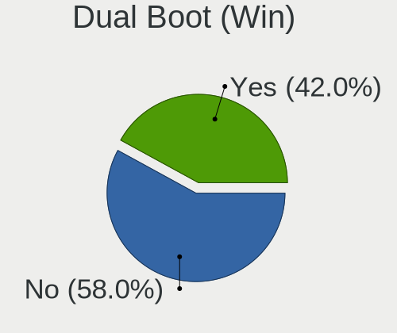
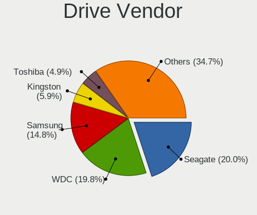
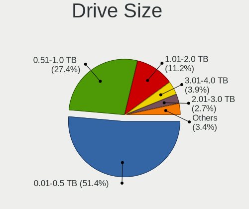
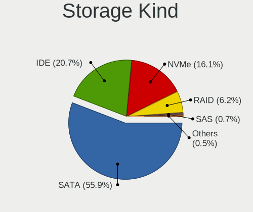

Ubuntu - Tested Hardware & Statistics (Desktops)
------------------------------------------------

A project to collect tested hardware configurations for Ubuntu.

Anyone can contribute to this report by the [hw-probe](https://github.com/linuxhw/hw-probe) tool:

    sudo -E hw-probe -all -upload

Please contribute! Especially if your hardware is rare.

Contents
--------

* [ Test Cases ](#test-cases)

* [ System ](#system)
  - [ OS                       ](#os)
  - [ OS Family                ](#os-family)
  - [ Kernel                   ](#kernel)
  - [ Kernel Family            ](#kernel-family)
  - [ Kernel Major Ver.        ](#kernel-major-ver)
  - [ Arch                     ](#arch)
  - [ DE                       ](#de)
  - [ Display Server           ](#display-server)
  - [ Display Manager          ](#display-manager)
  - [ OS Lang                  ](#os-lang)
  - [ Boot Mode                ](#boot-mode)
  - [ Filesystem               ](#filesystem)
  - [ Part. scheme             ](#part-scheme)
  - [ Dual Boot with Linux/BSD ](#dual-boot-with-linuxbsd)
  - [ Dual Boot (Win)          ](#dual-boot-win)

* [ Board ](#board)
  - [ Vendor                   ](#vendor)
  - [ Model                    ](#model)
  - [ Model Family             ](#model-family)
  - [ MFG Year                 ](#mfg-year)
  - [ Form Factor              ](#form-factor)
  - [ Secure Boot              ](#secure-boot)
  - [ Coreboot                 ](#coreboot)
  - [ RAM Size                 ](#ram-size)
  - [ RAM Used                 ](#ram-used)
  - [ Total Drives             ](#total-drives)
  - [ Has CD-ROM               ](#has-cd-rom)
  - [ Has Ethernet             ](#has-ethernet)
  - [ Has WiFi                 ](#has-wifi)
  - [ Has Bluetooth            ](#has-bluetooth)

* [ Location ](#location)
  - [ Country                  ](#country)
  - [ City                     ](#city)

* [ Drives ](#drives)
  - [ Drive Vendor             ](#drive-vendor)
  - [ Drive Model              ](#drive-model)
  - [ HDD Vendor               ](#hdd-vendor)
  - [ SSD Vendor               ](#ssd-vendor)
  - [ Drive Kind               ](#drive-kind)
  - [ Drive Connector          ](#drive-connector)
  - [ Drive Size               ](#drive-size)
  - [ Space Total              ](#space-total)
  - [ Space Used               ](#space-used)
  - [ Malfunc. Drives          ](#malfunc-drives)
  - [ Malfunc. Drive Vendor    ](#malfunc-drive-vendor)
  - [ Malfunc. HDD Vendor      ](#malfunc-hdd-vendor)
  - [ Malfunc. Drive Kind      ](#malfunc-drive-kind)
  - [ Failed Drives            ](#failed-drives)
  - [ Failed Drive Vendor      ](#failed-drive-vendor)
  - [ Drive Status             ](#drive-status)

* [ Storage controller ](#storage-controller)
  - [ Storage Vendor           ](#storage-vendor)
  - [ Storage Model            ](#storage-model)
  - [ Storage Kind             ](#storage-kind)

* [ Processor ](#processor)
  - [ CPU Vendor               ](#cpu-vendor)
  - [ CPU Model                ](#cpu-model)
  - [ CPU Model Family         ](#cpu-model-family)
  - [ CPU Cores                ](#cpu-cores)
  - [ CPU Sockets              ](#cpu-sockets)
  - [ CPU Threads              ](#cpu-threads)
  - [ CPU Op-Modes             ](#cpu-op-modes)
  - [ CPU Microcode            ](#cpu-microcode)
  - [ CPU Microarch            ](#cpu-microarch)

* [ Graphics ](#graphics)
  - [ GPU Vendor               ](#gpu-vendor)
  - [ GPU Model                ](#gpu-model)
  - [ GPU Combo                ](#gpu-combo)
  - [ GPU Driver               ](#gpu-driver)
  - [ GPU Memory               ](#gpu-memory)

* [ Monitor ](#monitor)
  - [ Monitor Vendor           ](#monitor-vendor)
  - [ Monitor Model            ](#monitor-model)
  - [ Monitor Resolution       ](#monitor-resolution)
  - [ Monitor Diagonal         ](#monitor-diagonal)
  - [ Monitor Width            ](#monitor-width)
  - [ Aspect Ratio             ](#aspect-ratio)
  - [ Monitor Area             ](#monitor-area)
  - [ Pixel Density            ](#pixel-density)
  - [ Multiple Monitors        ](#multiple-monitors)

* [ Network ](#network)
  - [ Net Controller Vendor    ](#net-controller-vendor)
  - [ Net Controller Model     ](#net-controller-model)
  - [ Wireless Vendor          ](#wireless-vendor)
  - [ Wireless Model           ](#wireless-model)
  - [ Ethernet Vendor          ](#ethernet-vendor)
  - [ Ethernet Model           ](#ethernet-model)
  - [ Net Controller Kind      ](#net-controller-kind)
  - [ Used Controller          ](#used-controller)
  - [ NICs                     ](#nics)
  - [ IPv6                     ](#ipv6)

* [ Bluetooth ](#bluetooth)
  - [ Bluetooth Vendor         ](#bluetooth-vendor)
  - [ Bluetooth Model          ](#bluetooth-model)

* [ Sound ](#sound)
  - [ Sound Vendor             ](#sound-vendor)
  - [ Sound Model              ](#sound-model)

* [ Memory ](#memory)
  - [ Memory Vendor            ](#memory-vendor)
  - [ Memory Model             ](#memory-model)
  - [ Memory Kind              ](#memory-kind)
  - [ Memory Form Factor       ](#memory-form-factor)
  - [ Memory Size              ](#memory-size)
  - [ Memory Speed             ](#memory-speed)

* [ Printers & scanners ](#printers--scanners)
  - [ Printer Vendor           ](#printer-vendor)
  - [ Printer Model            ](#printer-model)
  - [ Scanner Vendor           ](#scanner-vendor)
  - [ Scanner Model            ](#scanner-model)

* [ Camera ](#camera)
  - [ Camera Vendor            ](#camera-vendor)
  - [ Camera Model             ](#camera-model)

* [ Security ](#security)
  - [ Fingerprint Vendor       ](#fingerprint-vendor)
  - [ Fingerprint Model        ](#fingerprint-model)
  - [ Chipcard Vendor          ](#chipcard-vendor)
  - [ Chipcard Model           ](#chipcard-model)

* [ Unsupported ](#unsupported)
  - [ Unsupported Devices      ](#unsupported-devices)
  - [ Unsupported Device Types ](#unsupported-device-types)

Test Cases
----------

Total: 40545

| Vendor        | Model                       | Probe                                                      | Date         |
|---------------|-----------------------------|------------------------------------------------------------|--------------|
| Gigabyte      | Z390 AORUS PRO WIFI-CF      | [f88f22a1b9](https://linux-hardware.org/?probe=f88f22a1b9) | May 09, 2024 |
| ASRock        | B550M Phantom Gaming 4      | [f8574bdf3e](https://linux-hardware.org/?probe=f8574bdf3e) | May 09, 2024 |
| ASUSTek       | H81M-A/BR                   | [919fba348e](https://linux-hardware.org/?probe=919fba348e) | May 09, 2024 |
| Unknown       | Unknown                     | [d3ffc9eacb](https://linux-hardware.org/?probe=d3ffc9eacb) | May 09, 2024 |
| Unknown       | Unknown                     | [3027a0b67c](https://linux-hardware.org/?probe=3027a0b67c) | May 09, 2024 |
| ASUSTek       | ROG STRIX B650E-I GAMING... | [bdcf61edde](https://linux-hardware.org/?probe=bdcf61edde) | May 09, 2024 |
| Gigabyte      | Z87X-UD4H-CF                | [f26982efc3](https://linux-hardware.org/?probe=f26982efc3) | May 09, 2024 |
| eMachines     | WMCP61M                     | [14e676a6db](https://linux-hardware.org/?probe=14e676a6db) | May 09, 2024 |
| Acer          | Veriton X2631G V:1.0        | [221cf17e59](https://linux-hardware.org/?probe=221cf17e59) | May 08, 2024 |
| Gigabyte      | Z170N-WIFI-CF               | [7a88f50508](https://linux-hardware.org/?probe=7a88f50508) | May 08, 2024 |
| Gigabyte      | Z170N-WIFI-CF               | [6143f9e1aa](https://linux-hardware.org/?probe=6143f9e1aa) | May 08, 2024 |
| HP            | 18E7                        | [fa637b3b9a](https://linux-hardware.org/?probe=fa637b3b9a) | May 08, 2024 |
| ASUSTek       | P8H67                       | [ebf3b0112a](https://linux-hardware.org/?probe=ebf3b0112a) | May 08, 2024 |
| ASUSTek       | P8H67                       | [7c9d6cd1b4](https://linux-hardware.org/?probe=7c9d6cd1b4) | May 08, 2024 |
| ASRock        | B550M Phantom Gaming 4      | [8210b8f2f9](https://linux-hardware.org/?probe=8210b8f2f9) | May 08, 2024 |
| ASRock        | Z77 Performance             | [500cd7ed60](https://linux-hardware.org/?probe=500cd7ed60) | May 08, 2024 |
| Unknown       | Unknown                     | [07a1876fd0](https://linux-hardware.org/?probe=07a1876fd0) | May 08, 2024 |
| ASUSTek       | ProArt Z690-CREATOR WIFI    | [7cc03eaae9](https://linux-hardware.org/?probe=7cc03eaae9) | May 08, 2024 |
| Dell          | 0HHV7N A00                  | [63a26dac69](https://linux-hardware.org/?probe=63a26dac69) | May 08, 2024 |
| Lenovo        | 1046 SDK0T08861 WIN 3305... | [91c857f51e](https://linux-hardware.org/?probe=91c857f51e) | May 07, 2024 |
| ASUSTek       | PRIME B760M-A WIFI D4       | [d83d6a3460](https://linux-hardware.org/?probe=d83d6a3460) | May 07, 2024 |
| ASUSTek       | ROG STRIX B450-F GAMING ... | [cdcaeb4d46](https://linux-hardware.org/?probe=cdcaeb4d46) | May 07, 2024 |
| Dell          | 0215PR A02                  | [ff480889b4](https://linux-hardware.org/?probe=ff480889b4) | May 07, 2024 |
| ASUSTek       | P5K3 Deluxe                 | [b03bf61625](https://linux-hardware.org/?probe=b03bf61625) | May 07, 2024 |
| Dell          | 0XHGV1 A00                  | [b56a1f70d1](https://linux-hardware.org/?probe=b56a1f70d1) | May 07, 2024 |
| Gigabyte      | H410M H V3                  | [486c191884](https://linux-hardware.org/?probe=486c191884) | May 07, 2024 |
| Dell          | 0XHGV1 A00                  | [35681eda7f](https://linux-hardware.org/?probe=35681eda7f) | May 07, 2024 |
| Supermicro    | X10DDW-i                    | [ff62f6b4d9](https://linux-hardware.org/?probe=ff62f6b4d9) | May 07, 2024 |
| Supermicro    | X10DDW-i                    | [b849fea196](https://linux-hardware.org/?probe=b849fea196) | May 07, 2024 |
| Supermicro    | X10DDW-i                    | [c20ef4d35b](https://linux-hardware.org/?probe=c20ef4d35b) | May 07, 2024 |
| Supermicro    | X10DDW-i                    | [9b21386a04](https://linux-hardware.org/?probe=9b21386a04) | May 07, 2024 |
| Supermicro    | X10DDW-i                    | [99fbeae8c9](https://linux-hardware.org/?probe=99fbeae8c9) | May 07, 2024 |
| Supermicro    | X10DDW-i                    | [48bb233b46](https://linux-hardware.org/?probe=48bb233b46) | May 07, 2024 |
| Supermicro    | X10DRL-i                    | [da5c3ed75f](https://linux-hardware.org/?probe=da5c3ed75f) | May 07, 2024 |
| Acer          | Veriton N4640G              | [44c62400f4](https://linux-hardware.org/?probe=44c62400f4) | May 07, 2024 |
| ASUSTek       | TUF Gaming B560M-PLUS       | [ec3b3b1daa](https://linux-hardware.org/?probe=ec3b3b1daa) | May 07, 2024 |
| Shenzhen M... | F7BSC                       | [9e6a5eb0e2](https://linux-hardware.org/?probe=9e6a5eb0e2) | May 07, 2024 |
| Acer          | Veriton N4640G              | [ebe4fa74ca](https://linux-hardware.org/?probe=ebe4fa74ca) | May 07, 2024 |
| Gigabyte      | B460 HD3                    | [8d8fcf703b](https://linux-hardware.org/?probe=8d8fcf703b) | May 07, 2024 |
| Intel         | SKYBAY                      | [7e692c7e40](https://linux-hardware.org/?probe=7e692c7e40) | May 07, 2024 |
| Lenovo        | ThinkServer TS140           | [be7444624d](https://linux-hardware.org/?probe=be7444624d) | May 07, 2024 |
| ASRock        | A300M-STX                   | [cdf544ca1d](https://linux-hardware.org/?probe=cdf544ca1d) | May 07, 2024 |
| ASUSTek       | H81M-A/BR                   | [8f7abd7f23](https://linux-hardware.org/?probe=8f7abd7f23) | May 07, 2024 |
| Gigabyte      | B75M-D3H                    | [a10be2227c](https://linux-hardware.org/?probe=a10be2227c) | May 07, 2024 |
| Dell          | 02YRK5 A02                  | [fea15ab44c](https://linux-hardware.org/?probe=fea15ab44c) | May 07, 2024 |
| ASUSTek       | PRIME H510M-E               | [bf4a7b097c](https://linux-hardware.org/?probe=bf4a7b097c) | May 06, 2024 |
| ASUSTek       | PRIME H510M-E               | [e76f332009](https://linux-hardware.org/?probe=e76f332009) | May 06, 2024 |
| Dell          | 02YYK5 A01                  | [09b75f38cd](https://linux-hardware.org/?probe=09b75f38cd) | May 06, 2024 |
| MSI           | MAG Z690 TOMAHAWK WIFI D... | [8848310fde](https://linux-hardware.org/?probe=8848310fde) | May 06, 2024 |
| ASUSTek       | ROG STRIX X299-E GAMING ... | [fc1633451e](https://linux-hardware.org/?probe=fc1633451e) | May 06, 2024 |
| Dell          | 042P49 A02                  | [4b9e2674de](https://linux-hardware.org/?probe=4b9e2674de) | May 06, 2024 |
| Dell          | 042P49 A02                  | [146a7db97f](https://linux-hardware.org/?probe=146a7db97f) | May 06, 2024 |
| Gigabyte      | B550M DS3H AC               | [ce0082648a](https://linux-hardware.org/?probe=ce0082648a) | May 06, 2024 |
| Gigabyte      | B550M DS3H AC               | [9f866b203a](https://linux-hardware.org/?probe=9f866b203a) | May 06, 2024 |
| Dell          | 0C2KJT A00                  | [a884cd0cf5](https://linux-hardware.org/?probe=a884cd0cf5) | May 06, 2024 |
| ASUSTek       | TUF Gaming Z790-PRO WIFI    | [07048840f0](https://linux-hardware.org/?probe=07048840f0) | May 06, 2024 |
| ASUSTek       | TUF Gaming Z790-PLUS WIF... | [326b0babab](https://linux-hardware.org/?probe=326b0babab) | May 06, 2024 |
| ASUSTek       | TUF Gaming Z790-PLUS WIF... | [38b9f94aeb](https://linux-hardware.org/?probe=38b9f94aeb) | May 06, 2024 |
| Dell          | 0478VN A00                  | [305f343c95](https://linux-hardware.org/?probe=305f343c95) | May 06, 2024 |
| ASUSTek       | P8H67-M PRO                 | [2af49854e2](https://linux-hardware.org/?probe=2af49854e2) | May 06, 2024 |
| ASUSTek       | ROG STRIX Z690-G GAMING ... | [a923d8607b](https://linux-hardware.org/?probe=a923d8607b) | May 06, 2024 |
| Dell          | 00CV7F A00                  | [83dce373d6](https://linux-hardware.org/?probe=83dce373d6) | May 06, 2024 |
| MSI           | H110M PRO-VH                | [f0e62a158e](https://linux-hardware.org/?probe=f0e62a158e) | May 06, 2024 |
| Lenovo        | SHARKBAY NOK                | [11bef15f7d](https://linux-hardware.org/?probe=11bef15f7d) | May 06, 2024 |
| ASRock        | X79 Extreme9                | [a65acf43f1](https://linux-hardware.org/?probe=a65acf43f1) | May 06, 2024 |
| Dell          | 0F642F A00                  | [fc2a825e57](https://linux-hardware.org/?probe=fc2a825e57) | May 06, 2024 |
| MSI           | 2AE0                        | [25c9b3836b](https://linux-hardware.org/?probe=25c9b3836b) | May 06, 2024 |
| Supermicro    | X10DRL-i                    | [80cdad1821](https://linux-hardware.org/?probe=80cdad1821) | May 06, 2024 |
| MSI           | K9N6PGM2-V2                 | [a79d33d7cf](https://linux-hardware.org/?probe=a79d33d7cf) | May 06, 2024 |
| ASUSTek       | H97-PLUS                    | [4f4fcced1c](https://linux-hardware.org/?probe=4f4fcced1c) | May 06, 2024 |
| MSI           | MEG Z690 UNIFY              | [614bab5cb0](https://linux-hardware.org/?probe=614bab5cb0) | May 05, 2024 |
| MSI           | MAG B550 TOMAHAWK           | [9da2a84508](https://linux-hardware.org/?probe=9da2a84508) | May 05, 2024 |
| MACHINIST     | X99 PR9                     | [0503106449](https://linux-hardware.org/?probe=0503106449) | May 05, 2024 |
| Pegatron      | IPXSB-H61                   | [2a449d83d3](https://linux-hardware.org/?probe=2a449d83d3) | May 05, 2024 |
| ASUSTek       | SABERTOOTH Z87              | [c886338e7a](https://linux-hardware.org/?probe=c886338e7a) | May 05, 2024 |
| ASUSTek       | SABERTOOTH Z87              | [9b9d434149](https://linux-hardware.org/?probe=9b9d434149) | May 05, 2024 |
| ASUSTek       | TUF Gaming A520M-PLUS WI... | [e4b1fdc5b2](https://linux-hardware.org/?probe=e4b1fdc5b2) | May 05, 2024 |
| Dell          | 03RT16 A00                  | [e88cedcfb7](https://linux-hardware.org/?probe=e88cedcfb7) | May 05, 2024 |
| Supermicro    | X7DCL                       | [9644da40a4](https://linux-hardware.org/?probe=9644da40a4) | May 05, 2024 |
| MSI           | PRO B660M-A WIFI DDR4       | [7988d977fe](https://linux-hardware.org/?probe=7988d977fe) | May 05, 2024 |
| Dell          | 0J9VVP A00                  | [5971526cf6](https://linux-hardware.org/?probe=5971526cf6) | May 05, 2024 |
| HP            | 806A                        | [d28c449530](https://linux-hardware.org/?probe=d28c449530) | May 05, 2024 |
| Lenovo        | 36F7 SDK0J40700 WIN 3258... | [7380e71093](https://linux-hardware.org/?probe=7380e71093) | May 05, 2024 |
| Dell          | 0J9VVP A00                  | [f75406b494](https://linux-hardware.org/?probe=f75406b494) | May 05, 2024 |
| Gigabyte      | AB350-Gaming 3-CF           | [a099133a32](https://linux-hardware.org/?probe=a099133a32) | May 05, 2024 |
| MSI           | MAG Z590 TORPEDO            | [19cb329ead](https://linux-hardware.org/?probe=19cb329ead) | May 05, 2024 |
| Shenzhen M... | F7BFD                       | [41da20c6a7](https://linux-hardware.org/?probe=41da20c6a7) | May 05, 2024 |
| MSI           | MPG Z690 FORCE WIFI         | [4e837501bb](https://linux-hardware.org/?probe=4e837501bb) | May 05, 2024 |
| MSI           | MAG Z590 TORPEDO            | [da37bf116d](https://linux-hardware.org/?probe=da37bf116d) | May 04, 2024 |
| Dell          | 0J3492                      | [0bf461dd56](https://linux-hardware.org/?probe=0bf461dd56) | May 04, 2024 |
| Gigabyte      | B560 HD3                    | [dfe7ad1035](https://linux-hardware.org/?probe=dfe7ad1035) | May 04, 2024 |
| Packard Be... | IMEDIA S3840                | [52543a4786](https://linux-hardware.org/?probe=52543a4786) | May 04, 2024 |
| Hardkernel    | ODROID-H3                   | [e9ea8670f9](https://linux-hardware.org/?probe=e9ea8670f9) | May 04, 2024 |
| ASRock        | Z590M-ITX/ax                | [bd54fbe980](https://linux-hardware.org/?probe=bd54fbe980) | May 04, 2024 |
| ASRock        | A520M-HVS                   | [59c3452245](https://linux-hardware.org/?probe=59c3452245) | May 04, 2024 |
| Medion        | MS-7848                     | [44af6191bc](https://linux-hardware.org/?probe=44af6191bc) | May 04, 2024 |
| ASRock        | B550 Pro4                   | [7b008baaaa](https://linux-hardware.org/?probe=7b008baaaa) | May 04, 2024 |
| Medion        | MS-7848                     | [e10e1b6256](https://linux-hardware.org/?probe=e10e1b6256) | May 04, 2024 |
| Gigabyte      | GA-78LMT-USB3               | [4b675ff584](https://linux-hardware.org/?probe=4b675ff584) | May 04, 2024 |
| ASRock        | Z77 Extreme3                | [447d8518d6](https://linux-hardware.org/?probe=447d8518d6) | May 04, 2024 |
| MSI           | PRO Z790-A MAX WIFI         | [534c77cdb0](https://linux-hardware.org/?probe=534c77cdb0) | May 04, 2024 |
| Gigabyte      | B660M DS3H DDR4             | [88ac39e179](https://linux-hardware.org/?probe=88ac39e179) | May 04, 2024 |
| Gateway       | IPIMB-ARA                   | [daf7403459](https://linux-hardware.org/?probe=daf7403459) | May 03, 2024 |
| Dell          | 0HD5W2 A01                  | [1f5ee22f75](https://linux-hardware.org/?probe=1f5ee22f75) | May 03, 2024 |
| Dell          | 00CV7F A00                  | [0e00dd8ed3](https://linux-hardware.org/?probe=0e00dd8ed3) | May 03, 2024 |
| Intel         | DP45SG AAE27733-405         | [a255bc14ce](https://linux-hardware.org/?probe=a255bc14ce) | May 03, 2024 |
| ASUSTek       | PRIME B450M-A               | [e832587255](https://linux-hardware.org/?probe=e832587255) | May 03, 2024 |
| ASRock        | Z77 WS                      | [8a8bbdb0fe](https://linux-hardware.org/?probe=8a8bbdb0fe) | May 03, 2024 |
| Dell          | 0HD5W2 A01                  | [c7875c3103](https://linux-hardware.org/?probe=c7875c3103) | May 03, 2024 |
| BESSTAR Te... | UM250 V1.0                  | [e8072c717d](https://linux-hardware.org/?probe=e8072c717d) | May 03, 2024 |
| ASUSTek       | P8H67-M PRO                 | [001c04c64f](https://linux-hardware.org/?probe=001c04c64f) | May 03, 2024 |
| Foxconn       | 2A92                        | [0ddf7baafd](https://linux-hardware.org/?probe=0ddf7baafd) | May 03, 2024 |
| ASUSTek       | TUF B360-PLUS GAMING        | [2fa2359d84](https://linux-hardware.org/?probe=2fa2359d84) | May 03, 2024 |
| ASUSTek       | TUF B360-PLUS GAMING        | [9b2885b554](https://linux-hardware.org/?probe=9b2885b554) | May 03, 2024 |
| ASUSTek       | PRIME H510M-E               | [f32c122b72](https://linux-hardware.org/?probe=f32c122b72) | May 03, 2024 |
| ASRock        | A520M-HDV                   | [6bf979fc7a](https://linux-hardware.org/?probe=6bf979fc7a) | May 03, 2024 |
| Shenzhen M... | F7BSC                       | [b3f2c851de](https://linux-hardware.org/?probe=b3f2c851de) | May 02, 2024 |
| Gigabyte      | B450M DS3H-CF               | [f229e6b124](https://linux-hardware.org/?probe=f229e6b124) | May 02, 2024 |
| Dell          | 0GPD72 A00                  | [09c386e20d](https://linux-hardware.org/?probe=09c386e20d) | May 02, 2024 |
| Dell          | 0X231R A01                  | [27d20c0bf3](https://linux-hardware.org/?probe=27d20c0bf3) | May 02, 2024 |
| To be fill... | CX-J4125B 11                | [b567efebf2](https://linux-hardware.org/?probe=b567efebf2) | May 02, 2024 |
| Acer          | EG43M                       | [2ec9d89dd5](https://linux-hardware.org/?probe=2ec9d89dd5) | May 02, 2024 |
| To be fill... | CX-J4125B 11                | [258c2fcd0d](https://linux-hardware.org/?probe=258c2fcd0d) | May 02, 2024 |
| Acer          | EG43M                       | [066562b548](https://linux-hardware.org/?probe=066562b548) | May 02, 2024 |
| Foxconn       | 2ABF                        | [3b1c4174da](https://linux-hardware.org/?probe=3b1c4174da) | May 02, 2024 |
| To be fill... | CX-J4125 12                 | [f579d8a9cc](https://linux-hardware.org/?probe=f579d8a9cc) | May 02, 2024 |
| MSI           | MAG B550 TOMAHAWK           | [8c1fc35187](https://linux-hardware.org/?probe=8c1fc35187) | May 02, 2024 |
| Google        | Teemo                       | [7371576eab](https://linux-hardware.org/?probe=7371576eab) | May 02, 2024 |
| Soyo          | SY-KL A320M.2-VH            | [e6ebaa107b](https://linux-hardware.org/?probe=e6ebaa107b) | May 02, 2024 |
| HP            | 89B3 A                      | [5bc44b7b14](https://linux-hardware.org/?probe=5bc44b7b14) | May 02, 2024 |
| HP            | 89B3 A                      | [7ba4c8e1a2](https://linux-hardware.org/?probe=7ba4c8e1a2) | May 02, 2024 |
| HP            | 1825                        | [c6cd93d0ea](https://linux-hardware.org/?probe=c6cd93d0ea) | May 02, 2024 |
| ASUSTek       | ROG Maximus Z790 HERO       | [40caf612c2](https://linux-hardware.org/?probe=40caf612c2) | May 02, 2024 |
| Gigabyte      | A320M-S2H V2-CF             | [f98dcf2d99](https://linux-hardware.org/?probe=f98dcf2d99) | May 02, 2024 |
| ASUSTek       | M5A97 R2.0                  | [6e17fb9c95](https://linux-hardware.org/?probe=6e17fb9c95) | May 02, 2024 |
| Gigabyte      | Z170XP-SLI-CF               | [32ad893888](https://linux-hardware.org/?probe=32ad893888) | May 02, 2024 |
| Gigabyte      | H110M-S2-CF                 | [5f757d3cc1](https://linux-hardware.org/?probe=5f757d3cc1) | May 01, 2024 |
| Biostar       | H61MLC                      | [d26510e4fb](https://linux-hardware.org/?probe=d26510e4fb) | May 01, 2024 |
| ASRock        | Q1900M                      | [edec3b8384](https://linux-hardware.org/?probe=edec3b8384) | May 01, 2024 |
| ASUSTek       | ROG STRIX Z790-A GAMING ... | [5d4a138b2f](https://linux-hardware.org/?probe=5d4a138b2f) | May 01, 2024 |
| Biostar       | H61MLC                      | [502f0f308f](https://linux-hardware.org/?probe=502f0f308f) | May 01, 2024 |
| ONDA          | A320IPC                     | [da543bfbd2](https://linux-hardware.org/?probe=da543bfbd2) | May 01, 2024 |
| ASUSTek       | H81M-D                      | [9fb933dd16](https://linux-hardware.org/?probe=9fb933dd16) | May 01, 2024 |
| Unknown       | Unknown                     | [4b7050ad24](https://linux-hardware.org/?probe=4b7050ad24) | May 01, 2024 |
| HP            | 805D                        | [facf891056](https://linux-hardware.org/?probe=facf891056) | May 01, 2024 |
| MSI           | MAG B550 TOMAHAWK           | [9fb4641867](https://linux-hardware.org/?probe=9fb4641867) | May 01, 2024 |
| HP            | 2AF7                        | [9c65c2ddec](https://linux-hardware.org/?probe=9c65c2ddec) | May 01, 2024 |
| HP            | 2AF7                        | [b38ae0f0de](https://linux-hardware.org/?probe=b38ae0f0de) | May 01, 2024 |
| ASUSTek       | PRO H410T                   | [88ac4bb06e](https://linux-hardware.org/?probe=88ac4bb06e) | May 01, 2024 |
| GEEKOM        | A7                          | [f9437ebaa0](https://linux-hardware.org/?probe=f9437ebaa0) | May 01, 2024 |
| MSI           | MAG B760M MORTAR WIFI       | [9e1fd1c22b](https://linux-hardware.org/?probe=9e1fd1c22b) | May 01, 2024 |
| ASUSTek       | M3N WS                      | [c6b3363b76](https://linux-hardware.org/?probe=c6b3363b76) | May 01, 2024 |
| ASUSTek       | ROG STRIX B550-F GAMING     | [c8b695f80c](https://linux-hardware.org/?probe=c8b695f80c) | May 01, 2024 |
| Dell          | 09KPNV A01                  | [1f22876130](https://linux-hardware.org/?probe=1f22876130) | May 01, 2024 |
| Unknown       | Unknown                     | [8ea1b853ad](https://linux-hardware.org/?probe=8ea1b853ad) | May 01, 2024 |
| ASRock        | B550M-C                     | [926f0b0f52](https://linux-hardware.org/?probe=926f0b0f52) | May 01, 2024 |
| MACHINIST     | X99 PR9                     | [88cb6d6044](https://linux-hardware.org/?probe=88cb6d6044) | May 01, 2024 |
| ASUSTek       | PRIME A520M-A II            | [73aaa2984d](https://linux-hardware.org/?probe=73aaa2984d) | May 01, 2024 |
| Dell          | 0427JK A00                  | [6c93b7fabf](https://linux-hardware.org/?probe=6c93b7fabf) | Apr 30, 2024 |
| ASUSTek       | TUF Gaming B760M-PLUS WI... | [135b6c8c4e](https://linux-hardware.org/?probe=135b6c8c4e) | Apr 30, 2024 |
| ASUSTek       | PRIME H510M-K               | [1cdd242400](https://linux-hardware.org/?probe=1cdd242400) | Apr 30, 2024 |
| Gigabyte      | F2A88XM-DS2                 | [2a13216c9b](https://linux-hardware.org/?probe=2a13216c9b) | Apr 30, 2024 |
| Dell          | 0R790T A00                  | [2086c30418](https://linux-hardware.org/?probe=2086c30418) | Apr 30, 2024 |
| ASUSTek       | ROG STRIX B460-F GAMING     | [b335a417f1](https://linux-hardware.org/?probe=b335a417f1) | Apr 30, 2024 |
| Alienware     | 0C92D0 A00                  | [73fe41cfe5](https://linux-hardware.org/?probe=73fe41cfe5) | Apr 30, 2024 |
| MAXSUN        | MS-TZZ H81ITX               | [59394b9090](https://linux-hardware.org/?probe=59394b9090) | Apr 30, 2024 |
| MSI           | A320M-A PRO                 | [da0306ed47](https://linux-hardware.org/?probe=da0306ed47) | Apr 30, 2024 |
| HP            | 83E1                        | [56debab2d5](https://linux-hardware.org/?probe=56debab2d5) | Apr 30, 2024 |
| ASRock        | B450M Pro4                  | [04c8e87ca3](https://linux-hardware.org/?probe=04c8e87ca3) | Apr 30, 2024 |
| MSI           | Z97 GAMING 3                | [c703e6f53a](https://linux-hardware.org/?probe=c703e6f53a) | Apr 30, 2024 |
| ASUSTek       | M5A97 LE R2.0               | [1d6a7ccba0](https://linux-hardware.org/?probe=1d6a7ccba0) | Apr 30, 2024 |
| ASUSTek       | Maximus Formula             | [c26c507db2](https://linux-hardware.org/?probe=c26c507db2) | Apr 30, 2024 |
| MSI           | Z68A-G43                    | [9acdb88f98](https://linux-hardware.org/?probe=9acdb88f98) | Apr 30, 2024 |
| ASUSTek       | ROG CROSSHAIR VII HERO      | [ad6a595fac](https://linux-hardware.org/?probe=ad6a595fac) | Apr 29, 2024 |
| HP            | 3647h                       | [1c095b792f](https://linux-hardware.org/?probe=1c095b792f) | Apr 29, 2024 |
| ASUSTek       | X99-DELUXE                  | [71069616b0](https://linux-hardware.org/?probe=71069616b0) | Apr 29, 2024 |
| Minix         | NEO Z83-4A                  | [60faf42ed9](https://linux-hardware.org/?probe=60faf42ed9) | Apr 29, 2024 |
| ASUSTek       | PRIME Z790-P WIFI           | [3c89d5f47c](https://linux-hardware.org/?probe=3c89d5f47c) | Apr 29, 2024 |
| HP            | 8526 MVB, A                 | [880c56ee27](https://linux-hardware.org/?probe=880c56ee27) | Apr 29, 2024 |
| ASRock        | A320M-HDV R3.0              | [156f672c14](https://linux-hardware.org/?probe=156f672c14) | Apr 29, 2024 |
| ASUSTek       | PRIME X299-A                | [82f302ed14](https://linux-hardware.org/?probe=82f302ed14) | Apr 29, 2024 |
| ASUSTek       | PRIME X299-A                | [18f815fd59](https://linux-hardware.org/?probe=18f815fd59) | Apr 29, 2024 |
| Dell          | 088DT1 A01                  | [0d725519b9](https://linux-hardware.org/?probe=0d725519b9) | Apr 29, 2024 |
| Gigabyte      | Z77X-UD3H                   | [9ec352e75d](https://linux-hardware.org/?probe=9ec352e75d) | Apr 29, 2024 |
| HP            | 82A2                        | [d9af0d7008](https://linux-hardware.org/?probe=d9af0d7008) | Apr 29, 2024 |
| MSI           | PRO X670-P WIFI             | [6dd6177312](https://linux-hardware.org/?probe=6dd6177312) | Apr 29, 2024 |
| MSI           | X570-A PRO                  | [8495c2639d](https://linux-hardware.org/?probe=8495c2639d) | Apr 29, 2024 |
| Gigabyte      | B660M DS3H DDR4             | [9d43e003e5](https://linux-hardware.org/?probe=9d43e003e5) | Apr 29, 2024 |
| Dell          | 096JG8 A00                  | [499c9724bd](https://linux-hardware.org/?probe=499c9724bd) | Apr 28, 2024 |
| Gigabyte      | M68M-S2P                    | [3608c76af5](https://linux-hardware.org/?probe=3608c76af5) | Apr 28, 2024 |
| Fujitsu       | D3041-A1 S26361-D3041-A1    | [166266e759](https://linux-hardware.org/?probe=166266e759) | Apr 28, 2024 |
| Lenovo        | NO DPK                      | [50204c0691](https://linux-hardware.org/?probe=50204c0691) | Apr 28, 2024 |
| Dell          | 07PR60 A00                  | [6897b908da](https://linux-hardware.org/?probe=6897b908da) | Apr 28, 2024 |
| Packard Be... | IMEDIA S3712                | [200b3d1a1e](https://linux-hardware.org/?probe=200b3d1a1e) | Apr 28, 2024 |
| ASUSTek       | H110I-PLUS                  | [14706b4b9f](https://linux-hardware.org/?probe=14706b4b9f) | Apr 28, 2024 |
| ASRock        | B450M Pro4                  | [aded29632d](https://linux-hardware.org/?probe=aded29632d) | Apr 28, 2024 |
| Gigabyte      | A320M-S2H V2-CF             | [a11f4281d0](https://linux-hardware.org/?probe=a11f4281d0) | Apr 28, 2024 |
| Gigabyte      | B760M AORUS ELITE AX        | [d48aa1e751](https://linux-hardware.org/?probe=d48aa1e751) | Apr 28, 2024 |
| ASUSTek       | M5A97 R2.0                  | [3dcaa02108](https://linux-hardware.org/?probe=3dcaa02108) | Apr 28, 2024 |
| ASRock        | Z790 Lightning WiFi         | [4ed8b47fbe](https://linux-hardware.org/?probe=4ed8b47fbe) | Apr 28, 2024 |
| Pegatron      | IPXSB-H61                   | [202618ccd6](https://linux-hardware.org/?probe=202618ccd6) | Apr 27, 2024 |
| ASUSTek       | PRIME B550M-A               | [4536896f41](https://linux-hardware.org/?probe=4536896f41) | Apr 27, 2024 |
| ASUSTek       | TUF Gaming A620M-PLUS WI... | [f5547c4f67](https://linux-hardware.org/?probe=f5547c4f67) | Apr 27, 2024 |
| Dell          | 0KRC95 A00                  | [8a4d88627a](https://linux-hardware.org/?probe=8a4d88627a) | Apr 27, 2024 |
| Supermicro    | X10DRL-i                    | [442d3d029e](https://linux-hardware.org/?probe=442d3d029e) | Apr 27, 2024 |
| Gigabyte      | B550M DS3H                  | [158b44fbb4](https://linux-hardware.org/?probe=158b44fbb4) | Apr 27, 2024 |
| Gigabyte      | B550M DS3H                  | [12aab4742e](https://linux-hardware.org/?probe=12aab4742e) | Apr 27, 2024 |
| Acer          | Aspire X1700                | [8bf1981482](https://linux-hardware.org/?probe=8bf1981482) | Apr 27, 2024 |
| Dell          | 0WMJ54 A00                  | [952112efbd](https://linux-hardware.org/?probe=952112efbd) | Apr 27, 2024 |
| Supermicro    | X10DRL-i                    | [acd3d2d971](https://linux-hardware.org/?probe=acd3d2d971) | Apr 27, 2024 |
| Supermicro    | X10DRL-i                    | [97cef8e012](https://linux-hardware.org/?probe=97cef8e012) | Apr 27, 2024 |
| Gigabyte      | B760M AORUS ELITE AX        | [8541225188](https://linux-hardware.org/?probe=8541225188) | Apr 27, 2024 |
| MSI           | Z87-G43                     | [94162ca704](https://linux-hardware.org/?probe=94162ca704) | Apr 27, 2024 |
| ASUSTek       | P5QPL-AM                    | [9199a16ddd](https://linux-hardware.org/?probe=9199a16ddd) | Apr 27, 2024 |
| Gigabyte      | B560 HD3                    | [2e0ebe37ab](https://linux-hardware.org/?probe=2e0ebe37ab) | Apr 27, 2024 |
| Gigabyte      | X99-UD7 WIFI-CF             | [b7389a656c](https://linux-hardware.org/?probe=b7389a656c) | Apr 27, 2024 |
| ASUSTek       | PRIME B450M-A               | [fe59c3a4da](https://linux-hardware.org/?probe=fe59c3a4da) | Apr 27, 2024 |
| Dell          | 0T10XW A02                  | [5836e0e02a](https://linux-hardware.org/?probe=5836e0e02a) | Apr 27, 2024 |
| ASUSTek       | ROG STRIX B550-F GAMING     | [5b1e05942f](https://linux-hardware.org/?probe=5b1e05942f) | Apr 27, 2024 |
| Gigabyte      | Z77P-D3                     | [7cb2c25d22](https://linux-hardware.org/?probe=7cb2c25d22) | Apr 27, 2024 |
| ASUSTek       | PRIME B350-PLUS             | [3bd346f0cf](https://linux-hardware.org/?probe=3bd346f0cf) | Apr 27, 2024 |
| ASUSTek       | PRIME B450M-A               | [f658c7fdf6](https://linux-hardware.org/?probe=f658c7fdf6) | Apr 27, 2024 |
| AMI           | Intel                       | [a1842e7e12](https://linux-hardware.org/?probe=a1842e7e12) | Apr 27, 2024 |
| ASUSTek       | Q87M-E                      | [2b0d58047a](https://linux-hardware.org/?probe=2b0d58047a) | Apr 26, 2024 |
| Dell          | 0KRC95 A00                  | [b049b821e7](https://linux-hardware.org/?probe=b049b821e7) | Apr 26, 2024 |
| MSI           | PRO B550M-VC WIFI           | [971ae6415a](https://linux-hardware.org/?probe=971ae6415a) | Apr 26, 2024 |
| ASUSTek       | M5A78L-M/USB3               | [c33dc3b69c](https://linux-hardware.org/?probe=c33dc3b69c) | Apr 26, 2024 |
| HP            | 8648                        | [996bb0e2b3](https://linux-hardware.org/?probe=996bb0e2b3) | Apr 26, 2024 |
| ASUSTek       | PRO H410T                   | [9111d77eb9](https://linux-hardware.org/?probe=9111d77eb9) | Apr 26, 2024 |
| HP            | 82FF                        | [a0e9cfd330](https://linux-hardware.org/?probe=a0e9cfd330) | Apr 26, 2024 |
| ASUSTek       | TUF Gaming Z590-PLUS WIF... | [e32fd35808](https://linux-hardware.org/?probe=e32fd35808) | Apr 26, 2024 |
| Gigabyte      | B85M-Gaming 3               | [201dbfaede](https://linux-hardware.org/?probe=201dbfaede) | Apr 26, 2024 |
| Gigabyte      | 970A-UD3P                   | [4fe6c4e2bd](https://linux-hardware.org/?probe=4fe6c4e2bd) | Apr 26, 2024 |
| MSI           | PRO X670-P WIFI             | [78ae7b72db](https://linux-hardware.org/?probe=78ae7b72db) | Apr 26, 2024 |
| HP            | 339A                        | [a90b0a68d4](https://linux-hardware.org/?probe=a90b0a68d4) | Apr 26, 2024 |
| ASRock        | Z77 Extreme3                | [83083ad34f](https://linux-hardware.org/?probe=83083ad34f) | Apr 26, 2024 |
| Lenovo        | 3743 SDK0T76461 WIN 3422... | [1f3abb751c](https://linux-hardware.org/?probe=1f3abb751c) | Apr 26, 2024 |
| Gigabyte      | Z68X-UD7-B3                 | [6d342ea232](https://linux-hardware.org/?probe=6d342ea232) | Apr 26, 2024 |
| AZW           | MINI S                      | [0c4be52f43](https://linux-hardware.org/?probe=0c4be52f43) | Apr 26, 2024 |
| Gigabyte      | B550 GAMING X V2            | [29da9c39e9](https://linux-hardware.org/?probe=29da9c39e9) | Apr 25, 2024 |
| MSI           | MS-B1831                    | [63fec5c61b](https://linux-hardware.org/?probe=63fec5c61b) | Apr 25, 2024 |
| Gigabyte      | M68M-S2P                    | [1472c658c2](https://linux-hardware.org/?probe=1472c658c2) | Apr 25, 2024 |
| Dell          | 0KRC95 A00                  | [4f768499f5](https://linux-hardware.org/?probe=4f768499f5) | Apr 25, 2024 |
| Dell          | 0J3492                      | [c6a3cf9465](https://linux-hardware.org/?probe=c6a3cf9465) | Apr 25, 2024 |
| Dell          | 040DDP A01                  | [7eea0dc663](https://linux-hardware.org/?probe=7eea0dc663) | Apr 25, 2024 |
| MSI           | PRO X670-P WIFI             | [12400b294e](https://linux-hardware.org/?probe=12400b294e) | Apr 25, 2024 |
| Gigabyte      | B450M DS3H-CF               | [61842fb260](https://linux-hardware.org/?probe=61842fb260) | Apr 25, 2024 |
| Gigabyte      | TRX40 AORUS MASTER          | [1b5ae94b9e](https://linux-hardware.org/?probe=1b5ae94b9e) | Apr 25, 2024 |
| ASUSTek       | Pro WS WRX80E-SAGE SE WI... | [9517bddd97](https://linux-hardware.org/?probe=9517bddd97) | Apr 25, 2024 |
| ASRock        | TRX40 Creator               | [cc4738cbfe](https://linux-hardware.org/?probe=cc4738cbfe) | Apr 25, 2024 |
| ASUSTek       | P5QLD PRO                   | [f20dcd8125](https://linux-hardware.org/?probe=f20dcd8125) | Apr 25, 2024 |
| ASUSTek       | ROG STRIX Z690-G GAMING ... | [0c9119abc9](https://linux-hardware.org/?probe=0c9119abc9) | Apr 25, 2024 |
| QTQD          | Unknown                     | [d4f651ab36](https://linux-hardware.org/?probe=d4f651ab36) | Apr 25, 2024 |
| ASUSTek       | TUF B450-PLUS GAMING        | [109dfaced4](https://linux-hardware.org/?probe=109dfaced4) | Apr 25, 2024 |
| ASUSTek       | TUF B450-PLUS GAMING        | [4a9bdd2079](https://linux-hardware.org/?probe=4a9bdd2079) | Apr 25, 2024 |
| ASUSTek       | PRIME Z590M-PLUS            | [38bbe3657e](https://linux-hardware.org/?probe=38bbe3657e) | Apr 25, 2024 |
| ASUSTek       | P8B WS                      | [5fa13cfb75](https://linux-hardware.org/?probe=5fa13cfb75) | Apr 25, 2024 |
| AZW           | MINI S 10                   | [45003dee9b](https://linux-hardware.org/?probe=45003dee9b) | Apr 25, 2024 |
| HP            | 0B54h D                     | [a6c876a042](https://linux-hardware.org/?probe=a6c876a042) | Apr 25, 2024 |
| ASRock        | X99 OC Formula              | [68d724907d](https://linux-hardware.org/?probe=68d724907d) | Apr 25, 2024 |
| AZW           | T4 PRO                      | [8549531554](https://linux-hardware.org/?probe=8549531554) | Apr 24, 2024 |
| ASUSTek       | TUF Gaming B650-PLUS WIF... | [0b8cd1192f](https://linux-hardware.org/?probe=0b8cd1192f) | Apr 24, 2024 |
| ASUSTek       | M5A97 R2.0                  | [f1a984f467](https://linux-hardware.org/?probe=f1a984f467) | Apr 24, 2024 |
| ONDA          | A520SD4 Ver:1.00            | [d1a735de54](https://linux-hardware.org/?probe=d1a735de54) | Apr 24, 2024 |
| MSI           | Z370-A PRO                  | [46add129fe](https://linux-hardware.org/?probe=46add129fe) | Apr 24, 2024 |
| ASUSTek       | ROG ZENITH II EXTREME       | [6bb0e4d69f](https://linux-hardware.org/?probe=6bb0e4d69f) | Apr 24, 2024 |
| ASUSTek       | ROG ZENITH II EXTREME       | [38b6b334fc](https://linux-hardware.org/?probe=38b6b334fc) | Apr 24, 2024 |
| ASRock        | TRX40 Creator               | [248a7c9cb7](https://linux-hardware.org/?probe=248a7c9cb7) | Apr 24, 2024 |
| Gigabyte      | TRX40 AORUS MASTER          | [7dcc7cb561](https://linux-hardware.org/?probe=7dcc7cb561) | Apr 24, 2024 |
| Gigabyte      | TRX40 AORUS MASTER          | [9426a5b0e6](https://linux-hardware.org/?probe=9426a5b0e6) | Apr 24, 2024 |
| Gigabyte      | TRX40 AORUS MASTER          | [197ca7d3cb](https://linux-hardware.org/?probe=197ca7d3cb) | Apr 24, 2024 |
| Gigabyte      | TRX40 AORUS MASTER          | [7f1573ec15](https://linux-hardware.org/?probe=7f1573ec15) | Apr 24, 2024 |
| Gigabyte      | TRX40 AORUS MASTER          | [2da1dbfafd](https://linux-hardware.org/?probe=2da1dbfafd) | Apr 24, 2024 |
| ASRock        | TRX40 Creator               | [a2a1bf049f](https://linux-hardware.org/?probe=a2a1bf049f) | Apr 24, 2024 |
| Gigabyte      | TRX40 AORUS MASTER          | [9898467fe0](https://linux-hardware.org/?probe=9898467fe0) | Apr 24, 2024 |
| ASRock        | TRX40 Creator               | [542e333336](https://linux-hardware.org/?probe=542e333336) | Apr 24, 2024 |
| ASRock        | TRX40 Creator               | [c9bdc54a54](https://linux-hardware.org/?probe=c9bdc54a54) | Apr 24, 2024 |
| ASRock        | TRX40 Creator               | [a47e5abed3](https://linux-hardware.org/?probe=a47e5abed3) | Apr 24, 2024 |
| MSI           | B550-A PRO                  | [db4981c2cb](https://linux-hardware.org/?probe=db4981c2cb) | Apr 24, 2024 |
| Supermicro    | X11SCH-F                    | [23f91828f4](https://linux-hardware.org/?probe=23f91828f4) | Apr 24, 2024 |
| Acer          | Predator PO7-640            | [6d9e679298](https://linux-hardware.org/?probe=6d9e679298) | Apr 24, 2024 |
| ASUSTek       | P8B75-M LX                  | [addc5b5356](https://linux-hardware.org/?probe=addc5b5356) | Apr 24, 2024 |
| ASUSTek       | TUF Gaming B450M-PRO II     | [539bc873f5](https://linux-hardware.org/?probe=539bc873f5) | Apr 24, 2024 |
| ASRock        | B660M-ITX/ac                | [7bcb91a927](https://linux-hardware.org/?probe=7bcb91a927) | Apr 23, 2024 |
| Gigabyte      | B760M D2H                   | [5ff47b02a8](https://linux-hardware.org/?probe=5ff47b02a8) | Apr 23, 2024 |
| ASUSTek       | ProArt Z790-CREATOR WIFI    | [755ed51be8](https://linux-hardware.org/?probe=755ed51be8) | Apr 23, 2024 |
| Techvision    | TVI7309X B0                 | [0bf8074cfc](https://linux-hardware.org/?probe=0bf8074cfc) | Apr 23, 2024 |
| Intel         | MAHOBAY                     | [da659a0ae5](https://linux-hardware.org/?probe=da659a0ae5) | Apr 23, 2024 |
| ASUSTek       | Rampage V EXTREME           | [f0732b1851](https://linux-hardware.org/?probe=f0732b1851) | Apr 23, 2024 |
| Fujitsu       | D3061-B1 S26361-D3061-B1    | [7d7fda2b7a](https://linux-hardware.org/?probe=7d7fda2b7a) | Apr 23, 2024 |
| ASUSTek       | TUF Gaming B450M-PRO II     | [8a41f8e62d](https://linux-hardware.org/?probe=8a41f8e62d) | Apr 23, 2024 |
| Gigabyte      | B550 GAMING X V2            | [bf5d255cb3](https://linux-hardware.org/?probe=bf5d255cb3) | Apr 23, 2024 |
| Lenovo        | SHARKBAY 0B98401 WIN        | [fa0b7c7632](https://linux-hardware.org/?probe=fa0b7c7632) | Apr 23, 2024 |
| Dell          | 0NNNCT A01                  | [c448c1be35](https://linux-hardware.org/?probe=c448c1be35) | Apr 23, 2024 |
| ASUSTek       | TUF Gaming B560-PLUS WIF... | [db930d4d95](https://linux-hardware.org/?probe=db930d4d95) | Apr 23, 2024 |
| Lenovo        | 4030                        | [0c37613f84](https://linux-hardware.org/?probe=0c37613f84) | Apr 23, 2024 |
| Dell          | 0773VG A00                  | [1c8d42c2a0](https://linux-hardware.org/?probe=1c8d42c2a0) | Apr 23, 2024 |
| Dell          | 0K240Y A03                  | [aa9d8113e9](https://linux-hardware.org/?probe=aa9d8113e9) | Apr 23, 2024 |
| ASUSTek       | P5Q DELUXE                  | [88b1a5568e](https://linux-hardware.org/?probe=88b1a5568e) | Apr 23, 2024 |
| ASUSTek       | ROG STRIX X570-E GAMING     | [bc20931e37](https://linux-hardware.org/?probe=bc20931e37) | Apr 23, 2024 |
| Lenovo        | Unknown                     | [8c44eea387](https://linux-hardware.org/?probe=8c44eea387) | Apr 23, 2024 |
| ASUSTek       | CROSSHAIR V FORMULA-Z       | [f80ac54e1e](https://linux-hardware.org/?probe=f80ac54e1e) | Apr 23, 2024 |
| Fujitsu Si... | MS-7504VP-PV                | [e9d468f027](https://linux-hardware.org/?probe=e9d468f027) | Apr 23, 2024 |
| Intel         | MAHOBAY                     | [9cd8f52e56](https://linux-hardware.org/?probe=9cd8f52e56) | Apr 23, 2024 |
| MSI           | MAG Z790 TOMAHAWK WIFI      | [35e248e8bd](https://linux-hardware.org/?probe=35e248e8bd) | Apr 22, 2024 |
| ASUSTek       | Z97-P                       | [ec6038f173](https://linux-hardware.org/?probe=ec6038f173) | Apr 22, 2024 |
| MSI           | A320M PRO-VD/S              | [64c7f84ead](https://linux-hardware.org/?probe=64c7f84ead) | Apr 22, 2024 |
| ASUSTek       | PRIME A320M-K/BR            | [fe05e4fbfc](https://linux-hardware.org/?probe=fe05e4fbfc) | Apr 22, 2024 |
| ASUSTek       | TUF Gaming B550M-PLUS       | [d57b51f491](https://linux-hardware.org/?probe=d57b51f491) | Apr 22, 2024 |
| ASUSTek       | F2A85-M PRO                 | [8c84e31977](https://linux-hardware.org/?probe=8c84e31977) | Apr 22, 2024 |
| ASUSTek       | Pro WS X570-ACE             | [164050cba4](https://linux-hardware.org/?probe=164050cba4) | Apr 22, 2024 |
| AZW           | MINI S 10                   | [ae2d077638](https://linux-hardware.org/?probe=ae2d077638) | Apr 22, 2024 |
| ASRock        | X570 Taichi                 | [30d16327b6](https://linux-hardware.org/?probe=30d16327b6) | Apr 22, 2024 |
| ASUSTek       | TUF Gaming X570-PRO         | [f089892bd0](https://linux-hardware.org/?probe=f089892bd0) | Apr 22, 2024 |
| Toshiba       | STI 012943                  | [678536872d](https://linux-hardware.org/?probe=678536872d) | Apr 21, 2024 |
| Alienware     | 0C92D0 A00                  | [e0870386d0](https://linux-hardware.org/?probe=e0870386d0) | Apr 21, 2024 |
| Intel         | DH55HC AAE70933-503         | [54e6f2958d](https://linux-hardware.org/?probe=54e6f2958d) | Apr 21, 2024 |
| Acer          | Veriton N4660G              | [3fa6762f15](https://linux-hardware.org/?probe=3fa6762f15) | Apr 21, 2024 |
| Acer          | Veriton N4660G              | [514dd0f3f4](https://linux-hardware.org/?probe=514dd0f3f4) | Apr 21, 2024 |
| MSI           | B75MA-P45                   | [d52757e003](https://linux-hardware.org/?probe=d52757e003) | Apr 21, 2024 |
| Gigabyte      | A520M S2H                   | [52de796ce6](https://linux-hardware.org/?probe=52de796ce6) | Apr 21, 2024 |
| Gigabyte      | MZAPLBP-00                  | [8efe3f3d72](https://linux-hardware.org/?probe=8efe3f3d72) | Apr 21, 2024 |
| ASUSTek       | P7P55D                      | [3bd8026fda](https://linux-hardware.org/?probe=3bd8026fda) | Apr 21, 2024 |
| HP            | ProLiant MicroServer Gen... | [e44ef3501a](https://linux-hardware.org/?probe=e44ef3501a) | Apr 21, 2024 |
| ASRock        | G41M-VS3                    | [21ae4d4c1e](https://linux-hardware.org/?probe=21ae4d4c1e) | Apr 21, 2024 |
| ASUSTek       | PRIME B650M-A WIFI II       | [bf7ed0943a](https://linux-hardware.org/?probe=bf7ed0943a) | Apr 21, 2024 |
| Unknown       | V0.9x                       | [db770f4cb9](https://linux-hardware.org/?probe=db770f4cb9) | Apr 21, 2024 |
| Dell          | 088DT1 A01                  | [4a09358541](https://linux-hardware.org/?probe=4a09358541) | Apr 21, 2024 |
| Dell          | 088DT1 A01                  | [3dcdb47fd0](https://linux-hardware.org/?probe=3dcdb47fd0) | Apr 21, 2024 |
| MSI           | MAG Z790 TOMAHAWK WIFI      | [186ef10f3d](https://linux-hardware.org/?probe=186ef10f3d) | Apr 21, 2024 |
| Dell          | 0KWVT8 A03                  | [0c00a4bf3d](https://linux-hardware.org/?probe=0c00a4bf3d) | Apr 20, 2024 |
| ASRock        | FM2A68M-HD+                 | [055514e3cc](https://linux-hardware.org/?probe=055514e3cc) | Apr 20, 2024 |
| ASUSTek       | P8H61-M LX                  | [96710be28c](https://linux-hardware.org/?probe=96710be28c) | Apr 20, 2024 |
| ASRock        | X399 Taichi                 | [630388c584](https://linux-hardware.org/?probe=630388c584) | Apr 20, 2024 |
| ParTech       | Everserv 7000 Ivy Bridge... | [2d3657d514](https://linux-hardware.org/?probe=2d3657d514) | Apr 20, 2024 |
| Dell          | 06D7TR A00                  | [004fa64e8f](https://linux-hardware.org/?probe=004fa64e8f) | Apr 20, 2024 |
| Dell          | 0NK70N A03                  | [a6862dfd01](https://linux-hardware.org/?probe=a6862dfd01) | Apr 20, 2024 |
| MSI           | B450M PRO-VDH MAX           | [479eb31f54](https://linux-hardware.org/?probe=479eb31f54) | Apr 20, 2024 |
| ASUSTek       | P5G41T-M LX2/GB             | [9834b68734](https://linux-hardware.org/?probe=9834b68734) | Apr 20, 2024 |
| ASUSTek       | M5A97 R2.0                  | [05599b7ecf](https://linux-hardware.org/?probe=05599b7ecf) | Apr 20, 2024 |
| Gigabyte      | M68M-S2P                    | [e3b4d761b6](https://linux-hardware.org/?probe=e3b4d761b6) | Apr 20, 2024 |
| Supermicro    | X9DRi-LN4+/X9DR3-LN4+       | [2bbb8098a6](https://linux-hardware.org/?probe=2bbb8098a6) | Apr 20, 2024 |
| ASUSTek       | PRIME X570-PRO              | [2d02398d8e](https://linux-hardware.org/?probe=2d02398d8e) | Apr 20, 2024 |
| HP            | 0B54h D                     | [e712695ed7](https://linux-hardware.org/?probe=e712695ed7) | Apr 20, 2024 |
| ASUSTek       | H170-PRO                    | [0b4b15c9a0](https://linux-hardware.org/?probe=0b4b15c9a0) | Apr 20, 2024 |
| ASRock        | X570 Phantom Gaming 4       | [95c911346e](https://linux-hardware.org/?probe=95c911346e) | Apr 20, 2024 |
| ASUSTek       | G20AJ                       | [bbb2ae3890](https://linux-hardware.org/?probe=bbb2ae3890) | Apr 20, 2024 |
| ASUSTek       | G20AJ                       | [f9741e3c18](https://linux-hardware.org/?probe=f9741e3c18) | Apr 20, 2024 |
| Supermicro    | X10DAI                      | [cd2bb43eb4](https://linux-hardware.org/?probe=cd2bb43eb4) | Apr 19, 2024 |
| Supermicro    | X10DAI                      | [053e65f727](https://linux-hardware.org/?probe=053e65f727) | Apr 19, 2024 |
| Dell          | 0HD5W2 A01                  | [6346aaf37d](https://linux-hardware.org/?probe=6346aaf37d) | Apr 19, 2024 |
| Fujitsu       | D3517-A1 S26361-D3517-A1    | [faac8a47c7](https://linux-hardware.org/?probe=faac8a47c7) | Apr 19, 2024 |
| ASUSTek       | ROG STRIX Z490-F GAMING     | [aea22c24a7](https://linux-hardware.org/?probe=aea22c24a7) | Apr 19, 2024 |
| ASUSTek       | ROG STRIX B360-G GAMING     | [71d2f1f549](https://linux-hardware.org/?probe=71d2f1f549) | Apr 19, 2024 |
| ASUSTek       | PRIME B360M-K               | [2231063264](https://linux-hardware.org/?probe=2231063264) | Apr 19, 2024 |
| Gigabyte      | B560M AORUS ELITE           | [ecce644b2d](https://linux-hardware.org/?probe=ecce644b2d) | Apr 19, 2024 |
| ASUSTek       | PRIME B360M-K               | [aeef377b48](https://linux-hardware.org/?probe=aeef377b48) | Apr 19, 2024 |
| ASUSTek       | P8H67-M PRO                 | [46ac746bf3](https://linux-hardware.org/?probe=46ac746bf3) | Apr 19, 2024 |
| Gigabyte      | B365M DS3H                  | [dbc2dd908b](https://linux-hardware.org/?probe=dbc2dd908b) | Apr 19, 2024 |
| ASUSTek       | PRIME B450M-K               | [7985c3ea99](https://linux-hardware.org/?probe=7985c3ea99) | Apr 19, 2024 |
| Gigabyte      | Z490 UD                     | [09c22645d8](https://linux-hardware.org/?probe=09c22645d8) | Apr 19, 2024 |
| MSI           | Z490-A PRO                  | [8312358193](https://linux-hardware.org/?probe=8312358193) | Apr 19, 2024 |
| Gigabyte      | X570 AORUS ELITE WIFI       | [4406405ed5](https://linux-hardware.org/?probe=4406405ed5) | Apr 19, 2024 |
| Medion        | MS-7728                     | [32c28c5a59](https://linux-hardware.org/?probe=32c28c5a59) | Apr 18, 2024 |
| Lenovo        | 361A SDK0K17763 WIN         | [e15581aafc](https://linux-hardware.org/?probe=e15581aafc) | Apr 18, 2024 |
| HP            | 339A                        | [fb23f5210f](https://linux-hardware.org/?probe=fb23f5210f) | Apr 18, 2024 |
| HP            | 1998                        | [d16f45d089](https://linux-hardware.org/?probe=d16f45d089) | Apr 18, 2024 |
| ASUSTek       | PRIME B550M-K               | [8a7cf36703](https://linux-hardware.org/?probe=8a7cf36703) | Apr 18, 2024 |
| ASUSTek       | W680/MB DC                  | [85352380c6](https://linux-hardware.org/?probe=85352380c6) | Apr 18, 2024 |
| HP            | 8055                        | [c30b60c56d](https://linux-hardware.org/?probe=c30b60c56d) | Apr 18, 2024 |
| MSI           | Z390-A PRO                  | [5357679252](https://linux-hardware.org/?probe=5357679252) | Apr 18, 2024 |
| MSI           | B85M-G43                    | [c632093cb8](https://linux-hardware.org/?probe=c632093cb8) | Apr 18, 2024 |
| Gigabyte      | H410M S2H V3                | [017e219995](https://linux-hardware.org/?probe=017e219995) | Apr 18, 2024 |
| Gigabyte      | X299 AORUS Gaming 9         | [49551d2a33](https://linux-hardware.org/?probe=49551d2a33) | Apr 18, 2024 |
| Gigabyte      | B450 AORUS M                | [b16af25313](https://linux-hardware.org/?probe=b16af25313) | Apr 18, 2024 |
| PCWare        | IPMH61R3                    | [9f8562ac62](https://linux-hardware.org/?probe=9f8562ac62) | Apr 18, 2024 |
| ASUSTek       | Pro WS 665-ACE              | [f895b19d4c](https://linux-hardware.org/?probe=f895b19d4c) | Apr 18, 2024 |
| ASUSTek       | PRIME B450M-K               | [58824cb080](https://linux-hardware.org/?probe=58824cb080) | Apr 18, 2024 |
| ASUSTek       | Pro WS 665-ACE              | [e5e21c8cb2](https://linux-hardware.org/?probe=e5e21c8cb2) | Apr 18, 2024 |
| Gigabyte      | B650 GAMING X AX V2         | [8aadec7135](https://linux-hardware.org/?probe=8aadec7135) | Apr 18, 2024 |
| ASUSTek       | PRIME B650M-A WIFI II       | [f841d88fe9](https://linux-hardware.org/?probe=f841d88fe9) | Apr 17, 2024 |
| AZW           | T4 PRO                      | [90791fdf61](https://linux-hardware.org/?probe=90791fdf61) | Apr 17, 2024 |
| Unknown       | Unknown                     | [9be7b4bfdc](https://linux-hardware.org/?probe=9be7b4bfdc) | Apr 17, 2024 |
| ASRock        | A320M-HDV R4.0              | [43c66c672d](https://linux-hardware.org/?probe=43c66c672d) | Apr 17, 2024 |
| ASRock        | A320M-HDV R4.0              | [ddf3999a87](https://linux-hardware.org/?probe=ddf3999a87) | Apr 17, 2024 |
| Gigabyte      | P55-UD4                     | [fb43a8d266](https://linux-hardware.org/?probe=fb43a8d266) | Apr 17, 2024 |
| Unknown       | Unknown                     | [27c4d07af4](https://linux-hardware.org/?probe=27c4d07af4) | Apr 17, 2024 |
| Supermicro    | X10DRL-i                    | [2fcba07dab](https://linux-hardware.org/?probe=2fcba07dab) | Apr 17, 2024 |
| AZW           | EQ                          | [78602148a8](https://linux-hardware.org/?probe=78602148a8) | Apr 17, 2024 |
| MSI           | B450M-A PRO MAX             | [f113006ac0](https://linux-hardware.org/?probe=f113006ac0) | Apr 17, 2024 |
| Supermicro    | X10DDW-i                    | [870e9c2cc5](https://linux-hardware.org/?probe=870e9c2cc5) | Apr 17, 2024 |
| Supermicro    | X10DDW-i                    | [fe2a75df41](https://linux-hardware.org/?probe=fe2a75df41) | Apr 17, 2024 |
| ASRock        | H97 Anniversary             | [03e08a5b5a](https://linux-hardware.org/?probe=03e08a5b5a) | Apr 17, 2024 |
| Gigabyte      | B550M DS3H                  | [1952388280](https://linux-hardware.org/?probe=1952388280) | Apr 17, 2024 |
| Gigabyte      | B760M GAMING X AX DDR4      | [e18c7ed37c](https://linux-hardware.org/?probe=e18c7ed37c) | Apr 17, 2024 |
| Lenovo        | NOK                         | [3190c97560](https://linux-hardware.org/?probe=3190c97560) | Apr 17, 2024 |
| MSI           | MPG B560I GAMING EDGE WI... | [fba354840f](https://linux-hardware.org/?probe=fba354840f) | Apr 17, 2024 |
| HP            | 1998                        | [ae4e73aa97](https://linux-hardware.org/?probe=ae4e73aa97) | Apr 17, 2024 |
| ASUSTek       | H170M-PLUS                  | [36ed031c7f](https://linux-hardware.org/?probe=36ed031c7f) | Apr 17, 2024 |
| ASUSTek       | P8P67                       | [249f9c8ae9](https://linux-hardware.org/?probe=249f9c8ae9) | Apr 17, 2024 |
| Dell          | 06D7TR A02                  | [8b107755d6](https://linux-hardware.org/?probe=8b107755d6) | Apr 17, 2024 |
| HP            | 83E7                        | [f643b7fe0c](https://linux-hardware.org/?probe=f643b7fe0c) | Apr 17, 2024 |
| HP            | 83E7                        | [0ae274b680](https://linux-hardware.org/?probe=0ae274b680) | Apr 17, 2024 |
| Supermicro    | X10DRU-i+A                  | [c8cae2309d](https://linux-hardware.org/?probe=c8cae2309d) | Apr 17, 2024 |
| Unknown       | DH61BR G32662-203           | [d27fa5367c](https://linux-hardware.org/?probe=d27fa5367c) | Apr 16, 2024 |
| ASUSTek       | P7P55 LX                    | [96dbbe51b4](https://linux-hardware.org/?probe=96dbbe51b4) | Apr 16, 2024 |
| ASUSTek       | P7P55 LX                    | [70ce7a6cb4](https://linux-hardware.org/?probe=70ce7a6cb4) | Apr 16, 2024 |
| ASUSTek       | ROG Maximus Z790 DARK HE... | [8cbd221eb0](https://linux-hardware.org/?probe=8cbd221eb0) | Apr 16, 2024 |
| Gigabyte      | B75M-D3H                    | [41fd28798f](https://linux-hardware.org/?probe=41fd28798f) | Apr 16, 2024 |
| ASUSTek       | P8H77-M                     | [01c795b7dc](https://linux-hardware.org/?probe=01c795b7dc) | Apr 16, 2024 |
| Gigabyte      | TRX40 AORUS MASTER          | [ebf280313f](https://linux-hardware.org/?probe=ebf280313f) | Apr 16, 2024 |
| ASRock        | TRX40 Creator               | [57d1cf59c7](https://linux-hardware.org/?probe=57d1cf59c7) | Apr 16, 2024 |
| ASRock        | TRX40 Creator               | [200c6d06cf](https://linux-hardware.org/?probe=200c6d06cf) | Apr 16, 2024 |
| ASUSTek       | P8H77-M                     | [5fb2bd243d](https://linux-hardware.org/?probe=5fb2bd243d) | Apr 16, 2024 |
| HP            | 2215                        | [593b80f28b](https://linux-hardware.org/?probe=593b80f28b) | Apr 16, 2024 |
| Foxconn       | 2AB1h                       | [9681c7f433](https://linux-hardware.org/?probe=9681c7f433) | Apr 16, 2024 |
| Gigabyte      | H310M H x.x                 | [1e1b1e0544](https://linux-hardware.org/?probe=1e1b1e0544) | Apr 16, 2024 |
| Intel         | H81                         | [e182aced52](https://linux-hardware.org/?probe=e182aced52) | Apr 16, 2024 |
| Gigabyte      | B75M-D3H                    | [a70dd63e0f](https://linux-hardware.org/?probe=a70dd63e0f) | Apr 16, 2024 |
| MSI           | MPG Z390 GAMING PLUS        | [89c08359b4](https://linux-hardware.org/?probe=89c08359b4) | Apr 15, 2024 |
| ASUSTek       | P7P55D-E PRO                | [dfb33effe1](https://linux-hardware.org/?probe=dfb33effe1) | Apr 15, 2024 |
| Gigabyte      | B75M-D3H                    | [14f6b31bb3](https://linux-hardware.org/?probe=14f6b31bb3) | Apr 15, 2024 |
| MSI           | PRO Z690-A DDR4             | [d60ebaaa13](https://linux-hardware.org/?probe=d60ebaaa13) | Apr 15, 2024 |
| ASUSTek       | M4A78LT-M                   | [529b10fee7](https://linux-hardware.org/?probe=529b10fee7) | Apr 15, 2024 |
| Intel         | H81                         | [5029d0bb32](https://linux-hardware.org/?probe=5029d0bb32) | Apr 15, 2024 |
| ASUSTek       | Pro WS TRX50-SAGE WIFI      | [ac85313920](https://linux-hardware.org/?probe=ac85313920) | Apr 15, 2024 |
| HP            | 81C5 MVB                    | [f2ebb6880e](https://linux-hardware.org/?probe=f2ebb6880e) | Apr 15, 2024 |
| Gigabyte      | B450M DS3H WIFI-CF          | [c21ac457c2](https://linux-hardware.org/?probe=c21ac457c2) | Apr 15, 2024 |
| Lenovo        | 30BE SDK0J40705 WIN 3425... | [bfacfe1e0f](https://linux-hardware.org/?probe=bfacfe1e0f) | Apr 15, 2024 |
| ASRock        | 960GM-GS3 FX                | [fb44984605](https://linux-hardware.org/?probe=fb44984605) | Apr 15, 2024 |
| Gigabyte      | B650M DS3H                  | [f9d81ca296](https://linux-hardware.org/?probe=f9d81ca296) | Apr 15, 2024 |
| Gigabyte      | B650M DS3H                  | [dd91aab086](https://linux-hardware.org/?probe=dd91aab086) | Apr 15, 2024 |
| MSI           | MEG X570 UNIFY              | [dc3552e118](https://linux-hardware.org/?probe=dc3552e118) | Apr 14, 2024 |
| Intel         | H61M-S2PV                   | [5f788a9df0](https://linux-hardware.org/?probe=5f788a9df0) | Apr 14, 2024 |
| AWOW          | AL34                        | [ee79d2f909](https://linux-hardware.org/?probe=ee79d2f909) | Apr 14, 2024 |
| HP            | 1494                        | [6dc287f96f](https://linux-hardware.org/?probe=6dc287f96f) | Apr 14, 2024 |
| HP            | 2B47                        | [2ea4cccb87](https://linux-hardware.org/?probe=2ea4cccb87) | Apr 14, 2024 |
| Gigabyte      | B550M K                     | [2d8d568aaa](https://linux-hardware.org/?probe=2d8d568aaa) | Apr 14, 2024 |
| Dell          | 0K240Y A03                  | [1642fe3a09](https://linux-hardware.org/?probe=1642fe3a09) | Apr 14, 2024 |
| Dell          | 0K1D6X A02                  | [9dc9cd06f5](https://linux-hardware.org/?probe=9dc9cd06f5) | Apr 14, 2024 |
| ASUSTek       | ROG STRIX B550-F GAMING ... | [5b7d416743](https://linux-hardware.org/?probe=5b7d416743) | Apr 14, 2024 |
| Unknown       | Unknown                     | [639a73dd7e](https://linux-hardware.org/?probe=639a73dd7e) | Apr 14, 2024 |
| Gigabyte      | B450M DS3H-CF               | [8280874d0c](https://linux-hardware.org/?probe=8280874d0c) | Apr 14, 2024 |
| ASUSTek       | PRIME B550-PLUS             | [fc7619c19b](https://linux-hardware.org/?probe=fc7619c19b) | Apr 14, 2024 |
| Gigabyte      | B450M DS3H-CF               | [16a95d9060](https://linux-hardware.org/?probe=16a95d9060) | Apr 14, 2024 |
| Foxconn       | G41MX/G41MX-K 2.0 1.0       | [b003cebf01](https://linux-hardware.org/?probe=b003cebf01) | Apr 13, 2024 |
| HP            | 3646h                       | [281438274d](https://linux-hardware.org/?probe=281438274d) | Apr 13, 2024 |
| Gigabyte      | GA-MA790XT-UD4P             | [afc6970a5a](https://linux-hardware.org/?probe=afc6970a5a) | Apr 13, 2024 |
| Dell          | 03KWTV A02                  | [c4e734036d](https://linux-hardware.org/?probe=c4e734036d) | Apr 13, 2024 |
| ASUSTek       | TUF Gaming B450-PLUS II     | [31768a3251](https://linux-hardware.org/?probe=31768a3251) | Apr 13, 2024 |
| Gigabyte      | A520M H                     | [cdb5335b20](https://linux-hardware.org/?probe=cdb5335b20) | Apr 13, 2024 |
| MSI           | B650 GAMING PLUS WIFI       | [49db2f183b](https://linux-hardware.org/?probe=49db2f183b) | Apr 13, 2024 |
| Unknown       | Unknown                     | [2304feb790](https://linux-hardware.org/?probe=2304feb790) | Apr 13, 2024 |
| Dell          | 0K068D A00                  | [6511c0d75a](https://linux-hardware.org/?probe=6511c0d75a) | Apr 13, 2024 |
| ASRock        | B460M Pro4                  | [51a2126e7d](https://linux-hardware.org/?probe=51a2126e7d) | Apr 12, 2024 |
| ASUSTek       | PRIME Z790-P WIFI           | [18c55ab168](https://linux-hardware.org/?probe=18c55ab168) | Apr 12, 2024 |
| Dell          | 06X1TJ A00                  | [462d691265](https://linux-hardware.org/?probe=462d691265) | Apr 12, 2024 |
| Dell          | 06X1TJ A00                  | [be5c35a265](https://linux-hardware.org/?probe=be5c35a265) | Apr 12, 2024 |
| Intel         | H61                         | [725607d481](https://linux-hardware.org/?probe=725607d481) | Apr 12, 2024 |
| ASUSTek       | M51BC                       | [ce7e5d9028](https://linux-hardware.org/?probe=ce7e5d9028) | Apr 12, 2024 |
| ASUSTek       | TUF Gaming Z590-PLUS WIF... | [6612c73c17](https://linux-hardware.org/?probe=6612c73c17) | Apr 12, 2024 |
| Intel         | H61                         | [e9f84da864](https://linux-hardware.org/?probe=e9f84da864) | Apr 12, 2024 |
| Unknown       | Unknown                     | [806b19f738](https://linux-hardware.org/?probe=806b19f738) | Apr 12, 2024 |
| Dell          | 0M858N A01                  | [c8afa6f863](https://linux-hardware.org/?probe=c8afa6f863) | Apr 12, 2024 |
| ASUSTek       | ROG STRIX B550-F GAMING ... | [72d66a084e](https://linux-hardware.org/?probe=72d66a084e) | Apr 12, 2024 |
| ASUSTek       | H110I-PLUS                  | [c2d65f19ca](https://linux-hardware.org/?probe=c2d65f19ca) | Apr 12, 2024 |
| ASUSTek       | WS C422 PRO_SE              | [f4279202a4](https://linux-hardware.org/?probe=f4279202a4) | Apr 12, 2024 |
| MACHINIST     | E5-MR9A PRO V1.0            | [cb0f8fe9bc](https://linux-hardware.org/?probe=cb0f8fe9bc) | Apr 12, 2024 |
| GMKtec        | NucBox G2                   | [f0c4a21d72](https://linux-hardware.org/?probe=f0c4a21d72) | Apr 12, 2024 |
| ASRock        | H310CM-HDV/M.2              | [a0aec56216](https://linux-hardware.org/?probe=a0aec56216) | Apr 11, 2024 |
| Dell          | 0KWVT8 A03                  | [9eed81714e](https://linux-hardware.org/?probe=9eed81714e) | Apr 11, 2024 |
| ASUSTek       | ROG STRIX Z690-E GAMING ... | [0b66fdcaf8](https://linux-hardware.org/?probe=0b66fdcaf8) | Apr 11, 2024 |
| HP            | ProLiant ML110 Gen9         | [4ea596e363](https://linux-hardware.org/?probe=4ea596e363) | Apr 11, 2024 |
| Dell          | 002KVM A00                  | [85ad08c5db](https://linux-hardware.org/?probe=85ad08c5db) | Apr 11, 2024 |
| HP            | 18E7                        | [5f8718f2fe](https://linux-hardware.org/?probe=5f8718f2fe) | Apr 11, 2024 |
| GMKtec        | NucBox G2                   | [2cb8d07bab](https://linux-hardware.org/?probe=2cb8d07bab) | Apr 11, 2024 |
| ASRock        | Z77 Performance             | [8904a692b1](https://linux-hardware.org/?probe=8904a692b1) | Apr 11, 2024 |
| Dell          | 06JWJY A01                  | [824cb2807f](https://linux-hardware.org/?probe=824cb2807f) | Apr 11, 2024 |
| HP            | 2215                        | [278221c29e](https://linux-hardware.org/?probe=278221c29e) | Apr 11, 2024 |
| HP            | 21B4 A01                    | [c0725f4a31](https://linux-hardware.org/?probe=c0725f4a31) | Apr 11, 2024 |
| MSI           | Z390-A PRO                  | [1c61456dc2](https://linux-hardware.org/?probe=1c61456dc2) | Apr 11, 2024 |
| Apple         | Mac-F60DEB81FF30ACF6 Mac... | [f80d29d22d](https://linux-hardware.org/?probe=f80d29d22d) | Apr 11, 2024 |
| ASRock        | 4X4-4000 Series             | [933f5300ab](https://linux-hardware.org/?probe=933f5300ab) | Apr 11, 2024 |
| Lenovo        | ThinkCentre M58p 3063A58    | [b49c1636fe](https://linux-hardware.org/?probe=b49c1636fe) | Apr 11, 2024 |
| ASRock        | J5040-ITX                   | [9bcab48255](https://linux-hardware.org/?probe=9bcab48255) | Apr 11, 2024 |
| Lenovo        | 30D9 SDK0J40697 WIN 3305... | [2ad2ada69c](https://linux-hardware.org/?probe=2ad2ada69c) | Apr 11, 2024 |
| Gigabyte      | GA-MA78G-DS3H               | [da706e0534](https://linux-hardware.org/?probe=da706e0534) | Apr 11, 2024 |
| Huanan        | X99-F8 GAMING V5.0          | [4e43e18d89](https://linux-hardware.org/?probe=4e43e18d89) | Apr 10, 2024 |
| HP            | 89D8 SMVB                   | [8c27767abc](https://linux-hardware.org/?probe=8c27767abc) | Apr 10, 2024 |
| Dell          | 0F428D A00                  | [fe26e7b609](https://linux-hardware.org/?probe=fe26e7b609) | Apr 10, 2024 |
| Gigabyte      | A520M DS3H V2               | [b7832201c1](https://linux-hardware.org/?probe=b7832201c1) | Apr 10, 2024 |
| Gigabyte      | A520M DS3H                  | [9d82499edb](https://linux-hardware.org/?probe=9d82499edb) | Apr 10, 2024 |
| Gigabyte      | Z77-D3H                     | [f40e03ec71](https://linux-hardware.org/?probe=f40e03ec71) | Apr 10, 2024 |
| Lenovo        | 36C5 SDK0L77767 WIN 3423... | [79cb6ea23b](https://linux-hardware.org/?probe=79cb6ea23b) | Apr 10, 2024 |
| Intel         | DH61CR AAG14064-207         | [f8046553af](https://linux-hardware.org/?probe=f8046553af) | Apr 10, 2024 |
| Supermicro    | X10DRL-i                    | [3e5f2848b5](https://linux-hardware.org/?probe=3e5f2848b5) | Apr 10, 2024 |
| Supermicro    | X10DDW-i                    | [8711fda3e2](https://linux-hardware.org/?probe=8711fda3e2) | Apr 10, 2024 |
| Gigabyte      | GA-78LMT-S2                 | [852f31cf06](https://linux-hardware.org/?probe=852f31cf06) | Apr 10, 2024 |
| MSI           | B550M PRO-VDH WIFI          | [9b7f62afeb](https://linux-hardware.org/?probe=9b7f62afeb) | Apr 10, 2024 |
| Biostar       | B450MX-S                    | [3c49449091](https://linux-hardware.org/?probe=3c49449091) | Apr 10, 2024 |
| ASUSTek       | SABERTOOTH Z77              | [22347f051d](https://linux-hardware.org/?probe=22347f051d) | Apr 10, 2024 |
| Supermicro    | X10DRL-i                    | [1fb898abac](https://linux-hardware.org/?probe=1fb898abac) | Apr 10, 2024 |
| Supermicro    | X10DDW-i                    | [b92dcd64e9](https://linux-hardware.org/?probe=b92dcd64e9) | Apr 10, 2024 |
| Supermicro    | X10DDW-i                    | [fb0193d2d1](https://linux-hardware.org/?probe=fb0193d2d1) | Apr 10, 2024 |
| ASUSTek       | SABERTOOTH Z77              | [911941137b](https://linux-hardware.org/?probe=911941137b) | Apr 10, 2024 |
| MSI           | B85-G43 GAMING              | [2bb4a429e0](https://linux-hardware.org/?probe=2bb4a429e0) | Apr 09, 2024 |
| ASRock        | Z87 Extreme4                | [645785e359](https://linux-hardware.org/?probe=645785e359) | Apr 09, 2024 |
| MSI           | X99S SLI PLUS               | [a61ed0e4eb](https://linux-hardware.org/?probe=a61ed0e4eb) | Apr 09, 2024 |
| Lenovo        | 102F SDK0Q40113 WIN 3305... | [57eac46f24](https://linux-hardware.org/?probe=57eac46f24) | Apr 09, 2024 |
| ASUSTek       | PRIME B350-PLUS             | [34d2175a48](https://linux-hardware.org/?probe=34d2175a48) | Apr 09, 2024 |
| Gigabyte      | B760 GAMING X AX            | [1eeb8355b0](https://linux-hardware.org/?probe=1eeb8355b0) | Apr 09, 2024 |
| Acer          | Aspire TC-885 V:1.1         | [4329c33663](https://linux-hardware.org/?probe=4329c33663) | Apr 09, 2024 |
| ASUSTek       | TUF Gaming X570-PLUS        | [c8afcd36cf](https://linux-hardware.org/?probe=c8afcd36cf) | Apr 09, 2024 |
| Gigabyte      | B760 GAMING X AX            | [f4fd395ac3](https://linux-hardware.org/?probe=f4fd395ac3) | Apr 09, 2024 |
| Acer          | Aspire TC-885 V:1.1         | [e28c1a7b73](https://linux-hardware.org/?probe=e28c1a7b73) | Apr 08, 2024 |
| ASUSTek       | P7P55 WS SUPERCOMPUTER      | [a3c369db65](https://linux-hardware.org/?probe=a3c369db65) | Apr 08, 2024 |
| HP            | 1494                        | [8888d5839f](https://linux-hardware.org/?probe=8888d5839f) | Apr 08, 2024 |
| HP            | 1494                        | [d338a69cee](https://linux-hardware.org/?probe=d338a69cee) | Apr 08, 2024 |
| ASRock        | B650 Pro RS                 | [22f08d369c](https://linux-hardware.org/?probe=22f08d369c) | Apr 08, 2024 |
| ASUSTek       | B85M-E                      | [d0c05466dd](https://linux-hardware.org/?probe=d0c05466dd) | Apr 08, 2024 |
| ASUSTek       | P8B75-V                     | [366bbe1d9b](https://linux-hardware.org/?probe=366bbe1d9b) | Apr 08, 2024 |
| MSI           | X670E GAMING PLUS WIFI      | [d1a91deeed](https://linux-hardware.org/?probe=d1a91deeed) | Apr 08, 2024 |
| ASUSTek       | ProArt Z790-CREATOR WIFI    | [b66f739603](https://linux-hardware.org/?probe=b66f739603) | Apr 08, 2024 |
| ASRock        | B650 Pro RS                 | [c966abe8ce](https://linux-hardware.org/?probe=c966abe8ce) | Apr 08, 2024 |
| Gigabyte      | Z390 AORUS PRO WIFI-CF      | [7382adfe13](https://linux-hardware.org/?probe=7382adfe13) | Apr 08, 2024 |
| MSI           | MPG X570 GAMING EDGE WIF... | [1f92500097](https://linux-hardware.org/?probe=1f92500097) | Apr 08, 2024 |
| Acer          | Veriton X2631G V:1.0        | [a55fdfb7ab](https://linux-hardware.org/?probe=a55fdfb7ab) | Apr 08, 2024 |
| MSI           | B85M-G43                    | [aabca2aa43](https://linux-hardware.org/?probe=aabca2aa43) | Apr 08, 2024 |
| ASUSTek       | ROG STRIX Z390-H GAMING     | [fcb1981db5](https://linux-hardware.org/?probe=fcb1981db5) | Apr 07, 2024 |
| Acer          | Veriton X4630G              | [4ba25709b1](https://linux-hardware.org/?probe=4ba25709b1) | Apr 07, 2024 |
| Unknown       | DH61BR G32662-203           | [4d4eb71983](https://linux-hardware.org/?probe=4d4eb71983) | Apr 07, 2024 |
| MSI           | Z87-GD65 GAMING             | [af8d94ff13](https://linux-hardware.org/?probe=af8d94ff13) | Apr 07, 2024 |
| Gigabyte      | B550M DS3H                  | [f57ed12779](https://linux-hardware.org/?probe=f57ed12779) | Apr 07, 2024 |
| MSI           | A78M-E35                    | [48d55373b4](https://linux-hardware.org/?probe=48d55373b4) | Apr 07, 2024 |
| Dell          | 0T10XW A00                  | [96110209b2](https://linux-hardware.org/?probe=96110209b2) | Apr 07, 2024 |
| MSI           | H510M-A PRO                 | [06ae4e1c3a](https://linux-hardware.org/?probe=06ae4e1c3a) | Apr 07, 2024 |
| MSI           | MS-7369                     | [87eaeb2873](https://linux-hardware.org/?probe=87eaeb2873) | Apr 07, 2024 |
| ASUSTek       | M4A785TD-V EVO              | [96ba97f920](https://linux-hardware.org/?probe=96ba97f920) | Apr 07, 2024 |
| MSI           | MPG X570 GAMING EDGE WIF... | [5987a59293](https://linux-hardware.org/?probe=5987a59293) | Apr 07, 2024 |
| Pegatron      | 2AB5                        | [6e1a06d52f](https://linux-hardware.org/?probe=6e1a06d52f) | Apr 07, 2024 |
| MSI           | B550-A PRO                  | [3497604929](https://linux-hardware.org/?probe=3497604929) | Apr 07, 2024 |
| ASUSTek       | STRIX X99 GAMING            | [12dec4280c](https://linux-hardware.org/?probe=12dec4280c) | Apr 07, 2024 |
| Acer          | Aspire X1700                | [9c3f1e2bac](https://linux-hardware.org/?probe=9c3f1e2bac) | Apr 07, 2024 |
| Acer          | Aspire X1700                | [00f7a12396](https://linux-hardware.org/?probe=00f7a12396) | Apr 07, 2024 |
| Dell          | 0F642F A00                  | [80ed0986ae](https://linux-hardware.org/?probe=80ed0986ae) | Apr 07, 2024 |
| Dell          | 0NC2VH A01                  | [1e06bc8262](https://linux-hardware.org/?probe=1e06bc8262) | Apr 07, 2024 |
| Unknown       | DH61BR G32662-203           | [f6c6e8b0c1](https://linux-hardware.org/?probe=f6c6e8b0c1) | Apr 07, 2024 |
| Unknown       | DH61BR G32662-203           | [bcde5793c0](https://linux-hardware.org/?probe=bcde5793c0) | Apr 07, 2024 |
| ASUSTek       | P8B75-M LX                  | [9ba992195f](https://linux-hardware.org/?probe=9ba992195f) | Apr 07, 2024 |
| Intel         | DH61CR AAG14064-204         | [aa8d9012d2](https://linux-hardware.org/?probe=aa8d9012d2) | Apr 06, 2024 |
| ASUSTek       | PRIME Z270-P                | [b554cbdc7f](https://linux-hardware.org/?probe=b554cbdc7f) | Apr 06, 2024 |
| Dell          | 0WG855                      | [f5a1d09496](https://linux-hardware.org/?probe=f5a1d09496) | Apr 06, 2024 |
| ASUSTek       | P8H61-M LX                  | [6479db032f](https://linux-hardware.org/?probe=6479db032f) | Apr 06, 2024 |
| ASUSTek       | H110M-R                     | [a06f264d4e](https://linux-hardware.org/?probe=a06f264d4e) | Apr 06, 2024 |
| ASUSTek       | TUF Gaming X570-PLUS        | [acf90db418](https://linux-hardware.org/?probe=acf90db418) | Apr 06, 2024 |
| ASUSTek       | H110M-R                     | [a449b1fee1](https://linux-hardware.org/?probe=a449b1fee1) | Apr 06, 2024 |
| MSI           | A78M-E35                    | [bcf25c6ef5](https://linux-hardware.org/?probe=bcf25c6ef5) | Apr 06, 2024 |
| Pegatron      | 2AB5                        | [cd847bb556](https://linux-hardware.org/?probe=cd847bb556) | Apr 06, 2024 |
| Dell          | 0GY6Y8 A03                  | [1f6be3c2b9](https://linux-hardware.org/?probe=1f6be3c2b9) | Apr 06, 2024 |
| Dell          | 0T7D40 A00                  | [91eebb9da8](https://linux-hardware.org/?probe=91eebb9da8) | Apr 06, 2024 |
| ASUSTek       | VM62                        | [0c51119ff9](https://linux-hardware.org/?probe=0c51119ff9) | Apr 06, 2024 |
| Dell          | Precision 3630 Tower        | [140c640d30](https://linux-hardware.org/?probe=140c640d30) | Apr 06, 2024 |
| Dell          | 0K068D A00                  | [a7a0f9ee30](https://linux-hardware.org/?probe=a7a0f9ee30) | Apr 06, 2024 |
| HP            | 3397                        | [33debbd0be](https://linux-hardware.org/?probe=33debbd0be) | Apr 06, 2024 |
| Acer          | Veriton N4640-G2            | [b2aea55359](https://linux-hardware.org/?probe=b2aea55359) | Apr 05, 2024 |
| ASUSTek       | P9X79 LE                    | [4526068a5d](https://linux-hardware.org/?probe=4526068a5d) | Apr 05, 2024 |
| ASUSTek       | P9X79 LE                    | [f4e8887942](https://linux-hardware.org/?probe=f4e8887942) | Apr 05, 2024 |
| MSI           | Z270-A PRO                  | [3ea83c119a](https://linux-hardware.org/?probe=3ea83c119a) | Apr 05, 2024 |
| AZW           | MINI S                      | [e99fd9580a](https://linux-hardware.org/?probe=e99fd9580a) | Apr 05, 2024 |
| ASRock        | AD2550-ITX                  | [8cdd16f5de](https://linux-hardware.org/?probe=8cdd16f5de) | Apr 05, 2024 |
| Intel         | D54250WYK H13922-301        | [a0ccb10e69](https://linux-hardware.org/?probe=a0ccb10e69) | Apr 05, 2024 |
| HP            | 1497                        | [7e1f82d39c](https://linux-hardware.org/?probe=7e1f82d39c) | Apr 05, 2024 |
| ASRock        | X470 Master SLI             | [9738841123](https://linux-hardware.org/?probe=9738841123) | Apr 05, 2024 |
| Gigabyte      | Z390 AORUS PRO WIFI-CF      | [8e3a54a59d](https://linux-hardware.org/?probe=8e3a54a59d) | Apr 05, 2024 |
| Pegatron      | Benicia                     | [6434911ac6](https://linux-hardware.org/?probe=6434911ac6) | Apr 05, 2024 |
| MSI           | MEG X570 UNIFY              | [e0e9907c0a](https://linux-hardware.org/?probe=e0e9907c0a) | Apr 05, 2024 |
| ASUSTek       | P7P55 WS SUPERCOMPUTER      | [4fd520e1ae](https://linux-hardware.org/?probe=4fd520e1ae) | Apr 05, 2024 |
| ASRock        | Z790 Steel Legend WiFi      | [cdfa410878](https://linux-hardware.org/?probe=cdfa410878) | Apr 05, 2024 |
| ASRock        | Z790 Steel Legend WiFi      | [9e4b6c171a](https://linux-hardware.org/?probe=9e4b6c171a) | Apr 04, 2024 |
| Unknown       | DH61BR G32662-203           | [6b7f7fcc14](https://linux-hardware.org/?probe=6b7f7fcc14) | Apr 04, 2024 |
| MSI           | H110 PC MATE                | [60ca5f5d1a](https://linux-hardware.org/?probe=60ca5f5d1a) | Apr 04, 2024 |
| ASUSTek       | ROG CROSSHAIR VII HERO      | [3b126a195a](https://linux-hardware.org/?probe=3b126a195a) | Apr 04, 2024 |
| ASUSTek       | ROG STRIX Z790-E GAMING ... | [9f935cb2fd](https://linux-hardware.org/?probe=9f935cb2fd) | Apr 04, 2024 |
| Dell          | 0WR7PY A00                  | [16d748639f](https://linux-hardware.org/?probe=16d748639f) | Apr 04, 2024 |
| ASUSTek       | ROG STRIX Z790-E GAMING ... | [231416c407](https://linux-hardware.org/?probe=231416c407) | Apr 04, 2024 |
| ASUSTek       | H97M-E                      | [3b51eeae68](https://linux-hardware.org/?probe=3b51eeae68) | Apr 04, 2024 |
| ASUSTek       | TUF Gaming B550-PLUS        | [47eca507db](https://linux-hardware.org/?probe=47eca507db) | Apr 04, 2024 |
| Alienware     | 0TYR0X A01                  | [ef1d3c4e97](https://linux-hardware.org/?probe=ef1d3c4e97) | Apr 04, 2024 |
| Dell          | 0773VG A00                  | [9d4ec0043b](https://linux-hardware.org/?probe=9d4ec0043b) | Apr 04, 2024 |
| Dell          | 0773VG A00                  | [f6762c2218](https://linux-hardware.org/?probe=f6762c2218) | Apr 04, 2024 |
| ASUSTek       | PRIME Z790-P WIFI           | [29d86baeed](https://linux-hardware.org/?probe=29d86baeed) | Apr 04, 2024 |
| ASUSTek       | PRIME B760M-K               | [eb1144c838](https://linux-hardware.org/?probe=eb1144c838) | Apr 04, 2024 |
| eMachines     | EMCP73VT-PM                 | [6dde9b050a](https://linux-hardware.org/?probe=6dde9b050a) | Apr 04, 2024 |
| ASUSTek       | ROG Maximus Z790 HERO       | [cbebdb268e](https://linux-hardware.org/?probe=cbebdb268e) | Apr 04, 2024 |
| Lenovo        | ThinkStation D20 4155K4U    | [aa5f94addc](https://linux-hardware.org/?probe=aa5f94addc) | Apr 04, 2024 |
| Gigabyte      | Z87X-UD3H-CF                | [14c3c359f7](https://linux-hardware.org/?probe=14c3c359f7) | Apr 04, 2024 |
| Dell          | 0KV62T A00                  | [4a6dd2d88a](https://linux-hardware.org/?probe=4a6dd2d88a) | Apr 04, 2024 |
| ASUSTek       | ROG CROSSHAIR X670E GENE    | [fd2fbf2640](https://linux-hardware.org/?probe=fd2fbf2640) | Apr 04, 2024 |
| Lenovo        | 3642 SDK0J40709 WIN 3259... | [915157d501](https://linux-hardware.org/?probe=915157d501) | Apr 04, 2024 |
| Apple         | Mac-F221BEC8                | [be73fcf3eb](https://linux-hardware.org/?probe=be73fcf3eb) | Apr 04, 2024 |
| AZW           | MINI S                      | [fcb9051bf7](https://linux-hardware.org/?probe=fcb9051bf7) | Apr 04, 2024 |
| Dell          | 0C522T A01                  | [f35a07ae4d](https://linux-hardware.org/?probe=f35a07ae4d) | Apr 04, 2024 |
| Gigabyte      | B760M AORUS ELITE           | [abd7f2bfbc](https://linux-hardware.org/?probe=abd7f2bfbc) | Apr 03, 2024 |
| MSI           | A78M-E35                    | [0e59aae215](https://linux-hardware.org/?probe=0e59aae215) | Apr 03, 2024 |
| MSI           | B450-A PRO MAX              | [c7935b0d92](https://linux-hardware.org/?probe=c7935b0d92) | Apr 03, 2024 |
| ASUSTek       | PRIME A320M-K               | [2a31339386](https://linux-hardware.org/?probe=2a31339386) | Apr 03, 2024 |
| Unknown       | Unknown                     | [3747d31633](https://linux-hardware.org/?probe=3747d31633) | Apr 03, 2024 |
| MSI           | MEG Z790 GODLIKE MAX        | [67443b245e](https://linux-hardware.org/?probe=67443b245e) | Apr 03, 2024 |
| Dell          | 0F642F A00                  | [4b165080d8](https://linux-hardware.org/?probe=4b165080d8) | Apr 03, 2024 |
| Dell          | 0GCY4M A01                  | [febcab65c7](https://linux-hardware.org/?probe=febcab65c7) | Apr 03, 2024 |
| Gigabyte      | B450M DS3H-CF               | [368787221d](https://linux-hardware.org/?probe=368787221d) | Apr 03, 2024 |
| Gigabyte      | Z390 AORUS PRO-CF           | [076608b445](https://linux-hardware.org/?probe=076608b445) | Apr 03, 2024 |
| Gigabyte      | B250M-DS3H-CF               | [da761f866b](https://linux-hardware.org/?probe=da761f866b) | Apr 03, 2024 |
| HP            | 18E4                        | [3718a56186](https://linux-hardware.org/?probe=3718a56186) | Apr 03, 2024 |
| ASUSTek       | ROG STRIX X670E-E GAMING... | [39e43b15e1](https://linux-hardware.org/?probe=39e43b15e1) | Apr 03, 2024 |
| HP            | 828A                        | [953ba8e322](https://linux-hardware.org/?probe=953ba8e322) | Apr 03, 2024 |
| GEEKOM        | Mini IT13                   | [5ad3775fcd](https://linux-hardware.org/?probe=5ad3775fcd) | Apr 03, 2024 |
| GEEKOM        | Mini IT13                   | [02d2fd7b6d](https://linux-hardware.org/?probe=02d2fd7b6d) | Apr 03, 2024 |
| Acer          | Veriton X2631G V:1.0        | [3033affa37](https://linux-hardware.org/?probe=3033affa37) | Apr 03, 2024 |
| GEEKOM        | Mini IT13                   | [20f771d8c1](https://linux-hardware.org/?probe=20f771d8c1) | Apr 03, 2024 |
| Pegatron      | Benicia                     | [33ea59ad7f](https://linux-hardware.org/?probe=33ea59ad7f) | Apr 02, 2024 |
| ASUSTek       | ROG Maximus Z790 DARK HE... | [f4a4db499e](https://linux-hardware.org/?probe=f4a4db499e) | Apr 02, 2024 |
| MSI           | MPG X570 GAMING PLUS        | [fd86a8582e](https://linux-hardware.org/?probe=fd86a8582e) | Apr 02, 2024 |
| Intel         | X99                         | [fb72c19833](https://linux-hardware.org/?probe=fb72c19833) | Apr 02, 2024 |
| eMachines     | EMCP73VT-PM                 | [27f1965d75](https://linux-hardware.org/?probe=27f1965d75) | Apr 02, 2024 |
| ASRock        | B650M Pro RS                | [67e130d888](https://linux-hardware.org/?probe=67e130d888) | Apr 02, 2024 |
| ASRock        | B650M Pro RS                | [36fa1e4e54](https://linux-hardware.org/?probe=36fa1e4e54) | Apr 02, 2024 |
| Gigabyte      | Z97X-UD5H                   | [bf68bcf84a](https://linux-hardware.org/?probe=bf68bcf84a) | Apr 02, 2024 |
| ASUSTek       | PRIME B250-PRO              | [8ac1c3e9e8](https://linux-hardware.org/?probe=8ac1c3e9e8) | Apr 02, 2024 |
| Dell          | 0X75JG A02                  | [08c9fb7fad](https://linux-hardware.org/?probe=08c9fb7fad) | Apr 02, 2024 |
| ASUSTek       | TUF Gaming B650-PLUS WIF... | [880214aac4](https://linux-hardware.org/?probe=880214aac4) | Apr 02, 2024 |
| eMachines     | EMCP73VT-PM                 | [d581ab0aed](https://linux-hardware.org/?probe=d581ab0aed) | Apr 02, 2024 |
| Medion        | MS-7800                     | [f8676e23e7](https://linux-hardware.org/?probe=f8676e23e7) | Apr 02, 2024 |
| Medion        | MS-7800                     | [77cda7e8e5](https://linux-hardware.org/?probe=77cda7e8e5) | Apr 02, 2024 |
| ASUSTek       | Z87-A                       | [19d75dd3f4](https://linux-hardware.org/?probe=19d75dd3f4) | Apr 02, 2024 |
| ASUSTek       | PRIME B760M-A AX            | [29c64c3001](https://linux-hardware.org/?probe=29c64c3001) | Apr 02, 2024 |
| MSI           | A88XI AC                    | [5fbf5d05af](https://linux-hardware.org/?probe=5fbf5d05af) | Apr 02, 2024 |
| Gigabyte      | B75M-D3H                    | [1fe25a96ab](https://linux-hardware.org/?probe=1fe25a96ab) | Apr 02, 2024 |
| MSI           | Z390-A PRO                  | [bbb0e8daf4](https://linux-hardware.org/?probe=bbb0e8daf4) | Apr 02, 2024 |
| Gigabyte      | Z490 UD                     | [d60c1ed904](https://linux-hardware.org/?probe=d60c1ed904) | Apr 02, 2024 |
| Dell          | 0T568R A00                  | [28e382c596](https://linux-hardware.org/?probe=28e382c596) | Apr 02, 2024 |
| ASUSTek       | TUF B360-PLUS GAMING        | [23741a7a80](https://linux-hardware.org/?probe=23741a7a80) | Apr 02, 2024 |
| Dell          | 0D6H9T A00                  | [ba93f16b60](https://linux-hardware.org/?probe=ba93f16b60) | Apr 02, 2024 |
| AZW           | U59                         | [c361b53e73](https://linux-hardware.org/?probe=c361b53e73) | Apr 01, 2024 |
| ASUSTek       | ROG STRIX B450-F GAMING     | [c6393a22e1](https://linux-hardware.org/?probe=c6393a22e1) | Apr 01, 2024 |
| MSI           | Z87M-G43                    | [cc552f3d3e](https://linux-hardware.org/?probe=cc552f3d3e) | Apr 01, 2024 |
| SiComputer    | ActivaOne                   | [62822405e7](https://linux-hardware.org/?probe=62822405e7) | Apr 01, 2024 |
| HP            | 3048h                       | [a2b2820843](https://linux-hardware.org/?probe=a2b2820843) | Apr 01, 2024 |
| Dell          | 02J54D A01                  | [28dc6c5c06](https://linux-hardware.org/?probe=28dc6c5c06) | Apr 01, 2024 |
| Gigabyte      | Z790 AERO G                 | [03f1167d43](https://linux-hardware.org/?probe=03f1167d43) | Apr 01, 2024 |
| Gigabyte      | Z790 AERO G                 | [34f62257a2](https://linux-hardware.org/?probe=34f62257a2) | Apr 01, 2024 |
| Gigabyte      | M68MT-S2P                   | [0d3044d0e3](https://linux-hardware.org/?probe=0d3044d0e3) | Apr 01, 2024 |
| Fujitsu       | D3221-A1 S26361-D3221-A1    | [f297f586b1](https://linux-hardware.org/?probe=f297f586b1) | Apr 01, 2024 |
| Gigabyte      | B85M-HD3                    | [c8a96b857d](https://linux-hardware.org/?probe=c8a96b857d) | Apr 01, 2024 |
| ASUSTek       | ROG STRIX B660-I GAMING ... | [d1554bd2c0](https://linux-hardware.org/?probe=d1554bd2c0) | Apr 01, 2024 |
| ASUSTek       | M5A97                       | [f8c77546fd](https://linux-hardware.org/?probe=f8c77546fd) | Apr 01, 2024 |
| Dell          | 09KPNV A01                  | [c73441efca](https://linux-hardware.org/?probe=c73441efca) | Apr 01, 2024 |
| ASUSTek       | PRO H410M-C                 | [fb6a80a325](https://linux-hardware.org/?probe=fb6a80a325) | Apr 01, 2024 |
| Gigabyte      | B250M-DS3H-CF               | [013cd55b76](https://linux-hardware.org/?probe=013cd55b76) | Apr 01, 2024 |
| Gigabyte      | X299 DESIGNARE EX-CF        | [a85b69b782](https://linux-hardware.org/?probe=a85b69b782) | Apr 01, 2024 |
| MSI           | MPG Z390 GAMING PLUS        | [4f3083c7fa](https://linux-hardware.org/?probe=4f3083c7fa) | Mar 31, 2024 |
| MSI           | B450M-A PRO MAX             | [e6faa05425](https://linux-hardware.org/?probe=e6faa05425) | Mar 31, 2024 |
| Gigabyte      | B450M DS3H-CF               | [44a5af956a](https://linux-hardware.org/?probe=44a5af956a) | Mar 31, 2024 |
| ASRock        | Z170 Gaming K4              | [aaa5775b1a](https://linux-hardware.org/?probe=aaa5775b1a) | Mar 31, 2024 |
| Foxconn       | 2ADA                        | [302a9a0e28](https://linux-hardware.org/?probe=302a9a0e28) | Mar 31, 2024 |
| ASRock        | B150M Pro4S                 | [31ad4f5524](https://linux-hardware.org/?probe=31ad4f5524) | Mar 31, 2024 |
| ASUSTek       | ROG Maximus XII HERO        | [ee05fe3752](https://linux-hardware.org/?probe=ee05fe3752) | Mar 31, 2024 |
| AZW           | MINI S                      | [77fcdf49f1](https://linux-hardware.org/?probe=77fcdf49f1) | Mar 31, 2024 |
| HP            | 8459                        | [d4e0767589](https://linux-hardware.org/?probe=d4e0767589) | Mar 31, 2024 |
| ASUSTek       | Q87M-E                      | [a81dde099b](https://linux-hardware.org/?probe=a81dde099b) | Mar 31, 2024 |
| Gigabyte      | Z97P-D3                     | [87ccc4d35d](https://linux-hardware.org/?probe=87ccc4d35d) | Mar 30, 2024 |
| Unknown       | DH61BR G32662-203           | [0664808c7f](https://linux-hardware.org/?probe=0664808c7f) | Mar 30, 2024 |
| ASUSTek       | Q87M-E                      | [dd2d8e7dfb](https://linux-hardware.org/?probe=dd2d8e7dfb) | Mar 30, 2024 |
| ASUSTek       | TUF Gaming X570-PLUS        | [e04b94ae7b](https://linux-hardware.org/?probe=e04b94ae7b) | Mar 30, 2024 |
| MSI           | B550-A PRO                  | [3eaae650f2](https://linux-hardware.org/?probe=3eaae650f2) | Mar 30, 2024 |
| ASUSTek       | Q87M-E                      | [ee9a533b40](https://linux-hardware.org/?probe=ee9a533b40) | Mar 30, 2024 |
| Dell          | 0VRWRC A00                  | [4a651d4b56](https://linux-hardware.org/?probe=4a651d4b56) | Mar 30, 2024 |
| Gigabyte      | Z390 M GAMING-CF            | [85b72a4f65](https://linux-hardware.org/?probe=85b72a4f65) | Mar 30, 2024 |
| MSI           | Z87-G45 GAMING              | [87c22b0ce2](https://linux-hardware.org/?probe=87c22b0ce2) | Mar 30, 2024 |
| Unknown       | Unknown                     | [3222ce9e74](https://linux-hardware.org/?probe=3222ce9e74) | Mar 30, 2024 |
| Unknown       | Unknown                     | [c59c69645d](https://linux-hardware.org/?probe=c59c69645d) | Mar 30, 2024 |
| ASRock        | B450M Pro4                  | [ad03d3584c](https://linux-hardware.org/?probe=ad03d3584c) | Mar 30, 2024 |
| ASUSTek       | P8B WS                      | [774c65357c](https://linux-hardware.org/?probe=774c65357c) | Mar 30, 2024 |
| AMI           | Intel                       | [d2ee6c33d3](https://linux-hardware.org/?probe=d2ee6c33d3) | Mar 30, 2024 |
| ASUSTek       | P8P67                       | [40bafeb8ad](https://linux-hardware.org/?probe=40bafeb8ad) | Mar 30, 2024 |
| AMI           | Intel                       | [57e1545946](https://linux-hardware.org/?probe=57e1545946) | Mar 30, 2024 |
| Acer          | Aspire XC-704               | [4b48c7c966](https://linux-hardware.org/?probe=4b48c7c966) | Mar 30, 2024 |
| Apple         | Mac-F42C88C8 Proto1         | [66e76e8363](https://linux-hardware.org/?probe=66e76e8363) | Mar 29, 2024 |
| Supermicro    | X10DDW-i                    | [bcd153f551](https://linux-hardware.org/?probe=bcd153f551) | Mar 29, 2024 |
| Supermicro    | X10DDW-i                    | [3cbf3a2cdd](https://linux-hardware.org/?probe=3cbf3a2cdd) | Mar 29, 2024 |
| Supermicro    | X10DDW-i                    | [b3a4895ec0](https://linux-hardware.org/?probe=b3a4895ec0) | Mar 29, 2024 |
| MSI           | MPG B550 GAMING PLUS        | [e0d6e50eab](https://linux-hardware.org/?probe=e0d6e50eab) | Mar 29, 2024 |
| MSI           | B85M-E45                    | [a81e4b4666](https://linux-hardware.org/?probe=a81e4b4666) | Mar 29, 2024 |
| Dell          | 00V62H A01                  | [1744d91049](https://linux-hardware.org/?probe=1744d91049) | Mar 29, 2024 |
| Gigabyte      | Z390 M GAMING-CF            | [8e4b596d1a](https://linux-hardware.org/?probe=8e4b596d1a) | Mar 29, 2024 |
| AMI           | Intel                       | [425dd14a14](https://linux-hardware.org/?probe=425dd14a14) | Mar 29, 2024 |
| Lenovo        | SHARKBAY NOK                | [14f3a55c33](https://linux-hardware.org/?probe=14f3a55c33) | Mar 29, 2024 |
| Supermicro    | X10DRU-i+A                  | [4100d5be4d](https://linux-hardware.org/?probe=4100d5be4d) | Mar 29, 2024 |
| Gigabyte      | Z390 M GAMING-CF            | [ae47f9ded9](https://linux-hardware.org/?probe=ae47f9ded9) | Mar 29, 2024 |
| Lenovo        | 3743 SDK0T76461 WIN 3422... | [a399bd3e91](https://linux-hardware.org/?probe=a399bd3e91) | Mar 29, 2024 |
| Toshiba       | STI 012943                  | [f3aba41c5d](https://linux-hardware.org/?probe=f3aba41c5d) | Mar 29, 2024 |
| COMMELL       | AS-C7A 1                    | [cb947a677c](https://linux-hardware.org/?probe=cb947a677c) | Mar 29, 2024 |
| ASUSTek       | ROG STRIX Z490-F GAMING     | [d636ab5717](https://linux-hardware.org/?probe=d636ab5717) | Mar 28, 2024 |
| Win elemen... | M600                        | [309ce952ca](https://linux-hardware.org/?probe=309ce952ca) | Mar 28, 2024 |
| Acer          | Aspire XC-885 V:1.1         | [363b15345f](https://linux-hardware.org/?probe=363b15345f) | Mar 28, 2024 |
| Lenovo        | MAHOBAY                     | [e55de04b3d](https://linux-hardware.org/?probe=e55de04b3d) | Mar 28, 2024 |
| ASRock        | Z790M-ITX WiFi              | [f1b559f2f5](https://linux-hardware.org/?probe=f1b559f2f5) | Mar 28, 2024 |
| ASUSTek       | H81T                        | [a21269bbc5](https://linux-hardware.org/?probe=a21269bbc5) | Mar 28, 2024 |
| ASUSTek       | PRIME Z270-A                | [1f4b198de7](https://linux-hardware.org/?probe=1f4b198de7) | Mar 28, 2024 |
| Shenzhen M... | F6BFC                       | [0ffa86437e](https://linux-hardware.org/?probe=0ffa86437e) | Mar 28, 2024 |
| Lenovo        | ThinkStation S20 4157E87    | [ba8ccbd43a](https://linux-hardware.org/?probe=ba8ccbd43a) | Mar 28, 2024 |
| Gigabyte      | A620M GAMING X              | [49e76a8df1](https://linux-hardware.org/?probe=49e76a8df1) | Mar 28, 2024 |
| Gigabyte      | A620M GAMING X              | [dc41666398](https://linux-hardware.org/?probe=dc41666398) | Mar 28, 2024 |
| Acer          | Veriton N4640-G2            | [7880084088](https://linux-hardware.org/?probe=7880084088) | Mar 28, 2024 |
| Packard Be... | IXTREME M5850               | [7e315f3367](https://linux-hardware.org/?probe=7e315f3367) | Mar 27, 2024 |
| ChangWang     | CW56-58                     | [d9d64b0a6f](https://linux-hardware.org/?probe=d9d64b0a6f) | Mar 27, 2024 |
| Packard Be... | IXTREME M5850               | [ef6855721d](https://linux-hardware.org/?probe=ef6855721d) | Mar 27, 2024 |
| ASUSTek       | TUF Gaming B760-PLUS WIF... | [c82343906c](https://linux-hardware.org/?probe=c82343906c) | Mar 27, 2024 |
| Fujitsu       | D3164-A1 S26361-D3164-A1    | [84dd1e7ebd](https://linux-hardware.org/?probe=84dd1e7ebd) | Mar 27, 2024 |
| Lenovo        | 3328 SDK0T76479 WIN 3423... | [b46252cbb8](https://linux-hardware.org/?probe=b46252cbb8) | Mar 27, 2024 |
| Dell          | 0T568R A00                  | [002137621a](https://linux-hardware.org/?probe=002137621a) | Mar 27, 2024 |
| ASRock        | H370 Pro4                   | [61db4d52ca](https://linux-hardware.org/?probe=61db4d52ca) | Mar 27, 2024 |
| Supermicro    | X10DRL-i                    | [e446eccbfa](https://linux-hardware.org/?probe=e446eccbfa) | Mar 27, 2024 |
| ASRock        | Z790M-ITX WiFi              | [b6c8ed2284](https://linux-hardware.org/?probe=b6c8ed2284) | Mar 27, 2024 |
| Gigabyte      | B560 HD3                    | [9844cd781b](https://linux-hardware.org/?probe=9844cd781b) | Mar 27, 2024 |
| HP            | 89B5 A                      | [5498948fdc](https://linux-hardware.org/?probe=5498948fdc) | Mar 27, 2024 |
| ASRock        | N68-S UCC                   | [7874873da2](https://linux-hardware.org/?probe=7874873da2) | Mar 27, 2024 |
| Dell          | 02F83K A00                  | [0ef2e9355a](https://linux-hardware.org/?probe=0ef2e9355a) | Mar 27, 2024 |
| System76      | Thelio Major thelio-majo... | [aa28737c26](https://linux-hardware.org/?probe=aa28737c26) | Mar 27, 2024 |
| HP            | 89B5 A                      | [5bae8e2451](https://linux-hardware.org/?probe=5bae8e2451) | Mar 27, 2024 |
| ASUSTek       | PRIME B450M-A II            | [f4fd925d7e](https://linux-hardware.org/?probe=f4fd925d7e) | Mar 27, 2024 |
| ASUSTek       | M5A99X EVO R2.0             | [cffa8a89ce](https://linux-hardware.org/?probe=cffa8a89ce) | Mar 27, 2024 |
| HP            | 89D8 SMVB                   | [3d3d6903dd](https://linux-hardware.org/?probe=3d3d6903dd) | Mar 27, 2024 |
| Gigabyte      | H81M-DS2V                   | [2990ce91ba](https://linux-hardware.org/?probe=2990ce91ba) | Mar 27, 2024 |
| ASRock        | X670E Steel Legend          | [db1a85a7b3](https://linux-hardware.org/?probe=db1a85a7b3) | Mar 27, 2024 |
| Gigabyte      | B450M DS3H V2               | [87b6bc78b5](https://linux-hardware.org/?probe=87b6bc78b5) | Mar 27, 2024 |
| Intel         | H55                         | [361d690313](https://linux-hardware.org/?probe=361d690313) | Mar 26, 2024 |
| Biostar       | A320MH                      | [758fa14917](https://linux-hardware.org/?probe=758fa14917) | Mar 26, 2024 |
| MSI           | MPG X570 GAMING PLUS        | [be86cf3fb9](https://linux-hardware.org/?probe=be86cf3fb9) | Mar 26, 2024 |
| Supermicro    | X10DDW-i                    | [4aea04e994](https://linux-hardware.org/?probe=4aea04e994) | Mar 26, 2024 |
| Gigabyte      | B550M K                     | [7e232767c5](https://linux-hardware.org/?probe=7e232767c5) | Mar 26, 2024 |
| ASUSTek       | ROG STRIX X370-F GAMING     | [716f9c5b16](https://linux-hardware.org/?probe=716f9c5b16) | Mar 26, 2024 |
| ASUSTek       | ROG STRIX X299-E GAMING     | [fd422008e5](https://linux-hardware.org/?probe=fd422008e5) | Mar 26, 2024 |
| Intel         | H55                         | [5d58a28cd9](https://linux-hardware.org/?probe=5d58a28cd9) | Mar 26, 2024 |
| Supermicro    | X10DDW-i                    | [f9d7c4066f](https://linux-hardware.org/?probe=f9d7c4066f) | Mar 26, 2024 |
| Supermicro    | X10DDW-i                    | [2cd52f72ff](https://linux-hardware.org/?probe=2cd52f72ff) | Mar 26, 2024 |
| ASUSTek       | ROG CROSSHAIR X670E HERO    | [690e191e65](https://linux-hardware.org/?probe=690e191e65) | Mar 26, 2024 |
| GEEKOM        | A5                          | [657f58922b](https://linux-hardware.org/?probe=657f58922b) | Mar 26, 2024 |
| ASUSTek       | TUF B450-PLUS GAMING        | [0f5f660464](https://linux-hardware.org/?probe=0f5f660464) | Mar 26, 2024 |
| Gigabyte      | GA-770TA-UD3                | [2b6ed8b07a](https://linux-hardware.org/?probe=2b6ed8b07a) | Mar 26, 2024 |
| Gigabyte      | GA-770TA-UD3                | [04474844f0](https://linux-hardware.org/?probe=04474844f0) | Mar 26, 2024 |
| ASUSTek       | PRIME Z790-P WIFI           | [45729dd9f0](https://linux-hardware.org/?probe=45729dd9f0) | Mar 26, 2024 |
| Intel         | H81                         | [e734609a4c](https://linux-hardware.org/?probe=e734609a4c) | Mar 26, 2024 |
| HP            | 8768 A                      | [b4870a2ede](https://linux-hardware.org/?probe=b4870a2ede) | Mar 26, 2024 |
| HP            | 861A                        | [cc38b92cf4](https://linux-hardware.org/?probe=cc38b92cf4) | Mar 26, 2024 |
| Lenovo        | ThinkCentre M58p 3063A58    | [12d5c4170b](https://linux-hardware.org/?probe=12d5c4170b) | Mar 26, 2024 |
| MSI           | MPG Z690 CARBON WIFI        | [4a67db9b8f](https://linux-hardware.org/?probe=4a67db9b8f) | Mar 26, 2024 |
| ASUSTek       | ROG STRIX B760-A GAMING ... | [d25ea2498d](https://linux-hardware.org/?probe=d25ea2498d) | Mar 26, 2024 |
| MSI           | B550-A PRO                  | [639196a80f](https://linux-hardware.org/?probe=639196a80f) | Mar 26, 2024 |
| Dell          | 0WR7PY A00                  | [b645536aff](https://linux-hardware.org/?probe=b645536aff) | Mar 25, 2024 |
| Gigabyte      | B450M GAMING                | [dc1ea81941](https://linux-hardware.org/?probe=dc1ea81941) | Mar 25, 2024 |
| Intel         | H61                         | [23dc8b1d8f](https://linux-hardware.org/?probe=23dc8b1d8f) | Mar 25, 2024 |
| ASUSTek       | PRIME H510M-D               | [f51533e204](https://linux-hardware.org/?probe=f51533e204) | Mar 25, 2024 |
| Gigabyte      | B650 GAMING X AX V2         | [82d7d88e80](https://linux-hardware.org/?probe=82d7d88e80) | Mar 25, 2024 |
| HP            | 859C                        | [85e83d81b6](https://linux-hardware.org/?probe=85e83d81b6) | Mar 25, 2024 |
| ASUSTek       | PRIME Z270-A                | [68fe6d8535](https://linux-hardware.org/?probe=68fe6d8535) | Mar 25, 2024 |
| Dell          | 088DT1 A01                  | [753576c615](https://linux-hardware.org/?probe=753576c615) | Mar 25, 2024 |
| ASRock        | Z270 Pro4                   | [321c667929](https://linux-hardware.org/?probe=321c667929) | Mar 25, 2024 |
| MSI           | MAG Z690 TOMAHAWK WIFI D... | [d108b92174](https://linux-hardware.org/?probe=d108b92174) | Mar 25, 2024 |
| ASUSTek       | P6T WS PRO                  | [a5718fef4f](https://linux-hardware.org/?probe=a5718fef4f) | Mar 25, 2024 |
| MSI           | MPG X570 GAMING PLUS        | [a271b9a90e](https://linux-hardware.org/?probe=a271b9a90e) | Mar 25, 2024 |
| Gigabyte      | H81M-DS2V                   | [7dde2500b9](https://linux-hardware.org/?probe=7dde2500b9) | Mar 25, 2024 |
| Gigabyte      | F2A85XM-HD3                 | [8f33c0377d](https://linux-hardware.org/?probe=8f33c0377d) | Mar 25, 2024 |
| Gigabyte      | F2A85XM-HD3                 | [98d28a50e5](https://linux-hardware.org/?probe=98d28a50e5) | Mar 25, 2024 |
| Gigabyte      | H81M-S1                     | [c84c871820](https://linux-hardware.org/?probe=c84c871820) | Mar 24, 2024 |
| ASUSTek       | ROG STRIX B350-F GAMING     | [c218a710b4](https://linux-hardware.org/?probe=c218a710b4) | Mar 24, 2024 |
| Gigabyte      | B560 HD3                    | [eba189960a](https://linux-hardware.org/?probe=eba189960a) | Mar 24, 2024 |
| Dell          | 018D1Y A00                  | [15c799ca86](https://linux-hardware.org/?probe=15c799ca86) | Mar 24, 2024 |
| ASUSTek       | PRIME B550M-A               | [98f3a35dbb](https://linux-hardware.org/?probe=98f3a35dbb) | Mar 24, 2024 |
| ASUSTek       | ROG STRIX Z370-E GAMING     | [18d5190f39](https://linux-hardware.org/?probe=18d5190f39) | Mar 24, 2024 |
| ChangWang     | CW56-58                     | [0d4dc24ce7](https://linux-hardware.org/?probe=0d4dc24ce7) | Mar 24, 2024 |
| ASRock        | H610M-HVS/M.2 R2.0          | [208a49a1cc](https://linux-hardware.org/?probe=208a49a1cc) | Mar 24, 2024 |
| HP            | 859C                        | [01765c28f2](https://linux-hardware.org/?probe=01765c28f2) | Mar 24, 2024 |
| Gigabyte      | P43-ES3G                    | [2ad81b1242](https://linux-hardware.org/?probe=2ad81b1242) | Mar 24, 2024 |
| MSI           | MAG B650 TOMAHAWK WIFI      | [1e23ee5482](https://linux-hardware.org/?probe=1e23ee5482) | Mar 23, 2024 |
| MSI           | MAG B650 TOMAHAWK WIFI      | [11b115dc1d](https://linux-hardware.org/?probe=11b115dc1d) | Mar 23, 2024 |
| ASUSTek       | M4A87TD EVO                 | [0664edf4d4](https://linux-hardware.org/?probe=0664edf4d4) | Mar 23, 2024 |
| ASRock        | B450 Gaming-ITX/ac          | [85ff9f2b86](https://linux-hardware.org/?probe=85ff9f2b86) | Mar 23, 2024 |
| MSI           | MPG X670E CARBON WIFI       | [d2d3f292b9](https://linux-hardware.org/?probe=d2d3f292b9) | Mar 23, 2024 |
| Gigabyte      | B85M-DS3H                   | [36eeb06901](https://linux-hardware.org/?probe=36eeb06901) | Mar 23, 2024 |
| ASUSTek       | A68HM-PLUS                  | [0f967dfb79](https://linux-hardware.org/?probe=0f967dfb79) | Mar 23, 2024 |
| Maxtang       | BYT50                       | [57d132dab0](https://linux-hardware.org/?probe=57d132dab0) | Mar 23, 2024 |
| ASUSTek       | TUF Z390-PLUS GAMING        | [5fac97d4ce](https://linux-hardware.org/?probe=5fac97d4ce) | Mar 23, 2024 |
| Gigabyte      | H310M H x.x                 | [b3627389b8](https://linux-hardware.org/?probe=b3627389b8) | Mar 23, 2024 |
| Biostar       | Hi-Fi B85Z                  | [4b6b31177e](https://linux-hardware.org/?probe=4b6b31177e) | Mar 23, 2024 |
| Dell          | 0KRC95 A01                  | [d755e9add3](https://linux-hardware.org/?probe=d755e9add3) | Mar 23, 2024 |
| HP            | 82FE 11                     | [c64d48592f](https://linux-hardware.org/?probe=c64d48592f) | Mar 22, 2024 |
| HP            | 82FE 11                     | [6686bf6633](https://linux-hardware.org/?probe=6686bf6633) | Mar 22, 2024 |
| HP            | 82FE 11                     | [6e4489e812](https://linux-hardware.org/?probe=6e4489e812) | Mar 22, 2024 |
| Lenovo        | SHARKBAY SDK0E50510 WIN     | [6b90e66027](https://linux-hardware.org/?probe=6b90e66027) | Mar 22, 2024 |
| HP            | 212B                        | [5ad874f74e](https://linux-hardware.org/?probe=5ad874f74e) | Mar 22, 2024 |
| HP            | 212B                        | [c82c46c22c](https://linux-hardware.org/?probe=c82c46c22c) | Mar 22, 2024 |
| HP            | 8876 11                     | [7bae1a5b49](https://linux-hardware.org/?probe=7bae1a5b49) | Mar 22, 2024 |
| ASRock        | Z390 Extreme4               | [ce4a657723](https://linux-hardware.org/?probe=ce4a657723) | Mar 22, 2024 |
| MSI           | Z270 SLI PLUS               | [a1a18f868c](https://linux-hardware.org/?probe=a1a18f868c) | Mar 22, 2024 |
| JGINYUE       | X99 TITANIUM D3             | [4ba18d3790](https://linux-hardware.org/?probe=4ba18d3790) | Mar 22, 2024 |
| HP            | 3397                        | [fa2e73b012](https://linux-hardware.org/?probe=fa2e73b012) | Mar 22, 2024 |
| Lenovo        | 3102 SDK0J40697 WIN 3305... | [c55cd9fbac](https://linux-hardware.org/?probe=c55cd9fbac) | Mar 22, 2024 |
| Apple         | Mac-F42C88C8 Proto1         | [54f6a8451a](https://linux-hardware.org/?probe=54f6a8451a) | Mar 22, 2024 |
| Dell          | 00V62H A01                  | [06806a9263](https://linux-hardware.org/?probe=06806a9263) | Mar 21, 2024 |
| HP            | 3398                        | [2c0c0a04d7](https://linux-hardware.org/?probe=2c0c0a04d7) | Mar 21, 2024 |
| ASUSTek       | TUF Gaming B550-PLUS        | [c826c9c8d5](https://linux-hardware.org/?probe=c826c9c8d5) | Mar 21, 2024 |
| ASUSTek       | PRIME B550-PLUS             | [ed22923843](https://linux-hardware.org/?probe=ed22923843) | Mar 21, 2024 |
| Dell          | 0PVKY8 A00                  | [90bd970eb0](https://linux-hardware.org/?probe=90bd970eb0) | Mar 21, 2024 |
| ASUSTek       | PRIME B450M-A II            | [dd70b1d6b3](https://linux-hardware.org/?probe=dd70b1d6b3) | Mar 21, 2024 |
| Intel         | DG41RQ AAE54511-203         | [21091584e0](https://linux-hardware.org/?probe=21091584e0) | Mar 21, 2024 |
| HP            | 3032h                       | [3d880d979e](https://linux-hardware.org/?probe=3d880d979e) | Mar 20, 2024 |
| HP            | 3032h                       | [a0afe6f7ac](https://linux-hardware.org/?probe=a0afe6f7ac) | Mar 20, 2024 |
| ASUSTek       | P8Z68 DELUXE/GEN3           | [cac317dd90](https://linux-hardware.org/?probe=cac317dd90) | Mar 20, 2024 |
| ASRock        | B450 Gaming-ITX/ac          | [f7d089869f](https://linux-hardware.org/?probe=f7d089869f) | Mar 20, 2024 |
| MSI           | A520M-A PRO                 | [e091d584ce](https://linux-hardware.org/?probe=e091d584ce) | Mar 20, 2024 |
| Dell          | 0CRH6C A00                  | [39bad2b417](https://linux-hardware.org/?probe=39bad2b417) | Mar 20, 2024 |
| Dell          | 0PVKY8 A00                  | [224dca19bd](https://linux-hardware.org/?probe=224dca19bd) | Mar 20, 2024 |
| ASUSTek       | PRIME X570-P                | [15a812f734](https://linux-hardware.org/?probe=15a812f734) | Mar 20, 2024 |
| Dell          | 07T4MC A06                  | [152cda2324](https://linux-hardware.org/?probe=152cda2324) | Mar 20, 2024 |
| ASUSTek       | TUF Z370-PLUS GAMING        | [13d3b8e805](https://linux-hardware.org/?probe=13d3b8e805) | Mar 20, 2024 |
| MSI           | MPG B550 GAMING EDGE WIF... | [8c89af327d](https://linux-hardware.org/?probe=8c89af327d) | Mar 20, 2024 |
| MSI           | MPG B550 GAMING EDGE WIF... | [8b6f721112](https://linux-hardware.org/?probe=8b6f721112) | Mar 20, 2024 |
| ASUSTek       | ROG ZENITH EXTREME          | [196a6dd251](https://linux-hardware.org/?probe=196a6dd251) | Mar 20, 2024 |
| ASUSTek       | PRIME B360M-K               | [6f1c7b5c8b](https://linux-hardware.org/?probe=6f1c7b5c8b) | Mar 20, 2024 |
| ASUSTek       | PRIME B360M-K               | [422ae217e9](https://linux-hardware.org/?probe=422ae217e9) | Mar 20, 2024 |
| MSI           | B550M PRO-VDH WIFI          | [8c35e52f29](https://linux-hardware.org/?probe=8c35e52f29) | Mar 20, 2024 |
| ASUSTek       | PRIME B450M-K II            | [b8ecf5e08e](https://linux-hardware.org/?probe=b8ecf5e08e) | Mar 19, 2024 |
| Fujitsu       | D3531-A1 S26361-D3531-A1    | [80d82ca19d](https://linux-hardware.org/?probe=80d82ca19d) | Mar 19, 2024 |
| Supermicro    | X10DDW-i                    | [4fd83c0133](https://linux-hardware.org/?probe=4fd83c0133) | Mar 19, 2024 |
| Supermicro    | X10DDW-i                    | [2edb8132e3](https://linux-hardware.org/?probe=2edb8132e3) | Mar 19, 2024 |
| Supermicro    | X10DDW-i                    | [7d5fe593d2](https://linux-hardware.org/?probe=7d5fe593d2) | Mar 19, 2024 |
| Supermicro    | X10DDW-i                    | [3533575889](https://linux-hardware.org/?probe=3533575889) | Mar 19, 2024 |
| Supermicro    | X10DDW-i                    | [741cf57ee0](https://linux-hardware.org/?probe=741cf57ee0) | Mar 19, 2024 |
| Supermicro    | X10DDW-i                    | [8c8e74b098](https://linux-hardware.org/?probe=8c8e74b098) | Mar 19, 2024 |
| Supermicro    | X10DDW-i                    | [e91009f5fe](https://linux-hardware.org/?probe=e91009f5fe) | Mar 19, 2024 |
| Supermicro    | X10DDW-i                    | [2cead1703d](https://linux-hardware.org/?probe=2cead1703d) | Mar 19, 2024 |
| Supermicro    | X10DDW-i                    | [11cfe84914](https://linux-hardware.org/?probe=11cfe84914) | Mar 19, 2024 |
| Lenovo        | MAHOBAY 0B98401 PRO         | [ba841a4a3f](https://linux-hardware.org/?probe=ba841a4a3f) | Mar 19, 2024 |
| ASUSTek       | TUF Gaming X570-PLUS        | [d53232b16e](https://linux-hardware.org/?probe=d53232b16e) | Mar 19, 2024 |
| Lenovo        | SHARKBAY 0B98401 WIN        | [c15e54db2e](https://linux-hardware.org/?probe=c15e54db2e) | Mar 19, 2024 |
| ASUSTek       | P10S-V Series               | [2ccc1ffe0f](https://linux-hardware.org/?probe=2ccc1ffe0f) | Mar 19, 2024 |
| ASUSTek       | P5N-E SLI                   | [b47f0ebe98](https://linux-hardware.org/?probe=b47f0ebe98) | Mar 19, 2024 |
| ASRockRack    | ROMED8-2T                   | [55a474e609](https://linux-hardware.org/?probe=55a474e609) | Mar 19, 2024 |
| eMachines     | EL1352G                     | [c3c5e107dc](https://linux-hardware.org/?probe=c3c5e107dc) | Mar 18, 2024 |
| MSI           | MAG B650 TOMAHAWK WIFI      | [50b41d2570](https://linux-hardware.org/?probe=50b41d2570) | Mar 18, 2024 |
| MSI           | MAG B650 TOMAHAWK WIFI      | [cca929ae4e](https://linux-hardware.org/?probe=cca929ae4e) | Mar 18, 2024 |
| Gigabyte      | B550 UD AC-Y1               | [a6c5825bce](https://linux-hardware.org/?probe=a6c5825bce) | Mar 18, 2024 |
| MSI           | MPG Z790 EDGE WIFI          | [3e3c232624](https://linux-hardware.org/?probe=3e3c232624) | Mar 18, 2024 |
| Lenovo        | 3102 SDK0J40697 WIN 3305... | [0e6b536254](https://linux-hardware.org/?probe=0e6b536254) | Mar 18, 2024 |
| Gigabyte      | A520M H                     | [59a9f5d851](https://linux-hardware.org/?probe=59a9f5d851) | Mar 18, 2024 |
| ASUSTek       | A68HM-PLUS                  | [3515178501](https://linux-hardware.org/?probe=3515178501) | Mar 18, 2024 |
| Intel         | H81                         | [b6db8d3b3c](https://linux-hardware.org/?probe=b6db8d3b3c) | Mar 18, 2024 |
| MSI           | B550-A PRO                  | [bb0dd48ba5](https://linux-hardware.org/?probe=bb0dd48ba5) | Mar 18, 2024 |
| ASUSTek       | PRIME B450M-A               | [a4d1af3576](https://linux-hardware.org/?probe=a4d1af3576) | Mar 18, 2024 |
| Dell          | 0Y7WYT A00                  | [d7eb963cb3](https://linux-hardware.org/?probe=d7eb963cb3) | Mar 18, 2024 |
| HP            | 83F0                        | [253f57edf9](https://linux-hardware.org/?probe=253f57edf9) | Mar 18, 2024 |
| ASUSTek       | P8Z77-M PRO                 | [b7bd99bd72](https://linux-hardware.org/?probe=b7bd99bd72) | Mar 18, 2024 |
| ASUSTek       | PRIME Z590-P                | [f5240b86eb](https://linux-hardware.org/?probe=f5240b86eb) | Mar 18, 2024 |
| ASUSTek       | PRIME Z590-P                | [6c69f3987a](https://linux-hardware.org/?probe=6c69f3987a) | Mar 18, 2024 |
| ASUSTek       | ROG ZENITH EXTREME          | [920efd86db](https://linux-hardware.org/?probe=920efd86db) | Mar 18, 2024 |
| Apple         | Mac-F60DEB81FF30ACF6 Mac... | [a5af51b826](https://linux-hardware.org/?probe=a5af51b826) | Mar 18, 2024 |
| Dell          | 02K9CR A01                  | [84fef361f1](https://linux-hardware.org/?probe=84fef361f1) | Mar 18, 2024 |
| Shenzhen M... | F7BFD                       | [3cd8223dd4](https://linux-hardware.org/?probe=3cd8223dd4) | Mar 18, 2024 |
| Shenzhen M... | F7BFD                       | [1cd52375ce](https://linux-hardware.org/?probe=1cd52375ce) | Mar 18, 2024 |
| Dell          | 05DN3X A00                  | [8dd04ac048](https://linux-hardware.org/?probe=8dd04ac048) | Mar 18, 2024 |
| Lenovo        | 3106 SDK0J40705 WIN 3425... | [f991388b4b](https://linux-hardware.org/?probe=f991388b4b) | Mar 18, 2024 |
| Dell          | 0Y2MRG A00                  | [f9b5f3ffe8](https://linux-hardware.org/?probe=f9b5f3ffe8) | Mar 17, 2024 |
| Lenovo        | 3102 SDK0J40697 WIN 3305... | [4336e992fc](https://linux-hardware.org/?probe=4336e992fc) | Mar 17, 2024 |
| Lenovo        | 3753 SDK0T76461 WIN 3422... | [70be4d5e54](https://linux-hardware.org/?probe=70be4d5e54) | Mar 17, 2024 |
| ECS           | Livermore8                  | [fff80b9592](https://linux-hardware.org/?probe=fff80b9592) | Mar 17, 2024 |
| Gigabyte      | B550M DS3H                  | [d61cccde04](https://linux-hardware.org/?probe=d61cccde04) | Mar 17, 2024 |
| Gigabyte      | B550M DS3H                  | [aeb84570e9](https://linux-hardware.org/?probe=aeb84570e9) | Mar 17, 2024 |
| ASUSTek       | TUF Gaming B550M-E          | [561b64300b](https://linux-hardware.org/?probe=561b64300b) | Mar 17, 2024 |
| Gigabyte      | H81M-D2V                    | [0176617472](https://linux-hardware.org/?probe=0176617472) | Mar 17, 2024 |
| HP            | 3397                        | [38a0f5c6fb](https://linux-hardware.org/?probe=38a0f5c6fb) | Mar 17, 2024 |
| ASUSTek       | AM1M-A                      | [c94b951cb8](https://linux-hardware.org/?probe=c94b951cb8) | Mar 17, 2024 |
| NU591         | 1.0                         | [46ad6dd364](https://linux-hardware.org/?probe=46ad6dd364) | Mar 16, 2024 |
| MSI           | 785GM-P45                   | [46c2e4bbb9](https://linux-hardware.org/?probe=46c2e4bbb9) | Mar 16, 2024 |
| HP            | 2B52                        | [c933870078](https://linux-hardware.org/?probe=c933870078) | Mar 16, 2024 |
| Lenovo        | 1057 SDK0T76538 WIN 3556... | [9899ce2f0b](https://linux-hardware.org/?probe=9899ce2f0b) | Mar 16, 2024 |
| Dell          | 0JCTF8 A00                  | [eb32037afd](https://linux-hardware.org/?probe=eb32037afd) | Mar 16, 2024 |
| Acer          | FIH57                       | [1d05c2df37](https://linux-hardware.org/?probe=1d05c2df37) | Mar 16, 2024 |
| Dell          | 08HPGT A01                  | [701b447347](https://linux-hardware.org/?probe=701b447347) | Mar 16, 2024 |
| ASUSTek       | B150M-A                     | [b9b301bb3a](https://linux-hardware.org/?probe=b9b301bb3a) | Mar 16, 2024 |
| Gigabyte      | B550 AORUS ELITE AX V2      | [810fd8c1b2](https://linux-hardware.org/?probe=810fd8c1b2) | Mar 16, 2024 |
| MSI           | H110M PRO-VD                | [29f63e63c9](https://linux-hardware.org/?probe=29f63e63c9) | Mar 16, 2024 |
| MSI           | A320M-A PRO MAX             | [e57a54e01e](https://linux-hardware.org/?probe=e57a54e01e) | Mar 16, 2024 |
| ASUSTek       | PRIME B760-PLUS             | [f17fbd7f2f](https://linux-hardware.org/?probe=f17fbd7f2f) | Mar 16, 2024 |
| Dell          | 0JCTF8 A00                  | [ff149982e7](https://linux-hardware.org/?probe=ff149982e7) | Mar 16, 2024 |
| HP            | 83E2                        | [815c38ab84](https://linux-hardware.org/?probe=815c38ab84) | Mar 16, 2024 |
| Intel         | X99 V2.0                    | [d4ff1fb34c](https://linux-hardware.org/?probe=d4ff1fb34c) | Mar 15, 2024 |
| Packard Be... | IXTREME M5850               | [62a2a2e36f](https://linux-hardware.org/?probe=62a2a2e36f) | Mar 15, 2024 |
| Packard Be... | IXTREME M5850               | [6be53e6dad](https://linux-hardware.org/?probe=6be53e6dad) | Mar 15, 2024 |
| Dell          | 0FXD80 A00                  | [c0e1f6f453](https://linux-hardware.org/?probe=c0e1f6f453) | Mar 15, 2024 |
| ASUSTek       | TUF Gaming B550-PLUS        | [58e51c6410](https://linux-hardware.org/?probe=58e51c6410) | Mar 15, 2024 |
| ASUSTek       | TUF Gaming B550-PLUS        | [71c1a93c38](https://linux-hardware.org/?probe=71c1a93c38) | Mar 15, 2024 |
| Dell          | 0HY9JP A00                  | [5458e95f9f](https://linux-hardware.org/?probe=5458e95f9f) | Mar 15, 2024 |
| Dell          | 0CRH6C A00                  | [08cfdf56d8](https://linux-hardware.org/?probe=08cfdf56d8) | Mar 15, 2024 |
| Gigabyte      | GA-870A-UD3                 | [ed71b4a8dc](https://linux-hardware.org/?probe=ed71b4a8dc) | Mar 15, 2024 |
| ASUSTek       | PRIME Z390-A                | [4673204438](https://linux-hardware.org/?probe=4673204438) | Mar 15, 2024 |
| Lenovo        | 333B SDK0T76479 WIN 3423... | [278e2453eb](https://linux-hardware.org/?probe=278e2453eb) | Mar 15, 2024 |
| HP            | 8299                        | [c68b9365ff](https://linux-hardware.org/?probe=c68b9365ff) | Mar 15, 2024 |
| Gigabyte      | H61M-S1                     | [6f513f8c32](https://linux-hardware.org/?probe=6f513f8c32) | Mar 15, 2024 |
| HP            | 8299                        | [7faaa95f0f](https://linux-hardware.org/?probe=7faaa95f0f) | Mar 15, 2024 |
| HP            | 8299                        | [18f3792659](https://linux-hardware.org/?probe=18f3792659) | Mar 15, 2024 |
| ASUSTek       | ROG STRIX Z390-F GAMING     | [10afb2b494](https://linux-hardware.org/?probe=10afb2b494) | Mar 15, 2024 |
| ASRock        | X470 Master SLI/ac          | [4080e4f60b](https://linux-hardware.org/?probe=4080e4f60b) | Mar 15, 2024 |
| Lenovo        | Dory CRB                    | [6165ad98ce](https://linux-hardware.org/?probe=6165ad98ce) | Mar 14, 2024 |
| Gigabyte      | B550M DS3H AC               | [1c1be18d2b](https://linux-hardware.org/?probe=1c1be18d2b) | Mar 14, 2024 |
| Gigabyte      | Z68X-UD3H-B3                | [8431302a73](https://linux-hardware.org/?probe=8431302a73) | Mar 14, 2024 |
| HP            | 1998                        | [e51bd4abc7](https://linux-hardware.org/?probe=e51bd4abc7) | Mar 14, 2024 |
| ASUSTek       | ROG STRIX B450-F GAMING     | [98db1944cf](https://linux-hardware.org/?probe=98db1944cf) | Mar 14, 2024 |
| ASUSTek       | PRIME X570-PRO              | [4011f682bd](https://linux-hardware.org/?probe=4011f682bd) | Mar 13, 2024 |
| Gigabyte      | B550 AORUS ELITE AX V2      | [0db02d13a8](https://linux-hardware.org/?probe=0db02d13a8) | Mar 13, 2024 |
| ASUSTek       | Z97-K                       | [893ca1a5dc](https://linux-hardware.org/?probe=893ca1a5dc) | Mar 13, 2024 |
| Pegatron      | IPMH61P1                    | [90f907e911](https://linux-hardware.org/?probe=90f907e911) | Mar 13, 2024 |
| HP            | 83EF                        | [fae8218db1](https://linux-hardware.org/?probe=fae8218db1) | Mar 13, 2024 |
| Intel         | DH67BL AAG10189-205         | [a8bf4c62c7](https://linux-hardware.org/?probe=a8bf4c62c7) | Mar 13, 2024 |
| Gigabyte      | B650 GAMING X AX            | [20ce1c7415](https://linux-hardware.org/?probe=20ce1c7415) | Mar 13, 2024 |
| HP            | 802F                        | [b1e3afbbe6](https://linux-hardware.org/?probe=b1e3afbbe6) | Mar 13, 2024 |
| ASUSTek       | Maximus VIII IMPACT         | [2ea9772d4a](https://linux-hardware.org/?probe=2ea9772d4a) | Mar 13, 2024 |
| HP            | 1495                        | [dc73cf3c70](https://linux-hardware.org/?probe=dc73cf3c70) | Mar 12, 2024 |
| Gigabyte      | Z170X-Gaming 7              | [00b7555475](https://linux-hardware.org/?probe=00b7555475) | Mar 12, 2024 |
| MSI           | B550M PRO-VDH WIFI          | [3fef39579f](https://linux-hardware.org/?probe=3fef39579f) | Mar 12, 2024 |
| ASUSTek       | P5QL-EM                     | [6a8fe023d8](https://linux-hardware.org/?probe=6a8fe023d8) | Mar 12, 2024 |
| MSI           | B550M PRO-VDH WIFI          | [e2f489d095](https://linux-hardware.org/?probe=e2f489d095) | Mar 12, 2024 |
| Supermicro    | X10DDW-i                    | [c1f8e7cb16](https://linux-hardware.org/?probe=c1f8e7cb16) | Mar 12, 2024 |
| Lenovo        | 36E9 SDK0R32862 WIN 3258... | [e7e3f4e472](https://linux-hardware.org/?probe=e7e3f4e472) | Mar 12, 2024 |
| ASUSTek       | STRIX H270F GAMING          | [b8837fff38](https://linux-hardware.org/?probe=b8837fff38) | Mar 12, 2024 |
| HP            | 212A                        | [51db86fb44](https://linux-hardware.org/?probe=51db86fb44) | Mar 12, 2024 |
| HP            | 18E7                        | [60cf0b1c2b](https://linux-hardware.org/?probe=60cf0b1c2b) | Mar 12, 2024 |
| ASUSTek       | Z87-DELUXE/DUAL             | [15f445697d](https://linux-hardware.org/?probe=15f445697d) | Mar 12, 2024 |
| Foxconn       | D270S/D250S MP              | [d15325fb4b](https://linux-hardware.org/?probe=d15325fb4b) | Mar 12, 2024 |
| ASUSTek       | M2N-MX                      | [1d1290a81e](https://linux-hardware.org/?probe=1d1290a81e) | Mar 12, 2024 |
| Gigabyte      | Z170X-Gaming 7              | [f6081f29e9](https://linux-hardware.org/?probe=f6081f29e9) | Mar 12, 2024 |
| MSI           | X470 GAMING PLUS MAX        | [0442caba04](https://linux-hardware.org/?probe=0442caba04) | Mar 11, 2024 |
| HP            | 81C5 MVB                    | [3461cce880](https://linux-hardware.org/?probe=3461cce880) | Mar 11, 2024 |
| Fujitsu       | D2990-A1 S26361-D2990-A1    | [276397e2f1](https://linux-hardware.org/?probe=276397e2f1) | Mar 11, 2024 |
| Intel         | X99H V1.x                   | [9da589fefc](https://linux-hardware.org/?probe=9da589fefc) | Mar 11, 2024 |
| ASUSTek       | ROG STRIX Z690-A GAMING ... | [07f79129c6](https://linux-hardware.org/?probe=07f79129c6) | Mar 11, 2024 |
| Lenovo        | ThinkCentre M71e 3157C2U    | [6c69f1abb1](https://linux-hardware.org/?probe=6c69f1abb1) | Mar 11, 2024 |
| MSI           | H310M PRO-VDH PLUS          | [617140e52c](https://linux-hardware.org/?probe=617140e52c) | Mar 11, 2024 |
| ASRock        | H570 Phantom Gaming 4       | [8874ba55ff](https://linux-hardware.org/?probe=8874ba55ff) | Mar 10, 2024 |
| Gigabyte      | H61MS                       | [5bc31084ad](https://linux-hardware.org/?probe=5bc31084ad) | Mar 10, 2024 |
| Lenovo        | ThinkCentre M57 6075W5N     | [bc6ff80035](https://linux-hardware.org/?probe=bc6ff80035) | Mar 10, 2024 |
| HP            | 1589                        | [7ad3ce74f3](https://linux-hardware.org/?probe=7ad3ce74f3) | Mar 10, 2024 |
| Gigabyte      | Z68A-D3H-B3                 | [38c75ebc84](https://linux-hardware.org/?probe=38c75ebc84) | Mar 10, 2024 |
| ASUSTek       | B85M-E                      | [0dc8cf988f](https://linux-hardware.org/?probe=0dc8cf988f) | Mar 10, 2024 |
| ASUSTek       | PRIME H310M-R R2.0          | [ba7d6e00c2](https://linux-hardware.org/?probe=ba7d6e00c2) | Mar 10, 2024 |
| MSI           | MPG Z390 GAMING PLUS        | [d23cf8f29d](https://linux-hardware.org/?probe=d23cf8f29d) | Mar 10, 2024 |
| ASUSTek       | PRIME H310M-E R2.0          | [a3776fd539](https://linux-hardware.org/?probe=a3776fd539) | Mar 10, 2024 |
| ASRock        | H81M-VG4 R3.0               | [173d836621](https://linux-hardware.org/?probe=173d836621) | Mar 10, 2024 |
| ASRock        | A320M-HD                    | [341acd5af4](https://linux-hardware.org/?probe=341acd5af4) | Mar 10, 2024 |
| HP            | 8054                        | [669647a8ee](https://linux-hardware.org/?probe=669647a8ee) | Mar 10, 2024 |
| Gigabyte      | Z68X-UD3H-B3                | [67494d2e60](https://linux-hardware.org/?probe=67494d2e60) | Mar 10, 2024 |
| Inventec      | VXC Class A02               | [c05d989b15](https://linux-hardware.org/?probe=c05d989b15) | Mar 10, 2024 |
| ASUSTek       | H170I-PRO                   | [87c80982bf](https://linux-hardware.org/?probe=87c80982bf) | Mar 10, 2024 |
| Fujitsu Si... | D2587-A1 S26361-D2587-A1    | [adf50cd1a6](https://linux-hardware.org/?probe=adf50cd1a6) | Mar 09, 2024 |
| ASUSTek       | PRIME B250-PLUS             | [7dd55cb803](https://linux-hardware.org/?probe=7dd55cb803) | Mar 09, 2024 |
| ASUSTek       | A55BM-K                     | [e3b488cc20](https://linux-hardware.org/?probe=e3b488cc20) | Mar 09, 2024 |
| ASUSTek       | E45M1-M PRO                 | [b590f53bc5](https://linux-hardware.org/?probe=b590f53bc5) | Mar 09, 2024 |
| HP            | 3646h                       | [262b859dc2](https://linux-hardware.org/?probe=262b859dc2) | Mar 09, 2024 |
| Dell          | 03NVJ6 A01                  | [d8dccee559](https://linux-hardware.org/?probe=d8dccee559) | Mar 09, 2024 |
| Huanan        | X79 249PC V2.2              | [cd70055977](https://linux-hardware.org/?probe=cd70055977) | Mar 09, 2024 |
| ASRock        | Z170 Gaming-ITX/ac          | [7531c7cfa0](https://linux-hardware.org/?probe=7531c7cfa0) | Mar 09, 2024 |
| ASRock        | 970 Performance             | [9fa6357517](https://linux-hardware.org/?probe=9fa6357517) | Mar 09, 2024 |
| Gigabyte      | H270N-WIFI-CF               | [48f8aa3173](https://linux-hardware.org/?probe=48f8aa3173) | Mar 09, 2024 |
| MSI           | PRO H510M-B                 | [3a9a45e21f](https://linux-hardware.org/?probe=3a9a45e21f) | Mar 09, 2024 |
| Gigabyte      | H110M-S2H-CF                | [31c6c9c883](https://linux-hardware.org/?probe=31c6c9c883) | Mar 09, 2024 |
| MSI           | PRO H510M-B                 | [d0492e12eb](https://linux-hardware.org/?probe=d0492e12eb) | Mar 09, 2024 |
| Dell          | 0F642F A00                  | [80cdb3ec94](https://linux-hardware.org/?probe=80cdb3ec94) | Mar 09, 2024 |
| Gigabyte      | B450M S2H                   | [979a30bf92](https://linux-hardware.org/?probe=979a30bf92) | Mar 09, 2024 |
| Gigabyte      | B450M S2H                   | [66558a86e4](https://linux-hardware.org/?probe=66558a86e4) | Mar 09, 2024 |
| PCBOX         | Kant                        | [beb9c1f685](https://linux-hardware.org/?probe=beb9c1f685) | Mar 09, 2024 |
| ASUSTek       | ROG Maximus XII HERO        | [01df88881b](https://linux-hardware.org/?probe=01df88881b) | Mar 08, 2024 |
| Lenovo        | 364F SDK0J40700 WIN 3258... | [a8345622ec](https://linux-hardware.org/?probe=a8345622ec) | Mar 08, 2024 |
| Acer          | Predator PO3-640            | [f229a75cfc](https://linux-hardware.org/?probe=f229a75cfc) | Mar 08, 2024 |
| ASUSTek       | ROG STRIX X370-F GAMING     | [9bcd3de457](https://linux-hardware.org/?probe=9bcd3de457) | Mar 08, 2024 |
| ASUSTek       | TUF Gaming B650M-E WIFI     | [fc7564f14d](https://linux-hardware.org/?probe=fc7564f14d) | Mar 08, 2024 |
| HP            | 8876 11                     | [0024f849b9](https://linux-hardware.org/?probe=0024f849b9) | Mar 08, 2024 |
| HP            | 8876 11                     | [d9125b61ad](https://linux-hardware.org/?probe=d9125b61ad) | Mar 08, 2024 |
| Dell          | OptiPlex 755                | [8abcd0de9d](https://linux-hardware.org/?probe=8abcd0de9d) | Mar 08, 2024 |
| MSI           | B450 TOMAHAWK               | [40d64c8f25](https://linux-hardware.org/?probe=40d64c8f25) | Mar 08, 2024 |
| ASUSTek       | PRIME A520M-A II            | [4eb6c4ccd6](https://linux-hardware.org/?probe=4eb6c4ccd6) | Mar 08, 2024 |
| ASUSTek       | ROG STRIX B450-F GAMING     | [9bfba30a8a](https://linux-hardware.org/?probe=9bfba30a8a) | Mar 08, 2024 |
| ASUSTek       | PRIME B650M-A II            | [849473581a](https://linux-hardware.org/?probe=849473581a) | Mar 07, 2024 |
| ASUSTek       | ROG STRIX X670E-I GAMING... | [d6cad978b8](https://linux-hardware.org/?probe=d6cad978b8) | Mar 07, 2024 |
| Gigabyte      | B550M AORUS ELITE           | [feef7bd145](https://linux-hardware.org/?probe=feef7bd145) | Mar 07, 2024 |
| Gigabyte      | B550M AORUS ELITE           | [94d1326ba2](https://linux-hardware.org/?probe=94d1326ba2) | Mar 07, 2024 |
| DFI           | CS631                       | [f7a8a91849](https://linux-hardware.org/?probe=f7a8a91849) | Mar 07, 2024 |
| Dell          | 0KC9NP A01                  | [ee6bd4e717](https://linux-hardware.org/?probe=ee6bd4e717) | Mar 07, 2024 |
| HP            | 3048h                       | [a832768efe](https://linux-hardware.org/?probe=a832768efe) | Mar 07, 2024 |
| ASUSTek       | M5A97                       | [cfbc35830a](https://linux-hardware.org/?probe=cfbc35830a) | Mar 07, 2024 |
| HP            | 3048h                       | [a235ce01a0](https://linux-hardware.org/?probe=a235ce01a0) | Mar 07, 2024 |
| Gigabyte      | G31M-ES2L                   | [0d5657518d](https://linux-hardware.org/?probe=0d5657518d) | Mar 07, 2024 |

...

See full list of test cases in the file [Test_Cases.md](</Dist/Ubuntu/Desktop/Test_Cases.md>).

System
------

OS
--

Installed operating systems

| Name           | Desktops | Percent |
|----------------|----------|---------|
| Ubuntu 20.04   | 9896     | 36.64%  |
| Ubuntu 22.04   | 5634     | 20.86%  |
| Ubuntu 18.04   | 5435     | 20.12%  |
| Ubuntu 19.04   | 745      | 2.76%   |
| Ubuntu 19.10   | 743      | 2.75%   |
| Ubuntu 20.10   | 740      | 2.74%   |
| Ubuntu 21.10   | 713      | 2.64%   |
| Ubuntu 21.04   | 616      | 2.28%   |
| Ubuntu 22.10   | 546      | 2.02%   |
| Ubuntu 23.04   | 531      | 1.97%   |
| Ubuntu 23.10   | 489      | 1.81%   |
| Ubuntu 16.04   | 362      | 1.34%   |
| Ubuntu 18.10   | 352      | 1.3%    |
| Ubuntu 24.04   | 95       | 0.35%   |
| Ubuntu 17.10   | 25       | 0.09%   |
| Ubuntu         | 22       | 0.08%   |
| Ubuntu Core 18 | 15       | 0.06%   |
| Ubuntu Core 16 | 13       | 0.05%   |
| Ubuntu Core 22 | 10       | 0.04%   |
| Ubuntu 14.04   | 9        | 0.03%   |
| Ubuntu 18.08   | 3        | 0.01%   |
| Ubuntu 17.04   | 3        | 0.01%   |
| Ubuntu 16.10   | 2        | 0.01%   |
| Ubuntu 12.04   | 2        | 0.01%   |
| Ubuntu 9.5     | 1        | 0.004%  |
| Ubuntu 6.1     | 1        | 0.004%  |
| Ubuntu 6       | 1        | 0.004%  |
| Ubuntu 21.12   | 1        | 0.004%  |
| Ubuntu 20.08.3 | 1        | 0.004%  |
| Ubuntu 20.04.3 | 1        | 0.004%  |
| Ubuntu 10.04   | 1        | 0.004%  |

OS Family
---------

OS without a version

| Name   | Desktops | Percent |
|--------|----------|---------|
| Ubuntu | 25531    | 100%    |

Kernel
------

Version of the Linux kernel

| Version           | Desktops | Percent |
|-------------------|----------|---------|
| 5.4.0-42-generic  | 980      | 3.16%   |
| 5.4.0-48-generic  | 410      | 1.32%   |
| 5.4.0-52-generic  | 399      | 1.29%   |
| 5.4.0-26-generic  | 391      | 1.26%   |
| 5.4.0-29-generic  | 361      | 1.16%   |
| 5.4.0-40-generic  | 355      | 1.14%   |
| 5.15.0-56-generic | 339      | 1.09%   |
| 5.4.0-58-generic  | 338      | 1.09%   |
| 5.4.0-37-generic  | 333      | 1.07%   |
| 5.8.0-43-generic  | 311      | 1%      |
| 5.15.0-52-generic | 286      | 0.92%   |
| 5.15.0-58-generic | 280      | 0.9%    |
| 5.3.0-40-generic  | 271      | 0.87%   |
| 5.19.0-35-generic | 271      | 0.87%   |
| 6.5.0-14-generic  | 264      | 0.85%   |
| 5.4.0-33-generic  | 264      | 0.85%   |
| 5.4.0-54-generic  | 260      | 0.84%   |
| 6.2.0-26-generic  | 259      | 0.83%   |
| 5.8.0-44-generic  | 256      | 0.82%   |
| 5.8.0-50-generic  | 248      | 0.8%    |
| 5.11.0-27-generic | 245      | 0.79%   |
| 5.4.0-31-generic  | 237      | 0.76%   |
| 5.15.0-48-generic | 230      | 0.74%   |
| 5.15.0-43-generic | 230      | 0.74%   |
| 5.15.0-46-generic | 227      | 0.73%   |
| 5.3.0-46-generic  | 226      | 0.73%   |
| 5.11.0-37-generic | 225      | 0.72%   |
| 5.19.0-38-generic | 224      | 0.72%   |
| 5.4.0-47-generic  | 219      | 0.71%   |
| 5.8.0-48-generic  | 209      | 0.67%   |
| 5.19.0-32-generic | 203      | 0.65%   |
| 5.0.0-23-generic  | 202      | 0.65%   |
| 5.19.0-46-generic | 198      | 0.64%   |
| 5.11.0-40-generic | 198      | 0.64%   |
| 5.15.0-47-generic | 196      | 0.63%   |
| 5.13.0-39-generic | 196      | 0.63%   |
| 5.11.0-38-generic | 195      | 0.63%   |
| 4.18.0-15-generic | 195      | 0.63%   |
| 6.2.0-39-generic  | 194      | 0.62%   |
| 5.8.0-53-generic  | 194      | 0.62%   |

Kernel Family
-------------

Linux kernel without a distro release

| Version | Desktops | Percent |
|---------|----------|---------|
| 5.4.0   | 6388     | 22.79%  |
| 5.15.0  | 3581     | 12.78%  |
| 4.15.0  | 2759     | 9.85%   |
| 5.8.0   | 2481     | 8.85%   |
| 5.11.0  | 1856     | 6.62%   |
| 5.19.0  | 1702     | 6.07%   |
| 5.3.0   | 1615     | 5.76%   |
| 6.2.0   | 1548     | 5.52%   |
| 5.13.0  | 1501     | 5.36%   |
| 5.0.0   | 1494     | 5.33%   |
| 6.5.0   | 1188     | 4.24%   |
| 4.18.0  | 1076     | 3.84%   |
| 4.4.0   | 116      | 0.41%   |
| 6.8.0   | 85       | 0.3%    |
| 4.13.0  | 47       | 0.17%   |
| 5.10.0  | 26       | 0.09%   |
| 5.17.0  | 23       | 0.08%   |
| 5.6.0   | 17       | 0.06%   |
| 5.14.0  | 16       | 0.06%   |
| 6.1.0   | 14       | 0.05%   |
| 4.10.0  | 12       | 0.04%   |
| 6.0.0   | 10       | 0.04%   |
| 5.9.0   | 10       | 0.04%   |
| 4.8.0   | 9        | 0.03%   |
| 5.2.0   | 8        | 0.03%   |
| 4.19.0  | 8        | 0.03%   |
| 6.7.0   | 7        | 0.02%   |
| 5.7.0   | 7        | 0.02%   |
| 3.13.0  | 7        | 0.02%   |
| 6.6.0   | 6        | 0.02%   |
| 6.2.16  | 6        | 0.02%   |
| 5.7.1   | 6        | 0.02%   |
| 5.18.0  | 6        | 0.02%   |
| 4.15.18 | 6        | 0.02%   |
| 6.0.9   | 5        | 0.02%   |
| 5.9.10  | 5        | 0.02%   |
| 5.9.1   | 5        | 0.02%   |
| 5.16.0  | 5        | 0.02%   |
| 5.15.2  | 5        | 0.02%   |
| 5.10.60 | 5        | 0.02%   |

Kernel Major Ver.
-----------------

Linux kernel major version

| Version | Desktops | Percent |
|---------|----------|---------|
| 5.4     | 6403     | 22.86%  |
| 5.15    | 3599     | 12.85%  |
| 4.15    | 2764     | 9.87%   |
| 5.8     | 2495     | 8.91%   |
| 5.11    | 1869     | 6.67%   |
| 5.19    | 1708     | 6.1%    |
| 5.3     | 1619     | 5.78%   |
| 6.2     | 1565     | 5.59%   |
| 5.13    | 1510     | 5.39%   |
| 5.0     | 1507     | 5.38%   |
| 6.5     | 1195     | 4.27%   |
| 4.18    | 1081     | 3.86%   |
| 4.4     | 116      | 0.41%   |
| 6.8     | 87       | 0.31%   |
| 5.10    | 52       | 0.19%   |
| 4.13    | 50       | 0.18%   |
| 5.17    | 37       | 0.13%   |
| 5.6     | 29       | 0.1%    |
| 6.1     | 28       | 0.1%    |
| 5.9     | 27       | 0.1%    |
| 5.14    | 24       | 0.09%   |
| 5.7     | 23       | 0.08%   |
| 6.0     | 21       | 0.07%   |
| 6.6     | 19       | 0.07%   |
| 5.2     | 16       | 0.06%   |
| 5.18    | 16       | 0.06%   |
| 6.3     | 15       | 0.05%   |
| 4.19    | 15       | 0.05%   |
| 5.16    | 14       | 0.05%   |
| 5.1     | 13       | 0.05%   |
| 4.10    | 13       | 0.05%   |
| 6.7     | 11       | 0.04%   |
| 6.4     | 11       | 0.04%   |
| 5.12    | 10       | 0.04%   |
| 5.5     | 9        | 0.03%   |
| 4.8     | 9        | 0.03%   |
| 3.13    | 7        | 0.02%   |
| 4.20    | 4        | 0.01%   |
| 6.9     | 3        | 0.01%   |
| 4.9     | 3        | 0.01%   |

Arch
----

OS architecture (x86_64, i586, etc.)

| Name    | Desktops | Percent |
|---------|----------|---------|
| x86_64  | 25132    | 98.42%  |
| i686    | 394      | 1.54%   |
| riscv64 | 3        | 0.01%   |
| aarch64 | 3        | 0.01%   |
| s390x   | 1        | 0.004%  |
| i586    | 1        | 0.004%  |
| armv7l  | 1        | 0.004%  |

DE
--

Desktop Environment

| Name              | Desktops | Percent |
|-------------------|----------|---------|
| GNOME             | 19502    | 74.9%   |
| Unknown           | 5877     | 22.57%  |
| X-Cinnamon        | 219      | 0.84%   |
| GNOME Flashback   | 148      | 0.57%   |
| GNUstep           | 125      | 0.48%   |
| Cinnamon          | 45       | 0.17%   |
| GNOME Classic     | 33       | 0.13%   |
| i3                | 24       | 0.09%   |
| enlightenment     | 19       | 0.07%   |
| Openbox           | 8        | 0.03%   |
| awesome           | 8        | 0.03%   |
| Pantheon          | 4        | 0.02%   |
| Yaru:ubuntu:GNOME | 3        | 0.01%   |
| xmonad            | 2        | 0.01%   |
| ubuntustudio      | 2        | 0.01%   |
| sway              | 2        | 0.01%   |
| Lubuntu           | 2        | 0.01%   |
| fvwm              | 2        | 0.01%   |
| xubuntu           | 1        | 0.004%  |
| ubuntu=GNOME      | 1        | 0.004%  |
| ubuntu            | 1        | 0.004%  |
| Trinity           | 1        | 0.004%  |
| mwm               | 1        | 0.004%  |
| kde               | 1        | 0.004%  |
| INPT              | 1        | 0.004%  |
| i3-with-shmlog    | 1        | 0.004%  |
| fluxbox           | 1        | 0.004%  |
| Deepin            | 1        | 0.004%  |
| DDE               | 1        | 0.004%  |
| Core              | 1        | 0.004%  |
| bspwm             | 1        | 0.004%  |

Display Server
--------------

X11 or Wayland

| Name        | Desktops | Percent |
|-------------|----------|---------|
| X11         | 17726    | 66.88%  |
| Wayland     | 4942     | 18.65%  |
| Unknown     | 3132     | 11.82%  |
| Tty         | 699      | 2.64%   |
| Web         | 5        | 0.02%   |
| Unspecified | 1        | 0.004%  |

Display Manager
---------------

SDDM, LightDM, etc.

| Name    | Desktops | Percent |
|---------|----------|---------|
| Unknown | 14654    | 55.58%  |
| GDM3    | 8545     | 32.41%  |
| GDM     | 2581     | 9.79%   |
| LightDM | 428      | 1.62%   |
| TDM     | 96       | 0.36%   |
| SDDM    | 45       | 0.17%   |
| SLiM    | 12       | 0.05%   |
| XDM     | 3        | 0.01%   |
| LXDM    | 3        | 0.01%   |

OS Lang
-------

Language

| Lang    | Desktops | Percent |
|---------|----------|---------|
| en_US   | 8804     | 33.86%  |
| Unknown | 4344     | 16.71%  |
| de_DE   | 2222     | 8.55%   |
| fr_FR   | 1334     | 5.13%   |
| en_GB   | 1056     | 4.06%   |
| pt_BR   | 1008     | 3.88%   |
| it_IT   | 759      | 2.92%   |
| en_CA   | 605      | 2.33%   |
| ru_RU   | 584      | 2.25%   |
| es_ES   | 565      | 2.17%   |
| C       | 511      | 1.97%   |
| en_AU   | 379      | 1.46%   |
| pl_PL   | 368      | 1.42%   |
| en_IN   | 356      | 1.37%   |
| nl_NL   | 244      | 0.94%   |
| ja_JP   | 175      | 0.67%   |
| es_AR   | 168      | 0.65%   |
| hu_HU   | 156      | 0.6%    |
| de_AT   | 133      | 0.51%   |
| cs_CZ   | 130      | 0.5%    |
| en_ZA   | 122      | 0.47%   |
| zh_CN   | 121      | 0.47%   |
| es_MX   | 118      | 0.45%   |
| sv_SE   | 104      | 0.4%    |
| pt_PT   | 85       | 0.33%   |
| fi_FI   | 73       | 0.28%   |
| tr_TR   | 71       | 0.27%   |
| en_NZ   | 71       | 0.27%   |
| el_GR   | 69       | 0.27%   |
| de_CH   | 69       | 0.27%   |
| fr_CA   | 65       | 0.25%   |
| zh_TW   | 62       | 0.24%   |
| ru_UA   | 55       | 0.21%   |
| fr_BE   | 54       | 0.21%   |
| nl_BE   | 49       | 0.19%   |
| ro_RO   | 48       | 0.18%   |
| en_IL   | 48       | 0.18%   |
| ko_KR   | 46       | 0.18%   |
| es_CO   | 43       | 0.17%   |
| sk_SK   | 40       | 0.15%   |

Boot Mode
---------

EFI or BIOS

| Mode | Desktops | Percent |
|------|----------|---------|
| BIOS | 17087    | 65.55%  |
| EFI  | 8982     | 34.45%  |

Filesystem
----------

Type of filesystem

| Type          | Desktops | Percent |
|---------------|----------|---------|
| Ext4          | 21218    | 81.33%  |
| Tmpfs         | 2518     | 9.65%   |
| Overlay       | 759      | 2.91%   |
| Unknown       | 596      | 2.28%   |
| Zfs           | 350      | 1.34%   |
| Btrfs         | 298      | 1.14%   |
| Ext2          | 125      | 0.48%   |
| Xfs           | 120      | 0.46%   |
| Ext3          | 87       | 0.33%   |
| Jfs           | 7        | 0.03%   |
| Reiserfs      | 4        | 0.02%   |
| Aufs          | 4        | 0.02%   |
| XXXX          | 1        | 0.004%  |
| SquXshfs      | 1        | 0.004%  |
| Fuse.snapfuse | 1        | 0.004%  |

Part. scheme
------------

Scheme of partitioning

| Type    | Desktops | Percent |
|---------|----------|---------|
| Unknown | 16366    | 62.49%  |
| GPT     | 8057     | 30.76%  |
| MBR     | 1768     | 6.75%   |

Dual Boot with Linux/BSD
------------------------

Hosting more than one Linux/BSD

| Dual boot | Desktops | Percent |
|-----------|----------|---------|
| No        | 21374    | 81.78%  |
| Yes       | 4761     | 18.22%  |

Dual Boot (Win)
---------------

Hosting Linux and Windows

| Dual boot | Desktops | Percent |
|-----------|----------|---------|
| No        | 15002    | 57.58%  |
| Yes       | 11052    | 42.42%  |

Board
-----

Vendor
------

Motherboard manufacturer

| Name                                 | Desktops | Percent |
|--------------------------------------|----------|---------|
| ASUSTek Computer                     | 6565     | 25.71%  |
| Gigabyte Technology                  | 4000     | 15.67%  |
| MSI                                  | 2782     | 10.9%   |
| Dell                                 | 2495     | 9.77%   |
| ASRock                               | 2067     | 8.1%    |
| Hewlett-Packard                      | 1888     | 7.39%   |
| Lenovo                               | 944      | 3.7%    |
| Intel                                | 778      | 3.05%   |
| Acer                                 | 485      | 1.9%    |
| Unknown                              | 369      | 1.45%   |
| Fujitsu                              | 318      | 1.25%   |
| Pegatron                             | 280      | 1.1%    |
| Foxconn                              | 279      | 1.09%   |
| Biostar                              | 226      | 0.89%   |
| ECS                                  | 169      | 0.66%   |
| Medion                               | 161      | 0.63%   |
| Supermicro                           | 134      | 0.52%   |
| Apple                                | 109      | 0.43%   |
| Packard Bell                         | 84       | 0.33%   |
| Alienware                            | 69       | 0.27%   |
| Fujitsu Siemens                      | 67       | 0.26%   |
| Positivo                             | 64       | 0.25%   |
| Shuttle                              | 62       | 0.24%   |
| Huanan                               | 62       | 0.24%   |
| AZW                                  | 58       | 0.23%   |
| Gateway                              | 56       | 0.22%   |
| eMachines                            | 50       | 0.2%    |
| PCWare                               | 41       | 0.16%   |
| AMI                                  | 36       | 0.14%   |
| EVGA                                 | 29       | 0.11%   |
| OEM                                  | 27       | 0.11%   |
| ASRockRack                           | 24       | 0.09%   |
| Google                               | 23       | 0.09%   |
| BESSTAR Tech                         | 22       | 0.09%   |
| ABIT                                 | 22       | 0.09%   |
| MACHINIST                            | 18       | 0.07%   |
| Shenzhen Meigao Electronic Equipment | 17       | 0.07%   |
| Wistron                              | 16       | 0.06%   |
| IBM                                  | 16       | 0.06%   |
| Inventec                             | 15       | 0.06%   |

Model
-----

Motherboard model

| Name                         | Desktops | Percent |
|------------------------------|----------|---------|
| ASUS All Series              | 662      | 2.59%   |
| Unknown                      | 405      | 1.59%   |
| Dell OptiPlex 7010           | 174      | 0.68%   |
| ASUS PRIME A320M-K           | 115      | 0.45%   |
| Dell OptiPlex 9020           | 111      | 0.43%   |
| MSI MS-7C37                  | 101      | 0.4%    |
| Dell OptiPlex 790            | 101      | 0.4%    |
| Gigabyte B450M DS3H          | 93       | 0.36%   |
| Dell OptiPlex 780            | 88       | 0.34%   |
| MSI MS-7C02                  | 87       | 0.34%   |
| ASUS TUF Gaming X570-PLUS    | 82       | 0.32%   |
| MSI MS-7721                  | 80       | 0.31%   |
| ASUS M5A78L-M/USB3           | 78       | 0.31%   |
| Dell OptiPlex 3020           | 77       | 0.3%    |
| HP Compaq Elite 8300 SFF     | 76       | 0.3%    |
| Dell OptiPlex 990            | 70       | 0.27%   |
| MSI MS-7693                  | 69       | 0.27%   |
| MSI MS-7A38                  | 67       | 0.26%   |
| MSI MS-7817                  | 67       | 0.26%   |
| MSI MS-7B86                  | 64       | 0.25%   |
| ASRock B450M Pro4            | 63       | 0.25%   |
| Gigabyte 970A-DS3P           | 62       | 0.24%   |
| Dell OptiPlex 3010           | 61       | 0.24%   |
| ASUS M5A97 R2.0              | 60       | 0.24%   |
| HP EliteDesk 800 G1 SFF      | 59       | 0.23%   |
| Dell OptiPlex 755            | 57       | 0.22%   |
| Gigabyte B75M-D3H            | 56       | 0.22%   |
| ASUS ROG STRIX B450-F GAMING | 56       | 0.22%   |
| Gigabyte A320M-S2H           | 53       | 0.21%   |
| MSI MS-7B79                  | 51       | 0.2%    |
| MSI MS-7C91                  | 49       | 0.19%   |
| HP Compaq 8200 Elite SFF PC  | 49       | 0.19%   |
| Dell OptiPlex 9010           | 48       | 0.19%   |
| ASUS PRIME B450M-A           | 48       | 0.19%   |
| Dell OptiPlex 745            | 47       | 0.18%   |
| MSI MS-7A34                  | 46       | 0.18%   |
| ASUS M5A97 LE R2.0           | 46       | 0.18%   |
| ASUS ROG STRIX X299-E GAMING | 45       | 0.18%   |
| MSI MS-7C52                  | 44       | 0.17%   |
| HP ProDesk 600 G1 SFF        | 44       | 0.17%   |

Model Family
------------

Motherboard model prefix

| Name                   | Desktops | Percent |
|------------------------|----------|---------|
| Dell OptiPlex          | 1408     | 5.51%   |
| ASUS PRIME             | 1120     | 4.39%   |
| HP Compaq              | 691      | 2.71%   |
| ASUS ROG               | 680      | 2.66%   |
| ASUS All               | 662      | 2.59%   |
| Lenovo ThinkCentre     | 585      | 2.29%   |
| ASUS TUF               | 414      | 1.62%   |
| Dell Precision         | 410      | 1.61%   |
| Unknown                | 405      | 1.59%   |
| Acer Aspire            | 299      | 1.17%   |
| Dell Inspiron          | 274      | 1.07%   |
| HP EliteDesk           | 222      | 0.87%   |
| ASUS M5A78L-M          | 222      | 0.87%   |
| Fujitsu ESPRIMO        | 205      | 0.8%    |
| HP ProDesk             | 177      | 0.69%   |
| Gigabyte B450M         | 150      | 0.59%   |
| ASUS M5A97             | 146      | 0.57%   |
| Gigabyte X570          | 138      | 0.54%   |
| Dell Vostro            | 131      | 0.51%   |
| Dell XPS               | 128      | 0.5%    |
| Gigabyte B450          | 123      | 0.48%   |
| ASUS P8H61-M           | 116      | 0.45%   |
| ASRock B450M           | 110      | 0.43%   |
| Lenovo ThinkStation    | 108      | 0.42%   |
| Acer Veriton           | 108      | 0.42%   |
| MSI MS-7C37            | 101      | 0.4%    |
| Gigabyte Z390          | 101      | 0.4%    |
| ASUS SABERTOOTH        | 100      | 0.39%   |
| ASUS P8Z77-V           | 98       | 0.38%   |
| Lenovo IdeaCentre      | 95       | 0.37%   |
| Gigabyte GA-78LMT-USB3 | 93       | 0.36%   |
| MSI MS-7C02            | 87       | 0.34%   |
| HP Pavilion            | 81       | 0.32%   |
| MSI MS-7721            | 80       | 0.31%   |
| HP ProLiant            | 79       | 0.31%   |
| Gigabyte 970A-DS3P     | 70       | 0.27%   |
| MSI MS-7693            | 69       | 0.27%   |
| ASUS Maximus           | 68       | 0.27%   |
| ASRock 970             | 68       | 0.27%   |
| MSI MS-7A38            | 67       | 0.26%   |

MFG Year
--------

Motherboard manufacture year

| Year    | Desktops | Percent |
|---------|----------|---------|
| 2012    | 2631     | 10.31%  |
| 2018    | 2426     | 9.5%    |
| 2013    | 2210     | 8.66%   |
| 2011    | 2022     | 7.92%   |
| 2014    | 1758     | 6.89%   |
| 2017    | 1660     | 6.5%    |
| 2010    | 1604     | 6.28%   |
| 2009    | 1595     | 6.25%   |
| 2019    | 1583     | 6.2%    |
| 2020    | 1345     | 5.27%   |
| 2015    | 1181     | 4.63%   |
| 2008    | 1148     | 4.5%    |
| 2016    | 1068     | 4.18%   |
| 2007    | 906      | 3.55%   |
| 2021    | 875      | 3.43%   |
| 2022    | 558      | 2.19%   |
| 2006    | 410      | 1.61%   |
| 2023    | 294      | 1.15%   |
| 2005    | 162      | 0.63%   |
| 2004    | 38       | 0.15%   |
| Unknown | 29       | 0.11%   |
| 2024    | 14       | 0.05%   |
| 2003    | 5        | 0.02%   |
| 2002    | 4        | 0.02%   |
| 2001    | 4        | 0.02%   |
| 2000    | 1        | 0.004%  |

Form Factor
-----------

Physical design of the computer

| Name    | Desktops | Percent |
|---------|----------|---------|
| Desktop | 25531    | 100%    |

Secure Boot
-----------

Enabled or disabled

| State    | Desktops | Percent |
|----------|----------|---------|
| Disabled | 24669    | 96.23%  |
| Enabled  | 966      | 3.77%   |

Coreboot
--------

Have coreboot on board

| Used | Desktops | Percent |
|------|----------|---------|
| No   | 25492    | 99.85%  |
| Yes  | 39       | 0.15%   |

RAM Size
--------

Total RAM memory

| Size in GB      | Desktops | Percent |
|-----------------|----------|---------|
| 16.01-24.0      | 5911     | 22.68%  |
| 8.01-16.0       | 5050     | 19.37%  |
| 3.01-4.0        | 4392     | 16.85%  |
| 4.01-8.0        | 4111     | 15.77%  |
| 32.01-64.0      | 3206     | 12.3%   |
| 64.01-256.0     | 1440     | 5.52%   |
| 1.01-2.0        | 852      | 3.27%   |
| 24.01-32.0      | 642      | 2.46%   |
| 2.01-3.0        | 282      | 1.08%   |
| More than 256.0 | 91       | 0.35%   |
| 0.51-1.0        | 79       | 0.3%    |
| 0.01-0.5        | 9        | 0.03%   |
| Unknown         | 2        | 0.01%   |

RAM Used
--------

Used RAM memory

| Used GB     | Desktops | Percent |
|-------------|----------|---------|
| 1.01-2.0    | 11121    | 39.39%  |
| 2.01-3.0    | 7580     | 26.85%  |
| 4.01-8.0    | 3523     | 12.48%  |
| 3.01-4.0    | 3401     | 12.05%  |
| 8.01-16.0   | 1061     | 3.76%   |
| 0.51-1.0    | 927      | 3.28%   |
| 16.01-24.0  | 209      | 0.74%   |
| 0.01-0.5    | 156      | 0.55%   |
| 32.01-64.0  | 95       | 0.34%   |
| 24.01-32.0  | 92       | 0.33%   |
| 64.01-256.0 | 54       | 0.19%   |
| Unknown     | 11       | 0.04%   |
| 0           | 1        | 0.004%  |

Total Drives
------------

Number of drives on board

| Drives  | Desktops | Percent |
|---------|----------|---------|
| 1       | 11448    | 43.02%  |
| 2       | 7610     | 28.6%   |
| 3       | 3645     | 13.7%   |
| 4       | 1814     | 6.82%   |
| 5       | 853      | 3.21%   |
| 6       | 415      | 1.56%   |
| 0       | 337      | 1.27%   |
| 7       | 206      | 0.77%   |
| 8       | 86       | 0.32%   |
| 9       | 66       | 0.25%   |
| 10      | 36       | 0.14%   |
| 11      | 25       | 0.09%   |
| 13      | 19       | 0.07%   |
| Unknown | 12       | 0.05%   |
| 12      | 9        | 0.03%   |
| 25      | 5        | 0.02%   |
| 20      | 4        | 0.02%   |
| 16      | 4        | 0.02%   |
| 21      | 3        | 0.01%   |
| 14      | 3        | 0.01%   |
| 17      | 2        | 0.01%   |
| 101     | 1        | 0.004%  |
| 45      | 1        | 0.004%  |
| 38      | 1        | 0.004%  |
| 32      | 1        | 0.004%  |
| 23      | 1        | 0.004%  |
| 15      | 1        | 0.004%  |

Has CD-ROM
----------

Has CD-ROM on board

| Presented | Desktops | Percent |
|-----------|----------|---------|
| Yes       | 12955    | 50.07%  |
| No        | 12919    | 49.93%  |

Has Ethernet
------------

Has Ethernet on board

| Presented | Desktops | Percent |
|-----------|----------|---------|
| Yes       | 25278    | 98.99%  |
| No        | 257      | 1.01%   |

Has WiFi
--------

Has WiFi module

| Presented | Desktops | Percent |
|-----------|----------|---------|
| No        | 14936    | 57.6%   |
| Yes       | 10993    | 42.4%   |

Has Bluetooth
-------------

Has Bluetooth module

| Presented | Desktops | Percent |
|-----------|----------|---------|
| No        | 19062    | 73.61%  |
| Yes       | 6833     | 26.39%  |

Location
--------

Country
-------

Geographic location (country)

| Country      | Desktops | Percent |
|--------------|----------|---------|
| USA          | 5081     | 19.84%  |
| Germany      | 3040     | 11.87%  |
| Brazil       | 1629     | 6.36%   |
| France       | 1566     | 6.12%   |
| UK           | 1212     | 4.73%   |
| Italy        | 1117     | 4.36%   |
| Canada       | 958      | 3.74%   |
| Russia       | 947      | 3.7%    |
| Spain        | 811      | 3.17%   |
| Netherlands  | 568      | 2.22%   |
| Poland       | 520      | 2.03%   |
| India        | 488      | 1.91%   |
| Australia    | 475      | 1.85%   |
| Switzerland  | 430      | 1.68%   |
| Sweden       | 291      | 1.14%   |
| Argentina    | 285      | 1.11%   |
| Austria      | 276      | 1.08%   |
| Belgium      | 272      | 1.06%   |
| Mexico       | 258      | 1.01%   |
| Japan        | 254      | 0.99%   |
| Hungary      | 252      | 0.98%   |
| Ukraine      | 238      | 0.93%   |
| Czechia      | 237      | 0.93%   |
| China        | 221      | 0.86%   |
| Greece       | 207      | 0.81%   |
| Finland      | 202      | 0.79%   |
| Turkey       | 179      | 0.7%    |
| Portugal     | 176      | 0.69%   |
| Romania      | 166      | 0.65%   |
| South Africa | 161      | 0.63%   |
| Bulgaria     | 135      | 0.53%   |
| Taiwan       | 130      | 0.51%   |
| Norway       | 126      | 0.49%   |
| New Zealand  | 126      | 0.49%   |
| Israel       | 120      | 0.47%   |
| Denmark      | 120      | 0.47%   |
| Serbia       | 113      | 0.44%   |
| Indonesia    | 105      | 0.41%   |
| South Korea  | 102      | 0.4%    |
| Slovakia     | 94       | 0.37%   |

City
----

Geographic location (city)

| City              | Desktops | Percent |
|-------------------|----------|---------|
| Berlin            | 258      | 0.95%   |
| Moscow            | 251      | 0.92%   |
| Sao Paulo         | 221      | 0.81%   |
| Paris             | 210      | 0.77%   |
| Zurich            | 174      | 0.64%   |
| Vienna            | 148      | 0.54%   |
| Madrid            | 142      | 0.52%   |
| Hamburg           | 140      | 0.51%   |
| Sydney            | 139      | 0.51%   |
| Rome              | 136      | 0.5%    |
| Milan             | 134      | 0.49%   |
| Munich            | 124      | 0.46%   |
| St Petersburg     | 120      | 0.44%   |
| Athens            | 114      | 0.42%   |
| Warsaw            | 113      | 0.42%   |
| Toronto           | 105      | 0.39%   |
| Rio de Janeiro    | 105      | 0.39%   |
| Budapest          | 103      | 0.38%   |
| Amsterdam         | 102      | 0.37%   |
| Barcelona         | 97       | 0.36%   |
| Montreal          | 96       | 0.35%   |
| Melbourne         | 96       | 0.35%   |
| Prague            | 90       | 0.33%   |
| Helsinki          | 86       | 0.32%   |
| New York          | 84       | 0.31%   |
| Buenos Aires      | 84       | 0.31%   |
| Kyiv              | 83       | 0.31%   |
| Frankfurt am Main | 83       | 0.31%   |
| Unknown           | 75       | 0.28%   |
| Chicago           | 73       | 0.27%   |
| Istanbul          | 70       | 0.26%   |
| London            | 69       | 0.25%   |
| Brisbane          | 69       | 0.25%   |
| Dallas            | 65       | 0.24%   |
| Auckland          | 64       | 0.24%   |
| Tehran            | 62       | 0.23%   |
| Stuttgart         | 62       | 0.23%   |
| Sofia             | 62       | 0.23%   |
| Singapore         | 61       | 0.22%   |
| Belo Horizonte    | 61       | 0.22%   |

Drives
------

Drive Vendor
------------

Hard drive vendors

| Vendor                      | Desktops | Drives | Percent |
|-----------------------------|----------|--------|---------|
| Seagate                     | 8823     | 14804  | 20.43%  |
| WDC                         | 8719     | 14689  | 20.19%  |
| Samsung Electronics         | 6319     | 10304  | 14.63%  |
| Kingston                    | 2508     | 3369   | 5.81%   |
| Toshiba                     | 2150     | 3107   | 4.98%   |
| Sandisk                     | 1768     | 2503   | 4.09%   |
| Hitachi                     | 1608     | 2249   | 3.72%   |
| Crucial                     | 1597     | 2358   | 3.7%    |
| Intel                       | 691      | 981    | 1.6%    |
| A-DATA Technology           | 593      | 775    | 1.37%   |
| Unknown                     | 559      | 992    | 1.29%   |
| HGST                        | 418      | 688    | 0.97%   |
| Maxtor                      | 416      | 563    | 0.96%   |
| China                       | 387      | 467    | 0.9%    |
| Phison                      | 366      | 551    | 0.85%   |
| PNY                         | 308      | 387    | 0.71%   |
| OCZ                         | 281      | 363    | 0.65%   |
| SK hynix                    | 263      | 335    | 0.61%   |
| Silicon Motion              | 261      | 347    | 0.6%    |
| Intenso                     | 248      | 362    | 0.57%   |
| SPCC                        | 244      | 338    | 0.57%   |
| Micron Technology           | 214      | 288    | 0.5%    |
| Micron/Crucial Technology   | 213      | 300    | 0.49%   |
| Corsair                     | 201      | 272    | 0.47%   |
| Phison Electronics          | 184      | 256    | 0.43%   |
| Patriot                     | 176      | 224    | 0.41%   |
| Transcend                   | 174      | 210    | 0.4%    |
| Hewlett-Packard             | 149      | 264    | 0.35%   |
| GOODRAM                     | 120      | 184    | 0.28%   |
| Kingston Technology Company | 111      | 144    | 0.26%   |
| Team                        | 108      | 150    | 0.25%   |
| JMicron Technology          | 97       | 117    | 0.22%   |
| Realtek Semiconductor       | 94       | 123    | 0.22%   |
| Unknown                     | 94       | 106    | 0.22%   |
| Lexar                       | 92       | 102    | 0.21%   |
| Fujitsu                     | 88       | 121    | 0.2%    |
| ASMT                        | 85       | 124    | 0.2%    |
| Gigabyte Technology         | 84       | 115    | 0.19%   |
| Apacer                      | 78       | 93     | 0.18%   |
| Plextor                     | 68       | 90     | 0.16%   |

Drive Model
-----------

Hard drive models

| Model                                             | Desktops | Percent |
|---------------------------------------------------|----------|---------|
| Seagate ST500DM002-1BD142 500GB                   | 757      | 1.51%   |
| Kingston SA400S37240G 240GB SSD                   | 544      | 1.09%   |
| Seagate ST1000DM010-2EP102 1TB                    | 534      | 1.07%   |
| Samsung SSD 860 EVO 500GB                         | 463      | 0.93%   |
| Samsung SSD 850 EVO 250GB                         | 452      | 0.9%    |
| Toshiba DT01ACA100 1TB                            | 419      | 0.84%   |
| Seagate ST2000DM008-2FR102 2TB                    | 405      | 0.81%   |
| WDC WD10EZEX-08WN4A0 1TB                          | 392      | 0.78%   |
| Kingston SA400S37120G 120GB SSD                   | 362      | 0.72%   |
| Seagate ST1000DM003-1CH162 1TB                    | 336      | 0.67%   |
| Seagate ST3500418AS 500GB                         | 318      | 0.64%   |
| Samsung SSD 850 EVO 500GB                         | 304      | 0.61%   |
| Kingston SA400S37480G 480GB SSD                   | 295      | 0.59%   |
| Seagate ST1000DM003-1ER162 1TB                    | 278      | 0.56%   |
| Samsung NVMe SSD Drive 500GB                      | 272      | 0.54%   |
| Kingston SV300S37A120G 120GB SSD                  | 269      | 0.54%   |
| Samsung SSD 860 EVO 1TB                           | 236      | 0.47%   |
| Samsung NVMe SSD Controller SM981/PM981/PM983 1TB | 236      | 0.47%   |
| Samsung SSD 860 EVO 250GB                         | 231      | 0.46%   |
| Seagate ST2000DM001-1CH164 2TB                    | 224      | 0.45%   |
| Seagate ST2000DM001-1ER164 2TB                    | 219      | 0.44%   |
| Crucial CT500MX500SSD1 500GB                      | 219      | 0.44%   |
| Seagate ST4000DM004-2CV104 4TB                    | 217      | 0.43%   |
| Seagate ST2000DM006-2DM164 2TB                    | 215      | 0.43%   |
| Seagate ST31000528AS 1TB                          | 211      | 0.42%   |
| Toshiba DT01ACA050 500GB                          | 207      | 0.41%   |
| Toshiba HDWD110 1TB                               | 205      | 0.41%   |
| WDC WD10EZEX-00BN5A0 1TB                          | 197      | 0.39%   |
| Toshiba DT01ACA200 2TB                            | 192      | 0.38%   |
| Seagate ST31000524AS 1TB                          | 187      | 0.37%   |
| Seagate ST1000DM003-1SB102 1TB                    | 182      | 0.36%   |
| Unknown SD/MMC/MS PRO 128GB                       | 176      | 0.35%   |
| Crucial CT240BX500SSD1 240GB                      | 173      | 0.35%   |
| Crucial CT1000MX500SSD1 1TB                       | 170      | 0.34%   |
| Samsung NVMe SSD Drive 1TB                        | 165      | 0.33%   |
| WDC WD20EZRZ-00Z5HB0 2TB                          | 158      | 0.32%   |
| Samsung SSD 840 EVO 250GB                         | 153      | 0.31%   |
| Seagate Expansion 2TB                             | 152      | 0.3%    |
| Samsung HD103SJ 1TB                               | 148      | 0.3%    |
| WDC WDS240G2G0A-00JH30 240GB SSD                  | 146      | 0.29%   |

HDD Vendor
----------

Hard disk drive vendors

| Vendor              | Desktops | Drives | Percent |
|---------------------|----------|--------|---------|
| Seagate             | 8692     | 14537  | 37.36%  |
| WDC                 | 7900     | 13254  | 33.95%  |
| Toshiba             | 1934     | 2760   | 8.31%   |
| Hitachi             | 1606     | 2247   | 6.9%    |
| Samsung Electronics | 1532     | 2226   | 6.58%   |
| HGST                | 417      | 660    | 1.79%   |
| Maxtor              | 404      | 532    | 1.74%   |
| Unknown             | 195      | 264    | 0.84%   |
| Fujitsu             | 86       | 116    | 0.37%   |
| Hewlett-Packard     | 76       | 144    | 0.33%   |
| JMicron Technology  | 68       | 80     | 0.29%   |
| SABRENT             | 57       | 83     | 0.24%   |
| Intenso             | 37       | 52     | 0.16%   |
| Apple               | 36       | 37     | 0.15%   |
| ASMT                | 29       | 48     | 0.12%   |
| TO Exter            | 23       | 26     | 0.1%    |
| ExcelStor           | 22       | 26     | 0.09%   |
| WD MediaMax         | 13       | 15     | 0.06%   |
| MARVELL             | 12       | 16     | 0.05%   |
| HPE                 | 12       | 19     | 0.05%   |
| ASMedia             | 11       | 14     | 0.05%   |
| ASMT109x            | 10       | 18     | 0.04%   |
| LaCie               | 9        | 11     | 0.04%   |
| QUANTUM             | 8        | 9      | 0.03%   |
| HGST HTS            | 7        | 7      | 0.03%   |
| USB                 | 5        | 6      | 0.02%   |
| KESU                | 5        | 9      | 0.02%   |
| Inateck             | 5        | 5      | 0.02%   |
| Unknown             | 5        | 7      | 0.02%   |
| USB3.0              | 3        | 4      | 0.01%   |
| TDAS                | 3        | 14     | 0.01%   |
| Magnetic Data       | 3        | 3      | 0.01%   |
| IBM/Hitachi         | 3        | 3      | 0.01%   |
| Fantom              | 3        | 3      | 0.01%   |
| Synology            | 2        | 10     | 0.01%   |
| SAGE                | 2        | 2      | 0.01%   |
| RSH-339             | 2        | 2      | 0.01%   |
| RSH-319             | 2        | 2      | 0.01%   |
| Maxone              | 2        | 2      | 0.01%   |
| Initio              | 2        | 1      | 0.01%   |

SSD Vendor
----------

Solid state drive vendors

| Vendor              | Desktops | Drives | Percent |
|---------------------|----------|--------|---------|
| Samsung Electronics | 3409     | 5074   | 23.76%  |
| Kingston            | 2227     | 2981   | 15.52%  |
| Crucial             | 1457     | 2114   | 10.16%  |
| SanDisk             | 1235     | 1724   | 8.61%   |
| WDC                 | 915      | 1161   | 6.38%   |
| A-DATA Technology   | 522      | 691    | 3.64%   |
| Intel               | 425      | 623    | 2.96%   |
| China               | 382      | 461    | 2.66%   |
| PNY                 | 277      | 347    | 1.93%   |
| OCZ                 | 274      | 339    | 1.91%   |
| SPCC                | 228      | 318    | 1.59%   |
| Toshiba             | 183      | 246    | 1.28%   |
| Patriot             | 170      | 218    | 1.19%   |
| Transcend           | 166      | 201    | 1.16%   |
| Intenso             | 165      | 243    | 1.15%   |
| Micron Technology   | 160      | 226    | 1.12%   |
| Corsair             | 145      | 199    | 1.01%   |
| GOODRAM             | 119      | 182    | 0.83%   |
| Team                | 101      | 139    | 0.7%    |
| SK hynix            | 101      | 134    | 0.7%    |
| Apacer              | 75       | 90     | 0.52%   |
| Lexar               | 73       | 81     | 0.51%   |
| LITEON              | 66       | 87     | 0.46%   |
| Plextor             | 64       | 86     | 0.45%   |
| Gigabyte Technology | 62       | 92     | 0.43%   |
| KingSpec            | 61       | 76     | 0.43%   |
| Hewlett-Packard     | 60       | 78     | 0.42%   |
| ASMT                | 54       | 73     | 0.38%   |
| Seagate             | 52       | 65     | 0.36%   |
| LITEONIT            | 52       | 56     | 0.36%   |
| KingDian            | 51       | 58     | 0.36%   |
| Mushkin             | 50       | 85     | 0.35%   |
| Unknown             | 44       | 48     | 0.31%   |
| Netac               | 32       | 44     | 0.22%   |
| Verbatim            | 31       | 41     | 0.22%   |
| Unknown             | 27       | 34     | 0.19%   |
| KIOXIA-EXCERIA      | 25       | 37     | 0.17%   |
| Apple               | 25       | 26     | 0.17%   |
| Emtec               | 23       | 27     | 0.16%   |
| Dogfish             | 23       | 39     | 0.16%   |

Drive Kind
----------

HDD or SSD

| Kind    | Desktops | Drives | Percent |
|---------|----------|--------|---------|
| HDD     | 18095    | 37329  | 49.76%  |
| SSD     | 12219    | 19773  | 33.6%   |
| NVMe    | 5115     | 8080   | 14.07%  |
| Unknown | 790      | 1286   | 2.17%   |
| MMC     | 145      | 185    | 0.4%    |

Drive Connector
---------------

SATA, SAS, NVMe, etc.

| Type | Desktops | Drives | Percent |
|------|----------|--------|---------|
| SATA | 23173    | 55199  | 76.65%  |
| NVMe | 5111     | 8050   | 16.91%  |
| SAS  | 1802     | 3219   | 5.96%   |
| MMC  | 145      | 185    | 0.48%   |

Drive Size
----------

Size of hard drive

| Size in TB      | Desktops | Drives | Percent |
|-----------------|----------|--------|---------|
| 0.01-0.5        | 17196    | 30299  | 51.98%  |
| 0.51-1.0        | 8995     | 14349  | 27.19%  |
| 1.01-2.0        | 3655     | 5996   | 11.05%  |
| 3.01-4.0        | 1327     | 2341   | 4.01%   |
| 2.01-3.0        | 921      | 1693   | 2.78%   |
| 4.01-10.0       | 758      | 1817   | 2.29%   |
| 10.01-20.0      | 222      | 601    | 0.67%   |
| More than 100.0 | 2        | 2      | 0.01%   |
| 0               | 2        | 2      | 0.01%   |
| 20.01-50.0      | 1        | 2      | 0.003%  |

Space Total
-----------

Amount of disk space available on the file system

| Size in GB     | Desktops | Percent |
|----------------|----------|---------|
| 101-250        | 6851     | 25.32%  |
| 251-500        | 5254     | 19.42%  |
| 501-1000       | 4518     | 16.7%   |
| 1001-2000      | 2823     | 10.43%  |
| More than 3000 | 2103     | 7.77%   |
| 51-100         | 1617     | 5.98%   |
| 2001-3000      | 1250     | 4.62%   |
| 1-20           | 1176     | 4.35%   |
| 21-50          | 880      | 3.25%   |
| Unknown        | 585      | 2.16%   |

Space Used
----------

Amount of used disk space

| Used GB        | Desktops | Percent |
|----------------|----------|---------|
| 1-20           | 10758    | 38.28%  |
| 21-50          | 4579     | 16.29%  |
| 101-250        | 3075     | 10.94%  |
| 51-100         | 2869     | 10.21%  |
| 251-500        | 1982     | 7.05%   |
| 501-1000       | 1815     | 6.46%   |
| 1001-2000      | 1180     | 4.2%    |
| More than 3000 | 789      | 2.81%   |
| Unknown        | 585      | 2.08%   |
| 2001-3000      | 469      | 1.67%   |
| 0              | 3        | 0.01%   |

Malfunc. Drives
---------------

Drive models with a malfunction

| Model                                 | Desktops | Drives | Percent |
|---------------------------------------|----------|--------|---------|
| Seagate ST500DM002-1BD142 500GB       | 38       | 41     | 2.28%   |
| Seagate ST3500418AS 500GB             | 29       | 39     | 1.74%   |
| Seagate ST1000DM003-1CH162 1TB        | 20       | 23     | 1.2%    |
| Seagate ST31000528AS 1TB              | 14       | 16     | 0.84%   |
| Seagate ST1000DM010-2EP102 1TB        | 14       | 15     | 0.84%   |
| Kingston SV300S37A120G 120GB SSD      | 13       | 14     | 0.78%   |
| Kingston SA400S37240G 240GB SSD       | 13       | 16     | 0.78%   |
| WDC WD10EARS-00Y5B1 1TB               | 12       | 16     | 0.72%   |
| WDC WD5000AAKX-001CA0 500GB           | 11       | 14     | 0.66%   |
| WDC WD40EFRX-68WT0N0 4TB              | 11       | 15     | 0.66%   |
| WDC WD10EZEX-60ZF5A0 1TB              | 10       | 11     | 0.6%    |
| Toshiba DT01ACA100 1TB                | 10       | 12     | 0.6%    |
| Seagate ST2000DM001-1CH164 2TB        | 10       | 10     | 0.6%    |
| Seagate ST1000DM003-9YN162 1TB        | 10       | 10     | 0.6%    |
| Samsung Electronics HD501LJ 500GB     | 10       | 12     | 0.6%    |
| Hitachi HDS721010CLA332 1TB           | 10       | 12     | 0.6%    |
| WDC WDS240G2G0A-00JH30 240GB SSD      | 9        | 9      | 0.54%   |
| WDC WD20EARS-00MVWB0 2TB              | 9        | 9      | 0.54%   |
| Toshiba DT01ACA050 500GB              | 9        | 12     | 0.54%   |
| Seagate ST3250310AS 250GB             | 9        | 9      | 0.54%   |
| WDC WD5000AAKX-00ERMA0 500GB          | 8        | 10     | 0.48%   |
| WDC WD5000AADS-00S9B0 500GB           | 8        | 8      | 0.48%   |
| WDC WD10EADS-00M2B0 1TB               | 8        | 8      | 0.48%   |
| Seagate ST9500325AS 500GB             | 8        | 8      | 0.48%   |
| Seagate ST31000524AS 1TB              | 8        | 8      | 0.48%   |
| Seagate ST1000LM024 HN-M101MBB 1TB    | 8        | 9      | 0.48%   |
| Samsung Electronics SSD 870 EVO 500GB | 8        | 8      | 0.48%   |
| Samsung Electronics SSD 870 EVO 1TB   | 8        | 9      | 0.48%   |
| Kingston SA400S37120G 120GB SSD       | 8        | 8      | 0.48%   |
| Seagate ST500LM021-1KJ152 500GB       | 7        | 9      | 0.42%   |
| Seagate ST3250410AS 250GB             | 7        | 7      | 0.42%   |
| Seagate ST3250318AS 250GB             | 7        | 7      | 0.42%   |
| Seagate ST31500341AS 1TB              | 7        | 11     | 0.42%   |
| Seagate ST2000DM008-2FR102 2TB        | 7        | 8      | 0.42%   |
| Samsung Electronics HD502HJ 500GB     | 7        | 8      | 0.42%   |
| Kingston SUV400S37240G 240GB SSD      | 7        | 8      | 0.42%   |
| Kingston SA400S37480G 480GB SSD       | 7        | 10     | 0.42%   |
| Intel SSDSC2CW120A3 120GB             | 7        | 7      | 0.42%   |
| WDC WD5000AAKX-22ERMA0 500GB          | 6        | 6      | 0.36%   |
| WDC WD40EFRX-68N32N0 4TB              | 6        | 7      | 0.36%   |

Malfunc. Drive Vendor
---------------------

Vendors of faulty drives

| Vendor              | Desktops | Drives | Percent |
|---------------------|----------|--------|---------|
| WDC                 | 466      | 565    | 29.16%  |
| Seagate             | 445      | 580    | 27.85%  |
| Samsung Electronics | 145      | 165    | 9.07%   |
| Hitachi             | 99       | 113    | 6.2%    |
| Kingston            | 65       | 80     | 4.07%   |
| Toshiba             | 61       | 70     | 3.82%   |
| Intel               | 45       | 63     | 2.82%   |
| Crucial             | 34       | 39     | 2.13%   |
| SanDisk             | 30       | 38     | 1.88%   |
| Maxtor              | 26       | 36     | 1.63%   |
| A-DATA Technology   | 24       | 29     | 1.5%    |
| HGST                | 21       | 24     | 1.31%   |
| SK hynix            | 11       | 14     | 0.69%   |
| OCZ                 | 10       | 11     | 0.63%   |
| Corsair             | 10       | 11     | 0.63%   |
| Micron Technology   | 9        | 18     | 0.56%   |
| China               | 7        | 7      | 0.44%   |
| Hewlett-Packard     | 6        | 6      | 0.38%   |
| Unknown             | 5        | 7      | 0.31%   |
| LITEONIT            | 5        | 5      | 0.31%   |
| LDLC                | 5        | 6      | 0.31%   |
| Fujitsu             | 5        | 5      | 0.31%   |
| Transcend           | 4        | 4      | 0.25%   |
| Patriot             | 4        | 4      | 0.25%   |
| Mushkin             | 4        | 4      | 0.25%   |
| Intenso             | 4        | 5      | 0.25%   |
| XPG                 | 3        | 3      | 0.19%   |
| SPCC                | 3        | 3      | 0.19%   |
| KingSpec            | 3        | 3      | 0.19%   |
| ASMT                | 3        | 3      | 0.19%   |
| Unknown             | 3        | 3      | 0.19%   |
| WD MediaMax         | 2        | 2      | 0.13%   |
| Plextor             | 2        | 2      | 0.13%   |
| Neo                 | 2        | 4      | 0.13%   |
| Gigabyte Technology | 2        | 2      | 0.13%   |
| YS                  | 1        | 1      | 0.06%   |
| walram              | 1        | 1      | 0.06%   |
| USB3.0              | 1        | 1      | 0.06%   |
| T-FORCE             | 1        | 1      | 0.06%   |
| SSD-S400            | 1        | 1      | 0.06%   |

Malfunc. HDD Vendor
-------------------

Vendors of faulty HDD drives

| Vendor              | Desktops | Drives | Percent |
|---------------------|----------|--------|---------|
| WDC                 | 449      | 546    | 37.51%  |
| Seagate             | 445      | 580    | 37.18%  |
| Hitachi             | 99       | 113    | 8.27%   |
| Samsung Electronics | 80       | 94     | 6.68%   |
| Toshiba             | 58       | 67     | 4.85%   |
| Maxtor              | 26       | 36     | 2.17%   |
| HGST                | 21       | 24     | 1.75%   |
| Unknown             | 5        | 7      | 0.42%   |
| Fujitsu             | 5        | 5      | 0.42%   |
| Hewlett-Packard     | 3        | 3      | 0.25%   |
| WD MediaMax         | 2        | 2      | 0.17%   |
| ASMT                | 2        | 2      | 0.17%   |
| HPE                 | 1        | 1      | 0.08%   |
| Apple               | 1        | 1      | 0.08%   |

Malfunc. Drive Kind
-------------------

Kinds of faulty drives

| Kind | Desktops | Drives | Percent |
|------|----------|--------|---------|
| HDD  | 1097     | 1481   | 73.43%  |
| SSD  | 340      | 417    | 22.76%  |
| NVMe | 57       | 63     | 3.82%   |

Failed Drives
-------------

Failed drive models

| Model                                      | Desktops | Drives | Percent |
|--------------------------------------------|----------|--------|---------|
| Samsung Electronics SSD 980 500GB          | 2        | 2      | 6.9%    |
| WDC WD800BB-00FJA0 80GB                    | 1        | 1      | 3.45%   |
| WDC WD3200BEKT-60PVMT0 320GB               | 1        | 1      | 3.45%   |
| WDC WD3200AAJS-22VWA0 320GB                | 1        | 1      | 3.45%   |
| WDC WD1500HLFS-01G6U0 150GB                | 1        | 1      | 3.45%   |
| Unknown 00000  16GB                        | 1        | 1      | 3.45%   |
| Toshiba NVMe SSD Drive 256GB               | 1        | 1      | 3.45%   |
| Toshiba DT01ACA200 2TB                     | 1        | 1      | 3.45%   |
| SK hynix BC501 NVMe 256GB                  | 1        | 1      | 3.45%   |
| Seagate ST3500630AS 500GB                  | 1        | 1      | 3.45%   |
| Seagate ST3500418AS 500GB                  | 1        | 1      | 3.45%   |
| Seagate ST31000520AS 1TB                   | 1        | 1      | 3.45%   |
| Seagate ST31000340NS 1TB                   | 1        | 1      | 3.45%   |
| Seagate ST2000DM001-1CH164 2TB             | 1        | 1      | 3.45%   |
| Samsung Electronics SSD 960 EVO 250GB      | 1        | 1      | 3.45%   |
| Samsung Electronics MZVLB1T0HALR-00000 1TB | 1        | 2      | 3.45%   |
| Samsung Electronics HD161GJ 160GB          | 1        | 1      | 3.45%   |
| Samsung Electronics HD160JJ 160GB          | 1        | 1      | 3.45%   |
| Samsung Electronics HD103SJ 1TB            | 1        | 1      | 3.45%   |
| Mushkin MKNSSDCR120GB-7                    | 1        | 1      | 3.45%   |
| Maxtor STM380211AS 80GB                    | 1        | 1      | 3.45%   |
| Intel SSDSC2BB480G7 480GB                  | 1        | 4      | 3.45%   |
| Intel SSDPEKKW256G7 256GB                  | 1        | 1      | 3.45%   |
| Hitachi HUS724040ALE640 4TB                | 1        | 1      | 3.45%   |
| HGST HUS724040ALA640 4TB                   | 1        | 1      | 3.45%   |
| Hewlett-Packard EF0450FARMV 450GB          | 1        | 4      | 3.45%   |
| Crucial CT500P2SSD8 500GB                  | 1        | 1      | 3.45%   |
| Apple HDD HTS541010A9E662 1TB              | 1        | 1      | 3.45%   |

Failed Drive Vendor
-------------------

Failed drive vendors

| Vendor              | Desktops | Drives | Percent |
|---------------------|----------|--------|---------|
| Samsung Electronics | 7        | 8      | 24.14%  |
| Seagate             | 5        | 5      | 17.24%  |
| WDC                 | 4        | 4      | 13.79%  |
| Toshiba             | 2        | 2      | 6.9%    |
| Intel               | 2        | 5      | 6.9%    |
| Unknown             | 1        | 1      | 3.45%   |
| SK hynix            | 1        | 1      | 3.45%   |
| Mushkin             | 1        | 1      | 3.45%   |
| Maxtor              | 1        | 1      | 3.45%   |
| Hitachi             | 1        | 1      | 3.45%   |
| HGST                | 1        | 1      | 3.45%   |
| Hewlett-Packard     | 1        | 4      | 3.45%   |
| Crucial             | 1        | 1      | 3.45%   |
| Apple               | 1        | 1      | 3.45%   |

Drive Status
------------

Number of failed and malfunc. drives

| Status   | Desktops | Drives | Percent |
|----------|----------|--------|---------|
| Detected | 19864    | 51369  | 73.34%  |
| Works    | 5777     | 13287  | 21.33%  |
| Malfunc  | 1415     | 1961   | 5.22%   |
| Failed   | 29       | 36     | 0.11%   |

Storage controller
------------------

Storage Vendor
--------------

Storage controller vendors

| Vendor                           | Desktops | Percent |
|----------------------------------|----------|---------|
| Intel                            | 17180    | 49.22%  |
| AMD                              | 7228     | 20.71%  |
| Samsung Electronics              | 2103     | 6.03%   |
| ASMedia Technology               | 1227     | 3.52%   |
| JMicron Technology               | 1008     | 2.89%   |
| Marvell Technology Group         | 992      | 2.84%   |
| Nvidia                           | 891      | 2.55%   |
| SanDisk                          | 745      | 2.13%   |
| Phison Electronics               | 633      | 1.81%   |
| Kingston Technology Company      | 414      | 1.19%   |
| Micron/Crucial Technology        | 359      | 1.03%   |
| Silicon Motion                   | 308      | 0.88%   |
| VIA Technologies                 | 200      | 0.57%   |
| ADATA Technology                 | 177      | 0.51%   |
| SK hynix                         | 164      | 0.47%   |
| LSI Logic / Symbios Logic        | 154      | 0.44%   |
| Broadcom / LSI                   | 143      | 0.41%   |
| Realtek Semiconductor            | 135      | 0.39%   |
| Silicon Image                    | 115      | 0.33%   |
| MAXIO Technology (Hangzhou)      | 86       | 0.25%   |
| Adaptec                          | 80       | 0.23%   |
| Toshiba America Info Systems     | 73       | 0.21%   |
| KIOXIA                           | 61       | 0.17%   |
| Seagate Technology               | 57       | 0.16%   |
| Micron Technology                | 57       | 0.16%   |
| Integrated Technology Express    | 32       | 0.09%   |
| Shenzhen Longsys Electronics     | 30       | 0.09%   |
| Lite-On Technology               | 29       | 0.08%   |
| Silicon Integrated Systems [SiS] | 27       | 0.08%   |
| Hewlett-Packard                  | 25       | 0.07%   |
| HighPoint Technologies           | 18       | 0.05%   |
| INNOGRIT                         | 16       | 0.05%   |
| OCZ Technology Group             | 10       | 0.03%   |
| Solid State Storage Technology   | 9        | 0.03%   |
| Biwin Storage Technology         | 9        | 0.03%   |
| Union Memory (Shenzhen)          | 7        | 0.02%   |
| Solidigm                         | 7        | 0.02%   |
| Hosin Global Electronics         | 7        | 0.02%   |
| Promise Technology               | 6        | 0.02%   |
| Netac Technology                 | 6        | 0.02%   |

Storage Model
-------------

Storage controller models

| Model                                                                                   | Desktops | Percent |
|-----------------------------------------------------------------------------------------|----------|---------|
| AMD FCH SATA Controller [AHCI mode]                                                     | 3797     | 8.43%   |
| Intel 8 Series/C220 Series Chipset Family 6-port SATA Controller 1 [AHCI mode]          | 1965     | 4.36%   |
| Intel 6 Series/C200 Series Chipset Family 6 port Desktop SATA AHCI Controller           | 1447     | 3.21%   |
| AMD SB7x0/SB8x0/SB9x0 IDE Controller                                                    | 1428     | 3.17%   |
| Intel SATA Controller [RAID mode]                                                       | 1321     | 2.93%   |
| AMD 400 Series Chipset SATA Controller                                                  | 1311     | 2.91%   |
| Intel Q170/Q150/B150/H170/H110/Z170/CM236 Chipset SATA Controller [AHCI Mode]           | 1281     | 2.84%   |
| Intel NM10/ICH7 Family SATA Controller [IDE mode]                                       | 1260     | 2.8%    |
| Samsung NVMe SSD Controller SM981/PM981/PM983                                           | 1184     | 2.63%   |
| Intel 7 Series/C210 Series Chipset Family 6-port SATA Controller [AHCI mode]            | 1150     | 2.55%   |
| ASMedia ASM1061/ASM1062 Serial ATA Controller                                           | 1134     | 2.52%   |
| Intel 200 Series PCH SATA controller [AHCI mode]                                        | 1127     | 2.5%    |
| AMD SB7x0/SB8x0/SB9x0 SATA Controller [AHCI mode]                                       | 1091     | 2.42%   |
| AMD SB7x0/SB8x0/SB9x0 SATA Controller [IDE mode]                                        | 1002     | 2.23%   |
| Intel 82801G (ICH7 Family) IDE Controller                                               | 962      | 2.14%   |
| Intel Cannon Lake PCH SATA AHCI Controller                                              | 805      | 1.79%   |
| Intel 6 Series/C200 Series Chipset Family Desktop SATA Controller (IDE mode, ports 4-5) | 654      | 1.45%   |
| Intel 6 Series/C200 Series Chipset Family Desktop SATA Controller (IDE mode, ports 0-3) | 651      | 1.45%   |
| AMD 500 Series Chipset SATA Controller                                                  | 635      | 1.41%   |
| JMicron JMB363 SATA/IDE Controller                                                      | 552      | 1.23%   |
| Intel 9 Series Chipset Family SATA Controller [AHCI Mode]                               | 452      | 1%      |
| Nvidia MCP61 SATA Controller                                                            | 445      | 0.99%   |
| AMD FCH SATA Controller D                                                               | 424      | 0.94%   |
| Intel 82801I (ICH9 Family) 2 port SATA Controller [IDE mode]                            | 392      | 0.87%   |
| Samsung NVMe SSD Controller PM9A1/PM9A3/980PRO                                          | 388      | 0.86%   |
| Nvidia MCP61 IDE                                                                        | 362      | 0.8%    |
| Intel 82801JI (ICH10 Family) SATA AHCI Controller                                       | 361      | 0.8%    |
| Intel 82801JI (ICH10 Family) 4 port SATA IDE Controller #1                              | 361      | 0.8%    |
| AMD 300 Series Chipset SATA Controller                                                  | 346      | 0.77%   |
| Intel 82801JI (ICH10 Family) 2 port SATA IDE Controller #2                              | 343      | 0.76%   |
| Intel 5 Series/3400 Series Chipset 4 port SATA IDE Controller                           | 341      | 0.76%   |
| Intel 5 Series/3400 Series Chipset 2 port SATA IDE Controller                           | 326      | 0.72%   |
| Intel 500 Series Chipset Family SATA AHCI Controller                                    | 317      | 0.7%    |
| Samsung NVMe SSD Controller SM961/PM961/SM963                                           | 305      | 0.68%   |
| Intel Alder Lake-S PCH SATA Controller [AHCI Mode]                                      | 302      | 0.67%   |
| Intel C610/X99 series chipset 6-Port SATA Controller [AHCI mode]                        | 299      | 0.66%   |
| Phison E12 NVMe Controller                                                              | 294      | 0.65%   |
| Intel 4 Series Chipset PT IDER Controller                                               | 292      | 0.65%   |
| Intel 82801IR/IO/IH (ICH9R/DO/DH) 4 port SATA Controller [IDE mode]                     | 290      | 0.64%   |
| Intel 5 Series/3400 Series Chipset 6 port SATA AHCI Controller                          | 283      | 0.63%   |

Storage Kind
------------

Kind of storage controller (IDE, SATA, NVMe, SAS, ...)

| Kind | Desktops | Percent |
|------|----------|---------|
| SATA | 19429    | 55.99%  |
| IDE  | 7538     | 21.72%  |
| NVMe | 5225     | 15.06%  |
| RAID | 2106     | 6.07%   |
| SAS  | 243      | 0.7%    |
| SCSI | 158      | 0.46%   |

Processor
---------

CPU Vendor
----------

Processor vendors

| Vendor        | Desktops | Percent |
|---------------|----------|---------|
| Intel         | 17498    | 68.53%  |
| AMD           | 8021     | 31.42%  |
| CentaurHauls  | 5        | 0.02%   |
| Unknown       | 3        | 0.01%   |
| sifive,u74-mc | 2        | 0.01%   |
| thead,c906    | 1        | 0.004%  |
| IBM/S390      | 1        | 0.004%  |
| ARM           | 1        | 0.004%  |

CPU Model
---------

Processor models

| Model                                       | Desktops | Percent |
|---------------------------------------------|----------|---------|
| Intel Core i5-3470 CPU @ 3.20GHz            | 355      | 1.38%   |
| AMD Ryzen 5 3600 6-Core Processor           | 345      | 1.35%   |
| Intel Core i7-3770 CPU @ 3.40GHz            | 337      | 1.31%   |
| Intel Core i5-2400 CPU @ 3.10GHz            | 313      | 1.22%   |
| Intel Core 2 Duo CPU E8400 @ 3.00GHz        | 298      | 1.16%   |
| Intel Core i7-4790 CPU @ 3.60GHz            | 274      | 1.07%   |
| Intel Core i7-2600 CPU @ 3.40GHz            | 267      | 1.04%   |
| AMD Ryzen 7 3700X 8-Core Processor          | 253      | 0.99%   |
| AMD FX-8350 Eight-Core Processor            | 238      | 0.93%   |
| AMD FX-6300 Six-Core Processor              | 225      | 0.88%   |
| Intel Core i3-2120 CPU @ 3.30GHz            | 223      | 0.87%   |
| AMD Ryzen 5 2600 Six-Core Processor         | 223      | 0.87%   |
| Intel Core i7-6700 CPU @ 3.40GHz            | 213      | 0.83%   |
| Intel Core 2 Quad CPU Q6600 @ 2.40GHz       | 204      | 0.8%    |
| Intel Core i5-4460 CPU @ 3.20GHz            | 203      | 0.79%   |
| Intel Core i5-4570 CPU @ 3.20GHz            | 193      | 0.75%   |
| Intel Core i5-4590 CPU @ 3.30GHz            | 189      | 0.74%   |
| Intel Core i7-6700K CPU @ 4.00GHz           | 185      | 0.72%   |
| Intel Core i5-6500 CPU @ 3.20GHz            | 183      | 0.71%   |
| Intel Core i7-4790K CPU @ 4.00GHz           | 182      | 0.71%   |
| Intel Core 2 Duo CPU E7500 @ 2.93GHz        | 181      | 0.71%   |
| Intel Core i7-4770 CPU @ 3.40GHz            | 178      | 0.69%   |
| AMD Ryzen 9 3900X 12-Core Processor         | 176      | 0.69%   |
| AMD Ryzen 7 2700X Eight-Core Processor      | 175      | 0.68%   |
| Intel Core i3-3220 CPU @ 3.30GHz            | 171      | 0.67%   |
| Intel Core i7-8700 CPU @ 3.20GHz            | 163      | 0.64%   |
| Intel Core i5-8400 CPU @ 2.80GHz            | 156      | 0.61%   |
| Intel Core i3-2100 CPU @ 3.10GHz            | 156      | 0.61%   |
| AMD Ryzen 5 1600 Six-Core Processor         | 153      | 0.6%    |
| AMD Ryzen 3 2200G with Radeon Vega Graphics | 144      | 0.56%   |
| AMD Ryzen 5 3400G with Radeon Vega Graphics | 139      | 0.54%   |
| Intel Core i5 CPU 650 @ 3.20GHz             | 138      | 0.54%   |
| Intel Core i5-7400 CPU @ 3.00GHz            | 135      | 0.53%   |
| Intel Core i7-7700 CPU @ 3.60GHz            | 130      | 0.51%   |
| Intel Core i5-3570 CPU @ 3.40GHz            | 130      | 0.51%   |
| AMD Ryzen 5 5600X 6-Core Processor          | 129      | 0.5%    |
| AMD Ryzen 3 3200G with Radeon Vega Graphics | 128      | 0.5%    |
| Intel Core i5-2500 CPU @ 3.30GHz            | 127      | 0.5%    |
| Intel Core i7-8700K CPU @ 3.70GHz           | 125      | 0.49%   |
| AMD Ryzen 5 5600G with Radeon Graphics      | 121      | 0.47%   |

CPU Model Family
----------------

Processor model prefix

| Model                   | Desktops | Percent |
|-------------------------|----------|---------|
| Intel Core i5           | 4666     | 18.22%  |
| Intel Core i7           | 3790     | 14.8%   |
| Intel Core i3           | 1945     | 7.6%    |
| AMD Ryzen 5             | 1626     | 6.35%   |
| Intel Xeon              | 1464     | 5.72%   |
| AMD Ryzen 7             | 1080     | 4.22%   |
| AMD FX                  | 1039     | 4.06%   |
| Intel Core 2 Duo        | 1030     | 4.02%   |
| Other                   | 767      | 3%      |
| Intel Celeron           | 760      | 2.97%   |
| Intel Core 2 Quad       | 677      | 2.64%   |
| Intel Pentium           | 634      | 2.48%   |
| AMD Ryzen 9             | 545      | 2.13%   |
| Intel Pentium Dual-Core | 527      | 2.06%   |
| AMD Ryzen 3             | 385      | 1.5%    |
| AMD Phenom II X4        | 385      | 1.5%    |
| AMD Athlon II X2        | 342      | 1.34%   |
| AMD Athlon 64 X2        | 298      | 1.16%   |
| Intel Core i9           | 297      | 1.16%   |
| AMD A10                 | 262      | 1.02%   |
| AMD A8                  | 250      | 0.98%   |
| Intel Core 2            | 230      | 0.9%    |
| Intel Pentium 4         | 190      | 0.74%   |
| AMD Ryzen Threadripper  | 183      | 0.71%   |
| AMD Athlon II X4        | 176      | 0.69%   |
| Intel Atom              | 167      | 0.65%   |
| AMD A4                  | 166      | 0.65%   |
| Intel Pentium Dual      | 165      | 0.64%   |
| AMD A6                  | 156      | 0.61%   |
| AMD Phenom II X6        | 155      | 0.61%   |
| Intel Pentium D         | 125      | 0.49%   |
| AMD Athlon              | 123      | 0.48%   |
| AMD Phenom              | 101      | 0.39%   |
| AMD Sempron             | 72       | 0.28%   |
| AMD Phenom II X2        | 65       | 0.25%   |
| AMD Athlon II X3        | 65       | 0.25%   |
| Intel Pentium Gold      | 60       | 0.23%   |
| AMD Ryzen 5 PRO         | 49       | 0.19%   |
| AMD E                   | 49       | 0.19%   |
| AMD Athlon 64           | 49       | 0.19%   |

CPU Cores
---------

Number of processor cores

| Number  | Desktops | Percent |
|---------|----------|---------|
| 4       | 10521    | 41.06%  |
| 2       | 7031     | 27.44%  |
| 6       | 3157     | 12.32%  |
| 8       | 2046     | 7.99%   |
| 1       | 716      | 2.79%   |
| 12      | 666      | 2.6%    |
| 3       | 454      | 1.77%   |
| 16      | 399      | 1.56%   |
| 10      | 212      | 0.83%   |
| 24      | 157      | 0.61%   |
| 14      | 61       | 0.24%   |
| 32      | 42       | 0.16%   |
| 28      | 36       | 0.14%   |
| 20      | 35       | 0.14%   |
| 64      | 26       | 0.1%    |
| 18      | 25       | 0.1%    |
| 36      | 7        | 0.03%   |
| 5       | 7        | 0.03%   |
| Unknown | 7        | 0.03%   |
| 40      | 5        | 0.02%   |
| 44      | 3        | 0.01%   |
| 22      | 3        | 0.01%   |
| 48      | 2        | 0.01%   |
| 128     | 1        | 0.004%  |
| 15      | 1        | 0.004%  |
| 7       | 1        | 0.004%  |

CPU Sockets
-----------

Number of sockets

| Number  | Desktops | Percent |
|---------|----------|---------|
| 1       | 25035    | 98.05%  |
| 2       | 490      | 1.92%   |
| Unknown | 5        | 0.02%   |
| 6       | 1        | 0.004%  |
| 4       | 1        | 0.004%  |

CPU Threads
-----------

Threads per core (Hyper-Threading)

| Number  | Desktops | Percent |
|---------|----------|---------|
| 2       | 13341    | 52.15%  |
| 1       | 12231    | 47.81%  |
| Unknown | 7        | 0.03%   |
| 6       | 1        | 0.004%  |
| 4       | 1        | 0.004%  |

CPU Op-Modes
------------

CPU Operation Modes (32-bit, 64-bit)

| Op mode        | Desktops | Percent |
|----------------|----------|---------|
| 32-bit, 64-bit | 25363    | 99.31%  |
| Unknown        | 102      | 0.4%    |
| 32-bit         | 75       | 0.29%   |

CPU Microcode
-------------

Microcode number

| Number     | Desktops | Percent |
|------------|----------|---------|
| Unknown    | 8146     | 30.62%  |
| 0x306c3    | 1865     | 7.01%   |
| 0x306a9    | 1407     | 5.29%   |
| 0x206a7    | 1402     | 5.27%   |
| 0x1067a    | 1181     | 4.44%   |
| 0x506e3    | 809      | 3.04%   |
| 0x06000852 | 620      | 2.33%   |
| 0x906ea    | 598      | 2.25%   |
| 0x906e9    | 577      | 2.17%   |
| 0x010000c8 | 538      | 2.02%   |
| 0x08701021 | 415      | 1.56%   |
| 0x0800820d | 368      | 1.38%   |
| 0x06001119 | 343      | 1.29%   |
| 0x6fb      | 336      | 1.26%   |
| 0x08701013 | 317      | 1.19%   |
| 0x106e5    | 254      | 0.95%   |
| 0x6fd      | 248      | 0.93%   |
| 0x906ed    | 229      | 0.86%   |
| 0x10676    | 227      | 0.85%   |
| 0x08108109 | 225      | 0.85%   |
| 0x306f2    | 204      | 0.77%   |
| 0x106a5    | 198      | 0.74%   |
| 0x010000db | 186      | 0.7%    |
| 0xa0655    | 179      | 0.67%   |
| 0x0600063e | 172      | 0.65%   |
| 0x206d7    | 169      | 0.64%   |
| 0x20655    | 168      | 0.63%   |
| 0xa0653    | 151      | 0.57%   |
| 0x206c2    | 147      | 0.55%   |
| 0x0810100b | 143      | 0.54%   |
| 0x08001138 | 142      | 0.53%   |
| 0x08001137 | 140      | 0.53%   |
| 0x06003106 | 140      | 0.53%   |
| 0x50654    | 139      | 0.52%   |
| 0x20652    | 139      | 0.52%   |
| 0x010000dc | 137      | 0.52%   |
| 0x906eb    | 133      | 0.5%    |
| 0x6f6      | 130      | 0.49%   |
| 0x306e4    | 117      | 0.44%   |
| 0x406f1    | 109      | 0.41%   |

CPU Microarch
-------------

Microarchitecture

| Name             | Desktops | Percent |
|------------------|----------|---------|
| Haswell          | 3003     | 11.73%  |
| KabyLake         | 2322     | 9.07%   |
| IvyBridge        | 2074     | 8.1%    |
| SandyBridge      | 2060     | 8.05%   |
| Penryn           | 1908     | 7.45%   |
| Skylake          | 1446     | 5.65%   |
| K10              | 1434     | 5.6%    |
| Piledriver       | 1281     | 5%      |
| Zen 2            | 1231     | 4.81%   |
| Core             | 1031     | 4.03%   |
| Zen+             | 979      | 3.82%   |
| Zen              | 849      | 3.32%   |
| Zen 3            | 749      | 2.93%   |
| Unknown          | 628      | 2.45%   |
| Nehalem          | 611      | 2.39%   |
| Westmere         | 609      | 2.38%   |
| CometLake        | 543      | 2.12%   |
| K8 Hammer        | 441      | 1.72%   |
| NetBurst         | 364      | 1.42%   |
| Silvermont       | 262      | 1.02%   |
| Alderlake Hybrid | 225      | 0.88%   |
| Steamroller      | 213      | 0.83%   |
| Bulldozer        | 208      | 0.81%   |
| Broadwell        | 191      | 0.75%   |
| Excavator        | 151      | 0.59%   |
| Goldmont plus    | 123      | 0.48%   |
| Icelake          | 108      | 0.42%   |
| K10 Llano        | 97       | 0.38%   |
| Bonnell          | 93       | 0.36%   |
| Bobcat           | 82       | 0.32%   |
| Jaguar           | 81       | 0.32%   |
| Goldmont         | 75       | 0.29%   |
| Puma             | 41       | 0.16%   |
| TigerLake        | 25       | 0.1%    |
| Tremont          | 23       | 0.09%   |
| Gracemont        | 22       | 0.09%   |
| K6               | 6        | 0.02%   |
| P6               | 4        | 0.02%   |
| Sapphire Rapids  | 1        | 0.004%  |
| K8 & K10 hybrid  | 1        | 0.004%  |

Graphics
--------

GPU Vendor
----------

Vendors of graphics cards

| Vendor                                       | Desktops | Percent |
|----------------------------------------------|----------|---------|
| Nvidia                                       | 10708    | 39.01%  |
| Intel                                        | 8794     | 32.04%  |
| AMD                                          | 7610     | 27.72%  |
| ASPEED Technology                            | 126      | 0.46%   |
| Matrox Electronics Systems                   | 108      | 0.39%   |
| VIA Technologies                             | 34       | 0.12%   |
| XGI Technology (eXtreme Graphics Innovation) | 23       | 0.08%   |
| Silicon Integrated Systems [SiS]             | 20       | 0.07%   |
| ATI Technologies                             | 20       | 0.07%   |
| Silicon Motion                               | 3        | 0.01%   |
| S3 Graphics                                  | 2        | 0.01%   |
| Zhaoxin                                      | 1        | 0.004%  |
| NVidia / SGS Thomson (Joint Venture)         | 1        | 0.004%  |
| Moore Threads Technology                     | 1        | 0.004%  |

GPU Model
---------

Graphics card models

| Model                                                                       | Desktops | Percent |
|-----------------------------------------------------------------------------|----------|---------|
| Intel Xeon E3-1200 v3/4th Gen Core Processor Integrated Graphics Controller | 1380     | 4.89%   |
| Intel 2nd Generation Core Processor Family Integrated Graphics Controller   | 1011     | 3.58%   |
| AMD Ellesmere [Radeon RX 470/480/570/570X/580/580X/590]                     | 897      | 3.18%   |
| Intel Xeon E3-1200 v2/3rd Gen Core processor Graphics Controller            | 775      | 2.74%   |
| Nvidia GK208B [GeForce GT 710]                                              | 678      | 2.4%    |
| Intel CoffeeLake-S GT2 [UHD Graphics 630]                                   | 673      | 2.38%   |
| Intel 4 Series Chipset Integrated Graphics Controller                       | 645      | 2.28%   |
| Intel HD Graphics 530                                                       | 597      | 2.11%   |
| Nvidia GP107 [GeForce GTX 1050 Ti]                                          | 487      | 1.72%   |
| Nvidia GT218 [GeForce 210]                                                  | 451      | 1.6%    |
| Intel HD Graphics 630                                                       | 368      | 1.3%    |
| AMD Cedar [Radeon HD 5000/6000/7350/8350 Series]                            | 366      | 1.3%    |
| Nvidia GP106 [GeForce GTX 1060 6GB]                                         | 333      | 1.18%   |
| Intel IvyBridge GT2 [HD Graphics 4000]                                      | 320      | 1.13%   |
| Intel 4th Generation Core Processor Family Integrated Graphics Controller   | 307      | 1.09%   |
| Nvidia GP108 [GeForce GT 1030]                                              | 306      | 1.08%   |
| Intel 82G33/G31 Express Integrated Graphics Controller                      | 285      | 1.01%   |
| AMD Raven Ridge [Radeon Vega Series / Radeon Vega Mobile Series]            | 280      | 0.99%   |
| AMD Picasso/Raven 2 [Radeon Vega Series / Radeon Vega Mobile Series]        | 280      | 0.99%   |
| Intel CometLake-S GT2 [UHD Graphics 630]                                    | 273      | 0.97%   |
| AMD Caicos [Radeon HD 6450/7450/8450 / R5 230 OEM]                          | 263      | 0.93%   |
| Nvidia GK208B [GeForce GT 730]                                              | 248      | 0.88%   |
| Nvidia GF119 [GeForce GT 610]                                               | 236      | 0.84%   |
| AMD RS780L [Radeon 3000]                                                    | 236      | 0.84%   |
| Nvidia GM107 [GeForce GTX 750 Ti]                                           | 226      | 0.8%    |
| Nvidia GP104 [GeForce GTX 1070]                                             | 217      | 0.77%   |
| Nvidia GM204 [GeForce GTX 970]                                              | 217      | 0.77%   |
| Nvidia GM206 [GeForce GTX 960]                                              | 216      | 0.76%   |
| Intel Core Processor Integrated Graphics Controller                         | 203      | 0.72%   |
| Nvidia GP104 [GeForce GTX 1080]                                             | 202      | 0.72%   |
| AMD Navi 10 [Radeon RX 5600 OEM/5600 XT / 5700/5700 XT]                     | 186      | 0.66%   |
| AMD Cezanne [Radeon Vega Series / Radeon Vega Mobile Series]                | 184      | 0.65%   |
| Nvidia GP102 [GeForce GTX 1080 Ti]                                          | 181      | 0.64%   |
| Nvidia GP107 [GeForce GTX 1050]                                             | 168      | 0.59%   |
| Nvidia GP106 [GeForce GTX 1060 3GB]                                         | 166      | 0.59%   |
| Intel 82945G/GZ Integrated Graphics Controller                              | 165      | 0.58%   |
| AMD Lexa PRO [Radeon 540/540X/550/550X / RX 540X/550/550X]                  | 151      | 0.53%   |
| AMD Kaveri [Radeon R7 Graphics]                                             | 145      | 0.51%   |
| Nvidia TU117 [GeForce GTX 1650]                                             | 140      | 0.5%    |
| AMD Raphael                                                                 | 140      | 0.5%    |

GPU Combo
---------

Combinations of graphics cards

| Name                              | Desktops | Percent |
|-----------------------------------|----------|---------|
| 1 x Nvidia                        | 9738     | 37.65%  |
| 1 x Intel                         | 7507     | 29.02%  |
| 1 x AMD                           | 6774     | 26.19%  |
| Intel + Nvidia                    | 446      | 1.72%   |
| 2 x AMD                           | 344      | 1.33%   |
| AMD + Nvidia                      | 253      | 0.98%   |
| Intel + AMD                       | 199      | 0.77%   |
| 2 x Nvidia                        | 165      | 0.64%   |
| 1 x ASPEED                        | 91       | 0.35%   |
| 1 x Matrox                        | 88       | 0.34%   |
| Other                             | 39       | 0.15%   |
| 1 x VIA                           | 33       | 0.13%   |
| Nvidia + ASPEED                   | 27       | 0.1%    |
| 1 x XGI                           | 21       | 0.08%   |
| 1 x SiS                           | 19       | 0.07%   |
| Intel + 2 x Nvidia                | 17       | 0.07%   |
| Nvidia + Matrox                   | 16       | 0.06%   |
| Intel + AMD + 1 x Nvidia          | 10       | 0.04%   |
| Intel + 2 x AMD                   | 9        | 0.03%   |
| 3 x AMD                           | 6        | 0.02%   |
| AMD + ASPEED                      | 6        | 0.02%   |
| 3 x Nvidia                        | 5        | 0.02%   |
| 2 x AMD + 1 x Nvidia              | 5        | 0.02%   |
| 1 x Intel + 3 x Nvidia            | 5        | 0.02%   |
| AMD + 2 x Nvidia                  | 5        | 0.02%   |
| 2 x Intel                         | 3        | 0.01%   |
| AMD + Matrox                      | 3        | 0.01%   |
| 1 x Silicon Motion                | 2        | 0.01%   |
| 1 x Intel + 4 x Nvidia            | 2        | 0.01%   |
| 1 x Intel + 3 x AMD               | 2        | 0.01%   |
| 6 x Nvidia                        | 1        | 0.004%  |
| 5 x AMD                           | 1        | 0.004%  |
| 4 x Nvidia                        | 1        | 0.004%  |
| 3 x Nvidia + 1 x ASPEED           | 1        | 0.004%  |
| 3 x AMD + 1 x Nvidia              | 1        | 0.004%  |
| 2 x Intel + 1 x AMD               | 1        | 0.004%  |
| 2 x AMD + 3 x Nvidia              | 1        | 0.004%  |
| 2 x AMD + 1 x Nvidia + 1 x ASPEED | 1        | 0.004%  |
| 2 x AMD + 1 x ASPEED              | 1        | 0.004%  |
| 1 x Zhaoxin                       | 1        | 0.004%  |

GPU Driver
----------

Free vs proprietary

| Driver      | Desktops | Percent |
|-------------|----------|---------|
| Free        | 18493    | 70.99%  |
| Proprietary | 6236     | 23.94%  |
| Unknown     | 1322     | 5.07%   |

GPU Memory
----------

Total video memory

| Size in GB | Desktops | Percent |
|------------|----------|---------|
| Unknown    | 12548    | 47.32%  |
| 1.01-2.0   | 3459     | 13.04%  |
| 0.51-1.0   | 3135     | 11.82%  |
| 0.01-0.5   | 2685     | 10.12%  |
| 3.01-4.0   | 1719     | 6.48%   |
| 7.01-8.0   | 1469     | 5.54%   |
| 5.01-6.0   | 591      | 2.23%   |
| 8.01-16.0  | 498      | 1.88%   |
| 2.01-3.0   | 275      | 1.04%   |
| 16.01-24.0 | 111      | 0.42%   |
| 4.01-5.0   | 23       | 0.09%   |
| 32.01-64.0 | 5        | 0.02%   |
| 24.01-32.0 | 2        | 0.01%   |

Monitor
-------

Monitor Vendor
--------------

Monitor vendors

| Vendor               | Desktops | Percent |
|----------------------|----------|---------|
| Samsung Electronics  | 4398     | 16.96%  |
| Dell                 | 3006     | 11.59%  |
| Goldstar             | 2517     | 9.7%    |
| Hewlett-Packard      | 1895     | 7.31%   |
| Acer                 | 1843     | 7.11%   |
| Ancor Communications | 1194     | 4.6%    |
| AOC                  | 1181     | 4.55%   |
| Philips              | 1110     | 4.28%   |
| BenQ                 | 1087     | 4.19%   |
| ViewSonic            | 548      | 2.11%   |
| Iiyama               | 516      | 1.99%   |
| LG Electronics       | 491      | 1.89%   |
| Unknown              | 470      | 1.81%   |
| Lenovo               | 400      | 1.54%   |
| Sony                 | 379      | 1.46%   |
| ASUSTek Computer     | 296      | 1.14%   |
| Fujitsu Siemens      | 207      | 0.8%    |
| NEC Computers        | 194      | 0.75%   |
| Eizo                 | 182      | 0.7%    |
| Vizio                | 178      | 0.69%   |
| HannStar             | 150      | 0.58%   |
| Medion               | 139      | 0.54%   |
| Panasonic            | 129      | 0.5%    |
| Sceptre Tech         | 120      | 0.46%   |
| Toshiba              | 108      | 0.42%   |
| MSI                  | 108      | 0.42%   |
| Sharp                | 73       | 0.28%   |
| Belinea              | 73       | 0.28%   |
| Idek Iiyama          | 71       | 0.27%   |
| Hitachi              | 63       | 0.24%   |
| Vestel Elektronik    | 62       | 0.24%   |
| Apple                | 59       | 0.23%   |
| Packard Bell         | 57       | 0.22%   |
| RTK                  | 56       | 0.22%   |
| HKC                  | 56       | 0.22%   |
| Unknown              | 53       | 0.2%    |
| Plain Tree Systems   | 51       | 0.2%    |
| Insignia             | 51       | 0.2%    |
| ___                  | 50       | 0.19%   |
| HPN                  | 49       | 0.19%   |

Monitor Model
-------------

Monitor models

| Model                                                                 | Desktops | Percent |
|-----------------------------------------------------------------------|----------|---------|
| Goldstar FULL HD GSM5B55 1920x1080 480x270mm 21.7-inch                | 109      | 0.39%   |
| Goldstar ULTRAWIDE GSM59F1 2560x1080 673x284mm 28.8-inch              | 93       | 0.34%   |
| Goldstar IPS FULLHD GSM5AB8 1920x1080 480x270mm 21.7-inch             | 86       | 0.31%   |
| Dell U2412M DELA07A 1920x1200 518x324mm 24.1-inch                     | 85       | 0.31%   |
| Samsung Electronics C24F390 SAM0D2C 1920x1080 521x293mm 23.5-inch     | 71       | 0.26%   |
| Samsung Electronics C27F390 SAM0D32 1920x1080 598x336mm 27.0-inch     | 70       | 0.25%   |
| Samsung Electronics S24F350 SAM0D20 1920x1080 521x293mm 23.5-inch     | 68       | 0.24%   |
| Unknown LCD Monitor SAMSUNG 1920x1080                                 | 64       | 0.23%   |
| Vestel Elektronik 22W_LCD_TV VES3700 1920x540                         | 62       | 0.22%   |
| Goldstar Ultra HD GSM5B09 3840x2160 600x340mm 27.2-inch               | 57       | 0.21%   |
| Ancor Communications ASUS VS247 ACI249A 1920x1080 521x293mm 23.5-inch | 54       | 0.19%   |
| BenQ GL2460 BNQ78CE 1920x1080 531x299mm 24.0-inch                     | 53       | 0.19%   |
| Unknown                                                               | 53       | 0.19%   |
| Philips PHL 243V5 PHLC0D1 1920x1080 521x293mm 23.5-inch               | 48       | 0.17%   |
| Samsung Electronics U28E590 SAM0C4D 3840x2160 607x345mm 27.5-inch     | 45       | 0.16%   |
| Philips PHL 223V5 PHLC0CF 1920x1080 477x268mm 21.5-inch               | 45       | 0.16%   |
| AOC 24B2W1 AOC2402 1920x1080 527x296mm 23.8-inch                      | 44       | 0.16%   |
| Goldstar W1943 GSM4BAD 1360x768 406x229mm 18.4-inch                   | 43       | 0.15%   |
| Samsung Electronics LCD Monitor SyncMaster 1920x1080                  | 42       | 0.15%   |
| Hewlett-Packard w1907 HWP26A2 1440x900 408x255mm 18.9-inch            | 42       | 0.15%   |
| Goldstar HDR 4K GSM7706 3840x2160 600x340mm 27.2-inch                 | 42       | 0.15%   |
| BenQ GL2450H BNQ78A7 1920x1080 531x298mm 24.0-inch                    | 42       | 0.15%   |
| Ancor Communications ASUS VS228 ACI22FD 1920x1080 476x268mm 21.5-inch | 41       | 0.15%   |
| Goldstar ULTRAWIDE GSM76F9 2560x1080 531x298mm 24.0-inch              | 39       | 0.14%   |
| Philips PHL 243V7 PHLC155 1920x1080 527x296mm 23.8-inch               | 38       | 0.14%   |
| Panasonic TV MEIA296 1920x1080 698x392mm 31.5-inch                    | 37       | 0.13%   |
| AOC 27G2G3 AOC2702 1920x1080 598x336mm 27.0-inch                      | 37       | 0.13%   |
| AOC 24B1W1G5 AOC2401 1920x1080 527x296mm 23.8-inch                    | 37       | 0.13%   |
| Ancor Communications VE228 ACI22FA 1920x1080 477x268mm 21.5-inch      | 37       | 0.13%   |
| Samsung Electronics C32F391 SAM0D34 1920x1080 698x393mm 31.5-inch     | 36       | 0.13%   |
| Ancor Communications VS248 ACI2498 1920x1080 531x299mm 24.0-inch      | 36       | 0.13%   |
| Samsung Electronics LCD Monitor SyncMaster 1680x1050                  | 34       | 0.12%   |
| Goldstar Ultra HD GSM5B08 3840x2160 600x340mm 27.2-inch               | 34       | 0.12%   |
| Samsung Electronics LCD Monitor SyncMaster                            | 33       | 0.12%   |
| LG Electronics LCD Monitor LG ULTRAWIDE 2560x1080                     | 33       | 0.12%   |
| BenQ GW2270 BNQ78DB 1920x1080 476x268mm 21.5-inch                     | 33       | 0.12%   |
| AOC 1970W AOC1970 1366x768 410x230mm 18.5-inch                        | 33       | 0.12%   |
| Ancor Communications VE247 ACI2493 1920x1080 531x299mm 24.0-inch      | 33       | 0.12%   |
| Samsung Electronics S22F350 SAM0D1A 1920x1080 477x268mm 21.5-inch     | 32       | 0.12%   |
| Samsung Electronics LCD Monitor SyncMaster 1280x1024                  | 32       | 0.12%   |

Monitor Resolution
------------------

Monitor screen resolution

| Resolution         | Desktops | Percent |
|--------------------|----------|---------|
| 1920x1080 (FHD)    | 11343    | 44.34%  |
| 1280x1024 (SXGA)   | 2112     | 8.26%   |
| 3840x2160 (4K)     | 1968     | 7.69%   |
| 1680x1050 (WSXGA+) | 1513     | 5.91%   |
| 2560x1440 (QHD)    | 1305     | 5.1%    |
| 1366x768 (WXGA)    | 1061     | 4.15%   |
| 1440x900 (WXGA+)   | 991      | 3.87%   |
| 1600x900 (HD+)     | 820      | 3.21%   |
| Unknown            | 814      | 3.18%   |
| 1920x1200 (WUXGA)  | 743      | 2.9%    |
| 1360x768           | 480      | 1.88%   |
| 3840x1080          | 346      | 1.35%   |
| 2560x1080          | 315      | 1.23%   |
| 3440x1440          | 282      | 1.1%    |
| 1024x768 (XGA)     | 247      | 0.97%   |
| 1920x540           | 183      | 0.72%   |
| 1600x1200          | 146      | 0.57%   |
| 1280x720 (HD)      | 95       | 0.37%   |
| 2560x1600          | 54       | 0.21%   |
| 4480x1440          | 38       | 0.15%   |
| 3840x1200          | 34       | 0.13%   |
| 1400x1050          | 34       | 0.13%   |
| 2048x1152          | 33       | 0.13%   |
| 5760x1080          | 32       | 0.13%   |
| 3840x1600          | 32       | 0.13%   |
| 2288x1287          | 32       | 0.13%   |
| 3200x1080          | 29       | 0.11%   |
| 5120x1440          | 27       | 0.11%   |
| 1280x960           | 27       | 0.11%   |
| 3600x1080          | 26       | 0.1%    |
| 5760x2160          | 25       | 0.1%    |
| 7680x2160          | 16       | 0.06%   |
| 4480x1080          | 16       | 0.06%   |
| 3360x1080          | 15       | 0.06%   |
| 1280x768           | 14       | 0.05%   |
| 3520x1080          | 13       | 0.05%   |
| 3286x1080          | 12       | 0.05%   |
| 2960x1050          | 11       | 0.04%   |
| 2560x1024          | 11       | 0.04%   |
| 1280x800 (WXGA)    | 9        | 0.04%   |

Monitor Diagonal
----------------

Diagonal size in inches

| Inches  | Desktops | Percent |
|---------|----------|---------|
| Unknown | 3512     | 13.65%  |
| 24      | 3150     | 12.24%  |
| 23      | 2919     | 11.34%  |
| 27      | 2849     | 11.07%  |
| 21      | 2693     | 10.47%  |
| 19      | 1934     | 7.52%   |
| 18      | 1089     | 4.23%   |
| 17      | 1011     | 3.93%   |
| 22      | 991      | 3.85%   |
| 20      | 946      | 3.68%   |
| 31      | 882      | 3.43%   |
| 34      | 456      | 1.77%   |
| 15      | 413      | 1.61%   |
| 84      | 339      | 1.32%   |
| 72      | 278      | 1.08%   |
| 32      | 252      | 0.98%   |
| 40      | 234      | 0.91%   |
| 54      | 227      | 0.88%   |
| 25      | 168      | 0.65%   |
| 26      | 111      | 0.43%   |
| 46      | 91       | 0.35%   |
| 28      | 87       | 0.34%   |
| 48      | 81       | 0.31%   |
| 52      | 71       | 0.28%   |
| 42      | 70       | 0.27%   |
| 37      | 70       | 0.27%   |
| 65      | 61       | 0.24%   |
| 49      | 51       | 0.2%    |
| 29      | 49       | 0.19%   |
| 16      | 49       | 0.19%   |
| 39      | 45       | 0.17%   |
| 14      | 45       | 0.17%   |
| 43      | 44       | 0.17%   |
| 33      | 44       | 0.17%   |
| 12      | 43       | 0.17%   |
| 36      | 40       | 0.16%   |
| 13      | 27       | 0.1%    |
| 55      | 25       | 0.1%    |
| 38      | 25       | 0.1%    |
| 35      | 24       | 0.09%   |

Monitor Width
-------------

Physical width

| Width in mm    | Desktops | Percent |
|----------------|----------|---------|
| 501-600        | 8318     | 33.11%  |
| 401-500        | 6515     | 25.93%  |
| Unknown        | 3512     | 13.98%  |
| 601-700        | 1383     | 5.51%   |
| 301-350        | 1379     | 5.49%   |
| 351-400        | 1182     | 4.71%   |
| 701-800        | 788      | 3.14%   |
| 1001-1500      | 721      | 2.87%   |
| 1501-2000      | 664      | 2.64%   |
| 801-900        | 398      | 1.58%   |
| 901-1000       | 130      | 0.52%   |
| 201-300        | 107      | 0.43%   |
| More than 2000 | 20       | 0.08%   |
| 101-200        | 3        | 0.01%   |
| 1-100          | 2        | 0.01%   |

Aspect Ratio
------------

Proportional relationship between the width and the height

| Ratio   | Desktops | Percent |
|---------|----------|---------|
| 16/9    | 14475    | 59.76%  |
| Unknown | 3176     | 13.11%  |
| 16/10   | 3159     | 13.04%  |
| 5/4     | 1927     | 7.96%   |
| 21/9    | 546      | 2.25%   |
| 4/3     | 522      | 2.15%   |
| 3/2     | 139      | 0.57%   |
| 32/9    | 117      | 0.48%   |
| 6/5     | 97       | 0.4%    |
| 1.00    | 23       | 0.09%   |
| 1.96    | 18       | 0.07%   |
| 0.56    | 8        | 0.03%   |
| 2.00    | 6        | 0.02%   |
| 3.20    | 4        | 0.02%   |
| 2.12    | 2        | 0.01%   |
| 11/10   | 2        | 0.01%   |
| 3.76    | 1        | 0.004%  |
| 0.89    | 1        | 0.004%  |

Monitor Area
------------

Area in inch

| Area in inch | Desktops | Percent |
|----------------|----------|---------|
| 201-250        | 7805     | 30.83%  |
| 151-200        | 3703     | 14.63%  |
| Unknown        | 3512     | 13.87%  |
| 301-350        | 2918     | 11.53%  |
| 141-150        | 1789     | 7.07%   |
| 351-500        | 1722     | 6.8%    |
| 251-300        | 1251     | 4.94%   |
| More than 1000 | 1209     | 4.78%   |
| 501-1000       | 747      | 2.95%   |
| 101-110        | 363      | 1.43%   |
| 131-140        | 85       | 0.34%   |
| 111-120        | 71       | 0.28%   |
| 71-80          | 54       | 0.21%   |
| 81-90          | 29       | 0.11%   |
| 121-130        | 26       | 0.1%    |
| 91-100         | 16       | 0.06%   |
| 41-50          | 5        | 0.02%   |
| 51-60          | 4        | 0.02%   |
| 1-40           | 4        | 0.02%   |
| 61-70          | 3        | 0.01%   |

Pixel Density
-------------

Pixels per inch

| Density       | Desktops | Percent |
|---------------|----------|---------|
| 51-100        | 14713    | 60.39%  |
| 101-120       | 3817     | 15.67%  |
| Unknown       | 3512     | 14.42%  |
| 1-50          | 1179     | 4.84%   |
| 121-160       | 794      | 3.26%   |
| 161-240       | 342      | 1.4%    |
| More than 240 | 6        | 0.02%   |

Multiple Monitors
-----------------

Total monitors connected

| Total | Desktops | Percent |
|-------|----------|---------|
| 1     | 20189    | 77.22%  |
| 2     | 3567     | 13.64%  |
| 0     | 1979     | 7.57%   |
| 3     | 366      | 1.4%    |
| 4     | 41       | 0.16%   |
| 6     | 2        | 0.01%   |
| 5     | 2        | 0.01%   |

Network
-------

Net Controller Vendor
---------------------

Controller vendors

| Vendor                                | Desktops | Percent |
|---------------------------------------|----------|---------|
| Realtek Semiconductor                 | 15155    | 41.83%  |
| Intel                                 | 10280    | 28.37%  |
| Qualcomm Atheros                      | 2400     | 6.62%   |
| Broadcom                              | 1290     | 3.56%   |
| Ralink Technology                     | 972      | 2.68%   |
| Nvidia                                | 744      | 2.05%   |
| TP-Link                               | 701      | 1.93%   |
| Ralink                                | 465      | 1.28%   |
| Marvell Technology Group              | 313      | 0.86%   |
| Qualcomm Atheros Communications       | 263      | 0.73%   |
| NetGear                               | 261      | 0.72%   |
| MediaTek                              | 261      | 0.72%   |
| Broadcom Limited                      | 227      | 0.63%   |
| Samsung Electronics                   | 203      | 0.56%   |
| D-Link System                         | 191      | 0.53%   |
| D-Link                                | 189      | 0.52%   |
| Aquantia                              | 166      | 0.46%   |
| ASUSTek Computer                      | 153      | 0.42%   |
| Microsoft                             | 132      | 0.36%   |
| Edimax Technology                     | 112      | 0.31%   |
| Xiaomi                                | 111      | 0.31%   |
| ASIX Electronics                      | 99       | 0.27%   |
| VIA Technologies                      | 96       | 0.26%   |
| Huawei Technologies                   | 90       | 0.25%   |
| Linksys                               | 86       | 0.24%   |
| Belkin Components                     | 85       | 0.23%   |
| IMC Networks                          | 68       | 0.19%   |
| AVM                                   | 45       | 0.12%   |
| DisplayLink                           | 44       | 0.12%   |
| Motorola PCS                          | 42       | 0.12%   |
| Arduino SA                            | 42       | 0.12%   |
| Mellanox Technologies                 | 33       | 0.09%   |
| Qualcomm                              | 29       | 0.08%   |
| OPPO Electronics                      | 27       | 0.07%   |
| 3Com                                  | 27       | 0.07%   |
| Sitecom Europe                        | 26       | 0.07%   |
| Google                                | 26       | 0.07%   |
| 802.11g Adapter [Linksys WUSB54GC v3] | 26       | 0.07%   |
| ZyDAS                                 | 25       | 0.07%   |
| Gemtek                                | 25       | 0.07%   |

Net Controller Model
--------------------

Controller models

| Model                                                                  | Desktops | Percent |
|------------------------------------------------------------------------|----------|---------|
| Realtek RTL8111/8168/8211/8411 PCI Express Gigabit Ethernet Controller | 12022    | 29.51%  |
| Intel 82579LM Gigabit Network Connection (Lewisville)                  | 1160     | 2.85%   |
| Intel I211 Gigabit Network Connection                                  | 1144     | 2.81%   |
| Intel Ethernet Connection (2) I219-V                                   | 1023     | 2.51%   |
| Realtek RTL8125 2.5GbE Controller                                      | 887      | 2.18%   |
| Intel Wi-Fi 6 AX200                                                    | 738      | 1.81%   |
| Intel Ethernet Connection I217-LM                                      | 633      | 1.55%   |
| Realtek RTL810xE PCI Express Fast Ethernet controller                  | 608      | 1.49%   |
| Intel 82579V Gigabit Network Connection                                | 541      | 1.33%   |
| Intel Ethernet Controller I225-V                                       | 445      | 1.09%   |
| Intel Ethernet Connection (7) I219-V                                   | 445      | 1.09%   |
| Ralink MT7601U Wireless Adapter                                        | 398      | 0.98%   |
| Nvidia MCP61 Ethernet                                                  | 387      | 0.95%   |
| Realtek RTL8188EUS 802.11n Wireless Network Adapter                    | 371      | 0.91%   |
| Intel Dual Band Wireless-AC 3168NGW [Stone Peak]                       | 361      | 0.89%   |
| Intel 82567LM-3 Gigabit Network Connection                             | 351      | 0.86%   |
| Realtek RTL88x2bu [AC1200 Techkey]                                     | 317      | 0.78%   |
| Intel Ethernet Connection (2) I218-V                                   | 311      | 0.76%   |
| Intel Ethernet Connection I217-V                                       | 308      | 0.76%   |
| Realtek 802.11ac NIC                                                   | 287      | 0.7%    |
| Intel Ethernet Connection (2) I219-LM                                  | 286      | 0.7%    |
| Intel 82574L Gigabit Network Connection                                | 272      | 0.67%   |
| Intel Wi-Fi 6E(802.11ax) AX210/AX1675* 2x2 [Typhoon Peak]              | 248      | 0.61%   |
| Realtek RTL-8100/8101L/8139 PCI Fast Ethernet Adapter                  | 247      | 0.61%   |
| Intel I210 Gigabit Network Connection                                  | 245      | 0.6%    |
| Qualcomm Atheros AR9485 Wireless Network Adapter                       | 237      | 0.58%   |
| Qualcomm Atheros AR9271 802.11n                                        | 221      | 0.54%   |
| Qualcomm Atheros Killer E220x Gigabit Ethernet Controller              | 211      | 0.52%   |
| Intel Wi-Fi 5(802.11ac) Wireless-AC 9x6x [Thunder Peak]                | 204      | 0.5%    |
| Broadcom BCM4360 802.11ac Dual Band Wireless Network Adapter           | 191      | 0.47%   |
| Qualcomm Atheros AR8151 v2.0 Gigabit Ethernet                          | 183      | 0.45%   |
| Intel Cannon Lake PCH CNVi WiFi                                        | 183      | 0.45%   |
| TP-Link TL-WN823N v2/v3 [Realtek RTL8192EU]                            | 172      | 0.42%   |
| Ralink RT5370 Wireless Adapter                                         | 170      | 0.42%   |
| Qualcomm Atheros AR8161 Gigabit Ethernet                               | 168      | 0.41%   |
| Intel Wireless 7260                                                    | 168      | 0.41%   |
| Realtek RTL8821CE 802.11ac PCIe Wireless Network Adapter               | 167      | 0.41%   |
| Realtek RTL8153 Gigabit Ethernet Adapter                               | 167      | 0.41%   |
| Intel 82566DM-2 Gigabit Network Connection                             | 164      | 0.4%    |
| Marvell Group 88E8056 PCI-E Gigabit Ethernet Controller                | 163      | 0.4%    |

Wireless Vendor
---------------

Wireless vendors

| Vendor                                | Desktops | Percent |
|---------------------------------------|----------|---------|
| Intel                                 | 2978     | 25.3%   |
| Realtek Semiconductor                 | 2829     | 24.03%  |
| Qualcomm Atheros                      | 1271     | 10.8%   |
| Ralink Technology                     | 972      | 8.26%   |
| TP-Link                               | 681      | 5.78%   |
| Broadcom                              | 489      | 4.15%   |
| Ralink                                | 463      | 3.93%   |
| Qualcomm Atheros Communications       | 263      | 2.23%   |
| NetGear                               | 259      | 2.2%    |
| MediaTek                              | 220      | 1.87%   |
| D-Link                                | 185      | 1.57%   |
| ASUSTek Computer                      | 146      | 1.24%   |
| Microsoft                             | 131      | 1.11%   |
| D-Link System                         | 120      | 1.02%   |
| Edimax Technology                     | 112      | 0.95%   |
| Belkin Components                     | 84       | 0.71%   |
| Linksys                               | 77       | 0.65%   |
| Broadcom Limited                      | 75       | 0.64%   |
| IMC Networks                          | 68       | 0.58%   |
| AVM                                   | 45       | 0.38%   |
| Sitecom Europe                        | 26       | 0.22%   |
| 802.11g Adapter [Linksys WUSB54GC v3] | 26       | 0.22%   |
| ZyDAS                                 | 25       | 0.21%   |
| Gemtek                                | 25       | 0.21%   |
| BUFFALO                               | 19       | 0.16%   |
| ZyXEL Communications                  | 18       | 0.15%   |
| Micro Star International              | 17       | 0.14%   |
| Mercucys                              | 16       | 0.14%   |
| Wilocity                              | 15       | 0.13%   |
| Marvell Technology Group              | 13       | 0.11%   |
| Wacom                                 | 8        | 0.07%   |
| Texas Instruments                     | 7        | 0.06%   |
| Guillemot                             | 7        | 0.06%   |
| Xiaomi                                | 6        | 0.05%   |
| Tenda                                 | 6        | 0.05%   |
| PLANEX                                | 6        | 0.05%   |
| TRENDnet                              | 5        | 0.04%   |
| Qualcomm Technologies                 | 5        | 0.04%   |
| Dell                                  | 5        | 0.04%   |
| Accton Technology                     | 5        | 0.04%   |

Wireless Model
--------------

Wireless models

| Model                                                          | Desktops | Percent |
|----------------------------------------------------------------|----------|---------|
| Intel Wi-Fi 6 AX200                                            | 738      | 6.17%   |
| Ralink MT7601U Wireless Adapter                                | 398      | 3.33%   |
| Realtek RTL8188EUS 802.11n Wireless Network Adapter            | 371      | 3.1%    |
| Intel Dual Band Wireless-AC 3168NGW [Stone Peak]               | 361      | 3.02%   |
| Realtek RTL88x2bu [AC1200 Techkey]                             | 317      | 2.65%   |
| Realtek 802.11ac NIC                                           | 287      | 2.4%    |
| Intel Wi-Fi 6E(802.11ax) AX210/AX1675* 2x2 [Typhoon Peak]      | 248      | 2.07%   |
| Qualcomm Atheros AR9485 Wireless Network Adapter               | 237      | 1.98%   |
| Qualcomm Atheros AR9271 802.11n                                | 221      | 1.85%   |
| Intel Wi-Fi 5(802.11ac) Wireless-AC 9x6x [Thunder Peak]        | 204      | 1.71%   |
| Broadcom BCM4360 802.11ac Dual Band Wireless Network Adapter   | 191      | 1.6%    |
| Intel Cannon Lake PCH CNVi WiFi                                | 183      | 1.53%   |
| TP-Link TL-WN823N v2/v3 [Realtek RTL8192EU]                    | 172      | 1.44%   |
| Ralink RT5370 Wireless Adapter                                 | 170      | 1.42%   |
| Intel Wireless 7260                                            | 168      | 1.41%   |
| Realtek RTL8821CE 802.11ac PCIe Wireless Network Adapter       | 167      | 1.4%    |
| Ralink RT2870/RT3070 Wireless Adapter                          | 143      | 1.2%    |
| Intel Wireless 3165                                            | 142      | 1.19%   |
| Realtek RTL8192CU 802.11n WLAN Adapter                         | 139      | 1.16%   |
| Realtek RTL8188FTV 802.11b/g/n 1T1R 2.4G WLAN Adapter          | 137      | 1.15%   |
| Intel Wireless 7265                                            | 133      | 1.11%   |
| Realtek RTL8192EE PCIe Wireless Network Adapter                | 132      | 1.1%    |
| Realtek RTL8188CUS 802.11n WLAN Adapter                        | 129      | 1.08%   |
| Intel Alder Lake-S PCH CNVi WiFi                               | 126      | 1.05%   |
| Realtek RTL8822BE 802.11a/b/g/n/ac WiFi adapter                | 122      | 1.02%   |
| Qualcomm Atheros QCA6174 802.11ac Wireless Network Adapter     | 120      | 1%      |
| Qualcomm Atheros AR93xx Wireless Network Adapter               | 118      | 0.99%   |
| Qualcomm Atheros AR9287 Wireless Network Adapter (PCI-Express) | 115      | 0.96%   |
| Realtek RTL8192EU 802.11b/g/n WLAN Adapter                     | 113      | 0.95%   |
| Qualcomm Atheros QCA9565 / AR9565 Wireless Network Adapter     | 108      | 0.9%    |
| Intel Wireless 8260                                            | 105      | 0.88%   |
| Qualcomm Atheros AR9227 Wireless Network Adapter               | 100      | 0.84%   |
| Realtek RTL8821AE 802.11ac PCIe Wireless Network Adapter       | 99       | 0.83%   |
| Intel Comet Lake PCH CNVi WiFi                                 | 94       | 0.79%   |
| Qualcomm Atheros AR9462 Wireless Network Adapter               | 93       | 0.78%   |
| Intel Raptor Lake-S PCH CNVi WiFi                              | 93       | 0.78%   |
| TP-Link TL-WN722N v2/v3 [Realtek RTL8188EUS]                   | 91       | 0.76%   |
| Realtek RTL8192CE PCIe Wireless Network Adapter                | 88       | 0.74%   |
| Ralink RT3090 Wireless 802.11n 1T/1R PCIe                      | 87       | 0.73%   |
| Realtek RTL8812AE 802.11ac PCIe Wireless Network Adapter       | 78       | 0.65%   |

Ethernet Vendor
---------------

Ethernet vendors

| Vendor                                 | Desktops | Percent |
|----------------------------------------|----------|---------|
| Realtek Semiconductor                  | 13984    | 50.96%  |
| Intel                                  | 8806     | 32.09%  |
| Qualcomm Atheros                       | 1259     | 4.59%   |
| Broadcom                               | 834      | 3.04%   |
| Nvidia                                 | 744      | 2.71%   |
| Marvell Technology Group               | 301      | 1.1%    |
| Samsung Electronics                    | 202      | 0.74%   |
| Aquantia                               | 166      | 0.6%    |
| Broadcom Limited                       | 152      | 0.55%   |
| Xiaomi                                 | 105      | 0.38%   |
| ASIX Electronics                       | 99       | 0.36%   |
| VIA Technologies                       | 93       | 0.34%   |
| Huawei Technologies                    | 73       | 0.27%   |
| D-Link System                          | 71       | 0.26%   |
| DisplayLink                            | 44       | 0.16%   |
| MediaTek                               | 35       | 0.13%   |
| Motorola PCS                           | 29       | 0.11%   |
| 3Com                                   | 27       | 0.1%    |
| OPPO Electronics                       | 26       | 0.09%   |
| Qualcomm                               | 25       | 0.09%   |
| Google                                 | 25       | 0.09%   |
| Mellanox Technologies                  | 23       | 0.08%   |
| TP-Link                                | 22       | 0.08%   |
| Silicon Integrated Systems [SiS]       | 19       | 0.07%   |
| Sundance Technology Inc / IC Plus      | 18       | 0.07%   |
| JMicron Technology                     | 17       | 0.06%   |
| Apple                                  | 15       | 0.05%   |
| OnePlus Technology (Shenzhen)          | 12       | 0.04%   |
| American Megatrends                    | 12       | 0.04%   |
| ZTE WCDMA Technologies MSM             | 11       | 0.04%   |
| ADMtek                                 | 10       | 0.04%   |
| Tehuti Networks                        | 9        | 0.03%   |
| Linksys                                | 9        | 0.03%   |
| ICS Advent                             | 9        | 0.03%   |
| HMD Global                             | 9        | 0.03%   |
| Sony Ericsson Mobile Communications AB | 8        | 0.03%   |
| LG Electronics                         | 8        | 0.03%   |
| Accton Technology                      | 8        | 0.03%   |
| Lenovo                                 | 7        | 0.03%   |
| ASUSTek Computer                       | 7        | 0.03%   |

Ethernet Model
--------------

Ethernet models

| Model                                                                          | Desktops | Percent |
|--------------------------------------------------------------------------------|----------|---------|
| Realtek RTL8111/8168/8211/8411 PCI Express Gigabit Ethernet Controller         | 12022    | 42.3%   |
| Intel 82579LM Gigabit Network Connection (Lewisville)                          | 1160     | 4.08%   |
| Intel I211 Gigabit Network Connection                                          | 1144     | 4.03%   |
| Intel Ethernet Connection (2) I219-V                                           | 1023     | 3.6%    |
| Realtek RTL8125 2.5GbE Controller                                              | 887      | 3.12%   |
| Intel Ethernet Connection I217-LM                                              | 633      | 2.23%   |
| Realtek RTL810xE PCI Express Fast Ethernet controller                          | 608      | 2.14%   |
| Intel 82579V Gigabit Network Connection                                        | 541      | 1.9%    |
| Intel Ethernet Controller I225-V                                               | 445      | 1.57%   |
| Intel Ethernet Connection (7) I219-V                                           | 445      | 1.57%   |
| Nvidia MCP61 Ethernet                                                          | 387      | 1.36%   |
| Intel 82567LM-3 Gigabit Network Connection                                     | 351      | 1.23%   |
| Intel Ethernet Connection (2) I218-V                                           | 311      | 1.09%   |
| Intel Ethernet Connection I217-V                                               | 308      | 1.08%   |
| Intel Ethernet Connection (2) I219-LM                                          | 286      | 1.01%   |
| Intel 82574L Gigabit Network Connection                                        | 272      | 0.96%   |
| Realtek RTL-8100/8101L/8139 PCI Fast Ethernet Adapter                          | 247      | 0.87%   |
| Intel I210 Gigabit Network Connection                                          | 245      | 0.86%   |
| Qualcomm Atheros Killer E220x Gigabit Ethernet Controller                      | 211      | 0.74%   |
| Qualcomm Atheros AR8151 v2.0 Gigabit Ethernet                                  | 183      | 0.64%   |
| Qualcomm Atheros AR8161 Gigabit Ethernet                                       | 168      | 0.59%   |
| Realtek RTL8153 Gigabit Ethernet Adapter                                       | 167      | 0.59%   |
| Intel 82566DM-2 Gigabit Network Connection                                     | 164      | 0.58%   |
| Marvell Group 88E8056 PCI-E Gigabit Ethernet Controller                        | 163      | 0.57%   |
| Realtek RTL8169 PCI Gigabit Ethernet Controller                                | 149      | 0.52%   |
| Samsung Galaxy series, misc. (tethering mode)                                  | 142      | 0.5%    |
| Intel Ethernet Connection (7) I219-LM                                          | 137      | 0.48%   |
| Broadcom NetXtreme BCM5761 Gigabit Ethernet PCIe                               | 135      | 0.47%   |
| Qualcomm Atheros AR8121/AR8113/AR8114 Gigabit or Fast Ethernet                 | 129      | 0.45%   |
| Intel 82578DM Gigabit Network Connection                                       | 122      | 0.43%   |
| Aquantia AQtion AQC107 NBase-T/IEEE 802.3an Ethernet Controller [Atlantic 10G] | 111      | 0.39%   |
| Broadcom NetXtreme BCM5754 Gigabit Ethernet PCI Express                        | 103      | 0.36%   |
| Qualcomm Atheros Killer E2400 Gigabit Ethernet Controller                      | 100      | 0.35%   |
| Intel Ethernet Connection (5) I219-LM                                          | 97       | 0.34%   |
| Intel 82578DC Gigabit Network Connection                                       | 96       | 0.34%   |
| Intel I350 Gigabit Network Connection                                          | 94       | 0.33%   |
| Qualcomm Atheros Attansic L1 Gigabit Ethernet                                  | 89       | 0.31%   |
| Nvidia MCP77 Ethernet                                                          | 88       | 0.31%   |
| Intel 82562V-2 10/100 Network Connection                                       | 87       | 0.31%   |
| Qualcomm Atheros AR8131 Gigabit Ethernet                                       | 86       | 0.3%    |

Net Controller Kind
-------------------

Ethernet, WiFi or modem

| Kind     | Desktops | Percent |
|----------|----------|---------|
| Ethernet | 25275    | 69.06%  |
| WiFi     | 10971    | 29.98%  |
| Modem    | 269      | 0.74%   |
| Unknown  | 82       | 0.22%   |

Used Controller
---------------

Currently used network controller

| Kind     | Desktops | Percent |
|----------|----------|---------|
| Ethernet | 19904    | 75.4%   |
| WiFi     | 6481     | 24.55%  |
| Unknown  | 12       | 0.05%   |

NICs
----

Total network controllers on board

| Total | Desktops | Percent |
|-------|----------|---------|
| 1     | 16937    | 65.88%  |
| 2     | 7246     | 28.18%  |
| 3     | 996      | 3.87%   |
| 0     | 215      | 0.84%   |
| 4     | 191      | 0.74%   |
| 5     | 71       | 0.28%   |
| 6     | 27       | 0.11%   |
| 7     | 13       | 0.05%   |
| 8     | 5        | 0.02%   |
| 18    | 2        | 0.01%   |
| 17    | 2        | 0.01%   |
| 32    | 1        | 0.004%  |
| 13    | 1        | 0.004%  |
| 11    | 1        | 0.004%  |
| 10    | 1        | 0.004%  |
| 9     | 1        | 0.004%  |

IPv6
----

IPv6 vs IPv4

| Used    | Desktops | Percent |
|---------|----------|---------|
| No      | 21497    | 82.7%   |
| Yes     | 4493     | 17.28%  |
| Unknown | 4        | 0.02%   |

Bluetooth
---------

Bluetooth Vendor
----------------

Controller vendors

| Vendor                          | Desktops | Percent |
|---------------------------------|----------|---------|
| Intel                           | 2680     | 38.14%  |
| Cambridge Silicon Radio         | 1711     | 24.35%  |
| Realtek Semiconductor           | 492      | 7%      |
| ASUSTek Computer                | 490      | 6.97%   |
| Qualcomm Atheros Communications | 373      | 5.31%   |
| Broadcom                        | 373      | 5.31%   |
| IMC Networks                    | 160      | 2.28%   |
| Apple                           | 133      | 1.89%   |
| MediaTek                        | 115      | 1.64%   |
| TP-Link                         | 66       | 0.94%   |
| Lite-On Technology              | 53       | 0.75%   |
| Integrated System Solution      | 46       | 0.65%   |
| Belkin Components               | 40       | 0.57%   |
| Foxconn / Hon Hai               | 38       | 0.54%   |
| Dynex                           | 38       | 0.54%   |
| Micro Star International        | 23       | 0.33%   |
| Edimax Technology               | 22       | 0.31%   |
| Dell                            | 19       | 0.27%   |
| Realtek                         | 17       | 0.24%   |
| Logitech                        | 17       | 0.24%   |
| Ralink                          | 13       | 0.19%   |
| HTC (High Tech Computer)        | 13       | 0.19%   |
| Hewlett-Packard                 | 12       | 0.17%   |
| Conwise Technology              | 12       | 0.17%   |
| Actions                         | 10       | 0.14%   |
| D-Link System                   | 8        | 0.11%   |
| Toshiba                         | 6        | 0.09%   |
| SiW                             | 6        | 0.09%   |
| Primax Electronics              | 6        | 0.09%   |
| Unknown                         | 5        | 0.07%   |
| Roper                           | 4        | 0.06%   |
| Mobile Action Technology        | 3        | 0.04%   |
| D-Link                          | 3        | 0.04%   |
| TRENDnet                        | 2        | 0.03%   |
| Motorola PCS                    | 2        | 0.03%   |
| Kensington                      | 2        | 0.03%   |
| Accel Semiconductor             | 2        | 0.03%   |
| Zeevo                           | 1        | 0.01%   |
| Unknown                         | 1        | 0.01%   |
| Taiyo Yuden                     | 1        | 0.01%   |

Bluetooth Model
---------------

Controller models

| Model                                                    | Desktops | Percent |
|----------------------------------------------------------|----------|---------|
| Cambridge Silicon Radio Bluetooth Dongle (HCI mode)      | 1711     | 24.31%  |
| Intel AX200 Bluetooth                                    | 651      | 9.25%   |
| Intel Bluetooth wireless interface                       | 461      | 6.55%   |
| Realtek Bluetooth Radio                                  | 353      | 5.02%   |
| Intel Wireless-AC 3168 Bluetooth                         | 351      | 4.99%   |
| Intel AX201 Bluetooth                                    | 239      | 3.4%    |
| Intel AX210 Bluetooth                                    | 231      | 3.28%   |
| Intel Bluetooth 9460/9560 Jefferson Peak (JfP)           | 214      | 3.04%   |
| Broadcom BCM20702A0 Bluetooth 4.0                        | 201      | 2.86%   |
| Intel Wireless-AC 9260 Bluetooth Adapter                 | 198      | 2.81%   |
| Intel Bluetooth Device                                   | 170      | 2.42%   |
| ASUS Broadcom BCM20702A0 Bluetooth                       | 141      | 2%      |
| Intel AX211 Bluetooth                                    | 125      | 1.78%   |
| Qualcomm Atheros  Bluetooth Device                       | 124      | 1.76%   |
| ASUS Bluetooth Radio                                     | 119      | 1.69%   |
| MediaTek Wireless_Device                                 | 115      | 1.63%   |
| Qualcomm Atheros AR3011 Bluetooth                        | 108      | 1.53%   |
| IMC Networks Bluetooth Radio                             | 92       | 1.31%   |
| Realtek  Bluetooth 4.2 Adapter                           | 80       | 1.14%   |
| TP-Link UB500 Adapter                                    | 66       | 0.94%   |
| ASUS ASUS USB-BT500                                      | 60       | 0.85%   |
| Apple Bluetooth Host Controller                          | 54       | 0.77%   |
| ASUS BCM20702A0                                          | 49       | 0.7%    |
| Qualcomm Atheros Bluetooth USB Host Controller           | 47       | 0.67%   |
| Qualcomm Atheros AR9462 Bluetooth                        | 45       | 0.64%   |
| Intel Centrino Bluetooth Wireless Transceiver            | 44       | 0.63%   |
| ASUS Qualcomm Bluetooth 4.1                              | 42       | 0.6%    |
| Dynex Bluetooth 4.0 Adapter [Broadcom, 1.12, BCM20702A0] | 38       | 0.54%   |
| Apple Built-in Bluetooth 2.0+EDR HCI                     | 38       | 0.54%   |
| Qualcomm Atheros QCA61x4 Bluetooth 4.0                   | 34       | 0.48%   |
| ASUS Bluetooth Device                                    | 33       | 0.47%   |
| Realtek RTL8821A Bluetooth                               | 32       | 0.45%   |
| Lite-On Bluetooth Device                                 | 30       | 0.43%   |
| ASUS Broadcom BCM20702 Single-Chip Bluetooth 4.0 + LE    | 30       | 0.43%   |
| Apple Bluetooth HCI                                      | 30       | 0.43%   |
| Broadcom BCM2045 Bluetooth                               | 27       | 0.38%   |
| Foxconn / Hon Hai Wireless_Device                        | 26       | 0.37%   |
| Integrated System Solution Bluetooth Device              | 25       | 0.36%   |
| IMC Networks Bluetooth Device                            | 23       | 0.33%   |
| IMC Networks Wireless_Device                             | 22       | 0.31%   |

Sound
-----

Sound Vendor
------------

Sound card vendors

| Vendor                                       | Desktops | Percent |
|----------------------------------------------|----------|---------|
| Intel                                        | 16526    | 40.27%  |
| AMD                                          | 9924     | 24.19%  |
| Nvidia                                       | 9904     | 24.14%  |
| C-Media Electronics                          | 864      | 2.11%   |
| Creative Labs                                | 470      | 1.15%   |
| Logitech                                     | 381      | 0.93%   |
| ASUSTek Computer                             | 178      | 0.43%   |
| Texas Instruments                            | 171      | 0.42%   |
| VIA Technologies                             | 129      | 0.31%   |
| JMTek                                        | 122      | 0.3%    |
| GN Netcom                                    | 117      | 0.29%   |
| Kingston Technology                          | 114      | 0.28%   |
| Generalplus Technology                       | 110      | 0.27%   |
| Creative Technology                          | 103      | 0.25%   |
| Micro Star International                     | 97       | 0.24%   |
| Corsair                                      | 96       | 0.23%   |
| Focusrite-Novation                           | 93       | 0.23%   |
| Razer USA                                    | 84       | 0.2%    |
| Plantronics                                  | 84       | 0.2%    |
| SteelSeries ApS                              | 67       | 0.16%   |
| Tenx Technology                              | 63       | 0.15%   |
| Blue Microphones                             | 50       | 0.12%   |
| DSEA A/S                                     | 40       | 0.1%    |
| Dell                                         | 39       | 0.1%    |
| Realtek Semiconductor                        | 37       | 0.09%   |
| Giga-Byte Technology                         | 37       | 0.09%   |
| M-Audio                                      | 36       | 0.09%   |
| Microsoft                                    | 35       | 0.09%   |
| Samson Technologies                          | 30       | 0.07%   |
| Zoran Co. Personal Media Division (Nogatech) | 29       | 0.07%   |
| BEHRINGER International                      | 29       | 0.07%   |
| Hewlett-Packard                              | 26       | 0.06%   |
| XMOS                                         | 25       | 0.06%   |
| GYROCOM C&C                                  | 25       | 0.06%   |
| Sony                                         | 24       | 0.06%   |
| Silicon Integrated Systems [SiS]             | 24       | 0.06%   |
| Yamaha                                       | 23       | 0.06%   |
| Astro Gaming                                 | 23       | 0.06%   |
| Ensoniq                                      | 22       | 0.05%   |
| Cambridge Silicon Radio                      | 22       | 0.05%   |

Sound Model
-----------

Sound card models

| Model                                                                             | Desktops | Percent |
|-----------------------------------------------------------------------------------|----------|---------|
| Intel 6 Series/C200 Series Chipset Family High Definition Audio Controller        | 2153     | 4.54%   |
| Intel 8 Series/C220 Series Chipset High Definition Audio Controller               | 2137     | 4.51%   |
| AMD SBx00 Azalia (Intel HDA)                                                      | 2123     | 4.48%   |
| AMD Starship/Matisse HD Audio Controller                                          | 1599     | 3.37%   |
| Intel Xeon E3-1200 v3/4th Gen Core Processor HD Audio Controller                  | 1550     | 3.27%   |
| Intel 7 Series/C216 Chipset Family High Definition Audio Controller               | 1497     | 3.16%   |
| Intel 100 Series/C230 Series Chipset Family HD Audio Controller                   | 1338     | 2.82%   |
| Intel 200 Series PCH HD Audio                                                     | 1278     | 2.7%    |
| Intel NM10/ICH7 Family High Definition Audio Controller                           | 1261     | 2.66%   |
| AMD Family 17h (Models 00h-0fh) HD Audio Controller                               | 1130     | 2.38%   |
| AMD Family 17h/19h HD Audio Controller                                            | 1111     | 2.34%   |
| Nvidia GK208 HDMI/DP Audio Controller                                             | 994      | 2.1%    |
| AMD Ellesmere HDMI Audio [Radeon RX 470/480 / 570/580/590]                        | 932      | 1.97%   |
| Intel Cannon Lake PCH cAVS                                                        | 910      | 1.92%   |
| AMD FCH Azalia Controller                                                         | 881      | 1.86%   |
| Intel 82801JI (ICH10 Family) HD Audio Controller                                  | 789      | 1.66%   |
| Nvidia GP107GL High Definition Audio Controller                                   | 746      | 1.57%   |
| AMD Oland/Hainan/Cape Verde/Pitcairn HDMI Audio [Radeon HD 7000 Series]           | 709      | 1.5%    |
| Nvidia High Definition Audio Controller                                           | 680      | 1.43%   |
| Intel 5 Series/3400 Series Chipset High Definition Audio                          | 679      | 1.43%   |
| Intel 82801I (ICH9 Family) HD Audio Controller                                    | 577      | 1.22%   |
| AMD Raven/Raven2/Fenghuang HDMI/DP Audio Controller                               | 559      | 1.18%   |
| Nvidia GP106 High Definition Audio Controller                                     | 530      | 1.12%   |
| Nvidia GP104 High Definition Audio Controller                                     | 528      | 1.11%   |
| Intel 9 Series Chipset Family HD Audio Controller                                 | 480      | 1.01%   |
| Nvidia GM107 High Definition Audio Controller [GeForce 940MX]                     | 444      | 0.94%   |
| Nvidia GF119 HDMI Audio Controller                                                | 439      | 0.93%   |
| AMD Cedar HDMI Audio [Radeon HD 5400/6300/7300 Series]                            | 433      | 0.91%   |
| Nvidia MCP61 High Definition Audio                                                | 431      | 0.91%   |
| AMD Caicos HDMI Audio [Radeon HD 6450 / 7450/8450/8490 OEM / R5 230/235/235X OEM] | 407      | 0.86%   |
| Nvidia GF108 High Definition Audio Controller                                     | 398      | 0.84%   |
| AMD Baffin HDMI/DP Audio [Radeon RX 550 640SP / RX 560/560X]                      | 395      | 0.83%   |
| Nvidia TU116 High Definition Audio Controller                                     | 394      | 0.83%   |
| Intel C610/X99 series chipset HD Audio Controller                                 | 373      | 0.79%   |
| Nvidia GK107 HDMI Audio Controller                                                | 370      | 0.78%   |
| Intel 82801JD/DO (ICH10 Family) HD Audio Controller                               | 367      | 0.77%   |
| Intel C600/X79 series chipset High Definition Audio Controller                    | 340      | 0.72%   |
| AMD Renoir Radeon High Definition Audio Controller                                | 329      | 0.69%   |
| Nvidia GP108 High Definition Audio Controller                                     | 304      | 0.64%   |
| Intel Alder Lake-S HD Audio Controller                                            | 301      | 0.63%   |

Memory
------

Memory Vendor
-------------

Memory module vendors

| Vendor                       | Desktops | Percent |
|------------------------------|----------|---------|
| Kingston                     | 1937     | 17.83%  |
| Corsair                      | 1494     | 13.75%  |
| Unknown                      | 1406     | 12.94%  |
| Samsung Electronics          | 1154     | 10.62%  |
| SK hynix                     | 920      | 8.47%   |
| G.Skill                      | 874      | 8.04%   |
| Crucial                      | 860      | 7.91%   |
| Micron Technology            | 543      | 5%      |
| A-DATA Technology            | 240      | 2.21%   |
| Team                         | 148      | 1.36%   |
| Nanya Technology             | 129      | 1.19%   |
| Patriot                      | 127      | 1.17%   |
| Unknown                      | 103      | 0.95%   |
| Transcend                    | 77       | 0.71%   |
| Ramaxel Technology           | 73       | 0.67%   |
| Elpida                       | 70       | 0.64%   |
| Unknown (ABCD)               | 44       | 0.4%    |
| Smart                        | 41       | 0.38%   |
| Apacer                       | 37       | 0.34%   |
| GOODRAM                      | 35       | 0.32%   |
| PNY                          | 30       | 0.28%   |
| Silicon Power                | 24       | 0.22%   |
| AMD                          | 23       | 0.21%   |
| GeIL                         | 20       | 0.18%   |
| ASint Technology             | 20       | 0.18%   |
| Unifosa                      | 18       | 0.17%   |
| Hewlett-Packard              | 16       | 0.15%   |
| Avant                        | 16       | 0.15%   |
| Atermiter                    | 16       | 0.15%   |
| Innodisk                     | 14       | 0.13%   |
| Qimonda                      | 12       | 0.11%   |
| Neo Forza                    | 11       | 0.1%    |
| Lexar                        | 10       | 0.09%   |
| Kingmax                      | 10       | 0.09%   |
| Patriot Memory (PDP Systems) | 9        | 0.08%   |
| KLEVV                        | 9        | 0.08%   |
| Timetec                      | 8        | 0.07%   |
| Goldkey                      | 8        | 0.07%   |
| Super Talent                 | 7        | 0.06%   |
| Sesame                       | 6        | 0.06%   |

Memory Model
------------

Memory module models

| Model                                                        | Desktops | Percent |
|--------------------------------------------------------------|----------|---------|
| Corsair RAM CMK16GX4M2B3200C16 8GB DIMM DDR4 3600MT/s        | 104      | 0.88%   |
| Unknown                                                      | 103      | 0.87%   |
| Unknown RAM Module 4096MB DIMM 1333MT/s                      | 81       | 0.68%   |
| Corsair RAM CMK16GX4M2B3000C15 8GB DIMM DDR4 3600MT/s        | 81       | 0.68%   |
| G.Skill RAM F4-3200C16-8GVKB 8GB DIMM DDR4 3866MT/s          | 71       | 0.6%    |
| G.Skill RAM F4-3200C16-16GVK 16GB DIMM DDR4 3600MT/s         | 68       | 0.57%   |
| Kingston RAM KHX1600C10D3/8G 8GB DIMM DDR3 1648MT/s          | 62       | 0.52%   |
| Unknown RAM Module 2048MB DIMM 1333MT/s                      | 58       | 0.49%   |
| Kingston RAM KHX2666C16/8G 8GB DIMM DDR4 3466MT/s            | 57       | 0.48%   |
| Micron RAM 8JTF51264AZ-1G6E1 4GB DIMM DDR3 1600MT/s          | 54       | 0.45%   |
| Kingston RAM KHX1600C9D3/4GX 4GB DIMM DDR3 1600MT/s          | 47       | 0.4%    |
| SK hynix RAM HMT351U6CFR8C-PB 4GB DIMM DDR3 1800MT/s         | 46       | 0.39%   |
| Unknown RAM Module 4GB DIMM 1333MT/s                         | 45       | 0.38%   |
| Corsair RAM Module 16GB DIMM DDR4 2133MT/s                   | 45       | 0.38%   |
| Unknown (ABCD) RAM 123456789012345678 4GB DIMM DDR4 2400MT/s | 44       | 0.37%   |
| Kingston RAM KHX1866C10D3/8G 8GB DIMM DDR3 2133MT/s          | 44       | 0.37%   |
| G.Skill RAM F4-3000C16-8GISB 8192MB DIMM DDR4 3200MT/s       | 44       | 0.37%   |
| Corsair RAM CMK32GX4M2B3200C16 16GB DIMM DDR4 3800MT/s       | 44       | 0.37%   |
| Kingston RAM KHX3200C16D4/8GX 8GB DIMM DDR4 3733MT/s         | 42       | 0.35%   |
| Corsair RAM CMK32GX4M2E3200C16 16GB DIMM DDR4 3534MT/s       | 42       | 0.35%   |
| Samsung RAM M378B5173DB0-CK0 4GB DIMM DDR3 1600MT/s          | 40       | 0.34%   |
| Kingston RAM KHX2400C15/8G 8GB DIMM DDR4 3400MT/s            | 40       | 0.34%   |
| Crucial RAM BLS8G3D1609DS1S00. 8GB DIMM DDR3 1800MT/s        | 40       | 0.34%   |
| SK hynix RAM HMT451U6AFR8C-PB 4GB DIMM DDR3 1600MT/s         | 39       | 0.33%   |
| Unknown RAM Module 2GB DIMM DDR2 800MT/s                     | 38       | 0.32%   |
| Unknown RAM Module 4096MB DIMM DDR3 1333MT/s                 | 37       | 0.31%   |
| Corsair RAM CMZ8GX3M2A1600C9 4GB DIMM DDR3 1800MT/s          | 36       | 0.3%    |
| Unknown RAM Module 2048MB DIMM 800MT/s                       | 34       | 0.29%   |
| Kingston RAM KHX3200C16D4/16GX 16GB DIMM DDR4 3600MT/s       | 33       | 0.28%   |
| Corsair RAM CMK64GX4M2E3200C16 32GB DIMM DDR4 3600MT/s       | 33       | 0.28%   |
| A-DATA RAM DDR4 3200 8GB DIMM DDR4 3600MT/s                  | 33       | 0.28%   |
| Unknown RAM Module 2048MB DIMM SDRAM                         | 31       | 0.26%   |
| Unknown RAM Module 2048MB DIMM DDR2 800MT/s                  | 31       | 0.26%   |
| Team RAM TEAMGROUP-UD4-3200 8GB DIMM DDR4 3800MT/s           | 31       | 0.26%   |
| Samsung RAM M378B5273DH0-CH9 4096MB DIMM DDR3 2133MT/s       | 31       | 0.26%   |
| Unknown RAM Module 4GB DIMM DDR3 1333MT/s                    | 30       | 0.25%   |
| SK hynix RAM HMA41GU6AFR8N-TF 8GB DIMM DDR4 2465MT/s         | 30       | 0.25%   |
| Samsung RAM M378B5173QH0-CK0 4GB DIMM DDR3 1600MT/s          | 30       | 0.25%   |
| Samsung RAM M378A1K43CB2-CRC 8GB DIMM DDR4 3500MT/s          | 29       | 0.24%   |
| Corsair RAM CMK16GX4M2A2666C16 8GB DIMM DDR4 3400MT/s        | 29       | 0.24%   |

Memory Kind
-----------

Memory module kinds

| Kind         | Desktops | Percent |
|--------------|----------|---------|
| DDR4         | 4510     | 46.39%  |
| DDR3         | 3238     | 33.31%  |
| Unknown      | 581      | 5.98%   |
| DDR2         | 476      | 4.9%    |
| SDRAM        | 395      | 4.06%   |
| DDR5         | 285      | 2.93%   |
| DDR          | 103      | 1.06%   |
| LPDDR4       | 66       | 0.68%   |
| DRAM         | 57       | 0.59%   |
| LPDDR3       | 6        | 0.06%   |
| LPDDR5       | 3        | 0.03%   |
| DDR2 FB-DIMM | 1        | 0.01%   |

Memory Form Factor
------------------

Physical design of the memory module

| Name            | Desktops | Percent |
|-----------------|----------|---------|
| DIMM            | 8810     | 92.53%  |
| SODIMM          | 609      | 6.4%    |
| RIMM            | 41       | 0.43%   |
| FB-DIMM         | 33       | 0.35%   |
| Row Of Chips    | 18       | 0.19%   |
| Unknown         | 6        | 0.06%   |
| Chip            | 3        | 0.03%   |
| Proprietary Car | 1        | 0.01%   |

Memory Size
-----------

Memory module size

| Size    | Desktops | Percent |
|---------|----------|---------|
| 8192    | 3570     | 34.12%  |
| 4096    | 2429     | 23.22%  |
| 16384   | 2026     | 19.37%  |
| 2048    | 1352     | 12.92%  |
| 32768   | 634      | 6.06%   |
| 1024    | 360      | 3.44%   |
| 512     | 56       | 0.54%   |
| 65536   | 12       | 0.11%   |
| 49152   | 11       | 0.11%   |
| 256     | 7        | 0.07%   |
| 131072  | 1        | 0.01%   |
| 24576   | 1        | 0.01%   |
| 1536    | 1        | 0.01%   |
| 64      | 1        | 0.01%   |
| Unknown | 1        | 0.01%   |

Memory Speed
------------

Memory module speed

| Speed   | Desktops | Percent |
|---------|----------|---------|
| 1600    | 1831     | 17.24%  |
| 1333    | 1228     | 11.56%  |
| 3200    | 987      | 9.29%   |
| 2400    | 768      | 7.23%   |
| 3600    | 686      | 6.46%   |
| 2133    | 587      | 5.53%   |
| 2667    | 571      | 5.38%   |
| 800     | 367      | 3.45%   |
| 667     | 243      | 2.29%   |
| 1867    | 231      | 2.17%   |
| 3000    | 184      | 1.73%   |
| 2666    | 183      | 1.72%   |
| Unknown | 182      | 1.71%   |
| 1800    | 171      | 1.61%   |
| 1866    | 154      | 1.45%   |
| 3800    | 141      | 1.33%   |
| 3733    | 137      | 1.29%   |
| 3400    | 137      | 1.29%   |
| 1066    | 133      | 1.25%   |
| 2933    | 132      | 1.24%   |
| 3866    | 117      | 1.1%    |
| 4800    | 98       | 0.92%   |
| 3466    | 82       | 0.77%   |
| 1067    | 68       | 0.64%   |
| 400     | 67       | 0.63%   |
| 2800    | 64       | 0.6%    |
| 6000    | 57       | 0.54%   |
| 3066    | 56       | 0.53%   |
| 5600    | 49       | 0.46%   |
| 3666    | 42       | 0.4%    |
| 3534    | 42       | 0.4%    |
| 1334    | 40       | 0.38%   |
| 2048    | 39       | 0.37%   |
| 3266    | 38       | 0.36%   |
| 533     | 37       | 0.35%   |
| 5200    | 35       | 0.33%   |
| 2000    | 34       | 0.32%   |
| 2733    | 30       | 0.28%   |
| 2465    | 30       | 0.28%   |
| 3500    | 29       | 0.27%   |

Printers & scanners
-------------------

Printer Vendor
--------------

Printer device vendors

| Vendor                             | Desktops | Percent |
|------------------------------------|----------|---------|
| Hewlett-Packard                    | 508      | 35.4%   |
| Brother Industries                 | 256      | 17.84%  |
| Canon                              | 232      | 16.17%  |
| Samsung Electronics                | 156      | 10.87%  |
| Seiko Epson                        | 120      | 8.36%   |
| Prolific Technology                | 29       | 2.02%   |
| Dymo-CoStar                        | 22       | 1.53%   |
| Lexmark International              | 17       | 1.18%   |
| Xerox                              | 16       | 1.11%   |
| QinHeng Electronics                | 14       | 0.98%   |
| Pantum                             | 9        | 0.63%   |
| Kyocera                            | 9        | 0.63%   |
| Zebra                              | 6        | 0.42%   |
| Oki Data                           | 6        | 0.42%   |
| Dell                               | 6        | 0.42%   |
| Fuji Xerox                         | 4        | 0.28%   |
| STMicroelectronics                 | 3        | 0.21%   |
| Ricoh                              | 3        | 0.21%   |
| Citizen                            | 3        | 0.21%   |
| Apple                              | 3        | 0.21%   |
| SAT                                | 2        | 0.14%   |
| ATEN International                 | 2        | 0.14%   |
| Zhuhai Poskey Technology           | 1        | 0.07%   |
| Star Micronics                     | 1        | 0.07%   |
| MIIIW                              | 1        | 0.07%   |
| Konica Minolta                     | 1        | 0.07%   |
| GODEX INTERNATIONAL                | 1        | 0.07%   |
| Datamax-O'Neil                     | 1        | 0.07%   |
| Custom Engineering SPA             | 1        | 0.07%   |
| BeiJing LanXum Computer Technology | 1        | 0.07%   |
| ARGOX                              | 1        | 0.07%   |

Printer Model
-------------

Printer device models

| Model                                                 | Desktops | Percent |
|-------------------------------------------------------|----------|---------|
| Prolific PL2305 Parallel Port                         | 29       | 1.99%   |
| HP DeskJet 2600 series                                | 23       | 1.58%   |
| Brother Printer                                       | 20       | 1.37%   |
| Canon PIXMA MG2500 Series                             | 16       | 1.1%    |
| Samsung M2020 Series                                  | 15       | 1.03%   |
| HP ENVY 4520 series                                   | 15       | 1.03%   |
| HP DeskJet 3700 series                                | 15       | 1.03%   |
| HP DeskJet 3630 series                                | 15       | 1.03%   |
| HP DeskJet 2130 series                                | 15       | 1.03%   |
| Canon PIXMA MX920 Series                              | 15       | 1.03%   |
| Brother HL-2030 Laser Printer                         | 15       | 1.03%   |
| QinHeng CH340S                                        | 14       | 0.96%   |
| HP LaserJet 1020                                      | 14       | 0.96%   |
| HP Deskjet 2540 series                                | 14       | 0.96%   |
| Canon PIXMA MG3600 Series                             | 13       | 0.89%   |
| Samsung M2070 Series                                  | 12       | 0.82%   |
| Samsung ML-216x Series Laser Printer                  | 11       | 0.75%   |
| HP LaserJet 1018                                      | 11       | 0.75%   |
| Canon LiDE 300                                        | 10       | 0.68%   |
| Seiko Epson Printer                                   | 9        | 0.62%   |
| HP OfficeJet 3830 series                              | 9        | 0.62%   |
| HP Deskjet 2050 J510                                  | 9        | 0.62%   |
| Dymo-CoStar LabelWriter 400                           | 9        | 0.62%   |
| Samsung SCX-3400 Series                               | 8        | 0.55%   |
| Samsung C48x Series Color Laser Multifunction Printer | 8        | 0.55%   |
| HP LaserJet P1005                                     | 8        | 0.55%   |
| HP ENVY 5540 series                                   | 8        | 0.55%   |
| HP ENVY 5000 series                                   | 8        | 0.55%   |
| HP Deskjet 3050A                                      | 8        | 0.55%   |
| Canon TR4500 series                                   | 8        | 0.55%   |
| Canon iP7200 series                                   | 8        | 0.55%   |
| Seiko Epson ET-2710 Series                            | 7        | 0.48%   |
| Samsung Composite Device                              | 7        | 0.48%   |
| HP Printing Support                                   | 7        | 0.48%   |
| HP OfficeJet 5200 series                              | 7        | 0.48%   |
| HP LaserJet Professional P1102w                       | 7        | 0.48%   |
| HP LaserJet P2055 series                              | 7        | 0.48%   |
| HP Deskjet 1050 J410                                  | 7        | 0.48%   |
| Dymo-CoStar LabelWriter 450                           | 7        | 0.48%   |
| Canon PIXMA MP280                                     | 7        | 0.48%   |

Scanner Vendor
--------------

Scanner device vendors

| Vendor                      | Desktops | Percent |
|-----------------------------|----------|---------|
| Canon                       | 192      | 62.75%  |
| Seiko Epson                 | 62       | 20.26%  |
| Hewlett-Packard             | 34       | 11.11%  |
| Ultima Electronics          | 4        | 1.31%   |
| Mustek Systems              | 4        | 1.31%   |
| Plustek                     | 3        | 0.98%   |
| Acer Peripherals (now BenQ) | 2        | 0.65%   |
| UMAX                        | 1        | 0.33%   |
| Syscan                      | 1        | 0.33%   |
| Nikon                       | 1        | 0.33%   |
| Minolta                     | 1        | 0.33%   |
| AGFA-Gevaert NV             | 1        | 0.33%   |

Scanner Model
-------------

Scanner device models

| Model                                                                                 | Desktops | Percent |
|---------------------------------------------------------------------------------------|----------|---------|
| Canon CanoScan LiDE 210                                                               | 30       | 9.74%   |
| Canon CanoScan LiDE 110                                                               | 25       | 8.12%   |
| Canon CanoScan LiDE 220                                                               | 21       | 6.82%   |
| Canon CanoScan LIDE 25                                                                | 18       | 5.84%   |
| Canon CanoScan N670U/N676U/LiDE 20                                                    | 17       | 5.52%   |
| Canon CanoScan LiDE 120                                                               | 16       | 5.19%   |
| Canon CanoScan N1240U/LiDE 30                                                         | 13       | 4.22%   |
| Canon CanoScan LiDE 100                                                               | 13       | 4.22%   |
| Seiko Epson GT-X770 [Perfection V500]                                                 | 8        | 2.6%    |
| Seiko Epson GT-F520/GT-F570 [Perfection 3590 PHOTO]                                   | 8        | 2.6%    |
| Canon CanoScan LiDE 200                                                               | 7        | 2.27%   |
| Seiko Epson GT-X820 [Perfection V600 Photo]                                           | 6        | 1.95%   |
| Canon CanoScan LiDE 50/LiDE 35/LiDE 40                                                | 6        | 1.95%   |
| Canon CanoScan 9000F Mark II                                                          | 5        | 1.62%   |
| Ultima Artec Ultima 2000 (GT6801 based)/Lifetec LT9385/ScanMagic 1200 UB Plus Scanner | 4        | 1.3%    |
| Seiko Epson Scanner                                                                   | 4        | 1.3%    |
| Seiko Epson GT-X750 [Perfection 4490 Photo]                                           | 4        | 1.3%    |
| Seiko Epson GT-F720 [GT-S620/Perfection V30/V300 Photo]                               | 4        | 1.3%    |
| Seiko Epson GT-8400UF [Perfection 1670/1670 PHOTO]                                    | 4        | 1.3%    |
| Seiko Epson GT-7700U [Perfection 1240U]                                               | 4        | 1.3%    |
| Seiko Epson GT-F700 [Perfection V350]                                                 | 3        | 0.97%   |
| Seiko Epson GT-F500/GT-F550 [Perfection 2480/2580 PHOTO]                              | 3        | 0.97%   |
| HP ScanJet G4050                                                                      | 3        | 0.97%   |
| HP ScanJet 3970c                                                                      | 3        | 0.97%   |
| HP ScanJet 3300c                                                                      | 3        | 0.97%   |
| Canon CanoScan LiDE 700F                                                              | 3        | 0.97%   |
| Seiko Epson GT-F730 [GT-S630/Perfection V33/V330 Photo]                               | 2        | 0.65%   |
| Seiko Epson GT-9300UF [Perfection 2400 PHOTO]                                         | 2        | 0.65%   |
| Plustek 600dpi USB Scanner                                                            | 2        | 0.65%   |
| HP Scanjet N6010                                                                      | 2        | 0.65%   |
| HP ScanJet 5470c/5490c                                                                | 2        | 0.65%   |
| HP ScanJet 4850C/4890C                                                                | 2        | 0.65%   |
| HP Scanjet 300                                                                        | 2        | 0.65%   |
| HP ScanJet 2400c                                                                      | 2        | 0.65%   |
| Canon CanoScan N650U/N656U                                                            | 2        | 0.65%   |
| Canon CanoScan LiDE 90                                                                | 2        | 0.65%   |
| Canon CanoScan LiDE 600F                                                              | 2        | 0.65%   |
| Canon CanoScan LiDE 500F                                                              | 2        | 0.65%   |
| Canon CanoScan 4400F                                                                  | 2        | 0.65%   |
| Canon CanoScan 4200F                                                                  | 2        | 0.65%   |

Camera
------

Camera Vendor
-------------

Camera device vendors

| Vendor                        | Desktops | Percent |
|-------------------------------|----------|---------|
| Logitech                      | 1512     | 36.89%  |
| Microdia                      | 330      | 8.05%   |
| Microsoft                     | 279      | 6.81%   |
| Samsung Electronics           | 171      | 4.17%   |
| Apple                         | 153      | 3.73%   |
| Sunplus Innovation Technology | 132      | 3.22%   |
| Chicony Electronics           | 109      | 2.66%   |
| Z-Star Microelectronics       | 107      | 2.61%   |
| Realtek Semiconductor         | 95       | 2.32%   |
| Generalplus Technology        | 92       | 2.24%   |
| Creative Technology           | 75       | 1.83%   |
| ARC International             | 69       | 1.68%   |
| Cubeternet                    | 65       | 1.59%   |
| KYE Systems (Mouse Systems)   | 50       | 1.22%   |
| GEMBIRD                       | 49       | 1.2%    |
| Aveo Technology               | 41       | 1%      |
| Jieli Technology              | 39       | 0.95%   |
| Hewlett-Packard               | 39       | 0.95%   |
| MacroSilicon                  | 37       | 0.9%    |
| Arkmicro Technologies         | 32       | 0.78%   |
| Trust                         | 31       | 0.76%   |
| 2M UVC CAMERA                 | 30       | 0.73%   |
| Alcor Micro                   | 29       | 0.71%   |
| LG Electronics                | 24       | 0.59%   |
| Huawei Technologies           | 24       | 0.59%   |
| Sonix Technology              | 21       | 0.51%   |
| Pixart Imaging                | 21       | 0.51%   |
| Razer USA                     | 19       | 0.46%   |
| Guillemot                     | 18       | 0.44%   |
| Genesys Logic                 | 17       | 0.41%   |
| OmniVision Technologies       | 16       | 0.39%   |
| Philips (or NXP)              | 14       | 0.34%   |
| IMC Networks                  | 14       | 0.34%   |
| WaveRider Communications      | 13       | 0.32%   |
| AVerMedia Technologies        | 13       | 0.32%   |
| Sunplus IT                    | 12       | 0.29%   |
| Unknown                       | 9        | 0.22%   |
| Linux Foundation              | 9        | 0.22%   |
| Novatek Microelectronics      | 8        | 0.2%    |
| Asuscom Network               | 8        | 0.2%    |

Camera Model
------------

Camera device models

| Model                                   | Desktops | Percent |
|-----------------------------------------|----------|---------|
| Logitech Webcam C270                    | 368      | 8.93%   |
| Logitech HD Pro Webcam C920             | 217      | 5.26%   |
| Samsung Galaxy series, misc. (MTP mode) | 166      | 4.03%   |
| Apple iPhone 5/5C/5S/6/SE/7/8/X         | 131      | 3.18%   |
| Microsoft LifeCam HD-3000               | 103      | 2.5%    |
| Microdia Webcam Vitade AF               | 84       | 2.04%   |
| Logitech C922 Pro Stream Webcam         | 84       | 2.04%   |
| Logitech HD Webcam C525                 | 81       | 1.97%   |
| Logitech Webcam C310                    | 76       | 1.84%   |
| Microdia USB 2.0 Camera                 | 70       | 1.7%    |
| Logitech Webcam C170                    | 69       | 1.67%   |
| Logitech HD Webcam C615                 | 68       | 1.65%   |
| ARC International Camera                | 68       | 1.65%   |
| Microdia Camera                         | 63       | 1.53%   |
| Microdia Sonix USB 2.0 Camera           | 48       | 1.16%   |
| Generalplus CAMERA - UVC                | 48       | 1.16%   |
| Logitech QuickCam Pro 9000              | 46       | 1.12%   |
| Logitech BRIO Ultra HD Webcam           | 46       | 1.12%   |
| Z-Star Venus USB2.0 Camera              | 44       | 1.07%   |
| Sunplus PC Camera                       | 41       | 0.99%   |
| Logitech HD Webcam C910                 | 41       | 0.99%   |
| Jieli USB PHY 2.0                       | 38       | 0.92%   |
| Sunplus Full HD webcam                  | 37       | 0.9%    |
| Logitech C920 PRO HD Webcam             | 36       | 0.87%   |
| Microsoft LifeCam Cinema                | 35       | 0.85%   |
| Realtek FULL HD 1080P Webcam            | 34       | 0.82%   |
| Logitech Webcam C930e                   | 33       | 0.8%    |
| Generalplus 808 Camera                  | 33       | 0.8%    |
| Cubeternet USB2.0 Camera                | 32       | 0.78%   |
| 2M UVC CAMERA NexiGo N60 FHD Webcam     | 30       | 0.73%   |
| Logitech Webcam Pro 9000                | 29       | 0.7%    |
| GEMBIRD USB2.0 PC CAMERA                | 29       | 0.7%    |
| MacroSilicon MiraBox Capture            | 26       | 0.63%   |
| Logitech HD Webcam C510                 | 25       | 0.61%   |
| Arkmicro USB2.0 PC CAMERA               | 25       | 0.61%   |
| Microdia Integrated Camera              | 24       | 0.58%   |
| Huawei HiCamera                         | 24       | 0.58%   |
| Alcor Micro USB 2.0 PC Camera           | 22       | 0.53%   |
| Logitech Webcam C250                    | 21       | 0.51%   |
| Cubeternet GL-UPC822 UVC WebCam         | 21       | 0.51%   |

Security
--------

Fingerprint Vendor
------------------

Fingerprint sensor vendors

| Vendor                     | Desktops | Percent |
|----------------------------|----------|---------|
| Elan Microelectronics      | 14       | 28%     |
| Synaptics                  | 6        | 12%     |
| STMicroelectronics         | 5        | 10%     |
| Shenzhen Goodix Technology | 4        | 8%      |
| AuthenTec                  | 4        | 8%      |
| Upek                       | 3        | 6%      |
| LighTuning Technology      | 3        | 6%      |
| DigitalPersona             | 3        | 6%      |
| Dell                       | 3        | 6%      |
| Microsoft                  | 2        | 4%      |
| Validity Sensors           | 1        | 2%      |
| Suprema                    | 1        | 2%      |
| Futronic Technology        | 1        | 2%      |

Fingerprint Model
-----------------

Fingerprint sensor models

| Model                                                       | Desktops | Percent |
|-------------------------------------------------------------|----------|---------|
| Elan fingerprint sensor [FeinTech FPS00200]                 | 14       | 28%     |
| Synaptics  WBDI Fingerprint Reader - USB 052                | 5        | 10%     |
| STMicroelectronics Fingerprint Reader                       | 5        | 10%     |
| Shenzhen Goodix  Fingerprint Device                         | 3        | 6%      |
| LighTuning Fingerprint Sensor                               | 3        | 6%      |
| DigitalPersona Fingerprint Reader                           | 3        | 6%      |
| Dell MS819 Wired Mouse With Fingerprint Reader              | 3        | 6%      |
| Upek Biometric Touchchip/Touchstrip Fingerprint Sensor      | 2        | 4%      |
| Microsoft Fingerprint Reader                                | 2        | 4%      |
| AuthenTec AES2501 Fingerprint Sensor                        | 2        | 4%      |
| Validity Sensors Synaptics VFS7552 Touch Fingerprint Sensor | 1        | 2%      |
| Upek TCS1C EIM/STM32 Fingerprint sensor                     | 1        | 2%      |
| Synaptics  FS7604 Touch Fingerprint Sensor with PurePrint   | 1        | 2%      |
| Suprema SUP-SFR400(A) BioMini Fingerprint Reader            | 1        | 2%      |
| Shenzhen Goodix Fingerprint Reader                          | 1        | 2%      |
| Futronic FS81 Fingerprint Scanner Module                    | 1        | 2%      |
| AuthenTec Fingerprint Sensor                                | 1        | 2%      |
| AuthenTec AES1600                                           | 1        | 2%      |

Chipcard Vendor
---------------

Chipcard module vendors

| Vendor                            | Desktops | Percent |
|-----------------------------------|----------|---------|
| Advanced Card Systems             | 30       | 16.67%  |
| Alcor Micro                       | 26       | 14.44%  |
| SCM Microsystems                  | 20       | 11.11%  |
| Gemalto (was Gemplus)             | 19       | 10.56%  |
| Realtek Semiconductor             | 13       | 7.22%   |
| OmniKey                           | 12       | 6.67%   |
| Reiner SCT Kartensysteme          | 10       | 5.56%   |
| Chicony Electronics               | 8        | 4.44%   |
| Bit4id                            | 7        | 3.89%   |
| Aladdin Knowledge Systems         | 6        | 3.33%   |
| VASCO Data Security International | 5        | 2.78%   |
| Fujitsu Siemens Computers         | 5        | 2.78%   |
| Hewlett-Packard                   | 4        | 2.22%   |
| CHERRY                            | 4        | 2.22%   |
| Giesecke & Devrient               | 2        | 1.11%   |
| Aladdin R.D.                      | 2        | 1.11%   |
| Yubico.com                        | 1        | 0.56%   |
| Watchdata                         | 1        | 0.56%   |
| Lenovo                            | 1        | 0.56%   |
| Clay Logic                        | 1        | 0.56%   |
| C3PO                              | 1        | 0.56%   |
| Athena Smartcard Solutions        | 1        | 0.56%   |
| Aktiv                             | 1        | 0.56%   |

Chipcard Model
--------------

Chipcard module models

| Model                                                                      | Desktops | Percent |
|----------------------------------------------------------------------------|----------|---------|
| Advanced Card Systems ACR38 SmartCard Reader                               | 20       | 11.05%  |
| Alcor Micro AU9540 Smartcard Reader                                        | 18       | 9.94%   |
| Gemalto (was Gemplus) GemPC Twin SmartCard Reader                          | 17       | 9.39%   |
| Realtek Semiconductor Smart Card Reader Interface                          | 13       | 7.18%   |
| SCM Microsystems SCR331-LC1 / SCR3310 SmartCard Reader                     | 12       | 6.63%   |
| Chicony Electronics HP Skylab USB Smartcard Keyboard                       | 8        | 4.42%   |
| Alcor Micro Watchdata W 1981                                               | 8        | 4.42%   |
| OmniKey CardMan 3021 / 3121                                                | 6        | 3.31%   |
| Bit4id miniLector EVO                                                      | 6        | 3.31%   |
| Aladdin Knowledge Systems Token JC                                         | 6        | 3.31%   |
| Advanced Card Systems ACR122U                                              | 6        | 3.31%   |
| Reiner SCT Kartensysteme cyberJack RFID basis contactless smartcard reader | 5        | 2.76%   |
| VASCO Data Security International Digipass 905 SmartCard Reader            | 4        | 2.21%   |
| Reiner SCT Kartensysteme cyberJack one                                     | 4        | 2.21%   |
| Hewlett-Packard SC Keyboard - Apollo (Liteon)                              | 4        | 2.21%   |
| Fujitsu Siemens Computers SmartCard Reader 2A                              | 4        | 2.21%   |
| SCM Microsystems SCR335 SmartCard Reader                                   | 3        | 1.66%   |
| CHERRY SmartCard Reader Keyboard KC 1000 SC                                | 3        | 1.66%   |
| Advanced Card Systems ACR1281 1S Dual Reader                               | 3        | 1.66%   |
| SCM Microsystems SCR35xx Smart Card Reader                                 | 2        | 1.1%    |
| SCM Microsystems SCR331 SmartCard Reader                                   | 2        | 1.1%    |
| OmniKey CardMan 3121 (HID Technologies)                                    | 2        | 1.1%    |
| OmniKey CardMan 1021                                                       | 2        | 1.1%    |
| Giesecke & Devrient StarSign CUT S                                         | 2        | 1.1%    |
| Gemalto (was Gemplus) GemPC Key SmartCard Reader                           | 2        | 1.1%    |
| Aladdin R.D. JaCarta                                                       | 2        | 1.1%    |
| Advanced Card Systems ACR39U                                               | 2        | 1.1%    |
| Yubico.com Yubikey 4/5 U2F+CCID                                            | 1        | 0.55%   |
| Watchdata USB Key                                                          | 1        | 0.55%   |
| VASCO Data Security International DIGIPASS 870                             | 1        | 0.55%   |
| SCM Microsystems SCR333 SmartCard Reader                                   | 1        | 0.55%   |
| Reiner SCT Kartensysteme cyberJack e-com/pinpad                            | 1        | 0.55%   |
| OmniKey Smart Card Reader USB                                              | 1        | 0.55%   |
| OmniKey 3x21 Smart Card Reader                                             | 1        | 0.55%   |
| Lenovo Smartcard Keyboard                                                  | 1        | 0.55%   |
| Fujitsu Siemens Computers Keyboard KB SCR                                  | 1        | 0.55%   |
| Clay Logic Nitrokey Pro                                                    | 1        | 0.55%   |
| Cherry KC 1000 SC Z                                                        | 1        | 0.55%   |
| C3PO LTC31v2                                                               | 1        | 0.55%   |
| Bit4id miniLector-s                                                        | 1        | 0.55%   |

Unsupported
-----------

Unsupported Devices
-------------------

Total unsupported devices on board

| Total | Desktops | Percent |
|-------|----------|---------|
| 0     | 21560    | 82.62%  |
| 1     | 3769     | 14.44%  |
| 2     | 492      | 1.89%   |
| 3     | 117      | 0.45%   |
| 4     | 83       | 0.32%   |
| 5     | 38       | 0.15%   |
| 6     | 21       | 0.08%   |
| 7     | 8        | 0.03%   |
| 8     | 6        | 0.02%   |
| 10    | 1        | 0.004%  |
| 9     | 1        | 0.004%  |

Unsupported Device Types
------------------------

Types of unsupported devices

| Type                     | Desktops | Percent |
|--------------------------|----------|---------|
| Graphics card            | 1938     | 36.14%  |
| Net/wireless             | 1308     | 24.39%  |
| Communication controller | 490      | 9.14%   |
| Unassigned class         | 488      | 9.1%    |
| Sound                    | 216      | 4.03%   |
| Multimedia controller    | 186      | 3.47%   |
| Chipcard                 | 122      | 2.27%   |
| Net/ethernet             | 105      | 1.96%   |
| Bluetooth                | 91       | 1.7%    |
| Storage/raid             | 88       | 1.64%   |
| Camera                   | 83       | 1.55%   |
| Network                  | 53       | 0.99%   |
| Card reader              | 51       | 0.95%   |
| Fingerprint reader       | 42       | 0.78%   |
| Modem                    | 34       | 0.63%   |
| Dvb card                 | 20       | 0.37%   |
| Tv card                  | 9        | 0.17%   |
| Storage/ide              | 8        | 0.15%   |
| Storage                  | 8        | 0.15%   |
| Firewire controller      | 7        | 0.13%   |
| Video                    | 5        | 0.09%   |
| Storage/ata              | 5        | 0.09%   |
| Storage/nvme             | 4        | 0.07%   |
| Wireless                 | 2        | 0.04%   |

