Ubuntu - Tested Hardware & Statistics (Notebooks)
-------------------------------------------------

A project to collect tested hardware configurations for Ubuntu.

Anyone can contribute to this report by the [hw-probe](https://github.com/linuxhw/hw-probe) tool:

    sudo -E hw-probe -all -upload

Please contribute! Especially if your hardware is rare.

Contents
--------

* [ Test Cases ](#test-cases)

* [ System ](#system)
  - [ OS                       ](#os)
  - [ OS Family                ](#os-family)
  - [ Kernel                   ](#kernel)
  - [ Kernel Family            ](#kernel-family)
  - [ Kernel Major Ver.        ](#kernel-major-ver)
  - [ Arch                     ](#arch)
  - [ DE                       ](#de)
  - [ Display Server           ](#display-server)
  - [ Display Manager          ](#display-manager)
  - [ OS Lang                  ](#os-lang)
  - [ Boot Mode                ](#boot-mode)
  - [ Filesystem               ](#filesystem)
  - [ Part. scheme             ](#part-scheme)
  - [ Dual Boot with Linux/BSD ](#dual-boot-with-linuxbsd)
  - [ Dual Boot (Win)          ](#dual-boot-win)

* [ Board ](#board)
  - [ Vendor                   ](#vendor)
  - [ Model                    ](#model)
  - [ Model Family             ](#model-family)
  - [ MFG Year                 ](#mfg-year)
  - [ Form Factor              ](#form-factor)
  - [ Secure Boot              ](#secure-boot)
  - [ Coreboot                 ](#coreboot)
  - [ RAM Size                 ](#ram-size)
  - [ RAM Used                 ](#ram-used)
  - [ Total Drives             ](#total-drives)
  - [ Has CD-ROM               ](#has-cd-rom)
  - [ Has Ethernet             ](#has-ethernet)
  - [ Has WiFi                 ](#has-wifi)
  - [ Has Bluetooth            ](#has-bluetooth)

* [ Location ](#location)
  - [ Country                  ](#country)
  - [ City                     ](#city)

* [ Drives ](#drives)
  - [ Drive Vendor             ](#drive-vendor)
  - [ Drive Model              ](#drive-model)
  - [ HDD Vendor               ](#hdd-vendor)
  - [ SSD Vendor               ](#ssd-vendor)
  - [ Drive Kind               ](#drive-kind)
  - [ Drive Connector          ](#drive-connector)
  - [ Drive Size               ](#drive-size)
  - [ Space Total              ](#space-total)
  - [ Space Used               ](#space-used)
  - [ Malfunc. Drives          ](#malfunc-drives)
  - [ Malfunc. Drive Vendor    ](#malfunc-drive-vendor)
  - [ Malfunc. HDD Vendor      ](#malfunc-hdd-vendor)
  - [ Malfunc. Drive Kind      ](#malfunc-drive-kind)
  - [ Failed Drives            ](#failed-drives)
  - [ Failed Drive Vendor      ](#failed-drive-vendor)
  - [ Drive Status             ](#drive-status)

* [ Storage controller ](#storage-controller)
  - [ Storage Vendor           ](#storage-vendor)
  - [ Storage Model            ](#storage-model)
  - [ Storage Kind             ](#storage-kind)

* [ Processor ](#processor)
  - [ CPU Vendor               ](#cpu-vendor)
  - [ CPU Model                ](#cpu-model)
  - [ CPU Model Family         ](#cpu-model-family)
  - [ CPU Cores                ](#cpu-cores)
  - [ CPU Sockets              ](#cpu-sockets)
  - [ CPU Threads              ](#cpu-threads)
  - [ CPU Op-Modes             ](#cpu-op-modes)
  - [ CPU Microcode            ](#cpu-microcode)
  - [ CPU Microarch            ](#cpu-microarch)

* [ Graphics ](#graphics)
  - [ GPU Vendor               ](#gpu-vendor)
  - [ GPU Model                ](#gpu-model)
  - [ GPU Combo                ](#gpu-combo)
  - [ GPU Driver               ](#gpu-driver)
  - [ GPU Memory               ](#gpu-memory)

* [ Monitor ](#monitor)
  - [ Monitor Vendor           ](#monitor-vendor)
  - [ Monitor Model            ](#monitor-model)
  - [ Monitor Resolution       ](#monitor-resolution)
  - [ Monitor Diagonal         ](#monitor-diagonal)
  - [ Monitor Width            ](#monitor-width)
  - [ Aspect Ratio             ](#aspect-ratio)
  - [ Monitor Area             ](#monitor-area)
  - [ Pixel Density            ](#pixel-density)
  - [ Multiple Monitors        ](#multiple-monitors)

* [ Network ](#network)
  - [ Net Controller Vendor    ](#net-controller-vendor)
  - [ Net Controller Model     ](#net-controller-model)
  - [ Wireless Vendor          ](#wireless-vendor)
  - [ Wireless Model           ](#wireless-model)
  - [ Ethernet Vendor          ](#ethernet-vendor)
  - [ Ethernet Model           ](#ethernet-model)
  - [ Net Controller Kind      ](#net-controller-kind)
  - [ Used Controller          ](#used-controller)
  - [ NICs                     ](#nics)
  - [ IPv6                     ](#ipv6)

* [ Bluetooth ](#bluetooth)
  - [ Bluetooth Vendor         ](#bluetooth-vendor)
  - [ Bluetooth Model          ](#bluetooth-model)

* [ Sound ](#sound)
  - [ Sound Vendor             ](#sound-vendor)
  - [ Sound Model              ](#sound-model)

* [ Memory ](#memory)
  - [ Memory Vendor            ](#memory-vendor)
  - [ Memory Model             ](#memory-model)
  - [ Memory Kind              ](#memory-kind)
  - [ Memory Form Factor       ](#memory-form-factor)
  - [ Memory Size              ](#memory-size)
  - [ Memory Speed             ](#memory-speed)

* [ Printers & scanners ](#printers--scanners)
  - [ Printer Vendor           ](#printer-vendor)
  - [ Printer Model            ](#printer-model)
  - [ Scanner Vendor           ](#scanner-vendor)
  - [ Scanner Model            ](#scanner-model)

* [ Camera ](#camera)
  - [ Camera Vendor            ](#camera-vendor)
  - [ Camera Model             ](#camera-model)

* [ Security ](#security)
  - [ Fingerprint Vendor       ](#fingerprint-vendor)
  - [ Fingerprint Model        ](#fingerprint-model)
  - [ Chipcard Vendor          ](#chipcard-vendor)
  - [ Chipcard Model           ](#chipcard-model)

* [ Unsupported ](#unsupported)
  - [ Unsupported Devices      ](#unsupported-devices)
  - [ Unsupported Device Types ](#unsupported-device-types)

Test Cases
----------

Total: 67400

| Vendor        | Model                       | Probe                                                      | Date         |
|---------------|-----------------------------|------------------------------------------------------------|--------------|
| Fujitsu Si... | AMILO M7440D                | [dd140c1d5e](https://linux-hardware.org/?probe=dd140c1d5e) | Jan 03, 2026 |
| Sony          | SVF14212SGW                 | [5bbc92047d](https://linux-hardware.org/?probe=5bbc92047d) | Jan 03, 2026 |
| HP            | Laptop 15-dw3xxx            | [59701f1e01](https://linux-hardware.org/?probe=59701f1e01) | Jan 03, 2026 |
| Lenovo        | ThinkPad T440s 20ARS14S0... | [560a2610f2](https://linux-hardware.org/?probe=560a2610f2) | Jan 03, 2026 |
| Lenovo        | ThinkPad T440s 20ARS14S0... | [c45cc3ffc6](https://linux-hardware.org/?probe=c45cc3ffc6) | Jan 03, 2026 |
| Dell          | Inspiron 15 7510            | [afbf561791](https://linux-hardware.org/?probe=afbf561791) | Jan 03, 2026 |
| HUAWEI        | BOHK-WAX9X                  | [ebdf349ead](https://linux-hardware.org/?probe=ebdf349ead) | Jan 03, 2026 |
| HP            | EliteBook 8460p             | [e5a7edcec3](https://linux-hardware.org/?probe=e5a7edcec3) | Jan 03, 2026 |
| Acer          | Aspire VN7-792G             | [877c97847e](https://linux-hardware.org/?probe=877c97847e) | Jan 03, 2026 |
| Acer          | Aspire VN7-792G             | [3f2175f501](https://linux-hardware.org/?probe=3f2175f501) | Jan 03, 2026 |
| Dell          | 16 Premium DA16250          | [f36e95cd9a](https://linux-hardware.org/?probe=f36e95cd9a) | Jan 03, 2026 |
| Dell          | Inspiron 3521               | [3b155d8c56](https://linux-hardware.org/?probe=3b155d8c56) | Jan 03, 2026 |
| HP            | ProBook 450 15.6 inch G9... | [e0629e7d73](https://linux-hardware.org/?probe=e0629e7d73) | Jan 03, 2026 |
| HP            | EliteBook 840 G1            | [1173175078](https://linux-hardware.org/?probe=1173175078) | Jan 02, 2026 |
| Casper        | NIRVANA NB X600             | [daa2265e30](https://linux-hardware.org/?probe=daa2265e30) | Jan 02, 2026 |
| Casper        | NIRVANA NB X600             | [49ebf42228](https://linux-hardware.org/?probe=49ebf42228) | Jan 02, 2026 |
| Lenovo        | IdeaPad 3 15ITL6 82MD       | [b3e8c508e6](https://linux-hardware.org/?probe=b3e8c508e6) | Jan 02, 2026 |
| Lenovo        | G50-30 80G0                 | [a1e7cd6d47](https://linux-hardware.org/?probe=a1e7cd6d47) | Jan 02, 2026 |
| HP            | ProBook 450 G7              | [b660996b56](https://linux-hardware.org/?probe=b660996b56) | Jan 02, 2026 |
| HP            | ProBook 450 G7              | [8dfaafc0ec](https://linux-hardware.org/?probe=8dfaafc0ec) | Jan 02, 2026 |
| HP            | EliteBook 840 G1            | [a6ba51d1c1](https://linux-hardware.org/?probe=a6ba51d1c1) | Jan 02, 2026 |
| Acer          | Aspire 5750G                | [9c51173486](https://linux-hardware.org/?probe=9c51173486) | Jan 02, 2026 |
| Acer          | Aspire 5750G                | [118f3a1d96](https://linux-hardware.org/?probe=118f3a1d96) | Jan 02, 2026 |
| Lenovo        | IdeaPad Slim 3 15AMN8 82... | [66e0de5cce](https://linux-hardware.org/?probe=66e0de5cce) | Jan 02, 2026 |
| Dell          | Precision 5570              | [13dd453699](https://linux-hardware.org/?probe=13dd453699) | Jan 02, 2026 |
| ASUSTek       | VivoBook_ASUSLaptop X513... | [d8c9a2c73d](https://linux-hardware.org/?probe=d8c9a2c73d) | Jan 02, 2026 |
| ASUSTek       | VivoBook_ASUSLaptop X150... | [ddc22ba8c0](https://linux-hardware.org/?probe=ddc22ba8c0) | Jan 01, 2026 |
| HP            | EliteBook 820 G2            | [800d119ed2](https://linux-hardware.org/?probe=800d119ed2) | Jan 01, 2026 |
| Dell          | 14 Plus DB14250             | [8fb27ccba1](https://linux-hardware.org/?probe=8fb27ccba1) | Jan 01, 2026 |
| Dell          | Latitude 7410               | [2521b6bcea](https://linux-hardware.org/?probe=2521b6bcea) | Jan 01, 2026 |
| Gigabyte      | GAMING A16 3VH              | [edd64ded98](https://linux-hardware.org/?probe=edd64ded98) | Jan 01, 2026 |
| Medion        | A17                         | [7f5ac8f94f](https://linux-hardware.org/?probe=7f5ac8f94f) | Dec 31, 2025 |
| ASUSTek       | Vivobook Go E1504FA_L150... | [2a192339c9](https://linux-hardware.org/?probe=2a192339c9) | Dec 31, 2025 |
| MSI           | CX62 7QL                    | [f8d7b911fe](https://linux-hardware.org/?probe=f8d7b911fe) | Dec 31, 2025 |
| LG Electro... | 17Z90SP-G.AD7BG             | [d956e63618](https://linux-hardware.org/?probe=d956e63618) | Dec 31, 2025 |
| ASUSTek       | ASUS EXPERTBOOK P1503CVA    | [486d613881](https://linux-hardware.org/?probe=486d613881) | Dec 31, 2025 |
| Fujitsu       | LIFEBOOK E751               | [377f73575c](https://linux-hardware.org/?probe=377f73575c) | Dec 31, 2025 |
| Medion        | Akoya E7226T                | [830f6de180](https://linux-hardware.org/?probe=830f6de180) | Dec 31, 2025 |
| Dell          | Latitude 7370               | [721acfdd3a](https://linux-hardware.org/?probe=721acfdd3a) | Dec 31, 2025 |
| HP            | Laptop 15-dy2xxx            | [41990a70e6](https://linux-hardware.org/?probe=41990a70e6) | Dec 31, 2025 |
| HP            | Pavilion g6                 | [53050c8e69](https://linux-hardware.org/?probe=53050c8e69) | Dec 31, 2025 |
| Toshiba       | Satellite C55-C             | [573018dd49](https://linux-hardware.org/?probe=573018dd49) | Dec 30, 2025 |
| ASUSTek       | VivoBook_ASUSLaptop M350... | [7e501724d2](https://linux-hardware.org/?probe=7e501724d2) | Dec 30, 2025 |
| Lenovo        | ThinkPad X240 20AMS08816    | [8afdfdc809](https://linux-hardware.org/?probe=8afdfdc809) | Dec 30, 2025 |
| Dell          | Latitude 7370               | [2590249f06](https://linux-hardware.org/?probe=2590249f06) | Dec 30, 2025 |
| Lenovo        | Legion Pro 5 16IRX9 83DF    | [6d710e1d66](https://linux-hardware.org/?probe=6d710e1d66) | Dec 30, 2025 |
| Dell          | Inspiron 7720               | [53382922db](https://linux-hardware.org/?probe=53382922db) | Dec 30, 2025 |
| Lenovo        | Legion Slim 5 16AHP9 83D... | [ff042d3ff4](https://linux-hardware.org/?probe=ff042d3ff4) | Dec 30, 2025 |
| Dell          | Latitude E6410              | [e597155cc1](https://linux-hardware.org/?probe=e597155cc1) | Dec 30, 2025 |
| Dell          | Latitude E6410              | [c383aec759](https://linux-hardware.org/?probe=c383aec759) | Dec 30, 2025 |
| HP            | EliteBook 2560p             | [a747a895ec](https://linux-hardware.org/?probe=a747a895ec) | Dec 30, 2025 |
| ASUSTek       | VivoBook_ASUSLaptop M150... | [535965644c](https://linux-hardware.org/?probe=535965644c) | Dec 30, 2025 |
| Lenovo        | Slim 7 14IMH9 83D8          | [d9b16d1c36](https://linux-hardware.org/?probe=d9b16d1c36) | Dec 30, 2025 |
| Acer          | Aspire A314-23P             | [5452aa342a](https://linux-hardware.org/?probe=5452aa342a) | Dec 30, 2025 |
| Acer          | Aspire A314-23P             | [ef59712365](https://linux-hardware.org/?probe=ef59712365) | Dec 30, 2025 |
| Chuwi         | CoreBook Pro                | [5801398938](https://linux-hardware.org/?probe=5801398938) | Dec 30, 2025 |
| Lenovo        | V130-15IGM 81HL             | [e413f44919](https://linux-hardware.org/?probe=e413f44919) | Dec 29, 2025 |
| Apple         | MacBookAir7,2               | [62b3582f58](https://linux-hardware.org/?probe=62b3582f58) | Dec 29, 2025 |
| HP            | EliteBook Folio 1040 G2     | [46bf923068](https://linux-hardware.org/?probe=46bf923068) | Dec 29, 2025 |
| HP            | Pavilion 15                 | [073a5d761f](https://linux-hardware.org/?probe=073a5d761f) | Dec 29, 2025 |
| ASUSTek       | VivoBook_ASUSLaptop X160... | [5aacfe0f1f](https://linux-hardware.org/?probe=5aacfe0f1f) | Dec 29, 2025 |
| Dell          | Latitude E6230              | [04f348dd14](https://linux-hardware.org/?probe=04f348dd14) | Dec 29, 2025 |
| Apple         | MacBookAir5,2               | [f1e12362de](https://linux-hardware.org/?probe=f1e12362de) | Dec 29, 2025 |
| ASUSTek       | K52JT                       | [707aef0cc5](https://linux-hardware.org/?probe=707aef0cc5) | Dec 29, 2025 |
| ASUSTek       | G551JX                      | [f05fff7a33](https://linux-hardware.org/?probe=f05fff7a33) | Dec 29, 2025 |
| Apple         | MacBookAir4,1               | [c3797947db](https://linux-hardware.org/?probe=c3797947db) | Dec 29, 2025 |
| Apple         | MacBookAir7,1               | [c03ac9aaca](https://linux-hardware.org/?probe=c03ac9aaca) | Dec 29, 2025 |
| HP            | Laptop 17-cp2xxx            | [a71068fa79](https://linux-hardware.org/?probe=a71068fa79) | Dec 29, 2025 |
| HP            | ProBook 430 G2              | [c03541779b](https://linux-hardware.org/?probe=c03541779b) | Dec 29, 2025 |
| Lenovo        | ThinkPad T14s Gen 2i 20W... | [9377664358](https://linux-hardware.org/?probe=9377664358) | Dec 29, 2025 |
| HP            | Notebook                    | [7c05b04e15](https://linux-hardware.org/?probe=7c05b04e15) | Dec 29, 2025 |
| ASUSTek       | VivoBook_ASUSLaptop X515... | [2aa89c0038](https://linux-hardware.org/?probe=2aa89c0038) | Dec 29, 2025 |
| ASUSTek       | VivoBook_ASUSLaptop X515... | [81b18e2732](https://linux-hardware.org/?probe=81b18e2732) | Dec 29, 2025 |
| Acer          | Aspire A517-52              | [441e05e813](https://linux-hardware.org/?probe=441e05e813) | Dec 28, 2025 |
| Toshiba       | Satellite L70-A             | [52994acee9](https://linux-hardware.org/?probe=52994acee9) | Dec 28, 2025 |
| Acer          | Aspire 5750G                | [7e26321ea2](https://linux-hardware.org/?probe=7e26321ea2) | Dec 28, 2025 |
| MSI           | GL75 Leopard 10SDK          | [6ebdfa28db](https://linux-hardware.org/?probe=6ebdfa28db) | Dec 28, 2025 |
| Dell          | Inspiron 15 7000 Gaming     | [bb43d15909](https://linux-hardware.org/?probe=bb43d15909) | Dec 28, 2025 |
| Sony          | VPCEG10EL                   | [3613da0a34](https://linux-hardware.org/?probe=3613da0a34) | Dec 28, 2025 |
| Lenovo        | Z51-70 80K6                 | [ea057123cf](https://linux-hardware.org/?probe=ea057123cf) | Dec 28, 2025 |
| Lenovo        | Z51-70 80K6                 | [4423a0f909](https://linux-hardware.org/?probe=4423a0f909) | Dec 28, 2025 |
| Dell          | Inspiron 15 3515            | [cbb6bf1dec](https://linux-hardware.org/?probe=cbb6bf1dec) | Dec 28, 2025 |
| Lenovo        | LOQ 15ARP9 83JC             | [0a86d4838a](https://linux-hardware.org/?probe=0a86d4838a) | Dec 28, 2025 |
| Medion        | P6612                       | [01ffda6266](https://linux-hardware.org/?probe=01ffda6266) | Dec 28, 2025 |
| Toshiba       | Satellite L70-A             | [2baa6e4e25](https://linux-hardware.org/?probe=2baa6e4e25) | Dec 27, 2025 |
| Samsung       | 950XCJ/951XCJ/950XCR        | [304b46260d](https://linux-hardware.org/?probe=304b46260d) | Dec 27, 2025 |
| ASUSTek       | X555LA                      | [1d40254aa7](https://linux-hardware.org/?probe=1d40254aa7) | Dec 27, 2025 |
| ASUSTek       | X555LA                      | [5e4fc8a531](https://linux-hardware.org/?probe=5e4fc8a531) | Dec 27, 2025 |
| HP            | ProBook 6450b               | [c6f3fb28bc](https://linux-hardware.org/?probe=c6f3fb28bc) | Dec 27, 2025 |
| LZ            | LZ1004_3                    | [ffb23d772e](https://linux-hardware.org/?probe=ffb23d772e) | Dec 27, 2025 |
| ASUSTek       | ROG Zephyrus G14 GA401QM... | [5c305ed8dd](https://linux-hardware.org/?probe=5c305ed8dd) | Dec 27, 2025 |
| Vizio         | CT15T-B1                    | [b558f0c6a6](https://linux-hardware.org/?probe=b558f0c6a6) | Dec 27, 2025 |
| Acer          | Aspire 5820TG               | [2b39dd1053](https://linux-hardware.org/?probe=2b39dd1053) | Dec 26, 2025 |
| Lenovo        | IdeaPad 3 15ITL6 82H8       | [b01ad086ad](https://linux-hardware.org/?probe=b01ad086ad) | Dec 26, 2025 |
| Apple         | MacBookPro13,3              | [209b23cfa9](https://linux-hardware.org/?probe=209b23cfa9) | Dec 26, 2025 |
| Lenovo        | ThinkPad X1 Carbon Gen 9... | [7059532656](https://linux-hardware.org/?probe=7059532656) | Dec 26, 2025 |
| Chuwi         | CW129-6 N150 V2             | [057fa264c3](https://linux-hardware.org/?probe=057fa264c3) | Dec 26, 2025 |
| Acer          | Swift SFG16-74              | [8d279161e4](https://linux-hardware.org/?probe=8d279161e4) | Dec 26, 2025 |
| Lenovo        | ThinkPad X13 Gen 3 21BQA... | [53c2a58a67](https://linux-hardware.org/?probe=53c2a58a67) | Dec 26, 2025 |
| Apple         | MacBookAir7,2               | [a30664f212](https://linux-hardware.org/?probe=a30664f212) | Dec 26, 2025 |
| Packard Be... | EasyNote ML65               | [dd117fc69d](https://linux-hardware.org/?probe=dd117fc69d) | Dec 26, 2025 |
| Packard Be... | EasyNote ML65               | [a318f46686](https://linux-hardware.org/?probe=a318f46686) | Dec 26, 2025 |
| Dell          | Precision 7520              | [5e42554185](https://linux-hardware.org/?probe=5e42554185) | Dec 26, 2025 |
| ASUSTek       | ASUS TUF Gaming A15 FA50... | [e29657305b](https://linux-hardware.org/?probe=e29657305b) | Dec 26, 2025 |
| Dell          | Precision M4800             | [d8258a6d66](https://linux-hardware.org/?probe=d8258a6d66) | Dec 26, 2025 |
| ASUSTek       | ASUS TUF Gaming A15 FA50... | [5f971cb857](https://linux-hardware.org/?probe=5f971cb857) | Dec 26, 2025 |
| Fujitsu Si... | AMILO Xa 2528               | [03b95b8a3b](https://linux-hardware.org/?probe=03b95b8a3b) | Dec 26, 2025 |
| Lenovo        | Yoga 3 Pro-1370 80HE        | [3d9a36379e](https://linux-hardware.org/?probe=3d9a36379e) | Dec 26, 2025 |
| Chuwi         | HeroBook Pro                | [22d2538717](https://linux-hardware.org/?probe=22d2538717) | Dec 26, 2025 |
| Dell          | XPS 13 9350                 | [78bd4e05c3](https://linux-hardware.org/?probe=78bd4e05c3) | Dec 26, 2025 |
| Lenovo        | B320-14IKB 81CC             | [84456b17f2](https://linux-hardware.org/?probe=84456b17f2) | Dec 26, 2025 |
| Schenker      | XMG EVO (E25)               | [bed3c72aa9](https://linux-hardware.org/?probe=bed3c72aa9) | Dec 26, 2025 |
| HP            | ProBook 445 G8 Notebook ... | [914c552027](https://linux-hardware.org/?probe=914c552027) | Dec 26, 2025 |
| Dell          | Latitude 5330               | [31ec455c5d](https://linux-hardware.org/?probe=31ec455c5d) | Dec 26, 2025 |
| Dell          | Precision 7520              | [0b1367a35d](https://linux-hardware.org/?probe=0b1367a35d) | Dec 25, 2025 |
| Lenovo        | Yoga Slim 6 14IAP8 82WU     | [c6bf04735c](https://linux-hardware.org/?probe=c6bf04735c) | Dec 25, 2025 |
| ASUSTek       | X510UNR                     | [25e9969a2a](https://linux-hardware.org/?probe=25e9969a2a) | Dec 25, 2025 |
| Lenovo        | ThinkPad X1 Carbon 7th 2... | [42366daa7e](https://linux-hardware.org/?probe=42366daa7e) | Dec 25, 2025 |
| Lenovo        | Yoga Slim 6 14IAP8 82WU     | [9ca214ebcc](https://linux-hardware.org/?probe=9ca214ebcc) | Dec 25, 2025 |
| Lenovo        | Yoga 3 Pro-1370 80HE        | [59a4178a25](https://linux-hardware.org/?probe=59a4178a25) | Dec 25, 2025 |
| Acer          | Aspire AG15-42P             | [657798edfc](https://linux-hardware.org/?probe=657798edfc) | Dec 25, 2025 |
| ASUSTek       | ASUS TUF Gaming F15 FX50... | [2be1598ded](https://linux-hardware.org/?probe=2be1598ded) | Dec 25, 2025 |
| Dell          | Inspiron 7591               | [9a71c0819e](https://linux-hardware.org/?probe=9a71c0819e) | Dec 25, 2025 |
| Dell          | Latitude 7280               | [24add8751a](https://linux-hardware.org/?probe=24add8751a) | Dec 25, 2025 |
| Samsung       | 270E5G/270E5U               | [a4cd4e3d1a](https://linux-hardware.org/?probe=a4cd4e3d1a) | Dec 25, 2025 |
| HUAWEI        | NBLB-WAX9N                  | [f9cc95fe93](https://linux-hardware.org/?probe=f9cc95fe93) | Dec 25, 2025 |
| Dell          | 16 Plus 2-in-1 DB06250      | [6384794c69](https://linux-hardware.org/?probe=6384794c69) | Dec 25, 2025 |
| HP            | Notebook                    | [dc6e7e7a26](https://linux-hardware.org/?probe=dc6e7e7a26) | Dec 24, 2025 |
| Lenovo        | ThinkPad T480s 20L8S8KS0... | [454a8ae092](https://linux-hardware.org/?probe=454a8ae092) | Dec 24, 2025 |
| Dell          | Inspiron N5110              | [f5bc2f1cb8](https://linux-hardware.org/?probe=f5bc2f1cb8) | Dec 24, 2025 |
| Dell          | Latitude 5330               | [2474bba60a](https://linux-hardware.org/?probe=2474bba60a) | Dec 24, 2025 |
| ASUSTek       | Vivobook Go E1404GAB_E14... | [4c326c5a9e](https://linux-hardware.org/?probe=4c326c5a9e) | Dec 24, 2025 |
| Lenovo        | G50-70 20351                | [315527b2ed](https://linux-hardware.org/?probe=315527b2ed) | Dec 24, 2025 |
| Medion        | Akoya E7226T                | [4067cc65a0](https://linux-hardware.org/?probe=4067cc65a0) | Dec 24, 2025 |
| MSI           | Modern 15 A5M               | [4e49258835](https://linux-hardware.org/?probe=4e49258835) | Dec 24, 2025 |
| HP            | ProBook 460 16 inch G11 ... | [2e6e830e0a](https://linux-hardware.org/?probe=2e6e830e0a) | Dec 24, 2025 |
| Sony          | VPCEH3N6E                   | [5fd14f8637](https://linux-hardware.org/?probe=5fd14f8637) | Dec 24, 2025 |
| HP            | EliteBook 840 G8 Noteboo... | [04d26d5c13](https://linux-hardware.org/?probe=04d26d5c13) | Dec 24, 2025 |
| HP            | EliteBook 860 16 inch G1... | [9219479764](https://linux-hardware.org/?probe=9219479764) | Dec 23, 2025 |
| Dell          | Inspiron 7547               | [bfbe815e06](https://linux-hardware.org/?probe=bfbe815e06) | Dec 23, 2025 |
| Acer          | Aspire 7250                 | [7fb56d3527](https://linux-hardware.org/?probe=7fb56d3527) | Dec 23, 2025 |
| Apple         | MacBookPro10,1              | [6d535dd1b0](https://linux-hardware.org/?probe=6d535dd1b0) | Dec 23, 2025 |
| Dell          | Latitude 7490               | [ececad4e3f](https://linux-hardware.org/?probe=ececad4e3f) | Dec 23, 2025 |
| ASUSTek       | ASUS TUF Gaming F15 FX50... | [7d0acf82d1](https://linux-hardware.org/?probe=7d0acf82d1) | Dec 23, 2025 |
| Fujitsu Si... | AMILO Xa 2528               | [6b0a0a470f](https://linux-hardware.org/?probe=6b0a0a470f) | Dec 23, 2025 |
| Lenovo        | IdeaPad 1 15AMN7 82VG       | [7c17f012f9](https://linux-hardware.org/?probe=7c17f012f9) | Dec 23, 2025 |
| Dream Mach... | NH5x_NH7xHP                 | [c9941d66e2](https://linux-hardware.org/?probe=c9941d66e2) | Dec 23, 2025 |
| Lenovo        | ThinkPad T470s 20HGS15V0... | [6b61040ac9](https://linux-hardware.org/?probe=6b61040ac9) | Dec 23, 2025 |
| HP            | EliteBook 840 G8 Noteboo... | [46a0f29377](https://linux-hardware.org/?probe=46a0f29377) | Dec 23, 2025 |
| Apple         | MacBookPro12,1              | [895aafbe0a](https://linux-hardware.org/?probe=895aafbe0a) | Dec 23, 2025 |
| Lenovo        | ThinkPad P16s Gen 2 21K9... | [beb94d346f](https://linux-hardware.org/?probe=beb94d346f) | Dec 23, 2025 |
| HP            | 255 15.6 inch G10           | [7d8001e4e5](https://linux-hardware.org/?probe=7d8001e4e5) | Dec 23, 2025 |
| Lenovo        | LOQ 15IAX9E 83LK            | [00e187d641](https://linux-hardware.org/?probe=00e187d641) | Dec 23, 2025 |
| Framework     | Laptop 16 (AMD Ryzen 704... | [88911d379a](https://linux-hardware.org/?probe=88911d379a) | Dec 23, 2025 |
| HP            | Notebook                    | [0c7a4b028f](https://linux-hardware.org/?probe=0c7a4b028f) | Dec 22, 2025 |
| Dell          | Latitude 7450               | [3fd0c9e8d3](https://linux-hardware.org/?probe=3fd0c9e8d3) | Dec 22, 2025 |
| Dell          | Pro 16 Plus PB16250         | [f692fc3459](https://linux-hardware.org/?probe=f692fc3459) | Dec 22, 2025 |
| Toshiba       | Satellite C45-A             | [77b66b2e02](https://linux-hardware.org/?probe=77b66b2e02) | Dec 22, 2025 |
| Acer          | Aspire 5741G                | [e4e0eec765](https://linux-hardware.org/?probe=e4e0eec765) | Dec 22, 2025 |
| Lenovo        | ThinkPad P14s Gen 4 21K6... | [fbddc97f92](https://linux-hardware.org/?probe=fbddc97f92) | Dec 22, 2025 |
| Google        | Apel                        | [c125c2e367](https://linux-hardware.org/?probe=c125c2e367) | Dec 22, 2025 |
| Lenovo        | IdeaPad 3 14IIL05 81WD      | [7315a4dacb](https://linux-hardware.org/?probe=7315a4dacb) | Dec 22, 2025 |
| HP            | EliteBook 840 G8 Noteboo... | [fb04f3e827](https://linux-hardware.org/?probe=fb04f3e827) | Dec 22, 2025 |
| Acer          | Aspire 7741                 | [057e78bbc6](https://linux-hardware.org/?probe=057e78bbc6) | Dec 22, 2025 |
| HP            | ZBook 15 G6                 | [d632610ba4](https://linux-hardware.org/?probe=d632610ba4) | Dec 22, 2025 |
| ASUSTek       | UX32VD                      | [834dce9cde](https://linux-hardware.org/?probe=834dce9cde) | Dec 21, 2025 |
| ASUSTek       | K56CM                       | [f25271eb41](https://linux-hardware.org/?probe=f25271eb41) | Dec 21, 2025 |
| HONOR         | GOH-X                       | [35b61f915f](https://linux-hardware.org/?probe=35b61f915f) | Dec 21, 2025 |
| ASUSTek       | ZenBook UX325EA_UX325EA     | [83f288396c](https://linux-hardware.org/?probe=83f288396c) | Dec 21, 2025 |
| Dell          | Latitude 3500               | [5b3060fa2e](https://linux-hardware.org/?probe=5b3060fa2e) | Dec 21, 2025 |
| HP            | ZBook 15u G2                | [a2f5547959](https://linux-hardware.org/?probe=a2f5547959) | Dec 21, 2025 |
| HP            | EliteBook 8460p             | [05f0132c07](https://linux-hardware.org/?probe=05f0132c07) | Dec 21, 2025 |
| Dell          | Inspiron 3521               | [aca2e82d53](https://linux-hardware.org/?probe=aca2e82d53) | Dec 21, 2025 |
| ASUSTek       | Vivobook Go E1504GA_E150... | [0bcfeb0324](https://linux-hardware.org/?probe=0bcfeb0324) | Dec 21, 2025 |
| Acer          | Aspire A515-57              | [4f6eb2489b](https://linux-hardware.org/?probe=4f6eb2489b) | Dec 21, 2025 |
| Dell          | Inspiron 15 3530            | [b3db4b0203](https://linux-hardware.org/?probe=b3db4b0203) | Dec 21, 2025 |
| Acer          | Aspire AG15-71P             | [1886ba408d](https://linux-hardware.org/?probe=1886ba408d) | Dec 21, 2025 |
| ASUSTek       | Vivobook Go E1504FA_E150... | [0b4ae1e06e](https://linux-hardware.org/?probe=0b4ae1e06e) | Dec 21, 2025 |
| Lenovo        | Legion 5 15ARH05H 82B1      | [0596a2866e](https://linux-hardware.org/?probe=0596a2866e) | Dec 21, 2025 |
| Dell          | Latitude E7250              | [a120bf9a16](https://linux-hardware.org/?probe=a120bf9a16) | Dec 20, 2025 |
| MSI           | Stealth GS77 12UGS          | [6c1fdec02c](https://linux-hardware.org/?probe=6c1fdec02c) | Dec 20, 2025 |
| Apple         | MacBookPro8,1               | [b30409e79b](https://linux-hardware.org/?probe=b30409e79b) | Dec 20, 2025 |
| TongFang      | GX5HRXL                     | [99faa2a422](https://linux-hardware.org/?probe=99faa2a422) | Dec 20, 2025 |
| Dell          | Latitude 5300               | [4c9115523b](https://linux-hardware.org/?probe=4c9115523b) | Dec 20, 2025 |
| HP            | OMEN MAX 16 inch Gaming ... | [2c7980f2bd](https://linux-hardware.org/?probe=2c7980f2bd) | Dec 20, 2025 |
| Lenovo        | IdeaPad 5 15ARE05 81YQ      | [fc53512614](https://linux-hardware.org/?probe=fc53512614) | Dec 20, 2025 |
| Fujitsu       | LIFEBOOK E754               | [6cad29e696](https://linux-hardware.org/?probe=6cad29e696) | Dec 20, 2025 |
| Lenovo        | G50-80 80E5                 | [e34326cd99](https://linux-hardware.org/?probe=e34326cd99) | Dec 20, 2025 |
| Lenovo        | G50-80 80E5                 | [0849ddf4e0](https://linux-hardware.org/?probe=0849ddf4e0) | Dec 20, 2025 |
| Dell          | Latitude 5401               | [2a1cb1ae44](https://linux-hardware.org/?probe=2a1cb1ae44) | Dec 20, 2025 |
| IDN228        | Unknown                     | [c212988e24](https://linux-hardware.org/?probe=c212988e24) | Dec 20, 2025 |
| Dell          | Latitude 5401               | [74be8a16b2](https://linux-hardware.org/?probe=74be8a16b2) | Dec 20, 2025 |
| Apple         | MacBookAir4,1               | [046de1d3cf](https://linux-hardware.org/?probe=046de1d3cf) | Dec 20, 2025 |
| HP            | Laptop 15-dy2xxx            | [a7a715ed04](https://linux-hardware.org/?probe=a7a715ed04) | Dec 20, 2025 |
| Lenovo        | ThinkPad X270 W10DG 20K5... | [f9c12d391f](https://linux-hardware.org/?probe=f9c12d391f) | Dec 20, 2025 |
| Dell          | Inspiron 3793               | [cd18e1d803](https://linux-hardware.org/?probe=cd18e1d803) | Dec 20, 2025 |
| Apple         | MacBookAir4,1               | [5f975f6818](https://linux-hardware.org/?probe=5f975f6818) | Dec 20, 2025 |
| ASUSTek       | X550LA                      | [b11061c3f6](https://linux-hardware.org/?probe=b11061c3f6) | Dec 20, 2025 |
| Acer          | Aspire AG15-71P             | [c1ec5dcea8](https://linux-hardware.org/?probe=c1ec5dcea8) | Dec 19, 2025 |
| Dell          | Inspiron 7786               | [e68c12e09d](https://linux-hardware.org/?probe=e68c12e09d) | Dec 19, 2025 |
| Dell          | Inspiron 7786               | [ed7205d03f](https://linux-hardware.org/?probe=ed7205d03f) | Dec 19, 2025 |
| Lenovo        | ThinkPad X270 20HMS1N700    | [e778ff0145](https://linux-hardware.org/?probe=e778ff0145) | Dec 19, 2025 |
| HP            | 255 G7 Notebook PC          | [e19940b575](https://linux-hardware.org/?probe=e19940b575) | Dec 19, 2025 |
| Lenovo        | ThinkPad P15v Gen 3 21D9... | [e35e69883f](https://linux-hardware.org/?probe=e35e69883f) | Dec 19, 2025 |
| Apple         | MacBook5,1                  | [e6139ae662](https://linux-hardware.org/?probe=e6139ae662) | Dec 19, 2025 |
| IDN228        | Unknown                     | [905714dca9](https://linux-hardware.org/?probe=905714dca9) | Dec 19, 2025 |
| Medion        | E7214                       | [feacd90e5c](https://linux-hardware.org/?probe=feacd90e5c) | Dec 19, 2025 |
| Lenovo        | ThinkPad X13 Gen 6 21RLS... | [9800401e9c](https://linux-hardware.org/?probe=9800401e9c) | Dec 19, 2025 |
| Sony          | SVF1521Q1EW                 | [8bdd4a1931](https://linux-hardware.org/?probe=8bdd4a1931) | Dec 19, 2025 |
| Lenovo        | LOQ 15ARP9 83JC             | [37a4c24427](https://linux-hardware.org/?probe=37a4c24427) | Dec 19, 2025 |
| Apple         | MacBookAir7,2               | [67709ef12f](https://linux-hardware.org/?probe=67709ef12f) | Dec 19, 2025 |
| HP            | Notebook                    | [d5fa61bdd5](https://linux-hardware.org/?probe=d5fa61bdd5) | Dec 19, 2025 |
| Dell          | Latitude E5420              | [bb939c7ee6](https://linux-hardware.org/?probe=bb939c7ee6) | Dec 19, 2025 |
| Lenovo        | ThinkPad T450s 20BWS0HT0... | [66b7d175a6](https://linux-hardware.org/?probe=66b7d175a6) | Dec 18, 2025 |
| Dell          | Latitude 7380               | [7ff3e5e001](https://linux-hardware.org/?probe=7ff3e5e001) | Dec 18, 2025 |
| Dell          | Inspiron 3501               | [58860d3567](https://linux-hardware.org/?probe=58860d3567) | Dec 18, 2025 |
| Acer          | Aspire ES1-431              | [99faafef7a](https://linux-hardware.org/?probe=99faafef7a) | Dec 18, 2025 |
| HP            | Laptop 15s-eq2xxx           | [4ea9951f32](https://linux-hardware.org/?probe=4ea9951f32) | Dec 18, 2025 |
| Dell          | Precision 7540              | [b97fc320de](https://linux-hardware.org/?probe=b97fc320de) | Dec 18, 2025 |
| Apple         | MacBook5,1                  | [5ac3eb62ce](https://linux-hardware.org/?probe=5ac3eb62ce) | Dec 18, 2025 |
| Lenovo        | IdeaPad 100-15IBD 80QQ      | [d74065d1db](https://linux-hardware.org/?probe=d74065d1db) | Dec 18, 2025 |
| Dell          | Precision 5550              | [c7c63bdd6a](https://linux-hardware.org/?probe=c7c63bdd6a) | Dec 18, 2025 |
| Dell          | Latitude 5591               | [8389fee272](https://linux-hardware.org/?probe=8389fee272) | Dec 17, 2025 |
| ASUSTek       | Vivobook Go E1504FA_E150... | [7402223e0a](https://linux-hardware.org/?probe=7402223e0a) | Dec 17, 2025 |
| Dell          | Latitude 5490               | [10ba12bec6](https://linux-hardware.org/?probe=10ba12bec6) | Dec 17, 2025 |
| HP            | OMEN by Laptop 15-dc1xxx    | [c673b77a51](https://linux-hardware.org/?probe=c673b77a51) | Dec 17, 2025 |
| Dell          | Inspiron 15 5501            | [c439609451](https://linux-hardware.org/?probe=c439609451) | Dec 17, 2025 |
| Acer          | Aspire A315-23G             | [3b17a1d2df](https://linux-hardware.org/?probe=3b17a1d2df) | Dec 17, 2025 |
| HP            | EliteBook 840 G6            | [75e3843d17](https://linux-hardware.org/?probe=75e3843d17) | Dec 17, 2025 |
| ASUSTek       | VivoBook_ASUSLaptop X160... | [773cf8e719](https://linux-hardware.org/?probe=773cf8e719) | Dec 17, 2025 |
| HP            | EliteBook X G1a 14 inch ... | [d29a73eb09](https://linux-hardware.org/?probe=d29a73eb09) | Dec 17, 2025 |
| HP            | Laptop 15s-fq2xxx           | [6d614e8aee](https://linux-hardware.org/?probe=6d614e8aee) | Dec 17, 2025 |
| HP            | Laptop 15-bs1xx             | [80552dfaf1](https://linux-hardware.org/?probe=80552dfaf1) | Dec 17, 2025 |
| ASUSTek       | U46E                        | [1cd8dade65](https://linux-hardware.org/?probe=1cd8dade65) | Dec 17, 2025 |
| ASUSTek       | U46E                        | [0674206b92](https://linux-hardware.org/?probe=0674206b92) | Dec 17, 2025 |
| ASUSTek       | Zenbook UX3402ZA_Q409ZA     | [2a9db6dfa0](https://linux-hardware.org/?probe=2a9db6dfa0) | Dec 17, 2025 |
| ASUSTek       | Zenbook UX3402ZA_Q409ZA     | [57c6d38aef](https://linux-hardware.org/?probe=57c6d38aef) | Dec 17, 2025 |
| HP            | ProBook 4540s               | [c32de14444](https://linux-hardware.org/?probe=c32de14444) | Dec 17, 2025 |
| Dell          | Precision 5490              | [1a952384d1](https://linux-hardware.org/?probe=1a952384d1) | Dec 17, 2025 |
| Dell          | Latitude 3490               | [5f0b742cb5](https://linux-hardware.org/?probe=5f0b742cb5) | Dec 16, 2025 |
| Toshiba       | Satellite Pro L500          | [ec41269973](https://linux-hardware.org/?probe=ec41269973) | Dec 16, 2025 |
| HP            | Laptop 15-bs1xx             | [0ee4317c48](https://linux-hardware.org/?probe=0ee4317c48) | Dec 16, 2025 |
| Lenovo        | ThinkPad T16 Gen 2 21K8S... | [ed385d6b92](https://linux-hardware.org/?probe=ed385d6b92) | Dec 16, 2025 |
| HP            | Laptop 15q-by0xx            | [279fb15bbb](https://linux-hardware.org/?probe=279fb15bbb) | Dec 16, 2025 |
| ASUSTek       | VivoBook_ASUSLaptop X140... | [fc4ff325a7](https://linux-hardware.org/?probe=fc4ff325a7) | Dec 16, 2025 |
| Acer          | Aspire A515-45              | [9bd1b5a6d7](https://linux-hardware.org/?probe=9bd1b5a6d7) | Dec 16, 2025 |
| Acer          | Aspire A515-45              | [6734accf07](https://linux-hardware.org/?probe=6734accf07) | Dec 16, 2025 |
| ASUSTek       | VivoBook_ASUSLaptop X421... | [74a97a5eff](https://linux-hardware.org/?probe=74a97a5eff) | Dec 16, 2025 |
| Dell          | Latitude 5580               | [57dc26bf72](https://linux-hardware.org/?probe=57dc26bf72) | Dec 16, 2025 |
| Lenovo        | IdeaPad Slim 3 15AMN8 82... | [75ba37bfd7](https://linux-hardware.org/?probe=75ba37bfd7) | Dec 16, 2025 |
| Hungaro Fl... | Navon Loop 360              | [f1806ac0ae](https://linux-hardware.org/?probe=f1806ac0ae) | Dec 16, 2025 |
| Lenovo        | ThinkPad X1 Carbon Gen 8... | [9252a59ffb](https://linux-hardware.org/?probe=9252a59ffb) | Dec 16, 2025 |
| ASUSTek       | VivoBook_ASUSLaptop X170... | [24aa658305](https://linux-hardware.org/?probe=24aa658305) | Dec 16, 2025 |
| Lenovo        | V130-15IKB 81HN             | [53d52ab6f4](https://linux-hardware.org/?probe=53d52ab6f4) | Dec 15, 2025 |
| Lenovo        | V130-15IKB 81HN             | [b0a374b4a4](https://linux-hardware.org/?probe=b0a374b4a4) | Dec 15, 2025 |
| Lenovo        | IdeaPad L340-15API 81LW     | [bd9a28d7a1](https://linux-hardware.org/?probe=bd9a28d7a1) | Dec 15, 2025 |
| Avell         | 560                         | [6e81681486](https://linux-hardware.org/?probe=6e81681486) | Dec 15, 2025 |
| HP            | Pavilion g7                 | [45e8445eaf](https://linux-hardware.org/?probe=45e8445eaf) | Dec 15, 2025 |
| HP            | EliteBook 8570p             | [7795da2267](https://linux-hardware.org/?probe=7795da2267) | Dec 15, 2025 |
| Dell          | Inspiron 3542               | [3a3a5136d5](https://linux-hardware.org/?probe=3a3a5136d5) | Dec 15, 2025 |
| Dell          | Inspiron 3542               | [e0a39253d3](https://linux-hardware.org/?probe=e0a39253d3) | Dec 15, 2025 |
| Maibenben     | XiaoMai5                    | [d3ae6b11b4](https://linux-hardware.org/?probe=d3ae6b11b4) | Dec 15, 2025 |
| Acer          | Aspire 5820TG               | [d282f488e1](https://linux-hardware.org/?probe=d282f488e1) | Dec 15, 2025 |
| Apple         | MacBookPro12,1              | [bef201d666](https://linux-hardware.org/?probe=bef201d666) | Dec 15, 2025 |
| Acer          | Nitro AN515-54              | [0a749a6f18](https://linux-hardware.org/?probe=0a749a6f18) | Dec 15, 2025 |
| Apple         | MacBookPro10,1              | [b12f1c4749](https://linux-hardware.org/?probe=b12f1c4749) | Dec 14, 2025 |
| Dell          | Latitude 5420               | [f5e7b86431](https://linux-hardware.org/?probe=f5e7b86431) | Dec 14, 2025 |
| HP            | EliteBook 830 G5            | [b3cd2fb315](https://linux-hardware.org/?probe=b3cd2fb315) | Dec 14, 2025 |
| Alienware     | 17 R3                       | [bc6c537139](https://linux-hardware.org/?probe=bc6c537139) | Dec 14, 2025 |
| HP            | Pavilion Laptop 15-eg3xx... | [464ba510fe](https://linux-hardware.org/?probe=464ba510fe) | Dec 14, 2025 |
| Lenovo        | ThinkPad T480 20L6S0CG08    | [c2376368f5](https://linux-hardware.org/?probe=c2376368f5) | Dec 14, 2025 |
| Dell          | Latitude 7480               | [ff36d1a289](https://linux-hardware.org/?probe=ff36d1a289) | Dec 14, 2025 |
| MSI           | Vector 17 HX A14VIG         | [fb4398c9c9](https://linux-hardware.org/?probe=fb4398c9c9) | Dec 14, 2025 |
| Lenovo        | Legion 5 16IAX10 83NX       | [a3ae294cdb](https://linux-hardware.org/?probe=a3ae294cdb) | Dec 14, 2025 |
| Toshiba       | dynabook AB65/NW            | [6a30be8d77](https://linux-hardware.org/?probe=6a30be8d77) | Dec 13, 2025 |
| Toshiba       | dynabook AB65/NW            | [08df5561b8](https://linux-hardware.org/?probe=08df5561b8) | Dec 13, 2025 |
| ASUSTek       | ASUS TUF Gaming A15 FA50... | [284b0c2ca7](https://linux-hardware.org/?probe=284b0c2ca7) | Dec 13, 2025 |
| Lenovo        | ThinkPad E14 Gen 3 20YDS... | [01b8e60563](https://linux-hardware.org/?probe=01b8e60563) | Dec 13, 2025 |
| MECHREVO      | CODE Series                 | [9bf271153e](https://linux-hardware.org/?probe=9bf271153e) | Dec 13, 2025 |
| Lenovo        | ThinkPad E16 Gen 2 21MA0... | [15d617b937](https://linux-hardware.org/?probe=15d617b937) | Dec 13, 2025 |
| ASUSTek       | ASUS TUF Gaming A17 FA70... | [e127ba2db3](https://linux-hardware.org/?probe=e127ba2db3) | Dec 13, 2025 |
| ASUSTek       | ASUS TUF Gaming A17 FA70... | [bd0a848f26](https://linux-hardware.org/?probe=bd0a848f26) | Dec 13, 2025 |
| HONOR         | FMI-XX                      | [03db472275](https://linux-hardware.org/?probe=03db472275) | Dec 13, 2025 |
| ASUSTek       | GL752VW                     | [30d5cd259c](https://linux-hardware.org/?probe=30d5cd259c) | Dec 13, 2025 |
| Lenovo        | ThinkPad T480 20L5A00PCD    | [598f3890d0](https://linux-hardware.org/?probe=598f3890d0) | Dec 13, 2025 |
| Framework     | Laptop 16 (AMD Ryzen 704... | [0df4b5c0b6](https://linux-hardware.org/?probe=0df4b5c0b6) | Dec 13, 2025 |
| Lenovo        | ThinkPad T480s 20L8S21K0... | [c7279e3d25](https://linux-hardware.org/?probe=c7279e3d25) | Dec 13, 2025 |
| ASUSTek       | ZenBook 13 UX310UFR         | [1c744c7cea](https://linux-hardware.org/?probe=1c744c7cea) | Dec 13, 2025 |
| HP            | Victus by Gaming Laptop ... | [67ddd7d385](https://linux-hardware.org/?probe=67ddd7d385) | Dec 13, 2025 |
| Acer          | Aspire M5-481PT             | [8afade9a4f](https://linux-hardware.org/?probe=8afade9a4f) | Dec 13, 2025 |
| Dell          | Latitude 5410               | [cf89ab1c7d](https://linux-hardware.org/?probe=cf89ab1c7d) | Dec 13, 2025 |
| HP            | 250 15.6 inch G9 Noteboo... | [9eca30b85e](https://linux-hardware.org/?probe=9eca30b85e) | Dec 13, 2025 |
| ASUSTek       | VivoBook_ASUSLaptop X580... | [2919b760d9](https://linux-hardware.org/?probe=2919b760d9) | Dec 13, 2025 |
| Infinix       | Y3 Max                      | [7bbe9da30b](https://linux-hardware.org/?probe=7bbe9da30b) | Dec 12, 2025 |
| Lenovo        | Legion Pro 5 16IRX9 83DF    | [ffa2cddaaf](https://linux-hardware.org/?probe=ffa2cddaaf) | Dec 12, 2025 |
| HP            | Unknown                     | [3847ce1101](https://linux-hardware.org/?probe=3847ce1101) | Dec 12, 2025 |
| HP            | EliteBook 8760w             | [ea20e5afb6](https://linux-hardware.org/?probe=ea20e5afb6) | Dec 12, 2025 |
| MECHREVO      | CODE Series                 | [facb14264a](https://linux-hardware.org/?probe=facb14264a) | Dec 12, 2025 |
| Lenovo        | V15 G3 IAP CTO 83C4         | [bdb938d9b6](https://linux-hardware.org/?probe=bdb938d9b6) | Dec 12, 2025 |
| Dell          | Latitude 5580               | [c9cb67909e](https://linux-hardware.org/?probe=c9cb67909e) | Dec 12, 2025 |
| HP            | Laptop 15-bw0xx             | [337a308d37](https://linux-hardware.org/?probe=337a308d37) | Dec 12, 2025 |
| HP            | Notebook                    | [f503a2d628](https://linux-hardware.org/?probe=f503a2d628) | Dec 12, 2025 |
| Dell          | Latitude 5420               | [f34a10f9f5](https://linux-hardware.org/?probe=f34a10f9f5) | Dec 12, 2025 |
| Dell          | Latitude 5410               | [751422bd28](https://linux-hardware.org/?probe=751422bd28) | Dec 12, 2025 |
| Apple         | MacBookAir7,2               | [90878cabe4](https://linux-hardware.org/?probe=90878cabe4) | Dec 12, 2025 |
| Acer          | Aspire E1-572               | [2b5dfce65a](https://linux-hardware.org/?probe=2b5dfce65a) | Dec 12, 2025 |
| Acer          | Aspire E5-475G              | [5aab283242](https://linux-hardware.org/?probe=5aab283242) | Dec 12, 2025 |
| Lenovo        | G510 20238                  | [fcb2f0a6b9](https://linux-hardware.org/?probe=fcb2f0a6b9) | Dec 12, 2025 |
| Lenovo        | ThinkPad T530 24292DG       | [91bdfa01e6](https://linux-hardware.org/?probe=91bdfa01e6) | Dec 12, 2025 |
| Acer          | Aspire VN7-792G             | [fc910a3f34](https://linux-hardware.org/?probe=fc910a3f34) | Dec 11, 2025 |
| Lenovo        | V15 G3 IAP CTO 83C4         | [acba59e950](https://linux-hardware.org/?probe=acba59e950) | Dec 11, 2025 |
| HP            | Laptop 15-da0xxx            | [01a6ba4299](https://linux-hardware.org/?probe=01a6ba4299) | Dec 11, 2025 |
| HP            | EliteBook 820 G3            | [96ccbb365c](https://linux-hardware.org/?probe=96ccbb365c) | Dec 11, 2025 |
| Acer          | TravelMate P216-41-TCO      | [3daa6db1d9](https://linux-hardware.org/?probe=3daa6db1d9) | Dec 11, 2025 |
| ASUSTek       | ASUS TUF Gaming A15 FA50... | [77fe6ba8a5](https://linux-hardware.org/?probe=77fe6ba8a5) | Dec 11, 2025 |
| Samsung       | 700T1C                      | [3edd57c4c2](https://linux-hardware.org/?probe=3edd57c4c2) | Dec 11, 2025 |
| Apple         | MacBookPro9,2               | [f10dfee6d4](https://linux-hardware.org/?probe=f10dfee6d4) | Dec 10, 2025 |
| Lenovo        | ThinkPad E15 Gen 2 20TD0... | [ed7522d48f](https://linux-hardware.org/?probe=ed7522d48f) | Dec 10, 2025 |
| Lenovo        | Legion Pro 7 16AFR10H 83... | [6750ba8f7d](https://linux-hardware.org/?probe=6750ba8f7d) | Dec 10, 2025 |
| HP            | ZBook Power 15.6 inch G1... | [1957b55163](https://linux-hardware.org/?probe=1957b55163) | Dec 10, 2025 |
| Apple         | MacBookPro14,1              | [ffff679c86](https://linux-hardware.org/?probe=ffff679c86) | Dec 10, 2025 |
| Lenovo        | ThinkPad P14s Gen 6 AMD ... | [49b3373121](https://linux-hardware.org/?probe=49b3373121) | Dec 10, 2025 |
| HP            | Laptop 14-bs0xx             | [f7acedfd75](https://linux-hardware.org/?probe=f7acedfd75) | Dec 10, 2025 |
| HP            | Laptop 14-bs0xx             | [efe95229e2](https://linux-hardware.org/?probe=efe95229e2) | Dec 10, 2025 |
| Acer          | Aspire E5-475G              | [b21fdca8c7](https://linux-hardware.org/?probe=b21fdca8c7) | Dec 10, 2025 |
| HP            | Pavilion Notebook           | [0e8c468146](https://linux-hardware.org/?probe=0e8c468146) | Dec 10, 2025 |
| HP            | Pavilion Notebook           | [fb43f8ef19](https://linux-hardware.org/?probe=fb43f8ef19) | Dec 10, 2025 |
| HP            | Pavilion Notebook           | [f6a9d6a127](https://linux-hardware.org/?probe=f6a9d6a127) | Dec 10, 2025 |
| HP            | Victus by Gaming Laptop ... | [f7b83bc950](https://linux-hardware.org/?probe=f7b83bc950) | Dec 10, 2025 |
| BOSGAME       | DNB20 series                | [0826f3527e](https://linux-hardware.org/?probe=0826f3527e) | Dec 10, 2025 |
| Dell          | Vostro 1320                 | [b4c3f97876](https://linux-hardware.org/?probe=b4c3f97876) | Dec 10, 2025 |
| Lenovo        | IdeaPad 110-17IKB 80VK      | [7354c73c8e](https://linux-hardware.org/?probe=7354c73c8e) | Dec 09, 2025 |
| Lenovo        | IdeaPad S340-14IIL 81VV     | [d28f9c0760](https://linux-hardware.org/?probe=d28f9c0760) | Dec 09, 2025 |
| Lenovo        | ThinkPad X1 Carbon Gen 9... | [0d7dea1a75](https://linux-hardware.org/?probe=0d7dea1a75) | Dec 09, 2025 |
| HP            | EliteBook 820 G3            | [668faf72ff](https://linux-hardware.org/?probe=668faf72ff) | Dec 09, 2025 |
| Lenovo        | ThinkPad T470 20HD000EUK    | [9f1ad17755](https://linux-hardware.org/?probe=9f1ad17755) | Dec 09, 2025 |
| Apple         | MacBookAir7,2               | [55d44e33a0](https://linux-hardware.org/?probe=55d44e33a0) | Dec 09, 2025 |
| Gigabyte      | GAMING A16 CWH              | [2c5d92676e](https://linux-hardware.org/?probe=2c5d92676e) | Dec 09, 2025 |
| NEC Comput... | PC-VK25LANFN                | [c608adc37a](https://linux-hardware.org/?probe=c608adc37a) | Dec 09, 2025 |
| Lenovo        | B490 20207                  | [179ef90451](https://linux-hardware.org/?probe=179ef90451) | Dec 09, 2025 |
| Lenovo        | B490 20207                  | [4b9f602be9](https://linux-hardware.org/?probe=4b9f602be9) | Dec 09, 2025 |
| ASUSTek       | VivoBook_ASUSLaptop K360... | [6e07758276](https://linux-hardware.org/?probe=6e07758276) | Dec 09, 2025 |
| Acer          | Aspire A17-51M              | [2cab1e8890](https://linux-hardware.org/?probe=2cab1e8890) | Dec 08, 2025 |
| Lenovo        | IdeaPad 5 14ALC05 82LM      | [62e7349cef](https://linux-hardware.org/?probe=62e7349cef) | Dec 08, 2025 |
| Acer          | Nitro ANV15-51              | [136a7a0f57](https://linux-hardware.org/?probe=136a7a0f57) | Dec 08, 2025 |
| Lenovo        | ThinkPad T430 2349FS4       | [26644b7651](https://linux-hardware.org/?probe=26644b7651) | Dec 08, 2025 |
| HP            | 250 G7 Notebook PC          | [fa47d53f84](https://linux-hardware.org/?probe=fa47d53f84) | Dec 08, 2025 |
| HP            | ProBook 430 G3              | [f195190fdd](https://linux-hardware.org/?probe=f195190fdd) | Dec 08, 2025 |
| Dell          | Latitude 5490               | [7ae7f6c7d1](https://linux-hardware.org/?probe=7ae7f6c7d1) | Dec 08, 2025 |
| Dell          | XPS 16 9640                 | [8190e5843a](https://linux-hardware.org/?probe=8190e5843a) | Dec 08, 2025 |
| ASUSTek       | Zenbook UX3402ZA_UX3402Z... | [126221901b](https://linux-hardware.org/?probe=126221901b) | Dec 08, 2025 |
| Apple         | MacBookAir6,2               | [e6a82fcad1](https://linux-hardware.org/?probe=e6a82fcad1) | Dec 08, 2025 |
| Lenovo        | ThinkPad P14s Gen 6 AMD ... | [25668cafa6](https://linux-hardware.org/?probe=25668cafa6) | Dec 08, 2025 |
| ASUSTek       | VivoBook_ASUSLaptop X150... | [c733519d76](https://linux-hardware.org/?probe=c733519d76) | Dec 08, 2025 |
| Apple         | MacBookPro16,1              | [11e3d48626](https://linux-hardware.org/?probe=11e3d48626) | Dec 08, 2025 |
| Lenovo        | ThinkPad E14 Gen 6 21M3C... | [edf8165c9e](https://linux-hardware.org/?probe=edf8165c9e) | Dec 08, 2025 |
| Lenovo        | Legion 5 15ARH05H 82B1      | [e5fc57e9ac](https://linux-hardware.org/?probe=e5fc57e9ac) | Dec 08, 2025 |
| ASUSTek       | Zenbook UX3402ZA_UX3402Z... | [0899cca7ba](https://linux-hardware.org/?probe=0899cca7ba) | Dec 07, 2025 |
| Dell          | Latitude 7480               | [df9267664c](https://linux-hardware.org/?probe=df9267664c) | Dec 07, 2025 |
| HP            | ProBook 650 G2              | [e6e78db6f6](https://linux-hardware.org/?probe=e6e78db6f6) | Dec 07, 2025 |
| Gigabyte      | X570 UD                     | [fbc9310f3f](https://linux-hardware.org/?probe=fbc9310f3f) | Dec 07, 2025 |
| HP            | Pavilion g7                 | [ce54d28735](https://linux-hardware.org/?probe=ce54d28735) | Dec 07, 2025 |
| MSI           | Summit E14FlipEvo A12MT     | [a6c80ac087](https://linux-hardware.org/?probe=a6c80ac087) | Dec 07, 2025 |
| Acer          | Nitro AN515-52              | [2488811ff1](https://linux-hardware.org/?probe=2488811ff1) | Dec 07, 2025 |
| HP            | EliteBook Ultra G1q 14 i... | [57080c998f](https://linux-hardware.org/?probe=57080c998f) | Dec 07, 2025 |
| Framework     | Laptop 13 (Intel Core Ul... | [20c4cd977a](https://linux-hardware.org/?probe=20c4cd977a) | Dec 07, 2025 |
| SLIMBOOK      | EVO14-A8                    | [0385d51334](https://linux-hardware.org/?probe=0385d51334) | Dec 07, 2025 |
| SLIMBOOK      | EVO14-A8                    | [9dc42d9da4](https://linux-hardware.org/?probe=9dc42d9da4) | Dec 07, 2025 |
| HP            | Victus by Gaming Laptop ... | [08d2d1b860](https://linux-hardware.org/?probe=08d2d1b860) | Dec 07, 2025 |
| Lenovo        | IdeaPad 110-17IKB 80VK      | [d6973d7ea7](https://linux-hardware.org/?probe=d6973d7ea7) | Dec 07, 2025 |
| Dell          | Inspiron 5537               | [d9a75d1588](https://linux-hardware.org/?probe=d9a75d1588) | Dec 06, 2025 |
| Dell          | Pro 14 Plus PB14250         | [23cf12c280](https://linux-hardware.org/?probe=23cf12c280) | Dec 06, 2025 |
| HP            | Notebook                    | [89deac9388](https://linux-hardware.org/?probe=89deac9388) | Dec 06, 2025 |
| ASUSTek       | X550LD                      | [7ea11dae32](https://linux-hardware.org/?probe=7ea11dae32) | Dec 06, 2025 |
| HP            | Pavilion 15                 | [bff83f3732](https://linux-hardware.org/?probe=bff83f3732) | Dec 06, 2025 |
| HP            | Pavilion m6                 | [83ae8543ad](https://linux-hardware.org/?probe=83ae8543ad) | Dec 06, 2025 |
| HP            | ZBook Power 15.6 inch G8... | [03ec4bcdb3](https://linux-hardware.org/?probe=03ec4bcdb3) | Dec 06, 2025 |
| Dell          | XPS 13 9305                 | [be14709c35](https://linux-hardware.org/?probe=be14709c35) | Dec 06, 2025 |
| Lenovo        | Legion 5 16IAX10 83NX       | [fdcccf3c01](https://linux-hardware.org/?probe=fdcccf3c01) | Dec 06, 2025 |
| ASUSTek       | Vivobook Go E1504GA_E150... | [004ee88daa](https://linux-hardware.org/?probe=004ee88daa) | Dec 06, 2025 |
| ASUSTek       | P53E                        | [6093275b6b](https://linux-hardware.org/?probe=6093275b6b) | Dec 06, 2025 |
| Lenovo        | ThinkPad X1 Carbon Gen 1... | [f4eb2ae68c](https://linux-hardware.org/?probe=f4eb2ae68c) | Dec 06, 2025 |
| Acer          | Aspire A515-44G             | [9227ac48a4](https://linux-hardware.org/?probe=9227ac48a4) | Dec 06, 2025 |
| Lenovo        | Legion Slim 5 16AHP9 83D... | [43c0405c7e](https://linux-hardware.org/?probe=43c0405c7e) | Dec 06, 2025 |
| Dell          | Inspiron 5502               | [a16302cc8b](https://linux-hardware.org/?probe=a16302cc8b) | Dec 06, 2025 |
| Lenovo        | G50-70 20351                | [ec18c4db6d](https://linux-hardware.org/?probe=ec18c4db6d) | Dec 06, 2025 |
| Lenovo        | ThinkPad T14 Gen 1 20S1S... | [a3b105c0ae](https://linux-hardware.org/?probe=a3b105c0ae) | Dec 06, 2025 |
| HP            | EliteBook 850 G5            | [e9294a97f8](https://linux-hardware.org/?probe=e9294a97f8) | Dec 06, 2025 |
| ASUSTek       | ZenBook Pro Duo UX582HS_... | [bfd95e5bca](https://linux-hardware.org/?probe=bfd95e5bca) | Dec 05, 2025 |
| Lenovo        | ThinkPad T480 20L6S0CG08    | [933e4b3579](https://linux-hardware.org/?probe=933e4b3579) | Dec 05, 2025 |
| Dell          | Latitude 5400               | [bed8f704fb](https://linux-hardware.org/?probe=bed8f704fb) | Dec 05, 2025 |
| Dell          | XPS 13 9305                 | [3a2249f776](https://linux-hardware.org/?probe=3a2249f776) | Dec 05, 2025 |
| Acer          | Aspire 7741                 | [3e4788d329](https://linux-hardware.org/?probe=3e4788d329) | Dec 05, 2025 |
| Dell          | Latitude 5320               | [4d2efc8ffc](https://linux-hardware.org/?probe=4d2efc8ffc) | Dec 05, 2025 |
| ASUSTek       | ASUS TUF Gaming A15 FA50... | [946c4e21d3](https://linux-hardware.org/?probe=946c4e21d3) | Dec 05, 2025 |
| Lenovo        | ThinkPad P1 Gen 8 21Q9S0... | [6b562800a7](https://linux-hardware.org/?probe=6b562800a7) | Dec 05, 2025 |
| HP            | ProBook 650 G2              | [1adcfe694b](https://linux-hardware.org/?probe=1adcfe694b) | Dec 05, 2025 |
| Lenovo        | IdeaPad 1 15ALC7 82R4       | [ccddec71ee](https://linux-hardware.org/?probe=ccddec71ee) | Dec 04, 2025 |
| Dell          | Latitude 7390               | [559ad12fa3](https://linux-hardware.org/?probe=559ad12fa3) | Dec 04, 2025 |
| HP            | Pavilion dv7                | [32b9d89ccb](https://linux-hardware.org/?probe=32b9d89ccb) | Dec 04, 2025 |
| Lenovo        | ThinkPad L15 Gen 2 20X4S... | [2fe11f2584](https://linux-hardware.org/?probe=2fe11f2584) | Dec 04, 2025 |
| HP            | ENVY TS 15                  | [5b26bf3b8a](https://linux-hardware.org/?probe=5b26bf3b8a) | Dec 04, 2025 |
| ASUSTek       | G75VW                       | [c71c3af7a2](https://linux-hardware.org/?probe=c71c3af7a2) | Dec 04, 2025 |
| Dell          | 16 Plus DB16250             | [6c47f4b6e0](https://linux-hardware.org/?probe=6c47f4b6e0) | Dec 04, 2025 |
| HP            | EliteBook 840 G7 Noteboo... | [945d21794f](https://linux-hardware.org/?probe=945d21794f) | Dec 04, 2025 |
| HP            | Presario CQ57               | [3ff61fadbd](https://linux-hardware.org/?probe=3ff61fadbd) | Dec 03, 2025 |
| Acer          | Aspire AG15-71P             | [22e2f5d18d](https://linux-hardware.org/?probe=22e2f5d18d) | Dec 03, 2025 |
| Dell          | 14 Plus DB14250             | [ff580720f5](https://linux-hardware.org/?probe=ff580720f5) | Dec 03, 2025 |
| Positivo      | CHT14B                      | [6bee4bd390](https://linux-hardware.org/?probe=6bee4bd390) | Dec 03, 2025 |
| HP            | Unknown                     | [801fcc5f48](https://linux-hardware.org/?probe=801fcc5f48) | Dec 03, 2025 |
| Dell          | Inspiron 16 7610            | [353a57c8ec](https://linux-hardware.org/?probe=353a57c8ec) | Dec 03, 2025 |
| Acer          | Nitro ANV15-52              | [03f1e19f52](https://linux-hardware.org/?probe=03f1e19f52) | Dec 03, 2025 |
| Dell          | Latitude 5530               | [f1882dd5f4](https://linux-hardware.org/?probe=f1882dd5f4) | Dec 03, 2025 |
| ASUSTek       | VivoBook_ASUSLaptop X140... | [cc3df6f9e3](https://linux-hardware.org/?probe=cc3df6f9e3) | Dec 03, 2025 |
| Dell          | Latitude 5540               | [b5a1f6c1d6](https://linux-hardware.org/?probe=b5a1f6c1d6) | Dec 03, 2025 |
| Lenovo        | IdeaPad 320-15ISK 80XH      | [82b2ea00b5](https://linux-hardware.org/?probe=82b2ea00b5) | Dec 03, 2025 |
| Dell          | Inspiron 16 Plus 7620       | [d25d0a0512](https://linux-hardware.org/?probe=d25d0a0512) | Dec 03, 2025 |
| HP            | Pavilion dv9535 (GA339UA... | [2e2af29802](https://linux-hardware.org/?probe=2e2af29802) | Dec 03, 2025 |
| Lenovo        | ThinkPad X1 Extreme Gen2... | [8e8d7d6c3c](https://linux-hardware.org/?probe=8e8d7d6c3c) | Dec 03, 2025 |
| Lenovo        | ThinkPad X1 Extreme Gen2... | [a1c20da2bc](https://linux-hardware.org/?probe=a1c20da2bc) | Dec 03, 2025 |
| Dell          | 14 Premium DA14250          | [0b94ba5551](https://linux-hardware.org/?probe=0b94ba5551) | Dec 03, 2025 |
| Lenovo        | IdeaPad 100-15IBD 80QQ      | [8c5a09f079](https://linux-hardware.org/?probe=8c5a09f079) | Dec 03, 2025 |
| HP            | Pavilion 15                 | [86b03c3d2f](https://linux-hardware.org/?probe=86b03c3d2f) | Dec 03, 2025 |
| Dell          | Latitude 5480               | [480455bb11](https://linux-hardware.org/?probe=480455bb11) | Dec 03, 2025 |
| Toshiba       | dynabook R82/B              | [9764bfe58d](https://linux-hardware.org/?probe=9764bfe58d) | Dec 03, 2025 |
| Dell          | Latitude 5480               | [e7893478a6](https://linux-hardware.org/?probe=e7893478a6) | Dec 03, 2025 |
| Lenovo        | ThinkPad E15 Gen 2 20T80... | [37c7356608](https://linux-hardware.org/?probe=37c7356608) | Dec 03, 2025 |
| HP            | Pavilion 15                 | [69a42686b8](https://linux-hardware.org/?probe=69a42686b8) | Dec 03, 2025 |
| HP            | ZBook 14u G6                | [3ced776d42](https://linux-hardware.org/?probe=3ced776d42) | Dec 02, 2025 |
| Dell          | Inspiron 5502               | [1e0848649b](https://linux-hardware.org/?probe=1e0848649b) | Dec 02, 2025 |
| HP            | ZBook 14u G6                | [999ab0a421](https://linux-hardware.org/?probe=999ab0a421) | Dec 02, 2025 |
| Lenovo        | V15 G2 IJL 82QY             | [24e3695c80](https://linux-hardware.org/?probe=24e3695c80) | Dec 02, 2025 |
| Apple         | MacBookPro8,1               | [fa9ebb9027](https://linux-hardware.org/?probe=fa9ebb9027) | Dec 02, 2025 |
| Toshiba       | Satellite C55-C             | [431ee1f8a4](https://linux-hardware.org/?probe=431ee1f8a4) | Dec 02, 2025 |
| Toshiba       | Satellite C55-C             | [a9747fe8c4](https://linux-hardware.org/?probe=a9747fe8c4) | Dec 02, 2025 |
| Lenovo        | IdeaPad 1 15ALC7 82R4       | [94c51cdb38](https://linux-hardware.org/?probe=94c51cdb38) | Dec 02, 2025 |
| ASUSTek       | ET2321I                     | [345b10c040](https://linux-hardware.org/?probe=345b10c040) | Dec 02, 2025 |
| Dell          | XPS 15 9530                 | [9258d29bc1](https://linux-hardware.org/?probe=9258d29bc1) | Dec 02, 2025 |
| Dell          | 16 Plus DB16255             | [ec6bb8b28c](https://linux-hardware.org/?probe=ec6bb8b28c) | Dec 02, 2025 |
| Apple         | MacBookPro8,1               | [1c26637170](https://linux-hardware.org/?probe=1c26637170) | Dec 02, 2025 |
| Lenovo        | ThinkPad T480s 20L7001PM... | [6d88cbdf32](https://linux-hardware.org/?probe=6d88cbdf32) | Dec 02, 2025 |
| Dell          | Latitude 7214               | [159e3f41bc](https://linux-hardware.org/?probe=159e3f41bc) | Dec 02, 2025 |
| Lenovo        | G50-70 20351                | [9fe4019788](https://linux-hardware.org/?probe=9fe4019788) | Dec 02, 2025 |
| HP            | Notebook                    | [d6fa5d24dd](https://linux-hardware.org/?probe=d6fa5d24dd) | Dec 02, 2025 |
| Lenovo        | IdeaPad 1 15AMN7 82X5       | [406fa2a970](https://linux-hardware.org/?probe=406fa2a970) | Dec 02, 2025 |
| HP            | Notebook                    | [865798df2c](https://linux-hardware.org/?probe=865798df2c) | Dec 02, 2025 |
| Lenovo        | IdeaPad Slim 3 14AMN8 82... | [ebc3f73cfa](https://linux-hardware.org/?probe=ebc3f73cfa) | Dec 02, 2025 |
| Apple         | MacBookPro10,1              | [11252d03d3](https://linux-hardware.org/?probe=11252d03d3) | Dec 02, 2025 |
| Lenovo        | IdeaPad Slim 3 14AMN8 82... | [88565d3330](https://linux-hardware.org/?probe=88565d3330) | Dec 02, 2025 |
| Medion        | Akoya E7226                 | [9242efe943](https://linux-hardware.org/?probe=9242efe943) | Dec 02, 2025 |
| HP            | mt41                        | [83b52659f0](https://linux-hardware.org/?probe=83b52659f0) | Dec 01, 2025 |
| ASUSTek       | VivoBook_ASUSLaptop X140... | [3c0cf9cd28](https://linux-hardware.org/?probe=3c0cf9cd28) | Dec 01, 2025 |
| HUAWEI        | BOHB-WAX9                   | [cdece91992](https://linux-hardware.org/?probe=cdece91992) | Dec 01, 2025 |
| HUAWEI        | MCLG-XX                     | [ab020727c8](https://linux-hardware.org/?probe=ab020727c8) | Dec 01, 2025 |
| Samsung       | 530U3C/530U4C               | [3d8df2bfed](https://linux-hardware.org/?probe=3d8df2bfed) | Dec 01, 2025 |
| HP            | Pavilion g6                 | [3988736eef](https://linux-hardware.org/?probe=3988736eef) | Dec 01, 2025 |
| Acer          | Aspire ES1-311              | [36ce826e70](https://linux-hardware.org/?probe=36ce826e70) | Dec 01, 2025 |
| Acer          | Aspire ES1-311              | [a66e82ae1b](https://linux-hardware.org/?probe=a66e82ae1b) | Dec 01, 2025 |
| ASUSTek       | Vivobook Go E1404GAB_E14... | [6a92791cba](https://linux-hardware.org/?probe=6a92791cba) | Dec 01, 2025 |
| HP            | ProBook 445 14 inch G10 ... | [37e2606c8a](https://linux-hardware.org/?probe=37e2606c8a) | Dec 01, 2025 |
| HP            | OMEN by Laptop              | [40347a4775](https://linux-hardware.org/?probe=40347a4775) | Dec 01, 2025 |
| Apple         | MacBookAir7,2               | [709fa74f81](https://linux-hardware.org/?probe=709fa74f81) | Dec 01, 2025 |
| Dell          | Inspiron 15 3511            | [bada936830](https://linux-hardware.org/?probe=bada936830) | Dec 01, 2025 |
| Dell          | Precision 5520              | [b318b8b4f2](https://linux-hardware.org/?probe=b318b8b4f2) | Dec 01, 2025 |
| Lenovo        | Y70-70 Touch 80DU           | [f432994b4b](https://linux-hardware.org/?probe=f432994b4b) | Nov 30, 2025 |
| Chuwi         | CoreBook X                  | [ddc7a165e3](https://linux-hardware.org/?probe=ddc7a165e3) | Nov 30, 2025 |
| Lenovo        | ThinkPad P15s Gen 1 20T4... | [4c63bc264e](https://linux-hardware.org/?probe=4c63bc264e) | Nov 30, 2025 |
| HP            | Pavilion Laptop 15-cu0xx... | [4923a4f05f](https://linux-hardware.org/?probe=4923a4f05f) | Nov 30, 2025 |
| Acer          | Aspire A715-71G             | [7108c49e19](https://linux-hardware.org/?probe=7108c49e19) | Nov 30, 2025 |
| Lenovo        | ThinkPad T520 4243FS9       | [67bb3e0d1f](https://linux-hardware.org/?probe=67bb3e0d1f) | Nov 30, 2025 |
| ASUSTek       | ASUS TUF Gaming F15 FX50... | [faf634944a](https://linux-hardware.org/?probe=faf634944a) | Nov 30, 2025 |
| HP            | 250 G6 Notebook PC          | [c5519e474d](https://linux-hardware.org/?probe=c5519e474d) | Nov 30, 2025 |
| Framework     | Laptop 13 (AMD Ryzen 704... | [b99e2ccc73](https://linux-hardware.org/?probe=b99e2ccc73) | Nov 30, 2025 |
| Dell          | Precision 5490              | [1d8cff2f28](https://linux-hardware.org/?probe=1d8cff2f28) | Nov 29, 2025 |
| HP            | ProBook 4740s               | [3926cbde61](https://linux-hardware.org/?probe=3926cbde61) | Nov 29, 2025 |
| Lenovo        | ThinkPad T490s 20NX000EM... | [2f2917e2dd](https://linux-hardware.org/?probe=2f2917e2dd) | Nov 29, 2025 |
| Lenovo        | ThinkPad T490s 20NX000EM... | [5b63ec026f](https://linux-hardware.org/?probe=5b63ec026f) | Nov 29, 2025 |
| ASUSTek       | VivoBook_ASUSLaptop X340... | [cbf085a8c3](https://linux-hardware.org/?probe=cbf085a8c3) | Nov 29, 2025 |
| Lenovo        | V330-15IKB 81AX             | [e38426cbb1](https://linux-hardware.org/?probe=e38426cbb1) | Nov 29, 2025 |
| Acer          | Aspire A315-24P             | [e591745fd5](https://linux-hardware.org/?probe=e591745fd5) | Nov 29, 2025 |
| Lenovo        | IdeaPad Gaming 3 15ARH05... | [fad293215c](https://linux-hardware.org/?probe=fad293215c) | Nov 29, 2025 |
| HP            | Pavilion Gaming Laptop 1... | [5073873870](https://linux-hardware.org/?probe=5073873870) | Nov 29, 2025 |
| ASUSTek       | VivoBook_ASUSLaptop X140... | [7e797ed342](https://linux-hardware.org/?probe=7e797ed342) | Nov 29, 2025 |
| HP            | Unknown                     | [f447f7bbd9](https://linux-hardware.org/?probe=f447f7bbd9) | Nov 29, 2025 |
| Acer          | Aspire A315-44P             | [2160fdd19c](https://linux-hardware.org/?probe=2160fdd19c) | Nov 29, 2025 |
| Acer          | Aspire A315-24P             | [1ddb883942](https://linux-hardware.org/?probe=1ddb883942) | Nov 29, 2025 |
| HP            | EliteBook 820 G3            | [42eda88be9](https://linux-hardware.org/?probe=42eda88be9) | Nov 28, 2025 |
| Lenovo        | ThinkPad T520 4243FS9       | [c70a2a5e2c](https://linux-hardware.org/?probe=c70a2a5e2c) | Nov 28, 2025 |
| ASUSTek       | VivoBook 15_ASUS Laptop ... | [2c536452cb](https://linux-hardware.org/?probe=2c536452cb) | Nov 28, 2025 |
| ASUSTek       | X751MD                      | [2671a9b5f1](https://linux-hardware.org/?probe=2671a9b5f1) | Nov 28, 2025 |
| Samsung       | 960XHA                      | [86400d84ae](https://linux-hardware.org/?probe=86400d84ae) | Nov 28, 2025 |
| Lenovo        | ThinkPad L15 Gen 4 21H7C... | [de7f358235](https://linux-hardware.org/?probe=de7f358235) | Nov 28, 2025 |
| Sony          | SVF1521E2EW                 | [62e16a26fa](https://linux-hardware.org/?probe=62e16a26fa) | Nov 28, 2025 |
| Sony          | SVF1521E2EW                 | [c0d1ba2c99](https://linux-hardware.org/?probe=c0d1ba2c99) | Nov 28, 2025 |
| Lenovo        | G40-80 80JE                 | [c10062261d](https://linux-hardware.org/?probe=c10062261d) | Nov 28, 2025 |
| TUXEDO        | BM1510                      | [0d7a85fae1](https://linux-hardware.org/?probe=0d7a85fae1) | Nov 28, 2025 |
| Dell          | Inspiron 3501               | [18702c493d](https://linux-hardware.org/?probe=18702c493d) | Nov 28, 2025 |
| HP            | Pavilion Laptop 15-cs3xx... | [3fdeeec81f](https://linux-hardware.org/?probe=3fdeeec81f) | Nov 28, 2025 |
| Lenovo        | ThinkPad L15 Gen 1 20U8S... | [4274fbc9a6](https://linux-hardware.org/?probe=4274fbc9a6) | Nov 28, 2025 |
| Lenovo        | ThinkPad T480 20L50002MD    | [5461fe7dbb](https://linux-hardware.org/?probe=5461fe7dbb) | Nov 28, 2025 |
| Lenovo        | ThinkPad T14 Gen 4 21K4S... | [65368986d0](https://linux-hardware.org/?probe=65368986d0) | Nov 28, 2025 |
| Acer          | Swift SFX16-51G             | [2a60110218](https://linux-hardware.org/?probe=2a60110218) | Nov 28, 2025 |
| Lenovo        | Legion Pro 5 16IAX10 83F... | [270f276458](https://linux-hardware.org/?probe=270f276458) | Nov 28, 2025 |
| Lenovo        | ThinkPad P15s Gen 1 20T4... | [378a8ca4e5](https://linux-hardware.org/?probe=378a8ca4e5) | Nov 28, 2025 |
| HP            | EliteBook 840 G6            | [2adc8574f8](https://linux-hardware.org/?probe=2adc8574f8) | Nov 28, 2025 |
| Dell          | Precision 5510              | [4a983cb038](https://linux-hardware.org/?probe=4a983cb038) | Nov 27, 2025 |
| Dell          | Inspiron 15 7000 Gaming     | [2475382858](https://linux-hardware.org/?probe=2475382858) | Nov 27, 2025 |
| Lenovo        | V130-15IGM 81HL             | [3c8aed38ce](https://linux-hardware.org/?probe=3c8aed38ce) | Nov 27, 2025 |
| ASUSTek       | VivoBook_ASUSLaptop X150... | [f962d7c987](https://linux-hardware.org/?probe=f962d7c987) | Nov 27, 2025 |
| Acer          | Swift SF314-512             | [43d69ddc2c](https://linux-hardware.org/?probe=43d69ddc2c) | Nov 27, 2025 |
| ASUSTek       | TUF Gaming FX505DY_FX505... | [3692de1f2e](https://linux-hardware.org/?probe=3692de1f2e) | Nov 27, 2025 |
| HP            | EliteBook 745 G4            | [62c33666ee](https://linux-hardware.org/?probe=62c33666ee) | Nov 27, 2025 |
| ASUSTek       | G74Sx                       | [c42cc6700f](https://linux-hardware.org/?probe=c42cc6700f) | Nov 27, 2025 |
| Lenovo        | ThinkPad P15s Gen 1 20T4... | [d700729ac4](https://linux-hardware.org/?probe=d700729ac4) | Nov 27, 2025 |
| Dell          | G15 5520                    | [bd8693e657](https://linux-hardware.org/?probe=bd8693e657) | Nov 27, 2025 |
| Dell          | Inspiron 15 3511            | [9e8b28003e](https://linux-hardware.org/?probe=9e8b28003e) | Nov 27, 2025 |
| HP            | EliteBook 840 G7 Noteboo... | [366ff37b51](https://linux-hardware.org/?probe=366ff37b51) | Nov 27, 2025 |
| Acer          | Nitro AN515-58              | [dea7895bdb](https://linux-hardware.org/?probe=dea7895bdb) | Nov 26, 2025 |
| Lenovo        | ThinkPad T14s Gen 5 21LT... | [d77d517eea](https://linux-hardware.org/?probe=d77d517eea) | Nov 26, 2025 |
| ASUSTek       | VivoBook_ASUSLaptop X140... | [ec48295277](https://linux-hardware.org/?probe=ec48295277) | Nov 26, 2025 |
| Toshiba       | Satellite Pro C50-A-1C8     | [3ec1d66678](https://linux-hardware.org/?probe=3ec1d66678) | Nov 26, 2025 |
| TUXEDO        | InfinityBook Pro AMD Gen... | [722720331c](https://linux-hardware.org/?probe=722720331c) | Nov 26, 2025 |
| Dell          | XPS 16 9640                 | [f027786840](https://linux-hardware.org/?probe=f027786840) | Nov 26, 2025 |
| HP            | Laptop 14-cm0xxx            | [8cec654ca3](https://linux-hardware.org/?probe=8cec654ca3) | Nov 26, 2025 |
| Lenovo        | ThinkPad X220 4286AC9       | [4c7f433ae2](https://linux-hardware.org/?probe=4c7f433ae2) | Nov 26, 2025 |
| Dell          | Precision 5520              | [9f1cb65a26](https://linux-hardware.org/?probe=9f1cb65a26) | Nov 26, 2025 |
| Lenovo        | ThinkPad P14s Gen 2a 21A... | [f9b4dc92c4](https://linux-hardware.org/?probe=f9b4dc92c4) | Nov 26, 2025 |
| ASUSTek       | ZenBook Pro Duo UX581GV_... | [515a16df69](https://linux-hardware.org/?probe=515a16df69) | Nov 26, 2025 |
| HP            | ProBook 650 G2              | [a8febef4de](https://linux-hardware.org/?probe=a8febef4de) | Nov 26, 2025 |
| HP            | Notebook                    | [ea0d179421](https://linux-hardware.org/?probe=ea0d179421) | Nov 26, 2025 |
| HUAWEI        | MCLF-XX                     | [b537f11b88](https://linux-hardware.org/?probe=b537f11b88) | Nov 25, 2025 |
| ASUSTek       | ZenBook Pro Duo UX581GV_... | [d3bc839e12](https://linux-hardware.org/?probe=d3bc839e12) | Nov 25, 2025 |
| Chuwi         | HeroBook Pro                | [7fdea3fb1e](https://linux-hardware.org/?probe=7fdea3fb1e) | Nov 25, 2025 |
| ASUSTek       | K60IJ                       | [468e8560f3](https://linux-hardware.org/?probe=468e8560f3) | Nov 25, 2025 |
| ASUSTek       | K60IJ                       | [97fcb78cfa](https://linux-hardware.org/?probe=97fcb78cfa) | Nov 25, 2025 |
| Chuwi         | HeroBook Pro                | [15ca069a1b](https://linux-hardware.org/?probe=15ca069a1b) | Nov 25, 2025 |
| Lenovo        | ThinkPad T16 Gen 2 21HH0... | [82cdefdaa1](https://linux-hardware.org/?probe=82cdefdaa1) | Nov 25, 2025 |
| ASUSTek       | ASUS Vivobook 16 X1605VA... | [fa626a9b6b](https://linux-hardware.org/?probe=fa626a9b6b) | Nov 25, 2025 |
| Dell          | XPS 15 9530                 | [cfc1ad77fe](https://linux-hardware.org/?probe=cfc1ad77fe) | Nov 25, 2025 |
| Gigabyte      | AERO X16 1VH                | [a59b31d77f](https://linux-hardware.org/?probe=a59b31d77f) | Nov 25, 2025 |
| Lenovo        | Yoga Pro 7 14ASP10 83LX     | [8fdb178a49](https://linux-hardware.org/?probe=8fdb178a49) | Nov 25, 2025 |
| Google        | Robo360                     | [92e4e22d0c](https://linux-hardware.org/?probe=92e4e22d0c) | Nov 25, 2025 |
| Lenovo        | ThinkBook 13x G4 IMH 21K... | [7ae5c25cfd](https://linux-hardware.org/?probe=7ae5c25cfd) | Nov 25, 2025 |
| COLORFUL      | X15 XS 22                   | [05efc3e8d3](https://linux-hardware.org/?probe=05efc3e8d3) | Nov 24, 2025 |
| Google        | Robo360                     | [9ad9f3a590](https://linux-hardware.org/?probe=9ad9f3a590) | Nov 24, 2025 |
| Dell          | Inspiron 3521               | [ebe8e62a7d](https://linux-hardware.org/?probe=ebe8e62a7d) | Nov 24, 2025 |
| ASUSTek       | ROG Strix G614JV_G614JV     | [cc09a8abda](https://linux-hardware.org/?probe=cc09a8abda) | Nov 24, 2025 |
| ASUSTek       | ASUS Vivobook 16 M1607KA... | [6e4dbb530d](https://linux-hardware.org/?probe=6e4dbb530d) | Nov 24, 2025 |
| HP            | Laptop 15s-fq1xxx           | [3a4824ed1a](https://linux-hardware.org/?probe=3a4824ed1a) | Nov 24, 2025 |
| Lenovo        | ThinkBook 14 G2 ARE 20VF    | [169bbb3cc8](https://linux-hardware.org/?probe=169bbb3cc8) | Nov 24, 2025 |
| Toshiba       | Satellite Pro R50-C         | [2e51ba1001](https://linux-hardware.org/?probe=2e51ba1001) | Nov 24, 2025 |
| Packard Be... | EasyNote TJ65               | [53fa3aa8a9](https://linux-hardware.org/?probe=53fa3aa8a9) | Nov 24, 2025 |
| Lenovo        | ThinkPad X1 Extreme 20MF... | [cfe5254c8d](https://linux-hardware.org/?probe=cfe5254c8d) | Nov 24, 2025 |
| ASUSTek       | VivoBook_ASUSLaptop K360... | [d809071b45](https://linux-hardware.org/?probe=d809071b45) | Nov 24, 2025 |
| Toshiba       | Satellite Pro L300          | [98b3dd48e2](https://linux-hardware.org/?probe=98b3dd48e2) | Nov 24, 2025 |
| Toshiba       | Satellite Pro L300          | [64c0ab2381](https://linux-hardware.org/?probe=64c0ab2381) | Nov 24, 2025 |
| XIAOMI        | REDMI Book Pro 16 2025      | [1dab363ed1](https://linux-hardware.org/?probe=1dab363ed1) | Nov 24, 2025 |
| Lenovo        | G50-70 20351                | [f9ae2712ea](https://linux-hardware.org/?probe=f9ae2712ea) | Nov 24, 2025 |
| Lenovo        | G50-70 20351                | [b2e6a7efd3](https://linux-hardware.org/?probe=b2e6a7efd3) | Nov 24, 2025 |
| Dell          | 16 DC16255                  | [6457d4bce4](https://linux-hardware.org/?probe=6457d4bce4) | Nov 24, 2025 |
| Dell          | 16 DC16255                  | [6e12da9799](https://linux-hardware.org/?probe=6e12da9799) | Nov 24, 2025 |
| Dell          | Inspiron 3501               | [de9a7d3955](https://linux-hardware.org/?probe=de9a7d3955) | Nov 24, 2025 |
| System76      | Galago Pro                  | [4380a423a5](https://linux-hardware.org/?probe=4380a423a5) | Nov 24, 2025 |
| Dell          | Latitude 12 Rugged Extre... | [65ed76de9a](https://linux-hardware.org/?probe=65ed76de9a) | Nov 23, 2025 |
| Lenovo        | ThinkPad T570 W10DG 20JX... | [d74e022eba](https://linux-hardware.org/?probe=d74e022eba) | Nov 23, 2025 |
| Lenovo        | ThinkPad T410 2537CF3       | [20b698612a](https://linux-hardware.org/?probe=20b698612a) | Nov 23, 2025 |
| Medion        | P6612                       | [be4c6e3506](https://linux-hardware.org/?probe=be4c6e3506) | Nov 23, 2025 |
| Dell          | Latitude E7240              | [5c951ffd46](https://linux-hardware.org/?probe=5c951ffd46) | Nov 23, 2025 |
| HP            | Laptop 15-fd0xxx            | [cf9264231b](https://linux-hardware.org/?probe=cf9264231b) | Nov 23, 2025 |
| Lenovo        | ThinkPad P15 Gen 1 20SUS... | [e6a7e457dc](https://linux-hardware.org/?probe=e6a7e457dc) | Nov 23, 2025 |
| Lenovo        | ThinkPad E16 Gen 3 21SR0... | [e691ddb170](https://linux-hardware.org/?probe=e691ddb170) | Nov 23, 2025 |
| Lenovo        | Yoga Slim 7 15ILL9 83HM     | [3287012846](https://linux-hardware.org/?probe=3287012846) | Nov 23, 2025 |
| Lenovo        | Yoga Slim 7 15ILL9 83HM     | [3366911918](https://linux-hardware.org/?probe=3366911918) | Nov 23, 2025 |
| HP            | Pavilion Laptop 15-eg3xx... | [fa579803cd](https://linux-hardware.org/?probe=fa579803cd) | Nov 23, 2025 |
| Dell          | XPS 13 9350                 | [a1283b36bc](https://linux-hardware.org/?probe=a1283b36bc) | Nov 22, 2025 |
| Lenovo        | G580 2689NKG                | [7ed25a2b4d](https://linux-hardware.org/?probe=7ed25a2b4d) | Nov 22, 2025 |
| Acer          | Aspire A315-34              | [1f0be388a1](https://linux-hardware.org/?probe=1f0be388a1) | Nov 22, 2025 |
| HP            | ProBook 6570b               | [4c4287b388](https://linux-hardware.org/?probe=4c4287b388) | Nov 22, 2025 |
| Dell          | Latitude 5490               | [581745177b](https://linux-hardware.org/?probe=581745177b) | Nov 22, 2025 |
| HP            | Pavilion Laptop 15-eg3xx... | [56c89f56d6](https://linux-hardware.org/?probe=56c89f56d6) | Nov 22, 2025 |
| Acer          | Aspire 4250                 | [96206bc255](https://linux-hardware.org/?probe=96206bc255) | Nov 22, 2025 |
| HP            | ProBook 6570b               | [ff39c172e4](https://linux-hardware.org/?probe=ff39c172e4) | Nov 22, 2025 |
| Sony          | VPCEG10EL                   | [5840e69c63](https://linux-hardware.org/?probe=5840e69c63) | Nov 22, 2025 |
| Acer          | Aspire A515-57              | [a0df0355e2](https://linux-hardware.org/?probe=a0df0355e2) | Nov 22, 2025 |
| Lenovo        | ThinkPad S1 Yoga 12 20DL... | [759b769f0d](https://linux-hardware.org/?probe=759b769f0d) | Nov 22, 2025 |
| HP            | Victus by Gaming Laptop ... | [b71cf3889b](https://linux-hardware.org/?probe=b71cf3889b) | Nov 21, 2025 |
| HP            | Notebook                    | [78aeb060b1](https://linux-hardware.org/?probe=78aeb060b1) | Nov 21, 2025 |
| Lenovo        | ThinkPad T480s 20L7001PM... | [debccd0b6d](https://linux-hardware.org/?probe=debccd0b6d) | Nov 21, 2025 |
| ASUSTek       | ROG Strix G614JV_G614JV     | [5252fb5f6d](https://linux-hardware.org/?probe=5252fb5f6d) | Nov 21, 2025 |
| HP            | Spectre Pro G1              | [aac96429c7](https://linux-hardware.org/?probe=aac96429c7) | Nov 21, 2025 |
| Lenovo        | Y520-15IKBN 80WK            | [9e3aee3428](https://linux-hardware.org/?probe=9e3aee3428) | Nov 21, 2025 |
| Dell          | XPS 15 9530                 | [514aa25429](https://linux-hardware.org/?probe=514aa25429) | Nov 21, 2025 |
| Lenovo        | ThinkPad P15 Gen 1 20SUS... | [e10df0c9df](https://linux-hardware.org/?probe=e10df0c9df) | Nov 21, 2025 |
| Apple         | MacBookPro16,1              | [71561dfdd1](https://linux-hardware.org/?probe=71561dfdd1) | Nov 21, 2025 |
| Lenovo        | ThinkPad Yoga 11e 20DAS1... | [827c7608c2](https://linux-hardware.org/?probe=827c7608c2) | Nov 21, 2025 |
| Dell          | Latitude 5410               | [24a0270afa](https://linux-hardware.org/?probe=24a0270afa) | Nov 21, 2025 |
| HP            | ProBook 470 G4              | [5dd41684d1](https://linux-hardware.org/?probe=5dd41684d1) | Nov 21, 2025 |
| Acer          | Nitro ANV15-52              | [b0fd6998f5](https://linux-hardware.org/?probe=b0fd6998f5) | Nov 21, 2025 |
| ASUSTek       | VivoBook_ASUSLaptop X150... | [0dc8d4bf1e](https://linux-hardware.org/?probe=0dc8d4bf1e) | Nov 21, 2025 |
| Lenovo        | ThinkPad T14 Gen 1 20UES... | [fb77763439](https://linux-hardware.org/?probe=fb77763439) | Nov 20, 2025 |
| HP            | Unknown                     | [050332d533](https://linux-hardware.org/?probe=050332d533) | Nov 20, 2025 |
| Dell          | Latitude 5310               | [e9888c4faf](https://linux-hardware.org/?probe=e9888c4faf) | Nov 20, 2025 |
| HUAWEI        | HVY-WXX9                    | [edfbec132e](https://linux-hardware.org/?probe=edfbec132e) | Nov 20, 2025 |
| HUAWEI        | HVY-WXX9                    | [2f4558ef4f](https://linux-hardware.org/?probe=2f4558ef4f) | Nov 20, 2025 |
| Dell          | Inspiron 3505               | [7af3cf1c12](https://linux-hardware.org/?probe=7af3cf1c12) | Nov 20, 2025 |
| HP            | Laptop 14-cm1xxx            | [dcefc714b4](https://linux-hardware.org/?probe=dcefc714b4) | Nov 20, 2025 |
| ASUSTek       | Q524UQ                      | [42d2cc2dac](https://linux-hardware.org/?probe=42d2cc2dac) | Nov 20, 2025 |
| ASUSTek       | VivoBook_ASUSLaptop X740... | [4afcc539cd](https://linux-hardware.org/?probe=4afcc539cd) | Nov 19, 2025 |
| Dell          | Latitude 7220 Rugged Ext... | [120a6077a7](https://linux-hardware.org/?probe=120a6077a7) | Nov 19, 2025 |
| HP            | ProBook 4740s               | [1595f789c3](https://linux-hardware.org/?probe=1595f789c3) | Nov 19, 2025 |
| Lenovo        | Yoga Slim 6 14IAP8 82WU     | [961ba86d3f](https://linux-hardware.org/?probe=961ba86d3f) | Nov 19, 2025 |
| Samsung       | RV411/RV511/E3511/S3511/... | [f510c4c554](https://linux-hardware.org/?probe=f510c4c554) | Nov 19, 2025 |
| Samsung       | RV411/RV511/E3511/S3511/... | [2c033f7646](https://linux-hardware.org/?probe=2c033f7646) | Nov 19, 2025 |
| Dell          | Precision 3590              | [f71c1e7999](https://linux-hardware.org/?probe=f71c1e7999) | Nov 19, 2025 |
| Panasonic     | FZ-M1CDB49E3                | [d2db935977](https://linux-hardware.org/?probe=d2db935977) | Nov 19, 2025 |
| HP            | 2000                        | [dcb4d4d99e](https://linux-hardware.org/?probe=dcb4d4d99e) | Nov 19, 2025 |
| ASUSTek       | VivoBook_ASUSLaptop X140... | [c631ddabce](https://linux-hardware.org/?probe=c631ddabce) | Nov 19, 2025 |
| HP            | Laptop 14-dk1xxx            | [eced12e259](https://linux-hardware.org/?probe=eced12e259) | Nov 19, 2025 |
| Samsung       | 530U3C/530U4C/532U3C        | [55815c4eb2](https://linux-hardware.org/?probe=55815c4eb2) | Nov 19, 2025 |
| HP            | Laptop 14-dk1xxx            | [fe49fc0f63](https://linux-hardware.org/?probe=fe49fc0f63) | Nov 18, 2025 |
| Lenovo        | IdeaPad 3 15ITL6 82H8       | [2ef5832ca3](https://linux-hardware.org/?probe=2ef5832ca3) | Nov 18, 2025 |
| ASUSTek       | N73SV                       | [f613cc70f0](https://linux-hardware.org/?probe=f613cc70f0) | Nov 18, 2025 |
| ASUSTek       | ASUS TUF Gaming F15 FX50... | [567e58f3b9](https://linux-hardware.org/?probe=567e58f3b9) | Nov 18, 2025 |
| HP            | ProBook 4440s               | [3d532c1a34](https://linux-hardware.org/?probe=3d532c1a34) | Nov 18, 2025 |
| HP            | ProBook 4440s               | [67e36a446c](https://linux-hardware.org/?probe=67e36a446c) | Nov 18, 2025 |
| Lenovo        | ThinkPad T490 20N2000LIX    | [b648b2973e](https://linux-hardware.org/?probe=b648b2973e) | Nov 18, 2025 |
| Lenovo        | IdeaPad 3 15ITL6 82H8       | [b82707bed6](https://linux-hardware.org/?probe=b82707bed6) | Nov 18, 2025 |
| HUAWEI        | VGHH-XX                     | [1b8c88ef45](https://linux-hardware.org/?probe=1b8c88ef45) | Nov 18, 2025 |
| HP            | Laptop 15-da0xxx            | [90cf9a5537](https://linux-hardware.org/?probe=90cf9a5537) | Nov 18, 2025 |
| Dell          | Latitude 5414               | [105e9b72f2](https://linux-hardware.org/?probe=105e9b72f2) | Nov 18, 2025 |
| Lenovo        | ThinkPad W541 20EF000NUS    | [bd28070db8](https://linux-hardware.org/?probe=bd28070db8) | Nov 18, 2025 |
| HP            | Laptop 15-da0xxx            | [b83235125a](https://linux-hardware.org/?probe=b83235125a) | Nov 18, 2025 |
| Dell          | Pro Max 16 MC16250          | [cab71d4b6a](https://linux-hardware.org/?probe=cab71d4b6a) | Nov 17, 2025 |
| ASUSTek       | X550CC                      | [926ab955fd](https://linux-hardware.org/?probe=926ab955fd) | Nov 17, 2025 |
| Notebook      | NH5x_7xEDx,RCx,RDx          | [d3d616b605](https://linux-hardware.org/?probe=d3d616b605) | Nov 17, 2025 |
| Lenovo        | LOQ 15IRH8 82XV             | [d6d8510af5](https://linux-hardware.org/?probe=d6d8510af5) | Nov 17, 2025 |
| Acer          | Aspire V3-772               | [8fe884a565](https://linux-hardware.org/?probe=8fe884a565) | Nov 17, 2025 |
| Lenovo        | ThinkPad E14 Gen 2 20TA0... | [ec22391cc7](https://linux-hardware.org/?probe=ec22391cc7) | Nov 17, 2025 |
| Lenovo        | ThinkPad T61 6468AE1        | [fb4b08ffab](https://linux-hardware.org/?probe=fb4b08ffab) | Nov 17, 2025 |
| Packard Be... | EasyNote TJ65               | [bf828a8988](https://linux-hardware.org/?probe=bf828a8988) | Nov 17, 2025 |
| Dell          | Latitude 7490               | [bd7e99f0f6](https://linux-hardware.org/?probe=bd7e99f0f6) | Nov 17, 2025 |
| ASUSTek       | X55C                        | [f0ea150cbd](https://linux-hardware.org/?probe=f0ea150cbd) | Nov 17, 2025 |
| HP            | Pavilion g7                 | [0823be0ebc](https://linux-hardware.org/?probe=0823be0ebc) | Nov 17, 2025 |
| HP            | Pavilion Gaming Laptop 1... | [905256ba32](https://linux-hardware.org/?probe=905256ba32) | Nov 17, 2025 |
| Samsung       | 550XDA                      | [435a38a415](https://linux-hardware.org/?probe=435a38a415) | Nov 17, 2025 |
| HP            | OmniBook Ultra Laptop 14... | [d26ee4c17e](https://linux-hardware.org/?probe=d26ee4c17e) | Nov 16, 2025 |
| Schenker      | XMG NEO (M22)               | [1378c13889](https://linux-hardware.org/?probe=1378c13889) | Nov 16, 2025 |
| ASUSTek       | X550CC                      | [1e29b809f3](https://linux-hardware.org/?probe=1e29b809f3) | Nov 16, 2025 |
| HP            | EliteBook 840 G5            | [9cf24da0e9](https://linux-hardware.org/?probe=9cf24da0e9) | Nov 16, 2025 |
| Lenovo        | ThinkPad T520 4242BC5       | [ad8898c60b](https://linux-hardware.org/?probe=ad8898c60b) | Nov 16, 2025 |
| ASUSTek       | Q524UQ                      | [6f20cbd107](https://linux-hardware.org/?probe=6f20cbd107) | Nov 16, 2025 |
| Acer          | Aspire ES1-711              | [eeefed4f65](https://linux-hardware.org/?probe=eeefed4f65) | Nov 16, 2025 |
| Lenovo        | G400 20235                  | [86e661ab78](https://linux-hardware.org/?probe=86e661ab78) | Nov 16, 2025 |
| HP            | EliteBook 845 G8 Noteboo... | [581ad99ef9](https://linux-hardware.org/?probe=581ad99ef9) | Nov 16, 2025 |
| HP            | Pavilion g7                 | [e9b381e14c](https://linux-hardware.org/?probe=e9b381e14c) | Nov 16, 2025 |
| Unknown       | Unknown                     | [5dafcfab6f](https://linux-hardware.org/?probe=5dafcfab6f) | Nov 16, 2025 |
| ASUSTek       | VivoBook_ASUSLaptop E510... | [9bf2d8b88d](https://linux-hardware.org/?probe=9bf2d8b88d) | Nov 15, 2025 |
| Dell          | Precision 5570              | [4766560590](https://linux-hardware.org/?probe=4766560590) | Nov 15, 2025 |
| Lenovo        | Yoga Pro 7 14ASP10 83LX     | [9212f89a23](https://linux-hardware.org/?probe=9212f89a23) | Nov 15, 2025 |
| Dell          | Inspiron 15-3567            | [8f88188be8](https://linux-hardware.org/?probe=8f88188be8) | Nov 15, 2025 |
| Lenovo        | ThinkPad X250 20CLS45J00    | [01363cf35b](https://linux-hardware.org/?probe=01363cf35b) | Nov 15, 2025 |
| Dell          | Latitude E7250              | [78e9328b04](https://linux-hardware.org/?probe=78e9328b04) | Nov 15, 2025 |
| Dell          | Latitude E5410              | [a5f4bbe12b](https://linux-hardware.org/?probe=a5f4bbe12b) | Nov 15, 2025 |
| Lenovo        | ThinkPad A485 20MVS16C00    | [b60abddcb9](https://linux-hardware.org/?probe=b60abddcb9) | Nov 15, 2025 |
| Acer          | Aspire A514-54              | [31cdc29540](https://linux-hardware.org/?probe=31cdc29540) | Nov 15, 2025 |
| Samsung       | 700Z3A/700Z4A/700Z5A/700... | [c2b829f26b](https://linux-hardware.org/?probe=c2b829f26b) | Nov 15, 2025 |
| PC Special... | Lafite Pro 15 AMD           | [58d593f399](https://linux-hardware.org/?probe=58d593f399) | Nov 15, 2025 |
| Dell          | Precision 5570              | [55489cae0e](https://linux-hardware.org/?probe=55489cae0e) | Nov 15, 2025 |
| Dell          | Latitude E6520              | [e3f834757f](https://linux-hardware.org/?probe=e3f834757f) | Nov 15, 2025 |
| Lenovo        | ThinkPad T14 Gen 5 21MMS... | [c031064744](https://linux-hardware.org/?probe=c031064744) | Nov 14, 2025 |
| Dell          | Latitude E7450              | [9314c3f92f](https://linux-hardware.org/?probe=9314c3f92f) | Nov 14, 2025 |
| Dell          | Latitude E7450              | [afefba152e](https://linux-hardware.org/?probe=afefba152e) | Nov 14, 2025 |
| Dell          | Latitude 7490               | [ec1dfcaefd](https://linux-hardware.org/?probe=ec1dfcaefd) | Nov 14, 2025 |
| Dell          | Latitude E6540              | [f6d9ca5f00](https://linux-hardware.org/?probe=f6d9ca5f00) | Nov 14, 2025 |
| MSI           | Thin A15 B7VF               | [f7ee30dce4](https://linux-hardware.org/?probe=f7ee30dce4) | Nov 14, 2025 |
| Dell          | Latitude 7490               | [52aae77b23](https://linux-hardware.org/?probe=52aae77b23) | Nov 14, 2025 |
| Medion        | Akoya E6416                 | [cdf0f6f92a](https://linux-hardware.org/?probe=cdf0f6f92a) | Nov 14, 2025 |
| Acer          | Nitro AN515-55              | [73a2b05885](https://linux-hardware.org/?probe=73a2b05885) | Nov 14, 2025 |
| HP            | ZBook 15 G2                 | [b033871e34](https://linux-hardware.org/?probe=b033871e34) | Nov 14, 2025 |
| Dell          | Vostro 3425                 | [15ee1c5655](https://linux-hardware.org/?probe=15ee1c5655) | Nov 14, 2025 |
| Lenovo        | ThinkPad E16 Gen 2 21M50... | [4b597b6e81](https://linux-hardware.org/?probe=4b597b6e81) | Nov 14, 2025 |
| Lenovo        | G50-70 20351                | [f5313d1d44](https://linux-hardware.org/?probe=f5313d1d44) | Nov 14, 2025 |
| Dell          | Precision 7520              | [71ad331a6f](https://linux-hardware.org/?probe=71ad331a6f) | Nov 13, 2025 |
| HP            | EliteBook 6930p             | [e96a10fd50](https://linux-hardware.org/?probe=e96a10fd50) | Nov 13, 2025 |
| HP            | ProBook 4330s               | [d51cd47a23](https://linux-hardware.org/?probe=d51cd47a23) | Nov 13, 2025 |
| HP            | EliteBook 6930p             | [dc94bc9670](https://linux-hardware.org/?probe=dc94bc9670) | Nov 13, 2025 |
| HP            | OMEN Gaming Laptop 16-ap... | [c25eef5e7f](https://linux-hardware.org/?probe=c25eef5e7f) | Nov 13, 2025 |
| Lenovo        | ThinkBook 15 G4 IAP INVA    | [9055461890](https://linux-hardware.org/?probe=9055461890) | Nov 13, 2025 |
| XIAOMI        | REDMI Book Pro 16 2025      | [feaa39052c](https://linux-hardware.org/?probe=feaa39052c) | Nov 13, 2025 |
| Intel Clie... | LAPBC710                    | [657fc4aeee](https://linux-hardware.org/?probe=657fc4aeee) | Nov 13, 2025 |
| Acer          | Aspire VN7-571G             | [39699cda4c](https://linux-hardware.org/?probe=39699cda4c) | Nov 13, 2025 |
| ASUSTek       | ASUS TUF Gaming F15 FX50... | [a1f5729b42](https://linux-hardware.org/?probe=a1f5729b42) | Nov 13, 2025 |
| HP            | ProBook 6560b               | [1e7ba3a686](https://linux-hardware.org/?probe=1e7ba3a686) | Nov 13, 2025 |
| Medion        | Akoya E7226T                | [f6470e6d90](https://linux-hardware.org/?probe=f6470e6d90) | Nov 13, 2025 |
| Lenovo        | G580 20157                  | [f6e3073a53](https://linux-hardware.org/?probe=f6e3073a53) | Nov 13, 2025 |
| HP            | ZBook 15 G2                 | [1c5f51cd44](https://linux-hardware.org/?probe=1c5f51cd44) | Nov 13, 2025 |
| Dell          | Latitude 5450               | [5c18d10449](https://linux-hardware.org/?probe=5c18d10449) | Nov 12, 2025 |
| Dell          | Precision 7780              | [4e70e419c7](https://linux-hardware.org/?probe=4e70e419c7) | Nov 12, 2025 |
| Dell          | Latitude 3590               | [5a0f399c70](https://linux-hardware.org/?probe=5a0f399c70) | Nov 12, 2025 |
| ASUSTek       | VivoBook_ASUSLaptop M150... | [5c098a8f9d](https://linux-hardware.org/?probe=5c098a8f9d) | Nov 12, 2025 |
| Lenovo        | ThinkPad E14 Gen 5 21JRS... | [355ab9c96c](https://linux-hardware.org/?probe=355ab9c96c) | Nov 12, 2025 |
| ASUSTek       | X55A                        | [ec1b71e587](https://linux-hardware.org/?probe=ec1b71e587) | Nov 12, 2025 |
| Dell          | Precision 7780              | [9158b96fc5](https://linux-hardware.org/?probe=9158b96fc5) | Nov 12, 2025 |
| HP            | EliteBook 845 G7 Noteboo... | [16eb8c1420](https://linux-hardware.org/?probe=16eb8c1420) | Nov 12, 2025 |
| Schenker      | XMG EVO (E25)               | [493d45ac0d](https://linux-hardware.org/?probe=493d45ac0d) | Nov 12, 2025 |
| Acer          | Nitro ANV15-51              | [967c196a80](https://linux-hardware.org/?probe=967c196a80) | Nov 12, 2025 |
| Acer          | Nitro ANV15-51              | [5870a19f34](https://linux-hardware.org/?probe=5870a19f34) | Nov 12, 2025 |
| Sony          | VPCEG10EL                   | [65d578677d](https://linux-hardware.org/?probe=65d578677d) | Nov 12, 2025 |
| HP            | 250 G7 Notebook PC          | [3c03a2aa99](https://linux-hardware.org/?probe=3c03a2aa99) | Nov 12, 2025 |
| Dell          | Precision 3490              | [e9e2146824](https://linux-hardware.org/?probe=e9e2146824) | Nov 11, 2025 |
| HP            | ZBook 15 G5                 | [141406aab5](https://linux-hardware.org/?probe=141406aab5) | Nov 11, 2025 |
| Lenovo        | ThinkPad E14 Gen 5 21JRS... | [99056531ca](https://linux-hardware.org/?probe=99056531ca) | Nov 11, 2025 |
| Dell          | XPS L421X                   | [cd192ab593](https://linux-hardware.org/?probe=cd192ab593) | Nov 11, 2025 |
| Dell          | Precision 3590              | [9711a3118a](https://linux-hardware.org/?probe=9711a3118a) | Nov 11, 2025 |
| HP            | Laptop 15s-fq2xxx           | [52424b3e7d](https://linux-hardware.org/?probe=52424b3e7d) | Nov 11, 2025 |
| Lenovo        | Legion 5 Pro-16ACH06H 82... | [212a4fd29b](https://linux-hardware.org/?probe=212a4fd29b) | Nov 11, 2025 |
| Lenovo        | ThinkPad T470s 20HF004UM... | [b5a9a5ffe0](https://linux-hardware.org/?probe=b5a9a5ffe0) | Nov 11, 2025 |
| Toshiba       | Satellite Pro L500          | [920d0cb861](https://linux-hardware.org/?probe=920d0cb861) | Nov 11, 2025 |
| Lenovo        | G50-80 80E5                 | [70a8e74302](https://linux-hardware.org/?probe=70a8e74302) | Nov 11, 2025 |
| Unknown       | Unknown                     | [a6130c4d4e](https://linux-hardware.org/?probe=a6130c4d4e) | Nov 11, 2025 |
| ASUSTek       | VivoBook_ASUSLaptop X509... | [b400280b08](https://linux-hardware.org/?probe=b400280b08) | Nov 10, 2025 |
| Samsung       | 270E5K/270E5Q/271E5K/257... | [2ae022cacb](https://linux-hardware.org/?probe=2ae022cacb) | Nov 10, 2025 |
| Dell          | Latitude 5424 Rugged        | [6fea276559](https://linux-hardware.org/?probe=6fea276559) | Nov 10, 2025 |
| Lenovo        | ThinkPad P16s Gen 3 21KS... | [f8193d86d2](https://linux-hardware.org/?probe=f8193d86d2) | Nov 10, 2025 |
| ASUSTek       | X550LA                      | [2432c7e982](https://linux-hardware.org/?probe=2432c7e982) | Nov 10, 2025 |
| HP            | 250 15.6 inch G9 Noteboo... | [f244660251](https://linux-hardware.org/?probe=f244660251) | Nov 10, 2025 |
| Lenovo        | ThinkPad E470 20H10054IG    | [07f9bf2bb5](https://linux-hardware.org/?probe=07f9bf2bb5) | Nov 10, 2025 |
| UMAX          | VisionBook 15WJ Plus        | [0c8a25aed7](https://linux-hardware.org/?probe=0c8a25aed7) | Nov 10, 2025 |
| ASUSTek       | N61Jv                       | [006b548243](https://linux-hardware.org/?probe=006b548243) | Nov 10, 2025 |
| ASUSTek       | N61Jv                       | [73b4117b96](https://linux-hardware.org/?probe=73b4117b96) | Nov 10, 2025 |
| Lenovo        | ThinkPad T495 20NKS0Q703    | [2c1e7544e0](https://linux-hardware.org/?probe=2c1e7544e0) | Nov 10, 2025 |
| Lenovo        | ThinkBook 15 G2 ITL 20VE    | [f405de2d69](https://linux-hardware.org/?probe=f405de2d69) | Nov 10, 2025 |
| Lenovo        | Legion R9000P ADR10 83LV    | [1054ea7592](https://linux-hardware.org/?probe=1054ea7592) | Nov 10, 2025 |
| Dell          | Latitude 3330               | [d1be042178](https://linux-hardware.org/?probe=d1be042178) | Nov 10, 2025 |
| Lenovo        | IdeaPad 1 15ALC7 82R4       | [583485ae80](https://linux-hardware.org/?probe=583485ae80) | Nov 10, 2025 |
| MSI           | Modern 14 C7M               | [fa0263eb6b](https://linux-hardware.org/?probe=fa0263eb6b) | Nov 10, 2025 |
| MSI           | Modern 14 C7M               | [4714c5a287](https://linux-hardware.org/?probe=4714c5a287) | Nov 10, 2025 |
| HASEE Comp... | N960Kx                      | [7c9064324d](https://linux-hardware.org/?probe=7c9064324d) | Nov 10, 2025 |
| Unknown       | Unknown                     | [faf5eed9b4](https://linux-hardware.org/?probe=faf5eed9b4) | Nov 10, 2025 |
| Lenovo        | ThinkPad T510 43843AU       | [20502985f0](https://linux-hardware.org/?probe=20502985f0) | Nov 09, 2025 |
| Lenovo        | ThinkPad T510 43843AU       | [daad8d96f9](https://linux-hardware.org/?probe=daad8d96f9) | Nov 09, 2025 |
| ASUSTek       | G74Sx                       | [2e9d5cffc2](https://linux-hardware.org/?probe=2e9d5cffc2) | Nov 09, 2025 |
| Lenovo        | IdeaPad Slim 5 14AKP10 8... | [b4bbe11833](https://linux-hardware.org/?probe=b4bbe11833) | Nov 09, 2025 |
| HP            | ENVY Notebook               | [87426f02a3](https://linux-hardware.org/?probe=87426f02a3) | Nov 09, 2025 |
| Lenovo        | Legion R9000P ADR10 83LV    | [db0f687ed4](https://linux-hardware.org/?probe=db0f687ed4) | Nov 09, 2025 |
| HP            | EliteBook 830 G7 Noteboo... | [61f2929dd9](https://linux-hardware.org/?probe=61f2929dd9) | Nov 09, 2025 |
| MSI           | GE63VR 7RE                  | [e525adb6d1](https://linux-hardware.org/?probe=e525adb6d1) | Nov 09, 2025 |
| HUAWEI        | NBLK-WAX9X                  | [00704df137](https://linux-hardware.org/?probe=00704df137) | Nov 09, 2025 |
| Lenovo        | V15 G4 AMN 82YU             | [bde2a8b3b6](https://linux-hardware.org/?probe=bde2a8b3b6) | Nov 09, 2025 |
| Unknown       | Unknown                     | [b7b4005bca](https://linux-hardware.org/?probe=b7b4005bca) | Nov 09, 2025 |
| HP            | 250 15.6 inch G9 Noteboo... | [f5ab50b383](https://linux-hardware.org/?probe=f5ab50b383) | Nov 09, 2025 |
| Lenovo        | ThinkPad L15 Gen 1 20U70... | [003892966a](https://linux-hardware.org/?probe=003892966a) | Nov 08, 2025 |
| Samsung       | 550XDA                      | [d292ad9342](https://linux-hardware.org/?probe=d292ad9342) | Nov 08, 2025 |
| Lenovo        | ThinkPad X270 W10DG 20K5... | [23d498b41b](https://linux-hardware.org/?probe=23d498b41b) | Nov 08, 2025 |
| Lenovo        | ThinkPad X270 W10DG 20K5... | [385771f573](https://linux-hardware.org/?probe=385771f573) | Nov 08, 2025 |
| Lenovo        | G40-80 80E4                 | [459dcbd757](https://linux-hardware.org/?probe=459dcbd757) | Nov 08, 2025 |
| Dell          | System XPS L502X            | [7ece39a805](https://linux-hardware.org/?probe=7ece39a805) | Nov 08, 2025 |
| Dell          | Latitude 3450               | [900cf58503](https://linux-hardware.org/?probe=900cf58503) | Nov 08, 2025 |
| MSI           | Katana 17 B12UDXK           | [23e4c4f009](https://linux-hardware.org/?probe=23e4c4f009) | Nov 08, 2025 |
| ASUSTek       | VivoBook_ASUSLaptop M140... | [1b0fd6dccc](https://linux-hardware.org/?probe=1b0fd6dccc) | Nov 08, 2025 |
| Acer          | Aspire A315-44P             | [e24eb74fb1](https://linux-hardware.org/?probe=e24eb74fb1) | Nov 08, 2025 |
| Lenovo        | IdeaPad Z400 Touch VIWZ1    | [4c08928a55](https://linux-hardware.org/?probe=4c08928a55) | Nov 08, 2025 |
| Toshiba       | Satellite C50-A0254         | [85bb650263](https://linux-hardware.org/?probe=85bb650263) | Nov 08, 2025 |
| HP            | OMEN MAX Gaming Laptop 1... | [dde071c27d](https://linux-hardware.org/?probe=dde071c27d) | Nov 08, 2025 |
| HP            | OMEN MAX Gaming Laptop 1... | [828c54c11f](https://linux-hardware.org/?probe=828c54c11f) | Nov 08, 2025 |
| Framework     | Laptop 16 (AMD Ryzen 704... | [2969d237b8](https://linux-hardware.org/?probe=2969d237b8) | Nov 08, 2025 |
| AIR           | CX309XX                     | [cda08c224e](https://linux-hardware.org/?probe=cda08c224e) | Nov 08, 2025 |
| AIR           | CX309XX                     | [8c4f8375a6](https://linux-hardware.org/?probe=8c4f8375a6) | Nov 08, 2025 |
| Lenovo        | IdeaPad Z400 Touch VIWZ1    | [b7707e93fa](https://linux-hardware.org/?probe=b7707e93fa) | Nov 08, 2025 |
| ASUSTek       | K55VD                       | [0c450d360c](https://linux-hardware.org/?probe=0c450d360c) | Nov 08, 2025 |
| Acer          | Aspire A715-71G             | [fa5575f39f](https://linux-hardware.org/?probe=fa5575f39f) | Nov 08, 2025 |
| Lenovo        | V15 G3 IAP CTO 83C4         | [d5fe7df09a](https://linux-hardware.org/?probe=d5fe7df09a) | Nov 08, 2025 |
| Samsung       | 270E5K/270E5Q/271E5K/257... | [d17bcb93c2](https://linux-hardware.org/?probe=d17bcb93c2) | Nov 07, 2025 |
| ASUSTek       | 1215B                       | [aa9f82bdf5](https://linux-hardware.org/?probe=aa9f82bdf5) | Nov 07, 2025 |
| ASUSTek       | Vivobook Go E1504FA_E150... | [1aef49dbbd](https://linux-hardware.org/?probe=1aef49dbbd) | Nov 07, 2025 |
| Dell          | Latitude 3410               | [f03c526968](https://linux-hardware.org/?probe=f03c526968) | Nov 07, 2025 |
| Acer          | Aspire A715-71G             | [60834db2ba](https://linux-hardware.org/?probe=60834db2ba) | Nov 07, 2025 |
| Dell          | Inspiron 5759               | [f6876a9925](https://linux-hardware.org/?probe=f6876a9925) | Nov 07, 2025 |
| Acer          | Aspire E5-575               | [c6b4a7aa18](https://linux-hardware.org/?probe=c6b4a7aa18) | Nov 07, 2025 |
| HP            | EliteBook 845 G7 Noteboo... | [74feac6e9d](https://linux-hardware.org/?probe=74feac6e9d) | Nov 07, 2025 |
| ASUSTek       | ET2321I                     | [9e2583d77b](https://linux-hardware.org/?probe=9e2583d77b) | Nov 07, 2025 |
| Apple         | MacBookPro9,2               | [3e7b9804ea](https://linux-hardware.org/?probe=3e7b9804ea) | Nov 07, 2025 |
| HP            | ProBook 6470b               | [f83658397d](https://linux-hardware.org/?probe=f83658397d) | Nov 07, 2025 |
| Dell          | Pro 14 Plus PB14250         | [4e1e077ab8](https://linux-hardware.org/?probe=4e1e077ab8) | Nov 07, 2025 |
| KVADRA        | NAU LE14U                   | [76175a5d3c](https://linux-hardware.org/?probe=76175a5d3c) | Nov 07, 2025 |
| HP            | Laptop 14-cm0xxx            | [ff897a8674](https://linux-hardware.org/?probe=ff897a8674) | Nov 07, 2025 |
| HP            | Laptop 14-cm0xxx            | [f79a95cc09](https://linux-hardware.org/?probe=f79a95cc09) | Nov 07, 2025 |
| Dell          | Precision M4700             | [4aa0965294](https://linux-hardware.org/?probe=4aa0965294) | Nov 07, 2025 |
| Dell          | Latitude E7250              | [1508893afb](https://linux-hardware.org/?probe=1508893afb) | Nov 07, 2025 |
| Lenovo        | IdeaPad 1 15ALC7 82R4       | [88ef228406](https://linux-hardware.org/?probe=88ef228406) | Nov 07, 2025 |
| Alienware     | m18 R2                      | [99bf0193b7](https://linux-hardware.org/?probe=99bf0193b7) | Nov 07, 2025 |
| ASUSTek       | VivoBook_ASUSLaptop M150... | [c4f20bfd6d](https://linux-hardware.org/?probe=c4f20bfd6d) | Nov 06, 2025 |
| HP            | ZBook Fury 16 G11 Mobile... | [4d56915c36](https://linux-hardware.org/?probe=4d56915c36) | Nov 06, 2025 |
| ASUSTek       | K53BR                       | [9969e3d3a2](https://linux-hardware.org/?probe=9969e3d3a2) | Nov 06, 2025 |
| HP            | Pavilion Laptop 14-dv2xx... | [ed18f9234f](https://linux-hardware.org/?probe=ed18f9234f) | Nov 06, 2025 |
| HP            | Pavilion Laptop 14-dv2xx... | [0f47b7de62](https://linux-hardware.org/?probe=0f47b7de62) | Nov 06, 2025 |
| HP            | Pavilion dv7                | [1fb6d2e865](https://linux-hardware.org/?probe=1fb6d2e865) | Nov 06, 2025 |
| HP            | OMEN by Laptop              | [aa0e64785f](https://linux-hardware.org/?probe=aa0e64785f) | Nov 06, 2025 |
| ASUSTek       | ASUS Vivobook 18 M1807HA... | [1ed1334d0e](https://linux-hardware.org/?probe=1ed1334d0e) | Nov 06, 2025 |
| Acer          | Aspire ES1-311              | [6c563788ad](https://linux-hardware.org/?probe=6c563788ad) | Nov 06, 2025 |
| Apple         | MacBookAir4,1               | [5d609070cc](https://linux-hardware.org/?probe=5d609070cc) | Nov 06, 2025 |
| Lenovo        | G580 2689NRG                | [6504bf1ac2](https://linux-hardware.org/?probe=6504bf1ac2) | Nov 06, 2025 |
| Apple         | MacBookAir4,1               | [ff75c1bc57](https://linux-hardware.org/?probe=ff75c1bc57) | Nov 06, 2025 |
| HP            | 245 G7                      | [bc4b28a6ff](https://linux-hardware.org/?probe=bc4b28a6ff) | Nov 06, 2025 |
| Dell          | Latitude 12 Rugged Extre... | [b6270f9052](https://linux-hardware.org/?probe=b6270f9052) | Nov 06, 2025 |
| HP            | Pavilion Notebook           | [bddb472323](https://linux-hardware.org/?probe=bddb472323) | Nov 06, 2025 |
| Apple         | MacBookAir6,2               | [c62b773a32](https://linux-hardware.org/?probe=c62b773a32) | Nov 05, 2025 |
| Toshiba       | Satellite P200              | [04945159eb](https://linux-hardware.org/?probe=04945159eb) | Nov 05, 2025 |
| Dell          | Latitude 7320               | [788b3b2358](https://linux-hardware.org/?probe=788b3b2358) | Nov 05, 2025 |
| Dell          | Inspiron 3543               | [78e10a3d15](https://linux-hardware.org/?probe=78e10a3d15) | Nov 05, 2025 |
| HP            | Laptop 17-ca1xxx            | [2b75eb99db](https://linux-hardware.org/?probe=2b75eb99db) | Nov 05, 2025 |
| HP            | Laptop 17-ca1xxx            | [59f654418f](https://linux-hardware.org/?probe=59f654418f) | Nov 05, 2025 |
| Lenovo        | ThinkPad P14s Gen 6 AMD ... | [6d8e4ee286](https://linux-hardware.org/?probe=6d8e4ee286) | Nov 05, 2025 |
| Komplett      | LAPQC71A                    | [e7d4c00b80](https://linux-hardware.org/?probe=e7d4c00b80) | Nov 05, 2025 |
| XIAOMI        | Redmi Book 14 2024          | [d5846b7698](https://linux-hardware.org/?probe=d5846b7698) | Nov 05, 2025 |
| Unknown       | Unknown                     | [343b1f2c58](https://linux-hardware.org/?probe=343b1f2c58) | Nov 05, 2025 |
| HP            | EliteBook 840 14 inch G1... | [439585a188](https://linux-hardware.org/?probe=439585a188) | Nov 05, 2025 |
| HP            | Laptop 15-dy2xxx            | [f07745a295](https://linux-hardware.org/?probe=f07745a295) | Nov 05, 2025 |
| Unknown       | Unknown                     | [a8c08e1710](https://linux-hardware.org/?probe=a8c08e1710) | Nov 05, 2025 |
| Lenovo        | ThinkPad E16 Gen 2 21M50... | [63dfda013b](https://linux-hardware.org/?probe=63dfda013b) | Nov 05, 2025 |
| Alienware     | m15 R6                      | [84566e407f](https://linux-hardware.org/?probe=84566e407f) | Nov 05, 2025 |
| Lenovo        | Yoga Air 14s Q8X9 83ED      | [9eca593e4f](https://linux-hardware.org/?probe=9eca593e4f) | Nov 05, 2025 |
| ASUSTek       | X441UV                      | [b29a5b208c](https://linux-hardware.org/?probe=b29a5b208c) | Nov 05, 2025 |
| HP            | OMEN by Gaming Laptop 16... | [7c3c5f6b10](https://linux-hardware.org/?probe=7c3c5f6b10) | Nov 05, 2025 |
| HP            | ENVY 17                     | [82143a3ebe](https://linux-hardware.org/?probe=82143a3ebe) | Nov 05, 2025 |
| Dell          | Pro Max 16 MC16250          | [1afddb3708](https://linux-hardware.org/?probe=1afddb3708) | Nov 04, 2025 |
| HP            | ProBook 650 G2              | [451a7c92a0](https://linux-hardware.org/?probe=451a7c92a0) | Nov 04, 2025 |
| Acer          | Aspire 5750G                | [fb5901def8](https://linux-hardware.org/?probe=fb5901def8) | Nov 04, 2025 |
| Acer          | Aspire A315-59              | [36a9c4250c](https://linux-hardware.org/?probe=36a9c4250c) | Nov 04, 2025 |
| HP            | Laptop 15-fc0xxx            | [a8a5786fef](https://linux-hardware.org/?probe=a8a5786fef) | Nov 04, 2025 |
| Apple         | MacBook5,1                  | [c1dcf47bab](https://linux-hardware.org/?probe=c1dcf47bab) | Nov 04, 2025 |
| Acer          | Nitro AN515-43              | [8f3615fe5b](https://linux-hardware.org/?probe=8f3615fe5b) | Nov 04, 2025 |
| HP            | Laptop 15s-eq2xxx           | [9d2e3edbb2](https://linux-hardware.org/?probe=9d2e3edbb2) | Nov 04, 2025 |
| HP            | Laptop 15s-eq2xxx           | [c1983e38f5](https://linux-hardware.org/?probe=c1983e38f5) | Nov 04, 2025 |
| Acer          | Nitro AN515-43              | [b3defe8e86](https://linux-hardware.org/?probe=b3defe8e86) | Nov 04, 2025 |
| Acer          | Aspire 4250                 | [dd9090fcf3](https://linux-hardware.org/?probe=dd9090fcf3) | Nov 04, 2025 |
| MSI           | GF75 Thin 9SC               | [a637d13866](https://linux-hardware.org/?probe=a637d13866) | Nov 04, 2025 |
| Toshiba       | PORTEGE Z20t-C              | [b3bef50165](https://linux-hardware.org/?probe=b3bef50165) | Nov 04, 2025 |
| Framework     | Laptop 13 (AMD Ryzen 704... | [b81e124059](https://linux-hardware.org/?probe=b81e124059) | Nov 04, 2025 |
| HP            | Laptop 17-ak0xx             | [b87f0c73bb](https://linux-hardware.org/?probe=b87f0c73bb) | Nov 04, 2025 |
| Alienware     | 16 Area-51 AA16250          | [734ecc8a8c](https://linux-hardware.org/?probe=734ecc8a8c) | Nov 04, 2025 |
| Dell          | Latitude 3400               | [06d570d3a0](https://linux-hardware.org/?probe=06d570d3a0) | Nov 03, 2025 |
| Dell          | XPS 15 9570                 | [f3f37c714d](https://linux-hardware.org/?probe=f3f37c714d) | Nov 03, 2025 |
| Toshiba       | Satellite C850-1CE          | [a5bdfecada](https://linux-hardware.org/?probe=a5bdfecada) | Nov 03, 2025 |
| ASUSTek       | ASUS Vivobook 18 M1807HA... | [c7adeb882f](https://linux-hardware.org/?probe=c7adeb882f) | Nov 03, 2025 |
| Unknown       | Unknown                     | [1b2e977664](https://linux-hardware.org/?probe=1b2e977664) | Nov 03, 2025 |
| Lenovo        | ThinkPad T480S 20L8S52P0... | [8648f09c6e](https://linux-hardware.org/?probe=8648f09c6e) | Nov 03, 2025 |
| Alienware     | m17 R3                      | [2bd8cbe467](https://linux-hardware.org/?probe=2bd8cbe467) | Nov 03, 2025 |
| Medion        | Akoya E7226T                | [05e990fdd4](https://linux-hardware.org/?probe=05e990fdd4) | Nov 03, 2025 |
| HP            | EliteBook 735 G6            | [edf03fb6c0](https://linux-hardware.org/?probe=edf03fb6c0) | Nov 03, 2025 |
| HASEE Comp... | QNLYS Series                | [a3ae8b56bd](https://linux-hardware.org/?probe=a3ae8b56bd) | Nov 03, 2025 |
| Medion        | Akoya E7226T                | [b770ab5586](https://linux-hardware.org/?probe=b770ab5586) | Nov 03, 2025 |
| HP            | EliteBook 860 16 inch G1... | [3b3e4e8737](https://linux-hardware.org/?probe=3b3e4e8737) | Nov 03, 2025 |
| HP            | Unknown                     | [539f7f3a89](https://linux-hardware.org/?probe=539f7f3a89) | Nov 03, 2025 |
| Dell          | Latitude 7490               | [be657b4150](https://linux-hardware.org/?probe=be657b4150) | Nov 03, 2025 |
| HP            | Notebook                    | [1ed7c92916](https://linux-hardware.org/?probe=1ed7c92916) | Nov 03, 2025 |
| Acer          | Aspire A315-24PT            | [f49a27eeb3](https://linux-hardware.org/?probe=f49a27eeb3) | Nov 03, 2025 |
| ASUSTek       | ASUS EXPERTBOOK B3604CMA... | [0a38d6e7fa](https://linux-hardware.org/?probe=0a38d6e7fa) | Nov 03, 2025 |
| Acer          | Aspire 4250                 | [e99809aa21](https://linux-hardware.org/?probe=e99809aa21) | Nov 03, 2025 |
| ASUSTek       | VivoBook_ASUSLaptop X512... | [65b360c988](https://linux-hardware.org/?probe=65b360c988) | Nov 03, 2025 |
| ASUSTek       | ROG Strix G731GT_GL731GT    | [7c0f95cce7](https://linux-hardware.org/?probe=7c0f95cce7) | Nov 03, 2025 |
| Acer          | Aspire 4250                 | [41a107857f](https://linux-hardware.org/?probe=41a107857f) | Nov 03, 2025 |
| Apple         | MacBookPro9,2               | [159cec4760](https://linux-hardware.org/?probe=159cec4760) | Nov 03, 2025 |
| Dell          | Latitude 5580               | [4e555b6916](https://linux-hardware.org/?probe=4e555b6916) | Nov 03, 2025 |
| HP            | Laptop 17-cp0xxx            | [7477945741](https://linux-hardware.org/?probe=7477945741) | Nov 03, 2025 |
| Dell          | 14 Plus DB14250             | [51c8cdabd7](https://linux-hardware.org/?probe=51c8cdabd7) | Nov 03, 2025 |
| INFINITY      | A5-14R6ARL7 (206)           | [79556d7d70](https://linux-hardware.org/?probe=79556d7d70) | Nov 03, 2025 |
| HP            | ENVY 17                     | [6d4adf874c](https://linux-hardware.org/?probe=6d4adf874c) | Nov 02, 2025 |
| Alienware     | m15 Ryzen Ed. R5            | [05baff1bcf](https://linux-hardware.org/?probe=05baff1bcf) | Nov 02, 2025 |
| Notebook      | V5xTNC_TND_TNE              | [110b0514f3](https://linux-hardware.org/?probe=110b0514f3) | Nov 02, 2025 |
| ASUSTek       | VivoBook 14_ASUS Laptop ... | [558813f76e](https://linux-hardware.org/?probe=558813f76e) | Nov 02, 2025 |
| Lenovo        | IdeaPad Slim 3 15IRH8 83... | [d3b1c52bc2](https://linux-hardware.org/?probe=d3b1c52bc2) | Nov 02, 2025 |
| Lenovo        | IdeaPad 3 14ITL6 82H7       | [de79854f9e](https://linux-hardware.org/?probe=de79854f9e) | Nov 02, 2025 |
| Lenovo        | ThinkPad P14s Gen 6 AMD ... | [757ccb1566](https://linux-hardware.org/?probe=757ccb1566) | Nov 02, 2025 |
| MSI           | GF65 Thin 10UE              | [a19ca6b34b](https://linux-hardware.org/?probe=a19ca6b34b) | Nov 01, 2025 |
| HP            | ZBook 15u G3                | [e65e5e74a0](https://linux-hardware.org/?probe=e65e5e74a0) | Nov 01, 2025 |
| Acer          | Aspire A315-51              | [84bbbd3bf1](https://linux-hardware.org/?probe=84bbbd3bf1) | Nov 01, 2025 |
| Acer          | Aspire A515-57G             | [cebb746581](https://linux-hardware.org/?probe=cebb746581) | Nov 01, 2025 |
| Medion        | E6228                       | [01f88b87d4](https://linux-hardware.org/?probe=01f88b87d4) | Nov 01, 2025 |
| Medion        | P6624                       | [0420fe3e94](https://linux-hardware.org/?probe=0420fe3e94) | Nov 01, 2025 |
| Acer          | Aspire M5-481T              | [c0edab198d](https://linux-hardware.org/?probe=c0edab198d) | Nov 01, 2025 |
| Lenovo        | IdeaPad Gaming 3 15IHU6 ... | [413c591d9b](https://linux-hardware.org/?probe=413c591d9b) | Nov 01, 2025 |
| Toshiba       | Satellite C50D-A-12M        | [a57dd88d14](https://linux-hardware.org/?probe=a57dd88d14) | Nov 01, 2025 |
| ASUSTek       | X550MD                      | [cb3c5fa8cf](https://linux-hardware.org/?probe=cb3c5fa8cf) | Nov 01, 2025 |
| ASUSTek       | X550MD                      | [6b8b1c42a6](https://linux-hardware.org/?probe=6b8b1c42a6) | Nov 01, 2025 |
| Dell          | Latitude E7470              | [7625d9b2b6](https://linux-hardware.org/?probe=7625d9b2b6) | Nov 01, 2025 |
| Lenovo        | ThinkPad X220 4290NQ3       | [15720d2772](https://linux-hardware.org/?probe=15720d2772) | Nov 01, 2025 |
| Dell          | Inspiron 3537               | [d741e1dbcb](https://linux-hardware.org/?probe=d741e1dbcb) | Nov 01, 2025 |
| Apple         | MacBookPro5,5               | [c57da50c0f](https://linux-hardware.org/?probe=c57da50c0f) | Nov 01, 2025 |
| HP            | 655                         | [9de27f38b0](https://linux-hardware.org/?probe=9de27f38b0) | Nov 01, 2025 |
| ASUSTek       | ROG Zephyrus GX550LXS_GX... | [64b00f9bb1](https://linux-hardware.org/?probe=64b00f9bb1) | Nov 01, 2025 |
| Dell          | Latitude 5320               | [b7a24e2758](https://linux-hardware.org/?probe=b7a24e2758) | Nov 01, 2025 |
| Dell          | G15 5530                    | [1d6f535394](https://linux-hardware.org/?probe=1d6f535394) | Nov 01, 2025 |
| Lenovo        | ThinkBook X G2 IAH 21TU     | [205f60ce76](https://linux-hardware.org/?probe=205f60ce76) | Oct 31, 2025 |
| Sony          | VPCEB3S1E                   | [4843a86fef](https://linux-hardware.org/?probe=4843a86fef) | Oct 31, 2025 |
| Sony          | VPCEB3S1E                   | [551783e8ea](https://linux-hardware.org/?probe=551783e8ea) | Oct 31, 2025 |
| ASUSTek       | ASUS Vivobook 18 M1807HA... | [521ec0c823](https://linux-hardware.org/?probe=521ec0c823) | Oct 31, 2025 |
| Lenovo        | IdeaPad Pro 5 14AKP10 83... | [3736271245](https://linux-hardware.org/?probe=3736271245) | Oct 31, 2025 |
| Toshiba       | Satellite C50-A             | [c7965f86b0](https://linux-hardware.org/?probe=c7965f86b0) | Oct 31, 2025 |
| Lenovo        | IdeaPad Gaming 3 15IHU6 ... | [f0082d4c66](https://linux-hardware.org/?probe=f0082d4c66) | Oct 31, 2025 |
| PC Special... | Lafite Pro 15 AMD           | [b20fc73699](https://linux-hardware.org/?probe=b20fc73699) | Oct 31, 2025 |
| PC Special... | Lafite Pro 15 AMD           | [28b7c2fd47](https://linux-hardware.org/?probe=28b7c2fd47) | Oct 31, 2025 |
| Dell          | Latitude 5330               | [f662e011b9](https://linux-hardware.org/?probe=f662e011b9) | Oct 31, 2025 |
| Lenovo        | ThinkPad P1 Gen 4i 20Y3X... | [a6a74fc311](https://linux-hardware.org/?probe=a6a74fc311) | Oct 31, 2025 |
| BOSGAME       | DNB20 series                | [ea9eedc853](https://linux-hardware.org/?probe=ea9eedc853) | Oct 31, 2025 |
| Toshiba       | Satellite C50-C             | [ff4b5c779a](https://linux-hardware.org/?probe=ff4b5c779a) | Oct 31, 2025 |
| Lenovo        | Legion 5 15ARH05H 82B1      | [dae4448d93](https://linux-hardware.org/?probe=dae4448d93) | Oct 31, 2025 |
| Dell          | Latitude 5330               | [98d442ff0b](https://linux-hardware.org/?probe=98d442ff0b) | Oct 31, 2025 |
| Lenovo        | ThinkPad P16s Gen 4 AMD ... | [ada2256e8d](https://linux-hardware.org/?probe=ada2256e8d) | Oct 30, 2025 |
| Dell          | Inspiron 5480               | [9319927216](https://linux-hardware.org/?probe=9319927216) | Oct 30, 2025 |
| Lenovo        | Yoga 2 13 20344             | [038f91a26e](https://linux-hardware.org/?probe=038f91a26e) | Oct 30, 2025 |
| ASUSTek       | VivoBook_ASUSLaptop X515... | [fdd75eca8f](https://linux-hardware.org/?probe=fdd75eca8f) | Oct 30, 2025 |
| Toshiba       | Satellite L350              | [39aa06a498](https://linux-hardware.org/?probe=39aa06a498) | Oct 30, 2025 |
| Dell          | Latitude E7470              | [6dbf6b7118](https://linux-hardware.org/?probe=6dbf6b7118) | Oct 30, 2025 |
| Lenovo        | Legion Pro 5 16ADR10 83L... | [1bb40fc9cd](https://linux-hardware.org/?probe=1bb40fc9cd) | Oct 30, 2025 |
| Lenovo        | Legion Pro 5 16ADR10 83L... | [d78f9eb5e6](https://linux-hardware.org/?probe=d78f9eb5e6) | Oct 30, 2025 |
| HP            | ENVY TS 17                  | [32b992292b](https://linux-hardware.org/?probe=32b992292b) | Oct 30, 2025 |
| Monster       | TULPAR T5 V19.1             | [a403518955](https://linux-hardware.org/?probe=a403518955) | Oct 30, 2025 |
| MSI           | Modern 15 H AI C1MG         | [2e8c1472b8](https://linux-hardware.org/?probe=2e8c1472b8) | Oct 30, 2025 |
| Acer          | Extensa 215-55              | [9dc778fb18](https://linux-hardware.org/?probe=9dc778fb18) | Oct 30, 2025 |
| UNICOMPUTE    | UNIS L3893 G3               | [c052fa6879](https://linux-hardware.org/?probe=c052fa6879) | Oct 30, 2025 |
| Dell          | XPS 9315                    | [d60dee7057](https://linux-hardware.org/?probe=d60dee7057) | Oct 30, 2025 |
| ASUSTek       | VivoBook_ASUSLaptop X515... | [7a56c1d9fa](https://linux-hardware.org/?probe=7a56c1d9fa) | Oct 30, 2025 |
| Razer         | Blade Stealth 13 (Early ... | [cbbfc29620](https://linux-hardware.org/?probe=cbbfc29620) | Oct 30, 2025 |
| Dell          | XPS 15 9500                 | [65e890b75b](https://linux-hardware.org/?probe=65e890b75b) | Oct 30, 2025 |
| Acer          | Aspire A315-34              | [64c6e0703b](https://linux-hardware.org/?probe=64c6e0703b) | Oct 30, 2025 |
| Lenovo        | ThinkPad T14 Gen 5 21ML0... | [151f066e99](https://linux-hardware.org/?probe=151f066e99) | Oct 30, 2025 |
| Apple         | MacBookPro12,1              | [bea709ce54](https://linux-hardware.org/?probe=bea709ce54) | Oct 30, 2025 |
| Lenovo        | ThinkPad T16 Gen 2 21K7C... | [f28dafef06](https://linux-hardware.org/?probe=f28dafef06) | Oct 30, 2025 |
| Dell          | Inspiron 5737               | [652b46c8fe](https://linux-hardware.org/?probe=652b46c8fe) | Oct 30, 2025 |
| Dell          | Inspiron 5737               | [6939761bb8](https://linux-hardware.org/?probe=6939761bb8) | Oct 30, 2025 |
| Fujitsu       | LIFEBOOK A512               | [39270a0c68](https://linux-hardware.org/?probe=39270a0c68) | Oct 29, 2025 |
| Lenovo        | ThinkPad X13 Gen 1 20T3S... | [ed3603881b](https://linux-hardware.org/?probe=ed3603881b) | Oct 29, 2025 |
| Lenovo        | ThinkPad X13 Gen 1 20T3S... | [6e951d5e7e](https://linux-hardware.org/?probe=6e951d5e7e) | Oct 29, 2025 |
| Lenovo        | Legion Slim 5 16AHP9 83D... | [99aee0f23d](https://linux-hardware.org/?probe=99aee0f23d) | Oct 29, 2025 |
| MSI           | GF65 Thin 10UE              | [445968a4b8](https://linux-hardware.org/?probe=445968a4b8) | Oct 29, 2025 |
| Lenovo        | ThinkPad T490 20N3SGJQ00    | [651e662d90](https://linux-hardware.org/?probe=651e662d90) | Oct 29, 2025 |
| Dell          | Inspiron 7570               | [e8d6284ad6](https://linux-hardware.org/?probe=e8d6284ad6) | Oct 29, 2025 |
| Apple         | MacBookPro5,5               | [e8bc3198fd](https://linux-hardware.org/?probe=e8bc3198fd) | Oct 29, 2025 |
| Dell          | Precision 5520              | [6362a87ef3](https://linux-hardware.org/?probe=6362a87ef3) | Oct 28, 2025 |
| Dell          | Latitude 5450               | [64c4a45bd4](https://linux-hardware.org/?probe=64c4a45bd4) | Oct 28, 2025 |
| Lenovo        | ThinkPad X220 429137G       | [57bd3cc321](https://linux-hardware.org/?probe=57bd3cc321) | Oct 28, 2025 |
| Lenovo        | IdeaPad Slim 5 14AKP10 8... | [8d791deff2](https://linux-hardware.org/?probe=8d791deff2) | Oct 28, 2025 |
| Wortmann      | TERRA_MOBILE_1460P          | [815e11abd5](https://linux-hardware.org/?probe=815e11abd5) | Oct 28, 2025 |
| Dell          | Precision 3561              | [aeef41ee88](https://linux-hardware.org/?probe=aeef41ee88) | Oct 28, 2025 |
| Lenovo        | ThinkPad P14s Gen 6 AMD ... | [d435b3c0f8](https://linux-hardware.org/?probe=d435b3c0f8) | Oct 28, 2025 |
| Dell          | Latitude 5421               | [50fc5c69be](https://linux-hardware.org/?probe=50fc5c69be) | Oct 28, 2025 |
| ASUSTek       | ASUS Vivobook Pro 15 N65... | [6e1541f2a3](https://linux-hardware.org/?probe=6e1541f2a3) | Oct 28, 2025 |
| Toshiba       | Satellite P55t-C            | [f1bb703b0d](https://linux-hardware.org/?probe=f1bb703b0d) | Oct 28, 2025 |
| Lenovo        | IdeaPad S145-15AST 81N3     | [710326b332](https://linux-hardware.org/?probe=710326b332) | Oct 27, 2025 |
| Dell          | System XPS L702X            | [dd940bd650](https://linux-hardware.org/?probe=dd940bd650) | Oct 27, 2025 |
| Acer          | Aspire AL15-41P             | [0193097dc1](https://linux-hardware.org/?probe=0193097dc1) | Oct 27, 2025 |
| Dell          | Inspiron 15 7000 Gaming     | [72691340c6](https://linux-hardware.org/?probe=72691340c6) | Oct 27, 2025 |
| Toshiba       | Satellite Pro L500          | [774d1258ed](https://linux-hardware.org/?probe=774d1258ed) | Oct 27, 2025 |
| Intel Clie... | LAPAC71G                    | [30995020cd](https://linux-hardware.org/?probe=30995020cd) | Oct 27, 2025 |
| Intel Clie... | LAPAC71G                    | [de7de1d6be](https://linux-hardware.org/?probe=de7de1d6be) | Oct 27, 2025 |
| Toshiba       | Satellite L70-B             | [79d3d82021](https://linux-hardware.org/?probe=79d3d82021) | Oct 27, 2025 |
| Toshiba       | Satellite L70-B             | [99dc05e8cd](https://linux-hardware.org/?probe=99dc05e8cd) | Oct 27, 2025 |
| Lenovo        | ThinkPad E16 Gen 1 21JN0... | [41dd8e98a9](https://linux-hardware.org/?probe=41dd8e98a9) | Oct 27, 2025 |
| Lenovo        | ThinkPad T16 Gen 2 21K7C... | [e12f53ef8d](https://linux-hardware.org/?probe=e12f53ef8d) | Oct 27, 2025 |
| HP            | ProBook 450 G3              | [9a922c19ab](https://linux-hardware.org/?probe=9a922c19ab) | Oct 26, 2025 |
| ASUSTek       | VivoBook_ASUSLaptop X170... | [b72f40e9d3](https://linux-hardware.org/?probe=b72f40e9d3) | Oct 26, 2025 |
| Google        | Fleex                       | [93c6ddedb8](https://linux-hardware.org/?probe=93c6ddedb8) | Oct 26, 2025 |
| Lenovo        | ThinkPad T540p 20BE00B2M... | [88e29f841c](https://linux-hardware.org/?probe=88e29f841c) | Oct 26, 2025 |
| Lenovo        | ThinkPad T580 20L9001QUS    | [1a0f125721](https://linux-hardware.org/?probe=1a0f125721) | Oct 26, 2025 |
| Acer          | Aspire E5-571G              | [fa422d080d](https://linux-hardware.org/?probe=fa422d080d) | Oct 26, 2025 |
| Lenovo        | ThinkBook 14 G6+ AHP 21L... | [b791f6cb16](https://linux-hardware.org/?probe=b791f6cb16) | Oct 26, 2025 |
| Lenovo        | ThinkPad E14 20RA001DGE     | [fd01808803](https://linux-hardware.org/?probe=fd01808803) | Oct 26, 2025 |
| Medion        | P7648 MD99980               | [63ea1896b9](https://linux-hardware.org/?probe=63ea1896b9) | Oct 26, 2025 |
| Samsung       | 750XED                      | [fffd3a1489](https://linux-hardware.org/?probe=fffd3a1489) | Oct 26, 2025 |
| HUAWEI        | BOM-WXX9                    | [6fefcfe95a](https://linux-hardware.org/?probe=6fefcfe95a) | Oct 26, 2025 |
| HP            | Pavilion dv6                | [9011e35463](https://linux-hardware.org/?probe=9011e35463) | Oct 26, 2025 |
| Acer          | Aspire AG15-71P             | [85421014fd](https://linux-hardware.org/?probe=85421014fd) | Oct 26, 2025 |
| Acer          | Aspire 5745                 | [df94862b29](https://linux-hardware.org/?probe=df94862b29) | Oct 26, 2025 |
| HP            | Pavilion 17                 | [584e33c21b](https://linux-hardware.org/?probe=584e33c21b) | Oct 26, 2025 |
| Acer          | Aspire E5-575G              | [90863367f6](https://linux-hardware.org/?probe=90863367f6) | Oct 26, 2025 |
| HP            | Laptop 14-cf3xxx            | [14eca1142c](https://linux-hardware.org/?probe=14eca1142c) | Oct 26, 2025 |
| ASUSTek       | T101MT                      | [17bf7d09e7](https://linux-hardware.org/?probe=17bf7d09e7) | Oct 25, 2025 |
| Dell          | XPS 15 9510                 | [7db7055c7b](https://linux-hardware.org/?probe=7db7055c7b) | Oct 25, 2025 |
| ASUSTek       | 1215B                       | [a8c2c00083](https://linux-hardware.org/?probe=a8c2c00083) | Oct 25, 2025 |
| Acer          | Aspire V5-551               | [9d8814090e](https://linux-hardware.org/?probe=9d8814090e) | Oct 25, 2025 |
| ASUSTek       | K73TK                       | [ddafc13491](https://linux-hardware.org/?probe=ddafc13491) | Oct 25, 2025 |
| HP            | Laptop 14s-fq0xxx           | [8d7796c3a8](https://linux-hardware.org/?probe=8d7796c3a8) | Oct 25, 2025 |
| HP            | Laptop 14s-fq0xxx           | [a89c2deb4c](https://linux-hardware.org/?probe=a89c2deb4c) | Oct 25, 2025 |
| Fujitsu       | LIFEBOOK E5511              | [9514667ed4](https://linux-hardware.org/?probe=9514667ed4) | Oct 25, 2025 |
| HP            | ProBook 440 G6              | [a1f7b0d2f3](https://linux-hardware.org/?probe=a1f7b0d2f3) | Oct 25, 2025 |
| Lenovo        | Legion 5 15ARH05H 82B1      | [4187360951](https://linux-hardware.org/?probe=4187360951) | Oct 25, 2025 |
| Lenovo        | ThinkPad T420s 4173AM4      | [a87320ea24](https://linux-hardware.org/?probe=a87320ea24) | Oct 24, 2025 |
| Dell          | XPS 9315                    | [638ebb6bb6](https://linux-hardware.org/?probe=638ebb6bb6) | Oct 24, 2025 |
| Lenovo        | ThinkPad T14p Gen 1 21J7... | [96f833a6fd](https://linux-hardware.org/?probe=96f833a6fd) | Oct 24, 2025 |
| Unknown       | CON-15.6                    | [6594faffea](https://linux-hardware.org/?probe=6594faffea) | Oct 24, 2025 |
| LG Electro... | 23V545-G.BK31P1             | [cbb8bf7417](https://linux-hardware.org/?probe=cbb8bf7417) | Oct 24, 2025 |
| Unknown       | CON-15.6                    | [bc81af40b1](https://linux-hardware.org/?probe=bc81af40b1) | Oct 24, 2025 |
| Toshiba       | Satellite A300              | [978e2b8519](https://linux-hardware.org/?probe=978e2b8519) | Oct 24, 2025 |
| Lenovo        | IdeaPad L340-15IRH Gamin... | [d13e47706b](https://linux-hardware.org/?probe=d13e47706b) | Oct 24, 2025 |
| Framework     | Laptop 13 (AMD Ryzen 704... | [76b05e82e7](https://linux-hardware.org/?probe=76b05e82e7) | Oct 24, 2025 |
| Framework     | Laptop 13 (AMD Ryzen 704... | [9f96e609d4](https://linux-hardware.org/?probe=9f96e609d4) | Oct 24, 2025 |
| Toshiba       | Satellite L500              | [d6992b9559](https://linux-hardware.org/?probe=d6992b9559) | Oct 24, 2025 |
| Apple         | MacBookPro5,1               | [209008bb64](https://linux-hardware.org/?probe=209008bb64) | Oct 24, 2025 |
| HUAWEI        | MDG-XX                      | [31b93ba27d](https://linux-hardware.org/?probe=31b93ba27d) | Oct 24, 2025 |
| Gigabyte      | AERO X16 1WH                | [1ac265709b](https://linux-hardware.org/?probe=1ac265709b) | Oct 24, 2025 |

...

See full list of test cases in the file [Test_Cases.md](</Dist/Ubuntu/Notebook/Test_Cases.md>).

System
------

OS
--

Installed operating systems

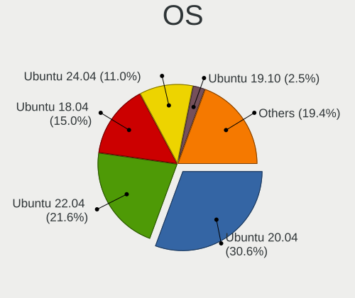

| Name           | Notebooks | Percent |
|----------------|-----------|---------|
| Ubuntu 20.04   | 14418     | 30.6%   |
| Ubuntu 22.04   | 10193     | 21.64%  |
| Ubuntu 18.04   | 7044      | 14.95%  |
| Ubuntu 24.04   | 5159      | 10.95%  |
| Ubuntu 19.10   | 1161      | 2.46%   |
| Ubuntu 21.10   | 1127      | 2.39%   |
| Ubuntu 20.10   | 1098      | 2.33%   |
| Ubuntu 19.04   | 1038      | 2.2%    |
| Ubuntu 23.04   | 934       | 1.98%   |
| Ubuntu 22.10   | 929       | 1.97%   |
| Ubuntu 21.04   | 916       | 1.94%   |
| Ubuntu 23.10   | 890       | 1.89%   |
| Ubuntu 24.10   | 485       | 1.03%   |
| Ubuntu 25.04   | 472       | 1%      |
| Ubuntu 18.10   | 460       | 0.98%   |
| Ubuntu 16.04   | 346       | 0.73%   |
| Ubuntu 25.10   | 205       | 0.44%   |
| Ubuntu         | 47        | 0.1%    |
| Ubuntu 17.10   | 30        | 0.06%   |
| Ubuntu Core 16 | 19        | 0.04%   |
| Ubuntu Core 22 | 15        | 0.03%   |
| Ubuntu Core 18 | 15        | 0.03%   |
| Ubuntu 26.04   | 14        | 0.03%   |
| Ubuntu 1.3.3   | 14        | 0.03%   |
| Ubuntu 1.3.5   | 12        | 0.03%   |
| Ubuntu 1.3.2   | 10        | 0.02%   |
| Ubuntu 14.04   | 7         | 0.01%   |
| Ubuntu 1.3.1   | 7         | 0.01%   |
| Ubuntu 1.3.7   | 6         | 0.01%   |
| Ubuntu 1.3.4   | 6         | 0.01%   |
| Ubuntu 24.0    | 5         | 0.01%   |
| Ubuntu 1.3.0   | 5         | 0.01%   |
| Ubuntu 17.04   | 3         | 0.01%   |
| Ubuntu 18.08   | 2         | 0.004%  |
| Ubuntu 1.1.8   | 2         | 0.004%  |
| Ubuntu 1.1.10  | 2         | 0.004%  |
| Ubuntu Core 20 | 1         | 0.002%  |
| Ubuntu 6.0     | 1         | 0.002%  |
| Ubuntu 21.3    | 1         | 0.002%  |
| Ubuntu 2023.3  | 1         | 0.002%  |

OS Family
---------

OS without a version

| Name   | Notebooks | Percent |
|--------|-----------|---------|
| Ubuntu | 44501     | 100%    |

Kernel
------

Version of the Linux kernel

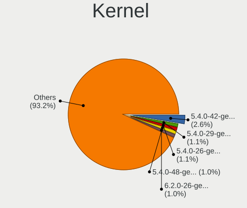

| Version           | Notebooks | Percent |
|-------------------|-----------|---------|
| 5.4.0-42-generic  | 1395      | 2.64%   |
| 5.4.0-29-generic  | 569       | 1.08%   |
| 5.4.0-26-generic  | 558       | 1.06%   |
| 5.4.0-48-generic  | 555       | 1.05%   |
| 6.2.0-26-generic  | 535       | 1.01%   |
| 5.4.0-52-generic  | 505       | 0.96%   |
| 5.15.0-56-generic | 488       | 0.92%   |
| 5.8.0-43-generic  | 468       | 0.89%   |
| 5.4.0-40-generic  | 463       | 0.88%   |
| 6.8.0-31-generic  | 452       | 0.86%   |
| 5.4.0-58-generic  | 452       | 0.86%   |
| 6.8.0-45-generic  | 439       | 0.83%   |
| 6.8.0-51-generic  | 426       | 0.81%   |
| 5.15.0-52-generic | 423       | 0.8%    |
| 5.11.0-27-generic | 392       | 0.74%   |
| 5.4.0-37-generic  | 389       | 0.74%   |
| 5.15.0-58-generic | 383       | 0.72%   |
| 6.8.0-41-generic  | 382       | 0.72%   |
| 5.19.0-35-generic | 376       | 0.71%   |
| 6.5.0-14-generic  | 373       | 0.71%   |
| 5.3.0-40-generic  | 370       | 0.7%    |
| 5.4.0-33-generic  | 366       | 0.69%   |
| 5.3.0-46-generic  | 354       | 0.67%   |
| 5.8.0-50-generic  | 353       | 0.67%   |
| 5.15.0-43-generic | 352       | 0.67%   |
| 5.15.0-46-generic | 340       | 0.64%   |
| 5.11.0-37-generic | 339       | 0.64%   |
| 5.19.0-32-generic | 338       | 0.64%   |
| 6.2.0-39-generic  | 334       | 0.63%   |
| 5.15.0-48-generic | 333       | 0.63%   |
| 5.11.0-38-generic | 325       | 0.61%   |
| 6.8.0-40-generic  | 321       | 0.61%   |
| 5.4.0-47-generic  | 315       | 0.6%    |
| 5.8.0-48-generic  | 314       | 0.59%   |
| 6.2.0-20-generic  | 313       | 0.59%   |
| 5.8.0-44-generic  | 312       | 0.59%   |
| 5.4.0-31-generic  | 307       | 0.58%   |
| 5.4.0-54-generic  | 305       | 0.58%   |
| 5.0.0-23-generic  | 305       | 0.58%   |
| 5.0.0-37-generic  | 303       | 0.57%   |

Kernel Family
-------------

Linux kernel without a distro release

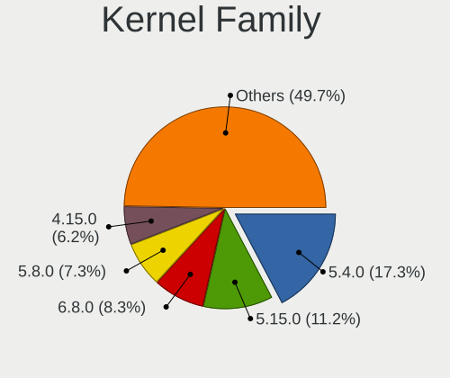

| Version | Notebooks | Percent |
|---------|-----------|---------|
| 5.4.0   | 8420      | 17.28%  |
| 5.15.0  | 5471      | 11.23%  |
| 6.8.0   | 4046      | 8.3%    |
| 5.8.0   | 3557      | 7.3%    |
| 4.15.0  | 3003      | 6.16%   |
| 5.11.0  | 2883      | 5.92%   |
| 6.2.0   | 2767      | 5.68%   |
| 5.19.0  | 2638      | 5.41%   |
| 6.5.0   | 2505      | 5.14%   |
| 5.3.0   | 2461      | 5.05%   |
| 5.13.0  | 2328      | 4.78%   |
| 5.0.0   | 2159      | 4.43%   |
| 6.11.0  | 1518      | 3.12%   |
| 4.18.0  | 1468      | 3.01%   |
| 6.14.0  | 1394      | 2.86%   |
| 6.17.0  | 208       | 0.43%   |
| 5.14.0  | 188       | 0.39%   |
| 4.4.0   | 137       | 0.28%   |
| 5.10.0  | 91        | 0.19%   |
| 5.17.0  | 71        | 0.15%   |
| 6.1.0   | 63        | 0.13%   |
| 5.6.0   | 58        | 0.12%   |
| 4.13.0  | 52        | 0.11%   |
| 6.0.0   | 26        | 0.05%   |
| 5.9.0   | 20        | 0.04%   |
| 6.4.0   | 17        | 0.03%   |
| 6.12.3  | 17        | 0.03%   |
| 5.7.1   | 17        | 0.03%   |
| 6.6.0   | 16        | 0.03%   |
| 6.0.9   | 16        | 0.03%   |
| 4.10.0  | 16        | 0.03%   |
| 6.9.3   | 14        | 0.03%   |
| 5.18.0  | 14        | 0.03%   |
| 5.12.0  | 14        | 0.03%   |
| 6.2.11  | 12        | 0.02%   |
| 5.17.1  | 11        | 0.02%   |
| 5.16.0  | 11        | 0.02%   |
| 4.16.18 | 11        | 0.02%   |
| 6.3.1   | 10        | 0.02%   |
| 6.3.0   | 10        | 0.02%   |

Kernel Major Ver.
-----------------

Linux kernel major version

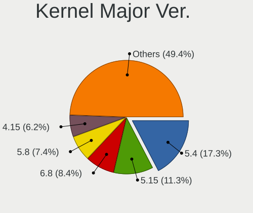

| Version | Notebooks | Percent |
|---------|-----------|---------|
| 5.4     | 8438      | 17.33%  |
| 5.15    | 5522      | 11.34%  |
| 6.8     | 4066      | 8.35%   |
| 5.8     | 3598      | 7.39%   |
| 4.15    | 3006      | 6.17%   |
| 5.11    | 2906      | 5.97%   |
| 6.2     | 2828      | 5.81%   |
| 5.19    | 2666      | 5.48%   |
| 6.5     | 2535      | 5.21%   |
| 5.3     | 2470      | 5.07%   |
| 5.13    | 2354      | 4.84%   |
| 5.0     | 2180      | 4.48%   |
| 6.11    | 1522      | 3.13%   |
| 4.18    | 1471      | 3.02%   |
| 6.14    | 1404      | 2.88%   |
| 6.17    | 218       | 0.45%   |
| 5.14    | 209       | 0.43%   |
| 5.10    | 142       | 0.29%   |
| 4.4     | 138       | 0.28%   |
| 5.17    | 106       | 0.22%   |
| 6.1     | 96        | 0.2%    |
| 5.6     | 80        | 0.16%   |
| 6.0     | 69        | 0.14%   |
| 4.13    | 52        | 0.11%   |
| 5.9     | 45        | 0.09%   |
| 5.7     | 44        | 0.09%   |
| 6.4     | 43        | 0.09%   |
| 6.3     | 35        | 0.07%   |
| 6.12    | 35        | 0.07%   |
| 5.18    | 35        | 0.07%   |
| 6.6     | 34        | 0.07%   |
| 6.9     | 32        | 0.07%   |
| 5.12    | 30        | 0.06%   |
| 5.16    | 27        | 0.06%   |
| 5.5     | 26        | 0.05%   |
| 6.10    | 23        | 0.05%   |
| 6.7     | 19        | 0.04%   |
| 5.2     | 19        | 0.04%   |
| 5.1     | 19        | 0.04%   |
| 4.19    | 18        | 0.04%   |

Arch
----

OS architecture (x86_64, i586, etc.)

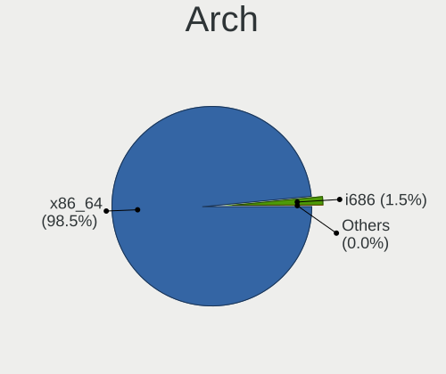

| Name    | Notebooks | Percent |
|---------|-----------|---------|
| x86_64  | 43823     | 98.47%  |
| i686    | 656       | 1.47%   |
| aarch64 | 20        | 0.04%   |
| Unknown | 2         | 0.004%  |
| riscv64 | 1         | 0.002%  |
| armv7l  | 1         | 0.002%  |

DE
--

Desktop Environment

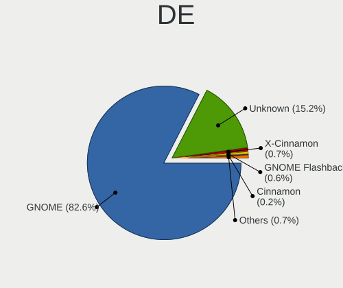

| Name                     | Notebooks | Percent |
|--------------------------|-----------|---------|
| GNOME                    | 37344     | 82.56%  |
| Unknown                  | 6894      | 15.24%  |
| X-Cinnamon               | 324       | 0.72%   |
| GNOME Flashback          | 263       | 0.58%   |
| Cinnamon                 | 111       | 0.25%   |
| i3                       | 81        | 0.18%   |
| Enlightenment            | 60        | 0.13%   |
| GNOME Classic            | 41        | 0.09%   |
| sway                     | 17        | 0.04%   |
| Hyprland                 | 11        | 0.02%   |
| awesome                  | 11        | 0.02%   |
| openbox                  | 8         | 0.02%   |
| xubuntu                  | 6         | 0.01%   |
| Pantheon                 | 5         | 0.01%   |
| Lubuntu                  | 5         | 0.01%   |
| GNUstep                  | 5         | 0.01%   |
| Deepin                   | 5         | 0.01%   |
| ubuntu                   | 4         | 0.01%   |
| DWM                      | 4         | 0.01%   |
| xmonad                   | 3         | 0.01%   |
| Trinity                  | 3         | 0.01%   |
| Yaru:ubuntu:GNOME        | 2         | 0.004%  |
| qtile                    | 2         | 0.004%  |
| ICEWM                    | 2         | 0.004%  |
| i3-with-shmlog           | 2         | 0.004%  |
| Cutefish                 | 2         | 0.004%  |
| bspwm                    | 2         | 0.004%  |
| Yoyo                     | 1         | 0.002%  |
| xsession                 | 1         | 0.002%  |
| wmaker-common            | 1         | 0.002%  |
| river                    | 1         | 0.002%  |
| ratflow                  | 1         | 0.002%  |
| niri                     | 1         | 0.002%  |
| mwm                      | 1         | 0.002%  |
| kubuntu-live-environment | 1         | 0.002%  |
| jwm                      | 1         | 0.002%  |
| Hyprland:start-hyprland  | 1         | 0.002%  |
| GNOME:                   | 1         | 0.002%  |
| fluxbox                  | 1         | 0.002%  |
| DDE                      | 1         | 0.002%  |

Display Server
--------------

X11 or Wayland

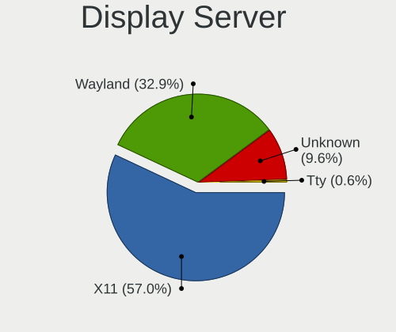

| Name    | Notebooks | Percent |
|---------|-----------|---------|
| X11     | 26318     | 56.98%  |
| Wayland | 15186     | 32.88%  |
| Unknown | 4418      | 9.57%   |
| Tty     | 264       | 0.57%   |

Display Manager
---------------

SDDM, LightDM, etc.

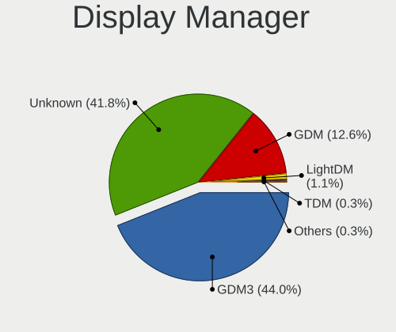

| Name            | Notebooks | Percent |
|-----------------|-----------|---------|
| GDM3            | 20114     | 43.95%  |
| Unknown         | 19123     | 41.79%  |
| GDM             | 5762      | 12.59%  |
| LightDM         | 489       | 1.07%   |
| TDM             | 131       | 0.29%   |
| SDDM            | 128       | 0.28%   |
| SLiM            | 8         | 0.02%   |
| XDM             | 3         | 0.01%   |
| NODM            | 2         | 0.004%  |
| GREETD          | 2         | 0.004%  |
| Ly              | 1         | 0.002%  |
| LXDM            | 1         | 0.002%  |
| KODI-STANDALONE | 1         | 0.002%  |

OS Lang
-------

Language

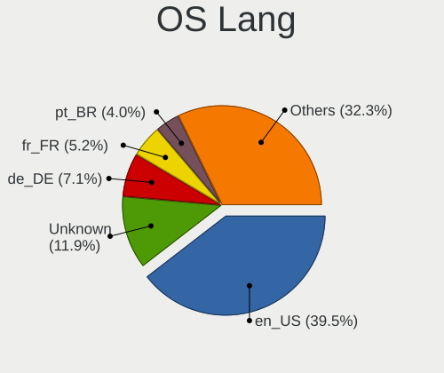

| Lang    | Notebooks | Percent |
|---------|-----------|---------|
| en_US   | 17883     | 39.54%  |
| Unknown | 5369      | 11.87%  |
| de_DE   | 3219      | 7.12%   |
| fr_FR   | 2372      | 5.24%   |
| pt_BR   | 1796      | 3.97%   |
| en_GB   | 1735      | 3.84%   |
| en_IN   | 1380      | 3.05%   |
| ru_RU   | 1259      | 2.78%   |
| es_ES   | 1243      | 2.75%   |
| it_IT   | 1236      | 2.73%   |
| C       | 831       | 1.84%   |
| en_CA   | 717       | 1.59%   |
| pl_PL   | 595       | 1.32%   |
| en_AU   | 452       | 1%      |
| nl_NL   | 357       | 0.79%   |
| hu_HU   | 291       | 0.64%   |
| zh_CN   | 281       | 0.62%   |
| cs_CZ   | 273       | 0.6%    |
| es_MX   | 267       | 0.59%   |
| tr_TR   | 230       | 0.51%   |
| pt_PT   | 199       | 0.44%   |
| en_ZA   | 199       | 0.44%   |
| es_AR   | 188       | 0.42%   |
| de_AT   | 142       | 0.31%   |
| sv_SE   | 141       | 0.31%   |
| es_CO   | 135       | 0.3%    |
| fi_FI   | 130       | 0.29%   |
| ja_JP   | 128       | 0.28%   |
| es_CL   | 118       | 0.26%   |
| en_IL   | 103       | 0.23%   |
| de_CH   | 99        | 0.22%   |
| da_DK   | 92        | 0.2%    |
| nb_NO   | 89        | 0.2%    |
| ru_UA   | 85        | 0.19%   |
| el_GR   | 85        | 0.19%   |
| en_PH   | 81        | 0.18%   |
| fr_CA   | 80        | 0.18%   |
| en_NZ   | 76        | 0.17%   |
| en_IE   | 76        | 0.17%   |
| ro_RO   | 75        | 0.17%   |

Boot Mode
---------

EFI or BIOS

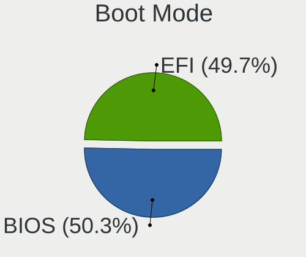

| Mode | Notebooks | Percent |
|------|-----------|---------|
| BIOS | 22877     | 50.31%  |
| EFI  | 22591     | 49.69%  |

Filesystem
----------

Type of filesystem

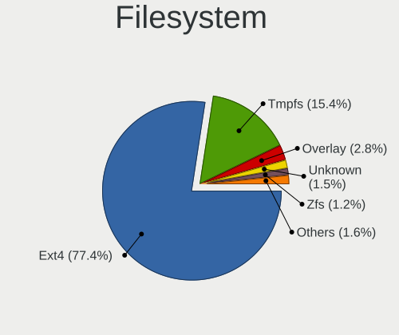

| Type     | Notebooks | Percent |
|----------|-----------|---------|
| Ext4     | 35175     | 77.41%  |
| Tmpfs    | 7004      | 15.41%  |
| Overlay  | 1254      | 2.76%   |
| Unknown  | 698       | 1.54%   |
| Zfs      | 561       | 1.23%   |
| Btrfs    | 416       | 0.92%   |
| Ext2     | 159       | 0.35%   |
| Xfs      | 80        | 0.18%   |
| Ext3     | 71        | 0.16%   |
| Aufs     | 10        | 0.02%   |
| Reiserfs | 4         | 0.01%   |
| XXX4     | 2         | 0.004%  |
| F2fs     | 2         | 0.004%  |
| Nfs      | 1         | 0.002%  |
| Jfs      | 1         | 0.002%  |

Part. scheme
------------

Scheme of partitioning

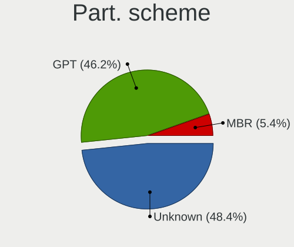

| Type    | Notebooks | Percent |
|---------|-----------|---------|
| Unknown | 21975     | 48.36%  |
| GPT     | 21002     | 46.22%  |
| MBR     | 2461      | 5.42%   |

Dual Boot with Linux/BSD
------------------------

Hosting more than one Linux/BSD

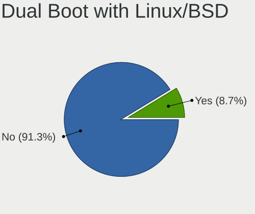

| Dual boot | Notebooks | Percent |
|-----------|-----------|---------|
| No        | 41069     | 91.29%  |
| Yes       | 3919      | 8.71%   |

Dual Boot (Win)
---------------

Hosting Linux and Windows

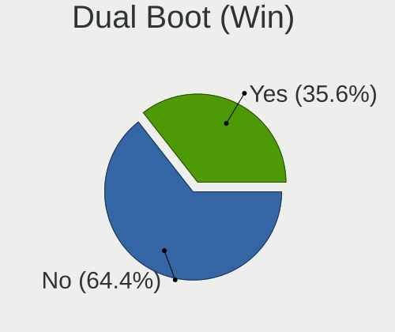

| Dual boot | Notebooks | Percent |
|-----------|-----------|---------|
| No        | 29040     | 64.44%  |
| Yes       | 16028     | 35.56%  |

Board
-----

Vendor
------

Motherboard manufacturer

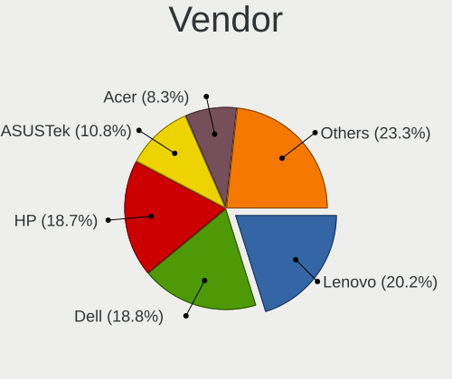

| Name                   | Notebooks | Percent |
|------------------------|-----------|---------|
| Lenovo                 | 8985      | 20.19%  |
| Dell                   | 8357      | 18.78%  |
| Hewlett-Packard        | 8338      | 18.74%  |
| ASUSTek Computer       | 4784      | 10.75%  |
| Acer                   | 3680      | 8.27%   |
| Toshiba                | 1249      | 2.81%   |
| Apple                  | 1228      | 2.76%   |
| MSI                    | 898       | 2.02%   |
| Samsung Electronics    | 817       | 1.84%   |
| Sony                   | 631       | 1.42%   |
| HUAWEI                 | 625       | 1.4%    |
| Fujitsu                | 315       | 0.71%   |
| Unknown                | 295       | 0.66%   |
| Notebook               | 252       | 0.57%   |
| Google                 | 245       | 0.55%   |
| Medion                 | 237       | 0.53%   |
| Positivo               | 193       | 0.43%   |
| Timi                   | 181       | 0.41%   |
| Packard Bell           | 181       | 0.41%   |
| Alienware              | 170       | 0.38%   |
| LG Electronics         | 116       | 0.26%   |
| TUXEDO                 | 115       | 0.26%   |
| Fujitsu Siemens        | 94        | 0.21%   |
| System76               | 92        | 0.21%   |
| Panasonic              | 88        | 0.2%    |
| Clevo                  | 87        | 0.2%    |
| Gigabyte Technology    | 86        | 0.19%   |
| Gateway                | 82        | 0.18%   |
| Chuwi                  | 72        | 0.16%   |
| Razer                  | 70        | 0.16%   |
| HONOR                  | 65        | 0.15%   |
| Intel                  | 64        | 0.14%   |
| Framework              | 61        | 0.14%   |
| PC Specialist          | 46        | 0.1%    |
| eMachines              | 45        | 0.1%    |
| Schenker               | 38        | 0.09%   |
| Monster                | 38        | 0.09%   |
| Avell High Performance | 34        | 0.08%   |
| AMI                    | 31        | 0.07%   |
| Maibenben              | 29        | 0.07%   |

Model
-----

Motherboard model

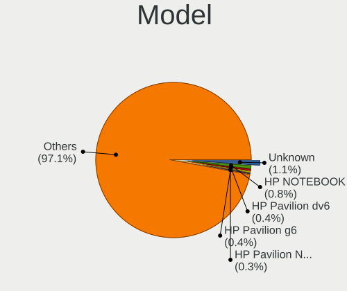

| Name                  | Notebooks | Percent |
|-----------------------|-----------|---------|
| Unknown               | 476       | 1.07%   |
| HP NOTEBOOK           | 339       | 0.76%   |
| HP Pavilion dv6       | 190       | 0.43%   |
| HP Pavilion g6        | 166       | 0.37%   |
| HP Pavilion Notebook  | 140       | 0.31%   |
| HP Pavilion dv7       | 137       | 0.31%   |
| HP Pavilion 15        | 122       | 0.27%   |
| Dell Latitude E6420   | 112       | 0.25%   |
| Dell XPS 15 7590      | 111       | 0.25%   |
| Apple MacBookPro9,2   | 108       | 0.24%   |
| HP EliteBook 840 G3   | 105       | 0.24%   |
| Dell XPS 15 9570      | 103       | 0.23%   |
| Dell Inspiron 15-3567 | 103       | 0.23%   |
| Dell Latitude E6410   | 101       | 0.23%   |
| HP 15                 | 99        | 0.22%   |
| Dell Latitude E6430   | 99        | 0.22%   |
| Dell XPS 13 9370      | 85        | 0.19%   |
| Dell Inspiron 5570    | 84        | 0.19%   |
| Dell XPS 15 9500      | 83        | 0.19%   |
| HP Laptop 15-db0xxx   | 80        | 0.18%   |
| Dell Latitude 7490    | 79        | 0.18%   |
| HP Laptop 15-bs0xx    | 78        | 0.18%   |
| Apple MacBookPro8,1   | 78        | 0.18%   |
| Dell XPS 13 9380      | 77        | 0.17%   |
| HP Pavilion g7        | 76        | 0.17%   |
| Dell Latitude 5420    | 76        | 0.17%   |
| Dell XPS 13 7390      | 75        | 0.17%   |
| Dell Latitude E6400   | 75        | 0.17%   |
| HP EliteBook 8460p    | 73        | 0.16%   |
| HP Laptop 15-da0xxx   | 72        | 0.16%   |
| HP EliteBook 840 G6   | 72        | 0.16%   |
| HP Laptop 15-bw0xx    | 69        | 0.16%   |
| HP EliteBook 840 G5   | 69        | 0.16%   |
| Apple MacBookAir7,2   | 69        | 0.16%   |
| HP EliteBook 840 G1   | 68        | 0.15%   |
| Dell Inspiron 1545    | 68        | 0.15%   |
| Apple MacBookPro12,1  | 67        | 0.15%   |
| HP Pavilion 17        | 66        | 0.15%   |
| HP EliteBook 8470p    | 66        | 0.15%   |
| Dell XPS 13 9360      | 66        | 0.15%   |

Model Family
------------

Motherboard model prefix

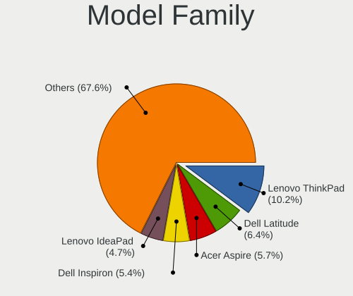

| Name                  | Notebooks | Percent |
|-----------------------|-----------|---------|
| Lenovo ThinkPad       | 4548      | 10.22%  |
| Dell Latitude         | 2859      | 6.42%   |
| Acer Aspire           | 2516      | 5.65%   |
| Dell Inspiron         | 2417      | 5.43%   |
| Lenovo IdeaPad        | 2093      | 4.7%    |
| HP Pavilion           | 1751      | 3.93%   |
| HP EliteBook          | 1553      | 3.49%   |
| HP ProBook            | 1175      | 2.64%   |
| Dell XPS              | 1135      | 2.55%   |
| HP Laptop             | 1131      | 2.54%   |
| ASUS VivoBook         | 1059      | 2.38%   |
| Toshiba Satellite     | 1054      | 2.37%   |
| Dell Precision        | 767       | 1.72%   |
| Dell Vostro           | 581       | 1.31%   |
| Unknown               | 476       | 1.07%   |
| Acer Swift            | 371       | 0.83%   |
| Lenovo Legion         | 366       | 0.82%   |
| Lenovo ThinkBook      | 350       | 0.79%   |
| HP Notebook           | 342       | 0.77%   |
| HP ZBook              | 341       | 0.77%   |
| ASUS ZenBook          | 320       | 0.72%   |
| ASUS ASUS             | 315       | 0.71%   |
| ASUS ROG              | 312       | 0.7%    |
| HP ENVY               | 283       | 0.64%   |
| Fujitsu LIFEBOOK      | 273       | 0.61%   |
| Acer Nitro            | 270       | 0.61%   |
| HP Compaq             | 245       | 0.55%   |
| HP 250                | 194       | 0.44%   |
| Lenovo Yoga           | 178       | 0.4%    |
| Acer TravelMate       | 170       | 0.38%   |
| HP OMEN               | 163       | 0.37%   |
| Packard Bell EasyNote | 162       | 0.36%   |
| Apple MacBookPro8     | 143       | 0.32%   |
| Dell G3               | 141       | 0.32%   |
| ASUS TUF              | 136       | 0.31%   |
| HP 255                | 134       | 0.3%    |
| HP 15                 | 133       | 0.3%    |
| Apple MacBookPro9     | 123       | 0.28%   |
| Apple MacBookPro11    | 122       | 0.27%   |
| Dell System           | 105       | 0.24%   |

MFG Year
--------

Motherboard manufacture year

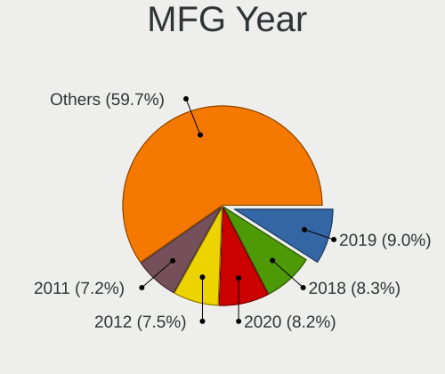

| Year    | Notebooks | Percent |
|---------|-----------|---------|
| 2019    | 4027      | 9.05%   |
| 2018    | 3713      | 8.34%   |
| 2020    | 3664      | 8.23%   |
| 2012    | 3319      | 7.46%   |
| 2011    | 3221      | 7.24%   |
| 2021    | 3157      | 7.09%   |
| 2013    | 3030      | 6.81%   |
| 2017    | 2963      | 6.66%   |
| 2014    | 2436      | 5.47%   |
| 2015    | 2386      | 5.36%   |
| 2016    | 2332      | 5.24%   |
| 2010    | 2076      | 4.67%   |
| 2022    | 1884      | 4.23%   |
| 2008    | 1651      | 3.71%   |
| 2023    | 1433      | 3.22%   |
| 2009    | 1254      | 2.82%   |
| 2007    | 695       | 1.56%   |
| 2024    | 653       | 1.47%   |
| 2006    | 309       | 0.69%   |
| 2025    | 185       | 0.42%   |
| 2005    | 59        | 0.13%   |
| Unknown | 38        | 0.09%   |
| 2004    | 12        | 0.03%   |
| 2003    | 2         | 0.004%  |
| 2002    | 2         | 0.004%  |

Form Factor
-----------

Physical design of the computer

| Name     | Notebooks | Percent |
|----------|-----------|---------|
| Notebook | 44501     | 100%    |

Secure Boot
-----------

Enabled or disabled

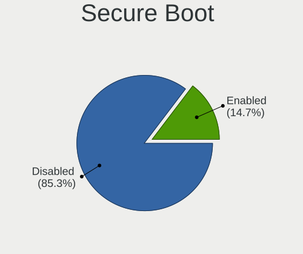

| State    | Notebooks | Percent |
|----------|-----------|---------|
| Disabled | 38404     | 85.32%  |
| Enabled  | 6606      | 14.68%  |

Coreboot
--------

Have coreboot on board

| Used | Notebooks | Percent |
|------|-----------|---------|
| No   | 44181     | 99.28%  |
| Yes  | 320       | 0.72%   |

RAM Size
--------

Total RAM memory

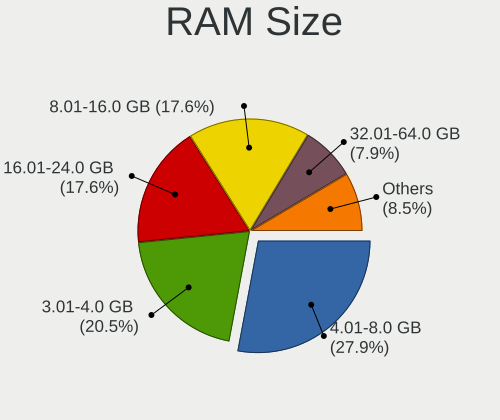

| Size in GB  | Notebooks | Percent |
|-------------|-----------|---------|
| 4.01-8.0    | 12589     | 27.94%  |
| 3.01-4.0    | 9219      | 20.46%  |
| 16.01-24.0  | 7945      | 17.63%  |
| 8.01-16.0   | 7930      | 17.6%   |
| 32.01-64.0  | 3542      | 7.86%   |
| 1.01-2.0    | 1567      | 3.48%   |
| 24.01-32.0  | 793       | 1.76%   |
| 2.01-3.0    | 657       | 1.46%   |
| 64.01-256.0 | 656       | 1.46%   |
| 0.51-1.0    | 150       | 0.33%   |
| 0.01-0.5    | 7         | 0.02%   |
| Unknown     | 2         | 0.004%  |

RAM Used
--------

Used RAM memory

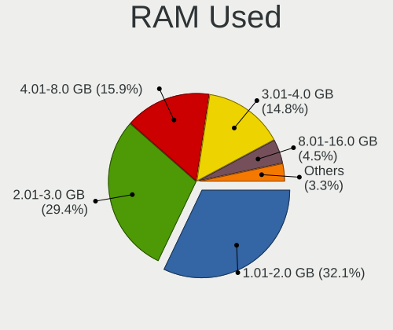

| Used GB    | Notebooks | Percent |
|------------|-----------|---------|
| 1.01-2.0   | 15651     | 32.11%  |
| 2.01-3.0   | 14308     | 29.36%  |
| 4.01-8.0   | 7741      | 15.88%  |
| 3.01-4.0   | 7227      | 14.83%  |
| 8.01-16.0  | 2189      | 4.49%   |
| 0.51-1.0   | 1096      | 2.25%   |
| 16.01-24.0 | 275       | 0.56%   |
| 0.01-0.5   | 131       | 0.27%   |
| 24.01-32.0 | 87        | 0.18%   |
| 32.01-64.0 | 25        | 0.05%   |
| Unknown    | 6         | 0.01%   |

Total Drives
------------

Number of drives on board

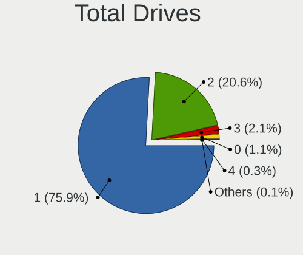

| Drives | Notebooks | Percent |
|--------|-----------|---------|
| 1      | 34376     | 75.85%  |
| 2      | 9342      | 20.61%  |
| 3      | 933       | 2.06%   |
| 0      | 503       | 1.11%   |
| 4      | 125       | 0.28%   |
| 5      | 23        | 0.05%   |
| 7      | 6         | 0.01%   |
| 6      | 6         | 0.01%   |
| 8      | 4         | 0.01%   |
| 10     | 1         | 0.002%  |
| 9      | 1         | 0.002%  |

Has CD-ROM
----------

Has CD-ROM on board

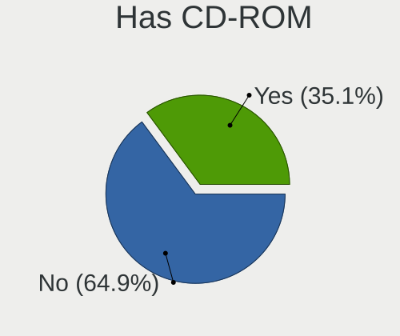

| Presented | Notebooks | Percent |
|-----------|-----------|---------|
| No        | 29002     | 64.87%  |
| Yes       | 15707     | 35.13%  |

Has Ethernet
------------

Has Ethernet on board

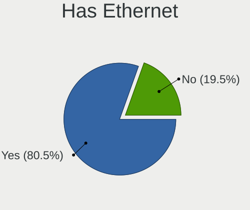

| Presented | Notebooks | Percent |
|-----------|-----------|---------|
| Yes       | 35934     | 80.46%  |
| No        | 8728      | 19.54%  |

Has WiFi
--------

Has WiFi module

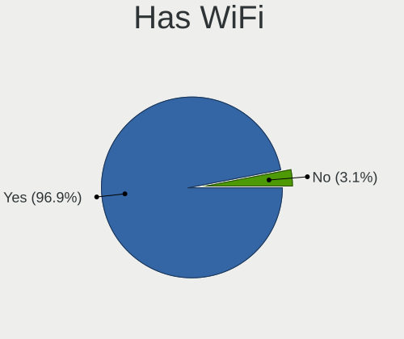

| Presented | Notebooks | Percent |
|-----------|-----------|---------|
| Yes       | 43178     | 96.95%  |
| No        | 1359      | 3.05%   |

Has Bluetooth
-------------

Has Bluetooth module

| Presented | Notebooks | Percent |
|-----------|-----------|---------|
| Yes       | 35198     | 78.15%  |
| No        | 9841      | 21.85%  |

Location
--------

Country
-------

Geographic location (country)

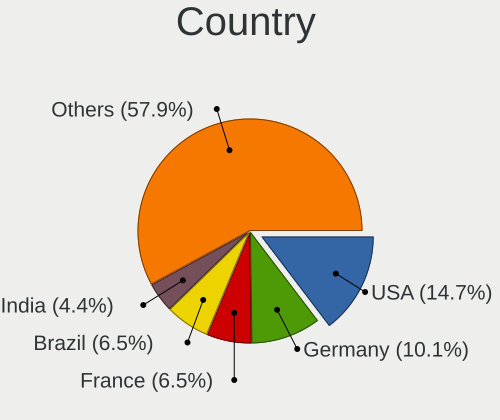

| Country      | Notebooks | Percent |
|--------------|-----------|---------|
| USA          | 6570      | 14.67%  |
| Germany      | 4536      | 10.13%  |
| France       | 2899      | 6.47%   |
| Brazil       | 2894      | 6.46%   |
| India        | 1955      | 4.36%   |
| Italy        | 1952      | 4.36%   |
| Russia       | 1867      | 4.17%   |
| UK           | 1758      | 3.92%   |
| Spain        | 1419      | 3.17%   |
| Canada       | 1189      | 2.65%   |
| Poland       | 1124      | 2.51%   |
| Netherlands  | 943       | 2.11%   |
| Mexico       | 642       | 1.43%   |
| Turkey       | 626       | 1.4%    |
| Australia    | 609       | 1.36%   |
| Czechia      | 522       | 1.17%   |
| Sweden       | 510       | 1.14%   |
| Hungary      | 504       | 1.13%   |
| Argentina    | 477       | 1.06%   |
| Switzerland  | 468       | 1.04%   |
| Belgium      | 467       | 1.04%   |
| Ukraine      | 465       | 1.04%   |
| Portugal     | 453       | 1.01%   |
| Austria      | 431       | 0.96%   |
| Romania      | 429       | 0.96%   |
| China        | 413       | 0.92%   |
| Indonesia    | 370       | 0.83%   |
| Finland      | 333       | 0.74%   |
| Colombia     | 327       | 0.73%   |
| Greece       | 306       | 0.68%   |
| South Africa | 295       | 0.66%   |
| Norway       | 293       | 0.65%   |
| Chile        | 290       | 0.65%   |
| Denmark      | 277       | 0.62%   |
| Iran         | 274       | 0.61%   |
| Bulgaria     | 252       | 0.56%   |
| Japan        | 244       | 0.54%   |
| Egypt        | 214       | 0.48%   |
| Israel       | 201       | 0.45%   |
| Vietnam      | 182       | 0.41%   |

City
----

Geographic location (city)

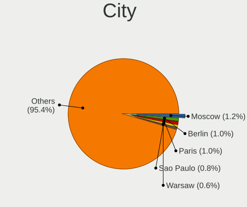

| City              | Notebooks | Percent |
|-------------------|-----------|---------|
| Moscow            | 557       | 1.17%   |
| Berlin            | 492       | 1.03%   |
| Paris             | 476       | 1%      |
| Sao Paulo         | 363       | 0.76%   |
| Warsaw            | 286       | 0.6%    |
| Milan             | 278       | 0.58%   |
| Rome              | 267       | 0.56%   |
| Vienna            | 257       | 0.54%   |
| St Petersburg     | 253       | 0.53%   |
| Bengaluru         | 253       | 0.53%   |
| Budapest          | 250       | 0.52%   |
| Istanbul          | 249       | 0.52%   |
| Madrid            | 243       | 0.51%   |
| Munich            | 240       | 0.5%    |
| Prague            | 201       | 0.42%   |
| Barcelona         | 190       | 0.4%    |
| Rio de Janeiro    | 172       | 0.36%   |
| Athens            | 171       | 0.36%   |
| Hamburg           | 170       | 0.36%   |
| Helsinki          | 164       | 0.34%   |
| Amsterdam         | 163       | 0.34%   |
| Kyiv              | 161       | 0.34%   |
| Tehran            | 157       | 0.33%   |
| Sydney            | 155       | 0.32%   |
| Sofia             | 151       | 0.32%   |
| Chennai           | 149       | 0.31%   |
| Melbourne         | 148       | 0.31%   |
| Frankfurt am Main | 145       | 0.3%    |
| Bucharest         | 144       | 0.3%    |
| Bogota            | 143       | 0.3%    |
| Delhi             | 135       | 0.28%   |
| Mumbai            | 134       | 0.28%   |
| Toronto           | 132       | 0.28%   |
| Mexico City       | 128       | 0.27%   |
| Montreal          | 126       | 0.26%   |
| Los Angeles       | 121       | 0.25%   |
| Dublin            | 120       | 0.25%   |
| Santiago          | 116       | 0.24%   |
| Cairo             | 116       | 0.24%   |
| Singapore         | 114       | 0.24%   |

Drives
------

Drive Vendor
------------

Hard drive vendors

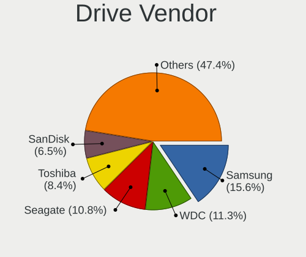

| Vendor                      | Notebooks | Drives | Percent |
|-----------------------------|-----------|--------|---------|
| Samsung Electronics         | 8307      | 10726  | 15.58%  |
| WDC                         | 6001      | 7433   | 11.25%  |
| Seagate                     | 5744      | 7198   | 10.77%  |
| Toshiba                     | 4490      | 5513   | 8.42%   |
| SanDisk                     | 3486      | 4389   | 6.54%   |
| Unknown                     | 2599      | 3334   | 4.87%   |
| Kingston                    | 2579      | 3119   | 4.84%   |
| SK hynix                    | 2508      | 3008   | 4.7%    |
| Micron Technology           | 1838      | 2169   | 3.45%   |
| Intel                       | 1745      | 2285   | 3.27%   |
| Hitachi                     | 1601      | 1962   | 3%      |
| HGST                        | 1481      | 1845   | 2.78%   |
| Crucial                     | 1464      | 1881   | 2.75%   |
| KIOXIA                      | 859       | 1031   | 1.61%   |
| Apple                       | 659       | 859    | 1.24%   |
| A-DATA Technology           | 651       | 784    | 1.22%   |
| China                       | 378       | 474    | 0.71%   |
| LITEON                      | 350       | 421    | 0.66%   |
| Fujitsu                     | 318       | 377    | 0.6%    |
| Phison                      | 285       | 334    | 0.53%   |
| Silicon Motion              | 226       | 275    | 0.42%   |
| Intenso                     | 213       | 293    | 0.4%    |
| Kingston Technology Company | 212       | 249    | 0.4%    |
| SPCC                        | 204       | 263    | 0.38%   |
| PNY                         | 200       | 244    | 0.38%   |
| Unknown                     | 188       | 226    | 0.35%   |
| Transcend                   | 175       | 208    | 0.33%   |
| Micron/Crucial Technology   | 170       | 205    | 0.32%   |
| Phison Electronics          | 166       | 202    | 0.31%   |
| LITEONIT                    | 162       | 208    | 0.3%    |
| JMicron Technology          | 142       | 162    | 0.27%   |
| ADATA Technology            | 136       | 157    | 0.26%   |
| Netac                       | 126       | 158    | 0.24%   |
| Patriot                     | 121       | 144    | 0.23%   |
| GOODRAM                     | 116       | 133    | 0.22%   |
| OCZ                         | 102       | 119    | 0.19%   |
| KingSpec                    | 94        | 117    | 0.18%   |
| SSSTC                       | 93        | 97     | 0.17%   |
| Team                        | 91        | 110    | 0.17%   |
| Lexar                       | 90        | 119    | 0.17%   |

Drive Model
-----------

Hard drive models

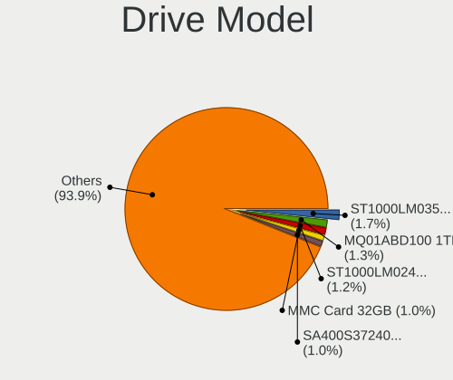

| Model                                              | Notebooks | Percent |
|----------------------------------------------------|-----------|---------|
| Seagate ST1000LM035-1RK172 1TB                     | 910       | 1.65%   |
| Toshiba MQ01ABD100 1TB                             | 714       | 1.3%    |
| Seagate ST1000LM024 HN-M101MBB 1TB                 | 652       | 1.19%   |
| Unknown MMC Card  32GB                             | 531       | 0.97%   |
| Kingston SA400S37240G 240GB SSD                    | 525       | 0.95%   |
| Toshiba MQ04ABF100 1TB                             | 482       | 0.88%   |
| Toshiba MQ01ABF050 500GB                           | 449       | 0.82%   |
| SanDisk NVMe SSD Drive 512GB                       | 417       | 0.76%   |
| Seagate ST500LT012-1DG142 500GB                    | 413       | 0.75%   |
| Unknown MMC Card  64GB                             | 400       | 0.73%   |
| HGST HTS721010A9E630 1TB                           | 371       | 0.67%   |
| Seagate ST9500325AS 500GB                          | 359       | 0.65%   |
| Samsung NVMe SSD Controller SM981/PM981/PM983 1TB  | 343       | 0.62%   |
| Samsung NVMe SSD Drive 512GB                       | 340       | 0.62%   |
| Samsung SSD 860 EVO 500GB                          | 299       | 0.54%   |
| Kingston SA400S37480G 480GB SSD                    | 292       | 0.53%   |
| Samsung NVMe SSD Drive 256GB                       | 274       | 0.5%    |
| SanDisk NVMe SSD Drive 1TB                         | 257       | 0.47%   |
| Kingston SA400S37120G 120GB SSD                    | 250       | 0.45%   |
| HGST HTS541010A9E680 1TB                           | 249       | 0.45%   |
| HGST HTS545050A7E680 500GB                         | 235       | 0.43%   |
| Intel NVMe SSD Drive 512GB                         | 232       | 0.42%   |
| Samsung SSD 850 EVO 250GB                          | 230       | 0.42%   |
| Samsung NVMe SSD Controller PM9A1/PM9A3/980PRO 1TB | 228       | 0.41%   |
| Samsung SSD 850 EVO 500GB                          | 210       | 0.38%   |
| Crucial CT500MX500SSD1 500GB                       | 209       | 0.38%   |
| WDC WD10JPVX-22JC3T0 1TB                           | 204       | 0.37%   |
| Unknown MMC Card  128GB                            | 202       | 0.37%   |
| HGST HTS725050A7E630 500GB                         | 200       | 0.36%   |
| Crucial CT240BX500SSD1 240GB                       | 195       | 0.35%   |
| Unknown MMC Card  16GB                             | 191       | 0.35%   |
| SK hynix NVMe SSD Drive 512GB                      | 189       | 0.34%   |
| Seagate ST500LM012 HN-M500MBB 500GB                | 189       | 0.34%   |
| Unknown                                            | 188       | 0.34%   |
| SanDisk NVMe SSD Drive 256GB                       | 186       | 0.34%   |
| Seagate ST2000LM007-1R8174 2TB                     | 180       | 0.33%   |
| Toshiba NVMe SSD Drive 512GB                       | 164       | 0.3%    |
| Intel SSDPEKNU512GZ 512GB                          | 162       | 0.29%   |
| Kingston SV300S37A120G 120GB SSD                   | 158       | 0.29%   |
| Seagate ST500LT012-9WS142 500GB                    | 157       | 0.29%   |

HDD Vendor
----------

Hard disk drive vendors

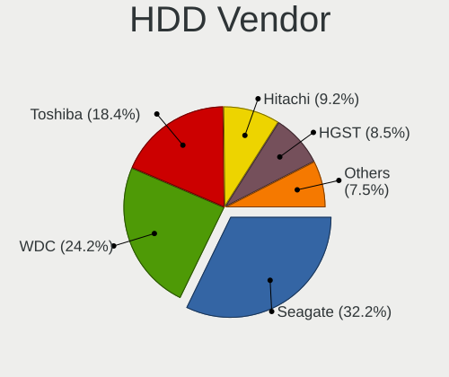

| Vendor              | Notebooks | Drives | Percent |
|---------------------|-----------|--------|---------|
| Seagate             | 5620      | 7005   | 32.21%  |
| WDC                 | 4223      | 5212   | 24.2%   |
| Toshiba             | 3210      | 3891   | 18.4%   |
| Hitachi             | 1600      | 1961   | 9.17%   |
| HGST                | 1481      | 1845   | 8.49%   |
| Samsung Electronics | 421       | 507    | 2.41%   |
| Fujitsu             | 314       | 371    | 1.8%    |
| Unknown             | 154       | 187    | 0.88%   |
| JMicron Technology  | 89        | 105    | 0.51%   |
| Apple               | 69        | 79     | 0.4%    |
| External            | 35        | 53     | 0.2%    |
| Intenso             | 34        | 42     | 0.19%   |
| ASMT                | 28        | 56     | 0.16%   |
| TO Exter            | 22        | 25     | 0.13%   |
| USB3.0              | 18        | 19     | 0.1%    |
| ASMedia             | 13        | 17     | 0.07%   |
| LaCie               | 12        | 16     | 0.07%   |
| JetFlash            | 10        | 15     | 0.06%   |
| USB                 | 9         | 9      | 0.05%   |
| SSK                 | 9         | 9      | 0.05%   |
| IBM/Hitachi         | 9         | 10     | 0.05%   |
| StoreJet            | 6         | 6      | 0.03%   |
| HGST HTS            | 6         | 8      | 0.03%   |
| SABRENT             | 5         | 6      | 0.03%   |
| MARSHAL             | 5         | 5      | 0.03%   |
| Inateck             | 5         | 6      | 0.03%   |
| SAGE                | 4         | 4      | 0.02%   |
| KESU                | 4         | 4      | 0.02%   |
| T-FORCE             | 3         | 5      | 0.02%   |
| Hewlett-Packard     | 3         | 3      | 0.02%   |
| USB 3.0             | 2         | 3      | 0.01%   |
| Shenzhen            | 2         | 3      | 0.01%   |
| Maxone              | 2         | 2      | 0.01%   |
| Initio              | 2         | 2      | 0.01%   |
| IB-AC703            | 2         | 2      | 0.01%   |
| XrayDisk            | 1         | 1      | 0.01%   |
| STEC                | 1         | 1      | 0.01%   |
| SILICONMOTION       | 1         | 1      | 0.01%   |
| SATAFIRM            | 1         | 1      | 0.01%   |
| RSH-339             | 1         | 1      | 0.01%   |

SSD Vendor
----------

Solid state drive vendors

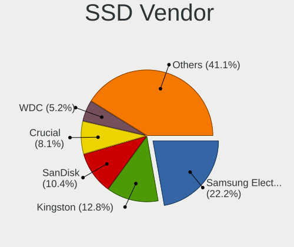

| Vendor              | Notebooks | Drives | Percent |
|---------------------|-----------|--------|---------|
| Samsung Electronics | 3452      | 4456   | 22.23%  |
| Kingston            | 1993      | 2421   | 12.83%  |
| SanDisk             | 1622      | 2074   | 10.44%  |
| Crucial             | 1261      | 1652   | 8.12%   |
| WDC                 | 812       | 1029   | 5.23%   |
| Micron Technology   | 526       | 634    | 3.39%   |
| SK hynix            | 483       | 611    | 3.11%   |
| Intel               | 474       | 585    | 3.05%   |
| A-DATA Technology   | 472       | 565    | 3.04%   |
| Apple               | 374       | 436    | 2.41%   |
| China               | 372       | 467    | 2.4%    |
| Toshiba             | 352       | 446    | 2.27%   |
| LITEON              | 327       | 397    | 2.11%   |
| SPCC                | 187       | 244    | 1.2%    |
| PNY                 | 183       | 225    | 1.18%   |
| LITEONIT            | 162       | 208    | 1.04%   |
| Transcend           | 158       | 188    | 1.02%   |
| Intenso             | 145       | 195    | 0.93%   |
| Patriot             | 111       | 133    | 0.71%   |
| Netac               | 111       | 138    | 0.71%   |
| GOODRAM             | 108       | 124    | 0.7%    |
| OCZ                 | 102       | 119    | 0.66%   |
| KingSpec            | 86        | 107    | 0.55%   |
| Team                | 78        | 94     | 0.5%    |
| Lexar               | 62        | 85     | 0.4%    |
| Hewlett-Packard     | 61        | 86     | 0.39%   |
| Unknown             | 59        | 75     | 0.38%   |
| SABRENT             | 55        | 59     | 0.35%   |
| Apacer              | 54        | 62     | 0.35%   |
| Corsair             | 53        | 64     | 0.34%   |
| Plextor             | 48        | 62     | 0.31%   |
| Gigabyte Technology | 48        | 53     | 0.31%   |
| Seagate             | 42        | 51     | 0.27%   |
| FORESEE             | 39        | 42     | 0.25%   |
| BHT                 | 37        | 49     | 0.24%   |
| ASMT                | 36        | 40     | 0.23%   |
| Emtec               | 30        | 37     | 0.19%   |
| KingDian            | 28        | 36     | 0.18%   |
| Verbatim            | 27        | 28     | 0.17%   |
| Unknown             | 22        | 24     | 0.14%   |

Drive Kind
----------

HDD or SSD

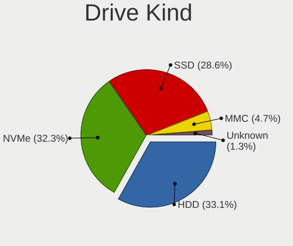

| Kind    | Notebooks | Drives | Percent |
|---------|-----------|--------|---------|
| HDD     | 16912     | 21512  | 33.13%  |
| NVMe    | 16477     | 21450  | 32.27%  |
| SSD     | 14608     | 19433  | 28.61%  |
| MMC     | 2399      | 3140   | 4.7%    |
| Unknown | 657       | 817    | 1.29%   |

Drive Connector
---------------

SATA, SAS, NVMe, etc.

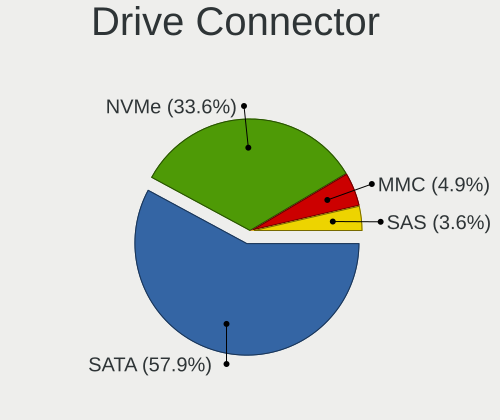

| Type | Notebooks | Drives | Percent |
|------|-----------|--------|---------|
| SATA | 28352     | 39581  | 57.88%  |
| NVMe | 16456     | 21327  | 33.6%   |
| MMC  | 2399      | 3140   | 4.9%    |
| SAS  | 1775      | 2304   | 3.62%   |

Drive Size
----------

Size of hard drive

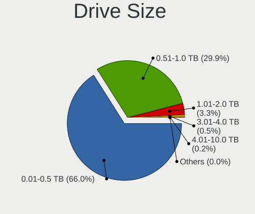

| Size in TB | Notebooks | Drives | Percent |
|------------|-----------|--------|---------|
| 0.01-0.5   | 20598     | 27457  | 66.02%  |
| 0.51-1.0   | 9332      | 11869  | 29.91%  |
| 1.01-2.0   | 1028      | 1295   | 3.29%   |
| 3.01-4.0   | 164       | 205    | 0.53%   |
| 4.01-10.0  | 63        | 98     | 0.2%    |
| 2.01-3.0   | 8         | 15     | 0.03%   |
| 20.01-50.0 | 3         | 3      | 0.01%   |
| 10.01-20.0 | 2         | 2      | 0.01%   |
| 0          | 1         | 1      | 0.003%  |

Space Total
-----------

Amount of disk space available on the file system

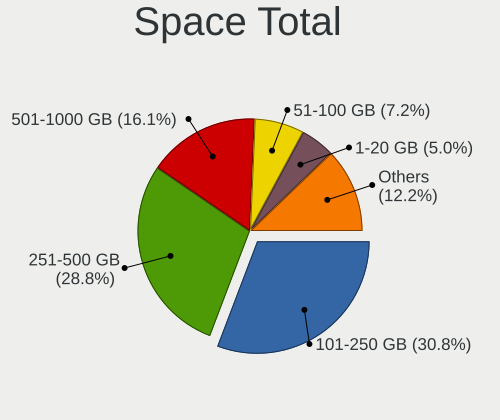

| Size in GB     | Notebooks | Percent |
|----------------|-----------|---------|
| 101-250        | 14233     | 30.78%  |
| 251-500        | 13304     | 28.77%  |
| 501-1000       | 7453      | 16.12%  |
| 51-100         | 3325      | 7.19%   |
| 1-20           | 2290      | 4.95%   |
| 21-50          | 2097      | 4.54%   |
| 1001-2000      | 2074      | 4.49%   |
| Unknown        | 505       | 1.09%   |
| More than 3000 | 487       | 1.05%   |
| 2001-3000      | 471       | 1.02%   |

Space Used
----------

Amount of used disk space

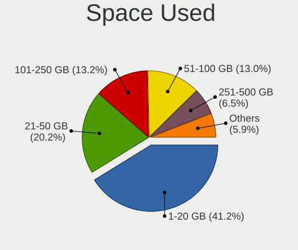

| Used GB        | Notebooks | Percent |
|----------------|-----------|---------|
| 1-20           | 19987     | 41.19%  |
| 21-50          | 9825      | 20.25%  |
| 101-250        | 6421      | 13.23%  |
| 51-100         | 6287      | 12.96%  |
| 251-500        | 3135      | 6.46%   |
| 501-1000       | 1591      | 3.28%   |
| Unknown        | 505       | 1.04%   |
| 1001-2000      | 501       | 1.03%   |
| More than 3000 | 143       | 0.29%   |
| 2001-3000      | 130       | 0.27%   |

Malfunc. Drives
---------------

Drive models with a malfunction

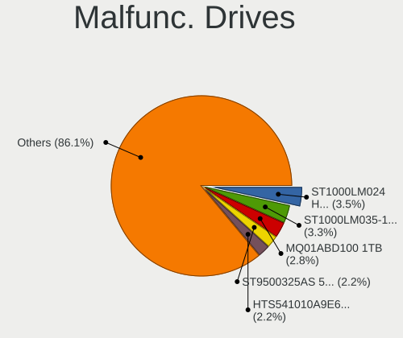

| Model                                          | Notebooks | Drives | Percent |
|------------------------------------------------|-----------|--------|---------|
| Seagate ST1000LM024 HN-M101MBB 1TB             | 53        | 55     | 3.45%   |
| Seagate ST1000LM035-1RK172 1TB                 | 50        | 53     | 3.26%   |
| Toshiba MQ01ABD100 1TB                         | 43        | 45     | 2.8%    |
| Seagate ST9500325AS 500GB                      | 34        | 35     | 2.21%   |
| HGST HTS541010A9E680 1TB                       | 34        | 37     | 2.21%   |
| HGST HTS725050A7E630 500GB                     | 26        | 28     | 1.69%   |
| HGST HTS721010A9E630 1TB                       | 24        | 26     | 1.56%   |
| Toshiba MQ04ABF100 1TB                         | 21        | 21     | 1.37%   |
| Seagate ST500LT012-1DG142 500GB                | 19        | 20     | 1.24%   |
| HGST HTS545050A7E680 500GB                     | 17        | 17     | 1.11%   |
| SK hynix BC711 HFM512GD3JX013N 512GB           | 16        | 22     | 1.04%   |
| Seagate ST500LM021-1KJ152 500GB                | 16        | 16     | 1.04%   |
| Seagate ST9500420AS 500GB                      | 15        | 15     | 0.98%   |
| Seagate ST500LT012-9WS142 500GB                | 15        | 16     | 0.98%   |
| HGST HTS545050A7E380 500GB                     | 14        | 15     | 0.91%   |
| Toshiba MQ01ABF050 500GB                       | 13        | 13     | 0.85%   |
| SK hynix HFS256G39TND-N210A 256GB SSD          | 13        | 13     | 0.85%   |
| Hitachi HTS545050A7E380 500GB                  | 13        | 14     | 0.85%   |
| Seagate ST1000LX015-1U7172 1TB                 | 12        | 12     | 0.78%   |
| Hitachi HTS543232A7A384 320GB                  | 12        | 12     | 0.78%   |
| Seagate ST9320423AS 320GB                      | 10        | 10     | 0.65%   |
| Seagate ST9320325AS 320GB                      | 10        | 10     | 0.65%   |
| Seagate ST500LM012 HN-M500MBB 500GB            | 10        | 11     | 0.65%   |
| Hitachi HTS547575A9E384 752GB                  | 10        | 11     | 0.65%   |
| Hitachi HTS547550A9E384 500GB                  | 10        | 10     | 0.65%   |
| Hitachi HTS545050B9A300 500GB                  | 10        | 13     | 0.65%   |
| Toshiba MQ01ABD050 500GB                       | 9         | 9      | 0.59%   |
| SK hynix HFS128G39TND-N210A 128GB SSD          | 9         | 9      | 0.59%   |
| Seagate ST1000LM014-1EJ164 1TB                 | 9         | 10     | 0.59%   |
| Hitachi HTS547564A9E384 640GB                  | 9         | 9      | 0.59%   |
| Crucial CT525MX300SSD1 528GB                   | 9         | 10     | 0.59%   |
| Samsung Electronics SSD 870 EVO 500GB          | 8         | 8      | 0.52%   |
| Hitachi HTS723232A7A364 320GB                  | 8         | 9      | 0.52%   |
| WDC WDS240G2G0A-00JH30 240GB SSD               | 7         | 8      | 0.46%   |
| Toshiba MQ01ACF050 500GB                       | 7         | 7      | 0.46%   |
| Seagate ST320LT020-9YG142 320GB                | 7         | 10     | 0.46%   |
| Seagate ST320LT007-9ZV142 320GB                | 7         | 7      | 0.46%   |
| Seagate ST1000LM014-SSHD-8GB                   | 7         | 8      | 0.46%   |
| SanDisk SD9SN8W-128G-1006 128GB SSD            | 7         | 7      | 0.46%   |
| Micron Technology 1100_MTFDDAV256TBN 256GB SSD | 7         | 8      | 0.46%   |

Malfunc. Drive Vendor
---------------------

Vendors of faulty drives

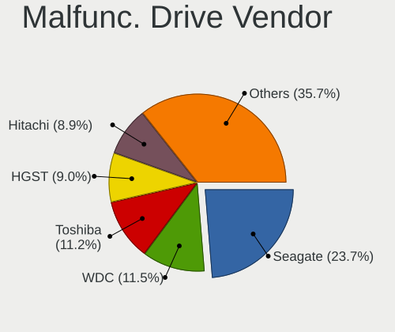

| Vendor                      | Notebooks | Drives | Percent |
|-----------------------------|-----------|--------|---------|
| Seagate                     | 363       | 383    | 23.71%  |
| WDC                         | 176       | 185    | 11.5%   |
| Toshiba                     | 172       | 182    | 11.23%  |
| HGST                        | 138       | 150    | 9.01%   |
| Hitachi                     | 136       | 144    | 8.88%   |
| SK hynix                    | 97        | 107    | 6.34%   |
| Samsung Electronics         | 77        | 83     | 5.03%   |
| SanDisk                     | 57        | 66     | 3.72%   |
| Micron Technology           | 48        | 57     | 3.14%   |
| Intel                       | 46        | 46     | 3%      |
| Kingston                    | 41        | 49     | 2.68%   |
| Crucial                     | 28        | 32     | 1.83%   |
| A-DATA Technology           | 26        | 33     | 1.7%    |
| LITEON                      | 16        | 19     | 1.05%   |
| Fujitsu                     | 15        | 15     | 0.98%   |
| Apple                       | 8         | 9      | 0.52%   |
| SSSTC                       | 6         | 6      | 0.39%   |
| LITEONIT                    | 6         | 8      | 0.39%   |
| China                       | 6         | 6      | 0.39%   |
| Netac                       | 5         | 5      | 0.33%   |
| Unknown                     | 5         | 6      | 0.33%   |
| Unknown                     | 4         | 4      | 0.26%   |
| OCZ                         | 4         | 4      | 0.26%   |
| SPCC                        | 3         | 3      | 0.2%    |
| KIOXIA                      | 3         | 4      | 0.2%    |
| KingSpec                    | 3         | 3      | 0.2%    |
| Transcend                   | 2         | 3      | 0.13%   |
| Patriot                     | 2         | 2      | 0.13%   |
| JMicron Technology          | 2         | 2      | 0.13%   |
| Intenso                     | 2         | 2      | 0.13%   |
| Corsair                     | 2         | 2      | 0.13%   |
| ASMT                        | 2         | 2      | 0.13%   |
| Yangtze Memory Technologies | 1         | 1      | 0.07%   |
| WALRAM                      | 1         | 1      | 0.07%   |
| VISIPRO                     | 1         | 1      | 0.07%   |
| tecmiyo                     | 1         | 1      | 0.07%   |
| Teclast                     | 1         | 1      | 0.07%   |
| Team                        | 1         | 1      | 0.07%   |
| Super Talent                | 1         | 1      | 0.07%   |
| ShiJi                       | 1         | 1      | 0.07%   |

Malfunc. HDD Vendor
-------------------

Vendors of faulty HDD drives

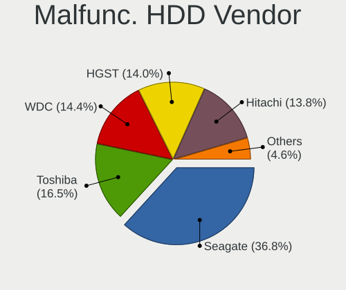

| Vendor              | Notebooks | Drives | Percent |
|---------------------|-----------|--------|---------|
| Seagate             | 363       | 383    | 36.78%  |
| Toshiba             | 163       | 173    | 16.51%  |
| WDC                 | 142       | 148    | 14.39%  |
| HGST                | 138       | 150    | 13.98%  |
| Hitachi             | 136       | 144    | 13.78%  |
| Samsung Electronics | 19        | 20     | 1.93%   |
| Fujitsu             | 15        | 15     | 1.52%   |
| Apple               | 5         | 6      | 0.51%   |
| Unknown             | 3         | 3      | 0.3%    |
| SABRENT             | 1         | 1      | 0.1%    |
| JMicron Technology  | 1         | 1      | 0.1%    |
| ASMedia             | 1         | 1      | 0.1%    |

Malfunc. Drive Kind
-------------------

Kinds of faulty drives

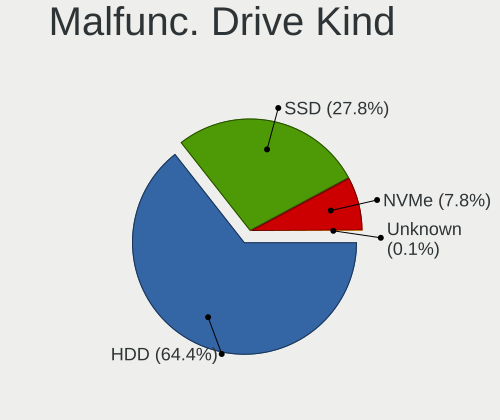

| Kind    | Notebooks | Drives | Percent |
|---------|-----------|--------|---------|
| HDD     | 977       | 1045   | 64.4%   |
| SSD     | 421       | 470    | 27.75%  |
| NVMe    | 118       | 138    | 7.78%   |
| Unknown | 1         | 1      | 0.07%   |

Failed Drives
-------------

Failed drive models

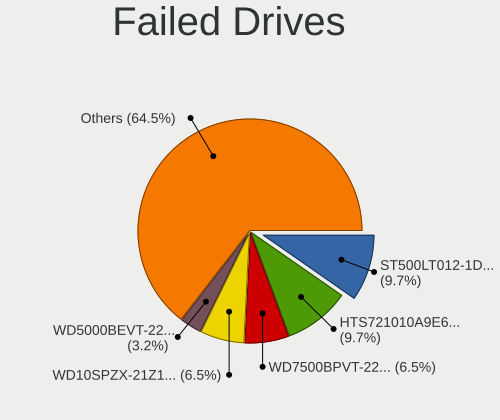

| Model                                                            | Notebooks | Drives | Percent |
|------------------------------------------------------------------|-----------|--------|---------|
| Seagate ST500LT012-1DG142 500GB                                  | 3         | 3      | 9.68%   |
| HGST HTS721010A9E630 1TB                                         | 3         | 3      | 9.68%   |
| WDC WD7500BPVT-22HXZT1 752GB                                     | 2         | 5      | 6.45%   |
| WDC WD10SPZX-21Z10T0 1TB                                         | 2         | 2      | 6.45%   |
| WDC WD5000BEVT-22A0RT0 500GB                                     | 1         | 1      | 3.23%   |
| Toshiba THNSN5256GPUK NVMe 256GB                                 | 1         | 1      | 3.23%   |
| Toshiba MQ02ABF050H 500GB                                        | 1         | 1      | 3.23%   |
| Toshiba MK5065GSXN 500GB                                         | 1         | 1      | 3.23%   |
| Toshiba MK3265GSX 320GB                                          | 1         | 1      | 3.23%   |
| SK hynix SC308 SATA 512GB SSD                                    | 1         | 1      | 3.23%   |
| SK hynix BC501 HFM256GDJTNG-8310A 256GB                          | 1         | 1      | 3.23%   |
| Seagate ST9500420AS 500GB                                        | 1         | 3      | 3.23%   |
| Seagate ST332062 0AS 320GB                                       | 1         | 1      | 3.23%   |
| Seagate ST1000LM048-2E7172 1TB                                   | 1         | 1      | 3.23%   |
| Samsung Electronics SSD 980 500GB S64DNF0R648337E                | 1         | 1      | 3.23%   |
| Samsung Electronics SSD 980 500GB                                | 1         | 1      | 3.23%   |
| Samsung Electronics SSD 980 1TB S649NJ0R220122K                  | 1         | 1      | 3.23%   |
| Samsung Electronics NVMe SSD Controller SM961/PM961/SM963 1024GB | 1         | 1      | 3.23%   |
| Samsung Electronics MZVLB1T0HALR-00000 1TB                       | 1         | 1      | 3.23%   |
| Intel SSDSCKGF256A5 SATA 256GB                                   | 1         | 1      | 3.23%   |
| Hitachi HTS727575A9E364 752GB                                    | 1         | 1      | 3.23%   |
| Hitachi HTS545050A7E380 500GB                                    | 1         | 1      | 3.23%   |
| Hitachi HTS541010A9E680 1TB                                      | 1         | 1      | 3.23%   |
| Crucial M4-CT256M4SSD3 256GB                                     | 1         | 1      | 3.23%   |
| A-DATA Technology SX8200PNP 256GB                                | 1         | 1      | 3.23%   |

Failed Drive Vendor
-------------------

Failed drive vendors

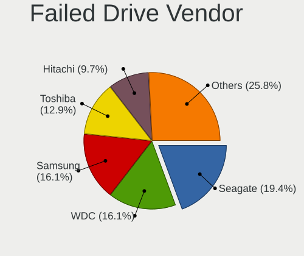

| Vendor              | Notebooks | Drives | Percent |
|---------------------|-----------|--------|---------|
| Seagate             | 6         | 8      | 19.35%  |
| WDC                 | 5         | 8      | 16.13%  |
| Samsung Electronics | 5         | 5      | 16.13%  |
| Toshiba             | 4         | 4      | 12.9%   |
| Hitachi             | 3         | 3      | 9.68%   |
| HGST                | 3         | 3      | 9.68%   |
| SK hynix            | 2         | 2      | 6.45%   |
| Intel               | 1         | 1      | 3.23%   |
| Crucial             | 1         | 1      | 3.23%   |
| A-DATA Technology   | 1         | 1      | 3.23%   |

Drive Status
------------

Number of failed and malfunc. drives

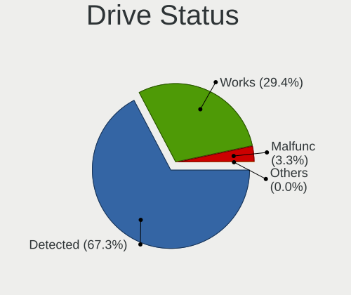

| Status   | Notebooks | Drives | Percent |
|----------|-----------|--------|---------|
| Detected | 30907     | 47307  | 67.28%  |
| Works    | 13498     | 17351  | 29.38%  |
| Malfunc  | 1496      | 1654   | 3.26%   |
| Failed   | 31        | 36     | 0.07%   |
| Limited  | 3         | 3      | 0.01%   |
| Fixed    | 1         | 1      | 0.002%  |

Storage controller
------------------

Storage Vendor
--------------

Storage controller vendors

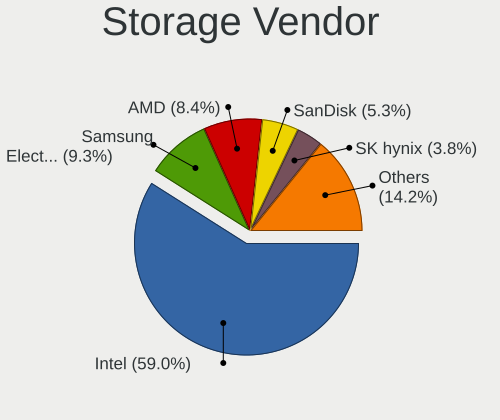

| Vendor                                  | Notebooks | Percent |
|-----------------------------------------|-----------|---------|
| Intel                                   | 30868     | 58.99%  |
| Samsung Electronics                     | 4869      | 9.3%    |
| AMD                                     | 4420      | 8.45%   |
| SanDisk                                 | 2779      | 5.31%   |
| SK hynix                                | 1983      | 3.79%   |
| Micron Technology                       | 1328      | 2.54%   |
| Toshiba America Info Systems            | 1019      | 1.95%   |
| KIOXIA                                  | 851       | 1.63%   |
| Kingston Technology Company             | 784       | 1.5%    |
| Phison Electronics                      | 509       | 0.97%   |
| Micron/Crucial Technology               | 348       | 0.67%   |
| Nvidia                                  | 347       | 0.66%   |
| ADATA Technology                        | 320       | 0.61%   |
| Silicon Motion                          | 294       | 0.56%   |
| Apple                                   | 212       | 0.41%   |
| Solid State Storage Technology          | 192       | 0.37%   |
| Union Memory (Shenzhen)                 | 145       | 0.28%   |
| MAXIO Technology (Hangzhou)             | 120       | 0.23%   |
| Shenzhen Longsys Electronics            | 118       | 0.23%   |
| Silicon Integrated Systems [SiS]        | 107       | 0.2%    |
| Realtek Semiconductor                   | 106       | 0.2%    |
| Yangtze Memory Technologies             | 91        | 0.17%   |
| Marvell Technology Group                | 74        | 0.14%   |
| Lite-On Technology                      | 74        | 0.14%   |
| Solidigm                                | 70        | 0.13%   |
| Lenovo                                  | 58        | 0.11%   |
| Shenzhen Unionmemory Information System | 29        | 0.06%   |
| VIA Technologies                        | 28        | 0.05%   |
| JMicron Technology                      | 26        | 0.05%   |
| ASMedia Technology                      | 21        | 0.04%   |
| Seagate Technology                      | 18        | 0.03%   |
| Silicon Image                           | 16        | 0.03%   |
| Transcend                               | 15        | 0.03%   |
| INNOGRIT                                | 15        | 0.03%   |
| Biwin Storage Technology                | 12        | 0.02%   |
| Netac Technology                        | 10        | 0.02%   |
| Shenzhen Shichuangyi Electronics        | 8         | 0.02%   |
| Unknown                                 | 8         | 0.02%   |
| Ramaxel Technology(Shenzhen) Limited    | 7         | 0.01%   |
| Hosin Global Electronics                | 7         | 0.01%   |

Storage Model
-------------

Storage controller models

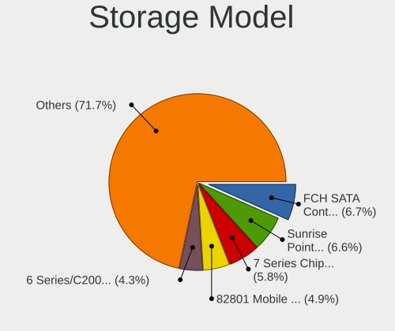

| Model                                                                            | Notebooks | Percent |
|----------------------------------------------------------------------------------|-----------|---------|
| AMD FCH SATA Controller [AHCI mode]                                              | 3726      | 6.67%   |
| Intel Sunrise Point-LP SATA Controller [AHCI mode]                               | 3678      | 6.58%   |
| Intel 7 Series Chipset Family 6-port SATA Controller [AHCI mode]                 | 3262      | 5.84%   |
| Intel 82801 Mobile SATA Controller [RAID mode]                                   | 2749      | 4.92%   |
| Intel 6 Series/C200 Series Chipset Family 6 port Mobile SATA AHCI Controller     | 2418      | 4.33%   |
| Samsung NVMe SSD Controller SM981/PM981/PM983                                    | 1902      | 3.41%   |
| Intel Volume Management Device NVMe RAID Controller                              | 1745      | 3.12%   |
| Intel 8 Series SATA Controller 1 [AHCI mode]                                     | 1657      | 2.97%   |
| Intel 82801IBM/IEM (ICH9M/ICH9M-E) 4 port SATA Controller [AHCI mode]            | 1347      | 2.41%   |
| Intel Wildcat Point-LP SATA Controller [AHCI Mode]                               | 1328      | 2.38%   |
| Intel Cannon Lake Mobile PCH SATA AHCI Controller                                | 1278      | 2.29%   |
| Samsung NVMe SSD Controller 980 (DRAM-less)                                      | 1141      | 2.04%   |
| Intel 8 Series/C220 Series Chipset Family 6-port SATA Controller 1 [AHCI mode]   | 1116      | 2%      |
| Intel 5 Series/3400 Series Chipset 4 port SATA AHCI Controller                   | 1080      | 1.93%   |
| Intel 82801HM/HEM (ICH8M/ICH8M-E) IDE Controller                                 | 722       | 1.29%   |
| Intel Comet Lake SATA AHCI Controller                                            | 720       | 1.29%   |
| Intel HM170/QM170 Chipset SATA Controller [AHCI Mode]                            | 717       | 1.28%   |
| Samsung NVMe SSD Controller PM9A1/PM9A3/980PRO                                   | 704       | 1.26%   |
| Intel 5 Series/3400 Series Chipset 6 port SATA AHCI Controller                   | 649       | 1.16%   |
| Intel Tiger Lake-LP SATA Controller                                              | 645       | 1.15%   |
| Intel Cannon Point-LP SATA Controller [AHCI Mode]                                | 637       | 1.14%   |
| Intel 82801HM/HEM (ICH8M/ICH8M-E) SATA Controller [AHCI mode]                    | 600       | 1.07%   |
| SK hynix Gold P31/BC711/PC711 NVMe Solid State Drive                             | 586       | 1.05%   |
| SanDisk Extreme Pro / WD Black SN750 / PC SN730 / Red SN700 NVMe SSD             | 569       | 1.02%   |
| Intel Celeron/Pentium Silver Processor SATA Controller                           | 533       | 0.95%   |
| Intel Atom Processor E3800 Series SATA AHCI Controller                           | 530       | 0.95%   |
| KIOXIA NVMe SSD Controller BG4 (DRAM-less)                                       | 509       | 0.91%   |
| Intel SSD 660P Series                                                            | 501       | 0.9%    |
| AMD SB7x0/SB8x0/SB9x0 SATA Controller [AHCI mode]                                | 478       | 0.86%   |
| Samsung NVMe SSD Controller SM961/PM961/SM963                                    | 464       | 0.83%   |
| SanDisk Ultra 3D / WD PC SN530, IX SN530, Blue SN550 NVMe SSD (DRAM-less)        | 442       | 0.79%   |
| Toshiba America Info Systems XG6 NVMe SSD Controller                             | 420       | 0.75%   |
| Intel Atom/Celeron/Pentium Processor x5-E8000/J3xxx/N3xxx Series SATA Controller | 383       | 0.69%   |
| Intel SSD 670p Series [Keystone Harbor]                                          | 358       | 0.64%   |
| Intel Alder Lake-P SATA AHCI Controller                                          | 356       | 0.64%   |
| Intel Celeron N3350/Pentium N4200/Atom E3900 Series SATA AHCI Controller         | 325       | 0.58%   |
| SanDisk WD SN560/SN740/SN770/SN5000 NVMe SSD                                     | 323       | 0.58%   |
| Intel 400 Series Chipset Family SATA AHCI Controller                             | 322       | 0.58%   |
| Intel Ice Lake-LP SATA Controller [AHCI mode]                                    | 312       | 0.56%   |
| Intel RST Volume Management Device Controller                                    | 311       | 0.56%   |

Storage Kind
------------

Kind of storage controller (IDE, SATA, NVMe, SAS, ...)

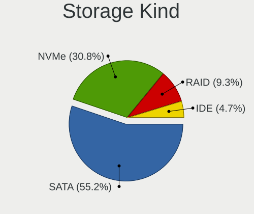

| Kind | Notebooks | Percent |
|------|-----------|---------|
| SATA | 29714     | 55.18%  |
| NVMe | 16577     | 30.79%  |
| RAID | 5016      | 9.32%   |
| IDE  | 2538      | 4.71%   |

Processor
---------

CPU Vendor
----------

Processor vendors

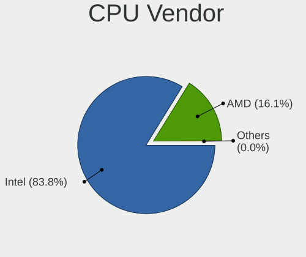

| Vendor        | Notebooks | Percent |
|---------------|-----------|---------|
| Intel         | 37301     | 83.82%  |
| AMD           | 7164      | 16.1%   |
| Qualcomm      | 13        | 0.03%   |
| CentaurHauls  | 13        | 0.03%   |
| ARM           | 5         | 0.01%   |
| Phytium       | 2         | 0.004%  |
| Unknown       | 2         | 0.004%  |
| sifive,u74-mc | 1         | 0.002%  |

CPU Model
---------

Processor models

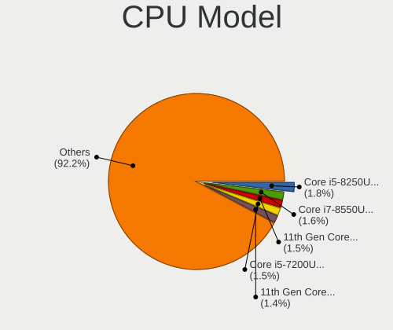

| Model                                         | Notebooks | Percent |
|-----------------------------------------------|-----------|---------|
| Intel Core i5-8250U CPU @ 1.60GHz             | 810       | 1.82%   |
| Intel Core i7-8550U CPU @ 1.80GHz             | 703       | 1.58%   |
| Intel 11th Gen Core i5-1135G7 @ 2.40GHz       | 652       | 1.46%   |
| Intel Core i5-7200U CPU @ 2.50GHz             | 647       | 1.45%   |
| Intel 11th Gen Core i7-1165G7 @ 2.80GHz       | 641       | 1.44%   |
| Intel Core i7-8565U CPU @ 1.80GHz             | 577       | 1.3%    |
| Intel Core i5-8265U CPU @ 1.60GHz             | 563       | 1.26%   |
| Intel Core i7-8750H CPU @ 2.20GHz             | 507       | 1.14%   |
| Intel Core i7-9750H CPU @ 2.60GHz             | 487       | 1.09%   |
| Intel Core i5-10210U CPU @ 1.60GHz            | 470       | 1.06%   |
| Intel Core i7-10510U CPU @ 1.80GHz            | 465       | 1.04%   |
| Intel Core i5-6200U CPU @ 2.30GHz             | 463       | 1.04%   |
| Intel Core i5-5200U CPU @ 2.20GHz             | 446       | 1%      |
| Intel Core i5-3210M CPU @ 2.50GHz             | 445       | 1%      |
| Intel Core i7-7700HQ CPU @ 2.80GHz            | 426       | 0.96%   |
| Intel Core i5-2520M CPU @ 2.50GHz             | 396       | 0.89%   |
| Intel Core i7-7500U CPU @ 2.70GHz             | 387       | 0.87%   |
| AMD Ryzen 5 3500U with Radeon Vega Mobile Gfx | 384       | 0.86%   |
| Intel Core i5-6300U CPU @ 2.40GHz             | 370       | 0.83%   |
| Intel Core i7-10750H CPU @ 2.60GHz            | 333       | 0.75%   |
| Intel Core i5-3320M CPU @ 2.60GHz             | 319       | 0.72%   |
| Intel Core i5-4210U CPU @ 1.70GHz             | 306       | 0.69%   |
| Intel Core i7-6700HQ CPU @ 2.60GHz            | 300       | 0.67%   |
| Intel Core i5-1035G1 CPU @ 1.00GHz            | 293       | 0.66%   |
| AMD Ryzen 5 5500U with Radeon Graphics        | 290       | 0.65%   |
| Intel Core i5-3230M CPU @ 2.60GHz             | 281       | 0.63%   |
| Intel Core i5-4200U CPU @ 1.60GHz             | 280       | 0.63%   |
| Intel Core i5-2410M CPU @ 2.30GHz             | 278       | 0.62%   |
| Intel Core i7-6500U CPU @ 2.50GHz             | 276       | 0.62%   |
| Intel Core i7-5500U CPU @ 2.40GHz             | 254       | 0.57%   |
| Intel Core i5-2450M CPU @ 2.50GHz             | 253       | 0.57%   |
| Intel 11th Gen Core i7-11800H @ 2.30GHz       | 249       | 0.56%   |
| Intel Core i3-6006U CPU @ 2.00GHz             | 233       | 0.52%   |
| Intel Core i3-3110M CPU @ 2.40GHz             | 232       | 0.52%   |
| AMD Ryzen 7 5700U with Radeon Graphics        | 232       | 0.52%   |
| Intel Core i5-5300U CPU @ 2.30GHz             | 231       | 0.52%   |
| Intel 12th Gen Core i7-12700H                 | 229       | 0.51%   |
| Intel Core i5-2430M CPU @ 2.40GHz             | 222       | 0.5%    |
| Intel Core i3-5005U CPU @ 2.00GHz             | 215       | 0.48%   |
| Intel Celeron CPU N3350 @ 1.10GHz             | 215       | 0.48%   |

CPU Model Family
----------------

Processor model prefix

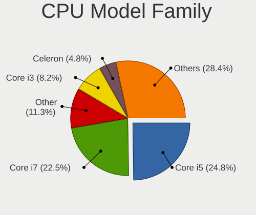

| Model                   | Notebooks | Percent |
|-------------------------|-----------|---------|
| Intel Core i5           | 11022     | 24.76%  |
| Intel Core i7           | 10013     | 22.49%  |
| Other                   | 5024      | 11.29%  |
| Intel Core i3           | 3664      | 8.23%   |
| Intel Celeron           | 2136      | 4.8%    |
| Intel Core 2 Duo        | 1936      | 4.35%   |
| AMD Ryzen 5             | 1695      | 3.81%   |
| AMD Ryzen 7             | 1521      | 3.42%   |
| Intel Pentium           | 1066      | 2.39%   |
| Intel Atom              | 666       | 1.5%    |
| AMD A6                  | 467       | 1.05%   |
| Intel Core              | 381       | 0.86%   |
| Intel Pentium Dual-Core | 347       | 0.78%   |
| AMD A8                  | 327       | 0.73%   |
| AMD Ryzen 3             | 326       | 0.73%   |
| AMD A4                  | 277       | 0.62%   |
| AMD Ryzen 7 PRO         | 268       | 0.6%    |
| AMD A10                 | 265       | 0.6%    |
| AMD Ryzen 9             | 256       | 0.58%   |
| Intel Core i9           | 246       | 0.55%   |
| Intel Pentium Dual      | 218       | 0.49%   |
| AMD E                   | 190       | 0.43%   |
| AMD E1                  | 182       | 0.41%   |
| Intel Core 2            | 178       | 0.4%    |
| AMD E2                  | 177       | 0.4%    |
| Intel Genuine           | 145       | 0.33%   |
| AMD Ryzen 5 PRO         | 121       | 0.27%   |
| Intel Pentium Silver    | 116       | 0.26%   |
| Intel Xeon              | 112       | 0.25%   |
| AMD Athlon              | 91        | 0.2%    |
| AMD Turion 64 X2 Mobile | 88        | 0.2%    |
| AMD Athlon II           | 73        | 0.16%   |
| AMD A12                 | 68        | 0.15%   |
| Intel Core m3           | 59        | 0.13%   |
| Intel Core M            | 56        | 0.13%   |
| Intel Celeron M         | 54        | 0.12%   |
| Intel Celeron Dual-Core | 49        | 0.11%   |
| Intel Pentium M         | 44        | 0.1%    |
| AMD Phenom II           | 37        | 0.08%   |
| AMD FX                  | 37        | 0.08%   |

CPU Cores
---------

Number of processor cores

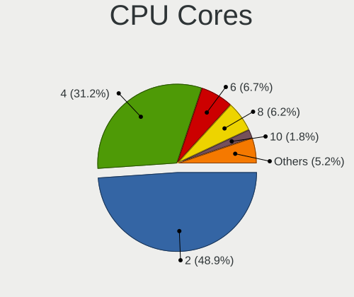

| Number  | Notebooks | Percent |
|---------|-----------|---------|
| 2       | 21776     | 48.91%  |
| 4       | 13882     | 31.18%  |
| 6       | 2981      | 6.7%    |
| 8       | 2778      | 6.24%   |
| 10      | 788       | 1.77%   |
| 1       | 692       | 1.55%   |
| 14      | 667       | 1.5%    |
| 12      | 523       | 1.17%   |
| 16      | 266       | 0.6%    |
| 24      | 121       | 0.27%   |
| 20      | 17        | 0.04%   |
| 3       | 15        | 0.03%   |
| 5       | 10        | 0.02%   |
| Unknown | 3         | 0.01%   |
| 11      | 2         | 0.004%  |
| 9       | 1         | 0.002%  |

CPU Sockets
-----------

Number of sockets

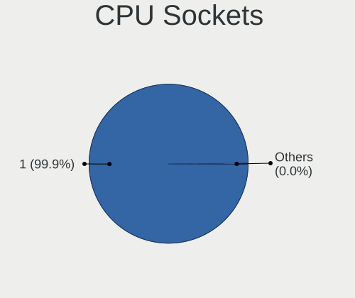

| Number  | Notebooks | Percent |
|---------|-----------|---------|
| 1       | 44468     | 99.92%  |
| 2       | 19        | 0.04%   |
| 16      | 4         | 0.01%   |
| 8       | 3         | 0.01%   |
| Unknown | 3         | 0.01%   |
| 24      | 2         | 0.004%  |
| 11      | 2         | 0.004%  |
| 14      | 1         | 0.002%  |

CPU Threads
-----------

Threads per core (Hyper-Threading)

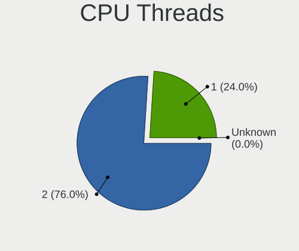

| Number  | Notebooks | Percent |
|---------|-----------|---------|
| 2       | 33866     | 76%     |
| 1       | 10689     | 23.99%  |
| Unknown | 3         | 0.01%   |

CPU Op-Modes
------------

CPU Operation Modes (32-bit, 64-bit)

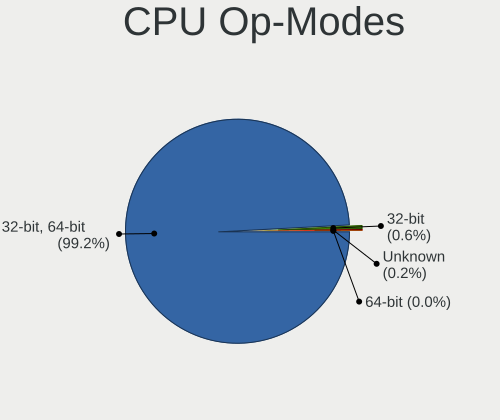

| Op mode        | Notebooks | Percent |
|----------------|-----------|---------|
| 32-bit, 64-bit | 44142     | 99.16%  |
| 32-bit         | 249       | 0.56%   |
| Unknown        | 109       | 0.24%   |
| 64-bit         | 18        | 0.04%   |

CPU Microcode
-------------

Microcode number

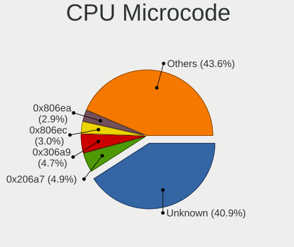

| Number     | Notebooks | Percent |
|------------|-----------|---------|
| Unknown    | 18824     | 40.92%  |
| 0x206a7    | 2233      | 4.85%   |
| 0x306a9    | 2178      | 4.73%   |
| 0x806ec    | 1401      | 3.05%   |
| 0x806ea    | 1314      | 2.86%   |
| 0x40651    | 1198      | 2.6%    |
| 0x406e3    | 1050      | 2.28%   |
| 0x1067a    | 1026      | 2.23%   |
| 0x806e9    | 1015      | 2.21%   |
| 0x906ea    | 1011      | 2.2%    |
| 0x306d4    | 1007      | 2.19%   |
| 0x806c1    | 1001      | 2.18%   |
| 0x20655    | 945       | 2.05%   |
| 0x306c3    | 803       | 1.75%   |
| 0x6fd      | 507       | 1.1%    |
| 0x30678    | 442       | 0.96%   |
| 0xa0652    | 435       | 0.95%   |
| 0x706e5    | 412       | 0.9%    |
| 0x906e9    | 406       | 0.88%   |
| 0x806eb    | 383       | 0.83%   |
| 0x20652    | 354       | 0.77%   |
| 0x10676    | 349       | 0.76%   |
| 0x506e3    | 346       | 0.75%   |
| 0x406c4    | 340       | 0.74%   |
| 0x0a50000c | 333       | 0.72%   |
| 0x08108109 | 325       | 0.71%   |
| 0x08108102 | 311       | 0.68%   |
| 0x06006705 | 262       | 0.57%   |
| 0x906a3    | 260       | 0.57%   |
| 0x08600106 | 256       | 0.56%   |
| 0x08608103 | 239       | 0.52%   |
| 0x806d1    | 236       | 0.51%   |
| 0x05000119 | 219       | 0.48%   |
| 0x406c3    | 217       | 0.47%   |
| 0x07030105 | 214       | 0.47%   |
| 0x506c9    | 204       | 0.44%   |
| 0x06001119 | 188       | 0.41%   |
| 0x706a1    | 187       | 0.41%   |
| 0x906ed    | 165       | 0.36%   |
| 0x0700010f | 142       | 0.31%   |

CPU Microarch
-------------

Microarchitecture

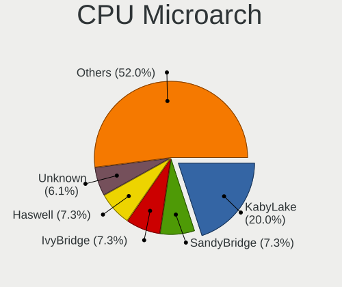

| Name               | Notebooks | Percent |
|--------------------|-----------|---------|
| KabyLake           | 8907      | 19.98%  |
| SandyBridge        | 3270      | 7.33%   |
| IvyBridge          | 3270      | 7.33%   |
| Haswell            | 3241      | 7.27%   |
| Unknown            | 2713      | 6.09%   |
| Skylake            | 2349      | 5.27%   |
| TigerLake          | 2042      | 4.58%   |
| Penryn             | 1865      | 4.18%   |
| Westmere           | 1804      | 4.05%   |
| Broadwell          | 1610      | 3.61%   |
| Silvermont         | 1526      | 3.42%   |
| Alderlake Hybrid   | 1405      | 3.15%   |
| Core               | 1097      | 2.46%   |
| IceLake            | 1016      | 2.28%   |
| Zen+               | 940       | 2.11%   |
| Zen 3              | 931       | 2.09%   |
| Zen 2              | 842       | 1.89%   |
| CometLake          | 830       | 1.86%   |
| Excavator          | 756       | 1.7%    |
| Goldmont plus      | 616       | 1.38%   |
| Puma               | 428       | 0.96%   |
| Bobcat             | 366       | 0.82%   |
| Goldmont           | 351       | 0.79%   |
| Zen                | 295       | 0.66%   |
| Piledriver         | 278       | 0.62%   |
| Bonnell            | 244       | 0.55%   |
| Jaguar             | 220       | 0.49%   |
| K10                | 206       | 0.46%   |
| Nehalem            | 186       | 0.42%   |
| K8 Hammer          | 184       | 0.41%   |
| K10 Llano          | 159       | 0.36%   |
| P6                 | 153       | 0.34%   |
| Meteorlake Hybrid  | 148       | 0.33%   |
| K8 & K10 hybrid    | 116       | 0.26%   |
| Steamroller        | 78        | 0.17%   |
| Lunarlake Hybrid   | 57        | 0.13%   |
| Tremont            | 43        | 0.1%    |
| Gracemont          | 23        | 0.05%   |
| NetBurst           | 10        | 0.02%   |
| ArrowLake-H Hybrid | 9         | 0.02%   |

Graphics
--------

GPU Vendor
----------

Vendors of graphics cards

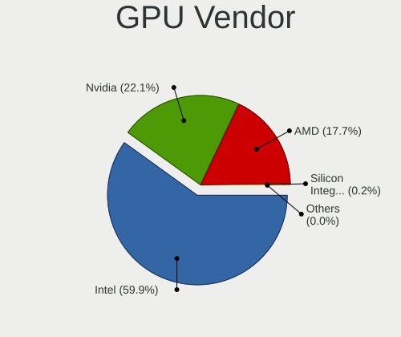

| Vendor                           | Notebooks | Percent |
|----------------------------------|-----------|---------|
| Intel                            | 34183     | 59.94%  |
| Nvidia                           | 12595     | 22.09%  |
| AMD                              | 10107     | 17.72%  |
| Silicon Integrated Systems [SiS] | 89        | 0.16%   |
| VIA Technologies                 | 27        | 0.05%   |
| Zhaoxin                          | 10        | 0.02%   |
| ATI Technologies                 | 8         | 0.01%   |
| Silicon Motion                   | 2         | 0.004%  |
| ASPEED Technology                | 2         | 0.004%  |
| Xilinx                           | 1         | 0.002%  |

GPU Model
---------

Graphics card models

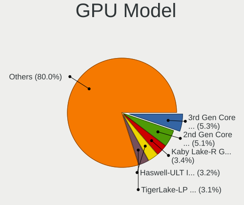

| Model                                                                                    | Notebooks | Percent |
|------------------------------------------------------------------------------------------|-----------|---------|
| Intel 3rd Gen Core processor Graphics Controller                                         | 3075      | 5.26%   |
| Intel 2nd Generation Core Processor Family Integrated Graphics Controller                | 2967      | 5.07%   |
| Intel Kaby Lake-R GT2 [UHD Graphics 620]                                                 | 1993      | 3.41%   |
| Intel Haswell-ULT Integrated Graphics Controller                                         | 1859      | 3.18%   |
| Intel TigerLake-LP GT2 [Iris Xe Graphics]                                                | 1823      | 3.12%   |
| Intel Skylake-U GT2 [HD Graphics 520]                                                    | 1590      | 2.72%   |
| Intel CoffeeLake-H GT2 [UHD Graphics 630]                                                | 1536      | 2.63%   |
| Intel WhiskeyLake-U GT2 [UHD Graphics 620]                                               | 1488      | 2.54%   |
| Intel Kaby Lake-U GT2 [HD Graphics 620]                                                  | 1451      | 2.48%   |
| Intel Broadwell-U GT2 [HD Graphics 5500]                                                 | 1341      | 2.29%   |
| Intel Core Processor Integrated Graphics Controller                                      | 1286      | 2.2%    |
| Intel CometLake-U GT2 [UHD Graphics]                                                     | 1202      | 2.05%   |
| Intel 4th Gen Core Processor Integrated Graphics Controller                              | 1175      | 2.01%   |
| Intel Mobile 4 Series Chipset Integrated Graphics Controller                             | 1065      | 1.82%   |
| AMD Picasso/Raven 2 [Radeon Vega Series / Radeon Vega Mobile Series]                     | 975       | 1.67%   |
| Intel Atom/Celeron/Pentium Processor x5-E8000/J3xxx/N3xxx Integrated Graphics Controller | 822       | 1.4%    |
| AMD Renoir [Radeon Vega Series / Radeon Vega Mobile Series]                              | 813       | 1.39%   |
| Intel Atom Processor Z36xxx/Z37xxx Series Graphics & Display                             | 704       | 1.2%    |
| Nvidia TU117M [GeForce GTX 1650 Mobile / Max-Q]                                          | 684       | 1.17%   |
| Intel CometLake-H GT2 [UHD Graphics]                                                     | 683       | 1.17%   |
| Intel Alder Lake-P GT2 [Iris Xe Graphics]                                                | 614       | 1.05%   |
| AMD Cezanne [Radeon Vega Series / Radeon Vega Mobile Series]                             | 581       | 0.99%   |
| AMD Lucienne                                                                             | 560       | 0.96%   |
| Intel Kaby Lake-H GT2 [HD Graphics 630]                                                  | 546       | 0.93%   |
| Intel GeminiLake [UHD Graphics 600]                                                      | 525       | 0.9%    |
| Intel Raptor Lake-P [Iris Xe Graphics]                                                   | 508       | 0.87%   |
| AMD Stoney [Radeon R2/R3/R4/R5 Graphics]                                                 | 503       | 0.86%   |
| AMD Topaz XT [Radeon R7 M260/M265 / M340/M360 / M440/M445 / 530/535 / 620/625 Mobile]    | 492       | 0.84%   |
| Intel Mobile GM965/GL960 Integrated Graphics Controller (secondary)                      | 485       | 0.83%   |
| Intel Mobile GM965/GL960 Integrated Graphics Controller (primary)                        | 485       | 0.83%   |
| Intel Skylake-H GT2 [HD Graphics 530]                                                    | 481       | 0.82%   |
| Nvidia GP107M [GeForce GTX 1050 Mobile]                                                  | 480       | 0.82%   |
| Intel TigerLake-H GT1 [UHD Graphics]                                                     | 475       | 0.81%   |
| Nvidia GF117M [GeForce 610M/710M/810M/820M / GT 620M/625M/630M/720M]                     | 432       | 0.74%   |
| Intel Iris Plus Graphics G1 (Ice Lake)                                                   | 432       | 0.74%   |
| AMD Sun XT [Radeon HD 8670A/8670M/8690M / R5 M330 / M430 / Radeon 520 Mobile]            | 398       | 0.68%   |
| Nvidia GP107M [GeForce GTX 1050 Ti Mobile]                                               | 393       | 0.67%   |
| Nvidia GP108M [GeForce MX150]                                                            | 392       | 0.67%   |
| Nvidia GA106M [GeForce RTX 3060 Mobile / Max-Q]                                          | 361       | 0.62%   |
| AMD Barcelo                                                                              | 306       | 0.52%   |

GPU Combo
---------

Combinations of graphics cards

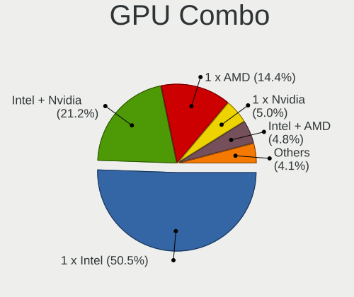

| Name                     | Notebooks | Percent |
|--------------------------|-----------|---------|
| 1 x Intel                | 22532     | 50.55%  |
| Intel + Nvidia           | 9452      | 21.2%   |
| 1 x AMD                  | 6414      | 14.39%  |
| 1 x Nvidia               | 2218      | 4.98%   |
| Intel + AMD              | 2123      | 4.76%   |
| AMD + Nvidia             | 897       | 2.01%   |
| 2 x AMD                  | 682       | 1.53%   |
| 1 x SiS                  | 89        | 0.2%    |
| Other                    | 63        | 0.14%   |
| 2 x Nvidia               | 35        | 0.08%   |
| 1 x VIA                  | 27        | 0.06%   |
| 2 x Intel                | 23        | 0.05%   |
| 1 x Zhaoxin              | 10        | 0.02%   |
| Intel + 2 x Nvidia       | 5         | 0.01%   |
| Intel + AMD + 1 x Nvidia | 3         | 0.01%   |
| 1 x Silicon Motion       | 2         | 0.004%  |
| Nvidia + ASPEED          | 1         | 0.002%  |
| Intel + Xilinx           | 1         | 0.002%  |
| Intel + ASPEED           | 1         | 0.002%  |

GPU Driver
----------

Free vs proprietary

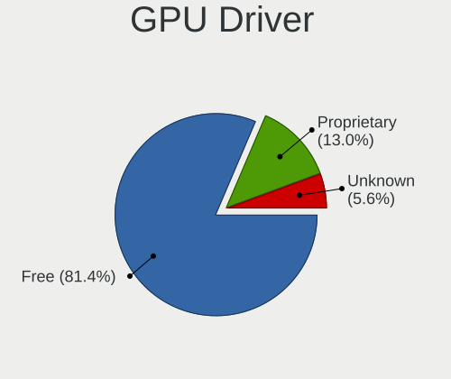

| Driver      | Notebooks | Percent |
|-------------|-----------|---------|
| Free        | 36729     | 81.44%  |
| Proprietary | 5843      | 12.96%  |
| Unknown     | 2530      | 5.61%   |

GPU Memory
----------

Total video memory

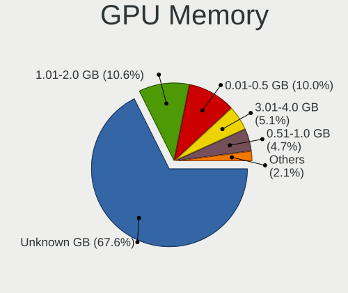

| Size in GB | Notebooks | Percent |
|------------|-----------|---------|
| Unknown    | 30780     | 67.62%  |
| 1.01-2.0   | 4809      | 10.56%  |
| 0.01-0.5   | 4533      | 9.96%   |
| 3.01-4.0   | 2332      | 5.12%   |
| 0.51-1.0   | 2119      | 4.66%   |
| 5.01-6.0   | 498       | 1.09%   |
| 7.01-8.0   | 304       | 0.67%   |
| 2.01-3.0   | 96        | 0.21%   |
| 8.01-16.0  | 46        | 0.1%    |
| 24.01-32.0 | 1         | 0.002%  |
| 16.01-24.0 | 1         | 0.002%  |

Monitor
-------

Monitor Vendor
--------------

Monitor vendors

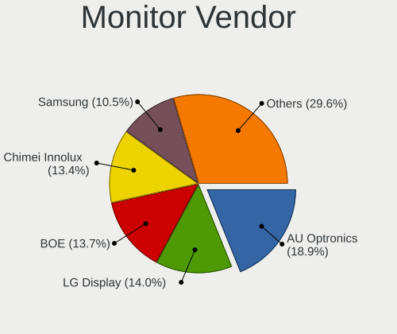

| Vendor                  | Notebooks | Percent |
|-------------------------|-----------|---------|
| AU Optronics            | 9565      | 18.88%  |
| LG Display              | 7077      | 13.97%  |
| BOE                     | 6945      | 13.7%   |
| Chimei Innolux          | 6800      | 13.42%  |
| Samsung Electronics     | 5305      | 10.47%  |
| Sharp                   | 1444      | 2.85%   |
| Dell                    | 1424      | 2.81%   |
| Apple                   | 1200      | 2.37%   |
| Chi Mei Optoelectronics | 1175      | 2.32%   |
| Goldstar                | 1028      | 2.03%   |
| Lenovo                  | 1024      | 2.02%   |
| Hewlett-Packard         | 688       | 1.36%   |
| PANDA                   | 672       | 1.33%   |
| Acer                    | 465       | 0.92%   |
| InfoVision              | 449       | 0.89%   |
| AOC                     | 393       | 0.78%   |
| Philips                 | 376       | 0.74%   |
| LG Philips              | 369       | 0.73%   |
| BenQ                    | 359       | 0.71%   |
| Ancor Communications    | 258       | 0.51%   |
| CSO                     | 249       | 0.49%   |
| Iiyama                  | 240       | 0.47%   |
| Sony                    | 221       | 0.44%   |
| ASUSTek Computer        | 184       | 0.36%   |
| ViewSonic               | 127       | 0.25%   |
| CPT                     | 122       | 0.24%   |
| HannStar                | 120       | 0.24%   |
| LGD                     | 103       | 0.2%    |
| TMX                     | 97        | 0.19%   |
| Toshiba                 | 96        | 0.19%   |
| Panasonic               | 91        | 0.18%   |
| InnoLux Display         | 82        | 0.16%   |
| MSI                     | 73        | 0.14%   |
| Seiko/Epson             | 72        | 0.14%   |
| HKC                     | 71        | 0.14%   |
| CSOT                    | 69        | 0.14%   |
| Unknown                 | 66        | 0.13%   |
| Vizio                   | 51        | 0.1%    |
| Mi                      | 50        | 0.1%    |
| Vestel Elektronik       | 47        | 0.09%   |

Monitor Model
-------------

Monitor models

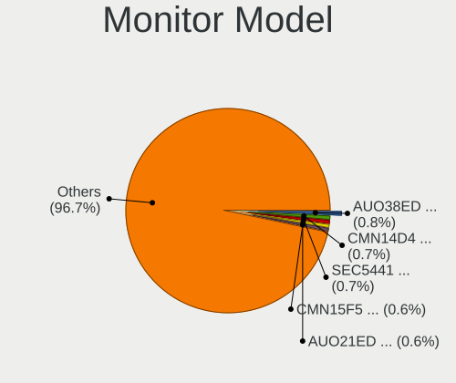

| Model                                                                    | Notebooks | Percent |
|--------------------------------------------------------------------------|-----------|---------|
| AU Optronics LCD Monitor AUO38ED 1920x1080 344x193mm 15.5-inch           | 388       | 0.76%   |
| Chimei Innolux LCD Monitor CMN14D4 1920x1080 309x173mm 13.9-inch         | 361       | 0.7%    |
| Samsung Electronics LCD Monitor SEC5441 1280x800 331x207mm 15.4-inch     | 335       | 0.65%   |
| Chimei Innolux LCD Monitor CMN15F5 1920x1080 344x193mm 15.5-inch         | 307       | 0.6%    |
| AU Optronics LCD Monitor AUO21ED 1920x1080 344x193mm 15.5-inch           | 306       | 0.6%    |
| LG Display LCD Monitor LGD02DC 1366x768 344x194mm 15.5-inch              | 293       | 0.57%   |
| Chimei Innolux LCD Monitor CMN15DB 1366x768 344x193mm 15.5-inch          | 286       | 0.56%   |
| AU Optronics LCD Monitor AUO22EC 1366x768 344x193mm 15.5-inch            | 233       | 0.45%   |
| Chimei Innolux LCD Monitor CMN15E7 1920x1080 344x193mm 15.5-inch         | 229       | 0.45%   |
| AU Optronics LCD Monitor AUO403D 1920x1080 309x174mm 14.0-inch           | 220       | 0.43%   |
| Chi Mei Optoelectronics LCD Monitor CMO15A7 1366x768 344x193mm 15.5-inch | 190       | 0.37%   |
| LG Display LCD Monitor LGD033A 1366x768 344x194mm 15.5-inch              | 173       | 0.34%   |
| AU Optronics LCD Monitor AUO26EC 1366x768 344x193mm 15.5-inch            | 167       | 0.33%   |
| AU Optronics LCD Monitor AUO71EC 1366x768 344x193mm 15.5-inch            | 160       | 0.31%   |
| BOE LCD Monitor BOE06A4 1366x768 344x194mm 15.5-inch                     | 159       | 0.31%   |
| BOE LCD Monitor BOE0872 1920x1080 344x194mm 15.5-inch                    | 158       | 0.31%   |
| AU Optronics LCD Monitor AUO45EC 1366x768 344x193mm 15.5-inch            | 155       | 0.3%    |
| Chimei Innolux LCD Monitor CMN1521 1920x1080 344x193mm 15.5-inch         | 144       | 0.28%   |
| AU Optronics LCD Monitor AUO10EC 1366x768 344x193mm 15.5-inch            | 144       | 0.28%   |
| Chimei Innolux LCD Monitor CMN15E8 1920x1080 344x193mm 15.5-inch         | 140       | 0.27%   |
| Chimei Innolux LCD Monitor CMN15E6 1366x768 344x193mm 15.5-inch          | 137       | 0.27%   |
| Chimei Innolux LCD Monitor CMN15D5 1920x1080 344x193mm 15.5-inch         | 129       | 0.25%   |
| Chimei Innolux LCD Monitor CMN15CA 1366x768 344x193mm 15.5-inch          | 127       | 0.25%   |
| LG Display LCD Monitor LGD0456 1366x768 344x194mm 15.5-inch              | 125       | 0.24%   |
| BOE LCD Monitor BOE0687 1920x1080 344x193mm 15.5-inch                    | 123       | 0.24%   |
| PANDA LCD Monitor NCP004D 1920x1080 344x194mm 15.5-inch                  | 120       | 0.23%   |
| LG Display LCD Monitor LGD046F 1920x1080 344x194mm 15.5-inch             | 120       | 0.23%   |
| Chimei Innolux LCD Monitor CMN15DC 1366x768 344x193mm 15.5-inch          | 120       | 0.23%   |
| Chimei Innolux LCD Monitor CMN14C9 1920x1080 309x173mm 13.9-inch         | 120       | 0.23%   |
| AU Optronics LCD Monitor AUO2E3C 1366x768 309x173mm 13.9-inch            | 120       | 0.23%   |
| BOE LCD Monitor BOE06A5 1366x768 344x194mm 15.5-inch                     | 119       | 0.23%   |
| AU Optronics LCD Monitor AUO106C 1366x768 276x155mm 12.5-inch            | 119       | 0.23%   |
| AU Optronics LCD Monitor AUO70EC 1366x768 344x193mm 15.5-inch            | 117       | 0.23%   |
| Chimei Innolux LCD Monitor CMN1735 1920x1080 381x214mm 17.2-inch         | 113       | 0.22%   |
| BOE LCD Monitor BOE0812 1920x1080 344x194mm 15.5-inch                    | 113       | 0.22%   |
| LG Display LCD Monitor LGD05E5 1920x1080 344x194mm 15.5-inch             | 111       | 0.22%   |
| BOE LCD Monitor BOE0877 1920x1080 309x173mm 13.9-inch                    | 109       | 0.21%   |
| Samsung Electronics LCD Monitor SEC544B 1600x900 382x214mm 17.2-inch     | 108       | 0.21%   |
| Lenovo LCD Monitor LEN40BA 1920x1080 344x194mm 15.5-inch                 | 108       | 0.21%   |
| Chimei Innolux LCD Monitor CMN15C4 1920x1080 344x193mm 15.5-inch         | 108       | 0.21%   |

Monitor Resolution
------------------

Monitor screen resolution

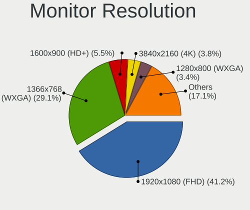

| Resolution         | Notebooks | Percent |
|--------------------|-----------|---------|
| 1920x1080 (FHD)    | 19706     | 41.21%  |
| 1366x768 (WXGA)    | 13916     | 29.1%   |
| 1600x900 (HD+)     | 2627      | 5.49%   |
| 3840x2160 (4K)     | 1799      | 3.76%   |
| 1280x800 (WXGA)    | 1607      | 3.36%   |
| 1920x1200 (WUXGA)  | 1585      | 3.31%   |
| 2560x1440 (QHD)    | 1221      | 2.55%   |
| 1440x900 (WXGA+)   | 847       | 1.77%   |
| 2560x1600          | 746       | 1.56%   |
| 2880x1800          | 512       | 1.07%   |
| 1680x1050 (WSXGA+) | 422       | 0.88%   |
| 3840x2400          | 260       | 0.54%   |
| 1280x1024 (SXGA)   | 257       | 0.54%   |
| 3440x1440          | 252       | 0.53%   |
| 2560x1080          | 204       | 0.43%   |
| 1024x600           | 177       | 0.37%   |
| 2160x1440          | 168       | 0.35%   |
| 3200x1800 (QHD+)   | 138       | 0.29%   |
| Unknown            | 138       | 0.29%   |
| 1360x768           | 130       | 0.27%   |
| 1024x768 (XGA)     | 83        | 0.17%   |
| 3200x2000          | 82        | 0.17%   |
| 3072x1920          | 75        | 0.16%   |
| 1920x540           | 74        | 0.15%   |
| 2256x1504          | 65        | 0.14%   |
| 3840x1080          | 56        | 0.12%   |
| 2880x1620          | 53        | 0.11%   |
| 3456x2160          | 48        | 0.1%    |
| 3000x2000          | 45        | 0.09%   |
| 2240x1400          | 40        | 0.08%   |
| 1920x1280          | 39        | 0.08%   |
| 1680x945           | 39        | 0.08%   |
| 2288x1287          | 35        | 0.07%   |
| 2520x1680          | 32        | 0.07%   |
| 2304x1440          | 31        | 0.06%   |
| 3840x1600          | 25        | 0.05%   |
| 1600x1200          | 24        | 0.05%   |
| 1400x1050          | 23        | 0.05%   |
| 1280x720 (HD)      | 21        | 0.04%   |
| 2880x1920          | 20        | 0.04%   |

Monitor Diagonal
----------------

Diagonal size in inches

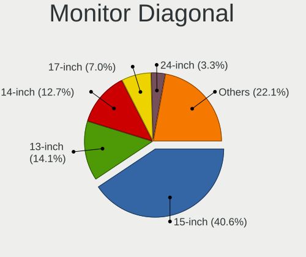

| Inches  | Notebooks | Percent |
|---------|-----------|---------|
| 15      | 20583     | 40.65%  |
| 13      | 7153      | 14.13%  |
| 14      | 6451      | 12.74%  |
| 17      | 3565      | 7.04%   |
| 24      | 1690      | 3.34%   |
| 27      | 1546      | 3.05%   |
| 16      | 1201      | 2.37%   |
| 23      | 1144      | 2.26%   |
| 12      | 1065      | 2.1%    |
| 21      | 1039      | 2.05%   |
| 11      | 758       | 1.5%    |
| Unknown | 713       | 1.41%   |
| 31      | 570       | 1.13%   |
| 18      | 430       | 0.85%   |
| 34      | 379       | 0.75%   |
| 19      | 299       | 0.59%   |
| 10      | 248       | 0.49%   |
| 22      | 228       | 0.45%   |
| 20      | 192       | 0.38%   |
| 84      | 147       | 0.29%   |
| 40      | 133       | 0.26%   |
| 72      | 124       | 0.24%   |
| 32      | 120       | 0.24%   |
| 54      | 118       | 0.23%   |
| 25      | 74        | 0.15%   |
| 28      | 54        | 0.11%   |
| 63      | 52        | 0.1%    |
| 48      | 48        | 0.09%   |
| 26      | 44        | 0.09%   |
| 52      | 43        | 0.08%   |
| 37      | 42        | 0.08%   |
| 86      | 33        | 0.07%   |
| 8       | 30        | 0.06%   |
| 49      | 28        | 0.06%   |
| 46      | 26        | 0.05%   |
| 142     | 24        | 0.05%   |
| 29      | 24        | 0.05%   |
| 43      | 22        | 0.04%   |
| 65      | 19        | 0.04%   |
| 42      | 18        | 0.04%   |

Monitor Width
-------------

Physical width

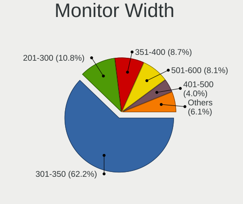

| Width in mm    | Notebooks | Percent |
|----------------|-----------|---------|
| 301-350        | 31239     | 62.2%   |
| 201-300        | 5442      | 10.84%  |
| 351-400        | 4356      | 8.67%   |
| 501-600        | 4091      | 8.15%   |
| 401-500        | 2018      | 4.02%   |
| 601-700        | 801       | 1.59%   |
| Unknown        | 713       | 1.42%   |
| 701-800        | 528       | 1.05%   |
| 1001-1500      | 410       | 0.82%   |
| 1501-2000      | 293       | 0.58%   |
| 801-900        | 220       | 0.44%   |
| 901-1000       | 52        | 0.1%    |
| 101-200        | 33        | 0.07%   |
| More than 2000 | 24        | 0.05%   |
| 1-100          | 4         | 0.01%   |

Aspect Ratio
------------

Proportional relationship between the width and the height

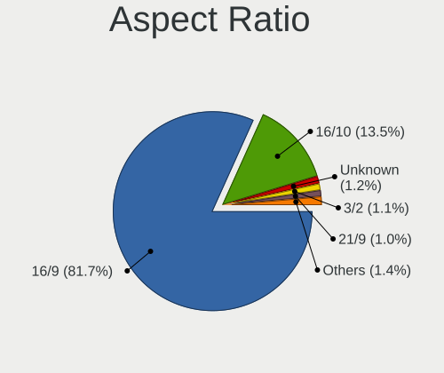

| Ratio   | Notebooks | Percent |
|---------|-----------|---------|
| 16/9    | 36612     | 81.74%  |
| 16/10   | 6067      | 13.54%  |
| Unknown | 546       | 1.22%   |
| 3/2     | 484       | 1.08%   |
| 21/9    | 454       | 1.01%   |
| 5/4     | 252       | 0.56%   |
| 4/3     | 170       | 0.38%   |
| 32/9    | 64        | 0.14%   |
| 0.56    | 35        | 0.08%   |
| 1.00    | 25        | 0.06%   |
| 6/5     | 21        | 0.05%   |
| 3.40    | 15        | 0.03%   |
| 0.62    | 14        | 0.03%   |
| 3.73    | 10        | 0.02%   |
| 1.96    | 8         | 0.02%   |
| 3.20    | 3         | 0.01%   |
| 0.89    | 3         | 0.01%   |
| 0.63    | 2         | 0.004%  |
| 3.33    | 1         | 0.002%  |
| 2.50    | 1         | 0.002%  |
| 2.12    | 1         | 0.002%  |
| 2.01    | 1         | 0.002%  |
| 2.00    | 1         | 0.002%  |
| 0.67    | 1         | 0.002%  |
| 0.65    | 1         | 0.002%  |
| 0.00    | 1         | 0.002%  |

Monitor Area
------------

Area in inch²

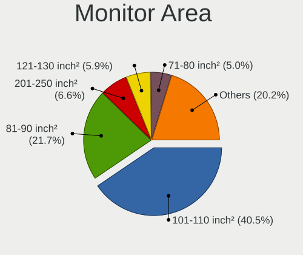

| Area in inch² | Notebooks | Percent |
|----------------|-----------|---------|
| 101-110        | 20478     | 40.53%  |
| 81-90          | 10977     | 21.72%  |
| 201-250        | 3351      | 6.63%   |
| 121-130        | 2974      | 5.89%   |
| 71-80          | 2527      | 5%      |
| 301-350        | 1585      | 3.14%   |
| 111-120        | 1180      | 2.34%   |
| 351-500        | 1133      | 2.24%   |
| 61-70          | 1012      | 2%      |
| 51-60          | 780       | 1.54%   |
| 151-200        | 738       | 1.46%   |
| Unknown        | 714       | 1.41%   |
| More than 1000 | 642       | 1.27%   |
| 251-300        | 545       | 1.08%   |
| 131-140        | 527       | 1.04%   |
| 141-150        | 508       | 1.01%   |
| 501-1000       | 356       | 0.7%    |
| 41-50          | 241       | 0.48%   |
| 91-100         | 226       | 0.45%   |
| 1-40           | 35        | 0.07%   |

Pixel Density
-------------

Pixels per inch

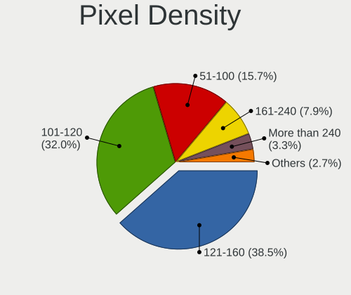

| Density       | Notebooks | Percent |
|---------------|-----------|---------|
| 121-160       | 19084     | 38.46%  |
| 101-120       | 15874     | 32%     |
| 51-100        | 7780      | 15.68%  |
| 161-240       | 3934      | 7.93%   |
| More than 240 | 1617      | 3.26%   |
| Unknown       | 713       | 1.44%   |
| 1-50          | 612       | 1.23%   |

Multiple Monitors
-----------------

Total monitors connected

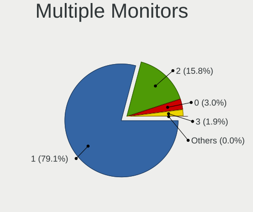

| Total | Notebooks | Percent |
|-------|-----------|---------|
| 1     | 36103     | 79.11%  |
| 2     | 7227      | 15.84%  |
| 0     | 1378      | 3.02%   |
| 3     | 862       | 1.89%   |
| 4     | 60        | 0.13%   |
| 5     | 6         | 0.01%   |
| 6     | 1         | 0.002%  |

Network
-------

Net Controller Vendor
---------------------

Controller vendors

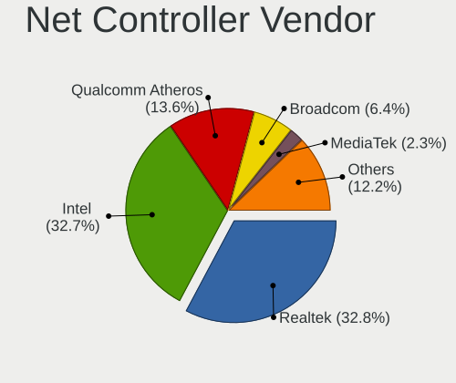

| Vendor                            | Notebooks | Percent |
|-----------------------------------|-----------|---------|
| Realtek Semiconductor             | 23396     | 32.78%  |
| Intel                             | 23361     | 32.73%  |
| Qualcomm Atheros                  | 9726      | 13.63%  |
| Broadcom                          | 4601      | 6.45%   |
| MediaTek                          | 1608      | 2.25%   |
| Broadcom Limited                  | 1089      | 1.53%   |
| Marvell Technology Group          | 718       | 1.01%   |
| Ralink                            | 656       | 0.92%   |
| Shenzhen Goodix Technology        | 595       | 0.83%   |
| TP-Link                           | 440       | 0.62%   |
| ASIX Electronics                  | 419       | 0.59%   |
| Ralink Technology                 | 344       | 0.48%   |
| Dell                              | 337       | 0.47%   |
| Samsung Electronics               | 330       | 0.46%   |
| DisplayLink                       | 280       | 0.39%   |
| Sierra Wireless                   | 260       | 0.36%   |
| Nvidia                            | 257       | 0.36%   |
| Ericsson Business Mobile Networks | 233       | 0.33%   |
| Hewlett-Packard                   | 222       | 0.31%   |
| Xiaomi                            | 215       | 0.3%    |
| Lenovo                            | 212       | 0.3%    |
| Qualcomm                          | 203       | 0.28%   |
| JMicron Technology                | 172       | 0.24%   |
| Huawei Technologies               | 170       | 0.24%   |
| Silicon Integrated Systems [SiS]  | 98        | 0.14%   |
| NetGear                           | 84        | 0.12%   |
| Qualcomm Atheros Communications   | 80        | 0.11%   |
| Apple                             | 70        | 0.1%    |
| OPPO Electronics                  | 69        | 0.1%    |
| D-Link                            | 67        | 0.09%   |
| Fibocom                           | 65        | 0.09%   |
| ASUSTek Computer                  | 65        | 0.09%   |
| Motorola PCS                      | 60        | 0.08%   |
| Edimax Technology                 | 54        | 0.08%   |
| Google                            | 52        | 0.07%   |
| ICS Advent                        | 44        | 0.06%   |
| U-Blox                            | 39        | 0.05%   |
| Arduino SA                        | 34        | 0.05%   |
| Linksys                           | 31        | 0.04%   |
| Attansic Technology               | 31        | 0.04%   |

Net Controller Model
--------------------

Controller models

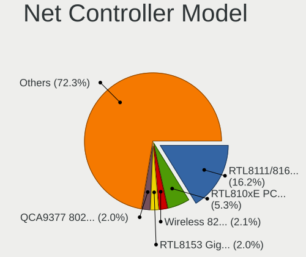

| Model                                                                  | Notebooks | Percent |
|------------------------------------------------------------------------|-----------|---------|
| Realtek RTL8111/8168/8211/8411 PCI Express Gigabit Ethernet Controller | 13837     | 16.19%  |
| Realtek RTL810xE PCI Express Fast Ethernet controller                  | 4571      | 5.35%   |
| Intel Wireless 8265 / 8275                                             | 1779      | 2.08%   |
| Realtek RTL8153 Gigabit Ethernet Adapter                               | 1728      | 2.02%   |
| Qualcomm Atheros QCA9377 802.11ac Wireless Network Adapter             | 1712      | 2%      |
| Qualcomm Atheros QCA9565 / AR9565 Wireless Network Adapter             | 1575      | 1.84%   |
| Intel 82579LM Gigabit Network Connection (Lewisville)                  | 1571      | 1.84%   |
| Intel Wi-Fi 6 AX201                                                    | 1548      | 1.81%   |
| Intel Wi-Fi 6 AX200                                                    | 1519      | 1.78%   |
| Qualcomm Atheros AR9485 Wireless Network Adapter                       | 1418      | 1.66%   |
| Intel Wireless 7265                                                    | 1292      | 1.51%   |
| Qualcomm Atheros AR9285 Wireless Network Adapter (PCI-Express)         | 1276      | 1.49%   |
| Intel Wireless 7260                                                    | 1242      | 1.45%   |
| Realtek RTL8821CE 802.11ac PCIe Wireless Network Adapter               | 1238      | 1.45%   |
| Intel Wireless 8260                                                    | 1097      | 1.28%   |
| Qualcomm Atheros QCA6174 802.11ac Wireless Network Adapter             | 1083      | 1.27%   |
| Intel Centrino Advanced-N 6205 [Taylor Peak]                           | 1032      | 1.21%   |
| Realtek RTL8822CE 802.11ac PCIe Wireless Network Adapter               | 1017      | 1.19%   |
| Intel Alder Lake-P PCH CNVi WiFi                                       | 999       | 1.17%   |
| Intel Comet Lake PCH-LP CNVi WiFi                                      | 995       | 1.16%   |
| Intel Cannon Point-LP CNVi [Wireless-AC]                               | 848       | 0.99%   |
| Broadcom BCM4313 802.11bgn Wireless Network Adapter                    | 840       | 0.98%   |
| Intel Cannon Lake PCH CNVi WiFi                                        | 821       | 0.96%   |
| Intel Wireless 3165                                                    | 748       | 0.88%   |
| Realtek RTL8723BE PCIe Wireless Network Adapter                        | 714       | 0.84%   |
| Broadcom BCM43142 802.11b/g/n                                          | 695       | 0.81%   |
| MediaTek MT7921 802.11ax PCIe Wireless Network Adapter [Filogic 330]   | 682       | 0.8%    |
| Intel Ethernet Connection (4) I219-LM                                  | 668       | 0.78%   |
| Intel Comet Lake PCH CNVi WiFi                                         | 651       | 0.76%   |
| Shenzhen Goodix Fingerprint Reader                                     | 594       | 0.7%    |
| Intel Wireless 3160                                                    | 554       | 0.65%   |
| Intel Ethernet Connection I219-LM                                      | 540       | 0.63%   |
| Intel 82577LM Gigabit Network Connection                               | 527       | 0.62%   |
| Intel Raptor Lake PCH CNVi WiFi                                        | 474       | 0.55%   |
| Realtek RTL8188CE 802.11b/g/n WiFi Adapter                             | 472       | 0.55%   |
| Intel Ethernet Connection I218-LM                                      | 472       | 0.55%   |
| Qualcomm Atheros AR8151 v2.0 Gigabit Ethernet                          | 459       | 0.54%   |
| Intel Centrino Ultimate-N 6300                                         | 445       | 0.52%   |
| Intel Dual Band Wireless-AC 3165 Plus Bluetooth                        | 440       | 0.51%   |
| Intel WiFi Link 5100                                                   | 409       | 0.48%   |

Wireless Vendor
---------------

Wireless vendors

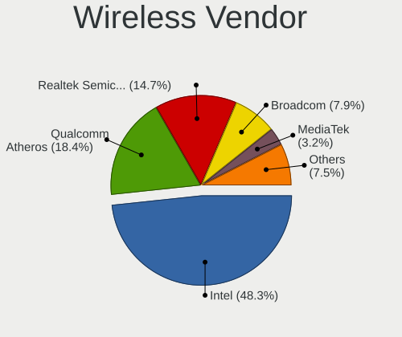

| Vendor                          | Notebooks | Percent |
|---------------------------------|-----------|---------|
| Intel                           | 21932     | 48.32%  |
| Qualcomm Atheros                | 8353      | 18.4%   |
| Realtek Semiconductor           | 6653      | 14.66%  |
| Broadcom                        | 3591      | 7.91%   |
| MediaTek                        | 1443      | 3.18%   |
| Broadcom Limited                | 755       | 1.66%   |
| Ralink                          | 656       | 1.45%   |
| Ralink Technology               | 344       | 0.76%   |
| TP-Link                         | 342       | 0.75%   |
| Sierra Wireless                 | 260       | 0.57%   |
| Dell                            | 215       | 0.47%   |
| Qualcomm                        | 161       | 0.35%   |
| NetGear                         | 82        | 0.18%   |
| Qualcomm Atheros Communications | 80        | 0.18%   |
| Fibocom                         | 65        | 0.14%   |
| D-Link                          | 63        | 0.14%   |
| Hewlett-Packard                 | 60        | 0.13%   |
| ASUSTek Computer                | 56        | 0.12%   |
| Edimax Technology               | 54        | 0.12%   |
| D-Link System                   | 26        | 0.06%   |
| Linksys                         | 24        | 0.05%   |
| Belkin Components               | 20        | 0.04%   |
| Qualcomm Technologies           | 17        | 0.04%   |
| Microsoft                       | 12        | 0.03%   |
| Quectel Wireless Solutions      | 9         | 0.02%   |
| ZyXEL Communications            | 8         | 0.02%   |
| Sitecom Europe                  | 7         | 0.02%   |
| BUFFALO                         | 7         | 0.02%   |
| AVM                             | 7         | 0.02%   |
| Mercucys                        | 6         | 0.01%   |
| ZyDAS                           | 5         | 0.01%   |
| TRENDnet                        | 5         | 0.01%   |
| Realtek                         | 5         | 0.01%   |
| Unknown                         | 5         | 0.01%   |
| Tenda                           | 4         | 0.01%   |
| Qcom                            | 4         | 0.01%   |
| Micro Star International        | 4         | 0.01%   |
| Marvell Technology Group        | 4         | 0.01%   |
| Fujitsu Siemens Computers       | 4         | 0.01%   |
| Wacom                           | 3         | 0.01%   |

Wireless Model
--------------

Wireless models

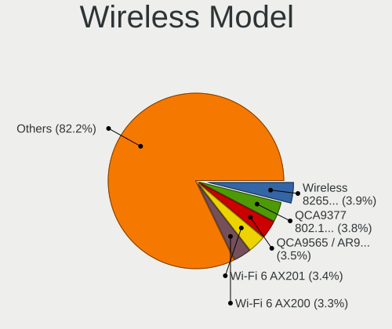

| Model                                                                   | Notebooks | Percent |
|-------------------------------------------------------------------------|-----------|---------|
| Intel Wireless 8265 / 8275                                              | 1779      | 3.9%    |
| Qualcomm Atheros QCA9377 802.11ac Wireless Network Adapter              | 1712      | 3.75%   |
| Qualcomm Atheros QCA9565 / AR9565 Wireless Network Adapter              | 1575      | 3.45%   |
| Intel Wi-Fi 6 AX201                                                     | 1548      | 3.39%   |
| Intel Wi-Fi 6 AX200                                                     | 1519      | 3.33%   |
| Qualcomm Atheros AR9485 Wireless Network Adapter                        | 1418      | 3.11%   |
| Intel Wireless 7265                                                     | 1292      | 2.83%   |
| Qualcomm Atheros AR9285 Wireless Network Adapter (PCI-Express)          | 1276      | 2.8%    |
| Intel Wireless 7260                                                     | 1242      | 2.72%   |
| Realtek RTL8821CE 802.11ac PCIe Wireless Network Adapter                | 1238      | 2.71%   |
| Intel Wireless 8260                                                     | 1097      | 2.4%    |
| Qualcomm Atheros QCA6174 802.11ac Wireless Network Adapter              | 1083      | 2.37%   |
| Intel Centrino Advanced-N 6205 [Taylor Peak]                            | 1032      | 2.26%   |
| Realtek RTL8822CE 802.11ac PCIe Wireless Network Adapter                | 1017      | 2.23%   |
| Intel Comet Lake PCH-LP CNVi WiFi                                       | 995       | 2.18%   |
| Intel Cannon Point-LP CNVi [Wireless-AC]                                | 848       | 1.86%   |
| Broadcom BCM4313 802.11bgn Wireless Network Adapter                     | 840       | 1.84%   |
| Intel Cannon Lake PCH CNVi WiFi                                         | 821       | 1.8%    |
| Intel Wireless 3165                                                     | 748       | 1.64%   |
| Realtek RTL8723BE PCIe Wireless Network Adapter                         | 714       | 1.56%   |
| Broadcom BCM43142 802.11b/g/n                                           | 695       | 1.52%   |
| MediaTek MT7921 802.11ax PCIe Wireless Network Adapter [Filogic 330]    | 682       | 1.49%   |
| Intel Alder Lake-P PCH CNVi WiFi                                        | 680       | 1.49%   |
| Intel Comet Lake PCH CNVi WiFi                                          | 651       | 1.43%   |
| Intel Wireless 3160                                                     | 554       | 1.21%   |
| Realtek RTL8188CE 802.11b/g/n WiFi Adapter                              | 472       | 1.03%   |
| Intel Raptor Lake PCH CNVi WiFi                                         | 460       | 1.01%   |
| Intel Centrino Ultimate-N 6300                                          | 445       | 0.98%   |
| Intel Dual Band Wireless-AC 3165 Plus Bluetooth                         | 440       | 0.96%   |
| Intel WiFi Link 5100                                                    | 409       | 0.9%    |
| Intel Centrino Advanced-N 6200                                          | 405       | 0.89%   |
| Intel Wi-Fi 5(802.11ac) Wireless-AC 9x6x [Thunder Peak]                 | 389       | 0.85%   |
| Realtek RTL8723DE Wireless Network Adapter                              | 387       | 0.85%   |
| Intel Centrino Advanced-N 6235                                          | 382       | 0.84%   |
| Realtek RTL8822BE 802.11a/b/g/n/ac WiFi adapter                         | 379       | 0.83%   |
| Intel Ice Lake-LP PCH CNVi WiFi                                         | 378       | 0.83%   |
| Intel PRO/Wireless 3945ABG [Golan] Network Connection                   | 363       | 0.8%    |
| Intel Centrino Wireless-N 2230                                          | 362       | 0.79%   |
| Intel Tiger Lake PCH CNVi WiFi                                          | 359       | 0.79%   |
| Qualcomm Atheros AR242x / AR542x Wireless Network Adapter (PCI-Express) | 349       | 0.76%   |

Ethernet Vendor
---------------

Ethernet vendors

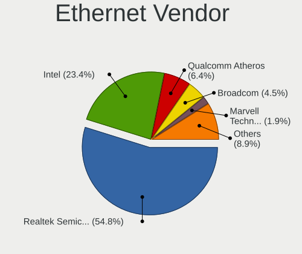

| Vendor                                 | Notebooks | Percent |
|----------------------------------------|-----------|---------|
| Realtek Semiconductor                  | 20734     | 54.81%  |
| Intel                                  | 8850      | 23.39%  |
| Qualcomm Atheros                       | 2436      | 6.44%   |
| Broadcom                               | 1714      | 4.53%   |
| Marvell Technology Group               | 714       | 1.89%   |
| ASIX Electronics                       | 419       | 1.11%   |
| Broadcom Limited                       | 360       | 0.95%   |
| Samsung Electronics                    | 320       | 0.85%   |
| DisplayLink                            | 280       | 0.74%   |
| Nvidia                                 | 255       | 0.67%   |
| Xiaomi                                 | 213       | 0.56%   |
| Lenovo                                 | 210       | 0.56%   |
| JMicron Technology                     | 172       | 0.45%   |
| MediaTek                               | 162       | 0.43%   |
| Huawei Technologies                    | 121       | 0.32%   |
| TP-Link                                | 97        | 0.26%   |
| Silicon Integrated Systems [SiS]       | 97        | 0.26%   |
| OPPO Electronics                       | 69        | 0.18%   |
| Apple                                  | 69        | 0.18%   |
| Hewlett-Packard                        | 62        | 0.16%   |
| Motorola PCS                           | 60        | 0.16%   |
| Google                                 | 52        | 0.14%   |
| ICS Advent                             | 44        | 0.12%   |
| Qualcomm                               | 41        | 0.11%   |
| Attansic Technology                    | 31        | 0.08%   |
| VIA Technologies                       | 24        | 0.06%   |
| Suzhou Motorcomm Electronic Technology | 21        | 0.06%   |
| OnePlus Technology (Shenzhen)          | 15        | 0.04%   |
| Qualcomm Technologies                  | 12        | 0.03%   |
| Microchip Technology                   | 11        | 0.03%   |
| Motorcomm Microelectronics.            | 10        | 0.03%   |
| Aquantia                               | 10        | 0.03%   |
| ZTE WCDMA Technologies MSM             | 9         | 0.02%   |
| HMD Global                             | 9         | 0.02%   |
| ASUSTek Computer                       | 8         | 0.02%   |
| Spreadtrum Communications              | 7         | 0.02%   |
| Sony Ericsson Mobile Communications AB | 7         | 0.02%   |
| QinHeng Electronics                    | 7         | 0.02%   |
| Linksys                                | 7         | 0.02%   |
| LG Electronics                         | 7         | 0.02%   |

Ethernet Model
--------------

Ethernet models

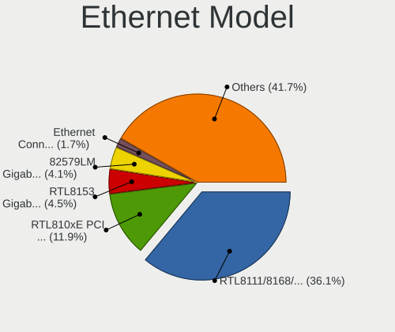

| Model                                                                  | Notebooks | Percent |
|------------------------------------------------------------------------|-----------|---------|
| Realtek RTL8111/8168/8211/8411 PCI Express Gigabit Ethernet Controller | 13837     | 36.05%  |
| Realtek RTL810xE PCI Express Fast Ethernet controller                  | 4571      | 11.91%  |
| Realtek RTL8153 Gigabit Ethernet Adapter                               | 1728      | 4.5%    |
| Intel 82579LM Gigabit Network Connection (Lewisville)                  | 1571      | 4.09%   |
| Intel Ethernet Connection (4) I219-LM                                  | 668       | 1.74%   |
| Intel Ethernet Connection I219-LM                                      | 540       | 1.41%   |
| Intel 82577LM Gigabit Network Connection                               | 527       | 1.37%   |
| Intel Ethernet Connection I218-LM                                      | 472       | 1.23%   |
| Qualcomm Atheros AR8151 v2.0 Gigabit Ethernet                          | 459       | 1.2%    |
| Intel Ethernet Connection I217-LM                                      | 395       | 1.03%   |
| Intel Ethernet Connection (3) I218-LM                                  | 388       | 1.01%   |
| Intel Ethernet Connection (4) I219-V                                   | 349       | 0.91%   |
| ASIX AX88179 Gigabit Ethernet                                          | 346       | 0.9%    |
| Intel 82567LM Gigabit Network Connection                               | 326       | 0.85%   |
| Broadcom NetLink BCM57785 Gigabit Ethernet PCIe                        | 326       | 0.85%   |
| Intel Alder Lake-P PCH CNVi WiFi                                       | 319       | 0.83%   |
| Broadcom NetXtreme BCM57765 Gigabit Ethernet PCIe                      | 265       | 0.69%   |
| Intel Ethernet Connection (6) I219-V                                   | 252       | 0.66%   |
| Intel Ethernet Connection (7) I219-LM                                  | 240       | 0.63%   |
| Samsung Galaxy series, misc. (tethering mode)                          | 232       | 0.6%    |
| Qualcomm Atheros AR8131 Gigabit Ethernet                               | 226       | 0.59%   |
| Intel Ethernet Connection (6) I219-LM                                  | 223       | 0.58%   |
| Qualcomm Atheros AR8161 Gigabit Ethernet                               | 220       | 0.57%   |
| Realtek RTL8125 2.5GbE Controller                                      | 218       | 0.57%   |
| Qualcomm Atheros QCA8171 Gigabit Ethernet                              | 213       | 0.55%   |
| Marvell Group 88E8040 PCI-E Fast Ethernet Controller                   | 209       | 0.54%   |
| Qualcomm Atheros AR8152 v2.0 Fast Ethernet                             | 202       | 0.53%   |
| Broadcom NetLink BCM57780 Gigabit Ethernet PCIe                        | 202       | 0.53%   |
| Intel Ethernet Connection I219-V                                       | 199       | 0.52%   |
| Qualcomm Atheros AR8162 Fast Ethernet                                  | 198       | 0.52%   |
| Realtek RTL8152 Fast Ethernet Adapter                                  | 191       | 0.5%    |
| Intel Ethernet Connection (2) I219-LM                                  | 185       | 0.48%   |
| Realtek Killer E2600 GbE Controller                                    | 183       | 0.48%   |
| Qualcomm Atheros QCA8172 Fast Ethernet                                 | 182       | 0.47%   |
| Intel 82579V Gigabit Network Connection                                | 177       | 0.46%   |
| Xiaomi Mi/Redmi series (RNDIS)                                         | 167       | 0.44%   |
| Nvidia MCP79 Ethernet                                                  | 151       | 0.39%   |
| JMicron JMC250 PCI Express Gigabit Ethernet Controller                 | 149       | 0.39%   |
| Qualcomm Atheros Killer E2400 Gigabit Ethernet Controller              | 145       | 0.38%   |
| Intel Ethernet Connection (13) I219-V                                  | 144       | 0.38%   |

Net Controller Kind
-------------------

Ethernet, WiFi or modem

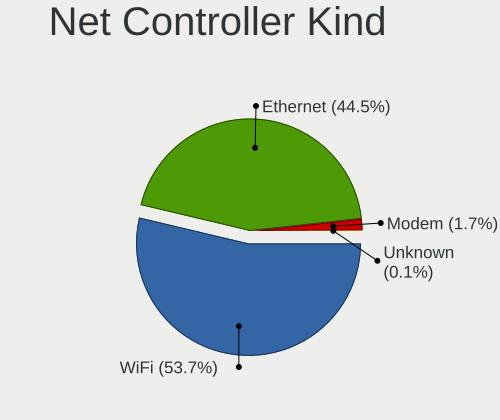

| Kind     | Notebooks | Percent |
|----------|-----------|---------|
| WiFi     | 43177     | 53.71%  |
| Ethernet | 35807     | 44.54%  |
| Modem    | 1358      | 1.69%   |
| Unknown  | 50        | 0.06%   |

Used Controller
---------------

Currently used network controller

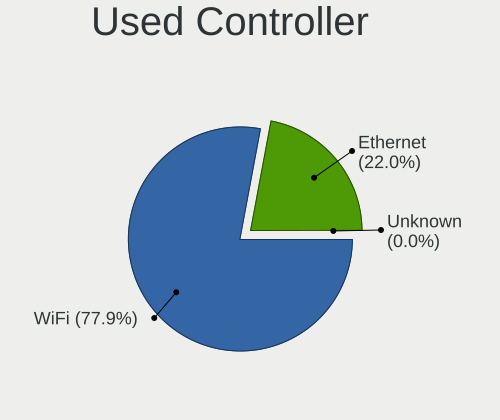

| Kind     | Notebooks | Percent |
|----------|-----------|---------|
| WiFi     | 36603     | 77.94%  |
| Ethernet | 10352     | 22.04%  |
| Modem    | 6         | 0.01%   |
| Unknown  | 5         | 0.01%   |

NICs
----

Total network controllers on board

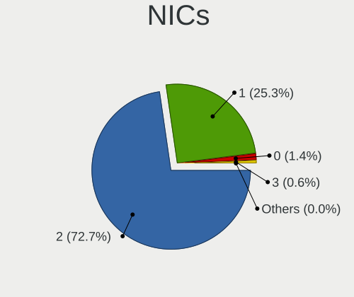

| Total | Notebooks | Percent |
|-------|-----------|---------|
| 2     | 32397     | 72.71%  |
| 1     | 11254     | 25.26%  |
| 0     | 610       | 1.37%   |
| 3     | 283       | 0.64%   |
| 4     | 6         | 0.01%   |
| 5     | 2         | 0.004%  |
| 10    | 1         | 0.002%  |
| 8     | 1         | 0.002%  |
| 6     | 1         | 0.002%  |

IPv6
----

IPv6 vs IPv4

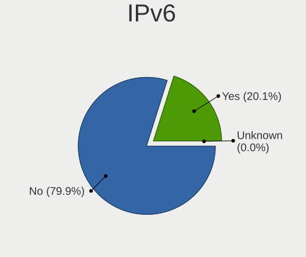

| Used    | Notebooks | Percent |
|---------|-----------|---------|
| No      | 36256     | 79.87%  |
| Yes     | 9134      | 20.12%  |
| Unknown | 5         | 0.01%   |

Bluetooth
---------

Bluetooth Vendor
----------------

Controller vendors

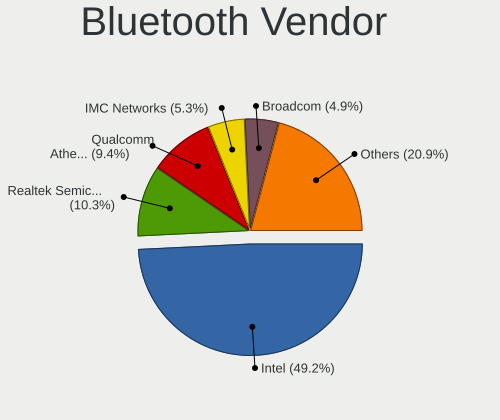

| Vendor                          | Notebooks | Percent |
|---------------------------------|-----------|---------|
| Intel                           | 17447     | 49.23%  |
| Realtek Semiconductor           | 3655      | 10.31%  |
| Qualcomm Atheros Communications | 3318      | 9.36%   |
| IMC Networks                    | 1891      | 5.34%   |
| Broadcom                        | 1741      | 4.91%   |
| Foxconn / Hon Hai               | 1523      | 4.3%    |
| Lite-On Technology              | 1396      | 3.94%   |
| Apple                           | 998       | 2.82%   |
| Dell                            | 644       | 1.82%   |
| Hewlett-Packard                 | 472       | 1.33%   |
| Cambridge Silicon Radio         | 410       | 1.16%   |
| Ralink                          | 342       | 0.96%   |
| Toshiba                         | 334       | 0.94%   |
| Realtek                         | 313       | 0.88%   |
| ASUSTek Computer                | 163       | 0.46%   |
| MediaTek                        | 159       | 0.45%   |
| Alps Electric                   | 127       | 0.36%   |
| Foxconn International           | 119       | 0.34%   |
| Ralink Technology               | 78        | 0.22%   |
| USI                             | 69        | 0.19%   |
| Askey Computer                  | 41        | 0.12%   |
| Chicony Electronics             | 27        | 0.08%   |
| TP-Link                         | 23        | 0.06%   |
| Opticis                         | 23        | 0.06%   |
| Taiyo Yuden                     | 20        | 0.06%   |
| Smart Modular Technologies      | 20        | 0.06%   |
| Micro Star International        | 10        | 0.03%   |
| Edimax Technology               | 10        | 0.03%   |
| Qcom                            | 9         | 0.03%   |
| Integrated System Solution      | 9         | 0.03%   |
| Dynex                           | 7         | 0.02%   |
| Fujitsu                         | 6         | 0.02%   |
| Sitecom Europe                  | 4         | 0.01%   |
| Belkin Components               | 4         | 0.01%   |
| Unknown                         | 4         | 0.01%   |
| Actions                         | 3         | 0.01%   |
| Syntek                          | 2         | 0.01%   |
| SiW                             | 2         | 0.01%   |
| SINO WEALTH                     | 2         | 0.01%   |
| Primax Electronics              | 2         | 0.01%   |

Bluetooth Model
---------------

Controller models

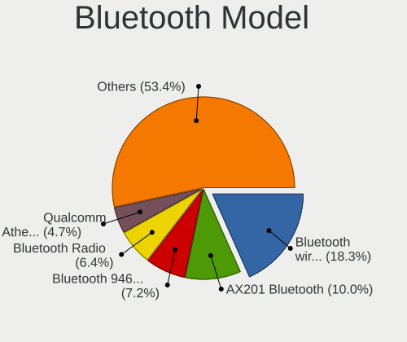

| Model                                               | Notebooks | Percent |
|-----------------------------------------------------|-----------|---------|
| Intel Bluetooth wireless interface                  | 6500      | 18.33%  |
| Intel AX201 Bluetooth                               | 3529      | 9.95%   |
| Intel Bluetooth 9460/9560 Jefferson Peak (JfP)      | 2556      | 7.21%   |
| Realtek Bluetooth Radio                             | 2279      | 6.43%   |
| Qualcomm Atheros  Bluetooth Device                  | 1671      | 4.71%   |
| Intel AX200 Bluetooth                               | 1466      | 4.13%   |
| Intel Bluetooth Device                              | 1460      | 4.12%   |
| Realtek  Bluetooth 4.2 Adapter                      | 934       | 2.63%   |
| IMC Networks Wireless_Device                        | 710       | 2%      |
| Intel Centrino Bluetooth Wireless Transceiver       | 693       | 1.95%   |
| Apple Bluetooth Host Controller                     | 565       | 1.59%   |
| Qualcomm Atheros AR3012 Bluetooth 4.0               | 479       | 1.35%   |
| Foxconn / Hon Hai Bluetooth Device                  | 478       | 1.35%   |
| IMC Networks Bluetooth Radio                        | 456       | 1.29%   |
| Lite-On Qualcomm Atheros QCA9377 Bluetooth          | 419       | 1.18%   |
| Cambridge Silicon Radio Bluetooth Dongle (HCI mode) | 410       | 1.16%   |
| IMC Networks Bluetooth Device                       | 393       | 1.11%   |
| Qualcomm Atheros AR3011 Bluetooth                   | 388       | 1.09%   |
| Intel Wireless-AC 9260 Bluetooth Adapter            | 351       | 0.99%   |
| Ralink RT3290 Bluetooth                             | 342       | 0.96%   |
| Qualcomm Atheros QCA61x4 Bluetooth 4.0              | 338       | 0.95%   |
| Lite-On Bluetooth Device                            | 337       | 0.95%   |
| Realtek Bluetooth Radio                             | 313       | 0.88%   |
| Intel Wireless-AC 3168 Bluetooth                    | 311       | 0.88%   |
| Intel AX210 Bluetooth                               | 300       | 0.85%   |
| Broadcom BCM2045B (BDC-2.1)                         | 296       | 0.83%   |
| Apple Bluetooth USB Host Controller                 | 292       | 0.82%   |
| HP Broadcom 2070 Bluetooth Combo                    | 285       | 0.8%    |
| Intel Centrino Advanced-N 6230 Bluetooth adapter    | 271       | 0.76%   |
| Lite-On Atheros AR3012 Bluetooth                    | 257       | 0.72%   |
| Foxconn / Hon Hai Wireless_Device                   | 245       | 0.69%   |
| Dell DW375 Bluetooth Module                         | 215       | 0.61%   |
| Qualcomm Atheros AR9462 Bluetooth                   | 213       | 0.6%    |
| Broadcom BCM20702 Bluetooth 4.0 [ThinkPad]          | 206       | 0.58%   |
| Foxconn / Hon Hai MediaTek Bluetooth Adapter        | 196       | 0.55%   |
| HP Bluetooth 2.0 Interface [Broadcom BCM2045]       | 176       | 0.5%    |
| Dell BCM20702A0 Bluetooth Module                    | 162       | 0.46%   |
| Realtek RTL8723B Bluetooth                          | 158       | 0.45%   |
| Broadcom HP Portable SoftSailing                    | 157       | 0.44%   |
| Lite-On Wireless_Device                             | 153       | 0.43%   |

Sound
-----

Sound Vendor
------------

Sound card vendors

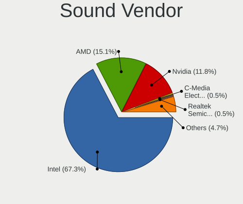

| Vendor                           | Notebooks | Percent |
|----------------------------------|-----------|---------|
| Intel                            | 36420     | 67.35%  |
| AMD                              | 8166      | 15.1%   |
| Nvidia                           | 6361      | 11.76%  |
| C-Media Electronics              | 292       | 0.54%   |
| Realtek Semiconductor            | 286       | 0.53%   |
| Logitech                         | 255       | 0.47%   |
| GN Netcom                        | 244       | 0.45%   |
| Lenovo                           | 223       | 0.41%   |
| Plantronics                      | 152       | 0.28%   |
| Hewlett-Packard                  | 140       | 0.26%   |
| Apple                            | 137       | 0.25%   |
| Silicon Integrated Systems [SiS] | 107       | 0.2%    |
| JMTek                            | 95        | 0.18%   |
| Generalplus Technology           | 80        | 0.15%   |
| Texas Instruments                | 74        | 0.14%   |
| Creative Technology              | 58        | 0.11%   |
| Kingston Technology              | 52        | 0.1%    |
| Razer USA                        | 51        | 0.09%   |
| DSEA A/S                         | 47        | 0.09%   |
| Focusrite-Novation               | 41        | 0.08%   |
| SteelSeries ApS                  | 40        | 0.07%   |
| Sony                             | 34        | 0.06%   |
| Corsair                          | 34        | 0.06%   |
| VIA Technologies                 | 32        | 0.06%   |
| ASUSTek Computer                 | 30        | 0.06%   |
| Conexant Systems                 | 25        | 0.05%   |
| Dell                             | 24        | 0.04%   |
| Microsoft                        | 21        | 0.04%   |
| Samsung Electronics              | 20        | 0.04%   |
| Jieli Technology                 | 19        | 0.04%   |
| BEHRINGER International          | 19        | 0.04%   |
| No brand                         | 16        | 0.03%   |
| M-Audio                          | 14        | 0.03%   |
| RODE Microphones                 | 12        | 0.02%   |
| KTMicro                          | 12        | 0.02%   |
| Blue Microphones                 | 11        | 0.02%   |
| Zhaoxin                          | 10        | 0.02%   |
| Tenx Technology                  | 10        | 0.02%   |
| Samson Technologies              | 9         | 0.02%   |
| Huawei Technologies              | 9         | 0.02%   |

Sound Model
-----------

Sound card models

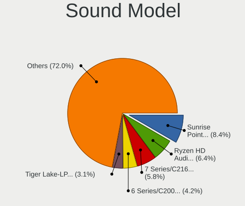

| Model                                                                                             | Notebooks | Percent |
|---------------------------------------------------------------------------------------------------|-----------|---------|
| Intel Sunrise Point-LP HD Audio                                                                   | 5450      | 8.37%   |
| AMD Ryzen HD Audio Controller                                                                     | 4195      | 6.45%   |
| Intel 7 Series/C216 Chipset Family High Definition Audio Controller                               | 3787      | 5.82%   |
| Intel 6 Series/C200 Series Chipset Family High Definition Audio Controller                        | 2741      | 4.21%   |
| Intel Tiger Lake-LP Smart Sound Technology Audio Controller                                       | 2041      | 3.14%   |
| AMD Renoir/Cezanne HDMI/DP Audio Controller                                                       | 2030      | 3.12%   |
| Intel 5 Series/3400 Series Chipset High Definition Audio                                          | 1984      | 3.05%   |
| Intel 8 Series HD Audio Controller                                                                | 1883      | 2.89%   |
| Intel Haswell-ULT HD Audio Controller                                                             | 1877      | 2.88%   |
| Intel Cannon Lake PCH cAVS                                                                        | 1705      | 2.62%   |
| Intel Broadwell-U Audio Controller                                                                | 1609      | 2.47%   |
| Intel 82801I (ICH9 Family) HD Audio Controller                                                    | 1604      | 2.46%   |
| Intel Wildcat Point-LP High Definition Audio Controller                                           | 1582      | 2.43%   |
| Intel Cannon Point-LP High Definition Audio Controller                                            | 1569      | 2.41%   |
| Intel 8 Series/C220 Series Chipset High Definition Audio Controller                               | 1358      | 2.09%   |
| AMD FCH Azalia Controller                                                                         | 1318      | 2.03%   |
| Intel Comet Lake PCH-LP cAVS                                                                      | 1297      | 1.99%   |
| Intel Alder Lake PCH-P High Definition Audio Controller                                           | 1287      | 1.98%   |
| AMD Raven/Raven2/Fenghuang HDMI/DP Audio Controller                                               | 1155      | 1.77%   |
| Intel Xeon E3-1200 v3/4th Gen Core Processor HD Audio Controller                                  | 1131      | 1.74%   |
| AMD Kabini HDMI/DP Audio                                                                          | 898       | 1.38%   |
| Intel 82801H (ICH8 Family) HD Audio Controller                                                    | 789       | 1.21%   |
| Intel Comet Lake PCH cAVS                                                                         | 753       | 1.16%   |
| AMD Family 15h (Models 60h-6fh) Audio Controller                                                  | 741       | 1.14%   |
| AMD Radeon High Definition Audio Controller                                                       | 708       | 1.09%   |
| Intel Ice Lake-LP Smart Sound Technology Audio Controller                                         | 684       | 1.05%   |
| Intel Raptor Lake-P/U/H cAVS                                                                      | 669       | 1.03%   |
| Intel CM238 HD Audio Controller                                                                   | 660       | 1.01%   |
| Nvidia TU107 GeForce GTX 1650 High Definition Audio Controller                                    | 653       | 1%      |
| Intel Celeron/Pentium Silver Processor High Definition Audio                                      | 617       | 0.95%   |
| Intel Atom Processor Z36xxx/Z37xxx Series High Definition Audio Controller                        | 600       | 0.92%   |
| AMD SBx00 Azalia (Intel HDA)                                                                      | 584       | 0.9%    |
| Nvidia GF108 High Definition Audio Controller                                                     | 581       | 0.89%   |
| Intel 100 Series/C230 Series Chipset Family HD Audio Controller                                   | 561       | 0.86%   |
| Intel Atom/Celeron/Pentium Processor x5-E8000/J3xxx/N3xxx Series High Definition Audio Controller | 520       | 0.8%    |
| Intel Tiger Lake-H HD Audio Controller                                                            | 511       | 0.79%   |
| Intel NM10/ICH7 Family High Definition Audio Controller                                           | 504       | 0.77%   |
| AMD High Definition Audio Controller                                                              | 502       | 0.77%   |
| Nvidia GP107GL High Definition Audio Controller                                                   | 500       | 0.77%   |
| Nvidia GA107 High Definition Audio Controller                                                     | 374       | 0.57%   |

Memory
------

Memory Vendor
-------------

Memory module vendors

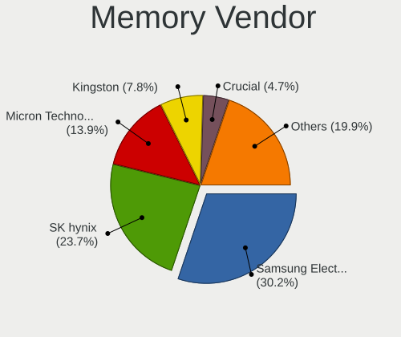

| Vendor              | Notebooks | Percent |
|---------------------|-----------|---------|
| Samsung Electronics | 7524      | 30.16%  |
| SK hynix            | 5900      | 23.65%  |
| Micron Technology   | 3461      | 13.87%  |
| Kingston            | 1941      | 7.78%   |
| Crucial             | 1163      | 4.66%   |
| Unknown             | 1066      | 4.27%   |
| A-DATA Technology   | 576       | 2.31%   |
| Ramaxel Technology  | 510       | 2.04%   |
| Elpida              | 345       | 1.38%   |
| Unknown             | 321       | 1.29%   |
| Corsair             | 240       | 0.96%   |
| Nanya Technology    | 236       | 0.95%   |
| Unknown (ABCD)      | 234       | 0.94%   |
| Smart               | 184       | 0.74%   |
| G.Skill             | 156       | 0.63%   |
| Transcend           | 95        | 0.38%   |
| Team                | 88        | 0.35%   |
| GOODRAM             | 57        | 0.23%   |
| Teikon              | 55        | 0.22%   |
| Patriot             | 55        | 0.22%   |
| Smart Brazil        | 43        | 0.17%   |
| Apacer              | 42        | 0.17%   |
| PNY                 | 26        | 0.1%    |
| ChangXin Memory     | 26        | 0.1%    |
| ASint Technology    | 25        | 0.1%    |
| Timetec             | 23        | 0.09%   |
| Goldkey             | 23        | 0.09%   |
| Avant               | 23        | 0.09%   |
| Lexar               | 20        | 0.08%   |
| Silicon Power       | 19        | 0.08%   |
| High Bridge         | 18        | 0.07%   |
| SHARETRONIC         | 17        | 0.07%   |
| Neo Forza           | 16        | 0.06%   |
| CSX                 | 16        | 0.06%   |
| Wilk                | 14        | 0.06%   |
| AMD                 | 14        | 0.06%   |
| Qimonda             | 13        | 0.05%   |
| 8CFD000080AD        | 13        | 0.05%   |
| Toshiba             | 12        | 0.05%   |
| 4ea5                | 11        | 0.04%   |

Memory Model
------------

Memory module models

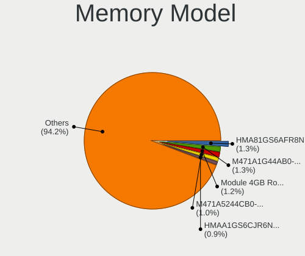

| Model                                                            | Notebooks | Percent |
|------------------------------------------------------------------|-----------|---------|
| SK hynix RAM HMA81GS6AFR8N-UH 8GB SODIMM DDR4 2667MT/s           | 351       | 1.34%   |
| Samsung RAM M471A1G44AB0-CWE 8GiB SODIMM DDR4 3200MT/s           | 347       | 1.32%   |
| Unknown                                                          | 321       | 1.22%   |
| Samsung RAM M471A5244CB0-CTD 4GB SODIMM DDR4 3266MT/s            | 270       | 1.03%   |
| SK hynix RAM HMAA1GS6CJR6N-XN 8GB SODIMM DDR4 3200MT/s           | 225       | 0.86%   |
| Samsung RAM M471A1K43EB1-CWE 8GB SODIMM DDR4 3200MT/s            | 221       | 0.84%   |
| SK hynix RAM HMT451S6BFR8A-PB 4GB SODIMM DDR3 1600MT/s           | 214       | 0.81%   |
| Samsung RAM M471A5244CB0-CRC 4GB SODIMM DDR4 2667MT/s            | 208       | 0.79%   |
| Unknown (ABCD) RAM 123456789012345678 2GB SODIMM LPDDR4 2400MT/s | 207       | 0.79%   |
| Samsung RAM M471A1K43DB1-CWE 8GB SODIMM DDR4 3200MT/s            | 206       | 0.78%   |
| Samsung RAM M471B5173DB0-YK0 4GB SODIMM DDR3 1600MT/s            | 205       | 0.78%   |
| Samsung RAM M471A1G44BB0-CWE 8GB SODIMM DDR4 3200MT/s            | 205       | 0.78%   |
| Samsung RAM M471B5173QH0-YK0 4GB SODIMM DDR3 1600MT/s            | 200       | 0.76%   |
| Samsung RAM M471A1K43CB1-CRC 8GB SODIMM DDR4 8400MT/s            | 192       | 0.73%   |
| Samsung RAM M471A1K43CB1-CTD 8GB SODIMM DDR4 3200MT/s            | 191       | 0.73%   |
| Samsung RAM M471B5273DH0-CH9 4GB SODIMM DDR3 1600MT/s            | 187       | 0.71%   |
| SK hynix RAM HMA81GS6DJR8N-XN 8GB SODIMM DDR4 3200MT/s           | 186       | 0.71%   |
| Samsung RAM M471A1K43DB1-CTD 8GB SODIMM DDR4 2667MT/s            | 184       | 0.7%    |
| SK hynix RAM HMA81GS6JJR8N-VK 8GB SODIMM DDR4 2667MT/s           | 160       | 0.61%   |
| Samsung RAM M471B1G73DB0-YK0 8GB SODIMM DDR3 1600MT/s            | 157       | 0.6%    |
| Samsung RAM M471B5273CH0-CH9 4GB SODIMM DDR3 1334MT/s            | 156       | 0.59%   |
| Samsung RAM M471B1G73QH0-YK0 8GB SODIMM DDR3 1600MT/s            | 156       | 0.59%   |
| SK hynix RAM HMT351S6CFR8C-PB 4GB SODIMM DDR3 1600MT/s           | 155       | 0.59%   |
| SK hynix RAM HMA81GS6CJR8N-VK 8GB SODIMM DDR4 2667MT/s           | 154       | 0.59%   |
| Samsung RAM M471A5244CB0-CWE 4GB SODIMM DDR4 3200MT/s            | 149       | 0.57%   |
| Micron RAM 4ATF1G64HZ-3G2F1 8GB SODIMM DDR4 3200MT/s             | 148       | 0.56%   |
| Samsung RAM M471B5173EB0-YK0 4GB SODIMM DDR3 1600MT/s            | 142       | 0.54%   |
| Micron RAM 4ATF51264HZ-2G6E1 4GB SODIMM DDR4 2667MT/s            | 139       | 0.53%   |
| Samsung RAM M471A1K43BB1-CRC 8GB SODIMM DDR4 2667MT/s            | 138       | 0.53%   |
| SK hynix RAM HMA851S6AFR6N-UH 4GB SODIMM DDR4 2667MT/s           | 134       | 0.51%   |
| Samsung RAM M471A2K43DB1-CWE 16GB SODIMM DDR4 3200MT/s           | 134       | 0.51%   |
| Micron RAM 4ATF1G64HZ-3G2E1 8GB SODIMM DDR4 3200MT/s             | 134       | 0.51%   |
| SK hynix RAM HMT41GS6BFR8A-PB 8GB SODIMM DDR3 2667MT/s           | 130       | 0.49%   |
| Samsung RAM M471A2K43CB1-CTD 16GB SODIMM DDR4 8400MT/s           | 127       | 0.48%   |
| Samsung RAM M471A1G44AB0-CWE 8GB Row Of Chips DDR4 3200MT/s      | 126       | 0.48%   |
| SK hynix RAM H9CCNNNCLGALAR-NVD 8GB Row Of Chips LPDDR3 2133MT/s | 118       | 0.45%   |
| Micron RAM 8ATF1G64HZ-2G6E1 8GB SODIMM DDR4 2667MT/s             | 114       | 0.43%   |
| SK hynix RAM HMT451S6AFR8A-PB 4GB SODIMM DDR3 1600MT/s           | 112       | 0.43%   |
| Samsung RAM M471A2K43CB1-CRC 16GB SODIMM DDR4 2667MT/s           | 112       | 0.43%   |
| Micron RAM 8ATF1G64HZ-3G2J1 8GB SODIMM DDR4 3200MT/s             | 112       | 0.43%   |

Memory Kind
-----------

Memory module kinds

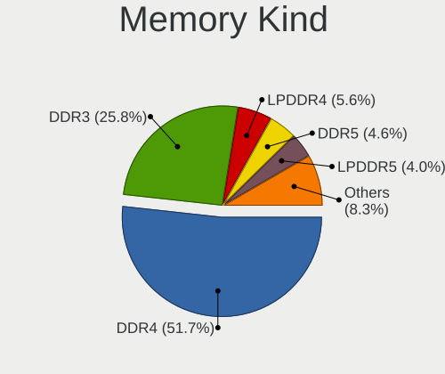

| Kind    | Notebooks | Percent |
|---------|-----------|---------|
| DDR4    | 10979     | 51.73%  |
| DDR3    | 5474      | 25.79%  |
| LPDDR4  | 1180      | 5.56%   |
| DDR5    | 971       | 4.58%   |
| LPDDR5  | 848       | 4%      |
| LPDDR3  | 825       | 3.89%   |
| DDR2    | 497       | 2.34%   |
| SDRAM   | 282       | 1.33%   |
| Unknown | 86        | 0.41%   |
| DDR     | 48        | 0.23%   |
| DRAM    | 32        | 0.15%   |

Memory Form Factor
------------------

Physical design of the memory module

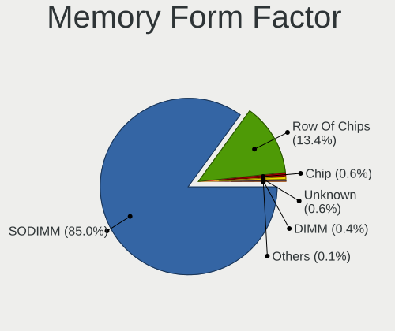

| Name            | Notebooks | Percent |
|-----------------|-----------|---------|
| SODIMM          | 18076     | 84.97%  |
| Row Of Chips    | 2842      | 13.36%  |
| Chip            | 138       | 0.65%   |
| Unknown         | 125       | 0.59%   |
| DIMM            | 79        | 0.37%   |
| Proprietary Car | 14        | 0.07%   |

Memory Size
-----------

Memory module size

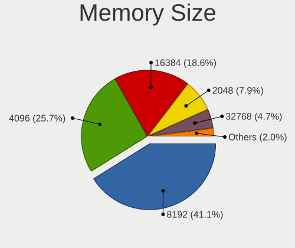

| Size    | Notebooks | Percent |
|---------|-----------|---------|
| 8192    | 9533      | 41.12%  |
| 4096    | 5964      | 25.73%  |
| 16384   | 4303      | 18.56%  |
| 2048    | 1831      | 7.9%    |
| 32768   | 1083      | 4.67%   |
| 1024    | 392       | 1.69%   |
| 512     | 29        | 0.13%   |
| 12288   | 9         | 0.04%   |
| 3072    | 9         | 0.04%   |
| 49152   | 8         | 0.03%   |
| 256     | 6         | 0.03%   |
| 65536   | 5         | 0.02%   |
| 6144    | 5         | 0.02%   |
| 1536    | 4         | 0.02%   |
| 131072  | 1         | 0.004%  |
| Unknown | 1         | 0.004%  |

Memory Speed
------------

Memory module speed

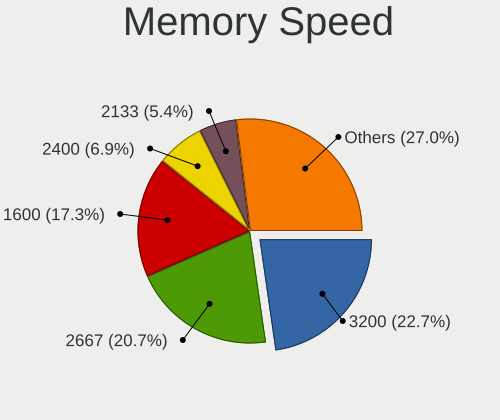

| Speed   | Notebooks | Percent |
|---------|-----------|---------|
| 3200    | 5179      | 22.73%  |
| 2667    | 4712      | 20.68%  |
| 1600    | 3952      | 17.34%  |
| 2400    | 1569      | 6.89%   |
| 2133    | 1226      | 5.38%   |
| 1334    | 648       | 2.84%   |
| 1333    | 582       | 2.55%   |
| 4800    | 538       | 2.36%   |
| 4267    | 503       | 2.21%   |
| 6400    | 478       | 2.1%    |
| 5600    | 464       | 2.04%   |
| 8400    | 328       | 1.44%   |
| 1867    | 290       | 1.27%   |
| 3266    | 270       | 1.18%   |
| Unknown | 260       | 1.14%   |
| 667     | 255       | 1.12%   |
| 1067    | 244       | 1.07%   |
| 4199    | 186       | 0.82%   |
| 7500    | 157       | 0.69%   |
| 800     | 119       | 0.52%   |
| 4266    | 112       | 0.49%   |
| 8533    | 107       | 0.47%   |
| 1066    | 87        | 0.38%   |
| 3733    | 83        | 0.36%   |
| 975     | 76        | 0.33%   |
| 2048    | 68        | 0.3%    |
| 7467    | 62        | 0.27%   |
| 533     | 54        | 0.24%   |
| 2933    | 32        | 0.14%   |
| 5500    | 27        | 0.12%   |
| 333     | 15        | 0.07%   |
| 1866    | 14        | 0.06%   |
| 8600    | 9         | 0.04%   |
| 1639    | 9         | 0.04%   |
| 7400    | 7         | 0.03%   |
| 8000    | 6         | 0.03%   |
| 3000    | 6         | 0.03%   |
| 2267    | 6         | 0.03%   |
| 8448    | 5         | 0.02%   |
| 5200    | 5         | 0.02%   |

Printers & scanners
-------------------

Printer Vendor
--------------

Printer device vendors

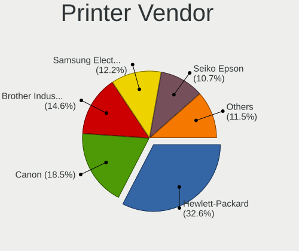

| Vendor                             | Notebooks | Percent |
|------------------------------------|-----------|---------|
| Hewlett-Packard                    | 150       | 32.61%  |
| Canon                              | 85        | 18.48%  |
| Brother Industries                 | 67        | 14.57%  |
| Samsung Electronics                | 56        | 12.17%  |
| Seiko Epson                        | 49        | 10.65%  |
| QinHeng Electronics                | 6         | 1.3%    |
| Prolific Technology                | 6         | 1.3%    |
| Lexmark International              | 6         | 1.3%    |
| STMicroelectronics                 | 5         | 1.09%   |
| Ricoh                              | 4         | 0.87%   |
| Xerox                              | 3         | 0.65%   |
| Kyocera                            | 3         | 0.65%   |
| Zebra                              | 2         | 0.43%   |
| Xiaomi                             | 2         | 0.43%   |
| TSC Auto ID Technology             | 2         | 0.43%   |
| Panasonic (Matsushita)             | 2         | 0.43%   |
| Oki Data                           | 2         | 0.43%   |
| Dell                               | 2         | 0.43%   |
| Zebra Technologies                 | 1         | 0.22%   |
| Pantum                             | 1         | 0.22%   |
| Omnidirectional Control Technology | 1         | 0.22%   |
| Konica Minolta                     | 1         | 0.22%   |
| Dymo-CoStar                        | 1         | 0.22%   |
| CB Printer                         | 1         | 0.22%   |
| BIXOLON                            | 1         | 0.22%   |
| Unknown                            | 1         | 0.22%   |

Printer Model
-------------

Printer device models

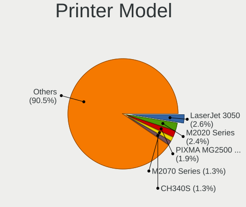

| Model                                                     | Notebooks | Percent |
|-----------------------------------------------------------|-----------|---------|
| HP LaserJet 3050                                          | 12        | 2.59%   |
| Samsung M2020 Series                                      | 11        | 2.38%   |
| Canon PIXMA MG2500 Series                                 | 9         | 1.94%   |
| Samsung M2070 Series                                      | 6         | 1.3%    |
| QinHeng CH340S                                            | 6         | 1.3%    |
| Prolific PL2305 Parallel Port                             | 6         | 1.3%    |
| HP LaserJet 1018                                          | 6         | 1.3%    |
| HP DeskJet 2600 series                                    | 6         | 1.3%    |
| HP LaserJet 1020                                          | 5         | 1.08%   |
| HP DeskJet 2700 series                                    | 5         | 1.08%   |
| HP Deskjet 2540 series                                    | 5         | 1.08%   |
| STMicroelectronics LED badge -- mini LED display -- 11x44 | 4         | 0.86%   |
| Samsung ML-216x Series Laser Printer                      | 4         | 0.86%   |
| HP Printing Support                                       | 4         | 0.86%   |
| HP OfficeJet 3830 series                                  | 4         | 0.86%   |
| HP LaserJet Professional P1102w                           | 4         | 0.86%   |
| HP DeskJet 2300 series                                    | 4         | 0.86%   |
| HP Deskjet 1050 J410                                      | 4         | 0.86%   |
| Canon PIXMA MG3600 Series                                 | 4         | 0.86%   |
| Brother HL-2030 Laser Printer                             | 4         | 0.86%   |
| Seiko Epson XP-4100 Series                                | 3         | 0.65%   |
| Seiko Epson L3110 Series                                  | 3         | 0.65%   |
| Seiko Epson ET-2720 Series                                | 3         | 0.65%   |
| Seiko Epson ET-2710 Series                                | 3         | 0.65%   |
| Seiko Epson EPSON L220 Series                             | 3         | 0.65%   |
| HP Officejet 2620 series                                  | 3         | 0.65%   |
| HP LaserJet P1102                                         | 3         | 0.65%   |
| HP ENVY 6000 series                                       | 3         | 0.65%   |
| HP ENVY 4520 series                                       | 3         | 0.65%   |
| HP Deskjet F4500 series                                   | 3         | 0.65%   |
| HP DeskJet 4100 series                                    | 3         | 0.65%   |
| HP Deskjet 3520 series                                    | 3         | 0.65%   |
| Canon TS3100 series                                       | 3         | 0.65%   |
| Canon PIXMA MG2900 Series                                 | 3         | 0.65%   |
| Canon LiDE 300                                            | 3         | 0.65%   |
| Brother MFC-L2710DW series                                | 3         | 0.65%   |
| Xiaomi MiMouse 2                                          | 2         | 0.43%   |
| TSC Auto ID Printer                                       | 2         | 0.43%   |
| Seiko Epson XP-235 Series                                 | 2         | 0.43%   |
| Seiko Epson XP-2100 Series                                | 2         | 0.43%   |

Scanner Vendor
--------------

Scanner device vendors

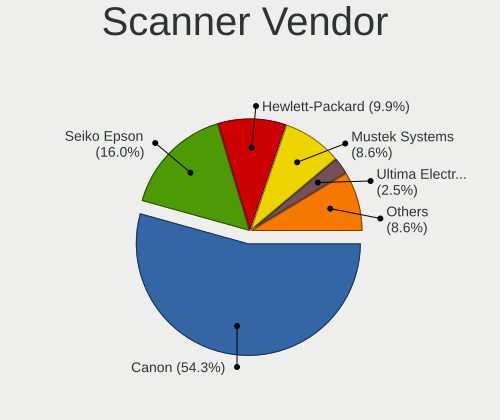

| Vendor                                         | Notebooks | Percent |
|------------------------------------------------|-----------|---------|
| Canon                                          | 44        | 54.32%  |
| Seiko Epson                                    | 13        | 16.05%  |
| Hewlett-Packard                                | 8         | 9.88%   |
| Mustek Systems                                 | 7         | 8.64%   |
| Ultima Electronics                             | 2         | 2.47%   |
| Plustek                                        | 2         | 2.47%   |
| Microtek International                         | 2         | 2.47%   |
| Siemens Information and Communication Products | 1         | 1.23%   |
| KYE Systems (Mouse Systems)                    | 1         | 1.23%   |
| AGFA-Gevaert NV                                | 1         | 1.23%   |

Scanner Model
-------------

Scanner device models

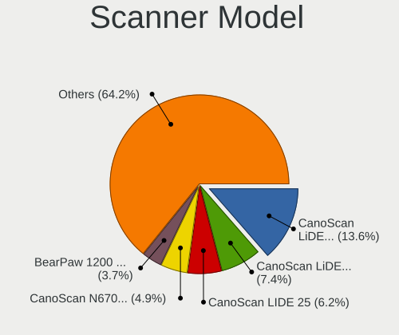

| Model                                                                                 | Notebooks | Percent |
|---------------------------------------------------------------------------------------|-----------|---------|
| Canon CanoScan LiDE 110                                                               | 11        | 13.58%  |
| Canon CanoScan LiDE 220                                                               | 6         | 7.41%   |
| Canon CanoScan LIDE 25                                                                | 5         | 6.17%   |
| Canon CanoScan N670U/N676U/LiDE 20                                                    | 4         | 4.94%   |
| Mustek Systems BearPaw 1200 CU Plus                                                   | 3         | 3.7%    |
| Seiko Epson GT-F730 [GT-S630/Perfection V33/V330 Photo]                               | 2         | 2.47%   |
| Seiko Epson GT-7300U [Perfection 1260/1260 PHOTO]                                     | 2         | 2.47%   |
| Mustek Systems SNAPSCAN e22                                                           | 2         | 2.47%   |
| Canon CanoScan LiDE 60                                                                | 2         | 2.47%   |
| Canon CanoScan LiDE 210                                                               | 2         | 2.47%   |
| Canon CanoScan LiDE 200                                                               | 2         | 2.47%   |
| Canon CanoScan LiDE 100                                                               | 2         | 2.47%   |
| Ultima Artec Ultima 2000 (GT6801 based)/Lifetec LT9385/ScanMagic 1200 UB Plus Scanner | 1         | 1.23%   |
| Ultima Artec Ultima 2000                                                              | 1         | 1.23%   |
| Siemens Information and Communication Products ID-Mouse with Fingerprint Reader       | 1         | 1.23%   |
| Seiko Epson Scanner                                                                   | 1         | 1.23%   |
| Seiko Epson GT-X820 [Perfection V600 Photo]                                           | 1         | 1.23%   |
| Seiko Epson GT-X770 [Perfection V500]                                                 | 1         | 1.23%   |
| Seiko Epson GT-F720 [GT-S620/Perfection V30/V300 Photo]                               | 1         | 1.23%   |
| Seiko Epson GT-F520/GT-F570 [Perfection 3590 PHOTO]                                   | 1         | 1.23%   |
| Seiko Epson GT-8200U/GT-8200UF [Perfection 1650/1650 PHOTO]                           | 1         | 1.23%   |
| Seiko Epson GT-7200U [Perfection 1250/1250 PHOTO]                                     | 1         | 1.23%   |
| Seiko Epson ES-D400 [GT-S80]                                                          | 1         | 1.23%   |
| Seiko Epson ES-D200 [GT-S50]                                                          | 1         | 1.23%   |
| Plustek OpticSlim 1200 Scanner                                                        | 1         | 1.23%   |
| Plustek OpticPro UT12/16/24 Scanner                                                   | 1         | 1.23%   |
| Mustek Systems BearPaw 2448 CU Pro                                                    | 1         | 1.23%   |
| Mustek Systems BearPaw 2400 CU Plus                                                   | 1         | 1.23%   |
| Microtek International Scanner                                                        | 1         | 1.23%   |
| Microtek International ScanMaker V6USL                                                | 1         | 1.23%   |
| KYE Systems (Mouse Systems) ColorPage-SF600                                           | 1         | 1.23%   |
| HP Scanjet Professional 1000 Mobile Scanner                                           | 1         | 1.23%   |
| HP Scanjet G2710                                                                      | 1         | 1.23%   |
| HP scanjet 8270                                                                       | 1         | 1.23%   |
| HP ScanJet 7400c                                                                      | 1         | 1.23%   |
| HP ScanJet 4300c                                                                      | 1         | 1.23%   |
| HP ScanJet 3570c                                                                      | 1         | 1.23%   |
| HP OfficeJet 6110                                                                     | 1         | 1.23%   |
| HP HP4470C                                                                            | 1         | 1.23%   |
| Canon CanoScan N650U/N656U                                                            | 1         | 1.23%   |

Camera
------

Camera Vendor
-------------

Camera device vendors

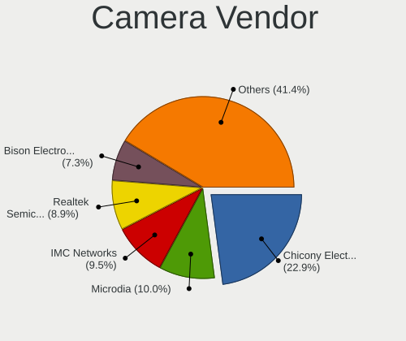

| Vendor                                 | Notebooks | Percent |
|----------------------------------------|-----------|---------|
| Chicony Electronics                    | 9261      | 22.92%  |
| Microdia                               | 4024      | 9.96%   |
| IMC Networks                           | 3855      | 9.54%   |
| Realtek Semiconductor                  | 3579      | 8.86%   |
| Bison Electronics                      | 2957      | 7.32%   |
| Sunplus Innovation Technology          | 2524      | 6.25%   |
| Quanta                                 | 2160      | 5.35%   |
| Cheng Uei Precision Industry (Foxlink) | 1705      | 4.22%   |
| Suyin                                  | 1360      | 3.37%   |
| Apple                                  | 999       | 2.47%   |
| Lite-On Technology                     | 968       | 2.4%    |
| Syntek                                 | 958       | 2.37%   |
| Luxvisions Innotech Limited            | 895       | 2.21%   |
| Silicon Motion                         | 604       | 1.49%   |
| Logitech                               | 492       | 1.22%   |
| Alcor Micro                            | 491       | 1.22%   |
| Ricoh                                  | 404       | 1%      |
| Sonix Technology                       | 328       | 0.81%   |
| Samsung Electronics                    | 301       | 0.74%   |
| Lenovo                                 | 237       | 0.59%   |
| Shinetech                              | 207       | 0.51%   |
| Acer                                   | 195       | 0.48%   |
| Importek                               | 159       | 0.39%   |
| Primax Electronics                     | 139       | 0.34%   |
| SunplusIT                              | 131       | 0.32%   |
| ALi                                    | 125       | 0.31%   |
| Z-Star Microelectronics                | 104       | 0.26%   |
| OmniVision Technologies                | 79        | 0.2%    |
| icSpring                               | 71        | 0.18%   |
| DigiTech                               | 64        | 0.16%   |
| Microsoft                              | 58        | 0.14%   |
| Sunplus Technology                     | 50        | 0.12%   |
| Intel                                  | 50        | 0.12%   |
| kingcome                               | 46        | 0.11%   |
| Generalplus Technology                 | 43        | 0.11%   |
| GEMBIRD                                | 38        | 0.09%   |
| Unknown                                | 37        | 0.09%   |
| BillionPixels                          | 34        | 0.08%   |
| Y Media                                | 29        | 0.07%   |
| Shine-optics                           | 29        | 0.07%   |

Camera Model
------------

Camera device models

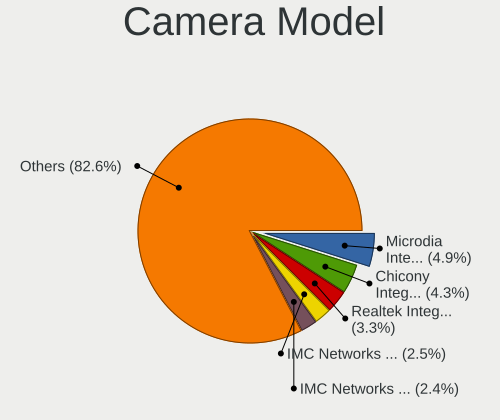

| Model                                         | Notebooks | Percent |
|-----------------------------------------------|-----------|---------|
| Microdia Integrated_Webcam_HD                 | 1983      | 4.89%   |
| Chicony Integrated Camera                     | 1747      | 4.3%    |
| Realtek Integrated_Webcam_HD                  | 1333      | 3.28%   |
| IMC Networks USB2.0 HD UVC WebCam             | 1019      | 2.51%   |
| IMC Networks Integrated Camera                | 977       | 2.41%   |
| Chicony HD WebCam                             | 831       | 2.05%   |
| Sunplus Integrated_Webcam_HD                  | 767       | 1.89%   |
| Bison Integrated Camera                       | 764       | 1.88%   |
| Syntek Integrated Camera                      | 540       | 1.33%   |
| Chicony HP HD Camera                          | 433       | 1.07%   |
| IMC Networks USB2.0 VGA UVC WebCam            | 396       | 0.98%   |
| Apple iPhone 5/5C/5S/6/SE/7/8/X               | 353       | 0.87%   |
| Microdia Integrated Webcam                    | 344       | 0.85%   |
| Bison Lenovo EasyCamera                       | 342       | 0.84%   |
| Chicony HP Truevision HD                      | 320       | 0.79%   |
| Lite-On Integrated Camera                     | 313       | 0.77%   |
| Chicony HP TrueVision HD Camera               | 309       | 0.76%   |
| Sunplus HD WebCam                             | 307       | 0.76%   |
| Chicony TOSHIBA Web Camera - HD               | 307       | 0.76%   |
| Quanta HD User Facing                         | 305       | 0.75%   |
| Samsung Galaxy series, misc. (MTP mode)       | 300       | 0.74%   |
| Quanta HP TrueVision HD Camera                | 300       | 0.74%   |
| Realtek USB Camera                            | 286       | 0.7%    |
| Quanta HP HD Camera                           | 282       | 0.69%   |
| Chicony USB2.0 HD UVC WebCam                  | 281       | 0.69%   |
| Bison HD Webcam                               | 276       | 0.68%   |
| Quanta HD Webcam                              | 265       | 0.65%   |
| Apple FaceTime HD Camera                      | 257       | 0.63%   |
| Lite-On HP HD Camera                          | 254       | 0.63%   |
| Bison SunplusIT Integrated Camera             | 253       | 0.62%   |
| Chicony USB2.0 VGA UVC WebCam                 | 246       | 0.61%   |
| Chicony EasyCamera                            | 244       | 0.6%    |
| Realtek Integrated Webcam                     | 240       | 0.59%   |
| Luxvisions Innotech Limited Integrated Camera | 231       | 0.57%   |
| Chicony Lenovo EasyCamera                     | 227       | 0.56%   |
| Chicony Integrated Camera (1280x720@30)       | 226       | 0.56%   |
| Apple Built-in iSight                         | 226       | 0.56%   |
| Microdia Laptop_Integrated_Webcam_HD          | 225       | 0.55%   |
| Chicony USB 2.0 Camera                        | 213       | 0.52%   |
| Chicony HP HD Webcam                          | 210       | 0.52%   |

Security
--------

Fingerprint Vendor
------------------

Fingerprint sensor vendors

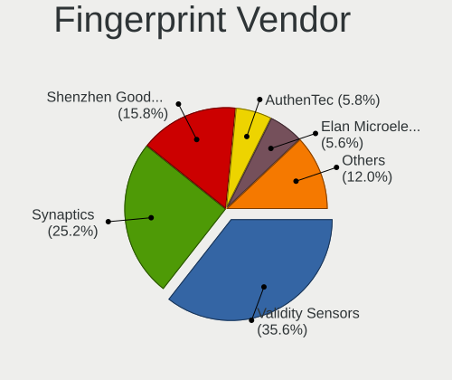

| Vendor                             | Notebooks | Percent |
|------------------------------------|-----------|---------|
| Validity Sensors                   | 2987      | 35.57%  |
| Synaptics                          | 2114      | 25.17%  |
| Shenzhen Goodix Technology         | 1327      | 15.8%   |
| AuthenTec                          | 488       | 5.81%   |
| Elan Microelectronics              | 472       | 5.62%   |
| Upek                               | 426       | 5.07%   |
| LighTuning Technology              | 360       | 4.29%   |
| STMicroelectronics                 | 80        | 0.95%   |
| Realtek USB2.0 Finger Print Bridge | 53        | 0.63%   |
| Focal-systems.Corp                 | 28        | 0.33%   |
| Samsung Electronics                | 27        | 0.32%   |
| HOLTEK                             | 24        | 0.29%   |
| GDMicroelectronics                 | 4         | 0.05%   |
| Next Biometrics                    | 2         | 0.02%   |
| DigitalPersona                     | 2         | 0.02%   |
| Microsoft                          | 1         | 0.01%   |
| Futronic Technology                | 1         | 0.01%   |
| FocalTech                          | 1         | 0.01%   |
| Dell                               | 1         | 0.01%   |

Fingerprint Model
-----------------

Fingerprint sensor models

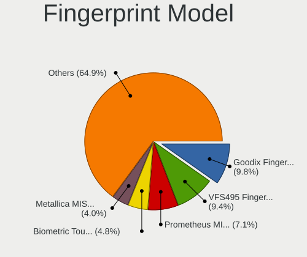

| Model                                                                      | Notebooks | Percent |
|----------------------------------------------------------------------------|-----------|---------|
| Shenzhen Goodix  Fingerprint Device                                        | 820       | 9.76%   |
| Validity Sensors VFS495 Fingerprint Reader                                 | 790       | 9.41%   |
| Synaptics Prometheus MIS Touch Fingerprint Reader                          | 599       | 7.13%   |
| Upek Biometric Touchchip/Touchstrip Fingerprint Sensor                     | 400       | 4.76%   |
| Synaptics Metallica MIS Touch Fingerprint Reader                           | 335       | 3.99%   |
| Validity Sensors VFS5011 Fingerprint Reader                                | 285       | 3.39%   |
| Validity Sensors VFS 5011 fingerprint sensor                               | 268       | 3.19%   |
| Shenzhen Goodix Fingerprint Reader                                         | 267       | 3.18%   |
| Shenzhen Goodix FingerPrint                                                | 240       | 2.86%   |
| Elan ELAN:Fingerprint                                                      | 238       | 2.83%   |
| Elan ELAN:ARM-M4                                                           | 230       | 2.74%   |
| Validity Sensors VFS471 Fingerprint Reader                                 | 213       | 2.54%   |
| Validity Sensors Synaptics WBDI                                            | 211       | 2.51%   |
| Validity Sensors VFS491                                                    | 209       | 2.49%   |
| LighTuning EgisTec Touch Fingerprint Sensor                                | 209       | 2.49%   |
| Synaptics FS7604 Touch Fingerprint Sensor with PurePrint                   | 180       | 2.14%   |
| AuthenTec AES2810                                                          | 171       | 2.04%   |
| Validity Sensors Synaptics VFS7552 Touch Fingerprint Sensor with PurePrint | 164       | 1.95%   |
| Validity Sensors Fingerprint scanner                                       | 160       | 1.9%    |
| Synaptics Fingerprint reader [HP G6]                                       | 158       | 1.88%   |
| Validity Sensors VFS451 Fingerprint Reader                                 | 142       | 1.69%   |
| Synaptics Metallica MOH Touch Fingerprint Reader                           | 141       | 1.68%   |
| Synaptics  FS7604 Touch Fingerprint Sensor with PurePrint                  | 140       | 1.67%   |
| Validity Sensors Swipe Fingerprint Sensor                                  | 139       | 1.65%   |
| Validity Sensors VFS7500 Touch Fingerprint Sensor                          | 129       | 1.54%   |
| AuthenTec AES2501 Fingerprint Sensor                                       | 116       | 1.38%   |
| LighTuning ES603 Swipe Fingerprint Sensor                                  | 105       | 1.25%   |
| Synaptics WBDI Fingerprint Reader USB 086                                  | 103       | 1.23%   |
| Synaptics UWP WBDI Device                                                  | 100       | 1.19%   |
| Synaptics  WBDI                                                            | 84        | 1%      |
| AuthenTec Fingerprint Sensor                                               | 83        | 0.99%   |
| Validity Sensors VFS301 Fingerprint Reader                                 | 82        | 0.98%   |
| STMicroelectronics Fingerprint Reader                                      | 80        | 0.95%   |
| Synaptics Prometheus Fingerprint Reader                                    | 72        | 0.86%   |
| Synaptics WBDI                                                             | 63        | 0.75%   |
| AuthenTec AES1600                                                          | 63        | 0.75%   |
| Validity Sensors VFS101 Fingerprint Reader                                 | 59        | 0.7%    |
| Realtek USB2.0 Finger Print Bridge FocalTech Fingerprint Device            | 53        | 0.63%   |
| Validity Sensors VFS Fingerprint sensor                                    | 51        | 0.61%   |
| Unknown                                                                    | 45        | 0.54%   |

Chipcard Vendor
---------------

Chipcard module vendors

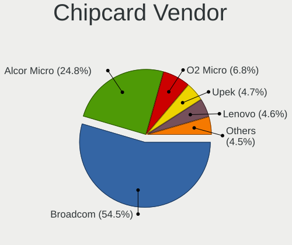

| Vendor                            | Notebooks | Percent |
|-----------------------------------|-----------|---------|
| Broadcom                          | 1977      | 54.54%  |
| Alcor Micro                       | 899       | 24.8%   |
| O2 Micro                          | 248       | 6.84%   |
| Upek                              | 172       | 4.74%   |
| Lenovo                            | 166       | 4.58%   |
| Gemalto (was Gemplus)             | 46        | 1.27%   |
| SCM Microsystems                  | 19        | 0.52%   |
| Yubico.com                        | 16        | 0.44%   |
| Advanced Card Systems             | 14        | 0.39%   |
| Giesecke & Devrient               | 9         | 0.25%   |
| OmniKey                           | 7         | 0.19%   |
| Cherry                            | 7         | 0.19%   |
| Aladdin Knowledge Systems         | 7         | 0.19%   |
| Chicony Electronics               | 5         | 0.14%   |
| Watchdata                         | 4         | 0.11%   |
| Aktiv                             | 4         | 0.11%   |
| VASCO Data Security International | 3         | 0.08%   |
| Realtek Semiconductor             | 3         | 0.08%   |
| Bit4id                            | 3         | 0.08%   |
| Reiner SCT Kartensysteme          | 2         | 0.06%   |
| NXP Semiconductors                | 2         | 0.06%   |
| Hewlett-Packard                   | 2         | 0.06%   |
| C3PO                              | 2         | 0.06%   |
| Thetis                            | 1         | 0.03%   |
| SpringCard                        | 1         | 0.03%   |
| Kobil Systems                     | 1         | 0.03%   |
| Jing-Mold Enterprise              | 1         | 0.03%   |
| Integrated Technology Express     | 1         | 0.03%   |
| Fujitsu Siemens Computers         | 1         | 0.03%   |
| Clay Logic                        | 1         | 0.03%   |
| Aladdin R.D.                      | 1         | 0.03%   |

Chipcard Model
--------------

Chipcard module models

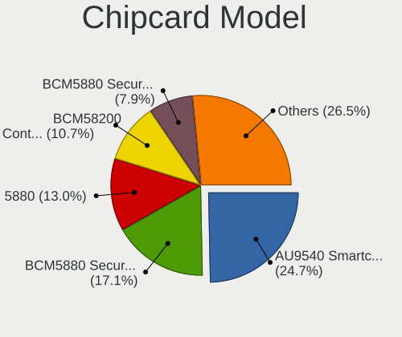

| Model                                                                        | Notebooks | Percent |
|------------------------------------------------------------------------------|-----------|---------|
| Alcor Micro AU9540 Smartcard Reader                                          | 896       | 24.69%  |
| Broadcom BCM5880 Secure Applications Processor                               | 621       | 17.11%  |
| Broadcom 5880                                                                | 472       | 13.01%  |
| Broadcom BCM58200 ControlVault 3 (FingerPrint sensor + Contacted SmartCard)  | 389       | 10.72%  |
| Broadcom BCM5880 Secure Applications Processor with fingerprint swipe sensor | 288       | 7.94%   |
| O2 Micro OZ776 CCID Smartcard Reader                                         | 221       | 6.09%   |
| Broadcom 58200                                                               | 199       | 5.48%   |
| Upek TouchChip Fingerprint Coprocessor (WBF advanced mode)                   | 172       | 4.74%   |
| Lenovo Integrated Smart Card Reader                                          | 165       | 4.55%   |
| O2 Micro Oz776 SmartCard Reader                                              | 27        | 0.74%   |
| Gemalto (was Gemplus) GemPC Twin SmartCard Reader                            | 26        | 0.72%   |
| Yubico.com Yubikey 4/5 U2F+CCID                                              | 16        | 0.44%   |
| Gemalto (was Gemplus) Compact Smart Card Reader Writer                       | 16        | 0.44%   |
| Broadcom BCM5880 Secure Applications Processor with fingerprint touch sensor | 12        | 0.33%   |
| Aladdin Knowledge Systems Token JC                                           | 7         | 0.19%   |
| Advanced Card Systems ACR122U                                                | 7         | 0.19%   |
| SCM Microsystems SCR3340 - ExpressCard54 Smart Card Reader                   | 6         | 0.17%   |
| SCM Microsystems SCR331-LC1 / SCR3310 SmartCard Reader                       | 6         | 0.17%   |
| Advanced Card Systems ACR38 SmartCard Reader                                 | 6         | 0.17%   |
| SCM Microsystems SCR35xx Smart Card Reader                                   | 5         | 0.14%   |
| Giesecke & Devrient StarSign CUT S                                           | 5         | 0.14%   |
| Chicony Electronics HP Skylab USB Smartcard Keyboard                         | 5         | 0.14%   |
| Watchdata USB Key                                                            | 4         | 0.11%   |
| Giesecke & Devrient Chipcard Reader                                          | 4         | 0.11%   |
| Gemalto (was Gemplus) GemPC Key SmartCard Reader                             | 4         | 0.11%   |
| Cherry SmartCard Reader Keyboard KC 1000 SC                                  | 4         | 0.11%   |
| Aktiv Rutoken lite                                                           | 4         | 0.11%   |
| Realtek Semiconductor Smart Card Reader Interface                            | 3         | 0.08%   |
| OmniKey CardMan 4321                                                         | 3         | 0.08%   |
| Cherry SmartTerminal XX1X                                                    | 3         | 0.08%   |
| Bit4id miniLector EVO                                                        | 3         | 0.08%   |
| Alcor Micro Watchdata W 1981                                                 | 3         | 0.08%   |
| VASCO Data Security International DIGIPASS 870                               | 2         | 0.06%   |
| Reiner SCT Kartensysteme cyberJack RFID basis contactless smartcard reader   | 2         | 0.06%   |
| OmniKey 3x21 Smart Card Reader                                               | 2         | 0.06%   |
| NXP Semiconductors PR533                                                     | 2         | 0.06%   |
| Hewlett-Packard SC Keyboard - Apollo (Liteon)                                | 2         | 0.06%   |
| C3PO LTC31v2                                                                 | 2         | 0.06%   |
| VASCO Data Security International Digipass 905 SmartCard Reader              | 1         | 0.03%   |
| Thetis Security Key(FE25)                                                    | 1         | 0.03%   |

Unsupported
-----------

Unsupported Devices
-------------------

Total unsupported devices on board

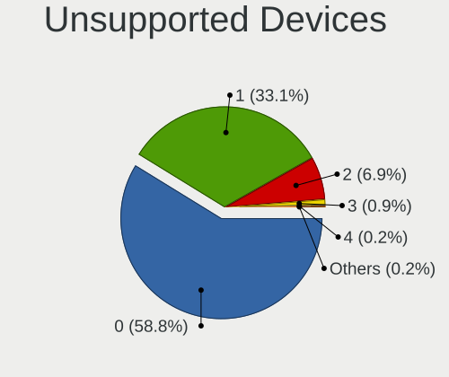

| Total | Notebooks | Percent |
|-------|-----------|---------|
| 0     | 26740     | 58.78%  |
| 1     | 15038     | 33.06%  |
| 2     | 3125      | 6.87%   |
| 3     | 426       | 0.94%   |
| 4     | 75        | 0.16%   |
| 5     | 31        | 0.07%   |
| 8     | 15        | 0.03%   |
| 7     | 15        | 0.03%   |
| 6     | 12        | 0.03%   |
| 9     | 9         | 0.02%   |
| 10    | 4         | 0.01%   |
| 11    | 1         | 0.002%  |

Unsupported Device Types
------------------------

Types of unsupported devices

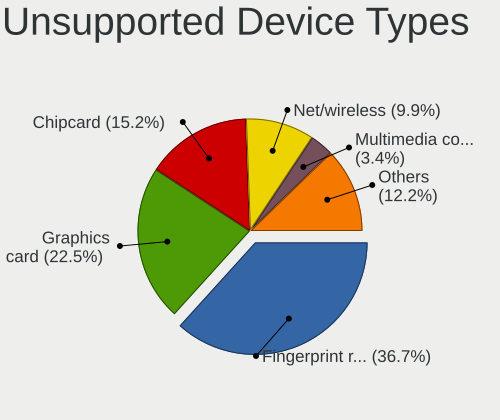

| Type                     | Notebooks | Percent |
|--------------------------|-----------|---------|
| Fingerprint reader       | 8276      | 36.72%  |
| Graphics card            | 5073      | 22.51%  |
| Chipcard                 | 3427      | 15.2%   |
| Net/wireless             | 2235      | 9.92%   |
| Multimedia controller    | 768       | 3.41%   |
| Camera                   | 658       | 2.92%   |
| Bluetooth                | 527       | 2.34%   |
| Storage                  | 412       | 1.83%   |
| Communication controller | 296       | 1.31%   |
| Sound                    | 275       | 1.22%   |
| Card reader              | 232       | 1.03%   |
| Net/ethernet             | 159       | 0.71%   |
| Modem                    | 63        | 0.28%   |
| Flash memory             | 50        | 0.22%   |
| Network                  | 43        | 0.19%   |
| Unassigned class         | 13        | 0.06%   |
| Dvb card                 | 10        | 0.04%   |
| Storage/raid             | 7         | 0.03%   |
| Storage/ata              | 5         | 0.02%   |
| Storage/nvme             | 4         | 0.02%   |
| Wireless                 | 3         | 0.01%   |
| Tv card                  | 2         | 0.01%   |
| Firewire controller      | 2         | 0.01%   |

